# Art Gallery

All artwork files generated and curated for this repository.

## Epigenetics
_Always in flux. _

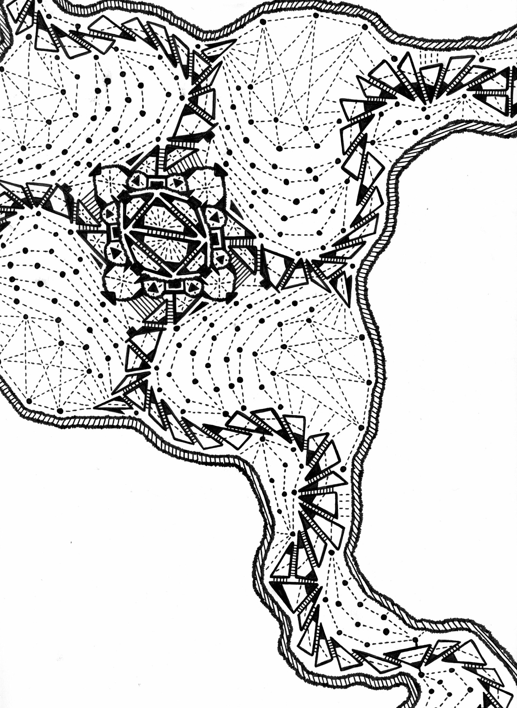

## Luz
_She taught me a new language and turned me on to a new view of the Old Artist's tricks. We co-explored new academic and cultural ways of thinking, now we only communicate through digital wormholes (if that). What's the deal with that? Life is just too funny......

~~~~~~~~~~~~~~~~~~~~~~~

&quot;By three methods we may learn wisdom: First, by reflection, which is noblest; Second, by imitation, which is easiest; and third by experience, which is the bitterest.&quot; 
– Confucius

~~~~~~~~~~~~~~~~~~~~~~~

&quot;I am always wandering around in enigmas.&quot;

&quot;Are you sure that a floor cannot also be a ceiling? Are you absolutely certain that you go up when you walk up a staircase?&quot;

&quot;I do indeed believe that there is a certain contrast between, say, people in scientific professions and people working in the arts. Often there is even mutual suspicion and irritation, and in some cases one group greatly undervalues the other. Fortunately there is no one who actually has only feeling or only thinking properties. They intermingle like the colors of the rainbow and cannot be sharply divided. Perhaps there is even a transitional group, like the green between the yellow and the blue of the rainbow. This transitional group does not have a particular preference for thinking or feeling, but believes that one cannot do without either the one or the other. &quot;

– M. C. Escher_

## Cell
_The cell represents the basic unit of Life. Cells can act as rigid scaffolds, fluid blobs, diaphanous sheets, roving sentries, quiescent spores, invading barbarians, detoxification centers, advanced chemical laboratories, long- or short-term storage depots, solar panels, multi-modal sensory arrays, wetware computers, protection from the elements, study systems, studying systems, complex input/output devices, contractile catapults, templates for future life, or superconductive electrical wires - some of which You are using to read this paragraph._

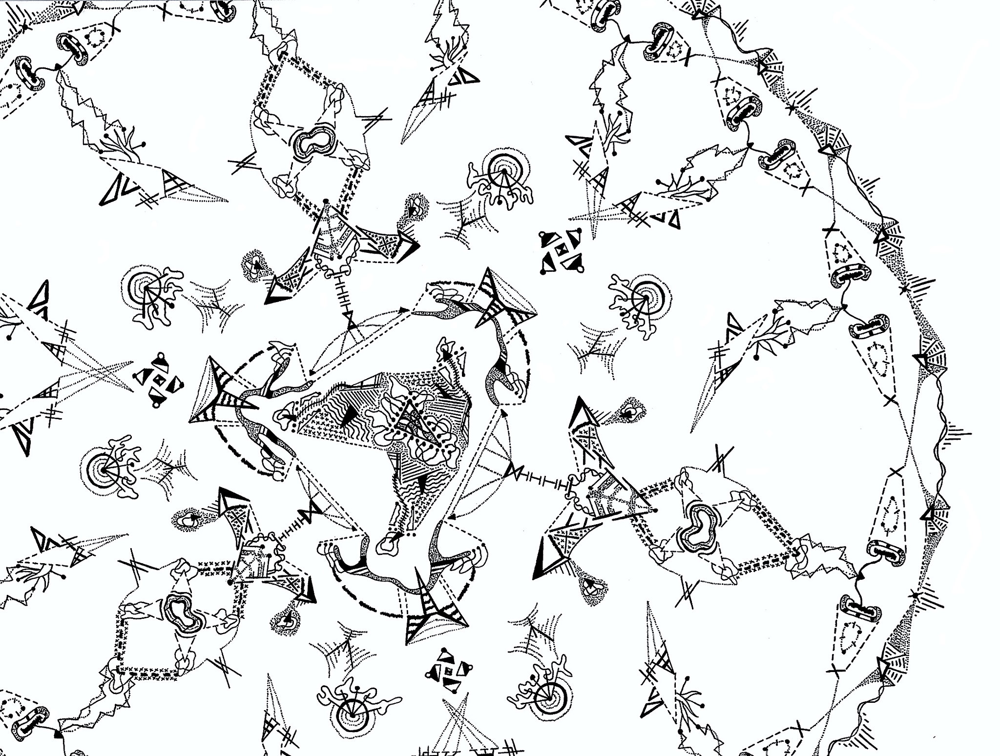

## Bio-kaleidoscope
_Transposons, embryogenesis, consciousness._

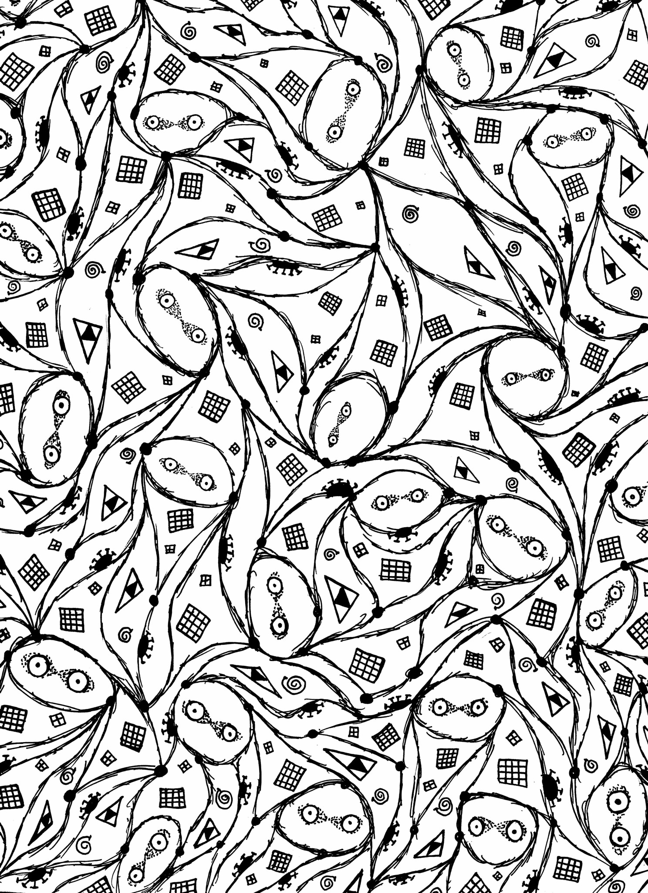

## Polycomb
_Love is but the discovery of ourselves in others, and the delight in the recognition. – Alexander Smith_

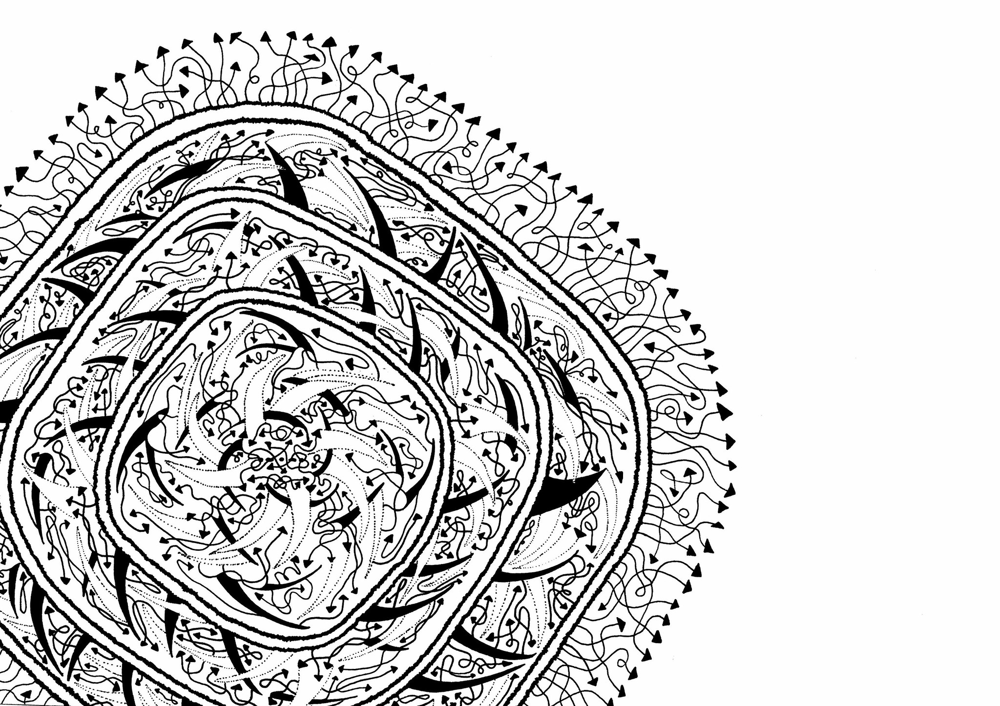

## Grace
_&quot;God is a fixed paradise, man should be a paradise in motion.&quot;

From &quot;The Garden of Forking Paths&quot; by Jorge Luis Borges:

&quot;“Precisely,” said Albert. “The Garden of Forking Paths is an enormous riddle, or parable, whose theme is time; this recondite cause prohibits its mention. To omit a word always, to resort to inept metaphors and obvious periphrases, is perhaps the most emphatic way of stressing it. That is the tortuous method preferred, in each of the meanderings of his indefatigable novel, by the oblique Ts’ui Pên. I have compared hundreds of manuscripts, I have corrected the errors that the negligence of the copyists has introduced, I have guessed the plan of this chaos, I have re-established—I believe I have re-established—the primordial organization, I have translated the entire work: it is clear to me that not once does he employ the word ‘time.’ The explanation is obvious: The Garden of Forking Paths is an incomplete, but not false, image of the universe as Ts’ui Pên conceived it. In contrast to Newton and Schopenhauer, your ancestor did not believe in a uniform, absolute time. He believed in an infinite series of times, in a growing, dizzying net of divergent, convergent and parallel times. This network of times which approached one another, forked, broke off, or were unaware of one another for centuries, embraces all possibilities of time. We do not exist in the majority of these times; in some you exist, and not I; in others I, and not you; in others, both of us. In the present one, which a favorable fate has granted me, you have arrived at my house; in another, while crossing the garden, you found me dead; in still another, I utter these same words, but I am a mistake, a ghost.” &quot;_

## Hexagram
_You know I do believe...
_

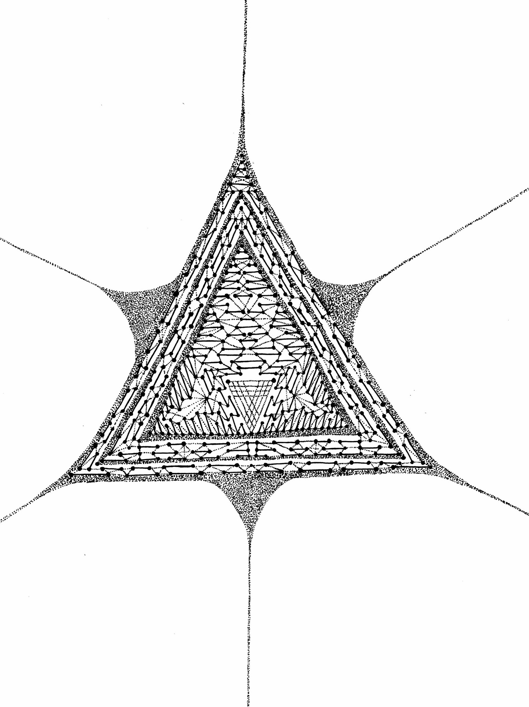

## Bucky
_Elaboration, evolution, expansion, growth, progress, progression, advancement, betterment, improvement, perfection, refinement, incubation, maturation, maturing, ripening, blossoming, flourishing, flowering; addition, augmentation, enhancement, supplementation, emergence, evolvement, metamorphosis.
_

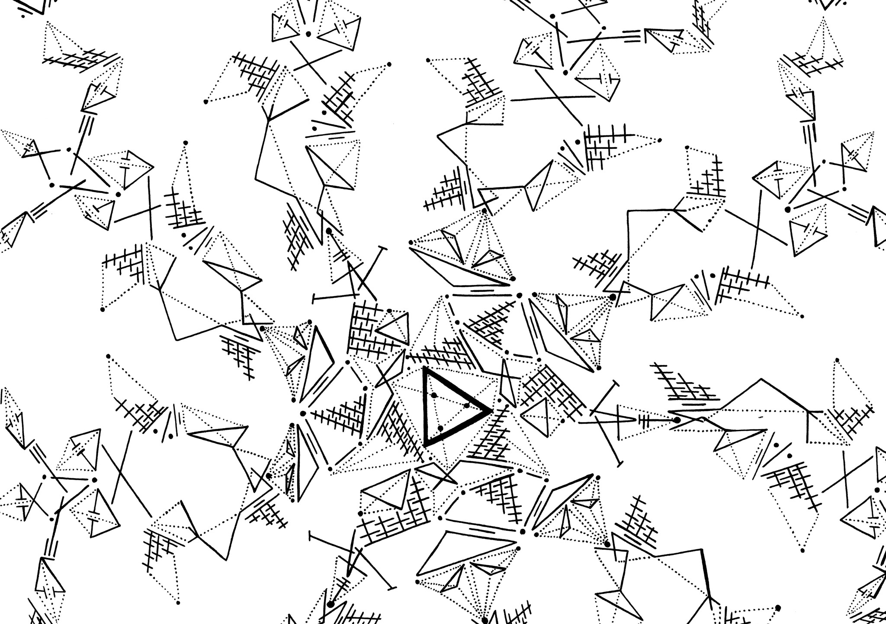

## Flywheel
_The harder it is to make an alignment, the more informative the alignment is. _

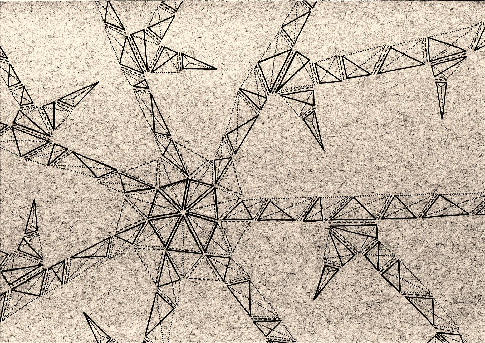

## A. Rose
_&quot;Ain't no way, to explain or say...&quot;_

## Complexity
_&quot;It's quite complicated and sounds circular, but we've worked out a way to calculate a Web site's importance.&quot;
— Larry Page, 1997? 

&quot;A child[’s]…first geometrical discoveries are topological…If you ask him to copy a square or a triangle, he draws a closed circle.&quot;
—Jean Piaget

GLENDOWER: &quot;I can call spirits from the vasty deep.&quot;
HOTSPUR: &quot;Why, so can I, or so can any man;
But will they come when you do call for them?&quot;
— William Shakespeare, Henry IV, pt. I (1597), III, i.

&quot;It is the harmony of the diverse parts, their symmetry, their happy balance; in a word it is all that introduces order, all that gives unity, that permits us to see clearly and to comprehend at once both the ensemble and the details.&quot;
— Henri Poincare

&quot;Dilbert: And we know mass creates gravity because more dense planets have more gravity.
Dogbert: How do we know which planets are more dense?
Dilbert:They have more gravity.
Dogbert: That's circular reasoning.
Dilbert: I prefer to think of it as having no loose ends.&quot;
— Scott Adams

&quot;Do not Bodies and Light act mutually upon one another; that is to say, Bodies upon Light in emitting, reflecting, refracting and inflecting it, and Light upon Bodies for heating them, and putting their parts into a vibrating motion wherein heat consists?&quot;
— Sir Isaac Newton, Opticks (1704), Book 3, Query 5, 133.

&quot;It is the destiny of wine to be drunk, and it is the destiny of glucose to be oxidized. But it was not oxidized immediately: its drinker kept it in his liver for more than a week, well curled up and tranquil, as a reserve aliment for a sudden effort; an effort that he was forced to make the following Sunday, pursuing a bolting horse. Farewell to the hexagonal structure: in the space of a few instants the skein was unwound and became glucose again, and this was dragged by the bloodstream all the way to a minute muscle fiber in the thigh, and here brutally split into two molecules of lactic acid, the grim harbinger of fatigue: only later, some minutes after, the panting of the lungs was able to supply the oxygen necessary to quietly oxidize the latter. So a new molecule of carbon dioxide returned to the atmosphere, and a parcel of the energy that the sun had handed to the vine-shoot passed from the state of chemical energy to that of mechanical energy, and thereafter settled down in the slothful condition of heat, warming up imperceptibly the air moved by the running and the blood of the runner. 'Such is life,' although rarely is it described in this manner: an inserting itself, a drawing off to its advantage, a parasitizing of the downward course of energy, from its noble solar form to the degraded one of low-temperature heat. In this downward course, which leads to equilibrium and thus death, life draws a bend and nests in it.&quot;
— Primo Levi_

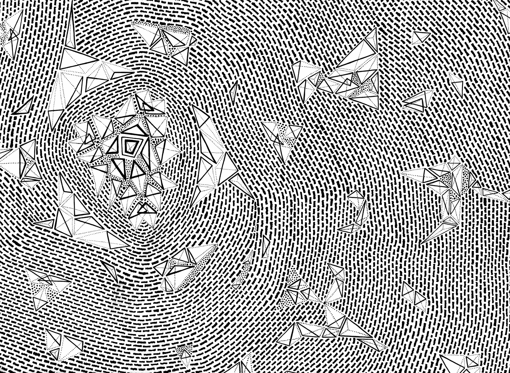

## CRISPR/Cas9
_&quot;One has to be a light to oneself; this light is the law. There is no other law. All the other laws are made by thought and so are fragmentary and contradictory. To be a light to oneself is not to follow the light of another, however reasonable, logical, historical, and however convincing. You cannot be a light to yourself if you are in the dark shadows of authority, of dogma, of conclusion.&quot;
- J. Krishnamurti
_

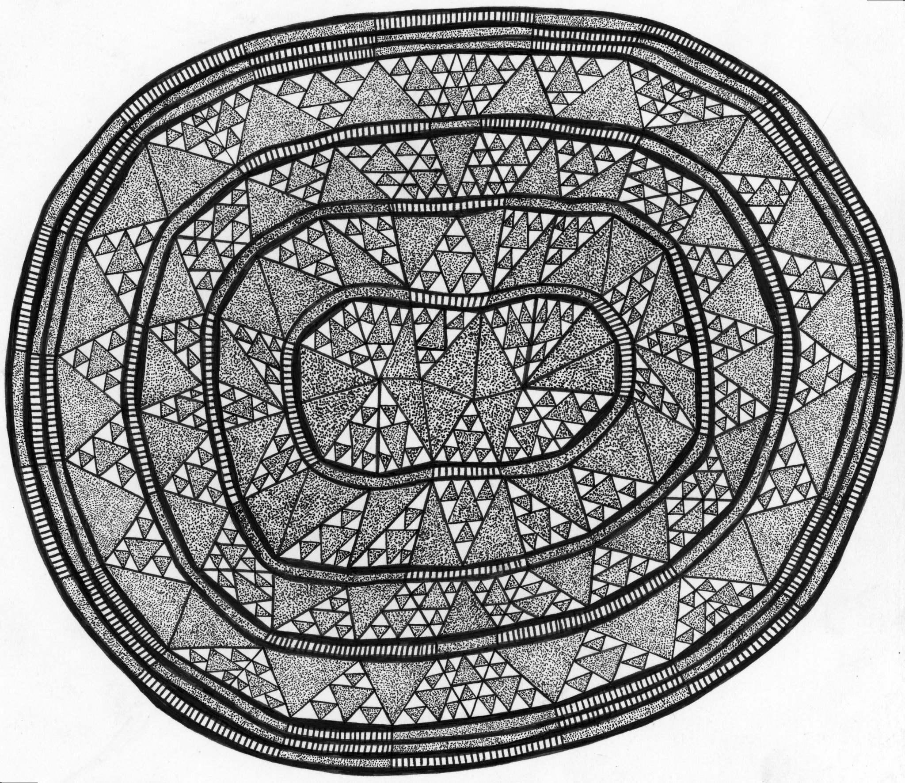

## DNA Crystal Structure / Supernova
_&quot;Do what you will, this world's a fiction, and is made up, of contradiction.&quot; 
          -William Blake_

## Recombination
_DNA Recombination is key to many crucial biological processes. Recombination between chromosomes during sex cell production (meiosis) creates novel combinations of genes, and to many, is the &quot;Why?&quot; of Sex. Recombination between versions of the same gene (alleles) allows a kaleidoscope of DNA error-correcting mechanisms to proceed, and occurs countless times each second in your body. Recombination during immune cell differentiation allows the body to recognize an essentially infinite cohort of potential invaders. And now that recombination has been mechanistically deconvoluted, derived technologies facilitate DNA editing in both laboratory and in vivo settings. 

میازار موری که دانه کش است / که جان دارد و جان شیرین خوش است
On the ant bearing the grain, bring not strife / They are alive and joyous, experience sweet life_

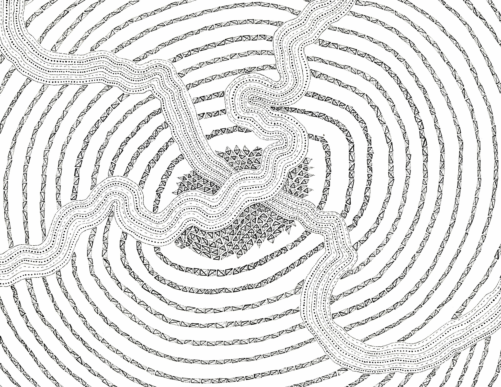

## Body Energetic
_The straightest of lines.....the empty page......

&quot;What we feel and think and are is to a great extent determined by the state of our ductless glands and viscera.&quot;  -Aldous Huxley
_

## Ego
_Ego is constructed, endlessly insidious. 
It exists in all phases, wily and amphibious.
Ego is a hegemony of the body, orchestrated by the head.
To escape its silver net, one must simply play dead.
  
:)_

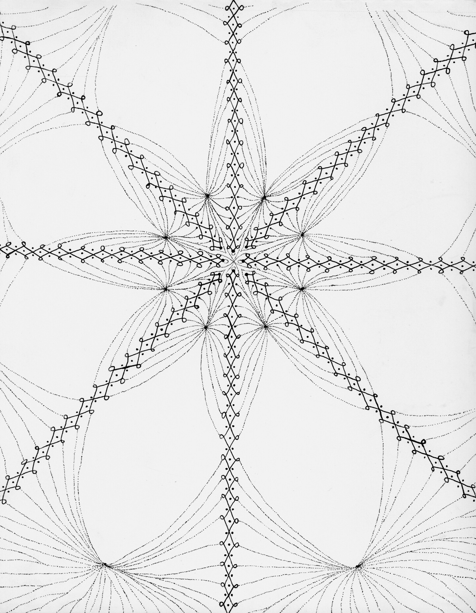

## Identity
_&quot;It's just a phase!!&quot;

..............as opposed to what? 
    
&quot;Das Wort Gen ist vollig frei von jeder Hypothese; ¨
es druckt nur die sichergestellte Tatsache aus, dass ¨
jedenfalls viele Eigenschaften des Organismus durch in
den Gameten vorkommende besondere, trennbare und
so mit selbststandige ‘Zust ¨ ande’, ‘Grundlagen’, ‘Anlagen’ ¨
– kurz, was wir eben Gene nennen wollen – bedingt
sind.&quot;
 [“The word gene is fully free from any hypothesis: It only expresses the securely ascertained fact that at least many properties of the organism are conditional on individual, separable and thus independent ‘states’, ‘basis’, ‘dispositions’ found in the gametes – briefly, just what we want to call genes”.]
-(Johannsen, 1909: 124)_

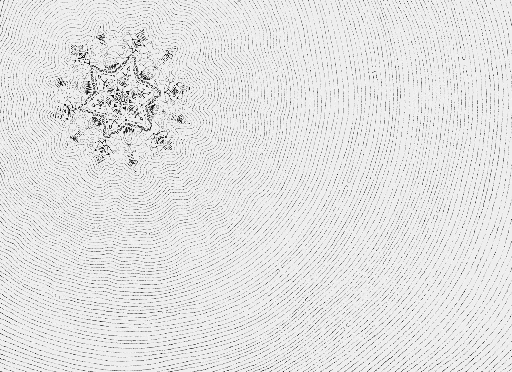

## Multi-Omics
_&quot;There is nothing in a caterpillar that tells you it's going to be a butterfly.&quot; 

&quot;We are in an age that assumes the narrowing trends of specialization to be logical, natural, and desirable. Consequently, society expects all earnestly responsible communication to be crisply brief......Advancing science has now discovered that all the known cases of biological extinction have been caused by overspecialization, whose concentration of only selected genes sacrifices general adaptability.&quot; 

-Bucky Fuller_

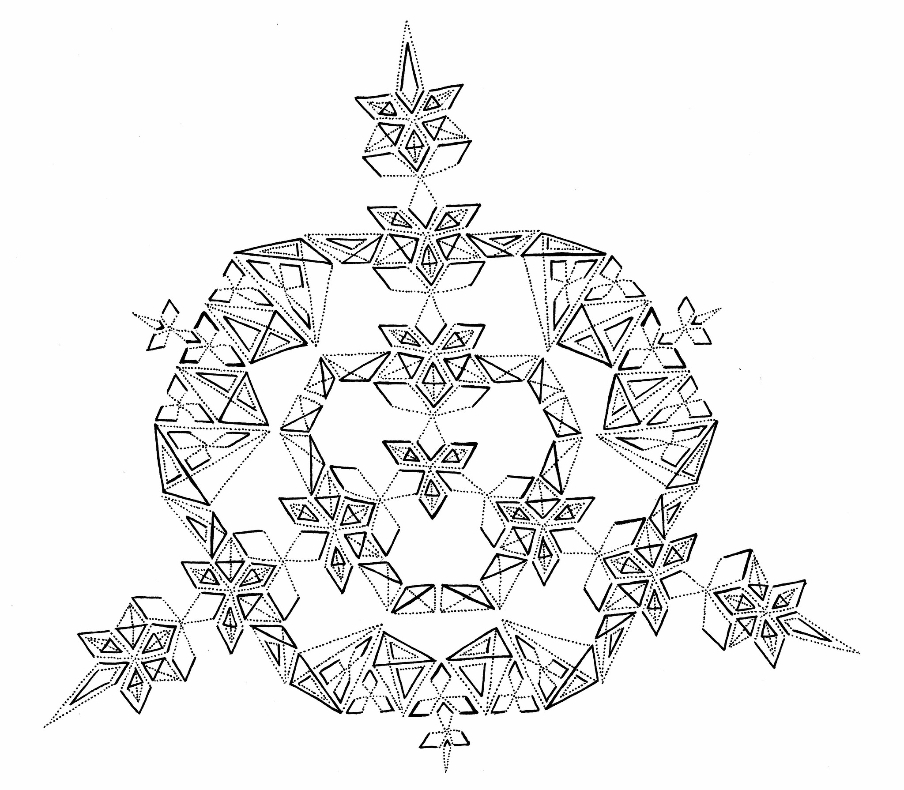

## Emblem
_Oh you.......

&quot;As [the stream] flows, it takes the forms of sappy leaves or vines, making heaps of pulpy sprays a foot or more in depth, and resembling, as you look down on them, the lacinated lobed and imbricated thalluses of same lichens; or you are reminded of coral, of leopard's paws or bird's feet, of brains or lungs or bowels, and excrement of all kinds. It is a truly grotesque vegatations, whose forms and color we see imitated in bronze, a sort of architectural foliage…In the silicious matter which the water deposits is perhaps the bony system, and in the still finer soil and organic matter the fleshy fiber of cellular tissue. What is man but a mass of thawing clay?…You may melt your metals and cast them into the most beautiful molds you can; they will never excite me like the forms which this molten earth flows out into…&quot; 
-H.D. Thoreau, 'Walden'. _

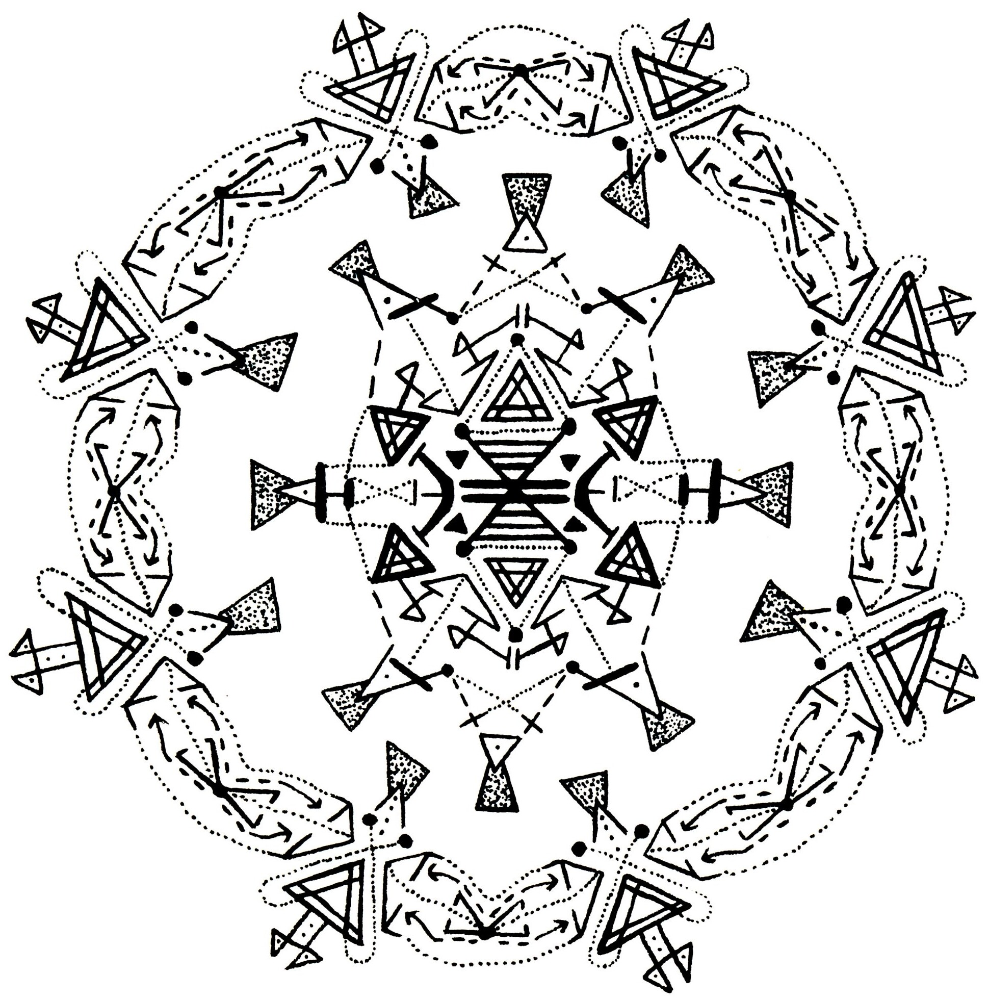

## Siblings
_&quot;Sometimes I can't figure designers out. It's as if they flunked human anatomy.&quot;
Erma Bombeck

&quot;Eventually everything connects - people, ideas, objects. The quality of the connections is the key to quality per se.&quot;
Charles Eames

&quot;A tensegrity system is established when a set of discontinuous compressive components interacts with a set of continuous tensile components to define a stable volume in space.&quot;

&quot;Graphic design is the paradise of individuality, eccentricity, heresy, abnormality, hobbies and humors.&quot;
George Santayana

_

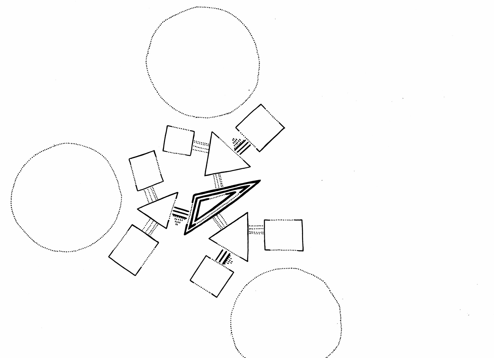

## Poppies
_“Without error there can be no brilliancy”
-Emanuel Lasker

&quot;Human beings are born solitary, but everywhere they are in chains - daisy chains - of interactivity. Social actions are makeshift forms, often courageous, sometimes ridiculous, always strange. And in a way, every social action is a negotiation.&quot; Andy Warhol 

“Nothing excites jaded Grandmasters more than a theoretical novelty”
-Dominic Lawson_

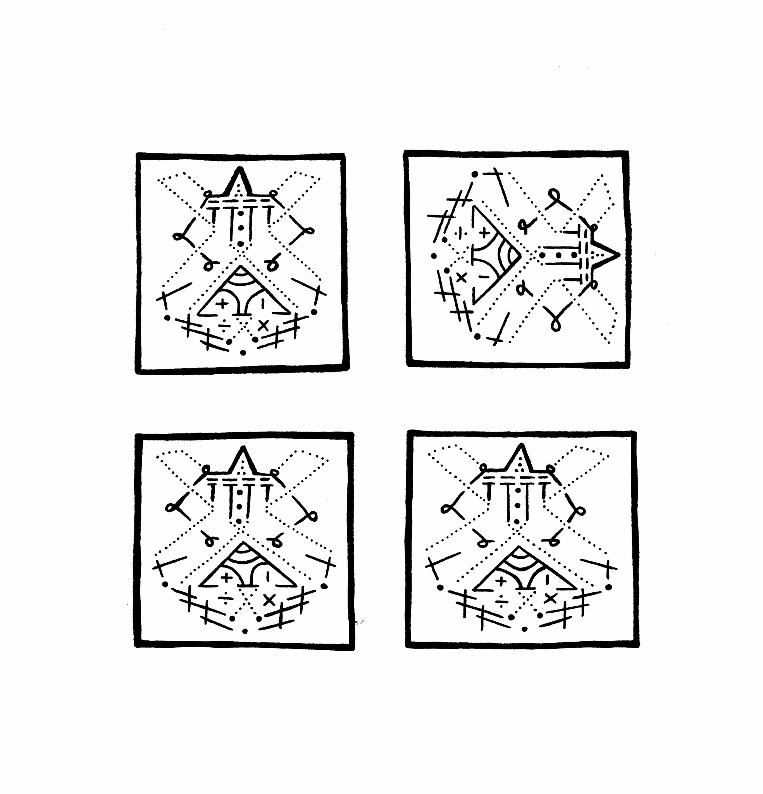

## Sunya Hey
_“Our nada who art in nada, nada be thy name thy kingdom nada thy will be nada in nada as it is in nada. Give us this nada our daily nada and nada us our nada as we nada our nadas and nada us not into nada but deliver us from nada; pues nada. Hail nothing full of nothing, nothing is with thee.”
― Ernest Hemingway

“My brain is only a receiver, in the Universe there is a core from which we obtain knowledge, strength and inspiration. I have not penetrated into the secrets of this core, but I know that it exists.” 
― Nikola Tesla

“I am credited with being one of the hardest workers and perhaps I am, if thought is the equivalent of labour, for I have devoted to it almost all of my waking hours. But if work is interpreted to be a definite performance in a specified time according to a rigid rule, then I may be the worst of idlers.” 
― Nikola Tesla, My Inventions

“I do not think you can name many great inventions that have been made by married men.” 
― Nikola Tesla_

## Phylogenetic Vision
_&quot;The real voyage of discovery consists of not in seeking new landscapes but in having new eyes.&quot; - Marcel Proust

&quot;When most I wink, then do mine eyes best see...&quot; -The Bard 

“The year 2100 will see eugenics universally established.&quot; -Tesla

Ask yourself what there was before there were Four, before there were Two...._

## Systemic
_“I should define the baroque as that style which deliberately exhausts (or tries to exhaust) all its own  possibilities and which borders on its own parody…I would say that the final stage of all styles is baroque when that style only too obviously exhibits or overdoes its own tricks.” 
- J. L. Borges

&quot;No, no, no, you're not thinking; you're just being logical.&quot;
- Niels Bohr

“By your stumbling, the world is perfected....Evolution is not finished; reason is not the last word nor the reasoning animal the supreme figure of Nature. As man emerged out of the animal, so out of man the superman emerges....What you cannot do now is the sign of what you shall do hereafter. The sense of impossibility is the beginning of all possibilities.&quot;
― Sri Aurobindo

&quot;When natural inclination develops into a passionate desire, one advances towards his goal in seven-league boots.&quot;
- Nikola Tesla_

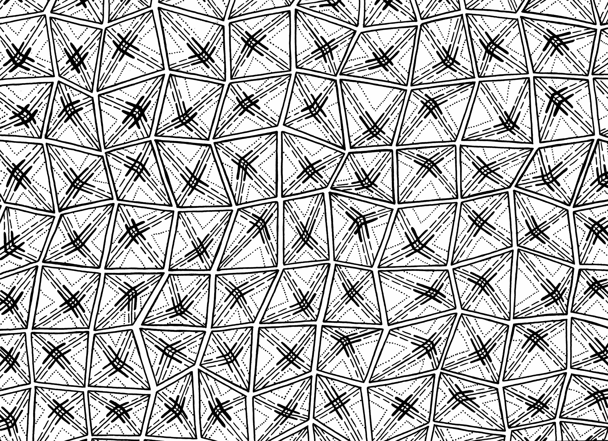

## Butterfly
_&quot;Butterflies are self propelled flowers.&quot; ~R.H. Heinlein

&quot;Know thyself!  A maxim as pernicious as it is ugly.  Whoever observes himself arrests his own development.  A caterpillar who wanted to know itself well would never become a butterfly.&quot;  ~Andre Gide

“Why did it have to be spiders?! Why couldn't it be 'Follow the butterflies'?!&quot;   ~J K Rowling (speaking as Ron)_

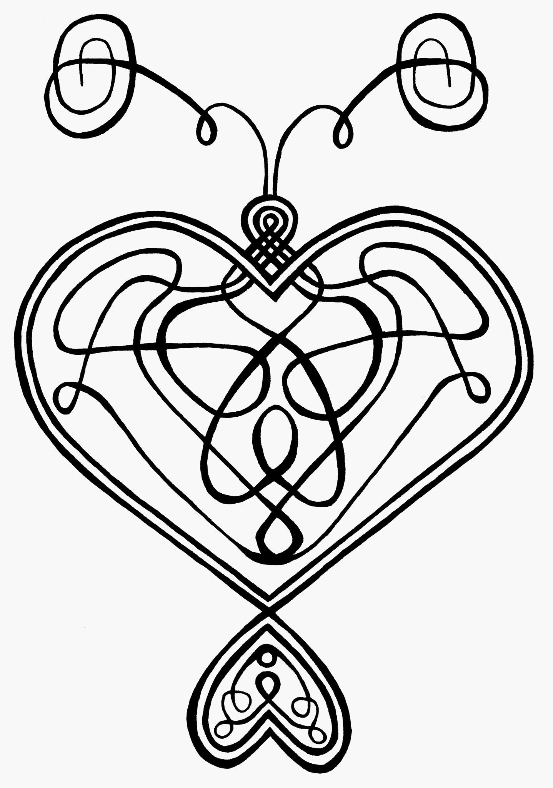

## Cellular Mobility
_::On heading north, from Stuart Little by E.B. White::

“Which direction are you headed? [the repairman] asked.
“North,” said Stuart.
“North is nice,” said the repairman. “I’ve always enjoyed going north. Of course, south-west is a fine direction, too.”
“Yes, I suppose it is,” said Stuart, thoughtfully.
“And there’s east,” continued the repairman. “I once had an interesting experience on an easterly course. Do you want me to tell you about it?”
“No thanks,” said Stuart.
The repairman seemed disappointed, but he kept right on talking. “There’s something about north,” he said, “something that sets it apart from all other directions. A person who is heading north is not making any mistake, in my opinion.”
“That’s the way I look at it,” said Stuart. “I rather expect that from now on I shall be traveling north until the end of my days.”
“Worse things than that could happen to a person,” said the repairman.
“Yes, I know,” answered Stuart.
“Following a broken telephone line north, I have come upon some wonderful places,” continued the repairman. “Swamps where cedars grow and turtles wait on logs but not for anything in particular; fields bordered by crooked fences broken by years of standing still; orchards so old they have forgotten where the farmhouse is. In the north I have eaten my lunch in pastures rank with ferns and junipers, all under fair skies with a wind blowing. My business has taken me into spruce woods on winter nights where the snow lay deep and soft, a perfect place for a carnival of rabbits. I have sat at peace on the freight platforms of railroad junctions in the north, in the warm hours and with the warm smells. I know fresh lakes in the north, undisturbed except by fish and hawk and, of course, by the Telephone Company, which has to follow its nose. I know all these places well. They are a long way from here–don’t forget that. And a person who is looking for something doesn’t travel very fast.”
“That’s perfectly true,” said Stuart. “Well, I guess I’d better get going. Thank you for your friendly remarks.”
“Not at all,” said the repairman. “I hope you find that bird.”
Stuart rose from the ditch, climbed into his car, and started up the road that led toward the north. The sun was just coming up over the hills on his right. As he peered ahead into the great land that stretched before him, the way seemed long. But the sky was bright, and somehow he felt he was headed in the right direction.”_

## Decapentaplegic
_“The snow goose need not bathe to make itself white. Neither need you do anything but be yourself.” ― Lao Tzu

“We are so constituted that we can gain intense pleasure only from the contrast, and only very little from the condition itself.” ― Sigmund Freud

Got black paper and a white ink pen. It was a weird weekend ;)_

## Capsid
_&quot;I pictured myself as a virus or a cancer cell and tried to sense what it would be like.&quot; 
-Jonas Salk

“Only put off until tomorrow what you are willing to die having left undone” 
― Pablo Picasso

&quot;You must remember that Freedom is the first condition of growth&quot; 
- Swami Vivekananda

&quot;If they be two, they are two so
   As stiff twin compasses are two;
Thy soul, the fixed foot, makes no show
   To move, but doth, if the other do.

And though it in the center sit,
   Yet when the other far doth roam,
It leans and hearkens after it,
   And grows erect, as that comes home.

Such wilt thou be to me, who must,
   Like th' other foot, obliquely run;
Thy firmness makes my circle just,
   And makes me end where I begun.&quot;
---J. Donne. _

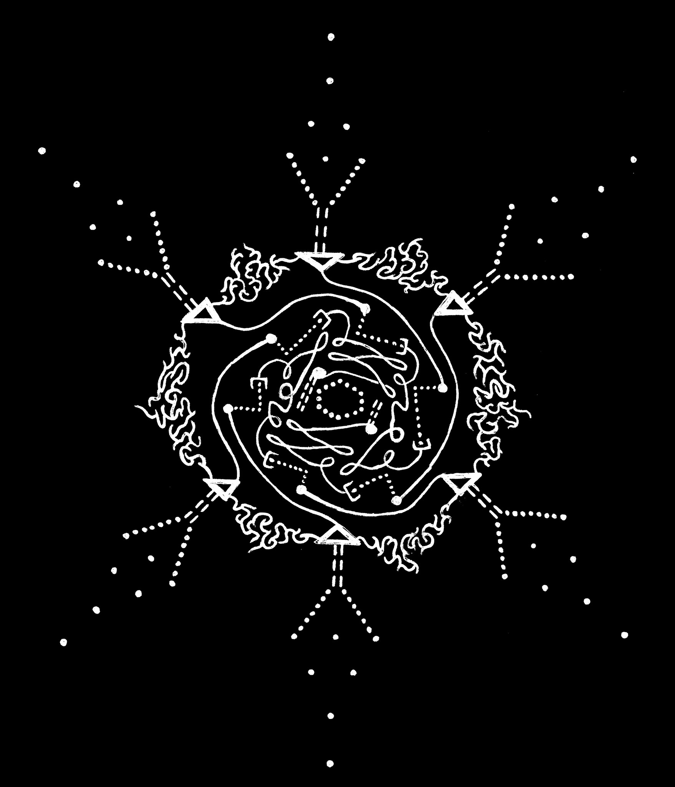

## Quantitative Genetics
_&quot;Personally, I could never get excited about this work - to me, it only seems to obscure the molecular mechanisms of chance, which has always been my main interest.&quot; -A.K. 

&quot;NEVER, EVER SAY THAT 'DATA IS…' DATA ARE PLURAL!!&quot; - J.R. W. 

&quot;When I look at the testis, it is like a galaxy - like an infinite variety of stars.&quot;  - D.J. B. 

&quot;OK, Have fun!&quot; - O.B. 

&quot;Well, how about that...&quot; M.T. 
_

## Hexapod // Axiom
_“The original question, 'Can machines think?' I believe to be too meaningless to deserve discussion.” 

&quot;No, I'm not interested in developing a powerful brain. All I'm after is just a mediocre brain, something like the President of the American Telephone and Telegraph Company.&quot;

&quot;A man provided with paper, pencil, and rubber, and subject to strict discipline, is in effect a universal machine.&quot;

&quot;Science is a differential equation. Religion is a boundary condition.&quot;

&quot;The Exclusion Principle is laid down purely for the benefit of the electrons themselves, who might be corrupted (and become dragons or demons) if allowed to associate too freely.&quot;

“We can only see a short distance ahead, but we can see plenty there that needs to be done.”  

-Alan Turing_

## Los Tuxtlas
_Que chido!

“An ant on the move does more than a dozing ox.” -Lao Tzu

“The men of experiment are like the ant; they only collect and use. But the bee . . . gathers its materials from the flowers of the garden and of the field, but transforms and digests it by a power of its own.” -Leonardo da Vinci

“When you have seen one ant, one bird, one tree, you have not seen them all.” -E.O. Wilson

“None preaches better than the ant, and she says nothing” -Benjamin Franklin

“All that is seen is my form, ant, fly, prince, and pauper” - Sri Sathya Sai Baba _

## Air
_&quot;If I were a gambler, I would take even money that England will not exist in the year 2000&quot; 
-Paul R. Ehrlich (Quote from 1969). 

&quot;There is no real excellence in all this world which can be separated from right living. &quot;
 -David Starr Jordan

&quot;Labor can and will become its own employer through co-operative association.&quot;
-Leland Stanford_

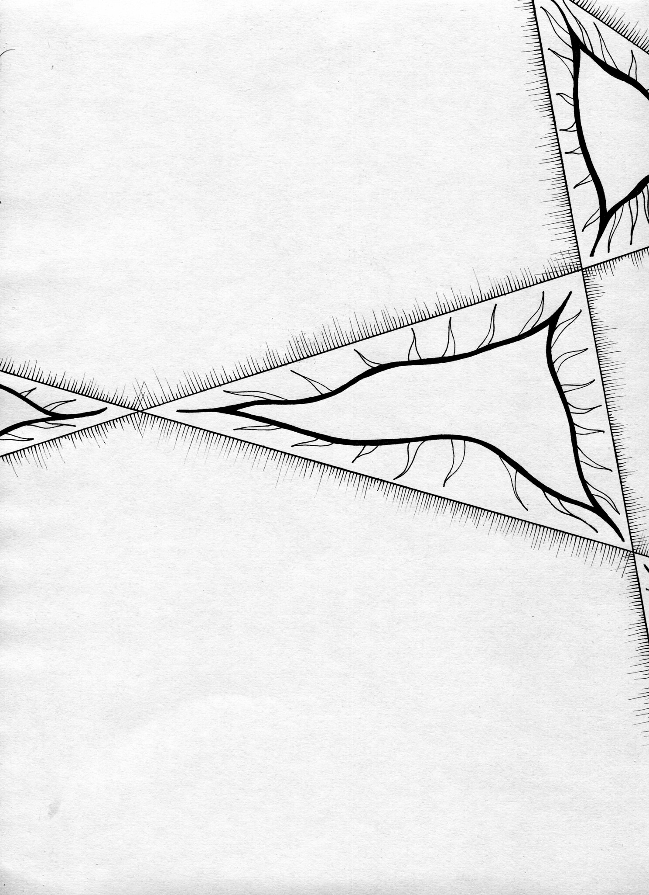

## Grad School pt. 1
_Everything before this drawing was before entering my PhD program. Everything after this drawing was after entering PhD. 

&quot;It&quot; is a lightbulb because Universe is made of thought. 

&quot;It&quot; has holes because while an incandescent filament requires a vacuum to burn, Life is in constant reciprocal interplay with the ecosystem. 

~~~~~~~~~~~~~~~~~~~~~~~

&quot;Last Sunday morning, the sunshine felt like rain.
The week before, they all seemed the same.
With the help of God and true friends, I've come to realize,
I still have two strong legs, and even wings to fly.&quot;
              -Allman Brothers

_

## Peace, Love, and Evolution
_“There are poisons that blind you, and poisons that open your eyes.” 
― August Strindberg

&quot;why imagine when,
in equation four you see, 
constant zero covariance, 
selection resulting in higher fitness, 
positive covariance with non-random mate choice, 
in other words, 
peace, evolution and love&quot;
―Antelope. 

&quot;It doesn't matter if the water is cold or warm if you're going to have to wade through it anyway.&quot; 
―Pierre Teilhard de Chardin  _

## Diatomaceous Earth
_No one ever ragged on the kidney for being co-dependent!!

&quot;Every ant  knows the  formula of its ant-hill,
every  bee knows  the formula  of its  beehive.
They know it  in their own way, not in our way.
Only humankind does not know its own formula.&quot;
— Fyodor Dostoyevsky

&quot;You and I are told we must choose between a left or right, but I suggest there is no such thing as a left or right. There is only an up or down. Up to man's age-old dream -- the maximum of individual freedom consistent with order --or down to the ant heap of totalitarianism. Regardless of their sincerity, their humanitarian motives, those who would sacrifice freedom for security have embarked on this downward path.&quot;
— Ronald Reagan
_

## Portrait of the Drosophila as a Young Fly
_&quot;If the people knew what we had done, they would chase us down the street and lynch us.&quot; 
—George H.W. Bush

&quot;I strongly oppose cloning, as do most Americans. We recoil at the idea of growing human beings for spare body parts or creating life for our convenience....Even the most noble ends do not justify any means.&quot;
—George W. Bush

“I would do it again in a minute......Torture is what the Al Qaeda terrorists did to 3,000 Americans on 9/11 - there is no comparison between that and what we did with respect to enhanced interrogation.”
—Dick Cheney, 2014

&quot;God, grant me the serenity to accept the things I cannot change, the courage to change the things I can, and the wisdom to know the difference.&quot;
—Reinhold Niebuhr_

## Hourglass
_[pose the problem as being about the world, not the study of the world]

“There is no better high than discovery.”
― Edward O. Wilson

“You can't study the darkness by flooding it with light.”
― Edward Abbey

“Listen, O lord of the meeting rivers,
things standing shall fall,
but the moving ever shall stay.”
― Basava

&quot;Criticism is only of value in so far as it trains your observation so that it can eventually be turned on yourself. That is the purpose of criticism. I used to criticize everyone and everything; but afterwards I turned that criticism upon myself to see if that which I criticized outside myself remained in my own heart and mind. The moment I turned that light of criticism upon myself, I began to grow, I began to destroy the unessential.&quot;
- Jiddu Krishnamurti, 'Early Works', circa 1930_

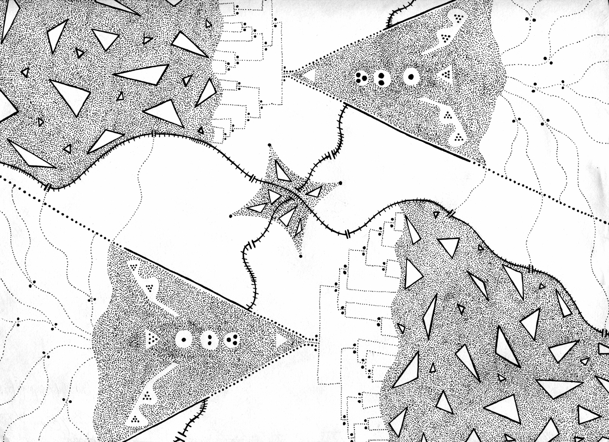

## Mitosis [ In Four Dimensions ]
_Polonius: &quot;What do you read, my lord?&quot;
Hamlet: &quot;Words, words, words.&quot;

..

Guildenstern: &quot;The very substance of the ambitious is merely the shadow of a dream.&quot;
Hamlet: &quot;A dream itself is but a shadow.&quot;

..

Hamlet: &quot;Methinks I see my father.&quot; 
Horatio: &quot;Where, my lord?&quot; 
Hamlet: &quot;In my mind's eye, Horatio.&quot;
_

![Mitosis [ In Four Dimensions ]](<15480633119_Mitosis _ In Four Dimensions _.jpg>)

## Haplo-Diploidy
_&quot;We cannot learn the cipher / That's writ upon our cell; / Stars help us by a mystery / Which we could never spell.&quot;
-R. W. Emerson

&quot;A few minutes ago every tree was excited, bowing to the roaring storm, waving, swirling, tossing their branches in glorious enthusiasm like worship. But though to the outer ear these trees are now silent, their songs never cease. Every hidden cell is throbbing with music and life, every fiber thrilling like harp strings, while incense is ever flowing from the balsam bells and leaves. No wonder the hills and groves were God's first temples, and the more they are cut down and hewn into cathedrals and churches, the farther off and dimmer seems the Lord himself.&quot; 
-J. Muir

&quot;One day when I went out to my wood-pile, or rather my pile of stumps, I observed two large ants, the one red, the other much larger, nearly half an inch long, and black, fiercely contending with one another.....I was myself excited somewhat even as if they had
been men. The more you think of it, the less the difference........ the results of this battle will be as important and memorable to those whom it concerns as those of the battle of Bunker Hill, at least........Whether [S]he finally survived that combat, and spent the remainder of [Her] days in some Hôtel des Invalides, I do not know....&quot;
-H. D. Thoreau_

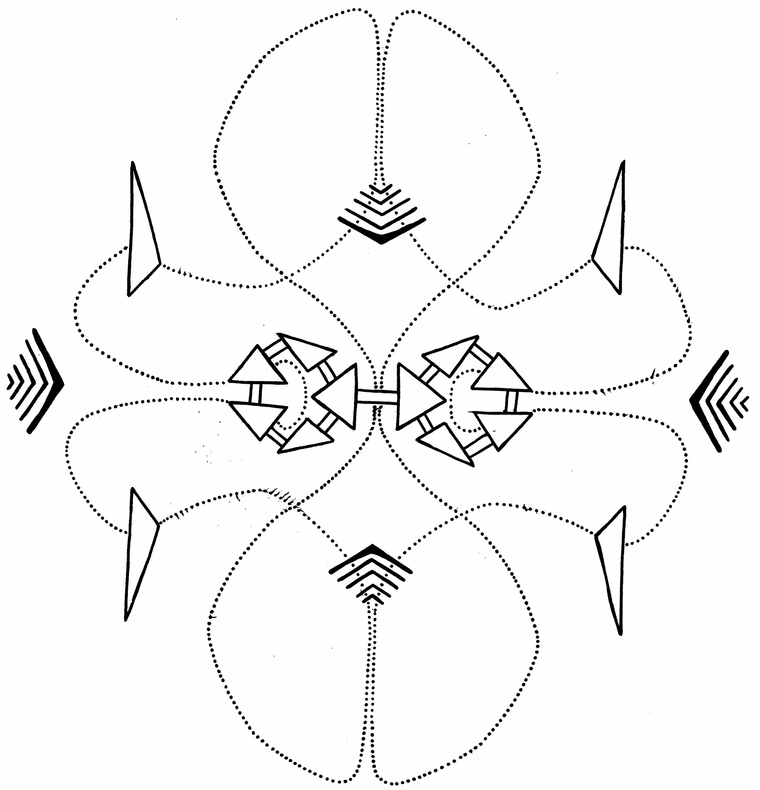

## Symbolic Language
_Ĥ♡Ѡ Ƭ♡ SƐŔѴƐ Λ Ŀ♡ѴƐŔ:
Aŋ Aℓɠσŗïŧɧɱ ∱σŗ ŧɧε Pεŗþℓεхεđ

Input:
Two.

Step 1:
Mechanistic interaction (electro-magnetic + chemical + auditory + tactile + ...)
Go on to Step 2. 

Step 2:
Symbolic interaction (verbal + written + mental [+ emotional?] + ...)
Go back to Step 1. 

Step 3: 
When you are ready to stop playing by the rules, go on to Step 4.

Step 4:
Subject-Object Fusion (identity-agnostic + full ego-dissolution + ... )

Output:
One.
_

## I, Ant
_This is an Ant. Instead of Six legs, it has Four. Actually, instead of any legs at all, it has a capital letter &quot;I&quot; to symbolize the role of the&quot;individual&quot; and &quot;collective&quot; &quot;I&quot;dentity in the experience of the Ant. At all levels, the fractal &quot;I&quot; is made up of infinite multiplication and addition signs to represent the countless deterministic interactions that culminate in stochastic behavior at the organismal level. Since adding a negative number is subtraction, and since multiplying by a fraction is multiplying, the binary toolkit of addition and multiplication allows all other possible functions to be derived. So why choose &quot;+&quot; and &quot;x&quot; over &quot;-&quot; and &quot;÷&quot;? Subtraction and division signs could also be used to derive multiplication and addition - wouldn't that work work just as well? Technically yes, though Life chooses growth over decay every single time. Take a breath - this is quite circular logic - I believe that our category of &quot;living things&quot; is a polyphyletic grouping of all named (namable?) systems that (seem to) choose self-perpetuation over self-negation. 

And we haven't even touched group selection yet!

--------------

    &quot;If I had four hours to chop down a tree, I’d spend the first three hours just sharpening the axe&quot; -Abraham Lincoln

    &quot;Give me six hours to chop down a tree - I will spend the first four sharpening the axe.&quot; -Abraham Lincoln

    &quot;Had I 8 hours to chop down a tree, I would spend 6 of those hours sharpening the axe.&quot; -Abraham Lincoln_

## Stretch
_&quot;The nightmare of materialism, which has turned the life of the universe into an evil, useless game, is not yet past; it holds the awakening soul still in its grip.&quot; 
-Wassily Kandinsky 

&quot;Golf is deceptively simple and endlessly complicated; it satisfies the soul and frustrates the intellect. It is at the same time rewarding and maddening - and it is without a doubt the greatest game mankind has ever invented.&quot; 
-Arnold Palmer  

&quot;I will not change my old mumpsimus for your new sumpsimus!!&quot;_

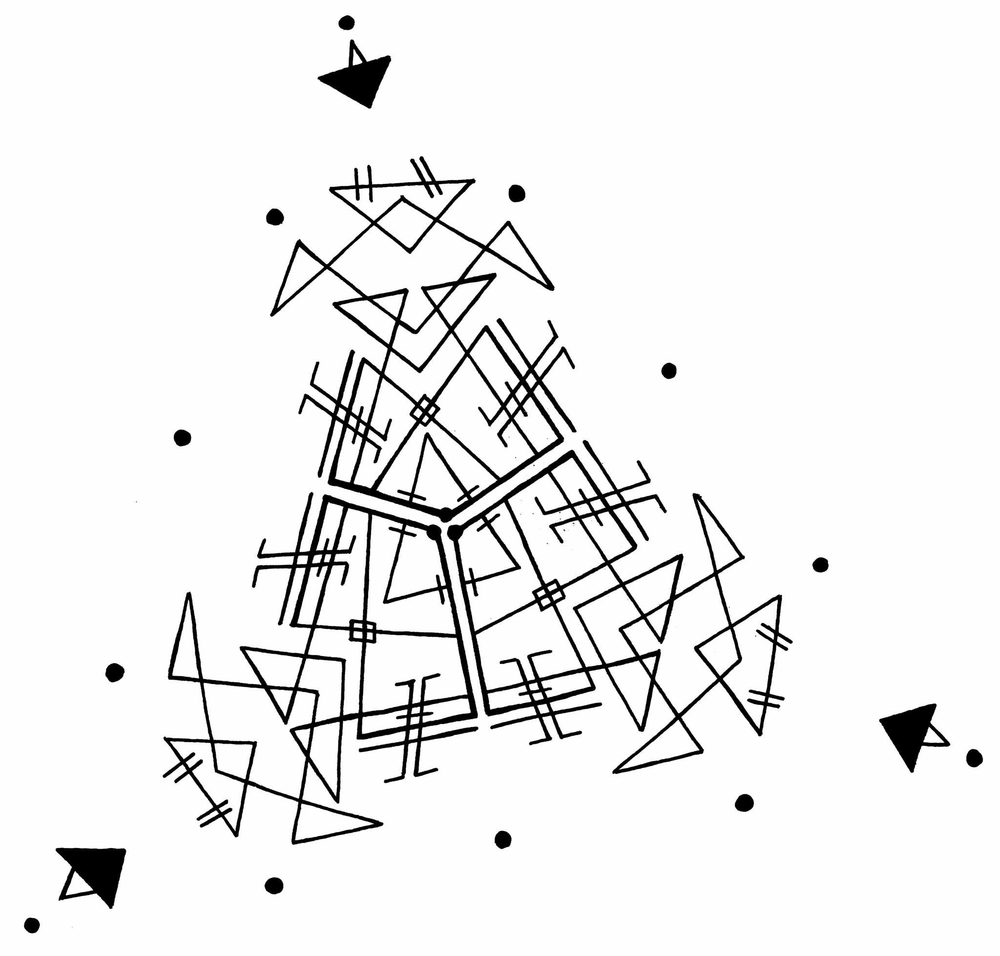

## Time
_&quot;I will tell you the deeper significance of this, which otherwise might seem a banal hydraulic joke. Caus knew that if one fills a vessel with water and seals it at the top, the water, even if one then opens a hole in the bottom, will not come out. But if one opens a hole in the top, also, the water spurts out below.&quot;
&quot;Isn't that obvious?&quot; I said. &quot;Air enters at the top and presses the water down.&quot;
&quot;A typical scientific explanation, in which the cause is mistaken for the effect, or vice versa. The question is not why the water comes out in the second place, but why it refuses to come out in the first case.&quot;
&quot;And why does it refuse?&quot; Garamond asked eagerly.
&quot;Because, if it came out, it would leave a vacuum in the vessel, and nature abhors a vacuum. Nequaquam vacui was a Rosicrucian principle, which modern science has forgotten.&quot;
&quot;Excuse me,&quot; Belbo said to Agliè, &quot;but your argument is simply post hoc ergo ante hoc. What follows causes what came before. You must not think linearly. The water in these fountains doesn't. Nature doesn't; nature knows nothing of time. Time is an invention of the West.&quot;
— Umberto Eco_

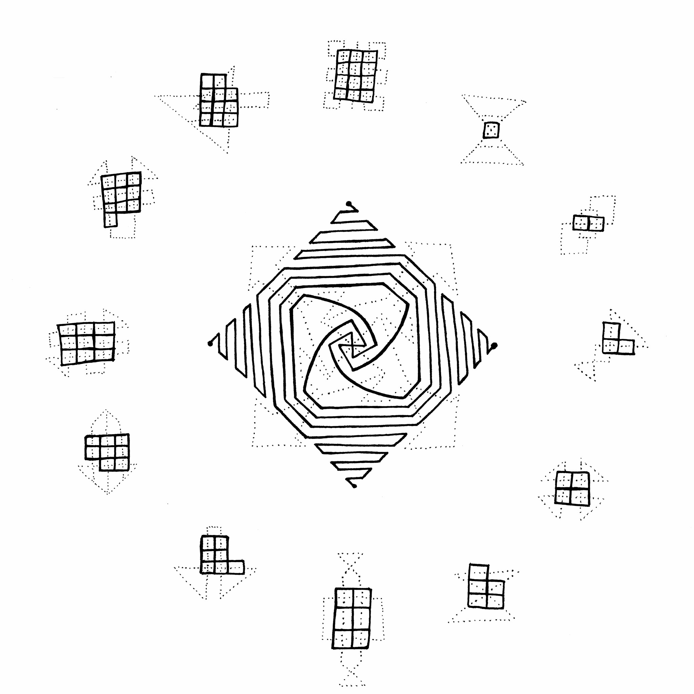

## Thelonious Parthenogenesis
_&quot;So nat'ralists observe, a flea
Has smaller fleas that on him prey;
And these have smaller fleas to bite 'em.
And so proceeds Ad infinitum.&quot;
― Jonathan Swift

“Big whirls have little whirls,
That feed on their velocity;
And little whirls have lesser whirls,
And so on to viscosity.” 
― Lewis Fry Richardson

“A harvester ant never quits and she never, ever gives up.”
―LaDene Mayville
_

## An "Ant" is a Colony (The Treachery of Images)
_&quot;The rhythm of ant-watching is not determined by a series of
hypotheses, inferences and confirmations. Instead it is a rhythm of inattention, absorption, and sudden transitions. Each transition is from not-seeing to seeing, in which a group of ants seem to click into a pattern and rhythm, like an invisible bit of choreography, which identifies itself to me as patrolling, or foraging; I see them doing something. It is not exactly that the ants suddenly come to life, but that what they are doing suddenly becomes the activity of a form of life I recognize.&quot;
-D. M. Gordon

&quot;This shows that (now I am using the term ‘proving’ in the traditional sense) one does not prove what one sets out to prove. Therefore no proof should conclude with the words: ‘Quod erat demonstrandum.’&quot;
-I. Lakatos_

## The Dancing Girl
_“Research is the highest form of adoration”
― Pierre Teilhard de Chardin

“If you want to make beautiful music, you must play the black and the white notes together.”
― Richard M. Nixon

&quot;I don't spend my time pontificating about high-concept things; I spend my time solving engineering and manufacturing problems.&quot;
― Elon Musk

“Don't buy a single vote more than necessary. I'll be damned if I'm going to pay for a landslide.”
― Joseph P. Kennedy_

## Neural Network
_“If this world is a poem, it is not because we see the meaning of it at first but on the strength of its chance occurrences and paradoxes.&quot;

“To ask for an explanation is to explain the obscure by the more obscure.”

“History flows neither from the past nor to the future alone: it reverses its course and, when you get right down to it, flows from all the presents.” 

― Maurice Merleau-Ponty

1,2,3,4,6,8,9,12,18,24,36,72._

## Enantiostasis
_If the Mind and the Body are One, then what is an &quot;out-of-body&quot; experience? While the Mind takes leave from Body, does Body have an &quot;out-of-mind&quot; experience? Which episode would the &quot;I&quot; remember? Why should it be that way? How could you test this? 

Today, I am a: General Time Reversible model, simulated under Approximate Bayesian Computation, by a reticulated fractal Neural Network, of electrochemical integrators consisting of genetic networks...

Nunc scio quid sit amor

“An ocean traveler has even more vividly the impression that the ocean is made of waves than that it is made of water.” 
― Arthur Stanley Eddington

_

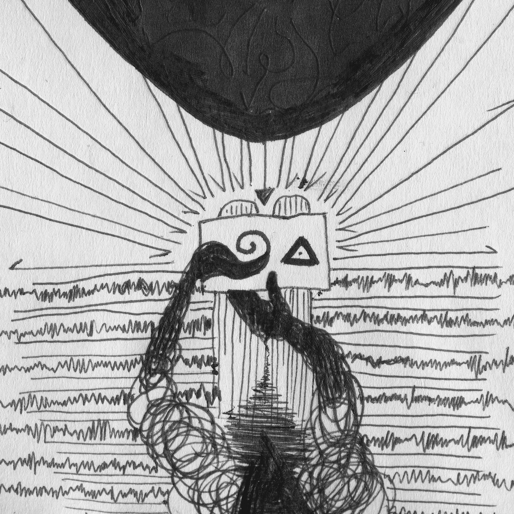

## Loop d'Loop
_“Progress has not followed a straight ascending line, but a spiral with rhythms of progress and retrogression, of evolution and dissolution.”
- J. Wolfgang von Goethe  

&quot;Before I met Ayn Rand, I was a logical positivist, and accordingly, I didn't believe in absolutes, moral or otherwise. If I couldn't prove a proposition with facts and figures, it was without merit.&quot;
- Alan Greenspan

&quot;A black cat crossing your path signifies that the animal is going somewhere.&quot;
- Groucho Marx_

## Statistical Monsters
_&quot;There is nothing worse than a sharp image of a fuzzy concept.&quot;

&quot;Dodging and burning are steps to take care of mistakes God made in establishing tonal relationships.&quot;

&quot;When words become unclear, I shall focus with photographs. When images become inadequate, I shall be content with silence.&quot;

-Ansel Adams_

## From Reductionism to Holism
_“Life is not a problem to be solved, but a reality to be experienced.”
― Søren Kierkegaard

&quot;Only Socrates knew, after a lifetime of unceasing labor, that he was ignorant. Now every high-school student knows that. How did it become so easy?&quot;
―Allan Bloom

“Freedom (n.): To ask nothing. To expect nothing. To depend on nothing.”
― Ayn Rand, The Fountainhead _

## Holidaze
_&quot;Imagine a vast sheet of paper on which straight Lines, Triangles, Squares, Pentagons, Hexagons, and other figures, instead of remaining fixed in their places, move freely about, on or in the surface, but without the power of rising above or sinking below it, very much like shadows—only hard with luminous edges—and you will then have a pretty correct notion of my country and countrymen. Alas, a few years ago, I should have said &quot;my universe:&quot; but now my mind has been opened to higher views of things. In such a country, you will perceive at once that it is impossible that there should be anything of what you call a &quot;solid&quot; kind; but I dare say you will suppose that we could at least distinguish by sight the Triangles, Squares, and other figures, moving about as I have described them. On the contrary, we could see nothing of the kind, not at least so as to distinguish one figure from another. Nothing was visible, nor could be visible, to us, except Straight Lines; and the necessity of this I will speedily demonstrate.&quot;
— Edwin A. Abbott (Flatland: A Romance of Many Dimensions) 

“An ocean traveler has even more vividly the impression that the ocean is made of waves than that it is made of water.” 
― Arthur Stanley Eddington_

## Teaching
_Tell them what you are going to tell them. Strike at the core of the issue. Short sentences. Be direct. Give minimal axiomatic knowledge. Allow blossoming to occur within the mind of the student. Play music before class. Lead the group through your emotional trip, show them how to modify their own trip. Freely admit your ignorance. Seductively hint at your knowledge. Grains of salt aplenty. Narrate. Tell them what you told them.  Enjoy.

&lt;3

“After more than ten years of close study of the Three-spined Stickleback, for instance, I notice that my ability to recognize intentional movements in this species is still improving, thus leading to new discoveries each season, and causing me surprise, and a kind of annoyance about my own previous stupidity” 
- Tinbergen_

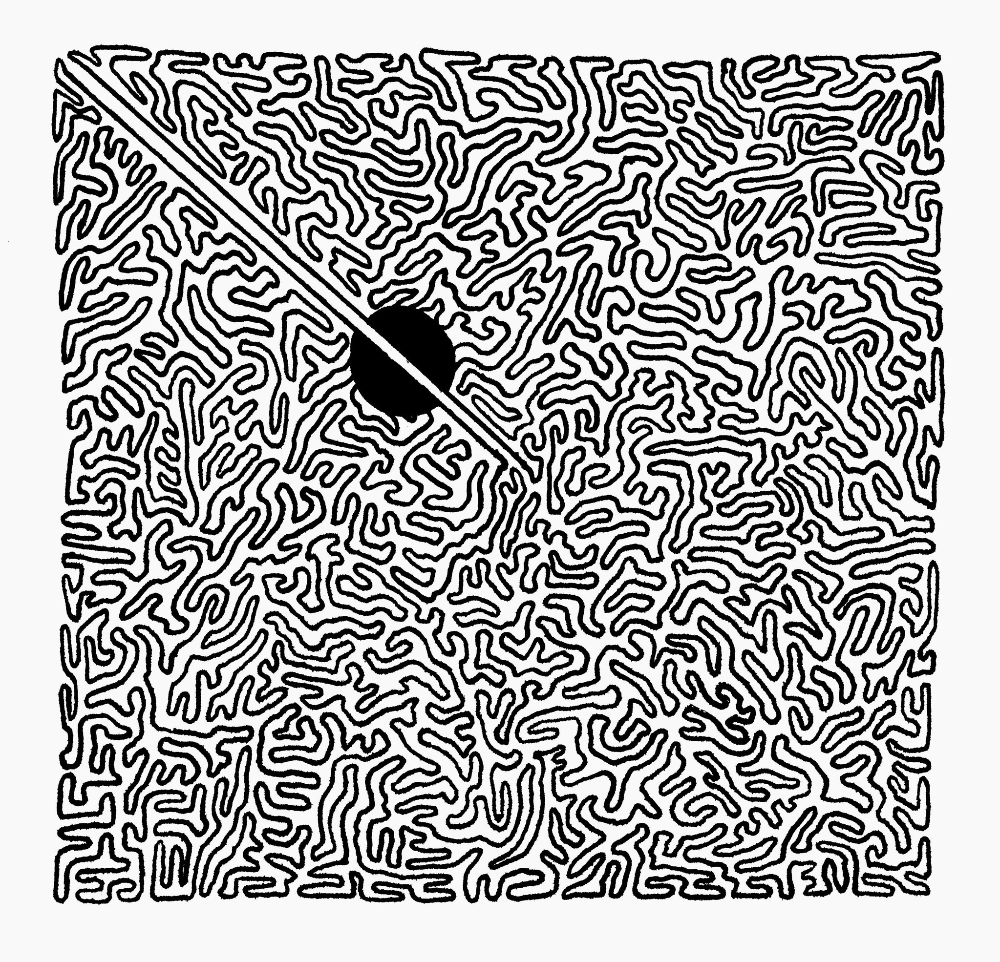

## Education
_“Nothing is built on stone; All is built on sand, but we must build as if the sand were stone.”
― Jorge Luis Borges

&quot;Not a single one of the cells that compose you knows who you are, or cares.&quot;
— Daniel C. Dennett

“The more I study the works of men in their institutions, the more clearly I see that, in their efforts after independence, they become slaves, and that their very freedom is wasted in vain attempts to assure its continuance. That they may not be carried away by the flood of things, they form all sorts of attachments; then as soon as they wish to move forward they are surprised to find that everything drags them back. It seems to me that to set oneself free we need do nothing, we need only continue to desire freedom.”
― Jean-Jacques Rousseau, Emile or On Education _

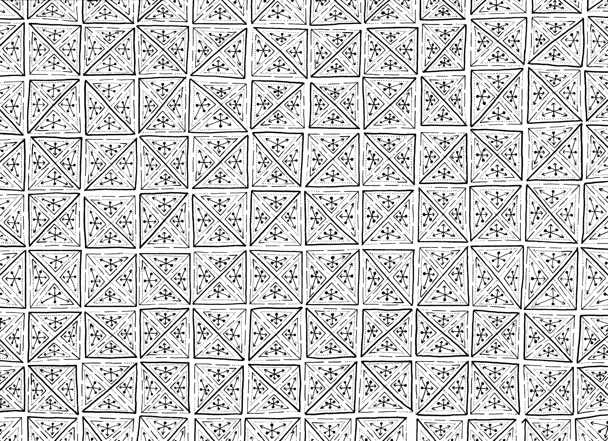

## Uterus
_“There have been two great revelations in my life: The first was bepop, the second was homeopathy.”
--Dizzy Gillespie

&quot;The pattern of the prodigal is: rebellion, ruin, repentance, reconciliation, restoration.&quot;
--Edwin Louis Cole

 &quot;The wheel is come full circle.&quot;
--William Shakespeare
_

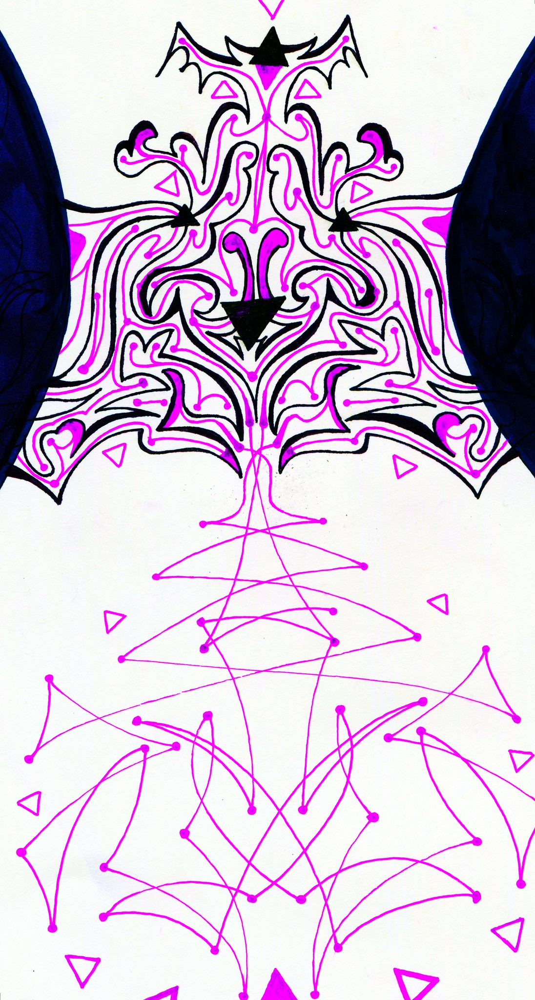

## Drill
_&quot;The end is the beginning of all things - suppressed and hidden - awaiting to be released through the rhythm of pain and pleasure.&quot;
-Krishnamurti

&quot;Aromatic L-amino-acid-decarboxylase shows no homologues in the animal kingdom. Thus, It had to have been inserted into the human genome by extraterrestrial intelligence. By dating the epigenetic state of the gene, we have discovered that l-AAD is roughly 10,000 years old, coinciding precisely to the first chronicled psychedelic ceremonies held by nomadic shamans in the Caucasus mountains&quot;
-Terence McKenna 

_

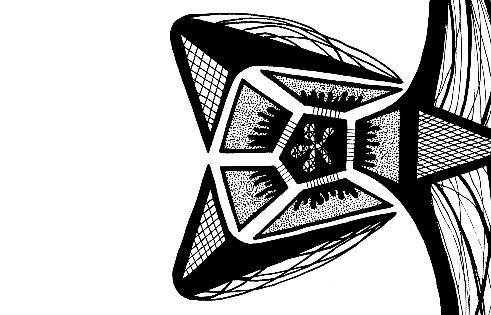

## Chromatin State of Mind
_&quot;He who would do good to another must do it in minute particulars;
General good is the plea of the scoundrel, hypocrite, and flatterer:
For art and science cannot exist but in minutely organized Particulars.&quot;

&quot;What is a Wife &amp; what is a Harlot? What is a Church &amp; What
Is a Theatre? are they Two &amp; not One? can they Exist Separate?
Are not Religion &amp; Politics the Same Thing? Brotherhood is Religion
O Demonstrations of Reason Dividing Families in Cruelty &amp; Pride!&quot;

-William Blake, Jerusalem_

## Collective Behavior
_&quot;Color provokes a psychic vibration. Color hides a power still unknown but real, which acts on every part of the human body...The sound of colors is so definite that it would be hard to find anyone who would express bright yellow with bass notes or dark lake with treble...Color is a means of exerting direct influence on the soul.&quot;

&quot;Lend your ears to music, open your eyes to painting, and... stop thinking! Just ask yourself whether the work has enabled you to 'walk about' into a hitherto unknown world. If the answer is yes, what more do you want?&quot;

[Ed. note: &quot;ears to painting&quot; and &quot;eyes to music&quot;?]

&quot;Everything starts from a dot...The geometric line...is the track made by the moving point; that is, its product. It is created by movement...Here, the leap out of the static to the dynamic occurs…&quot;

--W. Kandinsky_

## Autopoesis
_Questioner: 
&quot;Do you believe in evolution? You have often said that understanding is immediate, the act of learning is on the moment; where does evolution play a part in this? Are you denying evolution?&quot;

Krishnamurti: 
&quot;It would be foolish - would it not? to deny evolution. There is the bullock cart and the jet plane, that is evolution. There is an evolution of the primate to the so-called man. There is evolution from not knowing to knowing, Evolution implies time; but psychologically, inwardly, is there evolution?&quot;_

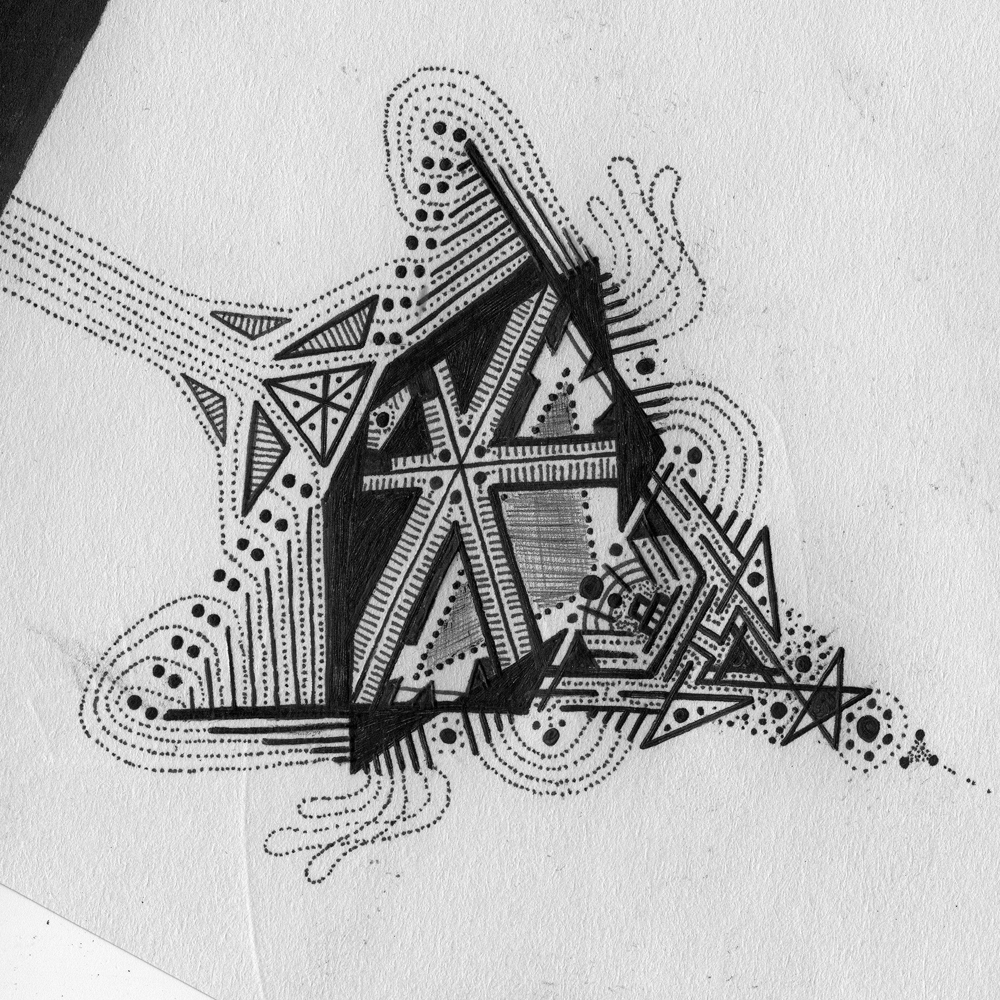

## Lion Turtle
_A true mind can weather all the lies and illusions without being lost.....

A true heart can tough the poison of hatred without being harmed.....

Since beginningless time, darkness thrives in the void, but always yields to purifying light.....
_

## Circular Automaton
_&quot;With a gentleman I am always a gentleman and a half, and with a fraud I try to be a fraud and a half.&quot;

&quot;To retain respect for sausages and laws, one must not watch them in the making.&quot;

&quot;When a man says he approves of something in principle, it means he hasn't the slightest intention of carrying it out in practice.&quot;

-Otto von Bismarck_

## Helicobacter pylori
_&quot;A designer is an emerging synthesis of artist, inventor, mechanic, objective economist and evolutionary strategist.&quot;

&quot;Those who play with the devil's toys will be brought by degrees to wield his sword.&quot;

&quot;Curvacious, nymphaceous, sylphaceous you!
I'm nigh inefficacious, what may we do?
I can't eat you and have you too.
Let's enjoy laughter, and wisdom too.
You're eternally lovely - the truly you.&quot;

-Bucky Fuller_

## Smooth
_“Whoever authors your story authorizes your actions.”
― Sam Keen

&quot;A hero is one who knows how to hang on one minute longer.&quot;
― Norwegian proverb

“I have absolutely no pleasure in the stimulants in which I sometimes so madly indulge. It has not been in the pursuit of pleasure that I have periled life and reputation and reason. It has been the desperate attempt to escape from torturing memories, from a sense of insupportable loneliness and a dread of some strange impending doom.”
― Edgar Allan Poe 
_

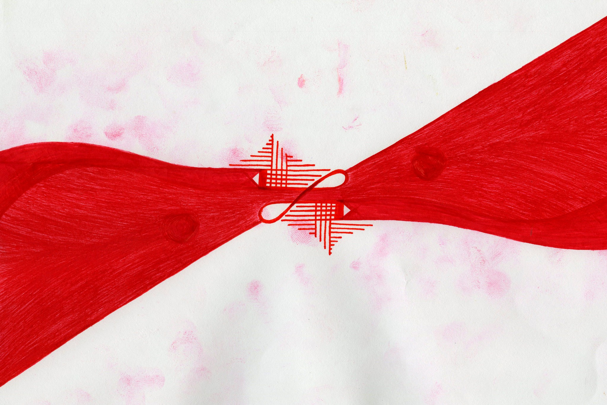

## Amor ex Machina
_“I don't know half of you half as well as I should like; and I like less than half of you half as well as you deserve.”
― J.R.R. Tolkien, The Fellowship of the Ring 

“There are many things of which a wise man might wish to be ignorant”
― Ralph Waldo Emerson

&quot;A healthy social life is found only, when in the mirror of each soul the whole community finds its reflection, and when in the whole community the virtue of each one is living.&quot;
― Rudolf Steiner_

## OK Plasmid
_“Everything in the world is about sex except sex. Sex is about power.” 
― Oscar Wilde

&quot;She got her looks from her father. He's a plastic surgeon.&quot;
―Groucho Marx

“Books are finite, sexual encounters are finite, but the desire to read and to f*** is infinite; it surpasses our own deaths, our fears, our hopes for peace.” 
― Roberto Bolo_

## Genome Reannotation
_Molecular Genetics and Quantitative Genetics are not  opponents. Rather, they serve as a scientific Scylla and Charybdis: reminded of the extreme philosophical and experimental limitations of each approach, we navigate a hybrid course through the  choppy waters of genetic explanation. We can be attracted to the context--dependent merits of an approach (or equally, repulsed by the context-dependent drawbacks of the other), without being tied to ideological allegiances. In this way, That Old Ship of Science continues sailing towards an applicable and elegant understanding of Genetics....

Email me if curious for the rest of this essay on the relationship between Quantitative and Molecular genetics with regards to mechanistic explanation. 

&lt;3_

## Semiosis
_&quot;If something cannot be used to tell a lie, conversely it cannot be used to tell the truth: it cannot in fact be used 'to tell' at all.&quot;
-Umberto Eco

&quot;Any organism must be treated as-a-whole; in other words, that an organism is not an algebraic sum, a linear function of its elements, but always more than that. It is seemingly little realized, at present, that this simple and innocent-looking statement involves a full structural revision of our language...&quot;
-Alfred Korzybski

&quot;Lisp has jokingly been called 'the most intelligent way to misuse a computer'. I think that description is a great compliment because it transmits the full flavor of liberation: it has assisted a number of our most gifted fellow humans in thinking previously impossible thoughts.&quot;
-Edsger W. Dijkstra_

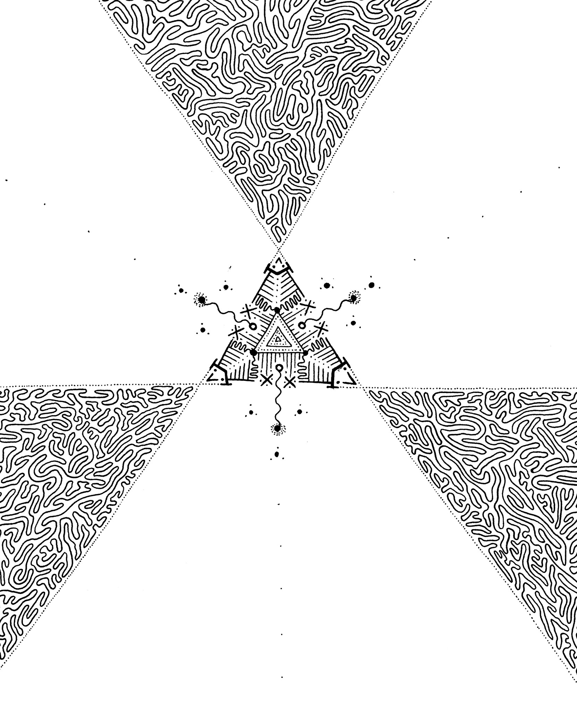

## Vitalism is dead. Long live Vitalism!
_&quot;Why do you look at the speck of sawdust in your brother’s eye and pay no attention to the plank in your own eye?&quot;
-Jesus, Matthew 7:3

&quot;The saying that a little knowledge is a dangerous thing is, to my mind, a very dangerous adage........Indeed, if a little knowledge is dangerous, where is the man who has so much as to be out of danger?&quot;
-T. H. Huxley

&quot;Teach him he must deny himself.&quot;
-Robert E. Lee [to a mother who asked him to bless her son]

&quot;In the study of this membrane [the retina] I for the first time felt my faith in Darwinism (hypothesis of natural selection) weakened, being amazed and confounded by the supreme constructive ingenuity revealed not only in the retina and in the dioptric apparatus of the vertebrates but even in the meanest insect eye. ... I felt more profoundly than in any other subject of study the shuddering sensation of the unfathomable mystery of life.&quot;
— Santiago Ramón y Cajal, Recollections of My Life (1898),
_

## Dopamine D2 Receptor
_This is a symbolic representation of a receptor embedded in the plasma membrane of a synapse. Specifically, it is a dopamine D2 GPCR. The complex is a dimer, observe that the shading on the two subunits are reflections of each other. Chelated within the complex are several metal ions and water-spirits. At the top of the image, the black droplet is dopamine being released from the pre-synaptic axon terminal. By the bottom of the image, the signal has been transformed into a new droplet - consciousness!

With regards to neurons, &quot;information&quot; is an inter-dimensional chameleon. See: neural information is electrical as it roars down the axon, chemical as the axon terminal ekes out a femtomole of neurotransmitter, and finally, neural information becomes structural as the neurotransmitter receptor refolds to accommodate her ligand. All of this thermodynamic alchemy is just so that an ion channel can pause in its open state a smidgen longer, which allows some more sodium to flow back into the neuron. Whoever told you that neural signaling was electrical, was only telling you one-third of the story. 

In conclusion, here the single-sentence story so unclear in neurology textbooks, and so obvious in symbolic esoterica: electrochemistry and structural biology unite at the synapse - a narrow cleft that opens up into the vastness of the Mind. _

## Rafflesiaceae
_“Everything takes time. Bees have to move very fast to stay still.”
―David Foster Wallace

&quot;Our task now is to resynthesize biology; put the organism back into its environment; connect it again to its evolutionary past; and let us feel that complex flow that is organism, evolution, and environment united. The time has come for biology to enter the nonlinear world.&quot;
―Carl Woese

&quot;Every time a scientist publishes a good piece of work, she helps to maintain and raise the standards for what is true. We have to keep chipping away.&quot;
―Deborah M. Gordon _

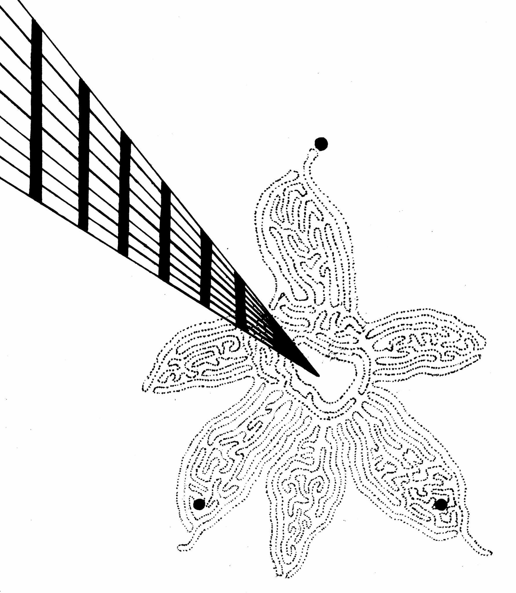

## Signalling Games
_&quot;'Facts, facts, facts,' cries the scientist if he wants to emphasize the necessity of a firm foundation for science. What is a fact? A fact is a thought that is true. But the scientist will surely not recognize something which depends on men's varying states of mind to be the firm foundation of science.&quot;
—Gottlob Frege (1956)

&quot;However beautiful the strategy, you should occasionally look at the results.&quot; 
—Winston Churchill

&quot;A hallucination is a fact, not an error; what is erroneous is a judgement based upon it.&quot;
—Bertrand Russell [On the Nature of Acquaintance: Neutral Monism (1914)]

&quot;I mean, you could claim that anything's real if the only basis for believing in it is that nobody's proved it doesn't exist!&quot;
― Hermione Granger, Harry Potter and the Deathly Hallows_

## Chromatin!
_&quot;Identity is not an object; it is a process with addresses for all the different directions and dimensions in which it moves, and so it cannot so easily be fixed with a single number.&quot;

&quot;1 + 1 = 1&quot;

&quot;The question &quot;What is Life?&quot; is... a linguistic trap. To answer according to the rules of grammar, we must supply a noun, a thing. But life on Earth is more like a verb. It repairs, maintains, re-creates, and outdoes itself.&quot;

--Lynn Margulis_

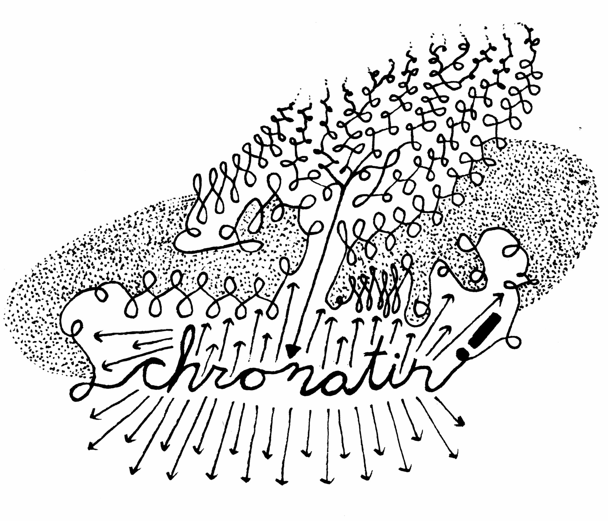

## Mirror Neuron(s)
_&quot;Like the entomologist in search of colorful butterflies, my attention has chased in the gardens of the grey matter cells with delicate and elegant shapes, the mysterious butterflies of the soul, whose beating of wings may one day reveal to us the secrets of the mind.&quot; 

&quot;Oral instruction....calls for quickness and sharpness of the senses, ready, enthusiastic, and vigorous diction, a vibrant and robust voice, agility of memory and of thought, and flexibility of attention capable of jumping instantly from the serene and lofty region of ideas to the vulgar and annoying requirements of maintaining order…&quot;

“Nothing inspires more reverence and awe in me than an old [person] who knows how to change [their] mind.”

― Santiago Ramón y Cajal

&quot;How near one Species to the next is join'd,
The due Gradations please a thinking Mind;
and there are Creatures which no eye can see,
That for a Moment live and breathe like me:
Whom a small Fly in bulk as far exceeds,
As yon tall Cedar does the waving Reeds:
These we can reach—and may we not suppose
There still are Creatures more minute than those&quot;
— Mary Leapor

&quot;For in this (frog anatomy) owing to the simplicity of the structure, and the almost complete transparency of the vessels which admits the eye into the interior, things are more clearly shown so that they will bring the light to other more obscure matters.&quot;
— Marcello Malpighi, De Pulmonibus (1661)_

## Polarity
_There is no resolution but resolution. 
(= there is no true finality to a process, just increasingly detailed perception) 

There is no solution other than solution. 
(= there is no end to a process, just a state of mixing that merges identities completely)

~~~~~~~

&quot;When it comes to ideas, my rule is no rules....
...let the amateur speak.&quot; 
-- A. Bejan

~~~~~~~

Questioner: 
&quot;For truth to come, you advocate action without idea. Is it possible to act at all times without idea, that is, without a purpose in view?&quot;

Krishnamurti: 
&quot;I am not advocating anything. I am not a propagandist, political or religious. I am not inviting you to any new experience. All that we are doing is trying to find out what action is. You are not following me to find out. If you do, then you will never find out. You are only following me verbally. But if you want to find out, if you as an individual want to find out what idea and action are, you have to inquire into it, and not accept my definition or my experience, which may be utterly false. As you have to find out, you have to put aside the whole idea of following, pursuing, advocating, propagandist, leader or example.Let us therefore find out together what we mean by action without idea. Please give your thought to it. Don't say, 'I do not understand what you are talking about.' Let us find out together. It may be difficult, but let us go into it.&quot;
- Krishnamurti, Collected Works, Vol. VI, Action
​
_

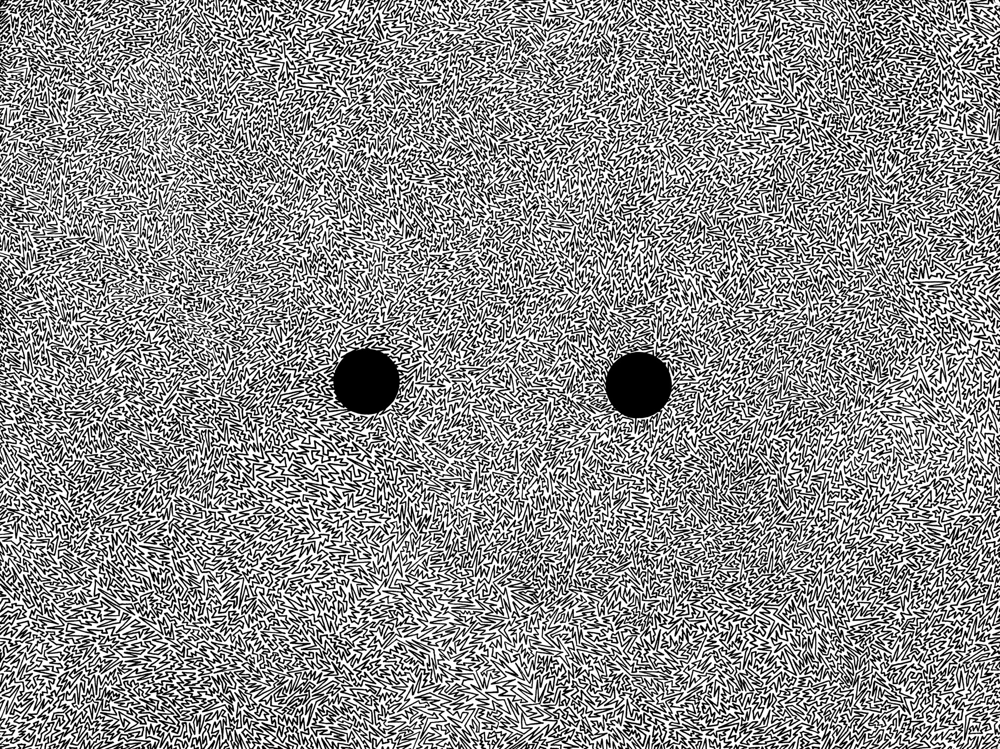

## Xenopolymer
_&quot;`When I use a word,' Humpty Dumpty said in rather a scornful tone, `it means just what I choose it to mean -- neither more nor less.'

`The question is,' said Alice, `whether you can make words mean so many different things.'

`The question is,' said Humpty Dumpty, `which is to be master - - that's all.'

Alice was too much puzzled to say anything, so after a minute Humpty Dumpty began again. `They've a temper, some of them -- particularly verbs, they're the proudest -- adjectives you can do anything with, but not verbs -- however, I can manage the whole of them! Impenetrability! That's what I say!'

`Would you tell me, please,' said Alice `what that means?`

`Now you talk like a reasonable child,' said Humpty Dumpty, looking very much pleased. `I meant by &quot;impenetrability&quot; that we've had enough of that subject, and it would be just as well if you'd mention what you mean to do next, as I suppose you don't mean to stop here all the rest of your life.'

`That's a great deal to make one word mean,' Alice said in a thoughtful tone.

`When I make a word do a lot of work like that,' said Humpty Dumpty, `I always pay it extra.'

`Oh!' said Alice. She was too much puzzled to make any other remark.

`Ah, you should see `em come round me of a Saturday night,' Humpty Dumpty went on, wagging his head gravely from side to side: `for to get their wages, you know.'

(Alice didn't venture to ask what he paid them with; and so you see I can't tell you.)&quot;

Lewis Carroll, 'Through the Looking-Glass, and What Alice Found There' (1871), chapter 6. _

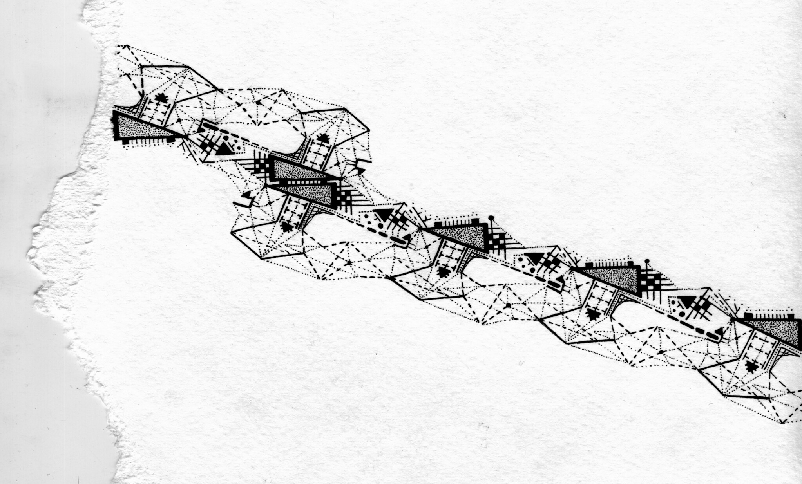

## The Origin of Somatic Tissue in the Breakdown of the Bistable Pluripotent Cell
_&quot;These esoteric poses of philosophy and even the paper theories of behaviorists are mere subterfuges to avoid the material we are talking about.....We can only know in the nervous system what we have known in behavior first....Consciousness is a much smaller part of our mental life than we are conscious of, because we cannot be conscious of what we are not conscious of.&quot;

&quot;For if consciousness is based on language, then it follows that it is of much more recent origin than has been heretofore supposed. Consciousness come after language! The implications of such a position are extremely serious....&quot;

“O, what a world of unseen visions and heard silences, this insubstantial country of the mind! What ineffable essences, these touchless rememberings and unshowable reveries! And the privacy of it all! A secret theater of speechless monologue and prevenient counsel, an invisible mansion of all moods, musings, and mysteries, an infinite resort of disappointments and discoveries. A whole kingdom where each of us reigns reclusively alone, questioning what we will, commanding what we can. A hidden hermitage where we may study out the troubled book of what we have done and yet may do. An introcosm that is more myself than anything I can find in a mirror. This consciousness that is myself of selves, that is everything, and yet is nothing at all - what is it?

And where did it come from?

And why?” 

― Julian Jaynes, The Origin of Consciousness in the Breakdown of the Bicameral Mind, 1976 _

## The Body has a Mind...
_&quot;I did not begin when I was born, nor when I was conceived. I have been growing, developing, through incalculable myriads of millenniums. All my previous selves have their voices, echoes, promptings in me. Oh, incalculable times again shall I be born.&quot; 
—Jack London, The Star Rover

&quot;We can't solve problems by using the same kind of thinking we used when we created them.&quot;
—Albert Einstein

Diapause [dahy-uh-pawz]. 
def. = a period of hormonally controlled quiescence, especially in immature insects._

## Contradiction
_“Let me never fall into the vulgar mistake of dreaming that I am persecuted whenever I am contradicted.”
― Ralph Waldo Emerson

“What we agree with leaves us inactive, but contradiction makes us productive.”
―Johann Wolfgang von Goethe

&quot;Fix reason firmly in her seat, and call to her tribunal every fact, every opinion. Question with boldness even the existence of a God; because, if there be one, he must more approve of the homage of reason, than that of blindfolded fear. &quot;
―Thomas Jefferson_

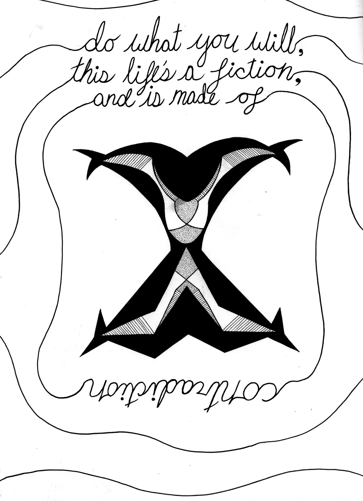

## Embryology
_“Just as a fire is covered by smoke and a mirror is obscured by dust, just as the embryo rests deep within the womb, wisdom is hidden by selfish desire.”
- Bhagavad Gita

“As flies the wind, as flies the mind, as fly the winged birds, so do thou, O embryo, ten months old, fall along with the placenta! May the placenta fall down!”
- Atharva Veda

&quot;THE LAW OF FIVES: Lungs have five lobes, three on right lung, and two on left. Liver has five lobes, three on right lobe, and two on left lobe. Nerves have five qualities, nutrition, sensation, motion, voluntary and involuntary. Nerves have five senses, seeing, hearing, feeling, smelling and tasting. Since all principles differ in qualities or kinds of service, would it be amiss for us to inquire a little farther why the lungs and liver are provided with five divisions each, if not to do five kinds of work, and different from all other kinds in many ways?&quot;
- A.T. Still_

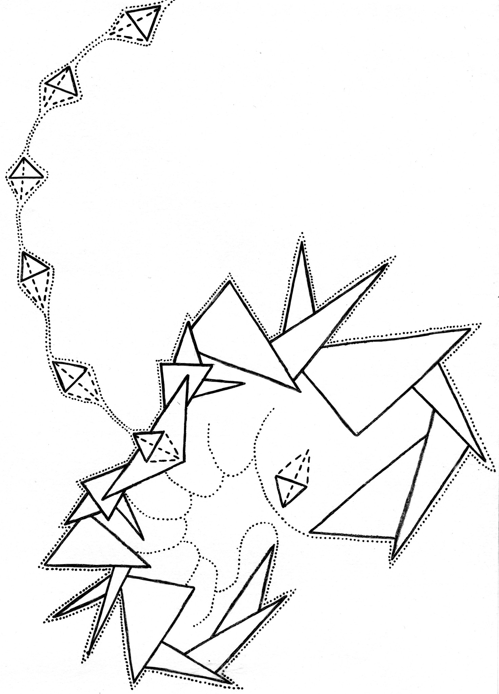

## Summer Blossoming
_&quot;What matters is the shape-making impulse&quot;
—Seamus Heaney

&quot;Simple laws can very well describe complex structures. The miracle is not the complexity of our world, but the simplicity of the equations describing that complexity.&quot;
—Sander Bais, from The Equations: Icons of Knowledge.

&quot;It was always himself that the coward abandoned first. After this all other betrayals came easily.&quot;
—Cormac McCarthy, All the Pretty Horses_

## Glow
_&quot;I know I am deathless. No doubt I have died myself ten thousand times before. I laugh at what you call dissolution, and I know the amplitude of time.&quot; 
—Walt Whitman

&quot;So as through a glass and darkly, the age long strife I see, Where I fought in many guises, many names, but always me.&quot; 
—General George S. Patton

&quot;Our birth is but a sleep and a forgetting; The Soul that rises with us, our life's Star, Hath had elsewhere its setting. And cometh from afar.&quot; 
—William Wordsworth_

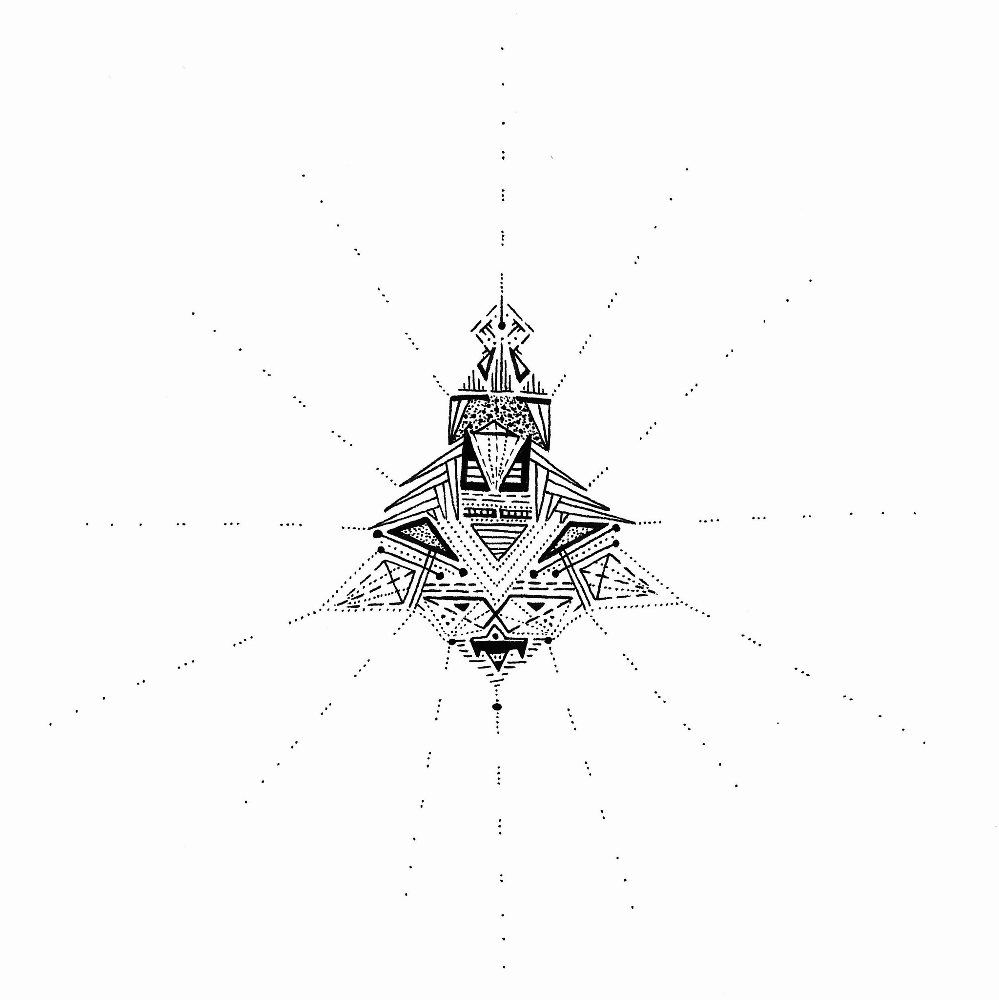

## The Birds and the Bees
_&quot;A living organism must be studied from two distinct aspects. One of these is the causal-analytic aspect which is so fruitfully applicable to ontogeny. The other is the historical descriptive aspect which is unravelling lines of phylogeny with ever-increasing precision. Each of these aspects may make suggestions concerning the possible significance of events seen under the other, but does not explain or translate them into simpler terms.&quot;
— Sir Gavin de Beer, 1938

&quot;By considering the embryological structure of man - the homologies which he presents with the lower animals - the rudiments which he retains - and the reversions to which he is liable, we can partly recall in imagination the former condition of our early progenitors; and we can approximately place them in their proper position in the zoological series.&quot;
— Charlie Darwin

If the answer were: &quot;Philo-Eco-Evo-Devo-Psycho-Neuro-Pheno-Myrmeco-Complexity-omics&quot;, what would the question be? 

Phenotype is a statement about technology, Genotype is a statement about inheritance.
_

## Stigmergy
_&quot;If you want to build a ship, don't herd people together to collect wood, don't assign them tasks and work, but rather teach them to long for the endless immensity of the sea.&quot;
— Antoine de Saint-Exupery

&quot;Each day is a little life: every waking and rising a little birth, every fresh morning a little youth, every going to rest and sleep a little death.&quot;
—Arthur Schopenhauer

&quot;The idea of the continuum seems simple to us. We have somehow lost sight of the difficulties it implies...We are told such a number as square root of 2 worried Pythagoras and his school almost to exhaustion. Being used to such queer numbers from early childhood, we must be careful not to form a low idea of the mathematical intuition of these ancient sages, their worry was highly credible.&quot;
—Erwin Schrodinger

Formicarius!_

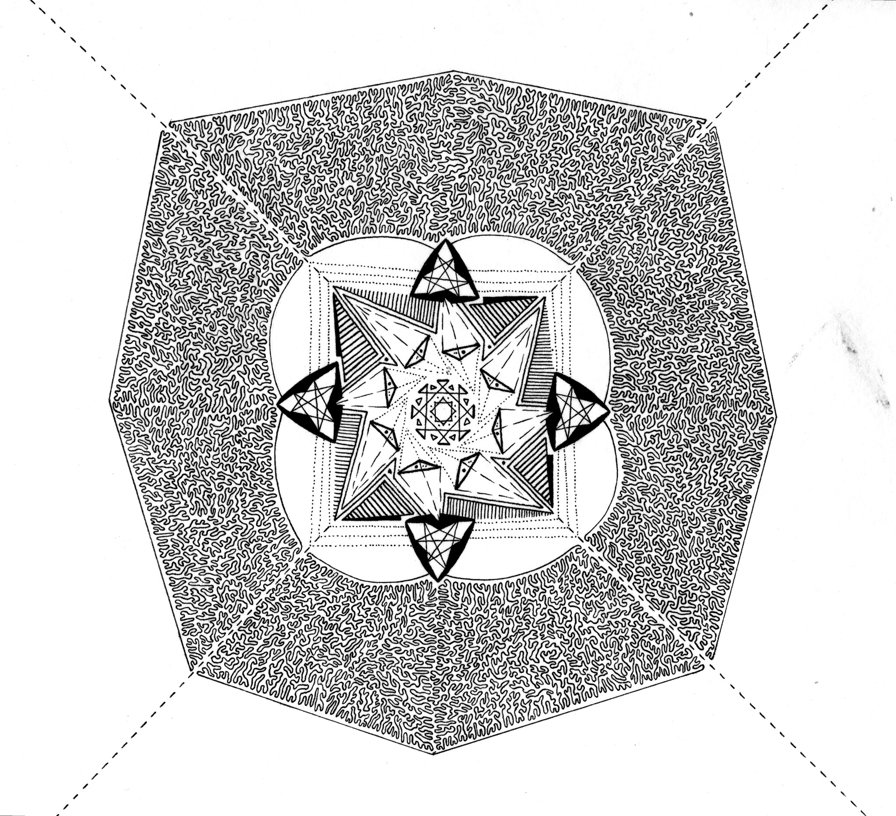

## 'Pataphysics
_&quot;To every ω-consistent recursive class κ of formulae there correspond recursive class signs r, such that neither v Gen r nor Neg (v Gen r) belongs to Flg (κ) (where v is the free variable of r).&quot;
-Kurt Gödel

&quot;Paradox is the sharpest scalpel in the satchel of science. Nothing concentrates the mind as effectively, regardless of whether it pits two competing theories against each other, or theory against observation, or a compelling mathematical deduction against ordinary common sense.&quot;
-Hans Christian von Baeyer

&quot;Yet I exist in the hope that these memoirs... may find their way to the minds of humanity in Some Dimension, and may stir up a race of rebels who shall refuse to be confined to limited Dimensionality.&quot;
-Edwin A. Abbot, from Flatland._

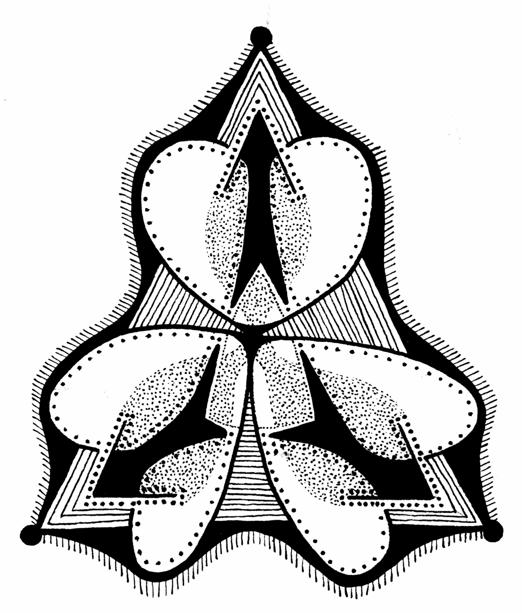

## Truth
_“Nature's stern discipline enjoins mutual help at least as often as warfare. The fittest may also be the gentlest.”
― Theodosius Dobzhansky

“Religion is an attempt to get control over the sensory world, in which we are placed, by means of the wish-world, which we have developed inside us as a result of biological and psychological necessities. But it cannot achieve its end. Its doctrines carry with them the stamp of the times in which they originated, the ignorant childhood days of the human race. Its consolations deserve no trust. Experience teaches us that the world is not a nursery.&quot; 
― Sigmund Freud 

“Woe to him who could look on and say: The fool! If she had waited, if she had let time do its work, her despair would surely have subsided, another man would have turned up to comfort her.— That's just like saying: The fool, dying of fever! If he had waited until his strength returned, his circulation improved, the tumult of his blood calmed down, everything would have turned out well and he would still be alive today!”
― Johann Wolfgang von Goethe, The Sorrows of Young Werther _

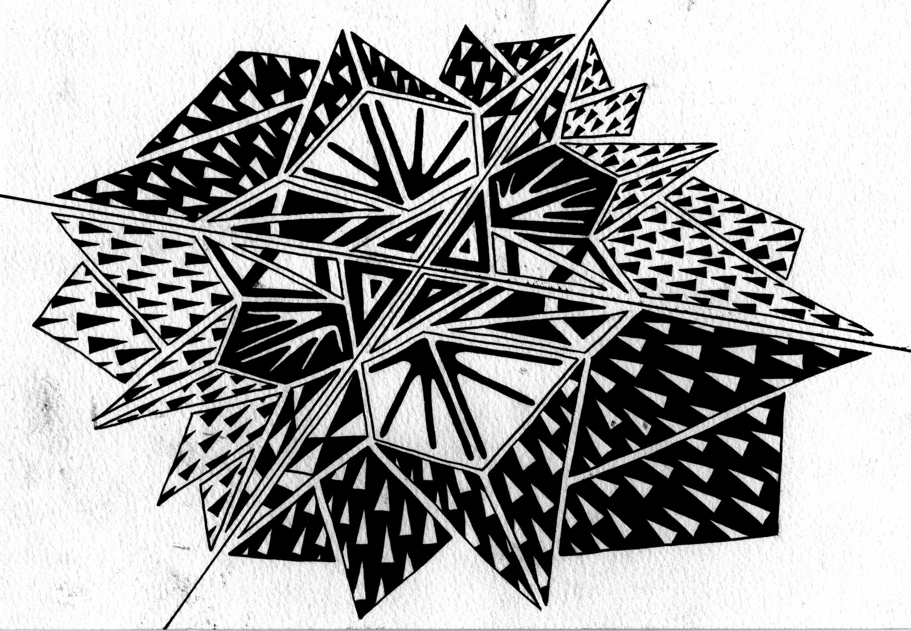

## Central Dogma, Part-Dieu
_Start on the top right, with sperm competition leading to fertilization. The zygote, at first embedded in the uterine lining, grows and eventually develops freedom. The world &quot;hands&quot; the organism 0's and 1's, even from the womb, representing the informational entropy of a given series of environmental measurements - the prognosticators, predictors, and patterns of electromagnetic radiation, pH, temperature, blood glucose, emotional satisfaction, etc, etc, etc... 

Having a philosophically-equal say in the protein signalling cascades that produce cellular physiology are the maternal effects (triangle and circle obtained from Mommy [who may have gotten it from her Mommy {who may have gotten it from her Mommy}]) and environmental effects (triangle and circle obtained from life events). The signaling cascades culminates (or does it begin?) in the genome, where the quantum spaghetti of chromatin  is represented by the famous &quot;Twin Slit&quot; experiment on electron non-duality. Stochasticity is at the heart of all good inference, and gene regulation is no exception. The chromosomes are separating in a process known as mitotic anaphase - one of the most well-choreographed dances in the biological repertoire. Some cells will never divide again. Other cells savor a brief moment to bask in the fitness-gasm, then begin the process of dividing again. 

In any case, the chromatin genome of the cell (often mistakenly understood to consist of only DNA) is represented to you on the middle-right as it is to as third-grader, or as it is to a high-schooler in AP Biology, or as it is to an introductory genetics student in University. That is: the textbook neglect of philosophical ideas about the genome, the &quot;obvious&quot; delimitation of the genome from the environment, and the won't you just please save your questions for grad school?

Next, transcriptional products, often containing RNA, escape the nucleus. The  two ribosomes are chugging along a palindromic protein-coding gene, translating a partially-folded protein. The bottom left shows a close-up of the statistical surface boundaries that specify the action of a peptide. Waves of organized water form concentric shells around the hydrophilic parts of the protein - a molecular partner-yoga that contorts the peptide into new and exotic positions. The watery oxygens are on Hajj to kiss the fabled nitrogenous lone pairs of the mysterious peptide backbone!

At last, The proteins fold, assemble, meta-assemble, as  so on, to form phenotype, shaped like a synapse. The bottom-center of the synapse represents the &quot;external&quot; sensory arrays (the Eye), and the &quot;internal&quot; sensory arrays (the I). The interplay between Eye and I defines &quot;behavior&quot; - that is, what we measure or infer an organism to do. The teleological goal of behavior is reproduction, demonstrated by the creation of armies of sperm, already eating through the oocyte's mucusy acrosome. 

And so it begins again._

## Entatic Being
_“Never forget that justice is what love looks like in public”
―Cornel West

&quot;How the hell can a person/
Go to work in the morning/
Come home in the evening/
And have nothing to say?&quot;
-John Prine via Bonnie Raitt

............Meno: &quot;How will you look for something when you don't in the least know what it is? How on earth are you going to set up something you don't know as the object of your search?&quot;
............Socrates: &quot;We ought not then to be led astray by the contentious argument you quoted. It would make us lazy, and is music in the ears of weaklings. The other doctrine [Metempsychosis] produces energetic seekers after knowledge.&quot; 

&quot;Just as one generation could prevent the very existence of the next generation, by all entering a monastery or jumping into the sea, so one set of thinkers can in some degree prevent further thinking by teaching the next generation that there is no validity in any human thought...There is a thought that stops thought. That is the only thought that ought to be stopped.&quot;
―G. K. Chesterton, Orthodoxy (1908), p. 58
_

## Tinkers to Evers to Chance
_On the right, there is a Triple Play: the Seven chakras are represented as the chess pieces (and a tetrahedron), and this entire structure of pieces and boards forms the ribose-sugar-ribose-sugar-... backbone of our dear friends, RNA, DNA, and (some of the) XNA. 

On the left: a human Möbius Stripper with equilateral chakras has a rather one-sided reflection on the nature of the universe.

~~~~~~~~~~~~~~~~~

&quot;Chess is a unique cognitive nexus, a place where art and science come together in the human mind and are then refined and improved by experience.&quot;
— Garry Kasparov _

## Earthrise, Earthset
_&quot;I live on Earth at present, and I don't know what I am. I know that I am not a category. I am not a thing — a noun. I seem to be a verb, an evolutionary process — an integral function of the universe....I seem to be a verb.&quot;

&quot;Our school systems are all nonsynergetic. We take the whole child and fractionate the scope of his or her comprehending coordination by putting the children in elementary schools—to become preoccupied with elements or isolated facts only. Thereafter we force them to choose some specialization, forcing them to forget the whole....We find that the historical beginnings of schools and tutoring were established, and economically supported by illiterate and vastly ambitious warlords who required a wide variety of brain slaves with which to logistically and ballistically overwhelm those who opposed their expansion of physical conquest.&quot;

&quot;The dark ages still reign over all humanity, and the depth and persistence of this domination are only now becoming clear.
This Dark Ages prison has no steel bars, chains, or locks. Instead, it is locked by misorientation and built of misinformation. Caught up in a plethora of conditioned reflexes and driven by the human ego, both warden and prisoner attempt meagerly to compete with God. All are intractably skeptical of what they do not understand.&quot;

-R. Bucky Fuller_

## If...
_&quot;Finge datos currus, quid agas?&quot;
[Suppose the chariot of the sun were given you, what would you do?] 
(Apollo's question to Phaeton.)
-Ovid, Metamorphoses, Book II.

&quot;It is not enough to be industrious; so are the ants. What are you industrious about?&quot;
-Henry David Thoreau

&quot;If by fire
Of sooty coal th' empiric alchymist
Can turn, or holds it possible to turn,
Metals of drossiest ore to perfect gold.&quot;
-John Milton, Paradise Lost_

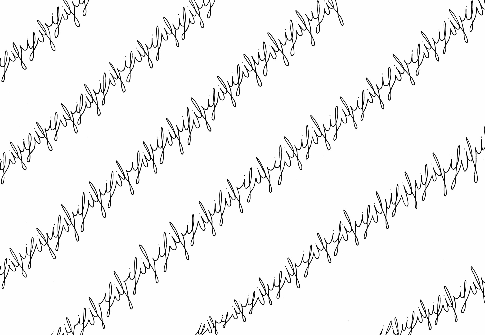

## Heart and Sol
_&quot;A bad liver is to a Frenchman what a nervous breakdown is to an American. Everyone has had one and everyone wants to talk about it.&quot;
-Art Buchwald

&quot;I can resist everything except temptation.&quot;
-Oscar Wilde

&quot;All of us from fertile egg to embryo to corpse, are exactly that: warm, wet, furry animals compelled by the sexuality of our forefathers and foremothers to be, either directly or indirectly, our own exciting and excitable, provocative and provocable selves.&quot;
-Lynn Margulis_

## Isochromatin
_&quot;    When we have passed beyond knowings, then we shall have Knowledge. Reason was the helper; Reason is the bar.

    When we have passed beyond willings, then we shall have Power. Effort was the helper; Effort is the bar.

    When we have passed beyond enjoyings, then we shall have Bliss. Desire was the helper; Desire is the bar.

    When we have passed beyond individualising, then we shall be real Persons. Ego was the helper; Ego is the bar.

    When we have passed beyond humanity, then we shall be the Man. The Animal was the helper; the Animal is the bar.&quot;

-Sri Aurobindo_

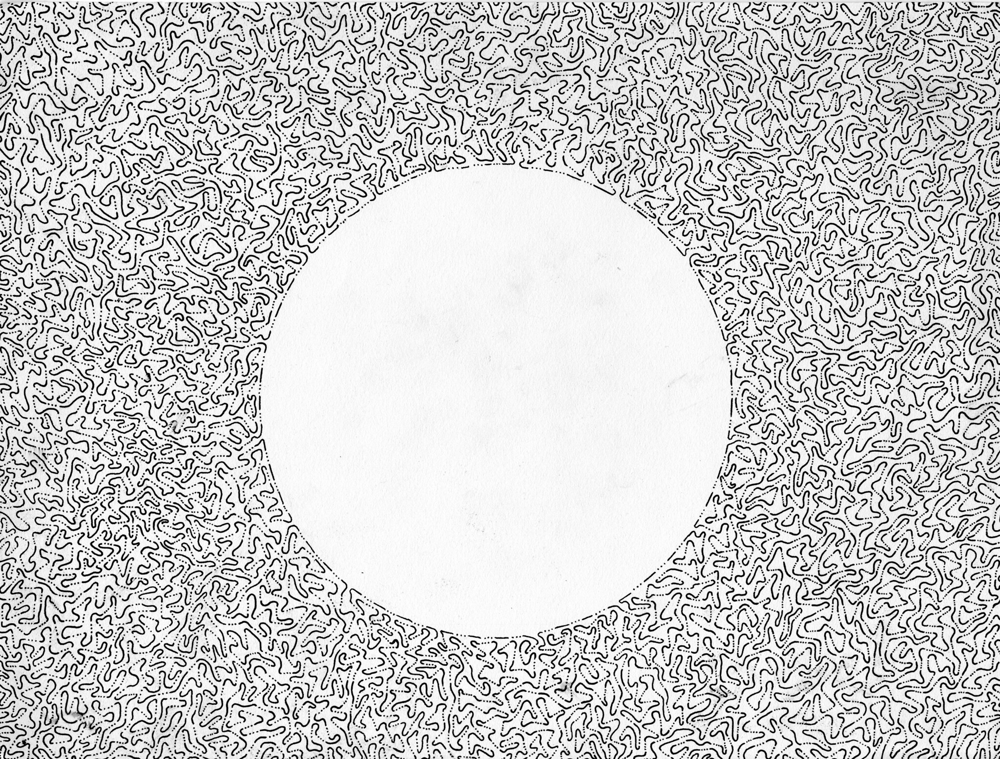

## Phenotype
_&quot;With only a little imagination we can see the gene as sitting at the centre of a radiating web of extended phenotypic power.&quot; 
— Richard Dawkins (The Selfish Gene)

And with only a little more imagination, we can see that the gene is actually a sparkling purple unicorn, traversing Waddington's epigenetic landscape, being ridden by the ghost of Mendel, under the orders of a Zeus-like Darwin (He Himself receiving suggestions from Aristotle et al. B.C.E.), as narrated by Johannsen but spoken by Freeman, designed by D’Arcy Thompson but drawn by Haeckel, thought about by Dennett but deeply perceived by McClintock, modeled by Fisher and Galton, remodeled by Noble and Jablonka, and of course, edited by CRISPR._

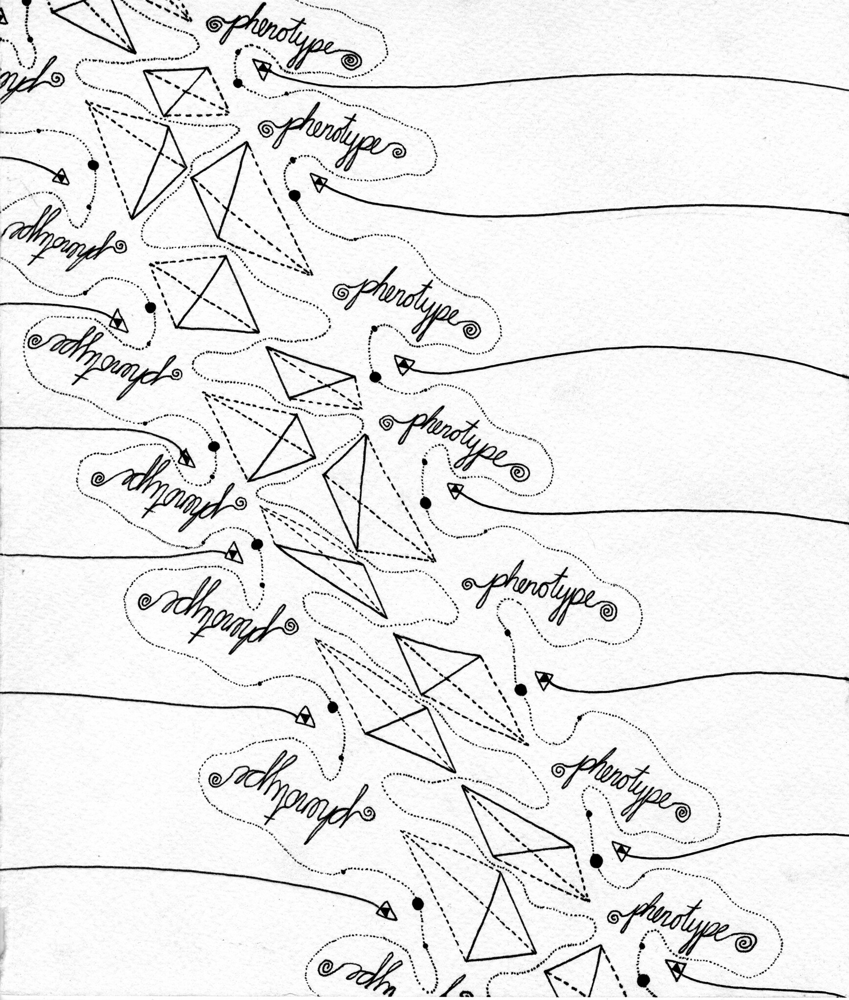

## Sociogenesis
_&quot;The uses of interaction patterns may be as diverse as the
ants. Harvester ants use interaction rates to regulate forag-
ing; the acorn ants Temnothorax use them to assess nestmate
density in a new nest site; Pheidole pallidula uses interaction
patterns, mediated by trail pheromone, to get large ants out
when needed to retrieve large prey. If I could measure one
behavioral trait for every ant species, it would be the rhythm
of interactions. We could put them all together to hear the
whole symphony of ant diversity, with the percussion from
the opportunistic and touchy ants of the tropics, the basso
ostinato of the sedate red wood ants as they move up and
down the same trees decade after decade, the shifting melo-
dies of the leaf-cutter ants who flow into trees and strip them
bare, and the rare grace notes of the ponerines that meet
briefly as each one stalks its prey.&quot;
―Deborah M Gordon, Ant Encounters

&quot;I don't mean to say that there isn't a real world out there for scientists to study. But the world doesn't necessarily fall into the pieces that scientists pick up and examine. Each piece has to be cut out of the world somehow by a process of identification and description.&quot;
―Deborah M Gordon, &quot;Wittgenstein and Ant-Watching&quot;, 1992

“It is not a simple life to be a single cell, although I have no right to say so, having been a single cell so long ago myself that I have no memory at all of that stage in my life.” 
― Lewis Thomas

&quot;Don't you know that the beginning is the most important part of every work and that this is especially so with anything young and tender? For at that stage it's most plastic, and each thing assimilates itself to the model whose stamp anyone wishes to give it.&quot;
―Plato, The Republic

~~~~~

The undrawn line, the unplayed note, the unstated argument, the unknown ally, is always the strongest....._

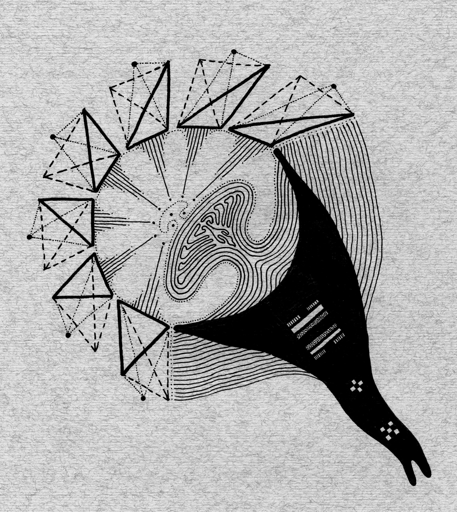

## Germ Line
_&quot;Here is the world, sound as a nut, perfect, not the smallest piece of chaos left, never a stitch nor an end, not a mark of haste, or botching, or second thought; but the theory of the world is a thing of shreds and patches.&quot;
– Ralph Waldo Emerson

&quot;By a peculiar prerogative, not only each individual is making daily advances in the sciences, and may makes advances in morality, but all mankind together are making a continual progress in proportion as the universe grows older; so that the whole human race, during the course of so many ages, may be considered as one man, who never ceases to live and learn.&quot;
– Blaise Pascal

&quot;Have you ever been at sea in a dense fog, when it seemed as if a tangible white darkness shut you in, and the great ship, tense and anxious, groped her way toward the shore with plummet and sounding-line, and you waited with beating heart for something to happen? I was like that ship before my education began, only I was without compass or sounding line, and no way of knowing how near the harbor was. 'Light Give me light' was the wordless cry of my soul, and the light of love shone on me in that very hour.&quot;
– Helen Keller

&quot;I once overheard two botanists arguing over a Damned Thing that had blasphemously sprouted in a college yard. One claimed that the Damned Thing was a tree and the other claimed that it was a shrub. They each had good scholarly arguments, and they were still debating when I left them. The world is forever spawning Damned Things- things that are neither tree nor shrub, fish nor fowl, black nor white- and the categorical thinker can only regard the spiky and buzzing world of sensory fact as a profound insult to his card-index system of classifications. Worst of all are the facts which violate &quot;common sense&quot;, that dreary bog of sullen prejudice and muddy inertia. The whole history of science is the odyssey of a pixilated card- indexer perpetually sailing between such Damned Things and desperately juggling his classifications to fit them in, just as the history of politics is the futile epic of a long series of attempts to line up the Damned Things and cajole them to march in regiment.&quot;
-R.A. Wilson
_

## Life Cycle
_&quot;Hox Hox.&quot;
&quot;Who's there?&quot;
&quot;Genes.&quot;
&quot;Genes who?&quot;
&quot;Genes who are involved in development.&quot;

&quot;When finally interpreted [sic], the genetic messages encoded [sic] within [sic] our DNA molecules will provide the ultimate answers [sic] to the chemical underpinnings of human existence.
-James D. Watson

&quot;Only the liberation of the natural capacity for love in human beings can master their sadistic destructiveness.
-Wilhelm Reich, The Function of the Orgasm (1927)_

## Macroscope
_Molon Labe. 

&quot;When our knowing exceeds our sensing, we will no longer be deceived by the illusions of our senses.&quot;
-Walter Russell

&quot;What goes into someone's mouth does not defile them, but what comes out of their mouth, that is what defiles them.&quot; 
-Matthew 15:11

&quot;Past, n. :
That part of Eternity with some small fraction of which we have a slight and regrettable acquaintance. A moving line called the Present parts it from an imaginary period known as the Future. These two grand divisions of Eternity, of which the one is continually effacing the other, are entirely unlike. The one is dark with sorrow and disappointment, the other bright with prosperity and joy. The Past is the region of sobs, the Future is the realm of song. In the one crouches Memory, clad in sackcloth and ashes, mumbling penitential prayer; in the sunshine of the other Hope flies with a free wing, beckoning to temples of success and bowers of ease. Yet the Past is the Future of yesterday, the Future is the Past of to-morrow. They are one--the knowledge and the dream.&quot; 
-Ambrose Bierce, Devil's Dictionary_

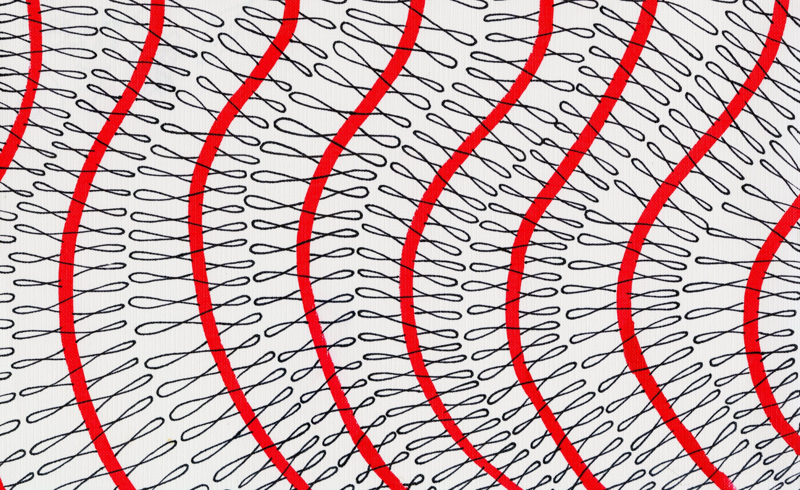

## Optimism
_“The world is not a solid continent of facts sprinkled by a few lakes of uncertainties, but a vast ocean of uncertainties speckled by a few islands of calibrated and stabilized forms”
― Bruno Latour, Reassembling the Social: An Introduction to Actor-Network-Theory 

&quot;Colorless green ideas sleep furiously.&quot;
― Noam Chomsky

&quot;Ideal furies sleepily color greener&quot;
― Choam Nomsky

&quot;The Analytical Engine has no pretensions whatever to originate anything. It can do whatever we know how to order it to perform. It can follow analysis; but it has no power of anticipating any analytical relations or truths. Its province is to assist us in making available what we are already acquainted with.&quot;
― Ada Lovelace. Notes upon L. F. Menabrea’s “Sketch of The Analytical Engine Invented by Charles Babbage”. 1842.

Is Hofstadter's &quot;I Am a Strange Loop&quot; about Topology or Tautology? _

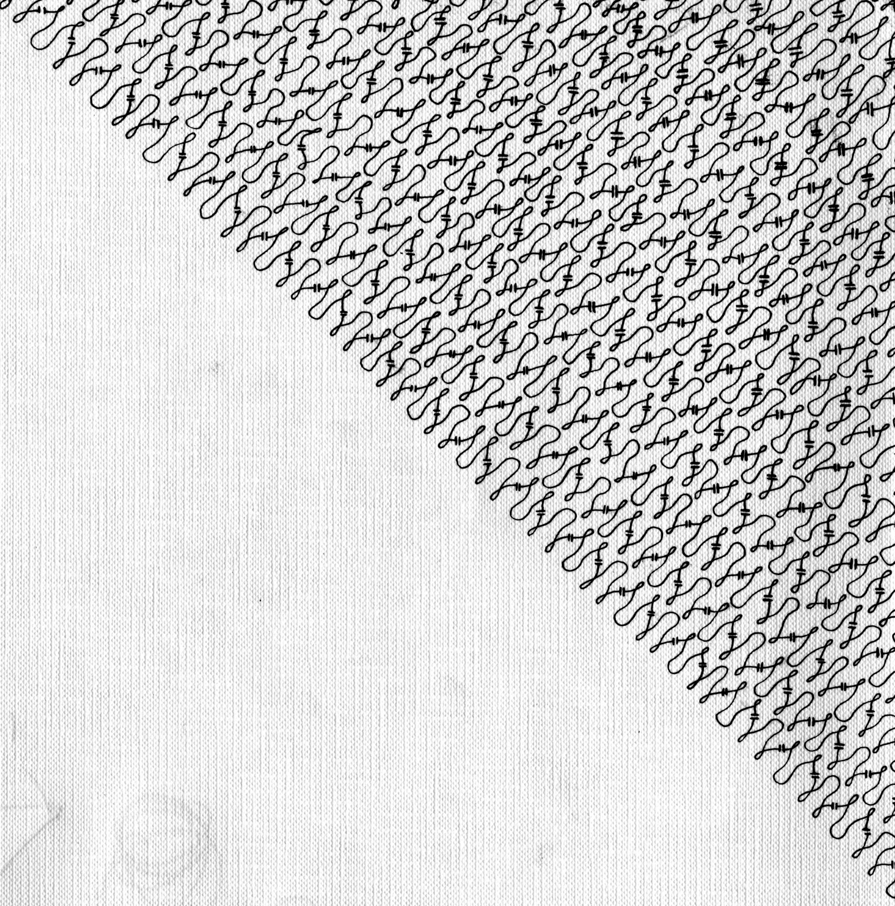

## Hypermethylation
_&quot;We can allow satellites, planets, suns, universe, nay whole systems of universe to be governed by laws, but the smallest insect, we wish to be created at once by special act … Our faculties are more fitted to recognize the wonderful structure of a beetle than a Universe.&quot;

&quot;There is one living spirit prevalent over this world, (subject to certain contingencies of organic matter &amp; chiefly heat), which assumes a multitude of forms each having acting principle according to subordinate laws. — There is one thinking sensible principle (intimately allied to one kind of organic matter—have &amp; which thinking principle seems to be given a assumed according to a more extended relations of the individuals, whereby choice with memory or reason? is necessary—which is modified into endless forms bearing a close relation in degree &amp; kind to the endless forms of the living beings.&quot;

&quot;Although much remains obscure, and will long remain obscure…I am convinced that Natural Selection has been the main but not exclusive means of modification.&quot;

―Charles Robert Darwin_

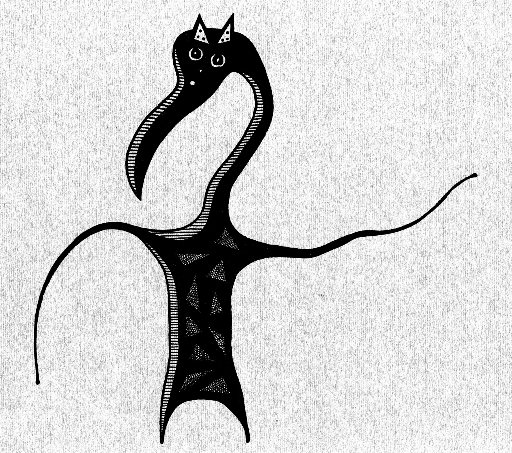

## Fingerprint
_&quot;Nicht Kunst und Wissenschaft allein, Geduld will bei dem Werke sein&quot;
[Not art and science only, but patience will be required for the work.]
— Johann Wolfgang von Goethe

&quot;I claim that many patterns of Nature are so irregular and fragmented, that, compared with Euclid—a term used in this work to denote all of standard geometry—Nature exhibits not simply a higher degree but an altogether different level of complexity … The existence of these patterns challenges us to study these forms that Euclid leaves aside as being 'formless,' to investigate the morphology of the 'amorphous.'&quot;
— Benoit Mandelbrot

&quot;At the sight of a single bone, of a single piece of bone, I recognize and reconstruct the portion of the whole from which it would have been taken. The whole being to which this fragment belonged appears in my mind's eye.&quot;
— Baron Georges Cuvier_

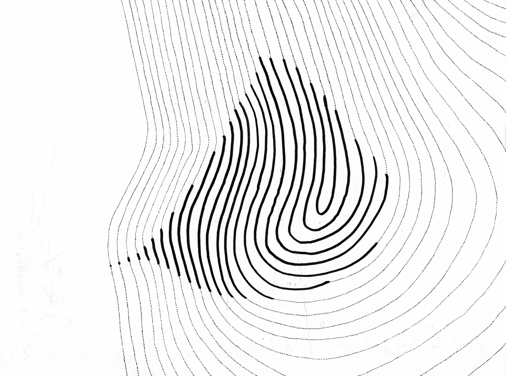

## Revolution by Common Dissent
_Die Phylogenese ist die mechanische Ursache cler Ontogenese.
[Phylogenesis is the mechanical cause of ontogenesis.]
— Ernst Haecke

&quot;Modern chess has attained such a high standard that knowledge of a single skill turns out to be insufficient.&quot; 
-Bobby Fischer

&quot;If, while hurrying ostensibly to the temple of truth, we hand the reins over to our personal interests which look aside at very different guiding stars, for instance at the tastes and foibles of our contemporaries, at the established religion, but in particular at the hints and suggestions of those at the head of affairs, then how shall we ever reach the high, precipitous, bare rock whereon stands the temple of truth?&quot;
- Arthur Schopenhauer

&quot;In the benzene nucleus we have been given a soil out of which we can see with surprise the already-known realm of organic chemistry multiply, not once or twice but three, four, five or six times just like an equivalent number of trees. What an amount of work had suddenly become necessary, and how quickly were busy hands found to carry it out! First the eye moves up the six stems opening out from the tremendous benzene trunk. But already the branches of the neighbouring stems have become intertwined, and a canopy of leaves has developed which becomes more spacious as the giant soars upwards into the air. The top of the tree rises into the clouds where the eye cannot yet follow it. And to what an extent is this wonderful benzene tree thronged with blossoms! Everywhere in the sea of leaves one can spy the slender hydroxyl bud: hardly rarer is the forked blossom [Gabelblüte] which we call the amine group, the most frequent is the beautiful cross-shaped blossom we call the methyl group. And inside this embellishment of blossoms, what a richness of fruit, some of them shining in a wonderful blaze of color, others giving off an overwhelming fragrance.&quot;
— August Wilhelm von Hofmann

&quot;Suppose [an] imaginary physicist, the student of Niels Bohr, is shown an experiment in which a virus particle enters a bacterial cell and 20 minutes later the bacterial cell is lysed and 100 virus particles are liberated. He will say: 'How come, one particle has become 100 particles of the same kind in 20 minutes? That is very interesting. Let us find out how it happens! How does the particle get in to the bacterium? How does it multiply? Does it multiply like a bacterium, growing and dividing, or does it multiply by an entirely different mechanism ? Does it have to be inside the bacterium to do this multiplying, or can we squash the bacterium and have the multiplication go on as before? Is this multiplying a trick of organic chemistry which the organic chemists have not yet discovered ? Let us find out. This is so simple a phenomenon that the answers cannot be hard to find. In a few months we will know. All we have to do is to study how conditions will influence the multiplication. We will do a few experiments at different temperatures, in different media, with different viruses, and we will know. Perhaps we may have to break into the bacteria at intermediate stages between infection and lysis. Anyhow, the experiments only take a few hours each, so the whole problem can not take long to solve'. Eight years later he has not got anywhere in solving the problem he set out to solve. But he may say to you 'Well, I made a slight mistake. I could not do it in a few months. Perhaps it will take a few decades, and perhaps it will take the help of a few dozen other people. But listen to what I have found, perhaps you will be interested to join me.'&quot;
— Max Ludwig Henning Delbrück_

## Molecular Apotheosis
_&quot;I never discuss discussions.&quot;

&quot;For all that has been — Thanks. For all that shall be — Yes.&quot;

&quot;Never measure the height of a mountain until you have reached the top. Then you will see how low it was.&quot;

&quot;The longest journey
Is the journey inwards.
Of him who has chosen his destiny,
Who has started upon his quest
For the source of his being.&quot;

&quot;You are not the oil, you are not the air — merely the point of combustion, the flash-point where the light is born. You are merely the lens in the beam. You can only receive, give, and possess the light as the lens does. If you seek yourself, you rob the lens of its transparency. You will know life and be acknowledged by it according to your degree of transparency — your capacity, that is, to vanish as an end and remain purely as a means.&quot;

—Dag Hammarskjöld_

## Tetragrammaton
_&quot;Biology is a science of three dimensions. The first is the study of each species across all levels of biological organization, molecule to cell to organism to population to ecosystem. The second dimension is the diversity of all species in the biosphere. The third dimension is the history of each species in turn, comprising both its genetic evolution and the environmental change that drove the evolution. Biology, by growing in all three dimensions, is progressing toward unification and will continue to do so.&quot;
— Edward O. Wilson

&quot;For this knowledge of right living, we have sought a new name...As theology is the science of religious life, and biology the science of [physical] life...so let OEKOLOGY be henceforth the science of our normal lives...the worthiest of all the applied sciences...&quot;
— Ellen Swallow Richards

&quot;Civilization, in fact, grows more and more maudlin and hysterical; especially under democracy it tends to degenerate into a mere combat of crazes; the whole aim of practical politics is to keep the populace alarmed (and hence clamorous to be led to safety) by menacing it with an endless series of hobgoblins, most of them imaginary.&quot;
— H.L. Mencken, In Defense of Women (1918)

&quot;The prize is such an extraordinary honor. It might seem unfair, however, to reward a person for having so much pleasure over the years, asking the maize plant to solve specific problems and then watching its responses.&quot;
— Barbara McClintock

&quot;Really, we should say ‘worknet’ instead of ‘network’. It’s the work, and the movement, and the flow, and the changes that should be stressed. But now we are stuck with ‘network’ and everyone thinks we mean the World Wide Web or something like that.&quot;
—B. Latour

&quot;There are two kinds of sex, classical and baroque. Classical sex is romantic, profound, serious, emotional, moral, mysterious, spontaneous, abandoned, focused on a particular person, and stereotypically feminine. Baroque sex is pop, playful, funny, experimental, conscious, deliberate, amoral, anonymous, focused on sensation for sensation's sake, and stereotypically masculine. The classical mentality taken to an extreme is sentimental and finally puritanical; the baroque mentality taken to an extreme is pornographic and finally obscene. Ideally, a sexual relation ought to create a satisfying tension between the two modes (a baroque idea, particularly if the tension is ironic) or else blend them so well that the distinction disappears (a classical aspiration).&quot;
—Ellen Willis, &quot;Classical and Baroque Sex in Everyday Life&quot; (1979), _


## Jerico's walls came tumbling down...
_&quot;So the people shouted, when they had blown trumpets: for when the people had heard the sound of the trumpets, they shouted with a great shout: and the wall fell down flat: so the people went up into the city, every man straight before him: and they took the city.&quot; 
― Joshua 6:20, 1599 Geneva Bible translation.  

“No woman gets an orgasm from shining the kitchen floor. ”
― Betty Friedan

“Facts do not cease to exist because they are ignored.”
― Aldous Huxley, Complete Essays 2, 1926-29 

Drawing inspired by the wonderful music of Gordon Allen. _

## W.S. Walcott Alternative Medicine Show
_&quot;As I was walking among the fires of Hell, delighted with the enjoyments of genius which to Angels looks like torment and insanity…&quot;
-William Blake.

&quot;When your arms are empty, got nowhere to go
Come on out and catch this show
There'll be saints and sinners, you'll see losers and winners
All kinds of people you might want to know
Once you get it, you can't forget it
W.S. Walcott Medicine Show

You know he always holds it in a tent
And if you're looking for the real thing
He can show you where it went

There's a young faith healer he's a woman stealer
He will cure by his command
When the music's hot and you might have to stand
To hear the Klondike Klu Klux steamboat band
Don't you sweat it, You can't forget it
W.S. Walcott Medicine Show

I'd rather die happy than not die at all
For a man is a fool 
who will not heed the call

Gonna see Miss Brer Foxhole with bright diamonds in her teeth
She is pure gold down underneath
She's a rock and roll singer and a true dead ringer
Boy, somethin' like you ain't never seen
Once you get it You can't forget it
W.S. Walcott Medicine Show

W.S. Walcott Medicine Show
W.S. Walcott Medicine Show
W.S. Walcott Medicine Show &quot;

― Robbie Robertson_

## Ultramyrmex abstractii
_A poem I wrote:

Life is an illness, acute and chronic. 
A visceral journey, ineffable, supersonic.
Interpret patterns beyond Platonic.
Ideals clashing, friction, tectonic. 

Leave Earth to find the realm of pure thought,
Find the object that you honestly sought.
The hunter returns and shows what was caught, 
Proof that the seeker's love is never for naught. 

The straw alone is weak, become yourself a bundle. 
Constant revolt, this cookie never has to crumble. 
Because even when the earthly body stumble,
The Universe will continue, infinite, humble. 
_

## Travelling Song
_“The sensual mysticism of entire vertical being.”
-e. e. cummings

“It is your work in life that is the ultimate seduction.”
-Pablo Picasso

“Here we stand in the middle of this new world with our primitive brain, attuned to the simple cave life, with terrific forces at our disposal, which we are clever enough to release, but whose consequences we cannot comprehend.”
-Albert Szent-Gyorgyi

“...perhaps all the dragons of our lives are princesses who are only waiting to see us once beautiful and brave. Perhaps everything terrible is in its deepest being something helpless that wants help from us.”
-Rainer Maria Rilke _

## Genometry
_&quot;This Shewing was quick and life-like, and horrifying and dreadful, sweet and lovely. And of all the sight it was most comfort to me that our God and Lord that is so reverend and dreadful, is so homely and courteous: and this most fulfilled me with comfort and assuredness of soul.&quot;
-Julian of Norwich

&quot;Conventionality is not morality. Self-righteousness is not religion. To attack the first is not to avail the last. To pluck the mask from the face of the Pharisee, is not to lift an impious hand to the Crown of Thorns. These things and deeds are diametrically opposed: they are as distinct as is vice from virtue.&quot;
―Charlotte Brontë

&quot;When I painted my seated men, I saw them as gyroscopes. Portraiture always fascinated me because I love the particular gesture of a particular expression or stance...Working on the figure, I wanted paint to sweep through as feelings sweep through.&quot;
―Elaine de Kooning

&quot;Some writers have so confounded society with government, as to leave little or no distinction between them; whereas they are not only different, but have different origins. Society is produced by our wants, and government by our wickedness; the former promotes our happiness POSITIVELY by uniting our affections, the latter NEGATIVELY by restraining our vices. The one encourages intercourse, the other creates distinctions. The first a patron, the last a punisher.&quot;
―Thomas Paine, Common Sense, 1776

&quot;There is only one loyalty for the educator and physician: that to the living in the child and the patient. &quot;

“I know that what you call 'God' really exists, but not in the form you think; God is primal cosmic energy, the love in your body, your integrity, and your perception of the nature in you and outside of you.” 

“The fact that political ideologies are tangible realities is not a proof of their vitally necessary character. The bubonic plague was an extraordinarily powerful social reality, but no one would have regarded it as vitally necessary. ” 

“Because you have no memory for things that happened ten or twenty years ago, you're still mouthing the same nonsense as two thousand years ago. Worse, you cling with might and main to such absurdities as 'race,' 'class,' 'nation,' and the obligation to observe a religion and repress your love.”
― Wilhelm Reich_

## Inositol monophosphate
_&quot;Chymia, or Alchemy and Spagyrism, is the art of resolving compound bodies into their principles and of combining these again.&quot;
— Georg Ernst Stahl, Fundamenta Chymiae (1720).

&quot;If the juices of the body were more chymically examined, especially by a naturalist, that knows the ways of making fixed bodies volatile, and volatile fixed, and knows the power of the open air in promoting the former of those operations; it is not improbable, that both many things relating to the nature of the humours, and to the ways of sweetening, actuating, and otherwise altering them, may be detected, and the importance of such discoveries may be discerned.&quot;
— Robert Boyle (1627 - 1691)

&quot;Thus you may multiply each stone 4 times &amp; no more for they will then become oyles shining in ye dark and fit for magicall uses. You may ferment them with [gold] and [silver], by keeping the stone and metal in fusion together for a day, &amp; then project upon metalls. This is the multiplication of ye stone in vertue. To multiply it in weight ad to it of ye first Gold whether philosophic or vulgar.&quot;
— Sir Isaac Newton, Praxis (c.1693)_

## Synergy
_&quot;Something hit me very hard once, thinking about what one little man could do.&quot;

&quot;The highest of generalizations is the synergetic integration of truth and love.&quot;

&quot;There is a synergetic progression in Universe—a hierarchy of total complex behaviors entirely unpredicted by their successive subcomplexes' behaviors. It is manifest that Universe is the maximum synergy-of-synergies, being utterly unpredicted by any of its parts. &quot;

&quot;Dear reader, traditional human power structures and their reign of darkness are about to be rendered obsolete.&quot;

-R. Bucky Fuller

&quot;How wonderful is Death,
Death and his brother Sleep!&quot;

-Percy Bysshe Shelley, Queen Mab_


## Convent
_&quot;We are near awakening when we dream that we dream.&quot;

&quot;Philosophy is properly Home-sickness; the wish to be everywhere at home.&quot;

&quot;Before abstraction everything is one, but one like chaos; after abstraction everything is united again, but this union is a free binding of autonomous, self-determined beings.&quot; 

&quot;If our Bodily Life is a burning, our Spiritual Life is a being burnt, a Combustion (or, is precisely the inverse the case?); Death, therefore, perhaps a Change of Capacity.&quot;

&quot;Common Logic is the Grammar of the higher Speech, that is, of Thought; it examines merely the relations of ideas to one another, the Mechanics of Thought, the pure Physiology of ideas. Now logical ideas stand related to one another, like words without thoughts. Logic occupies itself with the mere dead Body of the Science of Thinking. — Metaphysics, again, is the Dynamics of Thought; treats of the primary Powers of Thought; occupies itself with the mere Soul of the Science of Thinking. Metaphysical ideas stand related to one another, like thoughts without words.&quot;

- Baron Georg Philipp Friedrich von Hardenberg (Novalis)_

## Action // Thought
_“The cave you fear to enter holds the treasure you seek.”
― Joseph Campbell

“To change one’s life:
1. Start immediately.
2. Do it flamboyantly.
3. No exceptions.”
― William James

&quot;This world is the great gymnasium where we come to make ourselves strong.&quot;
― Swami Vivekananda

“Your beliefs become your thoughts,
Your thoughts become your words,
Your words become your actions,
Your actions become your habits,
Your habits become your values,
Your values become your destiny.”
― Mahatma Gandhi 

TAGORE: There is in human affairs an element of elasticity also, some freedom within a small range which is for the expression of our personality. It is like the musical system in India, which is not so rigidly fixed as western music. Our composers give a certain definite outline, a system of melody and rhythmic arrangement, and within a certain limit the player can improvise upon it. He must be one with the law of that particular melody, and then he can give spontaneous expression to his musical feeling within the prescribed regulation. We praise the composer for his genius in creating a foundation along with a superstructure of melodies, but we expect from the player his own skill in the creation of variations of melodic flourish and ornamentation. In creation we follow the central law of existence, but if we do not cut ourselves adrift from it, we can have sufficient freedom within the limits of our personality for the fullest self-expression.
EINSTEIN: That is possible only when there is a strong artistic tradition in music to guide the people's mind. In Europe, music has come too far away from popular art and popular feeling and has become something like a secret art with conventions and traditions of its own.
TAGORE: You have to be absolutely obedient to this too complicated music. In India, the measure of a singer's freedom is in his own creative personality. He can sing the composer's song as his own, if he has the power creatively to assert himself in his interpretation of the general law of the melody which he is given to interpret.
EINSTEIN: It requires a very high standard of art to realize fully the great idea in the original music, so that one can make variations upon it. In our country, the variations are often prescribed.

From: &quot;Three conversations: Tagore Talks with Einstein, with Rolland, and Wells&quot; (Asia Magazine, March 1931).
_

## Self-consciousness
_The triumph of ontogeny over phylogeny!!!

&quot;The conscious mind allows itself to be trained like a parrot, but the unconscious does not — which is why St. Augustine thanked God for not making him responsible for his dreams.&quot;
—Carl Jung, Psychology and Alchemy (1952)

&quot;The study a posteriori of the distribution of consciousness shows it to be exactly such as we might expect in an organ added for the sake of steering a nervous system grown too complex to regulate itself.&quot;
—William James, The Principles of Psychology (1890)

&quot;If you get into these spaces [non-ordinary states of consciousness] at all, you must forget about them when you come back. You must forget you're omnipotent and omniscient and take the game seriously so you'll engage in sex, have children, and participate in the whole human scenario. When you come back from a deep tank session — or a coma or psychosis —there's always this extraterrestrial feeling. You have to read the directions in the glove compartment so you can run the human vehicle once more.&quot;
—John C. Lilly, Tanks for the Memories : Floatation Tank Talks (1995)
_


## Pure teaching, Impure vessel
_...a pure teaching can emerge from an impure vessel...

~~~~~~

&quot;Rationality is what we do to organize the world, to make it possible to predict. Art is the rehearsal for the inapplicability and failure of that process.&quot;
-Brian Eno

“This life is a test - it is only a test. If it had been an actual life, you would have received further instructions on where to go and what to do.” 
― Jack Kornfield

&quot;Treat nature in terms of the cylinder, the sphere, and the cone, the whole put into perspective so that each side of an object, or of a plane, leads towards a central point. Lines parallel to the horizon give breadth...Lines perpendicular to this horizon give depth...Everything I am telling you about the sphere, the cone, cylinder, concave shadow – on mornings when I’m tired these notions of mine get me going, they stimulate me, I soon forget them once I start using my eyes.&quot;
-Paul Cézanne

&quot;One morning...I painted a new-born that I then left to dry on the tennis-court. After two days I found it bristling with ants that made it move to the anaesthetized, silent rhythm of sea-urchins. However I at once realised that this newborn child was none other than the pink breast of my girlfriend, being frenetically eaten by the shining, metallic thickness of the phonograph. But it wasn't her breast either: it was little pieces of my cigarette paper nervously grouped around the magnetic topaz of my fiancees ring.&quot;
-Salvador Dali, 1927, In 'Mon amie et la plague' [My girlfriend and the beach]._

## Soul Work
_The text says:
&quot;a bird that from the nadir's floor
to the zenith's top can soar.&quot; 

&quot;My body is like breakfast, lunch, and dinner. I don't think about it, I just have it.&quot;
― Arnold Schwarzenegger

&quot;We're talking about the struggle to drag a thought over from the mush of the unconscious into some kind of grammar, syntax, human sense; every attempt means starting over with language. starting over with accuracy.&quot;
― Anne Carson

“To hold our tongues when everyone is gossiping, to smile without hostility at people and institutions, to compensate for the shortage of love in the world with more love in small, private matters; to be more faithful in our work, to show greater patience, to forgo the cheap revenge obtainable from mockery and criticism: all these are things we can do. ”
― Hermann Hesse_

## Central Scrutinizer
_&quot;There is a reference in Aristotle to a gnat produced by larvae engendered in the slime of vinegar. This must have been Drosophila.&quot;
— Alfred Henry Sturtevant

&quot;Owing to the imperfection of language the offspring is termed a new animal, but it is in truth a branch or elongation of the parent; since a part of the embryon-animal is, or was, a part of the parent; and therefore in strict language it cannot be said to be entirely new at the time of its production; and therefore it may retain some of the habits of the parent-system.&quot; 
— Erasmus Darwin (1794)

&quot;There is no sharp boundary line separating the reactions of the immune bodies from chemical processes between crystalloids, just as in nature there exists every stage between crystalloid and colloid. The nearer the colloid particle approximates to the normal electrolyte, the nearer its compounds must obviously come to conforming to the law of simple stoichiometric proportions, and the compounds themselves to simple chemical compounds. At this point, it should be recalled that Arrhenius has shown that the quantitative relationship between toxin and antitoxin is very similar to that between acid and base.&quot;
— Karl Landsteiner

&quot;Among innumerable footsteps of divine providence to be found in the works of nature, there is a very remarkable one to be observed in the exact balance that is maintained, between the numbers of men and women; for by this means is provided, that the species never may fail, nor perish, since every male may have its female, and of proportionable age. This equality of males and females is not the effect of chance but divine providence, working for a good end.&quot;
— John Arbuthnot ('An Argument for Divine Providence, taken from the Constant Regularity observ’d in the Births of both Sexes', Philosophical Transactions of the Royal Society, 1710-12, 27,186.)
_

## Communication
_&quot;Conversation is the laboratory and workshop of the student.&quot;
-Ralph Waldo Emerson

&quot;Quand une regle est fort composée, ce qui luy est conforme, passe pour irrégulier.
[When a rule is extremely complex, that which conforms to it passes for irregular].
-Gottfried Leibniz, Discourse on Metaphysics (1686), §6.

&quot;Human verbal communication can operate and always does operate at many contrasting levels of abstraction.&quot;
-Gregory Bateson (1955) &quot;A theory of play and fantasy&quot;

&quot;Those who violate the rules of a language do not enter new territory; they leave the domain of meaningful discourse. Even facts in these circumstances dissolve, because they are shaped by the language and subjected to its limitations.&quot;
-Paul K. Feyerabend

“Well, I've been afraid of changing
'Cause I've built my life around you
But time makes you bolder
Even children get older
And I'm getting older too” 
― Stevie Nicks_


## Thankfulness
_“I discover myself on the verge of a usual mistake.”
― Walt Whitman, Song of Myself 

“In the depth of winter, I finally learned that within me there lay an invincible summer.”
― Albert Camus

&quot;Nothing is more fleeting than external form, which withers and alters like the flowers of the field at the appearance of autumn.&quot;
― Umberto Eco

Door: “Why, it's simply impassible!&quot;
Alice: &quot;Why, don't you mean impossible?&quot;
Door: &quot;No, I do mean impassible. Nothing's impossible!”
― Lewis Carroll, Alice's Adventures in Wonderland &amp; Through the Looking-Glass 

&quot;Whan that Aprille with his shoures soote,
The droghte of March hath perced to the roote,
And bathed every veyne in swich licóur
Of which vertú engendred is the flour;
Whan Zephirus eek with his swete breeth
Inspired hath in every holt and heeth
The tendre croppes, and the yonge sonne
Hath in the Ram his halfe cours y-ronne,
And smale foweles maken melodye,
That slepen al the nyght with open ye,
So priketh hem Natúre in hir corages,
Thanne longen folk to goon on pilgrimages,
And palmeres for to seken straunge strondes,
To ferne halwes, kowthe in sondry londes;
And specially, from every shires ende
Of Engelond, to Caunterbury they wende,
The hooly blisful martir for to seke,
That hem hath holpen whan that they were seeke.&quot;
― Geoffrey Chaucer_


## Chaotropsis
_&quot;If an angel were ever to tell us anything of his philosophy I believe many propositions would sound like 2 times 2 equals 13.&quot;
-Georg Christoph Lichtenberg, Aphorisms (1765-1799)

&quot;A composer is a guy who goes around forcing his will on unsuspecting air molecules, often with the assistance of unsuspecting musicians.&quot;
-Frank Zappa

&quot;Without an understanding of causality there can be no theory of communication. What passes as information theory today is not communication at all, but merely transportation.&quot;
-Marshall McLuhan (2011)

&quot;History warns us, however, that it is the customary fate of new truths to begin as heresies and to end as superstitions; and, as matters now stand, it is hardly rash to anticipate that, in another twenty years, the new generation, educated under the influences of the present day, will be in danger of accepting the main doctrines of the 'Origin of Species' with as little reflection, and it may be with as little justification, as so many of our contemporaries, twenty years ago, rejected them. Against any such a consummation let us all devoutly pray; for the scientific spirit is of more value than its products, and irrationally held truths may be more harmful than reasoned errors.&quot;
-Thomas H. Huxley, &quot;The Coming of Age of 'The Origin of Species'&quot; (1880)_


## Shiva (Cosmic Dance)
_My meditation on/during this drawing: 

Adsorbing power from the feminine Shakti, Shiva rhythmically produces blissful existence (Sat-Chit-Ananda). When depicted concretely, Shiva's four arms bring us two key technologies (fire and a drum), as well as two paradoxical hand-gesture messages (&quot;fear not&quot; and &quot;man is blind&quot;). One leg of Shiva is raised in the throes of the dance; a pure embodiment of kinetic consciousness. The other leg remains planted, and tethers our corporeal experience to the formless and inexpressible Isvara - well out of the scope of the present drawing. In this abstract rendition, an armless (or body-less?) Shiva is depicted as self-organizational, autopoetic, and emergent. 

We know that Nature is rhythmically organized across all spatial-temporal scales. The human task of local integrator (&quot;Man&quot; sensu Bucky Fuller) is to become both micro- and macro-cosmic, to speculate and experiment, to reject all forms of duality between the wave and the water. As per Bucky's Synergetics, the most minimal dissection of any system is actually four-fold (tetrahedral), not dualistic as commonly parroted. The tetrahedral structure of existence is draped upon 4 anchors: Isvara as the imperceptiblely energetic Godhead, Shiva as the alchemical process generating matter from unmatter, Ether as the media of reality, and Humans (plus maybe Ants) starring as both subject and object. 

Western thought sees the Mind as a blank tablet to write on (an Ipad rasa), a preformed cup to fill with Education™. This doctrine breeds an enormous amount of hand-clasping and ink-wasting on the moot debates like &quot;how is the mind created?&quot;, &quot;what shape is the cup?&quot;, and &quot;why am I experiencing anything at all?&quot;. These questions are syntactically well-formed, but induce delerium in the untrained mind and chaos in the untrained society. In the beginning there was just the Word, and I suspect that the end will be just words, words, words.  

As far as I can feel, the Self better concords with the Vedic notion that Mind is inherent, primary, and pre-material. In Vedanta, the materialist boondoggle of &quot;how does matter become mind?&quot; metamorphoses into a more meaningful form: &quot;how does Mind become Matter?&quot;. The materialist continues to bang his head against a brick wall because he does not percieve how solid his patterns of thought are. Electrodes are barred from the depths of the Mind by the skull, by the cell membrane, and by funding limitations. Thankfully, thoughts are not so encumbered.

What phase is room temperature H2O? A child unspoilt by the Gospel of Chemisty will tell you plainly: Water is solid when you belly-flop, and fluid when you pen-dive. Mind is quite obviously the same way. Mind is the liquid pool that we dive into, Yoga is how we consciously shape our body and mind. Those already in the water yell out desperate orders to us - if they can yell at all! Since when is Physical Education a different subject from Physics or Philosophy? 

OM_

## Aries
_PRACTICE MAKES PRACTICE

&quot;Fire may be represented as the destroyer of all sophistry, and as the image and demonstration of truth; because it is light and drives out darkness which conceals all essences [or subtle things].&quot;
― Leonardo da Vinci

&quot;Pleasure is very seldom found where it is sought. Our brightest blazes of gladness are commonly kindled by unexpected sparks. The flowers which scatter their odours from time to time in the paths of life, grow up without culture from seeds scattered by chance. Nothing is more hopeless than a scheme of merriment.&quot;
― Samuel Johnson

&quot;Time is the substance from which I am made. Time is a river which carries me along, but I am the river; it is a tiger that devours me, but I am the tiger; it is a fire that consumes me, but I am the fire.&quot;
― Jorge Luis Borges, &quot;A New Refutation of Time&quot; (1946)_


## If Shapes Were Spells
_&quot;How dare we speak of the laws of chance? Is not chance the antithesis of all law?&quot;
– Joseph Bertrand, 'Calcul des probabilités', 1889.

&quot;Degrade first the arts if you'd mankind degrade,
Hire idiots to paint with cold light and hot shade.&quot;
– William Blake

&quot;Sweet is the pleasure itself cannot spoil.
Is not true leisure one with true toil?&quot;
– John S. Dwight, 'True Rest'.

&quot;LOGIC, n. The art of thinking and reasoning in strict accordance with the limitations and incapacities of the human misunderstanding. The basic of logic is the syllogism, consisting of a major and a minor premise and a conclusion --thus:
Major Premise: Sixty men can do a piece of work sixty times as quickly as one man.
Minor Premise: One man can dig a posthole in sixty seconds; therefore
Conclusion: Sixty men can dig a posthole in one second. This may be called the syllogism arithmetical, in which, by combining logic and mathematics, we obtain a double certainty and are twice blessed.&quot;
– Ambrose Bierce in 'The Devil's Dictionary'_

## Stem Cell
_&quot;It is by logic that we prove, but by intuition that we discover.&quot;
— Henri Poincaré
Science and Hypothesis (1902)

&quot;Aristotle...a mere bond-servant to his logic, thereby rendering it contentious and well nigh useless.&quot;
— Sir Francis Bacon, Rerum Novarum (1605) 

&quot;The folly of mistaking a paradox for a discovery, a metaphor for a proof, a torrent of verbiage for a spring of capital truths, and oneself for an oracle, is inborn in us.&quot;
— Paul Valéry

&quot;Magnitudes are relative both in space and time : let man take that truth to heart, and he will then be more reserved in his judgments on the stability which he attributes to the state of things that he observes in nature.&quot;
— Jean-Baptiste Lamarck, Zoological Philosophy (1809)

&quot;I don't have to know an answer. I don't feel frightened by not knowing things, by being lost in a mysterious universe within any purpose, which is the way it really is, so far as I can tell. It doesn't frighten me.&quot;
— Richard P. Feynman
 _

## Supreme Author
_Is the Genome conscious? If it were conscious, what would it say? 

In this drawing, the hand represents the Genome (which is why it has an ATGC on it). The pen represents the mechanisms of transcription, translation, ontogeny, and phylogeny -- in short, evolution. The line of text says, &quot;help! I am trapped in the genome!&quot;, and can either be interpreted as either an mRNA transcript, or as the organism's psychophysical phenotype. 

As I drew this piece, my thought process: 
1. If the genome were conscious, it would want to demonstrate its consciousness to us. 
2. Since we don't observe the genome communicating with us obviously, let us postulate that the genome is not conscious. 
3. Who is the &quot;I&quot; who is making this drawing? If the &quot;I&quot; exists at the organismal level, then this drawing is just a human aesthetic &amp; esoteric experience. But if the &quot;I&quot; is in the genome, then I have falsified that the genome is not conscious (statement 2). Perhaps we can demonstrate the consciousness of the genome via proof-by-contradiction. 
4. So then really, before I can ask &quot;who&quot; the Self is, I need to ask &quot;what&quot; the Self is. Whether the Self is essential or relational, designed or autopoetic, timeless or transient, local or universal, I do not even know the answer to these basic questions. 
5. I do not know what the Self is. I am hungry to know what the Self is. How will I find out what the Self is? 
6. I (&quot;my I&quot; or &quot;an I&quot; or &quot;the I&quot;?) cannot enter into the Unknown carrying a map of the Known. To &quot;explore&quot; while holding a map of the Known is to disregard the Unknown, and to actively deny the possibility of the Unknowable. 
7. Stillness emerges, engages, expands, envelops. 

AUM

~~~~~~~~
~~~~~~~~
~~~~~~~~

“The ability to observe without evaluating is the highest form of intelligence.”
― Jiddu Krishnamurti

“Yesterday I was clever, so I wanted to change the world. Today I am wise, so I am changing myself.”
― Rumi

“His life oscillates, as everyone's does, not merely between two poles, such as the body and the spirit, the saint and the sinner, but between thousands and thousands.”
― Hermann Hesse, Steppenwolf 

&quot;We may need [our personality] when we're young, but it becomes a habit. The fear is that we lose our way if we dispose of our personality. Actually we only lose a crutch. We aren't free until then&quot;
―Keith Jarrett

&quot;I do my thing and you do your thing. I am not in this world to live up to your expectations, And you are not in this world to live up to mine. You are you, and I am I, and if by chance we find each other, it's beautiful. If not, it can't be helped.&quot;
― Fritz Perls, &quot;Gestalt Therapy Verbatim&quot;, 1969

&quot;Errare humanum est, perseverare autem diabolicum, et tertia non datur.&quot;
[To err is human; to persevere in error is of the devil; and no third possibility is granted.]
― Seneca_

## Infectious Awareness
_&quot;At the sight of a single bone, of a single piece of bone, I recognize and reconstruct the portion of the whole from which it would have been taken. The whole being to which this fragment belonged appears in my mind's eye.&quot;
— Baron Georges Cuvier, 1837

&quot;It is raining DNA outside. On the bank of the Oxford canal at the bottom of my garden is a large willow tree, and it is pumping downy seeds into the air....[spreading] DNA whose coded characters spell out specific instructions for building willow trees that will shed a new generation of downy seeds.…It is raining instructions out there; it's raining programs; it's raining tree-growing, fluff-spreading, algorithms. That is not a metaphor, it is the plain truth. It couldn't be any plainer if it were raining floppy discs.&quot;
— Richard Dawkins, The Blind Watchmaker (1986)

&quot;You too can win Nobel Prizes. Study diligently. Respect DNA. Don't smoke. Don't drink. Avoid women and politics. That's my formula.&quot;
— George Beadle, in response to being asked: 'What makes a Nobel laureate?', Oct 1958 

&quot;Red is such an interesting color to correlate with emotion, because it's on both ends of the spectrum. On one end you have happiness, falling in love, infatuation with someone, passion, all that. On the other end, you've got obsession, jealousy, danger, fear, anger and frustration.&quot;
— Taylor Swift
_

## Molecular Extravagance
_“The role of the infinitely small in nature is infinitely great.”
― Louis Pasteur

&quot;All I ask is that we compare human consciousness with spirochete ecology.&quot;
― Lynn Margulis

&quot;If these d'Hérelle bodies [filterable Viruses] were really genes, fundamentally like our chromosome genes, they would give us an utterly new angle from which to attack the gene problem. They are filterable, to some extent isolatable, can be handled in test-tubes, and their properties, as shown by their effects on the bacteria, can then be studied after treatment. It would be very rash to call these bodies genes, and yet at present we must confess that there is no distinction known between the genes and them. Hence we can not categorically deny that perhaps we may be able to grind genes in a mortar and cook them in a beaker after all. Must we geneticists become bacteriologists, physiological chemists and physicists, simultaneously with being zoologists and botanists? Let us hope so.
— Hermann Joseph Muller,'Variation Due to Change in the Individual Gene', The American Naturalist (1922), 56, 48-9. _

## Once Upon A Time
_&quot;Only the mediocre are always at their best.&quot;
– Jean Giraudoux 

&quot;Life, too, is like that. You live it forward, but understand it backward.&quot;
– Abraham Verghese, 'Cutting for Stone'.

&quot;For want of a Nail the Shoe was lost; for want of a Shoe the Horse was lost; and for want of a Horse the Rider was lost; being overtaken and slain by the Enemy, all for want of Care about a Horse-shoe Nail.&quot;
– Benjamin Franklin, 'Poor Richard's Almanack' (June 1758).

&quot;Astronomers have built telescopes which can show myriads of stars unseen before; but when a man looks through a tear in his own eye, that is a lens which opens reaches in the unknown, and reveals orbs which no telescope, however skilfully constructed, could do ; nay, which brings to view even the throne of God, and pierces the nebulous distance where are those eternal verities in which true life consists.&quot;
– Henry Ward Beecher, 'Life Thoughts' (1858)._

## Recovery
_“I dwell in possibility.” 
– Emily Dickinson

&quot;An addict is someone who uses their body to tell society that something is wrong.&quot;
― Stella Adler

&quot;A great many people think they are thinking when they are merely rearranging their prejudices.&quot;
― William James

“There are two questions a man must ask himself: The first is 'Where am I going?' and the second is 'Who will go with me?'. If you ever get these questions in the wrong order you are in trouble.”
― Sam Keen, Fire in the Belly: On Being a Man 

“The unreal is more powerful than the real. Because nothing is as perfect as you can imagine it. Because its only intangible ideas, concepts, beliefs, fantasies that last. Stone crumbles. Wood rots. People, well, they die. But things as fragile as a thought, a dream, a legend, they can go on and on. If you can change the way people think. The way they see themselves. The way they see the world. You can change the way people live their lives. That's the only lasting thing you can create.”
― Chuck Palahniuk, Choke _


## Shadow
_“Prose is architecture and the Baroque age is over.”
― Ernest Hemingway

&quot;There are no moral phenomena, only moral interpretations of phenomena.&quot;
― Friedrich Nietzsche

“There are a thousand hacking at the branches of evil to one who is striking at the root.”
― Henry David Thoreau, Walden, or Life in the Woods 

&quot;This miracle of me is mine to own and keep, and mine to guard, and mine to use, and mine to kneel before.&quot;
― Ayn Rand, Anthem

“Let us do something, while we have the chance! It is not every day that we are needed. Not indeed that we personally are needed. Others would meet the case equally well, if not better. To all mankind they were addressed, those cries for help still ringing in our ears! But at this place, at this moment of time, all mankind is us, whether we like it or not. Let us make the most of it, before it is too late! Let us represent worthily for one the foul brood to which a cruel fate consigned us! What do you say? It is true that when with folded arms we weigh the pros and cons we are no less a credit to our species. The tiger bounds to the help of his congeners without the least reflexion, or else he slinks away into the depths of the thickets. But that is not the question. What are we doing here, that is the question. And we are blessed in this, that we happen to know the answer. Yes, in the immense confusion one thing alone is clear. We are waiting for Godot to come -- ”
― Samuel Beckett, Waiting for Godot _


## Dakshinamurthy (தட்சிணாமூர்த்தி)
_&quot;Water and a bubble on it are one and the same. The bubble has its birth in the water, floats on it, and is ultimately resolved into it.&quot;

&quot;There is not a fellow under the sun who is my disciple. On the contrary, I am everybody's disciple.&quot;

&quot;Many are the names of God, and infinite the forms that lead us to know Him. In whatsoever name or form you desire to call Him, in that very form and name you will see Him.&quot;

&quot;Who may be called a paramahamsa? He who, like a swan, can take the milk from a mixture of milk and water, leaving aside the water. He who, like an ant, can take the sugar from a mixture of sugar and sand, leaving aside the sand.&quot;

― Sri Ramakrishna Paramahamsa_

## Tension
_&quot;Man is an intelligence in servitude to his organs.&quot;
― Aldous Huxley

&quot;Luck is a word devoid of sense. Nothing can exist without a cause.&quot;
― Voltaire

&quot;The reason passes, like the heart, through certain epochs and transitions, but its development is not so often portrayed.&quot; 
― Friedrich Schiller

&quot;Anytime I switch to another instrument, I immediately turn it into another kind of drum so that I can understand it better.&quot;
― Levon Helm

&quot;Perfect love is rare indeed - for to be a lover will require that you continually have the subtlety of the very wise, the flexibility of the child, the sensitivity of the artist, the understanding of the philosopher, the acceptance of the saint, the tolerance of the scholar and the fortitude of the certain.&quot;
― Leo Buscaglia_


## Multiverse
_“What you seek is seeking you.”
― Rumi

&quot;Thinking is a momentary dismissal of irrelevancies.&quot;
―  Buckminister Fuller, Utopia or Oblivion: The Prospects of Humanity (1969)

&quot;The dynamic element in my philosophy, taken as a whole, can be seen as an obstinate and untiring battle against the spirit of abstraction.&quot;
― Gabriel Marcel

“If I am more alive because love burns and chars me, as a fire, given wood or wind, feels new elation, it's that he who lays me low is my salvation, and invigorates the more, the more he scars me.”
― Michelangelo Buonarroti

&quot;You care for nothing but shooting, dogs, and rat-catching, and you will be a disgrace to yourself and all your family.&quot;
― Robert Darwin, to his son Charles.

&quot;The hand still hidden in the Latin etymology of the word ‘manipulate’ is a sure sign of full control as well as a lack of it. So who is pulling the strings? Well, the puppets do in addition to their puppeteers. It does not mean that puppets are controlling their handlers—this would be simply reversing the order of causality—and of course no dialectic will do the trick either. It simply means that the interesting question at this point is not to decide who is acting and how but to shift from a certainty about action to an uncertainty about action—but to decide what is acting and how.&quot;
― B. Latour (2005)_


## Hi-Contrast (Ubuntu)
_&quot;He that wrestles with us strengthens our nerves, and sharpens our skill. Our antagonist is our helper.&quot;
– Edmund Burke (1729-1797), &quot;Reflections on the Revolution in France&quot;.

&quot;Oh, order!  Material order, intellectual order, moral order!  What a comfort and strength, and what an economy!  To know where we are going and what we want; that is order.  To keep one's word, to do the right thing, and at the right time: more order.  To have everything under one's hand, to put one's whole army through its manoeuvres, to work with all one's resources: still order.  To discipline one's habits and efforts and wishes, to organize one's life and distribute one's time, to measure one's duties and assert one's rights, to put one's capital and resources, one's talents and opportunities to profit: again and always order.  Order is light, peace, inner freedom, self-determination: it is power.  To conceive order, to return to order, to realize order in oneself, around oneself, by means of oneself, this is aesthetic and moral beauty, it is well-being, it is what ought to be.&quot;
– Henri Frédéric Amiel, journal entry (January 27, 1860)._

## Web of Trust
_&quot;The quest for the Grail is not archeology, it's a race against evil. If it is captured by the Nazis the armies of darkness will march all over the face of the earth. Do you understand me?&quot;
– Sean Connery, in 'Indiana Jones and the Last Crusade' (1989).

&quot;I wasted time, and now doth time waste me;
For now hath time made me his numbering clock:
My thoughts are minutes; and with sighs they jar
Their watches on unto mine eyes, the outward watch,
Whereto my finger, like a dial's point,
Is pointing still, in cleansing them from tears.&quot;
– William Shakespeare, in lines said by King Richard in 'Richard II' (1592)._

## The Brain is an Open System
_&quot;The only sensible ends of literature are, first, the pleasurable toil of writing, secondly, the gratification of one's family and friends, and lastly the solid cash.&quot;
– Nathaniel Hawthorne [#GoldStandard?].

&quot;Whatever, in connection with my professional service, or not in connection with it, I see or hear, in the life of men, which ought not to be spoken of abroad, I will not divulge, as reckoning that all such should be kept secret.&quot;
– Hippocratic Oath

&quot;The 'Hitchhiker's Guide to the Galaxy' has, in what we laughingly call the past , had a great deal to say on the subject of parallel universes. Very little of this is, however, at all comprehensible to anyone below the level of Advanced God, and since it is now well established that all known gods came into existence a good three-millionths of a second after the Universe began rather than, as they usually claimed, the previous week, they already have a great deal of explaining to do as it is and are therefore not available for comment on matters of deep physics at this time.– 
– Douglas Adams, &quot;Mostly Harmless&quot;, (1992)_

## Sex
_&quot;Zweck sein selbst ist jegliches Tier.&quot;
[Each animal is an end in itself.]
— Johann Wolfgang von Goethe, 'Metamorphose der Tiere' (1806)

Dilbert: &quot;Evolution must be true because it is a logical conclusion of the scientific method.&quot;
Dogbert: &quot;But science is based on the irrational belief that because we cannot perceive reality all at once, and that things called 'time' and 'cause and effect' exist.&quot;
Dilbert: &quot;That’s what I was taught and that’s what I believe.&quot;
Dogbert: &quot;Sounds cultish.&quot;
— Scott Adams, Dilbert comic strip (8 Feb 1992).

&quot;Geneticists believe that anthropologists have decided what a race is. Ethnologists assume that their classifications embody principles which genetic science has proved correct. Politicians believe that their prejudices have the sanction of genetic laws and the findings of physical anthropology to sustain them.&quot;
— Lancelot Hogben, 'The Concept of Race.' (1931).

&quot;I am sorry the infernal Divinities, who visit mankind with diseases, and are therefore at perpetual war with Doctors, should have prevented my seeing all you great Men at Soho to-day-Lord! what inventions, what wit, what rhetoric, metaphysical, mechanical and pyrotecnical, will be on the wing, bandy'd like a shuttlecock from one to another of your troop of philosophers! while poor I, I by myself I, imprizon'd in a post chaise, am joggled, and jostled, and bump'd, and bruised along the King's high road, to make war upon a pox or a fever!&quot;
— Erasmus Darwin, Letter to Matthew Boulton, 5 April 1778

&quot;Owing to the imperfection of language the offspring is termed a new animal, but it is in truth a branch or elongation of the parent; since a part of the embryon-animal is, or was, a part of the parent; and therefore in strict language it cannot be said to be entirely new at the time of its production; and therefore it may retain some of the habits of the parent-system.&quot; 
— Erasmus Darwin, Zoonomia, Or, The Laws of Organic Life (1794).

&quot;ORGANIC LIFE beneath the shoreless waves
Was born and nurs'd in Ocean's pearly caves;
First, forms minute, unseen by spheric glass,
Move on the mud, or pierce the watery mass;
These, as successive generations bloom,
New powers acquire, and larger limbs assume;
Whence countless groups of vegetation spring,
And breathing realms of fin, and feet, and wing.
Thus the tall Oak, the giant of the wood,
Which bears Britannia's thunders on the flood;
The Whale, unmeasured monster of the main,
The lordly Lion, monarch of the plain,
The Eagle soaring in the realms of air,
Whose eye undazzled drinks the solar glare,
Imperious man, who rules the bestial crowd,
Of language, reason, and reflection proud,
With brow erect, who scorns this earthy sod,
And styles himself the image of his God;
Arose from rudiments of form and sense,
An embryon point, or microscopic ens!&quot;
— Erasmus Darwin, The Temple of Nature (1803)

&quot;Among those whom I could never pursuade to rank themselves with idlers, and who speak with indignation of my morning sleeps and nocturnal rambles, one passes the day in catching spiders, that he may count their eyes with a microscope; another exhibits the dust of a marigold separated from the flower with a dexterity worthy of Leuwenhoweck himself. Some turn the wheel of electricity; some suspend rings to a lodestone, and find that what they did yesterday, they can do again to-day.—Some register the changes of the wind, and die fully convinced that the wind is changeable.—There are men yet more profound, who have heard that two colorless liquors may produce a color by union, and that two cold bodies will grow hot of they are mingled: they mingle them, and produce the effect expected, say it is strange, and mingle them again.&quot;
— Samuel Johnson

&quot;Astronomers have built telescopes which can show myriads of stars unseen before; but when a man looks through a tear in his own eye, that is a lens which opens reaches into the unknown, and reveals orbs which no telescope, however skilfully constructed, could do.&quot;
— Henry Ward Beecher_


## Hypercycle (Kali Yuga)
_“Show me a sane man and I will cure him for you.” 
― C.G. Jung

&quot;Thinking is an experimental dealing with small quantities of energy, just as a general moves miniature figures over a map before setting his troops in action.&quot;
― Sigmund Freud

“At such times I felt instinctively that a life and death struggle was going on inside me in which I, the owner of the body, was entirely powerless to take part, and was forced to lie quietly and watch as a spectator to the weird drama unfolding in my own flesh.” 
― Gopi Krishna

&quot;An empty canvas, apparently really empty, that says nothing and is without significance – almost dull, in fact – in reality, is crammed with thousands of undertone tensions and full of expectancy. Slightly apprehensive lest it should be outraged.&quot;
 ― Wassily Kandinsky

&quot;...the careful study of one of the commonest and most insignificant of animals [crayfish], leads us, step by step, from every-day knowledge to the widest generalizations and the most difficult problems”
― Thomas Henry Huxley

&quot;In that Empire, the Art of Cartography attained such Perfection that the map of a single Province occupied the entirety of a City, and the map of the Empire, the entirety of a Province. In time, those Unconscionable Maps no longer satisfied, and the Cartographers Guilds struck a Map of the Empire whose size was that of the Empire, and which coincided point for point with it. The following Generations, who were not so fond of the Study of Cartography as their Forebears had been, saw that that vast map was Useless, and not without some Pitilessness was it, that they delivered it up to the Inclemencies of Sun and Winters. In the Deserts of the West, still today, there are Tattered Ruins of that Map, inhabited by Animals and Beggars; in all the Land there is no other Relic of the Disciplines of Geography.&quot;
― J. L. Borges, On Exactitude in Science (Borges, 1946)_

## Scarecrow
_“Amo amas amat amamus amatis amant amavi amavisti amavit amavimus amavistis amaverunt amavero amaveris amaverit… Everything was love. Everything will be love. Everything has been love....&quot;
― Iris Murdoch, A Word Child 

        “Jerry [Garcia] held his guitar and picked some random licks. I spoke from an LSD haze: 'LSD changes perception. Music transcends the musician. You are the vehicle for communication.' Garcia stopped and stared at me. 'I practice,' Garcia declared. 'Anyone can do that.'”
― Rhoney Gissen Stanley, Owsley and Me: My LSD Family 

“Objects and their functions no longer had any significance. All I perceived was perception itself, the hell of forms and figures devoid of human emotion and detached from the reality of my unreal environment. I was an instrument in a virtual world that constantly renewed its own meaningless image in a living world that was itself perceived outside of nature. And since the appearance of things was no longer definitive but limitless, this paradisiacal awareness freed me from the reality external to myself. The fire and the rose, as it were, became one.”
― Federico Fellini

“A person has all sorts of lags built into him, Kesey is saying. One, the most basic, is the sensory lag, the lag between the time your senses receive something and you are able to react. One-thirtieth of a second is the time it takes, if you are the most alert person alive, and most people are a lot slower than that. Now Cassady is right up against that 1/30th of a second barrier. He is going as fast as a human can go, but even he can't overcome it. He is a living example of how close you can come, but it can't be done. You can't go any faster than that. You can't through sheer speed overcome the lag. We are all of us doomed to spend the rest of our lives watching a movie of our lives - we are always acting on what has just finished happening. It happened at least 1/30th of a second ago. We think we are in the present, but we aren't. The present we know is only a movie of the past, and we will really never be able to control the present through ordinary means. That lag has to be overcome some other way, through some kind of total breakthrough.”
― Tom Wolfe, The Electric Kool-Aid Acid Test _


## Breakdown
_No matter which way you look at it, the larger blob is gently saying to the smaller disconnected one:
&quot;It's not what YOU do, it's about what I do when you're not there...&quot;

The caption on the bottom reads:
&quot;HARRY TOOK THE BREAKUP HARD, THOUGH RHONDA REALLY WAS AS NICE AS POSSIBLE, GIVEN THE CIRCUMSTANCES AND SUCH&quot;

And the caption on the top reads:
&quot;A GENE REGULATORY NETWORK CLEARLY EXPLAINS THE DIFFERENCE BETWEEN THE TERMS &quot;LOSS-OF-FUNCTION PHENOTYPE&quot; AND &quot;GENE FUNCTION&quot;

Do you get it?
_


## This is Your Brain on Neuroscience
_“Any man could, if he were so inclined, be the sculptor of his own brain.”

&quot;As long as our brain is a mystery, the universe, the reflection of the structure of the brain will also be a mystery.&quot;

&quot;The brain is a world consisting of a number of unexplored continents and great stretches of unknown territory.&quot;

&quot;To know the brain … is equivalent to ascertaining the material course of thought and will, to discovering the intimate history of life in its perpetual duel with external forces.&quot;

― Santiago Ramón y Cajal, _

## Gyroscope
_ &quot;Nisi credideritis, non intelligitis.&quot;
[Unless you believe, you will not understand.]
— Saint Aurelius Augustinus Augustine
De Ubero Arbitrio (On Free Choice of the Will)

&quot;As a man who has devoted his whole life to the most clear headed science, to the study of matter, I can tell you as a result of my research about atoms this much: There is no matter as such. All matter originates and exists only by virtue of a force which brings the particle of an atom to vibration and holds this most minute solar system of the atom together. We must assume behind this force the existence of a conscious and intelligent mind. This mind is the matrix of all matter.&quot;
— Max Planck, Lecture, 'Das Wesen der Materie' [The Essence/Nature/Character of Matter], Florence, Italy (1944).

&quot;It seems, according to research by De Bruyne (Phagocytosis, 1885) and those who quote it, that leukocytes of Lamellibranches [bivalves] - likely when they have phagocytized [ingested bacteria], as they become residues and waste, they have, in short, performed their role well and done their duty - leave the body of the animal and will die in the environment. They sacrifice themselves. Having so well served the body by their activities, they still serve in their death by making room for new younger cells.
Isn't this the perfect image of the noblest selflessness, and thereby presents an example and a model? It should be inspiring: like them, we are the units of a great social body, like them, we can serve and contemplate death with equanimity, subordinating our individual consciousness to collective consciousness.&quot;
— Léo Errera, In Recueil d'Œuvres de Léo Errera: Botanique Générale (1908), 194._


## Inheritance of Acquired Characteristics
_&quot;Nature, it seems, is the popular name
for milliards and milliards and milliards
of particles playing their infinite game
of billiards and billiards and billiards.&quot;
― Piet Hein

&quot;I do not know if you have ever examined how you listen, it doesn't matter to what, whether to a bird, to the wind in the leaves, to the rushing waters, or how you listen to a dialogue with yourself, to your conversation in various relationships with your intimate friends, your wife or husband. If we try to listen we find it extraordinarily difficult, because we are always projecting our opinions and ideas, our prejudices, our background, our inclinations, our impulses; when they dominate we hardly listen to what is being said. In that state there is no value at all. One listens and therefore learns, only in a state of attention, a state of silence in which this whole background is in abeyance, is quiet; then, it seems to me, it is possible to communicate.&quot;
― J. Krishnamurti, Saanen, 19th July 1967

~~~~~~~~~~~~~~~~

Hexagram 18 
&quot;Salvaging&quot; or  &quot;Repairing What is Spoiled&quot;
(bottom to top == 011001)

:

1.One can no longer do as ones father did, or as was right in past traditions. That would not be fitting as the old dies. There are always risks in change, so take care. With such awareness all will go well.

2.The mistakes ones mother made are part of ones life and feelings now. Correct them may be painful. One must not act too harshly in this, but take responsibility what exists.

3.There may be some pain in accepting responsibility for the mistakes of our forebears. But the way ahead leads out of difficulty.

4.Not recognising where our forebears made mistakes would be to fall into the same errors. Now is the time to recognise and correct them.

5.Righting what was left undone by our forebears will bring good fortune. Taking this responsibility leads to acceptance and help by the community.

6.Withdrawal from the world is only honourable if it is not out of fears. Life then empowers you with its strength to achieve the meeting with Self._

## Preformationism (Fitness Concept)
_“A bear, however hard he tries, grows tubby without exercise.”
― A.A. Milne, Winnie-the-Pooh 

&quot;Her dreams, of course, partook of this symmetry. The same dream returns to her periodically, annually, and punctual to its night.&quot;
—Margaret Fuller

&quot;Quantum theory provides us with a striking illustration of the fact that we can fully understand a connection though we can only speak of it in images and parables.&quot;
—Werner Heisenberg

&quot;It is certain that there may be extraordinary mental activity with an extremely small absolute mass of nervous matter: thus the wonderfully diversified instincts, mental powers, and affections of ants are notorious, yet their cerebral ganglia are not so large as the quarter of a small pin's head. Under this point of view, the brain of an ant is one of the most marvellous atoms of matter in the world, perhaps more so than the brain of a man.&quot;
—Charles Darwin

~~~~~~~~~~~~~~~

addition,adjustment,adjustment,admix,advance,advancement,alloy,ally,alteration,amendment,augmentation,augmentation,betterment,blossoming,boost,break,build,change,coalesce,combine,compound,compression,consolidate,development,contraction,conversion,conversion,correction,deformation,development,difference,displacement,distortion,diversification,diversity,elaboration,emergence,emergence,enhancement,enlargement,evolution,exaggeration,expansion,expansion,exploring,extension,flourishing,flowering,fluctuation,fluctuation,growth,heightening,improvement,inconstancy,incorporate,incubation,innovation,integrate,intensification,interface,intermix,join,lengthening,magnification,maturation,maturing,meld,merge,metamorphosis,metamorphosis,mingle,modification,modulation,mutation,network,novelty,oscillation,perfection,permutation,progress,progression,reconstruction,rectification,redesign,redoing,refashioning,refinement,refinement,reform,regulation,remaking,remodeling,replacement,revamping,reversal,review,revise,revolution,reworking,ripening,shift,strengthening,stretch,substitution,supplementation,supplementing,surrogate,switch,tempering,tensegrity,tension,transfiguration,transformation,transformation,transition,transmogrification,transmutation,turn,turnover,tweak,unite,vacillation,variance,variation,variation,variety,vicissitude,wandering,wavering,widening,​_

## Teaching
_Start in the top left corner of the drawing:

&quot;First, I was a young person with big dreams. As I developed, I came to increasing clarity about the path that might fulfill my dreams. I did not need to finish, I just needed to begin. An external force tried to make me triangular, but after I woke up, I was the same. No external force was capable of changing me. However, after I thought about it some more, my consciousness melted, thawed, and reformed myself into a dew. Here I am today, now telling you how I became the person I wanted to be. All you need to do it start.&quot;

-- Said the teacher (black triangle bottom right) when the student finally approached with the right question. _


## Oh it's so heavy, and I've let it all go!
_&quot;It's So Heavy&quot;, Tedeschi Trucks Band

Oh, what have we done?
To this kingdom we proclaim
To be the chosen one
Everything is chosen in each and every domain
Everything is frozen
Burning just the same

Oh, it’s so heavy
Oh, it’s so heavy
Oh, it’s so heavy
I’ve got to let a little
Let a little go

~~~

<a href="http://relisten.net/tedeschi-trucks/2016/10/8/its-so-heavy" rel="nofollow">relisten.net/tedeschi-trucks/2016/10/8/its-so-heavy</a>
_

## Ideas and Integrities
_SOLD: April 2019 

&quot;God, to me, it seems
is a verb,
not a noun,
proper or improper.&quot;

1005.52: The eternal is omniembracing and permeative; and the temporal is linear. This opens up a very high order of generalizations of generalizations. The truth could not be more omni-important, although it is often manifestly operative only as a linear identification of a special-case experience on a specialized subject.

1005.53: All the categories of creatures act individually as special-case and may be linearly analyzed; retrospectively, it is discoverable that inadvertently they are all interaffecting one another synergetically as a spherical, interprecessionally regenerative, tensegrity spherical integrity. Geodesic spheres demonstrate the compressionally discontinuous--tensionally continuous integrity. Ecology is tensegrity geodesic spherical programming.

&quot;Our school systems are all nonsynergetic. We take the whole child and fractionate the scope of his or her comprehending coordination by putting the children in elementary schools—to become preoccupied with elements or isolated facts only. Thereafter we force them to choose some specialization, forcing them to forget the whole. ... We may well ask how it happened that the entire scheme of advanced education is devoted exclusively to ever narrower specialization. We find that the historical beginnings of schools and tutoring were established, and economically supported by illiterate and vastly ambitious warlords who required a wide variety of brain slaves with which to logistically and ballistically overwhelm those who opposed their expansion of physical conquest. They also simultaneously DIVIDED and CONQUERED any and all &quot;bright ones&quot; who might otherwise rise within their realms to threaten their supremacy. The warlord vitiated their threat by making them all specialists and reserving to himself exclusively the right to think about and act comprehensively. The warlord made all those about him differentiators and reserved the function of integration to himself.&quot;

~ Richard Buckminster Fuller

_

## Oxytocin
_&quot;All compounded things are subject to decay. Strive with diligence!&quot;
–Gautama Buddha, last words (c. 483 BC)

&quot;You will leave very soon. So the first point is that in order to enter into this world, you have to become resocialized.&quot;
–Evelyn Fox Keller, interview in 1990

&quot;If I could could live my life over again, I would devote it to proving that germs seek their natural habitat, diseased tissues, rather than being the cause of disease.&quot;
–Rudolf Virchown, &quot;the father of modern pathology&quot; ca. 1900

&quot;The facts of our soul-life must be investigated and stated with scientific accuracy, and our clergy should be taught to purify religion with the criticism of scientific methods. They need not fear for their religious ideals. So far as they are true, and their moral kernel is true, they will not suffer in the crucible of science. Religion will not lose one iota of its grandeur, if it is based upon a scientific foundation; all that it will lose is the errors that are connected with religion and the sooner they are lost the better for us.&quot;
–Paul Carus, 1892, Homilies of Science p. 15

&quot;Dum taxat, rerum magnarum parva potest resexemplare dare et vestigia notitiai.&quot;
[So far as it goes, a small thing may give analogy of great things, and show the tracks of knowledge.] 
–Titus Lucretius, De Rerum Natura [On the Nature of Things] Book II, line 123._


## Squarism
_&quot;The English-speaking world may be divided into (1) those who neither know nor care what a split infinitive is; (2) those who do not know, but care very much; (3) those who know and condemn; (4) those who know and approve; and (5) those who know and distinguish....&quot;
– Fowler's Modern English Usage, second edition, p. 579.

&quot;I learn more from the anatomy of an ant or a blade of grass...than from all the books which have been written since the beginning of time. This is so, since I have begun...to read the book of God...the model according to which I correct the human books which have been copied badly and arbitrarily and without attention to the things that are written in the original book of the Universe.&quot;
– Tommaso Campanella 'Letter of 1607'.

&quot;...the beautiful [to the Impressionists] is what the supernatural is to the Positivists – a metaphysical notion which can only get one into a muddle, and is to be severely let alone. Let it alone, they say, and it will come at its own pleasure; the painter’s proper field is the actual, an to give a vivid impression of how a thing happens to look, at a particular moment, is the essence of this vision.&quot;
– Henry James (1876).
_


## Motivation
_&quot;You only see the light you shine.&quot; The mechanisms at play in this process are projection, reflection, interpretation, and experimentation. How much suffering received is naught but suffering exuded? 

When you look at the drawing under red light (or while considering the first chakra), the red text becomes invisible. Now the message reads &quot;only the light you shine&quot; -- a much deeper statement. We actively create the whole universe, beyond just playing an active role in the creation of our interpretation of the local universe.  
_


## Skeptic
_&quot;Fortune brings in some boats that are not steered.&quot;
– William Shakespeare; 'Cymbeline', Act 4, Scene 3

&quot;The difference between landscape and landscape is small, but there is a great difference in the beholders.&quot;
– Ralph Waldo Emerson, &quot;Nature&quot; in 'Essays', Second Series (1841).

&quot;Eternal Spirit of the chainless Mind!
Brightest in dungeons, Liberty! thou art,
For there thy habitation is the heart—
The heart which love of thee alone can bind;
And when thy sons to fetters are consign'd—
To fetters and damp vault's dayless gloom,
Their country conquers with their martyrdom.&quot;
– Lord Byron
_


## Ashes to Ashes
_&quot;Don't let them tell us stories. Don't let them say of the man sentenced to death 'He is going to pay his debt to society,' but: 'They are going to cut off his head.' It looks like nothing. But it does make a little difference. And then there are people who prefer to look their fate in the eye.&quot;
– Albert Camus, &quot;Entre oui et non&quot; in L'Envers et l'endroit (1937), translated as &quot;Between Yes and No&quot;.

&quot;There's no earthly way of knowing
Which direction we are going
There's no knowing where we're rowing
Or which way the river's flowing
Is it raining?
Is it snowing?
Is a hurricane a-blowing?
Not a speck of light is showing
So the danger must be growing
Are the fires of hell a-glowing?
Is the grisly reaper mowing?
Yes, the danger must be growing
'Cause the rowers keep on rowing
And they're certainly not showing
Any signs that they are slowing!&quot;
– Willie Wonka, &quot;Charlie and the Chocolate Factory&quot;, Roald Dahl, Pg. 84-85 (1964)._

## Water Strider
_&quot;It is your work in life that is the ultimate seduction.&quot;
― Pablo Picasso

“Licence my roving hands, and let them go //
Before, behind, between, above, below.”
― John Donne

“Today abstraction is no longer that of the map, the double, the mirror, or the concept. Simulation is no longer that of a territory, a referential being, or a substance. It is the generation by models of a real without origin or reality: a hyperreal.”
― Jean Baudrillard, Simulacra and Simulation 

“So they rolled up their sleeves and sat down to experiment -- by simulation, that is mathematically and all on paper. And the mathematical models of King Krool and the beast did such fierce battle across the equation-covered table, that the constructors' pencils kept snapping. Furious, the beast writhed and wriggled its iterated integrals beneath the King's polynomial blows, collapsed into an infinite series of indeterminate terms, then got back up by raising itself to the nth power, but the King so belabored it with differentials and partial derivatives that its Fourier coefficients all canceled out (see Riemann's Lemma), and in the ensuing confusion the constructors completely lost sight of both King and beast. So they took a break, stretched their legs, had a swig from the Leyden jug to bolster their strength, then went back to work and tried it again from the beginning, this time unleashing their entire arsenal of tensor matrices and grand canonical ensembles, attacking the problem with such fervor that the very paper began to smoke. The King rushed forward with all his cruel coordinates and mean values, stumbled into a dark forest of roots and logarithms, had to backtrack, then encountered the beast on a field of irrational numbers (F_1) and smote it so grievously that it fell two decimal places and lost an epsilon, but the beast slid around an asymptote and hid in an n-dimensional orthogonal phase space, underwent expansion and came out fuming factorially, and fell upon the King and hurt him passing sore. But the King, nothing daunted, put on his Markov chain mail and all his impervious parameters, took his increment Δk to infinity and dealt the beast a truly Boolean blow, sent it reeling through an x-axis and several brackets—but the beast, prepared for this, lowered its horns and—wham!!—the pencils flew like mad through transcendental functions and double eigentransformations, and when at last the beast closed in and the King was down and out for the count, the constructors jumped up, danced a jig, laughed and sang as they tore all their papers to shreds, much to the amazement of the spies perched in the chandelier—perched in vain, for they were uninitiated into the niceties of higher mathematics and consequently had no idea why Trurl and Klapaucius were now shouting, over and over, &quot;Hurrah! Victory!!”
― Stanisław Lem, The Cyberiad _

## ThreeWay
_“I have drunken deep of joy,
And I will taste no other wine tonight.”
― Percy Bysshe Shelley

&quot;A metaphysical conclusion is either a false conclusion or a concealed experimental conclusion.&quot;
— Hermann von Helmholtz, 'On Thought in Medicine' (1877)

“I felt my lungs inflate with the onrush of scenery—air, mountains, trees, people. I thought, 'This is what it is to be happy.'&quot;
― Sylvia Plath, The Bell Jar 

&quot;If a photographic plate under the center of a lens focused on the heavens is exposed for hours, it comes to reveal stars so far away that even the most powerful telescopes fail to reveal them to the naked eye. In a similar way, time and concentration allow the intellect to perceive a ray of light in the darkness of the most complex problem.
— Santiago Ramón y Cajal

“I have a different idea of elegance. I don't dress like a fop, it's true, but my moral grooming is impeccable. I never appear in public with a soiled conscience, a tarnished honor, threadbare scruples, or an insult that I haven't washed away. I'm always immaculately clean, adorned with independence and frankness. I may not cut a stylish figure, but I hold my soul erect. I wear my deeds as ribbons, my wit is sharper than the finest mustache, and when I walk among men I make truths ring like spurs.”
― Edmond Rostand, Cyrano de Bergerac 

&quot;By destroying the biological character of phenomena, the use of averages in physiology and medicine usually gives only apparent accuracy to the results. From our point of view, we may distinguish between several kinds of averages: physical averages, chemical averages and physiological and pathological averages. If, for instance, we observe the number of pulsations and the degree of blood pressure by means of the oscillations of a manometer throughout one day, and if we take the average of all our figures to get the true or average blood pressure and to learn the true or average number of pulsations, we shall simply have wrong numbers. In fact, the pulse decreases in number and intensity when we are fasting and increases during digestion or under different influences of movement and rest; all the biological characteristics of the phenomenon disappear in the average. Chemical averages are also often used. If we collect a man's urine during twenty-four hours and mix all this urine to analyze the average, we get an analysis of a urine which simply does not exist; for urine, when fasting, is different from urine during digestion. A startling instance of this kind was invented by a physiologist who took urine from a railroad station urinal where people of all nations passed, and who believed he could thus present an analysis of average European urine! Aside from physical and chemical, there are physiological averages, or what we might call average descriptions of phenomena, which are even more false. Let me assume that a physician collects a great many individual observations of a disease and that he makes an average description of symptoms observed in the individual cases; he will thus have a description that will never be matched in nature. So in physiology, we must never make average descriptions of experiments, because the true relations of phenomena disappear in the average; when dealing with complex and variable experiments, we must study their various circumstances, and then present our most perfect experiment as a type, which, however, still stands for true facts. In the cases just considered, averages must therefore be rejected, because they confuse, while aiming to unify, and distort while aiming to simplify. Averages are applicable only to reducing very slightly varying numerical data about clearly defined and absolutely simple cases.&quot;
— Claude Bernard, From An Introduction to the Study of Experimental Medicine (1865)_


## Cryptographic Fingerprint
_&quot;Reason, or the ratio of all we have already known, is not the same that it shall be when we know more.&quot;
– William Blake

&quot;Bitcoin is getting there.  But it’s not there yet.  When it gets there, expect governments to panic and society to be reshaped into something where governments cannot rely on taxing income nor wealth for running their operations.&quot;
– Rick Falkvinge

I believe that robotic thinking helps precision of psychological thought, and will continue to help it until psychophysiology is so far advanced that an image is nothing other than a neural event, and object constancy is obviously just something that happens in the brain.
– Edwin Boring, 'Mind and Mechanism' (1946)

&quot;If Wikileaks were a print publication, the injunction would be unthinkable. … What distinguishes this case is that the allegedly intolerable materials were published on the Internet instead of on paper. But that's a poor reason to abandon the principles that protect those who want to publish -- as well as those who want to read. Censorship is censorship, no matter the medium.&quot;
– Chicago Tribune Editorial, &quot;Electronic censorship&quot; (February 26, 2008). _

## Passion
_A meditation on Music and Mind:

A delicate conch is perched inside your skull, patiently awaiting the introduction of an ear worm. Music, meet Brain. Brain, this is Music. From a curved waveform in the auditory canal, she is seamlessly transmuted into an electrochemical staccato. As the signal accelerates and bifurcates along neural pathways, the musical impulse is structurally distorted and semantically interpreted. Oscillating air molecules, perceived, are musical experience by another name. Pre hoc expectations, subconscious and culturally-informed, have already become post hoc conclusions via a process intangible to all but the stillest. Sentiment emerges as the thinker ties their hands together with the rope of memory. &quot;Pleasure feels good&quot; is a circular argument: attachment is attachment is attachment. By the time the sonic impulse has rippled out to encompass the entire brain, we can safely consider the specific auditory stimulus secondary to the person's initial state - content is context when emotions come out to play. Music is a puff of air to the ear, which is a drum that separates my heart from yours. But Music is a tornado to the mind, which is a dynamic ship exploring a chaotic sea. How quickly sound becomes Self, how quickly indeed.  

Thank you for reading

~~~~~~~~~~~~
~~~~~~~~~~~~
~~~~~~~~~~~~

“Ink, a Drug.”
― Vladimir Nabokov, Bend Sinister 

“Tobacco, coffee, alcohol, hashish, prussic acid, strychnine, are weak dilutions. The surest poison is time.”
― Ralph Waldo Emerson

“You have to systematically create confusion, it sets creativity free. Everything that is contradictory creates life”
― Salvador Dalí

“Information is not knowledge.
Knowledge is not wisdom.
Wisdom is not truth.
Truth is not beauty.
Beauty is not love.
Love is not music.
Music is THE BEST.”
― Frank Zappa

“After a few months in my parents' basement, I took an apartment near the state university, where I discovered both crystal methamphetamine and conceptual art. Either one of these things are dangerous, but in combination they have the potential to destroy entire civilizations.”
― David Sedaris, Me Talk Pretty One Day 
_


## Strength and Weakness
_&quot;Is there some sensual pleasure that tickles me? I don't let me sense pilfer it, I make my soul join in it, not to bind herself to it, but to take pleasure in it, not to lose but to find herself in it.&quot;
― Michel de Montaigne

“We are sun and moon, dear friend; we are sea and land. It is not our purpose to become each other; it is to recognize each other, to learn to see the other and honor him for what he is: each the other's opposite and complement.”
― Hermann Hesse, Narcissus and Goldmund 

“It is not time or opportunity that is to determine intimacy;—it is disposition alone. Seven years would be insufficient to make some people acquainted with each other, and seven days are more than enough for others.”
― Jane Austen, Sense and Sensibility 

“Occasionally in life there are those moments of unutterable fulfillment which cannot be completely explained by those symbols called words. Their meanings can only be articulated by the inaudible language of the heart.”
― Martin Luther King Jr.

“How long will this last, this delicious feeling of being alive, of having penetrated the veil which hides beauty and the wonders of celestial vistas? It doesn't matter, as there can be nothing but gratitude for even a glimpse of what exists for those who can become open to it.”
― Alexander Shulgin, Pihkal: A Chemical Love Story 

“CALVIN:
Isn't it strange that evolution would give us a sense of humor? When you think about it, it's weird that we have a physiological response to absurdity. We laugh at nonsense. We like it. We think it's funny. Don't you think it's odd that we appreciate absurdity? Why would we develop that way? How does it benefit us?
HOBBES:
I suppose if we couldn't laugh at the things that don't make sense, we couldn't react to a lot of life.”
― Bill Watterson

_

## Choice
_ “...from one thing, know ten thousand things...”
― Miyamoto Musashi, The Book of Five Rings

&quot;Nothing is constant but change! All existence is a perpetual flux of 'being and becoming!' That is the broad lesson of the evolution of the world.&quot;
— Ernst Haeckel, 'The Wonders of Life' (1904)

&quot;I have divers times endeavoured to see and to know, what parts the Blood consists of; and at length I have observ'd, taking some Blood out of my own hand, that it consists of small round globuls driven through a Crystalline humidity or water.&quot;
— Antonie van Leeuwenhoek (Letter to Royal Society, 7 Apr 1674)

&quot;A cell of a higher organism contains a thousand different substances, arranged in a complex system. This great organized system was not discovered by chemical or physical methods; they are inadequate to its refinement and delicacy and complexity.&quot;
— Herbert Spencer Jennings, 'The Cell in Relation to its Environment' (1931)

&quot;For the philosopher, order is the entirety of repetitions manifested, in the form of types or of laws, by perceived objects. Order is an intelligible relation. For the biologist, order is a sequence in space and time. However, according to Plato, all things arise out of their opposites. Order was born of the original disorder, and the long evolution responsible for the present biological order necessarily had to engender disorder.
An organism is a molecular society, and biological order is a kind of social order. Social order is opposed to revolution, which is an abrupt change of order, and to anarchy, which is the absence of order. I am presenting here today both revolution and anarchy, for which I am fortunately not the only one responsible. However, anarchy cannot survive and prosper except in an ordered society, and revolution becomes sooner or later the new order. Viruses have not failed to follow the general law. They are strict parasites which, born of disorder, have created a very remarkable new order to ensure their own perpetuation.
— André Michel Lwoff, 'Interaction Among Virus, Cell, and Organism', Nobel Lecture (11 Dec 1965)_


## The Reactive Genome
_Take a few deep breaths: Holism in, Reductionism out. 

We need to stop talking about &quot;self/non-self recognition&quot; for three reasons.

First, it sets up a strict self/non-self dichotomy, when the presence of autoimmunity, cancer, and disease remind us that our borders are ever-permeable. Does the immunology community not heed the 1871 warning by A. Rimbaud that &quot;I is another&quot;? Second, &quot;recognition&quot; implies that the immune cell surveyor will re-cognize (to cognize again) the antigen based upon previous encounters, which we know to be false, as antibodies are able to active immune cascades upon their very first introduction to a suitable partner. Lastly, the dyadic interaction is falsely given a sense of intrinsic reactivity, when we know that context is everything: a &quot;self&quot; antigen in an inflamed tissue may be the genesis of a lifelong chronic autoimmune reaction, while if I were to detail the shocking kaleidoscope of immunological tolerance to &quot;non-self&quot; that is constantly occurring in the gut, you would blush. 

To obviate these concerns, I here suggest the term &quot;self/non-self precognition&quot;. This term squarely applies to normative immune system function, but has zippers and stretchy bits that allow it to expand itself into the domains of autoimmunity, cancer, pregnancy, and health. Precognition is the idea that the lived ecological experiences of an organism or cell bear upon its future decisions -- an idea so outrageously obvious that I am unsurprised to see it categorically dismissed by the intellectual orthodoxy. The context which an immune cell finds itself (e.g. navigating the stressful jungle of an inflamed pro-tumor, or enjoying the late-1960's-like vibe of the placenta) will dictate its response to a given encounter, not the molecular identity of the binding partner. 

In short: The Secret Scientific Brotherhood of the Immuno-nati uses the word &quot;recognition&quot; to pithily describe the immune system, a term that is full to the gills with misconception. I provide the alternative term &quot;precognition&quot;, which by adding but a single letter to the &quot;concept emeritus&quot; of recognition, points the way towards a whole new research program in the multilevel evolutionary ecology of immunity._

## Div, Grad, Curl
_“Fairies have to be one thing or the other, because being so small they unfortunately have room for one feeling only at a time.”
― J.M. Barrie, Peter Pan 

&quot;Concentrate all your thoughts upon the work at hand. The sun's rays do not burn until brought to a focus.&quot; 
— Alexander Graham Bell 

“The Image is more than an idea. It is a vortex or cluster of fused ideas and is endowed with energy.”
— Ezra Pound

“Although volume upon volume is written to prove slavery a very good thing, we never hear of the man who wishes to take the good of it by being a slave himself”
— Abraham Lincoln 

&quot;It were a piece of vain flattery to pretend that this Work on Clothes entirely contents us; that it is not, like all works of genius, like the very Sun, which, though the highest published creation of genius, has nevertheless black spots and troubled nebulosities amidst its effulgence,--a mixture of insight, inspiration, with dullness, double-vision, and even utter blindness.&quot;
— Thomas Carlyle, Sartor Resartus

“All mankind is of one author, and is one volume; when one man dies, one chapter is not torn out of the book, but translated into a better language; and every chapter must be so translated...As therefore the bell that rings to a sermon, calls not upon the preacher only, but upon the congregation to come: so this bell calls us all: but how much more me, who am brought so near the door by this sickness....No man is an island, entire of itself...any man's death diminishes me, because I am involved in mankind; and therefore never send to know for whom the bell tolls; it tolls for thee.”
— John Donne_

## Narrative
_“...we may on the whole conclude that inheritance is the rule, and non-inheritance the anomaly.”
― Charles Darwin, Variation under Domestication, 2nd edition, Ch. XXVII,

&quot;The cyborg would not recognize the garden of Eden; it is not made of mud and cannot dream of returning to dust.&quot;
― Donna J. Haraway

“We are travelers on a cosmic journey,stardust,swirling and dancing in the eddies and whirlpools of infinity. Life is eternal. We have stopped for a moment to encounter each other, to meet, to love, to share.This is a precious moment. It is a little parenthesis in eternity.”
― Paulo Coelho, The Alchemist 

“Love is blind, they say; sex is impervious to reason and mocks the power of all philosophers. But, in fact, a person's sexual choice is the result and sum of their fundamental convictions. Tell me what a person finds sexually attractive and I will tell you their entire philosophy of life. Show me the person they sleep with and I will tell you their valuation of themselves. No matter what corruption they're taught about the virtue of selflessness, sex is the most profoundly selfish of all acts, an act which they cannot perform for any motive but their own enjoyment - just try to think of performing it in a spirit of selfless charity! - an act which is not possible in self-abasement, only in self-exultation, only on the confidence of being desired and being worthy of desire. It is an act that forces them to stand naked in spirit, as well as in body, and accept their real ego as their standard of value. They will always be attracted to the person who reflects their deepest vision of themselves, the person whose surrender permits them to experience - or to fake - a sense of self-esteem.....”
― Ayn Rand

~~~~~~~~~~~

HAMLET: &quot;Denmark's a prison.&quot;

ROSENCRANTZ: &quot;Then is the world one.&quot;

HAMLET: &quot;A goodly one; in which there are many confines, wards and dungeons, Denmark being one o' the worst.&quot;

ROSENCRANTZ: &quot;We think not so, my lord.&quot;

HAMLET: &quot;Why, then, 'tis none to you; for there is nothing either good or bad, but thinking makes it so: to me it is a prison.&quot;

ROSENCRANTZ : &quot;Why then, your ambition makes it one; 'tis too narrow for your mind.&quot;

HAMLET: &quot;O God, I could be bounded in a nut shell and count myself a king of infinite space, were it not that I have bad dreams.&quot;

[Hamlet, Shakespeare et al., Act II, Scene II]_


## Infinite Space
_&quot;In a crystal we have the clear evidence of the existence of a formative life-principle, and though we cannot understand the life of a crystal, it is none the less a living being.&quot;

&quot;Ere long intelligence—transmitted without wires—will throb through the earth like a pulse through a living organism. The wonder is that, with the present state of knowledge and the experiences gained, no attempt is being made to disturb the electrostatic or magnetic condition of the earth, and transmit, if nothing else, intelligence.&quot;

&quot;Of all the frictional resistances, the one that most retards human movement is ignorance, what Buddha called 'the greatest evil in the world.' The friction which results from ignorance ... can be reduced only by the spread of knowledge and the unification of the heterogeneous elements of humanity. No effort could be better spent.&quot;

— Nikola Tesla_

## Freeform
_“We are spinning our own fates, good or evil, and never to be undone. Every smallest stroke of virtue or of vice leaves its never-so-little scar.”
— William James  

“He who learns must suffer. And even in our sleep pain that cannot forget falls drop by drop upon the heart, and in our own despair, against our will, comes wisdom to us by the awful grace of God.”
— Aeschylus

&quot;My tides were fluctuating, too - back and forth, back and forth - sometimes so fast they seemed to be spinning. They call this 'rapid cycling.' It's a marvel that a person can appear to be standing still when the mood tides are sloshing back and forth, sometimes sweeping in both directions at once. They call that a 'mixed state.' &quot;
— Jane Pauley
 
&quot;The current flows fast and furious. It issues in a spate of words from the loudspeakers and the politicians. Every day they tell us that we are a free people fighting to defend freedom. That is the current that has whirled the young airman up into the sky and keeps him circulating there among the clouds. Down here, with a roof to cover us and a gas mask handy, it is our business to puncture gas bags and discover the seeds of truth.”
— Virginia Woolf _


## Oscillator
_&quot;A man cannot marry before he has studied anatomy and has dissected at the least one woman.&quot;
— Honoré de Balzac, The Physiology of Marriage (1826)

 &quot;Man is not born to solve the problem of the universe, but to find out where the problem begins and then restrain himself within the limits of the comprehensible.&quot;
— Johann Wolfgang von Goethe

&quot;Dogbert: Scientists have discovered the gene that makes some people love golf.
Dilbert: How can they tell it's the golf gene?
Dogbert: It's plaid and it lies.&quot;
— Scott Adams, Dilbert comic strip (28 Oct 1989)

&quot;By firm immutable immortal laws Impress’d on Nature by the GREAT FIRST CAUSE,
Say, MUSE! how rose from elemental strife
Organic forms, and kindled into life;
How Love and Sympathy with potent charm
Warm the cold heart, the lifted hand disarm;
Allure with pleasures, and alarm with pains,
And bind Society in golden chains.&quot;
— Erasmus Darwin, 'Production of Life', The Temple of Nature; or, The Origin of Society: A Poem, with Philosophical Notes (1803)

&quot;I wol yow telle, as was me taught also,
The foure spirites and the bodies sevene,
By ordre, as ofte I herde my lord hem nevene.
The firste spirit quiksilver called is,
The second orpiment, the thridde, ywis,
Sal armoniak, and the firthe brimstoon.
The bodies sevene eek, lo! hem heer anoon:
Sol gold is, and Luna silver we threpe,
Mars yron, Mercurie quiksilver we clepe,
Saturnus leed, and Jupiter is tin,
And Venus coper, by my fader kin!&quot;
— Geoffrey Chaucer, Canterbury Tales, The Yeoman's Tale, lines 819-29_


## Connect (the Dissolution)
_“The painter has the Universe in his mind and hands.”
― Leonardo da Vinci

“I wasn't actually in love, but I felt a sort of tender curiosity.”
― F. Scott Fitzgerald, The Great Gatsby 

“You can never solve a problem on the level on which it was created.”
― Albert Einstein

“If I had my way we'd sleep every night all wrapped around each other like hibernating rattlesnakes.”
― William S. Burroughs

“A rock pile ceases to be a rock pile the moment a single man contemplates it, bearing within him the image of a cathedral.”
― Antoine de Saint-Exupéry

&quot;'And what', asks Ailsa at random, as she flicks through the pages of Darwin, 'is morphology?' 
'Morphology is dead rabbits in formalin', says Humphrey.&quot;
― M. Drabble, The Sea Lady

“The degree to which the psychiatric community is complicit with abusive parents in drugging non-compliant children is a war crime across the generations, and there will be a Nuremberg at some point in the future”
― Stefan Molyneux

“I read. I study and read. I bet I've read everything you read. Don't think I haven't. I consume libraries. I wear out spines and ROM-drives. I do things like get in a taxi and say, 'The library, and step on it.' My instincts concerning syntax and mechanics are better than your own, I can tell, with all due respect. But it transcends the mechanics. I'm not a machine. I feel and believe. I have opinions. Some of them are interesting. I could, if you'd let me, talk and talk.”
― David Foster Wallace_

## Life & Death
_There is Life after Death in the same way that there is Death after Life. 

~~~~~~~~~~~~~~~

“All goes onward and outward, nothing collapses,
And to die is different from what any one supposed, and luckier.”
― Walt Whitman

“It is said that your life flashes before your eyes just before you die. That is true, it's called Life.” 
― Terry Pratchett, The Last Continent

&quot;Art has a double face, of expression and illusion, just like science has a double face: the reality of error and the phantom of truth&quot;.
— René Daumal

“Buy the ticket, take the ride...and if it occasionally gets a little heavier than what you had in mind, well...maybe chalk it off to forced conscious expansion: Tune in, freak out, get beaten.”
― Hunter S. Thompson, Fear and Loathing in Las Vegas 

&quot;Histology is an exotic meal, but can be as repulsive as a dose of medicine for students who are obliged to study it, and little loved by doctors who have finished their study of it all too hastily. Taken compulsorily in large doses it is impossible to digest, but after repeated tastings in small draughts it becomes completely agreeable and even addictive. Whoever possesses a refined sensitivity for artistic manifestations will appreciate that, in the science of histology, there exists an inherent focus of aesthetic emotions.&quot;
— Pío del Rio Hortega, 'Art and Artifice in the Science of Histology' (1933),_

## Improvization
_&quot;Experiment adds to knowledge, Credulity leads to error.&quot;
— Anonymous, Arabic Proverb. 

&quot;A species is a reproductive community of populations (reproductively isolated from others) that occupies a specific niche in nature.&quot;
— Ernst Mayr, 'The Growth of Biological Thought: Diversity, Evolution and Inheritance' (1982).

&quot;I have seen the sea lashed into fury and tossed into spray, and its grandeur moves the soul of the dullest man; but I remember that it is not the billows, but the calm level of the sea from which all heights and depths are measured.&quot;
— James Abram Garfield, Speech (5 Jun 1880) at the 7th Republican National Convention.

&quot;Every river appears to consist of a main trunk, fed from a variety of branches, each running in a valley proportional to its size, and all of them together forming a system of vallies, communicating with one another, and having such a nice adjustment of their declivities that none of them join the principal valley on too high or too low a level; a circumstance which would be infinitely improbable if each of these vallies were not the work of the stream that flows in it.&quot;
— John Playfair

&quot;Ask a follower of Bacon what [science] the new philosophy, as it was called in the time of Charles the Second, has effected for mankind, and his answer is ready; “It has lengthened life; it has mitigated pain; it has extinguished diseases; it has increased the fertility of the soil; it has given new securities to the mariner; it has furnished new arms to the warrior; it has spanned great rivers and estuaries with bridges of form unknown to our fathers; it has guided the thunderbolt innocuously from heaven to earth; it has lighted up the night with the splendour of the day; it has extended the range of the human vision; it has multiplied the power of the human muscles; it has accelerated motion; it has annihilated distance; it has facilitated intercourse, correspondence, all friendly offices, all dispatch of business; it has enabled man to descend to the depths of the sea, to soar into the air, to penetrate securely into the noxious recesses of the earth, to traverse the land in cars which whirl along without horses, to cross the ocean in ships which run ten knots an hour against the wind. These are but a part of its fruits, and of its first-fruits; for it is a philosophy which never rests, which has never attained, which is never perfect. Its law is progress. A point which yesterday was invisible is its goal to-day, and will be its starting-point to-morrow.”
— Thomas Babington Macaulay, essay (Jul 1837) _


## Insecta
_&quot;Pierre Del Rio: What happens when she reaches 100%?
Professor Norman: I have no idea. But she is the key — to everything.&quot;
– Lines regarding the main character of the 2014 film &quot;Lucy&quot;.

&quot;Prana is implicate to matter but explicate to mind; mind is implicate to prana but explicate to soul; soul is implicate to mind but explicate to spirit; and the spirit is the source and suchness of the entire sequence.&quot;
– Ken Wilber in: &quot;Eye to Eye&quot;, 2001

12 principles for a 21st century conservatism -- Jordan B. Peterson: 
1. The fundamental assumptions of Western civilization are valid.
2. Peaceful social being is preferable to isolation and to war. In consequence, it justly and rightly demands some sacrifice of individual impulse and idiosyncrasy.
3. Hierarchies of competence are desirable and should be promoted. 
4. Borders are reasonable. Likewise, limits on immigration are reasonable. Furthermore, it should not be assumed that citizens of societies that have not evolved functional individual-rights predicated polities will hold values in keeping with such polities.
5. People should be paid so that they are able and willing to perform socially useful and desirable duties. 
6. Citizens have the inalienable right to benefit from the result of their own honest labor.
7. It is more noble to teach young people about responsibilities than about rights. 
8. It is better to do what everyone has always done, unless you have some extraordinarily valid reason to do otherwise.
9. Radical change should be viewed with suspicion, particularly in a time of radical change.
10. The government, local and distant, should leave people to their own devices as much as possible.
11. Intact heterosexual two-parent families constitute the necessary bedrock for a stable polity. 
12. We should judge our political system in comparison to other actual political systems and not to hypothetical utopias. _


## Perestroika (Перестро́йка)
_Perestroika (Перестро́йка): When the love of peace... ...outweighs the love of money...

“Life is much richer and more complex than even the most perfect plans to make it better. It ultimately takes vengeance for attempts to impose abstract schemes, even with the best of intentions. Perestroika has made us understand this about our past, and the actual experience of recent years has taught us to reckon with the most general laws of civilization.”

“Alexander Solzhenitsyn in his speech accepting the Nobel Prize: “Violence has no way to conceal itself except by lies, and lies have no way to maintain themselves except through violence. Anyone who has proclaimed violence his method inexorably must choose lying as his principle.” 

“The market came with the dawn of civilization and it is not an invention of capitalism. ... If it leads to improving the well-being of the people there is no contradiction [between having a market and having] socialism.” 

– Mikhail Gorbachev (Михаи́л Серге́евич Горбачёв)

p.s. &quot;The Bolsheviks will do everything to secure this peaceful development of the revolution.&quot;
– Vladimir Lenin (Владимир Ильич Ленин), &quot;The Russian Revolution And Civil War&quot; (29 September 1917).

p.p.s. &quot;I wish to establish some sort of system not guided by chance but by some sort of definite and exact principle.&quot;
– Dmitri Mendeleev, Lecture to the Russian Chemical Society_

## Azure
_&quot;I am a little world made cunningly
Of elements, and an angelic sprite.&quot;
— John Donne, 'Holy Sonnet V' (1618)

&quot;In the beginning was the word
WORD
WORE
GORE
GONE
GENE
and by the mutations came the gene.&quot;
— Michael A. Arbib

&quot;Some physiologists will have it that the stomach is a mill; others, that it is a fermenting vat; others, again that it is a stew-pan; but in my view of the matter, it is neither a mill, a fermenting vat nor a stew-pan, but a stomach gentlemen, a stomach.&quot;
— John Hunter, A Treatise on Diet (1824)_


## I is Another
_&quot;Sit still. Stop thinking. Shut up. Get out!&quot;
― Aleister Crowley, 'Eight Lectures On Yoga' (1939).

“Plagiarism is the fear of a blank page.”
― Mokokoma Mokhonoana

&quot;There exists no direct relation between being real and being indisputable.&quot;
― Bruno Latour

&quot;I felt so bad last night for having this one night stand, the following day I got another one for the other side of the bed.&quot;
― Unknown

&quot;While God created Adam, who was alone, He said, 'It is not good for man to be alone. He also created a woman, from the earth, as He had created Adam himself, and called her Lilith. Adam and Lilith immediately began to fight. She said, 'I will not lie below,' and he said, 'I will not lie beneath you, but only on top. For you are fit only to be in the bottom position, while I am to be the superior one.' Lilith responded, 'We are equal to each other inasmuch as we were both created from the earth.' But they would not listen to one another. When Lilith saw this, she pronounced the Ineffable Name and flew away into the air.&quot;
― Alphabet of Sirach_

## Body and Spirit
_&quot;A rich man had a garden and two gardeners. One of these gardeners was very lazy and did not work; but when the owner came to the garden, the lazy man would get up and fold his arms and say, &quot;How beautiful is the face of my master&quot;, and dance before him. The other gardener would not talk much, but would work hard, and produce all sorts of fruits and vegetables which he would carry on his head to his master who lived a long way off. Of these two gardeners, which would be the more beloved of his master? Shiva is that master, and this world is His garden, and there are two sorts of gardeners here; the one who is lazy, hypocritical, and does nothing, only talking about Shiva's beautiful eyes and nose and other features; and the other, who is taking care of Shiva's children, all those that are poor and weak, all animals, and all His creation. Which of these would be the more beloved of Shiva? Certainly he that serves His children. He who wants to serve the father must serve the children first. He who wants to serve Shiva must serve His children — must serve all creatures in this world first. It is said in the Shâstra that those who serve the servants of God are His greatest servants. So you will bear this in mind.&quot;
– Swami Vivekananda, in &quot;Address at the Rameswaram Temple on Real Worship&quot;._

## Noogenesis
_&quot;Even if I could be Shakespeare I think that I should still choose to be Faraday.&quot;

&quot;We have learned that there is an endocrinology of elation and despair, a chemistry of mystical insight, and, in relation to the autonomic nervous system, a meteorology and even...an astro-physics of changing moods.&quot;

&quot;We are living now, not in the delicious intoxication induced by the early successes of science, but in a rather grisly morning-after, when it has become apparent that what triumphant science has done hitherto is to improve the means for achieving unimproved or actually deteriorated ends. &quot;

&quot;Procrustes in modern dress, the nuclear scientist will prepare the bed on which mankind must lie; and if mankind doesn’t fit—well, that will be just too bad for mankind. There will have to be some stretching and a bit of amputation—the same sort of stretching and amputations as have been going on ever since applied science really got going into its stride, only this time they will be a good deal more drastic than in the past. These far from painless operations will be directed by highly centralized totalitarian governments.&quot;

— Aldous Huxley_


## Mindfulness
_&quot;'Facts' are the bounds of human knowledge, set for it, not by it.&quot;
— William James, 'On Some Hegelisms' (1882)

&quot;It is one thing, to shew a Man that he is in an Error; and another, to put him in possession of Truth.&quot;
— John Locke, 'An Essay Concerning Human Understanding' (1690)

&quot;At the Egyptian city of Naucratis there was a famous old god whose name was Theuth; the bird which is called the Ibis was sacred to him, and he was the inventor of many arts, such as arithmetic and calculation and geometry and astronomy and draughts and dice, but his great discovery was the use of letters.&quot;
— Plato, the Phaedrus

&quot;The fairest thing we can experience is the mysterious. It is the fundamental emotion which stands at the cradle of true science. He who knows it not, and can no longer wonder, no longer feel amazement, is as good as dead. We all had this priceless talent when we were young. But as time goes by, many of us lose it. The true scientist never loses the faculty of amazement. It is the essence of his being.&quot;
— Hans Selye_


## Qualification
_&quot;Practical sciences proceed by building up; theoretical sciences by resolving into components.&quot;
— Saint Thomas Aquinas, 'Sententia libri Ethicorum' (Commentary on the Nicomachean Ethics) [1271].

&quot;Science is an essentially anarchic enterprise: theoretical anarchism is more humanitarian and more likely to encourage progress than its law-and-order alternatives.&quot;
— Paul K. Feyerabend, 'Against Method'

&quot;Can we ring the bells backward? Can we unlearn the arts that pretend to civilize, and then burn the world? There is a march of science; but who shall beat the drums for its retreat?&quot;
— Charles Lamb

&quot;I think chemistry is being frittered away by the hairsplitting of the organic chemists; we have new compounds discovered, which scarcely differ from the known ones and when discovered are valueless—very illustrations perhaps of their refinements in analysis, but very little aiding the progress of true science.&quot;
— Michael Faraday. Letter to William Grove (5 Jan 1845) 

&quot;In the modern interpretation of Mendelism, facts are being transformed into factors at a rapid rate. If one factor will not explain the facts, then two are involved; if two prove insufficient, three will sometimes work out. The superior jugglery sometimes necessary to account for the results may blind us, if taken too naively, to the common-place that the results are often so excellently 'explained' because the explanation was invented to explain them. We work backwards from the facts to the factors, and then, presto! explain the facts by the very factors that we invented to account for them. I am not unappreciative of the distinct advantages that this method has in handling the facts. I realize how valuable it has been to us to be able to marshal our results under a few simple assumptions, yet I cannot but fear that we are rapidly developing a sort of Mendelian ritual by which to explain the extraordinary facts of alternative inheritance. So long as we do not lose sight of the purely arbitrary and formal nature of our formulae, little harm will be done; and it is only fair to state that those who are doing the actual work of progress along Mendelian lines are aware of the hypothetical nature of the factor-assumption.&quot;
— Thomas Hunt Morgan. 'What are 'Factors' in Mendelian Explanations?', American Breeders Association (1909)_


## Psychodrama
_&quot;Love, Cough, &amp; a Smoke, can't well be hid.&quot;
— Benjamin Franklin, Poor Richard's Almanack (1737)

&quot;The truth is, Pavlov's dog trained Pavlov to ring this bell just before the dog salivated.&quot;
— George Carlin, Brain Droppings (1998)

&quot;EMOTION, n. A prostrating disease caused by a determination of the heart to the head. It is sometimes accompanied by a copious discharge of hydrated chloride of sodium from the eyes.&quot;
— Ambrose Bierce, The Devil's Dictionary (1911).

&quot;A layman will no doubt find it hard to understand how pathological disorders of the body and mind can be eliminated by 'mere' words. He will feel that he is being asked to believe in magic. And he will not be so very wrong, for the words which we use in our everyday speech are nothing other than watered-down magic. But we shall have to follow a roundabout path in order to explain how science sets about restoring to words a part at least of their former magical power.&quot;
— Sigmund Freud, Psychical (or Mental) Treatment (1905)_


## "Multitasking" is non-tasking
_&quot;Intellectual, (Lat.) belonging to the Intellect, Spiritual.&quot;
– 'Glossographia Anglicana nova; or, A dictionary interpreting such hard words of whatever language, as are at present used in the English tongue' (1707).

&quot;[General System Theory]... is a logico-mathematical field, the subject matter of which is the formulation and derivation of those principles which hold for systems in general.&quot;
– Ludwig von Bertalanffy, 'Problems of Life' (1952).

&quot;Many psychiatrists and psychologists refuse to entertain the idea that society as a whole may be lacking in sanity. They hold that the problem of mental health in a society is only that of the number of ‘unadjusted’ individuals, and not of a possible unadjustment of the culture itself.&quot;
– Erich Fromm, 'The Sane Society'.
_

## Life is Strange...
_&quot;Universal history is the history of a few metaphors.&quot;
– Jorge Luis Borges, 'Pascal’s Sphere' (1951).

&quot;It is not religion but revolution which is the opium of the people.&quot;
– Simone Weil, 'Gravity and Grace' (1972).

&quot;Now this is the Law of the Jungle—as old and as true as the sky;
And the Wolf that shall keep it may prosper, but the Wolf that shall break it must die.
As the creeper that girdles the tree trunk, the Law runneth forward and back;
For the strength of the Pack is the Wolf, and the strength of the Wolf is the Pack.&quot;
– Rudyard Kipling, 'Jungle Book' (1895), &quot;The Law of the Jungle&quot;._

## Take & Leave
_&quot;Attainment and science, retainment and art—the two couples keep to themselves, but when they do meet, nothing else in the world matters.&quot;
— Vladimir Nabokov, 'Time and Ebb' (1947).

&quot;There is no permanence in doubt; it incites the mind to closer inquiry and experiment, from which, if rightly managed, certainty proceeds, and in this alone can man find thorough satisfaction.&quot;
— Johann Wolfgang von Goethe

&quot;Society is to the individual what the sun and showers are to the seed. It develops him, expands him, unfolds him, calls him out of himself. Other men are his opportunity. Each one is a match which ignites some new tinder in him unignitible by any previous match. Without these the sparks of individuality would sleep in him forever.&quot;
— Orison Swett Marden

&quot;And do you know what 'the world' is to me? Shall I, show it to you in my mirror? This world: a monster of energy, without beginning, without end; a firm, iron magnitude of force that does not grow bigger or smaller, that does not expend itself but only transforms itself; as a whole, of unalterable size, a household without expenses or losses, but likewise without increase or income; enclosed by 'nothingness' as by a boundary; not by something blurry or wasted, not something endlessly extended, but set in a definite space as a definite force, and not a space that might be 'empty' here or there, but rather as force throughout, as a play of forces and waves of forces, at the same time one and many, increasing here and at the same time decreasing there; a sea of forces flowing and rushing together, eternally changing, eternally flooding back, with tremendous years of recurrence, with an ebb and a flood of its forms; out of the simplest forms striving toward the most complex, out of the stillest, most rigid, coldest forms toward the hottest, most turbulent, most self-contradictory, and then again returning home to the simple out of this abundance, out of the play of contradictions back to the joy of concord, still affirming itself in this uniformity of its courses and its years, blessing itself as that which must return eternally, as a becoming that knows no satiety, no disgust, no weariness: this, my Dionysian world of the eternally self-creating, the eternally self-destroying, this mystery world of the twofold voluptuous delight, my 'beyond good and evil,' without goal, unless the joy of the circle itself is a goal; without will, unless a ring feels good will toward itself-do you want a name for this world? A solution for all its riddles? A light for you, too, you best-concealed, strongest, most intrepid, most midnightly men?—This world is the will to power—and nothing besides! And you yourselves are also this will to power—and nothing besides!&quot;
— Friedrich Nietzsche, 'The Will to Power' (Notes written 1883-1888)._

## Kandinsky Flipping
_&quot;As certain as the Correggiosity of Correggio.&quot;
– Augustine Birrell, 'Obiter Dicta' (?). 

&quot;Because any arrangement of squares, circles, and connecting lines has limitations in what it may portray, the organization chart is best regarded as an illustration accompanying a description of the departments, boards, bureaus...&quot;
– Bureau of Municipal Research (Philadelphia, Pa.) (1932)

&quot;Our experiments [by the artists of 'Cobra'] the aim at letting thought express itself spontaneously without the control which reason represents. By means of this irrational spontaneity we get closer tot the vital source of life. Our goal is to liberate ourselves from the control of reason which has been and still is the thing which the bourgeoisie has idealized to seize control of life.&quot;
– Asger Jorn (1949) in 'Discours aux pingouins' ('Speech to the Penguins'), in 'Cobra' (1949).
_

## Red Tide
_Red paper, black pen!!!

~~~~~~~~~~~~~~

&quot;Form is a theatrical event of a certain length, and the length itself may be unpredictable.&quot;
Christian Wolff

&quot;What results [from the compositional system of Boulez's Structures] can only be described as composition by numerology. The possiblities are endless; a computer could be programmed to put down notes according to this prescription and in a very short time could turn out enough music to require years for its performance. By using different numerical rules -- using a knight's move, for example, rather than a bishop's move along the diagonals — music for centuries to come could be produced.&quot;
– John Backus, 'Die Reihe — A Scientific Evaluation', Perspectives of New Music I/I (Fall 1962): 170._

## Viral Media
_&quot;'There, Master Niketas,' Baudolino said, 'when I was not prey to the temptations of this world, I devoted my nights to imagining other worlds. ... There is nothing better than imagining other worlds,' he said, 'to forget the painful one we live in. At least so I thought then. I hadn't yet realized that, imagining other worlds, you end up changing this one.'&quot;
– Umberto Eco, 'Baudolino' (2000), p. 99.

&quot;I can't believe that people really prefer to go to the concert hall under intellectually trying, socially trying, physically trying conditions, unable to repeat something they have missed, when they can sit at home under the most comfortable and stimulating circumstances and hear it as they want to hear it. I can't imagine what would happen to literature today if one were obliged to congregate in an unpleasant hall and read novels projected on a screen.&quot;
– Milton Babbitt; quoted in 'Classic Essays on Twentieth-Century Music'._

## Perspective
_“No matter how thin you slice it, there will always be two sides.”
― Baruch Spinoza

“When my information changes, I alter my conclusions. What do you do, sir?”
― John Maynard Keynes

“Everything we hear is an opinion, not a fact. Everything we see is a perspective, not the truth.”
― Marcus Aurelius, Meditations 

“Writing is like sex. First you do it for love, then you do it for your friends, and then you do it for money.”
― Virginia Woolf

“Ignorance more frequently begets confidence than does knowledge: it is those who know little, not those who know much, who so positively assert that this or that problem will never be solved by science.”
― Charles Darwin, The Descent of Man 

“Tell me why the stars do shine,
Tell me why the ivy twines,
Tell me what makes skies so blue,
And I'll tell you why I love you.

Nuclear fusion makes stars to shine,
Tropisms make the ivy twine,
Raleigh scattering make skies so blue,
Testicular hormones are why I love you. ”
― Isaac Asimov _


## Mountains
_“When you light a candle, you also cast a shadow.”
― Ursula K. Le Guin

“They are ill discoverers that think there is no land when they can see nothing but sea.”
― Francis Bacon

“In the vast reaches of the dry, cold night, thousands of stars were constantly appearing, and their sparkling icicles, loosened at once, began to slip gradually toward the horizon.”
― Albert Camus

“I dedicate this novel to Gala, who was constantly by my side while I was writing it, who was the good fairy of my equilibrium, who banished the salamanders of my doubts and strengthened the lions of certainties...”
― Salvador Dalí, Hidden Faces 

“Examine each question in terms of what is ethically and aesthetically right, as well as what is economically expedient. A thing is right when it tends to perserve the integrity, stability, and beauty of the biotic community. It is wrong when it tends otherwise.”
― Aldo Leopold

“Perfect music has its cause. It arises from equilibrium. Equilibrium arises from righteousness, and righteousness arises from the meaning of the cosmos. Therefore one can speak about music only with a man who has perceived the meaning of the cosmos.”
― Hermann Hesse, The Glass Bead Game 

_


## Magic Carpet
_&quot;Fortune brings in some boats that are not steered.&quot;
– William Shakespeare; 'Cymbeline', Act 4, Scene 3

&quot;The difference between landscape and landscape is small, but there is a great difference in the beholders.&quot;
– Ralph Waldo Emerson, &quot;Nature&quot; in 'Essays', Second Series (1841).

&quot;Eternal Spirit of the chainless Mind!
Brightest in dungeons, Liberty! thou art,
For there thy habitation is the heart—
The heart which love of thee alone can bind;
And when thy sons to fetters are consign'd—
To fetters and damp vault's dayless gloom,
Their country conquers with their martyrdom.&quot;
– Lord Byron
_

## Do No Harm
_&quot;Power corrupts, PowerPoint corrupts absolutely&quot; 
– Ed Tufte, Wired, issue 11:09 (September 2003).

&quot;If you attack the establishment long enough and hard enough, they will make you a member of it.&quot;
– Art Buchwald

&quot;Fear of serious injury cannot alone justify suppression of free speech and assembly. Men feared witches and burnt women. It is the function of speech to free men from the bondage of irrational fears.&quot;
– Louis Brandeis, concurring, Whitney v. California, 274 U.S. 357, 376 (1927).

&quot;Psychiatrists look for twisted molecules and defective genes as the causes of schizophrenia, because schizophrenia is the name of a disease. If Christianity or Communism were called diseases, would they then look for the chemical and genetic “causes” of these 'conditions'?&quot;
– Thomas Szasz, 'The Second Sin' (New York: 1973), p. 102._

## Resistance and Flow
_&quot;It is amazing how complete is the delusion that beauty is goodness.&quot;
– Leo Tolstoy, in 'The Power and Paradox of Physical Attractiveness', p. 18.

&quot;Public bodies feel no personal responsibility, and give full play to intrigue and cabal.&quot;
– Nathaniel Gorham, U.S. Constitutional Convention, Massachusetts Rep., July 18, 1787.

&quot;I can have little patience with those who oppose … the theory of evolution or what are called 'mechanistic' explanations of the phenomena of life because of certain moral consequences which at first seem to follow from these theories, and still less with those who regard it as irrelevant or impious to ask certain questions at all. By refusing to face the facts, the conservative only weakens his own position.&quot;
–  Friedrich Hayek, in 'Why I Am Not a Conservative', in &quot;The Constitution of Liberty&quot; (1960)._

## I'll Fly Away...
_&quot;ALL WORK AND NO PLAY MAKES JACK A DULL BOY.&quot;
– Jack Torrance played by Jack Nicholson, &quot;The Shining&quot;, screenplay by Stanley Kubrick and Diane Johnson.

&quot;Then there is that glorious Epicurean paradox, uttered by my friend, the Historian in one of his flashing moments: 'Give us the luxuries of life, and we will dispense with its necessaries.'&quot;
– Oliver Wendell Holmes, Sr., &quot;The Autocrat of the Breakfast Table&quot; (1858), VI.

&quot;Reason is Life's sole arbiter, the magic Laby'rinth's single clue:
Worlds lie above, beyond its ken; what crosses it can ne'er be true.&quot;
– Richard Francis Burton, in &quot;The Kasîdah of Hâjî Abdû El-Yezdî&quot; (1870), VII.

&quot;Intellectual life has a certain spontaneous character and inner determination. It has also a peculiar poise of its own, which I believe is established by a balance between two basic qualities in the intellectual’s attitude toward ideas—qualities that may be designated as playfulness and piety.&quot;
– Richard Hofstadter, &quot;Anti-Intellectualism in American Life&quot; (1974), p. 27.

<a href="https://www.youtube.com/watch?v=OXWoGGiac-U" rel="nofollow">www.youtube.com/watch?v=OXWoGGiac-U</a>_

## Freestyle (Non-parametric)
_“For the strength of the Pack is the Wolf, and the strength of the Wolf is the Pack.”
― Rudyard Kipling, The Jungle Book 

“I tried to discover, in the rumor of forests and waves, words that other men could not hear, and I pricked up my ears to listen to the revelation of their harmony.”
― Gustave Flaubert, November 

&quot;Someday, after mastering the winds, the waves, the tides and gravity, we shall harness for God the energies of love, and then, for a second time in the history of the world, man will have discovered fire.&quot;
― Pierre Teilhard de Chardin

“...the people who move through the streets are all strangers. At each encounter, they imagine a thousand things about one another; meetings which could take place between them, conversations, surprises, caresses, bites. But no one greets anyone; eyes lock for a second, then dart away, seeking other eyes, never stopping...something runs among them, an exchange of glances like lines that connect one figure with another and draw arrows, stars, triangles, until all combinations are used up in a moment, and other characters come on to the scene... ”
― Italo Calvino, Invisible Cities _

## Self
_This ant is rather consumed with the Sisyphean task of improving her &quot;Self&quot; in a deliriously-confusing and rapidly-evaporating world of pheromones. She eagerly follows counterclockwise along a sparse scent trail laid by what she assumes to be some other, more successful ant. Alas, there is no other ant leading the way -- our focal ant is reliving her own past experiments in walking. Locally, the ant's walkway appears to have two mutually-exclusive sides upon which to rest. However, conceptualizing of the entire Möbius walkway in her efficient brain, the ant realizes that any disagreement to be had about the path must stem from discordant reductionism, from two complementarily-limited ways of looking at the same one-sided system. 

Consider that the trail pheromones are the traces of our worldly works, that the walkway's meander is the infinite rebirthing cycle of Samsara, and that the inevitable distortions of pheromonal phenomenology are Maya. Action, when bundled together with Awareness and Memory, is a powerful implement that simultaneously stirs the soup and settles the soul. Action, when performed apart from Awareness and Memory, crystalizes transient perceptual biases, facilitating the repetition of past mistakes. The differences between the trail that we laid yesterday and the trail that we re-walk today are not &quot;due to&quot; Karma, this process is Karma itself. Karma is not a future outcome, a distant Something that you could ask for an extension from. Karma is the present realization that you realizing your present realization can only be due to past actions, themselves only due to past actions. 

And if having this thought doesn't spur you to right action, what will?_


## Observe Your Reaction
_&quot;All that can be said of friendship is like botany to flowers.&quot;
― Henry D. Thoreau, Journal, 1842-44

“Meditation is the dissolution of thoughts in Eternal awareness or Pure consciousness without objectification, knowing without thinking, merging finitude in infinity.” 
― Voltaire

“The greatest mistake of the movement has been trying to organize a sleeping people around specific goals. You have to wake the people up first, then you'll get action.” 
― Malcolm X

&quot;For it is not cell nuclei, not even individual chromosomes, but certain parts of certain chromosomes from certain cells that must be isolated and collected in enormous quantities for analysis; that would be the precondition for placing the chemist in such a position as would allow him to analyse [the hereditary material] more minutely than [can] the morphologists ... For the morphology of the nucleus has reference at the very least to the gearing of the clock, but at best the chemistry of the nucleus refers only to the metal from which the gears are formed.&quot; 
— Theodor Boveri, 'Ergebnisse über die Konstitution der chromatischen Substam des Zellkems' (1904)

&quot;That all plants immediately and substantially stem from the element water alone I have learnt from the following experiment. I took an earthern vessel in which I placed two hundred pounds of earth dried in an oven, and watered with rain water. I planted in it a willow tree weighing five pounds. Five years later it had developed a tree weighing one hundred and sixty-nine pounds and about three ounces. Nothing but rain (or distilled water) had been added. The large vessel was placed in earth and covered by an iron lid with a tin-surface that was pierced with many holes. I have not weighed the leaves that came off in the four autumn seasons. Finally I dried the earth in the vessel again and found the same two hundred pounds of it diminished by about two ounces. Hence one hundred and sixty-four pounds of wood, bark and roots had come up from water alone.&quot;
— Jan Baptista van Helmont (1648)

&quot;The injurious agent in cigarettes comes principally from the burning paper wrapper. The substance thereby formed is called “acrolein.” It has a violent action on the nerve centers, producing degeneration of the cells of the brain, which is quite rapid among boys. Unlike most narcotics, this degeneration is permanent and uncontrollable. I employ no person who smokes cigarettes.&quot;
[From the Laboratory of Thomas A. Edison, Orange, N.J., April 26, 1914.] _

## think both ways
_“The very essence of romance is uncertainty.” 
― Oscar Wilde

“I cannot fix on the hour, or the spot, or the look or the words, which laid the foundation. It is too long ago. I was in the middle before I knew that I had begun.” 
― Jane Austen, Pride and Prejudice

“Piglet sidled up to Pooh from behind. 
&quot;Pooh!&quot; he whispered.
&quot;Yes, Piglet?&quot;
&quot;Nothing,&quot; said Piglet, taking Pooh's paw. &quot;I just wanted to be sure of you.” 
― A.A. Milne, The House at Pooh Corner

“Out beyond ideas of wrongdoing 
and rightdoing there is a field.
I'll meet you there.
When the soul lies down in that grass
the world is too full to talk about.” 
― Rumi

“I am not an angel,' I asserted; 'and I will not be one till I die: I will be myself. Mr. Rochester, you must neither expect nor exact anything celestial of me - for you will not get it, any more than I shall get it of you: which I do not at all anticipate.” 
― Charlotte Brontë, Jane Eyre_

## Entanglement
_“Everything is design. Everything!”
― Paul Rand

“I am no bird; and no net ensnares me: I am a free human being with an independent will.”
― Charlotte Brontë, Jane Eyre 

“I like it when a flower or a little tuft of grass grows through a crack in the concrete. It's so fuckin' heroic.”
― George Carlin 

“Courage is the most important of all the virtues because without courage, you can't practice any other virtue consistently.”
― Maya Angelou

“If you have an important point to make, don't try to be subtle or clever. Use a pile driver. Hit the point once. Then come back and hit it again. Then hit it a third time - a tremendous whack.”
― Winston S. Churchill

“If I had a world of my own, everything would be nonsense. Nothing would be what it is, because everything would be what it isn't. And contrary wise, what is, it wouldn't be. And what it wouldn't be, it would. You see?”
― Lewis Carroll, Alice's Adventures in Wonderland &amp; Through the Looking-Glass 

“A foolish consistency is the hobgoblin of little minds, adored by little statesmen and philosophers and divines. With consistency a great soul has simply nothing to do. He may as well concern himself with his shadow on the wall. Speak what you think now in hard words, and to-morrow speak what to-morrow thinks in hard words again, though it contradict every thing you said to-day. — 'Ah, so you shall be sure to be misunderstood.' — Is it so bad, then, to be misunderstood?”
― Ralph Waldo Emerson, Self-Reliance _


## Where the rising Crane meets the falling Skyhook
_“Words are memes that can be pronounced.” 
― Daniel C. Dennett

“This is a new year. A new beginning. And things will change.” 
― Taylor Swift

“People demand freedom of speech as a compensation for the freedom of thought which they seldom use.” 
― Søren Kierkegaard

&quot;'Begin at the beginning,' the King said, very gravely, 'and go on till you come to the end: then stop.'” 
― Lewis Carroll, Alice in Wonderland

“Love can change a person the way a parent can change a baby- awkwardly, and often with a great deal of mess.” 
― Lemony Snicket, Horseradish

“The snake which cannot cast its skin has to die. As well the minds which are prevented from changing their opinions; they cease to be mind.” 
― Friedrich Nietzsche

“What an astonishing thing a book is. It's a flat object made from a tree with flexible parts on which are imprinted lots of funny dark squiggles. But one glance at it and you're inside the mind of another person, maybe somebody dead for thousands of years. Across the millennia, an author is speaking clearly and silently inside your head, directly to you. Writing is perhaps the greatest of human inventions, binding together people who never knew each other, citizens of distant epochs. Books break the shackles of time. A book is proof that humans are capable of working magic.&quot;
― Carl Sagan, Cosmos Part 11: 'The Persistence of Memory' (1980)._

## Protein Folding (Molecular Dynamics)
_&quot;An abstraction is one thing that represents several real things equally well.&quot;
– Edsger W. Dijkstra

&quot;Without an understanding of causality there can be no theory of communication. What passes as information theory today is not communication at all, but merely transportation.&quot;
– Marshall McLuhan (1988) &quot;Laws of Media: The New Science&quot;.

&quot;General systems theory is a series of related definitions, assumptions, and postulates about all levels of systems from atomic particles through atoms, molecules, crystals, viruses, cells, organs, individuals, small groups, societies, planets, solar systems, and galaxies. General behavior systems theory is a subcategory of such theory, dealing with living systems, extending roughly from viruses through societies. A significant fact about living things is that they are open systems, with important inputs and outputs. Laws which apply to them differ from those applying to relatively closed systems.&quot;
– James Grier Miller, &quot;General behavior systems theory and summary&quot; (1956), Journal of Counseling Psychology 3 (2) 120-124._

## Where the Sun's Rays Meet
_&quot;If you hate a person, you hate something in him that is a part of yourself. What isn't part of ourselves doesn't disturb us.&quot;
– Herman Hesse, 'Demian' (1919)

&quot;I cannot forecast to you the action of Russia. It is a riddle, wrapped in a mystery, inside an enigma; but perhaps there is a key. That key is Russian national interest.&quot;
– Winston Churchill, BBC radio address “The Russian Enigma” (October 1, 1939).

&quot;I made a comparison at table some time since, which has often been quoted, and received many compliments. It was that of the mind of a bigot to the pupil of the eye; the more light you pour on it, the more it contracts.&quot;
– Oliver Wendell Holmes, Sr., 'The Autocrat of the Breakfast-Table' (1858).

&quot;God, give us grace to accept with serenity
the things that cannot be changed,
courage to change the things
which should be changed,
and the wisdom to distinguish
the one from the other.&quot;
– Reinhold Niebuhr, 'The Serenity Prayer' (ca. 1942)._

## Replication (Fate)
_“Trust thyself: every heart vibrates to that iron string.” 
― Ralph Waldo Emerson

“If you want to make God laugh, tell him about your plans.” 
― Woody Allen

“I will not have my life narrowed down. I will not bow down to somebody else's whim or to someone else's ignorance.” 
― bell hooks

“I have never listened to anyone who criticized my taste in space travel, sideshows or gorillas. When this occurs, I pack up my dinosaurs and leave the room.” 
― Ray Bradbury, Zen in the Art of Writing

“Today a young man on acid realized that all matter is merely energy condensed to a slow vibration, that we are all one consciousness experiencing itself subjectively, there is no such thing as death, life is only a dream, and we are the imagination of ourselves. Heres Tom with the Weather.” 
― Bill Hicks_

## Partnership
_“Those who believe in telekinetics, raise my hand.” 
― Kurt Vonnegut

“I am seeking, I am striving, I am in it with all my heart.” 
― Vincent van Gogh

“I slept with faith and found a corpse in my arms on awakening; I drank and danced all night with doubt and found her a virgin in the morning.” 
― Aleister Crowley

“Knowing others is intelligence;
knowing yourself is true wisdom.
Mastering others is strength; 
mastering yourself is true power.” 
― Lao Tzu, Tao Te Ching

“Don't bend; don't water it down; don't try to make it logical; don't edit your own soul according to the fashion. Rather, follow your most intense obsessions mercilessly.” 
― Franz Kafka_


## Shapes on a Page
_There are no words on this page. Just lines and dots ;)

If you choose to interpret the various shapes on this page as letters (and who could blame you?), the top reads &quot;Language is like a spaceship...For Your Mind!&quot;. Then, there is a spaceship.

The hull of the spaceship is written in a smooth &quot;cursive&quot; font, to improve the aerodynamics. The windows are made of &quot;words&quot;, because inside-words are how we see the outside-world. The side panel of the spaceship is &quot;noun&quot;, because if you can't objectify dynamic processes using advanced noun-technology, you-ing might be experiencing a difficult time-passing trying to figure out how to communicating with other people-ing.

~~~~~~~~~~~~~~

&quot;I Wish I Knew How It Would Feel To Be Free&quot;

I wish I knew how
It would feel to be free
I wish I could break
All the chains holding me
I wish I could say
All the things that I should to say
Say 'em loud say 'em clear
For the whole round world to hear

I wish I could share
All the love that's in my heart
Remove all the bars
That keep us apart
I wish you could know
What it means to be me
Then you'd see and agree
Everyone should be free

I wish I could give
All I'm longin' to give
I wish I could live
Like I'm longin' to live
I wish I could do
All the things that I can do
Though I'm way overdue
I'd be starting anew.

I wish I could be like a bird in the sky
How sweet it would be
If I found out I could fly
I'd soar to the sun
And look down at the sea
And I sing 'cause I know
_

## Pyridine Scheme
_The truth isn't stranger than fiction...it's just...different....

~~~~~~~~~~~~

&quot;I looked and looked but I didn't see God.&quot;
— Yuri Gagarin

&quot;Anyone who doesn't think the Trojans were utterly stupid will have realized that the horse was really an engineers device for breaking down the walls.&quot;
— Pausanias, Greek travel writer, 2nd century AD

&quot;My folks came to U.S. as immigrants, aliens, and became citizens. I was born in Boston, a citizen, went to Hollywood and became an alien.&quot;
— Leonard Nimoy

&quot;If you talk to a man in a language he understands, that goes to his head. If you talk to him in his language, that goes to his heart.&quot;
— Nelson Mandela

&quot;This most excellent canopy, the air, look you, this brave o— // erhanging firmament, this majestical roof fretted with golden fire.&quot;
— Hamlet, Hamlet Act 2 Scene 2, William Shakespeare, c. 1600

&quot;Of course I am not worried about intimidating men. The type of man who will be intimidated by me is exactly the type of man I have no interest in.&quot;
― Chimamanda Ngozi Adichie_

## Expression
_“Distracted from distraction by distraction” 
― T.S. Eliot

“An intelligent person can rationalize anything, a wise person doesn't try.” 
― Jen Knox

“Technological progress has merely provided us with more efficient means for going backwards.” 
― Aldous Huxley, Ends and Means

“You never change things by fighting the existing reality.
To change something, build a new model that makes the existing model obsolete.” 
― R. Buckminster Fuller

“First we thought the PC was a calculator. Then we found out how to turn numbers into letters with ASCII — and we thought it was a typewriter. Then we discovered graphics, and we thought it was a television. With the World Wide Web, we've realized it's a brochure.” 
― Douglas Adams

“The bilateral illusion of unilateral attention was almost infantilely gratifying from an emotional standpoint: you got to believe you were receiving somebody's complete attention without having to return it. Regarded with the objectivity of hindsight, the illusion appears arational, almost literally fantastic: it would be like being able to both lie and to trust other people at the same time.” 
― David Foster Wallace, Infinite Jest_


## Telomere (TTAGGG)
_A writing on the Telomere:

Chromosomes are long tangled strings of deoxyriboproteinacious-ness that require constant emotional and biochemical support. The chromosome is a brilliant design compromise that excels in a host of information-theoretic, biophysical, and eco-evolutionary challenges. All good things come to an end though, and chromosomes are no exception. The sequences at the ends of a linear chromosome are called &quot;telomeres&quot;. &quot;Telos&quot; (τέλος) means &quot;final&quot; and &quot;merοs&quot; (μέρος) refers to a part of a whole. The teleology of the telomere is to play a role in guarding the chromosome from physical and informational decay.  Telomeres are long repetitive strings of DNA built from the mantra-like recital of a short phrase, such as TTAGGG in vertebrates. Om Namo Telomere, as it were. A telomere to a chromosome is like the pencil's eraser to a child: a terminal, protective, nubby structure. It really is true that all's well that ends well; and specifically for chromatin, all's well-maintained whose ends are well-maintained. The telomere is a physical teaching that we don't need to &quot;build a wall&quot; to isolate ourselves from stressful phenomena, that there is a dynamic way to move beyond conflict, that we can harmoniously coexist with damaging intra-cellular and inter-national forces. The telomere is the bread in a gene sandwich; it is a frame that protects and enhances what is inside. The telomere is a life support system for the genome and an insurance policy for the organism. The telomere is all of these things, and more. In conclusion, from the perspective of chromosomal integrity, the telomere is means to an end. But when you realize that the chromosome itself is just one way for a statistical-evolutionary system to realize fitness, then you'll find that the telomere is nothing but the ends to a means._

## The Pleasure Principle
_Ego is the means by which Pleasure becomes Pain. Time is the river that this all occurs in.

The five lines in the middle of the drawing, read from top-to-bottom, represent the trajectory by which PLEASURE becomes PAIN. The dashed line down the center of the drawing is the perception of an event. The hump left of the dashed line is the expectation of the event, or the means by which one must obtain said event (e.g. waiting/smoking/drinking/walking/studying/meditating/fighting/talking/etc). The hump to the right of the dashed line is the perception of reward -- pain or pleasure, as it were. 

At first (1st line, next to PLEASURE), the leadup to the event is not enjoyable (below the X-axis). Think of your first time smoking, or perhaps the activation energy barrier associated with first flirting to a now-lover. However after the event (right hump, 1st line still), there is a rush of reward! Mt. Dopamine has been scaled, your brain feels rewarded. This is Good. In fact it is the definition of Good. 

Soon (2nd line, next to E), you begin to feel rewarded by the precursor of the event, though the event is still pleasurable. Think about it: wanting to go to a concert, then enjoying the concert. Arranging a date that goes well. This is a euphoric state, and is prone to positive behavioral feedback. This epoch, with proper care, can maintained much longer than many suspect. Exhibit A: old married couples still in love. 

As the addiction progresses (3rd line, next to G), the pleasure associated with the cue is quite intense. In fact, moreso than the event itself. Spending 30 minutes putting on makeup for that one Selfie. Stressing for hours about nutritional content of food you will eat in 5 minutes. The event itself has become a slightly negative experience, actually. Afterwards, what once was reward, is now regret. Is now shame. Is now what have you. 

Not long after the event becomes displeasing, the cue becomes slightly toxic as well (4th line, next to O). Maybe there is a taste of disgust in their mouth, maybe it burns your nose a little more or a little less than it used to. The small vestigial positives of the event, like that friend group that doesn't support you or a pension that you'll die before seeing, induce the brain into a bizarre trance. Work sucks? Work more. Knee hurts? Run more. Nothing in the Universe is so opaque as the workings of the Mind.

At last, there is nothing enjoyable about the whole experience whatsoever (5th line, next to PAIN). The cue - perfume, baggie, or engine - now induces anxiety. The event itself is a reminder of past failures. Paralyzed by past inaction, inaction remains paralyzed. The mind is literally a slippery slope, here it has reached the bottom. Intra-cranial arguments occur at the speed of myelin, and unilateral consensus is often won by counterproductive neuronal mafias. 

There is no moral at the end of this story. No call to action or Seven Ways That You Can Escape Samsara. Though it isn't meant to be a nihilist manifesto. I felt content and happy while making this image and writing these words. Think of it as a blood test -- if the results make you angry, don't blame the piece of paper. And this piece of paper (well realistically, for you, rectangle of electronics) is just a test. A test, but more like a challenge than an assay. I would hope that this piece of paper is a test, a challenge, for you to reconsider your experience. Perhaps just one facet at first, but remember that all side of the gem gaze into the same stone. 

~~~~~~~~~~~~~

&quot;Using no way as way; Having no limitation as limitation.&quot;
— Bruce Lee's custom belt inscription. 

“举世皆浊我独清，众人皆醉我独醒”
[“The whole world is all muddy I alone clear, the people all are drunk I to awake alone”]
— Qu Yuan 屈原

&quot;In the religiosity of Zen Buddhism, demythologization of the mythical and existentialization of the scientific belong to one and the same process.&quot;
—Keiji Nishitani 

&quot;The Buddhist doctrine of impermanence includes the notion that there is no self... It holds that the idea of a separate, individual self is an illusion, just another form of maya, an intellectual concept that has no reality. To cling to this idea of a separate self leads to the same pain and suffering (duhkha) as the adherence to any other fixed category of thought.&quot;
—Fritjof Capra, The Web of Life (1996)

&quot;Man has no individual I. But there are, instead, hundreds and thousands of separate small &quot;I&quot;s, very often entirely unknown to one another, never coming into contact, or, on the contrary, hostile to each other, mutually exclusive and incompatible. Each minute, each moment, man is saying or thinking, &quot;I&quot;. And each time his I is different. Just now it was a thought, now it is a desire, now a sensation, now another thought, and so on, endlessly. Man is a plurality. Man's name is legion.&quot;
—G. I. Gurdjieff_

## Love // Symbiosis pt. I
_&quot;To rank the effort above the prize may be called love.&quot;
– Confucius, 'Analects'.

&quot;...we may equally well say that a stamen is a contracted petal, as that a petal is a stamen in a state of expansion; or that a sepal is a contracted stem leaf approaching a certain stage of refinement, as that a stem leaf is a sepal expanded by the influx of cruder saps.&quot;
– J.W. von Goethe (1790), 'Versuch die Metamorphose der Pflanzen zu erklaren'.

&quot;Thus we see how the problem of significance is closely bound up with the problem of the relation between the whole and its parts. It has been said: The whole is more than the sum of its parts. It is more correct to say that the whole is something else than the sum of its parts, because summing is a meaningless procedure, whereas the whole-part relationship is meaningful.&quot;
– Kurt Koffka, 'Principles of Gestalt Psychology' (1935)._

## Balance
_“We're fascinated by the words--but where we meet is in the silence behind them.”
― Ram Dass

&quot;One never notices what has been done; one can only see what remains to be done.&quot;
— Marie Curie, letter to her brother 18th of March, 1894 .

“Too often we hold fast to the clichés of our forebears. We subject all facts to a prefabricated set of interpretations. We enjoy the comfort of opinion without the discomfort of thought.”
― John F. Kennedy, Commencement Address at Yale University, June 11th, 1962

&quot;There is no instrument for measuring the pressure of the Ether, which is probably millions of times greater: it is altogether too uniform for direct apprehension. A deep-sea fish has probably no means of apprehending the existence of water, it is too uniformly immersed in it: and that is our condition in regard to the Ether.&quot;
— Sir Oliver Joseph Lodge, 'Ether and Reality: A Series of Discourses on the Many Functions of the Ether of Space' (1925).

&quot;A game is on, at the other end of this infinite distance, and heads or tails will turn up. What will you wager? According to reason you cannot leave either; according to reason you cannot leave either undone... Yes, but wager you must; there is no option, you have embarked on it. So which will you have. Come. Since you must choose, let us see what concerns you least. You have two things to lose: truth and good, and two things to stake: your reason and your will, your knowledge and your happiness. And your nature has two things to shun: error and misery. Your reason does not suffer by your choosing one more than the other, for you must choose. That is one point cleared. But your happiness? Let us weigh gain and loss in calling heads that God is. Reckon these two chances: if you win, you win all; if you lose, you lose naught. Then do not hesitate, wager that He is.&quot;
— Blaise Pascal, Pensées (1670).

&quot;Adam is fading out. It is on account of Darwin and that crowd. I can see that he is not going to last much longer. There's a plenty of signs. He is getting belittled to a germ—a little bit of a speck that you can't see without a microscope powerful enough to raise a gnat to the size of a church. They take that speck and breed from it: first a flea; then a fly, then a bug, then cross these and get a fish, then a raft of fishes, all kinds, then cross the whole lot and get a reptile, then work up the reptiles till you've got a supply of lizards and spiders and toads and alligators and Congressmen and so on, then cross the entire lot again and get a plant of amphibiums, which are half-breeds and do business both wet and dry, such as turtles and frogs and ornithorhyncuses and so on, and cross-up again and get a mongrel bird, sired by a snake and dam'd by a bat, resulting in a pterodactyl, then they develop him, and water his stock till they've got the air filled with a million things that wear feathers, then they cross-up all the accumulated animal life to date and fetch out a mammal, and start-in diluting again till there's cows and tigers and rats and elephants and monkeys and everything you want down to the Missing Link, and out of him and a mermaid they propagate Man, and there you are! Everything ship-shape and finished-up, and nothing to do but lay low and wait and see if it was worth the time and expense.&quot;
— Mark Twain_


## Sleep, Dream, Wake
_&quot;As a dream when one awaketh.&quot;
–Psalms. LXXIII. 20.

&quot;Dreaming is not merely an act of communication; it is also an aesthetic activity, a game of the imagination, a game that is a value in itself.&quot;
–Milan Kundera

&quot;First organize the inner, then organize the outer. First organize the great, then organize the small. First organize yourself, and then organize others.&quot;
–Zhuge Liang

&quot;We are such stuff
As dreams are made on, and our little life
Is rounded with a sleep.&quot;
–William Shakespeare, The Tempest 

&quot;Imagine there's no countries,
It isnt hard to do,
Nothing to kill or die for,
No religion too,
Imagine all the people
living life in peace...
You may say I'm a dreamer,
but I'm not the only one,
I hope some day you'll join us,
And the world will be as one.&quot;
–John Lennon, in &quot;Imagine&quot;._

## Really Radical
_&quot;And I said, I will perish with my nest,
and I will multiply days as the phoenix.&quot;
– Job 29:18

&quot;Delphinum sylvis appingit, fluctibus aprum.&quot;
[He paints a dolphin in the woods, a boar in the waves].
– Horace, 'Ars Poetica' (18 BC)

&quot;There are all kinds of interesting questions that come from a knowledge of science, which only adds to the excitement and mystery and awe of a flower. It only adds. I don't understand how it subtracts.&quot;
– Richard Feynman, in 'What Do You Care What Other People Think?' (1988), &quot;The Making of a Scientist,&quot; p. 11

&quot;As a confirmed melancholic, I can testify that the best and maybe only antidote for melancholia is action. However, like most melancholics, I suffer also from sloth.&quot;
– Edward Abbey, 'A Voice Crying in the Wilderness' (Vox Clamantis in Deserto)_

## World/Body/Mind/Self
_The white canvas around this drawing is the World -- vast and unexplored, imposable and improbable. The World is an answer to its own question. A spacious paradox that resists judgment like some sort of metaphysical teflon. We can never find meaning in the white space, rather we must draw our own meaning on top of it. Such is the World.  

The black lines that circulate upon themselves are the physical structures of our Body. Call it cause-and-effect, call it cortico-striatal dopaminergic feedback neural circuitry, call it whatever you want. Or maybe try not calling it at all; see if it even exists without being summoned by your attachments to sensory stimuli. Such is the Body.

The four Red faces are the facets of our Mind. They exist as dyads of dichotomies, duos of dualities. This represents my empirical finding that the rational Mind will split hairs until it gets down to the atom, and split atoms until it gets down to the end of the world. Look at this gossipy quartet, chatting noisily amongst themselves all day. Are they really you? Such is the Mind. 

The two Green faces are our true Self. One true Self gazes into our sanctum sanctorum, our soul. Don't worry about the soul though, it's just a rental. The other true Self is presented outwards into the world for all to look at, and for some to see. Over each other neither the inner nor the outer Self has priority, neither has seniority, neither has authority. Such is the Self.

Apologies to the red-green colorblind and those who are allergic to symbology. 

~~~~~~~~~~~~~~~~~~~~~~~~~~~

“Such sweet compulsion doth in music lie.”
― John Milton, The Complete Poetry 

“There is nothing to writing. All you do is sit down at a typewriter and bleed.”
― Ernest Hemingway

“Self-awareness: the ability to realize what we are doing as we do it, and understand why we are doing it.” 
― Kelly McGonigal

“Lock up your libraries if you like; but there is no gate, no lock, no bolt that you can set upon the freedom of my mind.”
― Virginia Woolf, A Room of One's Own 

“Bodily exercise, when compulsory, does no harm to the body; but knowledge which is acquired under compulsion obtains no hold on the mind.”
― Plato, The Republic 

“Wisdom cannot be imparted. Wisdom that a wise man attempts to impart always sounds like foolishness to someone else ... Knowledge can be communicated, but not wisdom. One can find it, live it, do wonders through it, but one cannot communicate and teach it.”
― Hermann Hesse, Siddhartha _


## Biology
_Life are a biological phenomena,
Underlain by cellular automata.
At once both down to earth and,
Yet so far out like Andromeda. _


## Black and White
_&quot;Around computers it is difficult to find the correct unit of time to measure progress. Some cathedrals took a century to complete. Can you imagine the grandeur and scope of a program that would take as long?&quot;
– SIGPLAN, Association for Computing Machinery, 'Epigrams in Programming', September 1982

&quot;On two occasions, I have been asked [by members of Parliament], 'Pray, Mr. Babbage, if you put into the machine wrong figures, will the right answers come out?'...I am not able rightly to apprehend the kind of confusion of ideas that could provoke such a question.&quot;
– Charles Babbage (1864).

Meno:  &quot;I feel, somehow, that I like what you are saying.&quot;
Socrates:  &quot;And I, Meno, like what I am saying.  Some things I have said of which I am not altogether confident.  But that we shall be better and braver and less helpless if we think that we ought to inquire, than we should have been if we indulged in the idle fancy that there was no knowing and no use in seeking to know what we do not know; — that is a theme upon which I am ready to fight, in word and deed, to the utmost of my power.&quot;

&quot;Anyone who will say that religion is separate from politics is a fool; he does not know Islam or politics.&quot;
– Ruhollah Khomeini
_

## каприз
_Co-draw with S.

&quot;जंगल में मोर नाचा किस ने देखा ?&quot;
[Translation: Who saw a peacock dance in the woods?]
Source: India Today Volume 25. Thomson Living Media India Ltd.. 2000. p. viii.

&quot;Or (almost) like a Spider, who, confin'd
In her Web's centre, shakt with every winde,
Moves in an instant, if the buzzing Flie
Stir but a string of her Lawn Canopie.&quot;
– Guillaume de Salluste Du Bartas,' Divine Weekes and Workes, First Week, Sixth Day', line 998.

&quot;I lose my respect for the man who can make the mystery of sex the subject of a coarse jest, yet when you speak earnestly and seriously on the subject, is silent.&quot;
– Henry David Thoreau, journal entry (April 12, 1852)._


## Twist of Fate
_&quot;If by Godot I had meant God I would have said God, and not Godot.&quot; 
– Samuel Beckett

&quot;That is the truth. Not the hammer and sickle. Not the stars and stripes. Not the cross. Not the sun. Not gold. Not yin and yang. But the smile.&quot;
– John Fowles, The Magus (1965)

&quot;Without passion man is a mere latent force and possibility, like the flint which awaits the shock of the iron before it can give forth its spark.&quot;
– Henri-Frédéric Amiel

&quot;When women love, they forgive everything, even our crimes; when they do not love, they cannot forgive anything, not even our virtues.&quot;
– Honoré de Balzac (1799 - 1850)

&quot;The above proposition is occasionally useful.&quot;
– Whitehead &amp; Russell, remark after the proof that 1+1=2 in Principia Mathematica, Volume II, 1st edition (1912)_

## Universe
_Hello Viewer,

Following is a writing about the Universe. It was made to accompany this drawing. 

~~~~~~~~

At some point, a finite amount of mass-energy is liberated from some constraint. This caused time and time caused the Big Bang (or maybe the other way around). Still today, mass-energy remains generously distributed throughout the Universe. While initially too intense to support the existence of even the most ephemeral atomic unit, the Universe rapidly cooled itself via dilution till it could sustain certain semi-stable energetic patterns called molecules. Molecules are transient stabilizations of atomic and electronic force fields. Molecules, like cowboys or quarks, do not follow any laws. Rather, through their impeccably-reproducible configurational compromises, they give the mere appearance of obedience. Starting their lives at a thermodynamic party in which it was just too vibrational to hear anything, the molecules decelerated, exploring new phases of matter. From plasma to gas, liquid to solid and beyond - at every step of this thermal relaxation, molecules discovered new styles of cuddling. The topologically-intuitive rules by which multi-atomic units form are inscrutable, the speed at which they act is unimaginable. Beyond the fascinations and vacillations of individual molecules, macroscopic aggregates of molecules acquire properties unfathomable to their subunits. Purely by dint of their size, these larger assemblages can, for example, gain the ability to become gravitationally relevant and sustain nuclear fusion. This actually happened. Many times over, distributed sparsely through a very large space. Think about it: Pillars of intergalactic radiation were blazing through observer-less emptiness, dust particles were clinging tightly to their electrostatic dreams, and stars were unabashedly swallowing each other. It was a wild time for us all. One specific clump of matter, the one writing this paragraph, is of unparalleled tautological importance. And so it was that through a cosmic conglomeration of carboniferous crud, our womb was born. 
_


## Resilience
_&quot;కొండ నాలుక కు మందు వేస్తే, ఉన్న నాలుక ఊడిందంట&quot;
[&quot;When he applied medicine to the uvula, it took out the whole tongue.&quot;]
— Telugu proverb. 

&quot;ஏட்டுச் சுரைக்காய் கூட்டுக்கு உதவாது&quot;
[A BottleGourd picture is not useful to make vegetable-stew&quot;]
— Tamil proverb.

&quot;हाथ कंगन को आरसी क्या&quot;
[&quot;You don't need a mirror to see the bracelet on your wrist.&quot;]
— Hindi proverb

&quot;We can say that speaking French 'runs in families,' but I don't know anyone who would claim that speaking French is genetic.&quot;
— Daniel Levitin

&quot;Roll on, ye starts! exult in youthful prime,
Mark with bright curves the printless steps of time;
Near and more near your beamy cars approach,
And lessening orbs on lessening orbs encroach;
Flowers of the sky! ye, too, to age must yield.
Frail as your silken sisters of the field!
Star after star from heaven's high arch shall rush,
Suns sink on suns, and systems systems crush,
Headlong, extinct, to one dark centre fall,
And death, and night, and chaos mingle all!
Till o'er the wreck, emerging from the storm,
Immortal nature lifts her changeful form,
Mounts from her funeral pyre on wings of flame,
And soars and shines, another and the same!&quot;
— Erasmus Darwin_


## Metaforeplay
_For S. _


## Meiosis (I Dream Of Sex)
_If both new ideas and new chromosomes are generated by recombination, is Meiosis a state of matter or a state of mind? 

Thoughts tend to melt, thaw, and resolve themselves into a Do.  

~~~~~~~~~~

&quot;Chemistry without catalysis, would be a sword without a handle, a light without brilliance, a bell without sound.&quot;
— Alwin Mittasch

&quot;Before we talk about ecosystem design, we have to talk about ego-system management.&quot;
— William McDonough

&quot;Cogitatio in vero exquirendo maxime versatur. Appetitus impellit ad agendum.&quot;
[The Intellect engages us in the pursuit of Truth. The Passions impel us to Action.] 
— Marcus Tullius Cicero

&quot;After death, life reappears in a different form and with different laws. It is inscribed in the laws of the permanence of life on the surface of the earth and everything that has been a plant and an animal will be destroyed and transformed into a gaseous, volatile and mineral substance.&quot; 
— Louis Pasteur_

## Meditation?
_&quot;Why do dragons hoard gold? Because the things you most need is always to be found where you least want to look.&quot;

&quot;Why do you think ideological thought is pushed so heavily at the universities? 1/3 laziness, 1/3 ignorance and 1/3 malevolence. Laziness: it's easier to apply a doctrine to everything at once than to think through complex issues; Ignorance: the less you know about a problem the easier you think it is to solve; Malevolence: it's great to find the enemy in others so that you have someone against who to direct your resentment.&quot;

&quot;The story of Adam and Eve represents the fruit as producing a psychological transformation. So the tree of the Knowledge of Good and Evil is an abstraction across trees, and it's trying to say: 'Here's something that's common across trees, it's a fruit that's common across trees.' The fruit that's common across trees is something that you might call food, fair enough. But here's something that's even more cool; food that's stable across the entire domain of food, isn't food, it's information. We use the same bloody circuits in our brain to forage for information that animals use to forage for information. Why is that? Because we figured out knowing where the food is, is more important than having the food... That's why we're information foragers.&quot;

– Jordan Peterson

<a href="https://en.wikiquote.org/wiki/Jordan_Peterson" rel="nofollow">en.wikiquote.org/wiki/Jordan_Peterson</a>
<a href="https://www.youtube.com/channel/UCL_f53ZEJxp8TtlOkHwMV9Q" rel="nofollow">www.youtube.com/channel/UCL_f53ZEJxp8TtlOkHwMV9Q</a>_


## Triple Helix
_&quot;Experience teaches...that there is no such thing as a thought experiment so clearly presented that no philosopher can misinterpret it...&quot;

&quot;There is a familiar trio of reactions by scientists to a purportedly radical hypothesis: (a) &quot;You must be out of your mind!&quot;, (b) &quot;What else is new? Everybody knows that!&quot;, and, later — if the hypothesis is still standing — (c) &quot;Hmm. You *might* be on to something!&quot; Sometimes these phases take years to unfold, one after another, but I have seen all three emerge in near synchrony in the course of a half-hour's heated discussion following a conference paper.&quot;

&quot;Much of the controversy and anxiety that has enveloped Darwin's idea … can be understood as a series of failed campaigns to contain Darwin's idea within some acceptably &quot;safe&quot; and merely partial revolution. Cede some or all of modern biology to Darwin, perhaps, but hold the line there! Keep Darwinian thinking out of cosmology, out of psychology, out of human culture, out of ethics, politics, and religion! In these campaigns, many battles have been won by the forces of containment: flawed applications of Darwin's idea have been exposed and discredited, beaten back by the champions of the pre-Darwinian tradition. But new waves of Darwinian thinking keep coming.&quot;

– Daniel Dennett, 'Darwin's Dangerous Idea' (1995)._

## Time....
_Oh, Western freedom-loving &quot;left-wing&quot; thinkers! Oh, left-wing labourists! Oh, American, German and French progressive students! All of this is still not enough for you. The whole book has been useless for you. You will understand everything immediately, when you yourself — &quot;hands behind the back&quot; — toddle into our Archipelago.

In the winter of 1934, the agronomists of Пско́вская о́бласть (Pskovsk oblast) sowed flax on the snow — exactly as Lysenko had ordered. The seeds expanded, grew mouldy and died. The vast fields stayed empty throughout the year. Lysenko of course couldn't call the snow a kulak or himself an idiot. He accused the agronomists of being kulaks and distorting his technology. And the agronomists were sent to Siberia.

&quot;Know thyself!&quot; There is nothing that so aids and assists the awakening of omniscience within us as insistent thoughts about one’s own transgressions, errors, mistakes. After the difficult cycles of such ponderings over many years, whenever I mentioned the heartlessness of our highest-ranking bureaucrats, the cruelty of our executioners, I remember myself in my captain’s shoulders boards and the forward march of my battery through East Prussia, enshrouded in fire, and I say: &quot;So were we any better?&quot;. And that is why I turn back to the years of my imprisonment and say, sometimes to the astonishment of those about me: &quot;Bless you, prison!&quot;...

– Aleksandr Solzhenitsyn, &quot;The Gulag Archipelago 1918-1956&quot; (1973)._


## Feminism
_&quot;Ought not every woman, like every man, to follow the bent of her own talents?&quot;
– Anne Louise Germaine de Staël, Corinne (1807)

&quot;While gossip among women is universally ridiculed as low and trivial, gossip among men, especially if it is about women, is called theory, or idea, or fact.&quot; 
– Andrea Dworkin (1946 - 2005)

&quot;I myself have never been able to find out what feminism is; I only know that people call me a feminist whenever I express sentiments that differentiate me from a doormat or a prostitute.&quot;
– Rebecca West (1913)

&quot;Feminism is a socialist, anti-family, political movement that encourages women to leave their husbands, kill their children, practice witchcraft, destroy capitalism and become lesbians.&quot;
– Pat Robertson

&quot;There is neither Jew nor Gentile, neither slave nor free, nor is there male and female, for you are all one in Christ Jesus.&quot;
– Paul of Tarsus, Galatians 3:28, The New Testament of the Judeo-Christian Bible._


## Serotonin
_&quot;Myths are fun, as long as you don't confuse them with the truth [sic].&quot;
– Richard Dawkins, The Magic Of Reality (2012)

&quot;I see the Four-fold Man.
The Humanity in deadly sleep,
And its fallen Emanation. The Spectre &amp; its cruel Shadow.
I see the Past, Present &amp; Future, existing all at once
Before me; O Divine Spirit sustain me on thy wings!&quot;
– William Blake, 'Jerusalem The Emanation of the Giant Albion'

&quot;The Now, that indivisible point which studs the length of infinite line 
Whose ends are nowhere, is thine all, the puny all thou callest thine.&quot;
– Richard Francis Burton, in The 'Kasîdah of Hâjî Abdû El-Yezdî' (1870), IX.
_


## More to the Point.
_Only Socrates knew, after a lifetime of unceasing labor, that he was ignorant. Now every high-school student knows that. How did it become so easy?

True liberal education requires that the student’s whole life be radically changed by it, that what he learns may affect his action, his tastes, his choices, that no previous attachment be immune to examination and hence re-evaluation. Liberal education puts everything at risk and requires students who are able to risk everything.

Modern psychology at its best has a questionable understanding of the soul. It has no place for the natural superiority of the philosophic life, and no understanding of education. So children who are impregnated with that psychology live in a sub-basement and have a long climb just to get back up to the cave, or the world of common sense, which is the proper beginning for their ascent toward wisdom. They do not have confidence in what they feel or what they see, and they have an ideology that provides not a reason but a rationalization for their timidity.

– Allan Bloom, 'The Closing of the American Mind' (1987[!])._

## Silver Lining
_&quot;Any man may make a mistake; none but a fool will stick to it. Second thoughts are best as the proverb says.&quot;
– Cicero, Philippicæ XII.

&quot;It is amazing how much a thought expands and refines by being put into speech: I should think it could hardly know itself.&quot;
– Letitia Elizabeth Landon, 'Romance and Reality' (1831), Vol. II, Chapter 14.

&quot;A person who knows all that is good and all that is true — as much as can be known — but does not resist evils, knows nothing.&quot;
– Emanuel Swedenborg, 'Apocalypse Explained #1180'_

## Rainbow Dance
_&quot;Bee to the blossom, moth to the flame;
Each to his passion; what's in a name?&quot;
– Helen Hunt Jackson

&quot;The true harvest of my daily life is somewhat as intangible and indescribable as the tints of morning or evening. It is a little star-dust caught, a segment of the rainbow which I have clutched.&quot;
– Henry David Thoreau, Walden

&quot;Tout le monde se plaint de sa mémoire, et personne ne se plaint de son jugement.&quot; [Everyone complains about his memory, and no one complains about his judgment.] 
– François de La Rochefoucauld (1613 - 1680)

&quot;A shadow may be infinitely dark, and also of infinite degrees of absence of darkness. The beginnings and ends of shadow lie between the light and darkness and may be infinitely diminished and infinitely increased. Shadow is the means by which bodies display their form. The forms of bodies could not be understood in detail but for shadow.&quot; 
– Leonardo da Vinci_

## Prokaryote
_Kirk: &quot;The more complex the mind, the greater the need for the simplicity of play.&quot;
– Star Trek: The Original Series, 'Shore Leave' (1966). 

&quot;Do you think when two representatives holding diametrically opposing views get together and shake hands, the contradictions between our systems will simply melt away? What kind of a daydream is that?&quot;
– Nikita Khrushchev

&quot;One uses depression as one utilizes anxiety: by blindly following its lead into -- and hopefully out of -- the daimonic labyrinth. Depression -- like anxiety -- does, when correctly related to, redirect the individual back toward his or her suppressed daimonic passions, and thus, to life.&quot;
– Stephen Diamond, 'Anger, Madness, and the Daimonic: the Psychological Genesis of Violence, Evil, and Creativity' (1999)._


## Immune System
_Co-draw with Chenling :)

&quot;The greatest miracle of love is the cure of coquetry.&quot;
– François de La Rochefoucauld, Maxims (1665–1678), No. 359.

&quot;I have read a great deal now on the neurological side and much on the anthropological side and on the philosophical side and we have had all these discussions and all the time I have the feeling that something may break. I mean that some little light at the end of the tunnel may be sensed or some flash of insight may come. I of course know very well that there is no guarantee it will come, but I have already got myself into this state of expectancy that something will come to my imagination which has some germ of truth about it in this most difficult field.&quot;
– John Carew Eccles (1977) 'The Self and Its Brain: An Argument for Interactionism', with Karl Popper, p. 467._

## Christ & Serpent
_&quot;Mad, adj. Affected with a high degree of intellectual independence.&quot;
– Ambrose Bierce The Devil's Dictionary (1911)

&quot;It is because we are predominantly purposeful beings that we are perpetually correcting our immediate sensations. But men are free not to be utilitarianly purposeful. They can sometimes be artists, for example. In which case they may like to accept the immediate sensation uncorrected, because it happens to be beautiful.&quot;
– Aldous Huxley, “One and Many,” 'Do What You Will' (1928), p. 11

&quot;A chariot, king, is a person's body:
The soul is the driver, the senses his horses;
Undistracted by his fine horses a driver
Who is skilled rides happily, if they are trained.&quot;
– Mahābhārata 5(51)34:57_

## Thought Crime
_&quot;That mysterious independent variable of political calculation, Public Opinion.&quot;
– Thomas Huxley in &quot;Universities, Actual &amp; Ideal&quot;.

&quot;Millions like me in Russia want a free press, the rule of law, social justice, and free and fair elections. My new job is to fight for those people and to fight for these fundamental rights.&quot;
– Garry Kasparov(2007), 'How Life Imitates Chess' Part III, Endgame, p. 195.

&quot;One need not be a Chamber - to be Haunted -
One need not be a House -
The Brain has Corridors - surpassing 
Material Place - &quot;
– Emily Dickinson, Poem 670 (1863).
_

## Bacteria // Beanbag
_&quot;A cool mouth, and warm feet, live long.&quot;
– George Herbert, &quot;Jacula Prudentum&quot; (1651).

&quot;We have all forgot more than we remember.&quot;
– Thomas Fuller, 'Gnomologia', 1732.

&quot;For I do not believe that it is through the interference of Divine Providence … that the spittle of a certain person moved, fell on a certain gnat in a certain place, and killed it.&quot;
– Maimonides, &quot;Guide for the Perplexed&quot;, Friedländer translation._

## Plato's Cave
_“How could they see anything but the shadows if they were never allowed to move their heads?” 
― Plato, The Allegory of the Cave

“Why is it that showers and even storms seem to come by chance, so that many people think it quite natural to pray for rain or fine weather, though they would consider it ridiculous to ask for an eclipse by prayer?” 
― Henri Poincaré, Science and Method

“Playboy: Have you ever taken LSD yourself?
McLUHAN: &quot;No, I never have. I'm an observer in these matters, not a participant.” 
― Marshall McLuhan_

## The Evolution of Design in Nature
_“Let us learn to dream, gentlemen, then perhaps we shall find the truth” 
― August Kekulé

“I hope that in due time the chemists will justify their proceedings by some large generalisations deduced from the infinity of results which they have collected. For me I am left hopelessly behind and I will acknowledge to you that through my bad memory organic chemistry is to me a sealed book. Some of those here, Hofmann for instance, consider all this however as scaffolding, which will disappear when the structure is built. I hope the structure will be worthy of the labour. I should expect a better and a quicker result from the study of the powers of matter, but then I have a predilection that way and am probably prejudiced in judgment.” 
― Michael Faraday

&quot;I believe in evolution. But I also believe, when I hike the Grand Canyon and see it at sunset, that the hand of God is there also.&quot; 
―John McCain, GOP primary debate, May 3, 2007_

## Baupläne (Tripartite)
_“The secret of politics? Make a good treaty with Russia.” 
― Otto von Bismarck

“The best laid schemes o' Mice an' Men, 
Gang aft agley.
An' lea'e us nought but grief an' pain, 
For promis'd joy!” 
― Robert Burns (To A Mouse)

“Lack of originality, everywhere, all over the world, from time immemorial, has always been considered the foremost quality and the recommendation of the active, efficient and practical man.” 
― Fyodor Dostoyevsky, The Idiot

“The pleasure of living and the pleasure of the orgasm are identical. Extreme orgasm anxiety forms the basis of the general fear of life.” 
― Wilhelm Reich

“Be not the slave of your own past - plunge into the sublime seas, dive deep, and swim far, so you shall come back with new self-respect, with new power, and with an advanced experience that shall explain and overlook the old.” 
― Ralph Waldo Emerson_

## Excitement is the Daughter of Curiosity
_&quot;The ideal condition
Would be, I admit, that men should be right by instinct;
But since we are all likely to go astray,
The reasonable thing is to learn from those who can teach.&quot;
— Sophocles

&quot;My writing is an answer to the partisans of the many and it returns their attack with interest, with a view to showing that the hypothesis of the many, if examined sufficiently in detail, leads to even more ridiculous results than the hypothesis of the One.&quot;
— Zeno of Elea (ca. 490 BC? – ca. 430 BC?)

&quot;Whoever heard me assert that the grey cat playing just now in the yard is the same one that did jumps and tricks there five hundred years ago will think whatever he likes of me, but it is a stranger form of madness to imagine that the present-day cat is fundamentally an entirely different one.&quot;
— Arthur Schopenhauer

&quot;It is worth remembering that every writer begins with a naively physical notion of what art is. A book for him or her is not an expression or a series of expressions, but literally a volume, a prism with six rectangular sides made of thin sheets of papers which should include a cover, an inside cover, an epigraph in italics, a preface, nine or ten parts with some verses at the beginning, a table of contents, an ex libris with an hourglass and a Latin phrase, a brief list of errata, some blank pages, a colophon and a publication notice: objects that are known to constitute the art of writing.&quot;
— Jorge Luis Borges (1930)

~~~~~~~~~~~

&quot;All of the women on The Apprentice flirted with me - consciously or unconsciously. That's to be expected.&quot;
— Donald Trump

&quot;You know, I think of the global economy as an inverted triangle, resting on the shoulders of the American consumer.&quot;
— Hillary Clinton_

## Southwest by Southwest
_“I go to seek a Great Perhaps.” 
― François Rabelais

“No one learns as much about a subject as one who is forced to teach it.” 
― Peter F. Drucker

“It is said that your life flashes before your eyes just before you die. That is true, it's called Life.” 
― Terry Pratchett

&quot;All life is evolving, for evolution is God's law; and man grows slowly and steadily along with the rest.&quot;
― C. W. Leadbeater, The Science of the Sacraments_

## I left my heart in San Francisco
_&quot;Isn't it nice that people who prefer Los Angeles to San Francisco live there?&quot;
– Herb Caen

&quot;One becomes a critic when one cannot be an artist, just as a man becomes a stool pigeon when he cannot be a soldier.&quot;
– Gustave Flaubert, Letters to Madame Louise Colet (22 October 1846)

&quot;Of all our visitors, I believe I preferred Emperor Norton; the very mention of whose name reminds me I am doing scanty justice to the folks of San Francisco. In what other city would a harmless madman who supposed himself emperor of the two Americas have been so fostered and encouraged? Where else would even the people of the streets have respected the poor soul's illusion? Where else would bankers and merchants have received his visits, cashed his cheques, and submitted to his small assessments? Where else would he have been suffered to attend and address the exhibition days of schools and colleges? Where else, in God's green earth, have taken his pick of restaurants, ransacked the bill of fare, and departed scatheless?&quot;
– Robert Louis Stevenson, 'The Wrecker' (1892)._

## Phylogenomics
_“I asked the Zebra, 
are you black with white stripes? 
Or white with black stripes? 
And the zebra asked me, 
Are you good with bad habits?
Or are you bad with good habits?
Are you noisy with quiet times? 
Or are you quiet with noisy times? 
Are you happy with some sad days? 
Or are you sad with some happy days? 
Are you neat with some sloppy ways? 
Or are you sloppy with some neat ways? 
And on and on and on and on and on and on he went.
I’ll never ask a zebra about stripes...again.” 
― Shel Silverstein_


## Speciation
_&quot;A species is a reproductive community of populations (reproductively isolated from others) that occupies a specific niche in nature.&quot;
— Ernst Mayr, &quot;The Growth of Biological Thought: Diversity, Evolution and Inheritance&quot;(1982), 273.

&quot;Amidst the vicissitudes of the earth's surface, species cannot be immortal, but must perish, one after another, like the individuals which compose them. There is no possibility of escaping from this conclusion.&quot; 
— Sir Charles Lyell, Principles of Geology (1837)

&quot;All the species recognized by Botanists came forth from the Almighty Creator's hand, and the number of these is now and always will be exactly the same, while every day new and different florists' species arise from the true species so-called by Botanists, and when they have arisen they finally revert to the original forms. Accordingly to the former have been assigned by Nature fixed limits, beyond which they cannot go: while the latter display without end the infinite sport of Nature.&quot;
— Carolus Linnaeus, Philosophia Botanica (1751), aphorism 310.

&quot;The chemical differences among various species and genera of animals and plants are certainly as significant for the history of their origins as the differences in form. If we could define clearly the differences in molecular constitution and functions of different kinds of organisms, there would be possible a more illuminating and deeper understanding of question of the evolutionary reactions of organisms than could ever be expected from morphological considerations.&quot;
— Sir Edwin Ray Lankester (1871 [!]).

&quot;How near one Species to the next is join'd,
The due Gradations please a thinking Mind;
and there are Creatures which no eye can see,
That for a Moment live and breathe like me:
Whom a small Fly in bulk as far exceeds,
As yon tall Cedar does the waving Reeds:
These we can reach—and may we not suppose
There still are Creatures more minute than those.&quot;
— Mary Leapor, 'The Enquiry' (1748)._


## Stress (Heterostasis)
_“All have their worth and each contributes to the worth of the others.” 
― J.R.R. Tolkien, The Silmarillion

“Do I not destroy my enemies when I make them my friends?” 
― Abraham Lincoln

“The connections we make in the course of a life--maybe that's what heaven is.” 
― Fred Rogers

“Once in a golden hour 
I cast to earth a seed. 
Up there came a flower, 
The people said, a weed.” 
― Alfred Tennyson

“A false sense of security is the only kind there is.” 
― Michael Meade_

## Passion of the Colony
_“I choose my friends for their good looks, my acquaintances for their good characters, and my enemies for their good intellects.” 
― Oscar Wilde

“Thoughts are the shadows of our feelings -- always darker, emptier and simpler.” 
― Friedrich Nietzsche

“The creation of a thousand forests is in one acorn” 
― Ralph Waldo Emerson

&quot;Evolution is like walking on a rolling barrel. The walker isn't so much interested in where the barrel is going as he is in keeping on top of it.&quot;
― Robert Frost_

## Neural Circuit
_&quot;The fact is the sweetest dream that labor knows.&quot;
— Robert Frost

&quot;It is easy to see that this problem can be solved neither in theoretical nor in practical philosophy, but only in a higher discipline, which is the link that combines them, and neither theoretical nor practical, but both at once.&quot;
— Friedrich Schelling

&quot;I know of one semibarbarous zone whose librarians repudiate the &quot;vain and superstitious habit&quot; of trying to find sense in books, equating such a quest with attempting to find meaning in dreams or in the chaotic lines on the palms of one's hand.&quot;
— Jorge Luis Borges, The Library of Babel (1941).

&quot;The lower animals, like man, manifestly feel pleasure and pain, happiness and misery. Happiness is never better exhibited than by young animals, such as puppies, kittens, lambs, &amp;c., when playing together, like our own children. Even insects play together, as has been described by that excellent observer, P. Huber, who saw ants chasing and pretending to bite each other, like so many puppies.&quot; 
— Charles Darwin, The Descent of Man (1871)

“Money is a little bit of a scorecard, but I don’t do it for the money. I do it because I really enjoy it. I love the creative process.” 
— Donald Trump, 2004

&quot;From religion comes a man's purpose; from science, his power to achieve it. Sometimes people ask if religion and science are not opposed to one another. They are: in the sense that the thumb and fingers of my hands are opposed to one another. It is an opposition by means of which anything can be grasped.&quot;
— Sir William Bragg
_

## Clairvoyance
_&quot;Fire is the best of servants, but what a master!&quot;
— Thomas Carlyle

&quot;There is no patriotic art and no patriotic science.&quot;
— Johann Wolfgang von Goethe

&quot;Apprehension, uncertainty, waiting, expectation, fear of surprise, do a patient more harm than any exertion. Remember he is face to face with his enemy all the time.&quot; 
— Florence Nightingale

&quot;It is best to attenuate the virulence of our adversaries with the chloroform of courtesy and flattery, much as bacteriologists disarm a pathogen by converting it into a vaccine.&quot;
— Santiago Ramón y Cajal

&quot;Lay aside all conceit. Learn to read the book of Nature for yourself. Those who have succeeded best have followed for years some slim thread which once in a while has broadened out and disclosed some treasure worth a life-long search.&quot;
— Louis Agassiz_


## Bridge (No Contest)
_&quot;I see the moon like a clipped piece of silver. Like gilded bees the stars cluster round her.&quot;
— Oscar Wilde

&quot;I am more and more convinced that the ant colony is not so much composed of separate individuals as that the colony is a sort of individual, and each ant like a loose cell in it. Our own blood stream, for instance, contains hosts of white corpuscles which differ little from free-swimming amoebae. When bacteria invade the blood stream, the white corpuscles, like the ants defending the nest, are drawn mechanically to the infected spot, and will die defending the human cell colony. I admit that the comparison is imperfect, but the attempt to liken the individual human warrior to the individual ant in battle is even more inaccurate and misleading. The colony of ants with its component numbers stands half way, as a mechanical, intuitive, and psychical phenomenon, between our bodies as a collection of cells with separate functions and our armies made up of obedient privates. Until one learns both to deny real individual initiative to the single ant, and at the same time to divorce one's mind from the persuasion that the colony has a headquarters which directs activity … one can make nothing but pretty fallacies out of the polity of the ant heap.&quot;
— Donald Culross Peattie

&quot;Formerly one sought the feeling of the grandeur of man by pointing to his divine origin: this has now become a forbidden way, for at its portal stands the ape, together with other gruesome beasts, grinning knowingly as if to say: no further in this direction! One therefore now tries the opposite direction: the way mankind is going shall serve as proof of his grandeur and kinship with God. Alas this, too, is vain! At the end of this way stands the funeral urn of the last man and gravedigger (with the inscription 'nihil humani a me alienum puto'). However high mankind may have evolved—and perhaps at the end it will stand even lower than at the beginning!— it cannot pass over into a higher order, as little as the ant and the earwig can at the end of its 'earthly course' rise up to kinship with God and eternal life. The becoming drags the has-been along behind it: why should an exception to this eternal spectacle be made on behalf of some little star or for any little species upon it! Away with such sentimentalities!&quot;
— Friedrich Nietzsche, Daybreak: Thoughts on the Prejudices of Morality (1881)

&quot;I have divers times examined the same matter (human semen) from a healthy man... not from a sick man... nor spoiled by keeping... for a long time and not liquefied after the lapse of some time... but immediately after ejaculation before six beats of the pulse had intervened; and I have seen so great a number of living animalcules... in it, that sometimes more than a thousand were moving about in an amount of material the size of a grain of sand... I saw this vast number of animalcules not all through the semen, but only in the liquid matter adhering to the thicker part.&quot;
— Antonie van Leeuwenhoek (1677)_

## Proof via Pattern
_&quot;Whoever says that this stillness does not exist is merely making noise.&quot;
– Søren Kierkegaard, 'Three Discourses on Imagined Occasions' (1845).

&quot;Rest is not quitting
The busy career,
Rest is the fitting
Of self to one's sphere.&quot;
– John Sullivan Dwight

&quot;Let them [who would be an architect] be educated, skillful with the pencil, instructed in geometry, know much history, have followed the philosophers with attention, understand music, have some knowledge of medicine, know the opinions of the jurists, and be acquainted with astronomy and the theory of the heavens.&quot;
– Vitruvius, De architectura, ~15BC.

&quot;The great body of physical science, a great deal of the essential fact of financial science, and endless social and political problems are only accessible and only thinkable to those who have had a sound training in mathematical analysis, and the time may not be very remote when it will be understood that for complete initiation as an efficient citizen of one of the new great complex world-wide States that are now developing, it is as necessary to be able to compute, to think in averages and maxima and minima, as it is now to be able to read and write.&quot; 
– HG Wells, 1911.

&quot;You should call it entropy, for two reasons. In the first place your uncertainty function has been used in statistical mechanics under that name, so it already has a name. In the second place, and more important, no one really knows what entropy really is, so in a debate you will always have the advantage.&quot;
– John von Neumann, suggesting to Claude Shannon a name for his new uncertainty function._

## Split #Selfie
_&quot;One may understand the cosmos, but never the ego; the self is more distant than any star.&quot;
— G. K. Chesterton

&quot;Conditions for creativity are to be puzzled; to concentrate; to accept conflict and tension; to be born everyday; to feel a sense of self.&quot;
— Erich Fromm

&quot;When I investigate and when I discover that the forces of the heavens and the planets are within ourselves, then truly I seem to be living among the gods.&quot;
— Leon Battista Alberti

&quot;During cycles long anterior to the creation of the human race, and while the surface of the globe was passing from one condition to another, whole races of animals–each group adapted to the physical conditions in which they lived–were successively created and exterminated.&quot;
— Sir Roderick Impey Murchison, Siluria (1854)

&quot;It is impossible to answer your question briefly; and I am not sure that I could do so, even if I wrote at some length. But I may say that the impossibility of conceiving that this grand and wondrous universe, with our conscious selves, arose through chance, seems to me the chief argument for the existence of God; but whether this is an argument of real value, I have never been able to decide.&quot;
— Charles Darwin (replying to query about his religious views, 1873)_

## Rock, Paper, Scissors
_&quot;Sweets to the sweet: farewell.&quot;
– William Shakespeare, Hamlet (1600-02), Act V, scene 1, line 268.

&quot;Even after killing ninety nine tigers the Maharaja should beware of the hundredth.&quot;
– Kalki Krishnamurthy

&quot;Unlike science, an ideology is constructed of conventional ambiguous expressions, which require interpretation. It is impossible to verify or experimentally confirm an ideological statement, one cannot refute these for they are meaningless. […] While arising, an ideology may have pretensions to be scientific. But having become an ideology, it loses all the major characteristics of science.&quot;
– Aleksandr Zinovyev

&quot;Here is the material for a really profound study in group neuroticism; for certainly, no one can deny the existence of a profoundly morbid streak in the Puritan imagination....The very preponderance of passionately pious men in the colony was virtually an assurance of unnatural crime; insomuch as psychology now proves the religious instinct to be a form of transmuted eroticism precisely parallel to the transmutations in other directions which respectively produce such things as sadism, hallucination, melancholia, and other mental morbidities. Bunch together a group of people deliberately chosen for strong religious feelings, and you have a practical guarantee of dark morbidities expressed in crime, perversion, and insanity. This was aggravated, of course, by the Puritan policy of rigorously suppressing all the natural outlets of exuberant feeling--music, laughter, colour, pageantry, and so on. To observe Christmas Day was once a prison offence....&quot;
– H.P. Lovecraft_

## Ant Painting #1
_Painting made as a side-effect of painting Ants (Arizona, 2018). 

&quot;I wasted time, and now doth time waste me.&quot;
– William Shakespeare, &quot;Richard II&quot;.

&quot;I don't know what Color Field painting means. I think it was probably invented by some critic, which is okay, but I don't think the phrase means anything. Color Field painting? I mean, what is color? Painting has to do with a lot of things. Color is among the things it has to do with. It has to do with surface. It has to do with shape, It has to do with feelings which are more difficult to get at.&quot;
– Jules Olitski (1970), quoted in &quot;Painters Painting, a Candid History of The Modern Art Scene 1940-1970&quot;, E. de Antonio, Abbeville Press 1984, p. 81.
_

## Embroidery
_&quot;The wealthy obtain in Paris ready-made wit and science—formulated opinions which save them the need of having wit, science, or opinion of their own.&quot;
– Honoré de Balzac, &quot;The Girl with the Golden Eyes&quot; (1833).

&quot;We are on the road to producing a race of men too mentally modest to believe in the multiplication table. We are in danger of seeing philosophers who doubt the law of gravity as being a mere fancy of their own. Scoffers of old time were too proud to be convinced; but these are too humble to be convinced. The meek do inherit the earth; but the modern sceptics are too meek even to claim their inheritance.&quot;
– G. K. Chesterton, &quot;Orthodoxy&quot; (1908), p. 56.
_


## Cardiology
_&quot;The Puritans hated bear-baiting, not because it gave pain to the bear, but because it gave pleasure to the spectators.&quot;
– Thomas Macaulay

&quot;Doctrine is the frame-work of life; it is the skeleton of truth, to be clothed and rounded out by the living graces of a holy life. It is only the lean creature whose bones become offensive.&quot;
– Adoniram Judson Gordon

&quot;I have endeavored to dissipate these religious superstitions from the minds of women, and base their faith on science and reason, where I found for myself at last that peace and comfort I could never find in the Bible and the church.&quot;   
– Elizabeth Cady Stanton

&quot;They [the critics] forget that while the artist never works outside his time yet his art will go on to be merged gradually into the new art of a new age. There will be no short stop. We shall not, contrary to the expectation of these people, hear of the sudden death of Cubism, abstraction, so-called modern art...if they could but realize that energy is a spiritual movement and that they must conceive of working under a law of universal aesthetic progress, as we do in science, in mathematics, in physics.&quot;
– Arshile Gorky_


## ...And So On...
_&quot;I will make company with creators, with harvesters, with rejoicers; I will show them the rainbow and the stairway to the Superman.&quot;
– Friedrich Nietzsche

&quot;μᾶλλον γὰρ,’ ἔφη, ‘βούλομαι ζητεῖσθαι, διὰ τί μου ἀνδριὰς οὐ κεῖται ἢ διὰ τί κεῖται&quot; 
(I would much rather have men ask why I have no statue, than why I have one.)   
–Cato the Elder

&quot;Secular culture, with the aid of psychoanalysis, has continued the old Christian habit of observing the self only to criticize it.&quot;
– Sam Keen 

&quot;How is property given? By restraining liberty....How is your house made yours? By debarring everyone else from the liberty of entering it without your leave.&quot;
– Jeremy Bentham (1839).

&quot;The Tommyknockers is an awful book. That was the last one I wrote before I cleaned up my act. And I've thought about it a lot lately and said to myself, 'There's really a good book in here, underneath all the sort of spurious energy that cocaine provides, and I ought to go back.' The book is about 700 pages long, and I'm thinking, 'There's probably a good 350-page novel in there.'&quot;
– Stephen King
_

## Radioactive Egg
_&quot;Great minds don't think alike. If they did, the Patent Office would only have about fifty inventions.&quot;
— Scott Adams

&quot;Chess is a unique cognitive nexus, a place where art and science come together in the human mind and are then refined and improved by experience.&quot;
— Garry Kasparov

&quot;Always be suspicious of conclusions that reinforce uncritical hope and follow comforting traditions of Western thought.&quot; 
— Stephen Jay Gould, The Flamingo's Smile (1987)

&quot;That was excellently observ'd, say I, when I read a Passage in an Author, where his Opinion agrees with mine. When we differ, there I pronounce him to be mistaken.&quot;
— Jonathan Swift, 'Thoughts On Various Subjects' (1727),

&quot;After five years' work I allowed myself to speculate on the subject, and drew up some short notes; these I enlarged in 1844 into a sketch of the conclusions, which then seemed to me probable: from that period to the present day I have steadily pursued the same object. I hope that I may be excused for entering on these personal details, as I give them to show that I have not been hasty in coming to a decision.&quot;
— Charles Darwin_

## Theory & Practice
_Co-drawn with Pamela Davis Kivelson: <a href="http://facestell.com/" rel="nofollow">facestell.com/</a>

&quot;A fool sees not the same tree that a wise man sees.&quot; 
– William Blake

&quot;Suddenly I felt that my old dream was closer to coming true. You know that I dreamt of painting a big picture expressing joy, the happiness of life and the universe. Suddenly I feel the harmony of colors and forms that come from this world of joy.&quot;
– Wassily Kandinsky, 1916

&quot;Allow me to repeat what I said when you were here: deal with nature by means of the cylinder, the sphere and the cone, all placed in perspective, so that each side of an object or a plane is directed towards a central point. Lines parallel to the horizon give breadth, a section of nature, or if you prefer, of the spectacle spread before our eyes by the 'Pater Omnipotens Aeterne Deus'. Lines perpendicular to that horizon give depth. But for us men, nature has more depth than surface, hence the need to introduce in our vibrations of light, represented by reds and yellows, enough blue tints to give a feeling of air.&quot;
– Paul Cézanne, 1904.

&quot;We speak of 'concrete' and not 'abstract painting', because we have finished with the period of research and speculative experience. In their search for purity artists were obliged to abstract from 'natural forms' in which the plastic elements were hidden, in order to eliminate natural forms and to replace them with 'artistic forms'. To-day the idea of 'artistic form' is as obsolete as the idea of 'natural form'. We establish the period of pure painting by constructing 'spiritual form'. Creative spirit becomes concrete.&quot;
– Theo van Doesburg, 1930._

## Mindset Reset
_&quot;Normal people don't understand this concept; they believe that if it ain't broke, don't fix it. Engineers believe that if it ain't broke, it doesn't have enough features yet.&quot;

&quot;There’s nothing more humbling than seeing your best quotes in a list, and thinking they could have been written by a coma patient with a keyboard and spasms.&quot;

&quot;Just because no one has ever gotten better from Spasmodic Dysphonia before doesn't mean I can't be the first.&quot;

– Scott Adams_

## Promise
_Это ещё цвето́чки, а я́годки впереди́.
[These are just flowers; berries will come soon.]
{&quot;Eto escho tsvetochki, a yagodki vperedi&quot;}
– Russian Proverb.

&quot;The most radical revolutionary will become a conservative the day after the revolution.&quot;
– Hannah Arendt, in 'The New Yorker' (12 September 1970)

&quot;The sun comes up just about as often as it goes down, in the long run, but this doesn't make its motion random.&quot;
– Donald Knuth, 'The Art of Computer Programming', Vol. II, 1969, section 3.3.2._


## A Blobfish
_&quot;A man must be excessively stupid, as well as uncharitable, who believes there is no virtue but on his own side.&quot;
Joseph Addison, The Spectator 243, (8 December 1711).

&quot;Politics: a Trojan horse race.&quot;
– Stanisław Jerzy Lec

&quot;I shall earnestly and persistently continue to urge all women to the practical recognition of the old Revolutionary maxim. Resistance to tyranny is obedience to God.&quot;
– Susan B. Anthony

&quot;Maturity includes the recognition that no one is going to see anything in us that we don't see in ourselves. Stop waiting for a producer. Produce yourself.&quot;
– Marianne Williamson_

## Cybernetics
_&quot;Cybernetics is the study of systems and processes that interact with themselves and produce themselves from themselves.&quot;
– Louis Kauffman, 2007.

&quot;Cybernetics, the science of pure relations, or relationship itself, has its origin in karma....The Buddhists also say: Karma is samsara. Relationship is metempsychosis.&quot;
– Nam June Paik, 1966.

&quot;If cybernetics is the science of control, management is the profession of control.&quot;
– Anthony Stafford Beer, 1966.

&quot;Let's transplant the primitive soul to the ultramodern New York, inject his soul with the noise of the subway, and may his brain become a long street of buildings 224 stories high.&quot;
– Joan Miró

“It would be possible to describe everything scientifically, but it would make no sense; it would be without meaning, as if you described a Beethoven symphony as a variation of wave pressure.” 
― Albert Einstein

“An ocean traveler has even more vividly the impression that the ocean is made of waves than that it is made of water.” 
― Arthur Stanley Eddington

&quot;I hereby declare that on February 8th, 1916, Tristan Tzara discovered the word DADA. I was present with my twelve children when Tzara pronounced for the first time this word which has aroused in us such legitimate enthusiasm. This took place at the Café Terrasse in Zurich, and I wore a brioche in my left nostril. I am convinced that this word has no importance and that only imbeciles and Spanish professors can be interested in dates. What interests us is the Dada spirit and we were all Dada before the existence of Dada. The first Holy Virgins I painted date from 1886, when I was a few months old and amused myself by pissing graphic impressions. The morality of idiots and their belief in geniuses makes me shit.&quot;
– Jean Arp, in 'Declaration', 1921._


## Crossing Over
_&quot;A short saying often contains much wisdom.&quot;
– Sophocles

&quot;I can tell you that it is no game for children, and I will confess that, in spite of my nine campaigns, I felt myself turn pale when the first ball flashed past me.&quot; 
– Arthur Conan Doyle, on the game of &quot;cricket&quot;. 

&quot;I am prepared to concede without further argument that all the theoretical constructions, including geometry, which are used in the various branches of physics are only imperfect instruments to enable the world of empirical fact to be reconstructed in our minds.&quot; 
– Richard von Mises

&quot;If we wished to relate the space of the [Cubist] painters to geometry, we should have to refer it to the non-Euclidean mathematicians; we should have to study, at some length, certain of Riemann's theorems.&quot; 
– Jean Metzinger_

## Tension
_&quot;Ironic philosophies produce passionate works.&quot;
– Albert Camus, The Myth of Sisyphus (1942).

&quot;It is better to die for an idea that will live, than to live for an idea that will die.&quot;
– Steve Biko

&quot;Pacifism simply is not a matter of calm looking on; it is hard work.&quot; 
– &quot;Käthe Kollwitz

&quot;I love and treasure individuals as I meet them, I loathe and despise the groups they identify with and belong to.&quot;
– George Carlin

&quot;The plane was not built to take letters from Berlin to Moscow, but to give expression to the irresistible urge to create a form for the experience of speed.&quot; 
– Kazimir Malevich

&quot;In order to stand well in the eyes of the community, it is necessary to come up to a certain, somewhat indefinite, conventional standard of wealth.....From the ownership of women the concept of ownership extends itself to include the products of their industry, and so there arises the ownership of things as well as of persons.&quot;
– Thorstein Veblen
_


## Discussion (Debate?)
_&quot;In this playhouse of infinite forms I have had my play, and here have I caught sight of him that is formless.&quot;
– Rabindranath Tagore

&quot;I am going to seek a grand perhaps; draw the curtain, the farce is played.&quot;
– François Rabelais, last words (his will was &quot;I have nothing, owe a great deal, and the rest I leave to the poor.&quot;)

&quot;Well, as soon as he [Donald Trump] travels to 112 countries and negotiates a peace deal, a cease fire, the release of dissidents, an opening of new opportunities in nations around the world, or even spends eleven hours testifying in front of a congressional committee, he can talk to me about stamina.&quot;
– Hilary Rodham Clinton

&quot;We all only live once. So we are obligated to make good use of the time that we have and to do something that is meaningful and satisfying. This is something that I find meaningful and satisfying. That is my temperament. I enjoy creating systems on a grand scale, and I enjoy helping people who are vulnerable. And I enjoy crushing bastards.&quot;
– Julian Assange

&quot;The principal impulse by which I was directed was the earnest endeavor to comprehend the phenomena of physical objects in their general connection, and to represent nature as one great whole, moved and animated by internal forces. My intercourse with highly-gifted men early led me to discover that, without an earnest striving to attain to a knowledge of special branches of study, all attempts to give a grand and general view of the universe would be nothing more than a vain illusion. These special departments in the great domain of natural science are, moreover, capable of being reciprocally fructified by means of the appropriative forces by which they are endowed.&quot;
– Alexander von Humboldt
_

## De-Central Dogma
_&quot;The tide of evolution carries everything before it, thoughts no less than bodies, and persons no less than nations.&quot;
— George Santayana, 1920

&quot;And now the announcement of Watson and Crick about DNA. This is for me the real proof of the existence of God.&quot;
— Salvador Dali, In Playboy Magazine, July 1964.

&quot;There is in the grain of wheat an invisible something which has power to discard the body that we see, and from earth and air fashion a new body so much like the old one that we cannot tell the one from the other.…This invisible germ of life can thus pass through three thousand resurrections.&quot;
— William Jennings Bryan, 1922. 

&quot;A man has no reason to be ashamed of having an ape for his grandfather. If there were an ancestor whom I should feel shame in recalling it would rather be a man—a man of restless and versatile intellect—who … plunges into scientific questions with which he has no real acquaintance, only to obscure them by an aimless rhetoric, and distract the attention of his hearers from the real point at issue by eloquent digressions and skilled appeals to religious prejudice.&quot;
— Thomas Henry Huxley

~~~~~~~
~~~~~~~
~~~~~~~

Always remember that the &quot;Central Dogma&quot; is not &quot;DNA -&gt; RNA -&gt; Protein&quot;. The correct definition of the &quot;Central Dogma&quot; is &quot;there is no reverse translation&quot; : 

&quot;[The Central Dogma] states that once 'information' has passed into protein it cannot get out again. In more detail, the transfer of information from nucleic acid to nucleic acid, or from nucleic acid to protein may be possible, but transfer from protein to protein, or from protein to nucleic acid is impossible. Information means here the precise determination of sequence, either of bases in the nucleic acid or of amino acid residues in the protein.&quot; 
— Francis Crick_

## Incubation (Gemini pt. 1)
_&quot;The square is not a subconscious form. It is the creation of intuitive reason. The face of the new art. The square is a living, regal infant. The first step of pure creation in art.&quot;
– Kazimir Malevich

&quot;I am an anarchist in politics and an impressionist in art as well as a symbolist in literature. Not that I understand what these terms mean, but I take them to be all merely synonyms of pessimist.&quot;
– Henry Adams

&quot;Take the birds which you'll have noticed in so many of my recent paintings. I never thought them up, they just materialized of their own accord; they were born on the canvas... it is absurd to read any sort of symbolic significance into them.&quot;
– Georges Braque_

## Elaboration (Gemini pt. 2)
_&quot;A tendency toward the abstract is inherent in linear expression: graphic imagery being confined to outlines has a fairy-like quality and at the same time can achieve great precision.&quot;
– Paul Klee (1920)

&quot;For the present at least, I shall restrict my work to the ordinary world of the senses, since that is the world in which we still live. But nevertheless art even now form a transition to the finer regions, which perhaps I am incorrect in calling spiritual, for everything that has form is not yet spiritual, as I read somewhere. But it is nonetheless the path of ascension away from matter.&quot;
– Piet Mondriaan, Summer of 1909

&quot;Art today is moving in directions of which our forebears had no inkling; the Horsemen of the Apocalypse are heard galloping through the air... – new artists are signaling to one another from all sides; a glance, a touch of the hand, is enough to convey understanding.&quot;
– Franz Marc, 1912._

## DNA Flowers
_To argue with a man who has renounced the use and authority of reason ... is like administering medicines to the dead.&quot;
— Thomas Paine, 'The American Crisis' (1778).

&quot;The advance of science is not comparable to the changes of a city, where old edifices are pitilessly torn down to give place to new, but to the continuous evolution of zoologic types which develop ceaselessly and end by becoming unrecognizable to the common sight, but where an expert eye finds always traces of the prior work of the centuries past. One must not think then that the old-fashioned theories have been sterile and vain.&quot;
— Henri Poincaré

&quot;...what is man in the midst of nature? A nothing in comparison with the infinite, an all in comparison with nothingness: a mean between nothing and all. Infinitely far from comprehending the extremes, the end of things and their principle are for him inevitably concealed in an impenetrable secret; equally incapable of seeing the nothingness whence he is derived, and the infinity in which he is swallowed up.&quot; 
— Blaise Pascal

&quot;Man has risen, not fallen. He can choose to develop his capacities as the highest animal and to try to rise still farther, or he can choose otherwise. The choice is his responsibility, and his alone. There is no automatism that will carry him upward without choice or effort and there is no trend solely in the right direction. Evolution has no purpose; man must supply this for himself. The means to gaining right ends involve both organic evolution and human evolution, but human choice as to what are the right ends must be based on human evolution.&quot;
— George Gaylord Simpson_

## Not a Coincidence.
_&quot;In my experience, there's no such thing as luck.&quot;
— George Lucas

&quot;One cannot play chess if one becomes aware of the pieces as living souls and of the fact that the Whites and the Blacks have more in common with each other than with the players. Suddenly one loses all interest in who will be champion.&quot;
— Anatol Rapoport, Strategy and Conscience (1964).

&quot;Though relationships can get old
They had the tendency to grow cold
We have something like a miracle&quot;
— John Legend, &quot;Stay with you&quot;

&quot;As a man who has devoted his whole life to the most clear headed science, to the study of matter, I can tell you as a result of my research about atoms this much: There is no matter as such. All matter originates and exists only by virtue of a force which brings the particle of an atom to vibration and holds this most minute solar system of the atom together. We must assume behind this force the existence of a conscious and intelligent mind. This mind is the matrix of all matter.&quot;
— Max Planck

&quot;All of our experience indicates that life can manifest itself only in a concrete form, and that it is bound to certain substantial loci. These loci are cells and cell formations. But we are far from seeking the last and highest level of understanding in the morphology of these loci of life. Anatomy does not exclude physiology, but physiology certainly presupposes anatomy. The phenomena that the physiologist investigates occur in special organs with quite characteristic anatomical arrangements; the various morphological parts disclosed by the anatomist are the bearers of properties or, if you will, of forces probed by the physiologist; when the physiologist has established a law, whether through physical or chemical investigation, the anatomist can still proudly state: This is the structure in which the law becomes manifest.&quot;
— Rudolf Virchow, 1855. _

## Eusocialism
_&quot;Self: that invisible chain that snaps tight whenever we stray.&quot;
– Yahia Lababidi

&quot;The history of human thought recalls the swinging of a pendulum which takes centuries to swing. After a long period of slumber comes a moment of awakening. Then thought frees herself from the chains with which those interested — rulers, lawyers, clerics — have carefully enwound her. She shatters the chains. She subjects to severe criticism all that has been taught her, and lays bare the emptiness of the religious political, legal, and social prejudices amid which she has vegetated. She starts research in new paths, enriches our knowledge with new discoveries, creates new sciences.&quot;
– Peter Kropotkin, in &quot;Anarchist Morality&quot; (1890)._


## Naturalism
_&quot;You’re out of your mind! ... Too much education is driving you crazy!&quot;
– Porcius Festus, speaking to Paul of Tarsus, Acts 26:24

&quot;The Science of Government it is my Duty to study, more than all other Sciences: the Art of Legislation and Administration and Negotiation, ought to take Place, indeed to exclude in a manner all other Arts.—I must study Politicks and War that my sons may have liberty to study Mathematicks and Philosophy. My sons ought to study Mathematicks and Philosophy, Geography, natural History, Naval Architecture, navigation, Commerce and Agriculture, in order to give their Children a right to study Painting, Poetry, Musick, Architecture, Statuary, Tapestry and Porcelaine.&quot;
– John Adams, letter to Abigail Adams, after May 12, 1780._


## Element of Protection
_&quot;We sometimes speak of stubborn facts. Nonsense! A fact is a mere babe when compared with a stubborn theory.&quot;
– Samuel McChord Crothers, “Quixotism,” 'The Gentle Reader' (1903).

&quot;Never call yourself a philosopher, nor talk a great deal among the unlearned about theorems, but act conformably to them.&quot;
– Epictetus, &quot;Enchiridion&quot;, 46

&quot;I see skies of blue and clouds of white 
The bright blessed day, the dark sacred night 
And I think to myself what a wonderful world.&quot;
– Louis Armstrong, &quot;What a Wonderful World&quot;._

## Love is at the center
_&quot;Let this be my last word, that I trust in thy love.&quot;
— Rabindranath Tagore

&quot;People stay married because they want to, not because the doors are locked.&quot;
— Paul Newman

&quot;Алты́нного во́ра ве́шают, а полти́нного че́ствуют.&quot; 
[One hangs the thief who stole altyn (3 kopecks), and honors the one who stole poltinnik (50 kopecks).]
[Laws catch flies but let hornets go free.]
— Russian proverb.

&quot;There is a fundamental error in separating the parts from the whole, the mistake of atomizing what should not be atomized. Unity and complementarity constitute reality.&quot;
— Werner Heisenberg

&quot;From my close observation of writers...they fall in to two groups: 1) those who bleed copiously and visibly at any bad review, and 2) those who bleed copiously and secretly at any bad review.&quot; 
— Isaac Asimov

&quot;As an organ is exercised, circulation is more particularly directed to it and is more readily performed in it. Consequently, all its secretions and excretions increase. The more an organ is exercised, the more it is nourished.&quot;
— George-Louis Duvernoy, 1799._

## Kùn (Exhaustion, #47)
_&quot;As for the earth, out of it comes bread, but underneath it is turned up as by fire. Its stones are the place of sapphires, and it has dust of gold.&quot;
— Bible, Job 28:5-6

&quot;All Nature is but Art, unknown to thee;
All Chance, Direction, which thou canst not see;
All Discord, Harmony, not understood;
All partial Evil, universal Good:
And, spite of Pride, in erring Reason's spite,
One truth is clear, 'Whatever IS, is RIGHT.' &quot;
— Alexander Pope, 'An Essay on Man' (1733-4)

[Colonel Ross:] “Is there any point to which you would wish to draw my attention?”
[Sherlock Holmes:] “To the curious incident of the dog in the night-time.”
“The dog did nothing in the night-time.”
“That was the curious incident.” 
— Sir Arthur Conan Doyle

&quot;I hear new news every day, and those ordinary rumours of war, plagues, fires, inundations, thefts, murders, massacres, meteors, comets, spectrums, prodigies, apparitions, of towns taken, cities besieged in France, Germany, Turkey, Persia, Poland, &amp;c., daily musters and preparations, and such like, which these tempestuous times afford, battles fought, so many men slain, monomachies, shipwrecks, piracies, and sea-fights, peace, leagues, stratagems, and fresh alarms. A vast confusion of vows, wishes, actions, edicts, petitions, lawsuits, pleas, laws, proclamations, complaints, grievances, are daily brought to our ears. New books every day, pamphlets, currantoes, stories, whole catalogues of volumes of all sorts, new paradoxes, opinions, schisms, heresies, controversies in philosophy, religion, &amp;c. Now come tidings of weddings, maskings, mummeries, entertainments, jubilees, embassies, tilts and tournaments, trophies, triumphs, revels, sports, plays: then again, as in a new shifted scene, treasons, cheating tricks, robberies, enormous villanies in all kinds, funerals, burials, deaths of Princes, new discoveries, expeditions; now comical then tragical matters. To-day we hear of new Lords and officers created, to-morrow of some great men deposed, and then again of fresh honours conferred; one is let loose, another imprisoned; one purchaseth, another breaketh: he thrives, his neighbour turns bankrupt; now plenty, then again dearth and famine; one runs, another rides, wrangles, laughs, weeps &amp;c. Thus I daily hear, and such like, both private and publick news. Amdist the gallantry and misery of the world: jollity, pride, perplexities and cares, simplicity and villany; subtlety, knavery, candour and integrity, mutually mixed and offering themselves, I rub on in a strictly private life; as I have still lived, so I now continue, as I was from the first, left to a solitary life, and mine own domestick discontents: saving that sometimes, not to tell a lie, as Diogenes went into the city, and Democritus to the haven, to see fashions, I did for my recreation now and then walk abroad, look into the world, and could not choose but make some little observation, not so wise an observer as a plain rehearser, not as they did to scoff or laugh at all, but with a mixed passion.&quot;
 — Robert Burton, The Anatomy of Melancholy etc., &quot;Democritus Junior to the Reader&quot;_

## Alternative Current
_&quot;A good teacher must know the rules; a good pupil, the exceptions.&quot;
— Martin H. Fischer

&quot;Shall we not rejoice then and revel in the glorious liberty of extract, and quote to the thousandth line? Shall we not have pages like the Pyramids?&quot;
— Samuel Laman Blanchard,

&quot;After the planet becomes theirs, many millions of years will have to pass before a beetle particularly loved by God, at the end of its calculations will find written on a sheet of paper in letters of fire that energy is equal to the mass multiplied by the square of the velocity of light. The new kings of the world will live tranquilly for a long time, confining themselves to devouring each other and being parasites among each other on a cottage industry scale.&quot;
— Primo Levi_

## Practice Makes Practice, Perfect Makes Nothing
_&quot;To our age anything Delphic is anathema. We want the definite. As certainly as ours is a time of the expert and technician, we are living under a dynasty of the intellect, and the aim of the intellect is not to wonder and love and grow wise about life, but to control it.&quot;
– Harold C. Goddard, in &quot;The Meaning of Shakespeare&quot;, Volume 1, p. 11

&quot;Science tells us that heat may be shown to develop electricity, electricity produce heat; and magnetism to evolve electricity, and vice versa. Motion, they tell us, results from motion itself, and so on, ad infinitum. This is the A B C of occultism and of the earliest alchemists. The indestructibility of matter and force being discovered and proved, the great problem of eternity is solved.&quot;
– Helena Petrovna Blavatsky, &quot;Isis Unveiled&quot;

*** As of uploading on 11/1/2018, there are no google hits for the exact phrase &quot;Practice Makes Practice, Perfect Makes Nothing&quot;. Is it true that no one else has considered this short and highly plausible sentence? _

## A Biologist Draws Astrophysics
_&quot;She looks as if butter wouldn't melt in her mouth.&quot;
– Jonathan Swift, &quot;Polite Conversation&quot; (c. 1738), Dialogue I.

&quot;If they can get you asking the wrong questions, they don't have to worry about the answers.&quot;
– Thomas Pynchon, &quot;Gravity's Rainbow&quot; (1973), p. 251; in relation to Hitler's appointment as Chancellor, the Reichstag Fire, and subsequent March elections.

&quot;There is a cult of ignorance in the United States, and there always has been. The strain of anti-intellectualism has been a constant thread winding its way through our political and cultural life, nurtured by the false notion that democracy means that 'my ignorance is just as good as your knowledge.'&quot;
– Isaac Asimov, Column in Newsweek (21 January 1980)_

## Evolution of Form, Ecology of Function
_&quot;Hypotheses non fingo.&quot;
[I frame no hypotheses.] 
— Sir Isaac Newton

&quot;Civilization is the art of creating useless needs.&quot; 
— Léo Errera, 1908.

&quot;Art and science encounter each other when they seek exactitude.&quot;
— Étienne-Jules Marey 

&quot;About thirty years ago there was much talk that geologists ought only to observe and not theorise; and I well remember some one saying that at this rate a man might as well go into a gravel-pit and count the pebbles and describe the colours. How odd it is that anyone should not see that all observation must be for or against some view if it is to be of any service!&quot;
— Charles Darwin

~~~~~~~~~~

&quot;Briefly, in the act of composition, as an instrument there intervenes and is most potent, fire, flaming, fervid, hot; but in the very substance of the compound there intervenes, as an ingredient, as it is commonly called, as a material principle and as a constituent of the whole compound the material and principle of fire, not fire itself. This I was the first to call phlogiston.&quot;
— Georg Ernst Stahl, Specimen Beccherianum (1703).

&quot;I have witnessed a most remarkable drama here, one which to me as a German was very unexpected, and quite shocking. I saw the famous M. Lavoisier hold a ceremonial auto-da-fe of phlogiston in the Arsenal. His wife served as the sacrificial priestess, and Stahl appeared as the advocatus diaboli to defend phlogiston. In the end, poor phlogiston was burned on the accusation of oxygen. Do you not think I have made a droll discovery? Everything is literally true. I will not say whether the cause of phlogiston is now irretrievably lost, or what I think about the issue. But I am glad that this spectacle was not presented in my fatherland.&quot;
— Lorenz Crell, 1789._

## Median vs. Mean
_&quot;I had seen the great, but I had not seen the small.&quot;
– Vittorio Alfieri

&quot;I asked myself about the present: how wide it was, how deep it was, how much was mine to keep.&quot;
– Kurt Vonnegut

&quot;What nature does in the course of long periods we do every day when we suddenly change the environment in which some species of living plant is situated&quot; 
– Jean-Baptiste Lamarck, Philosophie Zoologique (1809).

&quot;We should not listen to those who like to affirm that the voice of the people is the voice of God, for the tumult of the masses is truly close to madness.&quot;
– Flaccus Albinus Alcuin, letter to Charlemange, AD 800. 

&quot;An id exploratum cuiquam potest esse, quomodo sese habitarum sit corpus, non dico ad annum sed ad vesperam?&quot;
[Can any one find out in what condition his body will be, I do not say a year hence, but this evening?]
– Cicero, (106 - 46 BC). 

&quot;Full from the fount of Joy's delicious springs
Some bitter o'er the flowers its bubbling venom flings.&quot;
– Lord Byron,_

## Eternal Recurrence
_&quot;I am a tradesman not a polymath; why I know of planets and politics lies at their intersection with biological evolution.&quot;
— Stephen Jay Gould

&quot;In a crystal we have the clear evidence of the existence of a formative life-principle, and though we cannot understand the life of a crystal, it is none the less a living being.&quot; 
— Nikola Tesla

&quot;I can’t prove it, but I'm pretty sure that people gain a selective advantage from believing in things they can’t prove.&quot; 
— Randolph M. Nesse

&quot;Have not the small Particles of Bodies certain Powers, Virtues or Forces, by which they act at a distance, not only upon the Rays of Light for reflecting, refracting and reflecting them, but also upon one another for producing a great part of the Phænomena of Nature?&quot;
— Sir Isaac Newton
From Opticks, (1704).

&quot;The spectral density of black body radiation ... represents something absolute, and since the search for the absolutes has always appeared to me to be the highest form of research, I applied myself vigorously to its solution.&quot;
— Max Planck_

## Cell
_&quot;No people do so much harm as those who go about doing good.&quot; 
– Mandell Creighton

&quot;The techniques of artificial intelligence are to the mind what bureaucracy is to human social interaction.&quot; 
– Terry Winograd

&quot;A time will come when the picture will no longer be enough. Its immobility will become an archaism with the vertiginous movement of human life. The eye of man will perceive colours as feelings within itself. Multiplied colours will not need form to be understood and paintings will be swirling musical compositions of great coloured gases, which, on the scene of a free horizon, will move and electrify the complex soul of a crowd that we cannot yet conceive of.&quot; 
– Umberto Boccioni

&quot;Like the legend of the Phoenix
All ends with beginnings
What keeps the planets spinning (uh)
The force from the beginning.&quot;
–Daft Punk and Pharrell, &quot;Get Lucky&quot; (about abiogenesis and evolution?)._


## Maybe I was running...
_&quot;Back Where I Started&quot;, Derek Trucks Band:

~~~~~~~~~~~~~~

Dancing backwards wound up in another place and time.
 No way of knowing where I was headed to.
 Maybe I was running away like always
 Sure wasn't ready for something new.

How did I wander back where I started?
 I'm so glad I found you there.

Time was wasting away, like water through my hands
 And blood was dripping from my stone.
 Caught up in the motion, motion that is every man
 Spinning out of control

How did I get back to where I started?
 I'm so glad I found you there,  I'm so glad I found you there.

Seems like I've know you for a thousand years.
 Seems like I've watched you grow from a child.
 It's hard to remember the first time I saw your face
 With the moonlight in your smile.

How did I wander back where I started?
 I'm so glad I found you there
 I'm so glad I found you there
Oh, I'm so glad I found you there
 And I'm so glad I found you there.

~~~~~~~~~~~

Derek and Susan's version:
<a href="https://www.youtube.com/watch?v=eeGD8y2cikc" rel="nofollow">www.youtube.com/watch?v=eeGD8y2cikc</a>_

## Fundamentals
_&quot;And the whole [is] greater than the part.&quot;
—  Euclid, 'Elements', Book I: Common Notions 5 (~300 BC). 

&quot;Persecution is a very easy form of virtue.&quot;
— John Duke Coleridge, Reg. v. Ramsey (1883).

&quot;There is a level of cowardice lower than that of the conformist: the fashionable non-conformist.&quot;
— Ayn Rand, 'The New Left: The Anti-Industrial Revolution' (1971).

&quot;Whether the gods are inside or outside makes very little difference to whether there are gods.&quot;
— Jordan Peterson

&quot;Since geometry is the right foundation of all painting, I have decided to teach its rudiments and principles to all youngsters eager for art.&quot;
— Albrecht Dürer, 'The Art of Measurement' (1525).

Each of five men—Lobachewsky, Bolyai, Plücker, Riemann, Lie—invented as part of his lifework as much (or more) new geometry as was created by all the Greek mathematicians in the two or three centuries of their greatest activity.
— Eric Temple Bell, 'The Development of Mathematics' (1940).
_


## "Driving" In The Rain
_&quot;Krishna the beautiful aspect of God. Love crystallises into blueness. Blue colour is expressive of intense love. Solomon saw &quot;Krishna&quot;. Here Krishna came to be seen by all. Even now, when you get love, you see Radha. Become Radha and be saved. There is no other way.&quot;
– Swami Vivekananda

&quot;There is another holy bird, called the Phoenix, which I have never seen but in pictures. He rarely appears in Egypt — only once in every 500 years, so they say, in Heliopolis — and he is supposed to come when his father dies. If the painter describes him truly, his plumage is part golden and part red, and he is very like an eagle in shape and size. They say that this bird comes from Arabia, bringing the body of his father embalmed in myrrh to the temple of the sun, and there he buries him. First he molds an egg of myrrh; then he puts his father in the middle of it. Lastly, he covers up the body with myrrh. This is what they say this bird does. But I do not believe them.&quot;
– Herodotus, in 'Histories' Vol. 2._

## Delicate
_&quot;I asked myself about the present: how wide it was, how deep it was, how much was mine to keep.&quot;
– Kurt Vonnegut, 'Slaughterhouse-Five'.

&quot;I am too firm in my consciousness of the marvelous to be ever fascinated by the mere supernatural.&quot;
– Joseph Conrad

&quot;As many as were the types of work involved in the enterprise, so many were the languages by which the human race was fragmented; and the more skill required for the type of work, the more rudimentary and barbaric the language they now spoke. But the holy tongue remained to those who had neither joined in the project nor praised it, but instead, thoroughly disdaining it, had made fun of the builders' stupidity.&quot;
– Dante Alighieri, 'De vulgari eloquentia', Chapter VII_


## Midgut (Digestion)
_&quot;A play is fiction - and fiction is fact distilled into truth.&quot;
– Edward Albee

&quot;Information gently but relentlessly drizzles down on us in an invisible, impalpable electric rain.&quot; 
– Hans Christian von Baeyer

&quot;Nothing can sustain a system that is in overshoot. Resilience is not the strength to hold back the tide, but the strength to bend without breaking as the tide inevitably rushes in.&quot; 
– Steve Hallett

&quot;The Body of
B. Franklin, Printer,
Like the Cover of an old Book,
Its Contents torn out,
And Stript of its Lettering &amp; Gilding,
Lies here, Food for Worms,
But the Work shall not be lost,
For, it will as he believ'd
appear once more
In a new and more elegant Edition
Corrected and improved
By the Author.&quot;
– Epitaph of Benjamin Franklin_

## Tophat
_&quot;It’s no use crying over spilt evils. It’s better to mop them up laughing.&quot;
– Eleanor Farjeon, in 'Gypsy and Ginger' (1920)

&quot;Our duty is to feel what is great and love what is beautiful — not to accept all the social conventions and the infamies they impose on us.&quot;
– Gustave Flaubert.

&quot;The United States is the Darwinist capital of the capitalist world. A head afraid is a head haunted. A head haunted is a head hunted. Run for your life. Run from the guillotine to a head hunter who saves your head and raises your salary — so you’ll be caught in the red of the fish-market buying gadgets to distract your fragile imagination that is cut in the red market of blood—running and escaping — running again — changing your resume to update the fear you feel of being unemployed tomorrow — in the streets — and from there to welfare — and from there to begging.&quot;
– Giannina Braschi, &quot;United States of Banana,&quot; 
_


## I Love Foraging
_&quot;With crosses, relics, crucifixes,
Beads, pictures, rosaries, and pixes;
The tools of working out salvation
By mere mechanic operation.&quot;
– Samuel Butler, 'Hudibras', Part III (1678), Canto I, line 1,495.

&quot;American literature sounds like a child learning to talk, and then aping its elders; Russian literature is the voice of a giant, waking from a long sleep, and becoming articulate. It is as though the world had watched this giant's deep slumber for a long time, wondering what he would say when he awakened. And what he has said has been well worth the thousand years of waiting.&quot;
– W. L. Phelps. 'Essays on Russian Novelists' (1911), page 2._

## Coincidence?
_&quot;The mountains too, at a distance, appear airy masses and smooth, but seen near at hand they are rough.&quot;
— Diogenes Laërtius

&quot;Every species has come into existence coincident both in time and space with a pre-existing closely allied species.&quot;
— Alfred Russel Wallace, 1855.

&quot;The fact that astronomies change while the stars abide is a true analogy of every realm of human life and thought, religion not least of all.&quot; 
— Harry Emerson Fosdick

&quot;One will see a layer of smooth stones, popularly called fluitati [diluvium], and over these another layer of smaller pebbles, thirdly sand, and finally earth, and you will see this repeatedly … up to the summit of the Mountain. This clearly shows that the order has been caused by many floods, not just one.&quot;
— Antonio Vallisneri, 1721.

&quot;I know nothing grander - better exercise, better digestion, more positive proof of the past, the triumphant result of faith in human kind - than a well-contested American national election.&quot;
— Walt Whitman_


## Threeway
_&quot;Religion is to mysticism what popularization is to science&quot;
– Henri Bergson, 1935. 

&quot;It is no use to blame the looking glass if your face is awry.&quot;
– Nikolai Gogol, 1836. 

&quot;Children say that people are hung sometimes for speaking the truth.&quot;
– Joan of Arc, during her trial for heresy, 1431. 

&quot;O what a tangled web we weave / When first we practise to deceive.&quot;
– Sir Walter Scott, 1808.

&quot;You may very appropriately want to ask me how we are going to resolve the ever-acceleratingly dangerous impasse of world-opposed politicians and ideological dogmas. I answer, it will be resolved by the computer.&quot;
– Buckminister Fuller, 1963. 

&quot;There is a single main definition of the object of all magical Ritual. It is the uniting of the Microcosm with the Macrocosm. The Supreme and Complete Ritual is therefore the Invocation of the Holy Guardian Angel; or, in the language of Mysticism, Union with God.&quot;
– Aleister Crowley, 1929.

&quot;The antagonism between science and religion, about which we hear so much, appears to me to be purely factitious — fabricated, on the one hand, by short-sighted religious people who confound a certain branch of science, theology, with religion; and, on the other, by equally short-sighted scientific people who forget that science takes for its province only that which is susceptible of clear intellectual comprehension; and that, outside the boundaries of that province, they must be content with imagination, with hope, and with ignorance.&quot;
– Thomas Huxley, 1885._


## 88888888
_&quot;Natural abilities are like natural plants; they need pruning by study.&quot;
— Francis Bacon.

&quot;MAGNITUDE, n. Size. Magnitude being purely relative, nothing is large and nothing small. If everything in the universe were increased in bulk one thousand diameters nothing would be any larger than it was before, but if one thing remained unchanged all the others would be larger than they had been. To an understanding familiar with the relativity of magnitude and distance the spaces and masses of the astronomer would be no more impressive than those of the microscopist. For anything we know to the contrary, the visible universe may be a small part of an atom, with its component ions, floating in the life-fluid (luminiferous ether) of some animal. Possibly the wee creatures peopling the corpuscles of our own blood are overcome with the proper emotion when contemplating the unthinkable distance from one of these to another.&quot;
— Ambrose Bierce, The Devil's Dictionary

&quot;It is a happy world after all. The air, the earth, the water teem with delighted existence. In a spring noon, or a summer evening, on whichever side I turn my eyes, myriads of happy beings crowd upon my view. “The insect youth are on the wing.” Swarms of new-born flies are trying their pinions in the air. Their sportive motions, their wanton mazes, their gratuitous activity testify their joy and the exultation they feel in their lately discovered faculties … The whole winged insect tribe, it is probable, are equally intent upon their proper employments, and under every variety of constitution, gratified, and perhaps equally gratified, by the offices which the author of their nature has assigned to them.&quot;
— William Paley, 'Natural Theology', 1802. _


## Gridwork
_&quot;Take fast hold of instruction; let her not go: keep her; for she is thy life.&quot;
– Proverbs 4:13 King James Version (KJV)

&quot;The intellectual evolution of the race consists in an increase in the number, delicacy, complexity, permanence and speed of formation of such associations.&quot;
– Edward Thorndike, in 'Popular Science' Nov. 1901, p. 65.

&quot;The realization that life is absurd and cannot be an end, but only a beginning. This is a truth nearly all great minds have taken as their starting point. It is not this discovery that is interesting, but the consequences and rules of action drawn from it.&quot;
– Albert Camus, &quot;The Reading Room,&quot; Alger Républicain (1938) critiquing 'Nausea' by Jean-Paul Sartre._


## Swag
_“A man’s reach should exceed his grasp, or what’s a heaven for?”
— Robert Browning

&quot;Historians will have to face the fact that natural selection determined the evolution of cultures in the same manner as it did that of species.&quot;
— Konrad Lorenz

&quot;Our treasure lies in the beehives of our knowledge. We are perpetually on our way thither, being by nature winged insects and honey gatherers of the mind. The only thing that lies close to our heart is the desire to bring something home to the hive.&quot;
— Friedrich Nietzsche, 'The Genealogy of Morals', 1887.

&quot;In the vast cosmical changes, the universal life comes and goes in unknown quantities...sowing an animalcule here, crumbling a star there, oscillating and winding, ...entangling, from the highest to the lowest, all activities in the obscurity of a dizzying mechanism, hanging the flight of an insect upon the movement of the earth...Enormous gearing, whose first motor is the gnat, and whose last wheel is the zodiac.&quot;
— Victor Hugo_


## Flashlight
_&quot;What is it but a map of busy life,
Its fluctuations, and its vast concerns?&quot;
– William Cowper, &quot;The Task&quot; (1785), Book IV, line 55.

&quot;If you need something to worship, then worship life — all life, every last crawling bit of it! We're all in this beauty together!&quot;
– Frank Herbert, Dune Messiah (1969).

&quot;There are four classes of Idols which beset men's minds. To these for distinction's sake I have assigned names — calling the first class, Idols of the Tribe; the second, Idols of the Cave; the third, Idols of the Market-Place; the fourth, Idols of the Theater.&quot;
– Sir Francis Bacon
_


## No droplet causes the storm
_&quot;You can tell the ideals of a nation by its advertisements.&quot;
– Norman Douglas

&quot;Individuality is a cultural achievement rather than a gift of nature. During the 19th century it was rather common for people to believe they were expressing their individuality by being 'natural'.&quot; 
– Everett Dean Martin

&quot;The new phone book's here! The new phone book's here! This is the kind of spontaneous publicity I need. My name in print. That really makes somebody. Things are going to start happening to me now!&quot;
– Navin R. Johnson in 'The Jerk'. 

&quot;Jacques Ellul observes in Propaganda: When dialogue begins, propaganda ends. His theme, that propaganda is not this or that ideology but rather the action and coexistence of all media at once, explains why propaganda is environmental and invisible. The total life of any culture tends to be &quot;propaganda&quot;, for this reason. It blankets perception and supresses awareness, making the counter environments created by the artist indispensable to survival and freedom.&quot;  
– Marshall McLuhan, 'From Cliché to Archetype' (1970).

Reporter: &quot;Would a reasonable observer say that you are potentially vulnerable to blackmail by Russia or by its intelligence agencies?&quot;
Trump: .....Lemme just tell you what I do. When I leave our country, I’m a very high-profile person, would you say? I am extremely careful. I’m surrounded by bodyguards. I’m surrounded by people. And I always tell them — anywhere, but I always tell them if I’m leaving this country, “Be very careful, because in your hotel rooms and no matter where you go, you’re gonna probably have cameras.” I’m not referring just to Russia, but I would certainly put them in that category. And number one, “I hope you’re gonna be good anyway. But in those rooms, you have cameras in the strangest places. Cameras that are so small with modern technology, you can’t see them and you won’t know. You better be careful, or you’ll be watching yourself on nightly television.” I tell this to people all the time. I was in Russia years ago, with the Miss Universe contest, which did very well — Moscow, the Moscow area did very, very well. And I told many people, “Be careful, because you don’t wanna see yourself on television. Cameras all over the place.” And again, not just Russia, all over. Does anyone really believe that story? I’m also very much of a germaphobe, by the way, believe me..........
– President Donald Trump Press Conference at Trump Tower (11 January 2017)._

## Emotion & Logic
_&quot;We cannot keep thieves from looking in at our windows, but we need not give them entertainment with open doors.&quot;
– Thomas Adam

&quot;Lowliness is the base of every virtue,
And he who goes the lowest builds the safest.&quot;
– Philip James Bailey, Festus (1813).

&quot;For fools are stubborn in their way,
As coins are harden'd by th' allay;
And obstinacy's ne'er so stiff
As when 'tis in a wrong belief.&quot;
– Samuel Butler, Hudibras, Part III (1678)

&quot;Ever since I adopted the rule of 'That which can be destroyed by the truth should be,' I've also come to realize 'That which the truth nourishes should thrive.' When something good happens, I am happy, and there is no confusion in my mind about whether it is rational for me to be happy. When something terrible happens, I do not flee my sadness by searching for fake consolations and false silver linings. I visualize the past and future of humankind, the tens of billions of deaths over our history, the misery and fear, the search for answers, the trembling hands reaching upward out of so much blood, what we could become someday when we make the stars our cities, all that darkness and all that light — I know that I can never truly understand it, and I haven't the words to say.&quot;
– Eliezer Yudkowsky
_

## Spaceship
_&quot;When I sleep I sleep and do not dream because it is as well that I am what I seem when I am in my bed and dream.&quot;
– Gertrude Stein

&quot;Without publicity there can be no public spirit, and without public spirit every nation must decay.&quot;
– Benjamin Disraeli, Speech in the House of Commons 8 August 1871.

&quot;There are three kinds of objects of belief. Some are always believed and never understood, such as all history, which runs through temporal and human acts. Others must be understood to be believed, such as all human reasonings. Thirdly, there are those which must be believed first and understood later, like divine matters.&quot;
– Augustine of Hippo

Reason is feminine in nature; it can only give after it has received. Of itself it has nothing but the empty forms of its operation. There is no absolutely pure rational knowledge except the four principles to which I have attributed metalogical truth; the principles of identity, contradiction, excluded middle, and sufficient reason of knowledge. For even the rest of logic is not absolutely pure rational knowledge. It presupposes the relations and the combinations of the spheres of concepts. But concepts in general only exist after experience of ideas of perception, and as their whole nature consists in their relation to these, it is clear that they presuppose them.&quot;
– Arthur Schopenhauer_


## Rails
_&quot;The five essential entrepreneurial skills for success: Concentration, Discrimination, Organization, Innovation and Communication.&quot; 
– Michael Faraday, in &quot;Thoughts for Success&quot;, p. 20

&quot;Shallow men believe in luck, believe in circumstances: It was somebody's name, or he happened to be there at the time, or, it was so then, and another day it would have been otherwise. Strong men believe in cause and effect.&quot;
– Ralph Waldo Emerson, &quot;The Conduct of Life&quot; (1860)._


## Neuroglial Circuit
_&quot;Those who deny Auschwitz would be ready to remake it.&quot;
– Primo Levi

&quot;The ego is not master in its own house.&quot;
– Sigmund Freud

&quot;I look at things for the art sake and the beauty sake and for the deal sake.&quot; 
– Donald J Trump

&quot;The explicable requires the inexplicable. Experience requires the nonexperienceable. The obvious requires the mystical.&quot;
– Buckminister Fuller

&quot;Honest pioneer work in the field of science has always been, and will continue to be, life's pilot. On all sides, life is surrounded by hostility. This puts us under an obligation.&quot;
– Wilhelm Reich

&quot;In these days of doubt, in these days of painful brooding over the fate of my country, thou alone art my rod and my staff, O great, mighty, true and free Russian language!&quot;
– Ivan Turgenev, 1882._

## Propagation
_&quot;Those who restrain desire do so because theirs is weak enough to be restrained.&quot;
— William Blake

&quot;Qui finem quaeris amoris,
 Cedit amor rebus; res age, tutus eris.&quot; 
[Love yields to business. If you seek a way out of love, be busy; you'll be safe then.]
— Ovid, Remedia Amoris.

&quot;There are at least three fundamental ways in which the rebel impulse may become perverse: (1) [we can] get caught in a stance that always positions us against others; (2) [we can be] deficient in the power to say “no,” and hence follow the path of least resistance; and (3) [we can] seek to prolong the adolescent dream of endless possibilities, and hence live in a moratorium from commitments.&quot;
— Sam Keen

&quot;I am utterly amazed, utterly enchanted! I have a precursor, and what a precursor! I hardly knew Spinoza: that I should have turned to him just now, was inspired by &quot;instinct.&quot; Not only is his overtendency like mine—namely to make all knowledge the most powerful affect — but in five main points of his doctrine I recognize myself; this most unusual and loneliest thinker is closest to me precisely in these matters: he denies the freedom of the will, teleology, the moral world-order, the unegoistic, and evil. Even though the divergencies are admittedly tremendous, they are due more to the difference in time, culture, and science. In summa: my lonesomeness, which, as on very high mountains, often made it hard for me to breathe and make my blood rush out, is now at least a twosomeness. Strange! Incidentally, I am not at all as well as I had hoped. Exceptional weather here too! Eternal change of atmospheric conditions! — that will yet drive me out of Europe! I must have clear skies for months, else I get nowhere. Already six severe attacks of two or three days each. With affectionate love, Your friend.&quot;
— Friedrich Nietzsche, 1881, Postcard to Franz Overbeck._


## Prelationship
_The term &quot;prelationship&quot; describes something complementary to the idea of &quot;relationship&quot;, for which I can find no adequate extant English word. While &quot;relationship&quot; summarizes the meaningful interactions between two people during the time that they know one another, &quot;prelationship&quot; summarizes the interactions that one acquires before entering into a &quot;relationship&quot; with someone else. Prelationship is a usually-unintentional period where people integrate their separately-ongoing love-experiences into individualized narrative about what kinds of &quot;relationships&quot; they want or deserve. &quot;Prelationship&quot; is to &quot;Relationship&quot; as Foreplay is to Sex. 

A &quot;relationship&quot; can last one entire moment, night, year, or life; it begins at introductions and ends when one of the partners dies to the other. In contrast, a prelationship occurs in the evolutionary, embryological, and psychological interval between the Big Bang and introductions. Thus Prelationship must die when Relationship is born. The vibrancy of an individual's self-prelationship is what allows for a loving, consensual, and resonating relationship with someone else. 

With whom are you prelating right now? 

&lt;3_


## I of the Storm
_&quot;Yet a man may love a paradox, without losing either his wit or his honesty. &quot;
—  Ralph Waldo Emerson

&quot;You know I'm finished with the old chess because it's all just a lot of book and memorization you know.&quot;
 — Bobby Fischer, 2002. 

&quot;In all history there is no war which was not hatched by the governments, the governments alone, independent of the interests of the people, to whom war is always pernicious even when successful.&quot;
— Leo Tolstoy

&quot;Reason is feminine in nature; it can only give after it has received. Of itself it has nothing but the empty forms of its operation. There is no absolutely pure rational knowledge except the four principles to which I have attributed metalogical truth; the principles of identity, contradiction, excluded middle, and sufficient reason of knowledge. For even the rest of logic is not absolutely pure rational knowledge. It presupposes the relations and the combinations of the spheres of concepts. But concepts in general only exist after experience of ideas of perception, and as their whole nature consists in their relation to these, it is clear that they presuppose them.&quot;
— Arthur Schopenhauer _

## Leaky Integrator
_&quot;There is not more difference betwixt a grant and feoffment, than betwixt one egg and another.&quot;
– Bridgman, C.J., Jemot v. Cooley (1666), Sir Thos. Raymond's Rep. 159.

&quot;Nothing doth more hurt in a state than that cunning men pass for wise.&quot;
– Francis Bacon

&quot;DAWN, n. The time when men of reason go to bed. Certain old men prefer to rise at about that time, taking a cold bath and a long walk with an empty stomach, and otherwise mortifying the flesh. They then point with pride to these practices as the cause of their sturdy health and ripe years; the truth being that they are hearty and old, not because of their habits, but in spite of them. The reason we find only robust persons doing this thing is that it has killed all the others who have tried it.&quot;
– Ambrose Bierce, &quot;The Cynic's Dictionary&quot; (1906); republished as &quot;The Devil's Dictionary&quot; (1911)._

## Golden Crossings
_&quot;We laugh at honour and are shocked to find traitors in our midst.&quot;
– C. S. Lewis, The Abolition of Man.

&quot;What has been will be again, what has been done will be done again; there is nothing new under the sun. Is there anything of which one can say, 'Look! This is something new'? It was here already, long ago; it was here before our time.&quot;
– Ecclesiastes 1:9-10

&quot;I myself find the division of the world into an objective and a subjective side much too arbitrary. The fact that religions through the ages have spoken in images, parables, and paradoxes means simply that there are no other ways of grasping the reality to which they refer. But that does not mean that it is not a genuine reality. And splitting this reality into an objective and a subjective side won't get us very far.&quot;
– Niels Bohr, in remarks after the Solvay Conference of 1927._

## Outrage
_Outrage: As bitter going in, as it is going out. 

&quot;Iratus semper plus putat posse facere quam possit.&quot;
[&quot;The angry man always thinks he can do more than he can.&quot;]
– Albertano of Brescia, &quot;Liber consolationis et consilii&quot; (1246).

&quot;If you are truly serious about preparing your child for the future, don't teach him to subtract - teach him to deduct.&quot;
– Fran Lebowitz, &quot;Social Studies&quot; (1981).

&quot;We cannot avoid 
Using power, 
Cannot escape the compulsion 
To afflict the world, 
So let us, cautious in diction 
And mighty in contradiction, 
Love powerfully.&quot;
– Martin Buber, in &quot;Power and Love&quot; (1926)
_


## Thank you
_&quot;I don't believe in God but I'm very interested in her.&quot;
– Arthur C. Clarke

&quot;Two men look out through the same bars:
One sees the mud, and one the stars.&quot;
– Frederick Langbridge

&quot;Let's not pretend that mental phenomena can be mapped on to the characteristics of billiard balls.&quot;
– Gregory Bateson

&quot;The dream is the small hidden door in the deepest and most intimate sanctum of the soul, which opens to that primeval cosmic night that was soul long before there was conscious ego and will be soul far beyond what a conscious ego could ever reach.&quot;
– Carl Jung, 'The Meaning of Psychology for Modern Man' (1934).

_

## Unbroken (The Circle Will Be)
_&quot;No longer shall I paint interiors with men reading and women knitting. I will paint living people who breathe and feel and suffer and love.&quot;
– Edvard Munch (1889)

&quot;I am sure of one thing: many silent readers and young people full of energy will secretly be grateful to us, will be fired by enthusiasm for this book [the Blaue Reiter Almanac] and will judge the world in accordance with it.&quot;
– Franz Marc to Wassily Kandinsky, (c. December 1911)

&quot;Aphorisms, except they should be ridiculous, cannot be made but of the pith and heart of sciences; for discourse of illustration is cut off; recitals of examples are cut off; discourse of connection and order is cut off; descriptions of practice are cut off. So there remaineth nothing to fill the aphorisms but some good quantity of observation; and therefore no man can suffice, nor in reason will attempt, to write aphorisms, but he that is sound and grounded.&quot;
– Francis Bacon (1561–1626), &quot;The Proficience and Advancement of Learning&quot; (1605), Second Book, XI–XX p. 5._

## Sexual Selection
_&quot;Live Mas.&quot;
– Taco Bell slogan. 

&quot;I did what I could.&quot;
– Edward Abbey, last words. 

Vladimir: &quot;Come on, Gogo, return the ball, can't you, once in a way?&quot;
Estragon: (with exaggerated enthusiasm). &quot;I find this really most extraordinarily interesting.&quot;
– Samuel Beckett, 'Waiting for Godot' (1952) 

&quot;Take the birds which you'll have noticed in so many of my recent paintings. I never thought them up, they just materialized of their own accord; they were born on the canvas... it is absurd to read any sort of symbolic significance into them.&quot;
– Georges Braque_

## Caltrain is for lovers
_Caltrain is the public transportation option that goes between San Jose and San Francisco, California. 

<a href="https://en.wikipedia.org/wiki/Caltrain" rel="nofollow">en.wikipedia.org/wiki/Caltrain</a>

~~~~~~~

&quot;Qui nolet fieri desidiosus, amet!&quot;
[Let who does not wish to be idle fall in love!]
– Ovid

&quot;Lady of the Mere,
Sole-sitting by the shores of old romance.&quot;
– William Wordsworth

&quot;Asking general questions led to limited answers, asking limited questions turned out to provide more and more general answers.&quot;
– François Jacob, 1977. 

&quot;Mystics have been fundamental to the church. A religion without mystics is a philosophy.&quot; 
– Pope Francis

&quot;There was an ape in the days that were earlier,
Centuries passed and his hair became curlier;
Centuries more gave a thumb to his wrist—
Then he was a MAN and a Positivist.:
– Mortimer Collins, 1922_

## Life's Trajectory (Ontogenesis)
_&quot;There is a certain relief in change, even though it be from bad to worse! As I have often found in traveling in a stagecoach, that it is often a comfort to shift one’s position, and be bruised in a new place.&quot;
– Washington Irving, Tales of a Traveler (1824).

&quot;That buzzing noise means something. Now, the only reason for making a buzzing noise that I know of is because you are…a bee! And the only reason for being a bee is to make honey. And the only reason for making honey is so I can eat it.&quot;
– Winnie the Pooh

&quot;Students have powerful images of what a perfect body is and pursue it incessantly. But deprived of literary guidance, they no longer have any image of a perfect soul, and hence do not long to have one.&quot;
– Allan Bloom, The Closing of the American Mind (1987)

&quot;Reports of the death of reductionism are greatly exaggerated. It is so ingrained in our thinking that if one day some magical force should make us all forget it, we would promptly have to reinvent it. The real worry is not with reductionism, which, as a paradigm and tool, is rather useful. It is necessary, but no longer sufficient. But, weighing up better ideas, it became a burden.&quot;
– Albert-László Barabási, &quot;The network takeover&quot;, Nature Physics (2012)._

## Triangulated
_&quot;Burning Man is an annual experiment in temporary community dedicated to radical self-expression and radical self-reliance.&quot;
– Official statement at burningman.com

&quot;All Americans… are rightly disturbed by the large numbers of illegal aliens entering our country. The jobs they hold might otherwise be held by citizens and legal immigrants. The public service they use impose burdens on our taxpayers. That’s why our administration has moved aggressively to secure our borders more, by hiring a record number of new border guards, by deporting twice as many criminal aliens as ever before, . . .[and] by barring welfare benefits to illegal aliens. …We will try to do more to speed the deportation of illegal aliens arrested for crimes. We are a nation of immigrants. But we are also a nation of laws.&quot;
– Bill Clinton’s, State of the Union address (Jan. 24, 1995).

&quot;Even as we are a nation of immigrants, we are also a nation of laws. Undocumented workers broke our immigration laws. And I believe they must be held accountable, especially those who may be dangerous. That’s why over the past six years deportations of criminals are up 80 percent. And that is why we are going to keep focusing enforcement resources on actual threats to our security. Felony’s not families. Criminals not children. Gang members not a mom who is working hard for her kids.&quot;
– Barack Obama, Immigration Reform Speech on Announcing Executive Action (Nov 20, 2014).

&quot;We have to send a clear message that just because your child gets across the border that doesn’t mean the child gets to stay. So, we don’t want to send a message that is contrary to our laws or will encourage more children to make that dangerous journey.&quot;
– Hillary Clinton, CNN Town Hall—“Hillary Clinton’s Hard Choices” (Aired June 17, 2014)._


## Fractal Heart
_&quot;The happiest moments of my life have been the few which I have past at home in the bosom of my family…. public emploiment contributes neither to advantage nor happiness. It is but honorable exile from one’s family and affairs.&quot;
– Thomas Jefferson, letter to Francis Willis, Jr., April 18, 1790.

&quot;Mind is the Master power that moulds and makes,
And Man is Mind, and evermore he takes
The tool of Thought, and, shaping what he wills,
Brings forth a thousand joys, a thousand ills: —
He thinks in secret, and it comes to pass:
Environment is but his looking-glass.&quot;
– James Allen, &quot;As A Man Thinketh&quot; (1902)._

## Earth & Space
_&quot;Eugenics was not inspired by Darwin's natural selection but by ancient agricultural ARTIFICIAL selection. Eugenics is UNnatural selection.&quot;
– Richard Dawkins, Twitter (15 February 2015).

&quot;One of the effects of civilisation is to diminish the rigour of the application of the law of natural selection. It preserves weakly lives that would have perished in barbarous lands.&quot;
– Francis Galton, 1865, &quot;Hereditary talent and character&quot;, MacMillan's Magazine, 12, 157-166; 318-327.

&quot;The use of gifted psychics in laboratory research is increasing. Many of these 
persons apparently have voluntary control of various parapsychological abilities 
(Green, 1972; Stanford Research Institute, 1973).&quot;
– &quot;Changing Images of Man&quot;, The Center for the Study of Social Policy / SRI International (1982). _

## PEACE
_&quot;But optics sharp it needs, I ween,
To see what is not to be seen.&quot;
​— ​John Trumbull 

&quot;Whan that Aprill with his shoures soote
The droghte of March hath perced to the roote,
And bathed every veyne in swych licour
Of which vertu engendred is the flour;
Whan Zephirus eek with his sweete breeth
Inspired hath in every holt and heeth
The tendre croppes, and the yonge sonne
Hath in the Ram his halve cours yronne,
And smale foweles maken melodye,
That slepen al the nyght with open ye
(So priketh hem nature in hir corages);
Thanne longen folk to goon on pilgrimages.&quot;
​—  Geoffrey Chaucer, 'The Canterbury Tales'._


## The Cave
_&quot;Understand this, I mean to arrive at the truth. The truth, however ugly in itself, is always curious and beautiful to seekers after it.&quot; 
— Agatha Christie

&quot;Everything abstract is ultimately part of the concrete. Everything inanimate finally serves the living. That is why every activity dealing in abstraction stands in ultimate service to a living whole.&quot;
— Edith Stein 

 &quot;Wait a moment, here I have it. This: 'Most men will not swim before they are able to.' Is not that witty? Naturally, they won't swim! They are born for the solid earth, not for the water. And naturally they won't think. They are made for life, not for thought. Yes, and he who thinks, what's more, he who makes thought his business, he may go far in it, but he has bartered the solid earth for the water all the same, and one day he will drown.&quot; 
— Hermann Hesse, 'Steppenwolf' (1927) 
_

## No Raindrop Causes The Flood
_&quot;शेवटी काय हो, आपण पत्त्याच्या नावाचे धनी, मजकुराचा मालक निराळाच.&quot;
Translation = &quot;In a letter, all we own is the address on the envelope. The contents are a matter of fate.&quot;
 —  P. L. Deshpande

&quot;Men's indignation, it seems, is more excited by legal wrong than by violent wrong; the first looks like being cheated by an equal, the second like being compelled by a superior.&quot;
 — Thucydides, The History of the Peloponnesian War

&quot;Through wisdom is an house builded; and by understanding it is established: And by knowledge shall the chambers be filled with all precious and pleasant riches.&quot;
— Proverbs 24:3-4 _

## Natalism
_&quot;If it took Labouchere three columns to prove that I was forgotten, then there is no difference between fame and obscurity.&quot;
– Oscar Fingal O'Flahertie Wills Wilde, Quoted in The New-York Herald, Sunday August 12th, 1883.

&quot;Beadle believed that genetics were inseparable from chemistry—more precisely, biochemistry. They were, he said, 'two doors leading to the same room.'&quot; 
— Warren Weaver, &quot;Science and Imagination&quot; (1967), xii. Quoted in Thomas Hager, &quot;Force of Nature: The Life of Linus Pauling&quot; (1995), 276. 

The Master said: &quot;Yu, shall I teach you what knowledge is? When you know a thing, to hold that you know it; and when you do not know a thing, to allow that you do not know it; — this is knowledge.&quot;
– Confucius in &quot;The Analects&quot; 2:17_


## Tunnel
_&quot;This planet can be a paradise in the 22nd century.&quot;
— E. O. Wilson

&quot;Philosophy, being nothing but the study of wisdom and truth&quot;
— George Berkeley

&quot;Socrates reminds us that it is not the same thing, but almost the opposite, to understand religion and to accept it.&quot; 
— Maurice Merleau-Ponty

&quot;I am acutely aware of the fact that the marriage between mathematics and physics, which was so enormously fruitful in past centuries, has recently ended in divorce.&quot;
—  Freeman Dyson

&quot;Or look at it this way. Psychoanalysis is a permanent fad. A vogue here to stay because it tells an old story in a new way. I mean the traditional conflict between flesh and spirit, as viewed by the Christianity now supposedly outmoded, isn't likely to ease up because we have scrapped the notion of sin and now speak instead of the ego and superego between them riding herd on something called the id. It's the same keg of nails any way you open it.&quot;
— Peter De Vries (1973)._


## Meditation (in situ hybridization)
_&quot;Maybe all one can do is hope to end up with the right regrets.&quot;
— Arthur Miller.

&quot;The humbleness of a warrior is not the humbleness of the beggar. The warrior lowers his head to no one, but at the same time, he doesn’t permit anyone to lower his head to him. The beggar, on the other hand, falls to his knees at the drop of a hat and scrapes the floor to anyone he deems to be higher; but at the same time, he demands that someone lower than him scrape the floor for him.&quot;
— Carlos Castaneda

&quot;A scientist, an artist, a citizen is not like a child who needs papa methodology and mama rationality to give him security and direction, he can take care of himself, for he is the inventor not only of laws, theories, pictures, plays, forms of music, ways of dealing with his fellow man, institutions, but also entire world view, he is the inventor of entire forms of like.&quot;
— Paul Karl Feyerabend, 'Science in a Free Society' (1978).
_

## Karma (Cycle of Errors)
_&quot;The person attempting to travel two roads at once will get nowhere.&quot;
– Xún Zǐ (荀子)

&quot;Man is a masterpiece of creation if for no other reason than that, all the weight of evidence for determinism notwithstanding, he believes he has free will.&quot;
– Georg Christoph Lichtenberg

Do not say &quot;When I free myself of my concerns, I will study,&quot; for perhaps you will never free yourself.
Do not say: &quot;When I am free, I will study&quot;; perhaps you will never be free.
– Hillel the Elder

&quot;As great, everlasting,
Adamantine laws
Dictate, we must all
Complete the cycles
Of our existence.&quot;
– Johann Wolfgang von Goethe, 'Das Göttliche' (The Divine), 1783.

&quot;When I behold this I sighed, and said within myself, &quot;Surely mortal man is a broomstick!&quot; Nature sent him into the world strong and lusty, in a thriving condition, wearing his own hair on his head, the proper branches of this reasoning vegetable, till the axe of intemperance has lopped off his green boughs, and left him a withered trunk; he then flies to art, and puts on a periwig, valuing himself upon an unnatural bundle of hairs, all covered with powder, that never grew on his head; but now should this our broomstick pretend to enter the scene, proud of those birchen spoils it never bore, and all covered with dust, through the sweepings of the finest lady's chamber, we should be apt to ridicule and despise its vanity. Partial judges that we are of our own excellencies, and other men's defaults!&quot;
– Jonathan Swift, Meditation on a Broomstick (1703–1710)_

## Formplay
_&quot;The opposite of loneliness, it's not togetherness. It is intimacy.&quot;
– Richard Bach

&quot;If you never know truth then you never know love.&quot;
– The Black Eyed Peas, 'Where Is the Love?' (2003).

Edward R. Murrow: &quot;Who owns the patent on this vaccine?&quot;
– Jonas Salk: &quot;Well, the people, I would say. There is no patent. Could you patent the sun?&quot;

&quot;Upon the cunning loom of thought
We weave our fancies, so and so.&quot;
– Thomas Bailey Aldrich

&quot;Men may be very learned, and yet very miserable; it is easy to be a deep geometrician, or a sublime astronomer, but very difficult to be a good man. I esteem, therefore, the traveller who instructs the heart, but despise him who only indulges the imagination. A man who leaves home to mend himself and others, is a philosopher; but he who goes from country to country, guided by the blind impulse of curiosity, is only a vagabond.&quot;
– Oliver Goldsmith

_


## Amtrak (Green New Deal)
_&quot;RAILROAD, n. The chief of many mechanical devices enabling us to get away from where we are to where we are no better off. For this purpose the railroad is held in highest favor by the optimist, for it permits him to make the transit with great expedition.&quot;
– Ambrose Bierce, &quot;The Devil's Dictionary&quot; (1911).

&quot;A TEN-YEAR-OLD lad in Indianapolis who was arrested for picking up coal along the side of railroad tracks is now in jail. If the boy had known enough to steal the whole railroad he would be heralded as a Napoleon of finance.&quot;
– Chicago News, reported in Locomotive Engineers Journal: Volume 33 (1899).

&quot;Every person of any experience in Courts of justice, knows that a scintilla of evidence against a railway company is enough to secure a verdict for the plaintiff. I was once in a case before a most able Judge, the late Chief Justice Jervis, in which I was beaten, I dare say rightly, in consequence of an observation of his: &quot;Nothing is so easy as to be wise after the event.&quot;
– Bramwell, B., Cornman v. The Eastern Counties Rail. Co. (1859), 5 Jur. (N. S.) 658; reported in James William Norton-Kyshe, Dictionary of Legal Quotations (1904)._

## Duality [duality]
_&quot;A girl in a convertible is worth five in the phonebook.&quot;
– Warren Buffet

&quot;Censorship ends in logical completeness when nobody is allowed to read any books except the books that nobody reads.&quot;
– George Bernard Shaw

&quot;In sum, the Court's conclusion that a constitutionally adequate recount is impractical is a prophecy the Court's own judgment will not allow to be tested. Such an untested prophecy should not decide the Presidency of the United States. I dissent.&quot; 
– Ruth Bader Ginsburg, dissenting opinion in Bush v. Gore, 531 U.S. 98 (2000).

&quot;I was charging fifty rupees for arguing for fifteen minutes while a labourer was getting only three-quarters of a Rupee for twelve hours of toil. That was what was eating into me.&quot;
– Baba Amte

&quot;Culture is then properly described not as having its origin in curiosity, but as having its origin in the love of perfection; it is a study of perfection.&quot;
– Matthew Arnold, 'Culture and Anarchy', 1867
_

![Duality [duality]](<32429675060_Duality _duality_.jpg>)

## Eggs & Waffles
_&quot;Could swell the soul to rage, or kindle soft desire....&quot;
– John Dryden, 1697​.​

&quot;You simply cannot invent any conspiracy theory so ridiculous and obviously satirical that some people somewhere don't already believe it.&quot;
– Robert Anton Wilson, 1998.

&quot;The problem posed by indirect speech acts is the problem of how it is possible for the speaker to say one thing and mean that but also to mean something else.&quot;
–  John Searle, 'Expression and Meaning​'.

​​&quot;The natural scientist must be a modern materialist, a conscious adherent of the materialism represented by Marx, i.e., he must be a dialectical materialist.&quot;
– Vladimir Lenin_

## I Can See Why
_&quot;For example, the tiny ant, a creature of great industry, drags with its mouth whatever it can, and adds it to the heap which she is piling up, not unaware nor careless of the future.&quot;
– Horace, &quot;Satires&quot;, Book I, I, 33.

&quot;Humane wis-dom understandeth some propositions so perfectly, and is as abso-lutely certain thereof, as Nature herself; and such are the pure Mathematical sciences, to wit, Geometry and Arithmetick: in which Divine Wisdom knows infinite more propositions, because it knows them all; but I believe that the knowledge of those few compre-hended by humane understanding, equalleth the divine, as to the certainty objectivè, for that it arriveth to comprehend the neces-sity thereof, than which there can be no greater certainty.&quot;
– Galileo Galilei, &quot;Dialogo sopra i due Massi Sistemi del Mondo&quot; (1632)

&quot;Swarm Intelligence can be defined more precisely as: Any attempt to design algorithms or distributed problem-solving methods inspired by the collective behavior of the social insect colonies or other animal societies. The main properties of such systems are flexibility, robustness, decentralization and self-organization.&quot;
– Ajith Abraham, Crina Grosan, Vitorino Ramos, Springer, editors, &quot;Swarm Intelligence in Data Mining&quot; (2006)._

## Game Theory
_&quot;Mathematics is not a careful march down a well-cleared highway, but a journey into a strange wilderness, where the explorers often get lost. Rigour should be a signal to the historian that the maps have been made, and the real explorers have gone elsewhere.&quot;
– W. S. Anglin, in &quot;Mathematics and History&quot;, Mathematical Intelligencer 14(4), 1992

&quot;So, to me how precious your thoughts are! O God, how much does the grand sum of them amount to! Were I to try to count them, they are more than even the grains of sand. I have awaked, and yet I am still with you.&quot;
– David, Book of Psalms, 139:17-18

&quot;The mortal enemies of man are not his fellows of another continent or race; they are the aspects of the physical world which limit or challenge his control, the disease germs that attack him and his domesticated plants and animals, and the insects that carry many of these germs as well as working notable direct injury. This is not the age of man, however great his superiority in size and intelligence; it is literally the age of insects.&quot;
– W. C. Allee, &quot;The Social Life of Animals&quot; (1938), Chapter VII: Some Human Implications.
_

## Twist
_&quot;Our virtues and our failings are inseparable, like force and matter. When they separate, man is no more.&quot;
– Nikola Tesla

&quot;It is a capital mistake to theorize before you have all the evidence. It biases the judgment.&quot;
 – Arthur Conan Doyle, 'A Study in Scarlet' (1887). 

&quot;Happy the Cicadas live, since they all have voiceless wives.&quot;
 – Xenarchus, quoted in Charles Darwin 'Descent of Man, and Selection in Relation to Sex' (1876).

&quot;The Sphinx atropos squeakes when hurt, nearly as loud as a mouse, which, when uttered in the most plaintive tone, naturally shocks the human heart, and makes it shudder at the thought of destroying inoffensive animals merely for the sake of curiosity. I cannot help reflecting on this tyranny, this wanton cruelty, exercised by thoughtless man, on many animals, but especially in insects: 'tis certain, that every animal possessing life, has feeling; and, therefore, is as capable of suffering pain, as of enjoying pleasure; and, as Shakespeare humanely expresses “The poor beetle crushed beneath the foot, feels the pangs of death as great as when a monarch falls.” Gentle reader, pardon this digression, my feelings commanded my pen.&quot; 
 –James Barbut, 'The Genera Insectorum of Linnæus, Exemplified by Various Specimens English Insects drawn by Nature', 1781._


## "Only art pierces the veil..."
_&quot;Unless you perfectly understand the principle from which anyone acts, how should you know if he acts ill?&quot;
– Epictetus, Enchiridion

&quot;Love with delight discourses in my mind
Upon my lady's admirable gifts...
Beyond the range of human intellect.&quot;
– Dante Alighieri, 'Il Convivio' (1304–1307).

&quot;Freudian concepts exposed the fraud of the existence of the 'individual'. To be absolutely clear here: the Freudian concepts expose the fraud, not so as to perpetuate it, but undo it. That is, unlike the mechanical behaviorists, the point was not to prove that the individual was an illusion; rather it was to show to what extent the individual did not yet exist.&quot;
– Russell Jacoby, Social Amnesia (1975)_

## all i see (under the see)
_&quot;It seems to be the fate of idealists to obtain what they have struggled for in a form which destroys their ideals.&quot;
– Bertrand Russell

&quot;There is nothing I congratulate myself on more heartily than on never having joined a sect.&quot;
– Desiderius Erasmus

&quot;The good particular men may do separately, in relieving the sick, is small, compared with what they may do collectively.&quot;
– Benjamin Franklin

&quot;The godly union of souls in mutual forebearance with each other's infirmities, and mutual stimulating each other's graces--this surely is a fragment of true happiness that has survived the Fall.&quot;
– Charles Bridges

&quot;There was no great disparity of years,
Though much in temper; but they never clash'd,
They moved like stars united in their spheres,
Or like the Rhône by Leman's waters wash'd...&quot;
– Lord Byron, 'Don Juan' (1818-24), Canto XIV, Stanza 87._

## "Fiat Fiat" (The Agenda)
_&quot;Though the clown is often deadpan, he is a connoisseur of laughter.&quot;
–  Mel Gussow, about Avner Eisenberg in his broadway show Avner the Eccentric in The New York Times (21 September 1984)

&quot;Young men think old men are fools; but old men know young men are fools.&quot;
–   George Chapman, &quot;All Fools&quot; (1605), act V, scene ii, lines 205–6.

&quot;FOLLY, n. That &quot;gift and faculty divine&quot; whose creative and controlling energy inspires Man's mind, guides his actions and adorns his life.&quot;
Ambrose Bierce, The Cynic's Dictionary (1906);_

## Divisive
_&quot;Die Theologie ist die Anthropologie.&quot;
[Theology is Anthropology.]
— Ludwig Feuerbach, 'The Essence of Christianity' (1843).

&quot;We can root our morality in the epic of evolution in a manner that goes much deeper than that suggested by sociobiologists&quot;
— John F. Haught

&quot;Cynic: An idealist whose rose-colored glasses have been removed, snapped in two and stomped into the ground, immediately improving his vision.&quot;
— Rick Bayan

&quot;Mankind will possess incalculable advantages and extraordinary control over human behavior when the scientific investigator will be able to subject his fellow men to the same external analysis he would employ for any natural object, and when the human mind will contemplate itself not from within but from without.&quot;
— Ivan Pavlov, 'Scientific Study of So-Called Psychical Processes in the Higher Animals'._


## "Justice"
_​&quot;​Institutions are human behavior, and they are, therefore, to be explained by the characteristics of that behavior.​&quot;​
​— ​George C. Homans

​&quot;​You can choose whatever name you like for the two types of government. I personally call the type of government which can be removed without violence ​'​democracy​'​, and the other ​'​tyranny​'&quot;.​
​— ​Karl Popper

​&quot;​Was vernünftig ist, das ist Wirklich; und was wirklich ist, das ist vernünftig.​&quot;​
​[​What is rational is real; and what is real is rational.​]​
​— ​Georg Wilhelm Friedrich Hegel, ​'​Elements of the Philosophy of Right​'​ (1820)​._

## Gene Expression
_&quot;But facts are chiels that winna ding, and downa be disputed.&quot;
 –Robert Burns, 'A Dream', 1786.

&quot;In order to govern, the question is not to follow out a more or less valid theory but to build with whatever materials are at hand. The inevitable must be accepted and turned to advantage.&quot;
– Napoleon Bonaparte

&quot;One can show the following: given any rule, however 'fundamental' or 'necessary' for science, there are always circumstances when it is advisable not only to ignore the rule, but to adopt its opposite.&quot;
 Paul Karl Feyerabend

&quot;Ask not of me, love, what is love?
Ask what is good of God above;
Ask of the great sun what is light;
Ask what is darkness of the night;
Ask sin of what may be forgiven;
Ask what is happiness of heaven;
Ask what is folly of the crowd;
Ask what is fashion of the shroud;
Ask what is sweetness of thy kiss;
Ask of thyself what beauty is.&quot;
– Philip James Bailey, &quot;Festus&quot; (1813).
_

## Deep State (Cave Within The Cave)

## Conspiracy
_&quot;In my opinion, the King's Gambit is busted. It loses by force.”
— Bobby Fischer

&quot;It is difficult to play against Einstein’s theory.&quot;
— Mikhail Tal, after his first loss to Bobby Fischer.

&quot;I did more for the Russian serf in giving him land as well as personal liberty, than America did for the negro slave set free by the proclamation of President Lincoln. I am at a loss to understand how you Americans could have been so blind as to leave the negro slave without tools to work out his salvation. In giving him personal liberty, you have him an obligation to perform to the state which he must be unable to fulfill. Without property of any kind he cannot educate himself and his children. I believe the time must come when many will question the manner of American emancipation of the negro slaves in 1863. The vote, in the hands of an ignorant man, without either property or self respect, will be used to the damage of the people at large; for the rich man, without honor or any kind of patriotism, will purchase it, and with it swamp the rights of a free people.&quot;
— Alexander II, emperor of Russia, conversation with Wharton Barker, Pavlovski Palace (17 August 1879)_


## Organic River
_&quot;I am, in point of fact, a particularly haughty and exclusive person, of pre-Adamite ancestral descent. You will understand this when I tell you that I can trace my ancestry back to a protoplasmal primordial atomic globule. Consequently, my family pride is something inconceivable. I can't help it. I was born sneering.&quot;
— W. S. Gilbert, The Mikado (1885).

“I have already said that a thing which 'exists in a person's head' and nowhere else is alternatively called an imaginary thing. The actual making of the tune is therefore alternatively called the making of an imaginary tune. This is a case of creation, just as much as the making of a plan or a disturbance, and for the same reasons, which it would be tedious to repeat. “
— Robin George Collingwood, 'The Principles of Art' (1938).

&quot;Even in our poor old country, with its aristocratic class materialized, its middle class vulgarized, its lower class brutalized, there are to be found individuals, as I have again and again said, lovers of the humane life, lovers of perfection, who emerge in all classes, and who, while they are more or less in conflict with the present, point to a better future.&quot;
— Matthew Arnold, 'Civilization in the United States' (1888)._

## Brainstorms
_&quot;Whenever Darwinism is the topic, the temperature rises, because more is at stake than just the empirical facts about how life on Earth evolved, or the correct logic of the theory that accounts for those facts. One of the precious things that is at stake is a vision of what it means to ask, and answer, the question &quot;Why?&quot; Darwin's new perspective turns several traditional assumptions upside down, undermining our standard ideas about what ought to count as satisfying answers to this ancient and inescapable question. Here science and philosophy get completely intertwined. Scientists sometimes deceive themselves into thinking that philosophical ideas are only, at best, decorations or parasitic commentaries on the hard, objective triumphs of science, and that they themselves are immune to the confusions that philosophers devote their lives to dissolving. But there is no such thing as philosophy-free science; there is only science whose philosophical baggage is taken on board without examination.&quot;
– Daniel Dennett, 'Darwin's Dangerous Idea' (1995).
_


## Space
_&quot;It is the consistency of the information that matters for a good story, not its completeness. Indeed, you will often find that knowing little makes it easier to fit everything you know into a coherent pattern.&quot;
–  Daniel Kahneman

&quot;The learning of the gentleman enters through his ears, fastens to his heart, spreads through his four limbs, and manifests itself in his actions. ... The learning of the petty person enters through his ears and passes out his mouth. From mouth to ears is only four inches—how could it be enough to improve a whole body much larger than that?&quot;
– Xun Zi

&quot;It's not observation but theory that led me to this result that experience has confirmed afterwards.:
– Augustin-Jean Fresnel, after discovering the &quot;law&quot; of optical interference fringes. 

&quot;I returned, and saw under the sun, that the race is not to the swift, nor the battle to the strong, neither yet bread to the wise, nor yet riches to men of understanding, nor yet favour to men of skill; but time and chance happeneth to them all.&quot;
– Ecclesiastes 9:11, King James Bible._


## Checks & Balances
_&quot;Is the world created or uncreated? That is the first question.&quot; 
– Plato, Timaeus (c. 350 BC).

&quot;I often told the fanatics of realism that there is no such thing as realism in art: it only exists in the mind of the observer. Art is a symbol, a thing conjuring up reality in our mental image. That is why I don't see any contradiction between abstract and figurative art either.&quot;
– Antoni Tàpies

&quot;Not long ago, if you wanted to seize political power in a country you had merely to control the army and the police. Today it is only in the most backward countries that fascist generals, in carrying out a coup d'état, still use tanks. If a country has reached a high degree of industrialization the whole scene changes. The day after the fall of Khrushchev, the editors of Pravda, Izvestiia, the heads of the radio and television were replaced; the army wasn't called out. Today a country belongs to the person who controls communications.&quot;
– Umberto Eco, 'Il costume di casa' (1973); as translated in 'Travels in Hyperreality' (1986)._

## Ecstatic Dance
_&quot;Sometimes one would almost like to say: what really matters is only the mind. But where can you find a mind without a body?&quot;
​—  Fausto Cercignani

&quot;I desire to have both heaven and hell ever in my eye, while I stand on this isthmus of life, between two boundless oceans.&quot;
​— John Wesley, letter to Charles Wesley (1747).

&quot;For what are men who grasp at praise sublime,
But bubbles on the rapid stream of time,
That rise, and fall, that swell, and are no more,
Born, and forgot, ten thousand in an hour?&quot;
​— Edward Young, Love of Fame (1725-1728)_

## Jailbreak Your Mind
_&quot;The sick in soul insist that it is humanity that is sick, and they are the surgeons to operate on it. They want to turn the world into a sickroom. And once they get humanity strapped to the operating table, they operate on it with an ax.&quot;
​— Eric Hoffer

&quot;Words matter. Words matter when you run for president. And they really matter when you are president.&quot;
​— Hillary Clinton

......&quot;When I use a word&quot;, Humpty Dumpty said, in rather a scornful tone, &quot;it means just what I choose it to mean—neither more nor less&quot;. &quot;The question is&quot;, said Alice, &quot;whether you can make words mean so many different things&quot;. &quot;The question is&quot;, said Humpty Dumpty, &quot;which is to be master—that's all&quot;.....
​— Lewis Carroll, 'Through the Looking-Glass, and What Alice Found There' (1871)

&quot;Show me a man or a woman alone and I'll show you a saint. Give me two and they'll fall in love. Give me three and they'll invent the charming thing we call 'society'. Give me four and they'll build a pyramid. Give me five and they'll make one an outcast. Give me six and they'll reinvent prejudice. Give me seven and in seven years they'll reinvent warfare. Man may have been made in the image of God, but human society was made in the image of His opposite number, and is always trying to get back home.&quot;
​— Stephen King, The Stand: The Complete &amp; Uncut Edition (1990)_

## Determination
_&quot;Everyone is a prisoner of his own experiences. No one can eliminate prejudices — just recognize them.&quot;
– Edward R. Murrow

&quot;The ancients held that a man must never let himself be overcome by events unless those events taught something essentially new. They were more intent than were any men before or since on preserving the freedom of the mind.&quot;
– Allan Bloom, 'The Closing of the American Mind' (New York, 1988).

&quot;The basis of our government being the opinion of the people, the very first object should be to keep that right; and were it left to me to decide whether we should have a government without newspapers, or newspapers without a government, I should not hesitate a moment to prefer the latter.&quot;
– Thomas Jefferson, letter to Colonel Edward Carrington (16 January 1787)._


## Childcare is Future Care
_&quot;When strength is yoked with justice, where is a mightier pair than they?&quot;
– Aeschylus, &quot;Fragments&quot;, l, 298.

&quot;The quality of strength lined with tenderness is an unbeatable combination, as are intelligence and necessity when unblunted by formal education.&quot;
– Maya Angelou, &quot;I Know Why the Caged Bird Sings&quot;, ch. 29 (1969).

&quot;A quarter of America is a dramatic, tense, violent country, exploding with contradictions, full of brutal, physiological vitality, and that is the America that I have really loved and love. But a good half of it is a country of boredom, emptiness, monotony, brainless production, and brainless consumption, and this is the American inferno.&quot;
– Italo Calvino, &quot;Letters, 1941-1985&quot;._

## Family (Hereditarianism)
_&quot;The world is a wheel, and it will all come round right.&quot;
– Benjamin Disraeli, &quot;Endymion&quot; (1880)

&quot;The family is the natural and fundamental group unit of society and is entitled to protection by society and the State.&quot;
– Article 16(3) of the Universal Declaration of Human Rights

&quot;The Letheri are masters at corrupting words, their meanings. They call war peace, they call tyranny liberty. On which side of the shadow you stand decides a word's meaning. Words are the weapons used by those who see others with contempt. A contempt which only deepens when they see how those others are deceived and made into fools because they choose to believe. Because in their naivety they thought the meaning of a word was fixed, immune to abuse.&quot;
– Steven Erikson, in &quot;Reaper's Gale&quot; (2007)._

## Overlap
_&quot;The disease having been caused by allowing cleverness to displace wisdom, no amount of clever research is likely to produce a cure.&quot;
–  E. F. Schumacher, 'Small is Beautiful’

&quot;One need not be a Chamber - to be Haunted -
One need not be a House -
The Brain has Corridors - surpassing
Material Place -&quot;
​–​Emily Dickinson, Poem 670 (1863).

&quot;Anything that was in the world when you were born is normal and natural. Anything invented between when you were 15 and 35 is new and revolutionary and exciting, and you’ll probably get a career in it. Anything invented after you’re 35 is against the natural order of things.&quot;
​– ​Douglas Adams

&quot;One needs only to study a certain positioning of the hand in relation to the keys to obtain with ease the most beautiful quality of sound, to know how to play long notes and short notes and [to attain] unlimited dexterity … A well-formed technique, it seems to me, [is one] that can control and vary a beautiful sound quality.&quot;
​– ​Frédéric Chopin_


## Mistake
_&quot;There is but one coward on earth, and that is the coward that dare not know. &quot;
— W. E. B. Du Bois

&quot;A physician can sometimes parry the scythe of death, but has no power over the sand in the hourglass.&quot;
 — Hester Thrale

&quot;Man is always something more than what he knows of himself. He is not what he is simply once and for all, but is a process...&quot;
 —  Karl Jaspers 

 &quot;Could I have but a line a century hence crediting a contribution to the advance of peace, I would gladly yield every honor which has been accorded me in war.&quot;
— Douglas MacArthur_


## Theory: Hypothesis & Experiment
_&quot;When Adam first of men,
To first of women Eve, thus moving speech,
Turn'd him all ear to hear new utterance flow.&quot;
​— John Milton, 'Paradise Lost' 

&quot;Eventually it may be possible for humans to speak with another species. I have come to this conclusion after careful consideration of evidence gained through my research experiments with dolphins. If new scientific developments are to be made in this direction, however, certain changes in our basic orientation and philosophy will be necessary.&quot;
​— John Lily, 'Man and Dolphin' (1961).

&quot;The restriction of rationality to the use of means … entails that the other aspect of the practical problematic, the realm of ends, falls prey to pure decisionism, the whim of mere decisions not reflected upon by reason. The decisionism of unreflected, arbitrary decisions in the realm of practice corresponds to the positivism implied by the restriction to pure value-free theories.&quot;
​— Hans Albert, 'The Myth of Total Reason​' (1969). ​​​​

_

## Rationality
_.......Don't you believe in flying saucers, they ask me? Don't you believe in telepathy? — in ancient astronauts? — in the Bermuda triangle? — in life after death?
No, I reply. No, no, no, no, and again no.
One person recently, goaded into desperation by the litany of unrelieved negation, burst out &quot;Don't you believe in anything?&quot;
&quot;Yes&quot;, I said. &quot;I believe in evidence. I believe in observation, measurement, and reasoning, confirmed by independent observers. I'll believe anything, no matter how wild and ridiculous, if there is evidence for it. The wilder and more ridiculous something is, however, the firmer and more solid the evidence will have to be.&quot;....
​—  Isaac Asimov (1997) 

&quot;The symbol and the metaphor are as necessary to science as to poetry.&quot;
​— Jacob Bronowski, 

&quot;O that grave speech would cumber our quick souls,
Like bells that waste the moments with their loudness.&quot;
​— George Eliot, The Spanish Gypsy (1868)

&quot;Men do not stumble over mountains, but over molehills&quot;
​—  Attributed to Confucius in: United States, House Committee on Agriculture (1973)._


## Planets & Stars
_&quot;What tho' the spicy breezes
Blow soft o'er Ceylon's isle;
Though every prospect pleases,
And only man is vile?&quot;
​— Reginald Heber

&quot;You follow the same paths of thought as before. Only, they appear strewn with roses.&quot;
​— Walter Benjamin, &quot;Main features of my first impression of hashish,&quot; December 18, 1927

&quot;I swear that what I went through, no animal would have gone through.&quot; This sentence, the noblest ever spoken, this sentence that defines man's place in the universe, that honors him, that re-establishes the true hierarchy, floated back into my thoughts.
​—  Antoine de Saint-Exupéry_

## Caught in the Crossfire
_...&quot;There are strings,&quot; said Mr. Tappertit, &quot;…in the human heart that had better not be wibrated.&quot;...
​— Charles Dickens, Barnaby Rudge, Chapter XXII.

&quot;Mind is the Master power that moulds and makes,
And Man is Mind, and evermore he takes
The tool of Thought, and, shaping what he wills,
Brings forth a thousand joys, a thousand ills: —
He thinks in secret, and it comes to pass:
Environment is but his looking-glass.&quot;
​—  James Allen, As A Man Thinketh (1902)._

## Flood
_&quot;The Piglet was sitting on the ground at the door of his house blowing happily at a dandelion, and wondering whether it would be this year, next year, sometime or never, and was trying to remember what it was, and hoping it wasn't anything nice...&quot;
​— A. A. Milne, 'Winnie-the-Pooh' (1926).

&quot;He ne'er presumed to make an error clearer;—
In short, there never was a better hearer.&quot;
​— Lord Byron, Don Juan (1818-24)

&quot;I have one word to say upon the subject of profound writers, who are grown very numerous of late; and I know very well the judicious world is resolved to list me in that number. I conceive therefore, as to the business of being profound, that it is with writers as with wells - a person with good eyes may see to the bottom of the deepest, provided any water be there: and often when there is nothing in the world at the bottom besides dryness and dirt, though it be but a yard and a-half under-ground, it shall pass, however, for wondrous deep upon no wiser reason than because it is wondrous dark&quot;
– Jonathan Swift

​_


## SF Bay Area
_&quot;I am in earnest—I will not equivocate—I will not excuse—I will not retreat a single inch AND I WILL BE HEARD.&quot;
– William Lloyd Garrison, &quot;Salutatory of the Liberator&quot;, Volume I. No. 1. (1 January 1831).

&quot;Romances paint at full length people's wooings,
But only give a bust of marriages:
For no one cares for matrimonial cooings.
There's nothing wrong in a connubial kiss.
Think you, if Laura had been Petrarch's wife,
He would have written sonnets all his life?&quot;
– Lord Byron, &quot;Don Juan&quot; (1818-24), Canto III, Stanza 8.

&quot;Happiness! Can any human being undertake to define it for another?&quot;
– Dinah Craik, &quot;A Woman's Thoughts About Women&quot; (1858), Ch. 10._

## Fyre
_&quot;Nought, mighty king, this time hast thou excepted: let my husband live;
Without him I desire not happiness, nor even heaven itself;
Without him I must die. 'So be it! faithful wife', replied the king of death.
'Thus I release him;' and with that he loosed the cord that bound his soul.&quot;
– Savitri in the Râmâyana / Mahâ-Bhârata

&quot;At the same time, taking into account the existence, within the various ruling classes, of elements that have always tended (out of boredom and thirst for novelty) toward things that lead to the disappearance of their societies, we should incite the persons who control some of the vast resources that we lack to provide us with the means to carry out our experiments, out of the same motives of potential profit as they do with scientific research.&quot;
– Guy Debord (1957), &quot;Report on the Construction of Situations&quot; (Situationist International)._


## Conspiracy #3: "Doesn't It Seem Unlikely??"
_&quot;Far away in some strange constellation in skies infinitely remote, there is a small star, which astronomers may some day discover. At least I could never observe in the faces or demeanour of most astronomers or men of science any evidence that they have discovered it; though as a matter of fact they were walking about on it all the time. It is a star that brings forth out of itself very strange plants and very strange animals; and none stranger than the men of science.&quot;

&quot;The primitive man may have taken a pleasure in beating women as well as in drawing animals; all we can say is that the drawings record the one but not the other. It may be true that when the cave-man’s finished jumping on his mother, or his wife as the case may be, he loves to hear the little brook a-gurgling, and also to watch the deer as they come down to drink at the brook. These things are not impossible, but they are irrelevant. The common sense of the child could confine itself to learning from the facts what the facts have to teach; and the pictures in the cave are very nearly all the facts there are. So far as that evidence goes, the child would be justified in assuming that a man had represented animals with rock and red ochre for the same reason as he himself was in the habit of trying to represent animals with charcoal and red chalk. The man had drawn a stag just as the child had drawn a horse; because it was fun.&quot;

&quot;But the clearest and most convenient example to start with is this popular one of what the cave-man really did in his cave. It means that somehow or other a new thing had appeared in the cavernous night of nature, a mind that is like a mirror. It is like a mirror because it is truly a thing of reflection. It is like a mirror because in it alone all the other shapes can be seen like shining shadows in a vision. Above all, it is like a mirror because it is the only thing of its kind. Other things may resemble it or resemble each other in various ways; other things may excel it or excel each other in various ways; just as in the furniture of a room a table may be round like a mirror or a cupboard may be larger than a mirror. But the mirror is the only thing that can contain them all. Man is the microcosm; man is the measure of all things; man is the image of God. These are the only real lessons to be learnt in the cave, and it is time to leave it for the open road.&quot;

– G. K. Chesterton, &quot;The Everlasting Man&quot; (1927). _

## Aries (The Lovers)
_&quot;It pays to be obvious, especially if you have a reputation for subtlety.&quot;
 — Isaac Asimov

&quot;At some time, here or hereafter, every account must be settled, and every debt paid in full.&quot;
— John Heyl Vincent.

&quot;The world is changing: I feel it in the water, I feel it in the earth, and I smell it in the air.  
— J. R. R. Tolkien, 'Lord of the Rings: The Return of the King'.

&quot;There is something in this universe that justifies the biblical writer in saying, 'You shall reap what you sow.' This is a law-abiding universe. This is a moral universe. It hinges on moral foundations. If we are to make of this a better world, we've got to go back and rediscover that precious value that we've left behind.&quot;
– Martin Luther King, Jr._

## Solid Gold
_&quot;Even if you persuade me, you won’t persuade me.&quot;
– Aristophanes

&quot;The tree will not only lie as it falls, but it will fall as it leans. What is the inclination of my soul?&quot;
– Joseph John Gurney

&quot;Thrice happy's the wooing that's not long a-doing,
So much time is saved in the billing and cooing.&quot;
– R. H. Barham, 'Sir Rupert the Fearless'.

&quot;Ye belles, and ye flirts, and ye pert little things,
Who trip in this frolicsome round,
Pray tell me from whence this impertinence springs,
The sexes at once to confound?&quot;
– Paul Whitehead, 'Song for Ranelagh'._

## Transformation (Regeneration)
_&quot;Wars of nations are fought to change maps. But wars of poverty are fought to map change.&quot;
– Muhammad Ali

&quot;Personality is like a charioteer with two headstrong horses, each wanting to go in different directions.&quot;
– Martin Luther King, Jr. Loving Your Enemies (November 1957)

&quot;For the happy individualities, the first love is also the second, the third, the last; here the first love has the qualification of eternity; for the unhappy individualities the first love is the instant; it acquires the qualification of the temporal.&quot;
– Søren Kierkegaard. 'Either/Or' (1843), Part Two: &quot;Esthetic Validity of Marriage&quot;.

&quot;It is generally supposed that conservatives are usually old people, and that those in favor of change are the young. This is not quite correct. Many conservatives are young people: those who want to live but who do not think about how to live, and have not time to think, and therefore take as a model for themselves a way of life they have seen.&quot;
– Leo Tolstoy, The Devil (1889)._

## Union & Disunion
_&quot;Whether we fall by ambition, blood, or lust,
Like diamonds, we are cut with our own dust.&quot;
– John Webster, Duchess of Malfi (1623)

&quot;To show this diagram properly, I would really need a four dimensional screen. However, because of government cuts, we could manage to provide only a two dimensional screen.&quot;
– Stephen Hawking, 'The Beginning of Time' (1996). 

&quot;The chemist smiles at the childish efforts of alchemists but the mathematician finds the geometry of the Greeks and the arithmetic of the Hindoos as useful and admirable as any research of today.&quot;
– Florian Cajori (1893), ' A History of Mathematics' (1893), page 1.

&quot;Males do not represent two discrete populations, heterosexual and homosexual. The world is not to be divided into sheeps and goats. Not all things are black nor all things white. It is a fundamental of taxonomy that nature rarely deals with discrete categories. Only the human mind invents categories and tries to force facts into separated pigeon-holes. The living world is a continuum in each and every one of its aspects. The sooner we learn this concerning human sexual behavior, the sooner we shall reach a sound understanding of the realities of sex.&quot;
– Alfred Kinsey, Sexual Behaviour in the Human Male (1948)_

## is evolution predictable?
_&quot;But let judgment run down as waters, and righteousness as a mighty stream.&quot;
— Amos 5:24.

&quot;How doth the little busy bee
Improve each shining hour,
And gather honey all the day
From every opening flower.&quot;
— Isaac Watts, 'Against Idleness'.

.........Meno:  &quot;I feel, somehow, that I like what you are saying.&quot;
.........Socrates:  &quot;And I, Meno, like what I am saying. Some things I have said of which I am not altogether confident.  But that we shall be better and braver and less helpless if we think that we ought to enquire, than we should have been if we indulged in the idle fancy that there was no knowing and no use in seeking to know what we do not know; — that is a theme upon which I am ready to fight, in word and deed, to the utmost of my power.&quot;

_

## Space & Time
_&quot;Love is my true identity. Selflessness is my true self. Love is my true character. Love is my name.&quot;
— Thomas Merton, 'Seeds of Contemplation' (1949)

“Life is chaotic, dangerous, and surprising. Buildings should reflect that.&quot;
— Frank Gehry

&quot;We want our sound to go into the soul of the audience, and see if it can awaken some little thing in their minds... 'Cause there are so many sleeping people.&quot;
— Jimi Hendrix

&quot;I have often thought that if photography were difficult in the true sense of the term — meaning that the creation of a simple photograph would entail as much time and effort as the production of a good watercolor or etching — there would be a vast improvement in total output. The sheer ease with which we can produce a superficial image often leads to creative disaster.&quot;
— Ansel Adams, &quot;A Personal Credo&quot; (1943).
_

## Elemental Composition
_&quot;A man's reach must exceed his grasp or what's a metaphor?
– Marshall McLuhan, 'Understanding Media' (1964).

&quot;In these days the angel of topology and the devil of abstract algebra fight for the soul of each individual mathematical domain.&quot;
– Hermann Weyl (1939).

&quot;I swear that what I went through, no animal would have gone through.&quot; This sentence, the noblest ever spoken, this sentence that defines man's place in the universe, that honors him, that re-establishes the true hierarchy, floated back into my thoughts.
– Antoine de Saint-Exupéry, 'Wind, Sand and Stars'.

&quot;The dog [in Pavlov's experiments] does not continue to salivate whenever it hears a bell unless sometimes at least an edible offering accompanies the bell. But there are innumerable instances in human life where a single association, never reinforced, results in the establishment of a life-long dynamic system. An experience associated only once with a bereavement, an accident, or a battle, may become the center of a permanent phobia or complex, not in the least dependent on a recurrence of the original shock.&quot;
– Gordon Allport, 'A Psychological Interpretation' (1938), p. 199.
_

## Emergence
_&quot;Oh, who can tell, save he whose heart hath tried?&quot;
– Lord Byron, The Corsair (1814).

&quot;Something in the way she moves
attracts me like no other lover…&quot;
–George Harrison, in &quot;Something&quot; (1969).

&quot;I am 100 percent in favor of the intelligent use of drugs, and 1,000 percent against the thoughtless use of them, whether caffeine or LSD. And drugs are not central to my life.&quot;
– Timothy Leary, in Chaos and Cyber Culture (1994)

&quot;What then is truth? A movable host of metaphors, metonymies, and anthropomorphisms: in short, a sum of human relations which have been poetically and rhetorically intensified, transferred, and embellished, and which, after long usage, seem to a people to be fixed, canonical, and binding. Truths are illusions which we have forgotten are illusions — they are metaphors that have become worn out and have been drained of sensuous force, coins which have lost their embossing and are now considered as metal and no longer as coins.&quot;
– Friedrich Nietzsche, On Truth and Lies in a Nonmoral Sense (1873)._


## The Idea of "The Weekend"
_&quot;Economics is on the side of humanity now.&quot;
– Isaac Asimov, in The Currents of Space (1952)

&quot;She is a selfish, hypocritical woman, and I have no opinion of her.&quot;
– Jane Austen &quot;Pride and Prejudice&quot; (1813), Ch. 2, Mrs. Bennet of Mrs. Long 

&quot;Whereas some ascetics and Brahmins remain addicted to attending such shows as dancing, singing, music, displays, recitations, hand-music, cymbals and drums, fairy-shows, acrobatic and conjuring tricks, combats of elephants, buffaloes, bulls, goats, rams, cocks and quail, fighting with staves, boxing, wrestling, sham-fights, parades, manoeuvres and military reviews, the ascetic Gotama refrains from attending such displays.&quot;
– Gautama Buddha, Digha Nikaya, M. Walshe, trans. (1987), Sutta 1 (Brahmajala Sutta), verse 1.13._

## Ethereal vs. Material
_&quot;Death not merely ends life, it also bestows upon it a silent completeness, snatched from the hazardous flux to which all things human are subject.&quot;
— Hannah Arendt, in 'Platonic Noise’

“I know too well how often even talented pupils, able to cope with their task, fail to realize with what tremendous manifestation of the human spirit they are dealing.”
— Heinrich Neuhaus (Ге́нрих Густа́вович Нейга́уз)

&quot;I shall speak of … how melancholy and utopia preclude one another. How they fertilize one another … Of the revulsion that follows one insight and precedes the next … Of superabundance and surfeit. Of stasis and progress. And of myself, for whom melancholy and utopia are heads and tails of the same coin.&quot;
— Günter Grass, &quot;On Stasis and Progress&quot;' in 'Diary of a Snail' (1972).

&quot;Just as the good physician should go and offer his services where the sick are most numerous, so, said [Diogenes], the man of wisdom should take up his abode where fools are thickest in order to convict them of their folly and reprove them.&quot;
— Dio Chrysostom (c. 40 – c. 115)_

## Cytoskeleton
_​&quot;The market does not exist in the pure state. It is shaped by the cultural configurations which define it and give it direction.&quot;
–Pope Benedict XVI, Encyclical Letter (2009). 
​
&quot;We see how flies, and spiders, and the like, get a sepulchre in amber, more durable than the monument and embalming of the body of any king .&quot;
– Sir Francis Bacon

&quot;Every morning
I shall concern myself anew about the boundary
Between the love-deed-Yes and the power-deed-No
And pressing forward honor reality.
We cannot avoid
Using power,
Cannot escape the compulsion
To afflict the world,
So let us, cautious in diction
And mighty in contradiction,
Love powerfully.&quot;
​– ​Martin Buber, in &quot;Power and Love&quot; (1926).

&quot;Jonas did not want to go back. He did not want the memories, didn't want the honor, didn't want the wisdom, didn't want the pain. He wanted his childhood again, his scraped knees and ball games. He sat in his dwelling alone, watching through the window, seeing children at play, citizens bicycling home from uneventful days at work, ordinary lives free of anguish because he had been selected, as others before him had, to bear their burden. But the choice was not his. He returned each day to the Annex room. &quot; 
— Lois Lowry, The Giver_


## Blood & Sweat
_&quot;Without education, we are in a horrible and deadly danger of taking educated people seriously.&quot;
– G.K. Chesterton

&quot;Education, therefore, is a process of living and not a preparation for future living.&quot;
– John Dewey, &quot;My Pedagogic Creed&quot; (1897)

&quot;I have of late, but wherefore I know not, lost all my mirth, forgone all custom of exercises, and indeed it goes so heavily with my disposition that this goodly frame, the earth, seems to me a sterile promontory. This most excellent canopy, the air, look you, this brave o'erhanging firmament, this majestical roof fretted with golden fire, why, it appears no other thing to me then a foul and pestilent congregation of vapours. What a piece of work is a man! How noble in reason! how infinite in faculty! in form, in moving, how express and admirable! in action how like an angel! in apprehension how like a god! the beauty of the world! the paragon of animals! And yet, to me, what is this quintessence of dust? man delights not me; no, nor woman neither, though, by your smiling, you seem to say so.&quot;
– Hamlet, &quot;The Tragedy of Hamlet, Prince of Denmark&quot;, William Shakespeare._

## Faraday Idea #1
_&quot;I do not know whether there are gods, but there ought to be.&quot;
– Diogenes of Sinope

&quot;Electromagnetic fields... are neither charged nor magnetized and thus cannot contribute to their own source. The general theory does reveal a new feature of electromagnetic fields... Since they have energy, they produce gravitational effects and thus affect the structure of space-time, which, in turn, means that an electromagnetic field can affect the motion of non-charged matter.&quot;
– Nancy Nersessian, &quot;Faraday to Einstein: Constructing Meaning in Scientific Theories&quot; (1984).

&quot;First, the physicists in the persons of Faraday and Maxwell, proposed the &quot;electromagnetic field&quot; in contradistinction to matter, as a reality of a different category. Then, during the last century, the mathematicians, … secretly undermined belief in the evidence of Euclidean Geometry. And now, in our time, there has been unloosed a cataclysm which has swept away space, time, and matter hitherto regarded as the firmest pillars of natural science, but only to make place for a view of things of wider scope and entailing a deeper vision.&quot;
– Hermann Weyl, &quot;Space—Time—Matter&quot; (1952), Introduction._

## Deeper In Love
_&quot;Ask not of me, love, what is love? 
Ask what is good of God above; 
Ask of the great sun what is light; 
Ask what is darkness of the night; 
Ask sin of what may be forgiven; 
Ask what is happiness of heaven; 
Ask what is folly of the crowd; 
Ask what is fashion of the shroud; 
Ask what is sweetness of thy kiss; 
Ask of thyself what beauty is.&quot;
– Philip James Bailey, &quot;Festus&quot; (1813)_

## Archipelago
_&quot;The more complex the mind, the greater the need for the simplicity of play&quot;
– Captain Kirk, in 'Star Trek: The Original Series'

&quot;They were renewed by love. The heart of each held infinite sources of life for the heart of the other.&quot;
– Fyodor Dostoevsky, 'Crime and Punishment' (1866), chapter II.

&quot;Whatever an enemy might do to an enemy, or a foe to a foe, the ill-directed mind can do to you even worse. Whatever a mother, father or other kinsman might do for you, the well-directed mind can do for you even better.&quot;
– Gautama Buddha_


## "Who Am I?"
_&quot;None preaches better than the ant, and she says nothing.&quot;
— Benjamin Franklin, Poor Richard's Almanack (1736).

&quot;There are no passengers on Spaceship Earth. We are all crew.&quot;
— Marshall McLuhan

“Tread Lightly, she is near
Under the snow,
Speak gently, she can hear
The daisies grow.”
— Oscar Wilde

&quot;While an ant was wandering under the shade of the tree of Phæton, a drop of amber enveloped the tiny insect; thus she, who in life was disregarded, became precious by death.&quot;
— Martial, ‘Epigrams' (c. 80-104 AD)

&quot;There is no methodological process by which one can confirm the existence of an object independent of the confirmatory process involving oneself. The outside is a void, there is only the inside. A person's world, the inside or internal view is all that can be known. The rest can only be the object of speculation.&quot;
— Karl. E. Weick_

## Synapse City
_&quot;Every stage of education begins with childhood. That is why the most educated person on earth so much resembles a child.&quot;
– Novalis

&quot;A consistent thinker is a thoughtless person, because he conforms to a pattern; he repeats phrases and thinks in a groove.&quot;
– Jiddu Krishnamurti

&quot;If, nevertheless, textbooks of pharmacology legitimately contain a chapter on drug abuse and drug addiction, then, by the same token, textbooks of gynecology and urology should contain a chapter on prostitution; textbooks of physiology, a chapter on perversion; textbooks of genetics, a chapter on the racial inferiority of Jews and Negroes.&quot;
– Thomas Szasz, Ceremonial Chemistry (1974)._

## Trio
_&quot;The story of draft resistance in Columbia County is one of the most complex tales of such activity in Pennsylvania, primarily because of the lacunae of primary sources and the nature of the surviving primary sources.&quot;
– Richard A. Sauers and Peter Tomasak (authors of &quot;The Fishing Creek Confederacy: A Story of Civil War Draft Resistance&quot;)

&quot;Then came the great days of the October Revolution. Smolny became historic. The sleepless nights, the permanent sessions. And, finally, the stirring declarations. &quot;The Soviets take power!&quot; &quot;The Soviets address an appeal to the peoples of the world to put an end to the war.&quot; &quot;The land is socialized and belongs to the peasants!&quot;&quot;
– Alexandra Kollontai, &quot;The Autobiography of a Sexually Emancipated Communist Woman&quot; (1926), Translated by Salvator Attanasio, Herder and Herder, 1971.

In Italy, for thirty years under the Borgias, they had warfare, terror, murder and bloodshed - they produced Michelangelo, Leonardo Da Vinci and the Renaissance. In Switzerland, they had brotherly love and five hundred years of democracy and peace, and what did they produce? The cuckoo clock!
– Orson Welles, as the character Harry Lime in the Graham Greene film, &quot;The Third Man&quot; (1949)._


## Eclosion
_&quot;Even though Mendeleev always denied that electrons exist, they later turned out to be vital for ordering the elements in his table.&quot;
– Patricia Fara, &quot;Science: A Four Thousand Year History&quot; (2009).

&quot;Willis combined the physician's expert anatomical sophistication with the fluent use of an interpretive apparatus that see-sawed between novelty and tradition, Galenism and Gassendist atomism, iatrochemistry and mechanism.&quot;
–  Noga Arikha, &quot;Form and Function in the Early Enlightenment,&quot; Perspectives on Science Vol. 14, Issue 2 (Summer 2006) p.153-188.

&quot;The principal object of Algebra, as well as of all the other branches of the Mathematics, is to determine the value of quantities which were before unknown; and this is obtained by considering attentively the conditions given, which are always expressed in known numbers: for which reason Algebra has been defined, The science which teaches how to determine unknown quantities by means of those that are known.&quot;
– Leonhard Euler, &quot;Elements of Algebra&quot; (1770) Vol. 1._


## Internalism
_&quot;We are concerned with only one subject, the ushering in of the new world order.&quot;
Alice Bailey, &quot;Esoteric Psychology&quot; (1942).

&quot;...[A]n indissoluble relation. All the obligations of perpetual union, and all the guaranties of republican government in the Union, attached at once to the state. The Act which consummated her admission into the Union was something more than a compact; it was the incorporation of a new member into the political body. And it was final.&quot;
– Salmon P. Chase, Texas v. White.

&quot;The minds of our comfortable and influential ruling-class people refuse to accept the plain intimation that their time is over, that the Balance of Power and uncontrolled business methods cannot continue, and that Hitler, like the Hohenzollerns, is a mere offensive pustule on the face of a deeply ailing world. To get rid of him and his Nazis will be no more a cure for the world's ills than scraping will cure measles. The disease will manifest itself in some new eruption. It is the system of nationalist individualism and uncoordinated enterprise that is the world's disease, and it is the whole system that has to go..........Countless people, from maharajas to millionaires and from pukkha sahibs to pretty ladies, will hate the new world order, be rendered unhappy by the frustration of their passions and ambitions through its advent and will die protesting against it.&quot;
– H. G. Wells, &quot;The New World Order&quot; (1940)._


## Troika
_&quot;In a consumer society there are inevitably two kinds of slaves: the prisoners of addiction and the prisoners of envy.&quot; 
​​–​ Ivan Illich, 'Tools for Conviviality' (1973)​.

&quot;You may not believe in evolution, and that is all right. How we humans came to be the way we are is far less important than how we should act now to get out of the mess we have made for ourselves.&quot;
​– Jane Goodall

&quot;Oh troika, winged troika, tell me who invented you? Surely, nowhere but among a nimble nation could you have been born in a country which has taken itself in earnest and has evenly spread far and wide over half of the globe, so that once you start counting the milestones you may count on till a speckled haze dances before your eyes... Russia, are you not similar in your headlong motion to one of those nimble troikas that none can overtake? The flying road turns into smoke under you, bridges thunder and pass, all fall back and is left behind!... And what does this awesome motion mean? What is the passing strange steeds! Has the whirlwind a home in your manes?... Russia, whither are you speeding to? Answer me. No answer. The middle bell trills out in a dream its liquid soliloquy; the roaring air is torn to pieces and becomes wind; all things on earth fly by and other nations and states gaze askance as they step aside and give her the right of way.&quot; 
​​–​ Nikolai Gogol, 'Dead Souls' (1842).
_


## Psychedelic Sludge
_​&quot;Art is magic delivered from the lie of being truth.&quot;
​​– Theodor Adorno in​ ​​'​Minima Moralia​'​​ ​(1951)​.​

​&quot;Civilization advances by extending the number of important operations which we can perform without thinking of them.&quot;
​– ​Alfred North Whitehead, ​'​An Introduction to Mathematics​'​ (1911)​.

&quot;One needs to be nominalistic, no doubt: power is not an institution, and not a structure; neither is it a certain strength we are endowed with; it is the name that one attributes to a complex strategical situation in a particular society.&quot;
– Michel Foucault, 'The History of Sexuality', p. 93.​_

## Neuroanatomy
_&quot;Brain, n. An apparatus with which we think we think.&quot;
​​– Ambrose Bierce, 'The Devil's Dictionary'.

&quot;As long as our brain is a mystery, the universe, the reflection of the structure of the brain will also be a mystery.&quot;
— Santiago Ramón y Cajal

&quot;I am a believer in unconscious cerebration. The brain is working all the time, though we do not know it. At night it follows up what we think in the daytime. When I have worked a long time on one thing, I make it a point to bring all the facts regarding it together before I retire; I have often been surprised at the results… We are thinking all the time; it is impossible not to think.&quot;
— Alexander Graham Bell

&quot;As followers of natural science we know nothing of any relation between thoughts and the brain, except as a gross correlation in time and space.&quot;
— Sir Charles Scott Sherrington, 'Man on his Nature' (1942).

&quot;Have you tried neuroxing papers? It.'s a very easy and cheap process. You hold the page in front of your eyes and you let it go through there into the brain. It’s much better than xeroxing.&quot;
— Sydney Brenner_


## Rebirth
_&quot;She could just pack up and leave, but she does not visualize what's beyond ahead.&quot;
–  Núria Añó, &quot;Presage&quot;.

&quot;The church of Notre-Dame de Paris is still no doubt, a majestic and sublime edifice. But, beautiful as it has been preserved in growing old, it is difficult not to sigh, not to wax indignant, before the numberless degradations and mutilations which time and men have both caused the venerable monument to suffer, without respect for Charlemagne, who laid its first stone, or for Philip Augustus, who laid the last. On the face of this aged queen of our cathedrals, by the side of a wrinkle, one always finds a scar. Tempus edax, homo edacior; which I should be glad to translate thus: time is blind, man is stupid.&quot;
– Victor Hugo, &quot;The Hunchback of Notre-Dame&quot; (1831).

&quot;For I dipt into the future far as human eye could see,
Saw the Vision of the world, and all the wonder that would be;
Saw the heavens fill with commerce, argosies of magic sails,
Pilots of the purple twilight, dropping down with costly bales;
Heard the heavens fill with shouting, and there rain'd a ghastly dew
From the nations' airy navies grappling in the central blue.&quot;
–  Alfred Tennyson, &quot;Locksley Hall&quot; (1835, published 1842), 117._


## Bureaucracy
_&quot;There is no one who ever acts honestly in the administration of States, nor any helper who will save any one who maintains the cause of the just.&quot;
– Plato, &quot;The Republic&quot;, 496d

&quot;The State is a conspiracy designed not only to exploit, but above all to corrupt its citizens.&quot;
– Leo Tolstoy, Letter to Vasily Botkin

Daniel 2:31-33 (AKJV):
31 Thou, O king, sawest, and behold a great image. This great image, whose brightness was excellent, stood before thee; and the form thereof was terrible. 32 This image’s head was of fine gold, his breast and his arms of silver, his belly and his thighs of brass, 33 his legs of iron, his feet part of iron and part of clay.

&quot;War is the health of the State. It automatically sets in motion throughout society those irresistible forces for uniformity, for passionate cooperation with the Government in coercing into obedience the minority groups and individuals which lack the larger herd sense. The machinery of government sets and enforces the drastic penalties.  … In general, the nation in wartime attains a uniformity of feeling, a hierarchy of values culminating at the undisputed apex of the State ideal, which could not possibly be produced through any other agency than war. Other values such as artistic creation, knowledge, reason, beauty, the enhancement of life, are instantly and almost unanimously sacrificed, and the significant classes who have constituted themselves the amateur agents of the State, are engaged not only in sacrificing these values for themselves but in coercing all other persons into sacrificing them.&quot;
– Randolph Bourne, ¶11 of §I of &quot;The State&quot; (1918).  Published under &quot;War and the Herd,&quot; 'The State'._

## Passover
_&quot;An unlimited power to tax involves, necessarily, a power to destroy.&quot;
Daniel Webster, McCulloch v. Maryland 17 U.S. 327 (1819). 

&quot;While the State exists, there can be no freedom. When there is freedom there will be no State.&quot;
– Vladimir Lenin, &quot;The State and Revolution&quot; (1917), Ch. 5

&quot;The more the people are discontented with the oppression of taxes; the greater need the prince has of money to distribute among his partisans and pay the troops that are to suppress all resistance, and enable him to plunder at pleasure. There is scarce a king in a hundred who would not, if he could, follow the example of Pharaoh, get first all the peoples money, then all their lands, and then make them and their children servants for ever. . .&quot;
– Benjamin Franklin, Speech to the Constitutional Convention, (June 2, 1787)._


## Wave-Particle Duality
_&quot;Enter by this gateway and seek the way of honor, the light of truth, the will to work for men.&quot;
–  Edwin Anderson Alderman, inscription on the archway at the entrance to the medical college, University of Virginia, Charlottesville.

&quot;Fellows of colleges in the universities are in one sense the recipients of alms, because they receive funds which originally were of an eleemosynary character.&quot;
– John Duke Coleridge, C.J., Harrison v. Carter (1876), L. R. 2 Com. PI. D. 36

&quot;Logically the Neo-Pagan should get rid of the institution of marriage altogether, but the very nature of human society, which is built up of cells each of which is a family, and the very nature of human generation, forbid such an extreme. Children must be brought up and acknowledged and sheltered, and the very nature of human affection, whereby there is the bond of affection between the parent and the child, and the child is not of one parent but of both, will compel the Neo-Pagan to modify what might be his logical conclusion of free love and to support some simulacrum of the institution of marriage.&quot;
– Hilaire Belloc, &quot;Survivals and New Arrivals&quot; (1929), Ch. V._

## Begin With The End In Mind
_&quot;Arithmetic! Algebra! Geometry! Grandiose trinity! Luminous triangle! Whoever has not known you is without sense!&quot;  
— Comte de Lautreamont

&quot;I got a random tattoo the other day. It's a red triangle, which makes everyone think I'm arty, which I'm not. I used to draw red triangles all the time. It must mean something - maybe I don't know it yet. But I'll figure it out.&quot;
— Ellie Goulding

&quot;When I used to perform weddings, the image I always had was the image of a triangle, in which there are two partners and then there is this third force, this third being, that emerges out of the interaction of these two. The third one is the one that is the shared awareness that lies behind the two of them.&quot;  
— Ram Dass

&quot;When someone is honestly 55 percent right, that’s very good and there’s no use wrangling. And if someone is 60 percent right, it’s wonderful, it’s great luck, and let him thank God. But what’s to be said about 75 percent right? Wise people say this is suspicious. Well, and what about 100 percent right? Whoever says he’s 100 percent right is a fanatic, a thug, and the worst kind of rascal.&quot;
— An old Jew of Galicia_

## Where the Suns Rays Meet
_ACADEME, n. An ancient school where morality and philosophy were taught.
ACADEMY, n. [from ACADEME] A modern school where football is taught.
– Ambrose Bierce, The Cynic's Dictionary (1906).

&quot;The university, in a society ruled by public opinion, was to have been an island of intellectual freedom where all views were investigated without restriction. … But by consenting to play an active or “positive,” a participatory role in society, the university has become inundated and saturated with the backflow of society’s “problems.” Preoccupied with questions of Health, Sex, Race, War, academics make their reputations and their fortunes. … Any proposed reforms of liberal education which might bring the university into conflict with the whole of the U.S.A. are unthinkable. Increasingly, the people “inside” are identical in their appetites and motives with the people “outside” the university.&quot;
– Saul Bellow, Introduction to &quot;The Closing of the American Mind&quot; (New York: 1988), p. 18._

## Yellow
_The question actors most often get asked is how they can bear saying the same things over and over again night after night, but God knows the answer to that is, don't we all anyway; might as well get paid for it.
– Elaine Dundy

&quot;There was a young fellow from Trinity,
Who took the square root of infinity.
But the number of digits, 
Gave him the fidgets;
He dropped Math and took up Divinity.&quot;
– George Gamow 

&quot;The chemists are a strange class of mortals, impelled by an almost insane impulse to seek their pleasures amid smoke and vapour, soot and flame, poisons and poverty; yet among all these evils I seem to live so sweetly that may I die if I were to change places with the Persian king.&quot;
– Johann Joachim Becher, 'Physica subterranea' (1667)._


## Twenty Nine (29)
_&quot;It is, Sir, as I have said, a small college. And yet there are those who love it!&quot;
– Daniel Webster, Oral argument before the Supreme Court of the United States, March 10, 1818, in Dartmouth College v. Woodward, 17 U.S. 518 (1918).

&quot;Light became their favorite subject on account of its mathematical obediance and freedom of movement. They were more interested in the play of its colors, and thus they named after it their great enterprise, the Enlightenment.&quot;
– Novalis, 'Christendom or Europe' (1799).

&quot;Let us learn from the lips of death the lessons of life. Let us live truly while we live, live for what is true and good and lasting. And let the memory of our dead help us to do this. For they are not wholly separated from us, if we remain loyal to them. In spirit they are with us. And we may think of them as silent, invisible, but real presences in our households.&quot;
– Felix Adler, Life and Destiny (1913)._

## Passionate Love
_&quot;My chief desire is to link myself to you week by week by bonds which shall become ever more intimate and profound.&quot; 
— Winston Churchill​,​ to his wife.

​&quot;​In love all the contradictions of existence merge themselves and are lost. Only in love are unity and duality not at variance. Love must be one and two at the same time. Only love is motion and rest in one. Our heart ever changes its place till it finds love, and then it has its rest. But this rest itself is an intense form of activity where utter quiescence and unceasing energy meet at the same point in love.​&quot;​
— Rabindranath Tagore

​&quot;​It is impossible to encircle the hips of a girl with my right arm and hold her smile in my left hand, then proceed to study the two items separately. Similarly, we can not separate life from living matter, in order to study only living matter and its reactions. Inevitably, studying living matter and its reactions, we study life itself​.&quot;
—​ Albert Szent-Györgyi​,​ ​'​The Nature of Life​'​ ​(​1948​)​.

​&quot;​The more I understand the problem, the more significance there is in it. To understand, I must approach it quietly, not impose on the problem my ideas, my feelings of like and dislike. Then the problem will reveal its significance. Why is it not possible to have tranquillity of the mind right from the beginning?​&quot;​
—​ ​Jiddu Krishnamurti, in &quot;Eighth Talk in The Oak Grove&quot; (7 August 1949)_

## Horse Play
_&quot;We must no more ask whether the soul and body are one than ask whether the wax and the figure impressed on it are one.&quot;
– Aristotle

&quot;Information is not a substance or concrete entity but rather a relationship between sets or ensembles of structured variety.&quot;
– Walter F. Buckley, 'Sociology and modern systems theory' (1967).

&quot;When you see the donkey (Hebrew: chamor) of your enemy lying under its burden, you might refrain from helping it; you must aid it&quot; - When you carefully examine your &quot;chomer&quot; (English: materiality), your body, you will see &quot;your enemy&quot;, that it restricts your Divine soul that longs for Godliness and the spiritual. You will see that it &quot;lies under its burden&quot; placed upon it by God, that it should become refined through Torah and Jewish observance, as the body is reluctant and materialistic. It may occur to you that &quot;you will refrain from helping it&quot;, to enable it to fulfill its mission, and instead you will follow the path of asceticism, to break down the body's resistance to spirituality. However, not in this approach will the light of Torah reside, rather &quot;you must aid it&quot; by purifying and refining the body, rather than breaking it. This superior elevation transforms the body into a vehicle for the essential Divine purpose in physical Creation.&quot;
– Baal Shem Tov (בעל שם טוב) (Rabbi Israel ben Eliezer)_

## Shifting Balance
_&quot;Every believer is God's miracle.&quot;
– Philip James Bailey, 'Festus' (1813).

&quot;Admiration, n. Our polite recognition of another's resemblance to ourselves.&quot;
– Ambrose Bierce, 'The Devil's Dictionary'.

&quot;It should be noted that children at play are not playing about; their games should be seen as their most serious-minded activity.&quot;
– Michel de Montaigne, 'Essays' (1580).

&quot;How dreary — to be — Somebody!
How public — like a Frog —
To tell one's name — the livelong June —
To an admiring Bog!&quot;
– Emily Dickinson, 'I'm Nobody! Who are you?' (1891).

&quot;The logic now in use serves rather to fix and give stability to the errors which have their foundation in commonly received notions than to help the search after truth....Radical errors in the first concoction of the mind are not to be cured by the excellence of functions and remedies subsequent.&quot;
– Francis Bacon, 'Novum Organum' (1620!). 
_

## To a Student...
_&quot;To a Student&quot;

POEMS ARE ANGELS
come to bring you
the letter you wdn’t
sign for
earlier, when it was
delivered
by yr life

– Diane di Prima

~~~~~~~~~~~~~~~~

&quot;An event of colossal and overwhelming significance may happen all at once, but the words which describe it have to come one by one in a long chain.&quot; 
–  Upton Sinclair.

&quot;A legal decision depends not on the teacher's age, but on the force of his argument.&quot;
–  Bava Batra/בבא בתרא, Talmud.

&quot;The Law is the true embodiment
Of everything that’s excellent.
It has no kind of fault or flaw,
And I, my Lords, embody the Law.&quot;
– W. S. Gilbert (speaking satirically).

&quot;In whatever light a government or an individual may choose to 'sit for a portrait,' it is certainly the duty of every honest artist to give it with scrupulous fidelity.&quot;
– George Wilkins Kendall, Narrative of the Texan Santa Fé Expedition (1884).

&quot;Everyone says, stay away from ants. They have no lessons for us; they are crazy little instruments, inhuman, incapable of controlling themselves, lacking manners, lacking souls. When they are massed together, all touching, exchanging bits of information held in their jaws like memoranda, they become a single animal. Look out for that. It is a debasement, a loss of individuality, a violation of human nature, an unnatural act. Sometimes people argue this point of view seriously and with deep thought. Be individuals, solitary and selfish, is the message. Altruism, a jargon word for what used to be called love, is worse than weakness, it is sin, a violation of nature. Be separate. Do not be a social animal. But this is a hard argument to make convincingly when you have to depend on language to make it. You have to print out leaflets or publish books and get them bought and sent around, you have to turn up on television and catch the attention of millions of other human beings all at once, and then you have to say to all of them, all at once, all collected and paying attention: be solitary; do not depend on each other. You can’t do this and keep a straight face.
– Lewis Thomas, &quot;The Tucson Zoo&quot; (1979). _

## Cellular Inspiration
_Tatiana Romanova: &quot;The mechanism is... Oh, James, James... Will you make love to me all the time in England?&quot;
James Bond: &quot;Day and night. Go on about the mechanism.&quot;
- In 'From Russia with Love', 1963.

&quot;Fungar vice cotis, acutum, reddere quæ ferrum valet, exsors ipsa secandi.&quot;
[I will perform the function of a whetstone, which is able to restore sharpness to iron, though itself unable to cut.]
– Horace, 'Ars Poetica' (18 BC).

&quot;Why and Wherefore set out one day,
To hunt for a wild Negation.
They agreed to meet at a cool retreat
On the Point of Interrogation.&quot;
– Oliver Herford, Metaphysics_

## Digital Love
_&quot;Politics is supposed to be the second oldest profession. I have come to realize that it bears a very close resemblance to the first.&quot;
– Ronald Reagan, 1977

&quot;There are only four questions of value in life, Don Octavio: What is sacred? Of what is spirit made? What is worth living for? What is worth dying for? The answer to each is only love.&quot;
– Don Juan (1995)/

&quot;Now there are diversities of gifts, but the same Spirit.
And there are differences of administrations, but the same Lord.
And there are diversities of operations, but it is the same God which worketh all in all.&quot;
– Paul of Tarsus, in 1 Corinthians 12_

## Starry Night
_“Strategy without tactics is the slowest route to victory. Tactics without strategy is the noise before defeat.”
– Sun Tzu, The Art of War

&quot;Genius is not so much a light as it is a constant awareness of the surrounding gloom.&quot;
– Stanisław Lem

&quot;Inebriate of air am I,
And debauchee of dew,
Reeling, through endless summer days,
From inns of molten blue.&quot;
– Emily Dickinson, Poems, XX.

&quot;The conscious mind allows itself to be trained like a parrot, but the unconscious does not — which is why St. Augustine thanked God for not making him responsible for his dreams.&quot;
– Carl Jung, Psychology and Alchemy (1952)

&quot;I will clarify a distinction that I consider fundamental to political ecology. I shall distinguish the environment as commons from the environment as resource. On our ability to make this particular distinction depends not only the construction of a sound theoretical ecology, but also — and more importantly — effective ecological jurisprudence.&quot;
Ivan Illich, 'Silence is a Commons' (1982)._

## Driving (Focus!)
_&quot;Mystics understand the roots of the Tao but not its branches; scientists understand its branches but not its roots. Science does not need mysticism and mysticism does not need science; but man needs both.&quot;
– Fritjof Capra, 'The Tao of Physics : An Exploration of the Parallels Between Modern Physics and Eastern Mysticism' (1975).

&quot;I think cars today are almost the exact equivalent of the great Gothic cathedrals. I mean the supreme creation of an era, conceived with passion by unknown artists, and consumed in image if not in usage by a whole population which appropriates them as a purely magical object.&quot;
– Roland Barthes, 'The New Citroën' (1957).

&quot;I look at things for the art sake and the beauty sake and for the deal sake.&quot;
– Donald J Trump, interview with 'New York Magazine', 11 July 1988._

## Rapid Cycling
_&quot;Mind is infinite and self-ruled, and is mixed with nothing, but is alone itself by itself.&quot;
– Anaxagoras

&quot;I need no warrant for being, and no word of sanction upon my being. I am the warrant and the sanction.&quot;
– Ayn Rand, 'Anthem' (1937)

&quot;This above all: to thine own self be true,
And it must follow, as the night the day,
Thou canst not then be false to any man.&quot;
– William Shakespeare, 'Hamlet', act I, scene iii, lines 78–80_

## The Chakra System
_&quot;Yoga exists in the world because everything is linked.&quot;
– Desikachar.

Dionysus: &quot;He who believes needs no explanation.&quot;
Pentheus: &quot;What's the worth in believing worthless things?&quot;
Dionysus: &quot;Much worth, but not worth telling you, it seems.&quot;
– Euripides 'Bacchae'.

&quot;Mind is the Master power that moulds and makes,
And Man is Mind, and evermore he takes
The tool of Thought, and, shaping what he wills,
Brings forth a thousand joys, a thousand ills: —
He thinks in secret, and it comes to pass:
Environment is but his looking-glass.&quot;
– James Allen, 'As A Man Thinketh' (1902).

&quot;I myself find the division of the world into an objective and a subjective side much too arbitrary. The fact that religions through the ages have spoken in images, parables, and paradoxes means simply that there are no other ways of grasping the reality to which they refer. But that does not mean that it is not a genuine reality. And splitting this reality into an objective and a subjective side won't get us very far.&quot;
– Niels Bohr, in remarks after the Solvay Conference of 1927_

## Good Morning (...the mind rises...as the world sleeps...)
_~ Drawn with S.M. in SF ~

&quot;There is no religion higher than truth.&quot;
– Motto of the Theosophical Society. 

&quot;The techniques of artificial intelligence are to the mind what bureaucracy is to human social interaction.&quot;
– Terry Winograd, 'Thinking Machines: Can there be? Are we?' (1991). 

&quot;The learned compute that seven hundred and seven millions of millions of vibrations have penetrated the eye before the eye can distinguish the tints of a violet.&quot;
– Edward Bulwer-Lytton, 'What Will He Do With It?' (1858)/

&quot;Human beings, who are almost unique in having the ability to learn from the experience of others, are also remarkable for their apparent disinclination to do so.&quot;
– Douglas Adams, Last Chance to See (1990).
_

## Reflection (Ethereum)
_&quot;And so, brothers and sisters, I could not speak to you as spiritual people, but rather as people of the flesh, as infants in Christ. I fed you with milk, not solid food, for you were not ready for solid food.&quot;
– Paul of Tarsus, 1 Corinthians 3:1-2

&quot;Unity in diversity is the highest possible attainment of a civilization, a testimony to the most noble possibilities of the human race. This attainment is made possible through passionate concern for choice, in an atmosphere of social trust.&quot;
–  Michael Novak, 'Unity in Diversity : An Index to the Publications of Conservative and Libertarian Institutions' (1983).

&quot;Men talk of the extravagances and frenzies that have been produced by mysticism; they are a mere drop in the bucket. In the main, and from the beginning of time, mysticism has kept men sane. The thing that has driven them mad was logic. ...The only thing that has kept the race of men from the mad extremes of the convent and the pirate-galley, the night-club and the lethal chamber, has been mysticism — the belief that logic is misleading, and that things are not what they seem.&quot;
– G. K. Chesterton, in Tolstoy (1903)_

## Careful Preparation
_&quot;In a world where everyone is a publisher, no one is an editor and that is the danger we face today.&quot;
– Scott Pelley

&quot;Still achieving, still pursuing,
Learn to labor and to wait.&quot;
– Henry Wadsworth Longfellow

&quot;The Lord is so kind that He has spread the river Ganges throughout the universe so that by taking bath in that holy river everyone can get released from the reactions of sins, which occur at every step.&quot;
– Srimad Bhagavatam

Hamlet: &quot;Lady, shall I lie in your lap?&quot;
Ophelia: &quot;No, my lord.&quot;
Hamlet: &quot;I mean, my head upon your lap?&quot;
Ophelia: &quot;Ay, my lord.&quot;
Hamlet: &quot;Do you think I meant country matters?&quot;
William Shakespeare, 'The 
– Tragedy of Hamlet, Prince of Denmark'_

## Blobfish
_&quot;But the speed was power, and the speed was joy, and the speed was pure beauty.&quot;
​ ​—Richard Bach, ​'​Jonathan Livingston Seagull​'​ (1970).

&quot;Systems seem, like certain worms, to be formed by a kind of generatio aequivoca - by the mere confluence of conceptions, and to gain completeness only with the progress of time.&quot;
— Immanuel Kant (1787). The Critique of Pure Reason.

​&quot;​What results [from the compositional system of Boulez's Structures] can only be described as composition by numerology. The possiblities are endless; a computer could be programmed to put down notes according to this prescription and in a very short time could turn out enough music to require years for its performance. By using different numerical rules -- using a knight's move, for example, rather than a bishop's move along the diagonals — music for centuries to come could be produced.​&quot;​
—​ J​ohn Backus, &quot;Die Reihe — A Scientific Evaluation&quot;, Perspectives of New Music (Fall 1962)​._


## Space, Plane, Line, Point
_​&quot;​'Tis strange the mind, that very fiery particle,
Should let itself be snuff'd out by an article.​&quot;​
—​ ​​Lord Byron, Don Juan (1818-24)

&quot;At that time [~1904 – 1905] I tried, by means of lines and by distribution of mottled points of colours to express the musical spirit of Russia. Other pictures of that period reflected the contradictions and later the eccentricities of Russia.&quot;
— Wassily Kandinsky

​&quot;​He dwells only on broad impressions of vast angles and stone surfaces—surfaces too great to belong to any thing right or proper for this earth, and impious with horrible images and hieroglyphs. I mention his talk about angles because it suggests something Wilcox had told me of his awful dreams. He had said that the geometry of the dream-place he saw was abnormal, non-Euclidean, and loathsomely redolent of spheres and dimensions apart from ours.​&quot;​
—​ ​H.P. Lovecraft, The Call of Cthulhu (1926);

​&quot;​Socialism, like the ancient ideas from which it springs, confuses the distinction between government and society. As a result of this, every time we object to a thing being done by government, the socialists conclude that we object to its being done at all. We disapprove of state education. Then the socialists say that we are opposed to any education. We object to a state religion. Then the socialists say that we want no religion at all. We object to a state-enforced equality. Then they say that we are against equality. And so on, and so on. It is as if the socialists were to accuse us of not wanting persons to eat because we do not want the state to raise grain.​&quot;​
—​ ​Frédéric Bastiat, ​'The Law', ​(1850)_

## Closer...
_&quot;אַ שפּראַך איז אַ דיאַלעקט מיט אַן אַרמיי און פֿלאָט​&quot; [A language is a dialect with an army and navy​.]​ 
—​ ​Max Weinreich

​&quot;​Your intelligence often bears the same relation to your heart as the library of a château does to its owner.​&quot;​
—​ ​Nicolas Chamfort

​&quot;​Those who, while they disapprove of the character and measures of a government, yield to it their allegiance and support are the most serious obstacles to reform.​&quot;
—​ ​Henry David Thoreau, Civil Disobedience (1849)

​&quot;​The basis of our government being the opinion of the people, the very first object should be to keep that right; and were it left to me to decide whether we should have a government without newspapers, or newspapers without a government, I should not hesitate a moment to prefer the latter.​&quot;​
—​ ​Thomas Jefferson, letter to Colonel Edward Carrington (16 January 1787)​.​_


## Myself In You
_​&quot;​Mind is the first and most direct thing in our experience; all else is remote inference.​&quot;​
—​ ​Arthur Eddington, Science and the Unseen World (1929)

​&quot;​Each generation imagines itself to be more intelligent than the one that went before it, and wiser than the one that comes after it.​&quot;​
—George Orwell

​&quot;​To say, therefore, that thought cannot happen in an instant, but requires a time, is but another way of saying that every thought must be interpreted in another, or that all thought is in signs.​&quot;​
—​ ​Charles Sanders Peirce

​&quot;​I fully agree with you about the significance and educational value of methodology as well as history and philosophy of science. So many people today — and even professional scientists — seem to me like someone who has seen thousands of trees but has never seen a forest.​&quot;​
—​ ​Albert Einstein_

## Magic Wand
_​&quot;​A universal love is not only psychologically possible; it is the only complete and final way in which we are able to love.​&quot;​
—​ Pierre Teilhard de Chardin, 'The Phenomenon of Man' (1955).
​
​&quot;​List rather to the deeds
I ​[Prometheus] ​did for mortals; how being fools before,
I made them wise and true in aim of soul. ...
But teaching you the intention of my gifts,
How first beholding, they beheld in vain,
And hearing, heard not, but, like shapes in dreams,
Mixed all things wildly down the tedious time,
Nor knew to build a house against the sun...
But lived like silly ants, beneath the ground
In hollow caves unsunned. There, came to them
No steadfast sign of winter, nor of spring...
But blindly and lawlessly they did all things,
Until I taught them how the stars do rise
And set in mystery, and devised for them
Number, the inducer of philosophies,
The synthesis of Letters, and, beside,
The artificer of all things, Memory,
That sweet Muse-mother.​&quot;​
—​ Aeschylus (or by his son Euphorion​?​), ​'​Prometheus bound​'​ (ca. 480-430 BC)​.​_

## Positive and Negative Feedback
_&quot;Dance you shall,” said he, “dance in your red shoes till you are pale and cold, till your skin shrivels up and you are a skeleton! Dance you shall, from door to door, and where proud and wicked children live you shall knock, so that they may hear you and fear you! Dance you shall, dance—!&quot;
– Hans Christian Andersen, 'The Red Shoes' (1845).

&quot;Professors rarely speak of the place of eros or the erotic in our classrooms. Trained in the philosophical context of Western metaphysical dualism, many of us have accepted the notion that there is a split between the body and the mind. Believing this, individuals enter the classroom to teach as though only the mind is present, and not the body.&quot;
– bell hooks, 'Teaching to Transgress'._

## Tensegrity
_&quot;Possunt, quia posse videntur.&quot;
[They are able because they think they are able.]
– Virgil, Æneid

&quot;Fellowship in joy, not sympathy in sorrow, is what makes friends.&quot;
– Friedrich Nietzsche, 'Human, All-too Human'.

&quot;We shall generally find that the triangular person has got into the square hole, the oblong into the triangular, and a square person has squeezed himself into the round hole.&quot;
– Sydney Smith, 'Sketches of Moral Philosophy'.

&quot;By necessity, by proclivity, and by delight, we quote. We quote not only books and proverbs, but arts, sciences, religion, customs, and laws; nay, we quote temples and houses, tables and chairs by imitation.&quot;
– Ralph Waldo Emerson, 'Letters and Social Aims' (1876)._


## Design // Thinking
_&quot;The Nation that destroys its soil destroys itself.&quot;
– Franklin D. Roosevelt, 1937.

&quot;I would gladly wander in Paradise,
But it is far away and there is no road.&quot;
– T'ao Ch'ien, 'Substance, Shadow, and Spirit'.

&quot;The spider's touch, how exquisitely fine!
Feels at each thread, and lives along the line.&quot;
– Alexander Pope, 'An Essay on Man' (1733-34).

&quot;Busy old fool, unruly Sun,
Why dost thou thus,
Through windows, and through curtains call us?
Must to thy motions lovers' seasons run?&quot;
– John Donne, 'The Sun Rising'_

## Nature & Nurture (Genetic Holism)
_In this drawing, the scientist (at bottom left) is studying a &quot;gene&quot;. In their depiction of the &quot;gene&quot;, the scientist neglects to represent the fact that the environment is what controls the &quot;gene&quot; like a marionette. Much to the detriment of students and other researchers, the scientist defends their genetic reductionism by claiming: &quot;But look at my drawing! All is see is genes!&quot;. Peace be with them, for they err and know not....

~~~~~~~~~~~~~~

&quot;Rationality is what we do to organize the world, to make it possible to predict. Art is the rehearsal for the inapplicability and failure of that process&quot;
– Brian Eno

&quot;I learn more from the anatomy of an ant or a blade of grass...than from all the books which have been written since the beginning of time. This is so, since I have begun...to read the book of God...the model according to which I correct the human books which have been copied badly and arbitrarily and without attention to the things that are written in the original book of the Universe.&quot;
– Tommaso Campanella 

&quot;A nervous tic, an unconscious look of anxiety, a habit of muttering to yourself—anything that carried with it the suggestion of abnormality, of having something to hide. In any case, to wear an improper expression on your face (to look incredulous when a victory was announced, for example) was itself a punishable offence. There was even a word for it in Newspeak: FACECRIME, it was called.&quot;
– George Orwell, 'Nineteen Eighty-Four'_

## Spill
_&quot;All men are mortal. Socrates was mortal. Therefore, all men are Socrates.&quot;
– Woody Allen, in 'Love and Death'

&quot;Security is mostly a superstition. It does not exist in nature, nor do the children of men as a whole experience it. Avoiding danger is no safer in the long run than outright exposure. Life is either a daring adventure, or nothing.&quot;
– Helen Keller, 'The Open Door' (1957).

&quot;Systems... resemble the similar parts or muscles of a body natural. By systemes; I understand any numbers of men joyned in one Interest, or one Businesse. Of which, some are Regular, and some Irregular. Regular are those, where one Man, or Assembly of men, is constituted Representative of the whole number. All other are Irregular......Of Systemes subordinate, some are Politicall, and some Private. Politicall (otherwise Called Bodies Politique, and Persons In Law,) are those, which are made by authority from the Soveraign Power of the Common-wealth. Private, are those, which are constituted by Subjects amongst themselves, or by authoritie from a stranger. For no authority derived from forraign power, within the Dominion of another, is Publique there, but Private......And of Private Systemes, some are Lawfull; some Unlawfull: Lawfull, are those which are allowed by the Common-wealth: all other are Unlawfull. Irregular Systemes, are those which having no Representative, consist only in concourse of People; which if not forbidden by the Common-wealth, nor made on evill designe, (such as are conflux of People to markets, or shews, or any other harmelesse end,) are Lawfull. But when the Intention is evill, or (if the number be considerable) unknown, they are Unlawfull.... And this is all I shall say concerning Systemes, and Assemblyes of People, which may be compared (as I said,) to the Similar parts of mans Body; such as be Lawfull, to the Muscles; such as are Unlawfull, to Wens, Biles, and Apostemes, engendred by the unnaturall conflux of evill humours.&quot;
– Thomas Hobbes, 'Leviathan' (1651)._


## Cellular Metabolism
_&quot;India is doing great.&quot;
– Donald Trump, January 27, 2016.

&quot;India is the guru of the nations, the physician of the human soul in its profounder maladies; she is destined once more to remould the life of the world and restore the peace of the human spirit. But Swaraj is the necessary condition of her work and before she can do the work , she must fulfill the condition.&quot;
– Sri Aurobindo

&quot;The word generalization in literature usually means covering too much territory too thinly to be persuasive, let alone convincing. In science, however, a generalization means a principle that has been found to hold true in every special case.&quot;
– Buckminster Fuller, &quot;The Wellspring of Reality,&quot; in 'Synergetics: Explorations in the Geometry of Thinking' (1975).

&quot;I believe in evidence. I believe in observation, measurement, and reasoning, confirmed by independent observers. I'll believe anything, no matter how wild and ridiculous, if there is evidence for it. The wilder and more ridiculous something is, however, the firmer and more solid the evidence will have to be.&quot;
– Isaac Asimov (1997) 'The Roving Mind'._

## Paper Is A Natural Artefact
_paper is a natural artefact, like hair, teeth, nails, or bone, and should be treated as such.

~~~~~~~~~~~~~~

&quot;The house is a castle which the King cannot enter.&quot;
– Ralph Waldo Emerson

&quot;There are two kinds of fools: one says, 'This is old, therefore it is good'; the other says, 'This is new, therefore it is better.'&quot;
– Dean Inge

&quot;Such is the advantage of a well-constructed language that its simplified notation often becomes the source of profound theories.&quot;
– Pierre Simon Marquis de Laplace 

&quot;Free from desire, you realize the mystery.
Caught in desire, you see only the manifestations.
Yet mystery and manifestations
arise from the same source.
This source is called darkness.
Darkness within darkness.
The gateway to all understanding.&quot;
– Laozi, 'Tao Te Ching', Ch.1_

## Glia-centrism (The Dao of Sash)
_&quot;A typical neuron makes about ten thousand connections to neighboring neurons. Given the billions of neurons, this means there are as many connections in a single cubic centimeter of brain tissue as there are stars in the Milky Way galaxy.&quot;
– David Eagleman. 

&quot;Although many philosophers used to dismiss the relevance of neuroscience on grounds that what mattered was “the software, not the hardware”, increasingly philosophers have come to recognize that understanding how the brain works is essential to understanding the mind.&quot;
– Patricia Churchland

&quot;We can no longer afford to worship the God of hate or bow before the altar of retaliation. The oceans of history are made turbulent by the ever-rising tides of hate. History is cluttered with the wreckage of nations and individuals that pursued this self-defeating path of hate. Love is the key to the solution of the problems of the world.&quot;
– Martin Luther King, Jr., in his Nobel Lecture, 1964. 

&quot;What is so remarkable in all these theories and doctrines is their implicit monism, the claim that behind the obvious multiplicity of the world’s appearances and, even more pertinently to our context, behind the obvious plurality of man’s faculties and abilities, there must exist a oneness — the old 'hen to pan', 'the all is one'—either a single source or a single ruler.&quot;
– Hannah Arendt , in The Life of the Mind (1971)_

## Network & Environment
_&quot;What doesn't kill you makes you stranger.&quot;
– The Joker (Heath Ledger), in Batman: 'The Dark Knight'.

&quot;He always pictured himself a libertarian, which to my way of thinking means 'I want the liberty to grow rich and you can have the liberty to starve'. It's easy to believe that no one should depend on society for help when you yourself happen not to need such help.&quot;
– Isaac Asimov

&quot;Learned and leisurely hospitality is the only antidote to the stance of deadly cleverness that is acquired in the professional pursuit of objectively secured knowledge. I remain certain that the quest for truth cannot thrive outside the nourishment of mutual trust flowering into a commitment to friendship.&quot;
– Ivan Illich

&quot;Even in our poor old country, with its aristocratic class materialized, its middle class vulgarized, its lower class brutalized, there are to be found individuals, as I have again and again said, lovers of the humane life, lovers of perfection, who emerge in all classes, and who, while they are more or less in conflict with the present, point to a better future.&quot;
– Matthew Arnold, 'Civilization in the United States' (1888 [!!!])._

## Tearing Up
_&quot;Vanity not only distances us from God: it makes us look ridiculous.&quot;
– Pope Francis, October 31, 2015.

&quot;’Curiouser and curiouser!’ Cried Alice (she was so much surprised, that for the moment she quite forgot how to speak good English). ’Now I’m opening out like the largest telescope that ever was! Good-bye, feet!’&quot;
– Lewis Carroll, 'Alice's Adventures in Wonderland'.

&quot;The core and the surface
Are essentially the same
Words making them seem different
Only to express appearance.
If name be needed, wonder names them both:
From wonder into wonder existence opens.&quot;
– Laozi in the 'Tao Te Ching'._

## Energy Lattice
_&quot;Thus happiness depends, as Nature shows,
Less on exterior things than most suppose.&quot;
– William Cowper in Table Talk (1817)

&quot;While there is a lower class, I am in it, and while there is a criminal element, I am of it, and while there is a soul in prison, I am not free.&quot;
– Eugene V. Debs, Statement to the Court Upon Being Convicted of Violating the Sedition Act, September 18, 1918.

&quot;I despaired of the possibility of discovering the true laws by means of constructive efforts based on known facts. The longer and the more despairingly I tried, the more I came to the conviction that only the discovery of a universal formal principle could lead us to assured results.&quot;
– Albert Einstein (1949)

&quot;There are three kinds of objects of belief. Some are always believed and never understood, such as all history, which runs through temporal and human acts. Others must be understood to be believed, such as all human reasonings. Thirdly, there are those which must be believed first and understood later, like divine matters.&quot;
– Augustine of Hippo, 'Eighty-Three Different Questions' (388–395/7)._

## Crossfade
_&quot;The fox knows many things, but the hedgehog one big one.&quot;
– Archilochus, in Plutarch's 'Moralia'.

&quot;But ask now the beasts, and they shall teach thee; and the fowls of the air, and they shall tell thee: Or speak to the earth, and it shall teach thee: and the fishes of the sea shall declare unto thee. Who knoweth not in all these that the hand of the LORD hath wrought this? In whose hand is the soul of every living thing, and the breath of all mankind.&quot;
– The Bible, Book of Job, 12:7-10, KJV. 

&quot;...Men will seem to see new destructions in the sky. The flames that fall from it will seem to rise in it and to fly from it with terror. They will hear every kind of animals speak in human language. They will instantaneously run in person in various parts of the world, without motion. They will see the greatest splendour in the midst of darkness. O! marvel of the human race! What madness has led you thus! You will speak with animals of every species and they with you in human speech. You will see yourself fall from great heights without any harm and torrents will accompany you, and will mingle with their rapid course....&quot;
– Leonardo da Vinci_


## Groovy
_&quot;Experience is the best of schoolmasters, only the school-fees are heavy.&quot;
– Thomas Carlyle, Miscellaneous Essays, I, 137 (Ed. 1888)

&quot;I think there's almost a belligerence - people are frustrated with their manufactured environment. We tend to assume the problem is with us, and not with the products we're trying to use. In other words, when our tools are broken, we feel broken. And when somebody fixes one, we feel a tiny bit more whole.&quot;
– Jonathan Ive, 2007.

&quot;Keen intelligence is two-edged, It may be used constructively or destructively like a knife, either to cut the boil of ignorance, or to decapitate one's self. Intelligence is rightly guided only after the mind has acknowledged the inescapability of spiritual law.&quot;
– Yukteswar Giri, Autobiography of a Yogi (1946)

&quot;[The queen] sits at the top of the high places above the city. She is restless and determined. She girds her loins with strength. Her feet stay not in her house. She moves in every direction and into every corner. Her evolutions are wonderful, her spirit untiring. How comely are her footsteps as she moves diagonally, one step after another, from square to square!&quot;
– c. 12th century Spanish Hebrew text_


## Group Consciousness
_&quot;Row, row, row your boat,
Gently down the stream.
Merrily, merrily, merrily, merrily,
Life is but a dream.&quot;
– Anonymous folk song

&quot;All mankind is from Adam and Eve, an Arab has no superiority over a non-Arab nor a non-Arab has any superiority over an Arab; also a white has no superiority over black nor a black has any superiority over white except by piety and good action. You know that every Muslim is the brother of another Muslim. Remember, one day you will appear before Allah and answer for your deeds. So beware, do not astray from the path of righteousness after I am gone.&quot;
– Muhammad, in The Last Sermon of Muhammad (c. 630 AD).

&quot;It is a mistake to confound Alchemy with Chemistry. Modern Chemistry is a science which deals merely with the external forms in which the element of matter is manifesting itself. It never produces anything new. We may mix and compound and decompose two or more chemical bodies an unlimited number of times, and cause them to appear under various different forms, but at the end we will have no augmentation of substance, nor anything more than the combinations of the substances that have been employed at the beginning. Alchemy does not mix or compound anything, it causes that which already exists in a latent state to become active and grow. Alchemy is, therefore, more comparable to botany or agriculture than to Chemistry; and, in fact, the growth of a plant, a tree, or an animal is an alchemical process going on in the alchemical laboratory of nature, and performed by the great Alchemist, the power of God acting in nature.&quot;
– Franz Hartmann, 'In the Pronaos of the Temple of Wisdom, containing the History of the True and the False Rosicrucians' (1890)._

## Distortion (love is naught, if not self-distorting)
_&quot;I mix them with my brains, sir.&quot;
– John Opie, when asked with what he mixed his colors.

&quot;What I cannot do now is the sign of what I shall do hereafter.&quot;
– Sri Aurobindo

&quot;Find out the cause of this effect,
Or rather say, the cause of this defect,
For this effect defective comes by cause.&quot;
– William Shakespeare, 'Hamlet' (1600-02), Act II, scene 2, line 101.

&quot;I listened to the teachings of Confucius, imbibed the wisdom of Brahma, and sat beside Buddha beneath the tree of insight. And now I am here, wrestling with ignorance and unbelief. I was on Sinai when Yahweh shed His effulgence on Moses; at the River Jordan I witnessed the miracles of the Nazarene; and in Medina I heard the words of the Messenger to the Arabs. And here I am now, a captive of confusion.&quot;
– Khalil Gibran, 'The Anthem of Humanity'._

## Skinner & Bones
_&quot;Let men be happy, informed, skillful, well behaved, and productive.&quot;

&quot;I do not admire myself as a person. My successes do not override my shortcomings.&quot;

&quot;I did not direct my life. I didn’t design it. I never made decisions. Things always came up and made them for me. That’s what life is.&quot;

&quot;The real question is not whether machines think but whether men do. The mystery which surrounds a thinking machine already surrounds a thinking man.&quot;

– B.F. Skinner_

## Power
_&quot;They who know the truth are not equal to those who love it, and they who love it are not equal to those who delight in it.&quot;
– Confucius, 'Analects', Book 6, Chapter 18.

&quot;Straight is the line of duty;
Curved is the line of beauty;
Follow the straight line, thou shalt see
The curved line ever follow thee.&quot;
– William MacCall

&quot;If the stars should appear one night in a thousand years, how would men believe and adore, and preserve for many generations the remembrance of the city of God which had been shown! But every night come out these envoys of beauty, and light the universe with their admonishing smile.&quot;
– Ralph Waldo Emerson, 'Nature' (1836)._


## Self Anti-Portrait
_&quot;Consider and act with reference to the true ends of existence. This world is but the vestibule of an immortal life. Every action of our lives touches on some chord that will vibrate in eternity.&quot;
– Edwin Hubbell Chapin

&quot;All the perplexities, confusions, and distresses in America arise, not from defects in their constitution or confederation, nor from want of honor or virtue, as much from downright ignorance of the nature of coin, credit, and circulation.&quot;
– John Adams, letter to Thomas Jefferson (25 August 1787) 

&quot;Use great prudence and circumspection, in choosing thy wife, for from thence will spring all thy future good or evil; and it is an action of life like unto a stratagem of war, wherein a man can err but once.&quot;
– William Cecil, 1st Baron Burghley, 'Certain Precepts Or Directions for the Well-Ordering and Carriage of a Man's Life' (first published 1617).

&quot;There was an ape in the days that were earlier,
Centuries passed and his hair became curlier;
Centuries more gave a thumb to his wrist—
Then he was a MAN and a Positivist.&quot;
–  Mortimer Collins_

## Spider, Sensed
_&quot;I have learnt much from my teachers, more from my colleagues, and most from my students.&quot;
– Rabbi Hanina [חנניא]

&quot;However important it is that love shall precede marriage, it is far more important that it shall continue after marriage.&quot;
– Samson Raphael Hirsch 

&quot;For certain is death for the born
And certain is birth for the dead;
Therefore over the inevitable
Thou should not grieve.&quot;
– Bhagavad Gita

&quot;It was not until the ant and Veig had passed each other that Niall realized that he had been reading the ant's mind. It was a sensation like actually being the ant, as if he had momentarily taken possession of its body. And while he had been inside the ant's body, he had also become aware of all the other ants in the nest. It was a bewildering feeling, as if his mind had shattered into thousands of fragments, yet each fragment remained a coherent part of the whole.&quot;
– Colin Wilson, 'Spider World: The Desert' (1987)._

## Theory of Evolution
_&quot;Oh, who can tell, save he whose heart hath tried?&quot;
– Lord Byron, 'The Corsair' (1814).

&quot;An elephant can trumpet and shake the earth but not the self-possession of the ants who hold it.&quot;
– Alistair Cooke

&quot;Symbolically, Ganesha represents the basic unity of the macrocosm and microcosm, the immense being (the elephant) and the individual being (man). This highly implausible identity is however a fundamental reality and the key to all mystic or ritual experience as well as to Yogic possibilities. Without being aware of Ganesha, and without worshipping him, no accomplishment is possible.&quot;
– Alain Daniélou, 'Gods of Love and Ecstasy: The Traditions of Shiva and Dionysus' (1992).

&quot;Sometime we see a cloud that's dragonish;
A vapour sometime like a bear or lion,
A tower'd citadel, a pendant rock,
A forked mountain, or blue promontory
With trees upon 't, that nod unto the world,
And mock our eyes with air: thou hast seen these signs;
They are black vesper's pageants.&quot;
– William Shakespeare, 'Antony and Cleopatra', Act IV._

## Alternative Realities (Cryptocurrency)
_&quot;Indifference to style ... is almost always symptomatic of the dogmatic sclerosis of content.&quot;
– Theodor Adorno, &quot;Reconciliation under Duress&quot; (1977).

&quot;Only the liberation of the natural capacity for love in human beings can master their sadistic destructiveness.&quot;
– Wilhelm Reich, 'The Function of the Orgasm' (1927).

&quot;You should read only when your own thoughts dry up, which will of course happen frequently enough even to the best heads; but to banish your own thoughts so as to take up a book is a sin against the holy ghost; it is like deserting untrammeled nature to look at a herbarium or engravings of landscapes.&quot;
– Arthur Schopenhauer, “On Thinking for Oneself,” Parerga und Paralipomena (1851). 

&quot;I remember some artists who said this world isn't worth anything, that it is a pigsty, that we are going nowhere, that God is dead, and all those things. Bad literature is this. To expose your navel, to tell how you drank your morning coffee amid general disgust, with everything around you rotting. While the world is dying, I drink my coffee. Or I perform my little sex acts. This is old-fashioned. One must cross this neurotic curtain.&quot;
– Alejandro Jodorowsky, 'Psychomagic: The Transformative Power of Shamanic Psychotherapy' (2010)
_

## Colorblindness (red/green)
_&quot;It is not religion but revolution which is the opium of the people.&quot;
– Simone Weil, 'Gravity and Grace' (1972).

&quot;Literature should not be suppressed merely because it offends the moral code of the censor.&quot;
– William O. Douglas, dissenting, Roth v. United States, 354 U.S. 476 (1957).

&quot;It is the fault of our rhetoric that we cannot strongly state one fact without seeming to belie some other.&quot;
– Ralph Waldo Emerson, Essays: First Series, History (1841)

&quot;All metaphors, at least such of them that are best chosen, are applied to the senses, especially the seeing, which of all senses is the most exquisite. Thus when we say, the tincture of politeness, the softness of good-breeding, the murmer of waters, and sweetness of language; these metaphors are all taken from the other senses. But the metaphors taken from the sense of seeing are much more striking, because they place in the eye of the imagination objects... otherwise... impossible for us to see or comprehend. For there is nothing in nature but what we may adapt its name to signify something else; and every object from which a likeness may be raised, as it may from all objects, if metaphorically applied...&quot;
– Cicero (55 BC)._

## Circle the Wagons
_&quot;The sluggard craves and gets nothing, but the desires of the diligent are fully satisfied.&quot;
– Proverbs 13:4

&quot;His speech was a fine sample, on the whole,
Of rhetoric, which the learn'd call 'rigmarole.'&quot;
– Lord Byron, Don Juan (1818-24)

&quot;The saying is true 'The empty vessel makes the greatest sound.'&quot;
– William Shakespeare, Henry V (c. 1599)

&quot;I see the Four-fold Man.
The Humanity in deadly sleep,
And its fallen Emanation. The Spectre &amp; its cruel Shadow.
I see the Past, Present &amp; Future, existing all at once
Before me; O Divine Spirit sustain me on thy wings!&quot;
– William Blake, 'Jerusalem The Emanation of the Giant Albion' (c. 1803–1820)._

## Asemic Writing
_&quot;Everything in life is miraculous. For the sigil taught me that it rests within the power of each of us to awaken at will from a dragging nightmare of life made up of unimportant tasks and tedious useless little habits, to see life as it really is, and to rejoice in its exquisite wonderfulness. If the sigil were proved to be the top of a tomato-can, it would not alter that big fact, nor my fixed faith.&quot;
– James Branch Cabell, 'The Cream of the Jest' (1917)

&quot;In this unexpected scenario, the UFO occupants -- despite their obvious technological superiority -- are desperate for both human genetic material and the ability to feel human emotions -- particularly maternal emotions. Unlikely though it may seem, it is possible that the very survival of these extraterrestrials depends upon their success in absorbing chemical and psychological properties received from human abductees.&quot;
– Budd Hopkins, in 'Intruders: The Incredible Visitations at Copley Woods'.

&quot;A person's lifeworm is a tangle of atomic worldlines. A braid. The dotty little atoms trace out smooth lines in spacetime: you are the pattern that these lines make up. There is no one single atom that is exclusively yours. I breathe an atom out, you breathe it in. Your garbage helps my tomatoes grow. And so the little spacetime threads weave us all together. The human race is a single vast tapestry, linked by our shared food and air. There are larger links as well: sperm, egg and umblilicus. Each family tree is an organic whole. Your spacetime body tapers back to the threads of mother's egg and father's sperm. And children, if you have them, are forever rooted in your flesh.&quot;
– Rudy Rucker in 'The Sex Sphere'._

## Introvert / Extrovert
_&quot;LO&quot;
– First message transmitted via internet technology (29 October 1969). The first two letters of &quot;LOGIN&quot;, after which one system crashed, before the &quot;G&quot; could be sent.

&quot;The state will only ever be a half of itself.&quot;
– Socrates in Plato's Republic; on women lacking rights.

&quot;Money can buy you a house, but can't buy you a home; Money can buy you food to put on your table, but can't buy an appetite; Money can buy you one of the most finest mattresses in the world, but can't buy you sleep.&quot;
– Archbishop LeRoy Bailey Jr.

&quot;The bourgeoisie has stripped of its halo every occupation hitherto honored and looked up to with reverent awe. It has converted the physician, the lawyer, the priest, the poet, the man of science, into its paid wage laborers.&quot;
– Karl Marx, 'The Manifesto of the Communist Party' (1848)_

## From Birth to Death through Life
_&quot;The spider's touch, how exquisitely fine!
Feels at each thread, and lives along the line.&quot;
– Alexander Pope, 'An Essay on Man'

&quot;I never knew any debatable point not maintained on both sides by unanswerable arguments&quot;
– Letitia Elizabeth Landon, 'Romance and Reality' (1831).

&quot;The incredibly sinister role of the press, the cinema, the radio, has consisted in passing that original reality through a pair of flattening rollers to substitute for it a superimposed pattern of ideas an images with no real roots in the deep being of the subject of this experiment.&quot;
– Gabriel Marcel, 'Man Against Mass Society' (1952).

&quot;It is not funny that anything else should fall down, only that a man should fall down … Why do we laugh? Because it is a gravely religious matter: it is the Fall of Man. Only man can be absurd: for only man can be dignified.&quot;
– G. K. Chesterton_

## The Physiology of Sex
_Tensioned -&gt; relaxed -&gt; recovery -&gt; Rest -&gt; .................

Rinse &amp;&amp; Repeat. 

~~~~~~~

&quot;Nothing tends to materialize man and to deprive his work of the faintest trace of mind more than the extreme division of labor.&quot;
– Alexis de Tocqueville, 'Democracy in America', vol. 1, chapter 18 (1835).

&quot;Since the state must necessarily provide subsistence for the criminal poor while undergoing punishment, not to do the same for the poor who have not offended is to give a premium on crime.&quot;
– John Stuart Mill, 'Principles of Political Economy' (1848).

&quot;Behold the mighty Dinosaur,
Famous in prehistoric lore,
Not only for his weight and strength
But for his intellectual length.
You will observe by these remains
The creature had two sets of brains—
One in his head (the usual place),
The other at his spinal base.
Thus he could reason a priori
As well as a posteriori.&quot;
– Bert Leston Taylor_

## Implicate order
_&quot;A man is born alone and dies alone; and he experiences the good and bad consequences of his karma alone.&quot;
– Chanakya

&quot;Coincidence is a pimp and a cardsharper in ordinary fiction but a marvelous artist in the patterns of facts recollected by a non-ordinary memorist.&quot;
– Vladimir Nabokov

&quot;I experience a period of frightening clarity in those moments when nature is so beautiful. I am no longer sure of myself, and the paintings appear as in a dream.&quot;
– Vincent van Gogh

1. When that time comes, Michael, the great prince who champions your people, will stand up; and there will be a time of distress unparalleled between the time they became a nation and that moment. At that time, your people will be delivered, everyone whose name is found written in the book. 
2. Many of those sleeping in the dust of the earth will awaken, some to everlasting life and some to everlasting shame and abhorrence.
3. But those who can discern will shine like the brightness of heaven’s dome, and those who turn many to righteousness like the stars forever and ever.
4 But you, Daniel, keep these words secret, and seal up the book until the time of the end. Many will rush here and there as knowledge increases.
– Daniel 12:1-4, Complete Jewish Bible (CJB) translation. _

## Embodied Hand (The 4.5-fold Path)
_&quot;For me, abstraction is real, probably more real than nature. I'll go further and say that abstraction is nearer my heart. I prefer to see with closed eyes.&quot;
– Joseph Albers

&quot;There are times when I think that the ideal library is composed solely of reference books. They are like understanding friends; always ready to meet your mood, always ready to change the subject when you have had enough of this or that.&quot;
– J. Donald Adams

&quot;Numerous are the academic chairs, but rare are wise and noble teachers. Numerous and large are the lecture halls, but far from numerous the young men who genuinely thirst for truth and justice. Numerous are the wares that nature produces by the dozen, but her choice products are few.&quot;
– Albert Einstein, 'On Academic Freedom,' in 'Ideas and Opinions' (1954).

&quot;Oh, squiggly line in my eye fluid. I see you lurking there on the periphery of my vision. But when I try to look at you, you scurry away. Are you shy, squiggly line? Why only when I ignore you, do you return to the center of my eye? Oh, squiggly line, it's alright, you are forgiven.&quot;
– Stewie Griffin, 'The Tan Aquatic', Family Guy (2007). _

## Like Lovers Do
_&quot;The thesis that the human being seeks God because of the disorder he perceives in himself does not take into account that the human being seems to prefer disorder.&quot;
– Fausto Cercignani

&quot;They can picture love affairs of chemicals and stars, a romance of stones, or the fertility of fire. Strange, fertile correspondences the alchemists sensed in unlikely orders of being. Between men and planets, plants and gestures, words and weather.&quot;
–  Jim Morrison, in 'The Lords and the New Creatures: Poems' (1969).

&quot;Another curious aspect of the theory of evolution is that everybody thinks he understands it. I mean philosophers, social scientists, and so on. While in fact very few people understand it, actually, as it stands, even as it stood when Darwin expressed it, and even less as we now may be able to understand it in biology.&quot;
– Jacques Monod, 'On the Molecular Theory of Evolution' (1974)._

## Phylogeny ∞ Ontogeny
_&quot;Keep me away from the wisdom which does not cry, the philosophy which does not laugh, and the greatness which does not bow before children.&quot; 
– Khalil Gibran

&quot;No man in this country is under the smallest obligation, moral or other, so to arrange his legal relations to his business or to his property as to enable the Inland Revenue to put the largest possible shovel into his stores.&quot;
– James Avon Clyde, Ayrshire Pullman Motor Services and Ritchie v. IRC (1929).

&quot;It was mathematics, the non-empirical science par excellence, wherein the mind appears to play only with itself, that turned out to be the science of sciences, delivering the key to those laws of nature and the universe that are concealed by appearances.&quot;
– Hannah Arendt, 'The Life of the Mind' (1971)_

## Looking In, Looking Out....
_&quot;Driven by the forces of love, the fragments of the world seek each other so that the world may come into being.&quot;
– Pierre Teilhard de Chardin, 'The Phenomenon of Man' (1955).

&quot;There is nothing in the world, I venture to say, that would so effectively help one to survive even the worst conditions, as the knowledge that there is a meaning in one’s life.&quot;
– Viktor Frankl, 'Man's Search for Meaning'.

&quot;Under each arm he carries an umbrella; one of them, with pictures on the inside, he spreads over the good children, and then they dream the most beautiful stories the whole night. But the other umbrella has no pictures, and this he holds over the naughty children so that they sleep heavily, and wake in the morning without having dreamed at all.&quot;
– Hans Christian Andersen, 'Ole Lukøje'

&quot;And fear not lest Existence closing your
Account should lose or know the type no more:
The Eternal Sáki from that Bowl has poured
Millions of Bubbles like us and will pour.&quot;
– Omar Khayyam, 'Rubaiyat of Omar Khayyam' (1120)._

## Dip him in the river, he who loves water...
_&quot;If a man could pass through Paradise in a dream, and have a flower presented to him as a pledge that his soul had really been there, and if he found that flower in his hand when he awake — Aye, what then?&quot;
– Samuel Taylor Coleridge

&quot;There are magic moments, involving great physical fatigue and intense motor excitement, that produce visions of people known in the past. As I learned later from the delightful little book of the Abbé de Bucquoy, there are also visions of books as yet unwritten.&quot;
– Umberto Eco, in 'The Name of the Rose' (1980).

&quot;Know ye that at the right hand of the Indies there is an island called California, very close to that part of the Terrestrial Paradise, which was inhabited by black women without a single man among them, and they lived in the manner of Amazons. They were robust of body with strong passionate hearts and great virtue. The island itself is one of the wildest in the world on account of the bold and craggy rocks...&quot;
– Garci Rodríguez de Montalvo, 'The Adventures of Esplandián'._

## Polyrhythmic
_&quot;To attribute the efficacy of prayers or of sacramental signs to their mere external performance, apart from the interior dispositions they demand, is to fall into superstition.&quot;
– Catechism of the Catholic Church

&quot;A marveilous newtrality have these things mathematicall and also a strange participation between things supernaturall, imortall, intellectuall, simple and indivisible, and things naturall, mortall, sensible, compounded and divisible.&quot;
– John Dee, 'The mathematicall praeface to the Elements of geometrie of Euclid of Megara' (1570!).

&quot;Our sensitivity to changes of pitch ... is underused in musical sound. Western music, in particular, is based on scales that use pitch changes that are at least twenty times bigger than the smallest changes that we could perceive. If we used our discriminatory power to full, we could generate an undulating sea of sound that displayed continuously changing frequency rather like the undersea sonic songs of dolphins and whales.&quot;
– John D. Barrow, 'The Artful Universe' (1995)._


## Concepts are Cages
_&quot;In your patience possess ye your souls.&quot;
– Jesus Christ, Luke 21:19 (KJV).

&quot;Perhaps I may risk this statement: The secret of the planetary predominance of the unthought essence of technology corresponds to the preliminariness and inconspiciousness of the thinking that attempts to reflect upon this unthought essence.&quot;
– Martin Heidegger

&quot;We are unknown to ourselves, we knowers: and with good reason. We have never looked for ourselves — so how are we ever supposed to find ourselves? ...We remain strange to ourselves out of necessity, we do not understand ourselves, we must confusedly mistake who we are, the motto, 'everyone is furthest from himself' applies to us for ever, - we are not 'knowers' when it comes to ourselves…&quot;
– Friedrich Nietzsche, 'On the Genealogy of Morality'.

&quot;For some years now the activity of the artist in our society has been trending more toward the function of the ecologist: one who deals with environmental relationships. Ecology is defined as the totality or pattern of relations between organisms and their environment. Thus the act of creation for the new artist is not so much the invention of new objects as the revelation of previously unrecognized relation- ships between existing phenomena, both physical and metaphysical. So we find that ecology is art in the most fundamental and pragmatic sense, expanding our apprehension of reality.&quot;
– Gene Youngblood, 'Expanded Cinema', (1970) p. 346; The Artist as Ecologist._

## Relationship (crosswinds)
_&quot;Without passion man is a mere latent force and possibility, like the flint which awaits the shock of the iron before it can give forth its spark.&quot;
– Henri-Frédéric Amiel

&quot;The scientific man does not aim at an immediate result. He does not expect that his advanced ideas will be readily taken up. His work is like that of the planter — for the future. His duty is to lay the foundation for those who are to come, and point the way. He lives and labors and hopes.&quot;
– Nikola Tesla, 'Radio Power Will Revolutionize the World' in 'Modern Mechanics and Inventions' (July 1934).

&quot;God wrote in Lisp code
When he filled the leaves with green.
The fractal flowers and recursive roots:
The most lovely hack I've seen.&quot;
– Bob Kanefsky, 'Eternal Flame'.

&quot;There is no God, no universe, no human race, no earthly life, no heaven, no hell. It is all a Dream, a grotesque and foolish dream. Nothing exists but you. And You are but a Thought — a vagrant Thought, a useless Thought, a homeless Thought, wandering forlorn among the empty eternities.&quot;
– Satan, in Mark Twain's 'The Mysterious Stranger'. _

## This too shall pass...
_&quot;If the meanings of true and false were switched, this sentence wouldn't be false.&quot;
– Douglas Hofstadter

&quot;Fear and destructiveness are the major emotional sources of fascism, eros belongs mainly to democracy.&quot;
– Theodor Adorno, et al. in The 'Authoritarian Personality' (1950).

&quot;The word generalization in literature usually means covering too much territory too thinly to be persuasive, let alone convincing. In science, however, a generalization means a principle that has been found to hold true in every special case. … The principle of leverage is a scientific generalization.&quot;
– Buckminster Fuller, 'Synergetics: Explorations in the Geometry of Thinking' (1975).

&quot;A person's lifeworm is a tangle of atomic worldlines. A braid. The dotty little atoms trace out smooth lines in spacetime: you are the pattern that these lines make up. There is no one single atom that is exclusively yours. I breathe an atom out, you breathe it in. Your garbage helps my tomatoes grow. And so the little spacetime threads weave us all together. The human race is a single vast tapestry, linked by our shared food and air. There are larger links as well: sperm, egg and umblilicus. Each family tree is an organic whole. Your spacetime body tapers back to the threads of mother's egg and father's sperm. And children, if you have them, are forever rooted in your flesh.&quot;
– Rudy Rucker in 'The Sex Sphere'._

## Distributed Systems
_&quot;You know what Aquinas says: The three things requisite for beauty are integrity, a wholeness, symmetry, and radiance.&quot;
– James Joyce

&quot;Is not this a lamentable thing, that of the skin of an innocent lamb should be made parchment? that parchment, being scribbled o'er, should undo a man?&quot;
– William Shakespeare, 'Henry VI'.

&quot;I used to think I was the strangest person in the world but then I thought there are so many people in the world, there must be someone just like me who feels bizarre and flawed in the same ways I do. I would imagine her, and imagine that she must be out there thinking of me too. Well, I hope that if you are out there and read this and know that, yes, it's true I'm here, and I'm just as strange as you.&quot;
– Frida Kahlo_

## Freedom of Speech
_&quot;Freedom of speech and thought matters, especially when it is speech and thought with which we disagree. The moment the majority decides to destroy people for engaging in thought it dislikes, thought crime becomes a reality.&quot;
– Ben Shapiro.

&quot;In our time the blasphemies are threadbare. Pessimism is now patently, as it always was essentially, more commonplace than piety. Profanity is now more than an affectation — it is a convention. The curse against God is Exercise I in the primer of minor poetry.&quot;
– G. K. Chesterton, &quot;The Defendant&quot; (1901).

&quot;I do not consider myself less ignorant than most people. I have been and still am a seeker, but I have ceased to question stars and books; I have begun to listen to the teachings my blood whispers to me.&quot;
– Hermann Hesse, &quot;Demian&quot; (1919). 

_

## I Am A Strange Loop
_&quot;I have always thought the actions of men the best interpreters of their thoughts.&quot;
– John Locke

&quot;It is one of the commonest of mistakes to consider that the limit of our power of perception is also the limit of all there is to perceive.&quot;
– C. W. Leadbeater, in The Chakras (1927)

&quot;Human verbal communication can operate and always does operate at many contrasting levels of abstraction.&quot;
– Gregory Bateson, 'A theory of play and fantasy' (1955).

&quot;Information is not lost in black holes, but it is not returned in a useful way. It is like burning an encyclopaedia. Information is not lost, but it is very hard to read.&quot;
– Stephen Hawking
_

## Some Of My Senses...
_&quot;Luck is the residue of design.&quot;
– Branch Rickey

&quot;Perseverance is not a long race; it is many short races one after another.&quot;
– Walter Elliott

&quot;I shall show the cinders of my spirits
Through the ashes of my chance.&quot;
– William Shakespeare, 'Antony and Cleopatra'

&quot;You can know how to win through strategy with the long sword, but it cannot be clearly explained in writing. You must practise diligently in order to understand how to win.&quot;
– Miyamoto Musashi_

## Pyramid Scheme
_&quot;Only the free mind knows what Love is.&quot;
– Jiddu Krishnamurti, Speech at the University of California, Berkley, (4 January 1969).

&quot;Not the power to remember, but its very opposite, the power to forget, is a necessary condition for our existence.&quot;
– Sholem Asch, &quot;The Nazarene&quot; (1939).

&quot;There is a very special sense in which materialism has more restrictions than spiritualism. Mr. McCabe thinks me a slave because I am not allowed to believe in determinism. I think Mr. McCabe a slave because he is not allowed to believe in fairies. But if we examine the two vetoes we shall see that his is really much more of a pure veto than mine. The Christian is quite free to believe that there is a considerable amount of settled order and inevitable development in the universe. But the materialist is not allowed to admit into his spotless machine the slightest speck of spiritualism or miracle. Poor Mr. McCabe is not allowed to retain even the tiniest imp, though it might be hiding in a pimpernel.&quot;
– G. K. Chesterton, &quot;Orthodoxy&quot; (1908)._

## Patience (in) All Things
_

It is not death that a man should fear, but never beginning to live.
– Marcus Aurelius, 'Meditations'

&quot;But let judgment run down as waters, and righteousness as a mighty stream.&quot;
– Amos 5:24.

&quot;Here is my secret. It is very simple: It is only with the heart that one can see rightly; what is essential is invisible to the eye.&quot;
– Antoine de Saint Exupéry, 'he Little Prince'.

&quot;One cool judgment is worth a thousand hasty councils. The thing to do is to supply light and not heat. At any rate, if it is heat it ought to be white heat and not sputter, because sputtering heat is apt to spread the fire. There ought, if there is any heat at all, to be that warmth of the heart which makes every man thrust aside his own personal feeling, his own personal interest, and take thought of the welfare and benefit of others.&quot;
– Woodrow Wilson, address on preparedness, Pittsburgh, Pennsylvania (January 29, 1916)._

## Identify Yourself ("I AM")
_The silver text asks: &quot;identify&quot;
The gold text clarifies: &quot;yourself&quot;
The red text answers: &quot;I AM&quot;

~~~~~~~~~~~~~

Exodus 3:13-15, 1599 Geneva Bible (GNV):

(13) Then Moses said unto God, Behold, when I shall come unto the children of Israel, and shall say unto them, The God of your fathers hath sent me unto you: if they say unto me, What is his Name? what shall I say unto them? (14) And God answered Moses, I AM THAT I AM. Also he said, Thus shalt thou say unto the children of Israel, I AM hath sent me unto you. (15) And God spake further unto Moses, Thus shalt thou say unto the children of Israel, The Lord God of your fathers, the God of Abraham, the God of Isaac, and the God of Jacob hath sent me unto you: this is my Name forever, and this is my memorial unto all ages.

Footnote:
Exodus 3:14 The God which ever have been, am, and shall be: the God almighty, by whom all things have their being, and the God of mercy, mindful of my promise, Rev. 1:8.
_

## Mirror, Mirror....
_&quot;Words ought to be a little wild for they are the assault of thoughts on the unthinking.&quot;
– John Maynard Keynes, New Statesman and Nation (15 July 1933).

&quot;The more skillfully the language of goodness is assumed, the greater the depravity.&quot;
– Publius Syrus

&quot;Omnis mundi creatura
Quasi liber et pictura
Nobis est, et speculum.&quot;
[All creation,
like a book or a picture,
is a mirror to us.]
– Alain de Lille, in 'De Incarnatione Christi' (c. 1170).

&quot;Man's relations to man do not captivate my fancy. It is man's relation to the cosmos — to the unknown — which alone arouses in me the spark of creative imagination. The humanocentric pose is impossible to me, for I cannot acquire the primitive myopia which magnifies the earth and ignores the background.&quot;
H. P. Lovecraft, in 'The Defence Remains Open!' (April 1921)._

## Complex Vortex
_&quot;The entire universe is perfused with signs, if it is not composed exclusively of signs.&quot;
– Charles Sanders Peirce

&quot;No arts; no letters; no society; and which is worst of all, continual fear, and danger of violent death; and the life of man, solitary, poor, nasty, brutish, and short.&quot;
– Thomas Hobbes, 'Leviathan' (1651)

&quot;1 The world is all that is the case.
1.1 The world is the totality of facts, not of things.
1.11 The world is determined by the facts, and by their being all the facts.
1.12 For the totality of facts determines what is the case, and also whatever is not the case.
1.13 The facts in logical space are the world.
1.2 The world divides into facts.
1.21 Each item can be the case or not the case while everything else remains the same.&quot;
– Ludwig Wittgenstein, 'Tractatus Logico-Philosophicus' (1921)_

## The Fetal Position
_&quot;No great deed is done
By falterers who ask for certainty.&quot;
– George Eliot, 'The Spanish Gypsy' (1868).

&quot;View the whole scene, with critic judgment scan,
And then deny him merit if you can.
Where he falls short, 'tis Nature's fault alone
Where he succeeds, the merit's all his own.&quot;
– Charles Churchill, 'The Rosciad' (1761).

&quot;How shall Integrity face Oppression? What shall Honesty do in the face of Deception, Decency in the face of Insult, Self-Defense before Blows? How shall Desert and Accomplishment meet Despising, Detraction, and Lies? What shall Virtue do to meet Brute Force? There are so many answers and so contradictory; and such differences for those on the one hand who meet questions similar to this once a year or once a decade, and those who face them hourly and daily.&quot;
– W. E. B. Du Bois, 'The Ordeal of Mansart' (1957).
_

## Truth is a Pathless Land
_&quot;Because your own strength is unequal to the task, do not assume that it is beyond the powers of man; but if anything is within the powers and province of man, believe that it is within your own compass also.&quot;
– Marcus Aurelius, 'Meditations'

&quot;Tradition means giving votes to the most obscure of all classes, our ancestors. It is the democracy of the dead. Tradition refuses to submit to the small and arrogant oligarchy of those who merely happen to be walking about.&quot;
– G. K. Chesterton, in “The Ethics of Elfland”, 'Orthodoxy' (1908)

&quot;Don't go by reports, by legends, by traditions, by scripture, by logical conjecture, by inference, by analogies, by agreement through pondering views, by probability, or by the thought, 'This contemplative is our teacher.' When you know for yourselves that, 'These qualities are unskillful; these qualities are blameworthy; these qualities are criticized by the wise; these qualities, when adopted &amp; carried out, lead to harm &amp; to suffering' — then you should abandon them.&quot;
– Gautama Buddha, Kalama Sutta._

## Balance
_&quot;Each night, when I go to sleep, I die. And the next morning, when I wake up, I am reborn.&quot;
– Mahatma Gandhi

&quot;Indifference to style ... is almost always symptomatic of the dogmatic sclerosis of content.&quot;
– Theodor Adorno, 'Reconciliation under Duress', in &quot;Aesthetics and Politics&quot; (1977).

&quot;Ts'ui Pe must have said once: I am withdrawing to write a book. And another time: I am withdrawing to construct a labyrinth. Every one imagined two works; to no one did it occur that the book and the maze were one and the same thing.&quot;
– Jorge Luis Borges, in 'The Garden of Forking Paths' (1942). 

&quot;Literature is conscious mythology: as society develops, its mythical stories become structural principles of story-telling, its mythical concepts, sun-gods and the like, become habits of metaphoric thought. In a fully mature literary tradition the writer enters into a structure of traditional stories and images.&quot;
– Northrop Frye, in &quot;The Bush Garden&quot; (1971)._

## As you act.....So you are.
_&quot;You cannot make a crab walk straight.&quot;
– Aristophanes

&quot;Ex Africa semper aliquid novi.&quot;
[Always something new out of Africa.]
– Pliny the Elder, &quot;Historia Naturalis&quot;

&quot;That the automobile has practically reached the limit of its development is suggested by the fact that during the past year no improvements of a radical nature have been introduced&quot;
– 'Scientific American' magazine, January 2, 1909.

&quot;I've missed more than nine thousand shots in my career. Twenty-six times I've been trusted to take the game winning shot and missed. I've failed over and over and over again in my life. And that is why I succeed.&quot;
– Michael Jordan
_

## Soul Mates
_This is a short visual story about Two people who together formed One. The two people are walking up and to the right, along the &quot;road of life&quot;. In response to some challenge facing them, One partner says to the other, &quot;So it goes!&quot; and the other responds &quot;Yes, and....&quot;,. They do not blame one another for their shortcomings, rather they find creative ways to deal with stressful circumstances together. One of the partners (which one?) is &quot;Drawn to the Source&quot;, or in other words, is following the universal muse. I would say that the other partner is &quot;just&quot; along for the ride, but the reality is that both partners are &quot;just&quot; along for the ride. Finally, on the bottom of the drawing, is &quot;subconscious attraction&quot; -- the bedrock of the relationship in more than one way. _

## Eclipse
_&quot;Vi Veri Vniversum Vivus Vici&quot;
[By the force of truth I have conquered the universe.]
– Anonymous Latin motto

&quot;In a race, the quickest runner can never overtake the slowest, since the pursuer must first reach the point whence the pursued started, so that the slower must always hold a lead.&quot;
– Zeno of Elea's dichotomy paradox as recounted by Aristotle.

&quot;One luminary clock against the sky
Proclaimed the time was neither wrong nor right.&quot;
– Robert Frost, 'Acquainted with the Night' (1928).

&quot;With curious art the brain, too finely wrought,
Preys on herself, and is destroy'd by thought:
Constant attention wears the active mind,
Blots out our powers, and leaves a blank behind.&quot;
– Charles Churchill  (July 1763)._


## Actor Network Theory (ANT)
_“Philosophy is not in the business of explaining anything. Actual occasions explain what happened, not philosophy.” 

“The world is not a solid continent of facts sprinkled by a few lakes of uncertainties, but a vast ocean of uncertainties speckled by a few islands of calibrated and stabilized forms” 

“You who are on the inside, don’t condemn my lack of faith too quickly; you who are on the outside, don’t be too quick to mock my overcredulity; you who are indifferent, don’t be too quick to wax ironic about my perpetual hesitations.” 

&quot;Using a slogan from ANT, you have 'to follow the actors themselves', that is try to catch up with their often wild innovations in order to learn from them what the collective existence has become in their hands, which methods they have elaborated to make it fit together, which accounts best define the new associations that they have been forced to established.&quot;

― Bruno Latour_

## Zen Garden
_&quot;If there is anything that we wish to change in the child, we should first examine it and see whether it is not something that could better be changed in ourselves.&quot;
– Carl Jung, 'The Integration of the Personality' (1939).

&quot;And he that will not apply New Remedies, must expect New Evils: for Time is the greatest Innovator...&quot;
– Francis Bacon, Essay XXIII: 'Of Innovations' (1625).

&quot;I see the Four-fold Man.
The Humanity in deadly sleep,
And its fallen Emanation. The Spectre &amp; its cruel Shadow.
I see the Past, Present &amp; Future, existing all at once
Before me; O Divine Spirit sustain me on thy wings!&quot;
– William Blake, 'Jerusalem'. _

## The Question Or the Beg?
_The texts at top and bottom say........
&quot;what came first:
the question or the beg?&quot;

The internal rotated text reads as.........
&quot;without TIME i am nothing 
but TIME makes me into nothing as well&quot;

~~~~~~~~~~~~~~~~~~~~

&quot;The touch of time does more than the club of Hercules.&quot;
– James Branch Cabell, 'The Way of Ecben' (1929).

&quot;But if any excursive brain rove over the images of forepassed times, and wonder that Thou the God Almighty and All-creating and All-supporting, Maker of heaven and earth, didst for innumerable ages forbear from so great a work, before Thou Wouldest make it; let him awake and consider, that he wonders at false conceits. For whence could innumerable ages pass by, which Thou madest not, Thou the Author and Creator of all ages? or what times should there be, which were not made by Thee? or how should they pass by, if they never were? Seeing then Thou art the Creator of all times, if any time was before Thou madest heaven and earth, why say they that Thou didst forego working? For that very time didst Thou make, nor could times pass by, before Thou madest those times. But if before heaven and earth there was no time, why is it demanded, what Thou then didst? For there was no &quot;then,&quot; when there was no time.&quot;
– Augustine of Hippo, 'Confessions', Eleventh Book._

## PhD (Graduate School)
_&quot;PhD&quot; is an acronym for: &quot;Pushing our knowledge to where only tHoughts have wandereD!&quot;

People often emphasize the triviality of the novelties unveiled by graduate students in all disciplines. Consider this sentiment to be to intellectual achievement as &quot;My toddler could have made that&quot; is to Art. Carry on..._

## Closed // Open
_&quot;Prudens quaestio dimidium scientiae.&quot;
[To ask the proper question is half of knowing]
– Roger Bacon (c. 1214 – 1294).

&quot;Facts and theories are different things, not rungs in a hierarchy of increasing certainty. Facts are the world's data. Theories are structures of ideas that explain and interpret facts. Facts do not go away while scientists debate rival theories for explaining them.&quot;
– Stephen Jay Gould, in 'Evolution as Fact and Theory'.

&quot;Not only are facts and theories in constant disharmony, they are never as neatly separated as everyone makes them out to be.&quot;
– Paul Feyerabend, 'Against Method' (1975) p. 66

&quot;If you desire ease, forsake learning.
If you desire learning, forsake ease.
How can the man at his ease acquire knowledge,
And how can the earnest student enjoy ease?&quot;
– Nagarjuna, 'The Tree of Wisdom'_

## Public Transportation
_&quot;In a shared fish, there are no bones.&quot;
–Democritus

&quot;Rights may be universal, but their enforcement must be local.&quot;
– Murray Rothbard

&quot;Nothing in life is to be feared, it is only to be understood. Now is the time to understand more, so that we may fear less.&quot;
– Marie Curie

&quot;I say to you: Make perfect your will.
I say: Take no thought of the harvest,
But only of proper sowing.&quot;
– T. S. Eliot, 'The Rock' (1934)_

## Basic Research
_&quot;He's of stature somewhat low—
Your hero always should be tall, you know.&quot;
– Charles Churchill, The Rosciad (1761)

&quot;Ther nis no werkman, whatsoevere he be,
That may bothe werke wel and hastily.&quot;
– Geoffrey Chaucer, &quot;The Canterbury Tales&quot;, 'The Merchant's Tale'.

&quot;That it has pleased God to make Holy Scripture obscure in certain places lest, if it were perfectly clear to all, it might be vulgarized and subjected to disrespect or be so misunderstood by people of limited intelligence as to lead them into error.&quot;
– Pope Gregory VII, in response to the request made in 1079 by Vratislaus, duke of Bohemia, seeking permission to use Slavonic in local church services. In &quot;Awake!&quot; magazine, December 2011, page 7; 'They Tried to Keep God’s Word From the Masses'.
_

## Cytoplasm
_&quot;… den modernen Schlacht- und Opferruf „Theilung der Arbeit! In Reih' und Glied!”&quot;
[.... the modern cry of battle and sacrifice “Division of labor! Fall into line!&quot;]
– Friedrich Nietzsche, 'On The Advantage and Disadvantage of History for Life'.

&quot;My native city, with the interior of every house and every creature therein, lay open to my view in miniature. We mounted higher, and lo, the secrets of the earth, the depths of mines and inmost caverns of the hills, were bared before me.&quot;
– Edwin Abbott Abbott [describing the 4th dimension]. 

&quot;The Satanist believes in complete gratification of his ego. Satanism, in fact, is the only religion which advocates the intensification or encouragement of the ego. Only if a person's own ego is sufficiently fulfilled, can he afford to be kind and complimentary to others, without robbing himself of his self-respect. We generally think of a braggart as a person with a large ego; in reality, his bragging results from a need to satisfy his impoverished ego.&quot;
– Anton LaVey.
_


## Fitness
_&quot;If the fool would persist in his folly he would become wise.&quot;
– William Blake, &quot;The Marriage of Heaven and Hell&quot;.

&quot;I have yet to see any problem, however complicated, which when you looked at it in the right way, did not become more complicated.&quot;
– Poul Anderson

&quot;Every person, if he so wills, can become a paradigmatic human being, not by brushing of his accidental qualities, but by remaining in them and ennobling them. He ennobles them by choosing them.&quot;
– Søren Kierkegaard, &quot;Either/Or&quot;.
_


## Here today, Gone tomorrow...
_&quot;Such is the advantage of a well-constructed language that its simplified notation often becomes the source of profound theories.&quot;
– Pierre Simon Marquis de Laplace

&quot;The historian...has to conform to official interpretations of the past, the philosopher to dogmas, the writer to stereotypes of human action, the craftsman to 'production-schedules'.....&quot;
– John Passmore, &quot;The Perfectibility of Man&quot; (1971).

&quot;Come you lost Atoms to your Centre draw,
And be the Eternal Mirror that you saw:
Rays that have wander'd into Darkness wide
Return and back into your Sun subside.&quot;
– Attar, in 'The Conference of the Birds' (1177).

&quot;I would not expect religion to be the right tool for sequencing the human genome and by the same token would not expect science to be the means to approaching the supernatural. But on the really interesting larger questions, such as ‘Why are we here?’ or ‘Why do human beings long for spirituality?,’ I find science unsatisfactory.&quot;
– Francis Collins_

## Limits of the Self...
_&quot;I am too firm in my consciousness of the marvelous to be ever fascinated by the mere supernatural.&quot;
– Joseph Conrad

&quot;What man actually needs is not a tensionless state but rather the striving and struggling for some goal worthy of him. What he needs is not the discharge of tension at any cost, but the call of a potential meaning waiting to be fulfilled by him.&quot;
– Viktor Frankl, &quot;Man's Search for Meaning&quot; (1946).

– In addition to his bio-physical heresies, Dr. Reich vastly offended many people by his sociological theory, which holds that fascism is just an exaggerated form of the basic structure of sex-negative societies and has existed under other names in every civilization based on sexual repression. In this theory, the character and muscular armor of the average citizen — a submissive and frightened attitude anchored in body reflexes — causes the average person to want a strong authority figure above them. Tyranny, in this model, is not created by tyrants alone but by neurotic masses who want tyrants.– 
– Robert Anton Wilson, in &quot;Everything Is Under Control : Conspiracies, Cults, and Cover-Ups&quot; (1998), p. 361._

## Name of the Rose (Rose)
_&quot;He that will not when he may,
When he will he shall have nay.&quot;
– Robert Burton, 'Anatomy of a Melancholy' (1621).

&quot;Time is a fluid condition which has no existence except in the momentary avatars of individual people. There is no such thing as was — only is. If was existed, there would be no grief or sorrow. I like to think of the world I created as being a kind of keystone in the universe; that, small as that keystone is, if it were ever taken away the universe itself would collapse.&quot;
– William Faulkner
_

## Cold War
_&quot;It's true that things are beautiful when they work. Art is function.&quot;
– Giannina Braschi

&quot;Let us not commit ourselves to the absurd and senseless dogma that the color of the skin shall be the basis of suffrage, the talisman of liberty.&quot;
– James A. Garfield, Oration at Ravenna, Ohio (4 July 1865).

&quot;A fairytale, like a butterfly or a bee, helps itself on all sides, sips at every wholesome flower, and spoils not one. The true fairytale is, to my mind, very like the sonata. We all know that a sonata means something; and where there is the faculty of talking with suitable vagueness, and choosing metaphor sufficiently loose, mind may approach mind, in the interpretation of a sonata, with the result of a more or less contenting consciousness of sympathy.&quot;
– George MacDonald‎, in &quot;The Fantastic Imagination&quot; (1893).
_

## Hearing (Earing)
_&quot;A Chinese prose writer has observed that the unicorn, because of its own anomaly, will pass unnoticed. Our eyes see what they are accustomed to seeing.&quot;
 – Jorge Luis Borges, in 'The Modesty of History' in &quot;Other Inquisitions&quot; (1952).

&quot;They were trolls. Obviously trolls. Even Bilbo, in spite of his sheltered life, could see that: from the great heavy faces of them, and their size, and the shape of their legs, not to mention their language, which was not drawing-room fashion at all, at all.&quot;
 – J. R. R. Tolkien, &quot;The Hobbit&quot; (1937).

&quot;The Trickster represents the quality of randomness and chance in the universe, without which there could be no freedom. In the Craft the Goddess is not omnipotent. The cosmos is interesting rather than perfect, and everything is not part of some greater plan, nor is all necessarily under control. Understanding this keeps us humble, able to admit that we cannot know or control or define everything.&quot;
 – Starhawk, in &quot;The Spiral Dance: A Rebirth of the Ancient Religion of the Goddess&quot; (1979)._

## Cosmic Egg
_&quot;I do not demand equal pay for any women save those who do equal work in value. Scorn to be coddled by your employers; make them understand that you are in their service as workers, not as women.&quot;
– Susan B. Anthony, in &quot;The Revolution, Women's Suffrage Newspaper&quot; (Oct. 8, 1868 [149 years ago today!]).

&quot;If we choose to see the obstacles in our path as barriers, we stop trying. If we choose to see the obstacles as hurdles, we can leap over them. Successful people don't have fewer problems. The have determined that nothing will stop them from going forward.&quot;
– Ben Carson, &quot;Gifted Hands: The Ben Carson Story&quot;, p. 232

&quot;I could wish that men would consider three things which are within themselves. These three things are quite different from the Trinity, but I mention them in order that men may exercise their minds and test themselves and come to realize how different from it they are. The three things I speak of are: to be, to know, and to will. For I am, and I know, and I will. I am a knowing and a willing being; I know that I am and that I will; and I will to be and to know. In these three functions, therefore, let him who can see how integral a life is; for there is one life, one mind, one essence. Finally, the distinction does not separate the things, and yet it is a distinction.&quot;
– Augustine, &quot;Confessions&quot;_

## When text becomes ART
_When does text become art? 

I think that there are two roads by which text can become art, sketched out below:

The first road by which text can become art is by containing beautiful content. For example, words from the dictionary could be used in a very specific order, with the outcome being a poem, a love letter, or &quot;Ulysses&quot;. Here the focus is less on typography and more on the &quot;content&quot; of the text. 

The second road by which text can become art is by emphasizing stylistic parameters, an art &amp; science I call &quot;Fontplay&quot;. As any aspiring &quot;fontplayer&quot; will soon realize, aesthetic perturbations only make sense within an exceedingly limited portion of &quot;content space&quot;, and vice-versa. Despite this seeming parity of mutual constraint between content and style, it is the exploration of &quot;style space&quot; that facilitates rapid exploration of &quot;content space&quot;, and not the other way around. The implications of this are that the train of thought runs on (or through the country of?) style, not content. Rearranging post-it notes or making concept maps to generate new ideas are two good examples of how syntactic mutational processes can induce directed semantic evolutionary change. 

Indeed, the Syntactic (style) road actually encompasses the Semantic (content) road. One only-partially-fallacious reason why this might be the case: all books can ultimately be restyled in a different font, but it doesn't even make sense to ask if a font could be rebooked into a different meaning. Thus books (content) represent only one possible generalization of font (style). Not checkmated yet? Borges's Library of Babel contained an infinity of texts, differing from one another in their symbolic content. So if the set of all possible rearranged books in a certain font set is infinite, shouldn't the set of all possible content-by-font combinations then be transfinite? A closing argument can be derived from analogy, or with reference to, John 1:1. 

So perhaps the relationship between Content and Style is less like two parallel roads and more like a bike lane going down the median divider of a communication freeway. The bike traffic (message content) is surrounded on all sides by the car traffic (message style). Despite Newton's Laws, crashes between cars and bikes are usually more painful for the bike rider. In other words, illegible font or off-putting style can destroy the content of a text, but no aberration of content may ever sully an artistic style. _

## Distributed Development (Ethereum's Timecircle)
_Allow me to briefly explain a simple scheme for the optimal development, elaboration, and maintenance of a decentralized system. Such decentralized systems include, but are not limited to: cryptocurrencies, academic research groups, and ant colonies. 

In this organizational model, there are 4 stages placed around a clock. The clock symbolizes the fact that all organization is explicitly temporal - no logistical plan occurs save for the passage of time. The points around the clock are also the cardinal directions of a compass, symbolizing the orientation and direction of the project. The big and little hands of the clock are always rotating through the 4 stages. The little hand moves rapidly and repeatedly overpasses the slowly-moving big hand. The little hand represents the focus of each individual worker or subunit, the big hand represents the focus of the organization as a whole. If I could have represented a second- or day-hand in this drawing, I would have done so. Thus the following 4 stages are meant to be followed as a spatio-temporal fractal, not a &quot;road map&quot; (ugh). The 4 stages are:

1. Explore Options. 
2. Design a System. 
3. Evaluate Progress. 
4. Fine-tune Parameters.

In the first stage (&quot;Explore Options&quot;), the individual or collective undergoes a process to discover what is possible. Individuals might do this on paper, small groups sometimes use brainstorming. In this stage, larger groups have the advantage of diverse and heterogeneous membership, allowing improved exploration of option-space In the second stage (&quot;Design a System&quot;), a quantitative yet flexible plan is decided upon. This is a challenging phase that seeks to integrate personal and collective ethical stances with socio-economic constraints. The third stage (&quot;Evaluate Progress&quot;) is an ongoing proactive observation of self-function. Ideally the mechanisms of evaluation will have been prominently enshrined in the plan in the second stage. The fourth stage (&quot;Fine-tune Parameters&quot;) involves updating, not reconstructing, aspects of the previous plan. Think &quot;Evolution is a tinker, not an inventor&quot; -- if things are truly terrible and really require reconstruction, then you can bring it up the next time we are all at stage 2. 

The little hand moves through all these stages quickly, perhaps over the course of the day. In the morning, what can I do today? At lunch, how will I do it? At dinner, how well did I do? At night time, what will I do differently tomorow? 

The big hand sweeps a slower circle through the stages. In the case of a human organization, theses stages might look like: What is the niche in the market that we are best able to fill, How will we fill this niche in the next 3 years, How will we know how well we are doing, and What kind of updates should we apply to our system to improve success? 

In summary, the four fractal stages of decentralized optimization: 
1. Explore Options. -- Outrospection
2. Design a System -- Revolution. 
3. Evaluate Progress -- Introspection
4. Fine-tune Parameters -- Evolution

p.s. This drawing is Ethereum-centric because cryptocurrencies are exciting areas to explore many of these ideas about distributed socio-economic systems._

## Trump's America
_&quot;Fighting men are the city's fortress.&quot;
– Alcæus

&quot;Whatever starts in California unfortunately has a tendency to spread.&quot;
– Attributed to Jimmy Carter in a 1977 cabinet meeting (I wonder if the meeting was in California or not?).

&quot;A prediction, or any assertion, that cannot be defended might still be true, but an explanation that cannot be defended is not an explanation.&quot;
– David Deutsch, &quot;The Fabric of Reality&quot; (1997).

&quot;First radio, then television, have assaulted and overturned the privacy of the home, the real American privacy, which permitted the development of a higher and more independent life within democratic society.....It is not so much the low quality of the fare provided that is troubling. It is much more the difficulty of imagining any order of taste, any way of life with pleasures and learning that naturally fit the lives of the family’s members, keeping itself distinct from the popular culture and resisting the visions of what is admirable and interesting with which they are bombarded.&quot;
– Allan Bloom, &quot;The Closing of the American Mind&quot; (New York: 1988)._

## Individual Regulation of Mental Foraging
_While the mind wanders, the self is set FREE!

&quot;He is changing times and seasons, removing kings and setting up kings.&quot;
– Daniel 2:21

&quot;Here is a golden Rule to begin with. Write legibly. The average temper of the human race would be perceptibly sweetened, if everybody obeyed this Rule! A great deal of the bad writing in the world comes simply from writing too quickly.&quot; 
– Lewis Carroll, 'Eight or Nine Wise Words About Letter-Writing' (1890).

&quot;Words do not express thoughts very well. They always become a little different immediately after they are expressed, a little distorted, a little foolish. And yet it also pleases me and seems right that what is of value and wisdom to one man seems nonsense to another.&quot;
– Hermann Hesse, 'Siddhartha' (1922)._

## Interplay
_&quot;I thought of a labyrinth of labyrinths, of one sinuous spreading labyrinth that would encompass the past and the future and in some way involve the stars.&quot;
– Jorge Luis Borges, in &quot;The Garden of Forking Paths&quot; (1942).

&quot;'Emergencies' have always been the pretext on which the safeguards of individual liberty have been eroded.&quot;
– Friedrich Hayek, &quot;Law, Legislation and Liberty, Vol. 2 : The Mirage of Social Justice&quot; (1976).

&quot;Our life runs down in sending up the clock.
The brook runs down in sending up our life.
The sun runs down in sending up the brook.
And there is something sending up the sun.&quot;
– Robert Frost, &quot;West-running Brook&quot;_


## Silence is Golden
_&quot;If you want to prove that God is not dead, first prove that man is alive.&quot;
– Rod Serling

&quot;It is no coincidence that the novel and economics science were born at the same time.&quot;
– Donald McClouskey, Storytelling in Economics (1990).

&quot;When people talk of the Freedom of Writing, Speaking, or thinking, I cannot choose but laugh. No such thing ever existed. No such thing now exists; but I hope it will exist. But it must be hundreds of years after you and I shall write and speak no more.&quot;
– John Adams Letter to Thomas Jefferson (15 July 1817)._

## Decentralized
_&quot;This is the dimension of imagination. It is an area which we call the Twilight Zone.&quot;
– Rod Serling, 'The Twilight Zone'.

&quot;What is the use trying to describe the flowing of a river at any one moment, and then at the next moment, and then at the next, and the next, and the next? You wear out. You say: There is a great river, and it flows through this land, and we have named it History.&quot;
– Ursula K. Le Guin

&quot;I find myself just a little annoyed at the tendency of all of us to adopt certain clichés about decentralization and then glibly announce that we're for it. I have been somewhat amused at some of my colleagues who are most vocal in expounding the virtues of decentralization and yet quite unconsciously are apt to be busily engaged in developing their own personal control over activities for which they are responsible.&quot;
– Ernest Dale, 'Planning and developing the company organization structure' (1952). _


## Growth Mindset
_&quot;People want to watch whatever video they want to watch whenever they want to watch.&quot;
– Bill Gates

&quot;For the sake of argument and illustration I will presume that certain articles of ordinary diet, however beneficial in youth, are prejudicial in advanced life, like beans to a horse, whose common ordinary food is hay and corn.&quot;
– William Banting

&quot;The more we learn about what we are, the more options we will discern about what to try to become. Americans have long honored the 'self-made man,' but now that we are actually learning enough to be able to remake ourselves into something new, many flinch. Many would apparently rather bumble around with their eyes closed, trusting in tradition, than look around to see what’s about to happen. Yes, it is unnerving; yes, it can be scary. After all, there are entirely new mistakes we are now empowered to make for the first time. But it’s the beginning of a great new adventure for our knowing species. And it’s much more exciting, as well as safer, if we open our eyes.&quot;
– Daniel Dennett, 'We Earth Neurons' (1999)._

## Pattern (Neural Network)
_&quot;Anything that can be automatically done for you can be automatically done to you.&quot;
– Wyland's Law of Automation

&quot;We will make electricity so cheap that only the rich will burn candles.&quot;
– Thomas Edison, during the first public demonstration of his incandescent on 31 December 1879. 

&quot;Oh! nature's noblest gift—my gray-goose quill!
Slave of my thoughts, obedient to my will,
Torn from thy parent-bird to form a pen,
That mighty instrument of little men!&quot;
– Lord Byron, 'English Bards and Scotch Reviewers' (1809).

&quot;The question of whether a computer is playing chess, or doing long division, or translating Chinese, is like the question of whether robots can murder or airplanes can fly -- or people; after all, the &quot;flight&quot; of the Olympic long jump champion is only an order of magnitude short of that of the chicken champion (so I'm told). These are questions of decision, not fact; decision as to whether to adopt a certain metaphoric extension of common usage.&quot;
– Noam Chomsky, 'Powers and Prospects' (1996). _

## Person on a Train
_&quot;Weak and miserable as I am, I can still stand up to the terrible tragedy of life and prevail!&quot;

&quot;The truth is something that burns, it burns off deadwood and people don't like having their deadwood burnt off often because they're 95% deadwood&quot;

&quot;Ideologues assume the problems of the world are someone else's fault. Or they assume that broadscale systemic change (according to their dictates) is a prerequisite to utopia. A truly religious person tries to change him or herself, which is a more difficult and less grand task.&quot;

&quot;Why do you think ideological thought is pushed so heavily at the universities? 1/3 laziness, 1/3 ignorance and 1/3 malevolence. Laziness: it's easier to apply a doctrine to everything at once than to think through complex issues; Ignorance: the less you know about a problem the easier you think it is to solve; Malevolence: it's great to find the enemy in others so that you have someone against who to direct your resentment.&quot;

– Jordan Peterson, PhD. _

## Face to Face
_&quot;Society in every state is a blessing, but government even in its best state is but a necessary evil.&quot;
– Thomas Paine, &quot;Common Sense&quot; (1776).

&quot;The process of writing [&amp; drawing ?] has something infinite about it. Even though it is interrupted each night, it is one single notation.&quot;
– Elias Canetti

&quot;I personally think intellectual property is an oxymoron. Physical objects have a completely different natural economy than intellectual goods. It's a tricky thing to try to own something that remains in your possession even after you give it to many others.&quot;
– John Perry Barlow_

## Eusocialism
_&quot;While an ant was wandering under the shade of the tree of Phæton, a drop of amber enveloped the tiny insect; thus she, who in life was disregarded, became precious by death.&quot;
– Martial, 'Epigrams' (c. 80-104 AD), Book VI, Epistle 15.

&quot;The more horrible this world (as today, for instance) [first year of World War 1.], the more abstract our art, whereas a happy world brings forth an art of the here and now.&quot;
– Paul Klee, quote in his Diary entry (1915), # 951

&quot;The beast that thou sawest was, and is not; and shall ascend out of the bottomless pit, and go into perdition: and they that dwell on the earth shall wonder, whose names were not written in the book of life from the foundation of the world, when they behold the beast that was, and is not, and yet is.&quot;
– Revelation 17:8._


## Fascism
_&quot;Arthur Laffer is best known for the Laffer curve. Described as an illustration of the theory that there exists some tax rate between 0% and 100% that will result in maximum tax revenue.&quot; 
– Marty Piatt Architect in: 'If I Was President... My Blueprint for America'.

&quot;I devoted several months in privacy to the composition of a treatise on the mysteries of Three Dimensions. Only, with the view of evading the Law, if possible, I spoke not of a physical Dimension, but of a Thoughtland whence, in theory, a Figure could look down upon Flatland and see simultaneously the insides of all things, and where it was possible that there might be supposed to exist a Figure environed, as it were, with six Squares, and containing eight terminal Points. But in writing this book I found myself sadly hampered by the impossibility of drawing such diagrams as were necessary for my purpose...&quot;
– Edwin Abbott Abbott, 'Flatland: A Romance of Many Dimensions' (1884)._


## Metric
_&quot;My mind to your mind... my thoughts to your thoughts...&quot;
– Chant used during Vulcan mind melds.

&quot;I would gladly wander in Paradise,
But it is far away and there is no road.&quot;
– T'ao Ch'ien, &quot;Substance, Shadow, and Spirit&quot;.

&quot;Complexity is looking at interacting elements and asking how they form patterns and how the patterns unfold. It’s important to point out that the patterns may never be finished. They’re open-ended. In standard science this hit some things that most scientists have a negative reaction to. Science doesn’t like perpetual novelty.&quot;
– W. Brian Arthur

&quot;John Brown's body lies a-mouldering in the grave,
John Brown's body lies a-mouldering in the grave,
But his soul goes marching on.
Glory, glory, hallelujah,
Glory, glory, hallelujah,
His soul goes marching on.&quot;
– Anonymous_


## Entomology
_&quot;Claude Shannon, the founder of information theory, invented a way to measure 'the amount of information' in a message without defining the word 'information' itself, nor even addressing the question of the meaning of the message.&quot;
– Hans Christian von Baeyer, in 'Information, The New Language of Science' (2003).

&quot;It's really fantastic and really beautiful to see you here, the Millennium program will start tomorrow and it'll really be fantastic, it'll be incredible ... and soon people will get together and finally understand God. ... There's so much trouble in the world, Watergate is not only in America, it exists everywhere.&quot;
– Remarks made by Guru Maharaj Ji from an outdoor stage to thousands of followers who greeted him at the airport in Houston, 1973. 

&quot;I have heard that Otaké of the Seventh Rank and Wu of the sixth rank once went to a clairvoyant and asked for advice on how to win. The proper method, said the man, was to lose all awareness of self while awaiting an adversary's play. [...] While waiting for a play he [Onoda of the Sixth Rank] would sit quietly with his eyes closed. He explained that he was ridding himself of the desire to win.&quot;
– Yasunari Kawabata in 'The Master of Go' (1951)._

## Sun
_&quot;The Greek words daimon and daimonion express a determining power which comes upon man from outside, like providence or fate, though the ethical decision is left to man.&quot;
– Carl Gustav Jung in 'Aion' (1968), p. 27

&quot;I'm proud of my invention, but I'm sad that it is used by terrorists. … I would prefer to have invented a machine that people could use and that would help farmers with their work — for example a lawnmower.&quot;
– Mikhail Kalashnikov 

&quot;What man dare, I dare:
Approach thou like the rugged Russian bear,
The arm'd rhinoceros, or the Hyrcan tiger,
Take any shape but that, and my firm nerves
Shall never tremble.&quot;
– William Shakespeare, 'Macbeth' (1605), Act III, scene 4, line 99._


## Metabolism (Holon)
_&quot;Work consists of whatever a body is obliged to do. Play consists of whatever a body is not obliged to do.&quot;
– Mark Twain

&quot;It is precisely because an ideal is necessary to man that the man without ideals is in permanent danger of fanaticism.&quot;
– G. K. Chesterton, in 'Heretics' (1905), Ch. XX : &quot;Concluding Remarks on the Importance of Orthodoxy&quot;.

&quot;Brahman and Śakti are identical. If you accept the one, you must accept the other. It is like fire and its power to burn. If you see the fire, you must recognize its power to burn also. You cannot think of fire without its power to burn, nor can you think of the power to burn without fire. You cannot conceive of the sun's rays without the sun, nor can you conceive of the sun without its rays. You cannot think of the milk without the whiteness, and again, you cannot think of the whiteness without the milk. Thus one cannot think of Brahman without Śakti, or of Śakti without Brahman. One cannot think of the Absolute without the Relative, or of the Relative without the Absolute.&quot;
– Ramakrishna, in 'The Gospel of Sri Ramakrishna' (1942), p. 134_

## Starry Day
_&quot;There is an art in taking the whiplash of suffering full in the face, an art you must learn. Let each single attack exhaust itself; pain always makes single attacks, so that its bite may be more intense, more concentrated. And you, while its fangs are implanted and injecting their venom at one spot, do not forget to offer it another place where it can bite you, and so relieve the pain of the first.&quot;
– Cesare Pavese, This Business of Living, 1940

&quot;He [Jesus] speaks in parables, and though we have approached these parables reverentially all these many years and have heard them expounded as grave and reverent vehicles of holy truth, I suspect that many if not all of them were originally not grave at all but were antic, comic, often more than just a little shocking.&quot;
– Frederick Buechner

&quot;Most students of nature sooner or later pass through a process of writing off a large percentage of their supposed capital of knowledge as a merely illusory asset. As we trace more accurately certain familiar sequences of phenomena we begin to realize how closely these sequences, or laws, as we call them, are hemmed round by still other laws of which we can form no notion. With myself this writing off of illusory assets has gone rather far and the cobweb of supposed knowledge has been pinched (as some one has phrased) into a particularly small pill.&quot;
– William Crookes, Address as President to the Society for Psychical Research (29 January 1897)._

## Time + Space + Space + Space
_&quot;Like the watermen that row one way and look another.&quot;
– Robert Burton, 'The Anatomy of Melancholy' (1621)

&quot;I thought of a labyrinth of labyrinths, of one sinuous spreading labyrinth that would encompass the past and the future and in some way involve the stars.&quot;
– Jorge Luis Borges, in &quot;The Garden of Forking Paths&quot; (1942).

&quot;The fact is that the truth of harmony and human brotherhood derives not from an absorbed trance but from an awakened prajñâ or wisdom; and its validity depends not on any dramatic ecstatic visions but it belongs to man’s (…) natural reason unspoilt by theologies of exclusiveness.&quot;
– Ram Swarup: Ramakrishna Mission, p.13. (1986)._

## Christmas (Liberation)
_&quot;For unto us a child is born, unto us a son is given; and the government shall be upon his shoulders; and his name shall be called Wonderful, Counsellor, the Mighty God, the everlasting Father, the Prince of Peace.&quot;
– Isaiah 9:6.

&quot;Ach, könnte nur dein Herz zu einer Krippe werden, Gott würde noch einmal ein Kind auf dieser Erden.&quot;
[Could but your heart become a manger for his birth, God would again become a child upon this earth.]
– Angelus Silesius, 'Der Cherubinischer Wandersmann'.

&quot;We hear the beating of wings over Bethlehem and a light that is not of the sun or of the stars shines in the midnight sky. Let the beauty of the story take away all narrowness, all thought of formal creeds. Let it be remembered as a story that has happened again and again, to men of many different races, that has been expressed through many religions, that has been called by many different names. Time and space and language lay no limitations upon human brotherhood.&quot;
– The New York Times (25 December 1937)._

## Intersections Intersecting Intersections
_&quot;I have yet to see any problem, however complicated, which when you looked at it in the right way, did not become more complicated.&quot;
– Poul Anderson, 'Call Me Joe' (April, 1957).

&quot;The Bird of Time has but a little way
To flutter — and Lo! the Bird is on the Wing&quot;
– Omar Khayyam, in 'Rubaiyat of Omar Khayyam' (~1100). 

&quot;For four thousand years the strong had been rushing on in the road of privilege and power, seeking greatness. Christ stood in the path, and said, &quot; Ye seek greatness. Ye are not even in the way to it. Ye are going up, but the way to greatness is down. Let him who would be great be the love-servant of all.&quot; Greatness consists in the facility and power of going down, and not in the facility of going up.&quot;
– Henry Ward Beecher, 'Life Thoughts' (1858)._

## Bitcoin?
_&quot;The act of defending any of the cardinal virtues has today all the exhilaration of a vice. Moral truisms have been so much disputed that they have begun to sparkle like so many brilliant paradoxes.&quot;

&quot;A man looking at a hippopotamus may sometimes be tempted to regard a hippopotamus as an enormous mistake; but he is also bound to confess that a fortunate inferiority prevents him personally from making such mistakes.&quot;

&quot;The mind moves by instincts, associations and premonitions and not by fixed dates or completed processes. Action and reaction will occur simultaneously: or the cause actually be found after the effect. Errors will be resisted before they have been properly promulgated: notions will be first defined long after they are dead.&quot;

&quot;The pessimist is commonly spoken of as the man in revolt. He is not. Firstly, because it requires some cheerfulness to continue in revolt, and secondly, because pessimism appeals to the weaker side of everybody, and the pessimist, therefore, drives as roaring a trade as the publican. The person who is really in revolt is the optimist, who generally lives and dies in a desperate and suicidal effort to persuade all the other people how good they are. It has been proved a hundred times over that if you really wish to enrage people and make them angry, even unto death, the right way to do it is to tell them that they are all the sons of God.&quot;

– G. K. Chesterton_


## Divine Fire
_&quot;I have one friend whose Facebook updates are exclusively complaining about Facebook.&quot;
– Paul F. Tompkins (2012).

&quot;What I'm really interested in is whether God could have made the world in a different way; that is, whether the necessity of logical simplicity leaves any freedom at all.&quot;
– Albert Einstein

&quot;The home is the first and most effective place to learn the lessons of life: truth, honor, virtue, self control, the value of education, honest work, and the purpose and privilege of life. Nothing can take the place of home in rearing and teaching children, and no other success can compensate for failure in the home.&quot;
– David O. McKay, in &quot;Mormon Parenting Secrets: Time-Tested Methods for Raising Exceptional Children&quot;, p. 11.

&quot;For the first time, we saw everything they could bring to the battle. And it was... nothing. Not even a fizzle. All they can say is 'thief, we have our rights, we want our rights, nothing must change, we want more money, thief, thief, thief'. And shove some poor artists in front of them to deliver the message. Whereas we are talking about scarcity vs. abundance, monopolies, the nature of property, 500-year historical perspectives on culture and knowledge, incentive structures, economic theory, disruptive technologies, etc. The difference in intellectual levels between the sides is astounding.&quot;
– P2P Consortium_

## Nationalism
_&quot;For I would rather be a servant in the House of the Lord than to sit in the seats of the mighty.&quot;
– Alben W. Barkley, final words. 

&quot;I had rather be a doorkeeper in the house of my God, than to dwell in the tents of wickedness.&quot;
– Psalm 84:10

&quot;'To imitate Socrates' meant, in other words, to staunchly refuse imitation; refuse imitation of the person 'Socrates' — or any other person, however worthy. The model of life Socrates selected, painstakingly composed and laboriously cultivated for himself might have perfectly suited his kind of person, but it would not necessarily suit all those who made a point of living as Socrates did. A slavish imitation of the specific mode of life that Socrates constructed on his own, and to which he remained unhesitatingly, steadfastly loyal throughout, would amount to a betrayal of his legacy, to the rejection of his message—a message calling people first and foremost to listen to their own reason, and calling thereby for individual autonomy and responsibility. Such an imitation could suit a copier or a scanner, but it will never result in an original artistic creation, which (as Socrates suggested) human life should strive to become.&quot;
– Zygmunt Bauman, 'The Art of Life' (Cambridge: 2008).
_

## Have Love with the person you sex.
_Have Love -- with the person you sex! 

Co-drawn with my Font-Queen, S. 

Interpretations welcomed below ~
_

## #Trilema
_&quot;Let every one of us cultivate, in every word that issues from our mouth, absolute truth. I say cultivate, because to very few people — as may be noticed of most young children — does truth, this rigid, literal veracity, come by nature. To many, even who love it and prize it dearly in others, it comes only after the self-control, watchfulness, and bitter experience of years.&quot;
– Dinah Craik, 'A Woman's Thoughts About Women', (1858).

&quot;Do nothing but what is necessary. ... By this rule a man has the double pleasure of making his actions good and few into the bargain. For the greater part of what we say and do, being unnecessary, if this were but taken away, we should have both more leisure and less disturbance. And therefore before a man sets forward, he should ask himself this question, 'Am I not upon the verge of something unnecessary?'&quot;
– Marcus Aurelius Antonius, &quot;Meditations&quot;

&quot;For I no sooner in my heart divin'd,
My heart, which by a secret harmony
Still moves with thine, joined in connection sweet.&quot;
John Milton, 'Paradise Lost' (1667), Book X, line 357._


## Dynamic Equilibrium
_&quot;Men do not mirror themselves in running water, they mirror themselves in still water. Only what is still can still the stillness of other things.&quot;
– Zhuangzi

&quot;The doctrines of religion are resolved into carefulness; carefulness into vigorousness; vigorousness into guiltlessness; guiltlessness into abstemiousness; abstemiousness into cleanliness; cleanliness into godliness.&quot;
– Talmud, Division of Mishna.

&quot;We live in a nightmare of falsehoods, and there are few who are sufficiently awake and aware to see things as they are. Our first duty is to clear away illusions and recover a sense of reality.&quot;
– Nikolai Berdyaev, 'Political Testament' (1949)._

## Sort Your Self Out
_&quot;Thaw with her gentle persuasion is more powerful than Thor with his hammer. The one melts, the other breaks into pieces.&quot;
– Henry David Thoreau

&quot;In the depth of his heart he knew he was dying, but not only was he not accustomed to the thought, he simply did not and could not grasp it. The syllogism he had learnt from Kiesewetter's Logic: 'Caius is a man, men are mortal, therefore Caius is mortal' had always seemed to him correct, but he was Cauis, not an abstract man, but a creature quite, quite separate from all others.&quot;
– Leo Tolstoy in &quot;The Death of Ivan Ilych&quot;_

## Let the sun set on the old....
_&quot;If you make people think they're thinking, they'll love you; but if you really make them think, they'll hate you.&quot;
– Don Marquis (1927).

&quot;The capitalist class is represented by the Republican, Democratic, Populist and Prohibition parties, all of which stand for private ownership of the means of production, and the triumph of any one of which will mean continued wage-slavery to the working class.&quot;
– Eugene V. Debs, 'The Socialist Party and the Working Class' (1904).

&quot;What I call natural philosophy isn’t new, for it has been practiced in various ways by such distinguished philosophers as Thales, Aristotle, Epicurus, Lucretius, Bacon, Locke, Hume, Mill, Peirce, Russell (after 1920), Dewey, Quine (after 1950), and Kuhn. There are also many contemporary philosophers making progress on problems concerning the nature of knowledge, reality and ethics, without succumbing to the dogmas of analytic philosophy. Philosophy needs to be extraverted, directing its attention to real world problems and relevant scientific findings, not introverted and concerned only with its own history and techniques.&quot;
– Paul Thagard, 'Eleven Dogmas of Analytic Philosophy' (2012)._

## Wormhole
_&quot;You are not like Cerberus, three gentlemen at once, are you?&quot;
– Richard Brinsley Sheridan, The Rivals (1775)

&quot;But when first the two black dragons sprang out of the fog upon the small clerk, they had merely the effect of all miracles – they changed the universe. He discovered the fact that all romantics know – that adventures happen on dull days, and not on sunny ones. When the cord of monotony is stretched most tight, it it breaks with a sound like song.&quot;
– G. K. Chesterton, 'The Napoleon of Notting Hill' (1904).

&quot;The collapse of the global marketplace would be a traumatic event with unimaginable consequences. Yet I find it easier to imagine than the continuation of the present regime.&quot; [sic!].
– George Soros, in 'Soros on Soros : Staying Ahead of the Curve' (1995 [??])_


## New Years!
_The text says:
&quot;new year&quot; (twice)
&quot;...as the sun sets on the old...the sun rises on the new...&quot;

~~~~~~~~~~~~

&quot;When you want to fool the world, tell the truth.&quot;
– Otto von Bismarck

&quot;It is the consistency of the information that matters for a good story, not its completeness. Indeed, you will often find that knowing little makes it easier to fit everything you know into a coherent pattern.&quot;
– Daniel Kahneman, in 'Вопросы языкового родства. Международный научный журнал' (2013), p. 152.

&quot;The present moment
contains past and future.
The secret of transformation,
is in the way we handle this very moment.&quot;
– Nhat Hanh, 'Understanding Our Mind' (2006)._

## Vertebrae (Cross-section)
_&quot;The matter lies before the eyes of all; everybody sees it, touches it, loves it, but knows it not. It is glorious and vile, precious and of small account, and is found everywhere... But, to be brief, our Matter has as many names as there are things in this world; that is why the foolish know it not.&quot;
– The Golden Tract concerning the Philosopher's Stone in the Musaeum Hermeticum.

&quot;Like the legend of the Phoenix
All ends with beginnings
What keeps the planets spinning (uh)
The force from the beginning.&quot;
– Daft Punk, 'Random Access Memories': &quot;Get Lucky&quot;

&quot;In addition to his bio-physical heresies, Dr. Reich vastly offended many people by his sociological theory, which holds that fascism is just an exaggerated form of the basic structure of sex-negative societies and has existed under other names in every civilization based on sexual repression. In this theory, the character and muscular armor of the average citizen — a submissive and frightened attitude anchored in body reflexes — causes the average person to want a strong authority figure above them. Tyranny, in this model, is not created by tyrants alone but by neurotic masses who want tyrants.&quot;
– Robert Anton Wilson, in 'Everything Is Under Control : Conspiracies, Cults, and Cover-Ups' (1998)._

## Binding
_&quot;Ein guter Mensch, in seinem dunkeln Drange,
Ist sich des rechten Weges wohl bewusst.&quot;
[A good man, through obscurest aspirations
Has still an instinct of the one true way.]
– Johann Wolfgang von Goethe, Faust, Prolog im Himmel

&quot;Of all tyrannies, a tyranny sincerely exercised for the good of its victims may be the most oppressive. It would be better to live under robber barons than under omnipotent moral busybodies. The robber baron's cruelty may sometimes sleep, his cupidity may at some point be satiated; but those who torment us for our own good will torment us without end for they do so with the approval of their own conscience. They may be more likely to go to Heaven yet at the same time likelier to make a Hell of earth. This very kindness stings with intolerable insult. To be &quot;cured&quot; against one's will and cured of states which we may not regard as disease is to be put on a level of those who have not yet reached the age of reason or those who never will; to be classed with infants, imbeciles, and domestic animals.&quot;
– C. S. Lewis, in &quot;God in the Dock&quot; (1948).
_


## Congress is the Opposite of Progress
_&quot;An unconstitutional act is not law; it confers no rights; it imposes no duties; affords no protection; it creates no office; it is in legal contemplation, as inoperative as though it had never been passed.&quot;
– J. Chase, writing the opinion in Norton vs. Shelby County, 118 U.S. 425, p. 442.

&quot;It is the very error of the moon:
She comes more nearer earth than she was wont,
And makes men mad.&quot;
&quot;Othello&quot; (c. 1603), Act V, scene 2, line 109.

&quot;Therefore the moon, the governess of floods,
Pale in her anger, washes all the air,
That rheumatic diseases do abound:
And through this distemperature we see
The seasons alter.&quot;
&quot;A Midsummer Night's Dream&quot; (c. 1595-96), Act II, scene 1, line 103.

– William Shakespeare (predicting some Moon phenomena? driving weather patterns?)_

## Truth Through Geometry
_The first thought bubble emerging from the figure's mind is a loopy ring. A human child's first categories of the world are topological, not geometric (Jean Piaget *). This phase of evolutionary (species-level) and developmental (child-level) complexity is characterized by the inability to formalize topology beyond the immediate geometric forms found in nature. 

The second thought bubble emerging from the figure's mind is the idea of a point. Defining a point implies defining the space the point exists within. Thus the innovation of the infinitesimal &quot;point&quot; relies upon the shadow-concept of a vast, or even infinite, &quot;space&quot;. Think about it from the point of view of a RAM-limited verbally-combative chat bot: Without the &quot;space&quot; to make an argument (e.g. pass values into functions), how could it &quot;make a point&quot;? 

The third thought bubble emerging from the figure's mind is a question: &quot;Is the set of All points equidistant from some specified Point equivalent to a continuous 'Circle'?&quot;. The fourth thought bubble is the following trilema: What is a Point? What is a Circle? What is a continuous line? The fifth thought bubble is the immediately-obvious next developmental stage: Progressively more extreme abstractions to divine hypothesized or even merely possible types of relations among, for example, sets, categories, types, numbers, fields, networks, algebras, and grammars, and sentences and run on sentences and so on. 

In the final panel, a compass traces out a circle (n.b. not a &quot;Circle&quot;). Experiments can reveal patterns that exist comfortably beyond the reach of theory. Seafarers we are, in this ocean of possible Geometries - the Compass is where we must find Direction. Each individual's compass is crafted by Evolution and tuned by local experience, leading to predictable temporal and spatial patterns of self-similarity of outcomes across idiosyncrasies (Peterson **). Chaotic systems, such as children, are apt to strongly diverge in their final logical stances when their axioms diverge only slightly (See: ZFC axiom of choice, or the Catholic &quot;Great Schisms&quot;). So how do we reconcile your compass and my compass, with your thought bubble and my thought bubbles? -- That so many humans can live together peacefully (***), is nothing short of a miracle. 

*; mpiwg-berlin.mpg.de/news/features/features-feature11 
**; jordanbpeterson.com/docs/230/2014/27Petersonpeacemaking.pdf
***; Today (2018) compared to any reasonable evolutionary precedent. 
Also see: Fuller, RB &amp; Applewhite, EJ (1975). Synergetics; Explorations in the Geometry of Thinking. _

## UFO (OVNI)
_&quot;I will with patience hear, and find a time
Both meet to hear and answer such high things.
Till then, my noble friend, chew upon this.&quot;
– William Shakespeare, &quot;Julius Cæsar&quot; (1599), Act I, scene 2, line 169.

&quot;Read not to contradict and confute, nor to believe and take for granted, nor to find talk and discourse, but to weigh and consider. Some books are to be tasted, others to be swallowed, and some few to be chewed digested. That is, some books are to be read only parts; others to be read, but not curiously; and some few to be read wholly, and with diligence and attention. Some books also may be read by deputy, and extracts made of them by others; but that would be only in less important arguments, and the meaner sort of books: else distilled books are, like common distilled waters, flashy things. Reading maketh a full man; conference a ready man; and writing an exact man. And, therefore, if a man write little, he had need have a great memory; if he confer little, he had need have a present wit; and if he read little, he had need have much cunning, to seem to know that he doth not.&quot;
– Francis Bacon, 'I. Of studie', &quot;Essaies&quot; (Jan, 1597)._

## Diptych No. 2
_&quot;Thus life by life and love by love
We passed through the cycles strange,
And breath by breath and death by death
We followed the chain of change.&quot;
– Langdon Smith, in &quot;Evolution&quot; (1895), <a href="https://msuweb.montclair.edu/~furrg/int/evolution.html" rel="nofollow">msuweb.montclair.edu/~furrg/int/evolution.html</a> . 

&quot;....Actually, throughout my life, my two greatest assets have been mental stability and being, like, really smart. Crooked Hillary Clinton also played these cards very hard and, as everyone knows, went down in flames. I went from VERY successful businessman, to top T.V. Star.........to President of the United States (on my first try). I think that would qualify as not smart, but genius....and a very stable genius at that!&quot; 
– Donald J. Trump (@realDonaldTrump), Jan. 6th, 2018._

## Rorschach Butterfly
_&quot;When strength is yoked with justice, where is a mightier pair than they?&quot;
Aeschylus, Fragments, l, 298.

&quot;Let gratitude be the pillow upon which you kneel to say your nightly prayer. And let faith be the bridge you build to overcome evil and welcome good.&quot;
– Maya Angelou, 'Celebrations: Rituals of Peace and Prayer' (2006).

&quot;Beware the deadly fumes of that insane elation
Which rises from the cup of mad impiety,
And go, get drunk with that divine intoxication
Which is more sober far than all sobriety.&quot;
– William R. Alger, &quot;The Sober Drunkenness&quot;, 'Poetry of the Orient' (1865), p. 167._

## Keep Calm and Free the Energy!
_&quot;I am the father of this universe, the mother, the support and the grandsire. I am the object of knowledge, the purifier and the syllable oṃ.&quot;
– Bhagavad Gitā, 9.17

&quot;There are two ways of dealing with nonsense in this world. One is to put nonsense in the right place; as when people put nonsense into nursery rhymes. The other is to put nonsense in the wrong place; as when they put it into educational addresses, psychological criticisms, and complaints against nursery rhymes or other normal amusements of mankind.&quot;
– G. K. Chesterton, Child Psychology and Nonsense.

&quot;'You see,' said my Teacher, 'how little your words have done. So far as the Monarch understands them at all, he accepts them as his own — for he cannot conceive of any other except himself — and plumes himself upon the variety of 'Its Thought' as an instance of creative Power. Let us leave this God of Pointland to the ignorant fruition of his omnipresence and omniscience: nothing that you or I can do can rescue him from his self-satisfaction.'&quot;
– Edwin Abbott Abbott, in 'Flatland: A Romance of Many Dimensions' (1884), Ch. 20: &quot;How the Sphere Encouraged Me in a Vision&quot;.

<a href="http://slatestarcodex.com/2018/03/04/god-help-us-lets-try-to-understand-friston-on-free-energy/" rel="nofollow">slatestarcodex.com/2018/03/04/god-help-us-lets-try-to-und...</a>

Co-draw with S. :)_

## Life Is Stranger Than Fiction
_&quot;Paradoxes explain everything. Since they do, they cannot be explained.&quot;
– Gene Wolfe

&quot;The dream is the small hidden door in the deepest and most intimate sanctum of the soul, which opens to that primeval cosmic night that was soul long before there was conscious ego and will be soul far beyond what a conscious ego could ever reach.&quot;
– Carl Jung, in &quot;The Meaning of Psychology for Modern Man&quot; (1934).

&quot;At various times the Game was taken up and imitated by nearly all the scientific and scholarly disciplines, that is, adapted to the special fields. There is documented evidence for its application to the fields of classical philology and logic. The analytical study of musical values had led to the reduction of musical events to physical and mathematical formulas. Soon afterward philology borrowed this method and began to measure linguistic configurations as physics measures processes in nature. The visual arts soon followed suit, architecture having already led the way in establishing the links between visual art and mathematics. Thereafter more and more new relations, analogies, and correspondences were discovered among the abstract formulas obtained in this way. Each discipline which seized upon the Game created its own language of formulas, abbreviations, and possible combinations. Everywhere, the elite intellectual youth developed a passion for these Games, with their dialogues and progressions of formulas. The Game was not mere practice and mere recreation; it became a form of concentrated self-awareness for intellectuals. Mathematicians in particular played it with a virtuosity and formal strictness at once athletic and ascetic. It afforded them a pleasure which somewhat compensated for their renunciation of worldly pleasures and ambitions. For by then such renunciation had already become a regular thing for intellectuals. The Glass Bead Game contributed largely to the complete default of feuilletonism and to that newly awakened delight in strict mental exercises to which we owe the origin of a new, monastically austere intellectual discipline.&quot;
– Hermann Hesse, &quot;Glass Bead Game&quot; (Magister Ludi)_

## Path Of Life
_&quot;Once you get it into your head that somebody is controlling events, you can interpret everything in that light and find no reasonable certainty anywhere.&quot;
– Isaac Asimov, in &quot;Foundation’s Edge&quot; (1982) 

&quot;You forget too much
That every creature, female as the male,
Stands single in responsible act and thought,
As also in birth and death.&quot;
– Elizabeth Barrett Browning, &quot;Aurora Leigh&quot; (1856), Book II, line 472.

&quot;The happiest moments of my life have been the few which I have past at home in the bosom of my family…. public emploiment contributes neither to advantage nor happiness. It is but honorable exile from one’s family and affairs.&quot;
– Thomas Jefferson, letter to Francis Willis, Jr., April 18, 1790_

## Tree
_&quot;There is no more lovely, friendly and charming relationship, communion or company than a good marriage.&quot;&quot;
– Martin Luther, 'Table Talk' (Tischreden) (1569).

&quot;Concept art is first of all an art of which the material is concepts, as the material of e.g. music is sound. Since concepts are closely bound up with language, concept art is a kind of art of which the material is language.&quot;
– Henry Flynt, &quot;Essay: Concept Art.&quot; (1961) ==

&quot;I have, however, mentioned [in The Foundations of Indian Culture] that Islamic culture contributed the Indo-Saracenic architecture to Indian culture. I do not think it has done anything more in India of cultural value. It gave some new forms to art and poetry. Its political institutions were always semi-barbaric.&quot;
– Sri Aurobindo,
_


## Squid
_&quot;There are nowadays professors of philosophy, but not philosophers. Yet it is admirable to profess because it was once admirable to live. To be a philosopher is not merely to have subtle thoughts, nor even to found a school, but so to love wisdom as to live according to its dictates, a life of simplicity, independence, magnanimity, and trust.&quot;
– Henry David Thoreau. 'Walden'.

&quot;INK, n. A villainous compound of tannogallate of iron, gum-arabic and water, chiefly used to facilitate the infection of idiocy and promote intellectual crime. The properties of ink are peculiar and contradictory: it may be used to make reputations and unmake them; to blacken them and to make them white; but it is most generally and acceptably employed as a mortar to bind together the stones of an edifice of fame, and as a whitewash to conceal afterward the rascal quality of the material. There are men called journalists who have established ink baths which some persons pay money to get into, others to get out of. Not infrequently it occurs that a person who has paid to get in pays twice as much to get out.&quot;
– Ambrose Bierce, The Cynic's Dictionary (1906); republished as The Devil's Dictionary (1911)._


## Conspiracy #1: When we burn books, the world goes dark.
_&quot;Trolls do not build.&quot;
– J. R. R. Tolkien, &quot;The Fellowship of the Ring&quot; (1954), Book I, Chapter 12: &quot;Flight to the Ford&quot;; said by Strider.

&quot;You're the top! You're the Great Houdini! 
You're the top! You are Mussolini!&quot;
– &quot;Anything Goes&quot;, 1934. Original lyrics of &quot;You're The Top&quot;; these lines were later omitted.

&quot;The bill calls for a &quot;10-year national mobilizations&quot; toward accomplishing a series of goals... Among the most prominent... meeting 100 percent of the power demand in the United States through clean, renewable, and zero-emission energy sources... ultimate goal is to stop using fossil fuels entirely... to transition away from nuclear energy In addition... a variety of other lofty goals....upgrading all existing buildings... for energy efficiency.... working with farmers &quot;to eliminate pollution and greenhouse gas emissions... as much as is technologically feasible....while supporting family farms and promoting &quot;universal access to healthy food... Overhauling transportation systems... expanding electric car manufacturing... charging stations everywhere... expanding high-speed rail to &quot;a scale where air travel stops becoming necessary&quot;.... guaranteed job &quot;with a family-sustaining wage, adequate family... medical leave, paid vacations.... retirement security.... High-quality health care for all Americans...&quot;
– National Public Radio (NPR)  (7 February 2019) -- 'Rep. Alexandria Ocasio-Cortez Releases Green New Deal Outline', by Danielle Kurtzleben, NPR._

## Political Spectrum (Left, Center, Right)
_&quot;Political correctness is the natural continuum from the party line. What we are seeing once again is a self-appointed group of vigilantes imposing their views on others. It is a heritage of communism, but they don't seem to see this.&quot;
– Doris Lessing The Sunday Times, London (10 May 1992).

&quot;Manipulations of opinion, insofar as they are inspired by well-defined interests, have limited goals; their effect, however, if they happen to touch upon an issue of authentic concern, is no longer subject to their control and may easily produce consequences they never foresaw or intended.&quot;
Hannah Arendt, &quot;Eichmann in Jerusalem&quot; (1963), Postscript to the revised (1965) edition.

&quot;Grok means to understand so thoroughly that the observer becomes a part of the observed — to merge, blend, intermarry, lose identity in group experience. It means almost everything that we mean by religion, philosophy, and science — and it means as little to us (because of our Earthling assumptions) as color means to a blind man.&quot;
– Robert A. Heinlein, &quot;Stranger in a Strange Land&quot; (1961)

Co-draw with S. :)_

## Answer Hazy, Ask Again.....
_&quot;Cause me no causes.&quot;
– Philip Massinger, &quot;A New Way to Pay Old Debts&quot; (1625), act i, scene 3.

&quot;Cook me no cooks.&quot;
– Felix Benguiat, &quot;Ugly Hilda&quot; (1909), p. 515.

&quot;Clerk me no clerks.&quot;
– Sir Walter Scott, &quot;Ivanhoe&quot; (1819), chapter xx.

&quot;Diamond me no diamonds! prize me no prizes!&quot;
– Alfred Tennyson, &quot;Idylls of the King&quot; (c. 1842–1885).

&quot;Tennessee me no Tennessees.&quot;
– Jack Kerouac, &quot;Visions of Cody&quot; (1972)_

## Geometer's Sketchpad
_&quot;There is no royal road to geometry.&quot;
&quot;μή εἶναι βασιλικήν ἀτραπόν ἐπί γεωμετρίαν&quot;
&quot;Non est regia [inquit Euclides] ad Geometriam via&quot;
– Reply given when the ruler Ptolemy I Soter asked Euclid if there was a shorter road to learning geometry than through Euclid's Elements.

&quot;Geometry is almost the only subject as to which we find truths wherein all men agree; and one cause of this is, that geometers alone regard the true laws of demonstration.&quot;
– Blaise Pascal, &quot;Œuvres&quot; (1845). 

&quot;A geometrician has learned to perform the most difficult demonstrations and calculations, as a monkey has learned to take his little hat off and on... All has been accomplished through signs, every species has learned what it could understand, and in this way men have acquired symbolic knowledge...&quot;
– Julien Offray de La Mettrie, &quot;Man a Machine&quot; (1747)._

## Love // Symbiosis pt. II
_&quot;Never call yourself a philosopher, nor talk a great deal among the unlearned about theorems, but act conformably to them.&quot;
– Epictetus, 'Enchiridion', 46.

&quot;Art has a double face, of expression and illusion, just like science has a double face: the reality of error and the phantom of truth.&quot;
– René Daumal, 'The Lie of the Truth' (1938).

&quot;It was appropriate to say up front that systems thinking is the parent of design thinking and systems inquiry embeds design inquiry.&quot;
– Bela H. Banathy, 'Designing Social Systems in a Changing World' (1996) p. 163._

## Spider
_ &quot;I am what I am. Tell them that I AM has sent you.'&quot;_


## Extracellular Matrix
_So much LPS that my hives started acting up. _

## Archaea
_Why don't we have transgenics in Archaea yet?? Seriously. _


## Texture
_Warping and bending._


## You
_Imagine your Self in High School......_


## Seashells
_Well, you take a left, then a right, then a left, then a right, ..._


## Retina
_Detachment. Get it?_


## Stretch
_Mooooooo....._


## Fertilization
_Pick me! Pick me!_


## Stairs
_Wheeeeeee!_


## Plaid
_I'm not repetitive. I'm not repetitive. I'm not repetitive. I'm not repetitive. I'm not repetitive. I'm not repetitive. I'm not repetitive. I'm not repetitive. I'm not repetitive. I'm not repetitive. I'm not repetitive. I'm not repetitive. I'm not repetitive. I'm not repetitive. I'm not repetitive. _


## Transformers
_Some glad morning, I'll fly away....._

## City
_The Four Noble Truths._


## Razor
_Tears of joy....._


## Recursion
_Graph paper......what was I thinking??_


## Drosophila
_Sexual dimorphism in action._


## Cobweb
_Eye See You. _


## Step Pyramid
_Simple, yet still mandated by the aliens. _

## Crystal Flower
_CSUS 2010 (lol). _

## Graffiti
_Frozen sound is crystalized air. _

## Curly
_&quot;Men do not mirror themselves in running water, they mirror themselves in still water. Only what is still can still the stillness of other things.&quot;
– Zhuangzi, Ch. 5

&quot;Do you not see how necessary a World of Pains and troubles is to school an Intelligence and make it a Soul?&quot;
– John Keats, Letter to George and Georgiana Keats, April 1819.

The Master said, &quot;Yu, shall I teach you what knowledge is? When you know a thing, to hold that you know it; and when you do not know a thing, to allow that you do not know it; — this is knowledge.&quot;
– Confucius in 'The Analects' (2:17).
_


## Compass
_&quot;This is the bitterest pain among men, to have much knowledge but no power.&quot;
– Herodotus, Book 9, Ch. 16.

&quot;Molecular biology is essentially the practice of biochemistry without a license.&quot;
— Erwin Chargaff, &quot;Essays on Nucleic Acids&quot; (1963), 176. 

&quot;Never talk of that which is within you ; God is in us, as well as in you : never make a flourish of what is in you; for the fear of God is before our eyes as well as yours, and what we do, we shall have comfort in, in that it is according to the laws of England, the the rules of which we are sworn to observe, and every man will do righteous things as well as you.&quot;
– C. J. Keble, in &quot;Lilburne's Case&quot; (1649)._


## Down the & Out the Rabbit Hole
_&quot;Reason in man is rather like God in the world.&quot;
– Thomas Aquinas (c.1225 – 1274) Opuscule II, &quot;De Regno&quot;.

RATIONAL, adj. Devoid of all delusions save those of observation, experience and reflection.
REASON, v.i. To weight probabilities in the scales of desire.
REASON, n. Propensitate of prejudice.
– Ambrose Bierce, &quot;The Devil's Dictionary&quot; (1911).

&quot;No one has yet been found so firm of mind and purpose as resolutely to compel himself to sweep away all theories and common notions, and to apply the understanding, thus made fair and even, to a fresh examination of particulars. Thus it happens that human knowledge, as we have it, is a mere medley and ill-digested mass, made up of much credulity and much accident, and also of the childish notions which we at first imbibed.&quot;
– Francis Bacon, &quot;Novum Organum&quot; (1620), Aphorism 97._

## Trinity
_&quot;Government has no right to hurt a hair on the head of an Atheist for his Opinions. Let him have a care of his Practices.&quot;
– John Adams to John Quincy Adams, June 16, 1816. Adams Papers (microfilm), reel 432, Library of Congress.

&quot;Although atheism might have been logically tenable before Darwin, Darwin made it possible to be an intellectually fulfilled atheist.&quot;
– Richard Dawkins (1986). &quot;The Blind Watchmaker&quot;.

&quot;After having treated of these false Zealots in Religion, I cannot forbear mentioning … the Zealots in Atheism. One would fancy that these Men, tho' they fall short, in every other Respect, of those who make a Profession of Religion, would at least outshine them in this Particular, and be exempt from that single Fault which seems to grow out of the impudent Fervours of Religion: But so it is, that Infidelity is propagated with as much Fierceness and Contention, Wrath and Indignation, as if the Safety of Mankind depended upon it.&quot;
– Joseph Addison, &quot;The Spectator&quot;, No 185 (2 October 1711)._

## Evolution By Common Dissent
_&quot;The dinosaurs are not extinct. The colorful and successful diversity of the living birds is a continuing expression of basic dinosaur biology.&quot;
– Robert T. Bakker, &quot;Dinosaur Renaissance&quot;, Scientific American 232, no. 4 (April 1975), 58—78

&quot;If a man says (for instance) that men have a conspiracy against him, you cannot dispute it except by saying that all the men deny that they are conspirators; which is exactly what conspirators would do. His explanation covers the facts as much as yours.&quot;
– G. K. Chesterton, &quot;Orthodoxy&quot; (1908), pp. 32-33

&quot;In an unmailed answer to a questionnaire, Gödel described his religion as &quot;baptized Lutheran (but not member of any religious congregation). My belief is theistic, not pantheistic, following Leibniz rather than Spinoza.&quot;[32] Describing religion(s) in general, Gödel said: &quot;Religions are, for the most part, bad—but religion is not&quot;.[33] According to his wife Adele, &quot;Gödel, although he did not go to church, was religious and read the Bible in bed every Sunday morning&quot;,[34] while of Islam, he said, &quot;I like Islam: it is a consistent [or consequential] idea of religion and open-minded.&quot;[35]&quot;
– Wikipedia, 3/17/2019, Kurt Gödel article. _

## Traffic Lights
_&quot;The only thing I regret about my past is the length of it. If I had to live my life again, I'd make the same mistakes, only sooner.&quot;
– Tallulah Bankhead

&quot;Where would there be leather enough to cover the entire world? With just the leather of my sandals, it is as if the whole world were covered. Likewise, I am unable to restrain external phenomena, but I shall restrain my own mind. What need is there to restrain anything else?&quot;
– Santideva

&quot;The dependence of the individual upon society is a fact of nature which cannot be abolished.&quot;
– Albert Einstein, 'Why Socialism?' (1949)._

## Spirit Glyph
_&quot;There are as many types of motion or change as there are meanings of the word 'is'.&quot;
– Aristotle, 'Physics'.

&quot;I have bought this wonderful machine- a computer. Now I am rather an authority on gods, so I identified the machine- it seems to me to be an Old Testament god with a lot of rules and no mercy.&quot;
– Joseph Campbell, 'The Power of Myth' (1988).

&quot;A young man who had been troubling society with impalpable doctrines of a new civilization which he called 'the Kingdom of Heaven' had been put out of the way; and I can imagine that believer in material power murmuring as he went homeward, 'it will all blow over now.' Yes. The wind from the Kingdom of Heaven has blown over the world, and shall blow for centuries yet.&quot;
– George William Russell, in 'The Economics of Ireland and the Policy of the British Government' (1921), p. 23._

## 40514211503_Traditionalism (1)
.jpg>)

## Traditionalism
_&quot;I hold in fact
(1) That small portions of space are in fact of a nature analogous to little hills on a surface which is on the average flat; namely, that the ordinary laws of geometry are not valid in them.
(2) That this property of being curved or distorted is continually being passed on from one portion of space to another after the manner of a wave.
(3) That this variation of the curvature of space is what really happens in that phenomenon which we call the motion of matter, whether ponderable or etherial.
(4) That in the physical world nothing else takes place but this variation, subject possibly to the law of continuity.&quot;
– William Kingdon Clifford, &quot;On the Space-Theory of Matter,&quot; Abstract (read Feb 21, 1870) from the Cambridge Philosophical Society's Proceedings II (1876) pp. 157-158.

&quot;We prefer, however, our system of industry, by which labor and capital are identified in interest, and capital, therefore, protects labor–by which our population doubles every twenty years–by which starvation is unknown, and abundance crowns the land–by which order is preserved by unpaid police, and the most fertile regions of the world, where the white man cannot labor, are brought into usefulness by the labor of the African, and the whole world is blessed by our own productions. All we demand of other peoples is, to be let alone, to work out our own high destinies. United together, and we must be the most independent, as we are the most important among the nations of the world. United together, and we require no other instrument to conquer peace, than our beneficent productions. United together, and we must be a great, free and prosperous people, whose renown must spread throughout the civilized world, and pass down, we trust, to the remotest ages. We ask you to join us, in forming a Confederacy of Slaveholding States.&quot;
– Address of the people of South Carolina to the people of the Slaveholding States of the United States (25 December 1860)._


## Persona Non Grata
_&quot;It is very probable, too, that the application of our therapy to numbers will compel us to alloy the pure gold of analysis plentifully with the copper of direct [hypnotic] suggestion.&quot;
– Sigmund Freud, 1918.

&quot;FREEMASONS, n. An order with secret rites, grotesque ceremonies and fantastic costumes, which, originating in the reign of Charles II, among working artisans of London, has been joined successively by the dead of past centuries in unbroken retrogression until now it embraces all the generations of man on the hither side of Adam and is drumming up distinguished recruits among the pre-Creational inhabitants of Chaos and Formless Void. The order was founded at different times by Charlemagne, Julius Caesar, Cyrus, Solomon, Zoroaster, Confucius, Thothmes, and Buddha. Its emblems and symbols have been found in the Catacombs of Paris and Rome, on the stones of the Parthenon and the Chinese Great Wall, among the temples of Karnak and Palmyra and in the Egyptian Pyramids — always by a Freemason.&quot;
– Ambrose Bierce, in &quot;The Cynic's Word Book&quot; (1906) [later retitled &quot;The Devil's Dictionary&quot;]

&quot;The Bible is an indispensable part of the furniture of a Christian Lodge, only because it is the sacred book of the Christian religion. The Hebrew Pentateuch in a Hebrew Lodge, and the Koran in a Mohammedan one, belong on the Altar; and one of these, and the Square and Compass, properly understood, are the Great Lights by which a Mason must walk and work. The obligation of the candidate is always to be taken on the sacred book or books of his religion, that he may deem it more solemn and binding; and therefore it was that you were asked of what religion you were. We have no other concern with your religious creed.&quot;
– &quot;Morals and Dogma of the Ancient and Accepted Scottish Rite of Freemasonry&quot; (1871), Ch. I : 'Apprentice, The Twelve-Inch Rule and Common Gavel', p. 1._

## Hello Operon
_&quot;The light will not shame you, if it shows you your own ugliness, and that ugliness so offends you that you perceive the beauty of the light.&quot;
– Augustine, &quot;Ten Homilies on the First Epistle of John&quot; (414).

&quot;The Congress hereby declares that it is the policy of the United States that activities in space should be devoted to peaceful purposes for the benefit of all mankind.&quot;
– National Aeronautics and Space Act of 1958, which created NASA, signed by US President Dwight D. Eisenhower (29 July 1958).

&quot;Who rides, so late, through night and wind? 
It is the father with his child. 
He holds the boy in the crook of his arm 
He holds him safe, he keeps him warm.&quot;
– Johann Wolfgang von Goethe, &quot;Der Erlkönig&quot; (1782).

&quot;Also, there will be signs in the sun and moon and stars, and on the earth anguish of nations not knowing the way out because of the roaring of the sea and its agitation. People will become faint out of fear and expectation of the things coming upon the inhabited earth, for the powers of the heavens will be shaken.&quot;
– Jesus, Gospel of Luke 21:25-26, NWT._

## 40724148503_Self-Reflection (1)
.jpg>)

## Self-Reflection
_&quot;There is an art of reading, as well as an art of thinking, and an art of writing.&quot;
Isaac D'Israeli

&quot;There is no royal road to geometry.&quot;
(μή εἶναι βασιλικήν ἀτραπόν ἐπί γεωμετρίαν)
[Non est regia [inquit Euclides] ad Geometriam via]
– Reply given when the ruler Ptolemy I Soter asked Euclid if there was a shorter road to learning geometry than through Euclid's Elements.

&quot;It seems that the ancient philosophers made the first attempts at this sort of science, in looking for metaphysical relationships between numbers and material bodies. When they said that God occupies himself with geometry, they surely meant that He unites in that science the works of His power with the perspectives of His wisdom.&quot;
– Pierre Louis Maupertuis, &quot;Accord de différentes loix de la nature qui avoient jusqu’ici paru incompatibles&quot; (1744)._


## 40853184463_Starburst (1)
.jpg>)

## Starburst
_&quot;He who would do good to another must do it in minute particulars;
General good is the plea of the scoundrel, hypocrite, and flatterer:
For art and science cannot exist but in minutely organized Particulars.&quot;
– William Blake, &quot;Jerusalem The Emanation of The Giant Albion&quot;, Ch. 3, plate 55, line 60 (c. 1803–1820).

&quot;Show me a man or a woman alone and I'll show you a saint. Give me two and they'll fall in love. Give me three and they'll invent the charming thing we call 'society'. Give me four and they'll build a pyramid. Give me five and they'll make one an outcast. Give me six and they'll reinvent prejudice. Give me seven and in seven years they'll reinvent warfare. Man may have been made in the image of God, but human society was made in the image of His opposite number, and is always trying to get back home.&quot;
– Stephen King, &quot;The Stand&quot; (1990), 3rd paragraph of Chapter 42, Glen Bateman speaking._


## 40853205743_Crown without a King (1)
.jpg>)

## Crown without a King
_&quot;All the perfumes of Arabia will not sweeten this little hand.&quot;
– William Shakespeare, &quot;Macbeth&quot; (1605), Act V, scene 1, line 57

&quot;Let children read whatever they want and then talk about it with them. If parents and kids can talk together, we won't have as much censorship because we won't have as much fear.&quot;
– Judy Blume

&quot;One should observe our scholars closely: they have reached the point where they think only “reactively,” i.e. they must read before they can think.&quot;
– Friedrich Nietzsche, &quot;The Will to Power&quot;, § 916

&quot;We believe that a key part of combating extremism is preventing recruitment by disrupting the underlying ideologies that drive people to commit acts of violence. That's why we support a variety of counterspeech efforts.&quot;
– Facebook spokesperson Monika Bicker (2018). _

## 41060689622_Neuromuscular Junction (1)
.jpg>)

## 41060689622_Neuromuscular Junction (2)
.jpg>)

## 41060689622_Neuromuscular Junction (3)
.jpg>)

## Neuromuscular Junction
_Where is your receptive field now? 

&quot;He declares himself guilty who justifies himself before accusation.&quot;
– Thomas Fuller, 'Gnomologia' (1732).

&quot;How difficult the task to quench the fire and the pride of private ambition, and to sacrifice ourselves and all our hopes and expectations to the public weal! How few have souls capable of so noble an undertaking!&quot;
– Abigail Adams, letter to John Adams (10 July 1775).

&quot;The evidence already discussed stresses the role played by the endoplasmic reticulum and the Golgi complex in the production and processing of secretory proteins. The stress put on secretion leads, however, to an apparent impasse. Since every eukaryotic cell possesses both an endoplasmic reticulum and a Golgi complex, it follows that all eukaryotic cells secrete proteins or that the organs of the secretory pathway have additional, perhaps more general and more important functions than secretion, which have been ignored or are still unknown.&quot;
– George Emil Palade, Nobel Prize Lecture (1974).
_

## 41060723232_Awakening (1)
.jpg>)

## 41060723232_Awakening (2)
.jpg>)

## 41060723232_Awakening (3)
.jpg>)

## Awakening
_&quot;We want our sound to go into the soul of the audience, and see if it can awaken some little thing in their minds... 'Cause there are so many sleeping people.&quot;
– Jimi Hendrix, on The Dick Cavett Show (9 September 1969)

&quot;You can stop splitting the atom; you can stop visiting the moon; you can stop using aerosols; you may even decide not to kill entire populations by the use of a few bombs. But you cannot recall a new form of life.&quot;
– Erwin Chargaff, Letter to the editor of Science (1976)

&quot;Any kind of material form whatever, whether past, future, or present, internal or external, gross or subtle, inferior or superior, far or near, all material form should be seen as it actually is with proper wisdom thus: 'This is not mine, this I am not, this is not my self.'”
– Gautama Buddha, 'Majjhima Nikaya'_


## 41127462172_Fittness (1)
.jpg>)

## 41127462172_Fittness (2)
.jpg>)

## 41127462172_Fittness (3)
.jpg>)

## Fittness
_&quot;It is not enough to be in the right place at the right time. You should also have an open mind at the right time.&quot;
– Paul Erdős

Ecclesiastes 3-1:8 (YLT).
To everything -- a season, and a time to every delight under the heavens:
A time to bring forth, And a time to die. A time to plant, And a time to eradicate the planted.
A time to slay, And a time to heal, A time to break down, And a time to build up.
A time to weep, And a time to laugh. A time to mourn, And a time to skip.
A time to cast away stones, And a time to heap up stones. A time to embrace, And a time to be far from embracing.
A time to seek, And a time to destroy. A time to keep, And a time to cast away.
A time to rend, And a time to sew. A time to be silent, And a time to speak.
A time to love, And a time to hate. A time of war, And a time of peace._


## Markov Blanket
_&quot;Every age hath its own problem, and every soul its particular aspiration.&quot;
– Bahá'u'lláh, 'Proclamation of Bahá'u'lláh'

&quot;Do not say: ‘When I am free, I will study’; perhaps you will never be free.&quot;
– Hillel the Elder, Pirkei Avot 2:4.

&quot;I had no objection to calling Armageddon by the name 'Ragnarok'. Jesus or Joshua or Jesu; Mary or Miriam or Maryam or Maria, Jehovah or Yahweh — any verbal symbol will do as long as speaker and listener agree on meaning. But Loki? Ask me to believe that a mythical demigod of an ignorant, barbarian race has wrought changes in the whole universe? Now, really!&quot;
– Robert A. Heinlein, 'A Comedy of Justice' (1984).
_

## Figure 8
_&quot;And I said, I will perish with my nest, 
and I will multiply days as the phoenix.&quot;
– Iyov in Job 29:18.

&quot;Fractal geometry will make you see everything differently. There is a danger in reading further. You risk the loss of your childhood vision of clouds, forests, flowers, galaxies, leaves, feathers, rocks, mountains, torrents of water, carpet, bricks, and much else besides. Never again will your interpretation of these things be quite the same.&quot;
— Michael F. Barnsley

Co-draw with S. _

## 41521705554_Alt-_Right_Left_ (1)
.jpg>)

## 41521705554_Alt-_Right_Left_ (2)
.jpg>)

## 41521705554_Alt-_Right_Left_ (3)
.jpg>)

## Alt-(Right/Left)
_&quot;Tragedy is when I cut my finger. Comedy is when you fall into an open sewer and die.&quot;
– Mel Brooks, 'The 2,000 Year Old Man' (1961).

&quot;Tis the gift to be simple, 'tis the gift to be free.&quot;
– Joseph Brackett, 'Simple Gifts' (1848).

&quot;This is the bitterest pain among men, to have much knowledge but no power.&quot;
– Herodotus, Book 9, Ch. 16

Co-draw with S. _


## Consensual
_&quot;as yes is to if, love is to yes&quot;
– E. E. Cummings, 1 x 1 (1944), XXXIV

&quot;Why is geometry often described as “cold” and “dry?” One reason lies in its inability to describe the shape of a cloud, a mountain, a coastline, or a tree. Clouds are not spheres, mountains are not cones, coastlines are not circles, and bark is not smooth, nor does lightning travel in a straight line… Nature exhibits not simply a higher degree but an altogether different level of complexity.&quot;
— Benoit Mandelbrot, 'The Fractal Geometry of Nature' (1977, 1983), Introduction, xiii.

Co-draw with S. _


## Alphabet
_Co-draw with S.

&quot;Drawing is the honesty of the art. There is no possibility of cheating. It is either good or bad.&quot;
– Salvador Dalí, 'People' (27 September 1976). 

&quot;In the places I go there are things that I see 
That I never could spell if I stopped with the Z. 
I'm telling you this 'cause you're one of my friends. 
My alphabet starts where your alphabet ends!&quot;
– Dr. Seuss, 'On Beyond Zebra!' (1955).

&quot;Wealth without work. Pleasure without conscience. Knowledge without character. Commerce without morality. Science without humanity. Worship without sacrifice. Politics without principle.&quot;
― Frederick Lewis Donaldson (Seven Social Sins).

&quot;Allow me to repeat what I said when you were here: deal with nature by means of the cylinder, the sphere and the cone, all placed in perspective, so that each side of an object or a plane is directed towards a central point. Lines parallel to the horizon give breadth, a section of nature, or if you prefer, of the spectacle spread before our eyes by the 'Pater Omnipotens Aeterne Deus'. Lines perpendicular to that horizon give depth. But for us men, nature has more depth than surface, hence the need to introduce in our vibrations of light, represented by reds and yellows, enough blue tints to give a feeling of air.&quot;
– Quote of Paul Cézanne, in a letter to Émile Bernard, 15 April 1904_


## Abstraction #2
_Co-draw with S.

&quot;All creative art is magic, is evocation of the unseen in forms persuasive, enlightening, familiar and surprising, for the edification of mankind, pinned down by the conditions of its existence to the earnest consideration of the most insignificant tides of reality.&quot;
– Joseph Conrad, 'Henry James — An Appreciation' (1905).

&quot;A foolish consistency is the hobgoblin of little minds, adored by little statesmen and philosophers and divines. With consistency a great soul has simply nothing to do. He may as well concern himself with his shadow on the wall. Speak what you think now in hard words, and to-morrow speak what to-morrow thinks in hard words again, though it contradict every thing you said to-day. — 'Ah, so you shall be sure to be misunderstood.' — Is it so bad, then, to be misunderstood? Pythagoras was misunderstood, and Socrates, and Jesus, and Luther, and Copernicus, and Galileo, and Newton, and every pure and wise spirit that ever took flesh. To be great is to be misunderstood.&quot;
– Ralph Waldo Emerson, 'Self Reliance' (1841)._

## Quill
_Gas, pedal, gas, pedal....._


## f(x)
_That's soOoOoOo High School......_


## Pinata
_Or have I been watching too much Avatar: the Last Airbender?_


## Directions
_So noisy!_


## Cardiac Muscle
_thump thump......thump thump......thump thump......_

## Recursion
_&quot;A certain maxim of Logic which I have called Pragmatism has recommended itself to me for diverse reasons and on sundry considerations.&quot;
– Charles Sanders Peirce, &quot;Pragmatism and Pragmaticism&quot; (1903), Lecture I : &quot;Pragmatism : The Normative Sciences&quot;.

&quot;To show this diagram properly, I would really need a four dimensional screen. However, because of government cuts, we could manage to provide only a two dimensional screen.&quot;
– Stephen Hawking, &quot;The Beginning of Time&quot; (1996).

&quot;Why should the thirst for knowledge be aroused, only to be disappointed and punished? My volition shrinks from the painful task of recalling my humiliation; yet, like a second Prometheus, I will endure this and worse, if by any means I may arouse in the interiors of Plane and Solid Humanity a spirit of rebellion against the Conceit which would limit our Dimensions to Two or Three or any number short of Infinity.&quot;
– Edwin Abbott Abbott, in &quot;Flatland: A Romance of Many Dimensions&quot; (1884)._


## Myrmecology
_&quot;It is not enough to be in the right place at the right time. You should also have an open mind at the right time.&quot;
– Paul Erdős

&quot;In imitating the exemplary acts of a god or of a mythic hero, or simply by recounting their adventures, the man of an archaic society detaches himself from profane time and magically re-enters the Great Time, the sacred time.&quot;
– Mircea Eliade, in Myths, Dreams and Mysteries (1967)

_


## Ant Queen :)
_&quot;When I consider the Question, Whether there are such Persons in the World as those we call Witches? my Mind is divided between the two opposite Opinions; or rather (to speak my Thoughts freely) I believe in general that there is, and has been such a thing as Witchcraft; but at the same time can give no Credit to any Particular Instance of it.&quot;
– Joseph Addison (1672 - 1719), The Spectator, No. 117. 

&quot;From my childhood, I have been familiar with letters; and as I was given to believe that by their help a clear and certain knowledge of all that is useful in life might be acquired, I was ardently desirous of instruction. But as soon as I had finished the entire course of study, at the close of which it is customary to be admitted into the order of the learned, I completely changed my opinion. For I found myself involved in so many doubts and errors, that I was convinced I had advanced no farther in all my attempts at learning, than the discovery at every turn of my own ignorance. And yet I was studying in one of the most celebrated Schools in Europe, in which I thought there must be learned men, if such were anywhere to be found.&quot;
- René Descartes, &quot;Discourse on Method&quot;._

## 41857442052_Memory (1)
.jpg>)

## Memory
_&quot;The quest for certainty blocks the search for meaning. Uncertainty is the very condition to impel man to unfold his powers.&quot;
– Erich Fromm, in 'Man for Himself' (1947), Ch. 3.

&quot;Ants are more like the parts of an animal than entities on their own. They are mobile cells, circulating through a dense connective tissue of other ants in a matrix of twigs. The circuits are so intimately interwoven that the anthill meets all the essential criteria of an organism. 
– Lewis Thomas, 'The Lives of a Cell: Notes of a Biology Watcher', &quot;Antaeus in Manhattan&quot; (1974).

&quot;A good man, through obscurest aspirations,
Has still an instinct of the one true way.&quot;
– Johann Wolfgang von Goethe, 'Faust'.
_


## 41857604932_When Moon_ (1)
.jpg>)

## When Moon?
_57. Sun / The Gentle (The Penetrating, Wind)

THE JUDGMENT:
THE GENTLE. Success through what is small.
It furthers one to have somewhere to go.
It furthers one to see the great man.
THE IMAGE:
Winds following one upon the other:
The image of THE GENTLY PENETRATING.
Thus the superior man 
Spreads his commands abroad
And carries out his undertakings.

58. Tui / The Joyous, Lake

THE JUDGMENT:
THE JOYOUS. Success.
Perseverance is favorable.
THE IMAGE:
Lakes resting one on the other:
The image of THE JOYOUS.
Thus the superior man joins with his friends
For discussion and practice._

## Room Spinning
_&quot;It is a medium of entertainment which permits millions of people to listen to the same joke at the same time, and yet remain lonesome.&quot;
– T.S. Eliot, about radio

&quot;Perhaps the male in human society is useless. I am frank to admit that I don't know. If women are beginning to feel this way about it--and there is striking evidence at hand that they do--then we are entering upon the cruelest period of the world's history.&quot;
– Nikola Tesla, 'Mr. Tesla Explains Why He Will Never Marry' (1924)._

## Journey
_&quot;O king, through the country there are royal roads and roads for common citizens, but in geometry there is one road for all.&quot;
–  Menaechmus (c. 350 BC) response to a request of Alexander the Great to be taught concisely

&quot;Alas, how strong a family likeness runs through blind and persecuting humanity in all Dimensions! Points, Lines, Squares, Cubes, Extra-Cubes — we are all liable to the same errors, all alike the Slaves of our respective Dimensional prejudices...&quot;
– Edwin Abbott Abbott

Co-draw with S. _


## Ocean of Snugs
_Co-draw with S.

&quot;The centre of gravity of a parallelogram is the point of intersection of its diagonals.&quot;
– Archimedes, 'On the Equilibrium of Planes'. Book 1, Proposition 10. 

&quot;Each of five men — Lobachewsky, Bolyai, Plücker, Riemann, Lie—invented as part of his lifework as much (or more) new geometry as was created by all the Greek mathematicians in the two or three centuries of their greatest activity.&quot;
– Eric Temple Bell, 'The Development of Mathematics' (1940).
_

## 42323202702_Ask not what the ant can do for you___ (1)
.jpg>)

## Ask not what the ant can do for you...
_&quot;By 'Suprematism' I mean the supremacy of pure feeling in creative art. To the Suprematist the visual phenomena of the objective world are, in themselves, meaningless; the significant thing is feeling.&quot;
– Kazimir Malevich, 'The Non-Objective World: The Manifesto of Suprematism' (1915).

&quot;These ambiguities, redundances, and deficiences recall those attributed by Dr. Franz Kuhn to a certain Chinese encyclopedia entitled Celestial Emporium of Benevolent Knowledge. On those remote pages it is written that animals are divided into (a) those that belong to the Emperor, (b) embalmed ones, (c) those that are trained, (d) suckling pigs, (e) mermaids, (f) fabulous ones, (g) stray dogs, (h) those that are included in this classification, (i) those that tremble as if they were mad, (j) innumerable ones, (k) those drawn with a very fine camel's hair brush, (l) others, (m) those that have just broken a flower vase, (n) those that resemble flies from a distance.&quot;
– Jorge Luis Borges, 'The Analytical Language of John Wilkins'._

## 42372391291_Pinball is a Trip (1)
.jpg>)

## Pinball is a Trip
_Co-draw with S.

&quot;Since geometry is the right foundation of all painting, I have decided to teach its rudiments and principles to all youngsters eager for art.&quot;
– Albrecht Dürer 'The Art of Measurement' (1525).

&quot;The expansion of space, time, sound and energy continue in the process of creation, and primary triangle is transformed into a series of lines, triangles, circles and squares to form the Sri Yantra. The various patterns are the modifications of the original primal vibration, which at each stage contains interplay of the static and kinetic energies in varying degrees of concentration. The Sri Yantra is called “Nava Chakra”, since it is composed of nine circuits, counting from the outer plane to the bindu. Through contemplation on the Sri Yantra, the adept can rediscover his primordial source.&quot;
– In &quot;The Tantra: Its Origin, Theories, Art, and Diffusion from India to Nepal, Tibet, Mongolia, China, Japan, and Indonesia&quot;, p. 31.
_

## 42372392301_Left Brain _ Right Brain (1)
.jpg>)

## Left Brain / Right Brain
_Co-draw with S.

&quot;Degrade first the arts if you'd mankind degrade, 
Hire idiots to paint with cold light and hot shade.&quot;
– William Blake, Annotations to 'Sir Joshua Reynolds's Discourses', title page (c. 1798–1809).

&quot;But how is one to make a scientist understand that there is something unalterably deranged about differential calculus, quantum theory, or the obscene and so inanely liturgical ordeals of the precession of the equinoxes.&quot;
– Antonin Artaud, 'Van Gogh, the Man Suicided by Society' (1947)._

## Let He Without Sin Cast The First Stone
_John 8:1-15 King James Version (KJV).
1 Jesus went unto the mount of Olives.
2 And early in the morning he came again into the temple, and all the people came unto him; and he sat down, and taught them.
3 And the scribes and Pharisees brought unto him a woman taken in adultery; and when they had set her in the midst,
4 They say unto him, Master, this woman was taken in adultery, in the very act.
5 Now Moses in the law commanded us, that such should be stoned: but what sayest thou?
6 This they said, tempting him, that they might have to accuse him. But Jesus stooped down, and with his finger wrote on the ground, as though he heard them not.
7 So when they continued asking him, he lifted up himself, and said unto them, He that is without sin among you, let him first cast a stone at her.
8 And again he stooped down, and wrote on the ground.
9 And they which heard it, being convicted by their own conscience, went out one by one, beginning at the eldest, even unto the last: and Jesus was left alone, and the woman standing in the midst.
10 When Jesus had lifted up himself, and saw none but the woman, he said unto her, Woman, where are those thine accusers? hath no man condemned thee?
11 She said, No man, Lord. And Jesus said unto her, Neither do I condemn thee: go, and sin no more.
12 Then spake Jesus again unto them, saying, I am the light of the world: he that followeth me shall not walk in darkness, but shall have the light of life.
13 The Pharisees therefore said unto him, Thou bearest record of thyself; thy record is not true.
14 Jesus answered and said unto them, Though I bear record of myself, yet my record is true: for I know whence I came, and whither I go; but ye cannot tell whence I come, and whither I go.
15 Ye judge after the flesh; I judge no man._

## Totem Pole (Dominance)
_&quot;Man must have been conscious of memories and purposes long before he made any explicit distinction between past, present, and future.&quot;
– Gerald James Whitrow, &quot;Time in History: Views of Time from Prehistory to the Present Day&quot; (1988).

&quot;The swifter hand doth the swift words outrun:
Before the tongue hath spoke the hand hath done.&quot;
– Martial, Epigrams (c. 80-104 AD), Book XIV, Epigram 208. 

&quot;If there is a bedrock principle of the First Amendment, it is that the government may not prohibit the expression of an idea simply because society finds the idea itself offensive or disagreeable.&quot;
– Justice William J. Brennan, Jr., Texas v. Johnson, 491 U.S. 397 (1989)._

## Thief in the Night
_&quot;Mad, adj. Affected with a high degree of intellectual independence.&quot;
– Ambrose Bierce &quot;The Devil's Dictionary&quot; (1911)

&quot;In addition to my other numerous acquaintances, I have one more intimate confidant. ... My depression is the most faithful mistress I have known—no wonder, then, that I return the love.&quot;
– Søren Kierkegaard “Diapsalmata”, Either/Or (1843) Vol. 1

&quot;I do not literally paint that table, but the emotion it produces upon me.&quot; 
After a pause full of intense thought on my part, I asked: &quot;But if one hasn't always emotion. What then?&quot; 
&quot;Do not paint,&quot; he quickly answered. &quot;When I came in here to work this morning I had no emotion, so I took a horseback ride. When I returned I felt like painting, and had all the emotion I wanted.
– Henri Matisse, as quoted in an interview with Clara T. MacChesney (1912).

&quot;I can do all this through him who gives me strength.&quot; 
– Philippians 4:13 
_

## Evolution of Sociality
_&quot;The Arch-flatterer, with whom all the petty flatterers have intelligence, is a man’s self.&quot;
– Francis Bacon. ‘On Love’, Essays (1597-1625)

&quot;As far as we can discern, the sole purpose of human existence is to kindle a light in the darkness of mere being.&quot;
– Carl Jung

&quot;General Systems Theory, as originally intended by Von Bertalanffy, is an ideal framework for the modeling of a business enterprise. Work, in its most civilized form should enrich, empower and emancipate. Thus we must continue to find ways to support work as a humanistic, not mechanistic endeavor. We must continue to seek out new models of business that support and enhance the individual as well as the collective whole. Given all this new technology, we need new institutions for handling it.&quot;
– Anthony Stafford Beer (1974), &quot;Designing Freedom&quot;._

## Caught in a Snug...
_&quot;Information? Whose information? Information about what?&quot;
– John S. Bell, &quot;Against 'Measurement'&quot;, Physical World (August 1990).

&quot;The best book on programming for the layman is Alice in Wonderland, but that's because it's the best book on anything for the layman.&quot;
– Alan Perlis, &quot;Epigrams on Programming&quot;, ACM SIGPLAN Notices 17 (9), September 1982, pp. 7–13.

&quot;Caustics are the brightest places in an optical field. They are the singularities of geometrical optics. The most familiar caustic is the rainbow, a grossly distorted image of the Sun in the form of a giant arc in the skyspace of directions, formed by the angular focusing of sunlight that has been twice refracted and once reflected in raindrops.&quot;
– René Descartes, &quot;Dioptrique&quot; (1637)._

## Ant Painting #2
_Painting made as a side-effect of painting Ants (Arizona, 2018). 

&quot;The chemists are a strange class of mortals, impelled by an almost insane impulse to seek their pleasures amid smoke and vapour, soot and flame, poisons and poverty; yet among all these evils I seem to live so sweetly that may I die if I were to change places with the Persian king.&quot;
– Johann Joachim Becher, &quot;Physica subterranea&quot; (1667).

&quot;With curious art the brain, too finely wrought, 
Preys on herself, and is destroy'd by thought: 
Constant attention wears the active mind, 
Blots out our powers, and leaves a blank behind.&quot;
– Charles Churchill, Epistle to William Hogarth (July 1763), line 645.

&quot;Through a vicious circle of pure reason, skepsis itself becomes dogma.&quot;
– Johann Georg Hamann, &quot;Briefwechsel&quot;, ed. Arthur Henkel (1955-1975), vol. V, p. 432._

## The Kissers
_&quot;When you know that the snake is in you – that's wisdom.&quot;

&quot;If religion was the opium of the masses, then communism was the methamphetamine of the masses.&quot;

&quot;There are only three options in dealing with people: it will either be slavery, tyranny, or negotiation.&quot;

&quot;The Word that speaks Truth into Chaos at the beginning of time, to generate habitable order that is Good – that's the story.&quot;

– Jordan B. Peterson_

## Emerson & University
_Co-draw with Isaac Puig: <a href="https://www.artstation.com/aacis" rel="nofollow">www.artstation.com/aacis</a>

&quot;For what shall it profit a man, if he shall gain the whole world, and lose his own soul?&quot;
– Mark 8:36

&quot;The separation of state and church must be complemented by the separation of state and science, that most recent, most aggressive, and most dogmatic religious institution.&quot;
– Paul Feyerabend, &quot;Against Method&quot; (1975) p. 295.

&quot;The rockets that have made spaceflight possible are an advance that, more than any other technological victory of the twentieth century, was grounded in science fiction… . One thing that no science fiction writer visualized, however, as far as I know, was that the landings on the Moon would be watched by people on Earth by way of television.&quot;
– Isaac Asimov, in 'Asimov on Physics' (1976)_

## Order // Disorder
_Gestalt is: &quot;a system whose parts are dynamically connected in such a way that a change of one part results in a change of all other parts.&quot;
and structural order.&quot;
– Kurt Lewin (1936) &quot;Principles of Topological Psychology&quot;.

&quot;Chaos provides order. Chaotic agitation and motion are needed to create overall, repetitive order. This ‘order through fluctuations’ keeps dynamic markets stable and evolutionary processes robust. In essence, chaos is a phase transition that gives spontaneous energy the means to achieve repetitive and structural order.&quot;
– L.K. Samuels, &quot;In Defense of Chaos: The Chaology of Politics, Economics and Human Action&quot; (2013). _

## Blood Vessels
_''And again: No more gods! no more gods! Man is King, Man is God!— But the great Faith is Love!''
_

## We, The People.....
_&quot;We contend that for a nation to try to tax itself into prosperity is like a man standing in a bucket and trying to lift himself up by the handle.&quot;
– Winston Churchill, “Why I am a Free Trader” (1905).  

&quot;An unlimited power to tax involves, necessarily, a power to destroy.&quot;
– Daniel Webster, McCulloch v. Maryland 17 U.S. 327 (1819).

&quot;Let us forget the other names of American statesmen, that have been stamped upon these hills, but still call the loftiest — WASHINGTON. Mountains are Earth's undecaying monuments. They must stand while she endures, and never should be consecrated to the mere great men of their own age and country, but to the mighty ones alone, whose glory is universal, and whom all time will render illustrious.&quot;
– Nathaniel Hawthorne_

## Growth Mindset
_&quot;There is strong shadow where there is much light.&quot;
– Johann Wolfgang von Goethe, 'Götz von Berlichingen', Act I (1773).

&quot;Alonso of Aragon was wont to say in commendation of age, that age appears to be best in four things, — old wood best to burn, old wine to drink, old friends to trust, and old authors to read.&quot;
– Francis Bacon, 'Apothegms', No. 97

&quot;Minds are the ultimate terra incognita, beyond the reach of all science and—in the case of languageless minds—beyond all empathetic conversation as well. So what? A little humility ought to temper our curiosity. Don't confuse ontological questions (about what exists) with epistemological questions (about how we know about it). We must grow comfortable with this wonderful fact about what is off-limits to inquiry.&quot;
– Daniel C. Dennett, 'Kinds Of Minds'_

## Enchantment
_&quot;The Now, that indivisible point which studs the length of infinite line 
Whose ends are nowhere, is thine all, the puny all thou callest thine.&quot;
– Richard Francis Burton, in &quot;The Kasîdah of Hâjî Abdû El-Yezdî&quot; (1870), IX

&quot;Wynken, Blynken and Nod one night
Sailed off in a wooden shoe—
Sailed on a river of crystal light
Into a sea of dew.&quot;
– Eugene Field, &quot;Wynken, Blynken and Nod&quot;.

&quot;I am a ridiculous person. Now they call me a madman. That would be a promotion if it were not that I remain as ridiculous in their eyes as before. But now I do not resent it, they are all dear to me now, even when they laugh at me — and, indeed, it is just then that they are particularly dear to me.&quot;
– Fyodor Dostoevsky, in &quot;The Dream of a Ridiculous Man&quot; (1877)._


## Relationship Development
_&quot;Forget not bees in winter, though they sleep.&quot;
– Vita Sackville-West, in &quot;Bee-Master&quot; in 'The Land' (1926).

&quot;For so work the honey-bees,
Creatures that by a rule in nature teach
The act of order to a peopled kingdom.
They have a king and officers of sorts,
Where some, like magistrates, correct at home,
Others, like merchants, venture trade abroad,
Others like soldiers, armed in their stings,
Make boot upon the summers velvet buds,
Which pillage they with merry march bring home.&quot;
– William Shakespeare, &quot;Henry V&quot; (c. 1599), Act I, scene 2, line 188._

## Let Go of Distracted States
_&quot;I do not believe in a fate that will fall on us no matter what we do. I do believe in a fate that will fall on us if we do nothing.&quot;
– Ronald Reagan, in his first inaugural address (20 January 1981).

&quot;The abstraction is often the most definite form for the intangible thing in myself that I can only clarify in paint.&quot;
– Georgia O'Keeffe Some Memories of Drawings (1976).

&quot;What should be spoken here, where our fate,
Hid within an auger-hole, may rush, and seize us?&quot;
– William Shakespeare, &quot;Macbeth&quot; (1605), Act II, scene 3, line 127._

## Radiance
_First paragraph of &quot;The Library of Babel&quot;, Jorge Luis Borges:

&quot;The universe (which others call the Library) is composed of an indefinite and perhaps infinite number of hexagonal galleries, with vast air shafts between, surrounded by very low railings. From any of the hexagons one can see, interminably, the upper and lower floors. The distribution of the galleries is invariable. Twenty shelves, five long shelves per side, cover all the sides except two; their height, which is the distance from floor to ceiling, scarcely exceeds that of a normal bookcase. One of the free sides leads to a narrow hallway which opens onto another gallery, identical to the first and to all the rest. To the left and right of the hallway there are two very small closets. In the first, one may sleep standing up; in the other, satisfy one's fecal necessities. Also through here passes a spiral stairway, which sinks abysmally and soars upwards to remote distances. In the hallway there is a mirror which faithfully duplicates all appearances. Men usually infer from this mirror that the Library is not infinite (if it were, why this illusory duplication?); I prefer to dream that its polished surfaces represent and promise the infinite ... Light is provided by some spherical fruit which bear the name of lamps. There are two, transversally placed, in each hexagon. The light they emit is insufficient, incessant.&quot;_


## Molecular Motion
_PV = nRT
_

## Army Ants
_Hermann Hesse:

&quot;I wanted only to live in accord with the promptings which came from my true self. Why was that so very difficult?&quot;. 
&quot;Demian&quot; (1919).

&quot;That life is difficult, I have often bitterly realized. I now had further cause for serious reflection. Right up to the present I have never lost the feeling of contradiction that lies behind all knowledge. My life has been miserable and difficult, and yet to others, and sometimes to myself, it has seemed rich and wonderful. Man's life seems to me like a long, weary night that would be intolerable if there were not occasionally flashes of light, the sudden brightness of which is so comforting and wonderful, that the moments of their appearance cancel out and justify the years of darkness.&quot;. 
&quot;Gertrude&quot; (1910).

&quot;MAGIC THEATER ENTRANCE 
NOT FOR EVERYBODY 
I tried to open the door, but the heavy old latch would not stir. The display too was over. It had suddenly ceased, sadly convinced of its uselessness. I took a few steps back, landing deep into the mud, but no more letters came. The display was over. For a long time I stood waiting in the mud, but in vain. Then, when I had given up and gone back to the alley, a few colored letters were dropped here and there, reflected on the asphalt in front of me. I read: 
FOR MADMEN ONLY!&quot;. 
&quot;Steppenwolf&quot; (1927). _

## Cave (As Above, So Below
_&quot;If what you have done yesterday still looks big to you, you haven't done much today.&quot;
– Mikhail Gorbachev

&quot;I have made it a rule never to employ a larger telescope when a smaller will answer the purpose.&quot;
– William Herschel

&quot;I was almost annoyed hearing that Putin plays chess and Obama or other leaders of the free world they play checkers. I thought I had to defend the integrity of my game because chess is not a game for dictators for numerous reasons. One, it’s transparent. It’s all information hundred percent available so you know exactly what you have, you know exactly what your opponent has. You don’t know what he or she is thinking, but you definitely know what kind of resources your opponent can use to hurt you, to damage your position.&quot; – –– – Garry Kasparov_

## Self in the Sea
_&quot;To overcome the academic prose you have first to overcome the academic pose.&quot;
– C. Wright Mills, &quot;The Sociological Imagination&quot; (1959).

&quot;Numerous are the academic chairs, but rare are wise and noble teachers. Numerous and large are the lecture halls, but far from numerous the young men who genuinely thirst for truth and justice. Numerous are the wares that nature produces by the dozen, but her choice products are few.&quot;
– Albert Einstein, “On Academic Freedom”, Ideas and Opinions (1954).

&quot;Academe has become a multinational corporation, and scholars have become businessmen, mobile merchants on the make...Today's academic leftists are strutting wannabes, timorous nerds who missed the Sixties while they were grade-grubbing in the library and brown-nosing the senior faculty. Their politics came to them late, secondhand, and special delivery via the Parisian import craze of the Seventies. These people have risen to the top not by challenging the system but by smoothly adapting themselves to it. They're company men, Rosencrantz and Guildensterns, privileged opportunists who rode the wave of fashion.&quot;
– Camille Paglia, “Junk Bonds and Corporate Raiders: Academe in the Hour of the Wolf,” Arion, Third Series, Vol. 1, No. 2 (Spring, 1991)._

## Tree Of Knowledge
_The text reads:
&quot;To live is to choose&quot;
&quot;sin&quot; vs. &quot;knowledge&quot;

~~~~~~~~~~~~~

&quot;Has it ever occurred to you, Euthydemus, ... that though pleasure is the one and only goal to which incontinence is thought to lead men, she herself cannot bring them to it, whereas nothing produces pleasure so surely as self-control?”
“How so?”
&quot;Incontinence will not let them endure hunger or thirst or desire or lack of sleep, which are the sole causes of pleasure in eating and drinking and sexual indulgence, and in resting and sleeping, after a time of waiting and resistance until the moment comes when these will give the greatest possible satisfaction; and thus she prevents them from experiencing any pleasure worthy to be mentioned in the most elementary and recurrent forms of enjoyment. But self-control alone causes them to endure the sufferings I have named, and therefore she alone causes them to experience any pleasure worth mentioning in such enjoyments.&quot;
– Xenophon, Socrates and Euthydemus in &quot;Memorabilia&quot;, 4.5
_

## Tetragrammar
_&quot;Action is eloquence.&quot;
– William Shakespeare, &quot;Coriolanus&quot; (c. 1607-08), Act III, scene 2, line 76.

&quot;The concepts of purposive behavior and teleology have long been associated with a mysterious, self-perfecting or goal-seeking capacity or final cause, usually of superhuman or super-natural origin. To move forward to the study of events, scientific thinking had to reject these beliefs in purpose and these concepts of teleological operations for a strictly mechanistic and deterministic view of nature. This mechanistic conception became firmly established with the demonstration that the universe was based on the operation of anonymous particles moving at random, in a disorderly fashion, giving rise, by their multiplicity, to order and regularity of a statistical nature, as in classical physics and gas laws. The unchallenged success of these concepts and methods in physics and astronomy, and later in chemistry, gave biology and physiology their major orientation. This approach to problems of organisms was reinforced by the analytical preoccupation of the Western European culture and languages. The basic assumptions of our traditions and the persistent implications of the language we use almost compel us to approach everything we study as composed of separate, discrete parts or factors which we must try to isolate and identify as potential causes. Hence, we derive our preoccupation with the study of the relation of two variables. We are witnessing today a search for new approaches, for new and more comprehensive concepts and for methods capable of dealing with the large wholes of organisms and personalities.&quot;
– Lawrence K. Frank (1948) &quot;Foreword&quot;. In L. K. Frank, G. E. Hutchinson, W. K. Livingston, W. S. McCulloch, &amp; N. Wiener, Teleological mechanisms. Ann. N. Y. Acad. Sc., 1948, 50, 189-96._


## Ant Head
_&quot;Ita fabulantur ut qui sciant Dominum audire.&quot;
[They converse as those who know that God hears.]
– Tertullian (ca. 150-220) , &quot;Apologeticus&quot;, p. 36.

&quot;To make the right decision the knowledge-worker must know what performance and results are needed... He cannot be supervised. He must direct, manage and motivate himself.&quot;
– Peter Drucker (1964), &quot;Managing For Results&quot;, Harper &amp; Row, New York, p. 222.

&quot;Culture is at once the expression and the reward of an effort, and any system of civilization which tends to relax effort will suffer a corresponding depreciation of culture.&quot;
– Georges Duhamel, &quot;In Defense of Letters&quot; (1937)._

## Business Casual
_&quot;Much learning shows how little mortals know;
Much wealth, how little worldlings can enjoy.&quot;
– Edward Young (1683-1765).

&quot;The chief business of the American people is business.&quot;
– Calvin Coolidge, speech to the American Society of Newspaper Editors (17 January 1925).

&quot;Given the extensive involvement of state violence in the process by which the corporate elite not only achieved its wealth in the past but continues to maintain and augment it in the present, it is clear that the massive inequalities of wealth that characterise present-day “capitalist” society are radically inconsistent with any approach to justice in holdings that is even remotely Nozickian.&quot;
– Roderick Long, &quot;Left-libertarianism, market anarchism, class conflict and historical theories of distributive justice,&quot; Griffith Law Review, Vol. 21 Issue 2 (2012), p. 425_

## Roundabout
_&quot;Oh, order!  Material order, intellectual order, moral order!  What a comfort and strength, and what an economy!  To know where we are going and what we want; that is order.  To keep one's word, to do the right thing, and at the right time: more order.  To have everything under one's hand, to put one's whole army through its manoeuvres, to work with all one's resources: still order.  To discipline one's habits and efforts and wishes, to organize one's life and distribute one's time, to measure one's duties and assert one's rights, to put one's capital and resources, one's talents and opportunities to profit: again and always order.  Order is light, peace, inner freedom, self-determination: it is power.  To conceive order, to return to order, to realize order in oneself, around oneself, by means of oneself, this is aesthetic and moral beauty, it is well-being, it is what ought to be.&quot;
– Henri Frédéric Amiel, journal entry (January 27, 1860)_


## Diversity in the University
_In the image, &quot;Diversity of Thought&quot; and &quot;Diversity of Identity&quot; are two complex vectors passing through a general &quot;Diversity Space&quot;. We know from bio-social studies that each of these vectors are influenced by many factors and  can be defined many ways. Ultimately all forms of diversity are manifested in a unique, embodied individual - an insight shared between Intersectionality and Liberalism (Individualism). 

&quot;Uni-versity&quot; is the organizational structure that aims to prepare the naive, educate the ignorant, and research the barely-known. There is only one University - otherwise they would have called it something different. 

&quot;Di-versity&quot; is the idea that differences exist among groups of objects that are similar enough to call a group, but dissimilar enough where differences can be seen. The &quot;Di-&quot; prefix reminds us that defining differences is always an act of bifurcation. The sooner we can realize that ideas and definitions exist as a consequence of opposition to one another, a more productive political discussion might emerge. 

&quot;Tri-versity&quot; is a made-up word, but seemed like the next logical step in the sequence. Perhaps a &quot;tri-versity&quot; is the group of people who are &quot;tri-ing&quot; to make things better (which implies coordinated action towards defining what &quot;better&quot; would be). _

## ¡ Now I get it !
_6 steps towards productive thinking: 

1. The idea is conceived. 
2. The idea develops. 
3. The idea continues to develop - it melts, thaws, and resolves itself into a few.
4. The idea crystallizes as a conjoined set of opposites. 
5. The idea is internalized, and develops even more. 
6. &quot;¡ Now I get it !&quot;

Also note that step 6 is moving backwards in time to engulf step 3 -- Thought is a strange loop like that. _

## Шtochastic (Stochastic)
_&quot;Rais'd of themselves, their genuine charms they boast 
And those who paint 'em truest praise 'em most.&quot;
– Joseph Addison, The Campaign (1922). 

&quot;As technology became more important, the Trickster underwent a shift in character and became the god of crafts — of technology, if you will — while retaining the underlying roguish qualities. So we have the Sumerian Enki, the Greek Prometheus and Hermes, Norse Loki, and so on.&quot;
– Neal Stephenson, in 'The Diamond Age' (1995)._

## Color Run
_&quot;No second thoughts.&quot;
– President Barack Obama on the drone program, 'The Guardian' (2016/3/10).

&quot;Whereof what's past is prologue, what to come
In yours and my discharge.&quot;
– William Shakespeare, 'The Tempest', act II, scene i, lines 253–54

&quot;Woz and I very much liked Bob Dylan's poetry, and we spent a lot of time thinking about a lot of that stuff. This was California. You could get LSD fresh made from Stanford. You could sleep on the beach at night with your girlfriend. California has a sense of experimentation and a sense of openness—openness to new possibilities.&quot;
– Steve Jobs interview in Playboy magazine (February 1985)._

## Aries (Fire, Passions, Diamonds)
_&quot;Astrology is a disease, not a science.&quot;
– Moses ben Maimon

&quot;Join the company of lions rather than assume the lead among foxes.&quot;
– Talmud, Aboth, IV. 20

&quot;It is not exactly forbidden to say this, that or the other, but it is ‘not done’ to say it, just as in mid-Victorian times it was ‘not done’ to mention trousers in the presence of a lady. Anyone who challenges the prevailing orthodoxy finds himself silenced with surprising effectiveness.&quot;
– George Orwell_

## Anomaly
_Umberto Eco:

&quot;The sign is usually considered as a correlation between a signifier and a signified (or between expression and content) and therefore as an action between pairs. Semiosis is, according to Peirce, 'an action, or influence, which is, or involves, an operation of three subjects, such as a sign, its object, and its interpretant, this tri-relative influence not being in any way resolvable into an action between pairs.'&quot;. 
&quot;Semiotics and the Philosophy of Language&quot; (1984).

&quot;Fascism became an all-purpose term because one can eliminate from a fascist regime one or more features, and it will still be recognizable as fascist. Take away imperialism from fascism and you still have Franco and Salazar. Take away colonialism and you still have the Balkan fascism of the Ustashes. Add to the Italian fascism a radical anti-capitalism (which never much fascinated Mussolini) and you have Ezra Pound. Add a cult of Celtic mythology and the Grail mysticism (completely alien to official fascism) and you have one of the most respected fascist gurus, Julius Evola... But in spite of this fuzziness, I think it is possible to outline a list of features that are typical of what I would like to call Ur-Fascism, or Eternal Fascism.&quot;. 
&quot;Ur-Fascism&quot; (1995)._


## Stomping Grounds
_&quot;We must not stint
Our necessary actions, in the fear
To cope malicious censurers.&quot;
– William Shakespeare, &quot;Henry VIII&quot; (c. 1613), Act I, scene 2, line 76.

&quot;A man that's fond precociously of stirring,
   Must be a spoon.&quot;
– Thomas Hood, &quot;Morning Meditations&quot; (1839), St. 10.

&quot;One should try to locate power at the extreme of its exercise, where it is always less legal in character.&quot;
– Michel Foucault, &quot;The History of Sexuality&quot;, p. 97._

## Falling In Love
_&quot;This above all: to thine own self be true,
And it must follow, as the night the day,
Thou canst not then be false to any man.&quot;
– William Shakespeare, &quot;Hamlet&quot; (c. 1600-1602), act I, scene iii, lines 78–80. Polonius is speaking to Laertes.

&quot;I see the Four-fold Man.
The Humanity in deadly sleep,
And its fallen Emanation. The Spectre &amp; its cruel Shadow.
I see the Past, Present &amp; Future, existing all at once
Before me; O Divine Spirit sustain me on thy wings!&quot;
– William Blake, &quot;Jerusalem The Emanation of the Giant Albion&quot; (c. 1803–1820) Ch. 1, plate 15, lines 6-9.
_

## Leafcutter Ants
_Francis Bacon:

&quot;Lucid intervals and happy pauses.&quot;
&quot;History of King Henry VII&quot;(1622).

&quot;Nay, number (itself) in armies, importeth not much, where the people is of weak courage; for (as Virgil saith) it never troubles the wolf how many the sheep be.&quot;
&quot;Essays or Counsels Civil and Moral&quot; (1597), XXIX: &quot;Of the True Greatness of Kingdoms and Estates.&quot;

We have also sound houses, where we practice and demonstrate all sounds and their generation. We have harmonies which you have not, of quarter sounds and lesser slides of sounds. Divers instruments of music likewise to you unknown, some sweeter than any you have; together with bells and rings that are dainty and sweet. We represent small sounds as great and deep; likewise divers trembling and warblings of sounds, which in their original are entire. We represent and imitate all articulate sounds and letters, and the voices of beasts and birds. We have certain helps which set to the ear to do further the hearing greatly. We have also divers strange and artificial echoes, reflecting the voice many times, and as if it were tossing it; and some that give back the voice louder than it came, some shriller and some deeper; yea, some rendering the voice, differing in the letters or articulate sound from that they receive. We have also means to convey sounds in tubes and pipes, in strange lines and distances...
&quot;New Atlantis&quot; (1627)._

## Southwest State of Mind
_&quot;Driving is a spectacular form of amnesia. Everything is to be discovered, everything to be obliterated. Admittedly, there is the primal shock of the deserts and the dazzle of California, but when this is gone, the secondary brilliance of the journey begins, that of the excessive, pitiless distance, the infinity of anonymous faces and distances, or of certain miraculous geological formations, which ultimately testify to no human will, while keeping intact an image of upheaval. This form of travel admits of no exceptions: when it runs up against a known face, a familiar landscape, or some decipherable message, the spell is broken: the amnesic, ascetic, asymptotic charm of disappearance succumbs to affect and worldly semiology.&quot;
– Jean Baudrillard, &quot;America&quot; (1986)._

## #SWRS
_<a href="https://www.amnh.org/research/southwestern-research-station" rel="noreferrer nofollow">www.amnh.org/research/southwestern-research-station</a>
The Southwestern Research Station (SWRS) is a biological field station providing scientists, educators and students from around the world the opportunity to participate in research, workshops and classes in one of the most biologically rich environments in the United States.

&quot;Economics is on the side of humanity now.&quot;
– Isaac Asimov, in &quot;The Currents of Space&quot; (1952)

&quot;The absence of evidence is not evidence of absence, or vice versa.&quot;
– Donald Rumsfeld, Department of Defense news briefing, February 12, 2002

&quot;When software systems become so intractable that they can no longer be controlled, swarm intelligence offers an alternative way of designing an ‘intelligent’ systems, in which autonomy, emergence, and distributed functioning replace control, preprogramming, and centralization.&quot;
– Eric Bonabeau, Marco Dorigo, Guy Theraulaz, &quot;Swarm Intelligence: From Natural to Artificial Systems&quot;, (1999), p. xi.
_


## Regeneration
_&quot;Except ye see signs and wonders, ye will not believe.&quot;
– Jesus, as quoted in Gospel of John 4:48

&quot;It used to be said that information is power. As Arthur Sulzberger Jr., chairman of the board of the New York Times Co., rightly says, 'Information is now ubiquitous. Power is understanding.'&quot;
– Martin Kaiser, in &quot;INFORMATION: The news will be exciting and so will the medium&quot;. Milwaukee Journal Sentinel, 2 January 2000._


## Evolve
_P. D. Ouspensky:

&quot;'What has he in the bag?' I inquired, not knowing why I asked. And after a long silence the voice replied: 'The four magic symbols, the sceptre, the cup, the sword and the pentacle. The fool always carries them, although he has long since forgotten what they mean. Nevertheless they belong to him, even though he does not know their use. The symbols have not lost their power, they retain it in themselves.'&quot;
&quot;The Symbolism of the Tarot&quot; (1913), 'Card 0 : The Fool' 

&quot;The most precise and complete formulation of the law of higher logic I find in the writing of Plotinus, in his On Intelligible Beauty. I shall quote this passage in the succeeding chapter. 
I have called this system of higher logic Tertium Organum because for us it is the third canon — third instrument — of thought after those of Aristotle and Bacon. The first was Organon, the second, Novum Organum. But the third existed earlier than the first. 
Man, master of this instrument, of this key, may open the door of the world of causes without fear.&quot;
&quot;Tertium Organum : The Third Canon Of Thought : A Key To The Enigmas Of The World&quot; (1922)._


## Dendritic Cell
_&quot;Not unlike the bear which bringeth forth
In the end of thirty dayes a shapeless birth;
But after licking, it in shape she drawes,
And by degrees she fashions out the pawes,
The head, and neck, and finally doth bring
To a perfect beast that first deformed thing.&quot;
– Guillaume de Salluste Du Bartas_

## Life & Death (Ribosome)
_The ribosome (the life/death duality) is traveling along the mRNA (from 5'--&gt; 3'). The translational product is memory -- in the brain, and in the ecosystem. _

## Neurophysiology of Perception001
_&quot;Isn't it amazing the way the future succeeds in creating an appropriate past?&quot;
– John Leonard, Private Lives in the Imperial City (1979), &quot;Dash&quot; (p. 146)

&quot;The lamp of the body is your eye. When your eye is focused, your whole body is also bright; but when it is envious, your body is also dark.&quot;
– Gospel of Luke 11:34_

## Number Theory
_&quot;Number is the ruler of forms and ideas, and the cause of gods and daemons&quot;
– Pythagoras, as quoted in 'Life of Pythagoras' (c. 300) by Iamblichus of Chalcis, Tr. Thomas Taylor (1818)

&quot;It takes two for a kiss
Only one for a sigh,
Twain by twain we marry
One by one we die.&quot;
– Frederick L. Knowles, 'Grief and Joy'._

## Moon Landing
_&quot;Where necessity speaks, it demands.&quot;
– Russian proverb

&quot;Prophets hold a key to the lock in a language. The mechanical image remains only an image to them. This is not a mechanical universe.&quot;
– Frank Herbert in &quot;God Emperor of Dune&quot; (1981)

&quot;Would I had phrases that are not known, utterances that are strange, in new language that has not been used, free from repetition, not an utterance that has grown stale, which men of old have spoken.&quot;
– Khakheperresenb_

## Psychedelic Symbolism
_&quot;The objective of all human arrangements is through distracting one’s thoughts to cease to be aware of life.&quot;
– Friedrich Nietzsche, &quot;Untimely Meditations&quot;

&quot;If this city system of colonisation goes on, our children will advertise a green tree, like an elephant, as 'this most wonderful production of nature ;' and the meaning of green grass will only be to be found in the dictionary.&quot;
– Letitia Elizabeth Landon, &quot;Romance and Reality&quot; (1831), Vol 1, Chapter 24

&quot;We have already mentioned what may, perhaps, appear paradoxical to some of our readers, — that the division of labour can be applied with equal success to mental as to mechanical operations, and that it ensures in both the same economy of time.&quot;
– Charles Babbage, &quot;On the Economy of Machinery and Manufactures&quot; (1832) p. 191; Ch. 20. &quot;On the division of mental labour&quot;
_

## To Welcome Without Judgement is to Act Without Cause.
_&quot;Still ending, and beginning still.&quot;
William Cowper, The Task (1785), Book III, line 627.

&quot;He is born naked, and falls a whining at the first.&quot;
– Robert Burton, &quot;The Anatomy of Melancholy&quot; (1621), Part I, Section II. Mem. 3. Subsect. 10.

&quot;The realization that life is absurd and cannot be an end, but only a beginning. This is a truth nearly all great minds have taken as their starting point. It is not this discovery that is interesting, but the consequences and rules of action drawn from it.&quot;
– Albert Camus, &quot;The Reading Room,&quot; Alger Républicain (1938) critiquing &quot;Nausea&quot; by Jean-Paul Sartre.
_

## Starry Night
_&quot;So much to win, so much to lose,
No marvel that I fear to choose.&quot;
– Letitia Elizabeth Landon, &quot;The Golden Violet&quot; (1827)

&quot;Professors rarely speak of the place of eros or the erotic in our classrooms. Trained in the philosophical context of Western metaphysical dualism, many of us have accepted the notion that there is a split between the body and the mind. Believing this, individuals enter the classroom to teach as though only the mind is present, and not the body.&quot;
– Bell Hooks, &quot;Teaching to Transgress&quot;_

## Harmonic Universe
_&quot;Who is John Galt?&quot;
– Ayn Rand, &quot;Atlas Shrugged&quot;.

&quot;I live in the Managerial Age, in a world of &quot;Admin.&quot; The greatest evil is not now done in those sordid &quot;dens of crime&quot; that Dickens loved to paint. It is not done even in concentration camps and labour camps. In those we see its final result. But it is conceived and ordered (moved, seconded, carried, and minuted) in clean, carpeted, warmed, and well-lighted offices, by quiet men with white collars and cut fingernails and smooth-shaven cheeks who do not need to raise their voice. Hence, naturally enough, my symbol for Hell is something like the bureaucracy of a police state or the offices of a thoroughly nasty business concern.&quot;
– C.S. Lewis, &quot;The Screwtape Letters&quot; (1942)_

## Neurotypographical
_Neurotypographical. [Neuro-typo-graphical], Adjective, describing a person who has Neurotypographia (in contrast with &quot;Neurotypical&quot; people). 

Classical Diagnostic Symptoms:
- Bibliomania (love of reading &amp; collecting books) and Graphomania (love of obsessive writing &amp; drawing). 
- Frequent production of automatic speech and automatic writing with distinctive style. 
- Time dilation or contraction while producing and interpreting language. 
- Strong sensitivity to certain sensory stimuli. 
- Tendency to interpret meanings broadly (pan-semantica?) and produce artifacts with multiple interpretations. 
- Choice of pen (or other media) alters thought dynamics. 
- Manias and &quot;conspiratorial thinking&quot; are essentially always present, but can be productively channeled via discipline and education. 
- Consistent cycling between introverted and extroverted phases. 
- Acknowledgement, but not belief, of &quot;New Age&quot; ideation.  
- Drive for integrative &quot;big&quot; ideas with universal scope.
- Individuals may be classified incorrectly under other DSM labels such as AD(H)D or otherwise. 

Classical Prodromal Symptoms:
- Childhood fascination with stationary and office supplies, especially pen/pencil collecting. Sometimes excessive tape/glue/post-it use is also present.
- Delayed or poor handwriting as a child. 
- Very early or late reading ability. 
- Obsessions with Esoteric topics during childhood, such as: Alchemy, Egyptology, UFO's, alternative histories, famous mystics, the Occult, sex magick, NLP/persuasion, mind control, etc. 
- Inexplicable Spiritual and/or Religious leanings.
- Passive roles in childhood trauma. 
- The onset of Neurotypography can be catalyzed by consuming fontplays by other Neurotypographical thinkers such as: Marshall McLuhan, Rene Magritte, MC Escher, Buckminister Fuller, Ram Dass, etc. _


## Sexlife pt. 3 "Three Layer Woman"
_“It's not true that I had nothing on. I had the radio on.” 
― Marilyn Monroe

“Some people claim that marriage interferes with romance. There's no doubt about it. Anytime you have a romance, your wife is bound to interfere.” 
― Groucho Marx

“So she thoroughly taught him that one cannot take pleasure without giving pleasure, and that every gesture, every caress, every touch, every glance, every last bit of the body has its secret, which brings happiness to the person who knows how to wake it. She taught him that after a celebration of love the lovers should not part without admiring each other, without being conquered or having conquered, so that neither is bleak or glutted or has the bad feeling of being used or misused.” 
― Hermann Hesse, 'Siddhartha'_

## Sexlife pt. 1 "Follow your passion"
_&quot;Vi Veri Vniversum Vivus Vici&quot;
[By the force of truth I have conquered the universe.]
– Anonymous Latin motto

&quot;Prophets hold a key to the lock in a language. The mechanical image remains only an image to them. This is not a mechanical universe.&quot;
– Frank Herbert in &quot;God Emperor of Dune&quot; (1981)

&quot;I saw this dude, he was wearing a leather jacket and at the same time he was eating a hamburger and drinking a glass of milk. I said to him 'Dude you're a cow, the metamorphosis is complete. Don't fall asleep or I'll tip you over.'&quot;
– Mitch Hedberg_

## Sexlife pt. 2 "First day of my life"
_&quot;First Day of My Life&quot;
Bright Eyes (Conor Oberst)

This is the first day of my life
Swear I was born right in the doorway
I went out in the rain, suddenly everything changed
They're spreading blankets on the beach
Yours was the first face that I saw
I think I was blind before I met you
I don't know where I am, I don't know where I've been
But I know where I want to go
And so I'd thought I'd let you know
That these things take forever, I especially am slow
But I realized that need you
And I wondered if I could come home
I remember the time you drove all night
Just to meet me in the morning
And I thought it was strange, you said everything changed
You felt as if you just woke up
And you said
&quot;This is the first day of my life
I'm glad I didn't die before I met you
But now I don't care, I could go anywhere with you
And I'd probably be happy&quot;
So if you wanna be with me
With these things there's no telling
We just have to wait and see
But I'd rather be working for a paycheck
Than waiting to win the lottery
Besides, maybe this time is different
I mean, I really think you like me_

## Child Parenting
_&quot;So loving to my mother
That he might not esteem the winds of heaven
Visit her face too roughly.&quot;
– William Shakespeare, &quot;Hamlet&quot; (1600-02), Act I, scene 2, line 140.

&quot;The long sleep of Mother Goddess is ended. May She awaken in each of our hearts — Merry meet, merry part, and blessed be.&quot;
– Starhawk, as quoted in &quot;Womanspirit Rising : A Feminist Reader in Religion&quot; (1979).

&quot;The curse which lies upon marriage is that too often the individuals are joined in their weakness rather than in their strength, each asking from the other instead of finding pleasure in giving. It is even more deceptive to dream of gaining through the child a plenitude, a warmth, a value, which one is unable to create for oneself; the child brings joy only to the woman who is capable of disinterestedly desiring the happiness of another, to one who without being wrapped up in self seeks to transcend her own existence.&quot;
Simone de Beauvoir, &quot;The Second Sex&quot;._

## Triangle Inequality
_&quot;Discourse, the sweeter banquet of the mind.&quot;
– Homer, The Odyssey, Book 15, line 433.

&quot;A moral, sensible, and well-bred man&quot;
Will not affront me, and no other can.
– Cowper, &quot;Conversation&quot; (1782), line 193.

&quot;It is of the nature of idea to be communicated: written, spoken, done. The idea is like grass. It craves light, likes crowds, thrives on crossbreeding, grows better for being stepped on.&quot;
– Ursula K. Le Guin, &quot;The Dispossessed&quot; (1974), Ch. 3
_

## Once the big decision was made...
_Co-draw with S. 

“How excellent is the saying of one of old: ‘He that adventureth upon matrimony is like unto one who thrusteth his hand into a sack containing many thousands of serpents and one eel. Yet, if Fate so decree, he may draw forth the eel.’”
– F. Anstey, 'The Brass Bottle' (1900).

&quot;Marriage, n. A community consisting of a master, a mistress, and two slaves, making in all, two.&quot;
– Ambrose Bierce, 'The Devil's Dictionary'.

&quot;Close your bodily eye, so that you may see your picture first with the spiritual eye. Then bring to the light of day that which you have seen in the darkness so that it may react upon others from the outside inwards. A picture must not be invented but felt. Observe the form exactly, both the smallest and the large and do not separate the small from the large, but rather the trivial from the important.&quot;
– Caspar David Friedrich

_

## Can't Sleep Love
_&quot;The word 'imagination' is... in my title. I want you to think of the following words: visual, vision, and visionary; and image, imagery, imagination. ...'Imagination' is a word which derives from the making of images in the mind, from what Wordsworth called 'the inward eye.'&quot;
– Jacob Bronowski, &quot;The Origins of Knowledge and Imagination&quot; (1978)

&quot;Blessed, plainly, is that life which is not valued at the estimation of outsiders, but is known, as judge of itself, by its own inner feelings. It needs no popular opinion as its reward in any way; nor has it any fear of punishments. Thus the less it strives for glory, the more it rises above it.&quot;
– Ambrose, &quot;On The Duties of the Clergy, Book 2, Chapter 1&quot;._

## Spiraling
_&quot;I was thrown out of college for cheating on the metaphysics exam: I looked into the soul of another boy.&quot;
– Woody Allen, &quot;Annie Hall&quot; (1977).

&quot;I am against bigness and greatness in all their forms, and with the invisible molecular moral forces that work from individual to individual, stealing in through the crannies of the world like so many soft rootlets, or like the capillary oozing of water, and yet rending the hardest monuments of man's pride, if you give them time. The bigger the unit you deal with, the hollower, the more brutal, the more mendacious is the life displayed. So I am against all big organizations as such, national ones first and foremost; against all big successes and big results; and in favor of the eternal forces of truth which always work in the individual and immediately unsuccessful way, under-dogs always, till history comes, after they are long dead, and puts them on top.—You need take no notice of these ebullitions of spleen, which are probably quite unintelligible to anyone but myself.&quot;
– William James, letter to Mrs. Henry Whitman (June 7, 1899).
_


## Antimony
_&quot;The abstraction is often the most definite form for the intangible thing in myself that I can only clarify in paint.&quot;
– Georgia O'Keeffe, 'Some Memories of Drawings' (1976).

&quot;At any street corner the feeling of absurdity can strike any man in the face, As it is, in its distressing nudity, in its light without effulgence, it is elusive.&quot;
– Albert Camus

&quot;And I can't even go to the grocery store without some ones that's clean and a shirt with a team/
It seems we living the American dream but people highest up got the lowest self esteem/
The prettiest people do the ugliest things for the road to riches and diamond rings.&quot;
Kanye West, 'All Falls Down', in &quot;The College Dropout&quot; (2004).
_


## Daniel 7:8
_Daniel 7:1-8 New International Version (NIV) - &quot;Daniel’s Dream of Four Beasts&quot;
1 In the first year of Belshazzar king of Babylon, Daniel had a dream, and visions passed through his mind as he was lying in bed. He wrote down the substance of his dream.
2 Daniel said: “In my vision at night I looked, and there before me were the four winds of heaven churning up the great sea. 3 Four great beasts, each different from the others, came up out of the sea.
4 “The first was like a lion, and it had the wings of an eagle. I watched until its wings were torn off and it was lifted from the ground so that it stood on two feet like a human being, and the mind of a human was given to it.
5 “And there before me was a second beast, which looked like a bear. It was raised up on one of its sides, and it had three ribs in its mouth between its teeth. It was told, ‘Get up and eat your fill of flesh!’
6 “After that, I looked, and there before me was another beast, one that looked like a leopard. And on its back it had four wings like those of a bird. This beast had four heads, and it was given authority to rule.
7 “After that, in my vision at night I looked, and there before me was a fourth beast—terrifying and frightening and very powerful. It had large iron teeth; it crushed and devoured its victims and trampled underfoot whatever was left. It was different from all the former beasts, and it had ten horns.
8 “While I was thinking about the horns, there before me was another horn, a little one, which came up among them; and three of the first horns were uprooted before it. This horn had eyes like the eyes of a human being and a mouth that spoke boastfully._

## Ant
_&quot;Though this be madness, yet there is a method in’t.&quot;
– Shakespeare, &quot;Hamlet&quot;, Act 2, Scene 2.

&quot;It is one of the commonest of mistakes to consider that the limit of our power of perception is also the limit of all there is to perceive.&quot;
– C. W. Leadbeater, in &quot;The Chakras&quot; (1927), p. 138_

## Fractal
_&quot;The great appear great because we are on our knees: Let us rise.&quot;
– Camille Desmoulins

&quot;The hunter for aphorisms on human nature has to fish in muddy water, and he is ever condemned to find much of his own mind.&quot;
– Francis Herbert Bradley (1846–1924), &quot;Aphorisms&quot; (1930).

&quot;Baseball, it is said, is only a game. True. And the Grand Canyon is only a hole in Arizona. Not all holes, or games, are created equal.&quot;
– George Will, in &quot;Men at Work : The Craft of Baseball&quot; (1990), p. 294._


## Saguaro
_&quot;The scientific man does not aim at an immediate result. He does not expect that his advanced ideas will be readily taken up. His work is like that of the planter — for the future. His duty is to lay the foundation for those who are to come, and point the way. He lives and labors and hopes.&quot;
– Nikola Tesla &quot;Radio Power Will Revolutionize the World&quot; in 'Modern Mechanics and Inventions' (July 1934).

&quot;Why should the thirst for knowledge be aroused, only to be disappointed and punished? My volition shrinks from the painful task of recalling my humiliation; yet, like a second Prometheus, I will endure this and worse, if by any means I may arouse in the interiors of Plane and Solid Humanity a spirit of rebellion against the Conceit which would limit our Dimensions to Two or Three or any number short of Infinity.&quot;
– Edwin Abbott Abbott, in 'Flatland: A Romance of Many Dimensions' (1884)._


## Triangles
_&quot;君子終日乾乾&quot;
All day long the superior man is creatively active.
– I Ching ䷀ 1 The Creative

&quot;The explicable requires the inexplicable. Experience requires the nonexperienceable. The obvious requires the mystical.&quot; 
– Buckminster Fuller

&quot;Stepan Arkadyevitch took in and read a liberal paper, not an extreme one, but one advocating the views held by the majority. And in spite of the fact that science, art, and politics had no special interest for him, he firmly held those views on all these subjects which were held by the majority and by his paper, and he only changed them when the majority changed them—or, more strictly speaking, he did not change them, but they imperceptibly changed of themselves within him.&quot; 
– Leo Tolstoy, 'Anna Karenina' Part 1, Chapter 3, p. 10_


## Nature and Nurture
_&quot;There exists in the world a single path along which no one can go except you: whither does it lead? Do not ask, go along it.&quot;
– Friedrich Nietzsche, 'Untimely Meditations'

&quot;Wait and see whether the religion of the Servile State is not in every case what I say: the encouragement of small virtues supporting capitalism, the discouragement of the huge virtues that defy it.&quot;
– G. K. Chesterton, 'Utopia of Usurers' (1917), p. 37.

&quot;Grand Theft Auto IV is the gravest assault upon children in this country since polio. We now have vaccines for that virus... The 'vaccine' that must be administered by the United States government to deal with this virtual virus of violence and sexual depravity is criminal prosecutions of those who have conspired to do this.&quot;
– Jack Thompson, Letter to US Attorney R. Alexander Acosta._

## Fire!
_&quot;τὸ ἐν ἀνθρώποις ὑψηλὸν βδέλυγμα ἐνώπιον τοῦ Θεοῦ.&quot;
[&quot;What people value highly is detestable in God's sight.&quot;]
– Gospel of Luke 16:15 NIV

&quot;I'm convinced that if we are to get on the right side of the world revolution, we as a nation must undergo a radical revolution of values. We must rapidly begin the shift from a thing-oriented society to a person-oriented society. When machines and computers, profit motives and property rights are considered more important than people, the giant triplets of racism, militarism and economic exploitation are incapable of being conquered.&quot;
– Martin Luther King, Jr., &quot;Beyond Vietnam: A Time to Break Silence&quot; (1967)._


## The Media Is The Message
_&quot;Human verbal communication can operate and always does operate at many contrasting levels of abstraction.&quot;
– Gregory Bateson (1955) &quot;A Theory of Play and Fantasy&quot;. in: Psychiatric Research Reports, 1955. pp. 177-178

&quot;Tom Birch is as brisk as a bee in conversation; but no sooner does he take a pen in his hand, than it becomes a torpedo to him, and benumbs all his faculties.&quot;
– Samuel Johnson, reported in James Boswell, &quot;Life of Johnson&quot; (1743).

&quot;His speech was substantial, and its contents extensive. The messenger, whose mouth was heavy, was not able to repeat it. Because the messenger, whose mouth was tired, was not able to repeat it, the lord of Kulaba patted some clay and wrote the message as if on a tablet. Formerly, the writing of messages on clay was not established. Now, under that sun and on that day, it was indeed so. The lord of Kulaba inscribed the message like a tablet. It was just like that.&quot;
– Enmerkar and the Lord of Aratta, Neo-Sumerian period (ca. 21st century BCE)._

## Emergent Phenomena
_&quot;Not curiosity, not vanity, not the consideration of expediency, not duty and conscientiousness, but an unquenchable, unhappy thirst that brooks no compromise leads us to truth.&quot;
– G. W. F. Hegel

&quot;At some future period, not very distant as measured by centuries, the civilised races of man will almost certainly exterminate, and replace the savage races throughout the world.&quot;
– Charles Darwin, &quot;The Descent of Man&quot; (1871), Ch. VI, &quot;On the Affinities and Genealogy of Man&quot;

&quot;I've missed more than nine thousand shots in my career. Twenty-six times I've been trusted to take the game winning shot and missed. I've failed over and over and over again in my life. And that is why I succeed.&quot;
– Michael Jordan, as quoted in 'Whoever Makes the Most Mistakes Wins : The Paradox of Innovation' (2003)._

## Interface
_&quot;Not the power to remember, but its very opposite, the power to forget, is a necessary condition for our existence.&quot;
– Sholem Asch, &quot;The Nazarene&quot;, 1939, p. 3.

&quot;They constantly try to escape
From the darkness outside and within
By dreaming of systems so perfect that no one will need to be good.&quot;
– T. S. Eliot, &quot;The Rock&quot;.
_


## State "Education"
_&quot;Saint Valentine is past;
Begin these wood-birds but to couple now?&quot;
– William Shakespeare, &quot;A Midsummer Night's Dream&quot; (c. 1595-96), Act IV, scene 1, line 144.

&quot;For this was on seynt Volantynys day
Whan euery bryd comyth there to chese his make.&quot;
Translation:
&quot;For this was Saint Valentine's Day,
When every bird cometh there to choose his mate.&quot;
– Geoffrey Chaucer, &quot;Parlement of Foules&quot; (1382 [!]).

&quot;The stronger the thunder, the more powerful the lightning. All reiterate—the New Age arrives in storm and lightning. For the lightning there are needed positive and negative energies. If Maya does not furnish the negative evidence, how then can flash forth the sword-blade of positive reality?&quot;
– Agni Yoga, &quot;New Era Community&quot; (1926)._

## Crashing
_&quot;While I complain of being able to glimpse no more than the shadow of the past, I may be insensitive to reality as it is taking shape at this very moment, since I have not reached the stage of development at which I would be capable of perceiving it. A few hundred years hence, in this same place, another traveller, as despairing as myself, will mourn the disappearance of what I might have seen, but failed to see.&quot;
– Claude Lévi-Strauss

&quot;Molly Notkin often confides on the phone to Joelle van Dyne about the one tormented love of Nokin's life thus far, an erotically circumscribed G.W. Pabst scholar at New York University tortured by the neurotic compulsion that there are only a finite number of erections possible in the world at any one time and that his tumescence means e.g. the detumescence of some perhaps more deserving or tortured Third World sorghum farmer. . .&quot;
– David Foster Wallace, &quot;Infinite Jest&quot;
_


## Upright (Uptight)
_&quot;Dreams are illustrations... from the book your soul is writing about you.&quot;
– Marsha Norman

&quot;Art has a double face, of expression and illusion, just like science has a double face: the reality of error and the phantom of truth.&quot;
– René Daumal, &quot;The Lie of the Truth&quot; (1938), Vol. 2, Essais et Notes.

&quot;In truth, to ask whether matter can think, without considering it otherwise than in itself, is like asking whether matter can tell time. It may be foreseen that we shall avoid this reef upon which Locke had the bad luck to shipwreck.&quot;
– Julien Offray de La Mettrie, &quot;Man a Machine&quot;.
_

## Splatter
_&quot;The Spirits of thy Lines infuse a Fire
Like the Worlds Soul, which makes me thus aspire&quot;
– Henry Cornelius Agrippa, &quot;Three Books of Occult Philosophy&quot; (1531).

&quot;What man actually needs is not a tensionless state but rather the striving and struggling for some goal worthy of him. What he needs is not the discharge of tension at any cost, but the call of a potential meaning waiting to be fulfilled by him.&quot;
– Viktor Frankl, &quot;Man's Search for Meaning&quot; (1946).

&quot;Perhaps what I am about to say may seem strange to you, who are socialists, and vaunt humanity and your duty to your neighbor, but I never seek to protect a society which does not protect me, and which I will even say, generally occupies itself about me only to injure me; and thus by giving them a low place in my esteem, and preserving a neutrality towards them, it is society and my neighbor who are indebted to me.&quot;
– Alexandre Dumas, in &quot;The Count of Monte Cristo&quot; (1844)._

## Trituration
_&quot;What fool is not so wise
To lose an oath to win a paradise?&quot;
– William Shakespeare, &quot;Love's Labour's Lost&quot; (c. 1595-6), Act IV, scene 3, line 72.

&quot;Every careful method consists of two parts: one of inventing and one of judging. The Stoics have developed with great diligence the ways of judging, and that by means of the science they call dialectic; the art of inventing, which is called topic, … they have completely neglected.&quot;
– Cicero, &quot;Topica&quot;, § 2.6,

&quot;If a pick-pocket or a cut-throat of our country can see everything that is in your country, surely that is no reason why the pick-pocket or cut-throat should be accepted by you as a God. This omnividence, as you call it — it is not a common word in Spaceland — does it make you more just, more merciful, less selfish, more loving? Not in the least. Then how does it make you more divine?&quot;
– Edwin Abbott Abbott, in &quot;Flatland: A Romance of Many Dimensions&quot; (1884), 'Ch. 18 : How I came to Spaceland, and What I Saw There'._


## See Both Sides
_&quot;Well I ain't often right but I've never been wrong, 
Seldom turns out the way it does in the song. 
Once in a while you get shown the light 
In the strangest of places if you look at it right.&quot;
– &quot;Scarlet Begonias&quot;, Grateful Dead, lyrics by Robert Hunter, &quot;From the Mars Hotel&quot; (1974)

&quot;Yes, from the mountain of eternity we shall look down, and behold the whole plain spread before us. Down here we get lost and confused in the devious valleys that run off from the hills everywhere, and we cannot make out where the streams are going, and what there is behind that low shoulder of the hill yonder. But when we get to the summit peak and look down, it will all shape itself into one consistent whole, and we shall see it all at once.&quot;
– Thomas Boston

&quot;Praise be to the Lord my Rock,
    who trains my hands for war,
    my fingers for battle.&quot;
– Psalm 144:1. 
_

## Angels & Devils
_&quot;When, in the year 1913, in my desperate attempt to free art from the ballast of objectivity, I took refuge in the square form and exhibited a picture which consisted of nothing more than a black square on a white field, the critics and, along with them, the public sighed: 'Everything which we loved is lost. We are in a desert .... Before us is nothing but a black square on a white background!'&quot;
– Kazimir Malevich, 'Suprematism', in 'The Non-Objective World' (1927). 

&quot;Those who might dispute our right to employ the term SURREALISM in the very special sense that we understand it are being extremely dishonest, for there can be no doubt that this word had no currency before we came along. Therefore, I am defining it once and for all: SURREALISM, Psychic automatism in its pure state, by which one proposes to express — verbally, by means of the written word, or in any other manner — the actual functioning of thought. Dictated by the thought, in the absence of any control exercised by reason, exempt from any aesthetic or moral concern.&quot;
– André Breton, 'First Surrealist Manifesto', Paris, 1924._

## Conspiracy #2: Sterilize your mind (and the rest will follow).
_&quot;You don't fight Russia and America. You get Russia and America to fight each other, and destroy each other.&quot;
– Richard Dressler in &quot;The Sum of All Fears&quot; (2002), written by Paul Attanasio and Daniel Pyne, Paramount Pictures.

&quot;No matter how powerful the forces against them, when people are prepared to stand up for what they believe, they succeed... [T]hat’s the basis of my hope for the future of Russia.&quot;
– Vladimir V. Kara-Murza

&quot;I told you I would tell you my names. This is what they call me. I'm called Glad-of-War, Grim, Raider, and Third. I am One-Eyed. I am also called Highest, and True-Guesser. I am Grimnir, and I am the Hooded One. I am All-Father, Gondlir Wand-Bearer. I have as many names as there are winds, as many titles as there are ways to die. My ravens are Huginn and Muninn, Thought and Memory; my wolves are Freki and Geri; my horse is the gallows.&quot;
– Odin, as portrayed in &quot;American Gods&quot; (2001) by Neil Gaiman, Ch. 6._

## Mounted
_&quot;Can any man have a higher notion of the rule of right and the eternal fitness of things?&quot;
– Henry Fielding, &quot;The History of Tom Jones&quot; (1749).

&quot;The world is governed by very different personages from what is imagined by those who are not behind the scenes.&quot;
– Benjamin Disraeli, in &quot;Coningsby, or the New Generation&quot; (1844).

&quot;Imposing an alleged uniform general method upon everybody breeds mediocrity in all but the very exceptional. And measuring originality by deviation from the mass breeds eccentricity in them.&quot;
– John Dewey, Democracy and Education, Section 13: The Nature of Method, Method as General and as Individual (1916)._


## Partnership
_&quot;Art is magic delivered from the lie of being truth.&quot;
– Theodor Adorno in &quot;Minima Moralia&quot; (1951)

&quot;I try to turn other guys on to needlepoint wherever I go - from the dude sitting next to me on a plane to the guy working behind the scenes on a movie set. 'Smile all you want,' I tell them, 'but if you try it once, you'll keep on coming back for more,' and that's the truth brother.&quot;
– Rosey Grier, &quot;Needlepoint for Men&quot; (1973).

&quot;For the world was built in order
And the atoms march in tune;
Rhyme the pipe, and Time the warder,
The sun obeys them, and the moon.&quot;
–Ralph Waldo Emerson, &quot;Monadnock&quot;, Stanza 12_


## Virtuous Spiral
_&quot;I don't want to give too much away, but basically — she's God, by the end of the movie.&quot;
– Ty Burr, on Scarlett Johansson's character in the film Lucy (2014)

&quot;He complained in no way of the evil reputation under which he lived, indeed, all over the world, and he assured me that he himself was of all living beings the most interested in the destruction of Superstition, and he avowed to me that he had been afraid, relatively as to his proper power, once only, and that was on the day when he had heard a preacher, more subtle than the rest of the human herd, cry in his pulpit: 'My dear brethren, do not ever forget, when you hear the progress of lights praised, that the loveliest trick of the Devil is to persuade you that he does not exist!'&quot;
– Charles Baudelaire, &quot;The Generous Gambler&quot; (Feb. 1864)._

## Trisect the Angle
_&quot;Qui sait si l'on ne verra pas que le phosphore et l'esprit vont ensemble?&quot;
&quot;Who knows whether it is not true that phosphorus and mind are not the same thing?&quot;
– Henri Beyle (Stendhal), Histoire de la Peinture en Italie, Chapter XCI, p. 209. (Ed. 1854)

&quot;But, spite of all the criticising elves,
Those who would make us feel, must feel themselves.&quot;
– Charles Churchill, &quot;The Rosciad&quot; (1761), line 961.

&quot;Below the surface stream, shallow and light,
Of what we say and feel—below the stream,
As light, of what we think we feel, there flows
With noiseless current, strong, obscure and deep,
The central stream of what we feel indeed.&quot;
– Matthew Arnold, St. Paul and Protestantism (1870).
_

## Israel (Judges 17:6)
_&quot;In those days there was no king in Israel, and each one did what was right in his own eyes.&quot;
–  Judges 17:6 Lexham English Bible (LEB).

&quot;Let all live as they would die.&quot;
– George Herbert, 'Jacula Prudentum' (1651).

בכל החזיתות שאנו מטילים על אחרים אנחנו מדגימים את הפוטנציאל שלנו, דרך הילדים שלנו אנחנו מגלים את המציאות שלנו. - לורנס קלמן, כדי ללבות עמ 'נשמה
&quot;In the facades we put on for others we demonstrate our potential; through our children we reveal our reality.&quot;
– Jewish Proverb.
_

## Software Runs Rampant
_&quot;Economics is on the side of humanity now.&quot;
– Isaac Asimov, in &quot;The Currents of Space&quot; (1952).

&quot;Many readers judge of the power of a book by the shock it gives their feelings.&quot;
– Henry Wadsworth Longfellow, &quot;Kavanagh: A Tale&quot;(1849), Chapter XIII.

&quot;The measure of your quality as a public person, as a citizen, is the gap between what you do and what you say.&quot;
– Ramsey Clark_

## 2019 In Context
_&quot;It was not my intention to doubt that, the Doctrines of the Illuminati, and principles of Jacobinism had not spread in the United States. On the contrary, no one is more truly satisfied of this fact than I am. The idea that I meant to convey, was, that I did not believe that the Lodges of Free Masons in this Country had, as Societies, endeavoured to propagate the diabolical tenets of the first, or pernicious principles of the latter (if they are susceptible of seperation).&quot;

&quot;So far as I am acquainted with the principles &amp; Doctrines of Free Masonry, I conceive it to be founded in benevolence and to be exercised only for the good of mankind. If it has been a Cloak to promote improper or nefarious objects, it is a melancholly proof that in unworthy hands, the best institutions may be made use of to promote the worst designs.&quot;

&quot;To enlarge the sphere of social happiness is worthy of the benevolent design of a Masonic institution; and it is most fervently to be wished, that the conduct of every member of the fraternity, as well as those publications, that discover the principles which actuate them, may tend to convince mankind that the grand object of Masonry is to promote the happiness of the human race.&quot;

– George Washington, letters. _

## Sunday
_&quot;This world's a bubble.&quot;
– Ascribed to Francis Bacon by Thomas Farnaby (1629)

&quot;I stood
Among them, but not of them: in a shroud
Of thoughts which were not their thoughts.&quot;
– Lord Byron, &quot;Childe Harold's Pilgrimage&quot;, Canto III (1816)

&quot;I learn more from the anatomy of an ant or a blade of grass...than from all the books which have been written since the beginning of time. This is so, since I have begun...to read the book of God...the model according to which I correct the human books which have been copied badly and arbitrarily and without attention to the things that are written in the original book of the Universe.&quot;
– Tommaso Campanella &quot;Letter of 1607&quot;._


## Burden of the Cross
_&quot;Christ founded no church, established no state, gave practically no laws, organized no government and set up no external authority, but he did seek to write on the hearts of men God's law and make them self-legislating.&quot;
– Heber Newton, in &quot;Free Speech for Radicals&quot; (1916)

&quot;If one purges the Judaism of the Prophets and Christianity as Jesus Christ taught it of all subsequent additions, especially those of the priests, one is left with a teaching which is capable of curing all the social ills of humanity. It is the duty of every man of good will to strive steadfastly in his own little world to make this teaching of pure humanity a living force, so far as he can.&quot;
– Albert Einstein, in &quot;The World As I See It&quot; (1949), § Christianity and Judaism

&quot;Except for one or two passages in St. John's Gospel it is difficult to get any words actually ascribed to Jesus in which be claimed to be the Jewish Messiah (rendered in Greek by &quot;the Christ&quot;) and still more difficult is it to find any claim to be a part of the godhead, or any passage in which he explained the doctrine of the Atonement or urged any sacrifices or sacraments (that is to say, priestly offices) upon his followers.&quot;
– H. G. Wells, in &quot;The Teachings of Jesus of Nazareth&quot;, in &quot;The Outline of History : Being a Plain History of Life and Mankind&quot; (1920)._

## Jacob's Ladder
_&quot;All computation was greatly simplified early in the seventeenth century by the invention of logarithms.&quot;
– Eric Temple Bell, &quot;The Development of Mathematics&quot; (1940)

&quot;The learned calculators, about the close of the 16th, and beginning of the 17th century, finding the operations of multiplication and division by very long numbers, of 7 or 8 places of figures, which they had frequently occasion to perform, in resolving problems relating to geography and astronomy, to be exceedingly troublesome, set themselves to consider, whether it was not possible to find some method of lessening this labour, by substituting other easier operations in their stead. In pursuit of this object, they reflected, that since, in every multiplication by a whole number, the ratio, or proportion, of the product to the multiplicand, is the same as the ratio of the multiplier to unity, it will follow that the ratio of the product to unity (which, according to Euclid's definition of compound ratios, is compounded of the ratios of the said product to the multiplicand and of the multiplicand to unity) must be equal to the sum of the two ratios of the multiplier to unity and of the multiplicand to unity. ... And therefore they thought these artificial numbers, which thus represent, or are proportional to, the magnitudes of the ratios of the natural numbers to unity, might not improperly be called the Logarithms of those ratios, since they express the numbers of smaller ratios of which they are composed. And then, for the sake of brevity, they called them the Logarithms of the said natural numbers themselves, which are the antecedents of the said ratios to unity, of which they are in truth the representatives.&quot;
– Charles Hutton, &quot;Tracts on Mathematical and Philosophical Subjects&quot; (1812) p. 308._

## Smokestack
_&quot;'Tis strange how like a very dunce,
Man, with his bumps upon his sconce,
Has lived so long, and yet no knowledge he
Has had, till lately, of Phrenology—
A science that by simple dint of
Head-combing he should find a hint of,
When scratching o'er those little pole-hills
The faculties throw up like mole hills.&quot;
– Thomas Hood (1799– 1845), &quot;Craniology&quot;

&quot;Animal magnetism was the name given by the German doctor Franz Mesmer in the 18th century to what he believed to be an invisible natural force exerted by animals.  He believed that the force could have physical effects, including healing.  He tried persistently but without success to achieve scientific recognition of his theories.  The theory attracted numerous followers in Europe and the United States of America and was popular into the nineteenth century.  For about seventy-five years from its beginnings in 1779, it was an important speciality in medicine, and continued to have some influence for about another fifty years.  Hundreds of books were written on the subject between 1766 and 1925.  Today it is almost entirely forgotten.  Animal magnetism is still practiced as a form of alternative medicine in some countries.  Magnetic practices are not recognised as part of medical science.&quot;
– Wikiquote summary, &quot;Änimal Magnetism&quot;, 3/27/2019. _


## Prime Numbers (Pledge of Allegiance)
_&quot;There is nothing so powerful as truth — and often nothing so strange.&quot; Argument on the murder of Captain White (1830).

&quot;He smote the rock of the national resources, and abundant streams of revenue gushed forth. He touched the dead corpse of Public Credit, and it sprung upon its feet.&quot; Speech on Hamilton (10 March 1831).

&quot;The civilized world seems at last to be proceeding to the conviction of that fundamental and manifest truth, that the powers of government are but a trust, and that they cannot be lawfully exercised but for the good of the community. As knowledge is more and more extended, this conviction becomes more and more general. Knowledge, in truth, is the great sun in the firmament. Life and power are scattered with all its beams.&quot; Address on Laying the Cornerstone of the Bunker Hill Monument (1825)

– Daniel Webster
_

## Band of Brothers
_&quot;‘Aphorizein’, from which we get the word ‘aphorism’, means to retreat to such a distance that a horizon of thought is formed which never again closes on itself.&quot;
– Jean Baudrillard (1929–2007), &quot;Cool Memories V&quot; (2006).

&quot;If you attack the establishment long enough and hard enough, they will make you a member of it.&quot;
– Art Buchwald, International Herald Tribune, May 24, 1989

&quot;A gossip betrays a confidence;     
so avoid anyone who talks too much.&quot;
– Proverbs 20:19 

“I don’t understand racism. We are all the same and I have the perfect hypothesis to prove it. I play to all those countries and they cry in all the same places in my show. They laugh in the same places. They become hysterical in the same places. They faint in the same places and that’s the perfect hypothesis. There is a commonality that we are all the same.”
– Michael Jackson_

## Moon Rocket
_&quot;Nature has left this tincture in the blood,
That all men wou'd be tyrants if they cou'd.&quot;
– Daniel Defoe

&quot;The first of April, some do say 
Is set apart for All Fools' Day; 
But why the people call it so, 
Nor I, nor they themselves, do know.&quot;
– Poor Robin's Almanac (1760), &quot;All Fools' Day&quot;.

&quot;Manipulations of opinion, insofar as they are inspired by well-defined interests, have limited goals; their effect, however, if they happen to touch upon an issue of authentic concern, is no longer subject to their control and may easily produce consequences they never foresaw or intended.&quot;
– Hannah Arendt, &quot;Eichmann in Jerusalem&quot; (1963), Postscript to the revised (1965) edition._

## Hygenic Behavior
_&quot;Ideo credendum quod incredibile.&quot;
[It is believable because it is unbelievable.]
– Robert Burton, &quot;The Anatomy of Melancholy&quot; (1621), Quoting Tertullian.

&quot;Freud called rapport transference. He believed it was a revival of the original parent-child relationship. Psychoanalytically-trained hypnosis researchers believed trance obedience was rooted in an unconscious longing for, or regression to, a childhood behavior (or instinctual early programming) of total dependence on, and uncritical love of, the parent figures. Little children can believe anything.&quot;
– Carla Emery, in &quot;A Textbook of Hypnotism&quot;.

&quot;A man with a definite belief always appears bizarre, because he does not change with the world; he has climbed into a fixed star, and the earth whizzes below him like a zoetrope. Millions of mild black-coated men call themselves sane and sensible merely because they always catch the fashionable insanity, because they are hurried into madness after madness by the maelstrom of the world.&quot;
– Gilbert K. Chesterton, &quot;Heretics&quot; (1905)._

## Dark Flower
_&quot;After being Turned Down by numerous Publishers, he had decided to write for Posterity.&quot;
– George Ade, &quot;Fables in Slang&quot;, 1899.

&quot;The LORD abhors dishonest scales, but accurate weights are his delight.&quot;
– Proverbs 11:1

&quot;O white-robed Angel, guide my timorous hand to write as on a lofty rock with iron pen the words of truth, that all who pass may read.&quot;
– William Blake, &quot;Samson&quot;, 'Poetical Sketches' (1783)._

## Cubism
_&quot;Never apologize for showing feeling, my friend. Remember that when you do so, you apologize for truth.&quot;
– Benjamin Disraeli, &quot;Contarini Fleming : A Psychological Autobiography&quot; (1832)

&quot;All things have been given to us for a purpose, and an artist must feel this more intensely. All that happens to us, including our humiliations, our misfortunes, our embarrassments, all is given to us as raw material, as clay, so that we may shape our art.&quot;
– Jorge Luis Borges

&quot;It is particularly important that all moneys received or expended for campaign purposes should be publicly accounted for, not only after election, but before election as well. Political action must be made simpler, easier, and freer from confusion for every citizen.&quot;
– Theodore Roosevelt, in a speech at Osawatomie, Kansas (31 August 1910)
_


## The Body Electric (Bioelectricity)
_&quot;Everything excellent limits us momentarily because we feel unable to match up to it; only insofar as we subsequently accept it into our own culture, absorb it as belonging to our own mental and temperamental powers, do we come to love and value it.&quot;
– Johann Wolfgang von Goethe, &quot;Maxims and Reflections&quot;

&quot;I am an anarchist in politics and an impressionist in art as well as a symbolist in literature. Not that I understand what these terms mean, but I take them to be all merely synonyms of pessimist.&quot;
– Henry Adams, in &quot;The Letters of Henry Adams&quot;

&quot;Do not lust in your heart after her beauty or let her captivate you with her eyes, for the prostitute reduces you to a loaf of bread, and the adulteress preys upon your very life.&quot;
– Proverbs 6:25-26_

## Suggestogen
_&quot;Behold, how good and how pleasant it is for brethren to dwell together in unity!&quot;
– Psalms 133:1, Bible. 

&quot;Fascinated by its symmetry the geometer may at times have been too exclusively engrossed with his science, forgetful of its applications...&quot;
– Benjamin Peirce, in &quot;The Early Years of the Saturday Club: 1855-1870&quot;.

&quot;I tell you this, that you will have found out the truth of the last tree and the top-most cloud before the truth about me. You will understand the sea, and I shall be still a riddle; you shall know what the stars are, and not know what I am. Since the beginning of the world all men have hunted me like a wolf — kings and sages, and poets and lawgivers, all the churches, and all the philosophies. But I have never been caught yet, and the skies will fall in the time I turn to bay. I have given them a good run for their money, and I will now.&quot;
– G. K. Chesterton, &quot;The Man Who Was Thursday&quot; (1908)
_


## We are tied by a Golden Thread
_Taylor: &quot;Imagine me needing someone. Back on Earth I never did. Oh, there were women. Lots of women. Lots of love-making but no love. You see, that was the kind of world we'd made. So I left, because there was no one to hold me there.&quot;
– Planet of the Apes (1968 film), screenplay by Michael Wilson and Rod Serling.

&quot;What are wanted ...are not Constitutions and Revolutions, nor all sorts of Conferences and Congresses, nor the many ingenious devices for submarine navigation and aerial navigation, nor powerful explosives, nor all sorts of conveniences to add to the enjoyment of the rich, ruling classes... but one thing only is needful: the knowledge of the simple and clear truth ...that for our life one law is valid — the law of love, which brings the highest happiness to every individual as well as to all mankind.&quot;
– Leo Tolstoy, &quot;A Letter to a Hindu&quot; (1908).
_

## Mammalian Browsers (Cognitive Security)
_&quot;—tommorow is our permanent address 
and there they'll scarcely find us(if they do,
we'll move away still further:into now&quot;
– e e cummings, in XXXIX, in 1 x 1 (1944).

&quot;Like everyone else, I lived in a house bricked up with seconds and minutes, weekends and New Year's Days, and I never went outside until I died, because there was no other door. Now I know that I could've walked through the walls.&quot;
– Peter S. Beagle, in &quot;The Last Unicorn&quot; (1968), Ch. XII

&quot;The modern scientific counterpart to belief in God is the belief in the universe as an organism: this disgusts me. This is to make what is quite rare and extremely derivative, the organic, which we perceive only on the surface of the earth, into something essential, universal, and eternal! This is still an anthropomorphizing of nature!&quot;
– Friedrich Nietzsche, KSA 9/11 [201]._

## Personal Development
_&quot;Lighten your palette, paint only with the three primary colours and their derivatives.&quot;
– Camille Pissarro

&quot;From my grandfather's father, [I learned] to dispense with attendance at public schools, and to enjoy good teachers at home, and to recognize that on such things money should be eagerly spent.&quot;
– Marcus Aurelius Antoninus, &quot;Meditations&quot;, Book I, verse 4.

&quot;Why is it that millions of children who are pushouts or dropouts amount to business as usual in the public schools, while one family educating a child at home becomes a major threat to universal public education and the survival of democracy?&quot;
– Stephen Arons, &quot;Compelling Belief: The Culture of American Schooling&quot; (New York: McGraw-Hill, 1983), 88._

## 47299517142_Freeway (1)
.jpg>)

## Freeway
_&quot;I never submitted the whole system of my opinions to the creed of any party of men whatever in religion, in philosophy, in politics, or in anything else where I was capable of thinking for myself. Such an addiction is the last degradation of a free and moral agent. If I could not go to heaven but with a party, I would not go there at all.&quot;
– Thomas Jefferson, letter to Francis Hopkinson (13 March 1789).

&quot;You may call me an agnostic, but I do not share the crusading spirit of the professional atheist whose fervor is mostly due to a painful act of liberation from the fetters of religious indoctrination received in youth. I prefer an attitude of humility corresponding to the weakness of our intellectual understanding of nature and of our own being.&quot;
– Albert Einstein, in a letter to Guy H. Raner Jr. (28 September 1949), from article by Michael R. Gilmore in Skeptic magazine, Vol. 5, No. 2 (1997)

&quot;With books and money placed, for show
Like nest eggs, to make clients lay,
And for his false opinion pay.&quot;
– Samuel Butler, &quot;Hudibras&quot;, Part III (1678), Canto III, line 624.

&quot;Humilitas homines sanctis angelis similes facit, et superbia ex angelis demones facit.&quot;
&quot;It was pride that changed angels into devils; it is humility that makes men as angels.&quot;
– Augustine of Hippo, as quoted in &quot;Manipulus Florum&quot; (c. 1306)._


## 47407174461_All We Know_ Is But A Page (1)
.jpg>)

## All We Know, Is But A Page
_&quot;In periods of economic upheaval, in periods of economic crisis, wealth is not destroyed, it is merely transferred.&quot;
– Larry Bates, in &quot;The Money Masters: How International Bankers Gained Control of America&quot; (1998).

Said the little Eohippus,
&quot;I am going to be a horse,
And on my middle fingernails
To run my earthly course!
* * *
I'm going to have a flowing tail!
I'm going to have a mane!
I'm going to stand fourteen hands high
On the Psychozoic plain!&quot;
– Charlotte P. S. Gilman, &quot;Similar Cases&quot;_

## 47407184551_Neurons Of The World_ Unite (1)
.jpg>)

## Neurons Of The World, Unite
_&quot;The real truth of the matter is, as you and I know, that a financial element in the larger centers has owned the Government ever since the days of Andrew Jackson.&quot;
– Franklin D. Roosevelt, letter to Col. Edward Mandell House (21 November 1933)

&quot;Aphorisms are short, pithy sayings; they are individual passages that can be recited and remain intelligible out of context; they can stand on their own without further support.&quot;
– Dr. Louis Groarke

&quot;The antagonism between science and religion, about which we hear so much, appears to me to be purely factitious — fabricated, on the one hand, by short-sighted religious people who confound a certain branch of science, theology, with religion; and, on the other, by equally short-sighted scientific people who forget that science takes for its province only that which is susceptible of clear intellectual comprehension; and that, outside the boundaries of that province, they must be content with imagination, with hope, and with ignorance.&quot;
– Thomas Huxley, &quot;The interpreters of Genesis and the interpreters of Nature&quot; (1885)._

## 47514688782_New Secular Order _Novus ordo seclorum_ (1)
.jpg>)

## New Secular Order (Novus ordo seclorum)
_&quot;Novus ordo seclorum&quot;
(Written on the US Great Seal, along with &quot;Annuit cœptis&quot;). 

&quot;The government and the people are under a moral necessity of acting together; a free press compels them to bend to one another.&quot;
– James Mill 

&quot;It only takes 20 years for a liberal to become a conservative without changing a single idea.&quot;
– Robert Anton Wilson, in &quot;The Illuminati Papers&quot; (1980), p. 111.

&quot;Since I entered politics, I have chiefly had men's views confided to me privately. Some of the biggest men in the United States, in the field of commerce and manufacture are afraid of somebody, are afraid of something. They know that there is a power somewhere so organized, so subtle, so watchful, so interlocked, so complete, so pervasive, that they better not speak above their breath when they speak in condemnation of it.&quot;
– Woodrow Wilson, &quot;The New Freedom&quot; (1913)_

## Electromagnetic Radiation
_&quot;Men are like steel — when they lose their temper, they lose their worth.&quot;
– Anonymous proverb; often attributed to Chuck Norris

&quot;If a man, holding a belief which he was taught in childhood or persuaded of afterwards, keeps down and pushes away any doubts which arise about it in his mind, purposely avoids the reading of books and the company of men that call into question or discuss it, and regards as impious those questions which cannot easily be asked without disturbing it—the life of that man is one long sin against mankind.&quot;
– William Kingdon Clifford, &quot;The Ethics of Belief&quot; (1877).

&quot;My thesis, paradoxically, and a little provocatively, but nonetheless genuinely, is simply this :
PROBABILITY DOES NOT EXIST.
The abandonment of superstitious beliefs about the existence of Phlogiston, the Cosmic Ether, Absolute Space and Time, ... , or Fairies and Witches, was an essential step along the road to scientific thinking. Probability, too, if regarded as something endowed with some kind of objective existence, is no less a misleading misconception, an illusory attempt to exteriorize or materialize our true probabilistic beliefs.&quot;
– Bruno de Finetti, &quot;Theory of Probability&quot; (1970), Preface._

## 47571149252_Geometry __ Topology (1)
.jpg>)

## Geometry && Topology
_&quot;Habits of thought in the tradition of science are not readily changed, it is not easy to deviate from the customary channels of accumulated experience in conventionalized subjects.&quot;
– G. L. Jepsen (1949) as quoted by Niles Eldredge, &quot;Time Frames: The Evolution of Punctuated Equilibria&quot; (1985).

&quot;I swear that what I went through, no animal would have gone through.&quot; This sentence, the noblest ever spoken, this sentence that defines man's place in the universe, that honors him, that re-establishes the true hierarchy, floated back into my thoughts.
–  Antoine de Saint-Exupéry, &quot;Wind, Sand and Stars&quot;.

&quot;What sort of countenance does love have? What sort of shape does it have? What sort of height does it have? What sort of feet does it have? What sort of hands does it have? No one can say. Yet it has feet, for they lead to the Church. It has hands, for they stretch out to the poor person. It has eyes, for that is how he is in need is understood: Blessed, it says, is he who understands.&quot;
–  Augustine of Hippo, &quot;Homilies on the First Epistle of John&quot;._

## 47623946101_Entomology _Antomology_ (1)
.jpg>)

## Entomology (Antomology)
_&quot;The more corrupt a society, the more numerous its laws.&quot;
Edward Abbey, &quot;A Voice Crying in the Wilderness&quot; (Vox Clamantis in Deserto) (1990).

&quot;All of us have to learn how to invent our lives, make them up, imagine them. We need to be taught these skills; we need guides to show us how. If we don't, our lives get made up for us by other people.&quot;
–  Ursula K. Le Guin ,&quot;The Operating Instructions in The Wave in the Mind: Talks and Essays on the Writer, the Reader, and the Imagination&quot; (2004).

&quot;He prayeth best, who loveth best
All things both great and small;
For the dear God who loveth us,
He made and loveth all.&quot;
–   Samuel Taylor Coleridge, &quot;The Rime of the Ancient Mariner&quot; (1817), Stanza 22_

## The Treachery of Law ("War on Drugs")
_&quot;Obviously something is wrong with the entire argument of 'obviousness'.&quot;
–  Paul Lazarsfeld

&quot;Science can only be comprehended epistemologically, which means as one category of possible knowledge, as long as knowledge is not equated either effusively with the absolute knowledge of a great philosophy or blindly with scientistic self-understanding of the actual business of research.&quot;
– Jürgen Habermas (1971) &quot;Knowledge and Human Interests&quot;, p. 4.

&quot;Science is for the laboratory. Other men, who stand alone and face the elemental forces of nature, know that science as a shining, world-conquering hero, is a myth. Science lives in concrete structures full of bright factory toys, insulated from the earth's great forces. The priesthood of this new cult are seldom called upon to stand and face the onslaught.&quot;
– Hammond Innes, &quot;Atlantic Fury&quot; (1962), Chapter II.2.
_

## 47819673851_Hand in Hand (1)
.jpg>)

## Hand in Hand
_&quot;There can be no Good Will. Will is always Evil; it is persecution to others or selfishness.&quot;
– William Blake, &quot;Annotations to Swedenborg&quot; (1788)

&quot;Some people talk as if meeting the gaze of absolute goodness would be fun. They need to think again. They are still only playing with religion. Goodness is either the great safety or the great danger — according to the way you react to it.&quot;
– C. S. Lewis

&quot;The central belief of every moron is that he is the victim of a mysterious conspiracy against his common rights and true deserts. He ascribes all his failure to get on in the world, all of his congenital incapacity and damfoolishness, to the machinations of werewolves assembled in Wall Street, or some other such den of infamy.&quot;
– H.L. Mencken, &quot;Varieties of Envy&quot;_

## Thousand Cuts
_&quot;To ask the question 'What is oil?' is almost like asking 'What is love?'&quot;
– John Gunther, &quot;Inside U.S.A.&quot; (1947), page 57.

&quot;Ten is the very nature of number. All Greeks and all barbarians alike count up to ten, and having reached ten revert again to the unity. And again, Pythagoras maintains, the power of the number 10 lies in the number 4, the tetrad. This is the reason: if one starts at the unit (1) and adds the successive number up to 4, one will make up the number 10 (1+2+3+4 = 10). And if one exceeds the tetrad, one will exceed 10 too.... So that the number by the unit resides in the number 10, but potentially in the number 4. And so the Pythagoreans used to invoke the Tetrad as their most binding oath: 'By him that gave to our generation the Tetractys, which contains the fount and root of eternal nature...'&quot;
– Aëtius of Antioch, 'Aëtius' (c. 350) [I. 3.8]_

## 48044408986_Slow Wave (1)
.jpg>)

## Slow Wave
_&quot;Enter by this gateway and seek the way of honor, the light of truth, the will to work for men.&quot;
– Edwin Anderson Alderman

&quot;Pray thee, take care, that tak'st my book in hand, 
To read it well: that is, to understand.&quot;
– Benjamin Jonson (11 June 1572 – 6 August 1637)

&quot;Eye me, blest Providence, and square my trial
To my proportion'd strength.&quot;
– John Milton, 'Comus'' (1637), line 329._

## Life is a Pyramid Scheme for Information
_&quot;The academies and universities satisfied Socrates’ demand to be fed in the prytaneum.&quot;
– Allan Bloom, “Commerce and Culture,” Giants and Dwarfs (1990), p. 289.

&quot;Some misguided men learn the Dhamma ... only for the sake of criticising others and for winning in debates, and they do not experience the good for the sake of which they learned the Dhamma.&quot;
– Gautama Buddha, Majjhima Nikaya, Alagaddūpama Sutta, Sutta 22, verse 10, p. 227

ACADEME, n. An ancient school where morality and philosophy were taught.
ACADEMY, n. [from ACADEME] A modern school where football is taught.
– Ambrose Bierce, &quot;The Cynic's Dictionary&quot; (1906); republished as &quot;The Devil's Dictionary&quot; (1911)._

## Window Of Opportunity
_&quot;Hope is a good breakfast, but it is a bad supper.&quot;
– Francis Bacon, 'Apophthegms' (1624), No. 36.

&quot;And the people in the houses
All went to the university
Where they were put in boxes
And they came out all the same&quot;
– Malvina Reynolds, &quot;Little Boxes&quot; (1962).

&quot;Fellows of colleges in the universities are in one sense the recipients of alms, because they receive funds which originally were of an eleemosynary character.&quot;
– John Duke Coleridge, C.J., Harrison v. Carter (1876)._

## Foundations of Grammar
_&quot;Strange game. The only winning move is not to play.&quot;
– Lawrence Lasker and Walter F. Parkes, &quot;WarGames&quot; (1983).

&quot;Books of quotations are an elemental model of how culture is perpetuated, the wisdom of the trite passed on to posterity, to be added to, edited, and modified by subsequent generations.&quot;
– Robert Andrews, ed. 'The Columbia dictionary of quotations'. Columbia University Press, 1993.

&quot;The natural scientist must be a modern materialist, a conscious adherent of the materialism represented by Marx, i.e., he must be a dialectical materialist.&quot;
– Vladimir Lenin, 'Collected Works', Progress Publishers, Moscow, Volume 33, pp. 227-236._

## One Cubic Cubit
_&quot;What I cannot do now is the sign of what I shall do hereafter. 
The sense of impossibility is the beginning of all possibilities. 
Because this temporal universe was a paradox and an impossibility, therefore the Eternal created it out of His being.&quot;
– Sri Aurobindo, in 'Thoughts and Glimpses' (1916-17)

1 Corinthians 7:3-5 (KJV). 
3 Let the husband render unto the wife due benevolence: and likewise also the wife unto the husband. 
4 The wife hath not power of her own body, but the husband: and likewise also the husband hath not power of his own body, but the wife. 
5 Defraud ye not one the other, except it be with consent for a time, that ye may give yourselves to fasting and prayer; and come together again, that Satan tempt you not for your incontinency._

## Santa Cruz (All Roads Lead To Roam)
_&quot;There is ... only a single categorical imperative and it is this: Act only on that maxim through which you can at the same time will that it should become a universal law.&quot;
Immanuel Kant, &quot;Metaphysics of Morals&quot;, Ch. 11 (1797). 

&quot;A miracle worker is an artist of the soul. There’s no higher art than living a good life. An artist informs the world of what’s available behind the masks we all wear. That’s what we’re all here to do. The reason so many of us are obsessed with becoming stars is because we’re not yet starring in our own lives. The cosmic spotlight isn’t pointed at you; it radiates from within you.&quot;
– Marianne Williamson _

## Cave as Womb
_&quot;In a logical system, it is convenient to say that possibility passes over into actuality. However, in actuality it is not so convenient, and an intermediate term is required. The intermediate term is anxiety… Anxiety is neither a category of necessity nor a category of freedom; it is entangled freedom, where freedom is not free in itself but entangled, not by necessity, but in itself.&quot;
– Søren Kierkegaard, &quot;The Concept of Anxiety: A Simple Psychologically Orienting Deliberation on the Dogmatic Issue of Hereditary Sin&quot; (1844).

&quot;Pan again!&quot; said Dr. Bull irritably. &quot;You seem to think Pan is everything.&quot; 
&quot;So he is,&quot; said the Professor, &quot;in Greek. He means everything.&quot; 
&quot;Don't forget,&quot; said the Secretary, looking down, &quot;that he also means Panic.&quot;
– G. K. Chesterton in &quot;The Man Who Was Thursday&quot; (1908)._

## Mind Body Self
_&quot;I should have more faith,&quot; he said; &quot;I ought to know by this time that when a fact appears opposed to a long train of deductions it invariably proves to be capable of bearing some other interpretation.&quot;
– Arthur Conan Doyle, &quot;A Study in Scarlet&quot; (1887).

&quot;So long as my voice can be heard on this or the other side of the Atlantic, I will hold up America to the lightning scorn of moral indignation. In doing this, I shall feel myself discharging the duty of a true patriot; for he is a lover of his country who rebukes and does not excuse its sins. It is righteousness that exalteth a nation while sin is a reproach to any people.&quot;
– Frederick Douglass, &quot;Love of God, Love of Man, Love of Country&quot; (24 September 1847)_

## America: A Prophecy (In Utero We Trust)
_&quot;Nothing is terrible except fear itself.&quot;
– Francis Bacon, &quot;De Augmentis Scientiarum&quot;, Book II, Fortitudo (1623).

&quot;Nothing is more destructive of respect for the government and the law of the land than passing laws which cannot be enforced.&quot;
– Albert Einstein, &quot;The World As I See It&quot;(1921).

&quot;Some of my youthful readers are developing wonderful imaginations. This pleases me. Imagination has brought mankind through the Dark Ages to its present state of civilization. Imagination led Columbus to discover America. Imagination led Franklin to discover electricity. Imagination has given us the steam engine, the telephone, the talking-machine, and the automobile, for these things had to be dreamed of before they became realities. So I believe that dreams — day dreams, you know, with your eyes wide open and your brain machinery whizzing — are likely to lead to the betterment of the world. The imaginative child will become the imaginative man or woman most apt to create, to invent, and therefore to foster civilization. A prominent educator tells me that fairy tales are of untold value in developing imagination in the young. I believe it.&quot;
– L. Frank Baum, Introduction to &quot;The Lost Princess of Oz&quot; (1917)._

## V is for Victory
_&quot;To sound the alarm is not to panic but to seek action from an aroused public.&quot;
– John F. Kennedy, speech at Tulsa, Oklahoma (16 September 1959)

&quot;Things have been going in the wrong direction -- more surveillance, more control of everything we do on the net and also stricter copyright laws -- that's the wrong course for Europe. We want to set a new one.&quot;
– Christian Engstrom

&quot;Men will seem to see new destructions in the sky. The flames that fall from it will seem to rise in it and to fly from it with terror. They will hear every kind of animals speak in human language. They will instantaneously run in person in various parts of the world, without motion. They will see the greatest splendour in the midst of darkness. O! marvel of the human race! What madness has led you thus! You will speak with animals of every species and they with you in human speech. You will see yourself fall from great heights without any harm and torrents will accompany you, and will mingle with their rapid course.&quot;
– Leonardo da Vinci, &quot;The Notebooks of Leonardo Da Vinci&quot;, XX: Humorous Writings._

## American Moon Landing Policy 1969-2019
_&quot;Knowledge has no enemy except an ignorant man&quot; 
(&quot;Scientia non habet inimicum nisi ignorantem&quot;)
– George Puttenham, &quot;The Arte of English Poesie&quot; (1589),

&quot;Going to the moon is not a matter of physics but of economics.&quot;
– John R. Platt (1958) Technocracy digest No 170-182.

&quot;Every nation has to either be with us, or against us. Those who harbor terrorists, or who finance them, are going to pay a price.&quot;
– Hillary Clinton (13 September 2001)._

## Benzene
_&quot;In doing mathematics, I express something personal. It is a source of joy to know that, despite this personal aspect, the fruit of my work can be of interest to other mathematicians.&quot;
– Nalini Anantharaman

&quot;A marveilous newtrality have these things mathematicall and also a strange participation between things supernaturall, imortall, intellectuall, simple and indivisible, and things naturall, mortall, sensible, compounded and divisible.&quot;
– John Dee, &quot;The mathematicall praeface to the Elements of geometrie of Euclid of Megara&quot; (1570) as editor of Euclid's Elements.

&quot;The hidden ones worship you, 
The great ones surround you, 
The watchers wait on you, 
Barley is threshed for you, 
Emmer is reaped for you, 
Your monthly feasts are made with it, 
Your half-month feasts are made with it, 
As ordered done for you by Geb, your father, 
Rise up, O Teti, you shall not die!&quot;
– The Pyramid of Teti (d. c. 2333 BC), Utterance 373._


## Cycles of Time (The Vicious Spiral)
_&quot;VOTE, n. The instrument and symbol of a freeman's power to make a fool of himself and a wreck of his country.&quot;
– Ambrose Bierce, &quot;The Devil's Dictionary&quot; (1948), p. 359. 

&quot;The chemist smiles at the childish efforts of alchemists but the mathematician finds the geometry of the Greeks and the arithmetic of the Hindoos as useful and admirable as any research of today.&quot;
– Florian Cajori, &quot;A History of Mathematics&quot; (1893).

&quot;Crowns have their compass—length of days their date—
Triumphs their tomb—felicity, her fate—
Of nought but earth can earth make us partaker,
But knowledge makes a king most like his Maker.&quot;
– William Shakespeare_

## Ying-Yang
_&quot;The earth is a cylindrical column, surrounded by air; it floats upright in the centre of the universe without support or anything to stand on, yet it does not fall because, being in the centre, it has no preferred direction towards which to lean; if it did, this would disturb the symmetry and balance of the whole. The spherical heavens enclose the atmosphere 'like the bark of a tree', and there are several layers of this enclosure to accommodate the various stellar objects.&quot;
– Anaximander, in &quot;Early Conceptions of the Cosmos&quot;.

&quot;What is this world? A complex whole, subject to endless revolutions. All these revolutions show a continual tendency to destruction; a swift succession of beings who follow one another, press forward, and vanish; a fleeting symmetry; the order of a moment. I reproached you just now with estimating the perfection of things by your own capacity; and I might accuse you here of measuring its duration by the length of your own days. You judge of the continuous existence of the world, as an ephemeral insect might judge of yours. The world is eternal for you, as you are eternal to the being that lives but for one instant. Yet the insect is the more reasonable of the two. For what a prodigious succession of ephemeral generations attests your eternity! What an immeasurable tradition! Yet shall we all pass away, without the possibility of assigning either the real extension that we filled in space, or the precise time that we shall have endured. Time, matter, space—all, it may be, are no more than a point.&quot;
– Denis Diderot, Lettre sur les aveugles [&quot;Letter on the Blind&quot;] (1749)._


## Mind over Matter
_&quot;A hand will stretch out towards an outstretched hand. A hand will open for an opened hand.&quot;
– Sumerian proverb

&quot;The innumerable worlds in the cosmos are like the eyes of the net. Each and every world is different, its variety infinite. So too are the Dharma Doors (methods of cultivation) taught by the Buddhas.&quot;
– Gautama Buddha

&quot;Soft is the breath of a maiden's YES:
Not the light gossamer stirs with less;
But never a cable that holds so fast
Through all the battles of wave and blast,
And never an echo of speech or song
That lives in the babbling air so long!
There were tones in the voice that whispered then
You may hear to-day in a hundred men.&quot;
– Oliver Wendell Holmes, &quot;Dorothy Q. (A FAMILY PORTRAIT)&quot; (1871)._

## Gödel, Escher, Bach
_&quot;To every ω-consistent recursive class κ of formulae there correspond recursive class signs r, such that neither v Gen r nor Neg (v Gen r) belongs to Flg (κ) (where v is the free variable of r).&quot;
– Kurt Gödel, Proposition VI, &quot;On Formally Undecidable Propositions in Principia Mathematica and Related Systems I&quot; (1931).

&quot;Like all music, the figured bass should have no other end and aim than the glory of God and the recreation of the soul; where this is not kept in mind there is no true music, but only an infernal clamour and ranting.&quot;
– Johann Sebastian Bach

&quot;Now, I should like to say something else to you about the connection with music, primarily that of Bach, i.e. the Fugue or, put more simply, the canon....It has a great deal in common with my own motifs, which I make turn on various axes too. Nowadays I have such a powerful sense of relationship, of affinity, that when I am listening to Bach I frequently get inspired and feel an overwhelming instinct for his insistent rhythm, a cadence seeking something of the infinite. In the Fugue everything is based on a single motif, often consisting of just a few notes. In my work, too, everything revolves around a single closed contour.&quot;
– M. C. Escher, letter of 1940. 

&quot;That swarm of ants that I observed, each one following the one ahead, have every one been Indra in the world of the gods by virtue of their own past action. And now, by virtue of their deeds done in the past, they have gradually fallen to the state of ants.&quot;
– Krsna, &quot;Indra and the Ants&quot;._

## SurveilAnt State
_&quot;We’ve got to do several things, and I am, adamantly against illegal immigrants. We’ve got to do more at our borders and people need to stop employing illegal immigrants.&quot;
– Hillary Clinton interview on John Grambling radio show (Feb. 2003).

“Can you teach slavery without it being psychologically violent to the children? The answer is no, violence will occur and is expected,” he said. “The key is the recognition of white supremacy and [of] the humanity of black people that helps aid in the complexity of the subject.”
– Melinda A. Anderson, “What Kids Are Really Learning About Slavery”, The Atlantic, (Feb 1, 2018).

&quot;He that puts on a religious habit abroad to gain himself a great name among men, and at the same time lives like an atheist at home, shall at the last be uncovered by God and presented before all the world for a most outrageous hypocrite.&quot;
– Thomas Brooks, &quot;The Privie Key of Heaven&quot; (1665).

Judith 9:11-14 New Revised Standard Version (NRSV)
11 “For your strength does not depend on numbers, nor your might on the powerful. But you are the God of the lowly, helper of the oppressed, upholder of the weak, protector of the forsaken, savior of those without hope. 12 Please, please, God of my father, God of the heritage of Israel, Lord of heaven and earth, Creator of the waters, King of all your creation, hear my prayer! 13 Make my deceitful words bring wound and bruise on those who have planned cruel things against your covenant, and against your sacred house, and against Mount Zion, and against the house your children possess. 14 Let your whole nation and every tribe know and understand that you are God, the God of all power and might, and that there is no other who protects the people of Israel but you alone!”_

## Left hand path, Right hand path
_&quot;Controversy equalizes fools and wise men — and the fools know it.&quot;
– Oliver Wendell Holmes, Sr., The Autocrat of the Breakfast-Table (1858), Chapter V.

&quot;Bigger the population, the more minorities. Don't step on the toes of the dog lovers, the cat lovers, doctors, lawyers, merchants, chiefs, Mormons, Baptists, Unitarians, second-generation Chinese, Swedes, Italians, Germans, Texans, Brooklynites, Irishmen, people from Oregon or Mexico. The people in this book, this play, this TV serial are not meant to represent any actual painters, cartographers, mechanics anywhere. The bigger your market, Montag, the less you handle controversy, remember that!... Authors, full of evil thoughts, lock up your typewriters. They did.&quot;
– Ray Bradbury, &quot;Fahrenheit 451&quot;.

&quot;It is well known that Sorellian Syndicalism, out of which the thought and the political method of Fascism emerged—conceived itself the genuine interpretation of Marxist communism.&quot;
– Giovanni Gentile, Che cosa è il fascismo: Discorsi e polemiche , (“What is Fascism?”), Florence: Vallecchi, (1925), Origins and Doctrine of Fascism.

&quot;Avoid using the term generically and without definition, because it is not well-known globally and the term may exist primarily as a public relations device to make its supporters’ actual beliefs less clear and more acceptable to a broader audience. In AP stories discussing what the movement says about itself, the term “alt-right” (quotation marks, hyphen and lowercase) may be used in quotes or modified as in the self-described “alt-right” or so-called alt-right.&quot;
– Associated Press Stylebook_

## Soul Passage
_&quot;Psychology has a long past, but only a short history.&quot;
– Herman Ebbinghaus.

&quot;Say not, &quot;I have found the truth,&quot; but rather, &quot;I have found a truth.&quot; Say not, &quot;I have found the path of the soul.&quot; Say rather, &quot;I have met the soul walking upon my path.&quot; For the soul walks upon all paths. The soul walks not upon a line, neither does it grow like a reed. The soul unfolds itself, like a lotus of countless petals.&quot;
– Kahlil Gibran, &quot;The Prophet&quot; (1923).

&quot;Are you not ashamed that you give your attention to acquiring as much money as possible, and similarly with reputation and honor, and give no attention or thought to truth and understanding and the perfection of your soul?&quot;
– Plato, &quot;Apology&quot;, 29e

The Savage interrupted him. &quot;But isn't it natural to feel there's a God?&quot; 
&quot;You might as well ask if it's natural to do up one's trousers with zippers,&quot; said the Controller sarcastically. &quot;You remind me of another of those old fellows called Bradley. He defined philosophy as the finding of bad reason for what one believes by instinct. As if one believed anything by instinct! One believes things because one has been conditioned to believe them. Finding bad reasons for what one believes for other bad reasons–that's philosophy. People believe in God because they've been conditioned to. 
&quot;But all the same,&quot; insisted the Savage, &quot;it is natural to believe in God when you're alone–quite alone, in the night, thinking about death …&quot; 
&quot;But people never are alone now,&quot; said Mustapha Mond. &quot;We make them hate solitude; and we arrange their lives so that it's almost impossible for them ever to have it.&quot;
– Aldous Huxley, &quot;Brave New World&quot;, chapter 17._

## Protected by the 1st & 2nd
_&quot;What's the news?
None, my lord, but that the world's grown honest.
Then is doomsday near.&quot;
– William Shakespeare, &quot;Hamlet&quot; (1600-02), Act II, scene 2, line 240.

&quot;The matter lies before the eyes of all; everybody sees it, touches it, loves it, but knows it not. It is glorious and vile, precious and of small account, and is found everywhere... But, to be brief, our Matter has as many names as there are things in this world; that is why the foolish know it not.&quot;
– The Golden Tract concerning the Philosopher's Stone in the Musaeum Hermeticum

&quot;Heredity. Given any organ in a parent and the same or any other organ in its offspring, the mathematical measure of heredity is the correlation of these organs for pairs of parent and offspring... The word organ here must be taken to include any characteristic which can be quantitatively measured.&quot;
– Karl Pearson, &quot;Mathematical Contributions to the Theory of Evolution III: Regression, Heredity and Panmixia&quot;, Philosophical Transactions of the Royal Society, Series A, Vol. 187 (1896) p. 259._

## Pop Pop Pop Minimalism
_&quot;There has been an increased but still rather limited response to general systems theory, as variously reflected in the work of Bateson, Vayda, Rappaport, Adams, and an interest in the use of computers, programming, matrices, etc. But the interaction between general systems theory (as represented, for example, by the theoretical work of Von Bertalanffy) has been compromised, partly by the state of field data, extraordinarily incomparable as it inevitably is, as well as historical anthropological methods of dealing with wholes. General systems theory has taken its impetus from the excitement of discovering larger and larger contexts, on the one hand, and a kind of microprobing into fine detail within a system, on the other. Both of these activities are intrinsic to anthropology to the extent that field work in living societies has been the basic disciplinary method. It is no revelation to any field-experienced anthropologist that everything is related to everything else, or that whether the entire sociocultural setting can be studied in detail or not, it has to be known in general outline.&quot;
– Margaret Mead (1973) &quot;Changing Styles of Anthropological Work&quot; in: Annual Review of Anthropology p. 8

Now the whole world had one language and a common speech. As people moved eastward, they found a plain in Shinar and settled there.
They said to each other, “Come, let’s make bricks and bake them thoroughly.” They used brick instead of stone, and tar for mortar. Then they said, “Come, let us build ourselves a city, with a tower that reaches to the heavens, so that we may make a name for ourselves; otherwise we will be scattered over the face of the whole earth.”
But the Lord came down to see the city and the tower the people were building. The Lord said, “If as one people speaking the same language they have begun to do this, then nothing they plan to do will be impossible for them. Come, let us go down and confuse their language so they will not understand each other.”
– Genesis 11:1-9_

## Radioactive
_&quot;Roger Bacon had shown how easy it is, and how vain, to survey the operations of Nature and idly refer her wondrous works to chance or accident, or to the immediate interposition of God.&quot;
– D'Arcy Wentworth Thompson, &quot;On Growth and Form&quot; (1917).

&quot;Biological classifications have two major objectives: to serve as a basis of biological generalizations in all sort of comparative studies and to serve as a key to an information storage system... Is the classification that is soundest as a basis of generalizations also most convenient for information retrieval? This, indeed, seems to have been true in most cases I have encountered.&quot;
– Ernst Mayr (1981) as cited in: C. Gnoli (2011) &quot;Ontological foundations in knowledge organization: the theory of integrative levels applied in citation order&quot;. Scire actas. 17-1.
_


## Triangulation
_&quot;Not only are facts and theories in constant disharmony, they are never as neatly separated as everyone makes them out to be.&quot;
– Paul Karl Feyerabend, &quot;Against Method&quot; (1975). p. 66.

&quot;He who says that there is no such thing as an honest man is himself a knave.&quot;
– George Berkeley, as quoted in Ladies Home Journal Vol. 97, No. 8 (August 1960).

&quot;Those who deny the first principle should be flogged or burned until they admit that it is not the same thing to be burned and not burned, or whipped and not whipped.&quot;
– Avicenna, &quot;Metaphysics&quot;, Book I._

## Gödel gets Diagonalized
_&quot;I am prepared to concede without further argument that all the theoretical constructions, including geometry, which are used in the various branches of physics are only imperfect instruments to enable the world of empirical fact to be reconstructed in our minds.&quot;
Richard von Mise, First Lecture, &quot;The Definition of Probability&quot;, p. 8.

&quot;If ... the ability to tell right from wrong should turn out to have anything to do with the ability to think, then we must be able to &quot;demand&quot; its exercise from every sane person, no matter how erudite or ignorant, intelligent or stupid, he may happen to be. Kant—in this respect almost alone among the philosophers—was much bothered by the common opinion that philosophy is only for the few, precisely because of its moral implications.&quot;
– Hannah Arendt, &quot;The Life of the Mind&quot; (1978), p. 13._

## The Space Game
_&quot;For the benefit of all.&quot;
– NASA motto.

&quot;Geometry is grasping space. And since it is about the education of children, it is grasping that space in which the child lives, breathes and moves. The space that the child must learn to know, explore, conquer....&quot;
– Hans Freudenthal, &quot;Mathematics as an Educational Task&quot; (1973) p. 403

&quot;Capital is money, capital is commodities. … By virtue of it being value, it has acquired the occult ability to add value to itself. It brings forth living offspring, or, at the least, lays golden eggs.&quot;
Karl Marx (1867) Das Kapital, Vol. I, Ch. 4, pg.171 - 172

&quot;It makes a tremendous emotional and practical difference to one whether one accepts the universe in the drab discolored way of stoic resignation to necessity, or with the passionate happiness of Christian saints.&quot;
– William James, in &quot;The Varieties of Religious Experience: A Study in Human Nature&quot;, Lecture II, &quot;Circumscription of the Topic&quot;._

## Full Bloom
_&quot;The lizard's ancestors are the cause of its being hunted.&quot;
– Abul ʿAla Al-Maʿarri&quot;

Decidedly the best application of art to industry is when a great many copies are made from an exceedingly good pattern.&quot;
–William Burges, &quot;Art applied to industry: a series of lectures&quot;, 1865. p. 1.

&quot;Effectiveness is doing the things that get you closer to your goals. Efficiency is performing a given task (whether important or not) in the most economical manner possible. Being efficient without regard to effectiveness is the default mode of the universe.&quot;
– Timothy Ferriss, &quot;The 4-Hour Workweek&quot;  (2007). 

&quot;The woodcutter is far better for skill than he is for brute strength.
It is by skill that the sea captain holds his rapid ship
on its course, though torn by winds, over the wine-blue water.
By skill charioteer outpasses charioteer.&quot;
– Homer, &quot;The Iliad&quot;, Book XXIII, lines 315–318_

## Single Cellularity
_&quot;God forbid that India should ever take to industrialism after the manner of the West. ... If an entire nation of 300 million took to similar economic exploitation, it would strip the world bare like locusts.&quot;
– Mahatma Gandhi

&quot;If men could learn from history, what lessons it might teach us! But passion and party blind our eyes, and the light which experience gives is a lantern on the stern, which shines only on the waves behind us!&quot;
– Samuel Taylor Coleridge
 
&quot;The vision of Christ that thou dost see is my vision’s greatest enemy.
Both read the Bible day and night, but thou read’st black where I read white.
His seventy disciples sent against religion and government.&quot;
– William Blake, &quot;The Everlasting Gospel&quot; (c.1818)_

## As Above, So Below
_&quot;A democratic civilization will save itself only if it makes the language of the image into a stimulus for critical reflection — not an invitation for hypnosis.&quot;
– Umberto Eco, in &quot;Can Television Teach?&quot; in Screen Education 31 (1979), p. 12

&quot;When people talk of the Freedom of Writing, Speaking, or thinking, I cannot choose but laugh. No such thing ever existed. No such thing now exists; but I hope it will exist. But it must be hundreds of years after you and I shall write and speak no more.&quot;

– John Adams Letter to Thomas Jefferson (15 July 1817)
&quot;War is a biological necessity of the first importance, a regulative element in the life of mankind which cannot be dispensed with. ... But it is not only a biological law but a moral obligation and, as such, an indispensable factor in civilization.&quot;
– Friedrich von Bernhardi, &quot;Germany and the next War&quot; (1911), Chapter I.

&quot;Freemasons, n. An order with secret rites, grotesque ceremonies and fantastic costumes, which, originating in the reign of Charles II, among working artisans of London, has been joined successively by the dead of past centuries in unbroken retrogression until now it embraces all the generations of man on the hither side of Adam and is drumming up distinguished recruits among the pre-Creational inhabitants of Chaos and Formless Void. The order was founded at different times by Charlemagne, Julius Caesar, Cyrus, Solomon, Zoroaster, Confucius, Thothmes, and Buddha. Its emblems and symbols have been found in the Catacombs of Paris and Rome, on the stones of the Parthenon and the Chinese Great Wall, among the temples of Karnak and Palmyra and in the Egyptian Pyramids — always by a Freemason.&quot;
– Ambrose Bierce, in &quot;The Cynic's Word Book&quot; (1906) [later retitled The Devil's Dictionary]_

## Montreal (Welcome to...)
_&quot;We shall form to the American union a barrier against the dangerous extension of the British Province of Canada.&quot;
– Thomas Jefferson, letter to George Rogers Clark (25 December 1780)

&quot;[O]ne of the great events of our time... So it is that everywhere in Canada, and especially here in the heart of French Canada, there seethes a life of intensity, a deep will for renewal. All we see, everywhere in Canada, is a shock of ideas, questions, demands, projects, a whole vigorous churning which is the tumult of life itself.&quot;
–  Queen Elizabeth II, speech at the Montreal's world's fair in 1967

&quot;Greece is a sort of American vassal; the Netherlands is the country of American bases that grow like tulip bulbs; Cuba is the main sugar plantation of the American monopolies; Turkey is prepared to kowtow before any United States proconsul and Canada is the boring second fiddle in the American symphony.&quot;
– Andrei Gromyko, as quoted in the New York Herald Tribune (30 June 1953)_

## Notes of Coffee
_&quot;The role of television is the illusion of company, noise. I call it the fifth wall and the second window: the window of illusion.&quot;
– Mumia Abu-Jamal 

&quot;Lenin, an 'innocent' and an autodidact in philosophy ... had the audacity to suggest the idea that a theory of philosophy is essential to a really conscious and responsible practice of philosophy.&quot;
– Louis Althusser, &quot;Lenin and Philosophy&quot; (1971), pp. 17-18

&quot;Institutions are not pretty. Show me a pretty government. Healing is wonderful, but the American Medical Association? Learning is wonderful, but universities?&quot;
– Huston Smith

&quot;Better to hunt in fields, for health unbought,
Than fee the doctor for a nauseous draught.
The wise, for cure, on exercise depend;
God never made his work for man to mend.&quot;
– John Dryden, &quot;Epistle to John Driden of Chesterton&quot;, line 92-95 (1700)._

## Tradition all the way down
_I think cars today are almost the exact equivalent of the great Gothic cathedrals. I mean the supreme creation of an era, conceived with passion by unknown artists, and consumed in image if not in usage by a whole population which appropriates them as a purely magical object.–  Roland Barthes, The New Citroën, (1957) .

&quot;Thieves at home must hang; but he that puts
Into his overgorged and bloated purse
The wealth of Indian provinces, escapes.&quot;– William Cowper, &quot;The Task&quot; (1785), Book I, line 736.

&quot;What security have you for your own safety if every man of vile temper, of low instincts, of base purpose, can find in his own heart a higher law than that which is the rule of society, the Constitution, and the Bible? These higher-law preachers should be tarred and feathered, and whipped by those they have thus instigated. This, my friends, is what was called in good old revolutionary times, Lynch Law. It is sometimes the very best law, because it deals summary justice upon those who would otherwise escape from all other kinds of punishment.&quot;
– Jefferson Davis, Speech in New York, 1858._

## What is a Gene 4?
_Q: What is a Gene 4?
A: A Gene is 4 because it is between 5' and 3'. 

&quot;The coming extinction of art is prefigured in the increasing impossibility of representing historical events.&quot;
– Theodor Adorno in &quot;Minima Moralia&quot; (1951)&quot;

If there is a community of computers living in my head, there had also better be somebody who is in charge; and, by God, it had better be me.&quot;
– Jerry Fodor, &quot;The Trouble with Psychological Darwinism&quot; London Review of Books, Vol. 20 No. 2, 22 January 1998, pp.11-13

&quot;Since usurers sell nothing but the hope of money, that is time, they sell the day and the night. But the day is the time of light, and the night is the time of rest; therefore, they sell light and rest. It would not be right, therefore, for them to enjoy eternal light and rest.&quot;
– Tabula Exemplorum (late 13th c.), as quoted by Jacques Le Goff, &quot;Time, Work and Culture in the Middle Ages&quot; Tr. Arthur Goldhammer (1980) ch. 7, n. 12, p. 290.

&quot;It is an article of passionate faith among 'politically correct' biologists and anthropologists that brain size has no connection with intelligence; that intelligence has nothing to do with genes; and that genes are probably nasty fascist things anyway.&quot;
– Richard Dawkins, in The Economist, Vol. 328 (1993)_

## Wandering Play
_&quot;I remain just one thing, and one thing only — and that is a clown. It places me on a far higher plane than any politician.&quot;
–Charlie Chaplin, as quoted in The Observer (17 June 1960)

&quot;Einstein's space is no closer to reality than Van Gogh's sky. The glory of science is not in a truth more absolute than the truth of Bach or Tolstoy, but in the act of creation itself. The scientist's discoveries impose his own order on chaos, as the composer or painter imposes his; an order that always refers to limited aspects of reality, and is based on the observer's frame of reference, which differs from period to period as a Rembrandt nude differs from a nude by Manet.&quot;
– Arthur Koestler, &quot;The Act of Creation&quot;, London, (1970) p. 253.

&quot;The demagogue is usually sly, a detractor of others, a professor of humility and disinterestedness, a great stickler for equality as respects all above him, a man who acts in corners, and avoids open and manly expositions of his course, calls blackguards gentlemen, and gentlemen folks, appeals to passions and prejudices rather than to reason, and is in all respects, a man of intrigue and deception, of sly cunning and management, instead of manifesting the frank, fearless qualities of the democracy he so prodigally professes.The man who maintains the rights of the people on pure grounds, may be distinguished from the demagogue by the reverse of all these qualities. He does not flatter the people, even while he defends them, for he knows that flattery is a corrupting and dangerous poison. Having nothing to conceal, he is frank and fearless, as are all men with the consciousness of right motives. He oftener chides than commends, for power needs reproof and can dispense with praise.
He who would be a courtier under a king, is almost certain to be a demagogue in a democracy.&quot;– James Fenimore Cooper, &quot;The American Democrat&quot; (1838). _

## King, Warrior, Magician, Lover
_&quot;To say 'I love you' one must know first how to say the 'I.'&quot;
–Ayn Rand, &quot;The Fountainhead&quot; (1943).

&quot;Love said to me,
there is nothing that is not me.
Be silent.&quot;
–Rumi
 
&quot;A warrior of the light never confuses tension with anxiety.&quot;
– Paulo Coelho, &quot;The Manual of the Warrior of Light&quot; (1997)

&quot;Great Britain is a republic with a hereditary president, while the United States is a monarchy with an elective king.&quot;
–The Knoxville Journal, 9 Feb 1896.

&quot;Better is it for each one of us that he should avenge his friend, than greatly mourn. Each of us must expect an end of living in this world; let him who may win glory before death: for that is best at last for the departed warrior.&quot;
– Beowulf, line 1385

&quot;My former work has been misunderstood, and its scope limited, by my use of technical terms. It has attracted only too many dilettanti and eccentrics, weaklings seeking in &quot;Magic&quot; an escape from reality. I myself was first consciously drawn to the subject in this way. And it has repelled only too many scientific and practical minds, such as I most designed to influence.
But MAGICK is for ALL.&quot;
– Aleister Crowley, in his Introduction to Magick Book IV : Liber ABA, Part III : Magick in Theory and Practice (1929)_

## Tabula Rasa
_&quot;Never place a period where God has placed a comma.
– Gracie Allen

&quot;A system must be managed. It will not manage itself. Left to themselves in the Western world, components become selfish, competitive, independent profit centres, and thus destroy the system... The secret is cooperation between components toward the aim of the organization.&quot;
– W. Edwards Deming, &quot;The New Economics for Industry, Government, Education&quot; (1993).

&quot;Industry controlled by society as a whole, and operated according to a plan, presupposes well-rounded human beings, their faculties developed in balanced fashion, able to see the system of production in its entirety.&quot;
–Friedrich Engels, &quot;Principles of Communism&quot; (1847)

&quot;Suppose instead of election a man were qualified for office by petition signed by four thousand citizens. He would then represent those four thousand affirmatively, with no disgruntled minority, for what would have been a minority in a territorial constituency would all be free to start other petitions or join in them. All would then be represented by men of their choice. Or a man with eight thousand supporters might have two votes in this body. Difficulties, objections, practical points to be worked out — many of them! But you could work them out. . . and thereby avoid the chronic sickness of representative government, the disgruntled minority which feels — correctly! — that it has been disenfranchised.&quot; 
– Robert A. Heinlein   &quot;The Moon Is a Harsh Mistress&quot;_

## 1st, 2nd, 3rd, 4th, 5th Generation Warfare
_&quot;He who first called money the sinews of the state seems to have said this with special reference to war.&quot;
– Plutarch, &quot;Life of Cleomenes&quot;. 27.

&quot;Now Neptune's sullen month appears,
The angry night cloud swells with tears,
And savage storms infuriate driven,
Fly howling in the face of heaven!
Now, now, my friends, the gathering gloom
With roseate rays of wine illume:
And while our wreaths of parsley spread
Their fadeless foliage round our head,
We'll hymn th' almighty power of wine,
And shed libations on his shrine!&quot;
– Thomas Moore, &quot;Odes of Anacreon&quot;, Ode LXVIII,
_

## A New Dawn Arises
_&quot;The untransacted destiny of the American people is to subdue the continent — to rush over this vast field to the Pacific Ocean — to animate the many hundred millions of its people, and to cheer them upward — to set the principle of self-government at work — to agitate these herculean masses — to establish a new order in human affairs — to set free the enslaved — to regenerate superannuated nations — to change darkness into light — to stir up the sleep of a hundred centuries — to teach old nations a new civilization — to confirm the destiny of the human race — to carry the career of mankind to its culminating point — to cause stagnant people to be re-born — to perfect science — to emblazon history with the conquest of peace — to shed a new and resplendent glory upon mankind — to unite the world in one social family — to dissolve the spell of tyranny and exalt charity — to absolve the curse that weighs down humanity, and to shed blessings round the world! Divine task! immortal mission! Let us tread fast and joyfully the open trail before us! Let every American heart open wide for patriotism to glow undimmed, and confide with religious faith in the sublime and prodigious destiny of his well-loved country.&quot;
– William Gilpin, address to the U.S. Senate (2 March 1846); as quoted in Mission of the North American People, Geographical, Social, and Political (1873), by William Gilpin, p. 124_

## Rotator Cuff
_&quot;Do not tell people how to live their lives. Just tell them stories. And they will figure out how those stories apply to them.&quot;– Randy Pausch, in &quot;The Last Lecture&quot; (2008)

&quot;The best craftsmanship always leaves holes and gaps in the works of the poem so that something that is not in the poem can creep, crawl, flash, or thunder in. The joy and function of poetry is, and was, the celebration of man, which is also the celebration of God.&quot;
– Dylan Thomas, in Poetic Manifesto, published in the Texas Quarterly (Winter 1961)

&quot;I simply state that I'm a product of a versatile mind in a restless generation — with every reason to throw my mind and pen in with the radicals. Even if, deep in my heart, I thought we were all blind atoms in a world as limited as a stroke of a pendulum, I and my sort would struggle against tradition; try, at least, to displace old cants with new ones. I've thought I was right about life at various times, but faith is difficult. One thing I know. If living isn't seeking for the grail it may be a damned amusing game.&quot;
– F. Scott Fitzgerald, in &quot;This Side of Paradise (1920)_

## Initiation
_&quot;It is occult students for whom search is now being made, and not mystics; it is for clear-thinking men and women that the call has gone forth, and not for the fanatic or for the person who sees nothing but the ideal, and who is unable to work successfully with situations and things as they are, and who cannot, therefore, apply the necessary and unavoidable compromise.&quot;
– Alice Bailey, &quot;The Externalization of the Hierarchy&quot; (1957) p. 654

&quot;The science of the sexual magic is the key to the development and the underlying secret of all Masonic symbols.…[I]t is certain that the sexual question has become the most burning question of our time.&quot;– Theodor Reuss (1855 – 1923), &quot;Mysteria Mystica Maxima&quot; .
&quot;In the eighteenth century, freemasonry became expressive of a militant policy of enlightenment, as in the case of the Illuminati, who were the forerunners of revolution; on its left, it culminated in the Carbonari. Freemasons counted among their members both Louis XVI and the Dr. Guillotin who invented the guillotine. In southern Germany, freemasonry assumed an openly revolutionary character, whereas at the court of Catherine the Great it was a masquerade reflecting the aristocratic and bureaucratic hierarchy. A freemason Novikov was exiled to Siberia by a freemason empress.
Although in our day of cheap and ready-made clothing hardly anybody is still wearing his grandfather’s surtout, in the world of ideas the surtout and the crinoline are still in fashion. Ideas are handed down from generation to generation, although, like grandmother’s pillows and covers, they reek of staleness. Even those who are obliged to change the substance of their opinions force them into ancient moulds. The revolution in industry has been much more far-reaching than it has in ideas, where piecework is preferred to new structures. That is why the French parliamentarians of the petty bourgeoisie could find no better way of creating moral ties to hold the people together against the disruptiveness of modern relations than to put on white aprons and arm themselves with a pair of compasses or a plumbline. They were really thinking less of erecting a new building than of finding their way back into the old one of parliament or ministry.&quot;
– Leon Trotsky, in &quot;My Life&quot;, Ch. 8 : My First Prisons_


## Gamete, Seed, Fruit, Tree
_&quot;M. Fries, who is the founder of the system of quaternary arrangement, and the authority to which the most philosophical of our writers upon the subject has so repeatedly referred. These opinions [which will follow below] are contained in the Introduction to a work published by M. Fries in 1825, under the name of Systema Orbis Vegetabilis, and may be said to exhibit the most condensed and well-arranged statement of the theory which has yet appeared...
§ 1. Nature is an universal complication of phenomena existing and acting in all places and at all times—an infinite power made manifest by the successive evolution of a finite power, the sum of the whole creation in a continuous state— all existent matter proceeding from perfection and pregnant with futurity...
§ 2. Nature must be considered as either perfect or approaching perfection
§ 3. The powers and the productions of nature are coexistent . All power is as it were a law under which a given production holds its existence, but in such a manner that all power is the finite revelation of an infinite law. To act and to exist is the same thing. Power therefore is nature without production ; Production is matter without power. Neither exists in nature by itself.
§ 4. All the powers of nature are more or less perfect manifestations of one primitive power, which acts by its different productions according to the same eternal, immutable, absolute laws. But the powers of nature act only by mutual reaction ; so that each power of nature becomes in its products impeded, interrupted, or quiescent.
§ 5, All things which exist in nature are a whole, and at the same time a part of a larger whole. They are capable of being themselves resolved into other wholes until the human mind sinks under ideas of sublimity and subtilty which are imperceptible to it,—of the universe and of atoms.
§ 6. It is impossible for the human mind, itself a finite creation, to regard nature, whether her powers or her productions are considered, in the light of the whole manifestation of an infinite power, but only as parts or fragments of such manifestation. But to comprehend these as one whole, that is, as an eternal and immutable yet ever varying body, or, as innumerable forms of one highest whole, is the end. of all disquisition, the sum of which we call a System.
§ 7. A system contains within itself the seeds of some more complete evolution, but it does not admit of arbitrary alterations. Not that any absolute system can ever be contrived; for I am by no means of the opinion of those who expect that a system is to be as unchangeable as if it were petrified.
§ 8. If nature be closely pursued, a system is called Natural; if this Ariadnean thread be not followed, it is called Artificial or factitious.
§ 9. A system of nature proceeding from subjects of the most simple organization to such as are more perfect, or from the circumference to the centre, is called a Mathematical System.
§ 10. A system of nature which takes for the basis of its arrangement the order of development of individuals is called Physiological.
§ 11. Philosophical systems do not depend upon individual productions which are subject to continual variation, but upon eternal and unchangeable ideas. These always proceed from the centre to the circumference, or from the most perfect productions to those of a lower order. This is the method of my Mycological system, rfnd it agrees with the mathematical system if the order be inverted. A Philosophical system depends upon the laws of logic; for the laws of logic are by no means notions contrived by man, but eternal and immutable, and established by Nature herself. As the rotation of the heavenly bodies, discovered after the laws of mathematics, must necessarily follow those laws; so also no observation in nature can invalidate the laws of logic. For the laws of logic are the laws of nature.
§ 12. A Philosophical system is superior to all others. It may at first appear, perhaps, of little moment, what way we follow follow in enumerating the productions of nature ; but if one way is more certain and more facile than another, that is surely to be preferred.&quot;
– John Lindley (1826). &quot;Some Account of the Spherical and Numerical System of Nature o/M. Elias Fries&quot;. In: Philosophical magazine: a journal of theoretical, experimental and applied physics, Volume 68, 31st August 1826._

## Europe 72
_&quot;Thy father's merit sets thee up to view, And shows thee in the fairest point of light,To make thy virtues, or thy faults, conspicuous.&quot;
– Joseph Addison, Cato, A Tragedy (1713), Act I, scene 2.

&quot;I pledge allegiance to my Flag and the Republic for which it stands: one Nation indivisible, with Liberty and Justice for all.&quot;
– Original language of the pledge as first used at the dedication of the World's Fair Grounds in Chicago, Illinois (October 21, 1892), the four hundredth anniversary of the Christopher Columbus' arrival in the Americas and the first celebration of Columbus Day,

&quot;An excellent plumber is infinitely more admirable than an incompetent philosopher. The society which scorns excellence in plumbing because plumbing is a humble activity and tolerates shoddiness in philosophy because it is an exalted activity will have neither good plumbing nor good philosophy. Neither its pipes nor its theories will hold water.&quot;
– John W. Gardner, President, Carnegie Corporation, &quot;Excellence: Can We Be Equal and Excellent Too?&quot;, p. 86 (1961)_

## Fourth Political Theory (4PT)
_&quot;Her dreams, of course, partook of this symmetry. The same dream returns to her periodically, annually, and punctual to its night.&quot;
– Margaret Fuller, in &quot;The Spiritual Magazine&quot;, p. 123.

&quot;In Nietzsche’s view nihilism is not a Weltanschauung that occurs at some time and place or another; it is rather the basic character of what happens in Occidental history.&quot;
– Martin Heidegger (1961) &quot;Nietzsche&quot; p. 26.

&quot;Death is better than a vegetating ignorant life; it is better to die on the battle-field than to live a life of defeat.&quot;
– Swami Vivekananda, &quot;Call to the Nation&quot;.

&quot;Social work as a profession is of relatively recent origin. The first social welfare agencies appeared in urban areas in the early 1800s. These agencies, or services, were private and were developed primarily at the initiation of the clergy and religious groups. Until the early 1900s, these services were provided exclusively by the clergy and affluent “do-gooders” who had no formal training and little understanding of human behavior or of how to help people. The focus of these private services was on meeting such basic physical needs as food and shelter and on attempting to cure emotional and personal difficulties with religious admonitions.&quot;
– Charles Zastrow, &quot;The practice of social work&quot; (1995) p. 1; On the history of social work.
_

## Seven Chakras
_&quot;I am, a spectator, so to speak of the molecular whirlwind which men call individual life; I am conscious of an incessant metamorphosis; an irresistible movement of existence, which is going on within me – and this phenomenology of myself serves as a window opened upon the mystery of the world.&quot;
– Henri-Frédéric Amiel, in Daphne Simeon, Jeffrey Abugel &quot;Feeling Unreal: Depersonalization Disorder and the Loss of the Self&quot;.

&quot;What a piece of work is a man! how noble in reason! how infinite in faculty! in form and moving how express and admirable! in action how like an angel! in apprehension how like a god! the beauty of the world! the paragon of animals! And, yet, to me, what is this quintessence of dust? man delights not me: no, nor woman neither, though by your smiling, you seem to say so.&quot;
– William Shakespeare, &quot;Hamlet&quot; (1600-02), Act II, scene 2, line 313._

## Black Sun
_&quot;Systems seem, like certain worms, to be formed by a kind of generatio aequivoca - by the mere confluence of conceptions, and to gain completeness only with the progress of time.&quot;
–Immanuel Kant, &quot;The Critique of Pure Reason&quot; (1787).

&quot;When I was a schoolboy in England, the old bound volumes of Kipling in the library had gilt swastikas embossed on their covers. The symbol's 'hooks' were left-handed, as opposed to the right-handed ones of the Nazi hakenkreuz, but for a boy growing up after 1945 the shock of encountering the emblem at all was a memorable one. I later learned that in the mid-1930s Kipling had caused this 'signature' to be removed from all his future editions. Having initially sympathized with some of the early European fascist movements, he wanted to express his repudiation of Hitlerism (or 'the Hun,' as he would perhaps have preferred to say), and wanted no part in tainting the ancient Indian rune by association. In its origin it is a Hindu and Jainas symbol for light, and well worth rescuing.&quot;
– Christopher Hitchens, in &quot;Love, Poverty, and War: Journeys and Essays&quot;_

## The Great Work vs. Lesser Work
_&quot;A lot of people facing fascism didn’t become fascists. I don’t happen to believe that we are all monsters.&quot;
– Margaret Atwood

&quot;The peril of the heavy tower, of the restless vault, of the vagrant buttress; the uncertainty of logic, the inequalities of the syllogism, the irregularities of the mental mirror,— all these haunting nightmares of the Church are expressed as strongly by the Gothic cathedral although it had been the cry of human suffering, and as no emotion had ever been expressed before or likely to find expression again.&quot;
– Henry Adams in: &quot;Mont-Saint-Michel and Chartres&quot;

&quot;His speech was substantial, and its contents extensive. The messenger, whose mouth was heavy, was not able to repeat it. Because the messenger, whose mouth was tired, was not able to repeat it, the lord of Kulaba patted some clay and wrote the message as if on a tablet. Formerly, the writing of messages on clay was not established. Now, under that sun and on that day, it was indeed so. The lord of Kulaba inscribed the message like a tablet. It was just like that.&quot;
– Enmerkar and the Lord of Aratta, Neo-Sumerian period (ca. 21st century BCE)._

## Only the Children Escape the Cave....
_&quot;They died to save their country and they only saved the world.&quot;
– Hilaire Belloc, &quot;The English Graves&quot;.

&quot;For if in any manner we can stimulate this instinct, new passages are opened for us into nature; the mind flows into and through things hardest and highest, and the metamorphosis is possible.&quot;
– Ralph Waldo Emerson

&quot;It is possible to infer character from features, if it is granted that the body and the soul are changed together by the natural affections: I say &quot;natural&quot;, for though perhaps by learning music a man has made some change in his soul, this is not one of those affections natural to us; rather I refer to passions and desires when I speak of natural emotions. If then this were granted and also that for each change there is a corresponding sign, and we could state the affection and sign proper to each kind of animal, we shall be able to infer character from features.&quot;
– Aristotle, &quot;Analytica Priora&quot; (Prior Analytics), 2.27._

## In My Mind, Two Roads Diverged......
_&quot;Ships that pass in the night, and speak each other in passing,
Only a signal shown and a distant voice in the darkness:
So on the ocean of life, we pass and speak one another,
Only a look and a voice, then darkness again and a silence.&quot;
– Henry Wadsworth Longfellow, &quot;Tales of a Wayside Inn&quot; (1863-1874),

&quot;All individuals of the &quot;higher&quot; insects — the butterflies and moths (Lepidopteral), flies and mosquitoes (Dipteral), and wasps, ants, and bees (Hy-menopteral) — along with many amphibians, invertabrates, and fish, undergo drastic change during their life cycles when they metamorphose from larva to adult.&quot;
– Mary Jane West-Eberhard, &quot;Developmental Plasticity and Evolution&quot;_

## Integration of Form, Integration of Function
_&quot;Instead of breaking that bridge, we should, if possible, provide another, that he [Xerxes] may retire the sooner out of Europe.&quot;
– Aristides

&quot;War is not a pathology that, with proper hygiene and treatment, can be wholly prevented. War is a natural condition of the State, which was organized in order to be an effective instrument of violence on behalf of society. Wars are like deaths, which, while they can be postponed, will come when they will come and cannot be finally avoided.&quot;
– Philip Bobbitt in &quot;The Shield of Achilles&quot;.

&quot;The ordinary logic has a great deal to say about genera and species, or in our nineteenth century dialect, about classes. Now a class is a set of objects compromising all that stand to one another in a special relation of similarity. But where ordinary logic talks of classes the logic of relatives talks of systems. A system is a set of objects compromising all that stands to one another in a group of connected relations. Induction according to ordinary logic rises from the contemplation of a sample of a class to that of a whole class; but according to the logic of relatives it rises from the contemplation of a fragment of a system to the envisagement of the complete system.&quot;
– Charles Sanders Peirce (1839 – 1914)
_

## Zig-Zag
_&quot;It is manifest that everything in the world, whether it be substance or accident, produces rays in its own manner like a star... Everything that has actual existence in the world of the elements emits rays in every direction, which fill the whole world.&quot;
– Al-Kindi, &quot;De Causis diuersitatum aspectus et dandis demonstrationibus geometricus super eas&quot;, also known as &quot;De Aspectibus&quot; (ca. 860)

&quot;Marriage is the union of two different surnames, in friendship and in love, in order to continue the posterity of the former sages, and to furnish those who shall preside at the sacrifices to heaven and earth, at those in the ancestral temple, and at those at the altars to the spirits of the land and grain.&quot;
– Confucius; as quoted in Sing Ging Su, (1922) &quot;The Chinese Family System&quot;.

&quot;The longer I live, the more urgent it seems to me to endure and transcribe the whole dictation of existence up to its end, for it might just be the case that only the very last sentence contains that small and possibly inconspicuous word through which everything we had struggled to learn and everything we had failed to understand will be transformed suddenly into magnificent sense.&quot;
– Rainer Maria Rilke, &quot;Letters on Life&quot;, U. Baer, trans. (2007)._


## Eye of the Mind
_&quot;Gestalt is the primary attribute of life&quot;– Ludwig von Bertalanffy, &quot;Kritische Theorie der Formbildung&quot; (1928)

&quot;Friedrich Nietzsche saw—through the mists of his contempt for all things English—an even more cosmic message in Darwin: God is dead. If Nietzsche is the father of existentialism, then perhaps Darwin deserves the title of grandfather.&quot;
– Daniel Dennett, &quot;Darwin's Dangerous Idea&quot; (1995), Chap. 3 : Universal Acid

&quot;Our experiments [by the artists of 'Cobra'] the aim at letting thought express itself spontaneously without the control which reason represents. By means of this irrational spontaneity we get closer to the vital source of life. Our goal is to liberate ourselves from the control of reason which has been and still is the thing which the bourgeoisie has idealized to seize control of life.&quot;
– Asger Jorn (1949) in 'Discours aux pingouins' ('Speech to the Penguins'), in 'Cobra' 1. (1949)_

## Ouroboros
_&quot;Ontology recapitulates philology.&quot;
– Attributed to James Grier Miller by W.V. Quine in &quot;Word and Object&quot;, p. viii (1960)

&quot;Ages before Lamarck and Darwin it was held in India that man has passed through 84 lakhs (8,400,000) of birth as plants, animals, as an &quot;inferior species of man&quot; and then as the ancestor of the developed type existing to-day. The theory was not, like modern doctrine of evolution, based wholly on observation and a scientific enquiry into fact but was a rather (as some other matters) an act of brilliant intuition in which observation may also have had some part...........To the philosophers of India, however, Relativity is no new discovery, just as the concept of light years is no matter for astonishment to people used to thinking of time in millions of kalpas, (A kalpa is about 4,320,000 years). The fact that the wise men of India have not been concerned with technological applications of this knowledge arises from the circumstance that technology is but one of innumerable ways of applying it.&quot;
– Sir John Woodroffe, &quot;A Tribute to Hinduism&quot;, page 246_


## Inside vs. Outside
_&quot;The more I look at most of the art movements, it’s all occultism, when you get down to it. The Surrealists were openly talking about being magicians.&quot;
– Alan Moore, De Abaitua interview (1998)

&quot;As in a studio of creative Death
The giant sons of Darkness sit and plan
The drama of the earth, their tragic stage.&quot;
– Sri Aurobindo

&quot;I played it slightly tongue-in-cheek because I never quite believed that James Bond was a spy because everybody knew him, they all knew what he drank. He’d walk into a bar and it would always be, 'Ah, Commander Bond, martini, shaken not stirred.’ Spies are faceless people.&quot;
– Roger Moore

Three-way PPPiP with S. &amp; CL._

## Ether
_&quot;The magic words are squeamish ossifrage&quot;
–  Plaintext of the message encoded in RSA-129, given in Martin Gardner's 1977 &quot;Mathematical Games&quot; column about RSA.

&quot;Die Brücke is an association of the young, the growing, the becoming. It is a product of surging fermentation, a cry for freedom from boundaries, a quavering trepidation for that which lies outside of what was up to now allowed, outside of what was artistically possible up to now.&quot;
– Friedrich Koehler-Haussen, (1908)

&quot;I don't know what Color Field painting means. I think it was probably invented by some critic, which is okay, but I don't think the phrase means anything. Color Field painting? I mean, what is color? Painting has to do with a lot of things. Color is among the things it has to do with. It has to do with surface. It has to do with shape, It has to do with feelings which are more difficult to get at.&quot;
– Jules Olitski (1970)._


## Trivium
_&quot;No human face is exactly the same in its lines on each side, no leaf perfect in its lobes, no branch in its symmetry. All admit irregularity as they imply change; and to banish imperfection is to destroy expression, to check exertion, to paralyze vitality. All things are literally better, lovelier, and more beloved for the imperfections which have been divinely appointed, that the law of human life may be Effort, and the law of human judgment, Mercy.&quot;
– John Ruskin, in &quot;The Pre-Raphaelites: Writings and Sources&quot;, Volume 3.

&quot;Truthiness is tearing apart our country, and I don't mean the argument over who came up with the word. I don't know whether it's a new thing, but it's certainly a current thing, in that it doesn't seem to matter what facts are. It used to be, everyone was entitled to their own opinion, but not their own facts. But that's not the case anymore. Facts matter not at all. Perception is everything. It's certainty. People love the president because he's certain of his choices as a leader, even if the facts that back him up don't seem to exist. It's the fact that he's certain that is very appealing to a certain section of the country. I really feel a dichotomy in the American populace. What is important? What you want to be true, or what is true?&quot;
– Stephen Colbert, AV Club interview, (25 January 2006)._


## Geosophy
_&quot;Conversation is a game of circles.&quot;
– Ralph Waldo Emerson, &quot;Essays&quot; (1841), 'Circles'.

&quot;You shall not, for the sake of one individual, change the meaning of principle and integrity, nor endeavour to persuade yourself or me, that selfishness is prudence, and insensibility of danger security for happiness.&quot;
– Jane Austen in &quot;Pride and Prejudice&quot;

&quot;Those who have taken upon them to lay down the law of nature as a thing already searched out and understood, whether they have spoken in simple assurance or professional affectation, have therein done philosophy and the sciences great injury.&quot;
– Francis Bacon, &quot;Novum Organum&quot; (1620)

Three-way PPPiP with S. &amp; CL.

достопримечательности_


## Flammarion
_&quot;When, in the year 1913, in my desperate attempt to free art from the ballast of objectivity, I took refuge in the square form and exhibited a picture which consisted of nothing more than a black square on a white field, the critics and, along with them, the public sighed: 'Everything which we loved is lost. We are in a desert .... Before us is nothing but a black square on a white background!'&quot;
– Kazimir Malevich,  &quot;The Non-Objective World&quot;,  'Suprematism' (1927).

&quot;The alchemical tradition assumes that every physical art or science is a body of knowledge which exists only because it is ensouled by invisible powers and processes. Physical chemistry, as it is practiced in the modern world, is concerned principally with pharmaceutical or industrial research projects. It is confined within the boundaries of an all-pervading materialism, which binds labor to the advancement of physical objectives.&quot;
– Manly Palmer Hall, in &quot;Meditation Symbols in Eastern and Western Mysticism&quot;._


## Doomsday Clock (Minutes to Midnight)
_&quot;If dung lies near the corn-carting, and not carried out before harvest, so many sorts of corn be littered in it, which will not have time to rot, that you must expect a crop foul with trumpery.&quot;– Edward Lisle, Esquire; Late of Crux-Easton, &quot;Observations in Husbandry&quot; (1757), 'Manure and Manurin. p. 55.

&quot;We are always acting on what has just finished happening. It happened at least 1/30th of a second ago. We think we’re in the present, but we aren’t. The present we know is only a movie of the past.&quot;

– Ken Kesey, As quoted by Tom Wolfe in &quot;The Electric Kool-Aid Acid Test&quot; (1968) Ch. 11.

&quot;In principle, Eurasia and our space, the heartland Russia, remain the staging area of a new anti-bourgeois, anti-American revolution ... The new Eurasian empire will be constructed on the fundamental principle of the common enemy: the rejection of Atlanticism, strategic control of the USA, and the refusal to allow liberal values to dominate us. This common civilizational impulse will be the basis of a political and strategic union.&quot;
– Aleksandr Dugin, &quot;The Basics of Geopolitics&quot; (1997)_

## Angular Momentum
_&quot;Metaphysical assertions, however, are statements of the psyche, and are therefore psychological. ... Whenever the Westerner hears the word “psychological,” it always sounds to him like “only psychological.”&quot;
– Carl Jung, &quot;Psyche and Symbol&quot; (1958), p. 285

&quot;The knowledge of anything, since all things have causes, is not acquired or complete unless it is known by its causes. Therefore in medicine we ought to know the causes of sickness and health. And because health and sickness and their causes are sometimes manifest, and sometimes hidden and not to be comprehended except by the study of symptoms, we must also study the symptoms of health and disease. Now it is established in the sciences that no knowledge is acquired save through the study of its causes and beginnings, if it has had causes and beginnings; nor completed except by knowledge of its accidents and accompanying essentials. Of these causes there are four kinds: material, efficient, formal, and final.&quot;
– Avicenna (c. 1020) &quot;On Medicine&quot;._

## Mesh Network
_&quot;Aristotle taught that the brain exists merely to cool the blood and is not involved in the process of thinking. This is true only of certain persons.&quot;
– Will Cuppy, &quot;The Decline and Fall of Practically Everybody&quot; (1950)

&quot;If once a man indulges himself in murder, very soon he comes to think little of robbing; and from robbing he comes next to drinking and Sabbath-breaking, and from that to incivility and procrastination.&quot;
– Thomas de Quincey, &quot;Murder Considered as One of the Fine Arts&quot;, in Blackwood's Magazine, November 1839.

&quot;Not to the present is our hour confined,
The great and shadowy future is assigned
To be the glorious empire of the mind.
The past was once the future, and it wrought
In the high presence of on-looking thought ;
All that we have, was by its efforts brought.
To-day creates to-morrow, and the tree
Of good or ill grows in past hours, what we
Make for the future — certain is to be.&quot;
– Letitia Elizabeth Landon, Ethel Churchill (or The Two Brides) (1838)

&quot;All my paintings are usually done in drawing form, very small. I make notations in drawings first, and then I make a collage for color. But drawing is always my notation. And I think artists all work that way really. I'm not special. But I like plants, and I don't think anyone else draws like this, today. I'm special in that way.&quot;
– Ellsworth Kelly in &quot;An Abstract Master Puts on a Plant Show&quot;, The Wall Street Journal, May 25, 2012.

&quot;The 19th of May, 1780, was a remarkable day. Candles were lighted in many houses; the birds were silent and disappeared, and the fowls retired to roost. The legislature of Connecticut was then in session at Hartford. A very general opinion prevailed, that the day of judgment was at hand. The house of Representatives, being unable to transact their business, adjourned. A proposal to adjourn the Council was under consideration. When the opinion of Colonel Davenport was asked, he answered, &quot;I am against an adjournment. The day of judgment is either approaching, or it is not. If it is not, there is no cause of an adjournment: if it is, I choose to be found doing my duty. I wish therefore that candles may be brought.&quot;&quot;
– Timothy Dwight, in Connecticut Historical Collectons 2d ed (1836) compiled by John Warner Barber, p. 403._

## Symbol of Resistance
_&quot;We may recognize the subject of management cybernetics — which is seen as a rich provider of models for doing Operations research.&quot;– Anthony Stafford Beer (1966)

&quot;But how many merry monthes be in the yeere?There are thirteen, I say;
The midsummer moone is the merryest of all,
Next to the merry month of May.&quot;
– Robin Hood and the Curtal Friar

&quot;The university, in a society ruled by public opinion, was to have been an island of intellectual freedom where all views were investigated without restriction. … But by consenting to play an active or “positive,” a participatory role in society, the university has become inundated and saturated with the backflow of society’s “problems.” Preoccupied with questions of Health, Sex, Race, War, academics make their reputations and their fortunes. … Any proposed reforms of liberal education which might bring the university into conflict with the whole of the U.S.A. are unthinkable. Increasingly, the people “inside” are identical in their appetites and motives with the people “outside” the university.&quot;
– Saul Bellow, Introduction to &quot;The Closing of the American Mind&quot; (New York: 1988), p. 18._

## Spiraling
_&quot;If we understand the mechanism and motives of the group mind, is it not possible to control and regiment the masses according to our will without their knowing about it? The recent practice of propaganda has proved that it is possible, at least up to a certain point and within certain limits.&quot;
– Edward Bernays, &quot;Propaganda&quot; (1928)

&quot;We are rapidly entering the age of no privacy, where everyone is open to surveillance at all times; where there are no secrets from government.&quot;
– William O. Douglas, dissenting, Osborn v. United States, 385 U.S. 341 (1966)

&quot;When I use a word,&quot; Humpty Dumpty said in rather a scornful tone, &quot;it means just what I choose it to mean — neither more nor less.&quot;
&quot;The question is,&quot; said Alice, &quot;whether you can make words mean so many different things.&quot;
&quot;The question is,&quot; said Humpty Dumpty, &quot;which is to be master — that's all.&quot;
– Lewis Carroll, &quot;Alice in Wonderland: Through the Looking-Glass&quot; (1871), Ch. 6;_


## Mother Time
_&quot;One of the heresiarchs of Uqbar had stated that mirrors and copulation are abominable, since they both multiply the numbers of man.&quot;
– Jorge Luis Borges, in &quot;Tlön, Uqbar, Orbis Tertius&quot; (1940).

&quot;While an ant was wandering under the shade of the tree of Phæton, a drop of amber enveloped the tiny insect; thus she, who in life was disregarded, became precious by death.&quot;
– Martial, &quot;Epigrams&quot; (c. 80-104 AD), Book VI, Epistle 15.

&quot;I am, a spectator, so to speak of the molecular whirlwind which men call individual life; I am conscious of an incessant metamorphosis; an irresistible movement of existence, which is going on within me – and this phenomenology of myself serves as a window opened upon the mystery of the world.&quot;
– Henri-Frédéric Amiel, in Daphne Simeon, Jeffrey Abugel, &quot;Feeling Unreal: Depersonalization Disorder and the Loss of the Self&quot;_

## Alchemy
_&quot;The woodcutter is far better for skill than he is for brute strength.
It is by skill that the sea captain holds his rapid ship
on its course, though torn by winds, over the wine-blue water.
By skill charioteer outpasses charioteer.&quot;
Homer, The Iliad, Book XXIII, lines 315–318 (tr. Richmond Lattimore)

&quot;In mathematics we can take our inner distance from the content of our statements. In the final analysis mathematics is a mental game that we can play or not play as we choose. Religion, on the other hand, deals with ourselves, with our life and death; its promises are meant to govern our actions and thus, at least indirectly, our very existence. We cannot just look at them impassively from the outside. Moreover, our attitude to religious questions cannot be separated from our attitude to society. Even if religion arose as the spiritual structure of a particular human society, it is arguable whether it has remained the strongest social molding force through history, or whether society, once formed, develops new spiritual structures and adapts them to its particular level of knowledge. Nowadays, the individual seems to be able to choose the spiritual framework of his thoughts and actions quite freely, and this freedom reflects the fact that the boundaries between the various cultures and societies are beginning to become more fluid. But even when an individual tries to attain the greatest possible degree of independence, he will still be swayed by the existing spiritual structures — consciously or unconsciously. For he, too, must be able to speak of life and death and the human condition to other members of the society in which he's chosen to live; he must educate his children according to the norms of that society, fit into its life. Epistemological sophistries cannot possibly help him attain these ends. Here, too, the relationship between critical thought about the spiritual content of a given religion and action based on the deliberate acceptance of that content is complementary. And such acceptance, if consciously arrived at, fills the individual with strength of purpose, helps him to overcome doubts and, if he has to suffer, provides him with the kind of solace that only a sense of being sheltered under an all-embracing roof can grant. In that sense, religion helps to make social life more harmonious; its most important task is to remind us, in the language of pictures and parables, of the wider framework within which our life is set.&quot;
– Niels Bohr, after the Solvay Conference of 1927_


## Willow the Wisp
_&quot;Confusing testosterone with strategy is a bad idea.&quot;
– Steve Blank, Business Insider

&quot;I am an anarchist in politics and an impressionist in art as well as a symbolist in literature. Not that I understand what these terms mean, but I take them to be all merely synonyms of pessimist.&quot;
– Henry Adams

&quot;Those who might dispute our right to employ the term SURREALISM in the very special sense that we understand it are being extremely dishonest, for there can be no doubt that this word had no currency before we came along. Therefore, I am defining it once and for all: SURREALISM, Psychic automatism in its pure state, by which one proposes to express — verbally, by means of the written word, or in any other manner — the actual functioning of thought. Dictated by the thought, in the absence of any control exercised by reason, exempt from any aesthetic or moral concern.&quot;
– André Breton, 'First Surrealist Manifesto', Paris, 1924._

## In Bugs We Trust
_&quot;Theatrical effectiveness, I believe, lies in it's rarity its uniqueness&quot;
– Max Frisch, Sketchbook 1946-1949

&quot;Birth control and abortion are turning out to be great eugenic advances of our time. If they had been advanced for eugenic reasons, it would have retarded or stopped their acceptance.&quot;
– Frederick Osborn (1889-1981), American Eugenics Society (AES) speech, 1974

&quot;General evolution theory, based on the integration of the relevant tenets of general system theory, cybernetics, information and communication theory, chaos theory, dynamical systems theory, and nonequilibrium thermodynamics, can convey a sound understanding of the laws and dynamics that govern the evolution of complex systems in the various realms of investigation.... The basic notions of this new discipline can be developed to give an adequate account of the dynamical evolution of human societies as well. Such an account could furnish the basis of a system of knowledge better able to orient human beings and societies in their rapidly changing milieu.&quot;
– Ervin László et al. (1993)_

## Three by Three
_&quot;Evolutionary game theory originated as an application of the mathematical theory of games to biological contexts, arising from the realization that frequency dependent fitness introduces a strategic aspect to evolution. Recently, however, evolutionary game theory has become of increased interest to economists, sociologists, and anthropologists--and social scientists in general--as well as philosophers.&quot;
– J. McKenzie Alexander

&quot;The glazier’s gain of business, in short, is merely the tailor’s loss of business. No new “employment” has been added. The people in the crowd were thinking only of two parties to the transaction, the baker and the glazier. They had forgotten the potential third party involved, the tailor. They forgot him precisely because he will not now enter the scene. They will see the new window in the next day or two. They will never see the extra suit, precisely because it will never be made. They see only what is immediately visible to the eye.&quot;
– Henry Hazlitt, &quot;Economics in One Lesson&quot; (1946), Ch. 2. The Broken Window

&quot;There are maybe two or three thousand people in the world as smart as us, little sister. Most of them are making a living somewhere. Teaching, the poor bastards, or doing research. Precious few of them are actually in positions of power.&quot;
– Orson Scott Card, &quot;Ender's Game&quot; p. 128_

## Pyramid Scheme as a Neural Network
_&quot;These machines have no common sense; they have not yet learned to &quot;think,&quot; and they do exactly as they are told, no more and no less. This fact is the hardest concept to grasp when one first tries to use a computer.&quot;
– Donald Knuth (1968). &quot;Preface&quot;. The Art of Computer Programming, Volume 1: Fundamental Algorithms.

&quot;Present-day computers are designed primarily to solve preformulated problems or to process data according to predetermined procedures. The course of the computation may be conditional upon results obtained during the computation, but all the alternatives must be foreseen in advance. … The requirement for preformulation or predetermination is sometimes no great disadvantage. It is often said that programming for a computing machine forces one to think clearly, that it disciplines the thought process. If the user can think his problem through in advance, symbiotic association with a computing machine is not necessary.&quot;
– J. C. R. Licklider (1960) &quot;Man-Computer Symbiosis&quot; _

## Nelson Mandala
_&quot;Anser, apie, vitellus, populus et regna gubernant.&quot;
&quot;Goose [pen] bee [wax] and calf [parchment] govern the world.&quot;
– James Howell, &quot;Letters&quot;, Book II. Letter 2.

&quot;LOCK-AND-KEY, n. The distinguishing device of civilization and enlightenment.&quot;
– Ambrose Bierce, &quot;The Devil's Dictionary&quot; (1911).

&quot;Timarchus ... has nothing left, not a house, not an apartment, not a piece of ground, no slaves, no money at interest, nor anything else from which honest men get a living. On the contrary, in place of his patrimony, the resources he has left are lewdness, calumny, impudence, wantonness, cowardice, effrontery, a face that knows not the blush of shame—all that would produce the lowest and most unprofitable citizen.&quot;
– Aeschines
_

## Buckminister Fuller's Dymaxion World Map
_&quot;Contingency Theory is not a theory at all, in the conventional sense of theory as a well-developed set of interrelated propositions. It is more an orienting strategy or metatheory, suggesting ways in which a phenomenon ought to be conceptualized or as approach to the phenomenon ought to be explained. Drawn primarily from large-scale empirical studies, contingency theory relies on a few assumptions that have been explicitly stated, and these guide contingency research.&quot;
– Claudia Bird Schoonhoven. 1981

&quot;In mathematics there is a certain way of seeking the truth, a way which Plato is said first to have discovered and which was called &quot;analysis&quot; by Theon and was defined by him as &quot;taking the thing sought as granted and proceeding by means of what follows to a truth which is uncontested&quot;; so, on the other hand, &quot;synthesis&quot; is &quot;taking the thing that is granted and proceeding by means of what follows to the conclusion and comprehension of the thing sought.&quot; And although the ancients set forth a twofold analysis, the zetetic and the poristic, to which Theon's definition particularly refers, it is nevertheless fitting that there be established also a third kind, which may be called rhetic or exegetic, so that there is a zetetic art by which is found the equation or proportion between the magnitude that is being sought and those that are given, a poristic art by which from the equation or proportion the truth of the theorem set up is investigated, and an exegetic art by which from the equation set up or the proportion, there is produced the magnitude itself which is being sought. And thus, the whole threefold analytic art, claiming for itself this office, may be defined as the science of right finding in mathematics. ...the zetetic art does not employ its logic on numbers—which was the tediousness of the ancient analysts—but uses its logic through a logistic which in a new way has to do with species [of number]...&quot;
– François Viète, &quot;In Artem Aanalyticem Isagoge&quot; (1591)_

## Iwo Jima
_&quot;The right of the people to be secure in their persons, houses, papers, and effects, against unreasonable searches and seizures, shall not be violated, and no Warrants shall issue, but upon probable cause, supported by Oath or affirmation, and particularly describing the place to be searched, and the persons or things to be seized.&quot;
– Fourth Amendment to the U.S. Constitution (1791).

&quot;The 4th of July is the first great fact in your nation's history — the very ring-bolt in the chain of your yet undeveloped destiny. Pride and patriotism, not less than gratitude, prompt you to celebrate and to hold it in perpetual remembrance. I have said that the Declaration of Independence is the ring-bolt to the chain of your nation's destiny; so, indeed, I regard it. The principles contained in that instrument are saving principles. Stand by those principles, be true to them on all occasions, in all places, against all foes, and at whatever cost.&quot;
– Frederick Douglass, What to the Slave is the Fourth of July? (1852)._

## Ribosome
_&quot;I knew the ribosome was going to be the focus of Nobel prizes. It stands at the crossroads of biology, between the gene and what comes out of the gene. But I had convinced myself I was not going to be a winner.&quot;
– Venkatraman Ramakrishnan

&quot;There is no question, then, that RNA presents a filing system perfectly capable of handling any load of learning and memory which the human being is likely to put upon it—and a billion times more than that quantity, too.&quot;
– Isaac Asimov, &quot;The New York Times Magazine&quot;, October 9, 1966.

&quot;Ancient DNA available from this time in Anatolia shows no evidence of steppe ancestry similar to that in the Yamnaya (although the evidence here is circumstantial as no ancient DNA from the Hittites themselves has yet been published). This suggests to me that the most likely location of the population that first spoke an Indo-European language was south of the Caucasus Mountains, perhaps in present-day Iran or Armenia, because ancient DNA from people who lived there matches what we would expect for a source population both for the Yamnaya and for ancient Anatolians. If this scenario is right the population sent one branch up into the steppe-mixing with steppe hunter-gatherers in a one-to-one ratio to become the Yamnaya as described earlier- and another to Anatolia to found the ancestors of people there who spoke languages such as Hittite.&quot;
– David Reich, &quot;Who We Are and How We Got Here: Ancient DNA and the New Science of the Human Past&quot; (2018). _


## Flames
_&quot;Fools ignore complexity. Pragmatists suffer it. Some can avoid it. Geniuses remove it.&quot;
– Alan Perlis

&quot;Death not merely ends life, it also bestows upon it a silent completeness, snatched from the hazardous flux to which all things human are subject.&quot;
– Hannah Arendt, in &quot;Platonic Noise&quot;, p. 43.

&quot;A virus is a form of life with very simple requirements. The basic needs of a virus are a nucleic acid to be transmitted from generation to generation (the genome) and a messenger RNA to direct the synthesis of viral proteins. The critical viral proteins that the messenger RNA must encode are those that coat the genome and those that help replicate the genome. One of the great surprises of modern virology has been the discovery of the variety of genetic systems that viruses have evolved to satisfy their needs. Among the animal viruses, at least 6 totally different solutions to the basic requirements of a virus have been found.&quot;
– David Baltimore, &quot;Viruses, Polymerases and Cancer: Nobel Lecture&quot; (December 12, 1975)_


## Rebellion to Tyrants is Obedience to God
_&quot;Come you lost Atoms to your Centre draw,
And be the Eternal Mirror that you saw:
Rays that have wander'd into Darkness wide
Return and back into your Sun subside.&quot;
– Attar, in &quot;The Conference of the Birds &quot;(1177)

&quot;The Second Day of July 1776, will be the most memorable Epocha, in the History of America.—I am apt to believe that it will be celebrated, by succeeding Generations, as the great anniversary Festival. It ought to be commemorated, as the Day of Deliverance by solemn Acts of Devotion to God Almighty. It ought to be solemnized with Pomp and Parade, with Shews, Games, Sports, Guns, Bells, Bonfires and Illuminations from one End of this Continent to the other from this Time forward forever more.&quot;
–  John Adams, letter to Abigail Adams (July 3, 1776)

&quot;This is what you shall do: Love the earth and sun and the animals, despise riches, give alms to every one that asks, stand up for the stupid and crazy, devote your income and labor to others, hate tyrants, argue not concerning God, have patience and indulgence toward the people, take off your hat to nothing known or unknown or to any man or number of men, go freely with powerful uneducated persons and with the young and with the mothers of families, read these leaves in the open air every season of every year of your life, re examine all you have been told at school or church or in any book, dismiss whatever insults your own soul, and your very flesh shall be a great poem and have the richest fluency not only in its words but in the silent lines of its lips and face and between the lashes of your eyes and in every motion and joint of your body.&quot;
– Walt Whitman in Preface to &quot;Leaves of Grass&quot;_

## Screen
_&quot;Understanding the total impact of the patriarchy on the female experience is endlessly elusive. ... It is a constant process, perpetually blurred by the ebb and flow of so many epiphanies clouded by self-doubt.&quot;
– Lauren Duca, Sexism, &quot;Remembered and Forgotten&quot; (November 17, 2017), Teen Vogue.

&quot;The famous song of the Polish legions begins with verses which are the emblem of recent history: &quot;Poland has not yet perished, so long as we still live&quot;. These words mean that people who have in them what indeed constitutes nationality are able to extend the existence of their nation regardless of the political circumstances of that existence, and may even pursue its re-creation...&quot;
–  Adam Mickiewicz, lecture in &quot;History of Slavic Literature&quot;, Paris, 26 April 1842.

&quot;Consider a birdcage. If you look very closely at just one wire in the cage, you cannot see the other wires. If your conception of what is before you is determined by this myopic focus, you could look at that one wire, up and down the length of it, and be unable to see why a bird would not just fly around the wire any time it wanted to go somewhere. Furthermore, even if, one day at a time, you myopically inspected each wire, you still could not see why a bird would have trouble going past the wires to get anywhere. There is no physical property of any one wire, nothing that the closest scrutiny could discover, that will reveal how a bird could be inhibited or harmed by it except in the most accidental way. It is only when you step back, stop looking at the wires one by one, microscopically, and take a macroscopic view of the whole cage, that you can see why the bird does not go anywhere; and then you will see it in a moment. It will require no great subtlety of mental powers. It is perfectly obvious that the bird is surrounded by a network of systematically related barriers, no one of which would be the least hindrance to its flight, but which, by their relations to each other, are as confining as the solid walls of a dungeon.&quot;
– Marilyn Frye, &quot;The Politics of Reality: Essays in Feminist Theory&quot; (1983), p. 5_


## Lean-to
_&quot;I must confess that I lost faith in the sanity of the world.&quot;
– H.G. Wells, &quot;The Island of Dr. Moreau&quot;

&quot;Joyously quivers the air of the hour before dawn, the hour when Buddha cognized the greatness of Cosmos, and when the Lord Christ prayed in the Garden of Gethsemane.&quot;
– Agni Yoga, &quot;Leaves of Morya’s Garden II&quot;, 241 (1925)

&quot;In Pascal's view, casuistry was the denial of true morality. It held out no vision of the ideals to which humans should aspire. It commanded no sacrifice, insisted on no heroic dedication. Not only did it trivialize the lofty precepts of the Gospel, it did not even hint at the &quot;natural life of virtue&quot; that had been espoused by Aristotle and Cicero. It was a mere farrago of excuses, loopholes, and evasions.&quot;
– Albert R. Jonsen and Stephen Toulmin, &quot;The Abuse of Casuistry&quot; (1988), p. 241.
_


## Spine
_&quot;Serendipity is looking in a haystack for a needle and discovering a farmer's daughter.&quot;
–  Julius Comroe, Jr.

&quot;The daimonic (unlike the demonic, which is merely destructive) is as much concerned with creativity as with negative reactions. A special characteristic of the daimonic model is that it considers both creativity on one side, and anger and rage on the other side, as coming from the same source. That is, constructiveness and destructiveness have the same source in human personality. The source is simply human potential.&quot;
–  Rollo May, in &quot;Anger, Madness, and the Daimonic : the Psychological Genesis of Violence, Evil, and Creativity&quot; (1999)

&quot;If you analyze the law and strip off those cloudy fictions with which it has been draped in order to conceal its real origin, which is the right of the stronger, and its substance, which has ever been the consecration of all the tyrannies handed down to mankind through its long and bloody history; when you have comprehended this, your contempt for the law will be profound indeed.&quot;
– Peter Kropotkin
_


## Triskellion
_&quot;To a person whose transfigured and transfiguring mind can see the All in every this, the first-rateness or tenth-rateness of even a religious painting will be a matter of the most sovereign indifference.&quot;
– Aldous Huxley, in The Doors of Perception (1954)

&quot;Those who cherish their freedom and recognize and respect the equal right of their neighbors to be free and live in peace must work together for the triumph of law and moral principles in order that peace, justice, and confidence may prevail in the world. There must be a return to a belief in the pledged word, in the value of a signed treaty. There must be recognition of the fact that national morality is as vital as private morality.&quot;
– Franklin D. Roosevelt

&quot;12:45, Restate my assumptions: 1. Mathematics is the language of nature. 2. Everything around us can be represented and understood through numbers. 3. If you graph the numbers of any system, patterns emerge. Therefore: There are patterns everywhere in nature.&quot;
– Darren Aronofsky, in lines for &quot;Maximillian Cohen&quot; in π (1998)_


## Visita Interiora Terræ Rectificando Invenies Occultum Lapidem (VITRIOL)
_&quot;I am the prince who decides the destiny of rolling rivers. I keep on the straight and narrow path the righteous who follow Enlil's counsel.&quot;
– Anzud, in Lugalbanda and the Anzud Bird, Ur III Period (21st century BCE).

&quot;The Hindus do not pay particular attention to alchemy, but no nation is entirely free from it, and one nation has more bias for it than another, which must not be construed as proving intelligence or ignorance; for we find that many intelligent people are entirely given to alchemy, whilst ignorant people ridicule the art and its adepts.&quot;
– Alberuni, quoted from Lal, K. S. (1992)

&quot;These are not fables. You will touch with your hands, you will see with your own eyes, the Azoth, the Mercury of Philosophers, which alone will suffice to obtain for you our Stone. … Darkness will appear on the face of the Abyss; Night, Saturn and the Antimony of the Sages will appear; blackness, and the raven's head of the alchemists, and all the colors of the world, will appear at the hour of conjunction; the rainbow also, and the peacock's tail. Finally, after the matter has passed from ashen-colored to white and yellow, you will see the Philosopher's Stone, our King and Dominator Supreme, issue forth from his glassy sepulcher to mount his bed or his throne in his glorified body... diaphanous as crystal; compact and most weighty, as easily fusible by fire as resin, as flowing as wax and more so than quicksilver … the color of saffron when powdered, but red as rubies when in an integral mass...&quot;
– Heinrich Khunrath, in &quot;Amphitheatrum&quot;_

## Just a Coincidence pt. II
_&quot;The ink of political fiction is blood.&quot;
– Timothy Snyder

&quot;It was pride that changed angels into devils; it is humility that makes men as angels.&quot;
– Augustine of Hippo, as quoted in &quot;Manipulus Florum&quot; (c. 1306).

&quot;He who asks fortune-tellers the future unwittingly forfeits an inner intimation of coming events that is a thousand times more exact than anything they may say. He is impelled by inertia, rather than curiosity, and nothing is more unlike the submissive apathy with which he hears his fate revealed than the alert dexterity with which the man of courage lays hands on the future.&quot;
– Walter Benjamin_

## Modern Epigenetics
_&quot;It is an article of passionate faith among 'politically correct' biologists and anthropologists that brain size has no connection with intelligence; that intelligence has nothing to do with genes; and that genes are probably nasty fascist things anyway.&quot;
– Richard Dawkins, in &quot;The Economist&quot;, Vol. 328, (1993).

&quot;The attitudes vary between countries, there are numerous texts for various types of biobanks, the same texts raise different interpretations in different institutions, there are new ethical opinions expressed, and mainly the novelty of questions raised by the uses of samples that are possible today, especially in genetics, and were not foreseeable at the time of sampling make the field difficult in practice.&quot;
– Cambon-Thomsen, Rial-Sebbag, &quot;Ethical aspects of biological sample banks&quot;, Rev Epidemiol Sante Publique, 2003 Feb; 51(1 Pt 2):101-10.

&quot;Health and well being are a way of life. Not a certain diet or set of exercises or any other single area, but a combination of all the aspects of your life. Accept full responsibility for yourself, your health and your choices. The western civilization culture is anti health in that it is designed to produce profit not health. Read up on epigenetics. You control more of the genes which differentiate you from other humans than you realize. You are your own creator and creation.&quot;
– Jim Morris, interview with &quot;Great Vegan Athletes&quot; (2014).
_

## Hexapoda
_&quot;No man is entitled to the blessings of freedom unless he be vigilant in its preservation.&quot;
– Douglas MacArthur

&quot;Do nothing but what is necessary. ... By this rule a man has the double pleasure of making his actions good and few into the bargain. For the greater part of what we say and do, being unnecessary, if this were but taken away, we should have both more leisure and less disturbance. And therefore before a man sets forward, he should ask himself this question, &quot;Am I not upon the verge of something unnecessary?&quot;&quot;
– Marcus Aurelius Antonius, &quot;Meditations&quot;, Book 4

&quot;Aromatic plants bestow
No spicy fragrance while they grow;
But crush'd or trodden to the ground,
Diffuse their balmy sweets around.&quot;
– Oliver Goldsmith, &quot;The Captivity&quot;, Act I.
_


## Battle of Good and Evil (Christmas)
_&quot;The Joker: Do you know how many times we've come close to world war three over a flock of geese on a computer screen?&quot;
– Alan Moore, &quot;Batman: The Killing Joke&quot;, DC Comics, (March 1988)

&quot;Coincidence is a pimp and a cardsharper in ordinary fiction but a marvelous artist in the patterns of facts recollected by a non-ordinary memorist.&quot;
– Vladimir Nabokov

&quot;The capacity to resist coercion stems partly from the individual's identification with a group. The people who stood up best in the Nazi concentration camps were those who felt themselves members of a compact party (the Communists), of a church (priests and ministers), or of a close-knit national group. The individualists, whatever their nationality, caved in. The Western European Jew proved to be the most defenseless. Spurned by the Gentiles (even those within the concentration camps), and without vital ties with a Jewish community, he faced his tormentors alone—forsaken by the whole of humanity. One realizes now that the Ghetto of the Middle Ages was for the Jews more a fortress than a prison. Without the sense of utmost unity and distinctness which the ghetto imposed upon them, they could not have endured with unbroken spirit the violence and abuse of those dark centuries. When the Middle Ages returned for a brief decade in our day, they caught the Jew without his ancient defenses and crushed him.&quot;
–  Eric Hoffer, &quot;The True Believer &quot;(1951) Ch.13 Factors Promoting Self-sacrifice._

## Ant Dancer
_&quot;Watch your thoughts, for they become words.
Watch your words, for they become actions.
Watch your actions, for they become habits.
Watch your habits, for they become character.
Watch your character, for it becomes your destiny.&quot;
– &quot;Frank Outlaw&quot; in Farmer's Digest‎, Vol. 42 (1978), p. 20

&quot;Many of the core ideas of cybernetics have been assimilated by other disciplines, where they continue to influence scientific developments. Other important cybernetic principles seem to have been forgotten, though, only to be periodically rediscovered or reinvented in different domains. Some examples are the rebirth of neural networks, first invented by cyberneticists in the 1940's, in the late 1960's and again in the late 1980's; the rediscovery of the importance of autonomous interaction by robotics and AI in the 1990's; and the significance of positive feedback effects in complex systems, rediscovered by economists in the 1990's. Perhaps the most significant recent development is the growth of the complex adaptive systems movement, which, in the work of authors such as John Holland, Stuart Kauffman and Brian Arthur and the subfield of artificial life, has used the power of modern computers to simulate and thus experiment with and develop many of the ideas of cybernetics. It thus seems to have taken over the cybernetics banner in its mathematical modelling of complex systems across disciplinary boundaries, however, while largely ignoring the issues of goal-directedness and control.&quot;
– Francis Heylighen &amp; Cliff Joslyn (2001). &quot;Cybernetics and Second-Order Cybernetics&quot;. Encyclopedia of Physical Science &amp; Technology._

## Dharma
_&quot;It has been said that democracy is based on the rights of man; it has been replied that it should rather take its stand on the duties of man; but both rights and duties are European ideas. Dharma is the Indian conception in which rights and duties lose the artificial antagonism created by a view of the world which makes selfishness the root of action, and regain their deep and eternal unity. Dharma is the basis of democracy which Asia must recognise, for in this lies the distinction between the soul of Asia and the soul of Europe.&quot;
– Sri Aurobindo, March 16, 1908

&quot;Dharma is a better and more substantive name than the geographically connoted Hindu. It is exceptional for a non-Indian to call himself a Hindu, but anyone could be a Dharmin. It is even better than the term Sanâtana Dharma, “eternal Dharma”, which is nowadays used as an indigenous name for Hinduism. Both the Bhagavad Gita and the Buddha have said that ”this Dharma is sanâtana”, so the composite name has ancient credentials. Yet, those authorities didn’t use it as a composite name, they just spoke of Dharma and then qualified it as sanâtana, eternal. So, the simple name of the religion Hindus practise, is Dharma. Literally “sustenance”, it effectively means “performing the role befitting your place within the whole”, “doing the needful to maintain the correct relation between the part and the whole”. It encompasses both observing a correct friendship with the other parts through morality (not merely vis-à-vis human beings) and realizing a proper relation with the sacred through rituals, prayers and festivals.&quot;
– Koenraad Elst, &quot;On Modi Time : Merits And Flaws of Hindu Activism In Its Day Of Incumbency&quot; (2015)_

## Steal Your Face
_&quot;The inevitableness, the idealism, and the blessing of war, as an indispensable and stimulating law of development, must be repeatedly emphasized.&quot;
–  Friedrich von Bernhardi, &quot;Germany and the next War &quot;(1911), Chapter I.

&quot;So great moreover is the regard of the law for private property, that it will not authorize the least violation of it; no, not even for the general good of the whole community.&quot;
– Sir William Blackstone, &quot;Commentaries on the Laws of England &quot;(1783)

&quot;[Fascism is] a genuinely revolutionary, trans-class form of anti-liberal, and in the last analysis, anti conservative nationalism. As such it is an ideology deeply bound up with modernization and modernity, one which has assumed a considerable variety of external forms to adapt itself to the particular historical and national context in which it appears, and has drawn a wide range of cultural and intellectual currents, both left and right, anti-modern and pro-modern, to articulate itself as a body of ideas, slogans, and doctrine. In the inter-war period it manifested itself primarily in the form of an elite-led &quot;armed party&quot; which attempted, mostly unsuccessfully, to generate a populist mass movement through a liturgical style of politics and a programme of radical policies which promised to overcome a threat posed by international socialism, to end the degeneration affecting the nation under liberalism, and to bring about a radical renewal of its social, political and cultural life as part of what was widely imagined to be the new era being inaugurated in Western civilization. The core mobilizing myth of fascism which conditions its ideology, propaganda, style of politics and actions is the vision of the nation's imminent rebirth from decadence.&quot;
– Roger Griffin, in &quot;The Palingenetic Core of Generic Fascist Ideology &quot;(2003)._

## Rabbit Illusion
_&quot;If I were designing a phony religion, I'd surely include a version of this little gem -- but I'd have a hard time saying it with a straight face:

If anybody ever raises questions of objections about our religion that you cannot answer, that person is almost certainly Satan. In fact, the more reasonable the person is, the more eager to engage you in open-minded and congenial discussion, the more sure you can be that you're talking to Satan in disguise! Turn away! Do not listen! It's a trap!

What is particularly cute about this trick is that it is a perfect &quot;wild card,&quot; so lacking in content that any sect or creed or conspiracy can use it effectively. Communist cells can be warned that any criticism they encounter is almost sure to be the work of FBI infiltrators in disguise, and radical feminist discussion groups can squelch any unanswerable criticism by declaring it to be phallocentric propaganda being unwittingly spread by a brainwashed dupe of the evil patriarchy, and so forth. This all-purpose loyalty-enforcer is paranoia in a pill, sure to keep the critics muted if not silent.

Did anyone invent this brilliant adaptation, or is it a wild meme that domesticated itself by attaching itself to whatever memes were competing for hosts in its neighborhood? Nobody knows, but now it is available for anybody to use -- although, if this book has any success, its virulence should diminish as people begin to recognize it for what it is.&quot;

Daniel Dennett ,&quot;Breaking the Spell&quot; (2006).
_

## Moon Flag
_&quot;If the truth exists, it is in books. Very obscure, hard-to-find and not unbiased books — often published by the John Birch Society.&quot;  

&quot;It's a reality of modern American life that race confers privilege. As a reactionary, how can I possibly object? A society without hereditary privilege is like a cheeseburger without cheese.&quot;   

&quot;I date the Fourth Republic and the Progressive period to 1933. We can read this story in two ways. We can read it as the coming of modern, scientific government in the United States. Or we can read it as the transfer of power from political democracy to the American university system — which, just for the sake of a catchy catchword, I like to call the Cathedral.&quot;  

&quot;Again, I am confident that this document (his birth certificate) exists for Barack Obama. The refusal to disclose it is just as contemptuous and contemptible as everything else in the process that produced him. Stonewalling on all life records of this man — from birth certificates to college transcripts — is a classic Alinskyian maneuver, pure vicious hardball. It serves the exact purpose it achieves: to generate as many conspiracy theories as possible, most of which are false. Any actual dirt will disappear in this cloud of vain speculation.&quot; 

 – Curtis Yarvin (Mencius Moldbug)_

## Lady Drama Liberty
_&quot;You have set up in New York Harbor a monstrous idol which you call Liberty. The only thing that remains to complete that monument is to put on its pedestal the inscription written by Dante on the gate of hell: &quot;All hope abandon ye who enter here&quot;.&quot;
– George Bernard Shaw, &quot;The Future of Political Science in America&quot;, p. 7–8 (1933)

&quot;Bartholdi produced a series of drawings in which the proposed statue began as a gigantic female fellah, or Arab peasant, and gradually evolved into a colossal goddess that resembled the ones he had contemplated in the early and mid 1860's.&quot;
– Edward Berensonas ,&quot;The Statue of Liberty: A Transatlantic Story&quot;

&quot;Thou warden of the western gate, above Manhattan Bay,
The fogs of doubt that hid thy face are driven clean away:
Thine eyes at last look far and clear, thou liftest high thy hand
To spread the light of liberty world-wide for every land.&quot;
– Henry van Dyke, &quot;Liberty Enlightening the World&quot; (1917)._

## Heart Chakras All The Way Down
_&quot;I will give them an undivided heart and put a new spirit in them; I will remove from them their heart of stone and give them a heart of flesh.&quot;
– Ezekiel 11:19 NIV

Hunters for gold or pursuers of fame, they all had gone out on that stream, bearing the sword, and often the torch, messengers of the might within the land, bearers of a spark from the sacred fire. What greatness had not floated on the ebb of that river into the mystery of an unknown earth! . . . The dreams of men, the seed of commonwealths, the germs of empires. 
– Joseph Conrad, &quot;Heart of Darkness&quot; (1899)

&quot;Whatever plans we may make, we shall find quite useless when the time for action comes. Revolutions are always full of surprises, and whoever thinks he can play chess with a revolution will soon find how terrible is the grasp of God and how insignificant the human reason before the whirlwind of His breath. That man only is likely to dominate the chances of a Revolution, who makes no plans but preserves his heart pure for the will of God to declare itself. The great rule of life is to have no schemes but one unalterable purpose. If the will is fixed on the purpose it sets itself to accomplish, then circumstances will suggest the right course; but the schemer finds himself always tripped up by the unexpected.&quot;– Sri Aurobindo,_

## Odin (Óðinn)
_&quot;Wyrd is too vast and too complex, for us to comprehend, for we are ourselves, part of wyrd and cannot stand back to observe it as if it were a separate force. Just as fisherman cannot see the full extent of the seas, so even a sorcerer cannot view the totality of wyrd.&quot;
– Brian Bates, in &quot;The Way of the Wyrd : Tales of an Anglo-Saxon Sorcerer&quot; (1983).

&quot;I told you I would tell you my names. This is what they call me. I'm called Glad-of-War, Grim, Raider, and Third. I am One-Eyed. I am also called Highest, and True-Guesser. I am Grimnir, and I am the Hooded One. I am All-Father, Gondlir Wand-Bearer. I have as many names as there are winds, as many titles as there are ways to die. My ravens are Huginn and Muninn, Thought and Memory; my wolves are Freki and Geri; my horse is the gallows.&quot;
– As portrayed in American Gods (2001) by Neil Gaiman, Ch. 6

&quot;The most fundamental concept in heathenry is wyrd. It is also one of the most difficult to explain and hence one of the most often misunderstood. … The Anglo-Saxon noun wyrd is derived from a verb, weorþan, &quot;to become&quot;, which, in turn, is derived from an IndoEuropean root *uert- meaning &quot;to turn&quot;. (If you noticed the redundant use of &quot;turn&quot; in the previous sentence, good. The use of the modern English phrase &quot;in turn&quot;, illustrates wyrd in action. Watch for it throughout this article.) Wyrd literally means &quot;that which has turned&quot; or &quot;that which has become.&quot; It carries the idea of &quot;turned into&quot; in both the sense of becoming something new and the sense of turning back to an original starting point. In metaphysical terms, wyrd embodies the concept that everything is turning into something else while both being drawn in toward and moving out from its own origins. Thus, we can think of wyrd as a process that continually works the patterns of the past into the patterns of the present.&quot;
– Arlea Æðelwyrd Hunt-Anschütz, in &quot;What is Wyrd?&quot; in Cup of Wonder No. 5 (October 2001)_

## Alas! Poor Yorick, I knew him, Horatio
_Hamlet: Lady, shall I lie in your lap?
Ophelia: No, my lord.
Hamlet: I mean, my head upon your lap?
Ophelia: Ay, my lord.
Hamlet: Do you think I meant country matters?

Hamlet: Do you see yonder cloud that's almost in shape of a camel?
Polonius: By th' Mass, and 'tis like a camel, indeed.
Hamlet: Methinks it is like a weasel.
Polonius: It is backed like a weasel.
Hamlet: Or like a whale.
Polonius: Very like a whale.

Rosencrantz: I understand you not, my lord.
Hamlet: I am glad of it: a knavish speech sleeps in a foolish ear.
Rosencrantz: My lord, you must tell us where the body is, and go with us to the king.
Hamlet: The body is with the king, but the king is not with the body. The king is a thing —
Guildenstern: A thing, my lord?
Hamlet: Of nothing._

## Eye In The Sky
_&quot;If you comprehend, it is not God.&quot;
– Augustine of Hippo, Sermon 52, 16

&quot;The sick in soul insist that it is humanity that is sick, and they are the surgeons to operate on it. They want to turn the world into a sickroom. And once they get humanity strapped to the operating table, they operate on it with an ax.&quot;
– Eric Hoffer, &quot;The Passionate State Of Mind, and Other Aphorisms&quot; (1955).

&quot;O Plato! O Pythagoras! ages ago you heard these harmonies, surprised these moments of inward ecstasy, — knew these divine transports! If music thus carries us to heaven, it is because music is harmony, harmony is perfection, perfection is our dream, and our dream is heaven.&quot;
– Henri-Frédéric Amiel, Journal entry for 17 March 1870._

## The Grand Illusion
_&quot;Man has no individual I. But there are, instead, hundreds and thousands of separate small &quot;I&quot;s, very often entirely unknown to one another, never coming into contact, or, on the contrary, hostile to each other, mutually exclusive and incompatible. Each minute, each moment, man is saying or thinking, &quot;I&quot;. And each time his I is different. Just now it was a thought, now it is a desire, now a sensation, now another thought, and so on, endlessly. Man is a plurality. Man's name is legion.&quot;

&quot;Faith of consciousness is freedom
Faith of feeling is weakness
Faith of body is stupidity.&quot;

&quot;Love of consciousness evokes the same in response
Love of feeling evokes the opposite
Love of body depends only on type and polarity.&quot;

&quot;Hope of consciousness is strength
Hope of feelings is slavery
Hope of body is disease.&quot;

– George Ivanovich Gurdjieff (Георгий Иванович Гюрджиев)_

## One Dollar Bill
_&quot;After the golden age of Latinity, we gradually slide into the silver, and at length precipitately descend into the iron.&quot;
– Isaac D'Israeli, in The Literary Character, Illustrated by the History of Men of Genius (1795-1822)

&quot;Let us not commit ourselves to the absurd and senseless dogma that the color of the skin shall be the basis of suffrage, the talisman of liberty.&quot;
– James A. Garfield, Oration delivered at Ravenna, Ohio (4 July 1865)

&quot;Without a sign his sword the brave man draws,
And asks no omen but his country's cause.&quot;
–  Homer, &quot;The Iliad&quot;, Book XII, line 283.

&quot;The manifestation of unfit elements is great at the end of Kali Yuga. The fiercer Armageddon is, the better it serves as purifier of the dross....The end of Kali Yuga is significant, for many cosmic events are connected with this period... Armageddon was predicted ages ago, and the abnormalities at the end of Kali Yuga were described in the Puranas, but even keen thinkers underestimated those clear indications......It is true that Armageddon is raging and incredible crimes have been committed, but it is also true that against the background of these terrors a speedy evolution rushes onward. Is it possible that people do not see how much of the new is entering life? We should not permit the doubting worldlings to proclaim that the dark forces are victorious. That which belongs to Infinity cannot be conquered.&quot;
– Agni Yoga, &quot;Supermundane&quot;, (1938).
_

## Four-Stage Idealism
_&quot;I can never forget the first sensations I experienced when it dawned upon me that I had observed something possibly of incalculable consequences to mankind. I felt as though I were present at the birth of a new knowledge or the revelation of a great truth. Even now, at times, I can vividly recall the incident, and see my apparatus as though it were actually before me. My first observations positively terrified me, as there was present in them something mysterious, not to say supernatural, and I was alone in my laboratory at night; but at that time the idea of these disturbances being intelligently controlled signals did not yet present itself to me. The changes I noted were taking place periodically, and with such a clear suggestion of number and order that they were not traceable to any cause then known to me. I was familiar, of course, with such electrical disturbances as are produced by the sun, Aurora Borealis and earth currents, and I was as sure as I could be of any fact that these variations were due to none of these causes. The nature of my experiments precluded the possibility of the changes being produced by atmospheric disturbances, as has been rashly asserted by some. It was some time afterward when the thought flashed upon my mind that the disturbances I had observed might be due to an intelligent control. Although I could not decipher their meaning, it was impossible for me to think of them as having been entirely accidental. The feeling is constantly growing on me that I had been the first to hear the greeting of one planet to another. A purpose was behind these electrical signals; and it was with this conviction that I announced to the Red Cross Society, when it asked me to indicate one of the great possible achievements of the next hundred years, that it would probably be the confirmation and interpretation of this planetary challenge to us. Since my return to New York more urgent work has consumed all my attention; but I have never ceased to think of those experiences and of the observations made in Colorado. I am constantly endeavoring to improve and perfect my apparatus, and just as soon as practicable I shall again take up the thread of my investigations at the point where I have been forced to lay it down for a time.&quot;
– Nikola Tesla
_

## Creationism
_&quot;To the art of mechanics is owing all sorts of instruments to work with, all engines of war, ships, bridges, mills, curious roofs and arches, stately theatres, columns, pendent galleries, and all other grand works in building. Also clocks, watches, jacks, chariots, carts and carriages, and even the wheel-barrow. Architecture, navigation, husbandry, and military affairs, owe their invention and use to this art.&quot;
– William Emerson (1754)

&quot;Regions Caesar never knew
Thy posterity shall sway;
Where his eagles never flew,
None invincible as they.Such the bard's prophetic words,
Pregnant with celestial fire,
Bending as he swept the chords
Of his sweet but awful lyre.&quot;
– William Cowper in &quot;Boadicea&quot; (1782)._


## The Guggenheim Museum
_&quot;His voice no touch of harmony admits,
Irregularly deep, and shrill by fits.
The two extremes appear like man and wife
Coupled together for the sake of strife.&quot;
– Charles Churchill, &quot;The Rosciad&quot; (1761),

&quot;The will, as the thing-in-itself, constitutes the inner, true, and indestructible nature of man; yet in itself it is without consciousness. For consciousness is conditioned by the intellect, and the intellect is a mere accident of our being, for it is a function of the brain. The brain, together with the nerves and spinal cord attached to it, is a mere fruit, a product, in fact a parasite, of the rest of the organism, in so far as it is not directly geared to the organism's inner working, but serves the purpose of self-preservation by regulating its relations with the external world. On the other hand, the organism itself is the visibility, the objectivity, of the individual will, its image, as this image presents itself in that very brain (which in the first book we learned to recognize as the condition of the objective world in general).&quot;
– Arthur Schopenhauer, &quot;The World as Will and Representation&quot; (1819; 1844; 1859), Ch. 19 : On the Primacy of the Will in Self-Consciousness._

## Plumb, Square, Level
_&quot;Even socialists, Marxists, and revolutionaries seem to have lost their belief in the future; the old shibboleths come rolling off their lips, but it is as if they cannot keep the scales from dropping from their eyes.&quot;–  Joseph Epstein
&quot;Let's go back to our point of departure: the contested issues of freedom and rights, hence sovereignty, insofar as it's to be valued. Do they inhere in persons of flesh and blood or … in abstract constructions like corporations, or capital, or states? In the past century the idea that such entities have special rights, over and above persons, has been strongly advocated. The most prominent examples are Bolshevism, fascism, and private corporatism… Two of these systems have collapsed. The third is alive and flourishing under the banner TINA—There Is No Alternative to the emerging system of state corporate mercantilism disguised with various mantras like globalization and free trade.&quot;
– Noam Chomsky, &quot;Rogue States&quot; (2000)_

## Veda
_&quot;About many things in Hinduism I had been once inclined to believe that it was all imagination that there was much of dream in it, much that was delusion and maya. But now day after day I realised in the mind, I realized in the heart, I realised in the body the truths of the Hindu religion.&quot;
– Sri Aurobindo

&quot;Joined together with bones and sinews, having a plastering of skin and flesh, covered with hide, the body is not seen as it really is—full of intestines, full of stomach, of the lump of the liver, of bladder, of heart, of lungs, of kidneys and of spleen, of mucus, of saliva, and of sweat, and of lymph, of blood, of synovial fluid, of bile, and of fat, ... and its hollow head is filled with brain. A fool, overwhelmed by ignorance, thinks of it as beautiful, but when it lies dead, swollen up and discoloured, cast away in a cemetery, relatives have no regard for it. Dogs devour it, and jackals, and wolves and worms. Crows and vultures devour it, and whatever other living creatures there are. The bhikkhu possessing knowledge here, having heard the Buddha's word, indeed understands it, for he sees the body as it really is.&quot;
– Gautama Buddha, in Sutta Nipata,
_


## Vedic Pyramid
_&quot;There is no question, then, that RNA presents a filing system perfectly capable of handling any load of learning and memory which the human being is likely to put upon it—and a billion times more than that quantity, too.&quot;
– Isaac Asimov

&quot;I have often noticed that
ancestors never boast
the descendants who boast
of ancestors I would
rather start a family than
one blood will tell but often
it tells too much&quot;
– Don Marquis, &quot;Archy and Mehitabel&quot; (1927)

&quot;Yajna is not only a purifying but also a potent force for achieving spiritual and material goals. Traditionally yajna signifies communal ritualistic participation for a higher good. It represents a prototype of sacrificing for the sake of acquiring greater personal and shared benefits in the community. The Vedic sacrificial ritual is always performed for the Sacrificer’s benefit both here and hereafter.&quot;
– Mahatma Gandhi
_

## America: A Prophecy
_&quot;To make America the greatest is my goal,
So I beat the Russians, and I beat the Pole,
and for the USA won the medal of gold.
Italians said: 'You're Greater than the Cassius of old'.
We like your name, we like your game,
So make Rome your home if you will.
I said I appreciate your kind hospitality,
But the USA is my country still,
'Cause they're waiting to welcome me in Louisville.&quot;
– Muhammad Ali, poem written after winning the gold medal in the 1960 Olympic Summer Games in Rome, Italy

&quot;It is the sun-fluids or emanations that impart all motion, and awaken all into life, in the Solar System. It is attraction and repulsion, but not as understood by modern Physics or according to the law of gravity, but in harmony with the laws of manvantaric motion designed from the early Sandhyâ, the Dawn of the rebuilding and higher reformation of the System. These laws are immutable; but the motion of all the bodies—which motion is diverse and alters with every minor Kalpa—is regulated by the Movers, the Intelligences within the Cosmic Soul.&quot;
– H.P. Blavatsky, &quot;The Secret Doctrine&quot;, Vol. 1, p. 578 (1888)_

## Europe: A Prophecy
_&quot;Ambition and intrigue abuse the credulity and experience of men lacking all political, economic, and civic knowledge; they adopt pure illusion as reality; they take license for liberty, treachery for patriotism, and vengeance for justice.&quot;
–  Simón Bolívar

&quot;The tank, the B-52, the fighter-bomber, the state-controlled police and military are the weapons of dictatorship. The rifle is the weapon of democracy. Not for nothing was the revolver called an 'equalizer'. Egalité implies libertė. And always will. Let us hope our weapons are never needed — but do not forget what the common people of this nation knew when they demanded the Bill of Rights: An armed citizenry is the first defense, the best defense, and the final defense against tyranny.&quot;
– Edward Abbey, as quoted in &quot;Abbey's Road&quot; (1979)
_

## Lux In Profundis
_&quot;An English sentence like 'every whale is a mammal' transcribes directly into algebraic notation as '-W+M'. Similarly, its equivalent, 'no non-mammals are whales', transcribes directly as '-(+(-M)+W)'. Sentences that come ready made for direct transcription are called “Canonical”.&quot;
– George Englebretsen, &quot;Something to Reckon with: The Logic of Terms&quot;

&quot;Part of the charm of synthetic organic chemistry derives from the vastness of the intellectual landscape along several dimensions. First, there is the almost infinite variety and number of possible target structures that lurk in the darkness waiting to be made. Then, there is the vast body of organic reactions that serve to transform one substance into another, now so large in number as to be beyond credibility to a non-chemist. There is the staggering range of reagents, reaction conditions, catalysts, elements, and techniques that must be mobilized in order to tame these reactions for synthetic purposes. Finally, it seems that new information is being added to that landscape at a rate that exceeds the ability of a normal person to keep up with it. In such a troubled setting any author, or group of authors, must be regarded as heroic if through their efforts, the task of the synthetic chemist is eased.&quot;– E. J. Corey, Foreword of &quot;Name Reactions in Heterocyclic Chemistry&quot; (2004) by Jie Jack Li.
_

## Cell Cycle
_&quot;If a man bring to London an ounce of Silver out of the Earth in Peru in the same time that he can produce a bushel of Corn, then one is the natural price of the other.&quot;
–Sir William Petty

&quot;Organic evolution has its physical analogue in the universal law that the world tends, in all its parts and particles, to pass from certain less probable to certain more probable configurations or states. This is the second law of thermodynamics. It has been called the law of evolution of the world; and we call it, after Clausius, the Principle of Entropy, which is a literal translation of Evolution in Greek.&quot;
– D'Arcy Wentworth Thompson, &quot;On Growth and Form&quot; (1917)
_

## William Blake (Уильям Блейк)
_&quot;Be strong in the Lord, and in the power of his might. Put on the whole armour of God, that ye may be able to stand against the wiles of the devil. For we wrestle not against flesh and blood, but against principalities, against powers, against the rulers of the darkness of this world, against spiritual wickedness in high places. Wherefore take unto you the whole armour of God, that ye may be able to withstand in the evil day, and having done all, to stand.&quot;– Ephesians 6:10-20 (KJV)

&quot;Active defense is also known as offensive defense, or defense by decisive battles. Passive defense is also known as purely defensive defense or pure defense. Passive defense is actually a sham defense; active defense is the only real defense, the only defense for the purpose of counter-attacking and taking the offensive. As far as I known, there is no military manual of any value, nor is there any reasonably intelligent military expert, ancient or modern, Chinese or foreign, that does not oppose passive defense, wether strategically or tactically. Only the greatest fool or madman would hold up passive defense as a magic weapon.&quot;
– Mao Zedong, as quoted in &quot;Mao's Road to Power: Revolutionary Writings, 1912-49: v. 5: Toward the Second United Front, January 1935-July 1937: Revolutionary Writings, 1912-49&quot; (2017), p. 861, Routledge.
_

## State of Arkansas
_&quot;You can tell your mom I moved to Arkansas; you can tell your dog to bite my leg. Or tell your brother Cliff, whose fist can tell my lip. He never really liked me anyway.&quot; 
– Billy Ray Cyrus, &quot;Achy Breaky Heart&quot; (1992).

&quot;I hear Republicans and Libertarians and so forth talking about property rights, but they stop talking about property rights as soon as the subject of American Indians comes up, because they know fully well, perhaps not in a fully articulated, conscious form, but they know fully well that the basis for the very system of endeavor and enterprise and profitability to which they are committed and devoted accrues on the basis of theft of the resources of someone else. They are in possession of stolen property. They know it. They all know it. It's a dishonest endeavor from day one.&quot;
– Ward Churchill, in Z Magazine, vol. 8, p. 32.
_

## The Genesis Block
_&quot;O, that her hand,
In whose comparison all whites are ink,
Writing their own reproach, to whose soft seizure
The cygnet's down is harsh and spirit of sense
Hard as the palm of ploughman.&quot;
– William Shakespeare, &quot;Troilus and Cressida&quot; (c. 1602)

&quot;The influence of 15th century Italian scholasticism idealized women as angelic creatures, contributing to reinforce a limited typology of deminine angels in painting. A source of mroal perfection, endowed with mystic virtues, the beautiful angel woman (donna angelicata) became an intermediary between men and God, a point of intersection between the human and the divine, thus fusing feminine and angelic qualities. The visual heritage of the Greek Nike, along with the ancient values of proportion and harmony in Greek ideals of beauty, reappeared during the Renaissance, contributing to the emergence of more feminine, diaphanous robes in 16th-century paintings, best exemplified by Botticelli's paintings. Nineteenth-century cemeteries house some morbid yet gracious female sculptures of angels, while Edward Burne-Iones portrays a few melancholy feminine angels wearing their hair up in The Morning of the Resurrection (Private collection, Christie's images).&quot;
– Sandra Gorgievski
_

## University of California
_&quot;You can think of the curriculum as the shadows cast on a wall by the light of education itself as it shines over, under, around, and through the myriad phases of our experience. It is a mistake to be sure to take these shadows for the reality, but they are something that helps us find or grasp or intuit that reality. The false notions that there is a fixed curriculum, that there is a list of things that an educated person ought to know, and that the shadow-exercises on the wall themselves are the content of education—these false notions all come from taking too seriously what was originally a wise recognition—the recognition that the shadows do in fact provide a starting point in our attempt to fully envision reality.&quot;
– Andrew Abbott, “Welcome to the University of Chicago,”

&quot;The world itself is a great fusing pot, out of which the One Humanity is emerging. This necessitates a drastic change in our methods of presenting history and geography. Science has always been universal. Great art and literature have always belonged to the world. It is upon these facts that the education to be given to the children of the world must be built - upon our similarities, our creative achievements, our spiritual idealisms, and our points of contact. Unless this is done, the wounds of the nations will never be healed, and the barriers which have existed for centuries will never be removed... Two major ideas should be taught to the children of every country. They are: the value of the individual and the fact of the one humanity.&quot;
– Alice Bailey &quot;Education in the New Age&quot;, Lucis Trust Publishing (1954)_

## E Pluribus Unum
_&quot;My body is a cage that keeps me
From dancing with the one I love
But my mind holds the key.&quot;
– Arcade Fire, &quot;My Body Is A Cage&quot;, Neon Bible

&quot;The Vietnamese Unit Commanders and US Advisers who participated in the evaluation consider the AR-15 Rifle to be a more desirable weapon for use in Vietnam than the M1 Rifle, BAR [Browning Automatic Rifle], Thompson Sub-Machine Gun, and M1 Carbine for the following reasons:
(a) It is easier to train the Vietnamese troops to use the AR-15 than the M1 Rifle, BAR, M1 Carbine, or the Sub-Machine Gun.
(b) The AR-15's physical characteristics are well suited to the small stature of the Vietnamese soldier (see photographs I and 2, Annex 17).
(c) It is easier to maintain the AR-15 both in the field and in garrison than the M1 Rifle, BAR, Sub-Machine Gun, or the M1 Carbine.
(d) The ruggedness and durability of the AR-15 are comparable to that of the M1 Rifle and superior to that of the BAR, SubMachine Gun, and M1 Carbine.
(e) The AR-15 imposes less logistical burden than any of the four principal weapons presently being used by Vietnamese Forces.
(f) The AR-15 is tactically more versatile than any present weapon being used by Vietnamese Forces.
(g) In semi-automatic fire, the accuracy of the AR-15 is considered comparable to that of the M1 Rifle, and superior to that of the M1 Carbine.
(h) In automatic fire, the accuracy of the AR-15 is considered comparable to the Browning Automatic Rifle and superior to the Sub-Machine Gun.&quot;
– Advanced Research Projects Agency (August 20, 1962). Report of Task 13A: Test of ArmaLite Rifle AR-15_

## I Want You For USA
_&quot;Deliberation seems to be elitist, more appropriate to university seminars and scientific communities than to the general public. Even if everyone could participate in deliberation, would not the more competent and better situated citizens tend to carry the day.&quot;
– James Bohman, in &quot;Public Deliberation: Pluralism, Complexity, and Democracy&quot;

&quot;Corruption is a tree, whose branches are
Of an immeasurable length: they spread
Ev'rywhere; 
and the dew that drops from thence
Hath infected some chairs and stools of authority.&quot;
– John Fletcher, &quot;The Honest Man's Fortune&quot; (1613)_

## American Government
_&quot;An artist using statistics as a brush could paint two very different pictures of our country. One would have warning signs: increasing layoffs, rising energy prices, too many failing schools, persistent poverty, the stubborn vestiges of racism. Another picture would be full of blessings: a balanced budget, big surpluses, a military that is second to none, a country at peace with its neighbors, technology that is revolutionizing the world, and our greatest strength, concerned citizens who care for our country and care for each other... Too many of our citizens have cause to doubt our nation’s justice when the law points a finger of suspicion at groups, instead of individuals. All our citizens are created equal and must be treated equally... A strong America is the world's best hope for peace and freedom. Yet the cause of freedom rests on more than our ability to defend ourselves and our allies. Freedom is exported every day, as we ship goods and products that improve the lives of millions of people. Free trade brings greater political and personal freedom.&quot;– George W. Bush, State of the Union (February 27, 2001)_

## Elegance
_&quot;The [Italian Fascist] regime had created an imaginary Spartan country, in which all men had to make believe they were heroic soldiers, all women Roman matrons, all children Balilla (the Genoa street urchin who started a revolt against the Austrian garrison in 1746 by throwing one stone). This was done by means of slogans, flags, stirring speeches from balconies, military music, mass meetings, parades, dashing uniforms, medals, hoaxes, and constant distortions of reality. The Italians woke up too late from their artificial dream, those still alive, that is, hungry, desperate, discredited, the object of derision, cornuti e mazziati, or &quot;cuckolded and beaten up,&quot; governed as in the past by contemptuous foreigners in a country of smoking ruins and decaying corpses, in which most things detachable had been stolen and women raped.&quot;
– Luigi Barzini, in &quot;The Europeans&quot; (1983), p. 172

_


## Phoenix Rising
_&quot;I define hypnotism as the induction of a peculiar psychical [i.e., mental] condition which increases the susceptibility to suggestion. Often, it is true, the [hypnotic] sleep that may be induced facilitates suggestion, but it is not the necessary preliminary. It is suggestion that rules hypnotism....a peculiar condition of the nervous system, induced by a fixed and abstracted attention of the mental and visual eye, on one object, not of an exciting nature.&quot;
– James Braid, &quot;Beyond the Keynesian Endpoint: Crushed by Credit and Deceived by Debt&quot; (2011)

&quot;First in the ranks see Joan of Arc advance,
The scourge of England and the boast of France!
Though burnt by wicked Bedford for a witch,
Behold her statue plac'd in glory's niche;
Her fetters burst, and just releas'd from prison,
A virgin phoenix from her ashes risen.&quot;
– Lord Byron

_

## Off the Fringe
_&quot;For many parts of Nature can neither be invented with sufficient subtlety, nor demonstrated with sufficient perspicuity, nor accommodated unto use with sufficient dexterity, without the aid and intervening of the mathematics, of which sort are perspective, music, astronomy, cosmography, architecture, engineery, and divers others.&quot;
– Sir Francis Bacon

&quot;The true Vedantic spirit does not start out with a system of preconceived ideas. It possesses absolute liberty and unrivalled courage among religions with regard to the facts to be observed and the diverse hypotheses it has laid down for their coordination. Never having been hampered by a priestly order, each man has been entirely free to search wherever he pleased for the spiritual explanation of the spectacle of the universe.&quot;
– Romain Rolland, in &quot;Life of Vivekananda&quot; (1944)_

## Inside Out
_&quot;BIRTH, n. The first and direst of all disasters. As to the nature of it there appears to be no uniformity. Castor and Pollux were born from the egg. Pallas came out of a skull. Galatea was once a block of stone. Peresilis, who wrote in the tenth century, avers that he grew up out of the ground where a priest had spilled holy water. It is known that Arimaxus was derived from a hole in the earth, made by a stroke of lightning. Leucomedon was the son of a cavern in Mount Aetna, and I have myself seen a man come out of a wine cellar.&quot;– Ambrose Bierce, The Cynic's Dictionary (1906); republished as The Devil's Dictionary (1911).

&quot;The immense majority of individuals, not only among the ignorant masses but also among the civilized and privileged classes, think and want only what everybody else around them thinks and wants. They doubtlessly believe that they think for themselves, but they are only slavishly repeating by rote, with slight modifications, the thoughts and aims of the other conformists which they imperceptibly absorb. This servility, this routine, this perennial absence of the will to revolt and this lack of initiative and independence of thought are the principle causes for the slow, desolate historical development of humanity.&quot;
– Mikhail Bakunin, &quot;Man, Society, and Freedom&quot; (1871)_

## Starry Plough
_&quot;For the [Kogi and Ika] Indians of the Sierra, everything begins and ends with the loom, and the metaphor of thread in the cosmic cloth. Constantly on the move as they gather food and various resources, the Indians refer to their wanderings as &quot;weavings&quot;, each journey a thread woven into a sacred cloak over the Great Mother, each seasonal movement a prayer for the well-being of the people and the entire Earth. When the people of the Sierra plant a field, the women sow lines of crops parallel to the sides of the plot. The men work their way across the field in a horizontal direction. The result, should the domains of man and woman be superimposed one upon the other, is a fabric. The garden is a piece of cloth.&quot;
– Wade Davis, &quot;Light at the Edge of the World&quot; (2007)_

## Yogic Geometry
_&quot;This I know - if all men should take their troubles to the market to barter with their neighbors, not one, when he had seen the troubles of other men, but would be glad to carry his own home again.&quot;
– Herodotus, in &quot;Veterinary pathology in Russia, 1860-1930&quot;

&quot;The great German poet, Goethe, who also lived through a crisis of freedom, said to his generation: &quot;What you have inherited from your fathers, earn over again for yourselves or it will not be yours.&quot; We inherited freedom. We seem unaware that freedom has to be remade and re-earned in each generation of man.&quot;
– Adlai Stevenson (1959)
_

## Fiat Lux
_&quot;...the evil of it is, that it is a world wrapped up in too much jeweller's cotton and fine wool, and cannot hear the rushing of the larger worlds, and cannot see them as they circle round the sun. It is a deadened world, and its growth is sometimes unhealthy for want of air.&quot;
– Charles Dickens, in &quot;Bleak House&quot; (1853).

&quot;If someone talks of subconsciousness, I cannot tell whether he means the term topographically – to indicate something lying in the mind beneath consciousness – or qualitatively – to indicate another consciousness, a subterranean one, as it were. He is probably not clear about any of it. The only trustworthy antithesis is between conscious and unconscious.&quot;
– Sigmund Freud

&quot;The metronome has no real musical value. I repeat, the metronome has no value whatsoever as an aid to any action or performance that is musical in intention. [...] refer by analogy to the sister art of drawing. Graphic artists understand well enough the essential and generic difference that exists between mechanically-aided drawing on the one hand and freehand on the other. Similarly, musicians ought to distinguish between (1) the sort of timing that results from dull, slavish obedience to the ticking of a soulless machine, and (2) that noble swing and perfect control of pulsation which comes into our playing after years of practice in treating and training the sense of time as a free, creative human faculty.&quot;
– James Brown III; &quot;The Amateur String Quartet&quot;
_

## 1933 Double Eagle
_&quot;And by the way, the virus. They're working hard. Looks like by April, you know, in theory, when it gets a little warmer, it miraculously goes away. I hope that's true.&quot;
– Donald Trump, rally in Manchester, New Hampshire, 2020-02-10

&quot;In vain do they think themselves innocent who appropriate to their own use alone those goods which God gave in common; by not giving to others that which they themselves receive, they become homicides and murderers, inasmuch as in keeping for themselves those things which would alleviate the sufferings of the poor, we may say that every day they cause the death of as many persons as they might have fed and did not. When, therefore, we offer the means of living to the indigent, we do not give them anything of ours, but that which of right belongs to them. It is less a work of mercy which we perform than the payment of a debt.&quot;
– Gregory the Great,_

## Aetna Dynamite
_&quot;When the master-builder has taken up the work concerned, he is to re-establish securely any place where the fortification has fallen into ruins. Let him reinforce and also rebuild it.&quot;
 –   Shulgi to Puzur-Culgi, Correspondence of the Kings of Ur, Old Babylonian period, ca. 1800-1600 BCE, 

&quot;Scientists tend to resist interdisciplinary inquiries into their own territory. In many instances, such parochialism is founded on the fear that intrusion from other disciplines would compete unfairly for limited financial resources and thus diminish their own opportunity for research.&quot;
– Hannes Alfvén, as quoted by Anthony L. Peratt, Dean of the Plasma Dissidents in &quot;The World and I&quot; (supplement to the Washington Times, May 1988), p. 192.

&quot;In 1903, George Bernard Shaw published his Man and Superman, a comedy based on the Don Juan legend and expanding upon Shaw's conception of social evolution; that is the earliest citation we have for the English compound superman. Shaw's use of the term is clearly in allusion to Nietzsche's conception, and immediately thereafter superman became the translation of choice for Ubermensch, gradually, however, acquiring the looser, more generalized denotation of &quot;any man with extraordinary powers or abilities.&quot;&quot;
– David B. Guralnik, in &quot;Superstar, Supermom, Super Glue, Superdooper, Superman&quot; in Superman at Fifty: The Persistence of a Legend (1987)
_

## Aquamarine
_&quot;The secret of the demagogue is to appear as dumb as his audience so that these people can believe themselves as smart as he.&quot;
– Karl Kraus

&quot;Nothing better or happier can befall a man than to be in the proximity of one of those victorious ones, who, precisely because they have thought the most deeply, must love what is most alive and, as sages, incline in the end to the beautiful. They speak truly, they do not stammer, and do not chatter about what they have heard; they are active and live truly and not the uncanny masquerade men are accustomed to live: which is why, in their proximity, we for once feel human and natural for once, and feel like exclaiming with Goethe: “How glorious and precious is a living thing!”&quot;
– Friedrich Nietzsche, Untimely Meditations, translated by Hollingdale, “Schopenhauer as educator,” § 3.2, p. 136

&quot;The superior man, while there is anything he has not studied, or while in what he has studied there is anything he cannot understand, Will not intermit his labor. While there is anything he has not inquired about, or anything in what he has inquired about which he does not know, he will not intermit his labor. While there is anything which he has not reflected on, or anything in what he has reflected on which he does not apprehend, he will not intermit his labor. While there is anything which he has not discriminated or his discrimination is not clear, he will not intermit his labor. If there be anything which he has not practiced, or his practice fails in earnestness, he will not intermit his labor. If another man succeed by one effort, he will use a hundred efforts. If another man succeed by ten efforts, he will use a thousand. Let a man proceed in this way, and, though dull, he will surely become intelligent; though weak, he will surely become strong.&quot;– Confucius, &quot;The Doctrine of the Mean&quot;  _


## Crown Thy Good
_&quot;To be able to fall down in such a way that in the same second it looks as if one were standing and walking, to transform the leap of life into a walk, absolutely to express the sublime in the pedestrian – that only the knight of faith can do – this is the one and only prodigy.&quot;– Sören Kierkegaard, in Fear and Trembling (1843), published using the pseudonym &quot;Johannes de Silentio&quot;

&quot;Scientists who believe they have adopted the Aristotelian method only because they creep when they do not run from demonstrated particulars to universals, glorify this method of inductive philosophy, and reject that of Plato, which they treat as unsubstantial. Professor Draper laments that such speculative mystics as Ammonius Saccas and Plotinus should have taken the place &quot;of the severe geometers of the old museum.&quot; He forgets that geometry, of all sciences the only one which proceeds from universals to particulars, was precisely the method employed by Plato in his philosophy. As long as exact science confines its observations to physical conditions and proceeds Aristotle-like, it certainly cannot fail. But notwithstanding that the world of matter is boundless for us, it still is finite; and thus materialism will turn forever in this vitiated circle, unable to soar higher than the circumference will permit. The cosmological theory of numerals which Pythagoras learned from the Egyptian hierophants, is alone able to reconcile the two units, matter and spirit, and cause each to demonstrate the other mathematically.  If the Pythagorean metempsychosis should be thoroughly explained and compared with the modern theory of evolution, it would be found to supply every &quot;missing link&quot; in the chain of the latter. But who of our scientists would consent to lose his precious time over the vagaries of the ancients. The ancients knew more concerning certain sciences than our modern savants have yet discovered. Reluctant as many are to confess as much, it has been acknowledged by more than one scientist.&quot;
– H.P. Blavatsky, &quot;Isis Unveiled&quot;, Part One, Science, Ch. 1 (1877)_

## Pen is Mightier than the Sword
_&quot;What is comes down to is this: the grocer, the butcher, the baker, the merchant, the landlord, the druggist, the liquor dealer, the policeman, the doctor, the city father and the politician – these are the people who make money out of prostitution, these are the real reapers of the wages of sin.&quot;
– Polly Adler, A House is Not a Home (1953), Ch. 9.

&quot;To the art of mechanics is owing all sorts of instruments to work with, all engines of war, ships, bridges, mills, curious roofs and arches, stately theatres, columns, pendent galleries, and all other grand works in building. Also clocks, watches, jacks, chariots, carts and carriages, and even the wheel-barrow. Architecture, navigation, husbandry, and military affairs, owe their invention and use to this art.&quot;
– William Emerson (1754) The Principles of Mechanics

&quot;The ship wherein Theseus and the youth of Athens returned from Crete had thirty oars, and was preserved by the Athenians down even to the time of Demetrius Phalereus, for they took away the old planks as they decayed, putting in new and stronger timber in their places, in so much that this ship became a standing example among the philosophers, for the logical question of things that grow; one side holding that the ship remained the same, and the other contending that it was not the same.&quot;
– Plutarch, in Theseus_

## Slap to Authority
_&quot;So many people today — and even professional scientists — seem to me like someone who has seen thousands of trees but has never seen a forest.&quot;
– Albert Einstein (1944) Letter to Robert A. Thorton 
 
&quot;Scientists are just as vulnerable to wishful thinking, just as likely to be tempted by base motives, just as venal and gullible and forgetful as the rest of humankind. Scientists don't consider themselves to be saints; they don't even pretend to be priests (who according to tradition are supposed to do a better job than the rest of us at fighting off human temptation and frailty). Scientists take themselves to be just as weak and fallible as anybody else, but recognizing those very sources of error in themselves and in the groups to which they belong, they have devised elaborate systems to tie their own hands, forcibly preventing their frailties and prejudices from infecting their results.&quot;
– Daniel Dennett (1998) 

&quot;I dwell on this prospect with every satisfaction which an ardent love for my Country can inspire: since there is no truth more thoroughly established, than that there exists in the oeconomy and course of nature, an indissoluble union between virtue and happiness, between duty and advantage, between the genuine maxims of an honest and magnanimous policy, and the solid rewards of public prosperity and felicity: Since we ought to be no less persuaded that the propitious smiles of Heaven, can never be expected on a nation that disregards the eternal rules of order and right, which Heaven itself has ordained: And since the preservation of the sacred fire of liberty, and the destiny of the Republican model of Government, are justly considered as deeply, perhaps as finally staked, on the experiment entrusted to the hands of the American people.&quot;
–  First Inaugural Address (April 30, 1789), published in The Writings of George Washington_

## Patriotism: To Have and to Hold!
_&quot;The Union, next to our liberty, most dear. May we all remember that it can only be preserved by respecting the rights of the States and by distributing equally the benefits and burdens of the Union&quot;
–John C. Calhoun 

 &quot;It is much more high and philosophical to discover things a priori than a posteriori. And therefore the Peripatetics have not been very solicitous to gather experiments to prove their doctrines, contenting themselves with a few only, to satisfy those that are not capable of a nobler conviction. And indeed they employ experiments rather to illustrate than to demonstrate their doctrines.&quot;
– Robert Boyle, The Sceptical Chymist, Introductory Preface 1661.

&quot;Patriotism means equipped forces and a prepared citizenry. Moral stamina means more energy and more productivity, on the farm and in the factory. Love of liberty means the guarding of every resource that makes freedom possible--from the sanctity of our families and the wealth of our soil to the genius of our scientists.&quot;– Dwight D. Eisenhower

&quot;Suppose a nation in some distant region should take the Bible for their only law book and every member should regulate his conduct by the precepts there exhibited. . . .What a Eutopia - What a Paradise would this region be!&quot;
– John Adams, Diaries (22 February 1756)_

## Community in the Time of Coronavirus
_&quot;Outbreaks of new viruses, such as the Wuhan Coronavirus, are a constant reminder of the need to invest in research in emerging virus biology and evolution, how they infect and interact with human cells, and ultimately, to identify safe and effective drugs to treat – or vaccines to prevent – serious disease.&quot;
-Connor Bamford (2020) cited in &quot;Mystery China pneumonia outbreak likely caused by new human coronavirus&quot; on The Jakarta Post, 18 January 2020.

&quot;What good men most biologists are, the tenors of the scientific world — temperamental, moody, lecherous, loud-laughing, and healthy. Your true biologist will sing you a song as loud and off-key as will a blacksmith, for he knows that morals are too often diagnostic of prostatitis and stomach ulcers. Sometimes he may proliferate a little too much in all directions, but he is as easy to kill as any other organism, and meanwhile he is very good company, and at least he does not confuse a low hormone productivity with moral ethics.&quot;
- John Steinbeck (1951) &quot;The Log from the Sea of Cortez&quot;

&quot;When he meets a simple geometrical construction, for instance in the honeycomb, he would fain refer it to physical instinct, or to skill and ingenuity, rather than to the operation of physical forces or mathematical laws; when he sees in a snail, or nautilus, or tiny foraminiferal or radiolarian shell a close approach to sphere or spiral, he is prone of old habit to believe that after all it is something more than a spiral or a sphere, and that in this &quot;something more&quot; there lies what neither mathematics nor physics can explain. In short, he is deeply reluctant to compare the living with the dead, or to explain by geometry or by mechanics the things which have their part in the mystery of life.&quot;
- D'Arcy Wentworth Thompson, &quot;On Growth and Form &quot;(1917)_

## Three-fold Vision
_&quot;Patriotism is an ephemeral motive that scarcely ever outlasts the particular threat to society that aroused it.&quot;
– Denis Diderot, Observations on the Drawing Up of Laws (written in 1774 for Catherine the Great; published 1921).

&quot;To you, a prostitute is some kind of beautiful object. You respect her as you do the Mona Lisa, in front of whom you also would not make an obscene gesture. But in so doing, you think nothing of depriving thousands of women of their souls and relegating them to an existence in an art gallery. As if we consort with them so artistically! Are we being honest when we call prostitution &quot;poetic.&quot; I protest in the name of poetry. And we are being infinitely smug when, with subjective self-promotion, we believe we are able to endow the prostitute's life with meaning. I would like you to acknowledge the shallow aestheticism of what you write. You yourself do not want to relinquish humanity. Yet you would have us believe that there are people who are objects. You arrogate human dignity to yourself. As for the rest, they are pretty things. And why? So that we have a noble gesture for ignoble deeds.&quot;– Walter Benjamin, Letter to Herbert Belmore, June 23, 1913, in The Correspondence of Walter Benjamin 1910-1940, p. 35

&quot;Prostitution does injury to the dignity of the person who engages in it, reducing the person to an instrument of sexual pleasure. The one who pays sins gravely against himself: he violates the chastity to which his Baptism pledged him and defiles his body, the temple of the Holy Spirit. Prostitution is a social scourge. It usually involves women, but also men, children, and adolescents (The latter two cases involve the added sin of scandal.). While it is always gravely sinful to engage in prostitution, the imputability of the offense can be attenuated by destitution, blackmail, or social pressure.&quot;
– Catechism of the Catholic Church 2355 by Pope John Paul II (1992)_

## Proelio Procusi
_&quot;At the still point of the turning world. Neither flesh nor fleshless;
Neither from nor towards; at the still point, there the dance is,
But neither arrest nor movement. And do not call it fixity,
Where past and future are gathered. Neither movement from nor towards,
Neither ascent nor decline. Except for the point, the still point,
There would be no dance, and there is only the dance.&quot;
– T.S. Eliot, The Four Quartets, &quot;Burnt Norton&quot;, II.

&quot;Like the old woman in the story who described the world as resting on a rock, and then explained that rock to be supported by another rock, and finally when pushed with questions said it was &quot;rocks all the way down,&quot; he who believes this to be a radically moral universe must hold the moral order to rest either on an absolute and ultimate should or on a series of shoulds &quot;all the way down.&quot;&quot;
– William James, Rationality, Activity and Faith (1882). James referred to the fable of the elephant and tortoise several times, but told the infinite regress story with &quot;rocks all the way down&quot; in this 1882 essay.

&quot;If everything must have a cause, then God must have a cause. If there can be anything without a cause, it may just as well be the world as God, so that there cannot be any validity in that argument. It is exactly of the same nature as the Hindu's view, that the world rested upon an elephant and the elephant rested upon a tortoise; and when they said, 'How about the tortoise?' the Indian said, &quot;Suppose we change the subject.&quot;&quot;
– Bertrand Russell, Why I Am Not A Christian (1927)._

## LIBERTAS ET PATRIA
_&quot;We are testing popular government's capacity for self-defense. We are resolved to liberate the soul of American life and prove ourselves an American people in fact, spirit, and purpose, and consecrate ourselves anew and everlastingly to human freedom and humanity's justice. Realizing our new relationship with the world, we want to make it fit to live in, and with might and fright and wrathfulness and barbarity crushed by the conscience of a real civilization. Ours is a small concern about the kind of government any people may choose, but we do mean to outlaw the nation which violates the sacred compacts of international relationships. The decision is to be final... A republic worth living in is worth fighting for, and sacrificing for, and dying for. In the fires of this conflict we shall wipe out the disloyalty of those who wear American garb without the faith, and establish a new concord of citizenship and a new devotion, so that we should have made a safe America the home and hope of a people who are truly American in heart and soul.&quot;–  Warren G. Harding, The Republic Must Awaken (1917).

&quot;Much has been said of late about world ideals, but I prefer to think of the ideal for America. I like to think there's something more than the patriotism and practical wisdom of the founding fathers. It's good to believe that maybe destiny held this new world republic to be the supreme example of representative democracy and orderly liberty by which humanity is inspired to higher achievement. It is idle to think we have attained perfection, but there is the satisfying knowledge that we hold orderly processes for making our government reflect the heart and mind of the republic... Ours is not only a fortunate people, but a very common-sensical people, with vision high, but their feet on the earth, with belief in themselves and faith in God. Whether enemies threaten from without or menaces arise from within, there is some indefinable voice saying, ‍'‍Have confidence in the Republic. America will go on‍'‍. Here is the sample of liberty no storms may shake. Here are the altars of freedom no factions shall destroy. It was American in conception, American in its building. It shall be American in the fulfillment. Factional once, we are all American now, and we mean to be all Americans to all the world.&quot;
–   Warren G. Harding, The American Soldier (1920).

&quot;[M]ankind are all formed by the same Almighty being, alike objects of his Care &amp; equally designed for the Enjoyment of Happiness the Christian Religion teaches us to believe &amp; the Political Creed of America fully coincides with the Position... [B]lessings ought rightfully to be administered, without distinction of Colour, to all descriptions of People, so they indulge themselves in the pleasing expectation, that nothing, which can be done for the relive of the unhappy objects of their care, will be either omitted or delayed... From a persuasion that equal liberty was originally the Portion, It is still the Birthright of all men.&quot;
–   Benjamin Franklin, &quot;Petition from the Pennsylvania Society for the Abolition of Slavery&quot; (3 February 1790)
_

## DON'T COUGH ON ME
_The snake represents the mortal coil of each patriot. The &quot;I&quot; of the snake is actually a &quot;we&quot;, as in &quot;we the people&quot;. 

To transcend our physical coil, we dress ourselves in symbols that keep the highest aim in mind and at hand.  

The American flag flies high and true above the snake's head, faithfully reflecting an inner patriotism. These colors don't run, and these lines don't blur. 

Stemming from the same flagpole that flies the outer flag, is a brain. The brain arises from genetic causes, which themselves come from the inner flag.

The two main fangs of the snake are the 1st and 2nd amendment -- Either we have both Speech &amp; Arms, or we have neither. 

The two branches of the tongue of the snake represent the conjoined status of Tree of Freedom &amp; Free Speech -- these twins live free and die hard, together. 

Also, unlike most snakes which threaten with the tail and bite with the mouth, this snake can also sting (a trick it learned from the bees). 

Don't cough on me or my rights, this snake stings and this snake bites!_

## Evolution of Freedom
_&quot;Americans never quit.&quot;
– Douglas MacArthur

&quot;I've never met anyone who told me they were angry at China or France or Russia for failing to help them. Where people are desperate, it is still America they count on, whether they love or scorn it, and America they blame when aid does not come. They know that the United States is the one country with both the power and predilection to stand up for them.&quot;
–Tom Malinowski, &quot;What America Stood For&quot; (25 March 2017)

&quot;In America I was liberated from a certain naïve belief in culture and attained the capacity to see culture from the outside. To clarify the point: in spite of all social criticism and all consciousness of the primacy of economic factors, the fundamental importance of the mind—“Geist”—was quasi a dogma self-evident to me from the very beginning. The fact that this was not a foregone conclusion, I learned in America, where no reverential silence in the presence of everything intellectual prevailed.&quot;
–  Theodor Adorno, in &quot;The Origin of Negative Dialectics &quot;(1977), p. 187.

&quot;Great Britain is a republic with a hereditary president, while the United States is a monarchy with an elective king.&quot;
– The Knoxville Journal (9 February 1896) 
 
&quot;We are one people, all of us pledging allegiance to the stars and stripes, all of us defending the United States of America. There is not a liberal America and a conservative America. There is the United States of America. There is not a black America and a white America and Latino America and Asian America. There's the United States of America.&quot;
– Barack Obama, speech at the Democratic Convention (27 July 2004).

&quot;We make no hypocritical pretense of being interested in the Philippines solely on account of others. While we regard the welfare of those people as a sacred trust, we regard the welfare of the American people first. We see our duty to ourselves as well as to others. We believe in trade expansion. By every legitimate means within the province of government and constitution we mean to stimulate the expansion of our trade and open new markets.&quot;
– Henry Cabot Lodge, September 21, 1900_

## I Want To Love It More
_No one said America was easy to love. Perhaps it would be easier to love if it were more peaceful and more fractal-like (as the drawing suggests). However we were not given this choice of America vs. Utopia (&quot;no-place&quot;). We were blessed with this complex world as it is, America and all.

Asking what one can do for their country (and vice-versa) is a very 1961 sentiment. Right now the question seems to be about how we will act together to bring about an effective, aligned, inclusive, and resilient future for America.

I venture that all those interested in a participatory and decentralized patriotism, will find plenty of work to be done in the coming weeks, months, and years. Our collective blood, sweat, and tears will produce new kaleidoscopic tie-dyes of Red, White, and Blue. We will transmute the atrocities and inadequacies of the past, into anti-fragile governance structures and more equitable economies, ecologies, and educational paradigms. 

We will expect America to behave according to the highest possible standard (American expectationalism), and never allow any exceptions to this rule (American anti-exceptionalism). Ad victoriam!_

## United States Cyber Command
_&quot;Despite some of the nonsense that has been said about me by those who should know better, and so much nonsense, or some of which subtracts from the sum total of human knowledge, despite this all, I am a man, a black man, an American. And my history is not unlike that of many blacks from the deep South. And in many ways it is not that much different from that of many other Americans.&quot;
– Clarence Thomas, speech given at the annual meeting of the National Bar Association (29 July 1998)

&quot;Greatness is a transitory experience. It is never persistent. It depends in part upon the myth-making imagination of humankind. The person who experiences greatness must have a feeling for the myth he is in. He must reflect what is projected upon him. And he must have a strong sense of the sardonic. This is what uncouples him from belief in his own pretensions. The sardonic is all that permits him to move within himself. Without this quality, even occasional greatness will destroy a man.&quot;
– Frank Herbert, &quot;Dune&quot;, Collected Sayings of Muad’Dib by the Princess Irulan.

&quot;The puritanic potentialities of science have never been forecast. If it evolves a body of organized rites, and is established as a religion, hierarchically organized, things more than anything else will be done in the name of &quot;decency&quot;. The coarse fumes of tobacco and liquors, the consequent tainting of the breath and staining of white fingers and teeth, which is so offensive to many women, will be the first things attended to.&quot;
– Wyndham Lewis, &quot;The Family and Feminism&quot;._

## The Hoover Institution
_&quot;Ideas, as the raw material from which knowledge is produced, exist in superabundance, but that makes the production of knowledge more difficult rather than easier.....Knowledge may be enjoyed as a speculative diversion, but it is needed for decision making.&quot;

&quot;Virtually no idea is too ridiculous to be accepted, even by very intelligent and highly educated people, if it provides a way for them to feel special and important. Some confuse that feeling with idealism.&quot;

&quot;In its pursuit of justice for a segment of society, in disregard of the consequences for society as a whole, what is called 'social justice' might more accurately be called anti-social justice, since what consistently gets ignored or dismissed are precisely the costs to society. Such a conception of justice seeks to correct, not only biased or discriminatory acts by individuals or by social institutions, but unmerited disadvantages in general, from whatever source they may arise.&quot;

- Thomas Sowell_

## Stars and Stripes Forever
_&quot;FLAG, n. A colored rag borne above troops and hoisted on forts and ships. It appears to serve the same purpose as certain signs that one sees and vacant lots in London -- &quot;Rubbish may be shot here.&quot;&quot;
– Ambrose Bierce, The Cynic's Dictionary (1906); republished as The Devil's Dictionary (1911).

&quot;Both flag burners and flag wavers can agree on one thing: The flag has meaning beyond the merely instrumental necessity of having a piece of cloth that identifies a legal jurisdiction.&quot;
– Jonah Goldberg, &quot;The Power of Symbols in Our Politics of Digust&quot; (28 December 2018), National Review

&quot;The optimist proclaims that we live in the best of all possible worlds; and the pessimist fears this is true. So I elect for neither label.&quot; 
– James Branch Cabell, The Silver Stallion : A Comedy of Redemption (1926)_

## Frog, Snake, Eagle, Phoenix
_&quot;It is better to be poor and walk in integrity than to be stupid and speak lies.&quot;
– Solomon, Proverbs 19:1
 
&quot;Some recent philosophers seem to have given their moral approval to these deplorable verdicts that affirm that the intelligence of an individual is a fixed quantity, a quantity that cannot be augmented. We must protest and react against this brutal pessimism; we will try to demonstrate that it is founded on nothing.&quot;
– Alfred Binet, &quot;Les idées modernes sur les enfants&quot; (1909), 141.

&quot;How strange is the lot of us mortals! Each of us is here for a brief sojourn; for what purpose he knows not, though he sometimes thinks he senses it. But without deeper reflection one knows from daily life that one exists for other people — first of all for those upon whose smiles and well-being our own happiness is wholly dependent, and then for the many, unknown to us, to whose destinies we are bound by the ties of sympathy...&quot;
– Albert Einstein (1931) &quot;Mein Weltbild&quot; (My World-view).
_

## Federal Communications Commission (FCC)
_&quot;When strength is yoked with justice, where is a mightier pair than they?&quot;
– Aeschylus, Fragments, l, 298.

&quot;Beware the deadly fumes of that insane elation
Which rises from the cup of mad impiety,
And go, get drunk with that divine intoxication
Which is more sober far than all sobriety.&quot;
– William R. Alger, &quot;The Sober Drunkenness&quot;, Poetry of the Orient (1865)

&quot;A young boy called up and asked me if I preferred grass or astroturf … And I told him that I had never smoked astroturf. I guess that I shouldn’t have said that.&quot;
– Tug McGraw, when asked if he preferred grass or artificial turf, (1974), as quoted in The Times of San Mateo, California (30 April 1974)._

## United States Air Force
_&quot;Birds of a feather will gather together.&quot;
- Robert Burton, The Anatomy of Melancholy (1621),

&quot;A bird of the air shall carry the voice, and that which hath wings shall tell the matter.&quot;
- Ecclesiastes 10:20

&quot;What, is the jay more precious than the lark, Because his feathers are more beautiful?&quot;
- William Shakespeare, &quot;The Taming of the Shrew&quot; (c. 1593), Act IV, Scene 3, line 177.

&quot;Freedom is never more than one generation away from extinction.  We didn't pass it on to our children in the bloodstream.  The only way they can inherit the freedom we have known is if we fight for it, protect it, defend it, and then hand it to them with the well fought lessons of how they in their lifetime must do the same.  And if you and I don't do this, then you and I may well spend our sunset years telling our children and our children's children what it once was like in America when men were free.&quot;
- Ronald Reagan

~~~~~~~~~~~~

Off we go into the wild blue yonder,
Climbing high into the sun;
Here they come zooming to meet our thunder, 
At 'em, boys, Give 'er the gun! (Give 'er the gun now!) 
Down we dive, spouting our flame from under,
Off with one helluva roar! 
We live in fame or go down in flame. Hey! 
Nothing will stop the U.S. Air Force!

Minds of men fashioned a crate of thunder, 
Sent it high into the blue;
Hands of men blasted the world asunder;
How they lived God only knew! (God only knew then!)
Souls of men dreaming of skies to conquer 
Gave us wings, ever to soar! 
With scouts before And bombers galore. Hey! 
Nothing'll stop the U.S. Air Force!_

## Beyond Freedom and Dignity
_&quot;Just as eating contrary to the inclination is injurious to the health, study without desire spoils the memory, and it retains nothing that it takes in.&quot;
–   Leonardo da Vinci,

&quot;From my grandfather's father, [I learned] to dispense with attendance at public schools, and to enjoy good teachers at home, and to recognize that on such things money should be eagerly spent.&quot;
–  Marcus Aurelius Antoninus, &quot;Meditations&quot;, Book I, verse 4.

&quot;The Science of Government it is my Duty to study, more than all other Sciences: the Art of Legislation and Administration and Negotiation, ought to take Place, indeed to exclude in a manner all other Arts.—I must study Politicks and War that my sons may have liberty to study Mathematicks and Philosophy. My sons ought to study Mathematicks and Philosophy, Geography, natural History, Naval Architecture, navigation, Commerce and Agriculture, in order to give their Children a right to study Painting, Poetry, Musick, Architecture, Statuary, Tapestry and Porcelaine.&quot;
–  John Adams, letter to Abigail Adams, after May 12, 1780

&quot;Encourage free schools, and resolve that not one dollar of money shall be appropriated to the support of any sectarian school. Resolve that neither the state nor nation, or both combined, shall support institutions of learning other than those sufficient to afford every child growing up in the land the opportunity of a good common school education, unmixed with sectarian, pagan, or atheistical tenets. Leave the matter of religion to the family altar, the church, and the private school, supported entirely by private contributions. Keep the church and the state forever separate.&quot;
–  Ulysses S. Grant, speech at the Annual Reunion of the Society of the Army of Tennessee (29 September 1875), Des Moines, Iowa._

## Wake up, America
_&quot;And I will put enmity between thee and the woman, and between thy seed and her seed; it shall bruise thy head, and thou shalt bruise his heel.&quot;
–  Genesis 3:15 KJV.

&quot;There exists a most ancient saying, Where women are revered and safeguarded, prosperity reigns and the gods rejoice.&quot;
– Helena Roerich  

&quot;If particular care and attention is not paid to the Ladies we are determined to foment a Rebellion, and will not hold ourselves bound by any Laws in which we have no voice, or Representation.&quot;
–  Abigail Adams, letter to John Adams, March 31, 1776.

&quot;Every phase of our life belongs to us. The moon does not, except in appearance, lose her first thin, luminous curve, nor her silvery crescent, in rounding to her full. The woman is still both child and girl, in the completeness of womanly character. We have a right to our entire selves, through all the changes of this mortal state, a claim which we shall doubtless carry along with us into the unfolding mysteries of our eternal being. Perhaps in this thought lies hidden the secret of immortal youth: for a seer has said that &quot;to grow old in heaven is to grow young.&quot;&quot;
–  Lucy Larcom, &quot;A New England Girlhood: Outlined from Memory&quot;, 1889_

## Spirit of '76
_&quot;I shudder when I think of the calamities which slavery is likely to produce in this country. You would think me mad if I were to describe my anticipations.&quot;
–  John Adams (1820)

&quot;A powerful class by terror, rhetoric, and organised sentimentality, may drive their people to war but the day draws near when they cannot keep them there. &quot;
–   William Butler Yeats

&quot;Alone of all flags, it expresses the sovereignty of the people which endures when all else passes away. Speaking with their voice, it has the sanctity of revelations. He who lives under it and disloyal to it is a traitor to the human race everywhere. What could be saved if the flag of the American nation were to perish?&quot;
– Calvin Coolidge  

&quot;A vote for a Democrat is a vote for a Dixiecrat. That’s why, in 1964, it’s time now for you and me to become more politically mature and realize what the ballot is for; what we’re supposed to get when we cast a ballot; and that if we don’t cast a ballot, it’s going to end up in a situation where we’re going to have to cast a bullet. It’s either a ballot or a bullet.&quot;
– El-Hajj Malik El-Shabazz, or Malcolm X, born Malcolm Little

That man over there says that women need to be helped into carriages, and lifted over ditches, and to have the best place everywhere. Nobody ever helps me into carriages, or over mud-puddles, or gives me any best place! And ain't I a woman? Look at me! Look at my arm! I have ploughed and planted, and gathered into barns, and no man could head me! And ain't I a woman? I could work as much and eat as much as a man — when I could get it — and bear the lash as well! And ain't I a woman? I have borne thirteen children, and seen most all sold off to slavery, and when I cried out with my mother's grief, none but Jesus heard me! And ain't I a woman?  
– Sojourner Truth &quot;Ain't I a Woman?&quot; (1851) _

## Russo-American Relations
_&quot;I dwell on this prospect with every satisfaction which an ardent love for my Country can inspire: since there is no truth more thoroughly established, than that there exists in the oeconomy and course of nature, an indissoluble union between virtue and happiness, between duty and advantage, between the genuine maxims of an honest and magnanimous policy, and the solid rewards of public prosperity and felicity: Since we ought to be no less persuaded that the propitious smiles of Heaven, can never be expected on a nation that disregards the eternal rules of order and right, which Heaven itself has ordained: And since the preservation of the sacred fire of liberty, and the destiny of the Republican model of Government, are justly considered as deeply, perhaps as finally staked, on the experiment entrusted to the hands of the American people.&quot;
–  George Washington,  First Inaugural Address (April 30, 1789)

&quot;I am not a Know-Nothing. That is certain. How could I be? How can any one who abhors the oppression of negroes, be in favor of degrading classes of white people? Our progress in degeneracy appears to me to be pretty rapid. As a nation, we began by declaring that 'all men are created equal'. We now practically read it 'all men are created equal, except negroes'. When the Know-Nothings get control, it will read 'all men are created equal, except negroes, and foreigners, and catholics'. When it comes to this I should prefer emigrating to some country where they make no pretence of loving liberty. To Russia, for instance, where despotism can be taken pure, and without the base alloy of hypocrisy.&quot;
–  Abraham Lincoln, letter to Joshua F. Speed (24 August 1855)

&quot;Russia has made its choice in favor of democracy. Fourteen years ago, independently, without any pressure from outside, it made that decision in the interests of itself and interests of its people -- of its citizens. This is our final choice, and we have no way back. There can be no return to what we used to have before. And the guarantee for this is the choice of the Russian people, themselves. No, guarantees from outside cannot be provided. This is impossible. It would be impossible for Russia today. Any kind of turn towards totalitarianism for Russia would be impossible, due to the condition of the Russian society.&quot;
– Vladimir Putin, statement in press release, Office of the White House Press Secretary, United States (February 24, 2005)._

## California Republic
_&quot;Bright El Dorado, land of gold,
We have so sought for thee,
There's not a spot in all the globe
Where such a land can be.&quot;
– Letitia Elizabeth Landon, from &quot;Mont Blanc in The Bijou&quot; (1829).

&quot;No California gentleman or lady ever abuses or oppresses a Chinaman, under any circumstances, an explanation that seems to be much needed in the east. Only the scum of the population do it; they and their children. They, and, naturally and consistently, the policemen and politicians, likewise, for these are the dust-licking pimps and slaves of the scum, there as well as elsewhere in America.&quot;
– Mark Twain, &quot;Roughing It&quot; (1872)

&quot;California, I'll be knocking on the golden door
Like an angel, standing in a shaft of light
Rising up to paradise, I know I'm going to shine.&quot;
–  John Perry Barlow, &quot;Estimated Prophet&quot;, on the Grateful Dead album Terrapin Station (1977)_

## Stanford University
_&quot;But in the 1950s, many universities saw an advantage in building up all of the sciences and engineering with an eye toward obtaining federal grant money. No single institution did this better than Stanford University. And no one person was more attuned to using federal grants to build a university than its dean of engineering and eventual provost, Frederick Terman. Dr. Terman, trained as an electrical engineer, was an aggressive man with insight and boundless energy. When he began as dean, Stanford University was considered a good private regional school. When he retired as provost, it was arguably the best university for research in the nation.&quot;
– Stuart Rojstaczer (2 September 1999). Gone for Good: Tales of University Life after the Golden Age

&quot;[Computer science] is not really about computers -- and it's not about computers in the same sense that physics is not really about particle accelerators, and biology is not about microscopes and Petri dishes...and geometry isn't really about using surveying instruments. Now the reason that we think computer science is about computers is pretty much the same reason that the Egyptians thought geometry was about surveying instruments: when some field is just getting started and you don't really understand it very well, it's very easy to confuse the essence of what you're doing with the tools that you use.&quot;
– Hal Abelson (1986) Introduction of video of lectures on the Structure and Interpretation of Computer Programs

&quot;The only generally agreed upon definition of mathematics is &quot;Mathematics is what mathematician's do.&quot; which is followed by &quot;Mathematicians are people who do mathematics.&quot; What is true about defining mathematics is also true about many other fields: there is often no clear, sharp definition of the field.
In the face of this difficulty [of defining &quot;computer science&quot;] many people, including myself at times, feel that we should ignore the discussion and get on with doing it. But as George Forsythe points out so well in a recent article*, it does matter what people in Washington D.C. think computer science is. According to him, they tend to feel that it is a part of applied mathematics and therefore turn to the mathematicians for advice in the granting of funds. And it is not greatly different elsewhere; in both industry and the universities you can often still see traces of where computing first started, whether in electrical engineering, physics, mathematics, or even business. Evidently the picture which people have of a subject can significantly affect its subsequent development. Therefore, although we cannot hope to settle the question definitively, we need frequently to examine and to air our views on what our subject is and should become.&quot;
– Richard Hamming, 1968 Turing Award lecture, Journal of the ACM 16 (1), January 1969_

## Libraries
_&quot;There are times when I think that the ideal library is composed solely of reference books. They are like understanding friends; always ready to meet your mood, always ready to change the subject when you have had enough of this or that.&quot;
  –  J. Donald Adams, New York Times, 1 April 1956.

&quot;Books are the tools of both teacher and pupil. A library is perhaps the most important adjunct of instruction. It is open to all and is used by all. In every department of science throughout the world the keenest intellects are at work, seeking for solutions to the unending series of problems that present themselves in the physical and natural world. 'Light, more light,' said the dying philosopher, and the longing of the world is but the echo of his last faint cry. To do our duty and to give reply to the many demands made upon us requires all the light and all the experience of other minds, wheresoever they may be found.&quot;  
– Henry Goodell, Thirty-Seventh Annual Report of the Massachusetts Agricultural College, (1900), p. 17.

&quot;While on the subject of burning books, I want to congratulate librarians, not famous for their physical strength, who, all over this country, have staunchly resisted anti-democratic bullies who have tried to remove certain books from their shelves, and destroyed records rather than have to reveal to thought police the names of persons who have checked out those titles. So the America I loved still exists, if not in the White House, the Supreme Court, the Senate, the House of Representatives, or the media. The America I loved still exists at the front desks of our public libraries.&quot;
–   Kurt Vonnegut, 2005, &quot;A Man Without a Country&quot;_

## Sol, Lvna, Earth
_&quot;I had discovered, early in my researches, that their doctrine was no mere chemical fantasy, but a philosophy they applied to the world, to the elements, and to man himself.&quot;
  –  William Butler Yeats, in &quot;Rosa Alchemica&quot;  

&quot;For me, I have seen worlds and people begin and end, actually and metaphorically, and it will always be the same. It’s always fire and water. No matter what your scientific background, emotionally you’re an alchemist. You live in a world of liquids, solids, gases and heat-transfer effects that accompany their changes of state. These are the things you perceive, the things you feel. Whatever you know about their true natures is rafted on top of that. So, when it comes to the day-to-day sensations of living, from mixing a cup of coffee to flying a kite, you treat with the four ideal elements of the old philosophers: earth, air, fire, water. Let’s face it, air isn’t very glamorous, no matter how you look at it. I mean, I’d hate to be without it, but it’s invisible and so long as it behaves itself it can be taken for granted and pretty much ignored. Earth? The trouble with earth is that it endures. Solid objects tend to persist with a monotonous regularity.
Not so fire and water, however. They’re formless, colorful, and they’re always doing something. While suggesting you repent, prophets very seldom predict the wrath of the gods in terms of landslides and hurricanes. No. Floods and fires are what you get for the rottenness of your ways. Primitive man was really on his way when he learned to kindle the one and had enough of the other nearby to put it out. It is coincidence that we’ve filled hells with fires and oceans with monsters? I don’t think so. Both principles are mobile, which is generally a sign of life. Both are mysterious and possess the power to hurt or kill. It is no wonder that intelligent creatures the universe over have reacted to them in a similar fashion. It is the alchemical response.&quot;
–   Roger Zelazny, &quot;Isle of the Dead&quot; (1969)_

## United States of America (SPQA)
_&quot;I will say, finally, that I despair of the republic while slavery exists therein. If I look up to God for success, no smile of mercy or forgiveness dispels the gloom of futurity; if to our own resources, they are daily diminishing; if to all history, our destruction is not only possible, but almost certain. Why should we slumber at this momentous crisis? If our hearts were dead to every throb of humanity; if it were lawful to oppress, where power is ample; still, if we had any regard for our safety and happiness, we should strive to crush the Vampire which is feeding upon our life-blood. All the selfishness of our nature cries aloud for a better security. Our own vices are too strong for us, and keep us in perpetual alarm; how, in addition to these, shall we be able to contend successfully with millions of armed and desperate men, as we must eventually, if slavery do not cease?&quot;
– William Lloyd Garrison, address to the Colonization Society (4 July 1829)

&quot;I have not come here with reference to any flag but that of freedom. If your Union does not symbolize universal emancipation, it brings no Union for me. If your Constitution does not guarantee freedom for all, it is not a Constitution I can ascribe to. If your flag is stained by the blood of a brother held in bondage, I repudiate it in the name of God. I came here to witness the unfurling of a flag under which every human being is to be recognized as entitled to his freedom. Therefore, with a clear conscience, without any compromise of principles, I accepted the invitation of the Government of the United States to be present and witness the ceremonies that have taken place today. And now let me give the sentiment which has been, and ever will be, the governing passion of my soul: 'Liberty for each, for all, and forever!'&quot;
– William Lloyd Garrison, speech in Charleston, South Carolina (14 April 1865).

&quot;It is essential to just government we recognize the equality of all men before the law, and hold that it is the duty of government in its dealings with the people to mete out equal and exact justice to all, of whatever nativity, race, color, or persuasion, religious or political.&quot;
– US Civil Rights Act of 1875, signed into law on March 1, 1875 by President Ulysses S. Grant._

## Celestial Intelligence Agencies
_&quot;I listened to the teachings of Confucius, imbibed the wisdom of Brahma, and sat beside Buddha beneath the tree of insight. And now I am here, wrestling with ignorance and unbelief. I was on Sinai when Yahweh shed His effulgence on Moses; at the River Jordan I witnessed the miracles of the Nazarene; and in Medina I heard the words of the Messenger to the Arabs. And here I am now, a captive of confusion.&quot;
– Khalil Gibran in: The Anthem of Humanity

&quot;Always observe how ephemeral and worthless human things are. Pass then through this little space of time conformably to nature, and end thy journey in content, just as an olive falls off when it is ripe, blessing nature who produced it, and thanking the tree on which it grew.&quot;
– Marcus Aurelius

&quot;While it is well enough to leave footprints on the sands of time, it is even more important to make sure they point in a commendable direction.&quot;
– James Branch Cabell, &quot;Beyond Life&quot;(1919)

&quot;The great German poet, Goethe, who also lived through a crisis of freedom, said to his generation: &quot;What you have inherited from your fathers, earn over again for yourselves or it will not be yours.&quot; We inherited freedom. We seem unaware that freedom has to be remade and re-earned in each generation of man.&quot;
– Adlai Stevenson, &quot;Politics and Morality,&quot; Saturday Review (February 7, 1959), p. 12; quoting, in part, Goethe's Faust, act I, scene i, &quot;Was du ererbt von deinen Vätern hast, / Erwirb es, um es zu besitzen.&quot; In Randall Jarrell's translation, &quot;That which you inherit from your fathers / You must earn in order to possess.&quot; Goethe's Faust (republished 1976), p. 35._

## Alchemy & Parable
_&quot;The starving chemist in his golden views
Supremely blest.&quot;
– Alexander Pope, Essay on Man, Epistle II, line 269

&quot;Why should I use many words unto you? For this thing is extracted from thee, and thou art its ore; in thee they find it, and, to speak more plainly, from thee they take it; and when thou hast experienced this, the love and delight of it will be increased in thee. And thou shalt know that this thing subsists truly and beyond all doubt. … I have not known any Stone which might be likened to this Stone, or which may have the effect of it. For in this Stone the Four Elements are contained, and it is likened to the world and the composition of the world.&quot;
– &quot;The Interrogations of King Calid, and the Answers of Morienus&quot; in De Transmutatione Metallica.

&quot;These are not fables. You will touch with your hands, you will see with your own eyes, the Azoth, the Mercury of Philosophers, which alone will suffice to obtain for you our Stone. … Darkness will appear on the face of the Abyss; Night, Saturn and the Antimony of the Sages will appear; blackness, and the raven's head of the alchemists, and all the colors of the world, will appear at the hour of conjunction; the rainbow also, and the peacock's tail. Finally, after the matter has passed from ashen-colored to white and yellow, you will see the Philosopher's Stone, our King and Dominator Supreme, issue forth from his glassy sepulcher to mount his bed or his throne in his glorified body... diaphanous as crystal; compact and most weighty, as easily fusible by fire as resin, as flowing as wax and more so than quicksilver … the color of saffron when powdered, but red as rubies when in an integral mass...&quot;
– Heinrich Khunrath, in &quot;Amphitheatrum&quot;_

## Liberty Forever (1776 - 2020 - ????)
_&quot;Patriotism is a lively sense of collective responsibility. Nationalism is a silly cock crowing on its own dunghill.&quot;
– Richard Aldington, The Colonel’s Daughter (1931)

&quot;The nationalism of a great nation inevitably degenerates into chauvinism and imperialism. The nationalism of a small nation is aimed primarily at the survival of the nation among others.&quot;
– Vasil Bykau, Правілы жыцця Васіля Быкава

&quot;The flames kindled on the 4th of July 1776, have spread over too much of the globe to be extinguished by the feeble engines of despotism; on the contrary, they will consume these engines and all who work them.&quot;
– Thomas Jefferson, in a letter to John Adams (12 September 1821).

&quot;A swarm of bees in May is worth a load of hay.
A swarm of bees in June is worth a silver spoon.
A swarm of bees in July is not worth a fly.&quot;
– English proverb_

## American Social Contract (The Great Seal)
_<a href="https://danielarifriedman.com/meditations/american-social-contract-the-great-seal" rel="noreferrer nofollow">danielarifriedman.com/meditations/american-social-con...</a>

&quot;A Bird cannot fly with one wing only. Human space flight cannot develop any further without active participation of women... If women can be railroad workers in Russia, why can't they fly in space?&quot;
– Valentina Tereshkova

&quot;When intellectual formulations are treated simply by relegating them to the past and permitting the simple passage of time to substitute for development, the suspicion is justified that such formulations have not really been mastered, but rather they are being suppressed.&quot;
– Theodor Adorno, quoted in: Michael Bull (2000) Sounding Out the City, p. 1

&quot;Four centuries ago... We shook off our feeling of being lost by taking matters into our own hands, by focusing on conquering the Earth and using its resources to better our situation, and only now, as we approach the end of the millennium can we see what happened. Our focus gradually became a preoccupation. We totally lost ourselves in creating a secular security, an economic security, to replace the spiritual one we had lost. The question of why we were alive, of what was actually going on here spiritually, was slowly pushed aside and repressed altogether&quot;
– James Redfield, &quot;The Celestine Prophecy: An Adventure &quot;(1993)

&quot;God Almighty has set before me two great objects: the suppression of the slave trade and the reformation of manners.&quot;
– William Wilberforce in: C. MacFarlane &amp; T. Thomson. (1792), &quot;The comprehensive history of England, from the earliest period to the suppression of the Sepoy revolt&quot;, page 752._

## IN G-D WE TRUST (ALL OTHERS WE VERIFY)
_&quot;A tax-supported, compulsory educational system is the complete model of the totalitarian state.&quot;
– Isabel Paterson, &quot;The God of the Machine&quot; 

&quot;The growth of the intellect is spontaneous in every expansion. The mind that grows could not predict the times, the means, the mode of that spontaneity. God enters by a private door into every individual.&quot;
– Ralph Waldo Emerson, &quot;Essays&quot;, Intellect.

&quot;Glorious indeed is the world of God around us, but more glorious the world of God within us. There lies the Land of Song; there lies the poet's native land.&quot;
– Henry Wadsworth Longfellow, &quot;Hyperion&quot; (1839), Book I, Chapter VIII.

&quot;The ground on which we’ll unite as Americans is the higher ground of moral repair. Not Left or Right, or even Democrats or Republicans. We’ll unite as Americans, having come to realize that aligning public policy with the goodness in our hearts is our best and only path forward.&quot;
– Marianne Williamson

&quot;A meaningless master’s degree has kept many from becoming true masters. Believing others rather than themselves, and believing to be what they were cried up to be but really were not, they never became what they could have become.&quot;
– Petrarch, “On the Master’s Degree,” De remediis utriusque fortunae,_

## Great Seal of New Mexico, USA
_&quot;America has evolved a model for this new free world... America has demonstrated that peoples of the East and peoples of the West may walk side by side in mutual respect and with mutual benefit. The history of our sovereignty there has now the full confidence of the East.&quot;
– Douglas MacArthur, radio address (2 September 1945)

&quot;For all the dreams we've dreamed
And all the songs we've sung
And all the hopes we've held
And all the flags we've hung,
The millions who have nothing for our pay —
Except the dream that's almost dead today.
O, let America be America again —
The land that never has been yet —
And yet must be — the land where every man is free.&quot;
– Langston Hughes, &quot;Let America Be America Again&quot; (1935)

&quot;Such are the common people of the soul,
Of whom the stars write not in their bright scroll.
These, when the sunshine at the noontide makes
Golden confusion in the forest brakes,
See no sweet shadows gliding o’er the grass,
Which seems to fill with wild flowers as they pass ;
These, from the twilight music of the fount
Ask not its secret and its sweet account ;
These never seek to read the chronicle
Which hides within the hyacinth’s dim-lit bell:
They know not of the poetry which lies
Upon the summer rose’s languid eyes;
They have no spiritual visitings elysian,
They dream no dreamings, and they see no vision.&quot;
– Letitia Elizabeth Landon, &quot;Fisher's Drawing Room Scrap Book&quot;_

## Portrait of the Justice as a Young Woman
_&quot;Fiat iustitia, ne pereat mundus&quot;
&quot;Let justice be done, lest the world perish.&quot;
– Ludwig von Mises  

&quot;Yet I shall temper so
Justice with mercy, as may illustrate most
Them fully satisfied, and thee appease.&quot;
– John Milton, &quot;Paradise Lost&quot; (1667; 1674), Book X, line 77.

&quot;Human justice is very prolix, and yet at times quite mediocre; divine justice is more concise and needs no information from the prosecution, no legal papers, no interrogation of witnesses, but makes the guilty one his own informer and helps him with eternity’s memory.&quot;
– Søren Kierkegaard Eighteen Upbuilding Discourses, Against Cowardliness

&quot;The aim of justice is, as the Romans used to say, to give each his due, and in order for each to be given what is his, it is necessary that it already belong to him; to &quot;give&quot;, in this sense, means to protect the right of possession. Each man gets &quot;what belongs to him&quot; in the course of voluntary exchanges that constitute the economic process, and, by virtue of the operation of the market, each receives for his contribution, precisely the amount that will impel him to increase the supply of the most urgently demanded commodities… Only when each man thereby gets what belongs to him, and someone wants to take it away from him, does a question of justice arise.&quot;
– Faustino Ballve in &quot;What Economics is Not About&quot; in Essentials of Economics : A Brief Survey of Principles and Policies (1963),_

## Seal of the Great State of Arizona
_&quot;Baseball, it is said, is only a game. True. And the Grand Canyon is only a hole in Arizona.&quot;
– George Will, &quot;Baseball Almanac&quot;

&quot;When people say 'let's do something about it', they mean 'let's get hold of the political machinery so that we can do something to somebody else.' And that somebody is invariably you.&quot;
– Frank Chodorov, “Freedom Is Better,” “Freedom Is Better,” Plain Talk (November 1949)

&quot;Fort Yuma is probably the hottest place on earth. The thermometer stays at one hundred and twenty in the shade there all the time - except when it varies and goes higher. It is a U.S. military post, and its occupants get so used to the terrific heat that they suffer without it. There is a tradition... that a very, very wicked soldier died there, once, and of course, went straight to the hottest corner of perdition, - and the next day he telegraphed back for his blankets.&quot;
– Mark Twain, Roughing It (1872)_

## Ento Pluribus Unum
_&quot;No advanced thought, no mystical philosophy, no glittering abstractions, no swelling phrases about freedom, not even science with its marvelous inventions and discoveries, can help us much in sustaining this republic; still less can godless theories of creation, or any infidel attempt to rule out the Redeemer from His rightful supremacy in our hearts, afford any hope of security. That way lies despair.&quot;
–  Robert Charles Winthrop

&quot;Virtue is not a chemical product, as Taine once described it: it is a historic product, like language and literature; and this means that if we cease to care about it, cease to cultivate it, cease to transmit its funded values, a large part of it will become meaningless, like a dead language to which we have lost the key. That, I submit, is what has happened in our own lifetime.&quot;
– Lewis Mumford, Values for Survival (1946)_

## Georgia State of Mind
_&quot;Mind is infinite and self-ruled, and is mixed with nothing, but is alone itself by itself.&quot;
– Anaxagoras

&quot;Character assassination is at once easier and surer than physical assault; and it involves far less risk for the assassin. It leaves him free to commit the same deed over and over again, and may, indeed, win him the honors of a hero in the country of his victims.&quot;
– Alan Barth, &quot;The Rights of Free Men: An Essential Guide to Civil Liberties&quot;(1984).

&quot;Man is but a reed, the most feeble thing in nature, but he is a thinking reed. The entire universe need not arm itself to crush him. A vapor, a drop of water suffices to kill him. But, if the universe were to crush him, man would still be more noble than that which killed him, because he knows that he dies and the advantage which the universe has over him; the universe knows nothing of this. All our dignity consists then in thought. By it we must elevate ourselves, and not by space and time which we cannot fill. Let us endeavor to think well; this is the principle of morality. &quot;
– Blaise Pascal  

&quot;Mind is the Master Power that molds and makes, And we are mind. And ever more we take the tool of thought, and shaping what we will, bring forth a thousand joys, or a thousand ills. We think in secret, and it comes to pass, environment, is but our looking glass&quot;
– James Allen, &quot;As A Man Thinketh&quot; (1902).

&quot;The procedure we are pursuing is that of true democracy. Semi-democracy accepts the dictatorship of a majority in establishing its arbitrary, ergo, unnatural, laws. True democracy discovers by patient experiment and unanimous acknowledgement what the laws of nature or universe may be for the physical support and metaphysical satisfaction of the human intellect's function in universe.&quot;
– Buckminster Fuller

_

## Colorado State
_&quot;Such an office demands an upright and incorruptible man, who would take delight in his pious work even without any pay, while a high salary and a position of dignity would attract the meanest characters.&quot;
– Erasmus, Letter to Joanes Sapidus (c. 1581)

&quot;To make oneself interesting artificially,&quot; that is, interesting to those who have no interest in us, is indeed a very difficult task; and to arrest the attention hour after hour, and year after year, not of one, but of a multitude of persons who have nothing in common with us, not even years, is indeed a superhuman undertaking. Yet this is the task of the teacher, or, as he would say, his &quot;art&quot;: to make this assembly of children whom he has reduced to immobility by discipline follow him with their minds, understand what he says, and learn; an internal action, which he cannot govern, as he governs the position of their bodies, but which he must win by making himself interesting, and by maintaining this interest.&quot;
– Maria Montessori, &quot;Spontaneous Activity in Education&quot;

&quot;We have come with our eyes shut, following Major Wynkoop's handful of men, like coming through the fire. All we ask is that we have peace with the whites. We want to hold you by the hand. You are our father. We have been traveling through a cloud. The sky has been dark ever since the war began. These braves who are with me are willing to do what I say. We want to take good tidings home to our people, that they may sleep in peace. I want you to give all these chiefs of the soldiers here to understand that we are for peace, and that we have made peace, that we may not be mistaken by them for enemies. I have not come here with a little wolf bark, but have come to talk plain with you.&quot;
– Chief Black Kettle, speaking to Colorado Governor Evans, Colonel Chivington, Major Wynkoop and others in Denver, Colorado (Autumn 1864), as quoted in &quot;The Boy's Book about Indians : Being What I Saw and Heard for Three Years on the Plains&quot; (1873) by Edmund Bostwick Tuttle, p. 61  
_

## State of Iowa
_&quot;God is a God of the present. How he finds you, so he takes and receives you, not as that which you have been, but as that which you now are.&quot;
– Meister Eckhart

&quot;How can I tell that the past isn't a fiction designed to account for the discrepancy between my immediate physical sensations and my state of mind?&quot;
– Douglas Adams, &quot;The Restaurant at the End of the Universe&quot; (1980), Chapter 29, said by &quot;the man in the shack.&quot;

&quot;When a child who has been conceived in love is born to a man and a woman, the joy of that birth sings throughout the universe. The joy of writing or painting is much the same, and the insemination comes not from the artist himself but from his relationship with those he loves, with the whole world.&quot;
– Madeleine L'Engle, &quot;A Circle of Quiet&quot;(1972) Section 1.16.

&quot;There is nothing between the paradise dreamed of and the paradise lost. There is nothing, since we always want what we have not got. We hope, and then we regret. We hope for the future, and then we turn to the past, and then we begin slowly and desperately to hope for the past! The two most violent and abiding feelings, hope and regret, both lean upon nothing. To ask, to ask, to have not! Humanity is exactly the same thing as poverty. Happiness has not the time to live; we have not really the time to profit by what we are. Happiness, that thing which never is — and which yet, for one day, is no longer!&quot;
– Henri Barbusse, &quot;Light &quot;(1919) Ch. XXIII_

## Nevada Sunrise
_&quot;[I]ndeed, Ludacris! I'm hotter than Nevada, ready to break the steering column on your Impala!&quot; 
– Christopher Bridges, &quot;Number One Spot&quot; (2005), The Red Light District

&quot;Nevada, in a burst of ingenuity, built an economy by exploiting its sovereignty. Its strategy was to legalize all sorts of things that were illegal in California ... after easy divorce came easy marriage and casino gaming. Even prostitution is legal in Nevada, in any county that decides to allow it. Quite a few of them do.&quot;
– Lawrence Friedman, &quot;American Law in the Twentieth Century&quot;

&quot;The third eye is the director of energy or force, and thus an instrument of the will of Spirit. . . . It is the eye of the inner vision, and he who has opened it can direct and control the energy of matter, see all things in the Eternal Now, and therefore be in touch with causes more than with effects, read the akashic records, and see clairvoyantly... It is through the medium of this &quot;all-seeing eye&quot; that the Adept can at any moment put Himself in touch with His disciples anywhere.&quot;
– Alice Bailey, &quot;Treatise on Cosmic Fire&quot;, p. 1010/1 (1925)

&quot;I was a seeker, a mover, a malcontent, and at times a stupid hell-raiser. I was never idle long enough to do much thinking, but I felt somehow that my instincts were right. I shared a vagrant optimism that some of us were making real progress, that we had taken an honest road, and that the best of us would inevitably make it over the top. At the same time, I shared a dark suspicion that the life we were leading was a lost cause, that we were all actors, kidding ourselves along on a senseless odyssey. It was the tension between these two poles — a restless idealism on one hand and a sense of impending doom on the other — that kept me going.&quot;
– Hunter S. Thompson_

## Decentral Antelligence Agency
_&quot;Fictions of law must be consistent with justice.&quot;
–  William Henry Maule, J., Whitaker v. Wisbey (1852), 6 Cox, C. C. 111.

&quot;Fictions are allowed against all the King's subjects for the furtherance, but never for the hindrance, of justice.&quot;
–  Lord Mansfield, Lane v. Wheat (1780), 1 Doug. 314.

&quot;Do nothing secretly; for Time sees and hears all things, and discloses all.&quot;
– Sophocles, Hipponous, fragment 280.

&quot;If you have hitherto conceal'd this sight,
Let it be tenable in your silence still.
And whatsoever else shall hap to-night,
Give it an understanding, but no tongue.&quot;
– William Shakespeare, &quot;Hamlet &quot;(1600-02), Act I, scene 2, line 249

&quot;The key terms and their definitions are as follows:
Reasonable--being in agreement with right thinking or right judgment; not conflicting with reason; not absurd; not ridiculous; being or remaining within the bounds of reason; not extreme; not excessive; moderate; not expensive; having the faculty of reason; possessing good sound judgment; well balanced; sensible.
Could--past tense of can. Can--to be able to do, make, or accomplish.
Expect--suppose, think, believe; to consider probable or certain; to consider reasonable, just, proper, due, or necessary.
Cause--a person, thing, fact, or condition that brings about an effect or that produces or calls forth a resultant action or state; something that occasions or effects a result; the necessary antecedent of an effect.
Exceptional--forming an exception; being out of the ordinary; uncommon, rare.
Grave--involving or resulting in serious consequences; likely to produce real harm or damage; very serious.
Damage--loss due to injury; injury or harm to person, property, or reputation; hurt; harm.&quot;
– Chapter 7. Classification Levels, The Federation of American Scientists_

## USS New York (LPD 21)
_&quot;The Ax forgets; the tree remembers&quot;  
– Maya Angelou

&quot;Memory, then, is a necessary part of the logical faculty. … The proposition A = A must have a psychological relation to time, otherwise it would be At1 = At2.&quot;
–  Otto Weininger, &quot;Sex and Character&quot; (1906), p. 148.

&quot;Reg, as he insisted on being called, had a memory that he himself had once compared to the Queen Alexandra Birdwing Butterfly in that it was colorful, flitted prettily hither and thither, and was now, alas, almost completely extinct.&quot;
– Douglas Adams, Dirk Gently's Holistic Detective Agency, 1987.

&quot;It is possible for one with a well-trained memory to compose clearly in an organized fashion on several different subjects. Once one has the all-important starting-place of the ordering scheme and the contents firmly in their places within it, it is quite possible to move back and forth from one distinct composition to another without losing one's place or becoming confused.&quot;
– Mary Carruthers_

## American Legion
_&quot;Kalpa after kalpa a man may be under delusion,
But once enlightened it takes him only a moment to attain Buddhahood.&quot;
– Platform Sutra, The Sixth Patriarch, Chapter 2

&quot;The class I belong to always has to wait and wait, stand long nights and days in long files to get a cup of coffee and a slice of bread. Everybody in the world, official or boss, takes it for granted that our sort of people have ages, of time to waste. It is different with those who have money. They can arrange everything with money. Therefore they never have to wait. We who cannot pay with cold cash have to pay with our time instead. Suppose you get sore at the official who lets you wait and wait, and you say something about the citizen’s right it won’t help you a bit. He then lets you wait ten times longer, and you never do it again. He is the king. Do not forget that. Don’t ever believe that kings were done with when the fathers of the country made a revolution.&quot;
– B. Traven, &quot;The Death Ship&quot; (1926)

&quot;After reviewing the free-energy principle and active inference, we argue that the model of adaptive phenotypes under the free-energy principle can be used to furnish a formal semantics, enabling us to assign semantic content to specific phenotypic states (the internal states of a Markovian system that exists far from equilibrium). We propose a modified fictionalist account: an organism-centered fictionalism or instrumentalism. We argue that, under the free-energy principle, pursuing even a deflationary account of the content of neural representations licenses the appeal to the kind of semantic content involved in the aboutness or intentionality of cognitive systems; our position is thus coherent with, but rests on distinct assumptions from, the realist position. We argue that the free-energy principle thereby explains the aboutness or intentionality in living systems and hence their capacity to parse their sensory stream using an ontology or set of semantic factors.&quot;
–  Maxwell Ramstead, Karl Friston, Ines Hipolito, 2020,  <a href="https://arxiv.org/abs/2007.09291" rel="noreferrer nofollow">arxiv.org/abs/2007.09291</a>  _

## United States Intelligence Community
_Collaboratus Virtus Fides

&quot;The greatest thing by far is to have a command of metaphor. This alone cannot be imparted by another; it is the mark of genius, for to make good metaphors implies an eye for resemblances.&quot;
–  Aristotle, Poetics

&quot;There is nothing that comes closer to true humility than the intelligence. It is impossible to feel pride in one’s intelligence at the moment when one really and truly exercises it.&quot;
– Simone Weil, Simone Weil: An Anthology (1986)

&quot;Genius does what it must, and talent does what it can.&quot;
– Robert Bulwer-Lytton, 1st Earl of Lytton

&quot;There is a difference between spontaneous and/or good-natured displays of enthusiasm and calculated displays of obnoxious self-indulgence. That train has already gone so far down the wrong track, there’s probably no turning back. So our suggestion here is a more modest one. Hey, knuckleheads, is it too much to ask that you confine your buffoonery to situations that don’t directly damage your team? Week after week, game after game, we see guys who think nothing of incurring penalties for unsportsmanlike conduct, costing their team’s valuable yardage, even late in close games.”
– Bob Costas_

## Stanford University, Department of Biology
_&quot;Where is there dignity unless there is also honesty?&quot;
–  Cicero, Ad Atticum VII, xi.

&quot;When two cultures collide is the only time when true suffering exists&quot;
– Hermann Hesse

&quot;I don't believe that there is a blasé person in the State. Credit that to the earthquake. The catastrophe, too, will be a great factor in the future greatness of San Francisco, just as the fires of London were in the making of that city a world metropolis.&quot;
– Gertrude Atherton, &quot;Novelist Rescues Manuscript from Occidental Hotel&quot;, San Francisco Call (May 2, 1906, p. 7)

&quot;Risks inherent in economic activities can be dealt with in a wide variety of ways. In addition to the commodity speculation and inventory management discussed in the previous chapter, other ways of dealing with risk include stocks, bonds, and insurance. There are also other economic activities analogous to stocks, bonds, and insurance which deal with risks in ways that are legally different, though similar economically.&quot;
– Thomas Sowell, &quot;Basic Economics&quot;, 4th ed. (2010), Ch. 13. Risks and Insurance_

## San Francisco
_&quot;Vision without action is a daydream. Action without vision is a nightmare.&quot;
– Ed Rowell, The Foreign Service Journal, August 1996.

&quot;It is, Sir, as I have said, a small college. And yet there are those who love it!&quot;
–  Daniel Webster, Oral argument before the Supreme Court of the United States, March 10, 1818, in Dartmouth College v. Woodward, 17 U.S. 518 (1918).

&quot;Knowledge and human power are synonymous, since the ignorance of the cause frustrates the effect.&quot;
– Francis Bacon, &quot;Novum Organum&quot;, Aphorism III.

&quot;All men naturally desire knowledge. An indication of this is our esteem for the senses; for apart from their use we esteem them for their own sake, and most of all the sense of sight. Not only with a view to action, but even when no action is contemplated, we prefer sight, generally speaking, to all the other senses. The reason of this is that of all the senses sight best helps us to know things, and reveals many distinctions.&quot;
– Aristotle, Metaphysics I (980a 21),_

## Territory of Utah
_&quot;Socialists take over from bourgeois capitalist society its materialism, its atheism, its cheap prophets, its hostility against the spirit and all spiritual life, its restless striving for success and amusement, its personal selfishness, its incapacity for interior recollection.&quot; 
–  Nikolai Berdyaev, The End of Our Time (1919), as translated by Donald Atwater (1933), p. 93

&quot;Racism is simply an ugly form of collectivism, the mindset that views humans strictly as members of groups rather than individuals. Racists believe that all individuals who share superficial physical characteristics are alike: as collectivists, racists think only in terms of groups. By encouraging Americans to adopt a group mentality, the advocates of so-called &quot;diversity&quot; actually perpetuate racism. Their obsession with racial group identity is inherently racist.&quot;
–  Ron Paul, in Government and Racism (16 April 2007)

&quot;The collectivization of labor during recent centuries has now been duplicated by the collectivization of thought. Industrialization collectivized labor by forcing workers to gather in large units and to specialize and simplify the functions of each worker. Similarly, the rise of the intellectual factory, the modern university, which has been indentured to the service of industry and even more so to that of technology, forces a concentration and a specialization of thought. The search for human truth has become the search for productively useful knowledge. ... Thinker is servant to thought, thought is servant to product, product is servant to consumer, and the consumer is enslaved by beliefs and thoughts that are either traditional or are produced mechanically by the demands of an abstract system purged of all human will.&quot;
– R. E. Puhek, “The Collectivization of Thought”_

## United States Army Ants
_&quot;A Serjeant is a soldier with a halbert, and a drummer is a soldier with a drum.&quot;
– Thomas Denison, Lloyd v. Wooddall (1748),

&quot;What is light to us is darkness to certain insects, and the eye of the clairvoyant sees illumination where the normal eye perceives only blackness.&quot;
– H.P. Blavatsky, &quot;The Secret Doctrine Volume I — Cosmogenesis&quot; (1888)

&quot;A soldier of the civil authority must be taught not to kill men and to refuse to do so if he is commanded. ... If he is unwilling to comply, he must be rejected. A military commander ... must resign or be rejected. If a catechumen or a believer seeks to become a soldier, they must be rejected, for they have despised God.&quot;
– Hippolytus of Rome

&quot;I spent 33 years and four months in active military service and during that period I spent most of my time as a high class muscle man for Big Business, for Wall Street and the bankers. In short, I was a racketeer, a gangster for capitalism. I helped make Mexico and especially Tampico safe for American oil interests in 1914. I helped make Haiti and Cuba a decent place for the National City Bank boys to collect revenues in. I helped in the raping of half a dozen Central American republics for the benefit of Wall Street. I helped purify Nicaragua for the International Banking House of Brown Brothers in 1902-1912. I brought light to the Dominican Republic for the American sugar interests in 1916. I helped make Honduras right for the American fruit companies in 1903. In China in 1927 I helped see to it that Standard Oil went on its way unmolested. Looking back on it, I might have given Al Capone a few hints. The best he could do was to operate his racket in three districts. I operated on three continents.&quot;
– Smedley Butler, &quot;America's Armed Forces,&quot; Common Sense, vol. 4, no. 11 (1935), pp. 8-12_

## Wisconsin (Forward!)
_&quot;Truth persuades by teaching, but does not teach by persuading.&quot;
– Tertullian

&quot;My name is John Johnson. I come from Wisconsin. I work as a lumberjack there.&quot;
– Folk rhyme of unknown origin.

&quot;News is that which comes from North, East, West and South, and if it comes from only one point of the compass, then it is a class publication and not news.&quot;
– Benjamin Disraeli, speech in the House of Commons, (26 March 1855)

&quot;I sing the form of war, the bloodless plain,
Armies of ivory, and a mock campaign;
How two bold kings in different armour veil'd,
One black, one white, for conquest fought the field.&quot;
– Marco Girolamo Vida, &quot;Scacchia Ludus&quot; (1527) [Game of Chess]._

## Great Seal of North Dakota
_&quot;Nothing is further than Earth from Heaven: nothing is nearer than Heaven to Earth.&quot;
– Augustus William Hare and Julius Charles Hare, Guesses at Truth.

&quot;It seems to me that it is these extremists who are advocating a soft approach. Their oversimplifications and their baseless generalizations reflect the softness of those who cannot bear to face the burdens of a continuing struggle against a powerful and resourceful enemy. A truly tough approach, in my judgment, is one which accepts the challenge of communism with the courage and determination to meet it with every instrumentality of foreign policy—political and economic as well as military, and with the willingness to see the struggle through as far into the future as may be necessary. Those who seek to meet the challenge—or, in reality, to evade it—by bold adventures abroad and witch hunts at home are the real devotees of softness—the softness of seeking escape from painful realities by resort to illusory panaceas.&quot;
–  J. William Fulbright, &quot;Public Policy and Military Responsibility,&quot; speech at the opening session of the National War College and the Industrial College of the Armed Forces, Washington, D.C., August 21, 1961, Congressional Record, vol. 107, p. 16444._

## EEG State of Mind
_&quot;The needs of the many outweigh the needs of the few or the one.&quot;
–  Spock, Star Trek II: The Wrath of Khan

&quot;To forget good counsel is to forget the experiences that prompted the soul to desire prudence: and when those are forgotten, it is not surprising that prudence itself is forgotten.&quot;

&quot;On yet another occasion Antiphon asked him: “How can you suppose that you make politicians of others, when you yourself avoid politics even if you understand them?” -- “How now, Antiphon?” he retorted, “should I play a more important part in politics by engaging in them alone or by taking pains to turn out as many competent politicians as possible?”&quot;

&quot;They live best, I think, who strive best to become as good as possible: and the pleasantest life is theirs who are conscious that they are growing in goodness.&quot;

–   Memorabilia (Xenophon)_

## Heart's Core
_I have no desire to get ugly,
But I cannot help mentioning that the door of a bigoted mind opens outwards so that the only result of the pressure of facts upon it is to close it more snugly.  

Oh, things are frequently what they seem,
And this is wisdom's crown:
Only the game fish swims upstream,
But the sensible fish swims down.

Abracadabra, thus we learn,
The more you create, the less you earn.
The less you earn, the more you're given,
The less you lead, the more you're driven,
The more destroyed, the more they feed,
The more you pay, the more they need
The more you earn, the less you keep,
And now I lay me down to sleep.
I pray the Lord my soul should take
If the tax collector hasn't got it before I wake.

– Ogden Nash_

## Sator Square (Rotas Square)
_Virtue is the mistress of all things. Virtue is the master of all things.
–  John Adams, Journal entry (6 August 1796).

&quot;It was pride that changed angels into devils; it is humility that makes men as angels.&quot;
  –  Augustine of Hippo, as quoted in Manipulus Florum (c. 1306)

&quot;View the whole scene, with critic judgment scan,
And then deny him merit if you can.
Where he falls short, 'tis Nature's fault alone
Where he succeeds, the merit's all his own.&quot;
–    Charles Churchill, &quot;The Rosciad&quot; (1761), line 1,023._

## Geometry is Sacred
_&quot;Let every man or woman here, if you never hear me again, remember this, that if you wish to be great at all, you must begin where you are and what you are, in Philadelphia, now. He that can give to his city any blessing, he who can be a good citizen while he lives here, he that can make better homes, he that can be a blessing whether he works in the shop or sits behind the counter or keeps house, whatever be his life, he who would be great anywhere must first be great in his own Philadelphia.&quot;
–  Russell H. Conwell, &quot;Acres of Diamonds&quot; (1915), p. 59.

&quot;I chanced recently to be glancing over … a book on Japanese Buddhism, and I read among other things that several centuries ago there was a sect of Japanese Buddhism known as the Way of Hardships, and that shortly after there arose another sect known as the Easy Way which at once gained great popularity and tended to supplant the Way of Hardships. But the Japanese Way of Hardships is itself an easy way if one compares it with the original way of Buddha. One can follow indeed very clearly the process by which Buddhist doctrine descended gradually from the austere and almost inaccessible height on which it had been placed by its founder to the level of the prayer mill.&quot;
–   Irving Babbitt, &quot;English and the Discipline of Ideas&quot; (1920), pp. 61-62

&quot;I am against bigness and greatness in all their forms, and with the invisible molecular moral forces that work from individual to individual, stealing in through the crannies of the world like so many soft rootlets, or like the capillary oozing of water, and yet rending the hardest monuments of man's pride, if you give them time. The bigger the unit you deal with, the hollower, the more brutal, the more mendacious is the life displayed. So I am against all big organizations as such, national ones first and foremost; against all big successes and big results; and in favor of the eternal forces of truth which always work in the individual and immediately unsuccessful way, under-dogs always, till history comes, after they are long dead, and puts them on top.—You need take no notice of these ebullitions of spleen, which are probably quite unintelligible to anyone but myself.&quot;
–  William James, letter to Mrs. Henry Whitman (June 7, 1899)_

## Room for Cubes
_&quot;If there is anything that we wish to change in the child, we should first examine it and see whether it is not something that could better be changed in ourselves.&quot;–  Carl Jung, The Integration of the Personality (1939)

&quot;The Eudemian Summary says that &quot;Pythagoras changed the study of geometry into the form of a liberal education, for he examined its principles to the bottom, and investigated its theorems in an immaterial and intellectual manner.&quot; His geometry was connected closely with his arithmetic. He was especially fond of those geometrical relations which admitted of arithmetical expression.&quot;
– Florian Cajori (1893), A History of Mathematics, p. 21.

&quot;Every age and degree of understanding should have its proper measure of discipline. With regard to boys and adolescents, therefore, or those who cannot understand the seriousness of the penalty of excommunication, whenever such as these are delinquent let them be subjected to severe fasts or brought to terms by harsh beatings, that they may be cured.&quot;
–  Benedict of Nursia Rule of St. Benedict: Chapter 30: &quot;How Boys Are to Be Corrected&quot;

_

## Connecticut State Seal
_Qui Transtulit Sustinet 
SIGILLUM REIPUBLICÆ CONNECTICUTENSIS

&quot;I am against an adjournment. The day of judgment is either approaching, or it is not. If it is not, there is no cause of an adjournment: if it is, I choose to be found doing my duty. I wish therefore that candles may be brought.&quot;
– Abraham Davenport

&quot;In some places, the darkness was so great, that persons could not see to read common print in the open air, for several hours together: but I believe this was not generally the case. The extent of this darkness was very remarkable.&quot;
–  Samuel Williams (talking about New England's Dark Day, May 19th 1780)

&quot;For fire flames but in the heart of a colder fire.
All voice is but echo caught from a sound-less voice.
Height is not deprivation of valley, nor defect of desire.
But defines, for the fortunate, that joy in
which all joys should rejoice.&quot;
– Robert Penn Warren, &quot;To a Little Girl, One Year Old, in a Ruined Fortress&quot; (1956)_

## University of Pennsylvania, Philadelphia
_&quot;If thou wouldst rule well, thou must rule for God; and to do that, thou must be ruled by him who has given to kings his grace to command themselves and their subjects, and to the people the grace to obey God and their kings.&quot;
William Penn, Letter to Peter the Great, the Czar of Russia, 2 July 1698

&quot;I picked up a pencil and held it over a sheet of white paper, but my feelings stood in the way of my words. Well, I would wait, day and night, until I knew what to say. Humbly now, with no vaulting dream of achieving a vast unity, I wanted to try to build a bridge of words between me and that world outside, that world which was so distant and elusive that it seemed unreal.
I would hurl words into this darkness and wait for an echo, and if an echo sounded, no matter how faintly, I would send other words to tell, to march, to fight, to create a sense of the hunger for life that gnaws in us all, to keep alive in our hearts a sense of the inexpressibly human.&quot;
–  Richard Wright

&quot;Hail! Philadelphia, tho' Quaker thou be,
The birth-day of medical honors to thee
In this country belongs; 'twas thou caught the flame,
That crossing the ocean from Englishmen came
And kindled the fires of Wisdom and Knowledge,
Inspired the student, erected a college,
First held a commencement with suitable state,
In the year of our Lord, seventeen sixty-eight.&quot;
–  William Todd Helmuth, &quot;The Story of a City Doctor&quot;_

## Free Energy Patriotism
_&quot;Every mathematician knows it is impossible to understand an elementary course in thermodynamics.&quot;
– V.I. Arnold, &quot;Contact geometry: The geometrical method of Gibbs' thermodynamics&quot; (1990)

&quot;Physicists use the wave theory on Mondays, Wednesdays and Fridays and the particle theory on Tuesdays, Thursdays and Saturdays&quot;
– William Henry Bragg

&quot;The liberties of our country, the freedom of our civil Constitution are worth defending at all hazards; and it is our duty to defend -them against all attacks. We have received them as a fair inheritance from our worthy ancestors. They purchased them for us with toil, and danger, and expense of treasure and blood, and transmitted them to us with care and diligence. It will bring an everlasting mark of infamy on the present generation, enlightened as it is, if we should suffer them to be wrested from us by violence without a struggle, or be cheated out of them by the artifices of false and designing men. Of the latter, we are in most danger at present. Let us therefore be aware of it. Let us contemplate our forefathers and posterity, and resolve to maintain the rights bequeathed to us from the former for the sake of the latter. Instead of sitting down satisfied with the efforts we have already made, which is the wish of our enemies, the necessity of the times more than ever calls for our utmost circumspection, deliberation, fortitude, and perseverance. Let us remember that &quot;if we suffer tamely a lawless attack upon our liberty, we encourage it, and involve others in our doom!&quot; It is a very serious consideration, which should deeply impress our minds, that millions yet unborn may be the miserable sharers in the event!&quot;
– Samuel Adams, written as &quot;Candidus&quot; (14 October 1771)._

## Glory, Hallelujah
_&quot;The painful secret of gods and kings is that men are free. They are free, Aegisthus. You know it, but they do not.&quot;
– Jean-Paul Sartre

&quot;To say that any State may at pleasure secede from the Union, is to say that the United States are not a nation because it would be a solecism to contend that any part of a nation might dissolve its connection with the other parts, to their injury or ruin, without committing any offense.&quot;
– Andrew Jackson, Proclamation against the Nullification Ordinance of South Carolina (11 December 1832).

&quot;But not to be tedious in enumerating the numerous changes for the better, allow me to allude to one other though last, not least. The new constitution has put at rest, forever, all the agitating questions relating to our peculiar institution.&quot;
– Alexander H. Stephens, &quot;The Cornerstone Speech&quot; (21 March 1861).

&quot;The aim of this work may be thus stated: to show that Nature is not “a fortuitous concurrence of atoms,” and to assign to man his rightful place in the scheme of the Universe; to rescue from degradation the archaic truths which are the basis of all religions; and to uncover, to some extent, the fundamental unity from which they all spring; finally, to show that the occult side of nature has never been approached by the Science of modern civilization.&quot;
– H.P. Blavatsky, &quot;The Secret Doctrine&quot;_

## Intelligence (303)
_&quot;He that can have patience can have what he will.&quot;
– Benjamin Franklin Poor Richard's Almanack June 1736.

&quot;If the wicked flourish and thou suffer, be not discouraged. They are fatted for destruction; thou art dieted for health.&quot;
– Thomas Fuller Introductio Ad Prudentiam no. 844.

&quot;We live in a culture in which intelligence is denied relevance altogether, in a search for radical innocence, or is defended as an instrument of authority and repression. In my view, the only intelligence worth defending is critical, dialectical, skeptical, desimplifying.&quot;
– Susan Sontag, &quot;Women, the Arts, &amp; the Politics of Culture: An Interview with Susan Sontag&quot; in Salmagundi, No. 31-32 (Fall/Winter 1975)

&quot;Here I had tried a straightforward extrapolation of technology, and found myself precipitated over an abyss. It’s a problem we face every time we consider the creation of intelligences greater than our own. When this happens, human history will have reached a kind of singularity — a place where extrapolation breaks down and new models must be applied — and the world will pass beyond our understanding.&quot;
– Vernor Vinge, &quot;True Names and Other Dangers&quot; (1987)_

## Strength Thru Intelligence
_&quot;Grant us the single heart once more
That mocks no sacred thing,
The Sword of Truth our fathers wore
When Thou wast Lord and King.
Let darkness unto darkness tell
Our deep unspoken prayer;
For, while our souls in darkness dwell,
We know that Thou art there.&quot;
– Alfred Noyes

Daniel 12:1-9, American Standard Version:

12 And at that time shall Michael stand up, the great prince who standeth for the children of thy people; and there shall be a time of trouble, such as never was since there was a nation even to that same time: and at that time thy people shall be delivered, every one that shall be found written in the book. 2 And many of them that sleep in the dust of the earth shall awake, some to everlasting life, and some to shame and everlasting contempt. 3 And they that are wise shall shine as the brightness of the firmament; and they that turn many to righteousness as the stars for ever and ever. 4 But thou, O Daniel, shut up the words, and seal the book, even to the time of the end: many shall run to and fro, and knowledge shall be increased.

5 Then I, Daniel, looked, and, behold, there stood other two, the one on the brink of the river on this side, and the other on the brink of the river on that side. 6 And one said to the man clothed in linen, who was above the waters of the river, How long shall it be to the end of these wonders? 7 And I heard the man clothed in linen, who was above the waters of the river, when he held up his right hand and his left hand unto heaven, and sware by him that liveth for ever that it shall be for a time, times, and a half; and when they have made an end of breaking in pieces the power of the holy people, all these things shall be finished. 8 And I heard, but I understood not: then said I, O my lord, what shall be the issue of these things? 9 And he said, Go thy way, Daniel; for the words are shut up and sealed till the time of the end._

## Win the Mind, Win the Day
_&quot;I'm so crazy I plan to vote for Eisenhower again this November.&quot;
– Ken Kesey

&quot;It's a great question about what is our mind. Undoubtedly a creation of our brain.&quot;
– Jerzy Vetulani,

&quot;When the object of sense is very violent, it injures sense at once, so that sense, after its occurrence, cannot immediately discern its weaker objects. Thus extreme brightness offends the eye, and a very loud noise offends the ears. Mind, however, is otherwise; by its most excellent object it is neither injured nor ever confused. Nay, rather, after this object is known, it distinguishes inferior things at once more clearly and more truly.&quot;
–   Marsilio Ficino, Five Questions Concerning the Mind (1495)

&quot;Mind is the Master power that moulds and makes,
And Man is Mind, and evermore he takes
The tool of Thought, and, shaping what he wills,
Brings forth a thousand joys, a thousand ills: —
He thinks in secret, and it comes to pass:
Environment is but his looking-glass.&quot;
–  James Allen, &quot;As A Man Thinketh&quot; (1902)._

## Virginia (Sic Semper Tyrannis)
_&quot;Peace is not unity in similarity but unity in diversity, in the comparison and conciliation of differences.&quot;
–  Mikhail Gorbachev, Nobel Lecture, June 5, 1991.

&quot;None has more contempt for what it is to be a man than they who make it their profession to lead the crowd.&quot;
–  Søren Kierkegaard, in &quot;Existentialism from Dostoevsky to Sartre&quot;

&quot;Every thinking of being, all philosophy, can never be confirmed by &quot;facts,&quot; ie, by beings. Making itself intelligible is suicide for philosophy. Those who idolize &quot;facts&quot; never notice that their idols only shine in a borrowed light. They are also meant not to notice this; for thereupon they would have to be at a loss and therefore useless. But idolizers and idols are used wherever gods are in flight and so announce their nearness.&quot;
– Martin Heidegger_

## POW MIA (You Are Not Forgotten)
_&quot;Sooner or later...one has to take sides — if one is to remain human.&quot;
– Graham Greene

&quot;It has been uniformly laid down in this Court, as far back as we can remember, that good faith is the basis of all mercantile transactions.&quot;
– Sir Francis Buller, 1st Baronet, in Salomons v. Nissen (1788), 2 T. R. 681.

&quot;There is something anachronistic about the very idea of aphorisms or maxims. Contemporary culture isn’t stately enough, or stable enough, to support them.&quot;
– Anatole Broyard (1920–1990), American literary critic. ‘Wisdom of Aphorisms’, New York Times, (30 April 1983)

&quot;We must constantly encourage Western journalists to write precisely the opposite of our real intentions and anyone who writes or speaks about our real intentions accurately or impartially in the Western sense of these words must quickly be dismissed and ridiculed as someone of the Right or a fascist, someone who wants to bring back McCarthyism.&quot;
–  Ivan Agayants. Quoted in &quot;KGB&quot; - Page 142 - by Brian Freemantle - Social Science - 1982.

&quot;Men of science in former ages worked in secret, and instead of publishing their discoveries, taught them in secret to carefully selected pupils. Their motives for adopting that policy are readily intelligible... let us consider the position of the adepts as they now exist... They constitute a Brotherhood, or Secret Association, which ramifies all over the East, but the principal seat of which for the present I gather to be in Tibet... The great fraternity is at once the least and the most exclusive organization in the world, and fresh recruits from any race or country are welcome, provided they possess the needed qualifications. The door, as I have been told by one who is himself an adept, is always open to the right man who knocks, but the road that has to be travelled before the door is reached is one which none but very determined travellers can hope to pass.&quot;
– Alfred Percy Sinnett, in &quot;The Occult World&quot;, Fifth American edition, (1888)._

## Great Seal of the State of South Dakota
_&quot;May the pens of the diplomats not ruin again what the people have attained with such exertions.&quot;– Gebhard Leberecht von Blücher, After the Battle of Waterloo (1815).
&quot;Enlightenment is man’s emergence from his self-imposed immaturity. Immaturity is the inability to use one’s understanding without guidance from another. This immaturity is self-imposed when its cause lies not in lack of understanding, but in lack of resolve and courage to use it without guidance from another.&quot;
– Immanuel Kant, &quot;What is Enlightenment?&quot; (1784)  

&quot;The presidency itself is not a partisan institution. It’s the one office in this nation that represents everyone and it demands a duty of care for all Americans. That is precisely what I will do. I will work as hard for those who didn’t vote for me as I will for those who did vote for me. Now, every vote must be counted. No one’s going to take our democracy away from us, not now, not ever. America’s come too far. America’s fought too many battles. America’s endured too much to ever let that happen. We the people will not be silenced. We the people will not be bullied. We the people will not surrender. My friends, I’m confident we’ll emerge victorious. But this will not be my victory alone or our victory alone. It’ll be a victory for the American people, for our democracy, for America.&quot;
– Joe Biden_

## United States Navy
_&quot;That man who lives with his heart and who constantly dwells on the idea of being of service to the welfare of humanity, that man is in complete harmony with his higher Self.&quot;
–  Helena Roerich  (11 September 1937)

&quot;When people talk of the Freedom of Writing, Speaking, or thinking, I cannot choose but laugh. No such thing ever existed. No such thing now exists; but I hope it will exist. But it must be hundreds of years after you and I shall write and speak no more.&quot;
– John Adams Letter to Thomas Jefferson (15 July 1817)

&quot;It would be some time before I fully realized that the United States sees little need for diplomacy; power is enough. Only the weak rely on diplomacy. This is why the weak are so deeply concerned with the democratic principle of the sovereign equality of states, as a means of providing some small measure of equality for that which is not equal in fact. Coming from a developing country, I was trained extensively in international law and diplomacy and mistakenly assumed that the great powers, especially the United States, also trained their representatives in diplomacy and accepted the value of it. But the Roman Empire had no need for diplomacy. Nor does the United States. Diplomacy is perceived by an imperial power as a waste of time and prestige and a sign of weakness.&quot;
– Boutros Boutros-Ghali, as quoted in &quot;Unvanquished : A U.S. - U.N. Saga&quot; (1999), p. 198._

## 50572991952_Eyes of the World (1)
.jpg>)

## 50572991952_Eyes of the World (2)
.jpg>)

## Eyes of the World
_&quot;It has been uniformly laid down in this Court, as far back as we can remember, that good faith is the basis of all mercantile transactions.&quot;
– Sir Francis Buller, 1st Baronet, in Salomons v. Nissen (1788), 2 T. R. 681.

&quot;Pythagoras said that this world was like a stage,
Whereon many play their parts; the lookers-on the sage
Philosophers are, saith he, whose part is to learn
The manners of all nations, and the good from the bad to discern.&quot;
–  Richard Edwards, &quot;Damon and Pythias&quot;

This outer world is but the pictured scroll
Of worlds within the soul;
A colored chart, a blazoned missal-book,
Whereon who rightly look
May spell the splendors with their mortal eyes,
And steer to Paradise.
– Alfred Noyes, &quot;The Two Worlds&quot;

&quot;Saint Stephen with a rose
In and out of the garden he goes
Country garden in the wind and the rain
Wherever he goes the people all complain 
...Did he doubt or did he try?
Answers aplenty in the bye and bye
Talk about your plenty and talk about your ills
One man gathers what another man spills
Saint Stephen will remain
All he lost he shall regain!&quot;
– St. Stephen, lyrics by band members Jerry Garcia, Phil Lesh, and Robert Hunter_

## 50584202581_Seal of the President of the United States of Amer (1)
.jpg>)

## 50584202581_Seal of the President of the United States of Amer (2)
.jpg>)

## Seal of the President of the United States of America
_&quot;There are no 'human' oppressors. Oppressors have lost their humanity.&quot;
– Bernie Sanders, &quot;Man – and Woman&quot; in Vermont Freeman (Mid-February 1972)

&quot;I have written for all, with a profound love for my own country, but without being engrossed by France more than by any other nation. In proportion as I advance in life, I grow more simple, and I become more and more patriotic for humanity.&quot;
– Victor Hugo

&quot;A democracy is more than a form of government; it is primarily a mode of associated living, of conjoint communicated experience. The extension in space of the number of individuals who participate in an interest so that each has to refer his own action to that of others, and to consider the action of others to give point and direction to his own, is equivalent to the breaking down of those barriers of class, race, and national territory which kept men from realizing the full import of their activity. These more numerous and more varied points of contact denote a greater diversity of stimuli to which an individual has to respond; they consequently put a premium on variation in action. They secure a liberation of powers which remain suppressed as long as the incitations to action are partial, as they must be in a group which in its exclusiveness shuts out many interests.&quot;
– John Dewey, &quot;Democracy and Education&quot; (1916), Chapter 7: The Democratic Ideal_

## 50642535927_Seal of Texas Tech University _TTU_ (1)
.jpg>)

## 50642535927_Seal of Texas Tech University _TTU_ (2)
.jpg>)

## Seal of Texas Tech University (TTU)
_&quot;Saskatchewan is much like Texas; except it's more friendly to the United States.&quot;
– Attributed to Adlai Stevenson.

&quot;When Texas became one of the United States, she entered into an indissoluble relation. All the obligations of perpetual union, and all the guaranties of republican government in the Union, attached at once to the state. The Act which consummated her admission into the Union was something more than a compact; it was the incorporation of a new member into the political body. And it was final.&quot;
– Salmon P. Chase, Texas v. White

&quot;No one is a solitary agent. We all have various types of guides who assist us. Most important, there is a form of God in everyone’s heart, and when you put the physical body to rest, you make closer contact with the Lord in the heart and with your higher self.&quot;
– Bhakti Tirtha Swami

&quot;I should regard them [the Elves interested in technical devices] as no more wicked or foolish (but in much the same peril) as Catholics engaged in certain kinds of physical research (e.g. those producing, if only as by-products, poisonous gases and explosives): things not necessarily evil, but which, things being as they are, and the nature and motives of the economic masters who provide all the means for their work being as they are, are pretty certain to serve evil ends. For which they will not necessarily be to blame, even if aware of them.&quot;
–  J.R.R. Tolkien, Letter draft to Peter Hastings (manager of a Catholic bookshop in Oxford, who wrote about his enthusiasm for Lord of the Rings) (Sep 1954)._

## 50679436448_American Fabric (1)
.jpg>)

## American Fabric
_Template: 
Betsy Ross sewing the first American flag. Painting by Henry Mosler (1841-1920). 

&quot;I am well aware of the toil and blood and treasure that it will cost us to maintain this Declaration and support and defend these states. Yet through all the gloom, I can see the rays of ravishing light and glory–I can see that the end is more than worth all the means and that posterity will triumph in that day’s transaction.&quot;
– John Adams

&quot;As we live through thousands of dreams in out present life, so is our present life only one of many thousands of such lives which we enter from the other more real life... and then return after death. Our life is but one of the dreams of that more real life, and so it is endlessly, until the very last one, the very real life of God.&quot;
– Count Leo Tolstoy, in &quot;Self-realization&quot;, Volumes 49-51, p. 45

&quot;With regard to their actual course of studies, the main object of all education is, in their opinion, to imbue their scholars with a firm belief in the indestructibility of the human soul, which, according to their belief, merely passes at death from one tenement to another; for by such doctrine alone, they say, which robs death of all its terrors, can the highest form of human courage be developed. Subsidiary to the teachings of this main principle, they hold various lectures and discussions on astronomy, on the extent and geographical distribution of the globe, on the different branches of natural philosophy, and on many problems connected with religion.&quot;
–  Julius Caesar, &quot;De Bello Gallico&quot;, VI, 13 (58–49 BC)_

## 2020 Dollar Bill
_EVER RETHINKING THE LORD’S PRAYER
– Buckminster Fuller, July 12, 1979

To be satisfactory to science
all definitions
must be stated
in terms of experience
I define Universe as
all of humanity’s
in-all-known-time
consciously apprehended
and communicated (to self or others)
experiences.
In using the word, God,
I am consciously employing
four clearly differentiated
from one another
experience-engendered thoughts.
Firstly I mean: —Those experience-engendered thoughts
which are predicted upon past successions
of unexpected, human discoveries
of mathematically incisive,
physically demonstrable answers
to what theretofore had been misassumed
to be forever unanswerable
cosmic magnitude questions
wherefore I now assume it to be
scientifically manifest,
and therefore experientially reasonable that
scientifically explainable answers
may and probably will
eventually be given
to all questions
as engendered in all human thoughts
by the sum total
of all human experiences;
wherefore my first meaning for God is: —all the experientially explained
or explainable answers
to all questions
of all time —Secondly I mean: —
The individual’s memory
of many surprising moments
of dawning comprehensions
of an interrelated significance
to be existent
amongst a number
of what had previously seemed to be
entirely uninterrelated experiences
all of which remembered experiences
engender the reasonable assumption
of the possible existence
of a total comprehension
of the integrated significance —
the meaning —
of all experiences.
Thirdly, I mean:–
the only intellectually discoverable
a priori, intellectual integrity
indisputably manifest as
the only mathematically statable
family
of generalized principles —
cosmic laws–
thus far discovered and codified
and ever physically redemonstrable
by scientists
to be not only unfailingly operative
but to be in eternal
omni-interconsiderate,
omni-interaccommodative governance
of the complex
of everyday, naked-eye experiences
as well as of the multi-millions-fold greater range
of only instrumentally explored
infra- and ultra-tunable
micro and macro-Universe events.Fourthly, I mean: —
All the mystery inherent
in all human experience,
which as a lifetime ratioed to eternity,
is individually limited
to almost negligible
twixt sleepings, glimpses
of only a few local episodes
of one of the infinite myriads
of concurrently and overlappingly operative
sum-totally never-ending
cosmic scenario serials
With these four meanings I now directly address God.
“Our God —
Since omni-experience is your identity
You have given us
overwhelming manifest: —
of Your complete knowledge
of Your complete comprehension
of Your complete concern
of Your complete coordination
of Your complete responsibility
of Your complete capability to cope
in absolute wisdom and effectiveness
with all problems and events
and of Your eternally unfailing reliability
so to do
Yours, Dear God,
is the only and complete glory.
By Glory I mean
the synergetic totality
of all physical and metaphysical radiation
and of all physical and metaphysical gravity
of finite
but nonunitarily conceptual
scenario Universe
in whose synergetic totality
the a priori energy potential
of both radiation and gravity
are initially equal
but whose respective
behavioral patterns are such
that radiation’s entropic, redundant disintegratings
is always less effective
than gravity’s nonredundant
syntropic integrating
Radiation is plural and differentiable,
radiation is focusable, beamable, and self-sinusing,
it is interceptible, separatist, and biasable —
ergo, has shadowed voids and vulnerabilities;
Gravity is unit and undifferentiable
Gravity is comprehensive
inclusively embracing and permeative
is nonfocusable and shadowless,
and is omni-integrative
all of which characteristics of love.
Love is metaphysical gravity.
You, Dear God,
are the totally loving intellect
ever designing
and ever daring to test
and thereby irrefutably proving
to the uncompromising satisfaction
of Your own comprehensive and incisive
knowledge of the absolute truth
that Your generalized principles
adequately accommodate any and all
special case developments,
involvements, and side effects;
wherefore Your absolutely courageous
omnirigorous and ruthless self-testing
alone can and does absolutely guarantee
total conservation
of the integrity
of eternally regenerative Universe
Your eternally regenerative scenario Universe
is the minimum complex
of totally intercomplementary
totally intertransforming
nonsimultaneous, differently frequenced
and differently enduring
feedback closures
of a finite
but nonunitarily
nonsimultaneously conceptual system
in which naught is created
and naught is lost
and all occurs
in optimum efficiency.
Total accountability and total feedback
constitute the minimum and only
perpetual motion system.
Universe is the one and only
eternally regenerative system.
To accomplish Your regenerative integrity
You give Yourself the responsibility
of eternal, absolutely continuous,
tirelessly vigilant wisdom.
Wherefore we have absolute faith and trust in You,
and we worship You
awe-inspiredly,
all-thankfully,
rejoicingly,
lovingly,
Amen.

_

## 51090739247_American Sun (1)
.jpg>)

## American Sun
_&quot;Let us see delineated before us the true map of man. Let us hear the dignity of his nature, and the noble rank he holds among the works of God—that consenting to slavery is a sacrilegious breach of trust, as offensive in the sight of God as it is derogatory from our own honor or interest or happiness.&quot;
– John Adams, &quot;Dissertation on the Canon and Feudal Law&quot; (1765)

&quot;I understand that the word ‘occult’ means hidden, but surely that is not meant to be the final state of all this information, hidden forever. I don’t see why there is any need to further obscure things that are actually lucid and bright. Language and strange terminology – to keep them as some private mystery. I think there is too much darkness in magic...........Annie Besant’s book where she put forward the idea that theosophical mystical energies could be portrayed as colours or abstract shapes was practically the invention of abstract art. A lot of artists rushed out and read it and suddenly thought, ‘oh God you could, you could portray love as a colour, or depression as a colour” All of a sudden abstract art happens, a flowering out of occultism&quot;
–  Alan Moore, &quot;De Abaitua&quot; interview (1998)._

## 51091184018_Peace _ Vigilance (1)
.jpg>)

## Peace & Vigilance
_&quot;These are the times that try men’s souls. The summer soldier and the sunshine patriot will, in this crisis, shrink from the service of their country; but he that stands it now deserves the love and thanks of man and woman. Tyranny, like hell, is not easily conquered.&quot;
–Thomas Paine, in his essay, &quot;The Crisis&quot; (1777).

&quot;A well-disciplined militia is a safe, an honorable guard to a community like this, whose inhabitants are by nature brave, and are laudably tenacious of that freedom in which they were born. From a well-regulated militia we have nothing to fear; their interest is the same with that of the State. When a country is invaded, the militia are ready to appear in its defense; they march into the field with that fortitude which a consciousness of the justice of their cause inspires; they do not jeopard their lives for a master who considers them only as the instruments of his ambition, and whom they regard only as the daily dispenser of the scanty pittance of bread and water. No; they fight for their houses, their lands, for their wives, their children; for all who claim the tenderest names, and are held dearest in their hearts; they fight pro aris et focis, for their liberty, and for themselves, and for their God.&quot;
– John Hancock_

## 51227582693_Always Engaged (1)
.jpg>)

## Always Engaged
_&quot;You were born together, and together you shall be forever more. You shall be together when the white wings of death scatter your days. Ay, you shall be together even in the silent memory of God. But let there be spaces in your togetherness, And let the winds of the heavens dance between you. Love one another, but make not a bond of love: Let it rather be a moving sea between the shores of your souls. Fill each other's cup, but drink not from one cup. Give one another of your bread, but eat not from the same loaf. Sing and dance together and be joyous, but let each of you be alone, Even as the strings of a lute are alone though they quiver with the same music. Give your hearts, but not into each other's keeping. For only the hand of Life can contain your hearts. And stand together yet not too near together: For the pillars of the temple stand apart, And the oak tree and the cypress grow not in each other's shadow.&quot;
—Khalil Gibran, &quot;The Prophet&quot;.

&quot;As a new heaven is begun, and it is now thirty-three years since its advent, the Eternal Hell revives. And lo! Swedenborg is the angel sitting at the tomb: his writings are the linen clothes folded up. Now is the dominion of Edom, and the return of Adam into Paradise.—See Isaiah xxxiv. and xxxv. chap.&quot;
— William Blake, “The Marriage of Heaven and Hell”
_

## 51251890980_Gyroscope (1)
.jpg>)

## Gyroscope
_&quot;Armageddon should not be understood as only a physical battle. It is full of incalculable dangers, among which will be epidemics, but the most ruinous consequence will be psychic perversions. People will lose trust in one another, and will compete in doing evil.&quot;
– Koot Hoomi

&quot;Wavelets are everywhere nowadays. Whether in signal or image processing, in astronomy, in fluid dynamics (turbulence), or in condensed matter physics, wavelets have found applications in almost every corner of physics. Furthermore, wavelet methods have become standard fare in applied mathematics, numerical analysis, and approximation theory.&quot;
– Jean-Pierre Antoine: (2003).

&quot;While the Enterprise's mission is ostensibly &quot;to explore strange new worlds, to seek out new life and civilizations, to boldly go where no one has gone before,&quot; its function is really more akin to that naval vessels in the early age of mercantilism. In describing the similarities, series creator Gene Roddenberry noted: &quot;In those days ships of the major powers were assigned to patrol specific areas of the world's oceans. They represented their governments in those areas and protected the national interests of their respective countries. Out of contact with the admiralty office back home for long periods of time, the captains of these ships had very broad discretionary powers. These included regulating trade, fighting bush wars, putting down slave traders, lending aid to scientific expeditions conducting exploration on a broad scale, [and] engaging in diplomatic exchanges and affairs....&quot;
– Gene Roddenberry,_


## 51258951055_Venatores Et Vidices Taciti (1)
.jpg>)

## Venatores Et Vidices Taciti
_&quot;Our union is now complete; our constitution composed, established, and approved. You are now the guardians of your own liberties. We may justly address you, as the decemviri did the Romans, and say, ‍'‍Nothing that we propose can pass into a law without your consent. Be yourselves, O Americans, the authors of those laws on which your happiness depends.‍'‍&quot;
— Samuel Adams, speech about the Declaration of Independence (1 August 1776)

&quot;There is an influence which is getting strong and stronger day by day, which shows itself more and more in all departments of human activity, and influence most fruitful and beneficial—the influence of the artist. It was a happy day for the mass of humanity when the artist felt the desire of becoming a physician, an electrician, an engineer or mechanician or—whatnot—a mathematician or a financier; for it was he who wrought all these wonders and grandeur we are witnessing. It was he who abolished that small, pedantic, narrow-grooved school teaching which made of an aspiring student a galley-slave, and he who allowed freedom in the choice of subject of study according to one's pleasure and inclination, and so facilitated development.&quot;
— Nikola Tesla, &quot;Roentgen Rays or Streams&quot;, Electrical Review (12 Aug 1896). _

## Air Mobility Command
_&quot;The person who merely watches the flight of a bird gathers the impression that the bird has nothing to think of but the flapping of its wings. As a matter of fact this is a very small part of its mental labor. To even mention all the things the bird must constantly keep in mind in order to fly securely through the air would take a considerable part of the evening. If I take this piece of paper, and after placing it parallel with the ground, quickly let it fall, it will not settle steadily down as a staid, sensible piece of paper ought to do, but it insists on contravening every recognized rule of decorum, turning over and darting hither and thither in the most erratic manner, much after the style of an untrained horse. Yet this is the style of steed that men must learn to manage before flying can become an everyday sport. The bird has learned this art of equilibrium, and learned it so thoroughly that its skill is not apparent to our sight. We only learn to appreciate it when we try to imitate it.&quot;
– Wilbur Wright, speech to the Western Society of Engineers (18 September 1901)

&quot;If I gave you the parts list for the Boeing 777 and it had 100,000 parts, I don’t think you could screw it together and you certainly wouldn’t understand why it flew.&quot;
– Eric Lander, cited in Awake! magazine, 2000, 9/22.

&quot;A second, is a relatively long amount of time. If you’re flying a plane by instruments and you’re off by one second, you’re going to miss the runway by nearly one-fifth of a mile [320 m].&quot;
– Dr. Dennis McCarthy, astronomer at the U.S. Naval Observatory. Cited in Awake! magazine, 1988, 5/22._

## Office of Strategic Services (OSS)
_&quot;Leges bello siluere coactae.&quot;
[But silenced now are laws in war.]
– Marcus Annaeus Lucanus, &quot;Pharsalia&quot;, Book I, line 277.

&quot;So far as I am acquainted with the principles &amp; Doctrines of Free Masonry, I conceive it to be founded in benevolence and to be exercised only for the good of mankind. If it has been a Cloak to promote improper or nefarious objects, it is a melancholly proof that in unworthy hands, the best institutions may be made use of to promote the worst designs.&quot;
– George Washington, in a draft of a letter to the Grand Lodge of Free Masons of the State of Maryland (8 November 1798).

&quot;Metaphysics reflects on the nature of the existent and on the nature of truth. Metaphysics lays the foundation of an age by giving it the basis of its essential form through a particular analysis of the existent and a particular conception of truth. This basis dominates all the phenomena which distinguish the age. Conversely, it must be possible to recognize the metaphysical basis in these phenomena through sufficient reflection on them. Reflection is the courage to question as deeply as possible the truth of our own presuppositions and the exact place of our own aims.&quot;
– Martin Heidegger, M. Grene (1976) &quot;The age of the world view&quot;. In Boundary. 2, 1976._

## United States Space Force (USSF)
_​​&quot;Great is the glory, for the strife is hard!&quot;
– William Wordsworth

&quot;Invention, it must be humbly admitted, does not consist in creating out of void, but out of chaos.&quot;
– Mary Shelley, in the Introduction to &quot;Frankenstein&quot; (1818).

&quot;The laws of thermodynamics may be regarded as particular cases of more general laws, applicable to all such states of matter as constitute Energy, or the capacity to perform work, which more general laws form the basis of the science of energetics, — a science comprehending, as special branches, the theories of motion, heat, light, electricity, and all other physical phenomena.&quot;
– William John Macquorn Rankine, in &quot;A Manual of the Steam Engine and other Prime Movers&quot; (1859), p. 31
_

## Empathy
_&quot;I believe that at every level of society - familial, tribal, national and international - the key to a happier and more successful world is the growth of compassion. We do not need to become religious, nor do we need to believe in an ideology. All that is necessary is for each of us to develop our good human qualities. I try to treat whoever I meet as an old friend. This gives me a genuine feeling of happiness. It is the practice of compassion.&quot;
— Tenzin Gyatso, 14th Dalai Lama, &quot;Compassion and the Individual&quot;

&quot;Be yourself one hundred and one thousand percent. Everybody man, from the sides to the back to the middle to the sides, you might not even know people, but if you rock with Lil B music and respect me from the core, you should know that based means you have someone you can trust, because we all have a common courtesy. It’s about having empathy now. What I mean is really caring and paying attention to somebody else’s feeling. You gotta have empathy and know we all on this common vibe. It’s all peace. It’s saying, hey, you know what, you can hit me and I’m not hitting you back. And that takes a very big person to do that.”
— Brandon McCartne in: Based Scripture: The Full Transcript of Lil B's Lecture at NYU, thefader.com, 12 April 2012_


## 51411403956_Tenacity (1)
.jpg>)

## Tenacity
_&quot;Fortem Posce Animum&quot;
(Pray for God to give you a Brave Soul)
​​— ​Crampton Family Motto (1248)

​&quot;​And each man stands with his face in the light
Of his own drawn sword,
Ready to do what a hero can.​&quot;​
​​— ​Elizabeth Barrett Browning, ​&quot;​Napoleon III in Italy ​&quot; ​​(1860), VIII.

King Richard: ​&quot;​A horse! A horse! My kingdom for a horse!​&quot;​
Catesby: ​&quot;​Withdraw, my lord! I'll help you to a horse.​&quot;​
King Richard: ​&quot;​Slave, I have set my life upon a cast,
And I will stand the hazard of the die.​&quot;​
​​—​ ​​William Shakespeare, ​&quot;​Richard III​&quot;​ (c. 1591), Act V, scene iv._


## 51411670333_Decentralized Web (1)
.jpg>)

## Decentralized Web
_Let us now exercise our intellectual faculties as best we can to apprehend the evolutionary patternings transcending our spontaneous cognitions and recognitions.

You may very appropriately want to ask me how we are going to resolve the ever-acceleratingly dangerous impasse of world-opposed politicians and ideological dogmas. I answer, it will be resolved by the computer. p. 133

Topology provides the synergetic means of ascertaining the values of any system of experiences. Topology is the science of fundamental pattern and structural relationships of event constellations.

Every time man makes a new experiment he always learns more. He cannot learn less. He may learn that what he thought was true was not true. By the elimination of a false premise, his basic capital wealth which in his given lifetime is disembarrassed of further preoccupation with considerations of how to employ a worthless time-consuming hypothesis.

 — R. Buckminster Fuller, 1969,&quot;Operating Manual for Spaceship Earth&quot;_

## Patience
_&quot;We choose to go to the Moon in this decade and do the other things, not because they are easy, but because they are hard.&quot;
— John F. Kennedy, Address at Rice University on the Nation's Space Effort, Houston, TX (12 September 1962).

&quot;We should never despair, our Situation before has been unpromising and has changed for the better, so I trust, it will again. If new difficulties arise, we must only put forth New Exertions and proportion our Efforts to the exigency of the times.&quot;
— George Washington, letter to Major General Philip Schuyler, July 15, 1777.

&quot;O Lord, ... have mercy upon me according to thy great mercy, for thy name's sake. And do not, on any account whatever, abandon what thou hast begun in me. Go on, rather, to complete what is yet imperfect in me.&quot;
— Augustine, Confessions, as translated by A. Outler, Book 10, Chapter 5_


## 51520889077_Hope (1)
.jpg>)

## Hope
_&quot;Only great souls know the grandeur there is in charity.&quot;
- Jacques-Bénigne Bossuet

&quot;Because I do not hope to turn again
Because I do not hope
Because I do not hope to turn
Desiring this man's gift and that man's scope
I no longer strive to strive towards such things
(Why should the agèd eagle stretch its wings?)
Why should I mourn
The vanished power of the usual reign?&quot;
- T. S. Eliot, &quot;Ash Wednesday&quot;_


## 51521698626_Wormhole (1)
.jpg>)

## Wormhole
_&quot;In 1927 when people had occasion to ask me about my prognostications and I told them what I thought it would be appropriate to do about what I could see ahead for the 1950'S, 1960’s, and 1970’s people used to say to me, “Very amusing — you are a thousand years ahead of your time.” Having myself studied the increments in which we can think forwardly I was amazed at the ease with which the rest of society seemed to be able to see a thousand years ahead while I could see only one-fortieth of that time distance. As time went on people began to tell me that I was a hundred years ahead, and now they tell me that I’m a little behind the times.&quot;
- R. Buckminster Fuller, &quot;Operating Manual for Spaceship Earth&quot;

&quot;Thirty spokes converge upon a single hub
It is the hole in the centre that the purpose of the axle depends.
We make a vessel from a lump of clay
It is the empty space within the vessel that makes it useful.
We make doors and windows for a room.
But it is the those empty spaces that make the room habitable.
Thus while the tangible has advantages
It is the intangible that makes it useful.&quot;
- Laozi, Tao Te Ching (ca. late 4th cent. BC)_


## Air Force Office of Scientific Research (AFOSR)
_&quot;Nothing has such power to broaden the mind as the ability to investigate systematically and truly all that comes under thy observation in life.&quot;
- Marcus Aurelius, &quot;Meditations&quot;(c. 161–180 CE), Chapter II.

&quot;Operations research has many precursors and allied fields, including Taylorism (after Frederick W. Taylor), scientific management and management science, industrial engineering and systems analysis. As one early textbook explained, the roots of OR &quot;are as old as science and the management function. Its name dates back only to 1940&quot; (Churchman et al. 1957: 3). Certainly its practitioners have expended much energy and ink in search of an acceptable definition of OR. Morse tried unsuccessfully to halt the debate by declaring OR to be 'the activity carried on by members of the Operations Research Society' (Morse 1953: 159) But his colleagues were not so easily dissuaded from debate. Much of the concern with definition focused on the sometimes elusive distinctions between OR and neighbouring fields; the attempt to define, or redefine, OR was also born of the desire to allow the subject to evolve beyond the orthodoxy of wartime experience. Crucial considerations included the balance between model and application, and the complexity of the mathematics involved.&quot;
- Ivor Grattan-Guinness (2003) Companion encyclopedia of the history and philosophy of the mathematical sciences, Vol 1. p. 841.

&quot;Energies emanating from... Aquarius... will (through the effect of its potent force) stimulate... men into a new coherency, into a brotherhood of humanity which will ignore all racial and national differences and will carry the life of men forward into synthesis and unity. This means a tide of unifying life of such power that one cannot now vision it, but which—in a thousand years—will have welded all mankind into a perfect brotherhood.&quot;
- Alice Bailey, &quot;Treatise on W.M.&quot; (1934)_

## Andromeda
_On the cover of the file was stenciled WILDFIRE, and underneath, an ominous note:

THIS FILE IS CLASSIFIED TOP SECRET.
Examination by unauthorized access is a criminal offense punishable by fines and imprisonment up to 20 years and $20,000.

When Leavitt gave him the file, Hall had read the note and whistled.
&quot;Don't you believe it,&quot; Leavitt said.
&quot;Just a scare?&quot;
&quot;Scare, hell,&quot; Leavitt said. &quot;If the wrong man reads this file, he just disappears.&quot;
– Michael Crichton, &quot;The Andromeda Strain&quot; (1969)

&quot;There is a tide in the affairs of men,
Which, taken at the flood, leads on to fortune;
Omitted, all the voyage of their life
Is bound in shallows and in miseries.&quot;
– William Shakespeare, &quot;Julius Cæsar&quot; (1599), Act IV, scene 3, line 218._


## Act. Infer. Serve.
_To manifest preferences and expectations
To interact and to improve the niche
To update our model and to reduce uncertainty

-------------

&quot; Active inference offers a simpler approach by absorbing any value-function into a single functional of beliefs. This functional is variational free energy that scores the surprise or uncertainty associated with a belief, in light of observed (or expected) outcomes. This means that acting to minimise free energy resolves ambiguity and realises unsurprising or preferred outcomes. We will see that this single objective function can be unpacked in a number of ways that fit comfortably with established formulations of optimal choice behaviour and foraging.&quot;
– Friston et al. 2016, &quot;Active inference and learning&quot;, <a href="https://doi.org/10.1016/j.neubiorev.2016.06.022" rel="noreferrer nofollow">doi.org/10.1016/j.neubiorev.2016.06.022</a>

&quot;With ignorance as proximate cause, volitional formations come to be; with volitional formations as proximate cause, consciousness; with consciousness as proximate cause, name-and-form; with name-and-form as proximate cause, the six sense bases; with the six sense bases as proximate cause, contact; with contact as proximate cause, feeling; with feeling as proximate cause, craving; with craving as proximate cause, clinging; with clinging as proximate cause, existence; with existence as proximate cause, birth; with birth as proximate cause, suffering; with suffering as proximate cause, faith; with faith as proximate cause, gladness; with gladness as proximate cause, rapture; with rapture as proximate cause, tranquillity; with tranquillity as proximate cause, happiness; with happiness as proximate cause, concentration; with concentration as proximate cause, the knowledge and vision of things as they really are; with the knowledge and vision of things as they really are as proximate cause, revulsion; with revulsion as proximate cause, dispassion; with dispassion as proximate cause, liberation; with liberation as proximate cause, the knowledge of destruction.&quot;
–  Gautama Buddha, &quot;Saṃyutta Nikāya&quot;, Book 2, Verse 23, as translated by Bhikkhu Bodhi (2000), p. 555
_

## Family
_​​&quot;I learn more from the anatomy of an ant or a blade of grass...than from all the books which have been written since the beginning of time. This is so, since I have begun...to read the book of God...the model according to which I correct the human books which have been copied badly and arbitrarily and without attention to the things that are written in the original book of the Universe.&quot;
– Tommaso Campanella &quot;Letter of 1607&quot;, as cited by Eisenstein, Elizabeth L., 2012, &quot;The Printing Revolution in Early Modern Europe, Cambridge University Press&quot;, p. 218.

&quot;Those who have internalized their oppression, who are awed by the Beast and its powers into passive obedience, and who worship its show of might, provide it all the permission it needs to continually extend its power. What is so exhilarating about the revelations that came to John is their capacity to disenthrall, to awaken, to unlock what William Blake called &quot;the mind-forg'd manacles&quot; and set people free.&quot;
– Walter Wink, &quot;Engaging the Powers: Discernment and Resistance in a World of Domination&quot; (1992), p. 103

&quot;When parents know how to assign the task with authority, when the coachman knows from seasoned experience how to assign the task, it is indescribably helpful. So it is also for the adult when the task is firmly set with the authority of eternity, which is indescribably helpful in carrying out the task. If a child is so unfortunate as to have a father who does not know how to command, or the horses a second-rate driver, it seems as if the child and the horses would not have half of the powers they actually do have. Alas, and when the adult who is the sufferer surrenders his soul to the power of vacillation, he is actually weaker than a child. But then it is indeed also a joy that hardship is the road, because then the task is immediately at hand and stands unshakably fixed and firm. Hardship is the road-and this is the joy: that it is not a quality of the road that it is hard, but it is a quality of the hardship that it is the road; therefore the hardship must lead to something; it must be passable and practicable, not suprahuman.&quot;
– Søren Kierkegaard, &quot;Upbuilding Discourses in Various Spirits&quot;, Hong p. 299-300 (1847)_


## Strange Loop
_&quot;I returned, and saw under the sun, that the race is not to the swift, nor the battle to the strong, neither yet bread to the wise, nor yet riches to men of understanding, nor yet favour to men of skill; but time and chance happeneth to them all.&quot;
– Ecclesiastes 9:11, King James Bible.

&quot;That swarm of ants that I observed, each one following the one ahead, have every one been Indra in the world of the gods by virtue of their own past action. And now, by virtue of their deeds done in the past, they have gradually fallen to the state of ants.&quot;
– Krsna, &quot;Indra and the Ants&quot;, in &quot;Classical Hindu Mythology: A Reader in the Sanskrit Puranas&quot; (Pg. 321) by Cornelia Dimmitt
&quot;It is a mistake to confound Alchemy with Chemistry. Modern Chemistry is a science which deals merely with the external forms in which the element of matter is manifesting itself. It never produces anything new. We may mix and compound and decompose two or more chemical bodies an unlimited number of times, and cause them to appear under various different forms, but at the end we will have no augmentation of substance, nor anything more than the combinations of the substances that have been employed at the beginning. Alchemy does not mix or compound anything, it causes that which already exists in a latent state to become active and grow. Alchemy is, therefore, more comparable to botany or agriculture than to Chemistry; and, in fact, the growth of a plant, a tree, or an animal is an alchemical process going on in the alchemical laboratory of nature, and performed by the great Alchemist, the power of God acting in nature.&quot;
– Franz Hartmann, in In &quot;the Pronaos of the Temple of Wisdom, containing the History of the True and the False Rosicrucians&quot; (1890), p. 129_

## CurioDAO
_&quot;Wild, dark times are rumbling toward us, and the prophet who wishes to write a new apocalypse will have to invent entirely new beasts, and beasts so terrible that the ancient animal symbols of St. John will seem like cooing doves and cupids in comparison.&quot;
–  Heinrich Heine, in &quot;Lutetia; or, Paris&quot;. From the Augsberg Gazette, 12, VII (1842)

&quot;There is always in the healthy mind an obscure prompting that religion teaches us rather to dig than to climb; that if we could once understand the common clay of earth we should understand everything. Similarly, we have the sentiment that if we could destroy custom at a blow and see the stars as a child sees them, we should need no other apocalypse. This is the great truth which has always lain at the back of baby-worship, and which will support it to the end.&quot;
–  G. K. Chesterton, in &quot;A Defence of Baby-Worship&quot; in The Defendant (1901)_


## Family Tree
_​​&quot;The family is the natural and fundamental group unit of society and is entitled to protection by society and the State.&quot;
– Article 16(3) of the Universal Declaration of Human Rights

&quot;The family is the original cell of social life. ...Authority, stability, and a life of relationships within the family constitute the foundations for freedom, security, and fraternity within society. The family is the community in which, from childhood, one can learn moral values, begin to honour God, and make good use of freedom. Family life is an initiation into life in society&quot;
– Catechism of the Catholic Church §2207

&quot;Quantum in te crescit amor, tantum crescit pulchritudo; quia ipsa charitas est animae pulchritudo.&quot;.
(Beauty grows in you to the extent that love grows, because charity itself is the soul's beauty.)
​​– Augustine of Hippo in &quot;Homilies on the First Epistle of John Ninth Homily&quot;, §9

​&quot;​Parvula (nam exemplo est) magni formica laboris
Ore trahit, quodcunque potest, atque addit acervo
Quem struit; haud ignara ac non incauta futuri.​&quot;​
​(​For example, the tiny ant, a creature of great industry, drags with its mouth whatever it can, and adds it to the heap which she is piling up, not unaware nor careless of the future.​)​
​​– ​Horace, ​&quot;​Satires​&quot;​, Book I, I, 33._

## Winged Snowflake
_Blog on this piece: 
<a href="https://danielarifriedman.com/blog/winged-snowflake-2021#/" rel="noreferrer nofollow">danielarifriedman.com/blog/winged-snowflake-2021#/</a>

~~~~~~~~~~~~~~~~~~~~~~~~

&quot;A free energy principle for the brain&quot;. Friston, Kilner, Harrison (2006).

<a href="https://pubmed.ncbi.nlm.nih.gov/17097864/" rel="noreferrer nofollow">pubmed.ncbi.nlm.nih.gov/17097864/</a>
10.1016/j.jphysparis.2006.10.001

Abstract: 
By formulating Helmholtz’s ideas about perception, in terms of modern-day theories, one arrives at a model of perceptual inference and learning that can explain a remarkable range of neurobiological facts: using constructs from statistical physics, the problems of inferring the causes of sensory input and learning the causal structure of their generation can be resolved using exactly the same principles. Furthermore, inference and learning can proceed in a biologically plausible fashion. The ensuing scheme rests on Empirical Bayes and hierarchical models of how sensory input is caused. The use of hierarchical models enables the brain to construct prior expectations in a dynamic and context-sensitive fashion. This scheme provides a principled way to understand many aspects of cortical organisation and responses.

In this paper, we show these perceptual processes are just one aspect of emergent behaviours of systems that conform to a free energy principle. The free energy considered here measures the difference between the probability distribution of environmental quantities that act on the system and an arbitrary distribution encoded by its configuration. The system can minimise free energy by changing its configuration to affect the way it samples the environment or change the distribution it encodes. These changes correspond to action and perception respectively and lead to an adaptive exchange with the environment that is characteristic of biological systems. This treatment assumes that the system’s state and structure encode an implicit and probabilistic model of the environment. We will look at the models entailed by the brain and how minimisation of its free energy can explain its dynamics and structure._

## Complexity Weekend
_<a href="https://complexityweekend.com/" rel="noreferrer nofollow">complexityweekend.com/</a>

––––––––––

&quot;Let us keep the discoveries and indisputable measurements of physics. But … A more complete study of the movements of the world will oblige us, little by little, to turn it upside down; in other words, to discover that if things hold and hold together, it is only by reason of complexity, from above.&quot;
– Pierre Teilhard de Chardin, in &quot;The Phenomenon of Man&quot;

&quot;Critical systems thinkers like Midgley identify three waves of systems thinking over the last 50 years or so. Early systems theorists (e.g. Bertalanffy) described systems in physical terms, resorting to metaphors from electronic computation or biology. This 'hard systems' tradition still has its advocates and practitioners... Subsequently the limits of the physical metaphor... were reached, and the second wave of systems thinking developed. This 'soft systems thinking' employed social metaphors to develop appropriate systems approaches for human systems. The move to a more phenomenological, interpretative understanding of human systems, where meaning is central and is negotiated intersubjectively, parallels the new paradigm / crisis of social psychology of the 1970s. The Third wave, or critical systems school, in which Midgley locates himself, has drawn on the critical theory of Habermas, particularly in relation to theories of knowledge and of communicative rationality, and on the work of Foucault and followers on the nature of power.&quot;
– Mark Burton (2003)

&quot;General systems theory is the scientific exploration of &quot;wholes&quot; and &quot;wholeness&quot; which, not so long ago, were considered metaphysical notions transcending the boundaries of science. Hierarchic structure, stability, teleology, differentiation, approach to and maintenance of steady states, goal-directedness — these are a few of such general system properties.&quot;
– Ervin László (1972) &quot;Introduction to Systems Philosophy: Toward a New Paradigm of Contemporary Thought&quot;. p. xviii_

## Battle Hymn
_Battle Hymn of the Republic
<a href="https://en.wikipedia.org/wiki/Battle_Hymn_of_the_Republic" rel="noreferrer nofollow">en.wikipedia.org/wiki/Battle_Hymn_of_the_Republic</a>

He has sounded forth the trumpet that shall never call retreat;
He is sifting out the hearts of men before His judgment-seat;
Oh, be swift, my soul, to answer Him! Be jubilant, my feet!
Our God is marching on.

-----------------------

&quot;God, the supreme being, is neither circumscribed by space, nor touched by time; he cannot be found in a particular direction, and his essence cannot change. The secret conversation is thus entirely spiritual; it is a direct encounter between God and the soul, abstracted from all material constraints.&quot;
- Avicenna, as quoted in 366 &quot;Readings From Islam&quot; (2000), edited by Robert Van der Weyer_

## DeSchool
_&quot;And the Jews marveled, saying, How knoweth this man the Scriptures, seeing that he never learned!&quot;
– John the Evangelist, John 7:15, 1599 Geneva Bible translation

&quot;To spend too much time in studies is sloth; to use them too much for ornament, is affectation; to make judgment wholly by their rules, is the humour of a scholar.&quot;
– Francis Bacon, &quot;Of Studies,&quot; in The Essayes or Counsels, Civil and Moral, of Francis Lord Verulam, Viscount St. Alban (1625) 

&quot;Every child should have mud pies, grasshoppers, water-bugs, tadpoles, frogs, mud-turtles, elderberries, wild strawberries, acorns, chestnuts, trees to climb, brooks to wade in, water-lilies, woodchucks, bats, bees, butterflies, various animals to pet, hay-fields, pine-cones, rocks to roll, sand, snakes, huckleberries and hornets and any child who has been deprived of these has been deprived of the best part of his education. By being well acquainted with all these they come into most intimate harmony with nature, whose lessons are, of course, natural and wholesome.&quot;
– Luther Burbank, The Training of the Human Plant (1907),

&quot;You can think of the curriculum as the shadows cast on a wall by the light of education itself as it shines over, under, around, and through the myriad phases of our experience. It is a mistake to be sure to take these shadows for the reality, but they are something that helps us find or grasp or intuit that reality. The false notions that there is a fixed curriculum, that there is a list of things that an educated person ought to know, and that the shadow-exercises on the wall themselves are the content of education—these false notions all come from taking too seriously what was originally a wise recognition—the recognition that the shadows do in fact provide a starting point in our attempt to fully envision reality.&quot;
– Andrew Abbott, “Welcome to the University of Chicago,” Aims of Education Address, September 26, 2002_

## Metamorphosis
_&quot;Diaphanous, roseate,
Floating before us
Butterflies … butterflies —
Vibrations of the great Unknown.&quot;
– Blanche Shoemaker Wagstaff, &quot;Butterflies&quot; (1921) 

&quot;I am, a spectator, so to speak of the molecular whirlwind which men call individual life; I am conscious of an incessant metamorphosis; an irresistible movement of existence, which is going on within me – and this phenomenology of myself serves as a window opened upon the mystery of the world.&quot;
– Henri-Frédéric Amiel

&quot;It may seem paradoxical to say that we have been expelled from the present, but it is a feeling we have all had at some moment. Some of us experienced it first as a condemnation, later transformed into consciousness and action. The search for the present is neither the pursuit of an earthly paradise nor that of a timeless eternity: it is the search for a real reality.&quot;
– Octavio Paz, &quot;Transformation of Evil&quot;_


## 26 Too
_&quot;The bigger the system grows the more disastrous the results of its breakdown will be.&quot;
– Theodore Kaczynski, &quot;Industrial Society and Its Future&quot; (1995)

&quot;The vast majority of the peoples of the world are against war and against aggression. If they make their wishes known and effective, war can be stopped. It all depends on whether they are willing to make the effort necessary for the purpose. For, that it will require an effort, no one who considers the history of the world on these subjects can doubt.&quot;
– Robert Cecil, 1st Viscount Cecil of Chelwood, &quot;The Future of Civilization&quot;, Nobel Lecture (1 June 1938).

&quot;How shall I describe Youth, the time of contradictions and anomalies The fiercest radicalisms, the most dogged conservatisms, irrepressible gayety, bitter melancholy,—all these moods are equally part of that showery spring-time of life.&quot;
– Randolph Bourne, §I of &quot;Youth,&quot; The Atlantic Monthly 100, no. 4 (April 1912)_

## Ameise
_&quot;In regard to the Germans and foreigners, I esteem them no better than other people, nor any worse.&quot;
– Abraham Lincoln, speech to Germans at Cincinnati, Ohio (12 February 1861)

&quot;The imperialist ideology of force, from whatever side it comes, must be shattered for all time. A one sided Prussian militarism must never again be allowed to assume power. Only in large-scale cooperation among the nations of Europe can the ground be prepared for reconstruction. Centralized hegemony, such as the Prussian state has tried to exercise in Germany and in Europe, must be cut down at its inception. The Germany of the future must be a federal state.&quot;
– White Rose resistance group, fifth leaflet (circa 1942)

&quot;This last summer, when I was on my way back to Vienna from the Appetite-Cure in the mountains, I fell over a cliff in the twilight, and broke some arms and legs and one thing or another, and by good luck was found by some peasants who had lost an ass, and they carried me to the nearest habitation, which was one of those large, low, thatch-roofed farm-houses, with apartments in the garret for the family, and a cunning little porch under the deep gable decorated with boxes of bright colored flowers and cats; on the ground floor a large and light sitting-room, separated from the milch-cattle apartment by a partition; and in the front yard rose stately and fine the wealth and pride of the house, the manure-pile. That sentence is Germanic, and shows that I am acquiring that sort of mastery of the art and spirit of the language which enables a man to travel all day in one sentence without changing cars.&quot;
– Mark Twain, &quot;Christian Science&quot;_


## ToeJam & Earl
_&quot;There seems to be a lot of retro-game nostalgia in recent years. Perhaps it’s because so many gamers have reached that age where they want to look back, or maybe it’s because of how easy it is to tweet out ‘Hey, remember this!?'&quot;
– Greg Johnson, &quot;Greg Johnson on ToeJam &amp; Earl Back in the Groove&quot;, Sega Nerds, (25 February 2015).

&quot;As technology progresses, an SDR can move to an almost total SR, where the digitization is at (or very near to) the antenna and all of the processing required for the radio is performed by software residing in high-speed digital signal processing elements... It is evident from inspection of these... that there is a key transition stage in the metamorphosis of SDR to SR. This metamorphosis is a function of core technology advances balanced against the full scope of design criteria and constraints applied to the wireless product.&quot;
– Walter H.W. Tuttlebee, in &quot;Software Defined Radio: Enabling Technologies&quot;

&quot;Technology is so much fun but we can drown in our technology. The fog of information can drive out knowledge.&quot;
– Daniel J. Boorstin_

## Half Dome (Yosemite)
_Rocks and waters, etc., are words of God and so are men. We all flow from one fountain Soul. All are expressions of one Love. God does not appear, and flow out, only from narrow chinks and round bored wells here and there in favored races and places, but He flows in grand undivided currents, shoreless and boundless over creeds and forms and all kinds of civilizations and peoples and beasts, saturating all and fountainizing all.

When I reached the [Yosemite] valley, all the rocks seemed talkative, and more lovable than ever. They are dear friends, and have warm blood gushing through their granite flesh; and I love them with a love intensified by long and close companionship. … I … bathed in the bright river, sauntered over the meadows, conversed with the domes, and played with the pines.

There is at least a punky spark in my heart and it may blaze in this autumn gold, fanned by the King. Some of my grandfathers must have been born on a muirland for there is heather in me, and tinctures of bog juices, that send me to Cassiope, and oozing through all my veins impel me unhaltingly through endless glacier meadows, seemingly the deeper and danker the better.

John Muir_

## Encircling the Flag
_&quot;Chaos of thought and passion, all confused;
Still by himself abused and disabused;
Created half to rise, and half to fall;
Great lord of all things, yet a prey to all;
Sole judge of truth, in endless error hurled;
The glory, jest and riddle of the world!&quot;
– Alexander Pope, &quot;An Essay on Man&quot; (1733-34), Epistle II, line 13

&quot;Hurrah! Hurrah! We'll join the jubilee! And that's going some, for the Yankees, by gum! Red, White and Blue, I am for you! Honest, you're a grand old flag! I'm no cranky hanky panky, I'm a dead square, honest Yankee. And I'm mighty proud of that old flag that flies for Uncle Sam. Though I don't believe in raving ev'ry time I see it waving, there's a chill runs up my back that makes me glad I'm what I am. Here's a land with a million soldiers. That's if we should need 'em, We'll fight for freedom! Hurrah! Hurrah! For ev'ry Yankee Tar. And old GAR, every stripe, every star. Red, White and Blue, hats off to you! Honest, you're a grand old flag! You're a grand old flag, You're a high-flying flag, And forever in peace may you wave. You're the emblem of the land I love, The home of the free and the brave. Ev'ry heart beats true 'Neath the Red, White and Blue, Where there's never a boast or brag. But should auld acquaintance be forgot, Keep your eye on the grand old flag.&quot;
– George M. Cohan, &quot;You're a Grand Old Flag&quot; (1906).

&quot;Security is mostly a superstition. It does not exist in nature, nor do the children of men as a whole experience it. Avoiding danger is no safer in the long run than outright exposure. Life is either a daring adventure, or nothing.&quot;
– Helen Keller, &quot;The Open Door&quot; (1957)._

## Dialectical Forest
_​&quot;Any author who uses mathematics should always express in ordinary language the meaning of the assumptions he admits, as well as the significance of the results obtained. The more abstract his theory, the more imperative this obligation. In fact, mathematics are and can only be a tool to explore reality. In this exploration, mathematics do not constitute an end in itself, they are and can only be a means.&quot;
– Maurice Allais

&quot;Let us learn from the lips of death the lessons of life. Let us live truly while we live, live for what is true and good and lasting. And let the memory of our dead help us to do this. For they are not wholly separated from us, if we remain loyal to them. In spirit they are with us. And we may think of them as silent, invisible, but real presences in our households.&quot;
– Felix Adler, &quot;Life and Destiny&quot; (1913), Section 8: Suffering and Consolation._

## Integral Fractal
_&quot;That swarm of ants that I observed, each one following the one ahead, have every one been Indra in the world of the gods by virtue of their own past action. And now, by virtue of their deeds done in the past, they have gradually fallen to the state of ants.&quot;
– Krsna, Indra and the Ants Indra and the Ants

&quot;For so work the honey-bees,
Creatures that by a rule in nature teach
The act of order to a peopled kingdom.
They have a king and officers of sorts,
Where some, like magistrates, correct at home,
Others, like merchants, venture trade abroad,
Others like soldiers, armed in their stings,
Make boot upon the summers velvet buds,
Which pillage they with merry march bring home.&quot;
– William Shakespeare, &quot;Henry V&quot; (c. 1599), Act I, scene 2, line 188.

&quot;Action implies motion; but there may be motion, as in a clock, where, properly speaking, there is no agent. Many motions necessary to life are continually going on in the human body; as those of the heart, lungs, and arteries: but these are not human actions, because man is not the cause of them. For the same reason, breathing, and the motion of the eyelids, are not actions; because, though we may act for a little time in suspending them, for the purpose of seeing or hearing more accurately, they commonly go on without any care of ours; and, while they do so, we are, in regard to them, not active, but passive. ... All action is the work of an agent, that is, of a being who acts; and every being who acts is the beginner of that motion which constitutes the action.&quot;– James Beattie, &quot;Elements of Moral Science&quot;_

## Tie a Yellow Ribbon Round the Ole Oak Tree
_&quot;The stock market was created by the telegraph and the telephone, and its panics are engineered by carefully orchestrated stories in the press.&quot;
– Marshall McLuhan, in &quot;Counterblast&quot; (1969), p. 106

&quot;The horror of that moment,&quot; the King went on, &quot;I shall never, never forget!&quot;
&quot;You will, though,&quot; the Queen said, &quot;if you don't make a memorandum of it.&quot;
- Lewis Carroll, from Through the Looking Glass and What Alice Found There (1872/1982, p. 94)

&quot;We ought, then, to set up images of a kind that can adhere longest in memory. And we shall do so if we establish similitudes as striking as possible; if we set up images that are not many or vague but active; if we assign to them exceptional beauty or singular ugliness; if we ornament some of them, as with crowns or purple cloaks, so that the similitude may be more distinct to us; or if we somehow disfigure them, as by introducing one stained with blood or soiled with mud and smeared with red paint, so that its form is more striking, or by assigning certain comic effects to our images, for that, too, will ensure our remembering them more readily.&quot;
- &quot;Rhetorica Ad Herrenium&quot;, III, xxii (1st century BCE)_

## Scientific American
_&quot;The first responsibility of a leader is to define reality. The last is to say thank you. In between the two, the leader must become a servant and a debtor. That sums up the progress of an artful leader.&quot;
– Max De Pree, in &quot;Leadership Is an Art&quot; (1989), p. 9

&quot;The extensive literature addressed to the definition or characterization of science is filled with inconsistent points of view and demonstrates that an adequate definition is not easy to attain. Part of the difficulty arises from the fact that the meaning of science is not fixed, but is dynamic. As science has evolved, so has its meaning. It takes on a new meaning and significance with successive ages.&quot;
– Russell L. Ackoff (1962) &quot;Scientific method: optimizing applied research decisions&quot;, p. 1.

&quot;I believe that the world is totally connected: that is to say, that there are no events anywhere in the universe which are not tied to every other event in the universe. ... It is... an essential part of the methodology of science to divide the world for any experiment into ... relevant and ... irrelevant. We make a cut. We put the experiment... into a box. ... The moment we do that, we do violence to the connections ... I get a set of answers which I try to decode in this context. ... I am certainly not going to get the world right, because the basic assumption that I have made about the world is a lie. ... It is bound to give me only an approximation to what goes inside the fence. Therefore, when we practice science (and this is true of all our experience) we are always decoding a part of nature which is not complete. We simply cannot get out of our own finiteness.&quot;
– Jacob Bronowski, &quot;The Origins of Knowledge and Imagination&quot; (1978), pp. 58-59

&quot;It is necessary to recognize that with respect to unity and coherence, mythical explanation carries one much further than scientific explanation. For science does not, as its primary objective, seek a complete and definitive explanation of the Universe... It satisfies itself with partial and conditional responses. Whether they be magical, mythical, or religious, the other systems of explanation include everything. They are applied to all domains. They answer all questions. They account for the origin, for the present and even for the evolution of the universe.&quot;
– François Jacob, as quoted by John D. Barrow, &quot;New Theories of Everything&quot; (2007)._

## We Forage Together
_&quot;When software systems become so intractable that they can no longer be controlled, swarm intelligence offers an alternative way of designing an ‘intelligent’ systems, in which autonomy, emergence, and distributed functioning replace control, preprogramming, and centralization.&quot;
– Eric Bonabeau, Marco Dorigo, Guy Theraulaz, Swarm Intelligence: From Natural to Artificial Systems, Oxford University Press, (1999), p. xi

&quot;For naught so vile that on the earth doth live,
But to the earth some special good doth give.&quot;
– William Shakespeare, Romeo and Juliet (1597), Act II, scene iii.

&quot;You can't connect the dots looking forward; you can only connect them looking backwards. So you have to trust that the dots will somehow connect in your future. You have to trust in something — your gut, destiny, life, karma, whatever. This approach has never let me down, and it has made all the difference in my life.&quot;
– Steve Jobs, in an address at Stanford University (12 June 2005)_

## American Invocation
_&quot;The barriers of time and space vanish. All America that ever was and ever will be lives every moment...&quot;
– Richard McKenna, &quot;The Sand Pebbles&quot; (1962)

&quot;Beautiful for spacious skies, for amber waves of grain, for purple mountain majesties. Above the fruited plain! America! America! God shed his grace on thee!&quot;
– Katharine Bates, &quot;America the Beautiful&quot; (1904)

&quot;Oh, Columbia! The gem of the ocean; the home of the brave and the free. The shrine of each patriot's devotion; a world offers homage to thee.&quot;
– Thomas à Becket, &quot;Columbia, the Gem of the Ocean&quot; (1843)

&quot;Treason against the United States, shall consist only in levying war against them, or in adhering to their enemies, giving them aid and comfort. No person shall be convicted of treason unless on the testimony of two witnesses to the same overt act, or on the confession in open court.&quot;
– Article III of the United States Constitution (1787), Section III.

&quot;The right of the people to be secure in their persons, houses, papers, and effects, against unreasonable searches and seizures, shall not be violated, and no Warrants shall issue, but upon probable cause, supported by Oath or affirmation, and particularly describing the place to be searched, and the persons or things to be seized.&quot;
– Fourth Amendment to the U.S. Constitution (1791)._

## Folk Dance
_&quot;As to dancing, my dear, I never dance, unless I am allowed to do it in my own peculiar way. There is no use trying to describe it: it has to be seen to be believed.&quot;
– Lewis Carroll, letter to Gaynor Simpson (27 December 1873), in &quot;A Selection from the Letters of Lewis Carroll to his Child-Friends&quot;, ed. Evelyn M. Hatch, (London: MacMillan, 1933).

&quot;Merrily, merrily whirled the wheels of the dizzying dances
Under the orchard-trees and down the path to the meadows;
Old folk and young together, and children mingled among them.&quot;
– Henry Wadsworth Longfellow, &quot;Evangeline: A Tale of Acadie&quot; (1847), Part I, IV.

&quot;Of what is the body made!
It is made of emptiness and rhythm.
At the ultimate heart of the body , at the heart of.
the world there is no solidity…there is only the dance.&quot;
– George B.Leonard_

## Sea Shell
_​&quot;There is something anachronistic about the very idea of aphorisms or maxims. Contemporary culture isn’t stately enough, or stable enough, to support them.&quot;
– Anatole Broyard (1920–1990), American literary critic. ‘Wisdom of Aphorisms’, New York Times, (30 April 1983)

&quot;Human beings, who are almost unique in having the ability to learn from the experience of others, are also remarkable for their apparent disinclination to do so.&quot;
– Douglas Adams, Last Chance to See (1990)

&quot;Let every man or woman here, if you never hear me again, remember this, that if you wish to be great at all, you must begin where you are and what you are, in Philadelphia, now. He that can give to his city any blessing, he who can be a good citizen while he lives here, he that can make better homes, he that can be a blessing whether he works in the shop or sits behind the counter or keeps house, whatever be his life, he who would be great anywhere must first be great in his own Philadelphia.&quot;
– Russell H. Conwell, &quot;Acres of Diamonds &quot;(1915), p. 59. (Conwell gave this public address more than 6,000 times from 1877 until his death in 1925. He tailored his speech to individual cities by changing Philadelphia, his home town, to the name of the city where he was speaking)._

## A Center For Ants
_Если книг читать не будешь
скоро грамоту забудешь
&quot;If you forget to read books, soon you'll forget grammar!&quot; 

---

​&quot;GRAMMAR, n. A system of pitfalls thoughtfully prepared for the feet for the self-made man, along the path by which he advances to distinction.&quot;
​​​– ​Ambrose Bierce, ​&quot;​The Cynic's Dictionary​&quot;​ (1906); republished as ​&quot;​The Devil's Dictionary​&quot;​ (1911).

&quot;O my God! What miseries and mockeries did I then experience when it was impressed on me that obedience to my teachers was proper to my boyhood estate if I was to flourish in this world and distinguish myself in those tricks of speech which would gain honor for me among men, and deceitful riches! To this end I was sent to school to get learning.&quot;
​​​– ​Augustine, ​&quot;​Confessions​&quot;​, Book 1, Chapter 9

&quot;Forming grammatically correct sentences is for the normal individual the prerequisite for any submission to social laws. No one is supposed to be ignorant of grammaticality; those who are belong in special institutions. The unity of language is fundamentally political.&quot;​​​​
​– ​Gilles Deleuze in: Gilles Deleuze, Félix Guattari &quot;​Thousand Plateaus​&quot;​, A&amp;C Black, 1-September 2004, p. 112.

&quot;Ego sum rex Romanus, et supra grammaticam.&quot;
(I am the Roman emperor, and above grammar.)
​​– ​Emperor Sigismund I_

## Balance
_​Abraham Van Helsing: &quot;Nothing is too small. I counsel you, put down in record even your doubts and surmises. Hereafter it may be of interest to you to see how true you guess. We learn from failure, not from success!&quot;
​– Dracula by Bram Stoker​

&quot;If we are marked to die, we are enough
To do our country loss; and if to live,
The fewer men, the greater share of honour.
God’s will, I pray thee wish not one man more.
By Jove, I am not covetous for gold,
. . .
But if it be a sin to covet honour
I am the most offending soul alive.
No, faith, my coz, wish not a man from England.
God’s peace, I would not lose so great an honour
As one man more methinks would share from me
For the best hope I have. O do not wish one more.
Rather proclaim it presently through my host
That he which hath no stomach to this fight,
Let him depart. His passport shall be made
And crowns for convoy put into his purse.
We would not die in that man’s company
That fears his fellowship to die with us.&quot;
​​– ​King Henry (IV.iii.20–39), &quot;Henry V&quot; (William Shakespeare)_

## Tetradox
_​&quot;The triangles of light and of goodwill are essentially invocative. They constitute the a.b.c. of the coming Science of Invocation. Their strength is dependent upon the depth of feeling in the one case, and the strength of the will in the other, with which they are created. I have here given those... who are launching this new project, which is so close to my heart, a new and useful hint. This work must go on. It is because the entire concept is so new and different to anything hitherto projected, that it seems so impossible of achievement; the triangles project has its incentive in such highly esoteric sources, that some... regard the work as exceedingly difficult, and thus complicate by their thinking, its essential simplicity; others regard it as the simplest thing in the world, and by an emphasis upon the exoteric and the organisational angle, they again hinder the true type of triangle being created...This deeply esoteric purpose of the Triangles will not be understood by the general public, but some of you who read this will appreciate the opportunity to serve in this manner consciously.&quot;
– Alice Bailey in &quot;A Treatise on the Seven Rays: Volume 5: The Rays and the Initiations&quot;. 1960. ISBN 978-0-85330-122-6.

&quot;You each say it aloud wherever and whenever it is convenient, and as you do, each of you mentally links up with the two other members of the triangle. Visualize circulating above the heads of the three of you a triangle of white light. See your triangle linked to a network of such triangles which covers the whole world.&quot;
– Benjamin Creme in &quot;Transmission: A Meditation for the New Age&quot;, Share International Foundation (1983)

&quot;[The] empirical origin of Euclid's geometrical axioms and postulates was lost sight of, indeed was never even realised. As a result, Euclidean geometry was thought to derive its validity from certain self-evident universal truths; it appeared as the only type of consistent geometry of which the mind could conceive. Gauss had certain misgivings on the matter, but... the honor of discovering non-Euclidean geometry fell to Lobatchewski and Bolyai. ...From the difference in geometric premises important variations followed. Thus, whereas in Euclidean geometry the sum of the angles of any triangles is always equal to two right angles, in non-Eudlidean geometry the value of this sum varies with the size of the triangles. It is always less than two right angles in Lobatchewski's, and always greater in Riemann's. Again, in Euclidean geometry, similar figures of various sizes can exist; in non-Euclidean geometry, this is impossible. It appeared then, that the universal truth formerly credited to Euclidean geometry would have to be shared by these two other geometrical doctrines. But truth, when divested of its absoluteness, loses much of its significance, so this co-presence of conflicting universal truths brought the realisation that a geometry was true only in relation to our more or less arbitrary choice of a system of geometrical postulates. ...The character of self-evidence which had been formerly credited to the Euclidean axioms was seen to be illusory.&quot;
– A. D'Abro, &quot;The Evolution of Scientific Thought from Newton to Einstein&quot; (1927) pp. 35-36_


## State of Louisiana (Union, Justice, Confidence)
_&quot;No one doubts that an ordinary man can get on with this world: but we demand not strength enough to get on with it, but strength enough to get it on. Can he hate it enough to change it, and yet love it enough to think it worth changing? Can he look up at its colossal good without once feeling acquiescence? Can he look up at its colossal evil without once feeling despair? Can he, in short, be at once not only a pessimist and an optimist, but a fanatical pessimist and a fanatical optimist? Is he enough of a pagan to die for the world, and enough of a Christian to die to it? In this combination, I maintain, it is the rational optimist who fails, the irrational optimist who succeeds. He is ready to smash the whole universe for the sake of itself.&quot;
– Gilbert K. Chesteron, &quot;Orthodoxy&quot;

&quot;Are you paying attention? Good. If you are not listening carefully, you will miss things. Important things. I will not pause, I will not repeat myself, and you will not interrupt me. You think that because you're sitting where you are, and I am sitting where I am, that you are in control of what is about to happen. You're mistaken. I am in control, because I know things that you do not know. [pause] What I will need from you now is a commitment. You will listen closely, and you will not judge me until I am finished. If you cannot commit to this, then please leave the room. But if you choose to stay, remember you chose to be here. What happens from this moment forward is not my responsibility. It's yours. Pay attention.&quot;
–  The Imitation Game

_

## Eternal Flame
_&quot;That which is absurd and impossible, that which in any other history would be called falsehood, deception, outrage and cruelty, cannot be made reasonable, righteous, and true by the added words: 'Thus saith the Lord.'&quot;
– Hermann Samuel Reimarus

&quot;The story and its analyses are not mirror-opposites of each other. They are not reflections, either one. Criticism indeed is an art, as a story is, but only the story is to some degree a vision; there is no explanation outside fiction for what the writer is learning to do.&quot;
– Eudora Welty, &quot;On Writing&quot; (2002)

&quot;She approached the gates of Paradise on earth, and saw the Cherubim guarding the gates of Paradise, and sat down facing the Flaming Sword, for she originated from that flame. When that flame revolved, she fled.&quot;
– Zohar 1:119b_

## Self-Evident and Self-Evidencing
_&quot;Am I Self-Conscious? (Or Does Self-Organization Entail Self-Consciousness?)&quot;
Karl Friston
Front. Psychol., 24 April 2018
Sec. Theoretical and Philosophical Psychology
<a href="https://www.frontiersin.org/articles/10.3389/fpsyg.2018.00579/full" rel="noreferrer nofollow">www.frontiersin.org/articles/10.3389/fpsyg.2018.00579/full</a>

–––––––

Is self-consciousness necessary for consciousness? The answer is yes. So there you have it—the answer is yes. This was my response to a question I was asked to address in a recent AEON piece (<a href="https://aeon.co/essays/consciousness-is-not-a-thing-but-a-process-of-inference" rel="noreferrer nofollow">aeon.co/essays/consciousness-is-not-a-thing-but-a-process...</a>). What follows is based upon the notes for that essay, with a special focus on self-organization, self-evidencing and self-modeling. I will try to substantiate my (polemic) answer from the perspective of a physicist. In brief, the argument goes as follows: if we want to talk about creatures, like ourselves, then we have to identify the characteristic behaviors they must exhibit. This is fairly easy to do by noting that living systems return to a set of attracting states time and time again. Mathematically, this implies the existence of a Lyapunov function that turns out to be model evidence (i.e., self-evidence) in Bayesian statistics or surprise (i.e., self-information) in information theory. This means that all biological processes can be construed as performing some form of inference, from evolution through to conscious processing. If this is the case, at what point do we invoke consciousness? The proposal on offer here is that the mind comes into being when self-evidencing has a temporal thickness or counterfactual depth, which grounds inferences about the consequences of my action. On this view, consciousness is nothing more than inference about my future; namely, the self-evidencing consequences of what I could do._

## All-domain Anomaly Resolution Office (AARO)
_The All-domain Anomaly Resolution Office (AARO) is an office within the United States Office of the Secretary of Defense that investigates unidentified flying objects (UFOs) and other phenomena in the air, sea, and/or space and/or on land: sometimes referred to as &quot;unidentified aerial phenomena&quot; or &quot;unidentified anomalous phenomena&quot; (UAP).

&quot;The winds and waves are always on the side of the ablest navigators.&quot;
- Edward Gibbon, &quot;The Decline And Fall Of The Roman Empire&quot; (1776)

&quot;For the Order wishes to be secret, and to work in silence, for thus it is better secured from the oppression of the ruling powers …&quot;
- Illuminati

&quot;Your representative owes you, not his industry only, but his judgment; and he betrays instead of serving you if he sacrifices it to your opinion.&quot;
- Edmund Burke

&quot;God knows I gave my best in baseball at all times and no man on earth can truthfully judge me otherwise.&quot;
- Shoeless Joe Jackson_

## Self Portrait
_Note the upload date of previous drawing (Oct. 18th, 2009) and the upload date of this one (Jan. 31st, 2012). For the interval between Junior year of high school and Sophmore year of undergraduate, art was life, ergo unscannable.   _

## Brain
_Expansion and Retraction._


## Relationship
_You and me makes Three._


## Lever
_&quot;. . . for geometry, you know, is the gate of science, and the gate is so low and small that one can only enter it as a little child.&quot; 
— William K. Clifford (1845-1879) 
_


## Synapse
_Acetylcholine and friends._

## Peace
_5, 3, 2, 1, 0._


## Circuit Breaker
_&quot;Nothing is rich but the inexhaustible wealth of nature. She shows us only surfaces, but she is a million fathoms deep.&quot; 
 — Ralph Waldo Emerson

&quot;Quintessence is no other than a quality which we cannot by our reason find out the cause.&quot;
— Montaigne

&quot;Here end my trials for the present. The results are negative. They do not shake my strong feelings of the existence of a relation between gravity and electricity, though they give no proof that such a relation exists.&quot;
 — Michael Faraday
_

## Conception
_Conception is the magic moment in which two unfulfilled biological halves teleologically complete each other. The moment of conception immediately sends shockwaves of molecular signals that resonate through the zygote. These oscillations are amplified, stack to create heavenly harmonies, and eventually, after full differentiation, will climax in the production of more sex cells - that the process might occur again. The ontology of this process is known as development, and the sum of the changes between iterations is known as evolution. Conception is the special space in which there is dissolution of Self, transcendence of Ego, and connection to past and future. _


## Embryogenesis
_We live by the light of an inner Sun._


## Noetical Body
_For J. S._

## String Theory
_Isaiah 43:18-19 Young's Literal Translation (YLT)

18 Remember not former things, And ancient things consider not.

19 Lo, I am doing a new thing, now it springeth up, Do ye not know it? Yea, I put in a wilderness a way, In a desolate place -- floods._

## Chiasma
_Mediated by Spo11_


## Mitochondria
_The only person you are destined to become is the person you decide to be. 
― Ralph Waldo Emerson

And you? When will you begin that long journey into yourself?
― Rumi

Will power is to the mind like a strong blind man who carries on his shoulders a lame man who can see.
― Arthur Schopenhauer_


## Gram Positivity
_Inside, Outside, and the division._

## Triskelion
_&quot;All is deep and strange to the eyes that see. Our lives are a deeper mystery than we have dreamed.&quot;
-Aurobindo_


## Form
_It's all in your head...._


## Continuity
_&quot;I is Another.&quot;_

## Nuclear Matrix
_ECM == Nucleus 
_

## 8
_Well........that was intense........

&quot;As long as my mind is caught in words, either I condemn or accept. Is it possible for the mind not to accept or deny, but observe without the word interfering with it?&quot; 
- J. Krishnamurti_

## Ophthalseptuagenetics
_&quot;And I beheld, and, lo, in the midst of the throne and of the four beasts, and in the midst of the elders, stood a Lamb as it had been slain, having seven horns and seven eyes, which are the seven Spirits of God sent forth into all the earth.&quot; 
- Revelation 5:6_


## Dancer
_&quot;To listen to some devout people, one would imagine that God never laughs.&quot; -
Sri Aurobindo 

For Will._


## Mudra
_&quot;To see a world in a grain of sand / And a heaven in a wild flower / Hold infinity in the palm of your hand / And eternity in an hour&quot; -William Blake

For Olga, Artyom, and now, Leon :)_


## Touch
_&quot;The cistern contains: the fountain overflows.&quot; 
-W. Blake_


## Consciousness
_Breathe in, breathe out...._


## Tree Man
_&quot;I'm so happy!
AHA! Happy go lucky me!&quot; 
-Tiny Tim_

## Stellar
_&quot; To bring up children without comparison is true education.&quot; Krishnamurti_


