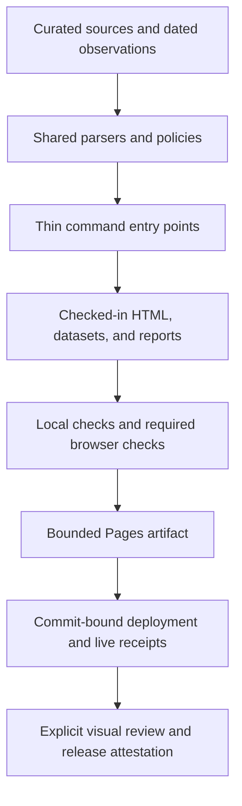
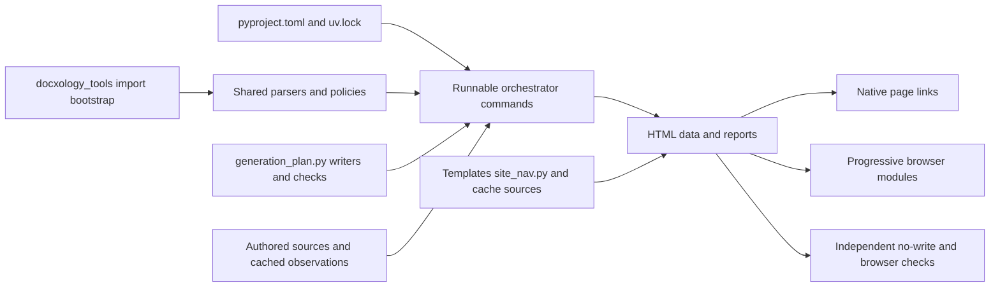

# Development, configuration, and source authority

docxology is a public archive and a static website generated from curated sources
and dated public observations. GitHub Pages serves the bounded web projection;
Python commands maintain the checked-in HTML, data, reports, and release
controls. No application server or live API access is required to browse the
published catalog.

This guide describes ownership and workflow. The exact output matrix is
[`GENERATED.md`](../../GENERATED.md), the executable order is
[`generation_plan.py`](../../code/src/generation_plan.py), and the unfinished
work is [`TODO.md`](../../TODO.md).

## Source and projection



The diagram describes the dependency and review sequence, not proof that every
stage has run for the current checkout. Inspect the current candidate's receipts
before reporting its status.

| Source or policy | Owned projection | Boundary |
| --- | --- | --- |
| [`pages/BIBLIOGRAPHY.md`](../../pages/BIBLIOGRAPHY.md) and [`data/work-identifiers.json`](../../data/work-identifiers.json) | Citation exports, work records, permanent work pages | Title/year edits preserve registered identities; public discovery alone does not replace curated rows |
| [`pages/SOFTWARE.md`](../../pages/SOFTWARE.md) | Curated software catalog | The complete cached [`GitHub inventory`](../../data/github-repositories.json) is a separate surface and review queue |
| [`papers/`](../../papers/) | Source PDFs, extracted text, folder documentation, paper pages | Literal extraction text and archived source bytes need source custody; availability is not a license or scientific replication claim |
| [`data/scholar-snapshot.json`](../../data/scholar-snapshot.json) and its [`receipt`](../../data/scholar-verification-receipt.json) | Snapshot-backed claim and CV metrics | Revisions require direct authenticated observation and an exact snapshot hash |
| [`resume/source.json`](../../resume/source.json) | Structured, HTML, plaintext, and PDF CV | Public release fields and claim evidence are checked separately from rendering |
| [`data/artworks.json`](../../data/artworks.json) and cached YouTube data | Gallery/video indexes and generated detail pages | Compact browser indexes are projections; externally hosted media remains subject to provider availability |
| [`CHANGELOG.md`](../../CHANGELOG.md) | Updates page | Completed public maintenance; current unfinished work stays in TODO |
| [`docs/manuscript/`](../manuscript/README.md) | Repository-methods narrative | Structural manuscript validation does not render or publish a research paper |

## Thin orchestration

`code/orchestrators/` supplies runnable commands, argument handling, and
entry-point-specific I/O. `code/src/` contains shared parsing, identity,
rendering, provenance, and validation policies. Import shared modules through
[`docxology_tools`](../../code/src/docxology_tools/__init__.py); its bootstrap
owns the compatibility path setup. Avoid adding a second bootstrap, duplicating
a parser in a new command, or creating another hand-maintained generator list.

Local writers and their no-write checks are declared together in the generation
plan. Some dependencies need a later ordered pass, such as counts/software and
domain/work enrichment. A successful skipped write is not validation: cached
input fingerprints are local optimization state, while no-write checks remain
the authority. Use the [regeneration runbook](regeneration.md) for local passes,
cache invalidation, and interrupted-run behavior; use [settle.md](settle.md) for
landing and binder ordering, especially after committing new dated evidence.



The diagram names actual source owners. It is not a new configuration layer or
an execution receipt. Fetch commands, local generation, browser acceptance, and
publication keep separate responsibilities.

## Configuration ownership

Configuration is deliberately split by concern. Read the owning source before
changing behavior; a CLI override does not justify relaxing a repository gate.

| Concern | Authority | How to change or inspect it |
| --- | --- | --- |
| Python/dependency/lint runtime | [`pyproject.toml`](../../pyproject.toml), [`uv.lock`](../../uv.lock) | `uv sync --python 3.12`; optional `browser-qa` and `pdf-extraction` extras; lint group for Ruff |
| Ordered local generation and checks | [`generation_plan.py`](../../code/src/generation_plan.py) | `uv run python3 code/orchestrators/regenerate_all.py --list`; inspect its `--help` for diagnostic passes and cache controls |
| Sitemap promotion and canonical routes | [`sitemap_policy.py`](../../code/src/sitemap_policy.py), [`CNAME`](../../CNAME) | Edit policy/source, regenerate, and run SEO invariants; retain apex and permanent work URLs |
| Shared navigation, head assets, and cache tags | [`site_nav.py`](../../code/src/site_nav.py), [`code/templates/`](../../code/templates/) | Change source tags and hand-authored consumers together, then rebuild and check rendered pages |
| Browser caching and transfer bounds | [`sw.js`](../../sw.js) | Version shell changes; preserve timeout/size/error contracts and exercise real browser cases |
| Ordinary CI artifact budget | [`artifact_budget.py`](../../code/src/artifact_budget.py) | The declared budget is separate from the artifact builder's warning/hard ceilings; inspect the [artifact policy](github-pages-artifact.md) |
| Report dating, discovery, and retention | [`report_paths.py`](../../code/src/report_paths.py), [retention runbook](report-retention.md) | Keep dated evidence distinct from evergreen docs; pruning is a separate reviewed operation |
| Browser requirements | `DOCXOLOGY_REQUIRE_BROWSER_QA`, declared in [runtime guidance](site-runtime.md) | Set to `1` for required acceptance; missing tooling then fails rather than skipping |
| Lighthouse raw diagnostics | `DOCXOLOGY_LIGHTHOUSE_REPORT_DIR`, [Lighthouse tests](../../code/tests/test_lighthouse_budgets.py) | Point at a private temporary output directory; preserve scores and enforced floors separately from aspirational targets |
| Candidate deployment binding | [`verify_live_site.py`](../../code/orchestrators/verify_live_site.py) | `--expected-commit` and `--deployment-run-id` bind fresh checks to a clean exact candidate; `--output` keeps the receipt outside source artifacts |
| Repository manuscript | [`config.yaml`](../manuscript/config.yaml), [`SYNTAX.md`](../manuscript/SYNTAX.md) | Paths bind to this repository; local validation checks structure, citations, references, and figure files |

Public-source fetches may use authenticated environment credentials, but those
credentials are not public configuration. Keep tokens out of committed files,
URLs, logs, and evidence snapshots. Source observations cannot authorize account
changes, communications, or publication decisions.

## Verification and evidence

Run commands from the repository root. After a source change, rebuild its
declared projections, inspect the diff, then validate the generated layer:

```bash
uv run python3 code/orchestrators/regenerate_all.py --validate
uv run python3 -m pytest code/tests -q
uv run --group lint ruff check code
```

Regeneration writes checked-in artifacts; `--list` previews the plan without
running it. Publication requires the clean payload/control-tail sequence in
[`settle.md`](settle.md); editing documentation alone does not exempt downstream
search, manifest, or source-hash consumers from freshness checks.

For manuscript edits, run
`uv run python3 code/orchestrators/validate_manuscript.py`. For interactive
changes, install the browser extra and run the mandatory checks in
[`site-runtime.md`](site-runtime.md). For source refreshes, use
[`evidence-refresh.md`](evidence-refresh.md); network data collection is separate
from local regeneration.

Report local tests, hosted CI, deployed byte/route checks, and visual review
separately. A SHA-256 match proves byte identity for the checked object, not
complete source extraction, universal runtime behavior, or scientific validity.
Targeted deployed checks do not establish every hosted body. Human visual
sign-off and full release attestation require their own records, described in
[`release-integrity.md`](release-integrity.md).
