# Full Text: Narrative Information Ecosystems: Conflict and Trust on the Endless Frontier

> Extracted from `2021_NarrativeEcosystems.pdf`

> 46 figures extracted to `images/`

---

## Page 1

*[Page 1 appears to be blank or image-only]*

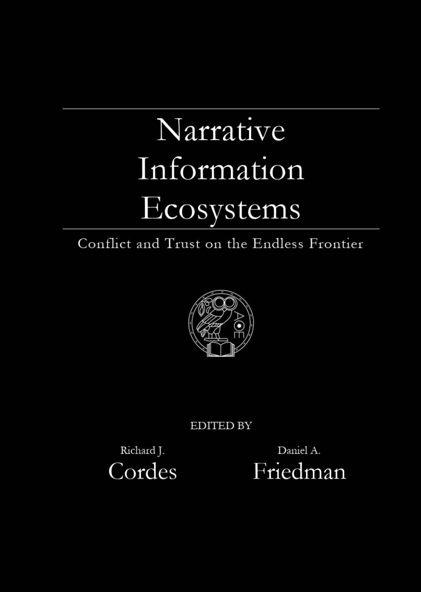

## Page 2

Narrative  
Information 
Ecosystems 
Conflict and Trust on the Endless Frontier 
 
 
 
EDITED BY 
Richard J. Cordes & Daniel A. Friedman

## Page 3

Cognitive Security & Education Forum (COGSEC) 
www.cogsec.org 
This work is licensed under a Creative Commons Attribution-NonCommercial-
NoDerivatives 4.0 International License (CC BY-NC-ND 4.0). You, the reader, are 
free to copy and redistribute the material, unmodified, in any medium or format for 
any non-commercial purpose, so long as attribution to COGSEC.org is given. This 
is a summary of, but not a substitute for, the license itself, found at: 
www.creativecommons.org/licenses/by-nc-nd/4.0/legalcode 
 
  
This hardcover edition, 2021 
Includes works cited for each chapter and appendices where relevant. Citations in 
PLOS format, metadata was produced using a reference manager and may contain 
errors. All images used were generated by the writers, public domain, or attributed 
under fair use. Some images may be blurred. 
ISBN 978-1-7364269-2-0 
1  2  3  4  5  6  7  8  9  10

## Page 4

Mankind are not held together by lies.  
Trust is the foundation of society.  
Where there is no truth, there can be no trust,  
and where there is no trust, there can be no society.  
Where there is society, there is trust,  
and where there is trust,  
there is something upon which it is supported. 
—Frederick Douglass, Our Composite Nationality

## Page 5

*[Page 5 appears to be blank or image-only]*

## Page 6

CONTENTS 
     
    Acknowledgements     i 
    Contributors    ii 
    Editors’ Foreword    v 
Richard J. Cordes & Daniel A. Friedman 
 
    I.    Narrative Information Management    1 
Richard J. Cordes, Shaun Applegate-Swanson,  
Daniel A. Friedman, V. Bleu Knight,  
& Alexandra Mikhailova 
 
     II.    Digital Rhetorical Ecosystem Analysis    65 
Mridula Mascarenhas, Richard J. Cordes, & Daniel A. Friedman 
 
     III.    Knowledge Management Archipelago    137 
Daniel A. Friedman & Richard J. Cordes 
 
     IV.    Active Inference in Modeling Conflict   173 
Scott David, Richard J. Cordes, & Daniel A. Friedman 
 
      Works Cited    245 
      Appendices    345

## Page 7

“Striving with Systems to deliver Individuals from those Systems” 
 
— William Blake, Jerusalem 11

## Page 8

i 
 
 
 
 
ACKNOWLEDGEMENTS 
 
 
 
The 2021 cohort of COGSEC Contributors; ActInf Lab; Complexity Weekend; The 
Davids; The seen and unseen heroes who tend to their trimtabs with diligence and 
vigilance.

## Page 9

ii 
 
 
 
 
CONTRIBUTORS 
 
 
 
Richard J. Cordes. Richard is a co-founder of COGSEC and 
currently a non-resident fellow at the Atlantic Council on 
appointment to the GeoTech Center. He contributes research 
to a variety of working groups and committees across 
Department of Defense programs, the IEEE, and the Private 
Sector on topics like gray zone warfare, knowledge 
management technology, optimization of human learning, 
remote team performance, and complex systems. He is 
especially interested in unifying concepts within narrative 
design, intelligence analysis, science and scholarship, 
engineering, and pedagogy under the domains of 
sensemaking and knowledge management. 
 
Scott David. (Juris Doctor, 1982, Georgetown University Law 
Center; Master of Laws - Taxation, 1987, New York University 
School of Law, United States). Scott is the Director of the 
Information Risk and Synthetic Intelligence Research 
Initiative (IRSIRI) at the University of Washington (UW, 
Seattle) - Applied Physics Laboratory. Over the past decade,

## Page 10

Contributors        iii 
 
Scott has been active in several programs of the World 
Economic 
Forum, 
the 
United 
Nations 
Sustainable 
Development Solutions Network, the IEEE, and a host of 
other organizations addressing the challenges associated with 
global information network and interaction system 
transitions. Prior to joining the University of Washington, 
Scott worked as an attorney for 27 years focused on 
counseling commercial and governmental entities worldwide 
in the structures and transactions at the crossroads of 
technology and commercial networks with an emphasis on 
online commerce, data security, privacy, digital risk, standards 
setting, taxation, and emerging intangibles value propositions. 
Scott was a partner at the K&L Gates law firm (formerly 
Preston, Gates & Ellis) from 1992 to 2012. Prior to joining 
K&L Gates, he was an associate at Simpson Thacher & 
Bartlett in New York. 
 
Daniel Ari Friedman. (BSc: University of California, Davis, 
2014, PhD: Stanford University, 2019, United States). Daniel is 
currently a postdoctoral researcher at the University of 
California, Davis. His PhD research focused on the genetics 
and epigenetics of collective behavior in ants. His 
postdoctoral projects involve using modern computational 
techniques to address key questions in myrmecology and 
evolutionary biology. He is also interested in the areas of 
cognitive security, online teams, active inference, and 
Synergetic geometry. 
 
V. Bleu Knight. (Doctor of Philosophy in Biology, New Mexico 
State University, United States). Bleu is a Research Scientist at 
New Mexico State University, a Content Organizer with the 
Active Inference Lab, and works independently as a Research

## Page 11

iv    Narrative Information Ecosystems 
 
Consultant. She is interested in solving complex problems 
using data sets that are large and diverse. Her PhD research 
leveraged informatics to understand the biological identity of 
neural cell subtypes. She uses augmented intelligence and 
agent-based modeling to solve problems in academia and 
industry. Bleu is currently exploring sensory processing and 
downstream information integration and transmission in 
biological systems. 
 
Mridula Mascarenhas. (Doctor of Philosophy in Rhetorical 
Studies, 2014, University of Wisconsin-Milwaukee, United States). 
Mridula is an Associate Professor at California State 
University, Monterey Bay where she teaches courses in 
Rhetoric and Communication Ethics. Her scholarship, 
teaching, and consultation converge around public 
argumentation (particularly in the contexts of political 
polarization) and dialogue and deliberation as modes of 
communication 
(particularly 
in 
contexts 
inter-racial 
organizational relationships). Her current work focuses on 
understanding image memes as devices of public 
argumentation and their unique role in producing political 
radicalization. 
 
Alexandra Mikhailova. (Bachelor of Science in Neurobiology, 
Physiology and Behavior, 2014, University of California, Davis, United 
States). Alexandra is a PhD Candidate in Neuroscience at UC 
Davis, studying the role of immune signaling in early brain 
development. Her previous research explored how the adult 
and developing brain recovers from stroke injury. She is 
driven to explore the developing brain as a complex system, 
at both the molecular and social levels. She is also interested

## Page 12

Contributors        v 
 
in using active inference as an approach for improving 
education and building inclusive remote teams. 
 
Shaun Applegate-Swanson. (BS Physics & BS Mechanical 
Engineering, 2010, Carnegie Mellon University, United States). 
Shaun is a Principal Data Scientist at Microsoft, where he 
leads a team of full-stack data scientists and engineers that has 
developed access management scoring and anomaly detection 
systems to enforce the Principle of Least Privilege throughout 
data centers worldwide. He is also a co-founder of 
Complexity Weekend, an organization which runs monthly 
events that bring together an international, interdisciplinary 
community of individuals to learn about and work together 
on topics related to complexity science. His personal research 
interests involve combining Complexity Science with 
Thermodynamics and Statistical Mechanics axioms to peek at 
fundamental properties of emergent phenomena. 
 
 
There is no power for change greater  
than a community discovering what it cares about. 
—Margaret J. Wheatley, Turning to One Another

## Page 13

vi 
 
 
 
 
EDITORS’ FOREWORD 
 
 
 
In 2021, the Cognitive Security and Education Forum (COGSEC, 
cogsec.org) intended to apply the research findings of its 2020 volume, 
“The Great Preset: Remote Teams and Operational Art”, to facilitate 
research related the management of information with respect to its 
impacts on sensemaking and narrative. To this end, the COGSEC 2021 
research initiative was titled “Narrative Information Management” and 
made a call to action to researchers and professionals of myriad 
disciplines to inform the development of tools which could reduce the 
cognitive load and stabilize the cognitive security of users. We hoped 
that, through the use of project “catechisms”, a type of lightweight 
project documentation proposed in two separate chapters of the 2020 
volume, this year’s initiative would see more collaborators, more 
interdisciplinarity, and more impact than in any year prior. As 2021 
comes to a close, we can say that this year’s initiative has been a success 
and an important developmental phase. So much so, that this edited 
volume is but one of the resulting traces of this year’s initiative - in 
addition to the four chapters included in this edited volume, COGSEC 
facilitation helped to produce a number of other deliverables, including 
a number of externally published articles (e.g., “Games with Serious 
Consequences - Extremist Movements and Kayfabe”), 2 playbooks 
(“The Innovator’s Digital Playbook”, “Facilitator’s Catechism

## Page 14

Editor’s Foreword        vii 
 
Playbook”), and another full book on narrative influence and 
formalization (“The Narrative Campaign Field Guide”), with over a 
dozen other attributed and unattributed contributors. In this foreword, 
we will distill the insights of each of the chapters included in this 
volume and discuss COGSEC’s ongoing initiatives and intents for 
2022 and beyond. 
Chapter 1, “Narrative Information Management” provides an 
integrative overview and a series of disciplinary explorations regarding 
Narrative Information Management (NIM). General features of NIM 
include enabling situational awareness, distilling large knowledge 
databases, providing actionable insights to users, and facilitating 
collaboration synchronously and asynchronously. Some of these 
general features of NIM systems had been historically emphasized in 
the field of intelligence analysis, while other NIM features (such as the 
centrality of narrative in the neurophysiology of sensemaking, or 
relevance of computer graphics) have arisen more recently and in fields 
outside of intelligence analysis. A finding and implication of NIM is 
that fields which have not traditionally been information-centered are 
increasingly dealing with informational and cognitive challenges – 
motivating a transdisciplinary effort to learn best and emergent 
practices across fields. The project catechism used to produce this 
work is included in Appendix A. 
Chapter 2, “Digital Rhetorical Ecosystem Analysis: Sensemaking of 
Digital Memetic Discourse” integrates rhetorical, ecological, and 
computational approaches towards studying online communication 
and addressing the ongoing epistemic crisis. The introduced Digital 
Rhetorical Ecosystem three-tiered (DRE3) model allows for 
distinctions among instrumental observations of discourse (e.g., 
observations of image memes or text online), contextualized rhetorical 
claims (audience-specific arguments and deployments), and inference 
on hidden states (important attributes of rhetorical ecosystems such as 
capacity for innovation and risk of extremism). This work builds on 
previous work on image memes as quasi-arguments, as well as advances 
in 
pipelines 
for 
high-throughput 
ecological 
analysis 
and

## Page 15

viii    Narrative Information Ecosystems 
 
computationally-aided sensemaking. The project catechism used to 
produce this work is included in Appendix B. 
Chapter 3, “Knowledge Management Archipelago” presents a 
literature meta-analysis of keywords and themes related to knowledge 
and information management. As the title of the chapter suggests, 
publications on these topics are like an island archipelago in that they 
are fragmented and disparate, however potentially with a higher-level 
pattern visible from high enough elevation. Keyword co-mention 
overlap quantification and network analyses found that terms differ in 
how they bridge concepts and fields. Future analyses could include 
time-dependent methods to explore the interactions of keywords 
through time, and estimation of literature corpuses outside of public 
databases (e.g., relevant texts that are patents, proprietary, or classified 
materials). The project catechism used to produce this work is included 
in Appendix C. 
Chapter 4, “Active Inference in Modeling Conflict”, provides a review 
of past qualitative and quantitative approaches to modeling conflict, 
then proposes the Active Inference Conflict (AIC) model. The AIC 
model applies Active Inference, a first-principles framework for action 
and perception, to the setting of conflict. Several features of the AIC 
model that facilitate its use include its powerful computational basis, 
interoperability with previous conflict models, and generalizations 
relevant for contemporary settings. Additionally, the AIC model 
provides continuity between the various manifestations of human 
conflict, and modern work in cognitive sciences. Combining the AIC 
model with a BOLTS (business, operations, legal, technical, social) lens 
on conflict leads to rethinking of risk management,  and suggests future 
directions for research and application. The project catechism used to 
produce this work is included in Appendix D. 
These four works which comprise this volume are not the total scope 
of work performed during the year, or necessarily the end of work on 
Narrative Information Management. The call to action by the 2021 
COGSEC NIM research initiative generated and impacted working

## Page 16

Editor’s Foreword        ix 
 
groups and collaborations that are continuing on, placing us in a novel, 
and in some ways inconvenient position. A position which prompted 
questions such as: 
• Do we continue on to a new research initiative next year, 
while still providing support for the previous call to 
action?  
• Do we extend the period of the NIM initiative to 2 years? 
• Do we abandon annual periodicity entirely? 
Answering these questions required consideration of this year’s 
approaches, feedback, and achievements. During this review, we came 
to the realization that underneath the set of deliverables and their 
contributions was another success - the success of the methods, 
process, and tools developed in 2020. In particular, the successful 
implementation of project catechisms provided the opportunity to 
observe their impacts in moderating the cognitive load of teams and 
increasing reliability of outputs. This led us to an interesting 
opportunity, one which would allow us to continue active support for 
2021’s call to action regarding Narrative Information Management 
while still being able to focus on the development of tools and applied 
research as we had hoped to do in 2022. 
In 2022, the primary COGSEC initiative will be “Catechisms for Open 
Source Science Integration” (CAT-22), building upon the research in 
prior years. In CAT-22, COGSEC and collaborators will explore 
applied research and the scalability of the project catechism approach, 
and the development of tools related to their implementation. During 
a time of rapid change in the global research and innovation ecosystem, 
new 
approaches 
for 
research 
funding, 
implementation, 
communication, and reducing time-to-impact are desperately required. 
Catechism-based research for emergent or instantaneous remote teams 
presents an actionable and scalable framework for modern 
collaboration, consistent with values of rigor, accessibility, inclusion, 
participation, and open-source intelligence (OSINT).

## Page 17

x    Narrative Information Ecosystems 
 
Additionally during 2022, COGSEC will continue the 2021 NIM 
initiative, as a test of the catechism approach for distributed research 
teams and its scalability, by integrating the 2021 initiative into 
collaborations with the University of Washington Applied Physics 
Lab’s Information Risk and Synthetic Intelligence Research Initiative 
(IRSIRI), through its participation in the US National Science 
Foundation’s (NSF) Convergence Accelerator. This integration will 
allow us to further test and refine the methodology with many more 
collaborators while continuing to facilitate research on NIM and 
pursuing COGSEC’s goals related to tool development. COGSEC will 
next seek out partnerships with other organizations which may benefit 
from the methodology being integrated into funding, work, and 
reporting processes, and look to develop tools which help facilitate 
adoption and implementation. We do not know what the end of 2022 
will look like any better than we knew what 2021 might look like (we 
were certainly all wrong about 2020). But just as we did in the years 
prior, we will strive for rigorous, productive, and meaningful 
collaborations.  
In early 2022 or any future moment, we are calling for collaborators 
who are interested in helping to build a more resilient future (see 
cogsec.org for updated information on participation).

## Page 18

*[Page 18 appears to be blank or image-only]*

## Page 19

*[Page 19 appears to be blank or image-only]*

## Page 20

1 
CHAPTER I 
Narrative Information 
Management 
 
Richard J. Cordes, Shaun Applegate-Swanson, 
Daniel A. Friedman, V. Bleu Knight, 
& Alexandra Mikhailova 
 
ABSTRACT 
There are many areas of research defined by their interest in 
information 
dynamics 
related 
to 
facilitating 
organizational 
sensemaking, 
such 
as 
knowledge 
management, 
information 
management, and library science, and many more areas of research, 
disciplines, and even hobbies which are facing information-related 
challenges. While all may be concerned with very similar challenges, 
lack of information exchange and common ontology between these 
areas may be causing silos, missed opportunities, and potentially even 
friction among areas. In this paper, we address the need for synthesis 
and exchange of knowledge, tools, and approaches among various 
fields by proposing Narrative Information Management (NIM) as a 
unifying term and framework for the fundamental features and 
challenges of facilitating collective sensemaking. Through this 
framework, we offer an initial common set of features of impactful 
information systems found in literature on information-focused 
disciplines, such as knowledge management, and explore what insights 
and ad-hoc solutions may be found in an eclectic set of fields facing 
information challenges, including personal finance, ancestry research, 
hybrid cloud infrastructure security, translational neuroscience, and 
genomics. Finally, we offer recommendations for future research.

## Page 21

2    Narrative Information Ecosystems 
 
Introduction 
When the brain cannot reduce the complexity of the environment, it 
reduces the complexity of the strategy used to make sense of it [1–7]. 
This difficulty in reducing the complexity of a given information 
environment is often referred to, depending on context, as either data 
overload [8,9], reference overload [4], information overload [5,9,10], 
or, more broadly, as cognitive overload [3,11,12]. The volume, density, 
and structural complexity of information has impacts on cognition 
beyond increasing time-to-insight [1,3]. Unfortunately, simply 
providing more information as a basis for improving decision-making 
and sensemaking may make outcomes worse rather than better [3,7]. 
When an individual is exposed to potentially relevant yet contradictory 
information at a rate inconsistent with the time and effort required to 
integrate, and does not have access to appropriate tools, a trusted 
network of experts, or domain-specific training, they may withdraw 
from their role in the environment or experience anxiety and reduced 
ability to manage stress, set priorities, make decisions effectively, and 
detect logical inconsistency [1,3,6,8,13–16]. Failures of individual 
cognition and decision-making can lead to cascading errors in systems, 
highlighting the importance for understanding the nature of these 
informational pathologies and how to avert them in modern settings 
[17]. 
In this paper, we highlight the need for synthesis and exchange of 
knowledge, tools and approaches among various fields concerned with 
addressing these sensemaking challenges through the framework of 
Narrative Information Management (NIM). First, we present a broad 
summary of the challenges faced by information-centered disciplines 
such as knowledge management. Following this summary, we consider 
the value of using NIM as a unifying category of features, or functions, 
within information systems used or designed by these disciplines. We 
then synthesize a set of common features which contribute to effective 
NIM systems and consider how they can be understood from a NIM 
perspective. Next, in the interest of discovering additional feature 
needs and requirements which may not be well-recognized within

## Page 22

Narrative Information Management    3 
 
information-centered disciplines, we explore an eclectic selection of 
disciplines that, while not primarily focused on information dynamics, 
are increasingly experiencing informational challenges. These 
disciplines include retail finance, amateur ancestry research, genomics, 
neuroscience, and hybrid cloud infrastructure security. In each of these 
areas, insights about requirements and the domain-specific challenges 
and ad hoc solutions for NIM are considered. Finally, we conclude 
with a discussion assessing common features found and discovered 
amongst the discussed domains and with recommendations for future 
work on NIM. 
The Past and Present of Solutions to Cognitive 
Load 
Throughout human history, solutions designed to reduce cognitive 
load and facilitate individual and organizational action have emerged 
as a response to increases in local information complexity. Broadly, 
human action-oriented sensemaking can be seen as a type of narrative 
inference, where individuals are able to act appropriately to the extent 
that they have identified the story they are in and role they play [18,19]. 
Domain-specific approaches to sensemaking have also been 
developed. In economics for example, mechanisms for externalization, 
abstraction, and communication of financial information emerged in 
response to the numerous explosions in economic complexity caused 
by the opening of new trade routes [20–22]. In science and scholarship, 
changes to methodology and tools for research and the maintenance 
of doctrine have traditionally followed paradigm shifts in science as 
well as sociotechnical changes such as increased volume and 
accessibility of research publications (e.g., such as those caused by the 
introduction of the printing press) [2,23–25]. Changes to the scientific 
process and research methodologies are not just lagging indicators of 
change to publication systems – historically, the development of 
information management systems has resulted in shifts in how 
information is synthesized and communicated. For example, the first 
reference management systems and formalized cartographic

## Page 23

4    Narrative Information Ecosystems 
 
procedures were generated at the Library of Alexandria and funded by 
its stakeholders in order to process and exploit an unprecedented flow 
of information and new discoveries [26–28]. Finally, in military 
operations, documentation and intelligence processes and tools have 
consistently been adapted and updated in response to increased 
complexity in geopolitics and mobility in the battlespace [29–32]. 
The 
introduction 
and 
continued 
development 
of 
digital 
communication and storage technologies have caused changes in the 
accessibility, communication, structure, presentation, and production 
of information at a historically unprecedented rate [33,34]. The 
challenges and opportunities presented by these new technologies have 
illuminated the need to reduce cognitive load and facilitate 
sensemaking. The need for research in this domain will only continue 
to grow as these technologies develop and increase in informational 
complexity and volume in the coming years. Nearly 60 zettabytes (60 
trillion gigabytes) of data were created in 2020 and the expectation is 
that the amount of digital data created between 2021 and 2025 will 
greatly exceed the cumulative amount created since the advent of 
digital storage [35,36]. Data sets alone and in any size can overwhelm 
analysts if data are ambiguous, inaccurate, structurally complex, or 
require specialized analysis. Additionally, transdisciplinary projects for 
small teams as well as larger organizations require groups of analysts to 
come to a shared operational understanding of the topic, potentially 
involving significant data engineering, modeling, and analysis. For 
example, with over 7,000 peer-reviewed scientific and engineering 
articles and countless preprints, datasets, and other relevant materials 
being published each day, academics and researchers are prone to a 
state of information overload without the presence of big data 
dilemmas [37–40]. 
Unlike past paradigm shifts in information dynamics, where only 
certain groups such as generals, government officials, or employed 
scholars were faced with significant demands for adaptations to these 
changes [26,27,29,31,41], broad adoption of digital information 
technologies implies that the majority of organizations and citizens,

## Page 24

Narrative Information Management    5 
 
outside the context of any particular discipline, are now in need of tools 
to overcome challenges related to managing streams of digital 
information and reducing informational complexity [16,42–46]. Now 
in the throes of the COVID-19 pandemic, not even children are spared 
of the need to spend additional effort on narrative sensemaking [47]. 
The timelessness of challenges related to sensemaking, paired with 
their distinctly-different application across sectors, means that research 
addressing information overload has the potential to become siloed 
and disconnected due to differential usage of keywords, citations, and 
types of deployed systems [42]. 
There are already many formalized fields of research which focus on 
how to design and implement systems, protocols, and procedures to 
store, manage, communicate, synthesize, curate, and search digital 
information to help manage the cognitive load of users. Significant 
examples of interacting fields and topics include knowledge 
management, information management, and library science [42]. 
Modern organizations operating in information-rich environments 
look to these information-centered fields for the solutions that they 
influence, design, and implement in the interest of reducing cognitive 
overload. For different users in different scenarios, such sensemaking 
tools might assist in maintaining situational awareness, facilitating 
reduction in information complexity, navigating users toward effective 
action, or the creation, sharing, use, attribution, synthesis, and 
management of intelligence and knowledge products. As the volume 
and structural complexity of the available or presented information 
increase, systems in this category tend to shift from a facilitating role 
to being essential to operations. In such cases, the usefulness of a given 
system can be related to its efficiency in helping users meaningfully 
aggregate data, develop understanding, and navigate toward action, as 
opposed to simply being tied to the provision and access of 
information [1,48–51]. 
Knowledge management, information management, and library 
science are representative examples of fields which have information 
dynamics as a primary focus; however, these are not the only fields

## Page 25

6    Narrative Information Ecosystems 
 
concerned with information dynamics [42]. There are many other areas 
of research, disciplines, and even hobbies which require attention to 
theory and implementation of information-related systems and data-
rich processes. Solutions for domain-specific or even generalized 
sensemaking may arise within these areas, potentially drawing from the 
literature within the fields listed above, or using tools reflecting these 
fields. However, this relationship may be one-sided between 
information management in the general cases, and domain-specific 
applications: various fields may draw tools and frameworks from the 
informational sciences, but rarely translate their feedback or 
requirements 
back 
to 
the 
informational 
sciences. 
This 
disconnectedness may cause failures to communicate insights and 
implementations across areas of theory and practice, leading to further 
siloing, confusion, and disconnection [42,52]. Recent analyses have 
suggested that even the fields which share information dynamics as a 
primary focus show only partial bibliographic and theoretical overlap, 
reflected by divergent ontologies and professional scope [42,53]. 
The fields and specializations which are primarily focused on how to 
design and implement systems, protocols, and procedures to store, 
manage, communicate, synthesize, curate, and search digital 
information are numerous and divergent, and have been for centuries. 
For example, by 200 AD the Roman Army had formalized many roles 
associated with management of information, including interpretes 
(interpreters who worked to archive translations of written and vocal 
communications), librarii (archivists), notarii (secretaries and records 
managers), exacti (recorders and scribes), exceptores (short-hand 
recorders and scribes), frumentarii (messengers and information 
collectors), 
quaestionarii 
(human 
source 
development), 
and 
spectulatores (information collectors), each representing a formal 
discipline with its own specialized training [31]. By roughly 1100 AD, 
the storage, access, synthesis, sharing, and curation of documents, 
records, and knowledge held within libraries was considered a formal 
science in China with overlapping sub-disciplines [54]. As noted earlier, 
the introduction and development of digital storage and 
communications technologies has meant that modern organizations

## Page 26

Narrative Information Management    7 
 
and individuals are contending with increasing information-related 
challenges. As sensemaking processes diverge across fields, there is a 
higher potential for divergent ontologies to develop and siloed 
practices to occur. It may be time for synthesis and generalization of 
the underlying sets of challenges and requirements within these myriad 
domains in order for research and solutions to become more easily 
discovered and integrated, as well as to prevent redundant research 
[51]. Here we offer a brief summary of 3 categories of divergent, 
information-centered fields and areas of research. 
Meta-Information Fields. The term meta-information 
fields is used here to describe the category of fields which are 
concerned with information flows and use in general, with no 
defining interest in any particular field. In this category are 
the fields of (1) knowledge management, (2) information 
management, (3) information engineering, (4) records 
management, (5) document management, (6) archive 
management, 
(7) 
reference 
management, 
(8) 
data, 
information, and sensor fusion systems, and (9) information 
resources 
management. 
For 
example, 
knowledge 
management refers to the design, implementation, and study 
of processes and systems related to creating, sharing, using, 
attributing, synthesizing, and managing the knowledge and 
information of a group or organization in order to improve 
situational awareness, decision making quality, knowledge 
transfer 
between 
organizational 
components, 
and 
productivity [42,46,55].  
Interdisciplinary 
Information 
Fields. 
The 
term 
interdisciplinary information fields is used here to describe 
the category of fields which are concerned with the provision 
and design of information systems which are intended for use 
in some common category of disciplines. In this category are 
the fields of (1) library science, (2) intellectual capital 
management, (3) relationship management systems, (4) 
decision support systems, (5) case management systems, (6)

## Page 27

8    Narrative Information Ecosystems 
 
situation 
awareness 
systems, 
and 
(7) 
intelligence 
management. For example, library science is primarily 
focused on providing features and insights for the 
management of documents within organizations whose 
primary purpose is to lend and manage information resources 
[56], and intelligence management is concerned with the 
protocols and procedures that facilitate situational awareness 
and the creating, sharing, using, attributing, synthesizing, and 
managing of relevant intelligence products and information 
streams in law enforcement, military and intelligence, and 
manufacturing and industrial settings [57–60]. 
Application-Focused Information Fields. The term 
application-focused information fields is used here to 
describe the category of fields which are concerned with the 
provision and design of information systems which are 
intended for use in a specific discipline. In this category are 
the fields of (1) command and control systems, (2) 
intelligence, surveillance, and reconnaissance systems, (3) 
intelligence fusion systems, (4) asset management systems, (5) 
supervisory control and data acquisition (SCADA), (6) 
security management, (7) business intelligence systems, and 
(8) learning management systems. For example, an asset 
management system is a set of protocols and procedures tied 
to software which facilitates situational awareness of, decision 
making related to, and the planning and controlling of 
financial assets, relationships between assets, and asset-
related activities [57], and SCADA researchers are primarily 
interested in providing information tools to organizations 
which have to remotely monitor and intervene in mechanical 
or industrial systems [58]. 
Instead of focusing on simply storing, moving, reading, and writing 
bytes of data, these information-centered fields are concerned with the 
facilitation and meaningful direction of data-transfer. A formidable gap 
exists between the raw syntactic inputs provided by information

## Page 28

Narrative Information Management    9 
 
databases and the semantic or action-oriented representations that an 
end user might expect to receive as a result of an interaction with the 
system [51]. Even records and archive management, which might 
rightfully be assumed to be primarily about storage processes, are 
equally concerned with the nature of access and user dynamics [59–
62]. This focus on facilitating semantic interactions with humans helps 
distinguish these areas from disciplines like computer science and from 
meta-disciplines such as information science, which may include within 
their scope both consideration for use-cases and practical aspects of 
digital transfer and transformation of information [63,64]. It also 
reflects one of the earliest maxims from the oldest of the information-
centered fields, library science: “Libraries are for use” [54]. 
Systems that are influenced, designed, and implemented by 
information-centered fields have disparate use-cases; however, many 
integrated sensemaking systems can be generalized, or reduced to parts 
that can be generalized. We identified several features commonly used 
in information management across domains, such as search, curation, 
situational awareness, and predictive analytics. While essential within 
subdomains, these common features already represent generalized 
areas of research of their own, rather than generalizations of the 
ensemble of features, emphasizing the exponential expansion of 
domain-specific information burdens. Here, in addition to the various 
other framings for integrated sensemaking, we propose Narrative 
Information Management (NIM) as a term to both unify the common 
features of these many information-centered disciplines and provide a 
lens through which to consider their requirements and development. 
Where narrative information in other situations may refer specifically 
to the information contained in a given narrative, for example a book 
or self-reported experience [65], we intend for NIM to refer to the 
management of information in the facilitation of narrative 
sensemaking.

## Page 29

10    Narrative Information Ecosystems 
 
Narrative Information Management 
Narrative has received many definitions, and in some cases these 
definitions contradict [66]. Where there is consensus, there is often 
some ambiguity regarding scope that parallels analogous debates in 
memetics (e.g., what isn’t a meme/narrative?, is this a single 
meme/narrative or a cluster?, is this a meme/narrative or a component 
of one?) [66]. However, even where narrative has been labeled a 
“buzzword”, there is agreement that it practically represents story, 
patterns of expectation, plot, and sequence patterns, that it is encoded 
and decoded through stories, images, symbolism, and metaphor, and 
that this encoding represents internalization which impacts how 
humans integrate, store, compress, and communicate information and 
navigate moral, physical, and social terrain [67–69]. Many examples 
exist of narrative-driven approaches in various domains attempting to 
differentiate from scientific-, evidence-, or data-driven approaches, 
usually focusing on the use of what would traditionally be defined as a 
“story”, such as the use of fictional or real accounts of events in order 
to influence behavior as opposed to leaning on data or evidence 
[70,71]. Attempts to define narrative usually provide similar 
differentiations between narrative and other forms of communication, 
some in poetic fashion: 
“Science explains how in general water freezes when (all other things 
being equal) its temperature reaches zero degrees centigrade; but it takes 
a story to convey what it was like to lose one’s footing on slippery ice one 
late afternoon in December 2004, under a steel-grey sky.”  
[72] 
However, the line between these forms of communication (science and 
story) present in the quote above is inherently subjective [66,73] and 
there is a reasonable argument to be made that the scientific 
explanation is simply a narrative constructed from interpretations of 
scientific data and that the explanation through story is a narrative 
constructed on common experience and metaphor [74]. Further, raw

## Page 30

Narrative Information Management    11 
 
data in any sufficient volume fails to communicate anything 
meaningful 
without 
visualization, 
descriptive 
statistics, 
and 
presentation—all of which are used to allow different components of 
the data to “tell a story” [75]. “Nobody walks into a bookstore and asks 
for a narrative” [66] but it could be argued that nobody walks into a 
book store without one, as one has to have internalized some set of 
stories about book stores and what they provide in order to consider 
shopping there as an option. 
While certain disciplinary approaches have been interpreted as being 
"free" from narrative (e.g., objectivity in the sciences), it has been 
argued that these are professional narratives about objectivity that 
serve to reduce cognitive load and facilitate sensemaking in complex, 
information-rich environments; although such simplifications may not 
always be helpful [76]. It has also been argued elsewhere that formal 
documents such as instruction manuals, medical records, project 
documentation, and historical documents being categorized as 
narrative-free or not being meaningful in the construction of narrative 
is largely up to interpretation, presentation, and context—especially 
where these kinds of media create expectations for navigating the 
world and taking action [32,65,73,77,78]. Broadly, action-oriented 
sensemaking can be seen as a type of narrative inference, where 
individuals are only able to act appropriately when they have identified 
the story they are in and role they play [19,78]. Frameworks from 
cognitive science, such as active inference, are increasingly considering 
psychological, cultural, and narrative aspects of individual decision-
making [79,80]. In such frameworks, narrative inference is cast as an 
ongoing process by which agents estimate hidden environmental states 
(variables that are not directly observed but bear strongly on how 
observations change through time). Estimation of narrative state 
variables can reduce uncertainty about future outcomes. For example, 
knowing that one is watching a movie in the romance genre as opposed 
to horror, would reduce one’s uncertainty about the relationship status 
that the characters might be in at the end of the film and what actions 
they may or may not take.

## Page 31

12    Narrative Information Ecosystems 
 
While narrative frameworks and approaches have been dismissed by 
some as too theoretical, passing fads, or superfluous cognitive layers 
[81], their utility should not be underestimated. A core function of the 
human brain is the detection of event boundaries in order to construct 
and maintain episodic memory [82,83]. Studies have shown that areas 
of the brain related to narrative comprehension are active when 
segmenting events [82,84,85], indicating that narrative structure is not 
an extraneous layer that we apply to experience, but instead anchors 
our perception of reality. This has led some to synthesize features of 
episodic and semantic memory as a single area or subcategory referred 
to as “narrative memory” [86,87]. Similar work on narrative 
comprehension has led others to characterize large portions of human 
sensemaking as a function of “narrative intelligence” [88,89]. If the 
brain’s sensemaking about the world is, at its core, structured around 
narrative, and if knowledge management and similar systems aim to 
scale sensemaking from individuals to groups, then the role of narrative 
in developing shared understandings cannot be dismissed. Further, if 
the study of narrative provides tools and frameworks for 
communication, reduction of cognitive load, and extraction of 
meaning, then narrative study may be of use in generalizing aspects of 
systems which facilitate meaningful communication. 
Features of NIM Systems 
Below, we describe features common to the systems and processes 
employed by information-centered fields, which generally reduce 
cognitive load and facilitate sensemaking, thereby helping to manage 
and communicate narrative. 
Managing Information Gaps 
Discovering and handling information gaps is a key feature of many 
information systems for a number of reasons. In learning management 
systems, finding and filling knowledge gaps is not just a challenge, but 
often the reason for their implementation—as learning management 
systems assist learners in discovering and managing prerequisites to 
new competencies [90]. In knowledge and intellectual capital

## Page 32

Narrative Information Management    13 
 
management, knowledge and resource gaps are seen as a primary 
challenge but also as an opportunity to build new knowledge [91]. 
When making decisions under uncertainty in industrial, commercial, 
military, and intelligence settings, command and control, information 
fusion, business intelligence, intelligence management, and decision 
support, systems are used to rapidly identify where more information 
is needed or where information needs to be verified or integrated 
cautiously [92,93]. In archive, records, and document management 
systems, the faster a document can be identified as missing or missing 
pieces, the more likely it is that it can be repaired or found [94–96]. 
Narrative itself has been described as a “dynamic system of gaps”, 
where well-structured written stories manage information gaps 
strategically and efficiently—to build suspense, to prompt the reader 
to focus their attention on details, and maintain engagement [97]. 
Narratives help form expectations for patterns in and across classes of 
systems and event sequences, acting as a tool which helps facilitate the 
agent in directing their attention to areas needing further investigation, 
where to expect surprise or uncertainty, or where they will simply have 
to cope with the absence of information [32]. Frameworks built from 
research on narrative and scenario structure have been used to define 
and frame information expectations, project documentation, and 
document annotation needs [32], and could be broadly applied to any 
system which manages information gaps. For example, signals about 
gaps in expectations within the lifecycle or typical “stories” of a 
document's use and transformations can reveal potential tampering 
[98] or help to identify linked documents that may be missing [96]. In 
addition, media communicating personal experiences, case studies, or 
reports of types of professional tasks and encounters can also be used 
in a variety of use cases, such as helping to fill gaps in tutorials and 
formal descriptions as well as to help contextualize events or use of 
knowledge [99–101]. 
Facilitating Situational Awareness 
Situational awareness is an explicit and primary feature of interest 
within the domains of command and control, situation awareness

## Page 33

14    Narrative Information Ecosystems 
 
systems, intelligence management and fusion systems, security 
management systems, SCADA, and sensor fusion systems, but due to 
divergent ontologies, often goes unmentioned in areas such as 
knowledge and information management. For example, in records, 
document, intellectual capital, and archive management, knowing who 
should have access and who has access to documents or materials is a 
vital feature [102]. Moreover, in knowledge and information 
management systems user awareness of potential bias in curation 
systems helps manage expectations [103]. 
There is a general consensus that multiple factors are necessary to  
reliably measure situational awareness [104–106], and these factors 
could be reduced to a smaller set of key components when considering 
the agent’s goal orientation within a given operating environment. The 
factors to consider in measurement of situational awareness include (1) 
perception of the components and processes within an operating 
environment—that the agent can recognize the phenomena, agents, or 
collections of agents which are relevant to the current situation [105–
108] (2) awareness of the spatial, mechanical, and abstract relationships 
between 
environmental 
components 
[48,108], 
(3) 
temporal 
awareness—awareness and knowledge of sequences of events 
occurring within the operating environment and in past scenarios 
[105,108] (4) communicability—how easily the information about the 
environment can be synthesized and communicated to others 
[105,107,109] and (5) projection and prediction—how well an 
individual can synthesize and fuse information about the situation and 
tie it to similar cases in order to project what is likely to happen next 
[104–106,108,110]. 
The use of narrative frameworks in facilitating, measuring, and 
understanding situational awareness in myriad contexts requires no 
exhaustive argument, as this has already been done elsewhere over the 
course of the last 40 years [111–116] however, a brief summary of 
insights is warranted. The study of narrative comprehension is robust 
due to the varied research interests which include it as a key measure, 
such as the cognitive development of young children [117,118],

## Page 34

Narrative Information Management    15 
 
empathy and theory of mind development in adolescents [119], reading 
comprehension in educational settings [120], and cognitive decline due 
to disorder or aging [121]. 
Reframing situational awareness under the same umbrella as narrative 
comprehension would allow both areas to benefit from generalization 
and otherwise siloed research. Situational awareness research tends to 
prioritize raw knowledge of the environment, as opposed to filtering 
and comprehension in complex information-rich environments [108]. 
Given that narrative comprehension consists of components which are 
nearly identical to those of situational awareness, provides frameworks 
and ontology (e.g., plot, setting, character archetypes) for 
comprehension of those components, and intends to address many of 
the same challenges posed to situational awareness [106,108,122,123] 
the likelihood of benefit from generalizing the challenges and 
requirements of situational awareness within narrative frameworks is 
quite high. 
Providing Descriptive and Explanatory Information 
The provision of descriptive and explanatory information about 
systems of interest is essential. Rapid provision of descriptive 
information is an area of rich overlap between the most disparate of 
the information-centered fields described, such as intellectual capital 
management and command and control systems [42], where the ability 
to acquire more information about a particular object and its place in 
a system becomes a highly generalizable feature. Some systems may 
have more need for explanatory information than others, such as in 
IT-related knowledge management and decision support systems, 
where addressing why a particular event may be occurring is essential 
to addressing the event itself [124], but all may benefit from providing 
access to a deeper explanation about resources or components (e.g., 
how was this data produced?) [125,126]. 
Past work on narratology and the management of narrative 
information fits explanatory and descriptive information to patterns 
and formats which can help the brain parse or construct a story in the

## Page 35

16    Narrative Information Ecosystems 
 
absence of traditional storytelling structure [65,111,113,115]. These 
methods, such as knowledge graphs, can be used in conjunction with 
situational goal-orientation in order to reveal those elements of 
incoming information which matter most [113,115], thereby reducing 
the information load on the user: 
“When a reader summarizes a story, vast amounts of information in 
memory are selectively ignored in order to produce a distilled version of 
[a] narrative. This process of simplification relies on a global structuring 
of memory that allows search procedures to concentrate on central elements 
of the story while ignoring peripheral details.”  
[115] 
Framing the provision of descriptive and explanatory features under 
the domain of narrative frameworks and ontology may allow for new 
avenues to handle challenges posed by information systems which 
need to be context aware (e.g., role, goal-orientation, and mission 
awareness) in order to avoid triggering scope creep (continuous or 
uncontrolled growth in a project's scope), unintended access to 
resources, and/or overwhelming (or underwhelming) the user with 
information [127–129]. 
Facilitating Exploration 
Exploration of an information environment with high structural 
complexity and a large volume of resources is similar to any other kind 
of complex work in that it leaves teams “susceptible to scope creep 
because 
new 
opportunities, 
interesting 
ideas, 
undiscovered 
alternatives, and a wealth of other information emerges as the project 
progresses” [130], resulting in the fundamental explore-exploit 
dilemma [131–133]. In most information-centered fields and the 
systems they design and provide, the user’s ability to explore beyond 
their known unknowns and forage for unexpected information in 
novel locations is an obvious feature, even in records or archive 
management where the usual use-case is mundane access and retrieval 
of documents [98].

## Page 36

Narrative Information Management    17 
 
The ability to traverse beyond known unknowns unfortunately comes 
with a number of consistent challenges. Chief among them is the fact 
that each exploratory step constitutes both a context shift and 
expansion, accompanied by the risk of fatigue and scope or mission 
creep [134]. Further, both risk and success in exploration are difficult 
to measure, which is why explore-exploit maintains its position as a 
fundamental dilemma [131,134]. Narrative approaches such as the use 
of thematic maps [135], narrative archetypes [136], and the ability to 
review side-by-side comparisons of narratives about similar or the 
same events [137] have been proposed as approaches to remedy these 
challenges, as they may help frame what should be explored or what is 
missing from current analyses, thereby calibrating and improving 
precision in exploration. Of particular interest are tools which help the 
user construct a narrative about their own exploration beyond a simple 
search-history. Narrative construction tools could help the user form 
timelines and annotations about their “expedition” which enable the 
rapid recollection of the location of information, the selection of 
appropriate tools for the job, and facilitate the integration of their 
findings [137]. 
Compression: Visualization, Structure, Collation, Curation, and 
Interaction 
All information-centered disciplines, either implicitly or explicitly, 
abstractly or concretely, have to contend with the need to compress 
information by merit of their need to communicate it. As the volume 
of relevant and necessary information increases, “the trade-off 
between ‘relevance’ and ‘intelligibility’ becomes akin to Heisenberg’s 
Uncertainty Principle: as one becomes more precise, the other 
becomes dangerously less so” [138], especially under time pressure 
[109]. The ability to balance this tradeoff between relevance and 
intelligibility is essential for facilitating exploration and situational 
awareness. Information systems make use of a number of compression 
mechanisms available for reducing cognitive load in order to allow for 
intelligibility of the information environment while still including as 
much relevant information as possible:

## Page 37

18    Narrative Information Ecosystems 
 
Visualization. Though auditory cues can be of value [139] 
and some users may be more verbally focused than others 
[140], human beings primarily forage for information through 
vision [141]. Proper visualizations can facilitate or even 
enable the communication of enormous amounts of 
information that would otherwise be intelligible [75,142]. 
Designing systems that are visually informative about 
complex information, while also accessible to users with 
visual limitations, remains a significant challenge across areas 
[51,143]. Visualization does not necessarily refer exclusively 
to graphics and charts, though the strategic placement of text 
without multimedia content can facilitate more rapid parsing 
and stronger retention [137,139]. Text can also be strategically 
placed with multimedia content in order to trigger effects 
such as the temporal contiguity effect (better information 
transfer when 
relevant visualizations are presented 
simultaneously with narration) or the spatial contiguity effect 
(better information transfer when descriptions are placed 
near corresponding parts of graphics) [139]. Humans are also 
strongly predisposed to look for and interpret symbols and 
our use of sophisticated symbolic representation goes back to 
prehistory [144–147]. In fact, people are so strongly 
predisposed toward searching for symbols that we will often 
see symbols where there are none [148]. This predisposition 
can be used to compress large amounts of information into 
symbol sets which can be decoded rapidly by trained users in 
order to direct their attention or help generate situational 
awareness [107,139]. 
Structure. As described elsewhere, providing pattern and 
structure to content reduces cognitive load and improves the 
use of working memory, and the strategic composition and 
arrangement of content can allow even traditionally very dry 
or technical information, such as project documentation, to 
tell a story [32,77,149]. Further, when these patterns of 
content structure are in common use by users, they allow for

## Page 38

Narrative Information Management    19 
 
deeper compression over time—memory studies on chess 
players and research on artificial intelligence has indicated 
that this pattern-based inference may actually be synonymous 
with what we know as expertise [150–152]. 
Collation and Curation. As volume and structural 
complexity of information increases, the need for collation 
and curation (or filtering) of information becomes 
increasingly necessary. Collations do not have to be simple 
lists of content and curations do not necessarily correspond 
to interactive search and retrieval. Rather, collations can be 
treated as part of a more abstract process of intermediation—
where curation and collation can result in their own 
information products, such as ensembles and clusters, or new 
reports which take what might otherwise be an unintelligible 
list of disconnected content and create narratives and 
counter-narratives which are easier to parse [48,153]. 
Interaction. When visualization, structure, collation, or 
curation cannot be applied without sacrificing necessary 
details or nuance, information systems can make use of 
interactivity. Interactive elements might include real time 
user-driven rearrangement of view, restructuring based on 
focus or purpose, or linking and relationship views, all of 
which can allow users to make use of visualization, structure, 
collation, and curation more flexible or convenient across 
many more dimensions than they could otherwise [154,155]. 
Enabling Case Management and Providing Prescriptive 
Information 
Case management is a key feature of many knowledge management, 
decision support, security management, intelligence management, 
relationship management, and, of course, case management systems. 
In medicine and human services, the care and services provided to 
vulnerable people are managed as to increase efficiency and reduce the 
likelihood of information and opportunities slipping through the

## Page 39

20    Narrative Information Ecosystems 
 
cracks, warning signs going unnoticed, and basic procedures, or 
prescribed process, not being followed due to factors such as large 
caseloads or interorganizational information sharing [156,157]. These 
principles are arguably the same across the many disparate areas that 
require case management, such as security and law enforcement 
[158,159], counter-terrorism [5], customer service and outreach 
[160,161], law [162], and intelligence [48]. The typical case management 
system user could be described as either an individual whose job is to 
develop a plausible story using available information and requests for 
information (e.g., “Who is the most likely suspect given the 
information available?”, “Which precedents can we use to structure a 
legal defense?”), or an individual whose job is to rapidly manage 
context shifts, develop or understand a story in order to fulfill their 
role, and figure out what to do next in some larger process while guided 
by prescriptive information (e.g., “Should this customer be given a 
refund?”, “What should I be asking this suspect given what other 
officers have already discovered?”). 
As the structural complexity and volume of information increases and 
more parties become involved in the management of a particular 
“case”, the potential for error also increases. Basic procedures or 
prescribed tasks may go unfollowed, very obvious or critical 
information may be uncommunicated, unused, or lost, and further, the 
conversion of available information into a coherent narrative can be 
impossible [5]. For example, the failure to apprehend the serial killer 
Paul Bernando was blamed on the lack of case management systems 
to help investigators collaboratively develop narrative [159]. Post-
mortems on the investigation indicated that the organizations involved 
had the necessary information, but simply failed to connect that 
information in a coherent way fast enough [159]. Also alarming was 
the arrest of Brandon Mayfield, a lawyer from Oregon, on suspicion of 
his involvement in the 2004 Madrid bombing. His fingerprints were 
matched in an international, automated information fusion system, but 
the facts that he had never before traveled to Madrid, that he was 
arrested in Oregon and not Spain, and that the fingerprint system 
required additional checks after a match all failed to become

## Page 40

Narrative Information Management    21 
 
immediately relevant to investigators during the multi-organization 
collaboration [5]. In yet another chilling case, a man mistaken for 
another individual with an outstanding warrant was arrested, placed in 
a mental hospital, and forced to take psychiatric drugs—“the more [the 
man] vocalized his innocence” by asserting he was not who they 
thought he was, “the more he was declared delusional and psychotic 
by [the hospital’s] staff and doctors and heavily medicated” [163]. After 
nearly 3 years, a hospital psychiatrist decided to consider the possibility 
something had gone wrong and was able to confirm the mistaken 
identity with “a few Google searches and phone calls” [163]. This case 
is of particular interest because of how easily this might have been 
avoided had proper case management procedures and tools been 
available or used. A simple comparison of photographs, fingerprints, 
arrest records, and the story they told would have made his release 
obvious at any stage—as it was publicly available knowledge that the 
individual he was mistaken for was already incarcerated in Alaska at the 
time of his arrest [163]. Such cases may seem extreme; however, as 
data-driven policing and legal sentencing become more common, 
situations of mistaken identity and inappropriate communication of 
narrative confidence have the potential to influence the lives of many. 
Narrative approaches have been recommended in the past to remedy 
the types of problems described above, such as the use of timelines 
and storyboards and the fitting of information to narrative structure 
and pattern to make information more parsable by, easily 
communicated to, and easily extracted from teams [137,164]. Narrative 
structure has also been recommended for use in problems of task-
transfer, project documentation, and rapid onboarding, in which 
knowledge and case management systems are often implemented 
[32,77,165]. Case management in task-transfer contexts is especially 
important to consider in high reliability activities, such as in passing on 
all necessary information to understand what is happening and why in 
command and control [165] and mental health care settings [157,164].

## Page 41

22    Narrative Information Ecosystems 
 
Synthesizing Intelligence 
Across all of the disciplines mentioned and the systems they intend to 
design and implement, there is, by merit of their interests in the various 
features noted above, an accompanying interest in using those features 
to collect, process, analyze, and synthesize information in order to 
create new information products. While this process may be best 
formalized by intelligence production [153], the myriad data and 
information fusion methodologies for taking raw data and other 
information and synthesizing them into viable intelligence could be 
considered a member of this category as well. Intelligence has been 
argued elsewhere, extensively, to be a primarily narrative process in 
which quantitative measures should play a moderating or bounding 
role, but not defining one [153,166]. Narrative and narrative-related 
sensemaking approaches have been recommended in the past on this 
basis in order to improve intelligence practice and systems [167,168]. 
Concluding Comments 
While these common categories of NIM features are often discussed 
in the literature within information-centered fields, there are likely 
other features of importance that are rarely given attention. This may 
be in part because these features exist in ad hoc solutions in the field 
(unknown unknowns), have yet to be generalized (known unknowns), 
or have been studied and generalized in some other field (unknown 
knowns). 
NIM in Various Domains 
In the following sections we explore the past, present, and future of 
Narrative Information Management (NIM) in various domains. These 
sections were sampled based upon the experience of the co-authors, 
and by no means are exhaustive in terms of breadth (across disciplines) 
or depth (within a discipline). The sections serve to (1) raise awareness 
of the commonalities of some challenges faced by different fields, (2) 
explore both theoretical and practical insights about the 
implementation and design of NIM features, (3) provide opportunities

## Page 42

Narrative Information Management    23 
 
to discover and generalize NIM features, and (4) begin the process of 
working towards NIM as a unifying framework. 
Personal Finance 
Narrative information management in finance can be divided into 
personal finance and institutional finance. Globally, affordances vary 
in both sectors. This overview will discuss the narrative pertaining 
largely to personal finance in the United States (although it may be 
applicable elsewhere). The individual financial narrative begins at birth. 
Even in the wealthiest countries in the world, there is a chasm that 
divides those who are able to consider what to do with their money 
and those who don't have ample funds to cover an emergency. The 
cost of poverty is very real, and can be compounded by various 
disparities (e.g., social, medical, educational, likelihood of experiencing 
trauma). It is important to recognize that attitudes and knowledge 
about money start to develop at a young age, vary across generations, 
and that intergenerational wealth has an impact on the personal finance 
narrative. Financial psychology is also shaped by genetic and 
biochemical factors, particularly the aspect pertaining to risk tolerance 
and power [169,170]. 
The variation in financial psychology makes it difficult to establish a 
single purpose that is achieved through processing relevant 
information. The standard K-12 curriculum does not include finance, 
therefore, the motivation to find meaningful financial information may 
come from life experiences, such as debt accumulation, or the desire 
to sequester financial resources. There is a limited time frame in which 
to accomplish any financial goal, leading to a temporal pressure. 
Investors must choose how to decide (what amounts, what 
investments to make), but also when to decide [171]. Furthermore, 
because financial resources are (relatively) finite, there is also 
competitive pressure. Common starting points for those who weren’t 
exposed to extracurricular financial education in their early life include 
books by Suze Orman, Dave Ramsey, and Robert Kiyosaki. However, 
one substantial and important subject has been omitted from all of 
their books: detailed information about investing [172].

## Page 43

24    Narrative Information Ecosystems 
 
Investments maximize the accumulation of financial resources over 
time. However, searching for the right investments can lead to a deluge 
of information. This makes financial literacy difficult to achieve for the 
everyday investor. In fact, due to the increasing complexity of the 
economy, even experts struggle with defining financial literacy [173]. 
People with excess capital primarily invest in traditional investments 
(stocks and bonds). Some investors also include nontraditional 
investments such as art, real estate, foreign currencies, and 
cryptocurrencies or non-fungible tokens, among others. A mix of 
investments is frequently chosen based on investor demographics, 
including age, gender, portfolio value, interests, style of portfolio 
management, and risk tolerance [174]. Furthermore, real estate and 
stocks have intra-asset investment scales ranging from macro to micro. 
For real estate, macro scales include Real Estate Investment Trusts 
(REITs) and online lending platforms, whereas micro scales include 
rental properties and house flipping. For the stock market, macro-level 
investing is done in index funds or exchange traded funds (ETFs), and 
micro-level investing can be individual stock purchases, financial 
derivatives, or partial stock shares. Informational burdens can prevent 
individuals from making wise investment decisions, hence the 
relevance of NIM for understanding real-world behavior. 
Many investors choose to outsource their financial decisions to a 
credible third party. Outsourcing can be done through financial 
advisors or even using online robo-investing platforms. Cognitive 
offloading through a third party reduces the decision space from high 
dimensionality (such as which house or which stock to buy, when do I 
buy it, etc.) to low dimensionality, consisting of, perhaps, only 
choosing a financial advisor or platform and the amount of money to 
invest. Moreover, crowdsourcing the reviews of financial advisors and 
investing platforms relieves the cognitive burden of even these basic 
investment choices. There is a great degree of trust that comes into 
play when putting money away, which has resulted in professional 
certifications and related duties (e.g., fiduciary duty) that reduce the 
cognitive burden on the investor and consequences for certified 
financial fiduciaries who don’t act in their clients’ best interests [175].

## Page 44

Narrative Information Management    25 
 
Regardless, choosing an accredited third party can be much simpler 
than trying to search through the glut of information that is available 
about investing, much of which is promoted by those with a vested 
interest. Furthermore, investment prices are swayed by the weekly 
economic statistics as well as other news pertinent to individual stocks, 
and it can be difficult for individuals to track this information as they 
navigate their own investment path. Individuals who take this route 
will confront many of the challenges from a NIM perspective, such as 
information overload, incorrect or misleading information, and the 
need for effective action-oriented sensemaking (buying and selling) 
amidst uncertainty. However, for those who decide to take investing 
into their own hands, informative resources are available. 
Resources for investors are available on even the most basic investing 
mobile platforms. Platforms such as Robinhood include the price of 
the stocks over the last five years, stick charts, market capitalization, 
earnings per share, price/earnings (P/E) ratio and dividend yield. 
Higher level data is available on free platforms that retail investors can 
use, such as Thinkorswim, which contains more than 400,000 
economic indicators as well as sentiment analysis tools that can be used 
to evaluate stocks [176]. Critical information that has the potential to 
give users an edge in investing is concentrated in the Bloomberg 
Terminal, which costs around $2,500/month for access [177]. This is 
what quantitative analysts use in professional trading. If you want to 
evaluate a particular company’s stock, the terminal has all of the 
financial statements, a compilation of analyst research on the company, 
and a network of their biggest suppliers and customers that can be 
pinned to a world map, among many other features. Perhaps the most 
important feature of the Bloomberg Terminal is access to the 
Enterprise IB chat. This feature facilitates communication among 
brokers and portfolio managers, and is where many off-exchange 
trades happen. Off-exchange trades can be for over-the-counter 
(OTC) securities, which are unlisted stocks, or for publicly traded 
stocks. Publicly traded stocks that are sold off of the exchange are 
referred to as dark pools. These trades are usually for a large amount 
of stock, at a price that isn’t always the listing price of the stock. Both

## Page 45

26    Narrative Information Ecosystems 
 
OTC and dark pool trades are prevalent in the cryptocurrency market 
as well, as cryptocurrency is starting to resemble more traditional asset 
classes [178]. Moreover, while cryptocurrency is not currently regulated 
by the SEC, top federal officials have called for guidelines on 
cryptocurrency governance due to the potential risk for investors [179]. 
The intersection of personal and institutional financial narratives is a 
tightrope walk, largely because it is illegal to leverage critical, uniquely 
held information about stocks for financial gain (a practice known as 
insider trading). Regulation Fair Disclosure was enacted in 2000 to 
limit the practice of selective disclosure, where companies provide 
material information to analysts and institutional investors in advance 
of public disclosure [180]. Essentially this regulation ensures that the 
institutional financial narrative is consistent. In 2013, the Securities and 
Exchange Commission (SEC) verified that social media was an 
appropriate non-exclusionary channel by which material information 
could be disclosed [180]. The SEC is charged with regulating instances 
of market manipulation, which is the intentional manipulation of 
security prices. Individuals working in business-financial news, 
technology news, and media news have restrictions on owning 
securities that extend to their family members [181]. This prevents 
overt manipulation of security prices by news outlets. However, social 
media provides potential rallying points for individuals to potentially 
participate in pump-and-dump schemes or other nefarious market-
related actions. 
Situational awareness is frequently co-constructed in emergent online 
investing communities. The diversity of user opinions in these spaces 
usually prohibits the development of a team consensus; however, there 
are some strong opinions that are widely held by the majority of users. 
For example, in the Reddit platform r/wallstreetbets, the consensus 
narrative asserts that you should never bet against Tesla (TSLA). Many 
users have, and continue to do so, and when they have lost lots of 
money, they will publicly seek absolution from “Papa Elon,” referring 
to the iconic Tesla CEO, Elon Musk. The price history of Tesla stock 
has been drastically divergent from their actual earnings. Reasons for

## Page 46

Narrative Information Management    27 
 
this discrepancy could include the cult of personality that has 
developed around Elon Musk, or the herd mentality of investing 
communities [182]. The influence of the Tesla CEO is so profound 
that the SEC has mandated that Tesla pre-screens all of his tweets to 
prevent manipulation of the stock price [183]. He has also been 
accused of manipulating the cryptocurrency market [184]. Seeking 
explanations for the influence of Elon Musk points to the mechanisms 
people use to model and monitor the financial markets, such as the 
subreddit of r/wallstreetbets and FinTwit (Financial Twitter). 
Investors turn to online financial communities on Reddit and Discord, 
or follow influential investors on YouTube, Twitch, or Twitter for 
many reasons. They could be seeking to confirm their own biases 
regarding the fitness of their portfolio, or trying to select their next 
investment. Online communities also serve as a way of monitoring 
information. A tweet from Elon Musk could serve as a buy or sell signal 
for cryptocurrency or TSLA (or even ETSY), because historically the 
prices can skyrocket or plummet depending on what he says. Investing 
communities also serve as a way to analyze sentiment about the current 
market and the herd mentality. These communities have largely 
superseded mass media news outlets for younger investors. However, 
the price of stocks will still increase when financial news personalities, 
such as Jim Cramer, plug stocks on their prime-time shows. 
The management of narrative information related to financial decision-
making amidst uncertainty plays out continually – every time an 
investing firm makes a trade, or a retail investor interacts with modern 
financial affordances. Amidst the barrage of technical information 
(e.g., charts, data, disclosures) and ongoing context (e.g., online chatter, 
memes, intuition about sector), investors seek to make wise decisions 
about which actions to take. As the discussion above reflects, there is 
significant fragmentation of platforms, markets, and perspectives 
related to finance, with the implication that there are inadequate 
frameworks for narrative sensemaking, especially for retail investors. 
This gap in sensemaking capacity can result in decisions that are sub-
optimal in terms of value, risk, or cognitive burden. Further research

## Page 47

28    Narrative Information Ecosystems 
 
into financial sensemaking specifically, and the role of narrative in 
decision-making more broadly, might find interesting applications and 
implications in the financial systems of the future. 
Ancestry Research 
Amateur ancestry and genealogical research have been steadily growing 
in popularity over the last decade and this growth has been 
accompanied by the development of a wide variety of tools to facilitate 
the process [185–187]. The COVID-19 lockdowns starting early 2020 
greatly increased this growth, drawing millions of more people to 
engage in and contribute to private and collaborative research activity 
in the interest of understanding who they are in the context of their 
family, national and cultural heritage, and their genetics [188]. These 
individuals are not simply searching for existing information, but 
actively performing research guided by investigatory processes and 
questions. The motivations and methodology of amateur ancestry 
researchers are often identical to those of academic historians, and 
amateurs grapple with similar information load as professionals, even 
if they do so to inform the development of a personal and familial 
narrative rather than to contribute to a historical commons [189]. 
Further, there is often a dialectic and informal collaboration between 
academic historians and amateurs, as amateurs have different “rules of 
engagement” with sources, can take larger risks, and can forage for 
information “in fields where historians have seldom toiled” [190]. In 
this section we explore some of the past, present, and upcoming 
challenges of the field of ancestry research, with a focus on how 
Narrative Information Management (NIM) concepts are woven into 
the process. 
There are tens of billions of digitized historical artifacts available for 
use to these researchers through available tools such as those offered 
by Ancestry or MyHeritage [191,192]. While only a minute fraction of 
these documents and images may be of use to any particular researcher 
within the scope of their family tree, this small fraction may amount to 
tens of thousands of documents, causing users to encounter 
information overload [193]. Among these documents are newspapers,

## Page 48

Narrative Information Management    29 
 
letters, census records, church records, financial documents, wills, and 
many other formalized and non-formalized documents; some are in 
different languages, and some are written using shorthand, long 
forgotten slang, and other forms and styles of writing which are no 
longer common in modern times [194–196]. The collection and 
processing of these documents is done by a mix of professionals and 
users. The growing market for genealogy products has meant that 
companies are incentivized to broker access to document repositories 
and to hire experts to provide and curate archival materials and suites 
of frontend and backend tools to analyze them [185,189,191,194,196–
200]. While the bulk of the archival material is supplied by these experts 
and document repositories, users also continue the development of 
annotations on available documents and forage for resources to add to 
collections to support their research, filling in the gaps within 
professionally developed archives [189,195,201]. The combination of 
professional and user-sourced objects and metadata means that there 
is an unfathomable amount of potentially relevant material for any 
individual researcher to engage with [193]. 
The development of resources to assist with research methodology and 
tradecraft has always been ubiquitous with the amateur genealogy 
community [194], but with the introduction of these large digital 
repositories, knowledge management, case management, and 
information fusion systems have become necessary in order to keep up 
with the information flow and avoid redundancy even in basic research 
activity [193,195]. Members of the online amateur genealogy 
community have taken to suggesting young or novice family history 
researchers to avoid structured research activity at first, instead 
recommending that they engage initially in “unstructured, exploratory 
activity” on these systems to familiarize themselves with the 
information environment before fully committing to semi-formalized 
work-flows [195]. These kinds of recommendations are not unfounded 
as introduction to the tool suites, dashboards, and document 
repositories is daunting enough that most new researchers fall into a 
common pattern during onboarding which focuses on off-platform 
collection (e.g., physical photo-albums and documents physically

## Page 49

30    Narrative Information Ecosystems 
 
accessible to the user, taking physical notes before uploading to the 
platform) [195]. These kinds of common patterns within this 
community have been modeled as a series of stages with separations 
of concern, scope, and expectations which are similar to other 
sensemaking frameworks, such as the intelligence production cycle 
[195,202–204]. 
Unlike 
other 
sensemaking 
frameworks 
[109,202,203,205–208], these stages are generally represented as a 
linear process with key transition points being marked not just by 
progress in the research but in the capability and skill of the researcher, 
with the earliest stage representing the aforementioned pattern of 
onboarding [195,204]. 
This onboarding pattern typically begins with gathering information 
from within the family, off of the platform. This activity consists of 
collecting and uploading anecdotes, documents, physical artifacts, and 
photographs [195,204]. Following this, in a phase denoted “learn the 
process”, researchers begin collecting itinerary-driven resources on 
how to handle information gathering, attending events, connecting 
with the staff of organizations who can answer questions or help them 
retrieve documents, and engaging in a trial-and-error approach of 
learning by doing [195]. The next phase is considered a key inflection 
point, referred to as “breaking in”, at which point researchers finally 
become comfortable enough to begin searching census data [195]. 
Given that census collections do not contain “browsing” materials—
use of census data indicates a transition in terms of comfortability with 
the tools as well as a transition from exploration to exploitation as users 
begin to use data collections to fill gaps in developing historical 
narratives rather than simply exploring other narrative material, such 
as old newspaper articles or family photographs [195]. 
Once users have begun the process of making use of external 
document repositories, tool-suites, such as those found within the 
ancestry.com or myheritage.com genealogy platforms, assist them with 
exploring and exploiting relevant materials [195]. These tools and the 
community education resources on their use are necessary for success 
given that some of the services available to amateur genealogists are

## Page 50

Narrative Information Management    31 
 
adding millions of new documents per day [209]. In the case of 
ancestry.com, visual hints will be placed on relatives in the user’s family 
tree which have information that is similar to objects in one of 32,000 
external databases, such as dates of birth or mentions of surname—
these hints allow the user to access links and context about these 
objects and are sorted based on likelihood of relevance [209]. If a user 
reviews an object via a hint and marks it as related to the relative the 
original hint was attached to, this will create an ensemble of “secondary 
hints”, which are other objects which may now be considered 
potentially related (e.g. an individual is noted in one document with an 
administrative identification number, the individual in that document 
is accepted to be the same as the one in the user’s family tree, so all 
documents which are associated with that administrative identification 
number now become secondary hints for the user to review) [209]. 
Hints are accessible in a variety of ways based on workflow and 
objectives, for example, a user can review all hints, to see if there are 
recent relevant updates to review in aggregate, or see hints related to 
particular individuals based on a number of filters if they’re in the 
process of a scoped investigation [209]. 
For researchers in this space, it’s not enough to simply associate a 
resource with an individual. The goal for many of these users isn’t to 
simply trace a family line but to construct narratives which provide 
context both for their ancestors’ experiences and their own place in 
history [188,189,194]. Much like academic historians, the narratives 
have to be constructed of ensembles of facts sourced from various 
historical documents and accounts—however, unlike academic 
historians, amateur genealogists have specialized tools that facilitate the 
rapid and collaborative construction of these narratives. Where 
academic historians are left with tool recommendation lists which are 
often either barren or limited to simple citation managers, collection 
and archive search managers, and ad hoc tools designed for other fields 
[210–214], tools available to amateur genealogists allow for case 
management workflows rarely found outside of legal case management 
tools, which are intended to construct well-cited narratives built to 
stand up against scrutiny [215–217].

## Page 51

32    Narrative Information Ecosystems 
 
The use of “narrative scenarios” for describing typical research 
itineraries as a basis for the design of adaptive, personalized, task-
focused access to multimedia, multilingual cultural heritage knowledge 
bases has transitioned from theory to practical, accessible tool-sets to 
assist in case management [198,200]. For example, when amateur 
genealogists attempt to research ancestors who took part in migrations, 
the accompanying name changes, lost records, sudden transitions, and 
separation from loved ones means that their more common research 
methods are no longer adequate [218]. While many services use an 
entity-focused approach, allowing for many names (or referents) for 
any given object, increasing the likelihood of finding an opportunity to 
merge common ancestors found by distant relatives that may have 
found those ancestors via other paths, it may require a great deal of 
luck to make these connections [218,219]. To continue, researchers 
would traditionally have to either rely on this luck or shift from the use 
of document archives and qualitative analysis to the use of 
bioinformatics and statistical analysis [220,221]. 
Amateur genealogy software providers have now integrated new tool 
sets, built on genomic “identity-by-descent” mapping methodology, 
which place users themselves in multiple ensembles, called 
“communities” [200,220,221]. These ensembles are constructed of 
members which share ancestors which likely hailed from common 
populations, groups which either “traveled to the same place around 
the same time or from the same place around the same time” [200], 
helping users rapidly develop narrative about their ancestors which 
informs where to look for more information and, more importantly, 
who to collaborate with in order to fill knowledge gaps [200,221]. This 
formalization of a “narrative history” through the use of such tools has 
been argued to “allow for a group of individuals to be conceived as if 
they were united… for past and present individuals to be conceived of 
as one united group embarking on the same quest” [221–223]. Tool 
suites such as these help a community of practice that may not have 
had the benefit of STEM education connect with and make use of 
knowledge from communities of practice that use advanced tooling 
that would otherwise be inaccessible [221]. Further, this kind of

## Page 52

Narrative Information Management    33 
 
connection creates incentives for the use and development of semiotic, 
visualization, and rhetorical techniques to construct micro-narratives 
that make the work of specialized communities accessible “without 
requiring command of an exclusive body of knowledge” [75,221]. 
NIM tool development in the amateur genealogy domain could benefit 
from incorporating design principles from other spaces with similar 
tooling requirements. For example, in terms of interoperability and 
information exchange between entities, which is often discussed in 
relation to geospatial intelligence, open-source intelligence, and the 
crowdsourcing of research and situational awareness resources [17,51], 
the amateur genealogy community currently has a one-way relationship 
with the expert communities that manage document repositories and 
provide them with tools—missing an opportunity to harness this 
massive collective effort of millions of hours a year in the research, 
linking, and annotation of historical documents [189]. Between 
competition over attribution [201,224,225], perverse incentives and 
social pressure associated with finding direct relations to famous or 
historically significant figures [189], limited consequences for 
incorporating poorly sourced facts or creating logical inconsistency 
[226], and the potential for errors resulting from these factors to 
propagate through the system, these user-managed knowledge bases 
are likely a negative resource for actual historians as aggregation would 
be too risky [189,199]. If user-generated knowledge bases were 
structured correctly with consideration for governance and trust 
signaling, taking account of the incentives generated by the desire to 
develop and present aesthetic and pleasing personal and familial 
narratives, then the data could be of more use not only to historical 
analysis and aggregation—but also for other purposes [51]. For 
example, data from AncestryDNA customers was filtered and cleaned 
for use in COVID-19 research but could have had much more impact 
had the system been built with protocols for information exchanges 
[227]. Further, the exchange of information between these 
communities could provide valuable feedback from more technically 
advanced, as the tooling they provide to the amateur genealogy

## Page 53

34    Narrative Information Ecosystems 
 
community comes with great risk of being misused and misinterpreted 
[199,221]. 
Domains with similar tooling requirements could also benefit from 
considering NIM design impacts in the amateur genealogy space. For 
example, regular exploration of a knowledge base is essential to its 
maintenance [48], and there appears to be a tendency in general toward 
exploratory browsing over searching in general throughout most of the 
amateur genealogy research process, which may be linked to the focus 
on intrinsic incentives for activity [195,228]. The intrinsic incentives 
associated with outcomes is associated with increased technological 
adoption among demographics traditionally left behind as well as 
patterns of behavior which lead to advanced learning, information use, 
and information foraging [229]. The value of this exploration is 
amplified by the fact that the popular tool-suites help users identify 
where others are missing information they might have, and vice versa, 
through linking and hints [195]. 
In terms of research facilitation and production, the ability to 
programmatically generate scoped and formatted research reports, 
charts and graphics, and even whole books prevents researchers from 
feeling punished for intentionally or unintentionally maintaining a 
separation of concern between the research itself and the presentation 
and dissemination (the development of research “products”) [230,231]. 
This conceptual separation of concern between analysis and 
dissemination is considered essential in high-reliability research and 
analysis communities and features which enable it would be beneficial 
to any domain concerned with or requiring NIM tooling [232–236]. 
Finally, enabling these research facilitation and production features are 
user experience (UX) design features that allow for the scoping of the 
user’s information environment based on relevance, relationships, and 
degrees of separation between the object in primary focus or center of 
gravity for attention (e.g., a relative in focus) and other objects with 
which that object has a relationship which prevents information 
overload [193,230]. The underlying, universal entity identifiers that 
allow for these features also allow users to rapidly develop surfaces of

## Page 54

Narrative Information Management    35 
 
agreement even where they do not agree on all facts or interpretations 
associated with content (e.g., we can agree that this is a photo, that this 
is a photo of this person, and that it was added by this user, but do not 
agree it was taken at this location) [191,218]. Similar to many other 
areas of ancestry research and amateur genealogy relevant to NIM, 
there is an apparent need to consider the incentives of the user and the 
potential damage that those incentives may bring to the knowledge 
base. If there was one insight to draw from this area, it would be that 
the failure to consider consensus, governance, and trust mechanisms 
in contributions will inevitably lead to a tragedy of the commons—in 
the case of ancestry research, this tragedy is expressed in the unusability 
of what could otherwise be a mountain of valuable historical data, 
robbing millions of their opportunity to contribute meaningfully to the 
corpus of historical knowledge. 
Hybrid Cloud Infrastructure Security 
The modern economy is supported by a vast array of layered and 
interconnected information systems, which enable the internet and 
various intranets, and generate dozens of zetabytes of novel data per 
year [35,36]. At all layers, from users accessing social media platforms 
to data centers processing underlying workloads, there is a persistent, 
complicated, and complex set of challenges associated with hosting 
servers that resolve website traffic and provide secure access to data. 
These challenges are generally associated with resolving who and what 
should be able to access particular digital resources and under what 
conditions identities should be allowed to interact by reading, writing, 
deleting, changing permissions, or other actions on said resources. 
Users, administrators, and machines engage in facilitated interaction 
with cloud infrastructure through credential, entitlement, password, 
and permission management systems, each of which are types of trust 
management systems designed to handle the aforementioned 
challenges behind the scenes and strike a balance between fundamental 
tradeoffs, such as the tension between security and convenience [237]. 
For example, password and permission management systems facilitate 
the management and safekeeping of a burgeoning list of access 
credentials and permissions for users of information systems and

## Page 55

36    Narrative Information Ecosystems 
 
online platforms [238,239]. Trust management is becoming 
increasingly difficult—especially with the introduction of hybrid cloud 
computing. We will explore the current state and future possibilities of 
narrative information management approaches as they relate to the 
world of security for hybrid cloud infrastructure. 
First, a primer on definitions is necessary for this discussion. A data 
center is an interacting network of computers across one or more 
physical locations, which handle computational or information 
processing workloads [240,241]. These workloads might be 
maintaining and developing web services, executing large-scale data 
management [240], offering compute power for research and data 
analysis tasks [242], managing data access, or enabling business 
continuity through disasters or cyber attacks [240,243]. Data centers 
can be on-site or externally-located, and they can be either owned or 
rented [244]. There are three terms commonly used to describe the 
nature of an organization's cloud infrastructure choices: private cloud, 
public cloud, and hybrid cloud (see Table 1).

## Page 56

Narrative Information Management    37 
 
 
Private Cloud. The cloud infrastructure is provisioned for exclusive 
use by a single organization comprising multiple consumers (e.g., 
business units). It may be owned, managed, and operated by the 
organization, a third party, or some combination of them, and it may 
exist on or off premises. 
Public Cloud. The cloud infrastructure is provisioned for open use by 
the general public. It may be owned, managed, and operated by a 
business, academic, or government organization, or some combination 
of them. It exists on the premises of the cloud provider. 
* Hybrid Cloud. The cloud infrastructure is a composition of two or 
more distinct cloud infrastructures that remain unique entities, but are 
bound together by standardized or proprietary technology that enables 
data and application portability (e.g., cloud bursting for load balancing 
between clouds). 
* Hybrid cloud can be seen as an overarching trend in industrial computing toward 
mixing and matching different private and public cloud options when deciding the 
infrastructure composition for a given organization. 
Table 1. Types of Cloud Infrastructure. 
In all types of cloud infrastructure, computational resources and user 
privileges must be balanced and managed to keep development 
projects running efficiently, while also detecting and remediating 
technical and security issues in real time under pressure [245]. The 
number of issues that may arise is difficult to comprehend. Some 
estimates have suggested that, just in terms of security events, “analysts 
[can] be expected to handle only about 0.00001% of overall event 
volume”. One analysis of a mid-sized enterprise platform revealed that, 
based on an average of 40 million log entries per day, 40,000 analysts 
would be needed to address all security events without triage [245,246]. 
Among these types of cloud infrastructure, hybrid cloud may contend

## Page 57

38    Narrative Information Ecosystems 
 
with the most complicated and complex set of challenges, due to the 
scale and dynamic nature of the access required by various types of 
users and systems [247–249]. Hybrid cloud solutions are utilized 
despite all of these challenges because of the numerous advantages they 
provide, particularly in terms of flexibility and antifragility. For 
example, hybrid cloud infrastructure provides a customizability and 
specialization that permits a better fit between workload, platform, and 
users—allowing teams to choose the platforms and authorization 
systems best suited for their particular workloads and team dynamics 
initially and over time. Further, hybrid cloud solutions enable grouping 
by type of workload, thereby improving efficiency and the ability to 
maintain function under increased or fluctuating demand. Given these 
advantages, and the number of organizations now offering services in 
this domain, hybrid cloud infrastructure may become dominant. 
The influence of trust management systems in modern cloud 
infrastructure is pervasive. As the modern world moves toward a 
reliance on hybrid cloud infrastructure, the control, ownership, 
brokerage, and regulation of information, information privileges, and 
the information infrastructure itself is becoming a very high leverage 
point—financially, geopolitically, and ethically [250–254]. On the 
horizon, citizenship, voting, and other core rights may be facilitated 
digitally. In fact, the digital facilitation of banking, taxation, access to 
electricity, and other core functions is already becoming commonplace. 
Therefore, effective management of credentials, permissions, 
entitlements, and trust may become one of the most important 
problem spaces of our time. The fundamental aspects of life in modern 
democracies that are currently being managed and manipulated 
digitally beg the question: what happens when adversaries successfully 
disrupt or compromise these systems? How do user-specific narratives 
of personal experience and action feedback into the computationally-
aided design of trust management systems? How do these massive 
systems remain resilient when feedback loops and low-reliability nodes 
might interact to form complex threat surfaces [255], resulting in 
endogenous failure modes? Such targeted interventions and intrinsic

## Page 58

Narrative Information Management    39 
 
failure modes in these complex cyber-physical systems might be subtle 
or unnoticed initially, with devastating repercussions. 
Novel types of hybrid cloud infrastructure and trust management 
systems are now being explored in various areas, such as the 
digitization of Department of Defense and civilian supply chains [256], 
intellectual property [257], 3D manufacturing [258,259], and 
bioinformatics [33]. These explorations in disparate areas bring new 
interconnected risks, and raise questions of how different types of 
organizations should respond to threats and anomalies, both alone and 
in concert [260]. Compromised hybrid cloud infrastructure results in 
security events of varying type and severity. While some security events 
can be limited in scope, other events can prove costly, and even fatal, 
to individuals, governments, and businesses in terms of loss or 
discovery of identity, irreversible loss or inappropriate access of data, 
or denial of service at critical moments (such as voting intervals for a 
government, holiday shopping period for an online store, or loss of 
trust due to exposure of personal data). Additionally, unauthorized 
access can have network effects leading to further inter-organizational 
risks and threat surfaces, and are happening more frequently to both 
small and large operations alike [261]. Wargames and red-team events 
are currently used to help security professionals and stakeholders better 
understand and classify external threat actors and types of target 
organizations. This understanding can be compressed into categories 
for simple communication, helping to teach security professionals and 
students about common patterns and risks [262–264], sharpen team 
capabilities and resilience [265], and develop scenarios for emergent or 
unexpected events. While there is often an emphasis on threat actors, 
security threats can also be caused by misconfigured bots and human 
error, in isolation or in interaction. 
The complex dynamics of human-machine interfaces (the basis by 
which human organizations interface with hybrid cloud infrastructure) 
results in another fundamental challenge in cloud computing security. 
As mentioned previously, analysts, developers, administrators, and 
users are all under time pressure to perform their duties using hybrid

## Page 59

40    Narrative Information Ecosystems 
 
cloud infrastructure, engaging in a fundamental tradeoff between 
security and efficiency, sometimes resulting in the provision of 
permissions beyond what was needed. When admins fail to account for 
these overprivileging events and fail to take actions to minimize 
ongoing risk, these errors accumulate, leading to a phenomenon 
referred to as “privilege creep” [266]. Hybrid cloud administrators are 
thus tasked not only with identifying individual errors at a moment in 
time, but also with identifying cases of missed or unhandled error 
accumulation over time. They must then remove unnecessary 
privileges in so-called “remediation events.” Unfortunately, these 
realistic and fundamental challenges run the risk of being ignored or 
underestimated in the academic literature, due to disconnects between 
theory and practice, the speed at which new security threats emerge, 
and the assumption that negative externalities borne of human-
machine interface dynamics are linear and might simply be engineered 
away [267]. 
Hybrid cloud admins are usually assisted in the identification and 
tracking of privilege creep in their data centers and practically minimize 
it over time by using a framework called the “Principle of Least 
Privilege” (POLP). Examples of successful applications of POLP 
include issuing temporary access tokens for identities in a data center, 
right-sizing roles for particular categories of hybrid cloud workers, and 
limiting access to high risk resources or actions that aren’t often used 
by that identity. Generally, POLP can help reduce the informational 
complexity of the narratives used by hybrid cloud admins when 
planning beneficial actions to lower risk over time. Similar to POLP, 
the Confidentiality-Integrity-Accessibility (CIA) triad is commonly 
used to simplify the assessment of threats to data center resources, 
where risk is examined in terms of potential for the theft or exposure 
of sensitive information (confidentiality), the corruption or malicious 
altering of information (integrity), or the removal of access to critical 
resources at a critical time (accessibility) [268]. In cloud settings, actors 
don’t need to be intentionally-malicious to represent a threat; they may 
instead represent misconfigured automated users or service accounts 
(bots), or simply human users making mistakes, cutting corners to save

## Page 60

Narrative Information Management    41 
 
time, or acting in destructive interference with others unknowingly 
[17]. 
In the face of such fundamental uncertainty, hybrid cloud managers 
adopt frameworks like POLP and the CIA triad as a practical means of 
rapidly developing a narrative from which to derive prescriptive 
information and explore risk minimization in data center operations. 
While these mental models are imperfect, they do offer a 
dimensionality reduction in information- and relationship-rich 
environments such as hybrid cloud infrastructure. This use of narrative 
to provide situational awareness makes it easier to form and 
communicate with stakeholders, avoid analysis paralysis, and take 
beneficial action. With this approach, effective hybrid cloud 
management occurs over time, with small actions of limited scope that 
make the environment iteratively more manageable and secure with 
each admin engagement [1]. Software that provides auditing and case 
management, streaming anomaly detection, as well as visualization of 
current state and projection of future state, enable both batch and 
streaming remediation as evidence of unusual and risky behavior 
accumulates past a certain threshold. In addition, information fusion 
methodology (e.g., automatic collation of data from multiple systems) 
is sometimes applied to weave non-privilege related events into a story 
of potential risks, such as equipment reported as lost or the misuse of 
software or hardware [269], thereby facilitating NIM in hybrid cloud 
systems. The value of information fusion systems increases as 
interorganizational credential management adds new layers of 
complexity. For example, the need for multiple organizations to share 
in governance and management of trust in providing access to 
common information and resources (e.g., computing power for 
biomedical image processing [270–272]), roles, tasks, and job 
assignments). 
Indeed, 
the 
operations 
of 
cloud 
computing 
infrastructure present a dizzying and evolving complex threat surface 
[32]. 
The field of hybrid cloud infrastructure security is still in its infancy, 
and it is unclear which technical solutions will remain stable given the

## Page 61

42    Narrative Information Ecosystems 
 
presence of the fundamental, adversarial, co-evolutionary relationship 
between 
potential 
threat-actors 
and 
security 
professionals. 
Compounding the challenge of problem definition and solution 
development in the field of trust management, the number of relevant 
threat surfaces is increasing rapidly.  As field devices (e.g., remote 
sensors, tablet devices in industry) are increasingly placed into use, 
exposing critical information systems to new complex threat surfaces, 
such as those created by requirements for use under sporadic 
connectivity, leave these systems more porous than ever before [273]. 
Further, credentials aren’t just for people using technology, but also 
for autonomous objects such as IoT (internet of things) devices—as 
of 2010, it was estimated that there were already twice as many IoT 
devices than there were human beings [274], each of which represents 
a threat surface and new degrees of agency which may require new 
technical solutions. However, it appears that the approaches and 
frameworks noted here that are relevant to the management of 
narrative information, such as POLP, CIA triad, and information 
fusion are relatively immutable in the face of technical changes in the 
space. In other words, while the hardware, datasets, and software 
pipelines that compose data center and related trust management 
systems might be undergoing constant evolution over time, the 
centrality of narrative-based heuristics for actionable risk remediation 
frameworks may remain fundamental. 
Due to the instabilities inherent in these early stages of trust 
management system development in hybrid cloud infrastructure, there 
is ample opportunity for the field of hybrid cloud trust management to 
both benefit from and contribute to narrative approaches and 
frameworks. With the right levels of generalization, transfer of models 
and tool suites between domains could be expedited. For example, the 
narrative models and tool suites which help inform scientists about the 
state of immune systems, homeostasis, and other elements of 
biological health could be converted to inform administrators about 
analogous features within hybrid cloud infrastructure, thereby helping 
to communicate and calculate risk more effectively [275]. Further, the 
use of models transferred from other fields may come with the benefit

## Page 62

Narrative Information Management    43 
 
of established and tested collection and processing methodology in 
other fields such as crowd-sourcing and pattern analysis. A deeper dive 
into the specific types of narrative information (e.g., prescriptive, 
predictive) used in hybrid cloud management systems is 
recommended, and it should be noted that Trust Management exists 
well beyond hybrid cloud infrastructure. Many of the problems and 
solutions discussed here could generalize well beyond this domain. 
Translational Neuroscience 
Neuroscience is the scientific study of the nervous system. It is a 
multidisciplinary field that combines approaches from genetics, 
molecular biology, physiology, psychology, medicine, and many more. 
Translational research is the realm that connects basic research 
(performed on isolated systems in the lab) with clinical research 
(including diagnostics, treatment, and management of human 
diseases). Translational neuroscience research benefits greatly from the 
use of mammalian animal models such as mice and non-human 
primates to mimic and treat disease states in experimental ways, before 
attempting human trials. As a paradigmatic case of the challenges 
inherent in applying basic neuroscientific research insights, and 
example of Narrative Information Management “in the wild”, we focus 
on the area of neurodegenerative brain disease. Treating brain disease 
has its own set of challenges—mainly that changes in human behavior 
and cognitive skills often don't have a clear connection to the 
pathophysiology or systems studied in the lab. In this section, we 
provide some perspective on Narrative Information Management in 
the field of Translational Neuroscience, using Alzheimer’s Disease as 
a case study. 
One of the first challenges of medicine and biomedical research is to 
describe the disease in the population and identify the cause. Patient 
case studies and postmortem tissue analysis provide the first glimpse 
at the connection between behavior and pathophysiology. Alzheimer’s 
Disease (AD) is an irreversible and progressive brain disorder that 
affects 6.2 million people in the USA [276]. It is the most common 
form of dementia, presenting clinically with memory loss and cognitive

## Page 63

44    Narrative Information Ecosystems 
 
decline. Only 5% of cases can be linked directly to genetic mutations, 
for all other cases (called sporadic AD), the main risk factor is age; AD 
incidence doubles every five years after 65 [277]. Neurochemically, AD 
is characterized by the presence of amyloid plaques, neurofibrillary 
tangles (NFTs) and loss of synapses in the brain [278]. AD pathology 
is complex—it may present with all or some of these pathologies: 
amyloid plaques, NFTs, inflammation, oxidative damage, iron 
deregulation, blood-brain barrier dysfunction, and alpha-synuclein 
toxicity [279]. The relationship between these pathologies remains 
unclear, as observational studies cannot differentiate between “cause, 
consequence, compensation or confound” [280]. Clinicians are limited 
in their diagnostics for patients, because many of these symptoms do 
not have biomarkers, and the diagnosis of AD can only be confirmed 
post-mortem. The NIM challenge for clinicians and scientists remains: 
what causes AD? What is the “story” that connects disparate empirical 
results across decades and domains? Is there a causal link between the 
common symptoms? For now, the approach has been unidirectional in 
the sense that molecular changes are hypothesized to lead to changes 
in patient outcomes, and each of the molecular pathologies have been 
explored in relative isolation. 
One shared process of NIM or sensemaking among scientists and 
clinicians is that experiments are designed to explore hypotheses. 
Following an established hypothesis, scientists design the experiments 
to support or reject. The design of the experiments depends on the 
perceived relevance of the proposed hypothesis and extent of support 
from funding agencies (e.g. the US National Institute of Health). To 
mimic AD neuropathology, scientists often make use of cell cultures 
and mouse models, where the neurotoxic proteins can be added 
externally in cultures or genetically encoded to accumulate in the brain 
of the mouse. Mice have a shorter lifespan, different brain structure, 
and different behaviors than humans; therefore, direct extrapolation 
from mouse studies to human biology is hardly straightforward. One 
caveat is that mice lack the core protein components involved in the 
plaques and NFTs, which are hallmarks of AD pathology. Mice can 
only develop these protein aggregates with human neurotoxic proteins

## Page 64

Narrative Information Management    45 
 
[281]. Another critical interpretation issue is whether or not it is 
possible to measure small, slow changes in the cognitive performance 
of mice, as typically measured in humans. Animal studies commonly 
measure changes in spatial memory, but often ignore neuropsychiatric 
axes, like anxiety [282]. The question remains—how can we model this 
disease in a useful way that allows for mechanistic exploration of the 
pathology? Can we treat the behavioral symptoms of memory loss by 
removing the underlying pathology? In a genetic mouse model of AD, 
yes, but in patients—no. Alarmingly, the same drug that removed 
plaques and improved memory in mice actually led to cognitive decline 
in patients, which continued even after the trial [282]. Among the 
proposed solutions are biomedical efforts to create mouse models with 
multiple pathologies [283] and connect the symptoms mechanistically. 
Thankfully, these findings are published in peer reviewed journals and 
are accessible to the research community. In navigating the wealth of 
publications, scientists are often taught to consider each publication as 
a story, such that specific findings are easier to remember in the context 
of the whole story. Due to the daunting amount of published literature 
and plausible research avenues, scientists and funding agencies are 
faced with a narrative challenge: which studies should be funded, which 
hypotheses should be explored? Such questions are often pondered by 
individuals, agencies, labs, and researchers, but such efforts are rarely 
connected back to the broader literature on narrative sensemaking. 
Beyond the direct reach of academics, NIM plays an important role in 
research, 
strategy, 
and 
decision-making 
in 
industrial 
and 
pharmaceutical sectors. The actions of these large entities bear strongly 
on clinicians, who eventually deploy the solutions/therapies that stem 
from neuroscientific research. Pharmaceutical companies access the 
public knowledge of animal and clinical studies, but also create their 
own private research depots. As such, pharmaceutical companies 
navigate the complex processes of scientific development, FDA 
regulation, patenting, and marketing. Pharmaceutical companies work 
with clinicians and researchers to develop large scale clinical trials. 
Clinical trials require an interface between patients and the public. As 
of 2007, clinical trial data is compiled at the NIH clinical trial database,

## Page 65

46    Narrative Information Ecosystems 
 
although timely reporting is not enforced (clinicaltrials.gov) [284]. In 
Phase III clinical trials, the drug is given to a patient for the first time 
and tested for efficacy. Therefore, designing these clinical trials is a 
multifaceted challenge, as researchers try to recruit the right number 
and type of patients, as well as determining the time of treatment and 
appropriate measures [284]. Collecting, storing, and analyzing such 
quantities for sensitive health information calls for NIM solutions. 
Recent advances for improving experimental design include Bayesian 
modeling for determining appropriate endpoints, classifying patients 
based on medical history, and novel detection of AD biomarkers [278]. 
The last mile for applied neuroscientific research is in the NIM of 
patients, especially in their interactions with clinicians. Patients and 
their families learn about potential treatments and manage disease in 
patients, based on information they integrate into personal narratives. 
All of this starts with access to medical care and proper diagnosis of 
health conditions. Outside of the doctor’s office, patients receive a 
highly profitable stream of direct-to-consumer advertising (DTCA) 
from pharmaceutical companies, such that patients can learn about 
new drugs and request them from their doctor. A common side effect 
of DTCA is the increasing demand for new and costly treatments in 
lieu of existing low-cost options [285]. Another way that patients learn 
about therapies is through social media and scientific communication. 
Unfortunately, the headlines may give false hope, and animal research 
gets more media coverage if they don’t include “mice” in the title [286]. 
The recent controversy around the FDA approval (and reversal) of the 
drug Aduhelm (which targets plaques) has done a lot to shift the 
narrative around accepted hypotheses for AD [287], which now 
include targeting NFTs, light/sound therapy and immune cell 
stimulation. Clinical trials on lifestyle changes such as exercise have 
shown that regular physical exercise prevents age-related brain atrophy 
and helps with neuropsychiatric symptoms of AD [288], however 
research on public health interventions can be misrepresented greatly 
[289].

## Page 66

Narrative Information Management    47 
 
Health NIM exists at multiple nested scales, and while AD is one such 
case, it’s becoming clear that everyone is participating in the 
management of health narratives on some level. Researchers, clinicians 
and the public need new tools and training for making appropriate 
decisions about health policies. In the scope of treating human disease, 
translational research is positioned between basic and clinical research, 
and therefore experiences the burden of NIM challenges: managing 
information gaps, exploring the informational environment, and 
synthesizing diverse sets of information. Future studies in the NIM of 
health could examine how public policy influences the narratives of 
individuals. Particularly for individuals dealing with long term health 
issues, NIM tools may help alleviate the mental, psychological, and 
logistical burden of decision making. 
Genomics 
Genomics is an area of theory and application where biological datasets 
are analyzed to address a variety of questions related to human health, 
government policy, agriculture, industry-led research, environmental 
monitoring programs, and more. “Genetics” refers to the broader 
study of trait development and inheritance in biological systems, while 
“Genomics” usually refers to the modern (post-2000) high-throughput 
technologies used to measure biological molecules such as DNA, 
RNA, protein, and metabolites. 
A failure of NIM for genomics at the institutional level could look like 
inadequate or grievous policy deployment, based upon improper 
assessment of biological information or risk (e.g., a false-positive or 
false-negative decision to institute a regional lockdown based upon the 
perceived risk of a virus identified only from genomic sequences). In 
contrast, for individuals a failure in genomic NIM could have life-
altering consequences regarding the perceived meaning of genomic 
information obtained from medical experts or personalized genome 
sequencing services. Socially, when NIM in genomics falters, it can lead 
to increased distrust in the scientific endeavor and an acceleration of 
the epistemic crisis in the knowledge commons – especially as 
genomics technologies such as human personalized medicine and viral

## Page 67

48    Narrative Information Ecosystems 
 
sequencing become prevalent. This may be linked to the nature of our 
own genomes, in that it is linked to our shared identities as well as 
personal uniqueness.  
In this section we provide a few views on NIM in 2021 within the field 
of Genomics. This section is not a broad review of the wide topic of 
Narrative Genomics [290–292], rather it is a selection of enduring and 
recent features of genomics in the context of NIM and cognitive 
security. Genomics presents domain-specific and transdisciplinary 
teams with a set of constraints and opportunities, some of which are 
unique to genomics and other aspects are shared broadly across fields: 
Underlying system complexity. Genomics data, while 
sometimes vast in terms of computational size [33], are only 
the tip of the iceberg in terms of the complexity of the actual 
biological system (e.g., the inner workings of cells and 
tissues). Even though genomic technologies provide high-
resolution maps for humans to navigate biological systems 
from the cellular to the ecosystem scales, the underlying 
territory is vastly more intricate and nuanced. Biological 
systems consist of many kinds of interacting molecular 
components (proteins, lipids, nucleotides, carbohydrates); the 
overwhelming majority of which are involved in numerous 
relationships and thus, may not have a clear function when 
considered in natural contexts. As higher levels of 
organization in biological systems (e.g., social) are in dynamic 
feedback with lower levels of organization (e.g., cellular), it 
can be unrealistic or impossible to disentangle the effects of 
interactions among layers [293,294].  
Sheer scale of data. Biological datasets have exploded in size 
recently, as the costs of genomics experiments drop and their 
throughput increases. Since the 1980’s, the total amount of 
genomic data has been increasing roughly exponentially 
[33,295,296]. This access to genomic data is providing new 
opportunities 
for 
genomics 
researchers, 
technology

## Page 68

Narrative Information Management    49 
 
developers, and medical practitioners. However, for 
researchers looking to investigate these data sets, even with 
relatively straightforward questions, a new level of 
computational 
skill 
is 
required. 
Even 
best-in-class 
information, such as gene expression profiling at the single 
cell scale, are very partial representations of living systems, 
and require extensive computational analysis in order to 
derive insight. 
Social relevance and sensitivity. Genomic data play 
significant roles in individual and collective narratives around 
various topics, including the legality of discrimination (as per 
The Genetic Information Nondiscrimination Act of 2008 
[297,298]), the nature of ethnic and sexual identities [299–
301], and broader discussions around the relationship 
between inheritance systems (genetic, epigenetic, and 
cultural) [302,303]. As genomic editing technologies like 
CRISPR/Cas9 become increasingly accessible to laboratories 
around the world, contemporary narratives around human 
genome modification are of historical importance [304]. Also 
of note here is the recent deployment of almost real-time 
genomics analysis in response and policy planning around the 
emergence and spread of the SARS-CoV-2 virus, responsible 
for the COVID-19 disease.  
Personal Identifiability. The data generated by genomics 
experiments are essentially personal – they can be used to 
identify relationships among living and dead people. 
Genomic information can be extremely informative or even 
conclusive regarding various questions related to forensics, 
law, heredity, and medical diagnoses. Biological and genomic 
data can be extremely sensitive in terms of personal privacy, 
to the point of being able to identify individuals who have not 
even submitted their own genomes for analysis (as in the 
recent case of the “Golden State Killer'' who was triangulated 
using a combination of detective work and DNA evidence

## Page 69

50    Narrative Information Ecosystems 
 
[305]). Dealing with large datasets of potentially-identifiable 
or health-related information, genomic or otherwise, comes 
with new challenges. 
Genomics is a technical area that recently is experiencing wide public 
participation in the analysis and interpretation of data. This expansion 
of social accessibility in the genomics process can be attributed to 
multiple factors, including the increasing prevalence of direct-to-
consumer genomics tests, and the growing role of genetic data in 
driving individual health decisions and public biosecurity policy. Those 
who work directly with genomics data might fall into a few categories, 
each with different pressures, incentives, affordances, and narrative 
contexts: 
Academic Researchers. Academic researchers are more 
likely to be working on non-human data, more likely to be 
working on basic or theoretical questions, and may have 
knowledge of the field but remain unaware of state-of-the-art 
tools used by computer scientists for secure cloud 
computation at large scale. Academic researchers face the 
pressures of science as a career (e.g., pressure to publish and 
their working environment).  
Industry Researchers. In industry and government, 
researchers face a different set of affordances and pressures 
than academic researchers. These researchers may variously 
be working on human, microbial, livestock, or agricultural 
genomics data, often with a more direct focus on 
applications. Applied genomics research in industry occurs 
under direct or indirect business pressures, as the results of 
the analysis are financialized in a way that is distinct from 
other research domains. Government researchers may use 
genomic data in a range of settings, of particular interest is 
the consideration of public health implications for viral 
variants. As the SARS-CoV-2 pandemic shows, genomics 
data support governmental decisions in real-time, meaning

## Page 70

Narrative Information Management    51 
 
that increased emphasis is placed on reliable bioinformatic 
pipelines, clear visualization of essential data features, and 
contextualization of genomic data so that it is informative for 
non-experts.  
Medical Analysts. Medical analysts are more likely to be 
working with human (or veterinary) topics and data; thus, 
they are under pressures related to efficacy, timeliness, and 
data privacy. Medical decision-making occurs in the context 
of transdisciplinary teams, where genomic data plays an 
increasingly large role as the price of acquiring personalized 
genomic information drops. Genetic counselors, specifically, 
are the contact point between the technical details of genomic 
data and interpersonal communications with patients, most 
of whom are not familiar with the intricacies of genetic 
medicine [306–308].  
Non-institutional 
Researchers. 
Individuals 
outside 
academia, industry, and medicine are also beginning to gain 
access to genomic data – for example through the use of 
personal genomics services, or public databases containing 
viral sequencing data. Developing communities that use 
genomic data and tools include citizen scientists, biohackers, 
and data-driven journalists. Many of the tools useful for 
genomics are open-source and utilize free public databases. 
However, 
non-institutional 
researchers 
may 
face 
computational constraints, gaps in their knowledge of 
genomics, 
or 
be 
unfamiliar 
with 
norms 
around 
communication of results. Not every citizen can be expected 
to have the knowledge required to perform bioinformatic 
analyses or write genomics papers – but when common 
topics of public discussion include nuanced and “science-
informed” discussions, shared understandings are essential. 
Genomics as a field stands at the intersection of biology, identity, data, 
and policy. Practitioners of genomics come from a wide range of

## Page 71

52    Narrative Information Ecosystems 
 
backgrounds, and increasingly genomics data is playing a real-time role 
in decision-making. Some of these developments have been unfolding 
for decades, such as the continued trends of decreasing costs of 
sequencing and increasing capacity for genome editing. Other changes 
in the deployment of genomics have specifically arisen in response to 
the pandemic spread of the SARS-CoV-2 virus and subsequent global 
response. It is imperative that analysis and communication of technical 
findings be made rigorous and accessible, especially where genomics is 
playing a directly narrative role in the public eye, for example related 
to viral variants, genetically-modified agriculture, and disease-
associated human alleles. Further research and collaboration can seek 
to understand the interface between the ever-expanding frontier of 
genomic technologies, and one of the essential features of human 
cognition: effective narrative sensemaking amidst uncertainty. 
Discussion 
Our initial search for commonality within information-centered fields, 
such as knowledge management, yielded a broad set of useful features 
common to Narrative Information Management (NIM) systems. In the 
interest of discovering other NIM-related features, which are perhaps 
understudied or obscure, we explored an eclectic selection of fields 
sampled from the experience of the coauthors. 
Here we review our initial insights about common NIM features and 
introduce 4 additional features of NIM that were revealed upon deep, 
field-specific consideration: (1) facilitating communication, (2) 
handling of errors and inconsistency, (3) management of trust signals, 
and (4) social systems engineering and education. These features were 
illuminated while contemplating the challenges, requirements, and ad 
hoc solutions related to the management of narrative within the 
domains of personal finance, ancestry research, hybrid cloud 
infrastructure security, neuroscience, and genomics.

## Page 72

Narrative Information Management    53 
 
Managing Information Gaps 
The need to manage information gaps was central in all fields 
considered, indicating a degree of overlap between various 
NIM features. In the case of ancestry research, it was not only 
essential, but the defining element in the domain—with a 
variety of ad hoc and platform-provided methods for 
identifying and resolving these gaps. Well-designed schemas 
and structures are used to help direct the attention of ancestry 
researchers to missing pieces within the knowledge base. In 
personal finance, externalization was a key solution to 
handling information gaps, both through community 
message boards and financial professionals. However, this 
externalization is accompanied by problems of its own—as 
the choices in who to trust is in itself a difficult challenge 
which has led in some cases to herd mentality and cult of 
personality. A key insight is that the presence of investing 
communities further complicates the space as the members 
are not just consumers but also components of the 
information economy. Where ancestry research and personal 
finance provided insights regarding implementation, the 
domains of genomics, neuroscience, and trust management 
in hybrid cloud illuminated the need for information systems 
that facilitate handling the sheer volume and complexity of 
the gaps, as well as systems that highlight and acknowledge 
areas that cannot be disambiguated. For transdisciplinary 
challenges involving multiple domains (e.g., a genomics 
researcher investigating the structure of a viral protein in 
order to make recommendations related to medical policy), 
information gaps may need to be bridged both within and 
among areas of expertise. 
Facilitating Situational Awareness 
Maintaining situational awareness was of obvious importance 
to hybrid cloud infrastructure security, where the need to 
monitor for security threats and vulnerabilities is constant, yet

## Page 73

54    Narrative Information Ecosystems 
 
exploring these various domains indicated it’s still vital in 
other areas, albeit in less pressing ways. Researchers in 
genomics, neuroscience, and in the sciences in general need 
to keep up to date on the never-ending stream of new 
literature, as do regulatory and funding agencies. In personal 
finance, situational awareness has some of the same aspects 
of time-sensitivity and risk-deterrence as those found in 
hybrid cloud infrastructure but with the added interest of 
spotting potential opportunities. This use of situational 
awareness for directing attention toward opportunities was 
more codified in ancestry research, where platforms are 
context aware and help bound scope to reduce cognitive load 
while prescribing actions. In order to make situational 
awareness achievable despite the high volume and complexity 
of information, personal finance and ancestry research were 
shown to primarily make use of streaming dashboard 
visualization and symbolic compression, whereas the fields of 
genomics, neuroscience, and hybrid cloud infrastructure 
security appeared to make more use of information fusion 
and modeling. An insight drawn from this distinction might 
be that both situational awareness and the processes by which 
it is achieved must be fit to the community. In other words:  
no single system would be of equal value to communities 
facing different kinds of informational challenges under 
different conditions even where those systems might benefit 
from common mechanisms. 
Providing Descriptive and Explanatory Information 
The ability for individuals to dig into particular components 
and objects of the information environment to find 
description and explanation was of obvious value in all fields, 
to varying degrees. In particular, IT administrators and those 
attempting to understand the market are faced with near 
constant changes regarding which objects are of interest day 
to day, or even minute to minute, making capabilities 
associated with accessing and committing information to

## Page 74

Narrative Information Management    55 
 
working memory far more pressing than capabilities 
associated with storing it. In making sense of very complex 
systems, the use of mental models, schemas, and codification 
of patterns of expectation appeared to be of great value to all 
fields. 
Facilitating Exploration 
The ability to assist in the exploration of new information was 
emphasized in ancestry research and personal finance, where 
the untrained and self-educated are not provided with the 
same kinds of guides to the informational terrain as would be 
found in the sciences. In ancestry research, less focused 
exploration serves as a basis for helping to maintain the 
knowledge base, and, in the case of purposeful exploration, 
providing tools to help scope the needs and boundaries of 
exploration is potentially more important than providing 
curations of resources. As information volume expands, 
curation is simply not enough and recommendation systems 
need to be tuned to project and mission context, not just 
personalized to the individual’s past interests and searches. In 
personal finance, exploration serves as a function of 
situational awareness—and here we acknowledge the need 
for methodology and tool transfer between domains, as those 
attempting to make sense of the market have an immediate, 
pressing need, yet do not have the kinds of tools available to 
ancestry researchers. This is seen in ancestry research as well, 
where it was noted that not even historical researchers have 
access to the kinds of tools of their amateur counterparts. 
Compression 
Compression of information through visualization, structure, 
collation, curation, and interaction mechanisms was of 
particular interest as it was so often embedded as a basis for 
performing other functions. While some fields emphasized 
certain mechanisms of compression more heavily than 
others, all were still relevant. The insight drawn from all fields

## Page 75

56    Narrative Information Ecosystems 
 
in this case, is that this may be the most fundamental aspect 
of NIM—which is fitting, given that narrative itself can be 
considered an information compression mechanism. 
Case Management and Prescriptive Information 
Case management functions were only emphasized in 
ancestry research and in hybrid cloud infrastructure security. 
However, the need to string together disparate events 
encoded in myriad forms, which may have otherwise been 
considered unrelated, was apparent in all fields. The insight 
drawn here, as has been drawn from other categories, is that 
there is a need for more tool and methodology transfer 
between fields. Case management methodology is highly 
generalizable, as discussed when introducing NIM features, 
and those working in genomics and neuroscience or those 
trying to make sense of the market or their finances could 
have large reductions in cognitive overload should tooling be 
made available. The importance of trust and the value of 
structure and codification of patterns in prescriptive 
information, or information regarding what the user should 
do or look to next, are seen in ancestry research, through its 
use of data schema and platform structure, and personal 
finance, through its use of externalization. From hybrid cloud 
infrastructure security, a key insight was the importance of 
prescriptive information in terms of scale—professionals in 
the space have to contend with such a high volume of events, 
that externalizing to some level of automation to prescribe or 
suggest action and to triage and prioritize tasks is not just 
valuable but inescapable. Finally, in neuroscience and 
genomics, prescriptive information was generally found in 
the processes by which individuals perform the work—
however the communities informed by the sciences, such as 
patients, clinicians, and policy officials, suggest a need for 
cross-community prescriptive information, rather than a 
focus on provision of prescriptive information within the 
field itself.

## Page 76

Narrative Information Management    57 
 
Synthesizing Intelligence 
The need to synthesize extant information into new 
information products, similar to compression of information, 
appeared to be fundamental across the domains to varying 
degrees. There is a clear need to improve information sharing 
between research-oriented and application-oriented areas 
within a given field to ensure more comprehensive and useful 
synthesis. In addition, all areas, as discussed when considering 
insights about case management, had demonstrable need for 
information fusion capabilities in the interest of developing 
new information products from myriad sources. Further, 
insights could be drawn from neuroscience and personal 
finance, pursuit of what is relevant to funding agencies and 
personal investments may affect the resulting syntheses, 
respectively. In terms of potential solutions, ancestry research 
was an arguably surprising place to have found such advanced 
mechanisms for rapidly and automatically producing 
coherent documentation, reports, and even entire context-
specific books about particular research projects—this 
automatic rendering of content could be invaluable to 
researchers in other domains. 
Facilitating Communication 
The facilitation of communication both within and between 
communities and users is the first of the features not included 
in the initial list. Much of the knowledge management and 
adjacent literature initially surveyed appears to assume, often 
for good reason, that the users of a particular, managed 
knowledge base will be a part of the same organization or 
profession. However, as shown in all sections, this will not 
necessarily be the case in practice. For example, in 
neuroscience and genomics, there is a complex interplay 
between scientists, researchers, governments, regulatory 
agencies, funding agencies, patients and concerned citizens, 
caregivers and counselors, and even ancestry researchers, as

## Page 77

58    Narrative Information Ecosystems 
 
they share an abstract information commons without tools 
for managing the asymmetries in training, interests, and 
information access. A key insight can be drawn from both 
neuroscience and hybrid cloud infrastructure security, where 
there appeared to be a difficulty communicating between the 
application-oriented and theory-oriented aspects within those 
fields, as was noted in the discussion of intelligence synthesis. 
Facilitating 
communications 
within 
and 
between 
communities and users can enable both dialectics and 
interfaces for cross-community NIM. 
Handling of Errors and Inconsistencies 
The importance of addressing error and inconsistency was 
not addressed as a primary concern within the literature 
initially surveyed, except where it concerned fraud in archive 
and records management. In the fields sampled, however, 
handling of errors and direction of attention toward 
inconsistency appeared to be of notable importance. In trust 
management in hybrid cloud architecture, detection, 
preventing, and handling of error and inconsistency in terms 
of permissions was a defining characteristic. In ancestry 
research, the lack of methods to contend with error 
accumulation in crowd-submitted annotations means the 
enormous corpus assembled is arguably useless to historical 
researchers. Moreover, inconsistency in details such as birth 
dates on two documents may suggest either differences in 
identity or bureaucratic errors and changes. Neuroscience-
centered inconsistency, such as the differences between 
expected effects in human and animal trials, isn’t always about 
correction, but instead about direction of attention toward 
information gaps and acknowledgement of complexity. This 
same insight can also be drawn from hybrid cloud 
infrastructure security where inconsistent behavior or 
expectations 
about 
use 
of 
equipment 
can 
signal 
vulnerabilities.

## Page 78

Narrative Information Management    59 
 
Management of Trust Signals 
An unforeseen addition to the list of NIM features was trust 
management, or more specifically, the management of trust 
signals. Our initial expectation was that trust management 
would be an area that would benefit from NIM, as opposed 
to an area which would be an explicit feature of it. As shown 
in numerous sections, contributions may contain errors, 
inconsistency, or be influenced by perverse incentives. 
Information quality in any knowledge base should then be 
expected to be somewhat unstable, and as such, there is a 
need to manage signals associated with the veracity and 
quality of information—lest all information become 
questionable, preventing users of the knowledge base from 
forming coherent narratives. 
Social Systems Engineering 
As a final discovered feature, possibly the defining, 
fundamental characteristic of NIM systems is the treatment 
of users as components of the knowledge base—not just 
consumers. In hybrid cloud infrastructure security, ancestry 
research, and personal finance, users are up against various 
tradeoffs while contributing to and interacting with aspects 
of information systems such as information quality and 
security, as well as aspects that run counter to the 
maintenance of the information commons, such as 
convenience, time, efficiency, and event reputation. In 
personal finance and ancestry research, where non-
professionals make up a large portion of the interactions and 
contributions to their respective information commons, the 
risks, such as corruption of the corpus or the creation of 
feedback loops of negative interactions with the world 
outside the commons, are even higher. However, the benefits 
to narrative sensemaking which come from community 
involvement in the commons outweigh these risks, and there 
is a rich, social systems engineering literature to draw from in

## Page 79

60    Narrative Information Ecosystems 
 
mitigating them. Investigating other domains may be of 
further value, as personal finance revealed the importance of 
role and duty assignment and judicial function, through the 
use of fiduciaries to moderate contributions to the financial 
information commons. 
In this paper we proposed Narrative Information Management (NIM) 
as a term to describe the common set of system features that facilitate 
narrative sensemaking. In the interest of clarity, we define the term 
here as follows: 
Narrative Information Management: The design, use, 
implementation, and study of aspects and features of 
processes and systems which manage information in order to 
facilitate narrative sensemaking. 
With increasing fragmentation and information overload in the very 
domains which intend to address these challenges, we propose the 
term in the interest of helping to unify research interests and connect 
those research interests to requirements, challenges, and ad hoc 
solutions in the field. We do so with the caution which should 
accompany any introduction of new terminology, and with 
consideration for its economy (does it compress and communicate well 
for its size?), precision (does it refer to one idea only?), stability of 
definition (will this still mean the same thing a year from now?), and 
other aspects [309]. Whereas past introductions of similar terminology 
in the information sciences have generally divided or generated new 
fields [42], NIM may instead be of most use if considered as an analog 
to complexity theory centered in the information sciences, existing as 
a nexus or bridge between many disciplines purposed with facilitating 
the discovery and codification of regularities, generalizations, and 
methodologies of global use. In the spirit this usage, we conclude by 
offering recommendations for continuing work on NIM.

## Page 80

Narrative Information Management    61 
 
Recommendations 
• Continue the search for additional general NIM features 
through exploration of the challenges, requirements, and 
ad hoc solutions in various applied disciplines. 
• Focus on development of common interfaces, common 
theory, and common data structures that help tools and 
communities communicate, rather than on singular, 
common tools. As evidenced by the exploration of the 
sampled fields in this paper, each community has their own 
unique needs, and no single platform should be expected 
to meet all of them. 
• Developing education and curriculum around NIM and 
sensemaking in the interest of developing shared language 
and improving accessibility and communication of 
research on meta-sensemaking. 
• Encourage interdisciplinary collaboration in research on 
information systems and their use in the interest of 
generating useful bridges and synthesis between fields.

## Page 81

62    Narrative Information Ecosystems 
 
Contribution Statements 
Administration and Facilitation: Richard J. Cordes 
Initial Conceptualization: Richard J. Cordes, Daniel A. Friedman 
Analysis of Information-Centered Fields: Richard J. Cordes 
Section Authorship: 
Personal Finance: V. Bleu Knight 
Ancestry Research: Richard J. Cordes 
Hybrid Cloud Infrastructure Security: Shaun Applegate-
Swanson, Richard J. Cordes 
Translational Neuroscience: Alexandra Mikhailova 
Genomics: Daniel A. Friedman 
Editing and Revision: All authors made substantial contributions to 
editing and revisions across all sections. 
Funding and Acknowledgements 
Richard J. Cordes is funded by the NSF Convergence Accelerator 
Trust and Authenticity in Communication Systems Program (NSF 21-
572), under award ID #49100421C0036 and is supported in research 
efforts through a Nonresident Fellowship with the Atlantic Council on 
appointment to the GeoTech Center.  
Daniel A. Friedman is funded by the NSF program Postdoctoral 
Research Fellowships in Biology (NSF 20-077), under award ID 
#2010290. 
Thank you to Sam Young for contributions to early discussions on 
NIM and Satellite Management Systems.

## Page 82

*[Page 82 appears to be blank or image-only]*

## Page 83

*[Page 83 appears to be blank or image-only]*

## Page 84

65 
CHAPTER II 
Digital Rhetorical 
Ecosystem Analysis 
Sensemaking of Digital Memetic Discourse 
Mridula Mascarenhas, Richard J. Cordes, 
& Daniel A. Friedman 
 
ABSTRACT 
This paper makes a case for integrating frameworks from two different 
knowledge domains, rhetorical studies and ecological studies, to 
catalog, monitor, and study digital image meme data, in order to 
support a more robust understanding of how memes produce and 
disseminate online narratives. In the digital public sphere, the primacy 
of image-based communication motivates an over-reliance on the 
image meme for public argumentation. Despite its ubiquity, the image 
meme format is currently understudied in large scale digital data 
analyses, relative to text-based formats such as natural language and 
hashtags. We argue that using a rhetorical approach (which emphasizes 
message form and audience) in large-scale analyses of multimedia and 
other digital artifacts can enhance analytic tools for categorizing, 
indexing, searching, and modeling online discourse. Further, by 
integrating a rhetorical and an ecosystem approach to studying digital 
discourse, we can formally trace multimedia rhetorical artifacts like 
image memes across platforms, media types, and languages. Combined 
rhetorical and ecosystem analyses can reveal how digital artifacts like 
image memes create, sustain, and disrupt public narratives and, thereby, 
socio-political dynamics. Three key elements of our approach are a) 
recognizing how parsimony and polysemy give image memes narrative 
power, b) focusing on how image memes engage audiences through

## Page 85

66    Narrative Information Ecosystems 
 
identity construction, and c) applying “Rhetorical Ecosystem” 
mapping, based upon toolkit transfer and system design implications. 
Drawing from concepts in rhetoric, ecology, and complex systems 
analysis we introduce a Digital Rhetorical Ecosystem three-tiered 
model (DRE3) to explain how memes impact public narratives and 
beliefs. We then explore implications of this DRE3 model for the 
design and development of systems for computational analysis of 
digital discourse. 
Part I 
A Rhetorical Approach to Understanding  
the Impact of Image Memes 
We are in the throes of a widespread epistemic crisis that is damaging 
individual and collective sensemaking function and capacity ([1,2]). The 
crisis, articulated as “a state of affairs in which partisans disagree not 
simply on policy, but on facts themselves” [3], is attributed to a set of 
conditions including a “combination of political polarization, declining 
trust in media institutions, and asymmetric media ecosystems” ([3], 
para. 1). Concern about fake news, alternative facts, and 
misinformation has been escalating. Despite legitimate concerns about 
the degradation of public information due to the infusion of spurious 
content, we argue that viewing the information crisis as a competition 
between truth and falsity obscures the nature of the digital information 
crisis we are facing and, worse still, hamstrings efforts to restore trust 
and rework social consensus, which are essential for collective social 
action. Rather than approach the digital information problem as a 
battle between true and fake information, we urge attention to the 
rhetorical conditions and processes that contribute to eroding trust in 
established channels of information, and mainstream institutions and 
publics.  
Framing the crisis as a battle between true and fake information has 
not proved effective in regaining the trust of those disaffected by 
mainstream channels of information. A simplistic true/fake dichotomy

## Page 86

Digital Rhetorical Ecosystem Analysis    67 
 
ignores the rhetorical conditions that have allowed competing 
narratives to displace mainstream ones. The hyper-complexity of digital 
information ecosystems is one such condition that makes achieving 
consensus on facticity and truth highly challenging [4], a condition that 
has, indeed, been exploited by malevolent actors. Nevertheless, 
addressing our epistemic crisis requires more than targeting and 
neutralizing sources of misinformation. We advocate a framework that 
combines rhetorical analysis with an ecosystem approach to trace the 
ebb and flow of narratives across digital publics. A rhetorical approach 
to understanding the information crisis focuses on message features 
that target audience vulnerabilities. An ecosystem approach goes 
beyond analysis of specific messages and audiences to highlight 
complex and long-term message-audience interactions, which can 
illuminate the changing web of narratives that influence public beliefs, 
opinions, and actions. Accordingly, we recommend addressing the 
epistemic crisis by developing a fine-grained understanding of the 
rhetorical forms and processes through which information circulates in 
the digital public sphere and introducing rhetorical intervention as 
needed, rather than focusing exclusively on source control. 
Contemporary digital information ecosystems create particular burdens 
on individual and collective capacities for reliable sensemaking and 
robust public discourse. The increased volume and diversity of 
information on the Internet create unprecedented cognitive 
complexity, and challenge clarity and social agreement on issues of 
public concern [5]. The default mode of online engagement—rapid 
surfing through endless streams of information, rather than focused 
deep immersion in selective limited information—further curtails 
information-processing capacity. Platform affordances and constraints, 
such as limited expressivity in communication (e.g., being encouraged 
to use a “like” reaction button in lieu of natural language elaboration 
on a post), the ability to rapidly scroll on digital screens, and the glut of 
emotionally charged material can also encourage peripheral rather than 
central processing of information [6–8].

## Page 87

68    Narrative Information Ecosystems 
 
Digital infrastructures also shape digital artifacts. The rhetorical 
features of these artifacts further encourage superficial engagement 
with online information. In our paper, we focus on one particular 
online artifact form—the image meme—that has played a crucial, yet 
understudied role, in destabilizing former epistemic foundations and 
traditional sources for public sensemaking. As we demonstrate below, 
the image meme has evolved into a ubiquitous unit of public discourse. 
Moreover, image memes function consistently as quasi-arguments in 
digital public spheres. 
The word “meme” has gathered a great deal of semantic elasticity at 
this point [9,10], stretching from a general “unit of culture” to the 
specific genre and form of the image-macro [11,12]. We adopt a narrow 
definition of the image meme that allows us to capture and trace its 
role in public sensemaking. While the image macro refers to “captioned 
images that typically consist of a picture and a witty message or a 
catchphrase” [13], we use the term “image meme,” instead, because 
many specimens that draw from the image macro genre are devoid of 
text. In those cases, a juxtaposition of images within the meme 
compensates for its lack of textual elements. In image memes, 
configuration of the images themselves create meaning by making or 
implying arguments. We define the image meme by two features—
form and function. The form of the image meme is established by the 
rectangular box frame which circumscribes one or more rhetorical 
elements, demarcating the meme as a discrete communication unit on 
platforms like Facebook, Instagram, and Twitter. While image memes 
perform a variety of rhetorical functions [14,15], we restrict our 
attention to image memes that play a particular rhetorical role—i.e., 
they participate in public argumentation by advancing claims [9]. In 
sum, the rhetorical artifact at the center of our paper is the ubiquitous 
rectangular box that is deployed to make a claim about a public issue. 
The image meme has proved remarkably effective as a currency for 
public discourse, especially on Facebook and Instagram [16]. In 
particular, image memes have become integral to the destabilizing 
projects of the digital radical. They have been deployed strenuously in

## Page 88

Digital Rhetorical Ecosystem Analysis    69 
 
efforts to challenge and disrupt official and institutional discourses. 
The rhetorical dominance of image memes can be attributed to their 
ability to function argumentatively and, thereby, persuasively in the 
public sphere, constituting radical communities of discourse that are 
engaged in decoding, sharing, and amplifying their contents [17]. 
What does a rhetorical approach  
to the study of memes entail? 
Aristotle defined rhetoric as “the ability to see what is possibly 
persuasive in every given case” [18]. Rhetorical study emphasizes the 
how of persuasion. Therefore, a rhetorical approach to addressing our 
epistemic crisis moves us past solutions like banning digital sources of 
information or playing fact-check whack-a-mole with spurious message 
content, to focus on the persuasiveness of the message medium. While 
rhetorical critics are invested in analyzing message content, they are 
also invested in analyzing message form. The digital artifact at the 
center of our paper, the image meme, is a powerful example of the 
persuasiveness of rhetorical form. Repetition of form contributes to 
the crystallization of a rhetorical genre [19]. The widespread and 
increasing deployment of the image meme in digital public spaces has 
elevated the image meme into a rhetorical genre, one that is capable of 
charging a large scope of content with persuasive appeal. 
Image memes have immense rhetorical power to shape online and 
offline sensemaking and action. During the 2016 United States 
election, Internet memes “enabled users to rapidly take a stand on and 
react to developing political events in real time; they provided 
alternative parallel discourses to mainstream media viewpoints; and 
they enabled mobilizing voters outside of official political discourses” 
[20]. The rhetorical power of multimedia memes has strengthened 
since 2016 [21,22]. Therefore, we argue for treating these artifacts as 
serious agents that shape public narrative and action. 
A rhetorical approach to analyzing image memes can advance our 
understanding of their persuasive influence beyond the current 
practices of syntactic tagging of memes, for example by text

## Page 89

70    Narrative Information Ecosystems 
 
recognition [23]. A rhetorical approach fills in the gaps endemic to 
tagging practices by enriching analysis of image memes with rich 
semantic information embedded in the parsimonious combination of 
the meme components. Symbolic cues in the memes not only advance 
logical claims but also encode ambiguous yet intense emotional charge 
that could spur public action. Interpreting cues within the meme 
against contextual knowledge surrounding the meme is vital for the 
process of rhetorical analysis, and, as we will discuss later, 
computational analysis of digital discourse using a rhetorical approach. 
A rhetorical approach encourages attention to the ways in which 
memes galvanize specific audiences to change their thoughts and 
actions. Image memes have constitutive potential; that is, they 
simultaneously call into being (constitute) audience groups while 
influencing audience thinking and possibly action—a process which 
rhetoricians call interpellation [24]. This constitutive potential is 
contained in the argument potential of the meme—its ability to 
advance claims, provide/imply evidence, and rely heavily on a 
discursive community to supply the necessary warrants (assumptions) 
to complete the argument [17]. The capacity of image memes to 
compel audience participation in semantic decoding contributes to the 
persuasive appeal of memes because the act of figuring out the meme’s 
claim constructs the experience of truth-seeking, and consequently a 
sense of shared in-group identity, for the audience. Having successfully 
completed the decoding effort, audiences are interpellated as truth-
seekers which enhances their investment in the meme’s claim. 
Another rhetorical feature of image memes that makes them conducive 
to interpellating audiences as truth seekers is that image memes are 
often free-floating. They seem to appear out of nowhere and do not 
typically disclose their sources unlike other digital content. As such, 
image memes represent an epistemic break. They gain credibility not 
because they arise from authoritative sources but precisely because they 
claim no source. The rejection of source credibility makes image 
memes a very powerful parallel discourse to more formal media 
channels and, in many cases, a direct challenge to information, claims,

## Page 90

Digital Rhetorical Ecosystem Analysis    71 
 
or narratives that emerge from publicly-vetted sources. When 
interpellated audiences decode and share image memes and engage in 
discourse about memes on forum threads, they build credibility for the 
meme in the absence of authoritative source credibility. 
Therefore, tracking image memes (the claims they advance and the 
audiences they interpellate) in digital public spheres has become 
essential. Robust and far-reaching alternative and counter narratives 
circulate through social media platforms displacing mainstream 
narratives and flow under the radar of traditional mechanisms for 
capturing public belief and opinion. These online parallel currents of 
public discourse grew on social media platforms in relative obscurity 
between 2016 and 2020. The 2020 pandemic year, however, surfaced 
the proliferation of underground narratives when they started to 
manifest as widespread overt resistance to official COVID-19 
narratives and policies, among large noticeable sections of the public. 
Towards the end of 2020, the galvanization of digital memetic energy 
around the visible public agitation against the 2020 US election results, 
culminating in the events at the United States Capitol on January 6, 
2021, initially caught public officials and mainstream media off guard 
but subsequently drew further attention to the robust discursive spaces 
in which competing narratives have been spawning and flourishing. 
Competing narratives have had and continue to have global impacts, 
as digital public spheres transcend the national boundaries of 
mainstream and official media channels. As researchers and 
organizations, interested in improving the immunity of digital public 
spheres to misinformation, invest in understanding the emergence of 
competing narratives, we urge attention not simply to the content of 
the narratives but, equally, to understanding of how those narratives 
are constructed through the circulation of digital artifacts, such as 
image memes. The philosopher Bruno Latour has noted that “whether 
or not a statement is believed depends far less on its veracity than on 
the conditions of its ‘construction’—that is, who is making it, to whom 
it’s being addressed and from which institutions it emerges and is made 
visible.”[25] To Latour’s list, we add the importance of attending to the 
rhetorical form in which the statement is packaged, i.e. the form of the

## Page 91

72    Narrative Information Ecosystems 
 
image meme . Understanding the rhetorical form and function of image 
memes is crucial for any effort to observe, model, and respond to 
memetically-driven narratives. 
Rhetorical Anatomy of an Image-Meme 
Although digital image memes can be used to circulate official 
narratives online, they have more successfully been deployed 
disruptively, across the political spectrum. Their truncated or 
compressed form is well-suited to inject targeted challenges to 
mainstream claims. The parsimonious form of the image meme 
provides a great deal of capacity for semantic encoding to advance 
persuasive claims while diminishing burdens of proof and elaboration 
that other rhetorical artifacts, like news articles, require. Various image 
meme formats such as text-only, image-only, screenshot, and image-
text juxtaposition can all create polysemic affordances [26]; that is, the 
possibility of extracting multiple and multi-layered interpretations 
within a range of meanings. The strategic ambiguity inherent in 
memetic artifacts allows for rich semantic encoding. At the same time, 
the structural features of the memetic form (i.e., the containment of its 
content in a box, and the text/image syntax) strategically constrain 
meaning-making by setting up the key elements of an argument and 
cutting off counter-arguments. Below, in Figure 1 we illustrate the 
construction of an argument contained in one sample image-text 
meme. 
Figure 1 constructs an argument with the simple juxtaposition of two 
lines of text above and below a stock photo. The choice of the photo 
combined with the double textual framing relies on the contextual 
knowledge of discursive communities to decode the argument. While 
the explicit memetic content is sparse, its signifying layers are rich, thus 
allowing the meme to argue a clear and persuasive claim. 
The primary claim distilled from this image-text meme is that the 
official narratives about the origins of the SARS-CoV-2 virus, and the 
official masking policies to combat the virus, are not to be trusted. The 
rhetorical power of the meme draws from its strategy of juxtaposing

## Page 92

Digital Rhetorical Ecosystem Analysis    73 
 
two official narratives that appear to be mutually exclusive—that is, if 
the virus is virulent enough to escape the strict safety protocols of a 
world-class laboratory, then it can definitely penetrate the ordinary 
masks that the public has been asked to wear to stem the spread of the 
virus. The meme simultaneously alleges dissonance in official claims 
and expresses a snide disdain for those who accept the official 
narratives and are oblivious to the dissonance. The meme carries 
content designed to appeal to audiences’ logical reasoning as well as to 
activate an emotional charge in the audience. The logic and emotion 
evoked by the meme are abetted by the meme’s use of the 
“Condescending Wonka” image deployed memetically since 2011 to 
convey patronizing sarcasm [27]. 
 
Figure 1. Rhetorical analysis Example 1. A “Condescending Willy Wonka” 
image meme, with top text reading “Tell me more about how a virus can escape from 
a level 4 bio-lab”, and bottom text reading “But can’t get past a mask with little 
duckies on it...” 
The two lines of text interspersed with the image interpellate an 
audience into the persona of Condescending Wonka, questioning with 
disdain, not only the official COVID-19 narratives but also the 
intelligence of those who have not yet figured out the contradiction. 
The meme positions the audience that agrees with its claim on one side 
against lying officials and people that trust official narratives on the

## Page 93

74    Narrative Information Ecosystems 
 
other. The rhetorical deftness of this particular image text meme lies in 
its ability to swoop an audience, in the course of a single engagement 
with the meme, into both the line of reasoning set up by the meme and 
into an interpellated audience identity. That is, even as a viewer might 
be encountering the meme’s reasoning for the first time, having 
followed the reasoning and accepted it, the viewer comes to embody 
the persona of the one questioning the official narrative and 
condemning the naiveté of those who don’t. The semantic decoding 
effort demanded by the meme works to enhance the credibility of the 
meme’s claim by interpellating audiences as truth-discoverers. By 
advancing claims, memes not only shape public beliefs but also 
constitute powerful rhetorical audiences, knitting together discursive 
communities that share memes and bond over decoding and accepting 
memetic claims. 
Furthermore, the boundedness of the image meme above (i.e., its 
containment with the rectangular box frame) and the parsimony of the 
rhetorical elements within the meme inhibit central processing and 
encourage peripheral processing of the meme’s claim. The particular 
rhetorical form of the meme thwarts further questioning into possible 
reasons why the two supposedly contradictory claims may, in fact, not 
contradict each other. The success of the meme’s argument relies on 
its ability to evoke the assumption that the initial event of the virus’s 
escape signals its inability to be contained in any way. The possibility 
that initial spread was virulent because the virus encountered an 
unsuspecting maskless population is elided by the memetic structure. 
Likewise the claim that masks only mitigate but do not necessarily 
prevent infection, entirely, is also obscured by the certainty evoked in 
the meme’s juxtaposition of claims. Memes often simultaneously 
function as assertive yet weak arguments. Their weakness lies in the 
fact that their parsimonious form limits elaboration. However, this 
form feature is also responsible for obscuring the weakness of memes. 
The limited information, visually bounded by the meme’s rectangular 
box, seals a particular conclusion while deflecting attention from 
warrants (assumptions) that could challenge the meme’s claims.

## Page 94

Digital Rhetorical Ecosystem Analysis    75 
 
 
Figure 2. Rhetorical analysis Example 2. The image foreground has hands that 
are using a pencil to write in a small book. The image background is blurred and 
appears to show a person on the left. The top text of the image reads: “So is ‘Antifa’ 
in the room with us right now, Karen?”. 
In the second example (Figure 2), we see intertextuality of memetic 
discourse at work because of the ways in which the image meme 
deploys another previously established meme, namely the Karen 
persona. This image meme attacks the claims that Antifa are 
responsible for some or most instances of violent unrest in the United 
States, for example during 2020. The primary claim available for 
decoding by an interpellated audience is that right wing hysteria both 
deludes and fuels itself by using Antifa as a bogeyman. The claim and 
inherent interpellation of a left-wing audience are achieved through 
multiple semiotic layers encoded in the meme’s rhetorical choices. 
Whether the memetic content is sombre or lighthearted, explicit or 
implicit, memes are overwhelmingly deployed in the digital public 
sphere to assert and persuade through claim-making. The foundational 
intertextuality of memetic discourse demands that any study of memes 
as public sensemaking needs to go beyond rhetorical analysis of 
individual memes and consider how memes interact with and draw 
from each other to constitute, sustain, or destroy claims, and thereby

## Page 95

76    Narrative Information Ecosystems 
 
narrative patterns, in response to unfolding events over time. 
Therefore, applying an ecosystem framework becomes essential to 
understanding how memes produce public sensemaking. Our next 
section details the rich potential in leveraging the ecosystem as a 
metaphor for studying the production and circulation of memes. 
Ultimately, we coalesce a rhetorical analysis of memes and a digital 
ecosystem framework into our proposed Supervisory Control and Data 
Acquisition (SCADA) model for meme analysis. The SCADA focuses 
on identifying the key claim(s) embedded in image memes and the 
connections between memetic claims in order to trace the emergence, 
proliferation, and demise of public narratives on issues of public 
concern. The proposed SCADA system would provide a rich, real-time 
monitoring and analysis of narrative formation and propagation that 
circumvents limitations imposed by syntax and natural language-
focused approaches. Further, open access to such a system would 
provide a counterbalance to both coordinated narrative influence 
campaigns and organic perturbations in memetic ecosystems, and 
provide more reliable analytic foundations for considering 
interventions to quell their effects.

## Page 96

Digital Rhetorical Ecosystem Analysis    77 
 
Part II 
Ecological Extensions of  
Rhetorical Analysis: Trends and Theory 
Ecological metaphors for socio-technical systems have been applied 
productively to describe the physical and information aspects of the 
global operating environment, and recently notions of narrative, digital, 
and rhetorical ecologies are also gaining in popularity (Figure 3) [1,28–
30]. Ecological or ecosystem metaphors for digital systems are applied 
as an integrative framework in different systems such as large-scale data 
analytics [31], “app ecosystems” [32] corporate strategy [33], and 
interactive role-playing games [34]. Across these diverse fields, 
ecosystem metaphors can encourage holistic analysis and connect 
abstract concepts to tangible systems and accessible experiences. 
The idea and terminology of a “digital ecosystem” has been used since 
at least the 1980s, and has seen exponentially increasing use since the 
early 2000s (Figure 3B). A search using Google Books Ngram viewer 
revealed the recent growth of research interest in applying the 
ecosystem metaphor to online discourse (Figure 3A). While there is 
new interest in "digital ecosystems" as a term, as well as "narrative 
ecosystem" perspectives, the term "rhetorical ecosystem" is entirely 
absent from the literature corpus (Figure 3B). 
Multiple previous works have applied the ecosystem metaphor to 
address questions related to digital discourse and memes. For example, 
empirical work on various popular websites has deployed the 
ecosystem metaphor to study the dynamics of the “meme ecosystem”. 
These studies have analyzed copyable plain text memes, sometimes 
referred to as “copypasta”, [35] as well as shareable image memes [36]. 
In these studies, the text and/or image data are downloaded en masse 
from publicly-accessible platforms. The ecosystem metaphor stands in 
the background referring more to the broad scope of data collection, 
rather than in the foreground as an appeal to see the data emerging

## Page 97

78    Narrative Information Ecosystems 
 
from an ecosystem (e.g., analyzing the data in terms of interaction types 
among agents in an ecosystem). 
Figure 3. Trends in the usage of keywords in the Google Books Ngram search 
engine. Search terms used were (digital/rhetorical/narrative) + (ecology/ecosystem).  
A) Google Books Ngram search for “rhetorical ecology” (green), “digital ecology” 
(blue), and “narrative ecology” (red), from 1960-2019.  
B) Google Books Ngram search for “rhetorical ecosystem” (green), “digital 
ecosystem” (blue), and “narrative ecosystem” (red), from 1960-2019. 
This suggests that the ecological metaphor applied to rhetoric 
(especially online rhetoric) has been conceptual and qualitative, 
drawing on conceptual similarities with ecology but not formulating 
ecosystem models or deploying recent developments in ecological 
toolkits. Thus we worked from the assumption that pragmatic 
implications for high-throughput rhetorical analysis of online discourse 
might be found in ecology, if the connections could be drawn out more 
clearly.

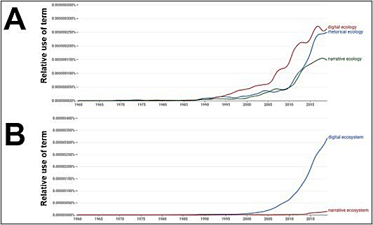

## Page 98

Digital Rhetorical Ecosystem Analysis    79 
 
Part III 
The Digital Rhetorical Ecosystem  
Three-Tier (DRE3) Model:  
Mappings, Applications, and Implications 
For research into socio-technical systems and digital discourse, the field 
of ecology provides much more than qualitative metaphors. Others 
have offered a variety of fundamental points of contact between 
ecology and rhetoric, noting that both fields explore how systems 
exhibit multiscale patterns of organization arising from interactions 
among many subunits [37]. Both rhetoric and ecology study how 
information is communicated through time, and how agents interact 
with or modify their context. In the case of rhetoric, this is through the 
production, perception, and interactions with artifacts and social 
entities, and in the case of ecology, this is the phenomena of niche 
modifications or stigmergy [38]). Here we extend the interface between 
rhetoric and ecology to argue that the mapping between these two 
domains can find productive application in the monitoring and design 
of digital ecosystems. The specific implications of ecosystem 
metaphors for digital discourse are explored in the following section. 
“Rhetorical ecology” is an established term (Figure 3A) that refers to 
the context-dependent rhetorical implications of texts as they are 
deployed in changing spatio-temporal contexts. The concept of 
“rhetorical ecologies” has been used to describe the level of modeling 
and abstraction that generalizes above any given rhetorical situation or 
element [39]. The ecological framework surfaces relationships between 
texts. For example, in ecology, the concept of a predator-prey 
relationship refers broadly to a type of behavioral interaction between 
two species, where one species consumes the other. Understanding 
that two species are in a predator-prey relationship helps make sense 
of an otherwise-disconnected set of questions and observations in the 
world, for example the daily activities of both species and their bodily 
morphology. In the case of rhetoric, we can also imagine predator-prey

## Page 99

80    Narrative Information Ecosystems 
 
type relationships—for example two digital communities connected 
because one systematically follows and attacks the other, through 
memes. Additionally, online ecosystems may present totally new kinds 
of relationships among interacting agents; so any framework for 
rhetorical ecosystems should be able to infer novel types of 
relationships without being limited to the archetypes present in wild 
ecosystems (e.g., predator-prey as above, symbiosis, mutualism, 
parasitism). We hypothesize that with appropriate ecological-rhetorical 
mappings in hand, new sets of frameworks and tools developed to 
study ecosystems could become rapidly useful for analysis of online 
discourse. 
Here we introduce the Digital Rhetorical Ecosystem three-tier (DRE3) 
model (Figure 4) which expands previous work on the ecosystem 
metaphor for online systems and builds towards system design 
implications for analysis of memetic discourse. 
 
Figure 4. Ecosystem integrity model & the Rhetorical Ecosystem three-tier 
(DRE3) model. A) Figure 1 reproduced from Equihua et al. 2020 [40]. B) 
Digital Rhetorical Ecosystem Three-tier model.

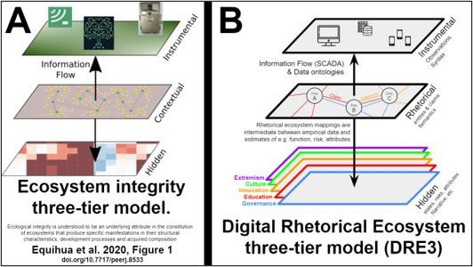

## Page 100

Digital Rhetorical Ecosystem Analysis    81 
 
The DRE3 model was inspired by the three-tier model of ecosystem 
integrity (3TEI) developed by Equihua et al. 2020 [40] (Figure 4A). In 
their 3TEI, the topmost tier is the Instrumental tier, reflecting 
measurements from the world, for example by sensors or cameras. The 
middle tier of the 3TEI is the Contextual level, reflecting the network 
of interacting agents in the niche that give rise to the observed 
information at the Instrumental tier. The bottom tier in the 3TEI are 
the Hidden variables of the ecosystem, such as risk of fire or capacity 
for agriculture. These variables are not directly observable through the 
use of any kind of physical instrument—hence statistical tools must be 
used to infer these states from the Contextual states that are in turn 
estimated from the empirical data at the Instrumental tier. 
For the DRE3 model applied to digital ecosystems (Figure 4), we 
translate each of the tiers from the 3TEI into corresponding domains 
related to online discourse. The Instrumental tier of the DRE3 reflects 
the empirical observations of digital activity, for example rhetorical 
artifacts such as image memes, as well as metadata and other platform 
information (e.g., traffic logs, user ratings or responses to content). The 
middle tier of the DRE3 is the Rhetorical tier. This Rhetorical tier 
reflects the networks of entities, claims, and warrants evoked by 
artifacts at the Instrumental tier. The bottom tier in the DRE3 reflects 
the multiple possible Hidden layers which might be significant targets 
of analysis, for example the risk of extremism, production of 
subcultures, degree of innovation, quality of public information, trust 
in government, and process of governance. 
Importantly, the information in the Instrumental tier is mediated and 
augmented by a Rhetorical tier in the process of Hidden State 
inference. The direct mapping from rhetorical artifacts to hidden state 
inferences can be challenging and noisy (e.g., in the case of hashtags or 
syntax-driven analyses used to identify conspiracy theories [41]), or 
essentially impossible (in the case of image and multimedia artifacts). 
A better approach to high-throughput analysis of multi-media digital 
discourse is needed. We suggest that the introduction of a rhetorical

## Page 101

82    Narrative Information Ecosystems 
 
layer (consisting of entities, claims, and warrants) in between the 
instrumental and hidden layers is a useful direction to pursue. 
Ecology: Key Concepts and Mappings 
This section applies the DRE3 model in the context of the modern 
global information environment. Like insights gleaned from regional 
ecosystems [42], analyses of rhetorical ecosystems ideally should be 
use-oriented, in close-to-real-time, and able to be represented 
differently for different stakeholders. Contemporary and future 
analysis of online discourse will involve the use of heterogeneous data 
to detect, monitor, and perturb discourse. This requires a significant 
amount of actionable and estimative intelligence regarding the real-
time state of online discourse, especially if the goal is to ameliorate the 
aforementioned epistemic crisis and increase the capacity to 
understand and respond to the use of image memes in online discourse. 
In this work we do not present any formalisms or explore all possible 
ecosystem-rhetoric connections, but rather focus on deriving 
implications for rhetorical analysis and online system design by 
focusing on three key areas of ecological theory and application:  
• 
Multiscale perspective on ecosystems 
• 
Ecosystem antifragility 
• 
Ecosystem services 
For each of these three ecological topics, we 1) define the term, 2) 
clarify the mapping from ecology to rhetoric, 3) consider which 
concepts might transfer from ecology to rhetoric, and 4) provide a 
preliminary investigation of the implication of these mappings in terms 
of systems design.

## Page 102

Digital Rhetorical Ecosystem Analysis    83 
 
 
Multiscale Perspective on Ecosystems 
 
 
Figure 5. Representation of the multiscale perspective on Ecosystems. At left, 
ecological modeling of the world can proceed via decomposition into disparate 
ecosystems. At right, online rhetoric occurs within the global information 
environments, via increasingly-fragmented platforms, channels, and chats. The 
common mapping, in the middle, is the notion of overlapping and nested systems. 
 
What is the multiscale perspective on ecosystems? 
 
• Modern ecological frameworks are built around the idea 
that biological systems present as nested scales of 
organization [43]. At each scale of organization such as cell, 
organism, and population, the system consists of 
interacting agents of various types [44,45]. System subunits 
can interact in non-linear ways, and the integrated function 
of the ecosystem as a whole can be considered as cognitive 
in its own right in that the system can learn, integrate

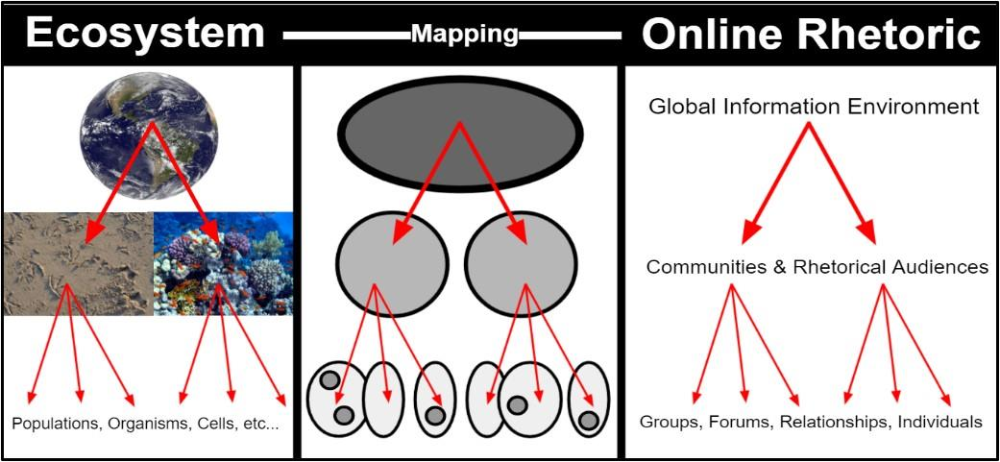

## Page 103

84    Narrative Information Ecosystems 
 
information, display persistent memory, and act in an 
anticipatory fashion [46]. 
What is the mapping from the multiscale perspective on 
ecosystems to online digital discourse? 
• Today’s digital landscapes consist of human and non-
human agents, interacting with each other and with textual 
artifacts, as if they were on rhetorical landscapes. 
Ecosystems and landscapes are rich and generative 
metaphors that help capture the many ways in which agents 
of various types and in various roles interact massively in 
parallel. These distributed rhetorical interactions contribute 
to information integration, collective decision making, 
memory, education, and anticipation across the digital 
public sphere. Rhetorical ecosystems exhibit structure and 
regularities across multiple scales of analysis, for example 
the individual, relationship, group, and community. Thus 
digital rhetorical ecologies can be considered as an 
integrated multiscale cognitive system. 
• The case of an image meme posted on a social media 
platform can be seen as a niche modifying action of mobile 
agents, with the intention of signaling to similar or 
dissimilar agents, resulting in functional consequences for 
the further evolution of the biosemiotics of the niche. 
These stigmergic processes in nature, such as an ant 
depositing pheromone, or large mammal making territorial 
markings [47,48], are essential for ecosystem function. 
Digital 
platforms 
present 
affordances 
for 
niche 
modifications, whether extremely limited (e.g., only a “like” 
button”), or more extensive (e.g., a Wiki model where 
content can be edited, or even a platform where the code 
and affordances can be modified by users). The availability 
and incentives for using different kind of digital 
affordances will be user-, platform-, and context-specific. 
This corresponds to ecosystem contexts where contextual

## Page 104

Digital Rhetorical Ecosystem Analysis    85 
 
niche modification processes play out over rapid behavioral 
timescales versus slower evolutionary timescales. 
Which key ideas and tools from the multiscale perspective of 
biological ecosystems transfer to digital discourse spaces? 
• Ecosystems around the world vary in fundamental ways 
but still can be modeled with common frameworks. 
Similarly, in the case of online discourse, we are interested 
in the similarities and differences across languages, 
platforms, and settings. The multiscale perspective in 
ecology highlights how interacting agents and situations 
can generate emergent patterns that are stable (or 
metastable/oscillatory) within acceptable attractor states, 
rather than causing cascading failures [49,50]. In ecology, 
even antagonistic interactions such as predator-prey may be 
stabilizing at the macro scale. In the case of online rhetoric, 
we might map individual-level interactions to behavioral 
ecology, and group-level dynamics to macroecological 
outcomes. For example, a pairwise relationship might be 
unstable or antagonistic among two users of an online 
platform (behavioral ecological scale) yet be a part of a 
stable broader online community of users (macroecological 
scale).  
• The idea of niche modification from ecology translates to 
the kinds of changes that agents make to their information 
niche. In the case of online communication, this is known 
as digital stigmergy [51,52]. Just as the behavior of 
individual animals is nested within (and in feedback with) 
surrounding ecosystem dynamics, rhetorical agents are 
actively exploring and modifying their informational niche.  
• Various ecological toolkits exist to infer agent states and 
actions across spatial-temporal scales and use these 
inferences to understand how agent behavior is in feedback 
with broader trends. These toolkits include software 
packages and approaches related to movement tracking,

## Page 105

86    Narrative Information Ecosystems 
 
multi-scale network analysis [53], system simulation [54], 
and characterization of the relationship between animal 
behavior and the animal’s niche [55–57]. In the case of 
online discourse, agents are moving across informational 
landscapes, updating their models of the world, interacting 
with other agents, and increasing or decreasing their 
likelihood of engaging in different kinds of action. In both 
ecological and rhetorical settings, one may be interested in 
modeling how interaction among agents influence 
individual and collective behavior, as a function of context 
in the niche.

## Page 106

Digital Rhetorical Ecosystem Analysis    87 
 
 
Ecosystem Antifragility 
 
 
Figure 6. Representation of the concept of Ecosystem antifragility. At left, a forest 
experiences a perturbation such as a fire event. This event may either lead to 
devastation of the forest (top), or result in a forest that either burns completely and/or 
grows back stronger (bottom). At right, using a city as an analogy for the online 
rhetorical commons, a perturbation event can result in a destroyed commons (top), 
or a strengthened and vibrant community (bottom). The common mapping, in the 
middle, connecting biological ecosystem antifragility to digital ecosystems is that 
complex systems can undergo various recovery or response dynamics in response to 
perturbations, broadly classified as fragile (failure-prone, top) or antifragile (resilient 
and regenerative, bottom). For digital discourse platforms, fragility would refer to 
the inability to adapt or recover function following technological or rhetorical 
perturbation. 
 
What is ecosystem antifragility? 
 
• Ecosystem antifragility refers to the vibrancy, stability, and 
dynamic variability of a system. Recently, Equihua et al [40] 
have used various approaches from Complexity science to

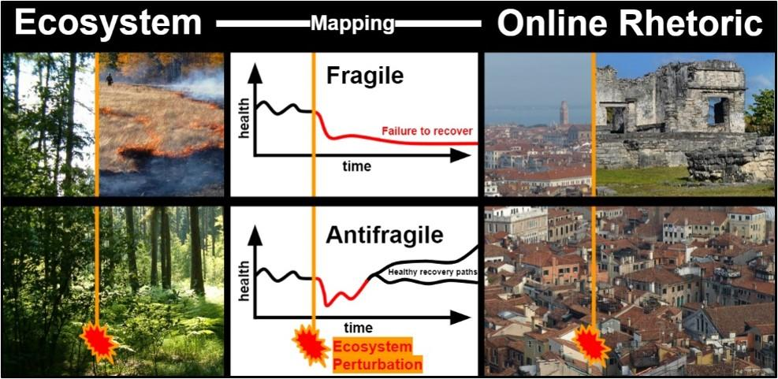

## Page 107

88    Narrative Information Ecosystems 
 
describe ecosystem antifragility as “beyond resilience and 
integrity”. Their working definition is that an “ecosystem is 
antifragile if it benefits from environmental variability” 
[40]. Antifragility is similar to the notion of resilience, 
which captures how a system resists change or returns to 
functional capacity after a perturbation [58]. However, 
antifragile systems are those that actively grow or increase 
in capacity after stressors, as opposed to merely returning 
to previous operating modes. 
What is the mapping from ecosystem antifragility to online 
digital discourse? 
• Health. The stability and flourishing of the rhetorical 
commons is a primary goal for participatory communities 
and societies. This is akin to the concept of ecosystem 
health: even where different regions or seasons may have 
distinctly different healthy modes, maintenance of 
ecosystem vitality may be an overarching regional goal. 
While humans have long relied on qualitative or felt 
measures of ecological health, quantitative data collection 
allows for entirely new measurable notions of health only 
enabled by instrumentation and modeling [59–61]. We 
highlight the need to develop statistical indicators for the 
health and vitality of digital ecosystems so that policy for 
and management of digital commons spaces can be driven 
by shared empirical understanding rather than the 
potentially discordant experience of individuals.  
• Resilience. The resilience of a rhetorical ecology might be 
defined in terms of the system’s maintain function during 
a crisis, informational update, or structural change. The 
resilience metaphor draws attention not just to the regular 
or functional operating modes of rhetorical ecosystems, 
but also to the emergency and recovery modes available to 
these systems. Ecosystem resilience is critical when humans 
have a vital dependence on continued ecosystem function,

## Page 108

Digital Rhetorical Ecosystem Analysis    89 
 
as in the case for agriculture [62]. Increasingly, online 
communications are a lifeline, and thus also need to be 
managed carefully with uninterrupted service and content 
integrity in mind. Disruption of internet services can occur 
through physical damage to infrastructure, as well as 
software intrusions (e.g., ransomware, denial of service 
attacks). Even when hardware and software are running 
according to performance standards, breakdowns of 
sensemaking (e.g., due to spam, targeted disinformation) 
can lead to perturbations on digital platforms and 
breakdowns in their typical functioning. 
Which key ideas and tools from antifragility  
perspectives of biological ecosystems  
transfer to digital discourse spaces? 
• Ecological antifragility has several kinds of ideas and tools 
to offer to the domain of rhetoric. Equihua et al. [40] 
characterize antifragile systems as those that benefit from 
variability, which provides a valuable parallel for measuring 
the health of the rhetorical commons by its type and extent 
of diversity (here of rhetorical claims and perspectives, 
rather than, for example, a species number). That the 
variability of rhetorical claims can be a source of collective 
vitality provides a helpful starting point for viewing online 
discourse and dissuades approaches that promote total 
consensus as a goal, or reflexive suppression of alternative 
viewpoints. 
• Some approaches towards ecosystem antifragility feature 
participatory roles for ecosystem inhabitants, for example 
local cleanup events, long-running citizen science projects 
related to birdwatching [63] and regional ecosystem 
biodiversity events like a BioBlitz (“an event that focuses 
on finding and identifying as many species as possible in a 
specific area over a short period of time” [64]). In the 
context of digital ecosystems, these kinds of local programs

## Page 109

90    Narrative Information Ecosystems 
 
for ecosystem improvement can scale to include large 
numbers of participants, for a Wiki editathon, for example 
[65,66]. Coordinated efforts to “fix trails” in digital 
ecosystems could contribute to antifragility by providing a 
scalable approach for reducing risks from cascading or 
complex failure modes related to out-of-date information, 
fragile network structures, or incapacity to deal with 
anomalous system usage. 
• Quantitative tools also exist to help stakeholders measure 
and model ecosystem antifragility from a Complexity 
perspective [67]. Dynamic models allow for simulation and 
analysis of various kinds of systems and their stability in 
different situations [68,69]. In the context of ecosystem 
health, these kinds of analysis ask how it might be possible 
to build stable networks rather than network structures. An 
exclusive focus on network structures might lead to fragility 
of network function when edges are lost or nodes change. 
Modeling ecosystem health as a phenomenon arising from 
interacting networks, offers new and potentially more-
effective ways of thinking about how multiple ecosystem 
stressors interact [70]. Network models also can be 
expanded to include “games on graphs” models, which use 
the tools of game theory to explore how strategies interact 
on landscapes and how information propagates through 
groups [71,72]. In the context of digital ecosystems these 
kinds of models could provide descriptive, prescriptive, 
and proscriptive information on the general function and 
well-being of digital platforms.

## Page 110

Digital Rhetorical Ecosystem Analysis    91 
 
 
Ecosystem Services 
 
 
Figure 7. Representation of the concept of Ecosystem services. At left, physical 
ecosystem services such as natural resources and pollination are enacted by various 
actors within ecosystems. At right, online rhetorical commons can be considered to 
enact or emit services such as education and innovation. The common mapping, in 
the middle, is that value and valuable outcomes are generated through the function 
of the target system. Putting quantitative value on “intangible” outcomes can be 
challenging. Seeing online outcomes as analogous to ecosystem services is not a 
solution in and of itself, but rather a framework for approaching system management 
and design. 
 
What are ecosystem services? 
 
• Ecosystem services are the functions that ecosystems 
provide which are useful for humans directly or 
incidentally, for example the provision of food, erosion 
control, composting of decaying matter, recreational 
spaces, or generation of natural resources, [73]. As is the

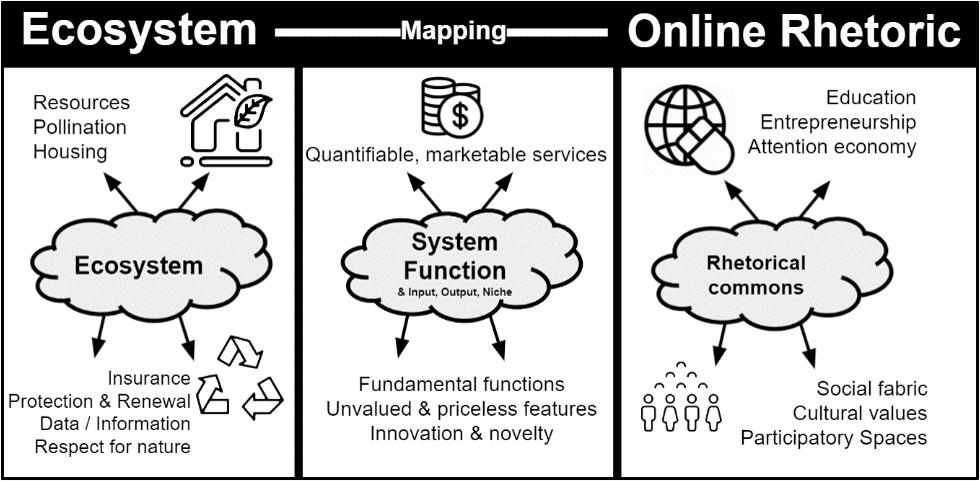

## Page 111

92    Narrative Information Ecosystems 
 
case with ecosystem antifragility and health, many types 
and measures of ecosystem services exist. 
What is the mapping from ecosystem services  
to online digital discourse? 
• If we imagine rhetorical ecosystems to encompass the 
biotic and abiotic aspects of the system that contribute to 
its function and regulation, “rhetorical ecosystem services'' 
could include a broad range of outcomes, including 
education, communication, innovation, and development 
of cultural norms and practices. Just as high-level biological 
ecosystem services, like the production of food, arise from 
direct interactions among many kinds of actors (e.g., plant, 
pollinator, microbes), and might be influenced by indirect 
factors as well (e.g., noise/light pollution, presence of 
predators), rhetorical ecosystem services emerge from the 
direct and indirect interactions of many actors and artifacts 
in the space. Understanding these influences can support 
modeling and management of the valuable outputs of a 
rhetorical ecosystem. 
• We can consider image memes as a special case of 
ecosystem services, in that image memes are valued or 
relevant products of an underlying ecological process. The 
image meme format reflects the intersection of digital 
content production affordances, and the rhetorical cross-
pollination occurring online. The services that image 
memes provide in the rhetorical ecosystem can include 
advertising, 
information 
sharing, 
governance, 
entertainment, persuasion, and more– essentially any 
functional outcome of the deployment of image memes 
that can be tracked and valued.  
• Other studies have investigated the dynamics by which 
images memes originate and diffuse through time among 
communities [36]. This is akin to a source-sink analysis 
common in ecology: source locations are net exporters (of

## Page 112

Digital Rhetorical Ecosystem Analysis    93 
 
image memes on digital platforms) while sink locations are 
net importers (on digital platforms reflecting image meme 
consumption) [74]. This source-sink analysis of image 
memes can link the dynamics of memetic spread to their 
function for different audiences, and thus shed more light 
on the causes, context, and consequences of particular 
image memes for the rhetorical commons. 
Which key ideas and tools from ecosystem services  
transfer to digital discourse spaces? 
• Conservation & management of ecosystem services is an 
area of practice with a long history of analyzing the 
intersection of human individuals, human groups, and the 
rest of the biotic and abiotic surroundings. Some of the 
legal, mathematical, scientific, and game theoretic 
approaches to ecosystem services might transfer usefully to 
cases of online rhetoric. For example, when considering the 
design or regulation of digital platforms, various areas of 
law and policy interact, for example finance, business, and 
privacy. Framing digital platforms (and the functions they 
perform) as ecological commons introduces precedent for 
addressing legal dimensions of individual/public/private 
ownership, and processes for dispute resolution related to 
common resources [75]. 
• Ecosystem antifragility (discussed above) plays directly into 
the stability and accessibility of vital and valuable services 
[76]. Healthy rhetorical ecosystems will display variability 
in productivity through time. However, an ecosystem at 
high risk of catastrophic failure cannot be considered as 
valuable as a dependable ecosystem (e.g., a forest at risk of 
destructive fire presents higher uncertainty about its future 
productivity). The relationship between ecosystem health 
and productivity provides an economic motivation for 
policies that balance multiple contrasting requirements, by 
thinking about system function through time.

## Page 113

94    Narrative Information Ecosystems 
 
Implications 
We argue that insights from modern Ecology can help scaffold the 
future of computational systems for rhetorical analysis. Ecological 
perspectives can retain the semiotic insights from rhetoric analysis 
while tracing meanings and their interactions within a quantitative 
framework [37]. At this time, manual rhetorical analysis requires trained 
experts who identify how artifacts produce meanings for different 
audiences, or, in the case of image memes, how memes generate claims. 
This process of rhetorical analysis is analogous to a natural historian 
observing a species operating skillfully in their niche, in that a specific 
occurrence (observation of a bird, or a digital text) is modeled in terms 
of its relationship to the context and niche (whether biological or 
rhetorical). Computational frameworks for rhetoric provide a set of 
ideas and tools that, if properly designed, could help accelerate 
rhetorical claim analysis. This type of “next-generation natural history” 
[77] for rhetorical ecosystems would integrate well with existing 
computational frameworks, apply well to the multimedia setting, and 
also work toward grounding analysis of digital discourse in rhetorical 
principles. Functionally, Ecology is the bridge that would allow 
rhetorical information to play a more central role in the 
computationally-aided analysis of contextualized digital discourse. We 
suggest that, in addition to the quantitative tools it provides (such as 
network analysis, sparse sampling, agent-based modeling, meta-
community dynamics), Ecology can supplement rhetorical analysis by 
foregrounding concepts like ecosystem health, biodiversity, anti-
fragility, and more. Below are some possible implications arising out of 
the application of the Ecological perspective to online rhetorical 
commons (by no means comprehensive). 
• Create and adapt within the niche. Online platform and 
systems designers can ask what services they are providing 
to stakeholders and the broader ecosystem (defined as the 
entities, audiences, and cyberphysical systems constituting 
the stakeholders and zone of influence of the target 
platform). Platforms provide and interact with the 
rhetorical commons, and thus services of value are being

## Page 114

Digital Rhetorical Ecosystem Analysis    95 
 
provided or modified by them. As digital platforms require 
inputs from the broader ecosystem in terms of energy, 
attention, and other resources, platforms must be 
anticipatory and responsive to changes in their operating 
ecosystem. 
• Trace artifacts and claims to understand function. The 
DRE3 model of digital discourse has the capacity of 
creating clustering, detecting thresholds, or permitting 
inference at the level of rhetorical claims, an extension of 
approaches built solely on syntactic inputs (e.g., hashtags, 
keywords) or lexical semantics (e.g., natural language 
processing, sentiment analysis). We need to integrate 
artifacts and claims (beyond, or instead of tracking 
individuals) for effective sensemaking of digital discourse. 
Thinking of claims in terms of functional patterns in the 
ecosystem, platform designers could analyze the relative 
fitness and spreading/mutation/co-occurrence dynamics 
of memetic claims, across communities, languages, media 
formats, and platforms. 
• Consider dynamics, not just snapshots. Some of the 
dynamical systems and network analysis tools developed 
for ecosystem management could generate models that 
may transfer directly to online datasets. Similar kinds of 
observations can be made in the ecological as well as digital 
situation (e.g., about the movement or communications 
among agents through a space described as a network) and 
similar kinds of questions might be asked (e.g., which initial 
conditions and patterns of relationships might result in 
stable vs. unstable regimes). For example, migration can 
occur among geographical distances as well as among 
digital communities on social media. Complementary tools 
and perspectives for the analysis of migrations might be 
found across research on patterns of ecological and digital 
migrations [78,79].

## Page 115

96    Narrative Information Ecosystems 
 
• Design for multiscale interactions. Online platform design 
could take the multiscale perspective directly into account, 
for example by making certain peer-to-peer interaction 
mechanisms transparent, so that agents at various scales 
(e.g., individuals, groups, communities) are aware of how 
user-level affordances influence the niche and system as a 
whole. Top-down (e.g., platform-dictated) and bottom-up 
(e.g., user-generated) signaling mechanisms could be clearly 
marked (or if not marked, could be annotated as such by 
analytics platforms).  
• Fit generative models (of rhetoric) that can deal with sparse 
as well as complete data. The task of ecosystem 
characterization is to go from sparse and heterogeneous 
observations (for example ambient conditions and bird 
sightings through time), to a useful and communicable 
model. This task of ecosystem characterization, depending 
on the scope of the analysis and desired level of detail, may 
require multiple kinds of models to be specified: the 
cellular, organismal, social, community, and ecosystem. For 
online discourse, integrating the multiple scales at which 
decisions are made (human internet user, community, 
networks of networks), ecologically-informed models 
might provide a principled path for modeling various 
phenomena of interest. 
• Think about the ecosystem’s leverage points and failure 
modes when designing an intervention. Ecosystem 
modification efforts are famously non-linear—careless 
interventions may be ineffectual or even have deleterious 
effects (as in the case of using broad-spectrum toxins in an 
attempt to eradicate the fire ant in the Southern USA [80]). 
For social discourse, influence operations used to be 
evaluated in terms of a direct rhetoric source, such as 
centralized media. Now the operating landscape is much 
more akin to a complex ecosystem, contextualizing diverse

## Page 116

Digital Rhetorical Ecosystem Analysis    97 
 
social strategies as types of social ecosystem modification 
[81]. Modifications of the rhetorical ecosystem through 
various means (e.g., algorithmic distortion, misleading 
information) might have behavioral consequences rippling 
out far beyond the locus of direct action, akin to the 
introduction of a new species to an ecosystem. The relative 
efficacy and risk of different ecological interventions is 
variable across different regions. Proactive, long-term 
interventions such as restoring native habitat are often at 
odds with short-term interventions like intentional 
introduction of novel predators (as in the case of the cane 
toad in Australia [82]) or application of broadly-acting 
chemicals. Ecosystem interventions are irreversible, and 
often have non-linear consequences for different kinds of 
actors and audiences [83,84]. 
• Consider humans in the design of platforms, as well as non-
human and computational actors. Taking a human-centric 
perspective on ecosystem function would be incomplete or 
even fallacious, depending on the region and goals of 
ecological modeling. Similarly, today for online discourse, 
given the prevalence and influence of purely-computational 
agents or computationally-augmented humans, it is 
essential that platforms be designed for use by human and 
non-human agents. Already a significant fraction of 
internet activity is carried out by purely computational 
agents or networks (e.g., chatbots and automated 
accounts). While the exact amount of human and computer 
activity likely varies among destinations, already in 2016 it 
was estimated that certain types of internet activity might 
be majority non-human [85,86]. The multiscale cognitive 
perspective on ecosystems provides a framework for 
modeling rhetorical ecosystems consisting of only human 
actors, only computational actors, and any conceivable 
composition in-between [87]. Already falling within this 
scope are existing tools that distinguish the activity of

## Page 117

98    Narrative Information Ecosystems 
 
human vs. bot actors online in games, forums, and other 
platforms [88,89].  
• Frame healthy and antifragile rhetorical ecosystems as a 
common pursuit. Promoting antifragility is a broad social 
goal that can apply across systems and scales. Ecosystem 
health as a concept helps humanize otherwise-unrelated 
environmental phenomena and might be able to play a 
similar role in making online rhetoric more tangible. Exact 
specifications of “health” for the digital commons may 
differ, just as they do for ecosystems. Analyzing the health 
of a given ecosystem might require the consideration of the 
abundance, composition, diversity, function, and tolerance 
of various kinds of life forms in the system (such as 
microbes, invertebrates, plants, etc.) [60]. And even in this 
case, individuals may still disagree on the health of a given 
ecosystem, if for example they diverge on the optimal usage 
of the region (e.g., for development vs. recreation vs. 
agriculture). When designing platforms for digital 
discourse, it would be valuable to consider how differences 
in opinion about “what is healthy” among users could be 
harnessed and channeled, rather than lead to system failure. 
• Use rhetorical measures as a diagnostic when modeling 
digital discourse by framing the resulting artifacts and 
functions in terms of ecosystem services. Failure of 
rhetorical ecosystem services could occur from an 
adversarial or unhealthy dynamic, such as an inability to 
communicate leading to breakdown of trust among 
otherwise-cooperative individuals. To thwart, or recover 
from, such failures, it could be helpful to search for 
analogous situations in ecology. For example, ecosystem 
services could be threatened by the introduction of an 
invasive 
new 
species, 
a 
toxic 
chemical, 
habitat 
fragmentation, 
light/sound 
pollution, 
or 
loss 
of 
biodiversity [90,91]. In the case of rhetorical ecosystems,

## Page 118

Digital Rhetorical Ecosystem Analysis    99 
 
being able to connect failures of services to past ecosystem 
interventions or modifications (influx of new users, 
introduction of toxic rhetoric, alteration of platform 
affordances, etc.) could provide a useful lens for protecting 
the valuable outcomes of digital discourse.

## Page 119

100    Narrative Information Ecosystems 
 
Part IV 
The Digital Rhetorical Ecosystem 
Three-Tier Model Example Usage 
The Digital Rhetorical Ecosystem three-tier (DRE3) model (Figure 4) 
integrates enriched rhetorical analysis of multimedia discourse with 
ecological theory and modern computational analytics pipelines. In this 
section, we present examples of rhetorical analysis using the DRE3 
model. Specifically, we describe three analytic phases in the context of 
“boutique meme analysis” using two examples. At the end of the 
section, we provide a bridge between the traditional methodology of 
rhetoric and the types of computational representations that are useful 
for modern digital sensemaking systems. 
There is a lack of usable platforms for computational rhetorical 
analysis, although several prescient calls have been made for such 
frameworks and tools [92–94]). Partially, this gap exists due to the 
challenge of accurately and effectively scaling expert rhetorical analysis. 
While multiple complicated sub-tasks are required for rhetorical 
analysis, digital tools exist today to carry out some similar functions 
(such as face-, voice- and text-recognizing algorithms, and natural 
language processing). We suggest that modern software algorithms are 
adequate to perform many of the sub-tasks required for the rhetorical 
analyses of image memes, and that crowd-sourced annotations (via 
participatory research, or micro-task platforms) could be used to 
support algorithms where the software alone are as yet insufficient. 
Already in the case of digital discursive ecosystems today, some 
fraction of users contribute their time and energy to improving 
discourse, for example by providing context or reporting behavioral 
violations. Approaches for online platforms that combine gamified 
participation with behind-the-scenes machine learning have been 
successful in advancing research in biochemistry and a variety of other 
fields. These crowd sourced projects can take a variety of forms, and 
can be designed to operate directly on the engaging digital platforms 
that people already use [95].

## Page 120

Digital Rhetorical Ecosystem Analysis    101 
 
Here we present what a case-by-case rhetorical analysis of image 
memes might look like, within a framework that is ultimately designed 
to scale up to high-throughput ecosystemic annotation, while retaining 
the semantic richness afforded by case-by-case rhetorical analysis. 
These analyses are performed in three phases: 
Phase 1. Entity Identification. The first phase of analyzing 
the rhetorical function of a meme entails recognizing visual 
entities embedded in the meme. Entities can be of different 
types and are interchangeable across memes.  
Phase 2. Rhetorical Analysis. The second phase of 
decoding the function of a meme entails identifying its 
semantic and consequently persuasive potential. This phase 
begins with tracing relationships between the entities implied 
by their arrangement within the meme. The relationships will 
typically synthesize into an implied (or stated, if the meme 
includes text) claim, sometimes accompanied by evidence 
included in the meme. The claim often rests on implied 
warrants (assumptions) supplied by the viewer who is aware 
of the rhetorical context that the meme invokes.  
Phase 3. Hidden State Identification. The third phase of 
decoding the function of a meme is hidden state 
identification. The exact nature of the hidden state inference 
will be situational and depend on what the analyst is 
attempting to reduce their uncertainty about; for example, the 
extent to which the image meme in context is consistent with 
social values, providing specific valuable services, or eliciting 
violence. What distinguishes the various possible hidden state 
inferences from rhetorical inferences in Phase 2, is that 
hidden states are deeper than specific claims about entities, 
and reflect underlying attributes of the rhetorical ecosystem 
that gives rise to and are strengthened by such claims.

## Page 121

102    Narrative Information Ecosystems 
 
Two examples below (Figure 8 and Figure 9) represent the qualitative 
application of the DRE3 model to shareable image memes. The 
rhetorical analyses below uncover preferred readings of these image 
memes [96] and are not exhaustive in terms of entity or claim 
identification. Memes, as identified earlier, are polysemic. They are able 
to generate multiple and varied interpretations. A rhetorical analysis 
cannot comprehensively decode all meaning possibilities embedded in 
an image meme. Nevertheless, by following the rhetorical use of 
symbolic content within the meme, attending to the discursive contexts 
in which a meme may be harvested (such as a Facebook post thread or 
a Twitter thread), crowdsourcing the claims advanced by memes, and 
determining interpretation consensus across trained rhetorical analysts, 
we can identify likely, core, or agreed-upon, in other words the 
preferred arguments that memes advance [96]. In this case, we define 
preference by what a meme was originally designed to argue or the 
meanings that are most easily accessible (obvious) to the target 
audience. Even though the meaning of a meme can be altered by its 
discursive context (i.e., a meme can be deployed ironically to 
undermine its own message), such a subversive reading of the meme 
relies on consensus about its dominant meaning. Therefore, despite 
inherent polysemy, we believe it is both possible and useful to identify 
the dominant argument(s) that are encoded in an image meme.

## Page 122

Example I 
 
 
Figure 8. Illustration of the DRE3 model as applied to an image meme without 
text. A) a target image meme under analysis. B) Application of DRE3 model, 
breaking down the meme in terms of the Instrumental tier (what was observed), the 
Rhetorical tier (entities, warrants, claims), and the Hidden State tier (implications 
and use-specific inferences). 
Phase I. Entity Identification 
In the above meme, the following entity categories are rhetorically 
significant: 
Persons: Bob Ross, G.W. Bush  
Attributes: Hair, shirt, hand of Bob Ross, Face of G.W. Bush 
Objects: Twin Towers of the World Trade Center, Painting materials 
(palette, paintbrush, canvas, easel) 
Location: New York City skyline

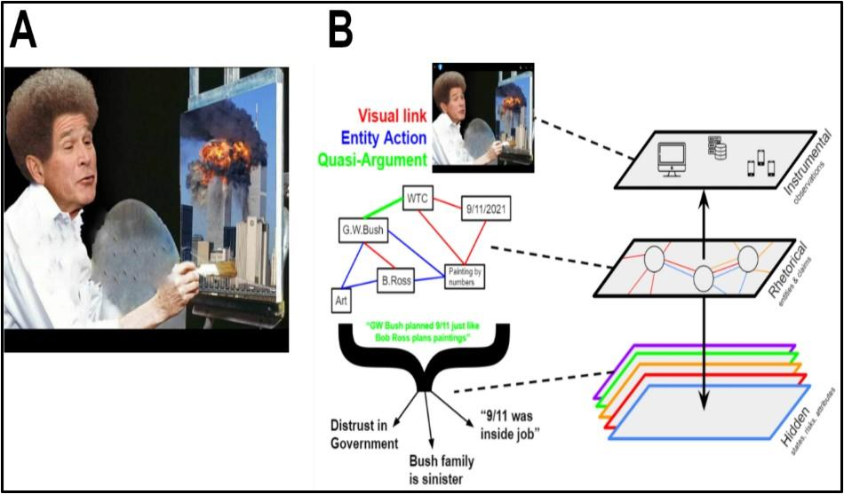

## Page 123

104    Narrative Information Ecosystems 
 
Action/Relationship: Individual painting on canvas 
Phase II. Rhetorical Analysis 
In the above example, decoding the meme rhetorically by analyzing 
relationships between entities requires distinction between host images 
and parasitic images. The incorporation of the parasitic images to 
replace parts of the host images produces a parodic relationship 
between host and parasite entities. The insertion of G.W. Bush’s face 
into the identifiable hair of the artist Bob Ross parodies the parasitic 
entity—Bush. The host image is the one that dominates the meme. An 
enculturated viewer recognizes the image as a still from the iconic Bob 
Ross televised painting class. Ross’s hair, shirt, hand, palette, brush, and 
canvas on the easel are easily recognizable attributes/objects and 
constitute the majority of the image. The viewer is clear that it is G.W. 
Bush’s face that is intruding within the Bob Ross image rather than 
reading the artist entity as the intruder. Having identified the host-
parasite relationship, the viewer must now extract the semantic 
implications of this parody. 
In deciding what the host-parasite parody means, the viewer recognizes 
that the visual juxtapositions in the meme are meant to paint former 
president G.W. Bush as an artist. The parasitic image that has taken 
over Ross’s typical placid landscape scene on the canvas provides a 
stark contrast to what those familiar with Ross expect him to paint. 
The peaceful landscape of a Ross painting is replaced by a real scene of 
terror (the fall of the Twin Towers on 9/11) that is also highly 
recognizable because it has become widely circulated memetic content. 
The face of G.W. Bush and the destruction of the World Trade Center 
towers in New York City are clearly linked in the rhetorical context 
available to the enculturated and interpellated viewer. The structuring 
of entities within the meme, however, superimposes an additional 
relationship that emerges out of the parodic analogy between G.W. 
Bush and Bob Ross. The parody is underscored with the use of an 
exaggerated expression on the face of G.W. Bush. This is the point at 
which the viewer arrives at the claim embedded in the image structure

## Page 124

Digital Rhetorical Ecosystem Analysis    105 
 
of the meme. The claim could be articulated as follows: Like Bob Ross 
paints a landscape from imagination, G.W. Bush fabricated the 9/11 
terror attacks. In this case, the memetic argument advances only a 
claim. The meme contains no evidence. Instead, the meme operates 
intertextually. To unpack the meme’s claim, the viewer must be aware 
of multiple rhetorical contexts, such as the 9/11 truther movement that 
has sought to expose the terrorist attacks of 9/11 as a plan of the 
United States’ own government, and the imputed role of the Bush 
family within the construct of a global cabal that controls worldwide 
events. In this way, the rhetorical analysis of memes leads us to 
identifying salient hidden states (e.g., social, political, and cultural 
beliefs/practices) that both influence and are shaped by memetic 
arguments. 
Phase III. Hidden State Identification 
A rhetorical decoding of the Bob Ross-G.W. Bush meme both relies 
on and perpetuates claims about the Bush family, the G.W. Bush 
administration, the events of 9/11 and other global destructive events. 
Memetic argumentation analysis is ultimately useful to the extent to 
which it permits tracing evolving public beliefs and practices that could 
have real-world implications. We expect that, over time, the 
identification of rhetorical claims from varied memes will reveal 
patterns of connected beliefs that correspond to higher-order hidden 
states such as confidence in the government, or beliefs about the causes 
of past events. A hidden state in our framework refers to an implicit 
and volatile state of public belief, sentiment, or action. A belief that the 
United States government lies to its people is an example of a hidden 
state. This higher-order claim represents a public belief that produces 
a sentiment of distrust in the government. Tracing hidden state 
dynamics is useful because they can activate overt action in unrelated 
contexts, such as vaccine refusal because of a previously established 
distrust in government. Such a relationship between hidden states and 
public action can potentially be identified by tracing co-occurrence of 
memetic claims within networks.

## Page 125

106    Narrative Information Ecosystems 
 
Example II 
 
 
Figure 9. Example of the DRE3 model as applied to an image meme with text. 
A) a target image meme under analysis. B) Application of DRE3 model, breaking 
down the meme in terms of the Instrumental tier (what was observed), the Rhetorical 
tier (entities, warrants, claims), and the Hidden State tier (implications and use-
specific inferences).

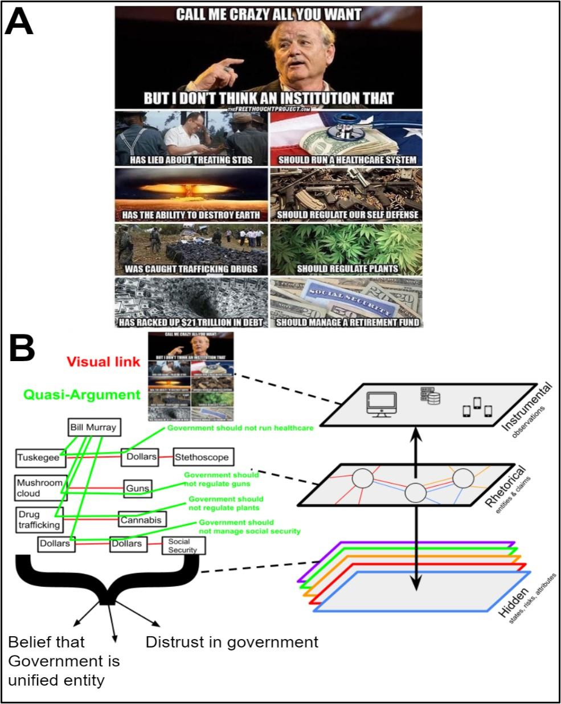

## Page 126

Digital Rhetorical Ecosystem Analysis    107 
 
In this example, the higher-order claim that the United States 
government cannot be trusted is advanced by submitting lower-order 
arguments. The text-image pairing in this meme enacts argumentation 
differently than in Example 1. While the first example illustrates 
argument by analogy, this example supports its claims with visual 
evidence and follows an “if-then” pattern. 
Phase I. Entity Identification 
In the above meme, the following entity categories are rhetorically 
significant: 
Persons: Actor Bill Murray 
Scenes: Tuskegee syphilis study, mushroom cloud, drug heist. 
Objects: Dollar bills with a stethoscope, stock of guns, marijuana 
plants, vortex of dollar bills, dollar bills with social security card. 
Phase II. Rhetorical Analysis 
The visual segmentation of the meme-box is crucial to how the 
argument is enacted. The visual sequencing relies on the viewer moving 
from the top to the bottom and from the left to the right. The top 
centered image features the actor Bill Murray. The text superimposed 
on this image invites the viewer into a dare with the person sharing the 
meme. The challenge “Call me crazy all you want” invokes the trope 
of the conspiracy theorist, a label typically branded on those who 
accuse the government of large-scale wrongdoing. The rest of the 
meme-box is set up to enact that challenge and rebut the conspiracy 
theorist label. Bill Murray, known for his antics that speak truth to 
power, functions as a symbol of interpellation for the conspiracy-
minded, who are not taken seriously by the mainstream but are 
convinced of the truth to which they have awoken.  
The lower order arguments are presented in claim-evidence pairs, each 
contained in smaller boxes in the left-hand column of the meme. Four

## Page 127

108    Narrative Information Ecosystems 
 
claims about government malevolence are substantiated with images 
meant to provide evidence.  
The first claim accuses the U.S. government of lying about medical 
treatments of STDs. The image over which the textual claim is 
superimposed features African Americans, a visual sign meant to 
invoke the Tuskegee syphilis study that abused black American bodies 
in a deceptive government intervention. The image in fact is an iconic 
historical photograph of the study. But, even in the absence of audience 
knowledge about the provenance of the photograph, knowledge about 
the Tuskegee study itself is enough to decode the image as representing 
that particular instance of government dishonesty and failure.  
The second claim accuses the government of the ability to destroy the 
planet and is substantiated with the paired image of a mushroom cloud 
that invokes the Hiroshima atomic bomb disaster.  
The third claim accuses the government of trafficking in drugs. The 
textual claim is superimposed on an image meant to invoke the plane 
crash that exposed alleged CIA involvement in drug trafficking in 
Panama.  
The fourth box in the left-hand column claims that the U.S. 
government has $21 trillion in debt. Here the paired image simply 
shows a giant vortex of dollar bills illustrating the metaphor of “money 
down the drain”. The preceding images which pull from historical 
archives construct the credibility of the meme, leading the viewer to 
implicitly assume the facticity of the final allegation, even though the 
fourth argument departs from the claim-visual evidence pattern 
established by the previous three. 
The visual segmentation and sequencing in the meme optimizes the 
constrained space of the meme-box to deliver a relatively complex 
argument with multiple claims and pieces of evidence. Each text-image 
pairing on the left works in conjunction with the text-image pairing on 
the right to both verbally and visually enact the if-then argument

## Page 128

Digital Rhetorical Ecosystem Analysis    109 
 
pattern. The boxes on the left provide evidence for the claims on the 
right. For example, the government’s dishonesty in the Tuskegee study 
is presented as evidence for the claim that a nationalized health care 
system cannot be trusted because of the ways in which it might abuse 
unsuspecting citizens. Likewise, its willingness to bring the planet to 
the brink of destruction by deploying nuclear weapons is provided as 
evidence that the government should not be allowed to regulate gun 
ownership. The strategic use of the meme-box to bound the argument 
is especially stark in this sequence. While evidence of the government’s 
disregard for human life can be leveraged to support curtailing the 
government’s military power, the corresponding claim instead attacks 
gun regulation, implying that citizens need to be prepared to defend 
themselves against an untrustworthy government. However, the 
implication that guns are powerless in the face of nuclear destruction, 
which would undermine the meme argument, is suppressed by the 
visual alignment of evidence and claim side-by-side. This visual 
formatting contained within the meme box constrains the possibility 
of additional lines of reasoning even more powerfully than a similar 
argument made through other forms, such as orally in a speech or 
verbally in a news article. The visual demarcation of the meme box has 
the powerful potential to restrict reasoning to the elements displayed 
within the box. Because of how distinctly recognizable the meme-box 
has become and how unique it is in appearance compared to other 
visual modes of public discourse, the meme-box is able to separate 
itself from the rest of the landscape of public argumentation and create 
both discrete instances of argument unique to its own content and 
structure, as well as to interact within the ecosystem of related memetic 
arguments. 
Phase III. Hidden State Identification 
The four boxes on the left in alignment with each of their counterparts 
on the right together advance the higher-order claims that the U.S. 
government is dangerous, unethical, and inept and its interventions 
should be substantially curtailed. This claim reifies the hidden-state 
sentiment of distrust in the government. It is important to note, also, 
how the argumentation enacted by the meme relies on some but not

## Page 129

110    Narrative Information Ecosystems 
 
extensive contextual knowledge in the viewer. The parsimony of the 
symbols within the meme (restricted to a few words and images) relies 
on the audience's background knowledge and ability to supply 
warrants. For example, audience knowledge about the Tuskegee study 
and its targeting of African Americans is essential to reading the first 
image on the left-hand side as evidence for its paired textual claim. 
However, even minimal recognition of some elements is sufficient for 
the viewer to then accept the other image text pairings and submit to 
the lines of reasoning traced by the memetic elements. Likewise, the 
meme relies on an interpellated audience to supply the necessary 
assumptions (warrants) to complete the arguments. For example, the 
leap from the government’s moral failing in the Hiroshima bombing 
does not automatically lead to an argument against gun regulations, 
unless the viewer is already concerned about the erosion of Second 
Amendment rights and is thus primed to read the atomic bomb image 
as evidence that the government does not have its citizens’ best 
interests at heart and would therefore regulate gun ownership to reduce 
the threat of self-defense from its citizens. 
Concluding Comments 
The two examples elaborated above show the kinds of information 
about memetic claims and hidden states that can be inferred with a 
rhetorical approach. In the following section we integrate the insights 
from rhetoric and ecology to outline some considerations for the 
design of online discourse monitoring systems.

## Page 130

Digital Rhetorical Ecosystem Analysis    111 
 
Part V 
Toward a High-Throughput 
Rhetorical Analysis 
(Meme SCADA) 
The example applications of the DRE3 model in the prior section show 
the kinds of information about hidden underlying states inferable with 
a rhetorical approach, that are impossible using syntax-driven analysis 
such as keyword extraction or entity recognition alone. Digital 
discourse moves at a very fast pace. Rapid changes in digital discourse 
(e.g., during an unfolding political event) are likely the times when 
monitoring and analysis are most needed. Unfortunately, the DRE3 
model, as applied above, is low-throughput. This problem is not 
unsolvable. The field of ecology offers a hopeful precedent, because it 
emerged from low-throughput observation of natural history, and later 
increased in scope and rigor through the application of quantitative 
frameworks and large-scale monitoring networks. We propose that 
rhetorical ecosystem analysis is capable of making a similar transition 
to a higher through-put research phase, in the case of some digital 
artifacts. 
The value of developing capabilities for cataloging, indexing, searching, 
mapping, monitoring, and modeling digital discourse is also not limited 
to facilitating research. Just as better ecological understanding and 
monitoring has enabled forecasts, such as those related to algal blooms, 
disease, wildfires, and the potential risks of construction or 
development [97], better understanding and monitoring of digital 
discourse could forecast outbreaks of violence, acceptance of 
government initiatives, the spread of ideology, and the potential risks 
involved in narrative influence [98]. A wide variety of disciplines 
undoubtedly have interest in tools for modeling, mapping, and 
monitoring digital discourse, such as public relations, public health 
policy, and military information support operations (MISO) [98]. Many 
high reliability organizations, or organizations which must maintain

## Page 131

112    Narrative Information Ecosystems 
 
low-failure rates or risk cascading failure [50], have expressed or 
demonstrated a need for tools which perform these functions [99–103]. 
While recent crisis events have drawn particular interest to the potential 
application of these functions in monitoring and modeling digital 
discourse about public health and political extremism, there has been a 
long-standing need for these functions in areas which are entirely 
apolitical, such as of multimodal content regarding interpretations of 
emergency situations like forest fires, floods, and earthquakes [104].  
Transitioning from low-throughput to high-throughput, and from 
theory and research to forecasting and decision-making support, will 
only be accomplished by considering the related requirements of the 
outputs, of the processes and methods which lead to them, and of the 
tools and infrastructure which enable them. Here we explore and frame 
these requirements, consider methodology, and propose the structure 
of a monitoring system best categorized as a type of SCADA 
(Supervisory Control and Data Acquisition) system for digital 
discourse which incorporates the DRE3 model and modern 
computational techniques [105]. Addressing the use-case specific 
requirements of the many domains which might have interest in 
monitoring tools has been considered elsewhere [81]. Instead, the 
focus here will be on the requirements for more general sensemaking 
about public narratives generated by image memes. 
Narrative Intelligence 
The general requirements for sensemaking common to all intelligent 
systems are the abilities to capture relevant data from the environment 
(sense), fit the data to expectations or adapt those expectations to fit 
the data (model), and use the expectations to consider or frame choices 
(policy) as a basis for informing action [87]. Various frameworks exist 
to convert these general requirements into formal processes and 
specific requirements for systems which facilitate sensemaking. These 
frameworks are often built for activities which require special 
consideration beyond the fundamental sense-model-policy framework, 
such as in militaries [106–108], teams [107–109], intimate relationships 
[110], machines and AI [111,112], and businesses [113]. Of the many

## Page 132

Digital Rhetorical Ecosystem Analysis    113 
 
sensemaking frameworks available, intelligence production may be the 
most appropriate for sensemaking related to digital discourse.  
Intelligence production is an organizational sensemaking process 
which is intended to produce deliverables to inform policy that 
achieves or maintains the interests of an organization [114,115]. Formal 
intelligence production processes are particularly helpful for 
organizations that are large enough to make the natural emergence of 
synthetic intelligence or macrocognition unlikely or illusory, and for 
organizations which are interacting with systems of interest that are 
sufficiently complex to prevent existing synthetic intelligence from 
being able to manage available sense data appropriately [109,114,116–
118]. The process of intelligence production was originally semi-
formalized by the Roman military [118] and has been iteratively 
developed throughout history in response to situations where 
conditions complicating macrocognition arose or became exacerbated 
[114,119–123].  
Intelligence production is a helpful way to frame the requirements of 
sensemaking in digital domains given that intelligence production was 
formalized to face similar challenges, such as voluminous collections 
across myriad surfaces, multimodal data [124,125], deception and 
intentional disruption of data collections (counterintelligence) [126], 
and difficulty of detecting, monitoring, and interpreting counterpublic 
membership and activity [50,127–129]. Since intelligence production is 
usually performed by high reliability organizations [50] and faces the 
aforementioned challenges, it has been iteratively developed over time 
to maintain reliability and cope with imperfect data and uncertainty. 
While various specifications exist for particular use-cases, such as in 
business and commercial intelligence [113], generally intelligence 
production is modeled using 5 distinct stages: 1) planning and direction 
(requirements setting), 2) collection, 3) processing and evaluation, 4) 
production and analysis, and 5) dissemination [113,125,130,131]. These 
5 stages provide opportunities for separations of concern between 
categories of function and process, as well as between personnel and 
access to information [131,132] to limit the possibility of “having either

## Page 133

114    Narrative Information Ecosystems 
 
the facts or the conclusions warped by the inevitable and even proper 
prejudices” of those involved [133]. However, it should be noted that 
the steps formalized in the intelligence production model are not 
necessarily implemented in discrete phases, and that even where 
separate steps are intended, they still occur in parallel with blurs 
between processes [134,135]. 
Ecological and rhetorical metaphors and methodologies may offer 
unique and valuable approaches to monitoring and analyzing digital 
discourse, but no metaphor is a perfect mapping [136]. Here we apply 
the intelligence production framework to facilitate practical 
considerations for “mapping the gap” between ecology- and rhetoric- 
inspired methodology and the needs of a meme analysis pipeline at 
each stage. 
Planning and Direction 
The first step of the intelligence production cycle is planning and 
requirements setting. This stage entails considering what kinds of 
intelligence products are needed and in what time frame, and 
translating these needs into technical and personnel requirements, 
scope, and expectations for the following steps [130–132]. In the case 
of a meme analysis pipeline, we suggest that the relevant products be 
broken into 5 broad categories: 
Data Sets. While raw datasets do not constitute a formal 
intelligence product, the data collected and used for 
projections and other features are nonetheless a product 
which should be made available both internally and externally, 
similar to the provision of Twitter’s streaming API 
(application 
programming 
interface) 
and 
“Firehose” 
[137,138]. These releases are essential for 3 primary reasons. 
First, the analysis pipeline should never be considered entirely 
complete; data used and produced by various features should 
be available for both quality testing and use in the 
development of new features. Second, datasets of content 
with semantic annotations could be invaluable for the

## Page 134

Digital Rhetorical Ecosystem Analysis    115 
 
development and training of AI. Finally, the capability to 
release data used allows for reproducibility and transparency 
in the case that outputs are considered partisan or 
questionable. 
Research Intelligence. Research intelligence refers to 
information that may provide context or support for other 
intelligence products or help in further analysis or 
sensemaking, such as wikis, or “fact books” which might 
provide details about content and communities of interest in 
the context of digital discourse [114,139], field guides for 
providing education on common patterns and processes [98], 
exploratory search features for analysts and researchers, and 
research products such as academic articles or white papers. 
Estimative Intelligence. Estimative intelligence refers to 
information regarding uncertain phenomena, such as the 
likelihood of an object impacting a particular hidden state, 
though some definitions place a larger emphasis on 
projection [140–143]. In the monitoring of digital discourse, 
helpful estimative intelligence might include metrics and 
projections regarding the state, rate of change, and impact, of 
beliefs, communities, patterns of activity, or content, 
informed by methodologies from ecology and rhetoric. 
Warning intelligence. Warning intelligence refers to 
information about anomalous phenomena or rapid or 
unexpected changes to system state [139,144,145]. In the 
monitoring of digital discourse, useful examples of warning 
intelligence would include the detection of anomalous 
activity, the emergence of what may be coordinated, 
aggressive, and strategic activity associated with untracked or 
tracked objects or communities, notifications about other 
organized activity such as the censorship of content on a 
platform, or the presence of harassment, threats, or explicitly 
illegal activity.

## Page 135

116    Narrative Information Ecosystems 
 
Actionable Intelligence. Actionable intelligence suffers 
from a lack of consistent usage or a consistent definition, but 
generally refers to information which needs to be addressed 
urgently and informs or enables actions that might be or need 
to be taken [146]. In the monitoring of digital discourse, 
actionable intelligence would help inform interventions such 
as the removal of content, inform design of content or 
messaging based on current trends, and guide sensemaking by 
providing new routes to consider when presented with 
ambiguity or structurally complex information. 
Collection 
The second step is broadly referred to as “collection”. This term is 
sometimes used to refer to the entirety of the intelligence production 
cycle [133,147]. However, in the context of the production cycle and 
its processes, it refers to the conversion of requirements set during 
planning and direction into tangible targeting, selection, and 
instrumentation choices in order to collect data [125,130,148]. At this 
stage, the focus is on the collection of “raw intelligence”, or unanalyzed 
information, in accordance with requirements—as such, it is 
sometimes referred to as collation [132]. In the past, organization of 
raw intelligence was fairly disorganized [118–120,134,149]. But with 
the increase in volume, and the need to collect multimodal data from 
myriad surfaces, came a need for specialization not just in analysis but 
in the collection of raw intelligence as well, resulting in various formal 
categories of tradecraft, or types of intelligence collection and 
annotation methodologies [130,150]. 
There are a series of ethical and practical challenges to the development 
of collection requirements and procedure for image memes in the 
interest of developing an image meme analysis pipeline. A root 
problem, worth addressing first, is that even at the cutting edge of 
machine learning applications in analyzing memes, there are serious 
limitations imposed by the lack of existing annotated collections to use 
as training data [23]. Thus, the use of AI at this time for automated 
collections would likely be inappropriate given that even the ability to

## Page 136

Digital Rhetorical Ecosystem Analysis    117 
 
differentiate between an “image meme” and “just an image” is a 
difficult, semantic challenge—let alone the ability to analyze it. 
However, given the rate of change, complexity, and volume of image 
memes, collection would place too high a burden on researchers, 
experts, and analysts. Crowd-sourcing may therefore be the best 
avenue of approach. While crowd-sourcing approaches have come 
under criticism, recent successes indicate that more complex tasks may 
now be ready to be outsourced to crowds [95]. Choices in 
incentivization mechanisms and user experience design would need to 
be considered in depth elsewhere, but there is a rich history of crowd-
sourcing data in ecology which could be of use in framing collection 
requirements. For example, millions of entries for bird sightings are 
generated by citizen bird watchers each month [151] and data from bird 
sighting submissions can be used by analysts for real-time monitoring 
of animal activity as well as for forecasting phenomena such as 
outbreaks of West Nile virus [152]. The frameworks used for crowd-
sourcing in ecology may allow for a direct transfer to other domains, 
such as those which provide data management principles [153] and 
offer methods for improving information quality or “Crowd IQ” [154]. 
Among the approaches developed in ecology and ecology-adjacent 
fields from learning-by-doing in crowd-sourcing, three stand out as 
both valuable and immediately applicable. First, based on crowd-
sourced classification of plants and birds, quality of collections can be 
greatly improved simply by improving the quality and scope of the class 
structures (schema) and data standards the crowd will interact with 
[154]. Second, the study of crowd-sourcing fish classifications and 
remote-sensing in hydro-ecology has shown that quality can be 
improved over time by segmenting users by expertise and using these 
segmentations to provide different levels of responsibility [155,156]. 
Third, work on crowd-sourcing biomedical annotations has revealed 
that expert contributions can be used to train and tune user 
contributions, particularly to detect anomalies and unexpected 
deviations from patterns. Similarly, user contributions can be used to 
train and tune automated systems and be assisted and guided by them 
in performing contribution tasks (see figure 10) [95]. These approaches

## Page 137

118    Narrative Information Ecosystems 
 
could be directly applied to “field” collections of image memes. Given 
that collections are occurring online, most relevant information, such 
as where the object was collected, the object’s file type, and reaction or 
“impact” data if it was collected from social media, could be 
automatically fit to pre-existing data standards with no need for experts 
involved in collections before being placed in a buffer for classification. 
The collected objects could then be used to train AI to determine what 
and what does not constitute a meme. 
 
Figure 10. The flow of benefits offered between types of user contributions. 
Contributions by user segments with higher levels of competency in a task can be 
used as training data for those of a lower competency, while contributions from 
segments with lower levels of competency can be used to help provide guidance to those 
of a higher competency (e.g., suggested classifications). 
While it might be reasonably assumed that data about the user who 
posted the collected object should be automatically parsed and 
collected as well, this may not be necessary. As noted elsewhere in this 
article, memes, particularly political memes, are often presented 
without attribution. Further, user data may need to be bypassed 
because creating or sharing political or even quasi-political memes or 
other content, especially within counter-publics where meme-activity 
is rich and of interest to researchers, is increasingly being accompanied 
by the expectation of potential consequences from peers [157],

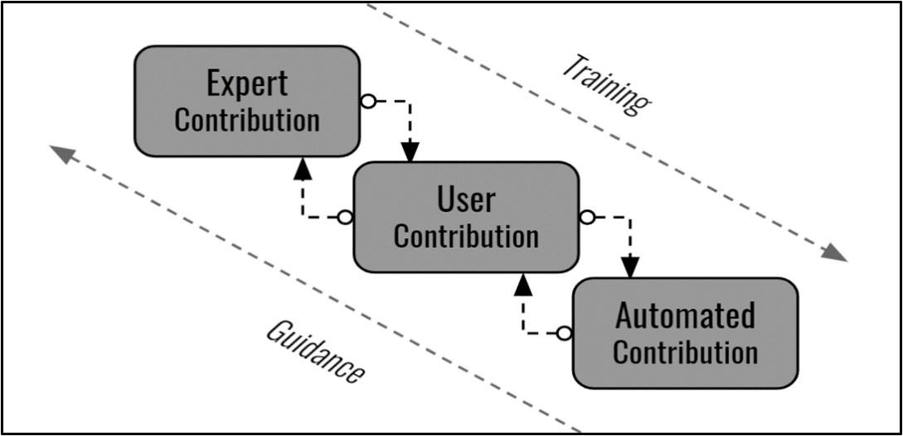

## Page 138

Digital Rhetorical Ecosystem Analysis    119 
 
employers [158,159], and institutions [160,161], as well as by potential 
punitive consequences from media-sharing platforms [162–165] and 
governments [166,167]. The DRE3 model’s focus on claims in memes 
informed by a rhetorical approach, and on relationships, placement, 
and change of that content informed by an ecological approach, as 
opposed to a focus on the identity of the poster, prevents 
misattribution or association inferred by posting history (e.g. a CDC 
official sharing an anti-vaccination meme for educational purposes), 
reduces the potential for harm by “outing” or “doxxing” internet users, 
especially in countries with higher potential for consequences for 
sharing political content, and reduces the potential for critical misuse 
of the analysis pipeline. For the purposes of understanding movement 
of memes specifically, the channel over which the meme travels is 
sufficient. If the collector of the meme in context with a particular 
platform constitutes a channel, then this channel can be considered a 
location—leaving no reason to deanonymize the collector and making 
the generation of an “identity” within the pipeline an opt-in exercise. 
Processing and Evaluation 
The third step of the cycle is often referred to as processing and 
evaluation and refers to a pre-analysis stage in which data is cleaned, 
refined [148], and filtered [130] and the reliability and credibility of 
sources of the information are considered [132,134,168]. The raw 
intelligence assembled in the collection phase is now altered or 
reassembled for usability, “coded data is decrypted, foreign languages 
[are] translated, and photographic material [is] interpreted” [148]. The 
importance of processing and filtering cannot be overlooked. Without 
comparable 
measures, 
accessible 
reference 
information, 
or 
compression into usable formats, much of the data could essentially 
become meaningless [169]. When this processing is done in concert 
with proper scope and orientation introduced in the planning and 
direction phase, it also reduces the potential for endless abstraction by 
making the means and intentions of the process clear [87,170]. 
It is at this stage in an image meme analysis pipeline that experts would 
be needed to begin classifying objects and improving information

## Page 139

120    Narrative Information Ecosystems 
 
quality as the pipeline begins to move beyond syntax and metadata 
toward semantic annotations. Even with the use of crowd-sourced and 
automated collections, the load would still be far too great for experts 
and trained analysts to handle alone. This being the case, the same 
framework of training, guidance, and segmentation between the kinds 
of contributors described in the prior section would offer continued 
utility (see figure 10). Automated systems would be given 
responsibilities such as detecting quantitative features that are 
correlated with virality and longevity of the image meme, which can 
then be used to direct the attention of both experts and average users 
[23]. These systems would make use of data from the contributions of 
human users to train for more complex tasks. Expert users would have 
the primary responsibility of developing and detecting claim and 
argument patterns and applying these labels to content, which could 
then be used to train average users or even AI to do the same. 
Claim identification presents the largest challenge to crowdsourcing the 
DRE3 model due to the subjectivity of the extraction whether it comes 
from rhetorical experts or average users. Image memes, as discussed in 
prior sections, tend to have an ambiguity which offers the poster 
plausible deniability about the assertion of claims. Therefore, simple 
automation of feature recognition cannot be relied on for extracting 
claims from images. However, this challenge may instead be seen as an 
opportunity. There are many viable methods for extracting and 
aggregating arguments from text [171–173], allowing for the substance 
of these common arguments in various phrasings to be aggregated and 
clustered. The remaining disparity between interpretations would not, 
and should not, be considered noise—but instead valuable data for 
producing metrics related to the subjectivity and complexity of the 
content and of diverse perspectives interpreting it. Average users 
would share responsibility for claim extraction, though their primary 
responsibility would be the extraction of relevant entities from the 
content. 
Once experts have provided sufficient labeling of rhetorical pattern 
and structure, average users could be slowly trained. Segments of those

## Page 140

Digital Rhetorical Ecosystem Analysis    121 
 
users may even eventually be trusted with contributing rhetorical or 
other expert classifications, though the provision of greater 
responsibilities would likely require new tools or frameworks for 
managing trust in crowd-sourcing systems. Automated features 
however, would likely need to stay in a guidance role regarding most 
semantic analysis of image memes. Semantics on the internet are prone 
to rapid change and often require contextual knowledge. For example, 
triple brackets around an organization or person’s name is now often 
considered an antisemitic symbol marking Jewish background or 
influence. But obviously, not all uses of triple brackets indicate this—
and worse, prior to this association, the same triple brackets were used 
to indicate a “cyberhug”. This does not mean that automated features 
would be useless. For example, the ability to note that some 
typographical feature may mean something to specific audiences and 
to direct a user's attention to that symbol is a valuable guidance feature. 
Production and Analysis 
The fourth stage of the cycle is referred to as production and analysis, 
wherein experts begin to produce the intelligence products requested, 
given the collected, processed, and evaluated information available and 
relevant to them [148]. At this stage in a meme analysis pipeline, data 
and content cataloged throughout the collection and processing stages 
can now be structured into data sets for developing, improving, and 
replicating automated features at all stages in the pipeline and for more 
specific exploratory analysis by experts. More importantly, it is also at 
this stage in the meme-analysis pipeline that rhetorical and ecological 
framing and techniques begin to have their most valuable 
contributions. 
Research 
Intelligence. 
The 
content 
labels, 
entity 
extractions, and identified claims informed by rhetoric now 
have a role in enabling semantics-driven exploratory search. 
The bottom-up detection of patterns and topological motifs 
allow analysts to view single pieces of content as a part of 
memetic clusters, not just of other pieces of content, but of 
entities, claims, and subclaims expressed in that content, and

## Page 141

122    Narrative Information Ecosystems 
 
of the hidden states that may be signaled by them. With the 
metrics and features which accompany the objects labeled 
within these memetic clusters, the analyst is able to monitor a 
semantic field, or rhetorical ecosystem, as described in 
previous sections, before analysis has even been performed. 
The data is now available to enable methods of analysis from 
ecology discussed elsewhere in this document. In addition, 
the content, patterns, and aforementioned ecological motifs 
can now be structured into coherent and navigable wikis, field 
guides, and fact books, modeled after the large, robust 
identification systems and guides found in ecology—helping 
improve methods and standards at all stages of the pipeline 
and increasing the likelihood of novel genres or features being 
detected.  
Estimative Intelligence. The use of ecological frameworks 
and methods for identifying and communicating state 
features of content and claims, and considering the 
relationships between entities, memes, and claims, as 
discussed previously, could be of great value. The ability to 
classify and quantify state features implies the ability to 
consider potential for impact and spread, as well as the ability 
to measure rate. The provision of data regarding these 
changes to content and claims and related rates of changes 
may allow analysts to not only communicate current state, but 
also project future state of both claims and associated hidden 
states. This information can be leveraged in order to generate 
reports regarding underlying ecosystem hidden state features 
and their potential for change. 
Warning Intelligence. The ability to classify and quantify 
state features, and project future states, further implies the 
ability to use those projections in the production of warning 
intelligence or general alerts. First, with the presence of 
patterns of spread, rhetorical structure, and state changes, 
comes the ability to detect breaks from expected patterns, or

## Page 142

Digital Rhetorical Ecosystem Analysis    123 
 
anomaly signaling. These anomalies can be prioritized and 
reviewed in ex post analysis to reveal and catalog new 
patterns, allowing for indications of phenomena which 
urgently require attention, such as swarm-behavior in political 
happenings, communications, harassment, censorship events, 
or organized activity. In addition, the ability to simply index 
content paired with the ability to classify and quantify state 
features means an ability to tag or “track” content. Ecology 
already has robust methods for the tagging of animals, some 
of which are used to enable early warning and risk alert 
systems. Similar methods could help inform the translation of 
changes to state into relevant notifications and warnings 
[174].  
Actionable Intelligence. State features and context 
provided by hidden state analysis could generate intelligence 
products to improve decision-making around digital 
discourse in a number of ways. First, design and timing of 
content could be informed by the hidden states behind the 
claims dominating the environments they are intended to be 
deployed in. Second, if certain activities presented in warning 
intelligence require action, state features and hidden states can 
inform interventions. Finally, organizations whose decisions 
are meant to be informed by the interests of their 
constituencies can learn, through the tracking of claims, what 
those interests are, to increase the relevance of, and avoid 
negative externalities in, content deployments. 
Dissemination 
The final step of the cycle is the dissemination of intelligence products 
to stakeholders and decision-makers [102,104,113,119] and integration 
of those products into existing knowledge-bases for future use 
[96,119]. The various categories of individuals who would receive these 
intelligence products are often broadly referred to as “consumers'' or 
“users” [104]. These intelligence products are traditionally written or 
oral reports intended to be periodically disseminated [148]. However,

## Page 143

124    Narrative Information Ecosystems 
 
an insight which may be gleaned from ecological and ecology-adjacent 
forecasting is that when threats tend to be fast-moving or ongoing, and 
cannot be solved, only managed, intelligence needs to be consistently 
available, updated in real-time, and automatically disseminated and 
tailored based on expected need or upon request [59,175]. While the 
release of both periodical and non-periodical publications, newsletters, 
and briefings would be of value, they could not be relied on as the only 
method of dissemination to stakeholders.  
In addition to these static disseminations, intelligence products would 
have to be tailored and presented in several ways. First and foremost, 
would be automated and other on-demand reports, that could be made 
available when requested, on particular claims, clusters, or other 
queryable objects. The ability to have dissemination via notification 
would be significant as well, given that warning intelligence is, by its 
nature, emergent and non-periodic, and is therefore in need of a 
channel over which it can be provided to those to whom it would be 
most relevant. Further, who may need this warning intelligence can 
change greatly with context. For example, warning intelligence 
regarding purported foreign influence of memetic content would only 
become relevant to some users of pipeline outputs upon their viewing 
of that content. Thus, intelligence would also have to be made available 
upon encounter. On-encounter dissemination could also be useful in 
terms of actionable intelligence, to help facilitate interventions, or, in 
terms of estimative intelligence and research intelligence, to allow 
analysts to use the content in front of them to direct the exploratory 
search of the existing corpus in developing new intelligence products, 
or to allow contributors during the processing and evaluation phase to 
better understand how to perform classification. Finally, given the rate 
of change in digital discourse, the ability to watch intelligence update 
in real time becomes essential. This type of real-time analysis of large 
volumes of digital discourse would be useful for a range of individuals, 
for example, public health officials observing the dynamics of public 
sentiment and impact of government messaging [81].

## Page 144

Digital Rhetorical Ecosystem Analysis    125 
 
Toward a Meme SCADA 
With these requirements in mind, there is one approach in particular 
which presents the affordances and flexibility necessary to handle all of 
the challenges posed by the production cycle discussed above: the use 
of dashboard-based SCADA (Supervisory, Control, and Data 
Acquisition) systems. SCADAs are used to supervise state, acquire data 
from remote sensors, and control operations in real time [176]. While 
SCADA systems were traditionally intended for use in industrial 
operations, approaches from this area of research and application have 
recently gained traction in ecology [177,178]. Framing image meme 
analysis pipeline as part of a SCADA infrastructure is potentially the 
most practical approach for two primary reasons. First, SCADA 
infrastructure is built with real-time use in mind and designed to 
facilitate the production of dashboard-like presentations of multimodal 
data and hidden states which are often difficult to communicate. 
Second, SCADA infrastructure design methodologies assume the need 
to collect and aggregate data from myriad sensors, and help inform 
information fusion protocols needed to generate forecasts, estimates, 
and current state features in real-time. In the case of the meme-analysis 
pipeline, supervisory and data acquisition features would be most 
prominent, though control features might be expressed in the form of 
prioritizations for users performing classifications and collections 
(such as during political happenings or swarm-behavior events), and in 
the form of explicit direction of automated collections and 
classifications. Here we present the rough blueprint of a meme analysis 
pipeline built in the style of an ecological or industrial SCADA system, 
from the requirements and outputs discussed within the previous 
section (see Figures 11 and 12). 
Figure 11 shows the process by which artifacts (image memes) are 
collected, processed, analyzed, and disseminated. It begins with 
automated and manual collections of artifacts being given standardized 
annotations related to the location, structure (data type), and impact of 
the item. Next, these yet-to-be-processed artifacts are placed into a 
buffer; experts, average users, and automated features select artifacts 
from this buffer to identify their (i) statistically or quantitatively derived

## Page 145

126    Narrative Information Ecosystems 
 
attributes and classifications, (ii) featured entities, (iii) claims, and 
rhetorical structure. The artifacts are annotated with these 
classifications using rhetorical and format annotation standards before 
being placed into an indexed and queryable catalog. Automated 
features and experts can draw from this catalog to perform analyses 
offered through a dashboard system for dissemination and monitoring. 
In addition, developers could use the catalog for training and test data 
in the development of new automated features. Finally, experts can 
make requests through the dashboard for prioritizations on manual 
collections and could direct the prioritization of automated collections 
(e.g., on certain kinds of content or from specific communities). Figure 
12 shows the various forms of analysis and products which should be 
made available both through the dashboard and otherwise.

## Page 146

Digital Rhetorical Ecosystem Analysis    127 
 
 
Figure 11. A rough blueprint of a meme-analysis pipeline. Color is used to indicate 
areas of the pipeline related to specific aspects of SCADA systems (blue), DRE3 
analysis layers (purple), and intelligence analysis stages (red). The blueprint shows 
the various steps of content collection, processing, and analysis leading to the 
management of final intelligence products within a dashboard.

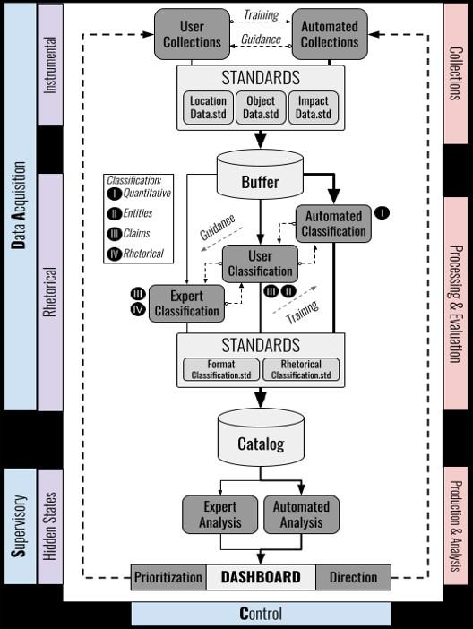

## Page 147

128    Narrative Information Ecosystems 
 
 
Figure 12. A map of desired outputs from a meme-analysis pipeline.

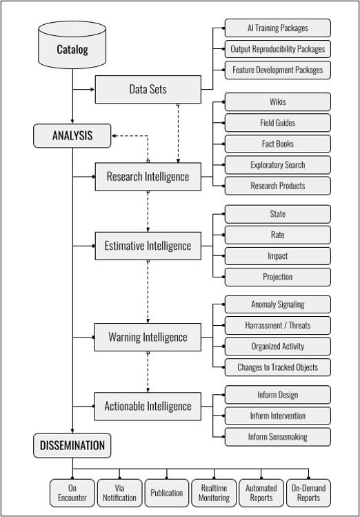

## Page 148

Digital Rhetorical Ecosystem Analysis    129 
 
Discussion 
In this paper, we have reviewed the relevance of rhetorical and 
ecological approaches for analyzing multimedia digital discourse, such 
as shareable image memes. While rhetorical analysis captures the 
nuanced relationships between artifacts and audiences, ecological 
analysis captures the complex relationships among organisms and their 
niche. Others have explored similarities between the fields of ecology 
and rhetoric [37,179]. We have elaborated this connection through 
three key themes from modern ecology: the multilevel systems 
perspective, antifragility, and ecosystem services. These key themes 
integrated into the Digital Rhetorical Ecosystem three-tier (DRE3) 
model, providing a framework for incorporating rhetoric into 
computational pipelines for analyzing digital discourse, with ecological 
toolkits and frameworks as intermediaries.  In addition to the transfer 
of concepts used in ecology into the digital discourse space and specific 
implications for SCADA design, here we conclude by exploring some 
broader implications.  
We go so far as to hypothesize that a disruption or correction of 
narratives forged through memetic circulation needs to adopt the 
memetic form itself, sometimes known as a counter-meme [180]. We 
advocate re-deploying the memetic form to interrupt the credibility of 
a specific meme argument by illustrating why the claim advanced by 
the original meme does not rest soundly on the evidence or the 
warrants (assumptions) signaled explicitly or implicitly within the 
meme. Current efforts to fact-check memes address memes with a 
different genre of rebuttal discourse (e.g., the Facebook fact-check box 
that often links to news articles of official credibility). Digital audiences 
that have become vulnerable to the influence of memetic argument 
have also grown a staunch resistance to this particular form of fact-
checking. Therefore, we argue that any attempt to neutralize 
memetically constructed narratives needs to understand the rhetorical 
power encoded within the memetic form and to use that form 
strategically to restructure public discourse. We urge, however, that 
counter-memetic efforts acknowledge the conditions of cognitive

## Page 149

130    Narrative Information Ecosystems 
 
complexity endemic to digital knowledge environments and avoid the 
pitfalls of easy fact/fiction dichotomy for issues that are murky, 
complex, or ambiguous. Counter-memetic strategy should expose how 
memes mistakenly create narratives of certainty in the face of 
situational ambiguity and complexity. That is, counter memes should 
avoid making new issue-based arguments themselves, and instead 
reveal the argument weaknesses in memes deployed to advance public 
argument. Simply put, memes can be used to demonstrate the 
argument weaknesses of memes. The repeated circulation of rebuttal 
memes to demonstrate the inferiority of memetic argument has 
potential to eventually decelerate reliance on the memetic form in 
public discourse. In addition, asking users to identify claims embedded 
within image memes during the stage of data processing and evaluation 
(Figure 11), could induce a more critical or meta-cognitive engagement 
with the memetic content and its deficits. 
Rhetorical analysis has traditionally focused on single cases. Advances 
in computational technology provide the possibility of scaling up 
rhetorical analysis, for at least certain kinds of artifacts, such as image 
memes. Such high-throughput automated possibilities are evident in AI 
software such as Project Debater [181] and SwarmCheck [182] which 
can make sense of voluminous amounts of argument data using 
argumentation principles. The integration of rhetorical analysis with 
ecosystem tracking into a SCADA can enrich the field of rhetorical 
study by growing data-driven rhetorical theory. In 1969, Chaim 
Perelman and Lucy Olbrechts Tyteca published the influential New 
Rhetoric—a comprehensive compendium of argument strategies that 
relied not on formal logic but on everyday rhetorical practices [183]. 
Their catalog was built upon meticulous collection and analysis of real 
specimens of persuasion. Likewise, with the building of the proposed 
SCADA, we have the possibility of identifying and cataloging argument 
patterns across large amounts of image meme data, in a partially-
automated fashion. The incidental value to argumentation theory of 
tracking the emergence, interaction, proliferation, and demise of image 
memes through discursive ecosystems is significant. We can determine 
whether argument patterns in image memes replicate documented

## Page 150

Digital Rhetorical Ecosystem Analysis    131 
 
argument patterns or assemble new ones. We can assess whether the 
unique genre of the image meme privileges certain argument patterns 
over others. An over-reliance on certain argument patterns (like 
argument by exposing hypocrisy [17]) may signal epistemic trends that 
are being exploited in the digital public sphere because they make 
minimal attention demands. When audiences are conditioned to argue 
in certain ways, their receptivity to other argument patterns that 
demand more central processing may diminish. We may observe at 
scale, with the intelligence that emerges from the SCADA, that one 
significant answer to the epistemic crisis we are currently battling is to 
understand the problem not just through a content framework (e.g., 
the fake news-real news dichotomy) but rather to problematize the 
medium, in this case the rhetorical form of the image meme, as one of 
the primary drivers of the crisis.  
Another way to address the crisis is by examining ethical frameworks 
for managing a resource commons. In ecological philosophy, the “land 
ethic” [184] captures a sense of duty and responsibility towards 
ecosystem interactions. In the eponymous book, Aldo Leopold 
contrasted the land ethic with alternative frameworks that might be 
used to guide decisions around resource use, such as economic 
valuation, pragmatic use, and libertarian or egalitarian ideology. The 
land ethic serves as a conceptual nexus that integrates actors with 
different interests, and bridges world knowledge traditions. The 
application of a land ethic to online spaces might help ground 
otherwise-abstract digital communities and give a framework for 
service through deep time to these spaces. The ecological land ethic 
begins from a scientific foundation, then introduces insights from 
psychology and philosophy to characterize the nature of proper 
human-ecosystem relationships. In the case of a digital commons ethic, 
the system is physically grounded in the software and hardware that are 
the enabling architecture of the online platform. Framing an empirical 
(computational) basis as a starting point for studying online discourse 
could allow a “rhetorical commons” ethic to emerge, as driven and 
structured by psychological and ethical preferences.

## Page 151

132    Narrative Information Ecosystems 
 
Approaches to collective governance of ecological and resource 
commons have also integrated the economic insights of Elinor Ostrom 
and others [185]. As with these ecological commons, digital governance 
and economic systems could be designed with specified functions, 
performance metrics, and a stated collective purpose [186]. This model 
of “digital commons as public good” has already been applied to online 
communities [187,188]. Connecting the notion of “rhetorical 
commons” to the economic game theoretic setting of the “tragedy of 
the commons” helps connect the behavior of users, to outcomes at the 
level of the commons [189]. 
Conclusions and Recommendations 
Can an ecological framework layered on rhetorical analysis help bridge 
the world of meaning and the capacities of computational pipelines? 
The ongoing and changing nature of the epistemic crisis requires new 
technological approaches towards scaling the modeling and 
understanding of our rhetorical commons. Here we expanded on 
previous appeals to rhetorical ecology and observations of the 
fundamental similarities between these fields [37], to posit the 
foundation for a type of system which might be able to infer, model, 
and intervene in multimedia digital discourse. With such a system, it 
could be possible to move beyond syntactic and user-driven 
understandings of digital discourse, to better observe and codify cycles 
and patterns within it, and to make progress towards ecologically-
framed platform policies which can be more clearly informed by social 
preferences and values. 
Recommendations 
• Review best practices in improving information quality of 
crowdsourced subject-matter tagging in physical, digital, 
and rhetorical ecosystem contexts. 
• Review and synthesize research on argument mining 
methodologies using crowdsourced annotations.

## Page 152

Digital Rhetorical Ecosystem Analysis    133 
 
• Research 
the 
implementation 
and 
limitations 
of 
applications and web extensions for providing lenses (e.g., 
enriched augmented views of an object) on content 
displayed on various electronic devices. 
• Curate a list of qualitative and quantitative patterns in the 
rhetorical structure and use of image memes. 
• Consider users a part of an information commons rather 
than simply affected by an information system in future 
work on misinformation dynamics. 
• Ensure that the identity, privacy, and preferences of users 
are protected in rhetorical cataloging schemes.

## Page 153

134    Narrative Information Ecosystems 
 
Funding and Acknowledgements 
Richard J. Cordes is funded by the NSF Convergence Accelerator 
Trust and Authenticity in Communication Systems Program (NSF 21-
572), under award ID #49100421C0036 and is supported in research 
efforts through a Nonresident Fellowship with the Atlantic Council on 
appointment to the GeoTech Center.  
Daniel A. Friedman is funded by the NSF program Postdoctoral 
Research Fellowships in Biology (NSF 20-077), under award ID 
#2010290.

## Page 154

*[Page 154 appears to be blank or image-only]*

## Page 155

*[Page 155 appears to be blank or image-only]*

## Page 156

137 
CHAPTER III 
The Knowledge 
Management 
Archipelago 
 
Daniel A. Friedman & Richard J. Cordes 
 
ABSTRACT 
The theory and practice of knowledge management shares concerns 
and approaches with a number of other areas of research, some of 
which preceded its formalization as a field. In the age of the internet, 
the challenges that the field of knowledge management addresses, such 
as the difficulty of synthesizing, interpreting, and managing large 
streams of information, are no longer confined to professional 
disciplines and are present in everyday life. The commonality and 
timelessness of these concerns presents a potential problem for the 
field of knowledge management that, ironically, the field itself often 
seeks to address: the creation of silos, sometimes referred to as 
“islands”, in the knowledge base. The purpose of this paper is to 
present an exploratory bibliometric analysis of the various areas of 
research which share concerns, approach, and scope in common with 
knowledge management. Search-strings associated with selected areas 
of research were used to query Google Scholar in various combinations 
in search of co-occurrence, results were quantified and visualized. The 
results show variable couplings and differential prevalence of 
keywords, and serve as a starting point for targeted analyses and next 
steps.

## Page 157

138    Narrative Information Ecosystems 
 
Introduction 
Knowledge management has had the distinction of being a formally-
defined field of research for at least three decades [1–3]. However 
today, knowledge management and a number of related fields still 
suffer from a lack of consensus on definitions and scope [2,3]. When 
considering the source of this lack of consensus, there are two features 
in particular that are worth noting. First is the fact that the challenges 
addressed by knowledge management are not novel but simply more 
pronounced due to the advent of digital technology and the internet 
[2]. Second, many challenges that knowledge management is concerned 
with are not specific to any particular class of organization. For 
example, effective allocation of intellectual capital and content [3–9], 
facilitation of research, situational awareness, the creation of 
intelligence products [3,9], and efficient use of human expertise [3,9,10] 
are challenges faced by organizations such as research and education 
institutes, intelligence agencies, industrial and manufacturing 
companies, militaries, law firms [3,9], and even citizens [11,12]. Thus 
many domains are in need of support in overcoming technical and 
cognitive challenges in making sense of the world [2,13]. 
This lack of novelty in concerns and their being so widely shared 
presents a potential problem for the field of knowledge management 
that, ironically, the field itself often seeks to address: the creation of 
silos (sometimes referred to as “islands” [14–18]) in the knowledge 
base due to differences in ontology and the lack of network 
connections between knowledge workers working on common issues 
[3,9,13]. In other words, there is disorder and disarray in the 
management of knowledge related to knowledge management itself—
potentially leading to unrecognized solutions, redundant efforts, and 
incompatible or contradicting research, frameworks, and products. 
With the potential value of solving this problem in mind, an 
exploration of the literature, and even of the myriad definitions of 
knowledge management itself, reveals a number of distinct, formally-
defined fields that are also addressing this common set of challenges,

## Page 158

The Knowledge Management Archipelago    139 
 
often with the same or similar approaches—chief among them are 
information management and library science. 
Knowledge 
management, 
library 
science, 
and 
information 
management are difficult to separate, even at high levels of expertise, 
due to underlying confusion “around the concepts of knowledge and 
information” [19,20]. Even when clarifications are made however, 
those clarifications are accompanied by a lack of consensus regarding 
knowledge management being its own field rather than being either a 
modern update to information management [3,21,22] or an extension 
of library science and information management [1,3,19,23]. Further, 
the deep interconnectedness between information management, library 
science, and knowledge management theory and practice often causes 
attempts to define the differences between these disciplines to result in 
them being only more difficult to tell apart [24–29]. 
The practices most commonly associated with library science, 
information management, and knowledge management at least afford 
a common audience and base of stakeholders [3], but other fields with 
common concerns and research interest might not. For example, 
command and control or C2 systems, supervisory control and data 
acquisition or SCADA systems, intellectual capital management, and 
data, information, and sensor fusion are all areas which share 
challenges, requirements, and approaches in common with knowledge 
management. Worse still, many of these areas of research, including 
knowledge management and information management, are of interest, 
as stated earlier, to governments, militaries, intelligence agencies, and 
commercial organizations and therefore it stands to reason that an 
unknown fraction of research products are classified or otherwise 
uncirculated due to concerns regarding trade secrets and national 
security [3,9]. This problem isn’t specific to government and industry 
research products—even within the domain of peer-reviewed 
academic research, publications are often only legally accessible to 
those with institutional affiliations. Today, even in cases where a team 
has the resources to make a deep search into all publicly available 
research regarding these disciplines, there may still be difficulty in

## Page 159

140    Narrative Information Ecosystems 
 
performing comprehensive searches because of the aforementioned 
divergent ontologies. Thus a variety of challenges beset the area of 
knowledge management, with serious implications for workers and 
projects of many different kinds. 
We hypothesized that an exploratory bibliometric analysis of targeted 
domains would characterize the structure of connection or 
fragmentation of different bodies of literature published by various 
sectors related to knowledge management. Our assessment of the 
literature connectivity was among the targeted areas defined 
individually in the following paragraphs. 
Command and Control Systems. A command and control 
system can be defined as the set of “procedures and 
techniques” which “synchronize battles and engagements and 
which contribute toward the decisive application of combat 
power” [30] and facilitate “planning, directing, coordinating, 
and controlling” operations [31]. In practice, a command and 
control (C2), command, control, and communications (C3), 
or command, control, communications, and computer (C4) 
system generally takes the form of a distributed digital system 
that synthesizes and facilitates the generation of intelligence 
products and situation assessments, supports decision 
making, and provides situational awareness and opportunities 
to monitor, coordinate, and control operations in real-time 
[32,33].  
SCADA Systems. Supervisory control and data acquisition 
(SCADA) systems provide features such as credential and 
role management, generation of and access to assessments, 
reports, and other intelligence products, real-time monitoring 
and surveillance, and control over physical systems. [34,35]. 
The development of SCADA systems began with the need 
for “increased knowledge of real-time status” or situational 
awareness of industrial infrastructure [35], and while this area 
of research is traditionally focused on monitoring and control

## Page 160

The Knowledge Management Archipelago    141 
 
of critical infrastructure, interests and concerns within this 
domain have a notable crossover with those within command 
and control systems and knowledge management research 
[36–39]. 
Knowledge Management. While hundreds of definitions 
for knowledge management have been generated as a result 
of sustained academic interest and use in a variety of fields, a 
potentially comprehensive, albeit general, definition is as 
follows: “Knowledge Management is the process of creating, 
sharing, using and managing the knowledge and information 
of an organization” [3]. Knowledge management, depending 
on its implementation, may also have within its scope areas 
such as intellectual capital attribution and governance 
(intellectual capital management), human and cultural 
dynamics, situational awareness facilitation, and learning 
management [3,9,20,39,40]. 
Data, Information, and Sensor Fusion Systems. Data 
Fusion is the domain, as the name suggests, of combining 
disparate types of data, be they from sensors or databases. 
Similar in some ways to the relationship between knowledge 
management, 
library 
science, 
and 
information 
management—data fusion, information fusion, and sensor or 
multi-sensor fusion systems are difficult to separate, have 
many definitions, and are often used interchangeably or fused 
together (e.g., “multisensor data fusion”) [41,42]. Most 
definitions, however disparate, tend to have consensus that 
these terms refer to systems or aspects of systems which 
combine, consolidate, and otherwise synthesize information 
from various sources in order to provide situational 
awareness and create new value or deliverables, regardless of 
the fusion prefix used (e.g., data, information, sensor) [41]. In 
some cases, these definitions place emphasis on knowledge, 
information, intellectual capital, and document management 
as a part of such a process or system [41].

## Page 161

142    Narrative Information Ecosystems 
 
Information Management. Information management, 
separate from its blurred boundaries with library science and 
knowledge management, also has both internal and other 
external confusions regarding definition, scope, and ontology 
[23]. For example, information management is sometimes 
difficult 
to 
separate 
from 
information 
engineering, 
information systems management, management information 
systems, executive information systems, decision support 
systems, 
information 
resources 
management, 
and 
information science [23]. A general definition of information 
management might see it as concerned with the creating, 
sharing, using, retrieving, searching for, curating, recognizing, 
and managing content, data, and information within an 
organizational context [23,43,44]. However, definitions of the 
scope of information management generally also include 
concerns for elements such as knowledge management, 
supporting 
decision 
making, 
maintaining 
situational 
awareness, commoditizing information as intellectual capital, 
increasing knowledge creation, and synthesizing information 
from numerous sources [23,43,44]. 
Intellectual Capital Management. Intellectual capital 
management is an area of research that frames knowledge 
products, intelligence products, and formal intellectual 
property as intangible assets which can be invested, 
synthesized, and allocated in order to fuel the generation of 
new intangible or tangible assets [8,45]. Intellectual capital 
management is sometimes seen as either an aspect of 
knowledge management or as its own field which shares 
overlap with knowledge management [8]. Further, intellectual 
capital management often includes consideration for human 
and cultural dynamics such as the intellectual capital which 
has not yet been extracted from the minds of employees or 
has not yet been generated due to knowledge gaps—
intellectual capital management thus shares a common set of 
concerns with research interests associated with human

## Page 162

The Knowledge Management Archipelago    143 
 
resources, serious games, communities of practice, and 
learning management systems [46].  
Library Science. Library science is perhaps the earliest field 
to mature among the disciplines discussed here [47,48], and 
much like information management, separate from its 
relationship with knowledge management it has had both 
internal and external confusions regarding scope and 
ontology [29,47]. As of the 1970s, library science was roughly 
defined as the theory and practice of information selection, 
acquisition, organization, storage, and curation for “all-types 
of information-handling organizations” [47]. Due to the 
development of numerous other fields which have similar 
concerns, and the changing function of the library building in 
modern society, library science may be becoming an “island” 
in the knowledge base, evidenced by its lower degree of 
interdisciplinarity with other fields when compared with 
adjacent domains [29]. 
 
Table 1. Areas of research included in the bibliometric analysis, along with exact 
search-strings utilized.

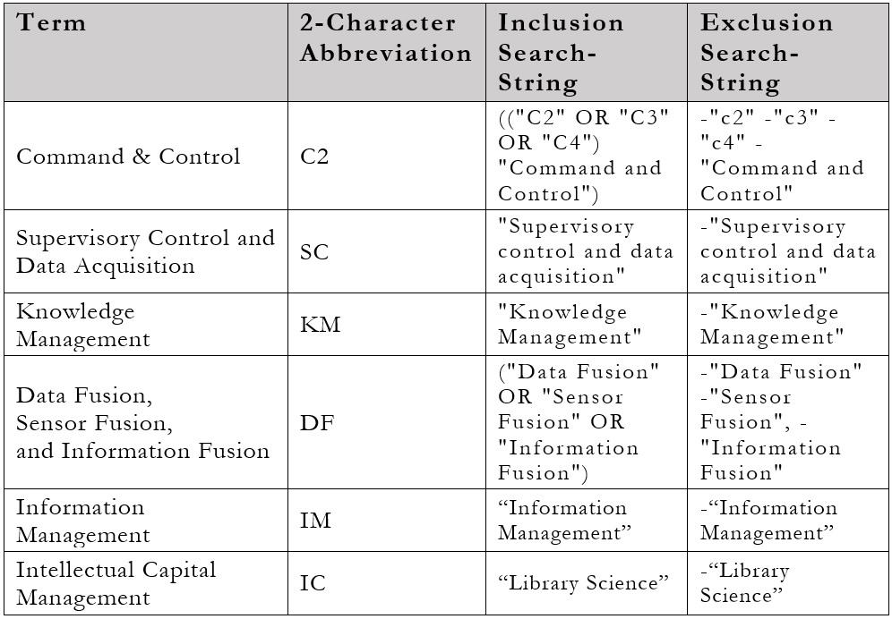

## Page 163

144    Narrative Information Ecosystems 
 
Methods 
This study was conducted in three parts: (i) collection preparation, (ii) 
data collection, and (iii) data analysis and visualization. 
Collection Preparation 
A list of domains with similar focus on and approaches to the 
production, management, allocation, routing, and synthesis of meaning 
and information was generated by considering co-occurrence of 
references to other domains within disparate definitions of knowledge 
and information management in relevant literature reviews, meta-
analyses, and encyclopedias (see Table 1) [3,10,19,24–27,49,50]. Given 
that these areas are frequently discussed across both professional and 
academic disciplines [3], there was an expectation that much of the 
material would be contained in conference, working, and white papers, 
Google Scholar was chosen over Web of Science for this analysis as it 
has “far more comprehensive coverage” of these kinds of documents 
[51]. Due to Google Scholar’s limitations on search-string size [52], this 
initial list and associated search commands had to be prioritized and 
pruned. The removed domains and the basis for their removal are 
described in the paragraphs below. 
Records Management 
Records management was a very good candidate for inclusion 
given both its subject matter focus [27] and an initial 
exploratory search indicating that over 62% of the records 
management literature was found to have keyword co-
occurrence with other chosen domains (see Supplemental 
Files A-1). However, it was removed on the basis that the 
aspects of records management that would place it as a 
domain of interest are often acknowledged to be part of the 
information management discipline [53–56].

## Page 164

The Knowledge Management Archipelago    145 
 
Situation Awareness System 
While the “situation awareness system” market was valued at 
over 18 billion USD as of 2019, it is primarily a market-
research term that describes SCADA, intelligence fusion 
systems, command and control systems [57]. It was not 
included on the basis that exploratory searches indicated that 
it was of limited use in academic literature and that where it 
was used, it shared a reasonable overlap with larger and more 
impactful domains (see Supplemental Files A-1). 
ISR Systems 
ISR (Intelligence, Surveillance, and Reconnaissance) systems 
also fall under this umbrella of common systems and was 
considered for inclusion, however, it was removed on the 
basis that less than 25% of the retrieved ISR literature was 
separated from the context of command and control systems 
and features of the command and control ecosystem [58,59] 
and that the total results associated with ISR systems only 
constituted 165 documents (see Supplemental Files A-1). 
Intelligence Fusion Systems 
Intelligence fusion systems were removed on the basis that 
only 77 documents were retrieved via an initial exploratory 
search and thus not impactful enough to be included despite 
a high rate of co-occurrence with other domains (see 
Supplemental Files A-1). 
Bibliometrics, Scientometrics, and Informetrics 
We did not include bibliometrics, scientometrics, or 
informetrics as a part of the study on the basis that they are 
more specifically concerned with metrics about the use of 
intellectual capital and knowledge products, rather than the 
facilitation of their use [60].

## Page 165

146    Narrative Information Ecosystems 
 
Creation of Search-Strings 
Individual searches of every combination of domain-associated 
“Include” and “Exclude” search-strings (see Table 1) were found to be 
necessary due to limitations of Google Scholar search features and the 
potential for false positives and unintended overlap [52]. The inclusion 
or exclusion of each search-string set constitutes 27 - 1 permutations, 
as there was no reason to include an “all-excluded” query. A Python 
script was developed (see Supplemental Files A-2) to produce the set 
of search-strings (see Supplemental Files A-3). 
Data Collection 
Searches were implemented in Google Scholar using manual search 
based upon generated search-strings (see Supplemental Files A-3). 
After each search, the number of total Google Scholar results for the 
search-string was noted. 
Data Analysis and Visualization 
Data analysis was performed using Google Sheets and Python and 
visualizations were done using Google Sheets and Gephi. 
Visualization 
Given past successes in the use of graph visualizations for 
communicating cross-domain collaboration and other relationships in 
past bibliometric analyses [61–63], the graph visualization and analysis 
tool Gephi was chosen as a basis for rendering and analyzing the 
relationships between Google Scholar search results. A Python script 
was developed (see Supplemental Files A-2) to take the results of the 
data collection and convert it into “node” and “edge” files compatible 
with Gephi (see Supplemental Files A 4-5). In the interest of making 
the network renderings presentable, the domains were each given 2-
letter abbreviations (see Table 1). These node and edge files were used 
to generate additional versions of node and edge file pairings and 
imported into Gephi to render network visualizations (see 
Supplemental Files 7-9 and Supplementary Figures 1-3).

## Page 166

The Knowledge Management Archipelago    147 
 
Numerical Analysis 
Google Sheets was used to perform a regression analysis of the number 
of results, comparing linear, exponential, and logarithmic regressions 
with number of domains included as the independent variable (X-axis, 
from 1 to 6) and number of results as the dependent variable (Y-axis). 
Conditional formatting was used to generate a heatmap of one- and 
two-term search results (see Figure 2). 
Results 
A total of 127 searches were performed on Google Scholar on June 
10th, 2021 (see Supplemental Files A-6), covering all include and 
exclude combinations of the 7 domains and their search-strings 
described in Table 1. These domains are abbreviated to their respective 
2-character abbreviations assigned in Table 1 within this section. 
There were 57 queries, all with 2 or more include search-strings, that 
had zero results. Of the 69 queries with one or more result, 46 queries 
returned ten or more results. The search with the largest number of 
results was for IM alone (962,000). 
In descending order of total citations, the domains were: IM, KM, LS, 
SC, C2, DF, and IC. In order of highest proportion of co-occurrence 
with other keywords (reflecting degree of integration across fields) to 
least, the domains were: IC (76%), DF (71%), KM (32%), C2 (30%), 
IM (28%), LS (29%), and SC (15%) (see Figures 3-9). Thus at least in 
this keyword-based search among areas, there is an indication that DF 
and IC have the fewest number of overall citations, but demonstrate 
the highest rate of co-occurrence with other keywords. In contrast, the 
relatively large body of literature related to IM and KM demonstrates 
an intermediate degree of co-occurrence with other domains, while the 
mid-sized body of literature related to SC demonstrates the lowest level 
of overall co-occurrence. 
Among searches which included 3 domains, the highest-volume 
domain crossovers were KM-IM-LS (11,800 results), KM-DF-IM

## Page 167

148    Narrative Information Ecosystems 
 
(1,820 results), KM-IM-ICM (1,560 results), C2-DF-IM (887 results), 
and C2-KM-IM (819 results). Among searches which included 4 
domains, the highest-volume domain crossovers were C2-KM-DF-IM 
(273 results), KM-DF-IM-LS (89 results), KM-IM-IC-LS (78 results), 
and SC-KM-DF-IM (48 results). Among searches which included 5 
domains, only 4 searches produced results: C2-SC-KM-DF-IM (6 
results), SC-KM-DF-IM-LS (1 result), C2-KM-IM-IC-LS (1 result), 
and C2-KM-DF-IM-LS (1 result). No searches which included 6 or all 
7 domains returned any results. 
Figure 1 shows the distribution of the number of search hits (Y-axis) 
as a function of the number of included domains (X-axis). As expected, 
there was a monotonically decreasing number of returned searches as 
a function of the number of search-strings used. The drop-off in search 
results was more consistent with an exponential regression with 
negative exponent (R2=0.324) than a logarithmic regression 
(R2=0.177) or a linear regression (R2=0.096). Notably, the KM-IM co-
occurrence edge is above the trend line of the overall regression (Figure 
1), suggesting that these two keywords are deployed in main texts and 
bibliographies at a rate higher than expected. Anecdotally, the areas of 
KMS and IM are largely overlapping in scope, including many works 
explicitly linking, contrasting, or juxtaposing the two approaches (e.g., 
[64]). 
Figure 2a shows a heatmap of the number of results for each domain 
searched alone excluding all other domains using their respective 
exclude search-strings (on the diagonal), and their co-usage (in the 
bottom triangle of the matrix) for each pair of domains, where darker 
cells reflect a larger number of total results per query. Figure 2b shows 
the proportion of citations from each target domain (row) that 
additionally reference another domain (column), where darker cells 
reflect a higher proportion of keyword co-occurrence. There was a 
significant degree of variation among terms in total number of solitary 
and co-occurrence, as well as the proportion of directed co-occurrence 
between the keywords of pairs of domains. The only domain pairing 
that was absent entirely was IC-SC, suggesting that these two are the

## Page 168

The Knowledge Management Archipelago    149 
 
most diverged or isolated from each other in terms of approaches, 
concerns, and ontology. In contrast, the large fields of IM and KM had 
a relatively high proportion of co-occurrence with other keywords, 
while among the smaller fields, DF-C2 displayed a higher proportion 
of co-occurrence than other pairings. In terms of directional co-
occurrence, IC-KM had a higher rate of co-occurrence than any other 
field pairing, with nearly 60 percent of results associated with IC also 
being associated with KM. 
 
Figure 1. Relationship between number of domains included in search and number 
of Google Scholar results. 
Figures 3-9 show targeted analyses centering each domain, with 
summary statistics and visual representations of the patterns of co-
occurrence of keywords with other domains. Within Figures 3-9, 
subpanel A represents the proportion of co-occurrence and no co-
occurrence with other domains within results associated with the 
subject domain broadly. Subpanel B represents the proportions of total 
results which had co-occurrence with specific other domains (so 
numbers will not sum to 100%). Subpanel C shows a weighted directed 
graph of the neighborhood around each keyword, in terms of the

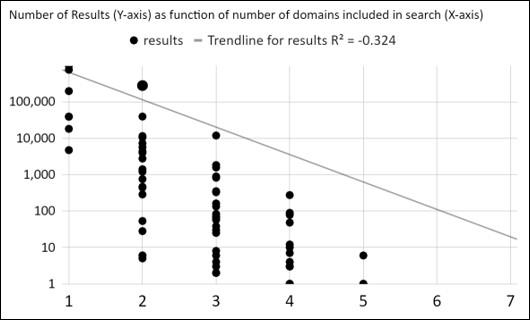

## Page 169

150    Narrative Information Ecosystems 
 
relative proportion of co-occurrences to and from each of the included 
keywords. 
Broadly speaking, IM, KM, and LS were the most common domains 
overall, and appeared deeply intertwined. DF seems to be a bridge 
between these keywords (Figure 10), potentially because the practices 
and theories associated with it both support and draw support from a 
common class of systems of which LS, IM, and KM systems are a part. 
Visualization of the nominal (absolute) and relative percentage of co-
occurrence among keywords (Figures 2-10 and Supplemental Figures 
1-3) supported the trends broadly outlined above. 
 
Figure 2. Heatmaps of (a) the total results associated with pairings of domains and 
(b) the percentage of total literature results associated with one domain (y axis) which 
had co-occurrence with another (x axis).

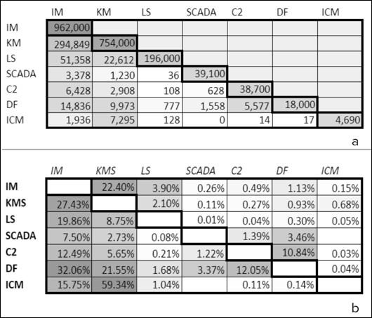

## Page 170

The Knowledge Management Archipelago    151 
 
The bulk patterns discussed above and represented in the heatmaps in 
Figure 2 motivated a deeper analysis into whether the different domain 
keywords had distinct patterns of solitary and joint usage, potentially 
revealing patterns of disciplinary connectedness or isolation. A total of 
three Gephi files were generated from these initial files. The first, titled 
“Nominal Co-Occurrence”, was an undirected graph of 7 nodes and 
27 weighted edges, where nodes represented the target domains, and 
edge weights represented the number of retrieved documents which 
included both terms (see Supplemental Figure 1). The second, titled 
“Percentage Co-Occurrence”, was a directed graph of 7 nodes and 40 
weighted edges, where nodes represented the chosen domains, and 
edge weights represented the percentage of total documents associated 
with one domain that referenced another (see Supplemental Figure 2). 
The third, titled “Search-Strings as Nodes”, was a directed multigraph 
of 65 nodes and 180 weighted edges, where nodes represented either 
chosen domains or the search-strings that were used to conduct 
searches (see Supplemental Files A-3), and edge weights represented 
the number of documents associated with a domain and a search-string 
(see Figure 10 and Supplemental Figure 3). The search-strings for (i) 
KM-IM, (ii) IM-LS, and (iii) KM-IM-LS were removed from the 
“Search-Strings as Nodes” multigraph in the interest of visualization 
(see Figure 10). A histogram of this directed graph showed a range of 
edge weights representing the proportion of directed co-occurrence 
between pairs of domains, from almost 60% (IC->KM), to zero (see 
Figure 11).

## Page 171

152    Narrative Information Ecosystems 
 
Figure 3. C2 (Command and Control)

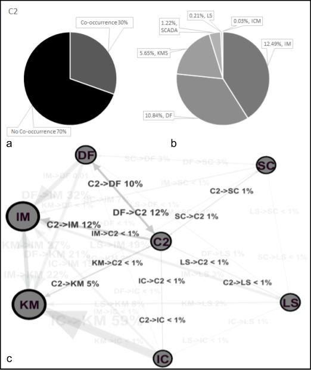

## Page 172

The Knowledge Management Archipelago    153 
 
 
Figure 4. SC (SCADA)

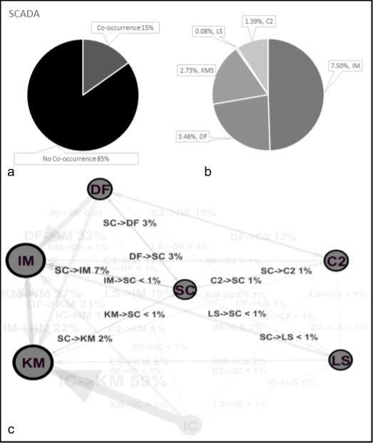

## Page 173

154    Narrative Information Ecosystems 
 
 
Figure 5. KM (Knowledge Management)

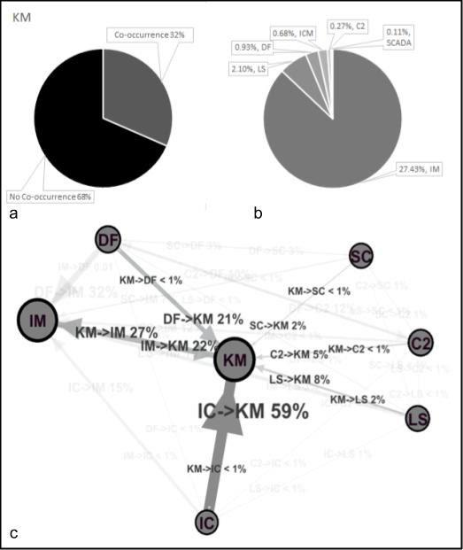

## Page 174

The Knowledge Management Archipelago    155 
 
 
Figure 6. DF (Data, Information, and Sensor Fusion)

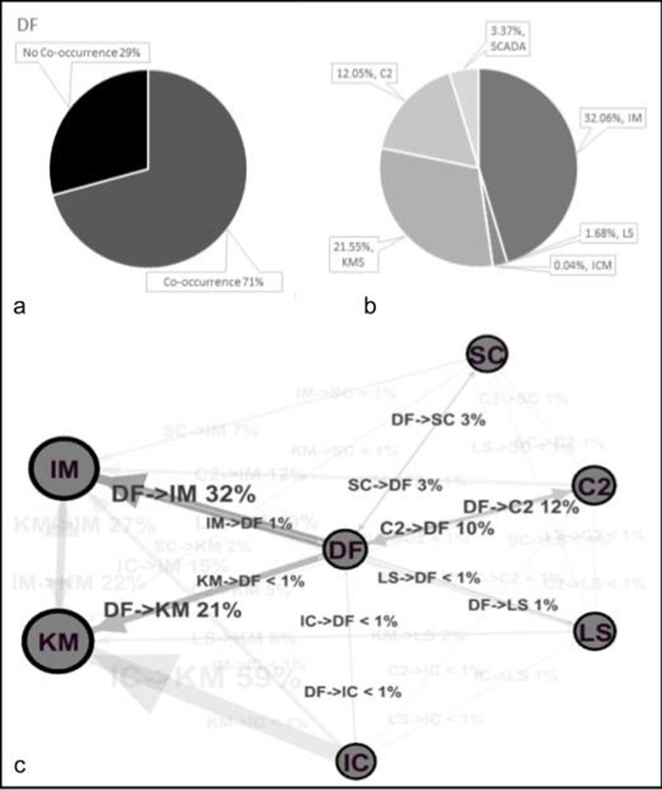

## Page 175

156    Narrative Information Ecosystems 
 
 
Figure 7. IM (Information Management)

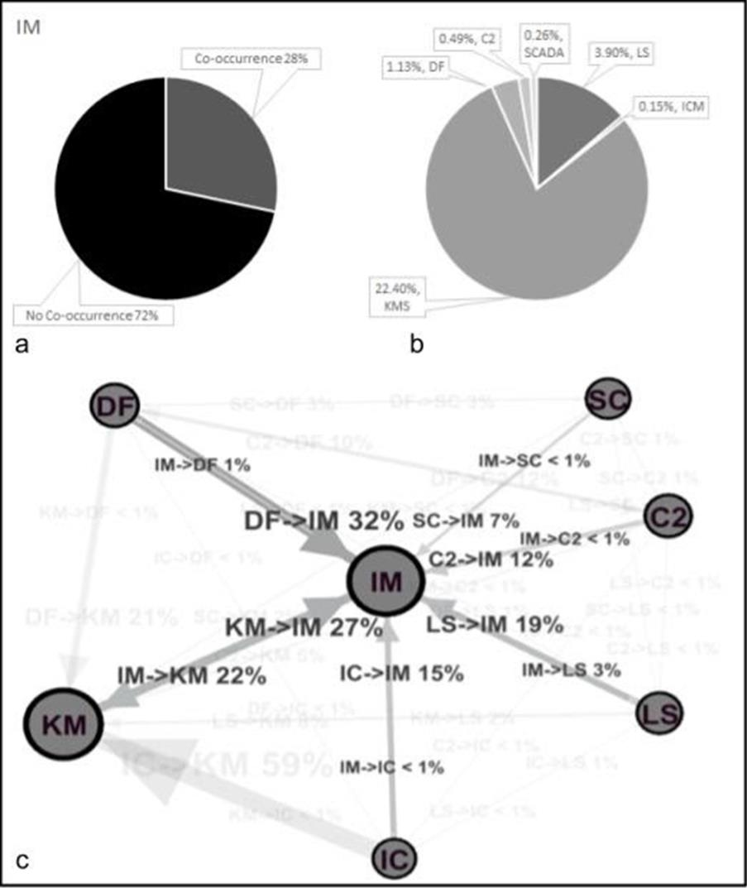

## Page 176

The Knowledge Management Archipelago    157 
 
 
Figure 8. IC (Intellectual Capital Management)

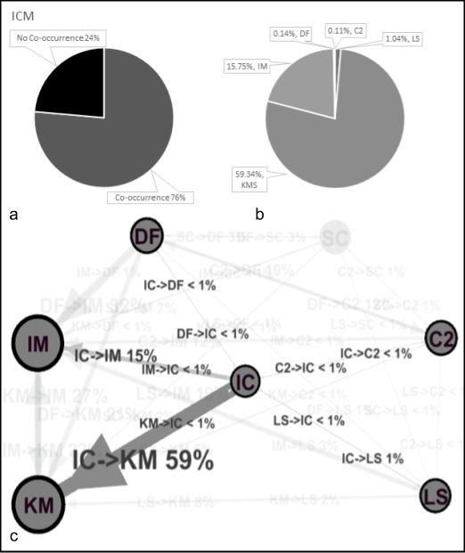

## Page 177

158    Narrative Information Ecosystems 
 
 
Figure 9. LS (Library Science)

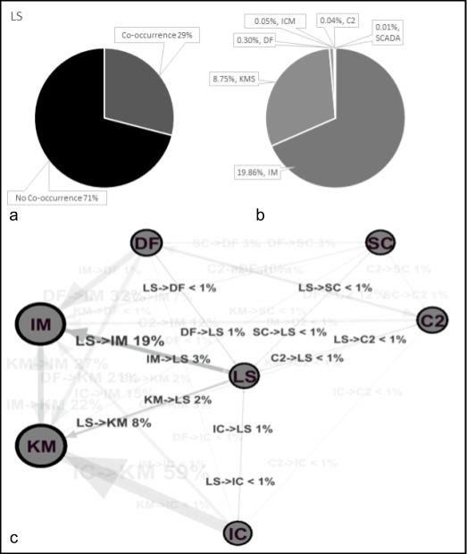

## Page 178

The Knowledge Management Archipelago    159 
 
 
Figure 10. Gephi rendering of the “Search-Strings as Nodes” graph (see 
Supplemental Figure 3) before and after removing KM-IM, IM-LS, and KM-IM-
LS search-string nodes for visualization purposes.

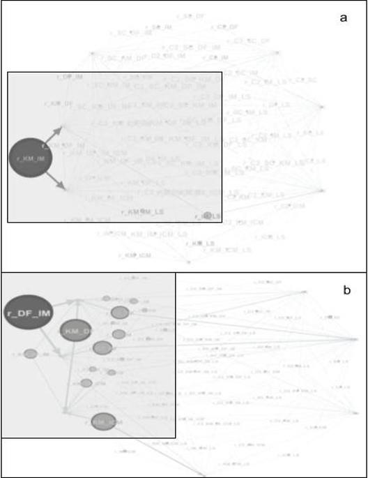

## Page 179

160    Narrative Information Ecosystems 
 
 
Figure 11. Percentage of results associated with one domain which had a co-
occurrence of keywords with another domain.

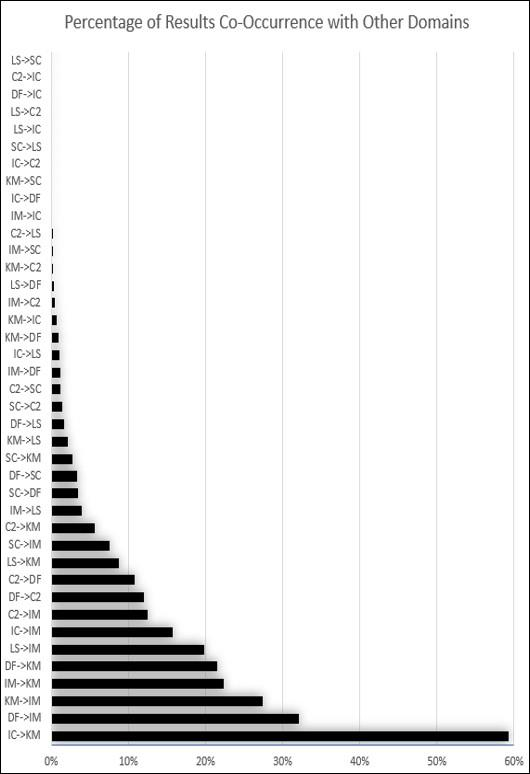

## Page 180

The Knowledge Management Archipelago    161 
 
Discussion 
Here we performed keyword-driven searches on the Google Scholar 
database to assess the fragmentation and connection within the 
literature related to knowledge management (Table 1). We traced out 
broad trends in keyword occurrence, and co-occurrence, and used 
graph visualization to investigate the relationships among domains. 
As a result of this exploratory analysis, an interesting pattern was 
found. Namely, that many papers directly motivated the transition 
between the use of one included area and another (see Table 1), or 
between included areas and other areas not initially considered or 
known. For example, from business intelligence to information 
management [65], information technology to information management 
[66], information management to knowledge management [21,67], 
knowledge management to “interaction management” [68], knowledge 
management to “knowledge services'' [69], knowledge management to 
“learning management” [70,71], “information resources management” 
to knowledge management [67], and knowledge management to 
records management [72]. 
Other relevant areas were discovered during searches that were not 
included or considered for inclusion in the target keywords in Table 1. 
Several significant areas are described in the paragraphs below. 
Decision Support Systems 
“Decision support systems” were found to be discussed 
alongside or as a feature of, adjacent to, or a complement to 
knowledge management and C2 systems [33,73,74]. Decision 
support systems are generally defined as a system which 
increases the quality of decision making and related processes 
primarily by aiding in the curation, synthesis, creation, and 
sharing of information with consideration for user and 
organizational dynamics [75]. Decision support systems had 
not been initially considered as a candidate for inclusion but 
should be in similar research in the future. The volume of

## Page 181

162    Narrative Information Ecosystems 
 
decision support systems literature was comparable to that of 
knowledge management, information management, or library 
science and only ~6% of decision support systems results had 
co-occurrence of keywords with areas included in this study 
(see Supplemental Files A-1). 
Learning Management Systems 
“Learning management systems” were found to be discussed 
alongside or as a feature of, adjacent to, or a complement to 
knowledge management [71,76,77], SCADA systems [78,79], 
and intellectual capital management [70,77,80]. Learning 
management systems are generally expected to assist in 
learning, knowledge gap handling, and management of 
learner data and include features such as personalized search 
and curriculum, rapid assessment of the state of the 
knowledge and progress of users, intellectual capital 
management features such as attribution and plagiarism 
detection within resources and generated content, curation 
and recommendation of resources and relevant problem 
scenarios, and reference management [81]. An exploratory 
search showed that 13% of the returned learning 
management results had a co-occurrence of keywords with 
this study’s selected domains (see Supplemental Files A-1), 
and many of the top resources (sorted by relevance) returned 
on this search were concerned specifically with the similarity 
and opportunity for synergy between learning management 
and these other domains [40,70,76].  
Business Intelligence Systems 
“Business intelligence systems” were found to be discussed 
alongside or as a feature of, adjacent to, or a complement to 
SCADA [82,83], knowledge management and information 
management [84–88], and decision support systems [88]. 
Business intelligence systems are defined as systems which 
help reduce the impact of cognitive overload and increase the 
quality of business decisions by providing situational

## Page 182

The Knowledge Management Archipelago    163 
 
awareness and curation, access, and synthesis of relevant 
intelligence products [89,90]. An exploratory search showed 
that the volume of business intelligence literature is 
comparable 
with 
that 
of 
knowledge 
management, 
information management, and literature management and an 
exploratory search showed only ~6% of business intelligence 
results having a co-occurrence of keywords with this study’s 
selected domains (see Supplemental Files A-1). 
Information resources management 
“Information resources management” was found to be 
discussed alongside or as a feature of, adjacent to, or a 
complement 
to 
knowledge 
management 
[67,91,92], 
information 
management 
[67], 
intellectual 
capital 
management [93], and SCADA systems [94], as well as other 
areas that are related but not included in this study, such as 
records management [95] and document management [92]. 
Information resource management was originally coined as a 
term by a US Presidential commission and intended to be an 
area concerned with the design, creation, collection, analysis, 
use, sharing and curation, storage, and retrieval of 
information, records, and knowledge. An exploratory search 
showed ~60% of information resources management results 
having a co-occurrence of keywords with this study’s selected 
domains (see Supplemental Files A-1). 
Document management 
“Document management” was found to be discussed 
alongside or as a feature of, adjacent to, or a complement to 
knowledge management [24], information management [24], 
learning management [96,97], information fusion [98,99], 
intellectual capital management [100], library science [101], 
and SCADA systems [102–105]. Document management is 
generally concerned with the collection, use, sharing, 
retention and storage, security and governance, retrieval, and 
identification of attributes associated with documents and

## Page 183

164    Narrative Information Ecosystems 
 
records [106,107]. An exploratory search showed ~18% of 
document management results having a co-occurrence with 
keywords within this study’s selected domains (see 
Supplemental Files A-1). Surprisingly, despite having a nearly 
identical definition and scope to the area of records 
management, only ~8% of the results associated with 
document management had keyword co-occurrence with 
records management (see Supplemental Files A-1). 
Limitations 
There were several limitations to this study. As stated in the 
Introduction, an unknown amount of relevant literature may be 
unavailable due to it being classified by a government, or regarded as 
proprietary information by industry. Other limitations were related to 
the use of Google Scholar for performing searches. First, Google 
Scholar may provide results based on false positives and false negatives 
in keyword recognition, sometimes due to problems associated with 
the digitization or indexing of the document (e.g., spaces within a 
keyword or keywords being separated by line or page) [108]. Second, 
the keyword proportion in any database at any single time may not be 
reflective of the relative accessibility of this information to any specific 
researcher from the past or now [51,52,108]. Third, Google Scholar 
does not provide affordances to separate a positive recognition of the 
keyword in a text from a positive recognition of the keyword in the 
titles within cited works in a text—the ability to do so would have 
allowed for a more nuanced picture of the fragmentation and 
connection between various domains. Fourth, Google Scholar search 
results can vary, sometimes significantly, based on a variety of both 
known and unknown factors [108]. Fifth, temporality of results was not 
considered given that affordances for considering time of publication 
in conducting searches were restrictive for a manual search, that it is 
“not an infrequent occurrence” for Google Scholar to index dates 
incorrectly [109], and that Google Scholar provides no affordance for 
downloading the results of a search. Therefore, our estimates of usage 
and co-occurrence may not capture recent or contemporary trends in 
each area.

## Page 184

The Knowledge Management Archipelago    165 
 
Conclusion 
There appears to be an archipelago of partially-connected “islands” in 
the knowledge management space. The state of the literature indicated 
by the exploratory analysis conducted suggests a need for synthesis 
across these domains and areas of expertise so that each domain can 
benefit from research in others and reduce the likelihood of redundant 
work. However, the path towards this synthesis is unclear. In the face 
of this uncertainty, we conclude not with a single answer, but a set of 
potential avenues of synthesis and driving questions. Several 
approaches for this synthesis present themselves, some of which we 
present below as the beginning steps. 
Recommendations 
Restoring prominence of an existing keyword 
Rehabilitation of an appropriate extant keyword could be 
attempted. 
knowledge 
management 
or 
information 
management for example could be restored as a central 
keyword around which all others could be reorganized. A 
conference or working group could be assembled to facilitate 
synthesis of the existing literature and wider adoption of the 
new framing. A compendium detailing the use and scope of 
these many terms could be written to serve as a common 
resource.  
Creation of a new keyword 
A new keyword or search-string could be generated to tag 
works related to information storage, search, and 
presentation. This keyword could be used within documents, 
or applied as an annotation to existing documents, reflecting 
the relevance of the document for knowledge management. 
A new synthetic keyword or string might be proposed as a tag 
for any kind of work broadly in the domains of Table 1, such 
as a novel emoji or hashtag such as #9jt05kw690j 
(“information” with each key shifted up and to the right one

## Page 185

166    Narrative Information Ecosystems 
 
position on a QWERTY keyboard). Alternatively, a new term 
could be generated that describes or scopes the common set 
of challenges, approaches, and concerns of these various 
fields without necessarily intending to replace any of the 
extant ontologies. However, any of these approaches would 
have to be done with consideration for achieving wide 
adoption in order for them to be useful rather than further 
contribute to divergence among fields. 
Encourage interdisciplinary communities of practice 
A longer-term approach may be to socially connect various 
domains of expertise with broader communities of practice 
and encourage interdisciplinary collaboration. This would 
connect networks and projects across silos and allow for 
synthesis and integration of terms and resources in a 
sustainable and organic manner. 
New tools 
Computable documents, computable ontologies, and low-
cost distributed knowledge management tools could enable 
next generation indexing, annotation, and semantic tagging of 
digital artefacts that would allow users to search not just for 
syntax but for meaning and use of syntax, and could do so 
across languages [110–113]. This kind of search would reduce 
the impact of diverging ontologies and increase situational 
awareness of the literature. Further, tools of this kind would 
help index non-academic resources and have value in 
handling challenges outside of the academic space, such as 
cognitive security in civil society, education, and journalism 
[12,114]. 
Awareness 
Increased recognition of the similarity of challenges, 
approaches, and concerns across fields on its own could set 
the stage for synthesis and integration across fields. At this

## Page 186

The Knowledge Management Archipelago    167 
 
time, no results are provided for any search including all of 
the included domains within this study, let alone all of the 
other similar domains found during exploratory searches. 
 
Driving Questions for Ongoing Research 
 
• How can we search, read, and cite across fields to make 
better knowledge management decisions? 
• How can connecting communities, skill sets, and 
understandings across fields lead to better performing 
systems?  
• How can uncirculated or currently unindexed literature 
resources from industry and government be safely and 
respectfully indexed, queried, and quantified?  
• How can we synthesize the requirements of systems 
associated with the many domains concerned with creating, 
sharing, 
integrating, 
storing, 
attributing, 
accessing, 
searching, and curating digital information?  
• How can systems with heterogeneous datasets and domain-
specific information be provided for users from different 
backgrounds and areas of expertise, without cognitive 
overload?

## Page 187

168    Narrative Information Ecosystems 
 
 
 
Chapter III 
Supplemental Files 
 
All files available at https://github.com/Cordes-RJ/KMA

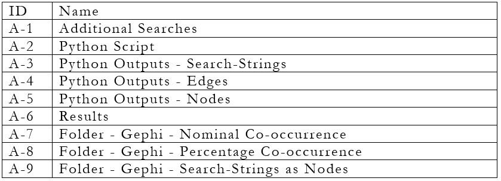

## Page 188

The Knowledge Management Archipelago    169 
 
 
 
Chapter III 
Supplemental Figures 
 
 
Supplemental Figure 1. Gephi Rendering: Nominal Co-Occurrence

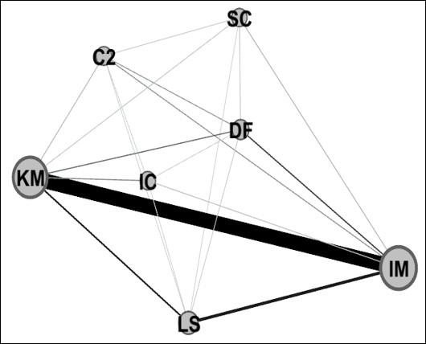

## Page 189

170    Narrative Information Ecosystems 
 
 
Supplemental Figure 2. Gephi Rendering: Percentage Co-Occurrence

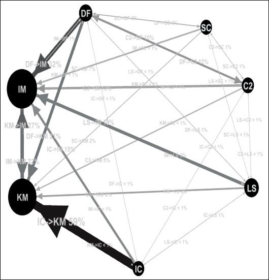

## Page 190

The Knowledge Management Archipelago    171 
 
 
Supplemental Figure 3. Gephi Rendering: Search-Strings as Nodes (KMS-IM-LS 
connections removed for visualization)

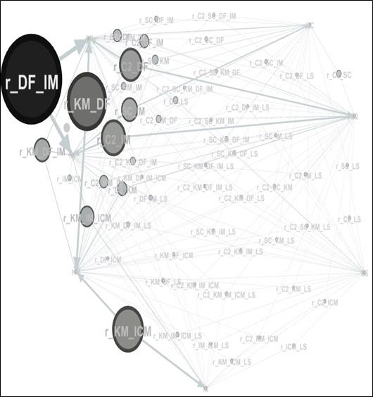

## Page 191

*[Page 191 appears to be blank or image-only]*

## Page 192

173 
CHAPTER IV 
Active Inference 
in Modeling Conflict 
Scott David, Richard J. Cordes, 
& Daniel A. Friedman 
 
ABSTRACT 
In this paper, we integrate conflict studies with Active Inference, a 
developing framework which provides an integrative and systems-level 
perspective on cognition and behavior. This formalization, the Active 
Inference Conflict (AIC) model, situates conflict in terms of a 
multiscale process of communication, trust, and relationship 
management enacted by interacting entities. The AIC model helps 
capture and extend the insights of previous models applied to aspects 
of conflict and war, such as OODA loops (observe-orient-decide-act), 
the generations of warfare model, and the Rumsfeld Matrix. The AIC 
model aids in the analysis of pertinent aspects of modern conflict, such 
as cyber, psychological, biological, informational, financial, and 
ideological conflict, that are not amenable to coherent or consistent 
analysis using traditional models of human conflict. AIC is 
demonstrated to be of use in both monitoring and studying conflict, as 
well as in designing systems intended to facilitate controlled or 
managed conflict in scenarios characterized by business, operations, 
legal, technical, and social (BOLTS) components. Insights and 
implications from qualitative use are used as a foundation for offering 
recommendations for future research and social systems design.

## Page 193

174    Narrative Information Ecosystems 
 
Introduction 
Human-scale conflict constituting “war” in its various incarnations has 
been studied from a variety of perspectives, including, but not limited 
to, statistical, ethnographic, logistical, sociological, legal, and 
philosophical frameworks. However, with the notable advances made 
in the capabilities of weapons systems and the introduction of global 
defense pacts made in the 20th Century, the risk calculus of triggering 
an official declaration of war has changed. The resulting dramatic 
increase in costs and displacements of kinetic war compels state and 
non-state actors to pursue their conflicting interests through alternative 
means. The resulting complex threat surfaces are not always well-
described or modeled by existing frameworks for conflict (which 
usually have a military or domain-specific focus), which further 
amplifies risk even in tractable scenarios [1]. In this paper, we make use 
of Active Inference (ActInf), a framework which provides an 
integrative and systems-level perspective on cognition and behavior, to 
propose a new formalization of conflict in terms of a multiscale process 
of communication, trust, and relationship management enacted by 
interacting entities. This application of ActInf to questions of conflict, 
called the Active Inference Conflict (AIC) Model, extends recent work 
on Active Inference and human-robot trust system [2], cyberphysical 
systems [3], and societies as cognitive agents [4] to the domains of 
human conflict in expanding shared information environments. 
The AIC model is grounded in several previous frameworks for action 
and conflict from military science, including the generations of warfare 
(GW) model, observe-orient-decide-act (OODA) loop, and the 
Rumsfeld Matrix. Additionally, the AIC extends these models to better 
describe, frame, and offer recommendations for the current and 
projected future nature of war and other forms of conflict, which is 
increasingly non-kinetic. The AIC model is intended to offer 
generalization beyond conflict itself, helping not just to describe 
nation-state conflicts, but also complex multi-scale conflicts involving 
individuals and communities in contexts characterized by their 
business, operations, legal, technical, and social (BOLTS) components.

## Page 194

Active Inference in Modeling Conflict    175 
 
The essential historical insights gleaned from the GW model offer a 
useful foundation from which this paper’s ActInf framing can be 
understood, and establishes a new chapter in the GW model’s framing 
of the timeless yet ever-changing aspects of human conflict. 
In this paper, we begin by offering a survey of past qualitative and 
quantitative models of conflict and the insights they provide. After this 
survey, we consider the essential features of the reviewed models, and 
highlight the need for models which offer more interoperability and 
generalization in order to stay relevant in the face of an ever-changing 
expression of conflict. We then offer a primer on the ActInf 
framework in terms of core terms and features. Following this 
description, we explore how the AIC model can extend previous 
models such as OODA and GW while still capturing their essential 
insights. In this exploration, special attention is given to how the AIC 
model relates to the Rumsfeld Matrix, and what this relationship may 
reveal about Rumsfeld’s oft-neglected quadrant, the “unknown-
knowns”. We suggest that management of relationship and conflict 
with a prioritization of the often neglected “unknown-knowns” 
quadrant provides a pathway to multi-scale risk mitigation and leverage 
points for human interactions online. In summary, AIC is revealed to 
be more than just a powerful new model of war and conflict. AIC 
framing also invites consideration of how humans can harness the 
destructive energies of prior conflagrations of conflict at all levels into 
constructive systems that can perform useful “work” by converting the 
underlying information differentials of conflict into new forms of value 
the benefits of which can be distributed in managed ways to maintain 
the generative AIC apparatus (analogous to how an engine extracts 
useful work from heat gradients). The AIC model is an applied Active 
Inference approach for mitigating risk and enhancing value from the 
ever-increasing informational component of modern interactions. 
Finally, we conclude with a summary of insights and recommendations 
for future research and application.

## Page 195

176    Narrative Information Ecosystems 
 
Previous Models of Military Conflict 
Being of obvious, existential importance to state sovereigns, war and 
conflict has been a subject of interest to historians, scholars, and artists 
since the birth of civilization. As evidenced by the hundreds of 
thousands of books written about the American Civil War alone [5], 
and a history of scholarship which extends back to some of the earliest 
books ever written [6], the subject of war has an unfathomably large 
literary and oral corpus. The vastness of the body of literature on war 
suggests that even if only a small fraction of the corpus is dedicated to 
generalizing and modeling war (the rest being historical documentation 
and analysis of instances of war), it would still constitute a significant 
body of literature in itself. For purposes of this article, and in the 
interest of presenting a referenceable review of past models and 
generalizations of war (while acknowledging that it is an impossible 
task to describe them all), we present past models of war and conflict 
in the following categories: 
• Narrative Models 
• Quantitative Models 
• Conflict Information Flows and Decision-Making Models 
Narrative Models of Conflict 
The term narrative model is used here to describe formal and 
semiformal models of conflict which were intended to provide 
guidance and actionable insight to strategic commanders through the 
use of qualitative, non-technical methods such as storytelling, 
aphorism, historical example, parables, and slogans. 
Collections of Heuristics 
The earliest attempts to create and compile informative representations 
of conflict and war do not offer integrated models in a modern sense, 
instead they offer collections of axioms, idioms, recipes, rules, 
principles, and patterns - rules of thumb, based on insights drawn from 
the experiences of the offeror. One of the oldest examples of these

## Page 196

Active Inference in Modeling Conflict    177 
 
collections is Flavius Vegetius Renatus’ Epitome Rei Militaris, or 
“Epitome of Military Science” [7]. It is one of the few surviving 
Roman-era works on military science and art from its time and was 
routinely used during the Middle Ages to augment and inform writings 
on warfare [7].  
Though much of its content deals with specific questions about routine 
situations in which Roman commanders may have found themselves, 
such as in what kind of places camps should be built or how a suitable 
place might be chosen for battle, a section of the Epitome titled 
“General Rules of Warfare” also supplies “basic principles in an 
unspecific form which could be adapted to serve a great variety of 
military situations” [7]. These include: 
• “It is difficult to beat someone who can form a true 
estimate of his own and the enemy’s forces” 
• “He who spends more time watching in outposts and puts 
more effort into training soldiers, will be less subject to 
danger” 
• “Never lead forth a soldier to a general engagement except 
when you see that he expects victory” 
[7] 
Examples from other well-known collections of timeless heuristics 
relating to war throughout history and across cultures provide similar 
sorts of insights, such as the following: 
From Sun Tzu’s Art of War 
• “A skillful soldier does not raise a second levy” 
• “In order to kill the enemy, our men must be roused to 
anger” 
• “If equally matched, we can offer battle; if slightly inferior 
in numbers, we can avoid the enemy; if quite unequal in 
every way, we can flee”

## Page 197

178    Narrative Information Ecosystems 
 
• “If you know the enemy and know yourself, you need not 
fear the result of a hundred battles. If you know yourself 
but not the enemy, for every victory gained you will also 
suffer a defeat. If you know neither the enemy nor yourself, 
you will succumb in every battle.” 
[6] 
From Moltke’s Art of War 
• “Excessive extension of the front brings danger of a 
breakthrough.” 
• “Engagements in forests last for a long time” 
• “One must immediately prepare supporting points 
captured in an engagement for defense in order to thwart 
the enemy’s efforts to recapture them” 
[8] 
Countless other works elaborating the art of war, provide detailed rules, 
patterns, and axioms of human armed conflict, such as those by Mao 
Tse-tung, Machiavelli, and Sun Bin [9–11]. When these collections are 
viewed as part of a common ensemble of axioms, bundled together, 
they may be argued to constitute nascent narrative models of warfare, 
helping generals, real or armchair, better understand the complex and 
challenging scenarios of conflict they are encountering, simulating, or 
studying. 
Also included within these collections of heuristics are later works from 
the 1800’s, such as Antoine-Henri Jomini’s Art of War [12] and Carl 
von Clausewitz’s On War [13]. While both these books provide their 
fair share of axioms and rules like earlier works, they also move beyond 
simple heuristics in an attempt to capture more generalizable models 
and frameworks for understanding and describing the underlying 
causes and motivations of warfare as an aid to formulating strategy and 
tactics for engagement. These developments signal an increasing

## Page 198

Active Inference in Modeling Conflict    179 
 
awareness of the behaviors of war as part of the larger set of behaviors 
associated with human interactions and the conflict that they generate. 
For example, Jomini provides the following frameworks for 
understanding the nature of conflict, moving beyond a mere 
description of the practices of war to its underlying contexts of conflict 
to encourage an enhancement of the understanding of how best to 
engage [12]. Several of Jomini’s classification schemes are excerpted 
here: 
Eight types of motivations for states to engage in warfare: 
• “To reclaim rights or defend them... 
• to protect and maintain the great interests of the state... 
• To uphold neighboring states… 
• To fulfill obligations… 
• To propagate political or religious theories… 
• To increase the influence and power of the state… 
• To defend the threatened independence of the state… 
• To avenge insulted honor… 
• From a mania for conquest.” 
 
Two kinds of international Intervention: 
• “Intervention in the internal affairs of neighboring states… 
• intervention in external relations” 
 
And four kinds of war which result from such an intervention: 
• “Where the intervention is merely auxiliary, and with a 
force specified by former treaties…

## Page 199

180    Narrative Information Ecosystems 
 
• where the intervention is to uphold a feeble neighbor by 
defending his territory, thus shifting the scene of war to 
other soil… 
• A state interferes as a principal party when near the theater 
of war, - which supposes the case of a coalition of several 
powers against one… 
• a state interferes either in a struggle already in progress, or 
interferes before declaration of war” 
[12] 
Clausewitz offers similar context-enhancing frameworks for war, but 
goes farther, arguing that even more generalizable analysis is needed 
and that those who “never rise above anecdote” will “never get down 
to the general factors that govern the matter… indeed they will 
consider a philosophy that encompasses the general run of cases as a 
mere dream” [13]. Clausewitz recognized that theory informs practice, 
and that awareness of context and causation of war as a form of human 
conflict provides valuable insights into the strategies and tactics for its 
effective engagement. Clausewitz was well aware of the limitations of 
prior descriptions of warfare, and made explicit the benefits of more 
comprehensive and multi-dimensional models that situated warfare 
among other forms of human conflict. 
Trinity of War 
Carl von Clausewitz, in pursuit of deeper generalizations, proposed 
what may be the earliest framework for describing warfare that is 
recognizable, on its face, as a generalizable model. He suggests that war 
is an extension of state policy, and as such, it is ruled by a “paradoxical 
trinity” of forces [13]. His description of this trinity is excerpted here: 
“The first of these three aspects mainly concerns the people; 
the second the commander and his army; the third the 
government. The passions that are to be kindled in war must 
already be inherent in the people; the scope which the play of 
courage and talent will enjoy in the realm of probability and

## Page 200

Active Inference in Modeling Conflict    181 
 
chance depends on the particular character of the commander 
and the army; but the political aims are the business of 
government alone. 
These three tendencies are like three different codes of law, 
deep-rooted in their subject and yet variable in their 
relationship to one another. A theory that ignores any one of 
them or seeks to fix an arbitrary relationship between them 
would conflict with reality to such an extent that for this 
reason alone it would be totally useless... 
Our task therefore is to develop a theory that maintains a 
balance between these three tendencies, like an object 
suspended between three magnets.” 
[13] 
The trinity of war model captures the multi-node complexity that yields 
the nonlinear aspects of what motivates and channels the expression 
of those motivations in kinetic conflict. Further, it helps described 
certain non-combat oriented insights regarding conflict, such as war 
being conceptualized as an extension of political conflict [14], that it is 
motivated by state interest or raison d'état, and is moderated by a state’s 
ability to channel the motivations of both civilians and military 
personnel toward conflict [15]. 
What may be the most important aspect of Clausewitz’s model 
however, is that it was far ahead of its time in framing war as something 
akin to a complex system rather than a mechanistic process, in which 
a trinity of “chance, uncertainty, and friction… will make anticipation 
of even the first-order consequences of military action highly 
conjectural” [16,17]. 
Military Revolutions Model 
Among the various categories of qualitative planning and descriptive 
models which have come into (and gone out of) fashion within the

## Page 201

182    Narrative Information Ecosystems 
 
United States military was a collection of models centered on 
“revolutions in military affairs”, which grew to “increasing prominence 
in Washington’s Byzantine budgetary and procurement struggles'' in 
the 1990s [18], and served to rhetorically bind together technical and 
modeling advances. Initially just a reference by Western historians and 
Soviet military theorists to the notion of key historical inflection points 
in which there were unforeseeable, “fundamental [and] systemic” 
changes in the expression of war, the “military revolutions model” was 
picked up by the US defense community as a concept that was also 
considered valuable for doctrine and planning [18]. Since that time, 
numerous attempts have been made to model and chart these 
revolutions in order to help military leadership better understand their 
place both in history and in current affairs, and to help them plan for 
the future. Some examples of these models are surveyed below. 
Krepinevich Model 
The model presented by Krepinevich was one of the earlier 
attempts at formalization of the historical revolutions in 
military affairs. While the revolutions specifically noted by 
Krepinevich have been greatly modified or even abandoned 
in later models, his formalization of the elements underneath 
military revolutions has stayed relevant [18]. These elements 
were said to consist of technological change, systems 
development, operational innovation, and organizational 
adaptation [18,19]. The historical revolutions noted by 
Krepinevich, in chronological order, are as follows: 
• Infantry Revolution 
• Artillery Revolution 
• Revolution of Sail and Shot 
• Fortress Revolution 
• Gunpowder Revolution 
• Napoleonic Revolution

## Page 202

Active Inference in Modeling Conflict    183 
 
• Land warfare Revolution 
• Naval Revolution 
• Revolutions in Mechanization, Aviation, and 
Information 
• Nuclear Revolution 
[19] 
Krepinevich’s model is unique among the other historical 
revolution models for its focus on warfare alone. 
Notwithstanding the focus on war, he recognized that 
changes in technology, which are themselves generated by the 
larger social and historical context, affect the nature of 
engagement in war. In a sense, he saw technology as the 
vehicle through which large scale social and historical changes 
affect war. Among the more valuable insights he derives from 
this model is that technological innovation does not 
guarantee a revolution in military affairs - instead, these 
revolutions occur when states change their process, systems, 
and organization in order to incorporate those innovations 
[19]. 
Knox and Murray Model 
Knox and Murray’s take on the revolutions in military affairs 
model [20] was built from its predecessors, incorporating key 
elements from Krepinevich, which they considered “typical” 
and fundamental to models of this kind [18]. What sets Knox 
and Murray’s model apart from its predecessors however, is 
three-fold. First, they explicitly included non-military 
systemic changes within the scope of revolutions in military 
affairs, such as those related to economies beyond the ability 
to supply armament. Second, they see each of the revolutions 
as reflecting, not just the innovations of its time, but also the 
novel combination and integration of the innovations and 
resulting changes of its predecessors. Third, they include two

## Page 203

184    Narrative Information Ecosystems 
 
separate tracks of revolutions, seemingly inspired by 
Krepinevich’s suggestion that the inflection points in 
expression 
of 
warfare 
were 
separable 
from 
the 
implementations and incorporations of technological 
innovations. One was termed “military revolutions”, the 
other, “revolutions in military affairs”, referring to abstract 
inflection points and revolutionary implementations, 
respectively [18]. A summary of their charting of revolutions 
is included here: 
• Precursory, or “anticipatory” Revolutions in 
Military Affairs 
o The introduction of the longbow, 
gunpowder, and fortress architecture 
• Military Revolution I: The Modernization of the 
State and its Military Institutions 
Associated revolutions of military affairs: 
o Dutch, Swedish, and French tactical and 
organizational reforms 
o Britain’s financial revolution 
• Military Revolutions II and III: The French and 
Industrial Revolutions 
Associated revolutions of military affairs: 
o Napoleonic warfare and the complete 
battlefield annihilation of the enemy’s 
armed forces) 
o Transportation: railroads, steamships 
o Armament: combination of quick-firing 
small arms and artillery 
o Communications: telegraph

## Page 204

Active Inference in Modeling Conflict    185 
 
• The Fisher Revolution 
o The 
introduction 
of 
“all-big-gun” 
battleships 
• Military Revolution IV: The First World War and 
its Irrevocable Combination of Preceding 
Revolutions 
Associated revolutions of military affairs: 
o Combined Arms Tactics 
o Blitzkrieg Operations 
o Carrier, Submarine, and Amphibious 
Warfare 
o Radar and Signals Intelligence 
• Military Revolution V: Nuclear Weapons and 
Ballistic Delivery Systems 
Associated revolutions of military affairs: 
o Precision Reconnaissance and Strike 
o Stealth Systems 
o Increased Lethality of Conventional 
Munitions 
[20] 
Hoffman Model 
Hoffman, a former US Marine Corps infantry Officer with 4 
decades of experience as a national security analyst, offers one 
of the most recent models of military revolutions which 
expands on and challenges aspects of the Knox and Murray 
model [21]. Hoffman focuses on what comes after the five 
revolutions within the Knox and Murray model through the 
lens of the Clausewitz trinity, considering how human-
machine teaming, the end of the “heroic age” of the military,

## Page 205

186    Narrative Information Ecosystems 
 
and automated systems might affect various aspects of war, 
social stability, and public sentiment toward policy [21]. He 
expands the Knox and Murray model to seven revolutions, 
with a more explicit emphasis on non-violent phenomena, 
such as ideological extremism [21]. A summary of the 
Hoffman model of military revolutions (and their key 
features) is included here: 
• Westphalian System  
o Revenue generation, banking and taxes, 
and the introduction of professional 
militaries 
• French Revolution 
o National mobilization and levy en masse 
• Industrial Revolution 
o Mass production, standardization, and 
large-scale economic exploitation 
• World Wars 
o Combined arms, armored blitzkrieg, 
carriers, bombers, and jets 
• Nuclear Revolution 
o Nuclear weapons and intercontinental 
ballistic missiles 
• Information Revolution 
o Command and control, connectivity and 
global reach, imagery, and ideological levy 
en masse 
• Autonomous Revolution

## Page 206

Active Inference in Modeling Conflict    187 
 
o Autonomous 
weapons, 
swarms 
of 
robotic vehicles, self-organizing defense 
systems, big data analytics, and deep-
learning systems. 
[21] 
Generations of Warfare Framework 
In the late 1980s, William Lind and a collection of US Military 
officers from the US Army and Marine Corps presented what 
is now known as the “Generations of Warfare” (GW) 
framework in an article published in the Marine Corps 
Gazette [22]. It is notably similar to the military revolutions 
model both in terms of its intentions and structure. The GW 
framework is built on the notion of linear sequential 
development over time, marked by key inflection points 
driven by technology and ideas. The GW framework has 
arguably achieved broad use and has received a great deal of 
commentary and adaptation, for example the projection of a 
fifth generation of war (5GW) beyond the four initially 
described [23]. A summary of the initial conception of the 
four generations of warfare is provided here: 
• First generation: Line and Column Tactics 
o Driven by technological changes 
o Operational Art practiced by individual 
commanders  
o (e.g., Napoleon) 
o Reliance on indirect fire (e.g., artillery) 
• Second generation: Fire and Movement 
o Driven 
primarily 
by 
technological 
changes, but also by ideological changes

## Page 207

188    Narrative Information Ecosystems 
 
o Operational art practiced by high-ranking 
officers 
o Reliance on massed firepower, and 
manpower 
• Third generation: Nonlinear Tactics 
o Driven primarily by ideological changes, 
but also technological changes 
o Operational art practiced by low-ranking 
officers (e.g., tank commanders) 
o Reliance on maneuvers and non-linear 
tactics 
• Fourth generation: Whole of Society 
o Driven primarily by ideological changes 
o Operational art practiced in small-teams 
and in the gray zone between military and 
civilian 
o Reliance on gray zone warfare (e.g., 
psychological 
and 
informational 
operations, targeting a society’s culture) 
[22] 
Gradients of Warfare 
The “gradients” of warfare model (xGW) proposed by Daniel 
Abbott is a reimagining of the generations and revolutions 
models of framing changes in warfare [23]. Although the 
gradient and generation are often used interchangeably, the 
gradient model abandons chronological development 
(generations) and instead describes movement along a single 
finite, abstract axis, representing an arbitrary gradient of 
diffusion or concentration related to a particular conflict [23].

## Page 208

Active Inference in Modeling Conflict    189 
 
The gradients described by Abbott [23] are summarized 
below: 
• The Zeroth Gradient 
o Genocide and all-of-society warfare (e.g., 
ant colonies, ethnic cleansings) 
• The First Gradient 
o Physical concentration of resources (e.g., 
chimpanzee border patrols, medieval 
warfare) 
o Placing troops in the same place at the 
same time 
• The Second Gradient 
o Concentration of effort (e.g., coordinated 
fire) 
o Directing effort toward the same place at 
the same time 
• The Third Gradient 
o Coordination 
and 
concentration 
of 
operational art (e.g., blitzkrieg) 
• The Fourth Gradient 
o Focus on “degrading the opponent into 
an earlier generation of warfare” 
o Decentralized gray zone conflict 
• The Fifth Gradient 
o Coordination 
and 
concentration 
of 
ideology 
[23]

## Page 209

190    Narrative Information Ecosystems 
 
Kohalyk’s Projection of xGW 
An interesting result of abandoning chronology as a primary 
axis and replacing it with axes related to abstract state features 
is that Abbot’s gradients may be “projected” onto other 
models to yield additional insights from existing models. For 
example, Kohalyk, based on Abbott’s assertions about the 
nature of the gradients, projects the gradients onto John 
Boyd’s famous OODA (observe, orient, decide, act) loop (see 
Figure 1) [24,25]. This exercise demonstrates that Abbot’s 
gradients can be repurposed, not just to describe levels of 
diffusion, but also the basis for that diffusion and the changes 
to that basis over time, providing a more stable view on the 
generations of warfare model that gradients were originally 
intended to replace [24]. This projection can be summarized 
as follows: 
• The First Gradient 
o “Characterized by prioritizing the transition 
between decision and action” 
• The Second Gradient 
o “Characterized by prioritizing the gap 
between orientation and decision” 
• The Third Gradient 
o “Characterized by prioritizing the disruption 
of orientation” 
• The Fourth Gradient 
o “Characterized by prioritizing the gap 
between observation and orientation” 
• The Fifth Gradient 
o “Prioritization of the disruption of 
observation itself” 
                                                                [24]

## Page 210

Active Inference in Modeling Conflict    191 
 
 
Figure 1. Abbott’s Gradients of Warfare projected onto John Boyd’s OODA loop. 
Adapted from [25]. 0GW not included in original figure. 
Linn’s Model of Strategic Narrative 
Breaking rank from chronologically or technology driven models of 
war, Linn offers a heuristic model of approaches to modeling war and 
the narratives which accompany those approaches. He proposes three 
general, abstract narratives encoded into the theoretical groups which 
would hold them: guardians, heroes, and managers [26]. Guardians are 
those who model war primarily as a science that is “subject to laws and 
principles” which can offer the means to predict the consequences of 
specific policies. Heroes model war primarily as an art, dependent upon 
military genius, experience and training, morale, and discipline. The 
final group, managers, model war as a “logical outgrowth” of politics 
and economics, dependent on logistics, mobilization of resources, 
standardized and effective equipment, and the assignment of well-
educated professionals.

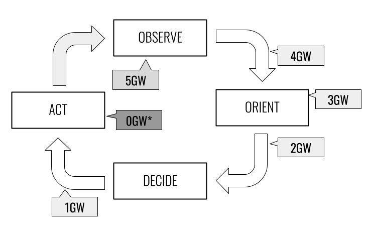

## Page 211

192    Narrative Information Ecosystems 
 
Quantitative Models of Conflict 
The term quantitative models of conflict is used here to describe the 
models of conflict which sit in clear separation from qualitative and 
narrative models, attempting to frame conflict in terms of formalized 
mathematics and computational structure. Several of these models are 
summarized here. 
Lanchester Models 
The Lanchester model is likely the earliest substantial quantitative 
model of warfare, being introduced in the early 1900s in the book 
Aircraft in Warfare: The Dawn of the Fourth Arm by Frederick 
Lanchester [27]. Lanchester introduced a series of quantitative rules, 
such as the N-squared law (“the measure of the total of fighting 
strength of a force will be the square of the sum of the square roots of 
the strengths of its individual units”), and differential equations to 
describe concepts like attritional dynamics and predict the likelihood 
of outcomes of engagements [27]. In addition, he used geometry to 
illustrate the resulting models of these equations in numerous examples 
across air, naval, and land warfare with consideration for various kinds 
of armament [27]. Though introduced in the early 20th Century, 
Lanchester models are still being adapted today to represent things 
such as force ratios and information importance in guerilla warfare and 
insurgencies [28] despite the model’s shortcomings in describing real-
world dynamics [29]. 
Fault Tree Analysis 
Fault tree analysis was developed to decompose potential failure states 
of a system or operation into subevents to better understand potential 
for cascading failures [30]. Each of these subevents can be given 
probabilities and relationships with other events, allowing risk analysts 
to calculate the probability of compound events and specific outcomes 
[30,31]. Using fault tree analysis, conflicts can be modeled in terms of 
various system states and their likelihood to trigger undesired system 
states or cause cascading failures via complex threat surfaces [1].

## Page 212

Active Inference in Modeling Conflict    193 
 
Effects Based Operations 
Effects Based Operations (EBO) planning is a form of course of action 
planning for military operations which is characterized by its use of 
Bayesian graphical models (“Bayes nets”) and models of complex 
systems [32]. While EBO is primarily a planning tool, it embraces a 
systems warfare approach by modeling an area of operations as a series 
of components which may be acted on to generate effects which 
cascade throughout the system. As a consequence of this approach, 
conflict becomes more general and less weighted with connotations of 
violence, instead being better described as friction or disruption, 
making it particularly useful for planning within and describing gray 
zone and narrative warfare [32,33]. 
DoDAF 
The US Department of Defense Architecture Framework (DoDAF) 
and its variants are “military architecture” frameworks intended to 
improve planning, procurement, and the deployment of various 
military systems [34,35]. While it is not intended to model conflict 
explicitly, the DoDAF system incidentally generates a model of conflict 
consistent with Linn’s conception of a “Manager’s” view of war [26] as 
a consequence of its modeling of future military needs. Under this 
view, various kinds of conflict can be described and analyzed by 
modeling the resources, sub-organizations, missions, and logistics of a 
military organization itself as a system-of-systems interacting with 
constraints and limitations (e.g., adversaries and their military 
organization).  
Systems Warfare 
Western network-centric warfare, Chinese systems confrontation 
warfare, and the Russian Gerasimov Doctrine are all examples of 
modern updates to military doctrine necessitated by the rise of gray 
zone warfare. Each focuses on permanent conflict, a fusion of hard 
and soft power across numerous domains, and describing war in terms 
of whole-of-system conflict over networks, such as those of influence 
(media) and exchange (supply chains and economies) [36–40]. While

## Page 213

194    Narrative Information Ecosystems 
 
the details and documentation of modeling approaches for describing 
systems of interest within Chinese and Russian doctrine are not easily 
available [38], those used within network-centric warfare are extensive 
and often make use of agent-based, Bayesian, and complex system-of-
systems modeling methodologies to describe and analyze the structure 
and risks of abstract conflicts [40–42]. 
Models of Conflict Information Flows and Decision-Making 
The preceding categories of conflict models focused on the historical 
and qualitative (Narrative Models of Conflict) and the quantitative and 
data-driven (Quantitative Models of Conflict). In this section, we 
describe models that have been developed with a behavioral focus, 
whether they take a qualitative or quantitative approach. These models 
of information flows are not just explanatory - they are used in national 
militaries to inform design and decision-making and as such, they have 
real impacts and need to accurately and appropriately describe systems 
[39]. Many information flow and decision-making models have been 
considered for use within national militaries, such as Shewhart’s Plan-
Do-Check-Act (PDCA) model [43], Wohl’s Stimulus-Hypothesis-
Option-Response (SHOR) model [43,44], and the Endsley model 
[43,45] (see Figure 2). However, two models in particular, the Observe-
Orient-Decide-Act and Rumsfeld’s Triad of “Knowns,” have seen 
broader adoption and adaptation than others. Here, these two models 
are summarized. 
Observe–Orient–Decide–Act (OODA) Model 
The Observe-Orient-Decide-Act loop (OODA) model is among the 
most familiar and commonly used decision-making frameworks in 
modern times and is used “ubiquitously throughout the branch-specific 
and Joint doctrinal publications of the US Military” [46]. While the 
OODA loop is now contained within a scholarly corpus, its creator, 
John Boyd, never directly published on the topic, instead choosing to 
share the ideas behind OODA primarily through his presentations [46–
49].

## Page 214

Active Inference in Modeling Conflict    195 
 
The OODA loop was originally designed to help describe and inform 
real-time decision making by pilots, wherein a “pilot observes the 
variable and surrounding, orients the aircraft to an advantageous 
position… [decides] the following course of actions in order to engage” 
and then acts them out (see Figure 3) [50]. The generalizability and 
simplicity of this “loop” of factors in decision making led it to enjoy 
reasonably high levels of adoption, not just in the military, but also in 
areas such as business and healthcare [50]. However, this simplicity, 
paired with the lack of published clarifications and formalizations by 
Boyd, means that it is constantly being reinvented, reconsidered, 
reinterpreted, and modified to fit various situations leaving it lacking 
consistent definition and coherent development as a model that could 
further enhance its usefulness [43,50,51]. 
Rumsfeld Matrix of Knowing 
The Rumsfeld “Matrix” [52], “Paradox” [53], or “Quadrants” of 
knowing, was not initially formally proposed as a framework for action 
and perception, but rather was merely a response provided by Secretary 
of Defense Donald Rumsfeld to a question asked about the lack of 
evidence of weapons of mass destruction in Iraq: 
“Reports that say something hasn’t happened are always 
interesting to me, because as we know, there are known-
knowns; there are things we know we know. We also know 
there are known-unknowns; that is to say we know there are 
some things we do not know. But there are also unknown-
unknowns – the ones we don't know we don't know. And if 
one looks throughout the history of our country and other 
free countries, it is the latter category that tend to be the 
difficult ones.” 
[54] 
Though Rumsfeld only offered 3 informational states in the direct 
quotation, the suggestion of known-knowns, known-unknowns, and 
unknown-unknowns implies a combinatorial requirement for an

## Page 215

196    Narrative Information Ecosystems 
 
additional fourth state: unknown-knowns, which has led this 
framework to be referred to as “Rumsfeld’s Matrix” [55]. Interestingly, 
many analyses ignore the presence of this 4th implied category [53,56–
59].  
While other decision making and information flow frameworks 
discussed above focus on linear steps in the decision-making process 
itself, the Rumsfeld Matrix of known-knowns, known-unknowns, 
unknown-unknowns, and unknown-knowns is different. The matrix is 
invoked to help describe the static abstract information spaces and 
voids that decision makers must navigate and explore (see Figure 3) 
with gradients of greater or lesser information and lack of awareness 
of degrees of ignorance - a double hurdle to situational awareness.  
Rumsfeld’s strategic categorization has since been adopted as a 
rhetorical framework for considering information gathering and 
prioritizations in planning and decision making in the military and 
elsewhere. The Rumsfeld Matrix, like John Boyd’s OODA loop, enjoys 
an informal rhetorical ubiquity - it is a popular reference across other 
fields, such as in science [59,60] and energy infrastructure [52].

## Page 216

Active Inference in Modeling Conflict    197 
 
 
 
 
 
This Page Intentionally Left Blank

## Page 217

198    Narrative Information Ecosystems 
 
 
Figure 2. Various Decision-Making Models. Plan-Do-Check-Act Model from 
[43], Stimulus-Hypothesis-Option-Response from [44], Endsley Model from [45].

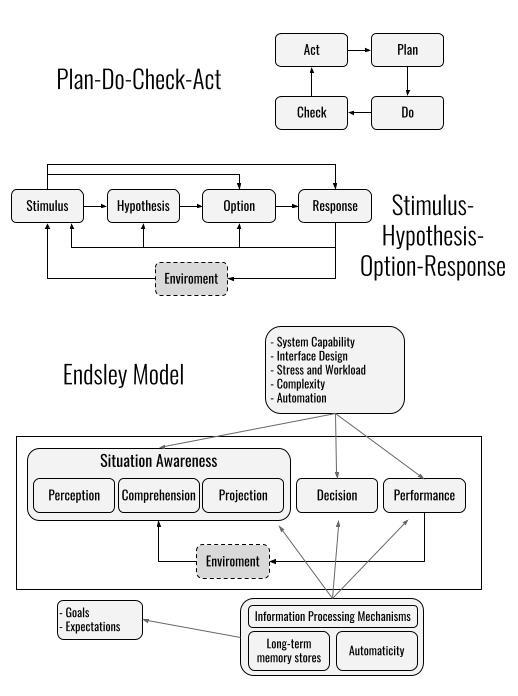

## Page 218

Active Inference in Modeling Conflict    199 
 
 
Figure 3. OODA and Rumsfeld Quadrants.

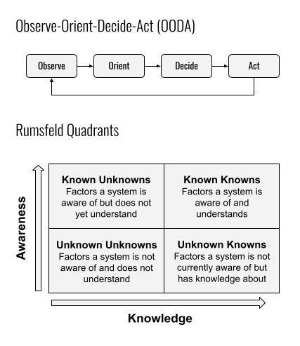

## Page 219

200    Narrative Information Ecosystems 
 
Essential Features and Limitations of Past Conflict Models 
This brief survey of conflict-oriented models used within military 
contexts reveals an arc of abstraction across time from simple pattern 
collection, to formalisms, and finally toward generalized models. The 
survey also reveals a persistent challenge through time of the problems 
of change management in the conduct of warfare (i.e., of inconsistency 
and adjustment to new paradigms and changed historical 
circumstances). While each of the models described had an important 
place in the history of the development of theory and within military 
scholarship, each also suffers from weaknesses which prevent it from 
offering sufficiently comprehensive predictive and descriptive power 
in the gray zone conflicts of the 21st century and beyond. However, 
each prior model has strengths and offers insights which should be 
captured by new models. Below, we consider some key insights to be 
preserved and brought forward from previous models. These insights 
will inform the AIC model introduced herein. 
Changing Expression of Conflict 
Numerous models show signs of aging as the expression of 
conflict changes. As a first example, aspects of Clausewitz’s 
trinity are still quoted as a basis for informing doctrine at the 
highest levels of the US Armed Forces [17] in a way which is 
consistent with Clausewitz’s view of his theories as a “basis 
for study, not as doctrine” [15]. However, even when used in 
a limited way as a basis of study or theory, it still faces serious 
challenges in capturing significant aspects of modern conflict. 
While some argue many aspects of the trinity may be applied 
through analogy to asymmetric and low intensity conflict, the 
model may have to be somewhat contorted to be applied in 
many conflict scenarios; for example, in the conflicts between 
the Medellin Cartel and the Colombian Government [15]. 
Further, Clausewitz’s trinity simply cannot explicitly or 
sufficiently describe the categories of conflict most relevant 
to modern organizations, such as narrative warfare and 
terrorism where many actors may be individuals motivated by

## Page 220

Active Inference in Modeling Conflict    201 
 
ideology [14,32]. Even within defenses of the trinity model 
and of Clausewitz we find the suggestion that attempting to 
torture the model into explicitly describing aspects of modern 
conflict may be “profoundly confused” [61] and stem from 
the likelihood that Clausewitz “has been more often quoted 
than read and understood” [14]. While the underlying 
components of reason, genius or strategy, and passion are still 
valid, the central tension, or as Clausewitz described it, the 
“balance between these three tendencies”, will no longer 
express itself in the same way and may need to be paired with 
other models in order to continue to provide value and insight 
[21].  
While the Clausewitz trinity has seemingly received the most 
attention in terms of adaptation for the changing expression 
of war, approaches such as Lanchester models and 
Generations of Warfare, have also seen numerous 
adaptations in order to fit new paradigms. Replacements, 
such as models of conflict within the purview of network-
centric warfare, fare far better in describing these new 
paradigms but might make a polemologist or military 
historian wonder if they describe old ones well. Even with the 
Generations and Revolutions of Warfare models, which are 
intended to capture the development of war historically, may 
unfortunately create a unidimensional or linear view of war as 
consistently developing in sophistication. Further, they place 
all conflict prior to the first millennium as “precursor 
activities'', creating a paradigm of study and thought similar 
to that which is found in “traditional Western historiography, 
in which all of prehistory — the bulk of the history of our 
species on earth — [is] consigned as an afterthought on the 
far left side of any historical diagram — the historical terra 
incognita before classical antiquity” [62].  
It is important to consider how models built for new 
expressions of war might represent old ones given what is

## Page 221

202    Narrative Information Ecosystems 
 
suggested by Abbott’s Gradients of War: that the expression 
of war may degrade in sophistication rather than increase 
linearly. There is a need to address how we represent conflicts 
within abstract space in order to capture not only the essence 
of previous and current expressions of warfare, but also to 
help project and consider what may come next. 
Limited Interoperability 
The value of a model of a system might be derived not just 
from how well it handles updates to information about that 
system, but also from how well it interfaces with other 
models. How does a system reflecting one model come to 
“know” what is already “known” to a different model? For 
example, it would offer tremendous value via interoperability 
to be able to project or map models onto each other. 
However, among all the models considered above, only 
limited capacity for backwards- or forwards-compatibility was 
found (the exception proving the rule was the mapping 
between OODA and the Gradients of Warfare in Figure 1). 
Though some models seem quite general, they have poor 
interoperability with others, for example, the value of 
computational systems such as those within EBO and 
Lanchester models is siloed from the insights within 
information flow and decision-making models. Though some 
work has been done elsewhere to map heuristics and narrative 
models to computational frameworks in gray zone and 
narrative warfare through the use of “pattern languages” [63], 
or collections of practice and risk heuristics which can be 
layered into EBO-like frameworks, it isn’t apparent that any 
substantial work has been done to generalize this approach to 
conflict in general [32].  
Separate from attempts to map relationships among narrative 
models and 
their computational 
and 
informational 
counterparts, there is also significant dissonance within each 
of these categories. For example, Lanchester equations, by

## Page 222

Active Inference in Modeling Conflict    203 
 
merit of their structure, cannot easily interface with EBO or 
systems warfare models. Further, within narrative models we 
find rampant disagreement on how to describe conflict in 
terms of priority. In addition, within informational models it 
is unclear how models like OODA can scale from local or 
single-actor tactical decision-making to strategic or multi-
actor decision-making with adversaries in-the-loop as EBO 
or systems warfare models would indicate may be required. 
Inconsistencies or incompatibilities within and among 
models hinders the ability of applied composite models to 
provide superior insights into the origins and operations of 
human conflict.  
There is a need for a computational integrative framework 
that connects tactical (micro) and strategic (macro) 
timescales, and builds on the strengths of narrative, 
quantitative, informational, and decision-making focused 
(meso) models. In the next sections, trends in the 
understanding of human interactions generally are brought to 
the challenges of analyzing human conflict, including war, and 
the synthesis introduces multiple new metrics of system 
performance from previously neglected contiguous domains 
of human behavior from which a richer, and more extensible, 
computational model of human conflict and war emerges. 
Generalization 
In addition to being able to handle updates to information 
and interface well with other models about a particular 
system, the potential value of a model might be further 
discerned based on how faithfully it is able to describe and 
integrate with other systems with one or more similar 
attributes. The history of conflict modeling, as illustrated in 
the summary of warfare literature above, reflects an ever-
increasing awareness and integration of variables from the 
studies of interactions in conflict beyond those traditionally 
classified as “war.” As humans migrate their interactions from

## Page 223

204    Narrative Information Ecosystems 
 
physical space to abstract online “information” space, the 
potential for integration of other knowledge about managing 
interactions and conflict in non-warfare contexts becomes 
increasingly relevant - and increasingly possible.  
In fact, as the human species migrates an ever increasing 
portion of its interactions from physical interaction pathways 
to information-rich digital and online networks, the nature of 
conflict, including war as conflict, is changing. In traditional 
interactions and conflicts, the physical landscape and kinetic 
actions of stakeholders had the greatest influence on the 
models used to study those systems. In digital online 
information interactions, the “landscapes” are not physical, 
but instead are conceptual, narrative, and even memetic [64]. 
At one level, conceptual conflict might be seen as more 
amenable to dissipation without resort to irreversible 
destruction of rivalrous physical objects of value. On another 
level, abstract spaces lend themselves to myriad different 
simultaneous characterizations, each of which can provide 
pathways to conflict resolution, together or in combinations.  
In the past, conflict might be explained with reference to 
people speaking different languages or seeking control of 
rivalrous physical territories. Increasingly, however, conflict 
can be described with reference to different paradigms, argots 
(trade languages), and risk concerns. Much as prior conflict 
might arise between speakers of different languages, so too 
might future conflict be analyzed as conflict between and 
among the different languages, paradigms and interactions 
patterns of business, operating, legal, technical and social 
domains (BOLTS).  
Since war is a subcategory of human conflict, BOLTS-based 
parsing can also help to introduce potential pathways to 
integration for models of nation state level conflict, including 
war. As the proportion of of conflicts between and among

## Page 224

Active Inference in Modeling Conflict    205 
 
people, organizations and nations becomes less focused on 
violent physical conflict, it is increasingly better described as 
occurring over surfaces characterized using business [65,66], 
operations [67], legal [68,69], technical [67,70], and social 
[32,71] (BOLTS) components. As the case for traditional 
battlefields, the ability for modern models to capture both 
violent and nonviolent aspects of conflict at varied scales of 
organization in myriad contexts, digital and physical, becomes 
existentially important. BOLTS has become an approach to 
analyze this continuation of (information) warfare by other 
means. 
While the popular models of conflict described thus far tend 
to focus on describing and providing insight into violent 
conflict, outside of the warfare-oriented corpus there is 
fortunately a rich history of models developed in an effort to 
understand and address non-violent, non-physical, or indirect 
conflict [72,73]. These traditional models of human conflict 
management are nonetheless non-traditional models of 
warfare. As warfare is migrating from physical to 
informational domains these non-traditional models present 
themselves as candidates for integration with traditional 
models of warfare.  
Unfortunately, at first glance,these non-warfare models of 
conflict tend to appear to be focused on interpersonal and 
intragroup conflict, rather than inter-organizational or violent 
conflict, and some may explicitly avoid discussion of these 
topics [72,73]. However, within this corpus of non-warfare 
conflict work, concepts have been developed that can be 
helpfully brought to the study of war. For example, non-
warfare conflict research includes research on negotiation and 
intragroup organizational conflict presenting concepts which 
are ripe for generalization to interorganizational business and 
legal contexts [73–75], research on task and process conflict 
directly applicable to understanding larger scale operations

## Page 225

206    Narrative Information Ecosystems 
 
frictions [73], and research on relational and diversity conflict 
which has already been applied to better understanding 
cultural and social frictions [72,73]. 
Other potentially useful non-warfare models of human 
conflict and its management include those models that 
analyze conflicts within a “commons”, which has its own 
storied computational and narrative corpus. Research on 
commons management focuses on conflicts which can arise 
in markets (both abstract and real) and the access to resources 
in which varied groups and actors have individual interests 
but collective ownership or stake [76,77]. For example, the 
oceans, the polar regions, the atmosphere, outer space, and 
non-earth heavenly bodies, are beyond the direct control of 
any nation, but provide resources and spaces in which nation 
states, and their resident citizens and companies, increasingly 
interact. In those spaces, conflicts of interests among 
stakeholders are bound to arise as competition for resources 
and conflicts of interactions emerge.  
Elinor Ostrom won the Nobel Prize in Economic Sciences in 
2009 [78] for her work in describing co-management regimes 
for addressing conflict in historical settings such as the 
conflicts that arise in the context of shared grazing and 
forestry resources, fisheries, and riparian (water) rights. Her 
work has been instrumental in the international management 
of fisheries and other resources in international waters, and 
for models of managing both outer space and knowledge 
space as well. Hess and Ostrom, in their book, Understanding 
Knowledge as a Commons [79] lay out eight principles for 
“robust, long-enduring, common-pool resource institutions”, 
which are: 
• Clearly defined boundaries 
• Rules that are well matched to local needs and 
conditions

## Page 226

Active Inference in Modeling Conflict    207 
 
• Individuals affected by these rules can participate 
in their modification 
• The right of community members to devise their 
own rules is respected by external authorities 
• A system for self-monitoring members’ behavior 
has been established 
• A graduated system of sanctions is present 
• Community members have access to low-cost 
conflict-resolution mechanisms 
• Nested 
enterprises 
- 
the 
“appropriation, 
provision, monitoring and sanctioning, conflict 
resolution, and other governance activities” are 
organized in a “nested structure with multiple 
layers of activities”. 
To help communicate the impact of these principles, Hess 
and Ostrom present the “Institutional Analysis and 
Development” (IAD) framework (see Figure 4). This 
framework presents a map of the relevant variables to the 
expression of friction, or conflict, within what it calls the 
“Action Arena” and represents a key example of a model 
comprised of elements which are generalizable to a great 
number of kinds of non-violent conflict. In addition, it makes 
use of narrative models regarding common “patterns of 
interaction”, such as “freeriding or misuse”, which can be 
layered into the model with probabilities and expectations 
about outcome, offering implications for how narrative 
models and pattern collections may be generalized to 
interface better with computational models.

## Page 227

208    Narrative Information Ecosystems 
 
 
Figure 4. Institutional Analysis and Development Framework, modified from 
[79]. Biophysical characteristics refer to ideas, artifacts, and facilities, the relevant 
factors which relate to the physical or quasi-physical affordances, boundaries, 
capacities, and limitations of a particular commons. The attributes of the 
community, refer not just to measurable qualities of the community, but also to those 
which comprise it, such as users, consumers, providers, and policymakers. Rules in 
use refer to administrative procedures, legislation, and contracts, as well as other 
activities considered to be pro forma even where they may not be codified or 
observable. 
With this discussion about models of warfare above, there appears to 
be a need to account for new frameworks that encompass modern 
expressions of conflict, are interoperable across domains, and 
generalize well enough to encompass peaceful and rapidly-changing 
times as well as classical forms of conflict and related operations other 
than war (OOTW). An open challenge is for a computational model to 
capture the value and insights provided by various forms of previous 
narrative, quantitative, and information flow models of conflict. In the 
following sections we address this need by proposing a framework 
based on Active Inference. Active Inference is a framework arising 
from cognitive science, which has had demonstrable value in unifying 
certain aspects of cognition and sensemaking, and which may be used 
both computationally and qualitatively at different scales (e.g., single 
agent or multi-agent) [80–82]. The following sections present an 
overview of Active Inference, followed by its application towards the 
domain of conflict – the Active Inference Conflict (AIC) model.

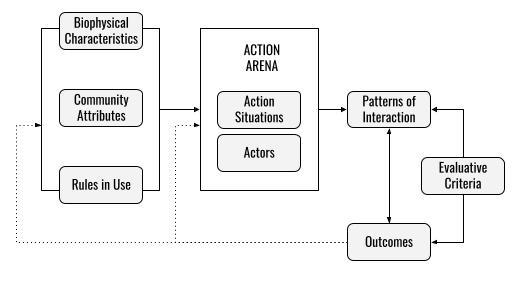

## Page 228

Active Inference in Modeling Conflict    209 
 
Active Inference Conflict Model 
Here we propose a framework for modeling modern multiscale 
conflict, based upon an application of Active Inference (ActInf). 
ActInf is a behavioral modeling framework that integrates perception, 
cognition, and strategic action under a common currency – the 
reduction of expected free energy. As discussed below, expected free 
energy has several different compatible phrasings which facilitate its 
use in decision support in different systems and situations. Across 
these formal phrasings of free energy, a commonality is the emphasis 
on selecting actions that finesse both the epistemic (knowledge-
oriented) and pragmatic (utility- or reward-oriented) aspects of action. 
Broadly, ActInf can be considered an approach that builds on 
quantitative approaches to action (e.g., cybernetics and control theory) 
with modern insights from cognitive sciences [83,84]. This action-
oriented view casts the active sensing of systems as fundamentally 
about reduction of uncertainty. The sensemaking process goes wrong 
when inappropriate uncertainty-reducing behaviors are implemented, 
or the variability of the area of operations is too variable to be tracked 
effectively.  
The Active Inference Conflict (AIC) model is an approach which 
unifies some aspects of previous models of conflict, and generalizes 
conflict in order to help capture business, operations, legal, technical, 
and social aspects relevant to modern gray zone warfare. Additionally, 
the AIC model has sufficient flexibility to be used both qualitatively or 
quantitatively across different timescales (e.g., tactical, strategic), 
structural scales (e.g., individuals, organizations, communities, and 
states), domains, and scenarios. Recently it has been suggested that 
autoethnographic organizational approaches (e.g., reflection upon 
one’s own experiences and surroundings) provide an amenable on-
ramp to the ActInf framework [85]. Multiple informal and technical 
introductions to ActInf and the broader Free Energy Principle exist 
[81,86–90], here we introduce some of the salient features and 
descriptions of key terms within the ActInf framework which

## Page 229

210    Narrative Information Ecosystems 
 
predisposes it towards effective application to the domain of conflict 
and for use within AIC. 
From a military science perspective, AIC provides a bridge between 
single-agent real-time tactical decision-making models (such as 
OODA), and broader strategic analyses (such as those provided by the 
GW framework). As ActInf itself is a development on Bayesian 
graphical modeling to accommodate multi-level cognitive processes, 
the AIC model can be seen as the integration of this ActInf framework 
with other key existing models of conflict and models of cognition 
more broadly. Due to its descriptive bottom-up modeling approach, 
AIC also provides an avenue for integrating the analysis of military, 
non-military, and non-kinetic models of conflict (as well as 
cooperation, and other categories of interactions). Below, we provide 
a primer on ActInf with a focus on how key ideas are applied in the 
AIC model. Figure 5 summarizes the scope of AIC and Table 1 
provides a map for the territory we explore in the following sections 
(the core terms and features of ActInf as deployed in AIC). 
 
Figure 5. Scope of Active Inference Conflict (AIC) model along the dimensions of 
qualitative to quantitative (X-axis) and tactical to strategic scale (Y-axis). From 
the top-right and going clockwise: Lanchester models, DoDAF (Department of 
Defense Architecture Framework), EBO (Effects Based Operations), OODA 
(Observe-Orient-Decide-Act), the Rumsfeld Matrix, and Generations of Warfare 
(GW) model.

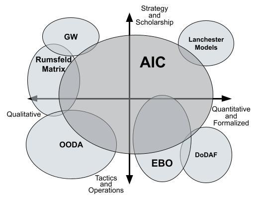

## Page 230

Active Inference in Modeling Conflict    211 
 
 
Table 1. Core terms in ActInf (left column) and their usage in AIC (right column)

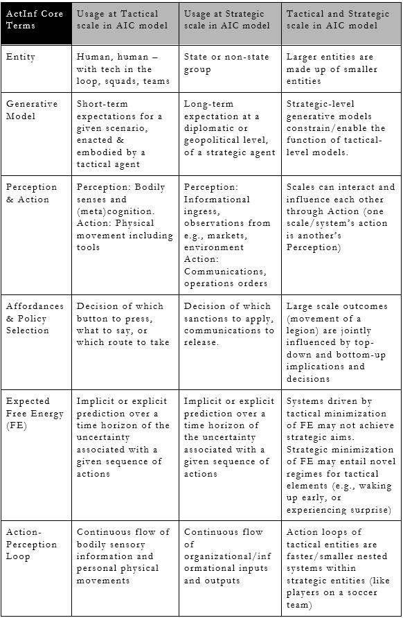

## Page 231

212    Narrative Information Ecosystems 
 
Active Inference Overview, Terms, and Features 
There are several core features and relevant terms from ActInf that are 
necessary in communicating the AIC model (Table 1). Here we provide 
an overview of ActInf topics and terms, with an eye towards how the 
concept will be applied in the AIC model and the general implications 
for the term’s quantitative and qualitative use. 
ActInf Terms 
Here, the terms necessary for communicating the AIC model are 
described. 
ActInf Entity 
An ActInf entity is the minimal system description or model 
that is partitioned off as a separate (but interacting) thing 
from its environment or niche. The “thing-ness” of the 
system is specified by how relevant system variables are 
partitioned into several kinds of states. The scale of the entity 
might represent, for simulation and modeling purposes, 
anything from individuals to communities [91–93].  
Some presentations and applications of ActInf differentiate 
two categories of Entities: “Mere” and “Adaptive” [94,95]. A 
“Mere” ActInf entity is one that passively synchronizes or 
reacts to external stimuli or causes. Relevant Mere ActInf 
entities in a model of conflict might include inanimate 
objects, smart contacts or blockchains, or any system with a 
well-defined, passive, or completely understood input-output 
relationship. In contrast an “Adaptive” ActInf entity is one 
that interacts with its environment in an embodied, agentic, 
anticipatory, cybernetic, and anti-dissipative fashion. Relevant 
Adaptive Entities in a model of conflict might include 
humans, teams, organizations, companies, countries, and 
non-state groups.

## Page 232

Active Inference in Modeling Conflict    213 
 
ActInf entities can be considered “generic” patterns that 
partition the statistical dependencies of agents into internal, 
external, and blanket (incoming: sense, and outgoing: action) 
states. This characterization of a generic entity type is useful 
for several reasons: 
• ActInf entities have tractable interfaces for 
lateral interaction as well as nesting within other 
ActInf entities, allowing for modeling of 
complex heterarchical synthetic intelligence, or 
macro-cognition and organizational behavior 
[3,80,96].  
• So long as ActInf entities have action 
affordances which can interface with external 
entities and sense affordances which interface 
with external stimulus, the representation of their 
internal state and policies can be modified in any 
way appropriate for the nature of that entity and 
the simulation or modeling task at hand.  
• Even without full quantitative integration, the 
process of framing a system in terms of its 
entities and nested entities can help illuminate its 
structure as exercise in system modeling and 
sensemaking [85]. 
Generative model 
The generative model of an ActInf entity refers to the 
ongoing creation by internal states of expectations, for 
example the states that the organism or organization expects 
itself to be in. Entity actions are selected in order to reduce 
uncertainty about the realization of those expectations, as the 
generative model includes expectations over sense, action, 
internal, and external states. In application across systems, the 
imperative for behavior in ActInf entities is not the 
maximization of reward but rather the reduction of

## Page 233

214    Narrative Information Ecosystems 
 
uncertainty [97]. Reduction of uncertainty is always in 
reference to a specific generative model possessed or enacted 
by a system of interest, be it an organism or organization 
[3,92].  
Perception & Action 
ActInf entities are continually engaged in perception and 
action. ActInf builds on the predictive processing, embodied 
cognitive frameworks, as well as other Bayesian and 
computational models of perception [98,99]. Perception is the 
ongoing process by which sensory observations are predicted 
or inferred by the generative model of an ActInf entity. 
Action refers to the enacted outcomes or outgoing statistical 
dependencies of the system, whether they are digital, social, 
financial, or physical.  
Affordances & Policy Selection 
Policy selection, or action selection, is the process by which 
the entity will (act as if they) decide upon a course of actions 
(a policy). For a body, the action states might refer to the 
exact angles of each joint, while the policy selection “to walk” 
could entail a complex sequence of changes to action states. 
The space of possible policies for an ActInf entity at a given 
time is known as their affordances (opportunities for action 
and interaction in the niche), drawing on the use of the term 
in ecological psychology [100]. Policy selection is carried out 
in light of a preferences over sensory observations (e.g., 
having a preference for warm temperatures over cold, and 
then acting to light a fire to reduce surprise about 
temperature). Thus policy selection is cast not in terms of 
finding highly-rewarding states, but rather inferring which 
option from a given limited set of affordances is expected to 
lead to the lowest expected difference between expectations 
and experience (lowest expected “free energy”) through time, 
in terms of pragmatic (utility) value as well as epistemic 
(uncertainty-reducing) value. When these expectations and

## Page 234

Active Inference in Modeling Conflict    215 
 
preferences are for rewarding states, then ActInf models can 
recapitulate behaviors found in other kinds of reward-
maximizers and reinforcement learners [81,97]. The selection 
of policy is in ActInf because entities can rapidly transition 
from utility-oriented behaviors to epistemic actions, as the 
flow of received information changes moment by moment. 
Expected Free Energy 
This expected free energy quantity used for policy selection, 
can be variously framed as achieving evidence for a successful 
self, resistance to dissipation, or the general reduction of 
uncertainty 
[98,101]. 
Several 
useful 
mathematical 
decompositions and equivalences exist for expected free 
energy, for example energy minus entropy (similar to Gibbs 
free energy), surprise plus informational divergence, accuracy 
minus complexity (as used in Bayesian statistics and machine 
learning) [102]. Classical decision-making constructs such as 
expected utility, informational foraging, risk-sensitive policy 
inference, and optimal control are special cases or derivations 
of more general formulations of ActInf entity behavior 
[81,103].  
Action-Perception Loop 
The action-perception loop in ActInf describes how Internal 
states (constituting the generative model of an entity) update 
in response to incoming sensory stimuli, and how actions 
(outgoing influences of the entity on the niche) define the 
outcoming interfaces of the systems. This problem of real-
time control occurs in the domain of robotics, public health, 
command and control systems, and elsewhere. To model 
these heterogeneous yet structurally-analogous scenarios with 
an ActInf entity, the entity can be modelled as a Partially 
Observable Markov Decision Process (POMDP) [88]. This 
POMDP specification is a Bayesian graphical model that lays 
out all variables required for minimal modeling of an ActInf 
agent (Figure 6). At each timestep of the POMDP model, the

## Page 235

216    Narrative Information Ecosystems 
 
entity receives new observations from the niche, updates the 
parameters of its internal generative model, performs policy 
selection, then enacts an action consistent with the selected 
policy. 
 
Figure 6. Partially Observable Markov Decision Process (POMDP) model of an 
ActInf entity. 
ActInf Features 
The ActInf framework builds on the key terms towards several 
essential features. These components and generalized structures offer 
myriad affordances to researchers and analysts. Here we discuss several 
ActInf core components, placing them in the context of the AIC model 
as a formal model of interacting systems in conflict. 
Interactions with the Niche 
Niche refers broadly to the surroundings or context of an 
entity, be it biological, social, or informational. The niche is 
the unobserved generative process that passes sensory 
observations to the entity (akin to how the location of the sun 
is not directly observed, but is instead inferred from the angle 
and type of impinging photons) ActInf entities interface with

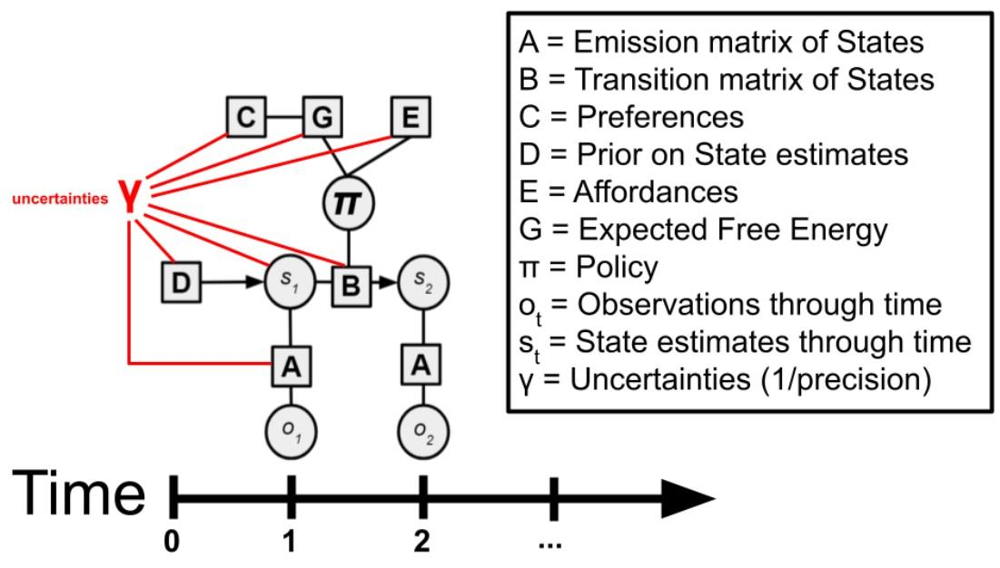

## Page 236

Active Inference in Modeling Conflict    217 
 
their niche through sense (incoming stimuli) and action 
(outgoing effects) states. Entity actions can modify their 
niche, reflected by changes in how the states of the niche 
change through time (for example tightening a screw so it 
doesn’t wiggle in the future). This type of active co-
construction between entities and their surroundings is 
known as niche construction or stigmergy [104]. This 
partitioning of the Internal, Action, and Sense states of the 
system of interest (the “particular states” [105]) entails that all 
features or data outside of the system of interest are external 
or niche states. We can consider the POMDP of the ActInf 
entity from Figure 5 as it interacts with its niche (Figure 6). 
The internal states of some system of interest can be modeled 
such that the external states provide observations (ot) to the 
entity, and the selection of policies (π) are upstream of the 
enactment of action state. 
Interacting Entities 
This same ActInf framework can apply whether the external 
states (external from the point of view or partitioning of the 
entity) are of a very different kind than the entity (e.g., an ant 
colony inferring a raincloud) or a similar kind (e.g., two 
humans and their mental models of each other). Interacting 
entities can select policies with long-term expectation of net-
positive interactions (e.g., trusted interactions from a game 
theory perspective), and this framing can suggest the 
formation of new kinds of organizations. The concept of 
Thinking Through Other Minds (TTOM) describes how the 
internal general model includes each Entity’s own actions as 
well as the actions of the partner [106,107]. 
N-Dimensional Modeling of Abstract Space 
The advantage of a domain-flexible description of entities and 
their interactions, is that it facilitates the modeling of high-
dimension interaction spaces, and detection of patterns 
across different interfaces or types of observations across

## Page 237

218    Narrative Information Ecosystems 
 
BOLTS surfaces in way that may be considered analogous to 
the integration of different kinds of neuroimaging data 
(fMRI, EEG, and MEG) in the Statistical Parametric 
Mapping (SPM) framework [108]. General ActInf modeling, 
along the lines of complex systems models described above, 
can capture the dynamics of classical cooperation/conflict 
situations as well as extend to model heterogeneous, 
unconventional, and yet-unseen mechanisms and patterns. 
With the use of an event reporting framework, this ability to 
capture cooperation and conflict across myriad surfaces may 
help to identify not just yet-unseen mechanisms and patterns, 
but also difficult to detect opportunities for strategic attention 
and action [109,110]. 
 
Figure 7. ActInf entity interfacing with external states. At right, external states 
are influenced by entity action states, and also external states may have endogenous 
dynamics. External states pass observations to internal states via entity sense states. 
Uncertainty in the flow of incoming sensory observation can be reduced through 
updating the internal model of the entity (learning) and action.

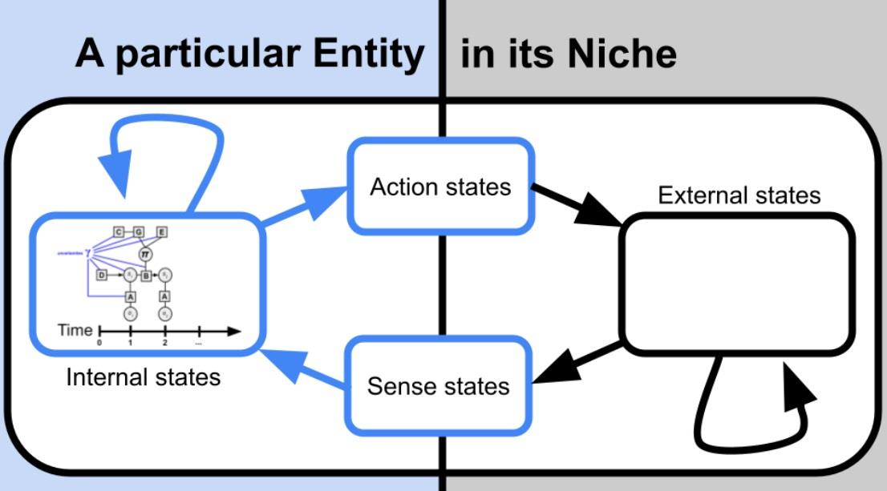

## Page 238

Active Inference in Modeling Conflict    219 
 
 
Figure 8. Two ActInf entities A and B, interacting via a shared niche (ecological, 
informational, or otherwise). The generative process of the niche is influenced by 
endogenous dynamics as well as actions from both entities. 
Use of the AIC Model 
Here we build on fundamentals and recent applications of the ActInf 
framework to work towards new models of systems in managed and 
unmanaged conflict, cooperation, and every sort of human and 
institutional interaction in between. 
Entity Action Loop and Alignment with OODA 
To understand the cycle of inferences and actions entailed by each 
timestep for an ActInf entity, it is helpful to consider this ActInf model 
and POMDP specification alongside the stages of the OODA model 
(discussed above). In contrast with OODA, the ActInf framework 
provides a model for “regimes of attention” [111,112], niche 
modification, and long-range/predictive/anticipatory policy selection 
in deep or nested generative models.  
In both OODA and ActInf, the perception-cognition-action cycle is 
continuously unfolding, and can be thought of as beginning with the 
perception of new observations. Here we align ActInf terms and 
framings with the OODA sequence, with reference to Figure 9. 
Observe: incoming observations (o) are received by sensors, 
sense organs, measuring tools, or other signal channels.

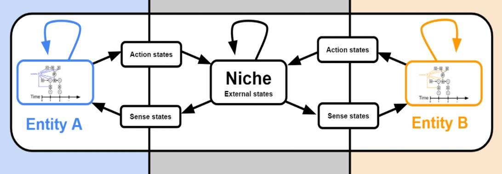

## Page 239

220    Narrative Information Ecosystems 
 
Orient: These observations are integrated with prior beliefs 
(D) about hidden causes or states of the world (s) through the 
bidirectional Bayesian mapping (e.g., constituting a generative 
model and recognition model) of the matrix (A) connecting 
observations to hidden states. 
Decide: The updated Internal generative model of hidden 
states is used to perform inference on action, akin to other 
cybernetic or control theoretic framings. This selection of 
policy proceeds by the integration of preferences over 
outcomes (C) and constraints over action possibilities (E) in 
the calculation of expected free energy (G) in terms of 
pragmatic and epistemic value, as conditioned on different 
possible policies.  
Act: Having selected the policy with the lowest expected free 
energy over the time frame of analysis, action states are 
updated. 
 
Figure 9. Comparison of Action-Perception loops for ActInf and OODA entities

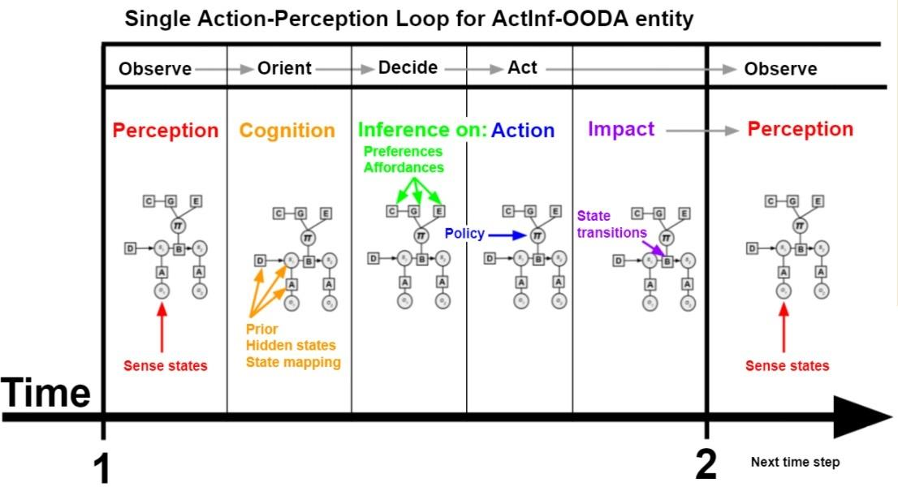

## Page 240

Active Inference in Modeling Conflict    221 
 
Unifying Quantitative and Formal Models of Conflict 
The AIC model does not replace prior quantitative models of conflict, 
it instead integrates them and offers a new medium for their expression 
(as well as a new environment for testing and formal development). 
For example, given that AIC can be nested into and applied in agent-
based models [80,113,114], methods such as game theory matrices and 
Lanchester equations can be calculated at snapshots and be used to 
predict and project the outcomes of simulations and iterated games - 
as well as test other formalizations and counterfactuals. AIC isn’t 
limited to integration with agent-based models, it can also plausibly be 
nested into EBO and network-centric warfare graphs and planning 
cycles. Additionally, given that ActInf is a development on Bayesian 
graphical network methodologies, AIC itself, without any integrations, 
can be represented as a graph akin to those found in other graph-based 
models. Further, it can extend these quantitative and formal 
approaches (EBO for cognitive effects) or provide a surface for 
interoperability between them (e.g., Lanchester variations for both 
infantry- and artillery-driven conflict within the same larger model) in 
myriad conflict settings. 
Moving Beyond Generations of Warfare 
The AIC model has the capacity to model structurally flexible, nested, 
and interacting entities and embedded decision-making processes. This 
allows for standardized and formal representation of conflict, whether 
it be between ant colonies or nation states, or between ant colonies and 
nation states. This formal representation allows n-dimensional 
measures of features and organizations within historical conflicts and 
thus opens the door to methodologies such as component factor 
analysis, which can allow for classifications and archetypes of conflicts 
that aren’t limited by their place in history or by their placement on a 
single dimension. The analysis provided by AIC does not necessarily 
render previous narrative models of conflict classification obsolete - 
instead, it may offer opportunities to support and extend, and offer 
more insight into the similarities between these various models (for 
example returning to Flavius Vegetius Renatus’ aphorisms discussing

## Page 241

222    Narrative Information Ecosystems 
 
estimation, uncertainty, and expectation). In this same vein, AIC can 
be used to generate new narrative models akin to Generations of 
Warfare, as war evolves and adapts along numerous axes - for example, 
along axes such as the relative distribution of decision-making or the 
growth of intelligence requirements. 
The decisions that are made today in this period of rapid transition will 
affect human conflict for many years. In this regard, AIC offers a 
potentially useful paradigm that can be extended, beyond the 
Generations of Warfare Model, into the past, anchoring it as a potential 
analytic tool to help predict efficient and effective strategies for future 
conflict analysis and resolution at multiple scales. 
Modeling and Discovering BOLTS Conflict 
As discussed, modern conflict is coming to be better characterized as 
occurring over surfaces with combinations of conflict measurement 
and risk mitigation structures drawn from multiple, previously-isolated 
domains. In this paper, we have applied the rhetorical mnemonic 
device “BOLTS” to invite simultaneous consideration of multiple 
separate paradigms, measurements, and languages to a given conflict 
use case. The analytical parsing encouraged by BOLTS is one of many 
possible mechanisms for such a multi-faceted analysis, and is useful 
because the individual B-O-L-T-S components are broadly familiar, 
and the conflicts among the silos (e.g., technological vs. legal 
considerations of data use, business vs. social goals of online social 
networks) are well known - even if they remain unresolved. The 
business, operations, legal, technical, and social components therefore 
provide a familiar backdrop against which AIC can be rendered more 
accessible. The visual integration of AIC with BOLTS is shown in 
Figure 10. Below, we note examples which emphasize each of these 
aspects and consider AIC’s use in these settings. 
Business 
Business and economic relationships have always influenced 
human interactions from the earliest agoras to today’s global 
online markets. The emphasis on metrics is driven by systems

## Page 242

Active Inference in Modeling Conflict    223 
 
of risk mitigation and leverage associated with such business 
phenomena 
as 
production, 
resource 
accumulation, 
monetization, 
zero-trust 
trading, 
remote 
dealing, 
financialization, and myriad other “Business” concerns. 
Consider, for example, the many current structural global 
conflict surfaces that can be fruitfully analyzed as artifacts of 
the long term implications of once-admired cost cutting 
strategies (such as foreign production of domestic goods) 
associated with the historical transition from physical to 
information dependencies. For example, the domination of 
China in manufacturing (and the consequent dependencies of 
consumer societies such as the US) is a product of US 
companies seeking lower labor costs (and compliance with 
environmental, labor, and other domestic laws) in the past 
decades. The US became dependent on information and 
finance to maintain access to and control of such remote 
production activities, creating a period of relative order (in 
terms of environment and labor gains within the US), but 
deepening the dependencies on access to foreign labor and 
production apparatus - which creates disadvantages for the 
US in the event of conflict with China affecting trade. AIC 
can be applied to analyze, consider and identify developing 
price leverage within larger business and economic structures 
and their relationship to economic policy, or to help infer 
internal model or policy of adversaries (based on their policy 
“pings”), and can also be of use in identifying de facto 
adversaries that may not have coherent structure under the 
law or be otherwise be detectable through standard business 
or legal metrics (e.g., informal consortium-like entities, such 
as a category of businesses operating within a common niche, 
nascent cartels, mutually-dependent trading arrangements, 
online Distributed Autonomous Organization [DAO] 
structures). Looking at Business interactions through an AIC 
lens helps to reveal existing and potential interactions and 
their respective threats, vulnerabilities, and opportunities for 
new value creation, which will drive innovation in multilateral

## Page 243

224    Narrative Information Ecosystems 
 
risk mitigating structures and in business entrepreneurship 
and innovation. 
Operations 
The concept of “Operations” in BOLTS overlaps with other 
BOLTS notions, but its separate consideration yields novel 
insights into conflict, particularly when brought together with 
the AIC model. Operations includes concepts such as supply 
chains, scaling of operations, organizational change 
management, operating efficiencies, human resources, and a 
host of other notions of human organizations that reflect 
attempts by humans to manage conflict for rule-driven 
behaviors across interactions at arbitrarily-large scales. In 
these contexts, the AIC model provides a coherent and 
comprehensive lens through which to analyze “operations in 
conflict.” For example, consider that many current “supply 
chain” related conflicts and challenges are a result, in part, of 
“just-in-time” manufacturing, lean inventories, and other 
less-capital-intensive forms of doing business ushered in by 
the enthusiasm for outsourcing in the mid-1980s, and 
accelerated by the “bricks-to-bits” commercial information 
revolution. Those trends have continued and been 
accelerated by the overall migration from physical to 
information-based interactions and transactions. Consider 
that there is a large and still growing set of operations 
protocols that eliminate the need for organizations to 
maintain large and expensive inventories. The continuing 
advances of the information revolution allow the 
virtualization of internal supply chains and of the provision 
of access to parts, ingredients and subassemblies when as 
needed further disintermediating previous supply chain 
interactions - which changes can lead to conflict. With respect 
to the labor element of operations, the “outsourcing” of labor 
to other, less regulated, countries is also a part of this cost-
cutting effort. The modern expression of this outsourcing is 
found in innovations such as eBay, UBER, or Lyft where the

## Page 244

Active Inference in Modeling Conflict    225 
 
value steps in the management and structure of inventory and 
service provision, routing, and delivery are becoming 
increasingly separated. AIC can be used to model the 
structure and distribution of decision-making processes both 
in BOLTS and traditional conflict arenas and developing 
points of affordance and access leverage in relation to policy. 
Further, it allows for the modeling of operational niche and 
the processes and protocols associated with managing the 
potential conflicts within a given niche. 
Legal 
The laws of physics are universal, but the laws of people are 
not. The technology of the Internet is based on physics, but 
the regulation of the internet is not based on the laws of 
physics. The result of all this is that the Internet has the 
potential to be deployed globally (and beyond) with technical 
standards, but the laws of the 195 sovereign countries which 
are not globally standardized, creates conflict. Of course, it is 
not just the laws and regulations themselves that are in 
disputes, but also the interactions of the billions of individuals 
and organizations acting every hour of every day under such 
laws. The legal focus is fruitful in measuring and managing 
conflict since that is the intended effect of all legal systems. 
However, non-legal conflicts, such as political, economic, 
social, cultural, aesthetic, and other non-legal interactions, are 
beyond the reach of the risk mitigating help of legal systems. 
AIC applied with BOLTS can help to bridge the gap by 
bringing legal forms of conflict management into closer 
contact and interoperability with other BOLTS forms. In 
addition, legal confrontations in civil, criminal, and 
international disputes are in and of themselves conflicts 
which can be modeled by AIC. However, law is not just a 
source of conflict mitigation - it is increasingly a source of 
agenda-laden conflict engagement. Consider that beyond its 
role in helping to resolve individual conflicts, confrontations 
that apply law as a sword (and not just as a shield) are

## Page 245

226    Narrative Information Ecosystems 
 
increasingly becoming a chosen avenue for conducting gray 
zone conflict and disruption between and among nation 
states and other entities. In the case of nation states, each of 
which as a sovereign can, by definition, create its own laws, 
legal warfare or “lawfare” [68,115,116] can be said to be 
composed of the development, amendment, and mobilization 
of “domestic and international laws” for geopolitical and 
military gain [117]. These forms of aggression are not typically 
characterized as “war,” but rather in such forms as trade 
negotiations, immigration policies, tax and financial 
regulations, bilateral treaty negotiations, regional pacts, cartel 
arrangements and other similar forms. The development of 
legal standards for the protection of statutory and contractual 
rights, the enforcement of legal duties and the reliance on 
predictable legal processes when exploited as a means of 
deterring, 
binding, 
and 
protecting 
individual 
and 
organizational interests’ actions in conflict with others is 
often difficult to detect in the churning and dynamic 
landscape of legal conflict. While legal notions such as “abuse 
of process” are intended to curb excessive and socially-
destructive application of law as a sword, the subjective and 
contextual aspects of legal forms of conflict can obscure root 
causes and intentions of conflict in many cases. AIC, with its 
affordances for modeling and inferring internal models and 
policy, could be of use in classifying and detecting patterns of 
legal actions and consequent leverage within myriad 
interaction niches in order to more effectively measure, 
moderate, and manage legal conflict affordances at tactical, 
campaign or theater, and strategic levels.  
Technical 
Technical infrastructure, standards, and protocol are 
bounded by both computational and legal rules. The dynamic 
technical edge between these two areas is of particular 
importance for the future of conflict as human attention turns 
from a focus on data secrecy as a basis for conflict mitigation

## Page 246

Active Inference in Modeling Conflict    227 
 
strategies, toward a focus on information integrity as a 
pathway to reducing information risk and interaction conflict.  
Data plus meaning yields information. Data security is 
necessary, but insufficient, to yield information reliability and 
distributed security. “Meaning” security is needed to 
complement data security to manage information network 
conflicts. While data security is the focus of technical features 
of the Internet and modern computer science, “meaning” 
security is the focus of law. Consider that all contracts and 
laws can be viewed as enforceable “stories” about the past, 
present, and future. When those stories are agreed upon and 
acted upon, they de-risk future interactions in ways that no 
one person can achieve by themselves (for example the laws 
and technical specifications that interact to de-risk otherwise 
hazardous situations such as highways and exchanges). Such 
enforceable stories are the way that humans achieve “meaning 
security.” Contracts and laws are all promises that we make 
to ourselves and others about the future, and the law is a 
mechanism to test our performance against those agreed 
upon parameters. In this way, it is not unlike technical 
specifications that set rules of general application for the 
technical performance and behaviors of engineered systems. 
As the desire for verifiable information integrity supersedes 
yesterday’s satisfaction with data security, the human and 
organizational components of systems will be increasingly 
recognized as critical system components, not just as users of 
systems. Legal and technical paradigms are tightly intertwined 
in information systems, where technical specifications help 
assure data system integrity and legal rules help assure 
meaning system integrity, with the result of enhanced 
information system integrity. Such “tools and rules” 
leveraging will be accelerated through application of AIC 
framings that will quickly reveal the potential alignments of 
such systems. Such analyses will be critical to the

## Page 247

228    Narrative Information Ecosystems 
 
advancement of various information integrity structures to 
help manage the conflicts that are bound to arise through the 
introduction of such new distributed information integrity 
structures as decentralized management of intellectual 
property, the introduction of digital “twins”, smart contracts, 
computer-aided governance, and the progression of data 
privacy- and information integrity-related legal structures.  
Emerging interaction structures provide a sense of the 
challenges and opportunities that reveal themselves at the 
intersection of technical and legal interaction and conflict 
management use cases. Historically, notions of intellectual 
property law (involving copyright, patent, trademark, 
certification mark, and trade secret) have always blurred the 
boundaries between physical and intangible value of goods 
and services in commerce. In terms of decentralized 
management of intellectual property, consider that nation 
states and the Westphalian system are based on physical 
boundaries and borders, hence the exclusivity (rivalrousness) 
of ownership of real property (e.g., land). At its base, the 
Westphalian paradigm of enclosure and exclusive jurisdiction 
may be fundamentally inconsistent with the infinite 
duplication that is possible with information. This may mean 
torturing new technical expressions of intellectual property to 
fit this previous legal, business, and operations paradigms, for 
example through primarily interpreting and designing non-
fungible tokens (NFTs) as an expression of ownership of a 
given represented object (e.g., a particular artistic image), or 
by developing new systems which acknowledge these 
changes, for example through primarily interpreting and 
designing NFTs as an expression of rights, stake, and 
affordances related to some given represented object. In 
terms of digital twins, the notion of the identity entanglement 
between the referent human and their digital extension, as 
well as tangible and intangible property and their digital 
extensions (e.g., NFTs), introduces just one category of many

## Page 248

Active Inference in Modeling Conflict    229 
 
fundamental shifts ushered in by the transition from physical 
to digital worlds - similar in potential impact to the 
introduction of corporate depersonalization or personhood, 
or of nation states themselves. Further, consider the 
introduction of decentralized autonomous organizations 
(DAOs) which may be composed of both human and 
adaptive autonomous entities and what this means for legal 
accountability, internationally and domestically. The legal 
handling of these transitions is thoroughly non-trivial - as one 
path might lead to serious implications for nation states and 
the foundation of their sovereignty (e.g., no one can force or 
coerce a public blockchain to grant and revoke an affordance) 
while another might lead to a substantially more powerful, 
and consequently, dangerous foundation for sovereignty (e.g., 
governments able to computationally force or bar interaction 
in a digital-focused society). 
Social 
Simulation and modeling of narrative and social conflict can 
be notably difficult due to underlying challenges in accurately 
characterizing and modeling situational features that are 
relevant for ActInf agents [32]. AIC’s nested ActInf entities 
and their affordances for flexible representation of internal 
models and policy offers a common avenue for various extant 
and 
new 
approaches 
in 
representing 
ideological, 
psychological, narrative, and memetic conflict, as well as 
deterrence. Recently various models of dyadic and collective 
social interactions have been implemented using ActInf 
entities [112,118–120], suggesting a strong possibility for 
these kinds of models to be deployed in the case of conflict. 
The implications of using AIC in work on cognitive security 
and narrative management is discussed further in the 
discussion of modeling cognitive security.

## Page 249

230    Narrative Information Ecosystems 
 
Modeling Cognitive Security 
Cognitive security (COGSEC) here refers to the study, development, 
and implementation of “practices, methodologies, and efforts made to 
defend against social engineering attempts - intentional and 
unintentional manipulations of and disruptions to cognition and 
sensemaking” [121]. COGSEC is difficult to measure and model for 
the same reason simulation and modeling of narrative and social 
conflict is - there are distinct, underlying challenges in representing and 
predicting the effects and attributes of internal states. AIC, as 
previously stated, offers opportunities for representing internal states 
of entities in relation to external conflicts, emphasizing impacts on 
cognition and sensemaking. However, AIC’s potential uses in the study 
of COGSEC go further: recent work on scripts and context-driven 
reflexes in ActInf [119] rely on the same structure and methodologies 
as AIC and have great potential in being applied better understanding 
relevant threat surfaces, given that so much of the threat surfaces 
relevant to COGSEC and social engineering are related to 
development and exploitation of reflex for both offensive and 
defensive purposes [122]. COGSEC methodologies found in social 
engineering and counter-deception literature could be simulated and 
considered using AIC, to better model and measure COGSEC and also 
consider how traditional methods such as the “reduction of the 
complexity of problems, introduction of routine and bureaucratic 
procedures, the choosing of satisfactory solutions rather than optimal 
ones, [and] giving preference to partial solutions at the expense of 
comprehensive ones and avoidance of new problems'', and more 
recent approaches such as narrative information management [123], 
common vulnerabilities and exploits (CVE) databasing of narrative 
influence techniques [32], and engagement with narrative content 
[64,124] might affect state and expression of COGSEC in a variety of 
entities.

## Page 250

Active Inference in Modeling Conflict    231 
 
Implications from Use: Future Information 
Structures and Rumsfeld’s Neglected 
Quadrant 
Usage of AIC to represent modern conflict and the BOLTS structures 
which interact within it provides insights beyond the projection of 
winners and losers in iterated games. Of particular interest are 
implications regarding the nature of the BOLTS structures themselves 
and the prioritization of their objectives in the reduction of uncertainty 
in their niche. Here we consider these implications before concluding 
and offering recommendations for future technology development. 
One of the implications of the move of the human species from 
physical toward information-based interaction landscapes is the 
reduction in efficacy and relevance of those historical institutions that 
provided reliability and protection for humans in physical spaces. As 
conflict becomes more abstract and less obvious, these traditional 
institutions are revealing their lack of fitness for governing in non-
physical domains. While physical existence still precedes and is 
prerequisite for the achievement of other states and satisfaction of 
other needs, as reflected in Maslow’s hierarchy of needs [125], human 
interactions will continue to be increasingly dependent on the 
information landscapes in which nation states, and other organizational 
structures, are struggling to replicate the status quo. This struggle of 
legacy institutions to understand and manage conflict in an inherently 
incompatible information landscape, is forcing individuals to seek 
alternative structures of risk reduction to help them navigate. 
Using AIC as a qualitative lens renders all conflict as a form of 
information generation for the participating agents, with violent 
conflict constituting a “costly ping”. In the past, the information 
generated from conflict might have been found in the numerous post-
mortems and experience-informed treatises after campaigns [26] or in 
what could be called proactive intelligence, information about the 
enemy assembled after engagements [126] - however, now that conflict

## Page 251

232    Narrative Information Ecosystems 
 
is increasingly situated in the information landscape and that the 
underlying “assets” and “territories” that are the objects of social, 
political, economic, and legal attention have shifted from physical 
emphasis to information emphasis, new structures are offered the 
opportunity for unparalleled management, monitoring, and facilitation 
of conflict. As well as the opportunity to define, via BOLTS norms, 
rules, and infrastructure, how conflict can be approached and resolved. 
AIC may be of use in both the design and implementation stages in 
these pursuits, and can provide alternative pathways that can be applied 
in those settings.  
Another consequence of this move from physical to information 
emphasis is the non-rivalrous nature of informational assets. Physical 
property (whether real estate or tangible personal property) is rivalrous 
- its use and enjoyment cannot be simultaneously and exclusively 
enjoyed by multiple parties. Territorial expansion and the plunder of 
property reveal the rivalrousness of historical nation state conflict. In 
terms of digital materials - it is possible for two people to enjoy the use 
of the same software simultaneously, to read the same book, to watch 
the same movie, or to access the same data for different uses in 
different contexts without diminishment of the use and enjoyment of 
another. Further, physical assets are generally scarce and increase in 
scarcity over time - whereas the amount and complexity of information 
which can be generated as well as the rate of its growth is infinite. Both 
are expanding rapidly and creating structural hurdles to both individual 
and organizational situational awareness - the ability for organizations 
to manage this information effectively is strained [123].  
Using Rumsfeld’s Quadrants, which frame the information spaces and 
voids of value to organizations, as a lens over conflict both between 
organizations and between organizations and abstract phenomena 
(e.g., “war” on cancer, drugs, COVID-19), highlights Rumsfeld’s 
neglected quadrant, “unknown-knowns”. Further, it suggests that this 
neglected quadrant is a doorway from the static to the dynamic 
perspective on knowledge systems. The first three quadrants are 
described from the perspective of a centralized hierarchical party or

## Page 252

Active Inference in Modeling Conflict    233 
 
bureaucracy - things are either known or not to that party, without 
reference to interaction with other parties that might alter the status of 
knowns and unknowns. On the other hand, this neglected quadrant 
appears to be a paradox: How can a given party not know a given 
“known”? 
For any individual ActInf entity, an unknown-known appears to be an 
impossibility - its known-knowns and known-unknowns are accessible 
within its internal state and its unknown-unknowns represent relevant 
voids within its internal state that it does not yet identify as such - which 
begs the question: Where is there room for an unknown-known? The 
AIC model helps to formalize several situations in which unknown-
knowns exist: 
Known but Inaccessible 
An ActInf entity may hold relevant information that goes 
unused in policy formulation as a result of it not being 
immediately accessible. 
Failure of Curation 
An ActInf entity may hold relevant information that is 
technically accessible but goes unused because of poor cues 
or the absence of indications of relevance. 
Back Turning 
An ActInf entity may ignore relevant information because it 
may contribute to policy formation which conflicts with some 
other existing policy, prior belief, or contextual model. 
Selective Disclosure 
An ActInf entity may have information that is accessible but 
will not access it in the interest of security or efficiency.

## Page 253

234    Narrative Information Ecosystems 
 
Known but Undeciphered 
An ActInf entity may have latent information available which 
has not yet been deciphered, extracted, or codified. 
Insufficient Communication Dynamics 
An ActInf entity composed of nested Entities, each with their 
own internal models, may fail to make use of relevant 
information due to insufficient internal communication 
dynamics. 
Most important among these several dynamics, is the notion of 
unknown-knowns within multi-agent systems. The moment that the 
ActInf entity interfaces with another in cooperation, they become a 
new perceivable entity, each with internal states that may be more or 
less synergized. Each has known-knowns and known-unknowns that 
the other is not necessarily aware of, constituting unknown-knowns in 
the context of the organization. The AIC model provides support for 
the argument that, in a turbulent and information-rich environment, 
top-down management of information dynamics is no longer sufficient 
- that Rumsfeld’s initial prioritization of unknown-unknowns must give 
way to a prioritization of unknown-knowns, where “more than 
sufficient knowledge” exists but goes unused or misused in policy 
formulation due insufficient communication protocols, leading some 
to call for knowledge and rhetorical ecosystem approaches in the 
design of more decentralized information systems [123,127]. 
In this vein, the primary focus of the field of knowledge management 
might be considered to be addressing the problem of unknown-
knowns. As has been addressed elsewhere, when the information 
management system in question begins to include parties outside the 
confines of a traditional organizational structure, the management of 
trust becomes a key concern [123]. The AIC model, in its use as a lens, 
demonstrates the value of trust in sharing unknown-knowns in a 
knowledge ecosystem in the form of several notable insights:

## Page 254

Active Inference in Modeling Conflict    235 
 
Trust is Synonymous with Reliability 
Through an ActInf lens, trust is best characterized as 
projected reliability (e.g., high precision, or low uncertainty) 
of both other ActInf entities and indicators which inform 
projection.  
Trust can be Externalized to Interfaces 
ActInf entities don’t necessarily need to trust one another, but 
instead, can externalize trust to interfaces and related 
protocols among them in their niche to reduce costs of 
communication. 
Trust can be Externalized  
to Symbols and Signals 
Given that trust is best interpreted within an ActInf context 
as projected reliability, symbols and signals can thus be 
“trusted”. For example, traffic signals allow drivers to 
externalize their trust to signals which inform the projection 
of other drivers’ behavior, as opposed to being left to develop 
trust with other drivers in order to share the road. 
Trust is a Prerequisite  
for Efficient Information Sharing 
ActInf entities that question the motives or quality of 
communications, have high costs in interpreting or accepting 
those communications. 
Trust is a Prerequisite  
for Collaborative Enterprise 
ActInf entities require trust, commensurate with associated 
risks, in order to engage in collaborative enterprise. Recently 
this has been explored in the context of human-robotic 
interactions [2].

## Page 255

236    Narrative Information Ecosystems 
 
We argue that these insights about unknown-knowns, trust, and the 
non-rivalrous nature of the objects relevant to modern conflict should 
inform the development of new structures and systems. We distill these 
insights in order to offer recommendations in the discussion below. 
Discussion 
In this paper, we have briefly surveyed models of conflict, considered 
their strengths and inadequacies, proposed a unifying model based 
upon the application of Active Inference (ActInf), and considered the 
implications of use of the Active Inference Conflict (AIC) model. The 
initial survey revealed that the study and modeling of warfare 
progressed generally through time from inventories of tactics toward 
more theoretical and ultimately more abstracted and context-informed 
analyses. That evolution of the models could be framed as mirroring 
the parallel development through time of human understanding of 
human structures of information, as well as structures of cognition, 
organization, and interaction across the sciences and social sciences, 
including patterns of conflict in those disciplinary domains. For 
example, as discussed above, early quantitative models of conflict such 
as the Lanchester model used mathematical tools that were modern at 
the time, such as linear regressions and differential equations.  
Today, similar analytical and paradigmatic (r)evolutions are taking place 
in research and understanding about human commerce, behaviors, 
political governance, and other related domains, ultimately positioning 
the subset of behaviors and interactions associated with “war” as 
categories of a subset of patterns of human history and society - albeit 
patterns that are a non-linear in relation to others. Clausewitz’s 
observation about politics and war is consistent with this notion of the 
evolution of the human understanding of the human condition, but 
following the results of the survey, we contend his famous quote, that 
“war is the continuation of politics by other means”, is incomplete 
within this context as it would appear that both war and politics are a 
continuation of conflict by other means (and, in fact, conflict is a

## Page 256

Active Inference in Modeling Conflict    237 
 
continuation of the normal function of living systems in just another 
analytical framing). 
The survey revealed an increasing abstraction and formalism in the 
modeling and study of conflict and war, evolving from catalogs of 
physical battlefield heuristics toward broader and more detailed 
analytical framings of context and motivations for physical forms of 
conflict. However, it also indicated that many of the models are 
underdeveloped for current applications and struggle to address the 
changing expression of war and the migration of human interactions 
from predominantly physical interactions (i.e., kinetic warfare) toward 
abstract, symbolic, and intangible interactions within information 
landscapes. Further, the survey disclosed that existing warfare models 
did not have the necessary generalizability to be broadly applicable to 
the relevant expressions of conflict in other social contexts, and that 
the models are rarely interoperable. 
Following this survey, we proposed the use of ActInf methodologies 
and terms in modeling conflict and named this application the Active 
Inference Conflict (AIC) model. The AIC model is intended to 
represent a needed updating of conflict framing to reflect changes in 
human interaction patterns, and also provides built-in mathematical 
rigor that could be used to facilitate the organization and operation of 
future conflict management architectures. The AIC model, as a 
consequence of it being founded on the matured quantitative models 
of ActInf, is tractable to simulate, can incorporate empirical data, and 
also can immediately be implemented qualitatively to produce novel 
insights about various forms of conflict. We discussed how this 
approach, with its affordances for sense and action loops, multi-entity 
interactions, entity nesting, and policy selection offers old models a 
new medium for their expression and interoperability while also 
providing avenues for generalizing conflict modeling which can 
capture relevant aspects of modern conflict.  
Specifically connecting the AIC model to OODA and GW 
demonstrated the relevance of integrating previous tactical and

## Page 257

238    Narrative Information Ecosystems 
 
strategic frameworks within a single multi-scale formal model. Of 
particular interest was the consideration for the ability of AIC to 
capture conflicts which have business, operations, legal, technical, and 
social components, to move beyond generations and gradients of war 
and offer a new medium for capturing metrics for classifying and 
clustering myriad forms of conflict, and to model emerging conflict 
surfaces involving cognitive security and narrative warfare. 
Finally, we considered broader implications suggested by qualitative 
application of the AIC model to conflict generally. We reflected on the 
state of the information environment, noting the difficulties that 
traditional institutional and governance structures are having in 
handling modern information-based conflict and that new, alternative 
structures for risk reduction are being offered the opportunity to 
provide value. In addition, we reflected on the non-rivalrous nature of 
information-as-asset and the infinite potential for information growth, 
and how these factors affect organizations - mainly in terms of 
processing information load - which is a useful surrogate for risk. 
Within these reflections, we suggested that the AIC model is not just 
useful for the study of conflict but also in the design of systems which 
manage it. Finally, we applied the AIC model to reveal latent insights 
about trust and knowledge environments within the Rumsfeld 
Quadrants, 
specifically 
regarding 
its 
oft-neglected 
quadrant, 
“unknown-knowns”. 
The AIC model, as previously discussed, provides an avenue for formal 
modeling of systems - but this same affordance also facilitates design 
and evaluation of the design of systems, and to implement and test 
BOLTS norms and rules. This is to say that a socio-technical system 
modeled with the AIC model can effectively be a “twin” of that socio-
technical system, and thus can be used for more than just studying its 
conflicts, but also for managing and facilitating endogenous 
information conflict and friction itself. It took humans millennia to 
figure out how to convert the random motion of atoms energized by 
heat from fire into useful “work” through the use of heat engines. The 
AIC framing invites consideration of how the equivalent of a

## Page 258

Active Inference in Modeling Conflict    239 
 
“combustion chamber” might be configured for converting the friction 
of disagreement into useful work within a knowledge environment in 
terms of developing new information, repairing faulty or incomplete 
information, discovering unknown-knowns and unknown-unknowns, 
and helping entities within develop trust and healthy information flows. 
Within this context, de-risking of interactions in which information 
exchanges occur could be seen not as a state, but as an ongoing process 
- which places pressure on designers of information systems to develop 
simple rules and effective protocols.  
Past work has considered how humans and human organizations 
collaboratively organize, annotate, and structure claims as a form of 
narrative information management [64,123,128], and could be of use 
in conjunction with the AIC model to build tools which document, 
facilitate, and resolve informational conflicts with an objective 
dimensionality from the AIC model that leverages existing approaches. 
Further, these pairings of approaches could help give new life to the 
older narrative models of conflicts and unify them with the work on 
commons management [79], as it could provide a new medium for 
formalizing, documenting, and sharing of heuristics and practices for 
risk mitigation [32].  
As the rate of information growth continues to explode outward in 
both volume and complexity, the AIC model reveals that the search 
for unknown-unknowns or known-unknowns may need to be 
deprioritized, as this information may fail to be disseminated and 
integrated - rendering most relevant information as unknown-knowns. 
Where “hope” was left in Pandora’s box, it might be said that “trust” 
was left in Rumsfeld’s matrix. The AIC model helps to demonstrate 
and codify the value of trust in knowledge ecosystems which facilitate 
the sharing of unknown-knowns, and demonstrates how trust can be 
externalized to protocol and signals through their being reliable 
indicators of quality and behavior. Ultimately, a primary suggestion of 
this work is that facilitating mutual interdependencies, interfaces, and 
trust-management frameworks, key prerequisites to sharing unknown-
knowns, could attract an increasing subset of information conflicts into

## Page 259

240    Narrative Information Ecosystems 
 
generative structures (perhaps best framed as structures which operate 
in the manner of what might be called a “risk commons”) which can 
capture value and grow trust, rather than accelerate discord. Below, we 
distill these and other insights within this work into recommendations 
for future research and the design of new systems: 
Recommendations 
• Develop more work on the use of the AIC model in 
extending the value of OODA loops in simulation and 
decision-making models. This could utilize complex 
systems modeling software such as cadCAD [129], and 
those specifically for ActInf such as ForneyLab [130] or 
infer-actively [131]. 
• Explore the use of the AIC model in modeling past 
conflicts as a basis for measuring various attributes of those 
conflicts, and the use of those attributes for new 
classifications and “generations” or gradients of conflict. 
• Explore the use of the AIC model and the integration of 
commons management principles and compensating 
controls across business, operations, legal, technical, and 
social (BOLTS) surfaces. 
• In the design of information exchange systems: 
o Acknowledge de-risking as an ongoing process, 
rather than as a static attribute. 
o Consider trust as synonymous with perceived 
reliability. 
o Make use of the fact that trust can be externalized 
to signals and symbols so long as those signals and 
symbols are reliable indicators of behavior and 
state. 
o Consider 
disagreement, 
inconsistency, 
and 
incoherence as events which can be mined for

## Page 260

Active Inference in Modeling Conflict    241 
 
value via shared protocols and standards rather 
than creating an illusion of security through 
attempts at their removal. 
• Across many domains (e.g., war, scholarship, and design), 
reprioritize Rumsfeld’s neglected quadrant of unknown-
knowns.

## Page 261

242    Narrative Information Ecosystems 
 
Contribution Statements 
Administration and Facilitation: Richard J. Cordes 
Writing, Editing, and Revision: All authors made substantial 
contributions to writing, editing, and revisions across all sections. 
Funding and Acknowledgements 
Scott David is funded by the NSF Convergence Accelerator Trust and 
Authenticity in Communication Systems Program (NSF 21-572), under 
award ID #49100421C0036. 
Richard J. Cordes is funded by the NSF Convergence Accelerator 
Trust and Authenticity in Communication Systems Program (NSF 21-
572), under award ID #49100421C0036 and is supported in research 
efforts through a Nonresident Fellowship with the Atlantic Council on 
appointment to the GeoTech Center.  
Daniel A. Friedman is funded by the NSF program Postdoctoral 
Research Fellowships in Biology (NSF 20-077), under award ID 
#2010290.

## Page 262

*[Page 262 appears to be blank or image-only]*

## Page 263

*[Page 263 appears to be blank or image-only]*

## Page 264

Works Cited

## Page 265

*[Page 265 appears to be blank or image-only]*

## Page 266

247 
 
 
 
 
Chapter I 
Works Cited 
 
 
Generated using a reference manager. 
1. 
Heuer RJ. Psychology of Intelligence Analysis. Center for 
the Study of Intelligence; 1999. 
2. 
Avey AE. Function and Forms of Thought. Henry Holt 
and Company; 1927. 
3. 
Fox JR, Park B, Lang A. When Available Resources 
Become Negative Resources: The Effects of Cognitive 
Overload on Memory Sensitivity and Criterion Bias. 
Communic Res. 2007;34: 277–296. 
4. 
Bawden D, Robinson L. The dark side of information: 
overload, anxiety and other paradoxes and pathologies. J 
Inf Sci Eng. 2009;35: 180–191. 
5. 
Sutcliffe K, Weick KE. Information overload revisited. 
The Oxford handbook of organizational decision 
making. Oxford University Press; 2009. 
6. 
Weick KE. The Collapse of Sensemaking in 
Organizations: The Mann Gulch Disaster. Adm Sci Q. 
1993;38: 628–652.

## Page 267

248    Narrative Information Ecosystems 
 
7. 
O’Reilly CA. Individuals and Information Overload in 
Organizations: Is More Necessarily Better? AMJ. 
1980;23: 684–696. 
8. 
Bennett M, Waltz E. Counterdeception principles and 
applications for national security. Artech House; 2007. 
9. 
Edmunds A, Morris A. The problem of information 
overload in business organisations: a review of the 
literature. Int J Inf Manage. 2000;20: 17–28. 
10. 
Kight AC, Narayanan S. Cognitive engineering in 
algorithm development for multisensor data fusion in 
military applications. Multisensor, Multisource 
Information Fusion: Architectures, Algorithms, and 
Applications 2004. International Society for Optics and 
Photonics; 2004. pp. 148–155. 
11. 
Kirsh D. A Few Thoughts on Cognitive Overload. 
Intellectica Revue de l Association pour la Recherche 
Cognitive. 2000;1: 19–51. 
12. 
Fayol M, Largy P, Lemaire P. Cognitive overload and 
orthographic errors: When cognitive overload enhances 
subject–verb agreement errors. A study in French written 
language. The Quarterly Journal of Experimental 
Psychology Section A. 1994;47: 437–464. 
13. 
Lyons TF. Role clarity, need for clarity, satisfaction, 
tension, and withdrawal. Organ Behav Hum Perform. 
1971;6: 99–110. 
14. 
Singh J, Goolsby JR, Rhoads GK. Behavioral and 
Psychological Consequences of Boundary Spanning 
Burnout for Customer Service Representatives. J Mark 
Res. 1994;31: 558–569. 
15. 
Dieter M. Dark Patterns: Interface Design, 
Augmentation and Crisis. Postdigital Aesthetics. 2015. 
pp. 163–178. doi:10.1057/9781137437204_13

## Page 268

Chapter I – Works Cited    249 
 
16. 
Waltzman R. The Weaponization of Information: The 
Need for Cognitive Security. RAND Corporation; 2017 
Apr. doi:10.7249/CT473 
17. 
Cordes RJ, Friedman DA. Emergent Teams for Complex 
Threats. The Great Preset: Remote Teams and 
Operational Art. COGSEC; 2020. 
18. 
Shoup JR, Hinrichs TW. Literature and Leadership: The 
Role of the Narrative in Organizational Sensemaking. 
Routledge; 2019. 
19. 
Andersen D, Ravn S, Thomson R. Narrative sense-
making and prospective social action: methodological 
challenges and new directions. Int J Soc Res Methodol. 
2020;23: 367–375. 
20. 
Zeff SA. The Routledge Companion to Accounting 
History. Accounting, Business & Financial History. 2010. 
pp. 107–112. doi:10.1080/09585200903504298 
21. 
Szubin HZ, Porten B. An Aramaic Joint Venture 
Agreement: A New Interpretation of the Bauer-Meissner 
Papyrus. Bull Am Schools Orient Res. 1992;288: 67–84. 
22. 
Verboven K, editor. Complexity Economics: Building a 
New Approach to Ancient Economic History. Springer 
Nature; 2020. 
23. 
Newman JH. Essay on the Development of Christian 
Doctrine. 1845. 
24. 
McLuhan M. The Gutenberg Galaxy. 1962. New York: 
Signet. 1969. Available: 
http://www.robertdelossa.net/docs/ca2/Marshall%20M
cLuhan%20handout_1_CA2.doc 
25. 
Kuhn TS. The Structure of Scientific Revolutions: 50th 
Anniversary Edition. University of Chicago Press; 2012.

## Page 269

250    Narrative Information Ecosystems 
 
26. 
Olsson G. Abysmal: A Critique of Cartographic Reason. 
University of Chicago Press; 2010. 
27. 
Cordes RJ. The Pipeline. The Pipeline: EdTech, 
Knowledge Management, and NATSEC. COGSEC; 
2021. 
28. 
Dickey E. Ancient Greek scholarship : a guide to finding, 
reading, and understanding scholia, commentaries, lexica, 
and grammatical treatises, from their beginnings to the 
Byzantine period. New York; Oxford: Oxford University 
Press; 2006. 
29. 
Dedijer S. Ragusa Intelligence and Security (1301-1806): 
A Model for the Twenty-First Century? Int J Intell 
CounterIntelligence. 2002;15: 101–114. 
30. 
Šundrica Z. The Intelligence Activities of the Dubrovnik 
Republic in the Austro-Turkish War 1737-1739. 
Dubrovnik Annals; 2001. Report No.: 8299. Available: 
https://hrcak.srce.hr/index.php?id_clanak=8299&show
=clanak 
31. 
Austin NJE, Rankov NB. Exploratio: Military and 
Political Intelligence in the Roman World from the 
Second Punic War to the Battle of Adrianople. 
Psychology Press; 1998. 
32. 
Cordes RJ, Friedman DA. The Facilitator’s Catechism. 
In: Friedman DA, Cordes RJ, editors. The Great Preset: 
Remote Teams and Operational Art. COGSEC; 2020. 
33. 
Stephens ZD, Lee SY, Faghri F, Campbell RH, Zhai C, 
Efron MJ, et al. Big Data: Astronomical or Genomical? 
PLoS Biol. 2015;13: e1002195. 
34. 
International Society for Biocuration. Biocuration: 
Distilling data into knowledge. PLoS Biol. 2018;16: 
e2002846.

## Page 270

Chapter I – Works Cited    251 
 
35. 
Rydning J, Reinsel D, Gantz JF. Worldwide Global 
DataSphere Forecast, 2020–2024: The COVID-19 Data 
Bump and the Future of Data Growth. IDC; 2020 Apr. 
Report No.: US44797920. Available: 
https://www.idc.com/getdoc.jsp?containerId=US44797
920 
36. 
Rydning J, Reinsel D. Worldwide Global StorageSphere 
Forecast, 2021–2025: To Save or Not to Save Data, That 
Is the Question. IDC; 2021 Mar. Report No.: 
US47509621. Available: 
https://www.idc.com/getdoc.jsp?containerId=US44797
920 
37. 
National Science Foundation. Publications output: US 
Trends and international comparisons. {National Science 
Foundation}; 2019. Report No.: NSB-2020-6. Available: 
https://ncses.nsf.gov/pubs/nsb20206/ 
38. 
Brainard J. Scientists are drowning in COVID-19 papers. 
Can new tools keep them afloat? In: ScienceMag 
[Internet]. 2020 [cited 5 Aug 2020]. 
doi:10.1126/science.abc7839 
39. 
Cohen PR. The Big Mechanism Program and the Future 
of Scholarship. DARPA Biological Technologies Office 
Symposium; 2015 Feb 11. Available: 
https://www.youtube.com/watch?v=GCaXSyY_C9Y 
40. 
Cohen PR. Acquiring Big Mechanisms by Reading 
Primary Literature Seminar. John Hopkins Whiting 
School of Engineering; 2015. Available: 
https://www.clsp.jhu.edu/events/acquiring-big-
mechanisms-by-reading-primary-literature-paul-cohen-
information-innovation-office-darpa-and-the-university-
of-arizona/#.XL0nLehKiUk

## Page 271

252    Narrative Information Ecosystems 
 
41. 
Fournie DA. Harsh Lessons: Roman Intelligence in the 
Hannibalic War. Int J Intell CounterIntelligence. 2004;17: 
502–538. 
42. 
Friedman DA, Cordes RJ. Knowledge Management 
Archipelago. Zenodo. COGSEC; 2021. 
doi:10.5281/zenodo.5034809 
43. 
Zegart A. Intelligence Isn’t Just for Government 
Anymore. Foreign Affairs. 2 Nov 2020. Available: 
https://www.foreignaffairs.com/articles/united-
states/2020-11-02/intelligence-isnt-just-government-
anymore. Accessed 4 Nov 2020. 
44. 
Schwartz D. Encyclopedia of Knowledge Management. 
Idea Group Inc (IGI); 2005. 
45. 
Dalkir K. Knowledge management in theory and 
practice. London, England: Routledge; 2013. 
doi:10.4324/9780080547367 
46. 
Girard J, Girard J. Defining knowledge management: 
Toward an applied compendium. Online Journal of 
Applied Knowledge Management. 2015. Available: 
https://www.iiakm.org/ojakm/articles/2015/volume3_1
/OJAKM_Volume3_1pp1-20.pdf 
47. 
Bonovitz C. Making Sense of COVID-19 with Child 
Patients: From Screen to Screen. Psychoanal Dialogues. 
2020;30: 628–629. 
48. 
Waltz E. Knowledge Management in the Intelligence 
Enterprise. Artech House; 2003. 
49. 
Black MB. Coalition Command, Control, 
Communications, Computer, and Intelligence Systems 
Interoperability: A Necessity or Wishful Thinking? 
Illustrated edition. BiblioScholar; 2012. 
50. 
Lebeuf C, Storey M-A, Zagalsky A. How Software 
Developers Mitigate Collaboration Friction with

## Page 272

Chapter I – Works Cited    253 
 
Chatbots. arXiv [cs.HC]. 2017. Available: 
http://arxiv.org/abs/1702.07011 
51. 
Cordes RJ, Friedman DA. Reimagining Maps. The Great 
Preset: Remote Teams and Operational Art. COGSEC; 
2020. 
52. 
Kujansivu P. Is there something wrong with intellectual 
capital management models? Knowledge Management 
Research & Practice. 2009;7: 300–307. 
53. 
Fakhar Manesh M, Pellegrini MM, Marzi G, Dabic M. 
Knowledge Management in the Fourth Industrial 
Revolution: Mapping the Literature and Scoping Future 
Avenues. IEEE Trans Eng Manage. 2021;68: 289–300. 
54. 
Neng-fu K. Chinese Library Science in the Twelfth 
Century. Libr Cult. 1991;26: 357–371. 
55. 
Bray DA. Literature review - knowledge management 
research at the organizational level. Emory University; 
2007. Available: 
https://papers.ssrn.com/sol3/papers.cfm?abstract_id=9
91169 
56. 
Harvey JF. Toward a definition of international and 
comparative library science. Int Libr Rev. 1973;5: 289–
319. 
57. 
El-Akruti K, Dwight R. A framework for the engineering 
asset management system. Journal of Quality in 
Maintenance Engineering. 2013;39: 88. 
58. 
Daneels A, Salter W. What is SCADA? 1999. Available: 
https://accelconf.web.cern.ch/ica99/papers/mc1i01.pdf 
59. 
Singh P, Klobas J, Anderson K. Information seeking 
behaviour of electronic records management systems 
(ERMS) users: implications for records management 
practices. Human IT. 2007;9: 135–181.

## Page 273

254    Narrative Information Ecosystems 
 
60. 
Dong W, Ji QD, He LN. An Enterprise-Wide Digital 
Archive Management System Infrastructure. Appl Mech 
Mater. 2014;513-517: 2420–2423. 
61. 
Bailey S. Managing the Crowd: Rethinking Records 
Management for the Web 2.0 World. Facet Publishing; 
2008. 
62. 
Bailey S, Vidyarthi J. Human‐computer interaction: the 
missing piece of the records management puzzle? 
Records Management Journal. 2010;39: 88. 
63. 
Bawden D, Robinson L. Introduction to Information 
Science. Facet Publishing; 2015. 
64. 
Borko H. Information science: What is it? Am doc. 
1968;19: 3–5. 
65. 
Zarri GP. Representation and Management of Narrative 
Information: Theoretical Principles and Implementation. 
Springer Science & Business Media; 2009. 
66. 
Ryan M-L. Toward a definition of narrative. In: Herman 
D, editor. The Cambridge Companion to Narrative. 
Cambridge University Press; 2007. 
67. 
O’Donnell RA. The Case for Narrative Led Operations 
in the Canadian Armed Forces. cfc.forces.gc.ca. 2017. 
Available: 
https://www.cfc.forces.gc.ca/259/290/402/305/odonn
ell.pdf 
68. 
Lawlor C. Consumption and Literature: The Making of 
the Romantic Disease. Springer; 2006. 
69. 
Adebayo AL, Davidson Mhonde R, DeNicola N, 
Maibach E. The Effectiveness of Narrative Versus 
Didactic Information Formats on Pregnant Women’s 
Knowledge, Risk Perception, Self-Efficacy, and 
Information Seeking Related to Climate Change Health 
Risks. Int J Environ Res Public Health. 2020;17: 6969.

## Page 274

Chapter I – Works Cited    255 
 
70. 
Hinyard LJ, Kreuter MW. Using narrative 
communication as a tool for health behavior change: a 
conceptual, theoretical, and empirical overview. Health 
Educ Behav. 2007;34: 777–792. 
71. 
Brownson RC, Dodson EA, Stamatakis KA, Casey CM, 
Elliott MB, Luke DA, et al. Communicating evidence-
based information on cancer prevention to state-level 
policy makers. J Natl Cancer Inst. 2011;103: 306–316. 
72. 
Herman D. Introduction to the Cambridge Companion 
to Narrative. In: Herman D, editor. The Cambridge 
Companion to Narrative. Cambridge University Press; 
2007. 
73. 
Rudrum D. On the Very Idea of a Definition of 
Narrative: A Reply to Marie-Laure Ryan. Narrative. 
2006;14: 197–204. 
74. 
Carroll S. The Big Picture: On the Origins of Life, 
Meaning, and the Universe Itself. Illustrated edition. 
Dutton; 2016. 
75. 
Tufte ER. Visual Explanations: Images and Quantities, 
Evidence and Narrative. Computers in Physics. 1998;12. 
doi:10.1063/1.168637 
76. 
Cordes RJ, David S, Maan A, Ruiz A, Sapp E, Scannell P, 
et al. The Narrative Campaign Field Guide - First 
Edition. 1st ed. Cordes RJ, editor. Narrative Strategies 
Ink; 2021. 
77. 
Cordes RJ, Friedman DA, Phelan SE. The Innovator’s 
Catechism. In: Friedman DA, Cordes RJ, editors. The 
Great Preset: Remote Teams and Operational Art. 
COGSEC; 2020. 
78. 
Vyatkin A, Metelkin I, Mikhailova A, Cordes RJ, 
Friedman DA. Active Inference and Behavior 
Engineering for Teams. In: Friedman DA, Cordes RJ,

## Page 275

256    Narrative Information Ecosystems 
 
editors. The Great Preset: Remote Teams and 
Operational Art. COGSEC; 2020. 
79. 
Vasil J, Badcock PB, Constant A, Friston K, Ramstead 
MJD. A World Unto Itself: Human Communication as 
Active Inference. Front Psychol. 2020;11: 417. 
80. 
Bouizegarene N, Ramstead M, Constant A, Friston K, 
Kirmayer L. Narrative as active inference. 2020. 
doi:10.31234/osf.io/47ub6 
81. 
Freeman M. Narrative as a mode of understanding. The 
handbook of narrative analysis. 2015; 21–37. 
82. 
Ezzyat Y, Davachi L. What constitutes an episode in 
episodic memory? Psychol Sci. 2011;22: 243–252. 
83. 
Benjamin AS. Memory is More than just Remembering: 
Strategic Control of Encoding, Accessing Memory, and 
Making Decisions. Benjamin AS, Ross BH, editors. 
Psychol Learn Motiv. 2007;48: 175–223. 
84. 
Baldassano C, Chen J, Zadbood A, Pillow JW, Hasson U, 
Norman KA. Discovering Event Structure in Continuous 
Narrative Perception and Memory. Neuron. 2017;95: 
709–721.e5. 
85. 
Black JB, Bower GH. Episodes as chunks in narrative 
memory. Journal of Verbal Learning and Verbal 
Behavior. 1979;18: 309–318. 
86. 
León C. An architecture of narrative memory. 
Biologically Inspired Cognitive Architectures. 2016;16: 
19–33. 
87. 
Larsen SF. Personal Context in Autobiographical and 
Narrative Memories. In: Conway MA, Rubin DC, 
Spinnler H, Wagenaar WA, editors. Theoretical 
Perspectives on Autobiographical Memory. Dordrecht: 
Springer Netherlands; 1992. pp. 53–71.

## Page 276

Chapter I – Works Cited    257 
 
88. 
Li B, Lee-Urban S, Appling D, Riedl M. Crowdsourcing 
Narrative Intelligence. Advances in Cognitive Systems. 
2012;1: 1–18. 
89. 
Mateas M, Sengers P. Narrative Intelligence. aaai.org; 
2003. Report No.: FS-99-01. Available: 
https://www.aaai.org/Papers/Symposia/Fall/1999/FS-
99-01/FS99-01-001.pdf 
90. 
De Bra P, Pechenizkiy M, Van Der Sluijs K, Smits D. 
GRAPPLE: Integrating adaptive learning into learning 
management systems. EdMedia+ Innovate Learning. 
Association for the Advancement of Computing in 
Education (AACE); 2008. pp. 5183–5188. 
91. 
Akpotu C. Exploring knowledge gaps: The knowledge to 
knowledge process. ijires.org; 2019 [cited 1 Jul 2021]. 
Available: 
http://www.ijires.org/administrator/components/com_j
research/files/publications/IJIRES_1568_FINAL.pdf 
92. 
Hipel KW, Ben-Haim Y. Decision making in an 
uncertain world: information-gap modeling in water 
resources management. IEEE Trans Syst Man Cybern C 
Appl Rev. 1999;29: 506–517. 
93. 
Ben-Haim Y. Info-Gap Decision Theory: Decisions 
Under Severe Uncertainty. Elsevier; 2006. 
94. 
Shimada T, Futakata A. Automatic link generation and 
repair mechanism for document management. 
Proceedings of the Thirty-First Hawaii International 
Conference on System Sciences. ieeexplore.ieee.org; 
1998. pp. 226–235 vol.2. 
95. 
Wilensky R. Personal libraries: Collection management as 
a tool for lightweight personal and group document 
management. Joint Conference on Digital Libraries. 
Citeseer; 2001. Available:

## Page 277

258    Narrative Information Ecosystems 
 
https://citeseerx.ist.psu.edu/viewdoc/download?doi=10.
1.1.97.4238&rep=rep1&type=pdf 
96. 
Waterson P, Glenn Y, Eason K. Preparing the ground 
for the “paperless hospital”: a case study of medical 
records management in a UK outpatient services 
department. Int J Med Inform. 2012;81: 114–129. 
97. 
Wittenberg D. Time. In: Garrett M, editor. The 
Cambridge Companion to Narrative Theory. Cambridge 
University Press; 2018. 
98. 
Mingo AC, Cerrillo-I-Martinez A. Improving records 
management to promote transparency and prevent 
corruption. Int J Inf Manage. 2018;38: 256–261. 
99. 
Schenkel A. Investigating the Influence that Media 
Richness has on Learning in a Community of Practice: A 
Case Study at Øresund Bridge. In: Hildreth PM, Kimble 
C, editors. Knowledge Networks: Innovation Through 
Communities of Practice. 2004. 
100. Armstrong MB, Landers RN. An Evaluation of Gamified 
Training: Using Narrative to Improve Reactions and 
Learning. Simul Gaming. 2017;48: 513–538. 
101. Adamson K, Sengsavang S, Charise A, Wall S, Kinross L, 
Balkaran M. Narrative Training as a Method to Promote 
Nursing Empathy Within a Pediatric Rehabilitation 
Setting. J Pediatr Nurs. 2018;42: e2–e9. 
102. Leyzorek M. A missing feature in some records 
management systems. Prairie Village. 1998;32: 46–49. 
103. Eslami M, Vaccaro K, Karahalios K, Hamilton K. “be 
careful; Things can be worse than they appear”: 
Understanding biased algorithms and users’ behavior 
around them in rating platforms. ICWSM. 2017;11. 
Available:

## Page 278

Chapter I – Works Cited    259 
 
https://ojs.aaai.org/index.php/ICWSM/article/view/14
898 
104. Endsley MR. Toward a Theory of Situation Awareness in 
Dynamic Systems. Hum Factors. 1995; 9–42. 
105. Salmon P, Stanton N, Walker G, Green D. Situation 
awareness measurement: a review of applicability for C4i 
environments. Appl Ergon. 2006;37: 225–238. 
106. Endsley MR. Measurement of Situation Awareness in 
Dynamic Systems. Hum Factors. 1995;37: 65–84. 
107. Nofi AA. Defining and measuring shared situational 
awareness. CENTER FOR NAVAL ANALYSES 
ALEXANDRIA VA; 2000 Nov. Available: 
https://apps.dtic.mil/sti/citations/ADA390136 
108. Sarter NB, Woods DD. Situation Awareness: A Critical 
But Ill-Defined Phenomenon. Int J Aviat Psychol. 
1991;1: 45–57. 
109. Rosen MA, Fiore SM, Salas E, Letsky M, Warner N. 
Tightly coupling cognition: understanding how 
communication and awareness drive coordination in 
teams. C2 Journal. 2008;2. Available: 
https://apps.dtic.mil/sti/citations/ADA513557 
110. Endsley MR, Garland DJ. Situation Awareness Analysis 
and Measurement. CRC Press; 2000. 
111. Dyer M, Lehnert W. Memory Organization and Search 
Processes for Narratives. Yale University; 1980 Apr. 
Report No.: ADA084141. 
112. Brewer WF. Plan Understanding, Narrative 
Comprehension, and Story Schemas. AAAI. aaai.org; 
1982. pp. 262–264. 
113. Schank R. SAM - A Story Understander. Yale; 1975. 
Report No.: 43.

## Page 279

260    Narrative Information Ecosystems 
 
114. Schank RC. Interestingness: Controlling inferences. Artif 
Intell. 1979;12: 273–297. 
115. Lehnert WG. Narrative Text Summarization. AAAI. 
1980. pp. 337–339. 
116. Carbonell JG. Counterplanning: A strategy-based model 
of adversary planning in real-world situations. Artif Intell. 
1981;16: 295–329. 
117. Paris AH, Paris SG. Assessing narrative comprehension 
in young children. Read Res Q. 2003;38: 36–76. 
118. Siu C-Y. Assessing narrative comprehension in young 
pre-school. Development. 2011;233: 222–242. 
119. Devine RT, Hughes C. Measuring theory of mind across 
middle childhood: Reliability and validity of the Silent 
Films and Strange Stories tasks. J Exp Child Psychol. 
2016;149: 23–40. 
120. Cao Y, Kim Y-SG. Is Retell a Valid Measure of Reading 
Comprehension? Educ Res . 2021;32. 
doi:10.1016/j.edurev.2020.100375 
121. Welland RJ, Lubinski R, Higginbotham DJ. Discourse 
comprehension test performance of elders with dementia 
of the Alzheimer type. J Speech Lang Hear Res. 2002;45: 
1175–1187. 
122. Alonzo J, Basaraba D, Tindal G, Carriveau RS. They 
Read, but How Well Do They Understand?: An 
Empirical Look at the Nuances of Measuring Reading 
Comprehension. Assess Eff Interv. 2009;35: 34–44. 
123. allkindsofminds.org. Reading Comprehension - The 
Attention Components. In: allkindsofminds.org 
[Internet]. [cited 22 Jul 2021]. Available: 
https://www.allkindsofminds.org/mastering-the-
challenges-of-reading-reading-comprehension-the-
attention-components

## Page 280

Chapter I – Works Cited    261 
 
124. Maedche A, Morana S, Schacht S, Werth D, Krumeich J. 
Advanced User Assistance Systems. Business & 
Information Systems Engineering. 2016;58: 367–370. 
125. Vandlandingham G. Through a Glass, Darkly: The 
Promise and Reality of State Transparency Websites. 
Citeseer. 2015. doi:10.1.1.1074.5098 
126. Giuse NB, Williams AM, Giuse DA. Integrating best 
evidence into patient care: a process facilitated by a 
seamless integration with informatics tools. J Med Libr 
Assoc. 2010;98: 220–222. 
127. Schmidt A. Bridging the Gap Between Knowledge 
Management and E-Learning with Context-Aware 
Corporate Learning. Professional Knowledge 
Management. Springer Berlin Heidelberg; 2005. pp. 203–
213. 
128. Ning K, Sullivan DO. Context modeling and measuring 
for context aware knowledge management. Int J Mach 
Learn Comput. 2012;2: 287–291. 
129. De Silva H, Moessener K, Carrez F. Group knowledge 
management for context-aware group applications and 
services. 2009 IEEE 20th International Symposium on 
Personal, Indoor and Mobile Radio Communications. 
ieeexplore.ieee.org; 2009. pp. 2851–2855. 
130. Roy S, Searle M. Scope Creep and Purposeful Pivots in 
Developmental Evaluation. CJPE. 2020;35. 
doi:10.3138/cjpe.56898 
131. Wilson RC, Geana A, White JM, Ludvig EA, Cohen JD. 
Humans use directed and random exploration to solve 
the explore–exploit dilemma. J Exp Psychol Gen. 
2014;143: 2074–2081. 
132. Hills TT, Todd PM, Lazer D, Redish AD, Couzin ID, 
Cognitive Search Research Group. Exploration versus

## Page 281

262    Narrative Information Ecosystems 
 
exploitation in space, mind, and society. Trends Cogn 
Sci. 2015;19: 46–54. 
133. Tschantz A, Seth AK, Buckley CL. Learning action-
oriented models through active inference. PLoS Comput 
Biol. 2020;16: e1007805. 
134. White RW, Marchionini G, Muresan G. Evaluating 
exploratory search systems. Inf Process Manag. 2008;44: 
433. 
135. Adams B, McKenzie G, Gahegan M. Frankenplace: 
Interactive Thematic Mapping for Ad Hoc Exploratory 
Search. Proceedings of the 24th International Conference 
on World Wide Web. Republic and Canton of Geneva, 
CHE: International World Wide Web Conferences 
Steering Committee; 2015. pp. 12–22. 
136. Damiano R, Lieto A, Lombardo V. Testing the 
Effectiveness of Narrative Archetypes for Archive 
Exploration. Thirteenth Artificial Intelligence and 
Interactive Digital Entertainment Conference. aaai.org; 
2017. Available: 
https://www.aaai.org/ocs/index.php/AIIDE/AIIDE17
/paper/viewPaper/15840 
137. Singh J, Nejdl W, Anand A. Expedition: A Time-Aware 
Exploratory Search System Designed for Scholars. 
Proceedings of the 39th International ACM SIGIR 
conference on Research and Development in 
Information Retrieval. New York, NY, USA: Association 
for Computing Machinery; 2016. pp. 1105–1108. 
138. Abbott DH, editor. The Handbook of Fifth-Generation 
Warfare (5GW). Nimble Books; 2010. 
139. Mayer RE, Moreno R. Nine Ways to Reduce Cognitive 
Load in Multimedia Learning. Educ Psychol. 2003;38: 
43–52.

## Page 282

Chapter I – Works Cited    263 
 
140. Wang J, Mendori T, Hoel T. Strategies for Multimedia 
Learning Object Recommendation in a Language 
Learning Support System: Verbal Learners Vs. Visual 
Learners. International Journal of Human–Computer 
Interaction. 2019;35: 345–355. 
141. Isbelle LA. The fruit, the tree, and the serpent: why we 
see so well. Harvard University Press; 2009. 
142. Latour B. Visualization and Cognition: Drawing things 
Together. Studies in the Sociology of Culture Past and 
Present. 1990;6: 1–40. 
143. Siu Y-T, Presley I. Access Technology for Blind and Low 
Vision Accessibility. APH Press, American Printing 
House for the Blind; 2020. 
144. Cohn N. Visual narrative structure. Cogn Sci. 2013;37: 
413–452. 
145. Peterson JB. Maps of Meaning: The Architecture of 
Belief. Psychology Press; 1999. 
146. Neumann E. The Origins and History of Consciousness. 
Routledge & Kegan Paul; 1954. 
147. Jaynes J. The origin of consciousness in the breakdown 
of the bicameral mind. Houghton Mifflin Harcourt; 2000. 
148. Kurbatskaya TB, Dobrotvorskaya SG, Ustin PN. 
Pareidolia illusions in advertising with “hidden” symbolic 
images. Life Sci J. 2014;11: 337–340. 
149. Brantley C. The Heilmeier Catechism. IEEE-USA 
Today’s Engineer. 2012. 
150. Goertzel B. The Hidden Pattern: A Patternist Philosophy 
of Mind. Universal-Publishers; 2006. 
151. Gobet F, Simon HA. Expert chess memory: revisiting 
the chunking hypothesis. Memory. 1998;6: 225–255.

## Page 283

264    Narrative Information Ecosystems 
 
152. Gobet F, Simon HA. Templates in chess memory: a 
mechanism for recalling several boards. Cogn Psychol. 
1996;31: 1–40. 
153. Kent S. Strategic Intelligence for American World Policy. 
Princeton University Press; 1949. 
154. Buja A, Cook D, Swayne DF. Interactive High-
Dimensional Data Visualization. J Comput Graph Stat. 
1996;5: 78–99. 
155. Janvrin DJ, Raschke RL, Dilla WN. Making sense of 
complex data using interactive data visualization. Journal 
of Accounting Education. 2014;32: 31–48. 
156. Kanter J. Clinical case management: definition, 
principles, components. Hosp Community Psychiatry. 
1989;40: 361–368. 
157. Franklin JL, Solovitz B, Mason M, Clemons JR, Miller 
GE. An evaluation of case management. Am J Public 
Health. 1987;77: 674–678. 
158. Khurana H, Basney J, Bakht M, Freemon M, Welch V, 
Butler R. Palantir: a framework for collaborative incident 
response and investigation. Proceedings of the 8th 
Symposium on Identity and Trust on the Internet. New 
York, NY, USA: Association for Computing Machinery; 
2009. pp. 38–51. 
159. Campbell AG. Bernardo investigation review. Solicitor 
General and Correctional Services; 1996. 
160. Gebert H, Geib M, Kolbe L, Brenner W. Knowledge-
enabled customer relationship management: integrating 
customer relationship management and knowledge 
management concepts. Journal of knowledge 
management. 2003. Available: 
https://www.emerald.com/insight/content/doi/10.1108
/13673270310505421/full/html

## Page 284

Chapter I – Works Cited    265 
 
161. Chalmeta R. Methodology for customer relationship 
management. J Syst Softw. 2006;79: 1015–1024. 
162. Hughes PD. Analysis, Selection, and Implementation of a 
Case Management System for Local City Government 
Attorney’s Office. Regis University. 2007. Available: 
https://epublications.regis.edu/theses/440/ 
163. Yang M. Man arrested in mistaken identity case locked in 
Hawaii mental health hospital for two years. The 
Guardian. 4 Aug 2021. Available: 
http://www.theguardian.com/us-
news/2021/aug/04/hawaii-man-mistaken-identity-case-
mental-hospital-two-years. Accessed 5 Aug 2021. 
164. Wang WM, Cheung CF. A Computational Knowledge 
Elicitation and Sharing System for mental health case 
management of the social service industry. Comput Ind. 
2013;64: 226–234. 
165. DARPA. Context Management for Effective Transitions 
(COMET). 2021. Report No.: HR001121S0007-19. 
166. Mattis J. Commander’s Guidance for Effects-Based 
Operations. {US Joint Forces Command}; 2018. 
167. De Werd P. Critical intelligence studies? A contribution. 
Journal of European and American Intelligence Studies. 
2018;1: 109–148. 
168. Moore DT. Sensemaking: A Structure for an Intelligence 
Revolution. Center for Strategic Intelligence Research, 
National Defense Intelligence College; 2011. 
169. Carney DR, Cuddy AJC, Yap AJ. Power posing: brief 
nonverbal displays affect neuroendocrine levels and risk 
tolerance. Psychol Sci. 2010;21: 1363–1368. 
170. Linnér RK, Biroli P, Kong E, Meddens SFW, Wedow R, 
Fontana MA, et al. Genome-wide association analyses of 
risk tolerance and risky behaviors in over 1 million

## Page 285

266    Narrative Information Ecosystems 
 
individuals identify hundreds of loci and shared genetic 
influences. Nat Genet. 2019;51: 245–257. 
171. Gluth S, Rieskamp J, Büchel C. Deciding when to decide: 
time-variant sequential sampling models explain the 
emergence of value-based decisions in the human brain. J 
Neurosci. 2012;32: 10686–10698. 
172. Brown PB. Reconsidering the Advice in 3 Popular 
Personal Finance Books. The New York Times. 11 Oct 
2019. Available: 
https://www.nytimes.com/2019/10/11/business/suze-
orman-robert-kiyosaki-dave-ramsey-books.html. 
Accessed 11 Aug 2021. 
173. Remund DL. Financial literacy explicated: The case for a 
clearer definition in an increasingly complex economy. J 
Consum Aff. 2010;44: 276–295. 
174. Lin JT, Bumcrot C, Mottola G, Walsh G. Investors in the 
United States: A Report of the National Financial 
Capability Study. FINRA; 2019 Dec. 
175. Investment Adviser Association. SEC Fiduciary 
Standards. In: investmentadviser.org [Internet]. 2019 
[cited 13 Sep 2021]. Available: 
https://www.investmentadviser.org/home/side-
content/sec-standard 
176. Online Trading Platforms & Tools. [cited 11 Aug 2021]. 
Available: https://www.tdameritrade.com/tools-and-
platforms.html 
177. Borri N. A Bloomberg Terminal Primer. I Quaderni di 
Minerva Bancaria. 2018 [cited 28 Jul 2021]. Available: 
https://www.bloomberg.com/professional/solution/blo
omberg-terminal/ 
178. Brazier J. Dark pool and OTC crypto trading growing as 
market begins to resemble traditional asset classes. 29

## Page 286

Chapter I – Works Cited    267 
 
May 2019 [cited 28 Jul 2021]. Available: 
https://www.thetradenews.com/dark-pool-otc-crypto-
trading-growing-market-begins-resemble-traditional-
asset-classes/ 
179. Sen. Warren warns of cryptocurrency risks, presses SEC 
on oversight authority. Reuters. 8 Jul 2021. Available: 
https://www.reuters.com/technology/sen-warren-
warns-cryptocurrency-risks-presses-sec-oversight-
authority-2021-07-08/. Accessed 11 Aug 2021. 
180. Al Guindy M, Naughton JP, Riordan R. The Chilling 
Effect of Regulation FD: Evidence from the SEC 
Endorsement of Social Media. 2020. 
doi:10.2139/ssrn.3385180 
181. Ethical Journalism. The New York Times. 5 Jan 2018. 
Available: https://www.nytimes.com/editorial-
standards/ethical-journalism.html. Accessed 11 Aug 
2021. 
182. Cheng Y. Tesla vs. its Stock Price: “Herd Theory” at 
work? [cited 11 Aug 2021]. Available: 
https://www.subr.edu/assets/subr/COBJournal/Tesla--
Cheng-and-Griffin--E-Journal.pdf 
183. Michaels D, Elliott R. Tesla failed to oversee Elon 
Musk’s tweets, SEC argued in letters. Wall Street journal 
(Eastern ed). 1 Jun 2021. Available: 
https://www.wsj.com/articles/tesla-failed-to-oversee-
elon-musk-s-tweets-sec-argued-in-letters-11622582765. 
Accessed 11 Aug 2021. 
184. Thomson G. Primal arrogance and greed: Elon Musk 
slammed for crypto manipulation. In: Cointelegraph 
[Internet]. 9 Jun 2021 [cited 11 Aug 2021]. Available: 
https://cointelegraph.com/news/primal-arrogance-and-
greed-elon-musk-slammed-for-crypto-manipulation

## Page 287

268    Narrative Information Ecosystems 
 
185. futurewise research. Genealogy Products and Services 
Market By Category, By Products & Services and By 
Region: Global Industry Analysis, Market Share, Revenue 
Opportunity, Competition and Forecast 2020-2027. 
2020. Report No.: HC-1137. Available: 
https://www.futurewiseresearch.com/healthcare-market-
research/Genealogy-Products-and/1273 
186. prnewswire.com. Genealogy Products and Services 
Gaining Traction in Forensics. In: prnewswire.com 
[Internet]. 16 Apr 2019 [cited 10 May 2021]. Available: 
https://www.prnewswire.com/news-releases/genealogy-
products-and-services-gaining-traction-in-forensics-
thereby-impacting-market-growth-at-11-4-cagr-during-
2018-2024--details-factmr-study-300832714.html 
187. Regalado A. More than 26 million people have taken an 
at-home ancestry test. MIT Technology Review. 11 Feb 
2019. Available: 
https://www.technologyreview.com/2019/02/11/10344
6/more-than-26-million-people-have-taken-an-at-home-
ancestry-test/. Accessed 10 May 2021. 
188. Hughes K. In Covid Lockdown, the Family Historian 
Has a Captive Audience. In: WSJ Online [Internet]. 14 
Jul 2020 [cited 10 May 2021]. Available: 
https://www.wsj.com/articles/covid-coronavirus-
lockdown-genealogy-family-tree-history-ancestry-
11594659103 
189. Rubinstein W d. History and “amateur” history. In: 
Lambert P, Schofield P, editors. Making History: An 
Introduction to the History and Practices of a Discipline. 
Routledge; 2004. 
190. Lambert P, Schofield P. Making History: An 
Introduction to the History and Practices of a Discipline. 
Routledge; 2004.

## Page 288

Chapter I – Works Cited    269 
 
191. ancestry.com. Ancestry.com Company Facts. In: 
Ancestry.com [Internet]. [cited 10 May 2021]. Available: 
https://www.ancestry.com/corporate/about-
ancestry/company-facts 
192. myheritage.com. Free Family Tree, Genealogy, Family 
History, and DNA Testing. In: myheritage.com 
[Internet]. [cited 13 May 2021]. Available: 
https://www.myheritage.com/ 
193. Worthington R. Dealing with Information Overload. 
Youtube; 2015 May 2; Washington DC Family History 
Center. Available: 
https://www.youtube.com/watch?v=XYLgdmNO0PI 
194. Bidlack RE. Genealogy today. 1983. Available: 
http://www.ideals.illinois.edu/bitstream/handle/2142/7
294/librarytrendsv32i1c_opt.pdf 
195. Darby P, Clough P. Investigating the information-seeking 
behaviour of genealogists and family historians. J Inf Sci 
Eng. 2013;39: 73–84. 
196. Agirre E, de Lacalle OL, Clough P, Stevenson M. 
PATHS: Personalised Access To cultural Heritage 
Spaces. researchgate.net. 2012. Available: 
https://www.researchgate.net/profile/Eneko_Agirre/pu
blication/228359402_PATHS_Personalised_Access_To_
cultural_Heritage_Spaces/links/02bfe50e3412d372f2000
000/PATHS-Personalised-Access-To-cultural-Heritage-
Spaces.pdf 
197. Clough P, Sanderson M, Tang J. Examining the limits of 
crowdsourcing for relevance assessment. IEEE Internet 
Comput. 2012. Available: 
https://ieeexplore.ieee.org/abstract/document/6231614
/ 
198. Minelli S, Marlow J, Clough P. Gathering requirements 
for multilingual search of audiovisual material in cultural

## Page 289

270    Narrative Information Ecosystems 
 
heritage. Citeseer. 2007. Available: 
https://citeseerx.ist.psu.edu/viewdoc/download?doi=10.
1.1.364.137&rep=rep1&type=pdf 
199. Wolinsky H. Genetic genealogy goes global. Although 
useful in investigating ancestry, the application of 
genetics to traditional genealogy could be abused. EMBO 
Rep. 2006;7: 1072–1074. 
200. ancestry.com. Ancestry Communities Tool. In: 
ancestry.com [Internet]. 2021 [cited 19 May 2021]. 
Available: https://support.ancestry.com/s/article/DNA-
Genetic-Communities 
201. Reid K. How Ancestry.com’s Find A Grave Encourages 
Bad Actors and Bad Data. 5 Aug 2019. Available: 
https://onezero.medium.com/the-digital-undertakers-
inside-the-obsessive-community-racing-to-put-the-dead-
online-f3199147e968. Accessed 10 May 2021. 
202. Warner M. The Past and Future of the Intelligence Cycle. 
In: Phythian M, editor. Understanding the Intelligence 
Cycle. Routledge; 2013. 
203. U.S. Joint Chiefs of Staff. Joint Publication 2-01: Joint 
and National Intelligence Support to Military Operations. 
Washington, DC: Government Printing Office; 2017. 
204. Ancestry.com. Getting Started on Ancestry.com. In: 
Ancestry.com [Internet]. 2021 [cited 26 May 2021]. 
Available: 
https://support.ancestry.com/s/article/Getting-Started-
Lesson-1-Starting-Your-Tree 
205. Wei L. Tracking User Behavior with Big Data: A Model 
for Detecting Pain Points in the User Experience. Focus 
on Asia. 2017 [cited 13 Jan 2021]. Available: 
https://uxpamagazine.org/tracking-user-behavior/

## Page 290

Chapter I – Works Cited    271 
 
206. Sternberg RJ. Toward a unified theory of human 
reasoning. Intelligence. 1986. pp. 281–314. 
doi:10.1016/0160-2896(86)90001-2 
207. Biermann J. A Knowledge-Based Approach to 
Information Fusion for the Support of Military 
Intelligence. MILITARY ACADEMY IN BRNO 
(CZECH REPUBLIC) COMMAND AND STAFF 
FACULTY; 2004 Mar. Available: 
https://apps.dtic.mil/sti/citations/ADA428705 
208. Waltz E. Quantitative Intelligence Analysis: Applied 
Analytic Models, Simulations, and Games. Illustrated 
edition. Rowman & Littlefield Publishers; 2014. 
209. Cowan C. How To Use Those Shaky Leaf Hints. 
{ancestry.com}; 2016 Aug 23. Available: 
https://www.youtube.com/watch?v=bsQp6RWjcLg 
210. digitalclassicist.org. Digital tools for historians - 
Recommendations. [cited 19 May 2021]. Available: 
https://wiki.digitalclassicist.org/Digital_tools_for_histori
ans 
211. doinghistoryinpublic.org. Top 3 Digital Tools for Doing 
History. 10 Nov 2020 [cited 19 May 2021]. Available: 
https://doinghistoryinpublic.org/2020/11/10/top-3-
digital-tools-for-doing-history/ 
212. ProgrammingHistorian.org. The Programming Historian. 
[cited 19 May 2021]. Available: 
https://programminghistorian.org/en/ 
213. history.ac.uk. History Online - Tools for Historians. 
[cited 19 May 2021]. Available: 
https://www.history.ac.uk/history-online 
214. Cunningham S. Archive Skills and Tools for Historians. 
In: archives.history.ac.uk [Internet]. [cited 26 May 2021]. 
Available:

## Page 291

272    Narrative Information Ecosystems 
 
https://archives.history.ac.uk/makinghistory/resources/
articles/archive_skills_and_tools_for_historians.html 
215. Horowitz D. Ask The Expert Source Citations on the 
MyHeritage Website. myheritage.com; 2020 Jul 9. 
Available: 
https://www.youtube.com/watch?v=gxRQMN-0Nbo 
216. ancestry.com. Managing Sources in Trees. In: 
ancestry.com [Internet]. [cited 19 May 2021]. Available: 
https://support.ancestry.com/s/article/Managing-
Sources-in-Trees 
217. Oulanov A, Pajarillo EJY. Academic librarians’ 
perception of Lexis‐Nexis. The Electronic Library. 
2003;21: 123–129. 
218. city-data.com. Ancestry tree - How to record multiple 
aliases. In: city-data.com [Internet]. Nov 2017 [cited 26 
May 2021]. Available: http://www.city-
data.com/forum/genealogy/2849507-ancestry-tree-how-
record-multiple-aliases.html 
219. Pease A. Ontology: A Practical Guide. Articulate 
Software Press; 2011. 
220. Ball CA, Barber MJ, Byrnes JK, Carbonetto P, Chahine 
KG, Curtis DB, et al. DNA Circles. {ancestry.ca}; 2014. 
Available: 
https://www.ancestry.ca/dna/resource/whitePaper/Anc
estryDNA-DNA-Circles-White-Paper.pdf 
221. Putman AL, Cole KL. All hail DNA: the constitutive 
rhetoric of AncestryDNATM advertising. Critical Studies 
in Media Communication. 2020;37: 207–220. 
222. Charland M. Constitutive rhetoric: The case of the 
peuple québécois. Q J Speech. 1987;73: 133–150. 
223. Tate H. The Ideological Effects of a Failed Constitutive 
Rhetoric: The Co-option of the Rhetoric of White

## Page 292

Chapter I – Works Cited    273 
 
Lesbian Feminism. Women’s Studies in Communication. 
2005;28: 1–31. 
224. City-Data User Handle: MaryleeIII. Now I understand 
why some ancestry.com trees are private. In: city-
data.com [Internet]. 2013 [cited 10 May 2021]. Available: 
http://www.city-data.com/forum/genealogy/875430-
now-i-understand-why-some-ancestry-7.html 
225. Rootschat User Handle: mrs.tenacious. Private Tree on 
Ancestry Photos Copied. In: RootsChat.Com [Internet]. 
11 Aug 2013 [cited 10 May 2021]. Available: 
https://www.rootschat.com/forum/index.php?topic=65
7263.0 
226. Family History Daily. The Huge Genealogy Mistake We 
All Need to Stop Making Now. In: 
familyhistorydaily.com [Internet]. 17 Oct 2015 [cited 10 
May 2021]. Available: 
https://familyhistorydaily.com/genealogy-help-and-how-
to/the-huge-genealogy-mistake-we-all-need-to-stop-
now/ 
227. Roberts GHL, Park DS, Coignet MV, McCurdy SR, 
Knight SC, Partha R, et al. AncestryDNA COVID-19 
Host Genetic Study Identifies Three Novel Loci. 
medRxiv. 2020. Available: 
https://www.medrxiv.org/content/10.1101/2020.10.06.
20205864v1.abstract 
228. Villa R, Clough PD, Hall MM, Rutter SA. Search or 
Browse? Casual Information Access to a Cultural 
Heritage Collection. Citeseer. 2013. Available: 
https://citeseerx.ist.psu.edu/viewdoc/download?doi=10.
1.1.401.8178&rep=rep1&type=pdf 
229. Fulton C. The pleasure principle: the power of positive 
affect in information seeking. Aslib Proceedings. 2009;39: 
88.

## Page 293

274    Narrative Information Ecosystems 
 
230. ancestry.com. What Can I Do With All My Family 
History Research? In: ancestry.com [Internet]. 2020 [cited 
29 May 2021]. Available: 
https://www.ancestry.com/corporate/blog/what-can-i-
do-with-all-my-family-history-research 
231. Dyer N. How to Prepare DNA Research Reports for 
Sharing. In: familylocket.com [Internet]. 7 Nov 2020 
[cited 29 May 2021]. Available: 
https://familylocket.com/how-to-prepare-dna-research-
reports-for-sharing/ 
232. Hulnick AS. Intelligence Theory: Seeking better models. 
In: Phythian M, editor. Understanding the Intelligence 
Cycle. Routledge; 2013. 
233. Gill P, Phythian M. From Intelligence Cycle to Web of 
Intelligence: Complexity and the conceptualisation of 
intelligence. In: Phythian M, editor. Understanding the 
Intelligence Cycle. Routledge; 2013. 
234. Hribar G, Podbregar I, Ivanuša T. OSINT: A “Grey 
Zone”? Int J Intell CounterIntelligence. 2014;27: 529–
549. 
235. Johnson LK. Making the intelligence “Cycle” work. Int J 
Intell CounterIntelligence. 1986;1: 1–23. 
236. Frini A, Boury-Brisset A-C. An intelligence process 
model based on a collaborative approach. DEFENCE 
RESEARCH AND DEVELOPMENT CANADA 
VALCARTIER (QUEBEC); 2011 Jun. Available: 
https://apps.dtic.mil/sti/citations/ADA547105 
237. Tam L, Glassman M, Vandenwauver M. The psychology 
of password management: a tradeoff between security 
and convenience. Behav Inf Technol. 2010;29: 233–244. 
238. Mendel T, Toch E. My Mom was Getting this Popup: 
Understanding Motivations and Processes in Helping

## Page 294

Chapter I – Works Cited    275 
 
Older Relatives with Mobile Security and Privacy. Proc 
ACM Interact Mob Wearable Ubiquitous Technol. 
2019;3: 1–20. 
239. Gaw S, Felten EW. Password management strategies for 
online accounts. Proceedings of the second symposium 
on Usable privacy and security. New York, NY, USA: 
Association for Computing Machinery; 2006. pp. 44–55. 
240. Geng H. Data Center Handbook. John Wiley & Sons; 
2014. 
241. Benson T, Anand A, Akella A, Zhang M. Understanding 
data center traffic characteristics. Proceedings of the 1st 
ACM workshop on Research on enterprise networking. 
New York, NY, USA: Association for Computing 
Machinery; 2009. pp. 65–72. 
242. Gong Z, Zhu J-W, Li C-P, Jiang S, Ma L-N, Tang B-X, 
et al. An online coronavirus analysis platform from the 
National Genomics Data Center. Zool Res. 2020;41: 
705–708. 
243. Miller HE, Engemann KJ. Business Continuity 
Management in Data Center Environments. IJITSA. 
2019;12: 52–72. 
244. Mell P, Grance T, Others. The NIST definition of cloud 
computing. 2011. Available: 
http://faculty.winthrop.edu/domanm/csci411/Handout
s/NIST.pdf 
245. Breuer PC. Reducing Information Overload via an 
Analog Model for Cyber Risk. Boger DC, editor. Doctor 
of Philosophy in Information Sciences, Naval 
Postgraduate School. 2020. Available: 
https://calhoun.nps.edu/handle/10945/65458 
246. Veeramachaneni K, Arnaldo I, Korrapati V, Bassias C, Li 
K. AI\^ 2: training a big data machine to defend. 2016

## Page 295

276    Narrative Information Ecosystems 
 
IEEE 2nd International Conference on Big Data Security 
on Cloud (BigDataSecurity), IEEE International 
Conference on High Performance and Smart Computing 
(HPSC), and IEEE International Conference on 
Intelligent Data and Security (IDS). IEEE; 2016. pp. 49–
54. 
247. De Domenico A, Liu Y-F, Yu W. Optimal Virtual 
Network Function Deployment for 5G Network Slicing 
in a Hybrid Cloud Infrastructure. IEEE Trans Wireless 
Commun. 2020;19: 7942–7956. 
248. Javadi B, Abawajy J, Buyya R. Failure-aware resource 
provisioning for hybrid Cloud infrastructure. J Parallel 
Distrib Comput. 2012;72: 1318–1331. 
249. Dhirani LL, Newe T. Hybrid Cloud SLAs for Industry 
4.0: Bridging the Gap. Annals of Emerging Technologies 
in. 2020. Available: 
https://papers.ssrn.com/abstract=3785455 
250. Meadows D. Leverage Points: Places to Intervene in a 
System - The Donella Meadows Project. 19 Oct 1999 
[cited 4 Aug 2021]. Available: 
https://donellameadows.org/archives/leverage-points-
places-to-intervene-in-a-system/ 
251. Pauwels E. The New Geopolitics of Converging Risks. 
UN Centre for Policy Research; 2019. Available: 
http://collections.unu.edu/eserv/UNU:7308/PauwelsAI
Geopolitics.pdf 
252. Halkort M. The Geopolitics of the Cloud. ror-n.org; 
2013. Available: http://www.ror-n.org/-blog/the-
geopolitics-of-the-cloud 
253. Roguski P. The Geopolitics of Cloud Computing. 
ruj.uj.edu.pl; 2020 [cited 4 Aug 2021]. Available: 
https://ruj.uj.edu.pl/xmlui/bitstream/handle/item/2625

## Page 296

Chapter I – Works Cited    277 
 
62/roguski_the_geopolitics_of_cloud_computing_2020.
pdf?sequence=1&isAllowed=y 
254. Aliapoulios M, Bevensee E, Blackburn J, Bradlyn B, De 
Cristofaro E, Stringhini G, et al. An Early Look at the 
Parler Online Social Network. arXiv [cs.SI]. 2021. 
Available: http://arxiv.org/abs/2101.03820 
255. Cordes RJ, Friedman DA. Emergent Teams for Complex 
Threats. 2020. Available: 
https://www.remotorconsulting.com/uploads/4/8/4/2
/48428829/emergent_teams_for_complex_threats__1_.
pdf 
256. Atlantic Council GeoTech Center. Report of the 
Commission on the Geopolitical Impacts of New 
Technologies and Data. 2021 May. Available: 
https://www.atlanticcouncil.org/content-series/geotech-
commission/exec-summary/ 
257. Colomo-Palacios R, Fernandes E, Sabbagh M, de 
Amescua Seco A. Human and intellectual capital 
management in the cloud: software vendor perspective. J 
Univers Comput Sci. 2012;18: 1544–1557. 
258. Baumann FW, Roller D. Additive Manufacturing, Cloud-
Based 3D Printing and Associated Services—Overview. J 
Mater Process Manuf Sci. 2017;1: 15. 
259. Fisher O, Watson N, Porcu L, Bacon D, Rigley M, 
Gomes RL. Cloud manufacturing as a sustainable process 
manufacturing route. Journal of Manufacturing Systems. 
2018;47: 53–68. 
260. Turton W, Mehrotra K. Hackers Breached Colonial 
Pipeline Using Compromised Password. Bloomberg 
News. 4 Jun 2021. Available: 
https://www.bloomberg.com. Accessed 18 Aug 2021.

## Page 297

278    Narrative Information Ecosystems 
 
261. Greenberg A. The Full Story of the Stunning RSA Hack 
Can Finally Be Told. Wired. 20 May 2021. Available: 
https://www.wired.com/story/the-full-story-of-the-
stunning-rsa-hack-can-finally-be-told/. Accessed 23 Aug 
2021. 
262. Kanipe CR, Yeo DW. A Wargame for Introducing 
Cybersecurity Considerations to First-year Engineering 
Students. AIAA Scitech 2019 Forum. American Institute 
of Aeronautics and Astronautics; 2019. 
263. Russo L, Binaschi F, De Angelis A. Cybersecurity 
exercises: Wargaming and red teaming. Next Generation 
CERTs. 2019;54: 44. 
264. Moore CJ. Preparing the Virtual Battlefield for war: A 
cyber threat “survival kit” for commanders. Naval War 
College; 2004 May. Available: 
https://apps.dtic.mil/sti/citations/ADA426069 
265. Rieb A, Lechner U. Operation Digital Chameleon: 
Towards an Open Cybersecurity Method. Proceedings of 
the 12th International Symposium on Open 
Collaboration. New York, NY, USA: Association for 
Computing Machinery; 2016. pp. 1–10. 
266. Abu-Alhaija M. Cyber Security: Between Challenges and 
Prospects. ICIC express letters Part B, Applications: an 
international journal of research and surveys. 2020;11: 
1019–1028. 
267. Sandhu R. Speculations on the science of web user 
security. Computer Networks. 2012;56: 3891–3895. 
268. Fenrich K. Securing your control system: the “CIA triad” 
is a widely used benchmark for evaluating information 
system security effectiveness. Power engineering. Feb 
2008112: 44+.

## Page 298

Chapter I – Works Cited    279 
 
269. Elifoglu IH, Abel I, Taşseven Ö. Minimizing insider 
threat risk with behavioral monitoring. Review of 
business. 2018;38: 61–73. 
270. Wang S, Liu Y, Wilkins-Diehr N, Martin S. SimpleGrid 
Toolkit: Enabling Efficient Learning and Development 
of TeraGrid Science Gateway. International Workshop 
on Grid Computing Environments. academia.edu; 2007. 
Available: 
https://www.academia.edu/download/42971209/Simple
Grid_toolkit_Enabling_efficient_le20160223-13548-
umtggz.pdf 
271. Gesing S, Others. Hands-On Tutorial on Grid Portal 
development focused on Biomedical Image and Signal 
Processing. HealthGrid Applications and Technologies 
Meet Science Gateways for Life Sciences. 2012;175: 104. 
272. Wang S, Liu Y, Wilkins-Diehr N, Martin S. SimpleGrid 
toolkit: Enabling geosciences gateways to 
cyberinfrastructure. Comput Geosci. 2009;35: 2283–
2294. 
273. Nazir S, Patel S, Patel D. Assessing and augmenting 
SCADA cyber security: A survey of techniques. Comput 
Secur. 2017;70: 436–454. 
274. Sivaraman V, Gharakheili HH, Fernandes C, Clark N, 
Karliychuk T. Smart IoT Devices in the Home: Security 
and Privacy Implications. IEEE Technol Soc Mag. 
2018;37: 71–79. 
275. Kephart JO, Chess DM. The vision of autonomic 
computing. Computer . 2003;36: 41–50. 
276. alz.org. Alzheimer’s Facts and Figures. In: alz.org 
[Internet]. 2021 [cited 24 Aug 2021]. Available: 
https://www.alz.org/alzheimers-dementia/facts-figures

## Page 299

280    Narrative Information Ecosystems 
 
277. Liu P-P, Xie Y, Meng X-Y, Kang J-S. History and 
progress of hypotheses and clinical trials for Alzheimer’s 
disease. Signal Transduct Target Ther. 2019;4: 29. 
278. Anderson RM, Hadjichrysanthou C, Evans S, Wong 
MM. Why do so many clinical trials of therapies for 
Alzheimer’s disease fail? Lancet. 2017;390: 2327–2329. 
279. Yiannopoulou KG, Anastasiou AI, Zachariou V, Pelidou 
S-H. Reasons for Failed Trials of Disease-Modifying 
Treatments for Alzheimer Disease and Their 
Contribution in Recent Research. Biomedicines. 2019;7. 
doi:10.3390/biomedicines7040097 
280. Penzes P, Cahill ME, Jones KA, VanLeeuwen J-E, 
Woolfrey KM. Dendritic spine pathology in 
neuropsychiatric disorders. Nat Neurosci. 2011;14: 285–
293. 
281. Sasaguri H, Nilsson P, Hashimoto S, Nagata K, Saito T, 
De Strooper B, et al. APP mouse models for Alzheimer’s 
disease preclinical studies. EMBO J. 2017;36: 2473–2487. 
282. Bales KR. The value and limitations of transgenic mouse 
models used in drug discovery for Alzheimer’s disease: 
an update. Expert Opin Drug Discov. 2012;7: 281–297. 
283. Reardon S. Frustrated Alzheimer’s researchers seek 
better lab mice. Nature. 2018;563: 611–612. 
284. Oxford AE, Stewart ES, Rohn TT. Clinical Trials in 
Alzheimer’s Disease: A Hurdle in the Path of Remedy. 
Hindawi Limited; 2020 [cited 16 Aug 2021]. 
doi:10.1155/2020/5380346 
285. Das R. Are Direct-To-Consumer Ads For Drugs Doing 
More Harm than Good? Forbes Magazine. 2019 [cited 16 
Aug 2021]. Available: 
https://www.forbes.com/sites/reenitadas/2019/05/14/

## Page 300

Chapter I – Works Cited    281 
 
direct-to-consumer-drug-ads-are-they-doing-more-harm-
than-good/?sh=6bc831ce4dfc 
286. Triunfol M, Gouveia FC. What’s not in the news 
headlines or titles of Alzheimer disease articles? #InMice. 
PLoS Biol. 2021;19: e3001260. 
287. Hamilton J. Future Alzheimer’s Treatments Aim To Do 
More Than Clear Plaques From The Brain. NPR. 9 Aug 
2021. Available: https://www.npr.org/sections/health-
shots/2021/08/09/1026207499/new-treatments-look-
for-ways-to-protect-the-brain-from-alzheimers. Accessed 
16 Aug 2021. 
288. Shen Y, Li R. What do we know from clinical trials on 
exercise and Alzheimer’s disease? J Sport Health Sci. 
2016;5: 397–399. 
289. Watson C. Health researchers report funder pressure to 
suppress results. Nature. 2021. doi:10.1038/d41586-021-
02242-x 
290. Rothenberg KH, Bush LW. The Drama of DNA: 
Narrative Genomics. 1st ed. The Drama of DNA: 
Narrative Genomics. 1st ed. Oxford University Press; 
291. Hurst M. Narrative Genetics: Following the Trail of Spit. 
In: Narrative Genetics: Following the Trail of Spita 
[Internet]. [cited 26 May 2021]. Available: 
https://medhum.med.nyu.edu/magazine/?p=147 
292. Bush LW. Narrative Genomics: Creating a Stage for 
Inquiry and Bioethics Education. J Health Care L & 
Pol’y. 2019;22: 177. 
293. Tasaki KM. Circular causality in integrative multi-scale 
systems biology and its interaction with traditional 
medicine. Prog Biophys Mol Biol. 2013;111: 144–146. 
294. Noble R, Tasaki K, Noble PJ, Noble D. Biological 
Relativity Requires Circular Causality but Not Symmetry

## Page 301

282    Narrative Information Ecosystems 
 
of Causation: So, Where, What and When Are the 
Boundaries? Front Physiol. 2019;10: 827. 
295. GenBank and WGS Statistics. [cited 11 Aug 2021]. 
Available: 
https://www.ncbi.nlm.nih.gov/genbank/statistics/ 
296. Milestones in Genomic Sequencing. [cited 11 Aug 2021]. 
Available: https://www.nature.com/articles/d42859-
020-00099-0 
297. Genetic Information Discrimination: The Evolving 
Meaning of the Genetic Information Nondiscrimination 
Act. Bureau of National Affairs; 2008. 
298. Roberts JL. Preempting discrimination: Lessons from the 
genetic information nondiscrimination act. Vanderbilt 
Law Rev. 2010;63: 439. 
299. Longino HE. Studying Human Behavior: How Scientists 
Investigate Aggression and Sexuality. University of 
Chicago Press; 2013. 
300. Panofsky A. Rethinking scientific authority: Behavior 
genetics and race controversies. American Journal of 
Cultural Sociology. 2018;6: 322–358. 
301. Johnson KA. Research, Race and Profit. In: Johnson KA, 
editor. Medical Stigmata: Race, Medicine, and the Pursuit 
of Theological Liberation. Singapore: Springer Singapore; 
2019. pp. 73–124. 
302. Jablonka E, Lamb MJ. Evolution in Four Dimensions: 
Genetic, Epigenetic, Behavioral, and Symbolic Variation 
in the History of Life. Life and mind. 2005;462. 
Available: https://psycnet.apa.org/fulltext/2005-04046-
000.pdf 
303. Keller EF. The Mirage of a Space between Nature and 
Nurture. Duke University Press; 2010.

## Page 302

Chapter I – Works Cited    283 
 
304. Cyranoski D. What CRISPR-baby prison sentences mean 
for research. Nature. 2020;577: 154–155. 
305. Chamary JV. How Genetic Genealogy Helped Catch The 
Golden State Killer. Forbes Magazine. 30 Jun 2020. 
Available: 
https://www.forbes.com/sites/jvchamary/2020/06/30/
genetic-genealogy-golden-state-killer/. Accessed 11 Aug 
2021. 
306. Hurst M, Lieber C, Lewis LJ, Grob R. Family stories: 
narrative genetics and conceptions of heritability in 
pregnant women. J Midwifery Womens Health. 2011;56: 
26–32. 
307. Spiers J, Smith JA, Ferrer-Duch M, Moldovan R, Roche 
J, MacLeod R. Evaluating a genetic counseling narrative 
group session for people who have tested positive for the 
Huntington’s disease expansion: An interpretative 
phenomenological analysis. J Genet Couns. 2020;29: 
1015–1025. 
308. Snell K, Helén I. “Well, I knew this already” - explaining 
personal genetic risk information through narrative 
meaning-making. Sociol Health Illn. 2020;42: 496–509. 
309. Hirst R. Scientific Jargon, Good and Bad. Journal of 
Technical Writing and Communication. 2003;33: 201–
229.

## Page 303

*[Page 303 appears to be blank or image-only]*

## Page 304

285 
 
 
 
 
Chapter II 
Works Cited 
 
 
Generated using a reference manager. 
1. 
Benkler Y, Faris R, Roberts H. Network Propaganda: 
Manipulation, Disinformation, and Radicalization in 
American Politics. Oxford University Press; 2018. 
2. 
Rowell L, Call-Cummings M. Knowledge Democracy, 
Action Research, the Internet and the Epistemic Crisis. 
Journal of Futures Studies. 2020;24: 73–81. 
3. 
Miller M, Kirwan J. The Modern Origins of Our 
Epistemic Crisis: A Media & Democracy Workshop. 7 
May 2019 [cited 24 Jun 2021]. Available: 
https://items.ssrc.org/from-our-programs/the-
modern-origins-of-our-epistemic-crisis-a-media-
democracy-workshop/ 
4. 
Firth J, Torous J, Stubbs B, Firth JA, Steiner GZ, 
Smith L, et al. The “online brain”: how the Internet 
may be changing our cognition. World Psychiatry. 
2019;18: 119–129.

## Page 305

286    Narrative Information Ecosystems 
 
5. 
Menczer F, Hills T. Information Overload Helps Fake 
News Spread, and Social Media Knows It. Scientific 
American. doi:10.1038/scientificamerican1220-54 
6. 
Morris JD, Woo C, Singh AJ. Elaboration likelihood 
model: A missing intrinsic emotional implication. 
Journal of Targeting, Measurement and Analysis for 
Marketing. 2005;14: 79–98. 
7. 
SanJosé-Cabezudo R, Gutiérrez-Arranz AM, 
Gutiérrez-Cillán J. The combined influence of central 
and peripheral routes in the online persuasion process. 
Cyberpsychol Behav. 2009;12: 299–308. 
8. 
Dunbar NE, Connelly S, Jensen ML, Adame BJ, 
Rozzell B, Griffith JA. Fear Appeals, Message 
Processing Cues, and Credibility in the Websites of 
Violent, Ideological, and Nonideological Groups. J 
Comput Mediat Commun. 2014;19: 871–889. 
9. 
Tindale CW. Replicating Reasons: Arguments, Memes, 
and the Cognitive Environment. Philosophy & 
Rhetoric. 2017;50: 566–588. 
10. 
Denisova A. Meme. [cited 6 Aug 2021]. Available: 
https://sk.sagepub.com/reference/the-sage-
encyclopedia-of-mass-media-and-society/i10854.xml 
11. 
Shifman L. Memes in a Digital World: Reconciling 
with a Conceptual Troublemaker. J Comput Mediat 
Commun. 2013;18: 362–377. 
12. 
Shifman L. The Cultural Logic of Photo-Based Meme 
Genres. Journal of Visual Culture. 2014;13: 340–358. 
13. 
Catchphrases. 7 Mar 2012 [cited 24 Jun 2021]. 
Available: 
https://knowyourmeme.com/memes/cultures/catchp
hrases

## Page 306

Chapter II – Works Cited    287 
 
14. 
Taecharungroj V, Nueangjamnong P. Humour 2.0: 
Styles and Types of Humour and Virality of Memes on 
Facebook. Journal of Creative Communications. 
2015;10: 288–302. 
15. 
Guenther L, Ruhrmann G, Bischoff J, Penzel T, 
Weber A. Strategic Framing and Social Media 
Engagement: Analyzing Memes Posted by the German 
Identitarian Movement on Facebook. Social Media + 
Society. 2020;6: 2056305119898777. 
16. 
Facebook: From Election to Insurrection. [cited 11 
Aug 2021]. Available: 
https://secure.avaaz.org/campaign/en/facebook_elec
tion_insurrection/?slideshow 
17. 
Mascarenhas M. Memes as Quasi-Argument. Local 
Theories of Argument. 2021. pp. 385–390. 
doi:10.4324/9781003149026-65 
18. 
Rapp C. Aristotle’s Rhetoric. Zalta EN, editor. The 
Stanford Encyclopedia of Philosophy. Metaphysics 
Research Lab, Stanford University; 2010. Available: 
https://plato.stanford.edu/archives/spr2010/entries/a
ristotle-rhetoric/ 
19. 
Harrell J, Linkugel WA. On Rhetorical Genre: An 
Organizing Perspective. Philosophy & Rhetoric. 
1978;11: 262–281. 
20. 
Heiskanen B. Meme-ing electoral participation. Eur J 
Am Stud. 2017;12. doi:10.4000/ejas.12158 
21. 
Hakoköngäs E, Halmesvaara O, Sakki I. Persuasion 
Through Bitter Humor: Multimodal Discourse 
Analysis of Rhetoric in Internet Memes of Two Far-
Right Groups in Finland. Social Media + Society. 
2020;6: 2056305120921575.

## Page 307

288    Narrative Information Ecosystems 
 
22. 
Huntington HE. Affect and effect of Internet memes: 
assessing perceptions and influence of online user-
generated political discourse as media, The. Colorado 
State University. 2017. Available: 
https://mountainscholar.org/bitstream/handle/10217
/183936/Huntington_colostate_0053A_14303.pdf 
23. 
Ling C, AbuHilal I, Blackburn J, De Cristofaro E, 
Zannettou S, Stringhini G. Dissecting the Meme 
Magic: Understanding Indicators of Virality in Image 
Memes. Proc ACM Hum-Comput Interact. 2021;5: 1–
24. 
24. 
Charland M. Constitutive rhetoric: The case of the 
peuple québécois. Q J Speech. 1987;73: 133–150. 
25. 
Kofman A. Bruno Latour, the Post-Truth Philosopher, 
Mounts a Defense of Science. The New York Times. 
25 Oct 2018. Available: 
https://www.nytimes.com/2018/10/25/magazine/br
uno-latour-post-truth-philosopher-science.html. 
Accessed 11 Aug 2021. 
26. 
Ceccarelli L. Polysemy: Multiple meanings in rhetorical 
criticism. Q J Speech. 1998;84: 395–415. 
27. 
Wikipedia contributors. Condescending Wonka. In: 
Wikipedia, The Free Encyclopedia [Internet]. 1 Jun 
2021. Available: 
https://en.wikipedia.org/w/index.php?title=Condesce
nding_Wonka&oldid=1026354342 
28. 
Beveridge A, Chemers M. The Game of Game of 
Thrones : Networked Concordances and Fractal 
Dramaturgy. Reading Contemporary Serial Television 
Universes. Routledge; 2018. pp. 201–225. 
29. 
Hybrid ecosystem of narratives. 12 Apr 2009 [cited 25 
Mar 2021]. Available:

## Page 308

Chapter II – Works Cited    289 
 
https://tihane.wordpress.com/2009/04/12/hybrid-
ecosystem-of-narratives/ 
30. 
Druschke CG. A Trophic Future for Rhetorical 
Ecologies. Enculturation: a journal of rhetoric, writing, 
and culture. 2019 [cited 24 Jun 2021]. Available: 
http://enculturation.net/a-trophic-future 
31. 
Fiaidhi J, Mohammed S. Virtual care for cyber–
physical systems (VH_CPS): NODE-RED, 
community of practice and thick data analytics 
ecosystem. Comput Commun. 2021;170: 84–94. 
32. 
Wang H, Liu Z, Guo Y, Chen X, Zhang M, Xu G, et 
al. An Explorative Study of the Mobile App Ecosystem 
from App Developers’ Perspective. Proceedings of the 
26th International Conference on World Wide Web. 
Republic and Canton of Geneva, CHE: International 
World Wide Web Conferences Steering Committee; 
2017. pp. 163–172. 
33. 
Fiorina C. HP Carly Fiorina Speech: The Digital 
Ecosystem. [cited 27 Apr 2021]. Available: 
http://www.hp.com/hpinfo/execteam/speeches/fiori
na/ceo_worldres_00.html 
34. 
Games SJ. Transhuman Space Toxic Memes. First Ed 
edition. Steve Jackson Games, Incorporated; 2004. 
35. 
Ford T, Krohn R, Weninger T. Competition Dynamics 
in the Meme Ecosystem. arXiv [cs.SI]. 2021. Available: 
http://arxiv.org/abs/2102.03952 
36. 
Zannettou S, Caulfield T, Blackburn J, De Cristofaro 
E, Sirivianos M, Stringhini G, et al. On the Origins of 
Memes by Means of Fringe Web Communities. arXiv 
[cs.SI]. 2018. Available: 
http://arxiv.org/abs/1805.12512

## Page 309

290    Narrative Information Ecosystems 
 
37. 
Druschke CG, McGreavy B. Why rhetoric matters for 
ecology. Front Ecol Environ. 2016;14: 46–52. 
38. 
Friedman D, Tschantz A, Ramstead MJD, Friston K, 
Constant A. Active inferants: The basis for an active 
inference framework for ant colony behavior. Front 
Behav Neurosci. 2021;15: 126. 
39. 
Edbauer J. Unframing Models of Public Distribution: 
From Rhetorical Situation to Rhetorical Ecologies. 
Rhetor Soc Q. 2005;35: 5–24. 
40. 
Equihua M, Espinosa Aldama M, Gershenson C, 
López-Corona O, Munguía M, Pérez-Maqueo O, et al. 
Ecosystem antifragility: beyond integrity and resilience. 
PeerJ. 2020;8: e8533. 
41. 
Marcellino W, Helmus TC, Kerrigan J. Detecting 
Conspiracy Theories on Social Media: Improving 
Machine Learning to Detect and Understand Online 
Conspiracy Theories. RAND Corporation; 2021. 
42. 
Cordes RJ, Friedman DA. Reimagining Maps. The 
Great Preset: Remote Teams and Operational Art. 
COGSEC; 2020. 
43. 
Ramstead MJD, Constant A, Badcock PB, Friston KJ. 
Variational ecology and the physics of sentient 
systems. Phys Life Rev. 2019. 
doi:10.1016/j.plrev.2018.12.002 
44. 
Budaev S, Jørgensen C, Mangel M, Eliassen S, Giske J. 
Decision-Making From the Animal Perspective: 
Bridging Ecology and Subjective Cognition. Frontiers 
in Ecology and Evolution. 2019;7: 164. 
45. 
Ratcliffe JM, Phelps SM. Twenty-five years of 
cognitive ecology. Anim Behav. 2019;147: 127–128. 
46. 
Power DA, Watson RA, Szathmáry E, Mills R, Powers 
ST, Doncaster CP, et al. What can ecosystems learn?

## Page 310

Chapter II – Works Cited    291 
 
Expanding evolutionary ecology with learning theory. 
Biol Direct. 2015;10: 69. 
47. 
Sharov AA. Evolutionary biosemiotics and multilevel 
construction networks. Biosemiotics. 2016;9: 399–416. 
48. 
Gilbert SF. Ecological Developmental Biology: 
Interpreting Developmental Signs. Biosemiotics. 
2016;9: 51–60. 
49. 
Ruhl JB. Governing Cascade Failures in Complex 
Social-Ecological-Technological Systems: Framing 
Context, Strategies, and Challenges. 2019. Available: 
https://papers.ssrn.com/abstract=3471945 
50. 
Cordes RJ, Friedman DA. Emergent Teams for 
Complex Threats. The Great Preset: Remote Teams 
and Operational Art. COGSEC; 2020. 
51. 
Zhao B. Why Processing is Not Swarm Intelligence. 
Proceedings of the 2019 DigitalFUTURES. Springer 
Singapore; 2020. pp. 257–264. 
52. 
Xing X, Rongpeng L, Zhifeng Z, Honggang Z. 
Stigmergic Independent Reinforcement Learning for 
Multi-Agent Collaboration. arXiv preprint arXiv. 2019. 
Available: https://arxiv.org/abs/1911.12504 
53. 
Finn KR, Silk MJ, Porter MA, Pinter-Wollman N. The 
use of multilayer network analysis in animal behaviour. 
Anim Behav. 2019;149: 7–22. 
54. 
cadCAD – A Python package for designing, testing 
and validating complex systems through simulation. 
[cited 26 Mar 2020]. Available: https://cadcad.org/ 
55. 
Bradbury JW, Vehrencamp SL. Complexity and 
behavioral ecology. Behav Ecol. 2014. Available: 
https://academic.oup.com/beheco/article-
abstract/25/3/435/510920

## Page 311

292    Narrative Information Ecosystems 
 
56. 
Leonhardt SD, Menzel F, Nehring V, Schmitt T. 
Ecology and Evolution of Communication in Social 
Insects. Cell. 2016;164: 1277–1287. 
57. 
Gordon DM. Measuring collective behavior: an 
ecological approach. Theory Biosci. 2019. 
doi:10.1007/s12064-019-00302-5 
58. 
Chambers JC, Allen CR, Cushman SA. 
Operationalizing Ecological Resilience Concepts for 
Managing Species and Ecosystems at Risk. Frontiers in 
Ecology and Evolution. 2019;7: 241. 
59. 
Clua E, Beliaeff B, Chauvet C, David G, Ferraris J, 
Kronen M, et al. Towards multidisciplinary indicator 
dashboards for coral reef fisheries management. Aquat 
Living Resour. 2005;18: 199–213. 
60. 
O’Brien A, Townsend K, Hale R, Sharley D, 
Pettigrove V. How is ecosystem health defined and 
measured? A critical review of freshwater and estuarine 
studies. Ecol Indic. 2016;69: 722–729. 
61. 
Jørgensen S, Xu L, Costanza R. Handbook of 
Ecological Indicators for Assessment of Ecosystem 
Health. CRC Press; 2016. 
62. 
De Garine-Wichatitsky M, Binot A, Ward J, Caron A, 
Perrotton A, Ross H, et al. “Health in” and “Health 
of” Social-Ecological Systems: A Practical Framework 
for the Management of Healthy and Resilient 
Agricultural and Natural Ecosystems. Front Public 
Health. 2020;8: 616328. 
63. 
Reporting Bird Sightings. 25 Sep 2015 [cited 13 May 
2021]. Available: https://ny.audubon.org/about-
us/reporting-bird-sightings 
64. 
National Geographic Society. BioBlitz Program. [cited 
7 Oct 2021]. Available:

## Page 312

Chapter II – Works Cited    293 
 
https://www.nationalgeographic.org/projects/bioblitz
/ 
65. 
Hood N, Littlejohn A. Hacking history: Redressing 
gender inequities on Wikipedia through an editathon. 
Int Rev Res Open Distrib Learn. 2018;19. 
doi:10.19173/irrodl.v19i5.3549 
66. 
March L, Dasgupta S. Wikipedia Edit-a-thons as Sites 
of Public Pedagogy. Proc ACM Hum-Comput 
Interact. 2020;4: 1–26. 
67. 
Zamora ME, Espinosa M, Gershenson C, López-
Corona O, Munguia M, Pérez-Maqueo O, et al. 
Ecosystem antifragility: Beyond integrity and resilience. 
PeerJ PrePrints. 2019. 
68. 
Falk DA, Watts AC, Thode AE. Scaling Ecological 
Resilience. Frontiers in Ecology and Evolution. 2019;7: 
275. 
69. 
Asllani M, Lambiotte R, Carletti T. Structure and 
dynamical behavior of non-normal networks. Sci Adv. 
2018;4: eaau9403. 
70. 
Bruder A, Frainer A, Rota T, Primicerio R. The 
Importance of Ecological Networks in Multiple-
Stressor Research and Management. Front Environ Sci 
Eng China. 2019;7: 59. 
71. 
Marshall JAR. Generalizations of Hamilton’s rule 
applied to non-additive public goods games with 
random group size. Frontiers in Ecology and 
Evolution. 2014;2: 40. 
72. 
Pangallo M, Heinrich T, Doyne Farmer J. Best reply 
structure and equilibrium convergence in generic 
games. Sci Adv. 2019;5: eaat1328.

## Page 313

294    Narrative Information Ecosystems 
 
73. 
Fisher B, Turner RK, Morling P. Defining and 
classifying ecosystem services for decision making. 
Ecol Econ. 2009;68: 643–653. 
74. 
Gravel D, Guichard F, Loreau M, Mouquet N. Source 
and sink dynamics in meta-ecosystems. Ecology. 2010. 
pp. 2172–2184. doi:10.1890/09-0843.1 
75. 
Sievanen L. How do small-scale fishers adapt to 
environmental variability? Lessons from Baja 
California, Sur, Mexico. Marit Stud. 2014;13: 9. 
76. 
Brown ED, Williams BK. Resilience and Resource 
Management. Environ Manage. 2015;56: 1416–1427. 
77. 
Tosa MI, Dziedzic EH, Appel CL, Urbina J, Massey A, 
Ruprecht J, et al. The Rapid Rise of Next-Generation 
Natural History. Frontiers in Ecology and Evolution. 
2021;9: 480. 
78. 
Newell E, Jurgens D, Saleem HM, Vala H, Sassine J, 
Armstrong C, et al. User Migration in Online Social 
Networks: A Case Study on Reddit During a Period of 
Community Unrest. Tenth International AAAI 
Conference on Web and Social Media. 2016. Available: 
https://www.aaai.org/ocs/index.php/ICWSM/ICWS
M16/paper/viewPaper/13137 
79. 
Leurs K, Prabhakar M. Doing digital migration studies: 
Methodological considerations for an emerging 
research focus. Qualitative research in European 
migration studies. Springer, Cham; 2018. pp. 247–266. 
80. 
Buhs JB. The Fire Ant Wars: Nature, Science, and 
Public Policy in Twentieth-Century America. 
University of Chicago Press; 2004. 
81. 
Cordes RJ, David S, Maan A, Ruiz A, Sapp E, Scannell 
P, et al. The Narrative Campaign Field Guide - First

## Page 314

Chapter II – Works Cited    295 
 
Edition. 1st ed. Cordes RJ, editor. Narrative Strategies 
Ink; 2021. 
82. 
Shine R. The ecological impact of invasive cane toads 
(Bufo marinus) in Australia. Q Rev Biol. 2010;85: 253–
291. 
83. 
Roman A, Dasgupta D, Pleimling M. A theoretical 
approach to understand spatial organization in 
complex ecologies. J Theor Biol. 2016;403: 10–16. 
84. 
Jones ME, Apfelbach R, Banks PB, Cameron EZ, 
Dickman CR, Frank A, et al. A Nose for Death: 
Integrating Trophic and Informational Networks for 
Conservation and Management. Frontiers in Ecology 
and Evolution. 2016;4: 124. 
85. 
LaFrance A. The Internet Is Mostly Bots. The Atlantic. 
31 Jan 2017. Available: 
https://www.theatlantic.com/technology/archive/201
7/01/bots-bots-bots/515043/. Accessed 11 Aug 2021. 
86. 
Zeifman I, McKeever G, Hewitt N, Hasson E. Bot 
Traffic Report 2016. Imperva; 31 Mar 2021 [cited 11 
May 2021]. Available: 
https://www.imperva.com/blog/bot-traffic-report-
2016/?redirect=Incapsula 
87. 
Vyatkin A, Metelkin I, Mikhailova A, Cordes RJ, 
Friedman DA. Active Inference and Behavior 
Engineering for Teams. In: Friedman DA, Cordes RJ, 
editors. The Great Preset: Remote Teams and 
Operational Art. COGSEC; 2020. 
88. 
Mitterhofer S, Kruegel C, Kirda E, Platzer C. Server-
Side Bot Detection in Massively Multiplayer Online 
Games. IEEE Security Privacy. 2009;7: 29–36. 
89. 
Rheault L, Musulan A. Efficient detection of online 
communities and social bot activity during electoral

## Page 315

296    Narrative Information Ecosystems 
 
campaigns. Journal of Information Technology & 
Politics. 2021;18: 324–337. 
90. 
Rosenberg KV, Dokter AM, Blancher PJ, Sauer JR, 
Smith AC, Smith PA, et al. Decline of the North 
American avifauna. Science. 2019; eaaw1313. 
91. 
Lafuite A-S, de Mazancourt C, Loreau M. Delayed 
behavioural shifts undermine the sustainability of 
social-ecological systems. Proc Biol Sci. 2017;284: 
20171192. 
92. 
Grasso F. Towards Computational Rhetoric. IL. 
2002;22. doi:10.22329/il.v22i3.2589 
93. 
Wojcik MW. Thesis: Inventing computational rhetoric. 
search.proquest.com. 2013. Available: 
https://search.proquest.com/openview/594bb5e36be
4a69803db5ef14dc7f830/1?pq-
origsite=gscholar&cbl=18750 
94. 
Walsh L, Boyle C. Topologies as Techniques for a 
Post-Critical Rhetoric. Walsh L, Boyle C, editors. 
Palgrave Macmillan, Cham; 2017. 
95. 
Cordes RJ. Games with serious impacts: The next 
generation of serious games - Atlantic Council. In: 
atlanticcouncil.org [Internet]. 21 May 2021 [cited 3 Jun 
2021]. Available: 
https://www.atlanticcouncil.org/blogs/geotech-
cues/games-with-serious-impacts-the-next-generation/ 
96. 
preferred reading. [cited 17 Sep 2021]. 
doi:10.1093/oi/authority.20110803100342875 
97. 
Dietze MC, Fox A, Beck-Johnson LM, Betancourt JL, 
Hooten MB, Jarnevich CS, et al. Iterative near-term 
ecological forecasting: Needs, opportunities, and 
challenges. Proc Natl Acad Sci U S A. 2018;115: 1424–
1432.

## Page 316

Chapter II – Works Cited    297 
 
98. 
Cordes RJ, David S, Maan A, Ruiz A, Sapp E, Scannell 
P, et al. The Narrative Campaign Field Guide. 1st ed. 
Cordes RJ, editor. Narrative Strategies Ink; 2021. 
99. 
Bradshaw S, Howard PN. The Global Disinformation 
Order: 2019 Global Inventory of Organised Social 
Media Manipulation. Project on Computational 
Propaganda; 2019. 
100. Union of Concerned Scientists. The Disinformation 
Playbook. In: UCSUSA.org [Internet]. oct 10 2017 
[cited 8 Jan 2021]. Available: 
https://www.ucsusa.org/resources/disinformation-
playbook 
101. DisinfoCloud. Disinfo Cloud. In: disinfocloud.com 
[Internet]. 22 Apr 2021 [cited 23 Apr 2021]. Available: 
https://disinfocloud.com/ 
102. Military Intelligence Professional Bulletin - Collection 
Management. {US Army Intelligence Center of 
Excellence}; 2020. 
103. Varga S, Brynielsson J, Horndahl A, Rosell M. 
Automated Text Analysis for Intelligence Purposes: A 
Psychological Operations Case Study. In: Tayebi MA, 
Glässer U, Skillicorn DB, editors. Open Source 
Intelligence and Cyber Crime: Social Media Analytics. 
Cham: Springer International Publishing; 2020. pp. 
221–251. 
104. Christianson C, Duncan J, Onyshkevych B. Overview 
of the DARPA LORELEI Program. Machine 
Translation. 2018;32: 3–9. 
105. Naderpour M, Lu J, Zhang G. A fuzzy dynamic 
bayesian network-based situation assessment approach. 
2013 IEEE International Conference on Fuzzy 
Systems (FUZZ-IEEE). ieeexplore.ieee.org; 2013. pp. 
1–8.

## Page 317

298    Narrative Information Ecosystems 
 
106. Winklerova Z. Ontological approach to the 
representation of military knowledge. MILITARY 
ACADEMY IN BRNO (CZECH REPUBLIC) 
COMMAND AND STAFF FACULTY; 2004 Mar. 
Available: 
https://apps.dtic.mil/sti/citations/ADA428705 
107. Davis Z, Gac F, Rager C, Reiner P, Snow J, editors. 
Strategic Latency Unleashed: The Role of Technology 
in a Revisionist Global Order and the Implications for 
Special Operations Forces. Center for Global Security 
Research; 2021. 
108. Rosen MA, Fiore SM, Salas E, Letsky M, Warner N. 
Tightly coupling cognition: understanding how 
communication and awareness drive coordination in 
teams. C2 Journal. 2008;2. Available: 
https://apps.dtic.mil/sti/citations/ADA513557 
109. Letsky M, Warner N, Fiore SM, Rosen M, Salas E, 
OFFICE OF NAVAL RESEARCH ARLINGTON 
VA. Macrocognition in Complex Team Problem 
Solving. OFFICE OF NAVAL RESEARCH 
ARLINGTON VA; 2007 Jun. Available: 
https://apps.dtic.mil/sti/citations/ADA481422 
110. Alberts JK, Tracy SJ, Trethewey A. An Integrative 
Theory of the Division of Domestic Labor: Threshold 
Level, Social Organizing and Sensemaking. J Fam 
Commun. 2011;11: 21–38. 
111. Goertzel B. The Hidden Pattern: A Patternist 
Philosophy of Mind. Universal-Publishers; 2006. 
112. Bach J. Principles of Synthetic Intelligence PSI: An 
Architecture of Motivated Cognition. Oxford 
University Press, USA; 2009.

## Page 318

Chapter II – Works Cited    299 
 
113. Bose R. Competitive intelligence process and tools for 
intelligence analysis. Industrial Management & Data 
Systems. 2008;108: 510–528. 
114. Kent S. Strategic Intelligence for American World 
Policy. Princeton University Press; 1949. 
115. Treverton GF, Jones SG, Boraz S, Lipscy P, RAND 
CORP. Toward a theory of intelligence. Workshop 
report. RAND CORP ARLINGTON VA 
NATIONAL SECURITY RESEARCH DIV; 2006 
Jan. Available: 
https://apps.dtic.mil/sti/citations/ADA449313 
116. Kramer RM. A Failure to Communicate: 9/11 and the 
Tragedy of the Informational Commons. International 
Public Management Journal. 2005;8: 397–416. 
117. Linn BM. The Echo of Battle. Harvard University 
Press; 2009. 
118. Austin NJE, Rankov NB. Exploratio: Military and 
Political Intelligence in the Roman World from the 
Second Punic War to the Battle of Adrianople. 
Psychology Press; 1998. 
119. Dedijer S. Ragusa Intelligence and Security (1301-
1806): A Model for the Twenty-First Century? Int J 
Intell CounterIntelligence. 2002;15: 101–114. 
120. Šundrica Z. The Intelligence Activities of the 
Dubrovnik Republic in the Austro-Turkish War 1737-
1739. Dubrovnik Annals; 2001. Report No.: 8299. 
Available: 
https://hrcak.srce.hr/index.php?id_clanak=8299&sho
w=clanak 
121. Sweeney WC. Military Intelligence, a New Weapon in 
War. Frederick A. Stokes Company; 1924.

## Page 319

300    Narrative Information Ecosystems 
 
122. Moore DT. Sensemaking: A Structure for an 
Intelligence Revolution. Center for Strategic 
Intelligence Research, National Defense Intelligence 
College; 2011. 
123. Walsh PF. Intelligence and intelligence analysis: 
Exploring the state of intelligence since 9/11. Crehan 
AC, editor. Charles Sturt University. 2013. Available: 
https://researchoutput.csu.edu.au/en/publications/int
elligence-and-intelligence-analysis-exploring-the-state-
of-int 
124. Waltz E. Knowledge Management in the Intelligence 
Enterprise. Artech House; 2003. 
125. Hribar G, Podbregar I, Ivanuša T. OSINT: A “Grey 
Zone”? Int J Intell CounterIntelligence. 2014;27: 529–
549. 
126. Bennett M, Waltz E. Counterdeception principles and 
applications for national security. Artech House; 2007. 
127. Kambere G, Goh PH, Kumar P, Msafir F. The 
Financing of Lashkar-e-Taiba. Combating Terrorism 
Exchange. 2011;1: 18. 
128. Glanz J, Rotella S, Sanger DE. In 2008 Mumbai 
attacks, piles of spy data, but an uncompleted puzzle. 
In: New York Times [Internet]. 2014. Available: 
http://www.nytimes.com/2014/12/22/world/asia/in-
2008-mumbai-attacks-piles-of-spy-data-but-an-
uncompleted-puzzle.html 
129. Jackson BA. Groups, Networks, or Movements: A 
Command-and-Control-Driven Approach to 
Classifying Terrorist Organizations and Its Application 
to Al Qaeda. Stud Conflict Terrorism. 2006;29: 241–
262.

## Page 320

Chapter II – Works Cited    301 
 
130. Phythian M. Beyond the Intelligence Cycle? In: 
Phythian M, editor. Understanding the Intelligence 
Cycle. Routledge; 2013. 
131. Gill P, Phythian M. From Intelligence Cycle to Web of 
Intelligence: Complexity and the conceptualisation of 
intelligence. In: Phythian M, editor. Understanding the 
Intelligence Cycle. Routledge; 2013. 
132. Herman M. Intelligence Power in Peace and War. 
Cambridge University Press; 1996. 
133. Johnson LK. Strategic intelligence: An American 
perspective. Int J Intell CounterIntelligence. 1989;3: 
299–332. 
134. Warner M. The Past and Future of the Intelligence 
Cycle. In: Phythian M, editor. Understanding the 
Intelligence Cycle. Routledge; 2013. 
135. Hulnick AS. Intelligence Theory: Seeking better 
models. In: Phythian M, editor. Understanding the 
Intelligence Cycle. Routledge; 2013. 
136. Lakoff G, Johnson M. Metaphors we live by. 
University Of Chicago Press; 1980. 
137. McCreadie R, Macdonald C, Ounis I, Osborne M, 
Petrovic S. Scalable distributed event detection for 
Twitter. 2013 IEEE International Conference on Big 
Data. ieeexplore.ieee.org; 2013. pp. 543–549. 
138. Morstatter F, Pfeffer J, Liu H, Carley KM. Is the 
sample good enough? comparing data from twitter’s 
streaming api with twitter's firehose. Seventh 
international AAAI conference on weblogs and social 
media. aaai.org; 2013. Available: 
https://www.aaai.org/ocs/index.php/ICWSM/ICWS
M13/paper/viewPaper/6071

## Page 321

302    Narrative Information Ecosystems 
 
139. Office of the Director of National Intelligence. U.S. 
National Intelligence: An Overview. 2011. 
140. Margolis JE. Estimating state instability. Studies in 
Intelligence. 2012;56: 13–24. 
141. Peppler B. Dealing with the longer-term in intelligence 
practice: The application of a foresight approach. 
Journal of the Australian Institute of Professional 
Intelligence Officers. 2014;22: 35–51. 
142. Stack KP. Competitive intelligence. Intell Natl Sec. 
1998;13: 194–202. 
143. Friedman JA, Zeckhauser R. Assessing Uncertainty in 
Intelligence. Intell Natl Sec. 2012;27: 824–847. 
144. Wirtz JJ. Indications and Warning in an Age of 
Uncertainty. Int J Intell CounterIntelligence. 2013;26: 
550–562. 
145. Gentry JA, Gordon JS. Strategic Warning Intelligence: 
History, Challenges, and Prospects. Georgetown 
University Press; 2019. 
146. Goldman J. “Actionable” Intelligence Is Not 
“Warning” Intelligence. Proceedings of the XIXth 
International Conference. iksconference.ro; 2014. 
Available: https://iksconference.ro/wp-
content/uploads/2017/04/IKS_2014.pdf#page=21 
147. Hulnick AS. What’s wrong with the Intelligence Cycle. 
Intell Natl Sec. 2006;21: 959–979. 
148. Johnson LK. Making the intelligence “Cycle” work. Int 
J Intell CounterIntelligence. 1986;1: 1–23. 
149. Fournie DA. Harsh Lessons: Roman Intelligence in the 
Hannibalic War. Int J Intell CounterIntelligence. 
2004;17: 502–538.

## Page 322

Chapter II – Works Cited    303 
 
150. Johnson LK. Preface to a Theory of Strategic 
Intelligence. Int J Intell CounterIntelligence. 2003;16: 
638–663. 
151. Lukyanenko R, Parsons J, Wiersma Y, Wachinger G, 
Huber B, Meldt R. Representing Crowd Knowledge: 
Guidelines for Conceptual Modeling of User-generated 
Content. Journal of the Association for Information 
Systems. 2017;18: 2. 
152. Eidson M, Kramer L, Stone W, Hagiwara Y, Schmit K, 
New York State West Nile Virus Avian Surveillance 
Team. Dead bird surveillance as an early warning 
system for West Nile virus. Emerg Infect Dis. 2001;7: 
631–635. 
153. Lukyanenko R, Parsons J, Wiersma Y. Citizen Science 
2.0: Data Management Principles to Harness the 
Power of the Crowd. Service-Oriented Perspectives in 
Design Science Research. Springer Berlin Heidelberg; 
2011. pp. 465–473. 
154. Lukyanenko R, Parsons J, Wiersma YF. The IQ of the 
Crowd: Understanding and Improving Information 
Quality in Structured User-Generated Content. 
Information Systems Research. 2014;25: 669–689. 
155. He J, van Ossenbruggen J, de Vries AP. Fish4label: 
accomplishing an expert task without expert 
knowledge. Proceedings of the 10th Conference on 
Open Research Areas in Information Retrieval. 
groups.inf.ed.ac.uk; 2013. pp. 211–212. 
156. Chasmer LE, Ryerson RA, Coburn CA. Educating the 
Next Generation of Remote Sensing Specialists: Skills 
and Industry Needs in a Changing World. Can J 
Remote Sens. 2021; 1–16. 
157. Ekins E. Poll: 62% of Americans Say They Have 
Political Views They’re Afraid to Share. In: cato.org

## Page 323

304    Narrative Information Ecosystems 
 
[Internet]. 22 Jul 2020 [cited 27 Jul 2021]. Available: 
https://www.cato.org/survey-reports/poll-62-
americans-say-they-have-political-views-theyre-afraid-
share?queryID=98d4c30397de4e786f8625a2b87a2380 
158. Musto J. School principal sues over dismissal for 
sharing conservative memes on Facebook. In: 
foxnews.com [Internet]. 9 Dec 2020 [cited 27 Jul 
2021]. Available: 
https://www.foxnews.com/us/school-principal-sues-
after-being-fired-for-sharing-conservative-memes 
159. Reuters. Disney’s Lucasfilm ditches “The 
Mandalorian” star Gina Carano over social media 
posts. Reuters. 11 Feb 2021. Available: 
https://www.reuters.com/article/us-walt-disney-
lucasfilm-carano-idUSKBN2AB0PL. Accessed 27 Jul 
2021. 
160. Zuckerman E. Mistrust, efficacy and the new civics: 
understanding the deep roots of the crisis of faith in 
journalism. 2017 [cited 27 Jul 2021]. Available: 
https://dspace.mit.edu/handle/1721.1/110987?show
=full 
161. Alexander S. NYT Is Threatening My Safety By 
Revealing My Real Name, So I Am Deleting The Blog. 
In: slatestarcodex.com [Internet]. 23 Jun 2020 [cited 27 
Jul 2021]. Available: 
https://slatestarcodex.com/2020/06/22/nyt-is-
threatening-my-safety-by-revealing-my-real-name-so-i-
am-deleting-the-blog/ 
162. Middlebrook C. The Grey Area: Instagram, 
Shadowbanning, and the Erasure of Marginalized 
Communities. Shadowbanning, and the Erasure of 
Marginalized. 2020. doi:10.2139/ssrn.3539721

## Page 324

Chapter II – Works Cited    305 
 
163. Le Merrer E, Morgan B, Trédan G. Setting the Record 
Straighter on Shadow Banning. arXiv [cs.SI]. 2020. 
Available: http://arxiv.org/abs/2012.05101 
164. Jaidka K, Mukerjee S, Lelkes Y. An audit of Twitter’s 
shadowban sanctions in the United States. 
yahootechpulse.easychair.org; 2021 [cited 27 Jul 2021]. 
Available: 
https://yahootechpulse.easychair.org/publications/pre
print_download/z4jt 
165. Chambers S. The amazing banned memes from China. 
In: Index on Censorship [Internet]. 1 Mar 2018 [cited 
27 Jul 2021]. Available: 
https://www.indexoncensorship.org/2018/03/amazin
g-banned-memes-china/ 
166. Zadrozny B. Twitter troll arrested, accused of election 
interference related to disinformation campaign. In: 
NBC News [Internet]. 27 Jan 2021 [cited 27 Jul 2021]. 
Available: 
https://www.nbcnews.com/tech/internet/twitter-
troll-arrested-election-interference-related-
disinformation-campaign-n1255864 
167. Allen-Ebrahimian B. University of Minnesota student 
jailed in China for tweets critical of government. 23 Jan 
2020 [cited 27 Jul 2021]. Available: 
https://www.axios.com/china-arrests-university-
minnesota-twitter-e495cf47-d895-4014-9ac8-
8dc76aa6004d.html 
168. U.S. Army. Open-Source Intelligence ATP 2-22.9. 
2012. 
169. Tufte ER. Visual Explanations: Images and Quantities, 
Evidence and Narrative. Computers in Physics. 
1998;12. doi:10.1063/1.168637

## Page 325

306    Narrative Information Ecosystems 
 
170. Cordes RJ, Friedman DA. The Facilitator’s Catechism. 
In: Friedman DA, Cordes RJ, editors. The Great 
Preset: Remote Teams and Operational Art. 
COGSEC; 2020. 
171. Lippi M, Torroni P. Context-Independent Claim 
Detection for Argument Mining. Twenty-Fourth 
International Joint Conference on Artificial 
Intelligence. aaai.org; 2015. Available: 
https://www.aaai.org/ocs/index.php/IJCAI/IJCAI15
/paper/viewPaper/10942 
172. Lawrence J, Reed C. Argument mining: A survey. 
Comput Linguist. 2020. Available: 
https://direct.mit.edu/coli/article-
abstract/45/4/765/93362 
173. Lippi M, Torroni P. Argument mining: A machine 
learning perspective. International Workshop on 
Theory and Applications of. 2015. Available: 
https://link.springer.com/chapter/10.1007/978-3-
319-28460-6_10 
174. Peterson C, Rauschnot M, Mc Clain T. Shark alert: 
Early warning system. digitalcommons.calpoly.edu; 
2015 [cited 27 Aug 2021]. Available: 
http://digitalcommons.calpoly.edu/cgi/viewcontent.c
gi?article=1341&context=eesp 
175. Brownstein JS, Freifeld CC. HealthMap: the 
development of automated real-time internet 
surveillance for epidemic intelligence. Euro Surveill. 
2007;12: E071129.5. 
176. Daneels A, Salter W. What is SCADA? 1999. 
Available: 
https://accelconf.web.cern.ch/ica99/papers/mc1i01.p
df

## Page 326

Chapter II – Works Cited    307 
 
177. Yu X, Wu P, Han W, Zhang Z, Others. A remote 
SCADA system for keeping fruits and vegetables fresh 
with ozone. Int J Food Agric Environ. 2013;11: 187–
192. 
178. Jiang J, Wang P, Nan J, Guo L, Ran M, Others. 
Songhua River monitoring system on point sources 
and water quality with SCADA and GIS. Environ Sci 
Technol. 2013;36: 132–136. 
179. Cannon P. Taking an “Ecological Turn” in the 
Evaluation of Rhetorical Interventions. University of 
South Florida. 2019. Available: 
https://scholarcommons.usf.edu/etd/8010 
180. Godwin M. Meme, Counter-meme. Wired. 1 Oct 1994. 
Available: https://www.wired.com/1994/10/godwin-
if-2/. Accessed 12 Aug 2021. 
181. Projet Debater - IBM Research AI. [cited 17 Sep 
2021]. Available: 
https://www.research.ibm.com/interactive/project-
debater/ 
182. Swarmcheck.ai. Swarmcheck. In: swarmcheck.ai 
[Internet]. 2021 [cited 17 Sep 2021]. Available: 
https://www.swarmcheck.ai/home 
183. Perelman C, Olbrechts-Tyteca L. The New Rhetoric: A 
Treatise on Argumentation. University of Notre Dame 
Press; 1971. 
184. Wikipedia contributors. Land ethic. In: Wikipedia, The 
Free Encyclopedia [Internet]. 11 Dec 2020 [cited 26 
Mar 2021]. Available: 
https://en.wikipedia.org/w/index.php?title=Land_eth
ic&oldid=993635012

## Page 327

308    Narrative Information Ecosystems 
 
185. Ostrom E. Governing the Commons: The Evolution 
of Institutions for Collective Action. Cambridge 
University Press; 1990. 
186. Boik JC. Science-Driven Societal Transformation, Part 
I: Worldview. Sustain Sci Pract Policy. 2020;12: 6881. 
187. Frey S, Schneider N. Effective Voice: Beyond Exit and 
Affect in Online Communities. arXiv [cs.CY]. 2020. 
Available: http://arxiv.org/abs/2009.12470 
188. Schneider N, De Filippi P, Frey S, Tan JZ, Zhang AX. 
Modular Politics: Toward a Governance Layer for 
Online Communities. Proc ACM Hum-Comput 
Interact. 2021;5: 1–26. 
189. Jhaver S, Frey S, Zhang A. Designing for Multiple 
Centers of Power: A Taxonomy of Multi-level 
Governance in Online Social Platforms. arXiv [cs.HC]. 
2021. Available: http://arxiv.org/abs/2108.12529

## Page 328

309 
 
 
 
 
Chapter III 
Works Cited 
 
 
Generated using a reference manager. 
1. 
Prusak L. Where did knowledge management come 
from? IBM Syst J. 2001;40: 1002–1007. 
2. 
Dalkir K. Knowledge management in theory and 
practice. London, England: Routledge; 2013. 
doi:10.4324/9780080547367 
3. 
Girard J, Girard J. Defining knowledge management: 
Toward an applied compendium. Online Journal of 
Applied Knowledge Management. 2015. Available: 
https://www.iiakm.org/ojakm/articles/2015/volume3
_1/OJAKM_Volume3_1pp1-20.pdf 
4. 
Pearce-Moses R, Baty LA. A glossary of archival and 
records terminology. Society of American Archivists 
Chicago, IL; 2005. 
5. 
NASA. NASA Knowledge Management Glossary. 
2014. 
6. 
Knowledge Research Institute. Knowledge 
Management Glossary: Knowledge Research Institute.

## Page 329

310    Narrative Information Ecosystems 
 
2004. Available: 
http://www.krii.com/downloads/KM_glossary.pdf 
7. 
Young R. Knowledge Management Vocabulary. BSI 
Standards; 2003. 
8. 
Wiig KM. Integrating intellectual capital and 
knowledge management. Long Range Plann. 1997;30: 
399–405. 
9. 
Waltz E. Knowledge Management in the Intelligence 
Enterprise. Artech House; 2003. 
10. 
Coakes E, Clarke S. Encyclopedia of Communities of 
Practice in Information and Knowledge Management. 
Idea Group Inc (IGI); 2005. 
11. 
Zegart A. Intelligence Isn’t Just for Government 
Anymore. Foreign Affairs. 2 Nov 2020. Available: 
https://www.foreignaffairs.com/articles/united-
states/2020-11-02/intelligence-isnt-just-government-
anymore. Accessed 4 Nov 2020. 
12. 
Waltzman R. The Weaponization of Information: The 
Need for Cognitive Security. RAND Corporation; 
2017 Apr. doi:10.7249/CT473 
13. 
Schwartz D. Encyclopedia of Knowledge 
Management. Idea Group Inc (IGI); 2005. 
14. 
Hicks RC, Dattero R, Galup SD. A metaphor for 
knowledge management: explicit islands in a tacit sea. 
Journal of Knowledge Management. 2007;39: 88. 
15. 
Liebowitz J. Knowledge Management Handbook. CRC 
Press; 1999. 
16. 
Despres C, Chauvel D. Knowledge management (s). 
Journal of knowledge Management. 1999;39: 88. 
17. 
Coates JF. The inevitability of knowledge management. 
Arlington. 1999;42: 6–7.

## Page 330

Chapter III – Works Cited    311 
 
18. 
Dattero R, Galup SD. Mapping Explicit Islands in a 
Tacit Sea: Insights into Dynamics of Knowledge 
Management. J Am Soc Inf Sci Technol. 2009;6. 
19. 
Fotache G. Comparative Study regarding information 
management and knowledge management. Economy 
Transdisciplinarity Cognition. 2013. Available: 
http://www.ugb.ro/etc/etc2013no2/12_Fotache.pdf 
20. 
Dogan H, Henshaw MJ de C, Ragsdell G. The Risk of 
Information Management Without Knowledge 
Management: A Case Study. J Info Know Mgmt. 
2011;10: 393–408. 
21. 
Malhotra Y. From information management to 
knowledge management: Beyond the“ hi-tech 
hidebound” systems. Knowledge management and 
business model. 2001. Available: https://www.igi-
global.com/chapter/information-management-
knowledge-management-beyond/129623 
22. 
Davenport TH, Marchand D. Is KM just good 
information management. The Financial Times 
Mastering Series: Mastering Information Management. 
1999; 2–3. 
23. 
Boaden R, Lockett G. Information technology, 
information systems and information management: 
definition and development. European Journal of 
Information Systems. 1991;1: 23–32. 
24. 
Sewdass N. Interrelationship between document 
management, information management and knowledge 
management. South African Journal of Information 
Management. 2005. Available: 
https://journals.co.za/doi/abs/10.10520/AJA156068
3X_166 
25. 
Lee HW. Knowledge management and the role of 
libraries. Knowledge management and the role of

## Page 331

312    Narrative Information Ecosystems 
 
libraries. 2005. Available: http://www.white-
clouds.com/iclc/cliej/cl19lee.htm 
26. 
Hughes C. Blurred lines: records management in the 
knowledge management arena. Records Management 
Journal. 2003;39: 88. 
27. 
Convery N. Information management, records 
management, knowledge management: the place of 
archives in a digital age. The future of archives and 
recordkeeping: A reader. 2011; 190–212. 
28. 
Duranti L, Xie SL. Knowledge Management & 
Records Management-Establishing Relationships for 
Common Development. International Conference on 
Knowledge Management and Information Sharing. 
SCITEPRESS; 2012. pp. 247–250. 
29. 
Huang M-H, Chang Y-W. A comparative study of 
interdisciplinary changes between information science 
and library science. Scientometrics. 2012;91: 789–803. 
30. 
Byrd DE. Command and control considerations for 
field army operations: A primer on joint operations. 
Fort Leavenworth KS School of Advanced Military 
Studies; 1986 May. Available: 
https://apps.dtic.mil/sti/citations/ADA174133 
31. 
Smith N, Clark T. An Exploration of C2 Effectiveness 
– A Holistic Approach. The Power of Information 
Age Concepts and Technologies Topic: C2 
Assessment Tools & Metrics. 2004. Available: 
https://citeseerx.ist.psu.edu/viewdoc/download?doi=
10.1.1.196.4193&rep=rep1&type=pdf 
32. 
Stanton NA, Baber C. The ergonomics of command 
and control. Ergonomics. 2006;49: 1131–1138. 
33. 
Petrov PV, Stoyen AD. An intelligent-agent based 
decision support system for a complex command and

## Page 332

Chapter III – Works Cited    313 
 
control application. Proceedings Sixth IEEE 
International Conference on Engineering of Complex 
Computer Systems ICECCS 2000. ieeexplore.ieee.org; 
2000. pp. 94–104. 
34. 
Krutz RL. Securing SCADA Systems. John Wiley & 
Sons; 2005. 
35. 
Carlson R. Towards a standard for highly secure 
SCADA systems. Sandia National Laboratories (SNL), 
Albuquerque, NM, and Livermore, CA (United States); 
1998 Sep. Report No.: SAND98-2220C. Available: 
https://www.osti.gov/biblio/752 
36. 
Naderpour M, Lu J, Zhang G. A fuzzy dynamic 
bayesian network-based situation assessment approach. 
2013 IEEE International Conference on Fuzzy 
Systems (FUZZ-IEEE). ieeexplore.ieee.org; 2013. pp. 
1–8. 
37. 
Landryová L, Irgens C. Process knowledge generation 
and knowledge management to support product 
quality in the process industry by supervisory control 
and data acquisition (SCADA) open systems. Prod 
Plan Control. 2006;17: 94–98. 
38. 
Edwards JS. Knowledge management in the energy 
sector: review and future directions. International 
Journal of Energy Sector Management. 2008;39: 88. 
39. 
Kalogeraki E-M, Apostolou D, Polemi N, 
Papastergiou S. Knowledge management methodology 
for identifying threats in maritime/logistics supply 
chains. Knowledge Management Research & Practice. 
2018;16: 508–524. 
40. 
Shawar BA, Al-Sadi J. Learning management systems: 
Are they knowledge management tools? International 
Journal of Emerging Technologies in Learning (iJET). 
2010;5: 4–10.

## Page 333

314    Narrative Information Ecosystems 
 
41. 
Boström H, Andler SF, Brohede M, Johansson R, 
Karlsson A, van Laere J, et al. On the definition of 
information fusion as a field of research. 2007 [cited 15 
Jun 2021]. Available: https://www.diva-
portal.org/smash/record.jsf?pid=diva2:2391 
42. 
Liggins M II, Hall D, Llinas J. Handbook of 
Multisensor Data Fusion: Theory and Practice, Second 
Edition. CRC Press; 2017. 
43. 
Rowley J. Towards a Framework for Information 
Management. Int J Inf Manage. 1998;18: 359–369. 
44. 
Butcher D, Rowley J. The 7 R’s of information 
management. Managing Information. 1998;5: 34–36. 
45. 
Masoulas V. Organisational requirements definition for 
intellectual capital management. Int J Technol Manag. 
1998;16: 126. 
46. 
Jeschke S, Isenhardt I, Hees F, Trantow S. Enabling 
Innovation: Innovative Capability - German and 
International Views. Jeschke S, Isenhardt I, Hees F, 
Trantow S, editors. Springer, Berlin, Heidelberg; 2011. 
47. 
Harvey JF. Toward a definition of international and 
comparative library science. Int Libr Rev. 1973;5: 289–
319. 
48. 
Neng-fu K. Chinese Library Science in the Twelfth 
Century. Libr Cult. 1991;26: 357–371. 
49. 
Pollock N. Knowledge management and information 
technology (Know-IT Encyclopedia). DEFENSE 
ACQUISITION UNIV FT BELVOIR VA; 2002. 
Available: 
https://apps.dtic.mil/sti/citations/ADA407692 
50. 
Inbody D, Chartier C, DiPippa D, McDonald B, 
editors. Swarming: Network Enabled C4ISR:

## Page 334

Chapter III – Works Cited    315 
 
Conference Proceedings. Joint C4ISR Decision 
Support Center; 2003. 
51. 
Harzing A-W. A preliminary test of Google Scholar as 
a source for citation data: a longitudinal study of Nobel 
prize winners. Scientometrics. 2013;94: 1057–1075. 
52. 
Boeker M, Vach W, Motschall E. Google Scholar as 
replacement for systematic literature searches: good 
relative recall and precision are not enough. BMC Med 
Res Methodol. 2013;13: 131. 
53. 
Goodman EC. Records management as an information 
management discipline — A case study from 
SmithKline Beecham pharmaceuticals. Int J Inf 
Manage. 1994;14: 134–143. 
54. 
Penn IA, Pennix GB. Records Management 
Handbook. Routledge; 2017. 
55. 
Read J, Ginn ML. Records Management. Cengage 
Learning; 2015. 
56. 
Franks PC. Records and Information Management. 
American Library Association; 2013. 
57. 
Knowledge Sourcing Intelligence LLP. Situation 
Awareness System Market - Forecasts from 2021 to 
2026. 2021 May. Report No.: 5332643. Available: 
https://www.researchandmarkets.com/reports/53326
43/situation-awareness-system-market-
forecasts?utm_source=GNOM&utm_medium=Press
Release&utm_code=7jgt7r&utm_campaign=1545937
+-
+Global+Situation+Awareness+System+Market+(20
21+to+2026)+-
+by+Product%2c+Component%2c+Application%2c
+Industry+Vertical+and+Geography&utm_exec=jam
u273prd

## Page 335

316    Narrative Information Ecosystems 
 
58. 
Downs M. In pursuit of 21st century distributed 
intelligence surveillance and reconnaissance operations. 
Biblioscholar; 2012. 
59. 
Toth S, Hughes W, Ladas A. Wide-area littoral discreet 
observation: success at the tactical edge. Ground/Air 
Multisensor Interoperability, Integration, and 
Networking for Persistent ISR III. International 
Society for Optics and Photonics; 2012. p. 838916. 
60. 
Hood WW, Wilson CS. The Literature of 
Bibliometrics, Scientometrics, and Informetrics. 
Scientometrics. 2001;52: 291. 
61. 
Shen L, Xiong B, Li W, Lan F, Evans R, Zhang W. 
Visualizing Collaboration Characteristics and Topic 
Burst on International Mobile Health Research: 
Bibliometric Analysis. JMIR Mhealth Uhealth. 2018;6: 
e135. 
62. 
van Eck NJ, Waltman L. Visualizing Bibliometric 
Networks. In: Ding Y, Rousseau R, Wolfram D, 
editors. Measuring Scholarly Impact: Methods and 
Practice. Cham: Springer International Publishing; 
2014. pp. 285–320. 
63. 
Alonso JM, Castiello C, Mencar C. A Bibliometric 
Analysis of the Explainable Artificial Intelligence 
Research Field. Information Processing and 
Management of Uncertainty in Knowledge-Based 
Systems Theory and Foundations. Springer 
International Publishing; 2018. pp. 3–15. 
64. 
Braf E. Knowledge or Information. In: Liu K, Clarke 
RJ, Andersen PB, Stamper RK, Abou-Zeid E-S, 
editors. Organizational Semiotics: Evolving a Science 
of Information Systems. Boston, MA: Springer US; 
2002. pp. 71–90.

## Page 336

Chapter III – Works Cited    317 
 
65. 
Gremmels GS. Information Management Education-
Beyond BI. Indiana Libraries. 1988;7: 6–12. 
66. 
Kerslake A. Information management: beyond 
information technology. Information Management in 
Social Services. Routledge; 2018. pp. 5–17. 
67. 
Shanhong T. Knowledge management in libraries in 
the 21st century. Libraries in the Information Society. 
2013 [cited 23 Jun 2021]. 
doi:10.1515/9783110956238.88 
68. 
Smoliar SW. Interaction management: The next (and 
necessary) step beyond knowledge management. 
Business Process Management Journal. 2003;9: 337–
353. 
69. 
Kawtrakul A. Beyond knowledge management: 
Knowledge services innovation. Lecture Notes in 
Computer Science. Berlin, Heidelberg: Springer Berlin 
Heidelberg; 2012. pp. 9–15. 
70. 
Grace A, Butler T. Beyond Knowledge Management: 
Introducing Learning Management Systems. JCIT. 
2005;7: 53–70. 
71. 
Dunne A, Butler T. Beyond Knowledge Management--
Introducing a Framework for Learning Management 
Systems. ECIS 2004 Proceedings. 2004; 34. 
72. 
Tombs K. Knowledge management is dead: long live 
records management. Records Management Journal. 
2004;39: 88. 
73. 
Hutchins SG, Kemple WG, Poirier J, Hocevar SP, 
Kleinman DL, Sovereign MG, et al. Use of 
Information Technology to develop a collaborative 
decision support system for command and control. 
NAVAL POSTGRADUATE SCHOOL 
MONTEREY CA C4I ACADEMIC GROUP; 2001

## Page 337

318    Narrative Information Ecosystems 
 
Jun. Available: 
https://apps.dtic.mil/sti/citations/ADA468438 
74. 
Liao S-H. Case-based decision support system: 
Architecture for simulating military command and 
control. Eur J Oper Res. 2000;123: 558–567. 
75. 
Thomas MR. A GIS-based decision support system for 
brownfield redevelopment. Landsc Urban Plan. 
2002;58: 7–23. 
76. 
Shawar BA. Learning management system and its 
relationship with knowledge management. Fourth 
international conference on intelligent computing and 
information systems. researchgate.net; 2009. pp. 19–
22. 
77. 
Serenko A, Bontis N, Hull E. An application of the 
knowledge management maturity model: the case of 
credit unions. Knowledge Management Research & 
Practice. 2016;14: 338–352. 
78. 
Luthon F, Larroque B. LaboREM—A Remote 
Laboratory for Game-Like Training in Electronics. 
IEEE Trans Learn Technol. 2015;8: 311–321. 
79. 
Davis CK, McPherson J, Smith JF, Crosby J, Curtis C. 
Using IT, Part 2: Achieving comprehensive knowledge 
preparedness in your workforce. J Am Water Works 
Assoc. 2009;101: 28–35. 
80. 
Yusof SAM, AlHantoobi SSR, Jackie K. Humanizing 
the Intellectual Capital to Optimize Knowledge 
Management Systems in Organizations. Adapting 
Human Thinking and Moral Reasoning in 
Contemporary Society. IGI Global; 2020. pp. 266–285. 
81. 
Fardinpour A, Pedram MM, Burkle M. Intelligent 
Learning Management Systems: Definition, Features

## Page 338

Chapter III – Works Cited    319 
 
and Measurement of Intelligence. IJDET. 2014;12: 19–
31. 
82. 
Schoeder D, Serjeantson B, McKinney S. Enhance 
operations with SCADA power. Opflow. 2008;34: 14–
19. 
83. 
Radenković M, Lukić J, Despotović-Zrakić M, Labus 
A, Bogdanović Z. Harnessing business intelligence in 
smart grids: A case of the electricity market. Comput 
Ind. 2018;96: 40–53. 
84. 
Cheng L, Cheng P. Integration: Knowledge 
Management and Business Intelligence. 2011 Fourth 
International Conference on Business Intelligence and 
Financial Engineering. ieeexplore.ieee.org; 2011. pp. 
307–310. 
85. 
Turban E, Sharda R, Delen D. Decision support and 
business intelligence systems (required). Google 
Scholar. 2010. Available: 
https://www.academia.edu/download/31082638/m67
1w13syllabus.pdf 
86. 
Curko K, Vuksic VB, Loncar A. The Role of Business 
Process Management Systems and Business 
Intelligence Systems in Knowledge Management. 
International Journal of Computers And 
Communications. 2009;3: 17–24. 
87. 
Kasemsap K. The Role of Data Mining for Business 
Intelligence in Knowledge Management. Integration of 
Data Mining in Business Intelligence Systems. IGI 
Global; 2015. pp. 12–33. 
88. 
Thierauf RJ. Effective Business Intelligence Systems. 
Greenwood Publishing Group; 2001. 
89. 
Michalewicz Z, Schmidt M, Michalewicz M, Chiriac C. 
Adaptive Business Intelligence. In: Michalewicz Z,

## Page 339

320    Narrative Information Ecosystems 
 
Schmidt M, Michalewicz M, Chiriac C, editors. 
Adaptive Business Intelligence. Berlin, Heidelberg: 
Springer Berlin Heidelberg; 2006. pp. 37–46. 
90. 
Niu L, Lu J, Zhang G, Wu D. FACETS: A cognitive 
business intelligence system. Inf Syst. 2013;38: 835–
862. 
91. 
Kellogg C. Intelligent Assistants for Knowledge and 
Information Resources Management. IJCAI. Citeseer; 
1983. pp. 170–172. 
92. 
Putter AP. Knowledge Management for the South 
African Department of Defence. Stellenbosch: 
Stellenbosch University. 2018. Available: 
http://scholar.sun.ac.za/handle/10019.1/104811 
93. 
Schlögl C. Information and knowledge management: 
dimensions and approaches. Information Research: An 
International Electronic Journal. 2005;10: n4. 
94. 
Sokolov BV, Yusupov RM. Influence of Computer 
Science and Information Technologies on Progress in 
Theory and Control Systems for Complex Plants. 
IFAC Proceedings Volumes. 2009;42: 734–749. 
95. 
Sprehe JT. Integrating records management into 
information resources management in U.S. 
government agencies. Gov Inf Q. 2000;17: 13–26. 
96. 
Worobec B, Bryant R. Using sharepoint as a limited 
learning management system. J Comput Sci Coll. 
2016;32: 11–18. 
97. 
Kasim NNM, Khalid F. Choosing the Right Learning 
Management System (LMS) for the Higher Education 
Institution Context: A Systematic Review. 
International Journal of Emerging Technologies in 
Learning. 2016;11. Available:

## Page 340

Chapter III – Works Cited    321 
 
https://www.academia.edu/download/46940438/564
4-18966-1-PB.pdf 
98. 
Rein K, Biermann J. Beyond Situation Awareness: 
Considerations for Sense-Making in Complex 
Intelligence Operations. 2018 21st International 
Conference on Information Fusion (FUSION). 
ieeexplore.ieee.org; 2018. pp. 1859–1865. 
99. 
Shin D-W, Kim S. Data Fusion of Real Time Physical 
Status Monitoring for Building Structure through 
Mobile Phone. International Journal of Structural and 
Civil Engineering Research. 2015. Available: 
http://www.ijscer.com/uploadfile/2015/0922/201509
22014607933.pdf 
100. Hummingbird ltd. Enterprise Information Portals. 
2001. Available: 
http://www.providersedge.com/docs/km_articles/EI
Ps_-_Enabling_KM_in_Today-s_K-Economy.pdf 
101. Kothari DV, Kaur P. Management of Digital 
Collection in Modern Libraries. Modern Trends in 
Library and Information Science. 2010; 369. 
102. Loades TA. SCADA and related telecommunications 
systems. 2007 3rd IET Professional Development 
Course on Railway Electrification Infrastructure and 
Systems. ieeexplore.ieee.org; 2007. pp. 161–170. 
103. Petersen K. Maps - A Multidisciplinary Tool for Life 
Cycle Management. IWTC 16 2012. 2012. Available: 
https://citeseerx.ist.psu.edu/viewdoc/download?doi=
10.1.1.302.8345&rep=rep1&type=pdf 
104. Alcaraz C, Fernandez G, Roman R, Balastegui A, 
Lopez J. Secure management of SCADA networks. 
Novatica, New Trends in Network Management. 
2008;9. Available: 
https://www.nics.uma.es/biblio/citekey/alcaraz2008b

## Page 341

322    Narrative Information Ecosystems 
 
105. Hainsworth G. Integration of power analysis software 
into a distribution management system. IEE 
Colloquium on Developments with Interfacing of 
Power System Analysis Software with SCADA and 
Data Management Systems (Digest No 1994/217). 
ieeexplore.ieee.org; 1994. pp. 2/1–2/4. 
106. Hernad JMC, Gaya CG. Methodology for 
Implementing Document Management Systems to 
Support ISO 9001:2008 Quality Management Systems. 
Procedia Engineering. 2013;63: 29–35. 
107. Meier J, Sprague R. Towards a better understanding of 
electronic document management. Proceedings of 
HICSS-29: 29th Hawaii International Conference on 
System Sciences. ieeexplore.ieee.org; 1996. pp. 53–61 
vol.5. 
108. Jacsó P. Google Scholar: the pros and the cons. Online 
Information Review. 2005;39: 88. 
109. Sutton M, Griffiths MD. Using Date Specific Searches 
on Google Books to Disconfirm Prior Origination 
Knowledge Claims for Particular Terms, Words, and 
Names. Soc Sci. 2018;7: 66. 
110. Taranchuk VB, Kulinkovich VA. On the preparation 
and distribution of interactive graphics applications 
using Mathematica. 2015. Available: 
https://elib.bsu.by/bitstream/123456789/121670/1/
pages_380_387%2B.pdf 
111. Sarma A, Hoek A. Palantir: Increasing awareness in 
distributed software development. International 
Workshop on Global Software Development (GSD 
2002), 24th International Conference on Software 
Engineering. cs.cmu.edu; 2002. Available: 
http://www.cs.cmu.edu/~antz/papers/IWGSD2002.
pdf

## Page 342

Chapter III – Works Cited    323 
 
112. Cordes RJ, Friedman DA, Maron M. Reimagining 
Maps. National Geospatial-Intelligence Agency 
Polyplexus Incubator; 2020 Oct. 
doi:10.5281/zenodo.4170026 
113. Pease A. Ontology: A Practical Guide. Articulate 
Software Press; 2011. 
114. Cordes RJ. The Pipeline: EdTech, Knowledge 
Management, and NATSEC. COGSEC; 2021.

## Page 343

*[Page 343 appears to be blank or image-only]*

## Page 344

325 
 
 
 
 
Chapter IV 
Works Cited 
 
 
Generated using a reference manager. 
1. 
Cordes RJ, Friedman DA. Emergent Teams for 
Complex Threats. The Great Preset: Remote Teams and 
Operational Art. COGSEC; 2020. 
2. 
Schoeller F, Miller M, Salomon R, Friston K. Trust as 
Extended Control: Active Inference and User Feedback 
During Human-Robot Collaboration. ArXiv. 2021 
[cited 
21 
Sep 
2021]. 
Available: 
https://www.semanticscholar.org/paper/7c39921b605
0d7be82e18df2a31973f2c3f864ea 
3. 
Vyatkin A, Metelkin I, Mikhailova A, Cordes RJ, 
Friedman 
DA. 
Active 
Inference 
& 
Behavior 
Engineering 
for 
Teams. 
2020. 
doi:10.5281/zenodo.4021163 
4. 
Guénin--Carlut A. Thinking like a State - Embodied 
intelligence in the deep history of our collective minds. 
2021 
[cited 
21 
Sep 
2021]. 
Available: 
https://osf.io/dxnzt/

## Page 345

326    Narrative Information Ecosystems 
 
5. 
Collier JL, Collier C. Slavery and the Coming of the Civil 
War: 1831 - 1861. Blackstone Publishing; 2012. 
Available: 
https://play.google.com/store/books/details?id=8Mt
47-uzDH0C 
6. 
Tzu S. Sun Tzu Art of War. Vij Books India Pvt Ltd; 
2012. 
Available: 
https://play.google.com/store/books/details?id=VPS
pCQAAQBAJ 
7. 
Milner NP. Vegetius: Epitome of military science. 
Liverpool: Translated Texts for Historians. 1993;16: 14. 
8. 
von Moltke H, Hughes DJ. Moltke on the Art of War: 
Selected Writings. Ballantine Books; 1993. 
9. 
Machiavelli N. Art of War. New edition. University of 
Chicago 
Press; 
2005. 
Available: 
https://www.amazon.com/Art-War-Niccol%C3%B2-
Machiavelli/dp/0226500462 
10. 
Bin S. Sun Bin: The Art of Warfare: A Translation of 
the Classic Chinese Work of Philosophy and Strategy 
(SUNY Series in Chinese Philosophy and Culture). State 
University of New York Press; 2003. Available: 
https://www.amazon.com/Sun-Bin-Translation-
Philosophy-Strategy/dp/0791454967 
11. 
Tse-Tung M. The Art of War by Mao Tse-tung - Special 
Edition. El Paso Norte Press; 2011. Available: 
https://play.google.com/store/books/details?id=2uVI
YgEACAAJ 
12. 
Jomini A-H, Mendell GH, Craighill WP. The Art of 
War. 
Courier 
Corporation; 
2007. 
Available: 
https://play.google.com/store/books/details?id=mdI
6AwAAQBAJ

## Page 346

Chapter IV – Works Cited    327 
 
13. 
Carl Von Clausewitz, Howard M, Paret P, Howard M, 
Brodie B. On War. Howard M, Paret P, editors. 
Princeton University Press; 1989. 
14. 
van Creveld M. More on War. Oxford University Press; 
2016. 
Available: 
https://play.google.com/store/books/details?id=oWL
ODQAAQBAJ 
15. 
Villacres EJ, Bassford C. Reclaiming the Clausewitzian 
Trinity. West Point Military Academy; 1995 Jan. 
Available: 
https://apps.dtic.mil/sti/citations/ADA528269 
16. 
Kelly J, Kilcullen D. Chaos Versus Predictability: A 
Critique 
of 
Effects-Based 
Operations. 
Security 
Challenges. 
2006;2: 
63–73. 
Available: 
http://www.jstor.org/stable/26458837 
17. 
Mattis J. Commander’s Guidance for Effects-Based 
Operations. US Joint Forces Command; 2018. 
18. 
Knox BMW, Murray W. The Dynamics of Military 
Revolution, 1300-2050. Cambridge University Press; 
2001. 
Available: 
https://play.google.com/store/books/details?id=zIIb
UmwXitAC 
19. 
Krepinevich AF. Cavalry to Computer: The Pattern of 
Military Revolutions. The National Interest. 1994; 30–
42. Available: http://www.jstor.org/stable/42896863 
20. 
Knox BMW, Murray W. The Dynamics of Military 
Revolution, 1300-2050. Cambridge University Press; 
2001. 
Available: 
https://play.google.com/store/books/details?id=zIIb
UmwXitAC 
21. 
Hoffman FG. Will War’s Nature Change in the Seventh 
Military Revolution? Parameters. 2017;47: 19–31.

## Page 347

328    Narrative Information Ecosystems 
 
Available: 
https://publications.armywarcollege.edu/pubs/3554.p
df 
22. 
Lind WS, Nightengale K, Schmitt JF, Sutton JW, Wilson 
GI. The changing face of war: Into the fourth 
generation. The Marine Corps Gazette. 1989: 22–26. 
Available: 
https://www.academia.edu/download/15486651/thec
hangingfaceofwar-onscreen.pdf 
23. 
Abbott DH, editor. The Handbook of Fifth-Generation 
Warfare (5GW). Nimble Books; 2010. Available: 
https://www.amazon.com/Handbook-Fifth-
Generation-Warfare-5gw/dp/1934840173 
24. 
Cordes RJ. The Next Generation of Security: 
Prioritizing Information Warfare Defense. 7 Aug 2021 
[cited 
12 
Aug 
2021]. 
Available: 
https://www.hstoday.us/subject-matter-
areas/intelligence/the-next-generation-of-security-
prioritizing-information-warfare-defense/ 
25. 
Kohalyk C. 5GW as Netwar 2.0. In: Abbott DH, editor. 
The Handbook of Fifth-Generation Warfare (5GW). 
Nimble 
Books; 
2010. 
pp. 
38–52. 
Available: 
https://www.amazon.com/Handbook-Fifth-
Generation-Warfare-5gw/dp/1934840173 
26. 
Linn BM. The Echo of Battle. Harvard University Press; 
2009. 
Available: 
https://play.google.com/store/books/details?id=clKt
d4O3MOgC 
27. 
Lanchester FW. Aircraft in Warfare: The Dawn of the 
Fourth Arm. Constable limited; 1916. Available: 
https://play.google.com/store/books/details?id=fIZC
AAAAIAAJ

## Page 348

Chapter IV – Works Cited    329 
 
28. 
Kress M. Lanchester Models for Irregular Warfare. Sci 
China 
Ser 
A 
Math. 
2020;8: 
737. 
doi:10.3390/math8050737 
29. 
González E, Villena M. Spatial Lanchester models. Eur 
J 
Oper 
Res. 
2011;210: 
706–715. 
doi:10.1016/j.ejor.2010.11.009 
30. 
Nicolae F, Cotorcea A, Ristea M, Atodiresei D. Human 
Reliability Using the Fault Tree Analysis. A Case Study 
of a Military Accident Investigation. International 
conference 
KNOWLEDGE-BASED 
ORGANIZATION. researchgate.net; 2016. Available: 
https://www.researchgate.net/profile/Dinu-
Atodiresei/publication/305760875_Human_Reliability
_Using_the_Fault_Tree_Analysis_A_Case_Study_of_a
_Military_Accident_Investigation/links/58d2be9da6fd
ccd24d43bc41/Human-Reliability-Using-the-Fault-
Tree-Analysis-A-Case-Study-of-a-Military-Accident-
Investigation.pdf 
31. 
La Band RA, Andrews JD. Phased mission modelling 
using fault tree analysis. Proc Inst Mech Eng Part E J 
Process 
Mech 
Eng. 
2004;218: 
83–91. 
doi:10.1243/095440804774134262 
32. 
Cordes RJ, David S, Maan A, Ruiz A, Sapp E, Scannell 
P, et al. The Narrative Campaign Field Guide - First 
Edition. 1st ed. Cordes RJ, editor. Narrative Strategies 
Ink; 
2021. 
Available: 
https://www.narrative-
strategies.com/ncfg 
33. 
Wagenhals LW, Alex L, Haider S. Planning, Execution, 
and Assessment of Effects-Based Operations (EBO). 
GEORGE MASON UNIV FAIRFAX VA CENTER 
OF EXCELLENCE IN COMMAND CONTROL 
COMMUNICATIONS 
AND 
INTELLIGENCE; 
2006 
May. 
Available: 
https://apps.dtic.mil/sti/citations/ADA451493

## Page 349

330    Narrative Information Ecosystems 
 
34. 
Hause M. The Unified Profile for DoDAF/MODAF 
(UPDM) enabling systems of systems on many levels. 
2010 
IEEE 
International 
Systems 
Conference. 
ieeexplore.ieee.org; 
2010. 
pp. 
426–431. 
doi:10.1109/SYSTEMS.2010.5482450 
35. 
Handley HAH. Incorporating the NATO human view 
in the DoDAF 2.0 meta model. Syst Eng Electr. 
2012;15: 108–117. doi:10.1002/sys.20206 
36. 
Rumer E. The Primakov (not Gerasimov) doctrine in 
action. Carnegie Endowment for International Peace; 
2019. 
Available: 
https://carnegieendowment.org/files/Rumer_Primak
ovDoctrine_final1.pdf 
37. 
Morris V. Grading Gerasimov: Evaluating Russian 
Nonlinear War Through Modern Chinese Doctrine. 
Small 
Wars 
Journal. 
2015. 
Available: 
https://smallwarsjournal.com/jrnl/art/grading-
gerasimov-evaluating-russian-nonlinear-war-through-
modern-chinese-doctrine. Accessed 18 Oct 2021. 
38. 
Engstrom J. Systems Confrontation and System 
Destruction Warfare: How the Chinese People’s 
Liberation Army Seeks to Wage Modern Warfare. 
RAND; 2018. Report No.: RR-1708-OSD. 
39. 
Grant T, Kooter B. Network-centric warfare: Its origin 
and future. Future of C2. academia.edu; 1998. Available: 
https://www.academia.edu/download/36514207/1_N
CW_Origin_and_FutureVice_Admiral_Arthur_K._Ce
browski.pdf 
40. 
Yang A, Curtis N, Abbass HA, Sarker R, Barlow M. 
WISDOM-II: A network centric model for warfare. 
Complex Science for a Complex World: Exploring 
Human Ecosystems with Agents. 2006; 149–173. 
Available:

## Page 350

Chapter IV – Works Cited    331 
 
https://library.oapen.org/bitstream/handle/20.500.12
657/33791/458885.pdf?sequence=1#page=167 
41. 
Park S-Y, Shin H-Y, Lee T-S, Choi B-W. Design of the 
Agent-based 
Network-Centric 
Warfare 
Modeling 
System. Journal of the Korea Society for Simulation. 
2010;19: 
271–280. 
Available: 
https://www.koreascience.or.kr/article/JAKO201016
450102380.page 
42. 
Kang BG, Choi SH, Kwon SJ, Lee JH, Kim TG. 
Simulation-Based Optimization on the System-of-
Systems Model via Model Transformation and Genetic 
Algorithm: A Case Study of Network-Centric Warfare. 
Complexity. 2018;2018. doi:10.1155/2018/4521672 
43. 
Grant T, Kooter B. Comparing ooda & other models as 
operational view c2 architecture topic: C4isr/c2 
architecture. ICCRTS2005, Jun. 2005. Available: 
https://www.researchgate.net/profile/Tim-Grant-
9/publication/237674561_Comparing_OODA_other
_models_as_Operational_View_C2_Architecture/links
/584dbdde08aeb9892526444d/Comparing-OODA-
other-models-as-Operational-View-C2-
Architecture.pdf 
44. 
Mees W, Debatty T. An attempt at defining 
cyberdefense situation awareness in the context of 
command & control. 2015 [cited 18 Oct 2021]. 
doi:10.1109/ICMCIS.2015.7158674 
45. 
Endsley MR. A taxonomy of situation awareness errors. 
Human factors in aviation operations. 1995;3: 287–292. 
Available: https://www.researchgate.net/profile/Mica-
Endsley/publication/285731357_A_taxonomy_of_situ
ation_awareness_errors_human_factors_in_aviation_o
perations/links/58322a6f08ae138f1c07a4e3/A-
taxonomy-of-situation-awareness-errors-human-
factors-in-aviation-operations.pdf

## Page 351

332    Narrative Information Ecosystems 
 
46. 
Plehn MT. Control warfare: Inside the OODA Loop. 
AIR UNI MAXWELL AFB AL SCHOOL OF 
ADVANCED AIRPOWER STUDIES; 2000 Jun. 
Available: 
https://apps.dtic.mil/sti/citations/ADA391774 
47. 
Hammond GT. Reflections on the Legacy of John 
Boyd. Contemporary Security Policy. 2013;34: 600–602. 
doi:10.1080/13523260.2013.842297 
48. 
Kalloniatis A, Rowe C, La P, Holder A, Bennier J, 
Mitchell B. Network Analysis of Decision Loops in 
Operational Command and Control Arrangements. 
Data and Decision Sciences in Action. Springer 
International 
Publishing; 
2018. 
pp. 
343–355. 
doi:10.1007/978-3-319-55914-8_25 
49. 
Boyd J. A discourse on winning and losing. Hammond 
GT, editor. Air University Press; 2018. Available: 
https://www.airuniversity.af.edu/Portals/10/AUPress
/Books/B_0151_Boyd_Discourse_Winning_Losing.p
df 
50. 
Vettorello M, Eisenbart B, Ranscombe C. Toward 
Better Design-Related Decision Making: A Proposal of 
an Advanced OODA Loop. Proceedings of the Design 
Society: International Conference on Engineering 
Design. 2019;1: 2387–2396. doi:10.1017/dsi.2019.245 
51. 
Silvander J, Angelin L. Introducing intents to the 
OODA-loop. Procedia Comput Sci. 2019;159: 878–883. 
doi:10.1016/j.procs.2019.09.247 
52. 
McManus N, Haddad AN. Incident Records: 
Understanding the Past to Prevent Future Hazardous 
Energy Incidents. Prof Saf. 2014;59: 34–43. Available: 
https://onepetro.org/PS/article-
abstract/59/12/34/33209

## Page 352

Chapter IV – Works Cited    333 
 
53. 
Pawson R, Wong G, Owen L. Known Knowns, Known 
Unknowns, Unknown Unknowns: The Predicament of 
Evidence-Based 
Policy. 
American 
Journal 
of 
Evaluation. 
2011;32: 
518–546. 
doi:10.1177/1098214011403831 
54. 
Alles M. Governance in the age of unknown unknowns. 
International Journal of Disclosure and Governance. 
2009;6: 85–88. doi:10.1057/jdg.2009.2 
55. 
Birkemo GA. Is Norwegian long term defence planning 
risk based? ffi-publikasjoner.archive …; 2013. Available: 
https://ffi-
publikasjoner.archive.knowledgearc.net/handle/20.500
.12242/929 
56. 
Žižek S. Philosophy, the “unknown knowns,” and the 
public use of reason. Topoi. 2006;25: 137–142. 
doi:10.1007/s11245-006-0021-2 
57. 
Jackson R. Unknown knowns: the subjugated 
knowledge of terrorism studies. Critical Studies on 
Terrorism. 
2012;5: 
11–29. 
doi:10.1080/17539153.2012.659907 
58. 
Sarewitz D. Unknown Knowns. Issues Sci Technol. 
2020;37: 18–19. Available: https://issues.org/wp-
content/uploads/2020/09/18-19-Sarewitz-Editors-
Journal-Fall-2020-ISSUES.pdf 
59. 
Logan DC. Known knowns, known unknowns, 
unknown unknowns and the propagation of scientific 
enquiry. 
Journal 
of 
experimental 
botany. 
academic.oup.com; 
2009. 
pp. 
712–714. 
doi:10.1093/jxb/erp043 
60. 
Loxdale HD, Davis BJ, Davis RA. Known knowns and 
unknowns in biology. Biol J Linn Soc Lond. 2016;117: 
386–398. doi:10.1111/bij.12646

## Page 353

334    Narrative Information Ecosystems 
 
61. 
Bassford C. Christopher Bassford: Tiptoe Through the 
Trinity. 
In: 
https://www.clausewitzstudies.org/ 
[Internet]. 2016 [cited 28 Sep 2021]. Available: 
https://www.clausewitzstudies.org/mobile/trinity8.ht
m 
62. 
Nielsen JN. The Generational Warfare Model. In: 
geopolicraticus.wordpress.com [Internet]. 27 Oct 2010 
[cited 
22 
Sep 
2021]. 
Available: 
https://geopolicraticus.wordpress.com/2010/10/26/t
he-generational-warfare-model/ 
63. 
Alexander C. A Pattern Language: Towns, Buildings, 
Construction. Oxford University Press; 1977. Available: 
https://play.google.com/store/books/details?id=mW
7RCwAAQBAJ 
64. 
Mascarenhas M, Cordes RJ, Friedman DA. Digital 
Rhetorical Ecosystem Analysis: Sensemaking of Digital 
Memetic 
Discourse. 
Zenodo. 
2021. 
doi:10.5281/zenodo.5573947 
65. 
Naylor RT. Economic Warfare: Sanctions, Embargo 
Busting, and Their Human Cost. UPNE; 2001. 
Available: 
https://play.google.com/store/books/details?id=fkcG
Kb8jLXMC 
66. 
Clemens J. An analysis of economic warfare. Am Econ 
Rev. 
2013. 
Available: 
https://www.aeaweb.org/articles?id=10.1257/aer.103.
3.523 
67. 
Tang M. Huawei Versus the United States? The 
Geopolitics of Exterritorial Internet Infrastructure. Int 
J 
Commun 
Syst. 
2020;14: 
22. 
Available: 
https://ijoc.org/index.php/ijoc/article/view/12624 
68. 
Cheng D. Winning without fighting: Chinese legal 
warfare. 
Backgrounder. 
2012. 
Available:

## Page 354

Chapter IV – Works Cited    335 
 
http://thf_media.s3.amazonaws.com/2012/pdf/bg26
92.pdf 
69. 
Kotani T. Freedom of navigation and the US-Japan 
alliance: Addressing the threat of legal warfare. US-
Japan 
Papers. 
2011; 
1–6. 
Available: 
https://www.jcie.org/researchpdfs/USJapanPapers/K
otani.pdf 
70. 
Atlantic Council GeoTech Center. Standardizing the 
future: How can the United States navigate the 
geopolitics of international technology standards? In: 
Atlanticcouncil.org [Internet]. 14 Oct 2021 [cited 21 Oct 
2021]. Available: https://www.atlanticcouncil.org/in-
depth-research-reports/report/standardizing-the-
future-how-can-the-united-states-navigate-the-
geopolitics-of-international-technology-standards/ 
71. 
Atlantic Council GeoTech Center. Report of the 
Commission on the Geopolitical Impacts of New 
Technologies and Data - GeoTech Commission Report. 
2021. Report No.: v51j. 
72. 
Caputo A, Marzi G, Maley J, Silic M. Ten years of 
conflict management research 2007-2017: An update on 
themes, concepts and relationships. International 
Journal of Conflict Management. 2018;30: 87–110. 
doi:10.1108/IJCMA-06-2018-0078 
73. 
Kimbrough EO, Sheremeta RM. Theories of conflict 
and war. J Econ Behav Organ. 2019;159: 384–387. 
doi:10.1016/j.jebo.2019.02.007 
74. 
Walton RE, McKersie RB. A Behavioral Theory of 
Labor Negotiations: An Analysis of a Social Interaction 
System. Cornell University Press; 1991. Available: 
https://play.google.com/store/books/details?id=dW0
2zPVX9rQC

## Page 355

336    Narrative Information Ecosystems 
 
75. 
Burchill F. Walton and McKersie, A Behavioral Theory 
of Labor Negotiations (1965). Historical Studies in 
Industrial 
Relations. 
1999; 
137–168. 
doi:10.3828/hsir.1999.8.7 
76. 
Werbach K. Supercommons: Toward a Unified Theory 
of 
Wireless 
Communication. 
2003. 
doi:10.2139/ssrn.456020 
77. 
Prainsack B. Logged out: Ownership, exclusion and 
public value in the digital data and information 
commons. 
Big 
Data 
& 
Society. 
2019;6: 
2053951719829773. doi:10.1177/2053951719829773 
78. 
nobelprize.org. Elinor Ostrom Facts. In: nobelprize.org 
[Internet]. 2021 [cited 4 Nov 2021]. Available: 
https://www.nobelprize.org/prizes/economic-
sciences/2009/ostrom/facts/ 
79. 
Hess C, Ostrom E. Understanding Knowledge as a 
Commons: From Theory to Practice. MIT Press; 2011. 
Available: 
https://play.google.com/store/books/details?id=5UC
CkgAACAAJ 
80. 
Friedman D, Tschantz A, Ramstead MJD, Friston K, 
Constant A. Active inferants: The basis for an active 
inference framework for ant colony behavior. Front 
Behav 
Neurosci. 
2021;15: 
126. 
doi:10.3389/fnbeh.2021.647732 
81. 
Da Costa L, Parr T, Sajid N, Veselic S, Neacsu V, 
Friston K. Active inference on discrete state-spaces: A 
synthesis. 
J 
Math 
Psychol. 
2020;99: 
102447. 
doi:10.1016/j.jmp.2020.102447 
82. 
Parr T, Pezzulo G, Friston KJ. Active Inference: The 
Free Energy Principle in Mind, Brain, and Behavior. 
2022.

## Page 356

Chapter IV – Works Cited    337 
 
83. 
Linson A, Clark A, Ramamoorthy S, Friston K. The 
Active Inference Approach to Ecological Perception: 
General Information Dynamics for Natural and 
Artificial Embodied Cognition. Frontiers in Robotics 
and AI. 2018;5: 21. doi:10.3389/frobt.2018.00021 
84. 
Gallagher S, Allen M. Active inference, enactivism and 
the hermeneutics of social cognition. Synthese. 
2018;195: 2627–2648. doi:10.1007/s11229-016-1269-8 
85. 
Fox S. Accessing Active Inference Theory through Its 
Implicit 
and 
Deliberative 
Practice 
in 
Human 
Organizations. 
Entropy 
. 
2021;23: 
1521. 
doi:10.3390/e23111521 
86. 
Millidge B. Combining active inference and hierarchical 
predictive coding: A tutorial introduction and case 
study. PsyArXiv. 2019. doi:10.31234/osf.io/kf6wc 
87. 
Active Inference Lab. ActInfLab ModelStream #001.1: 
“A Step-by-Step Tutorial on Active Inference.” 
Youtube; 15 Jan 2021 [cited 11 Aug 2021]. Available: 
https://www.youtube.com/watch?v=H5AolqFl2Nw 
88. 
Smith R, Friston K, Whyte C. A Step-by-Step Tutorial 
on Active Inference and its Application to Empirical 
Data. 2021. doi:10.31234/osf.io/b4jm6 
89. 
Millidge B, Seth A, Buckley CL. Predictive Coding: a 
Theoretical and Experimental Review. arXiv [cs.AI]. 
2021. Available: http://arxiv.org/abs/2107.12979 
90. 
ActInfLab. 
[cited 
16 
Nov 
2021]. 
Available: 
https://www.activeinference.org/ 
91. 
Rubin S, Parr T, Da Costa L, Friston K. Future climates: 
Markov blankets and active inference in the biosphere. 
J 
R 
Soc 
Interface. 
2020;17: 
20200503. 
doi:10.1098/rsif.2020.0503

## Page 357

338    Narrative Information Ecosystems 
 
92. 
Ramstead MJD, Kirchhoff MD, Constant A, Friston 
KJ. Multiscale integration: beyond internalism and 
externalism. 
Synthese. 
2021;198: 
41–70. 
doi:10.1007/s11229-019-02115-x 
93. 
Hipólito I, Ramstead MJD, Convertino L, Bhat A, 
Friston K, Parr T. Markov blankets in the brain. 
Neurosci 
Biobehav 
Rev. 
2021;125: 
88–97. 
doi:10.1016/j.neubiorev.2021.02.003 
94. 
Kirchhoff M, Parr T, Palacios E, Friston K, Kiverstein 
J. The Markov blankets of life: autonomy, active 
inference and the free energy principle. J R Soc 
Interface. 2018;15. doi:10.1098/rsif.2017.0792 
95. 
Sims M. How to count biological minds: symbiosis, the 
free energy principle, and reciprocal multiscale 
integration. Synthese. 2020. doi:10.1007/s11229-020-
02876-w 
96. 
Fox S. Active Inference: Applicability to Different 
Types of Social Organization Explained through 
Reference to Industrial Engineering and Quality 
Management. 
Entropy 
. 
2021;23: 
198. 
doi:10.3390/e23020198 
97. 
Sajid N, Ball PJ, Parr T, Friston KJ. Active inference: 
demystified and compared. arXiv [cs.AI]. 2019. 
Available: http://arxiv.org/abs/1909.10863 
98. 
Friston K, Fortier M, Friedman DA. Of woodlice and 
men. 
ALIUS 
Bulletin. 
2018;2: 
17. 
Available: 
https://www.aliusresearch.org/uploads/9/1/6/0/916
00416/alius_bulletin_n%C2%B02__2018_.pdf#page=
27 
99. 
Ramstead MJD, Kirchhoff MD, Friston KJ. A tale of 
two densities: active inference is enactive inference. 
Adapt 
Behav. 
2019;28: 
1059712319862774. 
doi:10.1177/1059712319862774

## Page 358

Chapter IV – Works Cited    339 
 
100. Lobo L, Heras-Escribano M, Travieso D. The History 
and Philosophy of Ecological Psychology. Front 
Psychol. 2018;9: 2228. doi:10.3389/fpsyg.2018.02228 
101. Friston K. The free-energy principle: a unified brain 
theory? Nat Rev Neurosci. 2010;11: 127–138. 
doi:10.1038/nrn2787 
102. Friston K, Heins C, Ueltzhöffer K, Da Costa L, Parr T. 
Stochastic Chaos and Markov Blankets. Entropy . 
2021;23. doi:10.3390/e23091220 
103. Parr T, Friston KJ. Generalised free energy and active 
inference. 
Biol 
Cybern. 
2019;113: 
495–513. 
doi:10.1007/s00422-019-00805-w 
104. Ramstead MJD, Constant A, Badcock PB, Friston KJ. 
Variational ecology and the physics of sentient systems. 
Phys Life Rev. 2019. doi:10.1016/j.plrev.2018.12.002 
105. Friston K. A free energy principle for a particular 
physics. 
arXiv 
[q-bio.NC]. 
2019. 
Available: 
http://arxiv.org/abs/1906.10184 
106. Bolis D, Schilbach L. “Through others we become 
ourselves”: The dialectics of predictive coding and 
active inference. 2019. doi:10.31234/osf.io/6uwyn 
107. Veissière SPL, Constant A, Ramstead MJD, Friston KJ, 
Kirmayer LJ. Thinking through other minds: A 
variational approach to cognition and culture. Behav 
Brain 
Sci. 
2019;43: 
1–97. 
doi:10.1017/S0140525X19001213 
108. Penny WD, Friston KJ, Ashburner JT, Kiebel SJ, 
Nichols TE. Statistical Parametric Mapping: The 
Analysis of Functional Brain Images. Elsevier; 2011. 
Available: 
https://play.google.com/store/books/details?id=G_q
dEsDlkp0C

## Page 359

340    Narrative Information Ecosystems 
 
109. Friston K, Mattout J, Kilner J. Action understanding 
and active inference. Biol Cybern. 2011;104: 137–160. 
doi:10.1007/s00422-011-0424-z 
110. Butz MV, Bilkey D, Humaidan D, Knott A, Otte S. 
Learning, planning, and control in a monolithic neural 
event inference architecture. Neural Netw. 2019;117: 
135–144. doi:10.1016/j.neunet.2019.05.001 
111. Ramstead MJD, Veissière SPL, Kirmayer LJ. Cultural 
Affordances: Scaffolding Local Worlds Through Shared 
Intentionality and Regimes of Attention. Front Psychol. 
2016;7: 1090. doi:10.3389/fpsyg.2016.01090 
112. Constant A, Ramstead MJD, Veissière SPL, Friston K. 
Regimes of Expectations: An Active Inference Model 
of Social Conformity and Human Decision Making. 
Front 
Psychol. 
2019;10: 
679. 
doi:10.3389/fpsyg.2019.00679 
113. Tschantz A, Seth AK, Buckley CL. Learning action-
oriented models through active inference. PLoS 
Comput 
Biol. 
2020;16: 
e1007805. 
doi:10.1371/journal.pcbi.1007805 
114. Kaufmann R, Gupta P, Taylor J. An Active Inference 
Model of Collective Intelligence. Entropy . 2021;23. 
doi:10.3390/e23070830 
115. Kittrie OF. Lawfare: Law as a Weapon of War. Oxford 
University 
Press; 
2016. 
Available: 
https://play.google.com/store/books/details?id=r1jh
CgAAQBAJ 
116. Dunlap CJ Jr. Lawfare 101: A Primer. 2017 [cited 8 Jun 
2021]. 
Available: 
https://scholarship.law.duke.edu/faculty_scholarship/
3742/

## Page 360

Chapter IV – Works Cited    341 
 
117. Lee S. China’s “Three Warfares”: Origins, Applications, 
and Organizations. Journal of Strategic Studies. 2014;37: 
198–221. doi:10.1080/01402390.2013.870071 
118. Isomura T, Parr T, Friston K. Bayesian Filtering with 
Multiple Internal Models: Toward a Theory of Social 
Intelligence. 
Neural 
Comput. 
2019; 
1–42. 
doi:10.1162/neco_a_01239 
119. Albarracin M, Constant A, Friston K, Ramstead M. A 
variational approach to scripts. 2020. Available: 
https://psyarxiv.com/67zy4/download 
120. Bouizegarene N, Ramstead M, Constant A, Friston K, 
Kirmayer L. Narrative as active inference. 2020. 
doi:10.31234/osf.io/47ub6 
121. cogsec.org. What is Cognitive Security? In: cogsec.org 
[Internet]. 2021 [cited 22 Nov 2021]. Available: 
https://www.cogsec.org/what-is-cognitive-security 
122. Bezuidenhout M, Mouton F, Venter HS. Social 
engineering attack detection model: SEADM. 2010 
Information 
Security 
for 
South 
Africa. 
ieeexplore.ieee.org; 
2010. 
pp. 
1–8. 
doi:10.1109/ISSA.2010.5588500 
123. Cordes RJ, Applegate-Swanson S, Friedman DA, 
Knight VB, Mikhailova A. Narrative Information 
Management. 
Zenodo. 
COGSEC; 
2021. 
doi:10.5281/zenodo.5573287 
124. Wood W. Attitude change: persuasion and social 
influence. Annu Rev Psychol. 2000;51: 539–570. 
doi:10.1146/annurev.psych.51.1.539 
125. Maslow A, Lewis KJ. Maslow’s hierarchy of needs. 
Salenger Incorporated. 1987;14: 987–990. Available: 
https://www.researchhistory.org/2012/06/16/maslo
ws-hierarchy-of-needs/

## Page 361

342    Narrative Information Ecosystems 
 
126. Austin NJE, Rankov NB. Exploratio: Military and 
Political Intelligence in the Roman World from the 
Second Punic War to the Battle of Adrianople. 
Psychology 
Press; 
1998. 
Available: 
https://play.google.com/store/books/details?id=NqI
eIoHqezUC 
127. Bray DA. Knowledge Ecosystems: A Theoretical Lens 
for 
Organizations 
Confronting 
Hyperturbulent 
Environments. 
2007. 
Available: 
https://papers.ssrn.com/abstract=984600 
128. Friedman DA, Cordes RJ. Infinite Games for Infinite 
Teams. DARPA; 2020 Jul. 
129. cadCAD – A Python package for designing, testing and 
validating complex systems through simulation. [cited 
26 Mar 2020]. Available: https://cadcad.org/ 
130. ForneyLab.jl: Julia package for automatically generating 
Bayesian inference algorithms through message passing 
on Forney-style factor graphs. Github; Available: 
https://github.com/biaslab/ForneyLab.jl 
131. infer-actively. 
Github; 
Available: 
https://github.com/infer-actively

## Page 362

*[Page 362 appears to be blank or image-only]*

## Page 363

*[Page 363 appears to be blank or image-only]*

## Page 364

Appendices

## Page 365

346    Narrative Information Ecosystems 
 
 
Appendix A 
Narrative Information Management 
Project Catechism 
 
Milestones and Administration, Logistics, and Communications Sections redacted. 
Contact information and links redacted. 
Project Callsign: NIM21 
Facilitator: R.J. Cordes 
Date of Announcement: 03/22/2021 
Call for Collaboration Ends: 04/2/2021 
Intended Date of Completion: 09/09/21 - 09/15/2021 
 
Completed: 09/24/2021 
Link to Finished Product: https://zenodo.org/record/5573287 
 
Situation 
What is the nature of the situation or problem the team is being formed to address? 
Are there known causes? Is the situation novel? If so, if there are traditional methods 
which would normally be used to address similar situations or problems, what are 
their limitations and why are they inadequate? What will happen if this situation 
is not addressed? 
When the brain cannot reduce the complexity of the environment, it 
reduces the complexity of the strategy used to make sense of it [1–6]. 
This difficulty in reducing the complexity of a given information 
environment is often referred to as either data overload [7,8], 
information overload [5,8,9], reference overload [3], or, more broadly, 
as cognitive overload [2,10,11]. When an individual is exposed to 
potentially relevant, contradicting information at a rate inconsistent

## Page 366

Appendices    347 
 
with the time and effort required to integrate and does not have access 
to appropriate tools, a trusted network of experts, or domain-specific 
training, they may withdraw from their role in the environment or 
experience anxiety and reduction in ability to manage stress, set 
priorities, make decisions, and detect logical inconsistency. To 
circumvent the stress of cognitive overload, the brain relies on heuristic 
approaches such as: 
• compressing and filtering with an inappropriate emphasis 
on and abstraction of threat detection, resulting in 
paranoia and vulnerability to conspiracy theories [4,7] 
• maintaining continuous partial attention, preventing 
integration of information and maintenance of focus, [3] 
• or compressing and filtering on a basis of narrative 
identity, resulting in tribalism and vulnerability to 
extremist ideology and cults of personality. [4,7,12–16] 
At best, these strategies create the potential for redundant analysis, 
wasted time, reduced work performance, “role withdrawal”, or apathy. 
At worst, they contribute to a reduction in cognitive security: creating 
a false-sense of knowing, vulnerability to information warfare and 
social engineering--contributing to a free-fall in the institutional trust 
required to maintain social cohesion, and increasing the potential for 
failure in high-reliability domains such as cybersecurity, infrastructure 
and power management, military operations, health care, law 
enforcement, counterterrorism, and air-traffic control.  
Data fusion, knowledge management, C4 (command, control, 
communications, and computer), and SCADA (Supervisory control 
and data acquisition) systems are often used to assist in the prevention 
of cognitive overload, maintenance of cognitive security, and 
maintenance of situational awareness, by facilitating reduction of 
information complexity, production of estimative and actionable 
intelligence, and navigation of users toward action [17–21]. As the 
volume and structural complexity of the information increases,

## Page 367

348    Narrative Information Ecosystems 
 
information systems in this category shift from just a facilitating role to 
an enabling one and the usefulness of a given system becomes notably 
more tied to its efficiency in helping users meaningfully aggregate data, 
develop understanding, and navigate toward action as opposed to 
simply being tied to the provision and access of information [4,17,22–
24]. Contemporary information systems still face challenges in meeting 
requirements when faced with large amounts of information [24].  
Nearly 60 zettabytes (60 trillion gigabytes) of data were created in 2020 
and the expectation is that the amount of digital data created between 
2021 and 2025 will greatly exceed the amount created since the advent 
of digital storage [25,26]. Further, even small amounts of data can 
overwhelm analysts if they require specialized analysis or are 
structurally complex. For example, with over 7,000 peer-reviewed 
scientific and engineering articles and countless preprints, datasets, and 
other relevant materials being published each day, academics and 
researchers are prone to a state of information overload without the 
presence of big data dilemmas [27–30]. To both take advantage of 
opportunities and reduce potential for failure in contending with 
complex threat surfaces in this information-rich environment, the 
challenges faced by contemporary intelligence-oriented information 
systems will need to be addressed [12,24]. 
Some fields have addressed various aspects of challenges to facilitating 
sensemaking in information-rich environments (e.g. cybersecurity, 
logistics analysis, food security analysis), but methods discovered may 
be siloed and, consequently, may not be discoverable by others or have 
not yet been generalized to solve problems in other fields. Given that 
(a) the knowledge management requirements of many domains can be 
reduced to the facilitating or enabling of: 
• Reduction of information complexity 
• Production of estimative and actionable intelligence 
• Navigation of users toward action

## Page 368

Appendices    349 
 
and that (b) the underlying intent of all of these requirements is to allow 
users to rapidly develop a plausible, explanatory, predictive story about 
some given system, then there is potential for the challenges to be 
framed and solutions to be generalized under the umbrella of 
“narrative information management”, which is concerned with how we 
interpret, develop, compress, store, and present information related to 
narrative content. 
Mission 
Given the situation, what are the team’s explicit objectives? 
To generalize data fusion, knowledge management, C4, and SCADA 
system requirements, practices, and challenges under the concept of 
“Narrative Information Management” (NIM) in order to develop and 
present research and development recommendations for the next 
generation of these systems. 
Current Avenue of Approach 
Given the situation and mission, what are the potential or current avenues of 
approach? For each potential or for the current approach: What tools, techniques, 
or expertise, alone or in combination, would be required or provide opportunities? 
What are the risks? What are the potential limitations? 
The current approach is to write a paper via asynchronous, remote 
collaboration with multiple contributors, each representing various 
NIM challenge spaces, including but not limited to: 
• Cybersecurity 
• Logistics analytics 
• Food Security 
• Power and Infrastructure Vulnerability Monitoring 
• Intelligence Analysis 
• Law Enforcement

## Page 369

350    Narrative Information Ecosystems 
 
• Human Trafficking 
• Multi-sensor Fusion Systems 
• Genomics 
• Astronomy 
• Finance 
• Law 
Each section will discuss the information load and relevant 
sensemaking challenges, designed, emergent/ad hoc, and borrowed 
solutions to these challenges, and potential future challenges of its 
respective space. 
In order to circumvent difficulties which often arise when more than 3 
individuals engage in synchronous collaboration on shared sections, 
the paper will be written using a “partition” approach and each 
partition will be expected to follow the section guide found here: 
____________________________________________ 
Implications of Outcome 
If all or some milestones were achieved what does the success mean to stakeholders, 
the situation, and to team members? What else might be affected? What work will 
come next? 
Generalizing the problem and solution space under a single domain 
would allow large communities of researchers which are currently 
siloed in their respective technology spaces to begin sharing 
information and collaborating on common frameworks.

## Page 370

Appendices    351 
 
 
Appendix B 
Digital Rhetorical Ecosystem Analysis 
Project Catechism 
 
Milestones and Administration, Logistics, and Communications Sections redacted. 
Contact information and links redacted. 
Project Callsign: ECOMEME 
Facilitator: Daniel Friedman 
Date of Announcement: 02/12/2021 
Intended Date of Completion: Mid 2021 
 
Completed: 10/16/2021 
Link to Finished Product: https://zenodo.org/record/5573947 
 
Situation 
What is the nature of the situation or problem the team is being formed to address? 
Are there known causes? Is the situation novel? If so, if there are traditional methods 
which would normally be used to address similar situations or problems, what are 
their limitations and why are they inadequate? What will happen if this situation 
is not addressed? 
Much of the narratives present online are being exchanged and co-
constructed through image-macro “memes”, as well as memes that 
cross single media formats (text in image, words in audio). These 
memes communicate narrative that is currently very difficult to 
rigorously model, leading to operational uncertainty in areas where 
memes and narratives can have influence (everywhere). Recent events, 
such as the 2020 Election and the Reddit-GameStop event evidence

## Page 371

352    Narrative Information Ecosystems 
 
both the impact memes can have, as well as the need for monitoring 
and predictive analytics of distributed meme ecosystems. 
Images memes exist at the intersection of several kinds of systems: 
Narrative, Informational, and Socio-technological. Recent research has 
also considered image memes from the perspective of Rhetoric 
(“Memes as Quasi-Argument”, M. Mascarenhas) and evolutionary 
ecology (“Memes and the Ecological Niche”, Hardisty & Cassill 2015).  
In the modern operating environment, various kinds of teams and 
organizations have a need for realtime, flexible, scalable analysis of 
heterogeneous memetic data (text, audio, video, and image). What is 
needed for this kind of tool to exist, is the integration of deep 
metaphors (ecology), qualitative frameworks (rhetoric), and modern 
computational affordances (e.g. automated annotation of symbols or 
narrative).  
In this EcoMeme project, we specifically bridge the areas of ecology 
and rhetoric, with an eye toward incorporation into future meme 
systems that are powerful and also center the individual human. 
Mission 
Given the situation, what are the team’s explicit objectives? 
To provide a rhetorical and ecological grounding for the development 
of future integrated systems involved in analytic and operational 
capabilities of the cyber information environment (affordances in the 
niche). 
Potential Avenues of Approach 
Given the situation and mission, what are the potential avenues of approach? For 
each potential approach: What tools, techniques, or expertise, alone or in 
combination, may provide opportunities for an approach to the situation? What are 
the risks? What are the potential limitations?

## Page 372

Appendices    353 
 
Write a paper (for preprint &/or submission to journal/conference, 
also for inclusion in COGSEC 2021 book) which: 
• Considers Rhetoric (devices, technique, quasi-argument & 
narratives) to memes as a key basis for meme classification 
• Uses ecological and evolutionary metaphors (and 
Complexity as a guiding approach) to frame the rhetorical 
& computational dimensions of SCADA/KMS.  
• Considers the requirements of knowledge management 
and supervisory control and data acquisition systems 
(KMS and SCADA), to frame the requirements of a 
MEME 
SCADA/KMS 
and 
the 
standards 
and 
classifications of Meme-data in order to construct such a 
system (e.g. metadata standards and classifications 
required to make it operational) 
• Provides agenda-setting and actionable recommendations 
that take into stock the narrative-rhetorical landscape (Part 
1) and potentially productive path of taking ecological 
modeling seriously (Part 2) given the specifications of a 
MEME SCADA/KMS (Part 3). 
Implications of Outcome 
If all or some milestones were achieved what does the success mean to stakeholders, 
the situation, and to team members? What else might be affected? What work will 
come next? 
Providing a foundation built on ecological, evolutionary, and rhetorical 
metaphor could have profound impact on future research on 
knowledge management, OSINT, and SCADA methodology and on 
complementary methodology for predictive, monitoring, and 
argument-mining analytics by making the cyber information 
environment more observable and machine-readable.

## Page 373

354    Narrative Information Ecosystems 
 
By incorporating biological and rhetorical considerations into the early 
design stages of such systems, we can retain a user- and human-centric 
understanding of how we use & modify meme ecosystems (just as the 
case is with landscape ecosystems).

## Page 374

Appendices    355 
 
 
Appendix C 
Knowledge Management Archipelago 
Project Catechism 
 
Contact information and links redacted. 
Project Callsign: KMA 
Facilitator: R.J. Cordes 
Date of Announcement: 06/14/2021 
Intended Date of Completion: 06/25/2021 
 
Completed: 06/25/2021 
Link to Finished Product: https://zenodo.org/record/5034809 
 
Situation 
What is the nature of the situation or problem the team is being formed to address? 
Are there known causes? Is the situation novel? If so, if there are traditional methods 
which would normally be used to address similar situations or problems, what are 
their limitations and why are they inadequate? What will happen if this situation 
is not addressed? 
Knowledge Management, C2, SCADA, and Data/Information Fusion 
Systems research appeared to be siloed, but there was no clear citable 
reference or non-anecdotal evidence for this being the case. Light 
bibliometric analysis was performed and now needs to be developed 
into a short article for citation in NIM21, an ongoing project which 
would otherwise require an additional section to demonstrate evidence 
of this claim.

## Page 375

356    Narrative Information Ecosystems 
 
Mission 
Given the situation, what are the team’s explicit objectives? 
To write a short article describing the fractured state of knowledge 
transfer between knowledge management and adjacent disciplines. 
Avenue of Approach 
Given the situation and mission, what are the potential or current avenues of 
approach? For each potential or for the current approach: What tools, techniques, 
or expertise, alone or in combination, would be required or provide opportunities? 
What are the risks? What are the potential limitations? 
Sprint-based, classic-dyad writing collab.

## Page 376

Appendices    357 
 
 
Appendix D 
Active Inference in Modeling Conflict 
Project Catechism 
 
Milestones and Administration, Logistics, and Communications Sections redacted. 
Contact information and links redacted. 
Project Callsign: AIC-21 
Facilitator: R.J. Cordes 
Date of Announcement: 8/12/2021 
Intended Date of Completion: 11/01/2021 
 
Completed: 12/02/2021 
Link to Finished Product: https://zenodo.org/record/5759807 
 
Situation 
What is the nature of the situation or problem the team is being formed to address? 
Are there known causes? Is the situation novel? If so, if there are traditional methods 
which would normally be used to address similar situations or problems, what are 
their limitations and why are they inadequate? What will happen if this situation 
is not addressed? 
The “generations of warfare” (GW) highlights and simplifies certain 
features of aggression among groups, for example the usage of 
different physical tactics in the interest of helping military leaders set 
or rethink priorities [1,2]. However, the GW model may not be 
applicable for modeling various forms of modern threats (and 
vulnerabilities) and may oversimplify. First, the use of the term 
“generations” implies a chronological relationship that does not hold, 
and even where such generational classifications can be found they may

## Page 377

358    Narrative Information Ecosystems 
 
not be actionable [3]. Second, “warfare” may no longer be the most 
appropriate term for the conflicts and threat surfaces most relevant to 
modern nations.  
While multiple frameworks for understanding GW exist and have been 
described recently [4], they may fail to properly describe or even 
account for an increasing variety of conflict settings that are a result of 
the ongoing exponential increase in interactions and interaction types. 
Clausewitz called war “the continuation of politics by other means.” 
The vast range of interactions and relationships that constitute the 
modern “nation state” creates a setting in which conflict has become 
bureaucratized into “the continuation of policy by other means” (with 
apologies to Clausewitz). The result is a vast and increasing “gray zone” 
of interaction conflicts, such as those concerning civilian supply chains, 
hostile and strategic trade and legal practices, media manipulation, 
biological warfare, election interference, and proxy warfare.  The 
metrics for identifying and evaluating threats and vulnerabilities 
associated with these “gray zone” conflicts are insufficiently developed, 
and in particular have yet to be fully realized at the national security 
level. 
Recent and ongoing changes to the operating environment include 
globalization and an explosion in interaction volume and consequent 
information complexity. The resulting complexity creates structural 
hurdles to individual and institutional situational awareness, and the 
lack of awareness can itself be perceived as threat and vulnerability.  In 
this regard, it might be said that complexity itself is a common enemy.  
What might be done among adverse parties in a conflict to mitigate the 
aggravating effects of the veil of opacity resulting from collective 
inability to discern reliably and predictably encoded signals from 
complex interactions. Among the potential approaches is the potential 
for a syntheses of intelligences (SI) among the components of the 
system in a manner that avoids avoidable harms.  In those contexts, 
risks can potentially be mitigated in ways that no one party can achieve 
unilaterally, which helps to recruit participation without resort to 
beneficence. THis is helpful in the context of mitigating information

## Page 378

Appendices    359 
 
harms in conflict settings, where the parties are not predisposed to 
cooperate, but will seek to enhance their own risk mitigation.  Non-
zero sum settings arise when a single structure can simultaneously de-
risk a set of interactions for a set of parties with adverse interests and 
in conflict. 
While many conflicts reflect existential differences among actors, a 
significant portion can be attributed to lack of shared information 
which itself is the result of a lack of shared meaning.  One party might 
simply not know some important things that are known to another 
party – things that might dissipate differences if they were known to 
both parties.  Consider, for example, how the prisoners in the classic 
“prisoner’s dilemma” setting would act if they had the same 
information as the guards.   
How can a party know that they are in possession of all relevant 
information and meaning known to others? It’s possible that the 
creation of a newer model encompassing conflict may reveal and 
communicate the need for a new prioritization on “unknown knowns'', 
the need to strengthen Cognitive Security, and to improve the resilience 
of complex multiscale systems (e.g. teams of teams involved in cyber 
physical operations). 
Mission 
Given the situation, what are the team’s explicit objectives? 
To produce a new, easily communicated, and easily adoptable model 
of conflict that describes and encompasses both abstract and kinetic 
conflicts.

## Page 379

360    Narrative Information Ecosystems 
 
Potential Avenues of Approach 
Given the situation and mission, what are the potential or current avenues of 
approach? For each potential or for the current approach: What tools, techniques, 
or expertise, alone or in combination, would be required or provide opportunities? 
What are the risks? What are the potential limitations? 
We will produce a new model drawing on active inference and 
“defensive curiosity”.  
In the interest of facilitating understanding and adoption, this model 
should be able to incorporate aspects of the generations of warfare 
model as well as the often repeated “Rumsfeld quadrants.” 
We will write a paper which will: 
• Show & Describe why there is a need for a new model of 
conflict.  
o We will open this paper with a story about the 
differences between behavioral research in the US 
and USSR (indicating that conflict is the default). 
• Communicate and define a new Active Inference-driven 
model of conflict 
• Show examples of its successful application to situations 
other models were used for (1st/2nd generation warfare),  
• Show examples of its successful application to situations 
where other models have failed (conflict over law, trade, 
cyber, etc.)  
o Success in applications of the AIC model would 
be defined as leading to demonstrated increased 
explanatory, descriptive, predictive, power of 
models and/or increased clarity/ efficacy/ 
scope/parsimony/generalizability.

## Page 380

Appendices    361 
 
• Discuss the first valuable outputs of the use of this 
particular model; 
o how it communicates the need to focus our 
prioritization on the unstated quadrant of a 4 
square based on charting Donald Rumsfeld’s 
characterization of knowns and unknowns, 
namely the unstated unknown knowns quadrant 
o how it communicates de-risking as a process, not 
a state to achieve 
o Exploring how addressing the Unknown-Known 
quadrant offers pathways to “Trust” and reduced 
conflict 
by 
expanding 
mutual 
situational 
awareness. 
Implications of Outcome 
If all or some milestones were achieved what does the success mean to stakeholders, 
the situation, and to team members? What else might be affected? What work will 
come next? 
A model and a preprint document could be utilized as an opening 
statement when reaching out to potential funders and collaborators. It 
could function similarly to a policy paper, as a document which can 
help stakeholders in the military-academic and military-research spaces 
understand our interests and work through a lens they’re familiar with.

---
*Extraction method: pymupdf*
