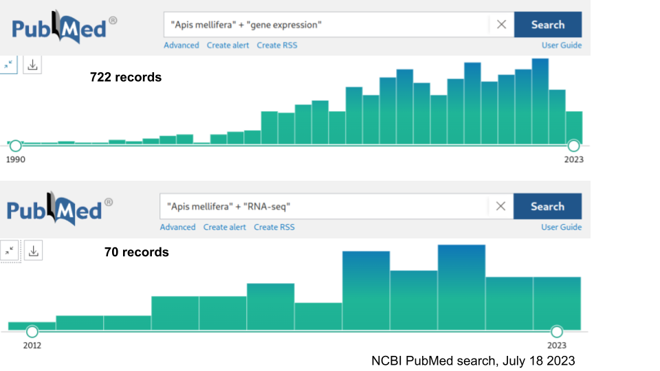
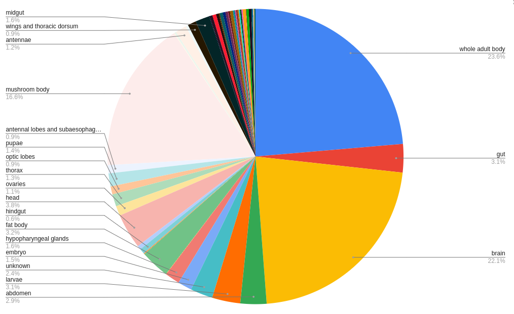
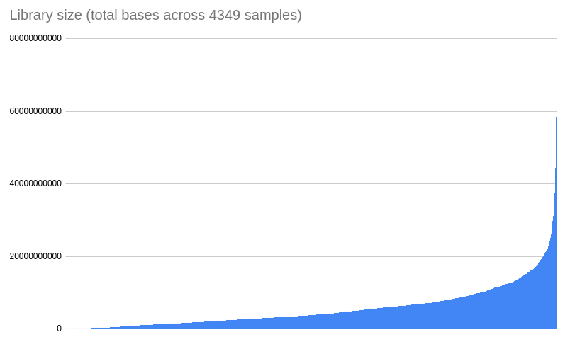
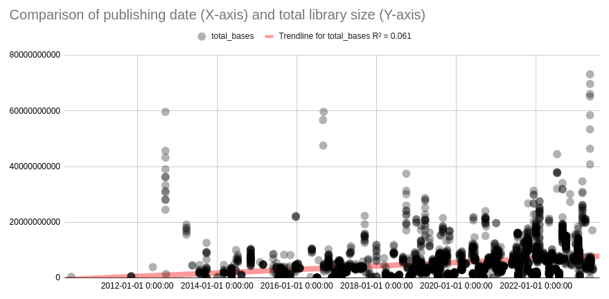
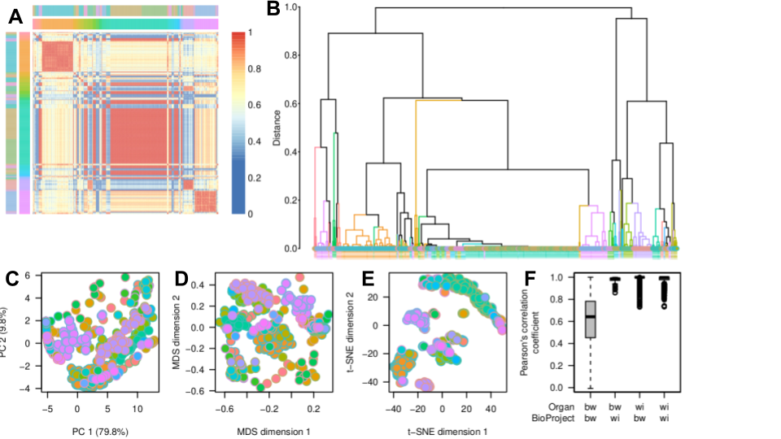

# Full Text: A snapshot and pipeline for tissue-specific gene expression meta-analysis in honey bees (Apis mellifera)

> Extracted from `2023_HoneyBeeGeneExpression.pdf`

> 5 figures extracted to `images/`

---

## Page 1

A snapshot and pipeline for tissue-specific
gene expression meta-analysis in honey
bees (Apis mellifera)
Daniel Friedman 1,2 *, Chao Tong 3, Timothy A. Linksvayer 3, Matthias Freund 4, Nicole Weronika
Keough 1, and Brian Johnson 1
1 University of California, Davis, CA, USA
2 Active Inference Institute
3 Arizona State University, Tempe, AZ, USA
4 University of Würzburg, Wurzburg, Germany
* DanielAriFriedman@gmail.com
ORCID:
DF, 0000-0001-6232-9096; CT, 0000-0001-5202-5507; TAL, 0000-0001-7034-1546; MF,
0000-0002-5683-6275; NWK, 0009-0002-1058-5105; BJ, 0000-0001-6390-7230
v1.0 ~ 12/18/2023 ~ 10.5281/zenodo.10400745
Abstract
The honey bee (Apis mellifera) is a pivotal species in both ecological and research contexts,
serving as a model organism for studying complex social behavior and physiological processes.
A critical aspect of understanding these complexities is the analysis of tissue-specific gene
expression (TSGE), a challenging task due to the need to handle large bioinformatics data and
manual tissue processing. In this study, we present a meta-analytic approach to investigate
TSGE in A. mellifera, harnessing various open-source bioinformatics packages. From an initial
pool of 4349 samples and 12,398 loci, our rigorous analysis resulted in a snapshot of 731
samples and 177 loci, representing high-quality estimates of TSGE patterns. This snapshot is
publicly available, serving as a valuable resource for researchers interested in A. mellifera and
beyond. Ongoing work will refine this analytical tool and expand its application to other species,
thereby contributing to the broader understanding of gene expression patterns.
1

## Page 2

Introduction
In the field of biological research, the honey bee (Apis mellifera) holds a significant place as a
crucial pollinator species and a model organism for studying complex social behavior and
physiological processes [1,2]. A crucial aspect of understanding these biological complexities
lies in the exploration of tissue-specific gene expression (TSGE) [3–6]. TSGE studies can focus
on a range of tissue scales, from minute regions of the brain such as the mushroom body, to the
entire insect body. Characterization of TSGE is far from trivial, as it involves the manual
processing of small tissues and interpretation of large bioinformatics data even at the
single-experiment scale [7,8].
Given limitations of biological samples, skill, resources, and time, most papers studying patterns
of TSGE will focus on a single tissue (comparing groups that differ in one or two variables such
as e.g. age, sex, or treatment status) or a small number of tissues. Even at the
single-experiment scale, it is required to normalize high-throughput gene expression data in
order to correct batch effects in RNA-seq data. Various algorithms exist to perform this
intra-experimental normalization [9–11].
Further challenges arise when performing meta-analysis across studies, in terms of jointly
analyzing their raw data. Specifically, meta-analytic challenges for TSGE include different
experimental designs, variable high-throughput sequencing technologies, and partially- or
non-overlapping scope of tissue. Additionally, combining the metadata and raw sequencing
reads from multiple studies can quickly lead to multiple computational and statistical challenges.
Only recently have methods facilitated the large-scale curation, quality control, and
harmonization of TSGE datasets across studies [12].
Tissue-specific gene expression plays a crucial role in understanding complex biological
systems and the challenges faced in analyzing such data. Advances in transcriptomics have
enabled researchers to analyze gene expression profiles across various tissues and
physiological conditions, providing insights into the molecular basis of biological processes
across species [13,14]. In honey bees, tissue-specific gene expression has been studied to
investigate the molecular mechanisms underlying colony management and physiology. Patterns
of TSGE in honey bees have been linked to various phenotypes, which can be further
investigated to understand the molecular mechanisms regulating these patterns. Any given
TSGE study in A. mellifera tends to focus on one or a few tissues. In order to compare TSGE
across studies and tissues, an explicit and formal meta-analytic approach is required.
However, for A. mellifera, as of August 2023, only a single study from 2020 of Traniello et al.
[15] appears to take a meta-analytic approach towards TSGE at all, with a specific focus on the
relationship between nestmate behavior and infection with Deformed wing virus. Thus despite
hundreds of publications discussing gene expression in A. mellifera, and dozens of studies
creating high-throughput TSGE dataset (Figure 1), essentially no general meta-analytic work
has been carried out. So while any given study may identify local patterns of variation in TSGE
(e.g. a given pattern of differential regulation among tissues or biological groups in a single
2

## Page 3

experiment), the A. mellifera research community is currently not empowered to identify
larger-scale patterns across studies and tissues.
Figure 1. Number of publications on NCBI PubMed with “Apis mellifera” + “gene expression” (A,
722 records) and “Apis mellifera” + “RNA-seq” (B, 70 records) searched on 7/18/2023.
By employing a meta-analysis approach, we can directly compare gene expression data from
different honey bee tissues, even if they are not studied together in the same experiment. For
instance, if one study examines gene expression in the brain and midgut, while another study
investigates the midgut and ovary, batch correction methods can normalize the shared
information in the midgut gene expression data to enable a direct comparison between the brain
and ovary tissues. This capability is particularly relevant for honey bees, as it allows researchers
to integrate and compare data from different studies focusing on various tissues and
physiological conditions. The meta-analytic approach facilitates the investigation of complex
molecular mechanisms and enables the discovery of novel associations and trends in gene
expression data across different tissues and studies. Ultimately, integrated gene expression
data for honey bees can provide valuable insights into the molecular basis of biological
processes and contribute to a better understanding of A. mellifera biology and colony health.
In this study, we harness the power of AMALGKIT [12,16], a toolkit for TSGE meta-analysis
across studies. Specifically designed for integrative transcriptome data processing and analysis,
AMALGKIT enables the efficient processing of large transcriptomic datasets.
Our approach towards meta-analysis of TSGE in A. mellifera is centered around a custom-built
bioinformatics pipeline that spans several stages, from the initial data acquisition and
preprocessing to in-depth downstream analyses. A key outcome of this work is a downloadable
3

## Page 4

file which represents a versioned snapshot of harmonized TSGE values for the hundreds of
samples which passed all quality control steps and were retained in the final analysis. This
versioned snapshot will enable researchers interested in TSGE patterns in A. mellifera to jump
right into data analysis, without the computationally-demanding steps associated with
processing and harmonizing raw sequence data. Additionally, this pipeline is designed with an
emphasis on reproducibility, allowing our methods to be replicated and expanded upon by other
researchers. We envisage that our comprehensive approach, backed by rigorous methodology
and commitment to reproducibility, will provide a valuable resource for the honey bee genomics
community and beyond.
Methods
Our study employed a specialized bioinformatics pipeline designed to streamline the process of
analyzing transcriptomic data. This pipeline comprises six distinct scripts, each responsible for a
specific stage in the setup, data processing, and analysis workflow. All code is available and will
continue to be versioned at https://github.com/MetaInformAnt/MetaInformAnt . The snapshot
TSGE output produced by the pipeline is available at
https://github.com/MetaInformAnt/MetaInformAnt/tree/main/Transcriptome/saved_files/Apis_mell
ifera/tables . The following sections describe the Methods in more detail.
Setting up the Computational Environment
The pipeline was executed in a Linux-based computational environment, utilizing Python version
3.6 or later. We developed a custom shell script (0_setEnv.sh) to prepare the computational
environment and install the necessary software dependencies, including bioinformatics tools
such as kallisto, amalgkit, and fastp [16–18]. This script automates the installation of these
tools, ensuring a consistent and reproducible setup across different computational systems.
Data Acquisition and Preprocessing
Reference Genome Acquisition: We used a Python script (1_download_genome.py) to
download the reference genome sequence from a reliable source. The version of the reference
genome used in this study was chosen based on its completeness, accuracy, and the availability
of annotation data (current primary reference genome for A. mellifera Amel_HAv3.1,
GCF_003254395.2).
Metadata Generation and Curation: We employed the 2_get_metadata.py Python script to
generate a comprehensive metadata set for our genomic data and organize this information in a
structured format. This metadata includes information such as the sample ID, tissue type, and
experimental condition. Upon analysis, metadata completion and norms were seen to vary
widely. Thus to ensure the inclusion of the maximum number of samples in our study, we
generated a 2.5_update_metadata.py script, which updates specific fields in the initial metadata
curation in order to make corrections to existing data (e.g. so that samples labeled by the
4

## Page 5

researchers as “whole body”, “body”, “worker bodies”, and “pooled whole bodies” can all be
considered in the same group).
Data Processing and Analysis
Downloading Sequence Read Archive (SRA) Files: Our pipeline includes a Python script
(3_parallel_download.py) that enables the efficient downloading of SRA files. This script
supports parallel downloads to accelerate the process and incorporates fastp for quality control
and preprocessing of the raw sequence data [18].
Transcript Quantification: We performed transcript quantification using the 4_quant.py script,
which leverages the capabilities of the kallisto tool for rapid pseudoalignment.
Data Curation: After transcript quantification, we used the 5_curate.py script to merge and
curate the expression data. This script applies amalgkit to consolidate individual transcript
quantification results into a single, coherent dataset suitable for downstream analyses. This
dataset includes gene expression values for each sample, normalized across the entire dataset
to enable accurate comparisons.
Post-processing and Descriptive Analysis
Following data curation, we used a range of scripts within the Analysis folder to perform
additional descriptive and visual analyses. These analyses included principal component
analysis to examine the overall structure of the data, clustering analysis to identify groups of
samples with similar expression patterns, and differential expression analysis to identify genes
that show significant differences between groups. These analyses provided crucial insights into
the processed data, assisting in the overall interpretation of our study's results.
The output files are available at the Github repository (Apis_mellifera_July_2023), for usage by
anyone interested in using this pre-computed resource describing harmonized gene expression
in Apis mellifera and eventually other species.
Reproducibility
To ensure the reproducibility of this study, all scripts and data outputs of this pipeline are publicly
available in https://github.com/MetaInformAnt/MetaInformAnt .
Future development of the MetaInformAnt project will focus on integrating Gene Ontology (GO)
analysis for enhanced understanding of gene functions, as well as integrating features such as
data visualization and generative/synthetic intelligence methods.
5

## Page 6

Results
The results presented here pertain to the July 2023 snapshot analysis. Future work will continue
to refine the pipeline and re-run the analysis as new TSGE studies are added.
Metadata curation and description
Initial querying through Entrez search for relevant samples was accomplished with a species
focus on "Apis mellifera", and a set of focusing criteria (utilization of any Illumina platform, and a
filter for "type rnaseq" and "sra biosample"). This search resulted in 4349 biological samples.
The earliest sample included in this analysis was published in May 2010 (PRJNA122153), and
the most recent samples included were uploaded in June 2023.
Initially the metadata table was of quite variable quality and completeness, reflecting the
research practices of a wide range of groups over 13 years (95 unique values in “lab” field and
110 unique values in “center” field). Initially the metadata table contained 133 unique named
tissues; after the 2.5_update_metadata.py script was used to resolve spelling/naming this was
distilled down to 54 unique curation groups. 11.8% of metadata did not include tissue
information in the tissue column, in some cases it was possible to manually infer the tissue from
information in other fields, in the remaining cases the tissue was included as “unknown” tissue.
The most represented tissues were “whole adult body”, “brain”, and “mushroom body” (of the
brain); together these three tissues constituted 62.3% of all samples (Figure 2).
Figure 2. Across the 4349 samples initially included in the metadata table, this pie chart shows
the proportion of their representation.
6

## Page 7

Several optional metadata fields showed variable use, limiting their ability to serve as surrogate
variables during the data harmonization stage (including 99.1% blank for “genotype”, 67.5%
blank for “sex”, 77.8% blank for “age”, 86.5% blank for “treatment”, and 94.6% empty for
“lat_lon” GPS information). While some of these meta-data fields might be inferred with some
precision (e.g. determining sex using sex-specific patterns of TSGE, or inferring this from
task-specific annotation), much of this metadata is currently not included in the NCBI database.
17 unique Illumina platform models were represented in the metadata table, reflecting
development and changes in accessibility of technical solutions utilized for RNA-seq over the
last few years.
In terms of library size (e.g. number of reads multiplied by average read length), a wide range
was observed. 37 samples had more than 30,000,000,000 total bases, and 38 samples had less
than 10,000,000 total bases (Figure 3). Average library size increased through time, though only
a small fraction of variance across libraries in total base size was associated with publishing
date (Figure 4, R2=0.061).
Figure 3. Total number of bases per library, across 4349 samples included in the initial metadata
table
7

## Page 8

Figure 4. Relationship between date of library submission (X-axis) and total library size in bases
(Y-axis). Each point is a RNA-seq library, and points are partially transparent to display
concentrations of samples. Linear trendline is drawn that shows the increasing average size of
libraries through time.
Tissue-specific Gene Expression harmonization
Given the metadata described above, AMALGKIT was used through the provided scripts in
order to download, process, quantify, and harmonize TSGE values across studies. After all
processing steps of AMALGKIT, only a small fraction of samples and loci remained for analysis
(177 loci retained from 12,398 in the assembly, and 731 samples retained from the 4349 in the
initial metadata table). The broad-scale TSGE patterns of these loci and samples are visualized
in Figure 5. In the current snapshot, these loci might be understood as those with high-quality
estimates of TSGE patterns across tissues and studies, and the snapshot dataset serves as a
reference for relevant questions.
8

## Page 9

Figure 5. Broad-scale patterns of expression in the final reduced and harmonized TSGE
dataset. A) Pairwise correlation between samples, where red reflects high correlations (usually
within a tissue group), yellow represents medium correlation, and blue represents low pairwise
correlation. B) Dendrogram reflecting hierarchical clustering of samples, where colored vertical
lines represent clades of clustered tissues with unmixed composition. Various dimensional
projections are possible with the dataset, including C) Principal Component Analysis (PCA), D)
Multi-Dimensional Scaling (MDS), and E) t-distributed Stochastic Neighbor Embedding (t-SNE).
F) Box plot with Pearson’s correlation coefficient as amalgkit processing and pruning stages
proceeded.
Discussion
Our study presents a comprehensive, meta-analytic approach to the study of tissue-specific
gene expression (TSGE) in the honey bee (Apis mellifera), a pivotal species in both ecological
and research contexts. By developing an open source bioinformatics pipeline and utilizing the
power of AMALGKIT, we have managed to process, analyze, and harmonize large
transcriptomic datasets across multiple studies. The pipeline, hosted on GitHub and openly
accessible, includes scripts for setting up the computational environment, acquiring and
preprocessing data, conducting the main analysis, and performing post-processing descriptive
analyses. As a result of our pipeline's application, a versioned snapshot of harmonized TSGE
values is available for researchers to use in future studies.
9

## Page 10

Our results, as of the July 2023 snapshot analysis, revealed broad-scale patterns of TSGE in A.
mellifera. The curation and analysis steps resulted in 177 loci retained from the 12,398 in the
genome assembly and 731 samples retained from the initial pool of 4349. These loci can be
understood as those with high-quality estimates of TSGE patterns across tissues and studies.
Although the initial dataset contained a wide variety of tissues, our curation script severely
winnowed the inclusion of both samples and loci, ensuring a more homogeneous and
manageable dataset for analysis.
There may be several reasons why the AMALGKIT processing reduced the scope of
high-quality harmonized TSGE values so greatly. First, there may be issues harmonizing TSGE
collected from experiments with such variable characteristics (e.g. related to Illumina platform,
library preparation methods, dissection, and so on). Second, few tissues were heavily
represented numerically and included in many studies (e.g. whole body, brain, and mushroom
body), while some tissues were analyzed in only one or a few studies (e.g. glands, larval
tissues) and very few studies compared many tissues. This asymmetric coverage of tissues
overall, and common single-tissue designs, could prevent effective statistical learning of
tissue-by-loci-by-metadata patterns which are essential for meta-analytic harmonization. Third,
incomplete and heterogeneous usage of metadata fields means that the surrogate variable
analysis used in data harmonization may have been underpowered, reflecting the partial state of
information in the NCBI SRA database.
Limitations
The challenge of missing or inconsistently reported metadata across studies remains a pressing
issue. Enhancing the standards for metadata reporting would greatly facilitate meta-analytic
efforts and increase the reliability of the results. It would also allow for more complex analyses,
such as looking at the effects of factors like age, sex, or treatment, which were often absent in
the metadata for this study.
The meta-analytical approach employed in this study relies on the availability and quality of
existing gene expression data from various sources. This dependency may introduce biases or
limitations in the analysis, as the study can only incorporate data that has been previously
generated and made accessible. Additionally, the quality and accuracy of the data may vary
across different studies, which could potentially impact the reliability of the meta-analysis
results. Further work could analyze TSGE in subsets of A. mellifera samples to establish
statistical power, and also consider analyses in Drosophila melanogaster, the insect with the
most available datasets. These studies could help estimate the kinds of data processing
parameters & possibilities for TSGE harmonization which this study only began to explore.
10

## Page 11

Conclusion
The study’s results are the beginning of a broader endeavor. We see several crucial directions
for future research. The MetaInformAnt project, of which this study forms a part, aims to
continuously refine the pipeline and re-run the analysis as new TSGE studies are added for A.
mellifera and other species. With improvements or complete alternatives to the pipeline here,
the cutting edge of bioinformatics research might increasingly provide valuable resources for the
scientific community. Given that our pipeline is openly available and reproducible, researchers
studying TSGE in other species can adapt and utilize it. This would greatly facilitate the
generation of harmonized TSGE datasets across a broad range of organisms, contributing to
our understanding of gene expression patterns and their role in biological function and disease.
Future research utilizing tissue-specific gene expression (TSGE) meta-analyses in A. mellifera,
and other species, presents several exciting avenues of exploration. One direction is to
investigate how rates of molecular evolution and patterns of standing genetic variation differ
among genes in various clusters [19,20]. With such composite expression data, we could delve
into patterns of genetic variation at multiple levels, from intra-population to inter-population and
even between different lineages or strains. This could provide valuable insights into how
different definitions of lineage can affect our understanding of these patterns. In the future,
single-cell expression data could be integrated into the analysis of tissue-specific gene
expression in honey bees to provide an even more detailed understanding of cellular
heterogeneity and molecular mechanisms; however, this level of resolution is not presented in
the current study.Additionally, the integration of TSGE data with other types of biological data,
such as phenotypic or ecological data, could shed light on the causes and consequences of
integrated biological patterns. Furthermore, comparisons across different species could
illuminate how these patterns of TSGE have evolved and contribute to the functional diversity of
life.
In conclusion, our study represents an advance in the meta-analytic study of TSGE in A.
mellifera. It provides a valuable resource for researchers and paves the way for future
advancements in bioinformatics research. We anticipate that this work will have broad-reaching
implications for our understanding of gene expression patterns, in insects and beyond.
Acknowledgements
We acknowledge the technical support and vision of Kenji Fukushima.
Funding
DAF was funded by the National Science Foundation (#2010290).
11

## Page 12

Works Cited
1.
Lemanski NJ, Cook CN, Smith BH, Pinter-Wollman N. A Multiscale Review of Behavioral
Variation in Collective Foraging Behavior in Honey Bees. Insects. 2019;10: 370.
doi:10.3390/insects10110370
2.
Friedman DA, Johnson BR, Linksvayer TA. Distributed physiology and the molecular basis
of social life in eusocial insects. Horm Behav. 2020;122: 104757.
doi:10.1016/j.yhbeh.2020.104757
3.
Vannette RL, Mohamed A, Johnson BR. Forager bees (Apis mellifera) highly express
immune and detoxification genes in tissues associated with nectar processing. Sci Rep.
2015;5: 16224. doi:10.1038/srep16224
4.
Kannan K, Shook M, Li Y, Robinson GE, Ma J. Comparative Analysis of Brain and Fat Body
Gene Splicing Patterns in the Honey Bee, Apis mellifera. G3 . 2019;9: 1055–1063.
doi:10.1534/g3.118.200857
5.
Christie AE. Assessment of midgut enteroendocrine peptide complement in the honey bee,
Apis mellifera. Insect Biochem Mol Biol. 2020;116: 103257.
doi:10.1016/j.ibmb.2019.103257
6.
Bresnahan ST, Döke MA, Giray T, Grozinger CM. Tissue-specific transcriptional patterns
underlie seasonal phenotypes in honey bees (Apis mellifera). Mol Ecol. 2022;31: 174–184.
doi:10.1111/mec.16220
7.
Johnson BR, Atallah J, Plachetzki DC. The importance of tissue specificity for RNA-seq:
highlighting the errors of composite structure extractions. BMC Genomics. 2013;14: 586.
doi:10.1186/1471-2164-14-586
8.
Atallah J, Plachetzki DC, Jasper WC, Johnson BR. The utility of shallow RNA-Seq for
documenting differential gene expression in genes with high and low levels of expression.
PLoS One. 2013;8: e84160. doi:10.1371/journal.pone.0084160
9.
Haghverdi L, Lun ATL, Morgan MD, Marioni JC. Batch effects in single-cell
RNA-sequencing data are corrected by matching mutual nearest neighbors. Nat Biotechnol.
2018;36: 421–427. doi:10.1038/nbt.4091
10. Zhang Y, Parmigiani G, Johnson WE. ComBat-seq: batch effect adjustment for RNA-seq
count data. NAR Genom Bioinform. 2020;2: lqaa078. doi:10.1093/nargab/lqaa078
11. Sprang M, Andrade-Navarro MA, Fontaine J-F. Batch effect detection and correction in
RNA-seq data using machine-learning-based automated assessment of quality. BMC
Bioinformatics. 2022;23: 279. doi:10.1186/s12859-022-04775-y
12. Fukushima K, Pollock DD. Amalgamated cross-species transcriptomes reveal
organ-specific propensity in gene expression evolution. Nat Commun. 2020;11: 4459.
doi:10.1038/s41467-020-18090-8
13. Supplitt S, Karpinski P, Sasiadek M, Laczmanska I. Current Achievements and Applications
of Transcriptomics in Personalized Cancer Medicine. Int J Mol Sci. 2021;22.
12

## Page 13

doi:10.3390/ijms22031422
14. Ali MA, Lee J. Transcriptome Profiling: Progress and Prospects. Elsevier; 2022. Available:
https://play.google.com/store/books/details?id=7RxoEAAAQBAJ
15. Traniello IM, Bukhari SA, Kevill J, Ahmed AC, Hamilton AR, Naeger NL, et al. Meta-analysis
of honey bee neurogenomic response links Deformed wing virus type A to precocious
behavioral maturation. Sci Rep. 2020;10: 3101. doi:10.1038/s41598-020-59808-4
16. Fukushima K. amalgkit: RNA-seq data amalgamation for a large-scale evolutionary
transcriptomics. Github; Available: https://github.com/kfuku52/amalgkit
17. Pimentel H, L BN, Puente S, Melsted P, Pachter L. Differential analysis of RNA-Seq
incorporating quantification uncertainty. bioRxiv. 2016. p. 058164. doi:10.1101/058164
18. Chen S, Zhou Y, Chen Y, Gu J. fastp: an ultra-fast all-in-one FASTQ preprocessor.
Bioinformatics. 2018;34: i884–i890. doi:10.1093/bioinformatics/bty560
19. Mikheyev AS, Linksvayer TA. Genes associated with ant social behavior show distinct
transcriptional and evolutionary patterns. Elife. 2015;4: e04775. doi:10.7554/eLife.04775
20. Jasper WC, Linksvayer TA, Atallah J, Friedman D, Chiu JC, Johnson BR. Large-scale
coding sequence change underlies the evolution of postdevelopmental novelty in honey
bees. Mol Biol Evol. 2015;32: 334–346. doi:10.1093/molbev/msu292
13

---
*Extraction method: pymupdf*
