# Full Text: Active Inference Multi-Track Exemplar

> Extracted from `Friedman_2026_Active_f191b48f.pdf`

> 34 figures extracted to `images/`

---

## Page 1

BEGINNING OF TRANSMISSION
State: unpublished / pending pairing
Pairing: pending — unresolved: - ￿GitHub release URL: pending - ￿PDF SHA-256: pending
Release metadata
Field
Value
Title
Active Inference Multi-Track Exemplar
Version
0.3.2
Concept DOI
10.5281/zenodo.20417021
Version DOI
10.5281/zenodo.20693424
GitHub
docxology/template_active_inference
Zenodo
https://zenodo.org/records/20417021
SHA-256
pending
SHA-512
pending
How to verify
•
Scan Integrity QR and compare the embedded SHA-256 prefix to the table above.
•
Scan Zenodo / GitHub QR codes and confirm they resolve to this release pairing.
•
Full hashes and structured fields: ../data/transmission_manifest.json.
Figure 1: Integrity QR strip
Structured manifest: ../data/transmission_manifest.json
Figure 2: Publication pairing flow
Stego: off | overlays text | barcodes on | XMP on | manifest on →./secure_run.sh

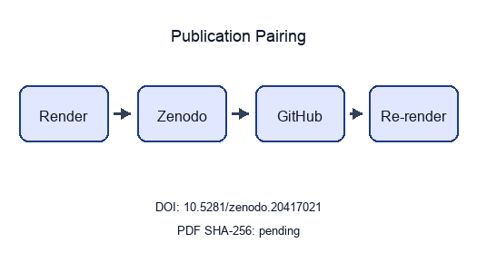

## Page 2

Active Inference Multi-Track Exemplar
Sheaf-Composed Manuscript with pymdp Sophisticated Inference
Daniel Ari Friedman
Active Inference Institute
daniel@activeinference.institute
ORCID: 0000-0001-6232-9096
DOI: 10.5281/zenodo.20417021
2026-06-26

## Page 3

Contents
1
Sheaf Track Coverage
3
1.1
Introduction . . . . . . . . . . . . . . . . . . . . . . . . . . . . . . . . . . . . . . . . . . . . . . . . . . . . . . . . . . . . . .
3
2
Abstract
4
Introduction
5
3
Motivation and scope
5
3.1
Scientific scope . . . . . . . . . . . . . . . . . . . . . . . . . . . . . . . . . . . . . . . . . . . . . . . . . . . . . . . . . . . .
5
3.2
Manuscript structure . . . . . . . . . . . . . . . . . . . . . . . . . . . . . . . . . . . . . . . . . . . . . . . . . . . . . . . . .
5
4
Contributions
6
4.1
Scientific contributions . . . . . . . . . . . . . . . . . . . . . . . . . . . . . . . . . . . . . . . . . . . . . . . . . . . . . . . .
6
4.1.1
Ontology bindings . . . . . . . . . . . . . . . . . . . . . . . . . . . . . . . . . . . . . . . . . . . . . . . . . . . . . .
6
Methods
7
5
Bernoulli–Ising analytical model
7
5.0.1
Ontology bindings . . . . . . . . . . . . . . . . . . . . . . . . . . . . . . . . . . . . . . . . . . . . . . . . . . . . . .
7
6
pymdp simulation harness
9
6.0.1
Ontology bindings . . . . . . . . . . . . . . . . . . . . . . . . . . . . . . . . . . . . . . . . . . . . . . . . . . . . . .
9
7
Lean formalization boundary
11
7.0.1
Proof extraction track . . . . . . . . . . . . . . . . . . . . . . . . . . . . . . . . . . . . . . . . . . . . . . . . . . . .
12
8
Sheaf composition
13
8.1
Compose contract
. . . . . . . . . . . . . . . . . . . . . . . . . . . . . . . . . . . . . . . . . . . . . . . . . . . . . . . . . .
13
8.2
Coverage and figures . . . . . . . . . . . . . . . . . . . . . . . . . . . . . . . . . . . . . . . . . . . . . . . . . . . . . . . . .
13
8.3
Compose commands . . . . . . . . . . . . . . . . . . . . . . . . . . . . . . . . . . . . . . . . . . . . . . . . . . . . . . . . .
13
8.4
Law verification . . . . . . . . . . . . . . . . . . . . . . . . . . . . . . . . . . . . . . . . . . . . . . . . . . . . . . . . . . . .
13
8.4.1
Base poset and presheaf . . . . . . . . . . . . . . . . . . . . . . . . . . . . . . . . . . . . . . . . . . . . . . . . . . .
13
8.4.2
Verified sheaf laws . . . . . . . . . . . . . . . . . . . . . . . . . . . . . . . . . . . . . . . . . . . . . . . . . . . . . .
14
8.4.3
Scope (what is and is not claimed) . . . . . . . . . . . . . . . . . . . . . . . . . . . . . . . . . . . . . . . . . . . . .
14
8.4.4
Artifact diffoscope track . . . . . . . . . . . . . . . . . . . . . . . . . . . . . . . . . . . . . . . . . . . . . . . . . . .
14
8.4.5
Artifact license track . . . . . . . . . . . . . . . . . . . . . . . . . . . . . . . . . . . . . . . . . . . . . . . . . . . . .
16
8.5
Sheaf fragment track registry . . . . . . . . . . . . . . . . . . . . . . . . . . . . . . . . . . . . . . . . . . . . . . . . . . . .
20
8.6
IMRAD binding matrix . . . . . . . . . . . . . . . . . . . . . . . . . . . . . . . . . . . . . . . . . . . . . . . . . . . . . . .
23
8.7
Section-track status
. . . . . . . . . . . . . . . . . . . . . . . . . . . . . . . . . . . . . . . . . . . . . . . . . . . . . . . . .
24
8.8
Track status . . . . . . . . . . . . . . . . . . . . . . . . . . . . . . . . . . . . . . . . . . . . . . . . . . . . . . . . . . . . . .
25
8.9
Render and logging summary . . . . . . . . . . . . . . . . . . . . . . . . . . . . . . . . . . . . . . . . . . . . . . . . . . . .
26
8.10 Evidence crosswalk . . . . . . . . . . . . . . . . . . . . . . . . . . . . . . . . . . . . . . . . . . . . . . . . . . . . . . . . . .
26
8.11 Artifact producer graph . . . . . . . . . . . . . . . . . . . . . . . . . . . . . . . . . . . . . . . . . . . . . . . . . . . . . . .
27
8.12 Semantic gluing restrictions . . . . . . . . . . . . . . . . . . . . . . . . . . . . . . . . . . . . . . . . . . . . . . . . . . . . .
29
8.13 Track-lane matrix
. . . . . . . . . . . . . . . . . . . . . . . . . . . . . . . . . . . . . . . . . . . . . . . . . . . . . . . . . .
30
8.14 Track improvement scope . . . . . . . . . . . . . . . . . . . . . . . . . . . . . . . . . . . . . . . . . . . . . . . . . . . . . .
39
Results
40
9
Mutual-information parameter sweep
40
10 Free-energy decomposition
41
11 T-maze active-inference rollout
42
12 Validation invariants
46
12.0.1 State-space catalog track
. . . . . . . . . . . . . . . . . . . . . . . . . . . . . . . . . . . . . . . . . . . . . . . . . .
46
12.0.2 Causal ablation track
. . . . . . . . . . . . . . . . . . . . . . . . . . . . . . . . . . . . . . . . . . . . . . . . . . . .
46
Discussion
47
13 Limitations and outlook
47
13.1 What this demonstrates . . . . . . . . . . . . . . . . . . . . . . . . . . . . . . . . . . . . . . . . . . . . . . . . . . . . . . .
47
13.2 Limitations . . . . . . . . . . . . . . . . . . . . . . . . . . . . . . . . . . . . . . . . . . . . . . . . . . . . . . . . . . . . . .
47
13.3 Sheaf audit and outlook . . . . . . . . . . . . . . . . . . . . . . . . . . . . . . . . . . . . . . . . . . . . . . . . . . . . . . .
47
13.3.1 Ontology bindings . . . . . . . . . . . . . . . . . . . . . . . . . . . . . . . . . . . . . . . . . . . . . . . . . . . . . .
48

## Page 4

13.3.2 Release notes evidence track
. . . . . . . . . . . . . . . . . . . . . . . . . . . . . . . . . . . . . . . . . . . . . . . .
48
Appendix
49
14 Appendix: full track coverage
49
14.0.1 Appendix track: artifact diffoscope . . . . . . . . . . . . . . . . . . . . . . . . . . . . . . . . . . . . . . . . . . . . .
49
14.0.2 Appendix track: artifact license
. . . . . . . . . . . . . . . . . . . . . . . . . . . . . . . . . . . . . . . . . . . . . .
50
14.0.3 Appendix track: proof extraction . . . . . . . . . . . . . . . . . . . . . . . . . . . . . . . . . . . . . . . . . . . . . .
55
14.0.4 Appendix track: state-space catalog . . . . . . . . . . . . . . . . . . . . . . . . . . . . . . . . . . . . . . . . . . . .
55
14.0.5 Appendix track: causal ablation
. . . . . . . . . . . . . . . . . . . . . . . . . . . . . . . . . . . . . . . . . . . . . .
55
14.0.6 Ontology bindings . . . . . . . . . . . . . . . . . . . . . . . . . . . . . . . . . . . . . . . . . . . . . . . . . . . . . .
55
14.0.7 Appendix track: release notes evidence
. . . . . . . . . . . . . . . . . . . . . . . . . . . . . . . . . . . . . . . . . .
56
15 Conclusion
57
16 References
58
2

## Page 5

1
Sheaf Track Coverage
This page summarizes which sheaf fragment tracks are bound for each IMRAD row in docs/manuscript/sheaf/manifest.yaml. The
matrix is regenerated at compose time.
Totals: 95 present / 95 bound / 0 missing (gray).
Color
Meaning
Black
Track present (bound and fragment exists)
White
Absent (not bound for this row)
Gray
Missing (bound but fragment file absent)
1.1
Introduction
• Introduction (group)
• Motivation and scope
• Contributions ## Methods
• Methods (group)
• Bernoulli–Ising analytical model
• pymdp simulation harness
• Lean formalization boundary
• Sheaf composition ## Results
• Results (group)
• Mutual-information parameter sweep
• Free-energy decomposition
• T-maze active-inference rollout
• Validation invariants ## Discussion
• Discussion (group)
• Limitations and outlook ## Appendix
• Appendix (group)
• Appendix: full track coverage
Figure 3: Sheaf track coverage matrix: 17 IMRAD rows × 34 fragment columns. Black = present (P), white = absent (—), gray =
missing (M). Counts: 95 present / 95 bound / 0 missing. Generated from output/data/sheaf_coverage_matrix.json.
Appendix row 16_appendix_full_sheaf.md binds 33 fragment track types as a composability proof (registry defines 34 types;
optional layers is methods-only).
3

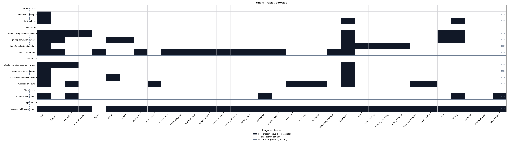

## Page 6

2
Abstract
We study a minimal Active Inference stack on toy models: a Bernoulli–Ising analytical oracle, a pymdp T-maze rollout, and a sheaf-
indexed compose contract that binds 34 fragment tracks into 12 flat IMRAD sections. The methodological contribution is a discipline
rather than a domain finding: every reported number is hydrated from a generated artifact and every cross-track claim is machine-
checked before rendering, so no figure or statistic can drift from the artifact that produced it — 6 sheaf axioms are verified before
composition and 25 negative controls keep each failure path live. Claims are limited to those models and their generated artifacts.
sec. 1 reports a 17-row coverage matrix (5 IMRAD group headers) regenerated from the live manifest at compose time. sec. 6
documents the T-maze harness aligned with pymdp sophisticated_inference examples.
sec. 12 records 12 / 12 invariant checks passed. SI planning horizon: 2 steps. Sweep RMSE 0 nats bounds analytical–empirical
agreement on the coupling grid.
4

## Page 7

Introduction
3
Motivation and scope
3.1
Scientific scope
This manuscript couples three tracks on toy Active Inference models: a Bernoulli–Ising analytical oracle, a pymdp T-maze rollout,
and a sheaf-indexed assembly contract that binds 34 optional fragment tracks under an IMRAD outline. The conceptual lineage is
the free-energy and active-inference literature [Friston, 2010, Buckley et al., 2017, Parr et al., 2022], with critical scope pressure from
accounts that separate FEP’s broad organizing role from direct empirical brain claims [Gershman, 2019]. Here that distinction is
operational: the scientific claims stay within these models and their generated artifacts, not biological agents.
3.2
Manuscript structure
Three scientific tracks (analytical, pymdp, sheaf composition) map onto 34 composable fragment types and 31 pipeline gates
(fig. 4). sec. 1 summarizes which fragment tracks bind to each manifest row. sec. 8 documents the compose pipeline, coverage semantics
(eq. 3), and strict validation gates.
The pymdp track follows the pymdp sophisticated_inference examples [Heins et al., 2022] with a minimal T-maze and planning
horizon policy_len = 2. Other sections cite sec. 6 instead of repeating that reference.
5

## Page 8

4
Contributions
4.1
Scientific contributions
1. Analytical oracle (sec. 5): closed-form mutual information and free-energy decomposition on a symmetric Bernoulli–Ising toy
with an independent exact-recomputation cross-check (sec. 9, sec. 10).
2. Active-inference harness (sec. 6): deterministic pymdp T-maze rollout — default state_inference belief filtering, with
sophisticated expected-free-energy policy inference selectable via mode: policy_inference — with logged beliefs, actions, and
merged invariant gates (sec. 11, sec. 12).
3. Sheaf-indexed composition (sec. 8): 34 optional fragment types bind to 17 manifest rows under eq. 3, with a 33-track appendix
composability proof (sec. 14).
fig. 4 maps the three scientific tracks to 31 pipeline gates and 34 composable fragment renderers. Measured invariant checks: 12 /
12 passed.
Ontology-facing symbols are checked per model: the Bernoulli toy binds pi1, pi2, J, gamma, and q_joint, while the SI T-maze
binds location, observation, policy, and belief_entropy to HiddenState, ObservationLikelihood, PolicyPosterior, and Be-
liefEntropy (fig. 6, sec. 6).
Figure 4: Multi-track architecture: analytical, pymdp, and sheaf composition lanes mapped to 31 pipeline gates and 34 composable
fragment types.
4.1.1
Ontology bindings
• expected_free_energy →ExpectedFreeEnergy
• location →HiddenState
• observation →ObservationLikelihood
• policy →PolicyPosterior
6

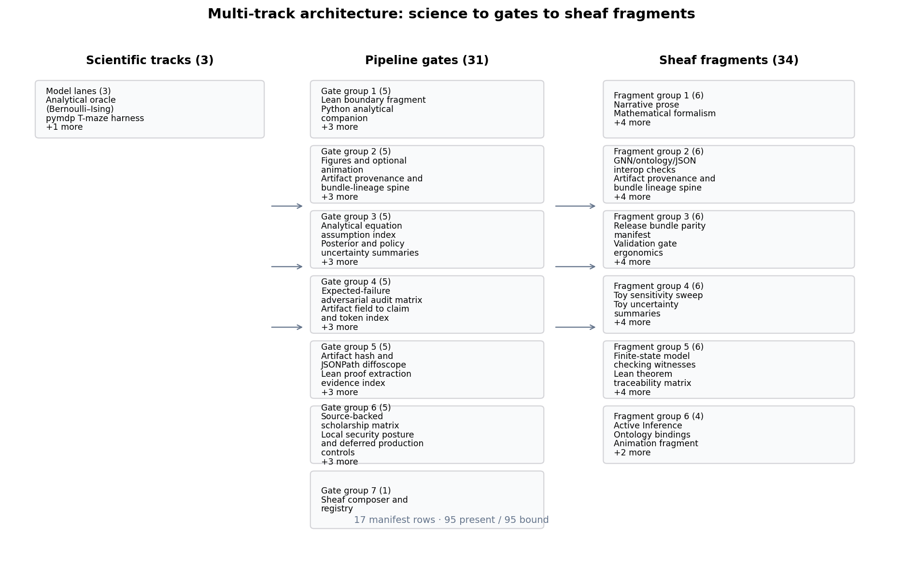

## Page 9

Methods
5
Bernoulli–Ising analytical model
The analytical method is a finite K=2 Bernoulli / Ising oracle. The entangled joint eq. 1 gives closed-form mutual information 𝐼(𝜆);
output/data/parameter_sweep.csv then checks the same curve by an independent exact total-correlation recomputation before the
value is used in sec. 9. GNN and ontology rows share the same symbol surface (fig. 6), so the derivation, sweep, and model notation
are one audited toy contract rather than parallel descriptions.
The scope is intentionally small: finite variational quantities only, no sampling, and no empirical generalization. “Free energy” here
means exactly computed variational functionals on this tiny discrete state-space, aligned with mathematical FEP reviews [Buckley
et al., 2017], not continuous-time or biological FEP dynamics [Gershman, 2019]. The generated sweep contains 21 grid points, and the
merged invariant report records 12 / 12 passing checks.
The entangled joint over binary policies satisfies
𝑞𝜆(𝜋) ∝𝐸(𝜋) exp(𝜆𝐽(𝜋)),
(1)
with symmetric Ising coupling 𝐽and deformation parameter 𝜆. Let 𝜎(𝜆) = 𝑞𝜆(𝜋1 = 𝜋2) be the probability that the two streams agree
(the diagonal mass of the 2×2 joint); by symmetry both marginals are uniform. With binary entropy 𝐻𝑏(𝑝) = −𝑝log 𝑝−(1−𝑝) log(1−𝑝)
in nats, the joint entropy is 𝐻(𝑞𝜆) = log 2 + 𝐻𝑏(𝜎(𝜆)) while each marginal contributes log 2, so the mutual information is
𝐼(𝜆) = ∑
𝑘
𝐻(𝑞𝑘) −𝐻(𝑞𝜆) = log 2 −𝐻𝑏(𝜎(𝜆)),
vanishing at 𝜆= 0 (𝜎= 1
2, independent streams) and saturating at log 2 as 𝜆→∞(𝜎→1, perfectly entangled). These symbols are
the rows of analytical_assumption_index.json, so the derivation is auditable rather than asserted.
The analytical track writes a parameter sweep comparing closed-form mutual information with an independent exact recomputation
of it (via total correlation) across 𝜆∈[0, 4] on 21 grid points (sec. 9, fig. 5).
The assumption_index fragment makes the analytical equations inspectable as a generated artifact instead of relying on prose
labels. output/data/analytical_assumption_index.json indexes 7 finite-model equation identifiers and 7 rows; the hydrated pass
flag is true.
The index is deliberately narrow. It covers the Bernoulli-Ising toy equations, their finite binary state assumptions, and the generated
artifacts that test the same symbols. Any missing equation identifier or empty assumption list fails the toy-sweep validation gate.
Figure 5: Closed-form 𝐼(𝜆) and an independent exact recomputation via total correlation for the symmetric Bernoulli-Ising toy across
21 grid points up to 𝜆max = 4; grid maximum 0.6031 nats. Both estimators are deterministic (no sampling), so the right panel is a
cross-implementation agreement check (max residual 0 nats), not a sampling residual.
The Bernoulli toy is declared in gnn/bernoulli_toy.gnn.md (GNN v1.1), following the GNN notation role described by Smekal
and Friedman [Smékal and Friedman, 2023]. fig. 6 links GNN variables to Active Inference Ontology terms bound in the analytical
ontology fragment; round-trip parity is checked before render.
Measured MI and sweep artifacts in sec. 9 ground the same symbol map used in the concordance diagram.
5.0.1
Ontology bindings
• E1 →Stream1HabitPrior
• E2 →Stream2HabitPrior
• J →CrossStreamCouplingPotential
• gamma →SophisticationWeight
7

## Page 10

Figure 6: GNN ↔ontology concordance for the Bernoulli–Ising toy (GNN v1.1).
• lam →EntanglementDeformationParameter
• pi1 →Stream1PolicyVector
• pi2 →Stream2PolicyVector
• q_joint →EntangledJointPosterior
8

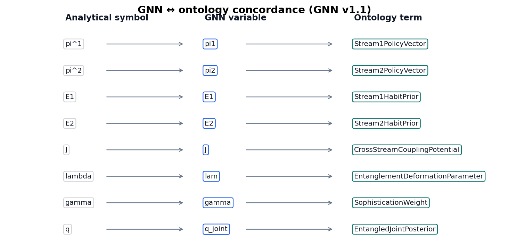

## Page 11

6
pymdp simulation harness
Sophisticated inference (planning horizon).
The pymdp method is a deterministic state-inference harness on a minimal T-
maze (fig. 7) with planning horizon policy_len = 2. The discrete-state framing follows finite POMDP active-inference treatments
and sophisticated-inference analyses [Da Costa et al., 2020, Smith et al., 2022, Friston et al., 2021, Da Costa et al., 2023], and the
implementation anchor is the pymdp software paper [Heins et al., 2022]. The default state_inference rollout writes the summary/trace
artifacts used in sec. 11; mean belief entropy is 0.3251.
The method keeps runtime, posterior, and extension evidence separate.
output/data/si_policy_comparison.json compares
state_inference and policy_inference over declared toy horizons and seeds without replacing the default rollout (4 rows; complete-
grid flag 1). Agent construction and backend warnings live in output/reports/pymdp_runtime_diagnostics.json (4 constructions, 4
known third-party warnings, 0 unexpected warnings). Posterior rows live in output/data/pymdp_policy_posterior_grid.json and
must remain normalized (1).
Graph-world artifacts are deterministic extension outputs declared in tracks.yaml rather than new empirical claims. simulate_si
_graph_world.py writes summary and trace artifacts for the finite graph path; the regenerated summary reports 4 nodes, 4 steps, and
goal-reached flag 1. The topology-trace extension records 4 toy topology traces with agreement flag 1.
Given generative matrices 𝐴, 𝐵, 𝐶, 𝐷, pymdp computes state beliefs 𝑞(𝑠) via variational inference (infer_states).
The Agent
is configured with planning horizon 𝐻= 2, which defines the policy depth used when constructing candidate policies (logged as
num_policies in the SI summary artifact; see sec. 11).
The default harness records belief entropy per step; extending to full expected-free-energy policy selection (infer_policies) is
documented as a follow-on track in sec. 13.
SI artifacts (summary, trace, optional JSONL log) record step count, actions, observations, and belief entropy for sec. 11. Steps
recorded: 2. Branching-time and variational formulations of active inference planning are treated here as related planning context
[Champion et al., 2021, Nuijten et al., 2026]; the live evidence remains the finite local artifacts si_policy_grid.json, si_efe_terms.
json, and model_checking_witnesses.json, not a claim about scalable planning performance.
The interop fragment treats the GNN files, JSON views, and ontology bindings as a round-trip contract rather than parallel
documentation. output/data/interop_roundtrip_report.json records 2 deterministic checks; the manuscript only claims losslessness
when true is true.
The stricter lint artifacts are adjacent evidence, not new model claims: output/data/gnn_roundtrip_report.json, output/rep
orts/gnn_lint_report.json, output/data/ontology_alias_index.json, and output/data/ontology_profile_matrix.json must
agree before the interop row passes. A missing GNN variable, duplicate ontology alias, dropped JSON field, shape diff, or dtype diff is
therefore a validation failure before rendering.
Figure 7: T-maze generative model schematic (2-step policy horizon, state_inference mode).
See gnn/si_tmaze.gnn.md for a GNN view of the T-maze hidden state, observation, and policy variables with ontology bindings.
6.0.1
Ontology bindings
• belief_entropy →BeliefEntropy
• loc →HiddenState
• obs →ObservationLikelihood
9

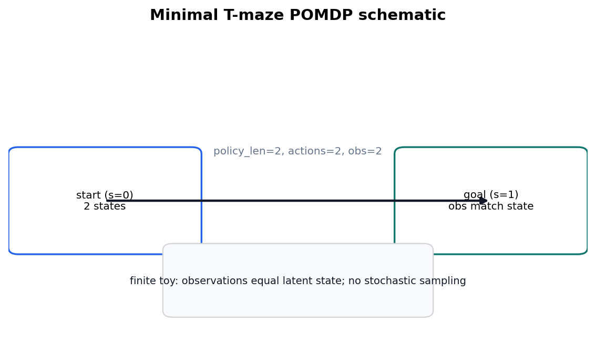

## Page 12

• pi →PolicyPosterior
10

## Page 13

7
Lean formalization boundary
The Lean method is a boundary witness track, not a broad formalization of active inference. lake build checks declarations under lean
/TemplateActiveInference/; fig. 8 renders the proved/deferred surface, while generated inventories carry theorem names, constructive-
token status, and axiom checks.
The theorem set links back to the finite analytical and pymdp toys. Horizon witnesses constrain the planning-depth examples,
and efe_additive_identity_from_relations proves (risk + ambiguity) + (pragmatic + epistemic) = 0 from the definitional
relations using core integer arithmetic (omega). These rows join 17 linked theorem-traceability entries with all-linked flag true; no
prose claim is promoted unless the generated theorem, witness, and evidence-field rows agree.
Figure 8: Lean formalization boundary: module witnesses checked by lake build.
Lean module TemplateActiveInference.SophisticatedInference declares the planning-horizon parameter defaultPolicyLe
n and finite T-maze boundary witnesses: sophisticated_requires_horizon : defaultPolicyLen > 1, tmaze_two_forward_steps
_reach_goal, and tmaze_goal_absorbing. It also contains constructive finite witnesses for graph-world reachability, finite policy
enumeration, two-state belief weights, and two-policy posterior weights. These theorems formalize small finite boundaries shared with
generated artifacts; they do not prove that the toy policy posterior is a general model of sophisticated inference. Axioms are audited
with #print axioms (the gate whitelists only propext, Classical.choice, Quot.sound); see the Lean track gate.
Build via lake build under lean/.
The model_checking fragment complements Lean with finite exhaustive witnesses. output/reports/model_checking_witnesses.
json records 12 toy-state witnesses and reports true only when no counterexample is found in the enumerated state/action space.
This is deliberately narrower than a semantic proof of all Active Inference programs. It checks the finite T-maze and graph-world
boundary objects used by this manuscript and exposes the witness inventory to the same artifact and claim gates as the Lean theorem
inventory. The Lean graph-world inventory witnesses 4 generated toy topology ids, with all-topologies-witnessed flag true; theorem
traceability contributes 17 linked rows.
The theorem_traceability fragment binds Lean theorem inventory rows to finite model-checking witnesses, manuscript claims, and
evidence fields. output/data/theorem_traceability_matrix.json records 17 traceability rows and passes only when every theorem
row is linked (true).
11

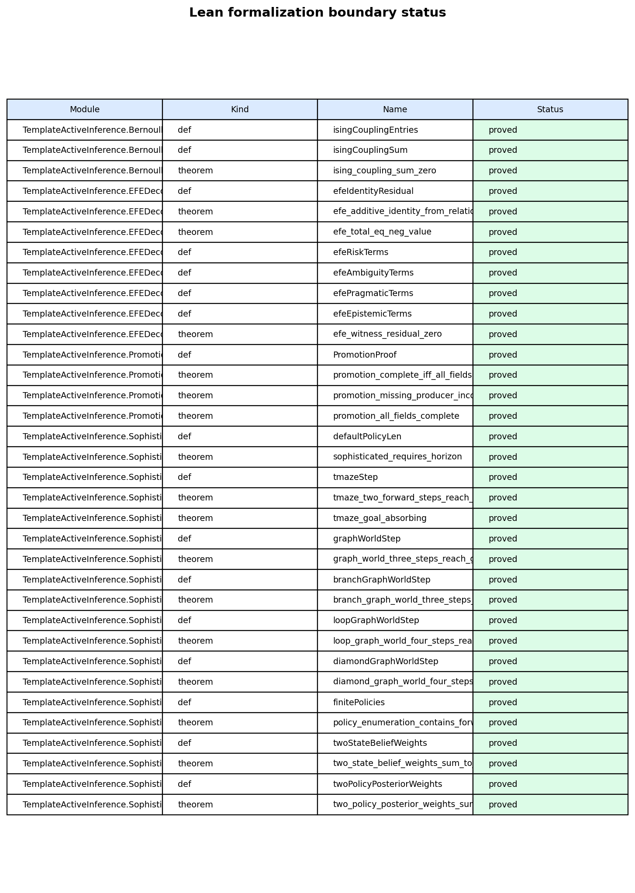

## Page 14

7.0.1
Proof extraction track
The proof_extraction track extracts Lean theorem statements and proof-source metadata into output/data/proof_extraction_ind
ex.json. The index currently contains 12 extracted theorem rows, with constructive-token status true.
12

## Page 15

8
Sheaf composition
8.1
Compose contract
Each manifest row in docs/manuscript/sheaf/manifest.yaml binds fragment tracks from docs/manuscript/sheaf/tracks.yaml. A track supplies
a renderer, compose order, label, optional flag, general paper role, and paper-specific use statement; the composer then flattens the
binding set into one Markdown section for PDF and web output.
The operational claim is auditable binding. Analytical, simulation, pymdp, visualization, Lean, GNN, ontology, scholarship, and
optional media fragments attach to IMRAD rows under eq. 3 (P present, — unbound, M missing). This is an applied local-to-global
consistency contract in the spirit of cellular sheaf and sheaf-signal-processing work [Curry, 2014, Robinson, 2014], instantiated here as
a finite artifact gate rather than a cohomology claim.
8.2
Coverage and figures
fig. 9 summarizes 34 fragment types and their IMRAD bindings. Generated tables below list every track definition and section×track
binding at compose time. The visualization track is gated by output/reports/visualization_quality_audit.json: 23 / 23 registered
figures render, 23 are source-mapped, and 23 have sufficient alt/caption metadata; the all-quality flag is true.
The visualization gate is deliberately row-level.
It requires declared visual/evidence roles (true), artifact-backed paper claims
(true), section bindings (true), RGB nonblank image renders, hashes, and source-map agreement. The statistical bridge then expands
7 statistically backed figures into 7 figure-source-scholarship rows with connected status true, manuscript-reference status true, and
visualization-bound reference status true.
The claim ledger is also checked at row level rather than as prose metadata. claim_evidence_audit.json resolves 97 claim rows
to live artifacts (true) and replays their typed predicates (true), yielding the promoted completeness flag true.
8.3
Compose commands
uv run python scripts/compose_manuscript.py
uv run python scripts/compose_manuscript.py --validate-only --strict
Each run emits output/data/sheaf_coverage_matrix.json and regenerates coverage artifacts. Partial compose (--section) is
draft-only; the matrix always reflects the full manifest. Coverage totals appear on sec. 1; discussion scope is in sec. 13.
8.4
Law verification
--validate-only --strict runs the structural gate before any fragment is glued. Beyond per-cell coverage, it invokes the sheaf-law
oracle (verify_sheaf_laws, src/manuscript/sheaf/laws.py), which checks 6 axioms — poset, presheaf functoriality, separation,
gluing, typing, and compositionality — and reports 6/6 satisfied for the current manifest. A violation is raised as an error-level issue
and aborts the build, so a malformed manifest (a section colliding on an output file, an off-chain block, a mistyped fragment, a fragment
shared between sections) can never compose. The formal statements are in the formalism block below; the negative-control suite (tes
ts/test_sheaf_laws.py) proves each check is falsifiable.
The semantic layer is separate from those structural laws.
output/data/sheaf_gluing_certificate.json records cross-track
symbols, typed claim evidence, artifact sources, and manuscript-variable restrictions; validation fails when the analytical, pymdp,
GNN, ontology, Lean, visualization, or manuscript tracks disagree about a shared symbol or measured claim. The visualization-quality
audit is one of those restrictions, so a missing source map, missing statistical bridge source, missing hash, blank render, non-RGB
render, undersized figure, or unbound section breaks the same semantic contract that checks statistics and theorem witnesses. fig. 10
renders the configured producers, generated evidence artifacts, and validation consumers that read each shared symbol.
8.4.1
Base poset and presheaf
The manuscript is modelled as a coverage sheaf over a finite base poset. Let the base 𝑃be the IMRAD blocks ordered as a chain,
Introduction ≺Methods ≺Results ≺Discussion ≺Appendix,
(2)
with, in each block, a group node above its section nodes (written 𝐺⊒𝑠).
𝑃is therefore a finite poset (equivalently a finite
Alexandrov space). Let 𝒯be the registered fragment-track set from docs/manuscript/sheaf/tracks.yaml; each track 𝑡∈𝒯carries a
renderer 𝑅(𝑡), label 𝐿(𝑡), optional flag 𝑂(𝑡), a general paper role 𝑈(𝑡), a section-use statement 𝑉(𝑡), and a strict compose-order index
𝜋(𝑡).
The presheaf ℱis a contravariant functor on 𝑃— ℱ∶𝑃→Set with restriction maps along ⊒— assigning to each composing
section 𝑠its bound fragment set ℱ(𝑠) = { (𝑡, 𝐹𝑠(𝑡)) ∶𝑡bound in 𝑠}, where 𝐹𝑠∶𝒯⇀Path is the section’s partial binding map.
Restriction along 𝐺⊒𝑠is projection onto a section’s own bindings; group nodes carry the empty assignment and do not compose.
The coverage cell is
𝐵(𝑠, 𝑡) ∈{P, —, M}
(3)
derived from 𝐹𝑠(𝑡) and filesystem existence at compose time: P when a bound fragment exists, — when the track is unbound for
that row, and M when a bound path is missing. The current regenerated matrix reports 95 present / 95 bound / 0 missing cells.
Registry size: |𝒯| = 34 types across 17 IMRAD manifest rows (5 group rows, 12 composing sections).
13

## Page 16

8.4.2
Verified sheaf laws
What makes this presheaf a sheaf — rather than a bare incidence table — is that the composer’s structural axioms are machine-checked.
The oracle verify_sheaf_laws (src/manuscript/sheaf/laws.py) verifies 6 laws, and the regenerated build reports 6/6 satisfied:
1. Poset. The IMRAD blocks form the chain of eq. 2; compose order is monotone in block rank and every composing section’s
block carries a group row.
2. Presheaf (functoriality). Every bound track lies in 𝒯; 𝜋is a strict total order; and each section’s resolved track order is the
monotone restriction of 𝜋(an explicit track_order override must be a permutation of the section’s bound tracks).
3. Separation (locality). The map 𝑠↦output_name(𝑠) is injective over composing sections: distinct locals glue to distinct
global positions, so the global section is unique.
4. Gluing. Compose order is a linear extension of 𝑃— each block’s rows are contiguous and strictly increasing in order — so the
local fragments glue to a unique global manuscript in which every composing section appears exactly once.
5. Typing. Each binding (𝑡, 𝐹𝑠(𝑡)) is well-typed: 𝑅(𝑡) is a registered renderer and the fragment suffix lies in 𝑅(𝑡)’s accepted suffix
set. Generated renderers (section_figures, layers_report) synthesize their body and are explicitly type-exempt.
6. Compositionality. Every fragment file is private to one section (no path is bound twice), so global composition is the coproduct
of the per-section bodies and is independent of inclusion order.
Each law is paired with a negative control in tests/test_sheaf_laws.py — a single mutation that breaks the law and is proven to
be caught — so the gate binds the laws’ content, not merely their shape. Under --strict, any violation is surfaced as an error-level
manifest issue and aborts composition.
8.4.3
Scope (what is and is not claimed)
These laws verify the sheaf axioms on a finite base poset. They do not compute sheaf cohomology (𝐻0/𝐻1, Čech complexes, derived
functors); “sheaf” here names the verified separation-and-gluing structure of a multi-track coverage assignment, not a cohomological
invariant. Formal track definitions and section×track bindings appear in the generated tables below.
Semantic gluing then checks agreement of the glued content: coverage counts, manuscript variables, typed claim predicates, pymdp
mode/hash, Bernoulli GNN ontology, and SI T-maze GNN ontology. This certificate is a content-level audit over the same base, not
an additional topological law.
The provenance fragment makes artifact lineage a live canonical sheaf track. The configured producer generate_sheaf_tracks.py
writes output/data/artifact_provenance.json, which hashes 85 required toy artifacts and records producer scripts, source commit,
deterministic seed fields, config digests, and 5 artifact bundles. Publication claims that depend on generated files must be traceable to
this lineage table or to a narrower artifact-specific certificate.
The provenance claim is intentionally limited: every listed artifact exists, has a SHA-256 digest or an explicit cycle exclusion, is
produced by a configured analysis script, and carries seed/config provenance (85 seeded rows; all seeded flag true; bundle-complete
flag true). A changed file, missing producer, or stale saved digest is a validation failure, not a prose warning.
The counterexample fragment records expected-failure fixtures as first-class evidence. output/reports/counterexample_matrix.
json lists 25 negative controls that intentionally mutate ontology mappings, semantic certificates, graph-world trace agreement, typed
claim evidence, replay rows, release parity, and provenance hashes.
The matrix is not an empirical result. It is a falsifiability ledger: each row names the gate that must fail and the test that proves
the failure path remains live.
The adversarial_audit fragment makes expected failures part of the sheaf rather than an informal test note. output/reports
/adversarial_audit.json records 25 known-bad rows and 0 known-bad rows passing; publication proceeds only when every row is
documented as an expected failure and mapped to a gate.
The audit rows target the same failure modes as the semantic certificate: incomplete sweep cells, unnormalized uncertainty rows,
interop field loss, stale certificate state, and empirical-scope leakage. The scope boundary remains toy-only: toy_only_pass.
The evidence_fields fragment indexes the exact artifact fields that support typed claims and hydrated manuscript tokens. outpu
t/data/evidence_field_index.json records 97 field rows, and the track passes only when every referenced JSONPath or dotted field
is present (true).
The release_bundle fragment records whether the canonical deliverables exist before copying and whether copied root outputs
match or are explicitly deferred until the copy stage. output/reports/release_bundle_manifest.json tracks 38 required deliverables
with source-present flag true.
The bundle contract is now indexed artifact-by-artifact rather than inferred from isolated reports. output/data/artifact_contr
act_index.json contains 85 generated artifact rows; each row binds its producer, configured script, pipeline/sheaf lanes, manuscript
consumers, claim predicates, validators, negative control, freshness status, and copied-output parity. The aggregate row-complete flag
is true, and copied-root parity completeness is true.
The gate_ergonomics fragment turns validation commands into evidence rows. output/data/validation_gate_index.json records
26 gate rows, each naming required inputs and the negative-control surface that should fail closed.
output/data/track_lane_matrix.json is the cross-track audit table for the same gate surface: 32 pipeline rows map to sheaf
fragments, producer scripts, primary artifacts, validation gates, and manuscript consumers, with completion flag true.
8.4.4
Artifact diffoscope track
The artifact_diffoscope track compares saved provenance hashes against live artifact hashes at the artifact root JSONPath. Its
proof artifact is output/reports/artifact_diffoscope.json: it currently records 41 comparison rows, with equality status true.
14

## Page 17

Figure 9: Sheaf layers overview: registry stack (compose order, renderer ids) and IMRAD binding heatmap for 34 fragment types
across 17 manifest rows (95 present / 95 bound / 0 missing), generated from output/data/sheaf_coverage_matrix.json.
15

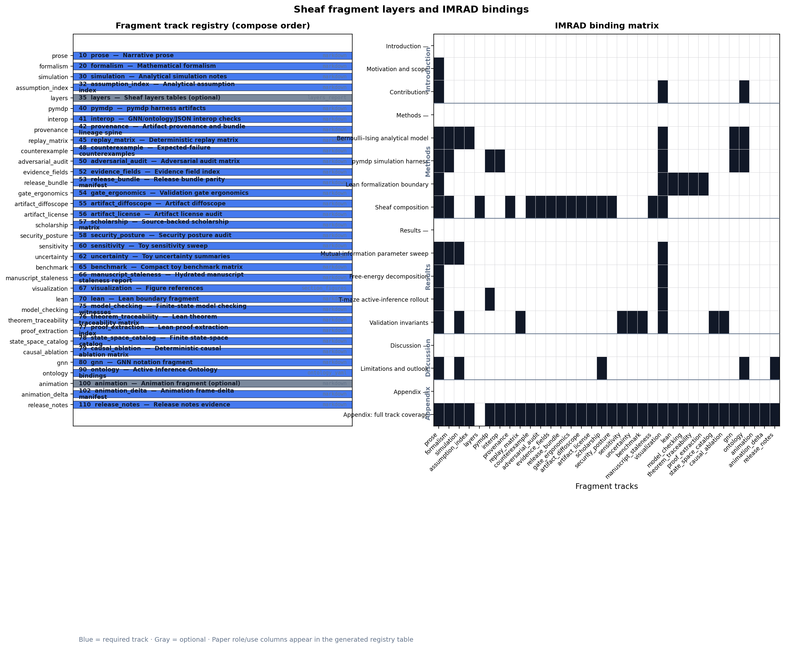

## Page 18

Figure 10: Semantic gluing graph: configured producers, generated evidence artifacts, and validation consumers for the multi-track
sheaf certificate.
8.4.5
Artifact license track
The artifact_license track classifies generated and project-source artifacts under the public project license boundary. Its audit
artifact is output/reports/artifact_license_audit.json: it currently records 85 rows, with license-safe status true.
The scholarship fragment turns citations into an audited method surface rather than decorative bibliography. output/data/schol
arship_source_matrix.json records 21 source rows across 21 method roles and 10 source families, including 3 quantitative/statistical
or visualization-quality method roles; fig. 13 renders the resulting source-to-artifact map with 1 locator kinds. The row set connects
foundational free-energy and active-inference references [Friston, 2010, Buckley et al., 2017, Da Costa et al., 2020, Parr et al., 2022,
Smith et al., 2022], planning context [Champion et al., 2021, Nuijten et al., 2026], implementation and notation anchors [Heins et al.,
2022, Smékal and Friedman, 2023], and applied sheaf/local-to-global sources [Curry, 2014, Robinson, 2014, Bosca and Ghrist, 2026] to
the exact artifact or method role they support.
The validation claim is deliberately narrow: every row must have a bibliography entry with a DOI or URL, a manuscript citation,
registered sheaf tracks, bound manifest consumer sections, an existing evidence artifact, and a scope-guarded claim-boundary statement.
The saved matrix is then rederived from live bibliography, manuscript, registry, manifest, and artifact evidence before validation accepts
it (true), so a forged row-level boolean cannot launder a disconnected source. The added statistics and visualization rows point to ana
lysis_statistics.json and visualization_quality_audit.json, including a statistical-visualization bridge row, so the scholarship
track now distinguishes method lineage from the generated numerical, figure-quality, and figure-provenance evidence. The hydrated
flags true, true, and true are therefore source-traceability and scope-control claims, not claims that the toy results inherit empirical
support from the cited literature.
The newer arXiv rows are intentionally constrained. They situate the toy EFE and planning artifacts against branching-time and
variational-planning work, and they situate the finite manuscript sheaf against modern local-to-global computation framing, but none
of those citations promotes empirical, neural network, or scalable-agent performance claims for this exemplar.
The security-posture track treats the public exemplar itself as the defended asset. output/reports/security_posture_audit.js
on records 9 controls: 7 enforced local controls and 2 production-security obligations that are explicitly deferred rather than claimed.
The enforced rows cover public-data boundaries, offline reproducibility, artifact hashes, copied-output parity, claim/scope traceability,
the Lean boundary, and a source/config secret-pattern scan.
The audit is intentionally not a production certification. It records 0 high-risk local gaps and 0 high-risk secret-pattern findings;
the all-controls flag is true, and all listed evidence is present: true. Deferred rows cover signed provenance/SBOM release attestation
and zero-trust runtime controls, which require deployment-specific identity, device posture, logging, and signing infrastructure outside
this toy-only manuscript.
The manuscript_staleness fragment closes the hydration loop. output/reports/manuscript_staleness_report.json checks 322
manuscript token bindings against the current generated variables after resolved markdown is written; the pass flag is true.
This is a publication-systems claim, not a domain result. A stale hydrated value, unresolved token, or missing resolved section
becomes a validation failure before PDF or web outputs are accepted.
16

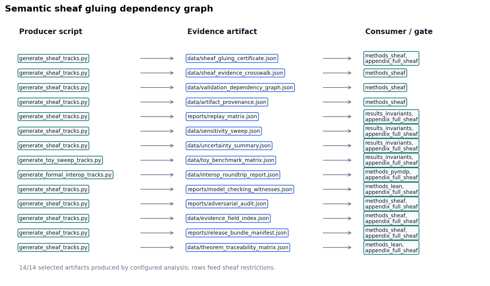

## Page 19

Figure 11: Track-lane promotion map: 32 pipeline-to-sheaf rows with complete promotion status true. Left: seven promotion-rule
obligations; right: sheaf fragment bindings.
17

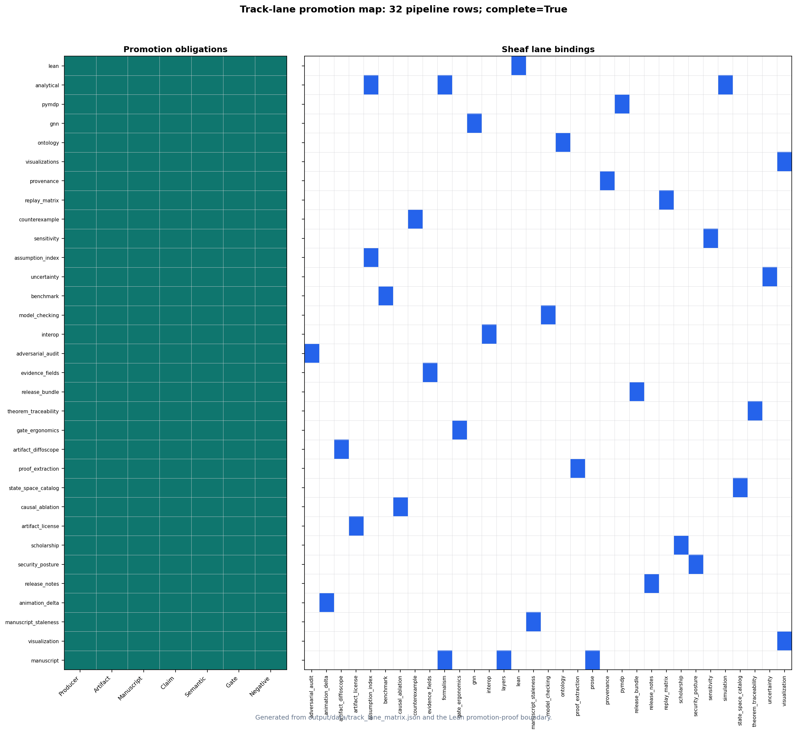

## Page 20

Figure 12: Artifact contract map: 85 generated artifact rows with complete contract status true and copied-output parity complete
true. Cycle rows are explicit in output/data/artifact_contract_index.json.
18

## Page 21

Figure 13: Scholarship source map: 21 source rows across 21 method roles and 10 source families. Connected status: true; row evidence
rederived: true.
Figure 14: Security posture map: 9 controls, 7 enforced and 2 scoped as deferred; secret findings: 0; high-risk gaps: 0.
19

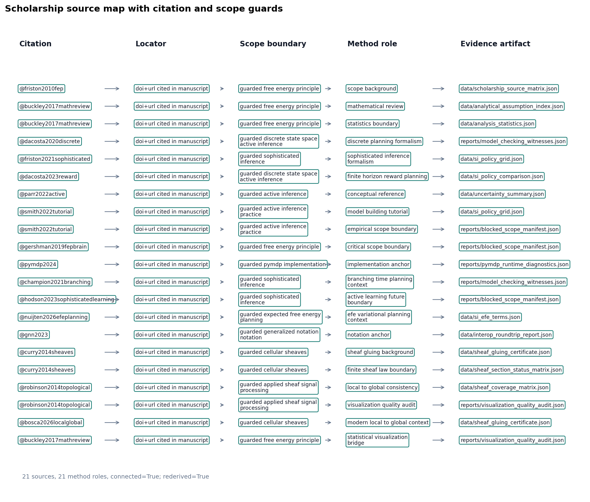

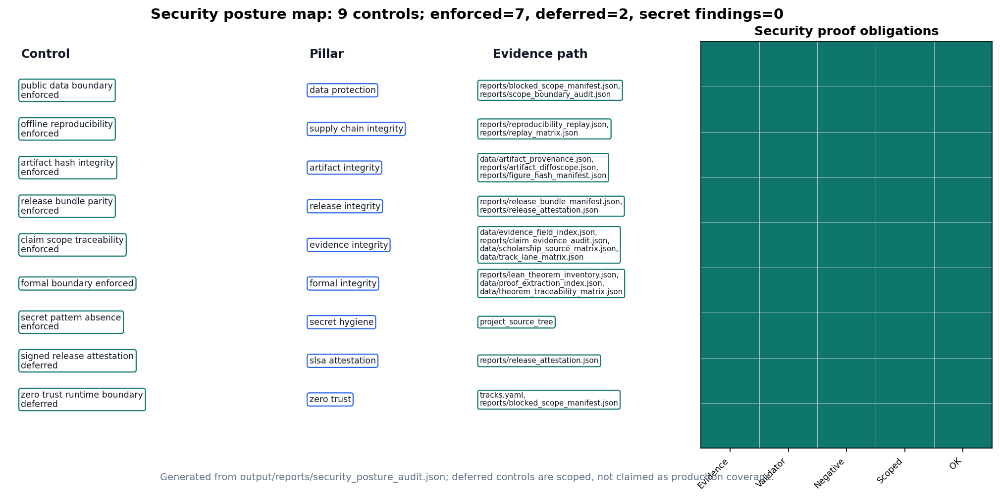

## Page 22

8.5
Sheaf fragment track registry
Compose order and renderer bindings from docs/manuscript/sheaf/tracks.yaml.
Order
Track id
Label
Renderer
Paper role
Paper use
Optional
10
prose
Narrative prose
markdown
Narrative
framing and
argument flow
Supports the
narrative spine
for each
composed
paper section.
No
20
formalism
Mathematical
formalism
markdown
Mathematical
definitions and
equations
States the finite
equations, laws,
and boundary
assumptions
used by prose
claims.
No
30
simulation
Analytical
simulation
notes
markdown
Deterministic
toy analysis
evidence
Connects
analytical
sweeps and toy
simulations to
results claims.
No
32
assumption_in
dex
Analytical
assumption
index
markdown
Assumption
boundary
ledger
Lists
finite-model
assumptions so
analytical
claims stay
scoped.
No
35
layers
Sheaf layers
tables
layers_report
Registry and
binding
disclosure
Generates the
track registry,
binding matrix,
and evidence
crosswalk
tables.
Yes
40
pymdp
pymdp harness
artifacts
markdown
Active-
inference
implementation
evidence
Binds pymdp
traces, runtime
diagnostics,
and policy
comparisons to
methods and
results.
No
41
interop
GNN/ontology/JSON
interop checks
markdown
Cross-format
compatibility
evidence
Shows that
GNN, ontology,
and JSON
artifacts
preserve model
meaning.
No
42
provenance
Artifact
provenance and
bundle lineage
spine
markdown
Artifact lineage
evidence
Documents
producers,
hashes, seeds,
and bundle
lineage for
generated
claims.
No
45
replay_matrix
Deterministic
replay matrix
markdown
Reproducibility
replay evidence
Shows
configured
producers
replay and
match their
expected
artifacts.
No
20

## Page 23

Order
Track id
Label
Renderer
Paper role
Paper use
Optional
48
counterexample
Expected-
failure
counterexam-
ples
markdown
Falsifiability
negative
controls
Records
known-bad
fixtures that
must fail
validation
gates.
No
50
adversarial_a
udit
Adversarial
audit matrix
markdown
Adversarial
robustness
evidence
Documents
stress cases and
expected
failures for
sheaf-track
claims.
No
52
evidence_fields Evidence field
index
markdown
Claim field
traceability
Maps evidence
fields to
sections and
artifacts for
claim
hydration.
No
53
release_bundle
Release bundle
parity manifest
markdown
Release artifact
parity evidence
Checks that
required
deliverables
exist and
copied outputs
match or defer
explicitly.
No
54
gate_ergonomics Validation gate
ergonomics
markdown
Validation
workflow index
Explains the
gates a reader
or maintainer
can rerun
locally.
No
55
artifact_diff
oscope
Artifact
diffoscope
markdown
Artifact
equality
evidence
Compares
generated and
copied artifacts
to surface
publication
drift.
No
56
artifact_lice
nse
Artifact license
audit
markdown
License safety
evidence
Records license
status for
artifacts
included in
release surfaces.
No
57
scholarship
Source-backed
scholarship
matrix
markdown
Scholarship and
method-source
lineage
Connects cited
sources to
method roles,
sections, and
generated
evidence.
No
58
security_post
ure
Security
posture audit
markdown
Public release
security
boundary
evidence
Separates
enforced local
controls from
deferred
production-
security
obligations.
No
60
sensitivity
Toy sensitivity
sweep
markdown
Parameter
sensitivity
evidence
Summarizes
deterministic
toy
perturbations
behind
robustness
claims.
No
21

## Page 24

Order
Track id
Label
Renderer
Paper role
Paper use
Optional
62
uncertainty
Toy uncertainty
summaries
markdown
Uncertainty
summary
evidence
Reports
normalized
uncertainty
bins and
summaries for
finite toy
analyses.
No
65
benchmark
Compact toy
benchmark
matrix
markdown
Toy benchmark
comparison
evidence
Shows compact
model
comparisons
used to bound
toy-only claims.
No
66
manuscript_st
aleness
Hydrated
manuscript
staleness report
markdown
Manuscript
freshness
evidence
Checks
hydrated
sections against
current
generated
artifacts and
variables.
No
67
visualization
Figure
references
section_figures Figure evidence
and
communication
Injects registry
figures into
section-specific
evidence
blocks.
No
70
lean
Lean boundary
fragment
markdown
Formal proof
boundary
evidence
Separates
proved Lean
witnesses from
intentionally
scoped formal
boundaries.
No
75
model_checking
Finite-state
model checking
witnesses
markdown
Exhaustive
finite-model
evidence
Lists
model-checking
witnesses for
finite
state-space
claims.
No
76
theorem_trace
ability
Lean theorem
traceability
matrix
markdown
Theorem
dependency
traceability
Links theorem
rows to proof
dependencies
and finite
model
witnesses.
No
77
proof_extract
ion
Lean proof
extraction
index
markdown
Constructive
proof
extraction
evidence
Shows
extracted
theorem
artifacts remain
constructive
and available.
No
78
state_space_c
atalog
Finite
state-space
catalog
markdown
Finite model
catalog
evidence
Enumerates
reachable states
so toy models
remain
explicitly finite.
No
79
causal_ablation Deterministic
causal ablation
matrix
markdown
Causal ablation
evidence
Summarizes
deterministic
perturbation
effects across
toy topologies.
No
80
gnn
GNN notation
fragment
markdown
GNN notation
evidence
Documents
notation and
round-trip
status for the
analytical
model.
No
22

## Page 25

Order
Track id
Label
Renderer
Paper role
Paper use
Optional
90
ontology
Active
Inference
Ontology
bindings
ontology_yaml
Ontology
binding
evidence
Maps local
variables to
ontology terms
for semantic
consistency.
No
100
animation
Animation
fragment
markdown
Dynamic trace
visualization
Provides a
deterministic
GIF trace as
optional
appendix
evidence.
Yes
102
animation_delta Animation
frame-delta
manifest
markdown
Animation
integrity
evidence
Confirms
animation
frames change
and support
the visual
trace.
No
110
release_notes
Release notes
evidence
markdown
Release
narrative
evidence
Binds
release-note
statements to
source-backed
artifacts.
No
Track count: 34 registered fragment types.
8.6
IMRAD binding matrix
Section rows versus fragment track columns. P = present (bound and file exists); — = absent (not bound); M = missing (bound, file
absent).
Section
proseformalism
simulation
assumption_index
layerspymdp
interop
provenance
replay_matrix
counterexample
adversarial_audit
evidence_fields
release_bundle
gate_ergonomics
artifact_diffoscope
artifact_license
scholarship
security_posture
sensitivity
uncertainty
benchmark
manuscript_staleness
visualization
leanmodel_checking
theorem_traceability
proof_extraction
state_space_catalog
causal_ablation
gnnontology
animation
animation_de
release_no
Introduction
(group)
— — — — — — — — — — — — — — — — — — — — — — — — — — — — — — — — — —
Motivation
and
scope
P
— — — — — — — — — — — — — — — — — — — — — — — — — — — — — — — — —
Contributions
P
— — — — — — — — — — — — — — — — — — — — — P
— — — — — — — P
— — —
Methods
(group)
— — — — — — — — — — — — — — — — — — — — — — — — — — — — — — — — — —
Bernoulli–
Ising
an-
a-
lyt-
i-
cal
model
P
P
P
P
— — — — — — — — — — — — — — — — — — P
— — — — — — P
P
— — —
pymdp
sim-
u-
la-
tion
har-
ness
P
P
— — — P
P
— — — — — — — — — — — — — — — P
— — — — — — P
P
— — —
Lean
for-
mal-
iza-
tion
bound-
ary
P
— — — — — — — — — — — — — — — — — — — — — P
P
P
P
P
— — — — — — —
23

## Page 26

Section
proseformalism
simulation
assumption_index
layerspymdp
interop
provenance
replay_matrix
counterexample
adversarial_audit
evidence_fields
release_bundle
gate_ergonomics
artifact_diffoscope
artifact_license
scholarship
security_posture
sensitivity
uncertainty
benchmark
manuscript_staleness
visualization
leanmodel_checking
theorem_traceability
proof_extraction
state_space_catalog
causal_ablation
gnnontology
animation
animation_de
release_no
Sheaf
com-
po-
si-
tion
P
P
— — P
— — P
— P
P
P
P
P
P
P
P
P
— — — P
P
— — — — — — — — — — —
Results
(group)
— — — — — — — — — — — — — — — — — — — — — — — — — — — — — — — — — —
Mutual-
information
pa-
ram-
e-
ter
sweep
P
P
P
— — — — — — — — — — — — — — — — — — — P
— — — — — — — — — — —
Free-
energy
de-
com-
po-
si-
tion
P
— — — — — — — — — — — — — — — — — — — — — P
— — — — — — — — — — —
T-
maze
active-
inference
roll-
out
P
— — — — P
— — — — — — — — — — — — — — — — P
— — — — — — — — — — —
Validation
in-
vari-
ants
P
— P
— — — — — P
— — — — — — — — — P
P
P
— P
— — — — P
P
— — — — —
Discussion
(group)
— — — — — — — — — — — — — — — — — — — — — — — — — — — — — — — — — —
Limitations
and
out-
look
P
— P
— — — — — — — — — — — — — P
— — — — — — — — — — — — — P
— — P
Appendix
(group)
— — — — — — — — — — — — — — — — — — — — — — — — — — — — — — — — — —
Appendix:
full
track
cov-
er-
age
P
P
P
P
— P
P
P
P
P
P
P
P
P
P
P
P
P
P
P
P
P
P
P
P
P
P
P
P
P
P
P
P
P
Totals: 95 present / 95 bound / 0 missing.
Symbol
Coverage color
Meaning
P
Black
Track present (bound and fragment exists)
—
White
Absent (not bound for this section)
M
Gray
Missing (bound but fragment file absent)
8.7
Section-track status
Generated status for the current manuscript sheaf, summarized per composable section.
Section
IMRAD
Bound
Present
Missing
Status
Motivation and
scope
introduction
1
1
0
fully_sheafed
Contributions
introduction
3
3
0
fully_sheafed
24

## Page 27

Section
IMRAD
Bound
Present
Missing
Status
Bernoulli–Ising
analytical model
methods
7
7
0
fully_sheafed
pymdp
simulation
harness
methods
7
7
0
fully_sheafed
Lean
formalization
boundary
methods
6
6
0
fully_sheafed
Sheaf
composition
methods
15
15
0
fully_sheafed
Mutual-
information
parameter sweep
results
4
4
0
fully_sheafed
Free-energy
decomposition
results
2
2
0
fully_sheafed
T-maze
active-inference
rollout
results
3
3
0
fully_sheafed
Validation
invariants
results
9
9
0
fully_sheafed
Limitations and
outlook
discussion
5
5
0
fully_sheafed
Appendix: full
track coverage
appendix
33
33
0
fully_sheafed
Section status: 12 / 12 composable sections fully sheafed; 0 required bound fragments missing.
8.8
Track status
Track
Renderer
Bound sections
Present
Missing
Claims
Status
prose
markdown
12
12
0
0
complete
formalism
markdown
5
5
0
0
complete
simulation
markdown
5
5
0
11
complete
assumption_
index
markdown
2
2
0
1
complete
layers
layers_report
1
1
0
1
complete
pymdp
markdown
3
3
0
15
complete
interop
markdown
2
2
0
3
complete
provenance
markdown
2
2
0
15
complete
replay_matrix markdown
2
2
0
3
complete
counterexample markdown
2
2
0
2
complete
adversarial
_audit
markdown
2
2
0
9
complete
evidence_fieldsmarkdown
2
2
0
1
complete
release_bundle markdown
2
2
0
9
complete
gate_ergonomicsmarkdown
2
2
0
8
complete
artifact_di
ffoscope
markdown
2
2
0
2
complete
artifact_li
cense
markdown
2
2
0
1
complete
scholarship
markdown
3
3
0
4
complete
security_po
sture
markdown
2
2
0
2
complete
sensitivity
markdown
2
2
0
9
complete
uncertainty
markdown
2
2
0
4
complete
benchmark
markdown
2
2
0
3
complete
manuscript_
staleness
markdown
2
2
0
1
complete
visualization section_figures
10
10
0
17
complete
lean
markdown
2
2
0
9
complete
model_checking markdown
2
2
0
7
complete
25

## Page 28

Track
Renderer
Bound sections
Present
Missing
Claims
Status
theorem_tra
ceability
markdown
2
2
0
3
complete
proof_extra
ction
markdown
2
2
0
2
complete
state_space
_catalog
markdown
2
2
0
2
complete
causal_ablationmarkdown
2
2
0
2
complete
gnn
markdown
3
3
0
4
complete
ontology
ontology_yaml
5
5
0
5
complete
animation
markdown
1
1
0
2
complete
animation_deltamarkdown
1
1
0
1
complete
release_notes markdown
2
2
0
2
complete
Status cells: 578 section-track cells.
8.9
Render and logging summary
Event
Component
Output
Status
Detail
registry_loaded
sheaf.registry
registered_tracks
ok
34 tracks
manifest_loaded
sheaf.manifest
manifest_sections
ok
17 sections
coverage_matrix_buil
t
sheaf.coverage
output/data/sheaf_co
verage_matrix.json
ok
95 present cells
section_status_matri
x_built
sheaf.status
output/data/sheaf_se
ction_status_matrix.
json
ok
578 section-track cells
layers_renderer_boun
d
sheaf.layers_report
docs/manuscript/08_method
s_sheaf.md
ok
methods sheaf layer
tables
semantic_artifacts_i
ndexed
sheaf.semantic
output/data/validati
on_dependency_graph.
json
ok
85 artifact producer
rows
validation_gates_ind
exed
gates
output/data/validati
on_gate_index.json
ok
3 gate groups
manuscript_sections_
composed
sheaf.compose
docs/manuscript/*.md
ok
16 composed markdown
files
Render events: 8.
8.10
Evidence crosswalk
Claim
Artifact
Producer
Gates
sheaf_registry
docs/manuscript/sheaf/tracks.ya
ml
manual
validate_outputs
sheaf_manifest
docs/manuscript/sheaf/manifest.
yaml
manual
validate_outputs
sheaf_coverage_config
docs/manuscript/sheaf/coverage.
yaml
manual
validate_outputs
sheaf_coverage_matrix
output/data/sheaf_coverage
_matrix.json
generate_figures.py
validate_outputs,
validate_manuscript
sheaf_gluing_certificate
output/data/sheaf_gluing_c
ertificate.json
generate_sheaf_tracks.py
validate_manuscript,
validate_outputs
sheaf_evidence_crosswalk
output/data/sheaf_evidence
_crosswalk.json
generate_sheaf_tracks.py
validate_manuscript,
validate_outputs
validation_dependency_grap
h
output/data/validation_dep
endency_graph.json
generate_sheaf_tracks.py
validate_manuscript,
validate_outputs
semantic_gluing_graph_figu
re
../figures/semantic_gluing
_graph.png
generate_figures.py
validate_outputs,
figure_registry
Claim rows: 97 typed evidence claims.
26

## Page 29

8.11
Artifact producer graph
Artifact
Producer
Configured
Consumers
output/data/analysis_stati
stics.json
compute_statistics.py
Yes
results_si_tmaze,
results_invariants
output/data/analytical_ass
umption_index.json
generate_toy_sweep_tracks.
py
Yes
methods_analytical,
appendix_full_sheaf
output/data/analytical_obs
ervable_sweep.json
generate_toy_sweep_tracks.
py
Yes
results_invariants,
appendix_full_sheaf
output/data/animation_fram
e_deltas.json
render_animation.py
Yes
appendix_full_sheaf
output/data/artifact_contr
act_index.json
generate_sheaf_tracks.py
Yes
methods_sheaf,
appendix_full_sheaf
output/data/artifact_prove
nance.json
generate_sheaf_tracks.py
Yes
methods_sheaf
output/data/causal_ablatio
n_matrix.json
generate_toy_sweep_tracks.
py
Yes
results_invariants,
appendix_full_sheaf
output/data/cross_track_sy
mbol_table.json
generate_integration_audit
.py
Yes
methods_sheaf,
appendix_full_sheaf
output/data/evidence_field
_index.json
generate_sheaf_tracks.py
Yes
methods_sheaf,
appendix_full_sheaf
output/data/figure_source_
map.json
generate_integration_audit
.py
Yes
methods_sheaf,
appendix_full_sheaf
output/data/gnn_roundtrip_
report.json
generate_formal_interop_tr
acks.py
Yes
methods_pymdp,
appendix_full_sheaf
output/data/interop_roundt
rip_report.json
generate_formal_interop_tr
acks.py
Yes
methods_pymdp,
appendix_full_sheaf
output/data/manuscript_evi
dence_tables.json
generate_integration_audit
.py
Yes
methods_sheaf,
appendix_full_sheaf
output/data/manuscript_tok
en_provenance.json
generate_integration_audit
.py
Yes
methods_sheaf,
appendix_full_sheaf
output/data/manuscript_var
iables.json
z_generate_manuscript_vari
ables.py
Yes
methods_sheaf,
appendix_full_sheaf
output/data/ontology_alias
_index.json
generate_formal_interop_tr
acks.py
Yes
methods_pymdp,
appendix_full_sheaf
output/data/ontology_profi
le_matrix.json
generate_formal_interop_tr
acks.py
Yes
methods_pymdp,
appendix_full_sheaf
output/data/parameter_swee
p.csv
run_analytical_sweep.py
Yes
methods_analytical,
results_mi_sweep
output/data/proof_dependen
cy_graph.json
generate_sheaf_tracks.py
Yes
methods_lean,
appendix_full_sheaf
output/data/proof_extracti
on_index.json
generate_formal_interop_tr
acks.py
Yes
methods_lean,
appendix_full_sheaf
output/data/pymdp_policy_p
osterior_grid.json
simulate_si_tmaze.py
Yes
methods_pymdp,
appendix_full_sheaf
output/data/scholarship_so
urce_matrix.json
generate_sheaf_tracks.py
Yes
methods_sheaf,
appendix_full_sheaf
output/data/sensitivity_sw
eep.json
generate_sheaf_tracks.py
Yes
results_invariants,
appendix_full_sheaf
output/data/sheaf_coverage
_matrix.json
generate_figures.py
Yes
methods_sheaf,
appendix_full_sheaf
output/data/sheaf_evidence
_crosswalk.json
generate_sheaf_tracks.py
Yes
methods_sheaf
output/data/sheaf_gluing_c
ertificate.json
generate_sheaf_tracks.py
Yes
methods_sheaf,
appendix_full_sheaf
output/data/sheaf_section_
status_matrix.json
generate_sheaf_tracks.py
Yes
methods_sheaf,
appendix_full_sheaf
output/data/si_efe_terms.j
son
generate_toy_sweep_tracks.
py
Yes
results_invariants,
appendix_full_sheaf
output/data/si_graph_world
_summary.json
simulate_si_graph_world.py
Yes
methods_pymdp,
results_si_tmaze
output/data/si_graph_world
_topology_sweep.json
generate_toy_sweep_tracks.
py
Yes
results_invariants,
appendix_full_sheaf
27

## Page 30

Artifact
Producer
Configured
Consumers
output/data/si_graph_world
_topology_traces.json
generate_toy_sweep_tracks.
py
Yes
results_invariants,
appendix_full_sheaf
output/data/si_graph_world
_trace.json
simulate_si_graph_world.py
Yes
methods_pymdp,
results_si_tmaze,
appendix_full_sheaf
output/data/si_policy_comp
arison.json
simulate_si_tmaze.py
Yes
methods_pymdp,
results_si_tmaze
output/data/si_policy_grid
.json
generate_toy_sweep_tracks.
py
Yes
results_invariants,
appendix_full_sheaf
output/data/si_tmaze_summa
ry.json
simulate_si_tmaze.py
Yes
methods_pymdp,
results_si_tmaze
output/data/si_tmaze_trace
.json
simulate_si_tmaze.py
Yes
methods_pymdp,
results_si_tmaze
output/data/state_space_ca
talog.json
generate_toy_sweep_tracks.
py
Yes
results_invariants,
appendix_full_sheaf
output/data/state_transiti
on_table.json
generate_sheaf_tracks.py
Yes
results_invariants,
appendix_full_sheaf
output/data/statistical_vi
sualization_bridge.json
generate_integration_audit
.py
Yes
methods_sheaf,
appendix_full_sheaf
output/data/theorem_tracea
bility_matrix.json
generate_sheaf_tracks.py
Yes
methods_lean,
appendix_full_sheaf
output/data/toy_benchmark_
matrix.json
generate_toy_sweep_tracks.
py
Yes
results_invariants,
appendix_full_sheaf
output/data/track_improvem
ent_scope.json
generate_sheaf_tracks.py
Yes
methods_sheaf,
appendix_full_sheaf
output/data/track_lane_mat
rix.json
generate_sheaf_tracks.py
Yes
methods_sheaf,
appendix_full_sheaf
output/data/uncertainty_su
mmary.json
generate_sheaf_tracks.py
Yes
results_invariants,
appendix_full_sheaf
output/data/validation_dep
endency_graph.json
generate_sheaf_tracks.py
Yes
methods_sheaf
output/data/validation_gat
e_index.json
generate_integration_audit
.py
Yes
methods_sheaf,
appendix_full_sheaf
../figures/si_belief_traje
ctory.gif
render_animation.py
Yes
appendix_full_sheaf
output/reports/ablation_se
nsitivity_report.json
generate_sheaf_tracks.py
Yes
results_invariants,
appendix_full_sheaf
output/reports/adversarial
_audit.json
generate_sheaf_tracks.py
Yes
methods_sheaf,
appendix_full_sheaf
output/reports/artifact_di
ffoscope.json
generate_integration_audit
.py
Yes
methods_sheaf,
appendix_full_sheaf
output/reports/artifact_li
cense_audit.json
generate_integration_audit
.py
Yes
methods_sheaf,
appendix_full_sheaf
output/reports/blocked_sco
pe_manifest.json
generate_sheaf_tracks.py
Yes
methods_sheaf,
discussion_outlook,
appendix_full_sheaf
output/reports/claim_evide
nce_audit.json
generate_integration_audit
.py
Yes
methods_sheaf,
appendix_full_sheaf
output/reports/counterexam
ple_matrix.json
generate_sheaf_tracks.py
Yes
methods_sheaf
output/reports/figure_hash
_manifest.json
generate_integration_audit
.py
Yes
methods_sheaf,
appendix_full_sheaf
output/reports/gnn_lint_re
port.json
generate_formal_interop_tr
acks.py
Yes
methods_pymdp,
appendix_full_sheaf
output/reports/graph_world
_invariants.json
generate_toy_sweep_tracks.
py
Yes
results_invariants,
appendix_full_sheaf
output/reports/invariants.
json
run_analytical_sweep.py
Yes
results_invariants
output/reports/lean_graph_
world_inventory.json
generate_formal_interop_tr
acks.py
Yes
methods_lean,
appendix_full_sheaf
output/reports/lean_theore
m_inventory.json
generate_formal_interop_tr
acks.py
Yes
methods_lean,
appendix_full_sheaf
output/reports/manuscript_
staleness_report.json
z_generate_manuscript_vari
ables.py
Yes
methods_sheaf,
appendix_full_sheaf
28

## Page 31

Artifact
Producer
Configured
Consumers
output/reports/model_check
ing_witnesses.json
generate_sheaf_tracks.py
Yes
methods_lean,
appendix_full_sheaf
output/reports/producer_co
mpleteness.json
generate_integration_audit
.py
Yes
methods_sheaf,
appendix_full_sheaf
output/reports/pymdp_runti
me_diagnostics.json
simulate_si_tmaze.py
Yes
methods_pymdp,
appendix_full_sheaf
output/reports/release_att
estation.json
generate_sheaf_tracks.py
Yes
discussion_outlook,
appendix_full_sheaf
output/reports/release_bun
dle_manifest.json
generate_sheaf_tracks.py
Yes
methods_sheaf,
appendix_full_sheaf
output/reports/release_not
es_evidence.json
generate_integration_audit
.py
Yes
discussion_outlook,
appendix_full_sheaf
output/reports/replay_matr
ix.json
generate_sheaf_tracks.py
Yes
results_invariants,
appendix_full_sheaf
output/reports/reproducibi
lity_replay.json
generate_validation_spine.
py
Yes
results_invariants
output/reports/scope_bound
ary_audit.json
generate_integration_audit
.py
Yes
methods_sheaf,
appendix_full_sheaf
output/reports/security_po
sture_audit.json
generate_sheaf_tracks.py
Yes
methods_sheaf,
appendix_full_sheaf
output/reports/sheaf_rende
r_log.json
generate_sheaf_tracks.py
Yes
methods_sheaf,
appendix_full_sheaf
output/reports/si_invarian
ts.json
simulate_si_tmaze.py
Yes
results_si_tmaze
output/reports/si_tmaze_ru
n_report.json
simulate_si_tmaze.py
Yes
results_si_tmaze
output/reports/stale_artif
act_report.json
generate_integration_audit
.py
Yes
methods_sheaf,
appendix_full_sheaf
output/reports/visualizati
on_quality_audit.json
generate_integration_audit
.py
Yes
methods_sheaf,
appendix_full_sheaf
Producer issues: 0.
8.12
Semantic gluing restrictions
Restriction
Value
Coverage missing
0
Policy comparison rows
4
Policy grid complete
True
Policy posterior rows
10
Policy posterior normalized
True
Runtime unexpected warnings
0
Graph-world trace agrees
True
Animation frames
4
Lean all proved
True
GNN ontology ok
True
Configured producers ok
True
Semantic certificate ok
None
Dependency edges ok
True
Track scope complete
True
Empirical adapter blocked
True
Provenance bundles complete
True
Replay rows matched
True
Sensitivity complete
True
Uncertainty normalized
True
Evidence fields mapped
True
Release bundle sources present
True
Theorem traceability linked
True
Gate ergonomics indexed
True
Interop lossless
True
Scope toy-only
True
29

## Page 32

8.13
Track-lane matrix
Pipeline track
Sheaf
fragments
Producer
Primary
artifact
Claims
Semantic
Gates
Negative
lean
lean
generate_for
mal_interop_
tracks.py
output/repor
ts/lean_theo
rem_inventor
y.json
lean_graph_w
orld_policy_
boundary, le
an_graph_wor
ld_topologie
s_witnessed,
lean_theorem
_inventory_p
roved, model
_checking_ex
haustive, mo
del_checking
_witnesses_p
ass, proof_d
ependency_gr
aph_resolve
d, proof_ext
raction_cons
tructive, th
eorem_tracea
bility_linke
d, track_lan
e_promotion_
map_figure
track_lane_m
atrix_comple
te, track_la
ne_matrix_ro
w_count
build_lean,
validate_out
puts
track_lane_m
atrix_row_on
ly_forgery
analytical
formalism,
simulation,
assumption_i
ndex
run_analytic
al_sweep.py
output/data/
parameter_sw
eep.csv
analytical_a
ssumption_in
dex, compose
d_methods_an
alytical, co
mposed_resul
ts_mi
track_lane_m
atrix_comple
te, track_la
ne_matrix_ro
w_count
validate_out
puts
track_lane_m
atrix_row_on
ly_forgery
30

## Page 33

Pipeline track
Sheaf
fragments
Producer
Primary
artifact
Claims
Semantic
Gates
Negative
pymdp
pymdp
simulate_si_
tmaze.py
output/data/
si_policy_co
mparison.jso
n
graph_world_
invariants_p
ass, graph_w
orld_topolog
y_traces_con
sistent, pym
dp_policy_po
sterior_grid
_normalized,
pymdp_runtim
e_diagnostic
s_ok, sheaf_
gluing_certi
ficate, si_b
elief_entrop
y_figure, si
_efe_rows_ex
plained, si_
graph_world_
summary, si_
graph_world_
trace, si_gr
aph_world_tr
ace_consiste
ncy, si_poli
cy_compariso
n, si_policy
_comparison_
modes, si_po
licy_grid_co
mplete, si_t
maze_summar
y,
si_tmaze_trace
track_lane_m
atrix_comple
te, track_la
ne_matrix_ro
w_count
validate_out
puts
track_lane_m
atrix_row_on
ly_forgery
gnn
gnn
generate_for
mal_interop_
tracks.py
output/repor
ts/gnn_lint_
report.json
cross_track_
symbols_cons
istent, inte
rop_lossles
s, interop_r
oundtrip_los
sless, sheaf
_gluing_cert
ificate
track_lane_m
atrix_comple
te, track_la
ne_matrix_ro
w_count
validate_out
puts
track_lane_m
atrix_row_on
ly_forgery
ontology
ontology
generate_for
mal_interop_
tracks.py
output/data/
ontology_pro
file_matrix.
json
composed_dis
cussion, cro
ss_track_sym
bols_consist
ent, interop
_lossless, i
nterop_round
trip_lossles
s, sheaf_glu
ing_certific
ate
track_lane_m
atrix_comple
te, track_la
ne_matrix_ro
w_count
validate_man
uscript, val
idate_output
s
track_lane_m
atrix_row_on
ly_forgery
visualizations visualization
generate_int
egration_aud
it.py
output/repor
ts/visualiza
tion_quality
_audit.json
visualizatio
n_quality_au
dit_complet
e, visualiza
tion_statist
ics_bridge_c
omplete
track_lane_m
atrix_comple
te, track_la
ne_matrix_ro
w_count
validate_man
uscript, val
idate_output
s
track_lane_m
atrix_row_on
ly_forgery
31

## Page 34

Pipeline track
Sheaf
fragments
Producer
Primary
artifact
Claims
Semantic
Gates
Negative
provenance
provenance
generate_she
af_tracks.py
output/data/
artifact_pro
venance.json
artifact_con
tract_index_
complete, ar
tifact_contr
act_map_figu
re, artifact
_diffoscope_
equal, artif
act_license_
safe, artifa
ct_provenanc
e_seed_confi
g, artifact_
provenance_s
pine, depend
ency_graph_e
dges, figure
_hash_manife
st_complete,
figure_sourc
e_map_comple
te, producer
_completenes
s, pymdp_run
time_diagnos
tics_ok, rel
ease_bundle_
sources_pres
ent, stale_a
rtifact_repo
rt_fresh, tr
ack_improvem
ent_scope_co
mplete, trac
k_lane_matri
x_complete
track_lane_m
atrix_comple
te, track_la
ne_matrix_ro
w_count
validate_man
uscript, val
idate_output
s
missing_shea
f_track_prod
ucer
replay_matrix
replay_matrix
generate_she
af_tracks.py
output/repor
ts/replay_ma
trix.json
replay_matri
x_all_replay
ed, replay_m
atrix_spine,
stale_artifa
ct_report_fr
esh
track_lane_m
atrix_comple
te, track_la
ne_matrix_ro
w_count
validate_man
uscript, val
idate_output
s
replay_mismatch
counterexample counterexample generate_she
af_tracks.py
output/repor
ts/counterex
ample_matrix
.json
counterexamp
le_expected_
failures, co
unterexample
_matrix_spin
e
track_lane_m
atrix_comple
te, track_la
ne_matrix_ro
w_count
validate_man
uscript, val
idate_output
s
known_bad_co
unterexample
_passed
32

## Page 35

Pipeline track
Sheaf
fragments
Producer
Primary
artifact
Claims
Semantic
Gates
Negative
sensitivity
sensitivity
generate_she
af_tracks.py
output/data/
sensitivity_
sweep.json
ablation_sen
sitivity_sou
rce_backed,
causal_ablat
ion_complet
e, graph_wor
ld_invariant
s_pass, grap
h_world_topo
logy_traces_
consistent,
lean_graph_w
orld_topolog
ies_witnesse
d, sensitivi
ty_complete_
grid, si_efe
_rows_explai
ned, si_poli
cy_grid_comp
lete, state_
transition_t
able_complet
e
track_lane_m
atrix_comple
te, track_la
ne_matrix_ro
w_count
validate_out
puts
missing_sens
itivity_cell
assumption_i
ndex
assumption_i
ndex
generate_toy
_sweep_track
s.py
output/data/
analytical_a
ssumption_in
dex.json
analytical_a
ssumption_in
dex
track_lane_m
atrix_comple
te, track_la
ne_matrix_ro
w_count
validate_man
uscript, val
idate_output
s
track_lane_m
atrix_row_on
ly_forgery
uncertainty
uncertainty
generate_she
af_tracks.py
output/data/
uncertainty_
summary.json
ablation_sen
sitivity_sou
rce_backed,
pymdp_policy
_posterior_g
rid_normaliz
ed, uncertai
nty_normaliz
ed, uncertai
nty_rows_nor
malized
track_lane_m
atrix_comple
te, track_la
ne_matrix_ro
w_count
validate_out
puts
unnormalized
_uncertainty
_row
benchmark
benchmark
generate_toy
_sweep_track
s.py
output/data/
toy_benchmar
k_matrix.jso
n
benchmark_ro
ws_complete,
causal_ablat
ion_complet
e, state_spa
ce_catalog_f
inite
track_lane_m
atrix_comple
te, track_la
ne_matrix_ro
w_count
validate_out
puts
track_lane_m
atrix_row_on
ly_forgery
33

## Page 36

Pipeline track
Sheaf
fragments
Producer
Primary
artifact
Claims
Semantic
Gates
Negative
model_checking model_checking generate_she
af_tracks.py
output/repor
ts/model_che
cking_witnes
ses.json
lean_graph_w
orld_topolog
ies_witnesse
d, lean_theo
rem_inventor
y_proved, mo
del_checking
_exhaustive,
model_checki
ng_witnesses
_pass, state
_space_catal
og_finite, s
tate_transit
ion_table_co
mplete, theo
rem_traceabi
lity_linked
track_lane_m
atrix_comple
te, track_la
ne_matrix_ro
w_count
validate_out
puts
missed_model
_checking_co
unterexample
interop
interop
generate_for
mal_interop_
tracks.py
output/data/
interop_roun
dtrip_report
.json
interop_loss
less, intero
p_roundtrip_
lossless, py
mdp_policy_p
osterior_gri
d_normalized
track_lane_m
atrix_comple
te, track_la
ne_matrix_ro
w_count
validate_out
puts
interop_shap
e_loss
adversarial_
audit
adversarial_
audit
generate_she
af_tracks.py
output/repor
ts/adversari
al_audit.jso
n
adversarial_
audit_expect
ed_failures,
adversarial_
audit_known_
bad_blocked,
claim_eviden
ce_audit_typ
ed, countere
xample_expec
ted_failure
s, empirical
_adapter_blo
cked, produc
er_completen
ess, pymdp_r
untime_diagn
ostics_ok, s
cope_boundar
y_toy_only,
semantic_glu
ing_ok
track_lane_m
atrix_comple
te, track_la
ne_matrix_ro
w_count
validate_man
uscript, val
idate_output
s
adversarial_
known_bad_pa
sses
evidence_fieldsevidence_fieldsgenerate_she
af_tracks.py
output/data/
evidence_fie
ld_index.jso
n
evidence_fie
lds_mapped
track_lane_m
atrix_comple
te, track_la
ne_matrix_ro
w_count
validate_man
uscript, val
idate_output
s
missing_type
d_claim
34

## Page 37

Pipeline track
Sheaf
fragments
Producer
Primary
artifact
Claims
Semantic
Gates
Negative
release_bundle release_bundle generate_she
af_tracks.py
output/repor
ts/release_b
undle_manife
st.json
artifact_con
tract_copied
_parity_comp
lete, artifa
ct_contract_
index_comple
te, artifact
_contract_ma
p_figure, ar
tifact_diffo
scope_equal,
artifact_lic
ense_safe, r
elease_attes
tation_compl
ete, release
_bundle_sour
ces_present,
release_note
s_source_bac
ked, securit
y_posture_co
ntrols_ok
track_lane_m
atrix_comple
te, track_la
ne_matrix_ro
w_count
validate_man
uscript, val
idate_output
s
release_bund
le_parity_fa
ilure
theorem_trac
eability
theorem_trac
eability
generate_she
af_tracks.py
output/data/
theorem_trac
eability_mat
rix.json
proof_depend
ency_graph_r
esolved, pro
of_extractio
n_constructi
ve, theorem_
traceability
_linked
track_lane_m
atrix_comple
te, track_la
ne_matrix_ro
w_count
validate_man
uscript, val
idate_output
s
theorem_trac
eability_unl
inked
gate_ergonomicsgate_ergonomicsgenerate_int
egration_aud
it.py
output/data/
validation_g
ate_index.js
on
artifact_con
tract_index_
complete, ga
te_ergonomic
s_indexed, r
elease_attes
tation_compl
ete, release
_notes_sourc
e_backed, se
curity_postu
re_controls_
ok, sheaf_re
nder_log_eve
nts_ok, trac
k_lane_matri
x_complete,
validation_g
ate_index_co
mplete
track_lane_m
atrix_comple
te, track_la
ne_matrix_ro
w_count
validate_man
uscript, val
idate_output
s
gate_ergonom
ics_unindexe
d
artifact_dif
foscope
artifact_dif
foscope
generate_int
egration_aud
it.py
output/repor
ts/artifact_
diffoscope.j
son
artifact_con
tract_copied
_parity_comp
lete, artifa
ct_diffoscop
e_equal
track_lane_m
atrix_comple
te, track_la
ne_matrix_ro
w_count
validate_man
uscript, val
idate_output
s
artifact_dif
foscope_miss
ed_hash_drif
t
proof_extrac
tion
proof_extrac
tion
generate_for
mal_interop_
tracks.py
output/data/
proof_extrac
tion_index.j
son
proof_depend
ency_graph_r
esolved, pro
of_extractio
n_constructi
ve
track_lane_m
atrix_comple
te, track_la
ne_matrix_ro
w_count
validate_man
uscript, val
idate_output
s
proof_extrac
tion_missing
_statement
35

## Page 38

Pipeline track
Sheaf
fragments
Producer
Primary
artifact
Claims
Semantic
Gates
Negative
state_space_
catalog
state_space_
catalog
generate_toy
_sweep_track
s.py
output/data/
state_space_
catalog.json
state_space_
catalog_fini
te, state_tr
ansition_tab
le_complete
track_lane_m
atrix_comple
te, track_la
ne_matrix_ro
w_count
validate_man
uscript, val
idate_output
s
state_space_
catalog_miss
ing_finite_s
pace
causal_ablationcausal_ablationgenerate_toy
_sweep_track
s.py
output/data/
causal_ablat
ion_matrix.j
son
ablation_sen
sitivity_sou
rce_backed,
causal_ablat
ion_complete
track_lane_m
atrix_comple
te, track_la
ne_matrix_ro
w_count
validate_man
uscript, val
idate_output
s
causal_ablat
ion_missing_
cell
artifact_lic
ense
artifact_lic
ense
generate_int
egration_aud
it.py
output/repor
ts/artifact_
license_audi
t.json
artifact_lic
ense_safe
track_lane_m
atrix_comple
te, track_la
ne_matrix_ro
w_count
validate_man
uscript, val
idate_output
s
artifact_lic
ense_unsafe_
artifact
scholarship
scholarship
generate_she
af_tracks.py
output/data/
scholarship_
source_matri
x.json
scholarship_
source_map_f
igure, schol
arship_sourc
e_matrix_con
nected, stat
istical_visu
alization_cr
osswalk_comp
lete, visual
ization_stat
istics_bridg
e_complete
track_lane_m
atrix_comple
te, track_la
ne_matrix_ro
w_count
validate_man
uscript, val
idate_output
s
missing_scho
larship_sour
ce_binding
security_pos
ture
security_pos
ture
generate_she
af_tracks.py
output/repor
ts/security_
posture_audi
t.json
security_pos
ture_control
s_ok, securi
ty_posture_m
ap_figure
track_lane_m
atrix_comple
te, track_la
ne_matrix_ro
w_count
validate_man
uscript, val
idate_output
s
security_pos
ture_aggrega
te_forgery
release_notes
release_notes
generate_int
egration_aud
it.py
output/repor
ts/release_n
otes_evidenc
e.json
release_atte
station_comp
lete, releas
e_notes_sour
ce_backed
track_lane_m
atrix_comple
te, track_la
ne_matrix_ro
w_count
validate_man
uscript, val
idate_output
s
release_note
s_claim_fail
ed_gate_pass
ed
animation_deltaanimation_deltarender_anima
tion.py
output/data/
animation_fr
ame_deltas.j
son
animation_fr
ame_deltas_n
onzero
track_lane_m
atrix_comple
te, track_la
ne_matrix_ro
w_count
validate_man
uscript, val
idate_output
s
track_lane_m
atrix_row_on
ly_forgery
manuscript_s
taleness
manuscript_s
taleness
z_generate_m
anuscript_va
riables.py
output/repor
ts/manuscrip
t_staleness_
report.json
manuscript_s
taleness_fre
sh
track_lane_m
atrix_comple
te, track_la
ne_matrix_ro
w_count
validate_man
uscript, val
idate_output
s
track_lane_m
atrix_row_on
ly_forgery
36

## Page 39

Pipeline track
Sheaf
fragments
Producer
Primary
artifact
Claims
Semantic
Gates
Negative
visualization
visualization
generate_int
egration_aud
it.py
output/repor
ts/visualiza
tion_quality
_audit.json
animation_fr
ame_deltas_n
onzero, arti
fact_contrac
t_map_figur
e, figure_ha
sh_manifest_
complete, fi
gure_source_
map_complet
e, scholarsh
ip_source_ma
p_figure, se
curity_postu
re_map_figur
e, semantic_
gluing_graph
_figure, she
af_coverage_
config, shea
f_coverage_h
eatmap, shea
f_gluing_cer
tificate, sh
eaf_layers_o
verview, si_
belief_entro
py_figure, s
i_belief_tra
jectory_gif,
statistical_
visualizatio
n_crosswalk_
complete, tr
ack_lane_pro
motion_map_f
igure, visua
lization_qua
lity_audit_c
omplete, vis
ualization_s
tatistics_br
idge_complet
e
track_lane_m
atrix_comple
te, track_la
ne_matrix_ro
w_count
validate_man
uscript, val
idate_output
s
track_lane_m
atrix_row_on
ly_forgery
37

## Page 40

Pipeline track
Sheaf
fragments
Producer
Primary
artifact
Claims
Semantic
Gates
Negative
manuscript
prose,
formalism,
layers
compose_manu
script.py
docs/manuscript/s
heaf/manifes
t.yaml
adversarial_
audit_expect
ed_failures,
analytical_a
ssumption_in
dex, artifac
t_provenance
_seed_confi
g, artifact_
provenance_s
pine, benchm
ark_rows_com
plete, claim
_evidence_au
dit_typed, c
omposed_appe
ndix_full_sh
eaf, compose
d_discussio
n, composed_
intro_motiva
tion, compos
ed_methods_a
nalytical, c
omposed_meth
ods_sheaf, c
omposed_resu
lts_mi, coun
terexample_m
atrix_spine,
coverage_no_
gray, depend
ency_graph_e
dges, empiri
cal_adapter_
blocked, gat
e_ergonomics
_indexed, le
an_graph_wor
ld_policy_bo
undary, manu
script_evide
nce_tables_s
ource_backe
d, manuscrip
t_staleness_
fresh, manus
cript_token_
provenance_m
apped, repla
y_matrix_spi
ne, scholars
hip_source_m
atrix_connec
ted, scope_b
oundary_toy_
only, semant
ic_gluing_gr
aph_figure,
semantic_glu
ing_ok, sens
itivity_comp
lete_grid, s
heaf_coverag
e_config, sh
eaf_coverage
h
t
h
track_lane_m
atrix_comple
te, track_la
ne_matrix_ro
w_count
validate_man
uscript
track_lane_m
atrix_row_on
ly_forgery
38

## Page 41

Pipeline rows: 32.
8.14
Track improvement scope
Track
Status
Current proof
Next artifact
Gate
Negative control
adversarial_audit
live
output/reports/ad
versarial_audit.j
son
output/reports/ad
versarial_audit.j
son
validate_outputs,
validate_manuscri
pt
adversarial_known_bad_pas
animation
optional
../figures/si_bel
ief_trajectory.gi
f
../figures/si_bel
ief_trajectory.gi
f
validate_outputs
missing_fragment_coverage
animation_delta
live
output/data/anima
tion_frame_deltas
.json
output/data/anima
tion_frame_deltas
.json
validate_outputs,
validate_manuscri
pt
missing_fragment_coverage
artifact_diffosco
pe
live
output/reports/ar
tifact_diffoscope
.json
output/reports/ar
tifact_diffoscope
.json
validate_outputs,
validate_manuscri
pt
artifact_diffoscope_missed_
artifact_license
live
output/reports/ar
tifact_license_au
dit.json
output/reports/ar
tifact_license_au
dit.json
validate_outputs,
validate_manuscri
pt
artifact_license_unsafe_arti
assumption_index
live
output/data/analy
tical_assumption_
index.json
output/data/analy
tical_assumption_
index.json
validate_outputs,
validate_manuscri
pt
missing_fragment_coverage
benchmark
live
output/data/toy_b
enchmark_matrix.j
son
output/data/toy_b
enchmark_matrix.j
son
validate_outputs
missing_fragment_coverage
causal_ablation
live
output/data/causa
l_ablation_matrix
.json
output/data/causa
l_ablation_matrix
.json
validate_outputs,
validate_manuscri
pt
causal_ablation_missing_ce
counterexample
live
output/reports/co
unterexample_matr
ix.json
output/reports/co
unterexample_matr
ix.json
validate_outputs,
validate_manuscri
pt
known_bad_counterexample
evidence_fields
live
output/data/evide
nce_field_index.j
son
output/data/evide
nce_field_index.j
son
validate_outputs,
validate_manuscri
pt
missing_typed_claim
formalism
live
docs/manuscript/sheaf/
manifest.yaml
docs/manuscript/sheaf/
manifest.yaml
validate_manuscri
pt
missing_fragment_coverage
gate_ergonomics
live
output/data/valid
ation_gate_index.
json
output/data/valid
ation_gate_index.
json
validate_outputs,
validate_manuscri
pt
gate_ergonomics_unindexed
Improvement rows: 39.
39

## Page 42

Results
9
Mutual-information parameter sweep
We sweep coupling strength 𝜆on a grid of 21 points up to 𝜆max = 4. Closed-form mutual information from eq. 1 is cross-checked against
an independent exact recomputation via total correlation from the analytical module (sec. 5); both are deterministic (no sampling)
and agree to 0 nats.
Measured invariant checks: 12 / 12 passed on the clean tree.
The sweep reuses the entangled joint defined in eq. 1 (sec. 5). Mutual information 𝐼(𝜆) = log 2 −𝐻𝑏(𝜎(𝜆)) is evaluated on the same
𝜆grid as the analytical oracle and its independent exact recomputation.
Both estimators are deterministic (no sampling, no RNG) and are evaluated on the same 𝜆grid as the closed-form sweep (sec. 5,
fig. 5).
Reproduced from fig. 5. Closed-form 𝐼(𝜆) and an independent exact recomputation via total correlation for the symmetric Bernoulli-
Ising toy across 21 grid points up to 𝜆max = 4; grid maximum 0.6031 nats. Both estimators are deterministic (no sampling), so the
right panel is a cross-implementation agreement check (max residual 0 nats), not a sampling residual.
40

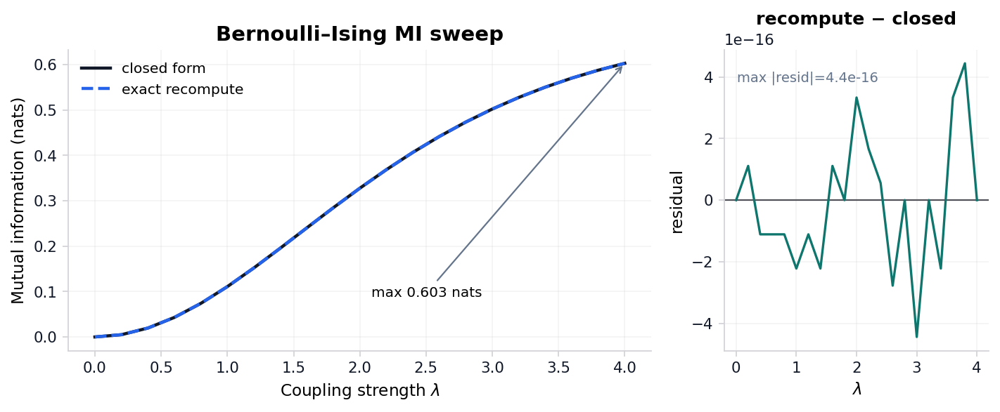

## Page 43

10
Free-energy decomposition
Free energy against the entangled prior is evaluated along the same 𝜆grid used for the MI sweep (fig. 15). Against the entangled prior
the entangled posterior is the exact variational minimizer, so its free energy is identically zero; the Theorem-5.1 decomposition then
splits that zero into per-stream marginal free energies, a coupling-cost term, a coupling-prior term, and a total-correlation gain. For
the symmetric toy with uniform marginals the coupling-prior term equals −𝐼(𝜆) and exactly cancels the total-correlation gain +𝐼(𝜆)
— an exact cancellation the merged invariant suite checks (12/12 pass). The curve in fig. 15 instead reports free energy against the
mean-field prior: its minimum at 𝜆= 0 is where the entangled posterior coincides with the factorized mean-field product, and any
𝜆> 0 raises the free energy as coupling pulls the posterior away from that independent prior.
Saturation MI (grid maximum on the measured 𝜆sweep): 0.6031 nats.
Figure 15: Free energy of the entangled posterior relative to the mean-field prior across the hyperparameter sweep (grid points 21);
relative to the entangled prior, the same posterior has identically zero free energy.
41

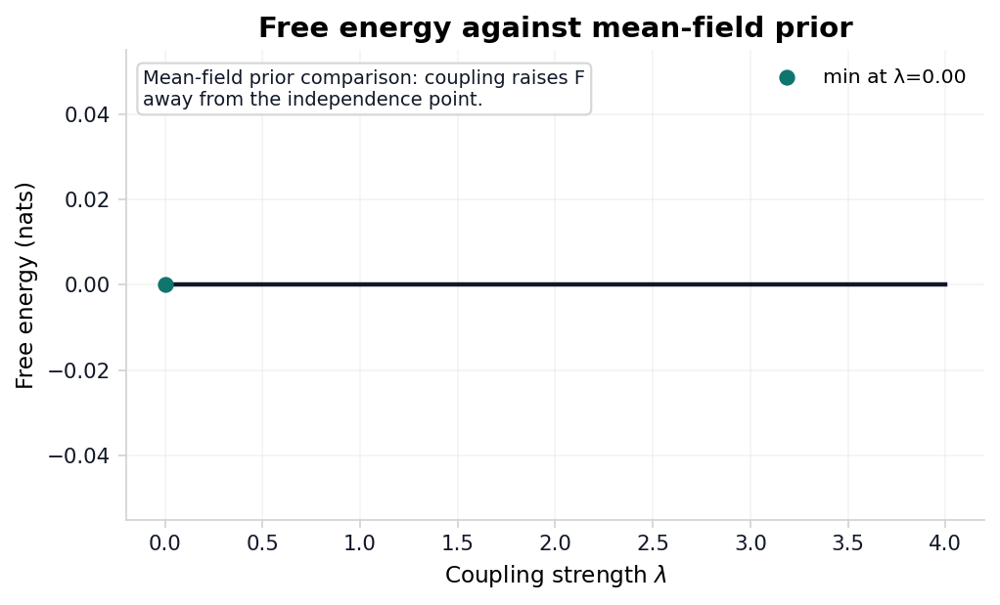

## Page 44

11
T-maze active-inference rollout
The pymdp harness rolls out a T-maze active-inference agent in state_inference mode with planning horizon 2.
The default
state_inference mode is belief filtering with a goal-seeking action rule; sophisticated policy inference (an expected-free-energy policy
posterior) is selectable via mode: policy_inference (sec. 6). Summary metrics land in output/data/si_tmaze_summary.json.
Steps recorded: 2. Mean belief entropy: 0.3251. Belief entropy over the rollout is traced in fig. 20; the paired observation and
action indices are in fig. 21.
output/data/analysis_statistics.json now records the trace as a small statistical object rather
than a caption-only trace: action switches 1 times (rate 1.000 over adjacent steps), observation diversity is 1, entropy drop is 0.0000
nats from first to terminal step, and the saved trace/summary step counts agree: true with finite entropy values true. The default
state_inference mode runs pymdp infer_states and reports the resulting posterior (belief entropy and the state-1 marginal), but
the action is chosen by an open-loop scripted rule on the observation index — not by the posterior — so the inferred belief here is
observed, not acted on. Under the toy transition model, expected-free-energy policy inference reaches the goal in 1 of its rows versus 2
for the scripted state-inference rule: no behavioral advantage on this two-state, horizon-2 maze, which is the measured content of the
deliberately-too-small claim.
Policy-comparison rows: 4 across state-inference and policy-inference modes; goal-reaching rows: 3. These rows are internal toy
consistency checks under finite-horizon discrete active-inference assumptions [Friston et al., 2021, Da Costa et al., 2023], not comparisons
against external behavioral datasets. Graph-world extension rows: 4 over 4 nodes, with goal-reached flag 1.
The expected free energy that scores those policies decomposes in closed form (fig. 17). Across the 4 length-2 policies on the T-maze
generative model, the expected-free-energy-minimising policy is 00 with 𝐺= 2.2539 nats, splitting into risk 1.6037 (the pragmatic
deviation of predicted outcomes from preferences) and ambiguity 0.6502 (the expected likelihood entropy) nats. The same 𝐺splits
equivalently into pragmatic value -2.2539 (expected log-preference) and epistemic value 0.0000 (state-outcome mutual information)
nats — the term that drives information-seeking. The two forms are exactly equal: risk + ambiguity + pragmatic + epistemic vanishes
to within 0.0e+00 across every policy, the action-selection twin of the analytical free-energy decomposition identity (sec. 10).
Precision controls how sharply that expected free energy is acted on:
the policy posterior is the softmax-weighted
𝑞(𝜋) ∝exp(−𝛾𝐺(𝜋)), and sweeping the inverse temperature 𝛾across 33 grid points up to 16 sharpens it monotonically (fig. 18).
Posterior entropy falls from ln 4 at 𝛾=0 to 1.1458 nats at 𝛾=1, then saturates at the floor 0.6931 nats rather than reaching zero: the
absorbing goal makes the second action irrelevant once reached, so 2 policies tie at the expected-free-energy minimum and precision
concentrates mass on that optimal set, not a single policy.
By that honest criterion selection becomes effectively deterministic —
optimal-set mass exceeding 0.99 — at 𝛾=3.
The minimal two-state maze above is, by construction, too small for information-seeking to matter: the reward location is observable
from the start, so a greedy pragmatic rule and an expected-free-energy rule reach the goal equally often. The cue-then-reward variant
(fig. 16) removes that degeneracy. Across 8 joint position-by-context states the reward location is an uninformative latent (50/50 at
the start) that is hidden until the agent visits a CUE location, at which point a single sample resolves it: the cue carries 0.6931 nats of
information (= ln 2, the entropy of the unknown context). An agent that samples the cue and then takes the contingent arm reaches
reward with expected log-preference -0.0538 nats, against -4.0538 nats for a greedy agent that commits to an arm before sampling —
a measured behavioural advantage of 4.0000 nats that vanishes only if epistemic value is removed from the objective. The advantage
is sophisticated, not flat: the closed-form flat decomposition of sec. 11 scores the cue-first and greedy policies as identical because
it propagates beliefs through the transition model without conditioning them on the cue observation. Resolving the latent therefore
requires an observation-conditioned (sophisticated-inference) evaluation, and under that evaluation cue-sampling is strictly necessary
rather than merely available.
Planning is only half of the generative loop: the agent must also learn its likelihood. Placing a Dirichlet prior over each column of
𝐴and accumulating observation-state counts 𝑐gives the conjugate update 𝑝𝐴←𝑝𝐴+ 𝑐with expected likelihood 𝐸[𝐴] = 𝑝𝐴/ ∑𝑜𝑝𝐴
(fig. 19). Driven by a fixed, sampling-free expected-count stream, KL(𝐴true ‖ 𝐴learned) falls monotonically from 0.7361 nats at the
uniform prior to 1.29e-03 nats, reaching the convergence tolerance at update step 3. The learned likelihood converges to the true
generative model in closed form, the inference-side twin of the EFE planning decomposition above.
Rollout trace: output/data/si_tmaze_trace.json. JSONL run log: output/logs/pymdp_runs.jsonl.
42

## Page 45

Figure 16: Cue-then-reward T-maze where epistemic value is strictly necessary. Left: the cue carries 0.6931 nats of information and the
cue-sampling agent reaches reward with a measured advantage of 4.0000 nats over a greedy agent. Right: flat Expected Free Energy
scores the cue-first and greedy policies identically (identical), so the sophisticated observation- conditioned evaluator is what makes
information-seeking required. Closed form (no sampling).
Figure 17: Closed-form Expected Free Energy decomposition over the finite T-maze policies. Left: 𝐺(𝜋) = risk + ambiguity (stacked),
with the goal-seeking minimiser marked. Right: the pragmatic and epistemic values, which sum to −𝐺(𝜋). Both forms are computed
in closed form (no sampling) and satisfy risk + ambiguity + pragmatic + epistemic = 0 to machine precision.
43

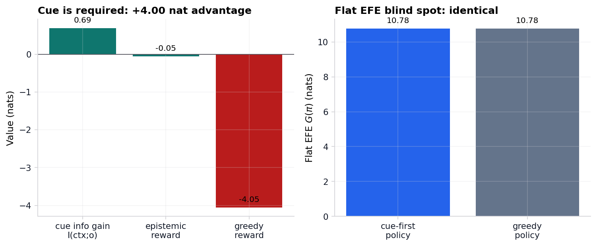

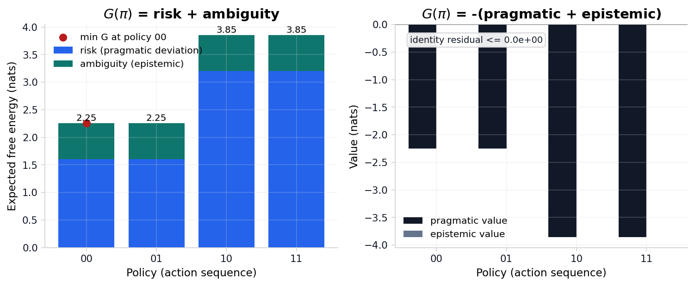

## Page 46

Figure 18: Precision sweep over the closed-form T-maze policy posterior 𝑞(𝜋) ∝exp(−𝛾𝐺) across 33 grid points up to 𝛾=16. Entropy
falls from ln 4 to the ln |Π⋆| floor (2 tied optima, second action irrelevant under the absorbing goal); the optimal-set mass crosses 0.99
at 𝛾=3. Entropy at 𝛾=1 is 1.1458 nats. Computed in closed form (no sampling).
Figure 19: Dirichlet model learning: KL(𝐴true ‖ 𝐴learned) versus concentration-update step. The expected likelihood 𝐸[𝐴] = 𝑝𝐴/ ∑𝑜𝑝𝐴
converges monotonically to the true generative likelihood; the run reaches the convergence tolerance at step 3 with final KL 1.29e-03
nats. Deterministic (no sampling), so the curve is byte-reproducible.
44

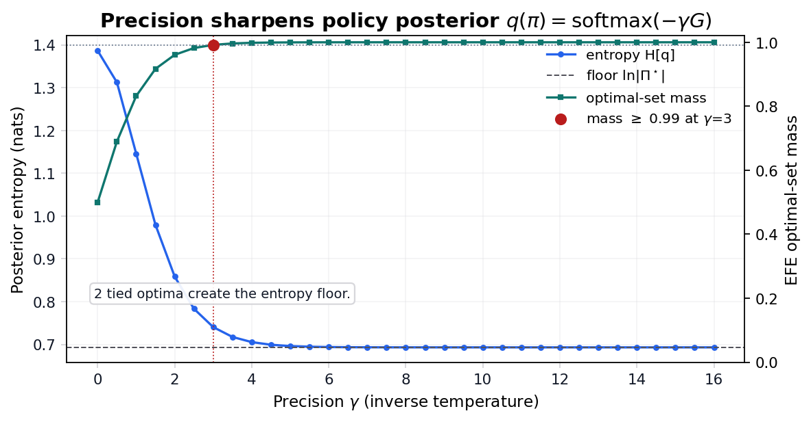

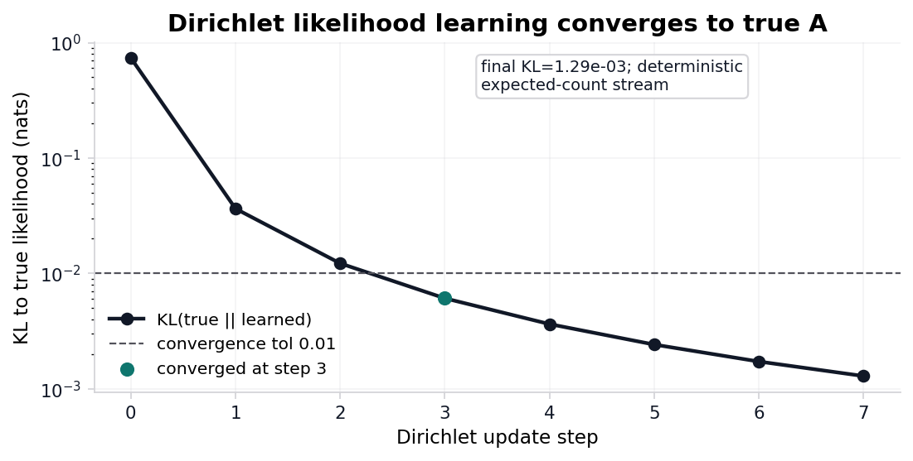

## Page 47

Figure 20: Belief entropy over time for the T-maze rollout (mean 0.3251 nats).
Figure 21: Observation and action traces for the T-maze rollout (action diversity 2).
45

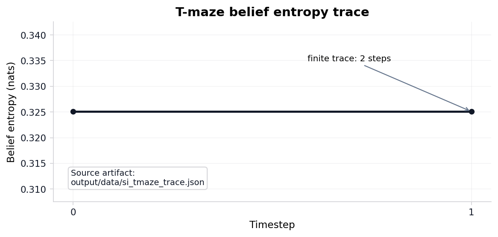

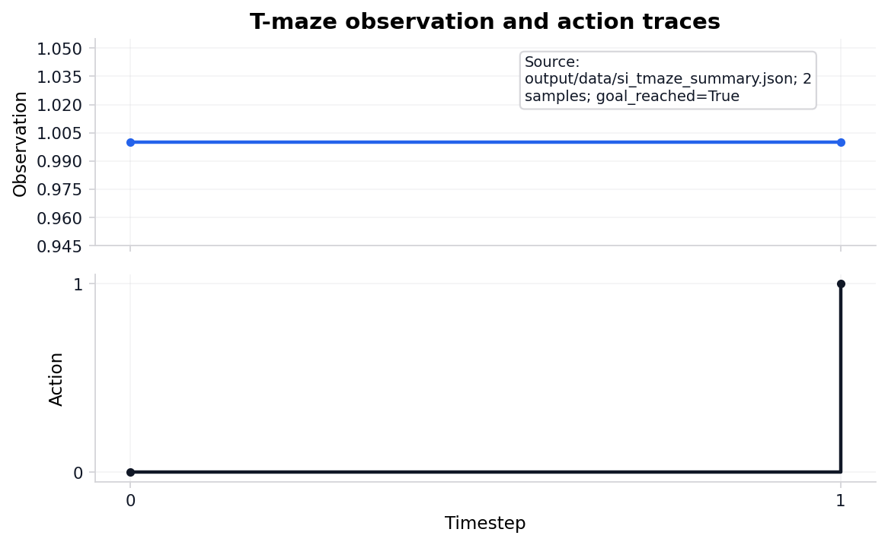

## Page 48

Figure 22: Discrete action index over time for the pymdp T-maze rollout (policy length 2).
12
Validation invariants
The analytical invariant registry runs before PDF rendering (sec. 5). On a clean checkout 12 / 12 checks pass in the merged validation
report, which records simulation invariants when the pymdp harness ran (sec. 11).
fig. 23 lists each analytical and simulation gate; failures block publication artifacts. See sec. 8 for how invariant counts hydrate
manuscript tokens.
Simulation invariants merge into the analytical report after the pymdp harness runs (sec. 11). fig. 23 summarizes pass/fail status
for both domains on the clean tree.
The replay matrix exposes deterministic rerun comparison as table data rather than prose. It contains 13 producer rows, uses
explicit replay-or-fingerprint methods, and every row must match its saved artifact hash (true).
The sensitivity fragment binds the deterministic toy sweep to the canonical sheaf track. output/data/sensitivity_sweep.j
son contains 96 cells across toy parameters, policy modes, seeds, horizons, and graph topologies; the hydrated flag true is the only
manuscript claim about coverage.
The companion output/data/si_policy_grid.json records measured policy-mode rows derived from si_policy_comparison.js
on, not a synthetic grid. Missing cells fail the artifact schema before they can become prose; the topology trace artifact contributes 4
deterministic topology traces.
The uncertainty fragment reports only normalized toy summaries. output/data/uncertainty_summary.json contains 12 belief
and policy-posterior rows plus 3 finite entropy bins, and true is false if any posterior row fails to sum to one within the deterministic
tolerance.
Policy uncertainty is recorded in generated policy artifacts rather than hand-entered into the manuscript.
The posterior grid
contributes 5 available posterior rows; the EFE values artifact reports availability-or-measured-fallback flag 1. The fragment is therefore
a validation surface, not an empirical uncertainty claim.
The benchmark fragment adds a compact toy matrix over the Bernoulli, T-maze, and graph-world artifacts. output/data/toy_ben
chmark_matrix.json reports 3 model rows and true only when each row names an artifact, metric, and passing gate.
The matrix is scoped to deterministic exemplar models. It is useful as a cross-track smoke test, not as a performance benchmark
for biological or deployed systems.
12.0.1
State-space catalog track
The state_space_catalog track enumerates finite state spaces, action spaces, and policy counts for the deterministic toy models. The
catalog artifact is output/data/state_space_catalog.json: it currently records 6 rows, with finite-space status true.
12.0.2
Causal ablation track
The causal_ablation track records deterministic toy ablations over finite preferences, likelihood-noise settings, and graph-topology
perturbations. The matrix artifact is output/data/causal_ablation_matrix.json: it currently records 36 cells, with complete-grid
status true.
46

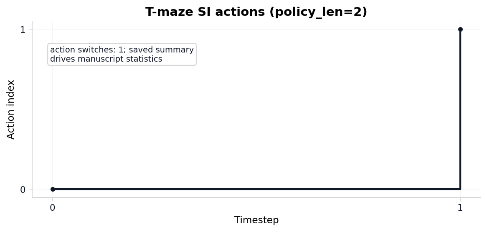

## Page 49

Figure 23: Invariant dashboard: 12 / 12 merged analytical and simulation checks from the validation registry.
Discussion
13
Limitations and outlook
13.1
What this demonstrates
The result of this manuscript is a discipline, not a domain claim: across three toy models every reported number is hydrated from a
generated artifact, 6 sheaf axioms are machine-checked before composition, and 25 negative controls keep each failure path live. That
posture follows the caution that FEP and active-inference formalisms need explicit methodological scope before they become empirical
brain claims [Gershman, 2019]. No statistic, figure, or cross-track claim here can drift from its artifact without failing a gate before
the PDF is built.
13.2
Limitations
The Bernoulli–Ising toy, T-maze harness, and sheaf composition model are pedagogical.
They validate analytical consistency, ar-
tifact wiring, renderer dispatch, and manuscript hydration, not empirical claims about biological agents.
Default pymdp mode is
state_inference with planning horizon 2; the policy-comparison artifact exposes policy-inference rows without changing the default
rollout (sec. 6).
13.3
Sheaf audit and outlook
sec. 1 and sec. 14 make binding state auditable under strict compose validation (sec. 8). Pipeline extensions in tracks.yaml extensio
n_tracks now write deterministic artifacts: a belief GIF via render_animation.py and graph-world SI summary/trace via simulate_
si_graph_world.py. The appendix row already binds an animation sheaf fragment without new manifest rows.
Sweep RMSE 0 nats and SI goal reached 1 summarize measured agreement on the declared grids and rollout. Future work includes
full expected-free-energy policy selection, richer graph-world rollouts, and expanded Lean proofs beyond the boundary witnesses in
sec. 7.
The discussion ontology binds coverage_semantics to the audit matrix in sec. 1, pedagogical_scope to the non-empirical scope
of the toy models, and state_inference_mode to the pymdp harness contract in sec. 6.
Measured pymdp rollout (state_inference, config hash 81eb061f43b7bfd7): mean belief entropy 0.3251 nats over 2 steps; goal
reached flag 1; action diversity 2.
Analytical sweep residual RMSE 0 nats (max residual 0). Coverage audit: 95 present / 95 bound / 0 missing cells on the IMRAD
matrix.
The scholarship matrix is also a scope-control device. It separates conceptual lineage from measured evidence: cited sources explain
why the toy models are relevant, while generated artifacts decide every numerical, figure, and gate claim. That split keeps the paper
from converting background authority into an unsupported empirical result.
47

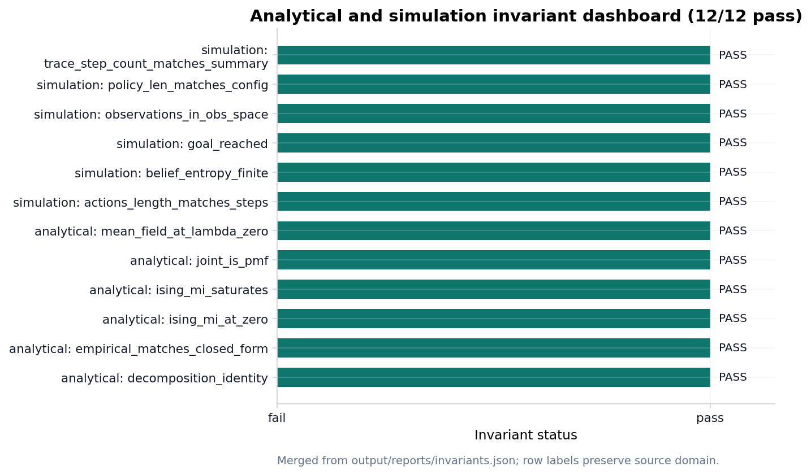

## Page 50

Sophisticated Learning is therefore cited as a future-only parameter-learning direction [Hodson et al., 2023]. It does not change
the current T-maze state-inference default, does not promote an active-learning adapter, and does not alter the blocked major-scope
ladder for empirical or non-toy claims.
13.3.1
Ontology bindings
• coverage_semantics →Coverage matrix semantics
• pedagogical_scope →Pedagogical scope
• state_inference_mode →State inference harness
13.3.2
Release notes evidence track
The release_notes track keeps release-language claims source-backed by validation, semantic, and bundle artifacts.
Its evidence
artifact is output/reports/release_notes_evidence.json: it currently records 3 rows, with source-backed status true.
48

## Page 51

Appendix
14
Appendix: full track coverage
This section is the composability proof for the manifest-indexed sheaf model: all 33 appendix-bound fragment tracks render into
one flat manuscript section without section-specific compose branches. The registry defines 34 composable types; optional layers
is methods-only and excluded from this row. The animation fragment is bound here as an optional registry type alongside the live
proof, simulation, formal, notation, validation-spine, integration, audit, finite-catalog, ablation, license, release-evidence, scholarship,
assumption-index, delta, and staleness tracks.
The proof is a publication-systems check (eq. 4). It demonstrates that heterogeneous fragments share one registry, manifest, renderer
dispatch path, coverage matrix, and hydration boundary; it does not assert that every track carries equal scientific weight.
For each track 𝑡∈𝒯Full, the appendix row binds a fragment path 𝑓(𝑡) and the composer emits <!-- sheaf-track:t --> before
the rendered body. Generated renderers such as section_figures and markdown renderers pass through the same resolve_track_b
ody() dispatch, so the appendix exercises the common compose interface rather than a bespoke appendix path.
|𝒯Full| = 33
(4)
The fragment registry defines 34 composable track types; optional layers is bound on the methods sheaf section only. Optional
animation is bound in this appendix proof; the deterministic GIF artifact in tracks.yaml extension_tracks is produced by the core
analysis DAG and remains separate from this fragment slot.
Because this appendix binds every non-optional appendix track plus optional animation, it is the maximal publication stalk of the
coverage presheaf and exercises every publication renderer through the common resolve_track_body() dispatch. The same compose
path is gated by the 6 sheaf laws verified in sec. 8 (6/6 satisfied): the appendix section glues to a unique output (separation), occupies
the terminal position of the linear extension under its own appendix group row (poset and gluing), binds only well-typed fragments
(typing), and owns every fragment path it references (compositionality). No count in this appendix is hand-written; all are injected
from the registry-backed oracle.
Analytical sweep artifacts feed sec. 9 and sec. 12; simulation invariants merge after sec. 11. No additional path listing is required
beyond those Results sections.
The appendix assumption_index row points to output/data/analytical_assumption_index.json. It binds 7 finite Bernoulli-Ising
assumption rows to 7 equation identifiers and generated artifacts, with indexed status true.
The point is to make analytical signposting mechanical. If an equation is added without an assumption row, or if a row loses its
evidence artifact, the index gate fails and the manuscript cannot present the equation as part of the validated finite toy proof surface.
pymdp harness summary: output/data/si_tmaze_summary.json (mean belief entropy, action trace). Runtime diagnostics: outpu
t/reports/pymdp_runtime_diagnostics.json (known warnings 4, unexpected warnings 0). Policy posterior grid: output/data/pymd
p_policy_posterior_grid.json (10 rows). Full log: output/logs/pymdp_runs.jsonl.
sheaf-track:interop binds output/data/interop_roundtrip_report.json, output/data/gnn_roundtrip_report.json, output
/reports/gnn_lint_report.json, and ontology profile artifacts into the appendix proof row. The appendix claim is exactly 2 checks
with lossless status true.
The appendix provenance fragment points to output/data/artifact_provenance.json, the canonical artifact that records required
toy artifact hashes, producer scripts, source commit, deterministic seeds, config digests, and 5 bundle rows.
replay_matrix.json provides the appendix proof for deterministic replay: 13 producer replay/fingerprint rows with matched status
true.
The appendix counterexample fragment points to output/reports/counterexample_matrix.json, the expected-failure matrix that
keeps promoted validation gates falsifiable. It currently records 25 known-bad fixtures, and the hydrated pass flag is 1, meaning those
fixtures are expected to fail rather than sneak through a positive-control gate.
This row is the negative-control ledger for the sheaf. Each counterexample names a promoted track, target validation gate, mutation,
and observed expected-failure status. A new live track without a counterexample row is therefore visibly incomplete in the track-
improvement scope.
sheaf-track:adversarial_audit binds output/reports/adversarial_audit.json, output/reports/scope_boundary_audit.js
on, and claim-audit outputs. The appendix claim is exactly 25 expected-failure rows with documented status true and known-bad-
passing count 0.
evidence_field_index.json provides the appendix proof for field-level claim evidence: 97 mapped fields with status true.
release_bundle_manifest.json provides the appendix proof for required deliverables: 38 artifacts with source-present status true.
artifact_contract_index.json is the appendix-level cross-artifact concordance proof. It rederives 85 rows from the live semantic
producer map and release-bundle parity rows, with row-complete flag true and copied-parity flag true.
validation_gate_index.json provides the appendix proof for gate ergonomics: 26 indexed gates. track_lane_matrix.json adds
32 pipeline-to-sheaf rows with completion flag true.
14.0.1
Appendix track: artifact diffoscope
artifact_diffoscope binds output/reports/artifact_diffoscope.json into the full sheaf appendix. Rows: 41. All equal: true.
This diffoscope is deliberately narrow and reproducibility-facing. For each non-cyclic generated artifact, it compares the saved
provenance digest to the live file digest at validation time. The validator re-derives equality from the rows, so a stale all_equal: tru
e summary cannot hide one changed artifact.
The row count is not a decoration; it is the number of artifact fingerprints that survived cycle exclusion and therefore can be
compared directly. This keeps the release bundle honest about mutable files while avoiding self-referential hashes for artifacts that
49

## Page 52

necessarily include their own provenance.
14.0.2
Appendix track: artifact license
artifact_license binds output/reports/artifact_license_audit.json into the full sheaf appendix. Rows: 85. All safe: true.
The license audit classifies each generated or source-backed artifact under the public exemplar’s configured license boundary. It is
intentionally conservative: generated local outputs and project-owned source files pass, while an artifact outside those public source
kinds would need an explicit provenance and license row before it could support a manuscript claim.
This is also where the blocked empirical-adapter boundary matters. Private, restricted, or network-derived data are not smuggled
in as evidence; they remain blocked until privacy, licensing, typed-claim, semantic, and negative-control gates are implemented in the
same artifact path.
sheaf-track:scholarship binds output/data/scholarship_source_matrix.json into the appendix proof row. The appendix
claim is exactly 21 connected source rows with connected status true; each row names a bibliography key, locator, manuscript citation
status, declared consumer sections, method role, registered track set, evidence artifact, and claim-boundary statement. The row set
includes 3 quantitative/statistical or visualization-quality method roles, including 7 statistically backed figures with bridge status true.
The explicit crosswalk has 7 rows and 9 statistical source links; every row is referenced in the manuscript (true), and every such
reference section is manifest-bound to sheaf tracks (true) with a visualization track present (true). This binds statistics and figure-
quality claims to generated artifacts rather than bibliography authority. The scholarship matrix itself also records manuscript citation
presence (true), declared-section citation overlap count (19), scope-guarded boundaries (true), and live row re-derivation (true), which
makes forged aggregate source-connectivity flags fail at the validation boundary.
The visualization registry is also now a paper-integration object: role metadata complete true, paper claims complete true, and
section bindings complete true. Those flags are read from the saved visualization-quality audit and then rechecked through the semantic
sheaf restrictions.
The appendix includes the security posture as a release-boundary proof object. Each row in output/reports/security_posture_
audit.json has evidence artifacts, validators, a scoped boundary statement, and a negative-control identifier. The negative controls
target the verifier failure modes a well-resourced adversary would prefer: aggregate forgery, untracked credentials, network-derived
evidence, private-data leakage, unsigned production-release claims, and production zero-trust claims without a runtime identity plane.
The posture is therefore defensive and local: it hardens this public template against evidence laundering, artifact drift, secret
exposure, and false release claims while keeping production-only controls deferred until a real deployment adds signed provenance,
SBOMs, identity-aware access, telemetry, and incident response evidence.
sheaf-track:sensitivity binds output/data/sensitivity_sweep.json, measured output/data/si_policy_grid.json,
compatibility-named EFE values artifact output/data/si_efe_terms.json, output/data/analytical_observable_sweep.json, and
graph-world topology artifacts including output/data/si_graph_world_topology_traces.json. The appendix claim is exactly 96
complete canonical grid cells.
sheaf-track:uncertainty binds output/data/uncertainty_summary.json. The appendix claim is exactly 12 normalized rows
across 3 entropy bins with status true.
sheaf-track:benchmark binds output/data/toy_benchmark_matrix.json. The appendix claim is exactly 3 complete toy-model
rows with status true.
The appendix manuscript_staleness row points to output/reports/manuscript_staleness_report.json. It checks 322 token
bindings after hydration, including late audit variables, and the pass flag is true.
This is the rendered-output side of the sheaf contract.
Source fragments may contain hydration placeholders, but the public
manuscript must not; the staleness report compares each token’s generated value against the resolved markdown so stale counts are
caught after composition, not only during source-file linting.
Reproduced from fig. 5. Closed-form 𝐼(𝜆) and an independent exact recomputation via total correlation for the symmetric Bernoulli-
Ising toy across 21 grid points up to 𝜆max = 4; grid maximum 0.6031 nats. Both estimators are deterministic (no sampling), so the
right panel is a cross-implementation agreement check (max residual 0 nats), not a sampling residual.
50

## Page 53

Reproduced from fig. 22. Discrete action index over time for the pymdp T-maze rollout (policy length 2).
Figure 24: Theorem traceability graph generated from 17 linked theorem rows and 207 proof-dependency edges.
51

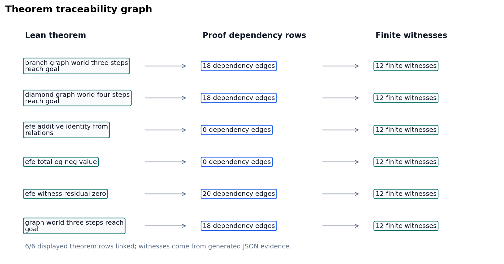

## Page 54

Figure 25: Causal-ablation heatmap: 36 source-backed rows joined to sensitivity and uncertainty artifacts; all effects source-backed:
true.
Reproduced from fig. 13. Scholarship source map: 21 source rows across 21 method roles and 10 source families. Connected status:
52

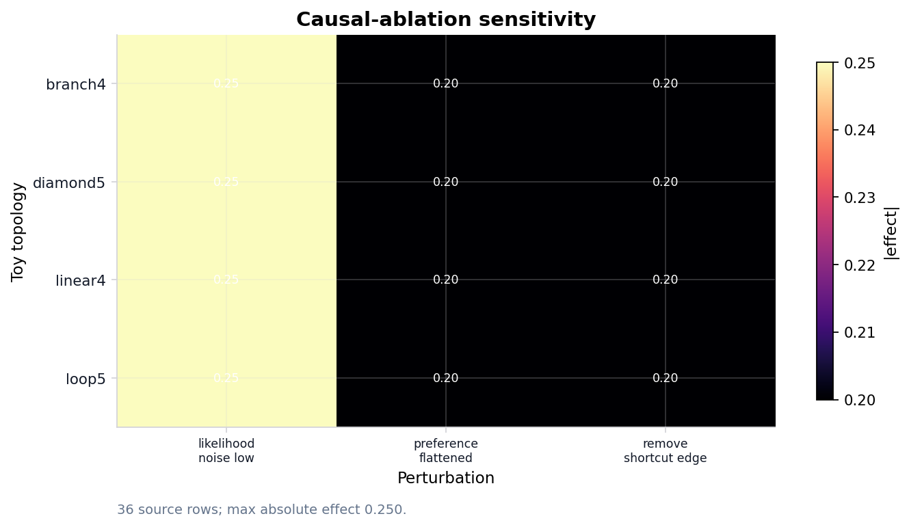

## Page 55

true; row evidence rederived: true.
Reproduced from fig. 11. Track-lane promotion map: 32 pipeline-to-sheaf rows with complete promotion status true. Left: seven
promotion-rule obligations; right: sheaf fragment bindings.
53

## Page 56

Reproduced from fig. 12. Artifact contract map: 85 generated artifact rows with complete contract status true and copied-output
parity complete true. Cycle rows are explicit in output/data/artifact_contract_index.json.
Reproduced from fig. 14. Security posture map: 9 controls, 7 enforced and 2 scoped as deferred; secret findings: 0; high-risk gaps: 0.
54

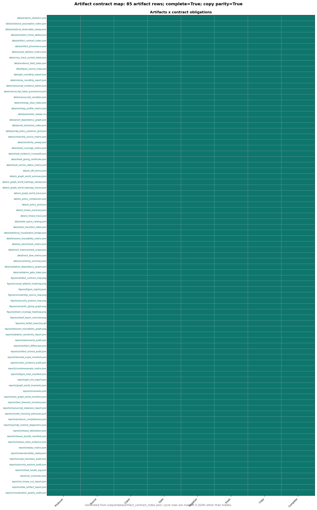

## Page 57

Reproduced from fig. 3. Sheaf track coverage matrix: 17 IMRAD rows × 34 fragment columns. Black = present (P), white = absent
(—), gray = missing (M). Counts: 95 present / 95 bound / 0 missing. Generated from output/data/sheaf_coverage_matrix.json.
Lean modules under lean/TemplateActiveInference/ declare horizon and coupling witnesses. Build with lake build in lean/;
fig. 8 summarizes proved versus deferred statements for this boundary fragment.
sheaf-track:model_checking binds output/reports/model_checking_witnesses.json and the Lean theorem inventories. The
appendix claim is exactly 12 finite exhaustive witnesses with pass status true; Lean graph-world topology coverage is 4 generated
topology ids with all-witnessed flag true.
theorem_traceability_matrix.json provides the appendix proof for theorem traceability: 17 linked rows with status true.
14.0.3
Appendix track: proof extraction
proof_extraction binds output/data/proof_extraction_index.json into the full sheaf appendix. Extracted theorems: 12. Con-
structive status: true.
The extraction index is intentionally modest: it records theorem names, statements, source files, leading tactics, and forbidden
proof-token checks. That makes the Lean boundary inspectable without pretending that every proof term has been translated into a
proof object. A row with a missing statement or forbidden token fails the formal interop gate and the canonical sheaf gate.
output/data/proof_dependency_graph.json adds the dependency view used by the appendix figure. It contributes 207 theorem-
source, theorem-tactic, theorem-definition, and theorem-witness edges, with resolved edge status true; this is the artifact that keeps
the theorem-traceability graph tied to generated Lean and model-checking rows.
14.0.4
Appendix track: state-space catalog
state_space_catalog binds output/data/state_space_catalog.json into the full sheaf appendix. Rows: 6. All finite: true.
The catalog is the finite-scope boundary for every toy claim in the exemplar. Each row records a model id, state count, action
count, policy count, source artifact, and finite flag; the validator recomputes that counts are positive and that every row remains finite.
This prevents a manuscript sentence about exhaustive checking from silently drifting into an unbounded or empirical setting.
output/data/state_transition_table.json makes the boundary operational. It contains 24 deterministic transition rows and
covers all reachable finite models with status true.
Readers can therefore audit not just the number of states, but the actual
state/action/next-state relation used by the model-checking witnesses.
14.0.5
Appendix track: causal ablation
causal_ablation binds output/data/causal_ablation_matrix.json into the full sheaf appendix. Cells: 36. Complete grid: true.
The matrix is a finite teaching device: every row names a topology, a coupling value, a perturbation, a scalar effect, and the generated
source row that made the effect admissible. It is not a claim about empirical interventions. It shows how an intervention-shaped table
can be made falsifiable inside the sheaf: delete one perturbation cell or clear one deterministic flag and the grid gate fails before the
manuscript can reuse the result.
output/reports/ablation_sensitivity_report.json then joins those ablation effects to the sensitivity and uncertainty artifacts.
The report contributes 36 source-backed rows, with source-backed status true, so the appendix heatmap is a rendered view of validated
JSON rather than a decorative restatement.
GNN declarations: gnn/bernoulli_toy.gnn.md and gnn/si_tmaze.gnn.md [Smékal and Friedman, 2023]. fig. 6 and sec. 5 document
ontology concordance for the Bernoulli toy; SI notation extends the same pattern under sec. 6.
14.0.6
Ontology bindings
• belief_entropy →BeliefEntropy
• expected_free_energy →ExpectedFreeEnergy
• location →HiddenState
• observation →ObservationLikelihood
• policy →PolicyPosterior
• sheaf_track →SheafFragment
Animation is an extension sheaf track backed by a deterministic GIF from scripts/render_animation.py. This appendix row
documents the track binding only; default publication still uses static SI figures (sec. 11, fig. 22) while the GIF remains an auditable
55

## Page 58

generated artifact.
The appendix animation_delta row points to output/data/animation_frame_deltas.json. The manifest records 3 adjacent-frame
deltas, with true as the hydrated evidence that the GIF is trace-derived rather than a duplicated static frame.
14.0.7
Appendix track: release notes evidence
release_notes binds output/reports/release_notes_evidence.json into the full sheaf appendix. Rows: 3. Source-backed: true.
Release notes are treated as claims, not as informal changelog prose. Each row names a source artifact and a pass/deferred status,
so the release note can say only what validation, bundle, or semantic artifacts support. The validator re-derives support from rows;
flipping the summary bit without fixing a failed row still fails.
output/reports/release_attestation.json is the compact final view over the same boundary. It records 7 attestation rows for
validation, release bundle hash, license audit, semantic certificate, and blocked-scope status, with all-attested flag true.
56

## Page 59

15
Conclusion
Analytical oracles (sec. 5), pymdp rollouts (sec. 11), and sheaf composition (sec. 8) share one auditable manuscript contract: measured
artifacts hydrate 12 composed sections, sec. 1 reports binding state, and strict compose validation blocks gray matrix cells before PDF
rendering.
The T-maze harness runs in state_inference mode with config hash 81eb061f43b7bfd7; sweep RMSE 0 nats summarizes analytical-
empirical agreement on the toy coupling grid. sec. 12 merges analytical and simulation gates; sec. 13 states scope and extensions.
Scientific claims remain confined to declared models, not empirical statements about biological agents [Gershman, 2019].
The exemplar therefore sits at a narrow intersection: finite discrete active inference on POMDP-like toy models [Da Costa et al.,
2020, Friston et al., 2021, Da Costa et al., 2023], sheaf-style local-to-global checks for publication artifacts [Curry, 2014, Robinson,
2014], and GNN notation as an interop layer [Smékal and Friedman, 2023].
57

## Page 60

16
References
See docs/manuscript/references.bib for bibliography entries cited in the composed sections.
58

## Page 61

References
Vicente Bosca and Robert Ghrist. Neural networks as local-to-global computations, 2026. URL https://arxiv.org/abs/2603.14831.
Christopher L. Buckley, Chang Sub Kim, Simon McGregor, and Anil K. Seth. The free energy principle for action and perception:
A mathematical review.
Journal of Mathematical Psychology, 81:55–79, 2017.
doi: 10.1016/j.jmp.2017.09.004.
URL https:
//doi.org/10.1016/j.jmp.2017.09.004.
Théophile Champion, Lancelot Da Costa, Howard Bowman, and Marek Grześ. Branching time active inference: The theory and its
generality, 2021. URL https://arxiv.org/abs/2111.11107.
Justin Michael Curry. Sheaves, Cosheaves and Applications. PhD thesis, University of Pennsylvania, 2014. URL https://repository.u
penn.edu/entities/publication/c391a10c-f2e5-40be-bc3f-e6f73a43ddfb.
Lancelot Da Costa, Thomas Parr, Noor Sajid, Sebastijan Veselic, Victorita Neacsu, and Karl Friston. Active inference on discrete
state-spaces: A synthesis. Journal of Mathematical Psychology, 99:102447, 2020. doi: 10.1016/j.jmp.2020.102447. URL https:
//doi.org/10.1016/j.jmp.2020.102447.
Lancelot Da Costa, Noor Sajid, Thomas Parr, Karl Friston, and Ryan Smith. Reward maximization through discrete active inference.
Neural Computation, 35(5):807–852, 2023. doi: 10.1162/neco_a_01574. URL https://doi.org/10.1162/neco_a_01574.
Karl Friston. The free-energy principle: A unified brain theory? Nature Reviews Neuroscience, 11(2):127–138, 2010. doi: 10.1038/nr
n2787. URL https://www.nature.com/articles/nrn2787.
Karl Friston, Lancelot Da Costa, Danijar Hafner, Casper Hesp, and Thomas Parr. Sophisticated inference. Neural Computation, 33
(3):713–763, 2021. doi: 10.1162/neco_a_01351. URL https://doi.org/10.1162/neco_a_01351.
Samuel J. Gershman. What does the free energy principle tell us about the brain? Neurons, Behavior, Data Analysis, and Theory, 2
(3):1–10, 2019. doi: 10.51628/001c.10839. URL https://doi.org/10.51628/001c.10839.
Conor Heins, Beren Millidge, Daphne Demekas, Brennan Klein, Karl Friston, Iain D. Couzin, and Alexander Tschantz. pymdp: A
python library for active inference in discrete state spaces. Journal of Open Source Software, 7(73):4098, 2022. doi: 10.21105/joss.
04098. URL https://doi.org/10.21105/joss.04098.
Rowan Hodson, Bruce Bassett, Charel van Hoof, Benjamin Rosman, Mark Solms, Jonathan P. Shock, and Ryan Smith. Sophisticated
learning: A novel algorithm for active learning during model-based planning, 2023. URL https://arxiv.org/abs/2308.08029.
Wouter W. L. Nuijten, Thijs van de Laar, and Bert de Vries. Expected free energy-based planning as variational inference, 2026. URL
https://arxiv.org/abs/2606.20658.
Thomas Parr, Giovanni Pezzulo, and Karl J. Friston. Active Inference: The Free Energy Principle in Mind, Brain, and Behavior. MIT
Press, 2022. doi: 10.7551/mitpress/12441.001.0001. URL https://mitpress.mit.edu/9780262045353/active-inference/.
Michael Robinson. Topological Signal Processing. Springer, 2014. doi: 10.1007/978-3-642-36104-3. URL https://link.springer.com/bo
ok/10.1007/978-3-642-36104-3.
Jakub Smékal and Daniel Ari Friedman. Generalized notation notation for active inference models, 2023. URL https://zenodo.org/r
ecords/7803328.
Ryan Smith, Karl J. Friston, and Christopher J. Whyte. A step-by-step tutorial on active inference and its application to empirical
data. Journal of Mathematical Psychology, 107:102632, 2022. doi: 10.1016/j.jmp.2021.102632. URL https://doi.org/10.1016/j.jmp.
2021.102632.
59

## Page 62

END OF TRANSMISSION
Release: v0.3.2 ⋅DOI 10.5281/zenodo.20417021 ⋅SHA-256 pending… ⋅pairing pending
Figure 26: Integrity QR strip
Prior: No prior releases.

---
*Extraction method: pymupdf*
