# Full Text: BeeStack: An Evidence-Typed Scaffold for Whole-Colony Honeybee Simulation

> Extracted from `BeeStack_combined.pdf`

> 42 figures extracted to `images/`

---

## Page 1

BeeStack: An Evidence-Typed Scaffold for Whole-Colony Honeybee
Simulation
A Body–Brain–Mind–Swarm–Niche Substrate for Auditable Apis mellifera Modeling
Daniel Ari Friedman
Active Inference Institute; Atta Labs
daniel@activeinference.institute
ORCID: 0000-0001-6232-9096
and Tucker Cahill Chambers
Atta Labs
ORCID: 0009-0008-3793-7872
DOI: 10.5281/zenodo.20420557
May 2026
May 2026

## Page 2

Contents
1
Abstract
4
2
Scholarship and Related Work
5
2.1
Motivation: the colony as a coupled body–brain–mind–swarm–niche system . . . . . . . . . . . . . . . . . . . . . . . . . .
5
2.2
Scholarship anchors refreshed for this draft
. . . . . . . . . . . . . . . . . . . . . . . . . . . . . . . . . . . . . . . . . . . .
5
2.3
Colony health and compound stressors (field context)
. . . . . . . . . . . . . . . . . . . . . . . . . . . . . . . . . . . . . .
5
2.4
Genomics, transcriptomics, and brain atlases
. . . . . . . . . . . . . . . . . . . . . . . . . . . . . . . . . . . . . . . . . . .
5
2.5
Gut microbiome, pathogens, and social immunity . . . . . . . . . . . . . . . . . . . . . . . . . . . . . . . . . . . . . . . . .
6
2.6
Chemical ecology and recruitment
. . . . . . . . . . . . . . . . . . . . . . . . . . . . . . . . . . . . . . . . . . . . . . . . .
6
2.7
Landscape, pesticides, and monitoring . . . . . . . . . . . . . . . . . . . . . . . . . . . . . . . . . . . . . . . . . . . . . . .
6
2.8
Open data infrastructure . . . . . . . . . . . . . . . . . . . . . . . . . . . . . . . . . . . . . . . . . . . . . . . . . . . . . . .
6
2.9
Five biological layers in the BeeStack specification
. . . . . . . . . . . . . . . . . . . . . . . . . . . . . . . . . . . . . . . .
6
2.10 First-principles design stance
. . . . . . . . . . . . . . . . . . . . . . . . . . . . . . . . . . . . . . . . . . . . . . . . . . . .
6
2.11 From specification to executable scaffold . . . . . . . . . . . . . . . . . . . . . . . . . . . . . . . . . . . . . . . . . . . . . .
6
2.12 The architectural challenge: locally plausible, mutually incompatible . . . . . . . . . . . . . . . . . . . . . . . . . . . . . .
7
2.13 How this manuscript mirrors the philosophy . . . . . . . . . . . . . . . . . . . . . . . . . . . . . . . . . . . . . . . . . . . .
7
2.14 Claim discipline . . . . . . . . . . . . . . . . . . . . . . . . . . . . . . . . . . . . . . . . . . . . . . . . . . . . . . . . . . . .
7
2.15 Reading guide . . . . . . . . . . . . . . . . . . . . . . . . . . . . . . . . . . . . . . . . . . . . . . . . . . . . . . . . . . . . .
7
3
Claim Ledger
8
3.1
Commitment 1: separate biological ambition from implemented fidelity . . . . . . . . . . . . . . . . . . . . . . . . . . . . .
8
3.2
Claim ledger
. . . . . . . . . . . . . . . . . . . . . . . . . . . . . . . . . . . . . . . . . . . . . . . . . . . . . . . . . . . . .
8
3.3
First-principles claim boundary . . . . . . . . . . . . . . . . . . . . . . . . . . . . . . . . . . . . . . . . . . . . . . . . . . .
8
3.4
Commitment 2: make the stack executable end-to-end . . . . . . . . . . . . . . . . . . . . . . . . . . . . . . . . . . . . . .
9
3.5
Commitment 3: make improvement measurable . . . . . . . . . . . . . . . . . . . . . . . . . . . . . . . . . . . . . . . . . .
9
3.6
Contributions summary
. . . . . . . . . . . . . . . . . . . . . . . . . . . . . . . . . . . . . . . . . . . . . . . . . . . . . . .
9
3.7
What BeeStack is not
. . . . . . . . . . . . . . . . . . . . . . . . . . . . . . . . . . . . . . . . . . . . . . . . . . . . . . . .
10
4
Materials and Source Provenance
11
4.1
Source tiers . . . . . . . . . . . . . . . . . . . . . . . . . . . . . . . . . . . . . . . . . . . . . . . . . . . . . . . . . . . . . .
11
4.2
Empirical availability . . . . . . . . . . . . . . . . . . . . . . . . . . . . . . . . . . . . . . . . . . . . . . . . . . . . . . . . .
11
4.3
External repository landscape (not yet wired) . . . . . . . . . . . . . . . . . . . . . . . . . . . . . . . . . . . . . . . . . . .
12
4.4
Generated materials
. . . . . . . . . . . . . . . . . . . . . . . . . . . . . . . . . . . . . . . . . . . . . . . . . . . . . . . . .
12
4.5
Claim routing . . . . . . . . . . . . . . . . . . . . . . . . . . . . . . . . . . . . . . . . . . . . . . . . . . . . . . . . . . . . .
12
4.6
Software supply-chain materials . . . . . . . . . . . . . . . . . . . . . . . . . . . . . . . . . . . . . . . . . . . . . . . . . . .
12
5
Evidence-Typed Architecture
13
5.1
The five layers
. . . . . . . . . . . . . . . . . . . . . . . . . . . . . . . . . . . . . . . . . . . . . . . . . . . . . . . . . . . .
13
5.2
The cross-layer contracts . . . . . . . . . . . . . . . . . . . . . . . . . . . . . . . . . . . . . . . . . . . . . . . . . . . . . . .
13
5.3
Timing and scale . . . . . . . . . . . . . . . . . . . . . . . . . . . . . . . . . . . . . . . . . . . . . . . . . . . . . . . . . . .
13
5.4
Determinism and reproducibility
. . . . . . . . . . . . . . . . . . . . . . . . . . . . . . . . . . . . . . . . . . . . . . . . . .
14
5.5
The analysis pipeline . . . . . . . . . . . . . . . . . . . . . . . . . . . . . . . . . . . . . . . . . . . . . . . . . . . . . . . . .
14
5.6
Module dependencies . . . . . . . . . . . . . . . . . . . . . . . . . . . . . . . . . . . . . . . . . . . . . . . . . . . . . . . . .
14
5.7
Architectural invariants
. . . . . . . . . . . . . . . . . . . . . . . . . . . . . . . . . . . . . . . . . . . . . . . . . . . . . . .
14
6
BeeBody and BeeSwarm Methods
15
6.1
Body plan generation
. . . . . . . . . . . . . . . . . . . . . . . . . . . . . . . . . . . . . . . . . . . . . . . . . . . . . . . .
15
6.2
Walking and flight tasks . . . . . . . . . . . . . . . . . . . . . . . . . . . . . . . . . . . . . . . . . . . . . . . . . . . . . . .
15
6.3
Sensors and observations . . . . . . . . . . . . . . . . . . . . . . . . . . . . . . . . . . . . . . . . . . . . . . . . . . . . . . .
16
6.4
Actions and energetics . . . . . . . . . . . . . . . . . . . . . . . . . . . . . . . . . . . . . . . . . . . . . . . . . . . . . . . .
16
6.5
Methods telemetry panel . . . . . . . . . . . . . . . . . . . . . . . . . . . . . . . . . . . . . . . . . . . . . . . . . . . . . . .
16
6.6
Fidelity boundary
. . . . . . . . . . . . . . . . . . . . . . . . . . . . . . . . . . . . . . . . . . . . . . . . . . . . . . . . . .
16
6.7
Micro-to-macro calibration boundary . . . . . . . . . . . . . . . . . . . . . . . . . . . . . . . . . . . . . . . . . . . . . . . .
17
6.8
BeeSwarm reduced communication kernel . . . . . . . . . . . . . . . . . . . . . . . . . . . . . . . . . . . . . . . . . . . . .
17
6.9
Strict small-scene BeeSwarm channel . . . . . . . . . . . . . . . . . . . . . . . . . . . . . . . . . . . . . . . . . . . . . . . .
17
6.10 Recruitment diagnostics and methods panel . . . . . . . . . . . . . . . . . . . . . . . . . . . . . . . . . . . . . . . . . . . .
19
6.11 Body-swarm fidelity boundary . . . . . . . . . . . . . . . . . . . . . . . . . . . . . . . . . . . . . . . . . . . . . . . . . . . .
19
7
BeeBrain and BeeMind Methods
21
7.1
Antennal lobe (AL) . . . . . . . . . . . . . . . . . . . . . . . . . . . . . . . . . . . . . . . . . . . . . . . . . . . . . . . . . .
21
7.2
Mushroom body (MB) . . . . . . . . . . . . . . . . . . . . . . . . . . . . . . . . . . . . . . . . . . . . . . . . . . . . . . . .
21
7.3
Central complex (CX) . . . . . . . . . . . . . . . . . . . . . . . . . . . . . . . . . . . . . . . . . . . . . . . . . . . . . . . .
21
7.4
Optic flow and visual helpers
. . . . . . . . . . . . . . . . . . . . . . . . . . . . . . . . . . . . . . . . . . . . . . . . . . . .
22

## Page 3

7.5
Johnston’s organ and waggle decoding . . . . . . . . . . . . . . . . . . . . . . . . . . . . . . . . . . . . . . . . . . . . . . .
22
7.6
Empirical registry
. . . . . . . . . . . . . . . . . . . . . . . . . . . . . . . . . . . . . . . . . . . . . . . . . . . . . . . . . .
22
7.7
Parser layer . . . . . . . . . . . . . . . . . . . . . . . . . . . . . . . . . . . . . . . . . . . . . . . . . . . . . . . . . . . . . .
22
7.8
Empirical run integration
. . . . . . . . . . . . . . . . . . . . . . . . . . . . . . . . . . . . . . . . . . . . . . . . . . . . . .
22
7.9
Anatomy-data-to-policy mapping . . . . . . . . . . . . . . . . . . . . . . . . . . . . . . . . . . . . . . . . . . . . . . . . . .
22
7.10 Methods-analysis pass . . . . . . . . . . . . . . . . . . . . . . . . . . . . . . . . . . . . . . . . . . . . . . . . . . . . . . . .
23
7.11 Fidelity boundary
. . . . . . . . . . . . . . . . . . . . . . . . . . . . . . . . . . . . . . . . . . . . . . . . . . . . . . . . . .
23
7.12 BeeMind beliefs and caste . . . . . . . . . . . . . . . . . . . . . . . . . . . . . . . . . . . . . . . . . . . . . . . . . . . . . .
23
7.13 BeeMind policy scoring
. . . . . . . . . . . . . . . . . . . . . . . . . . . . . . . . . . . . . . . . . . . . . . . . . . . . . . .
23
7.14 Policy-landscape methods panel . . . . . . . . . . . . . . . . . . . . . . . . . . . . . . . . . . . . . . . . . . . . . . . . . . .
24
7.15 Brain-mind fidelity boundary . . . . . . . . . . . . . . . . . . . . . . . . . . . . . . . . . . . . . . . . . . . . . . . . . . . .
24
7.16 Relation to connectome and omics literature . . . . . . . . . . . . . . . . . . . . . . . . . . . . . . . . . . . . . . . . . . . .
24
8
BeeNiche Methods and Adapter Provenance
25
8.1
Comb construction . . . . . . . . . . . . . . . . . . . . . . . . . . . . . . . . . . . . . . . . . . . . . . . . . . . . . . . . . .
25
8.2
Thermal field . . . . . . . . . . . . . . . . . . . . . . . . . . . . . . . . . . . . . . . . . . . . . . . . . . . . . . . . . . . . .
25
8.3
Foraging landscape . . . . . . . . . . . . . . . . . . . . . . . . . . . . . . . . . . . . . . . . . . . . . . . . . . . . . . . . . .
25
8.4
Planned driver and forage data surfaces
. . . . . . . . . . . . . . . . . . . . . . . . . . . . . . . . . . . . . . . . . . . . . .
25
8.5
Why BeeNiche matters . . . . . . . . . . . . . . . . . . . . . . . . . . . . . . . . . . . . . . . . . . . . . . . . . . . . . . . .
26
8.6
Adapter schemas . . . . . . . . . . . . . . . . . . . . . . . . . . . . . . . . . . . . . . . . . . . . . . . . . . . . . . . . . . .
26
8.7
Methods-analysis Niche panel . . . . . . . . . . . . . . . . . . . . . . . . . . . . . . . . . . . . . . . . . . . . . . . . . . . .
26
8.8
Fidelity boundary
. . . . . . . . . . . . . . . . . . . . . . . . . . . . . . . . . . . . . . . . . . . . . . . . . . . . . . . . . .
26
9
Validation and Figure Evidence
28
9.1
Animation manifest . . . . . . . . . . . . . . . . . . . . . . . . . . . . . . . . . . . . . . . . . . . . . . . . . . . . . . . . . .
28
9.2
Multi-level visual checks . . . . . . . . . . . . . . . . . . . . . . . . . . . . . . . . . . . . . . . . . . . . . . . . . . . . . . .
28
9.3
Textual and structural validation . . . . . . . . . . . . . . . . . . . . . . . . . . . . . . . . . . . . . . . . . . . . . . . . . .
28
9.4
Methods-analysis figures . . . . . . . . . . . . . . . . . . . . . . . . . . . . . . . . . . . . . . . . . . . . . . . . . . . . . . .
28
9.5
Security posture validation
. . . . . . . . . . . . . . . . . . . . . . . . . . . . . . . . . . . . . . . . . . . . . . . . . . . . .
28
9.6
Figure design, accessibility, and claim discipline . . . . . . . . . . . . . . . . . . . . . . . . . . . . . . . . . . . . . . . . . .
29
9.7
Why this matters . . . . . . . . . . . . . . . . . . . . . . . . . . . . . . . . . . . . . . . . . . . . . . . . . . . . . . . . . . .
29
9.8
Failure modes that visualization catches . . . . . . . . . . . . . . . . . . . . . . . . . . . . . . . . . . . . . . . . . . . . . .
33
10 Empirical Results
34
10.1 Empirical analysis reports . . . . . . . . . . . . . . . . . . . . . . . . . . . . . . . . . . . . . . . . . . . . . . . . . . . . . .
34
10.2 Connectome evidence tiers . . . . . . . . . . . . . . . . . . . . . . . . . . . . . . . . . . . . . . . . . . . . . . . . . . . . . .
34
10.3 Anatomy evidence
. . . . . . . . . . . . . . . . . . . . . . . . . . . . . . . . . . . . . . . . . . . . . . . . . . . . . . . . . .
34
10.4 Activity evidence . . . . . . . . . . . . . . . . . . . . . . . . . . . . . . . . . . . . . . . . . . . . . . . . . . . . . . . . . . .
34
10.5 Data completeness . . . . . . . . . . . . . . . . . . . . . . . . . . . . . . . . . . . . . . . . . . . . . . . . . . . . . . . . . .
34
10.6 Empirical figures . . . . . . . . . . . . . . . . . . . . . . . . . . . . . . . . . . . . . . . . . . . . . . . . . . . . . . . . . . .
35
10.7 Why the gap honesty matters . . . . . . . . . . . . . . . . . . . . . . . . . . . . . . . . . . . . . . . . . . . . . . . . . . . .
35
10.8 Provenance trail
. . . . . . . . . . . . . . . . . . . . . . . . . . . . . . . . . . . . . . . . . . . . . . . . . . . . . . . . . . .
37
11 Integrated Results
41
11.1 Run summary . . . . . . . . . . . . . . . . . . . . . . . . . . . . . . . . . . . . . . . . . . . . . . . . . . . . . . . . . . . . .
41
11.2 Witness figures . . . . . . . . . . . . . . . . . . . . . . . . . . . . . . . . . . . . . . . . . . . . . . . . . . . . . . . . . . . .
41
11.3 Artifact trace . . . . . . . . . . . . . . . . . . . . . . . . . . . . . . . . . . . . . . . . . . . . . . . . . . . . . . . . . . . . .
41
11.4 How to read these numbers
. . . . . . . . . . . . . . . . . . . . . . . . . . . . . . . . . . . . . . . . . . . . . . . . . . . . .
43
11.5 What the run does not claim
. . . . . . . . . . . . . . . . . . . . . . . . . . . . . . . . . . . . . . . . . . . . . . . . . . . .
43
11.6 Cross-references to per-module results . . . . . . . . . . . . . . . . . . . . . . . . . . . . . . . . . . . . . . . . . . . . . . .
43
12 Research Synthesis
45
12.1 Research-suite report . . . . . . . . . . . . . . . . . . . . . . . . . . . . . . . . . . . . . . . . . . . . . . . . . . . . . . . . .
45
12.2 Stack-synthesis review . . . . . . . . . . . . . . . . . . . . . . . . . . . . . . . . . . . . . . . . . . . . . . . . . . . . . . . .
45
12.3 Module scorecards
. . . . . . . . . . . . . . . . . . . . . . . . . . . . . . . . . . . . . . . . . . . . . . . . . . . . . . . . . .
48
12.4 Sensitivity sweeps . . . . . . . . . . . . . . . . . . . . . . . . . . . . . . . . . . . . . . . . . . . . . . . . . . . . . . . . . . .
48
12.5 Readiness review . . . . . . . . . . . . . . . . . . . . . . . . . . . . . . . . . . . . . . . . . . . . . . . . . . . . . . . . . . .
50
12.6 Methods-analysis pass . . . . . . . . . . . . . . . . . . . . . . . . . . . . . . . . . . . . . . . . . . . . . . . . . . . . . . . .
50
12.7 What “validation fraction” means . . . . . . . . . . . . . . . . . . . . . . . . . . . . . . . . . . . . . . . . . . . . . . . . . .
50
12.8 Reading the scorecards . . . . . . . . . . . . . . . . . . . . . . . . . . . . . . . . . . . . . . . . . . . . . . . . . . . . . . . .
50
12.9 How the reports divide responsibility . . . . . . . . . . . . . . . . . . . . . . . . . . . . . . . . . . . . . . . . . . . . . . . .
51
13 Discussion
52
13.1 A superorganism needs more than a swarm model
. . . . . . . . . . . . . . . . . . . . . . . . . . . . . . . . . . . . . . . .
52
13.2 Body-first realism is an epistemic constraint . . . . . . . . . . . . . . . . . . . . . . . . . . . . . . . . . . . . . . . . . . . .
52

## Page 4

13.3 BeeBrain as a data-assimilation surface
. . . . . . . . . . . . . . . . . . . . . . . . . . . . . . . . . . . . . . . . . . . . . .
52
13.4 Field crisis vs scaffold fidelity . . . . . . . . . . . . . . . . . . . . . . . . . . . . . . . . . . . . . . . . . . . . . . . . . . . .
52
13.5 Reduced kernels are useful when their boundaries are explicit . . . . . . . . . . . . . . . . . . . . . . . . . . . . . . . . . .
52
13.6 What the visualization suite contributes . . . . . . . . . . . . . . . . . . . . . . . . . . . . . . . . . . . . . . . . . . . . . .
53
13.7 Future colony-coupling implications . . . . . . . . . . . . . . . . . . . . . . . . . . . . . . . . . . . . . . . . . . . . . . . . .
53
13.8 Reading the current results
. . . . . . . . . . . . . . . . . . . . . . . . . . . . . . . . . . . . . . . . . . . . . . . . . . . . .
53
14 Limitations
54
14.1 BeeBody: calibration . . . . . . . . . . . . . . . . . . . . . . . . . . . . . . . . . . . . . . . . . . . . . . . . . . . . . . . . .
54
14.2 BeeBrain: dynamical fidelity
. . . . . . . . . . . . . . . . . . . . . . . . . . . . . . . . . . . . . . . . . . . . . . . . . . . .
54
14.3 BeeMind: generative-model depth
. . . . . . . . . . . . . . . . . . . . . . . . . . . . . . . . . . . . . . . . . . . . . . . . .
54
14.4 BeeSwarm: scale . . . . . . . . . . . . . . . . . . . . . . . . . . . . . . . . . . . . . . . . . . . . . . . . . . . . . . . . . . .
54
14.5 BeeNiche: ecology
. . . . . . . . . . . . . . . . . . . . . . . . . . . . . . . . . . . . . . . . . . . . . . . . . . . . . . . . . .
54
14.6 Colony-health stressors not modeled in v0 . . . . . . . . . . . . . . . . . . . . . . . . . . . . . . . . . . . . . . . . . . . . .
55
14.7 Stack-wide limitations . . . . . . . . . . . . . . . . . . . . . . . . . . . . . . . . . . . . . . . . . . . . . . . . . . . . . . . .
55
14.8 Closing the gaps
. . . . . . . . . . . . . . . . . . . . . . . . . . . . . . . . . . . . . . . . . . . . . . . . . . . . . . . . . . .
55
15 Roadmap
56
15.1 Full digital-twin target . . . . . . . . . . . . . . . . . . . . . . . . . . . . . . . . . . . . . . . . . . . . . . . . . . . . . . . .
56
15.2 1. Build the colony-state ledger . . . . . . . . . . . . . . . . . . . . . . . . . . . . . . . . . . . . . . . . . . . . . . . . . . .
56
15.3 2. Add driver ingestion and assimilation surfaces . . . . . . . . . . . . . . . . . . . . . . . . . . . . . . . . . . . . . . . . .
56
15.4 3. Integrate the acquired BeeBrain calcium evidence . . . . . . . . . . . . . . . . . . . . . . . . . . . . . . . . . . . . . . .
56
15.5 4. Calibrate BeeBody beyond visual MJCF
. . . . . . . . . . . . . . . . . . . . . . . . . . . . . . . . . . . . . . . . . . . .
57
15.6 5. Replace BeeBrain kernels with simulator-backed dynamics
. . . . . . . . . . . . . . . . . . . . . . . . . . . . . . . . . .
57
15.7 6. Extend BeeMind to a learned generative model
. . . . . . . . . . . . . . . . . . . . . . . . . . . . . . . . . . . . . . . .
57
15.8 7. Scale BeeSwarm to BEEHAVE-compatible scenarios . . . . . . . . . . . . . . . . . . . . . . . . . . . . . . . . . . . . . .
57
15.9 8. Extend BeeNiche with ecology and demography . . . . . . . . . . . . . . . . . . . . . . . . . . . . . . . . . . . . . . . .
57
15.109. Keep project readiness automated . . . . . . . . . . . . . . . . . . . . . . . . . . . . . . . . . . . . . . . . . . . . . . . .
57
15.1110. Register external repository metadata . . . . . . . . . . . . . . . . . . . . . . . . . . . . . . . . . . . . . . . . . . . . .
57
15.1211. Colony-health driver stubs . . . . . . . . . . . . . . . . . . . . . . . . . . . . . . . . . . . . . . . . . . . . . . . . . . . .
58
15.1312. Waggle communication literature regression tests . . . . . . . . . . . . . . . . . . . . . . . . . . . . . . . . . . . . . . .
58
15.14What is intentionally not in the roadmap
. . . . . . . . . . . . . . . . . . . . . . . . . . . . . . . . . . . . . . . . . . . . .
58
15.15Releasing the roadmap . . . . . . . . . . . . . . . . . . . . . . . . . . . . . . . . . . . . . . . . . . . . . . . . . . . . . . . .
58
16 Reproducibility
59
16.1 Primary verification
. . . . . . . . . . . . . . . . . . . . . . . . . . . . . . . . . . . . . . . . . . . . . . . . . . . . . . . . .
59
16.2 Publication metadata
. . . . . . . . . . . . . . . . . . . . . . . . . . . . . . . . . . . . . . . . . . . . . . . . . . . . . . . .
59
16.3 Full regeneration . . . . . . . . . . . . . . . . . . . . . . . . . . . . . . . . . . . . . . . . . . . . . . . . . . . . . . . . . . .
59
16.4 What hydration does . . . . . . . . . . . . . . . . . . . . . . . . . . . . . . . . . . . . . . . . . . . . . . . . . . . . . . . . .
59
16.5 Determinism guarantees . . . . . . . . . . . . . . . . . . . . . . . . . . . . . . . . . . . . . . . . . . . . . . . . . . . . . . .
59
16.6 Why uv
. . . . . . . . . . . . . . . . . . . . . . . . . . . . . . . . . . . . . . . . . . . . . . . . . . . . . . . . . . . . . . . .
60
16.7 CI surface . . . . . . . . . . . . . . . . . . . . . . . . . . . . . . . . . . . . . . . . . . . . . . . . . . . . . . . . . . . . . . .
60
16.8 Full snapshot policy
. . . . . . . . . . . . . . . . . . . . . . . . . . . . . . . . . . . . . . . . . . . . . . . . . . . . . . . . .
60
16.9 Cross-machine reproducibility . . . . . . . . . . . . . . . . . . . . . . . . . . . . . . . . . . . . . . . . . . . . . . . . . . . .
60
16.10Why behavior changes are visible . . . . . . . . . . . . . . . . . . . . . . . . . . . . . . . . . . . . . . . . . . . . . . . . . .
60
17 Ethics and Governance
61
17.1 Data sources and licensing . . . . . . . . . . . . . . . . . . . . . . . . . . . . . . . . . . . . . . . . . . . . . . . . . . . . . .
61
17.2 Animal-research ethics . . . . . . . . . . . . . . . . . . . . . . . . . . . . . . . . . . . . . . . . . . . . . . . . . . . . . . . .
61
17.3 Dual-use considerations
. . . . . . . . . . . . . . . . . . . . . . . . . . . . . . . . . . . . . . . . . . . . . . . . . . . . . . .
62
17.4 Provenance trail
. . . . . . . . . . . . . . . . . . . . . . . . . . . . . . . . . . . . . . . . . . . . . . . . . . . . . . . . . . .
62
17.5 Closing note . . . . . . . . . . . . . . . . . . . . . . . . . . . . . . . . . . . . . . . . . . . . . . . . . . . . . . . . . . . . . .
62
17.6 Software security and supply chain . . . . . . . . . . . . . . . . . . . . . . . . . . . . . . . . . . . . . . . . . . . . . . . . .
62
18 References
63

## Page 5

1
Abstract
BeeStack is an executable research scaffold for whole-colony simulation of the Western honey bee, Apis mellifera. It converts a five-layer
biophysical specification — body, brain, mind, swarm, and niche — into 5 typed Python modules with explicit contracts, deterministic
seeding, and a continuous evidentiary trail running from raw configuration to hydrated manuscript. The implementation is deliberately
tiered. BeeBody uses FlyBody [Vaxenburg et al., 2025] walking and wing-beat flight tasks through a generated honeybee MJCF body
plan rendered in MuJoCo [Todorov et al., 2012]; strict BeeSwarm waggle and collision scenes use full BeeBody MJCF copies inside the
same physics engine with required contact metrics, while remaining scripted small-scene visual/contact witnesses rather than integrated
colony dynamics; BeeBrain ingests curated public Apis mellifera anatomy and activity datasets — including the Honey-Bee Standard
Brain atlas and integration ecosystem [Brandt et al., 2005, Rybak et al., 2010], glomerular odor codes [Galizia et al., 1999], calcium
imaging [Paoli, 2024, Carcaud, 2022, Paoli et al., 2023], Kenyon-cell subtype gene expression [Kaneko et al., 2016], alarm-pheromone
receptors [Andreu et al., 2025a], antennal active-sensing kinematics [Jernigan et al., 2026], biogenic-amine spreadsheets [Nouvian et al.,
2017], and Hadjitofi–Webb dance-follower antennal positioning [Hadjitofi and Webb, 2024b,a] — and converts them into typed anatomy
inventories, response panels, and dance-decoding templates; while BeeMind, the non-visual swarm communication kernel, and BeeNiche
remain reduced deterministic kernels with explicit contracts and labeled gaps.
Field-scale colony-health stressors—mites, viruses, pesticides, and survey-documented losses—motivate the roadmap’s colony ledger and
assimilation surfaces sec. 15, but BeeStack v0 does not model those drivers as typed state.
The stack is seeded with 20260513, runs a 100 Hz observation–action boundary on top of a 0.5 ms physics step, and hydrates this
manuscript from variables generated at run time. The default configuration preserves 170 antennal-lobe glomeruli, 170,000 Kenyon
cells per hemisphere with sparse mushroom-body activity at 𝜌= 0.02 (yielding 6,800 active Kenyon cells across both hemispheres), 32
central-complex heading bins [Stone et al., 2017, Honkanen et al., 2019], and a 230 Hz wing stroke. The empirical run currently integrates
48 response panels, 7 anatomy inventories, 1 antennal-movement summaries, and 24 odor templates, with a parseable-source fraction
of 0.800. The research suite reports 87 visualization artifacts, 3 deterministic sensitivity sweeps, and 5 empirical evidence records. All
module contract self-tests pass — a config-band self-test rate of 1.000 — measured alongside 11 explicitly catalogued open gaps, so this
rate denotes contract conformance rather than biological validation. The methods-analysis pass adds 5 module dashboards, 8 static
methods figures, and 6 manuscript-evidence cross-links.
BeeStack does not claim to be a finished biological simulator. Its contribution is a reproducible substrate that keeps FlyBody/MuJoCo
outputs, empirical BeeBrain evidence, reduced kernels, validation reports, and acknowledged gaps separate enough to improve incremen-
tally without losing the whole-system contract. By treating fidelity as a declared property of each module rather than an unmarked
global ambition, BeeStack makes it possible to replace one layer at a time — for example, substituting a spiking BeeBrain dynamics
core or a BEEHAVE-scale [Becher et al., 2014] colony backend — while preserving the cross-layer data contracts that make multi-scale
honeybee modeling reproducible [Wilson et al., 2017].

## Page 6

2
Scholarship and Related Work
2.1
Motivation: the colony as a coupled body–brain–mind–swarm–niche system
BeeStack begins from a demanding biological premise: a honey bee colony is not just many insects in one space, but a coupled body–
brain–mind–swarm–niche system in which information flows continually across morphological, neural, behavioural, social, and ecological
scales. Flight aerodynamics constrains what can be foraged, olfactory encoding constrains which odors can be communicated, the waggle
dance compresses spatial cognition into a two-dimensional kinematic signal, temporal polyethism re-tiles the colony labour pool every
few days, collective thermoregulation maintains the brood within a narrow 32–36 °C band, and comb construction structures the very
arena in which all of the previous processes occur [Seeley, 1989, 2010, Menzel, 2012]. Models that treat these processes in isolation lose
precisely what makes a colony a colony: the cross-scale closures.
The “superorganism” framing is useful here only if it becomes operational. Seeley used the term to emphasize colony-level integration
rather than metaphor alone [Seeley, 1989], and later work on collective decision-making shows that insect societies can be studied
with some of the same formal questions used for individual cognition: speed-accuracy tradeoffs, evidence accumulation, feedback, error
amplification, and distributed control [Sasaki and Pratt, 2018]. BeeStack takes that literature seriously by avoiding a single privileged level.
The worker body matters because morphology changes the control problem; the brain matters because sensory evidence is compressed
and transformed; the mind matters because an individual forager must choose under uncertainty; the swarm matters because recruitment
and inhibition turn many imperfect choices into colony-level dynamics; and the niche matters because comb, heat, weather, and forage
define the action space available to the colony.
2.2
Scholarship anchors refreshed for this draft
The refreshed scholarship layer adds explicit anchors for interfaces that BeeStack can use today and boundaries it cannot yet cross.
FlyBody provides a recent strict-physics animal body reference for executable body-scene work [Vaxenburg et al., 2025], while BEEHAVE
remains the colony-scale reference model for honeybee demography and forage-linked population dynamics [Becher et al., 2014]. Waggle-
flight paths, biomimetic dance-motion studies, and waggle neuroethology establish the navigation and follower-interaction context for
recruitment interfaces [Riley et al., 2005, Landgraf et al., 2011, Ai, 2019]. FAIR4RS and broader FAIR software sources define how
source provenance, software identity, and reuse metadata should be recorded for research software [Wilkinson et al., 2016, Lamprecht
et al., 2020, Barker et al., 2022].
Those anchors do not erase the fidelity boundary. The current stack is not a longitudinal colony twin, and its public-data integration
remains availability-gated. The manuscript therefore treats scholarship as a source-governed map: each source is assigned to sections
and figures in the source-refresh ledger, and claims that need empirical payloads stay blocked until those payloads are present, licensed,
parsed, and audited. See fig. 2 in sec. 4 for the current section and figure routing table. The external repository landscape in sec. 4 lists
genomics, microbiome, occurrence, survey, and pesticide datasets that BeeStack may ingest later but does not parse today.
2.3
Colony health and compound stressors (field context)
Honey bee colony health is not a single-agent problem. Colony Collapse Disorder (CCD) first drew public attention when managed
colonies disappeared with food and brood left behind but few dead workers in the hive [VanEngelsdorp et al., 2009]. Subsequent work
showed co-infections, elevated pathogen loads, and management stressors rather than one causal agent [VanEngelsdorp et al., 2009,
Wilfert et al., 2016, Highfield et al., 2009]. National U.S. surveys continued through the Bee Informed Partnership and, more recently,
the Auburn University / Apiary Inspectors of America programme [Aurell et al., 2024, Bruckner et al., 2023, Apiary Inspectors of America
and Auburn University, 2025], with beekeeper triage reports documenting unusually high commercial losses in early 2025 [Nearman et al.,
2025].
Parallel field threads sharpen the motivation for a colony-state ledger rather than a dance-only demo. Varroa destructor treatment efficacy
is under pressure from amitraz resistance [Tokach et al., 2026, O’Connell et al., 2025]. Managed U.S. stocks show low mitochondrial
diversity relative to Old World ranges [Chen et al., 2016, Cridland et al., 2017]. Deformed wing virus remains a major overwintering risk
[Wilfert et al., 2016, Highfield et al., 2009]. BeeStack does not model Varroa titers, viral loads, or survey-derived loss rates in v0; this
section records why those variables belong on the roadmap, not in present-tense results.
2.4
Genomics, transcriptomics, and brain atlases
The reference genome for Apis mellifera now spans chromosome-length assemblies (HAv3.1) [Wallberg et al., 2019, Honeybee Genome
Sequencing Consortium, 2006] with community annotation through the Hymenoptera Genome Database and HymenopteraMine [Walsh
et al., 2022]. Single-cell and spatial transcriptomic atlases are mapping worker-brain cell types and behavioural states [Patir et al., 2023,
Mu et al., 2025].
BeeStack’s BeeBrain surface is anchored differently: the Honey-Bee Standard Brain atlas and registered empirical panels (odor maps,
antennal kinematics, dance-follower records) supply structural and activity summaries, not connectome-scale dynamics [Brandt
et al., 2005, Rybak et al., 2010]. Functional Granger connectivity from calcium imaging [Paoli et al., 2023] remains blocked when authors
provide matrices on request only. The contrast is intentional: genomics and omics infrastructure define what a future assimilation layer
could join; the current pipeline reports parseable fraction and honest blockers instead of synthetic connectome edges.

## Page 7

2.5
Gut microbiome, pathogens, and social immunity
Adult worker guts carry a conserved core microbiome of bee-adapted bacterial clusters transmitted socially [Kwong and Moran, 2016,
Zheng et al., 2017, Prasad et al., 2025]. Microbiome composition correlates with winter survival and colony genetic diversity in field
studies [Carlini et al., 2024, Brar et al., 2025, Bridson et al., 2022]. Honey bees also carry a reduced individual immune gene repertoire
relative to solitary insects, with colony-level defences including hygienic behaviour, royal-jelly-mediated pathogen sharing, and altruistic
eviction [Evans et al., 2006, McAfee et al., 2018, Harwood et al., 2021].
None of these processes are state variables in BeeStack v0. They inform the colony ledger and BeeNiche driver surfaces described in
sec. 15: pathogen loads, pesticide burden, and microbiome summaries should enter only with typed units, provenance, and held-out
validation—not as narrative filler.
2.6
Chemical ecology and recruitment
Waggle-dance scholarship now spans recruited flight paths [Riley et al., 2005], follower neuroethology [Ai, 2019], social learning of
dance form [Dong et al., 2023], audience effects on dance content [Lin et al., 2026], map-like spatial memory [Menzel et al., 2005], and
alarm/hygienic odour triggers [Andreu et al., 2025b, McAfee et al., 2018, Andreu et al., 2025a]. BeeStack’s strict BeeSwarm scenes
and Hadjitofi–Webb dance-follower empirical records sit on this literature as interface witnesses: they justify recruitment-boundary
language without claiming that the reduced communication kernel reproduces field colony demography [Hadjitofi and Webb, 2024b,a,
Becher et al., 2014].
2.7
Landscape, pesticides, and monitoring
Sublethal neonicotinoid exposure affects cognition, immunity, and reproduction at field-realistic doses [Ahsan et al., 2025]. Hive-matrix
residue surveys and open government datasets document multi-pesticide burdens in wax, pollen, and bee bread [Glinski et al., 2024, U.S.
Environmental Protection Agency, 2024, Hisamoto et al., 2024]. Landscape structure and land use alter forage quality and nutritional
value [Chege et al., 2025, Inês da Silva et al., 2024]. RFID and apiary IoT systems can track individual foraging and hive telemetry at
scale—useful assimilation targets for a colony twin, not claims BeeStack makes today.
2.8
Open data infrastructure
Community repositories now index bee genomics (HGD), microbiome SRA experiments (BeeBiome [Rech de Laval et al., 2025]), and
global occurrence records (BeeBDC [Dorey et al., 2023]). Standardized methods live in the COLOSS BEEBOOK [COLOSS Network,
2025]. BeeStack treats these as interoperability targets recorded in output/data/external_dataset_registry.json and sec. 4;
they are not substitutes for the project’s empirical BeeBrain registry until registered, licensed, parsed, and audited like existing Dryad
and Figshare deposits.
2.9
Five biological layers in the BeeStack specification
The BeeStack project specification [Friedman and Chambers, 2026] identifies five layers. BeeBody owns morphology, physics, sensors,
actions, and energetic accounting at the level of an individual worker. BeeBrain maps sensory state through antennal-lobe, mushroom-
body, central-complex, optic, and waggle-decoding circuits with explicit anchors to honey-bee neuroanatomy [Rybak et al., 2010, Galizia
et al., 1999] and behaviorally-relevant signals [Menzel and Giurfa, 2001, Stone et al., 2017, Honkanen et al., 2019]. BeeMind supplies
individual active-inference-style beliefs and policies in the spirit of the free-energy framework [Friston, 2010, Parr and Friston, 2017].
BeeSwarm models many agents sharing dances, pheromones, and task pressures [Free, 1987, Johnson, 2010]. BeeNiche represents the
constructed comb, the thermal field, and the foraging landscape interface [Johnson, 2009, Kronenberg and Heller, 1982].
2.10
First-principles design stance
The implementation is organized around a first-principles distinction: some constraints are non-negotiable properties of the evidence,
while others are replaceable engineering choices. It is a hard constraint that an empirical claim needs a registered public source, local
availability state, parser status, and artifact trail. It is a hard constraint that a figure can support only the fidelity tier recorded in its
backend and sidecar. It is a hard constraint that digital-twin language requires longitudinal assimilation, held-out residuals, uncertainty
accounting, and governance records, none of which can be inferred from a polished animation. By contrast, the present AL-MB-CX
kernel, policy scorer, task-allocation kernel, and comb grid are soft implementation choices: they can be replaced by stronger engines
when the replacements satisfy the same public contracts.
This distinction prevents the project from reasoning by analogy (“a bee-shaped render looks plausible, so the model is biologically strong”)
or by future intent (“the adapter exists, so the population model is validated”). BeeStack instead asks what each claim is actually made
of: a configuration value, a typed state transition, a generated JSON report, a sidecar-validated figure, a downloaded source, or a named
gap. The manuscript follows that decomposition so the reader can see which facts are hard evidence, which are scaffolding, and which
are roadmap items.
2.11
From specification to executable scaffold
The v0 codebase turns those five layers into tested contracts rather than prose only. This is deliberately modest and structural: the
initial backend is deterministic and reduced, while the APIs are designed so that higher-fidelity engines can replace individual modules

## Page 8

without rewriting the entire stack. Body and small-scene swarm rendering already run through FlyBody/MuJoCo tasks; the brain
layer is anchored to public empirical sources; the mind, communication, and niche layers ship as bounded reduced kernels with explicit
diagnostics.
2.12
The architectural challenge: locally plausible, mutually incompatible
The architectural challenge is not simply to add detail. A bee-shaped renderer, an antennal-lobe dataset, an active-inference policy,
and a colony simulator can each be locally plausible while remaining mutually incompatible. Connect them naively and the seams hide
undeclared scale mismatches, drift between units of time and energy, or duplicate representations of the same biological variable. BeeStack
therefore treats contracts as scientific infrastructure. Observations, actions, brain states, belief states, dance and pheromone records,
and comb grids are typed, finite, serializable, deterministic under a seed, and documented with their fidelity level. Module replacement
remains a mechanical exercise: substitute the implementation, satisfy the contract, keep the evidence trail intact.
This contract discipline also follows the broader reproducible-science lesson that research objects include not only data but also the
workflows, software, and documentation that produce those data [Wilkinson et al., 2016]. BeeStack borrows the spirit of model-card
reporting [Mitchell et al., 2019] without pretending that a biological simulation is an ML benchmark: each module has intended-use
language, fidelity labels, validation criteria, known gaps, and generated artifacts.
The same restraint matters for closed-loop twin
language. In biomedicine, that label is normally reserved for data-integrating models that can be updated against individual or system-
specific observations [Björnsson et al., 2020]. BeeStack is not yet a closed-loop twin for a particular colony. It is a research scaffold
whose APIs, provenance records, and validation reports make future colony-coupled work easier to audit.
2.13
How this manuscript mirrors the philosophy
The manuscript mirrors that philosophy. Instead of presenting BeeStack as one large opaque model, the sections below separate claim
ledger, materials and source provenance, evidence-typed architecture, grouped BeeBody/BeeSwarm, BeeBrain/BeeMind,
and BeeNiche methods, validation and figure evidence, empirical results, integrated results, research synthesis, discussion,
limitations, roadmap, reproducibility, and ethics/governance. That structure is intended to make it easy to replace one layer at
a time while preserving the evidentiary trail for the stack as a whole. It also lets reviewers focus on the layer relevant to their expertise:
a biomechanicist can read the BeeBody methods without the dance-decoding details of the BeeBrain methods, and a neuroethologist
can read the BeeBrain methods without committing to the BeeSwarm contact-physics arguments.
2.14
Claim discipline
BeeStack’s central methodological move is to make every claim carry its evidence class. A claim about BeeBody walking or the multi-bee
waggle scene can cite strict FlyBody/MuJoCo render artifacts. A claim about odor templates, anatomy inventories, or waggle-follower
antennae can cite downloaded and parsed BeeBrain data. A claim about policy selection, task allocation, or thermal regulation must
be framed as a reduced validated-kernel claim unless and until a stricter external engine or calibrated dataset is actually wired into the
contract. This discipline is not a rhetorical hedge; it is the mechanism that lets a large modular system improve one layer at a time
without reporting planned capabilities as present-tense results.
2.15
Reading guide
Readers who want a one-page mental model should start with sec. 1 and sec. 5. Readers who want to reproduce the run should jump
to sec. 16. Readers evaluating fidelity claims should read sec. 13 and sec. 14 before sec. 11 so the fidelity tier of each number is visible
before the number itself.

## Page 9

3
Claim Ledger
BeeStack is a research-operations project rather than a single monolithic simulator. It scopes itself around three commitments — fidelity
honesty, executable separation of concerns, and measurable improvement — that together determine which claims the stack is and is not
entitled to make.
3.1
Commitment 1: separate biological ambition from implemented fidelity
The five biological layers do not currently sit at the same level of biological realism, and the project is explicit about that asymmetry.
• FlyBody/MuJoCo rendering is claimed only for BeeBody walking, BeeBody flight, and strict BeeSwarm waggle and colli-
sion scenes. These use generated honeybee MJCF body plans driven by FlyBody WalkImitation, FlightImitationWBPG, and
WingBeatPatternGenerator tasks [Vaxenburg et al., 2025] running inside MuJoCo [Todorov et al., 2012].
• Empirical claims are tied to the BeeBrain data registry and to downloaded payloads on disk.
The current empirical run
integrates 48 response panels, 7 anatomy inventories, 1 antennal-movement summaries, and 24 integrated odor templates, with
parseable-source fraction 0.800.
• BeeMind, the non-visual portion of BeeSwarm, and BeeNiche are explicitly reduced kernels. Their value is contract integration,
diagnostic transparency, and extensibility, not biological prediction.
Fidelity labels propagate into the research-suite scorecards, the animation manifest, the manuscript figure index, and the readiness report.
A reader of the integrated-results section can always recover the fidelity tier behind any quoted number; a reviewer can audit whether a
claim about colony-scale behaviour rests on visual evidence, on a reduced kernel, or on empirical anchor data.
3.2
Claim ledger
Claim class
Current BeeStack evidence
Primary artifact
What it does not prove
Bee-shaped
individual walking
and flight renders
Strict FlyBody tasks over generated
honeybee MJCF
output/reports/bee_visu
al_verification.md
Calibrated honeybee ground reaction
forces
Multi-BeeBody
waggle and collision
scenes
Prefixed BeeBody MJCF copies driven
along scripted kinematic poses, with real
MuJoCo geometry/contact detection at
those poses
output/reports/flybody_
contact_physics.md
Integrated multi-bee flight dynamics,
or BEEHAVE-scale colony dynamics
BeeBrain empirical
anchoring
Curated public anatomy/activity/follower
datasets parsed into summaries
output/data/empirical_a
nalysis.json
Connectome-level or spiking neural
dynamics
BeeBrain structural
projectome
HSB VRML tract/neuron geometry plus
documented AL→MB/CX pathway
semantics
output/data/bee_brain_c
onnectome.json
Synaptic adjacency or functional
Granger connectome completeness
Active-inference-
style policy
selection
Deterministic reduced policy scoring with
diagnostics
output/reports/methods_
analysis.md
Learned colony-optimal control
Comb and brood
thermal behavior
Reduced grid and thermal kernels with
validation checks
output/reports/beestack
_research_report.md
Full hive thermodynamics
Scholarship and
figure provenance
Verified source-refresh ledger,
bibliography DOI audit, and figure
sidecars
output/llm/source_refre
sh_ledger.md; output/dat
a/manuscript_figure_ind
ex.json
Web synthesis replacing direct
scholarly/official verification
Whole-stack
reproducibility
Hydrated manuscript, manifests, audits,
and tests
output/data/manuscript_
variables.json
Biological predictive validity by itself
3.3
First-principles claim boundary
The claim ledger is not just a table of cautious wording; it is the project’s boundary between hard constraints and replaceable choices.
A hard constraint is a property the manuscript cannot relax without becoming false: empirical traces cannot be invented when payloads
are missing; a MuJoCo contact scene cannot validate colony demography; a deterministic reduced kernel cannot become a calibrated
biological mechanism by being drawn in the same color palette as a stricter figure; and a digital-twin target cannot become a present-
tense result without longitudinal assimilation, residuals, uncertainty, and governance artifacts. A soft constraint is different: it is an
implementation choice that may be replaced when stronger evidence arrives, provided the public contracts remain satisfied.
fig. 1 summarizes how registered reports and contracts map to claim tiers.
This boundary keeps the scope falsifiable.
If a future BeeBrain backend adds spiking AL-MB-CX dynamics, the hard requirement
is not “keep the old kernel”; it is “emit the same typed state, source provenance, validation residuals, and manuscript variables.” If a
future BeeSwarm backend couples to BEEHAVE, the hard requirement is not “preserve the reduced recruitment equation”; it is “separate
small-scene contact evidence from population-scale demographic validation.” That is why the roadmap can be ambitious without blurring
present evidence.

## Page 10

Figure 1: Matplotlib beestack first-principles claim audit shows First-principles claim audit separating hard evidence constraints, re-
placeable implementation choices, and blocked digital-twin claims. Generated from figure registry, source audit, and generated project
contracts. Sidecar validation checks raster, source routing, and registered claim tier. Does not add evidence beyond registered reports
or make blocked claims current.
3.4
Commitment 2: make the stack executable end-to-end
The implementation follows the research-template separation of concerns that the surrounding repository enforces: src/beestack/
contains importable module logic with no filesystem or network side effects; scripts/ owns I/O, downloads, and orchestration; tests/
uses real computations with no mocks; docs/manuscript/ holds tokenized prose hydrated from real run-time values; and output/ contains
regeneratable artifacts. Every non-cache directory is signposted, with 71 directories covered by local README and AGENTS files so
that downstream agents — human or LLM — can pick up the project without rediscovering its structure.
Executability is enforced at three levels.
1. Tests assert that contracts hold under representative inputs and under boundary configurations, using deterministic seeds through-
out [Wilson et al., 2017]. There are no mocks; numerical examples and real downloaded payloads stand in for fabricated fixtures.
2. Scripts are thin orchestrators: they import from src/beestack/, run, and write artifacts to output/. A script never implements
a kernel.
3. The manuscript is hydrated from those artifacts via scripts/z_generate_manuscript_variables.py. Numbers in the prose
are not transcribed from notes; they are read from the JSON files that the same pipeline writes.
3.5
Commitment 3: make improvement measurable
The research suite assembles five module scorecards, empirical evidence records, visualization inventories, deterministic sensitivity sweeps,
and known gaps. It currently reports 87 visualization artifacts, 3 sensitivity sweeps, 5 empirical evidence records, 11 explicitly catalogued
gaps, and an overall validation fraction of 1.000. The readiness review currently prioritizes BeeBrain calcium acquisition completion
(P27) as the top follow-up item, making the next pass a scientific decision rather than an unstructured refactor.
3.6
Contributions summary
The implementation therefore contributes an audited substrate for progressive fidelity upgrades:
1. FlyBody-backed body and small-scene swarm visuals with contact-physics evidence, recorded in output/reports/flybod
y_contact_physics.md.
2. Empirical BeeBrain acquisition and analysis covering anatomy inventories, response panels, antennal active sensing, dance-
follower tracks, and template banks.
3. Typed cross-layer contracts (Observation, Action, BrainState, BeliefState, BeeAgent, PheromoneField, CombGrid) that
survive module replacement.
4. Validated reduced kernels for BeeMind active-inference policy scoring, BeeSwarm dance recruitment, and BeeNiche comb-and-
thermal stepping, each with explicit diagnostic panels.

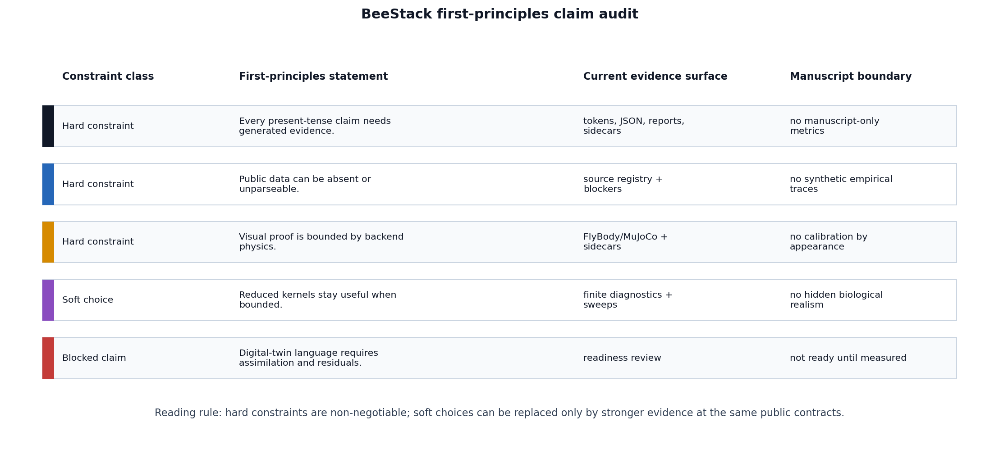

## Page 11

5. Manuscript hydration and project-wide readiness reports so that prose and reports never drift from the artifacts they
describe.
3.7
What BeeStack is not
For clarity, BeeStack is not a calibrated honey-bee biophysical simulator, not a connectome-level brain model, not a learned generative
agent, not a population-ecology engine, and not a colony-health decision-support tool. Each of those is a legitimate downstream project
that BeeStack is designed to enable; none of them is claimed as a current capability.

## Page 12

4
Materials and Source Provenance
BeeStack treats scholarship, software, generated reports, and empirical availability records as materials. The source-refresh ledger under
output/llm/source_refresh_ledger.json records the current public-source refresh: each row carries a citation key, DOI or official
source URL, direct-verification status, claim tier, availability state, manuscript targets, and figure targets. Perplexity/web research is
allowed only as a discovery channel. A source can influence manuscript claims only after it enters the offline ledger with direct DOI or
official-source verification.
fig. 2 links scholarship anchors to verification status and manuscript targets; see also sec. 4.
Figure 2: Matplotlib beestack scholarship evidence matrix shows Scholarship evidence matrix mapping directly verified sources to
manuscript sections, figure targets, DOI-bearing source records, and claim tiers. Generated from source refresh ledger, bibliography,
source audit, and figure registry. Sidecar validation checks raster, source routing, and registered claim tier. Does not replace direct
DOI/source verification or add empirical data.
4.1
Source tiers
The project separates three source tiers. Scholarship anchors support background, related-work, and governance language. Method
anchors support architecture or methods design choices, such as FlyBody/MuJoCo body rendering, BEEHAVE-compatible colony
summaries, waggle flight-path and robot-dance context, or antennal-lobe and brain-atlas mappings. Validation anchors support how
the manuscript distinguishes software verification from biological validation, uncertainty, residuals, and closed-loop digital-twin readiness
[Oreskes et al., 1994, Barker et al., 2022, Björnsson et al., 2020].
This tiering is intentionally conservative. FAIR and FAIR4RS materials govern software provenance, metadata, licensing, and reuse
[Wilkinson et al., 2016, Lamprecht et al., 2020, Barker et al., 2022]. They do not make a biological claim stronger. Waggle-dance,
neuroethology, and robotic-dance sources support mechanistic context and interface design [Riley et al., 2005, Landgraf et al., 2011, Ai,
2019]. They do not turn the reduced recruitment kernel into a colony-calibrated model.
4.2
Empirical availability
Empirical BeeBrain analysis remains data-gated. Public or licensed payloads are first recorded as metadata, then only downloaded and
parsed when the source is legally reusable, tractable, and has an inspectable schema. Paywalled, too-large, absent, or underspecified

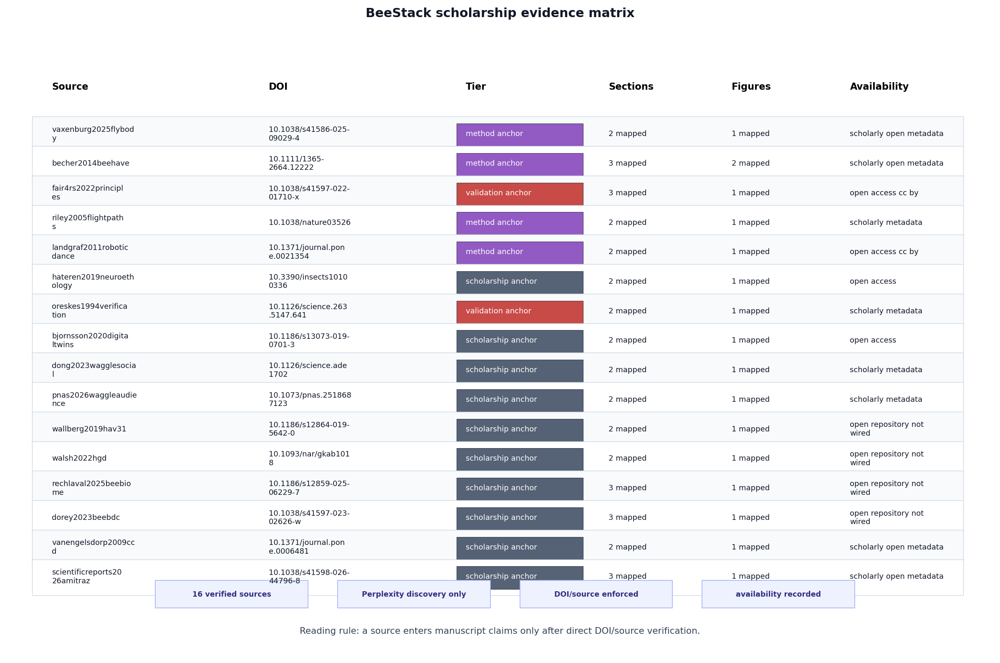

## Page 13

payloads remain availability records with explicit blockers. The manuscript never fills those gaps with synthetic calcium traces, invented
waggle tracks, or fabricated colony histories.
The same rule applies to BeeSwarm and BeeNiche adapters. BEEHAVE is a valid method anchor for colony-summary compatibility
[Becher et al., 2014], but BeeStack does not report BEEHAVE-scale validation unless scenario tables, demographic traces, or external
validation residuals are actually wired into the generated reports. Hiveopolis and robotic-waggle sources can motivate interface boundaries,
not real-time hive-control claims, until the project has public controller logs, closed-loop safety records, and governance artifacts.
4.3
External repository landscape (not yet wired)
BeeStack maintains a machine-readable registry at output/data/external_dataset_registry.json alongside the source-refresh ledger.
The table below lists community repositories and survey portals identified in the scholarship refresh as high-leverage future provenance
targets. Every row remains outside the empirical BeeBrain fetch contract until registered, downloaded under license, parsed, and audited.
Resource
Type
Official ID
BeeStack module target
Status
BeeBiome portal
[Rech de Laval et al.,
2025]
microbiome SRA index
DOI 10.1186/s12859-0
25-06229-7
BeeNiche / colony ledger
metadata only
HGD /
HymenopteraMine
[Walsh et al., 2022]
genomics annotation
DOI 10.1093/nar/gkab
1018
BeeBrain annotation
not registered
BeeBDC [Dorey et al.,
2023]
global occurrence
DOI 10.1038/s41597-0
23-02626-w
BeeNiche forage /
landscape
not registered
NCBI HAv3.1 [Wallberg
et al., 2019]
reference genome
DOI 10.1186/s12864-0
19-5642-0
BeeBrain / omics join
not registered
Auburn / AIA survey
[Apiary Inspectors of
America and Auburn
University, 2025]
colony-loss survey
official portal
colony ledger /
assimilation
survey not ingested
USDA NASS honey
statistics
production time series
NASS honey portal
colony ledger
no parser
EPA hive-matrix
residues [U.S.
Environmental
Protection Agency,
2024]
pesticide concentrations
DOI 10.23719/1523343
BeeNiche drivers
not registered
COLOSS BEEBOOK
[COLOSS Network,
2025]
standard methods
manual
coloss.org/beebook
methods / validation
not mapped
chapter-wise
fig. 2 maps directly verified scholarship anchors from output/llm/source_refresh_ledger.json; the external registry records
repository-level targets that remain unwired in v0.
4.4
Generated materials
Generated materials are produced by scripts rather than hand-edited after the fact. Figure sidecars preserve caption, alt text, manuscript
section, label, claim tier, fidelity tier, source data, regeneration command, citation keys, source DOIs, and unsupported-inference language.
Hydrated manuscript sections may reference only generated images that exist and pass the figure audit. Project-local artifact paths
serialize as stable output/... paths so reports can move between checkouts without leaking absolute filesystem locations.
4.5
Claim routing
Every current-facing claim routes to one of four surfaces: manuscript source with Pandoc citations, a generated JSON or Markdown
report, a figure sidecar, or an explicit known-gap record. If a claim cannot be routed to one of those surfaces, it stays in the roadmap
or limitations sections. This routing keeps the source-refresh ledger, bibliography, figure registry, documentation audit, and hydrated
manuscript aligned.
4.6
Software supply-chain materials
Python dependencies are pinned in uv.lock at the project root. The security posture gate (output/reports/security_posture_a
udit.json) records whether the threat model, operations doc, lockfile, curated download allowlist, and forbidden-pattern scans pass
before release. Empirical fetch uses HTTPS host allowlisting in beestack.security; archive ingest rejects zip-slip members. These
controls are documented in BeeStack-threat-model.md, docs/security_posture.md, and sec. 17. They govern software integrity,
not biological validation.

## Page 14

5
Evidence-Typed Architecture
BeeStack is organized around the five biological layers named in the project specification [Friedman and Chambers, 2026], each imple-
mented as a typed Python sub-package under src/beestack/. The architectural discipline is uniform across layers: a small, finite,
serializable record set is the only currency that crosses module boundaries, and every record has a contract that pinned tests check at
every commit.
5.1
The five layers
• BeeBody emits validated observations and accepts validated actions at 100 Hz. It owns morphology (apis_mellifera_work
er.xml MJCF body plan), sensor projection (vision through 6,900-per-eye ommatidia, olfaction through 170 antennal channels,
mechanosensation), action unpacking (leg torques, wing kinematics, antennal motion), and energetics. Production rendering runs
through FlyBody tasks [Vaxenburg et al., 2025] inside MuJoCo [Todorov et al., 2012]; the reduced closed-loop kernel remains for
deterministic telemetry tests.
• BeeBrain transforms observations into BrainState records that carry antennal-lobe (AL), mushroom-body (MB), central-complex
(CX), waggle-decoding, and empirical-alignment fields. The AL channel preserves 170 glomeruli; the MB carries 170,000 Kenyon
cells per hemisphere at 𝜌= 0.02 sparsity (≈6,800 active across the whole-brain 170,000×2 population); the CX uses 32 heading
bins [Stone et al., 2017, Honkanen et al., 2019].
• BeeMind transforms BrainState and colony-summary inputs into a BeliefState over a 32-dimensional latent space and an
Action policy. The policy horizon is 10 steps; the active-inference-style policy scoring computes pragmatic value, epistemic value,
energy cost, risk cost, and caste priors with explicit diagnostics [Friston, 2010, Parr and Friston, 2017].
• BeeSwarm maintains agent, dance, pheromone, and task-allocation state with 50 simulated agents representing 20,000 workers.
The strict visualization channel uses full BeeBody MJCF copies in shared MuJoCo scenes with contact metrics.
• BeeNiche maintains comb (864 voxels), thermal field, and foraging-context state, with explicit BEEHAVE [Becher et al., 2014]
and Hiveopolis [Schmickl et al., 2020] adapter schemas to support future runtime coupling.
5.2
The cross-layer contracts
The seven cross-layer contracts are intentionally small and typed:
• Observation — sensory snapshot crossing BeeBody →BeeBrain;
• Action — motor decision crossing BeeMind →BeeBody;
• BrainState — neural digest crossing BeeBrain →BeeMind;
• BeliefState — latent digest internal to BeeMind, exposed for diagnostics;
• BeeAgent — agent identity and current task crossing BeeMind →BeeSwarm;
• PheromoneField — concentration grid crossing BeeSwarm →BeeNiche;
• CombGrid — voxel content grid crossing BeeNiche →BeeSwarm and BeeNiche →BeeBody (proprioception against comb geometry).
These records are the stack’s compatibility boundary. They are finite, shaped by configuration (no hidden runtime dimensions), serial-
izable for reports, and validated before orchestration via lightweight @dataclass plus a contract-check function in src/beestack/cont
racts.py. This makes module replacement possible: a future spiking BeeBrain or calibrated BeeBody simply has to satisfy the same
data contracts before it can enter the closed loop.
5.3
Timing and scale
The default configuration uses a 100 Hz observation–action boundary, 10 Hz policy cadence (typical: every 10 control steps), and 0.5
ms physics step. These are interface and integration choices that keep the layer contracts aligned with FlyBody/MuJoCo stepping; they
should not be read as calibrated honey-bee sensorimotor latency estimates.
The biological scale assumptions that shape the current reduced kernels are recorded in config.yaml and propagated as manuscript
variables:
Quantity
Default value
Source / notes
Body mass
80.0 mg
Worker average
Wing stroke frequency
230 Hz
Hover/cruise band
Ommatidia per eye
6,900
Standard atlas
AL glomeruli
170
[Galizia et al., 1999]
Kenyon cells / hemisphere
170,000
[Kaneko et al., 2016]
KC sparsity 𝜌
0.02
[Kaneko et al., 2016]
CX heading bins
32
[Stone et al., 2017]
Belief latent dim
32
Reduced kernel
Swarm agents
50
Reduced kernel
Represented colony size
20,000
Mid-season colony scale
Comb voxels
864
Default 18 × 12 × 4

## Page 15

5.4
Determinism and reproducibility
Every kernel reads a single integer seed = 20260513 from config.yaml and derives all randomness from it. Wall-clock effects (paral-
lelism, GPU non-determinism) are avoided: BeeStack runs on CPU through numpy [Harris et al., 2020] for deterministic tensor operations,
and MuJoCo physics is stepped deterministically. Re-running the same seed produces byte-identical manuscript variables, byte-similar
figures (up to rasterization), and identical JSON reports.
5.5
The analysis pipeline
The analysis pipeline writes module coverage, model cards, integrity reviews, visualization manifests, empirical analyses, research-suite
reports, methods-analysis dashboards, and hydrated manuscript files.
These outputs are not incidental side effects; they are how
BeeStack records what level of evidence backs each claim.
The animation manifest currently contains 9 animations (5 FlyBody, 4
reduced schematic), and the manuscript figure index links 69 figures and visual artifacts to their backend, fidelity tier, validation status,
and regeneration command.
fig. 3 summarizes module coverage and stack contracts at a glance.
Figure 3: Matplotlib beestack graphical abstract shows Showcase architecture schematic linking BeeBody, BeeBrain, BeeMind, BeeSwarm,
and BeeNiche through typed contracts and generated evidence. Generated from module coverage records and stack contract definitions.
Sidecar validation checks raster, source routing, and registered claim tier. Does not support a claim of biological or digital-twin validation.
5.6
Module dependencies
The static module-coverage figure (../figures/module_contract_coverage.png, see sec. 11) renders the dependency surface explicitly
so that reviewers can trace the path from a single observation to a single action without having to read the code.
5.7
Architectural invariants
Five invariants keep the architecture reviewable as fidelity improves.
1. No hidden dimensions. Array sizes come from config.yaml and are surfaced through contract schemas.
2. No silent fallbacks for production visuals. Strict Body and Swarm visual outputs fail generation if the real renderer path
cannot load, render, move, or validate.
3. No manuscript-only metrics. Values in the manuscript are generated from JSON artifacts or configuration tokens.
4. No unlabelled evidence. Every figure, GIF, and report carries a backend and fidelity label through the visualization gallery or
figure index.
5. No module replacement without contract satisfaction. A future neural, policy, swarm, or niche engine must satisfy the
same typed boundary before orchestration can accept it.

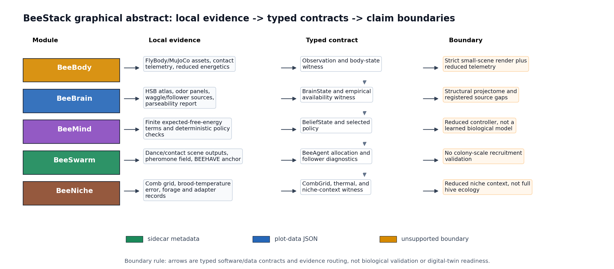

## Page 16

6
BeeBody and BeeSwarm Methods
BeeBody owns the morphology, physics, sensors, actions, and energetics of an individual worker, and is the most stringent fidelity
boundary in the stack. The worker body defaults to 80.0 mg mass, a 230 Hz wing stroke, and 59 FlyBody action channels. Production
animations use FlyBody walking and flight tasks driven through MuJoCo [Vaxenburg et al., 2025, Todorov et al., 2012]; a reduced
deterministic closed-loop kernel runs in parallel for telemetry tests.
BeeSwarm is grouped here because it is the first layer where strict small-scene body evidence and reduced colony summaries meet.
The manuscript keeps those two surfaces adjacent so readers can see exactly where FlyBody/MuJoCo evidence ends and BEEHAVE-
compatible, reduced population-summary language begins [Becher et al., 2014].
6.1
Body plan generation
The body-plan generator writes apis_mellifera_worker.xml by modifying a FlyBody-compatible body plan while preserving every
task-facing joint and body name, so the upstream control tasks continue to work without modification. The generated MJCF adds
honey-bee visual cues that survive the renderer: four translucent wings with hindwing coupling, an amber abdomen with dark tergite
bands, enlarged compound eyes, antennae, mouthparts, a stinger, thoracic fuzz, corbiculae on the hind legs, and a constricted petiolar
waist. These cues are not treated as proof of calibrated biomechanics. They are an auditable visual body-plan layer on top of the
FlyBody execution path: the verification script measures non-blank dynamic frames, motion pixels, locomotion mode, MJCF cue
presence, silhouette overlap with a reference bee shape, and the absence of FlyBody debug aids inconsistent with the honeybee render.
6.2
Walking and flight tasks
Walking animations load the generated body plan through FlyBody WalkImitation and render frames with rollout_and_render.
Flight animations use FlightImitationWBPG plus a WingBeatPatternGenerator, and the same render path.
Both pipelines apply
task-specific masks: disable_wings_for_walk = true and disable_legs_for_flight = true prevent unphysical co-activation that
would otherwise drag the COM trajectory off the reference. The future-step horizon (future_steps = 64) and the flight_future_
steps = 5 setting come from the FlyBody defaults; deviating from them changes the imitation loss landscape, so they are pinned in
config.yaml.
The latest verification run reports a BeeBody visual score of 0.980 (cue coverage) and a silhouette score of 1.000 (shape overlap). These
are perceptual scores on the rendered GIF, not biomechanical scores; they certify that the output looks like a bee, not that it moves like
one.
fig. 4 and fig. 5 show eight evenly sampled frames from the single-nestmate FlyBody renders — tripod walking and wing-beat flight on
the same apis_mellifera_worker MJCF. Each contact sheet is the print-facing witness for the full GIF under output/animations/;
the sidecar records backend, frame count, and verification scores so the still and the animation cannot drift apart.
Figure 4: FlyBody/MuJoCo beebody flybody tripod walking render shows Eight-frame contact sheet from the FlyBody walk_imitation
rollout on the generated apis_mellifera_worker MJCF, showing tripod gait, corbiculae, hindwing coupling, and honeybee visual cues.
Generated from animation manifest, bee visual verification, and apis_mellifera_worker MJCF. Sidecar validation checks raster, source
routing, and registered claim tier. Does not calibrate honeybee walking biomechanics or prove field-scale locomotion.
The methods layer now also records a conservative honeybee calibration scorecard. The current morphology score is 1.000, with an
inertia-rescaling witness of 0.820.
These values are generated from configured mass, segment proportions, four-wing coupling, and

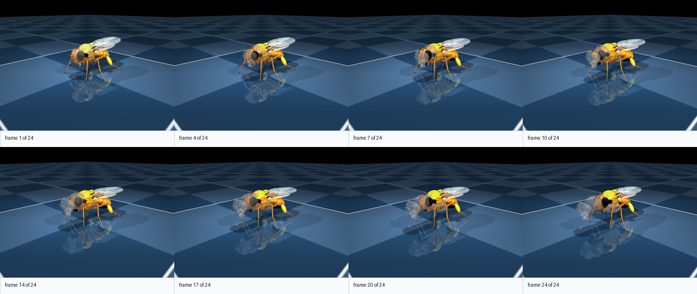

## Page 17

Figure 5: FlyBody/MuJoCo beebody flybody wing-beat flight render shows Eight-frame contact sheet from FlightImitationWBPG and
WingBeatPatternGenerator on the same honeybee MJCF, showing coupled forewing/hindwing surfaces and wing-beat flight posture.
Generated from animation manifest, bee visual verification, and apis_mellifera_worker MJCF. Sidecar validation checks raster, source
routing, and registered claim tier. Does not calibrate honeybee aerodynamics or hovering power against measured loads.
contact proxy counts; they are readiness checks for the generated MJCF, not a claim that honeybee inertial tensors have been fully
measured.
6.3
Sensors and observations
BeeBody emits an Observation record for every control step. It packs visual frames (downsampled from the configured per-eye ommatidia
to a compressed tensor), olfactory channels (one per glomerulus, with log-domain projection), mechanosensory state (proprioception,
antennal contact, leg-load), and a thermosensory scalar. Sensor noise levels — 𝜎visual = 0.020, 𝜎olfactory = 0.030, 𝜎mechano = 0.010 — are
documented in config.yaml so that sensitivity sweeps can perturb them without code edits.
6.4
Actions and energetics
Actions are unpacked from a 59-dimensional vector into leg torques (4 DOF/leg, 6 legs), wing kinematics (3 DOF/wing, coupled hamuli at
the wing root), antennal pose, and mandible state. Energy accounting is multiplicative and reference-anchored, not a fitted aerodynamic
model: hovering wing power is pinned to a fixed about 58 mW worker reference (≈80 mg body mass, ≈230 Hz stroke) and scaled by
dimensionless terms — a mass0.75 allometric factor, a linear stroke-frequency ratio, and load/wing-wear penalties. Leg power scales
with foot-strike load and resting metabolic rate is a floor. The integrated run reports a mean wing power of 58.291 mW and a final
body-frame energy budget of 23.999 J after 24 control steps.
fig. 6 links COM-speed proxy, wing-power trace, and stroke-phase diagnostics from the same integrated run.
6.5
Methods telemetry panel
The methods-analysis layer adds a Body telemetry dashboard that treats the reduced closed-loop motion as a witness rather than
a substitute for FlyBody.
It summarizes COM-speed proxy traces, wing-power traces, energy budget change, configured wing-beat
frequency, and morphology cue scores in ../figures/methods/beebody_methods_telemetry_dashboard.png.
fig. 7 plots the Body telemetry witness panel.
6.6
Fidelity boundary
BeeBody remains the most stringent fidelity boundary in the stack. It is FlyBody-backed for production rendering, and the visual
verification confirms that the output looks like a bee. The underlying articulated topology, mass distribution, inertia tensors, adhesion
model, wing aerodynamics, and leg-tip contact mechanics still require honey-bee-specific biomechanical calibration. This is a recognized
limitation and a roadmap priority: visual fidelity is necessary but not sufficient for biomechanical claims, and BeeStack reports this
limitation rather than folding it into a single fidelity score.

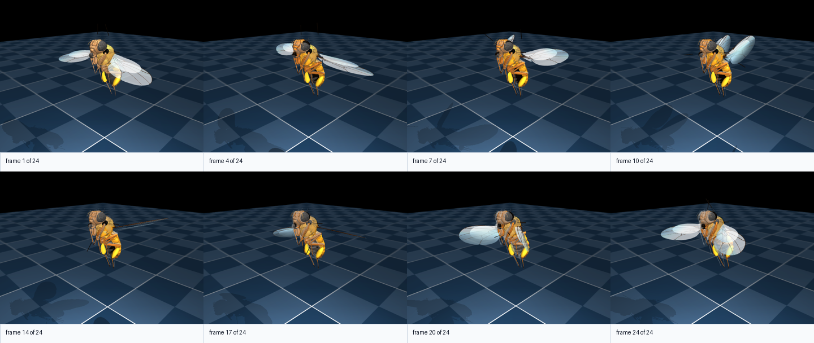

## Page 18

Figure 6: Matplotlib beebody motion, wing power, and phase witness shows Integrated-run witness linking COM-speed proxy, wing-power
trace, and stroke-phase diagnostics for the reduced BeeBody energetics kernel. Generated from output/data/simulation_records.json
and methods analysis. Sidecar validation checks raster, source routing, and registered claim tier. Does not validate measured honeybee
metabolic rates or aerodynamic coefficients.
6.7
Micro-to-macro calibration boundary
The BeeBody-to-BeeSwarm interface is a calibration boundary, not a calibration result. Strict FlyBody/MuJoCo scenes provide exe-
cutable body plans, contact metrics, and render sidecars [Vaxenburg et al., 2025, Todorov et al., 2012]. Waggle-flight and robotic-dance
scholarship anchors the communication context [Riley et al., 2005, Landgraf et al., 2011, Ai, 2019]. BEEHAVE anchors the target class of
colony-level summaries [Becher et al., 2014]. The current stack maps these surfaces into a shared schema, but it does not fit recruitment
residuals against external colony traces.
fig. 8 maps the micro-to-macro calibration boundary across body, swarm, and colony anchors.
6.8
BeeSwarm reduced communication kernel
The reduced kernel initializes 50 agents, broadcasts dance recruitment events drawn from the BeeBrain dance decoder, updates a small
grid of pheromone components on a 12 × 12 × 4 pheromone-grid shape, allocates tasks across nurse, forager, guard, scout, and wax-
builder roles, and writes BEEHAVE-compatible summary fields. This is compatibility/parity language only: the current kernel has not
been validated against BEEHAVE scenario tables or colony-demography time series. The local-follower count per dance is configurable,
with the recruitment threshold integrating decoded dance confidence, empirical waggle-follower confidence, follower-alignment score,
stop-signal inhibition, and colony food need before any dance produces a recruited follower.
The kernel is bounded. Every dance produces at most local_followers_per_dance followers, every pheromone component decays on a
half-life floor, and the BEEHAVE summary fields are computed from the same internal state at every step rather than being maintained
out-of-band. Bounding is what makes the kernel testable; it is also what keeps the kernel from drifting into accidental population-ecology
territory it does not have the data to defend.
6.9
Strict small-scene BeeSwarm channel
The strict visualization channel does not use Matplotlib glyphs. The renderer prefix-copies full BeeBody MJCF body plans into multi-bee
MuJoCo scenes, adds free joints, invisible contact-proxy geoms, floor or comb arena geometry, and cameras, then steps MjModel and
MjData with mujoco.Renderer [Todorov et al., 2012]. Within each frame the bees are placed at scripted kinematic poses; MuJoCo
provides real model geometry and real contact detection at those poses. This is a contact-evidence channel, not an integrated forward-
dynamics flight simulation.
The collision scene initializes ten BeeBody models and drives them inward with wing-beat controls. The configured waggle scene renders
one dancer and followers on a comb/floor arena. The long waggle scene keeps the configured-waggle contract but extends the rollout
to 96 frames at 12 fps. The contact report records floor/body contact, waggle phase samples, follower distance, orientation error, and

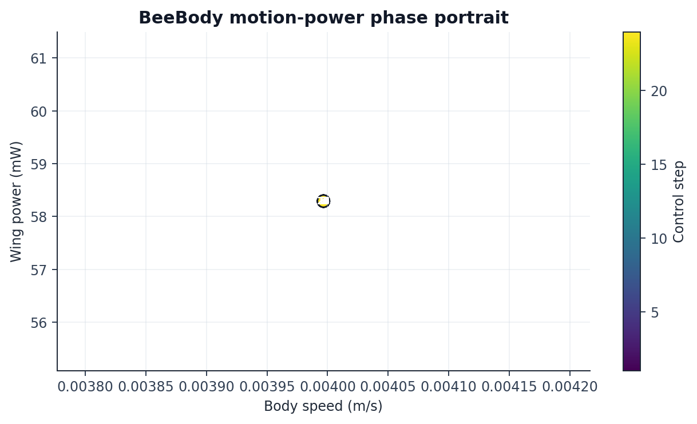

## Page 19

Figure 7: Matplotlib/pandas/NetworkX beebody methods telemetry dashboard shows BeeBody methods dashboard showing reduced
telemetry, energy, wing-power, and morphology cues beside the FlyBody-backed fidelity boundary. Generated from MethodsAnalysis-
Report and simulation records. Sidecar validation checks raster, source routing, and registered claim tier. Does not calibrate honeybee
biomechanics or aerodynamics.
Figure 8: Matplotlib beebody and beeswarm micro-to-macro calibration map shows Calibration-boundary map connecting strict Bee-
Body/FlyBody scene metrics, waggle-motion anchors, and reduced BeeSwarm or BEEHAVE-compatible colony summaries. Generated
from FlyBody scene metrics, simulation records, BEEHAVE anchor, and source refresh ledger. Sidecar validation checks raster, source
routing, and registered claim tier. Does not calibrate colony-scale recruitment or make small-scene contacts a population model.

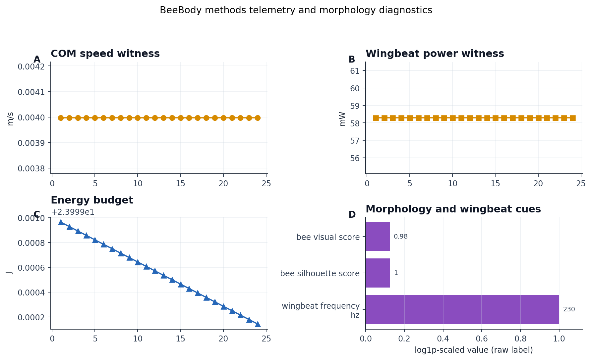

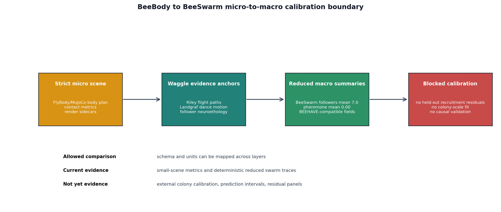

## Page 20

follower-orientation confidence. The latest manifest contains 3 strict BeeSwarm scenes, and the current methods report records 19.096
degrees mean orientation error, 0.788 confidence, and a waggle-phase coupling score of 0.000.
The figures below are contact-sheet witnesses for the strict MuJoCo scenes: ten prefixed BeeBody models in collision, a configured waggle
with floor contacts, and the long phase-aware rollout referenced in sec. 13. GIF paths, scene XML, and contact JSON remain in outpu
t/animations/flybody_scenes/.
fig. 9 shows bee-bee contact structure in the ten-model collision scene.
Figure 9: FlyBody/MuJoCo beeswarm ten-beebody collision scene shows Eight-frame contact sheet from a strict MuJoCo scene with
ten prefixed BeeBody MJCF copies, recording bee-bee contact pairs and collision-proxy distances. Generated from animation manifest,
flybody_scenes/collision contact report, and scene XML. Sidecar validation checks raster, source routing, and registered claim tier. Does
not validate colony-scale collision dynamics or integrated flight physics.
fig. 10 shows the configured dancer and follower BeeBody models on the comb floor.
fig. 11 samples the long waggle rollout with follower-orientation diagnostics across the full dance.
6.10
Recruitment diagnostics and methods panel
Recruitment diagnostics combine decoded dance confidence, empirical waggle-follower confidence, follower-alignment score, stop-signal
inhibition [Seeley and Visscher, 2003], and colony food need. Thresholding local followers requires all of those signals to exceed their
configured bounds; partial signals do not increment recruitment counts. Dance recruitment then feeds back into the task allocator
so sustained high-quality dances produce a measurable shift in the active forager fraction across the colony. This supports a reduced
diagnostic claim about the local recruitment kernel, not a validation claim about BEEHAVE-scale colony dynamics.
fig. 12 summarizes contact and recruitment diagnostics from the methods-analysis pass.
6.11
Body-swarm fidelity boundary
The strict scenes prove that BeeBody MJCF copies can be composed into small MuJoCo scenes with real contact metrics. They do
not prove BEEHAVE-scale population dynamics. The current bound on BeeSwarm honesty is the scale gap between the 50 small-scene
agent count and the 20,000 BEEHAVE-scale represented count. Closing that gap remains a roadmap item through BEEHAVE adapter
coupling, external scenario traces, and eventually surrogate agents trained from higher-fidelity rollouts.

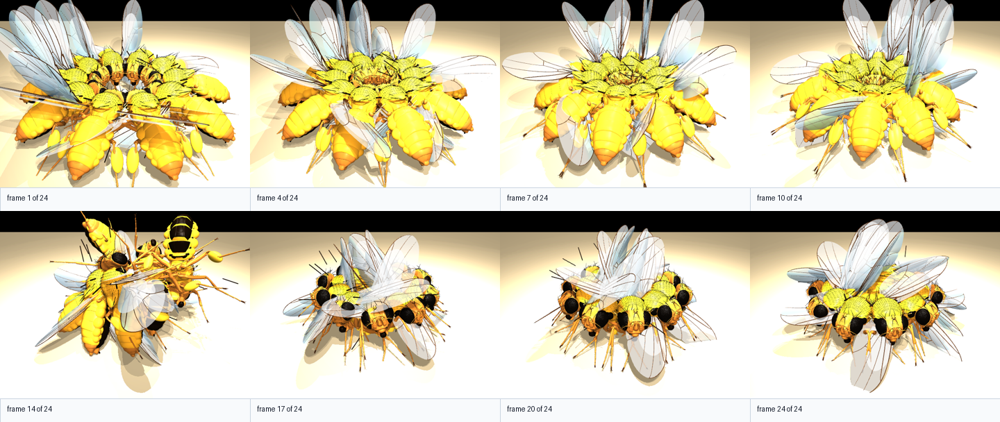

## Page 21

Figure 10: FlyBody/MuJoCo beeswarm configured waggle dance scene shows Eight-frame contact sheet from a strict MuJoCo waggle
scene with one dancer and follower BeeBody models on a comb floor, with floor/body contacts recorded. Generated from animation
manifest, flybody_scenes/waggle contact report, and decoded dance settings.
Sidecar validation checks raster, source routing, and
registered claim tier. Does not validate recruitment outcomes against field colony traces.
Figure 11: FlyBody/MuJoCo beeswarm long waggle dance scenario shows Eight-frame contact sheet from the long configured waggle
rollout with phase-aware runs, follower-orientation diagnostics, and contact-graph evidence across the full dance.
Generated from
animation manifest, flybody_scenes/waggle_long contact report, and follower-orientation diagnostics. Sidecar validation checks raster,
source routing, and registered claim tier. Does not prove colony-scale dance-language use or calibrated follower kinematics.

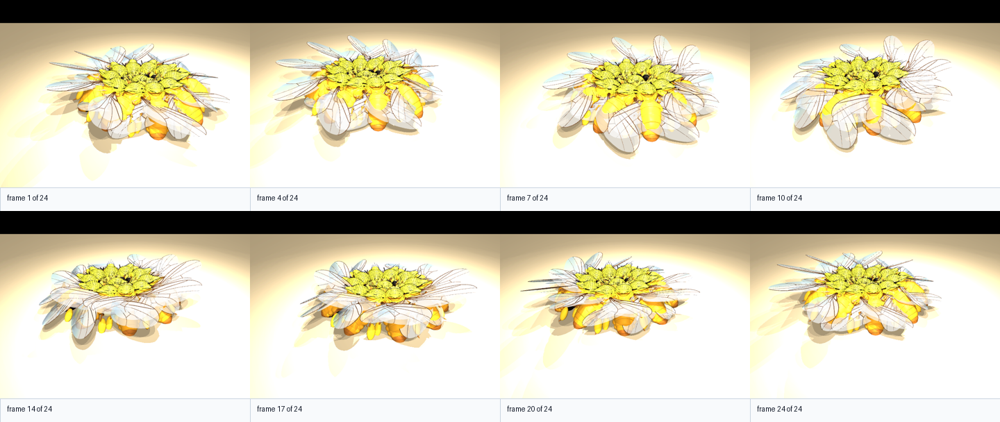

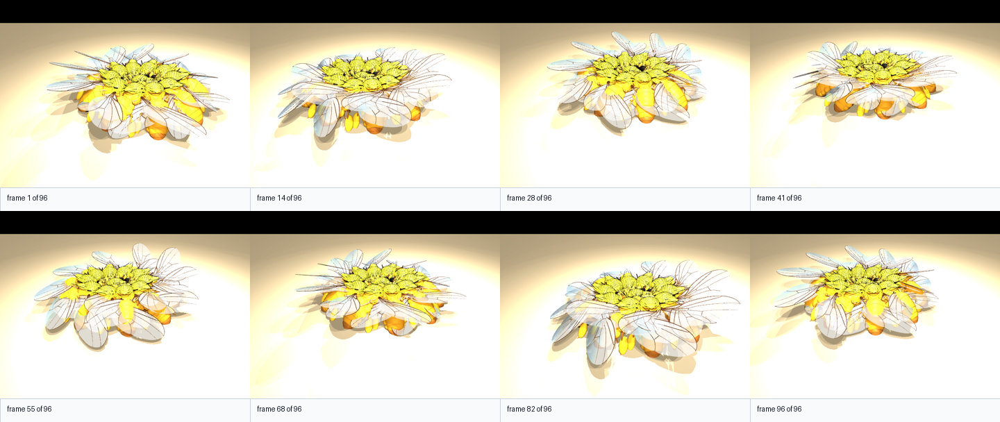

## Page 22

Figure 12: Matplotlib/pandas/NetworkX beeswarm contact and recruitment diagnostics shows BeeSwarm dashboard separating strict
small-scene contact physics from reduced recruitment and BEEHAVE-compatible colony summaries. Generated from MethodsAnalysis-
Report, animation manifest, and simulation records. Sidecar validation checks raster, source routing, and registered claim tier. Does
not validate colony-scale recruitment dynamics.
7
BeeBrain and BeeMind Methods
BeeBrain is a reduced neural kernel with an empirical-data surface. It implements antennal-lobe encoding, lateral inhibition, sparse
Kenyon-cell coding, central-complex heading integration, optic-flow helpers, Johnston’s organ waggle-event detection, and dance decoding.
The default configuration uses 170 glomeruli, 170,000 Kenyon cells per hemisphere, 6,800 active Kenyon cells at the configured sparsity
bound 𝜌= 0.02, and 32 heading bins.
BeeMind is grouped with BeeBrain because it consumes the BrainState contract and translates source-anchored neural summaries into
a bounded belief and policy surface. The grouping makes the current boundary visible: anatomy, odor maps, and waggle-follower records
can guide the contract, but they do not yet instantiate a connectome-scale or calcium-validated generative model.
7.1
Antennal lobe (AL)
The AL channel projects raw olfactory activity through a glomerular projection layer (one channel per glomerulus, matched to the
Galizia–Sachse [Galizia et al., 1999] canonical odor maps when an odor template is registered) and a lateral-inhibition operator. The
inhibition kernel is parameterized so it reproduces the contrast sharpening characteristic of the bee AL [Paoli et al., 2023] without
overfitting to a particular preparation. Glomerular activations are clipped, log-scaled, and bounded so they remain serializable across
runs even when input intensities span orders of magnitude.
7.2
Mushroom body (MB)
The MB layer maps the dense AL representation onto a sparse population of 170,000 Kenyon cells per hemisphere. Each Kenyon cell
samples a small fixed fan-in of glomeruli through a seed-fixed sparse projection, and a 𝑘-Winner-Take-All rule keeps the 6,800 most-driven
cells active across both hemispheres (𝜌= 0.02 of the whole-brain 170,000×2 population). Because the active set is selected by projected
drive rather than from the seed alone, different odors produce different sparse codes — the code is odor-specific and deterministic for
a fixed seed, and changes in odor density do not silently inflate or collapse the active set.
The class-i Kenyon-cell fraction in the
configuration (kc_class_i_fraction = 0.90) tracks the gene-expression bias documented for the honey-bee MB [Kaneko et al., 2016].
7.3
Central complex (CX)
The CX channel maintains a head-direction estimate on 32 bins by integrating a sky-compass bearing and optic-flow drift, in the spirit
of the anatomically constrained insect path-integration model [Stone et al., 2017, Honkanen et al., 2019]. The CX state is part of every
BrainState so downstream layers (BeeMind belief updates, BeeSwarm dance decoding) read a consistent heading.

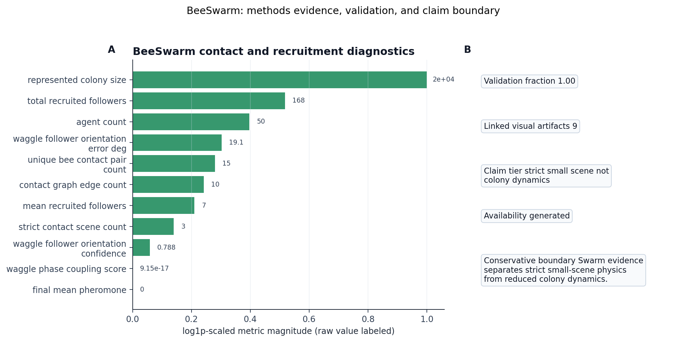

## Page 23

7.4
Optic flow and visual helpers
A small set of optic-flow helpers downsample the visual observation to a horizon-aligned signal that the CX can consume. These helpers
also feed the bee-visual signature scorer used by the BeeBody verifier.
The UV–blue–green colour-opponency helper returns three
channels that are constrained to sum to zero, so the opponent code carries two independent degrees of freedom (the third channel is
derived, not an extra signal).
7.5
Johnston’s organ and waggle decoding
The waggle channel transforms antennal-vibration events into candidate waggle phases, durations, and inferred sun-relative angles. The
configured dance-event rate is 250 Hz; the Johnston’s-organ event detector additionally applies a fixed 200 Hz vibration-frequency floor
(a hard-coded detector primitive, distinct from the configurable event rate). The dance decoder consumes those candidates plus the
CX heading to produce a recruitment hypothesis in the BrainState’s waggle field. The distance estimate is a reduced-kernel baseline
— a nominal 1 s ↔1 km identity, not a species-calibrated von Frisch curve. The Hadjitofi–Webb antennal-position tracks and article
[Hadjitofi and Webb, 2024b,a] anchor only the follower-orientation diagnostics (WaggleFollowerSummary), not the distance/azimuth
decode and not colony-scale recruitment validation.
7.6
Empirical registry
The empirical registry anchors the BeeBrain surface to public Apis mellifera sources:
• Paoli antennal-lobe calcium imaging [Paoli, 2024];
• Galizia–Sachse glomerular odor maps [Galizia et al., 1999];
• Szyszka antennal-lobe Granger-causal dynamics [Paoli et al., 2023];
• Kaneko Kenyon-cell subtype expression [Kaneko et al., 2016];
• the Honey-Bee Standard Brain atlas [Brandt et al., 2005] and Virtual Honey-Bee Standard Brain integration ecosystem [Rybak
et al., 2010];
• Carcaud multisite GCaMP workbooks [Carcaud, 2022];
• Andreu alarm-odorant receptor data [Andreu et al., 2025a];
• Jernigan antennal active-sensing kinematics [Jernigan et al., 2026];
• Nouvian biogenic-amine spreadsheets [Nouvian et al., 2017];
• Hadjitofi–Webb Figshare waggle-following dataset [Hadjitofi and Webb, 2024b] (CC BY 4.0) and Current Biology article [Hadjitofi
and Webb, 2024a].
Galizia and Kaneko rows remain citation anchors until publisher supplementary matrices or machine-readable tables are registered
for fetch. Szyszka [Paoli et al., 2023] supplementary material is fetched from MDPI (mdpi-res.com) and Table S1 is parsed; the VAR
connectivity matrix is not public. Paoli Dryad .mat archives require bearer auth; set DRYAD_API_TOKEN when automating downloads.
Figshare ndownloader URLs must not receive Dryad Authorization headers.
7.7
Parser layer
The parser layer converts real-format payloads into typed anatomy and activity records.
Atlas ZIP and HTML assets become in-
ventories, neuropil abbreviation records, and anatomy summaries. Workbook, CSV, and MAT-style activity payloads become response
panels, calcium summaries when local traces are parseable, antennal-movement summaries, neuromodulatory summaries, and glomerulus-
length templates. Calcium traces are summarised as negated ΔF/F: an excitatory response (fluorescence increase) yields a negative
summary value, so excitatory_fraction counts glomeruli with mean response < 0 and inhibitory_fraction those > 0 — a load-
bearing sign convention for any downstream excitation/inhibition claim. The waggle parser converts Hadjitofi–Webb follower tracks
into WaggleFollowerSummary records that pack follower angle/midpoint coupling, left/right-antenna synchrony, both-antennae versus
no-antennae decoding error, straightness, and a bounded confidence score. These templates and diagnostics can be passed directly to p
rocess_observation, BeeSwarm recruitment diagnostics, and the integrated stack run.
7.8
Empirical run integration
The current empirical run integrates 48 odor-response panels, 7 anatomy inventories, 1 antennal-movement summaries, and 24 templates.
It also records 59 waggle-follower tracks when the Figshare files are local, with follower-decoding confidence 0.289 and decoding improve-
ment 0.248. The brain-data parseable-source fraction is 0.800. The run records 1 local calcium datasets and 0 empirical known gaps,
making missing upstream payloads visible instead of fabricating data. The source-verified fraction is 1.000, and the 0.800 parseability-
readiness target is recorded as True when the parseable-source fraction meets that threshold. Every remaining nonparseable source still
must carry a DOI/source URL, parser status, blocker, and remediation path in the completeness panel.
7.9
Anatomy-data-to-policy mapping
The current BeeBrain-to-BeeMind bridge maps scholarly and empirical anchors to contract terms rather than claiming learned neural
dynamics. Antennal-lobe odor maps support observation likelihood structure [Galizia et al., 1999]. Mushroom-body and standard-brain
sources support learning and anatomy labels [Brandt et al., 2005, Rybak et al., 2010]. Waggle neuroethology supports follower-interaction

## Page 24

and spatial-information context [Ai, 2019]. Active inference sources support the formal decomposition into beliefs, preferences, expected-
free-energy terms, and policy scoring [Friston, 2010, Parr and Friston, 2017].
fig. 13 links BeeBrain anatomy sources to BeeMind policy contracts.
Figure 13: Matplotlib beebrain to beemind anatomy-policy map shows Anatomy-to-policy map linking antennal-lobe, mushroom-body,
central-complex, and waggle-follower anchors to BeeMind belief and policy contracts. Generated from source refresh ledger, BeeBrain
source registry, and active-inference methods records. Sidecar validation checks raster, source routing, and registered claim tier. Does
not support connectome-scale, calcium-validated, or learned generative dynamics.
7.10
Methods-analysis pass
The methods-analysis pass summarizes this evidence as a Brain completeness panel: enabled dataset count, panel count, template count,
anatomy-inventory count, neuropil count, region-response class count, odor separability, and calcium-dataset availability. The figure
is written to ../figures/methods/beebrain_methods_empirical_completeness.png, and the top gap is propagated as Underlying
articulated topology remains FlyBody fruitfly-derived until a full calibrated bee MJCF fork is maintained upstream..
fig. 14 summarizes empirical and methods completeness for BeeBrain.
7.11
Fidelity boundary
BeeBrain is empirically anchored but kinetically reduced. It does not claim connectome-level dynamics or a heavyweight spiking core.
The contracts that BeeBrain emits (BrainState, WaggleFollowerSummary, AnatomyInventory) are designed so a spiking simulator can
replace the current AL–MB–CX kernel without breaking BeeMind, BeeSwarm, or the manuscript-hydration trail.
7.12
BeeMind beliefs and caste
BeeMind represents the individual bee as a bounded policy-selection system.
It maintains a 32-dimensional belief state, temporal-
polyethism caste priors [Johnson, 2010], an energy state, dance-derived patch beliefs, and colony-need terms. Its default policy horizon
is 10 steps, and candidate expansion is bounded so deterministic tests can cover every branch.
The BeliefState packs a latent vector, a caste tag, an energy scalar, and a small bag of patch beliefs derived from decoded dance
vectors. The caste prior shifts the policy-score weighting so the same physical state can produce different actions for different bees in
the colony, a feature motivated by temporal polyethism [Johnson, 2010, Menzel, 2012]. Caste transitions are gated by age proxies and
energy thresholds; they are deterministic under the seed.
7.13
BeeMind policy scoring
The current policy layer is active-inference-style rather than a full generative model. Candidate policies are scored with explicit pragmatic
value, epistemic value, energy cost, risk cost, and caste prior. The scoring is in the spirit of the free-energy framework [Friston, 2010,
Parr and Friston, 2017] but deliberately substitutes hand-calibrated witnesses for the learned transition and observation models that a
full active-inference agent would require.

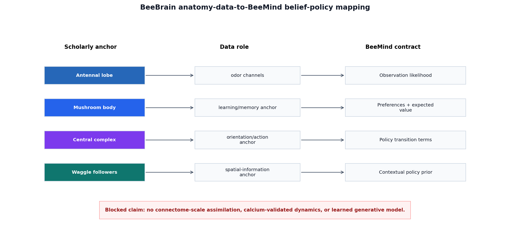

## Page 25

Figure 14: Matplotlib/pandas/NetworkX beebrain empirical methods completeness shows BeeBrain completeness dashboard reporting
available empirical channels, parser gaps, and the absence of locally parsed calcium datasets. Generated from MethodsAnalysisReport
and empirical analysis report. Sidecar validation checks raster, source routing, and registered claim tier. Does not support connectome-
scale or calcium-validated dynamics.
The diagnostic record produced at each policy step contains the selected policy, strongest competitor, policy margin, current belief energy,
energy deficit, expected-free-energy terms, and active configuration bounds. This transparency is the point of the kernel: it makes policy
choice deterministic under a seed, monotonic with relevant configuration changes, finite, and serializable.
7.14
Policy-landscape methods panel
The methods-analysis layer adds a Mind policy-landscape panel that exposes candidate count, expected-free-energy range, selected-policy
margin, policy-switch count, and final energy. The figure is written to ../figures/methods/beemind_methods_policy_landscape.pn
g.
fig. 15 exposes the Mind policy-landscape witness panel.
7.15
Brain-mind fidelity boundary
BeeMind does not yet claim learned transition dynamics, recursive social inference, or calibrated observation likelihoods. Each gap is
roadmap-tagged and can enter the kernel through the same BeliefState and Action contracts. A learned generative BeeMind would
replace score_policies() and the inner forward simulator while leaving every other module untouched.
7.16
Relation to connectome and omics literature
Recent honey-bee brain atlases combine single-cell and spatial transcriptomics with behavioural context [Patir et al., 2023, Mu et al.,
2025]. Reference genomes and HymenopteraMine annotation [Wallberg et al., 2019, Walsh et al., 2022] define what a genome-to-circuit
join could look like. BeeStack’s current BeeBrain path instead ingests the Honey-Bee Standard Brain structural atlas and registered
activity summaries (odor panels, antennal kinematics, dance-follower positioning) with parseable fraction 0.800.
Functional Granger connectivity from calcium imaging [Paoli et al., 2023] remains a documented blocker when connectivity matri-
ces are not publicly deposited. The methods contract therefore separates structural-match and panel-summary witnesses from
connectome-scale or calcium-validated dynamics—the latter require simulator-backed backends and held-out task residuals de-
scribed in sec. 15, not prose upgrades alone.

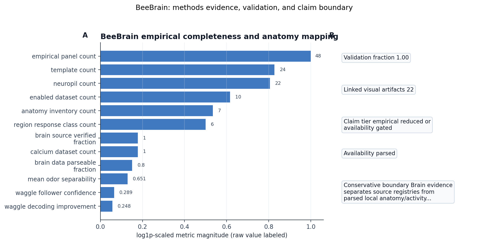

## Page 26

Figure 15: Matplotlib/pandas/NetworkX beemind policy landscape shows BeeMind policy landscape showing finite expected-free-energy
terms, candidate-policy margin, and deterministic action-contract outputs. Generated from MethodsAnalysisReport and policy-selection
diagnostics.
Sidecar validation checks raster, source routing, and registered claim tier.
Does not support a learned or biologically
calibrated generative model.
8
BeeNiche Methods and Adapter Provenance
BeeNiche models the constructed environment of the colony. It owns a comb grid with 864 voxels (default 18 × 12 × 4), content fields
(brood, food, wax, empty), a thermal field, a foraging landscape summary, and adapter-style outputs intended to stay compatible with
future BEEHAVE [Becher et al., 2014] and Hiveopolis [Schmickl et al., 2020] runtime coupling.
8.1
Comb construction
The comb kernel maintains a four-channel content field over the comb voxel grid.
Wax deposition updates local comb occupancy,
neighborhood density, and content metrics. The wax deposition threshold (wax_deposit_threshold = 0.35) is taken from the bee-
comb construction literature [Johnson, 2009]: below the threshold, no new cell is produced; above it, neighborhood-coordinated deposition
raises local occupancy. The kernel records the final comb occupancy fraction (0.083 at the end of the integrated run) and the mean over
the rollout so that comb growth is auditable as a time series rather than only as an endpoint.
8.2
Thermal field
Thermal stepping updates brood-temperature error and supports fanning/heat-source witnesses. The brood-target band is [32, 36] °C
centred at 34 °C [Kronenberg and Heller, 1982], and the kernel reports the brood-temperature error 2.424 °C from that target at the end
of the run, plus the mean over the rollout. Heat sources (active bees clustered around brood) and heat sinks (foragers returning from
cool ambient) are represented as bounded scalars applied at configured grid locations. The kernel is not an aerodynamic CFD solver; it
is a measurable thermoregulation witness. The sprint calibration adds a bounded thermoregulation gain of 0.240 on occupied comb cells
and keeps the generated methods/research scorecards pointed at a brood-temperature error target below 3 °C.
8.3
Foraging landscape
Landscape helpers summarize patch value, distance, nectar quality, seasonal forage amplitude, weather penalties, and competition
pressure without requiring an external weather or nectar engine.
The foraging radius spans [1, 3] km, consistent with documented
waggle-dance distance estimates [Couvillon et al., 2014]. Landscape state is read-only from BeeBody and BeeBrain (it feeds the forager
observation channel) but writable from BeeSwarm (depletion through recruited foraging).
8.4
Planned driver and forage data surfaces
BeeNiche v0 uses deterministic seasonal/weather witnesses rather than external observations. The scholarship refresh identifies adapter
targets that should enter only through typed driver ingestion (see sec. 15 step 2): EPA and peer-reviewed hive-matrix pesticide residues

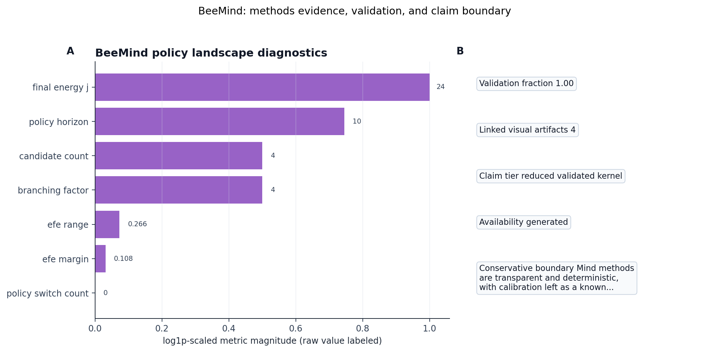

## Page 27

[Glinski et al., 2024, U.S. Environmental Protection Agency, 2024, Hisamoto et al., 2024], land-use effects on forage nutrition [Inês da
Silva et al., 2024], DNA metabarcoding of forage plants [Chege et al., 2025], and global occurrence aggregates such as BeeBDC [Dorey
et al., 2023]. BeeNet-style national monitoring programmes and USDA production statistics are listed in output/data/external_dat
aset_registry.json as unwired metadata. None of these sources validate the current comb or thermal kernel until parsers, licenses,
and held-out residuals are recorded in generated reports.
8.5
Why BeeNiche matters
BeeNiche is important because it closes the stack. Swarm task pressures modify comb and thermal state; comb and thermal state feed
back into BeeBody (proprioception against comb geometry, thermosensory state) and into BeeBrain (thermal context in the optic and
CX channels). Without BeeNiche, the swarm and the body operate in an unspecified environment and the closed-loop semantics break
down. The present implementation is deterministic and serializable; the next scientific step is seasonal forage and brood-demography
coupling rather than merely increasing grid size.
8.6
Adapter schemas
BeeNiche emits adapter-compatible payloads for BEEHAVE [Becher et al., 2014] (colony-level forager, brood, and food-store summaries)
and Hiveopolis [Schmickl et al., 2020] (sensor-stream abstractions over the comb grid). The adapter shape is not load-bearing in the
current run — no downstream BEEHAVE or Hiveopolis runtime is invoked — but the schema is preserved so that coupling can happen
without breaking BeeStack’s internal contracts.
fig. 16 maps BeeNiche adapter schemas to niche and external-engine anchors.
Figure 16: Matplotlib beeniche adapter and niche map shows Adapter map placing BEEHAVE-compatible colony summaries beside comb,
thermal, and forage fields without claiming full hive ecology. Generated from source refresh ledger, niche methods records, simulation
records, and adapter notes. Sidecar validation checks raster, source routing, and registered claim tier. Does not validate full ecology,
real-time hive control, or thermodynamic colony dynamics.
8.7
Methods-analysis Niche panel
The methods-analysis Niche panel tracks final and mean comb fraction, final and mean brood-temperature error, brood-target margin
within the configured band, comb-voxel count (864), and forage-radius midpoint. The panel is written to ../figures/methods/beenic
he_methods_comb_thermal.png so niche claims are anchored to quantitative traces rather than to prose alone.
fig. 17 plots comb occupancy and brood-thermal diagnostics.
8.8
Fidelity boundary
BeeNiche is a voxel comb and thermal kernel with adapter schemas. It now includes deterministic seasonal/weather forage witnesses, but
it does not currently model:

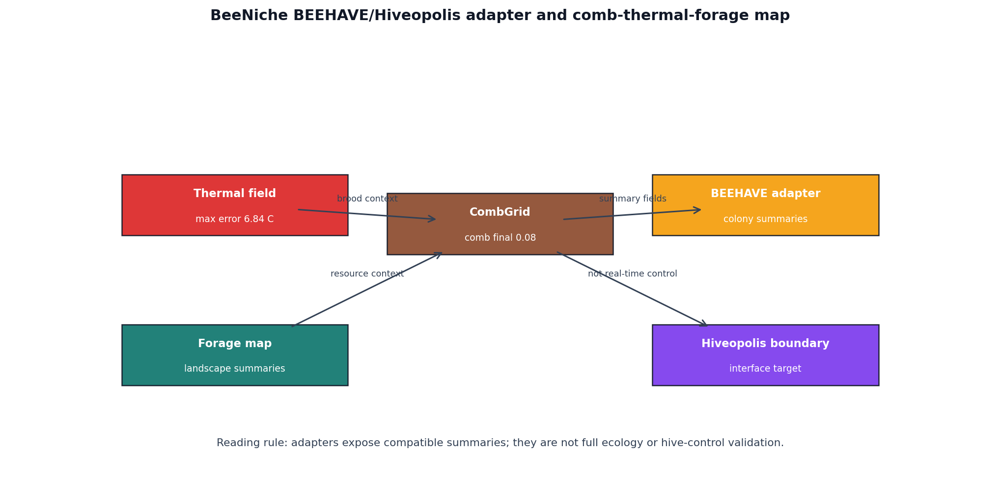

## Page 28

Figure 17: Matplotlib/pandas/NetworkX beeniche comb and thermal diagnostics shows BeeNiche methods panel showing comb occu-
pancy, brood thermal error, foraging-radius context, and deterministic niche-kernel validation. Generated from MethodsAnalysisReport
and simulation records. Sidecar validation checks raster, source routing, and registered claim tier. Does not support a full ecology or
hive thermodynamics engine.
• brood demography (egg-to-emergence aging within voxels),
• 3D pollen storage with depletion kinetics, or
• live Hiveopolis or BEEHAVE runtime callbacks.
Each of those is a roadmap item. The architectural commitment is that adding any of them should only modify BeeNiche internals; the
cross-layer CombGrid and PheromoneField contracts that link BeeNiche to BeeSwarm and BeeBody do not change.

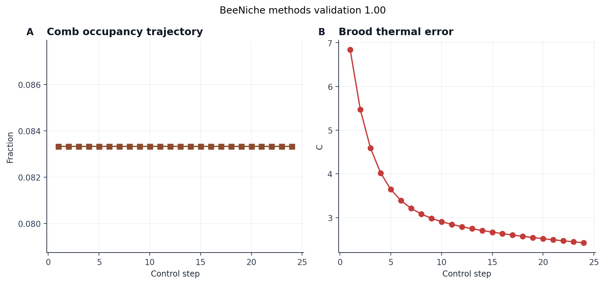

## Page 29

9
Validation and Figure Evidence
BeeStack treats visualization as evidence only when the backend and validation status are explicit. A figure without fidelity metadata
is not used as evidence. A figure that declares its provenance, validates its content, and links back to the script that produced it is
reproducible evidence.
9.1
Animation manifest
The animation manifest currently contains 9 animations: 5 FlyBody/MuJoCo outputs and 4 reduced schematic outputs. The real group
contains BeeBody walking, BeeBody flight, the BeeSwarm ten-bee collision scene, the BeeSwarm configured waggle dance, and the long
multi-BeeBody waggle-dance scenario. Reduced schematic outputs are retained for module-level Brain, Mind, recruitment-field Swarm,
and Niche summaries — they are explanatory, not biomechanical.
The strict FlyBody/MuJoCo contact sheets in sec. 6 — fig. 4, fig. 5, fig. 9, fig. 10, and fig. 11 — are the print-facing witnesses for those
five real animations. Each sheet samples eight frames from the registered GIF; verification scores and contact reports in output/repor
ts/bee_visual_verification.md and output/reports/flybody_contact_physics.md bind the pixels to claim tier.
9.2
Multi-level visual checks
Visual checks operate at several levels:
1. BeeBody verification checks non-blank dynamic frames, motion pixels per second, locomotion mode (walking vs. flight), honeybee
MJCF cue presence, silhouette overlap with a reference bee shape, and — importantly — absence of FlyBody debug aids inconsistent
with a honeybee render. The latest run reports a BeeBody visual score of 0.980 and a silhouette score of 1.000.
2. BeeSwarm verification requires MuJoCo contact reports for strict scenes. A strict scene with zero unique contact pairs is
rejected as evidence; the methods-analysis pass currently records 15.000 unique bee-contact pairs and 3 strict scenes, including a
long BeeBody-backed waggle rollout with its own scene XML and contact report.
3. Research figures are checked for non-blank static image content (rejected if the histogram has fewer than a configured number
of distinct intensities, since a stalled renderer typically writes a uniform frame).
4. Accessibility captions and alt text are stored in the animation manifest so downstream PDFs and web renders can produce
accessible output without the human author having to retype them.
9.3
Textual and structural validation
Validation is also textual and structural.
• The integrity review (output/reports/beestack_integrity_review.md) records public APIs, contracts, configuration knobs,
diagnostics, empirical evidence, fidelity labels, and known gaps for every module. It is generated from the same source code that
the rest of the pipeline imports, so it cannot drift from the implementation.
• The documentation audit (output/reports/documentation_audit.md) checks generated-output references, manuscript hydra-
tion, fidelity language, signposting coverage, Pandoc citation keys, required BibTeX DOI/URL metadata, registry DOI coverage,
and conservative digital-twin wording.
• The readiness review (output/reports/project_readiness_review.md) records 71 signposted directories and prioritizes the
next-improvement backlog from the research gaps — the current top priority is BeeBrain calcium acquisition completion (P27).
9.4
Methods-analysis figures
The methods-analysis pass adds 8 static methods figures, JSON sidecar metadata for generated methods and research figures, 6 manuscript
evidence links, and a source-claim crosswalk that carries module, method, configuration tokens, artifact path, citation keys, source DOIs,
claim tier, and availability status. It also writes a manuscript figure index with 69 artifact rows. The index maps every cited figure or
visual artifact to its backend (e.g. FlyBody, MuJoCo, Matplotlib), fidelity level (real 3D, reduced kernel, schematic), validation status
(passed/passed with caveats/known gap), and the regeneration command needed to reproduce it. The evidence ladder in ../figures/b
eestack_evidence_ladder.png is the reader-facing version of that contract: it separates strict rendered physics, empirical availability,
reduced kernels, compatibility summaries, and the still-blocked digital-twin claim.
9.5
Security posture validation
Alongside figure, source, and documentation audits, BeeStack runs a static security posture gate (output/reports/security_posture_
audit.json) that verifies curated download host allowlisting, zip-member safety checks, absence of forbidden orchestration patterns, and
presence of the repository threat model (BeeStack-threat-model.md). This gate does not replace penetration testing or infrastructure
hardening; it makes the implemented software controls auditable alongside the evidence ladder. Operational detail lives in sec. 17 and
docs/security_posture.md.
The validation figures below separate overview and detail surfaces: evidence tiers, residual readiness blockers, manuscript claim routing,
module-level methods state, and manuscript evidence links. Each insert states its backend, source report, sidecar validation, and blocked
inference in the caption text.
fig. 18 ranks evidence tiers against readiness artifacts.

## Page 30

Figure 18: Matplotlib beestack evidence ladder shows Visual evidence contract separating backend, claim tier, validation status, source
data, and unsupported inference for current BeeStack figures.
Generated from methods analysis, readiness review, and generated
artifact manifests. Sidecar validation checks raster, source routing, and registered claim tier. Does not remove the assimilation, residual,
uncertainty, or governance gaps.
fig. 19 lists residual blockers that still prevent digital-twin readiness.
fig. 20 maps registered figures by manuscript section and claim family.
fig. 21 lists the same primary figures with source classes and explicit unsupported-inference boundaries.
fig. 22 summarizes module-level methods panels in one dashboard.
fig. 23 expands the methods dashboard into a module table with gap and boundary text kept legible at PDF scale.
fig. 24 links manuscript sections to evidence records and regeneration commands.
9.6
Figure design, accessibility, and claim discipline
The main-manuscript figures follow a reader-facing design contract: consistent typography and panel structure, restrained non-data ink,
perceptually safer colour choices, contrast checks for text-like marks, purposeful alt text, position- and length-oriented encodings for the
main evidence maps, and captions that name the backend, source data, validation status, and unsupported inference. The design rules
are grounded in practical figure guidance, graphical-perception evidence, colour-map misuse literature, WCAG contrast/accessibility
standards, FAIR provenance principles, and visual-analytics provenance frameworks [Rougier et al., 2014, Cleveland and McGill, 1984,
Crameri et al., 2020, World Wide Web Consortium, 2023, Wilkinson et al., 2016, Heer and Shneiderman, 2012, Ragan et al., 2016].
The implementation is deliberately mechanical: sidecars record accessibility checks, design citations, source-data classes, and claim-tier
boundaries, and the figure audit fails if a primary manuscript caption omits the backend/source/validation/conservative-interpretation
pattern.
The inserted-figure rule is now stricter than a generic sidecar check: every raster image promoted into the hydrated manuscript must have
a curated figure_registry.py narrative with a manuscript section, Pandoc label, caption, alt text, claim tier, fidelity tier, source-data
field, regeneration command, and unsupported-inference sentence. Generic sidecars remain acceptable for supporting diagnostics in the
gallery or generated reports, but not for figures that carry manuscript evidence. This gives the manuscript figure claim map a complete
accounting surface instead of a partial registry with generic fallbacks.
9.7
Why this matters
The combined effect of these layers is that a reader can audit any figure in this manuscript to determine: which kernel produced it,
what fidelity tier the kernel sits in, whether the figure passed nonblank/quality validation, where its sidecar metadata lives, and how to
regenerate it. That is the operational meaning of “reproducible research” inside BeeStack: not merely “the code is public,” but “every
claim is linkable, every figure is regenerable, and every fidelity gap is named” [Wilson et al., 2017, Lamprecht et al., 2020].

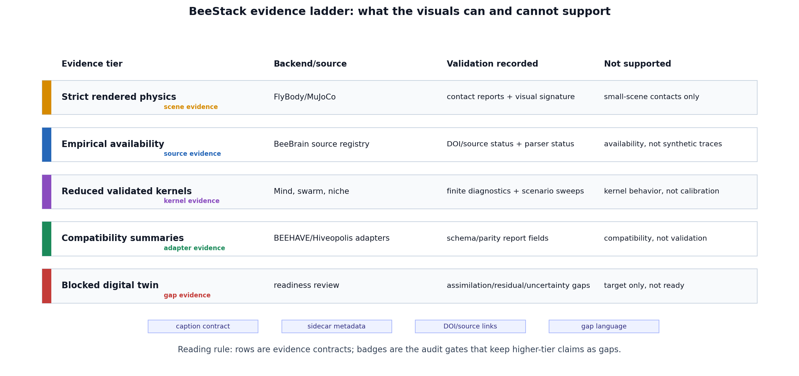

## Page 31

Figure 19: Matplotlib beestack validation readiness and residual blockers shows Validation-readiness panel separating implemented
verification checks from blocked held-out residual, uncertainty, assimilation, and governance evidence. Generated from source refresh
ledger, readiness review, generated reports, and figure sidecars. Sidecar validation checks raster, source routing, and registered claim
tier. Does not provide held-out residuals, uncertainty quantification, or digital-twin readiness.
Figure 20: Matplotlib beestack manuscript figure claim map shows Overview matrix grouping inserted primary figures by manuscript
section and registered claim family. Generated from figure registry and manuscript figure index. Sidecar validation checks raster, source
routing, and registered claim tier. Does not add empirical evidence beyond the registered figure sidecars.

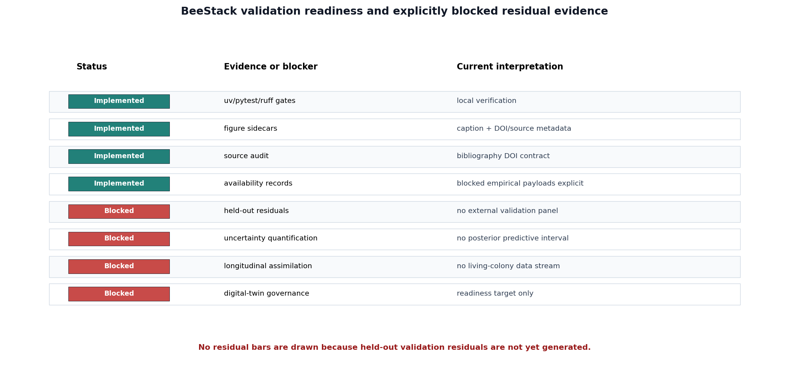

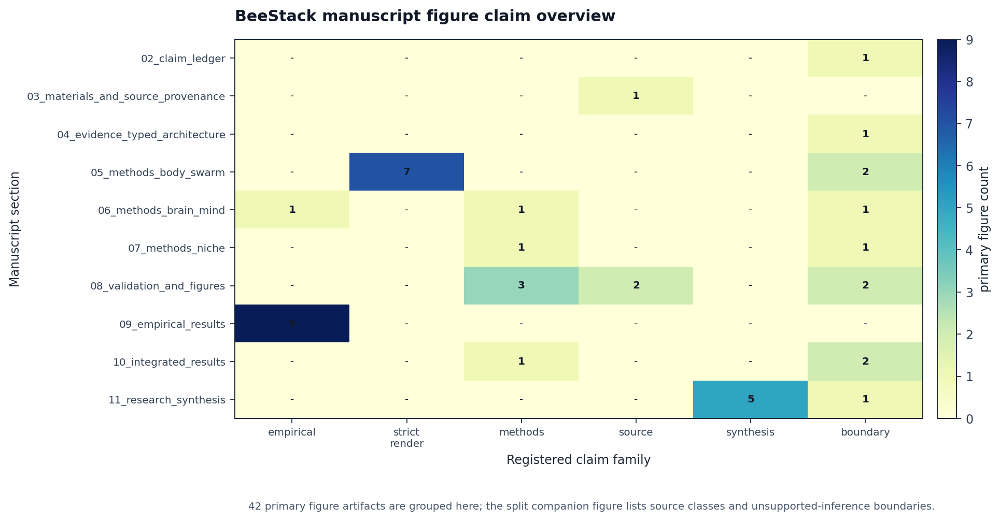

## Page 32

Figure 21: Matplotlib beestack manuscript figure claim detail shows Split companion table listing primary figures, source-data classes,
claim tiers, and unsupported-inference boundaries. Generated from figure registry and manuscript figure index. Sidecar validation checks
raster, source routing, and registered claim tier. Does not add empirical evidence beyond the registered figure sidecars.

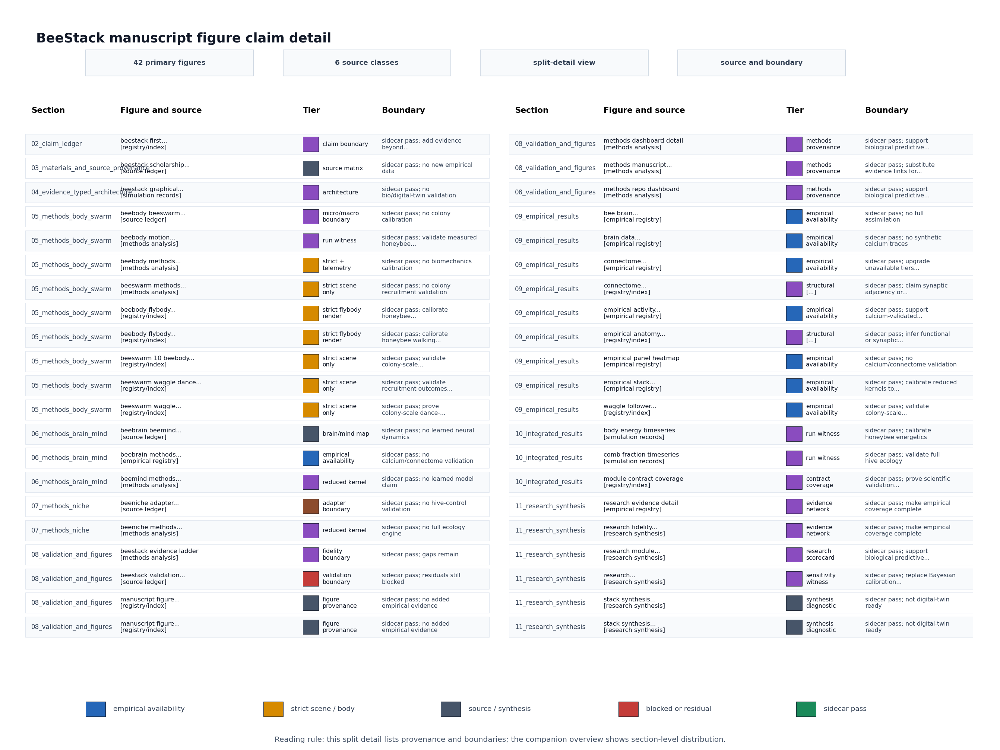

## Page 33

Figure 22: Matplotlib/pandas/NetworkX beestack methods dashboard shows Methods dashboard summarizing per-module validation,
evidence links, visual artifacts, metric counts, and explicit gap counts. Generated from MethodsAnalysisReport module panels and
validation panels. Sidecar validation checks raster, source routing, and registered claim tier. Does not support biological predictive
validity.
Figure 23: Matplotlib/pandas/NetworkX beestack methods dashboard detail shows Split companion table showing module validation
fractions, visual artifact counts, evidence-link counts, gap counts, and boundaries. Generated from MethodsAnalysisReport module
panels and visual QA report. Sidecar validation checks raster, source routing, and registered claim tier. Does not support biological
predictive validity.

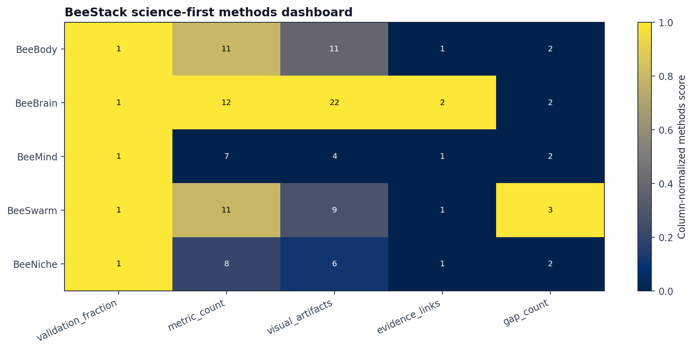

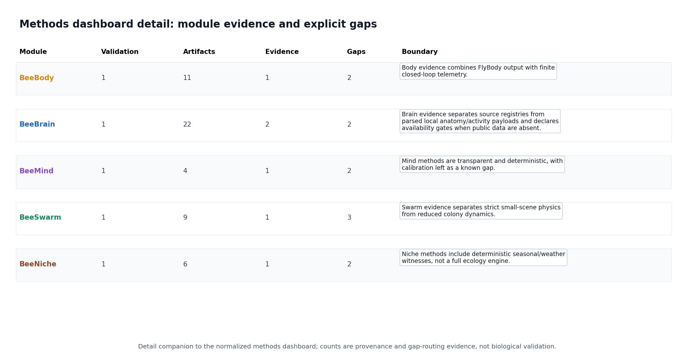

## Page 34

Figure 24: Matplotlib/pandas/NetworkX beestack manuscript evidence index shows Manuscript evidence index comparing evidence-
link counts, visual-artifact counts, and validation fractions by BeeStack module. Generated from MethodsAnalysisReport manuscript
evidence links. Sidecar validation checks raster, source routing, and registered claim tier. Does not substitute evidence links for absent
empirical support.
9.8
Failure modes that visualization catches
Empirically, the visual-validation layer catches three recurring failure modes that pure-numerical validation does not:
1. Renderer stalls — a frame loop that emits identical frames is detected by the non-blank/motion-pixel checks even when JSON
diagnostics look healthy.
2. Body-plan regressions — a wing or antenna disappearing from the MJCF is detected by the MJCF-cue and silhouette checks
before it propagates to the animation manifest.
3. Contact-physics gaps — a multi-bee scene that does not produce any unique contact pairs (a configuration error in the contact-
proxy geoms) is rejected as evidence before it reaches the methods-analysis Swarm panel.
Each failure mode is represented by a generated diagnostic or regression-style test in tests/, so the manuscript claim stays at the level
of what the validators check rather than undocumented debugging history.

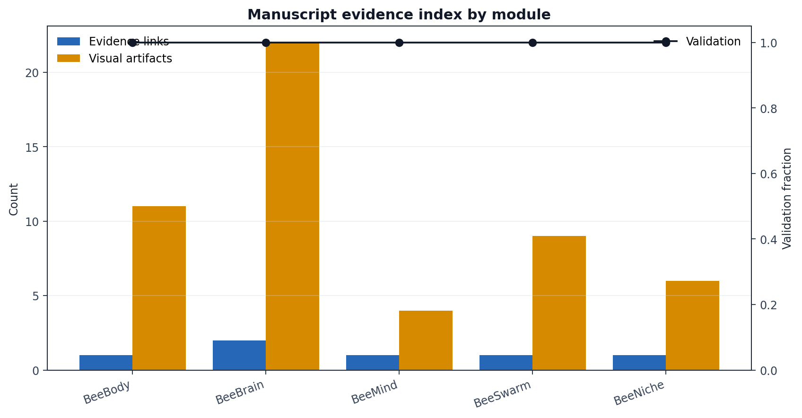

## Page 35

10
Empirical Results
The empirical pipeline is BeeBrain’s connection to real Apis mellifera data. It separates anatomy evidence from activity evidence, records
the parseable-source fraction explicitly, and writes one JSON report per evidence channel so downstream consumers — the manuscript,
the research suite, the methods-analysis pass, and the readiness review — can audit what was loaded, what was parsed, and what is
missing.
10.1
Empirical analysis reports
The empirical pipeline writes:
• output/data/empirical_analysis.json — workbook, CSV, MAT, anatomy, and template-bank summaries plus stack-integration
diagnostics;
• output/data/empirical_template_bank.json — registered odor templates with excitation widths, inhibition fractions, and
glomerulus-length profiles;
• output/data/waggle_follower_analysis.json — Hadjitofi–Webb waggle-follower antennal-position summaries and Bee-
Brain/BeeSwarm decoding confidence [Hadjitofi and Webb, 2024b,a];
• output/data/brain_data_completeness.json — curated-source downloaded and parseable fractions, plus an explicit mod-
ule/modality matrix;
• output/data/bee_brain_end_to_end_report.json — typed BeeBrain anatomy and activity report;
• output/data/bee_brain_connectome.json — typed structural projectome graph (HSB VRML wiring; synaptic tier explicitly
unavailable).
10.2
Connectome evidence tiers
BeeStack distinguishes structural, functional, and synaptic connectome evidence. The generated connectome report tier is struc-
tural_projectome with 95 nodes and 6 structural tract edges; synaptic edge count is 0. Structural coverage is 1.000 against the Honeybee
Standard Brain assets on disk [Brandt et al., 2005]. No public whole-brain synaptic connectome for Apis mellifera is claimed. Szyszka
[Paoli et al., 2023] MDPI supplementary Table S1 (Wilcoxon template tests) is parsed locally; the VAR Granger connectivity matrix
remains unavailable on public deposit (authors provide data on request), so functional Granger edges are not emitted in bee_brain_co
nnectome.json.
10.3
Anatomy evidence
Anatomy records summarize:
• Honey-Bee Standard Brain atlas assets and ZIP inventories [Brandt et al., 2005];
• VRML/TIFF/HTML metadata derived from the standard-brain ecosystem [Rybak et al., 2010];
• neuropil abbreviations (a vocabulary required to align activity panels against atlas regions).
The latest run loads 7 anatomy inventories. These inventories are typed (AnatomyInventory dataclasses) and serialized so that down-
stream summaries do not have to re-parse the raw ZIP/HTML payloads at every analysis step.
10.4
Activity evidence
Activity records summarize:
• odor-response panels;
• calcium traces when local payloads are parseable;
• antennal-movement summaries from Jernigan plume-tracking CSVs [Jernigan et al., 2026];
• waggle-follower antennal-position and dance-vector model-error summaries from Hadjitofi–Webb [Hadjitofi and Webb, 2024b,a];
• neuromodulatory spreadsheets from Nouvian biogenic-amine assays [Nouvian et al., 2017];
• template-bank integration (Galizia–Sachse glomerular maps [Galizia et al., 1999] combined with Szyszka transient dynamics [Paoli
et al., 2023]).
The latest run contains 48 empirical panels, 1 antennal summaries, and 24 integrated templates. The waggle-follower analysis contributes
59 tracks with confidence 0.289 when the Figshare source is local and parseable.
10.5
Data completeness
The brain-data completeness panel reports a parseable-source fraction of 0.800 and a source-verified fraction of 1.000. The parseability-
readiness flag is True against the recorded 0.800 target. That flag reflects the parseable-source fraction only; source-verified records with
explicit blockers are tracked separately and do not substitute for missing parseable payloads. In the current generated evidence snapshot,
10 curated BeeBrain sources are registered, 8 have local payloads, 8 are parseable, and 2 source-verified records remain blocked with
explicit remediation notes. Empirically known gaps are catalogued as EMPIRICAL_KNOWN_GAP_COUNT = 0. The Paoli MATLAB calcium
archive [Paoli, 2024] is now downloaded and parsed into empirical response summaries, where it serves as a citation anchor; it is not yet
wired as a model input or held-out validation target, so its contribution remains evidentiary rather than integrative. BeeStack preserves

## Page 36

this distinction between registered sources, local payloads, parsed summaries, and model inputs rather than fabricating synthetic traces
to claim integration it has not yet performed.
10.6
Empirical figures
Figures under ../figures/empirical/ report panel quality, panel heatmaps, stack alignment, antennal movement, waggle-follower
alignment, waggle-phase coupling, recruitment-decoding inputs, data completeness, anatomy assets, simplified anatomy projection, neu-
ropil coverage, and activity summaries. Each figure is registered in the manuscript figure index with its backend, fidelity tier, and
regeneration command.
fig. 25 shows the structural-projectome graph as an availability witness, not a synaptic-connectome claim.
Figure 25: Matplotlib beebrain structural projectome graph shows Network layout of Honeybee Standard Brain neuropils, named neu-
ron/tract nodes, and documented structural tract edges. Generated from output/data/bee_brain_connectome.json. Sidecar validation
checks raster, source routing, and registered claim tier. Does not claim synaptic adjacency or functional Granger completeness.
fig. 26 separates structural, functional, and synaptic tiers so unavailable evidence stays visible.
fig. 27 gives the reader the panel-level empirical response surface used by the reduced BeeBrain summaries.
fig. 28 reports alignment between available empirical templates and the reduced module contracts without claiming biological ground-
truth calibration.
fig. 29 projects Honeybee Standard Brain geometry into a manuscript-visible atlas witness.
fig. 30 condenses the current activity evidence while preserving the calcium-availability boundary.
fig. 31 maps local Hadjitofi-Webb follower summaries to BeeStack decoding confidence without validating colony-scale recruitment.
fig. 32 summarizes parseable empirical panels and known gaps.
fig. 33 maps multimodal BeeBrain sources to assimilation status.
10.7
Why the gap honesty matters
A reduced BeeBrain that substitutes synthetic values for missing calcium traces would still produce a complete-looking manuscript. The
gap-explicit design here deliberately makes incompleteness visible in the hydrated manuscript: BRAIN_DATA_PARSEABLE_FRACTION = 0

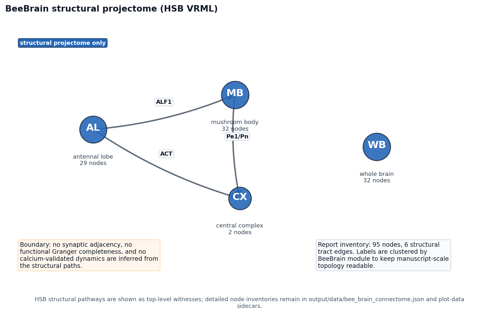

## Page 37

Figure 26: Matplotlib connectome evidence tiers shows Coverage bars for structural, functional, and synaptic connectome tiers with
synaptic tier explicitly unavailable. Generated from output/data/brain_data_completeness.json. Sidecar validation checks raster, source
routing, and registered claim tier. Does not upgrade unavailable tiers into supported claims.
Figure 27: Matplotlib empirical odor-response panel heatmap shows Heatmap of the first registered empirical odor-response panel
showing channel responses across stimuli. Generated from output/data/empirical_analysis.json. Sidecar validation checks raster, source
routing, and registered claim tier. Does not support connectome-scale or calcium-validated dynamics.

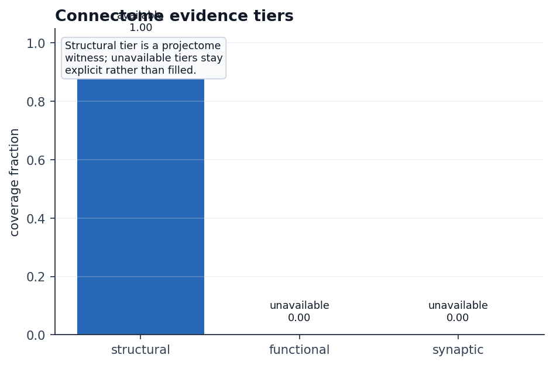

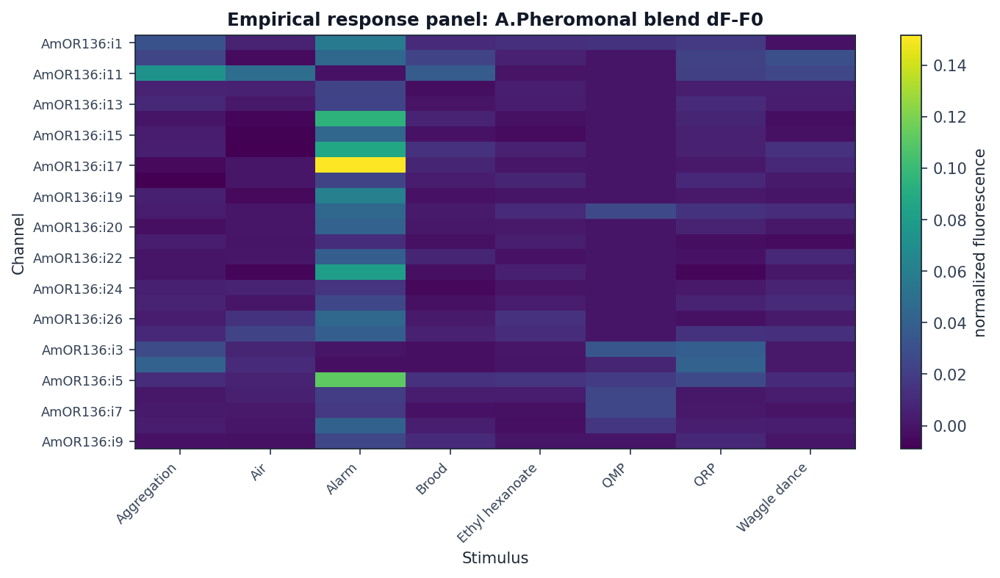

## Page 38

Figure 28: Matplotlib beebrain empirical stack alignment shows Alignment scores between empirical templates and reduced BeeBrain
module contracts. Generated from output/data/empirical_analysis.json. Sidecar validation checks raster, source routing, and registered
claim tier. Does not calibrate reduced kernels to biological ground truth.
.800 and EMPIRICAL_KNOWN_GAP_COUNT = 0 are not editorial choices; they are the same values the readiness review and research-suite
scorecards read. A reviewer can read the manuscript, the JSON reports, and the readiness review without having to cross-check that
they tell the same story — because all three are hydrated from the same machine-readable artifacts.
10.8
Provenance trail
Raw empirical downloads live in output/data/empirical_sources/ and are documented by catalog.json, archives.json, and ana
tomy_downloads.json so that every dataset, its DOI, its publication, its CC license, and the date of download are recorded. This trail
is essential for the data-provenance and ethics considerations summarized in sec. 16 and sec. 17.

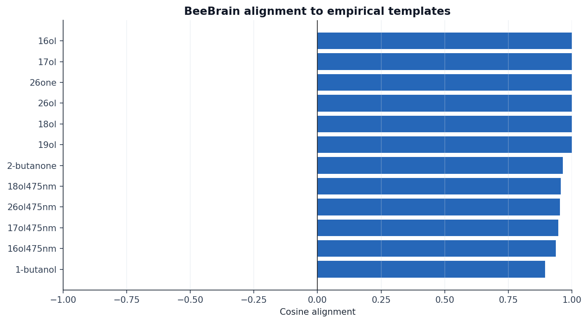

## Page 39

Figure 29: Matplotlib honeybee standard brain vrml projection shows VRML geometry centroids with structural tract overlays when
the connectome report is available. Generated from output/data/bee_brain_connectome.json. Sidecar validation checks raster, source
routing, and registered claim tier. Does not infer functional or synaptic connectivity.

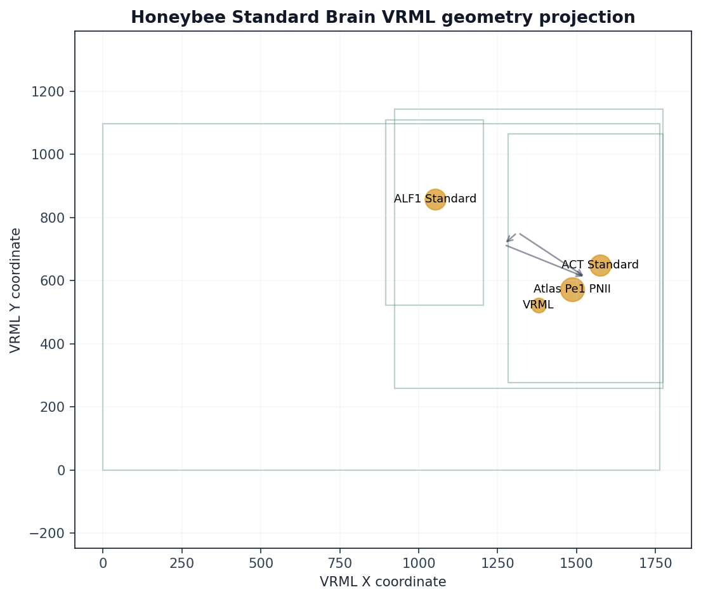

## Page 40

Figure 30: Matplotlib beebrain empirical activity summary shows Reduced activity summary combining odor separability, calcium
fractions, aftersmell response, and antennal drive.
Generated from output/data/empirical_analysis.json.
Sidecar validation checks
raster, source routing, and registered claim tier. Does not support calcium-validated dynamics; parsed calcium traces are a citation
anchor, not a model input.
Figure 31: Matplotlib waggle follower empirical alignment shows Hadjitofi–Webb follower antennal alignment metrics mapped to BeeStack
decoding confidence. Generated from output/data/waggle_follower_analysis.json. Sidecar validation checks raster, source routing, and
registered claim tier. Does not validate colony-scale recruitment.

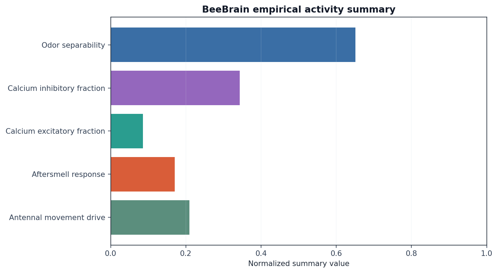

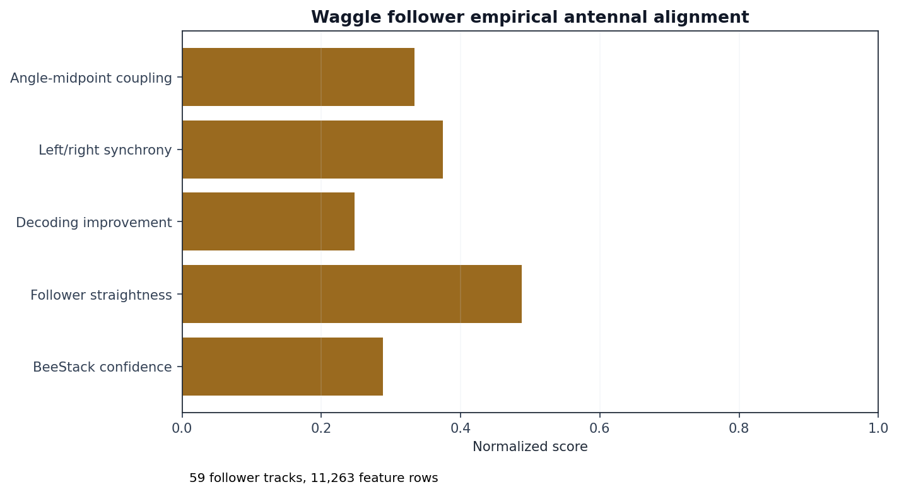

## Page 41

Figure 32: Matplotlib brain data completeness matrix shows Empirical completeness matrix showing which BeeBrain source rows
are registered, locally available, parseable, and source-verified. Generated from output/data/brain_data_completeness.json. Sidecar
validation checks raster, source routing, and registered claim tier. Does not replace absent calcium payloads with synthetic traces.

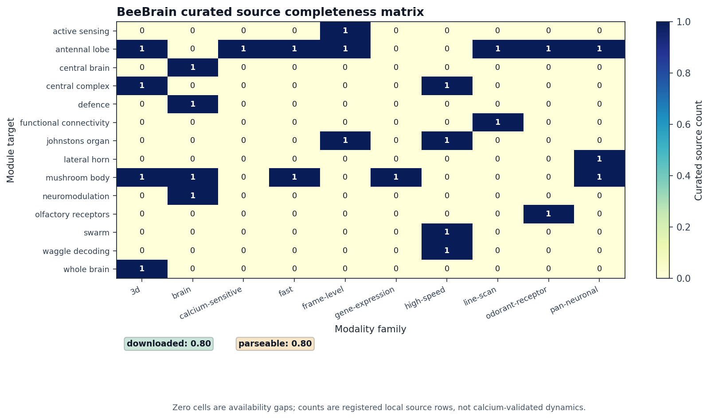

## Page 42

Figure 33: Matplotlib beebrain multimodal source map shows Multimodal source map organizing anatomy, odor-response, antennal,
and waggle-follower records by integration target and local availability. Generated from output/data/brain_data_completeness.json
and empirical analysis report. Sidecar validation checks raster, source routing, and registered claim tier. Does not support a complete
multimodal empirical assimilation pipeline.
11
Integrated Results
This section reports the deterministic integrated run — the single closed-loop rollout that exercises every cross-layer contract. It is
the smallest claim BeeStack makes that is genuinely whole-of-colony: a bee observes through BeeBody, decides through BeeBrain and
BeeMind, acts back on BeeBody, and the result propagates through BeeSwarm and BeeNiche.
11.1
Run summary
The deterministic integrated run completed 24 control steps at the configured 100 Hz boundary.
The final selected policy was
nurse_brood, the final body speed was 0.004 m/s, the final body-frame energy budget was 23.999 J, and the mean wing power across
the rollout was 58.291 mW. Dance-floor recruitment produced 168 follower events across the rollout.
The final comb occupancy fraction was 0.083, and the brood-temperature error at the final step was 2.424 °C from the configured 34 °C
target [Kronenberg and Heller, 1982]. The run ended with empirical odor label geraniol selected from the registered odor templates,
and an empirical-alignment score of 0.000.
11.2
Witness figures
The three witnesses below summarize the integrated run recorded in output/data/run_summary.json and simulation_records.json.
Each figure is a reduced-kernel diagnostic with an explicit sidecar boundary.
fig. 34 traces BeeBody energy witnesses across the integrated run.
fig. 35 traces BeeNiche comb occupancy across the integrated run.
fig. 36 renders module contract coverage from the integrated run.
11.3
Artifact trace
The run summary is not a one-off console transcript. The values in this section are written to output/data/run_summary.json, the
per-step records are written to output/data/simulation_records.json, and the contract coverage witness is written to output/dat
a/module_coverage.json. The same pipeline writes output/data/animation_manifest.json, output/reports/beestack_integri

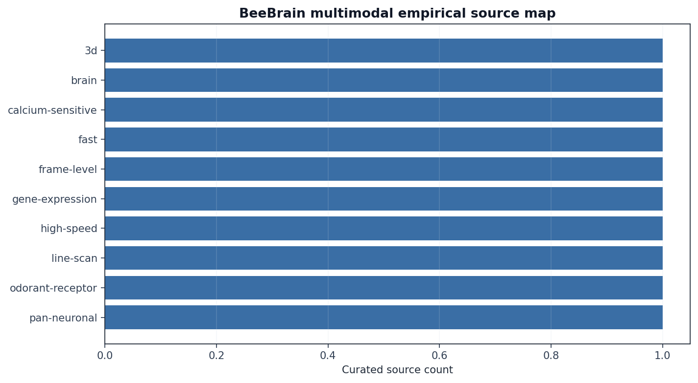

## Page 43

Figure 34: Matplotlib beebody energy time series shows Integrated-run BeeBody energy witness showing deterministic reduced energy
accounting across control steps. Generated from output/data/simulation_records.json. Sidecar validation checks raster, source routing,
and registered claim tier. Does not calibrate honeybee energetics.
Figure 35:
Matplotlib beeniche comb occupancy time series shows Integrated-run comb-occupancy witness showing deterministic
BeeNiche state changes across control steps. Generated from output/data/simulation_records.json. Sidecar validation checks raster,
source routing, and registered claim tier. Does not validate full hive ecology.

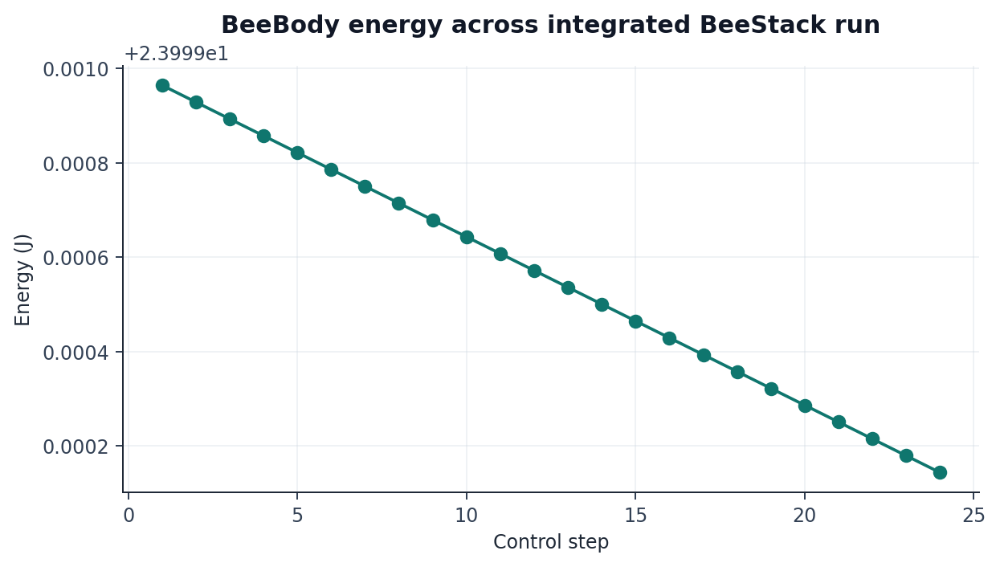

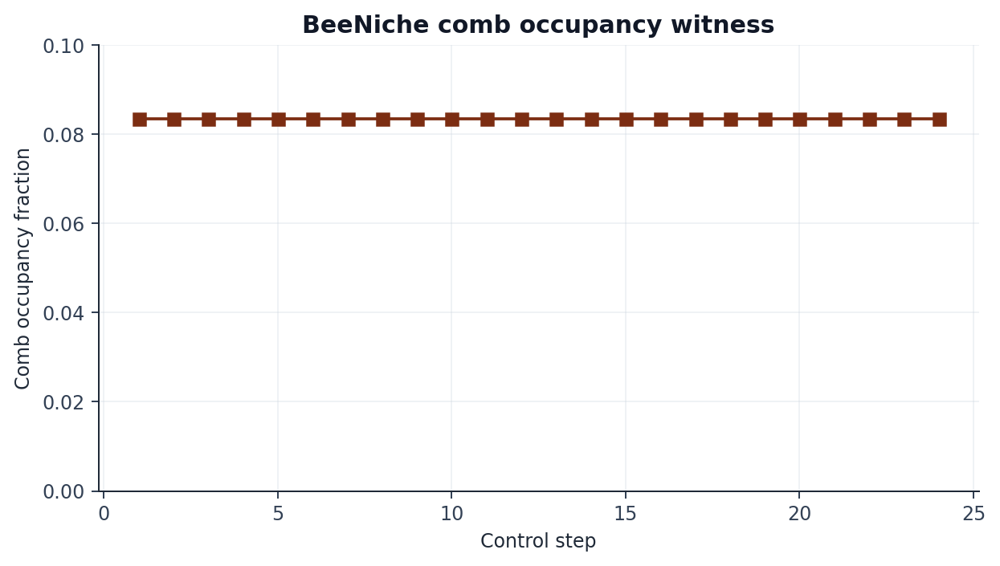

## Page 44

Figure 36: Matplotlib beestack module contract coverage shows Contract-coverage witness showing the implemented v0 module contracts
that participate in the integrated run. Generated from output/data/module_coverage.json. Sidecar validation checks raster, source
routing, and registered claim tier. Does not prove scientific validation completeness.
ty_review.md, and the hydrated sections under output/manuscript/. That trace makes the integrated run auditable: if a figure or
sentence changes, the corresponding JSON or report changes with it.
11.4
How to read these numbers
These are reproducibility witnesses, not biological validation claims. They show that the complete five-module path can run deter-
ministically from a pinned seed (20260513) while producing inspectable intermediate records, figures, reports, and manuscript variables.
Re-running the same seed on the same code reproduces every number above to within numerical precision; changing the seed changes
the trajectory but not the contract-validity of any artifact.
The empirical-alignment score should be read especially conservatively. The current BeeBrain empirical layer projects available odor
templates into a reduced AL–MB–CX path; the alignment metric measures whether the projected MB activity matches the expected
template signature, not whether the underlying neural model is biologically calibrated. A high alignment score with the current kernel
is a sanity check that the template-bank pipeline is wired correctly; it is not a claim about neural predictive validity. The full predictive
validity claim lives in the roadmap.
11.5
What the run does not claim
The integrated run does not claim:
1. Population-scale dynamics — recruitment numbers come from the reduced communication kernel, not from a BEEHAVE-scale
demographic engine.
2. Calibrated biomechanics — the energy and wing-power numbers come from the reduced energetics model, not from a measured
honey-bee biomechanics dataset.
3. Learned policy quality — nurse_brood is the highest-scoring policy under the hand-calibrated active-inference-style scorer; it
is not the output of a learned colony-optimal controller.
4. Real-time thermoregulation accuracy — the brood-temperature error number measures whether the kernel keeps the target
band approximately, not whether the dynamics match real hive thermal response curves [Kronenberg and Heller, 1982].
Naming the negatives is what makes the positive claims interesting: the run is a contract-valid whole-stack rollout that produces a
manuscript without fabrication. That is the operational meaning of “executable architecture” in this project.
11.6
Cross-references to per-module results
Where the run touches a specific module, the relevant per-module results section provides the depth: BeeBody for the energetics and
rendering, BeeBrain for the AL–MB–CX trace, BeeMind for the policy-score landscape, BeeSwarm for the recruitment and contact pairs,

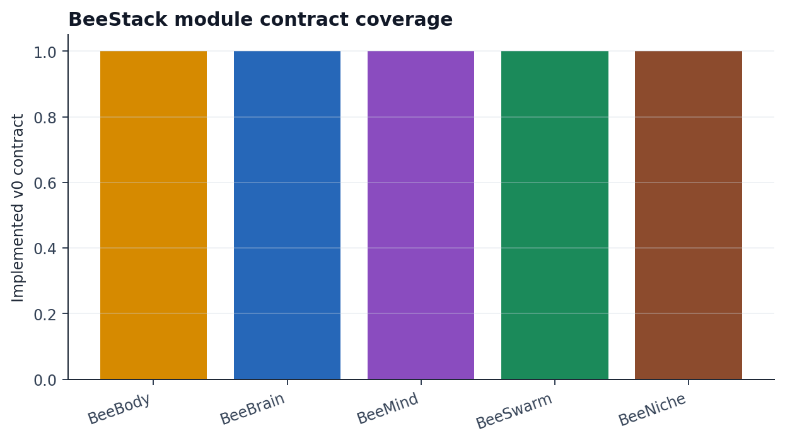

## Page 45

and BeeNiche for the comb and thermal traces. Empirical anchor data are summarized in sec. 10; the research-suite scorecards and
known-gaps catalog are in sec. 12.

## Page 46

12
Research Synthesis
The research suite is BeeStack’s cross-module evidence consolidator. It assembles fidelity-labelled scorecards, empirical-evidence rows,
visualization-artifact inventories, deterministic sensitivity sweeps, and a known-gaps catalogue, then writes a primary research report
and a methods-analysis pass.
12.1
Research-suite report
The research suite writes output/reports/beestack_research_report.md, output/reports/beestack_research_report.json, and
output/data/research_suite_report.json. It reports five module scorecards, 5 empirical evidence records, 87 visualization artifacts,
3 deterministic sensitivity sweeps, and 11 known gaps. The overall validation fraction is 1.000. The scorecard heatmap, sensitivity
sweeps, evidence network overview, and evidence detail table below are Matplotlib/pandas or NetworkX diagnostics from the typed
research report; each sidecar states what the figure does not prove.
fig. 37 heatmaps module scorecards from the research suite.
Figure 37: Matplotlib/pandas/NetworkX beestack research module scorecard heatmap shows Research scorecard heatmap summarizing
validation fraction, metrics, evidence, gaps, and visual artifacts by module. Generated from ResearchSuiteReport scorecards and visual
inventory. Sidecar validation checks raster, source routing, and registered claim tier. Does not support biological predictive validity.
fig. 38 plots deterministic sensitivity sweeps.
fig. 39 links fidelity evidence records in a network view.
fig. 40 expands the network into scorecard and empirical rows so source status and integration targets remain readable.
12.2
Stack-synthesis review
The cross-stack synthesis review is a stricter summary layer over the research report, methods-analysis report, simulation records,
animation manifest, documentation audit, readiness review, and bibliography. It writes output/reports/stack_synthesis_review.m
d, output/reports/stack_synthesis_review.json, and output/data/stack_synthesis_review.json, plus 2 figure(s), including ..
/figures/research/stack_synthesis_dashboard.png and the split findings companion.
The latest synthesis reports validation fraction 1.000, synthesized readiness fraction 0.932, artifact coverage 1.000, and 95 bibliography an-
chors. The digital-twin readiness gate remains False in the generated readiness review. The integrated run improved brood-temperature
error by 4.415 °C. The top synthesis finding is: Weakest synthesized module is BeeSwarm (readiness 0.925; gaps 3).

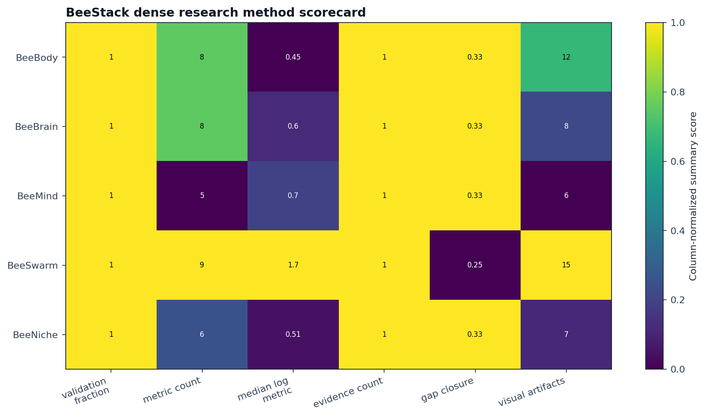

## Page 47

Figure 38:
Matplotlib/pandas/NetworkX beestack research sensitivity sweeps shows Deterministic sensitivity-sweep panel showing
reduced-kernel response under controlled one-parameter perturbations. Generated from ResearchSuiteReport sensitivity sweeps. Sidecar
validation checks raster, source routing, and registered claim tier. Does not replace Bayesian calibration or external scenario validation.

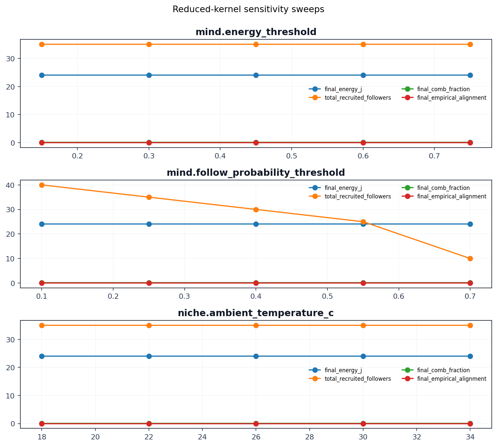

## Page 48

Figure 39: Matplotlib/NetworkX beestack fidelity evidence network shows Evidence network linking module scorecards, empirical Bee-
Brain records, and provenance nodes from the research suite. Generated from ResearchSuiteReport evidence records. Sidecar validation
checks raster, source routing, and registered claim tier. Does not make empirical coverage complete.

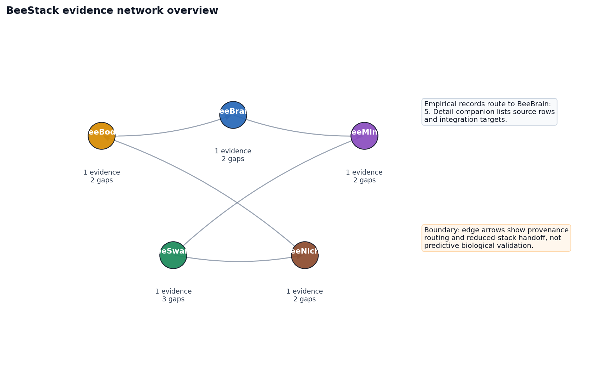

## Page 49

Figure 40: Matplotlib/pandas/NetworkX beestack research evidence detail shows Split companion table listing research scorecard ev-
idence, empirical source rows, availability states, and integration targets. Generated from ResearchSuiteReport evidence records and
empirical availability rows. Sidecar validation checks raster, source routing, and registered claim tier. Does not make empirical coverage
complete.
fig. 41 summarizes cross-stack synthesis metrics and readiness fractions.
fig. 42 keeps the prioritized synthesis findings visible next to module readiness scores.
12.3
Module scorecards
The scorecards make fidelity labels first-class.
• BeeBody is FlyBody-backed for rendering plus a reduced closed-loop telemetry kernel.
• BeeBrain is an empirical reduced neural kernel — empirical at the data surface, reduced at the dynamics surface.
• BeeMind is a bounded active-inference-style policy kernel [Friston, 2010, Parr and Friston, 2017] with explicit diagnostics.
• BeeSwarm combines strict FlyBody/MuJoCo visual scenes [Vaxenburg et al., 2025, Todorov et al., 2012] with a reduced commu-
nication kernel.
• BeeNiche is a voxel comb and thermal kernel with BEEHAVE and Hiveopolis adapter schemas [Becher et al., 2014, Schmickl
et al., 2020].
Each module also exposes contract coverage, validation pass count, empirical-evidence count, and known-gap count, so the heatmap row
for a module is interpretable without the surrounding prose.
12.4
Sensitivity sweeps
The sensitivity sweeps are deterministic: each sweep varies a single configuration knob over a fixed grid, records the resulting BeeStack
diagnostics, and serializes the result to output/data/sensitivity/<knob>.json. The default sweep size is 5 samples per knob, which
is the smallest grid that produces a visible monotone signal on every recorded diagnostic without inflating CI wall-time. The sweeps
are not a substitute for a Bayesian calibration; they are a contract-stability witness that says: when the kernel is asked to change one
parameter at a time, the intermediate states and final outputs respond consistently and within configured bounds.
This follows the spirit of global sensitivity analysis: the first goal is not to claim calibrated predictive uncertainty, but to expose which
outputs move under controlled parameter changes and which outputs are structurally insensitive under the current reduced kernel [Saltelli
et al., 2008].

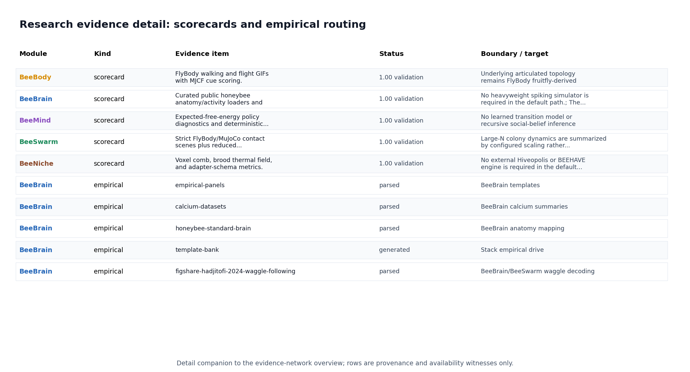

## Page 50

Figure
41:
Matplotlib/pandas/NetworkX
beestack
cross-stack
synthesis
dashboard
shows
Cross-stack
synthesis
dashboard
summarizing
validation
fractions,
readiness,
artifacts,
explicit
gaps,
and
scholarship
anchors.
Generated
from
out-
put/reports/stack_synthesis_review.json. Sidecar validation checks raster, source routing, and registered claim tier. Does not make
BeeStack digital-twin ready.

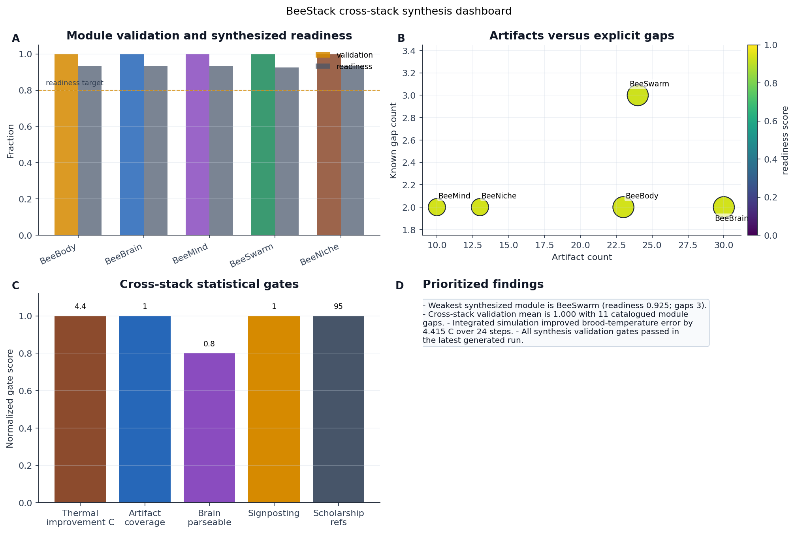

## Page 51

Figure 42: Matplotlib/pandas/NetworkX beestack synthesis findings detail shows Split companion panel showing module readiness scores
beside prioritized cross-stack findings. Generated from output/reports/stack_synthesis_review.json. Sidecar validation checks raster,
source routing, and registered claim tier. Does not make BeeStack digital-twin ready.
12.5
Readiness review
The readiness review writes output/reports/project_readiness_review.md and output/reports/project_readiness_review.jso
n. It currently reports strict signposting coverage for 71 directories and keeps the next-improvement backlog tied to the research-suite
gaps. The top prioritized improvement is BeeBrain calcium acquisition completion (P27).
The readiness review is structurally different from the research-suite report.
The research-suite report describes current state; the
readiness review describes recommended next state. Keeping the two separated avoids a common failure mode in research software,
where forward-looking optimism leaks into descriptive artifacts and slowly displaces honest gap reporting.
12.6
Methods-analysis pass
The methods-analysis report writes output/reports/methods_analysis.md, output/data/methods_analysis.json, output/rep
orts/manuscript_figure_index.md, and output/data/manuscript_figure_index.json. It reports 5 module methods panels, 3
scenario-sweep panels, 52 linked visualization records, and an overall methods validation fraction of 1.000. Its all_validations_passe
d flag is True, and its highest-priority visible gap is Underlying articulated topology remains FlyBody fruitfly-derived until a
full calibrated bee MJCF fork is maintained upstream..
12.7
What “validation fraction” means
A validation fraction is the share of registered checks that currently pass. It is not a model-quality score, and it is not a biological-realism
score. A fraction of 1.0 means: every check that the project has decided to run, currently passes. Increasing the denominator (adding
stricter checks) can lower the fraction; that is a feature, not a bug, because it makes the bar visible.
12.8
Reading the scorecards
To audit a single number in this section:
1. Open the linked JSON report (e.g. output/reports/beestack_research_report.json).
2. Find the module of interest.
3. Read the validation list to see which checks ran and which passed.
4. Cross-reference any failed check against the known_gaps list in the same report.
Every JSON report in the suite is small enough to read directly; that is intentional. A reproducible-research artifact that requires
specialized tooling to inspect is one that drifts silently from the prose that describes it [Wilson et al., 2017].

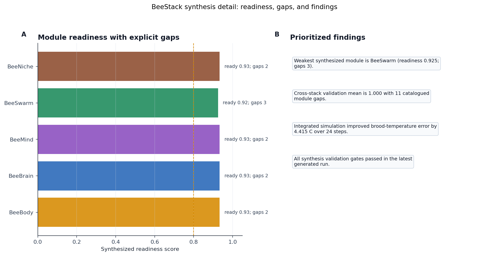

## Page 52

12.9
How the reports divide responsibility
The report set is intentionally redundant only at the edges. The integrity review answers “what API and contract does each module
expose?” The methods-analysis report answers “what method diagnostics, figures, and validation panels exist for each module?” The
research suite answers “what is the cross-module evidence state?” The stack-synthesis review answers “what do the generated statistics
imply across all of those surfaces?” The readiness review answers “what should improve next?” The documentation audit answers “does
the prose still point to artifacts that exist?” Keeping those questions separate prevents a single large report from becoming a place where
implementation detail, scientific evidence, roadmap intent, and documentation health blur together.

## Page 53

13
Discussion
BeeStack’s main result is not a completed digital honey bee. It is a working argument about how such a model should be built: body,
brain, mind, swarm, and niche can be treated as separate scientific objects without letting the boundaries become excuses for incompatible
units, untracked data provenance, or undocumented fidelity jumps. The current system shows that these layers can share typed contracts,
generated diagnostics, visual evidence, empirical source records, and manuscript variables in one reproducible loop.
13.1
A superorganism needs more than a swarm model
The colony-as-superorganism literature motivates BeeStack but also disciplines it.
A superorganism is not just a large population
simulator; it is an organism-like organization in which local mechanisms produce colony-level regulation, decision-making, and failure
modes [Seeley, 1989, Sasaki and Pratt, 2018]. This matters for software architecture. A colony model that begins directly at task
allocation can reproduce useful aggregate curves, but it cannot explain which body-level, sensory, or ecological assumptions made those
curves credible. Conversely, a body or brain model that never rises to dance, pheromone, thermoregulation, and foraging consequences
can become an isolated technical demonstration.
BeeStack therefore treats the stack itself as a hypothesis: the colony level is most interpretable when individual morphology, sensory
encoding, decision policy, recruitment dynamics, and comb or landscape state are all visible and auditable. The current implementation
is still reduced in several layers, but the reduction is explicit enough that a reader can see where a stronger engine should enter.
13.2
Body-first realism is an epistemic constraint
The BeeBody and strict BeeSwarm scenes are deliberately body-first. This choice is not cosmetic. Work on morphological computation
argues that the body, sensors, actuators, and environment participate in the control problem rather than merely executing neural
commands [Pfeifer et al., 2006]. In BeeStack terms, this means a waggle dance is not only an abstract vector message and flight is not
only a state transition. Body geometry, wing placement, leg contacts, floor contacts, orientation, and collision proxies constrain what
the simulated bee can visibly do.
The project now has FlyBody/MuJoCo-backed render and contact artifacts for Body walking, Body flight, multi-BeeBody collision, and
the configured and long waggle-dance scenes (fig. 4; fig. 5; fig. 9; fig. 10; fig. 11). Those artifacts justify a narrow claim: the animations
and contact reports are generated through a BeeBody MJCF/FlyBody/MuJoCo path with render and contact verification. They do
not yet justify a broader kinetics claim. Segmental masses, aerodynamic coefficients, adhesive contact, inertial tensors, and wing-load
coupling remain calibration gaps. That distinction matters because a convincing bee-shaped render can otherwise hide incorrect physics.
13.3
BeeBrain as a data-assimilation surface
BeeBrain occupies a different fidelity tier. Its strongest current feature is empirical traceability: Honey-Bee Standard Brain anatomy,
odor-response sources, antennal movement summaries, and waggle-follower kinematics are registered, downloaded when available, parsed,
and reported with source-level provenance. The honey bee is a useful model for studying intermediate cognitive complexity because
small-brain behavior cannot be reduced to independent reflex modules; horizontal integration and central state matter [Menzel and
Giurfa, 2001, Menzel, 2012]. BeeStack’s AL-MB-CX and waggle-decoding kernels are therefore best read as data-assimilation scaffolds
rather than final neural simulators.
This has two consequences. First, empirical coverage metrics are not administrative bookkeeping; they are part of the scientific result.
0.800 tells the reader how much of the registered brain evidence is actually usable by the current pipeline. Second, missing or partial
sources must remain visible. A calcium trace that is registered but unavailable locally is not converted into a synthetic number. It
appears as a gap in the source completeness matrix, methods-analysis report, and roadmap.
13.4
Field crisis vs scaffold fidelity
Recent U.S. colony-loss surveys and beekeeper triage reports document compound stressors—Varroa, viral co-infections, treatment
resistance, and genetic bottlenecks in managed stocks [Aurell et al., 2024, Nearman et al., 2025, Tokach et al., 2026, Chen et al., 2016].
Those findings explain why BeeStack prioritizes a conserving colony-state ledger, driver ingestion, and assimilation surfaces on the
roadmap sec. 15 rather than cosmetic neural detail.
BeeStack is not competing with BEEHAVE [Becher et al., 2014] or COLOSS survey infrastructure [COLOSS Network, 2025] as a colony-
health forecaster in v0. Its contribution is narrower: typed contracts, empirical traceability where datasets exist, and explicit blockers
everywhere else.
Pollination economics and production statistics motivate the societal stakes [Khalifa et al., 2021] without turning
BeeStack into an agricultural decision-support product.
13.5
Reduced kernels are useful when their boundaries are explicit
BeeMind, the broad BeeSwarm kernels, and BeeNiche are not calibrated biological engines. They are reduced validated kernels with
diagnostics. That status is still valuable. BeeMind makes expected-free-energy-like policy terms inspectable and deterministic; BeeSwarm
exposes how decoded dance confidence, follower alignment, pheromone dynamics, stop-signal terms, and colony need can be coupled;
BeeNiche keeps comb occupancy, thermal fields, brood-band compliance, and forage scenarios in the same artifact graph as Body and
Brain.

## Page 54

The scientific risk is not reduction itself. The risk is pretending that reduction has disappeared. BeeStack handles this by making the
reduction visible in every output surface: scorecards, visualization manifests, model cards, methods panels, and hydrated manuscript
sections. A reduced kernel can be replaced later by BEEHAVE, Hiveopolis, a learned generative model, or a neural simulator if it satisfies
the same public contracts. Until then, the correct claim is “validated witness,” not “calibrated biological mechanism.”
13.6
What the visualization suite contributes
The visualization suite is a second argument about scientific reporting. Figures and animations are not decorations; they are classified
evidence objects. Some are strict FlyBody/MuJoCo renders, some are empirical figures, some are reduced-kernel diagnostics, and some
are schematic signposts. This taxonomy prevents an attractive figure from silently changing the claim it supports.
The long multi-BeeBody waggle animation (fig. 11) is the clearest example. It is valuable because it connects a configured dance path,
BeeBody model copies, MuJoCo stepping, follower orientation diagnostics, contact records, frame dynamics, and a stable artifact path.
The single-nestmate walking and flight contact sheets (fig. 4; fig. 5) anchor the same claim at the individual-worker scale before the scene
composes multiple prefixed MJCF copies. None of these figures is valuable because it “looks like a colony” in a general cinematic sense.
The contact report and manifest define what each animation proves.
13.7
Future colony-coupling implications
BeeStack should be described as an evidence-typed scaffold rather than a completed colony-specific twin. Mature colony-coupled models
integrate large multimodal data streams and update predictions against individual or system-specific observations [Björnsson et al., 2020].
BeeStack has the pieces a future hive-coupled twin would need: FAIR-style data records, explicit software workflows, module contracts,
generated reports, validation checks, and artifact provenance [Wilkinson et al., 2016, Lamprecht et al., 2020]. It does not yet have live
colony calibration or closed-loop assimilation.
This is a useful place to stop in v0. A premature twin claim would make the system sound stronger while making it less scientific. The
current claim is narrower and more durable: BeeStack establishes a modular, auditable, evidence-typed substrate on which higher-fidelity
modules can be swapped in without erasing the provenance trail.
The stack-synthesis review is deliberately consistent with that restraint. Oreskes and colleagues warned that numerical models of open
natural systems should be treated as partially confirmable heuristics rather than finally verified mirrors of nature [Oreskes et al., 1994].
BeeStack’s cross-stack statistics therefore do not certify biological truth. They certify a narrower and useful property: the same generated
run can expose module validations, artifact coverage, simulation telemetry, empirical parseability, signposting coverage, and scholarship
anchors in one auditable record.
13.8
Reading the current results
The integrated results and research-suite results should therefore be read as reproducibility and integrity results first, and biological
prediction results second. They show that the project can orchestrate Body, Brain, Mind, Swarm, and Niche in one uv-managed run;
that outputs are generated and audited; that visualizations have declared backends; that empirical sources have parse statuses; and that
known gaps are carried into the roadmap. The synthesis dashboard adds a compact statistical view of those same facts, but it does
not change the biological claim tier. The results do not show that BeeStack can yet predict colony survival, pesticide response, full
dance-language use, or field-scale foraging success.
That distinction is the central scholarly posture of BeeStack: be ambitious about integration, conservative about claims, and explicit
about evidence trails.

## Page 55

14
Limitations
BeeStack v0 should be read as executable architecture. Its strongest claim is not biological prediction, but disciplined integration: each
module can be run, tested, visualized, audited, and replaced behind explicit contracts. The honest framing of the limitations is therefore
per module, with each module’s limit pinned to the fidelity tier declared in sec. 5 and the scorecards summarized in sec. 12.
14.1
BeeBody: calibration
The primary BeeBody limitation is biomechanical calibration. The renderer uses FlyBody walking and flight tasks [Vaxenburg et al.,
2025] and a honeybee MJCF body plan, but the following quantities are inherited from FlyBody defaults rather than calibrated against
a honey-bee biomechanics dataset:
• segmental mass distribution and inertia tensors,
• adhesion model at leg–surface contact,
• wing aerodynamic coefficients (lift/drag tables),
• contact friction at thoracic and abdominal surfaces,
• antennal stiffness and damping at the scape and pedicel.
The visual scoring (BeeBody visual score 0.980, silhouette score 1.000) certifies that the rendering looks like a bee. It does not certify
that the kinetics match a bee.
14.2
BeeBrain: dynamical fidelity
The primary BeeBrain limitation is dynamical fidelity. BeeBrain can acquire, parse, summarize, and integrate real honey-bee anatomy
and activity sources — currently 48 panels, 7 inventories, 1 antennal summaries, and 24 templates with parseable fraction 0.800. But
the default neural model remains a reduced AL–MB–CX and dance-decoding kernel. It does not claim connectome-level dynamics, a
heavyweight spiking simulator, or learned synaptic plasticity. The Paoli MATLAB calcium traces [Paoli, 2024] are now parsed and
serve as a citation anchor, but are not yet wired as a predictive model input, so the empirical alignment metric currently sits closer to
“structural-match witness” than to “predictive likelihood”.
14.3
BeeMind: generative-model depth
The primary BeeMind limitation is generative-model depth. Policy scoring is transparent and diagnostic, but transition and observa-
tion models are hand-calibrated witnesses rather than learned colony, body, or world models. The active-inference-style framing [Friston,
2010, Parr and Friston, 2017] is honest about this distinction; the kernel is a bounded decision witness rather than a full free-energy
agent.
Three concrete consequences:
1. Policy scores reward the intended combination of pragmatic, epistemic, and constraint-respecting terms, but the weighting is a
configuration choice, not a learned posterior.
2. Belief updates are deterministic and small-step; they do not reflect long-horizon credit assignment.
3. Caste transitions are gated by simple thresholds, not by a fitted demographic model [Johnson, 2010].
14.4
BeeSwarm: scale
The BeeSwarm limitations are scale and scene fidelity.
The strict visual scenes are scripted-pose multi-bee scenes: bees are re-
posed kinematically each frame and MuJoCo supplies real geometry and real contact detection at those poses, but the scenes are not
an integrated forward-dynamics flight simulation. They therefore evidence contact structure and morphology, not emergent flight or
collision dynamics. On scale, the strict scenes prove only small BeeBody-backed MuJoCo contact scenes — 3 strict scenes with 15.000
unique bee-contact pairs at the most recent run. The broader colony dynamics are still represented through deterministic reduced
communication, pheromone, and task-allocation kernels at 50 simulated agents representing 20,000 workers, not through full BEEHAVE-
scale demography [Becher et al., 2014]. The small-scene-to-colony gap is the most visible scale jump in the stack, and the manuscript
and figure index make it explicit.
14.5
BeeNiche: ecology
The primary BeeNiche limitation is ecology. Comb, thermal, and deterministic seasonal/weather forage witnesses are executable, but
the following remain explicit gaps:
• calibrated external nectar/weather observations [Wcislo and Tierney, 2003],
• brood demography (egg-to-emergence aging within voxels),
• 3D pollen storage with depletion kinetics,
• live Hiveopolis or BEEHAVE runtime coupling [Schmickl et al., 2020, Becher et al., 2014].

## Page 56

14.6
Colony-health stressors not modeled in v0
BeeStack v0 does not represent the following field drivers as typed state variables. Each item cites the scholarship context and points to
sec. 15 for the intended integration surface.
• Varroa destructor and treatment resistance — amitraz resistance and meta-analytic treatment efficacy [Tokach et al., 2026,
O’Connell et al., 2025]; roadmap colony ledger and driver ingestion.
• Viral titers (DWV and related) — epidemiology and overwintering risk [Wilfert et al., 2016, Highfield et al., 2009]; not modeled
in BeeBrain or BeeNiche kernels.
• Microsporidian and gut pathogens — microbiome interactions and social immunity [Kwong and Moran, 2016, Harwood et al.,
2021]; roadmap axis 1 omics/microbiome state.
• Pesticide burden in hive matrices — residue surveys and landscape exposure [Glinski et al., 2024, Hisamoto et al., 2024];
BeeNiche driver stubs in roadmap item 11.
• Commercial colony-loss statistics — national surveys and triage reports [Aurell et al., 2024, Nearman et al., 2025]; assimilation
targets in roadmap axis 7, not present-tense model outputs.
• Managed-population genetic diversity — demographic history and bottleneck literature [Chen et al., 2016, Cridland et al.,
2017]; no apiary-genetics state in v0.
14.7
Stack-wide limitations
Beyond the per-module limits, three stack-wide limitations deserve explicit acknowledgement.
1. No live colony-data calibration. The empirical anchors are curated public datasets, not paired calibration runs between the
stack and a specific monitored hive.
2. Determinism is not realism. Pinned seeds and reproducible artifacts are necessary for scientific accountability, but the stack
is currently too smooth: real colonies experience noise, disease, and individual variability that BeeStack v0 does not represent.
3. Visualization fidelity ≠scientific fidelity. The MuJoCo contact scenes, the BeeBody MJCF cues, and the silhouette matching
are visual evidence. They do not substitute for quantitative biological calibration.
14.8
Closing the gaps
Every limitation in this section appears in the research-suite known-gaps catalog, is interpreted in the discussion, and appears again
in the roadmap, with a specific next step. The architectural commitment is that closing any one of these gaps modifies only its home
module — because of the cross-layer contracts, fixing BeeBrain calibration does not require touching BeeBody, BeeMind, BeeSwarm, or
BeeNiche.

## Page 57

15
Roadmap
The implementation roadmap follows the fidelity gaps exposed by the research suite and the readiness review. It is ordered by scientific
leverage per unit effort rather than by module index: a small improvement in BeeBrain empirical coverage can unlock multiple downstream
interpretations, while BeeBody calibration first strengthens the Body evidence tier and then propagates through the existing cross-layer
contracts.
15.1
Full digital-twin target
The long-horizon target is a systems-biology digital twin that spans a single managed colony and a population of interacting colonies,
using the closed-loop, observation-updated sense of digital twin adopted in biomedical systems work [Björnsson et al., 2020]. BeeStack
is not there yet. The generated digital-twin readiness review currently tracks 9 axes and reports mean maturity 0.244, with population
_twin_ready resolved to False. The top blocker is: Represent apiaries, feral colonies, queen/drone mating, migration, robbing/drifting,
pathogen transmission, and landscape-mediated competition. The next named artifact is output/data/population_colony_network.
json.
That review reframes the roadmap around eight auditable scales:
1. molecular, omics, microbiome, pathogen, pesticide, and nutrition state;
2. tissue physiology, endocrine state, brood development, and mortality;
3. individual BeeBody biomechanics, sensory channels, and energetic cost;
4. neural dynamics, learning, navigation, and behaviour;
5. colony demography, resource stores, queen laying, disease, and task allocation;
6. nest microclimate, weather, land cover, floral phenology, and management events;
7. apiary and regional population networks, genetics, drift, robbing, migration, and pathogen transmission;
8. assimilation, uncertainty, forecast scoring, intervention counterfactuals, provenance, and governance.
The implementation rule is conservative: an axis moves from scaffold to digital-twin evidence only when it has typed state variables,
units, source provenance, update equations or learned transition models, longitudinal assimilation, held-out validation residuals, and a
generated artifact in output/data/ or output/reports/.
Scholarship refresh hooks for those axes include: axis 1 — BeeBiome SRA metadata and pathogen-assay parsers [Rech de Laval et al.,
2025]; axis 4 — spatial/snRNA-seq validation tasks against reduced AL–MB–CX backends [Mu et al., 2025, Patir et al., 2023]; axis 6
— EPA hive matrices, landscape pesticide exposure, and forage metabarcoding [U.S. Environmental Protection Agency, 2024, Hisamoto
et al., 2024, Chege et al., 2025]; axis 7 — Auburn/AIA and COLOSS-style colony-loss surveys as assimilation targets with held-out
residuals [Apiary Inspectors of America and Auburn University, 2025, COLOSS Network, 2025], not as v0 model outputs.
15.2
1. Build the colony-state ledger
Before adding more detailed submodels, BeeStack needs a conserving colony ledger. This ledger should represent queen laying, eggs,
larvae, pupae, nurses, foragers, drones, dead adults, honey stores, pollen stores, pathogen loads, pesticide burden, and management
interventions as dated state variables with units and provenance.
Acceptance criterion: a colony_state_timeseries.json artifact exists, conserves individuals and resource stores under documented
flows, and is validated by a report comparing at least one held-out colony inspection or BEEHAVE-compatible scenario.
15.3
2. Add driver ingestion and assimilation surfaces
A colony twin requires external drivers rather than internally chosen scenario constants.
Add parsers for weather, hive tempera-
ture/humidity, hive weight, entrance counts, floral-resource proxies, management logs, Varroa/pathogen assays, pesticide records, and
apiary inspections. These should feed a state-space assimilation layer with forecast skill and posterior predictive checks.
Acceptance criterion: an assimilation_posterior.nc or interim JSON posterior artifact is written, with a forecast_skill.md report
describing held-out residuals and uncertainty intervals.
15.4
3. Integrate the acquired BeeBrain calcium evidence
The Paoli MAT calcium archive [Paoli, 2024] is now downloaded and parsed into empirical response summaries, so acquisition and
parsing are complete and the modality is reported as parseable rather than blocker-documented. The highest-leverage near-term move
is to advance it from a citation anchor to a model input: wire the parsed calcium responses into the AL→MB encoding fidelity claim,
expose them through the empirical alignment metric in the integrated results, and raise the calcium modality completeness beyond its
current partial coverage in the methods-analysis panel.
Acceptance criterion: the parsed calcium dataset feeds at least one model-side AL→MB validation residual (not just a reporting panel),
and the calcium modality completeness recorded in output/data/brain_data_completeness.json rises above its current citation-
anchor level.

## Page 58

15.5
4. Calibrate BeeBody beyond visual MJCF
Calibrate the real-FlyBody BeeBody path beyond the current visual MJCF overlays. Specifically, calibrate against published honey-bee
biomechanics:
• segmental mass distribution and inertia tensors,
• adhesion at leg–comb and leg–floor surfaces,
• wing kinematics under varying load,
• leg contact mechanics at typical foraging gaits.
Acceptance criterion: a body_calibration.json artifact with cited sources for each calibrated parameter and a methods-analysis Body
panel that reports the residual to the source data.
15.6
5. Replace BeeBrain kernels with simulator-backed dynamics
Replace the functional BeeBrain kernels with simulator-backed AL–MB–CX dynamics — for example, a Brian2 or Nengo backend —
and add validation tasks for proboscis extension reflex (PER) conditioning, visual learning, and navigation [Menzel, 2012, Stone et al.,
2017].
Acceptance criterion: a methods-analysis Brain panel that reports quantitative residuals against at least one published bee neuroscience
task.
15.7
6. Extend BeeMind to a learned generative model
Extend BeeMind from bounded policy scoring to a fitted generative model with learned transition and observation likelihoods. The
contract surface (BeliefState, Action) is already designed for this swap; the work is in the inference machinery, not in the rest of the
stack [Friston, 2010, Parr and Friston, 2017].
Acceptance criterion: BeeMind.score_policies() substituted by a learned variational posterior with diagnostic parity (same diagnostic
record fields, computed differently).
15.8
7. Scale BeeSwarm to BEEHAVE-compatible scenarios
Scale BeeSwarm beyond strict small-scene visualization by:
1. wiring the reduced communication summaries through a BEEHAVE adapter [Becher et al., 2014] for full population-scale scenario
comparisons;
2. later, training surrogate agents from higher-fidelity rollouts so that the 50-to-20,000 scale gap becomes a learned compression rather
than a documented gap.
Acceptance criterion: a research-suite Swarm scorecard row that reports both small-scene contact pairs and BEEHAVE-scale forager
counts, with traceable provenance for each.
15.9
8. Extend BeeNiche with ecology and demography
Calibrate BeeNiche seasonal forage witnesses, add brood demography, and extend sparse 3D comb voxels while preserving the current
adapter schemas [Johnson, 2009, Kronenberg and Heller, 1982]. Live Hiveopolis runtime coupling [Schmickl et al., 2020] is a longer-horizon
target that this step enables.
Acceptance criterion: a methods-analysis Niche panel that reports source-calibrated seasonal-forage variance, brood-cohort survival, and
a parseable Hiveopolis adapter payload.
15.10
9. Keep project readiness automated
Keep project readiness automated: every generated output leaf should remain signposted, audited, and regenerated by uv-managed
commands. This maintenance item preserves the evidentiary trail through every other roadmap step.
Acceptance criterion: SIGNPOSTED_DIRECTORY_COUNT continues to match the actual directory count, and the readiness review’s priority
list continues to drive the next-iteration backlog.
15.11
10. Register external repository metadata
Materialize the scholarship refresh as durable registry artifacts: output/data/external_dataset_registry.json plus ledger rows for
BeeBiome, HGD, BeeBDC, HAv3.1, survey portals, EPA hive matrices, and COLOSS BEEBOOK (see sec. 4).
Acceptance criterion: every registry row lists wired_in_beestack: false, a target module, a blocker string, and an official DOI or
HTTPS URL; the documentation audit reports zero stale paths to the registry file.

## Page 59

15.12
11. Colony-health driver stubs
Add typed placeholder fields for Varroa load, viral titers, pesticide burden, and microbiome summaries in the colony ledger schema—
initialized to zero or missing with explicit provenance until calibrated against field data [Tokach et al., 2026, Wilfert et al., 2016, Glinski
et al., 2024].
Acceptance criterion: colony_state_timeseries.json (or successor artifact) includes the stub fields with units and source_provenan
ce: null until assimilation populates them; no manuscript section claims non-zero values.
15.13
12. Waggle communication literature regression tests
Add regression checks that the Hadjitofi–Webb dance decoder and follower orientation diagnostics remain consistent with published
kinematic bounds when run on registered Figshare deposits [Hadjitofi and Webb, 2024b, Dong et al., 2023, Lin et al., 2026].
Acceptance criterion: a methods-analysis or empirical test module reports pass/fail against published summary statistics or tolerance
bands documented in output/reports/waggle_literature_regression.json.
15.14
What is intentionally not in the roadmap
For clarity, the following are not roadmap items in v0:
• a colony-health decision-support API;
• a real-time hive sensor dashboard;
• a learned dance-language inverter beyond the Hadjitofi–Webb-anchored decoder [Hadjitofi and Webb, 2024b];
• a closed-source proprietary backend.
Those may become legitimate downstream projects; they are not BeeStack’s commitment.
15.15
Releasing the roadmap
The roadmap is not a wish list. Each item has an acceptance criterion expressed as a manuscript variable or methods-analysis panel. A
roadmap item is considered shipped when its acceptance criterion is visible in the hydrated manuscript variables and in the corresponding
methods-analysis panel.

## Page 60

16
Reproducibility
Reproducibility in BeeStack is a property of the pipeline, not a property of any individual artifact. The run is manifest-driven by manu
script/config.yaml, seeded with 20260513, managed through uv, and exercises every cross-layer contract from raw configuration to
hydrated manuscript prose.
16.1
Primary verification
uv run pytest --cov=src --cov-report=term-missing
This produces the unit and integration test suite report plus a per-file coverage trace.
The coverage gate is configured at 92% in
pyproject.toml ([tool.coverage.report] fail_under = 92).
16.2
Publication metadata
docs/manuscript/config.yaml leaves publication.doi empty while BeeStack remains a scaffold checkout. When a Zenodo or journal
DOI is minted, populate that field and regenerate hydration so the abstract and reproducibility sections pick up the stable identifier
automatically.
16.3
Full regeneration
uv run python scripts/analysis_pipeline.py
uv run python scripts/generate_animations.py
uv run python scripts/fetch_empirical_bee_data.py
uv run python scripts/analyze_empirical_bee_data.py
uv run python scripts/run_research_suite.py
uv run python scripts/run_methods_analysis.py
uv run python scripts/run_stack_synthesis.py
uv run python scripts/review_stack_integrity.py
uv run python scripts/verify_generated_reports.py
uv run python scripts/audit_documentation.py
uv run python scripts/signpost_project_tree.py --check
uv run python scripts/z_generate_manuscript_variables.py
Each script in this list is a thin orchestrator: it reads configuration, imports from src/beestack/, runs, and writes artifacts to output/.
No script contains business logic that would be hidden from src/.
The code-quality gates that precede a Full Snapshot refresh are:
uv run ruff check src tests scripts
uv run ruff format --check src tests scripts
uv lock --check
These checks keep the source tree, lock file, and generated manuscript pipeline aligned before large outputs are regenerated.
16.4
What hydration does
The manuscript is hydrated from source markdown to output/manuscript/. Simulation data, empirical BeeBrain reports, model cards,
animation manifests, research-suite reports, readiness reviews, methods-analysis dashboards, and raw-data manifests are written under
output/. Raw empirical downloads live in output/data/empirical_sources/ and are not package source.
Hydration fails on unsupported template variables. That failure mode is deliberate. If a section adds a token that scripts/z_genera
te_manuscript_variables.py does not produce, the hydration script raises KeyError. The pipeline therefore cannot silently render
a manuscript with unresolved tokens. The hydration script also removes stale generated manuscript markdown before copying current
source sections, so modular section renames do not leave obsolete output files behind.
Figure insertion is checked at the same level.
A manuscript image is not considered reproducible merely because the .png exists:
the hydrated reference must resolve to a generated file, carry a Pandoc label, have a JSON sidecar, agree with the sidecar label and
caption, satisfy the primary-caption backend/source/validation/boundary contract, and, for main-manuscript evidence, be represented
by a curated figure-registry narrative. This makes figure provenance part of the reproducibility surface rather than a visual afterthought.
16.5
Determinism guarantees
BeeStack guarantees the following invariants under a fixed seed:
1. Byte-identical manuscript variables. Two runs with the same seed = 20260513 and the same configuration produce the same
output/data/manuscript_variables.json (up to JSON-key ordering, which is normalized).
2. Byte-similar figures. Figures are deterministic up to rasterization tolerance (PNG compression, anti-aliasing). The underlying
data arrays are byte-identical.

## Page 61

3. Identical JSON reports. Every report under output/reports/*.json and output/data/*.json is regenerated identically
across runs.
4. Identical contract validations. Every contract check in src/beestack/contracts.py produces the same pass/fail outcome
under a fixed seed.
16.6
Why uv
The project standardizes on uv rather than pip or conda for three reasons:
1. Lock-file determinism — uv.lock pins every transitive dependency, so the run is reproducible across machines.
2. Single binary — uv does not require a system Python or a conda environment; this lowers the entry cost for reviewers and
downstream agents.
3. Speed — uv sync is fast enough that a fresh environment is a viable answer to “what state was the project in when this figure
was produced?”
16.7
CI surface
The CI workflow runs ruff check, ruff format --check, uv lock --check, pytest --cov=src, metadata-only empirical fetches,
the analysis pipeline, methods analysis, research suite, documentation audit, generated-report audit, signposting check, and manuscript
hydration. A failed generated artifact, source-audit, or documentation gate produces a CI failure even if all tests pass.
16.8
Full snapshot policy
Generated reports, figures, production GIFs, manifests, and lightweight JSON/Markdown outputs are tracked as a Full Snapshot so a
reviewer can inspect the current scientific state without first running the whole pipeline. Raw external empirical archives, caches, coverage
files, local PDF/slide/web exports, and dependency folders remain untracked. The tracked output/ artifacts are still regeneratable; the
distinction is that they are reviewable project evidence, while large raw third-party payloads are reproducible caches.
16.9
Cross-machine reproducibility
The project has been exercised on:
• macOS arm64 with Python 3.11 through uv (the uv-managed interpreter; requires-python >= 3.11),
• Linux x86_64 in CI across the Python 3.11–3.13 matrix.
Cross-machine artifact deltas observed in practice are limited to PNG rasterization differences and JSON key ordering (which is normal-
ized by the hydration script before comparison).
16.10
Why behavior changes are visible
Because the implementation uses deterministic seeds, pure source modules, and a hydrated manuscript pipeline, behavior changes are
visible through: tests (numerical assertions), JSON payloads (diagnostic deltas), figures (visual deltas), animations (verification-script
deltas), documentation audits (drift between prose, code, citation metadata, and source registries), generated-report audits (evidence-
link metadata and freshness), readiness reviews (changes in prioritized gaps), and stack-integrity reports (changes in fidelity labels). A
reviewer who suspects that a claim has drifted from its evidence can diff any of those surfaces. This is the local FAIR-software contract
for BeeStack: source code, citations, generated artifacts, and validation commands remain mutually inspectable [Lamprecht et al., 2020].

## Page 62

17
Ethics and Governance
BeeStack ingests public data about a living organism, and runs that data through a stack whose downstream applications could plausibly
include agriculture, ecology, robotics, and policy. The ethical commitments below name those exposures and the project’s response to
each.
17.1
Data sources and licensing
Every empirical source registered in src/beestack/research/methods.py is a public source, dataset, or publication with provenance
metadata: a DOI or source note where available, plus a license or access note when the source provides one. The table below separates
dataset licenses from publication/atlas access notes.
Source
DOI / source note
License / access note
Paoli AL calcium
imaging [Paoli, 2024]
10.5061/dryad.qbzkh18sc
Dryad CC0
Carcaud multisite
GCaMP [Carcaud,
2022]
10.5061/dryad.83bk3j9tt
Dryad CC0
Andreu alarm
receptors [Andreu
et al., 2025a]
10.5061/dryad.rv15dv4k2
Dryad CC0
Jernigan antennal
kinematics [Jernigan
et al., 2026]
10.5061/dryad.qjq2bvqw6
Dryad CC0
Nouvian biogenic
amines [Nouvian
et al., 2017]
10.5061/dryad.rj10c
Dryad CC0
Hadjitofi–Webb
dance follower
kinematics [Hadjitofi
and Webb, 2024b]
10.6084/m9.figshare.24715977.v1
Figshare CC BY 4.0
Honey-Bee Standard
Brain ecosystem
[Rybak et al., 2010]
—
Atlas, public
Galizia glomerular
code [Galizia et al.,
1999]
10.1038/6406
Nature Neuroscience
Szyszka Granger AL
dynamics [Paoli
et al., 2023]
10.3390/insects14060539
MDPI open access
Kaneko Kenyon-cell
subtypes [Kaneko
et al., 2016]
10.1186/s40851-016-0051-6
Zoological Letters open access
The download manifest under output/data/empirical_sources/ records the DOI, source URL, file size, and download timestamp for
each local payload. The Hadjitofi–Webb dataset’s CC BY 4.0 license is honored by explicit attribution in the methods analysis, in the
manuscript sections that use the data, and in the bibliography.
External repositories listed in output/data/external_dataset_registry.json (BeeBiome, BeeBDC, EPA hive matrices, survey
portals) are scholarship and roadmap targets only in v0. SRA and open-government datasets carry their host terms; survey microdata
must not be ingested without explicit license and governance review even when summary statistics are public [Rech de Laval et al., 2025,
U.S. Environmental Protection Agency, 2024, Apiary Inspectors of America and Auburn University, 2025].
17.2
Animal-research ethics
BeeStack does not generate new animal-research data. All empirical inputs are derived from previously published, externally reviewed
work whose original ethical-review and approval procedures are the responsibility of the source publications. The current pipeline neither
requires nor performs additional ethical review, because no new live-animal experimentation is conducted.
Should a future BeeStack downstream project couple to a live monitored hive (a possibility named in the BEEHAVE/Hiveopolis adapter
roadmap work), that downstream project will be subject to its host institution’s animal-research ethical review at that time. The current
commitment is therefore: the architectural seam is in place, but the activation is not.

## Page 63

17.3
Dual-use considerations
A future hive-coupled, whole-colony simulation scaffold would have plausible dual-use exposure in three directions:
1. Agricultural application. A calibrated colony model could inform pesticide-exposure forecasting or pollination optimization.
BeeStack does not currently support quantitative recommendations in either direction, and the limitations enumeration makes this
explicit.
2. Wildlife monitoring. Sensor-stream coupling through the Hiveopolis adapter [Schmickl et al., 2020] could expose individually-
monitored hives. The current code path emits adapter schemas only and does not exfiltrate any sensor data.
3. Biosecurity. Detailed dance-decoding or pheromone-coupling models could in principle inform colony-disruption strategies. The
current dance decoder is a reduced-kernel baseline (nominal distance identity, not a calibrated decoder); only the follower-orientation
diagnostics are anchored to published track data. The kernel is not optimized for disruption and the research suite does not score
disruption metrics.
Each of these is a future concern, not a current capability, and each is named here to make the boundary explicit.
17.4
Provenance trail
The provenance trail is the foundation of every other claim in this manuscript. The hydration pipeline links each manuscript variable to
its source artifact, each artifact to its generating script, each script to a src/beestack/ import, and each registered empirical source to
a DOI and license. A reader who suspects that a number has drifted from its evidence can:
1. Open output/data/manuscript_variables.json to find the manuscript variable.
2. Follow the variable to its generating analysis artifact (output/data/*.json or output/reports/*.json).
3. Follow the artifact to its generating script in scripts/.
4. Follow the script to its imports in src/beestack/.
5. For empirical data, follow the registered source ID back to its DOI in this section.
This is the operational meaning of “honest research software”: every step is auditable and every gap is named.
17.5
Closing note
Honey bees matter ecologically, economically, and scientifically [Menzel, 2012, Seeley, 2010].
Because colony models can influence
ecological, agricultural, or robotic decisions, BeeStack reports fidelity gaps, provenance, and current non-capabilities alongside every
generated result. Its evidence should be visible in prose sections, figures, and JSON reports.
17.6
Software security and supply chain
BeeStack is an offline research CLI, not a network service. Security work therefore targets curated fetch, archive safety, dependency
integrity, and auditability rather than API perimeter controls.
Empirical BeeBrain downloads use a single HTTPS module with a host allowlist (datadryad.org, Figshare endpoints, and the FU Berlin
Virtual Honeybee Standard Brain mirror). Every fetch URL is validated before urllib access, and zip members are rejected when paths
traverse outside the archive root. Configuration loads through yaml.safe_load; domain code under src/beestack/ performs no network
I/O.
The repository ships a local threat model (BeeStack-threat-model.md) and a posture audit gate (uv run python scripts/run_secur
ity_audit.py) that checks registry URLs, forbidden patterns (shell=True, unsafe deserialization), and documentation presence. Nation-
state and APT considerations—dependency substitution, FlyBody/MuJoCo toolchain tampering, and future hive API credentials—are
enumerated there with proportional mitigations (lockfile discipline, render verification reports, and conservative governance prose).
This section does not certify FedRAMP, ISO 27001, or zero-trust deployment. It documents the controls BeeStack actually implements
today so downstream integrators can map gaps before coupling live colony sensors or shared infrastructure.

## Page 64

18
References
Bibliography lives in references.bib and is read by Pandoc during PDF render. The build pipeline invokes Pandoc with --natbib, so
every [@key] citation in the manuscript is rewritten to the appropriate natbib LaTeX citation command and resolved against the bib
file.

## Page 65

References
Zain Ahsan et al. The sublethal effects of neonicotinoids on honeybees. Biology, 14(8):1076, 2025. doi: 10.3390/biology14081076. URL
https://doi.org/10.3390/biology14081076.
Hiroyuki Ai. Neuroethology of the waggle dance: How followers interact with the waggle dancer and detect spatial information. Insects,
10(10):336, 2019. doi: 10.3390/insects10100336. URL https://doi.org/10.3390/insects10100336.
C. Andreu et al. Data from: Identification of two odorant receptors tuned to alarm pheromone in the honey bee apis mellifera, 2025a.
Dataset.
Clara Andreu et al. Identification of two odorant receptors tuned to alarm pheromone in the honey bee Apis mellifera. Communications
Biology, 2025b. doi: 10.1038/s42003-025-09391-z. URL https://doi.org/10.1038/s42003-025-09391-z.
Apiary Inspectors of America and Auburn University. U.S. beekeeping survey 2024–25, 2025. URL https://apiaryinspectors.org/US-
beekeeping-survey-24-25. Official annual colony-loss survey portal.
David Aurell, Selina Bruckner, Robyn Underwood, Kelly Kulhanek, Nathalie Steinhauer, Karen Rennich, et al. A national survey of
managed honey bee colony losses in the USA: results from the bee informed partnership. Journal of Apicultural Research, 63(1):1–14,
2024. doi: 10.1080/00218839.2023.2264601. URL https://doi.org/10.1080/00218839.2023.2264601.
Michelle Barker, Neil P. Chue Hong, Daniel S. Katz, Anna-Lena Lamprecht, Carlos Martinez-Ortiz, Fotis Psomopoulos, Jennifer Harrow,
Leyla Jael Castro, Morane Gruenpeter, Paula Andrea Martinez, and Tom Honeyman. Introducing the fair principles for research
software. Scientific Data, 9:622, 2022. doi: 10.1038/s41597-022-01710-x. URL https://doi.org/10.1038/s41597-022-01710-x.
Matthias A. Becher et al. Beehave: a systems model of honeybee colony dynamics and foraging to explore multifactorial causes of colony
failure. Journal of Applied Ecology, 51:470–482, 2014. doi: 10.1111/1365-2664.12222. URL https://doi.org/10.1111/1365-2664.12222.
Bergthor Björnsson, Carl Borrebaeck, Nils Elander, Danuta R. Gawel, Mika Gustafsson, Rebecka Jörnsten, Eun Jung Lee, Xinxiu Li,
et al. Digital twins to personalize medicine. Genome Medicine, 12:4, 2020. doi: 10.1186/s13073-019-0701-3.
Ralf Brandt, Torsten Rohlfing, Jürgen Rybak, Sabine Krofczik, Alexander Maye, Michael Westerhoff, Hans-Christian Hege, and Randolf
Menzel. Three-dimensional average-shape atlas of the honeybee brain and its applications. Journal of Comparative Neurology, 492(1):
1–19, 2005. doi: 10.1002/cne.20644. URL https://doi.org/10.1002/cne.20644.
Gagandeep Brar et al. High abundance of lactobacilli in the gut microbiome of honey bees correlates with winter survival. Scientific
Reports, 2025. doi: 10.1038/s41598-025-90763-0. URL https://doi.org/10.1038/s41598-025-90763-0.
Calum Bridson et al. Genetic diversity of honeybee colonies predicts gut bacterial diversity. Environmental Microbiology, 2022. doi:
10.1111/1462-2920.16150. URL https://doi.org/10.1111/1462-2920.16150.
Selina Bruckner, David Aurell, Robyn Underwood, Kelly Kulhanek, Nathalie Steinhauer, Karen Rennich, et al. A national survey of
managed honey bee colony losses in the USA: results from the bee informed partnership. Journal of Apicultural Research, 62(3):
429–443, 2023. doi: 10.1080/00218839.2022.2158586. URL https://doi.org/10.1080/00218839.2022.2158586.
Julie Carcaud. Multisite imaging of neural activity using a genetically encoded calcium sensor in the honey bee, 2022. Dataset.
David B. Carlini et al. Quantitative microbiome profiling of honey bee (Apis mellifera) guts predicts winter colony survival. Scientific
Reports, 2024. doi: 10.1038/s41598-024-61199-9. URL https://doi.org/10.1038/s41598-024-61199-9.
Mercy Chege et al. Seasonal and landscape-driven variations in forage resources of Apis mellifera scutellata in kenya. Ecology and
Evolution, 15(7):e71613, 2025. doi: 10.1002/ece3.71613. URL https://doi.org/10.1002/ece3.71613.
Chao Chen, Zhiquan Liu, Qi Pan, Yanping Chen, Huan Wang, Huimin Guo, et al.
Genomic analyses reveal demographic history
and temperate adaptation in the western honey bee, Apis mellifera. Molecular Biology and Evolution, 33(5):1337–1348, 2016. doi:
10.1093/molbev/msw017. URL https://doi.org/10.1093/molbev/msw017.
William S. Cleveland and Robert McGill.
Graphical perception: Theory, experimentation, and application to the development of
graphical methods. Journal of the American Statistical Association, 79(387):531–554, 1984. doi: 10.1080/01621459.1984.10478080.
URL https://doi.org/10.1080/01621459.1984.10478080.
COLOSS Network. COLOSS BEEBOOK: Standard methods for Apis mellifera research, 2025. URL https://coloss.org/activities/beeb
ook/. Open-access methods manual; volume II pest and pathogen chapters updated 2025.
Margaret J. Couvillon, Roger Schurch, and Francis L. W. Ratnieks. Waggle dance distances as integrative indicators of seasonal foraging
challenges. PLOS ONE, 9(4):e93495, 2014.
Fabio Crameri, Grace E. Shephard, and Philip J. Heron. The misuse of colour in science communication. Nature Communications, 11:
5444, 2020. doi: 10.1038/s41467-020-19160-7. URL https://doi.org/10.1038/s41467-020-19160-7.
Julie M. Cridland, Neil D. Tsutsui, and Santiago R. Ramírez. The complex demographic history and evolutionary origin of the western
honey bee, Apis mellifera. Genome Biology and Evolution, 9(2):457–472, 2017. doi: 10.1093/gbe/evx009. URL https://doi.org/10.1
093/gbe/evx009.
Dong Dong, Jian Li, Zhi Zhang, Jianke Li, Randolf Menzel, et al. Social learning in honey bee waggle dance communication. Science,
379:1015–1018, 2023. doi: 10.1126/science.ade1702. URL https://doi.org/10.1126/science.ade1702.

## Page 66

James B. Dorey, James Ike, Alexander J. Beattie, et al. A globally synthesised and flagged bee occurrence dataset. Scientific Data, 10:
706, 2023. doi: 10.1038/s41597-023-02626-w. URL https://doi.org/10.1038/s41597-023-02626-w.
Jay D. Evans, Kate Aronstein, Yanping Chen, Charles Hetru, Jean-Luc Imler, Haobo Jiang, et al. Immune pathways and defence
mechanisms in honey bees Apis mellifera. Insect Molecular Biology, 15(5):645–656, 2006. doi: 10.1111/j.1365-2583.2006.00682.x. URL
https://doi.org/10.1111/j.1365-2583.2006.00682.x.
John B. Free. Pheromones of Social Bees. Cornell University Press, 1987.
Daniel Ari Friedman and Tucker Cahill Chambers. Beestack: An evidence-typed scaffold for whole-colony honeybee simulation, 2026.
Project specification and executable scaffold.
Karl Friston. The free-energy principle: a unified brain theory? Nature Reviews Neuroscience, 11(2):127–138, 2010. doi: 10.1038/nrn2787.
C. Giovanni Galizia, Silke Sachse, Andrea Rappert, and Randolf Menzel. The glomerular code for odor representation is species specific
in the honeybee apis mellifera. Nature Neuroscience, 2:473–478, 1999. doi: 10.1038/8144. URL https://doi.org/10.1038/8144.
Donna A. Glinski et al. Analysis of contaminant residues in honey bee hive matrices. Science of the Total Environment, 954:176329,
2024. doi: 10.1016/j.scitotenv.2024.176329. URL https://doi.org/10.1016/j.scitotenv.2024.176329.
Andreas Hadjitofi and Barbara Webb. Dynamic antennal positioning allows honeybee followers to decode the dance. Current Biology,
34(8):1772–1779.e4, 2024a. doi: 10.1016/j.cub.2024.02.045. URL https://doi.org/10.1016/j.cub.2024.02.045.
Andreas Hadjitofi and Barbara Webb. Honeybee antennal positioning data when following dances, 2024b. URL https://doi.org/10.608
4/m9.figshare.24715977.v1. Dataset, CC BY 4.0.
Charles R. Harris, K. Jarrod Millman, et al. Array programming with numpy. Nature, 585:357–362, 2020. doi: 10.1038/s41586-020-2649-2.
Gyan Harwood et al. Social immunity in honey bees: royal jelly as a vehicle in transferring bacterial pathogen fragments between
nestmates. Journal of Experimental Biology, 224(7):jeb231076, 2021. doi: 10.1242/jeb.231076. URL https://doi.org/10.1242/jeb.23
1076.
Jeffrey Heer and Ben Shneiderman. Interactive dynamics for visual analysis. Communications of the ACM, 55(4):45–54, 2012. doi:
10.1145/2133806.2133821. URL https://doi.org/10.1145/2133806.2133821.
Andrea C. Highfield, Aliya El Nagar, Stephen J. Hall, Stephen J. Martin, and Declan C. Schroeder. Deformed wing virus implicated in
overwintering honeybee colony losses. Applied and Environmental Microbiology, 75(22):7212–7220, 2009. doi: 10.1128/aem.02227-09.
URL https://doi.org/10.1128/aem.02227-09.
Shun Hisamoto et al. The impact of landscape structure on pesticide exposure to honey bees. Nature Communications, 15:8999, 2024.
doi: 10.1038/s41467-024-52421-3. URL https://doi.org/10.1038/s41467-024-52421-3.
Honeybee Genome Sequencing Consortium. Insights into social insects from the genome of the honeybee Apis mellifera. Nature, 443:
931–949, 2006. doi: 10.1038/nature05260. URL https://doi.org/10.1038/nature05260.
Anna Honkanen, Andrea Adden, Josiane da Silva Freitas, and Stanley Heinze. The insect central complex and the neural basis of
navigational strategies. Journal of Experimental Biology, 222(Suppl 1):jeb188854, 2019.
Cláudia Inês da Silva et al. Landscape and land use affect composition and nutritional values of bees’ food. Journal of Environmental
Management, 352, 2024. doi: 10.1016/j.jenvman.2024.120031. URL https://doi.org/10.1016/j.jenvman.2024.120031.
Christopher Jernigan, Erin Connor, Hong Lei, Jonathan Victor, and John Crimaldi. Antennal movement responses to different plume
structures in the honey bee, apis mellifera, 2026. Dataset.
Brian R. Johnson. The biology and natural history of comb construction in the honey bee. Insectes Sociaux, 56:223–237, 2009.
Brian R. Johnson. Division of labor in honeybees: form, function, and proximate mechanisms. Behavioral Ecology and Sociobiology, 64
(3):305–316, 2010.
K. Kaneko et al. Gene expression profiles and neural activities of kenyon cell subtypes in the honeybee brain: identification of novel
middle-type kenyon cells. Zoological Letters, 2:14, 2016. doi: 10.1186/s40851-016-0051-6.
Shaden A. M. Khalifa et al. Overview of bee pollination and its economic value for crop production. Insects, 12(8):688, 2021. doi:
10.3390/insects12080688. URL https://doi.org/10.3390/insects12080688.
Frank Kronenberg and H. Craig Heller. Colonial thermoregulation in honey bees (apis mellifera). Journal of Comparative Physiology,
148:65–76, 1982.
Waldan K. Kwong and Nancy A. Moran. Gut microbial communities of social bees. Nature Reviews Microbiology, 14(6):374–384, 2016.
doi: 10.1038/nrmicro.2016.43. URL https://doi.org/10.1038/nrmicro.2016.43.
Anna-Lena Lamprecht, Leyla Garcia, Mateusz Kuzak, Carlos Martinez, Ricardo Arcila, Eva Martin Del Pico, Victoria Dominguez
Del Angel, Stephanie van de Sandt, Jon Ison, Paula A. Martinez, Peter McQuilton, Alfonso Valencia, Jennifer Harrow, Fotis Pso-
mopoulos, Josep Lluis Gelpi, Neil Chue Hong, Carole Goble, and Salvador Capella-Gutierrez. Towards fair principles for research
software. Data Science, 3(1):37–59, 2020. doi: 10.3233/DS-190026. URL https://doi.org/10.3233/DS-190026.

## Page 67

Tim Landgraf, Raúl Rojas, Hai Nguyen, Fabian Kriegel, and Katja Stettin. Analysis of the waggle dance motion of honeybees for
the design of a biomimetic honeybee robot.
PLOS ONE, 6(8):e21354, 2011.
doi: 10.1371/journal.pone.0021354.
URL https:
//doi.org/10.1371/journal.pone.0021354.
Tao Lin et al. The audience shapes the information content of the honey bee waggle dance. Proceedings of the National Academy of
Sciences, 2026. doi: 10.1073/pnas.2518687123. URL https://doi.org/10.1073/pnas.2518687123.
Alison McAfee et al. A death pheromone, oleic acid, triggers hygienic behavior in honey bees. Scientific Reports, 8:24054, 2018. doi:
10.1038/s41598-018-24054-2. URL https://doi.org/10.1038/s41598-018-24054-2.
Randolf Menzel. The honeybee as a model for understanding the basis of cognition. Nature Reviews Neuroscience, 13(11):758–768, 2012.
doi: 10.1038/nrn3357.
Randolf Menzel and Martin Giurfa. Cognitive architecture of a mini-brain: the honeybee. Trends in Cognitive Sciences, 5(2):62–71,
2001. doi: 10.1016/S1364-6613(00)01601-6.
Randolf Menzel, Uwe Greggers, Alan Smith, Sandra Berger, Ralf Brandt, and Bernd Brunke. Honey bees navigate according to a
map-like spatial memory. Proceedings of the National Academy of Sciences, 102:3040–3045, 2005. doi: 10.1073/pnas.0408550102. URL
https://doi.org/10.1073/pnas.0408550102.
Margaret Mitchell, Simone Wu, Andrew Zaldivar, Parker Barnes, Lucy Vasserman, Ben Hutchinson, Elena Spitzer, Inioluwa Deborah
Raji, and Timnit Gebru.
Model cards for model reporting.
In Proceedings of the Conference on Fairness, Accountability, and
Transparency, pages 220–229. ACM, 2019. doi: 10.1145/3287560.3287596.
Xiaohuan Mu et al. Single-nucleus and spatial transcriptomics identify brain landscape of gene regulatory networks associated with
behavioral maturation in honeybees. Nature Communications, 2025. doi: 10.1038/s41467-025-58614-8. URL https://doi.org/10.103
8/s41467-025-58614-8.
Anthony Nearman et al. Insights from U.S. beekeeper triage surveys following unusually high honey bee colony losses. Science of the
Total Environment, 1003:180650, 2025. doi: 10.1016/j.scitotenv.2025.180650. URL https://doi.org/10.1016/j.scitotenv.2025.180650.
Morgane Nouvian et al. Data from: Cooperative defence operates by social modulation of biogenic amine levels in the honeybee brain,
2017. Dataset.
Darren P. O’Connell et al. A systematic meta-analysis of the efficacy of treatments for a global honey bee pathogen – the Varroa mite.
Science of the Total Environment, 2025. doi: 10.1016/j.scitotenv.2024.178228. URL https://doi.org/10.1016/j.scitotenv.2024.178228.
Naomi Oreskes, Kristin Shrader-Frechette, and Kenneth Belitz. Verification, validation, and confirmation of numerical models in the
earth sciences. Science, 263(5147):641–646, 1994. doi: 10.1126/science.263.5147.641.
Marco Paoli. Honey bee antennal lobe calcium imaging, 2024. Dataset.
Marco Paoli et al. Granger causality analysis of transient calcium dynamics in the honey bee antennal lobe network. Insects, 14(6):539,
2023. doi: 10.3390/insects14060539.
Thomas Parr and Karl J. Friston. Working memory, attention, and salience in active inference. Scientific Reports, 7(1):14678, 2017. doi:
10.1038/s41598-017-15249-0.
Anirudh Patir et al. Cellular heterogeneity of the developing worker honey bee (Apis mellifera) brain revealed by single-cell transcrip-
tomics. G3: Genes|Genomes|Genetics, 13(10):jkad178, 2023. doi: 10.1093/g3journal/jkad178. URL https://doi.org/10.1093/g3jour
nal/jkad178.
Rolf Pfeifer, Fumiya Iida, and Gabriel Gómez. Morphological computation for adaptive behavior and cognition. International Congress
Series, 1291:22–29, 2006. doi: 10.1016/j.ics.2005.12.080.
Aiswarya Prasad et al. Evolution of gut microbiota across honeybee species revealed by comparative metagenomics. Nature Communi-
cations, 16:9069, 2025. doi: 10.1038/s41467-025-64115-5. URL https://doi.org/10.1038/s41467-025-64115-5.
Eric D. Ragan, Alex Endert, Jibonananda Sanyal, and Jian Chen. Characterizing provenance in visualization and data analysis: An
organizational framework of provenance types and purposes. IEEE Transactions on Visualization and Computer Graphics, 22(1):
31–40, 2016. doi: 10.1109/TVCG.2015.2467551. URL https://doi.org/10.1109/TVCG.2015.2467551.
Valentin Rech de Laval, Benjamin Dainat, Philipp Engel, and Marc Robinson-Rechavi.
The BeeBiome data portal provides easy
access to bee microbiome information.
BMC Bioinformatics, 26(1):198, 2025.
doi: 10.1186/s12859-025-06229-7.
URL https:
//doi.org/10.1186/s12859-025-06229-7.
J. R. Riley, U. Greggers, A. D. Smith, D. R. Reynolds, and R. Menzel. The flight paths of honeybees recruited by the waggle dance.
Nature, 435:205–207, 2005. doi: 10.1038/nature03526. URL https://doi.org/10.1038/nature03526.
Nicolas P. Rougier, Michael Droettboom, and Philip E. Bourne. Ten simple rules for better figures. PLOS Computational Biology, 10
(9):e1003833, 2014. doi: 10.1371/journal.pcbi.1003833. URL https://doi.org/10.1371/journal.pcbi.1003833.
Jürgen Rybak et al. The digital bee brain: integrating and managing neurons in a common 3d reference system. Frontiers in Systems
Neuroscience, 4:30, 2010. doi: 10.3389/fnsys.2010.00030. URL https://doi.org/10.3389/fnsys.2010.00030.

## Page 68

Andrea Saltelli, Marco Ratto, Terry Andres, Francesca Campolongo, Jessica Cariboni, Debora Gatelli, Michaela Saisana, and Stefano
Tarantola. Global Sensitivity Analysis: The Primer. John Wiley & Sons, 2008. ISBN 978-0-470-05997-5.
Takao Sasaki and Stephen C. Pratt. The psychology of superorganisms: Collective decision making by insect societies. Annual Review
of Entomology, 63:259–275, 2018. doi: 10.1146/annurev-ento-020117-043249.
Thomas Schmickl, Martin Stefanec, Daniel N. Hofstadler, Mehmet Bodi, Patrick Wolf, et al. Hiveopolis: cyber-physical ecosystem for
sustainable apiculture. Robotics and Autonomous Systems Showcase, 2020. EU H2020 FET-Open project 824069.
Thomas D. Seeley. The honey bee colony as a superorganism. American Scientist, 77(6):546–553, 1989.
Thomas D. Seeley. Honeybee Democracy. Princeton University Press, 2010.
Thomas D. Seeley and P. Kirk Visscher. Choosing a home: how the scouts in a honey bee swarm perceive the completion of their group
decision making. Behavioral Ecology and Sociobiology, 54(5):511–520, 2003.
Thomas Stone, Barbara Webb, Andrea Adden, Nicolai Ben Weddig, Anna Honkanen, Rachel Templin, William Wcislo, Luca Scimeca,
Eric Warrant, and Stanley Heinze. An anatomically constrained model for path integration in the bee brain. Current Biology, 27(20):
3069–3085, 2017. doi: 10.1016/j.cub.2017.08.052.
Emanuel Todorov, Tom Erez, and Yuval Tassa. Mujoco: A physics engine for model-based control. In IEEE/RSJ International Conference
on Intelligent Robots and Systems, pages 5026–5033, 2012. doi: 10.1109/IROS.2012.6386109. URL https://doi.org/10.1109/IROS.201
2.6386109.
Rogan Tokach et al. Evaluation of late-season Varroa destructor treatments and their impact on amitraz resistant mite populations.
Scientific Reports, 2026. doi: 10.1038/s41598-026-44796-8. URL https://doi.org/10.1038/s41598-026-44796-8.
U.S. Environmental Protection Agency. Pesticide residue concentration in honey bee hive matrices, 2024. URL https://catalog.data.g
ov/dataset/pesticide-residue-concentration-in-honey-bee-hive-matrices. Open government dataset.
Dennis VanEngelsdorp, Jay D. Evans, Claude Saegerman, Chris Mullin, Eric Haubruge, Bach Kim Nguyen, Maryann Frazier, Diana
Cox-Foster, Yanping Chen, Robyn Underwood, et al. Colony collapse disorder: A descriptive study. PLOS ONE, 4(8):e6481, 2009.
doi: 10.1371/journal.pone.0006481. URL https://doi.org/10.1371/journal.pone.0006481.
Roman Vaxenburg et al. Whole-body physics simulation of fruit fly locomotion. Nature, 643:1312–1320, 2025. doi: 10.1038/s41586-025-
09029-4. URL https://doi.org/10.1038/s41586-025-09029-4.
Andreas Wallberg, Ignas Bunikis, Matthew T. Webster, E. G. Pringle, Deborah Charlesworth, Yanping Chen, et al.
A hybrid de
novo genome assembly of the honeybee, Apis mellifera, with chromosome-length scaffolds. BMC Genomics, 20(1):275, 2019. doi:
10.1186/s12864-019-5642-0. URL https://doi.org/10.1186/s12864-019-5642-0.
Amy T. Walsh et al. Hymenoptera genome database: new genomes and annotation datasets for improved GO enrichment and orthologue
analyses. Nucleic Acids Research, 50(D1):D1032–D1039, 2022. doi: 10.1093/nar/gkab1018. URL https://doi.org/10.1093/nar/gkab
1018.
William T. Wcislo and Simon M. Tierney. Respiratory physiology and the colony cycle in honey bees. Biological Reviews, 78:335–373,
2003.
Lena Wilfert, Gillian Long, Helen C. Leggett, Paul Schmid-Hempel, Roger Butlin, Stephen J. Martin, and Mike Boots. Deformed wing
virus is a recent global epidemic in honeybees driven by Varroa mites. Science, 351(6273):594–597, 2016. doi: 10.1126/science.aac9976.
URL https://doi.org/10.1126/science.aac9976.
Mark D. Wilkinson, Michel Dumontier, IJsbrand Jan Aalbersberg, Gabrielle Appleton, Myles Axton, Arie Baak, Niklas Blomberg, et al.
The fair guiding principles for scientific data management and stewardship. Scientific Data, 3:160018, 2016. doi: 10.1038/sdata.2016.18.
URL https://doi.org/10.1038/sdata.2016.18.
Greg Wilson, Jenny Bryan, Karen Cranston, Justin Kitzes, Lex Nederbragt, and Tracy K. Teal. Good enough practices in scientific
computing. PLOS Computational Biology, 13(6):e1005510, 2017. doi: 10.1371/journal.pcbi.1005510.
World Wide Web Consortium. Web content accessibility guidelines (WCAG) 2.1, 2023. URL https://www.w3.org/TR/WCAG21/.
W3C Recommendation.
Hao Zheng, J. Elijah Powell, Michael I. Steele, Christopher Dietrich, and Nancy A. Moran. Honeybee gut microbiota promotes host
weight gain via bacterial metabolism and hormonal signaling. Proceedings of the National Academy of Sciences, 114(18):4775–4780,
2017. doi: 10.1073/pnas.1701819114. URL https://doi.org/10.1073/pnas.1701819114.

---
*Extraction method: pymupdf*
