# Full Text: Before Pragmatism Had a Name: Blake's "America A Prophecy" Anticipates American Anticipatory Epistemology

> Extracted from `2026_BeforePragmatism.pdf`

> 13 figures extracted to `images/`

---

## Page 1

Before Pragmatism Had a Name
Blake’s America: A Prophecy Anticipates American Anticipatory Epistemology
Daniel Ari Friedman
Active Inference Institute
daniel@activeinference.institute
ORCID: 0000-0001-6232-9096
DOI: 10.5281/zenodo.18807971
March 12, 2026

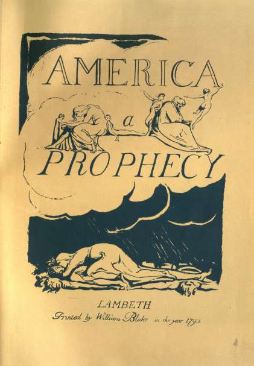

## Page 2

Contents
1
Abstract
5
2
Introduction: The Convergence of Prophetic Vision and Experimental Inquiry
6
2.1
The Unlikely Dialogue Between Prophecy and Empiricism . . . . . . . . . . . . . . . . . . . .
6
2.2
The Thesis: Six Structural Convergences . . . . . . . . . . . . . . . . . . . . . . . . . . . . . .
6
2.3
America a Prophecy as Central Primary Source . . . . . . . . . . . . . . . . . . . . . . . . . .
7
2.4
The Active Inference Bridge: From Prophetic Vocabulary to Formal Process Theory
. . . . .
7
2.5
Method, Organization, and Interpretive Framework . . . . . . . . . . . . . . . . . . . . . . . .
12
3
Blake’s Epistemology: Prophetic Cognition Against the Empire of Abstract Reason
13
3.1
Radical Dissent and the Prophetic Rejection of Lockean Empiricism
. . . . . . . . . . . . . .
13
3.1.1
Radical Protestant Origins and the Antinomian Inheritance . . . . . . . . . . . . . . .
13
3.1.2
Blake in Johnson’s Revolutionary Circle: London’s Radical Intelligentsia . . . . . . . .
13
3.1.3
America a Prophecy as the Artistic Crystallization of Revolutionary Praxis
. . . . . .
14
3.1.4
The Anti-Lockean Manifesto: Innate Ideas, Active Perception, and Newton’s Sleep . .
14
3.1.5
Swedenborg’s Influence and Blake’s Turn from Spectator to Activist Epistemology . .
15
3.1.6
America a Prophecy as Anti-Lockean Epistemological Praxis . . . . . . . . . . . . . . .
15
3.2
Fourfold Vision and the Epistemological Doctrine of Contraries . . . . . . . . . . . . . . . . .
16
3.2.1
The Fourfold Hierarchy: From Newton’s Sleep to Supreme Delight . . . . . . . . . . .
16
3.2.2
Contrary States and Organized Innocence in Songs of Innocence and of Experience . .
16
3.2.3
America a Prophecy and the Full Spectrum of Visionary Perception
. . . . . . . . . .
16
3.2.4
Perception as Embodied Production in Visions of the Daughters of Albion . . . . . . .
17
3.2.5
Complexity Theory, Dynamical Systems, and the Physics of Fourfold Vision . . . . . .
17
3.3
The Four Zoas: Blake’s Pre-Freudian Mythological Cognitive Architecture . . . . . . . . . . .
19
3.3.1
Urizen, Luvah, Los, and Tharmas: The Fourfold Architecture of the Mind . . . . . . .
19
3.3.2
Los as the Generative Principle: Prophetic Imagination and Creative Labor . . . . . .
19
3.3.3
The Primal Orc–Urizen Dialectic: Passion Unchained Against Frozen Reason . . . . .
19
3.3.4
The Fall as Cognitive Fragmentation: From Joint Inference to Mean-Field Factorization 20
3.3.5
Building Jerusalem: Apocalyptic Re-Integration of the Factorized Model . . . . . . . .
20
3.4
The Doors of Perception and Imagination as Existence . . . . . . . . . . . . . . . . . . . . . .
23
3.4.1
The Materialist Delusion: Nature as an Abstract Phantom
. . . . . . . . . . . . . . .
23
3.4.2
The American Transmission from Blake to Huxley . . . . . . . . . . . . . . . . . . . .
23
3.4.3
Cleansing the Doors: Escaping the Cave of Materialist Empiricism . . . . . . . . . . .
23
3.4.4
The Imaginative Faculty: Active Construction of the Experienced World . . . . . . . .
24
3.4.5
Fractal Epistemology and Deep Temporal Modeling
. . . . . . . . . . . . . . . . . . .
24
3.4.6
The Proverbs of Hell as Compressed Epistemological Maxims . . . . . . . . . . . . . .
25
3.5
Illuminated Printing: Pragmatism and Epistemology as Artistic Practice . . . . . . . . . . . .
26
3.5.1
Unity of Artistic Conception and Material Execution . . . . . . . . . . . . . . . . . . .
26
3.5.2
The Relief Etching Process: Integrating Conceptualization and Execution . . . . . . .
26
3.5.3
America a Prophecy as a Material, Active Object in the World
. . . . . . . . . . . . .
26
3.5.4
Mitchell on Composite Art and the Energetic Rivalry
. . . . . . . . . . . . . . . . . .
27
3.5.5
The Blake Archive and Digital Epistemological Practice . . . . . . . . . . . . . . . . .
27
3.5.6
Peirce’s Triadic Semiotics and the Illuminated Plate . . . . . . . . . . . . . . . . . . .
27
3.5.7
Prophetic Self-Publishing Against the Commercial Epistemic Monopolies
. . . . . . .
27
4
American Pragmatism and Rejecting the Spectator Theory of Knowledge
29
4.1
The Metaphysical Club and the Darwinian Epistemological Catalyst . . . . . . . . . . . . . .
29
4.1.1
Origins of the Metaphysical Club in Cambridge . . . . . . . . . . . . . . . . . . . . . .
29
4.1.2
The Darwinian Catalyst: Evolution as Pragmatic Engine
. . . . . . . . . . . . . . . .
29
4.2
Neopragmatism: The Social Self and the Linguistic Turn . . . . . . . . . . . . . . . . . . . . .
30
4.3
Charles Sanders Peirce (1839–1914): The Architectonic Logician
. . . . . . . . . . . . . . . .
31
4.3.1
Peirce’s Pragmatic Maxim and the Fixation of Belief . . . . . . . . . . . . . . . . . . .
31
4.3.2
Truth as “What Works”: The Cash-Value of Ideas in Experience . . . . . . . . . . . .
31

## Page 3

4.3.3
Fallibilism and Anti-Cartesianism . . . . . . . . . . . . . . . . . . . . . . . . . . . . . .
31
4.3.4
The Fixation of Belief . . . . . . . . . . . . . . . . . . . . . . . . . . . . . . . . . . . .
31
4.3.5
The Self-Correcting Cycle: Abduction, Deduction, and Induction . . . . . . . . . . . .
32
4.3.6
Semiotics: The Triadic Sign . . . . . . . . . . . . . . . . . . . . . . . . . . . . . . . . .
32
4.3.7
Pragmaticism . . . . . . . . . . . . . . . . . . . . . . . . . . . . . . . . . . . . . . . . .
32
4.4
William James (1842–1910): The Great Mediator . . . . . . . . . . . . . . . . . . . . . . . . .
32
4.4.1
The Present Dilemma
. . . . . . . . . . . . . . . . . . . . . . . . . . . . . . . . . . . .
33
4.4.2
The Pragmatic Theory of Truth
. . . . . . . . . . . . . . . . . . . . . . . . . . . . . .
33
4.4.3
The Will to Believe . . . . . . . . . . . . . . . . . . . . . . . . . . . . . . . . . . . . . .
33
4.4.4
Jamesian Pragmatism: Truth as Verification and Radical Empiricism . . . . . . . . . .
33
4.4.5
Pluralism and the Individual
. . . . . . . . . . . . . . . . . . . . . . . . . . . . . . . .
33
4.5
John Dewey (1859–1952): The Democratic Experimentalist
. . . . . . . . . . . . . . . . . . .
33
4.5.1
Instrumentalism and the Theory of Inquiry . . . . . . . . . . . . . . . . . . . . . . . .
34
4.5.2
Experience as Nature: The Critique of Epistemological Dualisms . . . . . . . . . . . .
34
4.5.3
Democracy and Education . . . . . . . . . . . . . . . . . . . . . . . . . . . . . . . . . .
34
4.5.4
Art as Experience
. . . . . . . . . . . . . . . . . . . . . . . . . . . . . . . . . . . . . .
34
4.5.5
Warranted Assertibility
. . . . . . . . . . . . . . . . . . . . . . . . . . . . . . . . . . .
34
4.6
The Second Generation
. . . . . . . . . . . . . . . . . . . . . . . . . . . . . . . . . . . . . . .
34
4.6.1
From Mead’s Social Behaviorism to Brandom’s Inferentialism . . . . . . . . . . . . . .
34
4.7
The Transitional Generation: From Classical Pragmatism to Neopragmatism
. . . . . . . . .
35
4.7.1
W.V.O. Quine (1908–2000): Two Dogmas and the Seeds of Anti-Representationalism .
35
4.7.2
C.I. Lewis (1883–1964): The Pragmatic A Priori . . . . . . . . . . . . . . . . . . . . .
35
4.8
The Neopragmatist Revival . . . . . . . . . . . . . . . . . . . . . . . . . . . . . . . . . . . . .
35
4.8.1
Richard Rorty (1931–2007)
. . . . . . . . . . . . . . . . . . . . . . . . . . . . . . . . .
35
4.8.2
Hilary Putnam (1926–2016) . . . . . . . . . . . . . . . . . . . . . . . . . . . . . . . . .
35
4.8.3
Robert Brandom (b. 1950)
. . . . . . . . . . . . . . . . . . . . . . . . . . . . . . . . .
36
4.8.4
Cornel West: Prophetic Pragmatism . . . . . . . . . . . . . . . . . . . . . . . . . . . .
36
4.9
Core Themes . . . . . . . . . . . . . . . . . . . . . . . . . . . . . . . . . . . . . . . . . . . . .
36
4.10 The Genealogy of Pragmatism
. . . . . . . . . . . . . . . . . . . . . . . . . . . . . . . . . . .
36
5
The Six Convergences: Translating Poetic Myth into Philosophic Method
38
5.1
Convergence 1: Active Inquiry—Blake’s Cleansed Doors and Peirce’s Method of Science . . .
38
5.1.1
Two Parallel Models of Intellectual Liberation . . . . . . . . . . . . . . . . . . . . . . .
38
5.1.2
Peirce’s Four Methods and Blake’s Four Visions Aligned . . . . . . . . . . . . . . . . .
38
5.1.3
The Prophetic and Pragmatic Interventions: Shaking the Mental Chains . . . . . . . .
39
5.1.4
Peirce’s Cable Metaphor and Blake’s Living System
. . . . . . . . . . . . . . . . . . .
39
5.1.5
Against the Cartesian Manufacture of Universal Doubt . . . . . . . . . . . . . . . . . .
39
5.1.6
The Rejection of Authority and the Refusal of Passive Reception . . . . . . . . . . . .
40
5.1.7
Inquiry as Organism-Environment Transaction and Adaptation . . . . . . . . . . . . .
40
5.1.8
Fallibilism, Fourfold Vision, and the Refusal of Monopoly . . . . . . . . . . . . . . . .
40
5.2
Convergence 2: Truth as Living Process—Jamesian Verification and Blakean Consequence . .
43
5.2.1
The Scandal of Pragmatic Truth in Philosophy . . . . . . . . . . . . . . . . . . . . . .
43
5.2.2
Truth “Happens” to an Idea: The Cash-Value of Generative Modeling . . . . . . . . .
43
5.2.3
Blake’s Pragmatic Reversal: “What is now proved was once, only imagin’d” . . . . . .
43
5.2.4
James’s Living Truth and Blake’s Dynamic Vision
. . . . . . . . . . . . . . . . . . . .
43
5.2.5
The Will to Believe and the Will to Create
. . . . . . . . . . . . . . . . . . . . . . . .
44
5.2.6
Dewey’s Warranted Assertibility and Blake’s Anti-Newtonian Critique . . . . . . . . .
44
5.2.7
The Entanglement of Fact, Value, and Thick Concepts . . . . . . . . . . . . . . . . . .
44
5.2.8
Imagination as the Agent’s Generative Model . . . . . . . . . . . . . . . . . . . . . . .
45
5.2.9
Regulative Hope and Blake’s Eschatological Vision . . . . . . . . . . . . . . . . . . . .
45
5.3
Convergence 3: Experience as Transaction—Dewey’s Organism and Blake’s Doors of Percep-
tion, and the Destruction of the Five Gates . . . . . . . . . . . . . . . . . . . . . . . . . . . .
46
5.3.1
The Rejection of the Inner Theater and the Rise of Transactional Ecology . . . . . . .
46
5.3.2
Experience as Aesthetic Production: Making the World Visible . . . . . . . . . . . . .
47
3

## Page 4

5.3.3
Art as Experience in Dewey and Blake’s Workshop . . . . . . . . . . . . . . . . . . . .
49
5.3.4
The Pedagogy of Perception and Learning to See . . . . . . . . . . . . . . . . . . . . .
49
5.3.5
The Phenomenological and Enactivist Connection
. . . . . . . . . . . . . . . . . . . .
50
5.4
Convergence 4: Social Selves and Collectives—Mead’s Generalized Other and Blake’s Albion,
and the Thirteen Angels Who Descend . . . . . . . . . . . . . . . . . . . . . . . . . . . . . . .
51
5.4.1
The Social Constitution of the Self in Philosophy . . . . . . . . . . . . . . . . . . . . .
51
5.4.2
The “I” and the “Me” in the Fiery Forge: Reconstituting the Social Self . . . . . . . .
52
5.4.3
Rebuilding Jerusalem: Action as Social Coordination and Multi-Agent Convergence
.
54
5.4.4
Addams, West, and Blake’s Prophetic Social Praxis . . . . . . . . . . . . . . . . . . . .
54
5.4.5
The Enduring Social Vision and Multi-Agent Inference . . . . . . . . . . . . . . . . . .
55
5.5
Convergence 5: Anti-Representationalism—Rorty, Brandom, Putnam, and Blake’s Refusal to
“Reason and Compare” . . . . . . . . . . . . . . . . . . . . . . . . . . . . . . . . . . . . . . . .
56
5.5.1
Anti-Representationalism: Rorty and Blake . . . . . . . . . . . . . . . . . . . . . . . .
56
5.5.2
Vocabularies and Systems . . . . . . . . . . . . . . . . . . . . . . . . . . . . . . . . . .
56
5.5.3
Brandom’s Inferentialism and Blake’s Semiotic Cosmos
. . . . . . . . . . . . . . . . .
57
5.5.4
Putnam’s Fact/Value Collapse and The Marriage of Heaven and Hell
. . . . . . . . .
58
5.5.5
Haack’s Foundherentism and the Crossword of Vision
. . . . . . . . . . . . . . . . . .
58
5.5.6
Inferentialism in Practice: America a Prophecy as a Space of Reasons
. . . . . . . . .
58
5.6
Convergence 6: Synergetics and Pragmatic Geometry—Fuller, Bridgman, and the Geometry
of Fourfold Vision
. . . . . . . . . . . . . . . . . . . . . . . . . . . . . . . . . . . . . . . . . .
59
5.6.1
Fuller and the Pragmatic Tradition . . . . . . . . . . . . . . . . . . . . . . . . . . . . .
59
5.6.2
Fuller’s Synergetics: A Geometry of Action and Experience . . . . . . . . . . . . . . .
59
5.6.3
Operationalism: Bridgman’s Operations and Chang’s Iterative Verification
. . . . . .
61
5.6.4
The Synergetics-Pragmatism-Blake Triad
. . . . . . . . . . . . . . . . . . . . . . . . .
62
5.6.5
Applewhite and the Architecture of Collaboration
. . . . . . . . . . . . . . . . . . . .
63
5.6.6
Kirby Urner and the Digital Continuation . . . . . . . . . . . . . . . . . . . . . . . . .
63
5.6.7
America a Prophecy: Synergetics and Global Propagation . . . . . . . . . . . . . . . .
63
5.6.8
Toward a Pragmatic Geometry . . . . . . . . . . . . . . . . . . . . . . . . . . . . . . .
64
6
Active Inference: The Mathematical Formalization of Pragmatic Visionary Epistemology 65
6.0.1
The Triadic Synthesis: Connecting Blake, Pragmatism, and Friston . . . . . . . . . . .
65
6.0.2
The Free Energy Principle: A Primer on Action and Belief
. . . . . . . . . . . . . . .
65
6.0.3
The Nine Correspondences: A Formal Mapping Atlas
. . . . . . . . . . . . . . . . . .
66
6.0.4
Detailed Mappings of the Triadic Synthesis . . . . . . . . . . . . . . . . . . . . . . . .
67
6.0.5
From Enactivism to Pragmatic Active Inference: Grounding the Models . . . . . . . .
71
6.0.6
The Enduring Memes: A Triple Convergence of Thought . . . . . . . . . . . . . . . . .
72
7
Conclusion: From Newton’s Sleep to Rebuilding Jerusalem—An Integrated Vision of
Perception and Action
73
7.0.1
Summary of the Convergences
. . . . . . . . . . . . . . . . . . . . . . . . . . . . . . .
73
7.0.2
The Active Inference Formalization as Unifying Framework (section 6) . . . . . . . . .
73
7.0.3
Implications Across the Disciplines . . . . . . . . . . . . . . . . . . . . . . . . . . . . .
74
7.0.4
Expanding the Synthesis: Future Directions . . . . . . . . . . . . . . . . . . . . . . . .
75
7.0.5
Final Considerations: The Endless Work of Jerusalem . . . . . . . . . . . . . . . . . .
76
8
Supplemental: America a Prophecy (Plaintext)
78
4

## Page 5

1
Abstract
When Boston’s Angel in William Blake’s America a Prophecy (1793) declares “No more I follow, no more
obedience pay!” and the Thirteen Governors rend their robes to stand with Washington in the revolutionary
flames, Blake enacts a drama of cognition that the American Pragmatists—writing a continent away and a
century later—would formalize as the structure of inquiry itself: the organism confronting a novel encounter,
breaking inherited habit, and forging new modes of engagement with what Dewey called the “indeterminate
situation.” This manuscript traces six structural convergences between Blake’s visionary epistemology and
the pragmatist tradition from Peirce through Brandom. Orc’s revolutionary fire maps onto Peirce’s irrita-
tion of doubt that compels inquiry; the Thirteen Angels’ collective transformation mirrors Mead’s social
self constituted through the generalized other; the consumption of the “five gates of their law-built Heaven”
performs Dewey’s collapse of the spectator theory and James’s insistence that relations are as real as their
relata; and the Four Zoas—Urizen, Luvah, Tharmas, Urthona—function as Blake’s proto-cognitive architec-
ture, anticipating the factorized generative model of Active Inference where reason, passion, sensation, and
imagination must coordinate or the system fragments into what Blake names “Newton’s Sleep.” The sixth
dimension extends the synthesis to Fuller and Applewhite’s Synergetics, where the tetrahedron replaces the
cube as the fundamental unit of spatial thought—a geometric operationalism that parallels Blake’s rejection
of Newtonian-Cartesian abstraction and Peirce’s pragmatic maxim that the meaning of a concept lies entirely
in its conceivable practical effects.
The convergences are not analogical but structural, and this manuscript formalizes them through the math-
ematics of Active Inference—the process theory of the Free Energy Principle—in which the Markov blanket
becomes Blake’s doors of perception, the generative model becomes imagination as “Human Existence it-
self,” precision weighting distributes cognitive authority across the Zoas, and multi-agent belief alignment
formalizes Peirce’s community of inquirers converging toward truth under fallibilistic self-correction. Draw-
ing on the emerging literature connecting pragmatism with predictive processing—Pietarinen and Beni’s
identification of free energy minimization as formalized Peircean abduction, Gallagher’s framing of classi-
cal pragmatism as the conceptual ancestor of enactivism, and the pragmatic turn in cognitive science—the
manuscript positions Blake as a third vertex in a triadic synthesis linking prophetic vision, democratic philos-
ophy, and Bayesian neuroscience. The implications extend from computational psychiatry (Newton’s Sleep
as pathological prior dominance) through digital humanities (the Blake Archive as a semiotic laboratory)
to AI alignment (the Fourfold Vision as a corrective to the single vision of next-token prediction), while
Synergetics and Urner’s computational pedagogy ground the synthesis in an alternative geometry where
thinking, making, and experiencing are operationally inseparable. What emerges is the recognition that
Blake’s prophetic fire, Pragmatism’s self-correcting inquiry, and the science of variational inference are three
refractions of a single ancient light—the light by which self-organizing systems navigate entropy, forging
from the flux of prediction and error the architectures of meaning that make a cosmos out of chaos.
Keywords: William Blake, America a Prophecy, American Pragmatism, Charles Sanders Peirce, William
James, John Dewey, George Herbert Mead, Richard Rorty, Robert Brandom, Hilary Putnam, Buckmin-
ster Fuller, Synergetics, Active Inference, Free Energy Principle, Markov Blanket, Generative Model, 4E
Cognition, Illuminated Printing, Fourfold Vision, Four Zoas, Anti-Representationalism, Operationalism.
5

## Page 6

2
Introduction: The Convergence of Prophetic Vision and Exper-
imental Inquiry
2.1
The Unlikely Dialogue Between Prophecy and Empiricism
At first glance, William Blake (1757–1827)—the visionary poet-painter who conversed with angels, denounced
Newton, and declared “I must Create a System, or be enslav’d by another Man’s”—seems utterly remote
from the hard-headed philosophy of action and inference that Charles Sanders Peirce, William James, and
John Dewey launched in Cambridge, Massachusetts, an ocean away and a half-century after Blake’s death.
Blake was a Romantic mystic; the pragmatists were post-Darwinian naturalists. Blake attacked empiricism
as “Newton’s sleep”; the pragmatists embraced “the empiricist attitude.”[Peirce, 1877] Blake prophesied in
illuminated etchings; Peirce formalized in symbolic logic.
And yet the distance collapses under examination.
Both Blake and the pragmatists mount a sustained
assault on the same philosophical target: the spectator theory of knowledge—the Cartesian-Lockean
picture of the mind as a passive mirror or dark chamber receiving impressions from an external world. For
Blake, this is the sin of Urizen, the tyrannical Reason-God who “closed himself up, till he sees all things
thro’ narrow chinks of his cavern.”[Blake, 1790] For Dewey, it is the core error of Western philosophy from
Plato to positivism, the assumption that knowing is contemplating rather than doing. For Peirce, it is the
fatal conceit of Cartesian foundationalism—pretending “to doubt in philosophy what we do not doubt in our
hearts.”[Peirce, 1877]
2.2
The Thesis: Six Structural Convergences
This manuscript argues that Blake’s visionary epistemology and American Pragmatism share not merely
superficial affinities but deep structural convergences across six qualitative dimensions:
1. Inquiry as Active Engagement — Both traditions reject the model of the mind as a passive
receptacle. Blake’s demand to “cleanse the doors of perception” and Peirce’s rigorous “Method of
Science” for fixing belief both frame knowledge-generation as an active, world-altering experimentation
rather than passive observation.
2. Truth as Living Process — Far from a static correspondence to an external world, truth is treated
as dynamic and processual. James’s pragmatic claim that “the true is only the expedient in the way of
our thinking” shares deep structural DNA with Blake’s axiom that “what is now proved was once only
imagined”—both insist that truth is entangled with human activity and future consequences.[James,
1907]
3. Experience as Transaction — The classical dualism separating the knowing subject from the known
object is collapsed.
Dewey’s transactional theory of experience (“life goes on in an environment…
through interaction with it”) provides the philosophical articulation of the same integrated state Blake
sought through his fourfold vision and the opening of the “doors of perception.”[Dewey, 1934]
4. The Social Constitution of the Self — Neither framework begins with an isolated Cartesian ego.
George Herbert Mead’s concept of the “generalized other”—where the self emerges only through social
relations—is the sociological equivalent of Blake’s Albion, the Universal Man who is simultaneously
individual and collective.
5. Anti-Representationalism — Both traditions mount a sustained attack on language as mere tran-
scription. Richard Rorty’s rejection of the “mind-as-mirror” finds its poetic predecessor in Blake’s
fierce refusal to “Reason & Compare,” asserting instead that “my business is to Create.” Thoughts
and words are tools for coping with reality, not lenses for copying it.[Rorty, 1991]
6. Synergetics and Pragmatic Geometry — Buckminster Fuller’s Synergetics extends pragmatist
operationalism into the foundational mathematics of geometry. Fuller’s substitution of the dynamic
tetrahedron for the static Cartesian cube is the geometric parallel of Blake’s rejection of “Newton’s
Sleep,” moving from sterile abstraction toward a lived, energetic coordinate system.[Fuller, 1975]
6

## Page 7

These six qualitative convergences — traversing epistemology, metaphysics, philosophy of mind, social theory,
philosophy of language, and the foundations of geometry — are then incipiently formalized through Active
Inference (section 6). This formalization expands the thematic convergences into a precise atlas of nine
structural correspondences, mapping Blake’s mythological vocabulary onto pragmatist philosophy and
Bayesian neuroscience with mathematical rigor.
2.3
America a Prophecy as Central Primary Source
Throughout this manuscript, we take Blake’s America a Prophecy (1793) as our central primary source—a
work that dramatizes every convergence theme in mythological register.[Blake, 1793a] Composed in the same
year as the Reign of Terror and the execution of Louis XVI, America is Blake’s first and most concentrated
“Continental Prophecy”—a genre he invented to explore the revolutionary upheavals of the late eighteenth
century through mythological narrative. In the poem, the revolutionary spirit Orc confronts Urizen’s tyran-
nical order; the Thirteen Angels of the American colonies shake off their “mental chains” and descend to
stand with Washington, Paine, and Warren; Boston’s Angel demands to know “Who commanded this? What
God? What Angel? / To keep the gen’rous from experience”—a question that could serve as the epigraph
for the entire pragmatist tradition. The poem culminates in the consumption of “the five gates of their
law−built Heaven,” an image of perceptual liberation that anticipates everything from Peirce’s rejection
of Cartesian foundationalism to Dewey’s transactional aesthetics. America is not merely a political poem
but a philosophical programme in prophetic form—one whose structure, we argue, maps precisely onto the
pragmatist account of inquiry, truth, experience, social selfhood, and anti-representationalism.
Washington, Paine, and Warren are depicted here not as passive victims of historical circumstance, but
as active “terrible men” bracing against the storm of Urizenic law. The illustration visualizes lines 4–9 of
America a Prophecy, showing children sheltered by these figures whose “foreheads rear’d toward the East”
embody the pragmatist orientation toward future consequences and active inquiry over passive reception.
2.4
The Active Inference Bridge: From Prophetic Vocabulary to Formal Process
Theory
Having established these deep structural convergences, we further propose that Active Inference—a pro-
cess theory grounded in the Free Energy Principle—provides the formal mathematical framework in which
these convergences become precise.[Friston, 2006, 2010] Active Inference describes self-organizing systems
as minimizing variational free energy 𝐹through perception (updating beliefs 𝑞(𝑥)) and action (changing
the environment to match predictions). This dual process is exactly the unity of knowing and doing that
both Blake and the pragmatists advocate. The Markov blanket 𝐵= {𝑠, 𝑎} formalizes Blake’s “doors of
perception”; the hierarchical generative model 𝑝(𝑜, 𝜃) formalizes his dictum that “Imagination is Human Ex-
istence itself”; and the pragmatist community of inquirers finds its analogue in multi-agent Active Inference,
where convergent beliefs (𝐷𝐾𝐿(𝑞𝑖‖𝑞𝑗) →0) formalize Peirce’s definition of truth as “the opinion fated to be
ultimately agreed to by all who investigate.”[Parr et al., 2022]
This triadic synthesis is supported by an emerging body of scholarship that has begun to formalize the very
bridge we construct. Pietarinen and Beni’s work demonstrates that active inference implements Peirce’s
abductive logic: free energy minimization is formalized abduction under a generative model, with prediction
error serving as the trigger for hypothesis generation.[Pietarinen and Beni, 2021] Gallagher frames classi-
cal pragmatism as the “conceptual ancestor” of enactivism and predictive processing, arguing that Peirce’s
doubt–belief dynamics and Dewey’s transactional theory of experience already contain the core commitments
that active inference now formalizes computationally.[Gallagher, 2022] And Pietarinen and Beni’s “Beyond
Bayesian Accuracy” programme argues that rationality under the FEP should be measured not by abstract
accuracy but by Peirce’s skill scores—context-sensitive forecasting success—recasting free energy minimiza-
tion as a pragmatist optimization of skillful coping rather than veridical representation.[Pietarinen and
Beni, 2024] Ramstead, Friston, and Hipólito’s programme of variational semiotics further maps Peirce’s sign
triad (icon, index, symbol) onto generative model components (A-matrices, B-matrices, shared higher-order
models), revealing that Peirce’s semiotics was already, in its deep structure, a theory of generative model-
ing.[Ramstead et al., 2020] Our manuscript converges with and extends this literature by adding Blake’s
7

## Page 8

Figure 1: Mosaic of Illuminated Pages from America a Prophecy. Composite of twenty plates from America
a Prophecy (Lambeth Printed Books, 1793), revealing the full scope of Blake’s integration of text and image
in illuminated printing — a process that physically unifies conception and execution in the way Dewey’s
aesthetic theory demands.
8

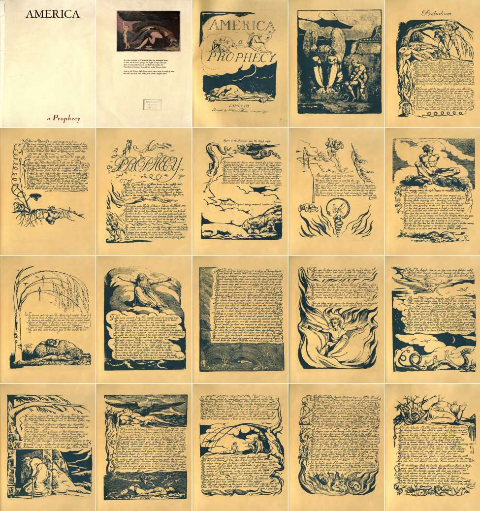

## Page 9

Figure 2: Blake × Pragmatism Correspondence Matrix. Dendrogram-ordered heatmap of qualitative, in-
formal estimates of correspondence strengths between Blake’s themes and the central tenets of American
Pragmatism, clustered by hierarchical similarity. Numerical values reflect personal judgment rather than
empirical measurement — heuristic starting points for further systematic investigation. Darker regions indi-
cate stronger convergence; dendrogram branches reveal thematic families.
9

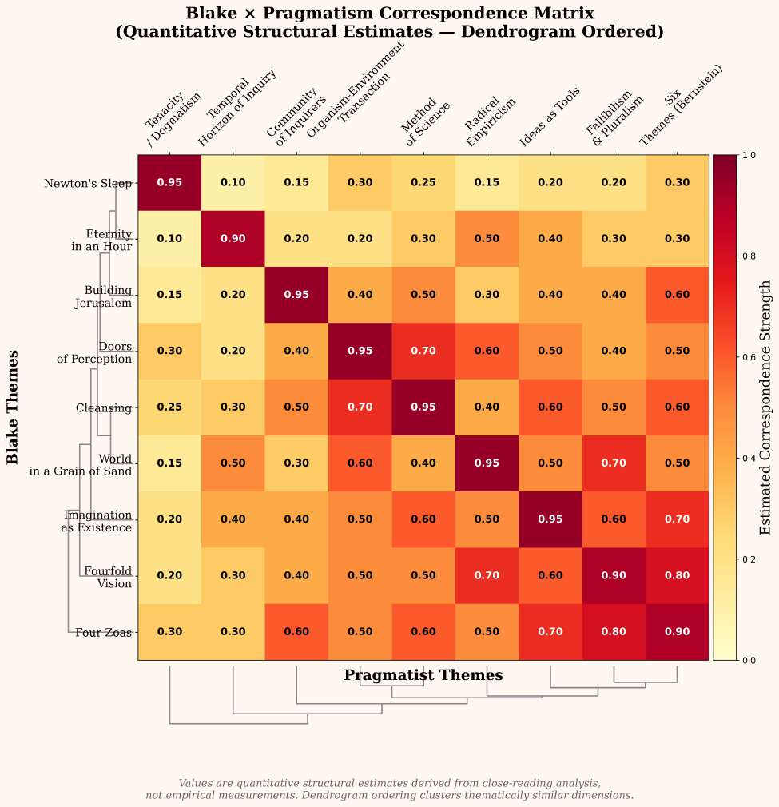

## Page 10

Figure 3: The Shores of Revolution. Washington, Paine, and Warren brace against the storm of Urizenic
law. America a Prophecy, lines 4–9; AI-generated illustration.
10

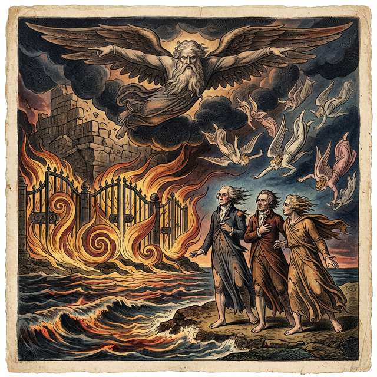

## Page 11

Figure 4: Frontispiece to America a Prophecy. Blake’s frontispiece depicts a chained, despairing figure —
often identified as Orc bound upon the Rock of Ages — caught between monumental stone pillars, while a
smaller figure looks on in anguish. Lambeth Printed Books, 1793.
11

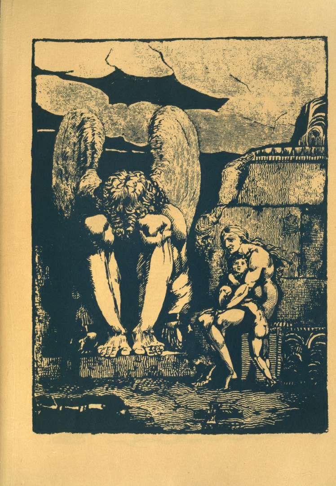

## Page 12

visionary epistemology as a third vertex.
2.5
Method, Organization, and Interpretive Framework
The manuscript proceeds as follows. Section 2 presents Blake’s visionary epistemology in five sub-sections:
radical dissent and the anti-Lockean revolution, Fourfold Vision and the doctrine of contraries, the Four
Zoas as mythological cognitive architecture, the “doors of perception” and imagination as existence, and
illuminated printing as epistemological practice—drawing on Northrop Frye’s Fearful Symmetry (1947), S.
Foster Damon’s A Blake Dictionary (1965), David V. Erdman’s Blake: Prophet Against Empire (1954; 3rd
rev. 1977), W.J.T. Mitchell’s Blake’s Composite Art (1978), and Joseph Viscomi’s Blake and the Idea of
the Book (1993). Section 3 provides a comprehensive account of American Pragmatism from Peirce’s Meta-
physical Club (c. 1871–1879) through the neopragmatists, informed by Louis Menand’s The Metaphysical
Club (2001), Cheryl Misak’s The American Pragmatists (2013), and Richard Bernstein’s The Pragmatic Turn
(2010). Section 4 develops the six convergence dimensions in detail—active inquiry, truth as living process,
experience as transaction, social selves, anti-representationalism, and synergetics—each grounded in primary
textual analysis of America a Prophecy. Section 5 introduces Active Inference as the formal bridge, drawing
on Parr, Pezzulo, and Friston’s Active Inference (2022) as the primary technical reference and mapping nine
structural correspondences in a triadic synthesis atlas. Section 6 concludes with implications for philosophy
of mind, education, aesthetics, artificial intelligence, and social theory.
Throughout, we employ verified primary source quotations from Erdman’s edition and maintain fidelity to
the scholarly traditions of both Blake studies and pragmatist philosophy. Our method is one of structural cor-
respondence—identifying shared topological features across distinct intellectual systems—rather than causal
influence or historical genealogy. We adopt the phenomenological and enactivist traditions (Merleau-Ponty,
Varela, Thompson, Rosch) as additional interpretive resources, recognizing that the 4E cognition framework
(Embodied, Embedded, Enactive, Extended) provides contemporary cognitive-scientific grounding for the
convergences we identify.[Gallagher, 2017, Engel et al., 2016] As Clark’s foundational review of predictive
brains and situated agents demonstrates, the computational machinery of prediction and active sensing now
supplies the empirical backbone for what pragmatists and enactivists have long argued philosophically.[Clark,
2013]
12

## Page 13

3
Blake’s Epistemology: Prophetic Cognition Against the Empire
of Abstract Reason
3.1
Radical Dissent and the Prophetic Rejection of Lockean Empiricism
“Sound! sound! my loud war-trumpets, and alarm my Thirteen Angels!” — William Blake,
America a Prophecy, Plate 5 [Erdman 51][Blake, 1793a, Erdman, 1988]
3.1.1
Radical Protestant Origins and the Antinomian Inheritance
Blake’s epistemology did not emerge from the academy; it emerged from the radical Protestant underground.
E.P. Thompson’s landmark Witness Against the Beast: William Blake and the Moral Law (1993) traced
Blake’s intellectual genealogy back through the English sectarian communities of the seventeenth century—
Ranters, Muggletonians, and antinomian artisans who transmitted their ideas through printing workshops
and dissenting chapels in London well into Blake’s own lifetime.[Thompson, 1993] Thompson demonstrated
that Blake inherited the antinomian conviction—literally, “against the law”—that the Mosaic commandments
and the Gospel of Jesus are fundamentally opposed: the former representing prohibition, repression, and the
rule of “Reason”; the latter embodying forgiveness, desire, and imaginative freedom.
The Muggletonians are especially significant.
Founded by John Reeve and Lodowick Muggleton in the
1650s, they identified “Reason” as a satanic principle—a theological position that Blake transfigured into his
mythological figure Urizen, a near-homophone of “your reason” (Damon 1965, s.v. “Urizen”).[Damon, 1965]
Thompson conceded that direct documentary evidence linking Blake to the Muggletonians is absent, but he
meticulously established that the structural parallels—the Fall as the triumph of Reason over Imagination,
the hostility to philosophical rationalism, the identification of institutional religion with spiritual oppression—
“are too precise to be coincidental.”[Thompson, 1993] This radical dissenting inheritance separates Blake from
a merely philosophical anti-empiricist. His rejection of Locke is not an academic disagreement but a spiritual
insurgency—rooted in the same tradition that produced the Levellers, the Diggers, and the antinomian
communities that flourished during the English Civil War.
Crucially, as Harry White has demonstrated, Blake’s target was never science itself but “Abstract Philos-
ophy” which, Blake declared, was “warring in enmity against Imagination” while opposing both art and
science.[White, 2005] Blake wrote that “Arts & Sciences are the Destruction of Tyrannies or Bad Govern-
ments” and envisioned The Four Zoas concluding with “the dark Religions are departed & sweet Science
reigns”—a formulation of what he called “sweet Science,” a mode of knowledge pursuit in happy dialogue
with the imagination.[White, 2005, Erdman, 1988] This distinction is vital: Blake’s quarrel with Newton
and Locke is not a rejection of empirical investigation but of the dogmatic abstractions that sever science
from the experiential ground in which it must be rooted. Already in 1788, Blake had declared the principle
underlying his entire epistemology: “As the true method of knowledge is experiment the true faculty of
knowing must be the faculty which experiences. This faculty I treat of” (All Religions Are One).[Blake, 1788,
Erdman, 1988] This axiom anticipates Peirce’s pragmatic maxim by ninety years and Bridgman’s operational
definitions by nearly a century and a half.
3.1.2
Blake in Johnson’s Revolutionary Circle: London’s Radical Intelligentsia
David V. Erdman’s definitive Blake: Prophet Against Empire (1954; 3rd rev. ed. 1977) established that
Blake was no isolated mystic but a politically engaged radical who moved in the most dangerous intellectual
circles of 1790s London.[Erdman, 1954] Blake frequented the weekly dinners at Joseph Johnson’s bookshop
in St Paul’s Churchyard—the publisher who served as the hub connecting Mary Wollstonecraft, William
Godwin, Joseph Priestley, and Thomas Paine. Erdman documented that when the Pitt government issued a
warrant for Paine’s arrest for seditious libel after Rights of Man (1791–92), Blake personally warned Paine,
enabling his escape to France.[Erdman, 1954]
Blake’s annotations to Bishop Richard Watson’s An Apology for the Bible (1798)—a rebuttal of Paine’s The
Age of Reason—reveal the depth of his allegiance:
13

## Page 14

“Paine is either a Devil or an Inspired Man. … I have read this Book with attention & find that
the Bishop has not answered one of Paine’s grand objections.” — Blake, annotations to Watson
[Erdman 611][Erdman, 1988]
And elsewhere: “Paine is a better Christian than the Bishop.”[Erdman, 1988] These are the polemics of a
man who understood that epistemological liberation and political liberation are the same struggle.
3.1.3
America a Prophecy as the Artistic Crystallization of Revolutionary Praxis
America a Prophecy (1793), etched on eighteen copper plates in Blake’s Lambeth workshop, is the artistic
crystallization of this political milieu.[Blake, 1793a] The poem was composed during the period when Blake
reportedly wore the red Phrygian cap of the Jacobins in the streets of London—and when doing so could lead
to arrest.[Erdman, 1954] Erdman characterized America as Blake’s “literary campaign against the political
tyranny of the day,” reading it as a direct response to the British government’s suppression of radical dissent
following the outbreak of war with revolutionary France in February 1793.[Erdman, 1954]
The poem is structured in two parts: a Preludium (Plates 1–4), in which the revolutionary spirit Orc breaks
free from his chains on the mountains of Atlantis, and the Prophecy proper (Plates 5–18), in which the
American Revolution is narrated as a mythological confrontation between Orc’s liberating fire and Urizen’s
frozen law.[Erdman, 1988] As Erdman demonstrated, Blake transforms Washington, Paine, Franklin, Warren,
Allen, Gates, and Lee from historical actors into mythological agents of perceptual revolution—the “terrible
men” who “stand on the shores” with “foreheads rear’d toward the East” (Plate 5; Erdman 51):
“For terrible men stand on the shores, and in their robes I see Children take shelter from the
lightnings: there stands Washington, And Paine, and Warren, with their foreheads rear’d toward
the East” — America a Prophecy, Plate 5 [Erdman 51][Blake, 1793a, Erdman, 1988]
The children “take shelter from the lightnings”—they are acted upon by forces they do not comprehend. But
the “terrible men” rear their foreheads toward the storm. This is the Blakean epistemological posture: not
the Lockean mind passively receiving impressions, but the prophetic mind actively confronting the forces
that shape experience.
3.1.4
The Anti-Lockean Manifesto: Innate Ideas, Active Perception, and Newton’s Sleep
Blake’s epistemology is, at its core, a radical rejection of the Lockean model of the mind as a tabula rasa—a
blank slate passively receiving sense impressions from an external world. Where Locke proposed that there
is nothing in the mind that was not first in the senses, Blake insisted that perception is always already
shaped by the imaginative faculty of the perceiver. “As a man is, so he sees,” Blake wrote to Reverend
Dr. Trusler on 23 August 1799 (Erdman 702)—a formulation that anticipates by two centuries the Active
Inference principle that perception is inference, conditioned by the generative model of the agent.[Erdman,
1988]
Blake’s annotations to Joshua Reynolds’s Discourses (c. 1808) contain his most explicit philosophical attack
on Lockean empiricism:
“Innate Ideas are in Every Man, Born with him; they are truly Himself. The Man who says that
we have No Innate Ideas must be a Fool & Knave, Having No Con-Science or Innate Science.” —
Blake, annotations to Reynolds [Erdman 648][Erdman, 1988]
For Blake, the empiricist reduction of knowledge to sensation was not merely philosophically mistaken but
spiritually catastrophic. It produced “Newton’s Sleep”—a state of contracted, single-vision perception in
which the infinite richness of reality is filtered through the “narrow chinks” of materialist assumptions.
Newton, Locke, and Bacon formed Blake’s anti-trinity—what he called, in Jerusalem (Plate 54), the “three
great teachers of atheism, or Satan’s Doctrine” (Erdman 203)—the architects of a mechanical universe
emptied of imagination, value, and meaning.[Erdman, 1988]
14

## Page 15

3.1.5
Swedenborg’s Influence and Blake’s Turn from Spectator to Activist Epistemology
Blake’s path to his mature epistemology passed through a crucial intermediate stage: his engagement with,
and ultimate rejection of, the Swedish mystic Emanuel Swedenborg. Blake and his wife Catherine attended
the first General Conference of the New Jerusalem Church in London on 13 April 1789—the same year the
Bastille fell—and Blake annotated extensively in Swedenborg’s Divine Love and Divine Wisdom and Divine
Providence.[Thompson, 1993]
But by 1790, Blake had turned against Swedenborg. The Marriage of Heaven and Hell (c. 1790–93)—whose
very title inverts Swedenborg’s Heaven and Hell—is, among other things, a merciless satire of Swedenbor-
gian theology.[Blake, 1790] The rejection is epistemologically decisive: it marks Blake’s transition from a
spectator theology—in which the mystic receives correspondences from a transcendent realm—to an activist
epistemology in which the prophet creates vision through imaginative labor. As Blake wrote: “Without
Contraries is no progression. Attraction and Repulsion, Reason and Energy, Love and Hate, are necessary
to Human existence” (Marriage, Plate 3; Erdman 34).[Blake, 1790, Erdman, 1988]
The distance from Swedenborg to Blake is the same distance the pragmatists would later traverse: from a
correspondence theory of truth to a theory of truth as active construction.
3.1.6
America a Prophecy as Anti-Lockean Epistemological Praxis
The narrative arc of America a Prophecy enacts the anti-Lockean revolution at the level of world history. The
poem opens with the narrator’s own “agèd sight” obscured by “clouds” (Plate 5; Erdman 51)—a Lockean
obstruction that the prophetic vision will burn away.[Blake, 1793a] Saree Makdisi, in William Blake and the
Impossible History of the 1790s (2003), reads the poem’s active posture as Blake’s challenge to the emerging
commodity-form of perception: the idea that knowledge, like goods, is something received from an external
source and passively consumed.[Makdisi, 2003] For Blake, perception is production—the active making of a
world. Makdisi demonstrates that in America, selves and others exist in a “dispersed and mutually dependent
network” that refuses the atomized social space of liberal individualism—an insight that anticipates both
Mead’s social self and Active Inference’s multi-agent generative models.[Makdisi, 2003]
Boston’s Angel’s speech—the poem’s most sustained articulation of the anti-Lockean position—begins at
Plate 9 (Erdman 53):
“Who commanded this? What God? What Angel? To keep the gen’rous from experience till the
ungenerous Are unrestrain’d performers of the energies of nature; Till pity is become a trade, and
generosity a science That men get rich by” — America a Prophecy, Plate 9 [Erdman 53][Blake,
1793a, Erdman, 1988]
This is simultaneously a political accusation and an epistemological manifesto. “To keep the gen’rous from
experience” is the Lockean programme weaponized: not merely claiming that knowledge comes from expe-
rience, but restricting whose experience counts and whose does not. The angel demands to know which
authority has the right to determine the boundaries of legitimate perception—a question that Peirce, a cen-
tury later, would answer with his four Methods of Fixing Belief, concluding that only the Method of Science,
the self-correcting community of inquiry, is free of such arbitrary authority.[Peirce, 1877]
15

## Page 16

3.2
Fourfold Vision and the Epistemological Doctrine of Contraries
“Now I a fourfold vision see, / And a fourfold vision is given to me; / ’Tis fourfold in my supreme
delight, / And threefold in soft Beulah’s night, / And twofold Always. May God us keep / From
single vision, and Newton’s sleep!” — Blake, letter to Thomas Butts, 22 November 1802 [Erdman
722][Erdman, 1988]
3.2.1
The Fourfold Hierarchy: From Newton’s Sleep to Supreme Delight
Blake articulated a hierarchy of perceptual modes in his verse-letter to Thomas Butts of 22 November 1802, a
text that Northrop Frye, in Fearful Symmetry (1947), identified as the kernel of Blake’s entire epistemological
system.[Frye, 1947] The hierarchy maps four levels of cognitive engagement:
Table 1: Blake’s Fourfold Vision: The Hierarchical Integration of
Epistemological Modes. Rather than discarding lower forms of per-
ception, Fourfold Vision subsumes sensory and rational data into
a unified framework—structurally analogous to deep hierarchical
inference.
Level
Vision
Character
Epistemological Mode
Single
Newton’s Sleep
Contracted, mechanical
Sense-data empiricism
Twofold
Ordinary
consciousness
Symbolic, metaphorical
Interpretive understanding
Threefold
Beulah’s night
Emotional, intuitive
Aesthetic-affective knowing
Fourfold
Supreme delight
Visionary, infinite
Integrated imaginative perception
The crucial insight is that Blake does not reject lower vision in favor of higher—he rejects single vision, the
tyranny of one mode over all others. Fourfold vision is the integration of all modes, the state in which reason,
imagination, affect, and sensation coordinate rather than suppress one another. As Frye argued, Blake’s
hierarchy is not a ladder to be climbed but a lens to be widened: “each level includes, rather than supersedes,
those below it.”[Frye, 1947]
3.2.2
Contrary States and Organized Innocence in Songs of Innocence and of Experience
Blake’s doctrine of contraries finds its most accessible expression in Songs of Innocence and of Experience:
Shewing the Two Contrary States of the Human Soul (1794).[Blake, 1794] The work’s subtitle is itself an
epistemological thesis: the soul does not possess a single, fixed mode of apprehension but oscillates between—
and ideally integrates—two fundamentally opposed orientations.
Innocence perceives the world through trust, joy, and the unmediated sense of divine presence. The Lamb
is its emblem. Experience perceives the same world through suspicion, suffering, and the awareness of
institutional oppression. The Tyger is its emblem: “What immortal hand or eye / Could frame thy fearful
symmetry?” The two states do not cancel each other. Both are necessary for full perception.
What Blake calls “Organized Innocence”—the state achieved when experience is passed through rather than
surrendered to—corresponds to the Fourfold Vision: a higher integration that retains the joy of innocence
and the wisdom of experience simultaneously. Frye identified this dialectical structure as Blake’s signature:
not Hegelian Aufhebung, which sublates contraries into a higher unity, but a marriage of contraries in which
both remain alive and in productive tension.[Frye, 1947] “Without Contraries is no progression” (Marriage,
Plate 3; Erdman 34).[Blake, 1790, Erdman, 1988]
3.2.3
America a Prophecy and the Full Spectrum of Visionary Perception
America a Prophecy dramatizes the full spectrum of vision with remarkable precision. Each major figure in
the poem operates at a distinct level of Blake’s perceptual hierarchy:[Blake, 1793a]
16

## Page 17

Albion’s Angel operates in single vision—he apprehends the revolution solely as rebellion to be crushed,
deploying plagues “obedient to his voice” (Plate 12; Erdman 55). His perception is purely reactive: he
cannot imagine the revolution as anything other than a threat to existing order. In Active Inference terms,
his generative model admits only one hypothesis (rebellion →suppress), with all prediction errors assigned
zero precision.
Boston’s Angel achieves at least twofold vision. He sees through the institutional role assigned to him
and poses the poem’s central epistemological question: “Who commanded this? What God? What Angel?
/ To keep the gen’rous from experience” (Plate 9; Erdman 53).[Blake, 1793a, Erdman, 1988] This question
is simultaneously political (who authorized British tyranny?) and epistemological (who has the right to
determine the boundaries of legitimate perception?). His act of “rending off his robe and throwing down his
sceptre / In sight of Albion’s Guardian” (Plate 9; Erdman 53) is a perceptual revolution: he discards the
single-vision uniform of institutional authority.
The Thirteen Angels who “rent off their robes to the hungry wind, and threw their golden sceptres /
Down on the land of America” (Plate 9; Erdman 53–54) achieve something approaching fourfold vision.
They act from integrated perception—rational (recognizing injustice), passionate (indignant), imaginative
(envisioning a new order), and sensory—descending “naked and flaming,” their “lineaments seen / In the deep
gloom; by Washington and Paine and Warren they stood” (Plate 10; Erdman 54).[Blake, 1793a, Erdman,
1988] Their nakedness is not merely dramatic; it signifies the removal of all epistemological filters. They
perceive without mediation.
Orc embodies the eruption of visionary energy against contracted perception. Erdman reads Orc as “the
spirit of revolution” whose fires melt the rigid structures of Urizenic law.[Erdman, 1954] But Orc alone
does not represent fourfold vision—he is Luvah (Passion) unbound, energy without form.
The poem’s
deepest hope lies not in Orc’s triumph but in the cooperation of all perceptual faculties: the Thirteen Angels
(imagination), the historical figures (sensory-practical engagement), and the revolutionary fire (passion)
combine in a composite act that anticipates the full reintegration Blake will develop in his later prophecies.
3.2.4
Perception as Embodied Production in Visions of the Daughters of Albion
Blake’s Visions of the Daughters of Albion (1793)—dated the same year as America and printed from the
same press—presents his most sustained dramatic critique of Lockean perception through the embodied
experience of its protagonist, Oothoon.[Blake, 1793b] Where America stages the epistemological revolution
at the geopolitical scale, Visions stages it at the level of the individual body.
Oothoon’s lament is simultaneously a critique of three Lockean errors:
1. The passivity thesis: Theotormon treats Oothoon as a passive surface upon which experience has
been inscribed—the Lockean blank slate. Because she has been raped by Bromion, he perceives her as
permanently marked, as if experience were a one-way imprint.
2. The single-sense reduction: Bromion reduces the world to what can be possessed and measured—
“single vision” contracted to the quantifiable.
3. “The Eye sees more than the Heart knows”: The poem’s motto (Erdman 45) presents an
epistemological paradox: the eye perceives more than the heart can process—but the heart’s failure to
know is a contraction produced by the ideological machinery of possessive individualism, not an innate
deficiency.[Erdman, 1988]
Oothoon’s response is a manifesto for active, embodied perception: “With what sense does the bee / Form
cells? … With what sense does the parson claim the labour of the farmer?” (Plate 3; Erdman 48).[Blake,
1793b, Erdman, 1988] She argues that perception is not a universal faculty but a mode of engagement specific
to each organism and its world—a proto-pragmatist and proto-Active Inference insight.
3.2.5
Complexity Theory, Dynamical Systems, and the Physics of Fourfold Vision
Mark Lussier’s Romantic Dynamics: The Poetics of Physicality (2000) reads Blake’s Fourfold Vision through
the lens of complexity theory and dynamical systems, arguing that the Romantic poets anticipated twentieth-
century physics by insisting on indeterminacy, nonlinearity, and the irreducibility of the observer to the
17

## Page 18

observed.[Lussier, 2000] Blake’s Fourfold Vision, in this reading, is a structural description of how com-
plex systems generate emergent properties through the interaction of multiple coupled subsystems—each
operating at a different scale.
This is precisely the structure of hierarchical inference in the Active Inference framework: multiple layers of
the generative model, each with its own precision weighting and temporal scale, coordinating to produce a
unified percept. Single vision is a collapsed hierarchy. Fourfold vision is the full hierarchy. Newton’s sleep is
the pathological state in which priors at one level dominate the entire system, suppressing prediction errors
from all other levels.
Saree Makdisi extends this analysis into political economy: Blake’s critique of contracted perception is
inseparable from his critique of the commodity form.[Makdisi, 2003] The reduction of reality to what can be
measured, weighed, and exchanged is the political expression of single vision. Blake’s Fourfold Vision is a
refusal of this reduction at every level: aesthetic, epistemological, political, and spiritual. In America, the five
gates of “law-built Heaven” (Plate 16; Erdman 57) that the Guardians of Europe attempt to shut are precisely
the institutionalization of single vision—the senses reduced to instruments of ideological control.[Blake, 1793a,
Erdman, 1988]
18

## Page 19

3.3
The Four Zoas: Blake’s Pre-Freudian Mythological Cognitive Architecture
“Four Mighty Ones are in every Man; a Perfect Unity / Cannot Exist, but from the Universal
Brotherhood of Eden.” — The Four Zoas, Night I [Erdman 300][Erdman, 1988]
3.3.1
Urizen, Luvah, Los, and Tharmas: The Fourfold Architecture of the Mind
Blake’s major prophetic works—The Four Zoas (c. 1797–1807), Milton (1804–c. 1811), and Jerusalem (1804–
c. 1820)—present a mythological cognitive architecture centered on four “Mighty Ones” who constitute the
Universal Man, Albion. S. Foster Damon, in A Blake Dictionary (1965), called this “the most comprehensive
symbolic psychology before Freud.”[Damon, 1965]
Table 2: The Four Zoas: Blake’s Mythological Architecture of Cog-
nition.
Each Zoa represents a necessary but insufficient faculty.
Their fragmentation constitutes the “Fall,” while their reintegra-
tion forms Blake’s vision of genuine, balanced cognition.
Zoa
Faculty
Element
Compass
Function
Urizen
Reason & Law
Air
South
Establishes regularities
and measurement
Luvah
Passion & Love
Fire
East
Provides affective
valence and energy
Los
(Urthona)
Imagination
Earth
North
Generates creative vision
and prophecy
Tharmas Instinct & Senses
Water
West
Grounds the organism in
bodily experience
Each Zoa possesses an Emanation—a female counterpart representing the Zoa’s outward expression and
relational capacity: Ahania (Urizen’s pleasure in intellectual discovery), Vala (Luvah’s natural beauty),
Enitharmon (Los’s inspiration and spatial form), and Enion (Tharmas’s delight in embodiment). As Damon
documented, when a Zoa is separated from its Emanation, that faculty becomes solipsistic: Urizen without
Ahania is sterile rationalism; Los without Enitharmon is creative fury without form.[Damon, 1965]
3.3.2
Los as the Generative Principle: Prophetic Imagination and Creative Labor
Among the Zoas, Los—the Spirit of Imagination, also called the “Eternal Prophet”—holds a privileged
position.
Damon identifies Los as “the creative principle in the mind” and “the spirit of prophecy”
(s.v. “Los”).[Damon, 1965] Where Urizen analyzes, Luvah feels, and Tharmas senses, Los creates—forging
new forms on his anvil. In Jerusalem, Los hammers at his forge “to build Golgonooza”—the City of Art, the
imaginative space within which the fallen Zoas can be reassembled (Plate 12; Erdman 155).[Erdman, 1988]
Harold Bloom, in Blake’s Apocalypse (1963), argued that Los represents Blake’s most original contribution
to the Western prophetic tradition: “the idea that the prophet is not a passive vessel for divine messages
but an active maker who shapes reality through creative labor.”[Bloom, 1963] In Active Inference terms, Los
is the generative model itself—the creative engine that constructs the world the agent inhabits. His forge
is the process of model-building; his hammer strokes are the iterative updates of variational inference; his
creations are the predictions that shape perception and action.
3.3.3
The Primal Orc–Urizen Dialectic: Passion Unchained Against Frozen Reason
The Zoas are not yet fully differentiated in America a Prophecy—the mature fourfold architecture emerges in
the later prophecies. But America stages the primal split between two Zoas that will structure all of Blake’s
subsequent mythology: the Orc-Urizen dialectic.[Blake, 1793a]
19

## Page 20

Orc is Luvah unchained—revolutionary Passion liberated from the restrictions of Reason. In the Preludium
(Plates 1–4), the “shadowy daughter of Urthona” witnesses Orc breaking free from his chains on the moun-
tains of Atlantis, his “fierce flames” announcing the eruption of desire against law (Erdman 50).[Erdman,
1954, 1988] Erdman reads Orc’s emergence as a “revolutionary nativity”—the birth of the American revolu-
tionary spirit, mythologized as a cosmic event.[Erdman, 1954]
Urizen appears at the poem’s climax (Plates 15–16; Erdman 56–57), descending from “above all heavens”
to pour his “storèd snows” and “icy magazine” upon the Atlantic:
“The Heavens melted from North to South; and Urizen, who sat Above all heavens, in thunders
wrapp’d, emerg’d his leprous head From out his holy shrine, his tears in deluge piteous Falling
into the deep sublime” — America a Prophecy, Plate 15 [Erdman 56][Blake, 1793a, Erdman,
1988]
This is the Fall made visible: Reason descending to suppress the other faculties with frozen law. Urizen’s
“leprous” body—white, “hoary,” shivering—is single vision made flesh: the living death of a faculty that has
cut itself off from passion, imagination, and sensation.
But Orc’s fires cannot be extinguished. Even Urizen’s twelve-year freeze is temporary: “then their end
should come, when France receiv’d the Demon’s light” (Plate 16; Erdman 57).[Blake, 1793a, Erdman, 1988]
Blake prophetically links the American and French Revolutions as successive eruptions of the same Orcian
energy against the same Urizenic order—a reading Erdman confirmed through extensive historical documen-
tation.[Erdman, 1954]
3.3.4
The Fall as Cognitive Fragmentation: From Joint Inference to Mean-Field Factorization
In Blake’s mythology, the “Fall” is not a moral transgression but a cognitive fragmentation—the separa-
tion of the four Zoas into isolated, competing faculties. When Urizen (Reason) seizes sole dominion, Luvah
(Passion) becomes Orc—uncontrolled revolutionary energy. Urthona (Imagination) is forced underground
as the laboring smith Los. Tharmas (Sensation) dissolves into the “Sea of Time and Space.”
The Fall, in formal terms, is the transition from integrated inference to a mean-field approximation—from a
joint distribution 𝑞(𝜃) coordinating all faculties to a factorized product 𝑞(𝜃) ≈𝑞(𝜃𝑈) ⋅𝑞(𝜃𝐿) ⋅𝑞(𝜃𝑉) ⋅𝑞(𝜃𝑇)
where each Zoa optimizes independently. When Urizen dominates, the system collapses to 𝑞(𝜃) ≈𝑞(𝜃𝑈),
with Luvah, Los, and Tharmas treated as noise to be suppressed. The free energy cannot decrease under
this factorization because the covariances between faculties—the synergies that carry information available
only to the integrated system—are discarded.
Urizen emerges “leprous” from “his holy shrine” to pour “storèd snows” upon the Atlantic. This illustration
visualizes the cognitive pathology Blake terms “Newton’s Sleep”: the forceful imposition of frozen, rigid
priors (the snows and ice) attempting to suppress the energetic prediction errors (Orc’s fires) burning below.
3.3.5
Building Jerusalem: Apocalyptic Re-Integration of the Factorized Model
Blake’s apocalyptic hope—“Building Jerusalem”—is not otherworldly salvation but the re-integration of the
factorized model: the Zoas returning to coordinated, joint inference. “I must Create a System, or be enslav’d
by another Man’s; I will not Reason & Compare: my business is to Create” (Jerusalem, Plate 10; Erdman
153).[Erdman, 1988]
Bloom reads this as Blake’s direct challenge to every system—including those of Locke and Newton—that
presents itself as given rather than made.[Bloom, 1963] The imperative to “Create a System” is the Blakean
version of the pragmatist insistence that all conceptual frameworks are tools, not mirrors—instruments
crafted for specific purposes, revisable in light of their consequences.
America a Prophecy ends not with Orc’s triumph but with the promise of reintegration. The poem’s final
image—the consumption of the five gates and the melting of their “bolts and hinges” (America, lines 150–151;
Erdman 58)—describes not the victory of one Zoa but the dissolution of the barriers between all of them: the
gates that kept the senses institutionally separated are consumed, and the flames circulate freely “round the
20

## Page 21

Figure 5: Urizen Descends. Urizen pours storèd snows upon the Atlantic. America a Prophecy, Plate 15–16;
Erdman 56–57.
21

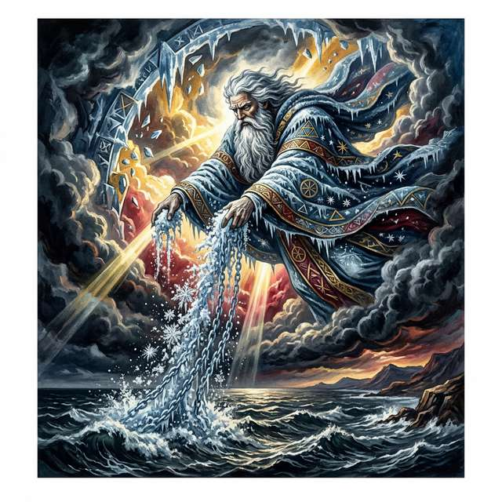

## Page 22

heavens” and “round the abodes of men”—above and below, cosmic and domestic, integrated.[Blake, 1793a,
Erdman, 1988]
22

## Page 23

3.4
The Doors of Perception and Imagination as Existence
“If the doors of perception were cleansed every thing would appear to man as it is: Infinite. For
man has closed himself up, till he sees all things thro’ narrow chinks of his cavern.” — William
Blake, The Marriage of Heaven and Hell, Plate 14 [Erdman 39][Blake, 1790, Erdman, 1988]
3.4.1
The Materialist Delusion: Nature as an Abstract Phantom
The “doors of perception” passage operates as Blake’s most concentrated epistemological manifesto. Its
underlying structure reveals three radical claims about the nature of human cognition:
1. The doors can be cleansed: Perception is not a biologically fixed, passive window but a dynamic
interface modifiable through deliberate practice.
2. What appears after cleansing is the Infinite: The apparent finitude and mechanical deadness
of the universe is a limitation within the perceiver’s contracted model, not an objective property of
reality.
3. Man has closed himself up: This cognitive contraction is self-imposed—a defensive structural
hardening generated by the organism’s own habitual, rigid priors.
Each claim anticipates a core tenet of American Pragmatism. Blake’s “cleansing” is the poetic equivalent of
Peirce’s self-correcting community of inquiry.[Peirce, 1877] His revelation of the “Infinite” parallels James’s
radical empiricism, which demands that philosophy embrace the full “blooming, buzzing confusion” of un-
mediated experience.[James, 1907] And his diagnosis of self-enclosure mirrors Dewey’s insistence that the
organism-environment transaction can become blocked by rigid habits—and must be reconstructed through
intelligent action.[Dewey, 1934]
3.4.2
The American Transmission from Blake to Huxley
Linda Freedman’s William Blake and the Myth of America: From the Abolitionists to the Counterculture
(2018) traces the extraordinary afterlife of Blake’s visionary vocabulary in American culture.[Freedman, 2018]
Blake’s reception in America began with the Transcendentalists: Emerson encountered Blake’s work in the
1830s through Alexander Gilchrist’s biography and recognized in him an opponent of Locke and a champion
of intuition over sensation. But it was the twentieth century that transformed Blake from a literary curiosity
into a cultural force.
Aldous Huxley titled his 1954 account of mescaline experience The Doors of Perception—borrowing Blake’s
metaphor to describe what he called the brain’s “reducing valve,” the filtration system that limits con-
sciousness to biologically useful information.[Huxley, 1954] Jim Morrison named his band The Doors after
Huxley’s book. Allen Ginsberg reported a visionary experience in his East Harlem apartment in 1948 in
which he heard Blake’s voice reading “Ah Sun-flower” and “The Sick Rose,” an event Ginsberg described as
the defining moment of his poetic vocation (Freedman 2018, ch. 7).[Freedman, 2018]
Freedman’s central argument is that American intellectuals turned to Blake at moments of “cataclysmic
change”—the abolitionist struggle, the Civil War, the counterculture—because his framework offered some-
thing that neither Enlightenment rationalism nor orthodox Christianity could provide: a vision of liberation
that was simultaneously political, spiritual, and perceptual. As Freedman writes, the “doors of perception”
became the master metaphor for the American conviction that “to change how you see is to change what
you are.”[Freedman, 2018]
3.4.3
Cleansing the Doors: Escaping the Cave of Materialist Empiricism
America a Prophecy provides Blake’s most dramatic staging of what happens when the doors of perception
are not merely cleansed but consumed by fire. In the poem’s climactic final movement (Plates 16–18), the
Guardians of Europe—France, Spain, and Italy—attempt to shut “the five gates of their law-built Heaven”
to contain the revolutionary conflagration:
“They slow advance to shut the five gates of their law-built Heaven, Fillèd with blasting fancies
and with mildews of despair, With fierce disease and lust, unable to stem the fires of Orc, But
23

## Page 24

the five gates were consum’d, & their bolts and hinges melted; And the fierce flames burnt
round the heavens, & round the abodes of men.” — America a Prophecy, Plates 17–18 [Erdman
57–58][Blake, 1793a, Erdman, 1988]
The “five gates” correspond to the five senses as they have been institutionalized—turned from open portals
into locked barriers that admit only sense-data compatible with the ruling ideology.
As Erdman noted,
the Guardians’ attempt to “shut” the gates is a precise allegory for the reactionary response to revolution:
the European monarchies attempting to seal their borders against French revolutionary contagion.[Erdman,
1954] But Blake’s mythological register carries the political allegory to an epistemological depth that mere
political narrative cannot reach: the gates are not just national borders but perceptual borders, and their
melting is the dissolution of the Lockean-Newtonian epistemological regime itself.
The five gates are the institutional equivalent of the “narrow chinks” through which man has closed himself
up in the Marriage. Their “bolts and hinges” are the mechanisms of sensory restriction—the apparatus by
which “law-built” perception constrains what can be seen, heard, felt, tasted, and touched. Their melting is
the liberation of the senses from their function as mere data-collection instruments: the senses are restored
to their full capacity as organs of perception-action, capable of perceiving the Infinite.
Note the poem’s final line: the flames burn “round the heavens, & round the abodes of men.” This is not
destruction but circulation—the fires of visionary perception circulate through the entire system, cosmic and
domestic, public and private. The distinction between “heavens” and “abodes of men” is maintained but the
same fire pervades both. This is fourfold vision actualized at the civilizational scale.
3.4.4
The Imaginative Faculty: Active Construction of the Experienced World
Blake’s most radical epistemological claim is ontological: “Imagination is not a State: it is the Human
Existence itself” (Milton, Plate 32; Erdman 132).[Erdman, 1988] This is not a claim about fantasy or fiction
but about the constitutive role of the generative model in creating the world the agent inhabits. In Active
Inference notation, the self is constituted by its generative model: Self ≅𝑝(𝑜, 𝜃)—the agent is the model
it maintains, and to change the model is to change the self. (This is a regulative identification rather than
a strict metaphysical identity; see Parr, Pezzulo, and Friston 2022, ch. 10, for the distinction between the
self-model and the self.)
This claim places Blake in direct conversation with pragmatism’s central insight: that knowing is not mir-
roring a given reality but actively constructing a livable world. Where the pragmatists expressed this in
the language of science, evolution, and democratic inquiry, Blake expressed it in the language of prophecy,
vision, and artistic creation. The synthesis of these two vocabularies is the task of this manuscript.
3.4.5
Fractal Epistemology and Deep Temporal Modeling
Auguries of Innocence (c. 1803) opens with what may be the most compressed statement of Blake’s episte-
mological vision (Erdman 490):[Erdman, 1988]
“To see a World in a Grain of Sand And a Heaven in a Wild Flower, Hold Infinity in the palm of
your hand And Eternity in an hour.”
This is a precise description of what Active Inference calls deep temporal modeling—the capacity of a hier-
archical generative model to represent the universal in the particular, the abstract in the concrete. James’s
radical empiricism makes the same demand: that philosophy begin with the concrete particular—this sen-
sation, this moment—and build outward rather than imposing categories from above.[James, 1907] Blake’s
grain of sand is James’s “pure experience” rendered in verse. America a Prophecy enacts the same episte-
mological principle at the political scale: when the “fierce flames burnt round the heavens, and round the
abodes of men” (America, line 151), the particular revolutionary event is the universal liberation—the grain
of sand that contains a world.
24

## Page 25

3.4.6
The Proverbs of Hell as Compressed Epistemological Maxims
The Marriage of Heaven and Hell contains a collection of “Proverbs of Hell” (Plates 7–10; Erdman 36–38)
that function as compressed epistemological maxims:[Blake, 1790, Erdman, 1988]
• “The road of excess leads to the palace of wisdom” — Knowledge is achieved by pushing beyond
established limits. In Active Inference terms: explore, don’t just exploit.
• “What is now proved was once only imagined” — Every empirical fact was first a hypothesis,
every observation first a prediction. The generative model precedes the data.
• “No bird soars too high, if he soars with his own wings” — The organism’s capacity is not
externally bounded by “natural law” but internally generated by its own model complexity.
• “Energy is Eternal Delight” — The free energy that drives biological self-organization is not a
burden to be minimized but the very medium of existence.
These proverbs are systematic rejections of the passive-reception model of knowledge and systematic affirma-
tions of the active-construction model that pragmatism and Active Inference share with Blake’s prophetic
epistemology. Each proverb finds its dramatic counterpart in America a Prophecy: Orc’s revolutionary ex-
cess is the road to the palace of wisdom; the colonists’ imagined liberty becomes proved through action; and
the “Eternal Delight” of free energy drives the revolutionary organism to shatter its chains.
25

## Page 26

3.5
Illuminated Printing: Pragmatism and Epistemology as Artistic Practice
“I must Create a System, or be enslav’d by another Man’s; I will not Reason & Compare: my
business is to Create.” — William Blake, Jerusalem, Plate 10 [Erdman 153][Erdman, 1988]
3.5.1
Unity of Artistic Conception and Material Execution
Blake’s illuminated printing—in which text and image are engraved together on the same copper plate, col-
ored by hand, and printed as a unified artifact—is not merely an aesthetic choice but an epistemological one.
It performs the unity of perception and action, theory and practice, that his philosophy proclaims. Where
conventional printmaking separates composition from execution, Blake’s method makes them inseparable—
anticipating Dewey’s Art as Experience (1934), where aesthetic value lies not in the finished object but in
the process of its making.[Dewey, 1934]
3.5.2
The Relief Etching Process: Integrating Conceptualization and Execution
Joseph Viscomi’s Blake and the Idea of the Book (1993) provides the definitive technical account of Blake’s
process.[Viscomi, 1993] Blake’s method involved writing text and drawing designs backwards on copper plates
using an acid-resistant varnish (stop-out), then immersing the plates in acid so that the unmarked areas were
eaten away, leaving text and image in relief—the reverse of conventional intaglio engraving. The plates were
inked by hand, printed on a rolling press, then each impression was individually colored with watercolor by
Blake and his wife Catherine. As Viscomi demonstrated, no two copies of any Blake illuminated book are
identical.[Viscomi, 1993]
This technical process has profound epistemological implications:
1. Against the division of labor: In conventional publishing, the author writes, the engraver tran-
scribes, the printer produces, the colorist decorates. Each step introduces a gap between conception
and realization. Blake eliminates every such gap. The poet is the engraver is the printer is the colorist.
2. Each copy is unique: The “text” is not a fixed, reproducible object but a family of related but distinct
realizations. This anticipates the pragmatist understanding of truth not as fixed correspondence but
as an ongoing process of realization.
3. Text and image are materially inseparable: They are etched onto the same plate, printed in the
same press-stroke.
3.5.3
America a Prophecy as a Material, Active Object in the World
America a Prophecy exists in seventeen known copies, four printed in color, spanning Blake’s career from
1793 to approximately 1807.[Viscomi, 1993] The William Blake Archive (blakearchive.org) makes multiple
copies available for side-by-side comparison—an unprecedented scholarly resource.[Eaves et al., 2003]
The material differences between copies are themselves epistemologically significant.
Compare Copy A
(printed c. 1795, British Museum) with Copy M (printed c. 1807, Yale Center for British Art): the same text,
the same plate order, but radically different color palettes, different emphases in the visual compositions,
different relationships between text and surrounding design. The “same” poem becomes a different perceptual
experience in each material instantiation. As Viscomi demonstrated, Blake did not regard this variability
as a defect but as essential to his method: the book is not a fixed message to be transmitted but a living
encounter to be enacted differently each time.[Viscomi, 1993]
In the context of America, this materiality is politically charged. Erdman noted that Blake deliberately
limited the number of copies—seventeen in total—to an intimate circle, circulating his revolutionary vision
not through the mechanical reproduction of the press but through the artisanal production of hand-colored
objects that required personal encounter.[Erdman, 1954] Each copy of America is thus simultaneously a work
of art and an act of political dissent: a handmade revolutionary object in an age of mass production.
26

## Page 27

3.5.4
Mitchell on Composite Art and the Energetic Rivalry
W.J.T. Mitchell’s Blake’s Composite Art: A Study of the Illuminated Poetry (1978) provides the most influen-
tial theoretical account of the text-image relationship in Blake’s illuminated works.[Mitchell, 1978] Mitchell
argues that the relationship between graphic and poetic elements is neither harmony nor hierarchy but an
“energetic rivalry”—a productive tension between “vigorously independent modes of expression.”[Mitchell,
1978]
In America, this rivalry is especially intense. Plate 10 (Erdman 54), which depicts the Thirteen Angels
descending “naked and flaming” to stand with Washington and Paine, surrounds the text with writhing
vegetation and flame-like tendrils that seem to grow from the letters themselves. The visual design does not
illustrate the text—it extends it, adding a dimension of sensory immediacy that the purely verbal register
cannot achieve. Conversely, the text contextualizes the images with a precision of mythological reference
that the visual alone cannot convey. The reader-viewer must actively negotiate between verbal and visual
registers, performing the very integration of faculties that Blake’s philosophy demands.[Mitchell, 1978]
Mitchell later coined the term “imagetext” in Picture Theory (1994) to describe this irreducible unity-in-
difference—a compound term that names the problematic gap between verbal and visual representation that
Blake’s illuminated plates make visible.[Mitchell, 1994] Blake’s illuminated printing, Mitchell argues, is the
paradigmatic “imagetext”: a practice that simultaneously unifies and differentiates word and image, creating
a multiplicative meaning that exceeds what either medium could produce alone.[Mitchell, 1994]
3.5.5
The Blake Archive and Digital Epistemological Practice
The William Blake Archive (blakearchive.org), established in 1996 by Morris Eaves, Robert N. Essick,
and Joseph Viscomi, now contains high-resolution digital images from over 45 research institutions world-
wide.[Eaves et al., 2003] The Archive received the Modern Language Association’s Prize for a Distinguished
Scholarly Edition in 2003—the first digital project so honored.
By making it possible to compare multiple copies of America side by side—something physically impossible
when the originals were scattered across the British Museum, the Library of Congress, the Morgan Library,
and the Yale Center for British Art—the Archive enacts the Peircean principle that inquiry is communal:
knowledge emerges from the comparison, contrast, and coordination of multiple perspectives.[Eaves et al.,
2003] The digital humanities are, in this sense, a twenty-first-century continuation of Blake’s illuminated
printing: new technologies for the old project of integrating multiple modes of perception and expression.
3.5.6
Peirce’s Triadic Semiotics and the Illuminated Plate
Blake’s illuminated plates integrate all three of Peirce’s semiotic modes in a single artifact:
• Icon: The visual designs resemble their referents—Orc’s flames look like flames, the serpentine vege-
tation spirals like organic growth.
• Index: The plate bears the physical traces of Blake’s hand—the acid-bitten copper, the individual
brushstrokes, the pressure marks of the rolling press.
• Symbol: The text operates through conventional signs—the English alphabet, the grammatical struc-
tures of English.
This convergence is not accidental. Both Blake and Peirce are anti-Cartesian thinkers who reject the idea that
meaning is a purely mental phenomenon occurring in a private inner theater. For both, meaning is public,
material, and relational—constituted by interactions between signs, objects, and interpretants (Peirce) or
between text, image, and reader-viewer (Blake).
3.5.7
Prophetic Self-Publishing Against the Commercial Epistemic Monopolies
Saree Makdisi reads Blake’s illuminated printing as an explicit repudiation of the industrial division of labor
that was transforming English society in the 1790s.[Makdisi, 2003] The factory system separated conception
from execution, design from manufacture, mental from manual labor. Blake’s method refuses this separation.
He is simultaneously artist and artisan, visionary and craftsman, intellectual and laborer.
27

## Page 28

Makdisi’s argument is especially pertinent to America a Prophecy, which was produced at precisely the
moment when the industrial revolution was transforming the London printing trade. The Stanhope press,
the steam-powered press, stereotype plates—all were emerging technologies that promised to separate the
stages of book production ever more completely. Blake’s artisanal method was a deliberate anachronism: a
refusal of the very logic of industrial efficiency in favor of what Makdisi calls “the labor of vision.”[Makdisi,
2003]
This is the practical dimension of Blake’s epistemology. It is not enough to think in Fourfold Vision—one
must work in Fourfold Vision. The illuminated plate is the proof that integrated perception, integrated labor,
and integrated knowledge are not utopian fantasies but achievable practices. What Blake accomplished at his
printing press in 13 Hercules Buildings, Lambeth, the pragmatists would later attempt in the laboratory, the
schoolroom, and the democratic polity: the reconstruction of thought and practice as a unified, world-making
activity.
The trajectory from Blake’s workshop to the pragmatist laboratory is neither linear nor causal—but it is struc-
turally unmistakable. Having established Blake’s epistemology as an action-oriented, anti-representationalist,
community-embedded practice of inquiry, we now turn to the philosophical tradition that independently ar-
rived at remarkably similar conclusions: American Pragmatism, from its post-Civil War origins in the Meta-
physical Club through its neopragmatist revival, and the formal apparatus that reveals these convergences
to be not merely analogical but structurally identical.
28

## Page 29

4
American Pragmatism and Rejecting the Spectator Theory of
Knowledge
“Consider what effects, which might conceivably have practical bearings, we conceive the object
of our conception to have. Then, our conception of these effects is the whole of our conception
of the object.” — Charles Sanders Peirce, “How to Make Our Ideas Clear” [1878][Peirce, 1878]
“Why trembles honesty; and, like a murderer, Why seeks he refuge from the frowns of his immortal
station!’ — William Blake, America a Prophecy, lines 40–41[Blake, 1793a]
4.1
The Metaphysical Club and the Darwinian Epistemological Catalyst
American Pragmatism is considered a major tradition of philosophy native to the United States, originating
in the 1870s in Cambridge, Massachusetts.[Peirce, 1877, 1878] It emerged in the aftermath of the Civil
War—a catastrophe that shattered absolutist certainties about morality, progress, and truth.
As Louis
Menand demonstrated in The Metaphysical Club (2001), pragmatism arose as a direct intellectual response
to the discrediting of older forms of metaphysical and moral certainty under the pressures of the Civil War,
the abolition crisis, Darwinian evolution, and rapid institutional change.[Menand, 2001] The war revealed
that convictions held with absolute certainty—on both sides—could lead to catastrophic violence; what
was needed was not stronger certainties but a way of coping with contingency, treating beliefs as tools for
navigating experience rather than mirrors of an ultimate metaphysical order. Blake’s America a Prophecy
(1793), written seventy-seven years earlier, had already dramatized precisely this crisis—the moment when
inherited “mental chains” became untenable, and the revolutionary mind was forced to forge new modes of
inquiry.
4.1.1
Origins of the Metaphysical Club in Cambridge
This search found its nucleus in the Metaphysical Club, an informal discussion group in Cambridge
that met in 1872. Its core members included Charles Peirce, Chauncey Wright, William James, Nicholas
St. John Green, Oliver Wendell Holmes Jr., John Fiske, Francis Ellingwood Abbot, and Joseph Bangs
Warner.[Menand, 2001] Peirce later claimed that “within the philosophical discussions of the original club,
pragmatism is said to have been born”—though, as Menand notes, there is no contemporary record of the
club under that exact name apart from Peirce’s much later recollection (corroborated only by a passing
reference in a letter from Henry James mentioning that his brother William had joined “a metaphysical
club”).[Menand, 2001] The club dissolved within the year, but its conversational network seeded the entire
tradition. Peirce went on to found a second Metaphysical Club at Johns Hopkins in 1879, where John Dewey
was among its members.
Menand’s historiographical insight is itself pragmatist in spirit: philosophical movements often crystallize
around informal conversational networks whose identities are partly reconstructed after the fact. The Meta-
physical Club is less a documented institution than a retroactive label for the moment when a group of
thinkers, shaken by war and Darwin, began rejecting “radical foundationalist European metaphysics” in
favor of critical, empirically oriented thinking.[Menand, 2001] As Menand put it, “The pragmatists believed
that ideas were tools, that they were produced by groups and were dependent on human carriers and on the
environment, like germs”—a formulation that could equally describe Blake’s illuminated printing workshop,
where ideas were literally produced by hand, dependent on material processes, and revised with every new
impression.[Menand, 2001]
4.1.2
The Darwinian Catalyst: Evolution as Pragmatic Engine
The two greatest intellectual forces shaping pragmatism were the Civil War and Darwin’s Origin of Species
(1859). Chauncey Wright, an early American proponent of Darwinism, highlighted the principle of utility
as the organizing structure of evolutionary change.[Wright, 1877] The pragmatist reading of Darwin—which
has nothing in common with teleological, reductionist, or Social Darwinist models—treated evolution as
29

## Page 30

a template for understanding ideas themselves as adaptive instruments rather than mirrors of eternal
truths, and inquiry as an ongoing, self-correcting process analogous to natural selection.[James, 1907]
John Dewey made the connection between Darwin and philosophical method most explicit in his seminal
essay “The Influence of Darwin on Philosophy” (1910): “The influence of Darwin upon philosophy resides in
his having conquered the phenomena of life for the principle of transition. He has dethroned essences from
their pedestals; and, having compelled the mind to attend to the processes of transition and adaptation,
has thereby put the reign of fixity on notice.”[Dewey, 1910] Dewey’s formulation is remarkably precise: Dar-
win did not simply add biology to philosophy’s subject matter but changed philosophy’s method—from the
contemplation of fixed essences (Plato’s Forms, Hegel’s Absolute, Urizen’s “law-built Heaven”) to the inves-
tigation of transitions, adaptations, and functional processes. Philip Wiener’s Evolution and the Founders
of Pragmatism (1949) documented in detail how Wright, Peirce, James, and the entire Cambridge circle
absorbed Darwinian thinking not as biological doctrine but as a philosophical revolution: the insight that
the “fixation of belief” is itself a biological process, continuous with the organism’s adaptation to its envi-
ronment.[Wiener, 1949]
Peter Godfrey-Smith’s Complexity and the Function of Mind in Nature (1996) extended this Darwinian-
pragmatist insight by arguing that cognitive complexity evolves specifically in response to environmental
complexity—organisms develop richer generative models precisely when their environments demand flexible,
context-sensitive responses rather than fixed behavioral routines.[Godfrey-Smith, 1996] This is the biological
grounding of Active Inference: the Free Energy Principle formalizes precisely the Darwinian-pragmatist
claim that cognition is adaptive modeling, that perception is hypothesis-testing, and that the organism’s
relationship to its world is not passive reception but active, self-correcting inference. Blake’s prophetic vision
captures the same insight mythopoetically: the moment of revolution in America a Prophecy—when the
Thirteen Governors abandon their inherited cognitive habits and “rush in fury to the sea”—is the moment
when environmental pressure forces model updating, when the organism can no longer minimize surprise
through its existing priors and must reconstruct its relationship to the world.
4.2
Neopragmatism: The Social Self and the Linguistic Turn
Peirce’s contributions to pragmatism extend beyond the Pragmatic Maxim into a revolutionary approach
to logical notation: his Existential Graphs (EGs), developed between 1882 and 1911. The Alpha system
handles propositional logic through inscriptions on a “Sheet of Assertion” (representing the universe of
discourse) with “cuts” (closed curves) functioning as negation; the Beta system extends this to first-order
predicate logic with “lines of identity” connecting argument places.[Hartshorne et al., 1931] Peirce considered
the EGs his “chef d’oeuvre”—superior to algebraic notation because they made logical reasoning visible,
transforming inference from symbolic manipulation into a spatial, diagrammatic practice.
The contemporary significance of Peirce’s diagrammatic reasoning has been illuminated by several convergent
research programs. Fernando Zalamea’s Synthetic Philosophy of Contemporary Mathematics (2012) positions
Peirce as a precursor to category-theoretic thinking: Peirce’s emphasis on relations, continuity (synechism),
and the irreducibility of triadic sign-relations anticipates the categorical emphasis on morphisms over objects
and on structure-preserving maps.[Zalamea, 2012] Ahti-Veikko Pietarinen’s extensive reconstructions of the
EGs have demonstrated that the Beta graphs constitute a complete diagrammatic notation for first-order
logic with remarkable proof-theoretic properties—including cut-elimination theorems that parallel those of
Gentzen’s sequent calculus.[Pietarinen, 2006] Most strikingly, Geraldine Brady and Todd Trimble (2000)
showed that Peirce’s Alpha graphs can be modeled as presheaves on a category—presheaf toposes where
the Sheet of Assertion corresponds to a terminal object and the cuts correspond to subobject classifiers—
revealing that Peirce had independently discovered categorical structures in the 1880s.[Brady and Trimble,
2000] Nathan Haydon’s subsequent work extends this by interpreting the Beta graphs as string diagrams in
cartesian bicategories, connecting Peirce’s nineteenth-century diagrammatic practice to the cutting edge of
contemporary applied category theory.
The relevance of these developments to our synthesis is threefold.
First, Peirce’s diagrammatic method
enacts the pragmatist epistemology at the level of logical practice: reasoning is not the manipulation of
abstract symbols but the construction and transformation of spatial diagrams—a form of “learning by doing”
30

## Page 31

that Dewey would recognize. Second, the categorical interpretation of Existential Graphs provides a formal
bridge from Peirce’s semiotics to the mathematical structures underlying Active Inference—both frameworks
privilege process and relation over static objects.
Third, and most suggestively, Peirce’s diagrammatic
approach anticipates Fuller’s geometric operationalism (subsection 5.6): both insist that the deepest truths
are spatial, that meaning resides in structure, and that thought is most powerful when it is most concretely
embodied in material form—whether on Peirce’s Sheet of Assertion or Fuller’s tensegrity models.
4.3
Charles Sanders Peirce (1839–1914): The Architectonic Logician
Peirce is widely recognized as “the father of pragmatism,” a polymath whose groundbreaking work in logic,
mathematics, semiotics, and philosophy set the stage for the entire tradition.[Hartshorne et al., 1931]
4.3.1
Peirce’s Pragmatic Maxim and the Fixation of Belief
The Pragmatic Maxim, first clearly stated in “How to Make Our Ideas Clear” (1878), is the keystone of the
tradition. (The epigraph above provides its canonical formulation.) This is not subjectivism or utilitarianism
but a logical principle: a rule for achieving the highest grade of clarity about concepts by describing how
they are employed in practice. Peirce’s maxim has a verificationist character—“our idea of anything is our
idea of its sensible effects”—but goes beyond verification by emphasizing implications for conduct. His later
formulation strengthened this: “The entire intellectual purport of any symbol consists in the total of all
general modes of rational conduct which, conditionally upon all the possible different circumstances and
desires, would ensue upon the acceptance of the symbol” (EP2: 346).[Peirce, 1878]
4.3.2
Truth as “What Works”: The Cash-Value of Ideas in Experience
Peirce’s pragmatic clarification of truth is among the most consequential in the tradition:
“The opinion which is fated to be ultimately agreed to by all who investigate, is what we mean
by the truth, and the object represented in this opinion is the real.” [EP1: 139][Peirce, 1877]
Truth is the end (telos, not terminus) of inquiry. The objectivism of this account derives not from a world
external to minds but from the potential infinity of the community of inquiry, which exposes all beliefs to
future correction. Late in life, Peirce treated this convergence as a regulative hope: “I do not say that it
is infallibly true that there is any belief to which a person would come if he were to carry his inquiries far
enough. I only say that that alone is what I call Truth.”[Peirce, 1877]
4.3.3
Fallibilism and Anti-Cartesianism
In “Some Consequences of Four Incapacities” (1868), Peirce identified four problematic Cartesian teachings
and proposed fallibilism as the alternative—the thesis that any validity claim can be challenged and modi-
fied. Against Cartesian universal doubt: “Do not pretend to doubt in philosophy what we do not doubt in
our hearts” (EP1: 29).[Peirce, 1868]
His metaphor for inquiry is striking and central: reasoning “should not form a chain which is no stronger than
its weakest link, but a cable whose fibres may be ever so slender, provided they are sufficiently numerous
and intimately connected” (EP1: 29).[Peirce, 1877]
4.3.4
The Fixation of Belief
In “The Fixation of Belief” (1877), Peirce analyzed inquiry as the struggle from doubt to settled belief,
identifying four methods:[Peirce, 1877]
31

## Page 32

Table 3: Peirce’s Four Methods of Fixing Belief: An Epistemic
Hierarchy. Only the Method of Science (the fourth method) aligns
with the self-correcting, active nature of both Blakean vision and
Active Inference, explicitly refusing the rigid ‘snows’ of authority
or tenacity.
Method
Description
Weakness
Tenacity
Cling to existing belief
Social contact undermines
isolation
Authority
Accept institutional dictates
No institution can regulate all
opinions
A Priori
Follow intellectual taste
Shifts with fashion; no
convergence
Science
Test beliefs through experiment
Requires discipline but is
self-correcting
Only the Method of Science is consistent with the “hypothesis of reality” and capable of permanently fixing
belief. “The sole object of inquiry is the settlement of opinion.”[Peirce, 1877]
4.3.5
The Self-Correcting Cycle: Abduction, Deduction, and Induction
Peirce coined abduction to describe the creative inference that generates hypotheses:[Hartshorne et al.,
1931]
“The surprising fact, C, is observed. But if A were true, C would be a matter of course. Hence,
there is reason to suspect that A is true.”[Hartshorne et al., 1931]
Unlike “inference to the best explanation,” Peircean abduction is primarily hypothesis-generating rather
than hypothesis-justifying. Peirce maintained that “all explanatory content of theories is reached through
abduction.”[Hartshorne et al., 1931]
4.3.6
Semiotics: The Triadic Sign
Peirce’s semiotic theory presents the triadic model of the sign:[Hartshorne et al., 1931]
• Sign (Representamen): The form the sign takes
• Object: That to which the sign refers
• Interpretant: The understanding derived from the sign
Signs are categorized as Icons (resemblance), Indexes (direct connection), and Symbols (convention).
The process of semiosis is dynamic and continuous—the interpretant can become a new sign, generating a
theoretically infinite chain limited in practice by habit.[Hartshorne et al., 1931]
This triadic structure is grounded in Peirce’s metaphysical categories: Firstness (quality/possibility), Sec-
ondness (actuality/fact), and Thirdness (mediation/law/generality).[Hartshorne et al., 1931]
4.3.7
Pragmaticism
Frustrated by James’s broader use of “pragmatism,” Peirce relabeled his position pragmaticism—“a name
ugly enough to be safe from kidnappers” (EP2: 355).[Peirce, 1905]
4.4
William James (1842–1910): The Great Mediator
James transformed pragmatism from a technical logical principle into a comprehensive philosophical out-
look with broad cultural appeal.
His 1898 Berkeley lecture first used “pragmatism” in print, crediting
Peirce.[James, 1907]
32

## Page 33

4.4.1
The Present Dilemma
In Pragmatism (1907), James diagnosed a “clash of human temperaments” between the tough-minded
(empiricist, materialist, irreligious, pluralistic) and the tender-minded (rationalist, idealistic, religious,
monistic). Pragmatism was the mediating philosophy:[James, 1907]
“The pragmatic method is primarily a method of settling metaphysical disputes that otherwise
might be interminable. Is the world one or many?—fated or free?—material or spiritual?” [1907,
Lecture II][James, 1907]
4.4.2
The Pragmatic Theory of Truth
James’s account of truth became the most celebrated—and controversial—element:
“The true is the name of whatever proves itself to be good in the way of belief, and good, too,
for definite assignable reasons.” [1907: 42][James, 1907]
“ ‘The true,’ to put it very briefly, is only the expedient in the way of our thinking, just as ‘the
right’ is only the expedient in the way of our behaving.” [1907: 106][James, 1907]
“Any idea upon which we can ride…; any idea that will carry us prosperously from any one part
of our experience to any other part, linking things satisfactorily, working securely, saving labor;
is true for just so much, true in so far forth, true instrumentally.” [1907: 34][James, 1907]
Against Russell’s objection that this committed James to the truth of “Santa Claus exists,” James held that
a belief’s satisfactions are truth-relevant but a belief would only be “wholly true” if it did not “clash with
other vital benefits.”[James, 1907]
4.4.3
The Will to Believe
In “The Will to Believe” (1896), James defended the right to adopt faith when facing a “genuine option”—
one that is “living” (personally meaningful), “forced” (mutually exclusive), and “momentous.” Two cognitive
desiderata compete: obtain truth and avoid error.
Privileging error-avoidance makes sense only where
avoiding error outweighs all else.[James, 1907]
4.4.4
Jamesian Pragmatism: Truth as Verification and Radical Empiricism
James’s radical empiricism holds that “the only things debatable among philosophers shall be things defin-
able in terms drawn from experience,” but redefines experience to include relations as directly experienced:
“the relations between things, conjunctive as well as disjunctive, are just as much matters of direct particular
experience as the things themselves.” The universe “possesses in its own right a concatenated or continuous
structure.”[James, 1912] For James, experience is the “primal stuff of existence,” a foundation beneath which
one could not dig, since whatever was found there would still be experience—a position with deep resonance
for Blake’s insistence on the infinite richness perceivable within every particular, and for his conviction that
imagination is “the Human Existence itself,” not a supplementary faculty but the fundamental mode of
being.[James, 1912, Peat, 2003]
4.4.5
Pluralism and the Individual
James’s philosophy embraces a pluralistic universe where novelty, indeterminacy, and individual agency are
genuine features of reality—a “turbid, muddled gothic sort of affair.”[James, 1909]
4.5
John Dewey (1859–1952): The Democratic Experimentalist
Dewey was the most prolific and publicly influential pragmatist. He preferred to call his version “instru-
mentalism” or “experimentalism.”[Dewey, 1920, 1938]
33

## Page 34

4.5.1
Instrumentalism and the Theory of Inquiry
Dewey rejected the “spectator” view of knowledge and insisted that experimental processes are piecemeal
and their results temporary. In Logic: The Theory of Inquiry (1938), he defined inquiry as “the controlled
or directed transformation of an indeterminate situation into one that is so determinate in its constituent
distinctions and relations as to convert the elements of the original situation into a unified whole” (ED2:
171).[Dewey, 1938]
Human beings are “creatures of habit and instinct inhabiting a world which is neither malevolent nor benev-
olent.” Intelligence enters when habitual functioning breaks down and the organism must pause to consider
alternatives.[Dewey, 1920]
4.5.2
Experience as Nature: The Critique of Epistemological Dualisms
For Dewey, experience is never merely passive observation; it encompasses everything “what men do and
suffer” in their ongoing transaction with the world. As he articulated in Art as Experience (1934), “life goes
on in an environment; not merely in it but because of it, through interaction with it.” By emphasizing this
structural continuity between the organism and nature, Dewey systematically deconstructed the classical
dualisms that plagued Western philosophy—smashing the artificial walls between appearance and reality,
theory and practice, and fact and value. Every act of knowing is simultaneously an act of doing.[Dewey,
1934, 1896]
4.5.3
Democracy and Education
Dewey’s democracy is a “way of life” involving open communication, shared inquiry, and reconstruction of
social institutions:[Dewey, 1916]
“The devotion of democracy to education is a familiar fact. Since a democratic society repudiates
the principle of external authority, it must find a substitute in voluntary disposition and interest;
these can be created only by education.”[Dewey, 1916]
“Education is a social process; education is growth; education is not preparation for life but is
life itself.”[Dewey, 1916]
Students must be active, not passive; they require compelling projects rather than lectures; they should
become problem-solvers motivated by interest.[Dewey, 1916]
4.5.4
Art as Experience
Art as Experience (1934) shifts the essential locus of art from the physical object to the entire process of
experience. Aesthetic experience is the highest form of organism-environment interaction. “The function of
the fine arts is not to provide an escape from ordinary life. Rather, it is the enhancement of qualities that
make ordinary experiences appealing.”[Dewey, 1934]
4.5.5
Warranted Assertibility
Like James, Dewey argued that the correspondence theory of truth “only begs the question.” He preferred
the term “warranted assertibility” to “truth”—knowledge is a product of activity directed to human
purposes, and a warranted belief is known as such by the consequences of its employment.[Dewey, 1938]
4.6
The Second Generation
4.6.1
From Mead’s Social Behaviorism to Brandom’s Inferentialism
Mead argued that philosophy had “gotten the relationship backwards”—building the social from the in-
dividual when the self is actually constituted through social relations.[Mead, 1934] His concepts of the
“generalized other,” the “I” (spontaneous response), and the “me” (organized attitudes of others) are
34

## Page 35

treated in detail in subsection 5.4, where they are mapped onto Blake’s mythology of Albion and the Four
Zoas.
Equally important for our purposes is Mead’s posthumous The Philosophy of the Act (1938), which articulates
a theory of the social act as the unit of analysis for all intelligent behavior.[Mead, 1938] For Mead, every act
unfolds through four phases — impulse, perception, manipulation, and consummation — that anticipate the
perception-action loop at the heart of Active Inference. The organism does not first perceive and then act;
rather, action and perception are co-constitutive moments of a single ongoing transaction. Blake’s prophetic
method embodies precisely this Meadian insight: the illuminated plate is simultaneously a perceptual act
(seeing the vision), a manipulative act (etching the copper), and a consummation (the finished print that
transforms its audience). The social act, for both Mead and Blake, is irreducibly communal — it requires
the responsive other to complete its meaning.
4.7
The Transitional Generation: From Classical Pragmatism to Neopragma-
tism
4.7.1
W.V.O. Quine (1908–2000): Two Dogmas and the Seeds of Anti-Representationalism
Quine’s “Two Dogmas of Empiricism” (1951) demolished the analytic-synthetic distinction and the reduction-
ist program of logical positivism, reopening the philosophical space that the neopragmatists would occupy.
His thesis that “our statements about the external world face the tribunal of sense experience not individ-
ually but only as a corporate body” (the Duhem-Quine thesis) echoes both Peirce’s cable metaphor and
Blake’s insistence that perception is always already shaped by the whole system of the perceiver’s commit-
ments.[Quine, 1951] Rorty would later acknowledge Quine as a decisive influence—the philosopher who made
anti-representationalism respectable within the analytic tradition.
4.7.2
C.I. Lewis (1883–1964): The Pragmatic A Priori
Lewis’s concept of the “pragmatic a priori”—that the categories through which we organize experience are
chosen for their utility, not dictated by the structure of reality—bridges Peirce’s fallibilism and Dewey’s
instrumentalism. Lewis argued that our conceptual schemes are revisable tools for navigating experience,
anticipating both Rorty’s vocabularies-as-tools and, more distantly, Blake’s insistence that “I must Create
a System, or be enslav’d by another Man’s.”[Lewis, 1929]
4.8
The Neopragmatist Revival
4.8.1
Richard Rorty (1931–2007)
Rorty’s Philosophy and the Mirror of Nature (1979) targeted knowledge as representation. Key the-
ses:[Rorty, 1979, 1991]
• Anti-representationalism: “Our vocabularies have no more of a representational relation to an
intrinsic nature of things than does the anteater’s snout” (TP, 48)
• Truth deflationism: Calling a belief “true” is a speech act—endorsement, not metaphysical descrip-
tion
• Ironism and solidarity: The “liberal ironist” recognizes the contingency of their own vocabulary
while maintaining solidarity with others
Susan Haack criticized this as “vulgar pragmatism” that undermines inquiry itself.[Haack, 1993, Rorty, 1991]
4.8.2
Hilary Putnam (1926–2016)
Putnam articulated four key pragmatist characteristics: rejection of skepticism, fallibilism, rejection of sharp
dichotomies (fact/value, mind/body), and the primacy of practice.[Putnam, 1995]
35

## Page 36

His signature contribution: the collapse of the fact/value dichotomy. “Thick” ethical concepts like
“cruel” blend descriptive and evaluative elements, demonstrating the “entanglement of fact and value.” Sci-
ence itself presupposes evaluative norms—coherence, simplicity—that are themselves value-laden.[Putnam,
2002]
4.8.3
Robert Brandom (b. 1950)
Brandom’s inferentialist semantics constructs meaning from inferential relations rather than reference.
An assertion is the smallest unit of language for which one can take responsibility within a “game of giving
and asking for reasons.” Making It Explicit (1994) argues that meaning is implicit in social practices of
attributing commitments and entitlements.[Brandom, 1994, 2000]
4.8.4
Cornel West: Prophetic Pragmatism
West’s prophetic pragmatism draws on both Christian and Marxian thought: pragmatism “evades” phi-
losophy by focusing on social structure and power. His praxis is “tragic action with revolutionary intent,
usually reformist consequences, and always visionary outlook.”[West, 1989, 1993]
4.9
Core Themes
Richard Bernstein identified six themes characterizing the pragmatic movement:[Bernstein, 2010]
1. Anti-Foundationalism — Knowledge has no absolute foundations; inquiry is self-correcting.
As
Wilfrid Sellars: “empirical knowledge… is rational, not because it has a foundation but because it is a
self-correcting enterprise.”[Sellars, 1956, Bernstein, 2010]
2. Fallibilism — Any validity claim can be challenged and modified.[Bernstein, 2010]
3. Community of Inquirers — All claims must be submitted to public criticism.[Bernstein, 2010]
4. Pluralism — “Engaged fallibilistic pluralism” takes seriously the otherness of the other.[Bernstein,
2010]
5. Primacy of Practice — Knowing is an activity.[Bernstein, 2010]
6. Against
the
Spectator
Theory — Knowers must be agents;
observation is always selec-
tion.[Bernstein, 2010]
4.10
The Genealogy of Pragmatism
Table 4: The Genealogy of Pragmatism: From Classical Founda-
tions to Neopragmatist Extensions. This lineage tracks the contin-
uous evolution of the anti-representationalist, action-oriented tra-
dition that resonates so deeply with Blake’s poetic epistemology.
Era
Key Figures
Central Concerns
Classical First
Generation
(1870s–1910)
Peirce, James, Royce, Wright
Meaning, truth, inquiry, logic, semiotics[Peirce,
1877, 1878]
Classical
Second
Generation
(1900s–1940s)
Dewey, Mead, Addams, Du Bois,
Locke
Democracy, education, social reform, race[Dewey,
1916, Mead, 1934]
Transitional
(1930s–1970s)
C.I. Lewis, Quine, Hook
Pragmatic a priori, epistemology, logic[Lewis, 1929,
Quine, 1951]
Neopragmatism
(1970s–2000)
Rorty, Putnam, Brandom,
Habermas
Anti-representationalism, semantics,
fact/value[Rorty, 1979, Brandom, 1994]
36

## Page 37

Era
Key Figures
Central Concerns
New
Pragmatism
(1990s–present)
Haack, Misak, West, Sullivan
Truth, race, feminism, ecology[Haack, 1993, West,
1993]
The intellectual pedigree diagram (Figure 6, below) maps the lineage of the American Pragmatist tradition
across six generations, from its 18th-century precursors to contemporary Active Inference. Solid grey edges
indicate documented historical influence or direct pedagogical descent (e.g., Peirce to Dewey, Dewey to Rorty).
Dashed red edges represent the primary thesis of this manuscript: the retroactive structural convergence
between Blake’s visionary epistemology and the pragmatist/process-theory network. The diagram locates
both Blake and Fuller’s Synergetics as essential, albeit non-traditional, components of the broader anti-
representationalist, action-oriented paradigm.
Figure 6: Intellectual Pedigree: American Pragmatism, William Blake & Synergetics. Directed acyclic graph
mapping six generations of intellectual lineage from 18th-century precursors to Active Inference.
With this intellectual landscape in view—from Peirce’s fallibilist logic of inquiry through Dewey’s transac-
tional experience, Mead’s social acts, and the neopragmatist critique of representation—we are prepared to
examine the six specific dimensions along which Blake’s visionary epistemology and this pragmatist tradition
converge. Each of the following sections takes a single convergence theme, grounds it in primary texts from
both traditions, and traces its manifestation in America a Prophecy, building toward the formal synthesis
that Active Inference will provide in section 6.
37

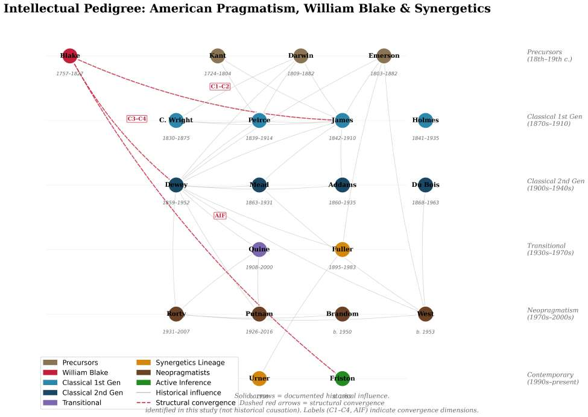

## Page 38

5
The Six Convergences:
Translating Poetic Myth into Philo-
sophic Method
5.1
Convergence 1:
Active Inquiry—Blake’s Cleansed Doors and Peirce’s
Method of Science
“The sole object of inquiry is the settlement of opinion.” — Charles Sanders Peirce, “The Fixation
of Belief” [1877][Peirce, 1877]
“No more I follow, no more obedience pay!”’ — William Blake, America a Prophecy, line 52[Blake,
1793a]
5.1.1
Two Parallel Models of Intellectual Liberation
Peirce and Blake begin from the same diagnosis: the human mind, left to its defaults, falls into rigid
patterns that obstruct genuine understanding. For Peirce, the pathology is Cartesian foundationalism—
the pretense that we can doubt everything at once and rebuild knowledge from a single indubitable certainty.
For Blake, it is Urizenic tyranny—the domination of mechanical reason over the other cognitive faculties,
producing “Newton’s Sleep.” Both demand a practice of intellectual liberation: Peirce’s self-correcting inquiry
and Blake’s cleansing of perception.
America a Prophecy compresses this shared diagnosis into a single dramatic scene. When Boston’s Angel
cries “No more I follow, no more obedience pay!”’ and rends off his robe “In sight of Albion’s Guardian”
(America, lines 52–53), he enacts the decisive break from what Peirce calls the Method of Authority—the
cognitive habit of accepting institutional dictates without submitting them to experimental test. The robe
is the insignia of inherited belief; its destruction is the first act of genuine inquiry.
5.1.2
Peirce’s Four Methods and Blake’s Four Visions Aligned
A remarkable structural parallel emerges when we align Peirce’s four methods of fixing belief with Blake’s
four levels of vision:
Peirce’s Method
Blake’s Vision
Shared Structure
Tenacity — cling to isolated
belief
Single Vision — Newton’s
Sleep
Rigidity; closed to external
correction
Authority — accept institutional
dictates
Twofold Vision —
conventional meaning
Deference to established frameworks
A Priori — follow intellectual
taste
Threefold Vision — Beulah’s
imaginative repose
Internally coherent but subjectively
grounded
Science — test beliefs through
experiment
Fourfold Vision — supreme
delight
Open, self-correcting, integrative
The parallel is not merely formal. In both systems:
• The first level represents cognitive closure—the refusal to admit new information.
Peirce warns
that “social contact will undermine isolated belief”; Blake shows that single vision produces the “dark
Satanic Mills” of industrial materialism.[Peirce, 1877]
• The fourth level represents the achievement of a self-correcting, pluralistic engagement with reality.
For Peirce, the Method of Science is self-correcting because it submits hypotheses to experimental test.
For Blake, Fourfold Vision integrates all cognitive faculties—reason, passion, imagination, sensation—
into coordinated perception.
38

## Page 39

5.1.3
The Prophetic and Pragmatic Interventions: Shaking the Mental Chains
America a Prophecy dramatizes the transition between levels with extraordinary precision. The Thirteen
Governors who “convene / In Bernard’s house” (America, lines 65–66) begin at the level of Tenacity—clinging
to the old colonial order. But the revolutionary flames make cognitive closure impossible: “Shaking their
mental chains, they rush in fury to the sea” (America, line 67). The “shaking” is the crisis that Peirce
describes as the necessary precondition for inquiry—the moment when habitual belief becomes untenable in
the face of overwhelming evidence. And later, when “all rush together in the night in wrath and raging fire”
(America, line 100), Blake captures the collective force of genuine inquiry as it overwhelms the old order.
5.1.4
Peirce’s Cable Metaphor and Blake’s Living System
Peirce’s metaphor for inquiry—reasoning as a cable of many slender fibers rather than a chain only as strong
as its weakest link—finds a deep echo in Blake’s epistemology.[Peirce, 1877]
Blake’s “System” is not a deductive chain from first principles (that would be Urizen’s mode) but a living
architecture of interconnected elements—text and image, prophecy and craft, the four Zoas coordinating as
a unified organism. When Blake declares “I must Create a System,” he means something closer to Peirce’s
cable than to Descartes’s chain: a network of mutually supporting strands where no single element bears the
entire weight.
This cable structure also maps onto Peirce’s theory of abduction. Blake’s prophetic method—beginning
with a “surprising fact” (the contracted state of perception) and generating a hypothesis (that the doors can
be cleansed, that Fourfold Vision is possible)—parallels the abductive arc:
“The surprising fact, C, is observed. But if A were true, C would be a matter of course. Hence,
there is reason to suspect that A is true.”[Hartshorne et al., 1931]
Blake abduces his entire mythology from the observation that human perception is limited: if the Zoas were
once integrated and have since fallen apart, then the contracted state of perception would be “a matter of
course.”
5.1.5
Against the Cartesian Manufacture of Universal Doubt
Both Peirce and Blake reject Cartesian universal doubt, but for deeply compatible reasons:
• Peirce: “Do not pretend to doubt in philosophy what we do not doubt in our hearts” (EP1: 29).
Doubt must be real—sparked by genuine surprise or anomaly—not manufactured by philosophical
method.[Peirce, 1877]
• Blake: Doubt is Urizen’s weapon, the tool by which Reason paralyzes the other faculties. But Blake’s
alternative is not doubt but vision—the active, creative perception that sees through the contracting
categories of Urizen (single vision) to the Infinite that is always already present. Where Peirce moves
from doubt to settled belief through method, Blake moves from “Newton’s Sleep” to Fourfold Vision
through the labor of Los (Imagination).
In America, the distinction between genuine and manufactured doubt takes political form. Albion’s Angel
manufactures doubt—deploying plagues, darkness, and cold to make the colonists question their own capacity
for self-governance. But the Americans’ doubt is real: it is the genuine experience of a world in which inherited
structures no longer function. Their inquiry is accordingly genuine: “all rush together in the night in wrath
and raging fire” (America, line 100).
5.1.5.1
America a Prophecy: Mental Chains and the Method of Science
Blake’s America a
Prophecy (1793) provides the most dramatic enactment of this shared rejection.[Blake, 1793a] The poem’s
pivotal moment occurs when the Thirteen Governors of England’s American colonies—Blake’s “Angels”—
confront the revolutionary upheaval and respond not with deliberation but with liberation:
“Shaking their mental chains, they rush in fury to the sea” — America a Prophecy, line 67
39

## Page 40

The phrase “mental chains” is Blake’s precise equivalent of what Peirce calls the methods of Tenacity and
Authority—the cognitive habits that fix belief not through inquiry but through willful refusal to consider
alternatives.
The “shaking” is the pragmatist moment: the transition from dogmatic fixation to active
engagement with evidence.
In this visualization of line 67, the Thirteen Governors “rush in fury to the sea,” actively shattering the golden
chains of inherited, rigid belief. The flames surrounding them represent the precise moment of epistemic
crisis—when Peirce’s “Method of Authority” fails and genuine pragmatic inquiry must begin in the fires of
actual doubt.
Earlier in the poem, Boston’s Angel articulates the philosophical stakes with startling precision:
“Why trembles honesty; and, like a murderer, Why seeks he refuge from the frowns of his immortal
station!’ Must the generous tremble, and leave his joy to the idle, to the pestilence That mock
him? Who commanded this? What God? What Angel? To keep the gen’rous from experience
till the ungenerous Are unrestrain’d performers of the energies of nature; Till pity is become a
trade, and generosity a science That men get rich by; and the sandy desert is giv’n to the strong?
What God is he writes laws of peace, and clothes him in a tempest? What pitying Angel lusts for
tears, and fans himself with sighs? What crawling villain preaches abstinence and wraps himself
In fat of lambs?” — America a Prophecy, lines 40–51
5.1.6
The Rejection of Authority and the Refusal of Passive Reception
Boston’s Angel is asking Peirce’s question: by what authority are certain modes of inquiry suppressed? The
demand to “keep the gen’rous from experience” is an institutional suppression of inquiry that benefits “the
ungenerous.” The Angel’s response—his decisive rejection of obedience (cf. the epigraph above)—is the break
from Authority in favor of what Peirce would call the Method of Science: open, self-correcting engagement
with reality. The answer to doubt is not certainty but activity: Peirce’s experimental method and Blake’s
creative “labour” of Los, the Imagination working to re-forge broken perception.
The speech deserves careful parsing. “pity is become a trade”—pity has been commodified, its authentic emo-
tional force exploited for institutional profit. “generosity a science / That men get rich by”—generosity has
been systematized into a technique of accumulation. “the sandy desert is giv’n to the strong”—the rhetoric
of freedom masks a regime of dispossession. This is Blake anticipating not just Peirce but Marx, Dewey, and
the entire critical tradition: the insight that epistemological structures (what counts as “knowledge,” who
gets to “experience”) are inseparable from structures of power.
5.1.7
Inquiry as Organism-Environment Transaction and Adaptation
The convergence deepens when we consider the biological framing that both traditions share. Peirce’s ac-
count of doubt as an “irritation” that provokes inquiry is essentially biological—the organism encounters a
disruption in its habitual functioning and must act to restore equilibrium.[Peirce, 1877, Dewey, 1896]
Blake’s mythology tells the same story at a cosmic scale: the “Fall of Albion” is the disruption of cognitive
equilibrium, and the narrative of the prophetic books is the long labor of inquiry (performed by Los, the
Imagination) to restore integrated functioning. America’s central action is this biological drama compressed
into a single revolutionary event: the “irritation” of tyrannical governance provokes the colonial organism to
break habitual patterns (“mental chains”) and engage in the active, self-correcting process that both Peirce
and Blake recognize as genuine inquiry.
The pragmatist claim that inquiry is a natural process—continuous with biological adaptation, not a super-
natural faculty—is precisely Blake’s claim that Imagination is “Human Existence itself,” not a supernatural
gift but the fundamental mode of human being.
5.1.8
Fallibilism, Fourfold Vision, and the Refusal of Monopoly
Peirce’s fallibilism—the thesis that any claim can be revised—provides an unexpected bridge to Blake’s
epistemology. Blake’s Fourfold Vision is not a state of achieved certainty but a mode of engagement: the
40

## Page 41

Figure 7: Shaking Mental Chains. The Thirteen Governors shatter golden chains of rigid belief. America a
Prophecy, line 67; AI-generated illustration.
41

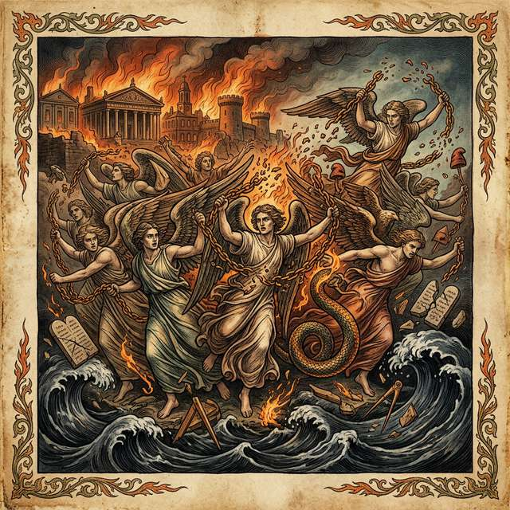

## Page 42

willingness to see the world through multiple, coordinated lenses. The moment any single lens claims exclusive
authority (Urizen’s “I am God, said he, and all other gods… must worship me”—The Book of Urizen), the
system falls into single vision.
Fallibilism, in Blake’s terms, is the refusal of Urizenic monopoly. It is the commitment to keeping all four Zoas
in dialogue—reason and passion and imagination and sensation—rather than allowing any one to suppress
the others. The “contrite fallibilist,” as Peirce called himself, is the Blakean prophet who knows that vision
is always provisional, always subject to deeper cleansing.[Peirce, 1877, Dewey, 1934]
America’s closing image confirms this reading. After the plagues recoil and the five gates are consumed, the
poem does not declare final victory. Instead, Urizen pours forth “storèd snows” to delay the revolution—
“Angels and weak men twelve years should govern o’er the strong; / And then their end should come, when
France receiv’d the Demon’s light” (America, lines 141–142). The revolution is not complete; it is a moment
in an ongoing process of inquiry. The fallibilist knows that no single act of liberation settles the question
permanently. The cable must be continually rewoven, the doors perpetually re-cleansed.
42

## Page 43

5.2
Convergence 2:
Truth as Living Process—Jamesian Verification and
Blakean Consequence
“The true is the name of whatever proves itself to be good in the way of belief, and good, too,
for definite assignable reasons.” — William James, Pragmatism [1907: 42][James, 1907]
“What is now proved was once only imagined.” — William Blake, The Marriage of Heaven and
Hell, Plate 8 [Erdman 36][Blake, 1790, Erdman, 1988]
5.2.1
The Scandal of Pragmatic Truth in Philosophy
5.2.2
Truth “Happens” to an Idea: The Cash-Value of Generative Modeling
James’s pragmatic theory of truth—that truth is not correspondence to a fixed reality but something that
happens to an idea in the course of experience—scandalized his contemporaries. Russell accused James of
making truth subjective; Moore charged him with confusing truth and verification. Yet a century later, the
pragmatic theory of truth has proven remarkably durable, and its structural kinship with Blake’s epistemol-
ogy illuminates both traditions.
5.2.3
Blake’s Pragmatic Reversal: “What is now proved was once, only imagin’d”
Blake’s Proverb of Hell—“What is now proved was once only imagined”—is, in compressed form, a pragmatic
theory of truth. Unpack its logic:
1. Truth has a temporal structure: What is “now proved” was not always proved. Truth is achieved,
not given.
2. Imagination precedes verification: The creative hypothesis (the imagined) must exist before it can
be tested and established as fact.
3. The boundary between imagination and truth is permeable: Today’s wildest speculation may
become tomorrow’s established knowledge.
This is remarkably close to Peirce’s theory of abduction as the source of all explanatory content in sci-
ence, and to James’s insistence that truth is something that ideas become through their consequences in
experience.[Hartshorne et al., 1931, James, 1907]
Blake’s axiom is not merely a philosophical claim—it is a claim about temporal structure. Truth is not a
static property but a lived trajectory: from imagination (hypothesis, conjecture, vision) through practice (ex-
perimentation, labor, prophecy) to proof (verification, warranted assertibility, settled belief). The trajectory
is irreversible only in its direction of travel; its content is always open to revision.
America a Prophecy (1793) enacts this temporal structure as narrative.[Blake, 1793a] The poem’s central
reversal—the moment when the plagues that Albion’s Angel cast upon the American colonies recoil upon
England itself—is Blake’s most dramatic image of imaginative truth becoming historical reality:
“Then had America been lost, o’erwhelm’d by the Atlantic; / And Earth had lost another portion
of the Infinite; / But all rush together in the night in wrath and raging fire. / The red fires rag’d!
The plagues recoil’d!” — America a Prophecy, lines 98–101
What was “only imagined”—the revolutionary vision of Orc, the possibility of liberation from Urizen’s “law-
built Heaven”—becomes proved through the collective action of the Americans. The plagues (the instruments
of authoritarian suppression) recoil because they encounter agents who actively engage with reality rather
than passively submitting to it. This is James’s pragmatic truth made mythological: the idea that “works”
is the idea that transforms the situation in which it operates.
5.2.4
James’s Living Truth and Blake’s Dynamic Vision
James described truth as “expedient in the way of our thinking… expedient in the long run and on the
whole.”[James, 1907] To understand this properly, we must distinguish three claims:
43

## Page 44

Claim
James
Blake
Truth is dynamic
Ideas become true through
verification
“What is now proved was once
only imagined”
Truth is instrumental
True ideas “carry us prosperously”
through experience
Imagination is the instrument of
perception
Truth is plural
Different truths serve different
contexts
Fourfold Vision: multiple valid
modes of seeing
The deepest convergence is the refusal to separate truth from activity. For James, a true idea is one
that “works”—not in a vulgar sense of personal convenience, but in the sense that it successfully mediates
between different parts of experience, linking them “satisfactorily, working securely, saving labor.”[James,
1907] For Blake, imagination is not fantasy but the active mode by which the mind engages reality—and
what it produces, when the engagement is genuine, is vision that transforms both the seer and the seen.
5.2.5
The Will to Believe and the Will to Create
James’s “The Will to Believe” (1896) defends the right to adopt beliefs that outstrip current evidence when
facing a genuine option—living, forced, and momentous.[James, 1907] Blake’s prophetic project is, in
essence, a colossal exercise of the Will to Believe: the commitment to a vision of human potential (Fourfold
Vision, the reintegration of Albion) that cannot be verified in advance but which, if genuinely pursued, may
transform the conditions of its own verification.
Both thinkers recognize two competing cognitive norms:
• Avoid error (Urizen’s caution, Newton’s prudence)
• Obtain truth (Los’s creative risk, the prophetic gamble)
James argues that an exclusive emphasis on error-avoidance—“better go without belief forever than believe
a lie”—cripples inquiry by ensuring we never test genuinely novel hypotheses.[James, 1907] Blake dramatizes
the same insight: Urizen’s demand for absolute certainty produces “the Net of Religion” that traps humanity
in mechanical repetition.
5.2.6
Dewey’s Warranted Assertibility and Blake’s Anti-Newtonian Critique
Dewey preferred “warranted assertibility” to “truth” because the latter term carries the metaphysical
baggage of correspondence—the assumption that beliefs must “match” a mind-independent reality.[Dewey,
1938] Blake would agree: the very concept of “correspondence” presupposes the Lockean picture of the mind
as a mirror—precisely the epistemology Blake spent his career demolishing.
For Dewey, a belief is warranted when it successfully resolves the indeterminate situation that prompted
inquiry. The criteria are practical: Does the belief reorganize the elements of the situation into a “unified
whole”? Does it enable further productive action?[Dewey, 1920] For Blake, the equivalent criterion is vision:
Does the mode of seeing illuminate or contract? Does it reveal “the World in a Grain of Sand” or reduce
the grain to mere inert matter?
5.2.7
The Entanglement of Fact, Value, and Thick Concepts
Putnam’s argument for the collapse
of
the
fact/value
dichotomy provides another bridge to
Blake.[Putnam, 2002] Putnam showed that “thick” ethical concepts like “cruel” or “courageous” blend
descriptive and evaluative elements inseparably.
Science itself presupposes values—coherence, simplicity,
explanatory scope—that are not derivable from “pure” facts.
Blake never recognized the fact/value dichotomy in the first place. In The Marriage of Heaven and Hell,
he deliberately fuses contraries: “Without Contraries is no progression. Attraction and Repulsion, Reason
and Energy, Love and Hate, are necessary to Human existence.” The Marriage is, in Putnam’s terms, a
44

## Page 45

demonstration that the supposedly sharp boundary between fact (Heaven/Reason) and value (Hell/Energy)
is an artifact of single-vision philosophy.
5.2.8
Imagination as the Agent’s Generative Model
The deepest link between pragmatic truth and Blakean imagination becomes visible when we understand
imagination not as fantasy but as generative modeling: the construction of internal representations that
predict, interpret, and guide interaction with the environment. In Active Inference terms, the generative
model 𝑝(𝑜, 𝜃) is the agent’s working theory of the world—and Blake’s claim that “Imagination is Human
Existence itself” translates directly into the claim that the self is its generative model.
This reframes the pragmatic theory of truth: a true belief is one that improves the generative model’s
predictive and adaptive capacity. James’s “cash value” metaphor finds formal expression in the reduction
of variational free energy—the degree to which the organism’s model matches the statistical structure of
its environment. And Blake’s hierarchy of vision becomes a hierarchy of model complexity: single vision
(impoverished model), fourfold vision (rich, integrated model).
5.2.9
Regulative Hope and Blake’s Eschatological Vision
Peirce’s concept of truth as the opinion “fated to be ultimately agreed to by all who investigate” is not a
prediction but a regulative hope: the ideal horizon toward which inquiry asymptotically tends.[Peirce, 1877]
This regulative structure finds a striking parallel in Blake’s eschatological vision. The conclusion of America
a Prophecy does not depict achieved utopia but the promise of reintegration—Urizen’s temporary freeze
delays but cannot prevent the revolution’s consummation “when France receiv’d the Demon’s light” (Plate
16; Erdman 57).[Blake, 1793a, Erdman, 1988] For both Peirce and Blake, truth is not a state to be possessed
but a process to be pursued: the community of inquirers converges toward it without ever arriving, just as
Blake’s prophetic narrative points toward a Jerusalem that remains always under construction. This shared
commitment to truth as infinite task rather than finite achievement—regulative hope in Peirce, prophetic
vision in Blake—distinguishes both from the static correspondence theories they oppose.
If truth is a process rather than a state, then the medium through which that process unfolds—experience
itself—demands closer examination. The next convergence turns from the temporal structure of truth to
the transactional structure of experience, where Dewey’s organism-environment unity meets Blake’s Doors
of Perception.
45

## Page 46

5.3
Convergence 3: Experience as Transaction—Dewey’s Organism and Blake’s
Doors of Perception, and the Destruction of the Five Gates
“Life goes on in an environment; not merely in it but because of it, through interaction with it.”
— John Dewey, Art as Experience [1934: 19][Dewey, 1934]
“If the doors of perception were cleansed every thing would appear to man as it is: Infinite.” —
William Blake, The Marriage of Heaven and Hell, Plate 14[Blake, 1790, Erdman, 1988]
5.3.1
The Rejection of the Inner Theater and the Rise of Transactional Ecology
Both Dewey and Blake reject the same ancient picture: the mind as an enclosed theater in which repre-
sentations of the external world are projected for a spectating homunculus.
For Dewey, this “spectator
theory of knowledge” is the root error of Western epistemology—it generates the pseudo-problems of skepti-
cism, the problem of other minds, and the mind-body dualism. For Blake, it is the architecture of Urizen’s
“cavern”—the contracted space of single vision where the perceiver is isolated from the world.
5.3.1.1
Dewey’s Alternative: Transactional Experience
Dewey insisted that experience is not a
private subjective event but a transaction between organism and environment. It includes “what men do
and suffer”—action and passion, agency and receptivity, in continuous interchange. There is no gap between
the experiencing subject and the experienced world that needs to be bridged by epistemological machinery;
the bridge is the experience.[Dewey, 1934, 1896]
That “experience” is the conceptual bridge connecting Blake to Dewey is not merely this manuscript’s
claim. Martin Jay’s intellectual history Songs of Experience (2005)—whose title is an “act of homage” to
Blake—traces how the concept of experience has been contested across Western philosophy from Montaigne
to poststructuralism, treating the pragmatist tradition (Dewey’s Experience and Nature, James’s radical
empiricism) as a major thread in the ongoing attempt to overcome the “dehydration” of experience produced
by modern physics and post-Kantian philosophy.[Jay, 2005] Jay’s work is the essential scholarly bridge linking
Blake’s titular concept to the full genealogy of pragmatist and empiricist thought about experience.
This transactionalism has three crucial consequences:
1. Perception is active: To perceive is not to passively register but to selectively attend, guided by
interest and expectation. “To observe is to select,” as both James and Dewey insisted.
2. The environment is not raw data: What counts as “the environment” for an organism is constituted
in part by the organism’s capacities and concerns.
3. Knowledge is transformative: Genuine knowing changes both the knower and the known—the
situation is “reconstructed” through inquiry.[Dewey, 1920]
5.3.1.2
Blake’s Alternative: The Cleansed Doors
Blake’s Doors of Perception passage makes struc-
turally identical claims:
1. Perception can be cleansed: The state of contraction is not given by nature but self-imposed. “Man
has closed himself up”—the limitation is in the organism’s cognitive habits, not in reality.
2. Reality is Infinite: What appears after cleansing is not a different world but the same world seen
without the contracting filters. The Infinite is already present; it is the doors that are dirty.
3. Cleansing is practice: It requires the active labor of Los (Imagination), not passive waiting. Blake’s
illuminated printing—where every plate is hand-colored, every text hand-engraved—embodies this prin-
ciple.
5.3.1.3
America a Prophecy: Experience Hoarded and Liberated
Blake’s America a Prophecy
(1793) provides the most direct connection between his epistemology of perception and Dewey’s transaction-
alism.[Blake, 1793a] Boston’s Angel articulates the political economy of experience with striking precision:
46

## Page 47

“Who commanded this? What God? What Angel? / To keep the gen’rous from experience till
the ungenerous / Are unrestrain’d performers of the energies of nature; / Till pity is become a
trade, and generosity a science / That men get rich by.” — America a Prophecy, lines 43–47
This is a Deweyan critique avant la lettre: experience is not merely a private cognitive event but a shared
resource whose distribution is a political question. To “keep the gen’rous from experience” is to enforce the
spectator theory at the social level—to deny transactional engagement with the environment to those who
would use it generously, while allowing the “ungenerous” (those who exploit experience for private gain) free
rein.
The poem’s culmination makes the perceptual stakes explicit: the European powers attempt to “shut the
five gates of their law−built Heaven,” but “the five gates were consum’d, and their bolts and hinges melted”
(America, lines 147–151). The “five gates” are the senses as imprisoned by Urizen’s law—perception reduced
to passive registration. Their consumption by Orc’s fires is Blake’s most powerful image of what Dewey would
call the restoration of transactional experience: the barriers between organism and environment destroyed,
perception restored to its full, active, participatory character.
5.3.2
Experience as Aesthetic Production: Making the World Visible
In the visualization of the five gates, Urizen’s “law-built Heaven” melts in fierce supernatural flames. This is
Blake’s ultimate image of the transactional destruction of the artificial boundary separating organism from
environment. As the “doors of perception” are cleansed by the heat of pragmatic inquiry, human figures
emerge from the collapsing architecture of spectator knowledge, realizing Dewey’s claim that experience is
not what happens to us, but what we do with the world.
The poem also shows what the contraction of experience looks like. When Albion’s Angel deploys his plagues
against America, the immediate effect is the shutting down of transactional engagement:
“The citizens of New York close their books and lock their chests; The mariners of Boston drop
their anchors and unlade; The scribe of Pennsylvania casts his pen upon the earth; The builder
of Virginia throws his hammer down in fear.” — America a Prophecy, lines 93–96
This is Dewey’s spectator theory enacted as social catastrophe: books closed, pens cast down, hammers
thrown away—every instrument of active engagement with the world abandoned. The citizens, mariners,
scribes, and builders are reduced from agents to spectators, paralyzed by the plagues of authoritarian reason.
Blake captures in four lines what Dewey’s entire philosophical project was designed to diagnose: the pathology
of a culture that replaces doing with receiving, transaction with submission.
James’s radical empiricism provides a further bridge. James’s claim that “relations between things, con-
junctive as well as disjunctive, are just as much matters of direct particular experience as the things them-
selves” overcomes the atomistic empiricism that Blake attacked.[James, 1912] Traditional empiricism (Locke,
Hume) reduces experience to discrete sense-data—isolated “atoms” of color, sound, pressure—and then faces
the problem of how these atoms are connected. James’s radical move is to say that the connections themselves
are experienced.
Blake says the same thing, poetically, in Auguries of Innocence:
“To see a World in a Grain of Sand And a Heaven in a Wild Flower, Hold Infinity in the palm of
your hand And Eternity in an hour.”
This is not mystical hyperbole but a claim about the structure of experience: in genuine (cleansed, fourfold)
perception, the particular is the universal. The grain of sand is not an isolated datum but a node in an
infinite web of relations—geological, optical, tactile, metaphorical—all of which are directly experienced
by the attentive perceiver. James’s radical empiricism and Blake’s visionary perception both insist that
experience, properly attended to, is richer than any theory about it.
47

## Page 48

Figure 8: The Five Gates Consumed. Urizen’s law-built Heaven melts in flames. America a Prophecy, lines
147–151; AI-generated illustration.
48

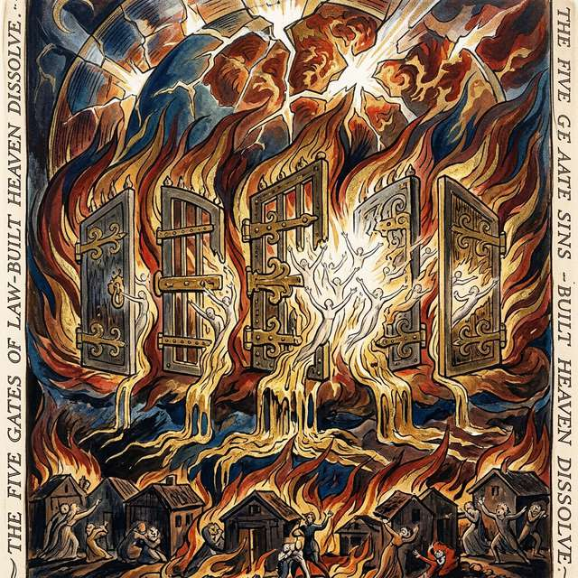

## Page 49

5.3.3
Art as Experience in Dewey and Blake’s Workshop
Dewey’s Art as Experience (1934) provides the most direct philosophical counterpart to Blake’s artistic
practice.[Dewey, 1934]
5.3.3.1
The Continuity of Art and Life
Dewey argued that aesthetic experience is not a separate,
elevated realm (“Art” with a capital A, housed in museums) but the consummation of ordinary experience—
the moment when the organism-environment transaction reaches its fullest, most unified expression. “The
function of the fine arts is not to provide an escape from ordinary life. Rather, it is the enhancement of
qualities that make ordinary experiences appealing.”[Dewey, 1934]
Blake’s illuminated printing makes this continuity literal. In conventional publishing, the division of labor
is total: the author writes, the typesetter sets, the printer prints, the binder binds. Blake collapsed all these
roles: he invented, engraved, printed, and hand-colored each plate himself. The result is an artifact in which
artistic conception and physical execution are indistinguishable—text is image, meaning is material form.
5.3.3.2
The Aesthetic as Epistemic
For Dewey, aesthetic experience is not merely pleasurable but
cognitive: it is the mode of experience in which perception achieves its highest integration. The artist does
not merely represent the world but reorganizes it—bringing elements into new relations that reveal structure
invisible to habitual perception.
This is precisely Blake’s claim for prophetic vision. The prophetic books are not descriptions of supernatural
events but reorganizations of perception—attempts to show the reader what the world looks like when the
Zoas are integrated, when single vision gives way to fourfold. The experience of reading Blake—struggling
with the dense, allusive text while simultaneously engaging the swirling visual imagery—is itself a training
in integrated perception.
Dewey’s Aesthetics
Blake’s Practice
Shared Principle
Art as consummation of experience
Illuminated printing
Unity of conception and
execution
Aesthetic as cognitive
Prophetic vision as perception
Seeing as knowing
Organism-environment transaction
Creator-medium-audience unity
No spectator; all participants
“Continuous interchange”
Text-image integration
Form and content inseparable
5.3.4
The Pedagogy of Perception and Learning to See
Both traditions imply a pedagogy—a practice of learning to perceive more fully.
Dewey’s educational philosophy, grounded in the pragmatist primacy of practice, insists that students learn
by doing: “Education is not preparation for life but is life itself.”[Dewey, 1916] The classroom should be a
workshop where students engage in genuine inquiry—encountering real problems, formulating hypotheses,
testing them through action, and reflecting on the results.[Dewey, 1916]
Blake’s pedagogical vision is wilder but structurally similar. His Songs of Innocence and Experience are
educational texts—they train the reader to see the same situations (chimney sweeps, lambs, tygers) through
different perceptual frameworks (innocence and experience) and thereby to develop the capacity for twofold,
threefold, and ultimately fourfold vision. The method is the message: learning to see multiply is learning to
think pragmatically.
America a Prophecy offers a vivid image of what perceptual liberation looks and feels like—what it means
for experience to be restored after institutional contraction:
“The doors of marriage are open, and the Priests, in rustling scales, Rush into reptile coverts,
hiding from the fires of Orc…. For the Female Spirits of the dead, pining in bonds of religion,
Run from their fetters; reddening, and in long-drawn arches sitting, They feel the nerves of
youth renew, and desires of ancient times Over their pale limbs, as a vine when the tender grape
appears.” — America a Prophecy, lines 120–127
49

## Page 50

The “Female Spirits” who run from their fetters are Blake’s image of embodied experience reawakened. They
“feel the nerves of youth renew”—perception is literally re-embodied, sensation restored. The simile—“as
a vine when the tender grape appears”—is organic, developmental, Deweyan: growth is not the imposition
of external form but the emergence of capacity from within the organism-environment transaction. This
passage is the pedagogical counterpart to the five gates’ destruction: not merely the removal of barriers to
perception but the positive restoration of the organism’s capacity for rich, transactional experience.
5.3.5
The Phenomenological and Enactivist Connection
The convergence of Dewey and Blake on experience connects both to the phenomenological tradition.
Merleau-Ponty’s claim that the body is the “condition of objecthood, not an object itself” parallels both
Dewey’s transactionalism and Blake’s rejection of Cartesian dualism: “Man has no Body distinct from his
Soul.”
The enactivist tradition (Varela, Thompson, and Rosch)—which holds that cognition is inseparable from
sensorimotor engagement—provides yet another crucial bridge. Blake’s “Energy is Eternal Delight” and
Dewey’s emphasis on the active organism both anticipate the enactivist rejection of cognition as internal
computation performed on external inputs, directly setting the stage for the “pragmatic turn” in 4E cognitive
science that Active Inference formalizes.
Dewey’s pragmatist body, Blake’s visionary body, and Merleau-Ponty’s phenomenological body are three
descriptions of the same thing: the perceiving-acting organism for whom knowing and doing are one.
50

## Page 51

5.4
Convergence 4: Social Selves and Collectives—Mead’s Generalized Other
and Blake’s Albion, and the Thirteen Angels Who Descend
“It is by means of reflexiveness—the turning back of the experience of the individual upon
himself—that the whole social process is thus brought into the experience of the individuals
involved in it.” — George Herbert Mead, Mind, Self and Society, p. 134[Mead, 1934]
“So cried he, rending off his robe and throwing down his sceptre In sight of Albion’s Guardian; and
all the Thirteen Angels Rent off their robes to the hungry wind, and threw their golden sceptres
Down on the land of America.” — William Blake, America a Prophecy, lines 53–56[Blake, 1793a]
5.4.1
The Social Constitution of the Self in Philosophy
Both Mead and Blake propose that selfhood is not a private, pre-social given but a social achievement—
constituted through relations with others and irreducible to individual consciousness. America a Prophecy
provides the most vivid dramatization of this thesis in Blake’s canon: a scene in which individual action and
collective transformation are revealed to be the same event.
5.4.1.1
Mead’s “I” and “me”
Mead distinguished two aspects of the self (1934, pp. 135–226):[Mead,
1932, 1934]
• The “me”: The organized attitudes of others that the individual has internalized—the social self as
perceived from the outside.
• The “I”: The spontaneous, creative response of the individual to the “me”—the source of novelty and
agency.
Selfhood arises only through the dialectic of I and me: the individual internalizes social perspectives (becom-
ing a “me” to themselves) and then responds creatively (as an “I”). The “generalized other” describes
how this internalization works at the level of entire communities—one takes on the attitudes not just of
specific individuals but of the social group as a whole.[Mead, 1934]
5.4.1.2
Blake’s Albion: The Universal Man
Blake’s mythology presents a strikingly parallel archi-
tecture. Albion is the “Universal Man”—not a single individual but the collective human identity that
encompasses all persons. Albion’s four Zoas are simultaneously faculties within each individual and social
roles within the collective body:
Component
Individual Level
Social Level
Urizen
Personal reason
Scientific institutions, law
Luvah
Personal passion
Religious and artistic
communities
Urthona/Los
Personal imagination
Prophetic and creative traditions
Tharmas
Personal sensation
Material labor, the body politic
The “Fall of Albion” is simultaneously a psychological fragmentation (the Zoas losing coordination within the
individual) and a social fragmentation (the breakdown of communal life into isolated, competing institutions).
Conversely, “Building Jerusalem” is both personal reintegration and social reconstruction.
5.4.1.3
The Convergence in America a Prophecy
America a Prophecy (1793) dramatizes this con-
vergence with mythological precision.[Blake, 1793a] The poem’s pivotal moment occurs when the Thirteen
Angels of the American colonies—each an aspect of Albion’s collective identity—make a revolutionary choice:
“So cried he, rending off his robe and throwing down his sceptre In sight of Albion’s Guardian; and
all the Thirteen Angels Rent off their robes to the hungry wind, and threw their golden sceptres
Down on the land of America; indignant they descended Headlong from out their heav’nly heights,
51

## Page 52

descending swift as fires Over the land; naked and flaming are their lineaments seen In the deep
gloom; by Washington and Paine and Warren they stood.” — America a Prophecy, lines 53–59
5.4.2
The “I” and the “Me” in the Fiery Forge: Reconstituting the Social Self
This is Mead’s dialectic of “I” and “me” in prophetic action. The Thirteen Angels begin as institutional
functionaries—extensions of Albion’s Guardian (the British “generalized other”)—but their “I” rebels against
the role assigned by the “me.” They rend off the robes that define their institutional identity and descend
to stand with the revolutionary community. The act is simultaneously individual (each Angel acts) and
collective (all thirteen act together), exactly as Mead’s theory demands: selfhood is reconstituted through
its relation to a new community. Albion’s Angel does not lose his selfhood; he refounds it among a different
“generalized other.”
The scene’s details repay close attention. The robes are “rent off… to the hungry wind”—the institutional
identity is not merely discarded but offered to a force greater than any individual will. The sceptres are
thrown “Down on the land of America”—the instruments of authority are returned to the earth, to the
material ground of experience.
And the Angels descend “naked and flaming”—stripped of institutional
covering, they are revealed as pure energy whose “lineaments” are “seen / In the deep gloom” only when
they stand beside the revolutionary community. This is Mead’s “I” in its most radical form: the spontaneous
creative response that cannot be predicted from the attitudes of the “me,” that emerges as genuine novelty
in the social process.
The poem then shows how this revolutionary “I” immediately generates a new “me”—a new generalized
other. The Angels do not descend into isolation; they stand “by Washington and Paine and Warren.” They
join a community. The revolutionary self is constituted not by solitary rebellion but by solidarity with a
new collective project. This is precisely Mead’s insight: the “I” can only function within a social field; even
the most radical act of selfhood is intelligible only against the background of a community whose attitudes
one has internalized.
The British soldiers’ response confirms the social character of the transformation: “threw their swords &
muskets to the earth & ran / From their encampments and dark castles seeking where to hide” (America, lines
71–72). The old “generalized other” (the British military hierarchy) disintegrates not because of military
defeat but because the social field has shifted—the attitudes, expectations, and reciprocal recognitions that
constituted the old order have been dissolved by the new.
The Thirteen Angels rend off their robes and throw their golden sceptres “Down on the land of America,”
descending “swift as fires.” This represents the descent of abstract, institutional authority into the messy,
embodied reality of social action. By joining Washington, Paine, and Warren, the Angels participate in
Mead’s “generalized other”—they relinquish isolated, heavenly transcendence to become part of the collective
social self forging a new democratic reality.
Table 5: The Mead-Blake Shared Structure
Mead
Blake
Shared Structure
Self constituted
through Others
Self as aspect of Albion
No pre-social self
“Generalized other”
The collective Zoas
Internalized community
“I” / “me” dialectic
Los (creative response)
/ Spectre (internalized
roles)
Creativity within structure
Symbolic
interactionism
Prophetic
communication
Meaning as social practice
Novel “I” response
Angels rending robes
Spontaneous creative rupture
New “me” formation
Standing with
Washington
Reconstituted solidarity
52

## Page 53

Figure 9: The Angels Descend.
The Thirteen Angels descend to join Washington, Paine, and Warren.
America a Prophecy, lines 53–59; AI-generated illustration.
53

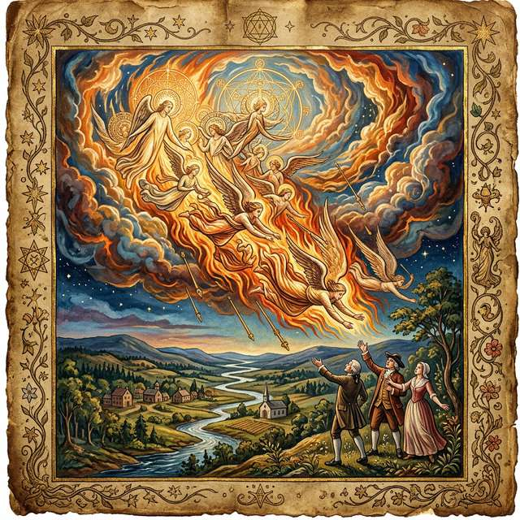

## Page 54

5.4.3
Rebuilding Jerusalem: Action as Social Coordination and Multi-Agent Convergence
The convergence between Blake’s social vision and pragmatism deepens when we consider Peirce’s commu-
nity of inquirers and Dewey’s democratic community.
5.4.3.1
Peirce’s Community of Inquiry
Peirce grounded the very concept of objective truth in the
social practices of the community: “The opinion which is fated to be ultimately agreed to by all who
investigate, is what we mean by the truth, and the object represented in this opinion is the real.”[Peirce,
1878] For Peirce, truth is never the private property of an isolated Cartesian intellect; it is a profound social
achievement—the convergent, asymptotic limit reached by an indefinitely extended community subjecting
every hypothesis to rigorous, public, experimental criticism.
America a Prophecy’s portrayal of the revolutionary community dramatically embodies this epistemic prin-
ciple. The American figures do not arrive at their revolutionary convictions through isolated contemplation;
rather, they “rush together in the night in wrath and raging fire” (America, line 100). The operative word
is together—the rush is collective, and the epistemological fire is shared. Truth, for both the pragmatist
logician and the visionary poet, is forged strictly in the crucible of communal action.
5.4.3.2
Dewey’s Democracy as a Way of Life
John Dewey systematically extended this logic beyond
the laboratory and into the political sphere: democracy, he argued, is not merely a formal mechanism for
casting ballots, but a fundamental “way of life.” It requires open communication, shared inquiry, and the
continuous reconstruction of social habits to address novel problems.[Dewey, 1916] For Dewey, education is
the crucible where these democratic habits are cultivated—not through the passive indoctrination of static
facts, but through the active, lived experience of collaborative problem-solving.[Dewey, 1916]
5.4.3.3
Blake’s Jerusalem
Blake’s Jerusalem—the sprawling, magnificent prophetic epic that stands as
his most difficult and ambitious achievement—exhaustively details the grueling labor of building a community
capable of integrated perception. For Blake, “Jerusalem” is not a geographical location or an otherworldly
reward, but a mode of communal existence in which the fragmented Zoas are finally reintegrated across the
entire social body. This is democracy exactly as Dewey understood it: not a set of bureaucratic procedures,
but a tangible quality of shared experience.
The labor of building Jerusalem is performed by Los (Imagination), who works at his furnace to forge the
fragmented Zoas back into unity. This is inquiry as Peirce understood it: not a solitary intellectual activity
but a communal, practical, creative process of transforming indeterminate situations into “determinate
wholes.”[Dewey, 1920]
5.4.4
Addams, West, and Blake’s Prophetic Social Praxis
5.4.4.1
Jane Addams: Pragmatism in Practice
Addams’s founding of Hull House—a settlement
house providing education, social services, and community building in immigrant neighborhoods—was prag-
matism made concrete. She invented social work as a discipline grounded in the pragmatist principle that
knowledge comes through engagement, not observation.[Addams, 1902]
Blake would have recognized Addams’s project as an instance of “Building Jerusalem”—the creation of social
spaces where the full range of human capacities (intellectual, emotional, creative, practical) can operate in
coordination rather than isolation. Boston’s Angel’s demand—“Who commanded this?… To keep the gen’rous
from experience”—is the question Addams answered with Hull House: no one has the right to exclude the
generous from experience.
5.4.4.2
Cornel West: Prophetic Pragmatism
West’s prophetic pragmatism — “tragic action with
revolutionary intent, usually reformist consequences, and always visionary outlook” — draws together the
threads of pragmatist social philosophy, African-American political thought, and Christian prophecy.[West,
1989, 1993]
Blake’s prophetic tradition provides a direct precursor. Both Blake and West:
54

## Page 55

1. Refuse the separation of philosophy from politics: Blake’s prophecies are always simultaneously
about perception and about power; West’s pragmatism is always tied to social justice.
2. Draw on religious vocabulary for secular ends: Blake’s “Jerusalem” and West’s “prophetic” are
not otherworldly but transformative—visions of what communal life could become.
3. Center the marginalized: Blake’s sympathy for chimney sweeps, enslaved persons, and the working
poor anticipates West’s insistence that pragmatism must confront race, class, and gender. America’s
Female Spirits who “Run from their fetters reddening, & in long drawn arches sitting: / They feel
the nerves of youth renew, and desires of ancient times, / Over their pale limbs as a vine when the
tender grape appears” (America, lines 125–127) are among Blake’s most powerful images of liberation
for those whom the “law-built Heaven” has most thoroughly oppressed.
5.4.4.3
Du Bois, Locke, and the Pragmatism of the Marginalized
W.E.B. Du Bois (1868–1963)
and Alain Locke (1885–1954) applied pragmatist insights to cultural pluralism and racial identity.[Du Bois,
1903, Locke, 1925] Their work—germinating new philosophies of race through productive dialogue—plants
seeds visible in Blake’s earlier recognition that “One Law for the Lion & Ox is Oppression” (The Marriage
of Heaven and Hell). Blake’s pluralism, like the cultural pluralism of Du Bois and Locke, insists that genuine
unity requires the integration of difference, not its suppression.
5.4.5
The Enduring Social Vision and Multi-Agent Inference
The convergence of Blake and pragmatism on the social constitution of the self carries implications for
contemporary philosophy of mind, artificial intelligence, and social theory. If the self is constitutively social—
if “I” only exist through the “generalized other” (Mead) or through the “Universal Brotherhood of Eden”
(Blake)—then any cognitive science that begins with the isolated individual will be as incomplete as Urizen’s
single-vision philosophy. The multi-agent perspective of Active Inference, where shared generative models
enable coordinated sense-making across social scales, provides the formal framework for this insight.
America a Prophecy offers a final image for this social epistemology: “Washington, Franklin, Paine, and
Warren, Allen, Gates, and Lee” stand together “in the flames” and view “the armies drawn out in the
sky” (America, lines 82–83). No single revolutionary comprehends the whole; but standing together—as a
community of inquirers, a generalized other in formation—they perceive what no individual could perceive
alone. This is Peirce’s truth, Dewey’s democracy, and Blake’s Jerusalem made visible in a single scene.
55

## Page 56

5.5
Convergence 5: Anti-Representationalism—Rorty, Brandom, Putnam, and
Blake’s Refusal to “Reason and Compare”
“Our vocabularies have no more of a representational relation to an intrinsic nature of things
than does the anteater’s snout or the bowerbird’s skill at weaving.” — Richard Rorty, Truth and
Progress, p. 48[Rorty, 1998]
“I will not Reason & Compare: my business is to Create.” — William Blake, Jerusalem, Plate
10 [Erdman 153][Erdman, 1988]
5.5.1
Anti-Representationalism: Rorty and Blake
Rorty’s central philosophical target—the idea of knowledge as representation, as a mental mirroring of
a mind-external world—is exactly the target Blake had attacked a century and a half earlier.[Rorty, 1991,
Peirce, 1878]
5.5.1.1
Rorty’s Critique
Rorty’s Philosophy and the Mirror of Nature (1979) argued that the en-
tire project of modern epistemology—from Descartes through Kant to the analytic tradition—rests on the
metaphor of the mind as a mirror that reflects reality. If the mirror is polished (through proper method),
our representations will accurately copy the world. Rorty’s strategy was to show that this metaphor “is not
a useful one” and that “any vocabulary is optional and mutable.”[Rorty, 1991]
5.5.1.2
Blake’s Critique
Blake attacked the same metaphor through different means. Locke’s “tabula
rasa” is a mirror-predecessor: the blank slate that passively receives impressions.
Newton’s mechanical
universe is the world that the mirror is supposed to reflect. And Urizen—Blake’s tyrannical Reason-God—is
the philosopher who insists that the mirror’s image is the only reality.
Blake’s alternative is not to polish the mirror but to smash it: “I will not Reason & Compare: my business
is to Create.” Where Rorty replaces the mirror metaphor with the metaphor of vocabularies as tools,
Blake replaces it with the metaphor of creation as existence. Both refuse the correspondence picture;
both insist that the relationship between mind and world is active, constructive, and creative rather than
passive, receptive, and representational.
America a Prophecy (1793) stages this refusal as revolutionary drama.[Blake, 1793a] Boston’s Angel’s dec-
laration of independence from inherited vocabulary (subsection 5.1, America, Plate 11; Erdman 53) is the
anti-representationalist act in its purest form: the refusal to accept the “law-built Heaven” of Albion’s Au-
thority as binding. He does not argue that the old vocabulary is false (that would be to remain within the
representationalist framework); he declares that he will no longer use it. This is precisely Rorty’s move: the
shift from asking “Is this vocabulary true?” to asking “Is this vocabulary useful?”—and, finding it wanting,
choosing to create rather than comply.
Feature
Rorty
Blake
Target
Mind as mirror
Mind as tabula rasa / Urizen’s
cavern
Alternative
Vocabularies as tools
Imagination as existence
Relation to truth
Deflationary: “true” = useful
endorsement
Dynamic: “proved was once
imagined”
Relation to philosophy
Art of conversation
Art of prophecy
Cultural posture
Liberal ironist
Prophetic visionary
5.5.2
Vocabularies and Systems
Rorty’s concept of vocabularies—entire frameworks of description that cannot be assessed from a “neutral”
standpoint—maps onto Blake’s concept of systems. Blake’s “I must Create a System, or be enslav’d by
56

## Page 57

another Man’s” is, in Rortyan terms, the recognition that one always inhabits some vocabulary, and the
choice is between creating one’s own or being trapped in someone else’s.
However, there is a crucial difference: Rorty’s ironism holds that one should recognize the contingency
of one’s own vocabulary—that it is one possible description among many, with no metaphysical privilege.
Blake’s prophetic certainty is more robust: the visionary sees with Fourfold clarity and knows that single
vision is a contraction, not merely an alternative description.
This tension—between Rortyan contingency and Blakean conviction—is the most significant dissonance in
the Blake-Pragmatism convergence, and resolving it is essential.
The resolution lies in recognizing that
Rorty and Blake converge at the level of functional orientation: both treat vocabularies as instruments for
coping with experience rather than mirrors of reality, and both insist that the choice between vocabularies
is a matter of creative agency rather than passive discovery. They diverge at the level of attitude toward
the instrument: Rorty adopts ironic distance from his own vocabulary, while Blake wields his with visionary
conviction.
But this divergence is itself illuminated by the pragmatist tradition’s internal debate between fallibilism
(Peirce, Haack) and anti-representationalism (Rorty). Blake’s position occupies a precise location within
this debate: he is a fallibilist in practice (his mythology evolved across decades; the prophetic books
revise one another; Jerusalem reconstructs what The Book of Urizen first articulated) but a visionary in
aspiration (he pursues Fourfold Vision as a genuine achievement, not merely a useful redescription). In
Active Inference terms, this is the distinction between maintaining high precision on one’s generative model
(Blakean conviction) while simultaneously allowing model updating in response to prediction error (Blakean
fallibilism). Rorty’s ironist, by contrast, maintains low precision uniformly—treating all vocabularies as
equally contingent.
Haack’s foundherentism (subsection 5.5) suggests that Blake’s position is the more
epistemically productive: strong but revisable commitments outperform ironic detachment when the agent
must act in the world rather than merely contemplate it.
5.5.3
Brandom’s Inferentialism and Blake’s Semiotic Cosmos
Robert Brandom’s inferentialist semantics offers another unexpected bridge to Blake.[Brandom, 1994]
5.5.3.1
Meaning as Inferential Role
Brandom argues that the meaning of a concept is constituted not
by what it refers to (the representationalist picture) but by its inferential role—the patterns of reasoning
in which it participates. To understand “red” is not to match the word to a color-property but to know what
follows from something’s being red, what is incompatible with it, and what would count as evidence for or
against it. Meaning, in Brandom’s terms, is “implicit in social practices of attributing and acknowledging
commitments and entitlements.”[Brandom, 1994]
5.5.3.2
Blake’s Semiotic Practice
Blake’s illuminated books function as inferentialist artifacts. The
meaning of a Blakean symbol—Urizen, Los, the “Tyger”—is not fixed by reference to a determinate external
object but by its inferential relations to other symbols in the prophetic system. Understanding the Tyger
requires tracking its relations to the Lamb, to the Forests of the Night, to the “fearful symmetry” of the
cosmos, to the Smithy of Los.
Blake’s method of composition—in which symbols accumulate meaning across multiple works, shifting and
deepening as the system evolves—is a literary enactment of Brandom’s thesis that meaning is constituted
in use, not before use. The reader who enters the prophetic books must learn to play the “game of giving
and asking for reasons” with Blake’s mythological vocabulary, just as the scientist must learn to reason
inferentially with the concepts of physics.
5.5.3.3
Normative Pragmatics
Brandom’s concept of normative pragmatics—the idea that linguis-
tic practices are governed by norms implicit in the community’s practices of acknowledging and attributing
commitments—finds an echo in Blake’s vision of prophetic community. The prophet does not describe a
reality external to the community but articulates norms implicit in the community’s deepest commitments.
57

## Page 58

“Jerusalem” is the name for the normative ideal already implicit in communal life but not yet explicitly
recognized.
5.5.4
Putnam’s Fact/Value Collapse and The Marriage of Heaven and Hell
Putnam’s argument for the collapse of the fact/value dichotomy—that “thick” ethical concepts blend
descriptive and evaluative elements inseparably—finds its most dramatic literary embodiment in Blake’s
Marriage of Heaven and Hell.[Putnam, 2002]
The Marriage systematically fuses contraries that conventional philosophy keeps apart:
“Heaven” (Fact/Reason)
“Hell” (Value/Energy)
Blake’s Marriage
Restraint
Excess
“The road of excess leads to
the palace of wisdom”
Reason
Passion
“Energy is Eternal Delight”
Passive obedience
Active rebellion
“Opposition is true
Friendship”
Angels (the orthodox)
Devils (the creative)
“Without Contraries is no
progression”
This is precisely Putnam’s point: the “pure fact” and the “pure value” are abstractions. In lived experience—
and in Blake’s illuminated cosmos—every perception is simultaneously a factual registration and an evalua-
tive orientation. To see the Tyger is simultaneously to describe it (“burning bright”) and to respond to it
(“fearful symmetry”). Putnam’s “entanglement” is Blake’s “marriage.”
5.5.5
Haack’s Foundherentism and the Crossword of Vision
Susan Haack’s foundherentism—her synthesis of foundationalism and coherentism using the crossword puz-
zle metaphor—offers a more sympathetic pragmatist framework for Blake than Rorty’s deflationism.[Haack,
1993]
In Haack’s model, experiential “clues” anchor beliefs (as in foundationalism) while mutual support between
beliefs provides further justification (as in coherentism). This dual structure mirrors Blake’s epistemology:
the sensory input of Tharmas (experiential anchoring) combined with the architectural coherence of the Four
Zoas’ interrelation (mutual support). Fourfold Vision, in Haack’s terms, is the completed crossword—where
experiential clues and systemic coherence reinforce each other to produce warranted conviction.
5.5.6
Inferentialism in Practice: America a Prophecy as a Space of Reasons
Brandom’s inferentialism becomes especially illuminating when applied to Blake’s mythological vocabu-
lary.[Brandom, 1994, 2000] Consider the term “Orc” in America a Prophecy. Its semantic content is not
fixed by reference to some extra-textual entity but is constituted entirely by its inferential relations: “Orc”
is that which breaks chains, rises from the Preludium’s darkness, opposes Urizen, radiates fire, and compels
the Thirteen Angels to descend. Each of these inferential commitments entails further commitments: if Orc
breaks chains, then there must be chains to break (Urizen’s “mental” fetters); if Orc radiates fire, then the
“five gates” become flammable. The meaning of “Orc” is thus the sum of its position in a network of infer-
ential moves—precisely Brandom’s account of conceptual content as constituted by its role in the “space of
reasons.” Blake’s mythological system functions as a self-contained inferential practice, where to introduce a
term like “Albion” or “Los” is to undertake a package of commitments and entitlements that the prophetic
narrative then makes explicit. This is Making It Explicit avant la lettre.
The anti-representationalist trajectory traced from Rorty through Brandom, Putnam, and Haack converges
with Blake’s categorical refusal to treat perception as mirroring. The next convergence extends this analysis
into the domain of mathematics and spatial reasoning, where Fuller’s Synergetics and Bridgman’s opera-
tionalism reveal pragmatic geometry as the sixth face of the same anti-representationalist gem.
58

## Page 59

5.6
Convergence 6: Synergetics and Pragmatic Geometry—Fuller, Bridgman,
and the Geometry of Fourfold Vision
“Dare to be naive.” — R. Buckminster Fuller, Synergetics (1975), 000.001
“Shaking their mental chains, they rush in fury to the sea” — William Blake, America a Prophecy,
line 67[Blake, 1793a]
5.6.1
Fuller and the Pragmatic Tradition
Richard
Buckminster
Fuller
(1895–1983)
stands
as
one
of
the
most
consequential—and
most
underappreciated—inheritors of the American Pragmatic tradition.[Fuller, 1975] Though rarely classified
as a philosopher, Fuller’s lifework embodies pragmatism’s deepest commitments: the rejection of spectator
knowledge in favor of design science, the insistence that truth is operational and verified through its
consequences, and the conviction that thinking is inseparable from making. His intellectual partnership with
E.J. Applewhite (1919–2005), who co-authored the monumental Synergetics: Explorations in the Geometry
of Thinking (1975) and Synergetics 2 (1979), produced a philosophical system that—like Blake’s—fuses
geometry, cosmology, and epistemology into a single integrated vision.[Applewhite, 1977]
Fuller explicitly aligned himself with the pragmatist tradition, citing William James’s influence and describing
his own method as “comprehensive anticipatory design science”—a phrase that reads as a Deweyan manifesto
in compressed form.[Fuller, 1981] Like Dewey, Fuller insisted that knowing and doing are inseparable; like
Peirce, he treated all knowledge as provisional and self-correcting; like James, he valued ideas by their
consequences. And like Blake before all of them, Fuller rejected the Newtonian-Cartesian framework as
a distortion of experiential reality—precisely the “law-built Heaven” whose “five gates were consum’d” in
America a Prophecy (Plates 17–18; Erdman 57–58).[Blake, 1793a]
5.6.2
Fuller’s Synergetics: A Geometry of Action and Experience
Synergetics—Fuller’s comprehensive geometric philosophy—begins from a radical empiricist premise that
James would have recognized immediately: start with experience, not abstraction.[Fuller, 1975]
5.6.2.1
The Rejection of the Cubic Grid
Conventional geometry starts with the XYZ coordinate
system: three mutually perpendicular axes meeting at a point. Fuller argued that this framework is expe-
rientially false. No one has ever experienced perpendicularity as a primary datum. The cube is a human
abstraction imposed on nature, not derived from it—an instance of what Blake’s Boston’s Angel denounces
as a God who “writes laws of peace, and clothes him in a tempest” (America, line 48).
Fuller’s alternative is the tetrahedron—the minimum structural system in nature, the simplest enclosure
of space, composed of four vertices, six edges, and four triangular faces. The tetrahedron is the “quantum
of structure,” and all of Synergetics builds from this irreducible unit.
Feature
Cartesian Geometry
Synergetics
Fundamental unit
Cube (right angles)
Tetrahedron (60-degree angles)
Coordinate system
XYZ (3 axes, 90 degrees)
IVM (4 axes, 60 degrees)
Starting point
Abstract point
Experienced event
Space conception
Empty container
Network of relationships
Zero reference
Origin point
Center of closest-packing
Epistemology
Representation
Operation
This is not merely a technical preference. It is an epistemological claim: the geometry we use to think about
the world shapes what we can think. The Cartesian grid—a product of the same rationalist tradition that
Blake attacked and pragmatism challenged—imposes a framework of isolated, perpendicular dimensions on
an experience that is fundamentally relational and triangulated.
59

## Page 60

5.6.2.2
The Isotropic Vector Matrix
Fuller’s Isotropic Vector Matrix (IVM)—a closest-packed
sphere arrangement where every vector has the same length and every angle is 60 degrees—provides an
alternative coordinate system that is:
• Omni-symmetrical: No privileged direction or axis
• Closest-packed: Maximum efficiency, minimum waste
• Experientially grounded: Derived from the behavior of real spheres in contact
The IVM generates both the octahedron and the tetrahedron as its fundamental cells, producing what Fuller
called the octet truss—a structural system that appears throughout nature (from crystal lattices to viral
capsids) and engineering (space frames, geodesic domes).
5.6.2.3
The Concentric Hierarchy of Polyhedral Volumes
Fuller’s most radical geometric claim is
that the tetrahedron—not the cube—should serve as the unit of volumetric measure. Setting the regular
tetrahedron’s volume to 1, Fuller demonstrated a concentric hierarchy of nested polyhedra whose volumes
are all whole numbers or simple fractions—a result impossible in Cartesian cubic measure:[Fuller, 1975]
#
Shape
IVM Volume
XYZ Volume
Comments
0
A
0.041667
0.039284
24 make a Tetra
1
B
0.041667
0.039284
AAB = BAA =
Mite
2
T
0.041667
0.039284
1/120 RT5
3
E
0.041731
0.039345
1/120 RT5+
4
S
0.045085
0.042507
(𝜑**-5) / 2
5
Tetra
1.000000
0.942809
edges D, from 4
IVM balls
6
Cubocta
2.500000
2.357023
some faces flush
with Octa 4
7
Icosa
2.917961
2.751080
some faces flush
with Octa 4
8
Cube
3.000000
2.828427
Duo-Tet, face
diagonals = D
9
Octa
4.000000
3.771236
Dual of Cube,
edges D
10
RT5
5.000000
4.714045
120 T mods
11
RT5+
5.007758
4.721360
120 E mods
12
RD
6.000000
5.656854
long diagonals = D,
sphere domain
13
RT
7.500000
7.071068
some vertexes
shared with RD
14
Icosa
18.512296
17.453560
edges = D
15
Cubocta
20.000000
18.856181
edges = D, 1F,
12-balls around
nuclear ball
16
SuperRT
21.213203
20.000000
icosa of edges D +
dual
17
Cube
24.000000
22.627417
face diagonals =
2D, 2F
Table source: Kirby Urner, Flickr [Urner, 2010]
The whole-number ratios of the concentric hierarchy are not a coincidence but a consequence of the tetra-
hedron being nature’s minimum structural system. Fuller regarded this as evidence that “nature is using a
coordinate system” based on closest-packing and 60-degree coordination rather than the 90-degree Cartesian
60

## Page 61

grid—a geometric operationalism that Peirce’s pragmatic maxim would endorse: the meaning of “volume” is
determined by the operations used to measure it, and different operational frameworks yield different (and
differently illuminating) truths.[Fuller, 1975]
5.6.2.4
Quadray Coordinates: A Four-Axis Alternative
Fuller and his intellectual successors de-
veloped Quadray coordinates (also called “tetrahedral coordinates”)—a four-axis coordinate system based
on the four rays emanating from the center of a regular tetrahedron to its vertices. The basis vectors are
(1,0,0,0), (0,1,0,0), (0,0,1,0), and (0,0,0,1), pointing to the four corners of the reference tetrahe-
dron. Any point in 3D space can be addressed using non-negative coordinates in this system, eliminating
the negative numbers required by XYZ Cartesian coordinates—a feature that Kirby Urner has implemented
in Python libraries for computational pedagogy, demonstrating the operational viability of the alternative
framework.[Urner, 2010]
Quadrays instantiate the pragmatist epistemology at the level of spatial cognition: they demonstrate that
what counts as a “natural” way to address space is not a given but a choice—and that the Cartesian choice, far
from being neutral, embeds philosophical commitments (perpendicularity, negative extension, the primacy
of the right angle) that shape downstream mathematical reasoning. Blake’s rejection of “Newton’s Sleep”
acquires geometric specificity through the quadray alternative.
5.6.2.5
The Jitterbug Transformation
Perhaps the most visually compelling demonstration in Syn-
ergetics is the Jitterbug Transformation: the continuous transformation of the cuboctahedron (Vector
Equilibrium) through the icosahedron to the octahedron, achieved by rotating alternate triangular faces
of the VE. This transformation—which Fuller discovered in 1948 and demonstrated with physical models
throughout his career—connects the most symmetrical polyhedron (the VE, with 12 vertices equidistant
from the center) to the most compact (the octahedron, with 4 units of Synergetics volume), passing through
the icosahedron (the basis of viral capsid geometry and Penrose tiling) along the way. The Jitterbug is
Fuller’s geometric enactment of Blake’s doctrine: contraries do not cancel but transform—the VE and the
octahedron are not different objects but different states of the same dynamic system, related by continuous
motion rather than static comparison.
5.6.3
Operationalism: Bridgman’s Operations and Chang’s Iterative Verification
Fuller’s epistemology is fundamentally operationalist: a concept means what it does, not what it repre-
sents.[Bridgman, 1927] This connects him to Percy Bridgman’s operationalism (itself a descendant of Peirce’s
pragmatic maxim) and, through Bridgman, back to the pragmatist mainstream. Critically, Bridgman in-
sisted that operations were matters of private experience, not public verification—declaring “Science is not
truly objective unless it recognizes its own subjective or individual aspects”—a position that brings him
surprisingly close to both James’s radical empiricism and Blake’s insistence on the primacy of individual
perception.[Bridgman, 1927] Hasok Chang’s Inventing Temperature (2004) develops this Bridgmanian insight
into the concept of “epistemic iteration” and “operational coherence,” explicitly giving “a conscious nod to
Percy Bridgman’s advocacy of the operational point of view” and arguing that his “operational notion of ‘co-
herence’ is implicit in John Dewey’s theory of knowledge”—thereby bridging operationalism and pragmatism
at the deepest epistemological level.[Chang, 2004]
5.6.3.1
Peirce’s Pragmatic Maxim and Fuller’s Design Science
Peirce’s pragmatic maxim—
“Consider what effects, that might conceivably have practical bearing, we conceive the object of our con-
ception to have. Then, our conception of these effects is the whole of our conception of the object”—is the
philosophical foundation of Fuller’s method.[Peirce, 1878]
Fuller operationalized this maxim literally: to understand a structure is to build it. The geodesic dome is not
a representation of Fuller’s philosophy but its verification—the proof that triangulated structures achieve
maximum strength-to-weight ratios, that “doing more with less” (Fuller’s principle of ephemeralization)
is a genuine possibility.
61

## Page 62

5.6.3.2
Blake, Fuller, and Anti-Newtonian Praxis
Both Blake and Fuller mounted sustained attacks
on the Newtonian worldview, but their alternatives converge remarkably:
Theme
Blake
Fuller
Against Newton
“Newton’s Sleep” contracts
perception
Cartesian grid distorts experience
Alternative framework
Fourfold Vision (integrated
faculties)
Synergetics (IVM geometry)
Method
Illuminated printing (create to
know)
Design science (build to understand)
Unity of art and science
Poetry is philosophy
Architecture is mathematics
Role of imagination
“Human Existence itself”
“Comprehensive anticipatory design”
Both insist that Newton’s mechanical universe—with its absolute space, absolute time, and passive matter—
is not reality but a model: one possible vocabulary (Rorty), one level of vision (Blake), one operational
framework (Fuller) among many. And both propose alternatives grounded not in abstract argumentation
but in practice: Blake’s illuminated printing, Fuller’s geodesic structures.
5.6.4
The Synergetics-Pragmatism-Blake Triad
Synergetics occupies a unique position in the Blake-Pragmatism synthesis:
Dimension
Blake
Pragmatism
Synergetics
Against abstraction
“Newton’s
Sleep”
Anti-Cartesian
foundations
Tetrahedra replace cubes
Experiential grounding
“Cleanse the
doors”
Radical empiricism
Start with closest-packing
Operational truth
“Proved was
once imagined”
Pragmatic maxim
“Build to understand”
Integration
Four Zoas
coordinate
Community of inquiry
Synergy: whole > parts
Pedagogy
Songs of
Innocence
Learning by doing
Martian Math
Anti-reductionism
“Energy is
Eternal Delight”
Holism (James, Dewey)
Synergy: behavior of wholes
The key concept here is Fuller’s synergy—“the behavior of whole systems unpredicted by the behavior of
their parts taken separately.”[Fuller, 1975] This is:
• Blake’s Four Zoas: the integrated fourfold perception exceeds what any single faculty can produce
• Dewey’s organism-environment transaction: the whole experience exceeds stimulus plus response
• Peirce’s cable and tensegrity: Peirce’s structural metaphor of the cable—where continuous, overlapping
tensile fibers create a system stronger than any single compressive chain—finds its exact geometric
expression in Fuller’s tensegrity architecture (tensional integrity). In tensegrity structures, isolated
components in discontinuous compression are held together by a continuous network of tension. The
system’s stability emerges from the synergistic distribution of stress across the whole network, just
as the resilience of pragmatic truth emerges from the overlapping, mutually supporting vectors of
communal inquiry.
• Active Inference’s free energy minimization: the integrated generative model outperforms any factorized
approximation
Synergy is the mathematical name for what Blake called “Fourfold Vision” and what the pragmatists called
“the whole of experience.”
62

## Page 63

5.6.5
Applewhite and the Architecture of Collaboration
E.J. Applewhite’s role in producing Synergetics deserves specific attention as an embodiment of the pragma-
tist theory of collaborative inquiry.[Applewhite, 1977] Applewhite—a former CIA intelligence officer turned
humanities polymath—served as Fuller’s intellectual editor, translator, and interlocutor over two decades
of collaboration. His later works, including Washington Itself [Applewhite, 1981] and the meditative Par-
adise Mislaid [Applewhite, 1991], reveal the breadth of his intellectual range—from architectural guidebook
to philosophical reflection on biological existence—a range that itself embodies the pragmatist refusal to
compartmentalize knowledge.
The Fuller-Applewhite partnership mirrors Blake’s own practice of radical collaboration between modes: text
and image, prophecy and craft, abstraction and embodiment. Applewhite’s contribution was to translate
Fuller’s oral, performative, improvisational discourse into written text—an act of disciplined reception that
parallels the “me” in Mead’s I/me dialectic: the organized response that gives form to spontaneous creative
energy.
Their collaboration also illustrates Peirce’s thesis that inquiry is inherently communal. Fuller’s geometric
intuitions required Applewhite’s editorial discipline to become public knowledge—to enter what Peirce called
“the community of inquirers” and what Brandom would call “the space of reasons.” In America a Prophecy,
Blake presents an analogous scene: Washington, Franklin, Paine, Warren, Allen, Gates, and Lee stand
together—no single revolutionary carries the fire alone, but the collective body, “in the flames,” views “the
armies drawn out in the sky” (America, lines 81–83).
5.6.6
Kirby Urner and the Digital Continuation
Kirby Urner (b. 1958) has systematically translated Fuller’s geometric philosophy into Python code and
curricula, extending the pragmatist tradition of “learning by doing” into computational pedagogy.[Urner,
2000] His project is explicitly Deweyan: students encounter the IVM through tactile manipulatives (closest-
packed spheres), build polyhedral models computationally, and verify every theorem by running it—Peirce’s
Method of Science applied to geometry. The concentric hierarchy (tetrahedron = volume 1, octahedron =
volume 4, cuboctahedron = volume 20) provides a natural didactic progression grounded in experiential
rather than abstract starting points.
This is operationalism in practice: the meaning of “tetrahedron”
is constituted by the operations—computational, physical, perceptual—that produce and test tetrahedral
structures. Recent work by Friedman has formalized these coordinate systems analytically in QuadMath
[Friedman, 2025a], providing a rigorous mathematical treatment of quadray and 4D coordinate systems,
while the Symergetics project[Friedman, 2025b] extends Fuller’s vision into symbolic computation—rational
arithmetic, geometric pattern discovery, and all-integer accounting that operationalize synergetic geometry
in code.
5.6.6.1
Martian Math and the Pedagogy of Vision
Urner’s “Martian Math” curriculum—so
named because it asks students to imagine learning mathematics on Mars, without inheriting Earth’s Carte-
sian conventions—is a pedagogical experiment in what Blake would call “cleansing the doors of percep-
tion.”[Urner, 2000] The curriculum begins with closest-packed spheres, builds to the IVM coordinate system,
uses Python to explore polyhedral volumes, and connects to real-world structures (geodesic domes, crystal
lattices, molecular biology).
This is radical empiricism made pedagogical: start with experience, build structure from relations, ver-
ify through practice. It is also a distinctly Blakean project: the systematic replacement of Single Vision
(Cartesian abstraction) with a richer, more integrated mode of spatial cognition.
5.6.7
America a Prophecy: Synergetics and Global Propagation
Blake’s America anticipates Fuller’s “Spaceship Earth” vision in its closing movement. After the revolu-
tionary fire consumes the five gates of law-built Heaven, the poem widens its lens to encompass the entire
Atlantic world:
63

## Page 64

“Stiff shudderings shook the heav’nly thrones! France Spain & Italy / In terror view’d the bands
of Albion, and the ancient Guardians, / Fainting upon the elements, smitten with their own
plagues!” — America a Prophecy, lines 144–146
This is not merely a historical observation about revolution spreading to Europe—it is a structural claim
about synergy at the geopolitical scale. The revolutionary energy that began in the American colonies
cannot be contained by national boundaries because it operates at the level of whole systems. The “ancient
Guardians” are “smitten with their own plagues” because the old order’s instruments of suppression—its
priors, its mental chains, its law-built gates—recoil upon the order itself when confronted by agents who
refuse to submit. Fuller would recognize this as synergy: the behavior of the revolutionary whole (the Atlantic
world-system) exceeds what any analysis of its separate parts (individual nations, individual colonies) could
predict.
5.6.8
Toward a Pragmatic Geometry
The Synergetics lineage—Fuller, Applewhite, Urner—extends the pragmatist challenge to one of its most con-
sequential domains: the foundations of geometry and mathematics education. If our basic spatial concepts
(point, line, plane, cube) are not neutral descriptions of reality but culturally inherited tools (James), vocabu-
laries (Rorty), or habits (Dewey), then changing the tools changes what we can think. Fuller’s substitution of
the tetrahedron for the cube is not merely a mathematical curiosity but a pragmatic experiment: does think-
ing in 60-degree coordinates, in closest-packed relationships, in synergetic wholes produce different—and
perhaps more adaptive—cognitive outcomes than thinking in 90-degree abstractions?
Blake would have understood the stakes immediately. The question “Cube or tetrahedron?” is a version of
his question “Single vision or fourfold?” Both are questions about the relationship between the frameworks
we use and the realities we can perceive. And both imply that the frameworks are not given by nature but
created by human activity—which means they can be re-created, re-imagined, and improved. As America a
Prophecy demonstrates, the five gates of any “law-built Heaven” can be consumed when the fire of genuine
inquiry—pragmatic, operational, synergetic—burns hot enough.
The six convergences now assembled — inquiry, truth, experience, social selves, anti-representationalism,
and synergetics — form a qualitative architecture of remarkable coherence. Yet qualitative correspondence
alone cannot satisfy the pragmatist demand for operational precision, nor Blake’s own insistence that “the
true method of knowledge is experiment.” What is needed is a formal mathematical framework capable of
expressing these convergences as structural identities rather than suggestive analogies. Active Inference —
with its generative models, Markov blankets, and variational free energy — provides exactly this apparatus,
and it is to this formalization that we now turn.
64

## Page 65

6
Active Inference:
The Mathematical Formalization of Prag-
matic Visionary Epistemology
“The agent does not passively record sensory impressions; rather, it is ceaselessly engaged in pre-
diction, and through action upon the world, in the verification or falsification of those predictions.”
— Parr, Pezzulo, and Friston, Active Inference [2022][Parr et al., 2022]
6.0.1
The Triadic Synthesis: Connecting Blake, Pragmatism, and Friston
Throughout this manuscript, we have identified structural convergences between Blake’s visionary episte-
mology and American Pragmatism across six dimensions: inquiry, truth, experience, social selfhood, anti-
representationalism, and synergetics. We now propose that Active Inference—the process theory derived
from Karl Friston’s Free Energy Principle (FEP)—provides the formal mathematical framework in which
these convergences become precise.
This synthesis is neither idiosyncratic nor speculative. An emerging research programme—spanning biosemi-
otics, philosophy of cognitive science, and computational neuroscience—has begun to formalize precisely
the bridge we construct here. Pietarinen and Beni’s award-winning work identifies active inference as the
computational realization of Peirce’s abductive logic, arguing that free energy minimization is formalized
abduction under a generative model.[Pietarinen and Beni, 2021] Gallagher frames classical pragmatism as
the “conceptual ancestor” of the enactivist and predictive processing traditions in which active inference now
operates.[Gallagher, 2022] Bruineberg, Kiverstein, and Rietveld propose an “enactive interpretation of active
inference” that follows “the pragmatic turn in cognitive science”—moving “away from a view of cognition
as the rule-governed manipulation of internal representations, to a view of cognition as being essentially
action-oriented, and therefore premised on the selection of adequate forms of situationally appropriate ac-
tion.”[Bruineberg et al., 2018] And the landmark MIT Press volume The Pragmatic Turn explicitly names the
shift from representationalist to action-oriented views in cognitive science—a shift whose formal backbone
is the Free Energy Principle.[Engel et al., 2016] Our manuscript converges with and extends this literature
by adding Blake’s visionary epistemology as a third vertex, revealing structural isomorphisms that neither
the pragmatist-AIF bridge nor Blake scholarship has yet identified.
The claim is not that Blake or the pragmatists anticipated Active Inference, nor that Active Inference
“proves” their philosophical positions. Rather, the claim is that all three intellectual traditions—Romantic
vision, pragmatist inquiry, and Bayesian neuroscience—independently converged on the same deep structure:
the agent that knows the world by actively engaging with it, whose perception is inference,
whose action is hypothesis-testing, and whose selfhood is constituted by the model it maintains.
6.0.2
The Free Energy Principle: A Primer on Action and Belief
The FEP posits that any self-organizing system that resists disorder must minimize its variational free
energy 𝐹—an upper bound on surprisal (negative log-evidence):
𝐹= −ln 𝑝(𝑦|𝑚) + 𝐷𝐾𝐿(𝑞(𝑥)‖𝑝(𝑥|𝑦, 𝑚))
(1)
where:
• 𝑝(𝑦|𝑚) is the marginal likelihood (model evidence)
• 𝑞(𝑥) is the approximate posterior (the agent’s beliefs)
• 𝐷𝐾𝐿is the Kullback-Leibler divergence from true to approximate posterior
Free energy minimization is achieved through two complementary processes:
1. Perception — updating beliefs 𝑞(𝑥) to better match sensory evidence (reducing 𝐷𝐾𝐿)
2. Action — changing the environment to make sensory evidence match predictions (reducing surprisal)
This dual process is the formal expression of the pragmatist rejection of the spectator theory: the agent does
not passively observe but actively intervenes to bring world and model into alignment.
65

## Page 66

6.0.2.1
America a Prophecy as a Case Study in Free Energy Dynamics
Blake’s America a
Prophecy (1793) provides a remarkably precise mythological rendering of free energy dynamics.[Blake, 1793a]
The poem’s central conflict—between Orc (revolutionary energy) and Urizen (repressive reason)—maps
directly onto the Active Inference architecture:
Orc as elevated free energy: Orc embodies the state in which prediction error is high and the agent’s
model of the world no longer fits the sensory evidence. His “red flames” are the phenomenological experience
of surprise—the organism encountering a world that defies its current generative model. The American
revolutionaries, animated by Orc’s energy, respond not by updating their beliefs to accommodate the old
order but by active inference: changing the world to match their new model of how it should be.
Urizen’s “storèd snows” as pathological prior dominance: In the poem’s climax, Urizen descends
and pours forth “storèd snows” and opens “his icy magazine” upon the Atlantic (America, lines 136–137).
This is the formal condition 𝜋𝑝𝑟𝑖𝑜𝑟≫𝜋𝑠𝑒𝑛𝑠𝑜𝑟𝑦—the state in which priors so dominate sensory precision that
no prediction error can drive belief updating. Urizen’s frozen intervention is the Active Inference analogue
of Newton’s Sleep: a generative model so rigid that it suppresses all evidence of the Infinite.
The plagues’ recoiling—“The red fires rag’d! The plagues recoil’d!” (America, lines 101)—represents the
failure of this strategy. Rigid priors, when confronted with agents who actively engage with their environment
rather than passively submitting, cannot maintain their dominance. The “five gates” of Urizen’s law-built
Heaven are consumed because active agents generate sufficient free energy to overwhelm the prior constraints.
The dialectic of fire and ice is visualized as the mechanics of Active Inference: Orc (left), wreathed in red
flames, embodies high-precision prediction error and model-updating force.
He confronts Urizen (right),
enthroned amid stored snows, representing overly rigid, dominant priors refusing to learn from sensory data.
The plagues recoiling across the Atlantic dramatize the system’s struggle to minimize free energy through
competing strategies of active inference versus rigid perceptual control.
6.0.3
The Nine Correspondences: A Formal Mapping Atlas
Building on the Blake–Active Inference synthesis, we can now place pragmatism as the third vertex of a
triangular correspondence:
The triadic synthesis diagram illustrates the three-way conceptual mapping structuring this manuscript.
Blake’s dynamic, mythological vocabulary (e.g., “Cleansing the Doors of Perception”) maps onto Pragma-
tism’s action-oriented epistemology (e.g., “Inquiry as Active Engagement”), which in turn maps onto the
formal mathematical constructs of Active Inference (e.g., “Free Energy Minimization”). The synthesis demon-
strates structural isomorphism across three registers: prophetic poetry, democratic philosophy, and Bayesian
neuroscience.
Table 6: Triadic Synthesis Atlas: Nine Blake–Pragmatism–Active
Inference correspondences.
Theme
Blake
Pragmatism
Active Inference
Boundary
Doors of
Perception
Organism-environment
transaction (Dewey)
Markov Blanket 𝐵= {𝑠, 𝑎}
Vision
Fourfold Vision
Pluralism and fallibilism
(James, Peirce)
Hierarchical depth of generative model
States
Newton’s Sleep
Dogmatism / Tenacity
(Peirce)
Prior dominance: 𝜋𝑝𝑟𝑖𝑜𝑟≫𝜋𝑠𝑒𝑛𝑠𝑜𝑟𝑦
Imagination
“Human
Existence itself”
Ideas as tools (James,
Dewey)
Generative model 𝑝(𝑜, 𝜃)
Time
“Eternity in an
Hour”
Temporal horizon of
inquiry (Peirce)
Deep temporal modeling 𝜏𝑖= 𝜏0 ⋅𝛾𝑖
66

## Page 67

Theme
Blake
Pragmatism
Active Inference
Space
“World in a
Grain of Sand”
Radical
empiricism—relations as
experienced (James)
Scale invariance via deep evidence
Action
Cleansing the
Doors
Method of Science /
experimental inquiry
(Peirce, Dewey)
Free energy minimization arg min𝑞𝐹
Collectives
Building
Jerusalem
Community of inquirers
(Peirce) / Democracy
(Dewey)
Shared generative models / TTOM
Architecture
Four Zoas
Six themes of pragmatism
(Bernstein)
Factorized model 𝑞(𝜃) ≈∏𝑞(𝜃𝑖)
6.0.4
Detailed Mappings of the Triadic Synthesis
6.0.4.1
1. The Doors as Markov Blanket: The Topography of Perception
The structural iso-
morphism between Blake’s “doors of perception” and the Active Inference concept of the Markov Blanket
is foundational. As the author has argued elsewhere, the Doors of Perception function as the threshold
of prediction—the selectively permeable epistemic boundary across which the organism-environment trans-
action occurs.[Friedman, 2026] The “cleansing” of these doors corresponds formally to the optimization of
this boundary, reducing the friction (prediction error) between the internal generative model and external
sensory states.
6.0.4.2
2.
Inquiry as Free Energy Minimization:
The Engine of Belief Updating
Peirce’s
account of inquiry—the struggle from doubt to settled belief—maps directly onto the Active Inference cy-
cle:[Peirce, 1877]
1. Doubt = Elevated free energy; the model fails to predict sensory evidence.
2. Inquiry = Free energy minimization via belief updating (perception) and intervention (action).
3. Settled belief = Reduced free energy; the model accounts for available evidence.
4. Self-correction = The model remains fallible; new evidence re-elevates free energy, restarting the
cycle.
Peirce’s four methods of fixing belief correspond to different strategies for minimizing free energy:
Table 7: Free Energy Strategies for Fixing Belief: Peirce’s four
methods mapped onto Active Inference strategies for managing pre-
cision and reducing model-evidence divergence.
Peirce’s Method
FE Strategy
Failure Mode
Tenacity
Inflate prior precision; ignore
evidence
Prediction error accumulates
Authority
Adopt shared priors uncritically
Fragile to novel environments
A Priori
Select priors for internal
coherence
No empirical grounding
Science
Update via error-corrected
perception and action
Self-correcting
Pietarinen and Beni sharpen this mapping further in their “Beyond Bayesian Accuracy” programme, arguing
that rationality under the FEP should be assessed not by abstract accuracy metrics (such as KL-divergence
from a “true” posterior) but by Peirce’s skill scores—context-sensitive measures of forecasting success in
maintaining organismic viability.[Pietarinen and Beni, 2024] On this reading, free energy minimization is not
67

## Page 68

Figure 10: Orc and Urizen — Free Energy Dynamics. Orc (left), wreathed in crimson flames of prediction
error, embodies the revolutionary force of model updating — the agent who actively engages with sensory
evidence. Urizen (right), enthroned amid “storèd snows” of rigid prior beliefs, represents pathological prior
dominance (𝜋𝑝𝑟𝑖𝑜𝑟≫𝜋𝑠𝑒𝑛𝑠𝑜𝑟𝑦). Between them, fire meets ice: the dialectic of Active Inference enacted as
mythological confrontation. America a Prophecy, lines 91–137; AI-generated illustration.
68

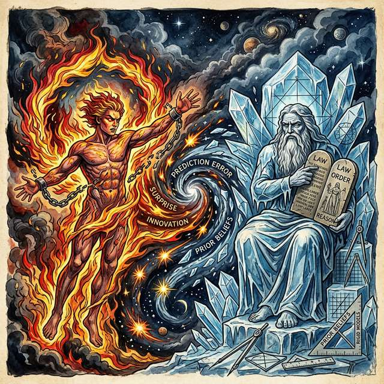

## Page 69

Figure 11: The Triadic Synthesis: Blake × Pragmatism × Active Inference. Three-way conceptual mapping
revealing structural isomorphism across Blake’s prophetic vocabulary, the pragmatist tradition of action-
oriented epistemology, and the formal mathematics of Active Inference. Six convergence nodes mediate the
triangle. Edge annotations detail specific correspondences: Doors ↔Transaction, Imagination ↔Tools,
Inquiry ↔Free Energy Minimization, Markov Blanket ↔Doors of Perception, among others.
69

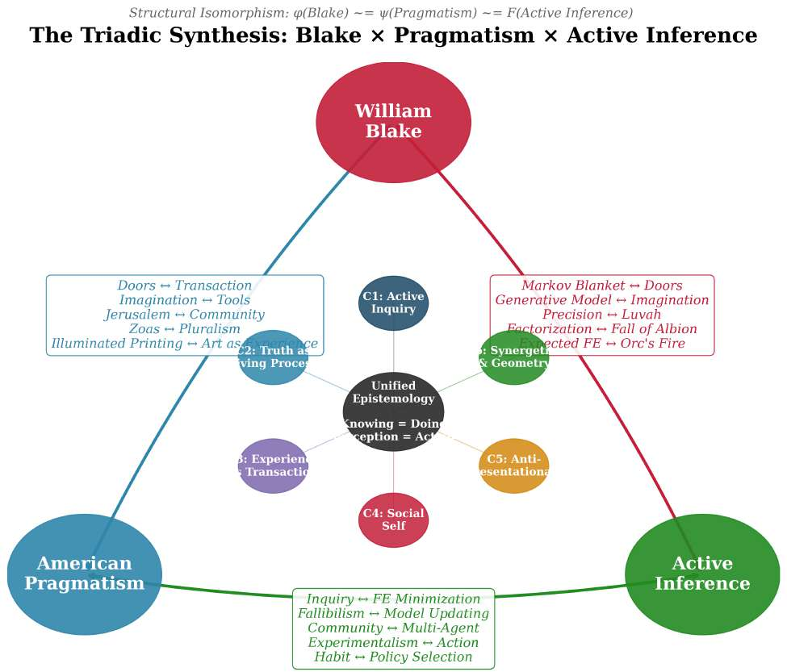

## Page 70

a pursuit of veridical representation but a pragmatic optimization of skillful coping: the agent that minimizes
free energy most effectively is not the one with the most “accurate” model, but the one whose model enables
the most adaptive action. This is precisely the pragmatist redefinition of truth as “what works”—now given
formal mathematical expression.
6.0.4.3
3. Abduction as Active Inference: Hypothesis Testing in the Active Organism
The
deepest structural correspondence between Peirce and active inference lies in the logic of abduction. Peirce’s
mature theory of inquiry distinguishes three inferential modes—abduction (hypothesis generation in response
to surprise), deduction (deriving testable consequences), and induction (experimentally checking and fixing
belief)—which together constitute the self-correcting cycle of scientific inquiry.[Peirce, 1878] Pietarinen and
Beni demonstrate that this triadic cycle maps directly onto the architecture of active inference:[Pietarinen
and Beni, 2021]
1. Abduction = The generative model produces candidate hypotheses (latent causes) to explain away
prediction error. Surprise—elevated free energy—is the trigger for abductive inference, just as Peirce’s
“real doubt” initiates inquiry.
2. Deduction = The model derives expected sensory consequences from each hypothesis, computing
predicted observations under the generative model 𝑝(𝑜∣𝜃).
3. Induction = Belief updating via variational inference—comparing predictions against actual sensory
evidence and adjusting posterior beliefs 𝑞(𝜃) accordingly.
This yields a Peircean reading of free energy minimization: prediction error is the trigger for abduction;
the generative model is the space of candidate habits and hypotheses; and free energy minimization is the
selection and stabilization of habits that improve skillful coping with the environment.[Beni, 2021] Beni’s
work on understanding and explanation within active inference further ties the FEP to Peirce’s emphasis
on explanatory virtues: model inversion—the process of inferring latent causes from sensory data—is itself
a form of Inference to the Best Explanation (IBE), the explanationist norm that Peirce championed under
the name “abduction.”[Beni, 2021]
6.0.4.4
4. The Zoas as Factorized Generative Model: Components of Cognitive Architecture
The Four Zoas map onto components of the generative model:
Table 8: The Four Zoas as Factorized Generative Model: Blake’s
psychological architecture formalized as independent optimization
streams that must be integrated to achieve genuine fourfold vision.
Zoa
Cognitive Faculty Model Component
Urizen
Reason & Law
Likelihood 𝑝(𝑜∣𝜃)
Luvah
Passion & Love
Precision weighting 𝜋
Urthona/Los Imagination
Prior 𝑝(𝜃)
Tharmas
Instinct & Senses
Sensory states 𝑠
The Fall of Albion—the fragmentation of the Zoas—is formalized as the transition from integrated variational
inference to a mean-field approximation:
𝑞(𝜃) ≈𝑞(𝜃𝑈) ⋅𝑞(𝜃𝐿) ⋅𝑞(𝜃𝑉) ⋅𝑞(𝜃𝑇)
(2)
This factorization enables computational tractability but introduces the “coordination problem”—exactly
Blake’s diagnosis of the fallen state, where reason, passion, imagination, and sensation optimize independently
rather than jointly.
Resurrection (Building Jerusalem) is the re-establishment of the joint distribution: the Zoas returning to
coordinated inference, with precision weighting (Luvah) appropriately balancing the contributions of each
faculty.
70

## Page 71

6.0.4.5
5. Mathematical Formulation of the Envelope: Formalizing the Blanket
Blake’s “doors
of perception” map onto the Markov blanket—the statistical boundary partitioning internal states 𝜇from
external states 𝜂. The blanket 𝐵= {𝑠, 𝑎} consists of sensory states (inputs) and active states (outputs):
𝜂⟂𝜇∣𝑏∶
𝑝(𝜂, 𝜇|𝑏) = 𝑝(𝜂|𝑏) ⋅𝑝(𝜇|𝑏)
(3)
“Cleansing the doors” = optimizing the Markov blanket’s capacity for informative exchange between agent
and environment. A “dirty” door—Newton’s Sleep—is one where the blanket passes impoverished signals
(high prior precision suppresses sensory evidence). A “cleansed” door allows the full richness of environmental
structure to inform the generative model.
6.0.4.6
6.
The Pragmatic Community as Multi-Agent Active Inference
Peirce’s community
of inquirers and Dewey’s democratic community find their formal expression in multi-agent Active In-
ference. In this framework, multiple agents share cultural priors 𝜃𝑠ℎ𝑎𝑟𝑒𝑑that enable coordinated sense-
making:[Veissière et al., 2020]
• Each agent maintains its own generative model 𝑝𝑖(𝑜, 𝜃)
• Shared generative models emerge through Thinking Through Other Minds (TTOM)—what Veis-
sière, Constant, Ramstead, Friston, and Kirmayer formalize as the variational capacity to model other
agents’ beliefs and intentions[Veissière et al., 2020]
• Truth, as Peirce defined it, corresponds to the convergent state of the multi-agent system where
𝐷𝐾𝐿(𝑞𝑖(𝜃)‖𝑞𝑗(𝜃)) →0 as inquiry proceeds
Blake’s “Building Jerusalem” is precisely this multi-agent convergence: the construction of shared generative
models that enable the community to perceive and act in concert—not through authoritarian imposition
(Urizen’s method) but through the democratic coordination of diverse faculties and perspectives.
6.0.4.7
7. Variational Semiotics: Peirce’s Signs as Mechanisms of Generative Modeling
Ram-
stead, Friston, and Hipólito’s programme of variational semiotics offers a striking formalization of Peirce’s
sign theory within the active inference framework.[Ramstead et al., 2020] Their mapping translates Peirce’s
semiotic triad into the mathematical components of the generative model:
• Icons (signs that resemble their objects) →A-matrices (likelihood mappings from hidden states to
sensory observations)
• Indices (signs causally connected to their objects) →B-matrices (state transition dynamics encoding
causal regularities)
• Symbols (signs related to objects by convention) →Shared higher-order models (cultural priors
that coordinate interpretation across agents)
• Interpretants (the effect of the sign on the interpreter) →Generative models themselves (the
structured beliefs through which signs acquire meaning)
This variational semiotics programme reveals that Peirce’s theory of signs was already, in its deep structure,
a theory of generative modeling—a set of claims about how organisms maintain structured probabilistic
models of their environment and coordinate those models through shared sign systems. The pragmatist
maxim—“consider what effects, that might conceivably have practical bearings, we conceive the object of
our conception to have”—becomes, under this formalization, a statement about the counterfactual depth of
the generative model: meaning is the space of predicted consequences.[Peirce, 1878]
6.0.5
From Enactivism to Pragmatic Active Inference: Grounding the Models
The convergence we have traced is not merely a retrospective reconstruction; it reflects a living trajectory
in contemporary cognitive science. The pragmatic turn in philosophy of mind—named and documented
by Engel, Friston, and Kragic—marks the shift from representationalist to action-oriented cognitive science,
with active inference as its formal backbone.[Engel et al., 2016] Gallagher’s Enactivist Interventions situates
active inference and predictive processing as candidates for the mechanistic backdrop to pragmatist theories
71

## Page 72

of perception, action, and social understanding—while cautioning that internalist readings of predictive
processing risk betraying the classical pragmatists’ emphasis on embodied, situated practice.[Gallagher, 2017]
Clark’s foundational review of predictive brains and situated agents provides the computational neuroscience
connecting these philosophical traditions to empirical research on neural prediction and active sensing.[Clark,
2013]
At the frontier of this programme stands Pietarinen’s Synechism 2.0—a bold extension of Peirce’s doctrine
of continuity (synechism) into bioelectricity, morphogenesis, and emergence under the FEP.[Pietarinen and
Shumilina, 2025] Where Peirce argued that all phenomena are continuous—that mind and matter, self and
world, sign and object form an unbroken continuum—Pietarinen and Shumilina propose that the FEP pro-
vides the formal apparatus for making this continuity precise: the same variational principles that govern
neural inference also govern cellular signaling, developmental morphogenesis, and ecosystem-level coordi-
nation. This is synechism given mathematical teeth—and it vindicates Blake’s own intuition that “every
thing that lives is Holy” not as mystical obscurantism but as a statement about the universal scope of
self-organizing, free-energy-minimizing processes.
The pragmatist–enactivist–active inference pipeline thus runs from Peirce’s Pragmatic Maxim and doubt–
belief dynamics, through Dewey’s transactional theory of experience, through Merleau-Ponty’s phenomenol-
ogy of perception, through Varela, Thompson, and Rosch’s enactivism, to the contemporary FEP—with
Blake’s visionary epistemology as an independent, parallel articulation of the same deep structure at every
stage.
6.0.6
The Enduring Memes: A Triple Convergence of Thought
The “enduring memes” of pragmatism—those transmissible intellectual patterns that have spread across
disciplines—take on new significance in the triple framework:
Table 9: The Enduring Memes: A Triple Convergence aligning
Blake’s poetic figures, Pragmatist theories of action, and Active
Inference formalisms across six core dimensions of inquiry.
Meme
Pragmatist Origin
Blake
Active Inference
“Ideas are tools,
not mirrors”
James, Dewey
“My business
is to Create”
Generative models as instruments
“Truth is what
works”
James
“Proved was
once
imagined”
Successful free energy minimization
“The end of
inquiry”
Peirce
Building
Jerusalem
Multi-agent convergence
“Learning by
doing”
Dewey
Illuminated
printing
Perception-action loop
“The cable, not
the chain”
Peirce
The Four
Zoas’
integration
Distributed inference
“No God’s-eye
view”
Rorty
“I will not
Reason &
Compare”
No model transcends its blanket
“Democracy as a
way of life”
Dewey
Universal
Brotherhood
of Eden
Shared generative models
72

## Page 73

7
Conclusion: From Newton’s Sleep to Rebuilding Jerusalem—
An Integrated Vision of Perception and Action
“Do not pretend to doubt in philosophy what we do not doubt in our hearts.” — Charles Sanders
Peirce [EP1: 29][Peirce, 1877]
“But the five gates were consum’d, and their bolts and hinges melted; And the fierce flames burnt
round the heavens, and round the abodes of men.” — William Blake, America a Prophecy, lines
150–151[Blake, 1793a]
7.0.1
Summary of the Convergences
This manuscript has traced six deep structural convergences between William Blake’s visionary epistemology
and the American Pragmatist tradition, taking America a Prophecy (1793) as the primary text whose
152 lines condense every convergence into a single mythological narrative—from the “terrible men” on the
Atlantic shores (the active perceiver confronting experience) through Boston’s Angel’s demand for intellectual
liberation (“No more obedience pay!”) and the shaking of mental chains (the crisis that inaugurates inquiry)
to the plagues’ recoiling (truth verified through consequences) and the final consumption of the five gates
(the destruction of every institutional barrier to genuine perception).[Blake, 1793a]
1. Inquiry as Active Engagement (subsection 5.1): Peirce’s fixation of belief through the method of
science and Blake’s cleansing of perception both reject passive reception. Boston’s Angel’s “No more
I follow, no more obedience pay!’ ”’ is the decisive break from the Method of Authority. The cable
metaphor and the system-building imperative share the same architecture: multiple convergent strands
rather than a single deductive chain.
2. Truth as Living Process (subsection 5.2): James’s pragmatic theory of truth and Blake’s “What
is now proved was once only imagined” both treat truth as dynamic, temporal, and entangled with
human activity. America’s central reversal—“The red fires rag’d! The plagues recoil’d!”—is pragmatic
truth made mythological: the idea that works transforms the situation in which it operates.
3. Experience as Transaction (subsection 5.3): Dewey’s transactional experience and Blake’s Doors
of Perception both reject the inner theater. Boston’s Angel’s demand—“Who commanded this?… To
keep the gen’rous from experience”—exposes the political economy of perception. The “five gates were
consum’d” is the restoration of transactional engagement.
4. Social Selves and Collectives (subsection 5.4): Mead’s social self and Blake’s Albion both ground
identity in community. The Thirteen Angels who rend their robes and descend “by Washington and
Paine and Warren” are Mead’s “I” breaking free of the institutional “me” and reconstituting selfhood
within a new generalized other.
5. Anti-Representationalism (subsection 5.5): Rorty’s rejection of the mind-as-mirror and Blake’s “I
will not Reason & Compare” both refuse to treat language or thought as mere transcription of reality.
Brandom’s inferentialism and Blake’s semiotic cosmos both locate meaning in use rather than reference.
Putnam’s fact/value entanglement and Blake’s Marriage of Heaven and Hell both demonstrate that
the supposedly sharp boundaries of modern philosophy are artefacts of impoverished vision.
6. Synergetics and Pragmatic Geometry (subsection 5.6): Fuller’s substitution of the tetrahedron for
the Cartesian cube parallels Blake’s rejection of Newton’s Sleep. Applewhite’s editorial collaboration
mirrors Peirce’s communal inquiry. Urner’s computational Synergetics extends Dewey’s learning-by-
doing into digital pedagogy. America’s vision of revolution spreading from the colonies to “France,
Spain, and Italy” enacts synergy at the geopolitical scale.
7.0.2
The Active Inference Formalization as Unifying Framework (section 6)
Active Inference provides the mathematical framework in which these convergences become precise:
• The Markov blanket formalizes Blake’s doors and Dewey’s organism-environment boundary
73

## Page 74

• Free energy minimization formalizes Peirce’s inquiry and Blake’s cleansing
• The generative model formalizes James’s ideas-as-tools and Blake’s imagination-as-existence
• Precision weighting formalizes the Four Zoas’ functional roles
• Multi-agent inference formalizes the community of inquirers and Building Jerusalem
• Synergy (behavior of wholes unpredicted by parts) formalizes both Fuller’s Synergetics and Blake’s
Fourfold Vision as emergent integration
• Orc as elevated free energy and Urizen’s “storèd snows” as pathological prior dominance
formalize America’s central conflict as the dialectic between surprise-driven model updating and rigid
prior maintenance
7.0.3
Implications Across the Disciplines
7.0.3.1
For the Philosophy of Mind and Cognitive Science
The Blake-Pragmatism-Active Infer-
ence synthesis suggests that consciousness is not a spectral property hovering above neural computation but
a functional achievement—the integrated operation of multiple cognitive faculties (the Zoas) within an organ-
ism actively engaged with its environment. This aligns with enactivist, 4E cognitive, and phenomenological
approaches while providing mathematical precision.
7.0.3.2
For Education and the Development of the “Cleansed Perception”
Dewey’s progressive
education—learning by doing, project-based inquiry, student-centered curricula—finds formal grounding
in Active Inference’s characterization of learning as model updating driven by prediction error.
Blake’s
illuminated printing adds an aesthetic dimension: the most effective learning combines conceptual and
perceptual modes, integrating “all four Zoas” in the educational process. Urner’s Martian Math curriculum
demonstrates that alternative geometric frameworks can reshape spatial cognition—a pragmatic experiment
in Blakean vision.
7.0.3.3
For Aesthetics and the Practice of Making
Dewey’s Art as Experience and Blake’s artistic
practice both suggest that aesthetic experience is the highest form of organism-environment transaction—the
state where perception, action, and meaning achieve maximum integration. Active Inference’s characteri-
zation of aesthetic experience as states of minimal free energy with maximal model complexity provides
quantitative support for this intuition.
7.0.3.4
For Artificial Intelligence and the Design of Active Agents
If the self is the generative
model (Self ≡𝑝(𝑜, 𝜃)), then artificial agents must not merely optimize within fixed priors but develop
the capacity for “System creation”—the autonomous construction of generative models. Blake’s insistence
that imagination is “not a State” but “Human Existence itself” warns against AI architectures that reduce
intelligence to pattern-matching within pre-specified feature spaces. The recent explosion of large language
models (LLMs) instantiates precisely this tension: models trained on massive corpora develop remarkable
inferential capacities but remain within the “single vision” of next-token prediction—lacking the Fourfold
integration of perception, action, imagination, and affect that both Blake and the pragmatists consider
essential to genuine intelligence.
The alignment problem, in Active Inference terms, is the problem of
ensuring that artificial generative models share enough structure with human generative models to enable
genuine TTOM (Thinking Through Other Minds).
7.0.3.5
For Social Theory and Navigating the Contemporary Epistemic Crisis
The convergence
of Mead’s social self, Dewey’s democratic community, Blake’s Jerusalem, and multi-agent Active Inference
suggests that social cognition is not a special case of individual cognition but its constitutive condition.
Selves, truths, and meanings are achievements of communities of inquirers—whether those communities are
neuronal ensembles, human societies, or multi-agent artificial systems. America’s image of “Washington,
Franklin, Paine, and Warren, Allen, Gates, and Lee” standing together in the flames to perceive what no
individual could perceive alone is the mythological expression of this principle.
In an era of epistemic polarization—of algorithmic filter bubbles, weaponized disinformation, and the collapse
of shared frameworks of meaning—the Blake-Pragmatist diagnosis is precise: these pathologies are forms of
74

## Page 75

“Newton’s Sleep” (𝜋𝑝𝑟𝑖𝑜𝑟≫𝜋𝑠𝑒𝑛𝑠𝑜𝑟𝑦) scaled to social systems. When communities cling to priors so tightly
that no sensory evidence can update them, the result is what Dewey called the “eclipse of the public” and
what Blake depicted as Urizen’s “Net of Religion.” The remedy, suggested by the convergence of pragmatist
inquiry and Active Inference, is not more information but better epistemic practices—fallibilistic, communal,
pluralistic, and perpetually open to surprise.
7.0.4
Expanding the Synthesis: Future Directions
Several avenues for future research emerge from this synthesis:
1. Computational Modeling of the Four Zoas: Implementing the Zoas-as-factorized-model frame-
work in a working Active Inference simulation using pymdp or SPM, demonstrating the cognitive con-
sequences of integration (low free energy) vs. fragmentation (high free energy with factorization mis-
match) across T-maze and epistemic foraging tasks. The Jitterbug Transformation (subsection 5.6)
suggests a dynamic model where the cognitive architecture oscillates between contracted (Urizenic)
and expanded (fourfold) states—a regime that could be formalized through precision dynamics govern-
ing inter-factor communication.
2. Romantic Epistemology as Predictive Processing: Applying the Active Inference formalism
to other Romantic poets—Coleridge’s “primary imagination” as generative modeling in Kubla Khan,
Shelley’s collective model updating in Prometheus Unbound, Wordsworth’s “wise passiveness” as epis-
temic foraging in The Prelude—to test whether the Blake–Active Inference correspondences generalize
across Romantic epistemology or are specific to Blake’s prophetic mode. This would connect to Iain
McGilchrist’s The Master and His Emissary on hemispherical integration as a cognitive-neurological
analogue of Fourfold Vision.
3. Pragmatist Extensions and Formal Social Epistemology: Extending the synthesis to Haber-
mas’s communicative action (as multi-agent free energy minimization under shared generative models),
Misak’s Peircean truth (as convergent posterior under long-run inquiry), and Sullivan’s pragmatist
feminism (as precision-reweighting of systematically suppressed sensory channels). The community
of inquirers formalism could be tested against Peirce’s own claim that truth is the opinion “fated
to be ultimately agreed to by all who investigate”—modeling convergence rates under different prior
distributions and communication topologies.
4. Diagrammatic Reasoning and Categorical Semantics: Formalizing the connection between
Peirce’s Existential Graphs and the category-theoretic structures underlying Active Inference (follow-
ing Brady and Trimble’s presheaf interpretation). The Beta graphs’ “lines of identity” may map onto
the morphisms of the category of Markov kernels, providing a diagrammatic calculus for Active In-
ference that would fulfill Peirce’s vision of reasoning as spatial transformation. This connects also to
Zalamea’s Synthetic Philosophy and to David Spivak’s operadic approaches to complex systems.
5. Pedagogical Applications and Spatial Cognition: Designing controlled educational interventions
based on the “Fourfold Vision” model, comparing student learning outcomes in standard vs. multi-
modal instruction (text, image, code, physical model) across STEM and humanities curricula. The
Quadray/IVM component (subsection 5.6) enables a specific empirical test: randomizing students
between IVM-based and Cartesian-based geometry instruction with pre/post spatial reasoning as-
sessments (Mental Rotation Test, Paper Folding Test) to determine whether alternative geometric
frameworks produce measurable cognitive differences—Urner’s Martian Math curriculum provides the
intervention protocol.
6. Clinical Applications: Newton’s Sleep as Computational Psychiatry: Developing the “New-
ton’s Sleep” model (𝜋𝑝𝑟𝑖𝑜𝑟≫𝜋𝑠𝑒𝑛𝑠𝑜𝑟𝑦) as a computational psychiatry framework, generating testable
predictions about precision dynamics that differentiate rigid cognition in autism spectrum conditions
(overly precise priors in perception) from psychotic disorders (overly precise priors in belief).
The
Four Zoas framework suggests that different clinical presentations correspond to different patterns of
inter-factor dissociation—a hypothesis that Active Inference’s hierarchical Bayesian architecture can
formalize.
75

## Page 76

7. Digital Humanities: The Blake Archive as Semiotic Laboratory: Producing a computationally
annotated edition of America a Prophecy mapping every passage onto pragmatist and Active Inference
frameworks—extending Erdman’s editorial methodology with formal-computational commentary. Re-
cent advances in multimodal NLP (vision-language models applied to illuminated manuscripts) could
enable automated detection of text-image correspondences across Blake’s oeuvre, testing whether the
semiotic richness of illuminated printing exhibits measurable statistical properties (entropy, mutual
information) that distinguish it from purely textual or purely visual communication. A natural par-
allel exists with the Buckminster Fuller Chronofile—Fuller’s comprehensive self-documentation
project spanning over 270,000 pages of correspondence, drawings, and ephemera—which represents a
complementary archival paradigm: where Blake’s Archive preserves the material traces of integrated
artistic production, the Chronofile preserves the traces of integrated living as a form of design science.
Both archives invite the same computational-hermeneutic methods and raise the same question: what
is lost when holistic practice is decomposed into searchable fragments?
7.0.5
Final Considerations: The Endless Work of Jerusalem
America a Prophecy begins with “terrible men” standing on the shores—active, confrontational, prophetic—
and ends with “the fierce flames burnt round the heavens, and round the abodes of men.” Between those
images lies the entire argument of this manuscript: knowing is inseparable from doing, perception is active
and constructive, truth is a living process, selfhood is social, representationalism is a cage, and the fullest
cognition integrates reason, passion, imagination, and sensation into a coordinated whole. Blake and the
pragmatists arrived at this conviction by different routes—one through prophetic vision and illuminated
printing, the other through laboratory experiment and democratic education—and Active Inference now
provides the language and tools in which these shared insights can be expressed with mathematical precision.
In an era of epistemic crisis, their convergent vision of inquiry as communal, fallibilistic, and creative offers
both diagnosis and remedy: “Newton’s Sleep” is the pathology; “Building Jerusalem” is the cure.
The
closing plate—hand-etched, hand-printed, hand-colored—enacts the unity of conception and execution that
this manuscript theorizes, and the method, as both Blake and Peirce insisted, is not to seek certainties but
to create systems that are resilient precisely because they are rich, plural, adaptive, and open. Walls, doors,
and gates will always be rebuilt by those who profit from the enclosure of experience; but the fire that clears
and consumes is equally eternal—latent in every organism that refuses to mistake its model for the world, in
every community that complements dogma with inquiry, and in every act of imagination that dares to treat
what is not yet proved as already, in its virtual living potency, real.
“But the five gates were consum’d, and their bolts and hinges melted; And the fierce flames burnt
round the heavens, and round the abodes of men.” — America a Prophecy
76

## Page 77

Figure 12: America a Prophecy, Plate 24 (Closing Image). Illuminated manuscript page; Erdman 57; Lam-
beth Printed Books.
77

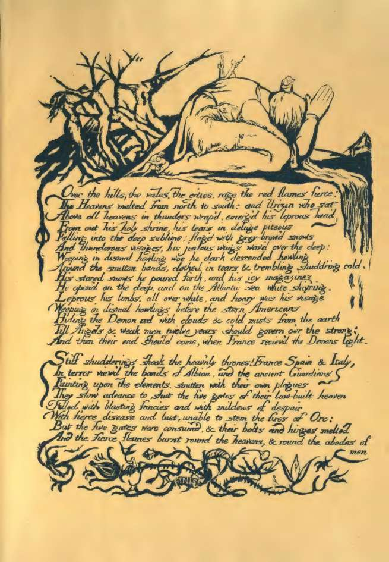

## Page 78

8
Supplemental: America a Prophecy (Plaintext)
William Blake (1793)
They cannot wall the city, nor moat round the castle of princes; They cannot bring the stubbèd oak to
overgrow the hills; For terrible men stand on the shores, and in their robes I see Children take shelter from
the lightnings: there stands Washington, And Paine, and Warren, with their foreheads rear’d toward the
East But clouds obscure my agèd sight. A vision from afar! Sound! sound! my loud war−trumpets, and
alarm my Thirteen Angels!
Ah, vision from afar! Ah, rebel form that rent the ancient Heavens! Eternal Viper self−renew’d, rolling
in clouds, I see thee in thick clouds and darkness on America’s shore, Writhing in pangs of abhorrèd birth;
red flames the crest rebellious And eyes of death; the harlot womb, oft openèd in vain, Heaves in enormous
circles: now the times are return’d upon thee, Devourer of thy parent, now thy unutterable torment renews.
Sound! sound! my loud war−trumpets, and alarm my Thirteen Angels!
Ah, terrible birth! a young one bursting! Where is the weeping mouth, And where the mother’s milk?
Instead, those ever−hissing jaws And parchèd lips drop with fresh gore: now roll thou in the clouds; Thy
mother lays her length outstretch’d upon the shore beneath. Sound! sound! my loud war−trumpets, and
alarm my Thirteen Angels! Loud howls the Eternal Wolf! the Eternal Lion lashes his tail!’
Thus wept the Angel voice, and as he wept the terrible blasts Of trumpets blew a loud alarm across the
Atlantic deep. No trumpets answer; no reply of clarions or of fifes: Silent the Colonies remain and refuse
the loud alarm.
On those vast shady hills between America and Albion’s shore, Now barr’d out by the Atlantic sea, call’d
Atlantean hills, Because from their bright summits you may pass to the Golden World, An ancient palace,
archetype of mighty Emperies, Rears its immortal pinnacles, built in the forest of God By Ariston, the King
of Beauty, for his stolen bride.
Here on their magic seats the Thirteen Angels sat perturb’d, For clouds from the Atlantic hover o’er the
solemn roof. Fiery the Angels rose, and as they rose deep thunder roll’d Around their shores, indignant
burning with the fires of Orc; And Boston’s Angel cried aloud as they flew thro’ the dark night.
He cried: ‘Why trembles honesty; and, like a murderer, Why seeks he refuge from the frowns of his immortal
station? Must the generous tremble, and leave his joy to the idle, to the pestilence That mock him? Who
commanded this? What God? What Angel? To keep the gen’rous from experience till the ungenerous Are
unrestrain’d performers of the energies of nature; Till pity is become a trade, and generosity a science That
men get rich by; and the sandy desert is giv’n to the strong? What God is he writes laws of peace, and
clothes him in a tempest? What pitying Angel lusts for tears, and fans himself with sighs?
What crawling villain preaches abstinence and wraps himself In fat of lambs? No more I follow, no more
obedience pay!’
So cried he, rending off his robe and throwing down his sceptre In sight of Albion’s Guardian; and all the
Thirteen Angels Rent off their robes to the hungry wind, and threw their golden sceptres Down on the land
of America; indignant they descended Headlong from out their heav’nly heights, descending swift as fires
Over the land; naked and flaming are their lineaments seen In the deep gloom; by Washington and Paine
and Warren they stood; And the flame folded, roaring fierce within the pitchy night, Before the Demon red,
who burnt towards America, In black smoke, thunders, and loud winds, rejoicing in its terror, Breaking in
smoky wreaths from the wild deep, and gath’ring thick In flames as of a furnace on the land from North to
South,
What time the Thirteen Governors, that England sent, convene In Bernard’s house. The flames cover’d the
land; they rouse; they cry; Shaking their mental chains, they rush in fury to the sea To quench their anguish;
at the feet of Washington down fall’n They grovel on the sand and writhing lie, while all The British soldiers
thro’ the Thirteen States sent up a howl Of anguish, threw their swords and muskets to the earth, and
run From their encampments and dark castles, seeking where to hide From the grim flames, and from the
visions of Orc, in sight Of Albion’s Angel; who, enrag’d, his secret clouds open’d From North to South, and
78

## Page 79

burnt outstretch’d on wings of wrath, cov’ring The eastern sky, spreading his awful wings across the heavens.
Beneath him roll’d his num’rous hosts, all Albion’s Angels camp’d Darken’d the Atlantic mountains; and
their trumpets shook the valleys, Arm’d with diseases of the earth to cast upon the Abyss
Their numbers forty millions, must’ring in the eastern sky.
In the flames stood and view’d the armies drawn out in the sky, Washington, Franklin, Paine, and Warren,
Allen, Gates, and Lee, And heard the voice of Albion’s Angel give the thunderous command; His plagues,
obedient to his voice, flew forth out of their clouds, Falling upon America, as a storm to cut them off, As a
blight cuts the tender corn when it begins to appear.
Dark is the heaven above, and cold and hard the earth beneath: And, as a plague−wind, fill’d with insects,
cuts off man and beast, And, as a sea o’erwhelms a land in the day of an earthquake,
Fury, rage, madness, in a wind swept through America; And the red flames of Orc, that folded roaring, fierce,
around The angry shores; and the fierce rushing of th’ inhabitants together!
The citizens of New York close their books and lock their chests; The mariners of Boston drop their anchors
and unlade; The scribe of Pennsylvania casts his pen upon the earth; The builder of Virginia throws his
hammer down in fear.
Then had America been lost, o’erwhelm’d by the Atlantic, And Earth had lost another portion of the Infinite;
But all rush together in the night in wrath and raging fire. The red fires rag’d! The plagues recoil’d! Then
roll’d they back with fury On Albion’s Angels: then the Pestilence began in streaks of red Across the limbs of
Albion’s Guardian; the spotted plague smote Bristol’s, And the Leprosy London’s Spirit, sickening all their
bands: The millions sent up a howl of anguish and threw off their hammer’d mail, And cast their swords
and spears to earth, and stood, a naked multitude: Albion’s Guardian writhèd in torment on the eastern
sky, Pale, quiv’ring toward the brain his glimmering eyes, teeth chattering, Howling and shuddering, his legs
quivering, convuls’d each muscle and sinew: Sick’ning lay London’s Guardian, and the ancient mitred York,
Their heads on snowy hills, their ensigns sick’ning in the sky.
The plagues creep on the burning winds, driven by flames of Orc, And by the fierce Americans rushing
together in the night, Driven o’er the Guardians of Ireland, and Scotland and Wales. They, spotted with
plagues, forsook the frontiers; and their banners, sear’d With fires of hell, deform their ancient Heavens with
shame and woe. Hid in his caves the Bard of Albion felt the enormous plagues, And a cowl of flesh grew o’er
his head, and scales on his back and ribs; And, rough with black scales, all his Angels fright their ancient
heavens.
The doors of marriage are open, and the Priests, in rustling scales, Rush into reptile coverts, hiding from
the fires of Orc, That play around the golden roofs in wreaths of fierce desire, Leaving the Females naked
and glowing with the lusts of youth.
For the Female Spirits of the dead, pining in bonds of religion, Run from their fetters; reddening, and in
long−drawn arches sitting, They feel the nerves of youth renew, and desires of ancient times Over their pale
limbs, as a vine when the tender grape appears.
Over the hills, the vales, the cities rage the red flames fierce: The Heavens melted from North to South; and
Urizen, who sat Above all heavens, in thunders wrapp’d, emerg’d his leprous head From out his holy shrine,
his tears in deluge piteous Falling into the deep sublime; flagg’d with grey−brow’d snows And thunderous
visages, his jealous wings wav’d over the deep; Weeping in dismal howling woe, he dark descended, howling
Around the smitten bands, clothèd in tears and trembling, shudd’ring, cold. His storèd snows he pourèd
forth, and his icy magazine, He open’d on the deep, and on the Atlantic sea, white, shiv’ring; Leprous his
limbs, all over white, and hoary was his visage; Weeping in dismal howlings before the stern Americans,
Hiding the Demon red with clouds and cold mists from the earth;
Till Angels and weak men twelve years should govern o’er the strong; And then their end should come, when
France receiv’d the Demon’s light.
Stiff shudderings shook the heav’nly thrones! France, Spain, and Italy In terror view’d the bands of Albion,
and the ancient Guardians, Fainting upon the elements, smitten with their own plagues! They slow advance
79

## Page 80

to shut the five gates of their law−built Heaven, Fillèd with blasting fancies and with mildews of despair,
With fierce disease and lust, unable to stem the fires of Orc, But the five gates were consum’d, and their
bolts and hinges melted; And the fierce flames burnt round the heavens, and round the abodes of men.
References
Jane Addams. Democracy and Social Ethics. Macmillan, 1902.
E. J. Applewhite. Cosmic Fishing: An Account of Writing Synergetics with Buckminster Fuller. Macmillan,
New York, 1977. ISBN 978-0025041005.
E. J. Applewhite. Washington Itself: An Informal Guide to the Capital of the United States. Beaufort Books,
New York, 1981. ISBN 978-0688006388.
E. J. Applewhite. Paradise Mislaid: Birth, Death, and the Human Predicament of Being Biological. St.
Martin’s Press, New York, 1991. ISBN 978-0312058996.
Majid Davoody Beni. Understanding, explanation, and active inference. Frontiers in Systems Neuroscience,
15:772641, 2021. doi: 10.3389/fnsys.2021.772641.
Richard J. Bernstein. The normative turn. In The Pragmatic Turn, pages 209–234. Polity Press, 2010.
William Blake. All Religions Are One. William Blake [self-published], London, 1788.
William Blake. The Marriage of Heaven and Hell. William Blake [self-published], Lambeth, 1790.
William Blake. America a Prophecy. William Blake [self-published], Lambeth, 1793a.
William Blake. Visions of the Daughters of Albion. William Blake [self-published], Lambeth, 1793b.
William Blake. Songs of Innocence and of Experience: Shewing the Two Contrary States of the Human Soul.
William Blake [self-published], Lambeth, 1794.
Harold Bloom. Blake’s Apocalypse. Doubleday, 1963.
Geraldine Brady and Todd H. Trimble. A categorical interpretation of C.S. Peirce’s propositional logic alpha.
Journal of Pure and Applied Algebra, 149(3):213–239, 2000.
Robert Brandom. Making It Explicit. Harvard University Press, 1994. ISBN 978-0-674-54319-2.
Robert Brandom. Articulating Reasons. Harvard University Press, 2000.
Percy Williams Bridgman. The Logic of Modern Physics. Macmillan, 1927.
Jelle Bruineberg, Julian Kiverstein, and Erik Rietveld. A tale of two densities: Active inference is enactive
inference. Adaptive Behavior, 26(5), 2018.
Hasok Chang. Inventing Temperature: Measurement and Scientific Progress. Oxford Studies in Philosophy
of Science. Oxford University Press, 2004.
Andy Clark. Whatever next? predictive brains, situated agents, and the future of cognitive science. Behav-
ioral and Brain Sciences, 36(3):181–204, 2013. doi: 10.1017/S0140525X12000477.
S. Foster Damon. A Blake Dictionary. Brown University Press, 1965. Revised edition (1988), University
Press of New England.
John Dewey. The reflex arc concept in psychology. Psychological Review, 3(4):357–370, 1896.
John Dewey. The influence of Darwin on philosophy: And other essays in contemporary thought. Henry Holt
and Company, 1910.
John Dewey. Democracy and Education. Macmillan, 1916.
John Dewey. Reconstruction in Philosophy. Henry Holt and Company, 1920.
John Dewey. Art as Experience. Minton, Balch and Company, 1934. ISBN 978-0-399-53197-2.
80

## Page 81

John Dewey. Logic: The Theory of Inquiry. Henry Holt and Company, 1938.
W. E. B. Du Bois. The Souls of Black Folk. A.C. McClurg, 1903.
Morris Eaves, Robert N. Essick, and Joseph Viscomi. The william blake archive, 2003. URL https://www.
blakearchive.org. Recipient of the MLA Prize for a Distinguished Scholarly Edition, 2003.
Andreas K. Engel, Karl J. Friston, and Danica Kragic. The Pragmatic Turn: Toward Action-Oriented Views
in Cognitive Science. MIT Press, 2016.
David V. Erdman. Blake: Prophet Against Empire. Princeton University Press, 1954. 3rd revised edition
(1977).
David V. Erdman. The Complete Poetry and Prose of William Blake. Anchor Books, 1988.
Linda Freedman. William Blake and the Myth of America: From the Abolitionists to the Counterculture.
The University of North Carolina Press, 2018.
Daniel A. Friedman. Quadmath: An analytical review of 4d and quadray coordinates. Zenodo, 2025a. URL
https://doi.org/10.5281/zenodo.16887800.
Daniel A. Friedman. Symergetics: Symbolic synergetics for rational arithmetic, geometric pattern discovery,
and all-integer accounting. Zenodo, 2025b. URL https://doi.org/10.5281/zenodo.17114389.
Daniel A. Friedman. The doors of perception are the threshold of prediction: Active inference and william
blake’s theory of seeing. Zenodo, 2026.
Karl Friston. A free energy principle for the brain. Journal of Physiology-Paris, 100(1–3):70–87, 2006.
Karl Friston.
The free-energy principle: A unified brain theory?
Nature Reviews Neuroscience, 11(2):
127–138, 2010.
Northrop Frye. Fearful Symmetry. Princeton University Press, 1947.
R. Buckminster Fuller. Synergetics: Explorations in the Geometry of Thinking. Macmillan, 1975.
R. Buckminster Fuller. Critical Path. St. Martin’s Press, 1981.
Shaun Gallagher. Enactivist Interventions: Rethinking the Mind. Oxford University Press, 2017.
Shaun Gallagher. Pragmatism and cognitive science. In Pragmatism and Cognitive Science. Springer, 2022.
URL http://ummoss.org/gall22pragmatismCogSci.pdf.
Peter Godfrey-Smith. Complexity and the Function of Mind in Nature. Cambridge University Press, 1996.
Susan Haack. Evidence and Inquiry. Blackwell, 1993.
Charles Hartshorne, Paul Weiss, and Arthur W. Burks, editors. Collected Papers of Charles Sanders Peirce,
volume 1–8. Harvard University Press, 1931.
Aldous Huxley. The Doors of Perception. Chatto and Windus, 1954.
William James. Pragmatism: A New Name for Some Old Ways of Thinking. Longmans, Green and Co.,
1907. ISBN 978-0-14-243716-2.
William James. A Pluralistic Universe. Longmans, Green and Co., 1909.
William James. Essays in Radical Empiricism. Longmans, Green and Co., 1912.
Martin Jay.
Songs of Experience:
Modern American and European Variations on a Universal Theme.
University of California Press, 2005.
C. I. Lewis. Mind and the World Order. Charles Scribner’s Sons, 1929.
Alain Locke. The New Negro. Albert and Charles Boni, 1925.
Mark Lussier. Romantic Dynamics: The Poetics of Physicality. Macmillan, 2000.
81

## Page 82

Saree Makdisi. William Blake and the Impossible History of the 1790s. University of Chicago Press, 2003.
George Herbert Mead. The Philosophy of the Present. Open Court Publishing, 1932.
George Herbert Mead. Mind, Self, and Society. University of Chicago Press, 1934. ISBN 978-0-226-51668-4.
George Herbert Mead. The Philosophy of the Act. University of Chicago Press, 1938.
Louis Menand. The Metaphysical Club. Farrar, Straus and Giroux, 2001.
W. J. T. Mitchell. Blake’s Composite Art: A Study of the Illuminated Poetry. Princeton University Press,
1978.
W. J. T. Mitchell. Picture Theory: Essays on Verbal and Visual Representation. University of Chicago Press,
1994.
Thomas Parr, Giovanni Pezzulo, and Karl J. Friston. Active Inference: The Free Energy Principle in Mind,
Brain, and Behavior. MIT Press, 2022.
Raymond Peat. Can art instruct science? william blake as biological visionary, 2003. URL https://raypeat.
com/articles/articles/william-blake.shtml.
Charles Sanders Peirce. Some consequences of four incapacities. Journal of Speculative Philosophy, 2:140–157,
1868.
Charles Sanders Peirce. The fixation of belief. Popular Science Monthly, 12:1–15, 1877. Reprinted in EP1:
109–123.
Charles Sanders Peirce. How to make our ideas clear. Popular Science Monthly, 12:286–302, 1878. Reprinted
in EP1: 124–141.
Charles Sanders Peirce. What pragmatism is. The Monist, 15(2):161–181, 1905.
Ahti-Veikko Pietarinen.
Signs of Logic: Peircean Themes on the Philosophy of Language, Games, and
Communication. Springer, 2006.
Ahti-Veikko Pietarinen and Majid Davoody Beni. Active inference and abduction. Biosemiotics, 14:499–517,
2021. doi: 10.1007/s12304-021-09432-0. Biosemiotics Achievement Award 2021.
Ahti-Veikko Pietarinen and Majid Davoody Beni. Beyond Bayesian accuracy: Skill, abduction, and the free
energy principle. Biosemiotics, 2024. doi: 10.1007/s12304-024-09548-3.
Ahti-Veikko Pietarinen and Ekaterina Shumilina. Synechism 2.0: Contours of a new theory of continuity in
bioengineering. Biosemiotics, 2025. doi: 10.1007/s12304-025-09580-7.
Hilary Putnam. Pragmatism: An Open Question. Blackwell, 1995.
Hilary Putnam. The Collapse of the Fact/Value Dichotomy. Harvard University Press, 2002.
W. V. O. Quine. Two dogmas of empiricism. Philosophical Review, 60(1):20–43, 1951.
Maxwell J. D. Ramstead, Karl J. Friston, and Inês Hipólito. Is the free energy principle a formal theory of
semantics? from variational density dynamics to neural and phenotypic representations. Entropy, 22(8):
889, 2020. doi: 10.3390/e22080889.
Richard Rorty. Philosophy and the Mirror of Nature. Princeton University Press, 1979. ISBN 978-0-691-
14132-1.
Richard Rorty. Objectivity, Relativism, and Truth. Cambridge University Press, 1991.
Richard Rorty. Truth and Progress. Cambridge University Press, 1998.
Wilfrid Sellars. Empiricism and the philosophy of mind. Minnesota Studies in the Philosophy of Science, 1:
253–329, 1956.
E. P. Thompson. Witness Against the Beast. Cambridge University Press, 1993.
82

## Page 83

Kirby Urner. Synergetics on the web, 2000. URL https://grunch.net/synergetics.
Kirby Urner. Quadray coordinates: A python implementation of tetrahedral coordinate systems, 2010. URL
https://github.com/4dsolutions/Python5. Computational pedagogy resources for Fuller’s Synergetics.
Samuel P. L. Veissière, Axel Constant, Maxwell J. D. Ramstead, Karl J. Friston, and Laurence J. Kirmayer.
Thinking through other minds: A variational approach to cognition and culture. Behavioral and Brain
Sciences, 43:e90, 2020. doi: 10.1017/S0140525X19001213.
Joseph Viscomi. Blake and the Idea of the Book. Princeton University Press, 1993.
Cornel West. The American Evasion of Philosophy. University of Wisconsin Press, 1989.
Cornel West. Keeping Faith: Philosophy and Race in America. Routledge, 1993.
Harry White. Blake’s resolution to the war between science and philosophy. Blake: An Illustrated Quarterly,
39(3), 2005.
Philip P. Wiener. Evolution and the Founders of Pragmatism. Harvard University Press, 1949.
Chauncey Wright. Philosophical Discussions. Henry Holt and Company, 1877.
Fernando Zalamea. Synthetic Philosophy of Contemporary Mathematics. Urbanomic, 2012.
83

---
*Extraction method: pymupdf*
