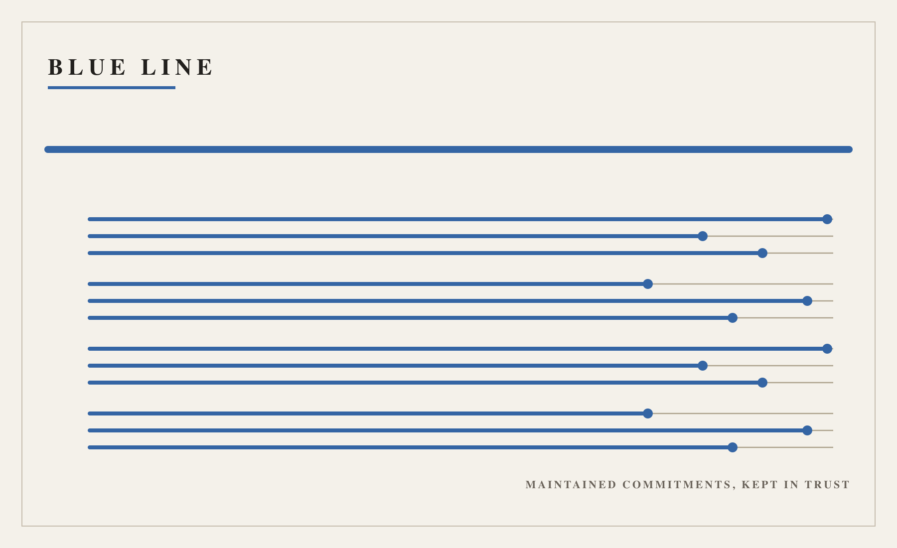

# Full Text: The Blue Line: A Stewardship Instrument for Maintained Commitments

> Extracted from `blue_line_combined.pdf`

> 1 figures extracted to `images/`

---

## Page 1

The Blue Line: A Stewardship Instrument for
Maintained Commitments
Daniel Ari Friedman
Active Inference Institute
daniel@activeinference.institute
ORCID: 0000-0001-6232-9096
DOI: 10.5281/zenodo.22833490
2026-08-29

## Page 2

Contents
0.1
Abstract . . . . . . . . . . . . . . . . . . . . . . . . . . . . . . . . . . . . . . . . . . . . . . . . . . . . . . . . . . . .
2
1
Introduction
3
2
Method
4
2.1
Registry . . . . . . . . . . . . . . . . . . . . . . . . . . . . . . . . . . . . . . . . . . . . . . . . . . . . . . . . . . . .
4
2.2
Staged intake . . . . . . . . . . . . . . . . . . . . . . . . . . . . . . . . . . . . . . . . . . . . . . . . . . . . . . . . .
4
2.3
Evaluation . . . . . . . . . . . . . . . . . . . . . . . . . . . . . . . . . . . . . . . . . . . . . . . . . . . . . . . . . . .
4
2.4
Fail-closed semantics . . . . . . . . . . . . . . . . . . . . . . . . . . . . . . . . . . . . . . . . . . . . . . . . . . . . .
4
3
Practices
5
4
Formalism
6
4.1
Definitions . . . . . . . . . . . . . . . . . . . . . . . . . . . . . . . . . . . . . . . . . . . . . . . . . . . . . . . . . . .
6
4.2
Properties . . . . . . . . . . . . . . . . . . . . . . . . . . . . . . . . . . . . . . . . . . . . . . . . . . . . . . . . . . .
6
5
Examples
7
5.1
A maintained quarter
. . . . . . . . . . . . . . . . . . . . . . . . . . . . . . . . . . . . . . . . . . . . . . . . . . . .
7
5.2
A stale repository . . . . . . . . . . . . . . . . . . . . . . . . . . . . . . . . . . . . . . . . . . . . . . . . . . . . . . .
7
5.3
An unmatched scan . . . . . . . . . . . . . . . . . . . . . . . . . . . . . . . . . . . . . . . . . . . . . . . . . . . . . .
7
6
Limits
8
7
Conclusion
9
8
References
10

## Page 3

0.1
Abstract
The blue line answers one question: what must I keep working? It is a stewardship instrument for maintained commitments —
systems, obligations, and relationships to past work. A declared file of commitments is read against a versioned registry; each
applicable commitment requires named care signals, and the reading reports which were declared fresh at a review date, which
were missing, and which aged past a stated window. Intake is fail-closed: malformed input is set aside with notes, and an empty
scan set is an explicit outcome rather than a pass. The verdict is a declaration-coverage statement and never a warranty, SLA,
availability guarantee, or proof of maintenance. I describe the instrument’s architecture, its verdict semantics, and the boundaries
it refuses to cross.
2

## Page 4

1
Introduction
Maintenance is the part of work that has no launch moment. A repository, an obligation, a relationship to past work: each exists
after the excitement and needs someone to keep working on it. The blue line is an instrument for making that keeping-work
inspectable.
The instrument belongs to the docxology line set, a governance set of colour-named instruments. Each line answers one question.
The blue line’s question is What must I keep working? Its job is stewardship of maintained commitments; its refusal is to
become a warranty, SLA, availability guarantee, or proof of maintenance.
Where the black line asks how to do strong work and the white line asks what is absent, the blue line asks what already exists
and still needs me. It is, by design, a stageless line: the four classical opus stages are allocated to the sibling colours, and the set’s
extension contract accepts a colour with no stage rather than inventing a new stage name.
3

## Page 5

2
Method
2.1
Registry
The registry lists twelve commitments, each a frozen record with an id, a title, a wire (the practice in one sentence), applicable tags
from a reviewed vocabulary, an ordered tuple of required care signals, and a kind family (system, obligation, relationship, artifact).
The registry digest is the SHA-256 of the sorted canonical form; every reading pins the digest of the registry that produced it.
2.2
Staged intake
Reading is staged. Intake first normalizes the declared file: descriptions must be non-blank text; tags and evidence labels are
stripped, lowercased, and matched against the vocabulary; dated care signals must carry ISO dates or they are set aside with notes.
Nothing crashes and nothing is invented: every ignored token becomes an intake note the declarer can read.
2.3
Evaluation
Applicable commitments are those sharing at least one tag with the declared file. For each, the evaluator compares required
signals with the fresh set — undated declarations plus dated ones inside the freshness window (180 days by default, configurable).
All fresh yields MAINTAINED; some missing yields NEEDS_ATTENTION; a missing signal that aged past the window yields
STALE. Per-commitment surfaces keep present, missing, and stale co-present so the projection is recoverable.
2.4
Fail-closed semantics
An empty scan set — no commitment matches, or the file cannot be read — returns OUTSIDE_SCOPE with notes. Absence of
siblings, of signals, and of input are all outcomes, never exceptions or fabricated values.
4

## Page 6

3
Practices
Working with the blue line is a discipline of declaration.
1. Declare honestly. A care signal is a statement that care happened, with a date. Declaring a signal you did not perform
corrupts the record the instrument exists to keep.
2. State the cadence. The registry rewards a declared visit cadence; stewardship that cannot say how often it looks is neglect
waiting to be noticed.
3. Read the set-asides. Intake notes are the instrument talking back. An unknown tag or an undatable date is drift you can
fix.
4. Retire in the record. An ended commitment is marked ended where successors look, not silently dropped.
5. Underclaim. The verdict describes declarations. Say so.
5

## Page 7

4
Formalism
4.1
Definitions
A reading is a tuple 𝑅= (𝑣, 𝐹, 𝑁, 𝑑, 𝑔) where 𝑣is the file verdict, 𝐹is a tuple of commitment findings, 𝑁is a tuple of intake
notes, 𝑑is the review date, and 𝑔is the registry digest.
A commitment is a record 𝑐= (𝑖, 𝑡, 𝑤, 𝑇, 𝑆, 𝑘) with id 𝑖, title 𝑡, wire 𝑤, tag set 𝑇, ordered required signals 𝑆= (𝑠1, 𝑑𝑜𝑡𝑠, 𝑠𝑚),
and kind 𝑘.
The fresh set 𝐴𝑑at review date 𝑑is the set of declared signal labels that are either undated or dated 𝑑′ with 0𝑙𝑒𝑑−𝑑′𝑙𝑒𝑊, where
𝑊is the freshness window.
4.2
Properties
Fail-closed property. If no commitment applies to the declared file, the verdict is $v = $ OUTSIDE_SCOPE and 𝐹is empty.
An empty scan never yields MAINTAINED.
Staleness monotonicity. If a signal label is in the stale set at date 𝑑, it is in the missing set for every commitment requiring it;
stale is always a subset of missing.
Digest pinning. Every reading carries the registry digest 𝑔computed from the sorted canonical registry; two readings with
different registry content cannot share a digest.
6

## Page 8

5
Examples
5.1
A maintained quarter
A declared file describing the line-set reader, tagged code and docs, declaring every required signal for the applicable commitments.
The reading returns per-commitment findings; where all signals were declared fresh the finding is MAINTAINED. The verdict
describes declarations, not health.
5.2
A stale repository
The same file with every signal dated 2025-01-01, read at 2026-08-01. Every signal is older than the 180-day window, so the
applicable commitments read STALE and the file verdict is STALE. Nothing failed; nobody visited.
5.3
An unmatched scan
A file tagged only data, declaring nothing. No commitment matches, the verdict is OUTSIDE_SCOPE, and the note reads that
nothing was read. The instrument declines to manufacture an opinion.
7

## Page 9

6
Limits
• The instrument reads declarations.
It does not inspect repositories, run checks, or contact anyone whose obligation is
recorded.
• The freshness window is a policy constant, not an empirical threshold.
• The registry is my line’s reviewed content; commitments outside it are unscanned, not unimportant.
• Coverage figures and digests are derived at run time and will change with the registry; nothing in this manuscript pins a
number the code can produce.
• The witness envelopes prepared under data/ are inputs to a separate admission step; until admitted they bind no other repo.
8

## Page 10

7
Conclusion
The blue line makes keeping-work legible: which commitments exist, what care they require, and what was declared fresh. It
refuses the flattering conversions — a verdict is not a warranty, an intake note is not an audit, and an empty scan is not a pass.
Stewardship is a relationship to past work; this instrument is the memory of that relationship, deliberately narrow about what it
can see.
9

## Page 11

8
References
References are maintained in references.bib. The sibling line projects (black, golden, white, red) and the line-set reader are
companion instruments in the docxology set; see their own repositories.
10

---
*Extraction method: pymupdf*
