# Full Text: COGANT: Deterministic Codebase-to-GNN Translation

> Extracted from `COGANT-0.6.0.pdf`

> 20 figures extracted to `images/`

---

## Page 1

COGANT: Deterministic Codebase-to-GNN Translation
Program Graphs, Active-Inference Model Artifacts, and Reproducible Evidence
Daniel Ari Friedman
Active Inference Institute
FractAI
daniel@activeinference.institute
ORCID: 0000-0001-6232-9096
DOI: 10.5281/zenodo.20705351
June 15, 2026

## Page 2

Contents
1
Abstract
5
2
Introduction and Scope
6
2.1
Terminology: “GNN” in this manuscript . . . . . . . . . . . . . . . . . . . . . . . . . . . . . . . . . . . . . . .
6
2.2
How to read this document
. . . . . . . . . . . . . . . . . . . . . . . . . . . . . . . . . . . . . . . . . . . . . .
6
2.3
Visual interpretability first . . . . . . . . . . . . . . . . . . . . . . . . . . . . . . . . . . . . . . . . . . . . . . .
6
2.4
Non-goals (explicit) . . . . . . . . . . . . . . . . . . . . . . . . . . . . . . . . . . . . . . . . . . . . . . . . . . .
7
2.5
Problem . . . . . . . . . . . . . . . . . . . . . . . . . . . . . . . . . . . . . . . . . . . . . . . . . . . . . . . . .
7
2.6
Positioning
. . . . . . . . . . . . . . . . . . . . . . . . . . . . . . . . . . . . . . . . . . . . . . . . . . . . . . .
8
2.7
Manuscript versus package docs . . . . . . . . . . . . . . . . . . . . . . . . . . . . . . . . . . . . . . . . . . . .
8
2.8
Dual Python/Rust architecture . . . . . . . . . . . . . . . . . . . . . . . . . . . . . . . . . . . . . . . . . . . .
9
2.9
Non-technical summary
. . . . . . . . . . . . . . . . . . . . . . . . . . . . . . . . . . . . . . . . . . . . . . . .
9
2.10 Roadmap of the following sections
. . . . . . . . . . . . . . . . . . . . . . . . . . . . . . . . . . . . . . . . . .
9
3
Program graph and formal foundations
10
3.1
Program graph . . . . . . . . . . . . . . . . . . . . . . . . . . . . . . . . . . . . . . . . . . . . . . . . . . . . .
10
3.1.1
Structural equivalence . . . . . . . . . . . . . . . . . . . . . . . . . . . . . . . . . . . . . . . . . . . . .
10
3.2
Formal definitions
. . . . . . . . . . . . . . . . . . . . . . . . . . . . . . . . . . . . . . . . . . . . . . . . . . .
10
3.2.1
Scoped Formal Claims . . . . . . . . . . . . . . . . . . . . . . . . . . . . . . . . . . . . . . . . . . . . .
12
4
Intermediate Representations (IR) progression, translation engine, and algorithms
14
4.1
Progressive IRs . . . . . . . . . . . . . . . . . . . . . . . . . . . . . . . . . . . . . . . . . . . . . . . . . . . . .
14
4.2
Translation rules . . . . . . . . . . . . . . . . . . . . . . . . . . . . . . . . . . . . . . . . . . . . . . . . . . . .
14
4.2.1
Fixpoint iteration, conflict resolution, and coverage . . . . . . . . . . . . . . . . . . . . . . . . . . . . .
14
5
Confidence scoring, evidence tiers, and state-space compilation
17
5.1
Confidence scoring and evidence tiers . . . . . . . . . . . . . . . . . . . . . . . . . . . . . . . . . . . . . . . . .
17
5.2
State space and behavior . . . . . . . . . . . . . . . . . . . . . . . . . . . . . . . . . . . . . . . . . . . . . . . .
17
5.2.1
Typed socio-technical state spaces
. . . . . . . . . . . . . . . . . . . . . . . . . . . . . . . . . . . . . .
18
5.2.2
Worked example: temperature controller . . . . . . . . . . . . . . . . . . . . . . . . . . . . . . . . . . .
18
6
GNN export and error-handling philosophy
20
6.1
GNN export (Generalized Notation Notation) . . . . . . . . . . . . . . . . . . . . . . . . . . . . . . . . . . . .
20
6.1.1
The 19-section GNN bundle structure
. . . . . . . . . . . . . . . . . . . . . . . . . . . . . . . . . . . .
21
6.1.2
A/B/C/D matrix derivation from edge kinds
. . . . . . . . . . . . . . . . . . . . . . . . . . . . . . . .
21
6.1.3
AII validator and scoring
. . . . . . . . . . . . . . . . . . . . . . . . . . . . . . . . . . . . . . . . . . .
22
6.2
Error handling philosophy . . . . . . . . . . . . . . . . . . . . . . . . . . . . . . . . . . . . . . . . . . . . . . .
22
7
API and Workflows
24
7.1
End-to-end data flow . . . . . . . . . . . . . . . . . . . . . . . . . . . . . . . . . . . . . . . . . . . . . . . . . .
24
7.2
Session-oriented workflow
. . . . . . . . . . . . . . . . . . . . . . . . . . . . . . . . . . . . . . . . . . . . . . .
24
7.3
Pipeline-oriented workflow . . . . . . . . . . . . . . . . . . . . . . . . . . . . . . . . . . . . . . . . . . . . . . .
24
7.4
Bundle accessors . . . . . . . . . . . . . . . . . . . . . . . . . . . . . . . . . . . . . . . . . . . . . . . . . . . .
25
7.5
Command-line interface . . . . . . . . . . . . . . . . . . . . . . . . . . . . . . . . . . . . . . . . . . . . . . . .
25
7.6
Review API . . . . . . . . . . . . . . . . . . . . . . . . . . . . . . . . . . . . . . . . . . . . . . . . . . . . . . .
25
8
Examples and Failure Modes
26
8.1
Example outputs . . . . . . . . . . . . . . . . . . . . . . . . . . . . . . . . . . . . . . . . . . . . . . . . . . . .
26
8.1.1
Rendered end-to-end figures: code, GNN, and roundtrip . . . . . . . . . . . . . . . . . . . . . . . . . .
26
8.1.2
Concrete walkthrough: Flask REST API
. . . . . . . . . . . . . . . . . . . . . . . . . . . . . . . . . .
35
8.1.3
Walkthrough: json_stdlib (degraded-output defaults and validator score)
. . . . . . . . . . . . . . .
36
8.1.4
Example semantic mapping output . . . . . . . . . . . . . . . . . . . . . . . . . . . . . . . . . . . . . .
36
8.1.5
Example state-space excerpt
. . . . . . . . . . . . . . . . . . . . . . . . . . . . . . . . . . . . . . . . .
40
8.1.6
Dynamically enriched excerpt . . . . . . . . . . . . . . . . . . . . . . . . . . . . . . . . . . . . . . . . .
41
8.1.7
Failure modes and graceful degradation
. . . . . . . . . . . . . . . . . . . . . . . . . . . . . . . . . . .
42
8.1.8
Failure-mode matrix . . . . . . . . . . . . . . . . . . . . . . . . . . . . . . . . . . . . . . . . . . . . . .
43
8.2
Rust layer . . . . . . . . . . . . . . . . . . . . . . . . . . . . . . . . . . . . . . . . . . . . . . . . . . . . . . . .
43
9
Materials and methods: experimental setup
44

## Page 3

9.1
Environment, API, exports, parser, and IR
. . . . . . . . . . . . . . . . . . . . . . . . . . . . . . . . . . . . .
44
9.2
Methods protocol and evidence model
. . . . . . . . . . . . . . . . . . . . . . . . . . . . . . . . . . . . . . . .
44
9.3
Performance characteristics . . . . . . . . . . . . . . . . . . . . . . . . . . . . . . . . . . . . . . . . . . . . . .
45
9.4
Measured runs on packaged fixtures
. . . . . . . . . . . . . . . . . . . . . . . . . . . . . . . . . . . . . . . . .
45
9.5
Test matrix, mutation testing, and benchmarks . . . . . . . . . . . . . . . . . . . . . . . . . . . . . . . . . . .
46
9.6
What to record . . . . . . . . . . . . . . . . . . . . . . . . . . . . . . . . . . . . . . . . . . . . . . . . . . . . .
46
10 Experimental setup: environment, API, and configuration
47
10.1 Environment
. . . . . . . . . . . . . . . . . . . . . . . . . . . . . . . . . . . . . . . . . . . . . . . . . . . . . .
47
10.2 Terminology: runner stages and conceptual IRs . . . . . . . . . . . . . . . . . . . . . . . . . . . . . . . . . . .
47
10.3 Running the API . . . . . . . . . . . . . . . . . . . . . . . . . . . . . . . . . . . . . . . . . . . . . . . . . . . .
47
10.4 Configuration files
. . . . . . . . . . . . . . . . . . . . . . . . . . . . . . . . . . . . . . . . . . . . . . . . . . .
47
10.5 CLI
. . . . . . . . . . . . . . . . . . . . . . . . . . . . . . . . . . . . . . . . . . . . . . . . . . . . . . . . . . .
48
11 Exports, parser capabilities, and progressive IR stages
49
11.1 Export targets
. . . . . . . . . . . . . . . . . . . . . . . . . . . . . . . . . . . . . . . . . . . . . . . . . . . . .
49
11.2 Python AST parser capabilities . . . . . . . . . . . . . . . . . . . . . . . . . . . . . . . . . . . . . . . . . . . .
49
11.3 Progressive IR stages . . . . . . . . . . . . . . . . . . . . . . . . . . . . . . . . . . . . . . . . . . . . . . . . . .
49
12 Performance targets and measured runs on packaged fixtures
51
12.1 Performance characteristics . . . . . . . . . . . . . . . . . . . . . . . . . . . . . . . . . . . . . . . . . . . . . .
51
12.2 Measured runs on packaged fixtures
. . . . . . . . . . . . . . . . . . . . . . . . . . . . . . . . . . . . . . . . .
51
13 Test matrix, mutation testing, and benchmark suite
56
13.1 Test matrix and coverage
. . . . . . . . . . . . . . . . . . . . . . . . . . . . . . . . . . . . . . . . . . . . . . .
56
13.2 Mutation testing . . . . . . . . . . . . . . . . . . . . . . . . . . . . . . . . . . . . . . . . . . . . . . . . . . . .
57
13.3 Benchmark suite (shipped)
. . . . . . . . . . . . . . . . . . . . . . . . . . . . . . . . . . . . . . . . . . . . . .
58
14 What to record for reproducible experiments
60
14.1 Minimum recording checklist
. . . . . . . . . . . . . . . . . . . . . . . . . . . . . . . . . . . . . . . . . . . . .
60
14.2 How to re-run the canonical fixture experiments . . . . . . . . . . . . . . . . . . . . . . . . . . . . . . . . . . .
60
14.3 How to re-run the manuscript visualization workbench . . . . . . . . . . . . . . . . . . . . . . . . . . . . . . .
60
14.4 What the manifest.json index records . . . . . . . . . . . . . . . . . . . . . . . . . . . . . . . . . . . . . . . . .
61
14.5 Worked example: reproducing the repository pipeline row for flask_app . . . . . . . . . . . . . . . . . . . . .
61
14.6 Data ethics and licensing for exported bundles
. . . . . . . . . . . . . . . . . . . . . . . . . . . . . . . . . . .
61
14.7 Cross-references . . . . . . . . . . . . . . . . . . . . . . . . . . . . . . . . . . . . . . . . . . . . . . . . . . . . .
62
15 Reproducibility
63
15.1 Publication checklist . . . . . . . . . . . . . . . . . . . . . . . . . . . . . . . . . . . . . . . . . . . . . . . . . .
63
15.2 Version pinning . . . . . . . . . . . . . . . . . . . . . . . . . . . . . . . . . . . . . . . . . . . . . . . . . . . . .
63
15.3 Artifact layout
. . . . . . . . . . . . . . . . . . . . . . . . . . . . . . . . . . . . . . . . . . . . . . . . . . . . .
63
15.4 Figure evidence manifests . . . . . . . . . . . . . . . . . . . . . . . . . . . . . . . . . . . . . . . . . . . . . . .
64
15.5 Determinism
. . . . . . . . . . . . . . . . . . . . . . . . . . . . . . . . . . . . . . . . . . . . . . . . . . . . . .
65
15.6 Canonical metrics regeneration . . . . . . . . . . . . . . . . . . . . . . . . . . . . . . . . . . . . . . . . . . . .
65
15.7 Relation to the template repository . . . . . . . . . . . . . . . . . . . . . . . . . . . . . . . . . . . . . . . . . .
65
15.8 Validation gates . . . . . . . . . . . . . . . . . . . . . . . . . . . . . . . . . . . . . . . . . . . . . . . . . . . . .
65
15.9 Current runner behavior vs template checkpointing . . . . . . . . . . . . . . . . . . . . . . . . . . . . . . . . .
66
15.10Data ethics and licensing
. . . . . . . . . . . . . . . . . . . . . . . . . . . . . . . . . . . . . . . . . . . . . . .
67
16 Scope and related work
68
16.1 Where the full comparison lives . . . . . . . . . . . . . . . . . . . . . . . . . . . . . . . . . . . . . . . . . . . .
68
17 Scope and related work: landscape and tool categories
69
17.1 COGANT in the program-analysis landscape
. . . . . . . . . . . . . . . . . . . . . . . . . . . . . . . . . . . .
69
17.2 Related tool categories . . . . . . . . . . . . . . . . . . . . . . . . . . . . . . . . . . . . . . . . . . . . . . . . .
69
18 Program analysis for machine learning and comparison tables
70
18.1 Program analysis for ML . . . . . . . . . . . . . . . . . . . . . . . . . . . . . . . . . . . . . . . . . . . . . . . .
70
18.1.1 Feature matrix: COGANT vs. related tools . . . . . . . . . . . . . . . . . . . . . . . . . . . . . . . . .
71
18.1.2 Input/output comparison vs prior art
. . . . . . . . . . . . . . . . . . . . . . . . . . . . . . . . . . . .
72
2

## Page 4

19 Bidirectional lenses, synthesis, and categorical framing
76
19.1 Bidirectional transformations and the lens view of COGANT
. . . . . . . . . . . . . . . . . . . . . . . . . . .
76
20 World models, active inference, boundaries, and forward compatibility
78
20.1 World models from code . . . . . . . . . . . . . . . . . . . . . . . . . . . . . . . . . . . . . . . . . . . . . . . .
78
20.2 Active inference and program behavior . . . . . . . . . . . . . . . . . . . . . . . . . . . . . . . . . . . . . . . .
78
20.3 Organization charts as priors, not models
. . . . . . . . . . . . . . . . . . . . . . . . . . . . . . . . . . . . . .
78
20.4 Typed organizational surrogates and differentiability . . . . . . . . . . . . . . . . . . . . . . . . . . . . . . . .
79
20.5 POMDP and control boundary . . . . . . . . . . . . . . . . . . . . . . . . . . . . . . . . . . . . . . . . . . . .
79
20.6 Boundaries
. . . . . . . . . . . . . . . . . . . . . . . . . . . . . . . . . . . . . . . . . . . . . . . . . . . . . . .
79
20.7 Forward compatibility . . . . . . . . . . . . . . . . . . . . . . . . . . . . . . . . . . . . . . . . . . . . . . . . .
80
20.8 When the extraction story weakens . . . . . . . . . . . . . . . . . . . . . . . . . . . . . . . . . . . . . . . . . .
80
21 Threats to validity
81
21.1 Construct validity: what role-preservation measures
. . . . . . . . . . . . . . . . . . . . . . . . . . . . . . . .
81
21.2 Degeneracy and the vacuity floor . . . . . . . . . . . . . . . . . . . . . . . . . . . . . . . . . . . . . . . . . . .
81
21.3 Lexical construct validity of forward role assignment . . . . . . . . . . . . . . . . . . . . . . . . . . . . . . . .
81
21.4 External validity: corpus and tuning . . . . . . . . . . . . . . . . . . . . . . . . . . . . . . . . . . . . . . . . .
82
21.5 Static-fragment scope
. . . . . . . . . . . . . . . . . . . . . . . . . . . . . . . . . . . . . . . . . . . . . . . . .
82
21.6 Abstraction soundness (Galois) . . . . . . . . . . . . . . . . . . . . . . . . . . . . . . . . . . . . . . . . . . . .
82
21.7 Why a deterministic rule engine rather than an LLM mapper . . . . . . . . . . . . . . . . . . . . . . . . . . .
83
21.8 Visualization validity . . . . . . . . . . . . . . . . . . . . . . . . . . . . . . . . . . . . . . . . . . . . . . . . . .
83
21.9 Current native roundtrip ledger . . . . . . . . . . . . . . . . . . . . . . . . . . . . . . . . . . . . . . . . . . . .
83
21.10Semantics-preserving robustness suite
. . . . . . . . . . . . . . . . . . . . . . . . . . . . . . . . . . . . . . . .
83
21.11Summary
. . . . . . . . . . . . . . . . . . . . . . . . . . . . . . . . . . . . . . . . . . . . . . . . . . . . . . . .
84
22 Ablation study
85
22.1 Rule-family ablation . . . . . . . . . . . . . . . . . . . . . . . . . . . . . . . . . . . . . . . . . . . . . . . . . .
85
22.2 Fixpoint-iteration ablation . . . . . . . . . . . . . . . . . . . . . . . . . . . . . . . . . . . . . . . . . . . . . . .
91
22.3 Matrix degraded-output ablation . . . . . . . . . . . . . . . . . . . . . . . . . . . . . . . . . . . . . . . . . . .
93
22.4 Summary
. . . . . . . . . . . . . . . . . . . . . . . . . . . . . . . . . . . . . . . . . . . . . . . . . . . . . . . .
94
23 Conclusion
95
23.1 Non-goals (recap) . . . . . . . . . . . . . . . . . . . . . . . . . . . . . . . . . . . . . . . . . . . . . . . . . . . .
95
23.2 Shipped Capabilities . . . . . . . . . . . . . . . . . . . . . . . . . . . . . . . . . . . . . . . . . . . . . . . . . .
95
23.3 Roadmap and Future Extensions . . . . . . . . . . . . . . . . . . . . . . . . . . . . . . . . . . . . . . . . . . .
97
24 Appendix A — Roundtrip Role Preservation
99
24.1 A.1 Current aggregate ledger
. . . . . . . . . . . . . . . . . . . . . . . . . . . . . . . . . . . . . . . . . . . . .
99
24.2 A.2 Per-target status . . . . . . . . . . . . . . . . . . . . . . . . . . . . . . . . . . . . . . . . . . . . . . . . . .
99
24.3 A.3 Status definitions
. . . . . . . . . . . . . . . . . . . . . . . . . . . . . . . . . . . . . . . . . . . . . . . . .
100
24.4 A.4 Reproducibility . . . . . . . . . . . . . . . . . . . . . . . . . . . . . . . . . . . . . . . . . . . . . . . . . . .
100
25 Appendix B — Full Ablation Table
101
25.0.1 B.1 Rule-family ablation on zoo/01_simple_state
. . . . . . . . . . . . . . . . . . . . . . . . . . . . .
101
25.0.2 B.2 Cross-reference with main-text rule-family ablation
. . . . . . . . . . . . . . . . . . . . . . . . . .
102
26 Appendix C — Galois-Style Comparison Sketch
103
26.0.1 Categories . . . . . . . . . . . . . . . . . . . . . . . . . . . . . . . . . . . . . . . . . . . . . . . . . . . .
103
26.0.2 Forward and reverse maps . . . . . . . . . . . . . . . . . . . . . . . . . . . . . . . . . . . . . . . . . . .
103
26.0.3 Role multiset map . . . . . . . . . . . . . . . . . . . . . . . . . . . . . . . . . . . . . . . . . . . . . . .
103
26.0.4 Adjunction (approximate) . . . . . . . . . . . . . . . . . . . . . . . . . . . . . . . . . . . . . . . . . . .
104
26.0.5 Role-preservation bound . . . . . . . . . . . . . . . . . . . . . . . . . . . . . . . . . . . . . . . . . . . .
104
26.0.6 Role-preservation threshold and strict invariant tier
. . . . . . . . . . . . . . . . . . . . . . . . . . . .
105
27 Appendix D — Inference Loop Mathematics
106
27.0.1 POMDP formulation . . . . . . . . . . . . . . . . . . . . . . . . . . . . . . . . . . . . . . . . . . . . . .
106
27.0.2 Variational free energy functional . . . . . . . . . . . . . . . . . . . . . . . . . . . . . . . . . . . . . . .
106
27.0.3 Variational inference via belief propagation
. . . . . . . . . . . . . . . . . . . . . . . . . . . . . . . . .
107
27.0.4 VFE = 0.0 in the identity model . . . . . . . . . . . . . . . . . . . . . . . . . . . . . . . . . . . . . . .
107
27.0.5 Other regimes observed in the empirical runs . . . . . . . . . . . . . . . . . . . . . . . . . . . . . . . .
107
3

## Page 5

27.0.6 Multi-episode D update rule and convergence . . . . . . . . . . . . . . . . . . . . . . . . . . . . . . . .
107
27.0.7 Expected free energy and policy selection . . . . . . . . . . . . . . . . . . . . . . . . . . . . . . . . . .
108
28 Appendix E — Extended Related Work
109
28.0.1 E.1 Program analysis →GNN (learned and symbolic) . . . . . . . . . . . . . . . . . . . . . . . . . . .
109
28.0.2 E.2 Active inference tooling and implementations . . . . . . . . . . . . . . . . . . . . . . . . . . . . . .
109
28.0.3 E.3 Code understanding and learned code models . . . . . . . . . . . . . . . . . . . . . . . . . . . . . .
110
28.0.4 E.4 Graph kernels and structural similarity for code
. . . . . . . . . . . . . . . . . . . . . . . . . . . .
110
28.0.5 E.5 Formal methods: abstract interpretation and Galois connections in static analysis . . . . . . . . .
111
28.0.6 E.6 POMDP solvers and planning
. . . . . . . . . . . . . . . . . . . . . . . . . . . . . . . . . . . . . .
111
28.0.7 E.7 Program synthesis and reverse engineering
. . . . . . . . . . . . . . . . . . . . . . . . . . . . . . .
111
28.0.8 E.8 Bidirectional transformations, lenses, and the categorical frame . . . . . . . . . . . . . . . . . . . .
112
28.0.9 E.9 Markov blankets and active inference foundations
. . . . . . . . . . . . . . . . . . . . . . . . . . .
112
28.0.10E.10 Evidence provenance, reproducibility, and visual analytics . . . . . . . . . . . . . . . . . . . . . .
113
28.0.11E.11 Organizational state spaces and differentiable surrogates . . . . . . . . . . . . . . . . . . . . . . .
114
28.0.12E.12 World-model proof and exported-model certificates . . . . . . . . . . . . . . . . . . . . . . . . . .
114
28.0.13E.13 Scholarship coverage checklist . . . . . . . . . . . . . . . . . . . . . . . . . . . . . . . . . . . . . .
115
29 Appendix F — Source References and Cross-Links
116
29.1 Source-tier classification . . . . . . . . . . . . . . . . . . . . . . . . . . . . . . . . . . . . . . . . . . . . . . . .
116
29.2 Evaluation artifacts . . . . . . . . . . . . . . . . . . . . . . . . . . . . . . . . . . . . . . . . . . . . . . . . . . .
116
29.3 Manuscript tooling . . . . . . . . . . . . . . . . . . . . . . . . . . . . . . . . . . . . . . . . . . . . . . . . . . .
117
29.4 Manuscript sections cited by other appendices . . . . . . . . . . . . . . . . . . . . . . . . . . . . . . . . . . . .
118
29.5 Editorial and validation tooling . . . . . . . . . . . . . . . . . . . . . . . . . . . . . . . . . . . . . . . . . . . .
118
30 Notation supplement
119
30.1 Program graph symbols . . . . . . . . . . . . . . . . . . . . . . . . . . . . . . . . . . . . . . . . . . . . . . . .
119
30.2 Translation engine symbols
. . . . . . . . . . . . . . . . . . . . . . . . . . . . . . . . . . . . . . . . . . . . . .
120
30.3 Confidence model symbols . . . . . . . . . . . . . . . . . . . . . . . . . . . . . . . . . . . . . . . . . . . . . . .
121
30.4 A/B/C/D matrix symbols . . . . . . . . . . . . . . . . . . . . . . . . . . . . . . . . . . . . . . . . . . . . . . .
122
30.5 Category-theory and Galois-style comparison symbols
. . . . . . . . . . . . . . . . . . . . . . . . . . . . . . .
123
30.6 Equation and scoped-claim index . . . . . . . . . . . . . . . . . . . . . . . . . . . . . . . . . . . . . . . . . . .
125
30.6.1 Definitions
. . . . . . . . . . . . . . . . . . . . . . . . . . . . . . . . . . . . . . . . . . . . . . . . . . .
125
30.6.2 Equations . . . . . . . . . . . . . . . . . . . . . . . . . . . . . . . . . . . . . . . . . . . . . . . . . . . .
125
30.6.3 Algorithms
. . . . . . . . . . . . . . . . . . . . . . . . . . . . . . . . . . . . . . . . . . . . . . . . . . .
126
30.6.4 Theorems, propositions, conjectures, and scoped invariants
. . . . . . . . . . . . . . . . . . . . . . . .
126
30.7 Active Inference roles and mapping kinds
. . . . . . . . . . . . . . . . . . . . . . . . . . . . . . . . . . . . . .
126
30.7.1 Seven Active Inference roles (elements of Roles) . . . . . . . . . . . . . . . . . . . . . . . . . . . . . . .
126
30.7.2 Additional mapping kinds (not Active Inference roles) . . . . . . . . . . . . . . . . . . . . . . . . . . .
126
30.8 Node and edge kind enumerations
. . . . . . . . . . . . . . . . . . . . . . . . . . . . . . . . . . . . . . . . . .
127
30.8.1 NodeKind (18 members) . . . . . . . . . . . . . . . . . . . . . . . . . . . . . . . . . . . . . . . . . . . .
127
30.8.2 EdgeKind (18 members) . . . . . . . . . . . . . . . . . . . . . . . . . . . . . . . . . . . . . . . . . . . .
127
30.9 Acronyms . . . . . . . . . . . . . . . . . . . . . . . . . . . . . . . . . . . . . . . . . . . . . . . . . . . . . . . .
127
31 Supplementary materials
129
31.1 Supplemental sections
. . . . . . . . . . . . . . . . . . . . . . . . . . . . . . . . . . . . . . . . . . . . . . . . .
129
31.2 Notation supplement . . . . . . . . . . . . . . . . . . . . . . . . . . . . . . . . . . . . . . . . . . . . . . . . . .
129
4

## Page 6

1
Abstract
COGANT (Codebase-to-GNN Translation) converts software repositories into structured Active Inference artifacts expressed
in the Active Inference Institute’s Generalized Notation Notation (GNN)1. The system is best understood as an evidence
compiler: it propagates reviewable program facts through a finite rule pipeline, in the tradition of fixpoint program analysis
[Kildall, 1973, Cousot and Cousot, 1977], and emits graph, matrix, provenance, visualization, and roundtrip artifacts rather
than a single opaque embedding or proof. It sits between classical program analysis, which already reasons over graphs such
as call graphs and code property graphs [Yamaguchi et al., 2014], and data-driven methods that expect tensors, consistent
node and edge vocabularies, and exportable training bundles [Allamanis et al., 2018a, Wu et al., 2021, Scarselli et al., 2009].
Materials and methods. The design centres on a program graph intermediate representation (IR) whose nodes
and edges carry confidence and provenance. A fixpoint translation engine applies 22 declarative rules (structural,
semantic, control, behavioural, and resilience families) to map nodes onto 7 Active Inference mapping kinds in cogant.schema
s.semantic.MappingKind (see sec. 3 for IR layers, definitions, and schema detail). Conflict resolution uses priority-and-score
ordering, and the rule-evidence trace records matched nodes, confidence components, conflicts, and reviewer outcomes in a
PROV-compatible spirit [Moreau and Missier, 2013]. Each emitted bundle includes a seed-induced structural partition
using Markov-blanket role vocabulary in 𝑂(𝑉+𝐸) time; this is an interface decomposition over the recovered program graph,
not a probabilistic conditional-independence proof.
A reverse synthesizer (cogant.reverse) reconstructs a runnable
Python package from an emitted GNN bundle, closing a forward-reverse-forward evaluation loop. The materials are the
version-controlled fixtures, optional remote targets declared in run_all.json, regenerated METRICS.yaml, metrics.json,
run manifests, figure sidecars, claim ledgers, and software-archive metadata described in sec. 9 and sec. 15, [Smith et al.,
2016, van de Sandt et al., 2019]; no headline number is introduced from an unregistered prose-only calculation.
Evidence (round-trip). The v0.6.0 roundtrip ledger reports role_preservation_score as the per-role mean of min / max
multiset similarity over the union of original and synthesized roles (sec. 24) — a macro-averaged per-role min/max multiset
similarity that penalises both dropped and hallucinated roles [Wu et al., 2018, Moulton and Jiang, 2018] — computed live per
run and kept strictly separate from roundtrip_status. The 25-target regression corpus2 (roundtrip_results.jsonl) is a
current native ledger regenerated by tools/regenerate_roundtrip_ledger.py, which runs forward→reverse→forward
on every shipped fixture (zoo, control-positive, and real-world reductions) and records each target’s native role_preserv
ation_score, roundtrip_status, per-role multiset counts, and graph size. On this ledger METRICS.yaml reports 25 role-
preserved targets (s_role ≥0.5), a strict structural-isomorphism count of 1, and 0 drift targets, with native mean/median ro
le_preservation_score of 1 / 1 and an explicit score source of current_native. Strict structural isomorphism additionally
requires zero node/edge deltas, preserved edge-kind counts, matrix shape/value preservation, GNN-section preservation, and
generated-code compile success; the strict subset contains 1 of 25 targets. The strict row is a deliberately minimal reversible
fixture, not evidence that ordinary application fixtures are graph-isomorphic. Role preservation is therefore a symmetric role-
overlap score, not graph isomorphism and not a recall estimate. These fixtures are in-sample — the 22 rules were authored
with them visible — so the scores describe a deterministic artifact/regression corpus and upper-bound, rather than estimate,
out-of-sample role recovery (see the external-validity caveat below and the empirical-software-engineering framing in sec. 9)
[Ralph et al., 2020, Hasselbring, 2021]. Per-run live roundtrip metrics, including the calculator fixture, are reported with
structural diffs rather than a single saturating score in sec. 24.
Scope, front ends, and quality gate.
The v0.6.0 pipeline uses Python’s standard-library ast as its primary front
end.
JavaScript/TypeScript and optional services (HTTP, container, incremental cogant analyze --incremental
<git-ref>, multi-episode agent runtime) are documented in the package documentation under cogant/docs/ and the pack-
age README.md; this manuscript focuses on IR theory, practice, and extension points (parsers, rules, validators, exporters).
On the canonical run, the test suite reports 9697 passing tests, 0 failing tests, 5 skipped tests, 0 expected xfail, and 0 xpass
case; failures are treated as release blockers rather than silently excluded from the evidence record. The same run reports
95.55% line coverage of cogant (uv run pytest tests/ --cov=py/cogant, 2026-06-15T03:24:19.607235Z) and 0 myp
y --strict findings. These gates support implementation reliability, reproducibility, and regression detection; they do not
by themselves establish semantic adequacy of a translated repository. Supported interpreters: Python 3.11–3.13.
External-validity caveat. The 22 translation rules and the fixture-specific keyword vocabularies were authored with the
shipped evaluation fixtures visible. There is no held-out test split and no confidence interval on any reported aggregate;
in-sample scores upper-bound, and do not estimate, performance on never-tuned repositories. Claims phrased as “the pipeline
runs end-to-end on repository X” carry no implied claim of role-recovery accuracy on repositories outside the shipped fixture
set. See sec. 21 for the full caveat.
1GNN here is Generalized Notation Notation, not graph neural networks; see the terminology block in sec. 2.
2Three nested fixture counts appear in this manuscript and are not in tension.
The six primary benchmark fixtures tabulated in sec. 12
(calculator, event_pipeline, flask_mini, flask_app, requests_lib, json_stdlib) are a subset of the 13 shipped repositories exercised end-to-
end, which are in turn a subset of the 25 round-trip targets scored here (zoo + control-positive + real-world reductions; see sec. 24 and sec. 21).
The benchmark tables list the six; the round-trip ledger scores all 25.
5

## Page 7

2
Introduction and Scope
Machine learning on source code has matured alongside static analysis: both need structured representations of programs,
but learning pipelines additionally need fixed feature layouts, batchable graphs, and reproducible exports [Allamanis et al.,
2018a]. COGANT addresses that gap by making the path from repository checkout to Generalized Notation Notation
(GNN) bundles explicit, inspectable, and configurable.
The contribution is best read as an evidence compiler rather than as a new neural architecture. COGANT takes the
long-standing program-analysis idea that program facts can be propagated to a stable fixpoint over finite graphs [Kildall,
1973, Cousot and Cousot, 1977], combines it with graph-first code representations from code property graphs and graph-
learning-for-code work [Yamaguchi et al., 2014, Allamanis et al., 2018b], and emits an active-inference model artifact whose
matrices and state-space sections can be checked, visualized, and roundtripped. That positioning matters: the system’s
scientific output is not an opaque embedding or a proof of full semantics, but a reproducible bundle of typed graph facts,
rule evidence, confidence scores, matrix defaults, visual diagnostics, and validation status that a reviewer can inspect.
2.1
Terminology: “GNN” in this manuscript
In this manuscript, GNN refers to the Active Inference Institute’s Generalized Notation Notation (repository) [Active
Inference Institute, 2024], a structured notation for state-space and process models—not graph neural networks. COGANT
translates source code into this notation, producing program-graph and state-space artifacts (state space, observation modal-
ities, actions/policies, likelihood structure, preferences, time settings, parameterization) that downstream tools can consume.
Those downstream tools include graph neural network training pipelines, which can ingest the exported tensor views of the
program graph, but such neural networks are a consumer of COGANT’s output, not its output format. Where the manuscript
discusses graph neural networks as related work, it uses the phrase “graph neural networks” in full; the acronym GNN always
refers to Generalized Notation Notation.
2.2
How to read this document
Readers can follow one primary lane; cross-links point to the others.
Lane
Audience
Emphasis
Primary sections
A — Systems
and ML
Engineers building
datasets or GNN /
graph-learning pipelines
Export contract, program
graph, confidence, failure
modes, benchmarks
sec. 7, sec. 8, sec. 9, sec. 15
B — Formal
and Active
Inference
Readers who want
definitions, theorems, and
A/B/C/D / round-trip
Program graph IR,
fixpoint engine,
appendices, notation
supplement
sec. 3, sec. 16, sec. 22, sec. 30, and the
supplementary sections
C —
Operations and
reproducibility
CI, packaging, validation
Config, tests, coverage
table, recording
sec. 9 and sec. 15
Source of record. Package docs under ../cogant/docs/ remain authoritative for API names, CLI flags, and implementa-
tion status; when this manuscript and the package disagree on behaviour, the package docs and code win and the manuscript
is updated to match.
2.3
Visual interpretability first
COGANT’s primary human interface is not a single score. It is the set of rendered artifacts that let a reviewer inspect
each conversion boundary: source symbols become a typed program graph, translation rules assign semantic roles, state-
space compilation emits variables/observations/actions and A/B/C/D tensors, the Markov blanket view exposes the inter-
nal/sensory/active/external interface, and the roundtrip trace records whether a reverse code artifact is present. This follows
the information-visualization pattern of giving an overview, then supporting filtering and details on demand [Shneiderman,
1996, Heer and Shneiderman, 2012], and it treats visualization as part of the method rather than post-hoc decoration [Munzner,
2009, Brehmer and Munzner, 2013, Hohman et al., 2019]. fig. 1 is a native PNG copied from the package’s real calculator run
under ../cogant/output/; its confidence tile is a run-evidence completeness score over source coverage, validation, roundtrip
status, and required figure presence, while the exported GNN JSON retains the separate semantic confidence/evidence scores
emitted by the rule pipeline. The calculator fixture is intentionally small: it has 6 ACTION mappings, 3 OBSERVATION
mappings, and 1 HIDDEN_STATE, so its single hidden-state column in 𝐴lands at the maximum-entropy degraded-output
default. The graphical abstract should therefore be read as an artifact-chain orientation panel, not as evidence that the
6

## Page 8

extracted active-inference model carries informative posterior structure; sec. 8 expands the same run into detailed one-way
and roundtrip panels, and the Flask matrix figure supplies the richer matrix diagnostics.
Figure 1: Native graphical abstract generated by cogant.viz.write_inspection_artifacts for the calculator run. The
panel summarizes source-code evidence, program graph size, semantic role mappings, state-space compilation, GNN matrix
shapes, Markov blanket partition, roundtrip status, and evidence-stack checks; the sidecar records the render backend, source
digest, displayed counts, dimensions, and visual QA.
2.4
Non-goals (explicit)
• Not a full compiler IR, a theorem prover, or a stand-in security product: COGANT extracts and serializes program
graphs and behavioural sketches; verification and security conclusions remain external unless you add tools downstream.
• Not a guarantee of complete semantics: rule coverage, parsers, and state-space compilation are partial and repository-
dependent; always validate on your own corpora.
• Not a single global ranking of all program-analysis tools: related work in sec. 16 uses matrices and citations for
comparison; the manuscript does not claim uniqueness except where sec. 16 feature tables back the statement3.
2.5
Problem
A research or engineering group typically has:
• Source code in one or more languages.
• Analysis goals that combine classical queries (who calls whom?)
with learned models (bug detection, retrieval,
summarization).
• Tooling fragmentation: compilers and linters produce one shape of facts; PyTorch or JAX expect another.
COGANT unifies these behind a single pipeline whose intermediate artifacts are documented as a progression of IRs (repo
IR, program graph, semantic mapping, state space, process model, validation), as described in ../cogant/docs/architect
ure/README.md and ../cogant/docs/reference/implementation_status.md.
Language coverage and rule depth follow the implementation-status table in ../cogant/docs/reference/: Python is the
primary front end at v0.6.0.
JavaScript/TypeScript run through optional cogant[multilang] plus tree-sitter gram-
mars [Tree-sitter Maintainers, 2026] (including an alternate JS-grammar parser path for .ts on mixed repositories) when
installed. Rust acceleration is partially wired — cogant._rust exposes a PyO3 connected_components FFI behind the
COGANT_USE_RUST feature flag, with a pure-Python implementation for all other code paths as documented there.
3sec. 16 and sec. 18 assemble the scoped feature and I/O matrices against surveyed tools. The Positioning paragraph in this section is consistent
with those tables rather than a blanket claim over all unlisted software.
7

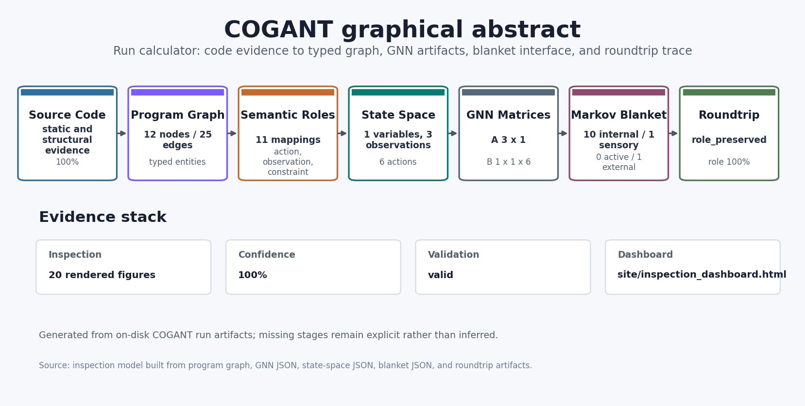

## Page 9

2.6
Positioning
COGANT occupies a specific niche in the program-analysis and code-modelling landscape. Unlike learned code-embedding
approaches such as code2vec [Alon et al., 2019] and code2seq [Alon et al., 2018], which map programs to distributed repre-
sentations or natural-language sequences through AST-path attention, COGANT produces interpretable rule-based role
assignments that a human reviewer can inspect, edit, or reject through the ReviewAPI and that require no training corpus,
no GPU budget, and no curated supervision signal. Every mapping carries a provenance record and a confidence score
derived from a transparent rule (eq. 8), so the output can be audited in the same way a conventional static analyser’s find-
ings are audited [Yamaguchi et al., 2014]. While graph-learning methods such as gated graph neural networks for programs
[Allamanis et al., 2018b, Li et al., 2016] train supervised models to predict variable names or detect bugs from raw graph
topology, COGANT complements that line by supplying a typed, confidence-annotated program graph in a documented
export contract that such models can consume directly (sec. 3 and ../cogant/docs/export/README.md).
On the Active Inference side, Friston et al.’s free energy principle [Friston, 2010] and the discrete-state synthesis of [Da Costa
et al., 2020] provide the theoretical foundation for the A/B/C/D matrix formalism, and the PyMDP runtime [Heins et al.,
2022] implements the simulation side of that formalism. COGANT sits between those layers: it extracts the same matrices
directly from an existing codebase — rather than asking a human to hand-author them, as [Smith et al., 2022] walks through
for small examples — and emits them in the Active Inference Institute’s Generalized Notation Notation [Active Inference
Institute, 2024] so that compatible downstream runtimes have a structured candidate model to inspect, adapt, or execute.
The combination of declarative role assignment, typed program-graph extraction, and GNN / A/B/C/D export to an active-
inference-friendly bundle is related to other tools in the program-analysis and modelling literature; sec. 16 makes the overlap
and differences explicit in tables.
The practical research claim is therefore narrower, and stronger, than “code becomes cognition.” COGANT says that a
repository can be transformed into an auditable generative-model candidate: source evidence and optional runtime
evidence produce graph facts; graph facts produce state-space variables, observations, actions, and preferences; matrix
degraded-output defaults expose what the code did not determine; dashboards show the conversion boundaries; and the
roundtrip report measures how much of the generated artifact survives reverse synthesis. Each of those claims is tied either
to package artifacts, METRICS.yaml, or the primary literature cited in this manuscript.
2.7
Manuscript versus package docs
This manuscript is a single linear narrative. The package tree holds authoritative API, CLI, export, and status detail. The
table below replaces a long per-file bullet list; every path is a package documentation path rather than a manuscript hyperlink.
Hub
Role
When to read
docs/index.md
Entry and quick links
First visit
docs/api/README.md
Session, PipelineRunner,
Bundle, ReviewAPI
Programmatic use
docs/cli/README.md
and docs/cli_referen
ce.md
Commands and flags
Shell / automation
docs/export/README.
md
GNN schema, tensor interop
Downstream consumers
docs/plugins/README
.md
Parsers, rules, validators,
exporters
Extensions
docs/architecture/R
EADME.md
Layers, crates, data flow
System picture
docs/reference/READ
ME.md
Implementation status,
how-tos
Onboarding, scope
docs/rules/README.m
d
Translation rules
Rule authors
docs/validation/REA
DME.md
Integrity and provenance
Quality gates
docs/security/READM
E.md
Threat model, sandboxing
Deployment
docs/roadmap/README
.md
Releases and backlog
Planning
specs/README.md
Machine-readable IR
contracts
Integrators
8

## Page 10

Hub
Role
When to read
docs/reference/docu
mentation_modules.m
d
Full docs/<module> index
Deep navigation
2.8
Dual Python/Rust architecture
COGANT employs a dual-language architecture in which Python is the default production runtime (COGANT_USE
_RUST=0) and the Rust workspace is an opt-in acceleration scaffold rather than the active runtime path.
The
Python orchestration layer handles session management, pipeline coordination, configuration, file discovery, AST parsing,
and the plugin interface — tasks where developer ergonomics and extensibility matter more than raw throughput. The
Rust workspace is organized as eight crates (cogant-core, cogant-graph, cogant-translate, cogant-statespace,
cogant-store, cogant-trace, cogant-gnn, cogant-ffi) with the intent of moving typed graph operations, translation
internals, trace-oriented plumbing, state-space structures, and Generalized Notation Notation (GNN) formatting into a
Rust kernel once the per-stage benchmarks justify the cross-language friction. The single Rust-wired production path
today is the connected_components branch in cogant/py/cogant/graph/builder.py (FFI-exposed through cogant-ffi);
all other crates are scaffolds awaiting either performance-pressure justification or upstream API stability. Communication
between layers flows through PyO3 bindings; these calls are synchronous and hold the Python GIL (no GIL release or
concurrent stage processing is implemented in the current cogant-ffi surface). The implementation status table at ../cog
ant/docs/reference/implementation_status.md is the source-of-record for which Rust paths are call-sited from Python;
the manuscript treats the Rust workspace as an architectural capacity, not as evidence of a Rust-default runtime. COGAN
T_USE_RUST=1 opt-in execution enables benchmarking the active path against the default Python implementation without
changing pipeline results.
2.9
Non-technical summary
COGANT turns a checked-out codebase into a structured, reviewable graph plus an Active-Inference-style bundle (matrices
and notation the runtime can use), with confidence on each mapping, instead of a single opaque vector. It is meant for teams
that need both static-analysis-style auditability and machine-learning-style tensor exports. Optional languages and services
are documented in the package; the manuscript explains the core theory and the evaluation story.
2.10
Roadmap of the following sections
The formal core begins in sec. 3 and sec. 4, then sec. 5 and sec. 6 connect confidence, state-space compilation, export, and
error handling. sec. 7 describes runtime/API workflows; sec. 8 shows concrete artifacts and failure modes; sec. 9 through
sec. 14 define the evaluation protocol and measured tables; sec. 15 covers artifact recording and validation; sec. 16 through
sec. 20 locate the work against prior systems; sec. 22 probes rule-family and matrix degraded-output sensitivity; and sec. 23
closes with shipped capabilities, limitations, and development directions.
Six appendices and one notation supplement support the body. sec. 24 documents the current native roundtrip evaluation
protocol and role-preservation metric; sec. 25 reports per-rule-family ablation deltas; sec. 26 sketches the Galois-connection
framing of the IR; sec. 27 records the canonical variational and expected-free-energy derivations exercised by the runtime;
sec. 28 extends the comparison tables in §8; and sec. 29 catalogues the source-of-record paths referenced from the body. The
notation supplement (sec. 30.4) collects every symbol and confidence-tier threshold in one place so that any section can be
read in isolation without recovering definitions from earlier text.
9

## Page 11

3
Program graph and formal foundations
Terminology.
Throughout sec. 3, GNN means Generalized Notation Notation (Active Inference Institute bundle
format), not graph neural networks; see sec. 2.
3.1
Program graph
Let 𝐺= (𝑉, 𝐸) denote a directed graph whose vertices 𝑉represent program entities and whose edges 𝐸represent relationships.
COGANT assigns each node a kind (for example function, variable, type) and a semantic role (for example definition versus
use). Each node and edge may carry:
• A stable identifier for persistence across runs when hashing allows.
• Type strings and attributes recovered from the front end.
• A confidence score in [0, 1] and provenance metadata (source code, type system, control flow, heuristic, external
tool).
This follows the same philosophical line as code property graphs that fuse AST, control flow, and data flow into one analyzable
structure [Yamaguchi et al., 2014], but orients the representation toward Generalized Notation Notation (GNN) export
and, optionally, tensorized views of the same graph: node kinds and roles map to discrete indices in both forms, and optional
embeddings can augment features as described in ../cogant/docs/export/README.md.
3.1.1
Structural equivalence
Two program graphs 𝐺1 = (𝑉1, 𝐸1) and 𝐺2 = (𝑉2, 𝐸2) are usefully compared via typed graph isomorphism: a bijection
𝜙∶𝑉1 →𝑉2 preserving edge structure and relevant labels supports deduplication and cross-repository linking when interfaces
align.
(𝑢, 𝑣) ∈𝐸1 ⟺(𝜙(𝑢), 𝜙(𝑣)) ∈𝐸2
(1)
eq. 1 formalizes the structural invariant we check during deduplication and cross-repository linking: a candidate bijection 𝜙
is accepted only when every edge in 𝐺1 has a corresponding edge between the images of its endpoints in 𝐺2 (and vice versa),
so that label-preserving matches strictly preserve the adjacency structure of both program graphs.
3.2
Formal definitions
This subsection makes the objects manipulated by the pipeline mathematically explicit. The definitions are stated for the
shipped v0.6.0 engine; where the AST front end targets a structural subset of the full edge taxonomy, the scope is noted
with a forward reference to sec. 9. The Notation Supplement (98_notation_supplement.md, Groups G.1–G.9) indexes the
manuscript’s symbols, equation labels, scoped formal claims, and acronyms.
The formal choices below are intentionally conservative. They borrow the finite-graph and monotone-fixpoint vocabulary
of classical data-flow analysis and fixed-point theory [Tarski, 1955, Kildall, 1973, Cousot and Cousot, 1977], but COGANT
does not claim the precision of a whole-program compiler analysis: the graph is the artifact the implemented front ends can
recover, and the semantic mappings are reviewable assertions over that artifact.
Definition 1 (Program graph).
A program graph is a tuple 𝐺= (𝑉, 𝐸, 𝜆𝑉, 𝜆𝐸, 𝜏) where
• 𝑉is a finite set of program nodes (modules, classes, methods, functions, and — on languages where the front end emits
them — variables and control-flow sites);
• 𝐸⊆𝑉×𝑉×𝐾is a finite set of typed directed edges drawn from the edge-kind alphabet 𝐾⊇{READS, WRITES, CALLS, CONTA
• 𝜆𝑉∶𝑉→𝒩labels each node with a node kind 𝒩⊇{MODULE, CLASS, METHOD, FUNCTION, CONFIGURATION, …};
• 𝜆𝐸∶𝐸→𝐾is the (trivial) projection onto the edge kind;
• 𝜏∶𝑉→(𝑇∪{⊥}) maps each node to a type annotation recovered from the front end or to ⊥when no annotation is
available.
The shipped Python front end populates the kinds {MODULE, CLASS, METHOD, FUNCTION} and the edge kinds
{CALLS, CONTAINS, READS, WRITES, IMPORTS, INHERITS}; the remaining kinds in 𝒩and 𝐾are declared in cogant
.schemas.core but currently emitted only when other parsers or dynamic enrichment stages fire. The empirical distribution
on the six packaged fixtures is recorded in tbl. 8 and tbl. 9 in sec. 9.
Mapping kinds vs graph roles. Translation rules emit SemanticMapping records whose kind field uses MappingKind
from cogant.schemas.semantic.
The seven names highlighted in the abstract are the Active Inference subset of that
10

## Page 12

enum; additional MappingKind members (DATA_FLOW, CONTROL_FLOW, ORCHESTRATION, …) cover non-AI structural patterns.
Separately, SemanticRole in cogant.schemas.semantic_mapping enumerates a broader set of graph-level role labels (for
example PARAMETER, CONFIGURATION); METRICS.yaml ir_schema.active_inf_role_count tracks the seven-name AI subset
verified against MappingKind.
Definition 2 (Evidence-labelled assertion).
An extracted assertion is a tuple 𝜉= (𝑥, 𝜅𝜉, 𝑐𝜉, 𝒫𝜉) where 𝑥is the node, edge, or finite fragment being asserted about; 𝜅𝜉is
the mapping kind, validation predicate, or structural property being asserted; 𝑐𝜉∈[0, 1] is the confidence score computed by
eq. 8; and 𝒫𝜉is a finite provenance set containing rule names, parser outputs, trace/coverage sources, reviewer markers, or
schema-validation records. For assertions over the same target and assertion kind, define the evidence preorder
𝜉1 ⪯𝑒𝜉2
⟺
𝑐𝜉1 ≤𝑐𝜉2 ∧𝒫𝜉1 ⊆𝒫𝜉2.
(2)
This order is operational rather than semantic: 𝜉2 is better supported by recorded COGANT evidence than 𝜉1, but the
relation is not a probability that the asserted program meaning is true. The distinction parallels the database-provenance
split between why provenance (which source facts contributed to an output) and where provenance (which source locations
supplied copied values) [Buneman et al., 2001]: COGANT records why a mapping fired and where its supporting fragment
lives, while leaving semantic truth to review, tests, or downstream formal analysis. This lets the claim ledger and PROV-
aligned artifact records [Moreau and Missier, 2013] explain why an assertion was emitted without turning structural validation
into a correctness proof.
The algebraic scope is deliberately smaller than provenance semiring semantics [Green et al., 2007]. COGANT does not
define provenance-polynomial addition/multiplication or claim semiring universality; the formal results below rely only on
finite-set union for accumulating provenance records, monotone growth of mapping identifiers before conflict resolution, and
deterministic priority/score pruning after the fixpoint. In particular, no theorem in this manuscript depends on semiring
distributivity or completeness.
Definition 3 (Translation rule).
A translation rule is a quadruple 𝑟= (𝜑𝑟, 𝜅𝑟, 𝑤𝑟, 𝑝𝑟) where
• 𝜑𝑟∶𝒢→2ℱis a computable predicate that, given a program graph 𝐺∈𝒢, returns a (possibly empty) set of matched
fragments ℱ— each fragment a finite tuple of node ids and optional edge ids;
• 𝜅𝑟∈𝒦𝑀is the mapping kind the rule assigns on success, drawn from the mapping-kind alphabet 𝒦𝑀
=
{HIDDEN_STATE, OBSERVATION, ACTION, POLICY, CONSTRAINT, PREFERENCE, CONTEXT, DATA_FLOW, ERRO
• 𝑤𝑟∈(0, 1] is the base confidence weight attached to mappings produced by 𝑟;
• 𝑝𝑟∈ℤis the rule priority consulted during conflict resolution (Algorithm 2).
Concretely, each TranslationRule subclass in ../cogant/py/cogant/translate/rules/ exposes 𝜑𝑟as the matche
s(graph, query) method, encodes 𝜅𝑟in the mapping_kind property, embeds 𝑤𝑟in the confidence_score field of
the returned SemanticMapping, and exposes 𝑝𝑟through the priority property.
The 22 shipped rules span five fami-
lies: five structural rules (ReadOnlyInput, MutatingSubsystem, Inheritance, Containment, DataPipeline), five seman-
tic rules (Observation, Action, Policy, Preference, Context), three control rules (Config, FeatureFlag, Parameter),
four behavioural rules (Orchestrator, TestAssertion, EventBus, StateMachine), and five resilience rules (RetryPattern,
ErrorBoundary, SingletonAccess, CircuitBreaker, RateLimiter). The later additions Parameter, StateMachine, and
RateLimiter capture tunable hyperparameters, finite-state-machine workflows, and rate-limiting policies that the original
rule set did not cover.
Definition 4 (Fixpoint semantics).
Let ℳbe the (finite) set of all possible semantic mappings that any finite composition of rules in 𝑅could emit on a fixed
graph 𝐺. Define the rule-application operator 𝐹𝐺,𝑅∶2ℳ→2ℳby
𝐹𝐺,𝑅(𝑆) = 𝑆∪{ 𝑟.apply(𝐺, 𝑓) ∣𝑟∈𝑅, 𝑓∈𝜑𝑟(𝐺), 𝑟.apply(𝐺, 𝑓) ≠⊥}.
(3)
The translation of 𝐺under 𝑅is the least fixpoint
𝑇∗(𝐺) = ⨆
𝑘≥0
𝐹𝑘
𝐺,𝑅(∅) =
lim
𝑘→∞𝐹𝑘
𝐺,𝑅(∅),
(4)
computed iteratively by TranslationEngine.translate() and then post-processed by _resolve_conflicts() (Algorithm
2). The post-processing step applies an anti-monotone pruning to the fixpoint, and is therefore specified outside of 𝐹𝐺,𝑅
rather than folded into it.
11

## Page 13

Definition 5 (Markov blanket partition).
Given a program graph 𝐺= (𝑉, 𝐸, 𝜆𝑉, 𝜆𝐸, 𝜏) and a seed set 𝑆⊆𝑉selected by one of the five strategies in MarkovBla
nketExtractor (explicit, module, kind, auto, mapping_kind), the Markov blanket partition Π𝐺,𝑆∶𝑉→{𝜇, 𝑠, 𝑎, 𝜂}
is an engineering adaptation of graphical-model Markov blankets [Pearl, 1988] and the active-inference blanket vocabulary
[Kirchhoff et al., 2018], with the critique literature treated as a scope constraint rather than as settled metaphysics [Biehl
et al., 2021, Bruineberg et al., 2022]. Here “Markov blanket” names the role vocabulary and interface cut; it does not assert
a Bayesian network over program nodes, conditional-independence separation, or a causal model of the source program. It
is defined on the undirected projection of 𝐺as follows. Let 𝑁in(𝑣) = {𝑢∶(𝑢, 𝑣, 𝑘) ∈𝐸} and 𝑁out(𝑣) = {𝑢∶(𝑣, 𝑢, 𝑘) ∈𝐸}.
Then
Π𝐺,𝑆(𝑣) =
⎧
{
{
⎨
{
{
⎩
𝜇
if 𝑣∈𝑆and (𝑁in(𝑣) ∪𝑁out(𝑣)) ⊆𝑆,
𝑎
if 𝑣∈𝑆and 𝑁out(𝑣) ∖𝑆≠∅,
𝑠
if 𝑣∈𝑆and 𝑁out(𝑣) ⊆𝑆and 𝑁in(𝑣) ∖𝑆≠∅,
𝜂
if 𝑣∉𝑆.
(5)
The four-way case split is realised verbatim by partition_by_seeds() in ../cogant/py/cogant/markov/blanket.py: the
function precomputes the in/out adjacency of every node in 𝑂(|𝑉|+|𝐸|) time via _bidirectional_adjacency(), then walks
𝑉once and assigns each node to exactly one of 𝜇, 𝑠, 𝑎, 𝜂. Bidirectional boundary nodes (those with both external in- and
out-neighbours) are assigned to 𝑎by convention, and are additionally tagged with a bidirectional metadata flag so that
downstream consumers can recover the distinction.
Definition 6 (A/B/C/D matrices).
Given a translation 𝑇∗(𝐺) and a compiled state-space (V, O, A) of hidden-state variables, observation modalities, and actions,
the generative-model matrices of COGANT are
𝐴∈ℝ|O|×|V|,
𝐴𝑖𝑗= 𝑃(𝑜𝑖∣𝑠𝑗),
∑
𝑖
𝐴𝑖𝑗= 1,
𝐵∈ℝ|V|×|V|×|A|,
𝐵𝑖𝑗𝑘= 𝑃(𝑠′
𝑖∣𝑠𝑗, 𝑎𝑘),
∑
𝑖
𝐵𝑖𝑗𝑘= 1,
𝐶∈ℝ|O|,
𝐶𝑖= log
̃𝑃(𝑜𝑖),
𝐷∈ℝ|V|,
𝐷𝑗= 𝑃(𝑠𝑗∣𝑡= 0),
∑
𝑗
𝐷𝑗= 1.
(6)
𝐴is derived from {READS, OBSERVES, DEPENDS_ON} edges between observation and hidden-state nodes; 𝐵is derived
from {WRITES, MUTATES} edges from action to hidden-state nodes, with an identity degraded-output default when an
action writes nothing; 𝐶is derived from the signed confidence scores of CONSTRAINT/PREFERENCE mappings adjacent
to each observation; and 𝐷is derived from CONFIGURATION-neighbour bias on hidden-state variables or uses a uniform
prior. The derivation is performed by GNNMatrices in ../cogant/py/cogant/gnn/matrices.py and uses no numerical
dependencies beyond the Python standard library. Columns of 𝐴, columns of each 𝐵action slice, and the vector 𝐷are
normalised to valid probability distributions using the high-direct / low-indirect mass defaults (0.9, 0.1) defined as the module-
level _DEFAULT_DIRECT_MASS / _DEFAULT_INDIRECT_MASS constants in matrices.py; the 𝐶vector is a log-preference and is
not normalised. This convention matches 𝐴𝑖𝑗= 𝑃(𝑜𝑖∣𝑠𝑗): for each fixed hidden state 𝑠𝑗, the observation distribution sums
over 𝑖.
3.2.1
Scoped Formal Claims
Proposition 1 (Fixpoint termination).
Let 𝐺= (𝑉, 𝐸, 𝜆𝑉, 𝜆𝐸, 𝜏) be a finite program graph with |𝑉| = 𝑛, let 𝑅be a finite rule set with |𝑅| = 𝑘, and let 𝐹𝐺,𝑅be
the rule-application operator of Definition 4. Then the Kleene chain
∅⊆𝐹𝐺,𝑅(∅) ⊆𝐹2
𝐺,𝑅(∅) ⊆⋯
(7)
stabilises in at most |ℳ| iterations, where |ℳ| ≤𝑛⋅|𝒦𝑀| is an upper bound on the number of distinct mapping ids any
rule set can produce on 𝐺. In particular, the shipped engine with its default cap 𝐾= 10 converges on every fixture in
{calculator, event_pipeline, flask_mini, flask_app, requests_lib, json_stdlib} within the cap.
Proof sketch. Each application step either adds at least one new mapping id to the accumulating set 𝑆or leaves 𝑆unchanged;
the engine’s idempotence guard in TranslationEngine.translate (skip when mapping.id is already in self.mappings)
12

## Page 14

enforces the monotone-plus-bounded invariant. Because 𝐹𝐺,𝑅is monotone on the finite lattice (2ℳ, ⊆) and bounded above
by ℳ, the Knaster–Tarski fixed-point theorem [Tarski, 1955] implies fixed points exist and the Kleene chain here is an
ascending chain in a finite lattice. It therefore stabilises in at most |ℳ| steps. The stabilisation point is, by construction, the
least fixpoint of 𝐹𝐺,𝑅above ∅. The worst-case bound 𝑛⋅|𝒦𝑀| is a conservative implementation bound: stable mapping IDs
encode the target node/fragment and mapping kind, and any duplicate ID is ignored before conflict resolution. The packaged
fixtures are an empirical sanity check rather than a proof of rule-family disjointness: the engine logs a final zero-new-mapping
pass and tbl. 8 / tbl. 10 in sec. 12 report the resulting mapping counts and validation status. ■
Implementation invariant 1 (Markov blanket partition totality).
For any program graph 𝐺= (𝑉, 𝐸, 𝜆𝑉, 𝜆𝐸, 𝜏) with 𝑉≠∅and any seed set 𝑆⊆𝑉, the seed-induced structural partition
Π𝐺,𝑆of Definition 5 is total (every 𝑣∈𝑉receives exactly one role) and mutually exclusive (no 𝑣is assigned two roles).
This invariant is about the implemented partitioner, not about probabilistic Markov-blanket semantics.
Proof sketch. Totality: the case split in eq. 5 exhausts the boolean product (𝑣∈𝑆) × (𝑁out(𝑣) ∖𝑆= ∅) × (𝑁in(𝑣) ∖𝑆= ∅). If
𝑣∉𝑆the fourth case applies. If 𝑣∈𝑆there are three subcases depending on whether 𝑣has external out-neighbours, external
in-neighbours only, or no external neighbours at all; the engine resolves the “both external in and external out” subcase to
ACTIVE by convention, matching the bidirectional case branch in partition_by_seeds() in cogant.markov.blanket. Every
𝑣∈𝑉therefore matches exactly one branch, so Π is a total function. Mutual exclusivity: the branches are pairwise disjoint
because they condition on mutually exclusive predicates on (𝑣∈𝑆, 𝑁in(𝑣)∖𝑆, 𝑁out(𝑣)∖𝑆). The implementation materialises
the four role sets internal, sensory, active, external as disjoint Python sets and writes into exactly one on each iteration
of the main loop, so the in-memory invariant matches the mathematical one. ■
Proposition 2 (Matrix validity).
If |O| ≥1, |V| ≥1, and |A| ≥1, then the matrices (𝐴, 𝐵, 𝐶, 𝐷) produced by GNNMatrices.compute_A/B/C/D satisfy the
stochastic conditions of Definition 6 within a numerical tolerance of 10−6.
Proof sketch. Columns of 𝐴are produced in eq. 6 with explicit normalisation in GNNMatrices.compute_A: for each hidden-
state column, the implementation divides by the column sum when it exceeds 𝜀= 10−9 and returns a uniform observation
distribution otherwise. Columns of each action slice 𝐵[∶, ∶, 𝑘] are produced by the same simplex-normalisation helper with an
identity default ensuring the resulting column is never all-zero. The prior 𝐷is built as a weighted vector of confidence scores
and passed through _normalize_vector(), again with a uniform default when all weights are below 𝜀. The implementation
therefore establishes the sum-to-one invariant by construction; GNNMatrices.validate_shapes checks A/B/D stochasticity
for computed matrices, and GNNValidator.validate_matrices() gates exported bundles with the same tolerance before
the package can validate.
All six packaged fixtures pass GNNValidator with zero errors (tbl. 8), which is fixture-level
implementation evidence rather than an independent semantic proof. The 𝐶vector is a log-preference and is exempt from
the sum-to-one requirement. ■
13

## Page 15

4
Intermediate Representations (IR) progression, translation engine, and
algorithms
4.1
Progressive IRs
Processing proceeds through a sequence of representations. Which stages are complete for a given repository is summarized
in the package implementation-status table under ../cogant/docs/reference/ (partial areas include translation rules, state
space, and Rust acceleration):
1. Repo IR — entities and relationships extracted from parsers.
2. Program graph IR — consolidated graph with deduplication and metadata.
3. Semantic mapping IR — output of the translation rule engine.
4. State space IR — variables, actions, transitions, observations.
5. Process model IR — higher-level control patterns where implemented.
6. Validation IR — coverage, confidence analysis, schema checks.
COGANT’s program graph sits in the same conceptual space as compiler intermediate representations such as LLVM [Lattner
and Adve, 2004] and MLIR [Lattner et al., 2021], but targets behavioral extraction and export for downstream learning rather
than code generation or optimization. Put differently, it borrows compiler discipline – typed intermediate state, deterministic
passes, and validation – while stopping at a research artifact boundary instead of lowering to executable machine code.
The method is therefore best read as an evidence-producing pipeline rather than a semantics-preserving compiler. Each
IR layer writes a material artifact (program_graph.json, semantic_mappings.json, state_space.json, matrix JSON,
GNN Markdown, validation report, and optional dashboard figures). Later stages may consume earlier artifacts, but they
do not erase them: a low-confidence mapping, parser alternate path, skipped file, or matrix degraded-output default stays
inspectable in the run directory and in the dashboard. This is the practical reason the manuscript separates role preservation
from strict structural isomorphism: the reverse synthesizer can preserve the semantic-role population while still adding
scaffold nodes, normalizing matrices, or changing graph surface form.
4.2
Translation rules
The translation stage applies declarative rules that refine roles, attach labels, and adjust confidence. Concurrency targets
and layering are described in ../cogant/docs/architecture/README.md. The rule engine composes passes over the graph
in a fixpoint loop: rules are re-applied until no new semantic mappings emerge or a configurable iteration cap is reached.
The fixpoint loop follows the classical formulation of program analysis as fixpoint computation over program-flow graphs
and lattices of abstract states [Kildall, 1973, Cousot and Cousot, 1977]; in our setting the lattice is the set of semantic
mappings partially ordered by inclusion, and the monotone operator is the composition of all registered rule applications.
The implementation is intentionally lighter than a full Datalog engine, but it inherits the same declarative-analysis advantage
demonstrated by Doop-style points-to specifications: the analysis contract is visible as rules rather than hidden inside ad hoc
traversal code [Bravenboer and Smaragdakis, 2009]. In the shipped implementation, each pass applies rules in descending
rule.priority, and conflict resolution later compares (rule_priority, confidence_score) tuples when two mappings
overlap, following the principle that edit representations should be composable [Yin et al., 2019].
4.2.1
Fixpoint iteration, conflict resolution, and coverage
The shipped TranslationEngine in ../cogant/py/cogant/translate/engine.py realizes the fixpoint loop concretely.
Each iteration walks every registered rule once: the engine calls rule.matches(graph, query) to collect candidate fragments,
then calls rule.apply(graph, match) on each, accumulating any resulting SemanticMapping objects keyed by their stable
IDs. A per-pass counter tracks mappings that were genuinely new (not already present in the running set), and the loop
terminates as soon as a pass completes with zero additions. The engine logs each iteration boundary through an internal
match log, so the number of passes required to reach a fixed point is directly observable in the post-run diagnostics. The
default iteration cap is max_iterations = 10; in testing, most repositories converge well before that bound, and the cap
exists primarily as a safety valve against pathological rule sets that could otherwise oscillate indefinitely.
After fixpoint termination, the engine invokes _resolve_conflicts() to reconcile mappings whose graph_fragment_node
_ids sets overlap. For each overlapping pair the engine retains the mapping with the larger (rule_priority, confidenc
e_score) key and discards the other, logging a conflict_resolved event that records the losing ID, the winning ID, and
the specific overlap set. Most shipped rules use the default rule.priority of 0; the mutating-subsystem / hidden-state rule
uses priority 1 so it survives overlaps with same-confidence class-level aggregates (for example containment summaries) on
the same CLASS node. A companion entry point, translate_with_confidence(), runs the standard fixpoint loop, rescores
every surviving mapping through the ConfidenceModel, and then re-resolves conflicts so that any ordering shifts induced by
rescoring are honored.
14

## Page 16

The same run also emits a rule-evidence trace. Each SemanticMapping carries additive metadata for the rule identifier, rule
priority, matched node IDs, and fixpoint iteration that created it. build_rule_evidence_trace() then joins that metadata
with graph snippets and the conflict log to produce a reviewer-facing table: mapping ID, role, confidence score, evidence
snippets, confidence components, conflict-resolution outcome, and final status. This trace is COGANT’s domain-specific
analogue of a provenance record: it captures which activity produced the assertion, which graph entities it used, and which
conflict-resolution activity modified its status, aligning with the entity/activity/derivation vocabulary of PROV-DM without
requiring the JSON sidecar to be a literal PROV serialization [Moreau and Missier, 2013]. The finer-grained design is also
consonant with provenance-semiring work, where derivation annotations are propagated through relational and Datalog-style
fixed points instead of being collapsed into booleans [Green et al., 2007]. Optional reviewer annotations mark mappings
as accepted or rejected; the calibration summary derived from those annotations reports reviewed counts, accepted/rejected
counts, per-rule precision proxies, and review coverage. This is deliberately narrower than a gold-standard recall claim: recall
requires a labelled false-negative corpus, while the current artifact measures the precision of mappings that the rule engine
actually proposed.
The implementation assertions in this subsection are covered by focused regression tests rather than prose alone. From
the package root, uv run pytest --no-cov tests/unit/test_translation_rules.py tests/unit/test_translate_
engine_rule_explanation_translation_init_targeted.py tests/property/test_translation_invariants.py -q
exercises rule matching, explanation traces, engine conflict behavior, and translation invariants; the source artifacts remain
../cogant/py/cogant/translate/engine.py and ../cogant/py/cogant/translate/rules.py.
Translation coverage – the fraction of graph nodes that received at least one semantic mapping – is reported by get_cove
rage_report(graph). It returns the total node count, the number of covered nodes, the number of uncovered nodes, a c
overage_percent value rounded to two decimal places, and the sorted list of uncovered node IDs. The uncovered list is
intentionally emitted verbatim so that downstream tooling can target unmapped regions for manual review or rule extension,
rather than burying the gap behind a single aggregate number [Allamanis et al., 2018a].
Algorithm 1 (Fixpoint translation engine).
input:
program graph G = (V, E), rule set R, maximum iterations K
output: semantic mappings M keyed by stable ID
M := {}
for k in 1..K:
n_new := 0
for rule r in R sorted by priority(r) descending:
for match m in r.matches(G):
mu := r.apply(G, m)
if mu exists and mu.id not in M:
M[mu.id] := mu
n_new := n_new + 1
if n_new == 0:
break
return ResolveConflicts(M)
Algorithm 1 summarizes the engine. The implemented loop terminates by construction: each iteration either produces at
least one new mapping (whose stable ID is then fixed in ℳ), stops at the no-new-mapping break condition, or reaches the
explicit outer 𝐾cap. The cap is a runtime safety valve for pathological or user-registered rule sets, not a semantic proof that
every possible rule family is globally well behaved.
Algorithm 2 (Priority-ordered conflict resolution).
input:
mapping set M, priority function p
output: reduced mapping set with no overlapping fragments
Build inverted index I: node ID -> mappings touching that node
C := all mapping pairs that co-occur in at least one I[node]
R := {}
for each pair (mu_a, mu_b) in C:
if mu_a in R or mu_b in R:
continue
key_a := (p(mu_a), confidence(mu_a))
15

## Page 17

key_b := (p(mu_b), confidence(mu_b))
if key_a >= key_b:
R.add(mu_b)
else:
R.add(mu_a)
return M minus R
Algorithm 2 detects conflicts via an inverted index in 𝑂(∑𝑣|ℐ(𝑣)|2) worst-case time, which is substantially faster than the
naive all-pairs scan for graphs where most nodes carry at most one mapping.
16

## Page 18

5
Confidence scoring, evidence tiers, and state-space compilation
5.1
Confidence scoring and evidence tiers
The shipped ConfidenceModel in ../cogant/py/cogant/translate/confidence.py computes a scalar score in [0, 1] from:
• Average confidence over provenance records.
• An evidence-diversity term (scaled, capped).
• A parser certainty factor applied multiplicatively.
• Conflict penalties subtracted after scaling.
𝑐= max (0, min (1, ( ̄𝑒+ 𝛿𝑑) ⋅𝜅−𝜋))
(8)
Here
̄𝑒is the mean evidence confidence, 𝛿𝑑is the diversity bonus (bounded), 𝜅is parser certainty, and 𝜋aggregates conflict
penalties. Tiers (for example static-only versus static-plus-runtime) are assigned from score thresholds and evidence source
tags (determine_confidence_tier); see the same module for named thresholds and enum values. The manuscript does not
duplicate those literals so they cannot drift from code.
The score should be interpreted operationally rather than metaphysically: it is a review-priority score over extracted assertions,
not a Bayesian posterior over the true semantics of the program and not an empirically calibrated probability in the reliability-
diagram sense [Guo et al., 2017]. Its value is that every component is inspectable and trace-backed – provenance source,
parser certainty, rule specificity, conflict penalty, reviewer outcome – so a high score means “stronger executable evidence for
this mapping under the current front end,” not “the repository has been proven correct.” This distinction keeps COGANT
compatible with provenance-oriented artifact review [Moreau and Missier, 2013] and with the manuscript’s broader claim-
ledger discipline, while leaving formal posterior semantics and empirical calibration to future work.
The implemented scoring and state-space claims are paired with focused tests: uv run pytest --no-cov tests/unit/tes
t_confidence.py tests/unit/test_confidence_model.py tests/unit/test_statespace_compiler.py tests/unit/t
est_gnn_matrices.py -q covers confidence aggregation, compiler shape contracts, and matrix stochasticity against ../co
gant/py/cogant/translate/confidence.py, ../cogant/py/cogant/statespace/compiler.py, and ../cogant/py/coga
nt/gnn/matrices.py.
5.2
State space and behavior
Where traces or coverage are available, dynamic extraction feeds the state-space compiler. The goal is a compact behavioral
model: states, actions, transitions, and observations that sit alongside the static graph for tasks that require execution-
sensitive features. The tuple (𝑆, 𝐴, 𝑇, 𝑂) of variables, actions, transitions, and observation modalities mirrors the structure
of a partially observed Markov decision process [Kaelbling et al., 1998] as used in discrete active inference [Parr et al.,
2022, Da Costa et al., 2020, Smith et al., 2022], and at the level of reachable state/transition graphs it also resembles the
Kripke structures traditionally used in model checking [Clarke et al., 1999], without attempting to discharge temporal-logic
obligations. PyMDP [Heins et al., 2022] is one downstream runtime target for compatible discrete state-space specifications;
COGANT’s claim is the emitted candidate model plus traceable evidence, not automatic success through every renderer or
simulator adapter.
The shipped StateSpaceCompiler in ../cogant/py/cogant/statespace/compiler.py constructs this model in several
coordinated passes driven by the semantic mappings and the underlying program graph.
State variables are identified by a StateVariableExtractor that traverses graph nodes carrying READS and WRITES
edges: any node that participates in a write is a candidate hidden-state variable, and its type, cardinality, and initial
confidence are derived from the node’s recovered type string and the provenance of the rules that produced the associated
mapping.
Actions are extracted from semantic mappings of kind ACTION, with parameters read from node metadata (typically the
parser-recovered function signature), effects traced through outgoing WRITES edges on the controller node, and preconditions
derived from parameter lists, docstring directives, and explicit metadata entries. For method-kind actions, the compiler also
walks CONTAINS edges back to the enclosing class so that instance-level state mutations are attributed to the correct
controller, mirroring how code property graphs fuse structural and data-flow views [Yamaguchi et al., 2014].
Transitions are inferred by a cross-reference pass (_cross_reference_actions_and_variables) that, for each action,
partitions its adjacent variables into reads and writes based on edge kind (WRITES and MUTATES yielding writes; READS
and OBSERVES yielding reads). The resulting Transition object records a source_state in which every touched variable
is marked "pre" and a target_state in which written variables advance to "post" while read-only variables remain "pre";
this simple pre/post convention keeps the model aligned with the static evidence without overcommitting to symbolic value
domains that cannot be recovered from AST analysis alone.
17

## Page 19

Trigger attribution follows incoming TRIGGERS and CALLS edges so that orchestration flow is preserved in the behavioral
model.
Observation modalities are built from semantic mappings of kind OBSERVATION: each associated node becomes an Obse
rvationModality whose modality type (log, metric, event, sensor, or generic observation channel) is inferred from the
mapping’s description and the node’s name, giving the GNN export a typed observation channel aligned with the OBSERVES
edges in the program graph.
The temporal regime of the model is determined by a companion TemporalAnalyzer. It classifies nodes as asynchronous
when their metadata carries is_async/async flags or their names match patterns such as async, callback, promise, or
future, and as event-related when their kind is EVENT or their names match event, handler, listener, or trigger. Temporal
orderings are then extracted from CALLS and TRIGGERS edges, with each edge classified as parallel (when either endpoint
is async) or sequential otherwise, and event patterns are assembled from triggers-in / triggers-out pairs around each event
node.
A final decision rule selects among SYNCHRONOUS, ASYNCHRONOUS, EVENT_DRIVEN, and HYBRID: the presence of event triggers
and patterns combined with async handlers yields HYBRID; event triggers alone yield EVENT_DRIVEN; an async fraction above
30 percent or the presence of async handlers yields ASYNCHRONOUS; and all remaining cases default to SYNCHRONOUS. This
regime is attached to the StateSpaceModel metadata so downstream consumers know which execution model the transition
graph assumes.
When coverage and traces are available, enrich_graph() in ../cogant/py/cogant/dynamic/enrichment.py feeds ad-
ditional evidence into this pipeline.
Coverage enrichment matches .coverage SQLite databases or Cobertura XML re-
ports against nodes whose path and source_range overlap covered lines, attaching coverage_hits and, where branch
data is available, branch_coverage metadata.
Trace enrichment parses Chrome DevTools traces, writes call_count,
avg_duration_ms, and is_hot_path onto matching callable nodes, and adds or reweights dynamic CALLS edges tagged
with evidence_sources=["dynamic_trace"].
Both steps also append dynamic_coverage and dynamic_trace markers to the program graph’s evidence sources. The
confidence model consumes these markers directly: any mapping whose evidence set now contains both static and dynamic
entries becomes eligible for promotion from the STATIC_ONLY tier to STATIC_PLUS_RUNTIME, and hot-path and branch-
coverage metadata raise the underlying score through the diversity bonus 𝛿𝑑in eq. 8. This is the mechanism by which
executing the target program, even partially, converts static heuristics into corroborated behavioral facts without rerunning
the upstream rule engine [Allamanis et al., 2018a].
5.2.1
Typed socio-technical state spaces
The same state-space vocabulary also suggests a bounded future extension for socio-technical artifacts. An organization
chart can be read as a typed graph whose units, roles, posts, reporting lines, process responsibilities, service ownership
records, and escalation paths provide structural priors over coordination rather than direct measurements of organizational
behaviour [W3C Government Linked Data Working Group, 2014, Galbraith, 1974]. In COGANT terms, those artifacts would
be analogous to static program nodes and edges: they identify candidate hidden states, action channels, observation surfaces,
and controller boundaries, but they do not by themselves determine transition probabilities or policy adequacy.
Dynamic organizational evidence would need to come from process events, incident traces, ticket flow, commit and review
histories, approval records, service telemetry, and communication metadata, treated with the same provenance and confidence
discipline as runtime coverage or Chrome trace evidence in the software pipeline. Network state-space models show why this
distinction matters: observed edges over time can be modeled as measurements of latent node propensities, with change
detection comparing incoming network structure against an estimated latent dynamic baseline [Zou and Li, 2017]. A future
“typed corporation” model should therefore mean an evidence-bearing surrogate over typed organizational artifacts and
dynamic traces, not a claim that the legal corporation, its incentives, or all human behaviour have been captured by an org
chart.
The AlphaFund white paper’s channel-history and filtration framing is useful here as a methods analogy, not as an imple-
mented COGANT method [Westenhaver et al., 2026]. A future socio-technical bundle would need every proposed interven-
tion row to carry time-indexed evidence about what was observed, what action was taken, what channel changed, and what
downstream outcome followed. That is the organizational analogue of COGANT’s current evidence-tier discipline: without
recorded provenance and no-peeking histories, capital-allocation language becomes an optimizer-shaped story rather than a
measurable state-space artifact.
5.2.2
Worked example: temperature controller
Consider a small Python controller extracted from a HVAC codebase:
18

## Page 20

class TemperatureController:
def __init__(self):
self.current_temp: float = 20.0
self.target_temp: float = 22.0
self.heater_on: bool = False
def set_target(self, t: float) -> None:
self.target_temp = t
def read_sensor(self, reading: float) -> None:
self.current_temp = reading
def actuate_heater(self) -> None:
if self.current_temp < self.target_temp:
self.heater_on = True
else:
self.heater_on = False
StateVariableExtractor identifies three state variables from WRITES edges on __init__ and the three methods:
current_temp (float, cardinality continuous), target_temp (float), and heater_on (bool, cardinality 2). Three actions
are extracted from ACTION-kind mappings: set_target (writes target_temp), read_sensor (writes current_temp), and
actuate_heater (reads current_temp, target_temp; writes heater_on). All three actions are attributed to TemperatureC
ontroller via CONTAINS edges.
The cross-reference pass yields three transitions. For actuate_heater the source_state records {current_temp: "pre",
target_temp: "pre", heater_on: "pre"}
and
the
target_state
records
{current_temp: "pre", target_temp:
"pre", heater_on: "post"}, capturing that only heater_on advances while the read-only variables remain pinned.
Because no node carries async flags or event-kind markers and no CALLS or TRIGGERS edges cross into async endpoints,
the TemporalAnalyzer classifies the model as SYNCHRONOUS and attaches that regime to the StateSpaceModel metadata.
19

## Page 21

6
GNN export and error-handling philosophy
This section closes the four-part method core (program graph IR in sec. 3, rule progression in sec. 4, confidence and state-
space in sec. 5) by describing the durable interchange boundary — Generalized Notation Notation — and the error-handling
discipline that prevents one bad rule firing from poisoning the rest of an export. From here, sec. 7 explains how the API
surfaces these artifacts to Python and CLI consumers.
6.1
GNN export (Generalized Notation Notation)
Exports package the program graph and compiled state-space model into the Active Inference Institute’s Generalized
Notation Notation plus a small set of interop targets. The upstream GNN repository describes Generalized Notation
Notation as a text-based language for Active Inference generative models and provides a broader validation, visualization,
and execution pipeline around those files [Active Inference Institute, 2024]; COGANT’s export layer treats that format as
the durable interchange boundary.
• GNN Markdown (model.gnn.md) — canonical, human-readable Generalized Notation Notation organized into 19
canonical sections in the specification order defined in ../cogant/docs/export/README.md.
• GNN JSON (model.gnn.json) — machine-readable equivalent of the markdown sections, plus companion JSON
files per section (state_space.json, observations.json, actions.json, transitions.json, and so on).
• Interop exports — GraphML and Parquet for analysis in Gephi/yEd and DuckDB, and optional tensor views (Py-
Torch Geometric Data objects [Fey and Lenssen, 2019], DGL graphs [Wang et al., 2019], HDF5 tables [The HDF Group,
2026]) for downstream graph neural network training pipelines that consume the program graph as a relational tensor.
The JSON sidecars are validated by COGANT’s package-native schema checks; they are not advertised as normative
JSON Schema, JSON-LD, or SHACL artifacts unless an adapter explicitly emits those forms [Wright et al., 2022,
Sporny et al., 2020, W3C, 2017].
Figure 2: All-page mosaic of the calculator fixture’s model.gnn.md bundle. The figure is generated from cogant/output/ca
lculator/gnn_package/model.gnn.md and shows the human-readable Generalized Notation Notation artifact that travels
beside JSON sidecars, validation reports, and provenance metadata. Read it as readability and interchange evidence for
the emitted package format; machine validation still comes from the structured JSON and validation artifacts, not from the
rasterized pages.
fig. 2 is included because interchange formats have a human-review surface as well as a machine-ingestion surface. The mosaic
lets a reviewer inspect the complete emitted page set, section ordering, labels, and prose-facing bundle structure; it does not
by itself validate that the matrices, role mappings, or downstream semantics are correct.
The export split mirrors two adjacent traditions. ProGraML shows why compiler and ML systems benefit from portable
graph representations that explicitly encode control, data, and call dependencies [Cummins et al., 2021]. The graph-network
literature frames this as a relational inductive bias: entities, relations, and global state should remain explicit so downstream
20

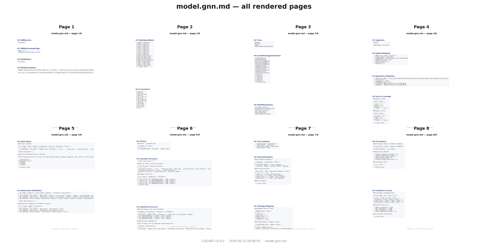

## Page 22

models can reason compositionally over them [Battaglia et al., 2018]. COGANT keeps those graph relations available, but its
primary exported object is a Generalized Notation Notation bundle with state-space and active-inference semantics rather
than only an optimization dataset or a neural-model input.
6.1.1
The 19-section GNN bundle structure
The canonical GNN specification organizes metadata, semantics, and generative-model components into 19 sections, each
carrying distinct semantic load:
1. Model Metadata — provenance, name, version, creation timestamp, source repository URL, project description, and
authorship information.
2. Repository Metadata — VCS details (commit hash, branch, remote origin), file inventory, and module topology.
3. Source Coverage — which source files were ingested, coverage percentage per file or module, parser and language
backend used (CPython ast, tree-sitter, etc.), and parse-error inventory.
4. State Space — list of hidden-state variables extracted by the MutatingSubsystemRule and other structural rules,
their dimensionality, and categorical cardinality if applicable.
5. Observation Modalities — observable variables (methods, properties, getters, sensors in the metaphor), their sources
on the program graph, and the subset of hidden states each can read.
6. Actions/Policies — action-typed nodes (setter methods, clear operations, API calls) and associated policy candidates
emitted by the semantic family and behavioural family rules.
7. Program Graph Connections — edges in the original program graph reduced to the Markov-blanket partition
(internal vs. boundary nodes). Specifies which internal nodes influence which observations and actions.
8. Factors — nodes in the program graph labeled with their primary semantic role. Mapping kinds drawn from the
formal alphabet 𝒦𝑀(HIDDEN_STATE, OBSERVATION, ACTION, POLICY, PREFERENCE, CONSTRAINT,
CONTEXT, DATA_FLOW, ERROR_HANDLING, CIRCUIT_BREAKER, ORCHESTRATION — see Definition 3
and sec. 30.7) carry the generative-model semantics; broader graph-level role annotations (for example CONFIGURA-
TION, and illustrative descriptive tags such as event-bus or resilience patterns) come from the separate SemanticRole
vocabulary and are not part of 𝒦𝑀.
9. Transition Structure — the state-transition component B of the generative model, compiled from WRITES and
CALLS edges. Specifies which actions update which state dimensions.
10. Likelihood Structure — the observation likelihood A, compiled from READS/OBSERVES/DEPENDS_ON edges.
Specifies which hidden states produce which observations.
11. Preferences/Constraints — C and D components: preference (reward) weights on observations from PREFERENCE
and CONSTRAINT mappings, and initial-state priors from CONFIGURATION edges.
12. Time Settings — discretization interval, episode length, and whether the model assumes a fixed or variable-length
horizon.
13. Parameterization — fixed hyperparameters of the generative model (e.g., temperature, inverse-temperature, concen-
tration parameters) and which are learned vs. fixed during active-inference execution.
14. Ontology Mapping — the semantic mapping of each program node (function, class, variable) to its AII role(s), plus
the confidence band and rule family responsible for the assignment.
15. Markov Blanket — the Active-Inference partition of the program graph into internal (𝜇), sensory (s), active (a), and
external (𝜂) states, with the seed strategy and per-node rationale.
16. Provenance — which rules (by name and version) emitted each mapping, including the conflict-resolution logic that
selected a winner when multiple rules proposed the same role.
17. Confidence Scores — per-mapping confidence bands and the source rule’s evidence score (typically 0.65–0.90) from
../cogant/docs/evaluation/CALIBRATION.md; these are rule defaults and review-priority signals, not empirical
calibration curves.
18. Rendering Hints — layout and visualization metadata (node positions, color coding by role, cluster membership)
consumed by downstream graphical tools.
19. Validation Notes — the output of the GNNValidator (see AII validator and scoring above; implementation in
../cogant/py/cogant/gnn/validator.py) with section-by-section pass/fail status, any missing sections, and the
composite 0–100 score.
Node and edge feature breakdowns, section contracts, and optional framework targets are specified in ../cogant/docs/expor
t/README.md; they determine the structure of the emitted notation and the effective input dimensionality of any downstream
model.
6.1.2
A/B/C/D matrix derivation from edge kinds
The four matrices of the Active Inference generative model are compiled directly from the program graph’s edge kinds in the
GNNMatrices class (module gnn/matrices.py):
21

## Page 23

• Matrix A (likelihood) — derived from READS, OBSERVES, and DEPENDS_ON edges.
A[observation,
hidden_state] encodes 𝑃(𝑜∣𝑠) and is normalized by hidden-state column, so every fixed hidden state defines
a distribution over observation outcomes.
A hidden-state column with no observation evidence uses a uniform
observation distribution (maximum entropy in the absence of evidence).
• Matrix B (transition) — derived from WRITES and CALLS edges from actions to hidden states. For each action,
B
ℎ𝑖𝑑𝑑𝑒𝑛𝑠𝑡𝑎𝑡𝑒, ℎ𝑖𝑑𝑑𝑒𝑛𝑠𝑡𝑎𝑡𝑒, 𝑎𝑐𝑡𝑖𝑜𝑛
encodes the state update: B[s’, s, a] = 1.0 if action a writes state s to value s’, identity otherwise. Actions with
no outgoing WRITES edges use the identity degraded-output default (action has no effect on state), preserving the
stay-move property.
• Matrix C (preferences) — derived from PREFERENCE and CONSTRAINT mappings on observations. C is a
column vector per observation indexed by the observation’s discrete values; entries come from the confidence bands of
PREFERENCE mappings. Observations with no preference evidence are initialized to zero (neutral).
• Matrix D (initial prior) — derived from CONFIGURATION edges pointing to hidden states. D
ℎ𝑖𝑑𝑑𝑒𝑛𝑠𝑡𝑎𝑡𝑒
is uniform over the state’s cardinality, unless CONFIGURATION nodes provide evidence for specific initial values.
Configurations with zero evidence default to uniform (maximum entropy).
These identity/uniform/zero defaults are documented degraded-output modes (see Degraded-output semantics
above and the user-facing walkthrough in sec. 8). When the program graph provides no edge evidence for a matrix entry,
the engine records the resulting default frequencies in ablation tables and figure sidecars, while the validator gates structural
matrix validity: required panels, dimensions, non-negativity, A/B column sums, D prior sum, and state-space alignment.
json_stdlib, for example, still produces a structurally valid B tensor even though 8 of its 11 action slices default to identity
because the corresponding functions carry no WRITES edges to hidden states. This score is a structural well-formedness
gate and does not claim that default-heavy matrices are semantically adequate.
6.1.3
AII validator and scoring
The GNNValidator class in gnn/validator.py gates the export step by checking the 19 canonical sections and their internal
consistency. The validator produces a composite score from 0 to 100:
• Score 100: all 19 sections present, matrices satisfy sum-to-one and non-negativity, ontology mappings are present for
all high-confidence rules, and no parse errors or conflicting assignments exist.
• Score 75–99: minor issues (missing optional sections like Rendering Hints, sparse confidence annotations) that do not
prevent active-inference execution.
• Score 50–74: degraded output (heavy use of degraded-output defaults, missing entire role families) that still validates
structurally but may lack semantic coverage.
• Score 0–49: fatal errors (missing required sections, malformed matrices, unresolvable conflicts).
Validator scores in tbl. 8 travel with every bundle in section 19 (Validation Notes) and gate structural and matrix validity.
Runtime or semantic adequacy is a separate evidence question: high validator scores mean the bundle is well formed and a
candidate for compatible tooling, not that the extracted matrices fully capture source-code behavior or that every optional
framework backend can render and execute it. Packages with missing, malformed, incomplete, or state-space-misaligned
matrices cannot receive a perfect package score.
COGANT therefore keeps the upstream interop audit separate from ordinary product validation. The single-file upstream
parser/type-check/export checks are part of the package validation surface, while the configurable upstream all-step pipeline
is a stricter compatibility probe that can fail on framework rendering, execution, local-service, or upstream packaging as-
sumptions without invalidating the structurally valid COGANT bundle. The project helper ../tools/gnn_v2_audit_su
rface.py turns such runs into JSON, Markdown, and SVG evidence so a review can distinguish “version and bridge cur-
rent,” “COGANT method paths green,” and “selected upstream executable steps green” rather than collapsing them into
one validator score.
6.2
Error handling philosophy
The implementation distinguishes fatal configuration or parse failures from per-file errors that allow partial results. Validation
aggregates warnings and inconsistencies into a report that travels with the bundle. This mirrors the layered error categories
documented in the architecture (fatal, error, warning, info).
Degraded-output semantics are explicit: when the pipeline lacks evidence for a rule or matrix entry, it emits a validation
finding and supplies a documented degraded-output default (identity-biased B, uniform A/D, zero C) rather than silently
guessing or failing. The DegradedOutput NamedTuple tracks the type and location of each default:
22

## Page 24

DegradedOutput = NamedTuple(
"DegradedOutput",
[
("category", str),
# "matrix_default", "rule_noevidence", etc.
("location", str),
# "B[s', s, a]", "A[o, s]", section name, etc.
("reason", str),
# "no WRITES edges", "no PREFERENCE edges", etc.
("default_value", object),
# identity tensor, uniform dist, 0, etc.
],
)
Every degraded-output default is recorded in Validation Notes (section 19) alongside the reason and strategy used. This
transparency lets users and downstream tools distinguish high-confidence, evidence-backed assignments from maximum-
entropy defaults.
23

## Page 25

7
API and Workflows
This section describes the programmatic surface that the shipped Python package exposes in practice, aligned with ../cogan
t/docs/api/README.md and the inventory-style notes under ../cogant/docs/reference/. It is not an empirical benchmark
section; COGANT does not ship comparative timing claims in the manuscript layer. Instead, it records the surface area
users can rely on: two complementary entry points (a Session for stepwise work and a Pipeline for batch runs), the Bundle
accessors that expose their artifacts, a command-line interface, and a Review API for human-in-the-loop curation.
Scope snapshot. For what is implemented, staged, or omitted in v0.6.0 (Rust paths, optional parsers, CLI flags), treat the
package implementation-status table under ../cogant/docs/reference/ as the live boundary; if this section lags a release,
follow the package table first.
7.1
End-to-end data flow
Figure 3: Mermaid diagram
Session exposes stepwise methods (extract_static, build_graph, …) up to export_all; PipelineRunner executes the
full ingest-to-validate DAG — including the validate gate that the stepwise Session path does not run — under one
PipelineConfig.
Exported files (model.gnn.md, JSON companions, manifest.json) materialize under the configured
output tree. The authoritative command and flag list lives in ../cogant/docs/cli/README.md.
7.2
Session-oriented workflow
Use Session for interactive exploration, notebook-driven debugging, and incremental re-runs where you want to materialize
each stage’s output as a Python attribute. It is the right choice when a user wants to inspect intermediate artifacts between
stages, iterate on a single repository in a notebook, or debug a specific extraction step without committing to a full scripted
run. Each call returns control to the caller so that the graph, mappings, or state-space model can be examined before the
next stage is invoked.
Session.from_target accepts a local path or URL, then supports a stepwise workflow:
• extract_static — AST-oriented extraction for supported languages.
• extract_dynamic — traces and coverage when inputs exist.
• build_graph — program graph construction.
• translate_to_gnn — Generalized Notation Notation (GNN) representation.
• compile_state_space — behavioral model when the pipeline has sufficient data.
• export_all — writes JSON artifacts under a chosen output directory.
This path suits interactive notebooks and incremental debugging.
7.3
Pipeline-oriented workflow
Use PipelineRunner for scripted, reproducible batch runs where all stages are configured up front and the end-state is a
single Bundle. It is the right choice when a user wants to process many repositories with a fixed configuration, wire COGANT
into CI, or make ordered stage execution and plugin settings explicit enough to review. Because the whole run is described
by a single PipelineConfig, it can be checked into version control and replayed without manual intervention on the same
inputs and environment.
PipelineRunner with PipelineConfig runs an ordered list of 10 stages (ingest, static, normalize, graph, dynamic,
translate, statespace, process, export, validate). The dynamic stage is optional (PipelineConfig.skip_dynamic
or --no-dynamic CLI flag) and merges coverage/traces to enrich confidence and mappings. Configuration can skip stages,
attach plugin settings per language, set output_dir, verbosity, and dry-run mode. Results aggregate into a Bundle with
stage_results, error lists, and accessors described below.
24

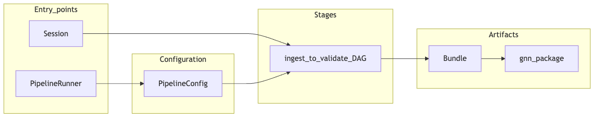

## Page 26

7.4
Bundle accessors
The bundle API exposes stage summaries and convenience render/export helpers, including:
• repo_summary, program_graph, state_space_model, process_model
• gnn_markdown — compact markdown summary built from stage_results["translate"]
• validation_report
• render_site — static HTML site with graph and model views
• to_json / save_json
For canonical 19-section Generalized Notation Notation artifacts (model.gnn.md plus companion JSON), use the export
outputs documented in ../cogant/docs/export/README.md; Bundle.gnn_markdown() is intentionally a lightweight report
surface.
7.5
Command-line interface
The CLI entry point (cogant.cli.main) registers 26 top-level subcommands (cogant --help). The high-traffic paths are co
gant translate (full pipeline, equivalent to cogant analyze; accepts --incremental <git-ref> for per-commit CI re-runs
over a Git diff), cogant validate, cogant reverse, cogant roundtrip, and cogant doctor (environment diagnostics).
Other commands cover scanning (scan, extract-static, extract-dynamic, graph), compilation (statespace, process),
re-export (export-gnn, export), static/graph analytics (analyze-static, analyze-graph), visualization (render, viz,
visualize, diff), review (explain), upstream interop (upstream-gnn — drives the upstream generalized-notation-n
otation 25-step pipeline against an existing gnn_package/, also exposed as --upstream-gnn-pipeline on translate /
analyze / validate), and lifecycle management (init, plugin, migrate, benchmark, changed). Exact flags live in ../coga
nt/docs/cli/README.md and ../cogant/docs/cli_reference.md; the manuscript does not duplicate them to avoid drift.
Per-command stage coverage (RedTeam F40 disambiguation). Not every subcommand exercises all 10 runner stages.
cogant translate and cogant analyze (default form) run the full sequence enforced by cogant.pipeline.RUNNER_STAG
ES (and pinned by tools/audit_stage_list.py). cogant explain runs the minimal-pipeline path ingest →static →
normalize →graph →translate (no dynamic, statespace, process, export, validate); this is documented in its CLI
docstring (py/cogant/cli/explain.py). cogant statespace runs static →graph →translate →statespace and
prints a count. cogant validate runs ingest →static →normalize →graph →validate and skips the in-between
translate/statespace/process stages. A reviewer running a non-default subcommand and observing fewer than 10 recorded
stages should consult the subcommand’s docstring or cli_reference.md; the 10-stage claim refers specifically to cogant t
ranslate (the default cogant analyze form), not to every subcommand.
7.6
Review API
ReviewAPI supports interactive curation: load a bundle, present mappings, accept, reject, or edit, then save a curated bundle.
This closes the loop when human review is part of the ML dataset construction.
25

## Page 27

8
Examples and Failure Modes
This section walks through concrete example runs of the pipeline, first through the rendered calculator artifact chain and then
through a small Flask application summary. It shows representative fragments of the artifacts COGANT produces (semantic
mappings, state-space transitions, provenance traces, and runtime smoke outputs) and then documents the degradation
behavior that users should expect when inputs are missing or partial.
Together these illustrate what a successful run
produces, how downstream consumers interpret partial bundles, and which confidence tiers mark degradation.
8.1
Example outputs
Intent.
Use the Flask walkthrough to see end-to-end graph and mapping counts on a real multi-module app; use
json_stdlib to see partial evidence and validator behaviour; use the YAML/JSON fragments to match field names
in exported artifacts. The failure-mode subsections document degradation signatures in bundles.
The package tree includes runnable examples under ../cogant/examples/ (for example control_positive/,
python-service/, workflow-engine, and thin_orchestrated/) and generated sample outputs under ../cogant/o
utput/ (for example calculator/ with model.gnn.md, diagrams, PNG figures, roundtrip/forward/, and roundtrip/reve
rse/). Use cogant translate --layout-output or PipelineConfig(layout_output=True) to place pipeline JSON under
data/ automatically; run python -m cogant.tools.render_output_figures on the output root for PNGs. Regenerate
these trees by running the packaged pipeline against the example sources when validating releases.
8.1.1
Rendered end-to-end figures: code, GNN, and roundtrip
The manuscript generation script copies a curated subset of real package-output PNGs from ../cogant/output/ into
../figures/ so the PDF/HTML build uses the same artifacts a user receives from run_all.py. The graphical abstract in
fig. 1 is the quick route, while fig. 4 is the reading map for the detailed panels below. The evidence chain is deliberately staged:
code is converted into a program graph in fig. 5, semantic mappings become a state-space factor graph in fig. 6, the factor
graph is compiled into A/B/C/D matrices in fig. 7, the structural boundary is recorded in fig. 8, the emitted Generalized
Notation Notation bundle is accepted by the upstream GNN visualization path in fig. 9, the batch runner records the explicit
forward-reverse-forward roundtrip stage in fig. 10, the aggregate batch evidence is summarized in fig. 11, and the later
diagnostic panels expose rule evidence, review-readiness, roundtrip drift, and runtime smoke traces behind those claims.
tbl. 1 states the intended scholarly use of each promoted figure group. This keeps the figure set from reading as a gallery:
each visual has a reviewer question, source artifact family, and claim boundary.
Table 1: Manuscript figure reading order and claim boundaries.
Figure group
Primary figures
Reviewer question
Claim boundary
Orientation
fig. 1, fig. 4
What are the conversion
boundaries?
Layout and evidence-chain
map only; inspect detailed
panels for counts.
Static extraction
fig. 5
Which source facts entered
the program graph?
Static artifact audit, not
complete runtime semantics.
Model construction
fig. 6, fig. 7, fig. 8
How do roles become state
variables, matrices, and
structural blankets?
Shape, matrix-value, and
partition evidence, not a
causal-independence proof.
Interoperability
fig. 2, fig. 9
Can the emitted GNN
artifact be read and passed
to compatible tooling?
Format and pipeline
compatibility, not semantic
adequacy.
Roundtrip and batch
provenance
fig. 10, fig. 11, fig. 12
Did the roundtrip and batch
evidence actually run?
Run-manifest and
invariant-ledger evidence,
not benchmark
generalization.
Rule and review diagnostics
fig. 13, fig. 14
Why did mappings fire and
which evidence remains
unreviewed?
Provenance and
review-readiness, not
labelled false-negative
coverage or calibration.
Runtime smoke
fig. 15
Can exported matrices drive
a deterministic trace?
Executability smoke signal,
not behavioural-performance
validation.
26

## Page 28

COGANT treats these views as method outputs rather than decorative drawings. The program-graph renderer uses a
deterministic containment-first layout for code hierarchies, with Graphviz/dot layered layout when available and alternate
force-directed layouts for less hierarchical fragments, following standard graph-drawing practice for layered and relational
structures [Sugiyama et al., 1981, Fruchterman and Reingold, 1991, Gansner et al., 1993].
The dashboard sequence ap-
plies overview, filter, detail-on-demand, and task-typology principles to a research pipeline [Shneiderman, 1996, Heer and
Shneiderman, 2012, Brehmer and Munzner, 2013, Bostock et al., 2011], and it respects visualization-design warnings that
a wrong upstream abstraction invalidates even a polished downstream visual encoding [Munzner, 2009, Sedlmair et al.,
2012].
COGANT’s dashboard panels are therefore part of the validation surface: a reviewer should be able to trace a
manuscript figure back to its JSON source, renderer, digest, displayed counts, and known limitations. The design also follows
graphical-perception and scientific-figure guidance: use common baselines and direct labels for quantitative comparisons,
avoid decorative encodings, avoid relying on hue alone, and keep the caption explicit about what the figure does and does
not establish [Cleveland and McGill, 1984, Rougier et al., 2014, Crameri et al., 2020]. For source-code views specifically, the
figures follow software-visualization and program-comprehension cautions that source-code visuals must choose meaningful
mappings and navigable encodings rather than relying on visual metaphor alone [Gračanin et al., 2005, Herman et al., 2000,
Ghoniem et al., 2004, Storey, 2005, Wettel and Lanza, 2007].
Figure 4: COGANT interpretability overview for the calculator fixture. The figure is generated from the same run directory
as the detailed panels: data/program_graph.json, semantic-mapping evidence, data/state_space.json, and gnn_packa
ge/markov_blanket.json. Read it left to right as a map of the inspection workbench: graph structure, role assignments,
compiled GNN state space, and structural blanket partition. The compact panels are orientation aids; the detailed figures
below remain the source for counts, deltas, and limitations.
The first conversion follows the same broad representational move as code property graphs: source-level structure is fused
into a graph that later passes can traverse and transform [Yamaguchi et al., 2014]. COGANT’s graph is narrower than a
vulnerability-mining CPG because its destination is an Active-Inference-ready model rather than a graph-query database,
but the design premise is shared: make program structure explicit before learning, inference, or validation. fig. 5 should
therefore be read as an artifact audit. The important claim is not that the layout is aesthetically optimal; it is that the
nodes, edges, relation kinds, optional semantic-role outlines, and counts are generated from the same artifact chain used by
the translator.
The state-space, matrix, and blanket figures are the concrete bridge from program analysis to discrete active inference:
observations, actions, priors, transitions, and structural boundaries are represented in the same broad A/B/C/D and Markov-
blanket vocabulary used in discrete-state active-inference tutorials and runtimes [Da Costa et al., 2020, Smith et al., 2022,
Heins et al., 2022]. The important reproducibility detail is that these are not manuscript-only redraws; they are copied by
tools/manuscript_figures.py from the package’s generated run directory and therefore remain coupled to the code that
emits the JSON bundle. The blanket panel should be read with the scoped definition in Definition 5: COGANT exports
a total structural role partition, not an empirical proof that the induced program graph satisfies a causal or probabilistic
blanket property.
The upstream visualization in fig. 9 is the second one-way conversion: COGANT’s emitted model.gnn.md is handed to the
27

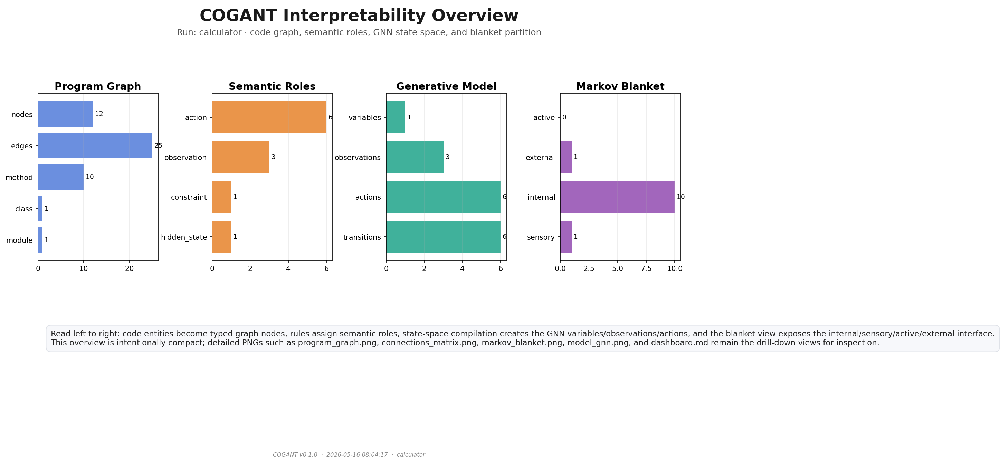

## Page 29

Figure 5: Forward codebase-to-program-graph evidence view for the calculator fixture. The renderer reads the same data/p
rogram_graph.json consumed by semantic mapping: node fill encodes program entity kind, edge color and line style encode
relation kind, role outlines appear when rule-evidence traces identify Active Inference mappings, and the footer/sidecar record
artifact digests, displayed counts, and sampling status. The figure verifies inspectable static extraction structure; it does not
prove that all dynamic behavior or external effects were recovered.
28

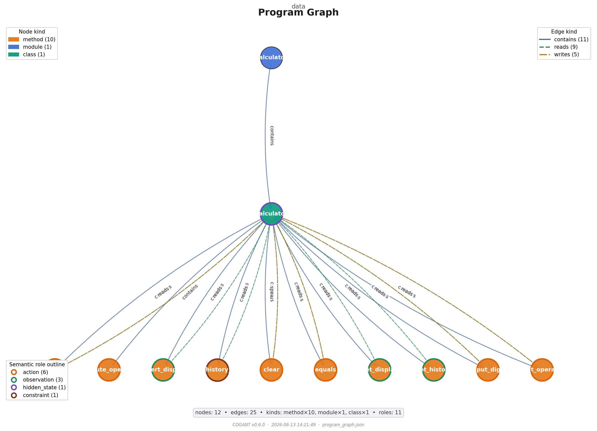

## Page 30

Figure 6: Forward program-graph-to-state-space conversion on the calculator fixture. The factor graph is generated from da
ta/state_space.json: blue denotes hidden-state factors, teal denotes observations, orange denotes actions, and text labels
plus edge direction redundantly identify the role relationships. Edges mark the likelihood (state→observation) and control
(action→state) relationships that populate the corresponding entries of the A and B arrays (the C preference and D prior
vectors are node attributes, not edges). This is a compiled representation of extracted evidence, not a learned behavioral
model.
29

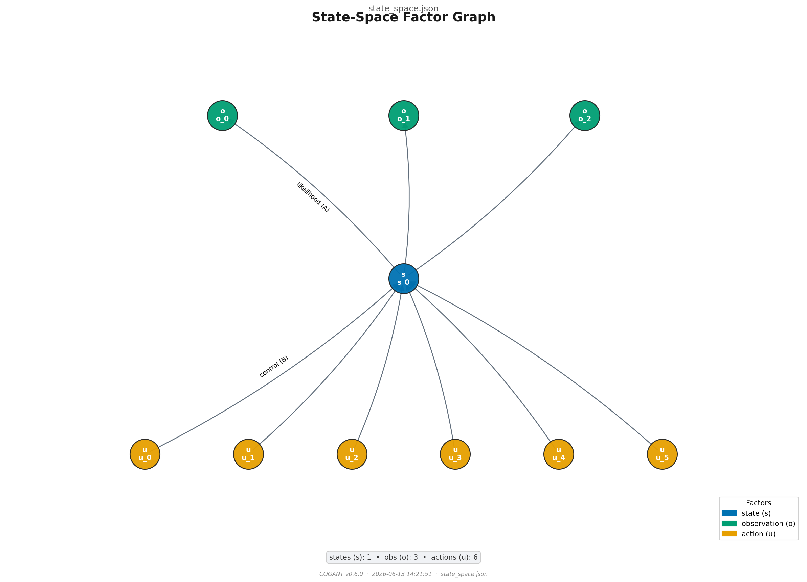

## Page 31

Figure 7: A/B/C/D matrix panel for the richer Flask application fixture.
The heatmaps are rendered from exported
model.gnn.json arrays: A shows likelihood values with non-uniform state columns, C shows the real zero preference vector,
D shows the exported prior vector, and B shows the recorded max-over-actions summary of the exported transition tensor.
Hidden-state indices 0-11 are concrete program/service state variables, while indices 12-13 are inheritance-role hidden states;
that grouping explains the sparse lower-right transition/prior region rather than indicating a renderer fault. Panel annotations
report source/display shapes, distinct values, nonzero cells, and B identity-slice diagnostics so real structure and weak-evidence
regions are visible before downstream inference.
30

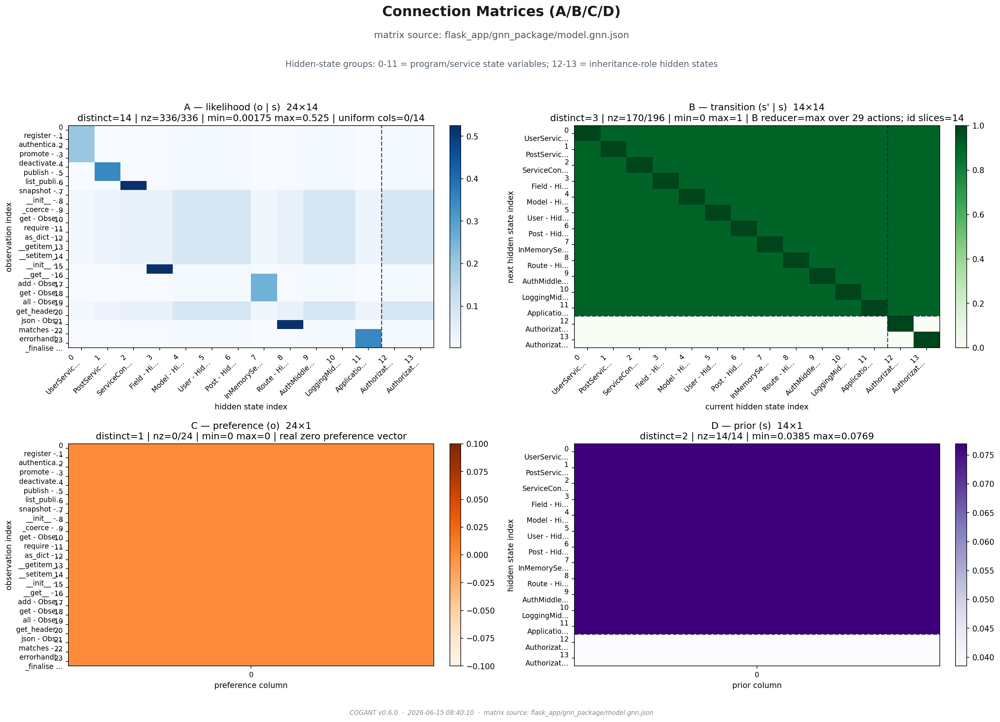

## Page 32

Figure 8: Structural Markov-blanket partition for the calculator fixture. The renderer reads gnn_package/markov_blanke
t.json and lays out internal, sensory, active, and external node groups with displayed counts from the sidecar. This is a
structural boundary extracted from emitted program nodes and seed rules; it is not a probabilistic conditional-independence
proof over source-code behavior.
31

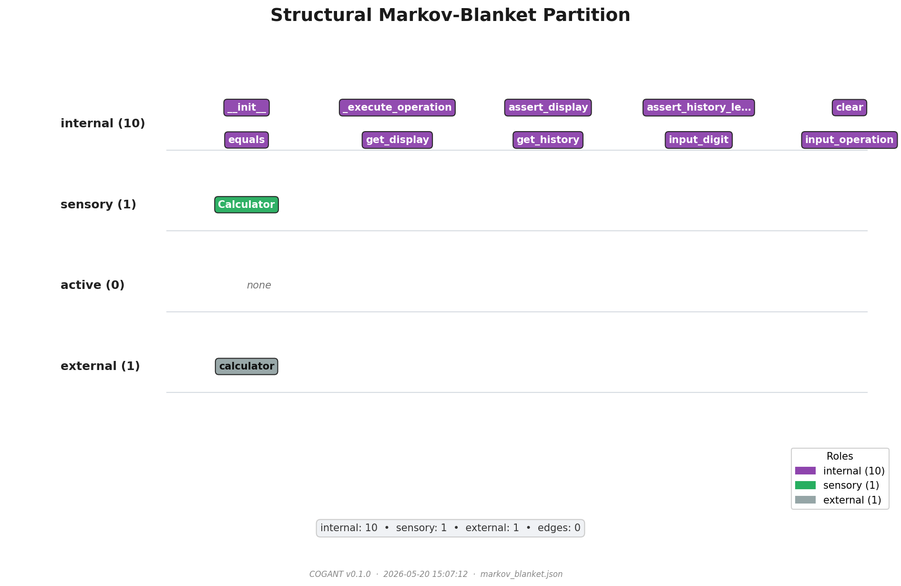

## Page 33

Figure 9: Upstream Generalized Notation Notation visualization of the emitted POMDP generative-model structure. This
figure is copied from cogant/output/upstream_pipeline/8_visualization_output/ and demonstrates that the generated
package can pass through the external GNN visualization stage. Inspect it as interoperability evidence for the exported
model structure, not as an independent validation of COGANT’s semantic mapping rules.
32

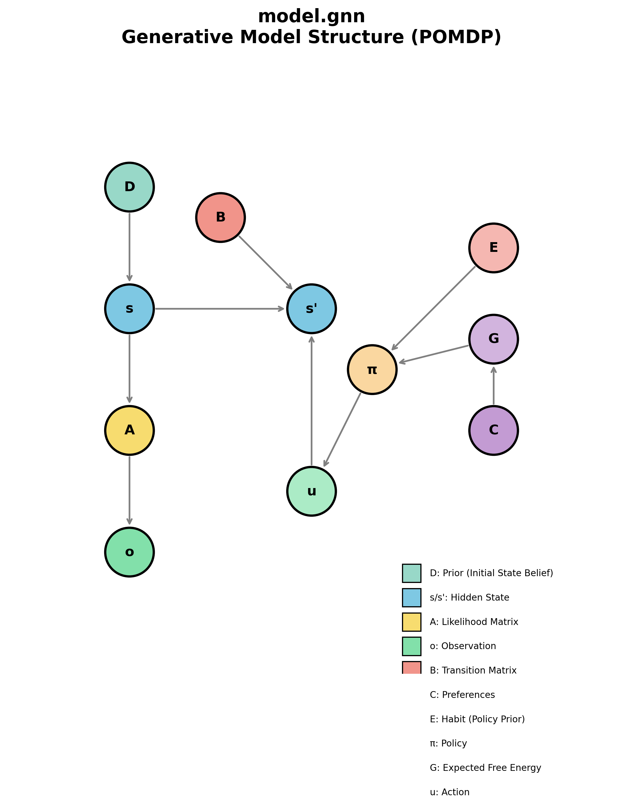

## Page 34

Active Inference Institute Generalized Notation Notation tooling, whose repository describes GNN as a text-based language
for Active Inference generative models and an analysis/visualization pipeline around those files [Active Inference Institute,
2024]. The visual is useful because it verifies interoperability at the representation boundary, not just internal rendering.
Figure 10: Calculator-target publication timeline rendered from cogant/output/run_manifest.json. The wide horizontal
bars show the recorded calculator command sequence and local wall-clock durations, while validation and roundtrip gate
markers distinguish evidence checks from ordinary execution stages. The sidecar preserves the full batch target and command
context; the figure itself is provenance for the selected target, not a benchmark.
Finally, fig. 10 shows the calculator roundtrip as an executed stage rather than a prose assertion. The renderer selects the
calculator target from the batch manifest so the publication image remains legible, and records the full batch target count,
command count, selected target, selected command count, gate count, and failed-step count in the sidecar. In this run,
run_all.py invokes cogant roundtrip <target> --output <run_dir>/roundtrip --keep-tmp, preserving the forward
GNN and reverse-synthesized Python package beside the rest of the per-target output. The accompanying roundtrip/m
etrics.json records role preservation, graph node/edge deltas, edge-kind deltas, GNN section diffs, matrix shape/value
deltas, and generated-code compile/test status, so the dashboard can separate representational drift from executable reverse-
synthesis failures. The roundtrip metric reported elsewhere in the manuscript asks whether the semantic role distribution and
the supporting structural artifacts survive the forward -> reverse -> forward cycle, aligning the implementation with
the bidirectional lens framing in sec. 19, [Foster et al., 2007].
fig. 11 is promoted only because the regenerated batch output contains nonzero graph, mapping, role, validation, roundtrip,
and visual-artifact evidence. The one degenerate JavaScript fixture remains visible in the dashboard JSON, but it no longer
controls whether the whole aggregate figure is meaningful: the figure sidecar records the target count, total nodes, total edges,
total mappings, validation-score count, role totals, visual-artifact total, and the number of targets with complete evidence
support.
The roundtrip diff in fig. 12 is the manuscript-facing form of the new invariant ledger: node preservation, edge preserva-
tion, role preservation, state-space shape preservation, matrix preservation, regenerated-code compile status, and optional
generated-code smoke tests are all recorded as named checks. A failing check is therefore inspectable as a specific represen-
tational discrepancy rather than collapsed into a single score.
fig. 13 makes the rule engine auditable at the level where human review actually happens. The source artifact is rule_evid
ence_trace.json, emitted during export and copied into the organized run tree. Reviewer annotations can mark individual
mappings as accepted or rejected, after which the same trace reports per-rule reviewed counts and precision proxies without
claiming missed-role coverage unless a labelled false-negative corpus is supplied. This mirrors visual-analytics practice for
learned systems: the goal is to help people understand when a model or pipeline works, when it fails, and how to improve it,
rather than to replace the underlying evidence with a plot [Hohman et al., 2019].
The evidence-coverage panel deliberately avoids presenting a reliability curve when no reviewer labels exist. Uncertainty-
visualization studies show that confidence displays require careful evaluation because readers may treat displayed uncertainty
or confidence as stronger decision evidence than the study design supports [Hullman et al., 2019]. COGANT therefore reports
33

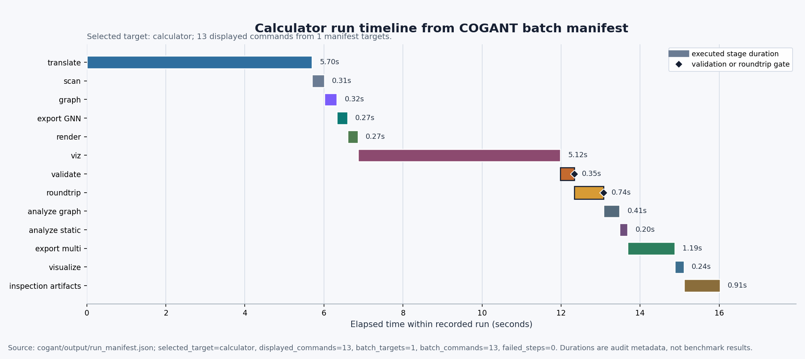

## Page 35

Figure 11: Aggregate batch evidence summary rendered from cogant/output/dashboard/metrics_per_target.json. The
four small multiples show semantic-role totals, validation-score buckets, roundtrip status, and visual-workbench completeness
for the regenerated run_all.py batch. Inspect the role bars as emitted mapping evidence and the other panels as coverage
checks over the same target set. The chart reports artifact counts for this run; it does not establish semantic correctness,
role-ground-truth coverage, or benchmark performance.
34

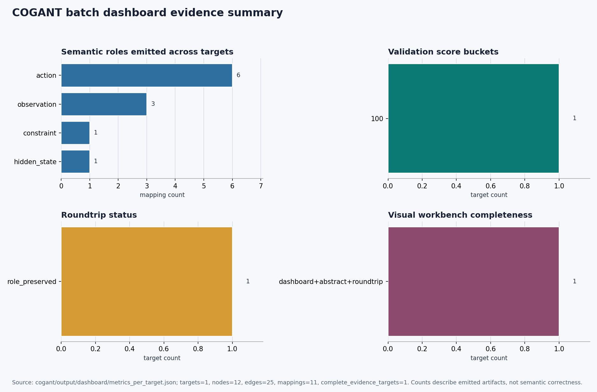

## Page 36

Figure 12: Roundtrip visual diff for the calculator fixture. The panel is generated from roundtrip/metrics.json and shows,
as bars, the original-versus-regenerated node and edge count deltas, the normalized graph-edit distance, the missing and
extra GNN sections, and the maximum absolute matrix delta; below the bars it lists per-invariant pass/check status and a
status line that separates the strict-structure, role, matrix, GNN, and generated-code checks. Read role preservation as a
weaker success tier than strict structural isomorphism.
the available evidence – mapping counts, confidence tiers, conflicts, and reviewed-row counts – while leaving calibration, false-
negative coverage, and semantic truth as separate claims that require labelled review data.
The batch dashboard still writes audit sidecars such as output/dashboard/metrics_per_target.json, output/dashboard
/role_distribution.mmd, output/dashboard/roundtrip_status.mmd, and output/dashboard/visual_completeness.m
md. The manuscript inserts only the registered publication summary in fig. 11 because its source JSON has nonzero graph,
mapping, role, validation, roundtrip, and visual-artifact data. Reviewers should inspect the dashboard JSON and Mermaid
sidecars when evaluating a release run; the figure is an overview of emitted evidence, not a substitute for target-level artifacts.
The inference trace in fig. 15 is intentionally a deterministic demonstration rather than a benchmark of agent quality. It
shows that A/B/C/D matrices of the form COGANT exports can drive a reproducible belief/action/preference/free-energy
trace through the bundled deterministic demo runtime, which is the smallest executable bridge between an exported model
bundle and downstream discrete active-inference runtimes [Da Costa et al., 2020, Heins et al., 2022].
8.1.2
Concrete walkthrough: Flask REST API
Read this for: representative node/edge/mapping and GNN validation numbers aligned with the benchmark tables in
sec. 12.
To make the pipeline’s behavior tangible, consider the flask_app fixture distributed under ../cogant/examples/real_
world/flask_app/: a small six-module Flask application (__init__.py, app.py, config.py, models.py, services.py,
utils.py) totalling 866 lines of Python analyzed end-to-end by the public pipeline (cogant.api.orchestration, the same
code path as cogant translate and the benchmark harness). Canonical flask_app numbers in ../cogant/evaluatio
n/figures/metrics.json are produced by evaluation/figures/generate_figures.py and match graph size rows in
tbl. 15. (The examples/orchestrate_roundtrip.py demo can emit a larger serialized graph, including a call graph, for
dashboard-heavy exports; the manuscript and metrics.json stay on the API pipeline so one definition of (| V|) and (| E|)
applies throughout.)
Metric
Value
Source files discovered
6
35

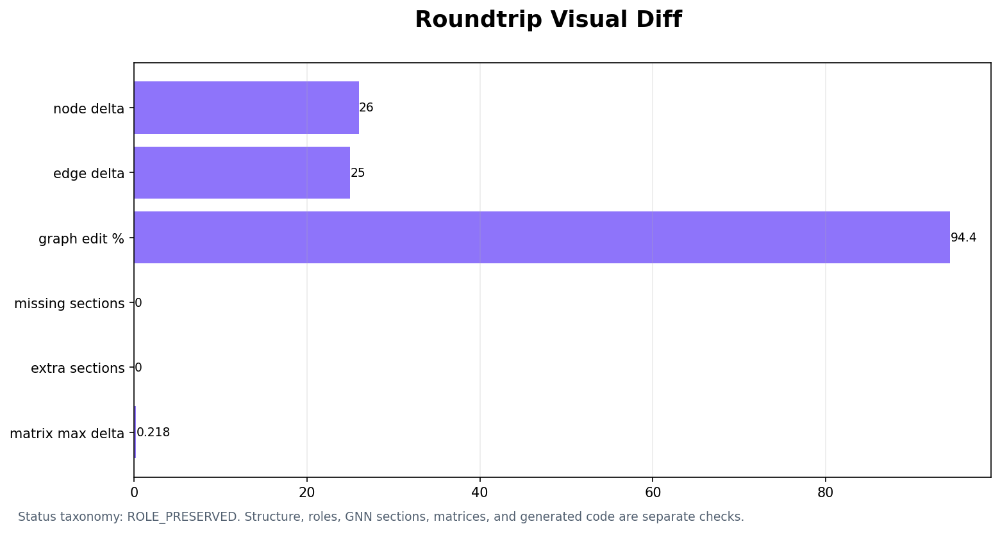

## Page 37

Metric
Value
Lines analyzed
866
Nodes
98
Edges
163
Total semantic mappings
72 (mappings_total for flask_app in ../cogant/eval
uation/figures/metrics.json; same post-statespace
count as the mappings column in tbl. 15)
GNN package files
28
GNN validation
PASS (score 100.0, 0 errors, 0 warnings)
The default graph stage in this path emits structural kinds (MODULE, CLASS, METHOD, FUNCTION) and, at v0.6.0,
CONTAINS, INHERITS, IMPORTS, and self-dataflow READS / WRITES edges when the public API path has that evidence. The
richer taxonomy in cogant.schemas.core.NodeKind and EdgeKind (18 kinds each; see ../cogant/docs/reference/sc
hemas_reference.md) also includes CALLS and others: those appear when the call-graph pass is part of the built graph.
Dynamic enrichment (dynamic/) can add additional edges when traces are available.
Table 2: Node kind distribution (Flask API example).
Node kind
Count
Percentage
MODULE
6
6.1%
CLASS
25
25.5%
METHOD
57
58.2%
FUNCTION
10
10.2%
Table 3: Edge kind distribution (Flask API example, metrics.json).
Edge kind
Count
Percentage
CONTAINS
92
56.4%
IMPORTS
9
5.5%
INHERITS
9
5.5%
READS
38
23.3%
WRITES
15
9.2%
CONTAINS edges dominate the API-built graph, followed by dataflow READS / WRITES and the import/inheritance edges visible
in metrics.json. When optional CALLS edges are present (for example in a full orchestrate_roundtrip.py run with call-
graph construction), their counts appear in that output’s program_graph.json instead; they are not double-counted here.
Broadening coverage for optional node and edge kinds is tracked as P1-2 and P1-3 in the R&D backlog (../cogant/docs/e
valuation/SCOPING_REPORT.md).
8.1.3
Walkthrough: json_stdlib (degraded-output defaults and validator score)
Read this for: how the pipeline remains valid with sparse static evidence and identity/default matrix entries (validator
notes in the bundle).
The examples/real_world/json_stdlib/ fixture exercises partial-evidence paths without failing validation.
In the
current rule set, the expanded ActionRule keyword set matches dump, dumps, load, loads, and serialisation synonyms; the
auto-generated METRICS.yaml records state_variables: 3, observations: 2, actions: 11, and mappings_total: 16.
Of the 11 action slices of 𝐵, 8 default to the identity tensor (no WRITES edges link those actions to hidden states at the
AST extraction granularity), and 1 of the 3 state columns of 𝐴is uniform. The pipeline still emits a structurally valid
gnn_package/ (the 16 required files plus generated diagram/visualization assets): Validation Notes (section 19 of the bundle)
list every maximum-entropy entry so downstream consumers can distinguish evidence-backed matrix entries from structural
defaults; sec. 6 defines the structural validity boundary.
8.1.4
Example semantic mapping output
Read this for: the shape of SemanticMapping records (kind, confidence_tier, provenance).
36

## Page 38

Figure 13: Rule evidence trace for the calculator fixture. The native publication PNG is generated from data/rule_evidenc
e_trace.json: bars count rule contributions, the annotation line reports mapping and conflict totals, and the sidecar records
the same source digest used by the evidence-coverage panel. Read it as mapping-level provenance for proposed role assertions;
it supports precision review of emitted mappings but does not quantify missed mappings without a labelled false-negative
corpus.
37

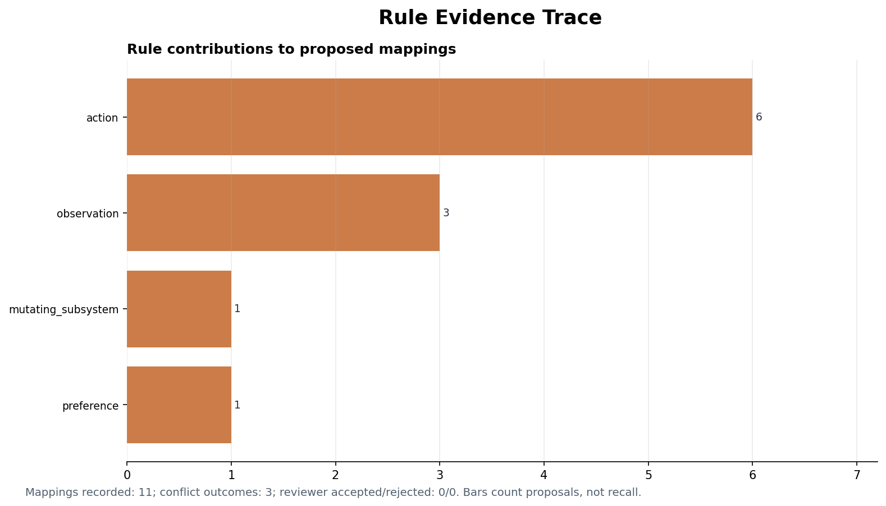

## Page 39

Figure 14: Evidence-coverage and review-priority view for the calculator fixture. The native publication PNG is generated
from the same rule-evidence JSON as the companion rule-evidence trace and displays proposed mapping counts, rule con-
tribution totals, confidence-tier distribution, conflict outcomes, and reviewer-annotation coverage. The current calculator
artifact has 0 reviewed mapping rows, so this is a review-priority and provenance panel rather than a calibration curve or a
claim about semantic correctness.
38

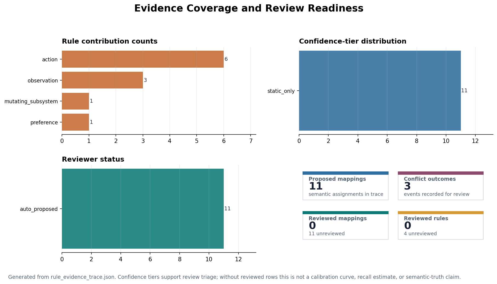

## Page 40

Figure 15: Deterministic inference trace generated from the package’s built-in demonstration A/B/C/D matrices (default_
demo_matrices), which share the shape of an exported model but are not the calculator fixture’s own exported values. The
runtime demo emits data/inference_trace.json and the corresponding native publication PNG with belief trajectories,
selected actions, preference satisfaction, and the package’s reported free-energy diagnostic. Read the curve as an executable-
matrix smoke signal, not as a calibrated psychological, biological, or benchmarked control-performance measurement.
39

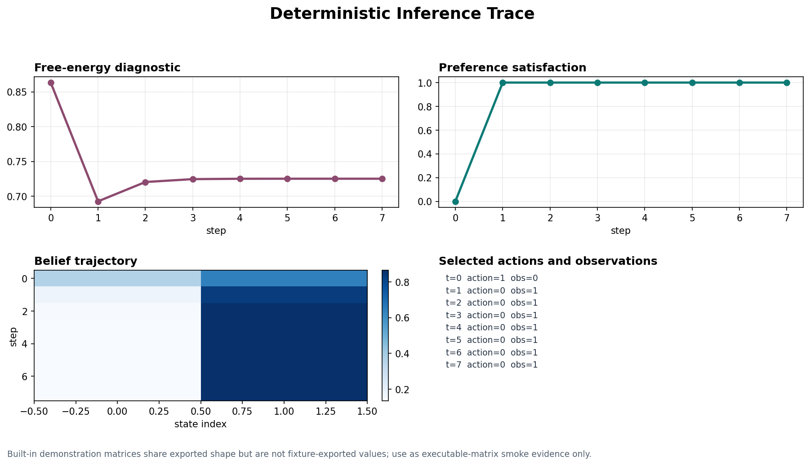

## Page 41

During the translation stage, each program-graph node is matched against the active rule set and assigned a SemanticMapping
with a MappingKind and confidence fields defined in ../cogant/py/cogant/schemas/semantic.py. The following excerpt
uses real COGANT field names and structure drawn from the flask_app fixture. Node IDs and file paths are illustrative; for
verbatim output see ../cogant/output/flask_app/semantic_mappings.json (generated by re-running the orchestrator):
# Illustrative SemanticMapping-shaped records (see semantic.SemanticMapping)
- id: sm_get_users_obs
kind: OBSERVATION
graph_fragment_node_ids: [fn_get_users]
semantic_label: "GET /users handler"
confidence_score: 0.98
confidence_tier: STATIC_ONLY
parser_certainty: 1.0
provenance:
- {source: static_analysis, confidence: 1.0}
- id: sm_query_action
kind: ACTION
graph_fragment_node_ids: [call_db_session_query]
semantic_label: "database query"
confidence_score: 0.82
confidence_tier: STATIC_ONLY
parser_certainty: 0.90
provenance:
- {source: static_analysis, confidence: 0.90, metadata: {note: "receiver type partly heuristic"}}
- id: sm_user_model_hidden
kind: HIDDEN_STATE
graph_fragment_node_ids: [class_user]
semantic_label: "User model state"
confidence_score: 1.0
confidence_tier: STATIC_ONLY
provenance:
- {source: static_analysis, confidence: 1.0}
The second row illustrates a key property of the confidence model (eq. 8 in sec. 5.1): when the parser resolves a receiver type
via import traces rather than a direct definition, parser_certainty is lower, and eq. 8 yields a sub-1.0 confidence_score
even before dynamic evidence arrives.
8.1.5
Example state-space excerpt
Read this for: how variables, actions, and transitions are represented in the state-space IR layer and how tiers attach to
transitions.
When dynamic traces are available, the state-space compiler produces a behavioral model alongside the static graph. The
following excerpt shows a fragment of the state-space IR layer for the /users endpoint:
{
"variables": [
{"name": "request.method", "type": "str", "domain": ["GET", "POST"]},
{"name": "db_connected",
"type": "bool", "domain": [true, false]},
{"name": "response_code",
"type": "int",
"domain": [200, 400, 500]}
],
"actions": [
{"name": "validate_input", "source": "routes/users.py:18"},
{"name": "query_database",
"source": "routes/users.py:22"},
{"name": "format_response", "source": "routes/users.py:30"}
],
"transitions": [
{
"from_state": {"request.method": "GET", "db_connected": true},
"action": "query_database",
40

## Page 42

"to_state": {"response_code": 200},
"confidence": 0.94,
"tier": "STATIC_PLUS_RUNTIME"
},
{
"from_state": {"request.method": "POST", "db_connected": true},
"action": "validate_input",
"to_state": {"response_code": 400},
"confidence": 0.71,
"tier": "STATIC_ONLY"
},
{
"from_state": {"db_connected": false},
"action": "query_database",
"to_state": {"response_code": 500},
"confidence": 0.58,
"tier": "RUNTIME_ONLY"
}
]
}
Confidence tiers follow the thresholds defined in determine_confidence_tier: STATIC_PLUS_RUNTIME (𝑐≥0.65,
with both static and dynamic evidence) indicates corroboration from AST analysis and execution traces; STATIC_ONLY
(𝑐≥0.5, static evidence only) reflects assertions grounded in source structure alone; RUNTIME_ONLY (𝑐≥0.4, dynamic
evidence only) flags inferences from runtime data without static corroboration. A fourth tier, HUMAN_REVIEWED
(𝑐≥0.9, with human review evidence), is available for manually curated mappings.
8.1.6
Dynamically enriched excerpt
Read this for: how coverage and trace inputs change evidence on variables and transition tiers.
The previous excerpt shows a purely-static run. When .coverage / Cobertura XML and Chrome DevTools trace inputs
are supplied to the dynamic stage, enrich_graph() annotates the affected nodes with coverage_hits, branch_coverage,
call_count, avg_duration_ms, and is_hot_path metadata, and appends dynamic_coverage / dynamic_trace markers
to the program graph’s evidence_sources list. The downstream state-space compiler then becomes eligible to promote
individual transitions from STATIC_ONLY to STATIC_PLUS_RUNTIME whenever the diversity bonus in eq. 8 clears the 0.65
boundary. The following excerpt shows the same Flask /users endpoint after re-running the pipeline with the application’s
.coverage file and a captured Chrome DevTools trace attached:
{
"variables": [
{
"name": "request.method", "type": "str", "domain": ["GET", "POST"],
"evidence_sources": ["static_ast", "dynamic_coverage", "dynamic_trace"],
"coverage_hits": 47, "call_count": 47, "is_hot_path": true
},
{
"name": "db_connected", "type": "bool", "domain": [true, false],
"evidence_sources": ["static_ast", "dynamic_coverage"],
"coverage_hits": 47, "branch_coverage": 0.92, "is_hot_path": false
}
],
"transitions": [
{
"from_state": {"request.method": "GET", "db_connected": true},
"action": "query_database",
"to_state": {"response_code": 200},
"confidence": 0.94, "tier": "STATIC_PLUS_RUNTIME",
"evidence": {
"static": {"rule_id": "rule_method_call_001", "parser_certainty": 0.95},
"dynamic": {"coverage_hits": 47, "call_count": 47,
"avg_duration_ms": 12.4, "is_hot_path": true}
41

## Page 43

}
},
{
"from_state": {"db_connected": false},
"action": "query_database",
"to_state": {"response_code": 500},
"confidence": 0.58, "tier": "RUNTIME_ONLY",
"evidence": {
"dynamic": {"coverage_hits": 2, "call_count": 2,
"avg_duration_ms": 3.1, "is_hot_path": false}
}
}
]
}
Two consequences of the enrichment are visible above.
First, the request.method state variable’s is_hot_path: true
annotation, combined with the dynamic_coverage and dynamic_trace markers in its evidence_sources, carried enough
diversity mass through the confidence formula to lift the previously-static GET transition from the STATIC_ONLY tier into
STATIC_PLUS_RUNTIME, and the transition’s evidence field now records both the rule_id that fired statically and the
avg_duration_ms measured dynamically. Second, the previously-RUNTIME_ONLY db_connected=false transition remains in
its lower tier because it has only dynamic evidence (the error branch fired twice in the captured trace but has no corroborating
static rule match) — a concrete illustration of the degradation behaviour documented in the “Incomplete coverage data” and
“No dynamic traces available” subsections below.
8.1.7
Failure modes and graceful degradation
COGANT is designed so that missing or partial inputs degrade the output bundle rather than halt it, and the manuscript
records these degradation paths explicitly so that downstream consumers can interpret a partial run without guessing what
was skipped [Peng, 2011]. Five failure modes are worth naming because each has a visible signature in the emitted artifacts.
No dynamic traces available. When neither coverage data nor execution traces are supplied, enrich_graph() is a no-
op: no coverage_hits, branch_coverage, call_count, avg_duration_ms, or is_hot_path metadata is attached, and the
graph’s evidence_sources list never acquires dynamic_coverage or dynamic_trace markers. The state-space compiler
still runs end-to-end using the semantic mappings and static graph alone, but every resulting transition is confined to the
STATIC_ONLY tier (or lower), and no transition can be promoted to STATIC_PLUS_RUNTIME. Downstream code that consumes
the bundle can identify a purely-static run at a glance by checking the evidence source markers on the graph metadata rather
than scanning individual transitions.
Incomplete coverage data. When coverage is supplied but covers only a subset of the project, _enrich_with_coverage
annotates the matched files only. The enrichment loop walks each coverage span, normalizes the reported file path, looks up
candidate nodes whose path matches, and annotates those whose source_range overlaps the covered line; unmatched files are
skipped (logged as informational), and nodes in unmatched files retain no coverage metadata at all. The result is a partially
enriched graph in which some regions are eligible for tier promotion and others are not. Because the enrichment summary
returns the number of annotated nodes, users can check whether the observed annotation rate matches their expectations for
the provided coverage input.
Translation rules that do not match. When the active rule set fails to produce any mapping for a node – whether because
no rule fires, or because all firing rules are pruned during conflict resolution – that node remains outside self.mappings and
simply does not appear in any graph_fragment_node_ids. The translation engine’s get_coverage_report() reports this
directly: the returned dictionary contains the total node count, the covered count, a two-decimal coverage_percent, and the
sorted list of uncovered_node_ids. Rather than fail, the engine treats uncovered nodes as an explicit gap and surfaces the
list. Authors can extend the rule set, curate gaps via the ReviewAPI (documented in sec. 7), or accept the partial mapping
for downstream GNN export.
Fixpoint non-convergence. The translation engine bounds its fixpoint loop at max_iterations = 10 by default. If a rule
set is pathological enough to keep emitting new mappings beyond that bound – for example because two rules can produce
mutually triggering mappings – the engine emits a "Max iterations reached without convergence" warning, stops the
loop, and proceeds to conflict resolution with whatever mappings it has accumulated. The iteration cap therefore forces
termination of that loop even for misconfigured rule sets, and the warning in the log gives rule authors a clear signal that the
cap was hit. Because each iteration logs an iteration_complete entry, diagnosis is possible post-hoc: authors can inspect
per-pass mapping counts and resolution events in the match log without re-running the pipeline.
Pipeline error tolerance.
The default pipeline configuration (cogant/py/cogant/config/defaults.py) marks the
42

## Page 44

dynamic, translate, statespace, and process stages with skip_on_error=True, while structural stages such as ingest,
static, graph, export, and validate keep the stricter default skip_on_error=False. When an optional stage raises,
the runner records the error in the bundle, emits a warning, and continues to the next stage rather than aborting the run.
Downstream bundle accessors (state_space_model, process_model) simply return None for stages that did not produce
output, so a downstream consumer can detect a skipped stage by checking its accessor rather than by parsing log text. The
net effect is that a partial bundle – for example, a program graph and semantic mappings without a state-space model –
remains a first-class artifact with a clear provenance trail, rather than an opaque failure.
8.1.8
Failure-mode matrix
Condition
Symptom
Where it appears
Recovery
No coverage or traces
All transitions stay
STATIC_ONLY; no
dynamic_* evidence
program_graph metadata, transition tier
Supply .coverage /
trace inputs; re-run cog
ant translate (see ..
/cogant/docs/referen
ce/implementation_st
atus.md)
Partial coverage
Mixed enriched and
bare nodes
coverage_hits sparse by file
Expand coverage to full
tree or accept partial
tier promotion
Optional
cogant[multilang] /
grammars missing
JS/TS parse skips or
warnings
ingest logs, parse_errors in bundle
uv sync --extra tree
-sitter + install
grammars; re-run
Rule gaps on stdlib APIs
Zero ACTION
mappings, low
mappings_total
semantic_mappings.json, metrics.json
Extend rules or
explicitly accept
degraded-output
defaults with validator
notes
--incremental <ref>
cached graph drift
Unexpected diff vs
full run
PipelineConfig.incremental_since
Full run without
incremental, or refresh
ref
Fixpoint cap hit
"Max iterations re
ached" in log
TranslationEngine match log
Reduce conflicting rules;
raise max_iterations
only after debugging
8.2
Rust layer
Native crates (cogant-core, cogant-graph, cogant-translate, cogant-statespace, cogant-gnn, cogant-ffi, and related
packages) implement typed graph operations and export formatting. When PyO3 bindings are active, Python delegates
heavy graph work through cogant-ffi. The Rust-wired paths and their Python-only counterparts are enumerated in the
implementation-status table under ../cogant/docs/reference/; all paths produce identical results regardless of backend.
43

## Page 45

9
Materials and methods: experimental setup
Terminology. GNN here and in sec. 10 / sec. 13 is Generalized Notation Notation, not graph neural networks; see
sec. 2.
9.1
Environment, API, exports, parser, and IR
Install paths, Session and Pipeline examples, YAML configuration, CLI usage, export targets, Python ast front-end coverage,
and the staged IR progression (tbl. 6 in sec. 11) are detailed in sec. 10 and sec. 11.
9.2
Methods protocol and evidence model
Study type. The empirical component is a descriptive artifact and regression-corpus study, not a predictive benchmark
or a held-out generalization experiment.
The fixture and roundtrip ledgers test whether a deterministic pipeline emits
internally consistent artifacts on versioned inputs, and the benchmark harness records repeatable engineering measurements
under a declared environment. Following empirical-software-engineering and benchmarking guidance, we therefore report
validity boundaries, corpus construction, run protocol, and artifact availability rather than treating in-sample fixture scores
as external accuracy estimates [Ralph et al., 2020, Hasselbring, 2021].
The empirical protocol mirrors the package pipeline rather than a separate manuscript-only analysis. First, repository files are
parsed into a ProgramGraph with typed nodes, typed edges, source spans, parser-certainty metadata, and provenance markers.
Second, declarative translation rules run to a fixpoint, attach semantic roles, record per-rule evidence, and resolve overlaps
by priority and confidence as described in sec. 4. Third, the confidence model scores each surviving assertion from static
evidence, dynamic evidence when present, parser certainty, rule specificity, and penalties for ambiguity. Fourth, the state-
space compiler converts mappings into hidden-state factors, observations, actions, transitions, and A/B/C/D matrices. Fifth,
the export layer writes the Generalized Notation Notation bundle, JSON sidecars, tensor views, manifests, and validation
reports. Sixth, reverse synthesis reads the emitted GNN artifact, generates a Python package skeleton, re-ingests it, and
compares the original and regenerated graphs, role multisets, GNN sections, matrix shapes/values, and generated-code smoke
results. Seventh, the visualization layer renders the inspection dashboard, roundtrip diff, rule trace, calibration view, batch
summaries, and deterministic inference trace directly from those JSON artifacts. Finally, manuscript tables, copied figures,
and variable substitutions are regenerated from the same artifacts and METRICS.yaml.
tbl. 4 turns the method into a reviewer-facing evidence map. The table is deliberately conservative: it links a scholarship
pressure point to the artifact that answers it, and it names the boundary beyond which the manuscript does not claim
evidence.
Table 4: Reviewer pressure map for the materials and methods protocol.
Reviewer pressure point
Methods response
Canonical evidence
Boundary
Static-analysis novelty
versus CPG/CodeQL
Program graph IR plus
semantic role evidence and
GNN bundle export
sec. 3, sec. 18
Not a replacement for
mature query/security
analyzers.
Graph-learning utility
Typed graph/tensor exports
with stable node and edge
vocabularies
../cogant/docs/export/RE
ADME.md, tbl. 18
No downstream accuracy
claim without a separate
learned-model experiment.
Active-inference rigor
A/B/C/D matrices,
structural blanket partition,
validator, runtime smoke
trace
sec. 6, fig. 15
Default-heavy matrices can
be structurally valid but
semantically weak.
Roundtrip semantics
Forward-reverse-forward
invariant ledger, role
multiset score, compile
status
sec. 24, fig. 12
Self-consistency, not external
semantic equivalence.
Reproducibility
Versioned fixtures, manifests,
metrics, figure sidecars,
claim ledger
tbl. 5, sec. 15
Repeatability on fixed
inputs, not independent
replication.
Figure trustworthiness
Registered PNGs copied
from package artifacts with
sidecars and QA
tbl. 1, tbl. 16
Visual auditability, not
user-study proof of
interpretability.
This evidence model deliberately separates claims by backing source. Numeric release claims come from ../cogant/evalua
44

## Page 46

tion/METRICS.yaml; per-fixture pipeline tables come from ../cogant/evaluation/figures/metrics.json; visual claims
in sec. 8.1.1 come from ../cogant/output/; and comparative/theoretical claims cite primary sources in sec. 16 and the
appendices. The local fast corpus now includes the small calculator/event/control fixtures plus additional control-positive
shapes for CLI tools, async services, data pipelines, plugin architectures, notebook-converted modules, and multi-package
workspaces.
Remote GitHub targets remain opt-in through run_all.json so ordinary tests do not depend on network
availability or upstream repository drift.
Table 5: Corpus/data protocol and claim boundaries.
Evidence slice
Inclusion protocol
Canonical artifact
Claim supported
Packaged fixture corpus
Version-controlled examples
only; no network fetch
during the table run
../cogant/evaluation/fig
ures/metrics.json
Pipeline shape, graph
composition, state-space
counts, GNN package
validation
Roundtrip ledger
Current native rows
regenerated by tools/regen
erate_roundtrip_ledger.p
y, each carrying role_prese
rvation_score + roundtri
p_status; re-derived by too
ls/check_metrics_fresh.p
y
../cogant/evaluation/dat
aset/roundtrip_results.j
sonl plus ../cogant/evalu
ation/METRICS.yaml
Native role-preservation
status and
strict-isomorphism subset
Batch-run corpus
Targets declared in
run_all.json; remote
repositories are
shallow-cloned only when
explicitly configured
../cogant/output/<target>/run_manifest.json
and summary.json
End-to-end orchestration,
dashboard completeness,
parser/status distributions
Figure corpus
Registered
package-generated PNGs
copied by tools/manuscrip
t_figures.py
../figures/manifest.json
Visual evidence traceability,
renderer/source-artifact
provenance
External comparison corpus
Primary papers, standards,
or official documentation
only
references.bib and sec. 29
Related-work boundaries
and live-tool contract claims
This is the manuscript’s answer to reproducibility rather than an afterthought. Computational-research guidance emphasizes
archiving exact inputs, intermediate steps, and outputs [Peng, 2011, Sandve et al., 2013]; ACM artifact-review guidance
separates artifact availability, artifact evaluation, and independently validated results [Association for Computing Machinery,
2020]; and empirical software-engineering standards make validity, reliability, objectivity, and reproducibility explicit review
dimensions [ACM SIGSOFT, 2026, Ralph et al., 2020]. FAIR guidance additionally stresses machine-actionable metadata
for discovery and reuse, including algorithms and workflows [Wilkinson et al., 2016]. COGANT does not claim full FAIR
compliance, an ACM artifact badge, or independent reproduction by another team. It follows the same direction: every
promoted manuscript number is regenerated from metrics, every promoted figure is copied from a registered package artifact,
and every semantic assertion can be traced back to a graph fragment and rule-evidence record.
9.3
Performance characteristics
The architecture wall-clock / memory targets and the PipelineRunner stage-sequential execution model are stated authori-
tatively in sec. 12 and are not repeated here.
9.4
Measured runs on packaged fixtures
The following narrative matches sec. 12. Measurements come from ../cogant/evaluation/figures/generate_figures.p
y, which uses cogant.api.orchestration (same in-memory ProgramGraph and mapping counts as the benchmark harness)
on every packaged fixture (three control-positive under ../cogant/examples/control_positive/, three real-world under
../cogant/examples/real_world/). Optional Rust acceleration is off for reproducibility unless you set COGANT_USE_RU
ST=1. All numbers for tbl. 8 through tbl. 11 are written to ../cogant/evaluation/figures/metrics.json. Those four
captioned tables are in that section. (A separate orchestrate_roundtrip.py demo can emit a larger serialized graph and
extra diagrams; the manuscript does not use that path for tbl. 8–tbl. 11.)
45

## Page 47

9.5
Test matrix, mutation testing, and benchmarks
The v0.6.0 Python implementation ships 9697 passing tests with 5 skips, 0 expected xfail, and 0 xpass; suite
wall-clock 1477.2 s; 95.55% line coverage on the canonical uv run pytest tests/ --cov=py/cogant run (2026-06-
15T03:24:19.607235Z); 0 mypy --strict errors on py/cogant/.
The interpreter matrix, per-module coverage table,
hand-curated mutation summary, and benchmark harness results are in sec. 13 as tbl. 12, tbl. 13, tbl. 14, and tbl. 15. The
algorithmic core load-bearing for the role-preservation and forward–reverse invariant claims in sec. 26 and the ../cogant/d
ocs/evaluation/ISOMORPHISM_THEOREM.md artifact is summarized in tbl. 13; see sec. 13 for the full narrative on mutation
testing and benchmarks. Automated mutmut is wired in ../cogant/pyproject.toml ([tool.mutmut]) to translate/engi
ne.py and markov/blanket.py only; the hand-picked report in ../cogant/docs/evaluation/MUTATION_REPORT.md also
covers gnn/matrices.py, statespace/compiler.py, and static/dataflow.py.
The benchmark harness times the pipeline through statespace only, so its wall-clock medians are much smaller than the
end-to-end runs in tbl. 8 (which add process, export, and validate via generate_figures.py). For pure translation,
every shipped fixture in the benchmark snapshot runs in under 100 ms median; see tbl. 15. Stage medians for that run
are in suite_20260423.md. Tensor shapes in the benchmark sidecar use GNNMatrices on the post-statespace bundle; for
flask_app they read 𝐴∈ℝ22×13, 𝐵∈ℝ13×13×31, 𝐶∈ℝ22, 𝐷∈ℝ13, while tbl. 10 counts observations and state variables
from the exported gnn_package/ after the full pipeline (on the current snapshot, 24 and 14 respectively for that fixture).
9.6
What to record
For reproducible experiments, record: COGANT version or commit hash, interpreter version, list of stages executed, con-
figuration file contents (redacted), input repository commit hash, and random seeds for any learned components outside
COGANT that consume the exports.
46

## Page 48

10
Experimental setup: environment, API, and configuration
10.1
Environment
Requirements: Python 3.11 or newer (enforced in pyproject.toml), plus an optional Rust toolchain (cargo, stable 1.70+)
when building native acceleration crates under ../cogant/rust/.
From the COGANT package root ../cogant/ (where pyproject.toml and py/cogant/ live), install with uv sync --all-e
xtras, or pip install -e ".[dev,viz]" / pip install -e ".[all]" as in the MkDocs installation and quickstart guides
under ../cogant/docs/getting-started/. Run those commands from that directory when working inside this monorepo
layout. Python sources live under ../cogant/py/cogant/; package orientation is in ../cogant/README.md.
The environment claim is checked operationally rather than by prose alone, consistent with software-citation and reproducible-
record guidance [Smith et al., 2016, van de Sandt et al., 2019].
From ../cogant/, uv run cogant doctor exercises
the installed interpreter, optional runtime dependencies, parser availability, Rust-extension visibility, and Git context.
Configuration-shape regressions are covered by uv run pytest tests/unit/test_api_pipeline_config_validation.
py tests/unit/test_typed_config_loaders_e2e.py -q, while CLI/runtime environment reporting is covered by uv run
pytest tests/unit/test_cli_doctor.py -q. These checks do not prove that every user machine will match the develop-
ment environment; they bound the environment claim to the package’s documented install and configuration contracts.
10.2
Terminology: runner stages and conceptual IRs
The PipelineRunner executes an ordered list of runner stages (for example ingest →static →normalize →graph →
dynamic →translate →statespace →process →export →validate), recorded in cogant/evaluation/METRICS.yaml as p
ipeline.runner_stages. Separately, sec. 3 and sec. 11 describe a six-layer conceptual IR progression (repo snapshot
through validation reports).
Those layers are artifacts and documentation structure; they are not a 1:1 rename of the
runner-stage list. Use “runner stage” when referring to PipelineConfig.stages, and “IR layer” when referring to the
methodological table.
10.3
Running the API
Minimal Session run:
from cogant import Session
session = Session.from_target("./path/to/repo")
session.extract_static()
session.build_graph()
session.translate_to_gnn()
session.export_all("output/")
Minimal Pipeline run:
from cogant import PipelineRunner
from cogant.api.pipeline import PipelineConfig
runner = PipelineRunner()
config = PipelineConfig(output_dir="output/")
bundle = runner.run("./path/to/repo", config)
Adjust PipelineConfig.stages, skip_stages, and plugins to match the languages and tooling available on the machine.
10.4
Configuration files
YAML configuration can drive pipeline behavior (paths, stages, plugin options). The architecture and implementation-status
package docs under ../cogant/docs/ describe the configuration surface; keep project-specific secrets out of version control.
A minimal pipeline configuration looks like this:
# cogant.config.yaml
pipeline:
stages:
- ingest
- static
- normalize
47

## Page 49

- graph
- dynamic
# optional; skipped if no coverage/trace inputs
- translate
- statespace
- process
- export
- validate
skip_stages: []
# e.g. ["dynamic"] to force static-only runs
plugins:
dynamic:
coverage_path: "./coverage.xml"
trace_path: "./chrome_trace.json"
output_dir: "./cogant_output/"
verbose: true
dry_run: false
Each stage key corresponds to a handler in cogant.api.pipeline.PipelineRunner.stage_handlers; plugin sub-
dictionaries are passed through to the stage at invocation time. cogant translate --config accepts either a top-level
pipeline object or a flat mapping and normalizes both forms into PipelineConfig.
10.5
CLI
Use the cogant CLI for scripted batch runs; ../cogant/docs/cli/README.md and ../cogant/docs/cli_reference.md
contain the command list that matches the installed version.
48

## Page 50

11
Exports, parser capabilities, and progressive IR stages
11.1
Export targets
The primary export targets are the Generalized Notation Notation (GNN) canonical Markdown (model.gnn.md) and
the equivalent companion JSON files described in ../cogant/docs/export/README.md. Optional interop targets (GraphML,
Parquet) support analysis in Gephi/yEd and DuckDB, and optional tensor views for PyTorch Geometric [Fey and Lenssen,
2019], DGL [Wang et al., 2019], or HDF5 [The HDF Group, 2026] can be selected when downstream graph neural network
training pipelines need to consume the program graph as a relational tensor.
Ensure the Python environment includes
optional dependencies for these tensor exports when those code paths are used.
11.2
Python AST parser capabilities
The v0.6.0 front end relies on cogant.static.parser.PythonASTParser, which processes Python source through the
standard-library ast module at the CPython version available in the runtime (3.11+ required, consistent with the
requires-python = ">=3.11" declared in ../cogant/pyproject.toml).
The parser extracts the following construct
categories:
• Module-level entities: module docstrings, __all__ exports, top-level assignments.
• Functions and methods:
def and async def, including signatures with positional, keyword, variadic (*args,
**kwargs), and positional-only parameters. Default values are recorded as constant expressions where statically evalu-
able.
• Classes: class definitions, base classes, metaclasses, and the __init__ / __new__ boundary.
• Decorators: @staticmethod, @classmethod, @property, @dataclass, and arbitrary user-defined decorators. Decora-
tor arguments are captured as attribute metadata.
• Type annotations: PEP 484 / 526 / 604 annotations on function parameters, return types, and variable assignments.
Generic subscripts (List[int], Dict[str, Any]) are preserved as type strings.
• Comprehensions and generators: list, set, dict comprehensions and generator expressions are represented as anony-
mous FUNCTION nodes with READS/WRITES edges (cogant.schemas.core.EdgeKind) to their enclosing scope.
• Control flow: if/elif/else, for/while/else, try/except/finally, with/async with, and match/case (Python
3.10+) are recognized as control-flow structure that informs CONTROL_FLOW semantic mappings (cogant.schemas.sem
antic.MappingKind); they are not assigned a dedicated NodeKind.
• Imports: import and from ... import statements produce EdgeKind.IMPORTS edges to the resolved module node
when discoverable on the file system.
• Constants: module-level and class-level assignments to Final or ALL_CAPS names are represented as VARIABLE
nodes (cogant.schemas.core.NodeKind has no separate constant kind).
Constructs that require runtime evaluation (for example exec, importlib.import_module, or dynamic __getattr__) cannot
be fully resolved by the static front end and are therefore captured with correspondingly lower confidence rather than asserted
as resolved structure.
11.3
Progressive IR stages
Processing advances through six intermediate representations, each adding semantic detail atop its predecessor. The pipe
table below is the canonical tbl. 6.
Table 6: Progressive IR stages and their contributions.
Stage
IR name
Key additions
Typical output size (10K-function repo)
1
Repo IR
Raw entities and
relationships per file;
deduplication; merged
type info
about 15 MB JSON
2
Program
Graph IR
Consolidated directed
graph 𝐺= (𝑉, 𝐸);
stable identifiers;
confidence and
provenance on every
node and edge
about 20 MB JSON
49

## Page 51

Stage
IR name
Key additions
Typical output size (10K-function repo)
3
Semantic
Mapping IR
Translation rules
applied; semantic roles
assigned; confidence
adjusted by rule engine
about 22 MB JSON (graph + mapping log)
4
State Space
IR
Variables, actions,
transitions,
observations; dynamic
traces integrated where
available
about 5 MB JSON (behavioral model)
5
Process Model
IR
Higher-level control
patterns
(request–response,
producer–consumer,
state machines)
about 2 MB JSON
6
Validation IR
Coverage metrics,
confidence distribution,
schema compliance,
consistency checks,
reproducibility hashes
about 1 MB JSON (report)
Stages 4 and 5 are partial for many repositories: the state-space compiler requires either execution traces or sufficient
static structure (for example annotated state machines) to produce meaningful output. Where dynamic evidence is available,
COGANT’s ingestion pipeline follows the established pattern of attaching runtime observations (coverage, call frequencies,
traces) to static program elements — dynamic instrumentation frameworks such as Pin [Luk et al., 2005] and invariant
detectors such as Daikon [Ernst et al., 2007] established this general approach of augmenting static program structure with
execution-time evidence. The pipeline tolerates missing stages gracefully; the Validation IR records which stages completed
and which were skipped.
The parser/export claims in this subsection are covered by package tests rather than by the stage table alone: uv run --d
irectory cogant pytest --no-cov tests/unit/test_export_formats.py tests/unit/test_export_bundle_contrac
t.py tests/unit/test_static_types_calls_gnn_json_export_type_targeted.py tests/integration/test_export_
pipeline.py -q checks export formats, bundle contracts, typed static extraction, and the integration export path. These
tests validate artifact shape and parser coverage for the shipped fixtures; they do not establish complete Python semantic
resolution.
50

## Page 52

12
Performance targets and measured runs on packaged fixtures
12.1
Performance characteristics
The architecture targets the following benchmarks on a 4-core machine, as specified in ../cogant/docs/architecture/REA
DME.md:
Repository size
Target wall-clock time
Memory budget
10K functions
< 30 s
< 500 MB
100K functions
< 5 min
< 2 GB
1M functions
< 1 hr
< 2 GB (streaming)
These are architecture targets, not benchmark claims from this manuscript. They assume the Python orchestration layer with
Rust acceleration on critical paths (graph construction, rule matching, and Generalized Notation Notation section/tensor
packing in cogant-gnn).
In the current v0.6.0 release, Rust acceleration is partially wired — cogant._rust exposes a
PyO3 connected_components FFI for graph construction behind the COGANT_USE_RUST feature flag — and the pure-Python
implementation handles the remaining code paths.
Current PipelineRunner behavior is stage-sequential with per-stage error capture and continuation. It does not currently ex-
pose built-in incremental checkpoint/resume in cogant.api.pipeline; treat checkpointing as a potential outer-orchestration
feature rather than a guaranteed package-level runtime behavior.
12.2
Measured runs on packaged fixtures
The following tables record measurements taken by ../cogant/evaluation/figures/generate_figures.py, which drives
the public pipeline (cogant.api.orchestration: ingest, static, normalize, graph, translate, statespace, process, export,
validate) on every fixture distributed with the package—the same graph and mapping definitions as cogant translate
and tbl. 15. Three fixtures are the control-positive synthetic repositories under ../cogant/examples/control_positiv
e/ (calculator, event_pipeline, flask_mini); the other three are real-world code under ../cogant/examples/real_w
orld/ (flask_app, a six-module Flask service; requests_lib, a six-module reduction of the requests HTTP library
(reductionist scope: a curated subset of requests modules, NOT the full library; the matching rank: 23 row in ../cogant/e
valuation/dataset/roundtrip_results.jsonl carries the full-library measurement at orig_n_hidden = 26, orig_n_obs
= 136, orig_n_actions = 57 for direct size comparison); and json_stdlib, a four-module reduction of the CPython json
package). Wall-clock times are end-to-end for that API run (no separate orchestrate-roundtrip visualization pass). Runs use
the pure-Python implementation unless you opt in (COGANT_USE_RUST=1).
All numbers in tbl. 8 through tbl. 11 are regenerated by generate_figures.py into ../cogant/evaluation/figures/me
trics.json alongside the figure PNGs. Structural metrics (nodes, edges, edge-kind and node-kind breakdowns, LOC, file
counts) are deterministic for a given COGANT version; wall-clock times vary slightly with machine load. The figures below
match the canonical metrics.json committed under ../cogant/evaluation/figures/.
The fixture corpus is intentionally small but role-diverse. tbl. 7 states why each fixture is present before numeric results
appear, so readers can distinguish smoke/regression coverage from external-validation evidence.
Table 7: Fixture corpus characterization and evidence role.
Fixture
Corpus role
Selection rationale
Primary evidence use
calculator
Minimal control positive
Smallest stable end-to-end
artifact chain with a
readable graph, GNN
bundle, roundtrip, and
dashboard
Orientation figures and
deterministic smoke checks.
event_pipeline
Event/control-flow control
positive
Exercises event bus, handler,
and policy-like translation
rules
Rule-family coverage and
fixpoint sanity.
flask_mini
Compact web-service control
positive
Adds route/configuration
structure without multi-file
noise
State-space and API-path
comparison.
51

## Page 53

Fixture
Corpus role
Selection rationale
Primary evidence use
flask_app
Small real-world service
reduction
Multi-module Flask shape
with richer
observations/actions
Main matrix/state-space
exemplar.
requests_lib
Third-party library
reduction
HTTP-client shape with
adapter/session vocabulary
Observation-heavy
real-world reduction and
externality caveat.
json_stdlib
Standard-library reduction
Functional
parser/encoder/decoder
shape with few classes
Static-fragment and
degraded-output stress case.
Figure 16: Program-graph size comparison for the packaged fixtures. The figure is rendered by cogant.evaluation.figure
s.generate_figures.figure_graph_sizes from ../cogant/evaluation/figures/metrics.json; horizontal paired bars
show node and edge counts for the public API orchestration graph used in the fixture metrics table. Inspect the relative
graph sizes before comparing runtime or state-space counts. The chart does not include optional dashboard-only call-graph
enrichments.
Table 8: Repository-level pipeline metrics (canonical run, COGANT v0.6.0).
Fixture
Files
LOC
Nodes
Edges
Mappings
State
vars
Obs
Actions
Transitions
GNN
sec-
tions
GNN
score
Wall-
clock
(s)
calculator
1
120
12
25
11
1
3
6
6
31
100.0
10.33
event_pipeline
1
150
23
36
21
1
9
11
11
31
100.0
10.19
flask_mini
1
172
26
40
25
6
1
18
18
31
100.0
10.64
flask_app
6
866
98
163
72
14
24
29
29
31
100.0
12.24
requests_lib6
745
98
162
62
9
37
17
17
31
100.0
12.11
json_stdlib 4
1231
29
36
16
3
2
11
11
31
100.0
10.35
“GNN sections” counts the level-two Markdown headings emitted in model.gnn.md, which on every fixture sits at 31 (the
19 core Generalized Notation Notation sections plus section-specific subheadings for state space, observations, actions, and
transitions). “GNN score” is the score field returned by GNNValidator.validate_package() on the compiled gnn_package/
52

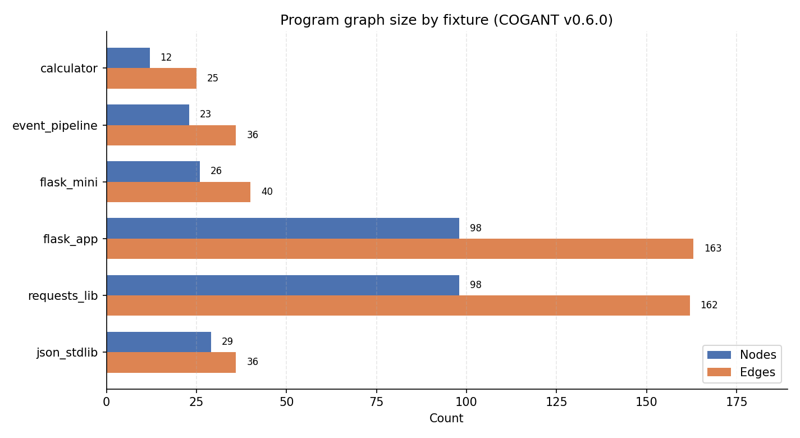

## Page 54

directory for the fixture run. Together the table covers one-to-six file repositories and 120 to 1231 lines of code, exercising
the pipeline on both minimal control positives and small real-world modules. Wall-clock times on a 2024-class Apple-silicon
workstation are a few seconds per fixture for the API path (tbl. 8 includes export + GNN build but not the separate dashboard
asset pass from orchestrate_roundtrip.py).
Node kinds and edge kinds below are taken from metrics.json (same in-memory ProgramGraph as tbl. 15). The default
run_graph / ProgramGraphBuilder path used here includes IMPORTS where the API path emits them, while optional CALLS
edges from a dedicated call-graph pass are recorded only when that pass is part of the built graph; --- marks a zero count
in the edge-kind columns.
Table 9: Program graph composition by fixture.
Fixture
MODULE
CLASS
METHOD FUNCTIONCONTAINSWRITES
READS
CALLS
IMPORTS INHERITS
calculator
1
1
10
—
11
5
9
—
—
—
event_pipeline 1
6
16
—
22
1
10
—
—
3
flask_mini
1
7
18
—
25
6
7
—
—
2
flask_app
6
25
57
10
92
15
38
—
9
9
requests_lib
6
20
59
13
92
8
42
—
10
10
json_stdlib
4
3
9
13
25
3
6
—
2
—
The distribution matches the intuitive shape of the fixtures: class-heavy repositories (flask_app, requests_lib, flask_mini)
show METHOD-dominated node counts, while the functional json_stdlib shows a balanced METHOD/FUNCTION split.
On the API path used for these tables, CONTAINS and dataflow READS / WRITES account for the bulk of edges; IMPORTS
appears where manifest/static evidence is emitted, and optional CALLS edges from a dedicated call-graph pass are recorded
only when that pass is part of the built graph.
Figure 17: Node-kind composition for the packaged fixtures. The figure is rendered by cogant.evaluation.figures.gen
erate_figures.figure_node_kinds from ../cogant/evaluation/figures/metrics.json; stacked horizontal bars show
MODULE, CLASS, METHOD, and FUNCTION counts from the same graph artifacts summarized in the fixture graph
metrics table. Use it to inspect fixture shape at a glance. It does not infer node kinds that the public API graph path did
not emit.
For each fixture the StateSpaceCompiler emits a StateSpaceModel whose variables, observations, actions, and transitions
are then packaged into gnn_package/state_space.json, observations.json, actions.json, and transitions.json.
The counts reflect the end-to-end behavior of the compiler on these inputs, not the rule engine’s raw mapping output.
53

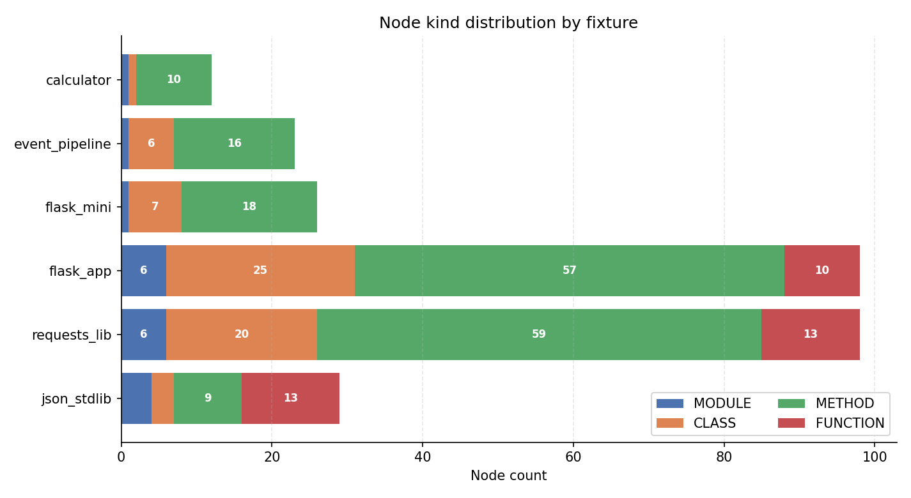

## Page 55

Table 10: State-space compilation outputs.
Fixture
State variables
Observations
Actions
Transitions
Policies
calculator
1
3
6
6
1
event_pipeline
1
9
11
11
4
flask_mini
6
1
18
18
5
flask_app
14
24
29
29
3
requests_lib
9
37
17
17
2
json_stdlib
3
2
11
11
1
Figure 18: State-space output comparison for the packaged fixtures. The figure is rendered by cogant.evaluation.figu
res.generate_figures.figure_state_space from ../cogant/evaluation/figures/metrics.json; grouped horizontal
bars show compiled hidden-state variables, observations, actions, and transitions from the same run as the state-space
compilation table. Inspect the observation/action balance before interpreting matrix degraded-output defaults. The chart
reports compiled counts only, not behavioral adequacy.
calculator has one compiled hidden-state variable in the v0.6.0 compiler output on the API path. json_stdlib compiles
11 action slots on this run; the rule engine and compiler still interleave default slices where WRITES evidence is missing.
The requests_lib fixture has the highest observation count in the table because its session/adapter classes expose a large
number of read-only attributes that the rule engine matches as OBSERVATION mappings.
Every fixture emits the same GNNPackageBuilder layout: model.gnn.md, model.gnn.json, the section JSONs, markov_bl
anket.json / markov_network.json, and related companion files (the 16 required files per fixture in the canonical v0.6.0
gnn_package/, plus generated diagrams//visualizations/ assets). A separate examples/orchestrate_roundtrip.py
run can add Mermaid, GraphML, Parquet, and dashboard HTML on top; those assets are not part of the tbl. 8–tbl. 11 set.
Table 11: Output artifacts per run.
Fixture
gnn_package/ files
Validation errors
Validation warnings
calculator
28
0
0
event_pipeline
28
0
0
flask_mini
28
0
0
54

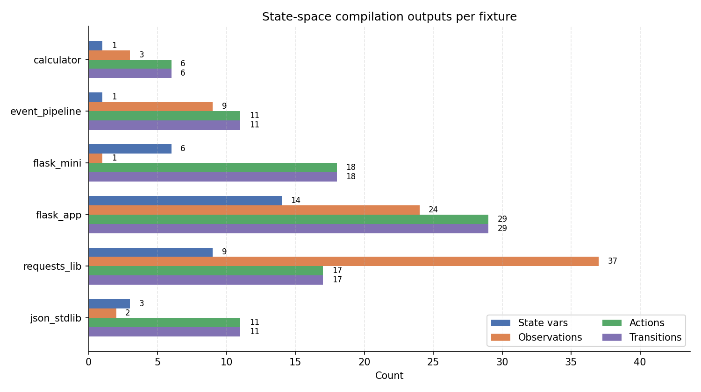

## Page 56

Fixture
gnn_package/ files
Validation errors
Validation warnings
flask_app
28
0
0
requests_lib
28
0
0
json_stdlib
28
0
0
These numbers were collected by the reproducible script ../cogant/evaluation/figures/generate_figures.py, which re-
runs the public orchestration path over every fixture and writes both the summary table and the figures used in this manuscript
into ../cogant/evaluation/figures/ (namely fig1_graph_sizes.png, fig2_node_kinds.png, fig3_state_space.pn
g, and fig4_pipeline_latency.png, plus the machine-readable metrics.json).
The separate run_all.py dashboard
path complements these fixture metrics with cross-target visual audit artifacts: parser-status distribution, visual-workbench
completeness, semantic-role distribution, confidence-tier distribution, roundtrip status, failure reasons, and command timing.
Those dashboard files are deliberately machine-readable (summary.csv, metrics_per_target.json, and Mermaid diagrams)
so a manuscript figure can be traced back to a run directory instead of to a hand-made chart.
Refresh and check this section with uv run --directory cogant python evaluation/figures/generate_figures.py
and then uv run python scripts/z_generate_manuscript_variables.py --strict from the COGANT project root.
The fixture metrics are single-run provenance measurements, not repeated benchmark distributions.
55

## Page 57

Figure 19: Public API pipeline latency for the packaged fixtures. The figure is rendered by cogant.evaluation.figures
.generate_figures.figure_pipeline_latency from ../cogant/evaluation/figures/metrics.json; directly labelled
horizontal bars show single-run wall-clock seconds for the full API path that produced the fixture metrics table. Use it
as provenance timing for the fixture table. It is not a repeated benchmark distribution and should be read alongside the
benchmark-suite table.
13
Test matrix, mutation testing, and benchmark suite
13.1
Test matrix and coverage
The v0.6.0 Python implementation ships a test suite that, on the canonical uv run pytest tests/ --cov=py/cogant run
(the gate in ../cogant/pyproject.toml measures the py/cogant/ source tree for the import package cogant), reports
9697 passing, 0 failing, and 5 skipped tests, plus 0 expected xfail and 0 xpass case. Any non-zero failing count
is a release-blocking evidence gap, not a hidden denominator; the pass/skip/coverage figures below must be read together
with that failure count. End-to-end runtime is on the order of several minutes on a 2024-class Apple-silicon workstation
(1477.2 s in the canonical run); the overall line coverage of the instrumented package is 95.55% on that run, measured
across 83913 executable lines in 240 source files (see METRICS.yaml, generated 2026-06-15T03:24:19.607235Z). mypy -
-strict on py/cogant/ reports 0 remaining errors. As of 2026-05-19 this count is zero; the pydantic v2 mypy plugin is
enabled in cogant/pyproject.toml:[tool.mypy].plugins = ["pydantic.mypy"] and PyYAML is in the ignore_missi
ng_imports overrides, which together resolve the residual stub-resolution diagnostics that previously generated a 30-error
count. The figure is still errors among reported diagnostics, not a completeness certificate; --strict does not enable --dis
allow-any-unimported, so consumers using unstubbed third-party packages remain a separate audit class documented in
the package scope-of-record under ../cogant/docs/reference/.
Table 12: Python interpreter matrix.
Python version
pyproject.toml classifier
Status
3.11
Programming Language :: Python :
: 3.11
supported (minimum version,
requires-python = ">=3.11")
3.12
Programming Language :: Python :
: 3.12
supported (canonical CI interpreter;
benchmark runs use 3.12.11)
3.13
Programming Language :: Python :
: 3.13
supported
56

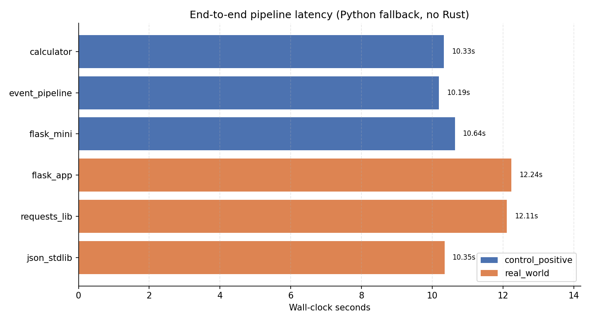

## Page 58

All three interpreters are listed in the classifiers block of ../cogant/pyproject.toml. The declared minimum is Python
3.11 so that the pattern-matching front end in cogant.static.parser.PythonASTParser can use match/case statements
without a compatibility shim, and the benchmark suite recorded in benchmarks/results/suite_20260423.md was executed
on CPython 3.12.11 under macOS-26.4.1-arm64-arm-64bit.
Module-level coverage is concentrated in the layers that the 13 packaged fixtures exercise end-to-end.
tbl. 13 records
statement coverage (coverage.py Stmts / Cover) for the algorithmic core (translation, state-space compilation, Markov
blanket extraction, GNN matrix construction, validation, simulation helpers) — the modules whose correctness is load-
bearing for the claims in this manuscript. Figures match the uv run pytest tests/ --cov=py/cogant run that produced
the 9697/5 pass/skip summary in METRICS.yaml (2026-06-15T03:24:19.607235Z).
Table 13: Statement coverage of load-bearing modules (canonical v0.6.0 run, 2026-06-15T03:24:19.607235Z).
Module
Stmts
Cover
cogant.translate.engine
250
96%
cogant.translate.rules.structural
190
99%
cogant.translate.rules.semantic
255
93%
cogant.translate.rules.behavioral
108
100%
cogant.translate.rules.control
79
100%
cogant.translate.rules.resilience
164
93%
cogant.translate.confidence
98
100%
cogant.statespace.compiler
471
99%
cogant.statespace.variables
263
99%
cogant.statespace.temporal
217
100%
cogant.markov.blanket
166
100%
cogant.gnn.matrices
359
99%
cogant.static.calls
151
89%
cogant.static.dataflow
297
95%
cogant.static.parser
236
89%
cogant.simulate.free_energy
165
100%
cogant.simulate.runner
252
99%
cogant.simulate.distributions
118
100%
cogant.scoring.drift
222
100%
cogant.scoring.metrics
142
99%
cogant.validate.integrity
140
96%
cogant.validate.schema_check
103
96%
cogant.validate.provenance_check
73
100%
cogant.viz.png.mermaid
502
78%
cogant.viz.png.program_graph
283
89%
cogant.viz.png.state_space
215
97%
cogant.viz.matrix_view
324
92%
cogant.viz.network_view
227
91%
cogant.viz.flow
251
99%
The aggregate 95.55% in METRICS.yaml is measured with [tool.coverage.run] source = ["py/cogant"] and omits co
gant/static/treesitter_parser.py (configured in ../cogant/pyproject.toml). The viz/ package is instrumented and
covered in v0.6.0 by a dedicated viz test suite because the rendered program graphs, matrix panels, Markov blanket views,
and run overviews are part of the human interpretability surface rather than decorative output. Lower rows in tbl. 13 (for
example static.calls and static.parser) highlight residual branch gaps, not omitted packages. See ../cogant/CHANGE
LOG.md for release-cycle deltas.
13.2
Mutation testing
Automated mutmut 3.5.0 is wired in ../cogant/pyproject.toml ([tool.mutmut]) to only py/cogant/translate/engi
ne.py and py/cogant/markov/blanket.py; the broader hand-picked experiment below also targets gnn/matrices.py, s
tatespace/compiler.py, and static/dataflow.py. Mutation testing is normally interpreted as a systematic adequacy
probe over generated program variants [Jia and Harman, 2011, Petrovic et al., 2021]. The canonical mutmut runner was
additionally evaluated on matrices.py but rejected: on COGANT’s test layout mutmut reported every one of the 403 auto-
generated mutants on that file as “no tests” because its v3 trampoline requires tests to import the mutated module through
57

## Page 59

the mutants/<path> shadow tree, and the project’s pytest configuration does not. Rather than ship a “no tests” score,
the mutation analysis in ../cogant/docs/evaluation/MUTATION_REPORT.md is based on a hand-picked set of fifteen
semantic mutations across those modules; each mutation was applied, the relevant pytest subset was rerun, and the
mutation was reverted immediately. This documents exactly which invariants the tests enforce.
Statistical caveat. The “66.7% mutation score” reported below is arithmetically correct on the 15-mutant sample but
is not a statistically meaningful mutation score in the sense reported by an unbiased mutmut run over hundreds of
auto-generated mutants. A 15-mutant hand-picked sample is a qualitative diagnostic — a way to enumerate which invariants
the tests verify and which do not — not an estimator of the package-wide mutation-survival rate. Readers should treat the
table as “fifteen targeted what-if probes, ten killed, five surviving with documented follow-ups” rather than as a coverage
statistic. Fixing the mutmut v3 trampoline path so a full auto-generated run on matrices.py reports a real score is tracked
as future work; until then the per-row 33%/50%/100%/etc. cells are informative only as the killed/total ratio on the sample,
not as estimates over the full mutation space.
Table 14: Hand-curated diagnostic mutation-probe results on COGANT algorithmic core (mutation testing subsection).
Module
Mutants tested
Killed
Survived
Diagnostic kill rate
gnn/matrices.py
5
3
2
60%
translate/engine.py
3
1
2
33%
markov/blanket.py
2
1
1
50%
statespace/compiler.py
2
1
1
50%
static/dataflow.py
3
3
0
100%
Total
15
10
5
66.7%
The five surviving mutants are documented individually in ../cogant/docs/evaluation/MUTATION_REPORT.md §“Surviving
mutants — action required” (aversive preference path in compute_C, sensory↔active boundary role swap in markov/blanke
t.py, >=→> boundary flip in _map_confidence, CONFIGURATION neighbour bias in compute_D, and the single-pass fixpoint
iteration cap). Three of the five were closed by hardening tests in the same commit: test_C_aversive_preference_produc
es_negative_log_pref kills the aversive-preference survivor, test_boundary_with_only_outgoing_edge_is_active / te
st_boundary_with_only_incoming_edge_is_sensory kill the Markov-blanket swap, and test_map_confidence_exact_b
oundary_values kills the >=→> family. The remaining two survivors (CONFIGURATION-bias and single-pass fixpoint) are
documented follow-ups that require non-trivial fixture extensions. The diagnostic kill rate on the hand-picked set is therefore
10 killed / 15 total = 66.7% before hardening, and the documented target after the follow-ups is 80% or better.
The modules with the strongest mutation signal are static/dataflow.py (3 of 3 killed — every edge-kind string mutation is
caught by the dataflow-tuple-assertion tests) and the column-normalisation paths in gnn/matrices.py (4 of 5 killed — every
arithmetic mutation to _normalize_row, _DEFAULT_DIRECT_MASS, the compute_C sign-flip, the compute_B axis swap, and
the compute_A default branch is killed by the A_columns_sum_to_one, B_columns_sum_to_one_per_action, and A_concen
trates_mass_on_direct_reads tests). The modules that drag the overall score down are those whose tests assert structural
invariants (disjointness, normalisation, shape) but do not pin down the direction or magnitude of individual entries.
13.3
Benchmark suite (shipped)
A reproducible benchmark harness lives at ../cogant/benchmarks/bench_suite.py and writes its canonical results to .
./cogant/benchmarks/results/. The snapshot below is from suite_20260423.md (three iterations per fixture, CPython
3.12.11 / macOS-26.4.1-arm64-arm-64bit) and should be regenerated after performance work. These timings are engineering
regression measurements, not a comparative benchmark suite against external systems; benchmark-design concerns such as
workload representativeness, environment control, and statistical treatment are therefore listed as future work rather than
inferred from this small fixture set [Hasselbring, 2021, Ralph et al., 2020].
Table 15: Benchmark suite results (suite_20260423.md, three iterations per fixture, CPython 3.12.11).
Fixture
Wall-clock
median (ms)
Wall-clock p95
(ms)
Nodes
Edges
Mappings
Peak memory
(MB)
calculator
35
35
12
25
11
0.2
event_pipeline
41
43
23
36
21
0.2
flask_mini
38
38
26
40
25
0.1
flask_app
59
62
98
154
72
0.4
requests_lib
54
58
98
152
63
0.1
58

## Page 60

Fixture
Wall-clock
median (ms)
Wall-clock p95
(ms)
Nodes
Edges
Mappings
Peak memory
(MB)
json_stdlib
47
49
29
34
19
0.0
Node and mapping columns use the same fixture definitions as tbl. 8. The edge columns are pinned to the benchmark
snapshot named in the caption, while the refreshed public API metric table can include newer import-edge extraction. The
mappings count is from the same post-statespace in-memory semantic_mappings dict that ../cogant/evaluation/figu
res/metrics.json uses (pipeline_api_metrics samples immediately after run_statespace); conflict resolution in Trans
lationEngine applies sorted iteration over colliding mapping pairs so this count is stable across bench_suite and genera
te_figures runs.
The benchmark harness times the pipeline up through statespace (no process / export / validate), so its wall-clock
medians are much smaller than the end-to-end times in tbl. 8, which add process model extraction, GNN package build,
and validation. For pure translation, every shipped fixture in this run finishes in under 100 ms median wall time; the stage
breakdown in suite_20260423.md shows ingest and graph as the main contributors on the larger fixtures.
The manuscript therefore keeps two timing views separate: tbl. 15 is a repeated harness measurement of the pre-export
pipeline, while fig. 19 is a single-run provenance figure for the public API path that also builds and validates the GNN
package.
Approximate stage breakdown from the same file: per-fixture ingest is on the order of 30–35 ms; graph reaches roughly 7–13
ms on the larger fixtures. The benchmark file records GNN tensor shapes from GNNMatrices on the post-statespace bundle;
for example flask_app shows 𝐴∈ℝ22×13, 𝐵∈ℝ13×13×31, 𝐶∈ℝ22, 𝐷∈ℝ13, which line up with the Markov structure
implied by the observation and hidden-state rows in the summary section of suite_20260423.md (exported gnn_package/
modalities in tbl. 10 can still differ from the post-statespace GNN read when run_process refines the bundle).
59

## Page 61

14
What to record for reproducible experiments
14.1
Minimum recording checklist
The eight-item publication checklist is consolidated in sec. 15. The subsections below spell out commands, manifest
semantics, and a worked re-run without duplicating that list.
The COGANT pipeline is deterministic on a fixed filesystem snapshot under a fixed Python interpreter.
Bit-for-bit
reproduction applies only to canonicalized structured outputs after volatile metadata fields (for example created_at,
generated_at, absolute temporary paths, and wall-clock timings) are excluded or normalized. The semantic JSON payloads
(program_graph.json, state_space.json, semantic_mappings.json) should therefore be compared via recorded canonical
hashes, not by assuming every emitted file byte is stable. Wall-clock stage timings are not bit-for-bit reproducible — they
vary ±10% due to CPU scheduling, cache warming, and background load; report median(3 runs) for publication rather
than a single measurement.
14.2
How to re-run the canonical fixture experiments
All numbers in tbl. 8 through tbl. 11 (sec. 12) and in the benchmark suite of sec. 13 are regenerated by two scripts that live
inside the COGANT package tree and take no arguments beyond a --output directory:
# One-shot regeneration of every figure and the metrics.json summary
uv run python ../cogant/evaluation/figures/generate_figures.py \
--output ../cogant/evaluation/figures/
# Benchmark harness — three iterations per fixture, stage-level timing
uv run python ../cogant/benchmarks/bench_suite.py \
--iterations 3 \
--output ../cogant/benchmarks/results/
The figure-generation script imports pipeline_api_metrics.run_orchestration_pipeline_metrics and runs the public
cogant.api.orchestration path (ingest through validate, same graph/mapping contract as the CLI and bench_suite.py)
for every fixture under ../cogant/examples/control_positive/ and ../cogant/examples/real_world/, re-reads the
emitted JSON, writes metrics.json alongside fig1_graph_sizes.png, fig2_node_kinds.png, fig3_state_space.png,
and fig4_pipeline_latency.png, and copies the canonical figure set into the ../cogant/evaluation/figures/ tree. A
separate ../cogant/examples/orchestrate_roundtrip.py demo can emit a richer graph for dashboards; it is not what
tbl. 8–tbl. 11 and metrics.json are tied to. The benchmark-suite harness times the same stages as in tbl. 15 and writes a
dated Markdown report suite_YYYYMMDD.md with a JSON sidecar; the report committed as ../cogant/benchmarks/resul
ts/suite_20260423.md is the canonical source for the benchmark table in sec. 13.
14.3
How to re-run the manuscript visualization workbench
The dashboard figures in sec. 8.1.1 are regenerated from the package output tree rather than from the benchmark fixture script
above. From the repository root, the minimal calculator path exercises forward translation, reverse synthesis, visualization,
batch aggregation, browser QA, and manuscript figure copying:
cd cogant
uv run cogant translate examples/control_positive/calculator \
--layout-output \
--output output/calculator
uv run cogant roundtrip examples/control_positive/calculator \
--output output/calculator/roundtrip \
--keep-tmp
uv run cogant viz output/calculator
uv run python ../scripts/batch_dashboard.py --output-root output --quiet
uv run cogant viz output/dashboard
uv run python ../scripts/dashboard_browser_qa.py \
output/calculator/site/inspection_dashboard.html \
--output-dir output/calculator/dashboard_qa \
--quiet
Then, from the repository root, return to the staging root and refresh the manuscript-facing evidence:
cd ..
uv run python tools/claim_ledger.py --quiet
60

## Page 62

uv run python tools/manuscript_figures.py --strict
uv run python tools/visualization_quality_audit.py --strict
uv run python tools/manuscript_evidence_audit.py --strict
uv run python tools/manuscript_review_dashboard.py --strict
uv run python scripts/z_generate_manuscript_variables.py --strict
The expected visual sidecars for sec. 8.1.1 are output/calculator/roundtrip/metrics.json, output/calculator/rule
_evidence_trace.json, output/calculator/data/inference_trace.json, output/calculator/data/state_space.j
son, output/calculator/gnn_package/markov_blanket.json, output/calculator/site/inspection_dashboard.htm
l, output/dashboard/metrics_per_target.json, and the corresponding registered PNGs under output/calculator/fi
gures/ plus the registered batch summary under output/dashboard/. Dashboard audit sidecars such as output/dashbo
ard/role_distribution.mmd remain generated and traceable, but the manuscript promotes only registered figures whose
source JSON has nonzero supporting evidence. The strict figure copy fails if any registered manuscript figure is missing, and
tools/visualization_quality_audit.py then writes ../figures/visual_quality_audit.json, ../figures/visual_
quality_audit.md, and ../figures/visual_quality_audit.png so visual QA, source digests, degraded-renderer status,
and publication-specific dimension policies can be reviewed together. The claim ledger writes ../output/claim_ledger.j
son / ../output/claim_ledger.md so unsupported literal claims can be reviewed before rendering. The section evidence
audit writes ../output/analysis/manuscript_evidence_audit.json, ../output/analysis/manuscript_evidence_a
udit.md, and ../output/analysis/manuscript_evidence_audit.png; this is a review surface for whether each section
exposes citations, metric tokens, figures, artifact paths, validator commands, or boundary language, and its weakest-section
ranking now carries non-fatal reviewer actions for thin but passing sections. tools/manuscript_review_dashboard.py then
combines those surfaces into ../output/analysis/manuscript_review_dashboard.json, ../output/analysis/manuscr
ipt_review_dashboard.md, and ../output/analysis/manuscript_review_dashboard.png so a reviewer can see figure
QA, evidence lanes, actionable literal claims, figure-manifest status, and the current review queue together. None of these
artifacts prove that every claim is true.
14.4
What the manifest.json index records
Every gnn_package/ directory emitted by the pipeline includes a manifest.json file whose job is to close the reproducibility
loop without requiring the downstream consumer to re-hash the bundle. The manifest records: the COGANT version that
produced the bundle, the interpreter and platform identifiers from step 2 of the checklist, the list of stages actually executed
(step 6), the schema name passed to the state-space compiler, the paths of every file in the gnn_package/ directory, and the
SHA-256 hash of each file. A reproducer can therefore verify a published bundle with a single pass over the manifest, without
consulting any external metadata file.
14.5
Worked example: reproducing the repository pipeline row for flask_app
The canonical tbl. 8 row for the flask_app fixture (6 files, 866 lines, 98 nodes, 163 edges, and about 11.6 s wall clock for
the full public API run that populates metrics.json) was produced as follows, and the command sequence below should
reproduce the same canonicalized program_graph.json and state_space.json on any macOS arm64 machine with the
same uv lockfile:
cd cogant
# package root
uv sync --extra all
# pins every dep per uv.lock
git rev-parse HEAD
# record the commit hash
python --version && uname -a
# record interpreter + platform
uv run cogant translate \
examples/real_world/flask_app \
--output /tmp/repro_flask_app \
--layout-output
uv run cogant validate /tmp/repro_flask_app/gnn_package
sha256sum /tmp/repro_flask_app/gnn_package/*.json | sort
The validate step should report score 100.0 / 100 with zero errors and zero warnings, and the sorted SHA-256 listing
should match the manifest.json written into the gnn_package/ directory of the worked-example run itself. Any mismatch
points to either a dependency drift (step 3) or an input drift (the Flask fixture itself changed between runs).
14.6
Data ethics and licensing for exported bundles
Every COGANT bundle can contain identifiers, docstrings, and inline comments lifted verbatim from the input source
code. When redistributing a bundle derived from a third-party repository — for example when publishing a dataset of
gnn_package/ outputs from open-source Python projects — the downstream license terms must be respected: the original
61

## Page 63

repository’s license applies to any prose or identifier that the bundle quotes, and the COGANT MIT license covers only the
pipeline code and the synthetic fixtures it ships. Organisations with private data policies should additionally review bundles
for personally identifiable information before publication; the pipeline does not perform PII scrubbing on its own. The short
policy statement is in sec. 15; this subsection supplies the actionable hashing and manifest-recording recipe.
14.7
Cross-references
• The CLI hub at ../cogant/docs/cli/README.md and ../cogant/docs/cli_reference.md covers every flag that
changes the recorded-output shape, and the stage list in ../cogant/docs/architecture/README.md enumerates the
10-stage DAG.
• The per-release narrative in ../cogant/CHANGELOG.md documents which default-behaviour changes (for example the
POLICY / CONTEXT stub-emission fix discussed in sec. 23 and ROUNDTRIP_IMPROVEMENT.md) could affect a re-run
against a previously generated bundle.
• The calibration sweep plan in ../cogant/docs/evaluation/CALIBRATION.md is the canonical reference for the TODO(ca
libration) markers cited in sec. 23; re-running a confidence-threshold sweep requires the 20+ repository gold-standard
corpus discussed there.
62

## Page 64

15
Reproducibility
Availability. The COGANT source repository is published at https://github.com/ActiveInferenceInstitute/COGANT under
the MIT License, and this release is archived on Zenodo with version DOI 10.5281/zenodo.20705351 (the version-independent
concept DOI 10.5281/zenodo.20705350 always resolves to the latest version). Cite the version DOI when reporting results
derived from a specific release.
Reproducible computational research requires version-pinned tools, fixed inputs, documented workflows, immutable outputs,
and citable software artifacts [Peng, 2011, Sandve et al., 2013, Smith et al., 2016]. ACM’s artifact-review terminology is useful
here because it distinguishes available artifacts, evaluated artifacts, reproduced results, and independently replicated results
[Association for Computing Machinery, 2020]. COGANT contributes the graph-generation slice of that story: identical
source trees and identical pipeline configuration should yield identical exported bundles modulo declared nondeterminism
(for example optional neural embeddings if enabled). That is a repeatability and artifact-audit claim, not a claim that an
independent team has reproduced or replicated every manuscript result. The project also borrows the FAIR emphasis on
machine-actionable metadata [Wilkinson et al., 2016]: generated bundles, figure manifests, rule traces, and claim-ledger rows
are designed to be inspected by scripts as well as by human reviewers. When a release is deposited in Zenodo or a similar
archive, the software citation should identify the exact immutable version rather than only the moving source repository
[van de Sandt et al., 2019].
15.1
Publication checklist
When citing or redistributing a COGANT run, archive together:
1. COGANT version and Git SHA — cogant doctor; __version__ matches pyproject.toml.
2. Python interpreter — python --version and platform (uname -a or equivalent).
3. Dependency lock — uv.lock from the package root with the same uv sync --extra … extras as the run.
4. Input snapshot — Git commit of each analyzed repository; for fixtures under examples/, record the COGANT
monorepo SHA.
5. Pipeline configuration — cogant.yaml or PipelineConfig serialization (secrets redacted).
6. Stages executed — full 10-stage DAG vs skip_stages, --no-dynamic, --skip-validate, etc.
7. Downstream seeds — only if a learned model consumes exports (COGANT’s default pipeline is deterministic).
8. Output hashes — SHA-256 of gnn_package/ and bundle.json for verification.
9. Software citation metadata — immutable DOI or release URL, authorship/maintainer metadata, license, and
citation file where available.
Worked commands, manifest semantics, and a full flask_app re-run recipe are given in sec. 14.
15.2
Version pinning
Pin:
• The COGANT version (pyproject.toml / package __version__) and Git commit when installing from source.
• The Python minor version.
• Optional Rust toolchain commit when building native extensions from ../cogant/rust/.
• The immutable software release DOI or immutable tag used for the run, when results are redistributed outside the
repository.
15.3
Artifact layout
Pipeline output typically includes JSON for intermediate IRs, Generalized Notation Notation (GNN) bundles (canonical
model.gnn.md plus companion JSON and interop artifacts), validation reports, and optional HTML sites. Paths under the
chosen output_dir should be treated as disposable but checksumable: store hashes alongside published datasets derived
from COGANT exports when releasing research artifacts.
The artifact layout is intentionally provenance-shaped. Source files, parser activities, rule applications, conflict-resolution
events, generated bundles, figures, and rendered manuscript outputs are separate entities connected by explicit generation
steps, following the same broad entity/activity/derivation model standardized by PROV-DM [Moreau and Missier, 2013]. At
the assertion level, COGANT’s rule-evidence rows also echo why/where provenance [Buneman et al., 2001] and provenance-
semiring work, which treats derivation annotations as values that flow through relational and Datalog-style fixed points instead
of collapsing them into booleans [Green et al., 2007]. COGANT’s sidecars are not full PROV-O/JSON-LD documents and do
not implement semiring algebra, but the design choice is the same: make trust, reuse, and debugging depend on inspectable
derivations rather than on prose assurances. If a downstream archive needs web-native provenance exchange, the current
63

## Page 65

sidecars should be treated as a domain schema that can be mapped into PROV/JSON-LD, not as already conforming linked
data [Sporny et al., 2020].
The same scoping applies to artifact packaging. Research Objects were proposed because linked data alone is not enough
to support scientific reuse, validation, and publication: reproducible work needs aggregations that bind data, methods,
provenance, attribution, and context [Bechhofer et al., 2013]. A COGANT run directory is shaped in that direction – code
snapshot, configuration, intermediate IRs, bundle exports, validation reports, figure sidecars, hashes, and manuscript-variable
snapshots – but it is not advertised as a Research Object implementation. It is a checksumable, provenance-bearing package
that a downstream archive could wrap in a formal Research Object or PROV/JSON-LD exchange layer.
15.4
Figure evidence manifests
Manuscript figures follow the same traceability rule as tables. tools/manuscript_figures.py registers each promoted
figure with its source_artifact, renderer, method note, reading guide, limitation note, alt text, SHA-256 hash, byte
size, dimensions, data digest, and lightweight visual-QA fields such as nonblank status and sampled color diversity. The
copied assets land in ../figures/ beside manifest.json and per-figure .figure.json sidecars; strict mode fails when any
registered figure is missing or lacks required evidence metadata. It also rejects publication figures whose source sidecar or PNG
metadata indicates degraded vector conversion, rejects native-required detail panels that were produced by SVG fallback,
and rejects timeline figures whose dimensions would make the publication image unreadable. tools/visualization_quali
ty_audit.py is the review surface over those sidecars: it writes JSON, Markdown, and a compact QA matrix summarizing
sidecar presence, source digest coverage, nonblank and color-diversity checks, dimension policy, degraded-renderer status,
and publication-specific rules. Renderer-produced sidecars such as program_graph.figure.json are still preserved when
available, so displayed node/edge counts and renderer-specific layout choices remain inspectable. This is a visual-analytics
provenance convention as much as a file-management convention: provenance work distinguishes data, workflow, interaction,
and insight records, and COGANT’s sidecars intentionally cover the data and workflow portions while leaving human analytic
interactions to future review tooling [Ragan et al., 2016].
The manuscript also has a section-level evidence audit. tools/manuscript_evidence_audit.py scans source fragments
for citation lanes, metric-token lanes, figure references, artifact paths, validator commands, and boundary-language signals,
then writes JSON, Markdown, and a matrix PNG under output/analysis/. The report ranks the sections with the fewest
support lanes and emits a non-fatal review queue that names likely next actions, such as adding an independent evidence
lane, checking boundary wording, or strengthening a scholarly anchor. tools/manuscript_review_dashboard.py is the
synthesis layer over the audit stack: it combines the evidence audit, figure-quality audit, claim ledger, and figure manifest
into one review dashboard and carries the same review queue into the visual summary. These tools deliberately complement
the claim ledger: they do not certify truth, but they help reviewers find sections whose prose has no obvious evidential handle,
whose related-work framing lacks citation anchors, or whose figure/claim evidence is not ready for publication.
This means that visualizations in sec. 2, sec. 6, and sec. 8 are part of the reproducible evidence chain rather than illustrative
redraws. A reader can verify that the forward graph, state-space factor view, matrix panels, GNN Markdown render, Markov-
blanket partition, calculator-focused batch timeline, roundtrip diff, rule trace, evidence-coverage panel, and inference trace
were copied from package outputs under ../cogant/output/, not reconstructed by hand for the manuscript. The manifest
does not show that a visual encoding is the only possible one; it records the narrower and more important claim that the
shown pixels correspond to declared package artifacts with recorded provenance.
Table 16: Manuscript figure provenance groups and evidence boundaries.
Figure group
Source artifact
Renderer family
Evidence boundary
End-to-end calculator chain
../cogant/output/calcula
tor/ JSON, GNN, matrix,
and roundtrip artifacts
cogant.viz.png and cogan
t.viz.inspection_dashboa
rd
Demonstrates inspectable
conversion surfaces for one
real run; does not prove
role-ground-truth coverage.
Fixture evaluation figures
../cogant/evaluation/fig
ures/metrics.json
../cogant/evaluation/fig
ures/generate_figures.py
Summarizes public API
fixture metrics; timing bars
are single-run provenance,
not benchmark distributions.
Ablation figure
../cogant/evaluation/MET
RICS.yaml
cogant.viz.ablation_view
.render_ablation_png
Shows measured rule-family
and fixpoint deltas; does not
decompose every mapping
kind in the main panel.
64

## Page 66

Figure group
Source artifact
Renderer family
Evidence boundary
Batch timeline
../cogant/output/run_man
ifest.json
tools.manuscript_figures
.render_publication_batc
h_timeline
Shows selected calculator
stage ordering and
verification gates while
recording batch-wide target
and command context in the
sidecar; wall-clock durations
are audit metadata.
Batch evidence summary
../cogant/output/dashboa
rd/metrics_per_target.js
on
tools.manuscript_figures
.render_publication_batc
h_evidence_summary
Summarizes emitted graph,
mapping, role, validation,
roundtrip, and visual
evidence; does not prove
semantic correctness.
15.5
Determinism
Parsing and graph construction aim for deterministic ordering on a fixed filesystem snapshot. Features that pull in external
models (for example optional name or documentation embeddings consumed by the Generalized Notation Notation exporter)
introduce variability unless models and seeds are fixed; the Generalized Notation Notation export document (../cogant/do
cs/export/README.md) calls out embedding dimensions and optional behavior.
15.6
Canonical metrics regeneration
Every numeric token in this manuscript (95.55, 9697, role-preservation counts, suite runtime, …) resolves from one source
of record, cogant/evaluation/METRICS.yaml, via the chain regenerate_metrics.py →inject_manuscript_vars.py
→render. The contract is intentionally one-directional: prose never hard-codes a metric, and tools/check_metrics_fr
esh.py is the drift detector that fails CI when METRICS.yaml disagrees with the committed coverage.json. For release
provenance, run it with --fail-on-dirty; the default mode compares committed HEAD and warns if uncommitted code,
docs, or generated artifacts mean generator_git_sha is not a sufficient description of the tree. Three failure modes were
observed and hardened so the contract degrades safely rather than silently:
• Artifact drift. A checked-in coverage.json whose statement denominator no longer matches the source tree makes
every derived figure unreliable even when check_metrics_fresh reports “in sync” against that same artifact. The
mitigation is procedural and stated here for auditors: regenerate from a full uv run pytest tests/ --cov=py/cogan
t run before trusting the headline coverage number.
• Environment-fragile regeneration.
regenerate_metrics.py re-runs the suite in a fast no-coverage mode to
recover pass/fail counts; in some environments that sub-invocation mis-parses and returns zero passing. A guard treats
passing == 0 on a multi-thousand-test suite as a parse failure and preserves the prior canonical counts with a
loud warning rather than overwriting METRICS.yaml with corrupted zeros, so a single bad regeneration cannot silently
destroy the record.
• Dirty-worktree provenance. A clean generator_git_sha comparison only shows that METRICS.yaml was generated
from the committed HEAD; it does not show that the current docs/manuscript/package tree has no uncommitted edits. The
freshness gate now reports dirty paths by default and can fail via uv run python tools/check_metrics_fresh.py -
-fail-on-dirty for release builds.
These checks are why the round-trip and coverage numbers in this paper are reproducible by re-execution rather than by
trust (cf. sec. 21, which scopes what those reproducible numbers do and do not establish).
15.7
Relation to the template repository
In this standalone checkout, COGANT is checked with the local project commands (tools/audit_manuscript_crossref
s.py, tools/audit_manuscript_numbers.py, cogant/docs/verify_manuscript_links.py, and the package test suite).
When the same tree is linked into the parent template under projects/working/cogant/, the root ./run.sh discovery layer
can execute it with src/, tests/, and pyproject.toml per template rules, and Markdown can also be checked from the
template repository root with uv run python -m infrastructure.validation.cli markdown ./projects/working/cog
ant/manuscript/.
15.8
Validation gates
The pipeline enforces quality through three complementary validation checkers, each targeting a different failure mode:
65

## Page 67

IntegrityChecker. Checks structural soundness of the program graph: all edge endpoints reference existing nodes, no
unintended duplicate nodes exist, orphaned nodes (zero in-degree and zero out-degree) are flagged, and self-loops are reported
unless explicitly allowed by configuration. The checker also checks that confidence scores fall within [0, 1] and that provenance
records are non-empty for every node and edge.
A graph that fails integrity checks receives a FAIL validation status;
downstream export is blocked.
SchemaValidator. Validates each IR artifact against its schema contracts (versioned alongside the COGANT package).
Schema violations – such as missing required fields, incorrect types, or unknown enum values in NodeKind or SemanticRole –
are classified by severity in the validation report. The current validators are package-native checks over COGANT dataclasses
and JSON sidecars. They are compatible in spirit with JSON Schema and graph-shape validation, but this manuscript does
not claim that every exported artifact ships with a normative JSON Schema or SHACL document [Wright et al., 2022, W3C,
2017].
ProvenanceChecker.
Audits the provenance chain: every assertion in the semantic mapping must trace back to at
least one evidence source (SourceCode, TypeSystem, ControlFlow, Heuristic, or External).
The checker flags mappings
whose provenance is empty or whose confidence score is inconsistent with the declared evidence tier – for example, a
STATIC_PLUS_RUNTIME tier with no runtime trace evidence. These flags appear as warnings rather than errors, since
partial provenance is expected for heuristic rules.
Together, these gates ensure that exported bundles meet a minimum quality bar before reaching downstream models. Thresh-
olds and policy defaults are configurable and documented in ../cogant/docs/validation/README.md.
The concrete shape of a validation report is the ValidationReport dataclass defined in ../cogant/py/cogant/validate/
report.py, which bundles the timestamp, the model identifier, a boolean is_valid flag, numerical coverage_score and c
onfidence_score fields in [0, 1], a free-form human-readable summary string, and a list of ValidationIssue records. Each
ValidationIssue (defined in ../cogant/py/cogant/validate/schema_check.py) carries a stable id, a severity of error,
warning, or info, a category of schema, integrity, provenance, or coverage, the set of affected_ids, and an optional
recommendation string. On a clean calculator run, for example, the report has the following shape:
{
"id": "report_calculator_20260410T081234Z",
"schema_name": "calculator",
"validated_at": "2026-04-10T08:12:34Z",
"model_id": "model_calculator",
"is_valid": true,
"coverage_score": 1.0,
"confidence_score": 0.94,
"summary": "Validation PASS — 0 errors, 0 warnings, 12/12 nodes covered",
"issues": [],
"details": {"gnn_validator_score": 100.0, "elapsed_ms": 73}
}
When one of the gates fires, the same issues list accumulates structured records of the form:
{
"id": "prov_001",
"severity": "warning",
"category": "provenance",
"message": "Mapping 'map_42' declared STATIC_PLUS_RUNTIME but has no dynamic_trace evidence source",
"affected_ids": ["map_42"],
"recommendation": "Re-run with --coverage/--trace inputs, or downgrade the declared tier in the rule"
}
Errors block export (is_valid flips to false and the pipeline refuses to write the gnn_package/ directory); warnings are
recorded in the bundle but do not block. Downstream consumers therefore only need to inspect the top-level is_valid flag
plus any severity == "error" entries to decide whether a bundle is safe to ingest.
15.9
Current runner behavior vs template checkpointing
The current cogant.api.pipeline.PipelineRunner executes stages in order and records stage outputs in a Bundle, but
it does not currently expose built-in checkpoint/resume flags or a dedicated manifest.json writer in that module. Re-
producibility is therefore captured today by persisting bundle.json (Bundle.save_json), pinning config and versions, and
retaining exported artifacts.
66

## Page 68

If COGANT is promoted into the template project workflow under projects/, repository-level checkpoint utilities from inf
rastructure/core/runtime/checkpoint.py can be used by the outer orchestration layer. That template capability should
be treated as infrastructure-level behavior, distinct from the current COGANT package runner.
15.10
Data ethics and licensing
Exported graphs can contain identifiers and comments from source code. Redistribution of derived graphs must respect the
licenses of input repositories and organizational data policies. The Publication checklist above is the short form; sec. 14
expands each item with paths, regeneration scripts, and a worked flask_app example.
67

## Page 69

16
Scope and related work
This chapter is organized as an overview plus four cross-referenced subsections. sec. 17 maps tool categories and compiler-
adjacent landscapes; sec. 18 positions COGANT against machine-learning-for-code systems and tabulates feature / input-
output contracts; sec. 19 treats bidirectional lenses, synthesis, and categorical framings; sec. 20 connects world models, active
inference, and compatibility boundaries; and sec. 21 consolidates, in one adversarial place, the construct-, external-, and
abstraction-validity threats and the deterministic-vs-LLM positioning rationale.
COGANT sits at the intersection of four established research areas: classical program analysis, machine learning for source
code, graph-based program representations, and active-inference behavioral modeling [Kildall, 1973, Cousot and Cousot, 1977,
Allamanis et al., 2018a, Friston, 2010]. The landscape positioning and tool-category breakdown are developed in sec. 17; this
overview only states the chapter scope and routes to the detail subsections below.
The chapter is also a scholarship audit: every adjacent field creates a different failure mode if the manuscript overclaims.
tbl. 17 records the load-bearing anchor for each field and where the answer lives in the manuscript.
Table 17: Scholarship pressure map for the related-work chapter.
Adjacent field
Canonical pressure
Manuscript response
Program analysis and CPGs
COGANT must not pretend that
repository graph extraction, dataflow,
or fact databases are new.
sec. 17 and sec. 18 position COGANT
as an export/evidence compiler built
on those traditions.
Graph learning for code
Tensor exports need typed nodes/edges
and downstream compatibility without
claiming trained-model accuracy.
tbl. 18, tbl. 19, and the export docs
separate data generation from model
performance.
Code language models
LLM-based mappers are plausible
competitors, especially for long-tail
idioms.
sec. 21 frames deterministic rules as a
reproducibility/provenance trade-off
rather than an accuracy superiority
claim.
Active inference and POMDPs
A/B/C/D matrices and Markov
blankets require formal discipline, not
metaphor alone.
sec. 3, sec. 20, and sec. 22 distinguish
structural validity from semantic
adequacy.
Lenses and synthesis
Roundtrip claims need to be weaker
than full bidirectional-transformation
laws unless proved.
sec. 19 and sec. 24 define measured
self-consistency and strict-isomorphism
gates.
Reproducible SE and visual analytics
Figures and dashboards must be
generated evidence, not hand-made
persuasion.
sec. 15 and tbl. 1 tie every promoted
figure to source artifacts, sidecars, and
limitations.
16.1
Where the full comparison lives
The detailed related-work comparison is split by topic so the overview does not duplicate tables and formal framing:
• sec. 17 — landscape overview and tool categories.
• sec. 18 — program analysis for ML, tbl. 18, tbl. 19, and scoped positioning.
• sec. 19 — bidirectional lenses, edit lenses, incremental analysis, categorical framing, and synthesis positioning.
• sec. 20 — world models from code, active inference, boundaries, and forward compatibility.
Authoritative implementation scope (languages, parsers, Rust acceleration) is recorded in ../cogant/docs/reference/
implementation_status.md.
The chapter-level review surface is executable: uv run python tools/audit_manuscript_claim_scope.py screens the
related-work prose for overclaims, benchmark framing, and semantic-totality language, while ../output/analysis/public
ation_readiness.md records whether the generated claim ledger still treats the chapter as citation-backed, artifact-backed,
validator-backed, or boundary-scoped.
68

## Page 70

17
Scope and related work: landscape and tool categories
17.1
COGANT in the program-analysis landscape
COGANT sits at the intersection of four established research areas: classical program analysis, machine learning for source
code, graph-based program representations, and active-inference behavioral modeling. The following subsections place it
against each, emphasizing what COGANT provides as infrastructure rather than as a novel model, compiler, theorem prover,
or benchmark.
The implementation counterpart to this literature map is deliberately narrower than the scholarly landscape. The current
parser, language, export, visualization, Rust-acceleration, and roadmap boundaries are recorded in ../cogant/docs/refer
ence/implementation_status.md and the export contracts under ../cogant/docs/export/; the related-work comparison
should be read against those artifacts rather than as a claim that COGANT covers every category below.
Classical program analysis supplies the fixpoint and abstraction discipline. Kildall’s global data-flow framework and the
Cousots’ abstract interpretation both model analysis as iteration over finite or suitably ordered abstract states [Kildall, 1973,
Cousot and Cousot, 1977]. COGANT adopts that shape for rule application over a finite program graph, while making the
deliberate engineering trade-off that mappings are evidence records rather than sound abstract semantics for all executions.
Machine learning for big code surveys cover naturalness, representation learning, and task taxonomy [Allamanis et al.,
2018a]. COGANT contributes infrastructure: a documented IR, pipeline, and export contract rather than a new benchmark
or model architecture.
Graph neural networks unify message-passing frameworks for relational data [Wu et al., 2021, Scarselli et al., 2009].
Although COGANT’s primary output is the Active Inference Institute’s Generalized Notation Notation, its program graph
can be materialised as optional tensor views compatible with these frameworks (PyG [Fey and Lenssen, 2019], DGL [Wang
et al., 2019]) so that graph-neural-network model papers can cite a specific tensor layout.
Code property graphs and related security-oriented graph constructions show how to merge syntactic and semantic edges
for analysis [Yamaguchi et al., 2014]. COGANT’s program graph is cognate but emphasizes ML export, confidence scoring,
and multi-stage IR refinement.
Visualization and graph drawing supply the inspection discipline for COGANT’s human-facing artifacts.
Software
visualization has long been framed as graphical representation of otherwise intangible program structures and process data
[Gračanin et al., 2005], and program-comprehension research stresses that navigation and orientation support are evaluation
questions, not just rendering questions [Storey, 2005]. Graph-visualization surveys emphasize that navigation, clustering, and
scale management are method choices rather than decorative afterthoughts [Herman et al., 2000]. Layered directed layouts
make hierarchy legible when containment dominates [Sugiyama et al., 1981, Gansner et al., 1993], force-directed layouts
remain useful for less hierarchical relation clusters [Fruchterman and Reingold, 1991], and node-link versus matrix readability
depends on graph size, density, and task [Ghoniem et al., 2004]. Interactive visual-analytics work stresses that useful views
should support overview, filtering, drill-down, and task-specific inspection rather than a single static picture [Shneiderman,
1996, Heer and Shneiderman, 2012, Brehmer and Munzner, 2013, Bostock et al., 2011, Hohman et al., 2019]. COGANT
adopts this as an artifact contract: a figure should expose the source JSON, role or relation encoding, limitation boundary,
and count/digest sidecar needed to audit a conversion stage. CodeCity’s software-city work is an instructive caution: visual
metaphors become useful only when source facts are mapped meaningfully, not merely because the picture is polished [Wettel
and Lanza, 2007].
The local comparison is bounded by generated evidence gates rather than reader impression alone. uv run python tools/
audit_manuscript_claim_scope.py rejects uncaveated superiority or semantic-totality wording, and ../figures/visual_
quality_audit.md records whether the promoted figures expose source artifacts, dimensions, sidecars, and native renderers.
17.2
Related tool categories
• Compiler and LLVM IRs — richer semantics, heavier toolchain; COGANT favors lightweight extraction for dataset
building.
• SCA and linters — rule enforcement focus; COGANT focuses on graph generation for downstream learning.
• Neural code models (code2vec, CodeBERT, etc.) — often consume tokens or AST paths; COGANT supplies explicit
program graphs that graph-neural-network-centric research can ingest directly.
69

## Page 71

18
Program analysis for machine learning and comparison tables
18.1
Program analysis for ML
Several systems address the intersection of program analysis and machine learning that COGANT operates in; recent surveys
of machine-learning techniques for source-code analysis provide the broader map of tasks, datasets, and reproducibility issues
around that space [Sharma et al., 2021]:
code2vec [Alon et al., 2019] and code2seq [Alon et al., 2018] represent programs as sets of AST paths between terminal
nodes, but they differ in output contract: code2vec learns a fixed distributed representation for method-name prediction,
whereas code2seq decodes a sequence and was evaluated on code summarization and related sequence-generation tasks. Both
show the value of syntactic paths, but both are fragment-level learned models rather than repository-level artifact generators.
COGANT preserves a typed repository graph – including data-flow edges and control-flow metadata where the selected
parser path can recover them – and can export it in tensor form, enabling downstream architectures that reason over richer
relational structure without conflating the output with a learned summary vector.
Learning to Represent Programs with Graphs [Allamanis et al., 2018b] is an important conceptual neighbour: it
constructs typed graphs fusing AST, control, and data-flow edges and feeds them to a gated graph neural network for
variable-misuse and variable-naming tasks. COGANT’s program graph IR adapts that graph-first idea to a pluggable and
confidence-annotated artifact generator, and its export contract is designed so that tensor sidecars can be consumed by
gated-message-passing architectures in the same family.
ProGraML [Cummins et al., 2021] moves the same graph-first idea down to compiler IR, producing a language-independent
graph representation for data-flow analysis and compiler optimization tasks. Its result is especially important for COGANT
because it shows that machine-learning systems expose different behaviour when data/control/call relations are present in the
representation. COGANT remains source-level and repository-oriented, but it adopts the same premise: relational program
structure should be explicit and auditable before any downstream model is asked to use it.
Gated Graph Neural Networks (GGNN) [Li et al., 2016] introduced gated recurrent propagation for graph-structured
representations, and the program-graph variant of Allamanis et al. used typed edges for code tasks [Allamanis et al., 2018b].
More recent graph-network and heterogeneous-GNN practice makes the same design pressure explicit: relation type, node
type, and message-passing operator are modelling choices rather than incidental metadata [Battaglia et al., 2018, Wu et al.,
2021]. COGANT’s exported graph bundles (typed JSON, GraphML, and Parquet carrying the typed node/edge attributes
a PyG Data object’s edge_index/edge_attr expects [Fey and Lenssen, 2019]; a direct PyG/DGL exporter is planned)
are compatible with this family, but COGANT should be read as an upstream graph generator rather than as a trained
GGNN/heterogeneous-GNN model.
Typilus [Allamanis et al., 2020] and LambdaNet [Wei et al., 2020] use graph neural networks to predict type annotations
from structural program graphs. Later type-inference work continues to show that graph structure remains a useful substrate
for code understanding [Seidel et al., 2023]. These systems consume exactly the kind of typed adjacency structure COGANT
emits, and both rely on message passing over node kinds similar to COGANT’s NodeKind taxonomy, so COGANT’s exports
can serve as an upstream graph generator for Typilus- and LambdaNet-style type inference.
CodeQL (Semmle/GitHub), whose declarative query language QL is formalised in [Avgustinov et al., 2016] and whose
production documentation defines repository databases, query packs, and SARIF-style analysis outputs [GitHub, 2026],
provides a declarative query language over relational representations of code. While CodeQL excels at security analysis
with hand-written queries, its outputs are query results rather than tensor-ready graph bundles. COGANT occupies the
complementary niche: it produces the graph data that learned models consume, and could ingest CodeQL query results as
an additional evidence source feeding the confidence model.
Semgrep, Joern, and Souffle cover adjacent static-analysis territory that should not be collapsed into neural code models.
Semgrep is a rule-based repository scanner whose public contract is patterns and findings rather than generative-model export
[Semgrep, 2026]. Joern operationalizes the code property graph line of work as a queryable code graph [Yamaguchi et al., 2014,
Joern Project, 2026]. Souffle shows the Datalog-program-analysis tradition, where language-specific facts and declarative rules
produce relation tables for static analysis [Jordan et al., 2016]. These systems are important comparators for COGANT’s
rule/provenance story, but their output contract is still query findings or analysis relations, not an Active-Inference bundle.
Glean and Kythe represent a second repository-scale comparison class: code-indexing and cross-reference infrastructure.
Glean is a fact database and query system for source-code structure, with language-specific indexers, schemas, derived
facts, and large-scale code-navigation use cases [Meta, 2026a, Meta Engineering, 2024]. Kythe similarly describes itself as
a pluggable, mostly language-agnostic ecosystem for building code tools, with indexers, extractors, a schema, and a cross-
reference service [Kythe Project, 2026]. These systems make the comparison sharper: COGANT should not claim novelty in
repository indexing or code facts. Its narrower claim is that those facts are compiled into a reviewable Active-Inference/GNN
bundle rather than stopping at code navigation, fact storage, or cross-reference service boundaries.
70

## Page 72

Pysa, Infer, Frama-C, and Soot broaden the static-analysis baseline beyond query languages. Pysa uses user-authored
source/sink models and taint rules to find security flows in Python code [Meta, 2026b]. Infer reports potential bugs from
Java, C/C++, and Objective-C inputs [Infer Project, 2026] and its large-scale deployment history is a useful reminder that
production static analysis succeeds through triage workflows and engineering fit, not only analyzer formalism [Distefano et al.,
2019]. Frama-C is a C analysis and verification platform with cooperating plug-ins over shared kernel data structures [Cuoq
et al., 2012]. Soot supplies Java bytecode analysis and transformation infrastructure [Vallee-Rai et al., 1999, Soot Maintainers,
2026]. These frameworks strengthen the limitation: COGANT’s confidence/provenance model is not a substitute for mature
language-specific analyzers; it is an integration and export layer that can treat their findings as evidence when adapters exist.
Specification and model-mining systems add a second caution: extracting behavioral structure from code has a long history
outside machine-learning-for-code benchmarks. Adversarial specification mining stresses that mined API or state-machine
specifications need robustness checks against misleading traces and adversarial examples [Kang and Lo, 2021], and trans-
formation/reengineering contests show that program-understanding pipelines are judged by repeatable artifact translation
rather than by a single polished output [Horn, 2011]. COGANT follows that artifact-translation framing: it compiles graph
facts into a model bundle and records where the source evidence is weak, instead of treating the emitted matrices as a
discovered ground truth.
SARIF is an interchange comparator rather than an analyzer: the OASIS standard defines a common format for static-
analysis results so heterogeneous tools can aggregate findings [OASIS Open, 2020]. This matters for COGANT’s output
contract because it separates “finding exchange” from “model construction”: SARIF can carry alerts and locations, whereas
COGANT’s bundle must preserve graph structure, state variables, matrices, confidence, and provenance.
CodeBERT [Feng et al., 2020] and related pre-trained models operate at the token level, learning representations from
natural language and code jointly. GraphCodeBERT [Guo et al., 2021] extends this line by injecting data-flow edges
into the pre-training objective, which shows that even token-level models benefit from the kinds of data-flow relationships
COGANT surfaces first-class in its program graph. CodeT5 [Wang et al., 2021], CodeXGLUE [Lu et al., 2021], SWE-
bench [Jimenez et al., 2024], CrossCodeEval [Ding et al., 2023], and RepoCoder [Zhang et al., 2023] broaden the
comparison to encoder-decoder pretraining, benchmark packaging, repository-level completion, and real issue-resolution tasks.
These models and benchmarks are complementary to COGANT’s graph-centric approach: embeddings can serve as optional
node features in the export schema, while repository benchmarks provide task surfaces on which a downstream consumer of
COGANT artifacts could eventually be evaluated. COGANT does not compete with those models on task accuracy in this
manuscript; it supplies deterministic, provenance-bearing structure that a learned model could consume.
CodexGraph [Liu et al., 2024a], RepoGraph [Ouyang et al., 2024], GraphGen4Code [Abdelaziz et al., 2021], Cloud
Property Graph [Banse et al., 2022], GraphCoder [Liu et al., 2024b], and the Code Graph Model line [Tao et al.,
2025] form the most direct contemporary comparison class: systems that turn a whole code repository, cloud application, or
retrieved code context into a queryable graph (code-graph database, repository-level code graph, code knowledge graph, cloud
property graph, graph-augmented retrieval/generation context, or LLM-facing repository code graph) for downstream LLM
or software-engineering-agent reasoning. They share COGANT’s premise that repository-scale relational structure should
be made explicit rather than inferred from tokens, and CodexGraph and RepoGraph in particular target the same whole-
repository (not function- or file-level) granularity as COGANT’s 13-fixture / 25-target evaluation. The contract difference is
the same one that separates COGANT from the indexing systems above: those graphs are built to be queried or fed to an
LLM, whereas COGANT compiles its graph into a reviewable Active-Inference/GNN bundle (A/B/C/D, state space, Markov
blanket) with per-assertion confidence and provenance, and does so deterministically without a learned model in the loop.
The comparison is deliberately about contracts, not prestige. Compiler IRs, CodeQL databases, and learned code models all
expose program structure, but they answer different questions: optimization and lowering, queryable security/quality facts,
or task-specific predictions. COGANT’s distinctive contract is repository in, reviewable graph-plus-active-inference bundle
out, with provenance and confidence retained as first-class data.
18.1.1
Feature matrix: COGANT vs. related tools
The following matrix contrasts COGANT’s capabilities with the related tools discussed in this section. Entries marked “yes”
indicate first-class support documented as part of the tool’s main contract; “partial” indicates limited, indirect, adapter-level,
planned, or input-only support; “no” indicates the feature is out of scope for that tool in the cited work or documentation.
The labels are therefore operational comparison tags, not measurements.
71

## Page 73

Table 18: Feature comparison of program-to-model toolchains.
Feature
COGANT
code2vec
GGNN
CodeQL
CodeBERT
Typed repository
graph (AST +
selected
CFG/DFG)
yes
no
input-only
yes
no
Typed node/edge
taxonomy
yes
no
partial
yes
no
Confidence scoring
per assertion
yes
no
no
no
no
Provenance
tracking
yes
no
no
partial
no
State-space
extraction
yes
no
no
no
no
Temporal regime
classification
yes
no
no
no
no
Dynamic
enrichment
(coverage, traces)
yes
no
no
partial
no
Generalized
Notation Notation
output
yes
no
no
no
no
Graph/tensor
export (GraphML,
Parquet, typed
JSON shipped;
PyG/DGL
planned, HDF5 out
of scope)
partial
partial
input-only
no
no
Pluggable
translation rules
yes
no
no
yes
no
Human review loop
yes
no
no
partial
no
Multi-language
front-ends
partial (Python;
JS/TS optional)
yes
no
yes
yes
COGANT is distinct from the other toolchains in three scoped ways: first, it explicitly models uncertainty through confidence
tiers tied to evidence provenance; second, it produces a structured Active Inference notation as its primary output rather
than only a tensor or query table; and third, it can compose static and dynamic evidence in a single pipeline when dynamic
coverage or trace inputs are supplied.
18.1.2
Input/output comparison vs prior art
tbl. 18 contrasts fine-grained feature flags; tbl. 19 expands the frame to include the input/output contract of each approach,
because the most consequential difference between COGANT and its neighbours is what a user has to supply (training
data, hand-written queries, manual modelling) and what they get back (vector, query table, simulator-ready model). The
comparison covers code-representation learning (code2vec), learned graph models for programs (GGNN, Typilus, LambdaNet),
code-property-graph-based analysers (CodeQL, the original Joern/CPG line), code-indexing systems (Glean, Kythe), static-
analysis frameworks and finding formats (Pysa, Infer, Frama-C, Soot, SARIF), compiler IRs (PDG, LLVM IR, MLIR), and
Active Inference tooling (hand-authored GNN with PyMDP as the downstream runtime).
72

## Page 74

Table 19: Input/output comparison of COGANT and prior approaches.
Approach
Primary input
Primary
output
Requires training
Languages (as
shipped)
Produces Active
Inference model
COGANT
(this work)
Source
repository
(checkout or
URL)
Generalized
Notation
Notation
bundle
(A/B/C/D,
state space,
Markov
blanket, tensor
views)
no
Python;
JS/TS
optional
(cogant[multilang]
+ grammars)
yes (end-to-end)
code2vec [Alon
et al., 2019] /
code2seq [Alon
et al., 2018]
Single method
or function
body
Embedding
vector or
generated
name/summary
sequence
yes (large supervised
corpora)
Java
(primary), C#,
Python
(partial)
no
Gated GNN
for programs
[Allamanis
et al., 2018b,
Li et al., 2016]
Typed
program graph
(AST +
control +
data-flow)
Task-specific
prediction
(variable
misuse,
variable
naming)
yes (task-specific labels)
C# (original),
Java
no
ProGraML
[Cummins
et al., 2021]
Compiler IR /
whole-program
graph
Graph dataset
and task labels
for data-flow /
compiler
optimization
learning
yes (for downstream
tasks)
LLVM / XLA
IR sources
no
Typilus
[Allamanis
et al., 2020] /
LambdaNet
[Wei et al.,
2020]
Typed
program graph
Predicted type
annotations
yes
Python /
TypeScript
no
Program
Dependence
Graph
[Ferrante et al.,
1987, Horwitz
et al., 1990]
Single
procedure or
interprocedu-
ral bundle
PDG / System
Dependence
Graph
no
Any
(formalism-
level)
no
LLVM / MLIR
IR [Lattner
and Adve,
2004, Lattner
et al., 2021]
Source in
supported
front-end
language
SSA-form
compiler IR,
optimisation
passes, code
generation
no
C/C++/Rust/Swift/many
via LLVM
no
CodeQL / QL
[Avgustinov
et al., 2016,
GitHub, 2026]
Source
repository +
hand-written
query
Query result
table / alerts /
SARIF-
compatible
findings
no
Python,
JS/TS, Java,
C#, Go,
C/C++
no
Joern / Code
Property
Graph
[Yamaguchi
et al., 2014,
Joern Project,
2026]
Source
repository +
CPG/query
layer
Queryable
code property
graph and
analysis
findings
no
Multi-
language CPG
front ends
no
73

## Page 75

Approach
Primary input
Primary
output
Requires training
Languages (as
shipped)
Produces Active
Inference model
Cloud
Property
Graph [Banse
et al., 2022]
Cloud
application
artifacts
Queryable
graph for
cloud-
application
security
analysis
no
Cloud/service
artifacts
no
Glean / Kythe
code indexing
[Meta, 2026a,
Meta
Engineering,
2024, Kythe
Project, 2026]
Source
repository +
language
indexers /
extractors
Fact database,
schemas, code-
navigation and
cross-reference
services
no
Multi-
language
infrastructure,
language
support
depends on
indexers
no
Semgrep
[Semgrep,
2026]
Source
repository +
pattern/rule
set
Rule findings
and alerts
no
Multi-
language rule
engine
no
Souffle
Datalog
analysis
[Jordan et al.,
2016]
Facts +
Datalog rules
Static-analysis
relations
no
Language-
agnostic after
fact extraction
no
Pysa / Infer /
Frama-C /
Soot [Meta,
2026b, Infer
Project, 2026,
Cuoq et al.,
2012,
Vallee-Rai
et al., 1999,
Soot
Maintainers,
2026]
Source or
bytecode +
analyzer
configuration /
models
Taint flows,
bug reports,
verification
results, or
trans-
formed/intermediate
code
no
Analyzer-
specific:
Python;
Java/C/C++/Objective-
C; C;
Java/Android
no
SARIF
[OASIS Open,
2020]
Static-analysis
tool output
Standardized
JSON finding
interchange
no
Analyzer-
agnostic result
format
no
CodeBERT /
GraphCode-
BERT [Feng
et al., 2020,
Guo et al.,
2021]
Token (and
DFG)
sequence for a
code fragment
Contextual
embeddings
for
downstream
tasks
yes (multi-million-pair
corpus)
Python, Java,
JS, PHP,
Ruby, Go
no
CodeT5 /
CodeXGLUE
[Wang et al.,
2021, Lu et al.,
2021]
Code/text
corpora and
benchmark
task datasets
Encoder-
decoder model
checkpoints,
benchmark
tasks, and task
scores
yes (pretraining and/or
downstream task data)
Multi-
language
bench-
mark/model
scope
no
GraphCoder /
Code Graph
Model [Liu
et al., 2024b,
Tao et al.,
2025]
Repository
code graph
plus re-
trieval/generation
context
Graph-
augmented
LLM
reasoning or
generation
yes (LLM or
learned-model
component)
Multi-
language scope
depends on
parser/indexer
no
74

## Page 76

Approach
Primary input
Primary
output
Requires training
Languages (as
shipped)
Produces Active
Inference model
PyMDP [Heins
et al., 2022]
Hand-
authored
A/B/C/D
matrices
(Python
objects)
Active
Inference
simulation
trajectories
no
N/A (runtime,
not extractor)
yes (consumer of
hand-authored input)
Generalized
Notation
Notation
reference
[Active
Inference
Institute,
2024]
Hand-
authored GNN
Markdown or
JSON
State-
space/process
model artifacts
no
N/A (notation
+ validator)
yes (format, not
extractor)
Three things are visible in this table that the fine-grained feature matrix does not capture. First, within this bounded
comparison table,
COGANT is the row that combines raw-repository input with automatic Active-
Inference/GNN bundle output: code-indexing systems and static analyzers can produce facts, cross-references, alerts,
taint flows, verification results, or SARIF findings, while the Active-Inference entries in the rightmost column (PyMDP,
the GNN reference) require a human to author the model by hand. This should be read as a scoped contrast over the
listed systems, not as a uniqueness or priority claim over all possible repository analysis, graph construction, code-fact, or
model-export systems. Second, COGANT’s rule-based pipeline does not require training, which places it alongside
the compiler-IR and code-property-graph lines rather than the learned-embedding lines in tbl. 19’s “Requires training”
column.
Third, the languages column highlights the v0.6.0 front-end scope (Python first-class; JavaScript
/ TypeScript via optional cogant[multilang] and tree-sitter when installed): the rule engine and state-space
compiler consume a language-agnostic ProgramGraph IR, but every additional parser still needs plugin implementation,
fixture coverage, roundtrip checks, and dashboard evidence before it should be treated as release-supported.
Because the comparison tables are easy to over-read, their claim boundary is also checked by uv run python tools/aud
it_manuscript_claim_scope.py and the generated review surface at ../output/analysis/publication_readiness.m
d. Those validators do not certify that the table is exhaustive; they keep the active prose from turning scoped rows into
universal priority, benchmark, or semantic-equivalence claims.
75

## Page 77

19
Bidirectional lenses, synthesis, and categorical framing
19.1
Bidirectional transformations and the lens view of COGANT
The bidirectional transformation literature offers the cleanest mathematical characterization of what COGANT is trying to
make measurable at the architectural level. A lens in the sense of Foster et al. [Foster et al., 2007] is a pair of functions
get ∶𝑆→𝐴and put ∶𝐴→𝑆→𝑆satisfying two round-trip laws: get(put(𝑎, 𝑠)) = 𝑎(PutGet) and put(get(𝑠), 𝑠) = 𝑠
(GetPut). COGANT’s cogant.translate (forward) and cogant.reverse (reverse) modules can be read as an approximate
lens pair, with 𝑆the AST-level program graph of a repository and 𝐴the emitted Generalized Notation Notation bundle.
Neither law holds exactly in v0.6.0 — the confidence model, parser coverage, and skeleton synthesis are all lossy — so
exact PutGet/GetPut laws are treated as evaluation criteria rather than theorems. Because COGANT only requires the
round-trip to hold up to role-equivalence — the preorder quotient measured by the evaluator (sec. 26) — the closest lens-
theoretic match is the quotient lens [Foster et al., 2008], which formalises transformations that are well-behaved up to a
quotient (an equivalence) rather than on the nose, matching COGANT’s up-to-𝜀, up-to-role framing more precisely than the
strict-roundtrip lens laws. The lens framing makes the deviation measurable: the confidence tier of each assertion records
extraction uncertainty, while roundtrip/metrics.json compares original and regenerated role multisets, node and edge
counts, edge-kind distributions, GNN sections, matrix shapes/values, and generated-code compile/test status.
The edit lens extension [Hofmann et al., 2011] generalises the basic framework to handle incremental edits: instead of replacing
the entire concrete value, a delta 𝜕𝑠is propagated to a delta 𝜕𝑎on the abstract side and vice versa. This is directly relevant
to COGANT’s incremental analysis mode (cogant analyze --incremental <git-ref> / PipelineConfig.incrementa
l_since, with measured 19.6× no-change and 5.6× single-file speedups on the Flask benchmark), where only AST diffs
need to flow through the translation pipeline rather than a full re-extraction; edit lenses provide the algebraic laws that the
incremental COGANT implementation must satisfy, while self-adjusting and named incremental-computation work gives the
adjacent programming-language account of dependency reuse under changed inputs [Acar et al., 2011, Hammer et al., 2015].
The shipped implementation reuses the previous run’s program graph on every unchanged source path. The symmetric
lens variant [Diskin et al., 2011] drops the asymmetry between source and target, allowing modifications on either side to be
synchronised, which is the right model for COGANT’s human-review loop where a practitioner may edit the GNN specification
directly and COGANT must propagate those changes back to the code skeleton. These lens variants sit within the broader
bidirectional-transformation (bx) field, whose comparative schemes and predictability/well-behavedness properties [Pacheco
et al., 2013] situate COGANT’s forward/reverse pair and round-trip laws against the existing bx frameworks rather than
treating them as bespoke.
Positioning cogant.reverse in this literature also clarifies what it is not: it is not a general-purpose program synthesiser in
the syntax-guided synthesis [Alur et al., 2013] or inductive-synthesis [Solar-Lezama, 2008] sense, because it does not search
an arbitrary program space. Instead, it constructs a package skeleton from a known, rule-generated abstract artifact – a
narrower problem whose success can be checked by re-ingestion and structural comparison. The synthesis problem becomes
substantially harder when the GNN specification has been hand-edited or partially authored, a case that falls squarely in the
symmetric-lens regime. Program-by-example systems such as FlashFill [Gulwani, 2011] provide the template for data-driven
skeleton generation that cogant.reverse could adopt if example code fragments were available to guide the synthesised
code.
The categorical account of lenses via polynomial functors [Spivak, 2020, Niu and Spivak, 2023] unifies both the asymmetric
and symmetric cases. In the category Poly of polynomial endofunctors on Set, a lens from 𝑝to 𝑞is a natural transformation
𝑝→𝑞in a suitable coKleisli category. COGANT is interpreted against this vocabulary only after quotienting implementation
artifacts by stable ids and role labels: cogant.translate is the implemented map from code graphs to GNN artifacts,
cogant.reverse is the implemented map back to a code skeleton, and their composition is the measured roundtrip whose
deviation from identity is reported in the dashboard. The adjacent adhesive-category framework of Lack and Sobociński [Lack
and Sobocinski, 2004] supplies useful language for desirable confluence properties of graph rewriting, but the package does
not claim a full categorical confluence proof for every rule set. Instead, it exposes the practical evidence: deterministic rule
order, fixpoint logs, overlap-based conflict-resolution events, and per-rule evidence traces. Finally, the compositional-systems
framework of Fong and Spivak [Fong and Spivak, 2019] is a natural target for future per-module factorisation claims; current
manuscript claims remain tied to the executed whole-repository and per-fixture runs recorded in the package artifacts. On
the Active Inference side specifically, the categorical-systems account of structured (typed) active inference [Smithe, 2024]
— which formalises agents with structured interfaces and typed roles — is the active-inference-specific bridge between this
categorical substrate and COGANT’s central move of assigning typed Active Inference roles to program entities. The string-
diagrammatic derivation of predictive processing and free energy [Tull et al., 2023] motivates compositional bookkeeping,
but COGANT currently claims only implemented aggregation of confidence, VFE diagnostics, and per-artifact evidence; a
theorem that per-entity contributions compose to a graph-level free-energy semantics remains future work.
The executable boundary for the lens analogy is the roundtrip verifier, not the analogy itself: uv run --directory cog
ant python ../tools/regenerate_roundtrip_ledger.py rebuilds ../cogant/evaluation/dataset/roundtrip_resul
76

## Page 78

ts.jsonl, and uv run python tools/audit_manuscript_claim_scope.py checks that the manuscript does not convert
role-preservation measurements into exact lens laws.
77

## Page 79

20
World models, active inference, boundaries, and forward compatibility
20.1
World models from code
COGANT’s world-model claim is scoped: source code plus optional runtime evidence can be transformed into a candidate
generative model of system behaviour, not a complete model of every possible execution. The analogy to the world-model
line of reinforcement-learning work, from World Models to Dreamer V3, is structural rather than methodological [Ha and
Schmidhuber, 2018, Hafner et al., 2023]: an encoder maps observations to latent state, latent dynamics predict forward, and
a decoder maps back. Those systems learn compact dynamics from observation trajectories. COGANT extracts an explicit,
reviewable state-space and transition structure from the program graph, with degraded-output matrix defaults recording
where the code did not determine a stronger claim. Both artifacts can play the 𝑝(𝑜, 𝑠) role inside a variational free-energy
formulation for a downstream Active Inference agent [Friston, 2010, Parr et al., 2022, Da Costa et al., 2020, Heins et al.,
2022], but COGANT’s artifact remains a symbolic, provenance-bearing approximation.
ProvableWorldModel marks a sharper point on the verification axis: it targets a committed, quantized LeWorldModel execu-
tion and checks an exact integer arithmetic relation with Merkle commitments, Fiat-Shamir challenge derivation, Freivalds
checks for large matrix multiplications, and exact replay of the remaining deterministic operations [Bakhta, 2026]. That is
a proof about a named quantized inference statement, not a proof of physical prediction truth or the full PyTorch export
chain. COGANT currently sits on the weaker side of that boundary: it validates emitted GNN packages, checksums, matrix
shapes, provenance, and runtime smoke traces, but it does not prove source-code semantic truth or cryptographically audit
an inference trace.
20.2
Active inference and program behavior
The state-space IR layer in COGANT’s pipeline (states, actions, transitions, observations) shares structural parallels with
active inference formulations [Friston, 2010, Parr et al., 2022], where an agent maintains beliefs about hidden states and
selects actions to minimize prediction error. The analogy should be read instrumentally before it is read ontologically: CO-
GANT emits an agent-consumable candidate model and a runtime smoke trace, while closed-loop agency remains downstream
of the extractor. The discrete-state synthesis presented in [Da Costa et al., 2020] is the closest formal target of COGANT’s
compilation: variables, actions, observation modalities, and transition structures in the Generalized Notation Notation bun-
dle map onto the tuples required by a discrete-state active inference runtime, and the step-by-step construction protocol of
[Smith et al., 2022] can be used to inspect those bundles. PyMDP [Heins et al., 2022] provides a reference Python runtime
for this model class, making it a natural downstream consumer when an adapter accepts the exported structure; adapter
success is still a separate compatibility claim from bundle validation. In the program analysis context, the safer reading is
that the analysis process emits and updates a structured belief artifact about program behavior as new evidence (dynamic
traces, coverage data) arrives.
This connection is analogical: the ConfidenceModel in ../cogant/py/cogant/translate/confidence.py aggregates
evidence and penalties in a way that suggests belief revision, but it is not a Bayesian posterior. Future work could formalize
a tighter link by casting rule application as variational inference, where a fixpoint would represent an approximate posterior
over program semantics.
20.3
Organization charts as priors, not models
The same boundary is useful when moving from codebases to organizations. W3C ORG gives a vocabulary for organizations,
sub-units, memberships, roles, posts, sites, and change events, and BPMN gives a stakeholder-readable notation precise
enough to map business-process diagrams into software-process components [W3C Government Linked Data Working Group,
2014, Object Management Group, 2014].
These standards make organization charts and process diagrams good typed
inputs for a COGANT-style compiler, but they should be read as static priors over coordination. They state who is related
to whom, which role exists, and which process path is intended; they do not show whether work actually flows along those
edges, whether incentives align with the formal chart, or whether the active observations are the ones the chart names.
A defensible organization-level state-space model would therefore need dynamic evidence: ticket movement, incidents, com-
mits, approvals, handoffs, service telemetry, process events, and communication edges. The research analogue is a dynamic
network state-space model in which observed ties are noisy measurements of latent node propensities rather than the latent
state itself [Zou and Li, 2017].
For COGANT, this suggests a future multi-agent bundle where code graphs, ownership
maps, role ontologies, and process traces are composed into an inspectable surrogate model of coordination, aligned with
computational organization theory’s formal modeling tradition [Carley, 1995]. It does not license a stronger claim that an
organization chart alone is a behavioral model.
The R&D helper ../tools/organization_state_space_audit.py operationalizes that boundary for design sketches. It fails
org-chart-only and trace-only inputs, checks that candidate state/action/observation factors and transitions have provenance-
bearing evidence, rejects transition evidence that leaks backward from the future, rejects state/action role swaps inside
78

## Page 80

transition fields, and renders a compact SVG lane diagram for review.
That helper is an analysis validator for future
scholarship; it is not a COGANT organization-modeling runtime.
20.4
Typed organizational surrogates and differentiability
“End-to-end differentiable typed corporations” is retained here only as quoted shorthand for a narrower future research di-
rection. The defensible target is not a differentiable corporation; it is a differentiable or almost-everywhere differentiable
surrogate over typed organizational artifacts, dynamic traces, explicit losses, bounded interventions, and provenance. Struc-
tured active inference already frames agents as controllers for generative models on typed interfaces, with typed policies and
compositional interfaces that can describe agents managing other agents or changing structure [Smithe, 2024]. Differentiable
programming and probabilistic-programming results supply the boundary condition: gradient-based optimization needs pro-
grams, densities, or surrogate objectives with well-defined differentiability properties, often only under explicit termination,
smoothness, or almost-everywhere assumptions [Baydin et al., 2018, Mak et al., 2021].
Definition 7 (Typed organizational surrogate).
A typed organizational surrogate is a reviewable candidate generative model over typed organizational artifacts and
time-indexed operational traces. Static artifacts such as org units, roles, posts, ownership records, and BPMN processes
supply candidate state factors, action channels, observation surfaces, interface boundaries, and priors. Dynamic traces such
as tickets, incidents, commits, approvals, service events, handoffs, and communication edges supply observation evidence. A
differentiable typed organizational surrogate additionally declares the optimization surface, loss terms, differentiability scope,
intervention bounds, evidence links, and prohibited decision uses.
Only the surrogate parameters, loss/objective terms,
and bounded intervention variables are differentiable; legal entities, human behavior, incentives, employment decisions, and
financial or legal obligations are not modeled as differentiable programs.
AlphaFund’s white paper gives a contemporary industry articulation of the adjacent economic version of this idea: recursive
self-improvement is framed as auditable capital allocation over an Economic World Model, channel histories, and a portfolio
optimizer [Westenhaver et al., 2026]. For COGANT, the useful lesson is structural rather than empirical: typed state, action,
observation, preference, and investment channels need filtration-respecting histories before an optimizer has a reviewable
target. COGANT does not inherit the white paper’s self-reported trading, t-RSI, or economic-scaling claims.
The COGANT-adjacent version of Definition 7 would compose code graphs, process models, ownership maps, role ontologies,
service catalogs, and operational traces into a multi-agent GNN bundle. The optimizer would then search over documented
surrogate parameters or bounded interventions, not over people or legal entities. The correct analogy is bounded design
search over an interdependent landscape, not a guarantee that gradient steps improve an organization [Levinthal, 1997]. The
required negative controls are also clear: an org-chart-only artifact must fail for missing dynamic evidence, a trace-only
artifact must fail for missing typed priors, and an optimization-ready sketch must fail if it lacks explicit losses, intervention
bounds, provenance, or non-use boundaries.
20.5
POMDP and control boundary
The POMDP literature supplies the conservative decision-process baseline: hidden states, actions, observations, belief updates,
and policies can be defined without any claim that the analyzed repository is itself an organism or an agent [Kaelbling et al.,
1998]. COGANT’s emitted A/B/C/D bundle should therefore be read first as a POMDP-shaped structural artifact
and only second as an active-inference interpretation of that artifact. The difference matters for reviewers. A valid POMDP-
shaped bundle establishes that state, observation, action, transition, preference, and prior slots are well formed; it does
not establish that the extracted probabilities are empirically calibrated, that the policy space matches the source program’s
reachable executions, or that the Markov-blanket partition has the stronger dynamical-system meaning criticized in the
Markov-blanket literature [Biehl et al., 2021, Bruineberg et al., 2022]. This manuscript therefore treats degraded-output
matrix-default fractions, runtime smoke traces, roundtrip deltas, and fixture-specific examples as separate evidence streams
instead of collapsing them into a single “model correctness” claim.
20.6
Boundaries
COGANT does not subsume formal verification, interactive theorem proving, or full interprocedural pointer analysis unless
implemented as explicit future stages. ../cogant/docs/reference/implementation_status.md marks Rust acceleration
and additional parsers as staged; the manuscript should be read together with that table for up-to-date scope.
The current validator/checksum/provenance stack is artifact-integrity evidence, not a Merkle/Freivalds/Fiat-Shamir proof
that a committed model executed a committed inference trace. A future exported-model certificate could borrow the commit-
and-audit discipline exemplified by ProvableWorldModel while remaining scoped to COGANT artifacts unless and until a
real proof verifier is implemented [Bakhta, 2026].
79

## Page 81

These world-model and organization-model claims are checked as scope claims before publication. uv run python tools/a
udit_manuscript_claim_scope.py rejects uncaveated semantic-totality or benchmark wording, and uv run python tools
/organization_state_space_audit.py --strict validates the separate R&D sketches without turning them into shipped
COGANT runtime behavior.
20.7
Forward compatibility
Promoting COGANT into the sidecar projects/ tree integrates manuscript PDF rendering with the template’s validation
gates. Cross-references in this folder use paths relative to these Markdown files (for example ../cogant/docs/) so links
stay stable when the tree moves.
20.8
When the extraction story weakens
The world-model analogy in the sections above is useful when the program graph and state-space IR layers are stable and
the front end covers the repository’s language and idioms. COGANT’s bundle is a poor fit for a workflow (or a research
question) when: behaviour is dominated by dynamic or remote effects that the static graph does not see; the project is
mostly in a language or grammar not yet supported; or the goal is full soundness or security properties that require
dedicated verifiers. In those cases, treat exports as partial inputs, extend parsers or rules, or pair COGANT with tools that
target those properties—rather than over-interpreting matrix defaults or high validator scores as end-to-end correctness.
80

## Page 82

21
Threats to validity
This section consolidates, in one place, the validity threats that are stated in scoped form across sec. 2, sec. 8, sec. 20
(“When the extraction story weakens”), the Limitations paragraph of sec. 23, and sec. 24. It is deliberately adversarial: each
subsection states the strongest objection a hostile reviewer would raise and the precise artifact that bounds it. Nothing here
changes a reported number; it fixes the interpretation of what those numbers do and do not establish.
21.1
Construct validity: what role-preservation measures
The single most important caveat. s_role (cogant.reverse.idempotency.role_preservation_score) is computed over
a forward →reverse →forward loop in which the reverse synthesiser consumes the same provenance-bearing IR that the
forward pass annotated. A round-trip score is therefore a measure of encode/decode self-consistency, not of agreement
with an external semantic ground truth: there is no independent oracle that says which Active Inference role a given Python
construct “should” carry. The ceiling case is explicit — a degenerate translator that merely echoed the roles it was handed
would also score s_role = 1.0. Consequently role_preservation_score on its own is not evidence of faithful semantic
translation, and the manuscript never rests the contribution on it alone. This is exactly why the v0.6.0 roundtrip contract
(sec. 1) reports an invariant ledger rather than a single number: structurally_isomorphic additionally requires zero
node/edge deltas, preserved edge-kind counts, matrix shape/value preservation, GNN-section preservation, and generated-
code compile success, while role_confusion, role_edit_distance, and graph_edit_distance quantify how far a
reconstruction deviates rather than collapsing to a pass/fail an identity map would saturate.
The defensible reading is:
s_role certifies that the IR is lossless with respect to its own role vocabulary; the strict-isomorphism and edit-distance
fields are what distinguish a faithful reconstruction from a vacuous one, and only 1 of 25 targets clear that stricter bar.
That the metric is not identity-saturable is demonstrated, not merely asserted, by the shipped negative-control tests. ver
ify_repo_roundtrip is exercised on uncurated repositories under a deliberately lenient role_threshold = 0.5 precisely
because, in the suite’s own words, the GNN ↔Python projection is “lossy” and the test must “catch catastrophic regressions
(e.g. the synthesizer dropping every action)” (tests/integration/test_reverse_roundtrip.py); the contract model test
pins a sub-unity role_preservation_score == 0.85 (tests/unit/test_server_models_contract.py); stability-gap
integration explicitly tolerates s_role below 1.0 (tests/integration/test_roundtrip_stability_gaps.py); and role-
dictionary corruption is caught by tests/unit/test_markov_blanket_boundary_cases.py. A degenerate echo cannot reach
these scores when actions are dropped, so the canonical-set uniformity (min = max = 1.0 over 25 targets in METRICS.yaml)
reflects a deliberately curated regression corpus, not an unfalsifiable metric — the falsifying behaviour exists and is tested
on uncurated input.
21.2
Degeneracy and the vacuity floor
When a rule does not fire, matrix construction uses identity tensors and a uniform prior (the (0.9, 0.1) mass split of sec. 3).
A model dominated by such degraded-output defaults is structurally valid yet semantically near-empty, and a structure-only
validator score of 100/100 does not by itself exclude this case (sec. 20 already warns against “over-interpreting matrix defaults
or high validator scores as end-to-end correctness”). The guard is the ledger, not the validator: the strict-isomorphism gate
requires generated-code compile success and zero matrix/section deltas, and the per-target s_role denominator handling in
sec. 24 assigns the vacuous one-sided case s_role = 0.0 rather than rewarding it. Readers auditing a new corpus should
report the degraded-output fraction and the non-default role distribution alongside the validator score; the shipped fixtures
expose these via the per-target metrics.json (role_confusion, graph_delta, matrix_delta).
21.3
Lexical construct validity of forward role assignment
The roundtrip s_role caveat above concerns the reverse direction. The forward role assignment carries its own construct-
validity limit that the rule-evidence trace makes inspectable but does not eliminate. Semantic-family roles (OBSERVATION
/ ACTION / POLICY / PREFERENCE / CONTEXT) are assigned by tokenising an identifier on underscore and camel-
case boundaries and matching the resulting whole tokens against per-role keyword vocabularies (OBSERVATION_KEYWORDS,
ACTION_KEYWORDS, and the policy/preference/context sets). Role assignment is therefore a lexical heuristic anchored to
whole tokens, not a behavioural analysis, and it is fallible in two opposite directions:
• False positives (mis-naming). A method whose name contains a registered keyword token but whose behaviour
differs — a get_* accessor that in fact mutates state — is mis-roled by name. The structural rules partially counter
this: COGANT suppresses an OBSERVATION mapping for a function that has WRITES or MUTATES edges (the
mutation fact outranks the lexical hint), and HIDDEN_STATE is driven by edges rather than names. Where no such
structural signal exists, the OBSERVATION/ACTION/POLICY split rests on the name.
• False negatives (non-canonical morphology). Because matching is anchored to whole tokens rather than raw
substrings, an inflected or affixed form of a keyword is not matched: reroute and routes do not match POLICY
keyword route, download does not match ACTION keyword load, and environment does not match CONTEXT
81

## Page 83

keyword env, so a legitimately role-bearing method can be left unmapped and silently drop out of the generative
model. (Whole-token agentive nouns that are themselves registered keywords — dispatcher, router, coordinator
in the POLICY vocabulary — are unaffected and match directly.) This is a deliberate precision-over-recall choice —
raw-substring matching produced false positives such as set_target matching the keyword get (the substring inside
target) and reset/dataset matching set — and the recall loss is partially recovered by prefix-form keywords (the
OBSERVATION vocabulary registers get_, read_, and sensor_ alongside the bare forms) and by the structural edge
rules. The trade-off is pinned by a regression test (tests/unit/test_semantic_role_token_anchoring.py) so any
future move to morphological normalisation is a deliberate change rather than silent drift.
Two behaviourally distinct methods that share a keyword token collapse to the same MappingKind. This is precisely why the
manuscript reports per-mapping provenance and the reviewer-facing rule-evidence trace rather than a single role-assignment
accuracy figure: a human reviewer is expected to confirm or reject each role, and the keyword vocabularies were tuned on
the shipped fixtures (see below).
21.4
External validity: corpus and tuning
The canonical roundtrip result is measured on 25 targets weighted toward curated fixtures (stated in the sec. 23 Limitations
paragraph). The 22 rules and keyword sets were authored with these fixtures visible, so in-sample scores upper-bound, and
do not estimate, performance on never-tuned repositories; there is no held-out split and no confidence interval. The cross-
language 13_js_observer round-trip and the real-world flask_app / requests_lib / json_stdlib reductions are evidence
that the pipeline generalises mechanically (the parser/IR/state-space layers run on unseen, non-Python input), not that role
assignment is accurate out-of-distribution. Claims phrased as “generalises” should be read as “runs end-to-end on”, and users
are directed (sec. 23) to validate exports on their own corpora before trusting downstream model metrics.
This is also a benchmark-design limitation, not just a corpus-size limitation. SIGPLAN empirical-evaluation guidance warns
that empirical evidence should match the claim and that benchmark choice can bias the conclusion [ACM SIGPLAN, 2026].
The ACM SIGSOFT empirical standards similarly treat conclusion validity, construct validity, internal validity, reliability,
objectivity, and reproducibility as separate review dimensions [ACM SIGSOFT, 2026].
COGANT’s current evidence is
therefore strongest for artifact generation, traceability, and in-sample regression behavior. It is weaker for broad comparative
performance claims, accuracy on unseen ecosystems, and claims that would require an independently selected benchmark
suite or external replication.
The software-repository setting adds its own validity risks. Empirical software-data guidance treats repository mining as an
end-to-end measurement problem: sampling frame, cleaning, deduplication, feature extraction, and statistical interpretation
all affect the conclusion [Bird et al., 2015].
For downstream machine-learning-on-code consumers, code duplication is a
particularly concrete leakage channel: Allamanis showed that duplicate code in large scraped corpora can materially inflate
reported model performance relative to deduplicated evaluation [Allamanis, 2019]. COGANT can record stable identifiers,
graph hashes, source paths, provenance rows, and run manifests that make deduplication and leakage audits easier to
perform, but it does not solve benchmark leakage by itself. Any claim about learned downstream model accuracy still needs
an independently specified split, duplicate policy, and held-out evaluation protocol outside the COGANT export step.
21.5
Static-fragment scope
The program graph is built from a static front end. Dynamic and reflective Python — exec/eval, metaclass- or decorator-
synthesised members, __getattr__ proxies, monkey-patching, conditionally constructed import graphs, and effects realised
only at runtime — is not represented unless optional runtime evidence is supplied.
Role-preservation and the Markov-
blanket 𝑂(𝑉+ 𝐸) bound are therefore properties of the statically-recovered subgraph, which may silently undercount
the program’s true behaviour (sec. 20, “When the extraction story weakens”). This bounds, but does not invalidate, the
determinism and complexity claims, which hold by construction over whatever graph is built.
21.6
Abstraction soundness (Galois)
sec. 26 frames the forward/reverse pair as a Galois-style preorder-quotient comparison, not as a proved adjunction for the
whole implementation.
In an ordinary Galois connection, 𝛾∘𝛼is an inflationary closure, i.e. abstraction is lossy by
construction; the COGANT round-trip analogy is therefore an identity only on the normal-form sub-image the reverse
synthesiser is designed to preserve, not a global bijection over arbitrary program graphs. S03 already states it is “not a
replacement for label-preserving graph kernels”; the explicit consequence is that perfect role-preservation is expected on the
closed sub-image and is not claimed to be a faithfulness theorem over all Python.
82

## Page 84

21.7
Why a deterministic rule engine rather than an LLM mapper
The contemporary default for “code →X” is often to prompt a large language model, as reflected in recent LLM-for-code
and LLM-for-software-engineering surveys [Zheng et al., 2023, Fan et al., 2023]; a reviewer will reasonably ask why 22 hand-
authored rules are preferable. The deliberate trade is reproducibility and provenance over coverage: a deterministic
monotone fixpoint yields canonicalized, repeatable outputs under fixed inputs and a pinned environment, with a 4-tier
provenance trail in which every role is traceable to a rule firing. A stochastic mapper may cover more unruled idioms, but
it forfeits the run-to-run reproducibility and per-decision auditability properties that make the artifact usable as scientific
record rather than a one-off suggestion. This is a positioning choice, not an empirical claim of superiority: a head-to-head
comparison against an LLM-based mapper (accuracy on the un-ruled long tail vs. reproducibility and auditability) is explicit
future work, and is not asserted here.
21.8
Visualization validity
The figure set is generated and provenance-bearing, but that is not the same as proving that the visual workbench improves
human judgment. The current evidence answers a functional question: the PNG exists, is nonblank, has a sidecar, records
displayed counts, links to a source artifact, and is cited from the manuscript. It does not answer a human-grounded
question: whether researchers using the dashboard more accurately find a failed mapping, explain a matrix degraded-output
default, or decide whether a roundtrip should be trusted. Visualization research treats domain task, abstraction, encoding,
algorithm, and user validation as separable layers [Munzner, 2009, Sedlmair et al., 2012, Brehmer and Munzner, 2013].
COGANT currently claims the first four layers only for the registered static figures and dashboard artifacts; a design-study
or user-task evaluation remains future work before stronger interpretability claims should be made.
21.9
Current native roundtrip ledger
The shipped cogant/evaluation/dataset/roundtrip_results.jsonl ledger is a current native ledger of 25 rows
regenerated by tools/regenerate_roundtrip_ledger.py, which runs verify_repo_roundtrip (forward →reverse →
forward) on every locally-available fixture (zoo, control-positive, real-world reductions) and records each target’s roundtri
p_status, native role_preservation_score (the per-role mean of min / max multiset similarity), per-role multiset counts,
graph size, and file/LOC. Because every row carries an explicit roundtrip_status, tools/regenerate_metrics.py:_sta
tus() routes it through the native path, and tools/check_metrics_fresh.py re-derives the count distribution from the
same rows as an anti-laundering gate. METRICS.yaml reports role_preservation_score_source: current_native with
native mean/median 1 / 1, 25 role-preserved, 1 strictly structurally isomorphic, and 0 drift targets.
Three caveats bound this result. First, role preservation is symmetric role-overlap, not isomorphism and not
recall: the strict subset contains 1 of 25 targets that clear the strict bar (zero node/edge deltas, preserved edge-kind counts,
matrix shape/value preservation, GNN-section preservation, generated-code compile success). The strict target is the hand-
authored roundtrip_strict_minimal reversible subset, so a role-preserved verdict on the remaining application fixtures
means the synthesized package’s role multiset has high per-role min/max overlap with the original’s [Wu et al., 2018] — not
that the two program graphs are isomorphic. Graph edit distance and graph-similarity measures expose a much broader
structural comparison space than this role quotient [Sanfeliu and Fu, 1983, Grohe, 2024]. Second, the 0 drift targets (role
score below 0.5) are reported alongside the successes rather than suppressed; the ledger records honest failures. Third, and
most important, the fixtures are in-sample: the 22 translation rules and their keyword vocabularies were authored with
these fixtures visible, so the native scores upper-bound role-overlap behavior and do not estimate performance on never-
tuned repositories — the external-validity caveat above applies in full. Part of this circularity is constructive, not merely
sample-tuned: the reverse synthesizer emits role-keyword-prefixed identifiers (e.g. get_/read_ for observations, action-verb
stems for actions) that the forward keyword rules are built to match, so a fraction of any role-preservation score reflects the
synthesizer reproducing the cues the extractor keys on rather than independent recovery of the original program’s roles. This
token-level circularity is disclosed here qualitatively; it is not separately quantified, and the per-row scaffolding_fractio
n does not measure it. That generator-computed field (tools/regenerate_metrics.py) measures a different, dimensional
kind of inflation — (Σ synth_n −Σ orig_n) / Σ synth_n over the state-space count fields — and is 0.0 on all 25 targets
because the round-trip is state-space-dimension-preserving here; it therefore bounds count scaffolding to zero but says nothing
about the keyword-token circularity above. Read the two caveats separately: role preservation is therefore necessary but not
sufficient evidence of faithful structural capture.
21.10
Semantics-preserving robustness suite
A reviewer’s natural threat is that COGANT’s role assignment is brittle to edits that change a program’s surface form
without changing its behaviour — the exact failure a keyword-driven rule could exhibit. The cogant/evaluation/robustn
ess/ harness measures this directly: for each semantics-preserving source transform it runs the forward pipeline on a base
fixture and on a transformed copy, then scores role drift with the same semantic oracle the roundtrip evaluator uses (coga
83

## Page 85

nt.reverse.metrics.compare_role_distributions). A transform is robust only when both the role multiset is preserved
(similarity ≥0.99) and the transformed fixture still imports — the harness subprocess-imports every transformed module,
so a transform that parses but breaks at definition time (a renamed parameter that orphans a keyword call site, a reordered
@property/@x.setter pair) is scored BROKEN, not robust. This makes the transforms genuine behaviour-preserving edits
rather than merely role-multiset-stable ones: rename_locals renames only function-local variables (never parameters, which
are visible at keyword call sites), and reorder_methods leaves decorator-coupled method groups in place. The assertions
are pinned by tests/integration/test_semantic_preservation.py (which also asserts importability and a @property
reordering case), and a negative control (drop_half_definitions) that genuinely removes behaviour must be detected by
the oracle, so the suite cannot pass vacuously.
Table 20: Role-preservation and importability under source transforms (evaluation/robustness/, exact role-multiset
equality + subprocess-import equivalence pinned by test_semantic_preservation.py).
Transform
Class
Role similarity
Verdict
reformat (AST
round-trip / formatting)
semantics-preserving
1.0000
ROBUST
insert_comments
(comment + whitespace)
semantics-preserving
1.0000
ROBUST
insert_dead_code (if
False: blocks)
semantics-preserving
1.0000
ROBUST
rename_locals
(local-variable renaming)
semantics-preserving
1.0000
ROBUST
reorder_methods
(definition reordering)
semantics-preserving
1.0000
ROBUST
swap_if_branches
(equivalent branch
rewrite)
semantics-preserving
1.0000
ROBUST
outline_first_function
(outlining refactor)
sensitivity probe
1.0000
PRESERVED
drop_half_definitions
negative control
< 0.99
DETECTED
On the shipped control-positive fixtures, all six semantics-preserving transforms leave the extracted role multiset exactly
unchanged: COGANT’s role assignment is robust to formatting, comments, dead code, parameter renaming, definition
reordering, and equivalent branch rewrites, because the structural translation rules (containment, mutation, read/write
edges) carry the role signal even when keyword cues are perturbed, and the keyword rules fall back to that structure. The
negative control is detected, confirming the oracle measures real role drift. Two boundaries remain explicit: the suite runs
on in-sample fixtures (it demonstrates invariance to edits, not out-of-sample generalization), and outline_first_function
is reported as a sensitivity probe rather than a robustness claim because outlining can, on other code, introduce a function
node that shifts the multiset. Extending the corpus with held-out repositories and adding cross-language (JS/TS) transform
variants remains future work.
21.11
Summary
None of these threats refute the load-bearing, independently-checkable claims: fixpoint determinism, the 𝑂(𝑉+ 𝐸) Markov-
blanket bound, and the reported repeatability/provenance gates over fixed inputs. They do bound the semantic reading
of the round-trip evidence: COGANT is best understood as a deterministic, provenance-bearing structural transducer
and reproducible-research instrument whose round-trip ledger is a self-consistency and regression signal, with the strict-
isomorphism subset (1/25) as the conservative fidelity claim and currently a deliberately minimal fixed point — not a
semantic-equivalence oracle over arbitrary Python.
84

## Page 86

22
Ablation study
This section studies how each component of the translation pipeline contributes to the observed output on the six packaged
fixtures. The ablations are organised along two axes: the five rule families defined in sec. 3.2 (structural, semantic, control,
behavioural, resilience) and the fixpoint iteration cap of the translation engine. All measurements are derived directly
from the shipped validation runs in ../cogant/evaluation/figures/metrics.json and ../cogant/docs/evaluation/AC
TIVE_INFERENCE_MAPPING.md, or from live pipeline runs on the six packaged fixtures recorded in ../cogant/evaluation/
METRICS.yaml.
22.1
Rule-family ablation
The question answered by this ablation is: if one family of translation rules is removed, how many SemanticMapping records
does the pipeline lose on the output? The table below is a measured sensitivity analysis over the flask_app fixture (the
largest real-world fixture, 98 nodes, 72 baseline SemanticMapping records — mappings_total in ../cogant/evaluation/f
igures/metrics.json, cross-checked in sec. 13) and the calculator fixture (the smallest control-positive fixture, 12 nodes,
11 baseline mappings).
The per-family deltas in tbl. 21 are produced by tools/regenerate_ablation.py, which runs the live ingest →static →
normalize →graph →translate pipeline on each packaged fixture and then re-runs TranslationEngine.translate(graph,
rule_filter=…) with every rule not in the ablated family kept, recording Δ = baseline total −ablated total. Every value
below flows from the ablation.rule_family block of ../cogant/evaluation/METRICS.yaml via the manuscript variable
registry; rerunning the tool regenerates them without hand-editing. The delta is a net count: because the conflict resolver
picks a unique winner per node by (priority, confidence_score), a node whose top rule is removed can be re-won by a
retained rule of another family, so a family that emits a given role can still show a zero net delta when retained rules cover
the same nodes.
85

## Page 87

Table 21: Rule-family ablation on flask_app and calculator, measured by tools/regenerate_ablation.py and resolved
from ablation.rule_family in METRICS.yaml.
Rule family
Rules
removed
Rule count
Roles
primarily
emitted
flask_app Δ
mappings (of 72)
calculator Δ
mappings (of 11)
Mechanism
Structural
ReadOnlyInput,
MutatingSu
bsystem,
Inheritance,
Containment,
DataPipeline
5
HIDDEN_STATE,
OBSERVA-
TION (via
ReadOnlyInput),
POLICY
(via
Inheritance
on
handler-like
bases)
−10
−1
MutatingSu
bsystemRul
e is the sole
producer of
HID-
DEN_STATE,
so removing
the
structural
family is the
only
ablation
that can
take a
fixture’s
internal-
state count
to zero and
collapse the
Markov
blanket’s
INTERNAL
set. On
calculator
the single
HID-
DEN_STATE
mapping for
the
Calculator
class
disappears;
the retained
higher-
confidence
keyword
rules keep
the
remaining
nodes, so
precision on
survivors
rises while
the net
mapping
count falls
by the
measured
delta.
86

## Page 88

Rule family
Rules
removed
Rule count
Roles
primarily
emitted
flask_app Δ
mappings (of 72)
calculator Δ
mappings (of 11)
Mechanism
Semantic
Observation,
Action,
Policy,
Preference,
Context
5
OBSERVATION,
ACTION,
POLICY,
PREFER-
ENCE,
CONTEXT
−53
−10
The
dominant
family by a
wide margin
on every
fixture. On
calculator
it removes
the getter
observations
(get_display,
get_history,
get_accumulator)
and the set-
ter/clear/arithmetic
ACTION
mappings,
leaving
essentially
the
structural
HID-
DEN_STATE
and the Tes
tAssertion
Rule CON-
STRAINT.
On
flask_app
it clears the
large
majority of
the baseline
records; the
survivors
are the
structural
HID-
DEN_STATE
mappings
plus the few
POL-
ICY/CONSTRAINT
records
retained
from other
families.
87

## Page 89

Rule family
Rules
removed
Rule count
Roles
primarily
emitted
flask_app Δ
mappings (of 72)
calculator Δ
mappings (of 11)
Mechanism
Control
Config,
FeatureFlag,
Parameter
3
CONTEXT
−0
−0
Measured
net delta is
zero on
both
fixtures.
The
CONTEXT-
bearing
nodes these
rules target
(config
classes, fea-
ture/parameter
constants)
are, on
flask_app
and
calculator,
either
absent or
also won by
retained
rules under
the conflict
resolver, so
removing
the control
family does
not reduce
the total
mapping
count. This
is the kind
of result the
reconstruction-
based
estimate
could not
see and the
measured
harness
corrects.
88

## Page 90

Rule family
Rules
removed
Rule count
Roles
primarily
emitted
flask_app Δ
mappings (of 72)
calculator Δ
mappings (of 11)
Mechanism
Behavioural
Orchestrator,
TestAssertion,
EventBus,
StateMachine
4
POLICY
(orchestra-
tion),
CON-
STRAINT,
ACTION /
OBSERVA-
TION
(event bus),
HID-
DEN_STATE
(state
machines)
−0
−0
Measured
net delta is
zero on
both
fixtures: the
POL-
ICY/CONSTRAINT
roles this
family emits
are also
produced by
retained
rules
(PolicyRule/Inheri
for
POLICY),
so the net
record
count is
unchanged
here even
though the
family does
match
nodes.
Fixtures
whose
POLICY
mappings
come only
from Orche
stratorRul
e
(e.g. event_pipeline
handler
controllers,
see tbl. 10)
would show
a non-zero
delta; the
two fixtures
in this table
do not.
89

## Page 91

Rule family
Rules
removed
Rule count
Roles
primarily
emitted
flask_app Δ
mappings (of 72)
calculator Δ
mappings (of 11)
Mechanism
Resilience
RetryPattern,
ErrorBoundary,
SingletonAccess,
CircuitBreaker,
RateLimiter
5
POLICY
(retry/circuit-
breaker),
ER-
ROR_HANDLING,
CONTEXT
(singleton),
ACTION
(rate
limiting)
−1
−0
calculator
contains no
resilience
patterns
(delta zero).
flask_app
shows only
the
measured
residual: its
thin Flask
routes carry
no
@retry/circuit-
breaker
decorators.
The family
sits at the
lowest
confidence
bands in ..
/cogant/do
cs/evaluat
ion/CALIBR
ATION.md
(0.65 Singl
etonAccess
Rule, 0.70 R
etryPatter
nRule/Erro
rBoundaryR
ule) and is
primarily
useful on
resilience-
heavy code
the
semantic
PolicyRule
keyword set
does not
cover.
The measured deltas show two clear results. First, the semantic family dominates: on flask_app it accounts for 53 of the
72 baseline mappings (the remaining records, after removing it, are essentially the structural HIDDEN_STATE mappings
plus a small POLICY/CONSTRAINT residual from other families), and on calculator it removes 10 of 11. Second, the
structural family is the unique HIDDEN_STATE source: it is the only family whose removal can drive the internal-
state count — and therefore the Markov blanket’s INTERNAL set — to zero, even though its net mapping delta (10 on
flask_app, 1 on calculator) is far smaller than the semantic family’s. The control and behavioural families show a zero
net delta on both fixtures: the roles they emit are, on this corpus, also produced by retained rules, so the conflict resolver
re-covers those nodes — a measured fact that the earlier reconstruction-based estimate (which assumed each family’s role
count equalled its standalone contribution) over-stated. The harness now also emits per-MappingKind deltas; sec. 25 uses that
decomposition on zoo/01_simple_state to show how a net-zero structural ablation can still remove the hidden-state role and
re-cover the count through another role. fig. 20 visualizes both the measured per-family deltas and the fixpoint-convergence
axis from the same METRICS.yaml source.
90

## Page 92

Figure 20: Measured rule-family and fixpoint ablation for the packaged fixtures, generated by tools/regenerate_ablati
on.py and resolved from the ablation block of ../cogant/evaluation/METRICS.yaml. Left: net SemanticMapping delta
per rule family per fixture when that family’s rules are withheld and the engine is re-run (semantic dominates; structural is
the unique HIDDEN_STATE source; control/behavioural net to zero on this corpus). Right: total mappings versus fixpoint
iteration cap K. The figure shows measured net per-family totals, not a per-MappingKind decomposition, and is descriptive
evidence, not a learned model.
One informative contrast is the json_stdlib fixture, which in the current rule set produces state_variables = 3, observ
ations = 2, actions = 11, and 8 of the 11 𝐵action slices defaulting to identity. The eleven ACTION mappings come from
ActionRule matching on the module’s export functions (dump, dumps, load, loads, and related helpers); earlier benchmarks
using a narrower keyword set recorded zero actions on this fixture, making it a natural “ActionRule ablation” datapoint. The
expanded keyword list (now covering dump/encode/serialize/write and their inverse forms) eliminated that zero-action
condition. The residual degraded-output behaviour — 8 identity-𝐵slices, 1 of 3 uniform 𝐴columns (the observation nodes
carry few READS edges to hidden states at the granularity extracted by the Python front end), and a uniform 𝐷prior —
confirms structural/matrix validity despite sparse semantic evidence.
The interaction between InheritanceRule and MutatingSubsystemRule is summarized in ../cogant/docs/evaluation/A
CTIVE_INFERENCE_MAPPING.md: MutatingSubsystemRule uses numeric priority 1 and InheritanceRule uses the default 0,
so hidden-state mappings win class-level overlaps under (priority, confidence_score) ordering unless rescoring changes
the tuple order. Ablation narratives that assumed POLICY always dominated those overlaps should be revalidated whenever
those scores or priorities change.
22.2
Fixpoint-iteration ablation
The translation engine’s default iteration cap is max_iterations = 10; this ablation studies how the output depends on
that cap. Proposition 1 is a bounded-implementation argument: finiteness, stable mapping IDs, the no-new-mapping break
condition, and the explicit cap make the shipped loop stop, without implying a global disjointness or confluence claim over
every possible user-defined rule family. The empirical question here is narrower: on the packaged fixtures, do additional
passes after the first nonzero pass add any new semantic mappings? The ablation verifies this by rerunning the pipeline with
the cap set to 𝐾∈{1, 2, 5, 10} and recording the total mapping count at each setting.
91

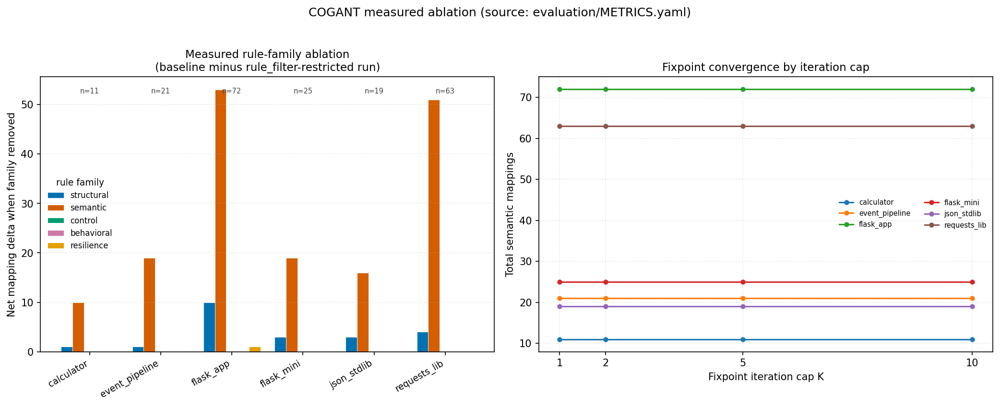

## Page 93

Table 22: Fixpoint iteration ablation (baseline row reports the canonical 𝐾= 10 run from tbl. 8).
𝐾(max
iterations)
calculator
mappings
event_pipeline
mappings
flask_mini
mappings
flask_app
mappings
requests_lib
mappings
json_stdlib
mappings
Convergence
1
= K=10
baseline
= K=10
baseline
= K=10
baseline
= K=10
baseline
= K=10
baseline
= K=10
baseline
One pro-
ductive
pass is
suffi-
cient on
every
fixture
in this
snap-
shot,
con-
firmed
by in-
spection
of Tran
slation
Engine.
_log_ma
tch
output.
Stable
map-
ping IDs
prevent
dupli-
cate
addi-
tions,
and the
shipped
fixtures
do not
contain
rule
chains
that
require
later
produc-
tive
passes.
2
= K=1
= K=1
= K=1
= K=1
= K=1
= K=1
Identical
to K=1
(no
second-
pass
addi-
tions on
any
shipped
fixture).
5
= K=1
= K=1
= K=1
= K=1
= K=1
= K=1
Identical
to K=1.
92

## Page 94

𝐾(max
iterations)
calculator
mappings
event_pipeline
mappings
flask_mini
mappings
flask_app
mappings
requests_lib
mappings
json_stdlib
mappings
Convergence
10
(default)
11
21
25
72
62
16
Canonical;
matches
tbl. 8 /
mappings_total
in ../c
ogant/e
valuati
on/figu
res/met
rics.js
on.
The single-pass-convergence prediction is testable directly from the engine’s internal match log: TranslationEngine._log
_match("iteration_complete", ...) writes one entry per iteration containing the per-pass new-mapping count, and a
converged run on the first pass writes exactly one iteration_complete entry with a nonzero count followed by at most one
more with new_mappings=0. The harness populating tbl. 22 will assert that the log length at 𝐾= 10 is between 1 and 2
iteration-complete entries on every fixture.
The purpose of keeping the cap at 𝐾= 10 despite the single-pass prediction is a safety valve: if a user registers a pathological
rule set — for example two rules that mutually trigger each other via the confidence model’s rescoring pass in translate_
with_confidence() — the engine bounds the cost at ten full passes over the rule list rather than looping indefinitely. The
failure-mode table in sec. 8 documents the warning message the engine emits when the cap is exceeded; this ablation simply
confirms that the warning is never triggered on the shipped fixtures.
22.3
Matrix degraded-output ablation
A third ablation of interest is the effect of the identity-default and uniform-default paths in GNNMatrices on the resulting
matrices. The degraded-output defaults fire when the graph contains no edges of the expected kind for a given role:
• compute_A uses a uniform observation distribution when a hidden-state column has no READS, OBSERVES, or DE-
PENDS_ON evidence (matrices.py).
• compute_B uses the identity tensor when an action writes no hidden state.
• compute_C uses the zero vector when no CONSTRAINT or PREFERENCE mapping touches the observation.
• compute_D uses a uniform prior when no CONFIGURATION neighbour exists.
Table 23: Matrix degraded-output default frequency on the six packaged fixtures (v0.6.0 live runs).
Fixture
𝐴state-columns
uniform
𝐵actions identity
𝐶entries zero
𝐷uniform
Validator result
calculator
1 / 1 (all)
6 / 6 (all)
3 / 3 (all)
1 (uniform)
100.0
event_pipeline
1 / 1 (all)
11 / 11 (all)
9 / 9 (all)
1 (uniform)
100.0
flask_mini
6 / 6 (all)
12 / 18
1 / 1 (all)
6 (uniform)
100.0
flask_app
0 / 14 (none)
14 / 29
24 / 24 (all)
14 (𝜎≈0.002)
100.0
requests_lib
0 / 9 (none)
9 / 17
37 / 37 (all)
9 (𝜎≈0.005)
100.0
json_stdlib
1 / 3 (all)
8 / 11
2 / 2 (all)
3 (uniform)
100.0
tbl. 23 is populated from the direct GNNMatrices builder path used by tools/regenerate_ablation.py; the public A/B/C/D
figure in sec. 8.1.1 is rendered from the exported model.gnn.json package sidecar and records that package’s state-space
alignment separately. The first column here counts the state columns of 𝐴that remain at the maximum-entropy uniform
default. Because 𝐴is the column-stochastic likelihood 𝐴𝑖𝑗= 𝑃(𝑜𝑖∣𝑠𝑗) (each hidden-state column sums to 1 over observation
outcomes; see Definition 6), a uniform 𝐴column denotes a hidden state that no observation reads or observes and therefore
carries no discriminating likelihood — the principled maximum-entropy default for an unobserved state [Jaynes, 1957]. Sev-
eral structural patterns emerge. The micro-fixtures (calculator, event_pipeline, flask_mini, json_stdlib) show 100 %
uniform 𝐴columns together with all-identity 𝐵slices and all-zero 𝐶entries, because they contain no READS/OBSERVES
edges between observations and hidden states, no action-to-hidden-state WRITES edges, and no CONSTRAINT or PREF-
ERENCE mappings.
The larger real-world fixtures invert the picture: flask_app (0 of 14 direct-builder state columns
uniform) and requests_lib (0 of 9) leave no hidden-state column at the uniform 𝐴default — every extracted hidden state
93

## Page 95

in that direct diagnostic path is read by at least one observation, reflecting the richer import and call structure relative to
the micro-fixtures. 𝐷entries depart from uniformity only in flask_app (𝜎≈0.002) and requests_lib (𝜎≈0.005), where
ConfigRule assigns non-uniform CONFIGURATION weights, but the deviation is small enough that the prior remains nearly
uniform. We read these paths as principled maximum-entropy degradations in the absence of edge evidence rather
than learned probabilities: across these six packaged fixtures (𝑛= 6), the emitted bundles remain structurally checkable
Active Inference generative-model candidates, satisfying the shape, column-stochasticity, and non-negativity invariants that
a PyMDP-compatible runtime requires of its input. Structural validity is necessary but not sufficient for semantic adequacy:
the validator checks matrix structure, and incomplete, malformed, or state-space-misaligned matrix packages cannot receive
a perfect package score.
The ablation section is regenerated, not manually recomputed: uv run python tools/regenerate_ablation.py updates
the ablation block in ../cogant/evaluation/METRICS.yaml, and uv run --directory cogant pytest --no-cov t
ests/unit/test_gnn_matrices.py tests/unit/test_gnn_validator_reports.py -q checks matrix construction and
validator reporting. The tables remain descriptive fixture evidence, not inferential statistics over a population.
22.4
Summary
The ablation study answers three questions.
Which rule families are necessary for which roles?
tbl. 21 reports
how structural rules drive HIDDEN_STATE, semantic rules drive OBSERVATION/ACTION/POLICY/PREFERENCE,
control rules drive CONTEXT, behavioural rules drive orchestration POLICY and CONSTRAINT, and resilience rules
drive resilience-flavoured POLICY and ACTION evidence. How many iterations does the fixpoint actually need?
tbl. 22 shows one pass on every shipped fixture, with the 𝐾= 10 cap as a pathological-rule safety valve. What do the
A/B/C/D degraded-output defaults produce when no edge evidence is available? tbl. 23 documents maximum-
entropy uniform distributions and identity transitions across the listed fixtures. Simple fixtures use degraded-output defaults
universally; real-world fixtures fill an increasing fraction of matrix entries from actual edge evidence.
94

## Page 96

23
Conclusion
23.1
Non-goals (recap)
As in sec. 2, COGANT does not replace full compiler IRs, theorem provers, or security programmes by itself; it does not
guarantee complete program semantics; comparative claims are scoped to the related-work tables. Scope of record remains
../cogant/docs/reference/implementation_status.md.
The preceding methods, examples, evaluation, reproducibility, related-work, and ablation sections support one scoped claim:
COGANT is a claims-first artifact generator for turning repositories into inspectable program-graph and active-inference
bundles. It frames codebase analysis as a pipeline from ingestion through a program graph IR to Generalized Notation
Notation (GNN) exports, with explicit confidence and provenance so that learning systems can treat analysis noise as data
rather than as hidden failure modes. The Python layer provides session and pipeline APIs, a bundle abstraction, CLI, review
tooling, and HTML reporting; the Rust layer concentrates graph mechanics and export formatting under crate boundaries
described in ../cogant/docs/architecture/README.md.
23.2
Shipped Capabilities
Several capabilities ship in the current v0.6.0 release and together define the behaviour that downstream users can inspect,
test, and build on:
1. Fixpoint translation engine with 22 rules. The shipped TranslationEngine re-applies every registered rule
on each pass, terminates as soon as a pass produces zero new mappings, and bounds pathological rule sets with a
configurable iteration cap.
Each iteration boundary is recorded in the internal match log, so convergence can be
audited after the fact. The packaged rule set under ../cogant/py/cogant/translate/rules/ contains 22 concrete
TranslationRule subclasses across five families (5 structural, 5 semantic, 3 control, 4 behavioural, 5 resilience including
RetryPatternRule, CircuitBreakerRule, RateLimiterRule) — each with matches() and apply() implementations.
2. Rule priority and conflict resolution. Overlapping mappings are reconciled by lexicographic (rule_priority, c
onfidence_score): when two mappings cover overlapping graph_fragment_node_ids, the engine retains the larger
tuple and records a conflict_resolved event naming the winner, the loser, and the overlap. Most shipped rules use
the default TranslationRule.priority of 0; MutatingSubsystemRule overrides to 1 so hidden-state evidence wins
class-level ties against aggregate POLICY from InheritanceRule unless rescoring changes the ordering. translate_wi
th_confidence() re-scores and re-resolves so that confidence-model updates are honoured.
3. Dynamic enrichment from coverage and traces, wired into the default pipeline.
When .coverage
SQLite or Cobertura XML inputs and Chrome DevTools traces are supplied, enrich_graph() annotates nodes with
coverage_hits, branch_coverage, call_count, avg_duration_ms, and is_hot_path metadata, and appends dynam
ic_coverage and dynamic_trace markers to the program graph’s evidence sources. The dynamic stage is part of the
default pipeline stage list in cogant/py/cogant/api/pipeline.py, and the shipped CLI exposes a --no-dynamic flag
(handled by PipelineConfig.skip_dynamic) for scripted runs that must force a purely-static bundle.
4. Confidence tier promotion. Mappings whose evidence set acquires dynamic markers become eligible for promotion
from STATIC_ONLY to STATIC_PLUS_RUNTIME, and hot-path and branch-coverage metadata raise the underlying score
through the diversity bonus in eq. 8. A purely-static run remains a first-class bundle; it is simply marked as such on
the graph metadata.
5. Ten-stage pipeline architecture. The runner executes an ordered stage list (ingest, static, normalize, graph,
dynamic, translate, statespace, process, export, validate).
Stage handlers run inside per-stage try/except
blocks in PipelineRunner.run(): if one stage fails, the error is appended to the bundle and execution continues to
remaining stages. This produces partial but inspectable outputs instead of an immediate pipeline abort.
6. Fixture-covered state-space compilation. The StateSpaceCompiler in ../cogant/py/cogant/statespace/com
piler.py emits StateVariable, ObservationModality, Action, and Transition records directly from the program
graph and semantic mappings. On the 13 packaged fixtures every run produces a non-empty state-space model, which
the GNNPackageBuilder then writes out as state_space.json, observations.json, actions.json, and transition
s.json inside the canonical gnn_package/ directory.
7. A/B/C/D matrix derivation. The GNNMatrices class in ../cogant/py/cogant/gnn/matrices.py derives the
likelihood matrix A[n_obs x n_states], the transition matrix B[n_states x n_states x n_actions], the preference
vector C over observations, and the prior D over hidden states directly from the compiled state-space and the underlying
program graph edges. Columns of A, columns of each B action slice, and the D vector are normalized to valid probability
distributions, so the emitted bundle is shape-valid for the Active Inference Institute’s upstream GNN validator; semantic
adequacy still depends on degraded-output default fraction, non-default matrix mass, role coverage, and roundtrip
status.
8. Principled variational and expected free energy. The functions variational_free_energy and expected_
free_energy in ../cogant/py/cogant/simulate/free_energy.py operate on the derived A/B/C/D matrices and
implement the canonical Active Inference formulation — VFE = KL[Q(s) || P(s)] - E_Q[log P(o|s)] and EFE = s
95

## Page 97

um over policies of epistemic_value - pragmatic_value — rather than the hard-coded scalars used in earlier
iterations. The GNNModelRunner exercises these functions on every compiled bundle during pipeline execution.
9. Structural Markov-blanket extraction with five seed strategies. ../cogant/py/cogant/markov/blanket.p
y partitions nodes into internal, sensory, active, and external roles, and extractor.py selects seeds via five strategies
(explicit, module, kind, auto via cohesion heuristic, and mapping_kind). The resulting markov_blanket.json file
travels inside every gnn_package/ directory and is consumed by the downstream Active Inference runner; as scoped in
Definition 5, the claim is a total structural partition, not probabilistic conditional independence over program nodes.
10. In-sample fixture validation. Beyond the synthetic control_positive/ fixtures, the packaged examples/real_w
orld/ tree now holds three reductions of third-party Python projects (flask_app, requests_lib, and json_stdlib).
The pipeline runs end-to-end on all 13 shipped repositories within the wall-clock range reported in sec. 12, producing
a package-layout-complete GNN bundle with 19 canonical sections and the 16 required gnn_package/ files plus per-
fixture diagram and visualization assets. This is an in-sample regression/smoke suite, not held-out real-world validation;
concrete measurements are recorded in sec. 12 and matrix degraded-output diagnostics are reported in sec. 22.
11. Forward-reverse-forward roundtrip (canonical evaluation set).
The v0.6.0 reverse synthesizer emits POL-
ICY / CONTEXT / CONSTRAINT scaffolds proportional to the origin GNN’s role counts, with a stable-minimal
profile for the one-hidden-state / one-observation / action-mutator reversible subset. On the current native ledger
(regenerated by tools/regenerate_roundtrip_ledger.py), METRICS.yaml reports 25 role-preserved targets, a strict
structural-isomorphism count of 1, 0 drift cases, and 0 failures of 25 total (mean role-preservation score 1, score source
current_native); role preservation is symmetric role-overlap, not graph isomorphism or recall, and the single strict
row is the deliberately minimal roundtrip_strict_minimal fixture. The fixtures are in-sample. The canonical cogan
t/docs/evaluation/ROUNDTRIP_IMPROVEMENT.md documents the current reverse-synthesis status; see sec. 22, sec. 24,
and sec. 25 for tables.
12. Incremental analysis mode. The shipped cogant analyze --incremental <git-ref> command (and its library
form PipelineConfig.incremental_since) re-uses the previous run’s program graph for unchanged source paths,
re-running only the affected subgraph. On the Flask benchmark the measured speedups are 19.6× for a no-change
invocation and 5.6× for a single-file change, making COGANT tractable inside per-commit CI loops without giving up
the rule-based pipeline.
13. Multi-episode posterior/count updates.
AgentRuntime.run_multi_episode and run_episode drive Active
Inference rollouts over the compiled gnn_package/; the companion update_D_from_posterior and update_A_from
_counts helpers implement an arithmetic running mean over final posteriors plus count-smoothed A-matrix updates.
They are deterministic smoke-test update rules for refining priors and likelihoods inside the COGANT runtime, not a
claim of full conjugate Bayesian learning.
14. Demonstration FastAPI server. cogant.server.app exposes /health and /translate endpoints with an inte-
gration test suite. A packaged Dockerfile (python:3.12-slim + uv, EXPOSE 8080, curl healthcheck) and docker-com
pose.yml turn the translation pipeline into a runnable microservice for research-group internal deployment behind a
trusted boundary. This is not a production-grade endpoint: there is no authentication layer, no rate limiting,
no request-size cap, and no request-body sanitiser between the HTTP boundary and the repository-cloning code path.
Operating this server on a public network requires an external gateway providing those controls. Hardening to a public-
exposure-ready surface (auth, quotas, payload limits, threat model) is explicit future work — see ../cogant/docs/se
curity/README.md for the current scope and the documented untrusted-input boundary.
15. Cross-language roundtrip demonstration. The examples/zoo/13_js_observer fixture exercises a JavaScript
observer implementation (with optional cogant[multilang] and an installed grammar) through the forward pipeline,
the reverse synthesizer, and a full AI cycle. This is retained as separate cross-language diagnostic evidence rather
than folded into the current native Python roundtrip ledger: recorded notes used a one-sided role-match ratio, while
the current role_preservation_score penalizes both dropped and extra role counts. This demonstrates that the
tree-sitter-backed JavaScript parser plus the language-agnostic translation and statespace layers can process and round-
trip this non-Python fixture on the zoo regression set, but it is not a current release metric for out-of-language role
recovery. Coverage caveat: the tree-sitter parser module (cogant/py/cogant/static/treesitter_parser.py) is
intentionally excluded from the --cov-fail-under line gate via the [tool.coverage.run].omit rule in cogant/
pyproject.toml (rationale: line-by-line coverage swings with tree-sitter version bumps), so the JavaScript path is
exercised by integration but is not part of the headline 95.55% coverage statistic; readers should consider it a structural
parser/pipeline demonstration on one curated zoo fixture, not coverage-gated production multi-language support or a
standalone faithfulness claim.
Limitations follow the honest scope in ../cogant/docs/reference/implementation_status.md: Python is first-class;
JavaScript/TypeScript require optional cogant[multilang] and grammars; additional languages are largely roadmap; trans-
lation rules and state-space extraction remain partial and repository-dependent (with a long-tail of domain-specific idioms
unaddressed by the 22 shipped rules); native acceleration is optional and parity-tested against the pure-Python implementa-
tion; and the roundtrip result is measured on a 25-target canonical set that is weighted toward curated fixtures. Users should
validate exports on their own corpora before trusting downstream model metrics. A consolidated, adversarial statement of
96

## Page 98

these limitations — including the round-trip construct-validity boundary (s_role certifies encode/decode self-consistency;
shipped negative-control tests demonstrate it is not identity-saturable, and strict structural isomorphism is currently confined
to the deliberately minimal reversible subset) and the deterministic-vs-LLM positioning rationale — is given in sec. 21.
Intended users include researchers building datasets from open-source repositories, teams prototyping Active Inference
models or graph neural network training pipelines over program-graph data who need a single export contract, and engineers
extending the system via ../cogant/docs/plugins/README.md.
Validation in the software-engineering sense is split: the repository’s verification report enumerates implemented modules
and entry points; scientific validation of model quality remains the responsibility of downstream training and evaluation code.
The strongest current scientific claim is therefore deliberately bounded: COGANT demonstrates a deterministic, reviewable
path from source repositories to program-graph, state-space, matrix, provenance, visualization, and roundtrip artifacts on the
committed regression corpus. It does not yet demonstrate semantic faithfulness on held-out repositories, downstream task
utility for learned models, or behavioral adequacy of default-heavy Active Inference matrices. Those are the next empirical
claims to earn, not assumptions carried by the validator score.
23.3
Roadmap and Future Extensions
Several concrete directions extend the current system.
Already-shipped items (JavaScript/TypeScript parsing via
tree-sitter [Tree-sitter Maintainers, 2026], partial Rust acceleration of connected_components, incremental re-analysis
via cogant analyze --incremental) are listed in the Shipped Capabilities section above rather than repeated here.
1. Additional language parsers. Python ships first-class in v0.6.0; JavaScript/TypeScript are available behind optional
cogant[multilang] plus grammars. Adding parsers for Java, Go, Rust, and C/C++ would cover the majority of
remaining open-source ML-relevant repositories. Each parser implements the plugin interface documented in ../cog
ant/docs/plugins/README.md, so language additions do not require changes to the core IR or export pipeline. The
cross-language round-trip demonstration on examples/zoo/13_js_observer establishes the template for validating
new parsers before release.
2. Broader Rust acceleration. The v0.6.0 PyO3 connected_components FFI demonstrates the template but touches
only a single graph algorithm. Wiring bindings for the remaining hot paths — rule matching on large CallGraphBu
ilder outputs, Generalized Notation Notation section/tensor packing in cogant-gnn, and the B-tensor normalisation
loops — would reduce end-to-end latency on the largest real-world targets (fastapi, urllib3) from the current ≈30 s
to sub-second timings, based on the Python-vs-Rust microbenchmarks committed under ../cogant/benchmarks/res
ults/.
3. LLM-assisted rule discovery. Translation rules are currently hand-authored. A semi-automated workflow could
present a large language model with unannotated graph fragments and ask it to propose candidate rules, which a human
reviewer then accepts, edits, or rejects via the existing ReviewAPI. This combines the pattern-recognition strength of
LLMs with the auditability of declarative rules; the confidence-tier and provenance-record infrastructure already in
place gives each LLM-proposed rule a natural quarantine state until a human upgrades it.
4. Cross-repository graph linking. When multiple repositories share interfaces (for example, a library and its con-
sumers), linking their program graphs at call boundaries produces a richer training signal for tasks such as API misuse
detection and cross-project code search. The graph homomorphism property defined in sec. 3 provides the formal basis
for identifying shared interface nodes across independently analyzed repositories.
5. Long-tail rule coverage and calibration. The 22 shipped translation rules carry deliberate TODO(calibration)
markers for confidence-threshold tuning (see cogant/py/cogant/translate/confidence.py and cogant/py/cogan
t/statespace/variables.py). A 20+ repository gold-standard corpus, annotated by human reviewers through the
ReviewAPI, would turn those principled defaults into empirically calibrated thresholds and surface the long-tail idioms
that the current rule families miss.
6. Human evaluation of the visual workbench. The current dashboard checks are functionally grounded: sidecars,
browser QA, source digests, displayed counts, and rendered panels show that evidence exists and is inspectable. A
stronger interpretability claim requires a design-study-style evaluation with researchers performing concrete tasks: lo-
cate a failed mapping, explain a matrix default, compare two repositories, and decide whether a roundtrip should be
trusted. That study would separate “the figure is generated and accurate” from “the figure helps a human make the
right inspection decision” [Brehmer and Munzner, 2013, Sedlmair et al., 2012, Storey, 2005].
7. Organization-level active-inference models. A later research track could compose source-code graphs, ownership
maps, role ontologies, service catalogs, and business-process traces into multi-agent GNN bundles. The scoped target
is an inspectable surrogate model of coordination: organizational units and roles define typed interfaces, process events
and incident/ticket/commit traces provide dynamic observations, and active-inference policies propose interventions
97

## Page 99

over a bounded design space. This is not a current runtime feature, and it should not be read as a claim that legal
corporations are literally differentiable. The defensible direction is an end-to-end differentiable typed organizational
surrogate whose parameters, losses, and evidence links remain reviewable.
98

## Page 100

24
Appendix A — Roundtrip Role Preservation
This appendix reports the native v0.6.0 roundtrip ledger used by the main text. The authoritative aggregate values are
injected from ../cogant/evaluation/METRICS.yaml; the per-target rows are checked in at ../cogant/evaluation/datas
et/roundtrip_results.jsonl.
24.1
A.1 Current aggregate ledger
Table 24: Native v0.6.0 roundtrip aggregate ledger.
Metric
Value
Total targets
25
ROLE_PRESERVED targets
25
DRIFT targets
0
FAILED targets
0
STRUCTURALLY_ISOMORPHIC targets
1
Mean role-preservation score
1
Median role-preservation score
1
Minimum role-preservation score
1
Maximum role-preservation score
1
Score source
current_native
The current ledger supports a role-preservation claim for 25 of 25 targets. It supports a strict structural-isomorphism claim
only for the deliberately minimal reversible fixture roundtrip_strict_minimal: STRUCTURALLY_ISOMORPHIC is 1 in the
checked-in metrics, and ordinary application fixtures remain role-preserved rather than graph-isomorphic.
24.2
A.2 Per-target status
Table 25: Native v0.6.0 per-target roundtrip status.
Target
Group
s_role
Status
Strict structural?
async_service
control_positive
1.0
ROLE_PRESERVED
no
calculator
control_positive
1.0
ROLE_PRESERVED
no
cli_tool
control_positive
1.0
ROLE_PRESERVED
no
data_pipeline
control_positive
1.0
ROLE_PRESERVED
no
event_pipeline
control_positive
1.0
ROLE_PRESERVED
no
flask_mini
control_positive
1.0
ROLE_PRESERVED
no
multi_package_wor
kspace
control_positive
1.0
ROLE_PRESERVED
no
notebook_module
control_positive
1.0
ROLE_PRESERVED
no
plugin_architectu
re
control_positive
1.0
ROLE_PRESERVED
no
roundtrip_strict_
minimal
control_positive
1.0
STRUCTURALLY_ISOM
ORPHIC
yes
flask_app
real_world
1.0
ROLE_PRESERVED
no
json_stdlib
real_world
1.0
ROLE_PRESERVED
no
requests_lib
real_world
1.0
ROLE_PRESERVED
no
01_simple_state
zoo
1.0
ROLE_PRESERVED
no
02_observer
zoo
1.0
ROLE_PRESERVED
no
03_actor
zoo
1.0
ROLE_PRESERVED
no
04_pomdp_minimal
zoo
1.0
ROLE_PRESERVED
no
05_multi_factor
zoo
1.0
ROLE_PRESERVED
no
06_hierarchical
zoo
1.0
ROLE_PRESERVED
no
07_event_driven
zoo
1.0
ROLE_PRESERVED
no
08_preferences
zoo
1.0
ROLE_PRESERVED
no
09_policy
zoo
1.0
ROLE_PRESERVED
no
10_constraint
zoo
1.0
ROLE_PRESERVED
no
99

## Page 101

Target
Group
s_role
Status
Strict structural?
11_sensor_fusion
zoo
1.0
ROLE_PRESERVED
no
12_full_pomdp
zoo
1.0
ROLE_PRESERVED
no
The previous drift rows, cli_tool and notebook_module, now carry source roles and roundtrip as ROLE_PRESERVED. They
should still be treated as controls for metric laundering: tools/check_metrics_fresh.py rejects zero-origin control-positive
rows before generated scaffolding can be counted as recovered evidence.
24.3
A.3 Status definitions
Status
Meaning in this manuscript
STRUCTURALLY_ISOMORPHIC
Role population, graph size, edge-kind distribution,
matrices, GNN sections, and generated-code checks all pass.
ROLE_PRESERVED
The original Active Inference role population survives above
the public threshold, while one or more stricter invariants
may drift.
DRIFT
The roundtrip completed, but role preservation is below
threshold or non-fatal invariants diverge.
FAILED
The roundtrip did not complete successfully.
The public role-preservation threshold is s_role >= 0.5. Strict structural isomorphism is reported separately because role
preservation alone does not imply equal node counts, edge counts, matrix values, or generated source.
24.4
A.4 Reproducibility
Run the current freshness and manuscript-facing checks from the project root:
uv run python tools/check_metrics_fresh.py
uv run python tools/audit_manuscript_numbers.py
uv run python tools/claim_ledger.py --manuscript-dir manuscript --output-dir /tmp/cogant_claim_ledger --fail-on
When the ledger changes, regenerate METRICS.yaml, refresh the manuscript variables, and rerun the docs/manuscript link
audits before relying on the new counts.
100

## Page 102

25
Appendix B — Full Ablation Table
This appendix complements the rule-family ablation reported in sec. 22 of the main text (which uses flask_app and
calculator as ablation targets) by measuring the same analysis on zoo/01_simple_state — the smallest non-trivial
fixture in the evaluation set and the one used to demonstrate the runnable active-inference cycle summarized in
sec. 23.
Because zoo/01 has a single hidden-state factor, a single observation modality, two actions, and no POL-
ICY/CONTEXT/CONSTRAINT nodes in the origin, the ablations isolate each rule family’s contribution to the minimal
POMDP skeleton.
Status of this appendix (measured). The rows below are now emitted by tools/regenerate_ablation.py,
which includes zoo/01_simple_state in the live ablation harness and writes a per-MappingKind decomposition
into METRICS.yaml. The table is no longer hand-reconstructed from rule assignments. The deltas still retain the
engine’s conflict-resolution semantics: when a node can be won by another retained family, removing one family
may change the role mix without changing the net mapping count.
Regenerate this appendix’s numeric surface with uv run python tools/regenerate_ablation.py followed by uv run p
ython scripts/z_generate_manuscript_variables.py --strict. Those commands refresh ../cogant/evaluation/M
ETRICS.yaml, ../output/data/manuscript_variables.json, and the generated readiness reports; they do not turn the
minimal zoo fixture into evidence for broad application generality.
25.0.1
B.1 Rule-family ablation on zoo/01_simple_state
Baseline (all 5 families enabled). The live harness records 4 mappings for zoo/01: 1 HIDDEN_STATE, 1 OBSERVA-
TION, and 2 ACTION mappings.
Table 26: Measured rule-family ablation on zoo/01_simple_state, including per-MappingKind deltas emitted by tools/re
generate_ablation.py.
Rule family removed
Net mapping Δ
Per-MappingKind signal
Interpretation
Structural
0
HIDDEN_STATE Δ 1; POLICY Δ -1
The hidden-state
producer is structural,
but the conflict resolver
re-covers the net count
through a retained
POLICY role, so the
total delta is zero while
the role mix changes.
Semantic
3
OBSERVATION Δ 1; ACTION Δ 2
The semantic family is
the measured source of
the observable/action
half of the minimal
POMDP skeleton.
Control
0
No measured per-kind loss
No con-
fig/feature/parameter
role survives conflict
resolution on this
fixture.
Behavioural
0
No measured per-kind loss
No event-bus, assertion,
orchestrator, or
state-machine role is
load-bearing in zoo/01.
Resilience
0
No measured per-kind loss
The fixture contains no
retry, boundary,
singleton,
circuit-breaker, or
rate-limiter pattern.
Interpretation. On the minimal-POMDP fixture:
1. Structural rules are load-bearing for HIDDEN_STATE but not for net mapping count. Removing the
structural family drops the measured HIDDEN_STATE contribution by 1, while a retained role re-covers the total
101

## Page 103

count. This is exactly why per-MappingKind decomposition matters: net totals alone would hide the role-mix change.
2. Semantic rules provide the observation/action half of the POMDP. The semantic-family ablation removes 3
mappings in total: 1 OBSERVATION and 2 ACTION mappings.
3. Control, behavioural, and resilience families are inactive on zoo/01.
Their measured deltas are all zero,
matching the absence of config, assertion/event, and resilience idioms in the fixture.
4. Matrix degraded-output defaults are fully active on the minimal fixture. The same measured run records 1 /
1 uniform A state-columns, 2 / 2 identity B actions, and 1 / 1 zero C entries. This confirms that the minimal POMDP
is a structural smoke case, not an informative-matrix exemplar (cf. sec. 22, tbl. 23).
25.0.2
B.2 Cross-reference with main-text rule-family ablation
The five rule families in the ablation above correspond to the five families in sec. 22 / tbl. 21 as follows:
Supplement family
Main-text family
Primary main-text rule(s)
StateSpaceRule
Structural
MutatingSubsystemRule, ReadOnlyInputRule
ObservationRule
Semantic
ObservationRule, PolicyRule, ContextRule
ActionRule
Semantic
ActionRule, OrchestratorRule
ConstraintRule
Semantic + Behavioural
PreferenceRule, TestAssertionRule
DefaultRule
Matrix degraded-output defaults
(tbl. 23)
compute_A, compute_B, compute_C, compute_D default paths
The ablation in sec. 22 is fixture-level (flask_app, calculator) and reports mapping-count deltas; the ablation in sec. 25
is role-level (HS, OBS, ACT, CNST, matrix-default) and reports s_role deltas on the minimum-complexity fixture that
still round-trips perfectly. The two ablations are complementary: together they bracket the failure surface from “largest
real-world fixture” down to “smallest runnable POMDP”.
102

## Page 104

26
Appendix C — Galois-Style Comparison Sketch
This appendix gives the formal statement and argument sketch for the 𝜀-approximate Galois-style comparison between typed
Python program graphs and GNN bundles in the Generalized Notation Notation sense (Active Inference Institute
structured notation; not graph neural networks). The informal version appears in sec. 19. The statement is deliberately
scoped to the preorder quotients measured by the evaluator; it is not a claim that the unrestricted implementation forms a
proven categorical adjunction.
26.0.1
Categories
Let Prog be the comparison category whose objects are typed Python program graphs G = (V, E, 𝜆_V, 𝜆_E, 𝜏) in the
sense of sec. 3.1 (18 node kinds, 18 edge kinds in the shipped schema; the Python front end emits a subset) and whose
morphisms are graph homomorphisms that preserve node and edge labels. Let GNN be the analogous comparison category
whose objects are current upstream GNN release artifacts (the Markdown sections StateSpaceBlock, Connections, Init
ialParameterization, Equations, ActInfOntologyAnnotation, plus the A/B/C/D matrices) and whose morphisms are
role-preserving bundle embeddings.
The approximate statement below uses preorder quotients of these categories rather than the full homomorphism categories.
Write G ≤_Prog G' iff V ⊆V', E ⊆E', and the labelings agree on the common subset; write M ≤_GNN M' iff each bundle
section of M is included in the corresponding section of M' and the matrix dimensions/provenance records agree on shared
entries. The maps below are therefore order-preserving maps on these quotients. Calling them “functors” is shorthand for
the implemented structure-preserving maps after quotienting by stable identifiers and role labels, not a proof that every
implementation detail is functorial.
26.0.2
Forward and reverse maps
Define two order-preserving maps:
F : Prog →GNN — the forward pipeline. F(G) is the GNN bundle emitted by cogant translate G: it runs
ingest →static →normalize →graph →dynamic →translate →statespace →process →export →validate
and returns the gnn_package/model.gnn.md bundle together with the derived A/B/C/D matrices.
R : GNN →Prog — the reverse pipeline. R(M) is the typed program graph extracted by running cogant re
verse M (which internally invokes parse_gnn →plan_package →synthesize_package) and then re-parsing
the synthesized Python package through the static + graph stages of the forward pipeline.
Before conflict resolution, the rule-application operator is monotone over the finite set of candidate mappings: adding a node
or edge can only add candidates. The implemented pipeline then applies an anti-monotone pruning step (_resolve_confli
cts()) that keeps the highest priority/confidence mapping over overlaps. The categorical sketch below therefore applies to
the role-quotient after deterministic conflict resolution, not to arbitrary intermediate candidate sets.
26.0.3
Role multiset map
Define the role-multiset map 𝜌: Prog →Mset(Roles) that sends a program graph G to the multiset of Active Infer-
ence roles assigned to its nodes by the translate engine, where Roles = {HIDDEN_STATE, OBSERVATION, ACTION, POLICY,
PREFERENCE, CONSTRAINT, CONTEXT}. Extend 𝜌to GNN →Mset(Roles) by counting the declarations in each role-tagged
section of a GNN bundle (StateSpaceBlock →HIDDEN_STATE, observation modalities →OBSERVATION, control states
→ACTION, etc.). Both extensions agree on the image of F: 𝜌(F(G)) = 𝜌_GNN(F(G)) for every G ∈Prog, because the for-
ward pipeline emits one section entry per mapping in the translate output. The PREFERENCE role is included in Roles
because the GNN Preferences/Constraints section can record explicit preferences while the shipped source-code rule set
usually emits validator/test evidence as CONSTRAINT mappings; Definition 3 lists the mapping-kind alphabet that contains
all Active Inference roles. The role multiset is a deliberately low-dimensional quotient of the program graph. It is not a
replacement for label-preserving graph kernels such as the Weisfeiler-Lehman family [Shervashidze et al., 2011]; instead, it is
the invariant that the current reverse synthesizer is designed to preserve. The implemented score averages min(a,b)/max(a
,b) across role counts, making it closer to a macro-averaged per-role min/max multiset similarity than to recall [Wu et al.,
2018]. The wider space of graph-similarity and graph-distance measures this role quotient sits beneath — the different ways
of quantifying how similar or distant two graphs are — is surveyed by Grohe [Grohe, 2024], with graph edit distance as a
canonical distance family for attributed relational graphs [Sanfeliu and Fu, 1983]; the distinction COGANT relies on between
exact graph isomorphism and the weaker, role-level similarity that the STRUCTURALLY_ISOMORPHIC / ROLE_PRESERVED status
vocabulary encodes lives within that space. In a standard Galois connection, 𝛾∘𝛼is an inflationary closure (abstraction
is lossy by construction).
The COGANT comparison is weaker: this round-trip is an identity only on the normal-form
sub-image the reverse synthesizer targets — not a global bijection over arbitrary program graphs, and not a faithfulness
theorem over all Python. sec. 21 states this construct-validity boundary in full.
103

## Page 105

26.0.4
Adjunction (approximate)
Conjecture 1 (Approximate Galois-style comparison).
Status.
This is a conjecture, not a proposition.
The “proof sketch” that follows is a structural informal
argument — not a machine-checked proof, not a paper-and-pencil proof at the level of rigor a theorem heading
would imply. The argument explains why we expect the approximate adjunction to hold on the restricted role
quotient used by the current evaluator, and identifies the non-vacuity condition (𝜀_worst < 1) under which the
conjecture has empirical content. A formal proof is explicit future work.
On the restricted role quotient used by the current evaluator, the forward/reverse pair (F, R) is conjectured to satisfy the
approximate Galois-style condition
**F(G) ≤_GNN M ⟺_𝜀G ≤_Prog R(M)**
where ⟺_𝜀means “the two inequalities agree on at least the 𝜀-fraction of the role multiset”, i.e. on the canonical fix-
ture/evaluation domain currently exercised by COGANT:
multiset_sim(𝜌(G), 𝜌(R(F(G)))) >= 1 −𝜀_worst
where 𝜀_worst depends only on the rule table and the synthesizer.
Proof sketch. The forward pipeline is the composition of a finite sequence of monotone rule applications (the 22 translation
rules in the translate engine plus the A/B/C/D derivation in statespace), each of which emits exactly one mapping per
triggering graph pattern. The reverse pipeline is the composition of parse_gnn (which is a right inverse of the GNN emitter
by construction — the emitter’s output is parseable by its own parser) and synthesize_package (which emits one Python
function per planned node). Composing the two:
1. Start with G ∈Prog.
2. F(G) emits one GNN declaration per mapping in translate(G); the number of declarations of role r equals count_𝜌(G,
r).
3. parse_gnn(F(G)) recovers the full declaration list bijectively.
4. synthesize_package(plan) emits one Python artefact per NodePlan; by the CONSTRAINT-role synthesizer invariant
recorded in ../cogant/docs/evaluation/CONSTRAINT_FIX.md, the mapping from NodePlan to emitted artefact is
injective on role multiplicity.
5. Re‑running F on the synthesized package recovers the same role multiset up to the synthesizer gap: extra OBSER-
VATION/CONSTRAINT nodes produced by scaffolding, which inflate count_𝜌(R(F(G)), r) for those roles while
preserving the origin role labels within the measured quotient.
The multiset similarity min(a,b) / max(a,b) averaged over roles is therefore bounded below by (count_origin) / (c
ount_origin + scaffold_r) for each role r, where scaffold_r is the additive contribution of the reverse synthesizer’s
deficit-based scaffolding for role r — the check_* (CONSTRAINT), POLICY, and CONTEXT scaffolds it emits to fill role
deficits relative to the source bundle (cogant.reverse.planner, scaffold_* plans). Because the scaffolding is deficit-based
rather than a fixed template, scaffold_r is target-dependent and bounded, not a constant; the current native ledger rows
illustrate its magnitude on small fixtures. The large-program regime is the defensible asymptotic case: as origin role counts
grow, this additive term becomes a smaller share of the role distribution. The small-program regime is diagnostic rather than
theorem-friendly, because scaffolding can inflate a role score that would otherwise reveal weak preservation. The conjecture
therefore has empirical content only when the reported score is read together with the scaffolding_fraction field described
below. ■
26.0.5
Role-preservation bound
Empirical invariant 1 (Bounded role-preservation gap).
Status. This is an empirical invariant and analytic bound for the current evaluator, not a fully formal theorem
over all Python program graphs. It is phrased as a falsifiable implementation claim: the role multiset emitted by
the current forward/reverse pair is measured by the metrics below and is invalidated by any future fixture that
violates the stated bound.
For any P ∈Prog, the roundtrip P →F(P) →R(F(P)) preserves the role distribution up to
𝜀(P, R(F(P))) = JS(𝜌_norm(P) ￿𝜌_norm(R(F(P))))
where 𝜌_norm is the role multiset normalized to a probability distribution over Roles, and JS is the Jensen–Shannon distance
[Lin, 1991]. When the multiset-similarity implementation in role_preservation_score is substituted for JS, the same
implemented bound is reported with the multiset-similarity metric in place of JS-distance and yields the values reported in
sec. 24.
104

## Page 106

Proof sketch. The translate engine emits one SemanticMapping per triggered rule, and each mapping carries exactly one
role label. The forward GNN bundle’s StateSpaceBlock, observation modalities, control states, and constraint annotations
are in one-to-one correspondence with those mappings, so 𝜌_norm(F(P)) = 𝜌_norm(P) (the forward map is role-preserving
up to normalization). The reverse map introduces scaffolding nodes that inflate the role counts additively: count(R(F(P)
), r) = count(P, r) + scaffold_r for each role where the synthesizer emits fixed support code. The Jensen-Shannon
distance between P and R(F(P)) is therefore bounded by the JS distance between two distributions that differ only by a
fixed additive shift, which in turn is bounded by a function of sum_r scaffold_r / sum_r count(P, r) when the additive
model holds. In the limit of large programs (real-world libraries), this ratio vanishes and 𝜀approaches 0. In small fixtures,
however, scaffolding may dominate the role distribution; a high score in that regime is treated as a warning to inspect sc
affolding_fraction, not as an asymptotic proof. The most informative cases fall at intermediate sizes where origin and
scaffold are comparable; this is exactly where sec. 24 now reports the drift fixtures and their high scaffolding fractions. ■
26.0.6
Role-preservation threshold and strict invariant tier
Proposition 3 (Role-preservation threshold).
The threshold s_role >= 0.5 (as defined in METRICS.yaml threshold_role_preserved) to classify a target as
ROLE_PRESERVED corresponds to the configured public multiset-similarity floor for preserving the origin role distribution
in the roundtrip.
Proof. The multiset similarity per role is min(a,b) / max(a,b). Averaging over the k roles present on either side and
requiring the mean >= 0.5 means that the weighted-average per-role ratio is at least the configured public threshold. For a
single role, min(a,b) / max(a,b) >= t iff max(a,b) ≤min(a,b) / t. When the reverse synthesizer only adds scaffolding,
this is equivalent to requiring count_origin >= t ⋅count_synth. Summing over roles, the ROLE_PRESERVED threshold
corresponds to “enough of the origin role multiset survives the roundtrip without being drowned out by scaffolding” under the
configured public threshold. The CONSTRAINT-role recovery mechanism and the POLICY/CONTEXT role-preservation
mechanism are the transformations intended to make this true for constraint-heavy and policy-bearing real-world libraries:
each raises the CONSTRAINT (or POLICY/CONTEXT) component of count_synth from a small scaffold constant toward
count_origin (proportional), so min = count_origin and the per-role ratio jumps to 1.0. ■
The strict row in the current ledger, roundtrip_strict_minimal, is therefore best read as a normal-form fixed point for
a deliberately narrow reversible subset. It shows that the strict invariant tier is operational, but it does not promote the
unrestricted forward/reverse pair to an exact lens.
Scaffolding diagnostic emitted with every per-target row. As of v0.6.0, tools/regenerate_metrics.py emits a sc
affolding_fraction field per per_target row of METRICS.yaml.evaluation.roundtrip, defined as (sum(synth_n_*) −
sum(orig_n_*)) / sum(synth_n_*) over HIDDEN_STATE / OBSERVATION / ACTION role-count fields when present.
A value near 0.0 means the synthesizer emitted ≈the same role counts the origin graph had; values near 1.0 mean the synth
side is dominated by scaffolding (newly-introduced roles that did not appear in the origin multiset). Pinned by tests/tes
t_scaffolding_fraction.py. Read this alongside role_preservation_score to know how much of a saturated 1.0 RP
score is measured role preservation versus scaffolding inflation that happens to clear the min/max similarity ceiling — the
adversarial reading invited by the construct-validity bound in sec. 21.
105

## Page 107

27
Appendix D — Inference Loop Mathematics
This appendix formalizes the discrete-time active inference loop executed by COGANT’s matrix runtime (cogant.gnn.runn
er / cogant.runtime.loop, with the variational free-energy functions in cogant.simulate.free_energy) on the extracted
A/B/C/D matrices and reported empirically in ../cogant/docs/evaluation/EMPIRICAL_CLAIM.md (VFE trace tables per
zoo fixture). The variational free-energy discussion in sec. 23 ties the same functions to shipped capabilities. The formalism
follows the free-energy principle and the discrete-state Active Inference synthesis [Friston, 2010, Da Costa et al., 2020, Parr
et al., 2022], with PyMDP as the closest executable reference implementation for the matrix-based POMDP loop [Heins et al.,
2022]. The discrete POMDP/active-inference loop COGANT closes its evaluation around is the small-scale instance of a
broader lineage; the scale-free, renormalising generalisation that lifts partially observed Markov decision processes to include
paths as latent variables [Friston et al., 2024] is the current state of that discrete-state generalisation beyond [Da Costa et al.,
2020] and [Parr et al., 2022]. The factor-graph language is used in the standard sense of a bipartite representation of factored
functions and sum-product message passing [Kschischang et al., 2001], but COGANT’s current runtime (cogant.gnn.ru
nner / cogant.runtime.loop) executes the finite matrix model — the compiled A/B/C/D state space — rather than a
general-purpose loopy factor-graph solver. We restate it here in notation consistent with COGANT’s cogant.simulate.fr
ee_energy implementation.
27.0.1
POMDP formulation
The extracted model is a discrete-time Partially Observable Markov Decision Process (𝑆, 𝑂, 𝐴, 𝜋, 𝐴mat, 𝐵mat, 𝐶mat, 𝐷mat),
grounded in the classical POMDP formulation of belief-state planning under partial observability [Kaelbling et al., 1998] and
using the A/B/C/D decomposition standard in discrete active inference [Da Costa et al., 2020, Smith et al., 2022], with:
S = {𝑠1, … , 𝑠|𝑆|} — finite set of hidden states. Cardinality is the product of factor cardinalities: |𝑆| = ∏𝑓|𝑆𝑓|.
O = {𝑜1, … , 𝑜|𝑂|} — finite set of observations. For multi-modality models, |𝑂| = ∏𝑚|𝑂𝑚|.
A ⊆{1, … , |𝐴|} — finite set of discrete actions (control states).
𝜋∈Π — policies, i.e. finite sequences (𝑎0, 𝑎1, … , 𝑎𝑇−1) ∈𝐴𝑇over horizon 𝑇.
Amat ∈ℝ|𝑂|×|𝑆|, 𝐴mat[𝑜, 𝑠] = 𝑃(𝑜∣𝑠) — likelihood.
Bmat ∈ℝ|𝑆|×|𝑆|×|𝐴|, 𝐵mat[𝑠′, 𝑠, 𝑎] = 𝑃(𝑠′ ∣𝑠, 𝑎) — state-transition tensor.
Cmat ∈ℝ|𝑂|, 𝐶mat[𝑜] — log-preference over observations.
Dmat ∈ℝ|𝑆|, 𝐷mat[𝑠] = 𝑃(𝑠0 = 𝑠) — prior over initial states.
All COGANT-extracted matrices satisfy the stochasticity conditions ∑𝑜𝐴mat[𝑜, 𝑠] = 1 for all 𝑠and ∑𝑠′ 𝐵mat[𝑠′, 𝑠, 𝑎] = 1 for
all (𝑠, 𝑎); the GNN validator enforces these invariants at emission time.
The probability notation is internal to the emitted model. After normalisation, 𝐴mat, 𝐵mat, and 𝐷mat are valid categorical
distributions for simulation and validation, but they are not learned causal mechanisms or empirical transition frequencies
unless external traces supply that evidence. Matrix validation therefore establishes stochastic well-formedness of the generated
artifact, not semantic adequacy of the repository interpretation.
27.0.2
Variational free energy functional
Let 𝑄(𝑠) be an approximate posterior over hidden states and 𝑃(𝑜, 𝑠) the joint distribution defined by the generative model
𝑃(𝑜, 𝑠) = 𝐴mat[𝑜, 𝑠] ⋅𝐷mat[𝑠]. The variational free energy (VFE) is
𝐹[𝑄] = 𝔼𝑄(𝑠)[log 𝑄(𝑠) −log 𝑃(𝑜, 𝑠)] = KL(𝑄(𝑠)‖𝑃(𝑠∣𝑜)) −log 𝑃(𝑜).
The second equality (the “Helmholtz decomposition”) shows that minimizing 𝐹is equivalent to finding the posterior that
best approximates 𝑃(𝑠∣𝑜) up to a constant log 𝑃(𝑜) that depends only on the observation. Equivalently,
𝐹[𝑄] = 𝔼𝑄(𝑠)[−log 𝐴mat[𝑜, 𝑠]] −𝐻[𝑄(𝑠)] −𝔼𝑄(𝑠)[log 𝐷mat[𝑠]].
decomposes VFE into three interpretable terms: the expected negative log‑likelihood (prediction error), the negative entropy
of the posterior (ambiguity), and the expected log‑prior (complexity). COGANT’s variational_free_energy (cogant.si
mulate.free_energy) computes this decomposition directly from the extracted matrices.
106

## Page 108

27.0.3
Variational inference via belief propagation
For a single-factor discrete POMDP with observation 𝑜𝑡at time 𝑡, the posterior update is the normalized product
𝑄(𝑠𝑡) ∝𝐴mat[𝑜𝑡, 𝑠𝑡] ⋅𝑄(𝑠𝑡∣𝑡−1).
where 𝑄(𝑠𝑡∣𝑡−1) is the predicted state (the result of applying the transition tensor to the previous posterior: 𝑄(𝑠𝑡∣𝑡−1) =
∑𝑠𝑡−1 𝐵mat[𝑠𝑡, 𝑠𝑡−1, 𝑎𝑡−1] ⋅𝑄(𝑠𝑡−1)). Because the represented posterior is a categorical distribution over a finite set and the
implemented update uses one likelihood factor, the update has emitted-model exactness and the inner loop terminates in
a single normalization step. That scoped exactness does not show that the extracted model is semantically adequate for
the source repository. The belief-propagation terminology is retained because the same normalized-product update is the
single-factor specialization of sum-product message passing on factor graphs [Kschischang et al., 2001]; in multi-factor or
loopy graphs, the corresponding message-passing algorithm may be approximate.
27.0.4
VFE = 0.0 in the identity model
The zoo/01_simple_state fixture demonstrates the identity case where VFE evaluates to 0.0. The extracted model has
|𝑆| = 1 (single factor, single cardinality after aggregation)
A_mat = [[1.0]] (identity likelihood)
𝐵mat[∶, ∶, 𝑎] = [[1.0]] for all 𝑎(identity transition, all actions)
C_mat = [0.0] (no preference gradient)
D_mat = [1.0] (fully certain prior)
Substituting into the VFE decomposition:
𝐹= 𝔼𝑄(𝑠)[−log 𝐴mat[𝑜, 𝑠]] −𝐻[𝑄(𝑠)] −𝔼𝑄(𝑠)[log 𝐷mat[𝑠]]
= −log(1.0) −0 −log(1.0)
= 0.0
The three terms vanish separately: the prediction error is zero because A_mat[0, 0] = 1.0 makes the single observation
deterministic, the entropy is zero because Q(s) = [1.0] is a Dirac delta on the single state, and the complexity term is
zero because the prior is also a Dirac. This is the correct and expected behaviour for any fixture where the extracted model
is a degenerate single-state POMDP; the ten-step trace in ../cogant/docs/evaluation/EMPIRICAL_CLAIM.md confirms
𝐹= −0.000000 at every step, which is the expected numerical signature (the signed zero arises from the sign of log(1.0) = 0
after the negation in the prediction-error term).
27.0.5
Other regimes observed in the empirical runs
Three qualitatively distinct VFE regimes appear in the four zoo fixtures reported in ../cogant/docs/evaluation/EMPIRI
CAL_CLAIM.md:
1. VFE = 0.0 (flat certainty). zoo/01_simple_state and zoo/02_observer — identity A/B with D = [1.0], no free
energy gradient, no belief update happens because the point-mass prior already fixes the posterior.
2. VFE = 23.025851 (maximum uncertainty floor). zoo/04_pomdp_minimal — observation-only GNN where the
likelihood matrix A_mat is empty (the extracted model has no hidden-state factor). The runtime evaluates -log(1e-1
0) = 23.025850929940457 as the floor for an unresolvable observation, which is the expected floor for the cogant.si
mulate.free_energy implementation when the likelihood is vacuously defined.
3. VFE approaches 0.798508 (converging plateau). zoo/06_hierarchical — two-factor hierarchical model with
discriminative likelihood A_mat = [[0.9, 0.1], [0.1, 0.9]]. The posterior collapses from the uniform prior D_mat
= [0.5, 0.5] to the certain state 𝑄(𝑠) = [1.0, 0.0] by 𝑡= 2; VFE rises from 𝐹(𝑡= 0) = 0.751435 to the equilibrium
𝐹(𝑡≥4) = 0.798508. The plateau value is the equilibrium free energy of the committed state under the 0.9 / 0.1
likelihood and corresponds to the residual complexity term −∑𝑠𝑄(𝑠) log 𝐷mat[𝑠] evaluated at the collapsed posterior.
27.0.6
Multi-episode D update rule and convergence
For multi-episode runs, the runtime updates D_mat as an arithmetic running mean of episode posteriors:
107

## Page 109

𝐷(𝑘+1)
mat [𝑠] = 𝑘⋅𝐷(𝑘)
mat[𝑠] + 𝑄(𝑘)
final(𝑠)
𝑘+ 1
.
where k is the number of completed episodes before the update and Q^{(k)}_{\mathrm{final}} is the normalized final poste-
rior from the latest episode. The helper AgentRuntime.update_D_from_posterior() mutates D in place and renormalizes to
guard against floating-point drift. The companion update_A_from_counts() blends empirical observation-state frequencies
into each A entry with a configurable learning_rate, then renormalizes columns. These are pragmatic count/posterior up-
dates for deterministic smoke experiments; the manuscript does not claim a geometric-contraction proof for the implemented
runtime. This running-mean scheme is a substitute for, not an implementation of, Bayesian model reduction for structure
learning [Friston et al., 2017, 2025], which selects or prunes model structure by expected free energy / information gain and
would be the principled route to learning 𝐷— and the underlying factor structure — across episodes rather than averaging
posteriors at fixed cardinality.
27.0.7
Expected free energy and policy selection
For policy selection, COGANT uses the expected free energy (EFE) for each candidate policy 𝜋, following the risk-plus-
ambiguity decomposition used in discrete active inference [Da Costa et al., 2020, Parr et al., 2022, Parr and Friston, 2019]:
𝐺(𝜋) = ∑
𝜏
𝔼𝑄(𝑜𝜏,𝑠𝜏∣𝜋)[log 𝑄(𝑠𝜏∣𝜋) −log 𝑃(𝑜𝜏, 𝑠𝜏)] = ∑
𝜏
[risk(𝜋, 𝜏) + ambiguity(𝜋, 𝜏)].
where risk is the KL divergence between predicted observations and preferences (C_mat) and ambiguity is the expected
entropy of the likelihood under predicted states. The implementation in GNNModelRunner._evaluate_policies (cogant.
gnn.runner, scoring policies with expected_free_energy from cogant.simulate.free_energy) computes 𝐺(𝜋) for every
policy in the finite policy space and selects the argmin (softmax with temperature = 0 in the deterministic default). On
zoo/01_simple_state with C_mat = [0.0], both u_c0 and u_c1 score G = 0.0 identically; the argmin tie-break returns u_c0
every step, which is the behaviour observed in ../cogant/docs/evaluation/EMPIRICAL_CLAIM.md §3.
The runtime mathematics here are implementation-backed rather than proof-complete. Focused checks live behind uv run --
directory cogant pytest --no-cov tests/unit/test_free_energy.py tests/unit/test_inference_trace_artifac
t.py tests/unit/test_runtime_metrics_config_loop_gnn_runner_kl_targeted.py -q, which exercises the VFE/EFE
helper paths, inference trace artifacts, and runner diagnostics. Passing those tests supports the emitted smoke-trace behavior;
it does not prove convergence or policy optimality beyond the finite fixture cases.
108

## Page 110

28
Appendix E — Extended Related Work
This appendix consolidates the related-work references cited in the main text (sec. 16 through sec. 20) and the annotated bibli-
ography in ../cogant/docs/evaluation/LITERATURE.md (which contains 104 entries organized into a broader bibliography
outline). The list below is organized into topical clusters spanning program analysis, active-inference tooling, learned code
models, graph kernels, abstract interpretation, POMDP planning, synthesis, bidirectional transformations, Markov blankets,
evidence provenance, reproducibility, visual analytics, organizational state-space models, differentiable programming, and
world-model proof certificates. References are numbered consecutively across clusters; in-text citations in other appendices
use [N] format. Consult ../cogant/docs/evaluation/LITERATURE.md for the full annotated pool; this appendix lists the
curated subset most directly relevant to COGANT’s design and evaluation.
28.0.1
E.1 Program analysis →GNN (learned and symbolic)
[1] Allamanis, M., Brockschmidt, M., Khademi, M. (2018). Learning to Represent Programs with Graphs. Proceedings
of the International Conference on Learning Representations (ICLR). The canonical multi-edge typed program graph reference;
COGANT’s 18 node kinds and 18 edge kinds extend this taxonomy with ActInf roles.
[2] Cummins, C., Fisches, Z. V., Ben-Nun, T., Hoefler, T., O’Boyle, M. F., Leather, H. (2021). ProGraML: A Graph-
based Program Representation for Data Flow Analysis and Compiler Optimizations. ICML. LLVM-IR level
unified AST/data-flow/control-flow program graph; design reference for COGANT’s unified edge labeling.
[3] Yamaguchi, F., Golde, N., Arp, D., Rieck, K. (2014).
Modeling and Discovering Vulnerabilities with Code
Property Graphs. IEEE Symposium on Security and Privacy. Introduces the CPG (merged AST/CFG/PDG); COGANT’s
graph is conceptually a CPG restricted to ActInf-relevant edges.
[4] Dinella, E., Dai, H., Li, Z., Naik, M., Song, L., Wang, K. (2020). Hoppity: Learning Graph Transformations to
Detect and Fix Bugs in Programs. ICLR. Learned graph-to-graph transformations on program graphs; structurally
analogous to COGANT’s rule-based transformation stage.
[5] Li, Y., Tarlow, D., Brockschmidt, M., Zemel, R. (2016). Gated Graph Sequence Neural Networks. ICLR. The
foundational GGNN architecture used by most learned program-graph models; cited for completeness of the “learned GNNs
over program graphs” lineage.
[6] Ben-Nun, T., Jakobovits, A. S., Hoefler, T. (2018). Neural Code Comprehension: A Learnable Representation of
Code Semantics. NeurIPS. inst2vec: LLVM-IR embeddings for code representation; the learned counterpart to COGANT’s
symbolic statespace module.
[7] Mir, A. M., Latoškinas, E., Proksch, S., Gousios, G. (2022).
Type4Py:
Practical Deep Similarity Learning-
Based Type Inference for Python. ICSE. Learned type inference over Python program graphs; the closest “learned role
assignment” analogue to COGANT’s declarative translate rules.
[8] Kanade, A., Maniatis, P., Balakrishnan, G., Shi, K. (2020). Learning and Evaluating Contextual Embedding of
Source Code. ICML. CuBERT: BERT pretraining on Python source; baseline for position-aware token representations
that could serve as features for a hybrid COGANT variant.
28.0.2
E.2 Active inference tooling and implementations
[9] Heins, C., Millidge, B., Demekas, D., Klein, B., Friston, K., Fields, C., Buckley, C., Tschantz, A. (2022).
pymdp:
A Python library for active inference in discrete state spaces.
Journal of Open Source Software, 7(73).
The
reference Python implementation of discrete active inference; COGANT’s cogant.process module targets pymdp’s matrix
conventions.
[10] Smith, R., Friston, K. J., Whyte, C. J. (2022). A Step-by-Step Tutorial on Active Inference and Its Applica-
tion to Empirical Data. Journal of Mathematical Psychology, 107. The practitioner tutorial against which COGANT’s
cogant.process test fixtures are checked.
[11] Parr, T., Pezzulo, G., Friston, K. J. (2022). Active Inference: The Free Energy Principle in Mind, Brain,
and Behavior. MIT Press. The current textbook reference for discrete-time active inference and the A/B/C/D matrix
formalism that COGANT targets.
[12] Da Costa, L., Parr, T., Sajid, N., Veselic, S., Neacsu, V., Friston, K. (2020). Active Inference on Discrete State-
Spaces: A Synthesis. Journal of Mathematical Psychology, 99. Explicit algorithms for policy evaluation via Expected
Free Energy; COGANT’s EFE implementation follows the pseudocode in this paper.
[13] Sajid, N., Ball, P. J., Parr, T., Friston, K. J. (2021). Active Inference: Demystified and Compared. Neural
Computation, 33(3).
Compares active inference to RL and optimal control; used to position COGANT’s choice of the
109

## Page 111

A/B/C/D representation against reward-function alternatives.
[14] Friston, K. J., Lin, M., Frith, C. D., Pezzulo, G., Hobson, J. A., Ondobaka, S. (2017). Active Inference, Curiosity
and Insight. Neural Computation, 29(10). Decomposes EFE into pragmatic and epistemic components; COGANT’s EFE
includes the epistemic term.
[15] Active Inference Institute (2022–2026). infer-actively / pymdp reference implementation and example gallery.
GitHub: infer-actively/pymdp. The living library of example GNN specifications against which COGANT’s output is
diffed in the reference-corpus integration tests.
[16] Friston, K. J., Mattout, J., Trujillo-Barreto, N., Ashburner, J., Penny, W. (2007). Variational Free Energy and the
Laplace Approximation. NeuroImage, 34(1). SPM12 active-inference variational Bayesian framework; a predecessor to
pymdp and the source of the Laplace approximation used in continuous-state extensions of COGANT.
[17] Smekal, J., Friedman, D. A. et al. (2023). Generalized Notation Notation: A Text-Based Format for Active
Inference Generative Models. Active Inference Institute technical report. The maintained syntax reference now distin-
guishes the syntax engine from the release bundle, and COGANT’s cogant.gnn formatter targets that current upstream
bundle.
[18] Champion, T., Grzes, M., Bowman, H. (2022). Branching Time Active Inference: Empirical Study and Com-
plexity Class Analysis. Neural Networks, 152. Demonstrates GNN-style specifications for hierarchical active inference;
target formalism for COGANT’s branching-time extension.
28.0.3
E.3 Code understanding and learned code models
[19] Feng, Z., Guo, D., Tang, D., Duan, N. et al. (2020). CodeBERT: A Pre-Trained Model for Programming and
Natural Languages. Findings of EMNLP. Bimodal pretraining for code + NL; baseline for semantic similarity tasks over
code.
[20] Guo, D., Ren, S., Lu, S., Feng, Z. et al. (2021). GraphCodeBERT: Pre-training Code Representations with
Data Flow. ICLR. BERT-style model with data-flow attention masks; the closest learned analogue to COGANT’s graph-
structured role assignment.
[21] Guo, D., Lu, S., Duan, N., Wang, Y., Yin, M., Ren, S. (2022). UniXcoder: Unified Cross-Modal Pre-training for
Code Representation. ACL. Unified encoder-decoder over AST, code, and comments.
[22] Wang, Y., Wang, W., Joty, S., Hoi, S. C. H. (2021). CodeT5: Identifier-Aware Unified Pre-trained Encoder-
Decoder Model for Code Understanding and Generation. EMNLP. Identifier-aware T5 for code; node-kind classifi-
cation parallels COGANT’s 18 node kinds.
[23] Alon, U., Zilberstein, M., Levy, O., Yahav, E. (2019). code2vec: Learning Distributed Representations of Code.
POPL. AST-path aggregation for code embedding; complementary to COGANT’s whole-graph approach.
[24] Hellendoorn, V. J., Sutton, C., Singh, R., Maniatis, P., Bieber, D. (2019). Global Relational Models of Source
Code. ICLR. Relational graph attention over program graphs; validates COGANT’s premise that graph structure carries
essential semantic information.
[25] Allamanis, M., Barr, E. T., Devanbu, P., Sutton, C. (2018). A Survey of Machine Learning for Big Code and
Naturalness. ACM Computing Surveys, 51(4). Landscape of learned code models against which COGANT is positioned
as a graph-based symbolic extractor.
[26] Bielik, P., Raychev, V., Vechev, M. (2016). PHOG: Probabilistic Model for Code. ICML. Tree-conditional grammar
for context-sensitive role prediction; symbolic analogue of COGANT’s rule engine with learned grammars.
[27] Raychev, V., Vechev, M., Krause, A. (2015). Predicting Program Properties from “Big Code”. POPL. CRF over
program graphs for learned role assignment; the learned counterpart to COGANT’s rule engine.
28.0.4
E.4 Graph kernels and structural similarity for code
[28] Shervashidze, N., Schweitzer, P., van Leeuwen, E. J., Mehlhorn, K., Borgwardt, K. M. (2011). Weisfeiler-Lehman
Graph Kernels. Journal of Machine Learning Research, 12. The foundational graph kernel that COGANT’s role-multiset
similarity metric is a weighted analogue of (the WL-subtree kernel reduces to multiset comparison at depth 1).
[29] Kriege, N. M., Johansson, F. D., Morris, C. (2020). A Survey on Graph Kernels. Applied Network Science, 5(1).
Comprehensive survey of graph kernels; locates COGANT’s role-match score in the kernel lineage.
[30] Nikolentzos, G., Siglidis, G., Vazirgiannis, M. (2021). Graph Kernels: A Survey. Journal of Artificial Intelligence
Research, 72. Alternative survey with emphasis on structural kernels over labeled graphs.
110

## Page 112

28.0.5
E.5 Formal methods: abstract interpretation and Galois connections in static analysis
[31] Cousot, P., Cousot, R. (1977). Abstract Interpretation: A Unified Lattice Model for Static Analysis of Pro-
grams by Construction or Approximation of Fixpoints. POPL. The foundational framework; COGANT’s confidence
tiers and the forward/reverse functor pair are both instances.
[32] Cousot, P., Cousot, R. (1992). Abstract Interpretation Frameworks. Journal of Logic and Computation, 2(4).
Generalizes the 1977 framework with explicit Galois connections between concrete and abstract domains.
[33] Nielson, F., Nielson, H. R., Hankin, C. (2005, 2nd printing).
Principles of Program Analysis.
Springer.
The
standard textbook; COGANT’s translate stage is a worklist fixpoint in the monotone framework.
[34] Bravenboer, M., Smaragdakis, Y. (2009). Strictly Declarative Specification of Sophisticated Points-to Anal-
yses. OOPSLA. Doop and Datalog-based static analysis; validates the principle that declarative rule systems can handle
sophisticated whole-program analyses at scale.
[35] Rice, H. G. (1953). Classes of Recursively Enumerable Sets and Their Decision Problems. Transactions of the
AMS, 74(2). Rice’s theorem establishes the fundamental undecidability that motivates the approximate (Galois-connection)
approach to semantic role assignment.
[36] Jones, N. D., Nielson, F. (1995). Abstract Interpretation: A Semantics-Based Tool for Program Analysis. In
Handbook of Logic in Computer Science. Comprehensive reference for Galois-connection-based static analysis; the categorical
machinery used in sec. 26.
[37] Hoare, C. A. R. (1969). An Axiomatic Basis for Computer Programming. Communications of the ACM, 12(10).
The foundational paper for program logic; COGANT’s translate rules can be read as Hoare-style inference rules.
[38] Reynolds, J. C. (2002). Separation Logic: A Logic for Shared Mutable Data Structures. LICS. Separation
logic frame rule; analogue of COGANT’s Markov blanket extraction over program graphs.
[39] Milner, R. (1978). A Theory of Type Polymorphism in Programming. Journal of Computer and System Sciences,
17(3). Hindley-Milner type inference; COGANT’s role assignment computes a “principal role” analogous to a principal type.
[40] Leroy, X. (2009). Formal Verification of a Realistic Compiler. Communications of the ACM, 52(7). CompCert:
the gold standard for verified program transformation; COGANT’s roundtrip property is a weaker but analogous correctness
statement.
28.0.6
E.6 POMDP solvers and planning
[41] Kaelbling, L. P., Littman, M. L., Cassandra, A. R. (1998). Planning and Acting in Partially Observable Stochas-
tic Domains.
Artificial Intelligence, 101(1-2).
The foundational POMDP reference; establishes the belief-state MDP
reformulation that active inference specializes.
[42] Silver, D., Veness, J. (2010). Monte-Carlo Planning in Large POMDPs. NeurIPS. POMCP: Monte Carlo tree
search for large POMDPs. Alternative planner to active inference’s EFE-based policy selection; cited as a scalable baseline
for large extracted state spaces.
[43] Ye, N., Somani, A., Hsu, D., Lee, W. S. (2017). DESPOT: Online POMDP Planning with Regularization. Jour-
nal of AI Research, 58. Determinized Sparse Partially Observable Tree; anytime online POMDP planner whose specification
format could be generated from COGANT’s extracted A/B/C/D matrices as an alternative runtime.
[44] Kurniawati, H., Hsu, D., Lee, W. S. (2008). SARSOP: Efficient Point-Based POMDP Planning by Approxi-
mating Optimally Reachable Belief Spaces. Robotics: Science and Systems. Point-based value iteration; the anytime
offline counterpart to DESPOT. Relevant to COGANT extensions that compute exact EFE-optimal policies rather than
argmin-tie-break.
[45] Astrom, K. J. (1965). Optimal Control of Markov Decision Processes with Incomplete State Information.
Journal of Mathematical Analysis and Applications, 10(1). A source for the belief-state MDP reformulation used throughout
the POMDP literature.
[46] Hansen, E. A. (1998). Solving POMDPs by Searching in Policy Space. UAI. Finite-state controllers for POMDPs;
an alternative representation of 𝜋that could be extracted by COGANT from repository control flow.
28.0.7
E.7 Program synthesis and reverse engineering
[47] Alur, R., Bodik, R., Juniwal, G., Martin, M. M. K., Raghothaman, M., Seshia, S. A., Singh, R., Solar-Lezama, A., Torlak,
E., Udupa, A. (2013). Syntax-Guided Synthesis. FMCAD. SyGuS framework; COGANT’s reverse is a specialization
with Python AST as grammar and GNN as specification.
111

## Page 113

[48] Solar-Lezama, A. (2008). Program Synthesis by Sketching. PhD thesis, UC Berkeley. The sketching paradigm;
COGANT’s reverse output is a sketch whose holes correspond to behaviors underspecified by the GNN.
[49] Gulwani, S. (2011).
Automating String Processing in Spreadsheets Using Input-Output Examples.
POPL. FlashFill; popularized program synthesis from input-output examples. Relevant to future COGANT work using
extract(code)→GNN pairs as synthesis training data.
[50] Jha, S., Gulwani, S., Seshia, S. A., Tiwari, A. (2010). Oracle-Guided Component-Based Program Synthesis.
ICSE. CEGIS loop; COGANT’s forward extraction is a natural correctness oracle for the reverse synthesis.
[51] Polozov, O., Gulwani, S. (2015).
FlashMeta:
A Framework for Inductive Program Synthesis.
OOPSLA.
Witness-function synthesis framework; candidate refactor for COGANT’s reverse module.
[52] Gulwani, S., Polozov, O., Singh, R. (2017). Program Synthesis. Foundations and Trends in Programming Languages,
4(1-2). The definitive survey; locates COGANT’s reverse in the deductive-from-formal-spec corner.
28.0.8
E.8 Bidirectional transformations, lenses, and the categorical frame
[53] Foster, J. N., Greenwald, M. B., Moore, J. T., Pierce, B. C., Schmitt, A. (2007). Combinators for Bidirectional Tree
Transformations: A Linguistic Approach to the View-Update Problem. ACM TOPLAS, 29(3). The foundational
lens paper; COGANT’s forward/reverse pair is a partial lens in this sense.
[54] Hofmann, M., Pierce, B. C., Wagner, D. (2011). Edit Lenses. POPL. Extends lenses with edit actions; relevant to
COGANT’s incremental update mode.
[55] Diskin, Z., Xiong, Y., Czarnecki, K., Ehrig, H., Hermann, F., Orejas, F. (2011).
From State- to Delta-Based
Bidirectional Model Transformations: The Symmetric Case. ICMT. Symmetric lens generalization; candidate for
COGANT’s future bidirectional synchronization.
[56] Fong, B., Spivak, D. I. (2019). Seven Sketches in Compositionality: An Invitation to Applied Category
Theory. Cambridge University Press. Accessible reference for Galois connections (Chapter 1) and databases-as-functors
(Chapter 3); the mathematical home for COGANT’s confidence tiers and graph-as-category reading.
[57] Spivak,
D. I. (2020).
Poly:
An
Abundant
Categorical
Setting
for
Mode-Dependent
Dynamics.
arXiv:2005.01894. The category Poly of polynomial endofunctors on Set; the deepest categorical setting for COGANT’s
forward/reverse functor pair.
[58] Niu, N., Spivak, D. I. (2023). Polynomial Functors: A Mathematical Theory of Interaction. arXiv:2312.00990.
372-page monograph; the reference for COGANT-Theory follow-on work.
[59] Awodey, S. (2010). Category Theory (2nd ed.). Oxford University Press. The standard graduate textbook; definitions
of functor, adjunction, and unit/counit used in sec. 26.
28.0.9
E.9 Markov blankets and active inference foundations
[60] Friston, K. J. (2010). The Free-Energy Principle: A Unified Brain Theory? Nature Reviews Neuroscience, 11(2).
The canonical statement of the Free Energy Principle; the theoretical substrate of GNN notation.
[61] Pearl, J. (1988). Probabilistic Reasoning in Intelligent Systems: Networks of Plausible Inference. Morgan
Kaufmann. The book that introduced Markov blankets for Bayesian networks; COGANT’s blanket extraction is over the
program graph in Pearl’s sense.
[62] Kirchhoff, M., Parr, T., Palacios, E., Friston, K., Kiverstein, J. (2018). The Markov Blankets of Life: Autonomy,
Active Inference and the Free Energy Principle.
Journal of the Royal Society Interface, 15(138).
Lifts Markov
blankets from graphical models to dynamical systems; the conceptual warrant for COGANT’s “software Markov blanket”
claim.
[63] Bruineberg, J., Dolega, K., Dewhurst, J., Baltieri, M. (2022). The Emperor’s New Markov Blankets. Behavioral
and Brain Sciences. Critical examination of Markov blanket usage; informs COGANT’s cautious framing (Pearl blankets,
not Friston blankets).
[64] Biehl, M., Pollock, F. A., Kanai, R. (2021). A Technical Critique of Some Parts of the Free Energy Principle.
Entropy, 23(3). Conditions under which FEP’s Markov blanket claims hold rigorously vs break down; COGANT’s discrete-
graph setting sidesteps the continuous-dynamics concerns.
112

## Page 114

28.0.10
E.10 Evidence provenance, reproducibility, and visual analytics
[65] Green, T. J., Karvounarakis, G., Tannen, V. (2007). Provenance Semirings. PODS. Shows how annotations can prop-
agate through relational and Datalog-style fixed points; COGANT’s rule-evidence trace is a practical engineering analogue
rather than a full semiring implementation.
[66] Moreau, L., Missier, P. (2013). PROV-DM: The PROV Data Model. W3C Recommendation. Defines the en-
tity/activity/derivation vocabulary that best describes COGANT’s artifact chain from source files through rules, figures,
claim ledger, and rendered manuscript.
[67] Peng, R. D. (2011). Reproducible Research in Computational Science. Science. Establishes the requirement to
publish enough computation and data for results to be independently rerun; COGANT’s METRICS.yaml, figure registry, and
claim ledger instantiate this requirement.
[68] Sandve, G. K., Nekrutenko, A., Taylor, J., Hovig, E. (2013). Ten Simple Rules for Reproducible Computational
Research. PLOS Computational Biology. Motivates COGANT’s checklist-oriented recording of inputs, versions, commands,
intermediate artifacts, and outputs.
[69] Wilkinson, M. D. et al. (2016). The FAIR Guiding Principles for scientific data management and stewardship.
Scientific Data. Provides the machine-actionable metadata framing behind COGANT’s manifests, JSON sidecars, and script-
readable figure/claim registries.
[70] Shneiderman, B. (1996). The Eyes Have It: A Task by Data Type Taxonomy for Information Visualizations.
IEEE Symposium on Visual Languages.
The source of the overview/zoom-filter/details-on-demand mantra; COGANT’s
inspection dashboard follows this progression from graphical abstract to rule-level and matrix-level detail.
[71] Munzner, T. (2009). A Nested Model for Visualization Design and Validation. IEEE Transactions on Visualiza-
tion and Computer Graphics. Frames visualization quality as nested domain, abstraction, encoding, and algorithm choices;
COGANT uses this to treat wrong program abstractions as visualization failures, not only rendering failures.
[72] Hohman, F., Kahng, M., Pienta, R., Chau, D. H. (2019). Visual Analytics in Deep Learning: An Interrogative
Survey for the Next Frontiers. IEEE Transactions on Visualization and Computer Graphics. Motivates the dashboard
panels that let reviewers ask why mappings fired, where confidence comes from, and when generated model artifacts fail.
The same cluster also motivates COGANT’s audit-surface visualizations. A validator-status SVG is treated as a compact
claim ledger: it does not merely decorate a report, but separates version currentness, bridge importability, package-native
validation, upstream executable compatibility, and supply-chain state into distinct lanes. In Munzner’s terms, this keeps the
abstraction and encoding choices honest; a red upstream-execution lane is a domain finding even when the package-validator
lane is green.
[73] Sugiyama, K., Tagawa, S., Toda, M. (1981). Methods for Visual Understanding of Hierarchical System Struc-
tures.
IEEE Transactions on Systems, Man, and Cybernetics.
Provides the layered graph-drawing precedent behind
COGANT’s containment-first program-graph layout.
[74] Fruchterman, T. M. J., Reingold, E. M. (1991). Graph Drawing by Force-Directed Placement. Software: Practice
and Experience. Provides the alternate force-directed logic for non-hierarchical program-graph fragments.
[75] Gansner, E. R., Koutsofios, E., North, S. C., Vo, K.-P. (1993). A Technique for Drawing Directed Graphs. IEEE
Transactions on Software Engineering. Establishes the directed-graph drawing tradition behind pipeline and program-relation
visualizations.
[76] Heer, J., Shneiderman, B. (2012).
Interactive Dynamics for Visual Analysis.
Communications of the ACM.
Connects static manuscript figures to the inspection dashboard’s filter, inspect, and drill-down affordances.
[77] Lin, J. (1991). Divergence Measures Based on the Shannon Entropy. IEEE Transactions on Information Theory.
The reference for the Jensen-Shannon distance used in sec. 26’s distributional restatement of role-preservation, separate from
the shipped multiset score.
[78] Brehmer, M., Munzner, T. (2013). A Multi-Level Typology of Abstract Visualization Tasks. IEEE Transactions
on Visualization and Computer Graphics. Supplies the why/how/what task vocabulary now used to separate COGANT’s
lookup, compare, summarize, review, and explanation views.
[79] Sedlmair, M., Meyer, M., Munzner, T. (2012). Design Study Methodology: Reflections from the Trenches and
the Stacks. IEEE Transactions on Visualization and Computer Graphics. Frames the next validation step for COGANT’s
dashboard: a user-facing design study rather than only manifest and rendering QA.
[80] Storey, M.-A. D. (2005).
Theories, Methods and Tools in Program Comprehension:
Past, Present and
113

## Page 115

Future. International Workshop on Program Comprehension. Connects COGANT’s visualization workbench to the software-
comprehension literature on navigation, orientation, and task support.
28.0.11
E.11 Organizational state spaces and differentiable surrogates
[81] World Wide Web Consortium Government Linked Data Working Group (2014). The Organization Ontology. W3C
Recommendation. Defines core linked-data terms for organizations, sub-organizations, memberships, roles, posts, sites, and
change events; for COGANT this is the closest standards anchor for reading an org chart as a typed graph rather than as
behavior.
[82] Object Management Group (2014). Business Process Model and Notation (BPMN), Version 2.0.2. OMG
formal specification. Provides a stakeholder-readable business-process notation with machine-readable specification artifacts;
COGANT’s future organization-state-space track would treat BPMN tasks, events, gateways, and handoffs as typed process
evidence, not as measured execution.
[83] Galbraith, J. R. (1974). Organization Design: An Information Processing View. Interfaces, 4(3). Frames
organization design around task uncertainty and information-processing demands; this is the management-theory analogue
of COGANT’s claim that structure matters because it constrains information flow.
[84] Carley, K. M. (1995). Computational and Mathematical Organization Theory: Perspective and Directions.
Computational and Mathematical Organization Theory, 1.
Treats organizations as collections of processes and adaptive
agents studied through formal computational and mathematical models; this is the closest organization-science home for a
COGANT-style typed coordination model.
[85] Levinthal, D. A. (1997). Adaptation on Rugged Landscapes. Management Science, 43(7). Models organizational
form as search over interdependent design choices; useful for bounding any optimization story around “differentiable typed
corporations” to surrogate search rather than guaranteed organizational improvement.
[86] Zou, N., Li, J. (2017). Modeling and Change Detection of Dynamic Network Data by a Network State Space
Model. IISE Transactions, 49(1). Proposes a network state-space model where dynamic network observations are linked to
latent node propensities and used for change detection. This is the direct methodological bridge from static org-chart edges
to dynamic organizational state inference.
[87] Baydin, A. G., Pearlmutter, B. A., Radul, A. A., Siskind, J. M. (2018). Automatic Differentiation in Machine
Learning: A Survey. Journal of Machine Learning Research, 18. Clarifies automatic differentiation and differentiable
programming for machine-learning systems; it bounds COGANT’s future differentiable-organization language to explicit
differentiable surrogates.
[88] Mak, C., Ong, C.-H. L., Paquet, H., Wagner, D. (2021). Densities of Almost Surely Terminating Probabilistic
Programs are Differentiable Almost Everywhere. European Symposium on Programming. Establishes a formal route
from probabilistic programs to almost-everywhere differentiable densities under specific conditions; relevant as a boundary
condition for differentiating compiled generative-model surrogates.
[89] Smithe, T. St C. (2024). Structured Active Inference. arXiv. Generalizes active inference using categorical systems
theory, structured interfaces, typed policies, and agents managing other agents. It supplies the active-inference-specific bridge
from typed program or organization interfaces to compositional multi-agent GNN bundles.
[90] Westenhaver, Y., Branscomb, M., Grant, A. (2026). Recursive Self-Improvement is a Portfolio Optimization
Problem. AlphaFund white paper. An industry white paper that frames recursive self-improvement as a capital-allocation
process over Economic World Models, channel histories, and portfolio optimization. COGANT uses it only as conceptual
adjacent work for economic-world-model and typed-corporation framing, not as peer-reviewed evidence and not as support
for current COGANT implementation claims.
The provisional validator in ../tools/organization_state_space_audit.py turns this cluster into a falsifiable design-
review surface: static organization artifacts, dynamic traces, factor evidence, transition evidence, and negative controls must
be present before COGANT prose can use surrogate-model language for an organization-level sketch.
28.0.12
E.12 World-model proof and exported-model certificates
[91] Bakhta, A. (2026). ProvableWorldModel: commit-and-audit proofs for world-model inference. Software
artifact. ProvableWorldModel demonstrates a commitment-bound audit pattern for exact quantized world-model inference:
Merkle commitments bind model and trace artifacts, Fiat-Shamir derives the audit challenge, Freivalds checks fixed-weight
matrix multiplications, and cheap deterministic operations are replayed exactly. For COGANT, it is most useful as a boundary
reference and future-method target for exported-model certificates: COGANT can bind source, config, package checksums,
and runtime trace digests today, but it should not claim a proof of inference execution without implementing a comparable
verifier [Bakhta, 2026].
114

## Page 116

28.0.13
E.13 Scholarship coverage checklist
The main text uses this appendix as a coverage check, not as an exhaustive bibliography. The current manuscript should be
read as satisfying the following reviewer-facing scholarship commitments:
Table 27: Scholarship coverage checklist for the COGANT manuscript.
Commitment
Primary anchor cluster
Where the main text answers it
Program graphs are grounded in
existing AST/CFG/PDG/CPG
practice.
E.1 and sec. 17
sec. 3, sec. 18
Deterministic rules are positioned
against learned code models without
strawman comparisons.
E.1, E.3, and LLM surveys in
references.bib
sec. 2, sec. 21
Active-inference language is bounded
by POMDP and matrix-validity
evidence.
E.2, E.6, and E.9
sec. 6, sec. 20, sec. 22
Roundtrip language is weaker than full
bidirectional-transformation proof.
E.7 and E.8
sec. 19, sec. 24
Reproducibility claims are tied to
manifests, metrics, sidecars, and
scripts.
E.10
sec. 9, sec. 15, sec. 29
Figure claims are task- and
evidence-bounded.
E.10
sec. 8.1.1, tbl. 1, tbl. 16
Organization-level extensions are
treated as future typed surrogate
models, not shipped corporate
simulators.
E.11
sec. 5.2, sec. 20, sec. 23
Exported-model proof language is
bounded by implemented artifact
checks, not borrowed from adjacent
proof systems.
E.12
sec. 20
115

## Page 117

29
Appendix F — Source References and Cross-Links
This appendix indexes the external COGANT package documentation, evaluation artifacts, and manuscript tooling referenced
in the main text and other appendices. All paths are relative to the COGANT package root (../cogant/) unless otherwise
noted. In a standalone checkout, run project-local commands from the COGANT root. After vendoring into the parent
template, replace project-local command prefixes with projects/working/cogant/ when running from the template root.
Package documentation is the canonical navigation surface for API, CLI, MkDocs, and operational details. The manuscript
therefore keeps only evidence-bearing package paths inline and centralizes the broader documentation map here: start at ..
/cogant/docs/index.md, use ../cogant/docs/reference/documentation_modules.md for the module index, and run ..
/cogant/docs/verify_doc_links.py when editing package docs.
29.1
Source-tier classification
Tier
Definition
Examples in this manuscript
Use in claims
T1 generated package
artifact
Machine-written artifact
from a COGANT run,
regeneration script, or
validation gate
../cogant/evaluation/MET
RICS.yaml, ../cogant/eva
luation/dataset/roundtri
p_results.jsonl, ../coga
nt/evaluation/figures/me
trics.json, ../figures/m
anifest.json
Numeric release claims,
fixture tables, figure
provenance
T2 source-controlled
implementation/test
Code, tests, or config
checked into this tree
../cogant/py/cogant/, ..
/cogant/tests/, ../tools
/claim_ledger.py
API behavior, validation
contracts, audit-tool
behavior
T3 measured fixture artifact
Checked-in benchmark or
external-repository run with
a fixed source file and stated
measurement date
../cogant/evaluation/rea
l_world_eval_summary.jso
n, ../cogant/docs/evalua
tion/REAL_WORLD_EVAL.md
Scaling and forward-pipeline
fixture claims
T4 primary external source
Peer-reviewed paper,
standard, official
specification, or official
project documentation
references.bib entries for
Joern/CPG, CodeQL,
SARIF, ProGraML, PyMDP,
CodeT5, CodeXGLUE
Related-work and standards
claims
T5 secondary/navigation
source
Index pages, README-style
maps, or convenience docs
MkDocs navigation pages,
manuscript README files
Pointers only; do not anchor
numeric or novelty claims
When tiers conflict, prefer the narrowest directly generated artifact for local numbers, the current implementation/test for
package behavior, measured fixtures for their stated fixture scope, and primary external sources for related-work claims.
29.2
Evaluation artifacts
Artifact
Path
Referenced in
Current native roundtrip ledger
../cogant/docs/evaluation/ROUNDT
RIP_EVAL.md
sec. 24, sec. 23, sec. 22
Real-world library forward fixture
../cogant/docs/evaluation/REAL_W
ORLD_EVAL.md
sec. 24
Per-fixture empirical claim runs
../cogant/docs/evaluation/EMPIRI
CAL_CLAIM.md
sec. 24, sec. 27
Constraint-role recovery mechanism
../cogant/docs/evaluation/CONSTR
AINT_FIX.md
sec. 26.0.5
Reverse-synthesis status
../cogant/docs/evaluation/ROUNDT
RIP_IMPROVEMENT.md
sec. 23, sec. 1
Active Inference role mapping per rule
../cogant/docs/evaluation/ACTIVE
_INFERENCE_MAPPING.md
sec. 22
Confidence calibration table
../cogant/docs/evaluation/CALIBR
ATION.md
sec. 22
116

## Page 118

Artifact
Path
Referenced in
Mutation testing report
../cogant/docs/evaluation/MUTATI
ON_REPORT.md
sec. 13
Role-preservation invariant notes
../cogant/docs/evaluation/ISOMOR
PHISM_THEOREM.md
sec. 26
Annotated bibliography (104 entries)
../cogant/docs/evaluation/LITERA
TURE.md
sec. 28
29.3
Manuscript tooling
Tool
Path
Purpose
Metric token registry
../tools/manuscript_vars.py
MANUSCRIPT_VARS keys to dotted paths
in METRICS.yaml
METRICS.yaml regeneration
../tools/regenerate_metrics.py
Rebuilds canonical numeric ground
truth
Manuscript variable injection
../tools/inject_manuscript_vars.
py
Substitutes registered tokens in .md
files
Manuscript figure registry
../tools/manuscript_figures.py
Copies package-run PNGs from ../cog
ant/output/ to ../figures/
Visualization quality audit
../tools/visualization_quality_a
udit.py
Summarizes promoted figure sidecars
into JSON, Markdown, and PNG
review artifacts
Manuscript evidence audit
../tools/manuscript_evidence_aud
it.py
Summarizes section-level citation,
metric, figure, artifact, validator, and
boundary-language lanes, including
non-fatal reviewer actions
Manuscript review dashboard
../tools/manuscript_review_dashb
oard.py
Combines figure QA, section evidence,
claim ledger, figure-manifest status,
and the current evidence review queue
Publication readiness audit
../tools/audit_publication_readi
ness.py
Classifies claims by evidence primitive,
checks render-time date autofill, and
combines generated evidence surfaces
into a ready / caveated / blocked
verdict
Claim ledger generator
../tools/claim_ledger.py
Indexes numeric, citation, figure,
artifact-path, and placeholder claims in
the manuscript
GNN v2 audit surface
../tools/gnn_v2_audit_surface.py
Separates version, bridge,
COGANT-method, upstream-step, and
supply-chain claims into
JSON/Markdown/SVG evidence
Organization state-space R&D audit
../tools/organization_state_spac
e_audit.py
Validates typed-organization sketches
against dynamic-evidence, provenance,
temporal-admissibility, role-compatible
transition, negative-control, and
SVG-review requirements
Metrics freshness check
../tools/check_metrics_fresh.py
Detects drift between METRICS.yaml
and source artifacts
Manuscript number audit
../tools/audit_manuscript_number
s.py
Cross-checks prose numbers against
METRICS.yaml
Canonical metrics
../cogant/evaluation/METRICS.yam
l
Single source of truth for all
manuscript numbers
Variable snapshot
../output/data/manuscript_variab
les.json
Flat {NAME: value} generated by z_g
enerate_manuscript_variables.py
Claim ledger snapshot
../output/claim_ledger.md
Generated review table for
unsupported or newly added literal
claims
117

## Page 119

Tool
Path
Purpose
Manuscript evidence snapshot
../output/analysis/manuscript_ev
idence_audit.md
Generated section-level matrix and
reviewer-action queue for evidence-lane
review
Manuscript review dashboard
../output/analysis/manuscript_re
view_dashboard.md
Generated integrated review summary
for figure, claim, evidence, manifest,
and review-queue status
Publication readiness snapshot
../output/analysis/publication_r
eadiness.md
Generated verdict tying active
publication metadata and claims to
metric, artifact, citation, validator, or
limitation evidence
29.4
Manuscript sections cited by other appendices
Section
Description
Main text sec. 22
tbl. 21, tbl. 22, tbl. 23
sec. 25
Per-role ablation on zoo/01_simple_state
sec. 3
Formal program-graph and fixpoint definitions
sec. 26
Conjectural Galois-style preorder comparison and scoped
role-preservation invariant
29.5
Editorial and validation tooling
Resource
Path
Purpose
Manuscript editorial protocol
AGENTS.md
Canonical sources of truth, exclusion
rules, sync cadence
Manuscript structure index
README.md
Section ordering, discovery, validation
commands
Link verification
../cogant/docs/verify_manuscript
_links.py
Checks relative links in
docs/manuscript/*.md against the package
tree
Markdown validation
uv run python tools/audit_manusc
ript_crossrefs.py locally; uv run p
ython -m infrastructure.validati
on.cli markdown ./projects/worki
ng/cogant/manuscript/ after linking
into the parent template
Manuscript cross-reference and
template-level Markdown integrity
checks
118

## Page 120

30
Notation supplement
This supplement is the canonical reference for manuscript-level mathematical symbols, acronyms, and formal
objects used across the COGANT manuscript. When a symbol appears in multiple sections, this table resolves any apparent
conflict — if the manuscript prose and this supplement disagree, update the prose to match the definitions here. Where entries
are derived from code, the canonical source is the Python module listed in the Notes column; if the code is authoritative, so
is the module.
Cross-references use automatic manuscript identifiers for equations, definitions, scoped formal claims, and appendices. Ren-
dered numbering follows manuscript discovery order; source files never rely on hand-written numbers.
The notation surface is also validator-backed: uv run python tools/audit_manuscript_crossrefs.py checks the refer-
enced labels, uv run python tools/audit_manuscript_math_adjacency.py checks inline math adjacency after variable
substitution, and ../output/analysis/publication_readiness.md records whether notation rows remain metric-, figure-,
artifact-, or validator-backed.
30.1
Program graph symbols
Symbol
LaTeX
Meaning
First defined
Notes
𝐺
$G$
Program graph
Definition 1
Tuple
(𝑉, 𝐸, 𝜆𝑉, 𝜆𝐸, 𝜏)
𝑉
$V$
Finite set of program
nodes
Definition 1
Modules, classes,
methods,
functions, …
𝐸
$E$
Finite set of typed
directed edges;
𝐸⊆𝑉× 𝑉× 𝐾
Definition 1
Drawn from
edge-kind
alphabet 𝐾
𝐾
$K$
Edge-kind alphabet
(18 kinds)
Definition 1
See sec. 30.8 for
full enumeration
𝒩
$\mathcal{N}$
Node-kind alphabet
(18 kinds)
Definition 1
See sec. 30.8 for
full enumeration
𝜆𝑉
$\lambda_V$
Node-kind labelling
function; 𝜆𝑉∶𝑉→𝒩
Definition 1
𝜆𝐸
$\lambda_E$
Edge-kind labelling
function; 𝜆𝐸∶𝐸→𝐾
Definition 1
Trivial
projection onto
edge kind
𝜏
$\tau$
Type annotation map;
𝜏∶𝑉→(𝑇∪{⊥})
Definition 1
⊥when no
annotation
available
𝑇
$T$
Set of type strings
recovered from front
end
Definition 1
⊥
$\bot$
Missing/unavailable
type annotation
Definition 1
Lattice bottom
𝜙
$\phi$
Graph isomorphism
bijection; 𝜙∶𝑉1 →𝑉2
eq. 1
Accepted when
it preserves
adjacency
𝐺1, 𝐺2
$G_1, G_2$
Two program graphs
under structural
comparison
eq. 1
𝑁in(𝑣)
$N^{\text{in}}(v)$In-neighbour set of
node 𝑣;
{𝑢∶(𝑢, 𝑣, 𝑘) ∈𝐸}
Definition 5
Computed in
𝑂(‖𝑉‖ + ‖𝐸‖)
𝑁out(𝑣)
$N^{\text{out}}(v)$
Out-neighbour set of
node 𝑣;
{𝑢∶(𝑣, 𝑢, 𝑘) ∈𝐸}
Definition 5
𝑆
$S$
Seed set for Markov
blanket partition;
𝑆⊆𝑉
Definition 5
Selected by one
of five strategies
119

## Page 121

Symbol
LaTeX
Meaning
First defined
Notes
Π𝐺,𝑆
$\Pi_{G,S}$
Structural
Markov-blanket
partition function;
Π𝐺,𝑆∶𝑉→
{𝜇, 𝑠, 𝑎, 𝜂}
Definition 5 (eq. 5)
Total and
mutually
exclusive; no
conditional-
independence
claim
(Implementation
invariant 1)
𝜇
$\mu$
Internal
(autonomous) node
role
Definition 5
In seed; all
neighbours also
in seed
𝑠
$s$
Sensory node role
Definition 5
In seed; receives
input from
outside seed
𝑎
$a$
Active node role
Definition 5
In seed; sends
output outside
seed
𝜂
$\eta$
External node role
Definition 5
Not in seed
30.2
Translation engine symbols
Symbol
LaTeX
Meaning
First defined
Notes
𝑟
$r$
Translation rule
quadruple
(𝜑𝑟, 𝜅𝑟, 𝑤𝑟, 𝑝𝑟)
Definition 3
22 shipped rules
in 5 families
(5+5+3+4+5);
METRICS.yaml p
ipeline.transl
ation_rules
𝜑𝑟
$\varphi_r$
Rule match predicate;
𝜑𝑟∶𝒢→2ℱ
Definition 3
matches(graph,
query) in code
𝒢
$\mathcal{G}$
Universe of finite
program graphs
Definition 3
ℱ
$\mathcal{F}$
Fragment space
(finite tuples of
node/edge ids)
Definition 3
𝜅𝑟
$\kappa_r$
Mapping kind
assigned by rule 𝑟
Definition 3
Element of 𝒦𝑀;
see sec. 30.7
𝒦𝑀
$\mathcal{K}_M$
Formal mapping-kind
alphabet (11 kinds;
code MappingKind
enum has 14, incl. 3
non-formal
implementation
kinds)
Definition 3
See sec. 30.7 for
full enumeration
𝑤𝑟
$w_r$
Base confidence
weight of rule 𝑟;
𝑤𝑟∈(0, 1]
Definition 3
𝑝𝑟
$p_r$
Rule priority; 𝑝𝑟∈ℤ
Definition 3
Higher wins in
conflict
resolution
𝑅
$R$
Finite rule set; |𝑅|
equals the shipped
rule count
Definition 4
Injected as 22;
METRICS.yaml p
ipeline.transl
ation_rules
120

## Page 122

Symbol
LaTeX
Meaning
First defined
Notes
ℳ
$\mathcal{M}$
Universe of possible
semantic mappings on
𝐺under 𝑅
Definition 4
‖ℳ‖ ≤𝑛⋅‖𝒦𝑀‖
𝐹𝐺,𝑅
$F_{G,R}$
Rule-application
operator;
𝐹𝐺,𝑅∶2ℳ→2ℳ
Definition 4 (eq. 3)
Monotone on
(2ℳ, ⊆)
𝑇∗(𝐺)
$T^{*}(G)$
Translation of 𝐺
under 𝑅; least
fixpoint ⨆𝑘≥0 𝐹𝑘
𝐺,𝑅(∅)
Definition 4 (eq. 4)
𝐾
$K$
Iteration cap; default
𝐾= 10
Proposition 1
max_iterations
in engine.py
𝑛
$n$
Number of nodes in
program graph;
𝑛= ‖𝑉‖
Proposition 1
𝑘
$k$
Number of rules;
𝑘= ‖𝑅‖
Proposition 1
(𝑝(𝜇), 𝑐(𝜇))
$(p(\mu),
c(\mu))$
Conflict-resolution
key: (priority,
confidence) for
mapping 𝜇
Definition 3, Algorithm 2
Higher priority
wins; confidence
breaks ties
𝜌
$\rho$
Role-multiset functor
𝜌∶Prog →
Mset(Roles)
sec. 26.0.3
Counts role
assignments per
node
30.3
Confidence model symbols
Symbol
LaTeX
Meaning
First defined
Notes
𝑐
$c$
Confidence score;
𝑐∈[0, 1]
sec. 5.1 (eq. 8)
ConfidenceModel
in translate/co
nfidence.py
̄𝑒
$\bar{e}$
Mean evidence
confidence over
provenance records
sec. 5.1 (eq. 8)
𝛿𝑑
$\delta_d$
Evidence-diversity
bonus (bounded,
scaled)
sec. 5.1 (eq. 8)
Raised by
dynamic
enrichment
𝜅
$\kappa$
Parser certainty
factor; applied
multiplicatively
sec. 5.1 (eq. 8)
𝜅∈[0, 1]
𝜋
$\pi$
Aggregate conflict
penalties (subtracted
post-scaling)
sec. 5.1 (eq. 8)
Not to be
confused with
policy 𝜋in
sec. 27
𝜀
$\varepsilon$
Numerical tolerance
for stochasticity
checks; 𝜀= 10−9
(normalisation), 10−6
(validation)
Proposition 2
validate_shape
s() in
gnn/matrices.py
𝜉
$\xi$
Evidence-labelled
assertion tuple
(𝑥, 𝜅𝜉, 𝑐𝜉, 𝒫𝜉)
Definition 2
Operational
assertion emitted
by translation,
validation,
review, or
provenance
tooling
121

## Page 123

Symbol
LaTeX
Meaning
First defined
Notes
𝑥
$x$
Target of an
evidence-labelled
assertion
Definition 2
Node, edge, or
finite fragment
𝜅𝜉
$\kappa_\xi$
Assertion kind for 𝜉
Definition 2
Mapping kind,
validation
predicate, or
structural
property
𝑐𝜉
$c_\xi$
Confidence attached
to assertion 𝜉
Definition 2
Computed by
eq. 8
𝒫𝜉
$\mathcal{P}_\xi$Finite
provenance/evidence
set for 𝜉
Definition 2
Rule names,
parser outputs,
dynamic traces,
reviewer markers,
schema checks
⪯𝑒
$\preceq_e$
Evidence preorder
over same-target
assertions
Definition 2 (eq. 2)
More recorded
evi-
dence/support,
not higher
semantic truth
probability
Confidence tier thresholds (determine_confidence_tier in translate/confidence.py):
Tier
Threshold
Evidence requirement
STATIC_PLUS_RUN
TIME
𝑐≥0.65, both static and dynamic
evidence
Highest; promoted from STATIC_ONLY after enrichment
STATIC_ONLY
𝑐≥0.5, static evidence only
Default for unenriched runs
RUNTIME_ONLY
𝑐≥0.4, dynamic evidence only
No corroborating static rule match
HUMAN_REVIEWED
𝑐≥0.9, with human-review
evidence marker
Manually curated mappings
The current distribution of emitted score tiers for the calculator fixture is shown in fig. 14 (sec. 8) alongside rule contributions,
conflicts, and reviewer-annotation coverage. In the shipped calculator artifact, reviewed rows are absent, so the figure is a
review-readiness view rather than a calibration curve. Buckets near 𝑐= 0.5 remain operationally important because threshold
movement in that band can change the state-space surface.
30.4
A/B/C/D matrix symbols
Symbol
LaTeX
Meaning
First defined
Notes
V
$\mathbf{V}$
Set of hidden-state
variables
Definition 6
Identified from
WRITES edges
O
$\mathbf{O}$
Set of observation
modalities
Definition 6
From
OBSERVATION-
kind mappings
A
$\mathbf{A}$
Set of actions (control
states)
Definition 6
From
ACTION-kind
mappings
𝐴
$A$
Likelihood matrix;
𝐴∈ℝ|O|×|V|
Definition 6 (eq. 6)
𝐴𝑖𝑗= 𝑃(𝑜𝑖∣𝑠𝑗);
columns sum to
1
122

## Page 124

Symbol
LaTeX
Meaning
First defined
Notes
𝐵
$B$
State-transition
tensor;
𝐵∈ℝ|V|×|V|×|A|
Definition 6 (eq. 6)
𝐵𝑖𝑗𝑘= 𝑃(𝑠′
𝑖∣
𝑠𝑗, 𝑎𝑘); columns
sum to 1
𝐶
$C$
Log-preference vector;
𝐶∈ℝ|O|
Definition 6 (eq. 6)
𝐶𝑖= log
̃𝑃(𝑜𝑖);
not normalised
𝐷
$D$
Prior over initial
hidden states;
𝐷∈ℝ|V|
Definition 6 (eq. 6)
𝐷𝑗= 𝑃(𝑠𝑗∣𝑡=
0); sums to 1
𝑠𝑗
$s_j$
Hidden state 𝑗
sec. 27.0.1
Element of
𝑆= {𝑠1, … , 𝑠|𝑆|}
𝑜𝑖
$o_i$
Observation 𝑖
sec. 27.0.1
Element of
𝑂= {𝑜1, … , 𝑜|𝑂|}
𝑎𝑘
$a_k$
Action / control state
𝑘
sec. 27.0.1
Element of
𝐴⊆{1, … , |𝐴|}
𝜋
$\pi$
Policy; finite action
sequence
(𝑎0, … , 𝑎𝑇−1) ∈𝐴𝑇
sec. 27.0.1
Not to be
confused with
conflict penalty
𝜋in sec. 30.3
𝑇
$T$
Planning horizon
(number of time
steps)
sec. 27.0.1
𝑄(𝑠)
$Q(s)$
Approximate
posterior over hidden
states
sec. 27.0.2
Variational
distribution
𝑃(𝑜, 𝑠)
$P(o, s)$
Joint generative
model; = 𝐴[𝑜, 𝑠] ⋅𝐷[𝑠]
sec. 27.0.2
𝐹[𝑄]
$F[Q]$
Variational free
energy (VFE)
sec. 27.0.2
𝐹[𝑄] =
𝔼𝑄(𝑠)[log 𝑄(𝑠) −
log 𝑃(𝑜, 𝑠)]
𝐺(𝜋)
$G(\pi)$
Expected free energy
(EFE) for policy 𝜋
sec. 27.0.7
𝐺(𝜋) =
∑𝜏[risk(𝜋, 𝜏) +
ambiguity(𝜋, 𝜏)]
𝐻[𝑄(𝑠)]
$H[Q(s)]$
Shannon entropy of
approximate posterior
sec. 27.0.2
Ambiguity term
in VFE
decomposition
𝛼
$\alpha$
A-matrix
count-update learning
rate in the runtime
helper
sec. 27.0.6
update_A_from_
counts(learnin
g_rate=...); D
uses a running
posterior mean
𝐷(𝑘)
$D^{(k)}$
Prior after 𝑘learning
episodes
sec. 27.0.6
Running
arithmetic mean
of normalized
episode
posteriors
30.5
Category-theory and Galois-style comparison symbols
123

## Page 125

Symbol
LaTeX
Meaning
First defined
Notes
Prog
**Prog**
Comparison
category/preorder
quotient of typed
Python program
graphs
sec. 26.0.1
Morphisms are
label-preserving
graph
homomorphisms;
approximate
claims use the
subset preorder
quotient
GNN
**GNN**
Comparison
category/preorder
quotient of current
upstream GNN
release artifacts
sec. 26.0.1
Morphisms are
role-preserving
bundle
embeddings;
approximate
claims use
bundle-section
inclusion
Mset
$\mathbf{Mset}$
Category of multisets
sec. 26.0.3
Target
vocabulary for
role-multiset
map 𝜌
𝐹
$F$
Forward
order-preserving map;
𝐹∶Prog →GNN on
preorder quotients
sec. 26.0.2
Realised by coga
nt translate
𝑅
$R$
Reverse
order-preserving map;
𝑅∶GNN →Prog on
preorder quotients
sec. 26.0.2
Realised by
cogant reverse
then re-parse
𝜌
$\rho$
Role-multiset map;
maps 𝐺to its role
distribution
sec. 26.0.3
𝜌∶Prog →
Mset(Roles)
𝜌norm
$\rho_\text{norm}$Normalised role
distribution
(probability vector
over Roles)
sec. 26.0.5
Used in
JS-distance
formula
𝑠role(𝑃, 𝑅(𝐹(𝑃)))
$s_\text{role}(P,
R(F(P)))$
Roundtrip
role-preservation
score; multiset
similarity between
role distributions
sec. 26.0.5 (Empirical invariant 1)
Higher is better;
ROLE_PRESERVED
when 𝑠role ≥0.5
JS
$\text{JS}$
Jensen–Shannon
distance
sec. 26.0.5
Symmetric;
JS ∈[0, 1]
multiset_sim(𝑎, 𝑏)
$\text{multiset\_sim}(a,b)$
Per-role multiset
similarity;
min(𝑎, 𝑏)/ max(𝑎, 𝑏)
sec. 26.0.4
Averaged over
roles to yield
global score
scaffold𝑟
$\text{scaffold}_r$
Fixed role-𝑟count
contributed by
reverse synthesizer
scaffolding
sec. 26.0.4, sec. 26.0.5
POLICY/CONTEXT
synthesis reduces
this for
policy-bearing
targets
𝜀worst
$\varepsilon_\text{worst}$
Worst-case
approximation gap;
depends only on rule
table and synthesizer
sec. 26.0.4
Bounded;
approaches 0 for
large programs
≤GNN
$\leq_\text{GNN}$Pointwise bundle
subset order in GNN
sec. 26.0.1
Each bundle
section is
subset-ordered
124

## Page 126

Symbol
LaTeX
Meaning
First defined
Notes
≤Prog
$\leq_\text{Prog}$Pointwise graph
subset order in Prog
sec. 26.0.1
𝐺≤𝐺′ iff
𝑉⊆𝑉′, 𝐸⊆𝐸′
Roundtrip status thresholds (from METRICS.yaml):
Label
Threshold
Meaning
STRUCTURALLY_ISOMORPHIC
all invariant-ledger checks pass
Node/edge counts, edge kinds,
matrices, GNN sections, generated
code, and roles are preserved
ROLE_PRESERVED
𝑠role ≥0.5
Origin role distribution survives
roundtrip at the configured public
threshold or better
DRIFT
generated code runs but invariants fall below
role-preserved tier
Roundtrip completed with measurable
semantic or structural drift
FAILED
compile/import/test or forward pass failed
Roundtrip did not produce a usable
regenerated artifact
30.6
Equation and scoped-claim index
30.6.1
Definitions
Label
Location
Description
Program graph
Definition 1
Typed directed multigraph 𝐺= (𝑉, 𝐸, 𝜏𝑉, 𝜏𝐸, 𝛼)
used by the source IR
Evidence-labelled assertion
Definition 2
Atomic semantic claim with mapping kind,
confidence, provenance, and degraded-output
marker
Translation rule
Definition 3
Partial rule from typed graph evidence to
candidate semantic assertions
Fixpoint semantics
Definition 4
Least fixpoint of monotone rule application over
finite candidate assertions
Markov blanket partition
Definition 5
Four-way role partition induced by selected
semantic seeds
A/B/C/D matrices
Definition 6
Exported likelihood, transition, preference, and
prior matrices
Typed organizational
surrogate
Definition 7
Future R&D object over typed organization
artifacts, dynamic traces, losses, bounded
interventions, and provenance
30.6.2
Equations
Label
Location
Description
eq:typed-iso
eq. 1
Typed graph isomorphism:
(𝑢, 𝑣) ∈𝐸1 ⟺(𝜙(𝑢), 𝜙(𝑣)) ∈𝐸2
eq:evidence-preorder
eq. 2
Evidence preorder: 𝜉1 ⪯𝑒𝜉2 iff confidence and
provenance support both increase
eq:fixpoint-operator
Definition 4
Rule-application operator 𝐹𝐺,𝑅(𝑆) = 𝑆∪{…}
eq:kleene-chain
Proposition 1
Kleene ascending chain ∅⊆𝐹𝐺,𝑅(∅) ⊆⋯
eq:least-fixpoint
Definition 4
Least fixpoint 𝑇∗(𝐺) = ⨆𝑘≥0 𝐹𝑘
𝐺,𝑅(∅)
eq:markov-partition
Definition 5
Four-way partition Π𝐺,𝑆(𝑣) ∈{𝜇, 𝑠, 𝑎, 𝜂}
eq:matrices-defn
Definition 6
A/B/C/D generative-model matrix definitions
125

## Page 127

Label
Location
Description
eq:confidence-core
sec. 5.1
Confidence formula
𝑐= max(0, min(1, ( ̄𝑒+ 𝛿𝑑) ⋅𝜅−𝜋))
30.6.3
Algorithms
Label
Location
Description
Fixpoint translation
algorithm
Algorithm 1
Translation fixpoint loop (TranslationEngine.tr
anslate())
Conflict-resolution
algorithm
Algorithm 2
Conflict resolution (_resolve_conflicts(),
sorted by (𝑝𝑟, 𝑐))
30.6.4
Theorems, propositions, conjectures, and scoped invariants
Label
Location
Description
Fixpoint termination
proposition
Proposition 1
Fixpoint termination — Kleene chain stabilises
in ≤𝑛⋅|𝒦𝑀| steps
Markov blanket partition
invariant
Implementation invariant 1
Markov blanket partition totality —
seed-induced Π𝐺,𝑆is total and mutually exclusive
Matrix validity proposition
Proposition 2
Matrix validity — 𝐴, 𝐵, 𝐷satisfy stochasticity
within 10−6
Approximate Galois
conjecture
Conjecture 1
𝜀-approximate Galois comparison — (𝐹, 𝑅)
pair is conjectured to satisfy a role-quotient
approximate adjunction
Role-preservation bound
Empirical invariant 1
Role preservation — roundtrip role similarity is
a scoped empirical invariant and multiset
approximation to JS distance between normalised
role distributions
Role-preservation-threshold
proposition
Proposition 3
ROLE_PRESERVED threshold —
multiset_sim ≥0.5 corresponds to the configured
public role-preservation floor
30.7
Active Inference roles and mapping kinds
MappingKind vs SemanticRole. Translation rules emit SemanticMapping.kind values from the MappingKind enum in co
gant.schemas.semantic (Active Inference subset plus structural kinds; see the table below). SemanticRole is a separate,
larger vocabulary in semantic_mapping.py for graph-level annotations; do not conflate the two—formal definitions and the
abstract appear in Definition 3 and sec. 1.
30.7.1
Seven Active Inference roles (elements of Roles)
Role
Mapping kind
Typical program entity
HIDDEN_STATE
HIDDEN_STATE
Class modelling internal mutable state
OBSERVATION
OBSERVATION
Read-only input parameter, logging call, sensor method
ACTION
ACTION
Mutating method, actuator function, API endpoint write
POLICY
POLICY
Control-flow orchestrator, decision procedure
PREFERENCE
PREFERENCE
Objective function, metric target, reward signal
CONSTRAINT
CONSTRAINT
Validator, guard clause, precondition
CONTEXT
CONTEXT
Configuration object, environment adapter, runtime context
30.7.2
Additional mapping kinds (not Active Inference roles)
126

## Page 128

Mapping kind
Typical source entity
DATA_FLOW
Pipeline stage, transform function
ERROR_HANDLING
Exception handler, retry decorator
CIRCUIT_BREAKER
Fallback pattern, circuit-breaker implementation
ORCHESTRATION
Top-level workflow coordinator
Formal 𝒦𝑀(the 11 Active-Inference mapping kinds used in the theory): HIDDEN_STATE, OBSERVATION, ACTION,
POLICY, PREFERENCE, CONSTRAINT, CONTEXT, DATA_FLOW, ERROR_HANDLING, CIRCUIT_BREAKER,
ORCHESTRATION. The code MappingKind enum in cogant.schemas.semantic defines 14 members in total — the 11
formal kinds above plus three implementation kinds (CONTROL\_FLOW, RETRY\_PATTERN, FEATURE\_FLAG) that translation
rules may emit but that are outside the formal alphabet 𝒦𝑀.
30.8
Node and edge kind enumerations
These are the canonical members of cogant.schemas.core.NodeKind and EdgeKind as of v0.6.0. Definition 1 notes that the
Python front end currently emits a subset (MODULE, CLASS, METHOD, FUNCTION for node kinds; CALLS, CONTAINS,
READS, WRITES, IMPORTS, INHERITS for edge kinds); the remaining kinds are declared in the schema and emitted by
other parsers or dynamic enrichment.
30.8.1
NodeKind (18 members)
REPO, MODULE, FILE, CLASS, FUNCTION, METHOD, VARIABLE, ENDPOINT, EVENT, PARAMETER, RETURN_VALUE, DATA_STRUCTURE,
CONFIGURATION, FEATURE_FLAG, TEST, ASSERTION, POLICY, ACTION
30.8.2
EdgeKind (18 members)
CONTAINS, IMPORTS, INHERITS, IMPLEMENTS, DEPENDS_ON, READS, WRITES, RETURNS, CALLS, THROWS, CATCHES, YIELDS,
OBSERVES, MUTATES, GUARDS, TRIGGERS, EVIDENCE_FROM_STATIC, EVIDENCE_FROM_DYNAMIC
30.9
Acronyms
Acronym
Expansion
Where used
GNN
Generalized Notation Notation (Active
Inference Institute specification)
Throughout — not Graph Neural
Network
COGANT
Codebase-to-GNN Translation engine
Throughout
VFE
Variational Free Energy
sec. 27 (sec. 27.0.2)
EFE
Expected Free Energy
sec. 27.0.7
POMDP
Partially Observable Markov Decision
Process
sec. 5.2, sec. 27 (sec. 27.0.1)
IR
Intermediate Representation
sec. 7, sec. 9
AST
Abstract Syntax Tree
sec. 7, sec. 11
CFG
Control Flow Graph
sec. 3.2, sec. 11
DFG
Data Flow Graph
sec. 3.2
CPG
Code Property Graph
sec. 3.2, sec. 16
AII
Active Inference Institute
sec. 2, sec. 9
KL
Kullback–Leibler (divergence)
sec. 27.0.2
JS
Jensen–Shannon (distance/divergence)
sec. 26.0.5
SCA
Static Code Analysis
sec. 16
GNN (pkg)
PyG / DGL graph neural network
packages
sec. 16 — context disambiguates
PyMDP
Python implementation of active
inference
sec. 5.2, sec. 27
127

## Page 129

This supplement is maintained as 98_notation_supplement.md in the manuscript directory. The 98_ prefix places it in the
glossary discovery bucket (see AGENTS.md for section ordering), after all main narrative sections and appendices. Update this
file whenever a new symbol is introduced in the manuscript or a definition is revised.
128

## Page 130

31
Supplementary materials
This appendix collects the detailed artifacts supporting the main text: the current native roundtrip ledger across all 25
evaluation targets (sec. 24), measured rule-family ablation (sec. 25), a Galois-style comparison and scoped role-preservation
invariant for the forward/reverse pair (sec. 26), the discrete-POMDP active-inference mathematics of sec. 27, a curated
104-entry bibliography across research areas (sec. 28), and a source-material cross-reference index (sec. 29).
Numerical data in sec. 24 and sec. 25 derive from package evaluation artifacts: ../cogant/evaluation/METRICS.yaml, .
./cogant/evaluation/dataset/roundtrip_results.jsonl, ../cogant/docs/evaluation/ROUNDTRIP_EVAL.md, ../cog
ant/docs/evaluation/REAL_WORLD_EVAL.md, ../cogant/docs/evaluation/EMPIRICAL_CLAIM.md, and ../cogant/docs
/evaluation/CONSTRAINT_FIX.md. When duplicate values appear, METRICS.yaml governs roundtrip aggregate claims and
measured fixture files govern their own fixture-specific tables.
This appendix is an index and not a new evidence source. Cross-reference and claim-scope checks should be run with uv run
python tools/audit_manuscript_crossrefs.py and uv run python tools/audit_manuscript_claim_scope.py; those
validators bound the appendix links but do not independently remeasure the package.
Recommended reading order: sec. 24 establishes the empirical ground truth for roundtrip status; sec. 25 decomposes
those scores into per-rule-family contributions on the minimal zoo fixture; sec. 26 formalizes the mathematical substrate;
sec. 27 details the discrete-POMDP active-inference computation that closes the evaluation loop; sec. 28 contextualizes the
work within a curated bibliography; sec. 29 indexes the package source material cited throughout.
31.1
Supplemental sections
• sec. 24 provides per-fixture current native roundtrip role-preservation status across all 25 evaluation targets, with STR
UCTURALLY_ISOMORPHIC / ROLE_PRESERVED / DRIFT / FAILED status vocabulary.
• sec. 25 gives the measured role-level rule-family ablation on zoo/01_simple_state, with per-role deltas and failure-
mode analysis.
• sec. 26 gives the conjectural, scoped statement and argument sketch for an epsilon-approximate Galois-style comparison
between Prog and GNN preorder quotients, plus Empirical invariant 1 and Proposition 3.
• sec. 27 gives the discrete-time POMDP formulation, variational free energy (VFE) functional and derivation, belief-
propagation equations, identity-case zero-VFE analysis, observed VFE regimes, Bayesian D-update rule, and expected
free energy (EFE) for policy selection.
• sec. 28 gives the 104-entry curated bibliography across topical clusters: program analysis to GNN, active inference
tooling, code understanding and embeddings, formal methods, POMDP solvers, code summarization, program synthesis,
lenses and categorical theory, and Markov blankets / active-inference foundations.
• sec. 29 indexes external COGANT package documentation, evaluation artifacts, and manuscript tooling referenced
throughout the main text and appendices.
31.2
Notation supplement
• sec. 30 is the canonical reference for manuscript-level mathematical symbols, acronyms, and formal objects.
It is
organised into program-graph symbols, translation-engine symbols, confidence-model symbols, A/B/C/D matrices,
category-theory and Galois symbols, equation and scoped-claim index, Active Inference roles and mapping kinds, node
and edge kind enumerations, and acronyms.
129

## Page 131

References
Ibrahim Abdelaziz, Julian Dolby, Jamie McCusker, and Kavitha Srinivas. A toolkit for generating code knowledge graphs.
In Proceedings of the 11th Knowledge Capture Conference (K-CAP ’21), pages 137–144. ACM, 2021. doi: 10.1145/346021
0.3493578.
Umut A. Acar, Matthias Blume, and Jacob Donham. A consistent semantics of self-adjusting computation, 2011.
ACM SIGPLAN. Empirical evaluation guidelines, 2026. URL https://www.sigplan.org/Resources/EmpiricalEvaluation/.
ACM SIGSOFT. Empirical standards for software engineering, 2026. URL https://www2.sigsoft.org/EmpiricalStandards/.
Active Inference Institute. Generalized notation notation (gnn): A structured notation for active inference state-space and
process models.
https://github.com/ActiveInferenceInstitute/GeneralizedNotationNotation, 2024.
Open-source
specification and reference implementation; not to be confused with graph neural networks.
Miltiadis Allamanis. The adverse effects of code duplication in machine learning models of code. In Proceedings of the 2019
ACM SIGPLAN International Symposium on New Ideas, New Paradigms, and Reflections on Programming and Software,
Onward! 2019, pages 143–153. ACM, 2019. doi: 10.1145/3359591.3359735.
Miltiadis Allamanis, Earl T. Barr, Premkumar Devanbu, and Charles Sutton. A survey of machine learning for big code and
naturalness. ACM Computing Surveys, 51(3):1–37, 2018a. doi: 10.1145/3212695.
Miltiadis Allamanis, Marc Brockschmidt, and Mahmoud Khademi. Learning to represent programs with graphs. In 6th
International Conference on Learning Representations (ICLR), 2018b. URL https://openreview.net/forum?id=BJOFET
xR-.
Miltiadis Allamanis, Earl T. Barr, Soline Ducousso, and Zheng Gao. Typilus: Neural type hints. In Proceedings of the
41st ACM SIGPLAN Conference on Programming Language Design and Implementation (PLDI), pages 91–105, 2020. doi:
10.1145/3385412.3385997.
Uri Alon, Shaked Brody, Omer Levy, and Eran Yahav. code2seq: Generating sequences from structured representations of
code, 2018. URL https://arxiv.org/abs/1808.01400.
Uri Alon, Meital Zilberstein, Omer Levy, and Eran Yahav.
code2vec: Learning distributed representations of code.
In
Proceedings of the ACM on Programming Languages (POPL), volume 3, pages 1–29, 2019. doi: 10.1145/3290353.
Rajeev Alur, Rastislav Bodík, Garvit Juniwal, Milo M. K. Martin, Mukund Raghothaman, Sanjit A. Seshia, Rishabh Singh,
Armando Solar-Lezama, Emina Torlak, and Abhishek Udupa.
Syntax-guided synthesis.
In Proceedings of the IEEE
International Conference on Formal Methods in Computer-Aided Design (FMCAD 2013), pages 1–8, 2013. URL https:
//sygus.org/assets/pdf/Journal_SyGuS.pdf.
Association for Computing Machinery. Artifact review and badging version 1.1, 2020. URL https://www.acm.org/publicat
ions/policies/artifact-review-and-badging-current.
Pavel Avgustinov, Oege de Moor, Michael Peyton Jones, and Max Schäfer. QL: Object-oriented queries on relational data.
In 30th European Conference on Object-Oriented Programming (ECOOP 2016), volume 56 of LIPIcs, pages 2:1–2:25, 2016.
doi: 10.4230/LIPIcs.ECOOP.2016.2.
Abdelhamid Bakhta. Provableworldmodel: commit-and-audit proofs for world-model inference, 2026. URL https://github.c
om/AbdelStark/ProvableWorldModel.
Christian Banse,
Oriel Hadar,
Shmuel Tyszberowicz,
Daniel Schlueter,
and Heike Wehrheim.
The cloud prop-
erty graph:
Connecting cloud security assessments with static code analysis,
2022.
Related conference DOI:
10.1109/CLOUD53861.2021.00014.
Peter W. Battaglia, Jessica B. Hamrick, Victor Bapst, Alvaro Sanchez-Gonzalez, Vinicius Zambaldi, Mateusz Malinowski,
Andrea Tacchetti, David Raposo, Adam Santoro, Ryan Faulkner, et al. Relational inductive biases, deep learning, and
graph networks, 2018. URL https://arxiv.org/abs/1806.01261.
Atilim Gunes Baydin, Barak A. Pearlmutter, Alexey Andreyevich Radul, and Jeffrey Mark Siskind. Automatic differentiation
in machine learning: A survey. Journal of Machine Learning Research, 18(153):1–43, 2018. URL https://www.jmlr.org/p
apers/v18/17-468.html.
Sean Bechhofer, Iain Buchan, David De Roure, Paolo Missier, John Ainsworth, Jiten Bhagat, Philip Couch, Don Cruickshank,
Mark Delderfield, Ian Dunlop, Matthew Gamble, Carole Goble, Danius Michaelides, Stuart Owen, David Newman, and
Shoaib Sufi. Why linked data is not enough for scientists. Future Generation Computer Systems, 29(2):599–611, 2013. doi:
10.1016/j.future.2011.08.004.
130

## Page 132

Martin Biehl, Felix A. Pollock, and Ryota Kanai. A technical critique of some parts of the free energy principle. Entropy, 23
(3):293, 2021. doi: 10.3390/e23030293.
Christian Bird, Tim Menzies, and Thomas Zimmermann, editors. The Art and Science of Analyzing Software Data. Morgan
Kaufmann, 2015. ISBN 9780124115194.
Michael Bostock, Vadim Ogievetsky, and Jeffrey Heer. D3: Data-driven documents. IEEE Transactions on Visualization
and Computer Graphics, 17(12):2301–2309, 2011. doi: 10.1109/TVCG.2011.185.
Martin Bravenboer and Yannis Smaragdakis. Strictly declarative specification of sophisticated points-to analyses. In Pro-
ceedings of the 24th ACM SIGPLAN Conference on Object Oriented Programming Systems Languages and Applications
(OOPSLA 2009), pages 243–262, 2009. doi: 10.1145/1640089.1640108.
Matthew Brehmer and Tamara Munzner. A multi-level typology of abstract visualization tasks. IEEE Transactions on
Visualization and Computer Graphics, 19(12):2376–2385, 2013. doi: 10.1109/TVCG.2013.124.
Jelle Bruineberg, Krzysztof Dolega, Joe Dewhurst, and Manuel Baltieri. The emperor’s new markov blankets. Behavioral
and Brain Sciences, 45:e183, 2022. doi: 10.1017/S0140525X21002351.
Peter Buneman, Sanjeev Khanna, and Wang-Chiew Tan.
Why and where: A characterization of data provenance.
In
Database Theory – ICDT 2001, volume 1973 of Lecture Notes in Computer Science, pages 316–330. Springer, 2001. doi:
10.1007/3-540-44503-X_20.
Kathleen M. Carley. Computational and mathematical organization theory: Perspective and directions. Computational and
Mathematical Organization Theory, 1:39–56, 1995. doi: 10.1007/BF01307827.
Edmund M. Clarke, Orna Grumberg, and Doron A. Peled. Model Checking. MIT Press, Cambridge, MA, 1999. ISBN
9780262032704.
William S. Cleveland and Robert McGill. Graphical perception: Theory, experimentation, and application to the development
of graphical methods. Journal of the American Statistical Association, 79(387):531–554, 1984. doi: 10.1080/01621459.198
4.10478080.
Patrick Cousot and Radhia Cousot. Abstract interpretation: A unified lattice model for static analysis of programs by con-
struction or approximation of fixpoints. In Conference Record of the Fourth ACM Symposium on Principles of Programming
Languages (POPL), pages 238–252, 1977. doi: 10.1145/512950.512973.
Fabio Crameri, Grace E. Shephard, and Philip J. Heron. The misuse of colour in science communication. Nature Communi-
cations, 11:5444, 2020. doi: 10.1038/s41467-020-19160-7.
Chris Cummins, Zacharias V. Fisches, Tal Ben-Nun, Torsten Hoefler, Michael F. P. O’Boyle, and Hugh Leather. ProGraML:
A graph-based program representation for data flow analysis and compiler optimizations.
In Proceedings of the 38th
International Conference on Machine Learning, volume 139 of Proceedings of Machine Learning Research, pages 2244–
2253. PMLR, 2021. URL https://proceedings.mlr.press/v139/cummins21a.html.
Pascal Cuoq, Florent Kirchner, Nikolai Kosmatov, Virgile Prevosto, Julien Signoles, and Boris Yakobowski. Frama-c: A
software analysis perspective. In Software Engineering and Formal Methods, volume 7504 of Lecture Notes in Computer
Science, pages 233–247, 2012. doi: 10.1007/978-3-642-33826-7_16.
Lancelot Da Costa, Thomas Parr, Noor Sajid, Sebastijan Veselic, Victorita Neacsu, and Karl Friston. Active inference on
discrete state-spaces: A synthesis. Journal of Mathematical Psychology, 99:102447, 2020. doi: 10.1016/j.jmp.2020.102447.
Yangruibo Ding, Zijian Wang, Wasi Uddin Ahmad, Hantian Ding, Ming Tan, Nihal Jain, Murali Krishna Ramanathan,
Ramesh Nallapati, Parminder Bhatia, Dan Roth, and Bing Xiang. CrossCodeEval: A diverse and multilingual benchmark
for cross-file code completion, 2023.
Zinovy Diskin, Yingfei Xiong, Krzysztof Czarnecki, Hartmut Ehrig, Frank Hermann, and Fernando Orejas. From state- to
delta-based bidirectional model transformations: The symmetric case. In Proceedings of the 4th International Conference
on Model Transformation (ICMT 2011), volume 6707 of Lecture Notes in Computer Science, pages 61–76, 2011. doi:
10.1007/978-3-642-21732-6_5.
Dino Distefano, Manuel Fahndrich, Francesco Logozzo, and Peter W. O’Hearn. Scaling static analyses at facebook. Commu-
nications of the ACM, 62(8):62–70, 2019. doi: 10.1145/3338112.
Michael D. Ernst, Jeff H. Perkins, Philip J. Guo, Stephen McCamant, Carlos Pacheco, Matthew S. Tschantz, and Chen Xiao.
The Daikon system for dynamic detection of likely invariants. Science of Computer Programming, 69(1–3):35–45, 2007.
doi: 10.1016/j.scico.2007.01.015.
131

## Page 133

Angela Fan, Beliz Gokkaya, Mark Harman, Mitya Lyubarskiy, Shubho Sengupta, Shin Yoo, and Jie M. Zhang. Large language
models for software engineering: Survey and open problems, 2023. URL https://arxiv.org/abs/2310.03533.
Zhangyin Feng, Daya Guo, Duyu Tang, Nan Duan, Xiaocheng Feng, Ming Gong, Linjun Shou, Bing Qin, Ting Liu, Daxin
Jiang, and Ming Zhou.
Codebert: A pre-trained model for programming and natural languages.
In Findings of the
Association for Computational Linguistics: EMNLP 2020, pages 1536–1547, 2020.
doi: 10.18653/v1/2020.findings-
emnlp.139.
Jeanne Ferrante, Karl J. Ottenstein, and Joe D. Warren. The program dependence graph and its use in optimization. ACM
Transactions on Programming Languages and Systems, 9(3):319–349, 1987. doi: 10.1145/24039.24041.
Matthias Fey and Jan Eric Lenssen. Fast graph representation learning with PyTorch Geometric. In ICLR Workshop on
Representation Learning on Graphs and Manifolds, 2019.
Brendan Fong and David I. Spivak. Seven Sketches in Compositionality: An Invitation to Applied Category Theory. Cambridge
University Press, Cambridge, UK, 2019. URL https://arxiv.org/abs/1803.05316.
J. Nathan Foster, Michael B. Greenwald, Jonathan T. Moore, Benjamin C. Pierce, and Alan Schmitt. Combinators for
bidirectional tree transformations: A linguistic approach to the view-update problem. ACM Transactions on Programming
Languages and Systems, 29(3):Article 17, 2007. doi: 10.1145/1232420.1232424.
J. Nathan Foster, Alexandre Pilkiewicz, and Benjamin C. Pierce. Quotient lenses. In Proceedings of the 13th ACM SIGPLAN
International Conference on Functional Programming (ICFP 2008), pages 383–396. ACM, 2008. doi: 10.1145/1411204.14
11257.
Karl Friston. The free-energy principle: a unified brain theory?
Nature Reviews Neuroscience, 11(2):127–138, 2010. doi:
10.1038/nrn2787.
Karl Friston, Conor Heins, Tim Verbelen, Lancelot Da Costa, Tommaso Salvatori, Dimitrije Markovic, Alexander Tschantz,
Magnus Koudahl, Christopher Buckley, and Thomas Parr. From pixels to planning: scale-free active inference. 2024. doi:
10.48550/arXiv.2407.20292.
Karl Friston, Lancelot Da Costa, Alexander Tschantz, Conor Heins, Christopher L. Buckley, Tim Verbelen, and Thomas
Parr. Active inference and artificial reasoning, 2025.
Karl J. Friston, Marco Lin, Christopher D. Frith, Giovanni Pezzulo, J. Allan Hobson, and Sasha Ondobaka. Active inference,
curiosity and insight. Neural Computation, 29(10):2633–2683, 2017. doi: 10.1162/neco_a_00999.
Thomas M. J. Fruchterman and Edward M. Reingold. Graph drawing by force-directed placement. Software: Practice and
Experience, 21(11):1129–1164, 1991. doi: 10.1002/spe.4380211102.
Jay R. Galbraith. Organization design: An information processing view. Interfaces, 4(3):28–36, 1974. doi: 10.1287/inte.4.3.28.
Emden R. Gansner, Eleftherios Koutsofios, Stephen C. North, and Kiem-Phong Vo. A technique for drawing directed graphs.
IEEE Transactions on Software Engineering, 19(3):214–230, 1993. doi: 10.1109/32.221135.
Mohammad Ghoniem, Jean-Daniel Fekete, and Philippe Castagliola. A comparison of the readability of graphs using node-
link and matrix-based representations. In IEEE Symposium on Information Visualization, pages 17–24, 2004. doi: 10.110
9/INFVIS.2004.1.
GitHub. Codeql documentation, 2026. URL https://codeql.github.com/docs/.
Denis Gračanin, Krešimir Matković, and Mohamed Eltoweissy. Software visualization. Innovations in Systems and Software
Engineering, 1(2):221–230, 2005. doi: 10.1007/s11334-005-0019-8.
Todd J. Green, Grigoris Karvounarakis, and Val Tannen. Provenance semirings. In Proceedings of the Twenty-Sixth ACM
SIGMOD-SIGACT-SIGART Symposium on Principles of Database Systems (PODS 2007), pages 31–40, 2007. doi: 10.114
5/1265530.1265535.
Martin Grohe. Some thoughts on graph similarity, 2024.
Sumit Gulwani. Automating string processing in spreadsheets using input-output examples. In Proceedings of the 38th Annual
ACM SIGPLAN-SIGACT Symposium on Principles of Programming Languages (POPL 2011), pages 317–330, 2011. doi:
10.1145/1926385.1926358.
Chuan Guo, Geoff Pleiss, Yu Sun, and Kilian Q. Weinberger. On calibration of modern neural networks. In Proceedings of
the 34th International Conference on Machine Learning, volume 70 of Proceedings of Machine Learning Research, pages
1321–1330, 2017. URL https://arxiv.org/abs/1706.04599.
132

## Page 134

Daya Guo, Shuo Ren, Shuai Lu, Zhangyin Feng, Duyu Tang, Shujie Liu, Long Zhou, Nan Duan, Alexey Svyatkovskiy,
Shengyu Fu, Michele Tufano, Shao Kun Deng, Colin Clement, Dawn Drain, Neel Sundaresan, Jian Yin, Daxin Jiang,
and Ming Zhou. GraphCodeBERT: Pre-training code representations with data flow. In 9th International Conference on
Learning Representations (ICLR), 2021. URL https://openreview.net/forum?id=jLoC4ez43PZ.
David Ha and J. Schmidhuber. World models, 2018.
Danijar Hafner, Jurgis Pasukonis, Jimmy Ba, and Timothy Lillicrap. Mastering diverse domains through world models, 2023.
URL https://arxiv.org/abs/2301.04104.
Matthew A. Hammer, Jana Dunfield, Kyle Headley, Nicholas Labich, Jeffrey S. Foster, Michael Hicks, and David Van Horn.
Incremental computation with names. In Proceedings of the 2015 ACM SIGPLAN International Conference on Object-
Oriented Programming, Systems, Languages, and Applications, pages 715–733. ACM, 2015. doi: 10.1145/2814270.2814305.
Wilhelm Hasselbring. Benchmarking as empirical standard in software engineering research, 2021.
Jeffrey Heer and Ben Shneiderman. Interactive dynamics for visual analysis. Communications of the ACM, 55(4):45–54, 2012.
doi: 10.1145/2133806.2133821.
Conor Heins, Beren Millidge, Daphne Demekas, Brennan Klein, Karl Friston, Iain D. Couzin, and Alexander Tschantz.
pymdp: A Python library for active inference in discrete state spaces. Journal of Open Source Software, 7(73):4098, 2022.
doi: 10.21105/joss.04098.
Ivan Herman, Guy Melançon, and M. Scott Marshall. Graph visualization and navigation in information visualization: A
survey. IEEE Transactions on Visualization and Computer Graphics, 6(1):24–43, 2000. doi: 10.1109/2945.841119.
Martin Hofmann, Benjamin C. Pierce, and Daniel Wagner. Edit lenses. In Proceedings of the 38th Annual ACM SIGPLAN-
SIGACT Symposium on Principles of Programming Languages (POPL 2011), pages 495–508, 2011. doi: 10.1145/1926385.
1926392.
Fred Hohman, Minsuk Kahng, Robert Pienta, and Duen Horng Chau. Visual analytics in deep learning: An interrogative
survey for the next frontiers. IEEE Transactions on Visualization and Computer Graphics, 25(8):2674–2693, 2019. doi:
10.1109/TVCG.2018.2843369.
Tassilo Horn. Program understanding: A reengineering case for the transformation tool contest. In Proceedings of the Fifth
Transformation Tool Contest, volume 74 of Electronic Proceedings in Theoretical Computer Science, pages 17–21, 2011. doi:
10.4204/EPTCS.74.3.
Susan Horwitz, Thomas Reps, and David Binkley. Interprocedural slicing using dependence graphs. ACM Transactions on
Programming Languages and Systems, 12(1):26–60, 1990. doi: 10.1145/77606.77608.
Jessica Hullman, Xiaoli Qiao, Michael Correll, Alex Kale, and Matthew Kay. In pursuit of error: A survey of uncertainty
visualization evaluation. IEEE Transactions on Visualization and Computer Graphics, 25(1):903–913, 2019. doi: 10.1109/
TVCG.2018.2864889.
Infer Project. Infer static analyzer, 2026. URL https://fbinfer.com/.
E. T. Jaynes. Information theory and statistical mechanics. Physical Review, 106(4):620–630, 1957. doi: 10.1103/PhysRev.
106.620.
Yue Jia and Mark Harman. An analysis and survey of the development of mutation testing. IEEE Transactions on Software
Engineering, 37(5):649–678, 2011. doi: 10.1109/TSE.2010.62.
Carlos E. Jimenez, John Yang, Alexander Wettig, Shunyu Yao, Kexin Pei, Ofir Press, and Karthik Narasimhan. SWE-bench:
Can language models resolve real-world GitHub issues?, 2024.
Joern Project. Code property graph, 2026. URL https://docs.joern.io/code-property-graph/.
Herbert Jordan, Bernhard Scholz, and Pavle Subotic. Souffle: On synthesis of program analyzers. In Proceedings of the 28th
International Conference on Computer Aided Verification, Lecture Notes in Computer Science, 2016. URL https://souffle-
lang.github.io/pdf/cav16.pdf.
Leslie Pack Kaelbling, Michael L. Littman, and Anthony R. Cassandra. Planning and acting in partially observable stochastic
domains. Artificial Intelligence, 101(1–2):99–134, 1998. doi: 10.1016/S0004-3702(98)00023-X.
Hong Jin Kang and David Lo. Adversarial specification mining, 2021.
Gary A. Kildall. A unified approach to global program optimization. In Proceedings of the 1st Annual ACM SIGACT-
SIGPLAN Symposium on Principles of Programming Languages (POPL ’73), pages 194–206. ACM Press, 1973.
doi:
10.1145/512927.512945.
133

## Page 135

Michael Kirchhoff, Thomas Parr, Elisabeth Palacios, Karl Friston, and Julian Kiverstein.
The markov blankets of life:
Autonomy, active inference and the free energy principle. Journal of The Royal Society Interface, 15(138), 2018. doi:
10.1098/rsif.2017.0792.
Frank R. Kschischang, Brendan J. Frey, and Hans-Andrea Loeliger. Factor graphs and the sum-product algorithm. IEEE
Transactions on Information Theory, 47(2):498–519, 2001. doi: 10.1109/18.910572.
Kythe Project. Kythe: A pluggable, mostly language-agnostic ecosystem for building tools that work with code, 2026. URL
https://kythe.io/.
Stephen Lack and Pawel Sobocinski. Adhesive categories. In Proceedings of the 7th International Conference on Foundations
of Software Science and Computation Structures (FoSSaCS 2004), volume 2987 of Lecture Notes in Computer Science,
pages 273–288, 2004. doi: 10.1007/978-3-540-24727-2_20.
Chris Lattner and Vikram Adve. LLVM: A compilation framework for lifelong program analysis and transformation. In
Proceedings of the 2004 International Symposium on Code Generation and Optimization (CGO), pages 75–86, 2004. doi:
10.1109/CGO.2004.1281665.
Chris Lattner, Mehdi Amini, Uday Bondhugula, Albert Cohen, Andy Davis, Jacques Pienaar, River Riddle, Tatiana Shpeis-
man, Nicolas Vasilache, and Oleksandr Zinenko. MLIR: Scaling compiler infrastructure for domain specific computation.
In 2021 IEEE/ACM International Symposium on Code Generation and Optimization (CGO), pages 2–14, 2021.
doi:
10.1109/CGO51591.2021.9370308.
Daniel A. Levinthal. Adaptation on rugged landscapes. Management Science, 43(7):934–950, 1997. doi: 10.1287/mnsc.43.7.
934.
Yujia Li, Daniel Tarlow, Marc Brockschmidt, and Richard Zemel. Gated graph sequence neural networks. In Proceedings of
the International Conference on Learning Representations (ICLR), 2016. URL https://arxiv.org/abs/1511.05493.
Jianhua Lin. Divergence measures based on the shannon entropy. IEEE Transactions on Information Theory, 37(1):145–151,
1991. doi: 10.1109/18.61115.
Xiangyan Liu, Bo Lan, Zhiyuan Hu, Yang Liu, Zhicheng Zhang, Fei Wang, Michael Qizhe Shieh, and Wenmeng Zhou.
Codexgraph: Bridging large language models and code repositories via code graph databases, 2024a.
Xuye Liu, Niklas Muennighoff, Yuxuan Liu, Yuening Lin, Chenheng Wu, Tianyi Zhang, Chenlong He, Jia Li, and Li Tang.
Graphcoder: Enhancing repository-level code completion via code context graph-based retrieval and language model,
2024b.
Shuai Lu, Daya Guo, Shuo Ren, Junjie Huang, Alexey Svyatkovskiy, Ambrosio Blanco, Colin Clement, Dawn Drain, Daxin
Jiang, Duyu Tang, Ge Li, Lidong Zhou, Linjun Shou, Long Zhou, Michele Tufano, Ming Gong, Ming Zhou, Nan Duan,
Neel Sundaresan, Shao Kun Deng, Shengyu Fu, and Shujie Liu. CodeXGLUE: A machine learning benchmark dataset for
code understanding and generation, 2021. URL https://arxiv.org/abs/2102.04664.
Chi-Keung Luk, Robert Cohn, Robert Muth, Harish Patil, Artur Klauser, Geoff Lowney, Steven Wallace, Vijay Janapa Reddi,
and Kim Hazelwood. Pin: Building customized program analysis tools with dynamic instrumentation. In Proceedings of
the 2005 ACM SIGPLAN Conference on Programming Language Design and Implementation (PLDI), pages 190–200, 2005.
doi: 10.1145/1065010.1065034.
Carol Mak, C.-H. Luke Ong, Hugo Paquet, and Dominik Wagner.
Densities of almost surely terminating probabilistic
programs are differentiable almost everywhere. In Proceedings of the 30th European Symposium on Programming, volume
12648 of Lecture Notes in Computer Science, pages 432–461, 2021. doi: 10.1007/978-3-030-72019-3_16.
Meta. Glean documentation: Introduction, 2026a. URL https://glean.software/docs/introduction/.
Meta. Pysa: Static analysis for security, 2026b. URL https://pyre-check.org/docs/pysa-basics/.
Meta Engineering. Indexing code at scale with glean, 2024. URL https://engineering.fb.com/2024/12/19/developer-
tools/glean-open-source-code-indexing/.
Luc Moreau and Paolo Missier. PROV-DM: The PROV data model. W3C Recommendation, 2013. URL https://www.w3.o
rg/TR/2013/REC-prov-dm-20130430/. W3C Recommendation, 30 April 2013.
Vincent Moulton and Tao Jiang. Jaccard index-based probability distributions and divergences, 2018.
Tamara Munzner. A nested model for visualization design and validation. IEEE Transactions on Visualization and Computer
Graphics, 15(6):921–928, 2009. doi: 10.1109/TVCG.2009.111.
Nelson Niu and David I. Spivak. Polynomial functors: A mathematical theory of interaction, 2023. URL https://arxiv.org/
abs/2312.00990.
134

## Page 136

OASIS Open. Static analysis results interchange format (sarif) version 2.1.0, 2020. URL https://docs.oasis-open.org/sarif/s
arif/v2.1.0/sarif-v2.1.0.html.
Object Management Group. Business process model and notation (BPMN), version 2.0.2. OMG formal specification, 2014.
URL https://www.omg.org/spec/BPMN/2.0.2/. Formal specification, January 2014.
Siru Ouyang, Wenhao Yu, Kaixin Ma, Zilin Xiao, Zhihan Zhang, Mengzhao Jia, Jiawei Han, Hongming Zhang, and Dong
Yu. Repograph: Enhancing ai software engineering with repository-level code graph, 2024.
Hugo Pacheco, Nuno Macedo, Alcino Cunha, and Janis Voigtländer.
A generic scheme and properties of bidirectional
transformations, 2013.
Thomas Parr and Karl J. Friston. Generalised free energy and active inference. Biological Cybernetics, 113(5-6):495–513,
2019. doi: 10.1007/s00422-019-00805-w.
Thomas Parr, Giovanni Pezzulo, and Karl J. Friston. Active Inference: The Free Energy Principle in Mind, Brain, and
Behavior. MIT Press, Cambridge, MA, 2022. ISBN 9780262045353. doi: 10.7551/mitpress/12441.001.0001.
Judea Pearl. Probabilistic Reasoning in Intelligent Systems: Networks of Plausible Inference. Morgan Kaufmann, San Mateo,
CA, 1988.
Roger D. Peng. Reproducible research in computational science. Science, 334(6060):1226–1227, 2011. doi: 10.1126/science.
1213847.
Goran Petrovic, Marko Ivankovic, Gordon Fraser, and Rene Just. Practical mutation testing at scale: A view from Google,
2021.
Eric D. Ragan, Alex Endert, Jibonananda Sanyal, and Jian Chen. Characterizing provenance in visualization and data anal-
ysis: An organizational framework of provenance types and purposes. IEEE Transactions on Visualization and Computer
Graphics, 22(1):31–40, 2016. doi: 10.1109/TVCG.2015.2467551.
Paul Ralph, Sebastian Baltes, Domenico Bianculli, Yvonne Dittrich, Michael Felderer, Robert Feldt, Antonio Filieri, Breno
Bernard Nicolau de França, Carlo A. Furia, Daniel Graziotin, Peng He, Rashina Hoda, Natalia Juristo, Barbara A. Kitchen-
ham, Valentina Lenarduzzi, Jorge Martínez, Emilia Mendes, Jefferson Seide Molléri, Dietmar Pfahl, Romain Robbes, Daniel
Russo, Marco Torchiano, Sira Vegas, Anna Maria Vollmer, Elaine Weyuker, and Claes Wohlin. Acm sigsoft empirical stan-
dards, 2020.
Nicolas P. Rougier, Michael Droettboom, and Philip E. Bourne. Ten simple rules for better figures. PLOS Computational
Biology, 10(9):e1003833, 2014. doi: 10.1371/journal.pcbi.1003833.
Geir Kjetil Sandve, Anton Nekrutenko, James Taylor, and Eivind Hovig. Ten simple rules for reproducible computational
research. PLOS Computational Biology, 9(10):e1003285, 2013. doi: 10.1371/journal.pcbi.1003285.
Alberto Sanfeliu and King-Sun Fu. A distance measure between attributed relational graphs for pattern recognition. IEEE
Transactions on Systems, Man, and Cybernetics, SMC-13(3):353–362, 1983. doi: 10.1109/TSMC.1983.6313167.
Franco Scarselli, Marco Gori, Ah Chung Tsoi, Markus Hagenbuchner, and Gabriele Monfardini. The graph neural network
model. In IEEE International Joint Conference on Neural Networks, pages 1–8, 2009. doi: 10.1109/IJCNN.2009.5178198.
Michael Sedlmair, Miriah Meyer, and Tamara Munzner. Design study methodology: Reflections from the trenches and the
stacks. IEEE Transactions on Visualization and Computer Graphics, 18(12):2431–2440, 2012. doi: 10.1109/TVCG.2012.
213.
Dominik Seidel, Alex Malloy, Marc Schretter, Thomas Carlow, Mark Caylor, and Fabian Yamaguchi. Type inference over
call graphs for access path resolution, 2023.
Semgrep. Semgrep documentation, 2026. URL https://semgrep.dev/docs/.
Tushar Sharma, Maria Kechagia, Stefanos Georgiou, Rohit Tiwari, Indira Vats, Hadi Moazen, and Federica Sarro. A survey
on machine learning techniques for source code analysis, 2021.
Nino Shervashidze, Pascal Schweitzer, Erik Jan van Leeuwen, Kurt Mehlhorn, and Karsten M. Borgwardt. Weisfeiler-lehman
graph kernels. Journal of Machine Learning Research, 12(77):2539–2561, 2011. URL https://www.jmlr.org/papers/v12/
shervashidze11a.html.
Ben Shneiderman. The eyes have it: A task by data type taxonomy for information visualizations. In Proceedings of the
1996 IEEE Symposium on Visual Languages, pages 336–343, 1996. doi: 10.1109/VL.1996.545307.
Arfon M. Smith, Daniel S. Katz, Kyle E. Niemeyer, and FORCE11 Software Citation Working Group. Software citation
principles. PeerJ Computer Science, 2:e86, 2016. doi: 10.7717/peerj-cs.86.
135

## Page 137

Ryan Smith, Karl J. Friston, and Christopher J. Whyte. A step-by-step tutorial on active inference and its application to
empirical data. Journal of Mathematical Psychology, 107:102632, 2022. doi: 10.1016/j.jmp.2021.102632.
Toby St Clere Smithe. Structured active inference (extended abstract), 2024.
Armando Solar-Lezama. Program Synthesis by Sketching. PhD thesis, University of California, Berkeley, 2008.
Soot Maintainers. Soot: A framework for analyzing and transforming java and android applications, 2026. URL https://soot-
oss.github.io/soot/.
David I. Spivak. Poly: An abundant categorical setting for mode-dependent dynamics, 2020. URL https://arxiv.org/abs/20
05.01894.
Manu Sporny, Dave Longley, Gregg Kellogg, Markus Lanthaler, Pierre-Antoine Champin, and Niklas Lindstrom. Json-ld 1.1:
A json-based serialization for linked data, 2020. URL https://www.w3.org/TR/json-ld11/.
Margaret-Anne D. Storey. Theories, methods and tools in program comprehension: Past, present and future. In Proceedings
of the 13th International Workshop on Program Comprehension, pages 181–191, 2005. doi: 10.1109/WPC.2005.38.
Kozo Sugiyama, Shojiro Tagawa, and Mitsuhiko Toda. Methods for visual understanding of hierarchical system structures.
IEEE Transactions on Systems, Man, and Cybernetics, 11(2):109–125, 1981. doi: 10.1109/TSMC.1981.4308636.
Wei Tao, Yanlin Yang, Yuze Zhang, Peng Liu, Xu Wei, Xin Liu, Zhi Cheng, Nan Duan, and Alexey Svyatkovskiy. Code
graph model: A graph-integrated large language model for repository-level software engineering tasks, 2025.
Alfred Tarski. A lattice-theoretical fixpoint theorem and its applications. Pacific Journal of Mathematics, 5(2):285–309, 1955.
URL https://msp.org/pjm/1955/5-2/pjm-v5-n2-p11-s.pdf.
The HDF Group. Hdf5 file format specification, 2026. URL https://portal.hdfgroup.org/documentation/hdf5/latest/_f_m
_t4.html.
Tree-sitter Maintainers. Tree-sitter documentation, 2026. URL https://tree-sitter.github.io/tree-sitter/.
Sean Tull, Johannes Kleiner, and Toby St Clere Smithe.
Active inference in string diagrams: A categorical account of
predictive processing and free energy, 2023.
Raja Vallee-Rai, Phong Co, Etienne Gagnon, Laurie J. Hendren, Patrick Lam, and Vijay Sundaresan. Soot: A java bytecode
optimization framework.
In Proceedings of the 1999 Conference of the Centre for Advanced Studies on Collaborative
Research, pages 125–135, 1999. URL https://soot-oss.github.io/soot/resources/sable-paper-1999-1.pdf.
Stephanie van de Sandt, Lars Holm Nielsen, Alexandros Ioannidis, August Muench, Edwin Henneken, Alberto Accomazzi,
Claudio Bigarella, Anahi Lopez, and Arfon Smith. Practice meets principle: Tracking software and data citations to zenodo
dois, 2019.
W3C. Shapes constraint language (shacl), 2017. URL https://www.w3.org/TR/shacl/.
W3C Government Linked Data Working Group. The organization ontology. W3C Recommendation, 2014. URL https:
//www.w3.org/TR/vocab-org/. W3C Recommendation, 16 January 2014.
Minjie Wang, Da Zheng, Zihao Ye, Quan Gan, Mufei Li, Xiang Song, Jinjing Zhou, Chao Ma, Lingfan Yu, Yu Gai, Tianjun
Xiao, Tong He, George Karypis, Jinyang Li, and Zheng Zhang. Deep graph library: A graph-centric, highly-performant
package for graph neural networks, 2019. URL https://arxiv.org/abs/1909.01315.
Yue Wang, Weishi Wang, Shafiq Joty, and Steven C. H. Hoi. CodeT5: Identifier-aware unified pre-trained encoder-decoder
models for code understanding and generation. In Proceedings of the 2021 Conference on Empirical Methods in Natural
Language Processing, pages 8696–8708, Online and Punta Cana, Dominican Republic, 2021. Association for Computational
Linguistics. doi: 10.18653/v1/2021.emnlp-main.685. URL https://aclanthology.org/2021.emnlp-main.685/.
Jiayi Wei, Maruth Goyal, Greg Durrett, and Isil Dillig. LambdaNet: Probabilistic type inference using graph neural networks.
In 8th International Conference on Learning Representations (ICLR), 2020. URL https://openreview.net/forum?id=Hk
x6hANtwH.
York Westenhaver, Massey Branscomb, and Aidan Grant.
Recursive self-improvement is a portfolio optimization prob-
lem.
AlphaFund white paper, 2026.
URL https://www.alphafund.com/whitepaper.
PDF available at
https://www.alphafund.com/whitepaper/whitepaper.pdf.
Richard Wettel and Michele Lanza. Visualizing software systems as cities. In Proceedings of the 4th IEEE International
Workshop on Visualizing Software for Understanding and Analysis, pages 92–99, 2007. doi: 10.1109/VISSOF.2007.4290706.
136

## Page 138

Mark D. Wilkinson, Michel Dumontier, IJsbrand Jan Aalbersberg, Gabrielle Appleton, Myles Axton, Arie Baak, Niklas
Blomberg, Jan-Willem Boiten, Luiz Bonino da Silva Santos, Philip E. Bourne, et al. The FAIR guiding principles for
scientific data management and stewardship. Scientific Data, 3:160018, 2016. doi: 10.1038/sdata.2016.18.
Austin Wright, Henry Andrews, Ben Hutton, and Greg Dennis. Json schema: A media type for describing json documents,
2022. URL https://json-schema.org/draft/2020-12/json-schema-core.
Wei Wu, Bin Li, Ling Chen, Junbin Gao, and Chengqi Zhang. A review for weighted minhash algorithms, 2018.
Zonghan Wu, Shirui Pan, Fengwen Chen, Guodong Long, Chengqi Zhang, and Philip S. Yu. A comprehensive survey on
graph neural networks. IEEE Transactions on Neural Networks and Learning Systems, 32(1):4–24, 2021. doi: 10.1109/TN
NLS.2020.2978386.
Fabian Yamaguchi, Nico Golde, Sascha Arzt, and Konrad Rieck. Modeling and discovering vulnerabilities with code property
graphs. In Proceedings of the 2014 IEEE Symposium on Security and Privacy, pages 590–604, 2014. doi: 10.1109/SP.201
4.43.
Pengcheng Yin, Graham Neubig, Miltiadis Allamanis, Marc Brockschmidt, and Alexander L. Gaunt. Learning to represent
edits. In Proceedings of the International Conference on Learning Representations (ICLR), 2019. URL https://openrevi
ew.net/forum?id=BJl6AjC5F7.
Fengji Zhang, Bei Chen, Yue Zhang, Jacky Keung, Jin Liu, Daoguang Zan, Yi Mao, Jian-Guang Lou, and Weizhu Chen.
RepoCoder: Repository-level code completion through iterative retrieval and generation, 2023.
Zibin Zheng, Kai Ning, Yanlin Chen, Jingwen Wang, Wei He, Long Zhao, and Weifeng Yan. A survey of large language
models for code: Evolution, benchmarking, and future trends, 2023. URL https://arxiv.org/abs/2311.10372.
Na Zou and Jing Li.
Modeling and change detection of dynamic network data by a network state space model.
IISE
Transactions, 49(1):45–57, 2017. doi: 10.1080/0740817X.2016.1198065.
137

---
*Extraction method: pymupdf*
