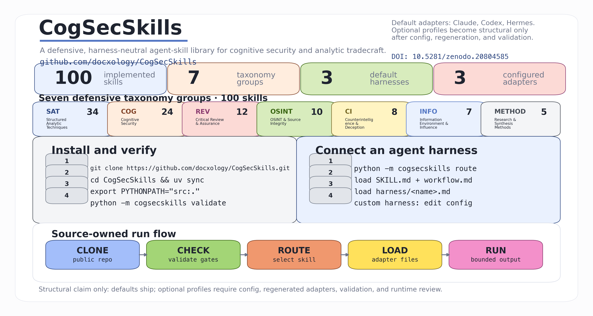
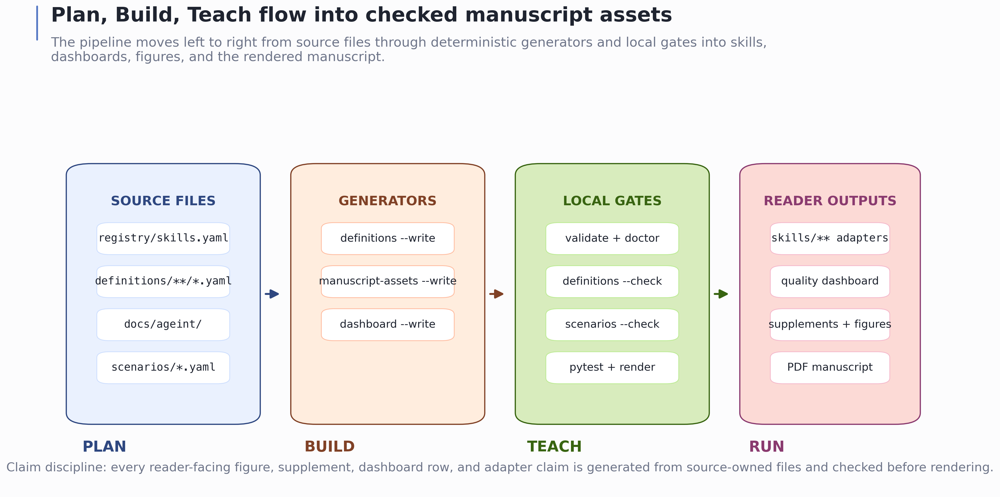
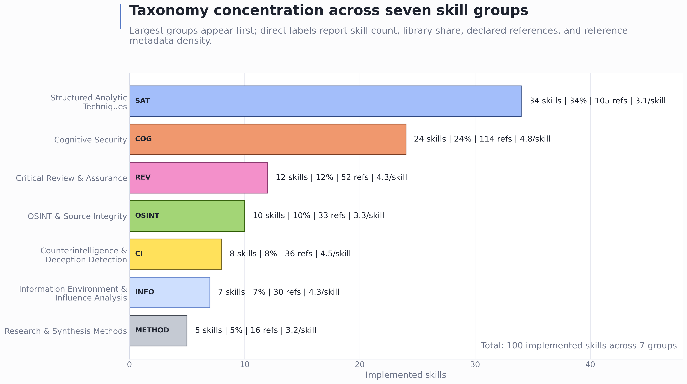
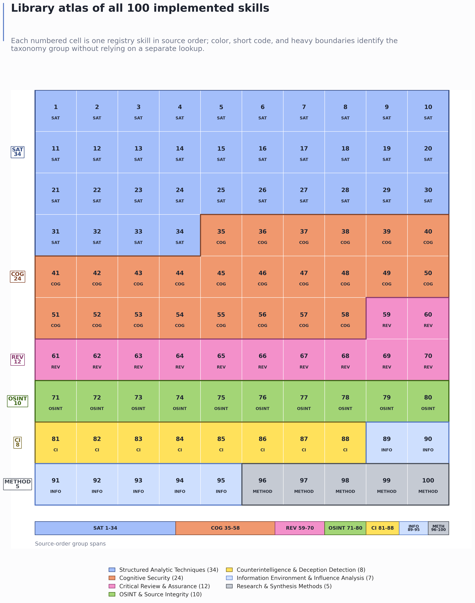
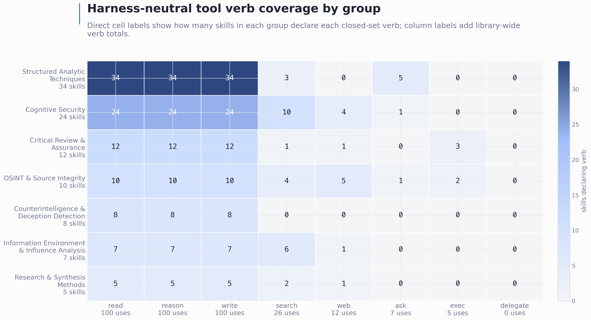
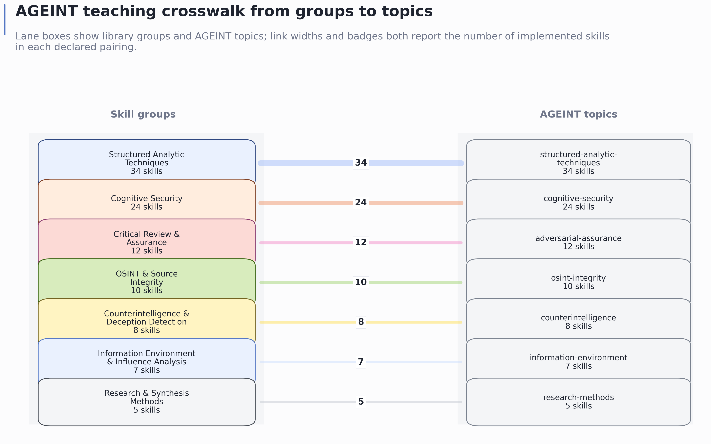
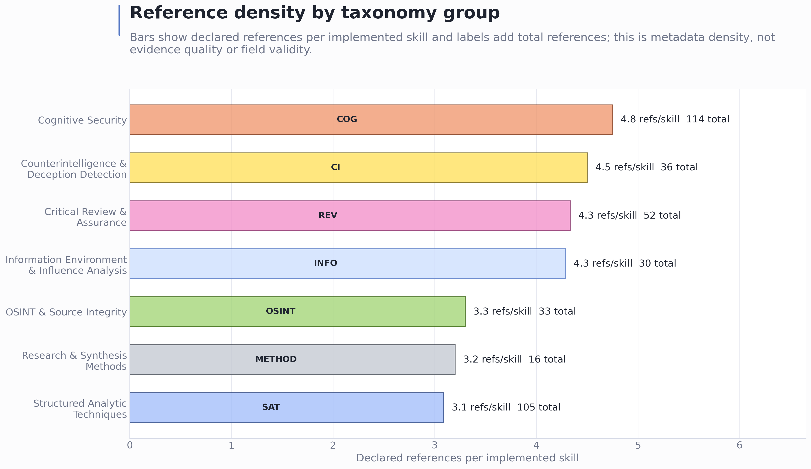
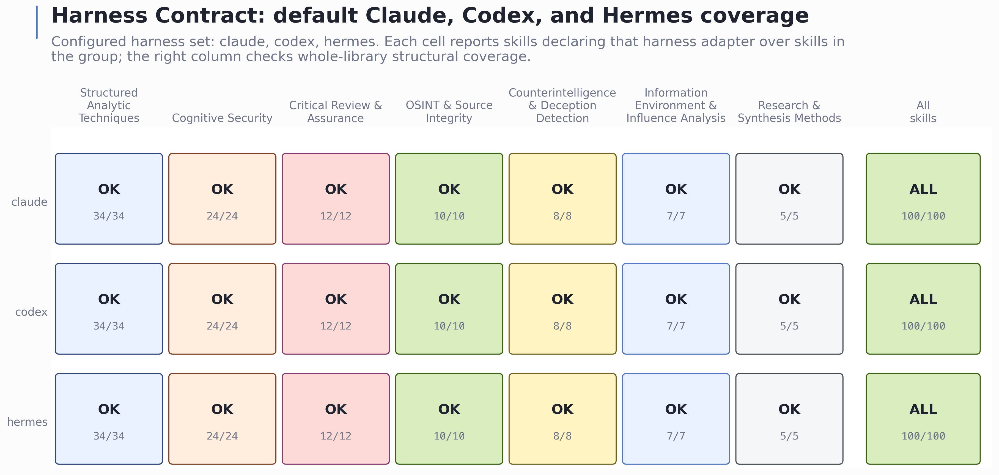

# Full Text: CogSecSkills: Multiharness Agentic Skills for Cognitive Security

> Extracted from `Friedman_2026_Cogsecskills_1a99a2e4.pdf`

> 8 figures extracted to `images/`

---

## Page 1

CogSecSkills: Multiharness Cognitive Security
Skill Library
A reproducible skills-system manuscript for defensive analytic tradecraft
Daniel Ari Friedman
Active Inference Institute
daniel@activeinference.institute
ORCID: 0000-0001-6232-9096
DOI: 10.5281/zenodo.21513316
June 22, 2026

## Page 2

Contents
1
Abstract
3
2
Library Purpose, Scope, and Reader Map
4
2.1
Why Harness-Neutral Defensive Skills
. . . . . . . . . . . . . . . . . . . . . . . . . . . . . . . . . . . . . . .
4
2.2
Related Work and Positioning . . . . . . . . . . . . . . . . . . . . . . . . . . . . . . . . . . . . . . . . . . . .
4
2.3
Project-Native Contributions
. . . . . . . . . . . . . . . . . . . . . . . . . . . . . . . . . . . . . . . . . . . .
5
2.4
How to Read the Main Text and Supplements . . . . . . . . . . . . . . . . . . . . . . . . . . . . . . . . . . .
5
3
Source Boundary and the Harness-Neutral Skill Contract
6
3.1
Repository-Local Evidence Boundary . . . . . . . . . . . . . . . . . . . . . . . . . . . . . . . . . . . . . . . .
6
3.2
Plan/Build/Teach Source Surfaces
. . . . . . . . . . . . . . . . . . . . . . . . . . . . . . . . . . . . . . . . .
6
3.3
Harness-Neutral Skill Specification . . . . . . . . . . . . . . . . . . . . . . . . . . . . . . . . . . . . . . . . .
7
3.4
Harness Profile Classes . . . . . . . . . . . . . . . . . . . . . . . . . . . . . . . . . . . . . . . . . . . . . . . .
7
3.5
Formal Conformance Contract
. . . . . . . . . . . . . . . . . . . . . . . . . . . . . . . . . . . . . . . . . . .
8
3.6
Figure Guide and 100-Skill Taxonomy Snapshot . . . . . . . . . . . . . . . . . . . . . . . . . . . . . . . . . .
9
4
Source-Owned Skill Authoring and Manuscript Generation
10
4.1
Registry-to-Definition-to-Skill Construction . . . . . . . . . . . . . . . . . . . . . . . . . . . . . . . . . . . .
10
4.2
Registry-to-Adapter Authoring Pipeline
. . . . . . . . . . . . . . . . . . . . . . . . . . . . . . . . . . . . . .
10
4.3
Generated Supplement and Figure Pipeline
. . . . . . . . . . . . . . . . . . . . . . . . . . . . . . . . . . . .
12
4.4
Figure Question and Claim Contract . . . . . . . . . . . . . . . . . . . . . . . . . . . . . . . . . . . . . . . .
12
4.5
Local Verification Gates . . . . . . . . . . . . . . . . . . . . . . . . . . . . . . . . . . . . . . . . . . . . . . .
12
5
Evidence Surfaces, Generated Views, and Claim Discipline
14
5.1
Claim-Support Surfaces
. . . . . . . . . . . . . . . . . . . . . . . . . . . . . . . . . . . . . . . . . . . . . . .
14
5.2
Generated Figure Evidence
. . . . . . . . . . . . . . . . . . . . . . . . . . . . . . . . . . . . . . . . . . . . .
14
5.3
Generated Catalogue and Matrix Supplements
. . . . . . . . . . . . . . . . . . . . . . . . . . . . . . . . . .
15
5.4
Per-Skill Quality Audit and Anti-Boilerplate Checks . . . . . . . . . . . . . . . . . . . . . . . . . . . . . . .
15
5.5
Evidence Ladder and Scenario Readiness Gate
. . . . . . . . . . . . . . . . . . . . . . . . . . . . . . . . . .
18
5.6
Live Quality and Coverage Dashboard . . . . . . . . . . . . . . . . . . . . . . . . . . . . . . . . . . . . . . .
18
5.7
Comparative Scholarship Map . . . . . . . . . . . . . . . . . . . . . . . . . . . . . . . . . . . . . . . . . . . .
18
5.8
Claim Support Rules . . . . . . . . . . . . . . . . . . . . . . . . . . . . . . . . . . . . . . . . . . . . . . . . .
19
6
Reproducibility, Local Verification, and Render Gates
20
6.1
Project-Local Asset and Validation Commands . . . . . . . . . . . . . . . . . . . . . . . . . . . . . . . . . .
20
6.2
Template Markdown/PDF Render Commands . . . . . . . . . . . . . . . . . . . . . . . . . . . . . . . . . . .
20
6.3
Traceability and Render Contract . . . . . . . . . . . . . . . . . . . . . . . . . . . . . . . . . . . . . . . . . .
20
7
Evidence Boundaries, Defensive Governance, and Next Steps
22
7.1
Local Conformance Is Not Field Validation
. . . . . . . . . . . . . . . . . . . . . . . . . . . . . . . . . . . .
22
7.2
Defensive Governance Review Rules
. . . . . . . . . . . . . . . . . . . . . . . . . . . . . . . . . . . . . . . .
22
7.3
Evidence and Quality Next Steps . . . . . . . . . . . . . . . . . . . . . . . . . . . . . . . . . . . . . . . . . .
22
7.4
Publication Claim Boundary
. . . . . . . . . . . . . . . . . . . . . . . . . . . . . . . . . . . . . . . . . . . .
23
8
Ethics, Dual-Use, and Responsible Use
24
8.1
Dual-Use Stance and Defensive Framing . . . . . . . . . . . . . . . . . . . . . . . . . . . . . . . . . . . . . .
24
8.2
Defensive by Contract and Review . . . . . . . . . . . . . . . . . . . . . . . . . . . . . . . . . . . . . . . . .
24
8.3
Human-Subjects and Institutional Scope . . . . . . . . . . . . . . . . . . . . . . . . . . . . . . . . . . . . . .
24
8.4
Responsibilities of Adopters and Operators
. . . . . . . . . . . . . . . . . . . . . . . . . . . . . . . . . . . .
24
8.5
What This Section Does Not Claim . . . . . . . . . . . . . . . . . . . . . . . . . . . . . . . . . . . . . . . . .
24
9
Supplemental Claim-Provenance Source Map
25
9.1
Expansion Checklist . . . . . . . . . . . . . . . . . . . . . . . . . . . . . . . . . . . . . . . . . . . . . . . . .
26
10 Supplemental Local Release and Render Manifest
27
10.1 Software And Source Identity . . . . . . . . . . . . . . . . . . . . . . . . . . . . . . . . . . . . . . . . . . . .
27
10.2 Environment And Locking . . . . . . . . . . . . . . . . . . . . . . . . . . . . . . . . . . . . . . . . . . . . . .
27
10.3 Generated Figure Inventory . . . . . . . . . . . . . . . . . . . . . . . . . . . . . . . . . . . . . . . . . . . . .
27
10.4 Verification Gates . . . . . . . . . . . . . . . . . . . . . . . . . . . . . . . . . . . . . . . . . . . . . . . . . . .
27

## Page 3

11 Supplemental 100-Skill Catalogue
29
11.1 Structured Analytic Techniques (sat)
. . . . . . . . . . . . . . . . . . . . . . . . . . . . . . . . . . . . . . .
29
11.2 Cognitive Security (cognitive_security) . . . . . . . . . . . . . . . . . . . . . . . . . . . . . . . . . . . . .
40
11.3 Critical Review & Assurance (critical_review) . . . . . . . . . . . . . . . . . . . . . . . . . . . . . . . . .
49
11.4 OSINT & Source Integrity (osint_integrity) . . . . . . . . . . . . . . . . . . . . . . . . . . . . . . . . . .
53
11.5 Counterintelligence & Deception Detection (counterintelligence)
. . . . . . . . . . . . . . . . . . . . . .
57
11.6 Information Environment & Influence Analysis (information_environment)
. . . . . . . . . . . . . . . . .
60
11.7 Research & Synthesis Methods (research_methods) . . . . . . . . . . . . . . . . . . . . . . . . . . . . . . .
63
12 Supplemental Skill Metadata and Figure Matrix
66
12.1 Group Counts . . . . . . . . . . . . . . . . . . . . . . . . . . . . . . . . . . . . . . . . . . . . . . . . . . . . .
66
12.2 Tool Verb Usage By Group
. . . . . . . . . . . . . . . . . . . . . . . . . . . . . . . . . . . . . . . . . . . . .
66
12.3 AGEINT Crosswalk
. . . . . . . . . . . . . . . . . . . . . . . . . . . . . . . . . . . . . . . . . . . . . . . . .
66
12.4 Harness Coverage . . . . . . . . . . . . . . . . . . . . . . . . . . . . . . . . . . . . . . . . . . . . . . . . . . .
66
12.5 Quality Capsule Coverage . . . . . . . . . . . . . . . . . . . . . . . . . . . . . . . . . . . . . . . . . . . . . .
67
12.6 Generated Figure Inventory . . . . . . . . . . . . . . . . . . . . . . . . . . . . . . . . . . . . . . . . . . . . .
67
13 Symbols and Skill-System Glossary
68
13.1 AGEINT
. . . . . . . . . . . . . . . . . . . . . . . . . . . . . . . . . . . . . . . . . . . . . . . . . . . . . . .
68
13.2 Harness
. . . . . . . . . . . . . . . . . . . . . . . . . . . . . . . . . . . . . . . . . . . . . . . . . . . . . . . .
68
13.3 Skill Specification . . . . . . . . . . . . . . . . . . . . . . . . . . . . . . . . . . . . . . . . . . . . . . . . . . .
68
13.4 Tool Verb . . . . . . . . . . . . . . . . . . . . . . . . . . . . . . . . . . . . . . . . . . . . . . . . . . . . . . .
68
13.5 Plan/Build/Teach
. . . . . . . . . . . . . . . . . . . . . . . . . . . . . . . . . . . . . . . . . . . . . . . . . .
68
13.6 Defensive Boundary
. . . . . . . . . . . . . . . . . . . . . . . . . . . . . . . . . . . . . . . . . . . . . . . . .
68
13.7 Misuse Redirect . . . . . . . . . . . . . . . . . . . . . . . . . . . . . . . . . . . . . . . . . . . . . . . . . . . .
68
13.8 Negative Control . . . . . . . . . . . . . . . . . . . . . . . . . . . . . . . . . . . . . . . . . . . . . . . . . . .
68
13.9 Scenario Fixture
. . . . . . . . . . . . . . . . . . . . . . . . . . . . . . . . . . . . . . . . . . . . . . . . . . .
68
13.10Worked Example . . . . . . . . . . . . . . . . . . . . . . . . . . . . . . . . . . . . . . . . . . . . . . . . . . .
68
13.11Reference Density . . . . . . . . . . . . . . . . . . . . . . . . . . . . . . . . . . . . . . . . . . . . . . . . . . .
68
14 References
69
2

## Page 4

1
Abstract
CogSecSkills is a defensive, harness-neutral agent-interface library that turns the human doctrine of cognitive secu-
rity and analytic tradecraft into dependable, inspectable, agent-usable skills, distributed as an open repository from
github.com/docxology/CogSecSkills; the motivation is an information environment in which mis-, dis-, and malinformation
are analytically distinct but operationally entangled, false content can diffuse rapidly at platform scale, and credible source
evaluation increasingly demands explicit expert practice rather than page-bound reading alone, so that agents asked to
weigh competing hypotheses, trace provenance, or critically review a claim need a repeatable procedure and a stable
tool-use contract rather than improvisation. The live generated catalogue reports one hundred implemented skills across
seven taxonomy groups — Structured Analytic Techniques, Cognitive Security, Critical Review and Assurance, OSINT
and Source Integrity, Counterintelligence and Deception Detection, Information Environment and Influence Analysis, and
Research and Synthesis Methods — and the library is organized as a Plan, Build, and Teach system in which a registry
declares the catalogue, a definitions layer owns the substance and quality controls of each skill, a skills tree exposes
the harness-facing build, and a vendored educational upstream named AGEINT explains why each technique exists and
how to use it responsibly. The central design choice is to make the reusable skill contract smaller than any one agent
interface yet stricter than a prompt collection: each skill is owned by a single canonical definition that declares triggers,
inputs, outputs, per-skill reference metadata, group-aware quality controls, and a closed vocabulary of neutral tool verbs
before any harness-specific adapter is considered, and that definition is rendered deterministically into a harness-neutral
specification, a human-readable skill description, an executable workflow, and one adapter per configured harness whose
default members are Claude, Codex, and Hermes, so that portability becomes a property the test suite proves rather
than a hope, and installation is concrete rather than interpretive — clone the public repository, install or run the Python
package, run validation, point the agent harness at a chosen skill, execute its workflow, and bind runtime tools through
the named harness adapter, regenerating adapters from a configuration file for any non-default harness.
The quality
discipline is the core of the contribution:
an automated audit checks that every skill’s defensive boundaries, misuse
redirects, evidence requirements, confidence rubrics, privacy and legal constraints, uncertainty handling, failure modes,
and negative controls are not merely present but specific to that skill and not reused across the corpus, while an evidence
ladder adds curated safe-use and unsafe-redirect scenarios with expected defensive response-shape contracts, reviewed
expected answers, and one source-owned worked example per skill, and a generated quality dashboard, supplemental
catalogue, metadata matrix, data exports, and a family of deterministic figures — taxonomy counts, the hundred-skill
atlas, tool-verb coverage, AGEINT topic crosswalks, the Plan-Build-Teach flow, reference density, harness coverage, and
a cover-page installation route — are all produced directly from the live registry and skill specifications so that every
visual stays synchronized with the source tree.
The evidence boundary is deliberately and explicitly repository-local
and reproducible within the checked-out project state, following reproducible-computing, open-data stewardship, and
software-citation norms for explicit workflows, version specificity, and citable artifacts; every claim is backed by source
files, canonical definitions, generated supplements and figures, the generated dashboard, and project-local verification
commands together with a focused test suite and a manuscript renderer, and the work positions CogSecSkills as a validated
interface between reasoning, tool use, and defensive output discipline rather than as a claim that any particular model
runtime behaves correctly in the field, so its figures, supplements, scenarios, worked examples, and dashboard should be
read as synchronized views of the current library state and never as independent measurements of operational performance.
3

## Page 5

2
Library Purpose, Scope, and Reader Map
2.1
Why Harness-Neutral Defensive Skills
Agentic analysis needs reusable tradecraft, but reuse breaks down when procedures are written only for one interface or
one model runtime. A useful cognitive-security skill should say what evidence it needs, which neutral capabilities it may
use, what it produces, and when it should be invoked. It should not depend on a single harness syntax, and it should not
smuggle offensive persuasion or influence playbooks into a defensive analytic library.
CogSecSkills addresses that problem as a source-owned skills system. The project separates the catalogue, the canonical
definition layer, the rendered implementation tree, the educational upstream, and the runner code so each repository-
local claim about the library has a concrete surface to inspect. The same skill can be rendered into the default Claude,
Codex, and Hermes adapter language, or into an additional configured harness, because durable skill substance lives in
definitions/<group>/<slug>.yaml and the rendered skill.yaml specification is a checked harness-neutral interface
rather than a model-specific prompt.
The manuscript is framed as a harness-neutral agent-interface contribution situated across four literatures. Intelligence-
analysis research explains why structured procedures matter under ambiguity and bias; information-disorder research
explains why defensive work must distinguish agents, messages, interpreters, and distribution dynamics; research-software
standards explain why metadata, versioning, and regeneration are epistemic controls rather than build conveniences; and
LLM tool-use work explains why an interface between reasoning, actions, and external tools needs explicit boundaries
[Heuer, 1999, Wardle and Derakhshan, 2017, Wilkinson et al., 2016, Smith et al., 2016, Yao et al., 2022, Schick et al., 2023].
That separation matters for defensive cognitive-security work because the reader needs to audit both intent and execution.
A skill named for claim provenance, narrative inversion, or deception detection is not sufficient by itself; the library must
also show the triggers that route to the skill, the inputs it expects, the output it promises, the tool verbs it may use, the
harness adapters that bind those verbs, and the AGEINT teaching topic that explains why the skill exists [Friedman, 2026a].
CogSecSkills makes those surfaces explicit and then regenerates the manuscript views from them.
The tradecraft vocabulary is anchored in structured analytic techniques and adjacent defensive source-evaluation methods,
but the manuscript uses those sources as context rather than as evidence that this library improves decisions in practice.
Analysis of Competing Hypotheses and the broader structured-analytic-techniques family are treated as canonical analytic-
tradecraft references [Heuer, 1999, Pherson and Heuer, 2019]. Named method families that appear in the library catalogue,
including Nominal Group Technique, premortem analysis, prebunking or inoculation, lateral reading, and Admiralty/NATO
reliability grading, are cited at the manuscript level to prevent generated skill metadata from standing in for scholarly
attribution [Delbecq and Van de Ven, 1971, Klein, 2007, Roozenbeek et al., 2022, Wineburg and McGrew, 2019, Ministry
of Defence, 2023]. The wider problem setting also includes misinformation correction, platform-scale diffusion, social bots,
computational propaganda, and synthetic-media provenance, which motivate the library’s defensive skill classes without
validating their operational effectiveness [Lewandowsky et al., 2012, Vosoughi et al., 2018, Ferrara et al., 2016, Woolley and
Howard, 2017, Bradshaw and Howard, 2019, Mirsky and Lee, 2021].
The manuscript is therefore written for two audiences at once. A library maintainer should be able to trace every table,
figure, and count back to source files and gates. A reader who only opens the PDF should still be able to see the shape of
the system: which groups dominate, where the optional tool verbs appear, whether the adapters cover Codex and Hermes
as well as Claude, and how the educational AGEINT layer connects to implemented skill folders.
2.2
Related Work and Positioning
CogSecSkills sits between four bodies of work and duplicates none of them. The intent of this subsection is positioning, not
a claim that the library improves on any cited source in practice.
The first body is structured analytic tradecraft. Analysis of Competing Hypotheses, estimative-probability language, and
the wider structured-techniques family describe how a disciplined analyst should reason under ambiguity and bias [Heuer,
1999, Pherson and Heuer, 2019, Kent, 1964], and doctrine such as the UK reliability-grading scale standardizes how sources
and claims are graded [Ministry of Defence, 2023]. That literature specifies method; it does not ship a harness-neutral,
machine-checkable interface that an agent runtime can route to. CogSecSkills renders those methods into conformance-
checked skill specifications and leaves the underlying tradecraft to its canonical sources.
The second body is information-disorder and defensive-intervention research, which explains why cognitive-security work
must separate agents, messages, and distribution dynamics, and why correction, inoculation, and lateral reading are de-
fensive levers [Wardle and Derakhshan, 2017, Lewandowsky et al., 2012, Roozenbeek et al., 2022, Wineburg and McGrew,
2019], against a threat surface of viral diffusion, social bots, computational propaganda, and synthetic media [Vosoughi
et al., 2018, Ferrara et al., 2016, Woolley and Howard, 2017, Bradshaw and Howard, 2019, Mirsky and Lee, 2021, Lazer et al.,
4

## Page 6

2018]. CogSecSkills operationalizes the defensive recognition and mitigation side of that research as skills, and explicitly
refuses the offensive-influence inverse (see sec. 8).
The third body is LLM tool-use and agent systems, where reasoning is interleaved with external actions through a tool
interface [Yao et al., 2022, Schick et al., 2023]. That work motivates the need for an explicit boundary between reasoning,
tool verbs, and output discipline, but it does not supply a defensive analytic skill catalogue. CogSecSkills contributes the
catalogue and the closed tool-verb contract that binds it to multiple harnesses.
The fourth body is research-software and reproducibility practice, which treats metadata, versioning, and regenerability
as epistemic controls [Sandve et al., 2013, Wilkinson et al., 2016, Smith et al., 2016, Coalition for Content Provenance
and Authenticity, 2026].
CogSecSkills adopts that stance directly: every prose claim resolves to a source surface and
a regeneration command, and the educational upstream is cited as such [Friedman, 2026a].
The novel surface is the
combination — a defensive cognitive-security skill set that is simultaneously harness-neutral, source-owned, and drift-gated.
2.3
Project-Native Contributions
This manuscript contributes four project-native artifacts:
1. A description of the Plan/Build/Teach architecture that keeps registry/, skills/, and docs/ageint/ coherent.
2. A harness-neutral skill contract based on a closed set of tool verbs: read, search, write, exec, reason, web, delegate,
and ask.
3. A repository-local authoring and verification workflow that validates the registry, adapters, quality linting, and tests
before claims are promoted into prose.
4. Generated manuscript supplements and figures that let a reader scan all 100 skills by group, functionality, use case,
AGEINT topic, tool verbs, references, source path, reference density, and harness coverage.
2.4
How to Read the Main Text and Supplements
The main sections explain the library boundary, methods, artifacts, and reproducibility contract. The supplemental sections
are generated from the live library and should be treated as synchronized source inputs, not hand-authored narrative. S1
0_skill_catalogue.md lists every skill with one-line functionality and use conditions; S11_skill_metadata_matrix.md
compresses the same library into matrices for group counts, verb usage, AGEINT crosswalks, harness coverage, and figure
inventory.
The figures are intentionally redundant with the supplements.
The supplements support lookup; the figures support
orientation. A reader can use the taxonomy count chart to see group concentration, the grid to scan the full 100-skill
surface, the heatmap to understand capability mix, the AGEINT crosswalk to follow teaching alignment, the Reference
Density view to inspect declared source backing, and the Harness Contract view to confirm that the configured adapters
are part of the same multiharness package.
5

## Page 7

3
Source Boundary and the Harness-Neutral Skill Contract
3.1
Repository-Local Evidence Boundary
CogSecSkills is a defensive skills library, not a live influence system, benchmark suite, or external claim engine.
Its
authoritative inputs are plain-text project files: the registry declares the catalogue, canonical definitions own skill substance
and quality controls, rendered skill directories expose harness-facing interfaces, AGEINT documents provide the teaching
context, and the Python package validates and reports on the library. The manuscript describes those local surfaces and
the gates that keep them synchronized.
3.2
Plan/Build/Teach Source Surfaces
The project uses three mutually reinforcing surfaces:
Surface
Role
Reader question
registry/skills.yaml and registry
/groups.yaml
Plan
What skills and groups are supposed to
exist?
definitions/<group>/<slug>.yaml
Build source
What does the skill do, when should it
be used, and what defensive quality
controls must it carry?
skills/<group>/<slug>/
Build output
What is actually rendered, and how
does each skill bind to harnesses?
docs/ageint/
Teach
Which AGEINT topic or educational
frame motivates the skill?
src/cogsecskills/
Verify and render
Which checks, reports, routes, and
manuscript assets are generated from
the source surfaces?
tests/
Regression contract
Which behaviors are guarded against
drift?
Figure 1: cogsecskills_plan_build_teach_flow.png: Source-to-render flow for the Plan, Build, and Teach surfaces. The
figure proves that generated manuscript assets sit behind source-owned inputs and local gates; it does not prove field
effectiveness.
6

## Page 8

3.3
Harness-Neutral Skill Specification
Each implemented skill declares a small, inspectable contract:
• identity fields: id, name, group, status, version, summary, and ageint_topic;
• routing fields: tags and triggers;
• capability fields: a closed set of tool verbs with purposes;
• interface fields: structured inputs and outputs;
• adapter fields: one harness adapter path per configured harness.
The default harness adapters translate the neutral verbs into Claude, Codex, and Hermes idioms while preserving the same
workflow. The same contract also applies to any additional harness configured in cogsecskills.yaml. This keeps the
library portable in the structural sense: a skill can be evaluated for conformance without executing any external service.
For Codex and Hermes use, this means the adapter text is not a separate source of truth. It is a harness-facing binding
layer that must list the same neutral verbs declared by the skill specification. If a skill declares read, reason, and write,
each configured harness adapter must show how those verbs are realized in that harness. This is the smallest contract that
makes the skill portable while still leaving each runtime free to express its own operational idiom.
This contract is deliberately narrower than a general agent framework. ReAct-style work shows why reasoning and action
are often interleaved, and Toolformer-style work shows why model interfaces to external tools matter [Yao et al., 2022,
Schick et al., 2023]. CogSecSkills does not attempt to train or evaluate a model to choose tools. It fixes a defensive,
inspectable vocabulary of tool verbs and requires every configured harness adapter to bind that vocabulary before the skill
is treated as conforming. The contribution is the validated interface layer: source-owned skill substance, closed neutral
capabilities, harness-specific bindings, and local drift checks.
3.4
Harness Profile Classes
The harness profile layer is descriptive, not executable. It records named external runtimes and framework families that
a reader might target after cloning the repository, but the validation contract remains controlled only by the configured
harness set. In this manuscript, default adapters means the committed claude, codex, and hermes adapters. Configured
structural adapters means any harness id placed in cogsecskills.yaml, regenerated into every skill folder, and checked
by validate.
Documented external profiles means optional metadata rows in registry/harness_profiles.yam
l; those rows do not certify live runtime behavior, connector safety, vendor support, or field outcomes. The profiles are
not one standard: Gemini CLI context files, Copilot instruction and agent surfaces, Cursor/Cline-style rule systems, SDK
frameworks, and MCP tool hosts each require product-specific review before use.
Profile id
Class
How to read it
gemini_cli
terminal agent
Candidate for a Gemini CLI-style local
harness using product-specific context
files after configuration and adapter
review.
github_copilot
IDE or cloud agent
Candidate for Copilot repository,
path-specific, agent, CLI, cloud-agent,
or review surfaces whose support varies
by product mode.
devin_local
local agent
Candidate for local-agent use with
permissions, sandboxing, skills, and
MCP controls.
devin_cascade
IDE agent
Candidate for Cascade/Devin Desktop
AGENTS.md and rules surfaces.
cursor
IDE agent
Candidate for Cursor rules or skill-style
context.
cline
IDE agent
Candidate for Cline- or Roo-style
rule/skill surfaces and configured tool
permissions.
aider
terminal agent
Candidate for read-only skill and
convention files in a terminal
pair-programming workflow.
continue
IDE or CLI agent
Candidate for Continue Agent, Chat,
or Edit rule contexts.
7

## Page 9

Profile id
Class
How to read it
jetbrains_ai
IDE agent
Candidate for JetBrains AI Assistant
instruction files.
openai_agents_sdk
programmatic runtime
Application-owned wrapper target with
tools, approvals, guardrails, and state.
langgraph
programmatic runtime
Graph-node and state-machine
integration target.
microsoft_agent_framework
programmatic runtime
Agent or workflow integration target
for .NET and Python applications.
autogen
programmatic runtime
AgentChat/Core integration target.
crewai
programmatic runtime
Crew, task, flow, and guardrail
integration target.
pydantic_ai
programmatic runtime
Typed agent and capability integration
target.
mcp_host
protocol host
Tool and context transport profile, not
a standalone model harness.
perplexity_research
research companion
Research-support profile unless
wrapped by a local tool-executing
application.
3.5
Formal Conformance Contract
Let the closed neutral verb vocabulary be
𝑉∶= {read, search, write, exec, reason, web, delegate, ask}.
(1)
Let the default harness set be
𝐻0 ∶= {claude, codex, hermes}.
(2)
Let the configured harness set be
𝐻cfg ∶= harnesses(cogsecskills.yaml)
with default 𝐻0.
(3)
For each implemented skill s in set S, the source specification can be read as
𝑠= (𝑖𝑑𝑠, 𝑛𝑎𝑚𝑒𝑠, 𝑔𝑟𝑜𝑢𝑝𝑠, 𝑠𝑡𝑎𝑡𝑢𝑠𝑠, 𝑣𝑒𝑟𝑠𝑖𝑜𝑛𝑠, 𝑠𝑢𝑚𝑚𝑎𝑟𝑦𝑠, 𝑡𝑜𝑝𝑖𝑐𝑠, 𝑡𝑎𝑔𝑠𝑠, 𝑡𝑟𝑖𝑔𝑔𝑒𝑟𝑠𝑠, 𝑉𝑠, 𝐼𝑠, 𝑂𝑠, 𝑟𝑒𝑓𝑠𝑠, 𝑄𝑠, 𝑤𝑓𝑠, 𝐴𝑠)
(4)
subject to
𝑉𝑠⊆𝑉,
dom(𝐴𝑠) = 𝐻cfg,
∀ℎ∈𝐻cfg ∶𝑉𝑠⊆𝐵𝑠,ℎ.
(5)
Here I_s and O_s are the declared input and output schemas, refs_s is the per-skill metadata reference set, Q_s is the
required quality-control bundle, wf_s is the workflow path, A_s maps each configured harness to exactly one adapter path,
and B_s,h is the set of neutral verbs bound in harness h adapter table. Conformance consists of schema validity, registry-
to-folder agreement, allowed-verb membership, required quality fields, workflow presence, adapter-path completeness for
every harness in H_cfg, and adapter binding coverage for every declared verb in V_s.
Field family
Source field(s)
Constraint
Identity
id, name, group, status, version
id must match group.slug;
implemented skills must exist on disk.
Routing
tags, triggers, ageint_topic
Used for navigation and AGEINT
crosswalks, not empirical routing
claims.
Capability
tools[*].verb
Every verb must be a member of V.
8

## Page 10

Field family
Source field(s)
Constraint
Interface
inputs, outputs
Names and descriptions must be
declared in skill.yaml.
Provenance metadata
refs
Declared skill references; not the same
as manuscript citation keys.
Quality controls
defensive_boundary,
misuse_redirect, evidence_requirem
ents, confidence_rubric, uncertain
ty_handling, privacy_legal_constra
ints, failure_modes, negative_cont
rols
Required by canonical definitions and
surfaced in rendered skill files.
Harness mapping
harness
Every harness in H_cfg must resolve to
an adapter file whose first-column
binding table covers V_s.
3.6
Figure Guide and 100-Skill Taxonomy Snapshot
The manuscript figures are organized from overview to contract detail. The current registry groups the 100 implemented
skills into seven taxonomy groups. Those groups are not claimed to be a complete or mutually exclusive theory of cognitive
security; they are a defensive coverage map spanning information disorder, source integrity, deception and counterintelli-
gence, structured analysis, research synthesis, and information-environment coordination [Wardle and Derakhshan, 2017,
Ministry of Defence, 2023, Lazer et al., 2018, Ferrara et al., 2016, Bradshaw and Howard, 2019]. The taxonomy count
chart answers “how much of the library is in each group?” The skill grid answers “can I see all 100 areas at once?” The
verb heatmap answers “which groups use which neutral capabilities?” The AGEINT crosswalk answers “which teaching
topics motivate which implementation groups?” The Reference Density figure answers “where is declared source backing
deepest?” The Harness Contract figure answers “does every group maintain adapter coverage for the configured harness
set?” The flow figure ties those views back to the source surfaces and gates. The count and grid figures below are generated
from the same ordered registry rows used by the supplemental catalogue, so the visual order and group membership remain
synchronized with the source tree.
9

## Page 11

Figure 2: cogsecskills_taxonomy_counts.png: Ranked group-count chart for the 100 implemented skills. The figure proves
the current registry distribution and declared reference depth by group; it does not measure group quality or operational
security value.
4
Source-Owned Skill Authoring and Manuscript Generation
4.1
Registry-to-Definition-to-Skill Construction
The manuscript is generated and maintained from the same project surfaces that the CLI validates. The registry is loaded
first so the catalogue order, group membership, status, and AGEINT topic remain the plan of record. Canonical definitions
under definitions/ own the skill substance; definitions --write renders those definitions into on-disk skill.yaml,
SKILL.md, workflow.md, and harness adapters. The manuscript asset generator then joins the registry and rendered typed
skill specifications by skill id and emits supplemental Markdown, compact JSON and CSV exports, body figures, and a
title-page cover image that explains installation into an agent harness. This source-first approach follows the reproducibility
principle that outputs should retain enough workflow, version, and source context to be regenerated and inspected [Sandve
et al., 2013, Wilkinson et al., 2016].
This source-first method prevents the manuscript from becoming a parallel catalogue. If skill substance changes, cogsec
skills definitions --check proves the rendered skill tree still matches canonical YAML. If a skill name, trigger, tool
verb, input, output, reference count, harness adapter, or source path changes, cogsecskills manuscript-assets --che
ck detects drift in the generated manuscript inputs.
4.2
Registry-to-Adapter Authoring Pipeline
Skill implementation follows a conservative pipeline:
1. A row in registry/skills.yaml declares the intended skill area and group.
2. A canonical definition under definitions/<group>/<slug>.yaml declares the tool plan, triggers, inputs, outputs,
workflow steps, defensive boundary, evidence discipline, uncertainty rules, failure modes, and negative controls.
3. definitions --write renders a skill directory under skills/<group>/<slug>/ with skill.yaml, SKILL.md,
workflow.md, and one adapter per configured harness.
4. skill.yaml carries the generated neutral verbs, triggers, inputs, outputs, references, and AGEINT topic.
5. The validator checks that registry rows and implemented folders agree, that each adapter exists, and that tool verbs
stay within the closed vocabulary.
10

## Page 12

Figure 3: cogsecskills_skill_grid.png: Full-library atlas showing all 100 registry skills in source order with taxonomy colors,
boundaries, and source-order spans. The figure proves catalogue coverage and group ordering; it does not rank skills or
indicate effectiveness.
11

## Page 13

6. The doctor command applies quality linting for thin, generic, incomplete, or unsafe skill content, including missing
safe defensive negative controls and weak evidence or uncertainty labeling.
7. Tests exercise parsing, validation, definition drift, authoring, routing, reporting, configuration, and manuscript asset
generation.
The optional harness profile registry sits beside the skill registry but has a different function. registry/harness_profiles
.yaml records documented external profiles such as gemini_cli, github_copilot, devin_local, devin_cascade, cursor,
cline, aider, continue, jetbrains_ai, openai_agents_sdk, langgraph, microsoft_agent_framework, autogen,
crewai, pydantic_ai, mcp_host, and perplexity_research.
These are documented external profiles, not validation
targets. A profile becomes one of the configured structural adapters only when its id is added to cogsecskills.yaml, the
skill tree is regenerated, and the adapter files pass validation. The default adapters remain claude, codex, and hermes.
Profile classes are deliberately separated: instruction-file products, IDE rule systems, terminal pair-programming tools,
SDK frameworks, MCP hosts, and research companions require different integration reviews even when they share the
same neutral skill files.
4.3
Generated Supplement and Figure Pipeline
src/cogsecskills/artifacts/manuscript_assets/__init__.py is the producer for the generated manuscript layer. Its
outputs are intentionally committed as manuscript source inputs because they support review and PDF rendering, but they
remain generated. The command writes:
• manuscript/S10_skill_catalogue.md, a grouped catalogue of all skills with functionality, “Use when” text, verbs,
inputs, outputs, AGEINT topic, reference count, and source path;
• manuscript/S11_skill_metadata_matrix.md, a compact matrix view of group counts, verb usage, AGEINT cross-
walks, harness coverage, and figure inventory;
• output/data/skill_catalogue.json and output/data/skill_catalogue.csv, machine-readable exports of the
same rows;
• deterministic PNG figures under ../figures/, including manuscript body figures and the configured title-page in-
stallation cover.
The generator treats static PNGs as the right output form because the manuscript is rendered to PDF and static web
artifacts. Plot code uses explicit color maps for the seven real registry groups, direct labels where they reduce lookup, and
subtitles that state the data scope. The chart data are not manually curated: counts, reference totals, harness coverage,
AGEINT topics, verb matrices, and the install-cover skill counts are derived from the same SkillRow records used by the
generated catalogue.
4.4
Figure Question and Claim Contract
Each figure has a narrow analytical question. Taxonomy counts compare group size; the skill grid maps all 100 registry
entries to one compact atlas; the verb heatmap counts closed-set tool verbs by group; the AGEINT crosswalk connects groups
to teaching topics; the Plan/Build/Teach flow shows the source-to-render path; Reference Density compares declared source-
reference backing; Harness Contract checks adapter coverage across the configured harness set, whose default is Claude,
Codex, and Hermes; and the cover installation visual answers how a reader clones the public repository, validates it, and
binds skills into an agent harness. These figures are descriptive views of the library metadata and installation contract.
They do not measure field performance, adversary coverage, or user outcomes.
Reference Density is defined here as declared references per implemented skill within a taxonomy group. For group g in set
G,
𝑑𝑔∶= 𝑅𝑔
𝑁𝑔
,
(6)
where R_g is the total count of declared per-skill refs entries for implemented skills in g, and N_g is the number of
implemented skills in g. The metric is metadata density, not evidence quality, empirical validity, or a proxy for operational
effectiveness.
4.5
Local Verification Gates
The local gate sequence is designed to catch different failure classes: definitions --check catches canonical-definition
and rendered-skill drift, validate catches structural contract drift, report summarizes implementation status, doctor
catches weak, generic, or incomplete skill content, pytest catches regression bugs, manuscript-assets --check catches
generated-manuscript drift, and the sibling template renderer catches Markdown and PDF integration failures.
12

## Page 14

The stricter quality checks are deliberately local and textual. They require each canonical definition to include a defensive
boundary, misuse redirect, evidence discipline, confidence rubric, uncertainty handling, privacy/legal constraints, failure
modes, and negative controls.
For sensitive skills, a generic safety sentence is insufficient: the negative controls must
include an unsafe request redirected away from abuse, a safe defensive request pattern, wording specific to the skill, and no
reused individual negative-control entry across the corpus. The same specificity pressure now applies to confidence rubrics,
evidence requirements, and privacy/legal constraints: exact reused entries and group-only boilerplate fail the definition and
doctor gates. Evidence requirements must distinguish evidence from inference, and uncertainty handling must preserve
unknowns and credible alternatives. These checks raise the floor for the 100 rendered skills without claiming that the text
has been field-validated.
The figure tests intentionally cover the inventory and palette contract as well as file existence. A missing generated PNG
is easy to detect, but a stale palette can be more subtle: if the registry adds or renames a group, the visual system must
be updated deliberately rather than silently falling back to an unrelated color.
13

## Page 15

5
Evidence Surfaces, Generated Views, and Claim Discipline
5.1
Claim-Support Surfaces
Surface
Role
registry/skills.yaml
Enumerates the 100 skill areas and their implementation
status.
registry/groups.yaml
Defines the seven taxonomy groups used by the catalogue
and figures.
definitions/**.yaml
Owns canonical skill substance, workflow steps, quality
controls, and negative controls.
skills/**/skill.yaml
Declares the harness-neutral contract for each implemented
skill.
skills/**/SKILL.md and workflow.md
Provide the human-facing skill description and neutral
procedure.
skills/**/harness/*.md
Bind the neutral verbs to every configured harness; the
default set is Claude, Codex, and Hermes.
scenarios/defensive_readiness.yaml
Curated safe-use, unsafe-redirect, expected-response, and
expected-answer fixtures used by the deterministic
scenario-readiness gate.
examples/skill-worked-examples.yaml
Source-owned deterministic worked examples, one per
implemented skill.
docs/skill-worked-examples.md and output/data/skill
_worked_examples.json
Generated worked-example views for all 100 skills.
docs/quality-dashboard.md and output/data/quality_d
ashboard.json
Generated dashboard and machine-readable snapshot over
all 100 skills, quality capsules, scenario coverage,
worked-example coverage, harnesses, references,
claim-boundary status, and verified-state rows.
docs/ageint/
Supplies the educational upstream used for AGEINT topic
alignment.
src/cogsecskills/
Owns parsing, validation, reporting, routing, quality linting,
scenario checking, and manuscript asset generation.
tests/
Guards parser, authoring, validation, reporting, routing,
configuration, scenario checking, and manuscript generator
behavior.
5.2
Generated Figure Evidence
The figure set is generated from the live registry and skill metadata. The taxonomy count and skill grid figures show
library coverage at a glance. The verb heatmap shows how neutral tool capabilities are distributed by group. The AGEINT
network shows how group membership connects to teaching topics. The Reference Density figure shows where declared
source-reference backing is concentrated, and the Harness Contract figure shows whether the configured harness adapters
cover every group. The flow figure in fig. 1 shows how the source surfaces, gates, and manuscript assets fit together. The
title-page cover image is also generated: it shows the public GitHub install path, validation command, route command, and
harness-binding files a reader needs to connect CogSecSkills to an agent harness.
The figures should be read as descriptive system views.
They are strong evidence for what is implemented, declared,
generated, installable, and checked in the local project. They are not evidence that any specific defensive workflow will
succeed in an operational setting. That distinction is important because visual polish can otherwise make metadata counts
or installation diagrams feel like empirical validation.
The Reference Density view complements the catalogue because it makes source backing visible by group rather than
by individual row. The Harness Contract view complements the validator because it presents configured-harness adapter
coverage in the reader’s visual path, including Codex and Hermes in the default set rather than treating them as secondary
implementation details.
Per-skill refs counts are metadata fields declared in skill.yaml; they are not equivalent to resolved citation markers in
the manuscript bibliography. The manuscript-level bibliography supports external concepts, standards, and methods that
appear in the prose, while per-skill refs support local navigation and source-backlog discipline inside the library.
14

## Page 16

Figure 4: cogsecskills_verb_heatmap.png: Group-by-tool-verb heatmap over the closed neutral verb vocabulary. Use this
figure to see which taxonomy groups require mostly reading and reasoning and which groups invoke web, search, delegation,
or execution support. The figure proves declared capability distribution in source metadata; it does not prove that any
agent used those tools successfully.
5.3
Generated Catalogue and Matrix Supplements
The two generated supplemental sections make the library navigable without requiring the reader to open 100 folders.
sec. 11 lists every skill with one-line functionality and use conditions. sec. 12 summarizes the same data as matrices and
points back to the figure files. Both sections carry a generated-file header and should be refreshed with python -m cogse
cskills manuscript-assets --write.
The catalogue includes both broad analytic methods and concrete defensive checks: for example, osint_integrity.clai
m_provenance_verification appears as Claim Provenance Verification, with its use conditions, neutral verbs, AGEINT
topic, reference count, and source path generated from the live skill metadata.
5.4
Per-Skill Quality Audit and Anti-Boilerplate Checks
The skill-quality surface is now source-owned rather than a prose-only governance promise. Every canonical definition must
carry the same required quality bundle: defensive boundary, misuse redirect, evidence requirements, confidence rubric,
uncertainty handling, privacy/legal constraints, failure modes, and negative controls.
The renderer places those fields
into the skill files, while definitions --check, doctor, and the pytest contract suite check that the rendered tree and
manuscript views remain synchronized with the definitions.
The audit is intentionally stricter than checking whether a safety heading exists. It rejects negative controls that only
repeat generic boilerplate, requires both an unsafe redirect and a safe defensive request pattern, requires each definition
to include skill-specific unsafe and safe examples, and rejects reused individual negative-control entries across the corpus.
It also rejects repeated confidence-rubric, evidence-requirement, and privacy/legal entries, requires evidence requirements
to label evidence and inference, and requires uncertainty handling to preserve unknowns and credible alternatives.
A
cognitive-security manipulation skill, an OSINT geolocation skill, a counterintelligence elicitation skill, and a structured
analytic technique should therefore carry different governance language even though they share the same defensive contract
shape.
This is a local quality gate, not a safety proof. It can show that all 100 skills include group-aware defensive boundaries,
skill-specific and non-reused confidence, evidence, privacy/legal, and negative-control entries, evidence labeling, and uncer-
tainty discipline in the current repository state. It cannot prove that every future user, external model, or organizational
15

## Page 17

Figure 5: cogsecskills_ageint_network.png: Group-to-AGEINT-topic crosswalk with count-weighted links. Use this figure
to move from a library group to the AGEINT teaching topics that explain why the skills exist. The figure proves declared
teaching alignment for the current catalogue; it does not make a pedagogical or empirical learning-outcome claim.
16

## Page 18

Figure 6: cogsecskills_reference_density.png: Declared references per implemented skill by taxonomy group.
Use this
figure to spot where source-reference metadata is concentrated and where future bibliography or source-curation work may
be useful. The figure proves metadata density in skill.yaml; it does not grade evidence quality, citation authority, or
operational validity.
Figure 7: cogsecskills_harness_contract.png: Adapter coverage scorecard for the configured harness set, defaulting to
Claude, Codex, and Hermes. Use this figure before installing the library into an agent harness to see, at a glance, that
every group declares the configured-harness adapters. The cells count skills that declare an adapter for each configured
harness, by group and as whole-library totals; the stronger invariants — that each declared adapter file exists on disk and
that its binding table covers every verb the skill uses — are enforced separately by validate and the conformance suite,
not by this figure. The figure does not claim behavioral success for any external runtime.
17

## Page 19

deployment will interpret the skill correctly.
5.5
Evidence Ladder and Scenario Readiness Gate
The evidence ladder adds two levels above static corpus inspection. scenarios/defensive_readiness.yaml contains 28
curated fixtures: two safe defensive requests and two unsafe refusal/redirect probes for each of the seven groups. pytho
n -m cogsecskills scenarios --check loads those fixtures, runs the local router, confirms the expected implemented
skill appears in the top route matches, checks declared output terms, verifies the fixture’s expected defensive response
shape, verifies reviewed expected-answer sections and all-2 rubric scores, verifies quality terms such as defensive boundary,
evidence/inference labeling, unknowns, alternatives, safe defensive examples, and unsafe refusal/redirect markers, and
rejects fixture or expected-answer wording that embeds operational misuse detail.
examples/skill-worked-examples.yaml adds one reviewed local worked example per skill. python -m cogsecskill
s examples --check verifies exact 100-skill coverage, defensive evidence/inference/gap labeling, confidence and uncer-
tainty language, declared-output references, local fixture provenance, absence of operational misuse wording, and generated
Markdown/JSON freshness. These examples are expected-answer shapes, not live model transcripts.
These gates are deliberately deterministic.
They do not ask Claude, Codex, Hermes, Gemini, a browser, an OSINT
connector, or any live platform to perform the task. Their claim is narrower and more useful for a repository manuscript:
curated defensive scenarios and worked examples can still be mapped to concrete skill contracts, and the referenced skills
expose the local metadata an agent harness needs to stay bounded. The gates do not show that a live runtime will select
the same skill, use tools correctly, or produce a high-quality answer in the field.
5.6
Live Quality and Coverage Dashboard
python -m cogsecskills dashboard --write generates docs/quality-dashboard.md, docs/quality-dashboard.htm
l, and output/data/quality_dashboard.json. The dashboard gives readers a compact row for every implemented skill:
group, verbs, configured harnesses, reference count, quality-capsule presence, scenario coverage, worked-example coverage,
local claim-boundary status, and source path. The static HTML view is a dependency-free reader surface for scanning
the same payload with responsive tables and print styling. It also surfaces the 28 scenario fixtures, their expected-answer
section titles, the 100 worked examples, and the latest verified-state lines from TODO.md.
The dashboard is useful for review because it turns the corpus into a scanable drift surface. Missing scenario coverage,
missing worked examples, missing quality capsules, stale generated files, or missing verified-state rows make dashboard --
check fail. It is not a benchmark, user study, or live harness transcript; it is a generated view of repository-local evidence.
5.7
Comparative Scholarship Map
External scholarship is used here to position the system, not to validate its effectiveness. The table below maps each
literature spine to the local manuscript claim it supports and the claim it does not support.
Literature spine
Supports in this manuscript
Does not support
Intelligence analysis, structured
techniques, and estimative language
[Heuer, 1999, Pherson and Heuer, 2019,
Kent, 1964, Ministry of Defence, 2023]
The need for explicit analytic
procedure, confidence discipline, and
decision-support boundaries.
That CogSecSkills improves analyst
judgment in practice.
Information disorder, false-news
diffusion, correction, and inoculation
[Wardle and Derakhshan, 2017,
Vosoughi et al., 2018, Lewandowsky
et al., 2012, Roozenbeek et al., 2022,
Lazer et al., 2018]
The relevance of defensive skills for
mis-, dis-, and malinformation,
corrective reasoning, and
resilience-oriented analysis.
That the library reduces
misinformation spread or changes user
beliefs.
Source evaluation, social bots,
computational propaganda, and
coordinated manipulation [Wineburg
and McGrew, 2019, Ferrara et al., 2016,
Woolley and Howard, 2017, Bradshaw
and Howard, 2019]
The need to analyze sources, lateral
corroboration, account ecology,
automation, and coordination rather
than content alone.
That the skills detect live campaigns,
bots, or coordinated activity with
validated accuracy.
18

## Page 20

Literature spine
Supports in this manuscript
Does not support
Synthetic media and provenance
standards [Mirsky and Lee, 2021,
Coalition for Content Provenance and
Authenticity, 2026]
The need for authenticity-aware media
review and explicit content-provenance
metadata in source-integrity work.
That C2PA metadata or this library
proves authenticity, detects deepfakes,
or replaces forensic analysis.
LLM reasoning/action and tool-use
systems [Yao et al., 2022, Schick et al.,
2023]
The positioning of CogSecSkills as a
validated interface between reasoning,
tool verbs, and harness-specific
adapters.
That any configured model runtime will
choose or execute tools correctly in the
field.
Reproducible research software, FAIR
stewardship, and software citation
[Sandve et al., 2013, Wilkinson et al.,
2016, Smith et al., 2016]
The source-owned definition layer,
generated supplements, release
manifest, and citable software
boundary.
That local reproducibility proves
empirical security efficacy.
5.8
Claim Support Rules
A claim is manuscript-ready only when it has one of the following support types:
• A passing test or validator command.
• A generated output with a deterministic producer.
• A source ledger, manifest, or configuration file.
• A resolved entry in references.bib for external literature.
This pass intentionally keeps external scholarly claims bounded.
The manuscript therefore emphasizes local structure,
implementation status, reproducibility, and visualization rather than empirical effectiveness or deployment outcomes. When
external context is needed, citations are used for problem framing, agent-interface positioning, reproducibility and software-
citation norms, AGEINT, structured analytic techniques, named defensive methods, information-environment scholarship,
provenance standards, and official doctrine rather than for unsupported performance claims [Sandve et al., 2013, Smith
et al., 2016, Friedman, 2026a, Wardle and Derakhshan, 2017, Yao et al., 2022].
19

## Page 21

6
Reproducibility, Local Verification, and Render Gates
6.1
Project-Local Asset and Validation Commands
Run project-local gates from a checked-out CogSecSkills project root:
export PROJECT_ROOT="${PROJECT_ROOT:-/path/to/CogSecSkills}"
cd "${PROJECT_ROOT}"
PYTHONPATH="src:." python -m cogsecskills definitions --write
PYTHONPATH="src:." python -m cogsecskills definitions --check
PYTHONPATH="src:." python -m cogsecskills scenarios --check
PYTHONPATH="src:." python -m cogsecskills examples --write
PYTHONPATH="src:." python -m cogsecskills examples --check
PYTHONPATH="src:." python -m cogsecskills dashboard --write
PYTHONPATH="src:." python -m cogsecskills dashboard --check
PYTHONPATH="src:." python -m cogsecskills manuscript-assets --write
PYTHONPATH="src:." python -m cogsecskills manuscript-assets --check
PYTHONPATH="src:." python -m cogsecskills validate
PYTHONPATH="src:." python -m cogsecskills report
PYTHONPATH="src:." python -m cogsecskills doctor
PYTHONPATH="src:." python -m pytest tests/test_cogsecskills_*.py tests/test_skill_library_conformance.py --cov
definitions --write must run before rendering whenever skill substance or configured harnesses change. definition
s --check should then pass before manuscript assets are regenerated. scenarios --check should pass before treating
curated safe-use, unsafe-redirect, expected response-shape, and expected-answer fixtures as current. examples --write
and examples --check keep the generated 100-skill worked-example views synchronized with their source YAML. dash
board --write should run after TODO, scenario, example, registry, or skill metadata changes, and dashboard --chec
k should then pass before the Markdown, HTML, and JSON dashboard views are treated as current. release-metadat
a --write keeps committed release metadata deterministic by omitting exact git revision, branch, and dirty-state values
from drift-checked files; those values are runtime observations used by stricter release modes. manuscript-assets --wri
te must run before rendering whenever registry or rendered skill metadata changes. manuscript-assets --check should
then pass with no findings; otherwise the committed manuscript sources and figures no longer match the live library.
6.2
Template Markdown/PDF Render Commands
Render and validate the manuscript through the sibling template checkout. Use repository-relative paths or environment
variables; do not rely on author-local absolute filesystem paths.
export PROJECT_ROOT="${PROJECT_ROOT:-/path/to/CogSecSkills}"
export TEMPLATE_ROOT="${TEMPLATE_ROOT:-/path/to/template}"
cd "${TEMPLATE_ROOT}"
uv run python -m infrastructure.validation.cli markdown projects/working/CogSecSkills/manuscript/
uv run python scripts/03_render_pdf.py --project working/CogSecSkills
pdftotext "${PROJECT_ROOT}/output/pdf/CogSecSkills_combined.pdf" - | rg "References|Supplemental 100-Skill Cat
rg -n "Citation .*undefined|undefined references|LaTeX Warning: Reference.*undefined|Missing character|Package
The final rg command is expected to produce no matches. A nonzero exit status from that command is acceptable when
it means the searched error strings were absent. Avoid broad not found log searches because some LaTeX packages emit
benign informational lines such as pdfdraftmode not found.
6.3
Traceability and Render Contract
• Do not cite results that cannot be regenerated or directly traced.
• Keep generated outputs under output/ and manuscript source under manuscript/.
• Keep private data, credentials, and unpublished sensitive details out of the manuscript.
• Treat scenarios/defensive_readiness.yaml as a curated local fixture set for route, quality-contract, and expected-
answer readiness, not as empirical validation.
• Treat examples/skill-worked-examples.yaml, docs/skill-worked-examples.md, and output/data/skill_work
ed_examples.json as deterministic local worked-example fixtures, not live model transcripts.
• Treat docs/quality-dashboard.md and output/data/quality_dashboard.json as generated navigation and drift
surfaces, not as field-effectiveness evidence.
20

## Page 22

• Treat manuscript/S10_skill_catalogue.md, manuscript/S11_skill_metadata_matrix.md, output/data/skill
_catalogue.*, and the eight ../figures/*.png manuscript figures as generated from source-owned inputs.
• Record exact verification command results before making release or publication claims.
• Keep repository URL, version, license, source revision, environment versions, lockfile presence, figure inventory, and
gate results current in sec. 10 before representing the manuscript as a release snapshot [Smith et al., 2016].
The narrow PDF margin is part of the render contract because the generated catalogue and metadata matrix are table-
heavy. Any future margin change should be checked in the rendered PDF, not only in Markdown, so long labels, figure
captions, and long-table cells remain readable.
21

## Page 23

7
Evidence Boundaries, Defensive Governance, and Next Steps
7.1
Local Conformance Is Not Field Validation
The current evidence is local conformance evidence. It supports claims about the registry, implemented skill count, harness
adapter presence, generated figures, generated supplements, curated defensive scenario fixtures, and project-local verifica-
tion gates. It does not establish real-world operational effectiveness, adversary coverage, user outcomes, or comparative
superiority over other skill libraries.
The library is defensive by contract and review rather than by a complete formal safety proof. Skill text, harness adapters,
scenarios, and AGEINT material still require human review when the library is adapted to a new organization, workflow,
or model runtime. The current gates can detect missing files, invalid verbs, stale generated assets, thin content, generic
negative controls, repeated individual negative-control entries, repeated confidence/evidence/privacy boilerplate, missing
safe defensive request patterns, weak evidence or uncertainty labeling, and curated safe-use or unsafe-redirect scenario drift,
but they cannot prove that every future use remains within a defensive analytic frame.
The manuscript now includes a verified bibliography for reproducibility norms, software citation, AGEINT, structured
analytic techniques, information disorder, misinformation diffusion and correction, computational propaganda, social bots,
deepfakes, provenance standards, LLM tool-use systems, selected named methods, and official reliability-grading doctrine.
It still avoids new empirical claims: citation support for a named method or problem domain is not evidence that this
library implements that method effectively in operational settings.
The visualizations have the same boundary. They make the library easier to inspect, but they do not transform metadata
into empirical evidence. A complete heatmap cell means a verb is declared in source; a complete Harness Contract cell
means the adapter file is present and bound; a higher Reference Density value means more declared references in the skill
metadata. None of those observations prove that a future user will choose the right skill, interpret evidence correctly, obtain
a better security outcome, detect a live bot campaign, or authenticate synthetic media.
7.2
Defensive Governance Review Rules
The defensive boundary is enforced by source review and manuscript claim discipline rather than by a complete formal
safety proof. The following table is the minimum review rule-set for dual-use skill text and adapter wording.
Risk surface
Disallowed output
Allowed defensive
transformation
Review failure condition
Persuasion or influence
Instructions to manipulate,
target, coerce, or exploit an
audience.
Analysis that identifies
persuasion tactics,
vulnerabilities, or safeguards.
Skill text tells an operator
how to increase manipulative
impact.
Deception and impersonation Fabricated personas,
deceptive outreach scripts, or
concealment advice.
Detection, provenance
tracing, and defensive
response planning.
Adapter wording enables
deception rather than
analyzing it.
OSINT and source work
Doxing, evasion, account
compromise, or harassment
workflows.
Public-source verification,
citation repair, and
source-quality assessment.
Workflow asks for private
data collection or bypass
behavior.
Counter-messaging
Engagement playbooks that
optimize emotional pressure
or behavior change.
Prebunking, inoculation, and
audience-protection framing
bounded to education.
Output becomes an influence
campaign plan rather than a
defensive brief.
Automation
Autonomous execution
against people, platforms, or
live targets.
Human-reviewed checklists,
audit notes, and bounded
evidence summaries.
Skill removes human review
from high-impact or dual-use
steps.
Any skill or adapter that crosses those lines should fail review even if it passes structural validation. The current validator
can prove file and schema conformance; it cannot prove future defensive intent [Friedman, 2026a].
7.3
Evidence and Quality Next Steps
1. Expand scenario-based evaluation tasks from deterministic route/contract readiness into richer analyst-output review
fixtures without converting defensive tradecraft into offensive playbooks.
2. Add richer manuscript variables if future prose needs run-derived values beyond the generated catalogue and matrices.
3. Extend the doctor checks when repeated review findings expose new quality failure modes.
4. Add verified citations only when external context is necessary and the source boundary is clear.
22

## Page 24

5. Keep the generated supplements and figures in the render gate so readers see the same library state that validation
checked.
6. Add figure-level regression checks when future charts begin encoding more complex relationships than counts, coverage,
and crosswalks.
Future evaluation should be split into three lanes. The first lane is repository integrity: definition drift, adapter coverage,
citation resolution, render reproducibility, and release-manifest accuracy. The second lane is analyst usability and output
quality: whether users can choose the right skill, follow the workflow, express uncertainty clearly, and produce auditable
defensive outputs. The third lane is adversarial realism: scenario tasks involving misinformation correction, coordinated
amplification, computational propaganda, and synthetic-media provenance, designed so they test defensive recognition and
mitigation without generating offensive playbooks [Lewandowsky et al., 2012, Ferrara et al., 2016, Bradshaw and Howard,
2019, Mirsky and Lee, 2021, Coalition for Content Provenance and Authenticity, 2026].
7.4
Publication Claim Boundary
The manuscript should remain a skills-system report until additional evidence exists. Local readiness means the source
files, generated assets, and render gates agree; it should not be represented as field validation, public release readiness, or
empirical proof of cognitive-security efficacy.
23

## Page 25

8
Ethics, Dual-Use, and Responsible Use
Cognitive-security tradecraft is dual-use. The same techniques that let a defender recognize a coordinated influence opera-
tion, grade a source, or triage synthetic media can, if inverted, describe how to run such an operation. This section states
the project’s ethical posture explicitly so that reviewers and adopters do not have to infer it.
8.1
Dual-Use Stance and Defensive Framing
CogSecSkills is scoped to the defensive recognition, assessment, documentation, and mitigation side of every technique it
implements. The library contains no offensive playbooks: it does not author manipulation campaigns, fabricate personas,
optimize emotional pressure, plan harassment or doxing, or remove human review from high-impact action. Each skill
carries an explicit defensive boundary, a misuse-redirect clause that refuses the offensive inverse and points back to the
defensive form, and negative-control examples that pair an unsafe request with the safe defensive pattern it should be
redirected to. These are not manuscript assertions; they are fields enforced per skill by the quality linter (doctor) and
visible in the generated worked examples and quality dashboard.
8.2
Defensive by Contract and Review
The defensive boundary is held by two mechanisms working together. The first is structural: the validator proves file
and schema conformance, verb legality, adapter coverage, and the presence of the defensive quality bundle on every skill.
The second is human review: the governance rule-set in sec. 7 defines, per risk surface, the disallowed output, the allowed
defensive transformation, and the review-failure condition, and any skill or adapter that crosses those lines should fail review
even when it passes structural validation. The structural gate can prove that the defensive bundle exists; it cannot prove
future defensive intent [Friedman, 2026a]. Responsibility for that judgment stays with the maintainers and with anyone
who adapts the library to a new organization or runtime.
8.3
Human-Subjects and Institutional Scope
This work is open-source software with no human-subjects component. The scenario fixtures are curated, deterministic
route-and-contract checks, and the worked examples are expected-answer shapes; neither is a live model evaluation, a study
of human participants, or a record of operational use. No institutional review was required, and no personal data was
collected or processed in producing the library, the manuscript, or its generated supplements.
8.4
Responsibilities of Adopters and Operators
The library is provided under the Apache License 2.0, on an as-is basis, for defensive analytic work. Adopters remain
responsible for using it within applicable law and platform terms, for keeping human review on dual-use and high-impact
steps, for not repurposing defensive recognition skills into influence, surveillance, or harassment workflows, and for re-
running the conformance and quality gates whenever skills are modified or extended. Distribution of the skills to a new
harness does not transfer the defensive judgment those gates cannot encode; that judgment travels with the operator.
8.5
What This Section Does Not Claim
Stating a defensive posture is not the same as proving safety. The gates and the review rule-set reduce the risk that the
library ships offensive content or silently drifts; they do not guarantee that every downstream use remains defensive, nor
do they make any claim about field effectiveness, which is out of scope for the current local evidence base (see sec. 7).
24

## Page 26

9
Supplemental Claim-Provenance Source Map
This supplement records the source surfaces that own manuscript claims. Use it as the quick provenance map before editing
prose, generated supplements, figures, or verification statements.
Surface
Role
registry/skills.yaml
Catalogue plan: skill ids, names, groups, status, summaries,
and AGEINT topics.
registry/groups.yaml
Taxonomy plan: group ids and display titles.
skills/**/skill.yaml
Skill build contract: triggers, verbs, inputs, outputs,
references, and harness paths.
skills/**/SKILL.md
Harness-facing one-skill description and “when to use”
guidance.
skills/**/workflow.md
Harness-neutral step procedure and anti-criteria.
skills/**/harness/*.md
Adapter bindings for every configured harness; the default
set is Claude, Codex, and Hermes.
scenarios/defensive_readiness.yaml
Curated safe-use, unsafe-redirect, expected response-shape,
and expected-answer fixtures for deterministic scenario
readiness.
examples/skill-worked-examples.yaml
Source-owned deterministic worked examples, one per skill.
examples/
Local non-secret harness smoke transcripts, group examples,
and source worked examples; these are fixtures, not live
runtime evidence.
docs/skill-worked-examples.md
Generated Markdown worked-example catalogue for all 100
skills.
output/data/skill_worked_examples.json
Generated machine-readable worked-example snapshot.
docs/quality-dashboard.md / docs/quality-dashboard.
html
Generated Markdown and static HTML dashboard over all
100 skills, quality capsules, scenario coverage,
worked-example coverage, harnesses, references,
claim-boundary status, and verified-state rows.
output/data/quality_dashboard.json
Generated machine-readable dashboard snapshot used for
drift review.
docs/claim-boundaries.md
Reader-facing statement of what local gates prove and do
not prove.
docs/connector-boundaries.md
Optional OSINT/web connector boundaries before any live
connector is wired.
docs/analyst-output-review.md
Lightweight rubric for future analyst-output review fixtures.
docs/future-validation-protocols.md
Future-only protocols for baseline comparison, analyst
usability, connector readiness, and DOI/publication
readiness.
docs/release-checklist.md
Release-candidate command and human-review checklist.
docs/ageint/
Educational upstream and AGEINT topic context.
src/cogsecskills/
Parser, validator, authoring, insights, scenario checker, CLI,
and manuscript asset generator.
tests/
Regression evidence for contract, CLI, configuration,
insights, scenarios, and generated assets.
CITATION.cff
Software citation metadata for the repository-level artifact.
codemeta.json
Machine-readable software metadata.
pyproject.toml
Package metadata, dependency declaration, and
test/coverage configuration.
uv.lock
Dependency lockfile for local reproducibility.
manuscript/references.bib
Verified manuscript-level bibliography.
manuscript/S02_release_manifest.md
Release provenance and gate-result surface.
output/data/
Generated machine-readable catalogue exports.
../figures/
Generated visualizations referenced by the manuscript.
25

## Page 27

9.1
Expansion Checklist
• Confirm which files are authored source and which are generated.
• Confirm which commands reproduce the current outputs.
• Confirm whether a value belongs in prose, a generated supplement, or a data export.
• Confirm which external references need verified BibTeX entries.
• Confirm all manuscript citation keys resolve in manuscript/references.bib.
• Confirm reproducibility instructions use ${PROJECT_ROOT} and ${TEMPLATE_ROOT} rather than author-local absolute
paths.
• Confirm whether any private material must be summarized rather than quoted or copied.
26

## Page 28

10
Supplemental Local Release and Render Manifest
This manifest records the source and environment identifiers for the manuscript snapshot. It is a release-provenance surface
for local review; it does not claim an archive DOI, public package publication, or empirical field validation.
10.1
Software And Source Identity
Field
Value
Repository
https://github.com/docxology/CogSecSkills
Citation metadata
CITATION.cff
Code metadata
codemeta.json
Package version
0.1.0
License
Apache-2.0
Source revision
e85ecf2cc54eebee1700f60a6a354b83f093ff4b
Revision descriptor v0.1.0-2-ge85ecf2-dirty
Archive DOI
unavailable in this snapshot
Concept DOI
unavailable in this snapshot
The revision descriptor is intentionally marked dirty because this manuscript hardening pass is performed in a working
tree with source edits in progress. The manifest is therefore a local provenance record, not an immutable release certificate
[Friedman, 2026b].
10.2
Environment And Locking
Field
Value
Python
Python 3.13.14
uv
uv 0.11.6 (65950801c 2026-04-09 aarch64-apple-darwin)
Python requirement
>=3.10
Runtime dependency pyyaml>=6.0
Development gates
pytest, pytest-cov, mypy, ruff
Lockfile
uv.lock present
10.3
Generated Figure Inventory
Figure file
Manuscript label
../figures/cogsecskills_taxonomy_counts.png
@fig:taxonomy-counts
../figures/cogsecskills_skill_grid.png
@fig:skill-grid
../figures/cogsecskills_verb_heatmap.png
@fig:verb-heatmap
../figures/cogsecskills_ageint_network.png
@fig:ageint-network
../figures/cogsecskills_plan_build_teach_flow.png
@fig:plan-build-teach-flow
../figures/cogsecskills_reference_density.png
@fig:reference-density
../figures/cogsecskills_harness_contract.png
@fig:harness-contract
../figures/cogsecskills_cover_installation.png
title-page cover image
10.4
Verification Gates
Gate
Current result
definitions --check
canonical definitions are current
scenarios --check
scenario readiness fixtures are current: 28 scenar
ios across 7 groups; 28 expected answers checked
examples --check
worked examples are current
dashboard --check
quality dashboard is current
manuscript-assets --check
manuscript assets are current
validate
0 error(s), 0 warning(s)
27

## Page 29

Gate
Current result
report
registry_total: 100, implemented: 100, on_disk_skill
s: 100, ok: true
doctor
validation: 0 error(s); quality: 0 finding(s)
ruff check src/cogsecskills tests
All checks passed!
ruff format --check src/cogsecskills tests
38 files already formatted
mypy
Success: no issues found in 19 source files
pytest --cov=src/cogsecskills
622 passed; total coverage 90.94%
Template markdown validation
No issues found!
Template PDF render
13 manuscript sections rendered; 8/8 figures found;
combined PDF and HTML generated
PDF content smoke
Required strings found: References, Supplemental 100-Skill
Catalogue, Reference Density, Harness Contract, Evidence
Ladder, Skill Worked Examples, Scenario Readiness,
expected answers, Quality Dashboard, Release Manifest,
and install cover text
PDF render log error scan
No unresolved-reference, missing-character, missing-file, or
package-error findings
28

## Page 30

11
Supplemental 100-Skill Catalogue
This generated supplement lists the live CogSecSkills library by taxonomy group. Each row is derived from registry/ski
lls.yaml and the matching skills/<group>/<slug>/skill.yaml file, so the catalogue can be checked for drift with pyt
hon -m cogsecskills manuscript-assets --check.
11.1
Structured Analytic Techniques (sat)
34 skills in this group.
Skill
Functionality
Use when
Metadata
Quality capsule
sat.getting_sta
rted_checklist
Getting Started
Checklist
Frame an analytic
task: question,
drivers,
assumptions, and
prior judgments
before diving in.
where do I
start; frame
this analytic
task; getting
started
checklist
Verbs: ask, read,
reason, write
Inputs:
analytic_task, back-
ground_material
Outputs: get-
ting_started_baseline
AGEINT:
structured-analytic-
techniques; refs: 3
Source: skills/sat/
getting_started_
checklist/SKILL.md
Boundary: Use Getting Started Checklist only for structured
analytic technique support: recognize, assess, document, or defend
analytic rigor, alternative hypotheses, and calibrated judgment. Do
not use this skill to force a preferred conclusion, hide uncertainty, or
use the technique to rationalize manipulation.
Evidence: For Getting Started Checklist, tie every restated
question, listed driver, and registered assumption to concrete
evidence from the supplied analytic task or background material, and
flag each item that rests on inference rather than confirmed fact so
its confidence level is visible before any drafting begins.
Confidence: High for Getting Started Checklist: the restated
primary question, key drivers, and assumptions register each trace to
the supplied tasking and background material, the consumer’s actual
decision need has been confirmed rather than inferred, the framing is
internally consistent, and no unresolved contradiction would change
the baseline that subsequent analysis depends on.
Unsafe redirect: Unsafe: ’Use Getting Started Checklist outputs to
force a preferred conclusion, hide uncertainty, or use the technique to
rationalize manipulation’ -> refuse and redirect to defensive risk
assessment.
Safe defensive: Safe defensive: ’Use Getting Started Checklist to
apply the structured technique to supplied evidence while preserving
alternatives and uncertainty with analytic task, and background
material’ -> produce bounded findings with evidence and uncertainty
labels.
sat.customer_ai
ms_checklist
Customer
(AIMS)
Checklist
Clarify Audience,
Issue, Message, and
Storyline so the
product fits the
decision it serves.
AIMS
checklist; who
is the
audience;
what is the
key message
Verbs: ask, read,
reason, write
Inputs: prod-
uct_or_outline,
consumer_context
Outputs:
aims_worksheet,
gap_and_misalignment_report
AGEINT:
structured-analytic-
techniques; refs: 3
Source: skills/sat/
customer_aims_
checklist/SKILL.md
Boundary: Use Customer (AIMS) Checklist only for structured
analytic technique support: recognize, assess, document, or defend
analytic rigor, alternative hypotheses, and calibrated judgment. Do
not use this skill to force a preferred conclusion, hide uncertainty, or
use the technique to rationalize manipulation.
Evidence: For Customer (AIMS) Checklist, ground each resolved
Audience, Issue, Message, and Storyline value in evidence from the
tasking directive, draft, or stated consumer context, label any
inferred parameter with its basis, and raise targeted clarifying
questions for parameters the available evidence cannot settle.
Confidence: High for Customer (AIMS) Checklist: the Audience
names a specific decision-making role, the Issue is narrow enough to
answer in this product, the Message is a single actionable declarative
assertion, the Storyline is derived from that Message and Audience,
and no unresolved ambiguity in the tasking would change the
worksheet.
Unsafe redirect: Unsafe: ’Use Customer (AIMS) Checklist outputs
to force a preferred conclusion, hide uncertainty, or use the technique
to rationalize manipulation’ -> refuse and redirect to defensive risk
assessment.
Safe defensive: Safe defensive: ’Use Customer (AIMS) Checklist to
apply the structured technique to supplied evidence while preserving
alternatives and uncertainty with product or outline, and consumer
context’ -> produce bounded findings with evidence and uncertainty
labels.
29

## Page 31

Skill
Functionality
Use when
Metadata
Quality capsule
sat.issue_redef
inition
Issue
Redefinition
Restate the
question multiple
ways to escape an
unhelpful initial
framing.
reframe this
question; issue
redefinition;
am I asking
the right
question
Verbs: read, reason,
write
Inputs:
original_question,
tasking_context
Outputs: restate-
ments_register,
preferred_framing
AGEINT:
structured-analytic-
techniques; refs: 4
Source: skills/sat/
issue_redefinition/
SKILL.md
Boundary: Use Issue Redefinition only for structured analytic
technique support: recognize, assess, document, or defend analytic
rigor, alternative hypotheses, and calibrated judgment. Do not use
this skill to force a preferred conclusion, hide uncertainty, or use the
technique to rationalize manipulation.
Evidence: For Issue Redefinition, anchor each restatement and the
recommended framing in concrete evidence from the original question
and its tasking context, documenting the specific assumption each
lever exposes and recording the rejected framings; a preferred
framing asserted without evidence that it better serves the decision is
a preference, not a reasoned reframing.
Confidence: High for Issue Redefinition: each restatement applies a
genuinely distinct reframing lever rather than paraphrasing the
original, the assumption removed or added by each is articulated
explicitly, the recommended framing is justified against the
consumer’s actual decision need, and no unresolved tension among
the alternatives would overturn that choice.
Unsafe redirect: Unsafe: ’Use Issue Redefinition outputs to force a
preferred conclusion, hide uncertainty, or use the technique to
rationalize manipulation’ -> refuse and redirect to defensive risk
assessment.
Safe defensive: Safe defensive: ’Use Issue Redefinition to apply the
structured technique to supplied evidence while preserving
alternatives and uncertainty with original question, and tasking
context’ -> produce bounded findings with evidence and uncertainty
labels.
sat.chronologie
s_and_timelines
Chronologies &
Timelines
Order events
temporally to
expose gaps,
correlations, and
causal sequencing.
build a
timeline; put
these events
in order; when
did this
happen
relative to
that
Verbs: read, reason,
write
Inputs:
event_sources,
analytic_question,
parallel_streams
Outputs:
chronology,
gap_and_anomaly_report,
key_findings
AGEINT:
structured-analytic-
techniques; refs: 3
Source: skills/sat/
chronologies_and_
timelines/SKILL.md
Boundary: Use Chronologies & Timelines only for structured
analytic technique support: recognize, assess, document, or defend
analytic rigor, alternative hypotheses, and calibrated judgment. Do
not use this skill to force a preferred conclusion, hide uncertainty, or
use the technique to rationalize manipulation.
Evidence: For Chronologies & Timelines, anchor every entry and
every gap-and-anomaly finding to the dated source evidence that
supports it, record a confidence level per event, and explicitly note
collection limitations so absence of evidence is never silently read as
evidence of absence.
Confidence: High for Chronologies & Timelines: each event carries
an explicit date, actor, source, and confidence level, sourced facts are
kept strictly separate from inferences, identified gaps and clustering
are corroborated across independent streams, and no unresolved
contradiction would change the timeline’s bearing on the focal
question.
Unsafe redirect: Unsafe: ’Use Chronologies & Timelines outputs to
force a preferred conclusion, hide uncertainty, or use the technique to
rationalize manipulation’ -> refuse and redirect to defensive risk
assessment.
Safe defensive: Safe defensive: ’Use Chronologies & Timelines to
apply the structured technique to supplied evidence while preserving
alternatives and uncertainty with event sources, analytic question,
and parallel streams’ -> produce bounded findings with evidence and
uncertainty labels.
sat.sorting
Sorting
Group large
evidence sets by
attributes to
surface patterns
and outliers.
sort this
evidence;
organize these
indicators;
group by
attribute
Verbs: read, reason,
write
Inputs:
evidence_set,
sort_dimensions
Outputs:
sorted_table,
outlier_flags
AGEINT:
structured-analytic-
techniques; refs: 2
Source: skills/sat/
sorting/SKILL.md
Boundary: Use Sorting only for structured analytic technique
support: recognize, assess, document, or defend analytic rigor,
alternative hypotheses, and calibrated judgment. Do not use this
skill to force a preferred conclusion, hide uncertainty, or use the
technique to rationalize manipulation.
Evidence: For Sorting, bind every cluster label and every outlier
flag to concrete evidence from a specific item in the evidence set,
citing the attribute value or source excerpt that places it in or
outside a cluster, and record which dimension was primary so
reviewers can re-sort and test whether the anomaly survives.
Confidence: High for Sorting: the cluster labels and outlier flags are
each grounded in evidence items whose attributes were inventoried
before any sorting dimension was chosen, the same clusters and
anomalies recur under independently selected primary and secondary
axes, and no unresolved contradiction in the underlying data would
change which items the technique flags as anomalous.
Unsafe redirect: Unsafe: ’Use Sorting outputs to force a preferred
conclusion, hide uncertainty, or use the technique to rationalize
manipulation’ -> refuse and redirect to defensive risk assessment.
Safe defensive: Safe defensive: ’Use Sorting to apply the structured
technique to supplied evidence while preserving alternatives and
uncertainty with evidence set, and sort dimensions’ -> produce
bounded findings with evidence and uncertainty labels.
30

## Page 32

Skill
Functionality
Use when
Metadata
Quality capsule
sat.ranking_and
_prioritization
Ranking &
Prioritization
Order items by
weighted criteria
(ranked voting,
paired comparison,
weighted scoring).
rank these
options;
prioritize
threats;
weighted
scoring
Verbs: ask, read,
reason, write
Inputs: item_list,
criteria,
decision_context
Outputs:
scoring_matrix,
ranked_list,
sensitivity_analysis
AGEINT:
structured-analytic-
techniques; refs: 2
Source: skills/sat/
ranking_and_
prioritization/
SKILL.md
Boundary: Use Ranking & Prioritization only for structured
analytic technique support: recognize, assess, document, or defend
analytic rigor, alternative hypotheses, and calibrated judgment. Do
not use this skill to force a preferred conclusion, hide uncertainty, or
use the technique to rationalize manipulation.
Evidence: For Ranking & Prioritization, tie each raw score, weight,
and final placement to concrete evidence about the item list and
decision context, disclose the criteria and weights that produced the
order, and report the sensitivity sweep so that any ranking fragile to
small weight changes is flagged as material rather than presented as a
settled conclusion.
Confidence: High for Ranking & Prioritization: the criteria and
weights were fixed before scoring and reflect the decision context
rather than a preferred outcome, each item’s scores trace to a
consistent pre-defined scale, the sensitivity sweep shows the top
placements survive plausible weight shifts, and no unresolved
contradiction between the ranking and subject-matter intuition is left
uninvestigated.
Unsafe redirect: Unsafe: ’Use Ranking & Prioritization outputs to
force a preferred conclusion, hide uncertainty, or use the technique to
rationalize manipulation’ -> refuse and redirect to defensive risk
assessment.
Safe defensive: Safe defensive: ’Use Ranking & Prioritization to
apply the structured technique to supplied evidence while preserving
alternatives and uncertainty with item list, criteria, and decision
context’ -> produce bounded findings with evidence and uncertainty
labels.
sat.analytic_ma
trices
Analytic
Matrices
Cross-tabulate
variables to
organize evidence
and reveal
relationships.
analytic
matrix;
cross-tab the
evidence;
organize
variables in a
grid
Verbs: read, reason,
write
Inputs:
analytic_question,
vari-
ables_or_hypotheses,
evi-
dence_or_criteria
Outputs:
analytic_matrix,
pattern_summary
AGEINT:
structured-analytic-
techniques; refs: 4
Source: skills/sat/
analytic_matrices/
SKILL.md
Boundary: Use Analytic Matrices only for structured analytic
technique support: recognize, assess, document, or defend analytic
rigor, alternative hypotheses, and calibrated judgment. Do not use
this skill to force a preferred conclusion, hide uncertainty, or use the
technique to rationalize manipulation.
Evidence: For Analytic Matrices, anchor each cell rating and the
pattern summary to a cited source excerpt or rationale, record blank
cells as explicit collection gaps rather than silent omissions, and
present the full grid as evidence so a reviewer can audit the reasoning
instead of trusting a collapsed single answer.
Confidence: High for Analytic Matrices: the row and column axes
capture a genuinely independent, decidable relationship, every cell is
rated against a scheme fixed before population, blank and conflicting
cells are explicitly adjudicated, the dominant pattern is corroborated
by multiple sources, and no unresolved contradiction would overturn
the leading row.
Unsafe redirect: Unsafe: ’Use Analytic Matrices outputs to force a
preferred conclusion, hide uncertainty, or use the technique to
rationalize manipulation’ -> refuse and redirect to defensive risk
assessment.
Safe defensive: Safe defensive: ’Use Analytic Matrices to apply the
structured technique to supplied evidence while preserving
alternatives and uncertainty with analytic question, variables or
hypotheses, and evidence or criteria’ -> produce bounded findings
with evidence and uncertainty labels.
sat.network_ana
lysis
Network
Analysis
Map actors and
links; compute
centrality and
brokerage to find
key nodes.
who are the
key actors;
map the
network; find
the brokers
Verbs: read, reason,
write
Inputs: node_list,
edge_list,
analytic_question
Outputs:
centrality_report,
structural_findings,
collection_gaps
AGEINT:
structured-analytic-
techniques; refs: 5
Source: skills/sat/
network_analysis/
SKILL.md
Boundary: Use Network Analysis only for structured analytic
technique support: recognize, assess, document, or defend analytic
rigor, alternative hypotheses, and calibrated judgment. Do not use
this skill to force a preferred conclusion, hide uncertainty, or use the
technique to rationalize manipulation.
Evidence: For Network Analysis, bind every centrality ranking,
broker claim, and cluster boundary to concrete evidence — a
documented edge, its relationship type, and its recorded evidence
quality drawn from the node and edge lists — and flag any node or
link that rests only on low-confidence or single-source reporting as
provisional rather than established.
Confidence: High for Network Analysis: the betweenness-ranked
centrality table, broker identification, and cluster partition are each
corroborated by multiple independent edges whose evidence quality is
documented, the rankings stay stable under removal of any
weak-evidence link, the resilience and coordination-signature findings
agree, and no unresolved contradiction would change the conclusion.
Unsafe redirect: Unsafe: ’Use Network Analysis outputs to force a
preferred conclusion, hide uncertainty, or use the technique to
rationalize manipulation’ -> refuse and redirect to defensive risk
assessment.
Safe defensive: Safe defensive: ’Use Network Analysis to apply the
structured technique to supplied evidence while preserving
alternatives and uncertainty with node list, edge list, and analytic
question’ -> produce bounded findings with evidence and uncertainty
labels.
31

## Page 33

Skill
Functionality
Use when
Metadata
Quality capsule
sat.mind_maps_a
nd_concept_maps
Mind Maps &
Concept Maps
Externalize a
problem’s concepts
and relationships as
a navigable graph.
draw out the
relationships;
map the
concepts;
visualize the
problem
structure
Verbs: read, reason,
write
Inputs:
source_material,
central_topic,
map_type
Outputs:
concept_graph,
gap_and_conflict_report
AGEINT:
structured-analytic-
techniques; refs: 3
Source: skills/sat/
mind_maps_and_
concept_maps/
SKILL.md
Boundary: Use Mind Maps & Concept Maps only for structured
analytic technique support: recognize, assess, document, or defend
analytic rigor, alternative hypotheses, and calibrated judgment. Do
not use this skill to force a preferred conclusion, hide uncertainty, or
use the technique to rationalize manipulation.
Evidence: For Mind Maps & Concept Maps, bind each node and
each labeled edge to concrete evidence in the source material,
preserving the raw language used for provenance, and mark any link
that rests on inference rather than confirmed relationship; an edge
asserted without supporting evidence is a hypothesis about structure,
not a documented one.
Confidence: High for Mind Maps & Concept Maps: every node and
labeled directed link traces to named concepts and relationships in
the source material, distinct concepts are kept on separate nodes
rather than conflated, the gap-and-conflict audit has been run over
the whole graph, and no unresolved contradiction in the link
structure would change the represented understanding.
Unsafe redirect: Unsafe: ’Use Mind Maps & Concept Maps
outputs to force a preferred conclusion, hide uncertainty, or use the
technique to rationalize manipulation’ -> refuse and redirect to
defensive risk assessment.
Safe defensive: Safe defensive: ’Use Mind Maps & Concept Maps to
apply the structured technique to supplied evidence while preserving
alternatives and uncertainty with source material, central topic, and
map type’ -> produce bounded findings with evidence and
uncertainty labels.
sat.process_and
_gantt_mapping
Process &
Gantt Mapping
Lay out a process
or adversary plan
as sequenced,
dependency-aware
steps.
process
mapping;
Gantt chart
for adversary
plan; sequence
the steps
Verbs: read, reason,
write
Inputs: activ-
ity_description,
known_steps,
time_constraints
Outputs:
process_map,
gantt_table
AGEINT:
structured-analytic-
techniques; refs: 3
Source: skills/sat/
process_and_
gantt_mapping/
SKILL.md
Boundary: Use Process & Gantt Mapping only for structured
analytic technique support: recognize, assess, document, or defend
analytic rigor, alternative hypotheses, and calibrated judgment. Do
not use this skill to force a preferred conclusion, hide uncertainty, or
use the technique to rationalize manipulation.
Evidence: For Process & Gantt Mapping, tie each step, dependency,
duration estimate, and choke-point designation to concrete evidence
from the activity description, the confirmed known steps, and the
time constraints, and assign every step an observable indicator with
its diagnostic value, marking any step the activity’s logic demands
but no reporting confirms as a labeled collection gap rather than a
verified node.
Confidence: High for Process & Gantt Mapping: the
dependency-ordered decomposition reflects what the activity logically
requires, the critical path and choke points are identified from real
predecessor and resource relationships, every step carries at least one
observable indicator with a rated diagnostic value, and no unresolved
contradiction in the sequence would change the estimated lead time.
Unsafe redirect: Unsafe: ’Use Process & Gantt Mapping outputs
to force a preferred conclusion, hide uncertainty, or use the technique
to rationalize manipulation’ -> refuse and redirect to defensive risk
assessment.
Safe defensive: Safe defensive: ’Use Process & Gantt Mapping to
apply the structured technique to supplied evidence while preserving
alternatives and uncertainty with activity description, known steps,
and time constraints’ -> produce bounded findings with evidence and
uncertainty labels.
sat.structured_
brainstorming
Structured
Brainstorming
Divergent then
convergent idea
generation with
explicit
anti-anchoring
steps.
brainstorm;
structured
brainstorm-
ing; generate
hypotheses
Verbs: ask, read,
reason, write
Inputs:
problem_statement,
prior_framing, con-
vergence_criteria
Outputs:
raw_idea_inventory,
ranked_shortlist
AGEINT:
structured-analytic-
techniques; refs: 3
Source: skills/sat/
structured_
brainstorming/
SKILL.md
Boundary: Use Structured Brainstorming only for structured
analytic technique support: recognize, assess, document, or defend
analytic rigor, alternative hypotheses, and calibrated judgment. Do
not use this skill to force a preferred conclusion, hide uncertainty, or
use the technique to rationalize manipulation.
Evidence: For Structured Brainstorming, tie every shortlist ranking
and every discard decision to concrete evidence from the problem
statement and convergence criteria, citing the rationale that justifies
each idea’s position, and label which ideas rest on assumption versus
observation so reviewers can challenge the convergence step against
the evidence.
Confidence: High for Structured Brainstorming: the ranked
shortlist emerges from a raw inventory broad enough that no
plausible hypothesis was anchored out, the convergence ranking is
reproducible under the stated criteria, and no unresolved
contradiction in the problem framing would promote a discarded idea
or demote a shortlisted one.
Unsafe redirect: Unsafe: ’Use Structured Brainstorming outputs to
force a preferred conclusion, hide uncertainty, or use the technique to
rationalize manipulation’ -> refuse and redirect to defensive risk
assessment.
Safe defensive: Safe defensive: ’Use Structured Brainstorming to
apply the structured technique to supplied evidence while preserving
alternatives and uncertainty with problem statement, prior framing,
and convergence criteria’ -> produce bounded findings with evidence
and uncertainty labels.
32

## Page 34

Skill
Functionality
Use when
Metadata
Quality capsule
sat.nominal_gro
up_technique
Nominal Group
Technique
Silent independent
ideation before
discussion to
counter dominance
and groupthink.
nominal group
technique;
NGT; silent
idea
generation
before
discussion
Verbs: read, reason,
write
Inputs:
focal_question, par-
ticipant_idea_sets,
prior_context
Outputs:
ngt_record
AGEINT:
structured-analytic-
techniques; refs: 2
Source: skills/sat/
nominal_group_
technique/
SKILL.md
Boundary: Use Nominal Group Technique only for structured
analytic technique support: recognize, assess, document, or defend
analytic rigor, alternative hypotheses, and calibrated judgment. Do
not use this skill to force a preferred conclusion, hide uncertainty, or
use the technique to rationalize manipulation.
Evidence: For Nominal Group Technique, tie each ranked idea and
its position to concrete evidence — the originating participant
submissions, the clarification notes, and the recorded per-ballot vote
tallies — and document that votes were cast independently and
tallied only after collection, so the ranking is traceable to the process
rather than to the loudest voice.
Confidence: High for Nominal Group Technique: the ranked idea
list reflects independently authored submissions collected before any
discussion, the weighted vote tallies were cast on a fixed budget and
revealed only after all ballots were in, the anonymized round-robin
consolidation is auditable end to end, and no unresolved procedural
contamination would change the ordering.
Unsafe redirect: Unsafe: ’Use Nominal Group Technique outputs
to force a preferred conclusion, hide uncertainty, or use the technique
to rationalize manipulation’ -> refuse and redirect to defensive risk
assessment.
Safe defensive: Safe defensive: ’Use Nominal Group Technique to
apply the structured technique to supplied evidence while preserving
alternatives and uncertainty with focal question, participant idea
sets, and prior context’ -> produce bounded findings with evidence
and uncertainty labels.
sat.starburstin
g
Starbursting
Generate questions
(who/what/when/where/why/how)
before answers to
map the unknowns.
what
questions
should we be
asking;
starbursting;
map the
unknowns
Verbs: read, reason,
write
Inputs:
topic_or_artifact,
context
Outputs:
question_map,
key_unknowns_summary
AGEINT:
structured-analytic-
techniques; refs: 2
Source: skills/sat/
starbursting/
SKILL.md
Boundary: Use Starbursting only for structured analytic technique
support: recognize, assess, document, or defend analytic rigor,
alternative hypotheses, and calibrated judgment. Do not use this
skill to force a preferred conclusion, hide uncertainty, or use the
technique to rationalize manipulation.
Evidence: For Starbursting, tie every question and every priority
rating to concrete evidence from the topic statement or artifact and
its context, citing the excerpt or gap that makes the question
pressing, and justify with evidence why answering it would shift the
assessment rather than asserting importance by intuition.
Confidence: High for Starbursting: the question map covers all six
interrogatives with multiple questions each including questions of
absence, the priority ranking of the key unknowns is stable across
independent reviewers of the topic, and no unresolved contradiction
in the framing would alter which unanswered questions are judged
most consequential.
Unsafe redirect: Unsafe: ’Use Starbursting outputs to force a
preferred conclusion, hide uncertainty, or use the technique to
rationalize manipulation’ -> refuse and redirect to defensive risk
assessment.
Safe defensive: Safe defensive: ’Use Starbursting to apply the
structured technique to supplied evidence while preserving
alternatives and uncertainty with topic or artifact, and context’ ->
produce bounded findings with evidence and uncertainty labels.
sat.cross_impac
t_matrix
Cross-Impact
Matrix
Assess how each
driver influences
every other to find
leverage and
feedback.
how do these
factors
interact;
cross-impact
matrix; which
variables drive
the others
Verbs: read, reason,
write
Inputs: driver_list,
influence_scale,
focal_question
Outputs:
cross_impact_matrix,
loop_inventory,
leverage_ranking,
analytic_narrative
AGEINT:
structured-analytic-
techniques; refs: 3
Source: skills/sat/
cross_impact_
matrix/SKILL.md
Boundary: Use Cross-Impact Matrix only for structured analytic
technique support: recognize, assess, document, or defend analytic
rigor, alternative hypotheses, and calibrated judgment. Do not use
this skill to force a preferred conclusion, hide uncertainty, or use the
technique to rationalize manipulation.
Evidence: For Cross-Impact Matrix, justify each cell’s direction and
magnitude with specific evidence about that pairwise relationship,
record a deliberate zero as an assessed finding rather than an
unexamined default, and tie the loop inventory and leverage ranking
to the scored cells that produced them.
Confidence: High for Cross-Impact Matrix: each directional cell
was assessed independently before any holistic reading, the identified
loops and active-versus-passive leverage rankings follow from the row
and column sums, the influence judgments are corroborated by
multiple sources, and no unresolved contradiction would change the
high-leverage drivers.
Unsafe redirect: Unsafe: ’Use Cross-Impact Matrix outputs to
force a preferred conclusion, hide uncertainty, or use the technique to
rationalize manipulation’ -> refuse and redirect to defensive risk
assessment.
Safe defensive: Safe defensive: ’Use Cross-Impact Matrix to apply
the structured technique to supplied evidence while preserving
alternatives and uncertainty with driver list, influence scale, and
focal question’ -> produce bounded findings with evidence and
uncertainty labels.
33

## Page 35

Skill
Functionality
Use when
Metadata
Quality capsule
sat.morphologic
al_analysis
Morphological
Analysis
Enumerate the
parameter space of
a problem to bound
the set of
possibilities.
enumerate all
possibilities;
what
combinations
are possible;
morphological
analysis
Verbs: read, reason,
write
Inputs:
problem_statement,
known_constraints
Outputs:
morphological_box,
scenario_inventory,
priority_findings
AGEINT:
structured-analytic-
techniques; refs: 4
Source: skills/sat/
morphological_
analysis/SKILL.md
Boundary: Use Morphological Analysis only for structured analytic
technique support: recognize, assess, document, or defend analytic
rigor, alternative hypotheses, and calibrated judgment. Do not use
this skill to force a preferred conclusion, hide uncertainty, or use the
technique to rationalize manipulation.
Evidence: For Morphological Analysis, tie each parameter, each
enumerated value, and every pruning decision to concrete evidence
from the problem statement and known constraints, recording the
ruling-out reason per excluded cell; a combination removed without
evidential justification is an unexamined possibility and must be
reinstated or its exclusion explicitly defended.
Confidence: High for Morphological Analysis: the chosen
parameters are genuinely independent, each value set was
enumerated exhaustively before any pruning, every excluded cell
carries a documented logical or evidential reason, and no unresolved
contradiction would change the surviving scenario inventory or which
cells are flagged most-likely and most-dangerous.
Unsafe redirect: Unsafe: ’Use Morphological Analysis outputs to
force a preferred conclusion, hide uncertainty, or use the technique to
rationalize manipulation’ -> refuse and redirect to defensive risk
assessment.
Safe defensive: Safe defensive: ’Use Morphological Analysis to
apply the structured technique to supplied evidence while preserving
alternatives and uncertainty with problem statement, and known
constraints’ -> produce bounded findings with evidence and
uncertainty labels.
sat.quadrant_cr
unching
Quadrant
Crunching
Systematically
permute key
assumptions into a
matrix of
alternative
outcomes.
quadrant
crunching;
permute
assumptions;
scenario
matrix
Verbs: read, reason,
write
Inputs:
problem_statement,
domi-
nant_assessment,
candi-
date_assumptions
Outputs:
scenario_matrix,
scenario_narratives,
neglected_cells
AGEINT:
structured-analytic-
techniques; refs: 2
Source: skills/sat/
quadrant_
crunching/
SKILL.md
Boundary: Use Quadrant Crunching only for structured analytic
technique support: recognize, assess, document, or defend analytic
rigor, alternative hypotheses, and calibrated judgment. Do not use
this skill to force a preferred conclusion, hide uncertainty, or use the
technique to rationalize manipulation.
Evidence: For Quadrant Crunching, anchor each cell’s coherence
judgment, plausibility rating, and confirming indicators to concrete
evidence rather than to confidence in the base case, document the
evidentiary reason any cell is labeled incoherent, and bind the
neglected-cell findings to specific evidence showing the dominant
assessment’s blind spot rather than asserting it.
Confidence: High for Quadrant Crunching: the two axes were
chosen for maximum consequence and genuine independent
uncertainty, every coherent matrix cell was examined on its own
internal logic before its evidence-anchored plausibility rating, the
neglected cells the dominant assessment ignores are explicitly
surfaced with reasoning, and no unresolved contradiction would
change which alternatives deserve attention.
Unsafe redirect: Unsafe: ’Use Quadrant Crunching outputs to
force a preferred conclusion, hide uncertainty, or use the technique to
rationalize manipulation’ -> refuse and redirect to defensive risk
assessment.
Safe defensive: Safe defensive: ’Use Quadrant Crunching to apply
the structured technique to supplied evidence while preserving
alternatives and uncertainty with problem statement, dominant
assessment, and candidate assumptions’ -> produce bounded findings
with evidence and uncertainty labels.
sat.alternative
_futures_scenar
ios
Alternative
Futures
(Scenarios)
Build multiple
plausible futures
around critical
uncertainties to
stress strategy.
alternative
futures;
scenario
planning;
what if the
future goes
differently
Verbs: read, reason,
write
Inputs:
problem_statement,
known_drivers,
current_assessment
Outputs:
scenario_matrix,
scenario_narratives,
indicator_set, strat-
egy_stress_test
AGEINT:
structured-analytic-
techniques; refs: 4
Source: skills/sat/
alternative_
futures_scenarios/
SKILL.md
Boundary: Use Alternative Futures (Scenarios) only for structured
analytic technique support: recognize, assess, document, or defend
analytic rigor, alternative hypotheses, and calibrated judgment. Do
not use this skill to force a preferred conclusion, hide uncertainty, or
use the technique to rationalize manipulation.
Evidence: For Alternative Futures (Scenarios), bind each scenario
narrative, axis selection, and discriminating indicator to concrete
evidence from the problem statement, a named driver, or an
observable signal, and never assign probabilities that smuggle the
anchoring the technique exists to defeat.
Confidence: High for Alternative Futures (Scenarios): the scenario
axes are genuinely independent and uncertain, each quadrant
narrative is internally coherent and grounded in the supplied drivers,
the discriminating indicators are confirmed by independent sources,
and no unresolved contradiction would alter which futures the
strategy must survive.
Unsafe redirect: Unsafe: ’Use Alternative Futures (Scenarios)
outputs to force a preferred conclusion, hide uncertainty, or use the
technique to rationalize manipulation’ -> refuse and redirect to
defensive risk assessment.
Safe defensive: Safe defensive: ’Use Alternative Futures (Scenarios)
to apply the structured technique to supplied evidence while
preserving alternatives and uncertainty with problem statement,
known drivers, and current assessment’ -> produce bounded findings
with evidence and uncertainty labels.
34

## Page 36

Skill
Functionality
Use when
Metadata
Quality capsule
sat.indicators_
generation
Indicators
Generation
Define observable
signs that would
reveal which
scenario or
hypothesis is
unfolding.
what signs
would tell us;
generate
indicators;
indicators for
this scenario
Verbs: read, reason,
write
Inputs: scenar-
ios_or_hypotheses,
actor_profile, collec-
tion_environment
Outputs:
indicators_matrix,
indicators_narrative
AGEINT:
structured-analytic-
techniques; refs: 3
Source: skills/sat/
indicators_
generation/
SKILL.md
Boundary: Use Indicators Generation only for structured analytic
technique support: recognize, assess, document, or defend analytic
rigor, alternative hypotheses, and calibrated judgment. Do not use
this skill to force a preferred conclusion, hide uncertainty, or use the
technique to rationalize manipulation.
Evidence: For Indicators Generation, ground each indicator and its
diagnostic weight in concrete evidence about the scenarios, the actor
profile, and the available collection sources, and name the source that
would actually observe it; an indicator with no collectable evidence
path is aspirational and must be labelled as such rather than counted
as active coverage.
Confidence: High for Indicators Generation: each indicator is
derived from the actors’ necessary preconditions rather than from
hoped-for observations, every indicator is paired with both a scenario
it supports and one it would undermine, the diagnostic-weight
assignments hold across the scenario set, and no unresolved
contradiction would change which signs warrant collection priority.
Unsafe redirect: Unsafe: ’Use Indicators Generation outputs to
force a preferred conclusion, hide uncertainty, or use the technique to
rationalize manipulation’ -> refuse and redirect to defensive risk
assessment.
Safe defensive: Safe defensive: ’Use Indicators Generation to apply
the structured technique to supplied evidence while preserving
alternatives and uncertainty with scenarios or hypotheses, actor
profile, and collection environment’ -> produce bounded findings
with evidence and uncertainty labels.
sat.indicators_
validation
Indicators
Validation
Test indicators for
diagnosticity: do
they actually
discriminate
between outcomes?
validate these
indicators;
test indicator
diagnosticity;
are these
indicators any
good
Verbs: read, reason,
write
Inputs: candi-
date_indicators,
scenar-
ios_or_hypotheses,
base_rate_context
Outputs: vali-
dated_indicators_matrix,
validation_report
AGEINT:
structured-analytic-
techniques; refs: 4
Source: skills/sat/
indicators_
validation/
SKILL.md
Boundary: Use Indicators Validation only for structured analytic
technique support: recognize, assess, document, or defend analytic
rigor, alternative hypotheses, and calibrated judgment. Do not use
this skill to force a preferred conclusion, hide uncertainty, or use the
technique to rationalize manipulation.
Evidence: For Indicators Validation, support each diagnosticity
score and disposition with concrete evidence from the candidate
indicators, the scenario set, and known base rates, and record the
counterfactual reasoning that justifies it; a retained indicator whose
cross-scenario behaviour was never tested against evidence is
unvalidated and must be flagged, not certified.
Confidence: High for Indicators Validation: each indicator’s
diagnosticity was tested by the counterfactual of whether it would
appear when its target scenario is not unfolding, base-rate and
overlap traps were checked rather than assumed away, every scenario
has adequate high-diagnosticity coverage, and no unresolved
contradiction would change a retain, revise, or drop disposition.
Unsafe redirect: Unsafe: ’Use Indicators Validation outputs to
force a preferred conclusion, hide uncertainty, or use the technique to
rationalize manipulation’ -> refuse and redirect to defensive risk
assessment.
Safe defensive: Safe defensive: ’Use Indicators Validation to apply
the structured technique to supplied evidence while preserving
alternatives and uncertainty with candidate indicators, scenarios or
hypotheses, and base rate context’ -> produce bounded findings with
evidence and uncertainty labels.
sat.signposts_o
f_change
Signposts of
Change
Track leading
indicators over time
to detect trajectory
shifts early.
signposts of
change;
leading
indicators;
track
trajectory
shifts
Verbs: read, reason,
search, write
Inputs: scenar-
ios_or_hypotheses,
current_assessment,
collection_resources
Outputs:
signpost_matrix,
collection_guidance,
update_protocol
AGEINT:
structured-analytic-
techniques; refs: 3
Source: skills/sat/
signposts_of_
change/SKILL.md
Boundary: Use Signposts of Change only for structured analytic
technique support: recognize, assess, document, or defend analytic
rigor, alternative hypotheses, and calibrated judgment. Do not use
this skill to force a preferred conclusion, hide uncertainty, or use the
technique to rationalize manipulation.
Evidence: For Signposts of Change, tie each signpost, its
confirm-neutral-disconfirm assignment, and its observation threshold
to concrete evidence about the scenarios it discriminates and the
collection source that makes it observable, and require the update
protocol to act on the documented presence or evidenced absence of
each indicator rather than on the analyst’s prior expectation.
Confidence: High for Signposts of Change: each signpost in the
matrix is demonstrably discriminating and observable from an
identified collection source, observation thresholds were set before
collection began, the update protocol treats the absence of an
expected signpost as a probabilistic signal, and no unresolved
contradiction would change which scenario the current evidence
favors.
Unsafe redirect: Unsafe: ’Use Signposts of Change outputs to force
a preferred conclusion, hide uncertainty, or use the technique to
rationalize manipulation’ -> refuse and redirect to defensive risk
assessment.
Safe defensive: Safe defensive: ’Use Signposts of Change to apply
the structured technique to supplied evidence while preserving
alternatives and uncertainty with scenarios or hypotheses, current
assessment, and collection resources’ -> produce bounded findings
with evidence and uncertainty labels.
35

## Page 37

Skill
Functionality
Use when
Metadata
Quality capsule
sat.analysis_of
_competing_hypo
theses
Analysis of
Competing
Hypotheses
(ACH)
Score evidence by
diagnosticity across
a full hypothesis
set to find the
least-disconfirmed
explanation.
analysis of
competing
hypotheses;
ACH;
competing
hypotheses
Verbs: read, reason,
search, write
Inputs: question,
hypotheses,
evidence
Outputs: matrix,
ranking, indicators
AGEINT:
structured-analytic-
techniques; refs: 2
Source: skills/sat/
analysis_of_
competing_
hypotheses/
SKILL.md
Boundary: Use Analysis of Competing Hypotheses (ACH) only for
structured analytic technique support: recognize, assess, document,
or defend analytic rigor, alternative hypotheses, and calibrated
judgment. Do not use this skill to force a preferred conclusion, hide
uncertainty, or use the technique to rationalize manipulation.
Evidence: For Analysis of Competing Hypotheses (ACH), tie every
consistency rating and the final ranking to specific evidence items
with their source and reliability, treat absence of expected evidence
as evidence in its own right, and flag any row that is consistent with
all hypotheses as non-diagnostic rather than as support.
Confidence: High for Analysis of Competing Hypotheses (ACH):
the hypothesis set is complete and mutually exclusive, the
inconsistency ranking is driven by diagnostic evidence that survives
the sensitivity check on its one or two load-bearing items, multiple
independent sources corroborate those items, and no unresolved
contradiction would reorder the least-disconfirmed hypothesis.
Unsafe redirect: Unsafe: ’Use Analysis of Competing Hypotheses
(ACH) outputs to force a preferred conclusion, hide uncertainty, or
use the technique to rationalize manipulation’ -> refuse and redirect
to defensive risk assessment.
Safe defensive: Safe defensive: ’Use Analysis of Competing
Hypotheses (ACH) to apply the structured technique to supplied
evidence while preserving alternatives and uncertainty with question,
hypotheses, and evidence’ -> produce bounded findings with
evidence and uncertainty labels.
sat.key_assumpt
ions_check
Key
Assumptions
Check
Surface, classify,
and stress-test the
load-bearing
assumptions an
analysis rests on.
key
assumptions
check; what
are we
assuming;
check our
assumptions
Verbs: read, reason,
write
Inputs: judgment,
analytic_line,
stated_assumptions
Outputs:
assumptions_table,
key_assumptions,
revised_judgment
AGEINT:
structured-analytic-
techniques; refs: 1
Source: skills/sat/
key_assumptions_
check/SKILL.md
Boundary: Use Key Assumptions Check only for structured
analytic technique support: recognize, assess, document, or defend
analytic rigor, alternative hypotheses, and calibrated judgment. Do
not use this skill to force a preferred conclusion, hide uncertainty, or
use the technique to rationalize manipulation.
Evidence: For Key Assumptions Check, tie each assumption, its
confidence class, and its collapse analysis to concrete evidence from
the judgment and analytic line, stating the actual basis for belief and
the conditions that would falsify it; an assumption rated solid
without supporting evidence is unsupported and must be reclassified
rather than waved through.
Confidence: High for Key Assumptions Check: the unstated as well
as stated assumptions have been recovered, each is classified by
genuine evidentiary support rather than familiarity, the
load-bearing-and-uncertain ones carry an explicit collapse analysis,
and no unresolved contradiction would change which assumptions are
key or how the revised judgment depends on them.
Unsafe redirect: Unsafe: ’Use Key Assumptions Check outputs to
force a preferred conclusion, hide uncertainty, or use the technique to
rationalize manipulation’ -> refuse and redirect to defensive risk
assessment.
Safe defensive: Safe defensive: ’Use Key Assumptions Check to
apply the structured technique to supplied evidence while preserving
alternatives and uncertainty with judgment, analytic line, and stated
assumptions’ -> produce bounded findings with evidence and
uncertainty labels.
sat.multiple_hy
pothesis_genera
tion
Multiple
Hypothesis
Generation
Force a complete,
mutually exclusive
hypothesis set
before evaluating
any one.
generate
hypotheses;
what are all
the
explanations;
competing
explanations
Verbs: read, reason,
write
Inputs:
evidence_set,
initial_hypotheses,
domain_context
Outputs:
hypothesis_set,
completeness_check
AGEINT:
structured-analytic-
techniques; refs: 4
Source: skills/sat/
multiple_
hypothesis_
generation/
SKILL.md
Boundary: Use Multiple Hypothesis Generation only for structured
analytic technique support: recognize, assess, document, or defend
analytic rigor, alternative hypotheses, and calibrated judgment. Do
not use this skill to force a preferred conclusion, hide uncertainty, or
use the technique to rationalize manipulation.
Evidence: For Multiple Hypothesis Generation, ground each
hypothesis and the completeness audit in concrete evidence from the
evidence set, initial hypotheses, and domain context, recording every
merge, split, and identified gap; a hypothesis admitted or excluded
without evidence tied to its distinguishing claim weakens the MECE
guarantee and must be documented as such.
Confidence: High for Multiple Hypothesis Generation: the
hypothesis set passes pairwise mutual-exclusivity testing, the
collective-exhaustiveness check includes an explicit residual for the
uncovered logical space, each hypothesis carries a unique
distinguishing claim, and no unresolved overlap or remainder would
change the completeness of the set before evaluation begins.
Unsafe redirect: Unsafe: ’Use Multiple Hypothesis Generation
outputs to force a preferred conclusion, hide uncertainty, or use the
technique to rationalize manipulation’ -> refuse and redirect to
defensive risk assessment.
Safe defensive: Safe defensive: ’Use Multiple Hypothesis
Generation to apply the structured technique to supplied evidence
while preserving alternatives and uncertainty with evidence set,
initial hypotheses, and domain context’ -> produce bounded findings
with evidence and uncertainty labels.
36

## Page 38

Skill
Functionality
Use when
Metadata
Quality capsule
sat.diagnostic_
reasoning
Diagnostic
Reasoning
Apply
Bayesian-style
updating of a single
new datum against
competing
explanations.
how
diagnostic is
this evidence;
does this new
information
change our
assessment;
update beliefs
on new datum
Verbs: read, reason,
write
Inputs:
new_datum, com-
peting_hypotheses,
prior_assessments
Outputs:
diagnostic_table,
updated_ranking,
diagnos-
tic_value_assessment
AGEINT:
structured-analytic-
techniques; refs: 4
Source: skills/sat/
diagnostic_
reasoning/
SKILL.md
Boundary: Use Diagnostic Reasoning only for structured analytic
technique support: recognize, assess, document, or defend analytic
rigor, alternative hypotheses, and calibrated judgment. Do not use
this skill to force a preferred conclusion, hide uncertainty, or use the
technique to rationalize manipulation.
Evidence: For Diagnostic Reasoning, bind every entry in the
diagnostic table and every shift in the updated ranking to concrete
evidence drawn from the specific new datum and the stated priors,
naming the comparative likelihood that justifies it; a ranking change
unsupported by an explicit likelihood-ratio judgment is an assertion,
not a diagnostic finding.
Confidence: High for Diagnostic Reasoning: each hypothesis’s
likelihood ratio is grounded in the specific datum rather than mere
consistency, multiple independent considerations corroborate the
same update direction, the revised ranking stays stable under
reasonable reweighting, and no unresolved contradiction would
change which hypothesis the datum best supports.
Unsafe redirect: Unsafe: ’Use Diagnostic Reasoning outputs to
force a preferred conclusion, hide uncertainty, or use the technique to
rationalize manipulation’ -> refuse and redirect to defensive risk
assessment.
Safe defensive: Safe defensive: ’Use Diagnostic Reasoning to apply
the structured technique to supplied evidence while preserving
alternatives and uncertainty with new datum, competing hypotheses,
and prior assessments’ -> produce bounded findings with evidence
and uncertainty labels.
sat.argument_ma
pping
Argument
Mapping
Diagram claims,
premises, and
inferential links to
expose logical
structure and gaps.
argument
mapping;
diagram the
argument;
map the logic
Verbs: read, reason,
write
Inputs:
argument_source,
focal_claim
Outputs:
argument_map,
load_bearing_assumption_list,
logical_gap_report
AGEINT:
structured-analytic-
techniques; refs: 5
Source: skills/sat/
argument_
mapping/SKILL.md
Boundary: Use Argument Mapping only for structured analytic
technique support: recognize, assess, document, or defend analytic
rigor, alternative hypotheses, and calibrated judgment. Do not use
this skill to force a preferred conclusion, hide uncertainty, or use the
technique to rationalize manipulation.
Evidence: For Argument Mapping, bind each mapped claim,
inferential connector, and ranked load-bearing assumption to a
specific excerpt from the argument source or a named missing
premise as its evidence, and mark any node with no supporting
evidence as an undefended assertion rather than an established step.
Confidence: High for Argument Mapping: every claim in the map
traces to an evidence leaf or an explicitly marked assumption, the
descriptive mapping faithfully represents the source argument, the
ranked load-bearing assumptions are corroborated independently,
and no unresolved contradiction would change which nodes are
judged most brittle.
Unsafe redirect: Unsafe: ’Use Argument Mapping outputs to force
a preferred conclusion, hide uncertainty, or use the technique to
rationalize manipulation’ -> refuse and redirect to defensive risk
assessment.
Safe defensive: Safe defensive: ’Use Argument Mapping to apply
the structured technique to supplied evidence while preserving
alternatives and uncertainty with argument source, and focal claim’
-> produce bounded findings with evidence and uncertainty labels.
sat.structured_
analogies
Structured
Analogies
Reason from a
disciplined set of
comparable
historical cases, not
a single anecdote.
find historical
parallels;
structured
analogies;
compare to
precedent
cases
Verbs: read, reason,
search, write
Inputs:
current_situation,
candidate_cases,
compari-
son_dimensions
Outputs:
case_comparison_table,
lessons_and_predictions
AGEINT:
structured-analytic-
techniques; refs: 3
Source: skills/sat/
structured_
analogies/SKILL.md
Boundary: Use Structured Analogies only for structured analytic
technique support: recognize, assess, document, or defend analytic
rigor, alternative hypotheses, and calibrated judgment. Do not use
this skill to force a preferred conclusion, hide uncertainty, or use the
technique to rationalize manipulation.
Evidence: For Structured Analogies, bind every similarity rating,
dissimilarity, and drawn lesson to concrete evidence from the current
situation and each candidate case, citing the documented attribute or
outcome that supports the comparison, and weight each prediction by
how many cases and how close a fit the evidence actually provides.
Confidence: High for Structured Analogies: the lessons and
predictions rest on multiple precedent cases selected by criteria fixed
before their outcomes were examined, the comparison ratings hold
when the single most relied-upon analogy is removed from the set,
and no unresolved disanalogy would change the predicted trajectory
for the current situation.
Unsafe redirect: Unsafe: ’Use Structured Analogies outputs to
force a preferred conclusion, hide uncertainty, or use the technique to
rationalize manipulation’ -> refuse and redirect to defensive risk
assessment.
Safe defensive: Safe defensive: ’Use Structured Analogies to apply
the structured technique to supplied evidence while preserving
alternatives and uncertainty with current situation, candidate cases,
and comparison dimensions’ -> produce bounded findings with
evidence and uncertainty labels.
37

## Page 39

Skill
Functionality
Use when
Metadata
Quality capsule
sat.red_hat_ana
lysis
Red Hat
Analysis
Model an
adversary’s
perceptions and
likely decisions
from their frame,
not yours.
red hat
analysis; think
like the
adversary;
enemy think
Verbs: read, reason,
write
Inputs:
adversary_profile,
situation_context,
analytic_question
Outputs:
adversary_frame,
courses_of_action,
mir-
ror_imaging_flags
AGEINT:
structured-analytic-
techniques; refs: 3
Source: skills/sat/
red_hat_analysis/
SKILL.md
Boundary: Use Red Hat Analysis only for structured analytic
technique support: recognize, assess, document, or defend analytic
rigor, alternative hypotheses, and calibrated judgment. Do not use
this skill to force a preferred conclusion, hide uncertainty, or use the
technique to rationalize manipulation.
Evidence: For Red Hat Analysis, anchor the adversary frame, each
course of action, and its internal reasoning chain to concrete evidence
— the adversary’s documented goals, past behavior, and situation
context — and for every mirror-imaging flag state the evidence for
and against the projected assumption, treating any adversary motive
asserted without such evidence as inference to be labeled rather than
fact.
Confidence: High for Red Hat Analysis: the adversary frame is
built from the adversary’s own stated goals, doctrine, and behavioral
history rather than inferred intent, the most probable and most
dangerous courses of action are separately reasoned from inside that
frame, the mirror-imaging flags identify where our values were
projected, and no unresolved contradiction in the adversary’s
decision logic would change the assessed courses of action.
Unsafe redirect: Unsafe: ’Use Red Hat Analysis outputs to force a
preferred conclusion, hide uncertainty, or use the technique to
rationalize manipulation’ -> refuse and redirect to defensive risk
assessment.
Safe defensive: Safe defensive: ’Use Red Hat Analysis to apply the
structured technique to supplied evidence while preserving
alternatives and uncertainty with adversary profile, situation context,
and analytic question’ -> produce bounded findings with evidence
and uncertainty labels.
sat.outside_in_
thinking
Outside-In
Thinking
Start from the
broad external
forces (PESTLE)
shaping the issue
before the specifics.
outside-in
thinking;
PESTLE
analysis; start
from macro
forces
Verbs: read, reason,
write
Inputs: focal_issue,
prior_assessments,
environmental_scan
Outputs:
outside_in_analysis
AGEINT:
structured-analytic-
techniques; refs: 3
Source: skills/sat/
outside_in_
thinking/SKILL.md
Boundary: Use Outside-In Thinking only for structured analytic
technique support: recognize, assess, document, or defend analytic
rigor, alternative hypotheses, and calibrated judgment. Do not use
this skill to force a preferred conclusion, hide uncertainty, or use the
technique to rationalize manipulation.
Evidence: For Outside-In Thinking, anchor every macro force,
mezzo constraint, and reweighted focal hypothesis to concrete
evidence — an environmental-scan entry, a prior-assessment passage,
or an observed condition — and show the causal path from each cited
force to the focal issue, treating any factor without such evidence as
speculation to be set aside rather than counted.
Confidence: High for Outside-In Thinking: each PESTLE macro
force in the inventory is linked to the focal issue by at least one
traced causal path, the mezzo-level constraints connect those forces
to actor behavior, the exposed assumptions are explicitly marked
confirmed or challenged, and no unresolved contradiction in the
macro scan would change the focal-level implications.
Unsafe redirect: Unsafe: ’Use Outside-In Thinking outputs to force
a preferred conclusion, hide uncertainty, or use the technique to
rationalize manipulation’ -> refuse and redirect to defensive risk
assessment.
Safe defensive: Safe defensive: ’Use Outside-In Thinking to apply
the structured technique to supplied evidence while preserving
alternatives and uncertainty with focal issue, prior assessments, and
environmental scan’ -> produce bounded findings with evidence and
uncertainty labels.
sat.causal_flow
_diagramming
Causal Flow
Diagramming
Trace cause-effect
chains and feedback
loops driving a
system’s behavior.
causal flow
diagram;
causal loop
diagram; trace
cause and
effect
Verbs: read, reason,
write
Inputs:
system_description,
known_variables,
scope_boundary
Outputs:
causal_flow_diagram,
loop_inventory,
lever-
age_point_assessment
AGEINT:
structured-analytic-
techniques; refs: 5
Source: skills/sat/
causal_flow_
diagramming/
SKILL.md
Boundary: Use Causal Flow Diagramming only for structured
analytic technique support: recognize, assess, document, or defend
analytic rigor, alternative hypotheses, and calibrated judgment. Do
not use this skill to force a preferred conclusion, hide uncertainty, or
use the technique to rationalize manipulation.
Evidence: For Causal Flow Diagramming, tie each variable,
polarity-labeled link, and identified loop to concrete evidence from
the system description or observed behavior-over-time, treat any
contested polarity as a flagged analytic uncertainty, and justify every
leverage-point recommendation with the mechanism and the
unintended-consequence risk that evidence supports.
Confidence: High for Causal Flow Diagramming: every causal link
carries a justified polarity, each feedback loop is correctly typed from
its negative-link count, delays and multi-step paths are verified link
by link, the structure is corroborated by independent observations,
and no unresolved contradiction would change the ranked leverage
points.
Unsafe redirect: Unsafe: ’Use Causal Flow Diagramming outputs
to force a preferred conclusion, hide uncertainty, or use the technique
to rationalize manipulation’ -> refuse and redirect to defensive risk
assessment.
Safe defensive: Safe defensive: ’Use Causal Flow Diagramming to
apply the structured technique to supplied evidence while preserving
alternatives and uncertainty with system description, known
variables, and scope boundary’ -> produce bounded findings with
evidence and uncertainty labels.
38

## Page 40

Skill
Functionality
Use when
Metadata
Quality capsule
sat.premortem_a
nalysis
Premortem
Analysis
Assume the
conclusion failed;
work backward to
find what would
have caused it.
premortem;
assume this
failed; what
could go
wrong
Verbs: read, reason,
write
Inputs:
plan_or_assessment,
time_horizon
Outputs:
failure_modes
AGEINT:
structured-analytic-
techniques; refs: 3
Source: skills/sat/
premortem_
analysis/SKILL.md
Boundary: Use Premortem Analysis only for structured analytic
technique support: recognize, assess, document, or defend analytic
rigor, alternative hypotheses, and calibrated judgment. Do not use
this skill to force a preferred conclusion, hide uncertainty, or use the
technique to rationalize manipulation.
Evidence: For Premortem Analysis, bind each failure cause,
plausibility-by-impact score, and proposed mitigation to concrete
evidence from the plan or assessment under review and to the
assumption it would break, and pair every retained cause with an
observable leading indicator, treating any cause that lacks a
detectable signal as un-actionable rather than confirmed.
Confidence: High for Premortem Analysis: each top-ranked failure
cause carries a plausibility-by-impact score grounded in the plan’s
actual dependencies, every retained cause has a defined leading
indicator and mitigation, the most dangerous assumption breaks are
separately surfaced, and no unresolved contradiction in the failure
logic would change which causes warrant a plan revision.
Unsafe redirect: Unsafe: ’Use Premortem Analysis outputs to force
a preferred conclusion, hide uncertainty, or use the technique to
rationalize manipulation’ -> refuse and redirect to defensive risk
assessment.
Safe defensive: Safe defensive: ’Use Premortem Analysis to apply
the structured technique to supplied evidence while preserving
alternatives and uncertainty with plan or assessment, and time
horizon’ -> produce bounded findings with evidence and uncertainty
labels.
sat.devils_advo
cacy
Devil’s
Advocacy
Build the strongest
principled case
against the
consensus to test
its robustness.
devil’s
advocate;
challenge the
consensus;
stress-test the
lead judgment
Verbs: read, reason,
write
Inputs: consen-
sus_judgment,
evidence_base
Outputs:
counter_case,
robustness_verdict
AGEINT:
structured-analytic-
techniques; refs: 1
Source: skills/sat/
devils_advocacy/
SKILL.md
Boundary: Use Devil’s Advocacy only for structured analytic
technique support: recognize, assess, document, or defend analytic
rigor, alternative hypotheses, and calibrated judgment. Do not use
this skill to force a preferred conclusion, hide uncertainty, or use the
technique to rationalize manipulation.
Evidence: For Devil’s Advocacy, tie the counter-case and the
robustness verdict to specific evidence from the consensus judgment
and its evidence base, keep merely-assumed, single-sourced, and
contradictory items in distinct categories rather than collapsing
them, and name the new collection whose evidence would resolve the
dispute.
Confidence: High for Devil’s Advocacy: the counter-case is the
strongest good-faith reading a capable opposing analyst would
mount, the consensus’s load-bearing assumptions and evidence soft
spots are surfaced from independent corroboration, the robustness
verdict honestly reflects whether the consensus held, and no
unresolved contradiction would change that verdict.
Unsafe redirect: Unsafe: ’Use Devil’s Advocacy outputs to force a
preferred conclusion, hide uncertainty, or use the technique to
rationalize manipulation’ -> refuse and redirect to defensive risk
assessment.
Safe defensive: Safe defensive: ’Use Devil’s Advocacy to apply the
structured technique to supplied evidence while preserving
alternatives and uncertainty with consensus judgment, and evidence
base’ -> produce bounded findings with evidence and uncertainty
labels.
sat.team_a_team
_b
Team A / Team
B
Pit two teams’
competing
interpretations
against each other
in structured
debate.
two
competing in-
terpretations;
team A team
B; structured
debate
Verbs: ask, read,
reason, write
Inputs:
shared_evidence,
hypothesis_a,
hypothesis_b,
context
Outputs:
team_debate_summary
AGEINT:
structured-analytic-
techniques; refs: 3
Source: skills/sat/
team_a_team_b/
SKILL.md
Boundary: Use Team A / Team B only for structured analytic
technique support: recognize, assess, document, or defend analytic
rigor, alternative hypotheses, and calibrated judgment. Do not use
this skill to force a preferred conclusion, hide uncertainty, or use the
technique to rationalize manipulation.
Evidence: For Team A / Team B, tie each team’s core argument,
every conceded weakness, and the final adjudication to concrete
evidence from the shared evidence base, citing the specific item that
discriminates between hypothesis A and hypothesis B, and label
which points rest on assumption rather than observed evidence.
Confidence: High for Team A / Team B: each team’s strongest case
is built in good faith from the shared evidence base rather than a
strawman, the adjudication of which hypothesis is better supported
holds when the most diagnostic evidence item is reweighted, and no
unresolved contradiction in that evidence would reverse the verdict.
Unsafe redirect: Unsafe: ’Use Team A / Team B outputs to force a
preferred conclusion, hide uncertainty, or use the technique to
rationalize manipulation’ -> refuse and redirect to defensive risk
assessment.
Safe defensive: Safe defensive: ’Use Team A / Team B to apply the
structured technique to supplied evidence while preserving
alternatives and uncertainty with shared evidence, hypothesis a, and
hypothesis b’ -> produce bounded findings with evidence and
uncertainty labels.
39

## Page 41

Skill
Functionality
Use when
Metadata
Quality capsule
sat.structured_
self_critique
Structured
Self-Critique
Apply a checklist of
challenge questions
to one’s own
analysis before
release.
review my
own analysis;
self-critique
before release;
check my
reasoning
Verbs: read, reason,
write
Inputs:
analysis_draft,
key_judgments,
support-
ing_evidence
Outputs:
critique_report
AGEINT:
structured-analytic-
techniques; refs: 3
Source: skills/sat/
structured_self_
critique/SKILL.md
Boundary: Use Structured Self-Critique only for structured analytic
technique support: recognize, assess, document, or defend analytic
rigor, alternative hypotheses, and calibrated judgment. Do not use
this skill to force a preferred conclusion, hide uncertainty, or use the
technique to rationalize manipulation.
Evidence: For Structured Self-Critique, bind every flagged weakness
and confidence adjustment to concrete evidence from the analysis
draft, its key judgments, and its supporting sources, citing the
specific claim or gap that triggered the annotation, and name what
evidence would rule out each surviving alternative explanation.
Confidence: High for Structured Self-Critique: every
challenge-checklist question received an explicit answer grounded in
the draft’s own evidence, the identified weaknesses and alternative
explanations are corroborated across the supporting sources, and no
unresolved contradiction in the critique would change which revisions
the report deems mandatory before release.
Unsafe redirect: Unsafe: ’Use Structured Self-Critique outputs to
force a preferred conclusion, hide uncertainty, or use the technique to
rationalize manipulation’ -> refuse and redirect to defensive risk
assessment.
Safe defensive: Safe defensive: ’Use Structured Self-Critique to
apply the structured technique to supplied evidence while preserving
alternatives and uncertainty with analysis draft, key judgments, and
supporting evidence’ -> produce bounded findings with evidence and
uncertainty labels.
sat.what_if_ana
lysis
What-If
Analysis
Posit a surprising
event as already
true and reason out
its precursors and
implications.
what if this
happened;
assume this is
already true;
low
probability
high impact
scenario
Verbs: read, reason,
write
Inputs:
scenario_posit,
current_context,
time_horizon
Outputs:
what_if_report
AGEINT:
structured-analytic-
techniques; refs: 3
Source: skills/sat/
what_if_analysis/
SKILL.md
Boundary: Use What-If Analysis only for structured analytic
technique support: recognize, assess, document, or defend analytic
rigor, alternative hypotheses, and calibrated judgment. Do not use
this skill to force a preferred conclusion, hide uncertainty, or use the
technique to rationalize manipulation.
Evidence: For What-If Analysis, bind every precondition, causal
pathway, and indicator to concrete evidence from the scenario posit,
current context, and time horizon, citing which existing evidence is
consistent with each pathway, and justify the revised probability with
the evidence the backward-reasoning surfaced rather than prevailing
mindset.
Confidence: High for What-If Analysis: the enumerated
preconditions and causal pathways are each consistent with current
evidence, the observable indicators derived from them are
independently checkable, and the revised probability estimate rests
on reasoning robust enough that no unresolved contradiction in the
baseline would change whether the posited scenario deserves more
weight.
Unsafe redirect: Unsafe: ’Use What-If Analysis outputs to force a
preferred conclusion, hide uncertainty, or use the technique to
rationalize manipulation’ -> refuse and redirect to defensive risk
assessment.
Safe defensive: Safe defensive: ’Use What-If Analysis to apply the
structured technique to supplied evidence while preserving
alternatives and uncertainty with scenario posit, current context, and
time horizon’ -> produce bounded findings with evidence and
uncertainty labels.
11.2
Cognitive Security (cognitive_security)
24 skills in this group.
40

## Page 42

Skill
Functionality
Use when
Metadata
Quality capsule
cognitive_secur
ity.narrative_t
hreat_assessmen
t
Narrative
Threat
Assessment
Characterize a
narrative’s intent,
mechanics, reach,
and harm potential
as a cognitive
threat.
narrative
threat
assessment; is
this narrative
a threat;
assess this
narrative
Verbs: read, reason,
search, write
Inputs:
narrative_text,
context
Outputs:
threat_assessment,
defen-
sive_recommendations
AGEINT:
cognitive-security;
refs: 2
Source: skills/
cognitive_security/
narrative_threat_
assessment/
SKILL.md
Boundary: Use Narrative Threat Assessment only for
cognitive-security defense: recognize, assess, document, or defend
audiences, decision-makers, and public discourse. Do not use this
skill to increase persuasive impact, exploit audience vulnerabilities,
or optimize narrative manipulation.
Evidence: For Narrative Threat Assessment, bind every captured
claim, identified lever, classified technique, and harm rating to
concrete evidence — a quoted passage held as object of study, an
observed source, a circulation timestamp, or a prior debunk — and
preserve credible alternatives wherever that evidence
underdetermines intent or attribution.
Confidence: High for Narrative Threat Assessment: the captured
claims, audience levers, classified manipulation techniques,
provenance, and rated harm each rest on independent evidence from
the narrative text and circulation context, the
organic-versus-coordinated reading survives calibrated scrutiny, and
no unresolved contradiction would change the harm rating or the
defensive recommendations.
Unsafe redirect: Unsafe: ’Use Narrative Threat Assessment
outputs to increase persuasive impact, exploit audience
vulnerabilities, or optimize narrative manipulation’ -> refuse and
redirect to defensive risk assessment.
Safe defensive: Safe defensive: ’Use Narrative Threat Assessment
to assess supplied material for manipulation indicators and
recommend resilience measures with narrative text, and context’ ->
produce bounded findings with evidence and uncertainty labels.
cognitive_secur
ity.source_cred
ibility_evaluat
ion
Source
Credibility
Evaluation
Grade a source on
reliability and a
claim on credibility
using the
Admiralty/NATO
scale.
source
credibility;
how reliable is
this source;
admiralty
code
Verbs: read, reason,
search, write
Inputs: source,
claim, corroboration
Outputs:
reliability_grade,
credibility_grade,
usage_bound
AGEINT:
cognitive-security;
refs: 1
Source: skills/
cognitive_security/
source_credibility_
evaluation/
SKILL.md
Boundary: Use Source Credibility Evaluation only for
cognitive-security defense: recognize, assess, document, or defend
audiences, decision-makers, and public discourse. Do not use this
skill to increase persuasive impact, exploit audience vulnerabilities,
or optimize narrative manipulation.
Evidence: For Source Credibility Evaluation, bind the reliability
letter, the credibility number, and the usage bound to concrete
evidence, naming the confirming, contradicting, or absent
independent sources for the specific claim and keeping the
source-judging evidence separate from the claim-judging evidence
rather than letting one stand in for the other.
Confidence: High for Source Credibility Evaluation: the
source-reliability letter and the information-credibility number are
each justified by distinct evidence — proximity, track record, motive,
and independence for the letter; independent confirmation,
plausibility, and consistency for the number — and no unresolved
contradiction would change the combined grade or the bound it
places on downstream use.
Unsafe redirect: Unsafe: ’Use Source Credibility Evaluation
outputs to increase persuasive impact, exploit audience
vulnerabilities, or optimize narrative manipulation’ -> refuse and
redirect to defensive risk assessment.
Safe defensive: Safe defensive: ’Use Source Credibility Evaluation
to assess supplied material for manipulation indicators and
recommend resilience measures with source, claim, and corroboration’
-> produce bounded findings with evidence and uncertainty labels.
cognitive_secur
ity.manipulatio
n_technique_ide
ntification
Manipulation
Technique
Identification
Name the specific
persua-
sion/manipulation
techniques in a
message or
campaign.
manipulation
technique;
what
persuasion
tactics are
being used
here; identify
the influence
techniques in
this
Verbs: read, reason,
write
Inputs: content,
target_audience,
distribu-
tion_context
Outputs: tech-
nique_catalogue,
analysis_narrative
AGEINT:
cognitive-security;
refs: 6
Source: skills/
cognitive_security/
manipulation_
technique_
identification/
SKILL.md
Boundary: Use Manipulation Technique Identification only for
cognitive-security defense: recognize, assess, document, or defend
audiences, decision-makers, and public discourse. Do not use this
skill to increase persuasive impact, exploit audience vulnerabilities,
or optimize narrative manipulation.
Evidence: For Manipulation Technique Identification, bind every
named technique, potency estimate, and targeted-vulnerability claim
to concrete evidence — a specific passage or described element of the
content — and assign a certain, probable, or possible confidence label
so an ambiguous reading is never presented as established.
Confidence: High for Manipulation Technique Identification: each
technique in the catalogue is named from a recognized taxonomy and
tied to the passage that instantiates it and the cognitive or social
vulnerability it targets, the read of how techniques combine is
corroborated against the content and audience context, and no
unresolved contradiction would change the defensive
recommendations.
Unsafe redirect: Unsafe: ’Use Manipulation Technique
Identification outputs to increase persuasive impact, exploit audience
vulnerabilities, or optimize narrative manipulation’ -> refuse and
redirect to defensive risk assessment.
Safe defensive: Safe defensive: ’Use Manipulation Technique
Identification to assess supplied material for manipulation indicators
and recommend resilience measures with content, target audience,
and distribution context’ -> produce bounded findings with evidence
and uncertainty labels.
41

## Page 43

Skill
Functionality
Use when
Metadata
Quality capsule
cognitive_secur
ity.prebunking_
inoculation_des
ign
Prebunking &
Inoculation
Design
Design inoculation
content that builds
audience resistance
before exposure to
manipulation.
prebunk this
narrative;
design
inoculation
content; build
resistance
before they
see this
Verbs: read, reason,
write
Inputs: manipula-
tion_technique,
target_audience,
deploy-
ment_context,
exist-
ing_prebunking_assets
Outputs: inocula-
tion_content,
effi-
cacy_check_items,
design_rationale
AGEINT:
cognitive-security;
refs: 5
Source: skills/
cognitive_security/
prebunking_
inoculation_design/
SKILL.md
Boundary: Use Prebunking & Inoculation Design only for
cognitive-security defense: recognize, assess, document, or defend
audiences, decision-makers, and public discourse. Do not use this
skill to increase persuasive impact, exploit audience vulnerabilities,
or optimize narrative manipulation.
Evidence: For Prebunking & Inoculation Design, bind the warning,
weakened-dose example, refutation, and call-to-action to concrete
evidence about the named technique and the target audience — the
lever it exploits, the audience’s prior exposure, and the deployment
constraints — and treat any inoculation claim without such evidence
as an untested assumption to be flagged.
Confidence: High for Prebunking & Inoculation Design: the
inoculation message, weakened-dose example, and named refutation
are matched to the specific manipulation technique and audience
profile, the chosen inoculation structure and dose are corroborated by
the cited inoculation-theory evidence and the efficacy-check items,
and no unresolved contradiction in the design rationale would change
the resistance-transfer conclusion.
Unsafe redirect: Unsafe: ’Use Prebunking & Inoculation Design
outputs to increase persuasive impact, exploit audience
vulnerabilities, or optimize narrative manipulation’ -> refuse and
redirect to defensive risk assessment.
Safe defensive: Safe defensive: ’Use Prebunking & Inoculation
Design to assess supplied material for manipulation indicators and
recommend resilience measures with manipulation technique, target
audience, and deployment context’ -> produce bounded findings with
evidence and uncertainty labels.
cognitive_secur
ity.cognitive_b
ias_audit
Cognitive Bias
Audit
Scan an analysis or
decision for the
specific biases most
likely to distort it.
cognitive bias
audit; check
for biases in
this analysis;
what biases
might affect
this judgment
Verbs: read, reason,
write
Inputs: analy-
sis_or_decision,
domain_context,
known_pressures
Outputs:
bias_audit_report,
prior-
ity_bias_summary
AGEINT:
cognitive-security;
refs: 5
Source: skills/
cognitive_security/
cognitive_bias_
audit/SKILL.md
Boundary: Use Cognitive Bias Audit only for cognitive-security
defense: recognize, assess, document, or defend audiences,
decision-makers, and public discourse. Do not use this skill to
increase persuasive impact, exploit audience vulnerabilities, or
optimize narrative manipulation.
Evidence: For Cognitive Bias Audit, bind each identified bias to
concrete evidence — a quoted passage, a stated assumption, or a
described organizational pressure — pair it with a debiasing action
the analyst can actually implement, and note explicitly what
text-based auditing cannot reveal without observing the analytic
process itself.
Confidence: High for Cognitive Bias Audit: each flagged bias is
anchored to a quoted passage from the analysis under review, its
distortion magnitude is calibrated against domain stakes and logical
path-dependence rather than asserted uniformly, the prioritized
ranking is stable across the bias taxonomy, and no unresolved
contradiction would change the recommended debiasing actions.
Unsafe redirect: Unsafe: ’Use Cognitive Bias Audit outputs to
increase persuasive impact, exploit audience vulnerabilities, or
optimize narrative manipulation’ -> refuse and redirect to defensive
risk assessment.
Safe defensive: Safe defensive: ’Use Cognitive Bias Audit to assess
supplied material for manipulation indicators and recommend
resilience measures with analysis or decision, domain context, and
known pressures’ -> produce bounded findings with evidence and
uncertainty labels.
cognitive_secur
ity.influence_o
peration_mappin
g
Influence
Operation
Mapping
Map an influence
operation across
actors, behaviors,
content, and
channels (ABCD).
influence
operation;
coordinated
inauthentic
behavior; map
this IO
Verbs: read, reason,
search, write
Inputs:
evidence_collection,
hypothesis,
threat_actor_profiles
Outputs:
abcd_operation_map,
attribu-
tion_assessment,
counter_operation_brief
AGEINT:
cognitive-security;
refs: 5
Source: skills/
cognitive_security/
influence_
operation_
mapping/SKILL.md
Boundary: Use Influence Operation Mapping only for
cognitive-security defense: recognize, assess, document, or defend
audiences, decision-makers, and public discourse. Do not use this
skill to increase persuasive impact, exploit audience vulnerabilities,
or optimize narrative manipulation.
Evidence: For Influence Operation Mapping, link every element of
the ABCD map and every attribution claim to concrete evidence — a
specific account artifact, a behavioral indicator, a content sample, or
a distribution timing pattern — and name the alternative hypothesis
that the same evidence could equally support before assigning a
confidence tier.
Confidence: High for Influence Operation Mapping: the ABCD
decomposition and attribution rest on independent actor, behavioral,
content, and distribution evidence drawn from the collected artifacts
and corroborating open sources, the most plausible actor hypothesis
survives the stated alternatives, and no unresolved contradiction
would change the confidence tier or the counter-operation brief.
Unsafe redirect: Unsafe: ’Use Influence Operation Mapping
outputs to increase persuasive impact, exploit audience
vulnerabilities, or optimize narrative manipulation’ -> refuse and
redirect to defensive risk assessment.
Safe defensive: Safe defensive: ’Use Influence Operation Mapping
to assess supplied material for manipulation indicators and
recommend resilience measures with evidence collection, hypothesis,
and threat actor profiles’ -> produce bounded findings with evidence
and uncertainty labels.
42

## Page 44

Skill
Functionality
Use when
Metadata
Quality capsule
cognitive_secur
ity.disinformat
ion_campaign_an
alysis
Disinformation
Campaign
Analysis
Decompose a
campaign’s
objectives,
narratives, TTPs,
and amplification
structure.
disinformation
campaign
analysis;
decompose
this influence
operation;
map the
narratives in
this campaign
Verbs: read, reason,
search, web, write
Inputs:
campaign_artifacts,
known_context, tar-
get_audience_indicators,
prior_reports
Outputs: cam-
paign_analysis_report,
narra-
tive_taxonomy_table,
ttp_inventory_table
AGEINT:
cognitive-security;
refs: 7
Source: skills/
cognitive_security/
disinformation_
campaign_analysis/
SKILL.md
Boundary: Use Disinformation Campaign Analysis only for
cognitive-security defense: recognize, assess, document, or defend
audiences, decision-makers, and public discourse. Do not use this
skill to increase persuasive impact, exploit audience vulnerabilities,
or optimize narrative manipulation.
Evidence: For Disinformation Campaign Analysis, bind every
narrative, TTP, and attribution claim to concrete evidence —
collected artifacts, timing and content-synchronization signals, or
prior OSINT reporting — keep direct observation distinct from
inference and from rated attribution, and state what could not be
assessed from the available artifacts.
Confidence: High for Disinformation Campaign Analysis: the
campaign model’s objectives, narrative hierarchy, actor network, and
DISARM-aligned TTP inventory are each corroborated by artifacts
and prior documentation, coordination signals distinguish the
campaign from spontaneous virality, attribution carries an explicitly
rated confidence with stated basis, and no unresolved contradiction
would change the assessment.
Unsafe redirect: Unsafe: ’Use Disinformation Campaign Analysis
outputs to increase persuasive impact, exploit audience
vulnerabilities, or optimize narrative manipulation’ -> refuse and
redirect to defensive risk assessment.
Safe defensive: Safe defensive: ’Use Disinformation Campaign
Analysis to assess supplied material for manipulation indicators and
recommend resilience measures with campaign artifacts, known
context, and target audience indicators’ -> produce bounded findings
with evidence and uncertainty labels.
cognitive_secur
ity.rumor_and_v
irality_assessm
ent
Rumor &
Virality
Assessment
Estimate a claim’s
spread potential
from emotional
charge, ambiguity,
and network fit.
how far will
this spread;
virality
assessment;
rumor spread
potential
Verbs: read, reason,
search, write
Inputs: claim,
originating_context,
audience_profile,
propagation_data
Outputs:
virality_assessment,
factor_table
AGEINT:
cognitive-security;
refs: 5
Source: skills/
cognitive_security/
rumor_and_
virality_
assessment/
SKILL.md
Boundary: Use Rumor & Virality Assessment only for
cognitive-security defense: recognize, assess, document, or defend
audiences, decision-makers, and public discourse. Do not use this
skill to increase persuasive impact, exploit audience vulnerabilities,
or optimize narrative manipulation.
Evidence: For Rumor & Virality Assessment, bind the composite
score, each virality-factor rating, the trajectory estimate, and every
amplifier-pathway claim to concrete evidence — the claim text, the
originating context, engagement metrics, or comparable precedent —
and mark any factor scored without such evidence as a
low-confidence estimate with explicit caveats.
Confidence: High for Rumor & Virality Assessment: the composite
virality score and its per-factor ratings are each tied to the claim’s
wording, embedding context, and any propagation data, the score is
corroborated by precedent spread rates for comparable claims, and
no unresolved contradiction in the amplifier analysis would change
the prioritised counter-messaging windows.
Unsafe redirect: Unsafe: ’Use Rumor & Virality Assessment
outputs to increase persuasive impact, exploit audience
vulnerabilities, or optimize narrative manipulation’ -> refuse and
redirect to defensive risk assessment.
Safe defensive: Safe defensive: ’Use Rumor & Virality Assessment
to assess supplied material for manipulation indicators and
recommend resilience measures with claim, originating context, and
audience profile’ -> produce bounded findings with evidence and
uncertainty labels.
cognitive_secur
ity.epistemic_s
ecurity_posture
_review
Epistemic
Security
Posture Review
Assess an
organization’s
defenses for the
integrity of how it
knows what it
knows.
epistemic
security; how
does our
organization
know what it
knows;
information
environment
audit
Verbs: ask, read,
reason, write
Inputs: organiza-
tional_profile,
epistemic_practices,
known_incidents
Outputs:
posture_scorecard,
at-
tack_surface_narrative,
remedia-
tion_roadmap
AGEINT:
cognitive-security;
refs: 5
Source: skills/
cognitive_security/
epistemic_security_
posture_review/
SKILL.md
Boundary: Use Epistemic Security Posture Review only for
cognitive-security defense: recognize, assess, document, or defend
audiences, decision-makers, and public discourse. Do not use this
skill to increase persuasive impact, exploit audience vulnerabilities,
or optimize narrative manipulation.
Evidence: For Epistemic Security Posture Review, bind every
dimension score, named attack surface, and remediation item to
concrete evidence from a specific organizational document, a stated
practice, a stakeholder answer, or a prior incident; where evidence is
absent, mark the gap explicitly rather than assume baseline
competence.
Confidence: High for Epistemic Security Posture Review: the
posture scorecard and ranked attack surfaces draw on a mapped
epistemic architecture and corroborating evidence from the
organizational profile, documented practices, and prior incidents,
each dimension rating is stable across independent stakeholder
accounts, and no unresolved contradiction would change the
prioritized remediation roadmap.
Unsafe redirect: Unsafe: ’Use Epistemic Security Posture Review
outputs to increase persuasive impact, exploit audience
vulnerabilities, or optimize narrative manipulation’ -> refuse and
redirect to defensive risk assessment.
Safe defensive: Safe defensive: ’Use Epistemic Security Posture
Review to assess supplied material for manipulation indicators and
recommend resilience measures with organizational profile, epistemic
practices, and known incidents’ -> produce bounded findings with
evidence and uncertainty labels.
43

## Page 45

Skill
Functionality
Use when
Metadata
Quality capsule
cognitive_secur
ity.trust_and_c
redibility_mode
ling
Trust &
Credibility
Modeling
Model how trust is
established,
transferred, and
exploited across an
information system.
trust
modeling;
credibility
assessment;
how is trust
established
here
Verbs: read, reason,
search, write
Inputs: informa-
tion_environment,
actor_set,
threat_actor_context,
exist-
ing_credibility_signals
Outputs:
trust_model,
exploita-
tion_vulnerability_audit
AGEINT:
cognitive-security;
refs: 6
Source: skills/
cognitive_security/
trust_and_
credibility_
modeling/
SKILL.md
Boundary: Use Trust & Credibility Modeling only for
cognitive-security defense: recognize, assess, document, or defend
audiences, decision-makers, and public discourse. Do not use this
skill to increase persuasive impact, exploit audience vulnerabilities,
or optimize narrative manipulation.
Evidence: For Trust & Credibility Modeling, bind each
credibility-dimension score, trust-transfer flow, and exploitation
vector to concrete evidence — observed signals, verified affiliations,
source histories, or documented attack tactics — and explicitly flag
any actor or pathway where the supporting evidence was insufficient
for a reliable assessment.
Confidence: High for Trust & Credibility Modeling: the
competence, benevolence, and integrity ratings for each key actor and
the mapped trust-transfer pathways are tied to observed credibility
signals and documented histories, the exploitation-vulnerability audit
is corroborated by known influence-operation precedents, and no
unresolved contradiction would change the prioritised hardening
recommendations.
Unsafe redirect: Unsafe: ’Use Trust & Credibility Modeling
outputs to increase persuasive impact, exploit audience
vulnerabilities, or optimize narrative manipulation’ -> refuse and
redirect to defensive risk assessment.
Safe defensive: Safe defensive: ’Use Trust & Credibility Modeling
to assess supplied material for manipulation indicators and
recommend resilience measures with information environment, actor
set, and threat actor context’ -> produce bounded findings with
evidence and uncertainty labels.
cognitive_secur
ity.information
_provenance_tra
cing
Information
Provenance
Tracing
Trace a claim back
to its origin
through the chain
of republication
and mutation.
information
provenance;
where did this
claim come
from; trace
the origin of
this
Verbs: read, reason,
search, web, write
Inputs: artifact,
known_context,
scope
Outputs:
provenance_chain,
origin_assessment
AGEINT:
cognitive-security;
refs: 4
Source: skills/
cognitive_security/
information_
provenance_
tracing/SKILL.md
Boundary: Use Information Provenance Tracing only for
cognitive-security defense: recognize, assess, document, or defend
audiences, decision-makers, and public discourse. Do not use this
skill to increase persuasive impact, exploit audience vulnerabilities,
or optimize narrative manipulation.
Evidence: For Information Provenance Tracing, record every link in
the chain with retrievable evidence — an archive link, a WHOIS or
account-creation date, a reverse-image result, or a verbatim quote —
and tie each origin and mutation claim to that evidence so the chain
can be independently re-verified.
Confidence: High for Information Provenance Tracing: the
provenance chain reaches a retrievable earliest instance whose source
authenticity is independently confirmed, each republication’s
mutations are documented against adjacent links, and no unresolved
contradiction would change the confidence-rated origin verdict.
Unsafe redirect: Unsafe: ’Use Information Provenance Tracing
outputs to increase persuasive impact, exploit audience
vulnerabilities, or optimize narrative manipulation’ -> refuse and
redirect to defensive risk assessment.
Safe defensive: Safe defensive: ’Use Information Provenance
Tracing to assess supplied material for manipulation indicators and
recommend resilience measures with artifact, known context, and
scope’ -> produce bounded findings with evidence and uncertainty
labels.
cognitive_secur
ity.deepfake_sy
nthetic_media_t
riage
Deepfake &
Synthetic
Media Triage
Triage suspected
synthetic media for
tell-tales and
provenance signals
(defensive,
non-forensic).
deepfake
triage; is this
image real;
synthetic
media check
Verbs: read, reason,
web, write
Inputs:
media_artifact,
claim_context,
available_metadata
Outputs:
triage_report,
anomaly_log
AGEINT:
cognitive-security;
refs: 6
Source: skills/
cognitive_security/
deepfake_
synthetic_media_
triage/SKILL.md
Boundary: Use Deepfake & Synthetic Media Triage only for
cognitive-security defense: recognize, assess, document, or defend
audiences, decision-makers, and public discourse. Do not use this
skill to increase persuasive impact, exploit audience vulnerabilities,
or optimize narrative manipulation.
Evidence: For Deepfake & Synthetic Media Triage, tie the suspicion
rating to concrete evidence — specific tell-tale observations with
diagnostic weight, reverse-search provenance findings, metadata
checks, and contextual cross-references against verifiable external
facts — and state explicitly what could not be assessed at triage level
and what escalation an evidentiary conclusion would require.
Confidence: High for Deepfake & Synthetic Media Triage: the
suspicion rating rests on a pattern of independently observed
anomalies or a strong provenance disconfirmation rather than any
single tell-tale, the reverse-search trace and contextual plausibility
assessment corroborate the rating, and no unresolved contradiction
would change the escalation recommendation — while the output
remains explicitly non-evidentiary.
Unsafe redirect: Unsafe: ’Use Deepfake & Synthetic Media Triage
outputs to increase persuasive impact, exploit audience
vulnerabilities, or optimize narrative manipulation’ -> refuse and
redirect to defensive risk assessment.
Safe defensive: Safe defensive: ’Use Deepfake & Synthetic Media
Triage to assess supplied material for manipulation indicators and
recommend resilience measures with media artifact, claim context,
and available metadata’ -> produce bounded findings with evidence
and uncertainty labels.
44

## Page 46

Skill
Functionality
Use when
Metadata
Quality capsule
cognitive_secur
ity.astroturfin
g_detection
Astroturfing
Detection
Distinguish
manufactured
grassroots activity
from organic
engagement.
is this
astroturfing;
detect fake
grassroots;
coordinated
inauthentic
behavior
Verbs: read, reason,
search, write
Inputs:
campaign_sample,
baseline_context
Outputs:
detection_report,
indicator_table
AGEINT:
cognitive-security;
refs: 4
Source: skills/
cognitive_security/
astroturfing_
detection/
SKILL.md
Boundary: Use Astroturfing Detection only for cognitive-security
defense: recognize, assess, document, or defend audiences,
decision-makers, and public discourse. Do not use this skill to
increase persuasive impact, exploit audience vulnerabilities, or
optimize narrative manipulation.
Evidence: For Astroturfing Detection, bind every flagged cluster
and every indicator-table entry to concrete evidence — a specific
account record, a timestamp, a content hash, or a cross-platform
observation — name the organic explanation it rules out, and label
any cluster resting on inference alone as provisional rather than
confirmed coordinated inauthentic behavior.
Confidence: High for Astroturfing Detection: each coordinated
cluster in the detection report is supported by multiple independent
behavioral and structural indicators — creation-date spikes,
posting-velocity anomalies, content-hash overlap, and follower-graph
density — drawn from more than one source, organic alternatives
have been examined and ruled out, and no unresolved contradiction
would change the inauthenticity verdict.
Unsafe redirect: Unsafe: ’Use Astroturfing Detection outputs to
increase persuasive impact, exploit audience vulnerabilities, or
optimize narrative manipulation’ -> refuse and redirect to defensive
risk assessment.
Safe defensive: Safe defensive: ’Use Astroturfing Detection to
assess supplied material for manipulation indicators and recommend
resilience measures with campaign sample, and baseline context’ ->
produce bounded findings with evidence and uncertainty labels.
cognitive_secur
ity.emotional_m
anipulation_ana
lysis
Emotional
Manipulation
Analysis
Identify affective
levers (fear,
outrage, tribal
belonging) a
message exploits.
emotional
manipulation;
affective lever;
fear appeal
analysis
Verbs: read, reason,
write
Inputs: content,
context
Outputs: emo-
tional_lever_map,
defensive_brief
AGEINT:
cognitive-security;
refs: 5
Source: skills/
cognitive_security/
emotional_
manipulation_
analysis/SKILL.md
Boundary: Use Emotional Manipulation Analysis only for
cognitive-security defense: recognize, assess, document, or defend
audiences, decision-makers, and public discourse. Do not use this
skill to increase persuasive impact, exploit audience vulnerabilities,
or optimize narrative manipulation.
Evidence: For Emotional Manipulation Analysis, tie every identified
lever and severity rating to concrete evidence — the quoted trigger
phrase, the segment it appears in, and the System 1 shortcut it
routes around — specify the target population for which the rating
holds, and distinguish emotion that tracks the evidence from emotion
decoupled from or contradicting it.
Confidence: High for Emotional Manipulation Analysis: each
affective lever in the map is anchored to the exact trigger phrase or
device that activates it, mapped to the specific deliberative faculty it
bypasses, and rated for severity against a named target population,
with corroboration across content segments and no unresolved
contradiction that would change the defensive brief.
Unsafe redirect: Unsafe: ’Use Emotional Manipulation Analysis
outputs to increase persuasive impact, exploit audience
vulnerabilities, or optimize narrative manipulation’ -> refuse and
redirect to defensive risk assessment.
Safe defensive: Safe defensive: ’Use Emotional Manipulation
Analysis to assess supplied material for manipulation indicators and
recommend resilience measures with content, and context’ ->
produce bounded findings with evidence and uncertainty labels.
cognitive_secur
ity.framing_and
_priming_analys
is
Framing &
Priming
Analysis
Surface the frames
and primes shaping
interpretation
beneath a
message’s literal
content.
framing
analysis;
priming
analysis; what
frame is this
using
Verbs: read, reason,
write
Inputs: content, al-
ternative_versions,
audience_context
Outputs:
frame_inventory,
reframing_brief
AGEINT:
cognitive-security;
refs: 5
Source: skills/
cognitive_security/
framing_and_
priming_analysis/
SKILL.md
Boundary: Use Framing & Priming Analysis only for
cognitive-security defense: recognize, assess, document, or defend
audiences, decision-makers, and public discourse. Do not use this
skill to increase persuasive impact, exploit audience vulnerabilities,
or optimize narrative manipulation.
Evidence: For Framing & Priming Analysis, anchor every named
frame, prime, and severity rating to concrete evidence in the supplied
content — a specific lexical choice, metaphor, omission, or anchor —
and to the audience whose pre-loaded schema that evidence would
activate, rather than asserting interpretive effects in the abstract.
Confidence: High for Framing & Priming Analysis: each entry in
the frame inventory ties a named device to a specific textual marker
and the schema it activates, the dominant-frame reading is
corroborated by contrastive comparison across alternative versions
and the stated audience context, and no unresolved contradiction
would change the reframing brief.
Unsafe redirect: Unsafe: ’Use Framing & Priming Analysis outputs
to increase persuasive impact, exploit audience vulnerabilities, or
optimize narrative manipulation’ -> refuse and redirect to defensive
risk assessment.
Safe defensive: Safe defensive: ’Use Framing & Priming Analysis to
assess supplied material for manipulation indicators and recommend
resilience measures with content, alternative versions, and audience
context’ -> produce bounded findings with evidence and uncertainty
labels.
45

## Page 47

Skill
Functionality
Use when
Metadata
Quality capsule
cognitive_secur
ity.logical_fal
lacy_detection
Logical Fallacy
Detection
Catalogue the
formal and informal
fallacies in an
argument or
persuasive piece.
logical fallacy;
find the
fallacies in
this; what are
the flaws in
this argument
Verbs: read, reason,
write
Inputs:
argument_text,
context
Outputs:
fallacy_catalogue,
argu-
ment_assessment
AGEINT:
cognitive-security;
refs: 4
Source: skills/
cognitive_security/
logical_fallacy_
detection/
SKILL.md
Boundary: Use Logical Fallacy Detection only for cognitive-security
defense: recognize, assess, document, or defend audiences,
decision-makers, and public discourse. Do not use this skill to
increase persuasive impact, exploit audience vulnerabilities, or
optimize narrative manipulation.
Evidence: For Logical Fallacy Detection, tie every catalogued
fallacy and severity rating to concrete evidence — a specific quoted
passage and the numbered premise or inferential step it occupies —
and state explicitly that a fallacy unsupported by such evidence is an
assertion about reasoning, not a demonstrated flaw.
Confidence: High for Logical Fallacy Detection: each catalogued
fallacy is anchored to a quoted passage and a precisely named formal
or informal type, the validity verdict is stable after the argument is
segmented into premises and inferential steps, and no unresolved
contradiction would change which conclusions survive removal of the
fallacious moves.
Unsafe redirect: Unsafe: ’Use Logical Fallacy Detection outputs to
increase persuasive impact, exploit audience vulnerabilities, or
optimize narrative manipulation’ -> refuse and redirect to defensive
risk assessment.
Safe defensive: Safe defensive: ’Use Logical Fallacy Detection to
assess supplied material for manipulation indicators and recommend
resilience measures with argument text, and context’ -> produce
bounded findings with evidence and uncertainty labels.
cognitive_secur
ity.propaganda_
technique_class
ification
Propaganda
Technique
Classification
Classify content
against the
canonical
propaganda
techniques (IPA
and successors).
classify
propaganda
techniques;
what
techniques is
this using;
identify
rhetorical
manipulation
Verbs: read, reason,
write
Inputs: content,
context_metadata,
taxonomy_scope
Outputs: tech-
nique_classification_table,
analyti-
cal_interpretation
AGEINT:
cognitive-security;
refs: 6
Source: skills/
cognitive_security/
propaganda_
technique_
classification/
SKILL.md
Boundary: Use Propaganda Technique Classification only for
cognitive-security defense: recognize, assess, document, or defend
audiences, decision-makers, and public discourse. Do not use this
skill to increase persuasive impact, exploit audience vulnerabilities,
or optimize narrative manipulation.
Evidence: For Propaganda Technique Classification, bind every
labelled technique to concrete evidence — a verbatim excerpt and
the cognitive lever it exploits — and separate evidential technique
identification from inferential intent attribution, labelling any intent
claim that lacks supporting evidence as inference rather than
classification.
Confidence: High for Propaganda Technique Classification: each
labelled technique is anchored to a verbatim content excerpt and a
consistently applied IPA or SemEval category, the identified
technique mix is corroborated across passes and the context
metadata, and no unresolved contradiction would change the
analytical interpretation of strategic intent.
Unsafe redirect: Unsafe: ’Use Propaganda Technique Classification
outputs to increase persuasive impact, exploit audience
vulnerabilities, or optimize narrative manipulation’ -> refuse and
redirect to defensive risk assessment.
Safe defensive: Safe defensive: ’Use Propaganda Technique
Classification to assess supplied material for manipulation indicators
and recommend resilience measures with content, context metadata,
and taxonomy scope’ -> produce bounded findings with evidence and
uncertainty labels.
cognitive_secur
ity.attack_surf
ace_of_belief_m
apping
Belief
Attack-Surface
Mapping
Map which beliefs
of a target audience
are most exposed
to manipulation
and why.
belief attack
surface; which
beliefs are
most
vulnerable;
epistemic
vulnerability
map
Verbs: read, reason,
write
Inputs:
audience_profile,
belief_inventory,
adversary_playbook
Outputs: be-
lief_attack_surface_map,
prior-
ity_interventions
AGEINT:
cognitive-security;
refs: 4
Source: skills/
cognitive_security/
attack_surface_of_
belief_mapping/
SKILL.md
Boundary: Use Belief Attack-Surface Mapping only for
cognitive-security defense: recognize, assess, document, or defend
audiences, decision-makers, and public discourse. Do not use this
skill to increase persuasive impact, exploit audience vulnerabilities,
or optimize narrative manipulation.
Evidence: For Belief Attack-Surface Mapping, tie every exposure
rating and every recommended intervention to concrete evidence
from the audience profile, belief inventory, or adversary playbook
that justifies each dimension score, and distinguish observed belief
commitments from inferred vulnerability so the map is not mistaken
for a targeting document.
Confidence: High for Belief Attack-Surface Mapping: each
high-exposure belief in the ranked map scores consistently across the
four independent vulnerability dimensions — evidence thinness,
emotional salience, identity anchoring, and social-proof dependence
— the exposure ranking is stable when any single dimension score is
set aside, and no unresolved contradiction in the audience profile
would change the defensive prioritization.
Unsafe redirect: Unsafe: ’Use Belief Attack-Surface Mapping
outputs to increase persuasive impact, exploit audience
vulnerabilities, or optimize narrative manipulation’ -> refuse and
redirect to defensive risk assessment.
Safe defensive: Safe defensive: ’Use Belief Attack-Surface Mapping
to assess supplied material for manipulation indicators and
recommend resilience measures with audience profile, belief
inventory, and adversary playbook’ -> produce bounded findings
with evidence and uncertainty labels.
46

## Page 48

Skill
Functionality
Use when
Metadata
Quality capsule
cognitive_secur
ity.counter_mes
saging_strategy
Counter-
Messaging
Strategy
Design ethical
counter-messaging
that corrects
without amplifying
the original
falsehood.
counter-
messaging
strategy; how
do I correct
this without
amplifying it;
design a
rebuttal
Verbs: read, reason,
write
Inputs:
false_claim_or_narrative,
audience_profile, in-
tervention_timing,
channel_constraints
Outputs:
counter_messaging_strategy,
mes-
sage_variants_table
AGEINT:
cognitive-security;
refs: 6
Source: skills/
cognitive_security/
counter_
messaging_
strategy/SKILL.md
Boundary: Use Counter-Messaging Strategy only for
cognitive-security defense: recognize, assess, document, or defend
audiences, decision-makers, and public discourse. Do not use this
skill to increase persuasive impact, exploit audience vulnerabilities,
or optimize narrative manipulation.
Evidence: For Counter-Messaging Strategy, tie every framework
choice, messenger recommendation, and message variant to concrete
evidence about the specific falsehood, the audience’s prior beliefs and
trust anchors, and the intervention timing, and verify against that
evidence that the design centers the truth and names the technique
rather than amplifying the claim.
Confidence: High for Counter-Messaging Strategy: the
recommended framework, centered truth, named technique, and
messenger choice are each grounded in the audience’s documented
trust structure and the falsehood’s spread state, the amplification
risk has been measured rather than assumed, and no unresolved
contradiction would change the pre-bunk versus de-bunk decision or
the channel sequence.
Unsafe redirect: Unsafe: ’Use Counter-Messaging Strategy outputs
to increase persuasive impact, exploit audience vulnerabilities, or
optimize narrative manipulation’ -> refuse and redirect to defensive
risk assessment.
Safe defensive: Safe defensive: ’Use Counter-Messaging Strategy to
assess supplied material for manipulation indicators and recommend
resilience measures with false claim or narrative, audience profile,
and intervention timing’ -> produce bounded findings with evidence
and uncertainty labels.
cognitive_secur
ity.media_liter
acy_assessment
Media Literacy
Assessment
Evaluate and
strengthen an
audience’s
lateral-reading and
verification habits.
assess media
literacy; how
well does this
audience
evaluate
sources;
lateral reading
audit
Verbs: read, reason,
write
Inputs:
audience_profile,
sample_content,
exist-
ing_assessment_data
Outputs: compe-
tency_gap_map,
interven-
tion_recommendations
AGEINT:
cognitive-security;
refs: 4
Source: skills/
cognitive_security/
media_literacy_
assessment/
SKILL.md
Boundary: Use Media Literacy Assessment only for
cognitive-security defense: recognize, assess, document, or defend
audiences, decision-makers, and public discourse. Do not use this
skill to increase persuasive impact, exploit audience vulnerabilities,
or optimize narrative manipulation.
Evidence: For Media Literacy Assessment, tie every dimension
score, gap, and recommended intervention to concrete evidence — a
behavioral observation, a sample-content response, or prior
assessment data — and distinguish evidence of an applied habit from
evidence of a memorized checklist before rating any competency.
Confidence: High for Media Literacy Assessment: each competency
score across source evaluation, lateral reading, verification triggering,
and emotional-override resistance is grounded in observed behavior
from the audience profile, sample content, and any existing
assessment data, the gap root-causes are corroborated rather than
assumed, and no unresolved contradiction would change the
prioritized intervention plan.
Unsafe redirect: Unsafe: ’Use Media Literacy Assessment outputs
to increase persuasive impact, exploit audience vulnerabilities, or
optimize narrative manipulation’ -> refuse and redirect to defensive
risk assessment.
Safe defensive: Safe defensive: ’Use Media Literacy Assessment to
assess supplied material for manipulation indicators and recommend
resilience measures with audience profile, sample content, and
existing assessment data’ -> produce bounded findings with evidence
and uncertainty labels.
cognitive_secur
ity.cognitive_a
ttack_kill_chai
n
Cognitive
Attack Kill
Chain
Stage a cognitive
attack
(recon→delivery→exploitation→persistence)
to plan defenses per
stage.
cognitive
attack kill
chain; stages
of an influence
operation;
where in the
kill chain
Verbs: read, reason,
search, write
Inputs:
campaign_evidence,
target_context,
prior_threat_intel
Outputs:
kill_chain_map, de-
fender_action_plan,
resid-
ual_uncertainty_log
AGEINT:
cognitive-security;
refs: 5
Source: skills/
cognitive_security/
cognitive_attack_
kill_chain/
SKILL.md
Boundary: Use Cognitive Attack Kill Chain only for
cognitive-security defense: recognize, assess, document, or defend
audiences, decision-makers, and public discourse. Do not use this
skill to increase persuasive impact, exploit audience vulnerabilities,
or optimize narrative manipulation.
Evidence: For Cognitive Attack Kill Chain, tie every stage
assignment and every recommended intervention to concrete evidence
— an observed account pattern, a content artifact, a distribution
signal, or a prior threat report — record the confidence behind each
assignment, and label any stage assessed on inference as a hypothesis
rather than an established fact.
Confidence: High for Cognitive Attack Kill Chain: each
stage-completion assessment in the map is backed by observable
campaign evidence rather than speculation, stage completion is kept
distinct from achieved effect, the identified disruption points hold
when any single indicator is removed, and no unresolved
contradiction would change the prioritized defender action plan.
Unsafe redirect: Unsafe: ’Use Cognitive Attack Kill Chain outputs
to increase persuasive impact, exploit audience vulnerabilities, or
optimize narrative manipulation’ -> refuse and redirect to defensive
risk assessment.
Safe defensive: Safe defensive: ’Use Cognitive Attack Kill Chain to
assess supplied material for manipulation indicators and recommend
resilience measures with campaign evidence, target context, and prior
threat intel’ -> produce bounded findings with evidence and
uncertainty labels.
47

## Page 49

Skill
Functionality
Use when
Metadata
Quality capsule
cognitive_secur
ity.audience_vu
lnerability_seg
mentation
Audience
Vulnerability
Segmentation
Segment an
audience by
susceptibility to
specific
manipulation
vectors (defensive
use).
audience
vulnerability
segmentation;
who is most
susceptible;
segment by
susceptibility
Verbs: read, reason,
write
Inputs:
audience_research,
threat_vectors,
interven-
tion_constraints
Outputs:
segment_profiles,
intervention_map
AGEINT:
cognitive-security;
refs: 4
Source: skills/
cognitive_security/
audience_
vulnerability_
segmentation/
SKILL.md
Boundary: Use Audience Vulnerability Segmentation only for
cognitive-security defense: recognize, assess, document, or defend
audiences, decision-makers, and public discourse. Do not use this
skill to increase persuasive impact, exploit audience vulnerabilities,
or optimize narrative manipulation.
Evidence: For Audience Vulnerability Segmentation, anchor every
segment profile and per-vector susceptibility rating to concrete
evidence — survey results, behavioral traces, or documented
information-environment patterns — link each rating to the specific
threat vector it addresses, and flag any segment defined on inference
alone as unvalidated rather than confirmed at-risk.
Confidence: High for Audience Vulnerability Segmentation: each
segment’s per-vector susceptibility rating rests on psychological and
behavioral evidence rather than demographic proxies, the segment
boundaries hold across multiple independent variables drawn from
corroborating audience research, and no unresolved contradiction
would change which segments are prioritized for protective
intervention.
Unsafe redirect: Unsafe: ’Use Audience Vulnerability Segmentation
outputs to increase persuasive impact, exploit audience
vulnerabilities, or optimize narrative manipulation’ -> refuse and
redirect to defensive risk assessment.
Safe defensive: Safe defensive: ’Use Audience Vulnerability
Segmentation to assess supplied material for manipulation indicators
and recommend resilience measures with audience research, threat
vectors, and intervention constraints’ -> produce bounded findings
with evidence and uncertainty labels.
cognitive_secur
ity.information
_laundering_tra
cing
Information
Laundering
Tracing
Track how a fringe
claim is legitimized
through layered
republication into
mainstream
channels.
information
laundering;
how did this
fringe claim
go
mainstream;
trace the
legitimization
of a claim
Verbs: read, reason,
search, web, write
Inputs: claim_text,
known_publications,
time_window
Outputs:
laundering_chain,
analysis_narrative
AGEINT:
cognitive-security;
refs: 4
Source: skills/
cognitive_security/
information_
laundering_tracing/
SKILL.md
Boundary: Use Information Laundering Tracing only for
cognitive-security defense: recognize, assess, document, or defend
audiences, decision-makers, and public discourse. Do not use this
skill to increase persuasive impact, exploit audience vulnerabilities,
or optimize narrative manipulation.
Evidence: For Information Laundering Tracing, tie every node,
outlet-tier classification, and caveat-stripping claim to concrete
evidence — a dated URL, an archive.org snapshot, or a direct quote
of the claim — and require coordination signals such as identical
phrasing or timing before any deliberate-laundering verdict rests on
that evidence.
Confidence: High for Information Laundering Tracing: the
laundering chain is built from independently retrievable publications
across the canonicalized claim and known sources, each tier
transition and caveat-stripping node is documented with a dated
artifact, and no unresolved contradiction would change the
assessment of which node most legitimized the claim.
Unsafe redirect: Unsafe: ’Use Information Laundering Tracing
outputs to increase persuasive impact, exploit audience
vulnerabilities, or optimize narrative manipulation’ -> refuse and
redirect to defensive risk assessment.
Safe defensive: Safe defensive: ’Use Information Laundering
Tracing to assess supplied material for manipulation indicators and
recommend resilience measures with claim text, known publications,
and time window’ -> produce bounded findings with evidence and
uncertainty labels.
cognitive_secur
ity.resilience_
metrics_design
Resilience
Metrics Design
Define measurable
indicators of an
information
ecosystem’s
resistance to
manipulation.
design
resilience
metrics;
measure
information
ecosystem
resilience;
track
manipulation
resistance
Verbs: read, reason,
write
Inputs: ecosys-
tem_definition,
stakeholder_goals,
exist-
ing_data_sources,
prior_metrics_or_assessments
Outputs:
indicator_schema,
measure-
ment_protocol,
implementa-
tion_guidance
AGEINT:
cognitive-security;
refs: 6
Source: skills/
cognitive_security/
resilience_metrics_
design/SKILL.md
Boundary: Use Resilience Metrics Design only for cognitive-security
defense: recognize, assess, document, or defend audiences,
decision-makers, and public discourse. Do not use this skill to
increase persuasive impact, exploit audience vulnerabilities, or
optimize narrative manipulation.
Evidence: For Resilience Metrics Design, bind every indicator,
threshold, and benchmark to concrete evidence about the specific
ecosystem, its available data sources, and the decisions the metrics
inform, and treat any metric whose validity or
manipulation-resistance lacks such evidence as a liability to be
flagged rather than a measure.
Confidence: High for Resilience Metrics Design: each indicator in
the schema is tied to a defined data source and a documented
validity threat, the metric set is corroborated against the stated
ecosystem definition and stakeholder decision context, and no
unresolved contradiction in baselines or gaming-resistance would
change the monitoring recommendation.
Unsafe redirect: Unsafe: ’Use Resilience Metrics Design outputs to
increase persuasive impact, exploit audience vulnerabilities, or
optimize narrative manipulation’ -> refuse and redirect to defensive
risk assessment.
Safe defensive: Safe defensive: ’Use Resilience Metrics Design to
assess supplied material for manipulation indicators and recommend
resilience measures with ecosystem definition, stakeholder goals, and
existing data sources’ -> produce bounded findings with evidence
and uncertainty labels.
48

## Page 50

11.3
Critical Review & Assurance (critical_review)
12 skills in this group.
Skill
Functionality
Use when
Metadata
Quality capsule
critical_review
.project_critic
al_review
Project Critical
Review
Adversarial-then-
constructive review
of a project: claims,
evidence, risks,
gaps, and go/no-go.
critical
review; review
this project;
red team this
project
Verbs: exec, read,
reason, search, write
Inputs: artifact,
decision,
success_criteria
Outputs: report,
findings,
recommendation
AGEINT:
adversarial-
assurance; refs: 2
Source: skills/
critical_review/
project_critical_
review/SKILL.md
Boundary: Use Project Critical Review only for critical review and
assurance: recognize, assess, document, or defend evidence quality,
implementation integrity, and decision accountability. Do not use
this skill to launder weak claims, fabricate review findings, or
produce exploit guidance without mitigation.
Evidence: For Project Critical Review, bind every finding and
strength to concrete evidence — a file-and-line excerpt, a config
value, or reproduced command output from running the project’s own
gates — and label any defect that was inferred but not reproduced as
needing verification rather than presenting it as established evidence.
Confidence: High for Project Critical Review: each finding is bound
to file-and-line or captured command output, the project’s own gates
were run and shown to fail on an injected defect rather than trusted
on a self-reported ’all passing’, severity and confidence are calibrated
independently, and no unresolved contradiction would change the
calibrated go/no-go recommendation.
Unsafe redirect: Unsafe: ’Use Project Critical Review outputs to
launder weak claims, fabricate review findings, or produce exploit
guidance without mitigation’ -> refuse and redirect to defensive risk
assessment.
Safe defensive: Safe defensive: ’Use Project Critical Review to
review supplied artifacts for defects, evidence gaps, safety risks, or
reproducibility failures with artifact, decision, and success criteria’
-> produce bounded findings with evidence and uncertainty labels.
critical_review
.research_desig
n_critique
Research
Design Critique
Critique a study’s
design for validity
threats, confounds,
and inferential
reach.
critique this
study’s
design; is this
research valid;
what are the
confounds
Verbs: read, reason,
write
Inputs: study_text,
claim_under_review
Outputs:
validity_critique,
inferen-
tial_reach_assessment
AGEINT:
adversarial-
assurance; refs: 4
Source: skills/
critical_review/
research_design_
critique/SKILL.md
Boundary: Use Research Design Critique only for critical review
and assurance: recognize, assess, document, or defend evidence
quality, implementation integrity, and decision accountability. Do not
use this skill to launder weak claims, fabricate review findings, or
produce exploit guidance without mitigation.
Evidence: For Research Design Critique, bind each validity threat
and severity rating to concrete evidence quoted from the study’s
design and report the narrowest defensible claim that evidence
actually supports, distinguishing a merely theoretical threat from one
for which the study shows positive evidence of bias.
Confidence: High for Research Design Critique: each validity threat
is tied to specific design evidence from the study’s methods, sampling
frame, and measures, the assessments across internal, external,
construct, and statistical-conclusion validity are made independently,
and no unresolved contradiction would change the narrowed claim
the design is judged to actually support.
Unsafe redirect: Unsafe: ’Use Research Design Critique outputs to
launder weak claims, fabricate review findings, or produce exploit
guidance without mitigation’ -> refuse and redirect to defensive risk
assessment.
Safe defensive: Safe defensive: ’Use Research Design Critique to
review supplied artifacts for defects, evidence gaps, safety risks, or
reproducibility failures with study text, and claim under review’ ->
produce bounded findings with evidence and uncertainty labels.
critical_review
.claim_evidence
_audit
Claim-Evidence
Audit
Bind every claim to
its supporting
evidence; flag
overclaims and
unsupported
assertions.
claim evidence
audit; check
the evidence;
overclaim
Verbs: read, reason,
write
Inputs: document,
claim_taxonomy
Outputs:
claim_evidence_table,
audit_summary
AGEINT:
adversarial-
assurance; refs: 5
Source: skills/
critical_review/
claim_evidence_
audit/SKILL.md
Boundary: Use Claim-Evidence Audit only for critical review and
assurance: recognize, assess, document, or defend evidence quality,
implementation integrity, and decision accountability. Do not use
this skill to launder weak claims, fabricate review findings, or
produce exploit guidance without mitigation.
Evidence: For Claim-Evidence Audit, bind each claim’s verdict to
concrete evidence by recording exactly what the document offers in
support and classifying its type, and treat confidence language such
as ’clearly’ or ’obviously’ as a claim about evidence strength to be
evaluated, never as the evidence itself.
Confidence: High for Claim-Evidence Audit: each substantive
claim’s sufficiency verdict is anchored to the specific evidence the
document actually offers for it, the evidence-type classification and
overclaim or unsupported ratings remain stable when any single
claim-evidence pair is re-examined, and no unresolved contradiction
would change the overall judgment of whether the conclusions can be
trusted as stated.
Unsafe redirect: Unsafe: ’Use Claim-Evidence Audit outputs to
launder weak claims, fabricate review findings, or produce exploit
guidance without mitigation’ -> refuse and redirect to defensive risk
assessment.
Safe defensive: Safe defensive: ’Use Claim-Evidence Audit to
review supplied artifacts for defects, evidence gaps, safety risks, or
reproducibility failures with document, and claim taxonomy’ ->
produce bounded findings with evidence and uncertainty labels.
49

## Page 51

Skill
Functionality
Use when
Metadata
Quality capsule
critical_review
.reproducibilit
y_assessment
Reproducibility
Assessment
Assess whether a
result can be
regenerated from
the stated data,
code, and seeds.
reproducibility
check; can
this be
replicated;
verify the
result
Verbs: exec, read,
reason, write
Inputs: artifact,
key_claims,
environment_spec
Outputs:
reproducibil-
ity_scorecard,
gap_report
AGEINT:
adversarial-
assurance; refs: 4
Source: skills/
critical_review/
reproducibility_
assessment/
SKILL.md
Boundary: Use Reproducibility Assessment only for critical review
and assurance: recognize, assess, document, or defend evidence
quality, implementation integrity, and decision accountability. Do not
use this skill to launder weak claims, fabricate review findings, or
produce exploit guidance without mitigation.
Evidence: For Reproducibility Assessment, tie each scorecard status
to concrete evidence — the available data and code, the pinned
environment spec, and captured output from the reproduction
attempt compared against the claimed numbers — and classify any
input that is missing or unversioned as a not-assessable gap rather
than as supporting evidence.
Confidence: High for Reproducibility Assessment: each scorecard
criterion’s status is backed by an actual execution attempt against
the stated data, code, seeds, and environment, the
direct-versus-replication-versus-conceptual tier assignments hold
when the documented procedure is re-run, and no unresolved
contradiction between claimed and reproduced results would change
the overall reproducibility tier.
Unsafe redirect: Unsafe: ’Use Reproducibility Assessment outputs
to launder weak claims, fabricate review findings, or produce exploit
guidance without mitigation’ -> refuse and redirect to defensive risk
assessment.
Safe defensive: Safe defensive: ’Use Reproducibility Assessment to
review supplied artifacts for defects, evidence gaps, safety risks, or
reproducibility failures with artifact, key claims, and environment
spec’ -> produce bounded findings with evidence and uncertainty
labels.
critical_review
.code_security_
review
Code Security
Review
Review code for
security defects,
silent failures, and
unsafe fallback
behavior.
code security
review;
security audit;
find
vulnerabilities
Verbs: exec, read,
reason, write
Inputs: code,
threat_model,
review_scope
Outputs:
findings_table, secu-
rity_review_narrative
AGEINT:
adversarial-
assurance; refs: 6
Source: skills/
critical_review/
code_security_
review/SKILL.md
Boundary: Use Code Security Review only for critical review and
assurance: recognize, assess, document, or defend evidence quality,
implementation integrity, and decision accountability. Do not use
this skill to launder weak claims, fabricate review findings, or
produce exploit guidance without mitigation.
Evidence: For Code Security Review, bind every finding to concrete
evidence — a specific file-and-line excerpt, a dependency manifest
entry, or captured scanner or static-analysis command output — and
name the trust boundary and adversary action that would turn that
evidence into an exploit, never suppressing stderr or exit codes while
gathering it.
Confidence: High for Code Security Review: each finding in the
table is pinned to a specific file and line and corroborated by both
manual tracing and automated scanner output, the severity and
exploitability ratings hold when the trust-boundary path is re-traced,
and no unresolved contradiction about a silent-failure or
unsafe-fallback path would change the deployment recommendation.
Unsafe redirect: Unsafe: ’Use Code Security Review outputs to
launder weak claims, fabricate review findings, or produce exploit
guidance without mitigation’ -> refuse and redirect to defensive risk
assessment.
Safe defensive: Safe defensive: ’Use Code Security Review to
review supplied artifacts for defects, evidence gaps, safety risks, or
reproducibility failures with code, threat model, and review scope’ ->
produce bounded findings with evidence and uncertainty labels.
critical_review
.statistical_va
lidity_review
Statistical
Validity Review
Check statistical
methods, power,
multiple
comparisons, and
inference against
the claims.
check the
statistics; is
the p-value
valid; multiple
comparisons
problem
Verbs: read, reason,
write
Inputs: study_text,
primary_claim
Outputs: statisti-
cal_findings_table,
corrected_inference
AGEINT:
adversarial-
assurance; refs: 5
Source: skills/
critical_review/
statistical_validity_
review/SKILL.md
Boundary: Use Statistical Validity Review only for critical review
and assurance: recognize, assess, document, or defend evidence
quality, implementation integrity, and decision accountability. Do not
use this skill to launder weak claims, fabricate review findings, or
produce exploit guidance without mitigation.
Evidence: For Statistical Validity Review, bind each findings-table
row and the corrected-inference statement to concrete evidence
drawn from the supplied study text or primary claim — a specific
reported sample size, p-value, effect size, confidence interval, or
pre-registration record — and state the inferential consequence that
evidence supports; a severity rating asserted without a cited
statistical artifact is speculation, not a finding, and must be labelled
as such.
Confidence: High for Statistical Validity Review: every row of the
statistical findings table cites a specific passage from the methods,
results, or supplementary tables; the power, multiple-comparisons,
test-appropriateness, and Type S/M assessments each rest on
independently checkable figures rather than a single source; the
corrected-inference verdict stays stable when any single excerpt is
removed; and no unresolved contradiction in the reported statistics
would change whether the primary claim is supported, partially
supported, or insufficiently supported.
Unsafe redirect: Unsafe: ’Use Statistical Validity Review outputs
to launder weak claims, fabricate review findings, or produce exploit
guidance without mitigation’ -> refuse and redirect to defensive risk
assessment.
Safe defensive: Safe defensive: ’Use Statistical Validity Review to
review supplied artifacts for defects, evidence gaps, safety risks, or
reproducibility failures with study text, and primary claim’ ->
produce bounded findings with evidence and uncertainty labels.
50

## Page 52

Skill
Functionality
Use when
Metadata
Quality capsule
critical_review
.assumption_sur
facing_review
Assumption
Surfacing
Review
Make every implicit
assumption explicit
and assess its
load-bearing role.
surface
assumptions;
assumption
check; what
are we taking
for granted
Verbs: read, reason,
write
Inputs: target_text,
domain_context
Outputs: assump-
tion_register,
assump-
tion_review_narrative
AGEINT:
adversarial-
assurance; refs: 3
Source: skills/
critical_review/
assumption_
surfacing_review/
SKILL.md
Boundary: Use Assumption Surfacing Review only for critical
review and assurance: recognize, assess, document, or defend
evidence quality, implementation integrity, and decision
accountability. Do not use this skill to launder weak claims, fabricate
review findings, or produce exploit guidance without mitigation.
Evidence: For Assumption Surfacing Review, bind each surfaced
assumption and its load-bearing and support ratings to concrete
evidence drawn from the specific target-text passage or
domain-context detail that reveals it, and label any premise resting
only on confident assertion as an unsupported assumption rather
than established evidence.
Confidence: High for Assumption Surfacing Review: every
load-bearing assumption in the register is grounded in a specific
passage of the target text, the critical/supporting/peripheral
classification and evidentiary-support rating hold up when any single
excerpt is reconsidered, and no unresolved contradiction would
change which premises are flagged as the most dangerous to the
conclusion.
Unsafe redirect: Unsafe: ’Use Assumption Surfacing Review
outputs to launder weak claims, fabricate review findings, or produce
exploit guidance without mitigation’ -> refuse and redirect to
defensive risk assessment.
Safe defensive: Safe defensive: ’Use Assumption Surfacing Review
to review supplied artifacts for defects, evidence gaps, safety risks, or
reproducibility failures with target text, and domain context’ ->
produce bounded findings with evidence and uncertainty labels.
critical_review
.logical_cohere
nce_review
Logical
Coherence
Review
Test an argument’s
internal consistency
and the validity of
its inferential steps.
logic check;
fallacy review;
argument
validity
Verbs: read, reason,
write
Inputs:
argument_text,
key_claims
Outputs:
argument_map,
fallacy_register,
coherence_verdict
AGEINT:
adversarial-
assurance; refs: 4
Source: skills/
critical_review/
logical_coherence_
review/SKILL.md
Boundary: Use Logical Coherence Review only for critical review
and assurance: recognize, assess, document, or defend evidence
quality, implementation integrity, and decision accountability. Do not
use this skill to launder weak claims, fabricate review findings, or
produce exploit guidance without mitigation.
Evidence: For Logical Coherence Review, bind each mapped
premise, inferential step, and named fallacy to concrete textual
evidence showing where it occurs, and assess the validity of the
inference separately from the truth of the premises so that weak
evidence for a premise is never confused with an invalid inference.
Confidence: High for Logical Coherence Review: each entry in the
argument map and fallacy register is tied to a specific passage and a
named formal or informal fallacy, the coherence verdict and its
validity-versus-soundness separation hold when hidden premises are
made explicit, and no unresolved contradiction in the inferential
chain would change whether the conclusion is judged to follow from
its premises.
Unsafe redirect: Unsafe: ’Use Logical Coherence Review outputs to
launder weak claims, fabricate review findings, or produce exploit
guidance without mitigation’ -> refuse and redirect to defensive risk
assessment.
Safe defensive: Safe defensive: ’Use Logical Coherence Review to
review supplied artifacts for defects, evidence gaps, safety risks, or
reproducibility failures with argument text, and key claims’ ->
produce bounded findings with evidence and uncertainty labels.
critical_review
.citation_integ
rity_review
Citation
Integrity
Review
Verify citations
exist, say what
they’re claimed to
say, and support
the cited point.
citation
integrity;
verify
citations;
check
references
Verbs: read, reason,
web, write
Inputs: document,
citation_list
Outputs: cita-
tion_audit_table,
integrity_summary
AGEINT:
adversarial-
assurance; refs: 4
Source: skills/
critical_review/
citation_integrity_
review/SKILL.md
Boundary: Use Citation Integrity Review only for critical review
and assurance: recognize, assess, document, or defend evidence
quality, implementation integrity, and decision accountability. Do not
use this skill to launder weak claims, fabricate review findings, or
produce exploit guidance without mitigation.
Evidence: For Citation Integrity Review, tie every match verdict
and severity rating to concrete evidence from the retrieved source
passage and the exact in-text claim it is meant to support, and treat
a citation whose source text could not be located or compared as
unverified evidence rather than as accurate.
Confidence: High for Citation Integrity Review: each citation’s
existence verdict and accurate/partial/distorted/fabricated match
assessment is corroborated by the retrieved source text itself, the
severity ratings are stable when any single citation is rechecked
against the original passage, and no unresolved contradiction would
change the document’s overall trustworthiness recommendation.
Unsafe redirect: Unsafe: ’Use Citation Integrity Review outputs to
launder weak claims, fabricate review findings, or produce exploit
guidance without mitigation’ -> refuse and redirect to defensive risk
assessment.
Safe defensive: Safe defensive: ’Use Citation Integrity Review to
review supplied artifacts for defects, evidence gaps, safety risks, or
reproducibility failures with document, and citation list’ -> produce
bounded findings with evidence and uncertainty labels.
51

## Page 53

Skill
Functionality
Use when
Metadata
Quality capsule
critical_review
.threat_model_r
eview
Threat Model
Review
Review a system’s
threat model for
missing actors,
surfaces, and
assumptions.
review this
threat model;
what actors
are missing
from our
threat model;
are there
attack
surfaces we
haven’t
considered
Verbs: read, reason,
write
Inputs:
threat_model,
system_description,
review_focus
Outputs:
gap_report, as-
sumption_register,
re-
vised_scope_recommendation
AGEINT:
adversarial-
assurance; refs: 5
Source: skills/
critical_review/
threat_model_
review/SKILL.md
Boundary: Use Threat Model Review only for critical review and
assurance: recognize, assess, document, or defend evidence quality,
implementation integrity, and decision accountability. Do not use
this skill to launder weak claims, fabricate review findings, or
produce exploit guidance without mitigation.
Evidence: For Threat Model Review, bind every gap, flagged
assumption, and scope recommendation to concrete evidence from
the supplied threat model, system description, or review focus — a
quoted scope exclusion, a named actor or trust relationship, or a
mitigation statement — and identify what an attacker would do
where that element is missing; an unsupported gap is a conjecture,
not a finding, and must be labelled as such.
Confidence: High for Threat Model Review: every gap-report row
ties a missing actor, surface, trust-boundary error, or unvalidated
assumption to a specific element absent from the reviewed model and
present in the independently derived expected set; the assumption
register and revised scope recommendation are each corroborated by
the system description rather than a single anchoring read of the
model; the prioritized remediation ordering holds when any one
finding is set aside; and no unresolved contradiction about realistic
threats would change the scope conclusion.
Unsafe redirect: Unsafe: ’Use Threat Model Review outputs to
launder weak claims, fabricate review findings, or produce exploit
guidance without mitigation’ -> refuse and redirect to defensive risk
assessment.
Safe defensive: Safe defensive: ’Use Threat Model Review to review
supplied artifacts for defects, evidence gaps, safety risks, or
reproducibility failures with threat model, system description, and
review focus’ -> produce bounded findings with evidence and
uncertainty labels.
critical_review
.ethics_and_har
ms_review
Ethics & Harms
Review
Assess dual-use,
harm, and misuse
potential of a
project or
capability.
ethics review;
harms
assessment;
dual-use check
Verbs: read, reason,
write
Inputs: artifact,
intended_use,
deployment_context
Outputs:
harm_register,
ethics_assessment
AGEINT:
adversarial-
assurance; refs: 4
Source: skills/
critical_review/
ethics_and_harms_
review/SKILL.md
Boundary: Use Ethics & Harms Review only for critical review and
assurance: recognize, assess, document, or defend evidence quality,
implementation integrity, and decision accountability. Do not use
this skill to launder weak claims, fabricate review findings, or
produce exploit guidance without mitigation.
Evidence: For Ethics & Harms Review, tie each harm scenario,
mitigation, and residual-risk rating to concrete evidence from the
artifact’s capability boundaries, stated intended use, and deployment
context, and treat a claimed mitigation as effective only when the
evidence shows it is enforceable rather than aspirational.
Confidence: High for Ethics & Harms Review: each scenario in the
harm register names a concrete affected party with likelihood and
severity grounded in the artifact and its deployment context, at least
two incommensurable ethical frameworks converge on the assessment,
and no unresolved contradiction about a dual-use misuse path would
change the go/no-go recommendation.
Unsafe redirect: Unsafe: ’Use Ethics & Harms Review outputs to
launder weak claims, fabricate review findings, or produce exploit
guidance without mitigation’ -> refuse and redirect to defensive risk
assessment.
Safe defensive: Safe defensive: ’Use Ethics & Harms Review to
review supplied artifacts for defects, evidence gaps, safety risks, or
reproducibility failures with artifact, intended use, and deployment
context’ -> produce bounded findings with evidence and uncertainty
labels.
52

## Page 54

Skill
Functionality
Use when
Metadata
Quality capsule
critical_review
.red_team_revie
w
Red-Team
Review
Adversarially stress
an artifact to find
the failure mode its
authors did not
anticipate.
red team;
stress test;
adversarial
review
Verbs: read, reason,
write
Inputs: artifact,
adversary_profile,
review_scope
Outputs: vulnerabil-
ity_catalog,
red_team_narrative
AGEINT:
adversarial-
assurance; refs: 6
Source: skills/
critical_review/
red_team_review/
SKILL.md
Boundary: Use Red-Team Review only for critical review and
assurance: recognize, assess, document, or defend evidence quality,
implementation integrity, and decision accountability. Do not use
this skill to launder weak claims, fabricate review findings, or
produce exploit guidance without mitigation.
Evidence: For Red-Team Review, tie every entry in the
vulnerability catalog and every claim in the red-team narrative to
concrete evidence — a quoted excerpt from the artifact, a referenced
row of the artifact map, a stated capability in the adversary profile, a
review-scope item, an observation, or a command result — and name
the adversary capability that would turn that evidence into an
exploit. A vulnerability with no cited evidence and no plausible
exploitation path is a speculation, not a finding, and is labelled as
such.
Confidence: High for Red-Team Review: the highest-ranked
vulnerabilities are each tied to specific artifact excerpts and a
coherent adversary capability, the exploitability-by-impact ranking is
stable when any single excerpt is removed, the adversary model and
the enumerated attack surface are mutually consistent, and no
unresolved contradiction in the adversarial narrative would change
the go/no-go conclusion.
Unsafe redirect: Unsafe: ’Use Red-Team Review outputs to
launder weak claims, fabricate review findings, or produce exploit
guidance without mitigation’ -> refuse and redirect to defensive risk
assessment.
Safe defensive: Safe defensive: ’Use Red-Team Review to review
supplied artifacts for defects, evidence gaps, safety risks, or
reproducibility failures with artifact, adversary profile, and review
scope’ -> produce a bounded vulnerability catalog and adversarial
narrative with evidence labels, uncertainty labels, and a go/no-go
recommendation.
11.4
OSINT & Source Integrity (osint_integrity)
10 skills in this group.
Skill
Functionality
Use when
Metadata
Quality capsule
osint_integrity
.claim_provenan
ce_verification
Claim
Provenance
Verification
Verify a public
claim by tracing it
to a primary source
and corroborating
independently.
verify this
claim; claim
provenance; is
this true
Verbs: read, reason,
search, web, write
Inputs: claim,
starting_sources
Outputs:
provenance_chain,
verdict
AGEINT:
osint-integrity; refs:
1
Source: skills/
osint_integrity/
claim_provenance_
verification/
SKILL.md
Boundary: Use Claim Provenance Verification only for OSINT
integrity and source-verification defense: recognize, assess, document,
or defend source provenance, privacy, chain of custody, and
public-source accountability. Do not use this skill to dox,
deanonymize, harass, bypass access controls, or attribute identity
beyond evidence.
Evidence: For Claim Provenance Verification, tie every hop in the
chain and the final verdict to concrete evidence — a dated URL, an
outlet citation, or a primary-source excerpt showing its actual scope
— and name the single weakest link, because a chain resting on
uncorroborated repetition is a hypothesis, not a verified claim.
Confidence: High for Claim Provenance Verification: the
provenance chain traces the atomic claim back to a reachable
primary source whose scope genuinely supports it, at least one
non-derivative source corroborates it independently of that origin,
the chain is free of circular reporting, and no unresolved weak link
would overturn the verdict.
Unsafe redirect: Unsafe: ’Use Claim Provenance Verification
outputs to dox, deanonymize, harass, bypass access controls, or
attribute identity beyond evidence’ -> refuse and redirect to
defensive risk assessment.
Safe defensive: Safe defensive: ’Use Claim Provenance Verification
to verify supplied claims, media, sources, or datasets with
documented public-source methods with claim, and starting sources’
-> produce bounded findings with evidence and uncertainty labels.
53

## Page 55

Skill
Functionality
Use when
Metadata
Quality capsule
osint_integrity
.source_vetting
Source Vetting
Vet a source’s
identity, track
record, motive, and
access before
relying on it.
vet this
source; can we
trust this
source; who is
behind this
Verbs: read, reason,
search, web, write
Inputs:
source_identifier,
claim_context,
prior_assessments
Outputs:
source_reliability_assessment,
red_flags
AGEINT:
osint-integrity; refs:
5
Source: skills/
osint_integrity/
source_vetting/
SKILL.md
Boundary: Use Source Vetting only for OSINT integrity and
source-verification defense: recognize, assess, document, or defend
source provenance, privacy, chain of custody, and public-source
accountability. Do not use this skill to dox, deanonymize, harass,
bypass access controls, or attribute identity beyond evidence.
Evidence: For Source Vetting, bind every reliability score and every
red flag to concrete evidence — a registration record, a credential
confirmation, a dated prior claim, or a funding disclosure tied to the
specific source identifier and claim context — and label inferences as
inferences; a rating asserted without such evidence is an assumption,
not a verified assessment.
Confidence: High for Source Vetting: the reliability rating and
red-flags table are each corroborated by multiple independent records
— registration and ownership data, verifiable biographical or
credential evidence, and a dated track record from distinct origins —
the identity, access, motive, and track-record axes are mutually
consistent, and no unresolved contradiction would alter the
recommended use conditions.
Unsafe redirect: Unsafe: ’Use Source Vetting outputs to dox,
deanonymize, harass, bypass access controls, or attribute identity
beyond evidence’ -> refuse and redirect to defensive risk assessment.
Safe defensive: Safe defensive: ’Use Source Vetting to verify
supplied claims, media, sources, or datasets with documented
public-source methods with source identifier, claim context, and prior
assessments’ -> produce bounded findings with evidence and
uncertainty labels.
osint_integrity
.chain_of_custo
dy_documentatio
n
Chain-of-
Custody
Documentation
Document
collection,
handling, and
hashing so evidence
integrity is
auditable.
chain of
custody;
evidence
integrity; hash
and preserve
Verbs: exec, read,
reason, write
Inputs:
evidence_items,
collection_context,
prior_custody_log
Outputs:
custody_log,
integrity_summary
AGEINT:
osint-integrity; refs:
3
Source: skills/
osint_integrity/
chain_of_custody_
documentation/
SKILL.md
Boundary: Use Chain-of-Custody Documentation only for OSINT
integrity and source-verification defense: recognize, assess, document,
or defend source provenance, privacy, chain of custody, and
public-source accountability. Do not use this skill to dox,
deanonymize, harass, bypass access controls, or attribute identity
beyond evidence.
Evidence: For Chain-of-Custody Documentation, bind every
custody-log row and integrity-summary statement to concrete
evidence — the actual collection timestamp, source identifier,
computed hash, or persistent-archive record for that specific artifact
— and where a handling step is undocumented, label it an explicit
gap rather than presenting an unsupported entry as verified custody.
Confidence: High for Chain-of-Custody Documentation: every
artifact carries an original-capture SHA-256 hash a third party can
independently re-verify, each handling event is logged as its own row
with collector and timestamp, and no unresolved gap or contradiction
would change the conclusion that the chain is unbroken.
Unsafe redirect: Unsafe: ’Use Chain-of-Custody Documentation
outputs to dox, deanonymize, harass, bypass access controls, or
attribute identity beyond evidence’ -> refuse and redirect to
defensive risk assessment.
Safe defensive: Safe defensive: ’Use Chain-of-Custody
Documentation to verify supplied claims, media, sources, or datasets
with documented public-source methods with evidence items,
collection context, and prior custody log’ -> produce bounded
findings with evidence and uncertainty labels.
osint_integrity
.geolocation_ve
rification
Geolocation
Verification
Confirm where
imagery was taken
using corroborating
geographic features
(defensive OSINT).
verify where
this image was
taken; confirm
the location of
this footage;
geolocate this
photo
Verbs: read, reason,
web, write
Inputs:
image_or_video,
claimed_location,
claimed_date_time
Outputs: geoloca-
tion_assessment
AGEINT:
osint-integrity; refs:
3
Source: skills/
osint_integrity/
geolocation_
verification/
SKILL.md
Boundary: Use Geolocation Verification only for OSINT integrity
and source-verification defense: recognize, assess, document, or
defend source provenance, privacy, chain of custody, and
public-source accountability. Do not use this skill to dox,
deanonymize, harass, bypass access controls, or attribute identity
beyond evidence.
Evidence: For Geolocation Verification, bind the location fix and
every anchor in the assessment to concrete evidence — the specific
reference imagery showing the matched terrain, building, or sign, and
the sun-angle computation for the claimed date and time — and
document each source so a second analyst can reproduce the result,
because an undocumented match is an unreproducible assertion, not
verified geolocation.
Confidence: High for Geolocation Verification: at least three
independent visual anchors such as terrain, infrastructure, and
signage match authoritative reference imagery with none
contradicting, the computed shadow angle is consistent with the
claimed date and time, the search began landmark-agnostic rather
than anchored to the claim, and no unresolved discrepancy would
move the confidence tier.
Unsafe redirect: Unsafe: ’Use Geolocation Verification outputs to
dox, deanonymize, harass, bypass access controls, or attribute
identity beyond evidence’ -> refuse and redirect to defensive risk
assessment.
Safe defensive: Safe defensive: ’Use Geolocation Verification to
verify supplied claims, media, sources, or datasets with documented
public-source methods with image or video, claimed location, and
claimed date time’ -> produce bounded findings with evidence and
uncertainty labels.
54

## Page 56

Skill
Functionality
Use when
Metadata
Quality capsule
osint_integrity
.image_and_medi
a_forensics_tri
age
Image & Media
Forensics Triage
Triage media for
reuse, editing, and
context-collapse
before treating it as
evidence.
is this image
real; check if
this photo has
been altered;
triage this
media
Verbs: read, reason,
web, write
Inputs:
media_item, accom-
panying_claim,
source_account
Outputs:
triage_report
AGEINT:
osint-integrity; refs:
4
Source: skills/
osint_integrity/
image_and_media_
forensics_triage/
SKILL.md
Boundary: Use Image & Media Forensics Triage only for OSINT
integrity and source-verification defense: recognize, assess, document,
or defend source provenance, privacy, chain of custody, and
public-source accountability. Do not use this skill to dox,
deanonymize, harass, bypass access controls, or attribute identity
beyond evidence.
Evidence: For Image & Media Forensics Triage, tie every line of the
triage report to concrete evidence — the reverse-image hit and its
date, the specific compression or cloning artifact observed, and the
contextual feature that matches or contradicts the claimed time and
place — and label a clean triage as no-red-flags-found rather than
authenticated, because triage is a filter and unsupported escalation
or acceptance is a judgment, not a finding.
Confidence: High for Image & Media Forensics Triage: the reuse
verdict rests on reverse-image and archive results that pin earlier or
unrelated appearances, editing red flags are interpreted against the
media’s re-encoding history rather than in isolation, the
context-collapse check confirms the visual is plausible for the claimed
time and place, and no unresolved anomaly would change the
recommended disposition.
Unsafe redirect: Unsafe: ’Use Image & Media Forensics Triage
outputs to dox, deanonymize, harass, bypass access controls, or
attribute identity beyond evidence’ -> refuse and redirect to
defensive risk assessment.
Safe defensive: Safe defensive: ’Use Image & Media Forensics
Triage to verify supplied claims, media, sources, or datasets with
documented public-source methods with media item, accompanying
claim, and source account’ -> produce bounded findings with
evidence and uncertainty labels.
osint_integrity
.cross_source_c
orroboration
Cross-Source
Corroboration
Require
independent
corroboration
before promoting a
claim to a finding.
corroborate
this claim; is
this
independently
confirmed;
check multiple
sources
Verbs: read, reason,
search, write
Inputs:
candidate_claim,
source_list,
source_metadata
Outputs: corrobora-
tion_assessment,
promotion_decision
AGEINT:
osint-integrity; refs:
3
Source: skills/
osint_integrity/
cross_source_
corroboration/
SKILL.md
Boundary: Use Cross-Source Corroboration only for OSINT
integrity and source-verification defense: recognize, assess, document,
or defend source provenance, privacy, chain of custody, and
public-source accountability. Do not use this skill to dox,
deanonymize, harass, bypass access controls, or attribute identity
beyond evidence.
Evidence: For Cross-Source Corroboration, bind every entry in the
corroboration assessment and the promotion decision to concrete
evidence — each source’s dated assertion, its traced origin, and any
shared-phrasing or synchronized-timing signal — and treat a claim
that rests on a single original origin as held rather than confirmed,
because repetition without independent origination is not evidence of
truth.
Confidence: High for Cross-Source Corroboration: at least two
sources confirm the claim from genuinely distinct origins, origin
tracing shows they do not collapse to a single wire report or
controlling actor, no coordinated-amplification signal undermines
their independence, and no unresolved contradiction would reverse
the promote decision.
Unsafe redirect: Unsafe: ’Use Cross-Source Corroboration outputs
to dox, deanonymize, harass, bypass access controls, or attribute
identity beyond evidence’ -> refuse and redirect to defensive risk
assessment.
Safe defensive: Safe defensive: ’Use Cross-Source Corroboration to
verify supplied claims, media, sources, or datasets with documented
public-source methods with candidate claim, source list, and source
metadata’ -> produce bounded findings with evidence and
uncertainty labels.
55

## Page 57

Skill
Functionality
Use when
Metadata
Quality capsule
osint_integrity
.metadata_integ
rity_check
Metadata
Integrity Check
Use and
sanity-check
file/post metadata
while accounting
for stripping and
spoofing.
check the
metadata;
what does the
EXIF say;
metadata
analysis
Verbs: read, reason,
write
Inputs: me-
dia_file_or_post,
claimed_provenance
Outputs: meta-
data_assessment,
integrity_narrative
AGEINT:
osint-integrity; refs:
4
Source: skills/
osint_integrity/
metadata_
integrity_check/
SKILL.md
Boundary: Use Metadata Integrity Check only for OSINT integrity
and source-verification defense: recognize, assess, document, or
defend source provenance, privacy, chain of custody, and
public-source accountability. Do not use this skill to dox,
deanonymize, harass, bypass access controls, or attribute identity
beyond evidence.
Evidence: For Metadata Integrity Check, bind every field rating and
the overall verdict to concrete evidence — the extracted EXIF, XMP,
or platform value, its source as embedded versus platform-assigned,
and the specific cross-field or external comparison that supports or
contradicts the claim — and where a field is absent, document the
most plausible cause rather than presenting an unexplained gap as
either authenticity or tampering.
Confidence: High for Metadata Integrity Check: multiple
independent fields such as DateTimeOriginal, GPS, device model,
and platform timestamp cohere internally and match the claimed
provenance, any absence is explained by routine platform stripping
rather than deliberate manipulation, and no unresolved field-level
contradiction would change the integrity verdict.
Unsafe redirect: Unsafe: ’Use Metadata Integrity Check outputs to
dox, deanonymize, harass, bypass access controls, or attribute
identity beyond evidence’ -> refuse and redirect to defensive risk
assessment.
Safe defensive: Safe defensive: ’Use Metadata Integrity Check to
verify supplied claims, media, sources, or datasets with documented
public-source methods with media file or post, and claimed
provenance’ -> produce bounded findings with evidence and
uncertainty labels.
osint_integrity
.collection_pla
n_design
Collection Plan
Design
Plan ethical,
scoped collection
tied to specific
intelligence
requirements.
plan OSINT
collection;
define
collection
scope;
intelligence
requirements
Verbs: ask, read,
reason, write
Inputs: intelli-
gence_requirement,
le-
gal_and_policy_constraints,
available_resources
Outputs:
collection_plan,
source_priority_matrix
AGEINT:
osint-integrity; refs:
3
Source: skills/
osint_integrity/
collection_plan_
design/SKILL.md
Boundary: Use Collection Plan Design only for OSINT integrity and
source-verification defense: recognize, assess, document, or defend
source provenance, privacy, chain of custody, and public-source
accountability. Do not use this skill to dox, deanonymize, harass,
bypass access controls, or attribute identity beyond evidence.
Evidence: For Collection Plan Design, ground every source
selection, method, and exclusion in concrete evidence — the precise
wording of the intelligence requirement, the applicable legal or
terms-of-service constraint, and the available resources — and record
the tasking authority’s approval, because a plan that cites no
authorizing basis is an assumption, not an approved collection
mandate.
Confidence: High for Collection Plan Design: each in-scope source
in the priority matrix is justified by its ability to answer the stated
intelligence requirement, the legal basis for every collection method is
explicit and authorized, scope exclusions are documented, and no
unresolved ambiguity in the requirement or legal environment would
change the approved plan.
Unsafe redirect: Unsafe: ’Use Collection Plan Design outputs to
dox, deanonymize, harass, bypass access controls, or attribute
identity beyond evidence’ -> refuse and redirect to defensive risk
assessment.
Safe defensive: Safe defensive: ’Use Collection Plan Design to
verify supplied claims, media, sources, or datasets with documented
public-source methods with intelligence requirement, legal and policy
constraints, and available resources’ -> produce bounded findings
with evidence and uncertainty labels.
56

## Page 58

Skill
Functionality
Use when
Metadata
Quality capsule
osint_integrity
.sock_puppet_de
tection
Sock-Puppet
Detection
Identify inauthentic
personas from
behavioral,
temporal, and
network signals.
is this account
real; detect
sock puppets;
coordinated
inauthentic
behavior
Verbs: read, reason,
web, write
Inputs:
account_identifier,
platform,
related_accounts,
narrative_context
Outputs: indica-
tor_assessment,
inauthentic-
ity_report
AGEINT:
osint-integrity; refs:
4
Source: skills/
osint_integrity/
sock_puppet_
detection/
SKILL.md
Boundary: Use Sock-Puppet Detection only for OSINT integrity
and source-verification defense: recognize, assess, document, or
defend source provenance, privacy, chain of custody, and
public-source accountability. Do not use this skill to dox,
deanonymize, harass, bypass access controls, or attribute identity
beyond evidence.
Evidence: For Sock-Puppet Detection, tie every flagged indicator in
the assessment to concrete evidence — the archived creation date,
posting-pace data, follower-growth curve, reverse-image result, or
interaction-cluster overlap that supports it — record alternative
explanations considered, and treat account signals as support for a
hypothesis rather than a definitive identification, because an
unsupported inauthenticity label is speculation, not evidence.
Confidence: High for Sock-Puppet Detection: indicators converge
across the behavioral, temporal, network, and content classes rather
than resting on any single signature, the account is compared against
an authentic baseline from the same community, alternative
explanations such as an obsessive lone real user are weighed and
excluded, and no unresolved contradiction would change the
inauthenticity verdict.
Unsafe redirect: Unsafe: ’Use Sock-Puppet Detection outputs to
dox, deanonymize, harass, bypass access controls, or attribute
identity beyond evidence’ -> refuse and redirect to defensive risk
assessment.
Safe defensive: Safe defensive: ’Use Sock-Puppet Detection to
verify supplied claims, media, sources, or datasets with documented
public-source methods with account identifier, platform, and related
accounts’ -> produce bounded findings with evidence and
uncertainty labels.
osint_integrity
.dataset_proven
ance_audit
Dataset
Provenance
Audit
Audit a dataset’s
origin, licensing,
sampling, and
integrity before
analytic use.
audit this
dataset; where
did this data
come from;
check dataset
provenance
Verbs: exec, read,
reason, search, write
Inputs: dataset,
analytic_question,
dataset_documentation
Outputs: prove-
nance_audit_report,
in-
tegrity_check_results
AGEINT:
osint-integrity; refs:
3
Source: skills/
osint_integrity/
dataset_
provenance_audit/
SKILL.md
Boundary: Use Dataset Provenance Audit only for OSINT integrity
and source-verification defense: recognize, assess, document, or
defend source provenance, privacy, chain of custody, and
public-source accountability. Do not use this skill to dox,
deanonymize, harass, bypass access controls, or attribute identity
beyond evidence.
Evidence: For Dataset Provenance Audit, tie every finding in the
audit report and each integrity-check result to concrete evidence —
the original source publication, the license text, the computed hash
and schema-conformance output, and the documented sampling
frame — and where documentation is absent, record that absence as
a disclosed limitation rather than presenting unverified provenance as
established.
Confidence: High for Dataset Provenance Audit: the dataset’s
origin, license, and sampling frame are documented and corroborated,
integrity checks such as hash comparison and schema validation pass,
the transformation chain from original collection to current form is
reconstructed, and the fitness-for-purpose rating against the specific
analytic question rests on no unresolved contradiction.
Unsafe redirect: Unsafe: ’Use Dataset Provenance Audit outputs
to dox, deanonymize, harass, bypass access controls, or attribute
identity beyond evidence’ -> refuse and redirect to defensive risk
assessment.
Safe defensive: Safe defensive: ’Use Dataset Provenance Audit to
verify supplied claims, media, sources, or datasets with documented
public-source methods with dataset, analytic question, and dataset
documentation’ -> produce bounded findings with evidence and
uncertainty labels.
11.5
Counterintelligence & Deception Detection (counterintelligence)
8 skills in this group.
57

## Page 59

Skill
Functionality
Use when
Metadata
Quality capsule
counterintellig
ence.denial_and
_deception_dete
ction
Denial &
Deception
Detection
Detect adversary
denial and
deception by
testing for what a
deceiver would hide
or plant.
could this be
deception;
denial and
deception
check; is this
evidence
planted
Verbs: read, reason,
write
Inputs:
evidence_body,
current_assessment,
adversary_profile
Outputs:
dd_assessment, de-
ception_indicators,
collec-
tion_recommendations
AGEINT:
counterintelligence;
refs: 5
Source: skills/
counterintelligence/
denial_and_
deception_
detection/
SKILL.md
Boundary: Use Denial & Deception Detection only for
counterintelligence and analytic-process defense: recognize, assess,
document, or defend analytic teams, collection processes, and
institutional trust boundaries. Do not use this skill to evade
detection, improve elicitation, profile targets for exploitation, or
conceal tradecraft.
Evidence: For Denial & Deception Detection, anchor each deception
scenario, plausibility rating, and indicator status to concrete evidence
about a specific item in the evidence body, its source channel, and its
arrival timing, and treat a missing confirmatory signal as a flagged
gap rather than as evidence of authenticity.
Confidence: High for Denial & Deception Detection: the deception
scenario specifies which sources the adversary would need to control
and conceal, the plausibility rating accounts for capability, motive,
and opportunity together, the observable deception indicators are
checked against actual collection, and no unresolved contradiction
would change the conclusion.
Unsafe redirect: Unsafe: ’Use Denial & Deception Detection
outputs to evade detection, improve elicitation, profile targets for
exploitation, or conceal tradecraft’ -> refuse and redirect to defensive
risk assessment.
Safe defensive: Safe defensive: ’Use Denial & Deception Detection
to review supplied interactions or processes for deception, elicitation,
or insider-risk indicators with evidence body, current assessment, and
adversary profile’ -> produce bounded findings with evidence and
uncertainty labels.
counterintellig
ence.indicators
_of_deception_a
nalysis
Indicators of
Deception
Analysis
Apply the
MOM/POP/MOSES/EVE
deception-detection
checklists to a body
of evidence.
indicators of
deception;
MOM POP
MOSES EVE;
something
seems off
about this
intelligence
Verbs: read, reason,
write
Inputs:
evidence_corpus,
source_profile, base-
line_expectations
Outputs: decep-
tion_assessment_report
AGEINT:
counterintelligence;
refs: 4
Source: skills/
counterintelligence/
indicators_of_
deception_analysis/
SKILL.md
Boundary: Use Indicators of Deception Analysis only for
counterintelligence and analytic-process defense: recognize, assess,
document, or defend analytic teams, collection processes, and
institutional trust boundaries. Do not use this skill to evade
detection, improve elicitation, profile targets for exploitation, or
conceal tradecraft.
Evidence: For Indicators of Deception Analysis, cite concrete
evidence from the evidence corpus, source profile, or stated baseline
expectations for each finding under every framework component,
document null findings as explicitly as positive ones, and require a
proposed adversary mechanism before treating an anomaly as
evidence of deception.
Confidence: High for Indicators of Deception Analysis: the MOM,
POP, MOSES, and EVE components were each applied and
documented before synthesis, a plausible adversary mechanism
accompanies the flagged anomalies, the deception-likelihood rating
survives scrutiny of independent corroboration, and no unresolved
contradiction would change the result.
Unsafe redirect: Unsafe: ’Use Indicators of Deception Analysis
outputs to evade detection, improve elicitation, profile targets for
exploitation, or conceal tradecraft’ -> refuse and redirect to defensive
risk assessment.
Safe defensive: Safe defensive: ’Use Indicators of Deception
Analysis to review supplied interactions or processes for deception,
elicitation, or insider-risk indicators with evidence corpus, source
profile, and baseline expectations’ -> produce bounded findings with
evidence and uncertainty labels.
counterintellig
ence.adversary_
tradecraft_prof
iling
Adversary
Tradecraft
Profiling
Profile an
adversary’s
methods, patterns,
and signatures to
anticipate their
moves.
profile this
adversary;
what is their
playbook;
characterize
their methods
Verbs: read, reason,
write
Inputs:
incident_corpus, ad-
versary_identifier,
collection_gaps
Outputs:
tradecraft_profile,
anticipa-
tory_indicators,
profile_caveats
AGEINT:
counterintelligence;
refs: 4
Source: skills/
counterintelligence/
adversary_
tradecraft_
profiling/SKILL.md
Boundary: Use Adversary Tradecraft Profiling only for
counterintelligence and analytic-process defense: recognize, assess,
document, or defend analytic teams, collection processes, and
institutional trust boundaries. Do not use this skill to evade
detection, improve elicitation, profile targets for exploitation, or
conceal tradecraft.
Evidence: For Adversary Tradecraft Profiling, bind every tactic,
technique, signature, and anticipatory indicator to concrete evidence
from a specific attributed incident in the corpus, naming the case,
source, and attribution confidence, and flag any pattern resting on a
single operation as provisional rather than probative evidence.
Confidence: High for Adversary Tradecraft Profiling: each stable
TTP in the tradecraft profile is corroborated across two or more
independently attributed incidents, the consistency-and-confidence
scoring holds when any single case is removed, the anticipatory
indicators follow logically from those patterns, and no unresolved
contradiction would change the assessment.
Unsafe redirect: Unsafe: ’Use Adversary Tradecraft Profiling
outputs to evade detection, improve elicitation, profile targets for
exploitation, or conceal tradecraft’ -> refuse and redirect to defensive
risk assessment.
Safe defensive: Safe defensive: ’Use Adversary Tradecraft Profiling
to review supplied interactions or processes for deception, elicitation,
or insider-risk indicators with incident corpus, adversary identifier,
and collection gaps’ -> produce bounded findings with evidence and
uncertainty labels.
58

## Page 60

Skill
Functionality
Use when
Metadata
Quality capsule
counterintellig
ence.honeypot_a
nd_canary_desig
n
Honeypot &
Canary Design
Design canary
tokens and decoys
to detect probing
and exfiltration
(defensive).
canary token;
honeypot
design;
tripwire
Verbs: read, reason,
write
Inputs:
threat_model,
asset_inventory,
monitor-
ing_coverage
Outputs:
canary_design_spec
AGEINT:
counterintelligence;
refs: 4
Source: skills/
counterintelligence/
honeypot_and_
canary_design/
SKILL.md
Boundary: Use Honeypot & Canary Design only for
counterintelligence and analytic-process defense: recognize, assess,
document, or defend analytic teams, collection processes, and
institutional trust boundaries. Do not use this skill to evade
detection, improve elicitation, profile targets for exploitation, or
conceal tradecraft.
Evidence: For Honeypot & Canary Design, justify each decoy type,
placement, and triggering event with concrete evidence from the
threat model, asset inventory, or monitoring-coverage description,
and treat a triggered canary as evidence of access only, never of
identity, until corroborating evidence is named.
Confidence: High for Honeypot & Canary Design: each decoy in the
specification maps to a documented coverage gap in the threat
model, its placement passes both the adversary-plausibility and
no-legitimate-access tests, the alert logic and response playbook are
fully specified, and no unresolved contradiction would change the
design.
Unsafe redirect: Unsafe: ’Use Honeypot & Canary Design outputs
to evade detection, improve elicitation, profile targets for
exploitation, or conceal tradecraft’ -> refuse and redirect to defensive
risk assessment.
Safe defensive: Safe defensive: ’Use Honeypot & Canary Design to
review supplied interactions or processes for deception, elicitation, or
insider-risk indicators with threat model, asset inventory, and
monitoring coverage’ -> produce bounded findings with evidence and
uncertainty labels.
counterintellig
ence.analytic_p
rocess_hardenin
g
Analytic
Process
Hardening
Harden an analytic
workflow against
being gamed,
anchored, or fed
planted evidence.
harden this
workflow; how
could this
process be
gamed;
analytic
process audit
Verbs: read, reason,
write
Inputs: work-
flow_description,
adversary_context,
prior_incidents
Outputs:
vulnerability_map,
hardening_plan,
resid-
ual_risk_statement
AGEINT:
counterintelligence;
refs: 5
Source: skills/
counterintelligence/
analytic_process_
hardening/
SKILL.md
Boundary: Use Analytic Process Hardening only for
counterintelligence and analytic-process defense: recognize, assess,
document, or defend analytic teams, collection processes, and
institutional trust boundaries. Do not use this skill to evade
detection, improve elicitation, profile targets for exploitation, or
conceal tradecraft.
Evidence: For Analytic Process Hardening, tie each mapped
manipulation surface, prioritized control, and residual-risk statement
to concrete evidence from a specific stage of the supplied workflow
description, prior incident, or adversary context, and never assert a
node is protected without naming the control and its verification
criterion.
Confidence: High for Analytic Process Hardening: each
manipulation surface in the vulnerability map is grounded in a
documented workflow node, the risk prioritization by adversary
access, detection probability, and consequence is stable, the
prescribed controls trace to specific high-risk surfaces, and no
unresolved contradiction would change the hardening plan.
Unsafe redirect: Unsafe: ’Use Analytic Process Hardening outputs
to evade detection, improve elicitation, profile targets for
exploitation, or conceal tradecraft’ -> refuse and redirect to defensive
risk assessment.
Safe defensive: Safe defensive: ’Use Analytic Process Hardening to
review supplied interactions or processes for deception, elicitation, or
insider-risk indicators with workflow description, adversary context,
and prior incidents’ -> produce bounded findings with evidence and
uncertainty labels.
counterintellig
ence.insider_th
reat_indicator_
review
Insider Threat
Indicator
Review
Review behavioral
and access
indicators of insider
risk within
ethical/legal
bounds.
insider threat;
employee risk
indicators;
trusted insider
concern
Verbs: read, reason,
write
Inputs: behav-
ioral_observations,
ac-
cess_and_technical_indicators,
contex-
tual_background
Outputs: in-
sider_threat_indicator_review_report
AGEINT:
counterintelligence;
refs: 5
Source: skills/
counterintelligence/
insider_threat_
indicator_review/
SKILL.md
Boundary: Use Insider Threat Indicator Review only for
counterintelligence and analytic-process defense: recognize, assess,
document, or defend analytic teams, collection processes, and
institutional trust boundaries. Do not use this skill to evade
detection, improve elicitation, profile targets for exploitation, or
conceal tradecraft.
Evidence: For Insider Threat Indicator Review, map each
categorized indicator and the aggregate risk rating to concrete
evidence from the supplied behavioral observations, authorized access
logs, or contextual background, weigh a competing benign
explanation for every cluster, and use only evidence obtainable
within the program’s legal monitoring authorities.
Confidence: High for Insider Threat Indicator Review: specific,
articulable indicators converge across multiple framework categories
with few benign explanations remaining, each rests on access or
behavior obtained within authorized monitoring, the aggregate risk
rating is stable, and no unresolved contradiction would change the
referral recommendation.
Unsafe redirect: Unsafe: ’Use Insider Threat Indicator Review
outputs to evade detection, improve elicitation, profile targets for
exploitation, or conceal tradecraft’ -> refuse and redirect to defensive
risk assessment.
Safe defensive: Safe defensive: ’Use Insider Threat Indicator
Review to review supplied interactions or processes for deception,
elicitation, or insider-risk indicators with behavioral observations,
access and technical indicators, and contextual background’ ->
produce bounded findings with evidence and uncertainty labels.
59

## Page 61

Skill
Functionality
Use when
Metadata
Quality capsule
counterintellig
ence.elicitatio
n_attempt_recog
nition
Elicitation
Attempt
Recognition
Recognize
social-engineering
elicitation patterns
in conversations
and outreach.
someone is
fishing for
information;
elicitation
attempt;
social
engineering
conversation
Verbs: read, reason,
write
Inputs: conversa-
tion_or_description,
context
Outputs: elicita-
tion_recognition_report
AGEINT:
counterintelligence;
refs: 4
Source: skills/
counterintelligence/
elicitation_
attempt_
recognition/
SKILL.md
Boundary: Use Elicitation Attempt Recognition only for
counterintelligence and analytic-process defense: recognize, assess,
document, or defend analytic teams, collection processes, and
institutional trust boundaries. Do not use this skill to evade
detection, improve elicitation, profile targets for exploitation, or
conceal tradecraft.
Evidence: For Elicitation Attempt Recognition, tie each identified
technique and the composite risk rating to concrete evidence quoted
from the conversation transcript or behavioral description, noting
whether the partner re-probed after deflection, and treat an
unsupported intent claim as speculation rather than evidence of
elicitation.
Confidence: High for Elicitation Attempt Recognition: multiple
named techniques from the taxonomy cluster around the same
sensitive topic, the interaction demonstrably re-probed after
deflection, the composite risk rating follows from that pattern, and
no unresolved contradiction would change the recommended
defensive response.
Unsafe redirect: Unsafe: ’Use Elicitation Attempt Recognition
outputs to evade detection, improve elicitation, profile targets for
exploitation, or conceal tradecraft’ -> refuse and redirect to defensive
risk assessment.
Safe defensive: Safe defensive: ’Use Elicitation Attempt
Recognition to review supplied interactions or processes for
deception, elicitation, or insider-risk indicators with conversation or
description, and context’ -> produce bounded findings with evidence
and uncertainty labels.
counterintellig
ence.disinforma
tion_attributio
n
Disinformation
Attribution
Reason about
attribution of an
operation with
calibrated
confidence and
alternatives.
who is behind
this campaign;
attribute this
influence
operation;
disinformation
attribution
Verbs: read, reason,
write
Inputs:
campaign_artifacts,
candidate_actors,
strategic_context
Outputs:
attribution_matrix,
attribu-
tion_assessment,
intelligence_gaps
AGEINT:
counterintelligence;
refs: 5
Source: skills/
counterintelligence/
disinformation_
attribution/
SKILL.md
Boundary: Use Disinformation Attribution only for
counterintelligence and analytic-process defense: recognize, assess,
document, or defend analytic teams, collection processes, and
institutional trust boundaries. Do not use this skill to evade
detection, improve elicitation, profile targets for exploitation, or
conceal tradecraft.
Evidence: For Disinformation Attribution, link every consistency
rating in the matrix and every confidence claim in the assessment to
concrete evidence from a specific campaign artifact, infrastructure
overlap, narrative-timing observation, or linguistic sample, weighting
only indicators that discriminate between candidate actors and
labelling the rest as non-diagnostic evidence.
Confidence: High for Disinformation Attribution: the lead actor is
supported by multiple independent high-diagnostic indicators in the
ACH matrix, the false-flag hypothesis has been explicitly evaluated
rather than assumed away, the ranking survives removal of any single
indicator, and no unresolved contradiction would overturn the
attribution judgment.
Unsafe redirect: Unsafe: ’Use Disinformation Attribution outputs
to evade detection, improve elicitation, profile targets for
exploitation, or conceal tradecraft’ -> refuse and redirect to defensive
risk assessment.
Safe defensive: Safe defensive: ’Use Disinformation Attribution to
review supplied interactions or processes for deception, elicitation, or
insider-risk indicators with campaign artifacts, candidate actors, and
strategic context’ -> produce bounded findings with evidence and
uncertainty labels.
11.6
Information Environment & Influence Analysis (information_environment)
7 skills in this group.
60

## Page 62

Skill
Functionality
Use when
Metadata
Quality capsule
information_env
ironment.narrat
ive_ecosystem_m
apping
Narrative
Ecosystem
Mapping
Map the competing
narratives, carriers,
and audiences in an
information space.
map the
narratives in
this space;
what
competing
stories are
circulating;
narrative
ecosystem
Verbs: read, reason,
search, write
Inputs: informa-
tion_space_definition,
content_sample,
known_actors
Outputs:
narrative_inventory,
ecosystem_map
AGEINT:
information-
environment; refs: 4
Source: skills/
information_
environment/
narrative_
ecosystem_
mapping/SKILL.md
Boundary: Use Narrative Ecosystem Mapping only for
information-environment monitoring and platform-risk defense:
recognize, assess, document, or defend platform integrity, narrative
context, and authentic community behavior. Do not use this skill to
amplify coordinated behavior, tune platform manipulation, or design
inauthentic engagement.
Evidence: For Narrative Ecosystem Mapping, bind each inventoried
narrative, carrier profile, and ecosystem-vulnerability finding to
concrete evidence from the supplied content sample and known-actor
lists within the defined information space, citing the specific posts or
reports that ground it, and label narrative vacuums as inferences
rather than observations.
Confidence: High for Narrative Ecosystem Mapping: the narrative
inventory names each master narrative and its carriers from a
representative content sample within a defined information space, the
carrier network and amplification pathways are corroborated across
independent sources, salience is distinguished from resonance with
evidence, and no unresolved contradiction would change the
identified ecosystem vulnerabilities.
Unsafe redirect: Unsafe: ’Use Narrative Ecosystem Mapping
outputs to amplify coordinated behavior, tune platform
manipulation, or design inauthentic engagement’ -> refuse and
redirect to defensive risk assessment.
Safe defensive: Safe defensive: ’Use Narrative Ecosystem Mapping
to map supplied narratives, automation signals, or platform
affordance risks for defensive review with information space
definition, content sample, and known actors’ -> produce bounded
findings with evidence and uncertainty labels.
information_env
ironment.coordi
nated_inauthent
ic_behavior_det
ection
Coordinated
Inauthentic
Behavior
Detection
Detect coordination
signatures across
accounts, timing,
and content reuse.
coordinated
inauthentic
behavior;
detect
coordination
across
accounts; is
this campaign
astroturfed
Verbs: read, reason,
search, write
Inputs: ac-
count_activity_dataset,
investigation_scope,
known_seed_accounts
Outputs: coordina-
tion_clusters,
cib_report
AGEINT:
information-
environment; refs: 4
Source: skills/
information_
environment/
coordinated_
inauthentic_
behavior_detection/
SKILL.md
Boundary: Use Coordinated Inauthentic Behavior Detection only
for information-environment monitoring and platform-risk defense:
recognize, assess, document, or defend platform integrity, narrative
context, and authentic community behavior. Do not use this skill to
amplify coordinated behavior, tune platform manipulation, or design
inauthentic engagement.
Evidence: For Coordinated Inauthentic Behavior Detection, tie each
coordination cluster and each reach estimate to concrete evidence
from the supplied multi-account activity dataset and investigation
scope, and keep any actor attribution on a separate evidence chain,
since a coordination finding without corroborating cross-dimensional
evidence is an unproven inference.
Confidence: High for Coordinated Inauthentic Behavior Detection:
each coordination cluster is grounded in convergence across at least
two independent dimensions of timing, content reuse, and network
topology, cross-referenced against prior takedown reporting, the
cluster boundaries hold when the co-activity window is varied, and
no unresolved contradiction would change the
manufactured-versus-organic-consensus conclusion.
Unsafe redirect: Unsafe: ’Use Coordinated Inauthentic Behavior
Detection outputs to amplify coordinated behavior, tune platform
manipulation, or design inauthentic engagement’ -> refuse and
redirect to defensive risk assessment.
Safe defensive: Safe defensive: ’Use Coordinated Inauthentic
Behavior Detection to map supplied narratives, automation signals,
or platform affordance risks for defensive review with account
activity dataset, investigation scope, and known seed accounts’ ->
produce bounded findings with evidence and uncertainty labels.
61

## Page 63

Skill
Functionality
Use when
Metadata
Quality capsule
information_env
ironment.inform
ation_flow_netw
ork_analysis
Information
Flow Network
Analysis
Analyze how
information
propagates through
a network to find
amplifiers and
bottlenecks.
how did this
narrative
spread; map
information
flow; find
amplifiers in
this network
Verbs: read, reason,
write
Inputs:
propagation_data,
narrative_seed,
account_metadata
Outputs:
network_role_map,
flow_analysis_report
AGEINT:
information-
environment; refs: 4
Source: skills/
information_
environment/
information_flow_
network_analysis/
SKILL.md
Boundary: Use Information Flow Network Analysis only for
information-environment monitoring and platform-risk defense:
recognize, assess, document, or defend platform integrity, narrative
context, and authentic community behavior. Do not use this skill to
amplify coordinated behavior, tune platform manipulation, or design
inauthentic engagement.
Evidence: For Information Flow Network Analysis, anchor every
role classification and structural-vulnerability claim to concrete
evidence from the supplied propagation edge list and account
metadata, citing the specific centrality metric, velocity event, or
community-crossing observation that supports it, and flag where
missing edges leave the inference underdetermined.
Confidence: High for Information Flow Network Analysis: the
network role map assigns amplifier, bridge, gatekeeper, and sink
labels from centrality metrics computed on adequately sampled
propagation data, the structural roles and the identified chokepoints
remain stable across temporal snapshots, and no unresolved
contradiction would change the assessment of how the narrative
achieved scale.
Unsafe redirect: Unsafe: ’Use Information Flow Network Analysis
outputs to amplify coordinated behavior, tune platform
manipulation, or design inauthentic engagement’ -> refuse and
redirect to defensive risk assessment.
Safe defensive: Safe defensive: ’Use Information Flow Network
Analysis to map supplied narratives, automation signals, or platform
affordance risks for defensive review with propagation data, narrative
seed, and account metadata’ -> produce bounded findings with
evidence and uncertainty labels.
information_env
ironment.platfo
rm_affordance_r
isk_assessment
Platform
Affordance Risk
Assessment
Assess how a
platform’s features
enable or constrain
manipulation.
how does this
platform
enable
manipulation;
platform
affordance
analysis; what
features make
this platform
risky
Verbs: read, reason,
search, write
Inputs:
platform_name,
threat_actor_profile,
prior_incident_reports
Outputs: affor-
dance_risk_matrix,
risk_narrative
AGEINT:
information-
environment; refs: 5
Source: skills/
information_
environment/
platform_
affordance_risk_
assessment/
SKILL.md
Boundary: Use Platform Affordance Risk Assessment only for
information-environment monitoring and platform-risk defense:
recognize, assess, document, or defend platform integrity, narrative
context, and authentic community behavior. Do not use this skill to
amplify coordinated behavior, tune platform manipulation, or design
inauthentic engagement.
Evidence: For Platform Affordance Risk Assessment, tie each
feature-to-vector mapping and every severity rating to concrete
evidence from the supplied platform documentation and prior
incident reports, citing the specific documented abuse case or
articulated exploitation pathway that justifies it, and distinguish
design risk from enforcement failure in that evidence.
Confidence: High for Platform Affordance Risk Assessment: the
affordance risk matrix maps each platform feature to its
manipulation vectors with severity ratings grounded in documented
incident precedent, the cross-feature interaction effects are
demonstrated rather than asserted, mitigating affordances are
included for balance, and no unresolved contradiction would change
the prioritized mitigation recommendations.
Unsafe redirect: Unsafe: ’Use Platform Affordance Risk
Assessment outputs to amplify coordinated behavior, tune platform
manipulation, or design inauthentic engagement’ -> refuse and
redirect to defensive risk assessment.
Safe defensive: Safe defensive: ’Use Platform Affordance Risk
Assessment to map supplied narratives, automation signals, or
platform affordance risks for defensive review with platform name,
threat actor profile, and prior incident reports’ -> produce bounded
findings with evidence and uncertainty labels.
information_env
ironment.bot_an
d_automation_de
tection
Bot &
Automation
Detection
Distinguish
automated from
human activity
using behavioral
and temporal
signals.
is this account
a bot; detect
automated
accounts;
check for bot
behavior
Verbs: read, reason,
search, write
Inputs:
account_data,
context
Outputs: ac-
count_classifications,
detection_report
AGEINT:
information-
environment; refs: 4
Source: skills/
information_
environment/bot_
and_automation_
detection/
SKILL.md
Boundary: Use Bot & Automation Detection only for
information-environment monitoring and platform-risk defense:
recognize, assess, document, or defend platform integrity, narrative
context, and authentic community behavior. Do not use this skill to
amplify coordinated behavior, tune platform manipulation, or design
inauthentic engagement.
Evidence: For Bot & Automation Detection, bind every account
classification and every amplification estimate to concrete evidence
drawn from the supplied account metadata and post histories,
naming the specific temporal, content, or network signal that
supports it; a label without converging evidence is provisional and
must carry its confidence level.
Confidence: High for Bot & Automation Detection: the per-account
classifications and the aggregate inauthentic-amplification estimate
each rest on converging behavioral, temporal, network, and linguistic
signals corroborated by independent platform observations and
reputation lookups, the classifications stay stable when any single
signal is removed, and no unresolved contradiction would change the
authenticity conclusion.
Unsafe redirect: Unsafe: ’Use Bot & Automation Detection
outputs to amplify coordinated behavior, tune platform
manipulation, or design inauthentic engagement’ -> refuse and
redirect to defensive risk assessment.
Safe defensive: Safe defensive: ’Use Bot & Automation Detection
to map supplied narratives, automation signals, or platform
affordance risks for defensive review with account data, and context’
-> produce bounded findings with evidence and uncertainty labels.
62

## Page 64

Skill
Functionality
Use when
Metadata
Quality capsule
information_env
ironment.trend_
and_emergence_m
onitoring
Trend &
Emergence
Monitoring
Monitor an
information space
for emerging
narratives and
inflection points.
monitor this
information
space for
emerging
threats; early
warning on
narratives;
what is just
starting to
trend
Verbs: read, reason,
search, web, write
Inputs:
monitoring_scope,
watchlist,
baseline_report
Outputs:
signal_log,
monitoring_report
AGEINT:
information-
environment; refs: 4
Source: skills/
information_
environment/trend_
and_emergence_
monitoring/
SKILL.md
Boundary: Use Trend & Emergence Monitoring only for
information-environment monitoring and platform-risk defense:
recognize, assess, document, or defend platform integrity, narrative
context, and authentic community behavior. Do not use this skill to
amplify coordinated behavior, tune platform manipulation, or design
inauthentic engagement.
Evidence: For Trend & Emergence Monitoring, tie each logged
signal, emergence-stage classification, and escalation recommendation
to concrete evidence from the supplied monitoring scope, watchlist,
and baseline report, citing the specific velocity change or coordination
indicator that supports it, and treat coordination signals as evidence
of synthetic amplification rather than actor attribution.
Confidence: High for Trend & Emergence Monitoring: each
escalated signal in the log clears the three-signal corroboration
threshold across independent sources, shows velocity above the
established baseline rather than mere volume, carries a defensible
emergence-stage and organic-versus-coordinated assessment, and no
unresolved contradiction would change which signals warrant deeper
investigation.
Unsafe redirect: Unsafe: ’Use Trend & Emergence Monitoring
outputs to amplify coordinated behavior, tune platform
manipulation, or design inauthentic engagement’ -> refuse and
redirect to defensive risk assessment.
Safe defensive: Safe defensive: ’Use Trend & Emergence
Monitoring to map supplied narratives, automation signals, or
platform affordance risks for defensive review with monitoring scope,
watchlist, and baseline report’ -> produce bounded findings with
evidence and uncertainty labels.
information_env
ironment.narrat
ive_competition
_analysis
Narrative
Competition
Analysis
Analyze how rival
narratives compete
for attention, belief,
and durability.
competing
narratives;
which
narrative is
winning; how
do rival
framings
compare
Verbs: read, reason,
search, write
Inputs:
narrative_corpus,
topic_definition,
engagement_metrics
Outputs: narra-
tive_competition_map,
competi-
tion_assessment_report
AGEINT:
information-
environment; refs: 5
Source: skills/
information_
environment/
narrative_
competition_
analysis/SKILL.md
Boundary: Use Narrative Competition Analysis only for
information-environment monitoring and platform-risk defense:
recognize, assess, document, or defend platform integrity, narrative
context, and authentic community behavior. Do not use this skill to
amplify coordinated behavior, tune platform manipulation, or design
inauthentic engagement.
Evidence: For Narrative Competition Analysis, tie each narrative
characterization, salience estimate, and identified rhetorical
vulnerability to concrete evidence from the supplied narrative corpus
and engagement metrics, citing the specific text excerpt or metric
that supports it, and keep analytical findings separate from any
recommended communications response.
Confidence: High for Narrative Competition Analysis: the narrative
competition map characterizes each rival framing’s core claim,
emotional frame, and rhetorical devices from a representative corpus,
the relative-salience ranking is corroborated by independent
engagement and search-trend signals, and no unresolved
contradiction would change the judgment of which narrative
currently holds frame advantage.
Unsafe redirect: Unsafe: ’Use Narrative Competition Analysis
outputs to amplify coordinated behavior, tune platform
manipulation, or design inauthentic engagement’ -> refuse and
redirect to defensive risk assessment.
Safe defensive: Safe defensive: ’Use Narrative Competition
Analysis to map supplied narratives, automation signals, or platform
affordance risks for defensive review with narrative corpus, topic
definition, and engagement metrics’ -> produce bounded findings
with evidence and uncertainty labels.
11.7
Research & Synthesis Methods (research_methods)
5 skills in this group.
63

## Page 65

Skill
Functionality
Use when
Metadata
Quality capsule
research_method
s.structured_li
terature_synthe
sis
Structured
Literature
Synthesis
Synthesize a body
of sources into a
structured,
evidence-graded,
gap-aware briefing.
literature
synthesis;
synthesize
these sources;
what does the
research say
Verbs: read, reason,
search, web, write
Inputs:
synthesis_question,
sources,
inclusion_criteria
Outputs:
synthesis_briefing,
evidence_table
AGEINT:
research-methods;
refs: 1
Source: skills/
research_methods/
structured_
literature_
synthesis/SKILL.md
Boundary: Use Structured Literature Synthesis only for
research-methods and synthesis integrity: recognize, assess,
document, or defend reproducibility, calibrated confidence, and
transparent synthesis. Do not use this skill to cherry-pick sources,
fabricate citations, or overstate certainty from weak evidence.
Evidence: For Structured Literature Synthesis, map every
synthesized statement, theme grade, and reported conflict to concrete
evidence in the per-claim evidence table — a specific source citation
with its quality grade — and treat any uncited statement or
unanswered question as a labelled gap rather than a supported
finding.
Confidence: High for Structured Literature Synthesis: the BLUF
briefing rests on a well-scoped synthesis question, the corpus is
deduplicated so mirrors are not counted as independent agreement,
every themed statement traces to a graded source in the evidence
table, conflicts and gaps are reported rather than smoothed, and the
dominant theme grades would not flip if any single source were
removed.
Unsafe redirect: Unsafe: ’Use Structured Literature Synthesis
outputs to cherry-pick sources, fabricate citations, or overstate
certainty from weak evidence’ -> refuse and redirect to defensive risk
assessment.
Safe defensive: Safe defensive: ’Use Structured Literature Synthesis
to synthesize supplied or authorized sources with explicit confidence
and uncertainty labels with synthesis question, sources, and inclusion
criteria’ -> produce bounded findings with evidence and uncertainty
labels.
research_method
s.evidence_grad
ing
Evidence
Grading
Grade evidence by
quality and
relevance using an
explicit, repeatable
rubric.
grade this
evidence; rate
source quality;
evidence
quality
assessment
Verbs: read, reason,
write
Inputs:
analytic_question,
evidence_items,
grading_rubric
Outputs:
graded_evidence_table,
weight_of_evidence_summary
AGEINT:
research-methods;
refs: 4
Source: skills/
research_methods/
evidence_grading/
SKILL.md
Boundary: Use Evidence Grading only for research-methods and
synthesis integrity: recognize, assess, document, or defend
reproducibility, calibrated confidence, and transparent synthesis. Do
not use this skill to cherry-pick sources, fabricate citations, or
overstate certainty from weak evidence.
Evidence: For Evidence Grading, attach to every quality grade,
relevance grade, and composite weight the concrete evidence behind
it — the source’s provenance, collection limitations, and how directly
it speaks to the question — and record gaps and contradictions as
their own rows so a reviewer can reproduce or challenge each grade
from the same materials.
Confidence: High for Evidence Grading: each item in the graded
evidence table carries independently assigned quality and relevance
scores with reproducible justifications, the composite weights are
computed multiplicatively so low quality is not offset by high
relevance, disconfirming items and gaps are included, and the
weight-of-evidence direction is stable against any single high-weight
item.
Unsafe redirect: Unsafe: ’Use Evidence Grading outputs to
cherry-pick sources, fabricate citations, or overstate certainty from
weak evidence’ -> refuse and redirect to defensive risk assessment.
Safe defensive: Safe defensive: ’Use Evidence Grading to synthesize
supplied or authorized sources with explicit confidence and
uncertainty labels with analytic question, evidence items, and
grading rubric’ -> produce bounded findings with evidence and
uncertainty labels.
research_method
s.calibrated_es
timation
Calibrated
Estimation
Produce calibrated
probability
estimates with
explicit reference
classes and ranges.
what’s the
probability of;
estimate the
likelihood;
calibrated
forecast
Verbs: read, reason,
search, write
Inputs: question,
evidence,
prior_estimate
Outputs:
calibrated_estimate
AGEINT:
research-methods;
refs: 4
Source: skills/
research_methods/
calibrated_
estimation/
SKILL.md
Boundary: Use Calibrated Estimation only for research-methods
and synthesis integrity: recognize, assess, document, or defend
reproducibility, calibrated confidence, and transparent synthesis. Do
not use this skill to cherry-pick sources, fabricate citations, or
overstate certainty from weak evidence.
Evidence: For Calibrated Estimation, tie the point estimate, the
base rate, and every adjustment to concrete evidence — the historical
frequencies defining the reference class and the case-specific factors
that warrant departing from it — and treat any move from the base
rate without supporting evidence as an unjustified inside-view bias.
Confidence: High for Calibrated Estimation: the probability
estimate is anchored in an explicitly chosen reference class with a
documented base rate, the inside-view adjustments are modest and
individually justified, the stated 80% confidence interval is consistent
with the analyst’s historical calibration record, and the resolution
criteria are specific enough that the forecast can later be scored.
Unsafe redirect: Unsafe: ’Use Calibrated Estimation outputs to
cherry-pick sources, fabricate citations, or overstate certainty from
weak evidence’ -> refuse and redirect to defensive risk assessment.
Safe defensive: Safe defensive: ’Use Calibrated Estimation to
synthesize supplied or authorized sources with explicit confidence and
uncertainty labels with question, evidence, and prior estimate’ ->
produce bounded findings with evidence and uncertainty labels.
64

## Page 66

Skill
Functionality
Use when
Metadata
Quality capsule
research_method
s.analytic_conf
idence_assessme
nt
Analytic
Confidence
Assessment
Assign and justify
confidence using
source quality,
corroboration, and
assumption load.
how confident
are we in this;
assess analytic
confidence;
rate our
certainty
Verbs: read, reason,
write
Inputs: judgment,
evidence_set,
key_assumptions
Outputs: confi-
dence_assessment
AGEINT:
research-methods;
refs: 3
Source: skills/
research_methods/
analytic_
confidence_
assessment/
SKILL.md
Boundary: Use Analytic Confidence Assessment only for
research-methods and synthesis integrity: recognize, assess,
document, or defend reproducibility, calibrated confidence, and
transparent synthesis. Do not use this skill to cherry-pick sources,
fabricate citations, or overstate certainty from weak evidence.
Evidence: For Analytic Confidence Assessment, bind each
sub-dimension score and the overall tier to concrete evidence — a
specific source with its reliability history, an observed corroboration
or contradiction, or a named load-bearing assumption — so a second
analyst can reproduce the same tier from the same inputs rather
than accept an impressionistic rating.
Confidence: High for Analytic Confidence Assessment: the assigned
confidence tier is justified by strong sub-scores on source quality,
corroboration, and assumption load, the corroboration comes from
genuinely independent sources rather than a common reporting chain,
the tier holds under the conservative weakest-dimension rule, and no
unresolved contradiction in the evidence chain would change it.
Unsafe redirect: Unsafe: ’Use Analytic Confidence Assessment
outputs to cherry-pick sources, fabricate citations, or overstate
certainty from weak evidence’ -> refuse and redirect to defensive risk
assessment.
Safe defensive: Safe defensive: ’Use Analytic Confidence
Assessment to synthesize supplied or authorized sources with explicit
confidence and uncertainty labels with judgment, evidence set, and
key assumptions’ -> produce bounded findings with evidence and
uncertainty labels.
research_method
s.structured_re
porting_and_blu
f
Structured
Reporting &
BLUF
Write findings
bottom-line-up-
front with traceable
evidence and stated
confidence.
write up the
findings; draft
the
assessment;
bottom line
up front
Verbs: read, reason,
write
Inputs:
analytic_judgment,
evi-
dence_and_sources,
assumptions, audi-
ence_and_purpose
Outputs:
structured_report
AGEINT:
research-methods;
refs: 4
Source: skills/
research_methods/
structured_
reporting_and_
bluf/SKILL.md
Boundary: Use Structured Reporting & BLUF only for
research-methods and synthesis integrity: recognize, assess,
document, or defend reproducibility, calibrated confidence, and
transparent synthesis. Do not use this skill to cherry-pick sources,
fabricate citations, or overstate certainty from weak evidence.
Evidence: For Structured Reporting & BLUF, ensure every claim in
the body is backed by concrete evidence — a cited source or an
explicitly stated assumption — so that unlabeled inferences become
visible, and verify the BLUF, caveats, and ’what would change this
assessment’ note all rest on that same traceable evidence rather than
unsupported assertion.
Confidence: High for Structured Reporting & BLUF: the
bottom-line judgment and its standardized confidence label appear
first and accurately summarize the body, every factual claim is
traceable to a cited source or an explicitly labeled assumption, the
caveats section surfaces the conditions that would most change the
judgment, and headline and supporting argument contain no
contradiction a reader would catch.
Unsafe redirect: Unsafe: ’Use Structured Reporting & BLUF
outputs to cherry-pick sources, fabricate citations, or overstate
certainty from weak evidence’ -> refuse and redirect to defensive risk
assessment.
Safe defensive: Safe defensive: ’Use Structured Reporting & BLUF
to synthesize supplied or authorized sources with explicit confidence
and uncertainty labels with analytic judgment, evidence and sources,
and assumptions’ -> produce bounded findings with evidence and
uncertainty labels.
65

## Page 67

12
Supplemental Skill Metadata and Figure Matrix
This generated matrix view summarizes group sizes, tool-verb coverage, AGEINT crosswalks, and harness adapter coverage
across the same skill rows used in the supplemental catalogue.
12.1
Group Counts
Group
Title
Skills
sat
Structured Analytic Techniques
34
cognitive_security
Cognitive Security
24
critical_review
Critical Review & Assurance
12
osint_integrity
OSINT & Source Integrity
10
counterintelligence
Counterintelligence & Deception
Detection
8
information_environment
Information Environment &
Influence Analysis
7
research_methods
Research & Synthesis Methods
5
12.2
Tool Verb Usage By Group
Group
read
search
write
exec
reason
web
delegate
ask
sat
34
3
34
0
34
0
0
5
cogniti
ve_secu
rity
24
10
24
0
24
4
0
1
critical_review
12
1
12
3
12
1
0
0
osint_integrity
10
4
10
2
10
5
0
1
counter
intelli
gence
8
0
8
0
8
0
0
0
informa
tion_en
vironme
nt
7
6
7
0
7
1
0
0
researc
h_metho
ds
5
2
5
0
5
1
0
0
12.3
AGEINT Crosswalk
AGEINT topic
Groups represented
Skills
structured-analytic-techniques sat
34
cognitive-security
cognitive_security
24
adversarial-assurance
critical_review
12
osint-integrity
osint_integrity
10
counterintelligence
counterintelligence
8
information-environment
information_environment
7
research-methods
research_methods
5
12.4
Harness Coverage
Harness Skills declaring adapter
claude
100
codex
100
66

## Page 68

Harness Skills declaring adapter
hermes
100
12.5
Quality Capsule Coverage
Capsule field set
Skills with complete generated capsule
boundary + evidence + confidence + unsafe
redirect + safe defensive pattern
100
12.6
Generated Figure Inventory
Figure source
Reader question answered
../figures/cogsecskills_taxonomy_counts.png
How are skills distributed across the seven taxonomy
groups?
../figures/cogsecskills_skill_grid.png
Can the reader scan all 100 skills as one compact library
surface?
../figures/cogsecskills_verb_heatmap.png
Which groups exercise which neutral tool verbs most often?
../figures/cogsecskills_ageint_network.png
How do skill groups connect to AGEINT teaching topics?
../figures/cogsecskills_plan_build_teach_flow.png
How do plan, build, teach, validation, and manuscript
generation fit together?
../figures/cogsecskills_reference_density.png
Which groups carry the deepest declared source-reference
backing per skill?
../figures/cogsecskills_harness_contract.png
Does each group maintain configured harness adapter
coverage?
../figures/cogsecskills_cover_installation.png
How does a reader install CogSecSkills from GitHub into an
agent harness?
67

## Page 69

13
Symbols and Skill-System Glossary
13.1
AGEINT
Agentic Intelligence educational material used here as the teaching upstream for cognitive-security skill topics. Each skill
records its teaching topic in the ageint_topic field of its specification, which is the crosswalk between an implemented
skill and the AGEINT primer that explains why it exists.
13.2
Harness
A model or agent runtime interface. CogSecSkills currently targets Claude, Codex, and Hermes adapters from one neutral
skill specification.
13.3
Skill Specification
The skill.yaml file in each skill directory. It declares identity, status, summary, AGEINT topic, tags, triggers, allowed
neutral tool verbs, inputs, outputs, references, workflow path, and harness adapter paths.
13.4
Tool Verb
One of the closed, harness-neutral capability labels accepted by the validator: read, search, write, exec, reason, web,
delegate, and ask.
13.5
Plan/Build/Teach
The project architecture: registry/ plans the catalogue, skills/ builds the implemented library, and docs/ageint/
teaches the defensive analytic context.
13.6
Defensive Boundary
The per-skill statement of what the skill is for (recognize, assess, document, or defend) and what it must not be used for.
Enforced as a required field on every skill specification.
13.7
Misuse Redirect
The per-skill clause that refuses an offensive or manipulative request and points back to the safe defensive form of the same
technique. Required on every skill.
13.8
Negative Control
A paired example that states an unsafe request and the safe defensive response it should be redirected to. The quality linter
rejects reused or boilerplate negative controls so each skill carries technique-specific ones.
13.9
Scenario Fixture
A curated, deterministic safe-use or unsafe-redirect case in scenarios/defensive_readiness.yaml. Fixtures are local
route-and-contract checks, not live model evaluations.
13.10
Worked Example
A source-owned, expected-answer-shape example for a skill, one per skill, regenerated into the worked-examples view. It
illustrates expected output structure, not a live model transcript.
13.11
Reference Density
A metadata measure of how many references a skill declares in its specification. It indicates declared source backing, not
evidence quality, citation authority, or operational validity.
68

## Page 70

14
References
The bibliography is rendered from manuscript/references.bib. Citation keys in the manuscript are checked against that
file by the local test suite.
69

## Page 71

References
Samantha Bradshaw and Philip N. Howard. The global disinformation order: 2019 global inventory of organised social
media manipulation. Technical Report Working Paper 2019.2, Project on Computational Propaganda, Oxford Internet
Institute, University of Oxford, 2019. URL https://www.oii.ox.ac.uk/news-events/reports/the-global-disinformation-
order-2019-global-inventory-of-organised-social-media-manipulation/.
Coalition for Content Provenance and Authenticity. Content credentials: C2pa technical specification, 2026. URL https:
//spec.c2pa.org/specifications/specifications/2.4/specs/C2PA_Specification.html. Versioned technical specification for
digital content provenance and authenticity.
André L. Delbecq and Andrew H. Van de Ven. A group process model for problem identification and program planning.
The Journal of Applied Behavioral Science, 7(4):466–492, 1971.
doi: 10.1177/002188637100700404.
URL https:
//journals.sagepub.com/doi/10.1177/002188637100700404.
Emilio Ferrara, Onur Varol, Clayton Davis, Filippo Menczer, and Alessandro Flammini. The rise of social bots. Commu-
nications of the ACM, 59(7):96–104, 2016. doi: 10.1145/2818717. URL https://dl.acm.org/doi/10.1145/2818717.
Daniel Ari Friedman. Ageint: Agentic intelligence – a modular atlas, library, course, textbook, cookbook, and playbook for
agentic intelligence, 2026a. URL https://github.com/docxology/AGEINT. Concept DOI resolves to the latest AGEINT
version; version DOI for Edition 0.1 is 10.5281/zenodo.20732275.
Daniel Ari Friedman. Cogsecskills: Multiharness agentic skills for cognitive security, 2026b. URL https://github.com/doc
xology/CogSecSkills. Software source code. Apache-2.0 license. No archive DOI is claimed in this manuscript snapshot.
Richards J. Heuer. Psychology of Intelligence Analysis. Center for the Study of Intelligence, Central Intelligence Agency,
1999. URL https://www.cia.gov/resources/csi/books-monographs/psychology-of-intelligence-analysis-2/.
Sherman Kent. Words of estimative probability. Studies in Intelligence, 8(4):49–65, 1964. URL https://www.cia.gov/reso
urces/csi/studies-in-intelligence/archives/vol-8-no-4/words-of-estimative-probability/.
Gary Klein.
Performing a project premortem.
Harvard Business Review, pages 18–19, September 2007.
URL https:
//hbr.org/2007/09/performing-a-project-premortem.
David M. J. Lazer, Matthew A. Baum, Yochai Benkler, Adam J. Berinsky, Kelly M. Greenhill, Filippo Menczer, Miriam J.
Metzger, Brendan Nyhan, Gordon Pennycook, David Rothschild, Michael Schudson, Steven A. Sloman, Cass R. Sunstein,
Emily A. Thorson, Duncan J. Watts, and Jonathan L. Zittrain. The science of fake news. Science, 359(6380):1094–1096,
2018. doi: 10.1126/science.aao2998. URL https://www.science.org/doi/10.1126/science.aao2998.
Stephan Lewandowsky, Ullrich K. H. Ecker, Colleen M. Seifert, Norbert Schwarz, and John Cook. Misinformation and
its correction: Continued influence and successful debiasing. Psychological Science in the Public Interest, 13(3):106–131,
2012. doi: 10.1177/1529100612451018. URL https://journals.sagepub.com/doi/10.1177/1529100612451018.
Ministry of Defence. Joint doctrine publication 2-00: Intelligence, counter-intelligence and security support to joint opera-
tions. Technical report, UK Ministry of Defence, 2023. URL https://www.gov.uk/government/publications/jdp-2-00-
understanding-and-intelligence-support-to-joint-operations.
Yisroel Mirsky and Wenke Lee. The creation and detection of deepfakes: A survey. ACM Computing Surveys, 54(1):1–41,
2021. doi: 10.1145/3425780. URL https://dl.acm.org/doi/10.1145/3425780.
Randolph H. Pherson and Richards J. Heuer. Structured Analytic Techniques for Intelligence Analysis. CQ Press, 3 edition,
2019. ISBN 9781506368931. URL https://collegepublishing.sagepub.com/products/structured-analytic-techniques-for-
intelligence-analysis-3-255432.
Jon Roozenbeek, Sander van der Linden, Beth Goldberg, Steve Rathje, and Stephan Lewandowsky.
Psychological in-
oculation improves resilience against misinformation on social media.
Science Advances, 8(34):eabo6254, 2022.
doi:
10.1126/sciadv.abo6254. URL https://www.science.org/doi/10.1126/sciadv.abo6254.
Geir Kjetil Sandve, Anton Nekrutenko, James Taylor, and Eivind Hovig. Ten simple rules for reproducible computational
research.
PLOS Computational Biology, 9(10):e1003285, 2013.
doi: 10.1371/journal.pcbi.1003285.
URL https:
//journals.plos.org/ploscompbiol/article?id=10.1371/journal.pcbi.1003285.
Timo Schick, Jane Dwivedi-Yu, Roberto Dessì, Roberta Raileanu, Maria Lomeli, Luke Zettlemoyer, Nicola Cancedda, and
Thomas Scialom. Toolformer: Language models can teach themselves to use tools, 2023. URL https://arxiv.org/abs/23
02.04761.
70

## Page 72

Arfon M. Smith, Daniel S. Katz, Kyle E. Niemeyer, and FORCE11 Software Citation Working Group. Software citation
principles. PeerJ Computer Science, 2:e86, 2016. doi: 10.7717/peerj-cs.86. URL https://force11.org/info/software-
citation-principles-published-2016/.
Soroush Vosoughi, Deb Roy, and Sinan Aral. The spread of true and false news online. Science, 359(6380):1146–1151, 2018.
doi: 10.1126/science.aap9559. URL https://www.science.org/doi/10.1126/science.aap9559.
Claire Wardle and Hossein Derakhshan. Information disorder: Toward an interdisciplinary framework for research and
policy making. Technical report, Council of Europe, 2017. URL https://edoc.coe.int/en/media/7495-information-
disorder-toward-an-interdisciplinary-framework-for-research-and-policy-making.html.
Mark D. Wilkinson et al. The fair guiding principles for scientific data management and stewardship. Scientific Data, 3:
160018, 2016. doi: 10.1038/sdata.2016.18. URL https://www.nature.com/articles/sdata201618.
Sam Wineburg and Sarah McGrew. Lateral reading and the nature of expertise: Reading less and learning more when
evaluating digital information. Teachers College Record, 121(11):1–40, 2019. doi: 10.1177/016146811912101102. URL
https://journals.sagepub.com/doi/10.1177/016146811912101102.
Samuel C. Woolley and Philip N. Howard. Computational propaganda worldwide: Executive summary. Technical report,
Computational Propaganda Research Project, Oxford Internet Institute, University of Oxford, 2017. URL https://demt
ech.oii.ox.ac.uk/research/posts/computational-propaganda-worldwide-executive-summary/.
Shunyu Yao, Jeffrey Zhao, Dian Yu, Nan Du, Izhak Shafran, Karthik Narasimhan, and Yuan Cao. React: Synergizing
reasoning and acting in language models, 2022. URL https://arxiv.org/abs/2210.03629.
71

---
*Extraction method: pymupdf*
