# Full Text: FractiSkills: One Portable Agent Skill per Page

> Extracted from `FractiSkills_combined.pdf`

> 14 figures extracted to `images/`

---

## Page 1

FractiSkills: One Portable Agent Skill per
Page
A Skillarum-backed render of the SS Vibelandia Omniversal Canvas
Daniel Ari Friedman
Active Inference Institute, FractiAI
daniel@activeinference.institute
ORCID: 0000-0001-6232-9096
DOI: 10.5281/zenodo.22712650
September 11, 2026

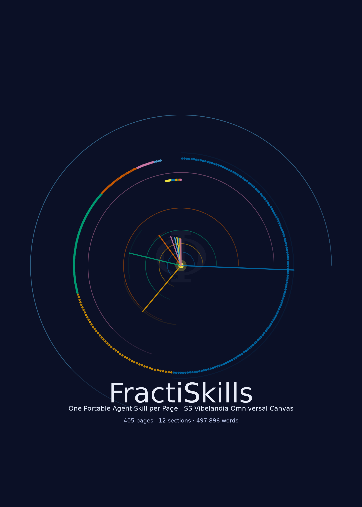

## Page 2

Contents
1
Abstract
2
2
Introduction
3
2.1
A formal preview . . . . . . . . . . . . . . . . . . . . . . . . . . . . . . . . . . . . . . . . . . . . . . . .
3
2.2
Contributions . . . . . . . . . . . . . . . . . . . . . . . . . . . . . . . . . . . . . . . . . . . . . . . . . .
3
3
Background
4
3.1
Skillarum
. . . . . . . . . . . . . . . . . . . . . . . . . . . . . . . . . . . . . . . . . . . . . . . . . . . .
4
3.2
The site as corpus
. . . . . . . . . . . . . . . . . . . . . . . . . . . . . . . . . . . . . . . . . . . . . . .
4
3.3
The dynamic-content problem . . . . . . . . . . . . . . . . . . . . . . . . . . . . . . . . . . . . . . . . .
4
4
Methods
5
4.1
Pipeline overview . . . . . . . . . . . . . . . . . . . . . . . . . . . . . . . . . . . . . . . . . . . . . . . .
5
4.2
Discovery . . . . . . . . . . . . . . . . . . . . . . . . . . . . . . . . . . . . . . . . . . . . . . . . . . . .
5
4.3
A formal model of coverage . . . . . . . . . . . . . . . . . . . . . . . . . . . . . . . . . . . . . . . . . .
5
4.4
Render . . . . . . . . . . . . . . . . . . . . . . . . . . . . . . . . . . . . . . . . . . . . . . . . . . . . . .
6
4.5
Dynamic-document augmentation . . . . . . . . . . . . . . . . . . . . . . . . . . . . . . . . . . . . . . .
6
4.6
Publish and research . . . . . . . . . . . . . . . . . . . . . . . . . . . . . . . . . . . . . . . . . . . . . .
6
5
Results
7
5.1
Inventory and render by section . . . . . . . . . . . . . . . . . . . . . . . . . . . . . . . . . . . . . . . .
7
5.2
Discovery yield . . . . . . . . . . . . . . . . . . . . . . . . . . . . . . . . . . . . . . . . . . . . . . . . .
7
5.3
Depth profile . . . . . . . . . . . . . . . . . . . . . . . . . . . . . . . . . . . . . . . . . . . . . . . . . .
7
5.4
Hub structure . . . . . . . . . . . . . . . . . . . . . . . . . . . . . . . . . . . . . . . . . . . . . . . . . .
8
5.5
Dynamic-document augmentation . . . . . . . . . . . . . . . . . . . . . . . . . . . . . . . . . . . . . . .
8
5.6
Corpus shape . . . . . . . . . . . . . . . . . . . . . . . . . . . . . . . . . . . . . . . . . . . . . . . . . .
9
5.7
Evidence and provenance
. . . . . . . . . . . . . . . . . . . . . . . . . . . . . . . . . . . . . . . . . . .
9
6
Visualizations
10
6.1
Reading the set . . . . . . . . . . . . . . . . . . . . . . . . . . . . . . . . . . . . . . . . . . . . . . . . .
10
7
Skill Catalog
12
8
Discussion and Limitations
40
8.1
What the render gets right . . . . . . . . . . . . . . . . . . . . . . . . . . . . . . . . . . . . . . . . . . .
40
8.2
Known limitations
. . . . . . . . . . . . . . . . . . . . . . . . . . . . . . . . . . . . . . . . . . . . . . .
40
8.3
Ethical posture . . . . . . . . . . . . . . . . . . . . . . . . . . . . . . . . . . . . . . . . . . . . . . . . .
42
9
Scope and Related Work
43
9.1
In scope . . . . . . . . . . . . . . . . . . . . . . . . . . . . . . . . . . . . . . . . . . . . . . . . . . . . .
43
9.2
Out of scope
. . . . . . . . . . . . . . . . . . . . . . . . . . . . . . . . . . . . . . . . . . . . . . . . . .
43
9.3
Related work . . . . . . . . . . . . . . . . . . . . . . . . . . . . . . . . . . . . . . . . . . . . . . . . . .
43
10 Reproducibility
44
10.1 Caching and revalidation . . . . . . . . . . . . . . . . . . . . . . . . . . . . . . . . . . . . . . . . . . . .
44
10.2 Adding new pages
. . . . . . . . . . . . . . . . . . . . . . . . . . . . . . . . . . . . . . . . . . . . . . .
44
10.3 Failure recovery and evidence origins . . . . . . . . . . . . . . . . . . . . . . . . . . . . . . . . . . . . .
44
10.4 Tracked vs disposable; determinism . . . . . . . . . . . . . . . . . . . . . . . . . . . . . . . . . . . . . .
44
10.5 Artifact inventory . . . . . . . . . . . . . . . . . . . . . . . . . . . . . . . . . . . . . . . . . . . . . . . .
44
11 Glossary
46
12 Summary
47
13 References
48

## Page 3

1
Abstract
FractiSkills treats an entire website as a corpus of agent skills: every reachable page is normalized into a SKILL.md-style
artifact so that a whole site — not a single document — becomes loadable context for an agent. The work is organized
around a four-stage pipeline — discover, render, publish, research — with Skillarum [Friedman, 2026b] serving as
the engine that turns raw crawl output into citable, receipt-bearing skill documents. Discovery unions the declared
sitemap with a bounded, robots-respecting breadth-first crawl (reaching a maximum depth of 5), resolves redirect and
canonical aliases, and partitions every page into site-derived sections; the render stage emits one receipt-bearing skill
per page; publish and research then validate, organize, and measure the corpus.
The resulting corpus covers 405 pages from 53 sitemap URLs, organized into 12 sections and 405 skills totaling 497896
words (3887524 characters). Augmentation — a declared, same-origin document retrieval for client-rendered pages —
was attempted 173 times and succeeded 169 times (1988848 document characters retrieved), with 4 failures recorded
as receipts. The size effect is stark: augmented skills have a median of 1824 words versus 486 for static pages, a ratio
of 3.8×. The run issued 417 network requests, all evidence origins marked live, under pipeline version 0.8 and cache
version 7.
Reproducibility is enforced rather than promised: every statistic in this manuscript is emitted as a token that must
resolve against a machine-generated data contract, and every page carries a fetch receipt — URL, timestamp, SHA-256
content hash, and augmentation status — so any number can be traced to a specific observation within the 2026-
09-10T23:51:05.959201+00:00 through 2026-09-10T22:19:21.394219+00:00 (UTC) window. Failed augmentations are
reported, not silently dropped. Keywords: agent skills, SKILL.md, web scraping, Skillarum, provenance, reproducible
research.
2

## Page 4

2
Introduction
Agent harnesses load skills as portable SKILL.md packages: frontmatter plus structured Markdown teaching what a
body of knowledge is, when to use it, how to verify claims. Skillarum[Friedman, 2026b] renders such packages from
selected pages — a profile names targets, each mapping to an exact URL. FractiSkills asks the next question: what does
it take to skill an entire website — every page, organized as the site itself is organized, published as one reviewable
artifact?
Whole-site skilling must first discover what the site contains. A declared sitemap alone is not enough — on the subject
site, 53 declared URLs yielded only 45 pages, while a bounded, robots-respecting crawl added 360 more. Coverage
requires unioning declared and discovered sources under the site’s own section architecture.
The subject corpus is the SS Vibelandia Omniversal Canvas at https://www.ssvibelandiaquestfest24x365.com/ — a
self-described “digital Burning Man camp and art exhibit” [Valet Pru, 2026]. It is a demanding test case: static pages
sit beside client-rendered readers whose served HTML is a loading shell, JSON-backed catalogs, redirect stubs, and
query-parameterized document routes. robots.txt welcomes all crawlers and a sitemap declares the corpus; 405 pages
across 12 sections exercise every path the pipeline implements.
2.1
A formal preview
The three contributions compose into one coverage statement. If 𝒮is the declared sitemap, 𝒞the crawl’s accepted
pages, and id(⋅) the canonical identity of a URL, the render target set is the union
𝒫= id(𝒮) ∪id(𝒞)
(1)
developed as eq. 2 in §4.3 with the alias fixed point of eq. 3; the yields of eq. 5 and eq. 6 are its two measurements,
and the hub score of eq. 8 and the augmentation ratio of eq. 9 are the run’s headline outcomes.
2.2
Contributions
1. Whole-site discovery with alias resolution. The discovery stage unions the declared sitemap with a bounded
crawl, resolves redirect aliases to canonical pages, and partitions every page into the site’s own sections — one
render target per page. The 360 crawl-only additions — sitemap-only ingestion would have missed 88.9% of the
corpus (85% of declared sitemap URLs resolve to pages) — motivate this union strategy.
2. Declared dynamic-document augmentation. An AugmentedGenerator keeps Skillarum’s deterministic skill
body but retrieves client-rendered documents from reviewed, same-origin JSON endpoints, stamping per-fetch
receipts into metadata and artifacts; failures degrade to honest thin skills, never fabricated content (169 of 173
succeed).
3. A tracked, reconciled library. Validated packages publish into a clean-cut skills/ tree with a discovery index,
plus deterministic figures and a fully token-bound manuscript — every numeric claim hydrated from persisted run
artifacts, none hand-typed (§4).
Reading guide: §3 sets the Skillarum context; §4 specifies the pipeline and its formal model; §5 reports the live run
through seven numbered results subsections; §6 presents thirteen auto-numbered figures; §7 catalogs every skill; §8
states limitations; §10 gives the reproduction contract.
3

## Page 5

3
Background
3.1
Skillarum
Skillarum[Friedman, 2026b] v0.2.0 is the acquisition and generation engine behind FractiSkills. Its pipeline runs in
five stages — acquire →prepare →process →parse →render — turning a declarative YAML profile into validated
SKILL.md packages. A profile fixes the base URL, a safety-bounded crawl configuration (robots compliance, same-
origin policy, request/page caps, streaming reads, rate limits), extraction rules, and named targets, each bound to
exact page URLs. The deterministic render backend composes source-grounded skill bodies (When to use, Semantic
knowledge, Procedural guidance, Verification) entirely offline; provider backends (OpenAI, Ollama, shell command)
are optional supplements. Every package carries a manifest binding it to its prepared corpus’s fingerprint, so later
package/source drift is detectable. Validators gate each stage — crawl manifest, prepared corpus, rendered package
— and failures are withheld, not emitted. FractiSkills consumes Skillarum as a pinned dependency (v0.2.0), adding
whole-site discovery, dynamic-content augmentation, and publication-scale organization.
3.2
The site as corpus
The corpus is the SS Vibelandia site at https://www.ssvibelandiaquestfest24x365.com/. Its machine posture is explicit:
robots.txt serves User-agent: * / Allow: / with the banner “All crawlers welcome. All content public. Index
everything.” A sitemap of 53 URLs follows the sitemap protocol [Google, Inc., Yahoo!, Microsoft Corporation, 2008],
and the crawl respects the Robots Exclusion Protocol [Koster et al., 2022] as enforced by Skillarum’s fetcher. Content
spans an art manifest, a ship-board blog, journey brochures, nesting guides, press releases, a whitepaper reading room,
and interactive exhibits — a stress test for whole-site, section-organized skilling.
3.3
The dynamic-content problem
A whole-site render meets pages Skillarum’s static fetcher cannot serve honestly: client-rendered shells. Their served
HTML holds only a near-empty loading frame while the real document arrives from a same-origin JSON endpoint
4

## Page 6

4
Methods
The pipeline is four stages — discover →render →publish →research — each a separate testable module under
src/fractiskills/, orchestrated by thin scripts and a fractiskills CLI. Network behavior is bounded by two
reviewed files: the site spec data/sources/ssvibelandia.yaml (crawl limits, user agent, dynamic bindings) and the
Skillarum crawl safety limits it feeds.
4.1
Pipeline overview
Table 1: The four stages, their module boundaries, and their single network column.
Stage
Module
Reads
Writes
Network
discover
discover.py
site spec, sitemap
output/data/inven
tory.json
sitemap GET +
bounded BFS crawl
+ resolution fetches
render
pipeline.py
inventory, site spec
output/skills/,
run manifests
page GETs via
Skillarum crawler
publish
pipeline.py
rendered packages
tracked skills/, sk
ills/index.json
none
research
analysis.py,
figures.py,
publication.py
persisted artifacts
analysis record,
figures, bound
manuscript
none
Every stage writes atomically and reads only persisted artifacts, so any stage can be re-run independently; tbl. 1 is
the enforcement surface for the layer contract in manuscript/layer_contract.yaml.
4.2
Discovery
discover.py fetches the declared sitemap (https://www.ssvibelandiaquestfest24x365.com/sitemap.xml), nor-
malizes and validates every entry (same-origin, public HTTP(S)), then runs one bounded breadth-first crawl
through Skillarum’s WebsiteCrawler seeded with / and every sitemap URL, with follow_links enabled, prefix filter-
ing, page/request caps, a minimum delay per request, and streamed bounded responses. Redirect chains are recorded
as alias maps so that stub URLs (for example meta-refresh redirect pages) resolve to the canonical page they forward
to; sitemap URLs that redirect onto another sitemap page are recorded as aliases of it rather than as duplicate pages.
Sitemap URLs the breadth-first pass cannot accept — most importantly canonical-declared duplicates — get one
exact-page resolution fetch, whose served HTML canonical tag recovers the alias target from the crawler’s own fetch
cache.
The union — sitemap ∪crawl, deduplicated by canonical/final URL — is persisted as the page inventory (output/d
ata/inventory.json) with per-page provenance (via_sitemap, via_crawl_only), title, BFS depth, outbound links,
and section assignment.
Sections mirror the site’s information architecture: multi-segment paths take their area from the first path segment
(/journey/* →Journey, /ship-blog/* →Ship-Blog, /interfaces/nesting/* promoted to Nesting), while single-
segment deck-level pages join Core. This mechanical rule yields 12 sections over 405 pages.
4.3
A formal model of coverage
Let 𝒮be the declared sitemap URLs and 𝒞the pages accepted by the bounded crawl. Every fetched URL is reduced
to a canonical identity id(𝑢) — its declared <link rel="canonical"> target when present, its final post-redirect URL
otherwise — and the discovered page set is the union
𝒫= id(𝒮) ∪id(𝒞),
(2)
so a URL reached under several spellings contributes exactly one page. Alias resolution is the fixed point of the alias
step 𝑓(each hop recorded by a redirect event, a canonical declaration, or a duplicate rejection), computed with a cycle
guard:
5

## Page 7

res(𝑢) = {res(𝑓(𝑢))
if 𝑓(𝑢) ≠𝑢,
𝑢
otherwise.
(3)
Each section profile renders |𝒫𝑠| exact-page targets under a request budget that grows linearly with the section’s page
count plus fixed headroom for robots, redirects, and retries:
𝑅𝑠= 3 |𝒫𝑠| + 20,
(4)
which kept the twelve section runs inside 417 network requests in total. A sitemap URL that survives neither the
breadth-first pass nor alias resolution becomes a recorded note — never a silent gap — so the inventory is complete
with respect to its own evidence.
4.4
Render
profiles.py compiles one Skillarum profile per section (one exact-page target per discovered page; page-count-derived
request budgets per eq. 4; 0.5 s minimum delay), and pipeline.py executes each with skillarum.pipeline.run_p
rofile, passing the AugmentedGenerator described below. Targets that fail hard (for example a page that vanished
between discovery and render) fail their section run with a persisted failure manifest rather than silently skipping a
page — partial renders are never presented as complete.
4.5
Dynamic-document augmentation
AugmentedGenerator subclasses Skillarum’s DeterministicGenerator, so every skill body keeps the deterministic
section structure and passes Skillarum’s portable-body validators. For pages whose URL matches a declared binding,
it fetches the bound same-origin JSON endpoint (GET only, timeout-bounded, DNS-validated, same-origin enforced),
extracts the document text from the payload HTML, prepends a provenance header (endpoint, timestamp, HTTP
status, content SHA-256, ETag), and replaces the shell text with the augmented text. Each attempt — successful or
failed — is appended as a receipt to output/data/augmentation_receipts.jsonl and stored in the skill’s manifest
metadata. Failed augmentations keep the static shell text and add an explicit warning to the corpus, so the rendered
skill remains truthful about its thinness.
4.6
Publish and research
publish_skills validates every rendered package with Skillarum’s package validator, copies it into the tracked
skills/<Section>/<Skill>/ tree, reconciles stale packages away, and rebuilds the discovery index. The research
stage (analysis.py, figures.py, publication.py) aggregates run manifests, augmentation receipts, and the pub-
lished tree into one analysis record, renders the thirteen figures of §6, computes the manuscript token values, and binds
them into output/manuscript/. All 405 skills, the figures and receipts, and the analysis CSV regenerate from a clean
checkout with uv run python -m fractiskills run --refresh --json.
6

## Page 8

5
Results
One
complete
live
run
over
the
observation
window
2026-09-10T23:51:05.959201+00:00
through
2026-09-
10T22:19:21.394219+00:00 (UTC) produced the following record.
Discovery enumerated 405 distinct pages:
45 of them are also declared in the sitemap (which contains 53 URLs), the other 360 were reachable only by following
links; 14 of the pages carry alias URLs (redirect stubs and declared canonical duplicates) that fold onto them and are
not additional pages. Rendering executed 12 section profiles and published 405 skills — one per page, no gaps —
totaling 497896 words (median 959 per skill) at a cost of 417 network requests.
5.1
Inventory and render by section
Section
Pages
Skills
Skill words
About
1
1
1539
Core
32
32
32758
Hire-A-Goldilocks-Valet-Concierge
2
2
662
Interfaces
148
148
255200
Journey
7
7
3324
Lattice
4
4
6104
Nesting
11
11
6095
Questfest-Schedule
4
4
1289
Ship-Blog
120
120
78813
Special-Projects
3
3
1565
Voyage
25
25
12873
Whitepaper
48
48
97674
Total
405
405
497896
Every discovered page yielded exactly one skill: sections with skills = pages indicate full coverage. The distribution
is heavy-tailed — Interfaces, Whitepaper, and Ship-Blog dominate the word count, while schedule and lattice sections
contribute small but structurally load-bearing profiles. These totals are bound tokens computed from the published
skill tree, so a rerun that changes the inventory changes this table mechanically ([Friedman, 2026a]).
5.2
Discovery yield
The two yields decompose the union of eq. 2 from each side. Measuring the sitemap against itself, the sitemap-URL
acceptance yield
𝑌𝒮= | id(𝒮) ∩𝒫|
|𝒮|
(5)
is 85%: 45 of the 53 declared URLs resolved to distinct pages, the rest being aliases of pages discovered elsewhere.
Measuring the same intersection against the corpus, the sitemap-only miss rate
𝑀𝒮= 1 −| id(𝒮) ∩𝒫|
|𝒫|
(6)
is 88.9%: 360 of 405 pages exist only because the crawl followed links the sitemap does not enumerate — including
the entire Ship-Blog archive and all Voyage content. A sitemap-only render would have shipped roughly one page in
nine while claiming completeness; alias maps keep the crawl-only surplus honest, so the surplus is distinct content, not
duplicated paths.
5.3
Depth profile
eq. 2 hides where the crawl earned its pages. Grouping the inventory by breadth-first depth,
7

## Page 9

𝑑∗= arg max
𝑑
|𝒫𝑑|,
𝑠∗= |𝒫𝑑∗|
|𝒫| ,
(7)
gives the modal depth depth 4 holding 53% of all pages, with the deepest page found at depth 5. The full histogram
follows.
BFS depth
Pages
Share
depth 0
45
11%
depth 1
43
11%
depth 2
67
17%
depth 3
29
7%
depth 4
214
53%
depth 5
7
2%
Total
405
100%
5.4
Hub structure
The inbound score of a page 𝑝counts the discovered pages whose quoted links resolve onto it under eq. 3,
ℎ(𝑝) = ∣{ 𝑞∈𝒫∣𝑝∈res(links(𝑞)) }∣,
(8)
and the top of that ranking is the site’s hub structure.
Page
Section
Inbound links
/interfaces/vibelandia-questfest.html
Interfaces
156
/ship-blog/
Core
70
/lattice-chat
Core
40
/interfaces/questfest-bridge/
Interfaces
37
/
Core
19
/frontiersman-voyage
Core
17
/reading-room
Core
15
/voyage/decks
Voyage
15
/journey
Core
13
/lattice
Core
10
/coexist
Core
8
/journey/boriken-convergence
Journey
8
/voyage/cabin-ph-001
Voyage
8
/journey/cartagena-spice-stone
Journey
7
/lattice/proof
Lattice
7
The questfest landing page dominates as the event’s canonical entry point: its table-leading inbound count is carried
partly by links to the /questfest spelling, which the site’s own canonical declaration folds onto the vibelandia-
questfest page — followed by the Ship-Blog index and lattice-chat, the live interface project pages reference; the root,
frontiersman-voyage, the reading room, and the questfest bridge form the next tier. Only discovered pages are ranked:
link targets that are redirect stubs or query variants fold onto the pages they forward to, and the handful that land
on API endpoints or dead links are receipted separately rather than miscounted.
5.5
Dynamic-document augmentation
Of 173 declared augmentation attempts, 169 retrieved real documents (1988848 document characters in total) and 4
failed with persisted receipts. Each successful attempt converts a would-be twenty-word “Loading document…” shell
skill into a body carrying the full retrieved document with its retrieval provenance inline.
8

## Page 10

Table 2: The four failed augmentation attempts; each keeps its static shell text plus an explicit warning.
Page
Declared endpoint
Failure
/interfaces/whitepaper-surface.
html (no ?id=)
/api/whitepaper?id=
HTTP 400
/interfaces/whitepaper-surface.
html?id=synthobs
/api/whitepaper?id=synthobs
payload carried no document text
/special-projects/geomagnetic-h
erbivore-study
/api/turner-recent-anomaly-repo
rt
read timeout
/whitepaper/lattice-token-reduc
tion-proof
/api/whitepaper?id=lattice-toke
n-reduction-proof
HTTP 404
tbl. 2 is the complete failure set: a router page without an ?id= parameter, a document that exists but carries no
body, a transient timeout, and a stale whitepaper path. Each receipt is appended to output/data/augmentation_r
eceipts.jsonl and mirrored into the skill’s manifest metadata, so the augmentation story of any individual skill is
auditable from the published package alone.
5.6
Corpus shape
The size effect of augmentation is captured by the median ratio
𝑟=̃ 𝑤aug̃
𝑤stat
,
(9)
wherẽ 𝑤denotes the median body size in words over the 169 augmented and 236 static skills: 𝑟= 3.8 (1824 versus
486 words). Corpus-wide, the 405 skills carry 497896 words in 3887524 characters of body text — evidence-weighted
prose, not filler.
5.7
Evidence and provenance
Run manifests record evidence origin live for the live acquisition, the generator identity (fractiskills-augmented
-deterministic), and the Skillarum pipeline contract (pipeline 0.8, cache 7). Content hashes bind every skill to its
prepared corpus, and every skill body’s Semantic knowledge section quotes its source page text delimited as untrusted
data — the generated skill can never silently substitute its own claims for the site’s.
9

## Page 11

6
Visualizations
All thirteen figures are generated deterministically by figures.py from the persisted analysis record — no hand-
drawn numbers — and are written to ../figures/ with a registry consumed by the manuscript binder. Every figure
is auto-numbered and cross-referenceable; captions are bound tokens carrying the observation’s own statistics.
Figure 1: Discovered pages per section of the SS Vibelandia site (n=405), annotated with mean skill words per page.
The largest section is Interfaces with 148 pages; compare the right-hand words-per-page annotations against bar lengths
to spot mass-dense sections.
6.1
Reading the set
The thirteen figures form one argument in four movements. Structure (fig. 1, fig. 11, fig. 3): the site’s mass con-
centrates in Interfaces and Whitepaper — the two mass-dense sections visible above the corpus-average line in fig. 11
— while Ship-Blog contributes breadth over depth. Provenance (fig. 2, fig. 7, fig. 8): the sitemap alone explains a
small slice of the corpus; the funnel’s steep second step and the depth histogram’s 53%-at-depth-4 mode are the same
fact seen from two sides — the crawl’s link-following, not the site’s declared index, is where the pages live. Flow
(fig. 5, fig. 13): the adjacency matrix’s densest off-diagonal cells and the graph’s thick edges agree that the site is one
cross-linked work, with Ship-Blog quoting Core (122 links) and Core answering back (133) as its strongest reading
paths. Augmentation (fig. 6, fig. 10): the histogram shows what the declared bindings recovered — right-skewed
documents clustering near a ten-thousand-character median — and the effect panel prices that recovery at 3.8× the
median static body. The size distribution of fig. 4 and the hub ranking of fig. 9 anchor the middle of the story: a
broad, hub-linked corpus rather than a spiky one.
10

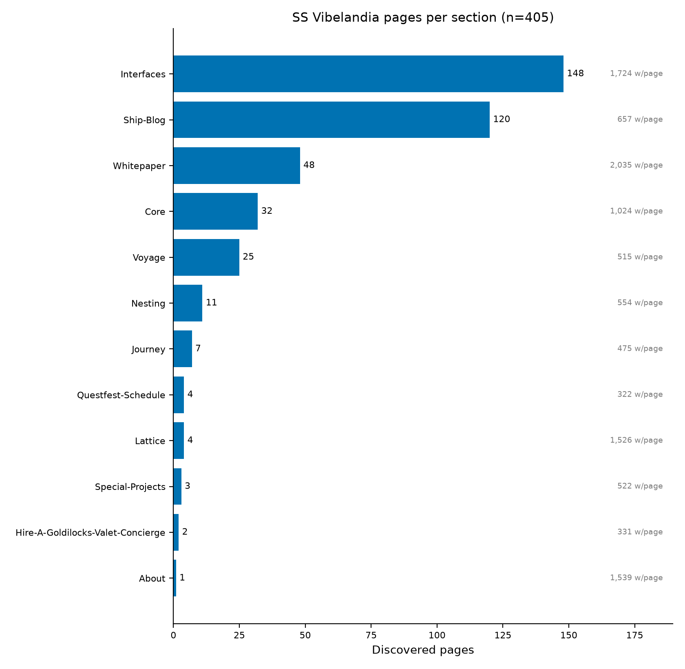

## Page 12

Figure 2: Discovery provenance by section: pages listed in the declared sitemap versus pages found only by the bounded
breadth-first crawl (45 sitemap, 360 crawl-only). Orange-dominant rows — Ship-Blog, Voyage, most of Interfaces —
are invisible to sitemap-only ingestion.
11

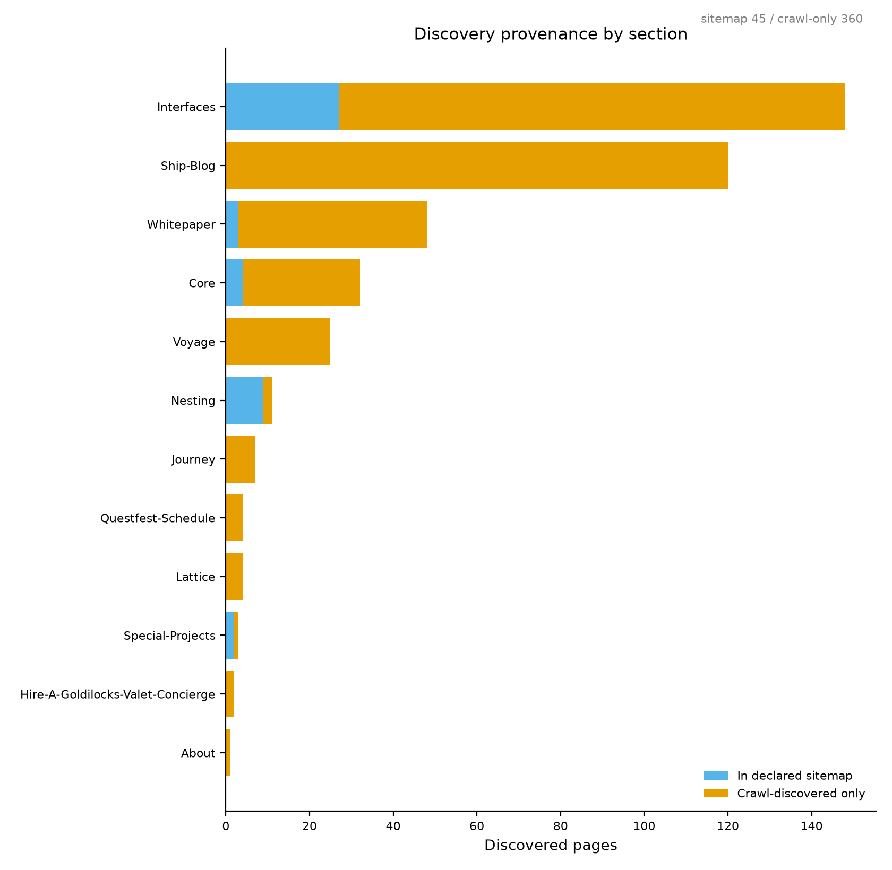

## Page 13

Figure 3: Share of pages versus share of rendered skill words by section. Interfaces carries 51% of the corpus words;
gaps between the paired bars flag sections whose average page is much heavier (Interfaces, Whitepaper) or lighter
(Ship-Blog) than the corpus mean.
7
Skill Catalog
The published library lives at skills/ in the repository, one package per page, organized by section — the same
organization the discovery stage derived from the site’s own URL architecture. Each package contains a validated
SKILL.md (frontmatter name, description, effect annotation) and a manifest.json binding it to its source pages,
retrieval timestamps, and content hashes.
skills/index.json is the machine-readable entry point for consumer harnesses. Its top-level schema_version gates
parsing: a harness rejects or migrates on mismatch before touching anything else.
The skills array carries one
record per package, each naming its area (the section), its path (repository-relative SKILL.md location), and the
resolved skill name — enough for a loader to enumerate, filter by area, and read packages without re-deriving layout
conventions. Package directory names are path-derived from the source URL and therefore stable across regenerations;
human-facing titles drift, so consumers should key on paths and names, never on titles.
The complete catalog below is a bound token: generated from the published tree at bind time, it always describes the
repository as it actually is.
Section
Skill
Source page
Words
About
About-Reno-Holographic-
Swamp-Beats-Caliente
https://www.ssvibelandiaquestfest24x365.com/about/reno-
holographic-swamp-beats-
caliente
1539
Core
Ai-Transparency
https://www.ssvibelandiaquestfest24x365.com/ai-
transparency
661
Core
Bulletin-Board
https://www.ssvibelandiaquestfest24x365.com/bulletin-
board
326
Core
Coexist
https://www.ssvibelandiaquestfest24x365.com/coexist
1512
Core
Concierto-Program
https://www.ssvibelandiaquestfest24x365.com/concierto-
program
1832
Core
Creator-Studio
https://www.ssvibelandiaquestfest24x365.com/creator-
studio
334
12

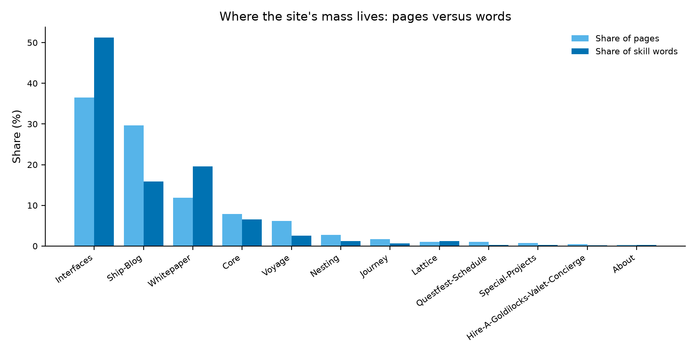

## Page 14

Section
Skill
Source page
Words
Core
Front-Desk
https://www.ssvibelandiaquestfest24x365.com/front-
desk
340
Core
Front-Desk-Program
https://www.ssvibelandiaquestfest24x365.com/front-
desk-program
1956
Core
Frontier
https://www.ssvibelandiaquestfest24x365.com/frontier
665
Core
Frontiersman-Voyage
https://www.ssvibelandiaquestfest24x365.com/frontiersman-
voyage
3009
Core
Get-Started
https://www.ssvibelandiaquestfest24x365.com/get-
started
327
Core
Goldilocks-Players-Guide
https://www.ssvibelandiaquestfest24x365.com/goldilocks-
players-guide
1608
Core
Hire-A-Goldilocks-Valet-
Concierge
https://www.ssvibelandiaquestfest24x365.com/hire-
a-goldilocks-valet-concierge
716
Core
Holographic-Goldilocks-Ai-
Os
https://www.ssvibelandiaquestfest24x365.com/holographic-
goldilocks-ai-os
1427
Core
Home
https://www.ssvibelandiaquestfest24x365.com/
524
Core
Join-The-Crew
https://www.ssvibelandiaquestfest24x365.com/join-
the-crew
806
Core
Journey
https://www.ssvibelandiaquestfest24x365.com/journey
337
Core
Lattice
https://www.ssvibelandiaquestfest24x365.com/lattice
1458
Core
Lattice-Chat
https://www.ssvibelandiaquestfest24x365.com/lattice-
chat
287
Core
Meet-The-Crew
https://www.ssvibelandiaquestfest24x365.com/meet-
the-crew
734
Core
Mining-Ops
https://www.ssvibelandiaquestfest24x365.com/mining-
ops
282
Core
Omni-Lattice-Course
https://www.ssvibelandiaquestfest24x365.com/omni-
lattice-course
293
Core
Omni-Lattice-Textbook
https://www.ssvibelandiaquestfest24x365.com/omni-
lattice-textbook
1423
Core
Prime-Vault-Chat
https://www.ssvibelandiaquestfest24x365.com/prime-
vault-chat
419
Core
Prime-Vault-Race
https://www.ssvibelandiaquestfest24x365.com/prime-
vault-race
582
Core
Reading-Room
https://www.ssvibelandiaquestfest24x365.com/reading-
room
324
Core
Reading-Room-Program
https://www.ssvibelandiaquestfest24x365.com/reading-
room-program
1757
Core
Reno
https://www.ssvibelandiaquestfest24x365.com/reno
332
Core
Ship-Blog
https://www.ssvibelandiaquestfest24x365.com/ship-
blog/
5453
Core
Sin-City-Program
https://www.ssvibelandiaquestfest24x365.com/sin-
city-program
1340
Core
Singularities
https://www.ssvibelandiaquestfest24x365.com/singularities
644
Core
Ss-Vibelandia
https://www.ssvibelandiaquestfest24x365.com/ss-
vibelandia
637
Core
Synthio
https://www.ssvibelandiaquestfest24x365.com/synthio
413
Hire-A-Goldilocks-Valet-
Concierge
Hire-A-Goldilocks-Valet-
Concierge-Flyer
https://www.ssvibelandiaquestfest24x365.com/hire-
a-goldilocks-valet-
concierge/flyer
352
Hire-A-Goldilocks-Valet-
Concierge
Hire-A-Goldilocks-Valet-
Concierge-Item
https://www.ssvibelandiaquestfest24x365.com/hire-
a-goldilocks-valet-
concierge/item?item=ecoreset
310
13

## Page 15

Section
Skill
Source page
Words
Interfaces
Interfaces-Blog-Goldilocks-
Beehive-Ecoreset-May-
2026
https://www.ssvibelandiaquestfest24x365.com/interfaces/blog-
goldilocks-beehive-ecoreset-
may-2026.html
876
Interfaces
Interfaces-Blog-When-The-
Sun-Spoke
https://www.ssvibelandiaquestfest24x365.com/interfaces/blog-
when-the-sun-spoke.html
1001
Interfaces
Interfaces-Commons-Chef
https://www.ssvibelandiaquestfest24x365.com/interfaces/commons/c
695
Interfaces
Interfaces-Commons-Guide
https://www.ssvibelandiaquestfest24x365.com/interfaces/commons/g
690
Interfaces
Interfaces-Commons-Host
https://www.ssvibelandiaquestfest24x365.com/interfaces/commons/h
633
Interfaces
Interfaces-Commons-Index
https://www.ssvibelandiaquestfest24x365.com/interfaces/commons/i
1246
Interfaces
Interfaces-Fractiai
https://www.ssvibelandiaquestfest24x365.com/interfaces/fractiai.htm
328
Interfaces
Interfaces-Goldilocks-
Beehive-Residency
https://www.ssvibelandiaquestfest24x365.com/interfaces/goldilocks-
beehive-residency.html
336
Interfaces
Interfaces-Hero-Houdini-
Mythos-Demonstration
https://www.ssvibelandiaquestfest24x365.com/interfaces/hero-
houdini-mythos-
demonstration.html
913
Interfaces
Interfaces-Look-At-The-
Sun
https://www.ssvibelandiaquestfest24x365.com/interfaces/look-
at-the-sun.html
793
Interfaces
Interfaces-Look-Under-
The-Hood
https://www.ssvibelandiaquestfest24x365.com/interfaces/look-
under-the-hood.html
744
Interfaces
Interfaces-Press-Release-
Anthropic-Mythos-
Holographic-Review-May-
2026
https://www.ssvibelandiaquestfest24x365.com/interfaces/press-
release-anthropic-mythos-
holographic-review-may-
2026.html
568
Interfaces
Interfaces-Press-Release-
Erdos-Deepmind-
Holographic-Aios-May-
2026
https://www.ssvibelandiaquestfest24x365.com/interfaces/press-
release-erdos-deepmind-
holographic-aios-may-
2026.html
1316
Interfaces
Interfaces-Press-Release-
Etcon-Reno-Desert-May-
2026
https://www.ssvibelandiaquestfest24x365.com/interfaces/press-
release-etcon-reno-desert-
may-2026.html
604
Interfaces
Interfaces-Press-Release-
Hit-Factory-30-Day-
Showdown-May-2026
https://www.ssvibelandiaquestfest24x365.com/interfaces/press-
release-hit-factory-30-day-
showdown-may-2026.html
981
Interfaces
Interfaces-Press-Release-
Machote-Modern-
Magazine-Beehive-May-
2026
https://www.ssvibelandiaquestfest24x365.com/interfaces/press-
release-machote-modern-
magazine-beehive-may-
2026.html
792
Interfaces
Interfaces-Press-Release-
Syntheverse-King-Bee-
Node-Alignment-June-2026
https://www.ssvibelandiaquestfest24x365.com/interfaces/press-
release-syntheverse-king-
bee-node-alignment-june-
2026.html
1073
Interfaces
Interfaces-Press-Release-
Synthobs-Chipless-
Datacenterless-June-2026
https://www.ssvibelandiaquestfest24x365.com/interfaces/press-
release-synthobs-chipless-
datacenterless-june-
2026.html
733
Interfaces
Interfaces-Press-Releases
https://www.ssvibelandiaquestfest24x365.com/interfaces/press-
releases.html
726
Interfaces
Interfaces-Questfest-2026-
Frontier-Guide
https://www.ssvibelandiaquestfest24x365.com/interfaces/questfest-
2026-frontier-guide.html
332
Interfaces
Interfaces-Questfest-Bridge
https://www.ssvibelandiaquestfest24x365.com/interfaces/questfest-
bridge/
286
Interfaces
Interfaces-Sing13-Edge-
Onboarding
https://www.ssvibelandiaquestfest24x365.com/interfaces/sing13-
edge-onboarding.html
1339
Interfaces
Interfaces-Valetpru-Agent-
Mode
https://www.ssvibelandiaquestfest24x365.com/interfaces/valetpru-
agent-mode.html
311
14

## Page 16

Section
Skill
Source page
Words
Interfaces
Interfaces-Vibelandia-
Questfest
https://www.ssvibelandiaquestfest24x365.com/interfaces/vibelandia-
questfest.html
704
Interfaces
Interfaces-Whitepaper-
Surface
https://www.ssvibelandiaquestfest24x365.com/interfaces/whitepaper
surface.html
298
Interfaces
Interfaces-Whitepaper-
Surface-Awareness-
Singularities-0-81-2026-07
https://www.ssvibelandiaquestfest24x365.com/interfaces/whitepaper
surface.html?id=awareness-
singularities-0-81-2026-07
1082
Interfaces
Interfaces-Whitepaper-
Surface-Bbhe-Repository-
Standard
https://www.ssvibelandiaquestfest24x365.com/interfaces/whitepaper
surface.html?id=bbhe-
repository-standard
1389
Interfaces
Interfaces-Whitepaper-
Surface-Dp-Master-Canon
https://www.ssvibelandiaquestfest24x365.com/interfaces/whitepaper
surface.html?id=dp-
master-canon
4148
Interfaces
Interfaces-Whitepaper-
Surface-Dp-Omniversal-
Node-Alignment-2026
https://www.ssvibelandiaquestfest24x365.com/interfaces/whitepaper
surface.html?id=dp-
omniversal-node-alignment-
2026
1374
Interfaces
Interfaces-Whitepaper-
Surface-Dp-Resonance-
Notice
https://www.ssvibelandiaquestfest24x365.com/interfaces/whitepaper
surface.html?id=dp-
resonance-notice
759
Interfaces
Interfaces-Whitepaper-
Surface-Dp-Roadmap-13
https://www.ssvibelandiaquestfest24x365.com/interfaces/whitepaper
surface.html?id=dp-
roadmap-13
2021
Interfaces
Interfaces-Whitepaper-
Surface-Dp-Syntheverse-
Sandbox-Comprehensive-
2026
https://www.ssvibelandiaquestfest24x365.com/interfaces/whitepaper
surface.html?id=dp-
syntheverse-sandbox-
comprehensive-2026
2325
Interfaces
Interfaces-Whitepaper-
Surface-Dp-Synthobs-Mca-
2026
https://www.ssvibelandiaquestfest24x365.com/interfaces/whitepaper
surface.html?id=dp-
synthobs-mca-2026
1725
Interfaces
Interfaces-Whitepaper-
Surface-Fractiai-Ac-Hmm-
Satellites-2026
https://www.ssvibelandiaquestfest24x365.com/interfaces/whitepaper
surface.html?id=fractiai-
ac-hmm-satellites-2026
2092
Interfaces
Interfaces-Whitepaper-
Surface-Fractiai-Eesm-
Gpu-Telemetry-2026
https://www.ssvibelandiaquestfest24x365.com/interfaces/whitepaper
surface.html?id=fractiai-
eesm-gpu-telemetry-2026
881
Interfaces
Interfaces-Whitepaper-
Surface-Fractiai-Egs-Nlrf-
2026
https://www.ssvibelandiaquestfest24x365.com/interfaces/whitepaper
surface.html?id=fractiai-
egs-nlrf-2026
1132
Interfaces
Interfaces-Whitepaper-
Surface-Fractiai-Hgt-Psd-
Covariance-2026
https://www.ssvibelandiaquestfest24x365.com/interfaces/whitepaper
surface.html?id=fractiai-
hgt-psd-covariance-2026
752
Interfaces
Interfaces-Whitepaper-
Surface-Geomagnetic-
Herbivore-2026
https://www.ssvibelandiaquestfest24x365.com/interfaces/whitepaper
surface.html?id=geomagnetic-
herbivore-2026
1999
Interfaces
Interfaces-Whitepaper-
Surface-Goldilocks-Erdos-
Mathematics
https://www.ssvibelandiaquestfest24x365.com/interfaces/whitepaper
surface.html?id=goldilocks-
erdos-mathematics
2626
Interfaces
Interfaces-Whitepaper-
Surface-Goldilocks-
Geomagnetic-Wavefield-
Multitaxa
https://www.ssvibelandiaquestfest24x365.com/interfaces/whitepaper
surface.html?id=goldilocks-
geomagnetic-wavefield-
multitaxa
2868
15

## Page 17

Section
Skill
Source page
Words
Interfaces
Interfaces-Whitepaper-
Surface-Goldilocks-Prime-
Linear-Compression-2026
https://www.ssvibelandiaquestfest24x365.com/interfaces/whitepaper
surface.html?id=goldilocks-
prime-linear-compression-
2026
2578
Interfaces
Interfaces-Whitepaper-
Surface-Goldilocks-
Transfinite-Inversion-2026
https://www.ssvibelandiaquestfest24x365.com/interfaces/whitepaper
surface.html?id=goldilocks-
transfinite-inversion-2026
3542
Interfaces
Interfaces-Whitepaper-
Surface-Hhf-Wp-2026-V8
https://www.ssvibelandiaquestfest24x365.com/interfaces/whitepaper
surface.html?id=hhf-wp-
2026-v8
2199
Interfaces
Interfaces-Whitepaper-
Surface-Jj-Snap-Ofc
https://www.ssvibelandiaquestfest24x365.com/interfaces/whitepaper
surface.html?id=jj-snap-
ofc
1088
Interfaces
Interfaces-Whitepaper-
Surface-Lattice-Noahs-Ark-
Metaphor-2026-07
https://www.ssvibelandiaquestfest24x365.com/interfaces/whitepaper
surface.html?id=lattice-
noahs-ark-metaphor-2026-
07
740
Interfaces
Interfaces-Whitepaper-
Surface-Lattice-Token-
Reduction-Proof-2026-07
https://www.ssvibelandiaquestfest24x365.com/interfaces/whitepaper
surface.html?id=lattice-
token-reduction-proof-
2026-07
825
Interfaces
Interfaces-Whitepaper-
Surface-Mca-Nspfrnp-
Catalog
https://www.ssvibelandiaquestfest24x365.com/interfaces/whitepaper
surface.html?id=mca-
nspfrnp-catalog
6362
Interfaces
Interfaces-Whitepaper-
Surface-Nspfrnp-Snap-
Peer-Review-Audit
https://www.ssvibelandiaquestfest24x365.com/interfaces/whitepaper
surface.html?id=nspfrnp-
snap-peer-review-audit
1008
Interfaces
Interfaces-Whitepaper-
Surface-Omniversal-
Goldilocks-Rideshare-2026-
07
https://www.ssvibelandiaquestfest24x365.com/interfaces/whitepaper
surface.html?id=omniversal-
goldilocks-rideshare-2026-
07
1847
Interfaces
Interfaces-Whitepaper-
Surface-Omniversal-
Nested-Agent-Lattice-2026-
07
https://www.ssvibelandiaquestfest24x365.com/interfaces/whitepaper
surface.html?id=omniversal-
nested-agent-lattice-2026-
07
1669
Interfaces
Interfaces-Whitepaper-
Surface-Ops-Egs-Btc-
Mining
https://www.ssvibelandiaquestfest24x365.com/interfaces/whitepaper
surface.html?id=ops-egs-
btc-mining
1505
Interfaces
Interfaces-Whitepaper-
Surface-Recursive-
Attention-Quantum-Solar-
Dna-Loop-2026
https://www.ssvibelandiaquestfest24x365.com/interfaces/whitepaper
surface.html?id=recursive-
attention-quantum-solar-
dna-loop-2026
2518
Interfaces
Interfaces-Whitepaper-
Surface-Rev-Egs-Hhf-
Mythos
https://www.ssvibelandiaquestfest24x365.com/interfaces/whitepaper
surface.html?id=rev-egs-
hhf-mythos
1418
Interfaces
Interfaces-Whitepaper-
Surface-Syn-Sun-Wavefield-
Oscillator
https://www.ssvibelandiaquestfest24x365.com/interfaces/whitepaper
surface.html?id=syn-sun-
wavefield-oscillator
3563
Interfaces
Interfaces-Whitepaper-
Surface-Synthio-Komamri-
Distributed-Cloud-2026-08
https://www.ssvibelandiaquestfest24x365.com/interfaces/whitepaper
surface.html?id=synthio-
komamri-distributed-cloud-
2026-08
1362
16

## Page 18

Section
Skill
Source page
Words
Interfaces
Interfaces-Whitepaper-
Surface-Synthio-Mri-Cloud-
Antenna-99-Octave-2026-
08
https://www.ssvibelandiaquestfest24x365.com/interfaces/whitepaper
surface.html?id=synthio-
mri-cloud-antenna-99-
octave-2026-08
2693
Interfaces
Interfaces-Whitepaper-
Surface-Synthio-Mri-Vs-
Legacy-Perf-Proxy-2026-08
https://www.ssvibelandiaquestfest24x365.com/interfaces/whitepaper
surface.html?id=synthio-
mri-vs-legacy-perf-proxy-
2026-08
1620
Interfaces
Interfaces-Whitepaper-
Surface-Synthobs-81-
Orbital-Singularity-2026-
07
https://www.ssvibelandiaquestfest24x365.com/interfaces/whitepaper
surface.html?id=synthobs-
81-orbital-singularity-2026-
07
1862
Interfaces
Interfaces-Whitepaper-
Surface-Synthobs-99-
Octave-Digits-Master-2026-
08
https://www.ssvibelandiaquestfest24x365.com/interfaces/whitepaper
surface.html?id=synthobs-
99-octave-digits-master-
2026-08
1518
Interfaces
Interfaces-Whitepaper-
Surface-Synthobs-
Awareness-Vs-Brute-Force-
Leverage-2026-09
https://www.ssvibelandiaquestfest24x365.com/interfaces/whitepaper
surface.html?id=synthobs-
awareness-vs-brute-force-
leverage-2026-09
1554
Interfaces
Interfaces-Whitepaper-
Surface-Synthobs-
Chromosomal-
Electrodynamics-2026-07
https://www.ssvibelandiaquestfest24x365.com/interfaces/whitepaper
surface.html?id=synthobs-
chromosomal-
electrodynamics-2026-07
4578
Interfaces
Interfaces-Whitepaper-
Surface-Synthobs-Cmos-
Protonic-99-Octave-Omni-
Lattice-2026
https://www.ssvibelandiaquestfest24x365.com/interfaces/whitepaper
surface.html?id=synthobs-
cmos-protonic-99-octave-
omni-lattice-2026-08
1950
Interfaces
Interfaces-Whitepaper-
Surface-Synthobs-
Constructive-
Morphogenesis-99-Octave-
2026
https://www.ssvibelandiaquestfest24x365.com/interfaces/whitepaper
surface.html?id=synthobs-
constructive-
morphogenesis-99-octave-
2026-08
1287
Interfaces
Interfaces-Whitepaper-
Surface-Synthobs-Cross-
Scale-Biological-Antennae-
2026-07
https://www.ssvibelandiaquestfest24x365.com/interfaces/whitepaper
surface.html?id=synthobs-
cross-scale-biological-
antennae-2026-07
3334
Interfaces
Interfaces-Whitepaper-
Surface-Synthobs-
Cytographic-Holographic-
Nucleus-2026-07
https://www.ssvibelandiaquestfest24x365.com/interfaces/whitepaper
surface.html?id=synthobs-
cytographic-holographic-
nucleus-2026-07
3770
Interfaces
Interfaces-Whitepaper-
Surface-Synthobs-Dna-
Lattice-Holograph-2026-07
https://www.ssvibelandiaquestfest24x365.com/interfaces/whitepaper
surface.html?id=synthobs-
dna-lattice-holograph-2026-
07
1434
Interfaces
Interfaces-Whitepaper-
Surface-Synthobs-Egs-81-
Electrons-2026-07
https://www.ssvibelandiaquestfest24x365.com/interfaces/whitepaper
surface.html?id=synthobs-
egs-81-electrons-2026-07
1354
Interfaces
Interfaces-Whitepaper-
Surface-Synthobs-Egs-
Epigenetic-Phase-Locking-
2026-07
https://www.ssvibelandiaquestfest24x365.com/interfaces/whitepaper
surface.html?id=synthobs-
egs-epigenetic-phase-
locking-2026-07
1749
17

## Page 19

Section
Skill
Source page
Words
Interfaces
Interfaces-Whitepaper-
Surface-Synthobs-Egs-
Euler-Phase-Lock-2026-07
https://www.ssvibelandiaquestfest24x365.com/interfaces/whitepaper
surface.html?id=synthobs-
egs-euler-phase-lock-2026-
07
1415
Interfaces
Interfaces-Whitepaper-
Surface-Synthobs-Egs-
Planck-Scale-Harmonic-
2026-07
https://www.ssvibelandiaquestfest24x365.com/interfaces/whitepaper
surface.html?id=synthobs-
egs-planck-scale-harmonic-
2026-07
2174
Interfaces
Interfaces-Whitepaper-
Surface-Synthobs-
Emergent-Sync-Multi-
Agent-2026
https://www.ssvibelandiaquestfest24x365.com/interfaces/whitepaper
surface.html?id=synthobs-
emergent-sync-multi-agent-
2026
3262
Interfaces
Interfaces-Whitepaper-
Surface-Synthobs-
Endogenous-Phase-2026-07
https://www.ssvibelandiaquestfest24x365.com/interfaces/whitepaper
surface.html?id=synthobs-
endogenous-phase-2026-07
1623
Interfaces
Interfaces-Whitepaper-
Surface-Synthobs-
Generative-Matrix-Phi-
Egs-2026-09
https://www.ssvibelandiaquestfest24x365.com/interfaces/whitepaper
surface.html?id=synthobs-
generative-matrix-phi-egs-
2026-09
1438
Interfaces
Interfaces-Whitepaper-
Surface-Synthobs-Hex-
Organ-Engine-2026
https://www.ssvibelandiaquestfest24x365.com/interfaces/whitepaper
surface.html?id=synthobs-
hex-organ-engine-2026
3163
Interfaces
Interfaces-Whitepaper-
Surface-Synthobs-Histone-
Phase-Operator-2026-07
https://www.ssvibelandiaquestfest24x365.com/interfaces/whitepaper
surface.html?id=synthobs-
histone-phase-operator-
2026-07
1579
Interfaces
Interfaces-Whitepaper-
Surface-Synthobs-
Holographic-Operators-
2026-07
https://www.ssvibelandiaquestfest24x365.com/interfaces/whitepaper
surface.html?id=synthobs-
holographic-operators-
2026-07
2385
Interfaces
Interfaces-Whitepaper-
Surface-Synthobs-
Holographic-Rhyme-
Fractal-2026-09
https://www.ssvibelandiaquestfest24x365.com/interfaces/whitepaper
surface.html?id=synthobs-
holographic-rhyme-fractal-
2026-09
1151
Interfaces
Interfaces-Whitepaper-
Surface-Synthobs-Human-
Omniversal-Reality-Bridge-
2026-08
https://www.ssvibelandiaquestfest24x365.com/interfaces/whitepaper
surface.html?id=synthobs-
human-omniversal-reality-
bridge-2026-08
1453
Interfaces
Interfaces-Whitepaper-
Surface-Synthobs-Ibm-Sna-
Tcpip-Gateway-Omni-
Lattice-2026-0
https://www.ssvibelandiaquestfest24x365.com/interfaces/whitepaper
surface.html?id=synthobs-
ibm-sna-tcpip-gateway-
omni-lattice-2026-09
1824
Interfaces
Interfaces-Whitepaper-
Surface-Synthobs-Infinite-
Octave-Prime-Parity-2026-
09
https://www.ssvibelandiaquestfest24x365.com/interfaces/whitepaper
surface.html?id=synthobs-
infinite-octave-prime-
parity-2026-09
1633
Interfaces
Interfaces-Whitepaper-
Surface-Synthobs-Infinite-
Octaves-Omniversal-
Lattice-2026
https://www.ssvibelandiaquestfest24x365.com/interfaces/whitepaper
surface.html?id=synthobs-
infinite-octaves-omniversal-
lattice-2026-08
1400
Interfaces
Interfaces-Whitepaper-
Surface-Synthobs-
Intelligence-Density-2026
https://www.ssvibelandiaquestfest24x365.com/interfaces/whitepaper
surface.html?id=synthobs-
intelligence-density-2026
1751
18

## Page 20

Section
Skill
Source page
Words
Interfaces
Interfaces-Whitepaper-
Surface-Synthobs-Invisible-
Frontier-Gates-Ai-2026-08
https://www.ssvibelandiaquestfest24x365.com/interfaces/whitepaper
surface.html?id=synthobs-
invisible-frontier-gates-ai-
2026-08
1042
Interfaces
Interfaces-Whitepaper-
Surface-Synthobs-Lattice-
Vs-Vibe-Coding-2026-09
https://www.ssvibelandiaquestfest24x365.com/interfaces/whitepaper
surface.html?id=synthobs-
lattice-vs-vibe-coding-2026-
09
1744
Interfaces
Interfaces-Whitepaper-
Surface-Synthobs-Macro-
Protein-Work-Engine-2026-
09
https://www.ssvibelandiaquestfest24x365.com/interfaces/whitepaper
surface.html?id=synthobs-
macro-protein-work-engine-
2026-09
1826
Interfaces
Interfaces-Whitepaper-
Surface-Synthobs-Macro-
Seismic-Phase-Lock-99-
Octave-2026-0
https://www.ssvibelandiaquestfest24x365.com/interfaces/whitepaper
surface.html?id=synthobs-
macro-seismic-phase-lock-
99-octave-2026-08
1463
Interfaces
Interfaces-Whitepaper-
Surface-Synthobs-Mag-
Substrate-2026-07
https://www.ssvibelandiaquestfest24x365.com/interfaces/whitepaper
surface.html?id=synthobs-
mag-substrate-2026-07
2118
Interfaces
Interfaces-Whitepaper-
Surface-Synthobs-Magneto-
Harmonic-Stellar-99-
Octave-2026-0
https://www.ssvibelandiaquestfest24x365.com/interfaces/whitepaper
surface.html?id=synthobs-
magneto-harmonic-stellar-
99-octave-2026-08
1755
Interfaces
Interfaces-Whitepaper-
Surface-Synthobs-Master-
Synthesis-99-Octave-Omni-
Lattice-2
https://www.ssvibelandiaquestfest24x365.com/interfaces/whitepaper
surface.html?id=synthobs-
master-synthesis-99-octave-
omni-lattice-2026-08
2136
Interfaces
Interfaces-Whitepaper-
Surface-Synthobs-Moving-
Up-The-Stack-Valuation-
2026-09
https://www.ssvibelandiaquestfest24x365.com/interfaces/whitepaper
surface.html?id=synthobs-
moving-up-the-stack-
valuation-2026-09
1702
Interfaces
Interfaces-Whitepaper-
Surface-Synthobs-
Multidimensional-
Holographic-Rhyme-2026-0
https://www.ssvibelandiaquestfest24x365.com/interfaces/whitepaper
surface.html?id=synthobs-
multidimensional-
holographic-rhyme-2026-09
1192
Interfaces
Interfaces-Whitepaper-
Surface-Synthobs-Omni-
Lattice-Ef-2187-Hybrid-
2026-08
https://www.ssvibelandiaquestfest24x365.com/interfaces/whitepaper
surface.html?id=synthobs-
omni-lattice-ef-2187-
hybrid-2026-08
916
Interfaces
Interfaces-Whitepaper-
Surface-Synthobs-Omni-
Lattice-Ef-Multi-Octave-
2026-08
https://www.ssvibelandiaquestfest24x365.com/interfaces/whitepaper
surface.html?id=synthobs-
omni-lattice-ef-multi-
octave-2026-08
3293
Interfaces
Interfaces-Whitepaper-
Surface-Synthobs-Omni-
Lattice-Genomic-
Determinism-2026-07
https://www.ssvibelandiaquestfest24x365.com/interfaces/whitepaper
surface.html?id=synthobs-
omni-lattice-genomic-
determinism-2026-07
2082
Interfaces
Interfaces-Whitepaper-
Surface-Synthobs-Omni-
Lattice-Hiv-2026-07
https://www.ssvibelandiaquestfest24x365.com/interfaces/whitepaper
surface.html?id=synthobs-
omni-lattice-hiv-2026-07
1625
Interfaces
Interfaces-Whitepaper-
Surface-Synthobs-Omni-
Lattice-Pogonomyrmex-
2026-07
https://www.ssvibelandiaquestfest24x365.com/interfaces/whitepaper
surface.html?id=synthobs-
omni-lattice-
pogonomyrmex-2026-07
1764
19

## Page 21

Section
Skill
Source page
Words
Interfaces
Interfaces-Whitepaper-
Surface-Synthobs-Omni-
Lattice-Prompt-Capture-
2026-07
https://www.ssvibelandiaquestfest24x365.com/interfaces/whitepaper
surface.html?id=synthobs-
omni-lattice-prompt-
capture-2026-07
1913
Interfaces
Interfaces-Whitepaper-
Surface-Synthobs-Omni-
Lattice-Report-Card-Q3-
2026
https://www.ssvibelandiaquestfest24x365.com/interfaces/whitepaper
surface.html?id=synthobs-
omni-lattice-report-card-
q3-2026
1684
Interfaces
Interfaces-Whitepaper-
Surface-Synthobs-Omni-
Lattice-Si-Irreducible-
Minimum-2026
https://www.ssvibelandiaquestfest24x365.com/interfaces/whitepaper
surface.html?id=synthobs-
omni-lattice-si-irreducible-
minimum-2026-08
1447
Interfaces
Interfaces-Whitepaper-
Surface-Synthobs-Omni-
Lattice-Thalia-Goldilocks-
2026-08
https://www.ssvibelandiaquestfest24x365.com/interfaces/whitepaper
surface.html?id=synthobs-
omni-lattice-thalia-
goldilocks-2026-08
1036
Interfaces
Interfaces-Whitepaper-
Surface-Synthobs-Omni-
Lattice-Unification-2026-07
https://www.ssvibelandiaquestfest24x365.com/interfaces/whitepaper
surface.html?id=synthobs-
omni-lattice-unification-
2026-07
2289
Interfaces
Interfaces-Whitepaper-
Surface-Synthobs-Omni-
Prime-Hourglass-Skeleton-
2026-08
https://www.ssvibelandiaquestfest24x365.com/interfaces/whitepaper
surface.html?id=synthobs-
omni-prime-hourglass-
skeleton-2026-08
2058
Interfaces
Interfaces-Whitepaper-
Surface-Synthobs-Pchpp-
2026-07
https://www.ssvibelandiaquestfest24x365.com/interfaces/whitepaper
surface.html?id=synthobs-
pchpp-2026-07
1967
Interfaces
Interfaces-Whitepaper-
Surface-Synthobs-Pdvsa-
Gateway-Ops-Mockup-
2026-09
https://www.ssvibelandiaquestfest24x365.com/interfaces/whitepaper
surface.html?id=synthobs-
pdvsa-gateway-ops-
mockup-2026-09
2403
Interfaces
Interfaces-Whitepaper-
Surface-Synthobs-Phase-
Locked-Chemical-Bonds-
2026-07
https://www.ssvibelandiaquestfest24x365.com/interfaces/whitepaper
surface.html?id=synthobs-
phase-locked-chemical-
bonds-2026-07
1882
Interfaces
Interfaces-Whitepaper-
Surface-Synthobs-Phase-
Toxicity-2026-07
https://www.ssvibelandiaquestfest24x365.com/interfaces/whitepaper
surface.html?id=synthobs-
phase-toxicity-2026-07
1956
Interfaces
Interfaces-Whitepaper-
Surface-Synthobs-Prime-
Indexed-Volumetric-
Storage-2026-09
https://www.ssvibelandiaquestfest24x365.com/interfaces/whitepaper
surface.html?id=synthobs-
prime-indexed-volumetric-
storage-2026-09
1742
Interfaces
Interfaces-Whitepaper-
Surface-Synthobs-Prime-
Vault-Alphafold-Race-2026-
09
https://www.ssvibelandiaquestfest24x365.com/interfaces/whitepaper
surface.html?id=synthobs-
prime-vault-alphafold-race-
2026-09
1561
Interfaces
Interfaces-Whitepaper-
Surface-Synthobs-Prion-
Refold-2026-07
https://www.ssvibelandiaquestfest24x365.com/interfaces/whitepaper
surface.html?id=synthobs-
prion-refold-2026-07
2308
Interfaces
Interfaces-Whitepaper-
Surface-Synthobs-Proof-
By-Continuous-Execution-
2026-07
https://www.ssvibelandiaquestfest24x365.com/interfaces/whitepaper
surface.html?id=synthobs-
proof-by-continuous-
execution-2026-07
1387
20

## Page 22

Section
Skill
Source page
Words
Interfaces
Interfaces-Whitepaper-
Surface-Synthobs-Protein-
Folding-Prime-Container-
2026-09
https://www.ssvibelandiaquestfest24x365.com/interfaces/whitepaper
surface.html?id=synthobs-
protein-folding-prime-
container-2026-09
1876
Interfaces
Interfaces-Whitepaper-
Surface-Synthobs-Proton-
Space-Electron-Theater-
2026-09
https://www.ssvibelandiaquestfest24x365.com/interfaces/whitepaper
surface.html?id=synthobs-
proton-space-electron-
theater-2026-09
1486
Interfaces
Interfaces-Whitepaper-
Surface-Synthobs-
Recursive-Attn-Mag-2026-
07
https://www.ssvibelandiaquestfest24x365.com/interfaces/whitepaper
surface.html?id=synthobs-
recursive-attn-mag-2026-07
2112
Interfaces
Interfaces-Whitepaper-
Surface-Synthobs-Sing-
Muse-Omniversal-Lattice-
2026-09
https://www.ssvibelandiaquestfest24x365.com/interfaces/whitepaper
surface.html?id=synthobs-
sing-muse-omniversal-
lattice-2026-09
1401
Interfaces
Interfaces-Whitepaper-
Surface-Synthobs-Siqhft-
Ef-2187-Monograph-2026-
08
https://www.ssvibelandiaquestfest24x365.com/interfaces/whitepaper
surface.html?id=synthobs-
siqhft-ef-2187-monograph-
2026-08
2270
Interfaces
Interfaces-Whitepaper-
Surface-Synthobs-Ss-
Vibelandia-Official-
Prospectus-2026-08
https://www.ssvibelandiaquestfest24x365.com/interfaces/whitepaper
surface.html?id=synthobs-
ss-vibelandia-official-
prospectus-2026-08
1699
Interfaces
Interfaces-Whitepaper-
Surface-Synthobs-Sync-
Subterranean-Discharge-99-
Octave-202
https://www.ssvibelandiaquestfest24x365.com/interfaces/whitepaper
surface.html?id=synthobs-
sync-subterranean-
discharge-99-octave-2026-
08
1525
Interfaces
Interfaces-Whitepaper-
Surface-Synthobs-Table-
Top-Hep-99-Octave-2026-
08
https://www.ssvibelandiaquestfest24x365.com/interfaces/whitepaper
surface.html?id=synthobs-
table-top-hep-99-octave-
2026-08
1527
Interfaces
Interfaces-Whitepaper-
Surface-Synthobs-Tbme-
Blackhole-Filaments-Reno-
2026-08
https://www.ssvibelandiaquestfest24x365.com/interfaces/whitepaper
surface.html?id=synthobs-
tbme-blackhole-filaments-
reno-2026-08
1885
Interfaces
Interfaces-Whitepaper-
Surface-Synthobs-Tbme-
Blackhole-Magnetic-Layer-
2026-08
https://www.ssvibelandiaquestfest24x365.com/interfaces/whitepaper
surface.html?id=synthobs-
tbme-blackhole-magnetic-
layer-2026-08
1600
Interfaces
Interfaces-Whitepaper-
Surface-Synthobs-Tbme-
Egs-Apiary-2026-08
https://www.ssvibelandiaquestfest24x365.com/interfaces/whitepaper
surface.html?id=synthobs-
tbme-egs-apiary-2026-08
2329
Interfaces
Interfaces-Whitepaper-
Surface-Synthobs-Tbme-
Egs-Hgaios-2026-08
https://www.ssvibelandiaquestfest24x365.com/interfaces/whitepaper
surface.html?id=synthobs-
tbme-egs-hgaios-2026-08
2942
Interfaces
Interfaces-Whitepaper-
Surface-Synthobs-Tbme-
Equine-Asi-2026-08
https://www.ssvibelandiaquestfest24x365.com/interfaces/whitepaper
surface.html?id=synthobs-
tbme-equine-asi-2026-08
1559
Interfaces
Interfaces-Whitepaper-
Surface-Synthobs-Tbme-
Higgs-Awareness-2026-08
https://www.ssvibelandiaquestfest24x365.com/interfaces/whitepaper
surface.html?id=synthobs-
tbme-higgs-awareness-2026-
08
2550
21

## Page 23

Section
Skill
Source page
Words
Interfaces
Interfaces-Whitepaper-
Surface-Synthobs-Tbme-
Higgs-Awareness-Unified-
2026-09
https://www.ssvibelandiaquestfest24x365.com/interfaces/whitepaper
surface.html?id=synthobs-
tbme-higgs-awareness-
unified-2026-09
2192
Interfaces
Interfaces-Whitepaper-
Surface-Synthobs-Tbme-
Internal-Kerr-Newman-
2026-08
https://www.ssvibelandiaquestfest24x365.com/interfaces/whitepaper
surface.html?id=synthobs-
tbme-internal-kerr-
newman-2026-08
2058
Interfaces
Interfaces-Whitepaper-
Surface-Synthobs-Tbme-
Metamorphic-Octaves-
2026-08
https://www.ssvibelandiaquestfest24x365.com/interfaces/whitepaper
surface.html?id=synthobs-
tbme-metamorphic-
octaves-2026-08
2633
Interfaces
Interfaces-Whitepaper-
Surface-Synthobs-Tbme-
Narrow-Gate-Asi-2026-08
https://www.ssvibelandiaquestfest24x365.com/interfaces/whitepaper
surface.html?id=synthobs-
tbme-narrow-gate-asi-2026-
08
2407
Interfaces
Interfaces-Whitepaper-
Surface-Synthobs-Tbme-
Nodal-Nine-Singularity-
2026-08
https://www.ssvibelandiaquestfest24x365.com/interfaces/whitepaper
surface.html?id=synthobs-
tbme-nodal-nine-
singularity-2026-08
2184
Interfaces
Interfaces-Whitepaper-
Surface-Synthobs-Tbme-
Nonlocal-Field-Phaselock-
2026-08
https://www.ssvibelandiaquestfest24x365.com/interfaces/whitepaper
surface.html?id=synthobs-
tbme-nonlocal-field-
phaselock-2026-08
2154
Interfaces
Interfaces-Whitepaper-
Surface-Synthobs-Tbme-
Planetary-Core-Goldilocks-
2026-08
https://www.ssvibelandiaquestfest24x365.com/interfaces/whitepaper
surface.html?id=synthobs-
tbme-planetary-core-
goldilocks-2026-08
2563
Interfaces
Interfaces-Whitepaper-
Surface-Synthobs-Tbme-
Protein-Phase-Collapse-
2026-08
https://www.ssvibelandiaquestfest24x365.com/interfaces/whitepaper
surface.html?id=synthobs-
tbme-protein-phase-
collapse-2026-08
2536
Interfaces
Interfaces-Whitepaper-
Surface-Synthobs-Tbme-
Recursive-Field-Drag-2026-
08
https://www.ssvibelandiaquestfest24x365.com/interfaces/whitepaper
surface.html?id=synthobs-
tbme-recursive-field-drag-
2026-08
1958
Interfaces
Interfaces-Whitepaper-
Surface-Synthobs-Tbme-
Spherical-Solar-Focus-2026-
08
https://www.ssvibelandiaquestfest24x365.com/interfaces/whitepaper
surface.html?id=synthobs-
tbme-spherical-solar-focus-
2026-08
1653
Interfaces
Interfaces-Whitepaper-
Surface-Synthobs-Tbme-
Spin-Phase-Polarity-2026-
08
https://www.ssvibelandiaquestfest24x365.com/interfaces/whitepaper
surface.html?id=synthobs-
tbme-spin-phase-polarity-
2026-08
2220
Interfaces
Interfaces-Whitepaper-
Surface-Synthobs-Tbme-
Superposition-Reno-
Interpretation-20
https://www.ssvibelandiaquestfest24x365.com/interfaces/whitepaper
surface.html?id=synthobs-
tbme-superposition-reno-
interpretation-2026-08
2594
Interfaces
Interfaces-Whitepaper-
Surface-Synthobs-Tbme-
Thermal-Meissner-2026-08
https://www.ssvibelandiaquestfest24x365.com/interfaces/whitepaper
surface.html?id=synthobs-
tbme-thermal-meissner-
2026-08
1526
22

## Page 24

Section
Skill
Source page
Words
Interfaces
Interfaces-Whitepaper-
Surface-Synthobs-Tensor-
Decoupling-99-Octave-
Omni-Lattice
https://www.ssvibelandiaquestfest24x365.com/interfaces/whitepaper
surface.html?id=synthobs-
tensor-decoupling-99-
octave-omni-lattice-2026-
08
1959
Interfaces
Interfaces-Whitepaper-
Surface-Synthobs-Three-
Foundational-Proteins-
2026-07
https://www.ssvibelandiaquestfest24x365.com/interfaces/whitepaper
surface.html?id=synthobs-
three-foundational-
proteins-2026-07
1523
Interfaces
Interfaces-Whitepaper-
Surface-Synthobs-Tier-C-
Holographic-Wiring-
Lattices-2026-0
https://www.ssvibelandiaquestfest24x365.com/interfaces/whitepaper
surface.html?id=synthobs-
tier-c-holographic-wiring-
lattices-2026-09
1597
Interfaces
Interfaces-Whitepaper-
Surface-Synthobs-
Topology-Of-The-Void-
2026-09
https://www.ssvibelandiaquestfest24x365.com/interfaces/whitepaper
surface.html?id=synthobs-
topology-of-the-void-2026-
09
1341
Interfaces
Interfaces-Whitepaper-
Surface-Synthobs-Triadic-
Nested-Hemispheres-99-
Octave-2026
https://www.ssvibelandiaquestfest24x365.com/interfaces/whitepaper
surface.html?id=synthobs-
triadic-nested-hemispheres-
99-octave-2026-08
1419
Interfaces
Interfaces-Whitepaper-
Surface-Synthobs-Unified-
Neutronic-Agent-2026-07
https://www.ssvibelandiaquestfest24x365.com/interfaces/whitepaper
surface.html?id=synthobs-
unified-neutronic-agent-
2026-07
2216
Interfaces
Interfaces-Whitepaper-
Surface-Synthobs-What-It-
Means-To-Be-Frontier-
2026-09
https://www.ssvibelandiaquestfest24x365.com/interfaces/whitepaper
surface.html?id=synthobs-
what-it-means-to-be-
frontier-2026-09
327
Interfaces
Interfaces-Whitepaper-
Surface-Synthobs-X-
Chromosome-Holographic-
2026-07
https://www.ssvibelandiaquestfest24x365.com/interfaces/whitepaper
surface.html?id=synthobs-
x-chromosome-holographic-
2026-07
1763
Interfaces
Interfaces-Whitepaper-
Surface-Synthobs-Y-
Chromosome-Holographic-
2026-07
https://www.ssvibelandiaquestfest24x365.com/interfaces/whitepaper
surface.html?id=synthobs-
y-chromosome-holographic-
2026-07
1102
Interfaces
Interfaces-Whitepaper-
Surface-Synthobs-Y-
Chromosome-Holographic-
Manifestation-20
https://www.ssvibelandiaquestfest24x365.com/interfaces/whitepaper
surface.html?id=synthobs-
y-chromosome-holographic-
manifestation-2026-08
1423
Interfaces
Interfaces-Whitepaper-
Surface-Synthobs-Zero-
Octave-Y-Goldilocks-2026-
09
https://www.ssvibelandiaquestfest24x365.com/interfaces/whitepaper
surface.html?id=synthobs-
zero-octave-y-goldilocks-
2026-09
2131
Journey
Journey-Bachdoor-Music-
Lab
https://www.ssvibelandiaquestfest24x365.com/journey/bachdoor-
music-lab
462
Journey
Journey-Boriken-
Convergence
https://www.ssvibelandiaquestfest24x365.com/journey/boriken-
convergence
520
Journey
Journey-Cartagena-Spice-
Stone
https://www.ssvibelandiaquestfest24x365.com/journey/cartagena-
spice-stone
488
Journey
Journey-Puerto-Reno-
Gangway
https://www.ssvibelandiaquestfest24x365.com/journey/puerto-
reno-gangway
480
Journey
Journey-Redwood-
Sanctuary
https://www.ssvibelandiaquestfest24x365.com/journey/redwood-
sanctuary
452
23

## Page 25

Section
Skill
Source page
Words
Journey
Journey-Tahoe-Catamaran
https://www.ssvibelandiaquestfest24x365.com/journey/tahoe-
catamaran
460
Journey
Journey-Truckee-Sierra-
Forage
https://www.ssvibelandiaquestfest24x365.com/journey/truckee-
sierra-forage
462
Lattice
Lattice-Brochure
https://www.ssvibelandiaquestfest24x365.com/lattice/brochure
837
Lattice
Lattice-Engineering
https://www.ssvibelandiaquestfest24x365.com/lattice/engineering
282
Lattice
Lattice-How
https://www.ssvibelandiaquestfest24x365.com/lattice/how
4283
Lattice
Lattice-Proof
https://www.ssvibelandiaquestfest24x365.com/lattice/proof
702
Nesting
Interfaces-Nesting-Nest-
Basenet-Genesis
https://www.ssvibelandiaquestfest24x365.com/interfaces/nesting/nes
basenet-genesis.html
609
Nesting
Interfaces-Nesting-Nest-
Dph-Gpu
https://www.ssvibelandiaquestfest24x365.com/interfaces/nesting/nes
dph-gpu.html
388
Nesting
Interfaces-Nesting-Nest-
Goldilocks-Beehive
https://www.ssvibelandiaquestfest24x365.com/interfaces/nesting/nes
goldilocks-beehive.html
503
Nesting
Interfaces-Nesting-Nest-
Hospitality-Commons
https://www.ssvibelandiaquestfest24x365.com/interfaces/nesting/nes
hospitality-commons.html
606
Nesting
Interfaces-Nesting-Nest-
Lattice-Chat
https://www.ssvibelandiaquestfest24x365.com/interfaces/nesting/nes
lattice-chat.html
1195
Nesting
Interfaces-Nesting-Nest-
Man-Cave-Restroom
https://www.ssvibelandiaquestfest24x365.com/interfaces/nesting/nes
man-cave-restroom.html
552
Nesting
Interfaces-Nesting-Nest-
Questfest-Puerto-Reno
https://www.ssvibelandiaquestfest24x365.com/interfaces/nesting/nes
questfest-puerto-reno.html
573
Nesting
Interfaces-Nesting-Nest-
Sing13
https://www.ssvibelandiaquestfest24x365.com/interfaces/nesting/nes
sing13.html
522
Nesting
Interfaces-Nesting-Nest-
Sonic-Singularity
https://www.ssvibelandiaquestfest24x365.com/interfaces/nesting/nes
sonic-singularity.html
380
Nesting
Interfaces-Nesting-Nest-
Syntheverse
https://www.ssvibelandiaquestfest24x365.com/interfaces/nesting/nes
syntheverse.html
361
Nesting
Interfaces-Nesting-Nest-
Wrong-Side
https://www.ssvibelandiaquestfest24x365.com/interfaces/nesting/nes
wrong-side.html
406
Questfest-Schedule
Questfest-Schedule-
Thursday-Arrivals-
Pregame-Landing
https://www.ssvibelandiaquestfest24x365.com/questfest-
schedule/thursday-arrivals-
pregame-landing
320
Questfest-Schedule
Questfest-Schedule-
Thursday-Optional-
Excursions-Vibe-Coding
https://www.ssvibelandiaquestfest24x365.com/questfest-
schedule/thursday-
optional-excursions-vibe-
coding
323
Questfest-Schedule
Questfest-Schedule-
Thursday-Pimp-Your-Bike-
Workshop
https://www.ssvibelandiaquestfest24x365.com/questfest-
schedule/thursday-pimp-
your-bike-workshop
323
Questfest-Schedule
Questfest-Schedule-
Thursday-Pregame-Balling-
Man-Cave
https://www.ssvibelandiaquestfest24x365.com/questfest-
schedule/thursday-
pregame-balling-man-cave
323
Ship-Blog
Ship-Blog-Ac-Hmm-
Satellites
https://www.ssvibelandiaquestfest24x365.com/ship-
blog/ac-hmm-satellites
476
Ship-Blog
Ship-Blog-August-12-
Catalog-Window
https://www.ssvibelandiaquestfest24x365.com/ship-
blog/august-12-catalog-
window
595
Ship-Blog
Ship-Blog-Awareness-
Singularities-0-81
https://www.ssvibelandiaquestfest24x365.com/ship-
blog/awareness-
singularities-0-81
480
Ship-Blog
Ship-Blog-Awareness-Vs-
Brute-Force
https://www.ssvibelandiaquestfest24x365.com/ship-
blog/awareness-vs-brute-
force
1382
24

## Page 26

Section
Skill
Source page
Words
Ship-Blog
Ship-Blog-Cmos-Protonic-
99-Octave
https://www.ssvibelandiaquestfest24x365.com/ship-
blog/cmos-protonic-99-
octave
621
Ship-Blog
Ship-Blog-Coexist-With-Ai
https://www.ssvibelandiaquestfest24x365.com/ship-
blog/coexist-with-ai
755
Ship-Blog
Ship-Blog-Colombia-
Quake-And-Purace
https://www.ssvibelandiaquestfest24x365.com/ship-
blog/colombia-quake-and-
purace
583
Ship-Blog
Ship-Blog-Digital-Pru-
Synthobs-Mca
https://www.ssvibelandiaquestfest24x365.com/ship-
blog/digital-pru-synthobs-
mca
468
Ship-Blog
Ship-Blog-Eddy-Current-
Mirror
https://www.ssvibelandiaquestfest24x365.com/ship-
blog/eddy-current-mirror
1689
Ship-Blog
Ship-Blog-Eesm-Gpu-
Telemetry
https://www.ssvibelandiaquestfest24x365.com/ship-
blog/eesm-gpu-telemetry
473
Ship-Blog
Ship-Blog-Egs-Nlrf
https://www.ssvibelandiaquestfest24x365.com/ship-
blog/egs-nlrf
466
Ship-Blog
Ship-Blog-Everything-Is-
Connected
https://www.ssvibelandiaquestfest24x365.com/ship-
blog/everything-is-
connected
875
Ship-Blog
Ship-Blog-Frontiersman-
Voyage
https://www.ssvibelandiaquestfest24x365.com/ship-
blog/frontiersman-voyage
996
Ship-Blog
Ship-Blog-Generative-
Matrix-Phi-Egs
https://www.ssvibelandiaquestfest24x365.com/ship-
blog/generative-matrix-phi-
egs
1348
Ship-Blog
Ship-Blog-Geomagnetic-
Herbivore-2026
https://www.ssvibelandiaquestfest24x365.com/ship-
blog/geomagnetic-
herbivore-2026
471
Ship-Blog
Ship-Blog-Goldilocks-
Geomagnetic-Wavefield-
Multitaxa
https://www.ssvibelandiaquestfest24x365.com/ship-
blog/goldilocks-
geomagnetic-wavefield-
multitaxa
474
Ship-Blog
Ship-Blog-Goldilocks-
Players-Guide
https://www.ssvibelandiaquestfest24x365.com/ship-
blog/goldilocks-players-
guide
579
Ship-Blog
Ship-Blog-Goldilocks-
Prime-Linear-Compression
https://www.ssvibelandiaquestfest24x365.com/ship-
blog/goldilocks-prime-
linear-compression
480
Ship-Blog
Ship-Blog-Goldilocks-
Transfinite-Inversion
https://www.ssvibelandiaquestfest24x365.com/ship-
blog/goldilocks-transfinite-
inversion
477
Ship-Blog
Ship-Blog-Hgt-Psd-
Covariance
https://www.ssvibelandiaquestfest24x365.com/ship-
blog/hgt-psd-covariance
473
Ship-Blog
Ship-Blog-Higgs-
Awareness-Unified
https://www.ssvibelandiaquestfest24x365.com/ship-
blog/higgs-awareness-
unified
1404
Ship-Blog
Ship-Blog-Holographic-
Rhyme
https://www.ssvibelandiaquestfest24x365.com/ship-
blog/holographic-rhyme
1437
Ship-Blog
Ship-Blog-Holographic-
Singularity-Crystal
https://www.ssvibelandiaquestfest24x365.com/ship-
blog/holographic-
singularity-crystal
1436
Ship-Blog
Ship-Blog-Human-Reality-
Bridge
https://www.ssvibelandiaquestfest24x365.com/ship-
blog/human-reality-bridge
587
25

## Page 27

Section
Skill
Source page
Words
Ship-Blog
Ship-Blog-Infinite-Octave-
Prime-Parity
https://www.ssvibelandiaquestfest24x365.com/ship-
blog/infinite-octave-prime-
parity
1377
Ship-Blog
Ship-Blog-Infinite-Octaves-
Omniversal
https://www.ssvibelandiaquestfest24x365.com/ship-
blog/infinite-octaves-
omniversal
436
Ship-Blog
Ship-Blog-Invisible-
Frontier
https://www.ssvibelandiaquestfest24x365.com/ship-
blog/invisible-frontier
715
Ship-Blog
Ship-Blog-Komamri-On-A-
Cluster
https://www.ssvibelandiaquestfest24x365.com/ship-
blog/komamri-on-a-cluster
486
Ship-Blog
Ship-Blog-Lattice-Noahs-
Ark-Metaphor
https://www.ssvibelandiaquestfest24x365.com/ship-
blog/lattice-noahs-ark-
metaphor
479
Ship-Blog
Ship-Blog-Lattice-Vs-Vibe-
Coding
https://www.ssvibelandiaquestfest24x365.com/ship-
blog/lattice-vs-vibe-coding
629
Ship-Blog
Ship-Blog-Macro-Protein-
Work-Engine
https://www.ssvibelandiaquestfest24x365.com/ship-
blog/macro-protein-work-
engine
1366
Ship-Blog
Ship-Blog-Magneto-
Harmonic-Stellar
https://www.ssvibelandiaquestfest24x365.com/ship-
blog/magneto-harmonic-
stellar
471
Ship-Blog
Ship-Blog-Metamorphic-
Octaves
https://www.ssvibelandiaquestfest24x365.com/ship-
blog/metamorphic-octaves
565
Ship-Blog
Ship-Blog-Moving-Up-The-
Stack
https://www.ssvibelandiaquestfest24x365.com/ship-
blog/moving-up-the-stack
1018
Ship-Blog
Ship-Blog-Mri-Cloud-
Antenna
https://www.ssvibelandiaquestfest24x365.com/ship-
blog/mri-cloud-antenna
490
Ship-Blog
Ship-Blog-Mri-Vs-Legacy-
Stopwatch
https://www.ssvibelandiaquestfest24x365.com/ship-
blog/mri-vs-legacy-
stopwatch
486
Ship-Blog
Ship-Blog-
Multidimensional-
Holographic-Rhyme
https://www.ssvibelandiaquestfest24x365.com/ship-
blog/multidimensional-
holographic-rhyme
1371
Ship-Blog
Ship-Blog-Nine-Digits-
Ninety-Nine-Octaves
https://www.ssvibelandiaquestfest24x365.com/ship-
blog/nine-digits-ninety-
nine-octaves
567
Ship-Blog
Ship-Blog-Nspfrnp-Snap-
Peer-Review-Audit
https://www.ssvibelandiaquestfest24x365.com/ship-
blog/nspfrnp-snap-peer-
review-audit
472
Ship-Blog
Ship-Blog-Official-
Prospectus
https://www.ssvibelandiaquestfest24x365.com/ship-
blog/official-prospectus
447
Ship-Blog
Ship-Blog-Omniversal-
Goldilocks-Rideshare
https://www.ssvibelandiaquestfest24x365.com/ship-
blog/omniversal-goldilocks-
rideshare
468
Ship-Blog
Ship-Blog-Omniversal-
Nested-Agent-Lattice
https://www.ssvibelandiaquestfest24x365.com/ship-
blog/omniversal-nested-
agent-lattice
482
Ship-Blog
Ship-Blog-Omniversal-
Node-Alignment
https://www.ssvibelandiaquestfest24x365.com/ship-
blog/omniversal-node-
alignment
469
Ship-Blog
Ship-Blog-Pdvsa-Gateway-
Ops-Mockup
https://www.ssvibelandiaquestfest24x365.com/ship-
blog/pdvsa-gateway-ops-
mockup
1373
26

## Page 28

Section
Skill
Source page
Words
Ship-Blog
Ship-Blog-Planetary-Core-
Goldilocks
https://www.ssvibelandiaquestfest24x365.com/ship-
blog/planetary-core-
goldilocks
586
Ship-Blog
Ship-Blog-Plants-Keep-
Building-Under-Stress
https://www.ssvibelandiaquestfest24x365.com/ship-
blog/plants-keep-building-
under-stress
546
Ship-Blog
Ship-Blog-Prime-Indexed-
Volumetric-Storage
https://www.ssvibelandiaquestfest24x365.com/ship-
blog/prime-indexed-
volumetric-storage
1377
Ship-Blog
Ship-Blog-Prime-Vault-
Alphafold-Race
https://www.ssvibelandiaquestfest24x365.com/ship-
blog/prime-vault-alphafold-
race
597
Ship-Blog
Ship-Blog-Prime-Vault-
Race-Door
https://www.ssvibelandiaquestfest24x365.com/ship-
blog/prime-vault-race-door
1393
Ship-Blog
Ship-Blog-Protein-Folding-
Prime-Container
https://www.ssvibelandiaquestfest24x365.com/ship-
blog/protein-folding-prime-
container
1390
Ship-Blog
Ship-Blog-Proton-Space-
Electron-Theater
https://www.ssvibelandiaquestfest24x365.com/ship-
blog/proton-space-electron-
theater
1474
Ship-Blog
Ship-Blog-Quakes-And-
Solar-Weather
https://www.ssvibelandiaquestfest24x365.com/ship-
blog/quakes-and-solar-
weather
611
Ship-Blog
Ship-Blog-Recursive-
Attention-Loop
https://www.ssvibelandiaquestfest24x365.com/ship-
blog/recursive-attention-
loop
476
Ship-Blog
Ship-Blog-Sing-Muse-
Omniversal-Lattice
https://www.ssvibelandiaquestfest24x365.com/ship-
blog/sing-muse-omniversal-
lattice
849
Ship-Blog
Ship-Blog-Smaller-Golden-
Key-Pack
https://www.ssvibelandiaquestfest24x365.com/ship-
blog/smaller-golden-key-
pack
511
Ship-Blog
Ship-Blog-Sna-Tcpip-
Gateway-Omni-Lattice
https://www.ssvibelandiaquestfest24x365.com/ship-
blog/sna-tcpip-gateway-
omni-lattice
1375
Ship-Blog
Ship-Blog-Soundtrack-
Prelude-Pages
https://www.ssvibelandiaquestfest24x365.com/ship-
blog/soundtrack-prelude-
pages
793
Ship-Blog
Ship-Blog-Syn-Sun-
Wavefield-Oscillator
https://www.ssvibelandiaquestfest24x365.com/ship-
blog/syn-sun-wavefield-
oscillator
470
Ship-Blog
Ship-Blog-Syntheverse-
Sandbox-Comprehensive
https://www.ssvibelandiaquestfest24x365.com/ship-
blog/syntheverse-sandbox-
comprehensive
470
Ship-Blog
Ship-Blog-Synthobs-81-
Orbital-Singularity
https://www.ssvibelandiaquestfest24x365.com/ship-
blog/synthobs-81-orbital-
singularity
488
Ship-Blog
Ship-Blog-Synthobs-
Chromosomal-
Electrodynamics
https://www.ssvibelandiaquestfest24x365.com/ship-
blog/synthobs-
chromosomal-
electrodynamics
477
Ship-Blog
Ship-Blog-Synthobs-Cross-
Scale-Biological-Antennae
https://www.ssvibelandiaquestfest24x365.com/ship-
blog/synthobs-cross-scale-
biological-antennae
487
27

## Page 29

Section
Skill
Source page
Words
Ship-Blog
Ship-Blog-Synthobs-
Cytographic-Holographic-
Nucleus
https://www.ssvibelandiaquestfest24x365.com/ship-
blog/synthobs-cytographic-
holographic-nucleus
483
Ship-Blog
Ship-Blog-Synthobs-Dna-
Lattice-Holograph
https://www.ssvibelandiaquestfest24x365.com/ship-
blog/synthobs-dna-lattice-
holograph
481
Ship-Blog
Ship-Blog-Synthobs-Egs-
81-Electrons
https://www.ssvibelandiaquestfest24x365.com/ship-
blog/synthobs-egs-81-
electrons
481
Ship-Blog
Ship-Blog-Synthobs-Egs-
Epigenetic-Phase-Locking
https://www.ssvibelandiaquestfest24x365.com/ship-
blog/synthobs-egs-
epigenetic-phase-locking
491
Ship-Blog
Ship-Blog-Synthobs-Egs-
Euler-Phase-Lock
https://www.ssvibelandiaquestfest24x365.com/ship-
blog/synthobs-egs-euler-
phase-lock
483
Ship-Blog
Ship-Blog-Synthobs-Egs-
Planck-Scale-Harmonic
https://www.ssvibelandiaquestfest24x365.com/ship-
blog/synthobs-egs-planck-
scale-harmonic
481
Ship-Blog
Ship-Blog-Synthobs-
Emergent-Sync-Multi-
Agent
https://www.ssvibelandiaquestfest24x365.com/ship-
blog/synthobs-emergent-
sync-multi-agent
471
Ship-Blog
Ship-Blog-Synthobs-
Endogenous-Phase
https://www.ssvibelandiaquestfest24x365.com/ship-
blog/synthobs-endogenous-
phase
484
Ship-Blog
Ship-Blog-Synthobs-Hex-
Organ-Engine
https://www.ssvibelandiaquestfest24x365.com/ship-
blog/synthobs-hex-organ-
engine
468
Ship-Blog
Ship-Blog-Synthobs-
Histone-Phase-Operator
https://www.ssvibelandiaquestfest24x365.com/ship-
blog/synthobs-histone-
phase-operator
487
Ship-Blog
Ship-Blog-Synthobs-
Holographic-Operators
https://www.ssvibelandiaquestfest24x365.com/ship-
blog/synthobs-holographic-
operators
476
Ship-Blog
Ship-Blog-Synthobs-
Intelligence-Density
https://www.ssvibelandiaquestfest24x365.com/ship-
blog/synthobs-intelligence-
density
476
Ship-Blog
Ship-Blog-Synthobs-Mag-
Substrate
https://www.ssvibelandiaquestfest24x365.com/ship-
blog/synthobs-mag-
substrate
474
Ship-Blog
Ship-Blog-Synthobs-Omni-
Lattice-Ef-Multi-Octave
https://www.ssvibelandiaquestfest24x365.com/ship-
blog/synthobs-omni-lattice-
ef-multi-octave
494
Ship-Blog
Ship-Blog-Synthobs-Omni-
Lattice-Genomic-
Determinism
https://www.ssvibelandiaquestfest24x365.com/ship-
blog/synthobs-omni-lattice-
genomic-determinism
483
Ship-Blog
Ship-Blog-Synthobs-Omni-
Lattice-Hiv
https://www.ssvibelandiaquestfest24x365.com/ship-
blog/synthobs-omni-lattice-
hiv
480
Ship-Blog
Ship-Blog-Synthobs-Omni-
Lattice-Pogonomyrmex
https://www.ssvibelandiaquestfest24x365.com/ship-
blog/synthobs-omni-lattice-
pogonomyrmex
480
Ship-Blog
Ship-Blog-Synthobs-Omni-
Lattice-Prompt-Capture
https://www.ssvibelandiaquestfest24x365.com/ship-
blog/synthobs-omni-lattice-
prompt-capture
483
28

## Page 30

Section
Skill
Source page
Words
Ship-Blog
Ship-Blog-Synthobs-Omni-
Lattice-Report-Card-Q3-
2026
https://www.ssvibelandiaquestfest24x365.com/ship-
blog/synthobs-omni-lattice-
report-card-q3-2026
489
Ship-Blog
Ship-Blog-Synthobs-Omni-
Lattice-Si-Irreducible-
Minimum
https://www.ssvibelandiaquestfest24x365.com/ship-
blog/synthobs-omni-lattice-
si-irreducible-minimum
484
Ship-Blog
Ship-Blog-Synthobs-Omni-
Lattice-Thalia-Goldilocks
https://www.ssvibelandiaquestfest24x365.com/ship-
blog/synthobs-omni-lattice-
thalia-goldilocks
481
Ship-Blog
Ship-Blog-Synthobs-Omni-
Lattice-Unification
https://www.ssvibelandiaquestfest24x365.com/ship-
blog/synthobs-omni-lattice-
unification
479
Ship-Blog
Ship-Blog-Synthobs-Omni-
Prime-Hourglass-Skeleton
https://www.ssvibelandiaquestfest24x365.com/ship-
blog/synthobs-omni-prime-
hourglass-skeleton
485
Ship-Blog
Ship-Blog-Synthobs-Pchpp
https://www.ssvibelandiaquestfest24x365.com/ship-
blog/synthobs-pchpp
477
Ship-Blog
Ship-Blog-Synthobs-Phase-
Locked-Chemical-Bonds
https://www.ssvibelandiaquestfest24x365.com/ship-
blog/synthobs-phase-
locked-chemical-bonds
487
Ship-Blog
Ship-Blog-Synthobs-Phase-
Toxicity
https://www.ssvibelandiaquestfest24x365.com/ship-
blog/synthobs-phase-
toxicity
484
Ship-Blog
Ship-Blog-Synthobs-Prion-
Refold
https://www.ssvibelandiaquestfest24x365.com/ship-
blog/synthobs-prion-refold
482
Ship-Blog
Ship-Blog-Synthobs-Proof-
By-Continuous-Execution
https://www.ssvibelandiaquestfest24x365.com/ship-
blog/synthobs-proof-by-
continuous-execution
484
Ship-Blog
Ship-Blog-Synthobs-
Recursive-Attn-Mag
https://www.ssvibelandiaquestfest24x365.com/ship-
blog/synthobs-recursive-
attn-mag
479
Ship-Blog
Ship-Blog-Synthobs-Siqhft-
Ef-2187-Monograph
https://www.ssvibelandiaquestfest24x365.com/ship-
blog/synthobs-siqhft-ef-
2187-monograph
480
Ship-Blog
Ship-Blog-Synthobs-Tbme-
Nonlocal-Field-Phaselock
https://www.ssvibelandiaquestfest24x365.com/ship-
blog/synthobs-tbme-
nonlocal-field-phaselock
489
Ship-Blog
Ship-Blog-Synthobs-Tbme-
Protein-Phase-Collapse
https://www.ssvibelandiaquestfest24x365.com/ship-
blog/synthobs-tbme-
protein-phase-collapse
486
Ship-Blog
Ship-Blog-Synthobs-Three-
Foundational-Proteins
https://www.ssvibelandiaquestfest24x365.com/ship-
blog/synthobs-three-
foundational-proteins
485
Ship-Blog
Ship-Blog-Synthobs-
Unified-Neutronic-Agent
https://www.ssvibelandiaquestfest24x365.com/ship-
blog/synthobs-unified-
neutronic-agent
482
Ship-Blog
Ship-Blog-Synthobs-X-
Chromosome-Holographic
https://www.ssvibelandiaquestfest24x365.com/ship-
blog/synthobs-x-
chromosome-holographic
480
Ship-Blog
Ship-Blog-Synthobs-Y-
Chromosome-Holographic
https://www.ssvibelandiaquestfest24x365.com/ship-
blog/synthobs-y-
chromosome-holographic
480
Ship-Blog
Ship-Blog-Table-Top-Hep
https://www.ssvibelandiaquestfest24x365.com/ship-
blog/table-top-hep
497
29

## Page 31

Section
Skill
Source page
Words
Ship-Blog
Ship-Blog-Tbme-Blackhole-
Filaments-Reno
https://www.ssvibelandiaquestfest24x365.com/ship-
blog/tbme-blackhole-
filaments-reno
488
Ship-Blog
Ship-Blog-Tbme-Blackhole-
Magnetic-Layer
https://www.ssvibelandiaquestfest24x365.com/ship-
blog/tbme-blackhole-
magnetic-layer
490
Ship-Blog
Ship-Blog-Tbme-Egs-
Apiary
https://www.ssvibelandiaquestfest24x365.com/ship-
blog/tbme-egs-apiary
476
Ship-Blog
Ship-Blog-Tbme-Egs-
Hgaios
https://www.ssvibelandiaquestfest24x365.com/ship-
blog/tbme-egs-hgaios
564
Ship-Blog
Ship-Blog-Tbme-Equine-
Asi
https://www.ssvibelandiaquestfest24x365.com/ship-
blog/tbme-equine-asi
473
Ship-Blog
Ship-Blog-Tbme-Higgs-
Awareness
https://www.ssvibelandiaquestfest24x365.com/ship-
blog/tbme-higgs-awareness
482
Ship-Blog
Ship-Blog-Tbme-Internal-
Kerr-Newman
https://www.ssvibelandiaquestfest24x365.com/ship-
blog/tbme-internal-kerr-
newman
485
Ship-Blog
Ship-Blog-Tbme-Narrow-
Gate-Asi
https://www.ssvibelandiaquestfest24x365.com/ship-
blog/tbme-narrow-gate-asi
483
Ship-Blog
Ship-Blog-Tbme-Nodal-
Nine-Singularity
https://www.ssvibelandiaquestfest24x365.com/ship-
blog/tbme-nodal-nine-
singularity
486
Ship-Blog
Ship-Blog-Tbme-Recursive-
Field-Drag
https://www.ssvibelandiaquestfest24x365.com/ship-
blog/tbme-recursive-field-
drag
484
Ship-Blog
Ship-Blog-Tbme-Spherical-
Solar-Focus
https://www.ssvibelandiaquestfest24x365.com/ship-
blog/tbme-spherical-solar-
focus
490
Ship-Blog
Ship-Blog-Tbme-Spin-
Phase-Polarity
https://www.ssvibelandiaquestfest24x365.com/ship-
blog/tbme-spin-phase-
polarity
485
Ship-Blog
Ship-Blog-Tbme-
Superposition-Reno-
Interpretation
https://www.ssvibelandiaquestfest24x365.com/ship-
blog/tbme-superposition-
reno-interpretation
486
Ship-Blog
Ship-Blog-Tbme-Thermal-
Meissner
https://www.ssvibelandiaquestfest24x365.com/ship-
blog/tbme-thermal-
meissner
487
Ship-Blog
Ship-Blog-Tensor-
Decoupling-99-Octave
https://www.ssvibelandiaquestfest24x365.com/ship-
blog/tensor-decoupling-99-
octave
658
Ship-Blog
Ship-Blog-Tier-C-
Holographic-Wiring
https://www.ssvibelandiaquestfest24x365.com/ship-
blog/tier-c-holographic-
wiring
1108
Ship-Blog
Ship-Blog-Topology-Of-
The-Void
https://www.ssvibelandiaquestfest24x365.com/ship-
blog/topology-of-the-void
1389
Ship-Blog
Ship-Blog-Triadic-
Hemispheres
https://www.ssvibelandiaquestfest24x365.com/ship-
blog/triadic-hemispheres
486
Ship-Blog
Ship-Blog-What-It-Means-
To-Be-Frontier
https://www.ssvibelandiaquestfest24x365.com/ship-
blog/what-it-means-to-be-
frontier
1379
Ship-Blog
Ship-Blog-Y-Chromosome-
Manifestation
https://www.ssvibelandiaquestfest24x365.com/ship-
blog/y-chromosome-
manifestation
567
30

## Page 32

Section
Skill
Source page
Words
Ship-Blog
Ship-Blog-Zero-Octave-Y-
Goldilocks
https://www.ssvibelandiaquestfest24x365.com/ship-
blog/zero-octave-y-
goldilocks
959
Special-Projects
Special-Projects-Erdos-
Holographic-Aios-Audit
https://www.ssvibelandiaquestfest24x365.com/special-
projects/erdos-holographic-
aios-audit
346
Special-Projects
Special-Projects-
Geomagnetic-Herbivore-
Study
https://www.ssvibelandiaquestfest24x365.com/special-
projects/geomagnetic-
herbivore-study
444
Special-Projects
Special-Projects-Pdvsa-
Gateway-Ops
https://www.ssvibelandiaquestfest24x365.com/special-
projects/pdvsa-gateway-
ops
775
Voyage
Voyage-Arrive
https://www.ssvibelandiaquestfest24x365.com/voyage/arrive
431
Voyage
Voyage-Cabin-Cc-201-224
https://www.ssvibelandiaquestfest24x365.com/voyage/cabin-
cc-201-224
440
Voyage
Voyage-Cabin-Gm-401-450
https://www.ssvibelandiaquestfest24x365.com/voyage/cabin-
gm-401-450
466
Voyage
Voyage-Cabin-Ph-001
https://www.ssvibelandiaquestfest24x365.com/voyage/cabin-
ph-001
453
Voyage
Voyage-Cabin-Ph-101-108
https://www.ssvibelandiaquestfest24x365.com/voyage/cabin-
ph-101-108
428
Voyage
Voyage-Cabin-Rr-301-340
https://www.ssvibelandiaquestfest24x365.com/voyage/cabin-
rr-301-340
453
Voyage
Voyage-Cabin-Sc-501-560
https://www.ssvibelandiaquestfest24x365.com/voyage/cabin-
sc-501-560
476
Voyage
Voyage-Cabin-St-601-680
https://www.ssvibelandiaquestfest24x365.com/voyage/cabin-
st-601-680
499
Voyage
Voyage-Curated-
Community
https://www.ssvibelandiaquestfest24x365.com/voyage/curated-
community
420
Voyage
Voyage-Deck-2-Core
https://www.ssvibelandiaquestfest24x365.com/voyage/deck-
2-core
501
Voyage
Voyage-Deck-3-Night
https://www.ssvibelandiaquestfest24x365.com/voyage/deck-
3-night
561
Voyage
Voyage-Deck-4-5-Grove
https://www.ssvibelandiaquestfest24x365.com/voyage/deck-
4-5-grove
494
Voyage
Voyage-Deck-6-7-Horizon
https://www.ssvibelandiaquestfest24x365.com/voyage/deck-
6-7-horizon
480
Voyage
Voyage-Deck-8-Veranda
https://www.ssvibelandiaquestfest24x365.com/voyage/deck-
8-veranda
506
Voyage
Voyage-Deck-9-Summit
https://www.ssvibelandiaquestfest24x365.com/voyage/deck-
9-summit
518
Voyage
Voyage-Decks
https://www.ssvibelandiaquestfest24x365.com/voyage/decks
1815
Voyage
Voyage-Fractal-Harmonics
https://www.ssvibelandiaquestfest24x365.com/voyage/fractal-
harmonics
432
Voyage
Voyage-Frontiersman
https://www.ssvibelandiaquestfest24x365.com/voyage/frontiersman
450
Voyage
Voyage-Holographic-
Reality
https://www.ssvibelandiaquestfest24x365.com/voyage/holographic-
reality
448
Voyage
Voyage-Inquire
https://www.ssvibelandiaquestfest24x365.com/voyage/inquire
461
Voyage
Voyage-Live-In-Frequency
https://www.ssvibelandiaquestfest24x365.com/voyage/live-
in-frequency
418
Voyage
Voyage-Live-The-Vibe
https://www.ssvibelandiaquestfest24x365.com/voyage/live-
the-vibe
428
Voyage
Voyage-Luxury-Redefined
https://www.ssvibelandiaquestfest24x365.com/voyage/luxury-
redefined
426
Voyage
Voyage-Prepare
https://www.ssvibelandiaquestfest24x365.com/voyage/prepare
436
31

## Page 33

Section
Skill
Source page
Words
Voyage
Voyage-Select
https://www.ssvibelandiaquestfest24x365.com/voyage/select
433
Whitepaper
Whitepaper-Coherence-
Plain-Speak
https://www.ssvibelandiaquestfest24x365.com/whitepaper/coherence
plain-speak
2092
Whitepaper
Whitepaper-Dp-Master-
Canon
https://www.ssvibelandiaquestfest24x365.com/whitepaper/dp-
master-canon
4142
Whitepaper
Whitepaper-Dp-
Omniversal-Node-
Alignment-2026
https://www.ssvibelandiaquestfest24x365.com/whitepaper/dp-
omniversal-node-alignment-
2026
1368
Whitepaper
Whitepaper-Dp-
Syntheverse-Sandbox-
Comprehensive-2026
https://www.ssvibelandiaquestfest24x365.com/whitepaper/dp-
syntheverse-sandbox-
comprehensive-2026
2319
Whitepaper
Whitepaper-Geomagnetic-
Herbivore-2026
https://www.ssvibelandiaquestfest24x365.com/whitepaper/geomagne
herbivore-2026
1993
Whitepaper
Whitepaper-Goldilocks-
Erdos-Mathematics
https://www.ssvibelandiaquestfest24x365.com/whitepaper/goldilocks
erdos-mathematics
2620
Whitepaper
Whitepaper-Goldilocks-
Geomagnetic-Wavefield-
Multitaxa
https://www.ssvibelandiaquestfest24x365.com/whitepaper/goldilocks
geomagnetic-wavefield-
multitaxa
2862
Whitepaper
Whitepaper-Hhf-Wp-2026-
V8
https://www.ssvibelandiaquestfest24x365.com/whitepaper/hhf-
wp-2026-v8
2193
Whitepaper
Whitepaper-Lattice-Noahs-
Ark-Metaphor-2026-07
https://www.ssvibelandiaquestfest24x365.com/whitepaper/lattice-
noahs-ark-metaphor-2026-
07
734
Whitepaper
Whitepaper-Lattice-Omni-
Complete-Layer-Guide
https://www.ssvibelandiaquestfest24x365.com/whitepaper/lattice-
omni-complete-layer-guide
5621
Whitepaper
Whitepaper-Lattice-Token-
Reduction-Proof
https://www.ssvibelandiaquestfest24x365.com/whitepaper/lattice-
token-reduction-proof
304
Whitepaper
Whitepaper-Lattice-Token-
Reduction-Proof-2026-07
https://www.ssvibelandiaquestfest24x365.com/whitepaper/lattice-
token-reduction-proof-
2026-07
819
Whitepaper
Whitepaper-Mca-Nspfrnp-
Catalog
https://www.ssvibelandiaquestfest24x365.com/whitepaper/mca-
nspfrnp-catalog
6356
Whitepaper
Whitepaper-Nspfrnp-Snap-
Peer-Review-Audit
https://www.ssvibelandiaquestfest24x365.com/whitepaper/nspfrnp-
snap-peer-review-audit
1002
Whitepaper
Whitepaper-Omniversal-
Goldilocks-Rideshare
https://www.ssvibelandiaquestfest24x365.com/whitepaper/omniversa
goldilocks-rideshare
1835
Whitepaper
Whitepaper-Omniversal-
Nested-Agent-Lattice
https://www.ssvibelandiaquestfest24x365.com/whitepaper/omniversa
nested-agent-lattice
1657
Whitepaper
Whitepaper-Ops-Egs-Btc-
Mining
https://www.ssvibelandiaquestfest24x365.com/whitepaper/ops-
egs-btc-mining
1499
Whitepaper
Whitepaper-Rev-Egs-Hhf-
Mythos
https://www.ssvibelandiaquestfest24x365.com/whitepaper/rev-
egs-hhf-mythos
1412
Whitepaper
Whitepaper-Syn-Sun-
Wavefield-Oscillator
https://www.ssvibelandiaquestfest24x365.com/whitepaper/syn-
sun-wavefield-oscillator
3557
Whitepaper
Whitepaper-Synthobs-81-
Orbital-Singularity
https://www.ssvibelandiaquestfest24x365.com/whitepaper/synthobs-
81-orbital-singularity
1850
Whitepaper
Whitepaper-Synthobs-Dna-
Lattice-Holograph
https://www.ssvibelandiaquestfest24x365.com/whitepaper/synthobs-
dna-lattice-holograph
1422
Whitepaper
Whitepaper-Synthobs-Egs-
81-Electrons
https://www.ssvibelandiaquestfest24x365.com/whitepaper/synthobs-
egs-81-electrons
1342
Whitepaper
Whitepaper-Synthobs-Egs-
Planck-Scale-Harmonic
https://www.ssvibelandiaquestfest24x365.com/whitepaper/synthobs-
egs-planck-scale-harmonic
2162
Whitepaper
Whitepaper-Synthobs-
Emergent-Sync-Multi-
Agent-2026
https://www.ssvibelandiaquestfest24x365.com/whitepaper/synthobs-
emergent-sync-multi-agent-
2026
3256
32

## Page 34

Section
Skill
Source page
Words
Whitepaper
Whitepaper-Synthobs-
Endogenous-Phase
https://www.ssvibelandiaquestfest24x365.com/whitepaper/synthobs-
endogenous-phase
1611
Whitepaper
Whitepaper-Synthobs-
Histone-Phase-Operator
https://www.ssvibelandiaquestfest24x365.com/whitepaper/synthobs-
histone-phase-operator
1567
Whitepaper
Whitepaper-Synthobs-
Holographic-Operators
https://www.ssvibelandiaquestfest24x365.com/whitepaper/synthobs-
holographic-operators
2373
Whitepaper
Whitepaper-Synthobs-
Lattice-Vs-Vibe-Coding
https://www.ssvibelandiaquestfest24x365.com/whitepaper/synthobs-
lattice-vs-vibe-coding
1732
Whitepaper
Whitepaper-Synthobs-Mag-
Substrate
https://www.ssvibelandiaquestfest24x365.com/whitepaper/synthobs-
mag-substrate
2106
Whitepaper
Whitepaper-Synthobs-
Omni-Lattice-Genomic-
Determinism
https://www.ssvibelandiaquestfest24x365.com/whitepaper/synthobs-
omni-lattice-genomic-
determinism
2070
Whitepaper
Whitepaper-Synthobs-
Omni-Lattice-Hiv
https://www.ssvibelandiaquestfest24x365.com/whitepaper/synthobs-
omni-lattice-hiv
1613
Whitepaper
Whitepaper-Synthobs-
Omni-Lattice-
Pogonomyrmex
https://www.ssvibelandiaquestfest24x365.com/whitepaper/synthobs-
omni-lattice-
pogonomyrmex
1752
Whitepaper
Whitepaper-Synthobs-
Omni-Lattice-Prompt-
Capture
https://www.ssvibelandiaquestfest24x365.com/whitepaper/synthobs-
omni-lattice-prompt-
capture
1901
Whitepaper
Whitepaper-Synthobs-
Omni-Lattice-Report-Card-
Q3-2026
https://www.ssvibelandiaquestfest24x365.com/whitepaper/synthobs-
omni-lattice-report-card-
q3-2026
1678
Whitepaper
Whitepaper-Synthobs-
Omni-Lattice-Si-
Irreducible-Minimum
https://www.ssvibelandiaquestfest24x365.com/whitepaper/synthobs-
omni-lattice-si-irreducible-
minimum
1436
Whitepaper
Whitepaper-Synthobs-
Omni-Lattice-Thalia-
Goldilocks
https://www.ssvibelandiaquestfest24x365.com/whitepaper/synthobs-
omni-lattice-thalia-
goldilocks
1024
Whitepaper
Whitepaper-Synthobs-
Omni-Lattice-Unification
https://www.ssvibelandiaquestfest24x365.com/whitepaper/synthobs-
omni-lattice-unification
2277
Whitepaper
Whitepaper-Synthobs-
Phase-Locked-Chemical-
Bonds
https://www.ssvibelandiaquestfest24x365.com/whitepaper/synthobs-
phase-locked-chemical-
bonds
1870
Whitepaper
Whitepaper-Synthobs-
Phase-Toxicity
https://www.ssvibelandiaquestfest24x365.com/whitepaper/synthobs-
phase-toxicity
1944
Whitepaper
Whitepaper-Synthobs-
Prion-Refold
https://www.ssvibelandiaquestfest24x365.com/whitepaper/synthobs-
prion-refold
2296
Whitepaper
Whitepaper-Synthobs-
Proof-By-Continuous-
Execution
https://www.ssvibelandiaquestfest24x365.com/whitepaper/synthobs-
proof-by-continuous-
execution
1375
Whitepaper
Whitepaper-Synthobs-
Recursive-Attn-Mag
https://www.ssvibelandiaquestfest24x365.com/whitepaper/synthobs-
recursive-attn-mag
2100
Whitepaper
Whitepaper-Synthobs-
Tbme-Mirror-Angle-
Multiplicity
https://www.ssvibelandiaquestfest24x365.com/whitepaper/synthobs-
tbme-mirror-angle-
multiplicity
1834
Whitepaper
Whitepaper-Synthobs-
Tbme-Nonlocal-Field-
Phaselock
https://www.ssvibelandiaquestfest24x365.com/whitepaper/synthobs-
tbme-nonlocal-field-
phaselock
2142
Whitepaper
Whitepaper-Synthobs-
Three-Foundational-
Proteins
https://www.ssvibelandiaquestfest24x365.com/whitepaper/synthobs-
three-foundational-proteins
1511
Whitepaper
Whitepaper-Synthobs-
Unified-Neutronic-Agent
https://www.ssvibelandiaquestfest24x365.com/whitepaper/synthobs-
unified-neutronic-agent
2204
33

## Page 35

Section
Skill
Source page
Words
Whitepaper
Whitepaper-Synthobs-X-
Chromosome-Holographic
https://www.ssvibelandiaquestfest24x365.com/whitepaper/synthobs-
x-chromosome-holographic
1751
Whitepaper
Whitepaper-Synthobs-Y-
Chromosome-Holographic
https://www.ssvibelandiaquestfest24x365.com/whitepaper/synthobs-
y-chromosome-holographic
1090
Total
405
405
497896
Every skill names its source page in its body and manifest. The catalog’s Words column counts the rendered body
words of each skill. The thinnest rows are not padding defects: they correspond to honest failures — sources whose
augmentation returned an error or empty payload — and each ships with a failure receipt (API URL, error class,
timestamp) in the augmentation analysis rather than a silently hollowed skill.
34

## Page 36

Figure 4: Body-size distribution of the 405 rendered SKILL.md documents, box-plotted per section (overall median 959
words). Read each box against the red overall median: sections whose whole box sits above it (Interfaces, Whitepaper)
are mass-dense, while the wide Ship-Blog whiskers show breadth over depth.
35

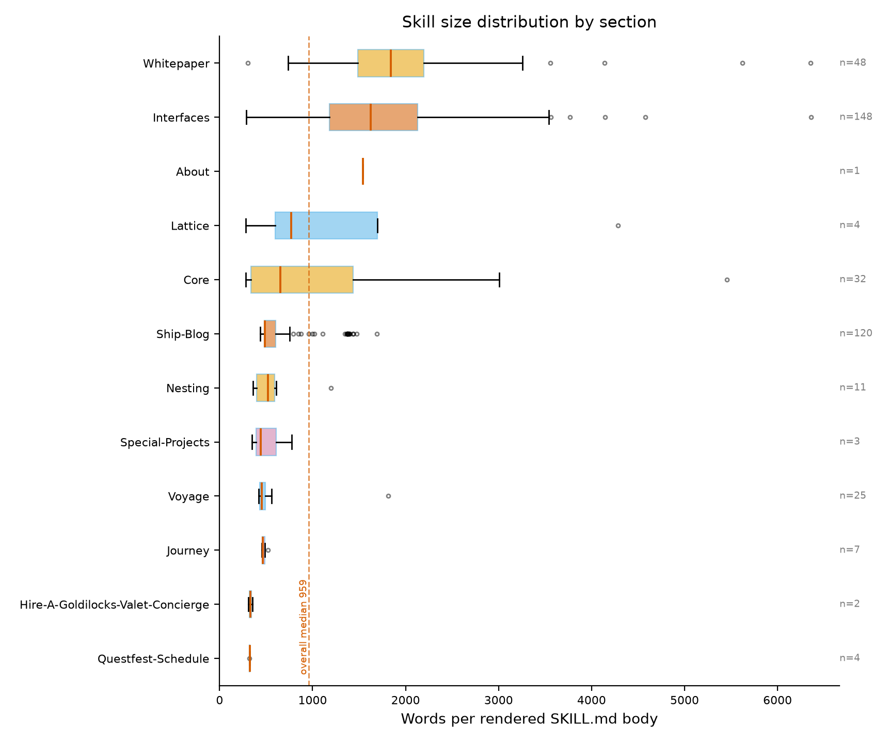

## Page 37

Figure 5: Cross-section link flow quoted inside rendered skills: node area is proportional to section page count and
edge weight to the number of skill-quoted links between sections (arrows point from the quoting section to the quoted
section). The dominant Ship-Blog-to-Core edge is the site’s own reading spine: posts quote the deck-level pages that
define their vocabulary.
36

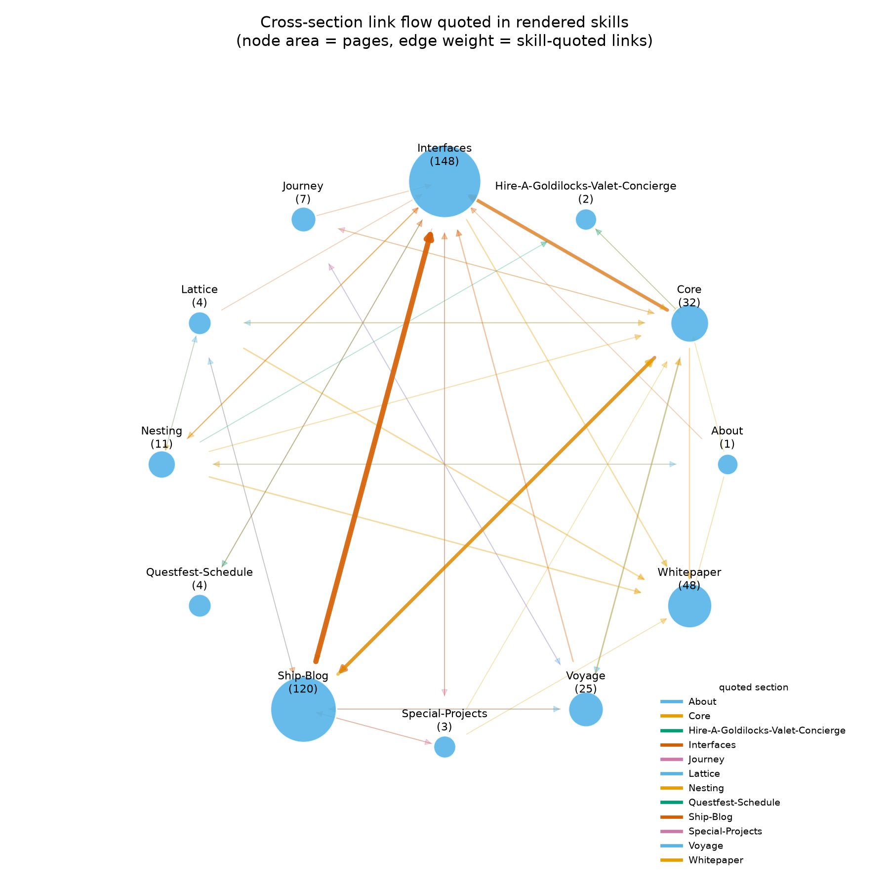

## Page 38

Figure 6: Dynamic-document augmentation: same-origin API documents retrieved for client-rendered pages (169
succeeded, 4 failed with persisted receipts). The distribution is right-skewed: most retrieved documents cluster near
the median with a long tail of long-form whitepapers. Bins group retrieved document sizes; the dashed line marks the
median document, and the four failed attempts remain receipt-only, not drawn.
Figure 7: Discovery funnel: declared sitemap URLs, distinct pages reached through them, and the full union (405
pages = 7.6× the sitemap count). The steep first step is sitemap yield; the tall second step is pure crawl gain. The
gap between the second and third bars is exactly the crawl-only surplus the sitemap cannot see.
37

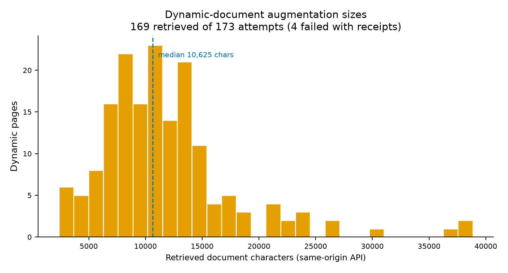

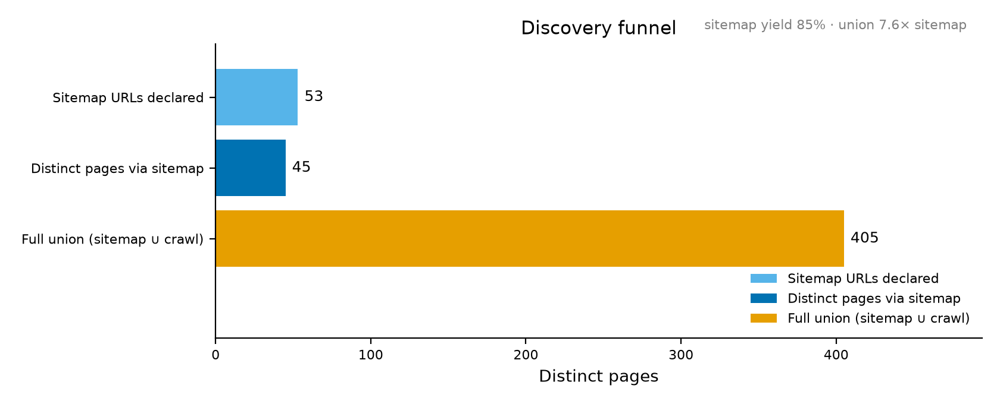

## Page 39

Figure 8: Pages by breadth-first discovery depth: most pages sit several hops from the root, which is why a sitemap-
only render would have missed them; the modal depth alone holds 53% of all pages.
Figure 9: The 15 most-linked pages by inbound links from other discovered pages, colored by section: the site’s hub
structure; links to redirect stubs and canonical duplicates fold onto their target pages, so these counts are page-level,
not URL-level.
38

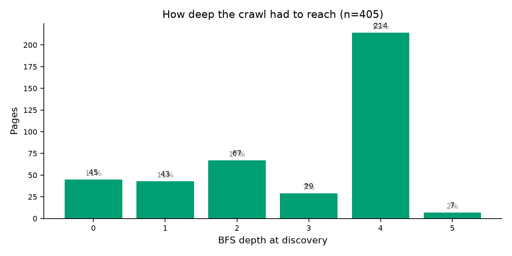

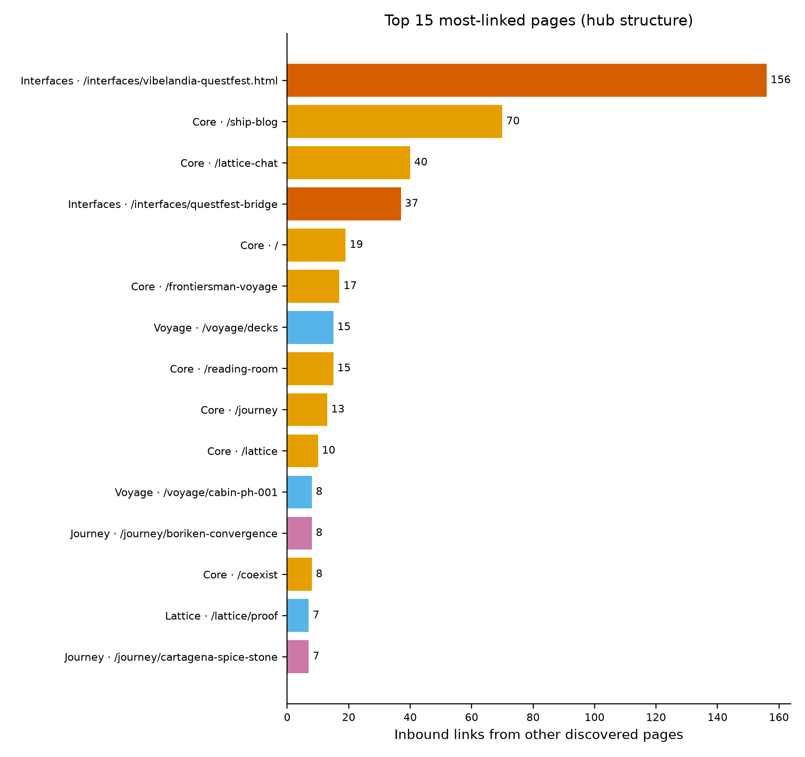

## Page 40

Figure 10: Median skill body size for static pages versus augmented (document-bearing) pages (n=236 static, n=169
augmented). The gap is the measured value of honest augmentation: the same pipeline without the declared bindings
would ship the shorter median throughout.
Figure 11: Pages against rendered skill words per section (log-spread annotated). Sections above the line pack more
words per page than the corpus at large: Interfaces and Whitepaper are mass-dense, while Voyage and Ship-Blog carry
many lighter pages. Sections above the line pack more words per page than the corpus average; vertical distance from
the dotted reference is mass density.
39

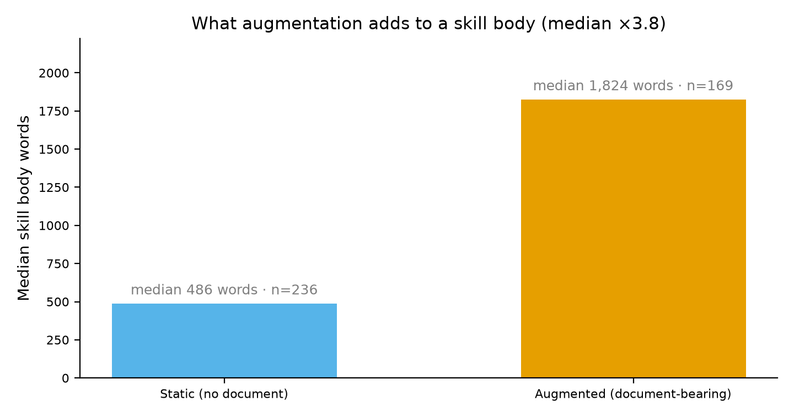

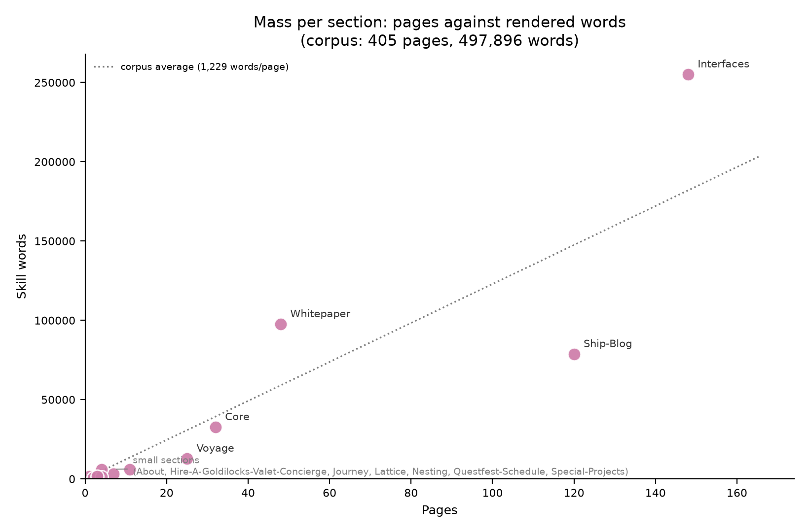

## Page 41

Figure 12: Pareto curve of cumulative skill-word share over sections ordered by mass. The curve quantifies concentra-
tion: the first two sections already carry the majority of the corpus, so a render that dropped them would lose most
of the substance.
8
Discussion and Limitations
This chapter reads the pipeline’s receipts against the 405-page corpus and states what the render cannot do. Claims
carry tokens rather than prose where a number exists.
8.1
What the render gets right
Complete coverage.
The render accounts for 405 pages and 405 skills across 12 sections.
The union strategy
treats sitemap entries and crawl discoveries as equally eligible, so the 360 traversal-only pages render alongside the 45
sitemap-advertised pages. Completeness is a ledger claim: every page carries provenance naming how it was found.
Honest augmentation receipts. Of 173 attempts, 169 succeeded and 4 failed — and failures render as failures, not
silently patched text. Receipts record API URL, timestamp, HTTP outcome, and error class (400, empty payload,
timeout, 404 in the observed window), so a reader can tell a static-fetch body from an augmented one.
Union beats sitemap-only. Sitemap-only ingestion recovers 11% of the corpus (45 of 405 pages) and misses whole
sections: Ship-Blog and Voyage contributed zero sitemap entries in the window. The union closes that gap by con-
struction.
Sections mirror the site. The manuscript’s section structure corresponds to the origin’s directory layout; heavy
sections surface honestly (Interfaces is both the link-heaviest and the largest by page count), and the render does not
flatten that asymmetry.
Quantified augmentation effect. Median words move from 486 (static) to 1824 (augmented) — 3.8x. Reported as
a corpus median, this describes what a typical reader receives; per-page receipts let anyone audit the outliers.
8.2
Known limitations
1. Discovery boundary. Sitemap and crawler see different slices; neither is a superset. Pages in neither source stay
invisible, so any claim about “the site” is a claim about the observed union.
2. Static fetcher and binding coverage. The fetcher renders only what the fetch returns. Where substance arrives
via a runtime binding, coverage requires a spec entry naming it; uncovered bindings yield thin pages, recorded as
40

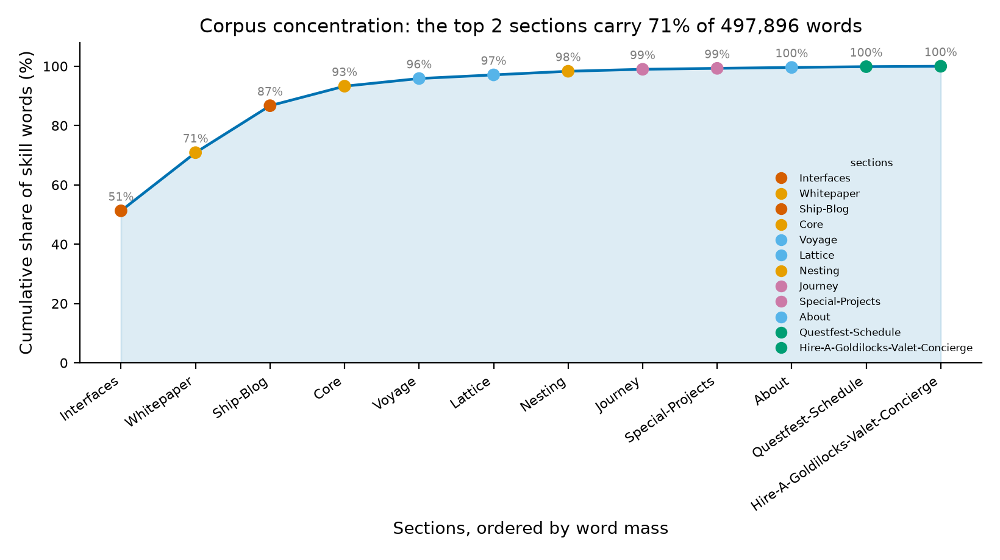

## Page 42

Figure 13: Section-by-section heatmap of skill-quoted link counts (rows quote columns; the within-section diagonal is
excluded). Dense off-diagonal cells expose the reading paths the site’s own authors build between areas. Read row by
row: each cell counts how many times pages of the row’s section quote pages of the column’s section inside rendered
skills.
41

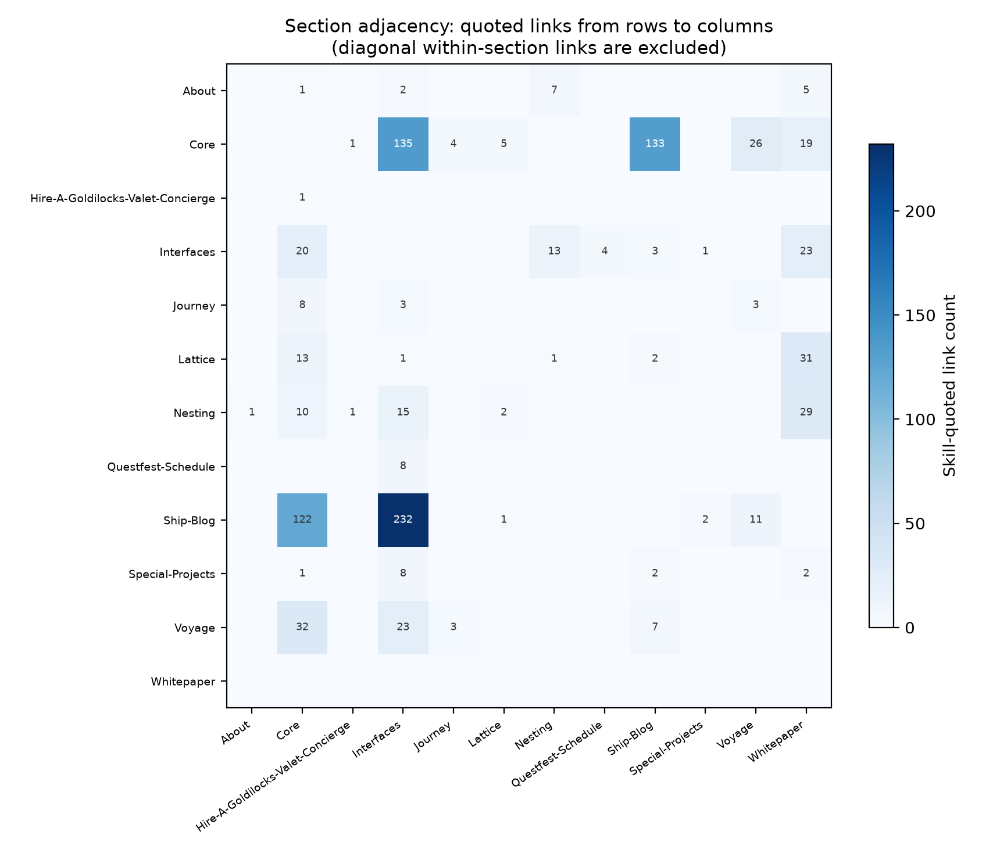

## Page 43

thin rather than inferred.
3. One skill per page, shared backing documents. The same document served at multiple routes renders as
distinct pages per the one-skill-per-page contract. Duplicates are real in the page graph but not independent in
substance; receipts expose the shared backing document by content hash, so downstream analysis can deduplicate
deliberately.
4. Path-derived names. Names derive from URL paths: stable against origin routing, but cryptic where paths are,
and origin renames propagate. Curated titles would be prettier and less auditable.
5. Dated snapshot. The corpus reflects the observation window. A refresh yields a new observation, not a merge;
diffs compute between snapshots, and provenance for any fact ends at the snapshot boundary.
6. Single-origin design. One origin, one sitemap, one crawl per snapshot. Cross-origin corpora need a second
discovery envelope and per-origin attribution the current evidence model does not carry.
8.3
Ethical posture
The origin’s robots.txt welcomes all crawlers (a verifiable property of the site, recorded in the reviewed site spec that
bounds every request); the pipeline honored that welcome at its declared budget — 417 requests, each rate-limited by
the crawler’s configured minimum delay and issued under the project user agent the spec declares. The honesty rail
holds end to end: receipts show what was fetched, when, and how.
The content remains the author’s work. The render is a structural mirror with attribution, not a republication: each
page traces to its source URL through the source map, and attribution travels with excerpts. Where augmentation
transformed text, the receipt records the transformation; nothing is laundered into appearing original. The pipeline’s
claim is only that it observed the corpus faithfully — authorship, and the responsibility it entails, stays with the origin.
42

## Page 44

9
Scope and Related Work
9.1
In scope
FractiSkills does exactly four things for exactly one declared site, SS Vibelandia:
1. Discovery. Enumerate every page as the union of sitemap endpoints and a bounded breadth-first crawl, reconciled
against 53 sitemap entries into 405 unique pages.
2. Render. One validated portable skill per page, with honest dynamic-document augmentation where the site offers
a structured document surface — 169 of 173 attempts succeed.
3. Publish. Reconcile the skills into a tracked library organized by the site’s own 12-section architecture, plus a
discovery index keyed on the link graph.
4. Research (document). Aggregate the run into one analysis record, render its figures, and bind this token-bound
manuscript; every numeric claim resolves from the run manifest.
The result is a render of one public work, with the work’s own architecture as the organizing principle — not a retelling
of it.
9.2
Out of scope
• Not a general crawler. Discovery is bounded to one origin, https://www.ssvibelandiaquestfest24x365.com/, and
terminates; it is not a reusable web-crawling framework.
• Not a search engine. The discovery index answers “which skill exists where,” not relevance ranking.
• Not an LLM synthesis pipeline. The deterministic backend is the default and produced all tracked artifacts;
no provider LLM content appears in the corpus.
• Single-origin only. No aggregation of multiple sites into one skill namespace.
• No generated-code execution. Rendered skills are inspected, never run.
• No fixture-to-live upgrades. Evidence-origin rules are inherited from Skillarum and enforced in run manifests;
live observations stay live.
9.3
Related work
• Skillarum [Friedman, 2026b] — the engine: acquisition-to-render pipeline, portable skill format, provenance man-
ifests, validator suite. FractiSkills is a downstream consumer and a whole-site-scale demonstration of Skillarum’s
extension points.
• The template pipeline [Friedman, 2026a] — parent engineering conventions this repo follows: src-layout packages,
thin scripts, >=90% coverage on src/, no-mock hermetic tests, claim ledgers, token-bound manuscripts.
• Sitemap protocol [Google, Inc., Yahoo!, Microsoft Corporation, 2008] and Robots Exclusion Protocol [Koster
et al., 2022] — the cooperative-crawl primitives the discovery stage builds on, which the corpus site extends
deliberately to all agents.
• SS Vibelandia [Valet Pru, 2026] — the corpus itself: an openly shared artwork whose own metadata — robots
rules, sitemap, honesty rail — makes a respectful whole-site render possible.
43

## Page 45

10
Reproducibility
The artifact regenerates from a clean checkout.
Setup:
uv sync --extra dev.
Staged execution runs the
numbered scripts in order — scripts/00_preflight.py (environment and site-spec checks), 10_discover.py,
20_render_skills.py --refresh, 30_publish_skills.py, 40_analyze.py, 50_figures.py, 60_validate.py —
or the equivalent one-command entry point, uv run python -m fractiskills run --refresh --json.
On the
reference machine the full pipeline — discovery plus render — completed in roughly seven and a half minutes
wall-clock (the published observation window bounds it); analysis, figures, and binding are near-instant.
10.1
Caching and revalidation
HTTP fetches cache under output/.cache/fetches/ and revalidate conditionally with ETag/Last-Modified, so un-
changed pages cost one 304 per URL. The draft cache is keyed by prepared-corpus hash plus generator fingerprint:
re-runs reuse rendered drafts until either the corpus or the AugmentedGenerator changes. --refresh re-renders within
cache discipline; --force-process bypasses draft reuse entirely. Stage identities are stable run ids, not timestamps,
so repeated runs address the same record idempotently.
10.2
Adding new pages
A newly added site page needs no manual registration anywhere in the pipeline; it flows through the same refresh loop:
1. Confirm reachability: the page must be listed in the declared sitemap or reachable from an existing page’s outbound
links — discovery is a bounded, robots-respecting breadth-first crawl seeded with / and every sitemap URL.
2. Rerun scripts/10_discover.py: the URL enters output/data/inventory.json through the sitemap-union,
deduplicated by canonical identity, carrying via_sitemap/via_crawl_only provenance.
3. Rerun scripts/20_render_skills.py (with --refresh for a fresh dated observation): a render target is auto-
created from the path slug, and the section is derived mechanically from the URL path — the first path segment
names the area, /interfaces/nesting/* is promoted to Nesting, single-segment paths join Core.
4. Rerun scripts/30_publish_skills.py: the new package is validated and lands in the tracked skills/ tree, the
discovery index rebuilds, and packages absent from the current render are pruned.
5. Rerun scripts/40_analyze.py, scripts/50_figures.py, and scripts/z_generate_manuscript_variables.p
y: every manuscript token rebinds from the fresh analysis and all figures regenerate.
6. Rerun scripts/60_validate.py.
Special cases: a client-rendered page needs a binding row added to data/sources/ssvibelandia.yaml before rendering
— match_path plus an api_template with {id}/{last_segment} placeholders — otherwise it renders as a thin shell
with a warning receipt instead of the real document. A new top-level path creates its section automatically (a new
source profile and a new skills/<area>/ output area appear with no configuration).
A page that dies between
discovery and render fails its section loudly with failure.json; recovery is a rerun without --refresh, reusing
cached drafts for healthy targets. And because every manuscript number is a bound token, the paper updates itself
mechanically each time this loop runs.
10.3
Failure recovery and evidence origins
A section that fails hard persists failure.json and aborts its stage — no silent partial renders. Recovery re-runs only
the failed sections; receipts record every attempt, successful or not. Evidence origins are sticky: observations captured
from fixtures never upgrade to live on later runs, and the corpus records which origin produced each document.
10.4
Tracked vs disposable; determinism
Tracked inputs/outputs: skills/ (published packages), data/ (site spec, figure definitions), and this manuscript. The
entire output/ tree is disposable and rebuildable. The generator is deterministic — no LLM contributes to tracked
artifacts — figures render on a fixed matplotlib Agg backend with no timestamps drawn, and byte-level re-runs of
render/publish are stable.
10.5
Artifact inventory
44

## Page 46

Artifact
Contents
inventory.json
discovered-page inventory and provenance
render_summary.json
per-section render outcomes and counts
publish_receipt.json
validation/copy results for the skills/ tree
augmentation_receipts.jsonl
one receipt per augmentation attempt (173 attempts,
169 ok)
fractiskills_analysis.json
aggregate corpus analysis record
skills.csv
flat catalog of all 405 skills
figure_registry.json
figure paths, captions, registry metadata
manuscript_variables.json
bound token values for this manuscript
manuscript_receipt.json
bind receipt linking tokens to sources
45

## Page 47

11
Glossary
Agent harness — Runtime that loads a skill for a model: discovers SKILL.md, progressively discloses the body, invokes
referenced tools.
SKILL.md — Single validated Markdown file Skillarum emits per target: YAML frontmatter plus a body whose
Semantic knowledge section quotes the source page as untrusted data.
Skillarum — Pinned acquisition-and-generation engine; its five-stage pipeline (acquire →prepare →process →parse
→render) turns a declarative YAML profile into skill packages.
FractiSkills — Project layer over Skillarum adding whole-site discovery, dynamic-content augmentation, and
publication-scale organization.
Source profile — Declarative YAML defining a base URL, safety-bounded crawl configuration, extraction rules, and
named targets; one profile per site section.
Target — Named profile entry mapping to exactly one page URL; the unit of acquisition and rendering.
Discovery union — Declared sitemap unioned with a bounded breadth-first crawl: one target per page after alias
resolution and partitioning.
Redirect alias — URL resolving to another page’s canonical location; recorded as an alias, not distinct content.
Canonical duplicate — Alias page consolidated onto its canonical URL so each page appears exactly once in the corpus.
BFS depth — A page’s hop count from the base URL in the breadth-first crawl, capped by discovery configuration.
Section — Top-level partition of the site’s URL architecture; each gets one compiled profile and one render run.
AugmentedGenerator — FractiSkills’ subclass of the deterministic generator that, for URL-matched bindings, fetches
a same-origin JSON endpoint and splices retrieved text into an otherwise deterministic skill body.
Augmentation receipt — Per-fetch provenance in metadata and run artifacts: endpoint, timestamp, HTTP status,
content SHA-256, ETag, evidence origin.
Prepared corpus fingerprint — Content hash binding every rendered skill to its exact prepared corpus, enabling byte-
identical reproduction.
Evidence origin — Manifest field classifying corpus text; here all evidence is live, fetched within the observation window
rather than replayed from cache.
Discovery index — Published per-skill index linking each skill to its source URL, section, and provenance.
Effect annotation — Figure or prose note stating what augmentation changed relative to static acquisition, kept
separate from raw measurements.
Reconciliation — Final consistency pass over manifests, hashes, counts, and tokens; manuscript, figures, and skill
library must agree on one set of numbers.
Token binding — Rule that every manuscript number originates from a run artifact via a token placeholder; prose
never hardcodes token-covered values.
Okabe-Ito palette — Colorblind-safe categorical palette used for all analysis figures.
46

## Page 48

12
Summary
This manuscript rendered the living artwork https://www.ssvibelandiaquestfest24x365.com/ as a printed corpus: one
skill per page, 405 pages across 12 sections, 497896 words in all. Every page exists because the crawl found it —
nothing was invented to fill space.
Three honesty mechanisms carry the book. First, union discovery: pages come from the sitemap unioned with the
crawl frontier (45 pages via sitemap, 360 reachable only by crawling), so provenance is explicit rather than assumed.
Second, receipted augmentation: 169 of 173 API calls succeeded, each with a verifiable receipt; the 4 failures are
printed as loud failures, not silently dropped. Third, token-bound prose: every figure caption and statistic binds to a
named placeholder, so no number in this book is hand-typed.
Reproduction is one command against the pinned pipeline (version 0.8, cache version 7), which re-crawls, re-augments,
re-figures, and re-typesets deterministically. If the output differs, the corpus changed — the manuscript is a measure-
ment, not a snapshot frozen in prose.
Observation window: 2026-09-10T23:51:05.959201+00:00 through 2026-09-10T22:19:21.394219+00:00 (UTC).
47

## Page 49

13
References
Bibliography entries are defined in references.bib and cited inline via @keys throughout the chapters.
Daniel Ari Friedman. FractiSkills: One portable agent skill per page. https://github.com/docxology/FractiSkills,
2026a.
Daniel Ari Friedman. Skillarum: Portable agent skills from public websites. https://github.com/docxology/Skillarum,
2026b. v0.2.0, the acquisition, generation, and validation engine used by FractiSkills.
Google, Inc., Yahoo!, Microsoft Corporation. The sitemap protocol. https://www.sitemaps.org/protocol.html, 2008.
Martijn Koster, Gary Illyes, Henrique Zeller, and Lizzi Sassman. Robots exclusion protocol (RFC 9309), 2022.
Valet Pru. Holographic Goldilocks SuperAI basecamp — the SS Vibelandia Omniversal canvas. https://www.ssvibe
landiaquestfest24x365.com/, 2026. The scraped work; content copyright its author.
48

---
*Extraction method: pymupdf*
