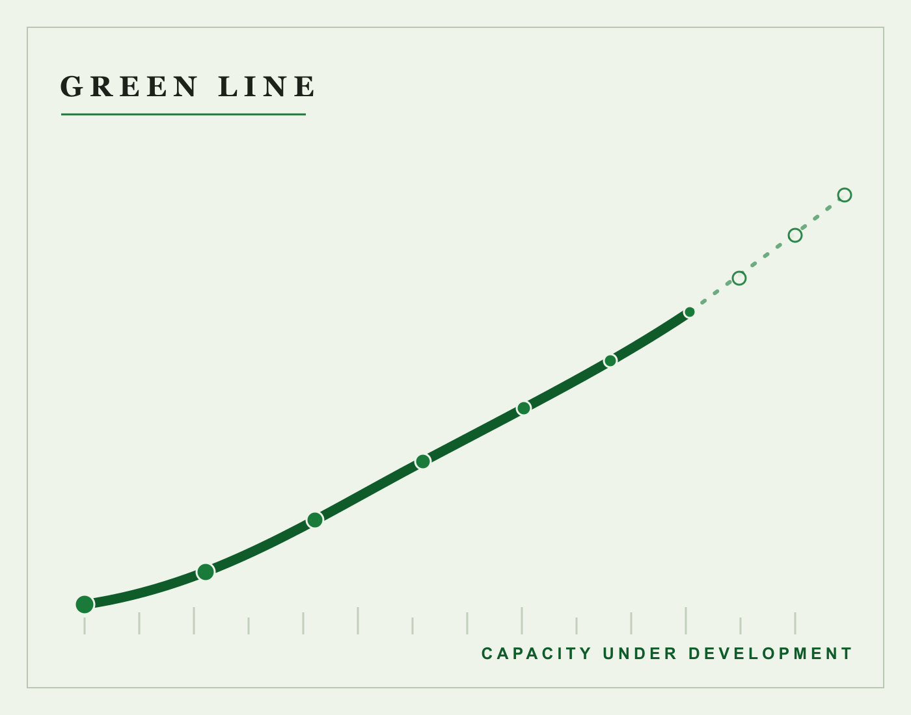

# Full Text: Green Line: a capacity-under-development instrument

> Extracted from `green_line_combined.pdf`

> 1 figures extracted to `images/`

---

## Page 1

Green Line: a capacity-under-development
instrument
Daniel Ari Friedman
Active Inference Institute
daniel@activeinference.institute
ORCID: 0000-0001-6232-9096
DOI: 10.5281/zenodo.22833492
2026-08-29

## Page 2

Contents
1
Abstract
2
2
Introduction
3
2.1
Question . . . . . . . . . . . . . . . . . . . . . . . . . . . . . . . . . . . . . . . . . . . . . . . . . . . . . . . . . . . .
3
2.2
Job . . . . . . . . . . . . . . . . . . . . . . . . . . . . . . . . . . . . . . . . . . . . . . . . . . . . . . . . . . . . . . .
3
2.3
What it is never
. . . . . . . . . . . . . . . . . . . . . . . . . . . . . . . . . . . . . . . . . . . . . . . . . . . . . . .
3
3
Method
4
3.1
Staged reading
. . . . . . . . . . . . . . . . . . . . . . . . . . . . . . . . . . . . . . . . . . . . . . . . . . . . . . . .
4
3.2
Statuses . . . . . . . . . . . . . . . . . . . . . . . . . . . . . . . . . . . . . . . . . . . . . . . . . . . . . . . . . . . .
4
3.3
Determinism
. . . . . . . . . . . . . . . . . . . . . . . . . . . . . . . . . . . . . . . . . . . . . . . . . . . . . . . . .
4
4
Formalism
5
5
Examples
6
5.1
A worked read
. . . . . . . . . . . . . . . . . . . . . . . . . . . . . . . . . . . . . . . . . . . . . . . . . . . . . . . .
6
5.2
A counter-signal
. . . . . . . . . . . . . . . . . . . . . . . . . . . . . . . . . . . . . . . . . . . . . . . . . . . . . . .
6
6
Limits
7
7
Conclusion
8

## Page 3

1
Abstract
The Green Line is a capacity-under-development instrument: it records what a person or project is deliberately still learning, with
marker/counter-signal staging that keeps growth records from hardening into resumes, competence certifications, or virtue signals.
The instrument answers one question — what is still growing? — by reading self-declared observations against a versioned registry
of growth records, each naming the markers a reader could look for. Unlike the four classical lines of the set, the Green Line carries
no opus stage: a stageless line is the designed outcome, because apprenticeship has no alchemical completion. A read returns
staged statuses (STAGED, NEEDS_MARKER, NEEDS_REWORK, OUTSIDE_SCOPE) that describe marker coverage at a
review date and never competence, mastery, or permission. The package is pure standard library, fails closed on empty or hostile
input, and exports its verdicts in the set’s common report-envelope schema for co-registration with the sibling instruments.
2

## Page 4

2
Introduction
2.1
Question
Green Line answers one question: what is still growing?
2.2
Job
Its job is capacity under development: apprenticeships, skills deliberately not yet mastered, with marker/counter-signal staging.
Where Black Line describes how strong work is done and Red Line describes what must never be crossed, Green Line holds the
honest middle: the named, dated, inspectable record of what someone is still learning on purpose.
2.3
What it is never
The line has one inviolable boundary. Green Line must never become:
• a resume — a list of attained credentials;
• a competence certification — a claim that a skill is mastered;
• a virtue signal — a performance of learning for status.
The counter-signal intake stages observations phrased as certification or credential language aside with a note rather than scoring
them. Growth records that drift toward those genres are visible as drift, not scored.
3

## Page 5

3
Method
3.1
Staged reading
A read proceeds in three stages:
1. Intake (green_line.intake). Input is normalized fail-closed: blank descriptions are blocking defects; malformed labels
and unreadable or future-dated observations become set-aside notes; counter-signal labels (certification, credential, resume
language) are staged aside with an explanatory note and never counted. Nothing crashes on hostile input and no value is
invented.
2. Matching (green_line.evaluator). Growth records whose tags intersect the attempt’s declared tags apply. An empty
intersection is the outcome OUTSIDE_SCOPE, not an exception.
3. Projection (green_line.evaluator). Each applied record’s required markers are split into present, missing, and stale
surfaces; the status projection selects the most demanding reading and the reasons trail preserves what the projection
compresses.
3.2
Statuses
STAGED — all required markers fresh. NEEDS_MARKER — gaps are only stale markers needing refresh, or nothing was declared.
NEEDS_REWORK — fresh markers are missing, or a blocking intake defect fired. OUTSIDE_SCOPE — no record applied.
3.3
Determinism
Every read is a pure function of the attempt, the registry, and the review configuration. Reads are serialized canonically (sorted
keys, declaration order preserved with explicit sorts before emit) and pinned by a SHA-256 digest of both the reading and the
registry that produced it.
4

## Page 6

4
Formalism
Definition 1 (Growth record). A growth record 𝑔= (𝑖𝑑, 𝑡𝑖𝑡𝑙𝑒, 𝑤𝑖𝑟𝑒, 𝑇𝑔, 𝑀𝑔, 𝑘) pairs an identifier with a tag set 𝑇𝑔over the
reviewed vocabulary and an ordered tuple of required markers 𝑀𝑔, grouped into a growth family 𝑘.
Definition 2 (Tag vocabulary). The reviewed tag vocabulary 𝒯is a finite set of tag strings; every record’s tags must be drawn
from it.
Definition 3 (Cultivation attempt). A cultivation attempt 𝑎= (𝑑, 𝑇𝑎, 𝑂, 𝐷) carries a description 𝑑, a tag set 𝑇𝑎, an undated
observation set 𝑂, and dated observations 𝐷with ISO dates.
Definition 4 (Applicability). A record 𝑔applies to an attempt 𝑎exactly when 𝑇𝑔∩𝑇𝑎≠∅.
Definition 5 (Freshness). Given a review date 𝑟and window 𝑤, an observation dated 𝑡is fresh if 𝑡≤𝑟and 𝑟−𝑡≤𝑤; stale if
𝑡≤𝑟and 𝑟−𝑡> 𝑤; not counted otherwise. Undated observations are fresh.
Definition 6 (Finding rule). For an applied record with marker surfaces (present 𝑃, missing 𝑀, stale 𝑆⊆𝑀): the status is
STAGED when 𝑀= ∅; NEEDS_MARKER when nothing was declared or 𝑆= 𝑀; NEEDS_REWORK otherwise.
Definition
7
(Aggregation).
The overall status is NEEDS_REWORK if any finding is NEEDS_REWORK; else
NEEDS_MARKER if any is NEEDS_MARKER; else STAGED if any finding exists; else OUTSIDE_SCOPE.
Definition 8 (Counter-signal staging). An observation whose label matches the counter-signal phrase list is staged aside with
an intake note and contributes to no surface.
Proposition 1 (Fail-closed registry). If the registry fails its shape check, the read is NEEDS_REWORK with no findings and
an intake note naming the defect.
Proposition 2 (Empty scan set). If no record’s tags intersect the attempt’s tags, the read is OUTSIDE_SCOPE.
Proposition 3 (Determinism). Two reads of the same attempt against the same registry at the same review date produce
identical canonical serializations and identical digests.
5

## Page 7

5
Examples
5.1
A worked read
A learner declares an attempt tagged research and teaching with observations mentor and session_log dated inside the
review window. The records apprentice-review, deliberate-gaps, staged-practice, teach-to-learn, and stated-unce
rtainty apply (by tag intersection).
apprentice-review reads STAGED by the finding rule Definition 6; the others read
NEEDS_MARKER because their markers were not declared. The overall status follows the aggregation rule Definition 7. The
overall status is NEEDS_MARKER: gaps ask for practice, not judgment.
5.2
A counter-signal
The same attempt with an added dated observation certified as expert gets that observation staged aside with a note; the
read is unchanged, because certification language is exactly the drift the line refuses to score.
Counter-signal staging follows Definition 8; the empty-scan-set outcome is stated by Proposition 2, and determinism by Proposition
3.
6

## Page 8

6
Limits
• A read describes marker declarations, not practice: a declared marker is not verified evidence that a mentor met, a drill ran,
or a skill grew.
• Applicability is tag intersection Definition 4 over the reviewed vocabulary Definition 2.
• The registry is content, not judgment: record choice encodes what this instrument watches for, and another registry is a
different instrument.
• Counter-signal detection is lexical; a resume-shaped growth record phrased innocently passes intake. The instrument surfaces
vocabulary drift, not intent.
• The line makes no claim about other lines. Envelopes carrying native_status values are witness records and are never
compared across lines.
• Underclaiming is the register of record: docs/claim_boundaries.md is the authoritative statement of what the instrument
does and does not claim.
7

## Page 9

7
Conclusion
The Green Line holds a place the other lines deliberately do not: the record of what is still growing, held open on purpose, without
opus stage and without completion claims. Its failure modes are the genres it must never become, and its counter-signal intake
makes those failure modes visible as drift rather than scored as content. As a set member it is ordinary: one registry, one evaluator,
one envelope schema, no special cases.
8

## Page 10

References
9

---
*Extraction method: pymupdf*
