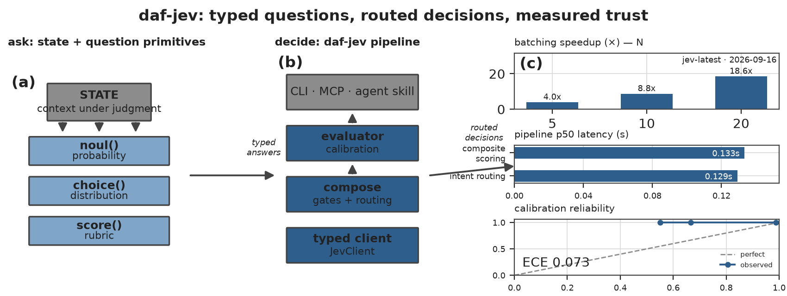
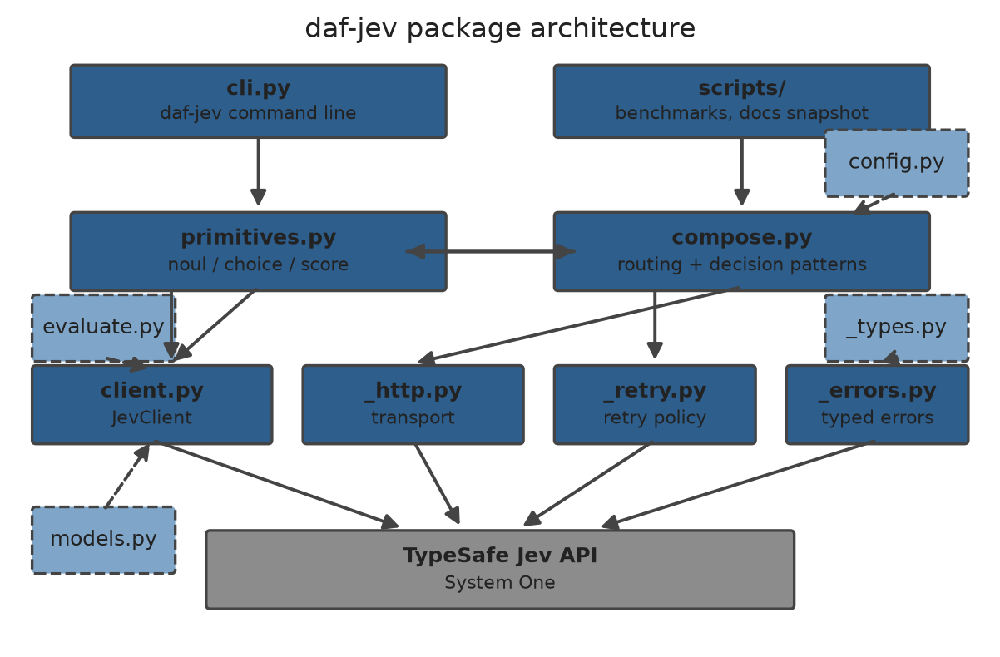
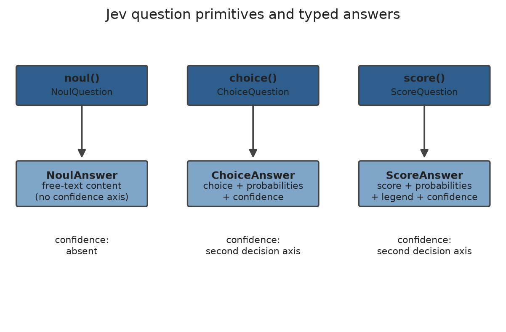
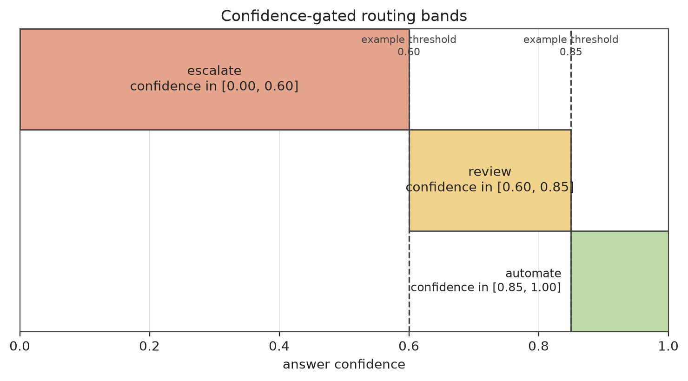
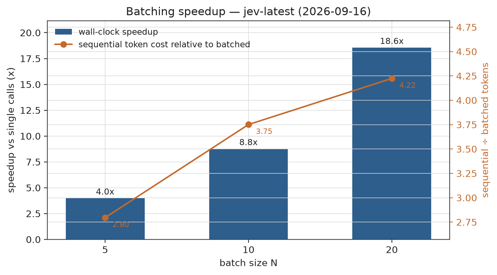
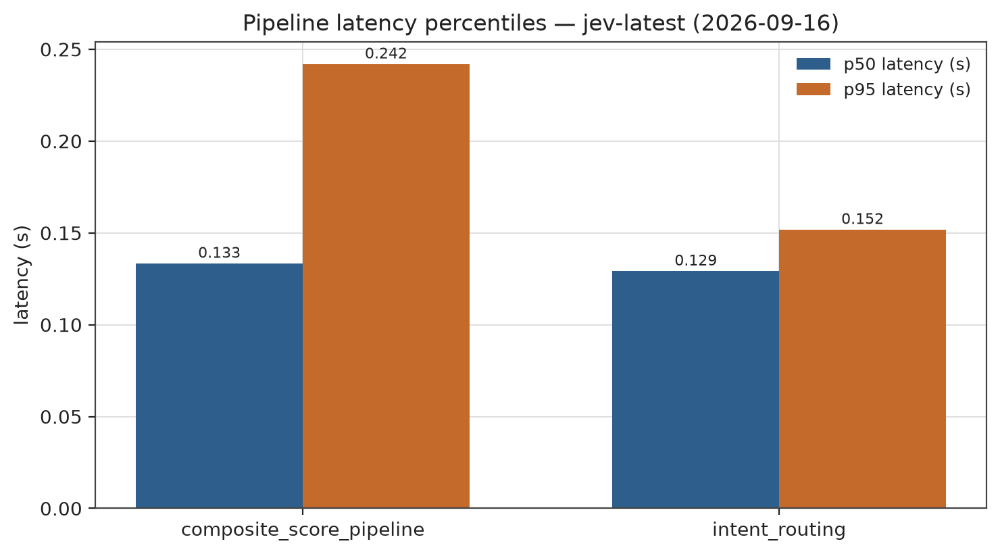
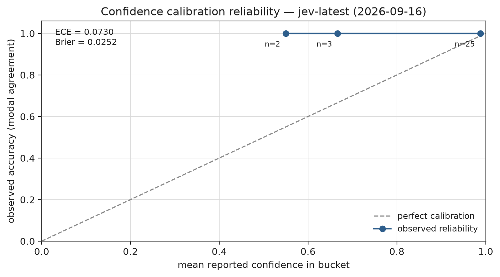

# Full Text: Jev in Practice: A Composable Python Toolkit for TypeSafe's System One Decision Model

> Extracted from `daf-jev_combined.pdf`

> 8 figures extracted to `images/`

---

## Page 1

Jev in Practice: A Composable Python Toolkit for
TypeSafe’s System One Decision Model
Batching Speedups, Confidence-Gated Routing, and Calibrated Decisions over a Single HTTP
Endpoint
Daniel Ari Friedman
Active Inference Institute
ORCID 0000-0001-6232-9096
Version 0.6.0 | 2026-09-23
DOI 10.5281/zenodo.22816187
github.com/docxology/daf-jev

## Page 2

1
Abstract
Figure 1: Graphical abstract for the daf-jev manuscript, in three zones read left to right. Left: the decision state — the context to be judged —
together with stylized cards for the three typed question primitives: a noul (a 0–1 calibrated probability), a choice (a probability distribution over
named options), and a score (a rubric over ordered levels). Center: the package’s layer stack, from the typed client through the compose layer’s
gates and routing to the evaluator and its calibration checks, with the CLI, the MCP server, and the agent skill as consumer surfaces. Right: a
live-outputs panel whose batching speedup bars, speedup annotation, pipeline latency figure, and calibration reliability mini-curve (correctness
via the self-consistency proxy across repeated asks; a calibration proxy, not ground-truth accuracy) are all read from the latest batching, patterns,
and calibration benchmark JSON payloads at generation time — no metric in this panel is hardcoded. Arrows run left to right, tracing the path
from an unstructured state to typed answers to composable decisions.
Software rarely needs an essay from a language model; it needs an answer it can act on — route this ticket or escalate it, approve this refund or flag
it, rate this draft or send it back. daf-jev is a small, composable Python toolkit for getting exactly those answers from the TypeSafe Jev “System
One” decision model [TypeSafe AI, 2026d,e]: instead of generating text that must be parsed back into decisions, the model returns bounded, typed
judgments that code can branch on directly.
The entire decision surface of the model reduces to three typed question primitives, all carried by a single HTTP endpoint: noul, a calibrated
yes/no; choice, a labelled pick that comes back with a full probability distribution over the options and a scalar confidence; and score, a rating
over ordered levels that comes back with a probability-weighted expected value. On top of these primitives, pure-logic composition patterns
— composite_score, confidence_gate, and route/pick — turn typed answers into executable decisions with no additional network traffic,
and a batch Evaluator fans a fixed question set out over many states through either the synchronous or the asynchronous client. The same
core is reachable without writing Python at all: a command-line interface with six subcommands, an MCP server exposing seven tools to any
MCP-capable agent host, an agent skill manifest for coding agents, and eight runnable example scripts (all described in 5).
Three live-API benchmarks — batching, decision patterns, and calibration — against the jev-latest model quantify the practical payoff of this
design. Batching a batch’s worth of questions into one call yields wall-time speedups of 3.98, 8.77, and 18.55 across the configured batch widths,
and the sequential strategy consumes 4.22 times the tokens of the batched call at the widest setting — batching is simultaneously faster and cheaper.
End-to-end decision pipelines complete at a median wall time of 0.133 for composite scoring and 0.129 for intent routing, so confidence-gated
decisions can sit inline on interactive request paths. Decision quality is measured alongside speed: a self-consistency calibration benchmark over
6 states × 5 repeats against the jev-latest model reports an expected calibration error of 0.0730 and a Brier score of 0.0252, indicating that reported
confidence tracks repeat-stable behaviour under the stated proxy semantics. The unit test suite stands at 93.08 measured coverage, and every
model-level claim is grounded in a hash-manifested documentation snapshot (b79c9cd6008489f1, 108 pages, 1014.8 KiB, scraped 2026-09-16)
whose drift is machine-checkable at any time. Every numeric value in this manuscript is generated from the same analysis outputs as the figures
and tables, so the prose cannot drift from the data.
The graphical abstract in 1 summarizes this path — from an unstructured state, through typed answers, to composable decisions — with the live
benchmark outputs on its right-hand panel.
Keywords: decision models, LLM APIs, calibrated confidence, batching, confidence-gated routing, Python client, reproducible research
2
Introduction: From Generated Text to Typed Decisions
Software that consumes large language models faces a structural mismatch. Language models emit prose; software needs values. When an
application must branch — route a support ticket, gate a refund, escalate a low-confidence judgment — the prevailing pattern is to ask a generative

## Page 3

model for free-form text and then recover a decision from that text with parsers, regular expressions, and hope. Every such recovery step is a
silent failure surface: the model can hedge, reformat, or refuse, and the calling code has no contract that tells it when the answer is trustworthy.
TypeSafe’s System One model attacks the mismatch at the source. Rather than generating text, a decision model returns typed answers — proba-
bilities, labelled picks, and confidence values that conform to the shapes the calling code already expects [TypeSafe AI, 2026d]. Its training path,
reinforcement learning for calibrated decisions (RLCD), optimizes for decisions and calibrated probabilities rather than fluent generations, so that
uncertainty is expressed through well-calibrated probability distributions instead of overconfident verdicts [TypeSafe AI, 2026e]. The model is
positioned explicitly as a component for AI-powered software, not an agent: code owns the control flow, and the model supplies narrow, structured
judgments embedded at exactly the points where the software needs programmable common sense.
2.1
The problem this package solves
The System One decision surface is exposed through one HTTP endpoint and three question types. Using it directly from Python means hand-
writing request payloads, discriminating answer unions, mapping HTTP status codes onto exceptions, retrying transient failures, and re-serializing
the same state once per question. None of that is research; all of it is boilerplate with real failure modes. Worse, the composition layer — turning
a set of typed answers into an actual software decision — lives in cookbook prose rather than in tested code.
daf-jev closes that gap. It is a small, dependency-light Python package that provides:
• Typed primitives — ergonomic builders (noul(), choice(), score()) and a QuestionSet container for the three question types, with
strict wire-shape validation on both the request and the answer side.
• A robust client — JevClient and AsyncJevClient wrapping the single System One endpoint, with a pure, injectable retry policy for
transient server-side conditions, a complete typed exception hierarchy, and a models listing.
• Composable decision patterns — pure functions over answers (composite_score, confidence_gate, route, pick) implementing the
documented TypeSafe patterns, plus a concurrent batch Evaluator that runs a fixed question set over many states without ever aborting the
batch.
The package follows the template conventions of the surrounding research infrastructure: logic lives under src/daf_jev/, orchestration stays in
thin scripts, and every dynamic fact that reaches this manuscript flows through generated variables rather than hand transcription. Third-party
efforts in the same direction — an architectural registry for Jev-style decision layers [Claburn, 2026], an orchestration router over the same endpoint
family [Corvin, 2026], and a standalone evaluation harness [Morales, 2026] — share the motivation but not the scope; positioning against them
is deferred to 9.
2.2
Reader’s guide
3 gives a technical account of the Jev (System One) decision model itself — the answer shapes, the parallel evaluation semantics, the latency
envelope, and the calibration guarantees — distinguishing primary documentation claims from third-party characterizations. 4 describes the
package architecture: its layers, its primitives, its composition patterns, and the design rulings that shaped them. 5 tours the surfaces that sit on top
of that architecture without adding logic to it — the CLI subcommands, the MCP server and its tools, the agent skill, and the runnable examples. 6
reports the measured batching speedups, token-cost ratios, and decision-pipeline latencies, together with the calibration reliability of the model’s
reported confidence — expected calibration error and Brier score under the self-consistency proxy — all bound to figures and tables generated
from the benchmark outputs. 7 records the exact environment and configuration the measurements ran under, 8 certifies how every artifact can
be regenerated and verified, and 9 closes with limitations, related work, and positioning.
3
The Jev Model: Calibrated, Parallel Machine Decisions without Text Generation
This section states the model-level facts that daf-jev builds on. Throughout, claims taken from the primary TypeSafe documentation snapshot
bundled with this repository are attributed to it; characterizations drawn from independent projects are marked as third-party and carry their own
citations.
3.1
A model class, not a chat endpoint
System One is TypeSafe’s model for building AI-powered software rather than agents. It does not generate code, plan, or choose its own next
action; it returns narrow, structured decisions over unstructured input, so that control flow, deterministic rules, and side effects remain entirely in
application code [TypeSafe AI, 2026d]. The documentation frames this as a third architecture beside traditional software (complex decision trees
of reliable primitives) and LLM agents (loops that accumulate off-the-rails opportunities): in AI-powered software, the model appears only where
the system needs programmable common sense, and each AI task is atomic and constrained [TypeSafe AI, 2026d].
The training path behind this behavior is RLCD — reinforcement learning for calibrated decisions. Where RLHF and RLVR adapt a pretrained
model to produce better text, RLCD optimizes for a different output contract: the model does not generate prose at all, it returns decisions
and probabilities, communicating uncertainty through calibrated distributions instead of tending toward overconfidence [TypeSafe AI, 2026e].
Independent projects have adopted the same framing for their own decision layers — an architectural registry of Jev-style components [Claburn,
2026], a routing layer over the endpoint family [Corvin, 2026], and an evaluation-oriented harness [Morales, 2026] — and their descriptions are
consistent with, but not authoritative for, the primary contract.

## Page 4

3.2
One endpoint, three question primitives
Every System One interaction is a single request to one decision endpoint carrying a state (the context to judge) and a dictionary of questions
keyed by caller-chosen identifiers [TypeSafe AI, 2026a]. Each question is one of three primitives, discriminated by its type field:
• noul — a yes/no judgment with optional contrasting criteria for the true and false readings. The answer is a single calibrated probability
on the unit interval, where the endpoints mean “no” and “yes” respectively.
• choice — a pick among named options, each with an optional free-text description. The answer carries the selected label, a probability
distribution over all options (summing to unity), and a scalar confidence.
• score — a rating over an ordered list of level descriptions (at least two). The answer carries a probability-weighted score that may be
fractional, the ordered legend of level descriptions, the probability distribution over levels, and a scalar confidence.
The response pairs the answers with a usage record (input and output token counts) and an identifier of record returned in the response headers,
which clients should preserve for tracing. Error conditions are enumerated by status class — authentication, permission, not-found, bad request,
validation, rate limiting, overload, and internal faults — and the transient classes among them are the ones a client is expected to retry.
3.3
Parallel, composable evaluation semantics
Two semantic properties of the model make composition safe, and both are primary-source guarantees rather than implementation accidents
[TypeSafe AI, 2026d]:
1. Independence by construction. Questions are evaluated independently and in parallel; one primitive’s result never becomes hidden context
that shifts another primitive’s answer. Composition logic therefore cannot create hidden coupling by asking more questions — coupling
enters only when code combines answers, where it is visible and testable.
2. Comparability. Outputs are sortable numeric values that can drive thresholds, comparisons, and branching directly, without an intermediate
natural-language interpretation step.
Because questions are independent, any number of them can be batched into a single call: the endpoint evaluates them as a parallel sampler, and the
documented parallel-questions pattern recommends exactly this for workloads that would otherwise repeat the same state in many single-question
requests [TypeSafe AI, 2026c]. Batching changes the cost structure (one round trip instead of many, one state transmission instead of a repetition
per question) but not the answers themselves — an invariant our benchmark in 6 relies on and verifies.
3.4
The latency envelope and calibration
The primary documentation describes System One as fast enough for real-time request paths and user interfaces, with most queries completing
on a millisecond-scale latency envelope [TypeSafe AI, 2026d]. That envelope is what allows the composition patterns in 4 to run inline — a
confidence gate or an intent route is cheap enough to sit on an interactive request path rather than in a background queue.
Calibration is the second load-bearing property. Because RLCD trains the model to express uncertainty as calibrated probability mass rather than as
confident-sounding text, the confidence field on choice and score answers, and the probability distributions beside them, are meaningful inputs
to policy decisions [TypeSafe AI, 2026e,b]. The documented confidence-routing pattern treats confidence as a second decision axis alongside the
primary answer value: high-confidence answers can be automated, mid-band answers routed to review, and low-confidence answers escalated to a
human or a fallback policy [TypeSafe AI, 2026b,c]. daf-jev implements that pattern literally in confidence_gate and route (4), and 6 measures
how much latency that policy layer adds on top of a network round trip — in practice none beyond measurement noise, since the composition
logic is pure computation.
4
Methodology: The Layered Architecture of a Composable Decision Toolkit
daf-jev is organized as a strict layering: an ergonomic surface (CLI, MCP server, scripts, benchmarks) on top of pure-logic composition, on top
of primitives and wire types, on top of a single transport and client layer that owns all I/O. 2 shows the module graph. The layering is enforced
by convention: the composition and primitive modules import no I/O machinery, so every decision pattern is testable against constructed answers
without a network stand-in. The ergonomic surface itself — CLI subcommands, MCP tools, an agent skill, and worked examples — is the subject
of 5; this section covers the layers those surfaces delegate to.
4.1
Layered architecture
The layers, bottom-up:
• Transport (_http.py) — a minimal Transport protocol with a synchronous and an asynchronous httpx implementation. It knows nothing
about decisions; it posts JSON to a path and returns the raw response.
• Client (client.py) — JevClient / AsyncJevClient resolve the API key from the environment (injected mapping, process environment,
then a .env file, in that precedence order via config.py), build the request for a state plus a mapping of questions, apply the retry policy,
and map HTTP status classes onto the typed exception hierarchy of _errors.py. The retry policy itself (_retry.py) is a pure function of
the attempt number and an optional server-supplied retry hint — exponential backoff with a base, a cap, and jitter, with the hint winning
when present — so its timing behavior is unit-testable without sleeping.

## Page 5

Figure 2:
Package layer diagram for daf-jev, drawn from the module graph of
src/daf_jev/.
The application layer — the CLI
(src/daf_jev/cli.py) and the thin orchestration scripts (scripts/, benchmarks/) — delegates downward to the logic layer, where compose.py
(pure decision patterns) and primitives.py (typed question builders and the QuestionSet container) sit over the wire dataclasses of _types.py.
client.py and _http.py own the single transport to the System One endpoint, with _retry.py providing the pure retry policy and _errors.py
the typed exception hierarchy; models.py and config.py enter as side inputs, and evaluate.py is the batch harness. The key structural take-
away is the enforced dependency direction: composition and primitives import no I/O machinery, so every decision pattern is testable against
constructed answers without a network stand-in. Boxes are named modules only; no measured values appear in this schematic.

## Page 6

• Wire types (_types.py) — frozen dataclasses for the three question types and the three answer types, a strict parser that rejects unknown
answer shapes, a usage record, and the top-level response object with cached per-type views (nouls, choices, scores).
• Primitives (primitives.py) — the ergonomic builders noul(), choice(), score() and the QuestionSet mapping container with additive
composition (add, merge, to_wire). No I/O.
• Composition (compose.py) — pure functions over answers, described below. No I/O; network access happens only through a client injected
by the caller for multi-call helpers.
• Harness (evaluate.py) — the batch Evaluator, described below.
4.2
Typed primitives
Figure 3: The three question primitives of the System One surface and the typed answer shapes daf-jev parses them into, drawn as a schematic
of the wire contract (3). A noul question yields a calibrated yes/no probability; a choice question yields a selected label, a full probability
distribution over the named options, and a scalar confidence; a score question yields a probability-weighted score over ordered levels together
with the level legend, the level distribution, and a confidence. The takeaway is that the builders in primitives.py map one-to-one onto these
shapes with strict, eager validation — score criteria must carry at least two ordered levels, choice criteria must be non-empty, and the answer-side
parser rejects any payload outside the discriminated union — so downstream composition code can pattern-match on answers without defensive
parsing. The diagram carries no measured data.
The builders in 3 map one-to-one onto the wire contract of 3. Validation is strict and eager: score criteria must carry at least two ordered levels,
choice criteria must be non-empty, and the answer-side parser rejects any payload whose shape does not match the discriminated union exactly.
The payoff of strictness is that downstream composition code can pattern-match on answers without defensive parsing — the type system, not
runtime guesswork, guarantees the shapes.
4.3
Composable decision patterns
The composition layer implements the documented TypeSafe patterns as pure functions [TypeSafe AI, 2026c]:
• composite_score(answer, weights=None) — the expected value of a score answer over its level indices, uniform by default or under
caller-supplied weights (which must be finite and positive-massing). This turns an ordinal rating into a comparable scalar without a second
model call.
• confidence_gate(answer, threshold, below) — returns the answer’s primary value when its confidence meets the caller’s threshold,
and the below verdict otherwise. The threshold is owned by the calling code, never by the package.
• route(answer, handlers, min_confidence, fallback) — dispatches to the handler registered for a choice answer’s label, gated on
a minimum confidence with an optional fallback handler; pick fans the same dispatch across every answer in a mapping.
Batching fan-out and the Evaluator. Because the model evaluates questions independently and in parallel (3), the cheapest correct strategy

## Page 7

is to batch a fixed question set into one call. The Evaluator in evaluate.py inverts the axis: it holds the question set fixed and runs it over
many states, concurrently — through a thread pool for the synchronous client or asyncio with a semaphore for the asynchronous client. Per-state
failures never abort the batch; they are captured into the evaluation record alongside the answers and the measured latency, so one malformed
state cannot cost the run. This harness is what the benchmark scripts in 6 reuse for their fan-out measurements.
Confidence-gated routing. 4 illustrates the three-band policy that confidence_gate and route implement: answers whose confidence clears
the upper band are automated, mid-band answers are routed to review, and answers below the lower band are escalated. The boundary markers in
the figure are example thresholds — the semantics are the bands, not any particular cut points, which remain policy owned by the caller.
Figure 4: Parametric illustration of confidence-gated routing as implemented by confidence_gate() and route() in src/daf_jev/compose.py
(4). The horizontal axis is the model-reported confidence on the unit interval; the three horizontal bands assign an action per confidence region —
automate above the upper boundary, route to review in the middle band, escalate below the lower boundary. The boundary markers are annotated
as example thresholds: the semantics are the bands, not any particular cut points, and the actual thresholds remain policy owned by the caller. This
figure is parametric and carries no measured data; 6 measures the latency and calibration properties that make running this policy inline sound.
4.4
Design rulings
Four rulings shaped the codebase and are worth stating as contracts:
1. Pure logic, injected I/O. Everything under compose.py, primitives.py, _types.py, and _retry.py performs no I/O; network access is
confined to the transport and client layer and is injectable (clock, sleep, transport) for deterministic tests.
2. Real stand-ins, no mocks. The test suite drives the real HTTP transport against a real local HTTP server fixture rather than patching client
internals, so retry, timeout, and error-mapping behavior is exercised end to end.
3. Pure retry policy. Backoff timing is a function of the attempt number and the server’s retry hint alone — testable without sleeping, and
identical across the sync and async clients.
4. Snapshotted documentation. The bundled documentation snapshot carries a manifest of per-page content hashes and a snapshot identifier,
and a CLI subcommand re-hashes the tree to detect drift (8). Prose claims about the model are therefore checkable against an immutable,
verified source rather than a moving website.
5
Integration Surfaces: CLI, MCP Server, Agent Skill, and Worked Examples
The Python API is the primary door into daf-jev, but not the only one. Four additional surfaces sit on top of the same layering described in 4 —
transport, client, primitives, composition — and add accessibility rather than logic: the command-line interface, an MCP server, an agent skill,
and a set of runnable examples. Each one delegates to the very modules described above and contains no decision code of its own. A behaviour
fixed in the composition layer therefore reaches every consumer at once: the CLI and the MCP server call the same client and compose functions
the Python API calls, the skill documents those entry points, and the examples exercise them.
5.1
Command-line interface
The daf-jev console script (src/daf_jev/cli.py) exposes six subcommands that cover the package’s main paths without writing Python:

## Page 8

• daf-jev ask — one call, one state: the state arrives as inline text or JSON (--state) or from a file (--state-file), and one or more --
question ID=SPEC flags build the question set from a compact grammar (noul:<instructions>, choice:<instructions>:k1=desc,k2=...,
score:<instructions>:l1,l2,...). The answer is emitted as JSON (compact by default, --pretty for readability).
• daf-jev evaluate — the batch Evaluator of 4 as a command: a fixed question set runs concurrently over many states, and the evaluation
records — answers, per-state failures, and measured latency — are emitted as JSON.
• daf-jev models — lists the available model surface, with --pick latest|first|last selecting a single identifier for scripting.
• daf-jev
docs-verify — re-hashes the bundled documentation snapshot against its manifest and exits non-zero on drift; this is the
command-line face of Design ruling 4 (8).
• daf-jev serve — launches the MCP server described next, over the stdio transport.
The CLI is a thin adapter in the same sense as the composition layer is pure: it parses arguments, delegates to the client or the composition helpers,
and serializes the result. It owns no retry policy, no parsing of answers, and no thresholds.
5.2
MCP server
src/daf_jev/mcp_server.py exposes the same core to any MCP-capable agent host. Launched with daf-jev serve over the stdio transport, it
advertises seven tools that mirror the package one-to-one:
• jev_ask — drives the client’s single-call path: named questions (noul / choice / score, given in the same compact grammar the CLI
accepts or as native {type, instructions, criteria} dicts) asked about one state;
• jev_evaluate — drives the batch path, running a fixed question set over many states concurrently;
• jev_models — reports (and optionally picks from) the available model surface;
• jev_composite_score, jev_confidence_gate, and jev_tiered_gate — expose the composition patterns of 4; these combine answers
locally with no API call at all;
• jev_docs_verify — re-runs the documentation drift check of Design ruling 4.
A jev://docs/snapshot resource serves a summary of the bundled documentation snapshot itself, so an agent can inspect what the model-level
claims rest on without leaving its host. The server is a thin adapter — it owns no retry policy, no parsing, and no thresholds; every call delegates
to JevClient, AsyncJevClient, or the pure composition functions.
Registering the server with an MCP client is a one-block stdio configuration; with the package installed (or, equivalently, command: "uv" with
args: ["run", "daf-jev", "serve"] inside the repository):
{
"mcpServers": {
"daf-jev": {
"command": "daf-jev",
"args": ["serve"]
}
}
}
The MCP extra (pip install "daf-jev[mcp]" or uv sync --extra mcp) is the only optional dependency this surface adds; the core package
does not depend on it.
5.3
Agent skill
skills/daf-jev/SKILL.md is a skill manifest for coding agents: it states when to reach for the package, and how — the builders and their
constraints, the client surface, the evaluation harness, the composition patterns, the CLI subcommands, and the MCP tools — so an agent can use
the package correctly without reading its source. The skill carries no logic of its own; it is documentation positioned where agents look for it, and
it points at the same entry points the CLI and MCP server expose.
5.4
Worked examples
Eight self-contained scripts under examples/ walk the typical integration path from a first call to a batch evaluation, doubling as executable
documentation of the composition layer:
• quickstart.py — the shortest path to a typed answer: build a question set, make one call, read the typed answers;
• triage_router.py — confidence-gated routing end to end: a choice call dispatched by route() with a fallback for low-confidence
answers;
• composite_scoring.py — a score call turned into a comparable scalar by composite_score() and verdict-banded by confi-
dence_gate();
• evaluate_corpus.py — the batch Evaluator over many states, with per-state failure capture and summary aggregates;
• decider_loop.py — the decision-point loop end to end: observe →compose →ask →gate →fail-open, with typed hooks, a deterministic
lexicon as the floor action, a Budget bound, and JSON decision receipts;

## Page 9

• gated_fallback.py — a deterministic keyword heuristic answering first, with the model called only when the heuristic is not confident
enough, confidence_gate(below="escalate") as the final escalation lane, and a UsageLedger accounting every model call the fallback
makes.
Each script runs against the real endpoint when an API key is present and prints a clear skip notice otherwise, matching the benchmark convention
of 7.
6
Results: Batching Economics, Pipeline Latency, and Confidence Calibration under Live-
API Load
This section reports the three live-API benchmarks that quantify the design claims of 4: the batching benchmark, which reproduces the documented
parallel-questions pattern [TypeSafe AI, 2026c], the decision-pattern latency benchmark, and the self-consistency calibration benchmark. All run
against the real jev-latest model; every value below is injected from the benchmark outputs at render time, and the figures are regenerated from
the same JSON files, so prose, tables, and figures share one source of truth. The batching and latency results reported here were recorded on
2026-09-16; the calibration results on 2026-09-16.
6.1
Batching speedup and token cost
The batching benchmark compares two strategies over the same state and question mix: one call carrying all questions in a batch, versus one
sequential single-question call per question, repeated for each configured batch width over multiple measured runs. The answers are unchanged
by batching (the parallel-sampler semantics of 3); what changes is wall time — a single round trip versus one round trip per question — and token
cost, because the sequential strategy re-sends the state once per question.
5 shows the measured speedup per batch width together with the token-cost ratio on a secondary axis.
Figure 5: Batching speedup of the jev-latest model versus sequential single-question calls, measured by benchmarks/bench_batching.py on
2026-09-16 against the live API. Bars give the wall-time speedup of one batched call over one sequential call per question for each configured
batch width (5, 10, and 20 questions per batch, tabulated in 1); the secondary axis traces the token-cost ratio — sequential tokens divided by
batched tokens — which rises above unity because the sequential strategy re-sends the state paragraph once per question. Each bar is annotated
with its measured value, and the rendered title carries the model identifier and run date read from the benchmark JSON itself. The takeaway: the
speedup grows with batch width as the fixed per-call overhead amortizes, while the batched strategy is simultaneously cheaper in tokens, not only
faster.
1 tabulates the measured speedups. The speedup grows with batch width, as expected from the round-trip accounting: the fixed per-call overhead
is amortized over more questions, and the state is transmitted once rather than once per question.

## Page 10

Table 1: Wall-time speedup of one batched call versus one sequential call per question, per configured batch width, recorded by bench-
marks/bench_batching.py against the jev-latest model on 2026-09-16. Values are injected from the benchmark JSON at render time.
Questions per batch
Wall-time speedup vs sequential
5
3.98
10
8.77
20
18.55
Token cost moves in the same direction. The recorded token_cost_ratio expresses the sequential strategy’s token consumption relative to the
batched strategy’s: at the widest configured batch width the sequential strategy consumes 4.22 times the tokens of the batched call. The state
paragraph dominates the input tokens of a single-question call, so re-sending it per question makes the sequential strategy strictly more expensive
in addition to being slower.
6.2
Decision-pipeline latency
The second benchmark measures end-to-end latency of two composition pipelines — the network call plus the local composition logic, exactly as
an application would run them:
• composite_score — one score call, then composite_score over the answer, then a confidence_gate verdict;
• intent_routing — one choice call, then route() dispatching to a trivial handler.
Each pipeline is executed 6 times; 2 reports the median (p50) and tail (p95) wall times per pipeline, and 6 plots them side by side.
Figure 6: Median (p50) and tail (p95) end-to-end wall time per decision pipeline, measured by benchmarks/bench_patterns.py over 6 runs
against the jev-latest model on 2026-09-16. Each pipeline group — composite scoring (one score call, then composite_score and a confi-
dence_gate verdict) and intent routing (one choice call, then route() dispatch) — shows paired p50/p95 bars covering the full network round
trip plus the local composition logic; values are tabulated in 2 and read from the benchmark JSON fields at figure-generation time. The takeaway:
both pipelines sit within the model’s millisecond-scale latency envelope, so the pure-logic composition layer adds no measurable latency beyond
the network round trip and the gating policy can run inline on interactive request paths.
Table 2: End-to-end wall time (network round trip plus local composition logic) per decision pipeline, median and tail over 6 runs recorded by
benchmarks/bench_patterns.py against the jev-latest model on 2026-09-16. Values are injected from the benchmark JSON at render time.
Pipeline
Median wall time, p50 (s)
Tail wall time, p95 (s)
composite_score
0.133
0.242
intent_routing
0.129
0.152

## Page 11

6.3
Calibration
Latency says nothing about whether the composed decisions are trustworthy, so the third benchmark measures how far the model’s reported
confidence tracks its own agreement behaviour.
benchmarks/bench_calibration.py runs 6 short states 5 times each against the jev-latest
model and scores choice answers under a self-consistency proxy: a sample counts as correct when it agrees with the modal choice across the
repeats of the same state. Because a yes/no probability carries no per-sample label to agree with, noul answers are scored for repeat-to-repeat
stability instead, via the mean absolute gap between every pair of repeated answers. No external ground truth is consulted anywhere in this
benchmark — the correctness proxy is self-agreement, not verified outcomes.
3 reports the aggregate scores over the run, and 7 plots the reliability curve per confidence bucket.
Table 3: Calibration summary over 6 states × 5 repeats recorded by benchmarks/bench_calibration.py against the jev-latest model on 2026-
09-16. Choice correctness is a self-consistency proxy — agreement with the modal choice across repeats — not accuracy against ground truth;
the mean pairwise noul gap measures repeat-to-repeat answer stability rather than correctness. Values are injected from the benchmark JSON at
render time.
Metric
Value
Expected calibration error (choice, proxy)
0.0730
Brier score (choice, proxy)
0.0252
Mean pairwise noul gap
0.0050
Figure 7: Reliability diagram of choice-answer confidence under the self-consistency proxy, measured by benchmarks/bench_calibration.py
over 6 states × 5 repeats against the jev-latest model on 2026-09-16. Each point is a confidence bucket plotting mean reported confidence against
proxy accuracy, where proxy accuracy is agreement with the modal choice across repeats of the same state; the dashed diagonal marks perfect
agreement between stated confidence and observed proxy accuracy. Because the proxy scores self-agreement rather than verified correctness,
proximity to the diagonal indicates consistency between stated confidence and repeat-stable behaviour — not truthfulness about the world. Ag-
gregate scores are tabulated in 3.
The expected calibration error of 0.0730 and the Brier score of 0.0252 indicate that reported choice confidence is broadly consistent with the
proxy labels, and the mean pairwise noul gap of 0.0050 shows that repeated noul answers on the same state are nearly identical. These claims
extend exactly as far as the proxy does. Self-consistency can establish that the model is stable across repeats and that its confidence ordering is
internally coherent; it cannot certify that the answers are correct about the world, because the proxy labels are generated by the same model whose
calibration is being measured. The benchmark is therefore evidence of calibrated, repeatable decision behaviour under a reproducible proxy — a
necessary, not sufficient, condition for deploying these gates on real decisions.
6.4
Interpretation
Four observations tie the measurements back to the design rulings of 4. First, the batching speedups in 1 confirm that the parallel-sampler semantics
translate directly into wall-clock savings: the batched strategy is faster at every configured width, and the gap widens with width exactly as the

## Page 12

round-trip accounting predicts. Second, the token-cost ratio above unity at the widest width — the sequential strategy’s token consumption
relative to the batched call’s — shows that batching is not merely faster but cheaper, because the state is transmitted once — so the pattern
documented in the primary source [TypeSafe AI, 2026c] holds end to end for a third-party client implementation. Third, the pipeline latencies in
2 sit within the model’s millisecond-scale latency envelope (3): the pure-logic composition layer adds no measurable latency beyond the network
round trip, which is precisely what allows confidence-gated routing to run inline on interactive request paths rather than in a background queue.
Fourth, the calibration summary in 3 supports the calibrated-decision premise of the confidence-gated patterns described in 4 — reported choice
confidence aligns with repeat-stable behaviour, and noul answers are stable across repeats — under the self-consistency proxy semantics stated in
the Calibration section, and only as far as those semantics extend.
7
Experimental Setup: Live-API Benchmark Protocol, Environment, and Data Provenance
This section records the environment, configuration, and measurement protocol behind the results in 6, so that the runs can be reproduced bit-for-bit
in intent.
7.1
Software environment
All measurements were taken with daf-jev version 0.6.0, running under 3.14.4 on the platform reported as macOS-26.6.2-arm64-arm-64bit-
Mach-O. The package targets Python 3.10 or newer and depends, at runtime, only on httpx for transport and pyyaml for configuration parsing;
the benchmark scripts additionally use the standard library. The development toolchain is uv-managed, and the unit test suite is executed with
pytest under a coverage gate.
The model-level claims in 3 are grounded in a local, hash-manifested snapshot of the TypeSafe documentation (snapshot b79c9cd6008489f1, 108
pages) rather than the live website, so the primary-source basis of this manuscript is itself versioned and verifiable.
7.2
Benchmark configuration
All benchmarks execute against the real jev-latest model with a live API key resolved through the package’s credential precedence chain (injected
mapping, then process environment, then the project .env file). Without a key, the scripts print a skip notice and exit successfully — they are
benchmarks, not tests, and never run inside the test suite.
• Batching benchmark (benchmarks/bench_batching.py) — for each configured batch width (5, 10, 20 questions, as recorded
under experiment.batching_n_values in manuscript/config.yaml), it compares one batched call against the same number of
sequential single-question calls over a fixed state paragraph and a mixed noul/choice/score question set, repeating each strategy for
the configured number of runs (default recorded under experiment.batching_runs) and recording wall time and token totals to
output/benchmarks/batching_<date>.json.
• Decision-pattern benchmark (benchmarks/bench_patterns.py) — runs the composite-score and intent-routing pipelines 6 times
each (default recorded under experiment.patterns_runs), reporting mean, median, and tail wall times plus token totals to out-
put/benchmarks/patterns_<date>.json. An asynchronous mode executes the same runs concurrently through AsyncJevClient and
compares against the sequential wall time.
• Calibration benchmark (benchmarks/bench_calibration.py) — runs 6 short states 5 times each (defaults recorded under experi-
ment.calibration_states and experiment.calibration_repeats) against the jev-latest model, scores choice answers under the self-
consistency proxy (agreement with the modal choice across repeats) and noul answers by mean pairwise stability, and writes the expected cal-
ibration error, Brier score, per-bucket reliability data, and the mean pairwise noul gap to output/benchmarks/calibration_<date>.json,
together with a notes field stating the proxy semantics.
The batching and decision-pattern scripts take --runs and --model (bench_patterns.py additionally accepts --async for the asynchronous mode
described above); the calibration script takes --states, --repeats, and --model, with no run-repetition argument. The defaults are recorded as
data under the experiment: block of manuscript/config.yaml, which is the same file the manuscript-variable generator reads — configuration,
prose, and figures cannot disagree about the protocol.
7.3
Measurement protocol
Percentiles follow the benchmark helper shared by all three scripts: the reported tail statistic is the value at the ceiling-rank position of the ordered
sample, computed over the recorded runs rather than a sliding window. Wall time covers the full pipeline — transport, retries (none should occur
in a healthy run), parsing, and composition logic — so the numbers in 2 are conservative upper bounds on what an integrating application would
add to its request path. Token totals are read from the response usage records, not estimated.
This manuscript was generated at 2026-09-23T16:06:18Z; the rendered values in 6 correspond to the benchmark JSONs current at that timestamp,
and the figure generators resolve “latest” the same way (latest by filename date) so that re-rendering after a new benchmark run updates prose,
tables, and figures together.

## Page 13

8
Reproducibility: Hashed Snapshots, Figure Registry, and Machine-Checked Provenance
Every artifact behind this manuscript — figures, tables, token values, and the documentation snapshot the model claims rest on — is regener-
able from the repository with the commands below, and every generated value reaches the prose through the token pipeline rather than hand
transcription.
8.1
Artifact inventory and hashing
• Figures.
The seven figures of this manuscript are generated into output/figures/ by src/daf_jev/figures.py (one gener-
ate_<name>() function per figure plus generate_all(out_dir)), orchestrated by scripts/generate_figures.py:
uv run python scripts/generate_figures.py
# all figures
uv run python scripts/generate_figures.py --only batching
The data-driven figures read output/benchmarks/batching_*.json, output/benchmarks/patterns_*.json, and output/benchmarks/cali
resolving “latest” by filename date; a missing benchmark file is reported as a clear error naming the missing file rather than silently
producing an empty chart. The same rule applies to the graphical abstract of 1, which composes the latest batching, latency, and calibration
payloads into its live-outputs panel. The two schematic figures and the parametric confidence-band illustration require no data and no
network.
• Figure registry. Every figure is recorded in output/figures/figure_registry.json — seven entries, one per figure, each mapping the
manuscript’s cross-reference label (fig:graphical_abstract plus fig:architecture through fig:calibration) to its filename, caption,
section, and layout width — so the figure set itself is a versioned data artifact rather than a convention.
• Calibration benchmark payloads. The calibration run writes output/benchmarks/calibration_<date>.json (per-bucket reliability
data, expected calibration error, Brier score, the mean pairwise noul gap, and a notes field stating the self-consistency proxy semantics);
benchmarks/bench_calibration.py regenerates it live, and the reliability figure output/figures/calibration_reliability.png is
rendered from the same payload by generate_calibration() in src/daf_jev/figures.py.
• Manuscript variables. All dynamic values reach the prose as double-brace token placeholders, computed by src/daf_jev/manuscript_variab
and written to output/data/manuscript_variables.json by the thin orchestrator scripts/z_generate_manuscript_variables.py,
which then renders substituted copies of every section into output/manuscript/. Running in strict mode fails if analysis outputs are
missing; the --allow-draft flag substitutes draft sentinels instead of failing, for early-stage renders only.
• Documentation snapshot.
The bundled snapshot of the TypeSafe documentation comprises 108 pages (1014.8 KiB) under
docs/reference/, scraped on 2026-09-16 and identified as snapshot b79c9cd6008489f1.
The manifest records a content hash per
page plus the snapshot identifier; drift is detectable at any time with:
uv run daf-jev docs-verify
# re-hash the tree, exit non-zero on drift
uv run python scripts/scrape_docs.py --check
# same check without rewriting
8.2
Test suite and coverage
The test suite follows the no-mock convention: unit tests drive the real transport against a real local HTTP server fixture, and live tests hit the real
API only when a key is present in the environment (they skip with a notice otherwise). The suite comprises 27 test files — 599 unit tests and 2
live tests — collected with:
uv run pytest tests/unit --cov=src
# unit suite under the coverage gate
JEV_API_KEY=... uv run pytest tests/live
# live tests against the real API
Measured coverage over the package source stands at 93.08, enforced by the coverage gate configured in pyproject.toml. Test and collection
counts are computed at variable-generation time by collecting the suite; if collection is unavailable in a given environment, the corresponding
values are reported as draft sentinels rather than fabricated.
8.3
Provenance chain
The certification chain is:
benchmark scripts write dated JSON payloads →figure generators read those payloads and render out-
put/figures/*.png →the variable generator reads the same payloads plus manuscript/config.yaml, pyproject.toml, the test suite,
and the docs manifest to compute the token mapping →the injection step substitutes tokens into output/manuscript/*.md →the renderer
consumes the substituted copies. No numeric fact in this paper has a hand-maintained copy; the environment of record is macOS-26.6.2-arm64-
arm-64bit-Mach-O under 3.14.4, and the rendered edition is version 0.6.0 of this manuscript, generated at 2026-09-23T16:06:18Z.

## Page 14

9
Scope, Limitations, and Related Work:
Early-Access Model, Proxy Metrics, and the
Structured-Decision Landscape
9.1
Scope and limitations
This manuscript describes an early, rapidly evolving package, and four caveats bound every claim in it.
Single-model measurements. All benchmarks in 6 were recorded against the jev-latest model at the configuration described in 7. The package
accepts a per-call model override, but nothing here characterizes how the speedups, token ratios, or latency percentiles transfer across models or
across provider-side changes to the same model; re-running the three benchmark scripts against another setting is the intended way to extend the
measurements, and the render-time token pipeline picks up the new payloads automatically.
Live-API variance. The measurements are wall-clock observations of a shared remote service. Run-to-run variation from network conditions
and provider load is inherent; the percentile protocol in 7 reports medians and tails rather than single samples, but the values should be read as
representative of a healthy session, not as service-level guarantees.
Early-access documentation basis. The model-level claims in 3 rest on a hash-manifested snapshot of the vendor’s documentation (snapshot
b79c9cd6008489f1) rather than on the vendor’s release process. The package documents an early-access surface: wire shapes, model identifiers,
and documented patterns can change upstream, and the docs-verify command plus a re-scrape (8) is the mechanism for detecting and absorbing
such changes. Behavior not covered by the snapshot is implemented as a stated assumption rather than a verified fact.
Early-release status. The package is published for reproducibility and reuse — the source is versioned, MIT-licensed, and mirrored in a public
repository, and this manuscript’s edition carries a versioned archival deposit alongside it — but it remains an early release of a tool built against an
early-access model surface. The DOI of record identifies the concept of this deposit; individual editions are versioned beneath it, and the caveats
above travel with every edition.
9.2
Related work
Structured output from generative LLMs. The mainstream approach to software-consumable model answers is constrained decoding: JSON-
schema-constrained generation, function calling, and post-hoc validators over generated text. These techniques constrain the syntax of free-text
generation but inherit its semantics — a well-formed JSON payload can still encode an overconfident or miscalibrated judgment, and nothing
in the decoding contract expresses uncertainty as calibrated probability. The decision-model approach of 3 differs at the training level: RLCD
optimizes for decisions and calibrated probabilities as the output contract itself [TypeSafe AI, 2026e], rather than for text that a schema hopes to
bound.
RLHF versus RLCD. RLHF and its verifiable-reward variants adapt a pretrained model by optimizing text quality against human preferences
or checkable rewards. RLCD instead optimizes a different output contract — decisions with calibrated probability distributions — which is what
makes the confidence field of a choice or score answer a trustworthy input to routing policy rather than a stylistic flourish [TypeSafe AI, 2026e,b].
The distinction matters practically: confidence-gated routing (4) is only sound if the confidence numbers are calibrated, which is a training-time
property, not a prompt-time one.
Agent decision layers. Where agent frameworks place the model in the control loop — the model chooses its next action — the System One
placement is the inverse: code owns control flow and the model supplies atomic judgments at fixed points [TypeSafe AI, 2026d]. Third-party
projects in the Jev ecosystem explore this decision-layer space from adjacent angles: an architectural registry for composing Jev-style components
[Claburn, 2026], a router that orchestrates decision calls across application workflows [Corvin, 2026], and a standalone evaluation harness for
Jev question sets [Morales, 2026]. daf-jev is complementary rather than competitive: it contributes a dependency-light, strictly typed client and
composition library — the tested plumbing layer these efforts can sit on — together with measured evidence for the batching and confidence-
routing patterns the ecosystem’s documentation describes qualitatively [TypeSafe AI, 2026c].
10
References
The bibliography lives in manuscript/references.bib and is resolved by Pandoc — --natbib on the PDF path, --citeproc for the other
editions. Citation keys used throughout this manuscript are fixed by the project’s research pass: the primary System One source [TypeSafe AI,
2026d], its concept primer [TypeSafe AI, 2026e], the API reference [TypeSafe AI, 2026a], the confidence documentation [TypeSafe AI, 2026b],
the decision patterns documentation [TypeSafe AI, 2026c], and the third-party Jev ecosystem works [Claburn, 2026], [Corvin, 2026], and [Morales,
2026]. Every bracketed key in the preceding sections resolves against that file. Further background sources are available in references.bib.
References
Thomas Claburn. Typesafe ai debuts model for machines that plays doom, 9 2026. URL https://www.theregister.com/ai-and-ml/2026/09/16/
typesafe-ai-debuts-model-for-machines-that-plays-doom/5296711. Independent coverage: USD 40M funding, latency/pricing corroboration,
Jevons-paradox naming, and skepticism about the ”hallucination-free” framing.
Magnus Corvin. Jev refuses to write a single word: What typesafe ai’s decision model does, and what nobody has verified yet, 9 2026. URL https:
//www.orcarouter.ai/blog/jev-typesafe-system-one-what-we-know. Independent analysis sorting vendor-claimed vs independently measured
numbers; recounts Every’s tests; proposes the diagonal calibration-curve audit method.

## Page 15

Andrés Morales. Typesafe ai’s jev: The model that decides without text, 9 2026. URL https://elsolitario.org/en/2026/09/16/typesafe-ai-jev-
structured-decision-model/. Independent analysis: RLHF/RLVR-vs-RLCD framing, autoregressive-vs- parallel sampling explanation, launch
timeline, and caveats on vendor-run benchmarks and pricing sustainability.
TypeSafe AI. Api reference, 2026a. URL https://docs.typesafe.ai/api.md. HTTP API for POST /v1/systemone: request/response shapes, the three
answer types, usage tokens, and error/retry semantics. Verified against local snapshot docs/reference/api.md (snapshot id b79c9cd6008489f1).
TypeSafe AI. Confidence, 2026b. URL https://docs.typesafe.ai/confidence.md. How confidence is derived from the probability distribution;
the three-band act/caution/escalate pattern; risk-scaled thresholds. Verified against local snapshot docs/reference/confidence.md (snapshot id
b79c9cd6008489f1).
TypeSafe AI. Patterns, 2026c. URL https://docs.typesafe.ai/patterns.md. Composable patterns for building systems on System One models, e.g.
confidence routing and composite scoring. Verified against local snapshot docs/reference/patterns/ (snapshot id b79c9cd6008489f1).
TypeSafe AI. Introducing system one models & jev, 9 2026d. URL https://typesafe.ai/blog/introducing-system-one-models-and-jev. Launch
post by Diogo Almeida announcing System One models, Jev, the parallel-sampler architecture, RLCD training, latency/cost envelope, and early
access. Canonical key: typesafe2026systemone.
TypeSafe AI.
System one, 2026e.
URL https://docs.typesafe.ai/concepts/system-one.md.
Verified against the local snapshot
docs/reference/concepts/system-one.md (snapshot id b79c9cd6008489f1, scraped 2026-09-16T21:19:06Z).

---
*Extraction method: pymupdf*
