# Full Text: Mapping William Blake's Works: Evidence ledgers, source provenance, text-image diagnostics, and rights-bounded release controls

> Extracted from `blake_working_paper.pdf`

> 19 figures extracted to `images/`

---

## Page 1

Mapping William Blake’s Works
Evidence ledgers, source provenance, text-image diagnostics, and rights-bounded release controls
Daniel Ari Friedman
Active Inference Institute
daniel@activeinference.institute
ORCID: 0000-0001-6232-9096
DOI: 10.5281/zenodo.21047574
June 29, 2026

## Page 2

Contents
Abstract
2
1
Introduction: Making Blake Coverage Measurable
3
1.1
Related Work: Blake Editions, Digital Corpus Methods, and Representativeness Risks
. . . . . . . . . . . . . . . . . . . . . .
3
2
Methods: Target Ledger, Source Audit, and Local Acquisition
4
2.1
Target Ledger: Work-Level Denominator for Coverage Claims
. . . . . . . . . . . . . . . . . . . . . . . . . . . . . . . . . . . .
4
2.2
Source Registry: Provider Authority and Fallback Order
. . . . . . . . . . . . . . . . . . . . . . . . . . . . . . . . . . . . . . .
4
2.3
Acquisition Path: Reproducible Fetching and Drift Resistance . . . . . . . . . . . . . . . . . . . . . . . . . . . . . . . . . . . .
5
2.4
Provenance Audit: Evidence Traces and Missing-Work Search
. . . . . . . . . . . . . . . . . . . . . . . . . . . . . . . . . . . .
5
3
Methods: Local Text, Image, Cross-Modal, and Theme Diagnostics
7
4
Results: Target Coverage, Provenance, and Evidence Gaps
8
4.1
Ledger Results: Covered, Partial, and Missing Target Works . . . . . . . . . . . . . . . . . . . . . . . . . . . . . . . . . . . . .
8
4.2
Category Results: Coverage by Work Area and Genre . . . . . . . . . . . . . . . . . . . . . . . . . . . . . . . . . . . . . . . . .
9
4.3
Modality Results: Text, Image, and Metadata Evidence . . . . . . . . . . . . . . . . . . . . . . . . . . . . . . . . . . . . . . . .
10
4.4
Gap Results: Search Candidates for Missing Evidence . . . . . . . . . . . . . . . . . . . . . . . . . . . . . . . . . . . . . . . . .
10
5
Results: Text Scale, Visual Evidence, and Cross-Modal Diagnostics
12
5.1
Lexical Results: Text Scale, Vocabulary, and Phrase Diagnostics . . . . . . . . . . . . . . . . . . . . . . . . . . . . . . . . . . .
12
5.2
Embedding Results: PCA/LSA Structure and Entity Extraction . . . . . . . . . . . . . . . . . . . . . . . . . . . . . . . . . . .
13
5.3
Theme-Graph Results: A Navigable Index of Blake Motifs
. . . . . . . . . . . . . . . . . . . . . . . . . . . . . . . . . . . . . .
13
5.4
Image-Linkage Results: Work-Level Cross-Modal Evidence . . . . . . . . . . . . . . . . . . . . . . . . . . . . . . . . . . . . . .
18
6
Discussion: What the Corpus Can and Cannot Claim
21
7
Rights and Distribution Controls
22
7.1
Underlying Works: Public-Domain Baseline Across Jurisdictions . . . . . . . . . . . . . . . . . . . . . . . . . . . . . . . . . . .
22
7.2
Project Release Policy: Code, Data, Images, and Local Caches . . . . . . . . . . . . . . . . . . . . . . . . . . . . . . . . . . . .
22
7.3
Fair-Use Posture: Research Publication and Transformative Context
. . . . . . . . . . . . . . . . . . . . . . . . . . . . . . . .
23
7.4
Risk Controls: Classification, Mitigations, and Takedown Readiness . . . . . . . . . . . . . . . . . . . . . . . . . . . . . . . . .
23
8
Limitations: Target Scope, Source Drift, and Missing Evidence
24
9
Reproducibility: Regenerating Evidence, Figures, Web, and PDF Outputs
25
10 Conclusion: Evidence-Bounded Blake Corpus Mapping
26
11 Supplement: Target-Ledger Evidence Gap Table
27
12 Supplement: Bounded Missing-Evidence Search Queue
28
13 Supplement: Image Mosaics and Work Evidence Profiles
40
14 Supplement: Rights Matrix for Distribution and Reuse Decisions
44
15 References and Cited Authorities
45

## Page 3

Abstract
William Blake’s works survive across editorial editions, illuminated-book copy records, image archives, museum catalogues, public-domain
text repositories, and bibliographic finding aids. That dispersion makes “coverage” difficult to audit unless the denominator, evidence class,
and source authority are explicit. We present blake, a reproducible 7-phase pipeline for building, auditing, analyzing, and visualizing a
target-aware Blake corpus. The pipeline is organized around a versioned canonical ledger of 104 work-level targets. It joins Blake Archive
identifiers grounded in the ledger and GitHub TEI inventories with local acquisition records, validated fallback text evidence, opportunistic
live Archive metadata enrichment, source checks, rights notes, and generated figures. The design separates three claims that computational
literary corpora can otherwise blur: representation of a work-level target, complete local evidence for that target, and downstream descriptive
analysis over the available modalities.
The saved run contains 340 source-backed local work records and 1855 local image records. It represents 102 of 104 ledger targets (98.1%)
and fully satisfies the required text/image evidence profile for 90 targets (86.5%); 12 targets remain partial and 2 remain missing. The
text-bearing subset contains 156 works and 216878 words. The visual layer records 94 works with image evidence, 94 works with image-
depth rows, 2536 resolved Archive object candidates, and 1855 downloaded object images across 3 source-authority tiers. Joint text-image
diagnostics are available for 33 works. The local analysis ledger reports 340/340 works analyzed with 0 recorded analysis errors.
The contribution is an auditable corpus-governance method, not a claim to have completed or exhaustively analyzed Blake’s works. Every
reported coverage count, acquisition result, provenance note, missing-evidence candidate, source-audit result, text metric, visual diagnostic,
and figure statistic is regenerated from saved artifacts.
Manual scholarship and source leads remain review candidates until they pass
exact-title/source validation, attribution, checksum, rights metadata, and regenerated coverage gates. The title-page image is generated and
recorded as visual interpretation, not as Archive evidence, museum evidence, or a Blake object.
2

## Page 4

1
Introduction: Making Blake Coverage Measurable
Computational work on William Blake faces a bibliographic problem before any interpretation begins. The William Blake Archive is treated
here as the principal public scholarly digital base for editorial metadata, TEI transcriptions, facsimile-oriented identifiers, copy structures,
and object references [Eaves et al., 1996, Eaves, 1997, Eaves et al., 1999, 2002, Viscomi, 2002, Jones, 2006, Crawford and Levy, 2017,
Fox and Fletcher, 2018, Whitson and Whittaker, 2013].
That literature matters because the Archive is not merely a file host: it is a
long-running scholarly edition and relational environment for works, copies, objects, texts, images, and editorial decisions [Reed, 2014, Fox
and Fletcher, 2018]. Printed catalogues, editions, and visual scholarship supply broader authority for title histories, copy relations, textual
canon boundaries, and image/object classes [Bentley, 1977, 1995, 2004, Butlin, 1981, Bindman, 1978, Essick, 1980, Erdman, 1988, Viscomi,
1993, Phillips, 2000]. Project Gutenberg, Wikisource, the Internet Archive, museum catalogues, HathiTrust, and finding lists add useful
corroboration, but their holdings and identifiers do not align cleanly with Blake bibliography, copy history, or the Archive’s object model.
A corpus that simply reports what it downloaded can therefore look more complete than it is.
The central design choice in blake is to make completeness a measured object rather than a mood of confidence. The system declares a
pipeline-canonical target ledger, profile canonical, version 2026-06-22, with 104 work-level entries. Every acquired work is matched back to
that ledger, and every ledger target is classified as present, partial, missing, duplicate, or unverified. The reported run holds 340 local works,
represents 102 ledger targets (98.1%), and reaches full required evidence for 90 targets (86.5%). That difference matters: representation
means that a target has local work evidence, while full presence requires the expected text and image evidence declared by the ledger. The
same distinction applies within source evidence: Archive-primary records, validated fallback text, and corroborating or legacy records remain
visibly tiered rather than flattened into a single undifferentiated “source” field.
This paper therefore reports a target-aware local acquisition run, not a complete Blake corpus. The remaining 12 partial targets and 2
missing targets are part of the result. They are not treated as incidental defects outside the narrative; they are surfaced in the manifest,
tables, figures, and a missing-evidence search report. The manuscript also distinguishes generated visual design from evidentiary images:
the cover is a generated Blakean interpretation with recorded provenance, while corpus images are tied to acquisition metadata. When
the opt-in Archive image mirror is used, image coverage is reported as object-depth evidence rather than as a vague claim to “all images.”
This stance follows the reproducibility norms of computational research [Peng, 2011, Sandve et al., 2013, Wilson et al., 2014] and the FAIR
emphasis on explicit, reusable provenance [Wilkinson et al., 2016].
1.1
Related Work: Blake Editions, Digital Corpus Methods, and Representativeness Risks
This project sits at the intersection of Blake bibliography, digital scholarly editing, and corpus design.
Blake’s work-level and object-
level boundaries are mediated by catalogues, editions, visual records, and illuminated-book scholarship rather than by file availability
alone [Bentley, 1977, Butlin, 1981, Bindman, 1978, Viscomi, 1993]. The William Blake Archive gives the corpus a stable public digital
environment, but the project is not itself a replacement for an archive, scholarly edition, database, catalogue raisonne, or thematic research
collection; those terms name different scholarly objects and responsibilities [Price, 2009, Sahle, 2016, McGann, 1991, McKenzie, 1999]. The
same distinction matters for source leads. The Morgan Library’s Pickering Manuscript pages are source-owned and page-level, whereas
the Blake/An Illustrated Quarterly Four Zoas bibliography and article index are scholarship controls rather than corpus evidence [The
Morgan Library & Museum, 2021, 2026, Blake/An Illustrated Quarterly, 2026b,a]. At the same time, the target-ledger method follows
corpus-linguistic work on design criteria and representativeness, where the evidentiary value of a corpus depends on declared inclusion rules,
sampling assumptions, and a visible denominator rather than raw size [Atkins et al., 1992, Biber, 1993, McEnery and Hardie, 2012]. Digital-
literary-history and data-modeling scholarship further motivate the distinction between represented, partial, missing, and fully evidenced
targets: data are constructed by modeling choices, and digitized availability is not the same thing as literary representativeness [McCarty,
2005, Flanders and Jannidis, 2019, Pechenick et al., 2015, Bode, 2018, Piper, 2018, Underwood, 2019].
Collections-as-data scholarship makes the same point at the institutional scale. A reusable cultural-heritage dataset is not a neutral dump
of whatever files happen to be available; it is an accountable transformation of collections, metadata, rights constraints, and documentation
into a publishable data object [Padilla et al., 2019a,b, Candela et al., 2023]. blake applies that lesson locally. It does not redistribute provider
files in this manuscript build, and it does not use source leads as automatic evidence. Instead, it exposes the target ledger, audit rows,
acquisition review, analysis diagnostics, figure registry, and rights gate as linked surfaces that let a reader test how each claim was made.
Recent cultural-heritage AI work points to adjacent, but different, design spaces: multimodal metadata assignment for cultural-heritage
artifacts, museum knowledge graphs, and multimodal heritage KG extension [Rei et al., 2024, Li et al., 2025, Zhang et al., 2026]. Those
papers are relevant because Blake evidence is both textual and visual, but this manuscript does not use them as evidence that blake
performs knowledge-graph completion or open-world metadata inference. Here, graph-like structures and multimodal tables are run-bounded
diagnostics over acquired local evidence.
The paper contributes a source-owned corpus scaffold for Blake studies. It combines a researched work-level ledger, live source audit, local
acquisition, metadata normalization, text and visual analysis, cross-modal linkage, manuscript generation, and a reproducible visual identity
for the report. It also demonstrates how a digital-humanities pipeline can scale toward macroanalytic questions [Jockers, 2013, Wilkens,
2015, Underwood, 2019] while refusing to let partial evidence masquerade as complete coverage. The methods sections describe the target
ledger, source audit, acquisition path, and analysis modules; the results sections report coverage, provenance, evidence gaps, missing-evidence
candidates, text scale, visual linkage, object-image depth, authority tiers, and theme structure. The paper’s central interpretive discipline is
therefore double: it reports what the saved corpus can support and specifies what the model must not yet be asked to prove.
3

## Page 5

2
Methods: Target Ledger, Source Audit, and Local Acquisition
The blake pipeline is organized as a 7-phase DAG: discovery, acquisition, metadata, analysis, visualizations, export, and reports. fig. 1 shows
the execution structure. Discovery builds normalized source records; acquisition materializes local works; metadata writes the manifest;
analysis enriches works with text, visual, cross-modal, and ontology outputs; visualization and reporting serialize reader-facing evidence.
The run reported here completed 6 phases with status completed; phases not rerun in a given validation command are shown as reuse or
not-rerun states rather than as missing evidence. The pipeline is deliberately manuscript-facing: the same JSON artifacts that validate the
run also populate tables, captions, and quantitative prose, following scientific-computing practice around automation, versioned artifacts,
and reproducible computational claims [Sandve et al., 2013, Wilson et al., 2014].
Figure 1: Saved corpus workflow as a 7-phase directed acyclic graph. Phase cards report the saved-run action for each phase: acquisition
reused the existing local corpus without a live re-fetch and is marked as reused existing local evidence, while analysis and downstream
reporting generated current artifacts. Each card prints the evidence or artifact count used by downstream manuscript outputs. The diagram
is a provenance view of this target-ledger run, not a claim that every external Blake source has been mirrored.
2.1
Target Ledger: Work-Level Denominator for Coverage Claims
The completeness authority is the target ledger under the canonical profile, version 2026-06-22, with 104 work-level entries. The ledger is
canonical for the pipeline rather than for Blake studies as a whole: it operationalizes a work-level target set derived from Blake bibliographies,
editions, Archive identifiers, and visual catalogues [Bentley, 1977, 1995, 2004, Butlin, 1981, Erdman, 1988, Viscomi, 1993]. It records target
identifiers, titles, work types, categories, expected text evidence, expected image evidence, aliases, and source hints. It is intentionally
work-level rather than object-level: copy, plate, impression, and image provenance are attached below works, but every object or image is
not promoted to a separate top-level target. This scope keeps the reported denominator aligned with the question of whether the project
has local evidence for Blake work targets, while leaving a future path for copy-, object-, and relation-aware mirroring [Viscomi, 1993, Essick,
1980, Phillips, 2000, Fox and Fletcher, 2018].
2.2
Source Registry: Provider Authority and Fallback Order
The source registry contains 3 providers: the William Blake Archive, Project Gutenberg, and the Internet Archive. The William Blake Archive
is treated as the primary authority when sources disagree [Eaves et al., 1996, 1999, Viscomi, 2002, Jones, 2006]. Project Gutenberg [Project
Gutenberg, 2026], Wikisource [Wikisource contributors, 2026], Internet Archive [Internet Archive, 2026], the Erdman edition [Erdman,
1988], Tate [Tate, 2026], the British Museum [The British Museum, 2026], HathiTrust [HathiTrust Digital Library, 2026], and the Blake
Quarterly Essick finding list [Essick, 1969] are used as corroborating or fallback sources rather than as equal canonical authorities. That
ordering reflects textual-scholarship concerns with source authority, edition history, and the material conditions under which textual evidence
becomes computable [McGann, 1991, McKenzie, 1999].
Table 1: Source discovery records by provider. Counts are normalized source records, not automatically accepted corpus targets; matching
to the target ledger happens in the audit layer.
Source
Discovered records
the William Blake Archive
328
Project Gutenberg
12
4

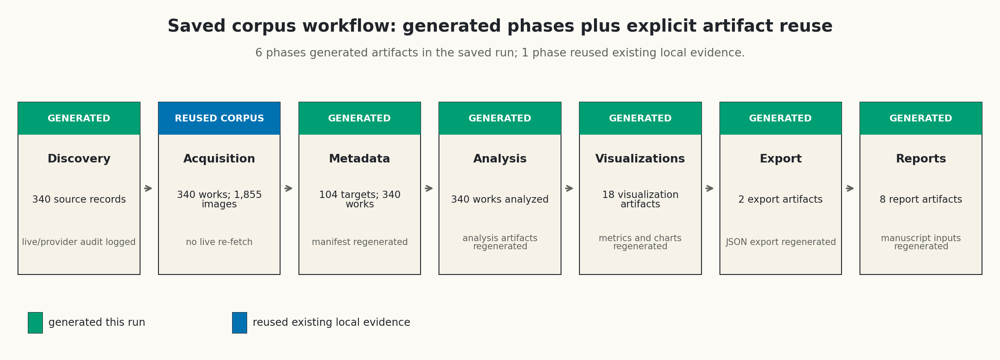

## Page 6

Table 2: Provider discovery health for the saved run. A provider failure is recorded as review evidence and does not imply that already
acquired local works are invalid.
Provider
Source type
Status
Records
Error
blake_archive_api_github
blake_archive
completed
328
project_gutenberg
project_gutenberg
completed
12
internet_archive
internet_archive
completed
0
2.3
Acquisition Path: Reproducible Fetching and Drift Resistance
The acquisition path builds Archive-backed work records from the target ledger and the public GitHub TEI inventory; live per-work Archive
API metadata is attempted opportunistically as enrichment, not as the only catalog source. In this run the enrichment status was degraded:
49 of 58 attempted metadata requests succeeded, 9 failed, and 270 were skipped after the bounded budget or degradation guard. The fallback
source for work-record construction was target ledger + GitHub XML inventory. TEI acquisition uses actual inventory filenames before
falling back to inferred copy-letter patterns, treating TEI as a structured encoding model rather than a plain-text dump [TEI Consortium,
2026, Burnard, 2014, DeRose et al., 1990]. Image acquisition normalizes object identifiers before trying Archive and Wayback image URL
variants. Text-canon targets without primary Archive work ids are handled through an explicit Wikisource fallback script, with the fallback
source recorded in local metadata rather than folded into Archive authority. The source audit found 725 work XML files and 539 distinct
work prefixes in the GitHub works API, then sampled 12 Archive work API records, of which 12 responded successfully. The resulting
discovery set produced 340 normalized source records and matched 101 ledger targets (97.1%). Endpoint status is evidence about a run-time
source environment, not a permanent property of the cited resource; long-lived digital humanities projects and public web corpora both face
changing interfaces, link rot, reference rot, time-varying representations, and provider-specific access policies [Reed, 2014, Klein et al., 2014,
Van de Sompel et al., 2013].
2.4
Provenance Audit: Evidence Traces and Missing-Work Search
Every local work stores source type, source identifier, source URL, license fields, and image source URLs where available. The audit layer
separately records endpoint status for the research sources, so source availability is not inferred from successful local acquisition alone. It
also emits missing-evidence candidates for targets that remain missing or partial, separating text, image, and source-match searches. This
makes provenance a recorded relationship among sources, acquisition activities, derived artifacts, and manuscript claims rather than an
informal note [Moreau and Groth, 2013, Soiland-Reyes et al., 2022]. fig. 2 summarizes the checked endpoints, and tbl. 3 retains the exact
checked status table used for this manuscript.
Figure 2: Reviewed source endpoints used by the acquisition and fallback-source audit. Rows record endpoint availability during this run;
reachable status supports source review but does not by itself prove that a candidate title or object was acquired.
5

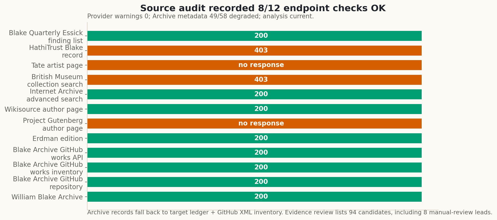

## Page 7

Table 3: Live source audit table. Statuses describe endpoint availability during this run and do not by themselves prove that a candidate
title was acquired.
Source endpoint
Status
OK
Content type
William Blake Archive
200
yes
text/html; charset=utf-8
Blake Archive GitHub
repository
200
yes
text/html; charset=utf-8
Blake Archive GitHub works
inventory
200
yes
text/plain; charset=utf-8
Blake Archive GitHub works
API
200
yes
application/json;
charset=utf-8
Erdman edition
200
yes
text/html; charset=utf-8
Project Gutenberg author
page
200
yes
text/html;charset=utf-8
Wikisource author page
200
yes
text/html; charset=UTF-8
Internet Archive advanced
search
200
yes
application/json
British Museum collection
search
403
no
text/html; charset=UTF-8
Tate artist page
unavailable
no
HathiTrust Blake record
403
no
text/html; charset=UTF-8
Blake Quarterly Essick
finding list
200
yes
text/html; charset=UTF-8
6

## Page 8

3
Methods: Local Text, Image, Cross-Modal, and Theme Diagnostics
The analysis phase operates over the acquired local corpus, not over the target ledger directly. In the present run, 340 local works entered
analysis. Of these, 156 contain text, 94 contain image evidence, and 33 contain both. The separation is important: coverage results describe
the state of target evidence, while analysis results describe only works for which the relevant modality is locally available. The analysis
design is therefore descriptive and census-like for the saved local run; it is not an inferential sample of an undefined Blake population.
The text module tokenizes each text-bearing work, computes word and unique-word counts, estimates lexical sentiment, derives vocabulary
richness as type-token ratio, extracts recurring themes from metadata and analysis outputs, and writes concordance-ready JSON. A separate
lexical-signature artifact applies the same deterministic tokenizer with a stopword filter, an editorial-apparatus filter, adjacent-term phrase
counts, per-work lexical density, and simple distinctive term scores. Those descriptors are reproducible and comparable across runs; they
are not treated here as final literary judgments. The method therefore treats tokenization and markup as modeling decisions [DeRose et al.,
1990, TEI Consortium, 2026], treats type-token ratio as a length-sensitive lexical diagnostic [Tweedie and Baayen, 1998, McCarthy and
Jarvis, 2010], and treats sentiment as a fragile descriptor for literary language rather than as an affective interpretation [Pang and Lee, 2008,
Kim and Klinger, 2019]. The visual module processes local image files, recording image-level composition and color descriptors exposed by
the package’s visual-analysis engine. In distant-viewing terms, these descriptors are computed metadata for a bounded image corpus, not
iconographic readings or copy-state judgments [Arnold and Tilton, 2019, Wevers and Smits, 2020]. The cross-modal layer links work text to
local image records when both modalities are present; that linkage is an evidentiary join, not a theory of how word and image co-produce
meaning in Blake’s composite art [Mitchell, 1994, Viscomi, 1993].
The ontology module builds a work-theme graph and typed entity outputs from the text-bearing subset. For the full local run, the manuscript
reports the graph-level summary of 356 nodes and 297 edges, including 16 theme nodes. Ontology outputs are bounded during extraction and
relationship construction so large texts do not dominate disk use or analysis time. This makes the run reproducible on local machines while
keeping the reported graph tied to acquired evidence rather than to an unbounded intermediate. The graph is reported as an index and QA
surface, not as a settled thematic hierarchy; that distinction follows both network-analysis cautions in the humanities and topic-modeling
cautions about treating latent features as interpretations [Blei et al., 2003, Blei, 2012, Newman, 2010, Weingart, 2011, Moretti, 2011].
In algorithmic-criticism terms, these outputs are provocations and navigation aids for reading, not replacements for reading or editorial
judgment [Ramsay, 2011, Rockwell and Sinclair, 2016].
The natural-language diagnostics layer adds a compact vector-space view over the same local text boundary. It reads the local transcription
files, constructs a TF-IDF vocabulary of 120 retained terms across 162 text-bearing works, normalizes each work vector, and projects
the centered matrix onto deterministic PCA/LSA axes. Entity counts are taken from the serialized ontology/text-analysis artifacts, not
recomputed inside the manuscript. This keeps embeddings, PCA, sentiment, readability, topics, and entity extraction aligned with the same
acquisition state as the coverage ledger. It also preserves the corpus-design lesson that a model’s geometry should be interpreted against
what the corpus includes and excludes [Atkins et al., 1992, Biber, 1993, Bode, 2018]. The vector space is thus a reading instrument over
local evidence, not a claim that Blake’s oeuvre has a stable latent map [Ramsay, 2011, Rockwell and Sinclair, 2016].
All analysis outputs are serialized as JSON. The manuscript variables, figures, and tables read those JSON artifacts rather than copying
values by hand. This design follows the reproducibility principle that computational claims should be regenerated from recorded workflow
outputs [Sandve et al., 2013], and it keeps the paper aligned with subsequent corpus acquisitions. It also treats preservation as a property
of relationships among files, hashes, manifests, commands, and derived reports rather than as a single frozen export [Owens, 2018, Moreau
and Groth, 2013]. When a future acquisition fills a missing text or image target, the coverage tables, modality counts, text metrics, image
linkage, and figure captions update through the same token layer.
7

## Page 9

4
Results: Target Coverage, Provenance, and Evidence Gaps
This section reports the corpus state against the declared target ledger. The key result is not a simple complete/incomplete label: the local
corpus represents 102 of 104 ledger targets (98.1%), but only 90 targets satisfy all required local evidence (86.5%). The manifest therefore
classifies the run as partial. The audit then translates non-present targets into concrete search candidates so the next acquisition pass can
be driven by recorded evidence rather than ad hoc title hunting. The results are consequently methodological as well as descriptive: the
unresolved rows show where the corpus is well evidenced and where aggregate interpretation should stop.
4.1
Ledger Results: Covered, Partial, and Missing Target Works
The target coverage matrix contains 90 present targets, 12 partial targets, and 2 missing targets. fig. 3 plots the same denominator used
by the manifest, and tbl. 4 gives the status breakdown. The status labels are not neutral facts about Blake’s oeuvre; they are modeled
classifications that make inclusion rules, absences, and evidentiary obligations inspectable [McCarty, 2005, Atkins et al., 1992, Bowker and
Star, 1999].
Figure 3: Coverage status against the 104-entry canonical target ledger. Bars count local work-level evidence states: represented-but-partial
records remain separate from fully evidenced records, and the denominator is the declared ledger rather than Blake’s whole material archive.
Table 4: Coverage status breakdown. The denominator is the canonical work-level ledger, not the number of downloaded files.
Status
Works
% of ledger
present
90
86.5
partial
12
11.5
missing
2
1.9
duplicate
0
0.0
unverified
0
0.0
The difference between representation and presence is visible in the evidence metrics. Text coverage across local works is 45.9%, image
coverage is 27.6%, and processing coverage is 100.0%. These are local-work metrics: they describe the 340 acquired works, not the unacquired
target ledger.
8

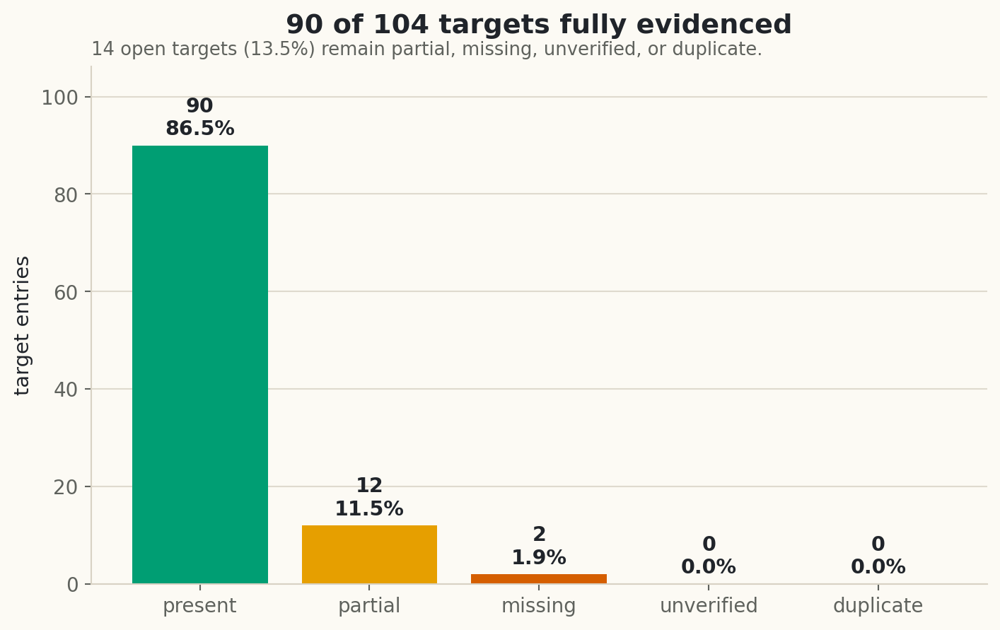

## Page 10

4.2
Category Results: Coverage by Work Area and Genre
Coverage is not evenly distributed by category. fig. 4 shows stronger representation for visual and print categories, while manuscript and
poem targets carry the remaining gaps. tbl. 5 gives the category-level matrix.
Figure 4: Stacked target coverage by ledger category. Segments count present, partial, missing, duplicate, or unverified target entries within
each work area; the categories organize acquisition state and are not offered as literary period labels.
Table 5: Category-level target coverage. Category rows expose where the remaining acquisition work is concentrated.
Category
Present
Partial
Missing
Total
Present %
color prints
1
0
0
1
100.0
commercial illustrations
18
0
0
18
100.0
drawings
5
0
0
5
100.0
engravings
2
0
0
2
100.0
illuminated books
20
0
0
20
100.0
letters
1
1
0
2
50.0
manuscripts
1
10
0
11
9.1
paintings
3
0
0
3
100.0
poems
0
0
2
2
0.0
separate prints
19
0
0
19
100.0
typographic works
2
1
0
3
66.7
watercolors drawings
18
0
0
18
100.0
The local corpus contains 8 work types. The distribution by local work type is reported in tbl. 6.
Table 6: Local work-type distribution. This table describes acquired works only and should not be read as a census of the target ledger.
Work type
Local works
% of local corpus
manuscript
234
68.8
poem
28
8.2
drawing
19
5.6
9

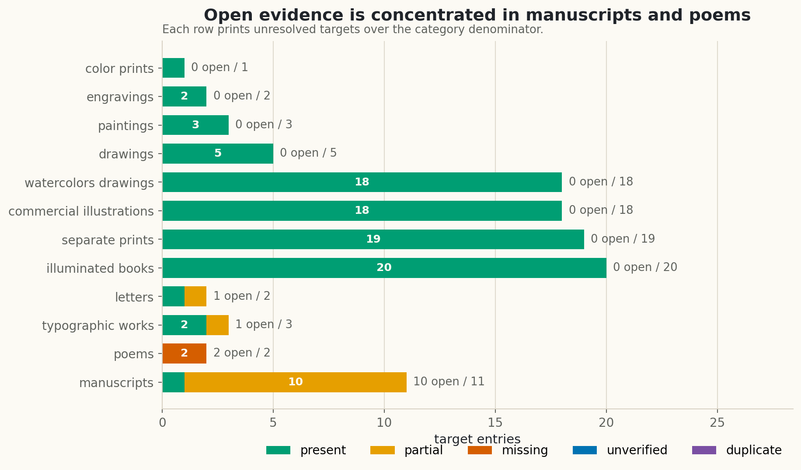

## Page 11

Work type
Local works
% of local corpus
letter
16
4.7
prophecy
13
3.8
illuminated book
11
3.2
plate
11
3.2
illustration
8
2.4
The acquired chronology spans 1773 through 1827, a 54-year window across the dated local records. fig. 5 shows the distribution by year
and work type, making clear that the reported work-level corpus reaches across Blake’s productive life while preserving category-specific
evidence gaps.
4.3
Modality Results: Text, Image, and Metadata Evidence
The modal profile of the local corpus is mixed.
fig. 6 separates works with both text and image evidence, text only, image only, and
metadata-only records. The joint text-image subset contains 33 works; the text-bearing subset contains 156 works; and the image-bearing
subset contains 94 works.
This modality split explains why the corpus can be broadly represented while still partial. Visual works often have local image evidence but
no transcribed text; some textual works have text but incomplete image evidence. The coverage ledger preserves that distinction instead of
collapsing it into a single acquired/not-acquired flag.
4.4
Gap Results: Search Candidates for Missing Evidence
The unresolved denominator is small but consequential. Source discovery matched 101 of 104 ledger targets (97.1%), leaving 3 unmatched
source-discovery targets: songsie, poetical-sketches, and everlasting-gospel. Those unmatched source-discovery targets are represented locally
through explicit Wikisource fallback text, not through Archive-led discovery records. Locally, 12 targets are partial and 2 are missing. fig. 7
groups the reasons. The row-level target ledger is moved out of the main argument into tbl. 10, so the results section can emphasize what
the gaps mean rather than force the reader through every unresolved target. Missing evidence is therefore treated as an object of analysis,
not just an inconvenience, because archival and digitized-corpus absences shape what downstream claims can mean [Klein, 2013, Borgman,
2015, Bode, 2018].
The audit turns those gaps into 94 bounded missing-evidence candidates across 14 targets. The candidate set includes 88 text checks, 0
image checks, and 6 source-match checks. tbl. 11 preserves the full bounded search table with source label, endpoint status when available,
confidence score, and action taken.
That separation matters: fallback sources remain acquisition leads and corroboration records, not
replacements for William Blake Archive authority.
10

## Page 12

Figure 5: Dated local corpus records by year and work type across the 1773-1827 metadata window. Points use normalized work dates from
local records; object-, copy-, and impression-specific dating remains outside this chronology.
Figure 6: Local evidence modalities across acquired corpus records. Bars separate text-plus-image, text-only, image-only, and metadata-only
works, defining which material subset can support textual, visual, or cross-modal analysis in this run.
11

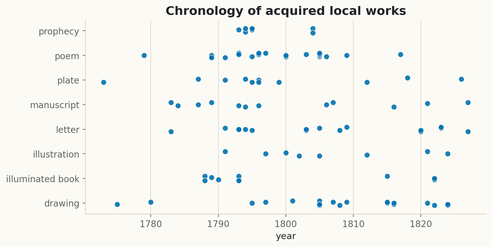

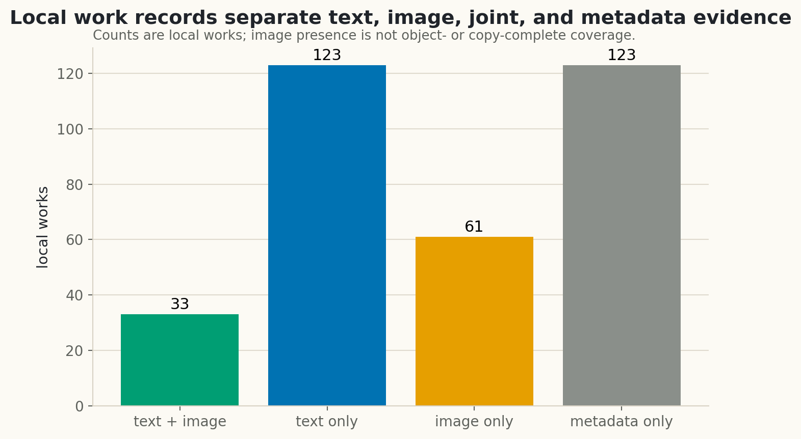

## Page 13

Figure 7: Evidence gaps preventing complete target-ledger coverage. Bars group non-present target records by missing expected text, image,
source, or local-work evidence; each count is a candidate acquisition task, not proof that the named public source contains the missing
material.
5
Results: Text Scale, Visual Evidence, and Cross-Modal Diagnostics
This section reports analysis outputs over the acquired local corpus. Because only 156 of 340 local works contain text, textual metrics
describe a substantial but incomplete subset. Likewise, image and cross-modal metrics describe the 94 image-bearing works and the 33
works with both modalities. The results function as a materials meta-analysis: they show which local evidence can support text diagnostics,
image diagnostics, and joint inspection before any reader treats those diagnostics as literary interpretation. The figures should therefore be
read as interpretive displays of the saved evidence state, not as stylistic periodization, iconographic classification, or a model of Blake as a
whole [Drucker, 2011, 2020].
5.1
Lexical Results: Text Scale, Vocabulary, and Phrase Diagnostics
The text-bearing subset contains 216878 total words. When per-work unique counts are summed, the subset contains 51411 unique-word
observations; this is a per-work vocabulary diagnostic rather than a deduplicated corpus lexicon. Per-work word counts range from 22 to
49927 words. fig. 8 plots the largest text-bearing works, and tbl. 7 records the same top rows with unique-word and image-link counts.
Table 7: Largest text-bearing local works. The image column indicates whether a text-heavy work also participates in cross-modal analysis.
Work
Words
Unique words
Vocab richness
Images
Letters
49927
6039
0.121
2
Jerusalem The
Emanation of The
Giant Albion
49496
6012
0.121
384
Milton a Poem
18218
3467
0.190
92
A Descriptive
Catalogue
11178
2820
0.252
1
The French
Revolution
4982
1452
0.291
0
The Marriage of
Heaven and Hell
4772
1537
0.322
241
Songs of Innocence
and of Experience
4759
1244
0.261
364
Tiriel
3791
1054
0.278
0
Songs of Innocence
3107
898
0.289
14
12

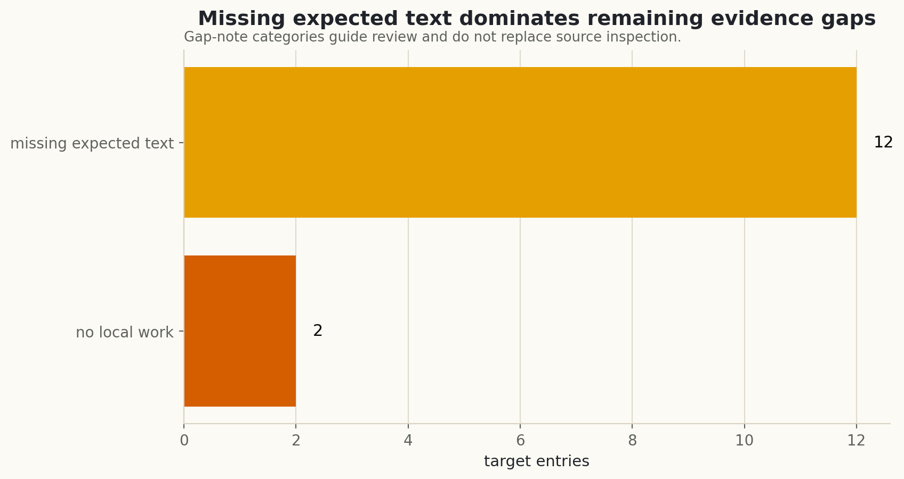

## Page 14

Work
Words
Unique words
Vocab richness
Images
America a
Prophecy
3067
1149
0.375
160
The First Book of
Urizen
2848
987
0.347
48
Europe a Prophecy
2318
920
0.397
47
Vocabulary richness averages 0.478 across text-bearing works and ranges from 0.121 to 0.828. fig. 9 plots type-token ratio against text length.
The downward shape is expected for length-sensitive type-token ratios and should be treated as a diagnostic of metric behavior over the
acquired text set, not as a global claim about Blake’s vocabulary [Tweedie and Baayen, 1998, McCarthy and Jarvis, 2010, Jockers, 2013].
The lexical-signature artifact uses regex_token_frequency_stopword_filtered over 156 text-bearing works. It records 122580 stopword-
filtered lexical tokens and 12895 distinct terms, with mean lexical density 0.551. The highest-count terms include albion, object, thy, thou,
blake, man, los, and form, and frequent adjacent-term phrases include sheet folded, writings volume, recto object, sealed packet, verso object,
and folded sheet. fig. 10 visualizes the leading terms and phrases, while tbl. 8 preserves their document-frequency context.
Table 8: Leading stopword-filtered corpus terms. Document counts show whether a term is corpus-wide or concentrated in a small number
of transcriptions.
Term
Count
Documents
albion
829
9
object
680
73
thy
617
19
thou
579
24
blake
536
133
man
535
38
los
520
8
form
446
75
jerusalem
423
7
first
422
70
folded
419
53
death
401
31
5.2
Embedding Results: PCA/LSA Structure and Entity Extraction
The text layer supports a more explicitly natural-language analysis than word counts alone. The manuscript pipeline builds a TF-IDF latent
semantic embedding with deterministic PCA/SVD projection from 162 local transcriptions and a 120-term vocabulary. fig. 11 projects that
space onto the leading axes: PC1 accounts for 17.9% of the TF-IDF variance, PC2 accounts for 8.6%, and the plotted plane accounts for
26.6%. This is a bounded corpus diagnostic, not a semantic map of every Blake work, because texts absent from local storage cannot enter
the vector space [Biber, 1993, Bode, 2018]. Its value is procedural: it makes the acquired text set explorable and contestable, the way
algorithmic criticism and computer-assisted interpretation treat computation as a partner in reading rather than an oracle [Ramsay, 2011,
Rockwell and Sinclair, 2016].
The leading vocabulary terms also make the projection auditable. PC1 is driven by terms such as object, folded, sheet, blake, packet, page,
recto, and sealed, while PC2 is driven by terms such as blake, above, like, work, object, written, letter, and night. These terms should be
read as feature loadings over local transcriptions: they help locate clusters, outliers, transcription effects, and acquisition artifacts, but they
do not by themselves establish interpretive periodization.
Entity extraction adds a second kind of linguistic evidence. Across 343 ontological-analysis artifacts, 158 works currently contribute named-
entity evidence. The extraction layer records 12604 entity mentions across 3877 distinct normalized strings and 8 entity labels, including
person, org, gpe, loc, myth, symbol, place, and concept. The most frequent normalized strings are Blake, Jerusalem, Erdman, Albion, Earth,
Bentley, Spectre, and Jesus. This is an index into person, place, mythic, and textual reference patterns, but it still requires human review
because Blakean names, plate captions, and editorial metadata can blur the boundary between character, place, title, and bibliographic
entity.
The per-work text-analysis artifacts broaden the picture further: 159 artifacts carry sentiment and readability diagnostics, with 92 positive,
8 neutral, and 59 negative sentiment classifications in the reported run. The mean Flesch reading-ease score is 66.9, and topic extraction
emitted 642 topic components across local text-analysis artifacts. These values help locate works for close reading and QA, but the manuscript
treats them as computational descriptors rather than as stand-alone literary judgments [Flesch, 1948, Pang and Lee, 2008, Kim and Klinger,
2019, Blei, 2012, Ramsay, 2011].
5.3
Theme-Graph Results: A Navigable Index of Blake Motifs
The work-theme graph contains 356 nodes and 297 edges, including 16 theme nodes. fig. 12 summarizes the most frequent themes by work-
theme links. The graph indexes how the acquired corpus is currently organized, but it inherits the corpus evidence boundary: manuscript
targets with missing text cannot contribute textual entities until their transcriptions are acquired [Newman, 2010, Weingart, 2011, Moretti,
2011].
13

## Page 15

Figure 8: Largest local text-bearing corpus records by word count. Bars measure acquired transcription length, showing which source-backed
text files dominate aggregate vocabulary and theme diagnostics; works without local text are excluded.
14

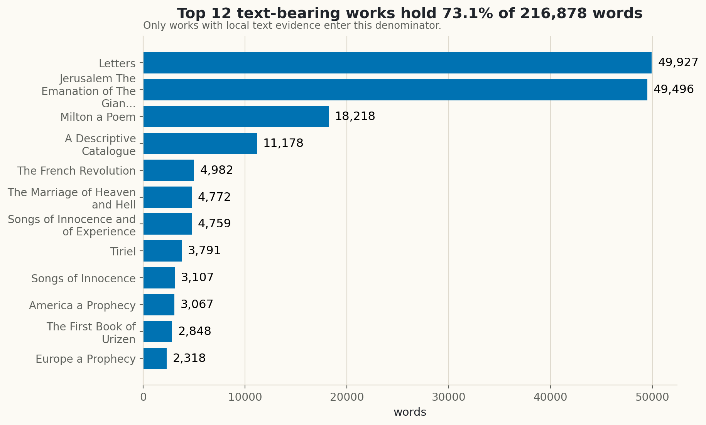

## Page 16

Figure 9: Vocabulary richness versus text length for local text-bearing records. Each point is one acquired transcription; the log-scaled
x-axis supports comparison across text sizes, while the metric remains bounded to local text evidence and is not a Blake-wide stylistic claim.
Figure 10: Stopword-filtered lexical signature for local transcriptions. Term and phrase counts are generated from the acquired text files
used elsewhere in the manuscript, so the denominator is the local text subset rather than unsourced Blake-wide vocabulary.
15

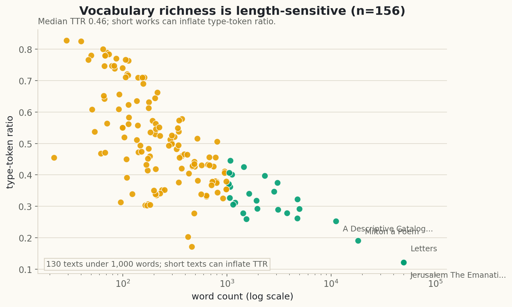

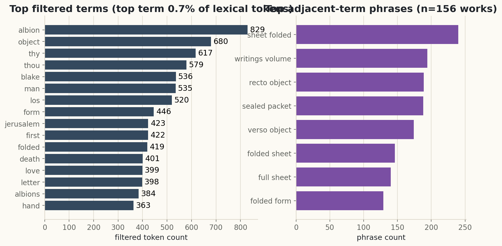

## Page 17

Figure 11: Latent text embedding from local transcriptions. The map projects 162 text-bearing corpus records from a 120-term TF-IDF
matrix onto deterministic PCA/LSA axes; missing and image-only works do not enter this textual geometry.
16

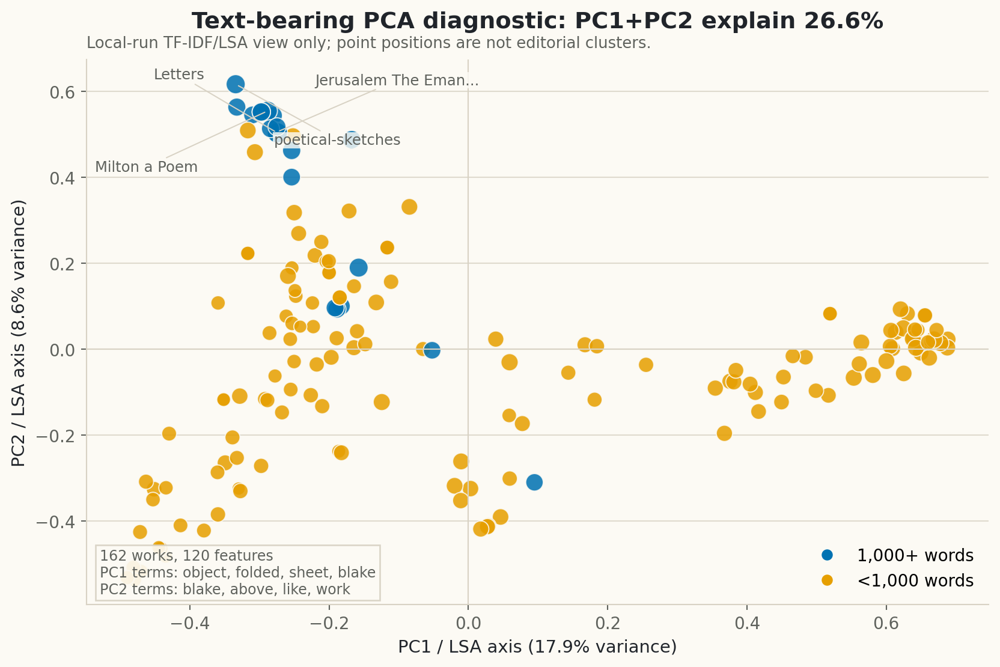

## Page 18

Figure 12: Theme frequencies in the generated work-theme graph.
Bars count current local work-theme links from serialized analysis
artifacts; the graph is an index over acquired evidence, not a settled thematic hierarchy for Blake’s complete oeuvre.
17

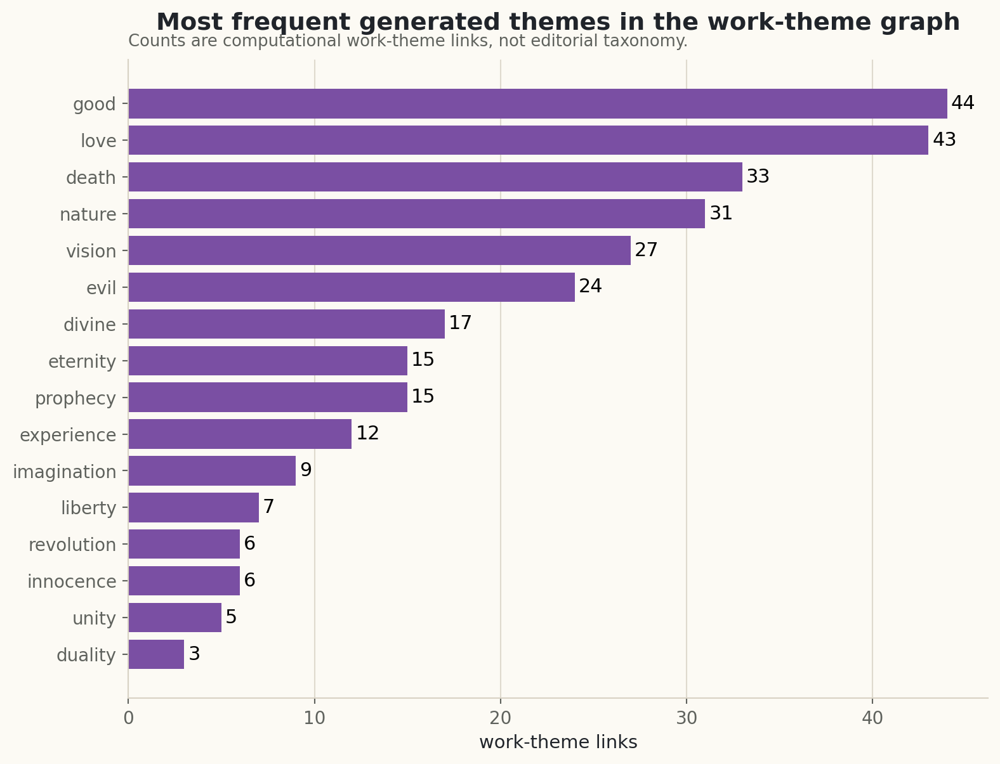

## Page 19

5.4
Image-Linkage Results: Work-Level Cross-Modal Evidence
The visual subset contains 1855 local image records linked across 94 works. fig. 13 shows the works with the most local image evidence,
while tbl. 9 records whether those image-rich works also carry text. Image-bearing means that at least one local image record is linked to a
work; object-depth mirroring is measured separately in the supplement. In this run the image-depth dataset records 94 works, 2536 resolved
Archive object candidates, and 1855 downloaded local object images. These counts support distant-viewing style inventory and QA, but
they still do not imply full copy-, plate-, object-, or manifest-level completeness outside the discoverable Archive API paths used by the
command [Butlin, 1981, Bindman, 1978, Viscomi, 1993, Arnold and Tilton, 2019, Wevers and Smits, 2020].
Figure 13: Local works with the most linked image evidence. Bars count locally stored image records by work; color distinguishes records
that also have local text, making the text-image comparison subset explicit.
fig. 14 adds the complementary view: text length is plotted against linked local image count, with color encoding lexical density. This makes
the joint analytical surface visible instead of implying that every text-bearing work is equally visual or that every image-bearing work has
enough transcription evidence for language analysis.
Table 9: Local works with the most image evidence. Rows with text available are candidates for joint text-image reading; rows without text
remain visual-evidence records only.
Work
Images
Has text
Jerusalem The Emanation of The Giant Albion
384
yes
Songs of Innocence and of Experience
364
yes
The Marriage of Heaven and Hell
241
yes
Visions of the Daughters of Albion
163
yes
America a Prophecy
160
yes
The Book of Thel
100
yes
Milton a Poem
92
yes
The First Book of Urizen
48
yes
Europe a Prophecy
47
yes
For the Sexes: The Gates of Paradise
46
yes
The Song of Los
37
yes
For Children: The Gates of Paradise
36
yes
18

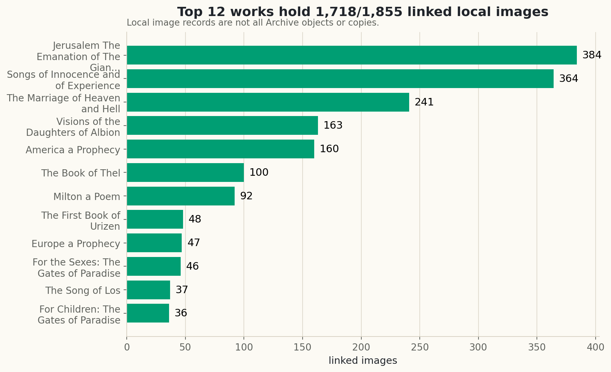

## Page 20

Figure 14: Text-image density across local text-bearing records. Each point is a work with local text; x encodes transcription length, y
encodes linked local image files, and color encodes lexical density, so image-only works and remote-only objects remain outside this plot.
19

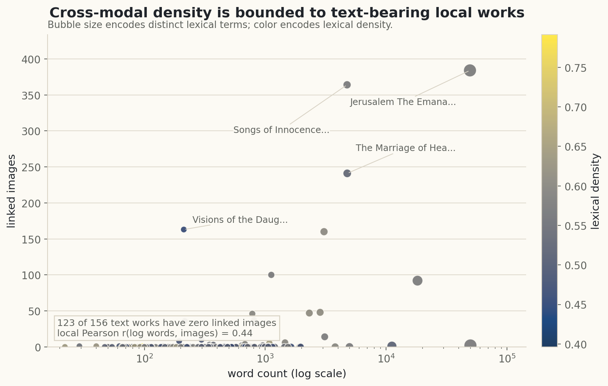

## Page 21

The corpus supports cross-modal inspection for 33 works. It also supports an opt-in Archive object-image mirror whose depth is reported
in fig. 16 and fig. 17. The result remains a descriptive materials corpus: text, image, and joint analyses are tied to recorded local evidence,
while object-depth counts are bounded by discoverable Archive work/copy metadata and local download success [Mitchell, 1994, Drucker,
2011, 2020, Arnold and Tilton, 2019]. This is the appropriate level of claim for a corpus-governance paper: the pipeline identifies where
cross-modal reading is possible and where the evidence surface is still too thin.
20

## Page 22

6
Discussion: What the Corpus Can and Cannot Claim
The principal result is a denominator-bounded materials inventory. The reported run analyzes 340 source-backed local works and represents
102 of 104 targets, while full target evidence is present for 90 targets rather than the whole ledger. That distinction is the purpose of
target-aware coverage: the corpus can be evaluated by design criteria, representativeness, and explicit exclusions rather than by download
volume alone [Atkins et al., 1992, Biber, 1993, McEnery and Hardie, 2012]. For Blake studies, this matters because the unit “work” is already
mediated by copy history, editorial practice, visual cataloguing, and the Archive’s object model. For digital editing and data modeling, it
matters because the corpus is not simply a storage format for files; it is a modeled representation of what counts as a work-level target, what
counts as local evidence, and what remains outside the current evidence boundary [McCarty, 2005, Price, 2009, Sahle, 2016, Flanders and
Jannidis, 2019]. The result should therefore be read as a bridge between an edition-aware source environment and a computational corpus,
not as a replacement for either one.
The coverage results show why a single downloaded-work count is insufficient. A run can match 101 targets in live discovery and still
contain 12 partial local targets when expected text or image evidence is absent. It can also have strong image availability, with 94 image-
bearing works, while text coverage remains limited to 156 works. The manifest records both conditions, making it possible to ask whether
a downstream result is based on all local works, text-bearing works, image-bearing works, or the joint 33-work subset.
This matters for digital-humanities analysis. The text metrics in sec. 5 cover 216878 words, but they remain bounded by the 156 text-bearing
works. The theme graph, vocabulary scatter, PCA embedding, and image-depth displays are therefore stronger as corpus diagnostics than
as final literary claims.
They show that the pipeline can compute and regenerate Blake-specific evidence at scale, while the coverage
ledger tells readers where computational prompting should return to bibliography, editing, and close reading. That posture aligns with
macroanalytic work when it remains transparent about corpus construction, with algorithmic criticism when computation is treated as a
disciplined provocation to interpretation, and with visualization theory when figures are treated as arguments about evidence rather than
transparent windows onto data [Ramsay, 2011, Rockwell and Sinclair, 2016, Jockers, 2013, Wilkens, 2015, Pechenick et al., 2015, Bode, 2018,
Piper, 2018, Underwood, 2019, Drucker, 2011, 2020]. It also makes the computational model accountable: when a result is limited by text
absence, image absence, source drift, or object-level incompleteness, that limitation is part of the result rather than a footnote outside the
argument.
The acquisition architecture is also a contribution. Its source path combines the target ledger, GitHub TEI inventories, bounded live Archive
API metadata enrichment, and explicit fallback-source checks to reduce dependence on any single brittle endpoint. The fallback-text path
is deliberately narrow: a high-confidence audit row is not accepted until the source is pulled, the title or alias matches, the content is long
enough to be a transcription rather than a search result, the checksum is recorded, and the work is tagged as fallback_text_validated. The
authority-tier dataset distinguishes 327 Archive-primary works, 1 validated fallback-text works, and 12 corroborating or legacy records. The
audit artifacts document provider discovery health, checked URLs, endpoint status, GitHub inventory counts, sampled Archive API records,
Archive metadata enrichment status, unmatched source-discovery targets, duplicate aliases, and bounded missing-evidence candidates. This
makes source availability a first-class result rather than an invisible precondition. It also turns the most important remaining gaps into a
worklist that can be tested in later runs, while acknowledging that mature digital projects and web resources both change over time [Reed,
2014, Klein et al., 2014, Van de Sompel et al., 2013].
The same architecture clarifies what a future public corpus package would need to prove. Collections-as-data guidance emphasizes that
usable cultural-heritage data require not only files, but also selection rationale, rights posture, provenance, documentation, and machine-
readable structure [Padilla et al., 2019a,b, Candela et al., 2023]. The private preflight and rights-gate reports therefore belong in the scholarly
method: they prevent the local evidence cache from being confused with a redistributable edition, and they make the difference between
facts, aggregate diagnostics, transcriptions, images, and provider-controlled files reviewable before any release decision. In that sense, the
project treats rights and redistribution as part of corpus epistemology: the ability to compute on a local file is not the same as the authority
to publish it or to cite it as canonical evidence.
The most plausible next acquisition paths are methodologically adjacent rather than already implemented.
Multimodal LLM work on
historical-document OCR, OCR post-correction, and NER suggests one way to test missing text evidence in later runs [Greif et al., 2025].
Multimodal metadata assignment, museum KG construction, and multimodal KG extension suggest future experiments for linking object
descriptions, images, extracted entities, and provenance [Rei et al., 2024, Li et al., 2025, Zhang et al., 2026]. These citations motivate bounded
future work only: the reported run does not claim model-based restoration, LLM OCR, LLM-based or model-driven NER extraction, or
KG completion. The descriptive spaCy named-entity pass reported in the results is a deterministic, local human-review diagnostic, not a
model-based extraction contribution.
The visual design layer follows the same honesty rule. The generated cover gives the manuscript a coherent Blakean visual atmosphere, but
it is explicitly identified as a generated interpretation rather than an Archive image, a museum catalogue item, or a corpus object. The
acquired-image mosaics use local files only, and the object-depth figures state the Archive-derived denominator. That distinction prevents the
report’s aesthetic layer from contaminating its evidence layer, especially in a subject area where image provenance and digital-file materiality
are not decorative metadata but part of the scholarly object [Kirschenbaum, 2008, Owens, 2018].
The remaining work is sharply specified. Closing the corpus requires acquiring or mapping the missing expected evidence for 12 partial
targets, reviewing whether fallback text-only targets need additional editorial corroboration, and deciding where object-depth mirroring
should become part of the default publication workflow rather than an opt-in acquisition mode. Those are distinct engineering and scholarly
tasks; the manuscript keeps them separate because moving from work-level accounting to copy/object accounting changes the bibliographic
object being measured [Price, 2009, Sahle, 2016, Viscomi, 1993, Butlin, 1981].
21

## Page 23

7
Rights and Distribution Controls
This section is a legal-risk assessment for publication planning, not legal advice. It asks which parts of the project can be distributed under
open-source terms and which parts should remain local, regenerable research evidence unless a permission grant, a license-compatible source,
or a publication-specific fair-use review is completed.
The analysis is layered: Blake’s underlying authorship, publication history, later
editorial or transcription work, digital reproduction files, provider terms, database-like restrictions, and fair-use posture must be assessed
separately [U.S. Copyright Office, 2026a,b, UK Intellectual Property Office, 2021, European Parliament and Council of the European Union,
2006, United States Court of Appeals for the Ninth Circuit, 2014, United States Court of Appeals for the Second Circuit, 2002].
7.1
Underlying Works: Public-Domain Baseline Across Jurisdictions
William Blake died in 1827. In ordinary life-plus-70 jurisdictions, the author’s own literary and artistic copyrights have expired. U.K.
guidance gives the general term for literary and artistic works as creation through 70 years after the author’s death, and the E.U. term
directive harmonizes author rights at life plus 70 years [UK Intellectual Property Office, 2021, European Parliament and Council of the
European Union, 2006]. U.S. law likewise uses life plus 70 for modern author-term works, while older works require separate analysis of
publication, renewal, and pre-1978 unpublished-work provisions [U.S. Copyright Office, 2026a,b].
Blake’s death date is therefore strong but not sufficient legal analysis. In the United States, the Copyright Office’s duration circular states
that, as of 2026, works published before 1931 are in the public domain (this published-work threshold advances by one calendar year every
January 1), but section 303 also preserves a special floor for works created before 1978 that were not published or copyrighted before 1978; if
such a work was first published before the end of 2002, the U.S. term does not expire before the end of 2047 [U.S. Copyright Office, 2026a,b].
In the United Kingdom, the IPO guidance flags the “2039 rule” for some pre-1989 unpublished literary, dramatic, musical works and
engravings whose authors died before 1969 [UK Intellectual Property Office, 2021]. In the E.U., first lawful publication or communication of
a previously unpublished work can generate an economic-rights term of 25 years [European Parliament and Council of the European Union,
2006]. The project should therefore treat published Blake poems, illuminated books, drawings, paintings, and engravings as low-risk at
the underlying-work layer, while retaining item-level caution for unpublished manuscripts, first-publication claims, edition apparatus, and
source-specific transcriptions.
Photographic and scan evidence needs a separate layer. Feist supplies the baseline: facts and labor alone do not create copyright, though
original selection or arrangement may receive thin compilation protection [Supreme Court of the United States, 1991]. In U.S. copyright
analysis, Bridgeman Art Library v. Corel held that exact photographic copies of public-domain two-dimensional art lacked originality, but
that district-court result is persuasive rather than a global blanket license for every source file [United States District Court for the Southern
District of New York, 1999]. E.U. law also addresses this layer directly: DSM Directive Article 14 rejects new copyright or related-rights
protection for non-original reproductions of public-domain visual art, while leaving room for original photographs and other national-law or
contract questions [European Parliament and Council of the European Union, 2019, Petri, 2014]. For this project, the conservative rule is
to separate the public-domain Blake object from the digital file supplied by a repository. Because faithful photographic reproductions of
public-domain two-dimensional art may carry no new copyright under Bridgeman and DSM Article 14, the operative basis for withholding
provider images and image mosaics from the public release is the provider’s terms of use, database or sui generis rights in the corpus selection
and arrangement, and publication-stage precaution — not an assertion that the reproductions are themselves copyrighted. By contrast,
transcriptions carrying editorial apparatus, annotation, or emendation are withheld on a genuine copyright basis, because that apparatus is
modern original authorship rather than a mechanical copy [Supreme Court of the United States, 1991, United States District Court for the
Southern District of New York, 1999, European Parliament and Council of the European Union, 2019].
Terms of use and institutional policies matter, but they do not automatically convert public-domain material into copyrighted material or
automatically bind every downstream user. Online terms are evaluated through ordinary assent principles; Specht and Nguyen both make
notice and assent central to enforceability [United States Court of Appeals for the Second Circuit, 2002, United States Court of Appeals
for the Ninth Circuit, 2014]. That caveat does not make provider terms irrelevant. It means the manuscript should state why the release
package respects provider terms as a publication and repository-engineering decision while keeping copyright, contract, trademark, database,
and access-control layers analytically distinct [Mazzone, 2006, Wallace, 2022].
7.2
Project Release Policy: Code, Data, Images, and Local Caches
The source code, tests, manuscript templates, generated counts, provenance tables, and non-expressive aggregate visualizations can be
distributed as project-owned software and analysis outputs, subject to the repository license. Raw or reconstructed Blake source materials
require source-specific treatment. The rights matrix in sec. 14 operationalizes the policy below.
• Repository code and project-authored prose: project-authored software and documentation. Distribute under the repository’s
open-source license.
• Derived manifests, checksums, authority tiers, coverage counts, and charts without embedded source images: factual
relationships and project-authored analysis.
Distribute with provenance and source citations; do not imply that the underlying
sources are relicensed. To the extent a table reflects original selection or arrangement, the project-owned copyright attaches only to
that arrangement, not to the underlying facts [Supreme Court of the United States, 1991].
• Blake’s own published text and artwork: generally public-domain underlying works under U.S., U.K., and E.U. term analysis.
Treat as low-risk underlying content, but record the source edition, transcription, or image provider separately.
• Project Gutenberg fallback text: U.S. public-domain or permission-backed eBook layer plus Project Gutenberg trademark and
license conditions. The underlying text may be reused in the United States once Project Gutenberg references and license wrappers are
removed; redistribution that retains Project Gutenberg branding or references must follow the trademark/license conditions [Project
Gutenberg Literary Archive Foundation, 2026].
22

## Page 24

• Wikisource fallback text: Wikimedia-hosted contribution layer. Public-domain source text remains public domain, but community-
added text, markup, and editorial contributions may carry CC BY-SA and GFDL obligations. The current Wikimedia Terms of Use
default for text contributions is CC BY-SA 4.0, but contributions predating that change remain under CC BY-SA 3.0, so reuse
must honor the license recorded on the specific page revision rather than a single assumed version. Preserve page URL, revision,
attribution/licensing metadata, and checksum; do not fold Wikisource-derived text into the MIT-licensed code package [Wikimedia
Foundation, 2026].
• William Blake Archive TEI, transcriptions, images, object images, and bulk mirrors: Archive terms identify “the Archive
as a whole, its texts, and its images” as protected and permit copying only within fair-use bounds.
Keep raw Archive files and
full image mirrors out of the open-source distribution; publish acquisition code, manifests, checksums, and source links instead [The
William Blake Archive, 2026b,a].
• Museum, HathiTrust, Internet Archive, Tate, British Museum, and catalogue leads: corroborating/catalogue evidence
with provider-specific terms. Use as leads or cited corroboration unless the item supplies directly downloadable, license-compatible
evidence.
• Generated cover and project-authored diagrams: project-authored design assets, not Blake evidence. Distribute with prove-
nance and label them as generated or analytical graphics.
• Mosaics built from acquired Archive images:
publication of many source images in a new layout.
Treat as local
research/publication-review artifacts unless permissions, a venue-specific fair-use rationale, or license-compatible replacement
thumbnails are documented.
This policy changes how “open source” should be read in the release notes. The code can be open source; the entire local evidence cache
is not thereby open source. The archive-all image mode is a reproducible acquisition path, not a permission statement. A public source
release should exclude blake_data/, raw downloaded images, raw source TEI, and full-resolution local image mirrors. It may include scripts,
checksums, source URLs, target-ledger classifications, generated non-image charts, and instructions that let a qualified user regenerate the
local cache under the source providers’ terms [Candela et al., 2023].
7.3
Fair-Use Posture: Research Publication and Transformative Context
Fair use should be treated as a use-specific argument, not as a blanket clearance rule. Section 107 directs attention to purpose, nature, amount,
and market effect, so the manuscript separates local analytic caching, limited public quotation or thumbnail display, and republication of
substantial source files [U.S. Copyright Office, 2026a]. HathiTrust and Google Books support analogies for transformative search, indexing,
accessibility, and non-substitutive discovery, but they do not license a full public mirror of provider images, TEI, or transcriptions [United
States Court of Appeals for the Second Circuit, 2014, 2015].
The strongest fair-use posture is local, non-substitutive analysis: checksums, search indexes, metadata joins, and aggregate diagnostics
that let researchers inspect corpus construction without receiving the provider’s expressive files. A more fragile posture is public display
of thumbnails, excerpts, or mosaics, because the exact venue, image resolution, amount displayed, market substitution risk, captions, and
source-provider relationship all matter. The weakest posture is republication of full-resolution source images, full TEI, full transcriptions,
or bulk mirrors without permission. That use should stay out of the public repository unless the release record documents permission, a
specific fair-use analysis, or a replacement source with compatible terms.
7.4
Risk Controls: Classification, Mitigations, and Takedown Readiness
Low-risk release surfaces are the project-authored code, tests, manifest schemas, acquisition commands, and aggregate tables or charts that
do not reproduce substantial source expression. Medium-risk surfaces are validated fallback texts and source-derived metadata: they are
publishable only with source URLs, checksums, authority-tier labels, attribution, and license metadata that prevent accidental relicens-
ing. High-risk surfaces are raw Blake Archive transcriptions, TEI files, object images, and mosaics or supplements that reproduce many
Archive images. Those assets should be omitted from an open-source repository or deposited only after permission, a venue-specific fair-use
assessment, or replacement with license-compatible thumbnails.
The mitigation is straightforward. Distribution artifacts should make the evidence cache reproducible rather than bundled: publish the
command path, source audit, source-authority tiers, checksums, and exclusion rules; keep provider files in ignored local cache directories;
and make captions state when a figure is a local review mosaic rather than a redistributable public image set. That approach preserves the
manuscript’s descriptive meta-analysis while respecting the legal difference between public-domain Blake materials and later digital source
layers. It also matches a preservation principle that access copies, provenance records, technical metadata, and rights decisions are different
objects with different stewardship requirements [Owens, 2018].
23

## Page 25

8
Limitations: Target Scope, Source Drift, and Missing Evidence
The most important limitation is the distinction between broad representation and full evidence. The local corpus represents 102 of 104
ledger targets, but full required target evidence is present for 90 targets. The run remains partial, with 12 partial targets and 2 missing
targets. No claim in this manuscript should be read as an analysis of Blake’s complete works. This is not merely a local engineering caveat:
corpus representativeness and digitized-collection bias are methodological conditions that shape every downstream aggregate [Biber, 1993,
Pechenick et al., 2015, Bode, 2018].
The second limitation is modality imbalance. The corpus includes 94 image-bearing works but only 156 text-bearing works. Textual claims
therefore rest on 216878 words from the acquired text subset, while visual claims rest on 1855 local image records. Cross-modal claims are
narrower still, applying only to 33 works. This is an evidence boundary, not merely a statistical caveat. A reader should treat the modal
subset named in each figure and table as part of the claim, because text-only, image-only, and metadata-only records support different
scholarly questions.
The third limitation is granularity. The ledger is work-level. The opt-in image-depth acquisition mode can expand Archive work/copy
metadata into object-image downloads, and this run records 2536 resolved Archive object candidates and 1855 downloaded local object
images. That does not make work-level coverage equivalent to a scholarly copy/object census. Object identifiers, copy metadata, unavailable
image URLs, relation graphs, and non-Archive catalogue paths remain separate evidentiary surfaces, especially because Blake’s illuminated
books and visual works make copy, plate, printing, coloring, and object histories central rather than incidental [Viscomi, 1993, Essick, 1980,
Butlin, 1981, Phillips, 2000, Fox and Fletcher, 2018].
The fourth limitation is source availability. The live source audit checked 12 endpoints and received OK responses from 9 of them; provider
discovery recorded 0 structured failure rows. Archive API metadata enrichment was degraded, so Archive work records in this run should
be read as target-ledger and GitHub-inventory records with opportunistic live metadata attached where available. Non-OK or unavailable
endpoints do not invalidate the acquired local corpus, but they do show why the audit has to be saved alongside the manifest. A future
run may see different statuses for the same public sources, so source checks are evidence for this run rather than permanent facts. This
is a maintenance problem as well as an acquisition problem: long-running digital humanities projects have to preserve scholarly continuity
while interfaces, project teams, and source dependencies change [Reed, 2014]. The missing-evidence table is therefore a prioritized search
ledger, not a guarantee that each candidate source contains the target. Its value is partly negative: it preserves archival and web absences
as reviewable data rather than erasing them from the report [Klein, 2013, Borgman, 2015, Klein et al., 2014].
A related limitation is that scholarship leads are not interchangeable with source evidence. The refreshed lead registry separates direct
source-owned pages, such as Morgan Pickering Manuscript records, from scholarship controls, such as the Blake/An Illustrated Quarterly
Four Zoas bibliography, Yale collection guides, and Archive route pages [The Morgan Library & Museum, 2021, Blake/An Illustrated
Quarterly, 2026b, Yale Library, 2026, Eaves et al., 1996]. Those sources can improve reviewer judgment and future acquisition targeting, but
they do not change coverage until the project records exact-title/source validation, attribution, rights metadata, checksums, and regenerated
coverage. This is especially important for manuscript works whose textual status is itself an editorial problem rather than a missing URL.
Finally, the analysis modules and visual design assets have different evidentiary roles. Flesch readability [Flesch, 1948], type-token ratio
[Tweedie and Baayen, 1998], theme frequencies [Blei, 2012], visual composition metrics, and work-theme graph edges [Newman, 2010,
Weingart, 2011] are deterministic views over the acquired corpus evidence. The cover image is a generated manuscript asset with provenance,
not a corpus observation. Humanities critiques of generative AI reinforce that generated artifacts are meaning-making interventions rather
than representative evidence [Klein et al., 2025]. Both the cover and the analysis artifacts are reproducible in the project tree, but only the
analysis artifacts support corpus claims; the cover supports publication design and must remain outside the evidentiary ledger.
24

## Page 26

9
Reproducibility: Regenerating Evidence, Figures, Web, and PDF Outputs
The manuscript is generated from the same artifacts that drive the corpus workbench. This design treats reproducibility as an artifact
relation: source records, local files, analysis outputs, figures, variables, and manuscript claims can be regenerated and inspected as a chain
rather than as disconnected products [Peng, 2011, Sandve et al., 2013, Wilson et al., 2014, Moreau and Groth, 2013]. The preservation target
is therefore not a single PDF snapshot, but the documented relation among inputs, local cache state, commands, hashes, derived JSON,
figures, and rendered outputs [Owens, 2018]. Reproduction begins by refreshing the bounded live source audit with the same Archive API
sample size reported in the methods:
uv run blake corpus audit-sources --limit 12 --output-dir analysis_output --archive-scope archive-inventory
The audit records 340 discovered source records, 101 matched target records, 3 unmatched source-discovery target records, 0 provider
discovery failures, the 12 reviewed source endpoints shown in tbl. 3, and the missing-evidence candidates shown in tbl. 11. It also records
Archive metadata enrichment as degraded with 49 of 58 attempts succeeding, so a successful local run cannot hide live API degradation.
Validated fallback text evidence is then pulled only from audit candidates that pass the confidence and authority policy:
uv run blake corpus acquire-evidence --from-audit analysis_output/data/source_audit.json
For an optional object-depth acquisition refresh, the acquisition pass uses the opt-in Archive mirror mode. This is a remote acquisition
refresh, not the saved local rerun reported here; use it only when the local evidence cache needs to be rebuilt under the source providers’
terms:
uv run blake corpus run --output-dir analysis_output --fixture-mode never --viz-profile core --format json --archive-scope arch
The main corpus outputs can then be regenerated from local data without reacquiring remote assets. This is the command used for the
saved analysis state reported here; it reruns text, visual, cross-modal, and ontology analysis over the existing local corpus:
uv run blake corpus run --skip-download --output-dir analysis_output --fixture-mode never --viz-profile core --format json --ar
This command rebuilds the manifest, current analysis results, analysis diagnostics, visualization datasets, exports, and reports without
reacquiring remote assets. The run reported here completed with status completed, processed 340 local works, analyzed 340 of 340 works
with analysis status completed, and wrote a manifest with 104 target entries. The analysis ledger marks current results as yes, records 0
analysis errors, and exposes completion, cross modal, errors, ontology, text, and visual diagnostics. It also refreshes the source-audit payload
with coverage-aware missing-evidence candidates when a manifest is available.
The manuscript cover, cover provenance, and figures are regenerated from the JSON artifacts:
uv run python scripts/generate_manuscript_figures.py
The cover asset is written to output/cover/cover_blakean.png, and its prompt/provenance record is written to analysis_output/data/
cover_image_provenance.json. The cover is configured through paper.cover.image in docs/manuscript/config.yaml, so the sibling template
renderer uses the same release-safe cover path as the PDF title page. A future release package could expose the same corpus, manuscript,
preservation, and provenance relationships through a research-object packaging format rather than only through the project tree [Owens,
2018, Soiland-Reyes et al., 2022].
The manuscript token layer is then hydrated by the rendering pipeline, or directly with the template repository on the import path:
TEMPLATE_REPO_ROOT=/path/to/template uv run python scripts/z_generate_manuscript_variables.py
Finally, from the sibling template repository, the PDF can be rendered and the publication output can be validated:
uv run python scripts/03_render_pdf.py --project working/blake
uv run python scripts/04_validate_output.py --project working/blake
No result number in the manuscript body is hand-entered. Values such as 340 local works, 90 present targets, 216878 words, 1855 images,
1855 downloaded object images, 356 graph nodes, 297 graph edges, 94 missing-evidence candidates, and 8 manual-review source leads are
injected from output/data/manuscript_variables.json, which is itself computed from analysis_output/. This keeps the prose, tables,
figures, and gap-search narrative synchronized with the latest corpus run. If the software is released as a citable research tool, the corpus
paper should also provide software citation metadata rather than treating code as an invisible implementation detail [Smith et al., 2016].
25

## Page 27

10
Conclusion: Evidence-Bounded Blake Corpus Mapping
blake provides a target-aware, source-audited, multi-modal corpus pipeline for William Blake research.
The reported run analyzed 340
source-backed local works, represented 102 of 104 target-ledger entries, and fully satisfied required evidence for 90 targets. It also produced
1855 local image records, 1855 downloaded Archive object images, 216878 words across 156 text-bearing works, and a 356-node work-theme
graph with 297 edges.
The central claim is methodological and model-aware. The system demonstrates how to make a Blake corpus auditable by declaring the target
ledger, recording source discovery, persisting endpoint checks, separating representation from complete evidence, tiering source authority,
measuring image depth, generating missing-evidence candidates, and regenerating manuscript numbers, figures, and cover provenance from
pipeline artifacts. The full-corpus question is therefore answerable in concrete terms: the project is close to work-level representation at
98.1%, but remains partial at 86.5% complete target evidence because 12 targets are partial and 2 targets are missing. The point is not to
replace Blake bibliography, the William Blake Archive, or future editorial work; it is to make the corpus layer accountable to them.
Future work is bounded by the manifest rather than by guesswork. The next acquisition pass should test the remaining 94 recorded missing-
evidence candidates, fill missing text or image evidence for the partial records listed in tbl. 10, review fallback text-only targets against
additional editorial sources, and decide which object-depth checks belong in default release validation. The corpus remains a source-audited,
reproducible work-level corpus with explicit partial-evidence boundaries, not a completed Blake corpus. That restraint is the point: the
pipeline turns the desire for broad coverage into a sequence of reviewable scholarly and technical obligations.
26

## Page 28

11
Supplement: Target-Ledger Evidence Gap Table
This table is the negative side of the coverage model. It records target-ledger rows that do not yet satisfy the current evidence profile, so
absence remains tied to a named target, category, status, and generated evidence note rather than disappearing into an aggregate percentage
[McCarty, 2005, Klein, 2013].
Table 10: Targets not yet satisfying complete target evidence. Each row names the ledger target and the evidence note generated by the
coverage builder.
Target ID
Title
Category
Status
Evidence note
bb206
To the Public:
Prospectus
typographic works
partial
Expected text is not
available locally.
poetical-sketches
Poetical Sketches
poems
missing
No matching local work
or source record in the
current discovery set.
bb74
An Island in the Moon
manuscripts
partial
Expected text is not
available locally.
everlasting-gospel
The Everlasting Gospel
poems
missing
No matching local work
or source record in the
current discovery set.
bb209
VALA, or The Four Zoas
manuscripts
partial
Expected text is not
available locally.
bb122
Blake’s Notebook
manuscripts
partial
Expected text is not
available locally.
bb134
Receipts
letters
partial
Expected text is not
available locally.
bb37
“A Fairy leapt”
manuscripts
partial
Expected text is not
available locally.
bb196
“then She bore Pale
desire” and “Woe cried
the muse”
manuscripts
partial
Expected text is not
available locally.
bb125
The Order in which the
Songs of Innocence & of
Experience ought to be
paged & placed
manuscripts
partial
Expected text is not
available locally.
bb126
The Pickering
Manuscript
manuscripts
partial
Expected text is not
available locally.
bb69
Descriptions of L’Allegro
and Il Penseroso Designs
manuscripts
partial
Expected text is not
available locally.
but828
Genesis
manuscripts
partial
Expected text is not
available locally.
bbwba1
The Phoenix to Mrs
Butts
manuscripts
partial
Expected text is not
available locally.
27

## Page 29

12
Supplement: Bounded Missing-Evidence Search Queue
The search queue translates missing or partial target evidence into reviewable candidate actions. It is intentionally conservative: a row can
guide review without changing corpus status, because source ownership, title matching, attribution, checksum, and rights metadata must
be verified before a candidate becomes corpus evidence.
Table 11: Bounded missing-evidence search candidates. The table records where the next pass should look and whether the relevant endpoint
was checked during this run; it does not treat fallback sources as replacements for William Blake Archive authority.
Target ID
Title
Evidence
Candidate
source
Status
Confidence
Action
bb122
Blake’s
Notebook
text
William Blake
Archive work
API
not checked
0.96
Checked
Archive API
metadata and
GitHub TEI
inventory
before external
fallbacks.
bb122
Blake’s
Notebook
text
Blake Archive
GitHub TEI
inventory
not checked
0.90
Search exact
Archive id in
the live TEI
filename
inventory.
bb122
Blake’s
Notebook
text
Project
Gutenberg
author page
200
0.72
Record as
corroborating
text evidence
only; do not
override
Archive
authority.
bb122
Blake’s
Notebook
text
Wikisource
author page
200
0.68
Record as
corroborating
transcription
evidence when
title/alias
matches.
bb122
Blake’s
Notebook
text
Internet
Archive
advanced
search
200
0.62
Record
facsimile or
derivative-
edition
evidence as
fallback
provenance.
bb122
Blake’s
Notebook
text
HathiTrust
Blake record
403
0.56
Use catalog
records as
bibliographic
corroboration,
not primary
text authority.
bb125
The Order in
which the
Songs of
Innocence & of
Experience
ought to be
paged & placed
text
William Blake
Archive work
API
not checked
0.96
Checked
Archive API
metadata and
GitHub TEI
inventory
before external
fallbacks.
bb125
The Order in
which the
Songs of
Innocence & of
Experience
ought to be
paged & placed
text
Blake Archive
GitHub TEI
inventory
not checked
0.90
Search exact
Archive id in
the live TEI
filename
inventory.
28

## Page 30

Target ID
Title
Evidence
Candidate
source
Status
Confidence
Action
bb125
The Order in
which the
Songs of
Innocence & of
Experience
ought to be
paged & placed
text
Project
Gutenberg
author page
200
0.72
Record as
corroborating
text evidence
only; do not
override
Archive
authority.
bb125
The Order in
which the
Songs of
Innocence & of
Experience
ought to be
paged & placed
text
Wikisource
author page
200
0.68
Record as
corroborating
transcription
evidence when
title/alias
matches.
bb125
The Order in
which the
Songs of
Innocence & of
Experience
ought to be
paged & placed
text
Internet
Archive
advanced
search
200
0.62
Record
facsimile or
derivative-
edition
evidence as
fallback
provenance.
bb125
The Order in
which the
Songs of
Innocence & of
Experience
ought to be
paged & placed
text
HathiTrust
Blake record
403
0.56
Use catalog
records as
bibliographic
corroboration,
not primary
text authority.
bb126
The Pickering
Manuscript
text
William Blake
Archive work
API
not checked
0.96
Checked
Archive API
metadata and
GitHub TEI
inventory
before external
fallbacks.
bb126
The Pickering
Manuscript
text
Blake Archive
GitHub TEI
inventory
not checked
0.90
Search exact
Archive id in
the live TEI
filename
inventory.
bb126
The Pickering
Manuscript
text
Project
Gutenberg
author page
200
0.72
Record as
corroborating
text evidence
only; do not
override
Archive
authority.
bb126
The Pickering
Manuscript
text
Morgan
Library
not checked
0.72
manual_review:
source-owned
lead only;
exact-title
validation,
attribution,
checksum,
rights
metadata, and
regenerated
coverage are
required before
any target
status changes.
29

## Page 31

Target ID
Title
Evidence
Candidate
source
Status
Confidence
Action
bb126
The Pickering
Manuscript
text
Morgan
Library
not checked
0.72
manual_review:
source-owned
lead only;
exact-title
validation,
attribution,
checksum,
rights
metadata, and
regenerated
coverage are
required before
any target
status changes.
bb126
The Pickering
Manuscript
text
Wikisource
author page
200
0.68
Record as
corroborating
transcription
evidence when
title/alias
matches.
bb126
The Pickering
Manuscript
text
Morgan
Library
not checked
0.67
manual_review:
source-owned
lead only;
exact-title
validation,
attribution,
checksum,
rights
metadata, and
regenerated
coverage are
required before
any target
status changes.
bb126
The Pickering
Manuscript
text
Internet
Archive
advanced
search
200
0.62
Record
facsimile or
derivative-
edition
evidence as
fallback
provenance.
bb126
The Pickering
Manuscript
text
HathiTrust
Blake record
403
0.56
Use catalog
records as
bibliographic
corroboration,
not primary
text authority.
bb134
Receipts
text
William Blake
Archive work
API
not checked
0.96
Checked
Archive API
metadata and
GitHub TEI
inventory
before external
fallbacks.
bb134
Receipts
text
Blake Archive
GitHub TEI
inventory
not checked
0.90
Search exact
Archive id in
the live TEI
filename
inventory.
30

## Page 32

Target ID
Title
Evidence
Candidate
source
Status
Confidence
Action
bb134
Receipts
text
Project
Gutenberg
author page
200
0.72
Record as
corroborating
text evidence
only; do not
override
Archive
authority.
bb134
Receipts
text
Wikisource
author page
200
0.68
Record as
corroborating
transcription
evidence when
title/alias
matches.
bb134
Receipts
text
Internet
Archive
advanced
search
200
0.62
Record
facsimile or
derivative-
edition
evidence as
fallback
provenance.
bb134
Receipts
text
HathiTrust
Blake record
403
0.56
Use catalog
records as
bibliographic
corroboration,
not primary
text authority.
bb196
“then She bore
Pale desire”
and “Woe cried
the muse”
text
William Blake
Archive work
API
not checked
0.96
Checked
Archive API
metadata and
GitHub TEI
inventory
before external
fallbacks.
bb196
“then She bore
Pale desire”
and “Woe cried
the muse”
text
Blake Archive
GitHub TEI
inventory
not checked
0.90
Search exact
Archive id in
the live TEI
filename
inventory.
bb196
“then She bore
Pale desire”
and “Woe cried
the muse”
text
Project
Gutenberg
author page
200
0.72
Record as
corroborating
text evidence
only; do not
override
Archive
authority.
bb196
“then She bore
Pale desire”
and “Woe cried
the muse”
text
Wikisource
author page
200
0.68
Record as
corroborating
transcription
evidence when
title/alias
matches.
bb196
“then She bore
Pale desire”
and “Woe cried
the muse”
text
Internet
Archive
advanced
search
200
0.62
Record
facsimile or
derivative-
edition
evidence as
fallback
provenance.
bb196
“then She bore
Pale desire”
and “Woe cried
the muse”
text
HathiTrust
Blake record
403
0.56
Use catalog
records as
bibliographic
corroboration,
not primary
text authority.
31

## Page 33

Target ID
Title
Evidence
Candidate
source
Status
Confidence
Action
bb206
To the Public:
Prospectus
text
William Blake
Archive work
API
not checked
0.96
Checked
Archive API
metadata and
GitHub TEI
inventory
before external
fallbacks.
bb206
To the Public:
Prospectus
text
Blake Archive
GitHub TEI
inventory
not checked
0.90
Search exact
Archive id in
the live TEI
filename
inventory.
bb206
To the Public:
Prospectus
text
Project
Gutenberg
author page
200
0.72
Record as
corroborating
text evidence
only; do not
override
Archive
authority.
bb206
To the Public:
Prospectus
text
Wikisource
author page
200
0.68
Record as
corroborating
transcription
evidence when
title/alias
matches.
bb206
To the Public:
Prospectus
text
Internet
Archive
advanced
search
200
0.62
Record
facsimile or
derivative-
edition
evidence as
fallback
provenance.
bb206
To the Public:
Prospectus
text
HathiTrust
Blake record
403
0.56
Use catalog
records as
bibliographic
corroboration,
not primary
text authority.
bb209
VALA, or The
Four Zoas
text
William Blake
Archive work
API
not checked
0.96
Checked
Archive API
metadata and
GitHub TEI
inventory
before external
fallbacks.
bb209
VALA, or The
Four Zoas
text
Blake Archive
GitHub TEI
inventory
not checked
0.90
Search exact
Archive id in
the live TEI
filename
inventory.
bb209
VALA, or The
Four Zoas
text
Project
Gutenberg
author page
200
0.72
Record as
corroborating
text evidence
only; do not
override
Archive
authority.
bb209
VALA, or The
Four Zoas
text
Wikisource
author page
200
0.68
Record as
corroborating
transcription
evidence when
title/alias
matches.
32

## Page 34

Target ID
Title
Evidence
Candidate
source
Status
Confidence
Action
bb209
VALA, or The
Four Zoas
text
Wikisource
not checked
0.67
manual_review:
source-owned
lead only;
exact-title
validation,
attribution,
checksum,
rights
metadata, and
regenerated
coverage are
required before
any target
status changes.
bb209
VALA, or The
Four Zoas
text
Internet
Archive
advanced
search
200
0.62
Record
facsimile or
derivative-
edition
evidence as
fallback
provenance.
bb209
VALA, or The
Four Zoas
text
HathiTrust
Blake record
403
0.56
Use catalog
records as
bibliographic
corroboration,
not primary
text authority.
bb37
“A Fairy leapt”
text
William Blake
Archive work
API
not checked
0.96
Checked
Archive API
metadata and
GitHub TEI
inventory
before external
fallbacks.
bb37
“A Fairy leapt”
text
Blake Archive
GitHub TEI
inventory
not checked
0.90
Search exact
Archive id in
the live TEI
filename
inventory.
bb37
“A Fairy leapt”
text
Project
Gutenberg
author page
200
0.72
Record as
corroborating
text evidence
only; do not
override
Archive
authority.
bb37
“A Fairy leapt”
text
Wikisource
author page
200
0.68
Record as
corroborating
transcription
evidence when
title/alias
matches.
33

## Page 35

Target ID
Title
Evidence
Candidate
source
Status
Confidence
Action
bb37
“A Fairy leapt”
text
Edition-specific
Wik-
isource/Sampson/Bentley
lead
not checked
0.67
manual_review:
source-owned
lead only;
exact-title
validation,
attribution,
checksum,
rights
metadata, and
regenerated
coverage are
required before
any target
status changes.
bb37
“A Fairy leapt”
text
Internet
Archive
advanced
search
200
0.62
Record
facsimile or
derivative-
edition
evidence as
fallback
provenance.
bb37
“A Fairy leapt”
text
HathiTrust
Blake record
403
0.56
Use catalog
records as
bibliographic
corroboration,
not primary
text authority.
bb69
Descriptions of
L’Allegro and
Il Penseroso
Designs
text
William Blake
Archive work
API
not checked
0.96
Checked
Archive API
metadata and
GitHub TEI
inventory
before external
fallbacks.
bb69
Descriptions of
L’Allegro and
Il Penseroso
Designs
text
Blake Archive
GitHub TEI
inventory
not checked
0.90
Search exact
Archive id in
the live TEI
filename
inventory.
bb69
Descriptions of
L’Allegro and
Il Penseroso
Designs
text
Project
Gutenberg
author page
200
0.72
Record as
corroborating
text evidence
only; do not
override
Archive
authority.
bb69
Descriptions of
L’Allegro and
Il Penseroso
Designs
text
Wikisource
author page
200
0.68
Record as
corroborating
transcription
evidence when
title/alias
matches.
bb69
Descriptions of
L’Allegro and
Il Penseroso
Designs
text
Internet
Archive
advanced
search
200
0.62
Record
facsimile or
derivative-
edition
evidence as
fallback
provenance.
34

## Page 36

Target ID
Title
Evidence
Candidate
source
Status
Confidence
Action
bb69
Descriptions of
L’Allegro and
Il Penseroso
Designs
text
HathiTrust
Blake record
403
0.56
Use catalog
records as
bibliographic
corroboration,
not primary
text authority.
bb74
An Island in
the Moon
text
William Blake
Archive work
API
not checked
0.96
Checked
Archive API
metadata and
GitHub TEI
inventory
before external
fallbacks.
bb74
An Island in
the Moon
text
Blake Archive
GitHub TEI
inventory
not checked
0.90
Search exact
Archive id in
the live TEI
filename
inventory.
bb74
An Island in
the Moon
text
Project
Gutenberg
author page
200
0.72
Record as
corroborating
text evidence
only; do not
override
Archive
authority.
bb74
An Island in
the Moon
text
Wikisource
author page
200
0.68
Record as
corroborating
transcription
evidence when
title/alias
matches.
bb74
An Island in
the Moon
text
Wikisource
not checked
0.67
manual_review:
source-owned
lead only;
exact-title
validation,
attribution,
checksum,
rights
metadata, and
regenerated
coverage are
required before
any target
status changes.
bb74
An Island in
the Moon
text
Internet
Archive
advanced
search
200
0.62
Record
facsimile or
derivative-
edition
evidence as
fallback
provenance.
bb74
An Island in
the Moon
text
HathiTrust
Blake record
403
0.56
Use catalog
records as
bibliographic
corroboration,
not primary
text authority.
35

## Page 37

Target ID
Title
Evidence
Candidate
source
Status
Confidence
Action
bbwba1
The Phoenix to
Mrs Butts
text
William Blake
Archive work
API
not checked
0.96
Checked
Archive API
metadata and
GitHub TEI
inventory
before external
fallbacks.
bbwba1
The Phoenix to
Mrs Butts
text
Blake Archive
GitHub TEI
inventory
not checked
0.90
Search exact
Archive id in
the live TEI
filename
inventory.
bbwba1
The Phoenix to
Mrs Butts
text
Project
Gutenberg
author page
200
0.72
Record as
corroborating
text evidence
only; do not
override
Archive
authority.
bbwba1
The Phoenix to
Mrs Butts
text
Wikisource
author page
200
0.68
Record as
corroborating
transcription
evidence when
title/alias
matches.
bbwba1
The Phoenix to
Mrs Butts
text
Internet
Archive
advanced
search
200
0.62
Record
facsimile or
derivative-
edition
evidence as
fallback
provenance.
bbwba1
The Phoenix to
Mrs Butts
text
HathiTrust
Blake record
403
0.56
Use catalog
records as
bibliographic
corroboration,
not primary
text authority.
but828
Genesis
text
William Blake
Archive work
API
not checked
0.96
Checked
Archive API
metadata and
GitHub TEI
inventory
before external
fallbacks.
but828
Genesis
text
Blake Archive
GitHub TEI
inventory
not checked
0.90
Search exact
Archive id in
the live TEI
filename
inventory.
but828
Genesis
text
Project
Gutenberg
author page
200
0.72
Record as
corroborating
text evidence
only; do not
override
Archive
authority.
but828
Genesis
text
Wikisource
author page
200
0.68
Record as
corroborating
transcription
evidence when
title/alias
matches.
36

## Page 38

Target ID
Title
Evidence
Candidate
source
Status
Confidence
Action
but828
Genesis
text
Internet
Archive
advanced
search
200
0.62
Record
facsimile or
derivative-
edition
evidence as
fallback
provenance.
but828
Genesis
text
HathiTrust
Blake record
403
0.56
Use catalog
records as
bibliographic
corroboration,
not primary
text authority.
everlasting-
gospel
The
Everlasting
Gospel
source_match
Project
Gutenberg
author page
200
0.64
Search
text-canon
fallback
holdings for a
title or alias
match.
everlasting-
gospel
The
Everlasting
Gospel
source_match
Wikisource
author page
200
0.62
Search public
transcription
holdings for a
title or alias
match.
everlasting-
gospel
The
Everlasting
Gospel
source_match
Internet
Archive
advanced
search
200
0.56
Search
facsimile and
edition
metadata for
title
corroboration.
everlasting-
gospel
The
Everlasting
Gospel
text
Project
Gutenberg
author page
200
0.72
Record as
corroborating
text evidence
only; do not
override
Archive
authority.
everlasting-
gospel
The
Everlasting
Gospel
text
Wikisource
author page
200
0.68
Record as
corroborating
transcription
evidence when
title/alias
matches.
everlasting-
gospel
The
Everlasting
Gospel
text
Wikisource
not checked
0.67
manual_review:
source-owned
lead only;
exact-title
validation,
attribution,
checksum,
rights
metadata, and
regenerated
coverage are
required before
any target
status changes.
everlasting-
gospel
The
Everlasting
Gospel
text
Internet
Archive
advanced
search
200
0.62
Record
facsimile or
derivative-
edition
evidence as
fallback
provenance.
37

## Page 39

Target ID
Title
Evidence
Candidate
source
Status
Confidence
Action
everlasting-
gospel
The
Everlasting
Gospel
text
HathiTrust
Blake record
403
0.56
Use catalog
records as
bibliographic
corroboration,
not primary
text authority.
poetical-
sketches
Poetical
Sketches
source_match
Project
Gutenberg
author page
200
0.64
Search
text-canon
fallback
holdings for a
title or alias
match.
poetical-
sketches
Poetical
Sketches
source_match
Wikisource
author page
200
0.62
Search public
transcription
holdings for a
title or alias
match.
poetical-
sketches
Poetical
Sketches
source_match
Internet
Archive
advanced
search
200
0.56
Search
facsimile and
edition
metadata for
title
corroboration.
poetical-
sketches
Poetical
Sketches
text
Project
Gutenberg
author page
200
0.72
Record as
corroborating
text evidence
only; do not
override
Archive
authority.
poetical-
sketches
Poetical
Sketches
text
Wikisource
author page
200
0.68
Record as
corroborating
transcription
evidence when
title/alias
matches.
poetical-
sketches
Poetical
Sketches
text
Wikisource
not checked
0.67
manual_review:
source-owned
lead only;
exact-title
validation,
attribution,
checksum,
rights
metadata, and
regenerated
coverage are
required before
any target
status changes.
poetical-
sketches
Poetical
Sketches
text
Internet
Archive
advanced
search
200
0.62
Record
facsimile or
derivative-
edition
evidence as
fallback
provenance.
poetical-
sketches
Poetical
Sketches
text
HathiTrust
Blake record
403
0.56
Use catalog
records as
bibliographic
corroboration,
not primary
text authority.
38

## Page 40

The manual-review rows include source-owned leads and scholarship controls. For example, Morgan Library page-level records for The
Pickering Manuscript show that exact page transcriptions can be reviewed, while a single page remains insufficient for whole-work evidence.
Conversely, the Blake/An Illustrated Quarterly Four Zoas bibliography is review context: it helps explain why VALA, or The Four Zoas
requires manuscript-aware editorial handling, but it cannot itself satisfy text or image evidence [The Morgan Library & Museum, 2021, 2026,
Blake/An Illustrated Quarterly, 2026b]. The table therefore preserves uncertainty as actionable metadata rather than forcing uncertain
leads into a binary acquired/missing label.
39

## Page 41

13
Supplement: Image Mosaics and Work Evidence Profiles
This visual supplement treats the corpus as a descriptive materials dataset rather than as a finished interpretive edition. Two cache-review
image mosaics — one showing acquired local Blake Archive image files with valid paths on disk, the other grouping those files by work area
— are omitted from this public rights-safe build and are available only in the local research build, in keeping with the rights matrix
in sec. 14 and the analysis in sec. 7: they measure local files and do not relicense provider images. fig. 15 adds a compact tile for every
target-ledger work. fig. 16 and fig. 17 then separate representative image presence from Archive object-depth acquisition, and fig. 18 records
the authority tier attached to local work evidence. These remaining figures are project-authored aggregate visualizations of local-file counts,
withholding claims about iconography, copy state, or provider rights [Drucker, 2020, Kirschenbaum, 2008].
Figure 15: Compact target-ledger evidence profiles for every work. Each tile records work-level target status, local text availability (T), and
local image count (I); copy-, plate-, and object-level completeness is shown separately in the image-depth figures.
40

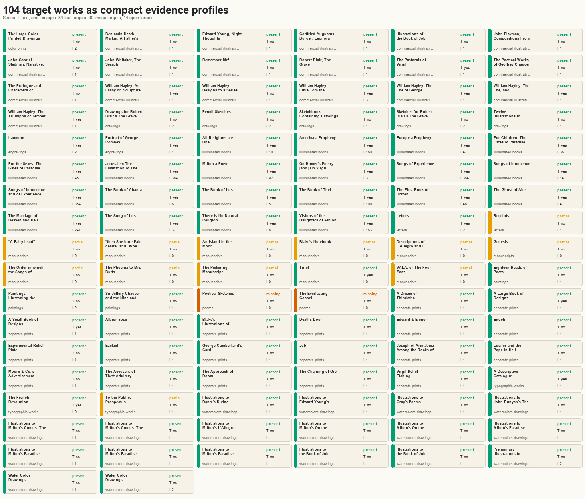

## Page 42

Figure 16: Archive object-image depth by work for the largest local image carriers. The gray bar records resolved Archive object candidates
and the green bar records downloaded local image files, so the denominator is discoverable Archive object metadata rather than Blake’s
whole visual oeuvre.
41

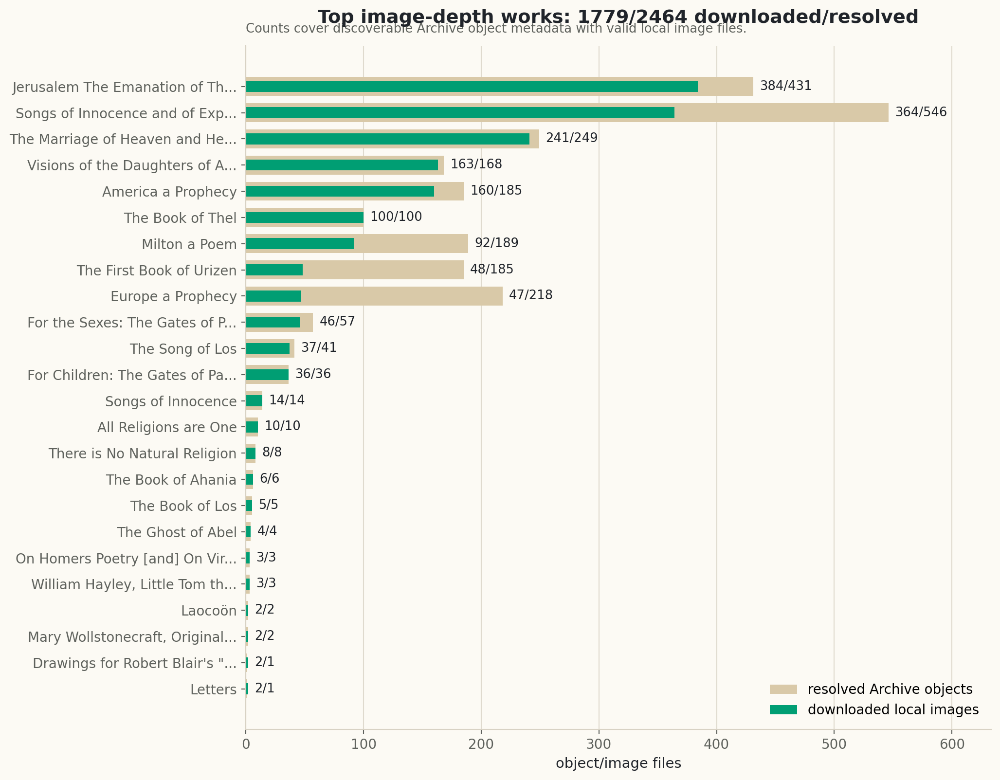

## Page 43

Figure 17: Archive object-image depth by target-ledger work area. Bars aggregate resolved Archive object candidates and downloaded local
image files within each ledger category; catalog-only sources and non-Archive museum records are outside this image-depth denominator.
42

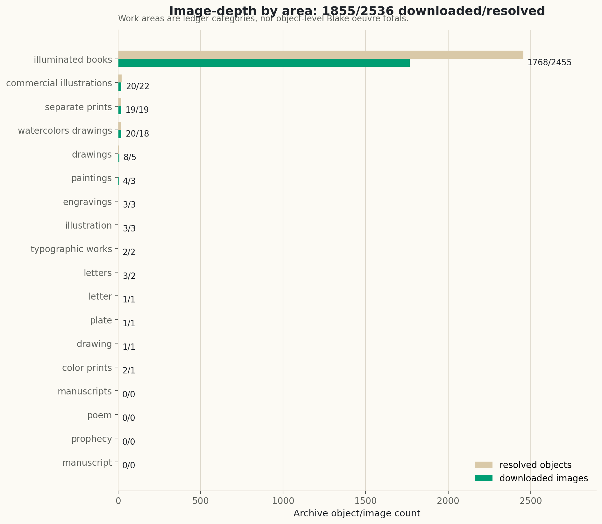

## Page 44

Figure 18: Source-authority tiers for local work evidence. Counts distinguish Archive-primary work records from validated fallback text and
legacy or corroborating records, making source authority visible before interpreting corpus-level aggregates.
43

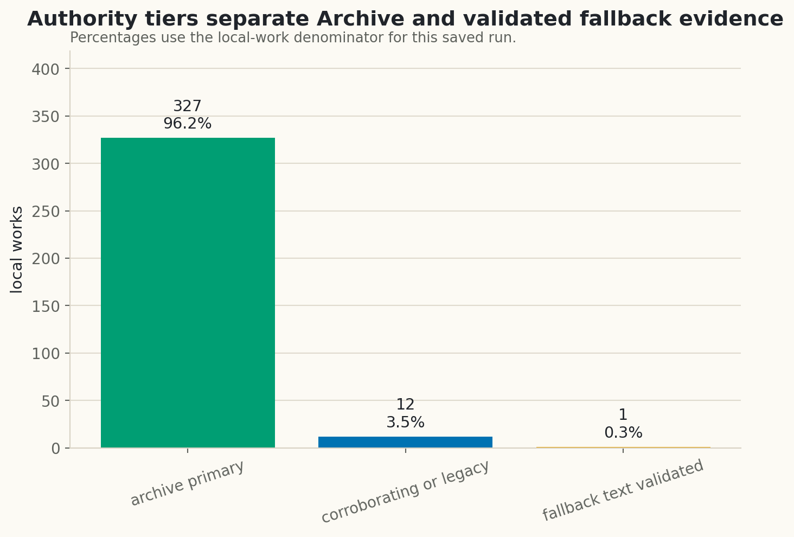

## Page 45

14
Supplement: Rights Matrix for Distribution and Reuse Decisions
The matrix below converts the legal distribution analysis in sec. 7 into a release checklist. It is not a permission grant. It records the default
publication posture for each artifact class and the evidence needed to change that posture.
Artifact class
Rights layer
Default public-release
rule
Required metadata
Escalation path
Project code, tests,
scripts, and
project-authored
documentation
Project-authored
software and prose
Include under the
repository license
Repository license,
authorship, version
Standard software
release review
Aggregate counts,
coverage tables,
checksums, source URLs,
authority tiers, and
non-image charts
Facts, provenance, and
project-authored
arrangement
Include with citations
and provenance
Source URL, checksum
where applicable,
authority tier, generation
command
Confirm no embedded
source expression beyond
factual data [Supreme
Court of the United
States, 1991]
Published
Blake-authored
underlying works
Underlying
public-domain work,
separate from edition or
file
Treat as low-risk
underlying content only
Work title, source
edition/provider,
publication-history note
where known
Recheck item-level
publication history for
manuscripts or uncertain
editions
Project Gutenberg
fallback text
Underlying
U.S.-unrestricted text
plus Project Gutenberg
trademark/license
wrapper
Include only validated
text with Project
Gutenberg references
handled under the
license policy
Source URL, checksum,
validation note,
branding/license
handling
Strip Project Gutenberg
references when relying
on the underlying text
layer, or comply with
Project Gutenberg
conditions [Project
Gutenberg Literary
Archive Foundation,
2026]
Wikisource fallback text
Public-domain source
text plus
contributor/editorial
licensing
Include only with
attribution and license
continuity; do not
relicense into MIT
Page URL, revision or
retrieval note,
attribution, CC BY-SA
4.0/GFDL metadata,
checksum
Use a clean
public-domain source or
preserve Wikimedia reuse
obligations [Wikimedia
Foundation, 2026]
William Blake Archive
TEI, transcriptions,
object images, and bulk
mirrors
Provider text/image
terms, possible
copyright, contract, and
fair-use layers
Exclude raw files and
mirrors from the public
repository
Source URL,
object/work id,
checksum, local-cache
path excluded from
release
Seek permission,
document venue-specific
fair use, or publish
acquisition instructions
only [The William Blake
Archive, 2026a]
Museum, HathiTrust,
Internet Archive, Tate,
British Museum, and
catalogue leads
Provider-specific access
and catalogue terms
Use as corroborating
metadata unless
license-compatible files
are identified
Provider URL, checked
status, license or terms
note
Verify item-level terms
before bundling content
Generated cover and
project-authored
diagrams
Project-authored design
assets
Include with provenance
and non-evidence label
Prompt/provenance
record, generation
command, manuscript
role
Keep separate from
acquired corpus evidence
Image mosaics and visual
supplements made from
local source files
New layout containing
provider-supplied images
Exclude from general
public source release
unless cleared for the
exact venue
Input file list, source
URLs, resolution,
caption caveat,
permission or fair-use
memo
Replace with
source-compatible
thumbnails, seek
permission, or keep as
local review artifact
The practical release rule is conservative: publish code, commands, metadata, manifests, and aggregate diagnostics; keep expressive provider
files local unless their source-specific rights layer has been resolved. This supports collections-as-data reproducibility without treating the
local evidence cache as part of the open-source license [Candela et al., 2023, Wallace, 2022].
44

## Page 46

15
References and Cited Authorities
The bibliography lives in docs/manuscript/references.bib and is read by Pandoc during the PDF render. The build invokes Pandoc with
--natbib, so every bracketed citation marker in the manuscript body is rewritten to the appropriate \cite/\citep/\citet command and
resolved against the bib file. The reference list is emitted automatically below this heading at render time.
45

## Page 47

References
Taylor Arnold and Lauren Tilton. Distant viewing: Analyzing large visual corpora. Digital Scholarship in the Humanities, 34(Supplement
1):i3–i16, 2019. doi: 10.1093/llc/fqz013. URL https://academic.oup.com/dsh/article/34/Supplement_1/i3/5694340.
B. T. Sue Atkins, Jeremy Clear, and Nicholas Ostler. Corpus design criteria. Literary and Linguistic Computing, 7(1):1–16, 1992.
G. E. Bentley. Blake Books: Annotated Catalogues of William Blake’s Writings in Illuminated Printing, in Conventional Typography and in
Manuscript and Reprints thereof, Reproductions of His Designs, Books with His Engravings, Catalogues, Books He Owned, and Scholarly
and Critical Works about Him. Clarendon Press, Oxford, 1977.
G. E. Bentley. Blake Books Supplement. Clarendon Press, Oxford, 1995.
G. E. Bentley. Blake Records. Yale University Press, New Haven, CT, 2 edition, 2004.
Douglas Biber. Representativeness in corpus design. Literary and Linguistic Computing, 8(4):243–257, 1993.
David Bindman. The Complete Graphic Works of William Blake. Thames and Hudson, London, 1978.
Blake/An Illustrated Quarterly. Index of articles and reviews. https://bq.blakearchive.org/articles, 2026a. Journal index consulted for
Blake scholarship and article-review discovery.
Blake/An Illustrated Quarterly. A bibliography for the study of VALA/The Four Zoas. https://blakequarterly.org/public/journals/2/Bon
usFeatures/FourZoasbibliography.htm, 2026b. Work-specific bibliography consulted as scholarship context, not corpus evidence.
David M. Blei. Probabilistic topic models. Communications of the ACM, 55(4):77–84, 2012.
David M. Blei, Andrew Y. Ng, and Michael I. Jordan. Latent dirichlet allocation. Journal of Machine Learning Research, 3:993–1022, 2003.
Katherine Bode. A World of Fiction: Digital Collections and the Future of Literary History. University of Michigan Press, Ann Arbor, MI,
2018.
Christine L. Borgman. Big Data, Little Data, No Data: Scholarship in the Networked World. MIT Press, Cambridge, MA, 2015.
Geoffrey C. Bowker and Susan Leigh Star. Sorting Things Out: Classification and Its Consequences. MIT Press, Cambridge, MA, 1999.
Lou Burnard. What Is the Text Encoding Initiative? How to Add Intelligent Markup to Digital Resources. OpenEdition Press, Marseille,
2014.
Martin Butlin. The Paintings and Drawings of William Blake. Yale University Press, New Haven, CT, 1981.
Gustavo Candela, Nele Gabriëls, Sally Chambers, Thuy-An Pham, Sarah Ames, Neil Fitzgerald, Katrine Hofmann, Victor Harbo, Abigail
Potter, Meghan Ferriter, Eileen Manchester, Alba Irollo, Ellen Van Keer, Mahendra Mahey, Olga Holownia, and Milena Dobreva. A
checklist to publish collections as data in glam institutions, 2023. URL https://arxiv.org/abs/2304.02603. Collections-as-data checklist
consulted for rights-aware release architecture.
Kendal Crawford and Michelle Levy. The william blake archive. RIDE: A Review Journal for Digital Editions and Resources, 6, 2017. doi:
10.18716/ride.a.5.5. URL https://ride.i-d-e.de/issues/issue-5/the-william-blake-archive/.
Steven J. DeRose, David G. Durand, Elli Mylonas, and Allen H. Renear. What is text, really? Journal of Computing in Higher Education,
1(2):3–26, 1990.
Johanna Drucker. Humanities approaches to graphical display. Digital Humanities Quarterly, 5(1), 2011.
Johanna Drucker. Visualization and Interpretation: Humanistic Approaches to Display. MIT Press, Cambridge, MA, 2020. ISBN 978-0-
262-04473-8. URL https://mitpress.mit.edu/9780262044738/visualization-and-interpretation/.
Morris Eaves. Behind the scenes at the william blake archive: Collaboration takes more than e-mail. Journal of Electronic Publishing, 3(2),
1997.
Morris Eaves, Robert N. Essick, and Joseph Viscomi. The william blake archive. https://www.blakearchive.org/, 1996. Editors. Online
digital edition of Blake’s illuminated books and works.
Morris Eaves, Robert N. Essick, and Joseph Viscomi. Standards, methods, and objectives in the william blake archive: A response. The
Wordsworth Circle, 30(3):135–144, 1999. doi: 10.1086/TWC24044108.
Morris Eaves, Robert N. Essick, and Joseph Viscomi. The william blake archive: The medium when the millennium is the message. In Tim
Fulford, editor, Romanticism and Millenarianism, pages 219–233. Palgrave Macmillan, New York, 2002. doi: 10.1057/9780230107205_14.
David V. Erdman. The Complete Poetry and Prose of William Blake. Anchor Books, New York, NY, newly revised edition, 1988. Commentary
by Harold Bloom.
Robert N. Essick. A finding list of reproductions of blake’s art. Blake: An Illustrated Quarterly, 3(2), 1969. URL https://bq.blakearchive.
org/3.2.essick.
Robert N. Essick. William Blake, Printmaker. Princeton University Press, Princeton, NJ, 1980.
46

## Page 48

European Parliament and Council of the European Union. Directive 2006/116/ec on the term of protection of copyright and certain related
rights. https://eur-lex.europa.eu/legal-content/EN/TXT/?uri=CELEX:32006L0116, 2006. European Union copyright-term directive
consulted for life-plus-70 and related-rights analysis.
European Parliament and Council of the European Union. Directive (eu) 2019/790 on copyright and related rights in the digital single
market. https://eur-lex.europa.eu/eli/dir/2019/790/oj/eng, 2019. Article 14 consulted for faithful reproductions of public-domain visual
art.
Julia Flanders and Fotis Jannidis. Data modeling in a digital humanities context: An introduction. In Julia Flanders and Fotis Jannidis,
editors, The Shape of Data in Digital Humanities: Modeling Texts and Text-Based Resources, pages 3–25. Routledge, London, 2019. doi:
10.4324/9781315552941-1. URL https://www.taylorfrancis.com/chapters/edit/10.4324/9781315552941-1/data-modeling-digital-
humanities-context-julia-flanders-fotis-jannidis.
Rudolf Flesch. A new readability yardstick. Journal of Applied Psychology, 32(3):221–233, 1948. doi: 10.1037/h0057532.
Ashley Reed Fox and Rachel Lee Fletcher. The william blake archive and its web of relations. Digital Humanities Quarterly, 12(1), 2018.
URL https://www.digitalhumanities.org/dhq/vol/12/1/000360/000360.html.
Gavin Greif, Niclas Griesshaber, and Robin Greif. Multimodal LLMs for OCR, OCR post-correction, and named entity recognition in
historical documents, 2025. URL https://arxiv.org/abs/2504.00414. Preprint.
HathiTrust Digital Library. Hathitrust catalog record: William blake. https://catalog.hathitrust.org/Record/102153075, 2026. Bibliographic
source used for corpus-source checks.
Internet Archive. Internet archive advanced search. https://archive.org/advancedsearch.php, 2026. Search endpoint used for Blake source
discovery checks.
Matthew L. Jockers. Macroanalysis: Digital Methods and Literary History. University of Illinois Press, Urbana, IL, 2013. ISBN 978-0-252-
07907-8.
Steven E. Jones. The william blake archive: An overview. Literature Compass, 3(3):409–416, 2006. doi: 10.1111/j.1741-4113.2006.00331.x.
Evgeny Kim and Roman Klinger. A survey on sentiment and emotion analysis for computational literary studies. Zeitschrift für digitale
Geisteswissenschaften, 2019.
Matthew G. Kirschenbaum. Mechanisms: New Media and the Forensic Imagination. MIT Press, Cambridge, MA, 2008. ISBN 978-0-262-
11311-3. URL https://mitpress.mit.edu/9780262113113/mechanisms/.
Lauren Klein, Catherine D’Ignazio, Alex Gil, Dunja Mladenić, and Hua Shen. Provocations from the humanities for generative AI research,
2025. URL https://arxiv.org/abs/2502.19190. Preprint.
Lauren F. Klein. The image of absence: Archival silence, data visualization, and james hemings. American Literature, 85(4):661–688, 2013.
Martin Klein, Herbert Van de Sompel, Robert Sanderson, Harihar Shankar, Lyudmila Balakireva, Ke Zhou, and Richard Tobin. Scholarly
context not found: One in five articles suffers from reference rot. PLOS ONE, 9(12):e115253, 2014. doi: 10.1371/journal.pone.0115253.
Jinhao Li, Jianzhong Qi, Soyeon Caren Han, and Eun-Jung Holden. MUSEKG: A knowledge graph over museum collections, 2025. URL
https://arxiv.org/abs/2511.16014. Preprint.
Jason Mazzone. Copyfraud. New York University Law Review, 81:1026–1100, 2006. URL https://www.nyulawreview.org/wp-content/uplo
ads/2018/08/NYULawReview-81-3-Mazzone.pdf.
Philip M. McCarthy and Scott Jarvis.
MTLD, vocd-d, and HD-D: A validation study of sophisticated approaches to lexical diversity
assessment. Behavior Research Methods, 42:381–392, 2010.
Willard McCarty. Humanities Computing. Palgrave Macmillan, Basingstoke, 2005. ISBN 978-1-4039-3504-5. doi: 10.1057/9780230500861.
Tony McEnery and Andrew Hardie. Corpus Linguistics: Method, Theory and Practice. Cambridge University Press, Cambridge, 2012.
Jerome J. McGann. The Textual Condition. Princeton University Press, Princeton, NJ, 1991.
D. F. McKenzie. Bibliography and the Sociology of Texts. Cambridge University Press, Cambridge, 1999.
W. J. T. Mitchell. Picture Theory: Essays on Verbal and Visual Representation. University of Chicago Press, Chicago, IL, 1994.
Luc Moreau and Paul Groth. PROV-Overview: An overview of the PROV family of documents. https://www.w3.org/TR/prov-overview/,
2013. W3C Working Group Note.
Franco Moretti. Network theory, plot analysis. New Left Review, 68:80–102, 2011.
Mark E. J. Newman. Networks: An Introduction. Oxford University Press, Oxford, 2010.
Trevor Owens. The Theory and Craft of Digital Preservation. Johns Hopkins University Press, Baltimore, MD, 2018. ISBN 978-1-4214-2697-6.
doi: 10.1353/book.62324.
Thomas Padilla, Laurie Allen, Hannah Frost, Sarah Potvin, Elizabeth Russey Roke, and Stewart Varner. Always already computational:
Collections as data: Final report. Technical report, University of Nebraska–Lincoln Digital Commons, 2019a. URL https://digitalcom
mons.unl.edu/scholcom/181/. Final report of the Always Already Computational: Collections as Data project.
47

## Page 49

Thomas Padilla, Laurie Allen, Hannah Frost, Sarah Potvin, Elizabeth Russey Roke, and Stewart Varner. Santa barbara statement on
collections as data. https://zenodo.org/records/3066209, 2019b. Version 2 of the Always Already Computational collections-as-data
statement.
Bo Pang and Lillian Lee. Opinion mining and sentiment analysis. Foundations and Trends in Information Retrieval, 2(1–2):1–135, 2008.
Eitan Adam Pechenick, Christopher M. Danforth, and Peter Sheridan Dodds. Characterizing the google books corpus: Strong limits to
inferences of socio-cultural and linguistic evolution. PLOS ONE, 10(10):e0137041, 2015. doi: 10.1371/journal.pone.0137041.
Roger D. Peng. Reproducible research in computational science. Science, 334(6060):1226–1227, 2011. doi: 10.1126/science.1213847.
Grischka Petri. The public domain vs. the museum: The limits of copyright and reproductions of two-dimensional works of art. Journal of
Conservation and Museum Studies, 12(1):8, 2014. doi: 10.5334/jcms.1021217. URL https://jcms-journal.com/articles/10.5334/jcms.10
21217.
Michael Phillips. William Blake: The Creation of the Songs. British Library, London, 2000.
Andrew Piper. Enumerations: Data and Literary Study. University of Chicago Press, Chicago, IL, 2018. ISBN 978-0-226-56889-8. doi:
10.7208/chicago/9780226568898.001.0001.
Kenneth M. Price. Edition, project, database, archive, thematic research collection: What’s in a name? Digital Humanities Quarterly, 3(3),
2009.
Project Gutenberg. Project gutenberg: William blake. https://www.gutenberg.org/ebooks/author/295, 2026. Author page used for
text-source corroboration.
Project Gutenberg Literary Archive Foundation. The project gutenberg license. https://www.gutenberg.org/policy/license.html, 2026.
License and trademark terms consulted for fallback text distribution.
Stephen Ramsay. Reading Machines: Toward an Algorithmic Criticism. University of Illinois Press, Urbana, IL, 2011. ISBN 978-0-252-
03641-5. URL https://www.press.uillinois.edu/books/?id=p079511.
Ashley Reed. Managing an established digital humanities project: Principles and practices from the twentieth year of the william blake
archive. Digital Humanities Quarterly, 8(1), 2014. URL https://www.digitalhumanities.org/dhq/vol/8/1/000174/000174.html.
Luis Rei, Ricardo Pereira, Felipe Belem, Adam Jatowt, Raphaël Troncy, Matthieu Cord, and Stefan Dietze. Multimodal metadata assignment
for cultural heritage artifacts, 2024. URL https://arxiv.org/abs/2406.00423. Preprint.
Geoffrey Rockwell and Stéfan Sinclair. Hermeneutica: Computer-Assisted Interpretation in the Humanities. MIT Press, Cambridge, MA,
2016. ISBN 978-0-262-03435-9. URL https://mitpress.mit.edu/9780262034359/hermeneutica/.
Patrick Sahle. What is a scholarly digital edition?
In Matthew James Driscoll and Elena Pierazzo, editors, Digital Scholarly Editing:
Theories and Practices, pages 19–40. Open Book Publishers, Cambridge, 2016. doi: 10.11647/OBP.0095.02. URL https://www.openbo
okpublishers.com/books/10.11647/obp.0095/chapters/10.11647/obp.0095.02.
Geir Kjetil Sandve, Anton Nekrutenko, James Taylor, and Eivind Hovig. Ten simple rules for reproducible computational research. PLOS
Computational Biology, 9(10):e1003285, 2013. doi: 10.1371/journal.pcbi.1003285.
Arfon M. Smith, Daniel S. Katz, and Kyle E. Niemeyer. Software citation principles. PeerJ Computer Science, 2:e86, 2016. doi: 10.7717/peerj-
cs.86.
Stian Soiland-Reyes, Peter Sefton, Mercè Crosas, Leyla Jael Castro, Frederik Coppens, José M. Fernández, Daniel Garijo, et al. Packaging
research artefacts with RO-Crate. Data Science, 5(2):97–138, 2022. doi: 10.3233/DS-210053.
Supreme Court of the United States. Feist publications, inc. v. rural telephone service co., 499 u.s. 340. https://tile.loc.gov/storage-
services/service/ll/usrep/usrep499/usrep499340/usrep499340.pdf, 1991. Case consulted for originality, facts, and compilation-protection
limits.
Tate. William blake. https://www.tate.org.uk/art/artists/william-blake-39, 2026. Artist catalogue page used for visual-source corroboration.
TEI Consortium. TEI P5: Guidelines for electronic text encoding and interchange. https://tei-c.org/guidelines/p5/, 2026. Versioned
guidelines for electronic text encoding.
The British Museum. British museum collection search: William blake. https://www.britishmuseum.org/collection/search?agent=Willia
m+Blake, 2026. Visual and catalogue corroboration source.
The Morgan Library & Museum. William blake’s pickering manuscript. https://www.themorgan.org/collection/william-blake/pickering-
manuscript, 2021. Source-owned digital facsimile and context page consulted as a manual-review lead for the Pickering Manuscript.
The Morgan Library & Museum. MA 2879, pp. 16–17, auguries of innocence. https://www.themorgan.org/collection/william-blake/picker
ing-docs/manuscript/13, 2026. Page-level Pickering Manuscript record consulted as a manual-review negative-control lead.
The William Blake Archive. William blake archive: Conditions of use. https://terpconnect.umd.edu/~mgk/blake/conditions.html, 2026a.
Static conditions text consulted for Archive text and image reuse limitations.
The William Blake Archive. Copyright and permissions. https://blakearchive.org/staticpage/permissionsNEW, 2026b. Archive permissions
page consulted for source-provider redistribution policy.
48

## Page 50

Fiona J. Tweedie and R. Harald Baayen. How variable may a constant be? measures of lexical richness in perspective. Computers and the
Humanities, 32:323–352, 1998.
UK Intellectual Property Office. Copyright notice: Duration of copyright (term). https://www.gov.uk/government/publications/copyright-
notice-duration-of-copyright-term/copyright-notice-duration-of-copyright-term, 2021. Guidance consulted for UK duration and pre-1989
unpublished-work rules.
Ted Underwood. Distant Horizons: Digital Evidence and Literary Change. University of Chicago Press, Chicago, IL, 2019. ISBN 978-0-226-
61297-3. doi: 10.7208/chicago/9780226612973.001.0001.
United States Court of Appeals for the Ninth Circuit. Nguyen v. barnes & noble inc., 763 f.3d 1171. https://cdn.ca9.uscourts.gov/datasto
re/opinions/2014/08/18/12-56628.pdf, 2014. Browsewrap case consulted for online terms notice and assent.
United States Court of Appeals for the Second Circuit. Specht v. netscape communications corp., 306 f.3d 17. https://law.justia.com/cases
/federal/appellate-courts/F3/306/17/642323/, 2002. Online-assent case consulted for notice and assent limits.
United States Court of Appeals for the Second Circuit. Authors guild, inc. v. hathitrust, 755 f.3d 87. https://law.justia.com/cases/federal
/appellate-courts/ca2/12-4547/12-4547-2014-06-10.html, 2014. Fair-use case consulted for search and accessibility analogies.
United States Court of Appeals for the Second Circuit. Authors guild v. google, inc., 804 f.3d 202. https://law.justia.com/cases/federal/a
ppellate-courts/ca2/13-4829/13-4829-2015-10-16.html, 2015. Fair-use case consulted for search, indexing, and snippet-display analogies.
United States District Court for the Southern District of New York. Bridgeman art library, ltd. v. corel corp., 36 f. supp. 2d 191. https:
//law.justia.com/cases/federal/district-courts/FSupp2/36/191/2413183/, 1999. Case consulted for U.S. originality treatment of exact
photographic copies of public-domain two-dimensional art.
U.S. Copyright Office. Chapter 3: Duration of copyright. https://www.copyright.gov/title17/92chap3.html, 2026a. Title 17 duration
provisions consulted for publication legal-risk analysis.
U.S. Copyright Office. Circular 15a: Duration of copyright. https://www.copyright.gov/circs/circ15a.pdf, 2026b. Revised April 2026;
consulted for public-domain and pre-1978 duration rules.
Herbert Van de Sompel, Michael L. Nelson, and Robert Sanderson. HTTP framework for time-based access to resource states–memento.
Technical Report RFC 7089, RFC Editor, 2013.
Joseph Viscomi. Blake and the Idea of the Book. Princeton University Press, Princeton, NJ, 1993. ISBN 978-0-691-06962-4.
Joseph Viscomi. Digital facsimiles: Reading the william blake archive. Computers and the Humanities, 36(1):27–48, 2002.
Andrea Wallace. A culture of copyright: A scoping study on open access to digital cultural heritage collections in the uk. Technical report,
Towards a National Collection, 2022. URL https://zenodo.org/records/6242611.
Scott B. Weingart. Demystifying networks. Journal of Digital Humanities, 1(1), 2011.
Melvin Wevers and Thomas Smits. The visual digital turn: Using neural networks to study historical images. Digital Scholarship in the
Humanities, 35(1):194–207, 2020. doi: 10.1093/llc/fqy085. URL https://academic.oup.com/dsh/article/35/1/194/5296356.
Roger Whitson and Jason Whittaker. William Blake and the Digital Humanities: Collaboration, Participation, and Social Media. Routledge,
New York, NY, 2013.
Wikimedia Foundation. Wikimedia foundation terms of use. https://foundation.wikimedia.org/wiki/Policy:Terms_of_Use, 2026. Terms
consulted for Wikisource contribution and reuse licensing.
Wikisource contributors. Author: William blake. https://en.wikisource.org/wiki/Author:William_Blake, 2026. Public text index used for
source corroboration.
Matthew Wilkens. Digital humanities and its application in the study of literature and culture. Comparative Literature, 67(1):11–20, 2015.
doi: 10.1215/00104124-2861911.
Mark D. Wilkinson, Michel Dumontier, IJsbrand Jan Aalbersberg, et al. The FAIR guiding principles for scientific data management and
stewardship. Scientific Data, 3:160018, 2016. doi: 10.1038/sdata.2016.18.
Greg Wilson, D. A. Aruliah, C. Titus Brown, Neil P. Chue Hong, Matt Davis, Richard T. Guy, Steven H. D. Haddock, et al. Best practices
for scientific computing. PLOS Biology, 12(1):e1001745, 2014. doi: 10.1371/journal.pbio.1001745.
Yale Library. William blake: Collection lists. https://guides.library.yale.edu/blake/blakeatyale, 2026. Institutional collection guide
consulted as corroborating source-discovery context.
Yang Zhang, Nada Mimouni, Jean-Claude Moissinac, and Fayçal Hamdi. Multimodal cultural heritage knowledge graph extension with
language and vision models, 2026. URL https://arxiv.org/abs/2605.17669. Preprint.
49

---
*Extraction method: pymupdf*
