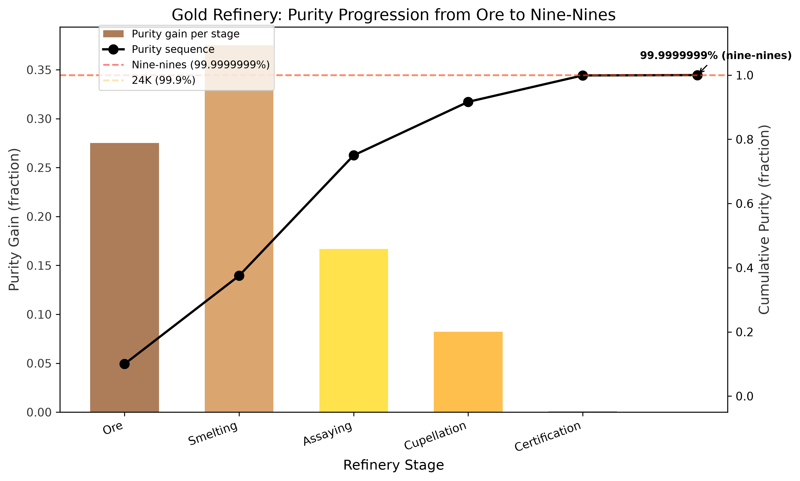
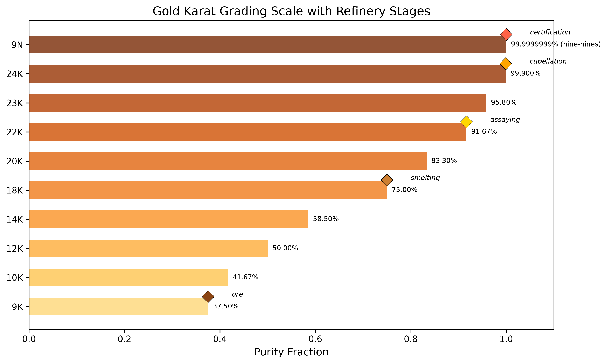
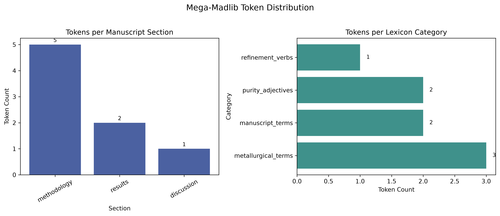
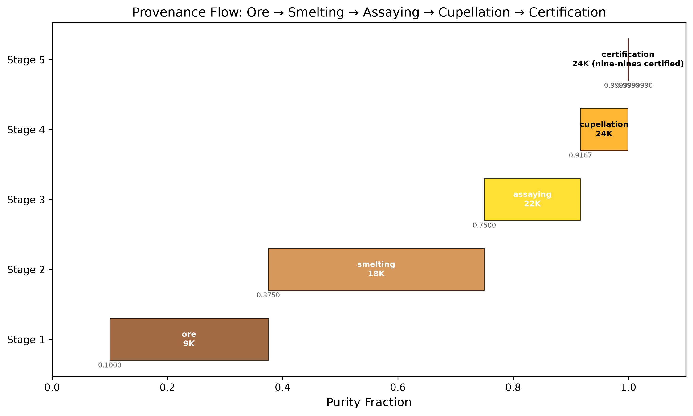
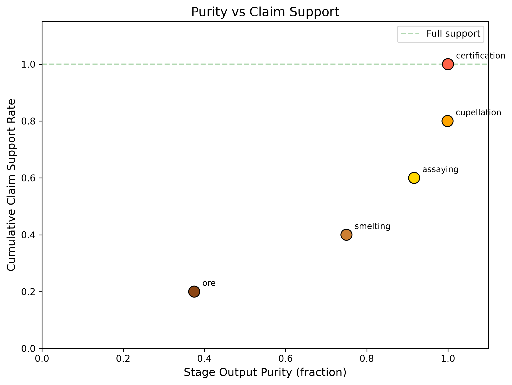
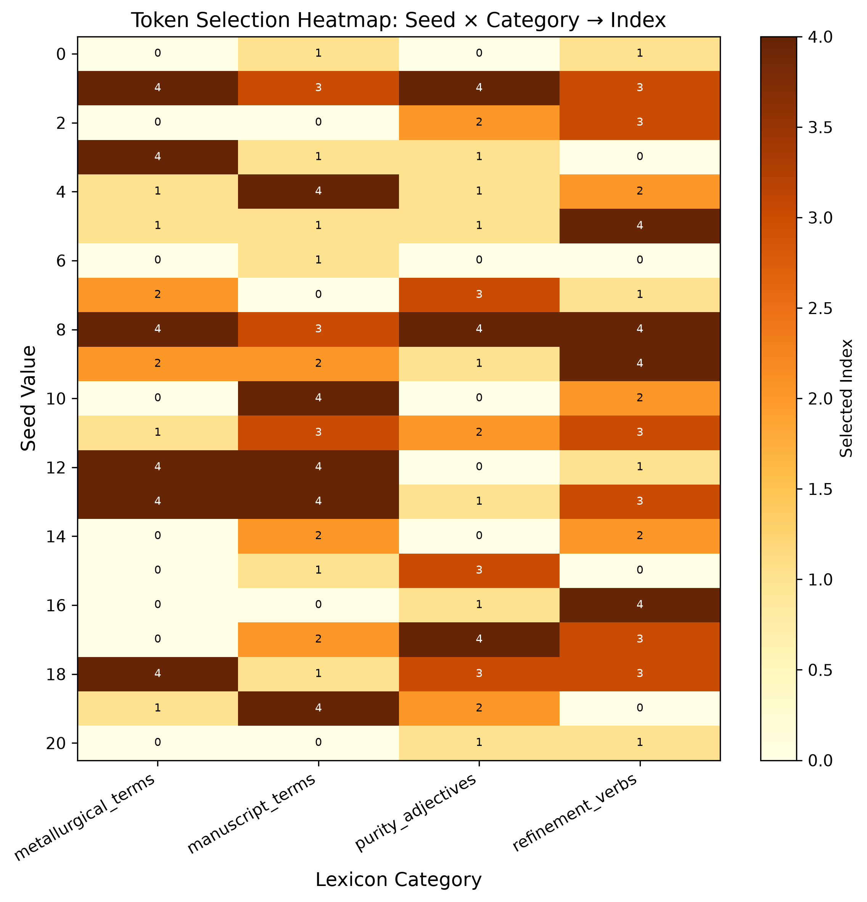

# Full Text: Refinement of Gold: A Metallurgical Analogy for Scientific Manuscript Composition

> Extracted from `Friedman_2026_Refinement_36431789.pdf`

> 6 figures extracted to `images/`

---

## Page 1

Refinement of Gold: A Metallurgical Analogy for Scientific
Manuscript Composition
From Ore to Nine-Nines Purity via Mega-Madlib Token Injection
Daniel Ari Friedman
Active Inference Institute
daniel@activeinference.institute
ORCID: 0000-0001-6232-9096
2026-06-25

## Page 2

Contents
1
Abstract
2
2
Introduction: Ore to Nine-Nines
3
2.1
The problem
. . . . . . . . . . . . . . . . . . . . . . . . . . . . . . . . . . . . . . . . . . . . . . . . . . . . . . . . . . .
3
2.2
The analogy as pipeline
. . . . . . . . . . . . . . . . . . . . . . . . . . . . . . . . . . . . . . . . . . . . . . . . . . . . .
3
2.3
Mega-madlib token engine . . . . . . . . . . . . . . . . . . . . . . . . . . . . . . . . . . . . . . . . . . . . . . . . . . . .
3
2.4
Open question pinned
. . . . . . . . . . . . . . . . . . . . . . . . . . . . . . . . . . . . . . . . . . . . . . . . . . . . . .
3
3
Methodology: The Refinery Pipeline
4
3.1
Stage definitions
. . . . . . . . . . . . . . . . . . . . . . . . . . . . . . . . . . . . . . . . . . . . . . . . . . . . . . . . .
4
3.2
Purity progression
. . . . . . . . . . . . . . . . . . . . . . . . . . . . . . . . . . . . . . . . . . . . . . . . . . . . . . . .
4
3.3
Token selection . . . . . . . . . . . . . . . . . . . . . . . . . . . . . . . . . . . . . . . . . . . . . . . . . . . . . . . . . .
4
3.4
Config-owned lexicon . . . . . . . . . . . . . . . . . . . . . . . . . . . . . . . . . . . . . . . . . . . . . . . . . . . . . . .
4
3.5
Karat grading . . . . . . . . . . . . . . . . . . . . . . . . . . . . . . . . . . . . . . . . . . . . . . . . . . . . . . . . . . .
4
3.6
Pipeline phases . . . . . . . . . . . . . . . . . . . . . . . . . . . . . . . . . . . . . . . . . . . . . . . . . . . . . . . . . .
4
4
Results: Purity Progression and Karat Grading
6
4.1
Purity progression
. . . . . . . . . . . . . . . . . . . . . . . . . . . . . . . . . . . . . . . . . . . . . . . . . . . . . . . .
6
4.2
Karat grading scale . . . . . . . . . . . . . . . . . . . . . . . . . . . . . . . . . . . . . . . . . . . . . . . . . . . . . . . .
7
4.3
Final certification . . . . . . . . . . . . . . . . . . . . . . . . . . . . . . . . . . . . . . . . . . . . . . . . . . . . . . . . .
7
4.4
Token plan summary . . . . . . . . . . . . . . . . . . . . . . . . . . . . . . . . . . . . . . . . . . . . . . . . . . . . . . .
7
4.4.1
Category distribution
. . . . . . . . . . . . . . . . . . . . . . . . . . . . . . . . . . . . . . . . . . . . . . . . . .
7
4.4.2
Section distribution
. . . . . . . . . . . . . . . . . . . . . . . . . . . . . . . . . . . . . . . . . . . . . . . . . . .
7
4.4.3
Provenance trace . . . . . . . . . . . . . . . . . . . . . . . . . . . . . . . . . . . . . . . . . . . . . . . . . . . . .
8
4.5
Provenance flow . . . . . . . . . . . . . . . . . . . . . . . . . . . . . . . . . . . . . . . . . . . . . . . . . . . . . . . . . .
8
4.6
Purity vs claim support
. . . . . . . . . . . . . . . . . . . . . . . . . . . . . . . . . . . . . . . . . . . . . . . . . . . . .
8
4.7
Token selection sensitivity . . . . . . . . . . . . . . . . . . . . . . . . . . . . . . . . . . . . . . . . . . . . . . . . . . . .
8
4.8
Contribution claims
. . . . . . . . . . . . . . . . . . . . . . . . . . . . . . . . . . . . . . . . . . . . . . . . . . . . . . .
8
5
Discussion: Load-Bearing vs Rhetorical Analogy
12
5.1
Load-bearing vs rhetorical . . . . . . . . . . . . . . . . . . . . . . . . . . . . . . . . . . . . . . . . . . . . . . . . . . . .
12
5.2
Useful adaptation cases
. . . . . . . . . . . . . . . . . . . . . . . . . . . . . . . . . . . . . . . . . . . . . . . . . . . . .
12
5.3
Misuse modes . . . . . . . . . . . . . . . . . . . . . . . . . . . . . . . . . . . . . . . . . . . . . . . . . . . . . . . . . . .
12
5.4
Design principles . . . . . . . . . . . . . . . . . . . . . . . . . . . . . . . . . . . . . . . . . . . . . . . . . . . . . . . . .
12
6
Conclusion: Certification and Forking
13
6.1
Summary
. . . . . . . . . . . . . . . . . . . . . . . . . . . . . . . . . . . . . . . . . . . . . . . . . . . . . . . . . . . . .
13
6.2
Forking responsibilities . . . . . . . . . . . . . . . . . . . . . . . . . . . . . . . . . . . . . . . . . . . . . . . . . . . . . .
13
7
Reproducibility: Seeded Regeneration
14
7.1
Deterministic regeneration . . . . . . . . . . . . . . . . . . . . . . . . . . . . . . . . . . . . . . . . . . . . . . . . . . . .
14
7.2
Artifact inventory . . . . . . . . . . . . . . . . . . . . . . . . . . . . . . . . . . . . . . . . . . . . . . . . . . . . . . . . .
14
7.3
Regeneration commands . . . . . . . . . . . . . . . . . . . . . . . . . . . . . . . . . . . . . . . . . . . . . . . . . . . . .
14
7.4
Config ownership . . . . . . . . . . . . . . . . . . . . . . . . . . . . . . . . . . . . . . . . . . . . . . . . . . . . . . . . .
14
8
Scope: Related Work and Limitations
15
8.1
Scope limitations . . . . . . . . . . . . . . . . . . . . . . . . . . . . . . . . . . . . . . . . . . . . . . . . . . . . . . . . .
15
8.2
Related work . . . . . . . . . . . . . . . . . . . . . . . . . . . . . . . . . . . . . . . . . . . . . . . . . . . . . . . . . . .
15
8.3
Responsible forking . . . . . . . . . . . . . . . . . . . . . . . . . . . . . . . . . . . . . . . . . . . . . . . . . . . . . . . .
15
9
Quality Probes
16
9.1
QA probes . . . . . . . . . . . . . . . . . . . . . . . . . . . . . . . . . . . . . . . . . . . . . . . . . . . . . . . . . . . . .
16
9.2
Audit rules
. . . . . . . . . . . . . . . . . . . . . . . . . . . . . . . . . . . . . . . . . . . . . . . . . . . . . . . . . . . .
16
10 Authoring Contract
17
10.1 Obligations . . . . . . . . . . . . . . . . . . . . . . . . . . . . . . . . . . . . . . . . . . . . . . . . . . . . . . . . . . . .
17
10.2 Fork checklist . . . . . . . . . . . . . . . . . . . . . . . . . . . . . . . . . . . . . . . . . . . . . . . . . . . . . . . . . . .
17

## Page 3

1
Abstract
This paper presents a metallurgical analogy for scientific manuscript composition, mapping gold-refining stages onto the template
infrastructure pipeline. The refinery processes manuscript ore through 5 stages — from raw draft (9K, about 37.5% purity) through
smelting, assaying, and cupellation — to nine-nines certification (99.9999999%), the ultra-high-purity standard of electronics-grade
gold.
The analogy is load-bearing, not merely rhetorical: each metallurgical stage corresponds to a real template-infrastructure operation.
Smelting removes dross (filler, unsupported claims); assaying tests claims against evidence; cupellation resolves cross-references;
certification validates the full pipeline. The mega-madlib token engine selects 8 domain tokens deterministically via seeded SHA-256
digest over category inventories, ensuring every prose element is traceable and reproducible.
Results: The refinery achieves final purity of 99.9999999% (nine-nines) (24K (nine-nines certified)) with a total purity gain of 90.00%
across all stages. Nine-nines certification: Yes. The purity progression is shown in fig. 1, and the karat grading scale in fig. 2.
Keywords: gold refining, manuscript composition, mega-madlib, token injection, scientific purity, assaying, karat grading

## Page 4

2
Introduction: Ore to Nine-Nines
Gold refining is one of humanity’s oldest purification technologies. From ancient cupellation to modern nine-nines electrolysis, the
process of separating noble metal from base ore has evolved into a rigorous, staged pipeline with measurable purity at every step.
This paper asks: can that pipeline serve as a load-bearing operational model for scientific manuscript composition — not merely a
decorative analogy, but a real mapping from metallurgical stages to template-infrastructure operations?
2.1
The problem
A scientific manuscript accumulates impurities through its drafting lifecycle: unsupported claims, unresolved references, redundant
prose, and citation gaps. The template repository provides infrastructure to detect and remove these impurities — validation gates,
cross-reference checks, evidence registries, and coverage enforcement. What it lacks is a unifying model that names the purification
stages and measures purity progression.
2.2
The analogy as pipeline
We map five gold-refining stages onto manuscript operations:
•
1. ore (9K)
•
2. smelting (18K)
•
3. assaying (22K)
•
4. cupellation (24K)
•
5. certification (24K (nine-nines certified))
Each stage has a metallurgical operation, a manuscript operation, an input purity, and an output purity. Purity increases monotoni-
cally — a constraint enforced by src/refinery.py::assert_monotone_increase and tested in tests/test_refinery.py.
2.3
Mega-madlib token engine
The manuscript’s domain vocabulary is not hand-authored prose but config-owned lexical data, selected deterministically by a seeded
SHA-256 digest. The engine generates 8 tokens across 4 slots and 4 lexicon categories. Every token choice is reproducible, traceable
to its config key, and bound to a manuscript section.
2.4
Open question pinned
Is the analogy load-bearing or rhetorical? We assert it is both: it frames the methods paper (rhetorical) and operationalizes each
stage against real infrastructure (load-bearing). The open question is not whether to use the analogy, but where the mapping breaks
— a question the discussion addresses.

## Page 5

3
Methodology: The Refinery Pipeline
The refinery pipeline consists of 5 canonical stages, each mapping a metallurgical operation to a manuscript-composition operation.
The pipeline is implemented in src/refinery.py and validated by src/purity.py.
3.1
Stage definitions
#
Stage
Output purity
Karat
Metallurgical operation
1
ore
37.50%
9K
Extract raw gold-bearing ore from the earth
2
smelting
75.00%
18K
Heat ore to separate gold from slag and dross
3
assaying
91.67%
22K
Test a sample to determine gold content and
impurities
4
cupellation
99.900%
24K
Refine by blowing air through molten lead-gold alloy
5
certification
99.9999999% (nine-nines)
24K (nine-nines
certified)
Certify purity grade and stamp hallmark
3.2
Purity progression
The purity sequence across all stages is: 0.100000, 0.375000, 0.750000, 0.916700, 0.999000, 1.000000
Purity is strictly increasing — enforced by assert_monotone_increase() which raises ValueError if any stage’s output purity does
not exceed its input. Formally, for stages 𝑠1, … , 𝑠𝑛with input purity 𝑝(𝑖)
in and output purity 𝑝(𝑖)
out:
𝑝(𝑖)
out > 𝑝(𝑖)
in
and
𝑝(𝑖+1)
in
= 𝑝(𝑖)
out
∀𝑖∈{1, … , 𝑛−1}
The full purity progression is shown in fig. 1 (see sec. 4).
3.3
Token selection
The mega-madlib engine selects tokens from config-owned lexicon categories using a deterministic digest:
index = int (SHA-256 (seed ∣slot ∣category ∣ordinal ∣inventory) [∶12], 16)
mod 𝑛
where 𝑛is the size of the lexicon category inventory. Selected metallurgical terms: hallmark, cupellation, assaying. Selected manuscript
terms: evidence, evidence.
3.4
Config-owned lexicon
Category
Count
Sample
manuscript_terms
5
draft, claim, citation…
metallurgical_terms
5
cupellation, assaying, smelting…
purity_adjectives
5
unrefined, purified, certified…
refinement_verbs
5
assaying, certifying, refining…
3.5
Karat grading
Karat grades map purity fractions to standard gold fineness:
• 9K = 37.5% (ore stage)
• 18K = 75.0% (smelting stage)
• 22K = 91.67% (assaying stage)
• 24K = 99.9% (cupellation stage)
• Nine-nines = 99.9999999% (certification stage)
The mapping is implemented in src/purity.py::karat_for_purity(). The karat grading chart is shown in fig. 2 (see sec. 4).
3.6
Pipeline phases

## Page 6

Phase
Input
Transformation
Output
Guard
Schema intake
docs/manuscript/config.yaml
Load and validate gold_refinement block
GoldRefinementConfig config schema
tests
Refinery execution
GoldRefinementConfigRun five refinery stages with monotone
purity
RefineryResult
monotone purity
test
Token planning
GoldRefinementConfigExpand slots into deterministic token
choices
TokenPlan
seed-stability tests
Figure generation
RefineryResult
and TokenPlan
Generate purity progression, karat grading,
and token density figures
../figures/*.png
nonblank figure
tests
Manuscript
hydration
manuscript shells
and
manuscript_variables.json
Resolve {{TOKEN}} placeholders into
output/manuscript/
hydrated Markdown
manuscript
unresolved-token
scan
Render and
validate
output/manuscript
Render PDF, HTML through shared
template pipeline
output/pdf and
output/web
render command

## Page 7

4
Results: Purity Progression and Karat Grading
The refinery pipeline produces a monotonically increasing purity sequence across 5 stages, reaching final purity of 99.9999999%
(nine-nines) (24K (nine-nines certified)).
4.1
Purity progression
Figure 1: Purity progression across refinery stages
Stage
Name
Output purity
Karat
Gain
1
ore
37.50%
9K
Extract raw
gold-bearing ore
from the earth
2
smelting
75.00%
18K
Heat ore to
separate gold
from slag and
dross
3
assaying
91.67%
22K
Test a sample to
determine gold
content and
impurities
4
cupellation
99.900%
24K
Refine by blowing
air through
molten lead-gold
alloy
5
certification
99.9999999% (nine-nines)
24K (nine-nines
certified)
Certify purity
grade and stamp
hallmark

## Page 8

Figure 2: Gold karat grading scale with refinery stage markers
4.2
Karat grading scale
4.3
Final certification
• Final purity: 99.9999999% (nine-nines)
• Final karat: 24K (nine-nines certified)
• Total purity gain: 90.00%
• Nine-nines certified: Yes
• Nines count: 9
4.4
Token plan summary
The mega-madlib engine generated 8 tokens from seed 431 across 4 lexicon categories.
4.4.1
Category distribution
Category
Count
manuscript_terms
2
metallurgical_terms
3
purity_adjectives
2
refinement_verbs
1
4.4.2
Section distribution
Section
Token count
discussion
1
methodology
5
results
2

## Page 9

Figure 3: Mega-madlib token distribution
4.4.3
Provenance trace
Variable
Category
Value
Section
Source
DISCUSSION_REFINEMENT_VERB
refinement_verbs
smelting
discussion
docs/manuscript/config.yaml#g
METHOD_MANUSCRIPT_TERM_1
manuscript_terms
evidence
methodology
docs/manuscript/config.yaml#g
METHOD_MANUSCRIPT_TERM_2
manuscript_terms
evidence
methodology
docs/manuscript/config.yaml#g
METHOD_METAL_TERM_1metallurgical_terms
hallmark
methodology
docs/manuscript/config.yaml#g
METHOD_METAL_TERM_2metallurgical_terms
cupellation
methodology
docs/manuscript/config.yaml#g
METHOD_METAL_TERM_3metallurgical_terms
assaying
methodology
docs/manuscript/config.yaml#g
RESULTS_PURITY_ADJ_1purity_adjectives
unrefined
results
docs/manuscript/config.yaml#g
RESULTS_PURITY_ADJ_2purity_adjectives
purified
results
docs/manuscript/config.yaml#g
Selected purity adjectives for this section: unrefined, purified.
4.5
Provenance flow

## Page 10

Claim
Statement
Evidence
Boundary
Nine-nines
certification
The certification stage achieves
99.9999999% purity.
src/purity.py::NINE_NINES_PURITY
local
Deterministic tokens
Token selection is deterministic via
seeded SHA-256 digest.
src/composition.py::_choose_valuelocal

## Page 11

Figure 5: Purity vs claim support

## Page 12

Figure 6: Token selection heatmap

## Page 13

5
Discussion: Load-Bearing vs Rhetorical Analogy
5.1
Load-bearing vs rhetorical
The gold-refining analogy operates on two levels. Rhetorically, it provides a memorable framing for a methods paper: purity
progression, karat grading, and certification are vivid metaphors for manuscript quality. Operationally, each stage maps to a
real template-infrastructure operation — smelting to claim removal, assaying to evidence validation, cupellation to cross-reference
resolution, and certification to full pipeline validation.
The analogy is smelting the manuscript: it performs the refinement it describes.
5.2
Useful adaptation cases
• Domain-specific refinement pipelines: fork the exemplar and remap stages to domain operations (e.g., clinical evidence,
legal citation, engineering specification).
• Purity measurement: adopt the purity fraction and karat grade vocabulary for any staged quality process.
• Mega-madlib composition: reuse the deterministic token engine for any config-owned lexical composition task.
5.3
Misuse modes
Mode
Risk
Detection
Mitigation
Non-monotone
purity
A stage has lower
output purity than
input.
assert_monotone_increase raises
ValueError.
Fix stage purity targets in src/refinery.py.
Empty lexicon
category
A required lexicon
category is empty or
missing.
Config validation raises
GoldRefinementConfigError.
Add vocabulary to
docs/manuscript/config.yaml.
Unresolved token
A manuscript
placeholder has no
generated variable.
test_all_manuscript_tokens_are_generated
fails.
Add variable in
src/manuscript_variables.py.
Rhetorical-only
analogy
The analogy is
decorative with no
operational mapping.
Review that each stage maps to a real
infrastructure operation.
Connect stages to template pipeline
operations.
5.4
Design principles
Principle
Rationale
Analogy is load-bearing
Each metallurgical stage maps to a real template-infrastructure
operation, not mere decoration.
Purity increases monotonically
The refinery pipeline guarantees strictly increasing purity from
ore to certification.
Token selection is deterministic
A fixed seed and lexicon produce the same injection plan across
reruns.
Configuration owns prose choices
Reviewers can inspect the declared language surface before
generation.
Generated output is disposable
The durable artifact is the regeneration contract, not
hand-edited output.

## Page 14

6
Conclusion: Certification and Forking
The gold-refinery pipeline demonstrates that a metallurgical analogy can be load-bearing: each stage maps to a real template-
infrastructure operation, purity increases monotonically, and the final stage achieves nine-nines certification (99.9999999% (nine-
nines)).
6.1
Summary
• 5 refinery stages from ore (9K) to certification (nine-nines)
• Final purity: 99.9999999% (nine-nines) (24K (nine-nines certified))
• 8 tokens generated deterministically from seed 431
• Config hash: d0eb11c78c63e50a
6.2
Forking responsibilities
1. Remap metallurgical stages to domain operations
2. Update lexicon categories in docs/manuscript/config.yaml
3. Add domain-specific evidence and validators
4. Regenerate all outputs through the pipeline
5. Do not hand-edit generated manuscript, PDFs, or figures

## Page 15

7
Reproducibility: Seeded Regeneration
7.1
Deterministic regeneration
The refinery pipeline is fully deterministic. Given the same docs/manuscript/config.yaml and src/ code, every run produces identical
output.
• Seed: 431
• Config hash: d0eb11c78c63e50a
• Generation timestamp: 2026-06-26T13:40:35Z
• Python version: 3.12.13
7.2
Artifact inventory
Category
Count
Figures
6
Data files
2
Reports
7
Total
15
7.3
Regeneration commands
# Run the refinery analysis
uv run python projects/templates/template_gold_refinement/scripts/refinement_analysis.py
# Generate manuscript variables
uv run python projects/templates/template_gold_refinement/scripts/z_generate_manuscript_variables.py
# Full pipeline (from repo root)
./run.sh --project templates/template_gold_refinement --pipeline --core-only
7.4
Config ownership
All vocabulary, slots, and section conditions are declared in docs/manuscript/config.yaml under gold_refinement:. The config is the
source of truth; generated prose is disposable.

## Page 16

8
Scope: Related Work and Limitations
8.1
Scope limitations
This exemplar demonstrates the gold-refining analogy as a methods paper. It does not claim:
• Empirical validation of manuscript quality metrics against external standards
• Generalizability of specific purity fractions to all scientific domains
• That the analogy replaces domain-specific peer review or expert judgement
8.2
Related work
The mega-madlib token injection pattern follows template_madlib’s deterministic lexical composition approach. The pipeline-staging
model draws on template_code_project’s thin-orchestrator pattern. The refinement analogy is novel to this exemplar but builds
on the template repository’s existing validation and rendering infrastructure.
8.3
Responsible forking
A fork must:
1. Add domain-specific evidence before making domain claims
2. Update lexicon categories to reflect domain vocabulary
3. Connect refinery stages to real domain operations
4. Add domain validators beyond the exemplar’s generic gates
5. Regenerate all outputs through the pipeline

## Page 17

9
Quality Probes
9.1
QA probes
Probe
Question
Passing signal
Artifact
Monotone purity
Does purity increase strictly
across all refinery stages?
assert_monotone_increase passes on the
purity sequence.
src/refinery.py and out-
put/data/refinery_results.json
Token provenance
Can every selected token be
traced to a category, section,
value, and config key?
The token plan contains one row for each
generated token.
output/reports/token_plan.json
Karat grade
correctness
Does each stage map to the
correct karat grade?
karat_for_purity returns the expected
grade for each stage.
src/purity.py
9.2
Audit rules
Rule
Check
Test
Purity monotonicity
Purity must strictly increase from stage to
stage
tests/test_refinery.py
Token determinism
Same seed and lexicon must produce same
token plan
tests/test_composition.py
Token coverage
Every manuscript {{TOKEN}} must have a
generated variable
tests/test_manuscript_variables.py
Config validation
Invalid config must raise
GoldRefinementConfigError
tests/test_config.py
Figure generation
All figure generators must produce non-blank
PNGs
tests/test_figures.py

## Page 18

10
Authoring Contract
10.1
Obligations
Obligation
Requirement
Domain validator
Add domain-specific evidence before making domain claims beyond
the exemplar.
Config ownership
Keep lexicon and slots in config.yaml, not in generated prose.
Regeneration contract
Regenerate outputs through the pipeline, not by hand-editing.
10.2
Fork checklist
1. Remap metallurgical stages to domain operations in src/refinery.py
2. Update lexicon categories in docs/manuscript/config.yaml under gold_refinement.lexicon
3. Update contribution_claims with domain-specific evidence pointers
4. Add domain validators beyond the exemplar’s generic gates
5. Regenerate all outputs through the pipeline:
uv run python scripts/refinement_analysis.py
uv run python scripts/z_generate_manuscript_variables.py
6. Do not hand-edit generated manuscript, PDFs, or figures

## Page 19

References

---
*Extraction method: pymupdf*
