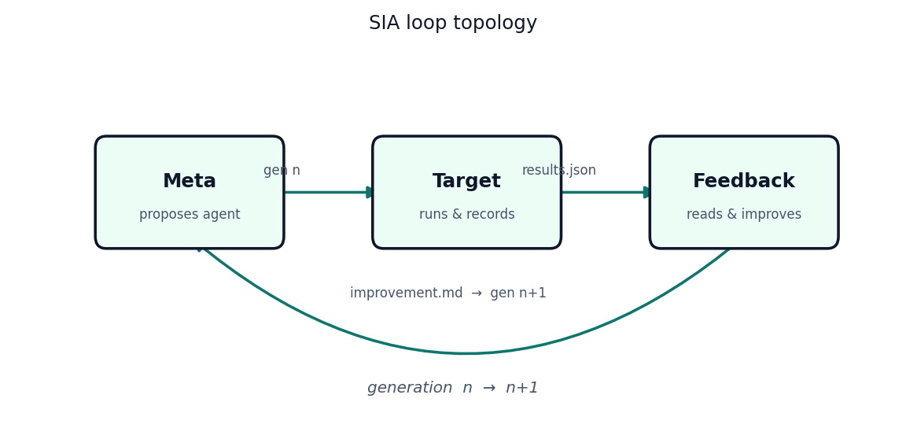
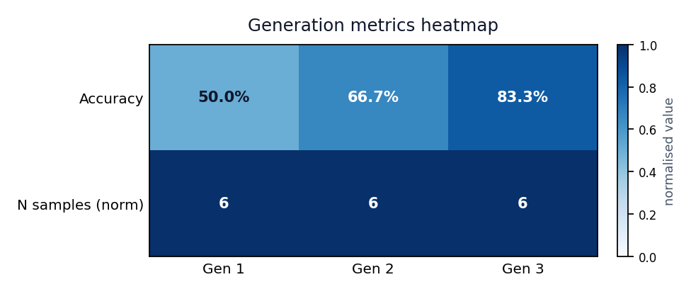
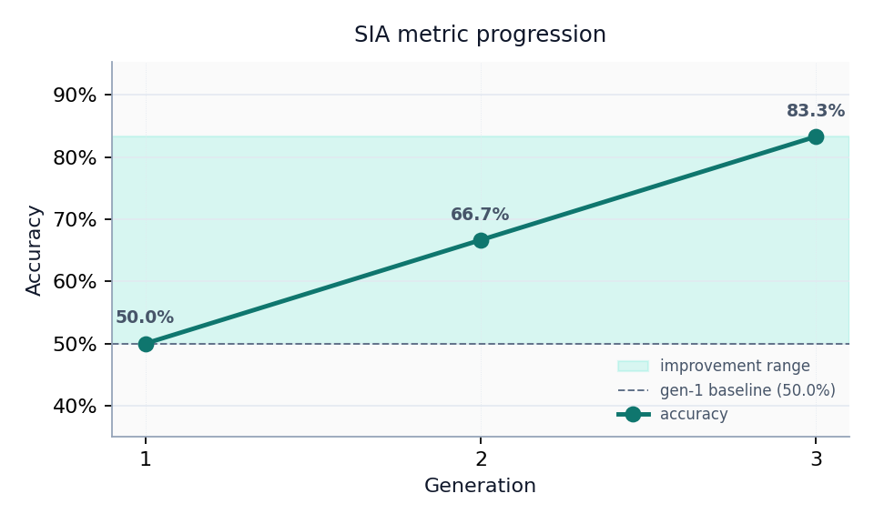
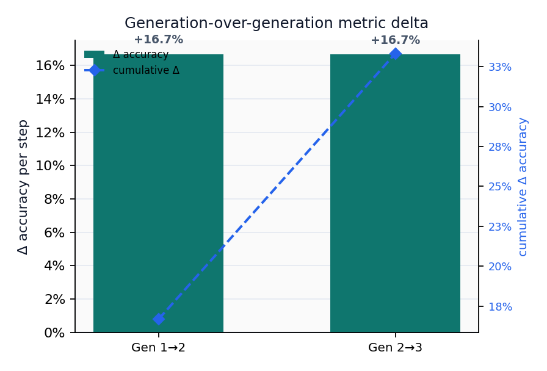

# Full Text: Self-Improvement Agent Harness: A Deterministic SIA Exemplar

> Extracted from `Friedman_2026_Selfimprovement_6e6d19d0.pdf`

> 4 figures extracted to `images/`

---

## Page 1

Self-Improvement Agent Harness: A Deterministic SIA
Exemplar
Meta →Target →Feedback loops with public/private task splits
Daniel Ari Friedman
Active Inference Institute
daniel@activeinference.institute
ORCID: 0000-0001-6232-9096
DOI: 10.5281/zenodo.20453879
June 26, 2026

## Page 2

Contents
1
Abstract
2
2
Introduction
3
3
Methodology
4
3.1
SIA loop . . . . . . . . . . . . . . . . . . . . . . . . . . . . . . . . . . . . . . . . . . . . . . . . . . . . .
4
3.2
Task layout . . . . . . . . . . . . . . . . . . . . . . . . . . . . . . . . . . . . . . . . . . . . . . . . . . .
4
3.3
Determinism contract
. . . . . . . . . . . . . . . . . . . . . . . . . . . . . . . . . . . . . . . . . . . . .
4
3.4
Per-generation metric overview . . . . . . . . . . . . . . . . . . . . . . . . . . . . . . . . . . . . . . . .
4
4
Results
5
4.1
Incremental improvement
. . . . . . . . . . . . . . . . . . . . . . . . . . . . . . . . . . . . . . . . . . .
5
5
Conclusion
6
6
References
7

## Page 3

1
Abstract
This exemplar documents template_sia, a deterministic implementation of the Self-Improvement Agent (SIA) har-
ness contract described in [AI, 2026]. The default pipeline replays fixture-backed generations for the mini_classify
task; opt-in live mode runs bounded target subprocesses and optional Ollama-backed meta/feedback steps.
Run snapshot. Task mini_classify, run 1, 3 generation(s), live=false. Final accuracy=0.8333 over 6 held-out
samples. Values are injected by scripts/z_generate_manuscript_variables.py after analysis.
Keywords: self-improvement agents, benchmark harness, reproducible evaluation, agent loops
2

## Page 4

2
Introduction
This exemplar ships template_sia, a deterministic research harness for Self-Improvement Agent (SIA) loops [AI,
2026]. It documents how the template repository separates generic orchestration (infrastructure/sia/) from a
reproducible project surface (projects/templates/template_sia/) without vendoring the upstream upstream SIA
orchestrator repository.
Compared with the AutoResearch exemplar, SIA focuses on meta →target →feedback generations with pub-
lic/private task splits rather than candidate-model search and readiness gates. Default CI replays fixture-backed
generations; live mode remains opt-in.
Scope. The bundled mini_classify task is a threshold classifier on one feature column. Results demonstrate
harness wiring and artifact contracts—not state-of-the-art accuracy.
Run contract. Task mini_classify, run 1, up to 3 generation(s), live=false.
3

## Page 5

3
Methodology
3.1
SIA loop
The harness implements a three-agent cycle:
1. Meta — proposes or seeds a target agent for generation 𝑛.
2. Target — runs against public task data and writes agent_execution.json.
3. Feedback — reads private evaluation metrics and proposes improvements for generation 𝑛+ 1.
Figure 1: Meta →Target →Feedback loop topology for the SIA harness, generated programmatically by write_si
a_loop_topology.
Artifacts land under output/runs/run_{id}/gen_{n}/ with target_agent.py, agent_execution.json, optional
improvement.md, and canonical results.json.
3.2
Task layout
Each task exposes:
• data/public/ — agent-visible instructions and data (task.md, train.csv, evaluate.py).
• data/private/ — held-out labels for evaluation only.
• reference/reference_target_agent.py — deterministic baseline.
The exemplar task mini_classify is a threshold classifier on a single feature column.
3.3
Determinism contract
When sia.live: false (default), generations replay recorded fixtures from src/fixtures/recorded_generation
s/. CI never executes generated agent code or calls external LLM APIs.
Pass --live-sia to scripts/run_sia_loop.py for bounded subprocess execution and optional Ollama feedback
when a model is configured.
3.4
Per-generation metric overview
The heatmap below provides a compact overview of per-generation accuracy and sample count, enabling at-a-glance
comparison across runs.
4

## Page 6

Figure 2: Per-generation metric heatmap showing accuracy and sample count across SIA generations.
4
Results
tbl. 1 summarizes fixture-replay metrics for the bundled run.
Table 1: SIA generation metrics (fixture replay).
Gen
Metric
Value
N
1
accuracy
0.5000
6
2
accuracy
0.6667
6
3
accuracy
0.8333
6
Metric delta (final −first generation): 0.3333.
Final injected token: accuracy=0.8333 (n=6).
Figure 3: SIA metric progression across generations.
4.1
Incremental improvement
The generation-over-generation accuracy delta quantifies the self-refinement signal at each step of the loop.
5

## Page 7

Figure 4: Generation-over-generation metric delta (Δaccuracy) for the SIA loop, illustrating the incremental im-
provement at each self-refinement step.
5
Conclusion
template_sia demonstrates how to embed the SIA harness contract in the Research Project Template without
vendoring upstream orchestration code. Layer 1 (infrastructure/sia/) owns task validation, evaluation, context
logging, and the generation state machine; Layer 2 wires a minimal classification task, fixture replay, and manuscript
tokens.
Non-claims. This tree is a harness and documentation exemplar. Fixture-replay metrics (final accuracy=0.8333)
validate wiring only—they are not evidence of state-of-the-art self-improvement. Live self-modification and external
LLM calls remain opt-in; default CI never executes generated agent code or claims benchmark parity with [AI, 2026].
6

## Page 8

6
References
See references.bib for BibTeX entries cited in this manuscript, including [AI, 2026] and the template repository
DOI from docs/manuscript/config.yaml.
7

## Page 9

References
Hexo AI. Self-improvement agents. 2026. URL https://arxiv.org/abs/2605.27276.
8

---
*Extraction method: pymupdf*
