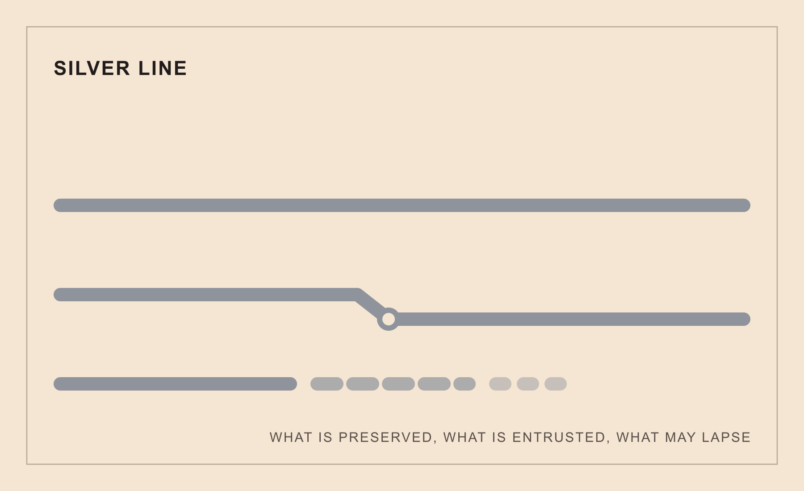

# Full Text: The Silver Line: A Memory-and-Succession Instrument

> Extracted from `silver_line_combined.pdf`

> 1 figures extracted to `images/`

---

## Page 1

The Silver Line: A Memory-and-Succession
Instrument
What is preserved, what is entrusted to whom, what is allowed to lapse
Daniel Ari Friedman
Active Inference Institute
daniel@activeinference.institute
ORCID: 0000-0001-6232-9096
DOI: 10.5281/zenodo.22833486
2026-08-29

## Page 2

Contents
1
Abstract
2
2
Introduction
3
3
Method
4
4
Formalism
5
5
Examples
6
6
Limits
7
7
Conclusion
8

## Page 3

1
Abstract
The Silver Line is a memory-and-succession instrument: a registry of keepsakes, a staged intake, and an executable reading that
reports which declared evidence for keeping was present at a review date. The instrument underclaims on purpose. A verdict
describes declared custody pinned to a registry digest; it is never persistence, never an infallible archive, and never permission.
What is allowed to lapse is part of the registry, not a failure of it.
2

## Page 4

2
Introduction
Every practice accumulates things it means to keep. The Silver Line asks one question of that accumulation: what do I keep, and
how does it outlive me? The question has three parts — what is preserved, what is entrusted to whom, and what is allowed to
lapse — and the instrument treats all three as first-class. A line that could only retain would drift into an immortality project;
the Silver registry carries restraint and lapse families alongside retention so the drift is refused in the declaration itself.
3

## Page 5

3
Method
A succession reading is staged. Intake first: each declared item is normalized, and malformed content is set aside with a note
rather than crashing or being repaired into a fabricated value. Evaluation second: keepsakes whose tags intersect the item’s tags
are matched, and each matched keepsake’s required evidence labels are split into present and missing. A lapse-accepted keepsake
with a gap reads NEEDS_PROVISION — a declared release, not a defect. The verdict is pinned to the ISO review date and the
SHA-256 digest of the keepsake registry that produced it.
4

## Page 6

4
Formalism
Definition 1 (Keepsake). A keepsake 𝑘= (𝑖𝑑, 𝑡𝑖𝑡𝑙𝑒, 𝑤𝑖𝑟𝑒, 𝑡𝑎𝑔𝑠, 𝐸, 𝑘𝑖𝑛𝑑, ℓ) is a declared item of kept work, where 𝐸is the tuple
of required evidence labels and ℓthe lapse-acceptance flag.
Definition 2 (Succession item). A succession item 𝑠= (𝑑𝑒𝑠𝑐, 𝑐𝑢𝑠𝑡, 𝑡𝑎𝑔𝑠, 𝐷) is a self-declared item with description, custodian,
tag set, and declared label set 𝐷.
Definition 3 (Verdict). A verdict 𝑣maps a scan set to a status in {𝐾𝐸𝑃𝑇, 𝑁𝐸𝐸𝐷𝑆_𝑃𝑅𝑂𝑉𝐼𝑆𝐼𝑂𝑁, 𝑁𝐸𝐸𝐷𝑆_𝑅𝐸𝑊𝑂𝑅𝐾, 𝑂𝑈𝑇𝑆𝐼𝐷
with per-keepsake findings, intake notes, review date, and registry digest.
Proposition 1 (Fail closed). An empty scan set yields 𝑂𝑈𝑇𝑆𝐼𝐷𝐸_𝑆𝐶𝑂𝑃𝐸with an intake note; a registry that cannot be
scored yields 𝑁𝐸𝐸𝐷𝑆_𝑅𝐸𝑊𝑂𝑅𝐾with no findings.
Proposition 2 (Lapse gaps are releases).
A gap on a keepsake with ℓ= 𝑡𝑟𝑢𝑒reads 𝑁𝐸𝐸𝐷𝑆_𝑃𝑅𝑂𝑉𝐼𝑆𝐼𝑂𝑁, not
𝑁𝐸𝐸𝐷𝑆_𝑅𝐸𝑊𝑂𝑅𝐾.
5

## Page 7

5
Examples
The worked example in data/envelopes/silver_line_worked.json intakes a small lab-archive succession: one declared record
with a named custodian and a partial evidence set. Under the Definition 1 and Definition 2 vocabulary, the reading returns the
Definition 3 status NEEDS_PROVISION: gaps on lapse-accepted keepsakes are declared releases under Proposition 2, while the
empty-registry control fails closed under Proposition 1. The same-subject envelope applies the line to the witness register itself.
6

## Page 8

6
Limits
Every verdict describes declaration coverage only. The instrument does not verify that a declared label names something real, does
not judge the quality of what is kept, and does not guarantee that anything survives its custodians. Digests make silent registry
edits visible, not impossible, and say nothing about whether the content is good.
7

## Page 9

7
Conclusion
Keeping honestly includes naming what is allowed to lapse. The Silver Line makes that naming executable: a registry where
restraint and lapse sit alongside retention, a reading that fails closed, and a digest that turns drift into a signal rather than a
surprise.
8

## Page 10

References
9

---
*Extraction method: pymupdf*
