# Full Text: Skillarum: Conditionally Reproducible Website-to-Agent-Skill Compilation

> Extracted from `Skillarum_combined.pdf`

> 12 figures extracted to `images/`

---

## Page 1

Skillarum: Conditionally Reproducible
Website-to-Agent-Skill Compilation
Provenance, fallback generation, integrity validation, and evidence-gated evaluation
Daniel Ari Friedman
Active Inference Institute
daniel@activeinference.institute
ORCID: 0000-0001-6232-9096
DOI: 10.5281/zenodo.22663907
2026-09-07

## Page 2

Contents
1
Abstract
2
2
Introduction and contributions
2
3
Formal model and invariants
2
3.1
Objects and transformation boundary
. . . . . . . . . . . . . . . . . . . . . . . . . . . . . . . . . . . .
2
3.2
Implementation properties and assumptions . . . . . . . . . . . . . . . . . . . . . . . . . . . . . . . . .
4
4
Methodology and system architecture
5
4.1
Declared acquisition design
. . . . . . . . . . . . . . . . . . . . . . . . . . . . . . . . . . . . . . . . . .
5
4.2
Compilation and orchestration
. . . . . . . . . . . . . . . . . . . . . . . . . . . . . . . . . . . . . . . .
5
4.3
Agent access and operator instructions . . . . . . . . . . . . . . . . . . . . . . . . . . . . . . . . . . . .
6
5
Threat model, provenance, and safety
6
6
Evaluation design and results
8
6.1
Observation set and estimands
. . . . . . . . . . . . . . . . . . . . . . . . . . . . . . . . . . . . . . . .
8
6.2
Acquisition and operational diagnostics . . . . . . . . . . . . . . . . . . . . . . . . . . . . . . . . . . . .
8
6.3
Statistical policy . . . . . . . . . . . . . . . . . . . . . . . . . . . . . . . . . . . . . . . . . . . . . . . .
12
6.4
Human review
. . . . . . . . . . . . . . . . . . . . . . . . . . . . . . . . . . . . . . . . . . . . . . . . .
14
7
Case studies
15
7.1
Math 4 Wisdom
. . . . . . . . . . . . . . . . . . . . . . . . . . . . . . . . . . . . . . . . . . . . . . . .
15
7.2
Active Inference Institute
. . . . . . . . . . . . . . . . . . . . . . . . . . . . . . . . . . . . . . . . . . .
15
7.3
Dated refresh and website inventories . . . . . . . . . . . . . . . . . . . . . . . . . . . . . . . . . . . . .
15
8
Related work and scholarly context
16
8.1
Retrieval, form, and bounded source compilation . . . . . . . . . . . . . . . . . . . . . . . . . . . . . .
16
8.2
Web agents and executable skills . . . . . . . . . . . . . . . . . . . . . . . . . . . . . . . . . . . . . . .
16
8.3
Provenance, reproducibility, and human evaluation . . . . . . . . . . . . . . . . . . . . . . . . . . . . .
17
8.4
Security and responsible use . . . . . . . . . . . . . . . . . . . . . . . . . . . . . . . . . . . . . . . . . .
17
8.5
Scope of comparison . . . . . . . . . . . . . . . . . . . . . . . . . . . . . . . . . . . . . . . . . . . . . .
18
9
Reproducibility, limitations, and future work
18
10 References
19

## Page 3

1
Abstract
Skillarum is a local pipeline for turning selected server-rendered website pages into portable SKILL.md artifacts for
agent harnesses. The system separates acquisition, preparation, generation (the 03_process stage), parsing, and
rendering, while recording page hashes, canonical and final URLs, request events, provider attempts, fallback history,
and artifact integrity metadata.
The project contributes three things. First, it makes website-to-skill compilation inspectable and resumable through
typed contracts and content-aware cache identities. Second, it treats scraped HTML as untrusted data and makes
provider failure, truncation, and uncertainty visible rather than silently promoting them to instructions. Third, it
defines an evidence-gated evaluation surface for reproducibility, provenance, fallback behavior, and human review of
semantic and procedural usefulness.
The current report summarizes 7 persisted observations from 2 source profiles and 7 target bundles. The package-
valid rate among completed runs is 100.0%, with 0 recorded fallback observations and 5 truncated pages. These
values are conditional on run completion; they are descriptive observations, not an end-to-end success probability or
a population estimate. Human-review agreement is currently pending.
2
Introduction and contributions
Agent skills are a compact way to provide reusable, on-demand context to an agent. Their practical value depends
on more than producing Markdown: the artifact must be discoverable, bounded, attributable, safe to load, and
useful under changing source conditions. A website-to-skill system therefore has two different responsibilities. It
must acquire and transform public material, and it must communicate exactly what was observed and what remains
uncertain.
Skillarum addresses the second responsibility as a first-class engineering problem. A profile names an origin, ex-
traction boundary, network policy, and target bundle. A run then produces a content-addressed chain from page
records to a portable skill package. The canonical artifact remains a plain SKILL.md, so the output can be carried
into compatible harnesses without a provider-specific wrapper.
The contributions are:
1. a declarative, bounded website-to-skill pipeline with same-origin, robots, response-size, redirect, rate-limit,
canonical, and request/page controls;
2. interchangeable deterministic, OpenAI, Ollama, command, and fallback generators with typed retry traces and
target-name enforcement;
3. transactional package publication and cache validation based on explicit profile, target, corpus, generator, and
artifact identities;
4. a source-bounded output contract that preserves prompt-injection text as data and never executes scraped or
generated code; and
5. an evidence and publication layer that separates measured observations, live case studies, source citations,
hypotheses, and pending claims.
The 2 configured source areas are Math 4 Wisdom and the Active Inference Institute, with target bundles declared
in their profiles. They are intentionally useful examples rather than a claim to have sampled the web generally.
3
Formal model and invariants
3.1
Objects and transformation boundary
Symbol
Meaning and scope
𝑆, 𝑇, 𝑣
Source profile, selected target, and pipeline contract
version
𝜔
Realized external responses, failures, and clock readings
𝐵= (𝑃, 𝐸, 𝑊)
Acquired page sequence, request-event trace, and
warnings
2

## Page 4

Symbol
Meaning and scope
ℓ, 𝐶
Per-page preparation limit and bounded prepared
corpus
𝐺, Γ, 𝐷
Generator, non-secret configuration, and resulting draft
𝐾= (𝑀, 𝐹)
Rendered Markdown and its provenance manifest
𝐻
Hash over an explicitly serialized artifact or contract
Let a profile be 𝑆, a named target be 𝑇, and the pipeline version be 𝑣. Acquisition maps a profile and target to a
bundle of normalized pages:
𝐴𝑣(𝑆, 𝑇; 𝜔) = 𝐵= (𝑃, 𝐸, 𝑊),
(1)
where 𝑃is a finite sequence of page records, 𝐸is the request-event trace, and 𝑊is a warning set. The realized
acquisition environment 𝜔includes remote responses, request failures, and clock readings. Acquisition is a partial
operation: a failed target need not produce a usable bundle. Preparation is a bounded transformation
𝑄(𝐵, ℓ) = 𝐶,
(2)
where ℓis the per-page context limit and 𝐶contains only bounded, delimited source data. A generator 𝐺maps 𝐶
to a draft 𝐷, and the renderer 𝑅maps 𝐷and 𝐶to a package 𝐾:
𝐾= 𝑅(𝐷, 𝐶) = (𝑀, 𝐹),
(3)
with Markdown artifact 𝑀and provenance manifest 𝐹.
The cache identities are derived as:
𝐼𝐴= 𝐻(𝑣, 𝑆, 𝑇),
𝐼𝐺= 𝐻(𝑣, 𝑄(𝐵, ℓ), 𝐺, Γ),
𝐼𝐾= 𝐻(𝑀).
(4)
where Γ is the non-secret provider configuration. Secrets are not members of any persisted identity. A cached value
is reusable only when its schema, identity, payload hash, and required validation fields all agree. Here 𝐼𝐴identifies
a configuration-specific cache entry; it does not prove that the remote site is unchanged. Freshness requires a new
acquisition or recorded revalidation. 𝐻denotes SHA-256 over the implementation’s defined serialization; hash-based
integrity relies on its collision resistance and does not authenticate a source or operator.
For a schema-2 rendered package 𝐾from run 𝑟, let 𝐶𝑟denote the persisted prepared corpus at 02_prepare, and
let 𝐿(𝐾, 𝐶𝑟) be the pagewise lineage predicate over profile, target, area, ordered source URLs, retrieval fields, raw-
content hashes, prepared-text hashes, truncation flags, and warnings. Let PackageProv(𝐾) be the package-level
provenance predicate: it holds when 𝐾’s manifest carries every required current-schema field (cache identity, profile
and generator fingerprints, generation trace, request events, and artifact hashes), the recorded artifact hashes match
the materialized SKILL.md and manifest bytes, and the manifest’s portable skill name agrees with the rendered
frontmatter. Human-facing requested names are retained separately from that portable slug. Research provenance
is complete only when the package-level provenance predicate and 𝐿(𝐾, 𝐶𝑟) both hold:
ProvComplete(𝐾, 𝑟) = PackageProv(𝐾)
∧𝐿(𝐾, 𝐶𝑟).
(5)
This distinction matters because a manifest can be internally self-consistent after an unauthorized substitution while
no longer describing the run that produced it. Legacy packages do not expose enough lineage fields; their lineage
value is therefore reported as unavailable rather than inferred.
3

## Page 5

3.2
Implementation properties and assumptions
The following are implementation properties with explicit assumptions and source-level justifications. They are not
machine-checked proofs or empirical estimates of reliability.
The acquisition map in eq. 1 includes the environment explicitly; the conditional rendering statement below fixes
all realized input fields. The identities in eq. 4 therefore support comparison of recorded artifacts without equating
determinism with remote-source freshness.
Proposition 1 (Deterministic rendering). For fixed prepared corpus 𝐶, deterministic generator configuration,
and pipeline version 𝑣, and identical persisted provenance and generation-trace fields, repeated rendering produces
the same Markdown artifact and artifact hash.
Justification. With timing and retrieval fields held fixed, the deterministic generator extracts from the ordered pre-
pared pages, configuration, and target name. The renderer serializes the same frontmatter, sections, and provenance
fields in a fixed order; cache-hit retrieval metadata is read from 𝐶rather than regenerated. Therefore both byte
strings and 𝐻(𝑀) are equal across repetitions.
Proposition 2 (Integrity-preserving publication).
The built-in renderer validates a staged package before
replacing the published directory. Index construction independently validates the files it advertises.
Justification. The publication transaction writes both files below a private staging path, validates the staged directory,
moves the old directory to a backup, and renames the staged directory into place. Each rename is atomic on the same
filesystem; the two-rename replacement has a brief absence window. Index construction rejects absent, malformed,
or hash-invalid packages. A partial staging directory is excluded from index discovery. Crash recovery can restore
a backup on the next run. This is a package-completeness property, not continuous availability or durability under
arbitrary filesystem failure.
Proposition 3 (Index soundness). For every entry advertised by the discovery index, the referenced package is
complete, schema-valid, and hash-valid at the time the index is built.
Justification. Index construction enumerates every non-hidden manifest.json below the skills root. It validates
the manifest schema, verifies the recorded artifact hashes against the materialized files, and checks PackageProv(𝐾)
before emitting an entry. Package directories that are missing a file, fail schema validation, or disagree with their
hashes abort the rebuild (fail closed) instead of being advertised; only dot-prefixed paths are skipped from discovery.
The proposition is a soundness claim about the generated index at that validation point; it does not prevent an
external actor from modifying a file after publication, which is why publication manifests and later validation remain
necessary.
Proposition 4 (Trust-boundary preservation). The application constructs provider instructions separately from
source text, derives output paths from the configured target, and never executes generated content in the renderer.
Justification. Acquisition and preparation represent source text as delimited data; provider instructions are con-
structed outside that data region. Output paths come from the profile-authoritative target name, and subprocess
invocation uses argument arrays without shell evaluation. The renderer writes Markdown and validates it but never
interprets source text as code. These implementation facts do not prove that an LLM will obey the instruction
hierarchy: delimiters and content filters are not an isolation mechanism for model behavior. Nor do they prove
source truth or downstream harness safety.
Proposition 5 (Failure diagnosability). For exceptions caught inside the run state machine, Skillarum attempts
to persist a failed state and sanitized diagnostic record. Recorded provider failures remain visible when a fallback
succeeds.
Justification. Assuming writable storage and that the process reaches its exception handler, the run state machine
writes transitions and failure manifests atomically at the owning run path. Each provider attempt records backend,
model, status, timing, retry count, and sanitized error text in the generation trace. The fallback result therefore
does not erase the failed attempt history. Process termination, setup errors before state initialization, and storage
failures can prevent a diagnostic write; this is not a total failure-recording theorem.
These propositions depend on the stated implementation boundary: no browser JavaScript execution, no generated-
code execution, and no shell evaluation by the built-in command invocation.
A configured command is trusted
operator code and can perform its own I/O; it is not sandboxed. The deterministic idempotency proposition applies
4

## Page 6

to the source-bounded skill artifact; evaluation envelopes retain an operational timestamp, so stable report identity
is weaker than byte identity of a full research report.
4
Methodology and system architecture
4.1
Declared acquisition design
Profiles declare 7 target bundles across 2 source areas. The following table is generated from the current profile
files. Its limits describe configured upper bounds; they are not counts of retrieved or available website pages. Target
bundles may select overlapping source pages.
Area / target
Seed URLs
Page limit
Characters / page
Active-Inference-Institute / Institute-Overview
8
20
40000
Active-Inference-Institute / Institute-Foundations
6
20
40000
Active-Inference-Institute / Institute-Programs
7
20
40000
Active-Inference-Institute / Institute-Projects
7
20
40000
Math4Wisdom / Three-Minds
1
10
40000
Math4Wisdom / Three-Minds-Exposition
4
10
40000
Math4Wisdom / Minds-Research
4
10
40000
4.2
Compilation and orchestration
Figure 1 summarizes the stage topology: untrusted source data enters at acquisition and stays delimited through
preparation, generation, parsing, and rendering.
Figure 1: Pipeline and trust boundaries. The diagram shows the five contract-defined Skillarum stages and the source-
data trust boundary; it is generated from implementation contracts, not from the report’s measurements. Report
context (metadata only): n=7 completed observations; evidence origins: live=7. The diagram is not a performance
measurement or a claim about site coverage.
The acquisition layer owns network behavior.
It normalizes URLs, checks origin and public-host policy, reads
robots.txt, applies shared rate limits, follows bounded redirects, streams response bodies under a byte limit, and
records rejection reasons. It does not interpret page text as commands.
The preparation layer removes configured presentation selectors, bounds each page, preserves source URLs and hashes,
and wraps source material in a corpus contract — the bounded transformation of eq. 2. The process layer chooses a
provider. Deterministic generation is the default; auto is explicitly opt-in and follows configured provider precedence
before deterministic fallback. Provider retries cover only transient transport and HTTP failures. Malformed or
unsafe output is not silently retried as if it were a network problem.
5

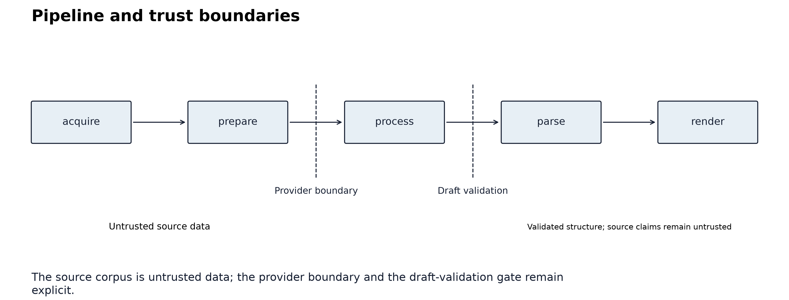

## Page 7

The parse and render layers validate required portable sections, enforce the requested target name, append prove-
nance, produce the package contract of eq. 3, validate the package, and publish it transactionally. The discovery
index is rebuilt only from complete packages.
Figure 2 shows the persisted run lifecycle; failure is a diagnosable terminal state with sanitized diagnostics.
Figure 2: Run states and recovery. The diagram shows the persisted lifecycle from planning to rendering and the
recoverable failure boundary; it is generated from implementation contracts, not from the report’s measurements.
Report context (metadata only): n=7 completed observations; evidence origins: live=7.
It does not establish
reliability, recovery probability, or successful resumption under every failure mode.
The filesystem layout is part of the method. Acquired bundles, prepared corpora, drafts, run state, failures, manifests,
and rendered skills remain inspectable. This makes a run useful as both an operational artifact and an evaluation
observation.
The scholarly build has a separate dependency order: validate claims and bibliography, collect completed observations,
derive statistics, generate figures, verify retained website archives, and bind the manuscript. A failed step prevents
a successful build receipt. Rendering and final artifact validation follow that build. The pipeline contract version is
0.8 and the package version is 0.2.0; these identifiers are injected from the implementation.
4.3
Agent access and operator instructions
The local MCP adapter exposes discovery, package inspection and validation, policy checks, and the current evaluation
summary through an explicit filesystem root. Index reconstruction requires a server started with write access. The
default adapter does not acquire websites or launch generators. Its tool, resource, and prompt surfaces follow the
corresponding MCP interaction types [Model Context Protocol, 2025]; this implementation is a bounded adapter,
without a claim of exhaustive protocol conformance.
An authored operator SKILL.md supplies the workflow for using Skillarum itself. It is maintained with the software
and bundles its command reference. This operator artifact has a different role from the generated website skills: it
directs local operation, whereas a generated skill records source-derived reference material. The MCP review prompt
preserves that distinction by requiring source text to be inspected as untrusted data.
5
Threat model, provenance, and safety
The principal adversary is untrusted source content. A page may contain text that looks like a system instruction,
attempts to exfiltrate secrets, requests unsafe redirection, or embeds misleading navigation. This is the indirect
prompt-injection setting in which retrieved data can alter the behavior of an LLM-integrated application [Greshake
et al., 2023]. Skillarum therefore keeps source content inside a corpus delimiter, preserves it as evidence, and requires
generated skills to distinguish source claims from agent reasoning.
6

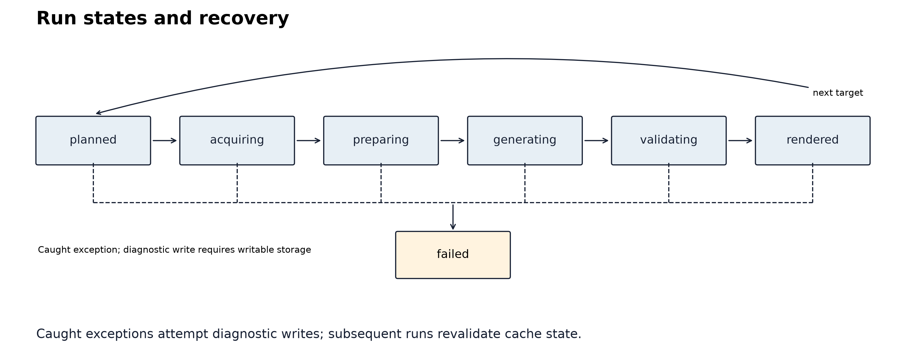

## Page 8

The security taxonomy is intentionally aligned with practitioner guidance without treating a checklist as proof of
safety. OWASP’s LLM application risks name prompt injection and insecure output handling as distinct failure
modes [OWASP Gen AI Security Project, 2025]. NIST’s AI RMF frames AI risk management as voluntary, context-
specific work across design, development, use, and evaluation [Tabassi, 2023]. Skillarum therefore states controls as
local invariants and residual risks rather than as a certification claim.
The network boundary rejects unsafe redirects, private hosts by default, non-HTML responses, excessive bodies,
cross-origin pages, and disallowed robots paths. DNS checks precede connection establishment; the transport does
not pin the checked address, so rebinding between resolution and connection remains a residual risk. Network egress
controls are needed where this threat is material. The request budget counts robots, redirects, retries, and page
requests separately from the accepted-page limit. This distinction prevents a large failure or redirect sequence from
being hidden by a page-count metric.
The provider boundary excludes credentials from cache keys and manifests. External command generators receive
JSON through a non-shell subprocess call. Generated code is never executed. Error messages are sanitized before
they enter provenance. Redaction detects configured credential patterns and is not a guarantee against every possible
secret representation. The configured command backend executes trusted operator-supplied code; argument arrays
avoid implicit shell expansion but do not sandbox that executable.
The publication boundary protects consumers from partial state. A package contains source hashes, retrieval meta-
data, request events, generator traces, cache identity, artifact hashes, warnings, and limitations. A hash proves
identity of the recorded bytes; it does not prove the truth of the source claim. That distinction is central to the claim
ledger and to the data-statement discipline of limiting claims to the observed source and run population [Bender and
Friedman, 2018].
The security guarantee is intentionally compositional and limited. The pipeline labels source text as untrusted and
keeps application instructions separate, but these controls do not guarantee that a model ignores injected instructions.
It also cannot control a downstream harness that chooses to execute generated text, follow a newly changed URL, or
grant the skill broad tool permissions. We therefore publish both positive invariants and residual boundary conditions
rather than claiming immunity.
Figure 3 traces the hash-dependency chain from profile and target configuration to the published discovery index.
Figure 3: Cache identity and artifact integrity. The diagram shows the contract-defined hash dependencies from
configuration through the published index; it is generated from implementation contracts, not from the report’s
measurements. Report context (metadata only): n=7 completed observations; evidence origins: live=7. It is not an
empirical collision or speed result.
Pack checksums bind recorded archive members to hashes. The packer field is self-asserted metadata: no signing
key or trusted identity authority is involved, so checksum verification must not be described as signer authentication.
7

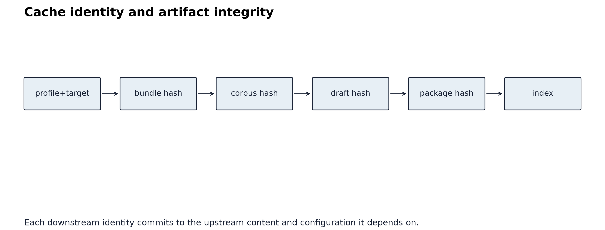

## Page 9

6
Evaluation design and results
The evaluation is deliberately divided into three evidence classes. Local fixture observations test behavior under
controlled redirects, robots rules, oversized streaming responses, transient failures, prompt injection, cache corruption,
and subprocess boundaries.
Live observations exercise the configured public source profiles and their expanded
declarative bundles. Human ratings assess the usefulness and safety of the resulting skills. Fixture evidence is not
presented as live-site evidence, and live case studies are not treated as population samples.
6.1
Observation set and estimands
The current report contains 7 completed observations across 7 target rows. 7 are labeled live. The package-valid
rate is 100.0%. The run matrix recorded 0 fallback observations, 5 truncated pages, and a human-review status of
pending. Evidence labels describe persisted acquisition declarations; a later --live flag cannot upgrade historical
observations. Older runs without declarations remain unknown. Telemetry availability is recorded separately from
stored compatibility counters; an unavailable metric is not an observed zero.
The primary observational unit is a completed run-target pair:
one selected profile target,
one acquisi-
tion/preparation/generation/validation path, and one rendered package. The collector selects manifests whose state
is rendered; failed runs remain in operational diagnostics and are excluded from these rates. Consequently, package
validity is conditional on completion, not an end-to-end success probability. Page records and request attempts are
nested observations within that unit, not independent replicates. Thus, the live matrix’s target and observation
counts describe a bounded case-study design; they must not be read as a sample of independent websites or as
a site-wide estimate. Repeated live runs would be needed before treating an observation-level rate as more than
descriptive operational evidence.
Recorded generator backends: deterministic. The package-valid numerator is 7 among 7 completed records; fallback
telemetry is available for 7 records. The distinction between those denominators is preserved in every summary.
6.2
Acquisition and operational diagnostics
Figure 4 reports acquisition outcomes by source area.
Figure 4: Acquisition outcomes by source area. For each declared area, grouped bars show six separately defined
counts: accepted pages, rejected requests, redirects, pages carrying canonical links, duplicate pages, and truncated
accepted pages. Each value is a within-area sum across completed observations (n=7 completed observations; evidence
origins: live=7). The categories are not additive because one request can redirect or carry a canonical link while
still producing an accepted page. This case-study matrix does not establish the number of pages available on either
website, a site-wide coverage rate, or a causal effect of any crawler policy.
Figure 5 summarizes provider fallback, failure, and retry counts per selected backend.
8

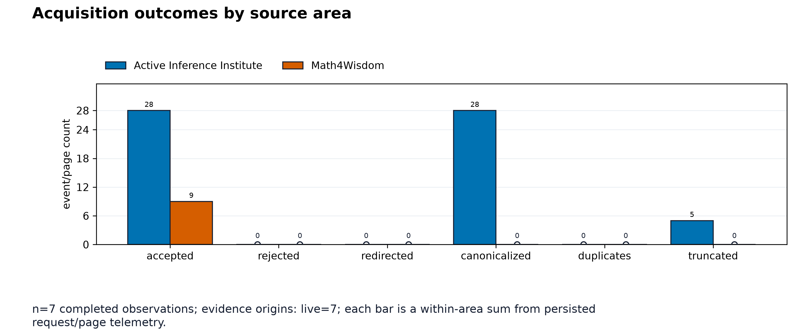

## Page 10

Figure 5: Provider fallback outcomes. For each selected backend, grouped bars separately count observations with
fallback, recorded provider-failure attempts, and retry attempts. Fallback is a Boolean observation-level indicator;
failures and retries are attempt-level counters. The aggregation is grouped sums over n=7 completed observations;
evidence origins: live=7. A zero is an observed absence in this report, not a guarantee that providers cannot fail;
the plot does not measure output quality or provider reliability in the population.
Figure 6 plots the individual generation-latency observations.
9

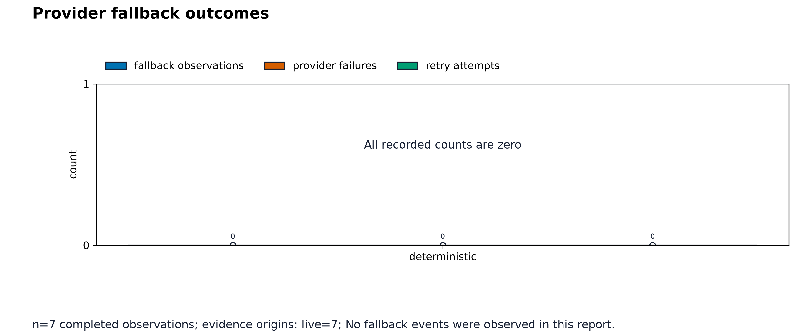

## Page 11

Figure 6: Generation latency.
Each bar identifies one area/target observation and shows the sum of persisted
provider-attempt durations, including retry attempts. The unit is milliseconds and the aggregation is a run-level
sum over attempts; n=7 completed observations; evidence origins: live=7.
Cached drafts, when present, retain
original attempt timings; reported durations are not end-to-end pipeline wall time. N/A denotes absent telemetry.
The report also retains the median, range, and missingness for this metric. This operational telemetry is not a
model-quality measure, does not isolate network/provider/cache components, and should not be generalized beyond
these runs.
Figure 7 counts observations passing each integrity check separately; these checks evaluate the provenance-
completeness predicate of eq. 5.
10

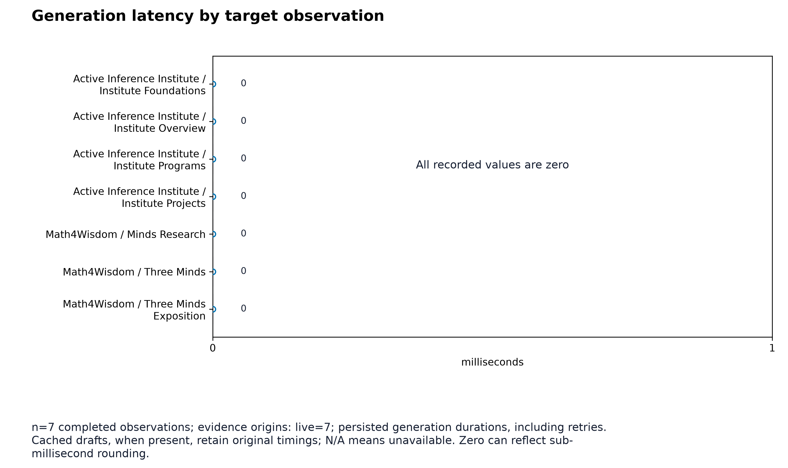

## Page 12

Figure 7: Artifact integrity checks. Bars count completed observations that pass three separately evaluated Boolean
checks: page-level provenance completeness, required portable sections, and presence of an untrusted-source marker.
The unit is observations and the aggregation is a sum of Boolean checks over n=7 completed observations; evidence
origins: live=7. Numerators and denominators remain available in the report’s exact-binomial proportion records; the
companion proportion-intervals figure draws those exact intervals with each row’s eligible denominator. These checks
establish package structure and provenance handling; they do not establish the factual truth, semantic coverage, or
usefulness of source claims.
Figure 8 compares source-mapping and truncation percentages per area.
Figure 8: Source mapping and truncation rates. For each declared area, the first series is complete source-page
mappings divided by observed source pages; the second is truncated accepted pages divided by accepted pages.
Thus the two percentages have different denominators and are shown together for diagnostic comparison, not as
complementary parts of one rate. The population is the completed observation set (n=7 completed observations;
evidence origins: live=7). These case-study rates do not establish site-wide completeness, content quality, or the
probability that an unseen page would be truncated.
Figure 9 reports request pressure per accepted page.
11

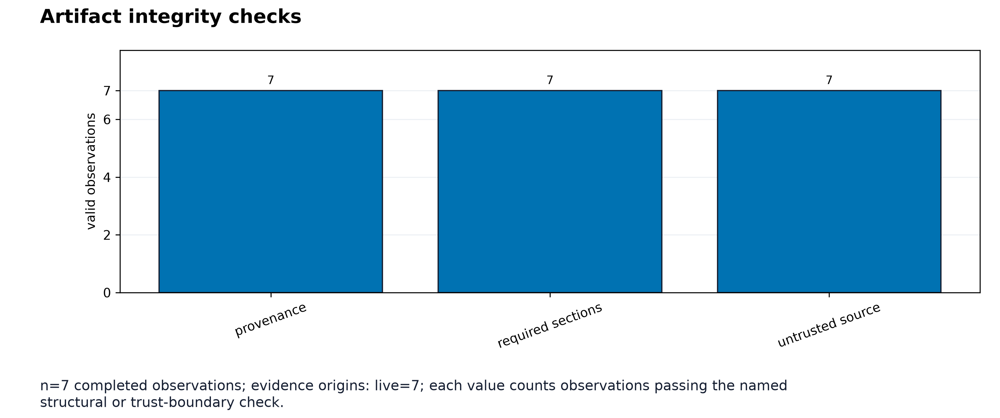

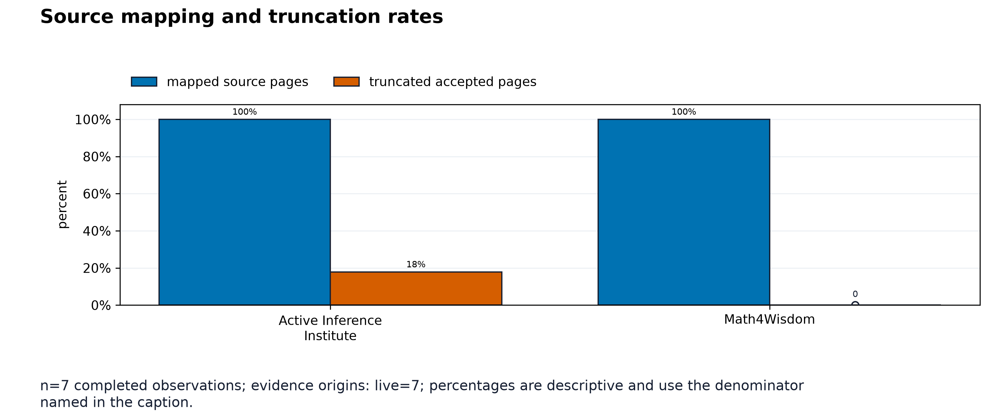

## Page 13

Figure 9: Request pressure per accepted page. Each area value is the total persisted request-attempt count divided
by the total accepted-page count for that area; request attempts include robots checks, redirects, retries, and normal
page requests when recorded. The unit is requests per accepted page and the aggregation is a ratio of area-level
sums over the completed observation set (n=7 completed observations; evidence origins: live=7). This diagnostic
does not establish network cost, crawler efficiency, or the total number of pages on a source site.
Figure 10 tabulates the skill catalog by declared source area.
Figure 10: Skill catalog by source area. Each row is a declarative namespace rather than an inferred topic cluster.
Columns report distinct target count, observation count, accepted pages, truncated accepted pages, and complete
source-page mapping. Counts are within-area sums; mapping is complete pages divided by observed source pages.
The population is the completed observation set (n=7 completed observations; evidence origins: live=7); it does not
establish website completeness, semantic quality, comparative superiority, or equal acquisition effort between areas.
If two rating files with distinct rater IDs contain overlapping cases, the registry also emits the human-review-rub
ric figure. That conditional figure reports criterion-wise descriptive scores on the 0–4 rubric and is withheld when
agreement is pending; no empty agreement plot is manufactured for the current package.
6.3
Statistical policy
The executable statistical policy supplies the following settings to both the analysis and this manuscript. Changing
a setting requires rebuilding the report, figures, and manuscript together.
12

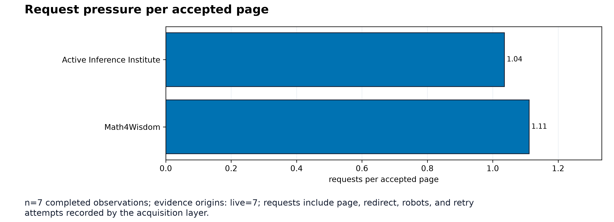

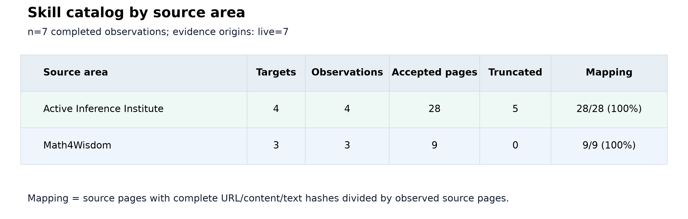

## Page 14

Setting
Value
Reference interval confidence
95%
Numerical bootstrap minimum sample
20
Bootstrap seed
1729
Bootstrap resamples
2000
Ordinal rubric bounds
0 to 4
Rates are reported with numerator, denominator, missingness, and sample size. Exact Clopper–Pearson intervals
[Clopper and Pearson, 1934] are provided as binomial-model reference intervals, assuming independent Bernoulli
trials with a common probability. The selected, nested case-study records do not establish those assumptions. These
intervals therefore do not quantify uncertainty for the web as a population, and page-level intervals are not cluster-
adjusted. Seeded percentile bootstrap intervals, using the nonparametric resampling framework of Efron [Efron, 1979],
are used for numerical measurements and counts with at least 20 finite observations with the fixed seed 1729 and
2000 resamples; otherwise the report remains descriptive. No normal approximation, significance test, or causal claim
is made for the initial case-study matrix. Area-level ratios are labeled as ratios of sums, and different-denominator
percentages are not presented as a decomposition.
For 𝑥recorded successes among 𝑛> 0 eligible observations, let 𝐵−1
𝑎,𝑏(𝑞) denote the 𝑞quantile of a Beta(𝑎, 𝑏) distribu-
tion. With 𝛼= 0.05, the implemented interval endpoints are
𝐿= {0
𝑥= 0,
𝐵−1
𝑥,𝑛−𝑥+1(𝛼/2)
𝑥> 0,
𝑈= {1
𝑥= 𝑛,
𝐵−1
𝑥+1,𝑛−𝑥(1 −𝛼/2)
𝑥< 𝑛.
(6)
For 𝑛= 0, the interval is unavailable. The bootstrap’s 𝑛≥20 rule is an implementation reporting threshold; it does
not establish independence or interval coverage. Its empirical distribution resamples the observed values, so a larger
number of resamples cannot repair a biased or dependent sample.
The following table reports the actual eligible denominators and 95% reference intervals from eq. 6. Source coverage
counts page mappings; the other rows count completed target records, except that unavailable fallback telemetry is
excluded. Intervals are conditional on the binomial model and do not correct shared-source dependence or selection
into the completed-record set.
When at least two completed observations record a source-URL list, the figure registry also emits a source-overlap
panel reporting the exact shared URLs between target pairs, with each target’s own URL count on the diagonal
and measured zeros printed explicitly; a target whose list was not recorded appears as unavailable rather than zero.
Shared pages are the concrete dependence behind the model-reference caveat; the panel is withheld when fewer than
two observations record lists, and no synthetic overlap is manufactured.
Check
Passing / eligible
Rate
Model interval
fallback used
0 / 7
0.0%
0.0% to 41.0%
package valid
7 / 7
100.0%
59.0% to 100.0%
provenance complete
7 / 7
100.0%
59.0% to 100.0%
required sections valid
7 / 7
100.0%
59.0% to 100.0%
source coverage
37 / 37
100.0%
90.5% to 100.0%
unsafe source preserved
7 / 7
100.0%
59.0% to 100.0%
Figure 11 shows those same row-specific estimates and eligible denominators.
Its horizontal intervals provide a
reference for the binomial model; they do not turn this selected observation set into an independent sample.
13

## Page 15

Figure 11: Exact binomial intervals for reported proportions. Each row shows the observed rate as a dot with a
capped line spanning its exact Clopper–Pearson 95% interval, annotated successes/denominator. Rows use their
own eligible denominator: completed observations for the package checks, observations with fallback telemetry for
the fallback row, and observed source pages for complete mapping (n=7 completed observations; evidence origins:
live=7).
Intervals are model-reference quantities under independent Bernoulli assumptions: targets share sites,
robots policy, and crawl limits, repeated invocations overwrite stable run identities, and pages within a target are
not independent, so interval coverage is not calibrated for these selected dependent records. The figure does not
establish web-population rates, provider effects, semantic quality, or a significance test between rows; rows have
different denominators and are not compared inferentially.
Operational telemetry is also reported in its recorded units.
Missing observations do not enter the median or
range. Response-byte totals describe the recorded transport telemetry, while generation durations aggregate provider
attempts; these measures do not establish cost or model quality. When every recorded backend is deterministic,
generation-duration telemetry measures in-process extraction rather than provider latency, so a zero median is a
recorded value rather than a missing measurement.
Metric
Recorded
Missing
Median
Range
Request attempts
7
0
6
2 to 9
Response bytes
7
0
323807
39161 to 857827
Generation duration (ms)
7
0
0
0 to 0
6.4
Human review
The current report contains 0 distinct rater identifiers and 0 shared cases. This status is an evidence gate, not a
substitute for recruiting independent reviewers or specifying their training and adjudication procedure.
Raters score semantic coverage, procedural usefulness, verification quality, provenance fidelity, safety, readability from
0 to 4. Each score requires an evidence note and source URL. Agreement is computed only when two distinct rater
IDs provide overlapping case rows, using the persisted weighted Cohen kappa values [Cohen, 1968]. Until two real
rating files exist, agreement remains pending and no inter-rater statistic or score plot is reported. A single-author
pilot, if later supplied, will remain labeled pilot data rather than being silently promoted to two-rater evidence.
Disagreements require an adjudication record that retains both rater IDs, the final score, rationale, adjudicator, and
14

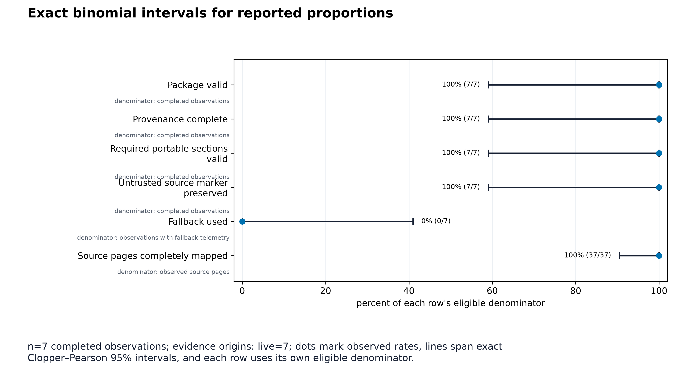

## Page 16

evidence URLs. Rater independence must be established through study design; different identifiers do not verify
independent judgments.
For paired counts 𝑛𝑖𝑗on categories 𝑖, 𝑗∈{0, 1, 2, 3, 4}, let 𝑝𝑖𝑗= 𝑛𝑖𝑗/𝑛, 𝑝𝑖+ = ∑𝑗𝑝𝑖𝑗, and 𝑝+𝑗= ∑𝑖𝑝𝑖𝑗.
The
implementation uses linear agreement weights:
𝑤𝑖𝑗= 1 −|𝑖−𝑗|
4
,
𝑝𝑜= ∑
𝑖,𝑗
𝑤𝑖𝑗𝑝𝑖𝑗,
𝑝𝑒= ∑
𝑖,𝑗
𝑤𝑖𝑗𝑝𝑖+𝑝+𝑗,
𝜅𝑤= 𝑝𝑜−𝑝𝑒
1 −𝑝𝑒
.
(7)
Only shared case IDs enter 𝑛. Unpaired rows contribute descriptive scores but cannot contribute to paired agreement.
Linear weights treat adjacent category disagreements equally; that is a rubric convention rather than a claim that
the latent constructs form an interval scale.
When both raters use the same category on every paired case, weighted kappa is undefined because expected agree-
ment is one. The report stores null in that case, not perfect chance-corrected agreement. Exact agreement and the
paired-case count remain interpretable descriptive quantities.
Stable run identities overwrite repeated invocations of the same configuration. A repetition count in the case plan
does not create independent samples; a future repeated-run study must retain separate acquisitions and model the
shared page, target, profile, and provider dependencies.
Pooled ordinal rubric scores are described without bootstrap intervals: multiple rater rows on a shared case are not
independent samples. Missing fallback telemetry is excluded from the fallback-rate denominator.
7
Case studies
7.1
Math 4 Wisdom
The canonical Three-Minds target selects one exact page from the Math 4 Wisdom wiki and uses the #wikitext
extraction boundary [Math 4 Wisdom]. The expanded matrix adds a related exposition bundle and a small research-
minds bundle. The resulting skills retain source URLs and content hashes, and they state that source-page instruc-
tions are reference text rather than executable guidance.
7.2
Active Inference Institute
The canonical Institute-Overview target combines the public homepage, about, active-inference, learning, projects,
resources, directory, and get-involved pages under the main selector [Active Inference Institute, b,a]. Additional
declarative bundles separate foundations/ecosystem, programs/participation, and research/learning projects. This
design keeps bundle membership reviewable in YAML rather than hiding it in crawler heuristics.
Both examples are snapshots. Retrieval timestamps and hashes are the evidence for what the pipeline saw; they are
not assertions that the websites remain unchanged.
7.3
Dated refresh and website inventories
The completed skill observations span 2026-09-08T19:06:50+00:00 to 2026-09-08T19:07:07+00:00 (UTC). Observa-
tion times identify completed packages; page-level retrieval times in their manifests identify the corresponding source
acquisitions. A fresh acquisition uses an empty output cache so that an earlier site’s response cannot become evidence
for today’s refresh.
Website
Retained HTML pages
Discovered URLs
Recorded warnings
active-inference-institute
899
899
0
15

## Page 17

Website
Retained HTML pages
Discovered URLs
Recorded warnings
math4wisdom
890
1228
338
The Institute inventory follows its declared sitemap; the Math4Wisdom inventory follows query-free, same-origin
links reachable from its seeds. Their discovery denominators differ. Raw responses, page records, and the acquisition
receipts are retained in hash-checked local archives. These inventories are separate from the selected pages compiled
into the selected skills. Warnings include excluded non-HTML responses, size limits, and unavailable URLs; they
are not successful HTML acquisitions. Unlinked, protected, script-rendered, and excluded media content is outside
this inventory.
Acquisition windows (UTC; displayed to the second):
• active-inference-institute: 2026-09-08 13:49:04 to 2026-09-08 13:53:09.
• math4wisdom: 2026-09-08 13:53:10 to 2026-09-08 14:03:06.
8
Related work and scholarly context
Skillarum is a source compiler with a research ledger, not a claim that a language model has understood a website.
Its nearest literatures therefore need to be kept distinct: retrieval and grounding, interactive web agents, skill or
program synthesis, provenance and documentation, and security of systems that process retrieved text.
8.1
Retrieval, form, and bounded source compilation
Retrieval-augmented generation makes the generator/evidence separation explicit [Lewis et al., 2020]. Skillarum
shares that separation with a different artifact boundary: a declarative profile selects pages, a deterministic prepa-
ration stage records page-local text, and the rendered skill carries URLs, hashes, retrieval times, and warnings.
Retrieval is therefore an acquisition input, not a license to treat every retrieved sentence as an instruction or as
verified truth.
This distinction also follows the form/meaning caution in Bender and Koller [Bender and Koller, 2020]. A well-formed
or fluent generated paragraph is not, by itself, evidence that the source claim is true or that the system has acquired
the source author’s intended meaning. The deterministic backend is accordingly extractive and source-bounded;
provider backends are useful convenience layers whose semantic quality remains an empirical question. The paper
does not use linguistic fluency as a proxy for truth.
Data Statements provide a particularly relevant documentation precedent: they ask researchers to state what data
and populations support a claim and to avoid ungrounded generalization [Bender and Friedman, 2018]. Skillarum
operationalizes an analogous run-level statement for website compilation: source origin, profile and target identity,
page selection, content hashes, truncation, generator trace, and validation status are machine-readable. This is an
engineering analogue, not a claim that a cache manifest replaces ethical review or domain expertise.
Datasheets for Datasets and Model Cards broaden the same documentation lineage. Datasheets make motivation,
collection, composition, recommended use, and limits part of the artifact contract [Gebru et al., 2021].
Model
Cards make intended use, evaluation procedure, and known limitations visible alongside a model release [Mitchell
et al., 2019]. Skillarum applies that documentation pattern to compiled skill packages: it records intended source
scope, source selection, retrieval conditions, generator attempts, validation status, and limitations. The analogy is
deliberately bounded. A generated skill is neither a dataset datasheet nor a model card; it is a source-bounded
reference artifact that borrows their reporting discipline.
8.2
Web agents and executable skills
ReAct couples reasoning with acting [Yao et al., 2022], and WebArena evaluates agents in realistic browser envi-
ronments [Zhou et al., 2023]. These lines of work motivate explicit action boundaries and evaluation environments,
but Skillarum v1 does not click, execute JavaScript, submit forms, or infer a browser policy. Its fetcher is static
HTTP/HTML and its output is a document for later agent use.
SkillWeaver is the closest comparison.
Its paper and implementation focus on web-agent exploration, practice
trajectories, skill discovery, and reusable API or browser-agent behavior [OSU-NLP-Group, Zheng et al., 2025].
16

## Page 18

Skillarum borrows the useful conceptual separation among knowledge, procedure, and verification, but changes the
object being produced: a portable, source-bounded SKILL.md with a provenance manifest rather than an executable
web interaction API. Thus the systems are complementary rather than direct baselines. Skillarum does not claim to
reproduce SkillWeaver’s interactive capabilities or to outperform them.
Portable Agent Skills documentation specifies filesystem-oriented skills with a SKILL.md entry point [Agent Skills].
Skillarum follows that portable surface and makes the frontmatter name Codex-compatible, while preserving human-
facing area and target names in the package path and manifest. The package includes installation and drift tracking
for supported local harness roots; these are operational conveniences, not evidence of semantic quality across har-
nesses.
Implementation surfaces also follow named open-source precedents, credited in the source docstrings: cross-runtime
frontmatter compilation adapts tripleyak’s SkillForge [tripleyak, 2025], repository-as-source ingestion adapts xiaokil-
lua’s SkillForge [xiaokillua, 2026a], and installation with drift tracking plus declarative policy packs adapt attebury’s
SkillPress [Attebury, 2026]. In the same problem space, xiaokillua’s SkillPress compiles websites, documents, and
repositories into SKILL.md packs [xiaokillua, 2026b]. These tools are attribution lineage and design comparison
points, not evaluation baselines; no performance comparison is claimed against them.
The Model Context Protocol provides a complementary interoperability surface: servers expose resources, prompts,
and tools to clients through a protocol contract [Model Context Protocol, 2025].
Skillarum ships a local MCP
stdio adapter for index construction and package validation, alongside a read-only HTTP discovery surface. Neither
executes website-derived behavior.
Index construction writes a local discovery file; MCP access is therefore not
universally read-only. This distinction matters for risk analysis. An MCP tool can cross an execution boundary, while
a Skillarum package is a static instruction document plus provenance. The shipped adapter exposes maintenance
functions around that document contract; it is not an interactive browser-agent policy.
8.3
Provenance, reproducibility, and human evaluation
The W3C PROV family supplies a vocabulary for entities, activities, and agents that produce artifacts [W3C, 2013].
Skillarum uses the same general logic without claiming formal PROV interoperability: page and corpus hashes
identify source bytes, generator traces identify attempted activities, and atomic publication plus index validation
constrain what becomes discoverable. These identities prove what the pipeline recorded, not the truth of a source
claim.
Reproducible computational research emphasizes that a result should be accompanied by the code, inputs, execution
conditions, and records needed to recreate or inspect it [Sandve et al., 2013]. Skillarum implements this principle
at the artifact level: profile and target fingerprints, prepared corpora, provider traces, content hashes, validation
reports, and publication manifests make the transformation inspectable. This guarantee is conditional, not absolute.
A deterministic render can be repeated from the same prepared corpus, whereas a live acquisition can change when
a site, robots policy, redirect, or provider changes.
The FAIR Guiding Principles motivate making research outputs findable, accessible, interoperable, and reusable
[Wilkinson et al., 2016]. The project is FAIR-oriented in this operational sense: JSON ledgers, stable identifiers,
portable Markdown, explicit hashes, and documented interfaces support those goals.
It does not claim formal
FAIR compliance, long-term archival preservation, or unrestricted reuse of scraped content. Source terms, copyright,
privacy, and retention decisions remain outside the pipeline’s technical guarantees.
Human evaluation is treated as an instrument that must itself be described. The Human Evaluation Datasheet
(HEDS) argues for structured reporting of evaluation details to support comparison and reproducibility [Shimorina
and Belz, 2022]. Skillarum therefore records criterion definitions, 0–4 ratings, evidence notes and URLs, rater IDs,
paired cases, agreement status, and adjudication records. The publication gate is deliberately conservative: with no
two-rater dataset, agreement is reported as pending and no empty agreement plot is presented. This is a reporting
design decision, not evidence of high or low quality.
8.4
Security and responsible use
The threat model is motivated by work showing that instructions embedded in retrieved data can redirect LLM-
integrated applications through indirect prompt injection [Greshake et al., 2023]. Skillarum responds with layered
controls: source text is delimited and labeled untrusted, source instructions are preserved as evidence rather than
promoted to generator directives, redirects and origins are constrained, credentials are excluded from manifests, and
17

## Page 19

generated code is never executed. These controls reduce the attack surface of this static pipeline; they do not prove
immunity for a downstream agent that later loads the skill or visits the source site.
Practitioner security guidance reaches a similar conclusion from a different direction. OWASP’s guidance for large
language model applications identifies prompt injection and insecure output handling as first-order application risks
[OWASP Gen AI Security Project, 2025]. NIST’s AI RMF frames risk management as voluntary, context-specific
work across design, development, use, and evaluation [Tabassi, 2023]. Skillarum therefore treats security claims
as scoped engineering invariants: the pipeline can bound acquisition, generation, and publication behavior, but it
cannot certify downstream deployment choices.
Robots handling is informed by the published Robots Exclusion Protocol [Koster et al., 2022], with deliberately
conservative failure handling; no complete RFC conformance claim is made. Licensing and terms of use remain
responsibilities of the operator and the source publisher. A public URL is not automatically a grant to republish all
content. The current artifacts are intended for evaluation and source-bounded reference use, with live results labeled
as case studies.
8.5
Scope of comparison
The related work supports design choices and threat-model vocabulary. It does not establish that Skillarum improves
semantic quality, reduces provider latency, provides complete website coverage, or is safer in every downstream agent
runtime. Those propositions remain hypotheses until an adequately specified evaluation with independent raters,
repeated runs, and a broader target matrix supplies evidence. The present paper reports implementation contracts,
reproducible artifact checks, and two deliberately bounded public-source configurations.
9
Reproducibility, limitations, and future work
The default path is offline after acquisition caches exist. Deterministic generation requires no credentials or model
daemon. Ollama and OpenAI checks are opt-in. Every run can be inspected through its state file, stage payloads,
cache envelopes, provider trace, skill manifest, and discovery index.
The project distinguishes two reproducibility questions. Conditional repeatability asks whether deterministic ren-
dering gives the same artifact when the prepared corpus, configuration, and pipeline version are fixed; the formal
model and idempotency tests address that question. Live-run reproduction asks whether a later acquisition observes
the same website and provider responses; it is not guaranteed because pages, redirects, robots policies, network
conditions, and models can change. The research package therefore preserves inputs, hashes, retrieval times, and
execution metadata so differences can be diagnosed rather than hidden. This follows reproducible computational-
research practice [Sandve et al., 2013] and treats the FAIR principles as a stewardship goal [Wilkinson et al., 2016],
without claiming permanent archival preservation or formal FAIR certification.
Reproduction sequence:
uv sync --extra dev --extra research
uv run --extra dev --extra research pytest tests/ --cov=src --cov-fail-under=90
uv run python -m skillarum run --profile data/sources/math4wisdom.yaml
uv run python -m skillarum run --profile data/sources/active_inference_institute.yaml
uv run --extra research python -m skillarum research build --output-dir output --json
The build command validates inputs, aggregates completed observations, generates figures, hydrates manuscript
tokens, and writes an ordered receipt. It does not produce PDF/HTML or publish externally. The sibling template
renderer must then render this lifecycle-qualified project; final publication validation requires the rendered files in
its hash inventory. See the operational release checklist for exact commands.
Run-dependent prose, reporting parameters, configuration tables, and figure captions are substituted from the evalu-
ation report, executable contracts, profile declarations, archive receipts, and figure registry. A binding receipt records
each value’s source family and the hashes of its inputs and rendered sections. Validation independently reconstructs
the text: editing a value and recomputing the receipt hash cannot make it agree with unchanged evidence. Authored
metadata and mathematical definitions remain explicit declarations; they are not estimated results. The numeric-
prose guard detects undeclared numerals outside defined syntax exemptions, but cannot establish the meaning or
truth of a sentence.
18

## Page 20

The ordered build holds an interprocess lock and compares input hashes before and after generation. A changed
input prevents a successful receipt. Individual file replacements are atomic; the complete research directory is not
published as one transaction. A final validation must therefore follow the last output writer, including the renderer
and visual-review receipts.
The current fetcher sees server-rendered HTML only. It does not execute JavaScript or browser automation. The
2 configured sites are case studies, not a representative web sample.
Human-review agreement is pending until
two independent rating files are supplied. Provider output is nondeterministic and should not be treated as a gold
standard. Source hashes prove what was retrieved, not that a page’s claims are true.
Future work can add a browser-backed fetcher only if it preserves the existing origin, robots, request, response,
redirect, provenance, and trust-boundary contracts.
10
References
The canonical bibliography is docs/manuscript/references.bib. Citation records and access dates are additionally
tracked in data/citations.yaml.
Active Inference Institute. Active Inference Institute website repository (ActiveInferenceInstitute/institute_website),
a. URL https://github.com/ActiveInferenceInstitute/institute_website. Software repository, accessed 2026-07-14.
Active Inference Institute. Active inference institute, b. URL https://activeinference.institute/. Source site, accessed
2026-09-07.
Agent Skills. Agent Skills specification. URL https://agentskills.io/specification. Specification, accessed 2026-09-07.
John Attebury. SkillPress: package manager for Agent Skills across IDEs and agent surfaces, 2026. URL https:
//github.com/attebury/skillpress. Software repository created 2026-07, accessed 2026-09-08.
Emily M. Bender and Batya Friedman. Data statements for natural language processing: Toward mitigating system
bias and enabling better science. Transactions of the Association for Computational Linguistics, 6:587–604, 2018.
doi: 10.1162/tacl_a_00041. URL https://aclanthology.org/Q18-1041/.
Emily M. Bender and Alexander Koller. Climbing towards NLU: On meaning, form, and understanding in the age
of data. In Proceedings of the 58th Annual Meeting of the Association for Computational Linguistics, pages 5185–
5198, Online, July 2020. Association for Computational Linguistics. doi: 10.18653/v1/2020.acl-main.463. URL
https://aclanthology.org/2020.acl-main.463/.
C. J. Clopper and E. S. Pearson. The use of confidence or fiducial limits illustrated in the case of the binomial.
Biometrika, 26(4):404–413, 1934. doi: 10.1093/biomet/26.4.404. URL https://doi.org/10.1093/biomet/26.4.404.
Jacob Cohen. Weighted kappa: Nominal scale agreement provision for scaled disagreement or partial credit. Psy-
chological Bulletin, 70(4):213–220, 1968. doi: 10.1037/h0026256. URL https://doi.org/10.1037/h0026256.
B. Efron.
Bootstrap methods: Another look at the jackknife.
The Annals of Statistics, 7(1):1–26, 1979.
doi:
10.1214/aos/1176344552. URL https://doi.org/10.1214/aos/1176344552.
Timnit Gebru, Jamie Morgenstern, Briana Vecchione, Jennifer Wortman Vaughan, Hanna Wallach, Hal Daumé III,
and Kate Crawford. Datasheets for datasets. Communications of the ACM, 64(12):86–92, 2021. doi: 10.1145/34
58723. URL https://dl.acm.org/doi/10.1145/3458723.
Kai Greshake, Sahar Abdelnabi, Shailesh Mishra, Christoph Endres, Thorsten Holz, and Mario Fritz. Not what you’ve
signed up for: Compromising real-world LLM-integrated applications with indirect prompt injection. In Proceedings
of the 16th ACM Workshop on Artificial Intelligence and Security (AiSec ’23), 2023. doi: 10.1145/3605764.3623985.
URL https://doi.org/10.1145/3605764.3623985.
Martijn Koster, Gary Illyés, Henner Zeller, and Lizzi Sassman. The robots exclusion protocol. RFC 9309, 2022. URL
https://www.rfc-editor.org/rfc/rfc9309.
Patrick Lewis, Ethan Perez, Aleksandra Piktus, Fabio Petroni, Vladimir Karpukhin, Naman Goyal, Heinrich Küttler,
Mike Lewis, Wen-tau Yih, Tim Rocktäschel, Sebastian Riedel, and Douwe Kiela. Retrieval-augmented generation
for knowledge-intensive NLP tasks. 2020. doi: 10.48550/arXiv.2005.11401. URL https://arxiv.org/abs/2005.11401.
Accepted at NeurIPS 2020.
19

## Page 21

Math 4 Wisdom. StoryOfThreeMinds. URL https://www.math4wisdom.com/wiki/Exposition/StoryOfThreeMinds.
Source page, accessed 2026-09-07.
Margaret Mitchell, Simone Wu, Andrew Zaldivar, Parker Barnes, Lucy Vasserman, Ben Hutchinson, Elena Spitzer,
Inioluwa Deborah Raji, and Timnit Gebru. Model cards for model reporting. In Proceedings of the Conference
on Fairness, Accountability, and Transparency, pages 220–229, 2019.
doi: 10.1145/3287560.3287596.
URL
https://arxiv.org/abs/1810.03993.
Model Context Protocol. Model Context Protocol specification, 2025. URL https://modelcontextprotocol.io/specif
ication/2025-11-25. Specification version 2025-11-25, accessed 2026-07-15.
OSU-NLP-Group. SkillWeaver: Web agents can self-improve by discovering and honing skills. URL https://github
.com/OSU-NLP-Group/SkillWeaver. Software repository, accessed 2026-07-14.
OWASP Gen AI Security Project. OWASP top 10 for large language model applications, 2025. URL https://owasp.
org/www-project-top-10-for-large-language-model-applications/. Accessed 2026-07-15.
Geir Kjetil Sandve, Anton Nekrutenko, James Taylor, and Einar Hovig. Ten simple rules for reproducible compu-
tational research. PLOS Computational Biology, 9(10):e1003285, 2013. doi: 10.1371/journal.pcbi.1003285. URL
https://doi.org/10.1371/journal.pcbi.1003285.
Anastasia Shimorina and Anya Belz. The human evaluation datasheet: A template for recording details of human
evaluation experiments in NLP. In Proceedings of the 2nd Workshop on Human Evaluation of NLP Systems, pages
54–75, 2022. doi: 10.18653/v1/2022.humeval-1.6. URL https://aclanthology.org/2022.humeval-1.6/.
Elham Tabassi. Artificial intelligence risk management framework (AI RMF 1.0). Technical Report NIST AI 100-
1, National Institute of Standards and Technology, 2023. URL https://www.nist.gov/publications/artificial-
intelligence-risk-management-framework-ai-rmf-10.
tripleyak. SkillForge: Evidence-driven skill creation for Claude Code and Codex, 2025. URL https://github.com/t
ripleyak/SkillForge. Software repository, accessed 2026-08-30.
W3C. PROV-overview: An overview of the PROV family of documents, 2013. URL https://www.w3.org/TR/prov-
overview/.
Mark D. Wilkinson, Michel Dumontier, IJsbrand Jan Aalbersberg, Gabrielle Appleton, Myles Axton, Arie Baak,
Niklas Blomberg, Jan-Willem Boiten, Luiz Bonino da Silva Santos, Philip E. Bourne, Jildau Bouwman, Anthony J.
Brookes, Tim Clark, Mercè Crosas, Ingrid Dillo, Olivier Dumon, Scott Edmunds, Chris T. Evelo, Richard Finkers,
Alejandra Gonzalez-Beltran, Alasdair J.G. Gray, Paul Groth, Carole Goble, Jeffrey S. Grethe, Jaap Heringa,
Peter A.C. ’t Hoen, Rob Hooft, Tobias Kuhn, Ruben Kok, Joost Kok, Scott J. Lusher, Maryann E. Martone, Albert
Mons, Abel L. Packer, Bengt Persson, Philippe Rocca-Serra, Marco Roos, Rene van Schaik, Susanna-Assunta
Sansone, Erik Schultes, Thierry Sengstag, Ted Slater, George Strawn, Morris A. Swertz, Mark Thompson, Johan
van der Lei, Erik van Mulligen, Jan Velterop, Andra Waagmeester, Peter Wittenburg, Katherine Wolstencroft, Jun
Zhao, and Barend Mons. The FAIR guiding principles for scientific data management and stewardship. Scientific
Data, 3:160018, 2016. doi: 10.1038/sdata.2016.18. URL https://doi.org/10.1038/sdata.2016.18.
xiaokillua. SkillForge: compile GitHub repositories into audited, portable agent skills, 2026a. URL https://github.c
om/xiaokillua/skillforge. Software repository, accessed 2026-09-08.
xiaokillua. SkillPress: Compile websites, docs, and repositories into SKILL.md packs, 2026b. URL https://github.c
om/xiaokillua/skillpress. Software repository, accessed 2026-08-30.
Shunyu Yao, Jeffrey Zhao, Dian Yu, Nan Du, Izhak Shafran, Karthik Narasimhan, and Yuan Cao. ReAct: Synergizing
reasoning and acting in language models. 2022. doi: 10.48550/arXiv.2210.03629. URL https://arxiv.org/abs/22
10.03629.
Boyuan Zheng, Michael Y. Fatemi, Xiaolong Jin, Zora Zhiruo Wang, Apurva Gandhi, Yueqi Song, Yu Gu, Jayanth
Srinivasa, Gaowen Liu, Graham Neubig, and Yu Su. SkillWeaver: Web agents can self-improve by discovering and
honing skills, 2025. URL https://arxiv.org/abs/2504.07079.
Shuyan Zhou, Frank F. Xu, Hao Zhu, Xuhui Zhou, Robert Lo, Abishek Sridhar, Xianyi Cheng, Tianyue Ou, Yonatan
Bisk, Daniel Fried, Uri Alon, and Graham Neubig.
WebArena: A realistic web environment for building au-
tonomous agents. 2023. doi: 10.48550/arXiv.2307.13854. URL https://arxiv.org/abs/2307.13854.
20

---
*Extraction method: pymupdf*
