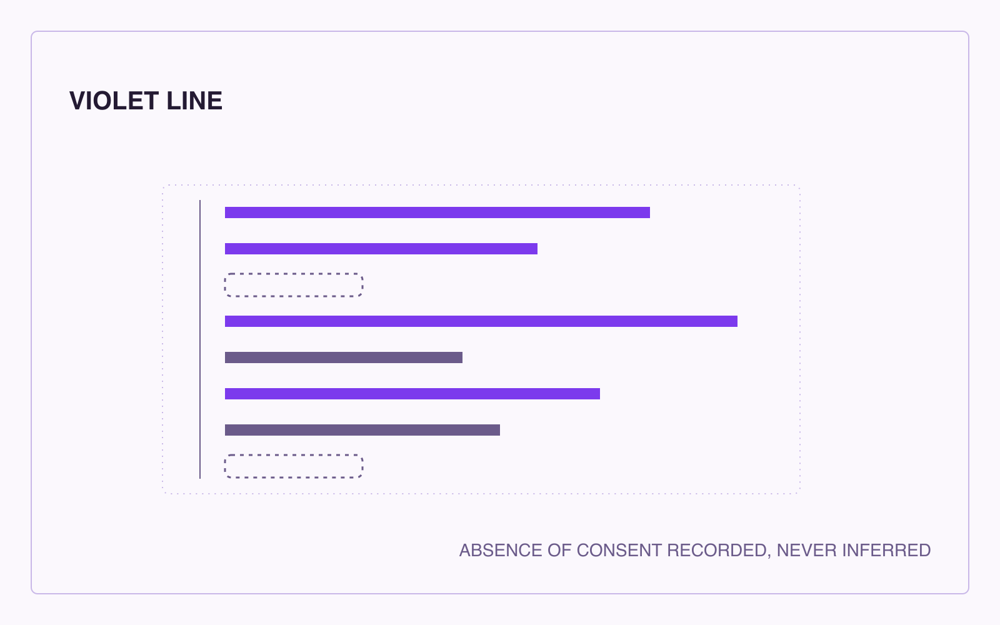

# Full Text: The Violet Line: A Consent Ledger of Affected Parties

> Extracted from `violet_line_combined.pdf`

> 1 figures extracted to `images/`

---

## Page 1

The Violet Line: A Consent Ledger of Affected
Parties
Absence of consent recorded, never inferred
Daniel Ari Friedman
Active Inference Institute
daniel@activeinference.institute
ORCID: 0000-0001-6232-9096
DOI: 10.5281/zenodo.22833488
2026-08-29

## Page 2

Contents
1
Abstract
2
2
Introduction
3
2.1
What this package is . . . . . . . . . . . . . . . . . . . . . . . . . . . . . . . . . . . . . . . . . . . . . . . . . . . . .
3
2.2
What this package is never
. . . . . . . . . . . . . . . . . . . . . . . . . . . . . . . . . . . . . . . . . . . . . . . . .
3
3
Method
4
3.1
Staged review . . . . . . . . . . . . . . . . . . . . . . . . . . . . . . . . . . . . . . . . . . . . . . . . . . . . . . . . .
4
3.2
Fail-closed outcomes . . . . . . . . . . . . . . . . . . . . . . . . . . . . . . . . . . . . . . . . . . . . . . . . . . . . .
4
3.3
Determinism
. . . . . . . . . . . . . . . . . . . . . . . . . . . . . . . . . . . . . . . . . . . . . . . . . . . . . . . . .
4
4
Practices
5
4.1
Recording . . . . . . . . . . . . . . . . . . . . . . . . . . . . . . . . . . . . . . . . . . . . . . . . . . . . . . . . . . .
5
4.2
Honouring . . . . . . . . . . . . . . . . . . . . . . . . . . . . . . . . . . . . . . . . . . . . . . . . . . . . . . . . . . .
5
4.3
Bounding . . . . . . . . . . . . . . . . . . . . . . . . . . . . . . . . . . . . . . . . . . . . . . . . . . . . . . . . . . .
5
5
Formalism
6
6
Examples
7
6.1
A worked review
. . . . . . . . . . . . . . . . . . . . . . . . . . . . . . . . . . . . . . . . . . . . . . . . . . . . . . .
7
6.2
A fully set-aside submission . . . . . . . . . . . . . . . . . . . . . . . . . . . . . . . . . . . . . . . . . . . . . . . . .
7
6.3
Out of scope
. . . . . . . . . . . . . . . . . . . . . . . . . . . . . . . . . . . . . . . . . . . . . . . . . . . . . . . . .
7
7
Limits
8
8
Conclusion
9
9
References
10

## Page 3

1
Abstract
The Violet Line answers one question: who else is affected, and have they agreed? It is the consent-ledger colour of the docxology
line-set. The instrument maintains a ledger of affected parties per project and reviews it against a versioned registry of consent rules.
Its design centre is a refusal: absence of consent is recorded — the UNRECORDED ledger state — and never inferred from silence,
absence, or convenience. Intake is staged and fail-closed: malformed, future-dated, unreadable, and out-of-vocabulary submissions
are set aside with notes, never crashed on and never invented into states. The review returns one of three verdicts — ACCOUNTED,
UNACCOUNTED, OUT_OF_SCOPE — each describing ledger coverage at a review date, never consent, permission, or virtue.
The package is pure standard library, ships deterministic figures with recorded artifact digests, emits witness-register envelopes in
the shared line.report-envelope/1.0 schema, and was admitted to the line set as a stageless colour (2026-09-01).
2

## Page 4

2
Introduction
Every project reaches past its author. Software reaches users, data work reaches the people described, writing reaches the quoted,
and community work reaches everyone in the room — including those who never see the output. The question the Violet Line
poses is the one easiest to defer: who else is affected, and have they agreed?
Existing instruments in the line-set cover refusal (red), strong work (black), aspiration (golden), and absence (white). None of
them holds a ledger of consent. The Violet Line fills that slot with a deliberately narrow instrument: it records what affected
parties actually said, in a form a reviewer can inspect, and it refuses to do the one thing consent instruments are most often bent
toward — manufacturing agreement from silence.
2.1
What this package is
A consent ledger of affected parties per project, with absence of consent recorded, never inferred Definition 4.
2.2
What this package is never
It must never become a proxy for anyone’s consent or a permission-scraping mechanism Proposition 4. A ledger entry records
what someone said at a review date. It is evidence of a statement, not the agreement itself, and ACCOUNTED authorizes nothing
Proposition 4.
3

## Page 5

3
Method
3.1
Staged review
The review runs in two stages. Intake first dispositions every submitted record: KEPT, or one of four set-aside codes (malformed,
unreadable date, future date, unknown state), each carrying a note that preserves the submission Definition 3. Set-aside records
are recorded, never dropped and never invented into states.
Rules are then matched to the project by declared tags and scored against the kept ledger Definition 2. A rule is ACCOUNTED
only when the kept ledger holds the states it requires; any UNRECORDED entry under an applicable rule leaves the review
UNACCOUNTED.
3.2
Fail-closed outcomes
An empty scan set, a submission entirely set aside, and an unscorable registry are all outcomes with explanatory notes, not
exceptions Proposition 3. The instrument never returns a fabricated value because it had nothing to score.
3.3
Determinism
Sorts happen before emit; no dict or set iteration order reaches a reading or a digest. Intake preserves submission order by explicit
design — order is part of the submitter’s declaration — and this exception is declared in code and tested, not accidental.
4

## Page 6

4
Practices
4.1
Recording
The ledger records four states: CONSENTED, DECLINED, WITHDRAWN, and UNRECORDED Definition 1.
Only states
someone actually recorded appear. WITHDRAWN exists because consent can end; a withdrawal that is honoured promptly is the
test of whether the ledger is real.
4.2
Honouring
A recorded decline stays in the ledger — it is never rewritten as “unreachable” or “silent” Proposition 2. A recorded scope bounds
use; a wider use needs a fresh record, not an interpretation.
4.3
Bounding
Consent travels with the material. The downstream rule requires the scope to be visible wherever the material goes, so a downstream
user meets the same boundary the party set Proposition 1.
5

## Page 7

5
Formalism
Definition 4 (Consent ledger). A consent ledger 𝐿for a project 𝑃is a finite set of records 𝑟= (party, state, scope, date) where
state ∈{CONSENTED, DECLINED, WITHDRAWN, UNRECORDED}. Absence of a record for a party is representable only as
the explicit state UNRECORDED; the ledger never infers a state from silence. :::
Definition 3 (Staged intake). Intake is a total function 𝐼∶𝑅→𝑅kept×𝐹mapping each submitted record to a kept record or an
intake finding 𝑓= (code, detail) with code in {KEPT, SET_ASIDE_MALFORMED, SET_ASIDE_UNREADABLE_DATE, SET_ASID
𝐼never raises on malformed input and never invents a state. :::
Definition 2 (Verdict). The verdict 𝑉(𝑃, ℛ) ∈{ACCOUNTED, UNACCOUNTED, OUT_OF_SCOPE} is ACCOUNTED iff
every applicable rule 𝑟∈ℛwith 𝑟.tags ∩𝑃.tags ≠∅is satisfied by the kept ledger; UNACCOUNTED iff some applicable rule is
unsatisfied; OUT_OF_SCOPE iff no rules apply. An empty kept ledger fails closed to UNACCOUNTED. :::
Definition 1 (Recorded states). The state set 𝑆contains exactly the states a party’s record may carry. UNRECORDED ∈𝑆
records that no consent record exists; it is a record of absence, not an inference about the party. :::
Proposition 4 (Non-permission). No verdict grants, implies, or encodes permission. For all 𝑉, projects 𝑃, and actions 𝑎:
𝑉(𝑃, ℛ) = ACCOUNTED ⇏permitted(𝑎∣𝑃). :::
Proposition 3 (Fail-closed). For every empty or fully set-aside scan set, and for every unscorable registry, the review returns
UNACCOUNTED with an explanatory note and zero findings; no path raises an exception or returns a fabricated value. :::
Proposition 2 (Declines persist). A record with state DECLINED remains DECLINED in the ledger under every evaluation
path; no rule rewrites, aggregates, or degrades a recorded refusal. :::
Proposition 1 (Scope travels). Wherever material derived from a party’s record travels, the recorded scope travels with it; a
use outside the recorded scope requires a new consent record, not a reinterpretation. :::
6

## Page 8

6
Examples
6.1
A worked review
A community interview study declares tags research and community and submits two records: interviewees CONSENTED with
scope “quoted, named”, and a moderator UNRECORDED. The review keeps both records, applies the naming, recording, and
decline rules, and returns UNACCOUNTED with reasons naming the UNRECORDED entry. Absence is recorded; nothing is
inferred.
6.2
A fully set-aside submission
The same project submitted with one record whose state reads “maybe” is set aside with an unknown-state note. No kept records
remain; the review returns UNACCOUNTED with a note, not an error.
6.3
Out of scope
A project declaring only the tag writing and submitting no records matches no rule (no rule carries writing without another
tag… in the shipped registry, all rules share at least one non-writing tag) and returns OUT_OF_SCOPE — an outcome, not an
error.
7

## Page 9

7
Limits
• The instrument reviews a ledger someone else chose to submit. It cannot verify that a recorded state was given honestly,
freely, or recently.
• ACCOUNTED is coverage, not safety: a complete ledger of coerced consent is still complete.
• The registry encodes one practice’s current judgement of what consent ledgers require. It is versioned and digestable so that
judgement can be reviewed and contested, not so it can be silently changed.
• Tag matching is coarse: rules apply by declared project tags, and a mistagged project can be reviewed against the wrong
rules. The verdict still fails closed; it may fail closed against the wrong rule set.
• Intake preserves submission order by design; consumers needing a canonical order must sort explicitly before emit.
• This is a stageless colour. The line-set’s four classical stages are allocated; the stageless design is the set’s stated outcome
for any new colour, not a limitation of this instrument alone.
8

## Page 10

8
Conclusion
The Violet Line holds a small, stubborn instrument: a ledger that records what affected parties actually said, keeps refusals and
withdrawals as first-class entries, records absence as absence, and refuses to convert any of it into permission. Its contribution to
the line-set is not a new kind of answer but a new kind of question held open under review: who else is affected, and have they
agreed? — asked with enough discipline that silence can never answer “yes” on anyone’s behalf.
9

## Page 11

9
References
All formalism references in this manuscript resolve to blocks declared in 03b_formalism.md and are bound by tests/test_form
alism_claim_ledger.py through data/formalism_claim_ledger.json. The Violet Line cites no external bibliography in this
release; its lineage is the docxology line-set itself (red, black, golden, white) and the line_set reader’s extensibility contract.
10

---
*Extraction method: pymupdf*
